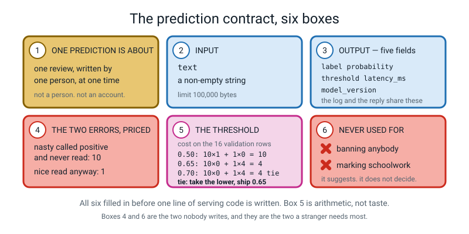
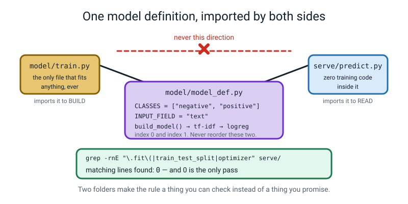
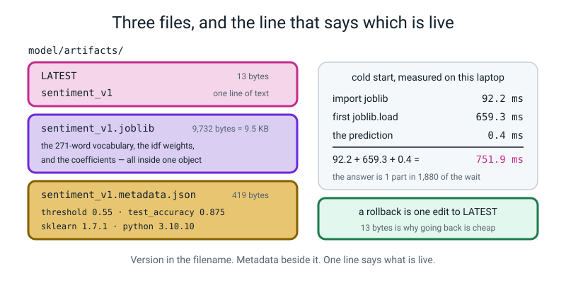
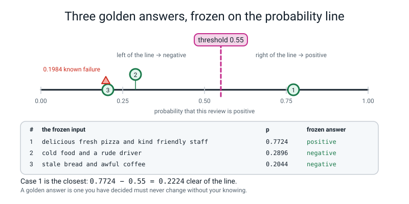
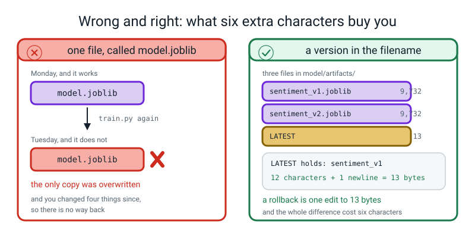
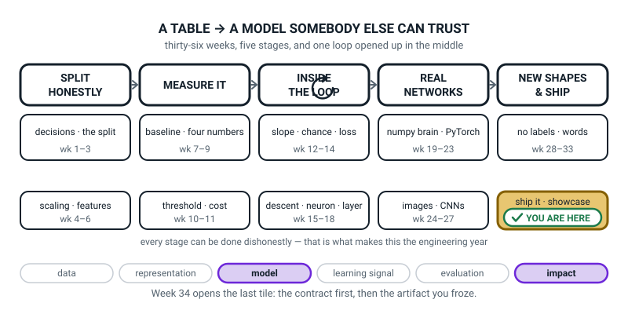
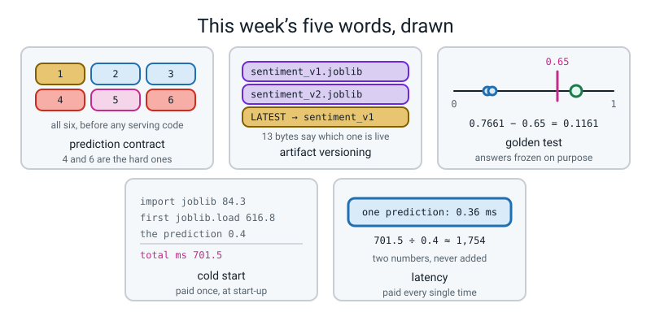

# Week 34 — Ship It, Part 1: The Contract and the Artifact

[⬅ Week 33](week-33.md) · [Course Home](../README.md) · [Next ➡](week-35.md) · [Workbook](../workbook/week-34.md)

---

> ### This week in one sentence
> **A model somebody else can use starts with a written contract — what one prediction is about, what goes in, what comes out, what each mistake costs, where the threshold came from, and what this must never be used for — and none of that is code.**
>
> **By the end of this chapter you will be able to:**
> - **Write a six-box prediction contract** for your own model, with a **cost sum** in box 5 and two specific banned uses in box 6
> - **Freeze your model into a versioned artifact** — `sentiment_v1.joblib`, its metadata file, and a 13-byte `LATEST` — so a brand-new program can predict with **no training code at all**
> - **Run a `predict.py` from a terminal you opened ten seconds ago**, from any folder, and report **two separate times**: the cold start and the latency
> - **Write three golden tests** whose answers must never change, choose them by **how far they sit from your threshold**, and make them pass
>
> **New maths:** none new. One cost sweep and one addition, both using Week 11's expected-cost arithmetic.
>
> **New syntax:** `argparse.ArgumentParser()` · `json.dump` / `json.load` · `time.perf_counter()` · `Path(...).mkdir(parents=True, exist_ok=True)`
>
> **Reading time:** about 40 minutes. **Homework:** about 60 minutes.

---

## 🪝 Start Here

Somebody you have never met sends you a message.

> *"I run a small forum. About four hundred comments a day. I heard you built something that can tell a nasty comment from a nice one, and I would like to use it, please. I am not going to open a notebook. I am not going to run cells in order. I do not know what a vectorizer is and I am not going to learn. **I have a terminal and I have four hundred comments. What do I type?**"*

Take a second and actually answer that. What *would* they type?

Say you find a way — you send them a file, they somehow get it running. **Three weeks later** they come back, and this time they have a complaint from one of their users:

> *"It said my comment was positive and it obviously isn't."*

Now four questions come at you, and they are the four questions this whole term is about.

```text
1.  Which VERSION of your model answered them?
2.  What EXACTLY was sent in?
3.  What PROBABILITY came back, and what was it compared to?
4.  How LONG did it take?
```

Here is the uncomfortable part. If you built your model the way most people build models, the honest answer to all four is **"I don't know."**

- There is only one version of your model and it has no name.
- Nothing was written down, so nobody knows what was sent.
- Nothing recorded the probability, and the threshold was whatever `predict` uses by default.
- Nobody ever measured the time.

**Now notice something about those four questions: not one of them is about accuracy.** Your model might be genuinely good. It is still unusable, and it is unusable for reasons that have nothing to do with machine learning.

There is a name for the gap between *"my model works in my notebook"* and *"a stranger can use it"*. People call it **the last mile**, and it is where most machine learning projects quietly die. Almost nobody teaches it. You are going to build it over three weeks, and today you start — **on paper**.

```text
Everything that goes wrong at eleven o'clock at night is a decision
you did not make in the morning.
```

**Today's deliverable is not a score.** It is a page of writing, three files on a disk, and one command a stranger could type.

---

## 🧠 The Big Idea

This section explains the two things you build before anyone can use your model: the written contract and the frozen artifact. It also covers the two stopwatches and the golden tests you use to check them.

> **📌 About the code in this section.** The blocks below are **illustrations, not files**. Each one carries on from the one above. **The complete runnable files are in 💻 Type This.**

### 1. Six boxes, before you write any serving code

> **Prediction contract** — a written page saying what one prediction is about, what goes in, what comes out, what each kind of mistake costs, what threshold you chose and why, and what this model must never be used for.

It is a *promise*, and the moment you write it down, everything downstream is decided: what your tool prints, what your service returns, what your log records, what your model card has to report.

**Teams that skip this step end up with a command-line tool that prints `POSITIVE`, a service that returns `1`, and a log that records `True`** — three names for one thing, and no way to join them up when somebody complains.


*Figure 34.1 — The prediction contract, six boxes. All six filled in before a line of serving code is written. Box 5 is arithmetic, not taste; boxes 4 and 6 are the two nobody writes, and the two a stranger needs most.*

Four of the boxes are easy. Two of them are the whole lesson.

**Box 1 — what one prediction is about.** This is Week 1's question wearing a suit. For the sentiment engine the answer is *"one review, written by one person, at one time."*

> **🧑‍🏫 If a student asks:** *"why not 'one prediction is about one person'?"* Because then two reviews by the same person would have to agree — and your model has never seen a person in its life. It has only ever seen strings. **Box 1 is where you avoid promising something you cannot do.**

**Box 4 — the two errors, priced.** Not the definition. The *consequence*, in the language of the application, with a number on it:

| The mistake | What actually happens | Price |
|---|---|---|
| a nasty review called **positive** | nobody reads it | **10** |
| a nice review called **negative** | a moderator wastes ten seconds | **1** |

The prices are **relative**, which is all you ever need. And the honest sentence that goes beside them: *"I chose 10 by judgement, not measurement."*

**Box 6 — never used for.** A reasonable person, handed a sentiment model, will try to use it to decide who gets banned. **You are going to tell them not to, in writing, before they ask.** Two specific temptations, not "anything illegal":

```text
✗  deciding who gets banned or muted
✗  marking anybody's schoolwork
```

And the sentence that belongs in every box 6: **this model outputs a suggestion, not a decision.**

### 2. Two folders, one definition, and a rule you can check

> **Artifact** — the one file (or small set of files) that holds a trained model and everything it needs, so that a fresh program can make predictions with **no training code at all**.

Week 3 already taught you `joblib.dump(pipe, "m.joblib")`. This week adds two rules on top, and both exist because both were real disasters.

> **Rule 1 — the fresh-process rule.** Nothing in `serve/` imports anything from `train.py`.
> **Rule 2 — the version rule.** Every artifact has a version in its filename, and every prediction carries that version string.

Here is the project shape that makes Rule 1 real:

```text
ship-it/
├── model/
│   ├── reviews.py        ← your Week 33 corpus. DATA ONLY.
│   ├── model_def.py      ← the shape of the model, imported by BOTH sides
│   ├── train.py          ← the only file allowed to fit anything
│   └── artifacts/        ← the frozen models live here
├── serve/
│   ├── predictor.py      ← the ONE place a prediction happens
│   └── predict.py        ← the command-line tool
└── tests.py              ← three golden tests
```

**Rule 1 sounds like advice. It is not — it is mechanically checkable, and that is the entire point of the two folders:**

```bash
grep -rnE "\.fit\(|train_test_split|DummyClassifier|optimizer" serve/
```

If that prints nothing, `serve/` very probably has no training code in it (it is a strong check, not a proof: the pattern would miss `fit_transform` or `.fit (`, and it also matches comments and strings). If it prints anything, look at each line and treat a real match as a bug — **whether or not the program currently works.** A rule you can check beats a rule you promise.


*Figure 34.2 — One model definition, imported by both sides. `model_def.py` holds the class names, the input field name and the architecture. `train.py` imports it to build; `predict.py` imports it to read. Two folders make Rule 1 a thing you can check instead of a thing you promise.*

`model_def.py` is small on purpose. It holds only the things **both sides must agree about**:

```python
CLASSES = ["negative", "positive"]   # index 0 and index 1. Never reorder this.
INPUT_FIELD = "text"                 # the one field a request must carry
```

If `CLASSES` lived in two files and you swapped the order in one of them, every prediction would silently invert and nothing would raise. **One definition, imported twice.**

### 3. Three files on disk, and thirteen bytes that say which one is live

Rule 2 costs six characters — `_v1` — and buys you the ability to go back.

The first time you retrain and overwrite `model.joblib`, you destroy the model that was working, and by then you have changed four other things too. **`sentiment_v1.joblib`, never `model.joblib`.**

A frozen model is **three** files, not one:

```text
$ ls -l model/artifacts/
   13 LATEST
10228 sentiment_v1.joblib
  421 sentiment_v1.metadata.json
```


*Figure 34.3 — Three files, and the line that says which is live. The 10,228-byte artifact holds the whole 287-column vocabulary, the idf weights and the coefficients. The 421-byte metadata holds the threshold and the library versions. The 13-byte `LATEST` holds the name.*

- **`sentiment_v1.joblib`** — the whole fitted pipeline: the TF-IDF vectorizer *and* the logistic regression. Not the classifier on its own. Week 3's lesson: **the preparation is part of the model.**
- **`sentiment_v1.metadata.json`** — the paperwork. The threshold, the class names, the row counts, the test score, and the library versions. **Every field generated by the script, not typed by a human, which is why it cannot be wrong.**
- **`LATEST`** — one line of text saying which version is live. It contains `sentiment_v1` and a newline. **`12 + 1 = 13` bytes. A rollback is one edit to those thirteen bytes.**

> **💡 Try this:** open your own metadata file and look at `sklearn_version` and `python_version`. They look like bureaucracy. They are the difference between *"it broke after I updated my laptop"* being a two-minute diagnosis and a two-day one.

### 4. Two stopwatches, and three answers you decide must never change

**First, the two stopwatches — because reporting them as one number is the most common latency lie there is.**

> **Latency** — how long **one prediction** took, measured from just before it to just after it.
> **Cold start** — how long it takes a **brand-new program** to get its first answer, with nothing pre-loaded.

These are two completely different numbers. On the laptop this chapter was written on, timing each step in a fresh Python:

```text
import joblib            :   84.3 ms
FIRST joblib.load        :  616.8 ms
SECOND joblib.load       :    0.4 ms
FIRST predict_proba      :    0.4 ms
SECOND predict_proba     :  0.155 ms
```

**Four of those five lines are surprising.** The artifact is 10,228 bytes. Reading 10,228 bytes off a disk takes almost no time. So why did the first `joblib.load` take **616.8 ms**?

**Because unpickling the file makes Python import the scikit-learn machinery the file refers to** — the vectorizer class, the logistic-regression class, the sparse-matrix code. *Importing* is the cost, not *reading*. The proof is the third line: a **second** load of the same file takes **0.4 ms**, because everything is already imported.

So the cold start is an addition:

```text
   84.3   (import joblib)
+ 616.8   (first load — mostly scikit-learn importing itself)
+   0.4   (the actual prediction)
────────
  701.5   ms in total

and   701.5 ÷ 0.4  ≈  1,754
```

**The answer is one part in about 1,754 of the wait.**

> **⚠️ Watch out:** **latency is the one kind of number in this course that will not reproduce.** Every other printed number in Level 3 comes from a seeded run and matches to the last decimal. A latency depends on your laptop, what else is running, and whether the caches are warm. **Your job is not to match my numbers. It is to measure your own and say whose they are.**

**Second, the three frozen answers.**

> **Golden test** — an input whose answer you write down on the day you freeze the model, so that if the answer ever changes you find out in five seconds instead of from a user.

It is the cheapest test that exists: eleven lines. Pick three inputs, assert their labels, print pass or fail, and exit with a code the shell can read.

**Choosing the three is the skill.** A golden test sitting at `p = 0.6501` against a threshold of `0.65` will flip the first time anything at all changes, and then you have built an alarm that cries wolf every time you sneeze. **Pick inputs a long way from the line, and write down how far.**


*Figure 34.4 — Three golden answers, frozen on the probability line. The closest one is `0.7661 − 0.65 = 0.1161` clear, so nothing small can flip it. The greyed triangle at 0.4887 is a known failure, not a golden test.*

| # | input | frozen answer | p | distance from 0.65 |
|---|---|---|---:|---:|
| 1 | `delicious fresh pizza and kind friendly staff` | positive | 0.7661 | `0.7661 − 0.65 = 0.1161` |
| 2 | `cold food and a rude driver` | negative | 0.2110 | `0.65 − 0.2110 = 0.4390` |
| 3 | `stale bread and awful coffee` | negative | 0.2380 | `0.65 − 0.2380 = 0.4120` |

**Test 1 is the most fragile, at 0.1161 clear.** If it ever flips, one of three things happened: the vocabulary changed, the preparation broke, or the threshold moved. **All three are things you want to hear about within five seconds.**

And the level-five move, which one or two people find every year: **freeze a known failure too.** This model calls *"not boring for a single minute"* **negative**, at `p = 0.4887`. That is wrong — it is a positive review. Asserting that it stays wrong is not defeatism. It is how you find out the day it changes, which is the day you can claim you fixed negation.

---

## 🔁 The Idea From Last Week, Used Harder

There is no new mathematics this week. There is one sum, and it is Week 11's sum — **expected cost** — doing the most important job it will ever do: choosing the number your whole project hangs on.

### Twist one — Week 11's cost arithmetic now picks your threshold

Box 4 said a nasty review slipping through costs **10** and a nice review being read for nothing costs **1**. So:

```text
cost(t)  =  10 × (nasty called positive)  +  1 × (nice called negative)
```

Sweep `t` over the **16 validation rows** — never the test rows — count the two kinds of mistake, and work out what each threshold would have cost. Here are the real counts:

| t | nasty → positive | nice → negative | the sum | cost | accuracy |
|---:|---:|---:|---|---:|---:|
| 0.30 | 5 | 0 | `10 × 5 + 1 × 0` | **50** | 0.6875 |
| 0.40 | 3 | 0 | `10 × 3 + 1 × 0` | **30** | 0.8125 |
| 0.50 | 1 | 0 | `10 × 1 + 1 × 0` | **10** | 0.9375 ⬅ best accuracy |
| 0.55 | 1 | 1 | `10 × 1 + 1 × 1` | **11** | 0.8750 |
| 0.60 | 1 | 3 | `10 × 1 + 1 × 3` | **13** | 0.7500 |
| **0.65** | **0** | **4** | `10 × 0 + 1 × 4` | **4** ⬅ smallest | 0.7500 |
| 0.70 | 0 | 4 | `10 × 0 + 1 × 4` | **4** ⬅ smallest | 0.7500 |
| 0.80 | 0 | 7 | `10 × 0 + 1 × 7` | **7** | 0.5625 |

**Do the two that matter out loud.** At 0.50: `10 × 1 + 1 × 0 = 10 + 0 = 10`. At 0.65: `10 × 0 + 1 × 4 = 0 + 4 = 4`. **Four is less than ten, so the line moves up to 0.65.**

Now the part that will make you uncomfortable, and it should.

```text
accuracy at 0.50  =  0.9375
accuracy at 0.65  =  0.7500
```

**You have just chosen the threshold that makes accuracy worse by nearly nineteen points** (`0.9375 − 0.7500 = 0.1875`). Are you mad?

No — and here is the one-sentence reason. **Accuracy treats both mistakes as the same price, and you have just written down that they are not.** You priced a missed nasty comment at ten times a wasted ten seconds. Accuracy cannot see that. The cost sum can.

> **🔢 The maths, slowly:** **when you know the costs, use the costs. Accuracy is the metric for when you don't.** Report both numbers, say which one you optimised, and say why. That is not cheating; it is the opposite of cheating.

**Two honest wrinkles, both worth marks:**

- **0.65 and 0.70 tie at 4.** On these 16 rows they make exactly the same four mistakes, so the sum cannot separate them, and neither can accuracy (`0.7500` both ways). The tie-break is a rule, and you say it out loud: **take the LOWER of the tied thresholds.** A lower line calls fewer reviews negative on every row in between, so it wastes the fewest moderator ten-seconds on nice reviews; the price is that it lets more borderline reviews through, and a higher line would do the opposite. Neither is proven better, which is why it is a stated convention and not a discovery. **Ship 0.65.**
- **Sixteen validation rows means one row is worth 6.25 percentage points.** This threshold is a decision made on very little evidence. **Saying so is part of the answer, not a weakness in it.**

### Twist two — Week 3's `joblib.dump` grows a version and a receipt

Week 3: `joblib.dump(pipe, "m.joblib")`. One line, one file, done.

This week the same line is wrapped in three habits: a version in the name, a metadata file beside it generated by the script, and a pointer file saying which one is live. **The dumping did not get harder. The bookkeeping arrived.**

### Twist three — Week 33's pipeline becomes a thing a stranger can run

Week 33 ended with a fitted pipeline in a variable called `pipe`, alive in one Python session. If that session closed, it was gone.

This week it becomes a file, and the file becomes a command, and the command works from **any folder on the machine** — which is exactly the property nobody checks until a stranger tries it.

---

## 💻 Type This

Build it in eight steps. Each step runs on its own, and the real output is underneath it.

### Step 1 — `argparse`: reading words off the command line

Make a file called `argp.py`:

```python
import argparse

ap = argparse.ArgumentParser(description="Score one review.")
ap.add_argument("text", help="the review to score, in quotes")
ap.add_argument("--threshold", type=float, default=0.65)
ap.add_argument("--json", action="store_true", help="print the whole contract")
args = ap.parse_args()

print("text      :", args.text)
print("threshold :", args.threshold)
print("json flag :", args.json)
```

- `add_argument("text")` — **no dashes means positional**: required, and identified by *where it sits*.
- `add_argument("--threshold", type=float)` — **two dashes means optional**, a named switch. `type=float` makes `argparse` check the value for you.
- `action="store_true"` — this switch carries no value; just record whether it was there.
- `parse_args()` — go and read them.

```text
$ python3 argp.py "cold food and a rude driver"
text      : cold food and a rude driver
threshold : 0.65
json flag : False

$ python3 argp.py "cold food" --threshold 0.7 --json
text      : cold food
threshold : 0.7
json flag : True
```

**And you get a help page you never wrote:**

```text
$ python3 argp.py --help
usage: argp.py [-h] [--threshold THRESHOLD] [--json] text

Score one review.

positional arguments:
  text                  the review to score, in quotes

options:
  -h, --help            show this help message and exit
  --threshold THRESHOLD
  --json                print the whole contract
```

### Step 2 — `json.dump` and `json.load`, and `mkdir`

JSON is a way of writing a dictionary as plain text. `{"threshold": 0.65}` is a Python dictionary *and* a valid JSON document. Make `js.py`:

```python
import json
from pathlib import Path

meta = {"version": "sentiment_v1", "threshold": 0.65,
        "classes": ["negative", "positive"], "test_accuracy": 1.0}

OUT = Path("artifacts")
OUT.mkdir(parents=True, exist_ok=True)      # Python makes files, never folders

with open(OUT / "demo.metadata.json", "w") as f:
    json.dump(meta, f, indent=2)            # data FIRST, file SECOND
    f.write("\n")

with open(OUT / "demo.metadata.json") as f:
    back = json.load(f)

print(type(back).__name__, "with", len(back), "keys")
print("threshold read back:", back["threshold"], type(back["threshold"]).__name__)
print("bytes on disk:", (OUT / "demo.metadata.json").stat().st_size)
```

- `Path("artifacts")` is a location on disk. `Path("model") / "artifacts"` means the folder *inside* the folder — **the `/` is doing a job here, not dividing anything.**
- `mkdir(parents=True, exist_ok=True)` — make it, make any missing folders above it, and if it is already there say nothing.
- `"w"` means open for writing and wipe whatever was there. No `"w"` means open for reading.

```text
dict with 4 keys
threshold read back: 0.65 float
bytes on disk: 128
```

```text
$ cat artifacts/demo.metadata.json
{
  "version": "sentiment_v1",
  "threshold": 0.65,
  "classes": [
    "negative",
    "positive"
  ],
  "test_accuracy": 1.0
}
```

**`0.65` went out as a number and came back as a `float`, not a string.** That is why the threshold lives in JSON and not in a comment.

### Step 3 — freeze the artifact

`model/train.py` is the only file in the project allowed to call `.fit()`. Its last job is to write the three files:

```python
    tag = "%s_v%s" % (args.name, args.version)          # "sentiment_v1"
    joblib.dump(pipe, ARTIFACTS / (tag + ".joblib"))

    meta = {
        "version": tag,
        "created_utc": datetime.now(timezone.utc).strftime("%Y-%m-%dT%H:%M:%SZ"),
        "task": "binary sentiment of short English reviews",
        "classes": CLASSES,
        "threshold": args.threshold,
        "input_field": INPUT_FIELD,
        "n_train": len(y_tr), "n_val": len(y_val), "n_test": len(y_te),
        "test_accuracy": round(float(acc), 4),
        "test_f1_positive": round(float(f1), 4),
        "ngram_max": args.ngram_max, "C": args.C,
        "sklearn_version": sklearn.__version__,
        "python_version": platform.python_version(),
    }
    with open(ARTIFACTS / (tag + ".metadata.json"), "w") as f:
        json.dump(meta, f, indent=2)
        f.write("\n")
    with open(ARTIFACTS / "LATEST", "w") as f:
        f.write(tag + "\n")
```

Run it. **Under two seconds — mine took 0.77 s.**

```text
$ python3 model/train.py --version 1
rows: train 48  val 16  test 16
baseline accuracy on val: 0.5000
val  accuracy at threshold 0.65: 0.7500
test n=16  accuracy=0.8125  f1(pos)=0.7692
wrote sentiment_v1.joblib (10 KB) + metadata; LATEST -> sentiment_v1
```

**Read line two first.** The baseline is `0.5000` — 40 positive reviews and 40 negative, so a model that always says the same thing is right half the time. **Every number below that line only means something next to it.**

### Step 4 — look at what you just made

```text
$ ls -l model/artifacts/
   13 LATEST
10228 sentiment_v1.joblib
  421 sentiment_v1.metadata.json

$ cat model/artifacts/sentiment_v1.metadata.json
{
  "version": "sentiment_v1",
  "created_utc": "2026-09-22T19:36:31Z",
  "task": "binary sentiment of short English reviews",
  "classes": [
    "negative",
    "positive"
  ],
  "threshold": 0.65,
  "input_field": "text",
  "n_train": 48,
  "n_val": 16,
  "n_test": 16,
  "test_accuracy": 0.8125,
  "test_f1_positive": 0.7692,
  "ngram_max": 2,
  "C": 4.0,
  "sklearn_version": "1.7.1",
  "python_version": "3.10.10"
}
```

**`created_utc` is the one line that is supposed to differ from mine.** Everything else was generated by the script, which is why it cannot be wrong.

### Step 5 — `predictor.py`, with both stopwatches

This is the **one place in the whole project where a prediction happens.** Everything else calls it.

```python
class Predictor:
    """Loads one artifact ONCE, then answers questions about it."""

    def __init__(self, version=None, threshold=None):
        self.version = resolve_version(version)
        art = ARTIFACTS / (self.version + ".joblib")
        met = ARTIFACTS / (self.version + ".metadata.json")
        if not art.exists():
            raise FileNotFoundError("No artifact at %s" % art)

        t0 = time.perf_counter()
        self.pipeline = joblib.load(art)                  # stopwatch 1: loading
        self.load_ms = (time.perf_counter() - t0) * 1000
        ...
```

`time.perf_counter()` returns a number of seconds counted from some arbitrary moment, so the number on its own is meaningless. **What means something is the difference between two readings**, and `× 1000` turns it into milliseconds, which is the unit everybody reports.

And the second stopwatch, round the prediction only:

```python
    def predict_one(self, text):
        """One string in, one dictionary out. This dictionary IS the contract."""
        t0 = time.perf_counter()
        prob = float(self.pipeline.predict_proba([text])[0, 1])
        latency_ms = (time.perf_counter() - t0) * 1000     # stopwatch 2
        if prob >= self.threshold:
            label = self.classes[1]
        else:
            label = self.classes[0]
        return {
            "model_version": self.version,
            "input": text,
            "label": label,
            "probability": round(prob, 4),
            "threshold": self.threshold,
            "latency_ms": round(latency_ms, 2),
        }
```

**Six keys out: the five fields box 3 promised, plus `input` echoed back so a log line can be matched to a complaint.** The dictionary is not a convenience — **it is the contract, in code.**

### Step 6 — the CLI, from a cold terminal

`serve/predict.py` is nineteen lines and contains three of this week's four new constructs. Now **open a brand-new terminal window** and run it:

```text
$ python3 serve/predict.py "the pizza was hot and delicious"
positive p=0.7450  (threshold 0.65, model sentiment_v1, 0.39 ms, loaded in 613 ms)

$ python3 serve/predict.py "cold food and a rude driver"
negative p=0.2110  (threshold 0.65, model sentiment_v1, 0.36 ms, loaded in 620 ms)

$ python3 serve/predict.py --json "the pizza was not delicious"
{
  "model_version": "sentiment_v1",
  "input": "the pizza was not delicious",
  "label": "negative",
  "probability": 0.5462,
  "threshold": 0.65,
  "latency_ms": 0.36
}
```

**Brand-new terminal. Nothing pre-loaded. No notebook, no cells, no order to run them in. One line, and an answer.** That is exactly what the stranger at the door asked for.

> **💡 Try this:** run it from a completely different folder — `cd /` first, then give the full path to the script. It still works, and the reason is one line inside the code: `Path(__file__).resolve().parent`. **`__file__` is the path of the running script and `.resolve()` makes it absolute, so the program does not care which folder you were standing in.**

### Step 7 — the grep that proves Rule 1

```text
$ grep -rnE "\.fit\(|train_test_split|DummyClassifier|optimizer" serve/
$
```

**Nothing. That blank line is the evidence** — not a promise, evidence. In your write-up you paste the command *and* its empty output.

### Step 8 — three golden tests, and the exit code

```python
"""tests.py — three golden tests. Run: python3 tests.py"""
import sys
from pathlib import Path

sys.path.insert(0, str(Path(__file__).resolve().parent / "serve"))
from predictor import Predictor

GOLDEN = [
    ("delicious fresh pizza and kind friendly staff", "positive"),
    ("cold food and a rude driver",                   "negative"),
    ("stale bread and awful coffee",                  "negative"),
]

p = Predictor()
failures = 0
for text, expected in GOLDEN:
    out = p.predict_one(text)
    ok = out["label"] == expected
    if not ok:
        failures = failures + 1
    print("%-4s expected=%-8s got=%-8s p=%.4f  <<%s>>"
          % ("PASS" if ok else "FAIL", expected, out["label"], out["probability"], text))

print()
print("%d/%d passed  (model %s, threshold %.2f)"
      % (len(GOLDEN) - failures, len(GOLDEN), p.version, p.threshold))
sys.exit(1 if failures else 0)
```

```text
$ python3 tests.py
PASS expected=positive got=positive p=0.7661  <<delicious fresh pizza and kind friendly staff>>
PASS expected=negative got=negative p=0.2110  <<cold food and a rude driver>>
PASS expected=negative got=negative p=0.2380  <<stale bread and awful coffee>>

3/3 passed  (model sentiment_v1, threshold 0.65)

$ echo $?
0
```

**`echo $?` prints the exit code of the last command**, and that number is how one program tells another program that something is wrong: `0` means fine, anything else means trouble. Break a golden test on purpose and `echo $?` prints `1`. **That is the whole of automated testing, in one number.**

### The complete `serve/predict.py`

```python
"""predict.py — the command-line tool. Zero training code."""
import argparse
import json
import sys
from pathlib import Path

sys.path.insert(0, str(Path(__file__).resolve().parent))
from predictor import Predictor


def main():
    ap = argparse.ArgumentParser(description="One sentiment prediction for one review.")
    ap.add_argument("text", help="the review to score, in quotes")
    ap.add_argument("--version", default=None, help="artifact name, or 'latest'")
    ap.add_argument("--threshold", type=float, default=None)
    ap.add_argument("--json", action="store_true", help="print the whole contract as JSON")
    args = ap.parse_args()

    p = Predictor(version=args.version, threshold=args.threshold)
    out = p.predict_one(args.text)

    if args.json:
        print(json.dumps(out, indent=2))
    else:
        print("%-8s p=%.4f  (threshold %.2f, model %s, %.2f ms, loaded in %.0f ms)"
              % (out["label"], out["probability"], out["threshold"],
                 out["model_version"], out["latency_ms"], p.load_ms))


if __name__ == "__main__":
    main()
```

**Runtime: about 0.77 seconds from a cold terminal, and about 0.4 ms of that is the prediction.** Nothing this week is slow. Time yours anyway.

---

## 🔍 Worked Examples

Three full runs: where the threshold came from, the same contract for the digits CNN, and a second version of the model.

### Worked Example 1 — Where 0.65 came from, worked from the probabilities up

The sixteen validation probabilities, sorted, straight out of the model, each with its true label (`+` nice, `−` nasty):

```text
0.1745−  0.2168−  0.3000−  0.3613−  0.3737−  0.4028−  0.4235−  0.5316+
0.5760+  0.5762+  0.6025+  0.6143−  0.7057+  0.7359+  0.7724+  0.8186+
```

Eight of those rows are genuinely positive and eight genuinely negative. Now count the mistakes at `t = 0.50` by eye: everything at or above 0.50 is called positive. That is the last nine numbers — and **one of them is actually a nasty review** (`0.6143−`), so `nasty → positive = 1`. Below the line **every** nice review is still where it belongs, so `nice → negative = 0`.

```text
cost(0.50) = 10 × 1 + 1 × 0 = 10 + 0 = 10
```

Move the line up to 0.65. Now `0.6143` falls below it — the one expensive mistake is gone. But so do `0.5316, 0.5760, 0.5762, 0.6025`, which are all nice reviews, so four nice reviews are dumped on the moderator:

```text
cost(0.65) = 10 × 0 + 1 × 4 = 0 + 4 = 4
```

**4 < 10, so ship 0.65.** And the sanity check that matters: the new `nice → negative` count is `0 + 4 = 4`, which is exactly the four rows we just watched fall below the line, and it agrees with the table. Slide the line on to `0.70` and nothing else crosses it (the next probability up is `0.7057`), so the cost is `4` again: **two thresholds tie, and the rule is to take the lower one — 0.65.** Say that sentence out loud, because "why not 0.70?" is a fair question and the answer is a rule, not a feeling.

> **🧑‍🏫 If a student asks:** *"Module 3 had a rule of thumb — the threshold should be the expensive cost divided by the total, `10 ÷ 11 = 0.91`. Why isn't it 0.91?"* **Best question of the week.** The rule of thumb assumes well-calibrated probabilities and enough rows for the trade-off to be smooth. Here there are 16 rows, and **by 0.65 there are already zero expensive errors left to remove**, so every step further up buys only cheap errors: the cost stays flat at 4 until 0.70 and then climbs to 7 at 0.80. **When a rule of thumb and a measurement disagree, the measurement wins — and you write down why.**

### Worked Example 2 — The same contract for the digits CNN (Path B)

If you shipped your Week 26/27 digit reader instead, everything above holds and **three things change.** Here is the real run:

```text
$ python3 model/train.py --version 1
rows: train 1257  test 540
learnable numbers: 1898
trained in 2.2s   test accuracy 0.9778  (528 of 540)
wrote digits_v1.pt (10 KB) + metadata; LATEST -> digits_v1
```

**Change 1 — box 1 is a different noun.** *"One prediction is about one 8×8 picture of one handwritten digit."*

**Change 2 — box 3 gains ten classes and loses the threshold entirely.** `argmax` has no dial. There is nothing to sweep, so **box 5 is empty** — and noticing that is the sharpest observation available this week. The honest replacement is a **confidence floor**: refuse to answer below, say, 0.60, and say how many predictions that would have refused.

```text
$ python3 serve/predict.py "[0, 0, 5, 13, 9, 1, 0, 0, 0, 0, 13, 15, 10, 15, 5, 0, ... ]"
digit 0   p=0.9996  (model digits_v1, 0.85 ms, loaded in 3 ms)
```

**Change 3 — `model_def.py` matters more, not less.** A torch artifact is only the *weights*; the architecture has to be rebuilt identically before `load_state_dict`. Build it wrong — say 16 channels in the first conv where the saved model had 8 — and you get this, which is a real message from a real run:

```text
RuntimeError: Error(s) in loading state_dict for Sequential:
	size mismatch for 0.weight: copying a param with shape torch.Size([8, 1, 3, 3]) from checkpoint, the shape in current model is torch.Size([16, 1, 3, 3]).
	size mismatch for 0.bias: copying a param with shape torch.Size([8]) from checkpoint, the shape in current model is torch.Size([16]).
	size mismatch for 3.weight: copying a param with shape torch.Size([16, 8, 3, 3]) from checkpoint, the shape in current model is torch.Size([16, 16, 3, 3]).
```

**That message is a gift: it names both shapes.** `[8, 1, 3, 3]` was saved; `[16, 1, 3, 3]` was expected. Week 25's question all over again — which one did you mean? **One definition, imported by both sides, and this cannot happen.**

And notice the timing is the other way round: `load_state_dict` took **3 ms**, far less than joblib's 617 — but the whole command still takes about half a second, **because `import torch` dominates and the stopwatch never saw it.** So say the true thing: *"`load_ms` measures loading the weights, not starting Python. The only honest cold-start number is the whole command's wall clock."*

### Worked Example 3 — A `v2` you reject in writing

Retrain with a smaller `C` and see what happens. **This is the most grown-up thing in the week, because the answer is "no".**

```text
$ python3 model/train.py --version 2 --C 1.0
rows: train 48  val 16  test 16
baseline accuracy on val: 0.5000
val  accuracy at threshold 0.65: 0.5000
test n=16  accuracy=0.5000  f1(pos)=0.0000
wrote sentiment_v2.joblib (10 KB) + metadata; LATEST -> sentiment_v2
```

Both models on the **same 16 test rows**, at the **same shipped threshold** of 0.65:

| version | change | val accuracy | test accuracy | test F1 (pos) | cost on val |
|---|---|---:|---:|---:|---:|
| `sentiment_v1` | `C = 4.0` | **0.7500** | **0.8125** | **0.7692** | **4** |
| `sentiment_v2` | `C = 1.0` | 0.5000 | 0.5000 | 0.0000 | 8 |

`f1(pos) = 0.0000` is not a typo. **v2 never says "positive" about anything.** Its highest probability on the validation rows is `0.6453` and on the test rows `0.6023`, both under the line, so every one of the 32 rows comes back negative — right on the 16 that are negative, wrong on the 16 that are positive, which is exactly `0.5000`.

**And now the interesting part, which is the diagnosis rather than the verdict.** `C = 1.0` is not a worse *model* — at a threshold of 0.50 it scores `1.0000` on test, exactly what v1 scores there. What changed is the **probability scale**: a smaller `C` squashes every probability towards 0.5, so a threshold that was comfortable for v1 now sits above nearly everything v2 says. The honest fairness check is to give v2 its *own* sweep with the same cost rule, the same 16 validation rows and the same tie-break:

| t | nasty → positive | nice → negative | cost | val accuracy |
|---:|---:|---:|---:|---:|
| 0.50 | 1 | 0 | **10** | 0.9375 |
| 0.55 | 1 | 4 | **14** | 0.6875 |
| **0.60** | **0** | **5** | **5** ⬅ smallest | 0.6875 |
| 0.65 | 0 | 8 | **8** | 0.5000 |

**v2's best threshold is 0.60, and its best cost is 5.** v1's best is 4. At its own best line v2 scores `0.6250` on test with an F1 of `0.4000`, against v1's `0.8125` and `0.7692`. So **even v2 on its own terms is not better than v1 on this cost rule** — it needs a different threshold and still loses — and swapping the model without re-sweeping would have shipped a tool that answers "negative" to everything.

Watch what the swap does to the golden tests, which are the alarm bell for exactly this:

| # | p under v1 | margin from 0.65 | p under v2 | margin from 0.65 |
|---|---:|---:|---:|---:|
| 1 | 0.7661 | 0.1161 | 0.6198 | **−0.0302 (wrong side)** |
| 2 | 0.2110 | 0.4390 | 0.3635 | 0.2865 |
| 3 | 0.2380 | 0.4120 | 0.3818 | 0.2682 |

**Test 1 fails.** The model says `0.6198` for *"delicious fresh pizza and kind friendly staff"*, which is `0.0302` short of the line, so it is called negative. That is five seconds of `tests.py` doing the one job it exists for:

```text
$ echo "sentiment_v2" > model/artifacts/LATEST
$ python3 tests.py
FAIL expected=positive got=negative p=0.6198  <<delicious fresh pizza and kind friendly staff>>
PASS expected=negative got=negative p=0.3635  <<cold food and a rude driver>>
PASS expected=negative got=negative p=0.3818  <<stale bread and awful coffee>>

2/3 passed  (model sentiment_v2, threshold 0.65)

$ echo $?
1
```

So write the rejection, and then do the last step, which is the actual skill:

```text
$ echo "sentiment_v1" > model/artifacts/LATEST
$ python3 tests.py
PASS expected=positive got=positive p=0.7661  <<delicious fresh pizza and kind friendly staff>>
PASS expected=negative got=negative p=0.2110  <<cold food and a rude driver>>
PASS expected=negative got=negative p=0.2380  <<stale bread and awful coffee>>

3/3 passed  (model sentiment_v1, threshold 0.65)
```

**A rollback was one edit to thirteen bytes, and the golden tests confirmed it landed.** That is the whole reason for `LATEST`.

---

## 🐞 When It Breaks

These are the real error messages you can expect this week, with what each one means and how to fix it.

### Break 1 — the two arguments the wrong way round

```python
with open(ARTIFACTS / "sentiment_v1.metadata.json", "w") as f:
    json.dump(f, meta)          # <-- wrong way round
```

```text
Traceback (most recent call last):
  File "/private/tmp/sg34/jsbad.py", line 4, in <module>
    json.dump(f, meta)
  File "/.../json/__init__.py", line 179, in dump
    for chunk in iterable:
  File "/.../json/encoder.py", line 179, in default
    raise TypeError(f'Object of type {o.__class__.__name__} '
TypeError: Object of type TextIOWrapper is not JSON serializable
```

**What it means.** `TextIOWrapper` is Python's name for **an open file**. The message is saying *"you asked me to turn a file into text, and I don't know how."* A good message, once you know that one word.

**The fix.** `json.dump(meta, f)` — **the data first, the file second.** Everybody does this once.

### Break 2 — Python makes files, never folders

```python
ART = Path("brand_new_folder")
with open(ART / "sentiment_v1.metadata.json", "w") as f:
    json.dump({"threshold": 0.65}, f)
```

```text
Traceback (most recent call last):
  File "/private/tmp/sg34/nomk.py", line 4, in <module>
    with open(ART / "sentiment_v1.metadata.json", "w") as f:
FileNotFoundError: [Errno 2] No such file or directory: 'brand_new_folder/sentiment_v1.metadata.json'
```

**What it means.** The *file* could be created. The *folder* could not, because nothing asked for it. **Python will happily create a file; it will never create a folder for you.**

**The fix.** `ART.mkdir(parents=True, exist_ok=True)` — and it must come **before** anything is written, not after.

### Break 3 — the quotes are not decoration

```text
$ python3 serve/predict.py cold food and a rude driver
usage: predict.py [-h] [--version VERSION] [--threshold THRESHOLD] [--json]
                  text
predict.py: error: unrecognized arguments: food and a rude driver
```

**What it means.** The shell split your sentence at every space, so `argparse` received **six** things when it was expecting **one**. It took `cold` and refused the rest.

**The fix.** `python3 serve/predict.py "cold food and a rude driver"`. **The quotes are what turn six words into one argument.**

And notice *when* it complained: **before a single line of your code ran.** `argparse` printed a usage message you never wrote. Two more free gifts of the same kind:

```text
$ python3 serve/predict.py
predict.py: error: the following arguments are required: text

$ python3 serve/predict.py "x" --threshold abc
predict.py: error: argument --threshold: invalid float value: 'abc'
```

That second one is worth the one word it cost: **`type=float` bought you a type check on the command line.**

### Two that never error, and cost far more

| What you see | What is actually wrong |
|---|---|
| The tool prints a label, and `loaded in 0 ms` | Both `perf_counter()` readings are on the **same side** of the work, so the stopwatch measured nothing. **A latency of exactly 0 is never real.** |
| Every review comes back `negative` | A leftover `--threshold 0.95`, or a hand-edited metadata file. The CLI already prints the threshold next to every answer — **so read your own output.** |

---

## 🎲 What We Did In Class

**Contract Writing, In Silence.** If you missed it, you can do the whole thing at home with a pen — this is the one week of the year that needs no electricity.

**Part 1 — twelve minutes, silent, pens only.** Six boxes for **your own** model. Two rules:

- **Box 5 must contain a sum**, not a number on its own.
- **Box 6 must name two things somebody would actually try** — not "anything illegal". Something *tempting*.

**Part 2 — the cross-examination.** Every contract was read aloud, and the room was allowed **two questions and only two**:

```text
1.  What is one prediction about?
2.  What must this never be used for?
```

Not accuracy. Not which model. **Those two, because they are the two the stranger at the door would ask.** If you cannot answer question 1 with a countable noun, go back to box 1.

Then, as each one passed, the box 1 noun went up on the wall in a list: `review · comment · digit image · photo`. **That column is the point of the whole activity** — the unit of prediction is a *choice*, and it differs between projects.

**Then we froze the artifact** (Step 3 above), listed the folder, printed the metadata, and ran the golden tests on the shared screen. Two mistakes were made on purpose: `json.dump(f, meta)` the wrong way round, and the CLI run without quotes. **Both are in 🐞 When It Breaks, with their real messages.**

**The three things to have at the end:** an A4 contract with writing in all six boxes · three files in `model/artifacts/` with a version in two of the names · `3/3 passed`.

---

## 💬 Talk About It

Three questions to argue out loud with a partner or at the dinner table. Each has a hint underneath.

**1. Your model is 10 kilobytes. Does versioning really matter for something that small?**
*Hint: think about which files you are most likely to overwrite without thinking — the big careful ones, or the small ones you can rebuild in a second? Then ask what "rebuild in a second" is worth when you have changed four things since.*

**2. Somebody says "isn't all this just admin? Where's the machine learning?"**
*Hint: they are partly right, and the honest answer says so. Then point at box 4 and ask them what a mistake costs. Which box in the contract has a judgement in it that no machine can make for you?*

**3. You chose the threshold that makes your accuracy 19 points worse. Defend that to somebody who only knows accuracy.**
*Hint: what does accuracy assume about the price of the two mistakes? Where in your contract did you write down that this assumption is false?*

---

## ⚠️ Don't Get Tricked

Four claims that sound sensible this week. Each is shown as a wrong version and a right version.

### Trick 1 — "the artifact is the model"

**Wrong:** dump `pipe.named_steps["logisticregression"]`, because that is "the model".
**Right:** dump the **whole fitted pipeline.** The vectorizer is part of the model, not a step you remember to do first.

Get this wrong and the error is immediate and confusing:

```text
ValueError: Expected 2D array, got 1D array instead: array=['cold food and a rude driver'].
```

**That is the classifier being handed raw text with no vectorizer in front of it.** The test sentence to use on yourself: *"if I deleted my notebook right now, could a fresh program still predict correctly?"* If the answer involves remembering to lowercase something first, **your artifact is incomplete.**

### Trick 2 — "0.5 is the natural threshold"

**Wrong:** 0.5, because it is the middle.
**Right:** 0.5 is the middle of a *number line*. It is not the middle of a *decision*. **0.5 is what you ship when you have not decided. 0.65 is what you ship when you have** — and the difference between those two sentences is a sum with a `×` and an `=` in it.

### Trick 3 — "one file called `model.joblib` is fine, I'll be careful"


*Figure 34.5 — Wrong and right: what six extra characters buy you. On the left one file, overwritten on Tuesday, and no way back. On the right three files, where `LATEST` holds `sentiment_v1` — twelve characters plus one newline, `12 + 1 = 13` bytes — so a rollback is one edit.*

**Versioning is not for big teams.** It is for **one person with one laptop**, because one person with one laptop is the person most likely to overwrite the only copy of the thing that worked. Six characters.

### Trick 4 — "loading the model per request makes it 200 times slower"

**Wrong:** repeat the number you read online.
**Right:** measure it on *your* artifact and say your own number.

You will read everywhere that loading inside the request handler turns a 2 ms prediction into a 400 ms one. On this 10-kilobyte artifact, in a process that is already warm, **a reload costs 0.4 ms against a 0.155 ms prediction** — about three times, not two hundred. The rule *"load once at start-up"* is still right, and here is the honest reason: **the cost you are avoiding is the cold start, and it grows with the model.** On a hundred-megabyte model it really is thousands of times.

**Say the true thing:** *"load once — and here is my measured number, which is smaller than the one you will read online, because my model is ten kilobytes."*

---

## 🌍 Where You've Seen This

The same ideas show up in everyday tools you already use.

- **App updates that get pulled.** "Version 17.4.1 is rolling back to 17.4" is somebody editing the equivalent of your `LATEST` file.
- **The little version string in a phone's Settings → About.** That is `model_version` in your reply, doing the same job: making a complaint answerable.
- **`--help` on any command-line tool you have ever used.** That page is `argparse` (or its equivalent), generated from the arguments, never hand-written.
- **`.json` config files everywhere** — browser bookmarks, game save settings, VS Code preferences. Your metadata file is exactly that idea: structured facts as plain text a human *and* a program can read.
- **"Terms of Service" and the acceptable-use section.** That is box 6 with lawyers attached.
- **Cookie recipes on a packet.** Unit of prediction (one biscuit), inputs with types (200 g flour), output, and "not suitable for nut allergies" — which is box 6.

---

## 🧭 Where This Fits

The gold box has moved for the last time. **Look at the map: nothing on it is dashed any more.** Every
other box is finished, and the one you are standing in is the tenth of ten. It is also the first week all
year where the thing you hand in is **not a score** — it is a contract on paper and an artifact on disk.



*Figure 34.0 — The pipeline in Week 34. The last tile, `ship it · showcase`, and not one dashed box left on
the page. The ↻ on stage three is black, as it has been since Week 12.*

| | |
|---|---|
| **The mental model you now own** | **Shipping starts in writing.** Six boxes, before any serving code: what one prediction is about, what goes in, what comes out, what each of the two errors costs, where the threshold came from — `10 × 1 + 1 × 0 = 10` against `10 × 0 + 1 × 4 = 4` — and what this must never be used for. **Then** the artifact is frozen, given a version in its filename and a metadata file beside it, and put behind a CLI that runs from a cold terminal with three golden tests passing. |
| **The one question it answers** | *"What am I actually handing over?"* — and the honest answer is never "the model". It is three files, a command, and a page of writing that says where it breaks. |
| **What it plugs into** | Week 1's five decisions, which become boxes 1, 2 and 3 of the contract almost word for word — you wrote this page in September without knowing it. Week 11's cost table, which is box 5. And Week 3's `joblib` artifact and Week 23's `state_dict`, which are the same trick as `sentiment_v1.joblib`, except now versioned, documented and tested. |
| **What carries forward** | Week 35 puts a service, a log and a card in front of this artifact. Week 36 hands the whole thing to a stranger, from a terminal opened in front of the room — and `grep -rnE "\.fit\(" serve/` printing nothing is the evidence you will be asked for. |
| **Spiral thread** | 📦 **Model** and 🌍 **Impact** — model, because the artifact *is* the model now, frozen and named. Impact, because box 6 is the first thing in this course whose whole content is **what you refuse to let it be used for**. |

> **💡 Try this:** on the inside cover, under stage five, write the two times separately: how long the
> model took to **load** and how long one **prediction** took. Never add them. Anybody who reports one
> number for both has hidden something, and in Week 36 somebody will ask you for both.

---

## 🔑 Remember This

The six things to keep from this week, a syntax card to copy from, and a one-line maths reminder.

- **The contract comes first, and box 5 is a sum.** Where the threshold came from is a *comparison*, not a number: `10 × 1 + 1 × 0 = 10` against `10 × 0 + 1 × 4 = 4`.
- **Two folders make Rule 1 checkable.** `grep -rnE "\.fit\(" serve/` printing nothing is **evidence**; a promise is not.
- **An artifact is three files, and one of them is thirteen bytes.** A version in the filename costs six characters and buys you the ability to go back.
- **Two stopwatches, two numbers, never added.** `84.3 + 616.8 + 0.4 = 701.5 ms` once, at start-up; `0.4 ms` every single prediction. Anybody who reports one number has hidden something.
- **Pick golden tests by their distance from the threshold.** `0.7661 − 0.65 = 0.1161` clear is a test; `0.6501` against `0.65` is an alarm that cries wolf.
- **A perfect-looking upgrade you reject in writing scores higher than one you ship because it is newer.**

### Syntax reminder card

```python
# ---- reading words off the command line --------------------------------
ap = argparse.ArgumentParser(description="...")
ap.add_argument("text")                            # positional: required
ap.add_argument("--threshold", type=float, default=None)   # optional + typed
ap.add_argument("--json", action="store_true")     # a switch, no value
args = ap.parse_args()                             # args.text, args.json
# missing it -> predict.py: error: the following arguments are required: text
# no quotes  -> predict.py: error: unrecognized arguments: food and a rude

# ---- a dictionary to disk and back, as plain text ----------------------
with open(path, "w") as f:
    json.dump(meta, f, indent=2)      # DATA first, FILE second
with open(path) as f:
    meta = json.load(f)               # comes back a dict, floats still floats
# backwards -> TypeError: Object of type TextIOWrapper is not JSON serializable

# ---- a stopwatch. The difference means something; the reading doesn't ---
t0 = time.perf_counter()
prob = pipe.predict_proba([text])
latency_ms = (time.perf_counter() - t0) * 1000     # 1000 ms in a second

# ---- make the folder. Python makes files, never folders -----------------
ARTIFACTS = Path(__file__).resolve().parent / "artifacts"
ARTIFACTS.mkdir(parents=True, exist_ok=True)
# no mkdir -> FileNotFoundError: [Errno 2] No such file or directory: '...'
# __file__ + .resolve() is what makes it work from ANY folder

# ---- the exit code is how one program tells another it failed ----------
sys.exit(1 if failures else 0)        # then in the shell:  echo $?
```

### One-line maths reminder

**`cost = (price of the expensive mistake) × (how many) + (price of the cheap one) × (how many)`** — sweep the threshold on the **validation** rows, pick the smallest total, and write the sum down.

---

## 📓 New Words


*Figure 34.6 — This week's five words, drawn. Six contract boxes, three files on disk with a 13-byte pointer, three answers frozen on the probability line, a cold start that adds to `84.3 + 616.8 + 0.4 = 701.5 ms`, and a latency of 0.36 ms paid every single time.*

| Word | What it means | Example |
|---|---|---|
| **prediction contract** | A written page: what one prediction is about, what goes in, what comes out, what each mistake costs, the threshold and why, and the banned uses. | Six boxes on one sheet of A4, finished before any serving code exists. |
| **artifact versioning** | Putting a version in the artifact's filename, and a pointer file saying which version is live. | `sentiment_v1.joblib`, `sentiment_v2.joblib`, and `LATEST` holding `sentiment_v1`. |
| **golden test** | An input whose answer you write down on the day you freeze the model, so you find out in five seconds if it ever changes. | `"stale bread and awful coffee"` must stay `negative`; it sits `0.4120` clear of the threshold. |
| **cold start** | How long a brand-new program takes to give its first answer, with nothing pre-loaded. Paid once. | `84.3 + 616.8 + 0.4 = 701.5 ms`, most of it Python importing scikit-learn. |
| **latency** | How long **one** prediction took, from just before it to just after it. Paid every time. | `0.36 ms` — about one part in 1,754 of the cold start. |

---

## 📤 Your Homework

Go to the **[Week 34 workbook](../workbook/week-34.md)**. Four pages, and the last one is one line long and the hardest.

- **Page 34.1 — the contract, tidied up.** Six boxes, in ink, with the two things the room made you change. **Box 5 must contain a sum.**
- **Page 34.4 — the frozen artifact.** List the folder and copy out the three filenames **with their byte sizes**. Then four fields from the metadata: the version, the threshold, the test accuracy, and the two library versions. **Generated, not typed.**
- **Page 34.5 — your three golden tests, and why those three.** Input, frozen answer, probability, and **how far each one sits from your threshold**. Then one sentence: which is the most fragile, and what its flipping would mean.
- **Page 34.6 — one line.** The **exact command a stranger would type**, starting from a terminal in your project folder. Then **open a brand-new terminal, paste your own line, and check it works.** If it doesn't, the line is wrong, not the terminal.

**Page 34.7 is a stretch:** train a `v2`, compare it on the same test set at the same threshold, and **reject it in writing.** Rejecting is harder than upgrading, and it scores higher.

**About 60 minutes** — 15 on the contract, 15 on the artifact page, 20 on the golden tests, 10 on the one-line command, honestly tested. Add 25 for the stretch.

---

[⬅ Week 33](week-33.md) · [Course Home](../README.md) · [Week 35 ➡](week-35.md) · [📓 Workbook — Week 34](../workbook/week-34.md) · [Glossary](../../glossary.md)
