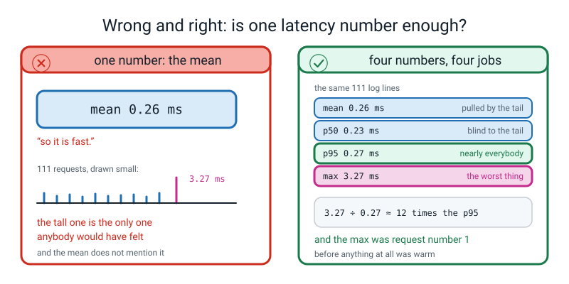
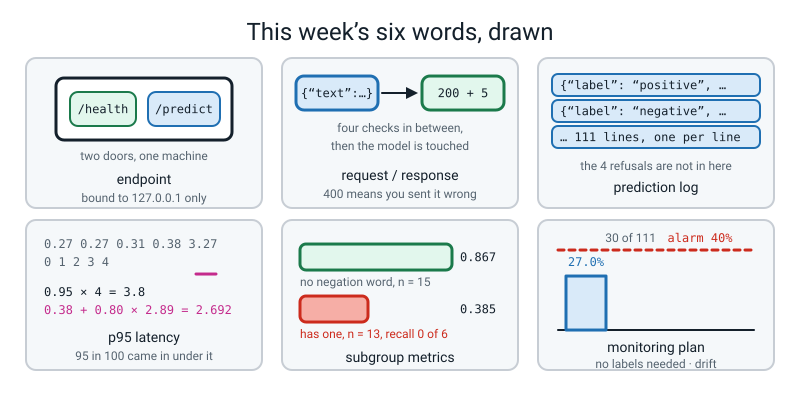

# Week 35 — Ship It, Part 2: The Service, the Log, and the Card

[⬅ Week 34](week-34.md) · [Course Home](../README.md) · [Next ➡](week-36.md) · [Workbook](../workbook/week-35.md)

---

> ### This week in one sentence
> **The interesting part of shipping is what happens *after* the prediction: it gets logged with its inputs and its latency, and somebody can read that log back and tell you what is going wrong — because a model with no log cannot be debugged, defended, or trusted.**
>
> **By the end of this chapter you will be able to:**
> - **Serve your Week 34 artifact over local HTTP** with nothing but the standard library, bound to `127.0.0.1`, with the model loaded **once** at start-up — and say out loud why not `0.0.0.0`
> - **Survive four kinds of malformed request** without crashing, returning a `400` whose message says **what to send instead**, and prove you are still alive afterwards
> - **Log 100+ predictions and read your own log back as data**, reporting **four** numbers — mean, p50, p95 and max — having worked a p95 by hand first
> - **Build a subgroup metrics table with `n` on every row**, and say in one sentence **what the overall number was hiding**
>
> **New maths:** none new. One percentile worked by hand on five numbers, and two divisions.
>
> **New syntax:** `http.server.BaseHTTPRequestHandler` · `HTTPServer(("127.0.0.1", 8000), Handler)` · `logging.basicConfig(filename=...)` · `np.percentile(latencies, 95)`
>
> **Reading time:** about 45 minutes. **Homework:** about 75 minutes — the biggest of the year.

---

## 🪝 Start Here

A program is sitting on your laptop doing nothing at all. It is *listening*.

```text
loaded sentiment_v1 in 610 ms (threshold 0.55)
serving on http://127.0.0.1:8010   (Ctrl+C to stop)
```

Last week you froze a model into a file and wrote a tool that reads it. **The tool was for you.** Today the model has to answer somebody who is not you — so from a second terminal, somebody knocks:

```text
$ curl -s -X POST http://127.0.0.1:8010/predict \
     -H 'Content-Type: application/json' \
     -d '{"text": "delicious fresh pizza and kind friendly staff"}'
{"model_version": "sentiment_v1", "input": "delicious fresh pizza and kind friendly staff", "label": "positive", "probability": 0.7724, "threshold": 0.55, "latency_ms": 1.06}
```

**There are the five fields from box 3 of your contract, over a wire.** Now watch four pieces of deliberate rubbish go in, and **count the crashes**:

```text
$ curl -s -X POST http://127.0.0.1:8010/predict -d ''
{"error": "empty body; expected {\"text\": \"...\"}"}

$ curl -s -X POST http://127.0.0.1:8010/predict -d '{"text": '
{"error": "invalid JSON: Expecting value: line 1 column 10 (char 9)"}

$ curl -s -X POST http://127.0.0.1:8010/predict -d '{"review": "great pizza"}'
{"error": "expected a JSON object with a 'text' field", "example": {"text": "the pizza was hot"}}

$ curl -s -X POST http://127.0.0.1:8010/predict -d '{"text": 42}'
{"error": "'text' must be a non-empty string", "got_type": "int"}
```

**Zero crashes.** And one more knock, which is the actual test:

```text
$ curl -s http://127.0.0.1:8010/health
{"status": "ok", "model_version": "sentiment_v1", "threshold": 0.55, "classes": ["negative", "positive"], "load_ms": 609.7}
```

**Still alive.** Four pieces of garbage, four clear refusals, and it answered a fifth time. Look at *what* each refusal did: it said what was wrong **and what to send instead.** The third one even gave a worked example. **That is the difference between an experiment and something a person can use.**

Now the second half of the hook, and it is the sneaky bit. That service has been sent **111 good requests and 4 pieces of rubbish. That is 115.** So:

```text
$ wc -l logs/predictions.jsonl
     111 logs/predictions.jsonl
```

**Why 111?**

Because nothing was *predicted* for the four bad ones, so there was nothing to log. **The log counts predictions, not requests.** Know the difference, because next week somebody will ask you how many predictions your service has made, and **115 would be a lie.**

```
A model with no log cannot be debugged, defended, or trusted.
```

---

## 🧠 The Big Idea

> **📌 About the code in this section.** The blocks below are **illustrations, not files**. Each one carries on from the one above. **The complete runnable `service.py` is in 💻 Type This.**

### 1. What an HTTP request actually is

Strip away every website you have ever used and this is all that is left.

A **server** is a program that sits waiting. A **client** is a program that sends it a message and waits for a reply. The message is a **request**; the reply is a **response**. Both are just text with a small amount of structure.

A request has four parts:

| Part | In our service | What it is |
|---|---|---|
| a **method** | `GET` or `POST` | the verb. `GET` means "give me something". `POST` means "here is some data, do something with it". |
| a **path** | `/health` or `/predict` | which door you are knocking on |
| **headers** | `Content-Length: 46` | small facts about the message, one per line |
| a **body** | `{"text": "cold food"}` | the data itself. `GET` requests usually have none. |

> **Endpoint** — one path on a server that does one job. `/predict` is an endpoint. `/health` is another.

A response has three parts: a **status code** (a number), headers, and a body. Three codes matter this week and you should know all three cold:

| Code | Means | We return it when |
|---|---|---|
| **200** | OK, here is your answer | a good prediction, or `/health` |
| **400** | Bad request — **you** sent something wrong | any of the four malformed cases |
| **404** | Not found — that path does not exist | somebody asks for `/predikt` |

**And the one that is not on the list: `500` means *I broke*.** That is the server's fault, and **your goal today is a service that never returns one**, because every bad input has already been caught by a `400`.


*Figure 35.1 — One request in, one prediction out, one log line. Four checks run before the model is touched, so garbage never reaches it. The Predictor was loaded once, at start-up.*

`curl` is the client we use. It sends one request and prints the response. That is all it does.

```bash
curl -s -X POST http://127.0.0.1:8010/predict \
     -H 'Content-Type: application/json' \
     -d '{"text": "cold food and a rude driver"}'
```

- `-s` — silent; do not print a progress bar.
- `http://127.0.0.1:8010` — **which machine and which door number.** `127.0.0.1` always means *this very computer*; `8010` is the **port**, which you can think of as a numbered door on the side of the machine.
- `-X POST` sets the method · `-H` adds one header · `-d` supplies the body.
- **And `curl` counts the body's length for you and adds the `Content-Length` header** — which matters, because the very first check reads exactly that header.

### 2. `127.0.0.1` versus `0.0.0.0`, and why this is not a detail

```python
HTTPServer(("127.0.0.1", 8000), Handler)     # only this computer
HTTPServer(("0.0.0.0",   8000), Handler)     # anything that can reach this machine
```

That first string answers one question: **who is allowed to reach this?**

Your service has **no password, no rate limit**, and a model that will happily answer a million requests. So `127.0.0.1` — nothing on the school network, nothing on the café wifi, nothing on the internet.

> **⚠️ Watch out:** almost every tutorial online writes `0.0.0.0`, because tutorials run inside containers where it is the only thing that works. **In a classroom it is the wrong default.** Learn the sentence, because it is one of the eight questions you will be asked next week: **"no authentication, no rate limit, therefore localhost."**

### 3. Four checks, in order — and the order *is* the design

The whole robustness lesson is four `if` statements, and **they must run in this order**, because each one is only safe once the one above it has passed.

| # | Check | Why it must come first | What we return |
|---|---|---|---|
| 1 | Is there a body, and is its declared length sane? | You cannot read a body without knowing how many bytes to read | `400 empty body` · `413 body too large` |
| 2 | Is it valid JSON? | You cannot look for a field inside something that is not an object yet | `400 invalid JSON:` + the parser's own message |
| 3 | Is it an object with a `text` field? | You cannot check a field's type before knowing it exists | `400` plus **a worked example of what to send** |
| 4 | Is `text` a non-empty string? | The model will do something strange with a number, **silently** | `400` naming the type it got |

**And then, and only then, the model is touched.** That sentence is the design.


*Figure 35.2 — Four kinds of rubbish, four clear refusals, still alive. And the fifth row is the actual test: `GET /health` afterwards still returns 200. Four refusals, zero crashes, and the service answered a fifth time.*

**Every message must say what to send instead.** `{"error": "bad input"}` is useless to the person on the other end.

```python
# useless
{"error": "bad input"}

# actionable
{"error": "expected a JSON object with a 'text' field",
 "example": {"text": "the pizza was hot"}}
```

The second one can be acted on **without asking you anything.** This is the easiest place in the whole capstone to score well, and almost nobody bothers.

### 4. The log is a data file, not a diary

> **Prediction log** — a file with one complete record per line, appended, never rewritten, holding everything you would need to explain a single prediction six months later.

The format is called **JSON Lines**: one JSON object per line. A human can read it, a program can parse it, and you can append to it forever without rewriting what is already there.

```text
{"model_version": "sentiment_v1", "input": "delicious fresh pizza and kind friendly staff", "label": "positive", "probability": 0.7724, "threshold": 0.55, "latency_ms": 1.06, "input_chars": 45}
```

**Count the fields, and ask what each one is for.**

| Field | The question it answers six months later |
|---|---|
| `model_version` | *which model answered them?* |
| `input` | *what exactly was sent?* |
| `label`, `probability`, `threshold` | *what came back, and what was it compared to?* |
| `latency_ms` | *how long did it take?* |
| `input_chars` | *was this truncated, and how much did I throw away?* |

**Those are the four questions from the start of Week 34.** The log is not a diary you write when something goes wrong. It is the data file that makes the questions answerable **before** anybody asks them.

> **💡 Try this:** open your own log in a text editor and read one line out loud as a sentence. *"Version sentiment_v1 was 77 per cent sure this was positive, against a threshold of 55 per cent, and it took one millisecond."* If your line cannot be read as a sentence like that, a field is missing.

### 5. What one number was hiding

This is the part of the week that matters most and takes the least code.

> **Subgroup metrics** — the same metric, computed separately for groups of rows you chose on purpose, with the **size of each group printed beside it**.

The model's headline is `0.875` on 16 held-out reviews. Now take 28 labelled rows — those 16 plus the 12 negation traps from Week 33 — and split them by whether the review contains one of seven negation words (`not`, `never`, `hardly`, `cannot`, `no`, `nothing`, `far`):

```text
subgroup                     n   accuracy  precision  recall
ALL 28 labelled rows        28    0.643      0.700     0.500
the 16 test reviews         16    0.875      0.875     0.875
the 12 negation traps       12    0.333      0.000     0.000
contains a negation word    13    0.385      0.000     0.000
no negation word            15    0.867      0.875     0.875
short (5 words or fewer)    13    0.538      0.667     0.500
longer (6 words or more)    15    0.733      0.750     0.500
```

**Read row four slowly.** On the 13 rows containing a negation word, accuracy is `0.385` and **recall on the positive class is `0.000`.** Not "lower". Not "worse". **Zero.** There were six genuinely positive reviews in that group and the model found **none** of them.


*Figure 35.3 — What the one number was hiding. `0.875` on the 16 held-out reviews, and `0.385` on the 13 rows that contain a negation word, where recall on the positive class is `0 ÷ 6 = 0.000`.*

**Two pieces of honesty that separate a real card from a school exercise:**

**One — every group carries its `n`, and anything under about ten carries the words "too small to conclude from".** `1.000` on four rows is not "perfect"; it is four rows, and one flip takes it to 0.750.

**Two — the negation traps were written on purpose to break the model, so `0.333` is not an estimate of anything.** It is a *demonstration that a mechanism exists*. **The honest claim is about the mechanism, not the rate:**

> *"Bag-of-words throws away word order, so `not` is a weak feature that cannot flip `delicious`. Here are 13 rows where that is visible — and I chose them to be visible."*

**And here is why this failure is satisfying rather than depressing.** Week 31 told you bag-of-words throws away word order. Week 32 told you `not` ends up nearly weightless. That was *theory*. This is your own service, on your own held-out rows, showing the exact failure the theory predicted. **A prediction made from theory and confirmed by evidence in your own log is the strongest thing you can put in a model card**, and almost no professional card contains one.

### 6. Monitoring, when nobody ever tells you the answer

> **Monitoring plan** — one page naming one number you would watch, how you would measure it, what value would set off an alarm, and what you would do.
> **Drift** — the inputs slowly stopping looking like the data you trained on, so the model quietly gets worse without anything breaking.

Here is the rule that makes this genuinely hard:

```
In production, nobody tells you the right answer.
```

A comment goes through your classifier, gets a label, and then… nothing. No truth ever arrives. **So a monitoring plan built on accuracy is a plan you can never run.** The good numbers are the ones computable from **inputs and outputs alone**.

Two that work for this model, both measured:

**The uncertainty-band rate** — the share of predictions whose probability falls between 0.45 and 0.65, near the fence, where the model is least sure. Straight out of the log, no labels:

```text
in the 0.45-0.65 uncertainty band: 30 of 111 (27.0%)
```

**The out-of-vocabulary rate** — the share of an input's tokens the vectorizer has never seen. The vocabulary is **271** items, and here is what it does:

```text
0.1111   1 of 9 tokens unknown   cold food and a rude driver
0.8000   12 of 15 tokens unknown   the biryani was absolutely banging fam no cap
1.0000   9 of 9 tokens unknown   lorem ipsum dolor sit amet
```

**Why that number degrades for *this* model, specifically.** It is TF-IDF. A word the vectorizer has never seen contributes **exactly nothing** — it is silently dropped. So a rising out-of-vocabulary rate means a rising share of every input is *invisible* to the model, and the probability drifts towards the middle. **That is a mechanism, not a vibe, and naming the mechanism is what lifts a monitoring plan a whole level.**

> **⚠️ Watch out:** the band rate over 111 logged requests is `27.0%`. On the 16 test reviews it is `10 of 16 = 62.5%`. **Wildly different, and neither is wrong** — they are different traffic. **A baseline has to come from the traffic you are actually going to watch**, which means you cannot write the alarm level until you have logged some real requests.

---

## 🔁 The Idea From Last Week, Used Harder

No new mathematics. One percentile, two divisions, and a piece of theory from Term 4 turning into evidence.

### Twist one — sorting and reading off a position, now with an in-between

> **p95 latency** — the time that 95 percent of requests came in under. Five percent were slower.

The mean is a bad summary of a latency, because latencies have a long tail: nearly all of them are fast and a few are slow, **and the slow ones are the ones a person actually notices.** The mean gets dragged around by the tail without describing it. The p95 describes it.

**Here is the whole rule, worked by hand on five real latencies from the classroom log.** Sort them, and number the positions **from zero**:

```
0.27   0.27   0.31   0.38   3.27
  0      1      2      3      4     ← positions
```

Numpy's rule: the p95 sits at position `0.95 × (n − 1)`.

```
position  =  0.95 × (5 − 1)  =  0.95 × 4  =  3.8
```

**3.8 is not a real position.** It is between position 3 and position 4, **eight tenths of the way along.** So take the value at 3, and add eight tenths of the gap up to the value at 4:

```
gap  =  3.27 − 0.38  =  2.89
p95  =  0.38 + 0.80 × 2.89
     =  0.38 + 2.312
     =  2.692
```

**You can check every step of that on a calculator.** And now numpy:

```text
np.percentile([3.27, 0.38, 0.31, 0.27, 0.27], 95)  ->  2.6919999999999993
```

**Same number.** The trailing `...93` is floating point, not a disagreement — exactly the wobble that made `np.allclose` exist in Week 17.

**Do the p50 too, because it comes out exact and that reassures people.** `0.50 × 4 = 2.0`, a whole number, so there is no in-between: the p50 is simply the value at position 2, which is **0.31**.


*Figure 35.4 — Where the p95 sits, and how to work one out. 111 real requests on the classroom laptop: 73 of them between 0.20 and 0.25 ms, and one lone request out at 3.27 ms, which was request number one. The mean is 0.2623 and the other 110 average 0.2349, so the first request was about 14 times slower than the rest.*

> **🔢 The maths, slowly:** a percentile is a statement about a **proportion**, so it depends entirely on how many numbers you have. On five requests, one slow one is a *fifth* of the data, so the p95 climbs to 2.692. On 111 requests, the same slow one is one part in 111, and the p95 never reaches it. **A p95 on five requests is nearly meaningless, and saying so is the whole insight.**

### Twist two — two divisions, and the counts that prove you did not miscount

The subgroup table is nothing but division. Do it by hand and check it closes:

```
negation group    :  5 right of 13   ->   5 ÷ 13 = 0.3846 -> 0.385
                     TP = 0, FN = 6  ->   recall  0 ÷ 6  = 0.000
no-negation group : 13 right of 15   ->  13 ÷ 15 = 0.8667 -> 0.867
                     TP = 7, FN = 1  ->   recall  7 ÷ 8  = 0.875

both groups       :  13 + 15 = 28   ✅  every row is in exactly one group
right answers     :   5 + 13 = 18   ✅
overall           :  18 ÷ 28 = 0.6429 -> 0.643   ✅ matches the ALL row
```

**Those three ticks are the check that you have not miscounted**, and they take twenty seconds. A subgroup table whose parts do not add back up to the whole is a filter bug, not a finding.

### Twist three — Week 31's theory becomes Week 35's evidence

Week 31 said: a bag of words throws away word order. Week 32 said: therefore `not` cannot flip `delicious`.

This week you measured `recall = 0 of 6` on exactly the rows where that matters, **in your own service, from your own held-out file.** Nothing new was learned about the model. What is new is that **you predicted a failure from theory and then produced the evidence** — and that pair, prediction then evidence, is what a model card is for.

---

## 💻 Type This

Two new files beside last week's project, then two evaluation scripts:

```text
ship-it/
├── model/ ...                 (unchanged from Week 34)
├── serve/
│   ├── predictor.py           (unchanged — the ONE place a prediction happens)
│   ├── predict.py             (unchanged)
│   └── service.py             ← NEW
├── eval/
│   ├── read_logs.py           ← NEW
│   └── subgroup_report.py     ← NEW
└── logs/                      ← created by the service
```

### Step 1 — the handler, and `/health`

`BaseHTTPRequestHandler` is a form with two blanks to fill in. Python already knows how to read an HTTP request and write a response; you fill in what it cannot guess.

```python
class Handler(BaseHTTPRequestHandler):
    server_version = "ShipIt/1.0"

    def send_json(self, code, payload):
        body = json.dumps(payload).encode("utf-8")
        self.send_response(code)
        self.send_header("Content-Type", "application/json")
        self.send_header("Content-Length", str(len(body)))
        self.end_headers()
        self.wfile.write(body)

    def log_message(self, fmt, *args):
        return                    # silence the built-in access log; ours is JSON

    def do_GET(self):
        if self.path == "/health":
            self.send_json(200, {"status": "ok",
                                 "model_version": PREDICTOR.version,
                                 "threshold": PREDICTOR.threshold,
                                 "classes": PREDICTOR.classes,
                                 "load_ms": round(PREDICTOR.load_ms, 1)})
        else:
            self.send_json(404, {"error": "not found",
                                 "routes": ["GET /health", "POST /predict"]})
```

- **The names are not a choice.** Python looks for a method called exactly `do_GET` for a `GET`. Get the capitals wrong and it will not be found.
- `self.path` is the path as a string. `self.headers.get("Content-Length")` is one header as text. `self.rfile.read(n)` reads `n` bytes of the body — **you must say how many**, which is why you read the length header first.
- **The reply order is not optional:** `send_response`, then every `send_header`, then `end_headers()`, then the body. Headers cannot be sent once the body has started.

### Step 2 — the thing that waits, and the log file

```python
    LOG_PATH.parent.mkdir(parents=True, exist_ok=True)
    logging.basicConfig(filename=str(LOG_PATH), level=logging.INFO,
                        format="%(message)s")

    PREDICTOR = Predictor(version=args.version, threshold=args.threshold)
    print("loaded %s in %.0f ms (threshold %.2f)"
          % (PREDICTOR.version, PREDICTOR.load_ms, PREDICTOR.threshold))

    server = HTTPServer(("127.0.0.1", args.port), Handler)   # NOT 0.0.0.0
    print("serving on http://127.0.0.1:%d   (Ctrl+C to stop)" % args.port)
    server.serve_forever()
```

`HTTPServer` takes two things: **where to listen** (a pair: address and port) and **who handles each request** (your class). `serve_forever()` does exactly what it says — it never returns until you press Ctrl+C.

Three arguments to `basicConfig`, each doing one job:

- `filename=` — where the lines go. **Set it once, at start-up, before anything logs.**
- `level=logging.INFO` — how much to keep. **This one is load-bearing.** Python's default is `WARNING`, which is *above* `INFO`, so without this word `logging.info(...)` writes nothing and says nothing about it.
- `format="%(message)s"` — what each line looks like. The default adds a severity word and a logger name; **we want the line to be nothing but the JSON**, so a program can read it back.

**Start it and knock:**

```text
$ python3 serve/service.py --port 8010
loaded sentiment_v1 in 610 ms (threshold 0.55)
serving on http://127.0.0.1:8010   (Ctrl+C to stop)
```

```text
$ curl -s http://127.0.0.1:8010/health
{"status": "ok", "model_version": "sentiment_v1", "threshold": 0.55, "classes": ["negative", "positive"], "load_ms": 609.7}
```

**A health endpoint costs six lines and is the first thing anybody checks.** Notice what it returns: **which model, which threshold, and how long it took to load.** Those three facts are what a person needs before they trust a single answer.

### Step 3 — checks 1 and 2, then test each one

Type check 1, then send an empty body. Then check 2, then send broken JSON. **Four checks, four tests, in four pairs.**

```python
    def do_POST(self):
        if self.path != "/predict":
            self.send_json(404, {"error": "not found",
                                 "routes": ["GET /health", "POST /predict"]})
            return

        # CHECK 1 — is there a body at all, and is it a sane size?
        header = self.headers.get("Content-Length", "0")
        if not header.isdigit():
            self.send_json(400, {"error": "Content-Length is not a number"})
            return
        length = int(header)
        if length == 0:
            self.send_json(400, {"error": "empty body; expected {\"text\": \"...\"}"})
            return
        if length > MAX_BODY_BYTES:
            self.send_json(413, {"error": "body too large (%d bytes); limit is %d"
                                          % (length, MAX_BODY_BYTES)})
            return
        raw = self.rfile.read(length)

        # CHECK 2 — is it actually JSON?
        try:
            payload = json.loads(raw.decode("utf-8"))
        except Exception as e:
            self.send_json(400, {"error": "invalid JSON: %s" % e})
            return
```

```text
$ curl -s -X POST http://127.0.0.1:8010/predict -d ''
{"error": "empty body; expected {\"text\": \"...\"}"}

$ curl -s -X POST http://127.0.0.1:8010/predict -d '{"text": '
{"error": "invalid JSON: Expecting value: line 1 column 10 (char 9)"}
```

**Look at what the second message did.** It passed along **the JSON parser's own words**: `line 1 column 10 (char 9)`. You did not write that. You wrote `%s` and let the exception describe itself, and now the sender knows exactly where their JSON went wrong. **When a library gives you a good message, forward it.**

### Step 4 — checks 3 and 4, then the model

```python
        # CHECK 3 — is it an object with the field the contract promised?
        if not isinstance(payload, dict) or "text" not in payload:
            self.send_json(400, {"error": "expected a JSON object with a 'text' field",
                                 "example": {"text": "the pizza was hot"}})
            return

        # CHECK 4 — is that field a non-empty string?
        text = payload["text"]
        if not isinstance(text, str) or text.strip() == "":
            self.send_json(400, {"error": "'text' must be a non-empty string",
                                 "got_type": type(text).__name__})
            return

        # Only now does the model get touched.
        out = PREDICTOR.predict_one(text)

        row = dict(out)
        row["input"] = row["input"][:MAX_LOGGED_CHARS]
        row["input_chars"] = len(text)
        logging.info(json.dumps(row))

        self.send_json(200, out)
```

```text
$ curl -s -X POST http://127.0.0.1:8010/predict -d '{"review": "great pizza"}'
{"error": "expected a JSON object with a 'text' field", "example": {"text": "the pizza was hot"}}

$ curl -s -X POST http://127.0.0.1:8010/predict -d '{"text": 42}'
{"error": "'text' must be a non-empty string", "got_type": "int"}
```

`.strip()` in check 4 is there on purpose, and it is worth understanding: **`"   "` is a string, and it is not empty by length, but it is empty in every way that matters.**

### Step 5 — generate a log, with one shell loop

```text
$ for i in $(seq 1 20); do
    curl -s -X POST http://127.0.0.1:8010/predict \
      -H 'Content-Type: application/json' \
      -d '{"text": "cold food and a rude driver"}' > /dev/null
  done
$ wc -l logs/predictions.jsonl
      21 logs/predictions.jsonl
```

`> /dev/null` means **throw the reply away** — you do not want twenty replies on screen, you want twenty lines in the log. **Predict the number before you look: one earlier request plus twenty is 21.** Predicting the count *first* is what catches the silent bug in 🐞 Break 2.

### Step 6 — read your own log back as data

```python
"""read_logs.py — read your own log back as data."""
import json
from pathlib import Path

import numpy as np

LOG = Path(__file__).resolve().parent.parent / "logs" / "predictions.jsonl"

rows = []
for line in LOG.read_text().splitlines():
    if line.strip() != "":
        rows.append(json.loads(line))

latencies = np.array([r["latency_ms"] for r in rows])
probs = np.array([r["probability"] for r in rows])

print("requests        : %d" % len(rows))
print("by version      : %s" % {v: sum(1 for r in rows if r["model_version"] == v)
                                for v in sorted({r["model_version"] for r in rows})})
print("by label        : %s" % {v: sum(1 for r in rows if r["label"] == v)
                                for v in sorted({r["label"] for r in rows})})
print("latency mean    : %.2f ms" % latencies.mean())
print("latency p50     : %.2f ms" % np.percentile(latencies, 50))
print("latency p95     : %.2f ms" % np.percentile(latencies, 95))
print("latency max     : %.2f ms" % latencies.max())
print("mean probability: %.4f" % probs.mean())
band = ((probs >= 0.45) & (probs <= 0.65)).sum()
print("in the 0.45-0.65 uncertainty band: %d of %d (%.1f%%)"
      % (band, len(rows), 100.0 * band / len(rows)))
```

**With the log at 111 lines, on the laptop this chapter was written on:**

```text
$ python3 eval/read_logs.py
requests        : 111
by version      : {'sentiment_v1': 111}
by label        : {'negative': 65, 'positive': 46}
latency mean    : 0.23 ms
latency p50     : 0.21 ms
latency p95     : 0.28 ms
latency max     : 1.06 ms
mean probability: 0.4978
in the 0.45-0.65 uncertainty band: 30 of 111 (27.0%)
```

**Four latency numbers, four different jobs:**

| Number | What it is for |
|---|---|
| mean `0.23` | pulled around by the tail; do not report it alone |
| p50 `0.21` | the middle request; completely blind to the tail |
| p95 `0.28` | **nearly everybody's experience** — the headline |
| max `1.06` | **the one request somebody actually noticed** |

**And the obvious question: the p95 is 0.28 but the max is 1.06. Why didn't the p95 catch it?** Because one request out of 111 sits up around the 99th percentile, and **a p95 cannot see above itself.** So you print the max as well, and you say why.

> **⚠️ Watch out:** **latency is the one kind of number in this course that will not reproduce.** Your four numbers will differ from mine and that is correct. Report *yours*, and say which laptop they came from.

And the honest count check: **`65 + 46 = 111`** ✅.

### Step 7 — the subgroup report

`eval/subgroup_report.py` rebuilds **exactly** the pile `train.py` measured — same seeds, same sizes — adds the 12 traps, and reports seven groups:

```python
NEGATION = ["not", "never", "hardly", "cannot", "no", "nothing", "far"]


def has_negation(text):
    """True if any word in this review is one of the seven negation words."""
    for word in text.lower().split():
        if word in NEGATION:
            return True
    return False


def report(name, keep):
    """keep is a list of True/False, one per row."""
    yt = []
    yp = []
    for i in range(len(review)):
        if keep[i]:
            yt.append(truth[i])
            yp.append(pred[i])
    if len(yt) == 0:
        return
    note = ""
    if len(yt) < 10:
        note = "   <- too small to conclude from"
    print("%-26s %3d    %.3f      %.3f     %.3f%s"
          % (name, len(yt), accuracy_score(yt, yp),
             precision_score(yt, yp, zero_division=0),
             recall_score(yt, yp, zero_division=0), note))
```

```text
$ python3 eval/subgroup_report.py
subgroup                     n   accuracy  precision  recall
ALL 28 labelled rows        28    0.643      0.700     0.500
the 16 test reviews         16    0.875      0.875     0.875
the 12 negation traps       12    0.333      0.000     0.000
contains a negation word    13    0.385      0.000     0.000
no negation word            15    0.867      0.875     0.875
short (5 words or fewer)    13    0.538      0.667     0.500
longer (6 words or more)    15    0.733      0.750     0.500
```

**That `note` line — the one that prints `too small to conclude from` under ten rows — is four lines of code and it is the most honest thing in the file.**

### The complete `serve/service.py`

```python
"""service.py — a tiny local prediction service. Standard library only.

Run:   python3 serve/service.py
Then:  curl -s http://127.0.0.1:8000/health
       curl -s -X POST http://127.0.0.1:8000/predict \
            -H 'Content-Type: application/json' \
            -d '{"text": "delicious fresh pizza and kind friendly staff"}'
"""
import argparse
import json
import logging
import sys
from http.server import BaseHTTPRequestHandler, HTTPServer
from pathlib import Path

sys.path.insert(0, str(Path(__file__).resolve().parent))
from predictor import Predictor

ROOT = Path(__file__).resolve().parent.parent
LOG_PATH = ROOT / "logs" / "predictions.jsonl"
MAX_BODY_BYTES = 100000      # ~100 KB. Bigger than any real review.
MAX_LOGGED_CHARS = 300       # a privacy decision, written down on purpose.

PREDICTOR = None


class Handler(BaseHTTPRequestHandler):
    server_version = "ShipIt/1.0"

    def send_json(self, code, payload):
        body = json.dumps(payload).encode("utf-8")
        self.send_response(code)
        self.send_header("Content-Type", "application/json")
        self.send_header("Content-Length", str(len(body)))
        self.end_headers()
        self.wfile.write(body)

    def log_message(self, fmt, *args):
        return                    # silence the built-in access log; ours is JSON

    def do_GET(self):
        if self.path == "/health":
            self.send_json(200, {"status": "ok",
                                 "model_version": PREDICTOR.version,
                                 "threshold": PREDICTOR.threshold,
                                 "classes": PREDICTOR.classes,
                                 "load_ms": round(PREDICTOR.load_ms, 1)})
        else:
            self.send_json(404, {"error": "not found",
                                 "routes": ["GET /health", "POST /predict"]})

    def do_POST(self):
        if self.path != "/predict":
            self.send_json(404, {"error": "not found",
                                 "routes": ["GET /health", "POST /predict"]})
            return

        # CHECK 1 — is there a body at all, and is it a sane size?
        header = self.headers.get("Content-Length", "0")
        if not header.isdigit():
            self.send_json(400, {"error": "Content-Length is not a number"})
            return
        length = int(header)
        if length == 0:
            self.send_json(400, {"error": "empty body; expected {\"text\": \"...\"}"})
            return
        if length > MAX_BODY_BYTES:
            self.send_json(413, {"error": "body too large (%d bytes); limit is %d"
                                          % (length, MAX_BODY_BYTES)})
            return
        raw = self.rfile.read(length)

        # CHECK 2 — is it actually JSON?
        try:
            payload = json.loads(raw.decode("utf-8"))
        except Exception as e:
            self.send_json(400, {"error": "invalid JSON: %s" % e})
            return

        # CHECK 3 — is it an object with the field the contract promised?
        if not isinstance(payload, dict) or "text" not in payload:
            self.send_json(400, {"error": "expected a JSON object with a 'text' field",
                                 "example": {"text": "the pizza was hot"}})
            return

        # CHECK 4 — is that field a non-empty string?
        text = payload["text"]
        if not isinstance(text, str) or text.strip() == "":
            self.send_json(400, {"error": "'text' must be a non-empty string",
                                 "got_type": type(text).__name__})
            return

        # Only now does the model get touched.
        out = PREDICTOR.predict_one(text)

        row = dict(out)
        row["input"] = row["input"][:MAX_LOGGED_CHARS]
        row["input_chars"] = len(text)
        logging.info(json.dumps(row))

        self.send_json(200, out)


def main():
    global PREDICTOR
    ap = argparse.ArgumentParser(description="Serve one sentiment artifact locally.")
    ap.add_argument("--version", default=None)
    ap.add_argument("--threshold", type=float, default=None)
    ap.add_argument("--port", type=int, default=8000)
    args = ap.parse_args()

    LOG_PATH.parent.mkdir(parents=True, exist_ok=True)
    logging.basicConfig(filename=str(LOG_PATH), level=logging.INFO,
                        format="%(message)s")

    PREDICTOR = Predictor(version=args.version, threshold=args.threshold)
    print("loaded %s in %.0f ms (threshold %.2f)"
          % (PREDICTOR.version, PREDICTOR.load_ms, PREDICTOR.threshold))

    server = HTTPServer(("127.0.0.1", args.port), Handler)   # NOT 0.0.0.0
    print("serving on http://127.0.0.1:%d   (Ctrl+C to stop)" % args.port)
    try:
        server.serve_forever()
    except KeyboardInterrupt:
        print("\nshutting down")
        server.server_close()


if __name__ == "__main__":
    main()
```

**Runtime: the service starts in about 0.8 seconds and then sits there. One prediction is about a quarter of a millisecond. Generating 110 requests with a shell loop takes under half a second.** Nothing here is slow.

---

## 🔍 Worked Examples

### Worked Example 1 — A p95 by hand, and why yours will disagree with itself

Five latencies, unsorted, exactly as they came out of the classroom log: `3.27, 0.38, 0.31, 0.27, 0.27`.

**Step 1 — sort them and number from zero.**

```
0.27   0.27   0.31   0.38   3.27
  0      1      2      3      4
```

**Step 2 — find the position.** `0.95 × (5 − 1) = 0.95 × 4 = 3.8`.

**Step 3 — it is between two positions, so go eight tenths of the way.**

```
gap  =  3.27 − 0.38  =  2.89
p95  =  0.38 + 0.80 × 2.89  =  0.38 + 2.312  =  2.692
```

**Step 4 — check it.**

```text
np.percentile([3.27, 0.38, 0.31, 0.27, 0.27], 95)  ->  2.6919999999999993
np.percentile([3.27, 0.38, 0.31, 0.27, 0.27], 50)  ->  0.31
```

**Now the question that makes this worth doing.** The p95 of all 111 requests was **0.27** on that laptop. The p95 of these five is **2.692** — **ten times bigger, on fewer numbers.** How?

Because **95 percent of five numbers is 4.75 numbers**, so the one slow request is a *fifth* of the data and dominates completely. With 111 numbers it is one part in 111, and the p95 never reaches it. **A percentile is a claim about a proportion. Change how many numbers you have and you change what the claim means.**

> **⚠️ Watch out:** the commonest error here is dividing by **5** instead of **4**. The positions run 0 to 4, so the span is 4. The second commonest is sorting the wrong way round.

### Worked Example 2 — Eight attacks on your own service, and the one that is the real test

Four attacks are the homework. Here are eight, all real, run against the service on port 8010.

```text
# 1. empty body
{"error": "empty body; expected {\"text\": \"...\"}"}

# 2. invalid JSON
{"error": "invalid JSON: Expecting value: line 1 column 10 (char 9)"}

# 3. wrong field name
{"error": "expected a JSON object with a 'text' field", "example": {"text": "the pizza was hot"}}

# 4. right field, wrong type
{"error": "'text' must be a non-empty string", "got_type": "int"}

# 5. three spaces -d '{"text": "   "}'
{"error": "'text' must be a non-empty string", "got_type": "str"}

# 6. a list -d '{"text": ["a","b"]}'
{"error": "'text' must be a non-empty string", "got_type": "list"}

# 7. an oversized body (150,012 bytes of the word "pizza")
{"error": "body too large (150012 bytes); limit is 100000"}

# 8. the wrong door -- GET /predikt
{"error": "not found", "routes": ["GET /health", "POST /predict"]}
```

**Now the actual test:**

```text
$ curl -s http://127.0.0.1:8010/health
{"status": "ok", "model_version": "sentiment_v1", "threshold": 0.55, "classes": ["negative", "positive"], "load_ms": 609.7}

$ wc -l logs/predictions.jsonl
       1 logs/predictions.jsonl
```

**Eight refusals, zero crashes, and the log is unchanged** — still holding only the one good prediction from before. **Nothing was predicted, so nothing was logged.**

Two of those eight deserve a sentence each.

**Number 5 is the sneakiest.** `"   "` passes `isinstance(text, str)` and has length 3. It is only caught because of `.strip()`. Left out, the model would cheerfully score three spaces and return a confident-looking answer.

**Number 7 needs its limit justified.** Why 100,000 bytes? **Because the longest review in the training corpus is 55 characters**, so 100,000 is more than eighteen hundred times longer than anything real: generous enough that no legitimate user hits it, small enough that nobody fills your disk by sending rubbish all day. **A number in a limit that you cannot justify is a number somebody will change carelessly.**

### Worked Example 3 — What drift actually looks like

Send your service inputs from a different world and watch the out-of-vocabulary rate climb. The vocabulary is 271 items, unigrams and bigrams together:

| input | tokens unknown | OOV rate | what it means |
|---|---|---:|---|
| `cold food and a rude driver` | 1 of 9 | **0.1111** | normal traffic |
| `the biryani was absolutely banging fam no cap` | 12 of 15 | **0.8000** | four fifths invisible; the answer comes from the remaining fifth |
| `lorem ipsum dolor sit amet` | 9 of 9 | **1.0000** | nothing is visible; the answer is pure prior |
| the 111 logged requests, averaged | — | **0.3808** | **this is what "normal" looks like for my traffic** |

**Why the token count is 9 and not 6 for the first one.** The vectorizer was built with `ngram_range=(1, 2)`, so it sees five single words *and* four adjacent pairs:

```text
['cold', 'food', 'and', 'rude', 'driver', 'cold food', 'food and', 'and rude', 'rude driver']
```

**Nine tokens, one of which the model has never seen.** `1 ÷ 9 = 0.1111`.

And the other monitoring number, measured on two different kinds of traffic:

```
uncertainty band over the 111 logged requests :  30 of 111  =  27.0%
uncertainty band over the 16 test reviews     :  10 of  16  =  62.5%
```

**Both are right.** They are different traffic, and a baseline that does not come from the traffic you are going to watch is not a baseline. **Which is why you could not write your alarm level until your service had actually run.**

> **🧑‍🏫 If a student asks:** *"at what OOV rate does the accuracy actually start dropping?"* **You cannot know without labels** — so label 20 drifted inputs by hand and find out. Most people guess the model collapses at 0.5. It often survives much higher, because the few words it *can* see are frequently the sentiment-bearing ones. **Being surprised by that is the whole value of the experiment.**

---

## 🐞 When It Breaks

### Break 1 — two programs cannot share a door

```text
Traceback (most recent call last):
  ...
  File "/.../http/server.py", line 137, in server_bind
    socketserver.TCPServer.server_bind(self)
  File "/.../socketserver.py", line 466, in server_bind
    self.socket.bind(self.server_address)
OSError: [Errno 48] Address already in use
```

**What it means.** "Address" here is the *pair*: `127.0.0.1` and port `8010`. Something is already sitting on that door — usually an older service you started in a terminal you closed without stopping it.

**The fix.** `--port 8011` gets you moving in five seconds. Finding and stopping the old one is the proper repair. **Knowing which of those you want is the actual skill:** a different port is fine for five minutes and terrible as a habit, because next week's demo is on the port you told people about.

### Break 2 — the log that silently is not there

You send a good prediction. You get a `200` and a correct label. Then:

```text
$ wc -l logs/predictions.jsonl
       0 logs/predictions.jsonl
```

**No error. No warning. No file contents.** Here it is in miniature:

```python
logging.basicConfig(filename=p, format="%(message)s")   # no level=
logging.info(json.dumps({"label": "positive", "probability": 0.7724}))
print("lines in the file:", sum(1 for _ in open(p)))
```

```text
lines in the file: 0
```

Add one word:

```python
logging.basicConfig(filename=p, level=logging.INFO, format="%(message)s")
```

```text
lines in the file: 1
{"label": "positive", "probability": 0.7724}
```

**What it means.** **Python's default logging level is `WARNING`, and `INFO` is below it**, so `logging.info` threw your line away and said nothing about it.

**The fix.** `level=logging.INFO`. And the defence, which is the same one all year: **predict a number you can check in advance.** You sent one request, so you expect one line, so `wc -l` is the first thing you type.

> **🐞 If you see this error:** a related one, from leaving `format=` off instead:
>
> ```text
> the line as written: INFO:root:{"label": "positive"}
> JSONDecodeError: Expecting value: line 1 column 1 (char 0)
> ```
>
> **`char 0` means it failed on the very first character**, which almost always means *the line does not start with `{`* — so the logger's default prefix is still on it.

### Break 3 — a percentile of nothing

```text
$ python3 eval/read_logs.py
read_logs.py:25: RuntimeWarning: Mean of empty slice.
requests        : 0
by version      : {}
by label        : {}
latency mean    : nan ms
Traceback (most recent call last):
  File "/.../eval/read_logs.py", line 26, in <module>
    print("latency p50     : %.2f ms" % np.percentile(latencies, 50))
  ...
IndexError: index -1 is out of bounds for axis 0 with size 0
```

**What it means.** The log file exists but has no lines in it — so far you have only sent *refusals*, and refusals are not logged. **And notice the message is telling the truth: an empty list has no 95th percentile.** `nan` on the line above is the same fact, said more quietly.

**The fix.** Send one good request, then read. **Better fix, and worth four lines:** make your own script refuse gracefully — `print("no log yet — start the service and send one request")` instead of letting numpy raise. **Turning somebody else's ugly error into your own helpful one is a real engineering habit.**

### Three that never error, and cost far more

| What you see | What is actually wrong |
|---|---|
| `by version` shows **two** versions | Nothing is broken. Your log spans a rollback — some lines came from v1 and some from v2. **This is exactly why `model_version` is on every line.** Report both counts. |
| Every latency in the log is the **identical** number | The stopwatch is in the wrong place: both `perf_counter()` calls sit on the same side of the work. **Identical latencies are never real.** |
| A subgroup row says `n = 0` | Nothing matched your filter. Usually `.lower()` was forgotten, so `Not` never matched `not`. **A group of zero is a filter bug, not a finding.** |

---

## 🎲 What We Did In Class

**Break Each Other's Service.** Laptops swapped. This is the activity people remember years later, and the reason is that it reframes a crash as a gift.

**Step 1 — write the four attacks on a card, before sending anything.** An unwritten attack turns into a competition to crash things; a written one is a diagnosis. The four:

```
1.  Nothing at all.               an empty body
2.  Broken JSON.                  start an object and don't finish it
3.  Right shape, wrong name.      {"review": "..."} instead of {"text": "..."}
4.  Right name, wrong type.       {"text": 42}
```

**And predict the status code for each one before you send it.**

**Step 2 — swap laptops and attack.** For every attack, four things get written down: what was sent, the status code, the exact message — and the important one, **whether `GET /health` still answered afterwards.**

**Step 3 — the FINDINGS wall.** Every crash went up on a sheet, in the handwriting of the person who *found* it, and the word "failure" was banned from that sheet. The sentence that makes the activity work:

> *"Every line on this wall is a bug that will now never reach a stranger, and it is there because somebody else found it. Nobody on this wall did anything wrong — the person who found it and the person who wrote it both did their job."*

**Step 4 — fix them, now, and the finder re-tests and signs the line.**

**You cannot test your own robustness.** You wrote the checks, so you will unconsciously send the things they catch. **Somebody else sends the thing you did not think of, and that is the entire value.**

If you missed the lesson: get a friend (or your future self, tomorrow) to send the four. On your own, use the eight in **Worked Example 2**, and then go further — a `GET` on `/predict`, a body of 200,000 characters, `{"text": null}`. **A service with three findings that all got fixed is a better outcome than a service with none.**

Then we ran the subgroup report in the wrap, found the row where recall is `0.000`, and said the honest sentence about the traps being adversarial.

---

## 💬 Talk About It

**1. Is it all right that your log contains other people's words?**
*Hint: this question has no settled answer and the professional world genuinely disagrees. You cannot debug a wrong answer without the input — but somebody's words are now in a file on your disk, and they did not agree to that. Our compromise is in the code: the first 300 characters, plus `input_chars` so a truncation is never hidden. What is yours, and why? The paragraph is the deliverable, not the answer.*

**2. If you see drift, why not retrain on the 111 rows in your own log? They have labels right there.**
*Hint: look closely at where those labels came from. Whose opinion are they? What happens to a model that is trained on its own opinions — does it get better, or does it get more confident?*

**3. Why not just use Flask? Everyone uses Flask.**
*Hint: list everything Flask would have done for you this week — read the length header, parse the body, route the path, set the status code. You did all four in forty lines. What do you now know that somebody who started with a framework does not?*

---

## ⚠️ Don't Get Tricked

### Trick 1 — "my mean latency is 0.23 ms, so it's fast"


*Figure 35.5 — Wrong and right: is one latency number enough? On the left one mean, and the request anybody would actually have felt is invisible in it. On the right four numbers from the same 111 log lines, where `1.06 ÷ 0.28 ≈ 3.8` times the p95, and the max was request number one.*

**The mean is fine and the *tail* is the user experience.** If you report only a mean you have hidden the only request anybody would have noticed. **Mean, p50, p95, max — four numbers, four jobs.**

### Trick 2 — "0.875 accuracy, so it works"

**Wrong:** it works.
**Right:** it works **on 15 of 28 rows**, and finds nothing at all on 13 of them.

**"Works" is not a property of a model. It is a property of a model on a group of rows** — which is why every row of your subgroup table carries its `n`, and why a group under ten is labelled *too small to conclude from*.

### Trick 3 — "the four refusals count as requests, so I have made 115 predictions"

**Wrong:** 115.
**Right:** 111 predictions and 115 requests, and the difference is the point.

It is a small thing, and it is exactly the kind of small thing that makes a whole report untrustworthy. **The log counts predictions.**

### Trick 4 — "I'll monitor accuracy, that's the number that matters"

**Wrong:** watch the accuracy.
**Right:** **who tells you the right answer in production?** Nobody. Ever. A comment goes through, gets a label, and no truth arrives.

So the staleness number has to come from **inputs and outputs alone** — the uncertainty-band rate (`30 of 111 = 27.0%`), the out-of-vocabulary rate (`0.3808` mean), the label mix (`65 negative, 46 positive`), the p95. **All four come straight out of the log with no labels at all, which is exactly why they are the right choice.**

---

## 🌍 Where You've Seen This

- **The little "status" page** for a game or an app you use — *all systems operational* — is somebody's `GET /health`, checked every few seconds forever.
- **"Something went wrong, please try again"** versus **"your password needs at least one number"**. Two `400`s: one useless, one actionable. You now know which one you would write.
- **A 404 page.** You have hit thousands. It means *that door does not exist*, and the good ones list the doors that do.
- **The p95 in any phone-game patch note** that says "reduced load times for most players". *Most* is doing the work of a percentile.
- **Reports that a speech recogniser or face unlock works worse for some groups of people.** That is a subgroup metrics table, with the `n` printed, published — or not published, which is the scandal.
- **"This model may be out of date"** warnings in AI products. Somebody is watching a drift number they can compute without labels.

---

## 🔑 Remember This

- **An HTTP request is four things** — a method, a path, some headers, a body. A response is a status code, some headers and a body. **`400` means you sent it wrong; `500` means I broke, and today's goal is never to return one.**
- **Four checks, in order, and the model is not touched until all four pass.** Each check is only safe because the one above it passed.
- **Every error message says what to send instead.** Include a worked example. It costs one line and it is the cheapest mark in the capstone.
- **`127.0.0.1` because there is no authentication and no rate limit.** The reason, not just the string.
- **The log counts predictions, not requests**, and one line holds the input, the output, the probability, the threshold, the version and the latency — because that is what makes a complaint answerable.
- **Report four latency numbers.** `p95` for nearly everybody, `max` for the one person who noticed, and with only 111 requests **the p95 cannot see the max**, so print both.
- **Every subgroup row carries its `n`.** `0.385` on 13 rows with `recall 0 of 6` is a sentence; "may contain bias" is not.
- **A monitoring number must be computable with no labels**, with a baseline measured from your own traffic.

### Syntax reminder card

```python
# ---- the form with two blanks: what to do for GET, what to do for POST --
class Handler(BaseHTTPRequestHandler):
    def do_GET(self): ...        # the name is literal. do_get will NOT be found
    def do_POST(self): ...
# inside:  self.path  ·  self.headers.get("Content-Length")  ·  self.rfile.read(n)
# reply IN THIS ORDER: send_response(code) -> send_header(...) -> end_headers()
#                      -> self.wfile.write(body)

# ---- the thing that waits ----------------------------------------------
server = HTTPServer(("127.0.0.1", 8000), Handler)   # NOT "0.0.0.0"
server.serve_forever()            # never returns until Ctrl+C
# port busy -> OSError: [Errno 48] Address already in use

# ---- one JSON line per prediction, appended forever --------------------
logging.basicConfig(filename=str(LOG_PATH), level=logging.INFO,
                    format="%(message)s")
logging.info(json.dumps(row))
# no level=  -> 0 lines, NO error. Python's default level is WARNING.
# no format= -> every line starts INFO:root: -> JSONDecodeError at char 0

# ---- the tail, described ----------------------------------------------
np.percentile(latencies, 95)      # position 0.95 x (n - 1), counting from 0
np.percentile(latencies, 50)      # and print the mean and the max beside them
# empty array -> IndexError: index -1 is out of bounds for axis 0 with size 0
```

### One-line maths reminder

**p95: sort, number the positions from zero, go to `0.95 × (n − 1)`, and if that lands between two positions, take the lower value plus that fraction of the gap** — `0.38 + 0.80 × 2.89 = 2.692`.

---

## 📓 New Words


*Figure 35.6 — This week's six words, drawn. Two doors on one machine, a body in and a 200 out, 111 log lines with the four refusals absent, a p95 worked as `0.38 + 0.80 × 2.89 = 2.692`, `0.867` against `0.385` with recall `0 of 6`, and a band rate of `30 of 111 = 27.0%` against an alarm at 40%.*

| Word | What it means | Example |
|---|---|---|
| **endpoint** | One path on a server that does one job. | `GET /health` and `POST /predict` — two doors, one machine. |
| **request / response** | The message a client sends, and the reply. A request is a method, a path, headers and a body; a response is a status code, headers and a body. | `POST /predict` with `{"text": "..."}` in, `200` with five fields out. |
| **prediction log** | A file with one complete record per line, appended and never rewritten, holding everything needed to explain one prediction later. | 111 JSON Lines, each with the input, label, probability, threshold, version and latency. |
| **p95 latency** | The time 95 percent of requests came in under. Five percent were slower. | `0.28 ms` over 111 requests, with a max of `1.06 ms` printed beside it. |
| **subgroup metrics** | The same metric computed separately for groups you chose on purpose, with `n` on every row. | `0.867` on the 15 rows without a negation word, `0.385` on the 13 with one. |
| **monitoring plan · drift** | One page: the number you watch, how you measure it **without labels**, its measured baseline, the alarm level, and what you would do. Drift is inputs slowly stopping looking like your training data. | Band rate `27.0%` today, alarm at 40%, action: read the 30 nearest the fence. |

---

## 📤 Your Homework

Go to the **[Week 35 workbook](../workbook/week-35.md)**. **This is the biggest homework of the year — four of your seven capstone milestones.**

- **Page 35.4 — a hundred log lines and the four numbers.** Get your service past 100 lines, run `read_logs.py`, and write down the count, the mean, the p50, the p95 and the max — **plus one sentence saying which one a user would notice, and why.**
- **Page 35.5 — the subgroup table.** At least two subgroups, **`n` on every single row**, anything under ten labelled *too small to conclude from*. Then one sentence: **what was the overall number hiding?** And if a group is adversarial, say so.
- **Page 35.6 — the full model card.** Six headings plus a seventh paragraph on what you log: intended use · training data · metrics · metrics by subgroup · known failure modes · out-of-scope uses · what I log and what I don't. **Three failure modes, each with a real input and the wrong output it gives.** *"It struggles with negation"* is not a failure mode. *"It scores `not boring for a single minute` at p = 0.1984, so it calls it negative, because `boring` is a strong negative feature and `not` is nearly weightless"* — **that** is a failure mode.
- **Page 35.7 — the monitoring plan. One page, no more.** One number. How you measure it **with no labels at all**. Its measured baseline from your own log. The level that trips the alarm. What you actually do. **And one thing you would deliberately *not* do.**

**Page 35.8 is a stretch:** send your service thirty requests from a completely different world and watch the out-of-vocabulary rate climb. **That climb is what drift looks like**, and having made one yourself means you will recognise it when it happens for real.

**About 75 minutes** — 15 generating and reading the log, 20 on the subgroup table, 25 on the card, 15 on the monitoring plan. Add 30 for the stretch.

---

[⬅ Week 34](week-34.md) · [Course Home](../README.md) · [Week 36 ➡](week-36.md) · [📓 Workbook — Week 35](../workbook/week-35.md) · [Glossary](../../glossary.md)
