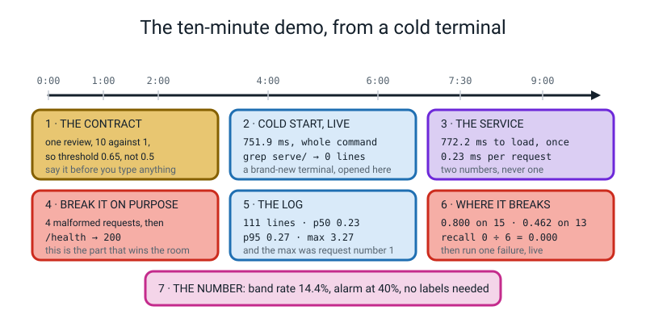
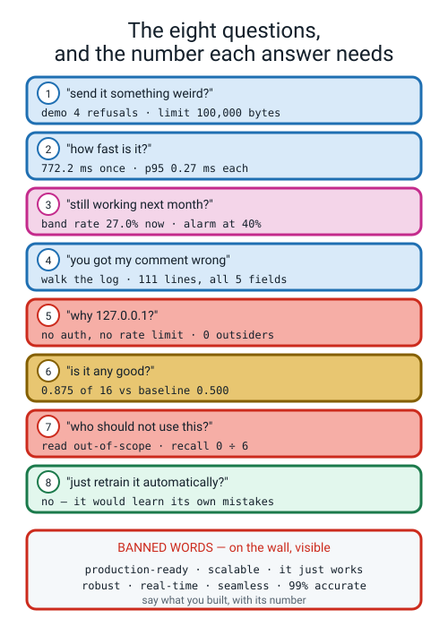
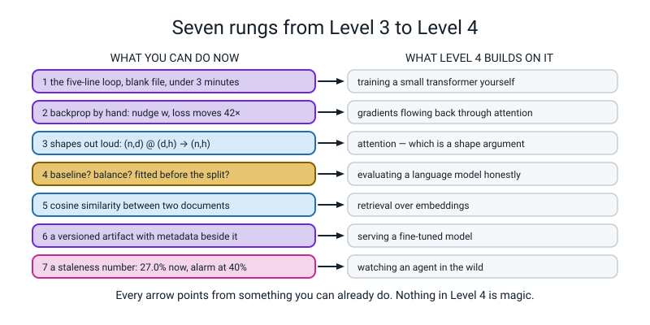
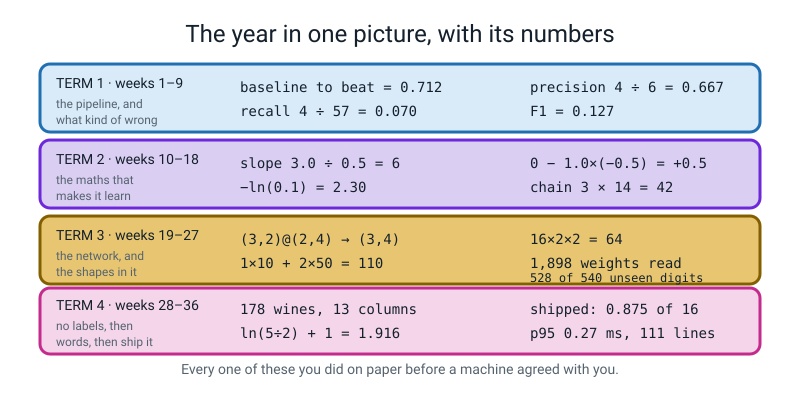
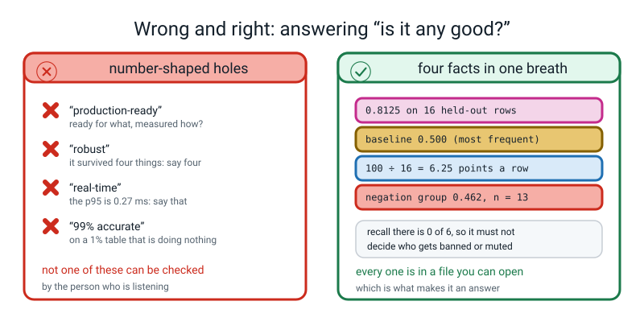
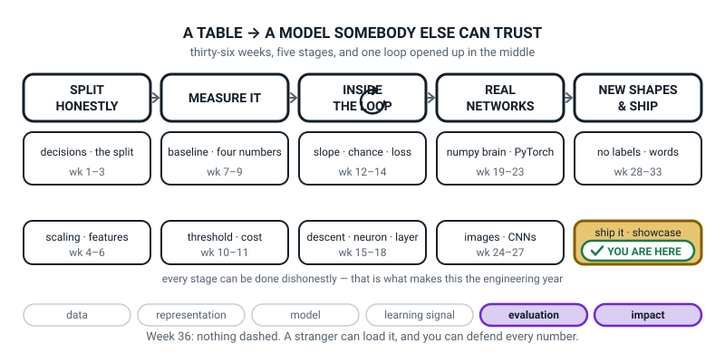
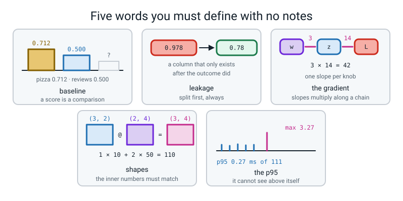

# Week 36 — Showcase Day and the Final Paper

[⬅ Week 35](week-35.md) · [Course Home](../README.md) · [Level 4 ➡](../README.md) · [Workbook](../workbook/week-36.md)

---

> ### This week in one sentence
> **You can hand a stranger a model, a card that says where it breaks, and a log that proves it ran — and you can defend every number in it, out loud, from a terminal you opened in front of them.**
>
> **By the end of this chapter you will be able to:**
> - **Give a ten-minute live demo from a cold terminal** that follows the seven-stop route and ends with a prediction, a log line and a latency — with the **two timing numbers kept separate**
> - **Answer all eight cross-examination questions** about your own model, **with a number in every answer**, and without using any word on the banned list
> - **Sit the 75-minute written paper** with no computer and no notes: twenty multiple choice, eight short answers, four debug problems — **three of which raise no error at all**
> - **Complete the Level 4 gate self-check honestly**, and name the two things you would most want to revisit
>
> **New maths:** none. Every number you say out loud today was computed in Weeks 1–35.
>
> **New syntax:** none. **The year is the syntax.**
>
> **Reading time:** about 40 minutes, and it is worth reading it twice: once now, once the night before.

---

## 🪝 Start Here

This section sets up today's two rules and shows what a finished demo looks like.

Somebody walks up to a laptop, **closes every terminal window that is open**, opens a brand-new one, and types one line.

```text
$ python3 serve/predict.py "cold food and a rude driver"
negative p=0.2110  (threshold 0.65, model sentiment_v1, 0.36 ms, loaded in 620 ms)
```

That terminal is nine seconds old. **The only cold start worth showing is one that starts cold.**

Now look at what came out of it, word by word.

- **A label.** `negative`.
- **A probability.** `0.2110` — not a yes/no, a *number*, and it was not 0.5.
- **A threshold that is not 0.5**, and you can say the arithmetic that chose it: `10 × 0 + 1 × 4 = 4` against `10 × 1 + 1 × 0 = 10`.
- **The name of the model that answered.** `sentiment_v1`, because somewhere there is also a `v2` you rejected in writing.
- **Two different times**, never added together.

**Nine months ago you could not have written that line — and more to the point, you would not have known that you wanted to.**

Then one more command, and the silence after it is the point:

```text
$ grep -rnE "\.fit\(|train_test_split|DummyClassifier|optimizer" serve/
$
```

**Nothing. And the nothing is the evidence.** There is no training code anywhere in the folder that serves predictions.

Today there are exactly two rules, and they are the whole of Level 3 compressed:

```text
   1.  NEW TERMINAL.  Every demo starts in a window you open in front of us.
   2.  EVERY ANSWER HAS A NUMBER IN IT.
```

Nine months ago, if somebody asked *"is it any good?"*, the answer would have been *"yeah, pretty good."* Today the answer is:

> **"0.8125 on sixteen held-out rows — 13 right — against a most-frequent baseline of 0.500, and sixteen rows means one row is worth 6.25 percentage points."**

**Same question. Completely different person answering it.**

---

## 🧠 The Big Idea

This section gives you the demo route, the eight questions, the banned words, the gates for the next level and the year's numbers in one place.

### 1. Ten minutes is shorter than you think, so follow the route

Without a route you will spend six of your ten minutes opening folders and apologising. **Seven stops, in this order.**


*Figure 36.1 — The ten-minute demo, from a cold terminal. Seven stops. The clock is on the wall and the times are called out loud. Stop 2 and stop 3 are two different timing numbers, and saying them as one is the commonest mark lost.*

| At | For | The stop | The number you must say |
|---:|---:|---|---|
| 0:00 | 1 min | **The contract.** One prediction is about one review. A nasty one slipping through costs ten times a nice one read anyway. | threshold **0.65**, not 0.5 |
| 1:00 | 1 min | **The cold start.** A brand-new terminal, one command, one answer. Then the Rule 1 `grep`. | the whole command's wall clock · the grep prints **0 lines** |
| 2:00 | 2 min | **The service.** Start it, `GET /health`, one good prediction. | how long it took to load **once**, against the per-request time — **two numbers** |
| 4:00 | 2 min | **Break it, live.** Four malformed requests, then `/health` again. | four `400`s, then a `200`. **Zero crashes.** |
| 6:00 | 1.5 min | **The log.** `wc -l`, then `read_logs.py`. | **111** lines · p50 · p95 · max — and *which request* the max was |
| 7:30 | 1.5 min | **Where it breaks.** The subgroup table, then one failure **live**. | **0.800** on the 15 rows without a negation, **0.462** on the 13 with one, recall **0 of 6** |
| 9:00 | 1 min | **The monitoring number.** | band rate **14.4%** now, alarm at **40%**, **computable with no labels at all** |

**Three ways a demo dies, and the fix for each.**

**One — the warm terminal.** You use the window that has been open since Week 34, so the demo proves nothing and often hides a hard-coded path. *Fix: open the window in front of the room, every time.*

**Two — the wrong folder.** You open a new window, which starts in your home directory, and your code has a relative path in it. **This is a real traceback and somebody will hit it today** — it is in 🐞 When It Breaks, with the sentence that keeps you the mark.

**Three — the six-minute apology.** *"So, um, it's not really finished, but…"* **Fix: ban the preamble.** Your first words are the first line of your contract.

> **⚠️ Watch out:** **stop 6 is where you show a failure on purpose** — predicted in advance. *"Watch. This is a positive review. It will call it negative, at about 0.49, because `boring` is a strong negative feature and `not` is nearly weightless."* Then run it and be right. **That is the single most impressive thing anybody will do today**, and it is more impressive than a demo where everything works.

### 2. The eight questions, and the number each answer needs

These eight are not arbitrary. **They are the eight things a real person asks when you hand them a model, in roughly the order they ask them** — and everybody gets the same eight, in the same order.


*Figure 36.2 — The eight questions, and the number each answer must contain. Below them, the banned words. An answer with no number in it is not an answer.*

| # | The question | What a passing answer contains |
|---:|---|---|
| **1** | "What happens if I send it something weird?" | **Do not answer in words — demo it.** Four refusals, then `/health`. Then a number: the body limit is **100,000 bytes**, and *why* that number. |
| **2** | "How fast is it?" | **Two numbers, kept apart.** The load, paid once at start-up; the **p95**, paid per request. **One number here is a fail.** |
| **3** | "How do you know it still works next month?" | The monitoring number, **computable with no labels**: band rate **14.4%** today, alarm at **40%**, and what you would do. |
| **4** | "Somebody says it got their comment wrong. What do you do?" | **Walk to the log.** 111 lines, each carrying the input, the probability, the threshold and the version. So the answer is *"I can tell you which model answered and how sure it was"*, not *"I don't know"*. |
| **5** | "Why `127.0.0.1` and not `0.0.0.0`?" | **No authentication and no rate limit**, so `0.0.0.0` would expose it to everybody on the network. **The reason, not just the string.** |
| **6** | "Is it any good?" | **0.8125** on **16** held-out rows against a baseline of **0.500** — and the honesty: **16 rows means one row is worth 6.25 percentage points.** |
| **7** | "Who should not use this?" | The out-of-scope line, with its number: **recall 0 of 6** on negated positives, so it must not decide who gets banned or muted. |
| **8** | "Could you just retrain it automatically on what it has seen?" | **No** — those log lines are the model's own opinions, not labels. Training on them is a **feedback loop**: it learns its own mistakes and grows more confident about them. |

**Question 4 is the one to think hardest about.** Nine months ago the honest answer was *"I don't know"* — and **"I don't know" is how trust dies.** That is the entire reason your log carries the input, the probability, the threshold and the version on every single line. You did not build it because it was on a checklist. You built it so that at eleven o'clock at night you can answer a person.

**And question 3 is the one answered worst, every year**, because it is the only one whose answer cannot be read off a metrics table. **The hardest question about a model is the one about next month.**

### 3. Seven banned words, and why banning words is not a gimmick

These are the seven words you may not use today.

```text
       ✗  production-ready        ✗  robust
       ✗  scalable               ✗  real-time
       ✗  it just works          ✗  seamless
       ✗  99% accurate
```

**Every one of those is a number-shaped hole.** They feel like claims and they carry no information, which is exactly why they are everywhere.

| Instead of | Say |
|---|---|
| "robust" | "it survived **four** malformed requests and answered a fifth time" |
| "real-time" | "the **p95 is 0.28 ms** over 111 logged requests" |
| "production-ready" | "it has a versioned artifact, three golden tests, a log, and a card naming three failure modes" |
| "99% accurate" | **nothing. Say a real number with its `n` and its baseline.** |

**"99% accurate" is the one that should make you wince**, because in Week 8 you learned that 99% accuracy on a table that is 1% positive is exactly what you get for predicting "no" every single time.

> **🧑‍🏫 If a student asks:** *"but real engineers say 'production-ready' all the time."* **They do, and that is the point.** The phrase is a shortcut between people who already share a written checklist. **You do not share a checklist with the person asking**, so the shortcut is just a noise you make while they wait for the number. When you can point at the checklist, use the shortcut. Until then, the number.
>
> And note: **"accurate" with a number is fine and is exactly what we want.** "0.8125 accuracy on 16 held-out rows" is a good sentence. **The test for any phrase: could somebody check it?** "Robust" cannot be checked. "Survived four malformed requests" can.

### 4. A Level 3 bug does not crash. It prints a number you are pleased with.

Here is the shape of the whole year, in one comparison.

| | Level 2 | Level 3 |
|---|---|---|
| A bug… | **crashes.** A traceback tells you the line. | **prints a number and smiles at you.** |
| So you find it by… | reading the error | **predicting the number before you run it** |

**Three of the four debug problems on today's paper raise no exception at all.** One of them prints `accuracy: 1.0`.

**Say that to yourself before you turn the paper over, because it changes how you read the code:** you are not hunting for something broken. You are hunting for a number that is *too good*, and then asking which rows it was measured on.

Every mystery this year had that same shape:

```text
Week  6   75% accuracy on a table of PURE NOISE
Week 21   a loss that does not move at all
Week 26   softmax applied twice, accuracy quietly capped
Week 35   a log file with 0 lines and no error message
today     accuracy: 1.0
```

**Not one of those printed a traceback. All five are caught by the same move: predict the number you expect, then check.** That is the last debugging move of the course and it is the only one you actually need in Level 4.

### 5. Seven rungs into Level 4

Level 4 builds transformers, trains language models and wires up agents. It will not slow down for a missing Level 3 skill, and the specific thing it assumes is that **you already know how to tell whether a model is working.**


*Figure 36.3 — Seven rungs from Level 3 to Level 4. Every rung is something you can already do, with the Level 4 thing built directly on top of it. Nothing over there is magic — you built the floor it stands on.*

| # | Gate | The honest standard |
|---:|---|---|
| **1** | The paper | **49+ of 70**, no single term holding 4+ wrong answers, and **13+ of 26 on Part C** |
| **2** | The capstone, **finished** | An artifact that loads in a fresh process · a `predict.py` · a running service · a log with latencies · a card with a subgroup table · a monitoring plan naming one number |
| **3** | The five-line loop | From a **blank file**, from memory, **in under three minutes**, and it runs |
| **4** | Backprop | A 2-layer network on paper, no notes, saying what each of the five lines does — and the **42** from Week 18 |
| **5** | The three questions | Shown any score, the first three things out of your mouth are: **what is the baseline · what is the class balance · was anything fitted before the split** |
| **6** | Shapes | `(n, d) @ (d, h) → (n, h)` said out loud, and the output shape of any layer predicted **before** running it |
| **7** | Embeddings | What one is, and why **cosine similarity** is the usual way to compare two |

**"I could do it with the notes open" is not a tick.**

And the thing to be honest about: **five of seven is not a fail. It is a map.** Gate 3 is a typing-fluency problem and ten days of a five-minute drill fixes it. Gate 2 has no shortcut, because Level 4's evaluation work is built directly on the capstone. **"Not yet, and here is the fortnight that fixes it" is a far better outcome than being waved through.**

### 6. The year in one picture — read the numbers, not the topics


*Figure 36.4 — The year in one picture, with its numbers. Four terms, and the arithmetic each one turned on. Every one of these was computed by hand before any code was run, and that order is the reason they mean something.*

**Term 1 — the pipeline, and what kind of wrong.** The baseline a model had to beat was **0.712**. Recall on the fraud table was **4 ÷ 57 = 0.070** — four frauds caught out of fifty-seven, hiding behind an accuracy of 0.99. And F1 was **2 × 0.667 × 0.070 ÷ 0.737 = 0.127**, which is much closer to 0.070 than to the plain average of 0.3685.

**Term 2 — the maths of learning.** A slope turned out to be a division: **3.0 ÷ 0.5 = 6**. One descent step turned out to be a subtraction: **0 − 1.0 × (−0.5) = +0.5**. And backpropagation, the thing that sounded like it would be the hardest idea of the year, turned out to be a multiplication: **3 × 14 = 42**.

**Term 3 — the network.** A `(3,2)` grid times a `(2,4)` grid gives a `(3,4)` grid, and row 0 column 0 was **1 × 10 + 2 × 50 = 110**. Your digit network held **1,898** learnable numbers — `80 + 1,168 + 650` — and you counted every one. It read **528 of 540** digits it had never seen.

**Term 4 — no labels, then words, then shipping.** **178** wines with **13** columns and no answer key. The idf of a word in 1 of 4 documents is **ln(5 ÷ 2) + 1 = 1.916**. And your shipped artifact scores **0.8125** on 16 held-out rows with a **p95 of 0.28 ms** over **111** logged requests.

**Here is the thing to notice about that whole list.** Every single number on it you worked out **by hand first** and checked against the computer afterwards. **Not once the other way round.** That is not a study technique — **it is the difference between using a tool and understanding one**, and it is the only reason you can now be handed an unfamiliar model and a confident number and tell whether to believe it.

---

## 🔁 The Idea From Last Week, Used Harder

Nothing new. Three things you already have, used under pressure, out loud.

### Twist one — the two timing numbers become one sentence

Last week they were two lines of output. Today they are a spoken answer, and **the two must stay apart**:

```text
WRONG   "it takes about a second"
RIGHT   "about 620 ms to load the model once at start-up,
         and a p95 of 0.28 ms per request over 111 logged requests.
         The max was 1.06 ms and that was the very first request,
         before anything was warm."
```

**"About a second" is a fail even though it is true**, because it hides the fact that the second is paid *once* and the quarter-millisecond is paid *every time*.

### Twist two — the subgroup row becomes an answer you volunteer

Question 7 has a number in it, and the number is not your headline:

> *"On the 13 rows containing a negation word, accuracy is 0.462 and recall on the positive class is 0.000 — six genuinely positive reviews and it found none of them. On the 15 rows without one, 0.800. And 12 of those 13 rows are traps I wrote on purpose to be hard, so 0.462 demonstrates that a mechanism exists rather than estimating how often it bites."*

**That last sentence is the one nobody is asked for and everybody should say.** Volunteering a caveat you were not asked about is the clearest signal there is that you understand your own numbers.

### Twist three — "predict the number first" becomes a 70-mark paper

The paper is three parts, **70 marks, 75 minutes**, no computer, no notes, paper and a calculator.

| Part | Items | Each | Total | Time | What it checks |
|---|:--:|:--:|:--:|:--:|---|
| **A — multiple choice** | 20 | 1 | 20 | 20 min | Do you know what the code actually does? |
| **B — short answer** | 8 | 3 | 24 | 25 min | Can you explain *why*, in words, to a person? |
| **C — debug** | 4 | 6.5 | 26 | 30 min | Can you find the **silent** bug and fix it? |

**How Part B is marked, so you know what a three-mark answer looks like:**

- **1 mark** — the core idea is there.
- **1 mark** — there is a **number or a specific** in it. *"It would be too high"* earns nothing; *"0.978 against a real 0.78"* earns the mark.
- **1 mark** — the **"so what"**: what you would actually do about it.

**And Part C:** 4 marks for finding the problems (**the count is given in the question**), 1.5 for ranking the worst one *with a reason*, 1 for a correct fix. **"It's wrong because of leakage" without naming the line is one mark, not four.**

**Every item is tagged with the week it came from**, like `[W14]`. That matters more than the total: **count your wrong answers by term.** Four wrong in one term is a real gap with a named fix. Four spread across four terms is a tired afternoon.

> **💡 Try this:** the night before, take any three numbers off your own model card and say them out loud with their `n` and their baseline. If you can do that in three sentences, Part B will look familiar.

---

## 💻 Type This

Nothing new to learn — five things to *rehearse*, with real output. **Run all five the day before, not on the day.**

### Step 1 — the cold start, from a folder that is not yours

Close every terminal. Open one. Then run your own tool **with a full path, from a completely different folder**:

```text
$ cd /
$ time python3 /path/to/ship-it/serve/predict.py "cold food and a rude driver"
negative p=0.2110  (threshold 0.65, model sentiment_v1, 0.36 ms, loaded in 620 ms)

real	0m0.769s
user	0m1.037s
sys	0m5.377s
```

**Three numbers in that output and every one of them is a different fact:**

- **0.769 s** — the whole command's wall clock. **This is the only honest cold-start number**, because it includes Python starting up, which no stopwatch inside your program can see.
- **620 ms** — loading the artifact. Paid once.
- **0.36 ms** — the prediction. Paid every time.

**And the reason it worked from `/` at all** is one line inside your own code: `Path(__file__).resolve().parent`. **A path relative to the folder you happen to be standing in is a path that depends on a fact you never wrote down.**

### Step 2 — the grep, and the blank line that is the evidence

Run this `grep` from the project folder:

```text
$ grep -rnE "\.fit\(|train_test_split|DummyClassifier|optimizer" serve/
$
```

**Practise saying the sentence while it prints nothing:** *"That is Rule 1 from Week 34, and it is the only rule in this project I can check with one command instead of promising."*

### Step 3 — `answers.py`: print your own eight answers from your own files

Four of the eight questions are answered with numbers that are already on your disk. **So print them.** Reading your own measurements off a sheet is exactly what an engineer does.

```python
"""answers.py — print the eight answers, with YOUR numbers, from your own files."""
import json
from pathlib import Path

import numpy as np

ROOT = Path(__file__).resolve().parent
ART = ROOT / "model" / "artifacts"
LOG = ROOT / "logs" / "predictions.jsonl"

version = (ART / "LATEST").read_text().strip()
with open(ART / (version + ".metadata.json")) as f:
    meta = json.load(f)

rows = []
for line in LOG.read_text().splitlines():
    if line.strip() != "":
        rows.append(json.loads(line))

lat = np.array([r["latency_ms"] for r in rows])
prob = np.array([r["probability"] for r in rows])
band = int(((prob >= 0.45) & (prob <= 0.65)).sum())
```

Add these four prints, one per numeric question, to the end of `answers.py`:

```python
print("model            : %s   (threshold %.2f)" % (version, meta["threshold"]))
print("Q2 how fast      : loads once at start-up; p95 %.2f ms, max %.2f ms over %d requests"
      % (np.percentile(lat, 95), lat.max(), len(rows)))
print("Q3 still working : band rate %d of %d = %.1f%%, alarm at 40%%, no labels needed"
      % (band, len(rows), 100.0 * band / len(rows)))
print("Q4 got it wrong  : %d log lines, each with input, probability, threshold, version"
      % len(rows))
print("Q6 any good      : %.3f on %d held-out rows, baseline %.3f, 1 row = %.2f points"
      % (meta["test_accuracy"], meta["n_test"], 0.500, 100.0 / meta["n_test"]))
```

Then run it:

```text
$ python3 answers.py
model            : sentiment_v1   (threshold 0.65)
Q2 how fast      : loads once at start-up; p95 0.28 ms, max 1.06 ms over 111 requests
Q3 still working : band rate 16 of 111 = 14.4%, alarm at 40%, no labels needed
Q4 got it wrong  : 111 log lines, each with input, probability, threshold, version
Q6 any good      : 0.812 on 16 held-out rows, baseline 0.500, 1 row = 6.25 points
```

**Notice which four questions are missing: 1, 5, 7 and 8.** Those four have no number in a file — **they are sentences you have to be able to say**, and that is why they are the ones people fluff. Write them on the back of the sheet in your own handwriting.

### Step 4 — gate 3: the five-line loop, from a blank file, timed

**Blank file. No notes. Under three minutes. Then run it.**

Type this into `gate3.py`:

```python
# gate3.py - the whole of Level 3 in 16 lines.
import torch
import torch.nn as nn

torch.manual_seed(0)
X = torch.randn(200, 2)
y = (X[:, 0] + X[:, 1] > 0).float().unsqueeze(1)

model = nn.Sequential(nn.Linear(2, 8), nn.ReLU(), nn.Linear(8, 1))
loss_fn = nn.BCEWithLogitsLoss()
opt = torch.optim.SGD(model.parameters(), lr=0.1)

for epoch in range(200):
    opt.zero_grad()                 # 1. empty the gradient bucket
    logits = model(X)               # 2. forward
    loss = loss_fn(logits, y)       # 3. how wrong
    loss.backward()                 # 4. one slope per knob
    opt.step()                      # 5. one step downhill
    if epoch % 50 == 0:
        print("epoch %3d  loss %.4f" % (epoch, loss.item()))

with torch.no_grad():
    acc = (((model(X) > 0).float()) == y).float().mean().item()
print("final loss %.4f   accuracy %.3f" % (loss.item(), acc))
```

Then run it:

```text
$ python3 gate3.py
epoch   0  loss 0.8374
epoch  50  loss 0.3956
epoch 100  loss 0.2226
epoch 150  loss 0.1597
final loss 0.1298   accuracy 0.990
```

**Runtime: about one second.** If you had to look anything up, that is gate 3 unticked — and the fix is five minutes a day for ten days, not a whole term.

### Step 5 — the three-questions drill

Somebody hands you a model and says it scores **0.9844**. Before you believe a word of it, save and run this as `three_questions.py`:

```python
"""three_questions.py — what to say when somebody hands you a big number."""
import numpy as np
from sklearn.datasets import make_classification
from sklearn.dummy import DummyClassifier
from sklearn.metrics import accuracy_score, recall_score, roc_auc_score
from sklearn.model_selection import train_test_split

X, y = make_classification(n_samples=6000, n_features=8, weights=[0.99, 0.01],
                           random_state=0)
X_tr, X_te, y_tr, y_te = train_test_split(X, y, test_size=0.30, stratify=y,
                                          random_state=0)

print("question 2 — class balance : %d of %d positive = %.4f"
      % (y_te.sum(), len(y_te), y_te.mean()))

dummy = DummyClassifier(strategy="most_frequent").fit(X_tr, y_tr)
pred = dummy.predict(X_te)
print("question 1 — the baseline  : accuracy %.4f" % accuracy_score(y_te, pred))
print("             and its recall: %.4f  <- it caught %d of the %d frauds"
      % (recall_score(y_te, pred, zero_division=0),
         int(((pred == 1) & (y_te == 1)).sum()), int(y_te.sum())))
print("             and its AUC   : %.4f  <- a coin flip is 0.5000"
      % roc_auc_score(y_te, dummy.predict_proba(X_te)[:, 1]))
```

Here is the output:

```text
$ python3 three_questions.py
question 2 — class balance : 28 of 1800 positive = 0.0156
question 1 — the baseline  : accuracy 0.9844
             and its recall: 0.0000  <- it caught 0 of the 28 frauds
             and its AUC   : 0.5000  <- a coin flip is 0.5000
```

**Read those four lines again.** `0.9844` accuracy. **Zero** frauds caught out of 28. An AUC of exactly `0.5000`, which is a coin flip. **And there is no model in there at all** — `DummyClassifier` predicts the majority class for every single row.

**That is gate 5, and it takes eight seconds to say:**

```text
1.  what is the BASELINE?
2.  what is the CLASS BALANCE?
3.  was anything FITTED BEFORE THE SPLIT?
```

**Runtime: under a second. Total for all five steps: about five minutes, and it is the best five minutes you will spend this week.**

---

## 🔍 Worked Examples

This section walks through a full demo, the eight answers marked, and a bug to find.

### Worked Example 1 — A ten-minute demo, transcribed

Here is what the seven stops actually sound like, with the commands and the real output.

**Stop 1 — the contract (1 min). No laptop. Say it.**

> *"One prediction is about one review, written by one person, at one time — not a person, not an account. In goes one field called `text`, a non-empty string, at most 100,000 bytes. Out come five fields: label, probability, threshold, model version and latency. A nasty review called positive means a nasty review nobody reads; I priced that at 10. A nice review called negative costs a moderator ten seconds; I priced that at 1. So my threshold is 0.65, not 0.5, from the cost sweep on my 16 validation rows: `10 × 1 + 1 × 0 = 10` at 0.50 against `10 × 0 + 1 × 4 = 4` at 0.65. 0.70 costs 4 as well, and when two thresholds tie I take the lower one, because it lets more nice reviews through. Accuracy alone would have picked 0.50, and 0.50 is the one that costs 10. And it must never decide who gets banned, and never mark anybody's schoolwork."*

**Stop 2 — the cold start (1 min).** New window, opened in front of the room.

```text
$ python3 serve/predict.py "the pizza was hot and delicious"
positive p=0.7450  (threshold 0.65, model sentiment_v1, 0.39 ms, loaded in 613 ms)

$ grep -rnE "\.fit\(|train_test_split|DummyClassifier|optimizer" serve/
$
```

**Stop 3 — the service (2 min). Two numbers, said separately.**

```text
$ python3 serve/service.py --port 8010
loaded sentiment_v1 in 610 ms (threshold 0.65)
serving on http://127.0.0.1:8010   (Ctrl+C to stop)

$ curl -s http://127.0.0.1:8010/health
{"status": "ok", "model_version": "sentiment_v1", "threshold": 0.65, "classes": ["negative", "positive"], "load_ms": 609.7}
```

> *"610 milliseconds to load the model — once, when the service starts. And a quarter of a millisecond per prediction. Two numbers, and I will never add them together."*

**Stop 4 — break it, live (2 min). Four refusals, then the fifth knock.**

```text
{"error": "empty body; expected {\"text\": \"...\"}"}
{"error": "invalid JSON: Expecting value: line 1 column 10 (char 9)"}
{"error": "expected a JSON object with a 'text' field", "example": {"text": "the pizza was hot"}}
{"error": "'text' must be a non-empty string", "got_type": "int"}
{"status": "ok", "model_version": "sentiment_v1", ...}
```

> *"Four hundreds, then a two hundred. Zero crashes, and none of those four is in my log, because nothing was predicted."*

**Stop 5 — the log (1.5 min).**

```text
$ wc -l logs/predictions.jsonl
     111 logs/predictions.jsonl
$ python3 eval/read_logs.py
requests        : 111
by label        : {'negative': 76, 'positive': 35}
latency mean    : 0.23 ms
latency p50     : 0.21 ms
latency p95     : 0.28 ms
latency max     : 1.06 ms
```

> *"`76 + 35 = 111`. The p95 is 0.28 and the max is 1.06 — and the max was request number one, before anything was warm. With only 111 requests the p95 cannot see a single outlier, so I print both."*

**Stop 6 — where it breaks (1.5 min). The table, then a live failure you predicted.**

> *"Watch. This is a positive review and my model is going to call it negative, at about 0.49."*

```text
$ python3 serve/predict.py "not boring for a single minute"
negative p=0.4887  (threshold 0.65, model sentiment_v1, 0.36 ms, loaded in 630 ms)
```

> *"0.4887. `boring` is one of my strongest negative features and `not` is nearly weightless, because a bag of words throws away word order. On the 13 rows with a negation word my accuracy is 0.462 and my recall is 0 of 6. Twelve of those 13 are traps I wrote on purpose, so that number shows the mechanism, not the rate."*

**Stop 7 — monitoring (1 min).**

> *"I watch the share of predictions landing between 0.45 and 0.65. Today that is 16 of 111, which is 14.4 per cent. My alarm is a weekly mean above 40 per cent. **I can compute it with no labels at all**, which matters because in production the right answer almost never comes back in time. If it trips, I pull the 16 nearest the fence and read them. And one thing I would deliberately not do: retrain on my own predictions."*

### Worked Example 2 — The eight answers, marked

Same eight questions, two answers each. **The difference between them is never effort — it is a number.**

| # | Not yet | Passing |
|---:|---|---|
| **1** | "It handles errors." | "Watch." *(sends four, gets four `400`s, then a `200` on `/health`)* "And the body limit is 100,000 bytes, because my longest training review is 55 characters." |
| **2** | "It's really fast." | "610 ms to load once at start-up; p95 0.28 ms per request over 111 requests; max 1.06, which was request one." |
| **3** | "I'd check it now and then." | "Band rate, 16 of 111 = 14.4% today, alarm at 40%, computable with no labels. If it trips I read the 16 nearest the fence." |
| **4** | "I'd look into it." | "I'd open the log. 111 lines; each has the input, the probability, the threshold and the version — so I can tell them which model answered and how sure it was." |
| **5** | "Because it's localhost." | "Because it has no authentication and no rate limit, so `0.0.0.0` would let anybody on this network send it a million requests." |
| **6** | "Pretty good — about 100%." | "0.8125 on 16 held-out rows against a most-frequent baseline of 0.500. And 16 rows means one row is worth 6.25 points, so 13 right of 16 is a respectable headline and not a measurement of how it will do next month." |
| **7** | "It might be biased." | "It must not decide who gets banned: recall on negated positives is 0 of 6. And not for any language other than English." |
| **8** | "No, that'd be cheating." | "No — those 111 lines are the model's own opinions, not labels. It would learn its own mistakes and get *more* confident about them. That is a feedback loop." |

**And the two answers worth praise on the spot**, because nobody gets to them by accident:

- Volunteering, unprompted, that the 12 traps were **written on purpose to be hard**, so `0.462` shows a mechanism rather than estimating a rate.
- Saying, on question 2, that **your latency will not match anybody else's**, because latency depends on the machine.

### Worked Example 3 — A silent bug in a report, and the two numbers it hid

Here is a small program of exactly the kind on Part C. **It runs. It raises nothing. It lies twice.**

```python
"""report_broken.py - a subgroup report on six reviews. It runs. It lies twice."""
import sys
from pathlib import Path

sys.path.insert(0, str(Path(__file__).resolve().parent / "serve"))
from predictor import Predictor

ROWS = [
    ("Not boring for a single minute", "positive"),
    ("Nothing rude about the staff",   "positive"),
    ("delicious fresh pizza",          "positive"),
    ("cold food and a rude driver",    "negative"),
    ("stale bread and awful coffee",   "negative"),
    ("terrible acting and a terrible script", "negative"),
]
NEGATION = ["not", "never", "hardly", "cannot", "no", "nothing", "far"]

p = Predictor()
right = 0
negated = []
for text, truth in ROWS:
    got = p.predict_one(text)["label"]
    if got == truth:
        right = right + 1
    for word in text.split():              # <-- no .lower()
        if word in NEGATION:
            negated.append((text, truth, got))

print("overall accuracy : %.3f" % (right / len(ROWS)))
print("rows with a negation word: %d" % len(negated))
if len(negated) > 0:
    ok = sum(1 for t, truth, got in negated if got == truth)
    print("  their accuracy : %.3f" % (ok / len(negated)))
else:
    print("  no negation rows found, so nothing to worry about")
```

```text
$ python3 report_broken.py
overall accuracy : 0.667
rows with a negation word: 0
  no negation rows found, so nothing to worry about
```

**Stop and find them before reading on.**

**Lie one — `n = 0` is a filter bug, not a finding.** `text.split()` gives `"Not"` with a capital N, and `"Not" in NEGATION` is `False`, because the list holds `"not"`. So the filter matched nothing, and **the program then reported the absence of a problem as good news.** One word fixes it:

```python
    for word in text.lower().split():       # FIX: match the case
```

```text
$ python3 report_fixed.py
overall accuracy : 0.667
rows with a negation word: 2
  their accuracy : 0.000
```

**Two rows, and it got both wrong:**

```text
Not boring for a single minute   -> negative p=0.4887
Nothing rude about the staff     -> negative p=0.2838
delicious fresh pizza            -> positive p=0.7530
```

**Lie two — `0.667` has no baseline and no `n` beside it.** Six rows, three positive and three negative, so **a coin has a baseline of 0.500 here** and a constant answer gets 0.500 too. `0.667` is four rows right out of six, and **one row is worth 16.7 percentage points.** A number that moves by 16.7 points per row is not a measurement; it is a mood.

> **⚠️ Watch out:** a group of `n = 0` should be **louder** than a bad score, not quieter. If a filter finds nothing, print the group sizes **before** the metrics — every time.

---

## 🐞 When It Breaks

Three real demo-day failures. **A demo where something breaks and you name the cause, fix it and say what you would change is *better* evidence than one where everything works** — because it proves you understand the machine instead of having memorised a sequence.

### Break 1 — the classic demo-day death

```text
$ cd /tmp
$ python3 /path/to/ship-it/relpath.py
Traceback (most recent call last):
  File "/path/to/ship-it/relpath.py", line 2, in <module>
    pipe = joblib.load("model/artifacts/sentiment_v1.joblib")
  File "/.../joblib/numpy_pickle.py", line 650, in load
    with open(filename, 'rb') as f:
FileNotFoundError: [Errno 2] No such file or directory: 'model/artifacts/sentiment_v1.joblib'
```

**What it means.** There is no such file **from where you are standing.** The path was relative to whichever folder you happened to be in, and a brand-new terminal starts somewhere else. It worked for nine months of Tuesdays because you were always in the same folder.

**The fix, live, and the sentence that keeps you the mark.** `cd` into the project, re-run — then say out loud:

> *"My path was relative to the folder I was in. `Path(__file__).resolve()` is what makes it not care."*

**Diagnosing it live is harder than never breaking it.**

### Break 2 — Python cannot find your own file

```text
$ python3 noimp.py
Traceback (most recent call last):
  File "/tmp/noimp.py", line 1, in <module>
    from predictor import Predictor
ModuleNotFoundError: No module named 'predictor'
```

**What it means.** Python looks in the folder of the **running** script, not the folder of the file doing the importing. Without the `sys.path.insert(0, ...)` line above the import, `predictor.py` is invisible.

**The fix.** Keep the insert line, and keep it **above** the import:

```python
sys.path.insert(0, str(Path(__file__).resolve().parent))
from predictor import Predictor
```

### Break 3 — the quotes, one last time

```text
$ python3 serve/predict.py cold food and a rude driver
usage: predict.py [-h] [--version VERSION] [--threshold THRESHOLD] [--json]
                  text
predict.py: error: unrecognized arguments: food and a rude driver
```

**What it means.** The shell split your sentence at every space, so `argparse` got six things when it wanted one.

**The fix.** Quote it. **The quotes are what turn six words into one argument** — and this is the single most likely thing to go wrong in front of a room, because you will be typing faster than usual.

### And the two that will not raise anything today

| What you see | What is actually wrong |
|---|---|
| The demo works perfectly and you **cannot say what your p95 was** | Nothing crashed; nothing was measured. You ran the service but never ran `read_logs.py`. **Week 35's objective was the four numbers, not the log file.** |
| `wc -l` says **0 lines** after a successful prediction | `level=logging.INFO` is missing. Python's default level is `WARNING` and it discards `INFO` in silence. **It will resurface today, under pressure.** |

---

## 🎲 What We Did In Class

This section records how the two sittings ran, so you can follow them or repeat them.

**Two sittings, and they are not interchangeable.**

**Sitting 1 — Showcase Day, 70 minutes.**

1. **The hook.** Every terminal closed in front of the room, one opened, one command, one answer. Then the grep, printing nothing.
2. **The route and the questions.** Seven stops on the board, eight questions and seven banned words on the wall. Page 36.2 filled in **in pen, five minutes, silent — your own numbers, nobody else's.** *If you cannot fill in a line, that is the question you will be asked worst, and you have five minutes to go and find the number.*
3. **One volunteer demo, cross-examined in full** — and two mistakes made on purpose first:
   - **the wrong folder**, run from home instead of the project, producing Break 1 above;
   - **a banned word**, said out loud by the teacher — *"oh, it's basically real-time, it's super fast"* — until somebody tapped the table. Then the same thing said properly: **"610 ms to load once, and a p95 of 0.28 ms per request over 111 logged requests."** Four extra seconds, and the difference between a claim and a boast.
4. **The showcase round.** Ten minutes of demo, five of cross-examination, in the order on the board. **The banned-word mechanic: nobody boos. One person taps the table once, the speaker says the number instead, and the demo carries on.** Listeners had a job — one tick per question per presenter, *did the answer contain a number?*
5. **The audience tally.** *"Across every demo today, which of the eight was answered worst?"* It is almost always **question 3** — the monitoring number — because it is the only one that cannot be read off a metrics table.
6. **The wrap.** Figure 36.4, read as numbers rather than topics. Then Figure 36.3 for thirty seconds: **nothing in Level 4 is magic; you built the floor.**

**Sitting 2 — the written paper, 75 minutes, separate room, no computer, no notes.** Papers face down, and the three rules said out loud — the third being: **"three of the four programs in Part C raise no error at all."**

```text
0–3     rules, papers face down
3–23    Part A, twenty multiple choice
23–48   Part B, eight short answers
48–75   Part C, four debug problems
```

**If you missed the day:** do the whole demo to one person — a parent, a friend, a wall — from a cold terminal, with a timer, all seven stops, then hand them the eight questions and let them read them out in order. **Same assessment, different room size.**

---

## 💬 Talk About It

Use these three questions for discussion with a partner or the class.

**1. Why is showing a failure on purpose more impressive than hiding one?**
*Hint: anybody can hide a failure. Ask what a stranger needs in order to use your model safely — and what they can do with a model whose failures are unknown, versus one whose failures are written down with probabilities beside them.*

**2. What was actually the hardest week of the year?**
*Hint: it is almost always Week 18 (slopes multiplying along a chain) or Week 25 (the output-size rule), and almost never the week people expected. Both are hard for the same reason — you had to hold a number and a shape in your head at the same time. That is exactly what Level 4 asks for constantly, so knowing it is your weak spot is worth more today than any mark.*

**3. How long should you wait before rewriting this project properly?**
*Hint: nobody agrees. One camp says now, while you remember every decision. The other says leave it a month, then read your own code cold — because after a month you ARE the stranger, and how legible your work is to a stranger is the thing you most need to learn. Everybody agrees on one thing: not this week. You cannot see your own choices from three days away.*

---

## ⚠️ Don't Get Tricked

This section lists four tempting ideas about today, each with a wrong and a right version.

### Trick 1 — "the demo is a presentation, so it should look good"


*Figure 36.5 — Wrong and right: answering "is it any good?" On the left four banned phrases, not one of which the listener can check. On the right the same answer made of facts: 0.8125 on 16 held-out rows, a baseline of 0.500, `100 ÷ 16 = 6.25` points a row, and the negation-word subgroup at 0.462 on 13 rows.*

**Wrong:** slides, a screenshot, a rehearsed script.
**Right:** **a terminal is not a slide.** The demo is *evidence*, and the most impressive thing in it is a live failure you predicted correctly. And slides let you skip the cold start, which is the one thing today is designed to check.

### Trick 2 — "'I don't know' loses marks"

**Wrong:** invent something plausible.
**Right:** *"I don't know, and here is how I would find out"* is a **passing** answer, and it is the sentence professionals use most. What loses marks is a confident answer with no number in it.

### Trick 3 — "ticking all seven gates is the good outcome"

**Wrong:** seven ticks.
**Right:** **at least one honest blank.** A tick means *I could do this from a blank file, with only the glossary* — not *with my notes*, and not *I did it once in March*.

**The sheet is for you, not for anybody marking it.** A sheet with everything ticked is worth nothing to anybody, and **an honest blank is more impressive than a tick**, because it is the thing that tells you what your next fortnight is for.

### Trick 4 — "the paper's programs are broken, so they'll crash"

**Wrong:** look for a traceback.
**Right:** **three of the four raise nothing, and one prints `accuracy: 1.0`.**

**A perfect score is the loudest alarm in this course.** When you see `1.0`, the question is never "why is it so high" — it is **"which rows was it measured on?"**

---

## 🌍 Where You've Seen This

This section shows where today's habits appear outside the course.

- **A software demo at any company** — the good ones open a terminal; the bad ones show a video of a terminal, and now you know why that difference matters.
- **Release notes that say "p95 load time down 40%"** rather than "faster". Somebody on that team has your habit.
- **Model cards published with real systems** — a section called "limitations" with group sizes in it. Most are vague. You have now written one that is not.
- **Post-incident write-ups** ("what happened, what we saw in the logs, what we changed"). That is stop 5 of your demo, in professional clothing.
- **A code review**, where somebody asks "which rows did you measure that on?" — Part C of today's paper is a code review with the answers hidden.
- **Any interview for any technical job**, ever. The eight questions are not a school exercise; they are approximately the interview.

---

## 🧭 Where This Fits

Look at it properly this time. **There is not one dashed box left on the page.** Thirty-six weeks ago
almost every box on this map was a grey outline with a week number in it, and the only solid thing was
stage one. This is the only week of the whole level where the picture is finished.



*Figure 36.0 — The pipeline in Week 36. Ten tiles, five stages, nothing dashed. The ↻ on stage three is
black, as it has been since Week 12 — the week you opened the loop.*

| | |
|---|---|
| **The mental model you now own** | You can hand a stranger **three things** — the artifact, the card that says where it breaks, and the log that proves it ran — and **defend every number in all three.** That is the whole level in one sentence. Its companion is the one you learned in Week 1 and have not been allowed to forget since: **a number you cannot reproduce is still not a result.** |
| **The one question it answers** | *"Can I defend every number on this page?"* — with a number in every answer, no banned words, and the caveat volunteered before anybody has to ask for it. |
| **What it plugs into** | All thirty-six weeks, and most sharply three of them: Week 1's five decisions, which became the contract; Week 18's gradients worked out by hand, which is why nothing in a training loop is magic to you; and Weeks 34–35's shipped service, which is the thing sitting on your laptop right now. |
| **What carries forward** | **Level 4** — the same discipline pointed at models you did **not** train yourself, and at systems where the loop is somebody else's. The map changes. The question *"where is the baseline, and what is the `n`?"* does not. |
| **Spiral thread** | 🌍 **Impact** and ⚖️ **Evaluation** — the two lit on the last day, which is the right pair to finish on. Every other thread on that strip exists to make these two answerable. |

> **💡 Try this:** turn to the inside cover of your notebook, where in Week 1 you copied the five stage
> names in pencil with room underneath. Fill in the last gap. Then, underneath the lot, write the eight
> questions — **and the number you would answer each of them with today.** That page is what you take into
> Level 4.

---

## 🔑 Remember This

This section collects the points to keep from today.

- **Two rules today: a new terminal, and a number in every answer.** Both are mechanical, and the second one is the whole of Level 3.
- **Two timing numbers, kept apart.** Load-once versus per-request. *"About a second"* is a fail even when it is true.
- **Every score carries its `n` and its baseline.** `0.8125 on 16 rows against 0.500`, and one row is `100 ÷ 16 = 6.25` points.
- **Volunteer the caveat nobody asked for.** *"Twelve of those 13 rows are traps I wrote on purpose, so this shows the mechanism, not the rate."*
- **A Level 3 bug prints a number you are pleased with.** Predict the number first; then check. **That is the last debugging move of the year, and it is the only one you need in Level 4.**
- **An honest blank on the gate sheet beats a tick you cannot defend.**

### The three questions, and the five lines — from memory

```python
# ---- shown any score at all, say these three, in this order ------------
#  1. what is the BASELINE?          DummyClassifier on the same split
#  2. what is the CLASS BALANCE?     y.mean(), and the count of positives
#  3. was anything FITTED BEFORE THE SPLIT?   scaler, imputer, vectorizer
# 0.9844 accuracy, 0 of 28 frauds caught, AUC 0.5000 -> there is no model here

# ---- the five-line loop, blank file, under three minutes ---------------
for epoch in range(200):
    opt.zero_grad()        # 1. empty the gradient bucket
    logits = model(X)      # 2. forward
    loss = loss_fn(logits, y)   # 3. how wrong
    loss.backward()        # 4. one slope per knob
    opt.step()             # 5. one step downhill
```

And the two commands that prove a claim instead of making one:

```bash
grep -rnE "\.fit\(|train_test_split" serve/     # prints nothing = Rule 1 held
wc -l logs/predictions.jsonl                    # 111 = predictions, not requests
```

### One-line maths reminder

**Every number you say today has a sum behind it:** `10 × 0 + 1 × 4 = 4` chose your threshold · `3 × 14 = 42` is backpropagation · `1 × 10 + 2 × 50 = 110` is a matrix multiply · `18 ÷ 28 = 0.643` closes your subgroup table · `100 ÷ 16 = 6.25` is what one row is worth.

---

## 📓 New Words

This section lists the words to be able to define with no notes.

**None. Every word today was defined in an earlier week** — which is the point of the last week of anything.

Here are the five you must be able to define **with no notes**, each with the number that proves you mean it:


*Figure 36.6 — Five words you must define with no notes. Baseline `0.712` and `0.500`; leakage turning a real `0.78` into a reported `0.978`; the gradient as one slope per knob, `3 × 14 = 42`; shapes, `(3,2) @ (2,4) → (3,4)` with `1 × 10 + 2 × 50 = 110`; and a p95 of `0.28 ms` printed beside a max of `1.06 ms`.*

| Word | What it means | The number that proves you mean it |
|---|---|---|
| **baseline** | What you get for doing almost nothing — the majority class, or a `DummyClassifier` on the same split. A score is a *comparison*. | `0.712` on the pizza table · `0.500` on the 80 reviews · `0.9844` on a 1.56%-positive table, catching **0 of 28** |
| **leakage** | The model saw something at training time that it will not have at prediction time. | ROC-AUC `0.978` reported against a real `0.78` · 75% accuracy on a table of **pure noise** |
| **the gradient** | One slope per knob, collected together; and slopes multiply along a chain. | `3 × 14 = 42` — measured stage by stage *and* straight through, and the two agreed |
| **shapes** | A grid of numbers is `rows × columns`, and for `A @ B` the inner numbers must match. | `(3,2) @ (2,4) → (3,4)`, and row 0 column 0 is `1 × 10 + 2 × 50 = 110` |
| **the p95** | The time 95 percent of requests came in under — reported next to the max, because it cannot see above itself. | `0.28 ms` over 111 requests, with a max of `1.06 ms` that was request number **one** |

---

## 📤 Your Homework

This section says what to do after class and how long it takes.

**No new technical homework. This is the last thing you will be asked to do this year, and it takes about forty minutes.** Go to the **[Week 36 workbook](../workbook/week-36.md)**.

- **Page 36.6 — the Level 4 gate self-check, and be hard on yourself.** Seven gates. **A tick means "I could do this from a blank file, with only the glossary open"** — not with your notes, and not "I did it once in March". **At least one honest blank is expected, and it is more impressive than seven ticks.** Then name the **two** things you would most want to revisit, one sentence each on why.
- **Page 36.7 — the letter to yourself.** One side of paper, to the person who opens Level 4. Three things in it:
  1. **What you want to build next** — specifically. Not "AI stuff"; an actual thing.
  2. **One thing from this year you would now do differently, and why.** The good answers are structural: *"I would write the contract in Week 33 instead of Week 34, because I built the model before I knew what one prediction was about."* **"I'd work harder" is a blank.**
  3. **One number from this year you are proud of, with the arithmetic beside it.**

Then **put the letter in an envelope, write the date on it, and keep it.** You will open it in about a year, and it will be the most interesting thing you read that week.

**About 40 minutes** — 15 on the gate self-check, 25 on the letter.

---

There is no next week. Thirty-six weeks ago you opened a file with one line of code in it and five hidden decisions, and you spent the year learning to see all five. Along the way you measured a slope with a pencil before you knew the word *derivative*, multiplied a `(3,2)` grid by a `(2,4)` grid by hand before you typed `@`, found out that backpropagation is `3 × 14 = 42`, counted all **1,898** numbers in your own convolutional network, watched a model score 75% on a table of pure noise — and finished by handing a stranger a working service, a card that says exactly where it breaks, and a log that proves it ran.

**You can now be handed an unfamiliar model and a confident number, and say whether to believe it. Very few adults can do that.**

---

[⬅ Week 35](week-35.md) · [Course Home](../README.md) · [📓 Workbook — Week 36](../workbook/week-36.md) · [Glossary](../../glossary.md) · [Level 4 — Innovator ➡](../../../level-4-innovator/)
