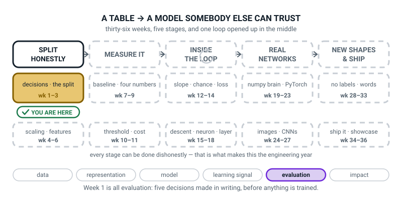

# Week 1 — The One Line That Hid Five Decisions

[⬅ Start Here](../README.md) · [Course Home](../README.md) · [Week 2 ➡](week-02.md) · [Student Guide](../student-guide/week-01.md) · [Workbook](../workbook/week-01.md)

---

## 📋 At a Glance

This table gives the week's logistics in one place, so you can check them before you plan.

| | |
|---|---|
| **Duration** | 70 minutes |
| **Type** | 🟦 Teach — the first week of Level 3, and it contains no model at all |
| **Big idea** | `model.fit(X, y)` was **one line hiding five decisions** somebody had to make — and this year you make them yourself, on purpose, in writing. |
| **New vocabulary** | unit of prediction · target (y) · features (X) · data audit · ID column · class balance |
| **New maths** | **None.** This week practises arithmetic they already have: division, and a fraction read as a percentage. |
| **New syntax** | `np.random.default_rng(0)` · `df.duplicated().sum()` · `df["col"].nunique()` · `df["late"].value_counts(normalize=True)` |
| **Dataset** | A 2,020-row pizza-delivery table, **generated by numpy in front of the student** from `make_data.py`, seed 0 — including its 6% missing values and its 1% duplicate rows. Nothing downloads. |
| **Materials** | Ten blank index cards · a pen · the printed workbook (its **Build It** section is the one you need in class) · one sheet of A4 with `model.fit(X_train, y_train)` written on it in big letters · the **Bug Log** (a fresh notebook, first page today) |
| **Tech needed** | Laptop with Python 3, numpy, pandas. **No scikit-learn needed today** and no internet, ever. If the Week 0 install worked, you are ready. |
| **Prep time** | 25 minutes the night before · 5 minutes on the day |
| **Expected runtime of the code** | `make_data.py` about 0.4 seconds. `audit.py` about 0.5 seconds. Nothing trains. Nothing waits. |

> **⚠️ Watch out:** the temptation this week is to train something. Resist it completely. There is no model in Week 1 and that is the message: **the modelling was never the hard part.** A student who leaves today having fitted nothing and written a one-page contract has had exactly the right lesson.

---

## 🎯 Lesson Objectives

By the end of the lesson the student can:

1. **Name the five decisions hidden inside a single `fit()` call** — the unit of prediction, X, y, the split, and the one metric you commit to — without looking at a list.
2. **State the unit of prediction for a table in one sentence** ("one row is one pizza order") and explain why that sentence has to come first.
3. **Run a four-check data audit on a 2,020-row table** and report duplicate rows, ID columns, missing values and class balance as **actual numbers**, not as adjectives.
4. **Commit one success metric to writing before any model is trained**, and say in one sentence what would count as failure.

Observable evidence: five index cards, each naming one decision with the real number for this table on the back; a run of `audit.py` with the four numbers read out loud; and a written prediction contract, in the workbook's **Build It** section, that a stranger could follow.

---

## 🧑‍🏫 What YOU Need to Know First

> **📌 About the code blocks in this guide.** Outside the **🧰 Prep Checklist** and the **🔑 Answer Key**, the blocks are **illustrations, not files** — each one carries on from the one above it, so the `import` lines are typed once, in the first block that needs them. **The complete runnable files are in the Prep Checklist and the Answer Key.** If you paste an illustration on its own and get `NameError`, that is why, and nothing is broken.

**You do not need to know any machine learning to teach this week.** There is no maths, no model and no calculus. What there is instead is a way of thinking that took the field about thirty years to learn, and you can hold all of it after reading this section once — about twenty minutes.

### 1. Why this week exists

Last year the student wrote lines like this and they worked:

```python
model = DecisionTreeClassifier()
model.fit(X_train, y_train)
print(model.score(X_test, y_test))
```

Three lines. A number came out. The number was usually pretty good, and last year that was the whole point — get something working, feel the loop, build the confidence.

**This year we open that middle line up.** Because before `fit` can run, five questions have already been answered. Somebody answered them. Last year that somebody was the person who wrote the worksheet. This year it is the student, and they have to write the answers down where you can read them.

Here is the true story that makes this week worth a whole lesson, and it is worth telling out loud almost word for word.

> A team at a real company spent six weeks building a model to predict late deliveries. It scored **94% accurate**. Everyone was delighted. Then someone asked what the wrong 6% looked like, and it turned out the model had learned to read a column called `refund_issued`.
>
> A refund is only issued **after** a delivery has gone wrong.
>
> So the model was 94% accurate at predicting the past. At the moment you actually need the prediction — the customer has just tapped "order" — that column is empty. The model was worth nothing. Six weeks. One column. And the clever algorithm was never the problem.

**That is the failure this whole term is engineered to make structurally difficult.** Not by being careful — by building a shape that cannot be got wrong. Fitting the model, when it eventually arrives in Week 3, is about eight lines of code and it comes near the end.

### 2. The five decisions, and what each one actually means


*Figure 1.1 — One line of code. Five decisions already made. None of the five is visible in the line.*

**Decision 1 — the unit of prediction.**

> **Unit of prediction** — what one row of your table stands for, and therefore what one prediction is *about*.

This is the one that gets skipped, and skipping it is the most expensive mistake in the week. It is a **decision**, not a fact about the data.

The pizza manager says *"our deliveries are bad, can AI fix it?"* That sentence contains no machine learning problem. It contains a mood. Here are four completely legitimate readings of it:

| Unit of prediction | One row is… | The question you would answer |
|---|---|---|
| **one order** | a single delivery | will *this* order be late? |
| one restaurant-day | Napoli on Tuesday | how many late orders today? |
| one driver-month | Ravi in March | will this driver quit? |
| one customer | a person | will they ever order again? |

All four are reasonable. All four need **a completely different table**. And here is the thing to feel in your stomach: for our file, the four choices give **2020 rows, 35 rows, and 5 rows** — you cannot even start until you have chosen, because you do not know how many rows you have.


*Figure 1.2 — One request. Three different tables. Pick one. Same file, and the row count changes by a factor of four hundred.*

We choose **one order**. Write it as a sentence: *"One row is one pizza order."* That sentence is the foundation of everything else, because X and y are both *"per what?"* and the unit is the answer.

**Decision 2 — the target, y.**

> **Target (y)** — the single column holding the answer you want the model to produce.

"Late" is not a definition. These are definitions, and they are different:

- `late = 1` if the order arrived after the promised time
- `late = 1` if the order arrived more than 5 minutes after the promised time (a grace period)
- `late = 1` if the customer complained

Three definitions, three different tables, three different models, three different scores. **We choose the first one**, and we write it down. Note the third one is the sneaky one — "the customer complained" measures the customer's mood as much as the delivery.

**Decision 3 — the features, X.**

> **Features (X)** — every column the model is allowed to look at.

The rule that makes X a real decision rather than "whatever is left": **a column may only be in X if it will exist, filled in, at the moment you need the prediction.** For us, that moment is when the order is placed. `refund_issued` fails that test. So does anything that happens during the delivery.

For our table, X is eight columns, and two of the ten are excluded: `late` (that is y — putting it in X would be asking the model to copy the answer) and `order_id` (see Decision 3's companion, the audit, below).


*Figure 1.3 — Splitting the table into X and y. Ten columns minus one target minus one ID leaves eight features.*

**Decision 4 — the split.** How you cut the rows into piles, and how many piles. That is next week, in full. Today you only have to know that it is a decision somebody made, and that for us the answer will be 1200 / 400 / 400.

**Decision 5 — the metric, and *when* you pick it.** Before training. Always before.

**Here is the reason, and it is the sentence to say out loud:** *"If you pick the metric after you see the scores, you will pick the metric that flatters you. That is not evaluation, it is marketing."*

We commit to **ROC-AUC** as the headline number. The student does not need to know what ROC-AUC *is* today — it arrives properly in Weeks 8 to 11. What they need to know today is three facts they can hold onto:

- 0.5 means "learned nothing at all", like flipping a coin
- 1.0 means "perfect"
- and it does **not** get fooled by lopsided data the way accuracy does

That last point matters here. 28.81% of our rows are late. So a model that says "never late" about everything is **right 71.19% of the time** and has learned nothing whatsoever. Accuracy would call that 71%; AUC calls it 0.5000. Next week you will run exactly that experiment.

### 3. The audit: four checks, five minutes, and they save six weeks

> **Data audit** — a short fixed list of questions you ask a table before you do anything else with it. Same questions every time, in the same order, whatever the data is.

The audit is not "having a look". It is a checklist, and it produces **numbers you write down**. Here are the four, with what they caught in our actual table.


*Figure 1.4 — The four-check audit, in numbers. Every one of these four caught something real in our table.*

**Check 1 — duplicate rows.** `df.duplicated().sum()` gives **20**.

Twenty rows are exact copies of other rows. This is almost always a bug in whoever exported the data — the same order got written out twice. Why it matters: if a duplicated row lands in your training pile **and** its twin lands in your test pile, the model gets to memorise the answer and then be tested on it. Free marks. Fake marks.

The arithmetic that makes it concrete, and it is worth doing on the board: 20 duplicates, and next week 20% of rows go into the test pile. **20 × 0.2 = 4.** So about four of those copies would have handed the model four free correct answers.

And note the tell that was visible before we counted anything: the table is **2,020 rows** for a 2,000-row dataset. 2020 − 20 = 2000. The `shape` gave it away.

**Check 2 — ID-like columns.** `df["order_id"].nunique()` gives **2000**, out of 2020 rows.

> **ID column** — a column whose values are (nearly) all different, because its job is to name the row rather than describe it.

The test: divide the number of different values by the number of rows. **2000 ÷ 2020 = 0.9901.** Anything above about 0.95 is an ID.

Why it must never be a feature: `order_id` carries **no information about the world**. Order 100955 is not late *because* it is order 100955. But a flexible model will happily memorise a lookup table from ID to answer, score brilliantly on the rows it has seen, and be useless on every order that has not happened yet.

> **🧑‍🏫 If a student asks:** *"why isn't it exactly 1.00?"* Because of the twenty duplicates from Check 1. Twenty rows repeat, so twenty `order_id` values repeat too. **The two checks agree with each other, and that agreement is itself a check.** 2020 − 2000 = 20. This is a genuinely lovely moment if it comes up.

**Check 3 — missing values.** `df.isna().sum()` shows **108**, all of them in `driver_experience_months`.

108 ÷ 2020 = **0.0535**, so about 5.3% of that one column is empty. Every other column is complete.

Two things to say about it. First: a hole is not the same as a zero. A driver with no recorded experience is not a driver with zero months of experience. Second, and this is the part that bites: **the average of a column with holes in it is not the average you think it is.** More on that in a moment — it is the silent bug of this week.

**Check 4 — class balance.** `df["late"].value_counts(normalize=True)` gives **0.7119 and 0.2881**.

> **Class balance** — the fraction of rows in each answer class. For a 0/1 target it is one number: how often is it 1?

582 rows are late, 1438 are not. **1438 ÷ 2020 = 0.7119.** That single number tells you two things immediately:

- the dumbest possible model — "never late" — will be **71.19% accurate**
- so **any metric on which 71% sounds impressive is a bad metric for this problem**

That is why the metric was Decision 5 and why it gets committed to in advance.

### 4. The silent bug of this week, and you should feel it before they do

This one produces no error, no warning, and a plausible number. It is the most important thing in this section, so slow down.

Ask pandas for the average driver experience:

```python
print(df["driver_experience_months"].mean())
```

```text
29.651150627615063
```

Now do the same division by hand. The column's values add up to 56693. There are 2020 rows. So:

**56693 ÷ 2020 = 28.0658.**

Those are not the same number. Pandas gave you 29.6512. Where did the difference come from?

**Pandas skipped the holes.** It divided by 1912, not 2020:

**56693 ÷ 1912 = 29.6512.**


*Figure 1.5 — Two averages, one column. Same sum on top, two different numbers underneath, and no warning either way.*

Be precise about what each number assumes. 29.6512 is *"the average of the experience we know about"*. 56693 ÷ 2020 = 28.0658 is what you get if every one of the 108 holes counts as **zero months** — the same trap as "a hole is not a zero" above, so it is not a neutral alternative. (In this synthetic table experience is drawn uniformly from 0 to 59, so the true mean is about 29.5 and the skip-the-holes answer is the better one; in real data whether holes are missing at random is a separate question.) **The bug is that nobody chose.** The two divisions differ by 29.6512 − 28.0658 = 1.5854 months, and the library picked one without telling you.

This is the whole reason Check 3 exists, and the sentence to say out loud is: **"count the holes before you average anything."**

### 5. Every line of this week's code, explained to someone who has never programmed

Two files. Here is `make_data.py`, in the pieces that matter. **You do not need to understand the maths inside it** — its job is to stand in for a database, and the student reads it rather than writing it.

```python
import numpy as np
import pandas as pd
```

**`import`** means "go and fetch a toolbox someone else wrote and let me use it". `numpy` is the toolbox for grids of numbers; `pandas` is the toolbox for tables with column names. **`as np`** gives it a nickname for the rest of the file. Everybody on Earth writes `np` and `pd`; follow the convention.

```python
def make_deliveries(n=2000, seed=0):
```

**`def`** defines a **function** — a named recipe you can run later by writing its name. This one is called `make_deliveries`. The things in the brackets are its **settings**, with defaults: make 2000 rows, and use seed number 0.

```python
    rng = np.random.default_rng(seed)
```

**This is the most important line in the file, and it is new syntax this week.** `rng` stands for *random number generator*. `default_rng(0)` builds a generator that has been **seeded** with the number 0.

A seeded generator produces random-looking numbers that are **exactly the same every single time**. That sounds like a contradiction and it is worth thirty seconds:

```python
rng_a = np.random.default_rng(0)
print(rng_a.random(3))

rng_b = np.random.default_rng(0)
print(rng_b.random(3))
```

```text
[0.63696169 0.26978671 0.04097352]
[0.63696169 0.26978671 0.04097352]
```

**Identical.** Same seed, same numbers, forever, on any machine. Change the `0` to a `1` and every number in this course changes. Write `np.random.default_rng()` with nothing in the brackets and you get different numbers every run — and then nobody, including you, can ever check your work.

**Say the rule out loud, because it is a rule of this whole level:** *a number you cannot reproduce is not a result.*

```python
    distance_km = np.round(rng.gamma(shape=2.0, scale=1.6, size=n) + 0.3, 2)
```

Make 2000 random distances, mostly small with a few long ones, and round them to 2 decimal places. **You do not need to know what `gamma` is.** If a student asks: "it is a shape of randomness that gives lots of small numbers and a few big ones, which is what delivery distances actually look like."

```python
    miss = rng.random(n) < 0.06
    df.loc[miss, "driver_experience_months"] = np.nan
```

`rng.random(n)` makes 2000 numbers between 0 and 1. Asking `< 0.06` turns each one into True or False, and about 6% come out True. Then `np.nan` — "not a number" — is written into those rows. **This is the file deliberately putting the holes in**, and the student can see the exact line that did it. That is worth pointing at: real data has holes and nobody tells you why. Here, you can read why.

```python
    dup_idx = rng.choice(n, size=max(1, n // 100), replace=False)
    df = pd.concat([df, df.iloc[dup_idx]], ignore_index=True)
```

Pick `n // 100` = 20 row numbers at random, then glue those 20 rows onto the bottom of the table. **That is the line that made the duplicates**, and it is why the table is 2020 rows.

Now `audit.py`, which the student types themselves:

```python
print("shape:", df.shape)
```

`df.shape` is a fact, not an action, so **no brackets**. It gives (rows, columns).

```python
df.info()
```

A verb, so **brackets**. It prints a health report by itself — **do not wrap it in `print()`**, or you get the report and then the word `None` underneath, which looks broken and is not.

```python
print("exact duplicate rows:", df.duplicated().sum())
```

Read it right to left. `df.duplicated()` walks down the table and produces one True/False per row: *"have I seen this exact row before?"* Then `.sum()` adds those up, counting True as 1. **Both need brackets — they are both verbs.** Leave the brackets off `duplicated` and you get a confusing error, which is Deliberate Mistake 1.

```python
for col in df.columns:
    fraction = df[col].nunique() / len(df)
    if fraction > 0.95:
        print(col, "-> ID column, never a feature")
```

A **loop**: do the indented thing once for every column name. `df[col].nunique()` counts how many *different* values that column holds. `len(df)` is the number of rows. Divide, and if the answer is above 0.95, say so.

```python
print(df["late"].value_counts(normalize=True).round(4).to_string())
```

`value_counts()` counts how many times each different value appears. **`normalize=True` turns those counts into fractions of the total** — which is what you want, because "582" means nothing until you know it is 582 out of 2020. `.round(4)` trims to four decimal places, and `.to_string()` prints it without pandas's extra footer line.

### 6. The three misconceptions you will actually meet

**Misconception 1 — "the audit is just having a look at the data."**

It is a checklist that produces four numbers you write down. "The data looks fine" is not an audit result; **20, 0.9901, 108, 0.7119** is an audit result. The cure is mechanical: make them say the four numbers out loud, and if they cannot, the audit did not happen.

**Misconception 2 — "the unit of prediction is obvious from the file."**

It is genuinely not. Our file could be read as 2020 orders, 35 restaurant-days or 5 restaurants, and *nothing in the file says which*. The cure is Figure 1.2 and the `hook.py` run: the same file, three row counts, on screen, in eight seconds.

**Misconception 3 — "dropping `order_id` is throwing information away."**

This one is worth taking seriously rather than swatting, because the student is half right: `order_id` genuinely does predict `late` on the rows you already have — perfectly, in fact, since each ID appears once and you know its answer. The question to ask back is: **"what is the order_id of the next order? And what does the model do with a number it has never seen?"** The answer is: it has nothing to go on. An ID is information about *this* row, and zero information about any future row. That distinction — memorising versus generalising — is the whole subject.

### 7. How deep to go, and where to stop

**Go this far:** the five decisions, named and written on cards. The unit of prediction as a sentence. y defined precisely. X as "only what exists at prediction time". The four audit checks, run, with the four real numbers said out loud. The metric committed to in writing. The seed, and why. The silent `mean()` bug.

**Stop before:**

| Do not teach today | Where it lives |
|---|---|
| `train_test_split` and the three piles | **Week 2.** They will ask. Answer: "next week, and it is a whole lesson, because there are three piles now and not two." |
| Baselines, `DummyClassifier`, ROC-AUC properly | **Week 2** (baselines) and **Weeks 8–11** (the metric itself). Today AUC is three facts: 0.5 is nothing, 1.0 is perfect, it does not get fooled by lopsided data. |
| `Pipeline`, `ColumnTransformer`, saving an artifact | **Week 3.** |
| Scaling, encoding, `StandardScaler` | **Week 4.** |
| Actually **fixing** the missing values or the duplicates | **Week 3** drops the duplicates; **Week 6** fills the holes properly. Today's job is to *count* them. Counting is the harder habit and it deserves its own week. |
| The word **leakage** | **Week 6**, where it gets a definition and three named kinds. Today you may say "a column that will not exist when you need it" as many times as you like — just do not name it yet. |
| Any model at all | **Week 3.** Hold this line even if they beg. |
| `df.describe()` | Later. It produces eight rows of statistics that will swamp today's four numbers. |

The line to keep in your head all lesson: **today the student writes a contract, not a model.**

---

### 8. 🧭 The Growing Map — how to use it, this week and every week

The student guide carries a figure called **Where This Fits**: the same picture every week with one more
piece filled in. It is the only thing in this course that shows the learner the *shape* of the year
rather than this week's content.



*Figure 1.0 — Week 1's version. Five stages, ten tiles, one gold. The ↻ on stage three is the training
loop, drawn grey because it stays closed until Week 12.*

**What to do with it, in about two minutes at the end of the lesson:**

1. **Show it, don't explain it.** Ask *"which box did we do today?"* They point at the gold tile —
   *decisions and the split*. Pointing is the exercise.
2. **Then the question that sets up the whole term:** *"why is the first stage called SPLIT **HONESTLY**?
   What would dishonestly look like?"* You are not looking for a right answer today. You are planting
   the idea that every stage in this pipeline can be done in a way that produces a number you cannot
   defend — which is the difference between Level 2 and Level 3.
3. **Have them copy the five stage names into the inside cover of their notebook**, in pencil, with room
   underneath. They add to it every week. By March it is the best revision aid they own.

> **🧑‍🏫 Why this is worth two minutes.** A learner who can see the map can distinguish *"I don't
> understand this week"* from *"I don't know where this week goes"* — and those need completely different
> help from you. Without the map, both arrive as "I don't get it."

**Two things to notice, so you can answer if asked.**

- **Six threads, not seven.** Level 2's strip had a seventh, `toolcraft`, because its first nine weeks
  taught programming rather than any AI idea. It is gone now: the learner can already program, so every
  week here advances one of the six. If a student spots the change, that is a good spot — tell them why.
- **The loop symbol is grey on purpose.** Stage three is the training loop, and it stays closed until
  Week 12. When it opens, the symbol turns black. Do not explain the loop today; if asked, *"that's the
  bit that does the learning, and we spend six weeks taking it apart in the spring"* is enough.

> **⚠️ Watch out:** the map is orientation, not assessment. Do not quiz them on it. If they cannot
> remember which thread this week was, that costs nothing.

---

## 🧰 Prep Checklist

This section lists everything to prepare, in the order to do it, and the fallback if the laptop fails.

### 25 minutes the night before

- [ ] **Make a folder** for the whole of Term 1 and work inside it. Weeks 1 to 7 all live here.

```bash
mkdir -p ~/level3/term1
cd ~/level3/term1
```

- [ ] **Type `make_data.py` yourself and run it.** This is the file that stands in for the pizza chain's database. The student will type it too — do not hand it over.

```python
"""make_data.py - builds the 'was this pizza delivery late?' table.

This stands in for a real database export. Everything comes from a fixed seed,
so the numbers on your screen match the numbers in the book, every time.
"""
import numpy as np
import pandas as pd

RESTAURANTS = ["Napoli", "SliceHouse", "CrustyBros", "TandooriPizza", "GreenLeaf"]
WEATHER = ["clear", "rain", "storm"]
DAYS = ["Mon", "Tue", "Wed", "Thu", "Fri", "Sat", "Sun"]


def make_deliveries(n=2000, seed=0):
    rng = np.random.default_rng(seed)          # one seed, one table, every time

    distance_km = np.round(rng.gamma(shape=2.0, scale=1.6, size=n) + 0.3, 2)
    items = rng.integers(1, 7, size=n)
    prep_minutes = np.round(rng.normal(14, 4, size=n).clip(4, 40), 1)
    hour = rng.choice(np.arange(10, 24), size=n,
                      p=np.array([2, 3, 6, 8, 5, 3, 3, 4, 7, 9, 8, 5, 3, 2]) / 68)
    day = rng.choice(DAYS, size=n)
    restaurant = rng.choice(RESTAURANTS, size=n, p=[.28, .24, .20, .16, .12])
    weather = rng.choice(WEATHER, size=n, p=[.70, .24, .06])
    driver_exp = rng.integers(0, 60, size=n).astype(float)

    # The hidden truth the model will have to rediscover from the data alone.
    rest_effect = pd.Series(restaurant).map(
        {"Napoli": -0.3, "SliceHouse": 0.0, "CrustyBros": 0.6,
         "TandooriPizza": 0.2, "GreenLeaf": -0.1}).to_numpy()
    weather_effect = pd.Series(weather).map(
        {"clear": 0.0, "rain": 0.8, "storm": 1.7}).to_numpy()
    rush = ((hour >= 18) & (hour <= 20)).astype(float)

    score = (-3.9
             + 0.42 * distance_km
             + 0.16 * items
             + 0.055 * prep_minutes
             + 0.9 * rush
             + rest_effect
             + weather_effect
             - 0.022 * driver_exp
             + rng.normal(0, 0.35, size=n))
    p_late = 1 / (1 + np.exp(-score))
    late = (rng.random(n) < p_late).astype(int)

    df = pd.DataFrame({
        "order_id": np.arange(100000, 100000 + n),
        "restaurant": restaurant,
        "distance_km": distance_km,
        "items": items,
        "prep_minutes": prep_minutes,
        "order_hour": hour,
        "day_of_week": day,
        "weather": weather,
        "driver_experience_months": driver_exp,
        "late": late,
    })

    # Realistic mess: about 6% of driver experience missing, about 1% of rows duplicated.
    miss = rng.random(n) < 0.06
    df.loc[miss, "driver_experience_months"] = np.nan
    dup_idx = rng.choice(n, size=max(1, n // 100), replace=False)
    df = pd.concat([df, df.iloc[dup_idx]], ignore_index=True)

    return df.sample(frac=1.0, random_state=seed).reset_index(drop=True)


if __name__ == "__main__":
    d = make_deliveries()
    print("shape:", d.shape)
    print(d.head().to_string(index=False))
```

Run it. **Takes about 0.4 seconds.** You must see exactly this:

```text
shape: (2020, 10)
 order_id restaurant  distance_km  items  prep_minutes  order_hour day_of_week weather  driver_experience_months  late
   100955     Napoli         2.78      3          15.0          12         Mon   clear                       5.0     0
   101493 CrustyBros         3.09      5          12.9          22         Mon    rain                       0.0     0
   101857 CrustyBros         2.65      2          14.2          16         Mon    rain                      33.0     0
   100215     Napoli         9.60      2           4.9          13         Tue   clear                      27.0     1
   100506 CrustyBros         2.33      5          19.6          20         Thu   clear                      35.0     0
```

**If your first `order_id` is not 100955, stop and check the seed.** Every number in Weeks 1 to 7 depends on this table being the same table.

- [ ] **Type `audit.py` and run it.** This is the file you build together in class.

```python
"""audit.py - the four checks you run on every new table, before anything else."""
import pandas as pd
from make_data import make_deliveries

df = make_deliveries(n=2000, seed=0)

print("=== check 0: what am I even holding? ===")
print("shape:", df.shape)
print()
df.info()

print()
print("=== check 1: duplicate rows ===")
print("exact duplicate rows:", df.duplicated().sum())

print()
print("=== check 2: ID-like columns ===")
for col in df.columns:
    fraction = df[col].nunique() / len(df)
    if fraction > 0.95:
        print(col, "->", df[col].nunique(), "different values in", len(df),
              "rows = ", round(fraction, 4), " <-- ID column, never a feature")

print()
print("=== check 3: missing values ===")
print(df.isna().sum().to_string())

print()
print("=== check 4: class balance ===")
print(df["late"].value_counts(normalize=True).round(4).to_string())
```

**Takes about 0.5 seconds.** Real output:

```text
=== check 0: what am I even holding? ===
shape: (2020, 10)

<class 'pandas.core.frame.DataFrame'>
RangeIndex: 2020 entries, 0 to 2019
Data columns (total 10 columns):
 #   Column                    Non-Null Count  Dtype  
---  ------                    --------------  -----  
 0   order_id                  2020 non-null   int64  
 1   restaurant                2020 non-null   object 
 2   distance_km               2020 non-null   float64
 3   items                     2020 non-null   int64  
 4   prep_minutes              2020 non-null   float64
 5   order_hour                2020 non-null   int64  
 6   day_of_week               2020 non-null   object 
 7   weather                   2020 non-null   object 
 8   driver_experience_months  1912 non-null   float64
 9   late                      2020 non-null   int64  
dtypes: float64(3), int64(4), object(3)
memory usage: 157.9+ KB

=== check 1: duplicate rows ===
exact duplicate rows: 20

=== check 2: ID-like columns ===
order_id -> 2000 different values in 2020 rows =  0.9901  <-- ID column, never a feature

=== check 3: missing values ===
order_id                      0
restaurant                    0
distance_km                   0
items                         0
prep_minutes                  0
order_hour                    0
day_of_week                   0
weather                       0
driver_experience_months    108
late                          0

=== check 4: class balance ===
0    0.7119
1    0.2881
```

- [ ] **Type `hook.py` and run it.** Eight seconds of class time, and it is the whole Hook.

```python
"""hook.py - same request, same file, two completely different tables."""
from make_data import make_deliveries

df = make_deliveries(n=2000, seed=0)

print("one row is ONE ORDER            ->", df.shape[0], "rows")
per_day = df.groupby(["restaurant", "day_of_week"])["late"].mean()
print("one row is ONE RESTAURANT-DAY   ->", per_day.shape[0], "rows")
print("one row is ONE RESTAURANT       ->", df["restaurant"].nunique(), "rows")
```

```text
one row is ONE ORDER            -> 2020 rows
one row is ONE RESTAURANT-DAY   -> 35 rows
one row is ONE RESTAURANT       -> 5 rows
```

- [ ] **Do the silent-bug run yourself, and let it bother you.**

```python
print("mean driver experience:", df["driver_experience_months"].mean())
print("rows in the table      :", len(df))
print("values actually added  :", df["driver_experience_months"].count())
print("sum of the column      :", df["driver_experience_months"].sum())
print("sum / 2020             :", df["driver_experience_months"].sum() / 2020)
```

```text
mean driver experience: 29.651150627615063
rows in the table      : 2020
values actually added  : 1912
sum of the column      : 56693.0
sum / 2020             : 28.065841584158417
```

**Sit with that for ten seconds.** Two averages of the same column. If it does not make you look twice, read it again — that second look is exactly what you are trying to produce in the room.

- [ ] **Break it on purpose, twice**, so the tracebacks are not a surprise:
  1. `print(df.duplicated.sum())` — brackets left off. You get a three-line `AttributeError`.
  2. `print(df["Late"].value_counts(normalize=True))` — capital L. You get a **nineteen-line** traceback ending in `KeyError: 'Late'`.
- [ ] **Print the whole workbook for Week 1.** In class you need only **Build It** (its step checklist and the 'Guesses first, in pen' table); the rest goes home.
- [ ] **Write `model.fit(X_train, y_train)` on a sheet of A4, in big letters.** Do it by hand. This sheet is the Hook and it gets kept all year — in Week 15 they will have written the loop that line was hiding.
- [ ] **Count out ten index cards.** Five are used; five are spares because handwriting goes wrong.
- [ ] **Start the Bug Log.** A fresh notebook, four columns ruled on the first page: *What I saw · What it means · Cause · Fix*. Forty pages by June.

### 5 minutes on the day

- [ ] Editor open, terminal in `~/level3/term1`, `make_data.py` present and proved with one run.
- [ ] `audit.py` and `hook.py` **deleted or renamed** — they type them.
- [ ] The A4 `model.fit` sheet **face down** on the table. You are going to reveal it.
- [ ] Index cards and a pen out.
- [ ] Workbook open at **Build It**. **The 'My guess (pen)' column of the guesses table filled in pen before any code runs.**

### Fallback if the laptop fails

**This week's paper version is genuinely good**, because the whole lesson is a piece of writing.

1. **The Hook works entirely on paper.** Reveal the `model.fit` sheet. *"List everything this line does not tell you."*
2. **The five cards are paper by definition.** Write the five decisions, one per card, and lay them in order.
3. **Do the audit on a printed twelve-row table** instead of 2,020 rows. Print this and hand it over:

| order_id | distance_km | weather | late |
|---|---|---|---|
| 1 | 1.0 | clear | 0 |
| 2 | 2.0 | clear | 0 |
| 3 | 8.0 | storm | 1 |
| 4 | 1.5 | clear | 0 |
| 5 | 6.0 | rain | 1 |
| 6 | 2.5 | clear | 0 |
| 7 | 7.0 | storm | 1 |
| 8 | 3.0 | rain | 0 |
| 9 | 1.0 | clear | 0 |
| 10 | 2.0 | clear | 0 |
| 11 | 9.0 | storm | 1 |
| 12 | 2.0 | clear | 0 |

   Four checks, by hand: duplicates (**0** on the full table, because the `order_id`s differ — but **2** if you only look at the feature columns, and that difference is a genuinely good conversation); ID column (`order_id`, 12 different values in 12 rows, 12 ÷ 12 = **1.00**); missing (**none**); class balance (**4 ÷ 12 = 0.3333**). **That is objective 3, complete, with a pencil.**
4. **Write the contract on paper.** That is objectives 1, 2 and 4 and it is the homework anyway.

| If this fails | Do this instead |
|---|---|
| `ModuleNotFoundError: No module named 'pandas'` | Do not debug live for more than three minutes. Go to the paper version — it delivers all four objectives — and fix the install yourself before Week 2 with `python3 -m pip install pandas`. |
| `ModuleNotFoundError: No module named 'make_data'` | You are in the wrong folder. `cd` to wherever `make_data.py` lives. This is the commonest error of the week and it is in the clinic below. |
| The first `order_id` is not 100955 | The seed is wrong, or `make_data.py` was typed with a change in it. Diff it against the Prep Checklist copy line by line. **Do not proceed with different numbers** — every week to Week 7 depends on this table. |
| A file called `pandas.py` in the folder | Their file gets imported instead of the real pandas. Rename it. **Standing rule all year: never name a file after a library.** |
| The student wants to train a model | "Week 3. Today we write the contract." Hold the line. |

---

## ⏱️ The Lesson, Minute by Minute

This section is the plan for the whole lesson: the timetable first, then each segment in order.

| Segment | Minutes | Running total | What happens |
|---|---|---|---|
| 🪝 Hook — What This Line Does Not Tell You | 7 | 7 | The A4 sheet, revealed. Then three row counts from one file. |
| 🧠 Concept — The Five Decisions | 18 | 25 | The five cards, written and laid out. The metric committed in pen. |
| 💻 Live-Code Together — `audit.py` | 18 | 43 | The four checks, built one at a time. Two deliberate mistakes: one loud, one silent. |
| 🎲 Their Turn — The Five Decisions Audit | 20 | 63 | Real numbers written on the back of each card. |
| 🔑 Wrap & Assign | 7 | 70 | Three checks, the takeaway said by them, homework. |

---

### 🪝 Hook — What This Line Does Not Tell You (7 minutes)

**Do this:** Laptops closed. The A4 sheet face down. Sit down.

**Say this:**

> "Last year you wrote this line, or something very like it, about twenty times."

**Do this:** Turn the sheet over. Put it in the middle of the table. Say nothing for five seconds.

```text
model.fit(X_train, y_train)
```

> "It worked. A number came out, and the number was usually decent. That was the right thing to be doing last year.
>
> Here is the only question of today's lesson. **What does that line not tell you?**
>
> Don't tell me what it does. Tell me what it leaves out."

**Do this:** Let them think. Write everything they say on the board, however scrappy. Do not correct, do not steer, do not group yet. You want five or six items on the board.

Things they usually get: *what the columns are · how many rows · which model · what "train" means · where the test data came from.* Things they usually miss: **what one row is**, and **who chose the metric**.

> "Good. Now I'm going to tell you a true story about a company that also thought that line was the hard part.
>
> A team spent six weeks building a model to predict late deliveries. It scored ninety-four percent. Everyone clapped. Then somebody asked what the wrong six percent looked like — and it turned out the model had learned to read one column. The column was called `refund_issued`.
>
> When does a company issue a refund?"

*After something goes wrong.*

> "**After.** So the model was ninety-four percent accurate at predicting the past. And at the moment you actually need it — the customer has just tapped 'order' — that column is empty. Nothing in it. The model was worth exactly nothing.
>
> Six weeks. One column. And the clever algorithm was never the problem."

**Do this:** Now open one laptop and run `hook.py`, which you typed last night. Nothing else on the screen.

```text
one row is ONE ORDER            -> 2020 rows
one row is ONE RESTAURANT-DAY   -> 35 rows
one row is ONE RESTAURANT       -> 5 rows
```

> **Say this:** "Same file. One file. I did not change the data.
>
> Two thousand and twenty rows, or thirty-five rows, or five rows — depending on **what I decided one row was going to mean.** And the file does not tell you. There's nothing in it that says.
>
> So before you can write your one line of code, somebody has to decide that. And four other things. **Five decisions, all made before `fit` runs, and none of them are in the line.** That is today."

**Ask this:**

| Ask | Answer you want | If they say something else |
|---|---|---|
| "What does `model.fit(X, y)` not tell you?" | What one row is · what's in X · what y means · how the rows were split · what score counts as good. | Any five sensible items is a win. Write them all up; you will match them to the five decisions in ten minutes. |
| "When does a company issue a refund?" | After something has gone wrong. | If they miss it: "before or after the pizza arrives cold?" |
| "So why was 94% worthless?" | The column it relied on is empty at the moment you need to predict. | If they say "it overfitted", accept it and sharpen: "close — but this is worse. It wasn't memorising. It was reading the answer." |
| "Same file, three row counts. What changed?" | What we decided one row means. | If they think the file changed, run `hook.py` again and point at the single `make_deliveries` call. |
| "Was last year wasted?" | No — you now know what the line does, so you can ask what it hides. | If they say yes: "so what *does* `fit` do?" A student who can answer has just proved the point. |

---

### 🧠 Concept — The Five Decisions (18 minutes)

**Do this:** Index cards on the table. One card per decision. **They write the cards, not you.**

**Say this — part 1, the unit of prediction:**

> "Card one. Write on it: **the unit of prediction.**
>
> That means: what does one row stand for? What is one prediction *about*?
>
> And this is a decision, not a fact. Look at what I ran a minute ago. The pizza manager said 'our deliveries are bad, can AI fix it?' — and that sentence contains no problem. It contains a mood."

**Do this:** Draw this on the board.

```text
   "our deliveries are bad"
             |
   +---------+---------+----------+
   |         |         |          |
 one       one       one        one
 order   restaurant  driver   customer
         -day        -month
   |         |         |          |
 will      how many  will they  will they
 THIS      late      quit?      order
 order     today?               again?
 be late?
   |
 2020 rows   35 rows   ...        ...
```

> "Four completely reasonable readings of one sentence. Four different tables. And look at the bottom row — **you don't even know how many rows you've got until you choose.**
>
> We're choosing **one order.** Write it on card one as a full sentence, not a word: *'One row is one pizza order.'*
>
> Why a sentence? Because everything else you write today is 'per what' — per order. If you don't fix the 'what', nothing after it means anything."

**Say this — part 2, y and X:**

> "Card two: **the target. y.** That's the column with the answer in it.
>
> And here's the trap: **'late' is not a definition.** Give me three different things 'late' could mean."

Take answers. Steer to: *after the promised time · more than five minutes after · the customer complained.*

> "Three definitions. Three different tables, three different models, three different scores — and somebody has to write down which one. We're picking the first: **late = 1 if the order arrived after the promised time.** On the card, in those words.
>
> And notice the third one, because it's sneaky. 'The customer complained' measures the customer's mood at least as much as it measures the pizza.
>
> Card three: **the features. X.** Everything the model is allowed to look at.
>
> And there's exactly one rule that decides what goes in, and it's the rule that story was about. Say it with me: **a column can only be in X if it will exist, filled in, at the moment you need the prediction.**
>
> Our moment is when the order is placed. So — could `refund_issued` be in X?"

*No.*

> "No. And nor could 'how long it actually took', or 'did the driver phone ahead'. All of those happen later. **Every one of them is tempting, because every one of them predicts brilliantly.**"

**Say this — part 3, the split and the metric:**

> "Card four: **the split.** How you cut the rows into piles. That's next week, all of it — because there are three piles now, not two, and the reason is interesting. Today just write on the card: *'three piles: one to learn from, one to choose with, one opened once.'*
>
> Card five, and this is the one I care about most today: **the metric.** One number you commit to, in advance.
>
> Here's the rule, and it's about honesty rather than maths: **if you pick the metric after you see the scores, you'll pick the one that flatters you.** That isn't measuring. That's marketing.
>
> So we pick now, before anything is trained. We're committing to **ROC-AUC.** You don't need to know what it is yet — that's Week 8 to 11, properly. Today you need three facts about it."

Write them on the board and leave them up all lesson:

```text
ROC-AUC:   0.5 = learned nothing (a coin flip)
           1.0 = perfect
           and it does NOT get fooled by lopsided data
```

> "That last one matters here, and in about ten minutes you'll see why. Roughly seven out of ten of our orders are **not** late. So a model that just says 'never late' about everything is right about seventy percent of the time.
>
> Seventy percent sounds fine, doesn't it? **It has learned absolutely nothing.** Accuracy would call that seventy percent. AUC calls it 0.5. That's the whole reason we picked AUC first."

**Do this:** Lay the five cards in a row. Point at each one. Then point at the A4 `model.fit` sheet.

> "Five cards. **None of the five is written anywhere in that line.** And every one of them changes the answer."

**Say this — part 4, the 'Guesses first, in pen' table in Build It:**

> "**The 'Guesses first, in pen' table in Build It — in pen, before we touch the keyboard.**
>
> There are four questions about the table we're about to load. How many rows? How many exact duplicate rows? How many empty cells, and where? And what fraction of orders were late?
>
> You have never seen this table. **Guess anyway, and guess in pen.** Four minutes.
>
> Guessing in pen and being wrong is how you find out what you actually believed."

**Do this:** Circulate. Confirm nothing. Most students guess zero duplicates and zero missing values — do not let a face give it away.

**Ask this:**

| Ask | Answer you want | If they say something else |
|---|---|---|
| "What are the five decisions?" | Unit, y, X, split, metric. | If they can only get three, point at the cards. By the end of the lesson it should be five without the cards. |
| "Say the unit of prediction as a sentence." | "One row is one pizza order." | If they say just "an order", push for the full sentence. The sentence is the objective. |
| "Give me a column that must not be in X." | `refund_issued`, delivery time, "did the customer complain" — anything that happens after. | If they name a legitimate feature, ask: "does that exist when the order is placed?" |
| "Why pick the metric first?" | Because afterwards you would pick the flattering one. | "So the computer can't cheat" is close; sharpen it: the computer isn't the problem, *we* are. |
| "What does AUC 0.5 mean?" | Learned nothing. A coin flip. | If they say "bad", accept and sharpen to "not bad — *nothing*. Fifty-fifty." |
| "Seven out of ten orders are on time. What's the score of a model that says 'never late'?" | About 70% accurate, and worthless. | If they say "that can't be allowed", agree: that is why the metric matters. |

---

### 💻 Live-Code Together — `audit.py` (18 minutes)

**You never touch the keyboard** from here on, all year. Predictions before every run.

**Step 1 (3 min).** New file, `make_data.py` — **but do not type all of it.** Time matters. Read it together on screen from the printed Prep copy while they type the top and the bottom, then paste the middle from the printout. This is the only file all year they do not type in full, and the reason to say out loud is: *"this file stands in for a database. You are not learning to write it, you are learning to read it."*

Then point at the one line that matters:

```python
rng = np.random.default_rng(seed)
```

> **Say this:** "This is the most important line in the file. `rng` is a random number generator, and `default_rng(0)` means **seeded with zero**.
>
> A seeded generator gives you random-looking numbers that are **exactly the same every time you run it.** Watch."

**Do this:** In a scratch file, on their keyboard:

```python
import numpy as np

rng_a = np.random.default_rng(0)
print(rng_a.random(3))

rng_b = np.random.default_rng(0)
print(rng_b.random(3))
```

```text
[0.63696169 0.26978671 0.04097352]
[0.63696169 0.26978671 0.04097352]
```

> **Say this:** "Identical. Same seed, same numbers, forever, on any machine on Earth.
>
> Now take the zero out — just empty brackets — and run it twice."

**Do this:** Let them do it. **You cannot print the result in this book**, because by definition it is different every time, which is the entire point. What they will see is two different rows of three numbers.

> **Say this:** "Different every run. So if you'd written your homework with that, and I asked you to show me how you got 0.83 — you couldn't. Not because you did anything wrong. Because the number is gone.
>
> Write this in the front of the Bug Log, because it's a rule for the whole year: **a number you cannot reproduce is not a result.**"

Run `make_data.py`.

```text
shape: (2020, 10)
 order_id restaurant  distance_km  items  prep_minutes  order_hour day_of_week weather  driver_experience_months  late
   100955     Napoli         2.78      3          15.0          12         Mon   clear                       5.0     0
   101493 CrustyBros         3.09      5          12.9          22         Mon    rain                       0.0     0
   101857 CrustyBros         2.65      2          14.2          16         Mon    rain                      33.0     0
   100215     Napoli         9.60      2           4.9          13         Tue   clear                      27.0     1
   100506 CrustyBros         2.33      5          19.6          20         Thu   clear                      35.0     0
```

> **Say this:** "Check your first `order_id` against mine. **100955.** If yours says something else, your seed is different, and every number for the next seven weeks will disagree with the book. Say so now."

**Step 2 (3 min).** New file, `audit.py`. Check 0 first.

```python
"""audit.py - the four checks you run on every new table, before anything else."""
import pandas as pd
from make_data import make_deliveries

df = make_deliveries(n=2000, seed=0)

print("=== check 0: what am I even holding? ===")
print("shape:", df.shape)
print()
df.info()
```

**Ask before running:** "I asked for `n=2000`. How many rows will `shape` say?"

They will say 2000. Run it.

```text
=== check 0: what am I even holding? ===
shape: (2020, 10)
```

**Do this:** Stop. Do not explain yet.

> **Say this:** "Two thousand and **twenty.** I asked for two thousand. Where did twenty extra rows come from?
>
> Hold that thought — the next check answers it. But notice what just happened: **the very first number the table printed disagreed with what I asked for.** That is why check 0 exists."

Then read `info()` together. They know this printout from Level 2, so this is fast — but insist on one line:

```text
 8   driver_experience_months  1912 non-null   float64
```

> **Say this:** "Every column says 2020 non-null except this one. **1912.** Non-null means 'has something in it'. So 2020 minus 1912 — how many holes?"

*108.*

**Step 3 (3 min).** Check 1, and it explains the twenty.

```python
print()
print("=== check 1: duplicate rows ===")
print("exact duplicate rows:", df.duplicated().sum())
```

> **Say this before running:** "`df.duplicated()` walks down the table and asks each row: *have I seen you before, exactly?* It gives back one True or False per row. Then `.sum()` adds them up, counting each True as 1.
>
> Both of those need brackets. They're both verbs — things the table *does*."

Run it.

```text
=== check 1: duplicate rows ===
exact duplicate rows: 20
```

> **Say this:** "**Twenty.** There's your twenty. 2020 minus 20 is 2000, which is what I asked for. Somewhere in that file, twenty rows got written out twice.
>
> Why do we care? Next week we cut the rows into piles, and twenty percent of them go in the test pile. So do the arithmetic: twenty duplicates, twenty percent — **20 × 0.2 = 4.** About four of those copies would go into the test pile with their twin still in training. The model memorises the answer and then gets tested on it. **Four free marks. Four fake marks.**"

**Step 4 — ⚠️ FIRST DELIBERATE MISTAKE (2 min).** Dictate it wrong. Leave the brackets off.

> **Say this:** "Add a second line: `print("dupes again:", df.duplicated.sum())`."

```python
print("dupes again:", df.duplicated.sum())
```

Run it. Real output:

```text
Traceback (most recent call last):
  File "/Users/rkamma/level3/term1/audit.py", line 14, in <module>
    print("dupes again:", df.duplicated.sum())
AttributeError: 'function' object has no attribute 'sum'
```

*(Your path will be your own folder. The line number will be wherever you typed it.)*

> **Say this:** "Three lines. That's a polite error by pandas standards — you'll meet nineteen-line ones today.
>
> **Read the last line.** `'function' object has no attribute 'sum'`. Translate it: 'you handed me a *function*, and functions don't have a `.sum()`.'
>
> So which bit is the function I handed it, rather than the answer I wanted?"

*`df.duplicated` with no brackets.*

> "**No brackets.** Without brackets, `df.duplicated` is the *recipe*. With brackets, `df.duplicated()` is the recipe **run**, and the answer comes out.
>
> Rule from Level 2, first appearance this year: **a verb takes brackets. A fact doesn't.** `df.shape` is a fact — no brackets. `df.duplicated()` is a verb — brackets."

Fix it. **Bug Log entry now, before anyone forgets:** *saw* `AttributeError: 'function' object has no attribute 'sum'` · *means* I handed pandas the recipe instead of the answer · *cause* missing `()` · *fix* `df.duplicated().sum()`.

**Step 5 (4 min).** Checks 2 and 3.

```python
print()
print("=== check 2: ID-like columns ===")
for col in df.columns:
    fraction = df[col].nunique() / len(df)
    if fraction > 0.95:
        print(col, "->", df[col].nunique(), "different values in", len(df),
              "rows = ", round(fraction, 4), " <-- ID column, never a feature")

print()
print("=== check 3: missing values ===")
print(df.isna().sum().to_string())
```

**Ask before running:** "How many different values do you think `order_id` has? And `weather`?"

Run it.

```text
=== check 2: ID-like columns ===
order_id -> 2000 different values in 2020 rows =  0.9901  <-- ID column, never a feature

=== check 3: missing values ===
order_id                      0
restaurant                    0
distance_km                   0
items                         0
prep_minutes                  0
order_hour                    0
day_of_week                   0
weather                       0
driver_experience_months    108
late                          0
```

> **Say this:** "One column got flagged. `order_id`. **2000 different values in 2020 rows, which is 0.9901.**
>
> Nearly one different value per row. That's what an ID column looks like: its job is to *name* the row, not to *describe* it.
>
> And it must never, ever be a feature. Here's why, and it's the sharpest question of the week: **is order 100955 late because it is order 100955?**"

*No.*

> "No. There's nothing in the number. But a flexible model will happily memorise 'ID 100955 → not late, ID 100215 → late', score perfectly on every row it has already seen, and then meet order 102000 tomorrow and have **absolutely nothing to go on.**
>
> That difference — memorising versus generalising — is the whole subject. And it starts with dropping one column.
>
> Now the sneaky bit. Why is it 0.9901 and not exactly 1.00?"

Give them ten seconds. Someone usually gets it.

> "**The twenty duplicates.** Twenty rows repeat, so twenty IDs repeat. 2020 minus 2000 is 20. **Check 1 and check 2 just agreed with each other**, and that agreement is itself a check.
>
> And check 3: one hundred and eight holes, all in one column, and every other column completely full. 108 out of 2020 — do that division."

**Do this:** On the board: **108 ÷ 2020 = 0.0535.** About 5.3%.

> "Five point three percent of one column is empty. And a hole is not a zero — a driver with no recorded experience is not a driver with zero months of experience. **Do not fill these in today.** Today we count them. Filling them in properly is Week 6 and it takes a whole lesson."

**Step 6 — ⚠️ SECOND DELIBERATE MISTAKE (3 min).** This one **does not crash**, and it is the most valuable thirty seconds of the week.

> **Say this:** "Fine. So what's the average driver experience? One line."

```python
print("mean driver experience:", df["driver_experience_months"].mean())
```

```text
mean driver experience: 29.651150627615063
```

> **Say this:** "Twenty-nine point six five. Good. Now let's check it by hand — because that's what we do all year. Print me the sum of the column, and the number of rows."

```python
print("rows in the table      :", len(df))
print("sum of the column      :", df["driver_experience_months"].sum())
print("sum / 2020             :", df["driver_experience_months"].sum() / 2020)
```

```text
rows in the table      : 2020
sum of the column      : 56693.0
sum / 2020             : 28.065841584158417
```

**Do this:** Silence. Let them read it. Write both numbers on the board, big:

```text
    pandas says     29.6512
    56693 / 2020 =  28.0658
```

> **Say this:** "Those are not the same number. **Same column. Same sum on the top.** So what's different underneath?"

Let them work it out. If they are stuck: *"how many numbers did pandas actually add up?"*

```python
print("values actually added  :", df["driver_experience_months"].count())
```

```text
values actually added  : 1912
```

> **Say this:** "**Nineteen twelve.** Pandas divided by 1912, not by 2020. It skipped the holes, silently, and did not mention it.
>
> Check it: 56693 ÷ 1912 = 29.6512. That's pandas's answer exactly.
>
> Now — which of the two numbers is right?"

Let them argue. It is a genuinely open question for about ten seconds.

> "**Neither is a free choice.** 29.65 is 'the average of the experience we know about'. 28.07 is what you get if you count all 108 unknown drivers as zero months of experience — which we just said a hole is not. So skipping the holes is the sensible default here, but it is still an assumption.
>
> **The bug is that nobody chose.** You asked for an average, you got one, it looked fine, and a decision got made for you by a library. 29.6512 minus 28.0658 is **1.5854** months of driver experience that appeared out of a division you didn't know you were making.
>
> No error. No warning. A perfectly plausible number. **This is the shape of every serious mistake in this subject**, and it's why check 3 exists. Say it with me: **count the holes before you average anything.**"

**Bug Log this**, under *errors with no error message*. In "what I saw": *"`.mean()` gave 29.65, but sum ÷ rows gave 28.07."*

**Step 7 (2 min).** Check 4, the last one.

```python
print()
print("=== check 4: class balance ===")
print(df["late"].value_counts(normalize=True).round(4).to_string())
```

> **Say this before running:** "`value_counts()` counts how many times each different value shows up. And `normalize=True` — this is the bit that matters — **turns those counts into fractions of the total.**
>
> Why bother? Because '582' means nothing to you. '582 out of 2020' means something. Always ask for the fraction."

Run it.

```text
=== check 4: class balance ===
0    0.7119
1    0.2881
```

> **Say this:** "**71.19% not late, 28.81% late.** Now look at the board, at the AUC facts we wrote down twenty minutes ago.
>
> A model that says 'never late' about every single order is right seventy-one point one nine percent of the time. Is it a good model?"

*No.*

> "It's not a model at all. And it would score 71% accuracy. **Which is exactly why we committed to AUC before we saw any of this**, and next week you'll build that useless model on purpose and watch it score 71% and 0.5 at the same time.
>
> Four checks. Four numbers: **20, 0.9901, 108, 0.7119.** Every one of them found something. And there is still no model anywhere near this lesson."

---

### 🎲 Their Turn — The Five Decisions Audit (20 minutes)

Full instructions in the next section. In the lesson flow:

- **Minutes 0–8:** the **five cards**, if they are not finished, plus the real numbers written on the back of each one.
- **Minutes 8–15:** the audit run on their own machine, and the four real numbers copied into the 'The real number' column of the Build It guesses table.
- **Minutes 15–20:** the hard question, in writing: **which single column must never be a feature, and why?**

---

## 🎲 The Activity, In Full

This section is the full script for the Their Turn segment: setup, three parts, what finished looks like, and two variations.

### Setup

**On the table:** the A4 `model.fit(X_train, y_train)` sheet · five index cards (plus spares) · a pen · the workbook open at **Build It** · the Bug Log.

**On the screen:** `audit.py`, working.


*Figure 1.6 — The five cards, front and back. This is what "done" looks like at the end of the activity.*

**The one rule that makes this work:** *the card comes before the number.* They write the decision first, in their own words, and only then go and find what the table actually says. A card written after the number is a card that just copied the screen.

### Part 1 — the five cards (8 minutes)

> **Say this:** "Five cards, one decision each, in your own handwriting. On the **front**, the decision and our answer. On the **back**, the real number from the table — and three of the five have one.
>
> Card one, **unit of prediction.** Front: 'One row is one pizza order.' Back: **2020 rows** — and then, in brackets, 2000 once we drop the twenty copies.
>
> Card two, **the target y.** Front: 'late = 1 if the order arrived after the promised time.' Back: **0.2881** — the fraction of rows that are 1.
>
> Card three, **the features X.** Front: '8 columns. Only what exists when the order is placed.' Back: **10 − 1 target − 1 ID = 8.**
>
> Card four, **the split.** Front: 'Three piles: one to learn from, one to choose with, one opened exactly once.' Back: leave it blank. **You'll fill that in next week**, and the blank is the point.
>
> Card five, **the metric.** Front: 'ROC-AUC, chosen before any training.' Back: **0.5 is the score of learning nothing.**"

Two things to insist on:

1. **The unit of prediction has to be a full sentence.** "An order" is not a sentence. "One row is one pizza order" is. This is the difference between a word and a decision.
2. **Card five gets written in pen and not changed.** Say why: *"if we're allowed to rub this out in Week 7 when the score disappoints us, it was never a commitment."*

### Part 2 — the audit, on their machine (7 minutes)

They run their own `audit.py` and copy four numbers into the 'real number' column of the Build It guesses table. **Then the check that makes it real:**

> **Say this:** "Compare those four against the guesses you made in pen, in the column beside them. **How many did you get right?**"

Almost everybody guesses zero duplicates and zero missing values. Do not let that be embarrassing — make it the point:

> "You guessed a clean table. Nearly everybody does. And it took five hundred milliseconds to find out that it has twenty copies, an ID column and a hundred and eight holes. **That's the whole argument for the audit.** Not that you're careless — that data is messy and you cannot tell by looking."

### Part 3 — the hard question, in writing (5 minutes)

> **Say this:** "Last thing, and this is the bit I'm marking. **Two sentences, under 'The column that must never be a feature' in Build It.**
>
> Name the one column in that table that must never be a feature. And say why — properly, not just 'because it's an ID'."

The answer is `order_id`. A good "why" contains **both halves**:

- it carries no information about the world — order 100955 is not late *because* of its number
- and a model that memorises IDs has nothing to go on for an order that has not happened yet

A student who gives only the first half has spotted the obvious. Push once: *"suppose I let you keep it. What happens tomorrow, when order 102000 arrives?"*

### What "finished" looks like

- Five cards, in the student's handwriting, laid out in order, with a number on the back of three of them and card four deliberately blank.
- `make_data.py` runs and prints `shape: (2020, 10)` with first `order_id` **100955**.
- `audit.py` runs and prints all four checks.
- The Build It guesses table has guesses in pen, with the four real numbers beside them.
- Both of today's bugs are in the Bug Log — the `AttributeError` and the silent two-averages one.
- The student can say the sentence *"one row is one pizza order"* without looking.

### Variation — easier

- **Cut cards four and five to one line each.** The split and the metric are next week and Week 8's ground. Cards one, two and three are the objective.
- **Give them `audit.py` already typed** and have them only run it and read the numbers out loud. **All of today's learning is in reading four numbers**, not in typing them.
- **Do checks 1 and 4 only.** Duplicates and class balance. Two numbers, both interesting, both one line.
- **Use the twelve-row paper table** from the Fallback section instead of 2,020 rows. Every idea survives and the arithmetic can be done in the head: 0 duplicates, 12 ÷ 12 = 1.00 for the ID, no holes, 4 ÷ 12 = 0.3333 late.
- **Skip the silent-`mean` moment in class** and demonstrate it yourself, slowly, on the board with the two divisions written one above the other.

### Variation — harder

None of these need syntax from a later week.

1. **Duplicates depend on what you look at.** On the twelve-row paper table, `df.duplicated()` finds **0** — because the `order_id`s differ. On the feature columns only it finds **2** (rows 10 and 12 repeat `2.0 / clear / 0`). Then the question: *"so which answer is the true number of duplicates?"* Neither. **"Duplicate" is a decision about which columns count**, and that is a genuinely deep answer.
2. **Change the seed and watch the whole world move.**

```python
for s in [0, 1, 2]:
    d = make_deliveries(n=2000, seed=s)
    print("seed", s, "-> late rate", round(d["late"].mean(), 4),
          " duplicates", d.duplicated().sum(),
          " missing", int(d["driver_experience_months"].isna().sum()))
```

```text
seed 0 -> late rate 0.2881  duplicates 20  missing 108
seed 1 -> late rate 0.3     duplicates 20  missing 127
seed 2 -> late rate 0.3059  duplicates 20  missing 122
```

   Then: *"the duplicate count is 20 every time, but the missing count is not. Why?"* Because 20 is `n // 100`, computed exactly, whereas the holes come from a coin flip per row at 6% — so they average about 120 and wobble. **One of those two numbers is a decision and the other is a measurement**, and the printout tells you which.

3. **Which of these can be a feature?** Give six columns for a "will this student pass the exam?" model and have them sort into allowed / not allowed at prediction time: *hours revised · attendance so far · final grade · did they resit · teacher's predicted grade · number of past exams taken.* (Not allowed: final grade, obviously, and **did they resit** — you only resit after failing. The teacher's predicted grade is the interesting argument: it exists in advance, so it is legal, but it may quietly encode the teacher's opinion of the student rather than the student's work.)
4. **Write the contract for a table with no obvious unit.** Hand them a table of *messages*: sender, recipient, time, length, spam?. Unit is easy. Now the same data, but the question is *"which users are bots?"* — and suddenly one row must be one user, and they have to say how to build that table from this one.
5. **The honest question.** *"This table says driver 7 has 33 months of experience. Where did that number come from?"* Nowhere — `make_data.py` invented it. And then the real version of the question: **in a real table, nothing records how a number was obtained.** A column has a name and a kind and no history. That is Week 3's model card, and it is the part of this subject no library will ever do for you.
6. **Predict the audit for the twelve-row table before doing it.** Same exercise as the Build It guesses table, but small enough to check completely by hand. Much harder than it sounds.

---

## 🐞 The Debugging Clinic

Every message below came from running a broken version of this week's actual code.

> **🧑‍🏫 If a student asks:** pandas tracebacks are long. Nineteen lines for one wrong letter is normal. **The rule never changes: read the last line, then find the `File` line that has your own filename in it.** Everything in between is inside pandas and there is nothing you can do about it.

| What the student sees (real message) | What it means | Most likely cause | The fix |
|---|---|---|---|
| `ModuleNotFoundError: No module named 'make_data'` | "There is no file called `make_data.py` anywhere I looked." | The terminal is in a different folder from the file. **This is the commonest error of the week.** | `cd` to the folder holding `make_data.py`. Prove it with `ls` — you should see the file listed. |
| `AttributeError: 'function' object has no attribute 'sum'` | "You handed me a recipe, and recipes have no `.sum()`." | `df.duplicated.sum()` — brackets left off `duplicated`. | `df.duplicated().sum()`. **A verb takes brackets; a fact doesn't.** |
| `KeyError: 'Late'`, at the end of **nineteen** lines | "There is no column with that name." | A capital letter. Column names are text and text is fussy. | `df["late"]`. The message quotes exactly what you asked for — compare it, character by character, with `df.columns`. |
| `TypeError: IndexOpsMixin.value_counts() got an unexpected keyword argument 'normalise'` | "There's no setting called `normalise`." | British spelling. Every scikit-learn and pandas setting is American. | `normalize=True`. Same trap later with `OneHotEncoder`, `normalize`, `color`. |
| **No error**, but `print(df["late"].nunique)` printed `<bound method IndexOpsMixin.nunique of 0  0 …>` | Nothing is broken. You asked for the recipe and Python showed you the recipe. | Missing brackets again — but this time it *prints* instead of crashing. | `df["late"].nunique()`. **The scarier version of the same bug**, because there is no traceback to read. |
| **No error**, `df.info()` wrapped in `print()` printed the report and then `None` | Nothing is broken. `info()` prints for itself and hands back nothing. | The extra `print()`. | `df.info()` on its own line, no `print`. |
| **No error**, `.mean()` on a column with holes gave 29.6512 but `sum ÷ rows` gave 28.0658 | Nothing is broken *as far as pandas is concerned*. It divided by 1912, not 2020. | Missing values, skipped silently. | Run check 3 first. Then **choose** which division you want, and write down which. This is the week's real lesson. |
| `ValueError: could not convert string to float: '3.4 km'` | "You asked me to treat writing as a number." | Somebody typed units into a numeric cell. Does not happen in our generated table — happens constantly in real files. | Look at `info()`: a number column showing `object` is the loudest alarm in pandas. |
| `AttributeError: module 'pandas' has no attribute '__version__'` | "The thing I imported as pandas isn't pandas." | **There is a file called `pandas.py` in the folder.** | Rename their file. **Standing rule all year: never name a file after a library.** |
| **The numbers all disagree with this book** and nothing errors | Your table is not our table. | The seed. Either `default_rng()` with empty brackets, or a digit changed, or `seed=1`. | `np.random.default_rng(0)` and `make_deliveries(n=2000, seed=0)`. Check the first `order_id` is **100955** before going on. |

### How to teach debugging without giving the answer

The escalation ladder from [orientation §9.2](00-orientation.md) starts today, and in Week 1 you will mostly need the first three rungs:

1. **"Hm."** — often enough. Just be present.
2. **"Read me the last line of the error."**
3. **"What did you expect it to do?"**

Wait **ten full seconds** between rungs. It is much longer than it feels, and it is where the learning is.

This week adds one question that is specific to today and that you will use all year:

> **"Is that a verb or a fact? So does it need brackets?"**

And the sentence for this week:

> **"Run the four checks before you do anything else. And if a number surprises you, do the division by hand."**

---

## ❓ Questions Students Ask This Week

This section gives you an answer ready for each question students are likely to ask.

**"Why can't we just train something? We did that last year."**

Because last year the five decisions were made for you, on a worksheet, by somebody else — and you could not see them, so you could not get them wrong. That was correct for last year.

Here is the honest version: **fitting the model is the easy, short, well-documented part.** It is about eight lines and it arrives in Week 3. Everything that actually goes wrong in real work goes wrong before those eight lines or after them. The team in the story had a perfectly good model. Their problem was one column and one decision.

Also worth saying plainly: you *will* train something in two weeks, and it will be better than anything you built last year, precisely because of today.

**"Why is `order_id` bad? It predicts perfectly on the data we have."**

It does, and that is the trap, so this deserves a real answer rather than a rule.

`order_id` predicts perfectly on the rows you already have because each ID appears once and you already know its answer. That is **memorising**, and memorising is free. It costs the model nothing and teaches it nothing.

The test is always the same: **what does it do with a row it has never seen?** Order 102000 arrives tomorrow. Its ID has never appeared in training. The model has no entry in its lookup table. It has nothing.

Compare with `distance_km`. A distance of 7.4 km may also never have appeared exactly, but the model has seen 7.3 and 7.5 and knows that longer means later. **That is generalising**, and it is the only thing that survives contact with tomorrow.

**"Is 108 missing values a lot?"**

108 out of 2020 is 5.3% of one column, and every other column is complete. That is mild, and it is normal. Real tables are much worse.

The useful rule of thumb, said out loud with the honest caveat that people disagree about the exact numbers: below about 5% you fill the holes in and move on; around 20–40% you fill them in **and add a second column recording that they were missing**, because "we didn't know this driver's experience" may itself be informative; above about 60% the column is usually more trouble than it is worth. Week 6 does all three properly, including the second-column trick.

What matters today is that you **counted** them. The number 108 is worth more than any adjective.

**"Why does `.mean()` skip the missing values? That seems like a trap."**

It is a trap, and it is also the only sensible default, which is why it will never be changed.

Think about what the alternatives are. It could crash — then you could not compute the average of any real column ever, because real columns have holes. It could return "no answer" — then every calculation in a long analysis silently becomes "no answer" and you find out an hour later. Or it could skip the holes and get on with it, which is what it does.

**The problem is not the choice. The problem is that it is silent.** And the cure is not to remember — it is to make the count part of your routine, which is exactly what check 3 is.

**"What is ROC-AUC actually?"**

Honest answer: **it is Weeks 8 to 11, and it needs three new ideas first.** Today you need three facts and no more: 0.5 means learned nothing, 1.0 means perfect, and unlike accuracy it is not fooled by a lopsided table.

If they push, here is a one-sentence version that is true and that will not have to be un-taught: *"take one late order and one on-time order at random; AUC is the chance your model gives the late one the higher score."* That sentence is worth writing on card five's back.

**"Who decides the unit of prediction in real life? Isn't it just obvious?"** *(Nobody fully agrees, and here is why.)*

**This is the question with no settled answer**, and it is worth being straight about it, because the disagreement is real and it is not about maths.

The engineering camp says: **the unit is decided by what you can act on.** If a dispatcher can only intervene on one order at a time, then one row must be one order, and any other choice produces a model whose output nobody can use. This is a strong argument and it is usually right.

The measurement camp says: **the unit is decided by what is independently sampled.** Two orders from the same restaurant on the same evening are not independent — the kitchen is having one bad night, not two — so treating them as two separate rows quietly overstates how much data you have and makes every score look more reliable than it is. This is also a strong argument and it is also usually right.

The two answers conflict, and they conflict in real projects, and there is no formula that settles it. What experienced people actually do is pick one, **write down which and why**, and check whether the answer changes if they pick the other. That last step is the professional move, and it is what the model card in Week 3 is for.

What to tell a 14-year-old: **"there isn't a right answer, so there has to be a written answer."**

**"If the data is generated by `make_data.py`, isn't this all fake?"**

Yes, and it is deliberate, and there are three reasons worth saying.

**One: nothing downloads.** Every dataset in this whole level either ships inside scikit-learn or is made by numpy in front of you. A blocked network can never kill a lesson.

**Two: you can read the truth.** In a real table you never find out *why* a value is missing. In this one you can open `make_data.py` and see the exact line that made the holes, and the exact line that made the duplicates. That is a teaching advantage a real dataset cannot give you.

**Three, and it is the honest limitation:** the mess in this table is *tidy* mess. Real data has mess nobody designed — a column that changed meaning halfway through the year, a shop that closed, a sensor that reported in the wrong units for three weeks in March. None of that is here. So the audit you learn today is necessary and it is not sufficient, and the only thing that catches the rest is a person who knows the business asking "does that number look right to you?"

---

## ⚠️ Where This Lesson Goes Wrong

This section lists the ways the lesson tends to drift, why each happens, and what to do at once.

| What happens | Why | What to do right now |
|---|---|---|
| **The lesson turns into "let's just train a model"** | It is week 1 of a new year, everyone is keen, and they can already do it | Say the line and mean it: *"Week 3. Today we write the contract."* If you give in, Week 3 has nothing left and the whole term's argument collapses, because a student who has already got a score has no reason to care about the audit. |
| **The audit gets skimmed and declared "fine"** | Four checks look like boilerplate, and `info()` looks like output rather than evidence | Make them say the **four numbers out loud**: 20, 0.9901, 108, 0.7119. If they cannot, the audit did not happen. Then ask which number surprised them most. |
| **The unit of prediction gets written as one word** | "An order" feels like an answer | Insist on the sentence: *"One row is one pizza order."* Then ask them to say the same sentence for the 35-row version. The contrast is what makes it a decision rather than a label. |
| **The `.mean()` surprise gets shrugged off — "29 or 28, who cares"** | Both numbers look reasonable, and they are close | Write both divisions one above the other, on the board, big. Then ask: *"which one did you ask for?"* The answer is that they didn't ask for either, and a library chose. That is the whole point and it needs the board, not a sentence. |
| **`order_id` gets defended, loudly and cleverly** | Because the student is half right — it does predict perfectly on the data you have | Do not swat it. Ask the future question: *"what's the ID of tomorrow's order, and what does the model do with it?"* A student who argues about this is doing better than a student who nods. |
| **Card five gets rubbed out later in the term** | Because the committed metric turns out to be unflattering | Say why in advance, on day one: *"if we can change this when we don't like the score, it was never a commitment."* Write it in pen for exactly this reason. |
| **Somebody types `default_rng()` with empty brackets** | The zero looks decorative | Have them run it twice and watch the numbers change. Then ask them to show you how they got the first answer. They can't. **That demonstration is worth more than any rule.** |
| **The whole class gets different numbers from the book** | The seed, or a typo in `make_data.py` | Stop everything and check the first `order_id` is **100955**. Do not proceed with a different table — Weeks 1 to 7 all use this one and every printed number will disagree. |
| **The nineteen-line `KeyError` causes real panic** | It is genuinely alarming, and in Level 2 the errors were four lines | Name the length out loud *before* reading it: *"that's nineteen lines for one capital letter."* Then read only the last line, then find their own filename. **Naming the length defuses it.** |
| **The five cards get written by you, because it is faster** | It is faster | They are worthless in your handwriting. The cards are the assessment evidence for objective 1, and a card you wrote proves nothing about what they know. |

---

## 🧭 Differentiation

This section says what to cut, add or change when a student is struggling, flying or not engaging.

### If the student is struggling

**Cut:** cards four and five to one line each. The split is next week and the metric arrives properly in Week 8. **Cards one, two and three are the lesson.**

**Cut:** checks 2 and 3. Duplicates and class balance are the two most vivid, and both are one line.

**Cut:** typing `make_data.py`. Give it to them as a file. Nothing today is about writing that file — it is about reading four numbers out of the table it makes.

**Skip the maths-free version of the maths:** there is no algebra this week, but there are two divisions, and if those are shaky do them on a calculator and *say the sentence*: **"2000 different values out of 2020 rows"** is the fact; 0.9901 is only its shorthand. A student who says the sentence and never computes the fraction has understood the check completely.

**Reteach — with the printed twelve-row table and a pencil, and nothing else.** This is the whole lesson:

1. *"How many rows?"* Twelve.
2. *"Which column is the answer?"* `late`. **That's y.** Circle it.
3. *"Which column is just a name?"* `order_id`. Twelve different values in twelve rows. **Cross it out.**
4. *"So what's left?"* `distance_km` and `weather`. **That's X.**
5. *"How many of the twelve are late?"* Four. **4 ÷ 12 = 0.3333.**
6. *"So if I say 'never late' about all twelve, how many do I get right?"* Eight out of twelve. **0.6667, and I learned nothing.**

A student who leaves able to point at a printed table and say *"that's y, that's an ID, those two are X, and a third of them are late"* has succeeded, whether or not any Python ran.

**The copy-this-exactly scaffold.** One file, seven lines. This runs:

```python
from make_data import make_deliveries

df = make_deliveries(n=2000, seed=0)

print("rows and columns:", df.shape)
print("duplicate rows  :", df.duplicated().sum())
print("empty cells     :", df.isna().sum().sum())
print("fraction late   :", round(df["late"].mean(), 4))
```

```text
rows and columns: (2020, 10)
duplicate rows  : 20
empty cells     : 108
fraction late   : 0.2881
```

Then three questions and nothing else: **"how many rows? how many copies? and how often is the answer 1?"** 2020, 20, 0.2881. That is objective 3.

### If the student is flying

None of these need syntax from a later week.

1. **Duplicates depend on which columns you check** (Variation-harder 1) — and the answer that "duplicate" is a decision, not a fact.
2. **Change the seed** (Variation-harder 2), then work out why the duplicate count is stable at 20 and the missing count is not.
3. **The six-column "will this student pass?" sort** (Variation-harder 3), including the real argument about the teacher's predicted grade.
4. **Rebuild the table for a different unit of prediction** (Variation-harder 4). This is the hardest thing available today and it is worth a whole homework.
5. **Write the contract for the 35-row restaurant-day version.** Same file, and now `late` has to become "how many late orders" — which is not a 0/1 column any more, and therefore not the same kind of problem at all. A student who notices that unprompted has had an excellent first week.
6. **The honest question** (Variation-harder 5): where did 33 months come from, and what does a real table record about how its numbers were made? *(Nothing. That is Week 3's card.)*

### If the student won't engage today

**Close the laptop.** Today is the easiest week of the year to rescue, because the entire lesson can be done about something they care about.

**Let them pick the table.** Football matches. Songs. Their own game stats. Anything with rows and an outcome.

Then five questions and nothing else:

> **"What is one row?"**
>
> **"Which column is the thing you want to predict?"**
>
> **"Which column would be cheating, because you'd only know it afterwards?"**
>
> **"Which column is just a name or a number that identifies the row?"**
>
> **"Out of ten rows, how many times does the answer happen?"**

That is objectives 1, 2 and 4 delivered with a pen in ten minutes, on their own data, and it is the half of the lesson everything from here to Week 36 sits on. The third question — the cheating one — is the one that always gets them, because everybody can think of a column that would be cheating in a game they know well.

---

## ✅ Assessing Understanding

Three checks, five minutes, exact wording.

**Check 1 — the five decisions (spoken, 45 seconds)**

> "I write `model.fit(X, y)`. **Name three things that line does not tell me.**"

*Good answer:* any three of — what one row stands for · what's in X · exactly what y means · how the rows were split · what score counts as good.

**What to catch:** an answer that only names *technical* things ("which model", "how many iterations"). Push once: *"and what about the data?"*

**Check 2 — the audit numbers (spoken, 60 seconds)**

> "You just audited a 2,020-row table. **Give me the four numbers and say what each one means.**"

*Good answer:* "20 duplicate rows, so it's really 2,000. `order_id` has 2,000 different values in 2,020 rows, which is 0.9901, so it's an ID column and never a feature. 108 empty cells, all in `driver_experience_months`. And 0.2881 of rows are late, so 'never late' would be right 71% of the time."

**Full marks needs the last clause** — the consequence of the class balance, not just the number. A student who lists four numbers without saying what any of them *cost* is a level-3 answer; push once: *"and so what?"*

**Check 3 — the unit of prediction (spoken, 90 seconds)**

> "Somebody hands you a table of 500 text messages and says 'find the spammers'. **What's your unit of prediction, and what would a different choice look like?**"

*Good answer:* "One row is one message, and y is 'is this message spam'. But if the question is really 'which *accounts* are spammers', then one row has to be one account, and I'd have to build a different table out of this one — probably one row per sender with counts."

**What to catch:** "one row is one message" with no awareness that another choice existed. That is half the objective. Push: *"and if I'd said 'find the spam accounts' instead?"*

### Mastery scale for this week

| Level | What it looks like |
|---|---|
| **1 — Not yet** | Cannot say what `fit` hides. Reads the audit output but reports no numbers. Thinks the unit of prediction is a property of the file. |
| **2 — Emerging** | Names two or three of the five decisions with the cards in front of them. Runs the audit when told to. Reports the four numbers by reading them off the screen. |
| **3 — Secure** | Names all five decisions without the cards. States the unit of prediction as a sentence. **Reports all four audit numbers and says what each one costs you.** Says why `order_id` must not be a feature. Commits a metric in writing before any model. **This is the target.** |
| **4 — Strong** | Notices that 0.9901 and the 20 duplicates explain each other. Connects the class balance 0.7119 to the choice of AUC over accuracy, unprompted. Explains the `.mean()` discrepancy as a division nobody chose. Reads a nineteen-line traceback by going to the last line and then to their own filename. |
| **5 — Exceptional** | Argues that "duplicate" depends on which columns you check, so it is a decision. Says that changing the unit of prediction changes what kind of problem it is, not just the row count. Says without prompting that the table records no history of how its numbers were made, and that only a person writing it down fixes that. |

---

## 📤 Homework to Assign

This section gives the exact words for setting the homework. The workbook has no "pages 1.1–1.6": it is a set of named sections (Warm-Up, Do the Maths by Hand, Predict the Output, Practice Set A, Practice Set B, Fix the Broken Program, Puzzle of the Week, Think Deeper, Build It, Draw It, Self-Check), and the thing you mark is the **Build It — The Prediction Contract** section.

**Say this:**

> "About an hour, and the part I'm marking is a piece of **writing**, not a piece of code. There is no model in it.
>
> **First, the Warm-Up** — five questions from last year, five minutes. Then open **Build It**.
>
> **Second, in Build It, 'The four numbers, written as numbers'** — the four audit numbers, with the guesses you made in pen beside them in the 'Guesses first' table. Then the one line of `df.info()` that disagrees with the others, and the two averages. One line saying which guess was furthest out.
>
> **Third, and this is what I'm actually marking: 'The prediction contract' in Build It.** Five headings, and under each one a real answer for this table, not a general one.
>
> The unit of prediction, as a sentence. **y**, defined precisely enough that somebody else could build the same column. **X**, listed column by column in the table — all eight, written out, no 'and the rest'. The split, even though we haven't done it yet — say what you intend. And the metric, in pen, with what counts as failure.
>
> A stranger has to be able to follow it. If your X says 'the useful columns', that's not a contract, that's a mood.
>
> **Fourth, 'The column that must never be a feature'** — name it, and say why in two sentences. One sentence about what's in the column. One sentence about what happens tomorrow, when order 102000 arrives. Both sentences, or it's half an answer.
>
> And the **Bug Log** at the bottom of Build It. Two entries from today: the missing brackets, and the two-averages one that never raised an error."

**Workbook sections:** in class — the Build It step checklist, steps 1–3, the 'Guesses first, in pen' table (filled in before any code runs) and the four real numbers, and the 'column that must never be a feature' sentences from the activity · **at home (required, about an hour)** — Warm-Up, then Build It steps 4–9: the four numbers and the `df.info()` line, the two averages, the prediction contract, the column that must never be a feature, the Bug Log.

**Everything else is optional practice for the week, not part of this hour.** Set them in this order if the student wants more: **Fix the Broken Program** (the same three bugs as today, best next step), **Do the Maths by Hand**, **Predict the Output**, **Practice Set A**, **Practice Set B**, **Puzzle of the Week**, **Draw It** (the five cards, redrawn from memory), **Think Deeper**, **Self-Check**. The Build It *Stretch — three seeds* table is also optional. Every one of them is answered in the key below.

**Expected time:** 5 min Warm-Up · 10 min copying the four numbers, the `df.info()` line and the two averages · 25 min on the contract · 10 min on the `order_id` sentences · 5 min on the Bug Log. **About 55–60 minutes.**

> **🧑‍🏫 What to look for when you mark it:** three things, and the second is the real one. **One — are the four numbers actually there, as numbers?** "A few duplicates" earns nothing. **Two — is X listed column by column?** All eight named, in the Build It table. This is the objective, and "the useful columns" is the failure mode you will see most. **Three — does the `order_id` answer contain the future?** The good answer says something about the *next* order, not just about this table. A sentence that only says "it's an ID" has named the category and missed the reason.

---

## 🔑 Answer Key

Every workbook section and item is answered here, in workbook order, so you can mark from this page alone. Values are the workbook's own Answers section, re-checked by running `make_data.py` (seed 0); the wrong-answer maps and marking tips are yours.

### ✅ Warm-Up

| Item | Answer | Watch for |
|---|---|---|
| **W1** | **`(500, 12)`**. **No**, `shape` needs no brackets — it is a fact about the table, not something it does. | `(12, 500)` (columns first), or "yes, brackets". The second is bug 1 of Fix the Broken Program arriving early. |
| **W2** | **`y_train`** — X is what the model may look at, y is the answer. | "X_train" from a student who has memorised the line without reading it. |
| **W3** | **Overfitting.** It memorised the rows it saw. | "Overtraining" or "bias" — accept the first with the idea, not the second. |
| **W4** | `df[df["distance_km"] > 5]` — the mask goes inside the square brackets. | `df["distance_km"] > 5` alone gives 2020 Trues and Falses, not the rows. |
| **W5** | **The same "random" choices every time, on any machine**, so you — and anybody else — can check your number tomorrow. | "It makes it more accurate" — that is the misconception. The seed buys repeatability, nothing else. |

### 🔢 Do the Maths by Hand

**M1.**

| The division | Answer |
|---|---|
| 2000 ÷ 2020 | **0.9901** |
| 108 ÷ 2020 | **0.0535** |
| 1438 ÷ 2020 | **0.7119** |
| 582 ÷ 2020 | **0.2881** |

**M1(a).** 0.7119 + 0.2881 = **1.0000.** Every row is late or not late, so the two must add to exactly 1; if they do not, a count is wrong.
**M1(b).** 1438 + 582 = **2020**, the row count. Ten seconds checks two numbers at once.

**M2.**

```text
56693 ÷ 1912 = 29.6512          <- what pandas gives you
56693 ÷ 2020 = 28.0658          <- what you asked for
29.6512 − 28.0658 = 1.5854
```

**M2(a).** Neither is a free choice: 29.6512 is "the average of the experience we know about"; 28.0658 treats the 108 holes as zero months, and a hole is not a zero. Accept "29.6512 is the sensible one" **with the reason**; the key point is that nobody chose and a library did.
**M2(b).** *The bug was never the **top** of the fraction. It was the **bottom**, and nobody chose which bottom they meant.* (Same 56693; 1912 against 2020.) No marks without the word *bottom*.

**M3.** 20 × 0.2 = **4.** **M3(a)** 20 × 0.4 = **8.** **M3(b)** 200 × 0.2 = **40.**
**M3(c).** A copy in the training pile only makes the model attend to one row twice. A copy in the **test** pile means it is examined on a row it has already seen the answer to, so the reported score is too high by an unknown amount.

**M4.**

| Column | different values | ÷ 12 | ID column? |
|---|---|---|---|
| `order_id` | **12** | **1.0000** | **yes** |
| `distance_km` | **9** | **0.7500** | no |
| `weather` | **3** | **0.2500** | no |
| `late` | **2** | **0.1667** | no |

The common slip is `distance_km` = 12 (counting cells, not different values): 1.0 appears twice and 2.0 three times, so 9.
**M4(a).** Rows 3, 5, 7 and 11 are late: **4** out of 12 = **0.3333.** "Never late" is right 8 times in 12 = **0.6667.**
**M4(b).** **`order_id`** (above 0.95) is out because it *names* the row. **`late`** (0.1667, below 0.95) is out for a different reason: **it is the answer**, and putting the target in X is a lookup, not a model. The check flags one kind of "not a feature"; the contract has to catch the other.

### 🔎 Predict the Output

**P1.**

```text
[0.63696169 0.26978671]
[0.04097352 0.01652764]
[0.63696169 0.26978671]
```

Lines 1 and 2: **different.** Lines 1 and 3: **identical.** A seed fixes the **whole sequence and where it starts**, not any single answer; the same generator asked again gives the next numbers, a new generator with the same seed returns to the start. *Most students predict line 2 equals line 1.*

**P2.**

```text
0
3
0.5
```

Line 1 is 0 (every `order_id` differs). Line 2 is 3 (rows 3 and 5 repeat row 1; row 4 repeats row 2). **Both are correct** because "duplicate" is a decision about which columns count, and somebody has to choose and write it down. Line 3: 3 different weathers ÷ 6 rows = 0.5 (on 2020 rows the same column scores 0.0015).

**P3.** 4 + 8 + 12 = **24.**

```text
8.0
4.8
3
2
```

Line 1: 24 ÷ **3** = **8.0** (pandas skipped the two holes). Line 2: 24 ÷ **5** = **4.8** (the length of the series). The 29.6512-against-28.0658 bug shrunk to something checkable in your head.

**P4.**

```text
(2020, 10)
(2020, 8)
(2,)
```

You asked for 2000 and got **2020**: twenty rows too many, from the last lines of `make_data.py` (`2000 // 100 = 20` rows glued on). Line 3 has one number because `value_counts` is not a table; it counts the **answers** (0 and 1), so the shape is `(2,)`, not 2020.
**Tally:** the "/ 13" counts the 3 + 3 + 4 + 3 printed lines across P1–P4. Most students get the P1 line 2 and the P2 duplicate count wrong, which is the point of the page.

### ✍️ Practice Set A

**A1.** unit of prediction → **iii** · target (y) → **i** · features (X) → **v** · data audit → **ii** · ID column → **vi** · class balance → **iv**

**A2.**

| Line | Result |
|---|---|
| `df.shape` | **(2020, 10)** |
| `y = df["late"]` | **(2020,)** |
| `X = df.drop(columns=["late"])` | **(2020, 9)** |
| `X = df.drop(columns=["late", "order_id"])` | **(2020, 8)** |
| `df.drop_duplicates().shape` | **(2000, 10)** |

**A2(a).** 10 − **1** − **1** = **8.** **A2(b).** `y = df["late"]` gives `(2020,)`: one column pulled out alone is a line of values, not a table, so there is no second slot. (The other one-number shape is P4's `(2,)`; the fifth row, `drop_duplicates`, still has two numbers.)

**A3.**

| # | What happens | The fix |
|---|---|---|
| a | `AttributeError: 'function' object has no attribute 'sum'` — the recipe, not the answer | `df.duplicated().sum()` |
| b | `KeyError: 'Late'` — nineteen lines of traceback for one capital letter | `df["late"]` |
| c | `TypeError: ... unexpected keyword argument 'normalise'` — American spelling | `normalize=True` |
| d | `TypeError: 'tuple' object is not callable` — `df.shape` is already the answer | `df.shape` |
| e | **No error.** Prints the report, then `None` | `df.info()` on its own line, no `print` |
| f | **No error.** `order_id` still in X, `X.shape` is `(2020, 9)` | `df.drop(columns=["late", "order_id"])` |

**A3(g).** **e and f.** Clue in e: a lone `None` under an otherwise fine report. Clue in f: the **9** where the card says 8.

**A4.** i → **R** · ii → **S** · iii → **P** · iv → **Q** · v → **T**
**A4(a).** R and T are both `2000`, but **not interchangeable**: `nunique()` counts different values in one column, `len(drop_duplicates())` counts rows that are not copies. They agree only because the 20 copies were copied whole, `order_id` included; give the copies fresh IDs and both lines would print 2020 while `duplicated().sum()` fell to 0.

**A5.**

- **Report A.** Biggest problem **`order_id` at 0.9901**; first move **drop it from X.** (Duplicates and holes come next; the 0.7119 says do not trust accuracy.)
- **Report B.** Unusual: **zero duplicates** and **zero empty cells** (a curated scikit-learn teaching table); also no column above 0.95 on 178 rows. **Three numbers = three classes**, a three-way sort; "always class 1" is right **39.89%** of the time, so that, not 50%, is the baseline.
- **Report C.** **None of the five.** They are real measurements to several decimals, so nearly every row has its own value. A check is a screen, not a verdict. *Watch for students who drop all five.*
- **Report D.** **The seed** (`seed=1` instead of `seed=0`).

**A5(a).** The duplicate count of **20** is a **decision** (`n // 100`, the same whatever the seed); the empty-cell count is a **measurement** (`rng.random(n) < 0.06`, hence 108, 127, 122). The report tells you by itself: the number that does not move when the seed moves was fixed by code; the one that moves was rolled.

**A6.** The seven boxes:

```text
check 1                       20
check 2      2000 ÷ 2020 = 0.9901,  above 0.95, so yes
check 3                      108, all in driver_experience_months
check 4       0.7119 not late  /  0.2881 late   (they add to 1.0000)
shape                  (2020, 10)
features                        8
fake marks           20 × 0.2 = 4
```

**A6(a).** Personal; expect the duplicates and holes. **A6(b).** The **counts** are 20 and 108 (and the 8 features); the rest are fractions. A count alone means nothing: 108 ÷ 2020 = 0.0535 tells you whether it matters, and 20 of 2020 is 1% while 20 of 25 would be a broken file.

### ✍️ Practice Set B

**B1.**

```python
print("order_id ID-ness:", round(df["order_id"].nunique() / len(df), 4))
```

**B2.**

```python
def id_like(df, threshold=0.95):
    flagged = []
    for col in df.columns:
        fraction = df[col].nunique() / len(df)
        if fraction > threshold:
            flagged.append(col)
    return flagged
```

**B2(a).** The third line came from **`0.0001`**: at that threshold every column, even two-valued `late`, is "ID-like", so the threshold does all the work and the code is just a division. 0.95 and 0.5 agree here only because nothing on this table sits between them, which is worth checking rather than assuming.

**B3.**

```python
print("seed  rows  dupes  holes  late rate")
for seed in [0, 1, 2]:
    d = make_deliveries(n=2000, seed=seed)
    print(f"{seed:4d} {len(d):5d} {int(d.duplicated().sum()):6d} "
          f"{int(d.isna().sum().sum()):6d}     {d['late'].mean():.4f}")
```

Output rows: `0 2020 20 108 0.2881` · `1 2020 20 127 0.3000` · `2 2020 20 122 0.3059`.
**B3(a).** **`dupes`** (20 each time; `rows` is also constant at 2020). **B3(b).** **`holes`** changes every time, and so does the late rate. A number fixed by code does not move with the seed; a number rolled by dice does.

**B4.** Seven prints (`col = df["driver_experience_months"]`, `total = col.sum()`): sum **56693.0**, exist **1912**, rows **2020**, `round(total / col.count(), 4)` **29.6512**, `round(total / len(df), 4)` **28.0658**, `round(col.mean(), 4)` **29.6512**, difference **1.5853**.
**B4(a).** `sum / values exist` and `pandas .mean()` — both 29.6512, proof that `.mean()` divided by 1912.
**B4(b).** The calculator subtracted two numbers **already rounded** (29.6512 − 28.0658 = 1.5854); the program subtracted full precision (1.58530904…) and rounded after, giving 1.5853. Both honest; the rule is **round at the end, not in the middle.** *Do not let a student "fix" either number.*

**B5.** The program is `audit(df, target)` with the four checks plus check 0, a `found` counter so a clean table still prints `none above 0.95`, and `audit(load_wine(as_frame=True).frame, "target")` at the bottom. Expected output on wine:

```text
=== check 0: what am I holding? ===
shape: (178, 14)

=== check 1: duplicate rows ===
exact duplicate rows: 0

=== check 2: ID-like columns ===
  none above 0.95

=== check 3: missing values ===
empty cells in the whole table: 0

=== check 4: class balance ===
1    0.3989
0    0.3315
2    0.2697
```

Mark for: the function never mentions pizza; `target` is an argument, not `"late"`; and the words `none above 0.95` actually print. A check that finds nothing has to say so out loud, or it looks like a check that did not run.

### 🐞 Fix the Broken Program

| | Line | Kind | Fix |
|---|---|---|---|
| **Bug 1** | **8** | shape bug (`'tuple' object` is `(2020, 10)` being called) | `print("shape:", df.shape)` |
| **Bug 2** | **11** | runtime, `AttributeError` | `df.duplicated().sum()` |
| **Bug 3** | last two lines | silent logic: prints `(2020, 9)`, card says **8**; `order_id` is still in X | `X = df.drop(columns=["late", "order_id"])` → `X shape: (2020, 8)  y shape: (2020,)` |

Bugs 1 and 2 are opposites: brackets on a **fact**, brackets missing from a **verb**. **A verb takes brackets, a fact doesn't.** Check 2 printed the clue for bug 3 four lines earlier (`order_id is an ID column: 0.9901`).
**Survives longest:** bug 3; it runs, prints plausibly and trains happily, then fails on tomorrow's orders. **Easiest → hardest: 1, 2, 3.** Bugs 1 and 2 are caught by running the file; bug 3 only by comparing a printed shape with a number you wrote down first.

### 🧩 Puzzle of the Week

| # | "One row is…" | Rows |
|---|---|---|
| 1 | one order | **2020** |
| 2 | one restaurant | **5** |
| 3 | one day of the week | **7** |
| 4 | one kind of weather | **3** |
| 5 | one restaurant on one day | **35** |
| 6 | one restaurant in one hour | **70** |
| 7 | one restaurant on one day in one kind of weather | **105** calculated (103 real) |

**Part 1(a).** 5 × 7 = 35 · 5 × 14 = 70 · 5 × 7 × 3 = 105. **Part 1(b).** The real number is **103** because two of the 105 possible combinations never occurred (storms are rare, 6% of orders); multiplication says how many *could* exist, the file says how many *do*. **Part 1(c).** **1–4 are guaranteed (G); 5, 6, 7 are "at most" (A)**, although 35 and 70 happen to be exact here. **Part 2(a).** 5 ÷ 5 = **1.0000.** **Part 2(b).** *A column's job depends on the unit of prediction, not on the column.*

### 🤔 Think Deeper

**T1.** A good answer takes the objection seriously, then separates *knowing the data* from *knowing this copy of the data*: the checks are about the file in front of you today, and files change (a new export, a migration, blanks instead of zeros). It names something that would change their mind (a checksum, a version number, an automated audit that shouts when a number moves), and notes the cost is about a third of a second.
**T2.** The strongest answers refuse the easy "the library should warn you": `.mean()` is called billions of times, and constant warnings train people to ignore warnings. They weigh "refuse to answer" as defensible for a few high-stakes operations, then land on **it is your job**, done by counting the holes before you average. The loan question changes what a mistake *costs*, not whose job it is: a 1.5854-month error in driver experience is an annoyance, the same silent shape of error in applicants' incomes is a decision about somebody's house.

### 🛠️ Build It — The Prediction Contract

Your student's numbers should match these; the first marked item is that they are numbers.

```text
20         exact duplicate rows
0.9901     how ID-like order_id is
108        empty cells, all in one column
0.7119     the fraction that is NOT late
```

**Guesses-first table (real column):** rows **2020** · duplicates **20** · empty cells **108** · late fraction **0.2881** (and 0.7119 not late). **Which guess was furthest out?** Almost always the duplicates or the holes.

> **Mark the reasoning, not the guess.** Everybody guesses a clean table. A student who explains *why* they assumed that ("I assumed a table you'd hand me would be clean") has learned the lesson; "I was wrong" has not.

**The `df.info()` line:** column **`driver_experience_months`**, non-null **1912**, so 2020 − 1912 = **108** holes; every other column says 2020.

**The two averages:**

| | Number |
|---|---|
| `df["driver_experience_months"].mean()` | **29.651150627615063** |
| sum of the column | **56693.0** |
| values that actually exist | **1912** |
| sum ÷ 2020 | **28.065841584158417** |
| the difference | **1.5853** (1.5854 from the rounded pair) |

**Which is right?** 29.6512 is the average of the known values; 28.0658 silently treats the holes as zeros. **The actual bug is that nobody chose**, and a library chose for you.

**Lesson checks worth asking aloud:** *2020 − 20 = 2000, coincidence?* No: `make_data.py` builds 2000 rows and glues on `2000 // 100 = 20` of them, and `dup_idx = rng.choice(n, size=max(1, n // 100), replace=False)` is the line. *Why 0.9901 and not 1.0000?* The twenty copies repeat twenty IDs: 2000 ÷ 2020 = 0.990099…, and checks 1 and 2 agree. *20% of the 20 duplicates in the test pile?* 20 × 0.2 = **4**, four free, fake marks. *"Never late" accuracy?* **0.7119** = 1438 ÷ 2020 (0.7125 on the de-duplicated 2000 is next week's number; either is right if they say which total they divided by).

**Model prediction contract** (the marked piece):

> ## Prediction contract — late pizza deliveries, v1
>
> **1. Unit of prediction.** One row is one pizza order. We make one prediction per order, at the moment the order is placed.
>
> **2. Target, y.** `late`, a 0/1 column. `late = 1` if the order arrived after the time the customer was promised. Not "more than five minutes after", and not "the customer complained" — those are different columns and would give a different model.
>
> **3. Features, X — eight columns, listed.**
>
> | # | Column | Exists when the order is placed? |
> |---|---|---|
> | 1 | `restaurant` | yes |
> | 2 | `distance_km` | yes |
> | 3 | `items` | yes |
> | 4 | `prep_minutes` | yes — the kitchen's estimate |
> | 5 | `order_hour` | yes |
> | 6 | `day_of_week` | yes |
> | 7 | `weather` | yes |
> | 8 | `driver_experience_months` | yes, in 1912 of 2020 rows |
>
> Two columns of the ten are excluded: `late`, because that is y, and `order_id`, because it is an ID.
>
> **4. The split.** Three piles: one to learn from, one to choose with, one opened exactly once at the very end. *(Intended this week; built next week. A student who adds 1200 / 400 / 400 is guessing ahead, which is fine.)*
>
> **5. The metric, committed now, in pen.** ROC-AUC on the validation pile. **0.5 means the model learned nothing.** We will also report accuracy, but not as the headline, because 28.81% of orders are late so a model that says "never late" scores 71% accuracy while learning nothing.
>
> **What counts as failure:** a validation AUC at or below 0.5000, the score of the sentence "never late". *(A stricter line, such as below about 0.60, is also fine.)*

**Mark against four things:**

1. **Is the unit a sentence?** Not a word.
2. **Are all eight features named individually** in the table? The most common failure is "the useful columns", "the numeric ones", "everything else". Zero marks for those.
3. **Is y defined tightly enough to rebuild?** "Late" is not. "Arrived after the promised time" is.
4. **Is there a failure condition?** A metric with no failure line is not a commitment. **Full marks for the student who says a suspiciously high score (above about 0.95) is also a failure**; that is Week 6 arriving early, and a genuinely excellent instinct.

**The column that must never be a feature: `order_id`.** Model answer, two sentences:

> *"`order_id` is just a name for the row — 2000 different values in 2020 rows — and there is nothing about the number 100955 that makes an order late. A model that used it would memorise which IDs were late instead of learning what makes orders late, and then tomorrow's order 102000 arrives with an ID it has never seen and the model has nothing at all to go on."*

**Mark for both halves.** Sentence one: it carries no information about the world. Sentence two: **it fails on rows that have not happened yet.** A student who writes only "it's an ID so we drop it" has named the category and missed the reason; push with *"what's the ID of tomorrow's order?"* A stronger student may volunteer a worse column that is not in the table: anything that exists only after delivery (`actual_minutes`, `refund_issued`, `customer_called_support`, `driver_arrived_at`); **`refund_issued` is the best**, because it is the one from the true story and would score brilliantly right up until the day it was needed.

**Stretch — three seeds:**

| seed | rows | dupes | holes | late rate |
|---|---|---|---|---|
| 0 | 2020 | 20 | 108 | 0.2881 |
| 1 | 2020 | 20 | 127 | 0.3000 |
| 2 | 2020 | 20 | 122 | 0.3059 |

**Never changes:** dupes (and rows). **Always does:** holes (and the late rate). 20 is computed (`2000 // 100`); the holes are rolled (`rng.random(n) < 0.06`).

**Bug Log — model, two rows:**

| What I saw | What it means | Cause | Fix |
|---|---|---|---|
| `AttributeError: 'function' object has no attribute 'sum'` | I handed pandas the recipe instead of the answer. | Missing `()` on `df.duplicated`. | `df.duplicated().sum()`. A verb takes brackets; a fact doesn't. |
| No error. `.mean()` said 29.6512, but 56693 ÷ 2020 = 28.0658. | Pandas divided by 1912 — it skipped the 108 holes without saying so. | Missing values in the column. | Run check 3 first, then choose which division you want and write it down. |

### 🎨 Draw It

**Card 4's back is blank** until **Week 2**, when 1200 / 400 / 400 goes on it. **Card 5 is in pen**, because a metric you may rub out when you dislike the score was never a commitment. **Card 1 is the whole sentence:** *"One row is one pizza order."* **The rule for cards 2 and 3:** a column goes on card **2** if it is the answer you want out, on card **3** if it will exist, filled in, at the moment you need the prediction, and **nowhere** otherwise. `refund_issued` fails that test (filled in only after something went wrong); so does `order_id`, for a different reason: it exists but describes nothing.

### 📊 Self-Check

Self-marked; by the end of Build It every row should be a 😀. Press on two: *"explain the two averages"* only counts if they can say **both** numbers, **both** divisions and *"the bug is that nobody chose"* (just "pandas ignores NaN" is the mechanism, not the lesson); and *"why a column may only be in X if it exists at prediction time"* counts if they can retell the `refund_issued` story with the six weeks in it.

### Answers to every question posed in the lesson

- *"What does `model.fit(X, y)` not tell you?"* → What one row stands for · what is in X · exactly what y means · how the rows were split · what score counts as good.
- *"When does a company issue a refund?"* → After something has already gone wrong.
- *"So why was 94% worthless?"* → The column it relied on is empty at the moment the prediction is needed.
- *"Same file, three row counts. What changed?"* → Only what we decided one row means. The file is identical.
- *"Was last year wasted?"* → No. You have to know what `fit` does before you can ask what it hides.
- *"What are the five decisions?"* → Unit of prediction, y, X, the split, the metric.
- *"Say the unit of prediction as a sentence."* → "One row is one pizza order."
- *"Give me three things 'late' could mean."* → After the promised time · more than five minutes after · the customer complained.
- *"Could `refund_issued` be in X?"* → No. It exists only after the outcome.
- *"Why pick the metric first?"* → Because afterwards you will pick the one that flatters you.
- *"What does AUC 0.5 mean?"* → Learned nothing. A coin flip.
- *"Seven out of ten orders are on time — what does 'never late' score?"* → About 71% accuracy, and it has learned nothing. Precisely 0.7119 on 2020 rows.
- *"I asked for n=2000. How many rows will `shape` say?"* → **2020.** The twenty duplicates are already in the shape.
- *"2020 minus 1912 — how many holes?"* → 108.
- *"Twenty duplicates, twenty percent in the test pile. How many land there?"* → 20 × 0.2 = **4**.
- *"Which bit is the function I handed it?"* → `df.duplicated`, with no brackets.
- *"How many different values does `order_id` have?"* → 2000, in 2020 rows: 0.9901.
- *"Is order 100955 late because it is order 100955?"* → No. There is nothing in the number.
- *"Why 0.9901 and not 1.00?"* → The twenty duplicates repeat twenty IDs. Checks 1 and 2 agree.
- *"108 out of 2020 — do the division."* → 0.0535, about 5.3%.
- *"Same column, same sum on top — what's different underneath?"* → Pandas divided by 1912 (the values that exist); by hand we divided by 2020 (the rows).
- *"Which of the two averages is right?"* → 29.6512 is the average of the known values; 28.0658 is the same as treating the 108 holes as zeros. Skipping the holes is the sensible default, but it is still an assumption, and the bug is that nobody chose.
- *"What are the four audit numbers?"* → 20 · 0.9901 · 108 · 0.7119.
- *"How many of your four guesses were right?"* → Usually one or two. Almost nobody predicts the duplicates or the holes.
- *"Which single column must never be a feature, and why?"* → `order_id`: no information about the world, and nothing to go on for an order that has not happened yet.

---

## 🔮 Next Week Preview

This section tells you what next week adds, so you can close today's lesson with a pointer to it.

Next week is the one that makes this term's honesty possible, and it starts by taking something away. Last year `train_test_split` gave two piles and that felt like the whole of careful measurement. **Week 2 says two piles was training wheels**, and adds a third: one pile to learn from, one to *choose* with, and one you open exactly once, at the very end, and then stop.

The argument for the third pile is subtler than it looks and it is the intellectual centre of the week — **choosing is itself a kind of fitting.** If you try forty ideas and keep whichever scores best on your test pile, you have fitted your *decisions* to that pile, and its score is no longer an estimate of anything except your persistence.

There is a demonstration for this that lands hard and takes eight seconds: twenty models that are pure random numbers, no learning of any kind, and the best of the twenty scores 0.5853 on validation — which looks like a real model — and 0.5125 on the sealed pile. Nothing learned anything. Choosing bought the rest.

Week 2 also builds the number this whole term has to beat. Two dummy baselines, one that always says "not late" and one that guesses at random matching the proportions, and the first of those scores **0.7125 accuracy and 0.5000 AUC at the same time** — one model, two rulers, two completely different stories. That number goes in a box the student can point at all term, and it is the reason today's class balance check mattered.

And they will prove a stratified split kept the proportions by printing them for all three piles: **0.2875 in every one**, which is not luck, it is what `stratify=y` is for.

**Prep early:** three things, and none of them is an install. **Keep this week's `make_data.py` exactly as it is** — next week imports it unchanged, and if the first `order_id` stops being 100955, every number in Week 2's script will disagree with the book. **Keep the five index cards**, because card four is deliberately blank and next week fills it in; handing back a blank card and saying "you can finish this now" is worth more than any recap. And **get a deck of playing cards**, twenty of them counted out with exactly five red, because next week's activity deals a three-way split by hand before any code runs, and the whole idea of stratifying lands in about forty seconds when you can see the red cards being shared out on purpose.

---

[⬅ Start Here](../README.md) · [Course Home](../README.md) · [Week 2 ➡](week-02.md) · [Student Guide](../student-guide/week-01.md) · [Workbook](../workbook/week-01.md) · [Orientation](00-orientation.md) · [Glossary](../../glossary.md)
