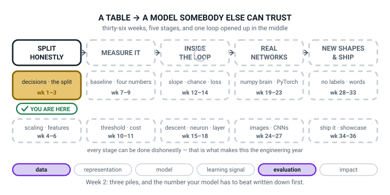

# Week 2 — Practice, Mock Exam, Final Exam

[⬅ Week 1](week-01.md) · [Course Home](../README.md) · [Week 3 ➡](week-03.md) · [Student Guide](../student-guide/week-02.md) · [Workbook](../workbook/week-02.md)

---

## 📋 At a Glance

| | |
|---|---|
| **Duration** | 70 minutes |
| **Type** | 🟦 Teach — still no real model, and for one more week that is on purpose |
| **Big idea** | Two piles was training wheels. Real work needs **three** — one to learn from, one to **choose** with, and one you open **exactly once**. |
| **New vocabulary** | train/validation/test · stratified split · baseline · DummyClassifier · ROC-AUC · predicted probability |
| **New maths** | **None.** This week practises division and reading a fraction as a percentage — the same arithmetic as Week 1, on new numbers. |
| **New syntax** | `train_test_split` called **twice** to make three piles · `DummyClassifier(strategy="most_frequent")` · `model.predict_proba(X)[:, 1]` · `roc_auc_score(y_val, prob)` |
| **Dataset** | The same numpy-generated pizza-delivery table from Week 1, `make_data.py`, seed 0. **Do not edit that file.** Nothing downloads. |
| **Materials** | A deck of playing cards with **20 cards counted out, exactly 5 of them red** · the five index cards from Week 1 (card four is blank — that is deliberate) · the printed workbook, with its 🛠️ Build It section (card deal, three-way split, baseline box, best-of-twenty table, Bug Log) and 🎨 Draw It page out · the Bug Log · a highlighter |
| **Tech needed** | Laptop with Python 3, numpy, pandas, **scikit-learn** (first use this year). No internet, ever. |
| **Prep time** | 25 minutes the night before · 5 minutes on the day |
| **Expected runtime of the code** | `split_three.py` about 1 second · `baselines.py` about 1 second · `best_of_twenty.py` about 1 second. Nothing trains. Nothing waits. |

> **⚠️ Watch out:** the temptation this week is bigger than last week's, because `scikit-learn` is now imported and a real model is three lines away. **There is still no real model.** A student who leaves today with three piles, two useless baselines and a number written in a box has had exactly the right lesson — and next week their real model will have something honest to be compared against.

---

## 🎯 Lesson Objectives

By the end of the lesson the student can:

1. **Split a table three ways** by calling `train_test_split` twice, and **state out loud what each pile is legally allowed to be used for** — without looking at a list.
2. **Explain why choosing a model on the test set is itself a kind of fitting**, and therefore why a third pile has to exist.
3. **Prove a stratified split kept the class proportions** by printing them for all three piles to three decimal places and showing they agree.
4. **Build two dummy baselines** and state, as a number, what a real model has to beat before it is worth keeping.

Observable evidence: a run of `split_three.py` printing `1200 / 400 / 400` with the late rate `0.287` in every pile; index card four filled in; a run of `baselines.py` printing `0.7125` and `0.5000` for the same model; and a number written in the baseline box in the workbook's 🛠️ Build It section that the student can point at in Week 7.

---

## 🧑‍🏫 What YOU Need to Know First

> **📌 About the code blocks in this guide.** Outside the **🧰 Prep Checklist** and the **🔑 Answer Key**, the blocks are **illustrations, not files** — each one carries on from the one above it, so the `import` lines are typed once, in the first block that needs them. **The complete runnable files are in the Prep Checklist and the Answer Key.** If you paste an illustration on its own and get `NameError`, that is why, and nothing is broken.

**You still do not need to know any machine learning to teach this week, and there is still no calculus.** There is one genuinely subtle idea, and it is an idea about honesty rather than about maths. Read this section once — about twenty minutes — and you will be able to defend it against a clever fourteen-year-old, which is the actual test.

### 1. Why this week exists

Last year the student wrote this, and it was right for last year:

```python
X_train, X_test, y_train, y_test = train_test_split(X, y, test_size=0.2)
model.fit(X_train, y_train)
print(model.score(X_test, y_test))
```

Two piles. Learn from one, get marked on the other. That is already a real and important idea, and most people never get that far.

**Here is what goes wrong the moment you start actually working.** You do not build one model. You build forty. You try a decision tree, then a deeper decision tree, then a shallower one, then kNN with three neighbours, then five, then eleven. You add a column, take a column away, change how you fill in the holes. Every single time, you run that last line and look at the score.

And then you keep whichever one scored best.

**That last sentence is the problem, and it is worth reading twice.** You have just used the test pile to make a decision. Forty times. The test pile chose your model. So its score is no longer an estimate of "how well will this work on data I have never seen" — it is an estimate of "how well does this work on the one pile of data I have been staring at all afternoon".

> **The sentence to hold on to all week:** **choosing is a kind of fitting.**

Fitting means adjusting something until the numbers on a pile look good. Usually the thing being adjusted is the model's insides. But when *you* adjust your *decisions* until the numbers on a pile look good, that is the same act, done by a slower and more expensive machine — you.

**So we need a third pile.** One you learn from. One you choose with, as often as you like. And one you open exactly once, at the very end, to find out the truth — and then stop.

The classroom name for it, and the reason for this week's title:

| Pile | The exam it is | What you may do with it |
|---|---|---|
| **train** | practice questions, with the answers in the back | learn from it, as much as you like |
| **validation** | the mock exam | choose between things — models, columns, settings |
| **test** | the final exam | open **once**, report the number, stop |

**And the analogy is exact in the way that matters.** If you sat the same past paper twenty times you would end up with a brilliant score on that paper and no more knowledge than you started with. That is what happens to a test pile you keep peeking at. The mock exam exists precisely so you can practise your *choosing* on something that is not the real thing.

### 2. Two cuts, three piles — and the numbers

`train_test_split` makes **two** piles. It has no setting for three. So you call it twice: cut once, then cut one of the pieces again.


*Figure 2.1 — One table, two cuts, three piles. Cut one seals the test pile; cut two divides what is left.*

Cut one: peel off 20% and seal it. Cut two: split the remaining 1600 as 75 / 25.

**Do the arithmetic yourself now**, because you will do it on the board in front of them and it should be automatic:

- 2000 rows. 20% off the top → **400 test.** 2000 − 400 = **1600 left.**
- 1600, split 75 / 25 → 1600 × 0.75 = **1200 train**, 1600 × 0.25 = **400 validation.**
- Check: 1200 + 400 + 400 = **2000.** ✓
- As percentages of the whole table: 1200 ÷ 2000 = **60%**, 400 ÷ 2000 = **20%**, 400 ÷ 2000 = **20%.**

> **⚠️ Watch out:** the second `test_size` is **0.25, not 0.2.** This is the single most common wrong answer in the whole week, and it is a nice piece of arithmetic rather than a rule to memorise. You want 400 rows out of 1600, and 400 ÷ 1600 = **0.25.** If you write `0.2` you get 1600 × 0.2 = 320 rows, and your piles come out 1280 / 320 / 400, which is not what your model card says. **Order matters too:** peel the test pile off *first*, from the whole table, so its size is a fraction of 2000 and not a fraction of something smaller.

And notice where the 2000 came from. Week 1's table had **2020** rows, and 20 of them were exact copies. This week those copies get dropped, in one line, before anything else happens:

```python
df = df.drop_duplicates().reset_index(drop=True)
```

**Say why out loud when you get there:** if a copy lands in train and its twin lands in test, the model memorises the answer and is then tested on it. Week 1 did the arithmetic: 20 duplicates, 20% going to test, 20 × 0.2 = about **4 free, fake marks.** Week 1 counted them; this week we remove them. That is the whole point of counting first.

### 3. What each pile is allowed to do, and the one that "wears out"


*Figure 2.2 — What each pile is allowed to do. The third column is the one people get wrong.*

Three rules, and the middle one is the interesting one.

**Train — look as often as you like.** Fit on it, plot it, stare at it. It is yours. Its score means almost nothing (of course you do well on the questions you revised from), so nobody is tempted to report it.

**Validation — you may look many times, and it wears out.** This is the sentence to get right, because it is *not* "validation is safe". Every time you look at the validation score and change your mind because of it, you spend a little of its honesty. After forty decisions, the validation score is slightly too good — not because anyone cheated, but because you kept the winner. Section 5 shows one example of how much (0.0853 this run; averaged over many runs, best-of-twenty on a 400-row pile buys roughly 0.06).

**Test — once. At the very end. Then stop.** Not "once per week". Not "once, and then again after one more idea". Once. And the reason is not moral, it is mechanical: **the moment a test score changes a decision, it has become a validation pile**, and you no longer have a test pile at all.

> **🧑‍🏫 If a student asks:** *"how would anyone ever know if I peeked?"* Nobody would. That is exactly the point and it is worth being straight about it. There is no locked box and no referee. The only thing standing between you and a meaningless number is that you wrote down what you were going to do and then did it. **This is why Week 3's model card has a line saying whether the test pile was opened** — because the honesty has to live somewhere you can point at.

### 4. Stratifying: sharing out the rare thing on purpose

Week 1 found that 28.75% of the (de-duplicated) orders are late. Now cut that table into three piles at random and ask: will each pile be 28.75% late?

Roughly. Not exactly. And the wobble matters.


*Figure 2.3 — The same two cuts, without and with `stratify`. The same 575 late orders both times; only their sharing-out changed.*

Here are the real numbers from the real run. **Without** `stratify`:

| pile | rows | late | late rate |
|---|---|---|---|
| train | 1200 | 337 | 337 ÷ 1200 = **0.2808** |
| validation | 400 | 130 | 130 ÷ 400 = **0.3250** |
| test | 400 | 108 | 108 ÷ 400 = **0.2700** |

**With** `stratify=y`:

| pile | rows | late | late rate |
|---|---|---|---|
| train | 1200 | 345 | 345 ÷ 1200 = **0.2875** |
| validation | 400 | 115 | 115 ÷ 400 = **0.2875** |
| test | 400 | 115 | 115 ÷ 400 = **0.2875** |

Both share out **exactly 575 late orders** — 337 + 130 + 108 = 575, and 345 + 115 + 115 = 575. Nothing was created or destroyed. Only the *sharing-out* changed.

**Do these three divisions by hand before class.** They are the arithmetic of the lesson:

- 130 ÷ 400 = 0.325 exactly. (Because 130 ÷ 4 = 32.5, and then move the decimal point two places: 0.325.)
- 108 ÷ 400 = 0.27 exactly. (108 ÷ 4 = 27.)
- 0.3250 − 0.2700 = **0.0550.** The two piles are five and a half percentage points apart.
- 115 ÷ 400 = 0.2875 exactly. (115 ÷ 4 = 28.75.)
- 0.2875 − 0.2875 = **0.0000.**

**Why 0.0550 is a real problem, in one sentence:** your validation pile is 32.5% late and your test pile is 27% late, so the two piles are asking your model slightly *different questions* — and when the number moves between them at the end of the term, you will not know whether your model changed or your piles did.

> **Stratified split** — a split that shares out each answer class in the same proportion as the whole table, on purpose, instead of leaving it to chance.

It is one keyword. `stratify=y`. And on the second cut it is `stratify=y_rest`, because by then you are cutting the 1600-row pile, not the 2000-row one.

**The mental picture, and it is the activity:** twenty playing cards, five of them red. Deal them 12 / 4 / 4 off a shuffled deck and it is entirely possible that all five reds land in the first pile — which is what happened when we did it, and it means the last two piles contain **no red cards at all** and therefore cannot measure anything whatsoever about red. Deal them again, placing the reds deliberately 3 / 1 / 1, and every pile is a quarter red. Same five cards. **`stratify=y` is the second deal.**

### 5. The demonstration that makes this week land: best of twenty coin flips

This is eight seconds of screen time and it is the intellectual centre of the lesson. Do not skip it and do not rush it.

**Twenty "models" are built. None of them is a model.** Each one is 400 random numbers between 0 and 1 — one number per validation row — which we pretend is its prediction. Nothing is fitted. Nothing looks at a single feature. Then we score all twenty on validation and keep the best one, exactly as you would with twenty real models.


*Figure 2.4 — Twenty coin flips, and the best of them. Nothing here learned anything; picking the best of twenty still bought 0.0853 above 0.5000.*

The real result:

- The twenty validation scores scatter around 0.5, from **0.4549 to 0.5853**.
- The best one is number 8, at **0.5853.**
- Scored on the sealed test pile, that same winner gets **0.5125.**
- 0.5853 − 0.5125 = **0.0728** of pure luck, evaporated.
- 0.5853 − 0.5000 = **0.0853** above the true zero, bought entirely by choosing.

**What to say about it, and this is the whole week:** 0.5853 looks like a model that has learned something. It is 0.0853 above a coin flip. If a student showed you that number you would believe them. **And there is nothing in it. Not one line of learning.** All 0.0853 was bought by looking at twenty numbers and keeping the biggest.

Now scale it up in their heads: you did not try twenty models this term, you tried a hundred and forty, and each time you kept the better one. **That is why the pile you choose with can never be the pile you report from.**

> **🧑‍🏫 If a student asks:** *"so is the validation score a lie?"* No — it is an *optimistic* estimate, and the more times you looked, the more optimistic it is. That is a genuinely useful thing and it is why we still use it: it is the right tool for *comparing* two options, and the wrong tool for *reporting* a result. Comparing and reporting are different jobs, and this is the week they get different piles.

### 6. Baselines: the zero on the ruler

Here is a number that means nothing on its own: **71%.**

Is 71% good? You cannot possibly say, and Week 1 already showed why: 28.75% of orders are late, so a model that says *"not late"* about every single order — with no thinking of any kind — is right about 71% of the time.

> **Baseline** — the score of a model so stupid it cannot possibly have learned anything. It is the zero on your ruler. Every real number gets reported as a distance from it.

`scikit-learn` ships two of these deliberately-useless models, and this is exactly what they are for.

> **DummyClassifier** — a model that ignores the features completely and answers by a fixed rule you choose.

- `strategy="most_frequent"` — always answers whichever label was commonest in training. Here: always "not late".
- `strategy="stratified"` — guesses at random, but matching the training proportions. About 28.75% of the time it says "late", for no reason.

Run both on validation, and here is where the week's payoff lands.


*Figure 2.5 — Two rulers, one useless model. One model, two metrics, two completely different stories.*

| baseline | accuracy | ROC-AUC | times it said "late" |
|---|---|---|---|
| `most_frequent` | **0.7125** | **0.5000** | **0** |
| `stratified` | 0.5850 | 0.4857 | 109 |

**Stop on the first row and let it be uncomfortable.** One model. Two rulers. **0.7125 and 0.5000 at the same time.**

The arithmetic behind both numbers, and do it by hand:

- 115 of the 400 validation rows are late, so 400 − 115 = **285 are not.**
- It says "not late" 400 times, so it is right 285 times. **285 ÷ 400 = 0.7125.** That is the accuracy.
- It says "late" **zero** times, so of the 115 late orders it catches **0. 0 ÷ 115 = 0.0000.**

**The whole business is in those two lines.** 0.7125 sounds like a working system. It catches nothing. A dispatcher using it would never once be warned about a late order.

> **ROC-AUC** — a score between 0 and 1. 0.5 means "no better than a coin flip". 1.0 means perfect. It cannot be fooled by a lopsided table the way accuracy can.

**The one-sentence version of what it measures**, which is true and will not need un-teaching later: *take one late order and one on-time order at random; ROC-AUC is the chance the model gives the late one the higher score.* A model with no opinion gets that right half the time. Hence 0.5. Weeks 8 to 11 build it properly; today it is a ruler with an honest zero on it.

**That is why Week 1 committed to AUC in pen, before any of this was visible.** Card five was written on day one for exactly this moment.

### 7. `predict_proba` and the `[:, 1]` that everybody forgets

To score with AUC you need a **number**, not a yes/no. A yes/no cannot be ranked.

> **Predicted probability** — the model's number between 0 and 1 saying how sure it is the answer is 1.

```python
prob = model.predict_proba(X_val)[:, 1]
```

Read it in three pieces:

1. `model.predict_proba(X_val)` gives a grid with **one row per order and two columns**: the chance of 0, then the chance of 1. Its shape here is **(400, 2)**.
2. `[:, 1]` means *"every row, column number 1"* — the colon means "all of them", and columns are counted from 0, so column 1 is the **second** one: the chance of "late".
3. What comes out is 400 numbers, shape **(400,)**, which is what `roc_auc_score` wants.

**Leave off the `[:, 1]` and you get a real error**, and it is Deliberate Mistake 1 because the message is unusually helpful:

```text
ValueError: y should be a 1d array, got an array of shape (400, 2) instead.
```

**Both shapes are printed in the message.** That is the whole skill: it wanted one column, you gave it two. Level 3 is full of messages shaped exactly like this, and today is the day to establish the habit of reading them.

### 8. The three misconceptions you will actually meet

**Misconception 1 — "the test set is just a bigger validation set."**

They are not the same kind of thing at all. Validation answers *"which of these two should I pick?"* — a question you ask over and over. Test answers *"what will this actually do?"* — a question you ask once, because asking it twice changes the answer. The cure is the best-of-twenty demo: **0.5853 on the pile you chose with, 0.5125 on the pile you did not.** Same non-model. Two numbers 0.0728 apart.

**Misconception 2 — "a 71% baseline means our data is fine, we just need a good model."**

71% is not a floor you build on, it is a **ruler with no zero marked**. The same object scores 0.7125 and 0.5000 depending on which ruler you pick up. The cure is the two-bar figure and the sentence *"it catches 0 of the 115 late orders"* — said out loud, because the number 0 is what does the work.

**Misconception 3 — "stratify is a safety setting, so put it on everything."**

Half right, and worth a real answer rather than a nod. `stratify` shares out **one specific column** evenly — the one you hand it. It does nothing about anything else: your validation pile can still be short of storms, or short of GreenLeaf, or short of Fridays. And it needs at least two rows of every class or it refuses outright:

```text
ValueError: The least populated class in y has only 1 member, which is too few.
```

The honest version: `stratify=y` on a classification split is almost always right and costs nothing. It is not a magic word, and it is not a substitute for looking.

### 9. How deep to go, and where to stop

**Go this far:** three piles, made by two calls. What each pile may legally be used for, said out loud. Choosing is a kind of fitting, demonstrated with twenty coin flips. `stratify`, with the two tables of real rates compared. Two dummy baselines. The 0.7125-versus-0.5000 moment, with both divisions done by hand. `predict_proba(...)[:, 1]` and the shape error you get without it. **The number in a box.**

**Stop before:**

| Do not teach today | Where it lives |
|---|---|
| What ROC-AUC actually *is* — curves, thresholds, TPR, FPR | **Weeks 8–11.** Today it is: 0.5 is nothing, 1.0 is perfect, not fooled by lopsided data, and it is the chance the late order is ranked higher. |
| Precision, recall, F1, the confusion matrix | **Weeks 8 and 9.** If a student asks about "catching 0 of 115" — that is recall, and it is Week 8. Do not name it. |
| Cross-validation, `StratifiedKFold` | **Week 11.** They will ask "why not use every row for everything?" Answer: "there is a way, it costs five times the computer time, and it is Week 11." |
| `Pipeline`, `ColumnTransformer`, scaling, encoding | **Weeks 3 and 4.** |
| Any real model at all | **Week 3.** Hold the line one more week. |
| The word **leakage** | **Week 6.** You may say "the test pile got peeked at" as often as you like — do not name it yet. |
| Threshold tuning ("what if it said late at 0.3?") | **Week 10**, and it is a whole lesson. |

The line to keep in your head all lesson: **today the student builds the zero on the ruler, not the thing being measured.**

---

### 10. 🧭 The Growing Map

The student guide carries **Where This Fits** — the same picture every week with one more piece filled in.
This week it deliberately looks almost identical to last week's, and that is the teaching point.



*Figure 2.0 — Week 2's version. Same gold tile as Week 1, because weeks 1 to 3 are one job. The ↻ on stage
three is the training loop, still grey until Week 12.*

**What to do with it, in about two minutes at the end of the lesson:**

1. **Show it and ask *"which box did we do today?"*** They will hunt for a new gold tile. There isn't one —
   it is the **same** tile, *decisions and the split*, and noticing that is the exercise. Follow with
   *"so what changed inside the box?"* The answer you want is **"the split went from two piles to three."**
2. **Then the question of the week, pointed at the map:** *"we just built three piles and two baselines,
   and we still have no real model. Which stage does the model live in?"* They will point at stage five,
   which is 28 weeks away. Let that sit. It is the clearest possible demonstration that Level 3 spends its
   effort on the parts either side of `fit`.
3. **One more, if there is time:** *"the test pile opens in Week 34. Find Week 34 on the map."* It is the
   bottom tile of stage five. Thirty-two weeks of not touching something is much more real once they have
   seen how far away it is on a picture.

> **🧑‍🏫 Why this is worth two minutes.** The commonest Week 2 complaint is *"why are we still not building
> anything?"* The map answers it without you having to defend the syllabus: stage one has two tiles and six
> weeks, and everything downstream is measured on the cut they are making now. A student who can see that
> stops reading the first six weeks as a delay.

**If a student asks why nothing has gone white yet:** plain white with a solid outline means *finished*, and
this tile is not finished until Week 3 puts the model in a file. So it stays gold next week too, and turns
white in **Week 4** — tell them to watch for it, because that is the first time all year the map records
completed work.

---

## 🧰 Prep Checklist

This section lists what to set up before class and what to do if the laptop fails.

### 25 minutes the night before

- [ ] **Work in the Week 1 folder.** Weeks 1 to 7 all live together, and this week imports Week 1's file unchanged.

```bash
cd ~/level3/term1
ls
```

You must see `make_data.py`. **Do not edit it.** If the first `order_id` it prints is not `100955`, stop and fix that before anything else — every number below depends on it.

```bash
python3 make_data.py
```

```text
shape: (2020, 10)
 order_id restaurant  distance_km  items  prep_minutes  order_hour day_of_week weather  driver_experience_months  late
   100955     Napoli         2.78      3          15.0          12         Mon   clear                       5.0     0
   101493 CrustyBros         3.09      5          12.9          22         Mon    rain                       0.0     0
   101857 CrustyBros         2.65      2          14.2          16         Mon    rain                      33.0     0
   100215     Napoli         9.60      2           4.9          13         Tue   clear                      27.0     1
   100506 CrustyBros         2.33      5          19.6          20         Thu   clear                      35.0     0
```

- [ ] **Check scikit-learn imports.** First use this year. One line, and it should print a version number rather than a traceback.

```bash
python3 -c "import sklearn; print(sklearn.__version__)"
```

```text
1.7.1
```

*(Yours may differ. Anything 1.2 or later behaves identically for this week.)*

- [ ] **Type `split_three.py` yourself and run it.** This is the file you build together in class.

```python
"""split_three.py - one table, two cuts, three piles."""
from sklearn.model_selection import train_test_split
from make_data import make_deliveries

df = make_deliveries(n=2000, seed=0)
print("rows as generated:", len(df))
df = df.drop_duplicates().reset_index(drop=True)
print("rows after dropping the 20 copies:", len(df))

y = df["late"]
X = df.drop(columns=["late", "order_id"])
print("X shape:", X.shape, " y shape:", y.shape)

# CUT ONE - peel off 20% and seal it. Not opened again this term.
X_rest, X_test, y_rest, y_test = train_test_split(
    X, y, test_size=0.2, stratify=y, random_state=0)

# CUT TWO - split the other 1600 as 75 / 25.
X_train, X_val, y_train, y_val = train_test_split(
    X_rest, y_rest, test_size=0.25, stratify=y_rest, random_state=0)

print()
print("pile         rows   late   rate (3 dp)   rate (4 dp)")
for name, yy in [("train", y_train), ("validation", y_val), ("test", y_test)]:
    print(f"{name:11s} {len(yy):5d} {int(yy.sum()):6d}        {yy.mean():.3f}        {yy.mean():.4f}")

print()
print("rows:", len(y_train), "+", len(y_val), "+", len(y_test),
      "=", len(y_train) + len(y_val) + len(y_test))
print("late:", int(y_train.sum()), "+", int(y_val.sum()), "+", int(y_test.sum()),
      "=", int(y_train.sum() + y_val.sum() + y_test.sum()))
print("whole table:", int(y.sum()), "late out of", len(y),
      "=", f"{y.mean():.4f}")
```

**Takes about 1 second.** You must see exactly this:

```text
rows as generated: 2020
rows after dropping the 20 copies: 2000
X shape: (2000, 8)  y shape: (2000,)

pile         rows   late   rate (3 dp)   rate (4 dp)
train        1200    345        0.287        0.2875
validation    400    115        0.287        0.2875
test          400    115        0.287        0.2875

rows: 1200 + 400 + 400 = 2000
late: 345 + 115 + 115 = 575
whole table: 575 late out of 2000 = 0.2875
```

**Look at the 3 dp column.** `0.287` three times, identical. That is objective 3, proved, in one printout — and it is not luck, it is what `stratify` is for.

- [ ] **Type `unstratified.py` and run it.** You only need this for thirty seconds in class, but you need it to be real.

```python
"""unstratified.py - the same two cuts, with stratify left off."""
from sklearn.model_selection import train_test_split
from make_data import make_deliveries

df = make_deliveries(n=2000, seed=0).drop_duplicates().reset_index(drop=True)
y = df["late"]
X = df.drop(columns=["late", "order_id"])

X_rest, X_test, y_rest, y_test = train_test_split(
    X, y, test_size=0.2, random_state=0)                 # no stratify
X_train, X_val, y_train, y_val = train_test_split(
    X_rest, y_rest, test_size=0.25, random_state=0)      # no stratify

print("WITHOUT stratify")
print("pile         rows   late   late rate")
for name, yy in [("train", y_train), ("validation", y_val), ("test", y_test)]:
    print(f"{name:11s} {len(yy):5d} {int(yy.sum()):6d}   {yy.mean():.4f}")
print("widest gap:", round(max(y_train.mean(), y_val.mean(), y_test.mean())
                           - min(y_train.mean(), y_val.mean(), y_test.mean()), 4))
```

```text
WITHOUT stratify
pile         rows   late   late rate
train        1200    337   0.2808
validation    400    130   0.3250
test          400    108   0.2700
widest gap: 0.055
```

- [ ] **Type `baselines.py` and run it.** This is the file that produces the number in the box.

```python
"""baselines.py - the number a real model has to beat."""
from sklearn.dummy import DummyClassifier
from sklearn.metrics import accuracy_score, roc_auc_score
from sklearn.model_selection import train_test_split
from make_data import make_deliveries

df = make_deliveries(n=2000, seed=0).drop_duplicates().reset_index(drop=True)
y = df["late"]
X = df.drop(columns=["late", "order_id"])
X_rest, X_test, y_rest, y_test = train_test_split(
    X, y, test_size=0.2, stratify=y, random_state=0)
X_train, X_val, y_train, y_val = train_test_split(
    X_rest, y_rest, test_size=0.25, stratify=y_rest, random_state=0)

print("baseline        accuracy   ROC-AUC   times it said 'late'")
for strategy in ["most_frequent", "stratified"]:
    dummy = DummyClassifier(strategy=strategy, random_state=0)
    dummy.fit(X_train, y_train)
    pred = dummy.predict(X_val)
    prob = dummy.predict_proba(X_val)[:, 1]
    print(f"{strategy:14s}   {accuracy_score(y_val, pred):.4f}    "
          f"{roc_auc_score(y_val, prob):.4f}    {int((pred == 1).sum())}")

print()
print("115 of the 400 validation rows are late, so 285 are not.")
print("285 / 400 =", round(285 / 400, 4))
print("A model that never says 'late' catches 0 of 115:", round(0 / 115, 4))
```

```text
baseline        accuracy   ROC-AUC   times it said 'late'
most_frequent    0.7125    0.5000    0
stratified       0.5850    0.4857    109

115 of the 400 validation rows are late, so 285 are not.
285 / 400 = 0.7125
A model that never says 'late' catches 0 of 115: 0.0
```

- [ ] **Type `best_of_twenty.py` and run it. This is the one that has to work.** If you only rehearse one thing tonight, rehearse this.

```python
"""best_of_twenty.py - twenty models made of nothing but random numbers."""
import numpy as np
from sklearn.metrics import roc_auc_score
from sklearn.model_selection import train_test_split
from make_data import make_deliveries

df = make_deliveries(n=2000, seed=0).drop_duplicates().reset_index(drop=True)
y = df["late"]
X = df.drop(columns=["late", "order_id"])
X_rest, X_test, y_rest, y_test = train_test_split(
    X, y, test_size=0.2, stratify=y, random_state=0)
X_train, X_val, y_train, y_val = train_test_split(
    X_rest, y_rest, test_size=0.25, stratify=y_rest, random_state=0)

rng = np.random.default_rng(0)
best_auc = -1
best_i = -1
best_test_auc = None
for i in range(20):
    guess_val = rng.random(len(y_val))     # 400 random numbers. No model. No fitting.
    guess_test = rng.random(len(y_test))   # 400 more, for the same "model"
    auc = roc_auc_score(y_val, guess_val)
    print(f"random model {i:2d}   validation AUC {auc:.4f}")
    if auc > best_auc:
        best_auc = auc
        best_i = i
        best_test_auc = roc_auc_score(y_test, guess_test)

print()
print("winner: random model", best_i)
print("its validation AUC :", round(best_auc, 4))
print("its TEST AUC       :", round(best_test_auc, 4))
print("difference         :", round(best_auc - best_test_auc, 4), "of pure luck")
print("above the true zero:", round(best_auc - 0.5, 4))
```

```text
random model  0   validation AUC 0.5026
random model  1   validation AUC 0.4800
random model  2   validation AUC 0.4586
random model  3   validation AUC 0.4849
random model  4   validation AUC 0.5032
random model  5   validation AUC 0.5202
random model  6   validation AUC 0.5594
random model  7   validation AUC 0.4626
random model  8   validation AUC 0.5853
random model  9   validation AUC 0.5036
random model 10   validation AUC 0.4701
random model 11   validation AUC 0.5097
random model 12   validation AUC 0.4709
random model 13   validation AUC 0.5154
random model 14   validation AUC 0.5241
random model 15   validation AUC 0.5082
random model 16   validation AUC 0.4796
random model 17   validation AUC 0.4549
random model 18   validation AUC 0.4742
random model 19   validation AUC 0.5398

winner: random model 8
its validation AUC : 0.5853
its TEST AUC       : 0.5125
difference         : 0.0728 of pure luck
above the true zero: 0.0853
```

- [ ] **Break it on purpose, twice**, so neither traceback is a surprise:
  1. Delete the `[:, 1]` from `prob = dummy.predict_proba(X_val)[:, 1]`. You get a long traceback ending in `ValueError: y should be a 1d array, got an array of shape (400, 2) instead.`
  2. Delete `stratify=y_rest` from **cut two only**. **Nothing crashes.** The rates come out 0.2958 / 0.2625 / 0.2875 — the test pile is still fine, and validation has quietly drifted. This is the silent one and it is the more important of the two.
- [ ] **Count out twenty playing cards with exactly five red ones.** Do it now, tonight, and put an elastic band round them. Counting cards in front of a class costs three minutes you do not have.
- [ ] **Print the workbook's 🛠️ Build It (card deal and three-way split) and 🎨 Draw It sections.**
- [ ] **Find the five index cards from Week 1.** Card four is blank. You are going to hand it back blank and say nothing.
- [ ] **Draw an empty box on the board, about a hand-span wide, and leave it empty.** It gets filled in at minute 63 and it stays on the wall until Week 7.

### 5 minutes on the day

- [ ] Terminal in `~/level3/term1`. `make_data.py` present and proved with one run.
- [ ] `split_three.py`, `baselines.py`, `best_of_twenty.py`, `unstratified.py` **deleted or renamed** — they type them.
- [ ] Twenty cards, banded, on the table. Five red.
- [ ] The five Week 1 index cards on the table, card four face up and blank.
- [ ] Workbook Build It section out, at "The card deal". **The "Predictions, in pen, before dealing" line filled in before any cards are dealt.**
- [ ] The empty box on the board.

### Fallback if the laptop fails

**This week's paper version is excellent**, because the activity is already cards and the maths is already division.

1. **The Hook works on paper.** Ask: *"you tried forty models and kept the best score. What is wrong with that number?"* Take answers. Write them up.
2. **The whole of stratifying is the twenty cards.** Deal 12 / 4 / 4 twice, count reds, do the divisions. That is objective 3 with no computer.
3. **The best-of-twenty demo works with dice or coins.** Each "model" is one student flipping a coin twenty times; the "score" is how many heads. Twenty students, keep the best — someone will get 15 or 16 heads out of 20, which looks like a gift. Then have that student flip twenty more times in front of everyone. **They get about 10.** Same lesson, same shape, no electricity.
4. **The baseline is arithmetic.** On paper: 400 validation rows, 115 late. A model that always says "not late" is right 285 times. 285 ÷ 400 = 0.7125. It catches 0 of 115. **That is objective 4, complete, with a pencil.**

| If this fails | Do this instead |
|---|---|
| `ModuleNotFoundError: No module named 'sklearn'` | Do not debug live for more than three minutes. Go to the paper version — it delivers all four objectives — and fix the install yourself with `python3 -m pip install scikit-learn` before Week 3, where it is unavoidable. |
| `ModuleNotFoundError: No module named 'make_data'` | Wrong folder. `cd` to wherever `make_data.py` lives and prove it with `ls`. Commonest error of Weeks 1–7. |
| Their numbers are not 1200 / 400 / 400 | Almost always `test_size=0.2` on the second cut instead of `0.25`. Second commonest: the two cuts in the wrong order. Third: they forgot `drop_duplicates()` and have 2020 rows. |
| The late rates are not all 0.2875 | `stratify` missing, or `stratify=y` on the second cut instead of `stratify=y_rest`. |
| The best-of-twenty winner is not 0.5853 | `np.random.default_rng()` with empty brackets, or a seed other than 0, or `rng` created inside the loop instead of before it. |
| The student wants to train a real model | "Next week, and it will beat 0.5000 by a distance, and you will know exactly how much because of today." |

---

## ⏱️ The Lesson, Minute by Minute

This section is the lesson plan: the timing table first, then each segment in order.

| Segment | Minutes | Running total | What happens |
|---|---|---|---|
| 🪝 Hook — Forty Models and One Ruined Number | 7 | 7 | The forty-models question, then twenty coin flips on screen. |
| 🧠 Concept — Three Piles, and What Each May Do | 18 | 25 | Card four filled in. The three rules. The arithmetic of the split. |
| 💻 Live-Code Together — `split_three.py` and `baselines.py` | 18 | 43 | Two cuts, the stratify proof, both baselines. Two deliberate mistakes: one loud, one silent. |
| 🎲 Their Turn — Three Piles With a Deck of Cards | 20 | 63 | Twenty cards dealt twice, counted, divided. Then their own split. |
| 🔑 Wrap & Assign | 7 | 70 | The number goes in the box. Three checks. Homework. |

---

### 🪝 Hook — Forty Models and One Ruined Number (7 minutes)

**Do this:** Laptops closed. The five Week 1 index cards on the table, card four face up and blank.

**Say this:**

> "Last week you wrote five cards. Four of them have a number on the back. Card four doesn't — it just says 'three piles: one to learn from, one to choose with, one opened exactly once.' Today card four gets its number, and it gets its reason.
>
> Here's the question I want first. Imagine you spend a month on this delivery problem. You try a decision tree. Then a deeper one. Then kNN with three neighbours, then five, then eleven. You add a column, take one away, change how you handle the missing values. **Forty different attempts.**
>
> And every single time, you check the score on your test set, and at the end you keep whichever one scored highest.
>
> **What is wrong with that final number?**"

**Do this:** Let the silence run. Ten seconds is fine. Write everything they say on the board.

Most students get somewhere near *"you looked at the test set too much"* but cannot say why that is a problem. That is the right place to be. Do not fix it with words — fix it with the screen.

> "Good instincts. Now let me show you exactly how much damage it does, and it takes eight seconds."

**Do this:** Open one laptop and run `best_of_twenty.py`, which you typed last night. Nothing else on screen.

```text
random model  0   validation AUC 0.5026
random model  1   validation AUC 0.4800
...
random model  8   validation AUC 0.5853
...
random model 19   validation AUC 0.5398

winner: random model 8
its validation AUC : 0.5853
its TEST AUC       : 0.5125
difference         : 0.0728 of pure luck
above the true zero: 0.0853
```

> **Say this:** "Twenty models. And I need you to hear this properly: **not one of them is a model.** Each one is four hundred random numbers. None of them looked at a single column. None of them was fitted to anything. It's twenty piles of dice rolls.
>
> The best of the twenty scored **0.5853**. Remember card five: 0.5 means learned nothing, 1.0 means perfect. So 0.5853 is above the coin flip. If you handed me that number I would think you had something.
>
> Then I took that exact same winner and scored it on the pile I'd sealed and never looked at. **0.5125.** Basically a coin flip, which is what it always was.
>
> Nothing learned anything. **The 0.0853 was bought by looking at twenty numbers and keeping the biggest one.** That's it. That's the entire cause."

**Do this:** Write on the board, and leave it up all lesson:

```text
      CHOOSING IS A KIND OF FITTING
```

> **Say this:** "Fitting means adjusting something until the numbers look good on a pile. Usually it's the model's insides doing the adjusting. But when *you* try forty things and keep the best, **you** are the thing being fitted, and you're fitted to that pile.
>
> So: last year two piles. This year three. One to learn from, one to choose with, and one you open exactly once and then stop."

**Ask this:**

| Ask | Answer you want | If they say something else |
|---|---|---|
| "Forty models, kept the best test score. What's wrong with the number?" | You used the test set to choose, so it isn't a fresh measurement any more. | "You overfitted" is close and worth accepting — then sharpen: "who overfitted? Not the model. You did." |
| "How many of those twenty learned anything?" | None. Zero. They are random numbers. | If they think one was better than the others, ask *"better at what? They can't see the data."* |
| "So where did 0.0853 come from?" | From picking the biggest of twenty. | If stuck: "if I'd only made one random model, what would it have scored?" (0.5026 — right at the coin flip.) |
| "Why is the test number lower?" | Because that pile had no say in which model got picked. | If they say "the test data is harder", check: both piles are 400 rows, both 28.75% late. They are the same difficulty. |
| "How many times, then, can I look at the test pile?" | Once. At the very end. | If they say "a few times", say: "how many is a few? There's no number that works, and that's why the answer is one." |

---

### 🧠 Concept — Three Piles, and What Each May Do (18 minutes)

**Say this — part 1, the exam analogy:**

> "Three piles. And the names are exactly the three kinds of exam you already know.
>
> **Train** is the practice questions with the answers in the back. You work through them as many times as you like. Nobody reports your score on practice questions, because of course you do well — you had the answers.
>
> **Validation** is the mock exam. What's a mock actually for? Not for the grade. It's for **deciding what to do next.** Do more past papers or learn the vocabulary? You look at the mock, you decide, you change your plan. And you can sit several mocks.
>
> **Test** is the final exam. You sit it once. And here's the thing — if you sat the real final exam twenty times and kept your best score, would that score mean anything?"

*No.*

> "No. It would measure your persistence, not your knowledge. **That is precisely, exactly, what happens to a test set you keep peeking at.**"

**Do this:** Draw this on the board.

```text
   2000 rows
       |
  CUT ONE: peel off 20% and SEAL IT
       |
   +---+--------------------+
   |                        |
  1600 left              400 TEST  <- open once, at the very end
   |
  CUT TWO: split 75 / 25
   |
   +----------+
   |          |
 1200 TRAIN  400 VALIDATION
```

> **Say this:** "Two cuts. Three piles. And notice the order — **the test pile comes off first**, off the whole table, before anything else exists. Do the arithmetic with me.
>
> Two thousand rows, twenty percent off the top. How many?"

*400.*

> "Four hundred sealed. Two thousand minus four hundred leaves **sixteen hundred.** Now I want four hundred of those for validation. So what fraction of sixteen hundred is four hundred?"

Let them work it out. If stuck: *"how many fours in sixteen?"*

> "**A quarter. 0.25.** Not 0.2 — that's the trap, and about half of all people writing this code for the first time write 0.2 and end up with 1280, 320 and 400 and no idea why.
>
> Check the total: twelve hundred plus four hundred plus four hundred?"

*2000.*

> "Two thousand. And as percentages of the whole table: sixty, twenty, twenty."

**Say this — part 2, the three rules and card four:**

**Do this:** Hand back card four. Say nothing for a moment. Then:

> "Fill in the back of card four now: **1200 / 400 / 400.** And on the front, under what you wrote last week, add the three rules. I'll give you them one at a time and they're not symmetrical.
>
> **Train: look as often as you like.** No limit. It's yours.
>
> **Validation: look many times — and it wears out.** That's the strange one. It doesn't break. It slowly gets less honest, a little bit each time you look and change your mind because of what you saw. You just watched that happen: twenty looks bought 0.0853 of fake score.
>
> **Test: once. At the very end. Then stop.**"

**Ask this:** *"Who's going to check that I only opened it once?"*

Let that sit. The answer is nobody.

> "Nobody. There's no lock and no referee. The only thing making that number mean anything is that you wrote down what you'd do and then did it. **Next week you'll write a card that has a line on it saying whether the test pile was opened.** That's where the honesty has to live — in writing, where somebody can point at it."

**Say this — part 3, stratifying, with the cards:**

**Do this:** Take out the twenty cards. Hold them up. Count the five reds out loud so everyone sees.

> "Twenty cards. Five of them red. So what fraction of this little deck is red?"

*5 ÷ 20 = 0.25. A quarter.*

> "A quarter. Now watch."

**Do this:** Shuffle. Deal 12 / 4 / 4 face up, left to right, genuinely at random. Then count the reds in each pile out loud.

*(When we did this, all five reds landed in the twelve-pile. If your deal is kinder, deal again — or just point at the piles you got and do the same divisions. The argument works with any lopsided deal; you only need the two smaller piles to disagree.)*

> **Say this:** "Five reds in the train pile, none in the other two. **Five over twelve is 0.4167**, and **zero over four is 0.0000**, twice.
>
> Now think about what that means. My test pile has **no red cards at all.** So it cannot tell me *anything* about how well I handle red. Not badly — at all. There's nothing there to measure.
>
> And 'red' in our real table is 'late'. Now deal again, but this time I'm going to place the reds on purpose."

**Do this:** Re-deal, dealing the reds deliberately 3 / 1 / 1.

> "Three, one, one. **Three over twelve is 0.25. One over four is 0.25. One over four is 0.25.** Every pile is a quarter red, and the whole deck is a quarter red.
>
> Same five cards. Same three piles. I just shared out the rare thing on purpose. **That is one keyword in Python and it is called `stratify`.**"


*Figure 2.6 — Twenty cards, dealt twice. On the left the test pile has no red cards at all, so it cannot measure anything about red.*

**Ask this:**

| Ask | Answer you want | If they say something else |
|---|---|---|
| "What is the mock exam for?" | Deciding what to do next — not for the grade. | If they say "practice", push: "practice is the train pile. What does the mock let you *decide*?" |
| "2000 rows, 20% off. Then 400 of the 1600 left. What fraction?" | 0.25. | If they say 0.2, ask "0.2 of 1600 is how many?" → 320. "And I wanted?" → 400. |
| "Who checks that you only opened the test pile once?" | Nobody. | If they say "the teacher", agree it's true this year and then ask "and when you have a job?" |
| "Five reds out of twenty. What fraction?" | 0.25. | Slow down and do 5 ÷ 20 on the board. |
| "The test pile got no red cards. What can it measure about red?" | Nothing at all. | If they say "it'll do badly", correct firmly: there is nothing there to be bad at. |
| "Does `stratify` share out everything evenly?" | No — only the one column you hand it. | If they say yes, ask: "so is my validation pile guaranteed to have storms in it?" It is not. |

---

### 💻 Live-Code Together — `split_three.py` and `baselines.py` (18 minutes)

**You never touch the keyboard.** Predictions before every run.

**Step 1 (3 min).** New file, `split_three.py`. The top, and the duplicates go first.

```python
"""split_three.py - one table, two cuts, three piles."""
from sklearn.model_selection import train_test_split
from make_data import make_deliveries

df = make_deliveries(n=2000, seed=0)
print("rows as generated:", len(df))
df = df.drop_duplicates().reset_index(drop=True)
print("rows after dropping the 20 copies:", len(df))
```

> **Say this:** "`from sklearn.model_selection import train_test_split` — that's 'out of the scikit-learn toolbox, out of its model-selection drawer, fetch me the one tool called `train_test_split`'. You did this last year.
>
> Then `drop_duplicates()`. Last week we **counted** twenty copies. This week we **remove** them, and here's the arithmetic reason again: twenty duplicates, twenty percent going in the test pile, so about **four** copies would land in test with their twin still in train. Four free marks the model didn't earn. `reset_index(drop=True)` just renumbers the rows from zero afterwards, so the numbering isn't full of gaps."

**Ask before running:** "How many rows before, and how many after?"

Run it.

```text
rows as generated: 2020
rows after dropping the 20 copies: 2000
```

**Step 2 (3 min).** X, y, and the two cuts.

```python
y = df["late"]
X = df.drop(columns=["late", "order_id"])
print("X shape:", X.shape, " y shape:", y.shape)

# CUT ONE - peel off 20% and seal it. Not opened again this term.
X_rest, X_test, y_rest, y_test = train_test_split(
    X, y, test_size=0.2, stratify=y, random_state=0)

# CUT TWO - split the other 1600 as 75 / 25.
X_train, X_val, y_train, y_val = train_test_split(
    X_rest, y_rest, test_size=0.25, stratify=y_rest, random_state=0)
```

> **Say this:** "`X = df.drop(columns=["late", "order_id"])` — that's card two and card three from last week, in one line. Drop the target, drop the ID. Eight columns left.
>
> Then the two cuts. Four names come out of each call, always in this order: **X first pile, X second pile, y first pile, y second pile.** Get that order wrong and nothing errors — you just have your labels attached to the wrong rows, which is a genuinely horrible afternoon.
>
> Look at cut two carefully. It cuts `X_rest` and `y_rest`, **not** `X` and `y`. And `stratify=y_rest`, not `stratify=y`. Why does that have to change?"

*Because we're cutting the 1600-row pile now, not the 2000-row one.*

> "Right. `stratify` needs one label per row of the thing you're cutting. Hand it 2000 labels for 1600 rows and it will tell you off, and the message is actually quite clear. You'll see it in the clinic.
>
> And `random_state=0` — same rule as last week's seed. **A number you cannot reproduce is not a result.**"

Run it.

```text
X shape: (2000, 8)  y shape: (2000,)
```

**Step 3 (3 min).** The proof. This is objective 3 and it is four lines.

```python
print()
print("pile         rows   late   rate (3 dp)   rate (4 dp)")
for name, yy in [("train", y_train), ("validation", y_val), ("test", y_test)]:
    print(f"{name:11s} {len(yy):5d} {int(yy.sum()):6d}        {yy.mean():.3f}        {yy.mean():.4f}")
```

**Ask before running:** "The whole table is 28.75% late. Will all three piles be exactly 0.2875, or roughly?"

Most say "roughly". Run it.

```text
pile         rows   late   rate (3 dp)   rate (4 dp)
train        1200    345        0.287        0.2875
validation    400    115        0.287        0.2875
test          400    115        0.287        0.2875
```

**Do this:** Take the highlighter. Highlight the 3 dp column on the shared screen, or copy the three numbers onto the board, one under the other.

> **Say this:** "**0.287, 0.287, 0.287.** Not roughly. Identical.
>
> And it isn't luck — I asked for it. Check the counts by hand. **345 divided by 1200.** Anyone?"

Give them a moment. 345 ÷ 1200 = 0.2875.

> "0.2875. And **115 divided by 400** — that's 115 ÷ 4 = 28.75, so 0.2875. Same number.
>
> Add the late orders up: 345 plus 115 plus 115?"

*575.*

> "Five hundred and seventy-five, and the whole table has 575 late orders. Nothing was created and nothing was lost. **Only the sharing-out changed.**"

**Step 4 — ⚠️ FIRST DELIBERATE MISTAKE (3 min).** This one is **silent**, and it is the more important of today's two, so do it first while attention is high.

> **Say this:** "Delete `stratify=y_rest` from cut two. Only cut two. Leave cut one alone. Then run it again."

```python
X_train, X_val, y_train, y_val = train_test_split(
    X_rest, y_rest, test_size=0.25, random_state=0)
```

Run it. **Nothing crashes.**

```text
pile         rows   late   rate (3 dp)   rate (4 dp)
train        1200    355        0.296        0.2958
validation    400    105        0.263        0.2625
test          400    115        0.287        0.2875
```

**Do this:** Silence. Let them read the three numbers. Then write these two on the board, big:

```text
    validation   0.2625
    test         0.2875
```

> **Say this:** "No error. No warning. Three piles, correct sizes, all 2000 rows accounted for. Everything looks fine.
>
> But look: my test pile is 28.75% late and my validation pile is **26.25%** late. Do that subtraction."

*0.025. Two and a half percentage points.*

> "Two and a half points apart. So all term I'll be choosing my model on a pile that has slightly less lateness in it than the pile I'll finally report from. And when the number moves at the end of term — and it will — **I won't know whether my model changed or my piles did.**
>
> Notice which pile is still perfect: **test, at 0.2875.** Because cut one still had `stratify`. I broke one line and it damaged one pile, quietly. That's the shape of most real bugs in this subject."

**Bug Log this now**, under *errors with no error message*: *saw* — three piles, no error, but validation 0.2625 and test 0.2875 · *means* — the piles are asking slightly different questions · *cause* — `stratify` missing from cut two · *fix* — `stratify=y_rest`, and always print the rate of all three piles.

Put it back. Confirm all three are 0.2875 again.

**Step 5 (4 min).** New file, `baselines.py`. Copy the first eleven lines from `split_three.py` — this is not laziness, it is the last week you will ever have to, because next week the whole thing becomes one object.

```python
"""baselines.py - the number a real model has to beat."""
from sklearn.dummy import DummyClassifier
from sklearn.metrics import accuracy_score, roc_auc_score
from sklearn.model_selection import train_test_split
from make_data import make_deliveries

df = make_deliveries(n=2000, seed=0).drop_duplicates().reset_index(drop=True)
y = df["late"]
X = df.drop(columns=["late", "order_id"])
X_rest, X_test, y_rest, y_test = train_test_split(
    X, y, test_size=0.2, stratify=y, random_state=0)
X_train, X_val, y_train, y_val = train_test_split(
    X_rest, y_rest, test_size=0.25, stratify=y_rest, random_state=0)

dummy = DummyClassifier(strategy="most_frequent")
dummy.fit(X_train, y_train)
pred = dummy.predict(X_val)
print("accuracy:", accuracy_score(y_val, pred))
print("it said 'late' this many times:", int((pred == 1).sum()))
```

> **Say this before running:** "`DummyClassifier` is a model that is deliberately, aggressively stupid. `strategy="most_frequent"` means: look at the training labels, find whichever answer was commonest, and say that. Every time. Forever. It never looks at a single feature.
>
> What was commonest in our training pile?"

*Not late — 855 of the 1200.*

> "So this model will say 'not late' four hundred times out of four hundred. Before we run it: **what accuracy will it get?**"

Push for a number. They should be able to reason it out: 115 of the 400 are late, so 285 are not, and 285 ÷ 400 = 0.7125.

Run it.

```text
accuracy: 0.7125
it said 'late' this many times: 0
```

> **Say this:** "**0.7125.** Seventy-one percent. And it said 'late' **zero** times.
>
> So of the one hundred and fifteen late orders in that pile, how many did it catch?"

*None. 0 ÷ 115 = 0.0000.*

> "Zero. Out of a hundred and fifteen. A dispatcher using this system would **never once** be warned about a late delivery, ever, and the system's report would say seventy-one percent.
>
> Now — remember card five. Last week you wrote a metric on a card in pen, before you'd seen any of this. Let's use it."

**Step 6 — ⚠️ SECOND DELIBERATE MISTAKE (2 min).** Dictate it without the `[:, 1]`.

> **Say this:** "Add: `prob = dummy.predict_proba(X_val)` and then `print(roc_auc_score(y_val, prob))`."

```python
prob = dummy.predict_proba(X_val)
print(roc_auc_score(y_val, prob))
```

Run it. Real output, tail end:

```text
Traceback (most recent call last):
  File "/Users/you/level3/term1/baselines.py", line 21, in <module>
    print(roc_auc_score(y_val, prob))
  ...
  File ".../sklearn/metrics/_ranking.py", line 867, in _binary_clf_curve
    y_score = column_or_1d(y_score)
  File ".../sklearn/utils/validation.py", line 1483, in column_or_1d
    raise ValueError(
ValueError: y should be a 1d array, got an array of shape (400, 2) instead.
```

*(Your paths and line number will be your own. The `...` hides six more lines of scikit-learn's own files, and there is nothing in them for you.)*

> **Say this:** "Long traceback, and we do exactly what we did last week. **Read the last line. Then find the line with your own filename in it.** Everything else is somebody else's code.
>
> Last line: `y should be a 1d array, got an array of shape (400, 2) instead`. **Both shapes are in the message.** It wanted one column. I gave it two. That's the entire bug, and the error told me in one line.
>
> So what are those two columns? Let's look."

**Do this:** On their keyboard:

```python
print(prob.shape)
print(prob[:3])
```

```text
(400, 2)
[[1. 0.]
 [1. 0.]
 [1. 0.]]
```

> **Say this:** "Four hundred rows, two columns. Column zero is 'chance it's not late'. Column one is 'chance it IS late'. And this model is completely certain every time: one and zero, one and zero, one and zero.
>
> AUC needs to *rank* orders, so it needs one number per order. We want column one. **`[:, 1]` means: every row, column number one.** Colon is 'all of them'. And we count columns from zero, so column one is the second one."

Fix it.

```python
prob = dummy.predict_proba(X_val)[:, 1]
print("ROC-AUC:", roc_auc_score(y_val, prob))
```

```text
ROC-AUC: 0.5
```

**Do this:** Write both numbers on the board, big, one under the other:

```text
    accuracy   0.7125
    ROC-AUC    0.5000
```

> **Say this:** "**Same model. Same pile. Same four hundred orders.** Nothing changed except which ruler I picked up.
>
> Seventy-one percent, or the exact score of a coin flip. Which is right?
>
> **Both.** They measure different things. Accuracy asks 'how often were you right' and on a pile that's 71% one answer, you can score 71% by never thinking. AUC asks 'can you tell the two apart' and the answer is no — 0.5 — because it gives every single order the identical score of zero.
>
> **This is why card five was written in pen before we saw anything.** If we'd picked our metric today, after seeing these, which one would we have picked?"

*The one that looks better.*

> "Of course. And that's marketing, not measurement."

**Bug Log this**, two entries: the `ValueError` with both shapes in it, and the silent stratify one from Step 4.

**Step 7 (2 min).** The second baseline, and the box.

```python
dummy2 = DummyClassifier(strategy="stratified", random_state=0)
dummy2.fit(X_train, y_train)
pred2 = dummy2.predict(X_val)
prob2 = dummy2.predict_proba(X_val)[:, 1]
print("stratified accuracy:", accuracy_score(y_val, pred2))
print("stratified ROC-AUC :", round(roc_auc_score(y_val, prob2), 4))
print("it said 'late' this many times:", int((pred2 == 1).sum()))
```

```text
stratified accuracy: 0.585
stratified ROC-AUC : 0.4857
it said 'late' this many times: 109
```

> **Say this:** "This one guesses at random, matching the proportions — it says 'late' about 28.75% of the time, for no reason at all. It said it 109 times out of 400.
>
> Its accuracy is **worse** — 0.585 instead of 0.7125 — because guessing 'late' sometimes means being wrong sometimes. And its AUC is **0.4857**, just under 0.5, which is exactly the wobble you'd expect from four hundred coin flips.
>
> So: two useless models. The best AUC either of them managed is **0.5000.** That is the zero on our ruler."

**Do this:** Go to the empty box on the board. Fill it in.

```text
   +------------------------------------------+
   |  BASELINE, validation pile, 400 rows     |
   |                                          |
   |     accuracy   0.7125                    |
   |     ROC-AUC    0.5000   <- the real zero |
   |                                          |
   |  Anything at or below 0.5000 AUC has     |
   |  learned nothing. Next week's model has  |
   |  to beat it, and we will say by how much.|
   +------------------------------------------+
```

> "That box stays on the wall until Week 7. Every number you ever report this term gets reported as a distance from it."

---

### 🎲 Their Turn — Three Piles With a Deck of Cards (20 minutes)

Full instructions in the next section. In the lesson flow:

- **Minutes 0–8:** the **twenty cards**, dealt twice, counted, with all six divisions written down in the workbook's Build It "card deal" tables.
- **Minutes 8–16:** their own `split_three.py` on their own machine, and the three rates copied into the Build It "three-way split, proved" table.
- **Minutes 16–20:** the hard question, in writing: **you have already run twenty models this term. What is your validation score worth now?**

---

## 🎲 The Activity, In Full

This section gives the full card activity: setup, three parts, what finished looks like, and two variations.

### Setup

**On the table:** twenty playing cards, exactly five red · the five Week 1 index cards, with card four now filled in · a pen · the workbook's Build It section (card deal and three-way split) · the Bug Log.

**On the screen:** `split_three.py`, working, printing all three rates.


*Figure 2.7 — What "finished" looks like for the card deal, in the numbers it is standing in for. Both sides share out exactly 575 late orders.*

**The one rule that makes this work:** *deal before you compute, and predict before you deal.* The Build It card deal has a "Predictions, in pen, before dealing" line. It gets filled in, in pen, before a single card moves.

### Part 1 — the cards, dealt twice (8 minutes)

> **Say this:** "Twenty cards. Five red. Three piles: twelve, four, four — those are our 1200, 400, 400, shrunk by a hundred.
>
> **Before you deal: the predictions line in Build It, in pen.** How many red cards do you predict in each pile? Write three numbers."

Most students write 3 / 1 / 1, which is the *stratified* answer. Do not correct them.

**Then, in order:**

1. **Shuffle properly.** Seven riffles or thirty seconds of washing on the table.
2. **Deal 12 / 4 / 4, face up, left to right.** No choosing. No peeking.
3. **Count the reds in each pile. Write the three counts down.**
4. **Do the three divisions**, on paper, and write them next to the counts. Reds ÷ pile size.
5. **Now the question that matters:** *"look at your test pile. How much can it tell you about red?"*
6. **Gather the cards. Deal again — and this time place the reds on purpose**, 3 / 1 / 1.
7. **Do the three divisions again.** 3 ÷ 12, 1 ÷ 4, 1 ÷ 4.
8. **And the whole deck:** 5 ÷ 20.

Six divisions, all doable in the head or with two lines of long division:

| Deal | Pile | Reds ÷ rows | = |
|---|---|---|---|
| straight off the deck | train 12 | 5 ÷ 12 | 0.4167 |
| | validation 4 | 0 ÷ 4 | 0.0000 |
| | test 4 | 0 ÷ 4 | 0.0000 |
| red-by-red, on purpose | train 12 | 3 ÷ 12 | 0.2500 |
| | validation 4 | 1 ÷ 4 | 0.2500 |
| | test 4 | 1 ÷ 4 | 0.2500 |
| whole deck | all 20 | 5 ÷ 20 | 0.2500 |

*(5 ÷ 12 = 0.41666… — round to 0.4167. If a student's shuffled deal comes out kinder than ours, use their real counts and their real divisions. **The argument does not need all five reds in one pile — it only needs the two small piles to disagree with each other.** If by some luck they deal 3/1/1 first time, say so honestly: "you got lucky, and 'lucky' is the whole problem — deal it four more times and watch it stop being lucky.")*

**Then, in writing in Build It, one sentence:** *which deal was fair, and how did you know?*

The answer must contain a **number**, not a feeling. "The second one, because every pile came out 0.25 and the whole deck is 0.25" is the answer. "The second one, because it looked more even" is not.

### Part 2 — their own split (8 minutes)

They run their own `split_three.py` and copy three things into Build It's "three-way split, proved" table: the three pile sizes, the three late counts, and the three rates to four decimal places.

**Then the check that makes it real:**

> **Say this:** "Add up your three late counts. What do you get?"

*575.*

> "And how many late orders are in the whole table?"

*575.*

> "So the split didn't create or destroy a single late order. It shared out the same 575. **That's what your card deal was, in Python.**"

**Then, for anyone who finishes early**, one line to add and one number to explain:

```python
print("validation is", round(len(y_val) / len(y), 4), "of the whole table")
```

```text
validation is 0.2 of the whole table
```

*Why is it 0.2 when we asked for 0.25?* Because 0.25 was a fraction **of the 1600**, not of the 2000. 400 ÷ 1600 = 0.25, and 400 ÷ 2000 = 0.20. **Both numbers are right and they describe different things** — which is the same lesson as Week 1's two averages, arriving in a new costume.

### Part 3 — the hard question, in writing (4 minutes)

> **Say this:** "Last thing, and this is the bit I'm marking. **Two sentences, in Build It under "Best of twenty" — the "last four minutes" box.**
>
> You've now seen twenty models get scored on a validation pile, and the best of them scored 0.5853 while being worth exactly nothing. **So what is a validation score actually worth? And what would you have to do to get a number you could report?**"

A good answer contains **both halves**:

- a validation score is useful for **comparing** options, and it is **optimistic** — the more things you tried, the more optimistic
- to report a number you need a pile that **had no say** in which model you picked, opened once

A student who only says "validation scores are wrong" has missed it — they are not wrong, they are the right tool for the wrong job. Push once: *"if validation scores were worthless, why did we build a validation pile at all?"*

### What "finished" looks like

- Card four has **1200 / 400 / 400** on the back and the three rules on the front.
- The Build It card deal has six divisions worked out, plus the whole-deck 5 ÷ 20 = 0.25, plus one sentence naming a number.
- `split_three.py` runs and prints `0.287` three times.
- Build It's "three-way split, proved" has three sizes, three counts, three rates, and 345 + 115 + 115 = 575 checked.
- `baselines.py` runs and prints **0.7125** and **0.5000** for the same model.
- The box on the board is filled in, and the student can say what is in it without looking.
- Both of today's bugs are in the Bug Log — the `(400, 2)` shape error and the silent missing `stratify`.

### Variation — easier

- **Cut the second baseline entirely.** `most_frequent` alone delivers objective 4. 0.7125 and 0.5000 is the whole lesson; `stratified` is a second example of the same point.
- **Cut the 3 dp / 4 dp double column.** Print `.4f` only.
- **Give them `piles.py` already typed** and have them only run it and read the three rates out loud. All of objective 3 is in reading three identical numbers.

```python
"""piles.py - three piles, and nothing else."""
from sklearn.model_selection import train_test_split
from make_data import make_deliveries

df = make_deliveries(n=2000, seed=0).drop_duplicates()
y = df["late"]
X = df.drop(columns=["late", "order_id"])

X_rest, X_test, y_rest, y_test = train_test_split(
    X, y, test_size=0.2, stratify=y, random_state=0)
X_train, X_val, y_train, y_val = train_test_split(
    X_rest, y_rest, test_size=0.25, stratify=y_rest, random_state=0)

print("train      :", len(y_train), "rows, late rate", round(y_train.mean(), 4))
print("validation :", len(y_val), "rows, late rate", round(y_val.mean(), 4))
print("test       :", len(y_test), "rows, late rate", round(y_test.mean(), 4))
```

```text
train      : 1200 rows, late rate 0.2875
validation : 400 rows, late rate 0.2875
test       : 400 rows, late rate 0.2875
```

- **Do the cards and stop.** Twenty cards, two deals, six divisions and one sentence. That is objective 3 with no computer and it is the version of this lesson that sticks longest anyway.
- **Skip the `predict_proba` shape error in class** and demonstrate it yourself, slowly, printing `prob.shape` first so they see `(400, 2)` before they see the error about `(400, 2)`.

### Variation — harder

None of these need syntax from a later week.

1. **Does trying more things make it worse?** Change `range(20)` in `best_of_twenty.py` and watch the winner's validation score climb while its test score does not.

```python
for n_tries in [1, 5, 20, 100, 500]:
    rng = np.random.default_rng(0)
    best, best_test = -1, None
    for i in range(n_tries):
        gv = rng.random(len(y_val)); gt = rng.random(len(y_test))
        a = roc_auc_score(y_val, gv)
        if a > best:
            best, best_test = a, roc_auc_score(y_test, gt)
    print(f"{n_tries:8d}        {best:.4f}               {best_test:.4f}")
```

```text
how many   best validation AUC   that winner on test
       1        0.5026               0.5314
       5        0.5032               0.4577
      20        0.5853               0.5125
     100        0.5853               0.5125
     500        0.5943               0.4704
```

   Then the two questions. *"Why is the 100 row identical to the 20 row?"* Because the same seed produces the same first twenty numbers, and none of the next eighty beat model 8 — the sequence is a prefix of itself. *"The test column jumps about with no pattern. Why?"* Because it was never chosen for anything; it is just noise. **The validation column can only go up. The test column has no reason to.** That asymmetry *is* the lesson.

2. **Deal the cards ten times and tally.** Ten shuffles, and each time record the reds in the test pile. You will see 0, 1, 2, sometimes 3. Then the question: *"the average is about one, which is what we wanted. So why isn't averaging good enough?"* Because you only get one deal. You do not get the average; you get whatever you got.

3. **What if I stratify on the wrong column?** `stratify=X["weather"]` splits so every pile has the same proportion of storms — and says nothing at all about `late`. Run it and print both rates:

```python
X_r, X_t, y_r, y_t = train_test_split(X, y, test_size=0.2,
                                      stratify=X["weather"], random_state=0)
print("storm share, rest:", round((X_r["weather"] == "storm").mean(), 4))
print("storm share, test:", round((X_t["weather"] == "storm").mean(), 4))
print("late rate,   rest:", round(y_r.mean(), 4))
print("late rate,   test:", round(y_t.mean(), 4))
```

```text
storm share, rest: 0.0612
storm share, test: 0.06
late rate,   rest: 0.28
late rate,   test: 0.3175
```

   **Storms come out 0.0612 against 0.0600 — 0.0012 apart, and only that far because 6.1% of 2000 rows (122 storms) does not divide into two piles exactly.** Lateness comes out 0.2800 against 0.3175, which is **0.0375 apart** - nearly as wide as the 0.0550 gap you get with no `stratify` at all. `stratify` did exactly what it was asked and absolutely nothing else.

4. **What would the baseline score on the test pile?** They can work it out without opening it: the test pile is also 400 rows and also 115 late, so it is 285 ÷ 400 = 0.7125 and 0.5000, identically. **Then refuse to run it**, and say why: *"we can predict it exactly, which means running it would tell us nothing and cost us our one look."* This is the best discipline lesson available today.

5. **Three piles from a table with a rare class.** Ten rows, one of them positive, `stratify=y`:

```text
ValueError: The least populated class in y has only 1 member, which is too few.
The minimum number of groups for any class cannot be less than 2.
```

   Then the real question: *"suppose you had 2000 rows and only 3 were late. Could you build a test pile that meant anything?"* Barely — 20% of 3 is 0.6 of a row. **That is Week 8's whole subject arriving early**, and a student who reaches it here has understood the term.

6. **Why 60/20/20 and not 80/10/10?** There is no formula. Bigger train means a better model; bigger validation and test mean more trustworthy numbers. With 2000 rows, 400 is about the smallest pile whose AUC is not itself mostly noise. **Have them argue it and then write down which they chose and why** — which is Week 3's model card, one week early.

---

## 🐞 The Debugging Clinic

Every message below came from running a broken version of this week's actual code.

> **🧑‍🏫 If a student asks:** scikit-learn tracebacks are much longer than pandas ones — twenty lines is ordinary. **The rule never changes: read the last line, then find the `File` line with your own filename in it.** Everything in between is inside scikit-learn and there is nothing you can do about it.

| What the student sees (real message) | What it means | Most likely cause | The fix |
|---|---|---|---|
| `ValueError: y should be a 1d array, got an array of shape (400, 2) instead.` | "You gave me two columns of numbers. I can only rank one." | `predict_proba(X_val)` with no `[:, 1]`. | `predict_proba(X_val)[:, 1]`. **Both shapes are printed in the message — compare them.** |
| `ValueError: Found input variables with inconsistent numbers of samples: [1600, 2000]` | "You handed me 1600 rows of X and 2000 labels." | Cut two passes `y` instead of `y_rest`. | `train_test_split(X_rest, y_rest, ...)`. The two numbers in the brackets tell you which pile you meant. |
| `sklearn.utils._param_validation.InvalidParameterError: The 'stratify' parameter of train_test_split must be an array-like or None. Got 'y' instead.` | "You gave me the *word* y, in quotes, not the column." | `stratify="y"` with quote marks. | `stratify=y`, no quotes. **Quotes make it writing; no quotes make it the thing.** |
| `ValueError: The least populated class in y has only 1 member, which is too few. The minimum number of groups for any class cannot be less than 2.` | "One of your answers happens only once. I cannot put it in two piles." | Stratifying a tiny or very lopsided table. | Get more rows of the rare class, or drop `stratify` and say so in writing. **Never invent rows.** |
| `KeyError: 'late'`, at the end of a nineteen-line, two-part traceback | "There is no column called `late` here." | Asking `X_train["late"]` — but `late` was dropped from X on purpose. | Use `y_train`. **The answer lives in y now, and that separation is the point.** |
| `sklearn.exceptions.NotFittedError: This DummyClassifier instance is not fitted yet. Call 'fit' with appropriate arguments before using this estimator.` | "You asked me to predict before I learned anything." | `dummy.predict(...)` with no `dummy.fit(...)` above it. | Add `dummy.fit(X_train, y_train)`. **Unusually kind error — it tells you the fix.** |
| `sklearn.utils._param_validation.InvalidParameterError: The 'strategy' parameter of DummyClassifier must be a str among {'stratified', 'constant', 'uniform', 'prior', 'most_frequent'}. Got 'most_common' instead.` | "That isn't one of my five settings." | `most_common` instead of `most_frequent`. | Copy the spelling out of the error message — **it lists every legal value.** |
| `ValueError: too many values to unpack (expected 3)` | "I handed you four things and you gave me three names." | Three names on the left of `train_test_split`. | Four names, always, in this order: X first, X second, y first, y second. |
| `ModuleNotFoundError: No module named 'make_data'` | "There is no file called `make_data.py` anywhere I looked." | Terminal in the wrong folder. Still the commonest error of the term. | `cd` to the folder holding `make_data.py` and prove it with `ls`. |
| **No error**, but the piles are 1280 / 320 / 400 | Nothing is broken. You asked for a fifth of 1600. | `test_size=0.2` on cut two instead of `0.25`. | `0.25`. **400 ÷ 1600 = 0.25.** Do the division out loud. |
| **No error**, but the late rates come out 0.2958 / 0.2625 / 0.2875 | Nothing is broken *as far as scikit-learn knows*. Your piles are asking different questions. | `stratify` missing from cut two. | `stratify=y_rest`. **Print all three rates, every time. That is the only way you would ever notice.** |
| **No error**, but every number disagrees with the book | Your split is not our split. | `random_state` missing or not 0, or `drop_duplicates()` missing (2020 rows instead of 2000). | `random_state=0` in both calls, and check the first printout says 2000. |

### How to teach debugging without giving the answer

The escalation ladder from [orientation §9.2](00-orientation.md), and this week you will mostly need rungs two and three:

1. **"Hm."**
2. **"Read me the last line of the error."**
3. **"What did you expect it to do?"**

Wait **ten full seconds** between rungs.

This week adds one question you will use for the next thirty-four weeks:

> **"What shape did it want, and what shape did you give it?"**

Almost every error today prints both numbers. Getting a student into the habit of *looking for two shapes in the message* now, on a `(400, 2)`, is what makes Week 17's matrix errors survivable.

And the sentence for this week:

> **"Print the class balance of all three piles, every single time. It costs one line and it is the only bug today that never announces itself."**

---

## ❓ Questions Students Ask This Week

This section is for questions students ask this week, each with a suggested answer.

**"Why not just use all 2000 rows for training? More data is better."**

More data *is* better for the model, and that is exactly the trade. Every row you move into validation or test is a row the model does not learn from. You are buying trustworthy numbers with model quality, and there is no way to have both.

Here is the honest arithmetic, though. Going from 2000 training rows to 1200 costs you a little accuracy — often less than you would guess, because most of the learnable pattern shows up in the first few hundred rows. Not having a test pile costs you **the ability to know anything at all.** One of those is a small price and the other is unlimited. That is why the split is not really a close call.

And Week 11 does show you a way to have more of both — cross-validation, where every row takes a turn being held out. It costs five times the computer time and it is a whole lesson.

**"Can I look at the test set just once in the middle, to see how I'm doing?"**

No, and this is the most useful "no" of the term, so answer it properly rather than with a rule.

Suppose you look and it says 0.68. What will you do next? Either you change something — in which case that number just chose your model, and it is now a validation pile — or you change nothing, in which case looking bought you nothing at all. **There is no third option.** The number cannot inform you without also contaminating you.

The version that is actually allowed, and that professionals use: **look at the test pile's shape, size and class balance, but never at a score on it.** We did exactly that today — we printed that it has 400 rows and 115 late ones. That is not peeking, because it tells you nothing about your model.

**"Why is 0.5 the zero for AUC and not 0?"**

Because AUC measures whether you can *tell two things apart*, and a coin can tell them apart half the time by pure luck. So half is where "no ability" lives, not zero.

What would an AUC of 0.0 mean? That the model gets it exactly backwards — every single late order ranked below every on-time one. That is not useless; that is **perfect knowledge with the sign flipped.** Swap the labels and you would have a flawless model. Genuinely useless is 0.5, and it is in the middle for that reason.

A useful thing to notice: our stratified dummy got **0.4857**, slightly *below* 0.5. That is not "worse than useless" — it is 0.5 plus the wobble you get from 400 coin flips, and it would land slightly above 0.5 just as often.

**"Is 0.7125 accuracy actually bad, though? It's most of them."**

The number 0.7125 is neither good nor bad, and that is the answer: it is not a number that carries a judgement.

The way to see it is to ask what a user would experience. This system tells the dispatcher "not late" about every single order, forever. It has **never once** raised an alarm. It catches 0 of the 115 late deliveries. Nobody would keep it for a week — and it is 71% accurate.

**The lesson is not "accuracy is bad".** Accuracy is fine on a balanced table where both mistakes cost the same. It is the wrong ruler *here*, on a table that is 71% one answer, and Week 1's class-balance check is precisely how you find that out in advance.

**"Where did 60 / 20 / 20 come from? Is it a rule?"** *(Nobody fully agrees, and here is why.)*

**This is the question with no settled answer**, and it is worth being straight about, because the disagreement is real and it is about arithmetic rather than opinion.

The pull in one direction: **your test pile has to be big enough that its score is not mostly noise.** 400 rows with 115 positives gives an AUC that wobbles by about 0.03 either way from luck alone, so a 0.01 or 0.02 difference means little. Cut it to 100 rows with 29 positives and the same model's score bounces around so much that you cannot tell a real improvement from a lucky one. So: bigger held-out piles.

The pull in the other direction: **every held-out row is a row your model never sees.** With 2000 rows total, moving from 60% training to 80% training is 400 extra examples, and on a small dataset that is a real gain. So: smaller held-out piles.

Where does that leave 60 / 20 / 20? It is a **convention that happens to land in a sensible place for a few thousand rows**, and people who work with a few million rows use something completely different — 98 / 1 / 1 is normal there, because 1% of ten million is a hundred thousand rows and that is plenty. People who work with two hundred rows abandon the whole scheme and use cross-validation, which is Week 11.

What to tell a fourteen-year-old: **"there isn't a right answer, so there has to be a written answer."** The professional move is not picking the best fraction. It is writing down which you picked, so that anyone reading your number knows what it rests on. That is next week's card.

**"If none of the twenty random models learned anything, why did they get different scores?"**

Because 400 rows is not very many, and luck is real at that size.

Think about one of those random models. It hands out 400 random numbers. Purely by chance, some of the higher numbers land on late orders. AUC notices that and rewards it. Roll the dice again and the pattern is somewhere else. So the twenty scores scatter around 0.5 — ours ran from 0.4549 to 0.5853 — and the spread depends mostly on **how many rows are in the pile** (and how many of them are late).

Which leads to the thing worth saying out loud: **the smaller your validation pile, the more that best-of-twenty prize is worth, and the more it lies to you.** With 40 validation rows instead of 400, the best of twenty coin flips would look like a genuinely impressive model.

**"Couldn't I just make a new random split every time and average the scores?"**

Yes, and you have just invented cross-validation, which is Week 11, and this is a genuinely excellent instinct — say so.

Two honest caveats to hand back with the compliment. First: it costs you a training run per split, so five splits is five times the computer time, which matters a lot by Week 26 when a run takes twenty seconds instead of one. Second, and more subtly: **averaging over splits does not fix the peeking problem at all.** If you try forty models and keep whichever had the best *average*, you have fitted your decisions to that average, and you still need a pile that had no say. Cross-validation replaces the validation pile. It never replaces the test pile.

---

## ⚠️ Where This Lesson Goes Wrong

This table lists the usual problems in this lesson and what to do about each.

| What happens | Why | What to do right now |
|---|---|---|
| **The best-of-twenty demo gets a shrug** | The numbers 0.5853 and 0.5125 are both "about a half", and a 14-year-old can be forgiven for not feeling the difference | Do not explain harder — **subtract on the board.** 0.5853 − 0.5000 = 0.0853 of fake score, and 0.5853 − 0.5125 = 0.0728 that evaporated. Then say: *"a real improvement in this course will be worth about 0.05. Luck just handed us 0.085."* The comparison is what makes it land. |
| **The third pile is treated as fussiness** | Two piles worked fine last year and nothing visibly broke | Ask them to name the number they would report at the end of term, then ask how many models they will have tried by then. If the answer is "lots", they have argued your case for you. |
| **Validation and test get used interchangeably in speech** | The words are similar, both piles are 400 rows, both are held out | Correct the *language* every single time, all term, even mid-sentence. It costs two seconds. Sloppy words here become a genuinely wrong number in Week 7. |
| **`test_size=0.2` gets used for both cuts** | 0.2 is the number they remember from last year | Do not just fix it. Print the pile sizes: 1280 / 320 / 400. Then ask *"how many rows did you want in validation?"* → 400. *"And 0.2 of 1600 is?"* → 320. The arithmetic teaches it; the correction does not. |
| **The missing `stratify` goes unnoticed** | Nothing crashes, the sizes are right, and the rates are only a few hundredths apart | This is why the printout has all three rates in it. Make printing them the habit, not the check. If they cannot see the drift, put 0.2625 and 0.2875 on the board and ask which pile they would rather be judged on. |
| **The 0.7125 / 0.5000 moment gets missed** | Both numbers are on the same screen and it looks like two facts rather than a contradiction | It needs the board, not the screen. Write them one above the other, big, and say *"same model"* twice. Then ask which one the model's salesman would put on the slide. |
| **The `(400, 2)` error causes panic** | It is twenty lines long and mentions eight files the student has never heard of | Name the length out loud *before* reading it, exactly as in Week 1: *"twenty lines, and one of them is for us."* Then read the last line, then find their filename. **Naming the length defuses it.** |
| **A student computes the baseline on the test pile** | It is the same call, and they are being thorough | Excellent teachable moment, so do not just say no. Ask them to *predict* it first — 400 rows, 115 late, so 0.7125 and 0.5000, identically. Then: *"you already know the answer, so running it costs your one look and buys nothing."* |
| **Somebody wants to fit a real model "just to see"** | scikit-learn is imported now and it is three lines away | "Next week, and here's what today bought you: when your model scores 0.7541 next week you'll know it beat 0.5000 by 0.2541, and you'll know that's real. Without today, 0.7541 is just a number." |
| **The whole class's numbers disagree with the book** | `random_state`, or `drop_duplicates()` missing | Stop and check the first printout says **2000**, then that all three rates say 0.2875. Do not proceed with a different split — Weeks 3 to 7 all use this one. |

---

## 🧭 Differentiation

This section covers what to do if the student is struggling, flying, or not engaging today.

### If the student is struggling

**Cut:** the `stratified` dummy. One baseline delivers objective 4.

**Cut:** the 3 dp / 4 dp double column, and the `f`-string formatting. Use `round(y_train.mean(), 4)` and three plain `print` lines — `piles.py` above is exactly that.

**Cut:** `best_of_n.py` and every extension. The single best-of-twenty run is enough and it is not optional.

**Skip the maths-free version of the maths:** there is no algebra this week, only division. If the divisions are shaky, do them on a calculator and **say the sentence instead of the decimal.** *"A hundred and fifteen of the four hundred are late"* is the fact. 0.2875 is only its shorthand. A student who says the sentence for all three piles and notices they are the same fraction has met objective 3 completely.

**Reteach — with twenty cards and a pencil, and nothing else.** This is the whole lesson:

1. *"Twenty cards, five red. What fraction is red?"* 5 ÷ 20 = a quarter.
2. *"Deal twelve, four, four. Count the reds."* Whatever they get.
3. *"How many reds in your last pile?"* Usually 0 or 1.
4. *"So what can that pile tell you about red?"* If it is 0 — nothing at all.
5. *"Deal again, and put the reds three, one, one on purpose."*
6. *"Now what fraction of each pile is red?"* 0.25, 0.25, 0.25.
7. *"Which deal was fair, and how do you know?"* The second, because every pile matches the whole deck.

A student who leaves able to hold up three piles of cards and say *"all three are a quarter red, and I did that on purpose"* has succeeded, whether or not any Python ran.

**The copy-this-exactly scaffold.** One file, and it produces every number in the box:

```python
from sklearn.dummy import DummyClassifier
from sklearn.metrics import accuracy_score, roc_auc_score
from sklearn.model_selection import train_test_split
from make_data import make_deliveries

df = make_deliveries(n=2000, seed=0).drop_duplicates()
y = df["late"]
X = df.drop(columns=["late", "order_id"])

X_rest, X_test, y_rest, y_test = train_test_split(
    X, y, test_size=0.2, stratify=y, random_state=0)
X_train, X_val, y_train, y_val = train_test_split(
    X_rest, y_rest, test_size=0.25, stratify=y_rest, random_state=0)

dummy = DummyClassifier(strategy="most_frequent")
dummy.fit(X_train, y_train)
pred = dummy.predict(X_val)
prob = dummy.predict_proba(X_val)[:, 1]

print("piles      :", len(y_train), len(y_val), len(y_test))
print("late rates :", round(y_train.mean(), 4), round(y_val.mean(), 4), round(y_test.mean(), 4))
print("accuracy   :", accuracy_score(y_val, pred))
print("ROC-AUC    :", roc_auc_score(y_val, prob))
print("said late  :", int((pred == 1).sum()), "times out of", len(pred))
```

```text
piles      : 1200 400 400
late rates : 0.2875 0.2875 0.2875
accuracy   : 0.7125
ROC-AUC    : 0.5
said late  : 0 times out of 400
```

Then three questions and nothing else: **"how big are the three piles? are the three rates the same? and how many late orders did it catch?"** 1200/400/400, yes, and none. That is objectives 3 and 4.

### If the student is flying

None of these need syntax from a later week.

1. **Best-of-N** (Variation-harder 1), including why the 100 row equals the 20 row and why the test column has no pattern.
2. **Deal the cards ten times and tally the test-pile reds** (Variation-harder 2), then the killer question: why is knowing the average no help when you only get one deal?
3. **Stratify on `weather` instead of `late`** (Variation-harder 3), and read off which number came out nearly identical (storms, 0.0012 apart) and which drifted (lateness, 0.0375 apart).
4. **Predict the baseline's test score without running it** (Variation-harder 4) — then refuse to run it, out loud, and say why. This is the hardest thing available today and it is a discipline exercise rather than a coding one.
5. **The rare-class split** (Variation-harder 5): what happens when only 3 of 2000 rows are positive, and can a 400-row test pile mean anything then? *(Barely. 20% of 3 is 0.6 of a row. This is Week 8 arriving early.)*
6. **Argue 60/20/20 against 80/10/10 in writing** (Variation-harder 6), with the noise argument on one side and the data-hunger argument on the other, and a written decision at the end. A student who writes *"and here is what I would check to find out if I chose wrong"* has had an outstanding week.

### If the student won't engage today

**Close the laptop and get out the cards.** This week rescues itself better than almost any other, because the core idea is a card game and the second idea is an exam analogy every teenager already believes.

**Start with the exam, on their terms:**

> **"You've got a maths final in three weeks. You've got twelve past papers. How do you use them?"**

Take whatever they say. Then:

> **"Suppose you did paper seven twenty times until you got ninety-five percent. Are you ready for the final?"**

Everyone knows the answer. That is validation wearing out, in their own words, and they said it, not you.

Then the cards, and five questions:

> **"Twenty cards, five red. What fraction is red?"**
>
> **"Deal them into twelve, four, four. How many reds in the last pile?"**
>
> **"So what can that pile tell you about red?"**
>
> **"Deal again and make every pile a quarter red. Can you?"**
>
> **"Which deal would you rather be marked on, and why?"**

That is objectives 1 and 3 delivered with a deck of cards in ten minutes. The third question is the one that always gets them, because "nothing" is a surprising answer and it is obviously correct once said.

---

## ✅ Assessing Understanding

Three checks, five minutes, exact wording.

**Check 1 — the three piles (spoken, 60 seconds)**

> "You've got three piles of rows. **For each one, tell me what you're allowed to do with it, and how many times you're allowed to look.**"

*Good answer:* "Train — fit on it, look as often as I like. Validation — choose between models, look many times, and it gets a bit less honest every time. Test — open once, at the very end, then stop."

**What to catch:** "validation and test are both for testing." That is the misconception of the week. Push once: *"which one picks the model?"*

**Check 2 — why three (spoken, 90 seconds)**

> "I trained forty models and kept the one with the best test score. **What's wrong with the number I'm about to report?**"

*Good answer:* "You used the test pile to choose, so it isn't a fresh measurement any more — you fitted your decisions to it. It'll be too high, and you can't tell by how much."

**Full marks needs the words *choosing* and *too high*** — the direction of the error matters. A student who says "it's inaccurate" has half of it; the error is not random, it is **optimistic**, on average. Push: *"too high or too low?"*

**Check 3 — the baseline (spoken, 60 seconds)**

> "Your baseline scored **0.7125 accuracy and 0.5000 AUC** on the same 400 orders. **Explain how both numbers are true, and tell me which one you'd put in a report.**"

*Good answer:* "It says 'not late' every time. 285 of the 400 aren't late, so it's right 285 times — 285 ÷ 400 = 0.7125. But it never says 'late', so it catches 0 of the 115 late ones and can't tell them apart at all, which is AUC 0.5. I'd report the AUC, because 71% makes a useless model sound like it works."

**What to catch:** an answer that gives both numbers without the division. The two numbers are memorable; **285 ÷ 400** is the understanding.

### Mastery scale for this week

| Level | What it looks like |
|---|---|
| **1 — Not yet** | Cannot say what the third pile is for. Uses "validation" and "test" as the same word. Reports 71% as a good score. |
| **2 — Emerging** | Names all three piles with card four in front of them. Runs the two-cut split when told to. Reads the three rates off the screen without noticing they are identical. |
| **3 — Secure** | Names all three piles and what each may be used for, without the card. Explains that choosing on the test pile is a kind of fitting. **Proves the stratified split worked by pointing at three identical rates.** Says what the baseline scores and what a real model has to beat. **This is the target.** |
| **4 — Strong** | Does 285 ÷ 400 unprompted to explain 0.7125. Notices that the second `test_size` must be 0.25 and can say why. Connects the 0.5853-versus-0.5125 gap to the phrase "validation wears out". Reads the `(400, 2)` error by comparing the two shapes in the message. |
| **5 — Exceptional** | Predicts the baseline's test-pile score exactly and then declines to run it, giving the reason. Argues that `stratify` protects one column and nothing else, with the `weather` run as evidence. Says that a smaller validation pile makes the best-of-twenty prize bigger, and that this is mostly about the number of rows. |

---

## 📤 Homework to Assign

This section gives the words to use when assigning homework. **The workbook has no page numbers.** It is one file with named sections, in this order: ✅ Warm-Up · 🔢 Do the Maths by Hand (M1–M4) · 🔎 Predict the Output (P1–P4) · ✍️ Practice Set A — Read It (A1–A6) · ✍️ Practice Set B — Write It (B1–B5) · 🐞 Fix the Broken Program · 🧩 Puzzle of the Week · 🤔 Think Deeper (T1–T2) · 🛠️ Build It · 🎨 Draw It · 📊 Self-Check. Its own ✅ Answers section sits at the very end, folded away, and this key agrees with it.

**The in-class / homework split.** The lesson's activity fills in the first three parts of **🛠️ Build It** (the card deal, the three-way split proved, and the split with `stratify` deleted from cut two) plus the "last four minutes" written answer. Everything else goes home.

**Say this:**

> "About an hour of the must-dos, and the rest is practice you spread across the week.
>
> **First, the rest of Build It, and this is what I'm marking.** You have already filled in the card deal and the three-way split in class. Now do **the baseline box**: both baselines in the table, accuracy and AUC and 'times it said late' for each, then draw the box — a real box, with lines — and write in it the number a real model has to beat. **You will point at that box in Week 7**, so draw it properly.
>
> **Second, Build It's best-of-twenty table.** Run it. Write down what the winner scored on validation, what it scored on test, do the two subtractions, and then tell me where the 0.0853 came from. Don't use the word 'overfitting'. Say what actually happened.
>
> **Third, the Bug Log at the bottom of Build It — two entries:** the shape error with `(400, 2)` in it, and the silent one where the stratify went missing and nothing complained.
>
> **Then, over the week, in this order:** the **Warm-Up**, **Do the Maths by Hand**, **Predict the Output** (prediction in pen before you run anything), **Practice Set A**, **Practice Set B**, **Fix the Broken Program**. **The Puzzle, Think Deeper, Draw It and the Self-Check** are the last ones to do, and the Self-Check is for you, not for me."

**Workbook sections:** the card deal, the three-way split proved and the deleted-`stratify` table in class · **the baseline box, Best of twenty, the Bug Log** (all in 🛠️ Build It) at home, marked · **Warm-Up, Do the Maths, Predict the Output, Practice Sets A and B, Fix the Broken Program** across the week · **Puzzle, Think Deeper, Draw It, Self-Check** as the stretch.

**Expected time:** 20 min on the baseline box · 20 min on the best-of-twenty write-up · 10 min on the Bug Log and the Warm-Up. **About 50–60 minutes for the marked core;** the practice sets are the rest of the week's work, not one sitting.

> **🧑‍🏫 What to look for when you mark it:** three things, and the third is the real one. **One — are all three rates actually printed in the Build It split table, and do they match?** A single rate is not a proof. **Two — is the baseline box a box, with a number in it?** "The model should be good" earns nothing; **0.5000** earns everything. **Three — does the Best of twenty explanation say what *caused* the drop?** The good answer contains "I picked the best of twenty" or "the winner was chosen using that pile". An answer that says "the test data was different" or "it overfitted" has named a category and missed the mechanism, and should be pushed with: *"the two piles are both 400 rows and both 28.75% late. So what was actually different about them?"* (One of them had a say in which model got picked.)

---

## 🔑 Answer Key

Every section and item of the workbook, in workbook order, so you can mark from this page alone. The values are the workbook's own ✅ Answers, re-derived by running the code. Your student has a copy of those answers, so the teacher-only parts here are the **wrong-answer maps and marking tips**.

### ✅ Warm-Up

| Item | Question | Answer |
|---|---|---|
| **W1** | The four audit numbers | **20** duplicate rows · **0.9901** ID-ness of `order_id` · **108** empty cells · **0.7119** fraction not late |
| **W2** | Which of 29.6512 and 28.0658 is wrong, and what is the bug? | **Neither is wrong.** 29.6512 is the average of the values that exist (56693 ÷ 1912); 28.0658 is the average per order (56693 ÷ 2020). **The bug is that nobody chose**, and a library made the choice silently. |
| **W3** | `nunique()` is 2000, 2020 rows: write the division | 2000 ÷ 2020 = **0.9901**, above 0.95, so `order_id` is an **ID column** — it names the row, does not describe it, and must never be a feature. |
| **W4** | `df.shape` or `df.duplicated()` needs brackets? Rule in five words | `df.duplicated()` needs them; `df.shape` does not. **A verb takes brackets, a fact doesn't.** |
| **W5** | What goes on the blank card 4, and why could it not be filled in yet? | **The split** — 1200 / 400 / 400. It could not be filled in last week because it had not been decided yet: last week was the contract, this week is the cut. |

**Marking tip:** a student who writes 0.7119 for W1's last box and 0.2875 elsewhere has mixed up "not late" and "late". Both are right numbers; make them say which is which.

### 🔢 Do the Maths by Hand

**M1 — two cuts, three piles.**

```text
rows after the 20 copies go                      = 2000

CUT ONE   2000 × 0.2                             = 400
          2000 − 400                             = 1600

CUT TWO   1600 × 0.75                            = 1200
          1600 × 0.25                            = 400

CHECK     1200 + 400 + 400                       = 2000   ✓
```

- **M1(a).** 1600 × 0.2 = **320**, so the piles are **1280 / 320 / 400.** No error, no warning — three piles that are not the ones the model card says.
- **M1(b).** **400 ÷ 1600 = 0.25.** You want 400 rows and you are cutting a 1600-row pile, so the fraction is a quarter.
- **M1(c).** **400 ÷ 2000 = 0.20.** **The difference:** the top of the fraction is the same 400 rows both times; only the bottom changed. 0.25 is *a quarter of the leftovers*; 0.20 is *a fifth of the whole table*. Week 1's two-averages lesson in a new costume — **the bottom of the fraction is where the mistakes live.**

**M2 — the late rates, with and without `stratify`.**

| pile | WITH `stratify` | WITHOUT |
|---|---|---|
| train | 345 ÷ 1200 = **0.2875** | 337 ÷ 1200 = **0.2808** |
| validation | 115 ÷ 400 = **0.2875** | 130 ÷ 400 = **0.3250** |
| test | 115 ÷ 400 = **0.2875** | 108 ÷ 400 = **0.2700** |

- **M2(a).** With: 345 + 115 + 115 = **575.** Without: 337 + 130 + 108 = **575.** **Identical.** Nothing was created and nothing was destroyed; only the sharing-out changed. That sentence is the whole of `stratify`.
- **M2(b).** With: 0.2875 − 0.2875 = **0.0000.** Without: 0.3250 − 0.2700 = **0.0550** — five and a half percentage points between the pile you would choose with and the pile you would report from.
- **M2(c).** 115 ÷ 4 = **28.75**, then move the decimal point **two** places left = **0.2875.**

**M3 — the baseline, in three divisions.**

```text
orders that are NOT late  =  400 − 115  =  285
times it was right        =  285
accuracy                  =  285 ÷ 400  =  0.7125

times it said "late"      =  0
late orders it caught     =  0 ÷ 115    =  0.0000
```

- **M3(a).** **Accuracy 0.7125** asks *"how often were you right?"* — on a pile that is 71% one answer you can score 71% without a thought. **ROC-AUC 0.5000** asks *"can you tell the two kinds apart?"* — no, because it hands every order the identical score.
- **M3(b).** **Zero warnings**, all evening. "71% accurate" is arithmetically true and, as a description of a working system, a lie: it describes the sums and hides the behaviour.

**M4 — what looking twenty times bought.**

```text
above the true zero      =  0.5853 − 0.5000  =  0.0853
the drop                 =  0.5853 − 0.5125  =  0.0728
sealed score above zero  =  0.5125 − 0.5000  =  0.0125
```

- **M4(a).** 0.0853 ÷ 0.5000 = **0.1706** — the winner's validation score claimed about **17%** of the whole distance from useless to perfect, on the strength of nothing.
- **M4(b).** 0.7198 − 0.5000 = **0.2198.** 0.2198 ÷ 0.0853 = about **2.6** — the prize is about two and a half times bigger on a pile a tenth the size. *(This is the answer to "if your validation pile were 40 rows, would the prize be bigger or smaller?" — **bigger**: fewer rows, more luck.)*
- **M4(c).** *The smaller the validation pile, the bigger the best-of-N prize — on 400 rows it was **0.0853**, on 40 rows it was **0.2198**.*

### 🔎 Predict the Output

**P1.**

```text
(400, 2)
(400,)
[[1. 0.]
 [1. 0.]]
0.0
```

Line 4 is **0.0** because **column 1 is the chance of "late"**, and this model gives every order a 0.0 chance of being late; 400 zeros sum to zero. Which is exactly why its AUC is 0.5000: 400 identical scores cannot rank anything above anything. *(Columns: column 0 is the chance of "not late", column 1 the chance of "late".)*

**P2.**

```text
1280 320 1280 320
1600
```

**a** = X of the first pile · **b** = X of the second pile · **c** = labels of the first pile · **d** = labels of the second pile. **X first, X second, y first, y second — always that order.** Get it wrong and nothing errors; your labels are attached to the wrong rows. **1280 and 320** because `test_size=0.2` on a 1600-row pile gives 1600 × 0.2 = 320, not 400; **400 ÷ 1600 = 0.25** is the number wanted.

**P3.**

```text
(400,)
0
[0]
0.7125
```

Lines 2 and 3 together: the *only* value the model ever produced is `0`, and it never once said 1. **It is not a model that is bad at spotting late orders — it is a model that has one opinion and repeats it 400 times.** Accuracy alone would have hidden that.

**P4.**

```text
0.5
0.5
0.5
```

then the program stops:

```text
ValueError: y should be a 1d array, got an array of shape (400, 2) instead.
```

**Line 3 flipped every probability and the score did not move**, because all 400 probabilities were identical to begin with. The deeper lesson: **AUC only looks at the ranking of the scores, not at how big the numbers are.** (Flipping scores that differ would turn an AUC of 0.8 into 0.2.) **Line 4:** it wanted **a 1d array** (shape `(400,)`); you gave it **shape `(400, 2)`**. Both shapes are in the message — the habit to build is *what shape did it want, and what shape did I give it?*

**Score line ("how many right, out of 15") and "which one surprised you most":** self-reports; do not mark them.

### ✍️ Practice Set A — Read It

**A1.** train/validation/test → **iv** · stratified split → **v** · baseline → **i** · DummyClassifier → **ii** · ROC-AUC → **vi** · predicted probability → **iii**

*(If a student wants the words in full: baseline = the zero on your ruler; DummyClassifier = ignores the features completely; ROC-AUC = 0.5 a coin flip, 1.0 perfect.)*

**A2.**

| Table | rows in | cut 1 → rest / test | cut 2 → train / val |
|---|---|---|---|
| the delivery table | 2000 | **1600 / 400** | **1200 / 400** |
| a 1000-row delivery table | 1000 | **800 / 200** | **600 / 200** |
| 569 cell measurements | 569 | **455 / 114** | **341 / 114** |

- **A2(a).** 569 × 0.2 = **113.8**, and you cannot put 113.8 rows in a pile. scikit-learn rounds up to 114 and the rest gets 455; then 455 × 0.25 = 113.75 becomes 114 again, leaving 341. 341 + 114 + 114 = 569 ✓.
- **A2(b).** **No, `stratify` did exactly its job.** With 200-row piles the finest adjustment is **one row**, and one row out of 200 is 0.0050. The rates 0.2967 / 0.2950 / 0.2950 sit within 0.0017 of each other — closer than one row. `stratify=y` promises **the closest sharing-out that whole rows allow**, not identical rates. On 2000 rows that happened to be exact.

**A3.**

| # | What happens | The fix |
|---|---|---|
| a | `ValueError: y should be a 1d array, got an array of shape (400, 2) instead` — two columns handed over, it can only rank one | `dummy.predict_proba(X_val)[:, 1]` |
| b | `ValueError: Found input variables with inconsistent numbers of samples: [1600, 2000]` — 1600 rows of X, 2000 labels | `train_test_split(X_rest, y_rest, ...)` |
| c | `InvalidParameterError: The 'stratify' parameter ... Got 'y' instead` — the **word** y, in quotes | `stratify=y`, no quotes. Quotes make it writing; no quotes make it the thing |
| d | `ValueError: too many values to unpack (expected 3)` — four things came back, three names given | four names, always, in order |
| e | **No error.** Piles of **1280 / 320 / 400** instead of 1200 / 400 / 400 | `test_size=0.25`, because 400 ÷ 1600 = 0.25 |
| f | **No error.** `stratify` missing, so the rates come out 0.2958 / 0.2625 / 0.2875 | add `stratify=y_rest` |

**A3(g).** **e and f.** In **e** the clue is the printed pile sizes — 1280 and 320 where the card says 1200 and 400. In **f** the clue is the printed *rates* — 0.2625 where the table says 0.2875. Both clues exist only if you print them, which is why the proof loop is not optional.

**A4.** i → **Q** · ii → **T** · iii → **S** · iv → **P** · v → **R**

**A4(a).**

```text
    accuracy   0.7125
    ROC-AUC    0.5000
```

**One model, two rulers.** Accuracy asks *"how often were you right"*, and saying "not late" 400 times is right 285 of them. AUC asks *"can you tell the two apart"*, and giving all 400 orders the identical score cannot separate anything, so it scores a coin flip. **Nothing about the model changed — only which ruler you picked up.**

**A5.**

| Report | What was done | The giveaway |
|---|---|---|
| **A** | Nothing — **this is the correct split** | **All three 4-dp rates identical and equal to the whole table's 0.2875** |
| **B** | **`stratify` left off cut two only** | **Train and validation are wrong (0.2958, 0.2625) but test is still exactly 0.2875**, so the damage came *after* the test pile was sealed |
| **C** | **`test_size=0.2` used on cut two instead of 0.25** | **The sizes, not the rates** — 1280 / 320 / 400. The rates are all perfect because `stratify` was present throughout |
| **D** | **`stratify` left off both cuts** | **All three rates are wrong**; the widest gap is 0.3250 − 0.2700 = 0.0550 |

- **A5(a).** Because cut one still had `stratify=y`. It ran first, sealed 400 correctly-proportioned rows into the test pile, and finished. Cut two then chopped up the other 1600 badly. **One broken line, one damaged pile, quietly.**
- **A5(b).** What breaks is **the size of the validation pile, and so how much a validation score wobbles.** 320 rows means a noisier number and a bigger best-of-N prize, and the model card's "1200 / 400 / 400" is a false statement. **You would never notice from the rates alone**; you notice from the printed counts.
- **A5(c).** **A → C → B → D.** A is correct. C is wrong in large print — the sizes are not what you asked for. B is worse because two piles quietly ask a different question and only one number betrays it. D is worst: all three piles are wrong at once and there is no clean pile to compare against. What makes it dangerous is not the size of the error — 0.0550 is small — but that **nothing anywhere raised a hand.**

**A6.** The fifteen boxes:

```text
train        1200 rows,   345 late,   0.2875
validation    400 rows,   115 late,   0.2875
test          400 rows,   115 late,   0.2875
cut one  test_size = 0.2       (of 2000)
cut two  test_size = 0.25      (of 1600)
```

- **A6(a).** 1200 + 400 + 400 = **2000** ✓. **A6(b).** 345 + 115 + 115 = **575** ✓.
- **A6(c).** **Validation and test** are the same width — 400 rows each. **No, that does not make them the same kind of thing.** Validation may be looked at many times, and it wears out; test is opened **once**, at the very end. *"Which of these should I pick?"* versus *"what will this actually do?"*

**Teacher reference — what each pile may be used for.** The workbook asks this in A6(c) and Think Deeper T1, and the class discussion uses these ten actions. Not a workbook item; do not mark against it.

| # | The action | Legal? | Which pile, and why |
|---|---|---|---|
| (a) | Fitting the model | ✅ | **Train.** That is what it is for. |
| (b) | Choosing between a tree and kNN | ✅ | **Validation.** Choosing is exactly its job. |
| (c) | Choosing between a tree and kNN using the test score | ❌ | Illegal. The moment a test score changes a decision it has become a validation pile, and you no longer have a test pile at all. |
| (d) | Deciding how to fill in the missing driver experience | ✅ | Compute the filling value **from train only**, then apply it everywhere. (Week 3 makes this structural, Week 6 does it properly.) |
| (e) | Printing how many rows the test pile has, and how many are late | ✅ | Legal, and we did it in class. It tells you about the *data*, not about your model, so it cannot contaminate anything. |
| (f) | Reporting the final number in your model card | ✅ | **Test.** Once. This is the only thing it is for. |
| (g) | Running the model on test, seeing 0.68, and adding one more feature | ❌ | Illegal — and the sneakiest, because nothing stops you. That number just chose a feature. |
| (h) | Looking at the validation score forty times over five weeks | ✅ | Legal but **costly.** The winner of forty comparisons is optimistic by an unknown amount. |
| (i) | Fitting on train **and** validation once you have finished choosing | ⚠️ | **Defensible, and it must be written down.** The AUC reported came from the model fitted on train alone, so what you shipped is not quite what you measured. *(Full marks for "only if the card says so".)* |
| (j) | Using the test pile because validation is "too small" | ❌ | Illegal, and upside down: if 400 rows is too small to trust, that is an argument for a different split, not for spending your one look. |

**Which illegal ones would nobody ever find out about?** All three — (c), (g), (j). No lock, no log, no referee; which is why the Week 3 model card has a line saying whether the test pile was opened.

### ✍️ Practice Set B — Write It

**B1.**

```python
for name, yy in [("train", y_train), ("validation", y_val), ("test", y_test)]:
    print(f"{name:11s} {len(yy):5d} {int(yy.sum()):6d} {yy.mean():.4f}")
```

```text
train        1200    345 0.2875
validation    400    115 0.2875
test          400    115 0.2875
```

**B2.**

```python
def rates(y_train, y_val, y_test):
    print("pile         rows   late     rate")
    for name, yy in [("train", y_train), ("validation", y_val), ("test", y_test)]:
        print(f"{name:11s} {len(yy):5d} {int(yy.sum()):6d}   {yy.mean():.4f}")
    widest = (max(y_train.mean(), y_val.mean(), y_test.mean())
              - min(y_train.mean(), y_val.mean(), y_test.mean()))
    print("widest gap:", round(widest, 4))
```

```text
pile         rows   late     rate
train        1200    345   0.2875
validation    400    115   0.2875
test          400    115   0.2875
widest gap: 0.0
pile         rows   late     rate
train        1200    355   0.2958
validation    400    105   0.2625
test          400    115   0.2875
widest gap: 0.0333
```

- **B2(a).** Because `round(0.0, 4)` **is** `0.0` — `round` removes decimals, it does not pad zeros. The `:.4f` in an f-string is what pads, which is why the rate column shows `0.2875`.
- **B2(b).** 0.2958 − 0.2625 = **0.0333** — train against validation, the two piles cut two touched.

**B3.**

```python
print("second test_size   train   val   test")
for ts in [0.2, 0.25, 0.3, 0.5]:
    Xt2, Xv2, yt2, yv2 = train_test_split(
        X_rest, y_rest, test_size=ts, stratify=y_rest, random_state=0)
    print(f"{ts:15.2f} {len(yt2):7d} {len(yv2):5d} {len(y_test):5d}")
```

```text
second test_size   train   val   test
           0.20    1280   320   400
           0.25    1200   400   400
           0.30    1120   480   400
           0.50     800   800   400
```

- **B3(a).** **The test column — 400 every time.** Cut one is never touched by the loop, so the test pile was sealed before any of it happened.
- **B3(b).** **Better:** an 800-row validation pile wobbles far less, so a comparison is more trustworthy and the best-of-N prize shrinks. **Worse:** the model learns from 800 rows instead of 1200. **There is no right answer, which is why there has to be a written answer.**

**B4.**

```python
from sklearn.datasets import load_wine
from sklearn.dummy import DummyClassifier
from sklearn.metrics import accuracy_score, roc_auc_score
from sklearn.model_selection import train_test_split

data = load_wine(as_frame=True)
X = data.data
y = (data.target == 1).astype(int)
print("class 1 rate:", round(y.mean(), 4))

X_rest, X_test, y_rest, y_test = train_test_split(
    X, y, test_size=0.2, stratify=y, random_state=0)
X_train, X_val, y_train, y_val = train_test_split(
    X_rest, y_rest, test_size=0.25, stratify=y_rest, random_state=0)
print("piles:", len(y_train), len(y_val), len(y_test))

print("baseline        accuracy   ROC-AUC   times it said 1")
for strategy in ["most_frequent", "stratified"]:
    dummy = DummyClassifier(strategy=strategy, random_state=0)
    dummy.fit(X_train, y_train)
    pred = dummy.predict(X_val)
    prob = dummy.predict_proba(X_val)[:, 1]
    print(f"{strategy:14s}   {accuracy_score(y_val, pred):.4f}    "
          f"{roc_auc_score(y_val, prob):.4f}    {int((pred == 1).sum())}")
```

```text
class 1 rate: 0.3989
piles: 106 36 36
baseline        accuracy   ROC-AUC   times it said 1
most_frequent    0.6111    0.5000    0
stratified       0.7500    0.7565    17
```

- **B4(a).** The validation pile has 36 rows, 14 of them class 1, so 22 are not. **22 ÷ 36 = 0.6111.**
- **B4(b).** **The validation pile has 36 rows.** Thirty-six coin flips can fall into a pattern that looks like knowledge — rarely (this seed landed in about the luckiest 1 draw in 500; the usual wobble on 36 rows is about 0.08 either way), but a seed fixed in advance can hit it, and here it did: a model that looked at none of the thirteen measurements scored **0.7565**. **What you would tell them:** *"How many rows is that measured on, and how many things did you try before you got it?"* Compare the delivery table, where the same strategy on 400 rows scored 0.4857. **Small piles do not just make scores noisier. They make nonsense look like a result.**

**B5.**

```python
"""best_of_n.py - what does trying N things buy you?"""
import numpy as np
from sklearn.metrics import roc_auc_score
from sklearn.model_selection import train_test_split
from make_data import make_deliveries

df = make_deliveries(n=2000, seed=0).drop_duplicates().reset_index(drop=True)
y = df["late"]
X = df.drop(columns=["late", "order_id"])
X_rest, X_test, y_rest, y_test = train_test_split(
    X, y, test_size=0.2, stratify=y, random_state=0)
X_train, X_val, y_train, y_val = train_test_split(
    X_rest, y_rest, test_size=0.25, stratify=y_rest, random_state=0)


def best_of(n_tries):
    rng = np.random.default_rng(0)
    best_auc = -1
    best_test_auc = None
    for i in range(n_tries):
        guess_val = rng.random(len(y_val))
        guess_test = rng.random(len(y_test))
        auc = roc_auc_score(y_val, guess_val)
        if auc > best_auc:
            best_auc = auc
            best_test_auc = roc_auc_score(y_test, guess_test)
    return best_auc, best_test_auc


print("how many tried   best validation AUC   above 0.5000   its TEST AUC")
for n_tries in [1, 5, 20, 100]:
    best, best_test = best_of(n_tries)
    print(f"{n_tries:14d}   {best:.4f}                {best - 0.5:.4f}"
          f"         {best_test:.4f}")
```

```text
how many tried   best validation AUC   above 0.5000   its TEST AUC
             1   0.5026                0.0026         0.5314
             5   0.5032                0.0032         0.4577
            20   0.5853                0.0853         0.5125
           100   0.5853                0.0853         0.5125
```

- **B5(a).** **None of draws 21 to 100 happened to beat the lucky one from the first twenty.** Each extra bit of fake score needs a rarer fluke, so the prize grows fast and then slowly. For row 100 to be bigger, one of those 80 extra draws would have to score above 0.5853. The best of 100 can never be **worse** than the best of 20, because the first 20 draws are among the 100.
- **B5(b).** **No pattern, and there should not be one.** The test AUCs 0.5314, 0.4577, 0.5125, 0.5125 scatter around 0.5000 because the test pile had no say in which model won. **The validation column climbs; the test column does not** — the entire argument for a third pile.
- **The ⚠️ Watch out note (Worked Example 2's 0.5257 against 0.5032):** neither is wrong; one draw per turn against two. Same seed, different number of draws, different place in the queue. It should be in the student's Bug Log.

### 🐞 Fix the Broken Program

**Bug 1.** Line **14** (`X_rest, y, ...` in cut two). Kind: **runtime** (`ValueError`). **1600 comes from** `X_rest` — the pile actually being cut. **2000 comes from** `y` — the labels for the *whole* table, handed over by mistake. **The fix:** `train_test_split(X_rest, y_rest, test_size=0.25, random_state=0)`.

**Bug 2.** Line **24** (`prob = dummy.predict_proba(X_val)`). Kind: **shape**. **Column 0** is the chance the order is **not** late; **column 1** is the chance it **is** late. You want column 1, the thing you are trying to rank. **The fix:** `prob = dummy.predict_proba(X_val)[:, 1]`.

**Bug 3.** The whole table is 0.2875 late. **Train is 0.2958** and **validation is 0.2625** — both wrong. Test is still 0.2875 because cut one was fine. **Validation against test:** 0.2875 − 0.2625 = **0.0250.** **The missing line is `stratify=y_rest` on cut two.** The corrected two lines:

```python
X_train, X_val, y_train, y_val = train_test_split(
    X_rest, y_rest, test_size=0.25, stratify=y_rest, random_state=0)
```

**The two accuracies:** **0.7375 = 295 ÷ 400** — the damaged validation pile holds only 105 late orders, so 400 − 105 = 295 are not late. **0.7125 = 285 ÷ 400** — the correct pile holds 115 late orders, so 285 are not. Bug 3 did not break the program, raised no warning, and **changed the baseline number you were about to hang on your wall for five weeks.** **The only thing that catches it** is printing all three rates to four decimal places, every time, and knowing what they are supposed to be.

**Why the AUC did not move:** `most_frequent` gives every order the identical probability, and identical scores cannot rank anything, so its AUC is 0.5000 on any pile of any size with any class balance. **The metric immune to the class balance is also immune to this bug** — a good reason to report both, not a reason to relax.

**Marking tip:** Bug 1 is on the second line of the cut-two call (the one with `X_rest, y,`), which is line 14 of the listing counting the docstring as line 1. Bug 2 is the `prob =` line.

### 🧩 Puzzle of the Week

- **Part 1(a).** 5 ÷ 20 = **0.25.**
- **Part 1(b).** Smallest: **0.** Largest: **4.** It cannot be 5 because **the test pile only holds 4 cards.**
- **Part 1(c).** **19.** Splitting 5 reds into three piles with all three at least 0 gives 21 patterns; two of them need val = 5 or test = 5, and neither pile is big enough, so 21 − 2 = **19.** (Train holds up to 12, so it never blocks anything.)
- **Part 1(d).** **3 / 1 / 1** — 3 ÷ 12 = 0.25, 1 ÷ 4 = 0.25, 1 ÷ 4 = 0.25. Exactly **one** of the nineteen patterns.
- **Part 1(e).**

```text
15/20 = 0.7500
14/19 = 0.7368
13/18 = 0.7222
12/17 = 0.7059

0.7500 × 0.7368 × 0.7222 × 0.7059 = 0.2817
```

- **Part 1(f).** About **one shuffle in 3.5** — more than a quarter of all honest deals. A test pile with no red cards can tell you **nothing whatsoever** about red: **you have not built a bad measurement; you have built no measurement.** The disaster is not rare, and `stratify=y` makes it happen never.
- **Part 2(a).** **None of draws 21 to 500 scored above 0.5853.** Four hundred and eighty extra tries bought nothing, because beating a fluke requires a bigger fluke.
- **Part 2(b).** **No, never.** "The best of 100" includes the first 20 draws, so it cannot be lower than the best of 20. A best-of-N prize can stay flat forever; it can never go down. That one-way property is why trying more things is dangerous rather than merely noisy.
- **Part 2(c).** The two questions: **1. How many rows is the validation pile?** (Forty rows can produce 0.7747 from pure dice.) **2. How many things did you try before this one, and did you pick this one because it scored best?** A third, if offered: **"what does the baseline score on the same pile?"** — 0.77 above 0.50 and 0.77 above 0.74 are different results.

### 🤔 Think Deeper

**T1.** Good answers refuse to settle for "be honest". They notice the line is worth something *because it is specific and dated*: "the test pile was not opened" is checkable against your own files, commit history and memory, and embarrassing to write falsely. Then they get practical, because willpower in Week 7 is not a plan: put the test split in a separate file you do not open; never write a line that scores on it until the last day; have somebody else hold the number; write the metric down in pen in Week 1 (done) so there is no room to swap it later. The strongest answers notice who the rule protects: not the reader, who cannot check, but **you**, from the version of you who will be disappointed and looking for a way out.

**T2.** The first half is arithmetic now measured: every "keep the better one" spends a little of the validation pile's honesty, and after a hundred and forty the score is optimistic by an unknown amount — bigger on small piles, bigger the more you tried. The honest answer to the second half is *not* "stop trying things", because trying things is the job. Good answers arrive at some of: **write down how many things you tried**; **keep the test pile genuinely sealed** so one number had no say; **prefer a difference you can see over one you cannot** (two options 0.002 apart on 400 rows: the gap is smaller than the noise); and **cross-validation**, Week 11. "AUC 0.79 on validation, chosen from 140 attempts, 0.76 on a test pile opened once" beats "AUC 0.79".

### 🛠️ Build It — Three Piles and the Zero on Your Ruler

Your own numbers, but here is what they should be measured against.

**The card deal.** Deal 2 is the fair one, and the way you know is that **all three piles read 0.25 and so does the whole deck.** In deal 1, whatever you got, at least one pile will be a long way off — and there is about a **28%** chance one of your 4-card piles got no reds at all. Our own real-shuffle deal was **5 / 0 / 0**: 5 ÷ 12 = 0.4167 · 0 ÷ 4 = 0.0000 · 0 ÷ 4 = 0.0000, and a test pile with no red cards tells you **nothing at all** about red. Deal 2 is **3 / 1 / 1**: 3 ÷ 12 = 0.2500 · 1 ÷ 4 = 0.2500 · 1 ÷ 4 = 0.2500. Yours will vary in deal 1 — record what you got. There were **five** reds both times: nothing created or destroyed, only the sharing-out changed (the same fact as 345 + 115 + 115 = 575).

Most people predict **3 / 1 / 1**, the *stratified* answer, because it is the one that feels tidy. Finding out that a real shuffle does not do that is the point of the exercise. **Mark the "which deal was fair" sentence for the number:** **0.2500** — or "0.25 in every pile, 0.25 in the whole deck". "It looked more even" is not an answer. **Mark for the number, not the adjective.**

**The three-way split, proved.** Model answer, actually run:

```python
"""hw02_split.py - three piles, and the proof they match."""
from sklearn.model_selection import train_test_split
from make_data import make_deliveries

df = make_deliveries(n=2000, seed=0)
print("rows as generated:", len(df))
df = df.drop_duplicates().reset_index(drop=True)
print("rows after dropping the 20 copies:", len(df))

y = df["late"]
X = df.drop(columns=["late", "order_id"])

X_rest, X_test, y_rest, y_test = train_test_split(
    X, y, test_size=0.2, stratify=y, random_state=0)
X_train, X_val, y_train, y_val = train_test_split(
    X_rest, y_rest, test_size=0.25, stratify=y_rest, random_state=0)

print()
print("pile         rows   late   rate (3 dp)   rate (4 dp)")
for name, yy in [("train", y_train), ("validation", y_val), ("test", y_test)]:
    print(f"{name:11s} {len(yy):5d} {int(yy.sum()):6d}        {yy.mean():.3f}        {yy.mean():.4f}")

print()
print("rows:", len(y_train), "+", len(y_val), "+", len(y_test),
      "=", len(y_train) + len(y_val) + len(y_test))
print("late:", int(y_train.sum()), "+", int(y_val.sum()), "+", int(y_test.sum()),
      "=", int(y_train.sum() + y_val.sum() + y_test.sum()))
print("whole table:", int(y.sum()), "late out of", len(y),
      "=", f"{y.mean():.4f}")
```

Real output:

```text
rows as generated: 2020
rows after dropping the 20 copies: 2000

pile         rows   late   rate (3 dp)   rate (4 dp)
train        1200    345        0.287        0.2875
validation    400    115        0.287        0.2875
test          400    115        0.287        0.2875

rows: 1200 + 400 + 400 = 2000
late: 345 + 115 + 115 = 575
whole table: 575 late out of 2000 = 0.2875
```

*(This script leaves out `split_three.py`'s `X shape:` line. The workbook's four-line header wants `X shape : (2000, 8)` and `y shape : (2000,)` as well, so a student who has kept `split_three.py`'s shape lines is correct.)*

```text
rows as generated              : 2020
rows after dropping the copies : 2000
X shape                        : (2000, 8)
y shape                        : (2000,)
```

| pile | rows | late | rate (3 dp) | rate (4 dp) |
|---|---|---|---|---|
| train | 1200 | 345 | 0.287 | 0.2875 |
| validation | 400 | 115 | 0.287 | 0.2875 |
| test | 400 | 115 | 0.287 | 0.2875 |

1200 + 400 + 400 = **2000** ✓ · 345 + 115 + 115 = **575** ✓ · the three rates are **identical**, and **no, it was not luck** — you asked for it with `stratify`. *(Three rates as divisions: 345 ÷ 1200 = 0.2875 · 115 ÷ 400 = 0.2875 · 115 ÷ 400 = 0.2875; the easy route is 115 ÷ 4 = 28.75, and 345 ÷ 12 = 28.75.)*

*A student who asks "is 400 20% or 25% of something?":* **both.** 400 ÷ 2000 = 0.20 of the whole table, and 400 ÷ 1600 = 0.25 of what was left. Two correct divisions; the bug is not choosing which you meant.

**With `stratify` deleted from cut two:** 1200 / 355 / 0.2958, 400 / 105 / 0.2625, 400 / 115 / 0.2875. Validation − test = 0.2875 − 0.2625 = **0.0250.** **Test is still perfect** because cut one still had `stratify` and ran first. **No error. No warning.** *(The harder version, `stratify` removed from both cuts, gives 337 / 0.2808, 130 / 0.3250, 108 / 0.2700 — see Report D above; still 337 + 130 + 108 = 575.)* **Why the gap matters:** you would spend all term choosing on a pile that is 32.5% late and then report from one that is 27% late, so when the number moves at the end you cannot tell whether your model changed or your piles did.

**The baseline box.** Model answer, actually run:

```python
"""hw02_baselines.py - two useless models, and the zero on the ruler."""
from sklearn.dummy import DummyClassifier
from sklearn.metrics import accuracy_score, roc_auc_score
from sklearn.model_selection import train_test_split
from make_data import make_deliveries

df = make_deliveries(n=2000, seed=0).drop_duplicates().reset_index(drop=True)
y = df["late"]
X = df.drop(columns=["late", "order_id"])
X_rest, X_test, y_rest, y_test = train_test_split(
    X, y, test_size=0.2, stratify=y, random_state=0)
X_train, X_val, y_train, y_val = train_test_split(
    X_rest, y_rest, test_size=0.25, stratify=y_rest, random_state=0)

print("baseline        accuracy   ROC-AUC   times it said 'late'")
for strategy in ["most_frequent", "stratified"]:
    dummy = DummyClassifier(strategy=strategy, random_state=0)
    dummy.fit(X_train, y_train)
    pred = dummy.predict(X_val)
    prob = dummy.predict_proba(X_val)[:, 1]
    print(f"{strategy:14s}   {accuracy_score(y_val, pred):.4f}    "
          f"{roc_auc_score(y_val, prob):.4f}    {int((pred == 1).sum())}")

print()
print("115 of the 400 validation rows are late, so 285 are not.")
print("285 / 400 =", round(285 / 400, 4))
print("A model that never says 'late' catches 0 of 115:", round(0 / 115, 4))
```

Real output:

```text
baseline        accuracy   ROC-AUC   times it said 'late'
most_frequent    0.7125    0.5000    0
stratified       0.5850    0.4857    109

115 of the 400 validation rows are late, so 285 are not.
285 / 400 = 0.7125
A model that never says 'late' catches 0 of 115: 0.0
```

| baseline | accuracy | ROC-AUC | times it said "late" |
|---|---|---|---|
| `most_frequent` | 0.7125 | 0.5000 | 0 |
| `stratified` | 0.5850 | 0.4857 | 109 |

```text
   +------------------------------------------+
   |  BASELINE, validation pile, 400 rows     |
   |                                          |
   |     accuracy   0.7125                    |
   |     ROC-AUC    0.5000   <- the real zero |
   |                                          |
   |  Anything at or below 0.5000 AUC has     |
   |  learned nothing.                        |
   +------------------------------------------+
```

The `most_frequent` model caught **0** of the 115 late orders: **0 ÷ 115 = 0.0000.** The `stratified` dummy said "late" **109** times, and its accuracy is **worse** (0.5850 against 0.7125) because guessing "late" sometimes means being **wrong** sometimes; always saying "not late" is the safest way to be right on a pile that is 71% not-late, and the most useless. **Being less lazy made it less accurate and no more useful.** Its AUC is 0.4857 rather than exactly 0.5 because it is 400 random guesses and 400 is not many: **it is not "worse than useless" — it is useless, measured with noise.**

**Mark against three things:** is there a box; is the number in the AUC line **0.5000** rather than 0.7125; and does it name the pile and the number of rows (400). A box whose headline is "0.7125" is the misconception of the week written down, and it is worth a conversation rather than a cross. The one-above-the-other explanation to listen for is the Practice Set A4(a) one: **one model, two rulers.**

**Best of twenty.** Model answer, actually run — the script is in the Prep Checklist. The tail of the real output:

```text
random model  8   validation AUC 0.5853
...
winner: random model 8
its validation AUC : 0.5853
its TEST AUC       : 0.5125
difference         : 0.0728 of pure luck
above the true zero: 0.0853
```

| | Number |
|---|---|
| the winner's model number | 8 |
| its validation AUC | 0.5853 |
| its TEST AUC | 0.5125 |
| the difference (pure luck) | 0.0728 |
| how far the validation score is above 0.5000 | 0.0853 |

0.5853 − 0.5125 = **0.0728** evaporated when the winner met a pile that had no say in choosing it; 0.5853 − 0.5000 = **0.0853** is the amount above a coin flip, bought by picking the best of twenty. **Where did the 0.0853 come from?** From **looking at twenty numbers and keeping the biggest one.** None of the twenty learned anything — there is no `fit` call in the script — so the score was bought by the act of choosing.

**What is a validation score worth — both halves:**

1. It is the **right** tool for **comparing** two options, and it is **optimistic** — the more things you tried, the more optimistic.
2. To **report** a number you need a pile that had **no say** in which model you picked, opened **once**.

*"Validation scores are wrong"* misses it. They are the right tool for the wrong job.

Model two-sentence explanation of the drop, for somebody who wasn't here (the word "overfitting" is banned):

> *"None of the twenty models learned anything — each one was just four hundred random numbers, so all twenty were really the same coin flip repeated. But because I looked at all twenty validation scores and kept the biggest, the winner's 0.5853 measures how lucky it got on that particular pile, not how good it is; scored on the pile that had no say in choosing it, the same numbers gave 0.5125, which is the coin flip it always was."*

**Mark for the mechanism, not the vocabulary.** The good answer contains *"I kept the biggest of twenty"* or *"the winner was chosen using that pile"*. Push back on "the test data was different" (both piles are 400 rows and 28.75% late) and "it overfitted" (a category, not the cause).

**Stretch — seed 1.** The winner will be a different model with a different score and a different-sized gap. What stays the same is **the shape of the story**: the pile you chose with flatters the winner, and the pile that had no say does not. *(Run it on your own machine before class if you want the actual seed-1 numbers; they are not reprinted here.)*

**Bug Log — the two entries:**

| What I saw | What it means | Cause | Fix |
|---|---|---|---|
| `ValueError: y should be a 1d array, got an array of shape (400, 2) instead.` | it can only rank one column of numbers; I handed it two | the `[:, 1]` left off `predict_proba` | `dummy.predict_proba(X_val)[:, 1]` — and always look for the two shapes in the message |
| rates came out 0.2958 / 0.2625 / 0.2875. **No error at all** | my validation and test piles are asking slightly different questions | `stratify=y_rest` missing from cut two | add it, then print all three rates to 4 dp every single time |

### 🎨 Draw It

**In deal 1** the pile furthest from 0.25 is whichever one the dice punished — most often a 4-card pile, because 4 cards cannot land on 0.25 unless they get exactly one red. **If a pile got zero reds, it can measure nothing about red** — there is nothing in it to be right or wrong about. **In deal 2 all three piles read 0.25 and they are *not* the same size** — 12, 4 and 4. **So `stratify=y` promises the same *fraction*, not the same *number*:** the train pile got 3 reds and the test pile got 1, and both are a quarter — just as the delivery table gets 345 late orders in train and 115 in validation, both 0.2875. Mark for the word *fraction*.

### 📊 Self-Check

Self-rated; nothing to mark, but everything should be a 😀 once Build It is finished. Two rows are worth being strict about in conversation:

- *"explain how one model scores 0.7125 and 0.5000 at the same time"* — only if the student can say **both divisions** (285 ÷ 400 and 0 ÷ 115) and the sentence *"one model, two rulers."*
- *"spot a missing `stratify` from the printed rates alone"* — the test is whether they know the number the rates are **supposed** to be, without looking it up: 0.2875, three times.

The closing "one thing I would ask about" is a free question for you to answer at the start of Week 3.

### Answers to every question posed in the lesson

- *"Forty models, kept the best test score — what's wrong with the number?"* → You used the test pile to choose, so it is no longer a fresh measurement. It will be optimistic by an unknown amount.
- *"How many of the twenty random models learned anything?"* → None. Zero. There is no `fit` in the script.
- *"So where did 0.0853 come from?"* → From taking the biggest of twenty numbers.
- *"Why is the test number lower?"* → Because that pile had no say in which model was picked.
- *"How many times can I look at the test pile?"* → Once, at the very end.
- *"What is the mock exam for?"* → Deciding what to do next — not for the grade.
- *"2000 rows, 20% off. Then 400 of the 1600 left. What fraction?"* → 0.25, because 400 ÷ 1600 = 0.25.
- *"1200 + 400 + 400?"* → 2000.
- *"Who checks that you only opened the test pile once?"* → Nobody. That is why it goes in writing.
- *"Five reds out of twenty — what fraction?"* → 5 ÷ 20 = 0.25.
- *"The test pile got no red cards. What can it measure about red?"* → Nothing at all.
- *"Does `stratify` share out everything evenly?"* → No. Only the one column you hand it.
- *"How many rows before and after `drop_duplicates()`?"* → 2020, then 2000.
- *"Why does cut two need `stratify=y_rest` rather than `stratify=y`?"* → Because it is cutting the 1600-row pile, and `stratify` needs one label per row of the thing being cut.
- *"Will all three piles be exactly 0.2875, or roughly?"* → Exactly, to four decimal places, because we asked for it.
- *"345 ÷ 1200?"* → 0.2875. (345 ÷ 12 = 28.75.)
- *"345 + 115 + 115?"* → 575, which is the whole table's late count.
- *"What was commonest in the training pile?"* → "Not late" — 855 of the 1200.
- *"What accuracy will `most_frequent` get?"* → 0.7125, because 285 of the 400 validation rows are not late.
- *"Of the 115 late orders, how many did it catch?"* → 0. And 0 ÷ 115 = 0.0000.
- *"What are the two columns of `predict_proba`?"* → Column 0 is the chance of "not late", column 1 is the chance of "late".
- *"Which of 0.7125 and 0.5000 is right?"* → Both. They answer different questions, and 0.5000 is the honest one here.
- *"If we picked our metric today, which would we pick?"* → The one that looks better — which is why card five was written in pen last week.
- *"Why is `validation` 0.2 of the whole table when we asked for 0.25?"* → 0.25 was a fraction of the 1600 left over, not of the 2000.
- *"Which deal was fair, and how did you know?"* → The second: every pile came out 0.2500, matching the whole deck's 0.2500.
- *"What is a validation score worth?"* → It is the right tool for comparing options and an optimistic number for reporting — the more you looked, the more optimistic.

---

## 🔮 Next Week Preview

Next week the waiting stops: **Week 3 fits a real model**, and it beats the box. The validation AUC comes out at **0.7541** against the baseline's **0.5000**, so the honest sentence is "0.2541 above the zero" — and that sentence only exists because of today. But the model is not the lesson. The lesson is in the title: **the artifact is the deliverable.** What you hand somebody is not a score, it is a **file** — a fitted `Pipeline` saved to disk, 5002 bytes of it, plus a card saying what it is for and where it breaks.

Three ideas do the work. First, **`ColumnTransformer`**: a switchboard that sends the five number columns down one route and the three word columns down another, and glues the results back together — 8 columns in, 20 columns out, and the arithmetic is 5 + 5 + 7 + 3 = 20, which is worth working out on paper before the code runs. Second, **`Pipeline`**: the preparation and the model welded into a single object with one name, so that forgetting to prepare a row becomes *impossible* rather than merely *unlikely*. That word "impossible" is doing real work, and there is a number behind it: the same order scores 0.709 prepared and **1.000** unprepared, with no error message of any kind. Two objects can be dropped. One cannot. And third, **the clean-room test**: close the training file completely, open a brand-new `predict.py` that contains zero training code, load the 5002-byte file, and predict on three orders typed in by hand — 0.968, 0.022 and 0.291. If `predict.py` contains one `fit(`, the artifact was not the deliverable.

**Prep early:** four things, and none of them is an install. **Keep `make_data.py` untouched** — Week 3 imports it exactly as it is. **Keep this week's box on the wall**, because next week's first real number gets written directly underneath it and the subtraction is the point. **Check that `joblib` imports** (`python3 -c "import joblib; print(joblib.__version__)"`) — it ships with scikit-learn, so it will, but find out tonight rather than at minute forty. And **read the seven headings of the model card before class**, because writing one is the homework and a teacher who has written a card once marks it very differently from a teacher who has only read about them.

---

[⬅ Week 1](week-01.md) · [Course Home](../README.md) · [Week 3 ➡](week-03.md) · [Student Guide](../student-guide/week-02.md) · [Workbook](../workbook/week-02.md) · [Orientation](00-orientation.md) · [Glossary](../../glossary.md)
