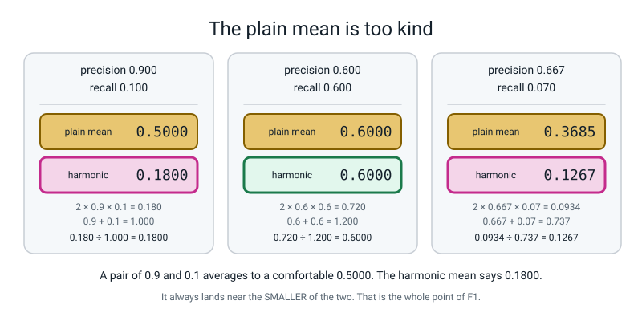
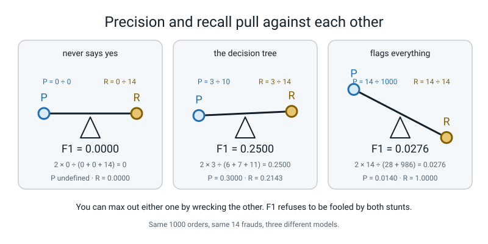
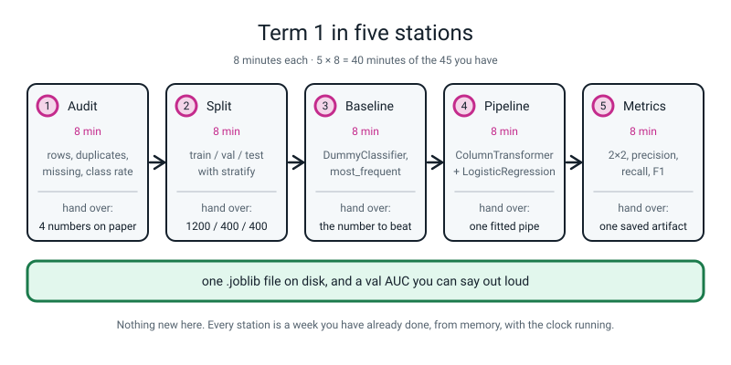
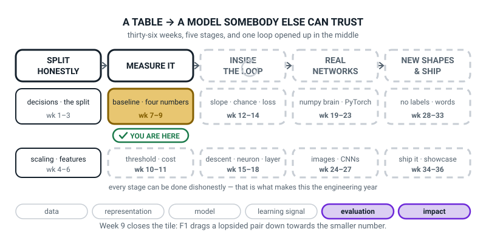
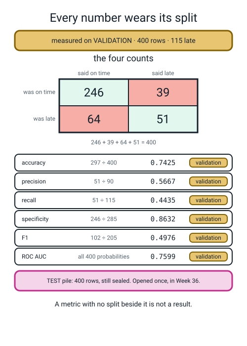

# Week 9 — Term 1 Checkpoint: One Number Is Never Enough

[⬅ Week 8](week-08.md) · [Course Home](../README.md) · [Week 10 ➡](week-10.md) · [Student Guide](../student-guide/week-09.md) · [Workbook](../workbook/week-09.md)

---

## 📋 At a Glance

| | |
|---|---|
| **Duration** | 70 minutes |
| **Type** | 🟨 Review — one new piece of arithmetic, and then the whole term re-run from memory |
| **Big idea** | Precision and recall pull against each other, so **one score that respects both must punish a lopsided pair.** That is what F1 does. |
| **New vocabulary** | F1 score · harmonic mean · macro average · support |
| **New maths** | **The harmonic mean:** `2 × p × r ÷ (p + r)`, and why it drags a lopsided pair down towards the smaller of the two numbers. Computed by hand for **(0.9, 0.1)**, **(0.6, 0.6)** and **(0.667, 0.070)** before the symbols appear. |
| **New syntax** | `f1_score(y, pred)` · `precision_recall_fscore_support(y, pred)` |
| **Dataset** | Week 8's `make_classification(weights=[0.99, 0.01], random_state=0)` fraud table **plus the student's own Week 7 delivery pipeline** (`make_data.py`, seed 0). **Nothing downloads. No internet needed.** |
| **Materials** | **Five station cards, printed and laid out before class** (full text below) · a timer that can do 8 minutes · a whiteboard divided **down the middle** for the Arithmetic Race · printed workbook pages 9.1–9.6 · **last week's 2×2 and Week 7's ablation table still on the wall** · the Bug Log |
| **Tech needed** | Laptop with Python 3, numpy, pandas, scikit-learn, joblib. **No new installs.** `make_data.py` must still be in the delivery folder. |
| **Prep time** | 30 minutes the night before (15 of them printing and laying out the five stations) · 10 minutes on the day |
| **Expected runtime of the code** | `f1.py` **under 2 seconds**. Each relay station **under 3 seconds**. The whole relay, all five stations back to back, is under 10 seconds of actual computing — **the 40 minutes is thinking and typing, not waiting.** |

> **⚠️ Watch out:** this week has two completely different halves and they need different energy from you. The first 25 minutes is **one new piece of arithmetic taught slowly**, with you at the board. The last 40 minutes is **a timed relay where you say almost nothing** and hold the clock. If you let the first half run over, the relay collapses into four stations and the term never gets closed. **Set a physical timer for minute 27 and obey it.**

---

## 🎯 Lesson Objectives

By the end of the lesson the student can:

1. **Compute a harmonic mean by hand** for the pair (0.9, 0.1) and show it lands near **0.18**, not near 0.5 as a plain average would.
2. **Explain in one sentence** why F1 is the right summary when precision and recall both matter and the classes are imbalanced.
3. **Re-run the whole Term 1 pipeline from raw table to saved artifact from memory**, at five stations, in under 45 minutes.
4. **Produce a full metrics report** for their own Week 7 model, **with the split named beside every number.**

Observable evidence: a worked harmonic mean for three pairs with all three lines of arithmetic shown; one written sentence explaining F1; five completed station handovers ending in `term1_model.joblib` on disk; and a metrics report carrying the 2×2, precision, recall, F1 and the words *"on the 400 validation rows"* beside every figure.

---

## 🧑‍🏫 What YOU Need to Know First

> **📌 About the code blocks in this guide.** Outside the **🧰 Prep Checklist** and the **🔑 Answer Key**, the blocks are **illustrations, not whole files** — each one carries on from the one above. **The complete runnable files are in the Prep Checklist and the Answer Key.** If you paste an illustration on its own and get `NameError`, that is why, and nothing is broken.

**There is one new piece of arithmetic this week and it is a division you can do on a phone.** No calculus, no algebra, no rearranging. What you need is about twenty minutes with this section, because the *reason* the arithmetic is shaped the way it is takes longer to understand than the arithmetic itself — and the reason is the whole lesson.

### 1. The problem this week solves, in one paragraph

Last week ended with two numbers and no way to choose between them.

The decision tree on the fraud data had **precision 0.3000** and **recall 0.2143**. Two numbers. Now imagine the form you have to fill in — a report to a manager, a row in a comparison table, a line in a paper. **It has one box.** You have to put one number in it.

You cannot put both. You cannot leave it blank. And whichever number you pick, somebody can game it:

- Report **precision** only? I will flag exactly one transaction, the one I am most certain about. Precision 1.0000. I have caught one fraud out of fourteen and my number is perfect.
- Report **recall** only? I will flag **all one thousand** transactions. Recall 1.0000. I have blocked every card in the country and my number is perfect.

**Both stunts take one line of code and both produce a flawless score.** So the single number you report has to be one that *neither stunt can fool*. That number exists, it is called F1, and building it is today's arithmetic.

### 2. Why the plain average is the wrong tool, and the analogy that proves it

Start with the obvious idea: average the two numbers. Precision 0.9, recall 0.1 — add them, halve them:

```text
(0.9 + 0.1) ÷ 2  =  1.0 ÷ 2  =  0.5000
```

**0.5000.** Which sounds like a middling, unremarkable model. It is not. A model with recall 0.1 has found **one tenth** of the frauds. It has missed nine out of every ten. Calling that "0.5" is not a summary, it is a cover-up.

🍕 **Here is the analogy that makes this land, and it is worth doing on the board in full, because the teacher who has done it once never fumbles the rest of the lesson.**

You drive to your grandmother's house. It is 120 kilometres. The first 60 km is motorway and you do **90 km/h**. The second 60 km is a village road behind a tractor and you do **10 km/h**.

**What was your average speed?**

Everybody says 50. `(90 + 10) ÷ 2 = 50`. It is wrong, and you can prove it with a clock:

```text
first  60 km at 90 km/h  →  60 ÷ 90  =  0.6667 hours
second 60 km at 10 km/h  →  60 ÷ 10  =  6.0000 hours
                                        ------
                          total time  =  6.6667 hours
```

You covered 120 km in 6.6667 hours:

```text
120 ÷ 6.6667  =  18.0 km/h
```

**Eighteen.** Not fifty. Your average speed for that journey was 18 km/h, because **you spent nearly all your time crawling.** The slow bit dominated, and the plain average never noticed.

Now watch what the harmonic mean says about 90 and 10:

```text
2 × 90 × 10  =  1800
90 + 10      =  100
1800 ÷ 100   =  18.0
```

**Eighteen. Exactly.** The harmonic mean is not a fudge somebody invented to be strict about F1. **It is what "average" actually means when the thing you are averaging is a rate, and the two rates apply to the same fixed amount of work.** Precision and recall are both rates with the same top line, the true positives (TP ÷ everything flagged, TP ÷ everything really fraud), just as both speeds were the same 60 km over different times. That is why they get this average and not the other one.

> **💡 Try this:** do the drive on the board with real clock times before you ever write the letters p and r. Ninety, ten, fifty, then the clock says eighteen. A room that has felt the 50-versus-18 gap will accept 0.5-versus-0.18 without a murmur.

### 3. The harmonic mean, three ways, all landing on the same number

This is the part to have completely solid, because a student **will** ask "but why is it two times the top?" and the honest answer is beautiful and takes ninety seconds.

**Way one — flip, average, flip back. This is the definition and it is the one that explains everything.**

Take precision 0.9 and recall 0.1. Turn each one upside down:

```text
1 ÷ 0.9  =  1.11111
1 ÷ 0.1  =  10.00000
```

Look at what just happened. **0.1 flipped over becomes 10.** A small number, flipped, becomes an enormous number. Now take the plain average of the two flipped numbers:

```text
(1.11111 + 10.00000) ÷ 2  =  11.11111 ÷ 2  =  5.55556
```

And flip that back the right way up:

```text
1 ÷ 5.55556  =  0.18000
```

**0.1800.** That is the whole mechanism, and there is your answer to "but why is it so harsh?" — **because flipping a small number makes it huge, and a huge number bullies an average.** Recall 0.1 became a 10, the 10 dragged the average up to 5.56, and flipping 5.56 back gave a tiny answer. **The harmonic mean is a plain average done in a mirror where small numbers are giants.**

**Way two — the same thing, written shorter.** Instead of "average the flipped ones, then flip back", you can write it as one division. Two, divided by the sum of the flips:

```text
1 ÷ 0.9 = 1.11111
1 ÷ 0.1 = 10.00000
sum     = 11.11111

2 ÷ 11.11111  =  0.18000
```

Same answer. **0.1800.**

**Way three — the version with no flipping at all, which is the one everybody prints.** Tidy way two up and the flips cancel out, leaving this:

```text
2 × p × r  ÷  (p + r)
```

On our numbers, and do this arithmetic out loud in three separate lines, never in one:

```text
2 × 0.9 × 0.1  =  0.180
0.9 + 0.1      =  1.000
0.180 ÷ 1.000  =  0.1800
```

**0.1800 again, from all three routes.** That triple agreement is the thing to show the student — not the formula. The formula is way three, and way three is only a tidy-up of way one.

> **🔢 The maths, slowly:** `2 × p × r ÷ (p + r)` looks like a rule you have to trust. It is not. It is *"flip both numbers over, average them, flip the answer back"*, with the flipping already cancelled out. If a student wants to check that the tidy-up is honest, they do not need algebra: they compute both ways on any pair and see the same number. Do it on (0.6, 0.6) in front of them and they will believe you for the rest of the year.

### 4. The three pairs, computed by hand — this is the figure to teach from

Here are the three pairs the lesson works through, with every division written out. **These are the numbers on the wall figure and on workbook page 9.1.**


*Figure 9.1 — The plain mean is too kind. The harmonic mean always lands near the smaller of the two numbers, and that is the entire point of F1.*

**Pair one — precision 0.900, recall 0.100. The lopsided pair.**

```text
plain mean   :  (0.9 + 0.1) ÷ 2      =  1.000 ÷ 2      =  0.5000
harmonic     :   2 × 0.9 × 0.1       =  0.180
                 0.9 + 0.1           =  1.000
                 0.180 ÷ 1.000       =  0.1800
```

**0.5000 against 0.1800.** The plain mean is nearly three times kinder. **This pair is objective 1 and it is the one to make them do twice.**

**Pair two — precision 0.600, recall 0.600. The balanced pair.**

```text
plain mean   :  (0.6 + 0.6) ÷ 2      =  1.200 ÷ 2      =  0.6000
harmonic     :   2 × 0.6 × 0.6       =  0.720
                 0.6 + 0.6           =  1.200
                 0.720 ÷ 1.200       =  0.6000
```

**Identical. 0.6000 both ways.** This pair matters enormously and it is the one teachers skip. **When the two numbers agree, the harmonic mean agrees with the plain mean exactly.** So F1 is not a permanently pessimistic score that always marks you down — it only punishes you **for being lopsided.** A student who thinks "F1 is just a smaller number" has not seen pair two.

**Pair three — precision 0.667, recall 0.070. The real one.**

This is a real shape and it is worth telling as a story. A bank has **200 real frauds** in a month. The model flags **21 transactions**, and **14 of them really are fraud.**

```text
precision  =  14 ÷ 21   =  0.6667   →  rounded, 0.667
recall     =  14 ÷ 200  =  0.0700   →  0.070
```

Precision 0.667 sounds respectable — two thirds of what it flags is genuinely fraud. Now the two averages:

```text
plain mean   :  (0.667 + 0.070) ÷ 2  =  0.737 ÷ 2      =  0.3685
harmonic     :   2 × 0.667 × 0.070   =  0.0934
                 0.667 + 0.070       =  0.737
                 0.0934 ÷ 0.737      =  0.1267
```

**0.3685 against 0.1267.** The plain mean says "about a third — needs work". The harmonic mean says "this is close to useless", **which is the truth: 186 frauds went through untouched.**

### 5. The rule that needs no algebra at all, and it is checkable every time

Here is the single most useful thing you can hand a 14-year-old about the harmonic mean, and it needs no rearranging of anything:

> **The harmonic mean always lands between the smaller number and twice the smaller number.**

Check it on all three pairs and on the two stunts:

| Pair | Smaller | Twice the smaller | Harmonic mean | In range? |
|---|---|---|---|---|
| 0.900 / 0.100 | 0.1000 | 0.2000 | **0.1800** | ✅ |
| 0.600 / 0.600 | 0.6000 | 1.2000 | **0.6000** | ✅ |
| 0.667 / 0.070 | 0.0700 | 0.1400 | **0.1267** | ✅ |
| 0.300 / 0.2143 | 0.2143 | 0.4286 | **0.2500** | ✅ |
| 1.000 / 0.010 | 0.0100 | 0.0200 | **0.0198** | ✅ |
| 0.014 / 1.000 | 0.0140 | 0.0280 | **0.0276** | ✅ |

**Six for six.** So a student who computes an F1 of 0.62 from a precision of 0.99 and a recall of 0.05 has made an arithmetic mistake, and they can catch it themselves in four seconds without asking you: *is my answer between 0.05 and 0.10?* No. **Do it again.**

**And say the consequence out loud, because it is the answer to "why should I care":** your F1 can never be much better than your **worst** number. You cannot hide a bad recall behind a good precision. **That is the property the report form needed.**

### 6. F1 named, and the version that comes straight from the four counts

> **F1 score** — the harmonic mean of precision and recall. One number that respects both, and that lands near the smaller of the two whenever they disagree.

The "1" in F1 means *precision and recall are weighted equally*. There are other members of the family (F2 cares more about recall, F0.5 more about precision) and **they are not in this course.** If a student finds them, the honest line is: *"same idea, different exchange rate between the two errors, and choosing the rate is a decision about people, not maths."*

Now the part that makes it concrete. **You do not need precision and recall at all — F1 comes straight out of the four counts**, with one multiplication and two additions:

```text
F1  =  2 × TP  ÷  (2 × TP + FP + FN)
```

On last week's tree — TP 3, FP 7, FN 11:

```text
2 × 3            =  6
2 × 3 + 7 + 11   =  6 + 7 + 11  =  24
6 ÷ 24           =  0.2500
```

**0.2500.** And through precision and recall the long way:

```text
precision  =  3 ÷ 10  =  0.3000
recall     =  3 ÷ 14  =  0.2143
2 × 0.3000 × 0.2143  =  0.12858
0.3000 + 0.2143      =  0.5143
0.12858 ÷ 0.5143     =  0.2500
```

**The same 0.2500.** Two routes, one answer, both done on paper. That agreement is worth two minutes of class time.

**And notice what is missing from `2 × TP ÷ (2 × TP + FP + FN)`.** There is no **TN** in it. None. F1 never looks at the "correctly left alone" cell at all. Hold that thought — it comes back in §9 and it is the honest criticism of F1.

**The plain mean of the tree's pair, for comparison:** `(0.3000 + 0.2143) ÷ 2 = 0.2571`. Barely different from 0.2500, because 0.30 and 0.21 are *not* very lopsided. **F1 only gets dramatic when the pair does.** Say that; it stops F1 feeling arbitrary.

### 7. The see-saw: three models, and F1 refusing to be fooled by either stunt

This is where the whole thing pays off. **Same 1,000 validation orders. Same 14 frauds. Three models.**


*Figure 9.2 — Precision and recall pull against each other. You can max out either one by wrecking the other, and F1 refuses to be fooled by both stunts.*

| Model | TN | FP | FN | TP | Precision | Recall | **F1** |
|---|---|---|---|---|---|---|---|
| **Never says yes** (Week 2's dummy) | 986 | 0 | 14 | 0 | undefined | 0.0000 | **0.0000** |
| **The decision tree** | 979 | 7 | 11 | 3 | 0.3000 | 0.2143 | **0.2500** |
| **Flags everything** | 0 | 986 | 0 | 14 | 0.0140 | 1.0000 | **0.0276** |

The arithmetic on each, from the counts:

```text
never says yes    :  2 × 0  ÷ (0 + 0 + 14)      =   0 ÷   14  =  0.0000
the decision tree :  2 × 3  ÷ (6 + 7 + 11)      =   6 ÷   24  =  0.2500
flags everything  :  2 × 14 ÷ (28 + 986 + 0)    =  28 ÷ 1014  =  0.0276
```

**Read the bottom row twice.** The "flag everything" model has a **perfect recall of 1.0000** — it caught every single fraud there was. And its F1 is **0.0276**, barely above the model that does nothing at all. **The stunt did not work.** Recall 1.0 bought it nothing, because precision collapsed to 0.0140 and the harmonic mean went with the smaller number as it always does.

**And the top row.** The dummy flagged nothing, so its precision is `0 ÷ 0` — **genuinely undefined**, not zero. scikit-learn prints `0.0000` and raises `UndefinedMetricWarning` to tell you why, which you met last week. Its F1, though, is honestly and unambiguously **0.0000**, because `2 × 0 ÷ 14` needs no division by zero at all. **F1 is the one number of the three that is well-defined for all three models**, which is a quietly excellent reason to report it.

**The one sentence for objective 2**, and it is worth writing on the board and leaving there:

> **"F1 is the right summary when both errors matter and the classes are imbalanced, because it cannot be faked by flagging almost nothing, or — when positives are rare — by flagging almost everything."** *(Teacher note: flag-everything has F1 = 2π/(1+π) for positive rate π. Fraud, π = 1.4%: 0.0276. Delivery, π = 28.75%: 0.4466, against the model's 0.4976. Have students compare F1 with the flag-everything F1.)*

### 8. `macro average` and `support`, which are printed on the screen and will get asked about

Two words from last week's `classification_report` that you deferred. They take four minutes and they are on the syllabus now.

> **support** — how many rows of that class there really were. Nothing more. It is a **count**, not a score.

> **macro average** — average the per-class scores treating **each class as equally important**, whatever its support.

On the fraud data, scikit-learn gives an F1 for each class separately:

| | legit (class 0) | fraud (class 1) |
|---|---|---|
| precision | 0.9889 | 0.3000 |
| recall | 0.9929 | 0.2143 |
| **F1** | **0.9909** | **0.2500** |
| **support** | **986** | **14** |

```text
macro average F1     :  (0.9909 + 0.2500) ÷ 2  =  1.2409 ÷ 2  =  0.6204
weighted average F1  :  (0.9909 × 986 + 0.2500 × 14) ÷ 1000
                     :  (977.0274 + 3.5) ÷ 1000  =  980.5274 ÷ 1000  =  0.9805
```

**Look at those three numbers side by side: 0.2500, 0.6204, 0.9805.** They are all "the F1 of this model". They are all correct. They differ by a factor of nearly four.

- **0.2500** is the F1 of the class you care about. **This is the number to report.**
- **0.6204** is the macro average — it gave the 986 easy rows the same vote as the 14 hard ones.
- **0.9805** is the weighted average — it is the majority class again, wearing a different hat. **It is 98% a statement about the 986 legitimate transactions.**

**This is the accuracy paradox coming back through a side door**, and it is exactly why the deliberate mistake in the live-code segment is `average="macro"`. It produces no error, it produces a plausible number, and it produces the *wrong* number. **A student who reports 0.6204 has done the same thing as a student who reported 98.6% accuracy last week.**

### 9. What F1 quietly ignores, and the honest criticism of it

You do not have to teach this, but you must know it, because a strong student will find it and you need a real answer rather than a deflection.

**F1 never looks at TN.** The formula is `2 × TP ÷ (2 × TP + FP + FN)` — the "correctly left alone" cell is simply not in it. So take last week's tree and imagine the bank grows: same 14 frauds, same 3 caught, same 7 false alarms, same 11 misses, but a million legitimate transactions instead of 986.

```text
rows     1000   TN      979   F1 0.2500   accuracy 0.982000
rows    10000   TN     9979   F1 0.2500   accuracy 0.998200
rows  1000000   TN   999979   F1 0.2500   accuracy 0.999982
```

**F1 does not move. Accuracy sails up to 99.9982%.**

That immovability is exactly **why F1 survives imbalance** and accuracy does not — you cannot inflate F1 by adding easy rows. It is also exactly **its blind spot**: seven false alarms out of 986 legitimate customers is a different business from seven false alarms out of a million, and F1 reports both as 0.2500. If what you care about is *"what fraction of my honest customers get wrongly blocked"*, that is **specificity**, and F1 will never tell you.

**The honest position, and the one to give a bright student:** *"F1 is a good single number when you have to pick one. There is no single number that is good for everything, and the four counts are the only thing that never lies to you."*

### 10. What the relay is actually testing, and why it is worth 40 minutes

The second half of the lesson is a **five-station relay** covering the whole of Term 1, eight minutes per station, one saved file at the end.


*Figure 9.3 — Term 1 in five stations. Eight minutes each, one handover per station, and one joblib file on disk at the end.*

| Station | 8 minutes on | Weeks | **What they hand over** |
|---|---|---|---|
| **1 Audit** | rows, duplicates, missing, class rate | 1, 6 | **four numbers on paper** |
| **2 Split** | three piles, stratified, seeded | 2 | **`1200 / 400 / 400`** |
| **3 Baseline** | `DummyClassifier(strategy="most_frequent")` | 2 | **the number to beat** |
| **4 Pipeline** | `ColumnTransformer` + `LogisticRegression` | 3, 4, 5, 7 | **one fitted `pipe`** |
| **5 Metrics** | the 2×2, precision, recall, F1 | 8, 9 | **one saved artifact** |

**Why a relay and not a worksheet?** Because the thing being tested is not knowledge, it is **sequence**. Every single one of Term 1's disasters was an ordering mistake: scaling before splitting, fitting the imputer on all the rows, looking at the test pile, computing a feature from the answer column. **A student who can do all five steps but cannot remember which comes second has not learnt Term 1.** The clock and the handover enforce the order in a way no worksheet does.

**And the handover is the assessment.** Do not mark the code. Mark the four numbers, the three pile sizes, the number to beat, the fitted pipe and the file on disk. **If station 3 cannot say what number station 4 has to beat, the relay has found a real gap** — and finding it in Week 9 rather than Week 36 is the entire purpose of a checkpoint.

### 11. Every line of this week's code, explained to somebody who has never programmed

Two new lines. Everything else this week is Weeks 1–8, retyped from memory, which is the point.

**New line 1 — the F1 score, done for you.**

```python
print("f1_score : %.4f" % f1_score(y_val, pred))
```

`f1_score` is a function inside scikit-learn. You hand it two lists — **the truth first, the predictions second**, exactly like last week's `confusion_matrix` — and it hands back one number. Internally it does precisely the arithmetic you did on paper: it counts the four cells, then computes `2 × TP ÷ (2 × TP + FP + FN)`.

`%.4f` means "print this number as a decimal with four digits after the point". Two decimals would turn 0.2500 and 0.2543 into the same thing, and this term has already taught you not to allow that.

**Truth first. Always.** Get the two arguments the wrong way round and — here is a genuinely surprising fact worth knowing — **F1 does not change.** Swapping truth and predictions swaps FP and FN, and the F1 formula adds FP and FN together, so the total is identical. Precision and recall *do* swap places (0.3000 and 0.2143 trade), but F1 sits there at 0.2500 looking innocent. **So F1 cannot warn you about the swap.** Only the four counts can. Say this in class; it is a real reason to keep printing the counts.

**New line 2 — everything, for every class, in one call.**

```python
prec, rec, f1, sup = precision_recall_fscore_support(y_val, pred)
```

The name is a list of what it gives you: **prec**ision, **rec**all, **f**score, **sup**port. It hands back **four things, and each of those four things is itself a list with one entry per class.** So after that line:

- `prec[0]` is the precision for class 0 (legit) and `prec[1]` is the precision for class 1 (fraud)
- `sup[0]` is how many legit rows there were, `sup[1]` how many fraud rows

**Four names on the left of one `=`.** Python hands out the four results in order. If you write three names you get a loud error, and it is the first deliberate mistake in the live-code:

```text
ValueError: too many values to unpack (expected 3)
```

Read it literally: *"you asked for three, I have more than three."* It is one of the clearest error messages in Python.

**Why use this at all when `classification_report` prints a nicer table?** Because `classification_report` gives you **text**, and text cannot be put in a variable and compared. `precision_recall_fscore_support` gives you **numbers you can do arithmetic with** — which is how the student computes the macro average by hand in the live-code and checks scikit-learn's version against it.

**One thing that will bite.** `prec` is a *list*, not a number, so `"%.4f" % prec` fails with `TypeError: only length-1 arrays can be converted to Python scalars`. You must say which class you mean: `"%.4f" % prec[1]`. In the Clinic.

### 12. The three misconceptions you will actually meet

**Misconception 1 — "F1 is just a stricter score, so it's always lower."**
It is lower **only when the pair is lopsided**. Pair two — 0.6 and 0.6 — gives exactly 0.6000 both ways. The cure is to make them compute pair two before pair three: they discover the equality themselves and it reframes F1 from "a penalty" to "a lopsidedness detector".

**Misconception 2 — "the F1 in `classification_report` is the F1."**
There are three F1s on that screen: 0.2500, 0.6204, 0.9805. The cure is the deliberate mistake in the live-code: run `average="macro"`, get 0.6204, and ask *"which class does that number belong to?"* The answer is "neither — it belongs to both equally, and one of them has 14 rows in it."

**Misconception 3 — "recall 1.0 means the model works."**
It means the model said yes to something. Possibly to everything. The cure is the third see-saw: recall 1.0000, F1 0.0276. **Then ask what the bank's customers think.** The moment a student says "so recall on its own can be a stunt too", they have understood the see-saw in both directions, which is more than most working practitioners manage.

### 13. How deep to go, and where to stop

**Go this far:** the plain mean versus the harmonic mean on three pairs by hand; the flip-average-flip-back explanation; the between-the-smaller-and-twice-the-smaller check; F1 from the four counts; `f1_score` and `precision_recall_fscore_support`; macro and weighted averages named and computed; the five-station relay completed with one saved artifact; and one sentence on why F1 rather than accuracy.

**Stop before:**

| Do not teach today | Where it lives |
|---|---|
| **Moving the threshold to trade precision for recall** | **Week 10, next week.** The see-saw begs for it and somebody will ask. *"There is a dial, and next week you get to turn it."* **Do not sketch it.** |
| ROC curves, PR curves, `roc_curve`, `average_precision_score` | **Week 10.** |
| F2, F0.5, F-beta | **Not in this course.** One honest sentence and move on. |
| Cross-validation, `±`, "is 0.2500 reliable on 14 frauds?" | **Week 11.** And they *should* ask, because 14 is a tiny denominator. Name the week and be honest that these numbers wobble. |
| Cost-weighted metrics ("a miss costs £500") | **Week 11.** |
| `class_weight="balanced"`, resampling | Not a lesson in this level. If a student tries it, let them, admire it, and hold the line: today the model is frozen and the *measurement* is the subject. |
| Opening the test pile | **Week 36.** Somebody will suggest it "now that the term is over". **No.** Station 5's report is on the validation pile and the artifact keeps the test pile sealed. |
| Multi-class averaging in anger | Week 26, where digits have ten classes and `macro` finally earns its keep. |

The line to hold in your head all lesson: **today the student learns that a single number can be honest, and which one.** Then they prove they can rebuild the whole term from memory. If they leave with one worked harmonic mean and one `.joblib` file on disk, the lesson worked.

---

### 14. 🧭 The Growing Map — where Week 9 sits

The student guide carries the same figure every week with one more piece filled in. Today it is doing a
second job: this is the **Term 1 checkpoint**, and the map is the cheapest possible way to show a class
what they have actually built since September.



*Figure 9.0 — Week 9's version. Third and final week in the gold tile; from Week 10 the box beneath it
lights up. The ↻ on stage three is drawn grey because the training loop stays closed until Week 12.*

**What to do with it, in about two minutes at the end of the lesson:**

1. **Show it, don't explain it.** Ask *"which box did we do today?"* They point at the gold tile —
   *baseline · four numbers*, for the third and last time. Pointing is the exercise.
2. **Then the question that belongs to this week.** The five relay stations are still on the desks, so
   ask: *"which box on this map does each station live in?"* Stations 1 to 3 — raw table, honest split,
   fitted pipeline — are stage one. Stations 4 and 5 — the metrics report and the saved artifact — are
   the gold tile. Let them argue about where the `.joblib` file belongs; the answer is that saving it is
   stage five's business and reporting on it is stage two's, and noticing that distinction is worth more
   than getting it right.
3. **Count the filled tiles out loud: three of ten.** Then point at stage three and say that in nine
   weeks they have learned to measure, and in the spring they learn to **train**. The term ends on that
   sentence.

> **🧑‍🏫 Why this is worth two minutes.** A learner who can see the map can distinguish *"I don't
> understand this week"* from *"I don't know where this week goes"* — and at the end of a term, the map
> is also the difference between "we did some metrics" and "we finished a stage and a half of a real
> pipeline". One of those is worth telling a parent about.

**Two things to notice, so you can answer if asked.**

- **Evaluation and impact are lit together.** F1 is a measurement, so evaluation is obvious. Impact is
  lit because *deciding which number to publish* is a decision about whose mistakes are tolerable — and
  §9's honest criticism of F1 is exactly that conversation. If a student asks why impact is on, that
  paragraph is your answer.
- **The ↻ on stage three is still grey.** Three weeks to go. It is the training loop, and the symbol
  turns black in Week 12 when it opens. This is a good place to promise it and a bad place to explain
  it.

> **⚠️ Watch out:** the map is orientation, not assessment. It is tempting at a checkpoint to turn it
> into a quiz on the year so far. Don't. The relay was the assessment; the map is the victory lap.

---

## 🧰 Prep Checklist

Use this section to get the room, the files and the five station cards ready before class.

### 30 minutes the night before

- [ ] **Check the delivery folder still works.** Everything in the relay imports `make_data.py`.

```bash
cd ~/delivery && python3 make_data.py
```

You must see:

```text
(2020, 10)
 order_id restaurant  distance_km  items  prep_minutes  order_hour day_of_week weather  driver_experience_months  late
   100955     Napoli         2.78      3          15.0          12         Mon   clear                       5.0     0
   101493 CrustyBros         3.09      5          12.9          22         Mon    rain                       0.0     0
   101857 CrustyBros         2.65      2          14.2          16         Mon    rain                      33.0     0
   100215     Napoli         9.60      2           4.9          13         Tue   clear                      27.0     1
   100506 CrustyBros         2.33      5          19.6          20         Thu   clear                      35.0     0
```

**If the shape is not `(2020, 10)`, stop and fix it before anything else.** Every number in the relay depends on it.

- [ ] **Do all three harmonic means yourself, on paper, before you teach them.** Not on a calculator app — on paper, three lines each, the way the students will:

```text
2 × 0.9 × 0.1 = 0.180      0.9 + 0.1 = 1.000      0.180 ÷ 1.000 = 0.1800
2 × 0.6 × 0.6 = 0.720      0.6 + 0.6 = 1.200      0.720 ÷ 1.200 = 0.6000
2 × 0.667 × 0.07 = 0.0934  0.667 + 0.07 = 0.737   0.0934 ÷ 0.737 = 0.1267
```

**And do the drive.** 60 ÷ 90 = 0.6667 hours, 60 ÷ 10 = 6 hours, total 6.6667 hours, 120 ÷ 6.6667 = 18 km/h. **If you have not said "eighteen, not fifty" out loud once, you will fumble the best analogy in the week.**

- [ ] **Type and run `f1.py` yourself.** The complete file:

```python
"""f1.py - one number that respects both.  Week 9."""
import numpy as np
from sklearn.datasets import make_classification
from sklearn.dummy import DummyClassifier
from sklearn.metrics import (confusion_matrix, f1_score,
                             precision_recall_fscore_support, precision_score,
                             recall_score)
from sklearn.model_selection import train_test_split
from sklearn.tree import DecisionTreeClassifier

X, y = make_classification(n_samples=5000, n_features=8, n_informative=4,
                           n_redundant=0, weights=[0.99, 0.01], random_state=0)
X_tmp, X_test, y_tmp, y_test = train_test_split(
    X, y, test_size=0.20, random_state=0, stratify=y)
X_train, X_val, y_train, y_val = train_test_split(
    X_tmp, y_tmp, test_size=0.25, random_state=0, stratify=y_tmp)

tree = DecisionTreeClassifier(random_state=0).fit(X_train, y_train)
pred = tree.predict(X_val)
tn, fp, fn, tp = confusion_matrix(y_val, pred).ravel()
print("tn %d  fp %d  fn %d  tp %d" % (tn, fp, fn, tp))

p = precision_score(y_val, pred)
r = recall_score(y_val, pred)
print("precision %.4f   recall %.4f" % (p, r))
print()
print("plain mean      (p + r) / 2      : %.4f" % ((p + r) / 2))
print("harmonic  2 * p * r / (p + r)    : %.4f" % (2 * p * r / (p + r)))
print("f1_score(y_val, pred)            : %.4f" % f1_score(y_val, pred))
print("straight from the counts         : 2 x %d / (%d + %d + %d) = %d / %d = %.4f"
      % (tp, 2 * tp, fp, fn, 2 * tp, 2 * tp + fp + fn,
         2 * tp / (2 * tp + fp + fn)))

print()
prec, rec, f1, sup = precision_recall_fscore_support(y_val, pred)
print("               legit     fraud")
print("precision    %.4f    %.4f" % (prec[0], prec[1]))
print("recall       %.4f    %.4f" % (rec[0], rec[1]))
print("f1           %.4f    %.4f" % (f1[0], f1[1]))
print("support        %4d      %4d" % (sup[0], sup[1]))
print()
print("macro average f1 : (%.4f + %.4f) / 2 = %.4f"
      % (f1[0], f1[1], (f1[0] + f1[1]) / 2))
print("f1_score(average='macro')    : %.4f" % f1_score(y_val, pred, average="macro"))
print("f1_score(average='weighted') : %.4f" % f1_score(y_val, pred, average="weighted"))

print()
print("--- three models, same 1000 validation orders, same 14 frauds ---")
never = DummyClassifier(strategy="most_frequent").fit(X_train, y_train).predict(X_val)
always = np.ones(len(y_val), dtype=int)
for name, q in [("never says yes", never), ("the tree", pred), ("flags everything", always)]:
    a, b, c, d = confusion_matrix(y_val, q, labels=[0, 1]).ravel()
    top, bot = 2 * d, 2 * d + b + c
    print("%-17s tn %3d fp %3d fn %2d tp %2d   F1 = %d / %d = %.4f"
          % (name, a, b, c, d, top, bot, top / bot))
```

Run `python3 f1.py`. You must see **exactly** this:

```text
tn 979  fp 7  fn 11  tp 3
precision 0.3000   recall 0.2143

plain mean      (p + r) / 2      : 0.2571
harmonic  2 * p * r / (p + r)    : 0.2500
f1_score(y_val, pred)            : 0.2500
straight from the counts         : 2 x 3 / (6 + 7 + 11) = 6 / 24 = 0.2500

               legit     fraud
precision    0.9889    0.3000
recall       0.9929    0.2143
f1           0.9909    0.2500
support         986        14

macro average f1 : (0.9909 + 0.2500) / 2 = 0.6204
f1_score(average='macro')    : 0.6204
f1_score(average='weighted') : 0.9805

--- three models, same 1000 validation orders, same 14 frauds ---
never says yes    tn 986 fp   0 fn 14 tp  0   F1 = 0 / 14 = 0.0000
the tree          tn 979 fp   7 fn 11 tp  3   F1 = 6 / 24 = 0.2500
flags everything  tn   0 fp 986 fn  0 tp 14   F1 = 28 / 1014 = 0.0276
```

**Expected runtime: under 2 seconds.** If `tn` is not 979, a `random_state=0` is missing somewhere.

- [ ] **Run all five relay stations yourself, in order, and time yourself.** The complete files are in the Answer Key under pages 9.3a–9.3e. **Do this properly — it is the single most valuable 15 minutes of prep this week**, because it is the only way to find out that station 4 takes you eleven minutes and needs its card rewritten. Expected outputs are in the Answer Key. **Total computing time: under 10 seconds. Total typing time for you: about 12 minutes. Budget the student at twice that.**

- [ ] **Break it on purpose, twice, so you have seen both live.**
  1. `prec, rec, f1 = precision_recall_fscore_support(y_val, pred)` — three names for four results. You get `ValueError: too many values to unpack (expected 3)`. **Loud, instant, unambiguous.** This is deliberate mistake one.
  2. `f1_score(y_val, pred, average="macro")` — you get **0.6204** instead of 0.2500, **no error and no warning.** This is deliberate mistake two and it is the important one.

- [ ] **Print the five station cards, cut them out, and lay them on five separate desks or five separate corners of one table.** Full text in the Activity section. **Each card is a title, three bullet-point instructions, and one line beginning "You hand over:".** Nothing else — an eight-minute station has no time for a student to work out what is being asked.
- [ ] **Print workbook pages 9.1–9.6.**
- [ ] **Divide the whiteboard down the middle with a vertical line**, and write `PLAIN MEAN` on the left and `HARMONIC MEAN` on the right. That is the Arithmetic Race board and it should be waiting when they walk in.
- [ ] **Check both wall artifacts are still up:** Week 8's 2×2 and Week 7's ablation table. **You will point at both.**
- [ ] **Set a timer you can hear.** Eight minutes, five times. A phone on silent is useless.

### 10 minutes on the day

- [ ] Terminal in the delivery folder. `make_data.py` present. **`f1.py` and all five station files deleted or renamed** — they type them.
- [ ] The five station cards on the five stations, face up.
- [ ] **A blank sheet at each station headed "HANDOVER"**, with one line for what gets passed on.
- [ ] Whiteboard divided, `PLAIN MEAN` and `HARMONIC MEAN` written.
- [ ] Workbook 9.1 out. **Nothing filled in.**
- [ ] Week 8's 2×2 and Week 7's ablation table both visible.
- [ ] Bug Log out at a fresh page.
- [ ] Timer tested out loud.

### Fallback if the laptops fail

**Four of the five objectives survive with no computer at all**, and the maths half of this lesson is *better* on paper.

1. **The drive to grandmother's house.** Ninety, ten, the clock, eighteen. Five minutes, no electricity, and it is the concept.
2. **The Arithmetic Race, exactly as planned.** Two halves of the board, plain mean on the left, harmonic on the right, all three pairs. **Objective 1, complete.** Then the six-row check table from §5, which is pure division. (Answers: page 9.1.)
3. **The relay, run entirely on paper.** This works and it is arguably a better test of objective 3. Print the station cards unchanged and hand each station a printed data summary instead of a laptop. Station 1: *"here are the four audit numbers — which is which, and which one worries you?"* Station 2: *"1,200 / 400 / 400 — write the two `train_test_split` calls out by hand and say what `stratify` is for."* Station 3: *"the dummy says 'on time' to all 400. What is its accuracy and what is its AUC?"* (0.7125 and 0.5000.) Station 4: *"list the pipeline's three steps in order and say what breaks if you swap two of them."* Station 5: *"here is the 2×2 — 246, 39, 64, 51. Give me precision, recall and F1."* **Eight minutes each, same clock, same handovers.**
4. **The see-saw, on paper.** Three models, three sets of four counts, three F1s from the counts. **Objective 2, complete**, and it is nine divisions.
5. **The report card.** Objective 4 is a writing task anyway. Hand them the four counts and require the words *"on the 400 validation rows"* beside every number.

| If this fails | Do this instead |
|---|---|
| `ModuleNotFoundError: No module named 'make_data'` | The terminal is in the wrong folder. `cd` into the folder holding `make_data.py`. Nothing is broken. |
| A station's numbers differ from this file | Check three things in order: `random_state=0` in **both** splits, `drop_duplicates()` present, `stratify=` present. It is almost always the first. |
| `f1_score` gives 0.6204 and everyone is pleased | `average="macro"` has been left in. Drop it. **This is deliberate mistake two arriving by accident, which is fine — teach it there and then.** |
| The relay is running long | **Cut station 4's scope, never a whole station.** Hand out the `prep = ColumnTransformer(...)` block pre-typed and let them assemble the `Pipeline`. Five short stations beat four complete ones. |
| Somebody finishes a station in three minutes | Send them to the "harder" variant on their station card. **Do not let them start station 4 early** — the relay's ordering is the point. |
| A student cannot remember Week 3's pipeline at all | That is the checkpoint doing its job. Give them the scaffold in **🧭 Differentiation** and write it in your notes; it is a Week 10 conversation, not a Week 9 failure. |

---

## ⏱️ The Lesson, Minute by Minute

Use this section to run the lesson; the table shows the timing and each segment below it gives the steps.

| Segment | Minutes | Running total | What happens |
|---|---|---|---|
| 🪝 Hook — One Box on the Form | 5 | 5 | Two numbers, one box. Then both stunts. |
| 🧠 Concept & Maths — The Average That Won't Be Fooled | 12 | 17 | The drive; the flip; the Arithmetic Race on three pairs |
| 💻 Live-Code Together — `f1.py` | 8 | 25 | Paper checked against code. **Two deliberate mistakes.** |
| 🎲 Their Turn — The Term 1 Relay | 40 | 65 | Five stations, eight minutes each, one artifact |
| 🔑 Wrap & Assign | 5 | 70 | Three checks, the takeaway, homework |

> **📌 Why this is not the standard 7 / 18 / 18 / 20 / 7 shape.** Week 9 is a **checkpoint**: the relay is the assessment and it needs its full 40 minutes, so everything else is compressed. The five segments are still the five segments and the total is still 70. **The one thing you must not do is borrow minutes from the relay to finish the maths.** If the maths runs over, cut the third pair (0.667 / 0.070) and set it as homework — it is already on workbook page 9.1.

---

### 🪝 Hook — One Box on the Form (5 minutes)

**Do this:** Nothing on the screen. Point at last week's 2×2, still on the wall, and read the four numbers out loud: 979, 7, 11, 3.

**Say this:**

> "Last week you finished with two numbers. Precision 0.3000 — of the ten transactions we flagged, three were really fraud. Recall 0.2143 — of the fourteen real frauds, we caught three.
>
> Now I want you to imagine the form."

**Do this:** Draw a single empty box on the board, big, with a label above it.

```text
   model performance:  [            ]
```

**Say this:**

> "One box. That is what a report looks like. That is what the comparison table in a paper looks like, and the summary line in a business email, and the slide.
>
> You have two numbers. **Which one goes in the box?**"

Let somebody answer. Whatever they say, take it seriously and then break it.

**Ask this:** "Suppose I tell you to report precision. Precision only. Can you get me a precision of 1.0000 by lunchtime?"

*Hoped-for answer:* flag only the one you are most sure about.

> "Exactly. I flag **one** transaction — the single most obviously stolen card in the file — and I am right about it. Precision: one out of one. **1.0000. Perfect.** I have caught one fraud out of fourteen and my number is flawless.
>
> Fine. Report recall instead."

**Ask this:** "Can you get me a recall of 1.0000 by lunchtime?"

*Hoped-for answer:* flag everything.

> "Flag all one thousand. Every fraud is now inside my flagged pile, because everything is inside my flagged pile. Recall: fourteen out of fourteen. **1.0000. Perfect.** I have also blocked nine hundred and eighty-six innocent people's cards."

**Do this:** Write both stunts on the board and leave them there all lesson.

```text
flag ONE thing      →  precision 1.0000   (caught 1 of 14)
flag EVERYTHING     →  recall    1.0000   (blocked 986 innocent cards)
```

**Say this:**

> "Both of those take one line of code. Both give a perfect score. So whichever of the two numbers I ask you to report, **you can cheat me, and the cheat is easy.**
>
> Today's whole job is to find a number that **neither** stunt can fool. It exists. It has a slightly silly name — **F1** — and getting to it takes one new piece of arithmetic, which we are going to do as a race."

---

### 🧠 Concept & Maths — The Average That Won't Be Fooled (12 minutes)

**Do this:** Write two numbers on the board, nothing else.

```text
precision 0.9      recall 0.1
```

**Ask this:** "One number, respecting both. What is your first instinct?"

*Hoped-for answer:* average them.

> "Average them. Perfectly sensible. `(0.9 + 0.1) ÷ 2 = 0.5`. Half. A middling model.
>
> Except recall 0.1 means we found **one tenth** of the frauds. Nine out of ten walked past. Is 'middling' an honest description of that?"

Let the discomfort sit for a second. Then change subject completely.

**Say this — and this is the piece to do properly:**

> "Put that down. I want to tell you about a drive.
>
> You are going to your grandmother's house. It is a hundred and twenty kilometres. The first sixty is motorway and you do **ninety kilometres an hour**. Then you come off, and the second sixty is a single-track road behind a tractor, and you do **ten kilometres an hour**.
>
> What was your average speed for the journey?"

*Almost everybody says 50.*

> "Fifty. Ninety plus ten, halved. Let's check it with a clock, because a clock cannot be argued with."

**Do this:** Write the clock arithmetic on the board, line by line, saying each line out loud.

```text
first  60 km at 90 km/h  ->  60 ÷ 90  =  0.6667 hours
second 60 km at 10 km/h  ->  60 ÷ 10  =  6.0000 hours
                                          ------
                            total time  =  6.6667 hours

120 km ÷ 6.6667 hours  =  18.0 km/h
```

**Ask this:** "So what was your average speed?"

*Hoped-for answer:* eighteen.

*If somebody insists on 50:* point at the clock. *"You were in the car for six hours and forty minutes. If you had averaged fifty, how long would 120 km have taken?"* (2.4 hours.) *"Did it take two hours and twenty-four minutes?"*

> "**Eighteen. Not fifty.** And the reason is one sentence: **you spent nearly all of your time crawling.** Six hours of the six and two-thirds was behind the tractor. The plain average gave the motorway and the tractor an equal vote, and they did not deserve an equal vote.
>
> That is exactly what happened to precision 0.9 and recall 0.1. **The plain average gave the good number and the terrible number an equal vote.**"

**Do this:** Write the harmonic mean of 90 and 10 underneath, in three lines.

```text
2 × 90 × 10  =  1800
90 + 10      =  100
1800 ÷ 100   =  18.0
```

> "Same eighteen. **This kind of average already knew about the tractor.** It has a name — the **harmonic mean** — and it is the one you use when you are averaging rates over the same fixed amount of work. Precision and recall are both rates with the same top line, the true positives, just as both speeds were the same 60 km over different times. So they get this average."

**Do this — the Arithmetic Race. This is the activity for this segment and it takes four minutes.** The board is already divided.

> "Right. Race. Left half of the board is **plain mean**. Right half is **harmonic mean**. Same pair of numbers, two teams, go."

Give them **0.9 and 0.1**, and write both sets of working simultaneously as they call them out.

| PLAIN MEAN | HARMONIC MEAN |
|---|---|
| `0.9 + 0.1 = 1.000` | `2 × 0.9 × 0.1 = 0.180` |
| `1.000 ÷ 2 = 0.5000` | `0.9 + 0.1 = 1.000` |
| | `0.180 ÷ 1.000 = 0.1800` |

**Ask this:** "0.5000 and 0.1800. Which of those two is an honest description of a model that missed nine out of every ten frauds?"

*Hoped-for answer:* 0.1800.

**Do this:** Second round, **0.6 and 0.6.** Same race.

| PLAIN MEAN | HARMONIC MEAN |
|---|---|
| `0.6 + 0.6 = 1.200` | `2 × 0.6 × 0.6 = 0.720` |
| `1.200 ÷ 2 = 0.6000` | `0.6 + 0.6 = 1.200` |
| | `0.720 ÷ 1.200 = 0.6000` |

**Ask this — and this is the most important question of the segment:** "What happened?"

*Hoped-for answer:* they are the same.

*If nobody sees it:* put your two hands on the two answers and say nothing.

> "**Identical.** So the harmonic mean is not a grumpy average that always marks you down. When the two numbers agree, it agrees with the plain average exactly. **It only punishes you for being lopsided.** That is the whole design."

**Say this, and write the rule on the board to stay up:**

> "And here is a check you can do in four seconds, for the rest of your life, with no formula.
>
> **The harmonic mean always lands between the smaller number and twice the smaller number.**
>
> 0.9 and 0.1: the smaller is 0.1, twice it is 0.2, and we got 0.18. In range. 0.6 and 0.6: between 0.6 and 1.2, and we got 0.6. In range.
>
> So if you ever compute an F1 of 0.7 from a precision of 0.99 and a recall of 0.05, **you do not need me to tell you it is wrong.** Is 0.7 between 0.05 and 0.1? No. Do it again."

**Do this:** Name it, in a blockquote on the board.

> **F1 score** — the harmonic mean of precision and recall. One number that respects both, and lands near the smaller of the two whenever they disagree.

**Do this:** Hand out workbook page 9.1 and give them three minutes on the third pair — **0.667 and 0.070** — in pen. Walk round. **Do not help beyond re-reading the three lines of working from the board.**

> "Pen. Three lines each side. And beside your harmonic answer, write down whether it is between 0.070 and 0.140."

---

### 💻 Live-Code Together — `f1.py` (8 minutes)

**You never touch their keyboard.** They type; you type the same thing on the shared screen.

**Step 1 (2 min) — get last week's four counts back, then the two averages.**

New file, `f1.py`. Everything down to the first block of prints.

```python
"""f1.py - one number that respects both.  Week 9."""
import numpy as np
from sklearn.datasets import make_classification
from sklearn.dummy import DummyClassifier
from sklearn.metrics import (confusion_matrix, f1_score,
                             precision_recall_fscore_support, precision_score,
                             recall_score)
from sklearn.model_selection import train_test_split
from sklearn.tree import DecisionTreeClassifier

X, y = make_classification(n_samples=5000, n_features=8, n_informative=4,
                           n_redundant=0, weights=[0.99, 0.01], random_state=0)
X_tmp, X_test, y_tmp, y_test = train_test_split(
    X, y, test_size=0.20, random_state=0, stratify=y)
X_train, X_val, y_train, y_val = train_test_split(
    X_tmp, y_tmp, test_size=0.25, random_state=0, stratify=y_tmp)

tree = DecisionTreeClassifier(random_state=0).fit(X_train, y_train)
pred = tree.predict(X_val)
tn, fp, fn, tp = confusion_matrix(y_val, pred).ravel()
print("tn %d  fp %d  fn %d  tp %d" % (tn, fp, fn, tp))

p = precision_score(y_val, pred)
r = recall_score(y_val, pred)
print("precision %.4f   recall %.4f" % (p, r))
print()
print("plain mean      (p + r) / 2      : %.4f" % ((p + r) / 2))
print("harmonic  2 * p * r / (p + r)    : %.4f" % (2 * p * r / (p + r)))
print("f1_score(y_val, pred)            : %.4f" % f1_score(y_val, pred))
print("straight from the counts         : 2 x %d / (%d + %d + %d) = %d / %d = %.4f"
      % (tp, 2 * tp, fp, fn, 2 * tp, 2 * tp + fp + fn,
         2 * tp / (2 * tp + fp + fn)))
```

**Ask before running:** "Four lines are about to print numbers. **Which two of them will be the same?**"

*Hoped-for answer:* the harmonic one and `f1_score`.

Run it. Real output:

```text
tn 979  fp 7  fn 11  tp 3
precision 0.3000   recall 0.2143

plain mean      (p + r) / 2      : 0.2571
harmonic  2 * p * r / (p + r)    : 0.2500
f1_score(y_val, pred)            : 0.2500
straight from the counts         : 2 x 3 / (6 + 7 + 11) = 6 / 24 = 0.2500
```

> **Say this:** "**Three routes, one number.** My hand-written formula, scikit-learn's `f1_score`, and the version straight from the four counts — 6 divided by 24. All 0.2500. **That is the point of running it: you did the maths and the computer agreed with you.**
>
> And look at the plain mean: 0.2571. Barely different. **Why is F1 not dramatic here?** Because 0.3000 and 0.2143 are not very lopsided. **F1 only bites when the pair disagrees badly**, which is why we did 0.9 and 0.1 first.
>
> One more thing about that last line. `2 × 3 ÷ (6 + 7 + 11)`. Read the ingredients: TP, TP again, FP, FN. **There is no TN in there.** F1 never looks at the 979. Remember that; somebody will need it in about ten minutes."

**Step 2 (3 min) — 🐞 DELIBERATE MISTAKE ONE: three names for four things.**

> **Say this:** "Now the per-class version. One call gives you precision, recall, F1 and support, for every class."

Type this and run it:

```python
prec, rec, f1 = precision_recall_fscore_support(y_val, pred)
```

Real output:

```text
Traceback (most recent call last):
  File "f1.py", line 34, in <module>
    prec, rec, f1 = precision_recall_fscore_support(y_val, pred)
ValueError: too many values to unpack (expected 3)
```

*(Your line number will differ by one or two depending on how many blank lines you left. **The line number is not the information** — the last line is.)*

**Ask this:** "Read me the last line, and tell me what Python is complaining about."

*Hoped-for answer:* it expected three and got more.

*If they say "the function is broken":* point at the function's own name and read it out slowly — `precision`, `recall`, `fscore`, `support`.

> **Say this:** "**The answer is in the name of the function.** `precision_recall_fscore_support`. Count them: four things. I asked for three, so Python stopped.
>
> This is one of the friendliest errors you will ever get: it tells you the number it wanted, and the number it wanted is on the label."

Fix it live, and add the printing:

```python
prec, rec, f1, sup = precision_recall_fscore_support(y_val, pred)
print("               legit     fraud")
print("precision    %.4f    %.4f" % (prec[0], prec[1]))
print("recall       %.4f    %.4f" % (rec[0], rec[1]))
print("f1           %.4f    %.4f" % (f1[0], f1[1]))
print("support        %4d      %4d" % (sup[0], sup[1]))
```

```text
               legit     fraud
precision    0.9889    0.3000
recall       0.9929    0.2143
f1           0.9909    0.2500
support         986        14
```

> **Say this:** "Each of those four things is a **list**, one entry per class. `prec[0]` is the legit class, `prec[1]` is fraud. And **`support` is not a score at all** — it is a count. 986 legit rows, 14 fraud rows. It is the smallest number on the screen and it is the reason every other number is shaky."

**Do this:** Bug Log entry, sixty seconds. Message: `ValueError: too many values to unpack (expected 3)`. Meaning: *"the function hands back four things and I asked for three"*. Fix: *"count the words in the function's name"*.

**Step 3 (3 min) — 🐞 DELIBERATE MISTAKE TWO, and this is the one that matters.**

> **Say this:** "I want one F1 for the whole model. There's a setting for averaging across classes, so let's use it."

Type this and run it:

```python
print("f1 : %.4f" % f1_score(y_val, pred, average="macro"))
```

Real output:

```text
f1 : 0.6204
```

**Do this:** Say nothing. Let it sit. Point at the earlier line where `f1_score` printed 0.2500.

**Ask this:** "Was that an error?"

*Answer:* no.

**Ask this:** "Is 0.6204 better than 0.2500?"

*Hoped-for answer:* somebody will say yes. Somebody else will be suspicious.

> **Say this:** "No error. No warning. A perfectly plausible number, **two and a half times bigger than the right one**, and it would go straight into your report.
>
> Here is what `average='macro'` did. Look at the table we just printed. F1 for legit is 0.9909. F1 for fraud is 0.2500. **`macro` averaged them, giving each class an equal vote.**"

**Do this:** Write the arithmetic on the board:

```text
(0.9909 + 0.2500) ÷ 2  =  1.2409 ÷ 2  =  0.6204
```

> **Say this:** "There it is. And now tell me what is wrong with an equal vote."

**Ask this:** "How many rows are in each of those two classes?"

*Hoped-for answer:* 986 and 14.

> **Say this:** "986 and 14. So `macro` gave the 986 easy rows exactly the same weight as the 14 hard ones. **That is last week's accuracy paradox wearing a different hat.** 98.6% accurate and nothing caught; 0.6204 macro F1 and eleven frauds missed. **Same trick, new costume.**
>
> And there is a third one. Watch."

Type and run:

```python
print("f1 macro    : %.4f" % f1_score(y_val, pred, average="macro"))
print("f1 weighted : %.4f" % f1_score(y_val, pred, average="weighted"))
print("f1 default  : %.4f" % f1_score(y_val, pred))
```

```text
f1 macro    : 0.6204
f1 weighted : 0.9805
f1 default  : 0.2500
```

> **Say this:** "**Three numbers. All called 'the F1 of this model'. All correct. 0.6204, 0.9805, 0.2500.**
>
> `weighted` is 0.9805, which is basically a statement about the 986 legitimate transactions and almost nothing to do with fraud.
>
> The one you report is **0.2500 — the F1 of the class you actually care about**, which is what you get when you leave `average` alone on a two-class problem.
>
> **This is the rule for the rest of the year: when a number surprises you upwards, find out which rows it was measured on.**"

**Do this:** Bug Log. **This is the most valuable entry of the term after last week's swapped arguments** — a wrong answer, no error message, and a plausible size. Ninety seconds, and make sure the words *"which rows was it measured on"* are in it.

---

### 🎲 Their Turn — The Term 1 Relay (40 minutes)

Full instructions in **🎲 The Activity, In Full** below. In outline: five stations, eight minutes each on a timer they can hear, one written handover per station, and one `term1_model.joblib` on disk at the end. **You hold the clock and say almost nothing.**

---

### 🔑 Wrap & Assign (5 minutes)

**Do this:** Stand between the three wall artifacts — Week 7's ablation table, Week 8's 2×2, and today's five handovers — and point at each in turn.

**Say this:**

> "Nine weeks. Look at what is on the walls.
>
> A table of eight rows, a baseline and seven experiments, where four of them made things worse, and you wrote every one down. A two-by-two with four counts in it that add to a thousand, and you checked. And five handovers from a relay where you rebuilt the whole term from memory in forty minutes, ending in **one file on disk** that contains everything: the imputer, the scaler, the encoder and the model, sealed together so it cannot be used wrong.
>
> And one new number. **0.2500** for the fraud model. Not 0.9860, not 0.9820, not 0.6204, not 0.9805. **0.2500**, because that is the honest one, and you can now say why in one sentence: it is the harmonic mean of precision and recall, so it lands near the smaller of the two, so **it cannot be faked by flagging almost nothing, or — when positives are rare, as here — by flagging almost everything.**"

**Do this:** Three quick checks — exact wording in **✅ Assessing Understanding**.

**Say this, to close:**

> "One last thing, and it is next week's door.
>
> All term, something has been making a decision for you and you have not been allowed to see it. Every time you called `predict`, the model produced a **number between 0 and 1** — how sure it was — and then something compared that number to **0.5** and turned it into a yes or a no.
>
> Nobody chose 0.5. It is a default. It came in the box.
>
> Next week you get the dial. You turn it down, you catch more frauds and block more innocent cards. You turn it up, you block fewer innocent people and miss more frauds. **Every position on that dial is a different pair of precision and recall, and therefore a different F1** — and by the end of next week you will have drawn the whole curve and picked a point on it on purpose."

**Do this:** Hand out the homework and read the last part out loud, slowly.

---

## 🐞 The Debugging Clinic

Every message below came from running a broken version of this week's actual code.

| What the student sees (real message) | What it means | Most likely cause | The fix |
|---|---|---|---|
| `ValueError: too many values to unpack (expected 3)` | "This function hands back four things and you asked for three." | `prec, rec, f1 = precision_recall_fscore_support(...)`. | Four names: `prec, rec, f1, sup = ...`. **Count the words in the function's own name.** |
| `TypeError: only length-1 arrays can be converted to Python scalars` | "You tried to print a whole list as if it were one number." | `"%.4f" % prec` — `prec` is a list with one entry per class. | Say which class: `"%.4f" % prec[1]` for the fraud class. |
| `ValueError: Classification metrics can't handle a mix of binary and continuous targets` | "One of those lists is 0s and 1s and the other is decimals." | `f1_score(y_val, prob)` — probabilities where predictions were wanted. | F1 needs hard 0/1 predictions: `pred = model.predict(X)`. Turning probabilities into predictions with a threshold is **Week 10**. |
| `NameError: name 'f1_score' is not defined` | "I have never heard of that." | It is not in the import line. | Add it: `from sklearn.metrics import f1_score`. Import errors are always the import line, never the code below it. |
| `UndefinedMetricWarning: F-score is ill-defined and being set to 0.0 due to no true nor predicted samples. Use 'zero_division' parameter to control this behavior.` | "There were no real positives **and** none predicted, so the fraction has nothing above or below the line." | A validation slice with zero frauds in it — usually `stratify=` missing, or a hand-made toy example. | Check `y_val.sum()`. If it is 0, the split is wrong: put `stratify=y` back. **It is a warning, not an error — read it.** |
| `ValueError: A given column is not a column of the dataframe` | "You told the ColumnTransformer to use a column that isn't there." | `"is_rush"` is in the `NUM` list but the `derive` step is missing from the `Pipeline`, so nothing ever built it. | Put `("derive", FunctionTransformer(add_features))` back as the **first** step. **The column has to be created before it can be scaled.** |
| `ModuleNotFoundError: No module named 'features'` — when **loading** the saved artifact | "This saved file needs a function that isn't importable from here." | `joblib.load("term1_model.joblib")` in a folder without `features.py`. The pipeline stores a *reference* to `add_features`, not its code. | Run it from the folder containing `features.py`, or copy `features.py` next to the `.joblib`. **The artifact and its feature file travel together, always.** |
| **No error. `f1_score` reports 0.6204 instead of 0.2500.** | Nothing crashed. The number is about the wrong rows. | `average="macro"` — it gave the 986 legit rows the same vote as the 14 fraud rows. | Drop `average=` entirely on a two-class problem. **When a number surprises you upwards, ask which rows it was measured on.** |
| **No error. `f1_score` reports 0.9909.** | Nothing crashed. You measured the easy class. | `pos_label=0` — you asked about "on time" / "legit" instead of the class you care about. | Drop `pos_label`, or set it to your positive class. Sanity check: your F1 must sit between your recall and twice your recall. |
| **No error. The AUC dropped from 0.7599 to 0.6533 and nobody knows why.** | Nothing crashed. You threw away the model's confidence before measuring it. | `roc_auc_score(y_val, pred)` instead of `roc_auc_score(y_val, prob)`. Hard 0/1 predictions carry no ranking. | Use `prob = pipe.predict_proba(X_val)[:, 1]`. **AUC needs the probabilities; F1 needs the predictions. They are different inputs and only one of them errors when you get it wrong.** |
| **No error. F1 is unchanged after you swapped the arguments.** | Nothing crashed, and F1 genuinely cannot detect this. | `f1_score(pred, y_val)`. Swapping trades FP and FN — and F1's denominator **adds** them, so the total is identical. | `f1_score(y_val, pred)`. **Truth first, always.** And keep printing the four counts: they are the only thing that notices. |
| **No error. The four cells add to 401.** | A row got counted twice. | A hand-built 2×2 with a card in two piles, or `drop_duplicates()` missing upstream. | **Add the four cells up before you divide anything.** Five seconds, catches everything. |

### How to teach debugging without giving the answer

All the old moves stand. This week adds two, and both are about arithmetic that looks fine.

17. **"Is your answer between the smaller number and twice the smaller number?"** For any F1 that looks wrong. It needs no formula, it takes four seconds, and it catches every harmonic-mean slip a student will make this year.

18. **"Which rows was that number measured on?"** For any number that is surprisingly good. Last week it caught 98.6% accuracy. This week it catches macro F1 0.6204 and weighted F1 0.9805. **It will keep working for the rest of the course**, and in Week 36 it is the question that stops somebody reporting a training score as if it were a test score.

And the sentence for this week:

> **"A number that goes up when you change how you measured it, and not what you built, is not an improvement. It is a different question."**

---

## 🎲 The Activity, In Full

### The Term 1 Relay

**What it is.** Five stations, eight minutes each, on a timer everybody can hear. Each station rebuilds one stage of Term 1 **from memory**, and ends by writing one **handover** — the single thing the next station needs. At the end there is one file on disk containing the whole term.

**Why the handover is the whole design.** The relay is not testing whether they can write a `ColumnTransformer`; the workbook already tested that. It is testing whether they know **what each stage owes the next one.** A student who finishes station 3 and cannot say what number station 4 has to beat has a real gap, and it is far better found now than in Week 36.


*Figure 9.3 — Term 1 in five stations. Eight minutes each, one handover per station, and one joblib file on disk at the end.*

### Setup

- **Five station cards, printed, one per station.** Full text below. Lay them out physically separated — five desks, or five corners of one big table — so that moving between them is a real move.
- **Five HANDOVER sheets**, one per station, each with a single ruled line under the words `You hand over:`.
- **A timer that makes a noise.** Eight minutes, five times.
- Workbook page 9.3, which is the handover record with five rows.
- The delivery folder, with `make_data.py` in it.

### The five station cards, word for word

> ### STATION 1 — AUDIT (8 min)
> Look at the raw table before you trust it.
> - Print the shape.
> - Count the duplicate rows and the missing values.
> - Print the late rate.
>
> **You hand over: four numbers, written on paper.**

> ### STATION 2 — SPLIT (8 min)
> Three piles, and the test pile gets sealed.
> - Split twice, `test_size=0.20` then `test_size=0.25`.
> - `random_state=0` and `stratify=` on both calls.
> - Print each pile's size **and its late rate**.
>
> **You hand over: `1200 / 400 / 400`, and the three late rates.**

> ### STATION 3 — BASELINE (8 min)
> The number to beat, before you build anything.
> - `DummyClassifier(strategy="most_frequent")`, fitted on **train only**.
> - Print how many times it said "late".
> - Print its accuracy **and** its ROC AUC on validation.
>
> **You hand over: the number to beat.**

> ### STATION 4 — PIPELINE (8 min)
> One sealed machine, in the right order.
> - `derive` → `prep` → `model`, in that order.
> - Inside `prep`: median imputer + scaler for the numbers, one-hot for the words.
> - Fit on train. Print the validation ROC AUC.
>
> **You hand over: one fitted `pipe`, and its validation AUC.**

> ### STATION 5 — METRICS (8 min)
> What kind of wrong is it, and save it.
> - The 2×2 from `confusion_matrix(y_val, pred).ravel()`. **Check the four cells add to 400.**
> - Precision, recall, specificity, F1 — **each with its fraction written out.**
> - `joblib.dump(pipe, "term1_model.joblib")`.
>
> **You hand over: one saved artifact, and six numbers with the split named.**

### Part 1 — the five stations (40 minutes)

Read this once and then **hold the clock and nothing else**:

> **"Eight minutes a station. When the timer goes, you move whether you are finished or not, and you write your handover line first — before you look at the next card. If you cannot fill in the handover line, write `DON'T KNOW` on it and move. That is a useful answer and it is not a failure."**

**Your job for these forty minutes is three things and no more:**

1. **Hold the clock.** Announce "two minutes" and "thirty seconds" at every station.
2. **Read the handover lines** as they are written, and say nothing about them until the wrap.
3. **Answer only "where is that written down?" questions.** Point at Week 3's file, Week 8's 2×2, the ablation table. **Do not answer "how do I do it?"** — that is the assessment.

**Watch for exactly three failure modes:**

| What you see | What it means | What to do |
|---|---|---|
| Station 2 splits **once** and reports two piles | The three-pile idea has not stuck; this is Week 2's central point | Ask only: *"which pile do you look at in Week 36?"* |
| Station 4 puts `prep` before `derive` | They think order does not matter | Do not explain. Let it fail with `ValueError: A given column is not a column of the dataframe` and let them read it. **This error is the lesson.** |
| Station 5 reports a number with no pile named | The habit is not installed yet | One question: *"measured on which rows?"* Every time. |

### Part 2 — the handover review (inside the wrap, 3 minutes)

Read all five handover lines out loud, in order, as one sentence:

> *"2,020 rows with 20 duplicates, 108 missing driver-experience values and a 28.8% late rate. Twelve hundred, four hundred, four hundred, all at 28.75% late. The number to beat is 0.5000 AUC. One fitted pipeline at 0.7599. And 246, 39, 64, 51 — which add to 400 — giving precision 0.5667, recall 0.4435 and F1 0.4976, all on the 400 validation rows, saved as term1_model.joblib."*

**That paragraph is Term 1.** Say so.

### What "finished" looks like

- Five handover lines filled in, in pen, including any `DON'T KNOW`s.
- `term1_model.joblib` existing on disk, and the student able to say **what is inside it** (imputer, scaler, encoder, model — all four).
- The four counts written down **with the addition check**: `246 + 39 + 64 + 51 = 400`.
- Every number spoken with its pile: *"0.7599 on the 400 validation rows."*
- The student can say, unprompted: *"the test pile has not been opened."*

### Variation — easier

**Three stations instead of five: AUDIT, PIPELINE, METRICS**, at twelve minutes each. Hand out station 2's split code and station 3's baseline code **pre-typed**, and make the handover for each a *reading* task instead: *"read me the three pile sizes"* and *"read me the number to beat"*.

That is still objective 3 — from raw table to saved artifact, in order, from memory — with the two stages that are pure recitation converted into recognition. **Do not cut station 5.** The artifact is the deliverable.

### Variation — harder

1. **Sealed cards.** Each station card carries only its title and its "You hand over" line. **No bullet points.** Eight minutes to work out what a station named AUDIT should do. This is genuinely hard and it is the real test.
2. **Add the F1 to station 5's handover** and require it computed **twice** — once from the counts (`2 × 51 ÷ (102 + 39 + 64) = 102 ÷ 205 = 0.4976`) and once from precision and recall — and shown to agree.
3. **Station 3, one extra question:** the dummy's accuracy is 0.7125 and its ROC AUC is 0.5000. **Why is the accuracy so much higher than the AUC?** (Because 71.25% of the orders really are on time, so saying "on time" to everything is right most of the time — but its probabilities are all identical, so it cannot rank anything, and AUC measures ranking. 0.5 is the AUC of a coin.)
4. **Station 5, the awkward question:** the delivery model's F1 is 0.4976 and the fraud model's F1 was 0.2500. **Is the delivery model twice as good?** (No. Different data, different base rate, different difficulty. **F1 compares models on the same data, never across datasets.**)
5. **A sixth station, for one student, eight minutes: THE REPORT.** Write the whole term as one paragraph a manager could read, with every number carrying its pile. Then delete every sentence that does not contain a number. **What is left is the report.**

---

## ❓ Questions Students Ask This Week

Use this section to prepare answers for questions this week tends to raise.

**"Why is it called F1? What are F2 and F0.5?"**

The letter is historical and stands for nothing useful — it came out of document-retrieval research in the 1970s. The **1** is the interesting part: it means **precision and recall count equally.**

F2 counts recall twice as much as precision; F0.5 counts precision twice as much as recall. They are real and they are used. **They are not in this course**, and here is the honest reason: choosing the number in that position is choosing an **exchange rate between two kinds of harm to two different sets of people** — how many wrongly-declined cards equal one theft. **That is not a maths decision and putting a number on it does not make it one.** F1 says "equal", which is at least a decision you can see and argue with.

**"Isn't F1 just a way of hiding two numbers behind one?"**

Yes, honestly, and you should be a bit suspicious of it. **Anything that turns two numbers into one has thrown information away** — that is what summarising *is*.

The defence is narrow: F1 throws away information in a way that is **hard to exploit**. You cannot make it look good by doing nothing (F1 = 0.0000) and you cannot make it look good by flagging everything (F1 = 0.0276). Accuracy fails both of those tests.

**But report the four counts as well. Always.** F1 is what goes in the one box on the form; the four counts are what goes in the appendix, and the appendix is what lets somebody who disagrees with you check your work.

**"Can F1 be higher than both precision and recall?"**

**No, never.** The harmonic mean always sits between the smaller number and twice the smaller number — and it is also always less than or equal to the plain mean, which is itself between the two. So F1 can never exceed the larger, and it can never be less than the smaller.

**The only time F1 equals both is when they are equal**, which is pair two: 0.6 and 0.6 give exactly 0.6000. **If a student ever computes an F1 bigger than both their numbers, they have made an arithmetic mistake and they can catch it themselves.**

**"Which should I put in my report, F1 or the four counts?"**

Both, in this order: **the four counts first, then the ratios, and every one of them with the pile named.**

The reason is not politeness, it is reversibility. From the four counts, anybody can compute precision, recall, specificity, accuracy and F1. From F1 alone, **nobody can get back to the counts** — an F1 of 0.25 could be 3 caught out of 14 or 300 caught out of 1,400, and those are completely different afternoons for completely different numbers of people. **A report you cannot re-analyse is a report you have to take on trust.**

**"Our delivery F1 is 0.4976 and the fraud F1 was 0.2500. So the delivery model is better?"**

**It is better at its own job, and the two numbers are not comparable.** Different data, different base rate, different amount of signal. 28.75% of deliveries are late; 1.4% of transactions are fraud. Rare things are harder, and F1 does not adjust for that.

**F1 compares two models on the same data.** Comparing F1 across datasets is like comparing your maths mark with somebody else's history mark: both out of 100, and the comparison means nothing.

**"Why did we do the relay? We already did all of it."**

Because you did it **in order, with the book open, one week at a time.** The relay asks whether you can do it **in order, from memory, against a clock** — and that is a completely different question.

And it is the honest question, because every disaster of this term was an ordering mistake. Scaling before splitting. Fitting the imputer on all the rows. Computing a feature from the answer column. **None of those are hard to avoid if you know the order. All of them are invisible if you don't.**

**"If the dummy's accuracy is 0.7125 and its AUC is 0.5000, which one is telling the truth?"**

**Both, about different things.** Accuracy asks *"how often were you right?"* and the dummy is right 71.25% of the time because 71.25% of orders really are on time. AUC asks *"can you put the late ones above the on-time ones?"* and the dummy gives every single order the identical probability, so it cannot rank anything at all. **0.5 is the AUC of a coin, and the dummy is a coin that always lands the same way up.**

The lesson is the one from Week 2 and it has now been said three ways: **the metric decides what "good" means.** Change the metric and the ranking of your models can change.

**"So which single number should we actually report?"** *(Nobody fully agrees, and here is why.)*

**There is no settled answer, and the argument is live.** Be straight about this — a 14-year-old can handle "the grown-ups disagree" and is badly served by being told otherwise.

**What everybody agrees on:** report the four counts, with the pile named. That part is not controversial.

**Where it splits, and all four camps have a real case.** The **F1 camp** says one number is what a report has room for, F1 cannot be gamed by either stunt, and it is the default in most papers, so at least everybody's numbers are comparable. The **cost camp** says F1 is a fudge — it declares the two errors equal, which they essentially never are, so write down what each error costs and compute expected cost in pounds. That is **Week 11**. The **curve camp** says any single threshold is an arbitrary choice, so publish the entire trade-off and let the reader pick their own point. That is **Week 10**. And the **fourth camp** says all three are answering the wrong question, because the four counts are not four kinds of number: eleven missed frauds are eleven people whose money is gone, and seven false alarms are seven ruined afternoons, and **combining those into one score requires deciding how many ruined afternoons equal one theft.** No metric makes that decision. It gets made anyway, by whoever picks the metric, usually without noticing they made it.

**What to say out loud to a 14-year-old:** *"F1 is the best single number available and single numbers are always a compromise. Report F1 because the form has one box. Report the four counts because the four counts are the evidence, and evidence is the only thing nobody can argue you out of."*

---

## ⚠️ Where This Lesson Goes Wrong

| What happens | Why | What to do right now |
|---|---|---|
| **The maths half runs over and the relay loses two stations** | The harmonic mean is genuinely interesting and the conversation is good | **Set a physical timer for minute 27 and obey it.** If you are behind, cut pair three (0.667 / 0.070) — it is already on workbook page 9.1 as homework. **Never cut a station.** |
| The formula gets taught before the drive | It feels efficient: write `2pr/(p+r)`, then use it | **Do it the other way round.** Ninety, ten, the clock, eighteen. A room that has felt the 50-versus-18 gap accepts 0.18 without argument; a room that was handed the formula spends the rest of the term thinking F1 is arbitrary. |
| Pair two (0.6, 0.6) gets skipped as "obvious" | It looks like it teaches nothing | **It is the pair that stops F1 feeling like a punishment.** Skip it and students believe the harmonic mean is always smaller, which is the week's commonest misconception. Two minutes. |
| The harmonic mean gets computed as `2 ÷ (p + r)` or `p × r ÷ (p + r)` | Three symbols, easy to drop one | Do not correct the formula. Ask the range question: *"is your answer between the smaller and twice the smaller?"* **Let the check find the error.** |
| `average="macro"` gets skipped because time is short | It is a one-line detour and looks optional | **It is the second-most valuable ninety seconds of the term.** It is a silent wrong answer of exactly the shape that ships real broken systems. It is on the schedule; keep it. |
| Somebody reports 0.9805 and is pleased | `weighted` sounds more careful and more sophisticated than plain | *"Which rows was that measured on?"* Then: *"how many of them were fraud?"* **986 and 14 does the teaching.** |
| The relay turns into you helping | Forty minutes of watching a student struggle is genuinely uncomfortable | **Answer only "where is that written down?".** Point at Week 3's file, at the 2×2, at the ablation table. **"How do I do it" is the assessment and you must not answer it.** |
| A station gets skipped so a student can "finish properly" | Finishing feels better than moving on | **The clock is not negotiable.** `DON'T KNOW` on a handover line is a real, useful answer, and a relay where every line is filled in perfectly has told you nothing you did not know. |
| Station 4 fails and the student is embarrassed | `ValueError: A given column is not a column of the dataframe` looks like a disaster | **This is the best error of the day.** Say so out loud: *"the column has to be created before it can be scaled — that is why `derive` is first, and the machine just told you."* |
| Numbers get reported with no pile named | Nine weeks of habit is not yet automatic | *"Measured on which rows?"* Every single time, all lesson, without exception. **This is the habit Week 36 is graded on.** |
| Somebody wants to check the test pile "now the term's over" | It is a completely reasonable-sounding thing to want | **No.** *"There are twenty-seven weeks left and you get one look. Spend it in Week 36, not on a Tuesday."* |
| F1 gets compared across the two datasets | 0.4976 and 0.2500 are both F1s and both on the board | *"Twenty-eight per cent of deliveries are late and one point four per cent of transactions are fraud. Which is the harder job?"* **F1 compares models on the same data, never datasets.** |
| The saved artifact will not reload | `features.py` is not in the folder | `ModuleNotFoundError: No module named 'features'`. **The artifact and its feature file travel together.** Excellent five-minute lesson and it is in the Clinic. |

---

## 🧭 Differentiation

Use this section to adjust the lesson for a student who is struggling, flying or not engaging.

### If the student is struggling

**Cut:** pair three (0.667 / 0.070). Pairs one and two carry objective 1 completely — one lopsided, one balanced.

**Cut:** `precision_recall_fscore_support`, macro and weighted entirely. `f1_score(y_val, pred)` is the objective. The averaging modes are a trap you are warning them about, and you can warn them about it in Week 10 instead.

**Cut:** the relay to three stations at twelve minutes — AUDIT, PIPELINE, METRICS — as in Variation-easier. **Never cut station 5.**

**Give them `f1.py` complete.** None of today's learning is in typing an import block.

**The version of the maths that skips the algebra.** There is no algebra in this week, so the scaffold is a table with the three lines pre-written and only the divisions left:

| Step | Fill in |
|---|---|
| Multiply: `2 × 0.9 × 0.1` = | |
| Add: `0.9 + 0.1` = | |
| Divide: your first answer ÷ your second answer = | |
| Now the plain way: `(0.9 + 0.1) ÷ 2` = | |
| **Which is smaller?** | |

Five boxes, three of them multiplication or addition. **That is objective 1 delivered with a calculator**, and the last box is the whole idea.

**The copy-this-exactly scaffold.** Eleven lines, runs on its own, no imports of anything they have not met:

```python
from sklearn.metrics import f1_score, precision_score, recall_score

#          10 transactions.  1 = fraud.
truth      = [0, 0, 1, 0, 0, 1, 0, 1, 0, 0]
prediction = [0, 1, 1, 0, 0, 0, 0, 1, 0, 0]

p = precision_score(truth, prediction)
r = recall_score(truth, prediction)
print("precision %.4f   recall %.4f" % (p, r))
print("plain mean    %.4f" % ((p + r) / 2))
print("harmonic mean %.4f" % (2 * p * r / (p + r)))
print("f1_score      %.4f" % f1_score(truth, prediction))
```

```text
precision 0.6667   recall 0.6667
plain mean    0.6667
harmonic mean 0.6667
f1_score      0.6667
```

**Then one question:** *"why are all four numbers the same?"* Because precision and recall are equal, and **when the two numbers agree the two averages agree.** Then change one `1` in `prediction` to a `0` and run it again, and watch the harmonic mean fall further than the plain mean. **That is objective 1 and objective 2, in eleven lines.**

**One thing you must not cut:** the drive to grandmother's house. If the whole lesson collapses to one sentence, make it *"averaging a good number with a terrible number and calling it middling is a cover-up."*

### If the student is flying

None of these need syntax from a later week.

1. **Sealed station cards** (Variation-harder 1): title and handover line only, no instructions. Genuinely hard and the truest version of the assessment.
2. **Prove F1 ignores TN.** Take the tree's counts — 979, 7, 11, 3 — and pad the legitimate class out to a million rows, all correctly left alone. Compute accuracy and F1 at three sizes:

```text
rows     1000   TN      979   F1 0.2500   accuracy 0.982000
rows    10000   TN     9979   F1 0.2500   accuracy 0.998200
rows  1000000   TN   999979   F1 0.2500   accuracy 0.999982
```

**F1 does not move at all.** Then the two-sided question: *"is that a feature or a bug?"* **Both, and a level-5 answer says both** — it is why F1 survives imbalance and why F1 cannot tell you what fraction of honest customers get blocked.

3. **The swap that F1 cannot see.** `f1_score(pred, y_val)` gives **0.2500**, exactly the same as the right way round, while precision and recall trade places (0.3000 ↔ 0.2143). Ask why. (Swapping trades FP and FN; F1's denominator adds them, so the sum is unchanged.) **Then the good question: which metric would have caught the swap?** Precision, recall or specificity — or just the four counts.
4. **Find the pair where F1 and the plain mean disagree most.** Try (1.0, 0.01): plain 0.5050, F1 0.0198 — a gap of 0.4852. Then ask what shape of pair maximises the gap. (One number as big as possible, the other as small as possible.) **No algebra needed; a table of tries is a complete answer.**
5. **The sixth station** (Variation-harder 5): the whole term as one paragraph, then delete every sentence with no number in it.
6. **The honest question:** *"our fraud F1 is 0.2500 and it rests on 14 frauds. If we had caught one more, precision goes to 4 ÷ 11 = 0.3636 and recall to 4 ÷ 14 = 0.2857, so F1 goes to 8 ÷ 25 = 0.3200. Is that a better model or a luckier one?"* **Nobody can tell from one measurement, and Week 11 is the answer.** A student who is uneasy about a four-decimal number resting on 14 rows has the right instinct and should be told so.

### If the student won't engage today

**Close the laptop. Two things only, and one of them is a car.**

**First, the drive.** Ninety kilometres an hour, then ten. What was your average speed? Fifty? Check the clock. Eighteen. **Five minutes, no equipment, and it is the entire concept.** Then: *"so if I told you my average speed was fifty, would I be lying?"* That is a genuinely interesting conversation and it is objective 2 in disguise.

**Second, let them choose the model.** Not fraud. A metal detector at a concert, a football referee giving red cards, a teacher spotting copied homework, a smoke alarm. Then two questions and nothing else:

> **"Describe the version of this that never says yes. What's its recall?"** (Zero.)
>
> **"Describe the version that says yes to everybody. What's its precision?"** (Terrible.)

Then: *"so I need a score that gives both of those a bad mark. Not an average — an average would give the first one about half."* **They will get there**, and getting there themselves is worth more than the arithmetic.

If they will do one written thing, make it the station 5 handover on paper from the four counts 246, 39, 64, 51: add them up, three fractions, and the words *"on the 400 validation rows"*. **That is objectives 1, 2 and 4 with a pen in fifteen minutes**, and the relay can be repeated any week — Week 10 opens on this same pipeline.

---

## ✅ Assessing Understanding

Three checks, five minutes, exact wording.

**Check 1 — the harmonic mean (spoken, 60 seconds)**

> "Precision **0.9**, recall **0.1**. Give me the plain average and the F1, **and say which one you'd put in a report and why.**"

*Good answer:* "Plain average is 0.5. F1 is 2 × 0.9 × 0.1 = 0.18, over 0.9 + 0.1 = 1.0, so 0.18. I'd report 0.18, because the model only found one fraud in ten and 0.5 makes that sound acceptable."

**What to catch:** the correct arithmetic with no reason attached. Push once: *"why is 0.5 the wrong thing to write down?"* **Full marks needs the sentence about missing nine out of ten.**

**Check 2 — the stunt (spoken, 45 seconds)**

> "I have built a model with **recall 1.0000**. Every single fraud, caught. **Should I be impressed?**"

*Good answer:* "Not yet. It might be flagging everything — if it flags all 1,000 transactions it catches all 14 frauds and its recall is perfect. I'd want the precision, and its F1 would be about 0.03."

**What to catch:** "yes, that's brilliant." Do not correct with a rule; ask *"how many transactions did it flag?"* **This is last week's paradox from the other end and a student who spots it has both directions of the see-saw.**

**Check 3 — the handover (spoken, 90 seconds)**

> "Point at your saved file. **Tell me what's inside it, and tell me your F1 with the pile named.**"

*Good answer:* "`term1_model.joblib` has four things in it: the median imputer, the standard scaler, the one-hot encoder and the logistic regression, all sealed together so nobody can use them in the wrong order. F1 is 0.4976 — 102 over 205 — **on the 400 validation rows.** The 400 test rows haven't been opened."

**What to catch:** any number without a pile. *"0.4976"* on its own is a level-2 answer, however correct the arithmetic. Push once: *"measured on which rows?"* **This is the habit the whole level is graded on.**

### Mastery scale for this week

| Level | What it looks like |
|---|---|
| **1 — Not yet** | Averages precision and recall plainly and reports it. Cannot say why 0.5 is a poor summary of (0.9, 0.1). Cannot rebuild any Term 1 stage without the book. |
| **2 — Emerging** | Computes the harmonic mean correctly when the three lines are laid out for them. Completes three of the five stations. Reports numbers without naming the pile unless prompted. |
| **3 — Secure** | Computes F1 by hand for a lopsided pair **and** a balanced pair, and says why the balanced one is unchanged. Explains in one sentence why F1 resists both stunts. Completes all five stations with a saved artifact. **Names the pile beside every number.** **This is the target.** |
| **4 — Strong** | Uses the between-the-smaller-and-twice-the-smaller check unprompted to catch their own arithmetic. Spots that macro F1 0.6204 is the accuracy paradox again and says which rows it came from. Computes F1 both from the counts and from precision/recall and shows they agree. Notes that 14 frauds is a small denominator without being asked. |
| **5 — Exceptional** | Shows that F1 ignores TN entirely and argues both that this is why it survives imbalance and that it is F1's blind spot. Explains that swapping the arguments to `f1_score` cannot be detected by F1 and says which metric would catch it. Argues that any single-number score encodes an unstated exchange rate between two kinds of harm to two different groups of people, and that F1's rate is "equal" — **which is a choice, not a neutral default.** |

---

## 📤 Homework to Assign

Use this section for the words to say when you hand out the homework.

**Say this:**

> "About an hour, three pages, and the middle one is the term's report card.
>
> **First, page 9.4 — the Term 1 reflection sheet.** Nine weeks, nine short questions, and I want the numbers in your answers, not adjectives. 'The model got better' is worth nothing. 'From 0.7541 to 0.7599 on the 400 validation rows' is worth full marks.
>
> **Second, page 9.5 — the full metrics report for your own delivery model, and this is the one I'm marking hardest.** Five things: **the two-by-two with the four cells added up and checked; precision; recall; F1; and the ROC AUC.** Every single one of those five numbers gets the pile written next to it. Not '0.5667'. '*0.5667 on the 400 validation rows.*' If a number on that page does not say which rows it came from, it does not count, and that will be true in Week 36 too.
>
> **And show the fraction for each one.** Not 'precision 0.5667' — '*51 out of the 90 I flagged, so 51 ÷ 90 = 0.5667.*' The fraction is the answer; the decimal is arithmetic.
>
> **Third, page 9.6 — one paragraph.** For **your** application — late pizza deliveries — **which of the two errors should you fear more, and what would you change to reduce it?** A false alarm here is a driver sent early to an order that was never going to be late. A miss is a customer waiting forty minutes with no warning and no apology. **Pick one, say who it hurts, and then say one concrete thing you'd change.** And be honest if your one change would make the other error worse, because it will."

**Workbook pages:** 9.1, 9.2, 9.3 in class · **9.4, 9.5, 9.6** at home.

**Expected time:** 20 min on the reflection sheet · 25 min on the metrics report with all five fractions written out · 15 min on the paragraph. **About 60 minutes.**

> **🧑‍🏫 What to look for when you mark it:** four things, and the last two are the real ones. **One — do the four cells add to 400?** If there is no addition check on the page, write the same one-line note you wrote last week; it takes three weeks of nagging and then it is permanent. **Two — is there a fraction beside every ratio?** A page of five correct decimals has done the arithmetic and missed the point. **Three — does every number name its pile?** This is the single habit that separates a student who can be trusted with a model from one who cannot, and it is what Week 36's paper is graded on. **Four — does the paragraph name a person?** *"We should reduce false negatives"* is a sentence about a metric. *"A customer waited forty minutes with no message, and next time they order from somewhere else"* is a sentence about a consequence, and only the second one ever changes what somebody builds.

---

## 🔑 Answer Key

Every question restated, so you can mark from this page alone.

### Page 9.1 — The Arithmetic Race

*For each pair, compute the plain mean and the harmonic mean. Then check that your harmonic answer lies between the smaller number and twice the smaller number.*

**Pair 1 — precision 0.900, recall 0.100.**

```text
plain    :  0.9 + 0.1 = 1.000        1.000 ÷ 2 = 0.5000
harmonic :  2 × 0.9 × 0.1 = 0.180
            0.9 + 0.1     = 1.000
            0.180 ÷ 1.000 = 0.1800
check    :  smaller 0.100,  twice it 0.200,  and 0.1800 is between them.  ✅
```

**Pair 2 — precision 0.600, recall 0.600.**

```text
plain    :  0.6 + 0.6 = 1.200        1.200 ÷ 2 = 0.6000
harmonic :  2 × 0.6 × 0.6 = 0.720
            0.6 + 0.6     = 1.200
            0.720 ÷ 1.200 = 0.6000
check    :  smaller 0.600,  twice it 1.200,  and 0.6000 is between them.  ✅
```

**The two are identical, and that is the point of this pair.** When precision and recall agree, both averages agree. **A student who writes "they're the same, so F1 isn't always a penalty" has answered the whole page.**

**Pair 3 — precision 0.667, recall 0.070.** *(A bank with 200 real frauds. The model flags 21 and 14 of them are fraud: 14 ÷ 21 = 0.6667 and 14 ÷ 200 = 0.0700.)*

```text
plain    :  0.667 + 0.070 = 0.737    0.737 ÷ 2 = 0.3685
harmonic :  2 × 0.667 × 0.070 = 0.0934
            0.667 + 0.070       = 0.737
            0.0934 ÷ 0.737      = 0.1267
check    :  smaller 0.070,  twice it 0.140,  and 0.1267 is between them.  ✅
```

**Pair 4 — precision 0.300, recall 0.2143.** *(Last week's decision tree.)*

```text
plain    :  0.3000 + 0.2143 = 0.5143     0.5143 ÷ 2 = 0.2571
harmonic :  2 × 0.3000 × 0.2143 = 0.12858
            0.3000 + 0.2143       = 0.5143
            0.12858 ÷ 0.5143      = 0.2500
check    :  smaller 0.2143,  twice it 0.4286,  and 0.2500 is between them.  ✅
```

**Pair 5 — precision 1.000, recall 0.010.** *(The "flag one thing" stunt.)*

```text
plain    :  1.000 + 0.010 = 1.010    1.010 ÷ 2 = 0.5050
harmonic :  2 × 1.000 × 0.010 = 0.020
            1.000 + 0.010       = 1.010
            0.020 ÷ 1.010       = 0.0198
check    :  smaller 0.010,  twice it 0.020,  and 0.0198 is between them.  ✅
```

**Pair 6 — precision 0.014, recall 1.000.** *(The "flag everything" stunt.)*

```text
plain    :  0.014 + 1.000 = 1.014    1.014 ÷ 2 = 0.5070
harmonic :  2 × 0.014 × 1.000 = 0.028
            0.014 + 1.000       = 1.014
            0.028 ÷ 1.014       = 0.0276
check    :  smaller 0.014,  twice it 0.028,  and 0.0276 is between them.  ✅
```

**The whole page in one table:**

| Pair | Plain mean | Harmonic mean | Smaller | 2 × smaller | In range? |
|---|---|---|---|---|---|
| 0.900 / 0.100 | 0.5000 | **0.1800** | 0.1000 | 0.2000 | ✅ |
| 0.600 / 0.600 | 0.6000 | **0.6000** | 0.6000 | 1.2000 | ✅ |
| 0.667 / 0.070 | 0.3685 | **0.1267** | 0.0700 | 0.1400 | ✅ |
| 0.300 / 0.2143 | 0.2571 | **0.2500** | 0.2143 | 0.4286 | ✅ |
| 1.000 / 0.010 | 0.5050 | **0.0198** | 0.0100 | 0.0200 | ✅ |
| 0.014 / 1.000 | 0.5070 | **0.0276** | 0.0140 | 0.0280 | ✅ |

**Confirmed against Python.** If you want to check the whole page in one go, this is the file — nine lines, and it prints the table above:

```python
"""race.py - the Arithmetic Race answer key: six pairs, two averages each."""
pairs = [("0.900 / 0.100", 0.9, 0.1),
         ("0.600 / 0.600", 0.6, 0.6),
         ("0.667 / 0.070", 0.667, 0.070),
         ("0.300 / 0.2143", 0.3, 3 / 14),
         ("1.000 / 0.010", 1.0, 0.01),
         ("0.014 / 1.000", 0.014, 1.0)]

print("pair             plain    harmonic   smaller  2x smaller  in range?")
for label, p, r in pairs:
    plain = (p + r) / 2
    harm = 2 * p * r / (p + r)
    small = min(p, r)
    ok = small <= harm <= 2 * small
    print("%-15s  %.4f   %.4f    %.4f   %.4f      %s"
          % (label, plain, harm, small, 2 * small, ok))
```

**Real output. Runtime instant.**

```text
pair             plain    harmonic   smaller  2x smaller  in range?
0.900 / 0.100    0.5000   0.1800    0.1000   0.2000      True
0.600 / 0.600    0.6000   0.6000    0.6000   1.2000      True
0.667 / 0.070    0.3685   0.1267    0.0700   0.1400      True
0.300 / 0.2143   0.2571   0.2500    0.2143   0.4286      True
1.000 / 0.010    0.5050   0.0198    0.0100   0.0200      True
0.014 / 1.000    0.5070   0.0276    0.0140   0.0280      True
```

**The last column is the range check, done by the machine.** `True` six times out of six. **Do not show this file to the student until after page 9.1 is handed in** — the check is theirs to do.

**Marking notes.** Full marks needs **three separate lines** for each harmonic mean — the multiply, the add, the divide — not one line with everything crammed in. The three-line habit is what stops the commonest error, which is dividing by 2 as well as by (p + r). **And the range check on every row.** A student who does the check and catches their own mistake has done better work than one who was right first time.

### Page 9.2 — Three models, one score

*Same 1,000 validation orders. Same 14 frauds. Compute F1 for each model straight from the four counts, using `2 × TP ÷ (2 × TP + FP + FN)`.*

| Model | TN | FP | FN | TP |
|---|---|---|---|---|
| never says yes | 986 | 0 | 14 | 0 |
| the decision tree | 979 | 7 | 11 | 3 |
| flags everything | 0 | 986 | 0 | 14 |

**The arithmetic, in full:**

```text
never says yes
  precision  =  0 ÷ (0 + 0)   =  UNDEFINED   (it flagged nothing at all)
  recall     =  0 ÷ (0 + 14)  =  0 ÷ 14  =  0.0000
  F1         =  2 × 0 ÷ (0 + 0 + 14)  =  0 ÷ 14  =  0.0000

the decision tree
  precision  =  3 ÷ (3 + 7)   =  3 ÷ 10  =  0.3000
  recall     =  3 ÷ (3 + 11)  =  3 ÷ 14  =  0.2143
  F1         =  2 × 3 ÷ (6 + 7 + 11)  =  6 ÷ 24  =  0.2500

flags everything
  precision  =  14 ÷ (14 + 986)  =  14 ÷ 1000  =  0.0140
  recall     =  14 ÷ (14 + 0)    =  14 ÷ 14    =  1.0000
  F1         =  2 × 14 ÷ (28 + 986 + 0)  =  28 ÷ 1014  =  0.0276
```

**Confirmed against scikit-learn:**

```text
--- three models, same 1000 validation orders, same 14 frauds ---
never says yes    tn 986 fp   0 fn 14 tp  0   F1 = 0 / 14 = 0.0000
the tree          tn 979 fp   7 fn 11 tp  3   F1 = 6 / 24 = 0.2500
flags everything  tn   0 fp 986 fn  0 tp 14   F1 = 28 / 1014 = 0.0276
```

**The three questions underneath:**

**(a) "Which model has the best recall, and is it the best model?"** The "flags everything" model, with recall **1.0000** — a perfect score. **It is not the best model.** It blocked all 986 legitimate transactions and its F1 is 0.0276, barely above the model that does nothing. **Recall on its own is a stunt, exactly like accuracy was last week.**

**(b) "Why is the first model's precision undefined rather than zero?"** Precision is TP ÷ (TP + FP). Both are zero, so the fraction is 0 ÷ 0, which is not a number. scikit-learn prints `0.0000` and raises `UndefinedMetricWarning` to tell you why. **"Undefined" is the better answer and should be marked as such.** Its F1, though, is honestly 0.0000, because `2 × 0 ÷ 14` involves no division by zero at all — **which is one good reason to report F1.**

**(c) "Which model would you actually ship?"** The tree, and **with reservations you should state.** It is the only one that catches anything (3 of 14) without blocking a whole country. But it misses 11 of 14 and 7 of the 10 cards it blocked belonged to innocent people. **A full-marks answer says "the tree, and it isn't good enough yet."** An answer that says "none of them" and explains why is also full marks.

### Page 9.3 — The relay handover record

*Five rows. What did you hand over at each station?*

| Station | The handover | The right answer |
|---|---|---|
| **1 Audit** | four numbers | **2020 rows × 10 columns · 20 duplicate rows · 108 missing driver-experience values · late rate 0.2881** (and 0.2875 after `drop_duplicates()`) |
| **2 Split** | pile sizes and rates | **1200 / 400 / 400**, and all three at **0.2875** late |
| **3 Baseline** | the number to beat | **accuracy 0.7125, ROC AUC 0.5000** — and the AUC is the number to beat |
| **4 Pipeline** | one fitted pipe and its AUC | **`derive → prep → model`, validation ROC AUC 0.7599** |
| **5 Metrics** | one artifact and six numbers | **`term1_model.joblib`**, and 246 / 39 / 64 / 51 giving accuracy 0.7425, precision 0.5667, recall 0.4435, specificity 0.8632, F1 0.4976, AUC 0.7599 — **all on the 400 validation rows** |

Now the five complete station files, all actually run.

#### Page 9.3a — STATION 1, AUDIT

```python
"""station1.py - STATION 1, AUDIT.  Four numbers, on paper, in eight minutes."""
from make_data import make_deliveries

raw = make_deliveries(n=2000, seed=0)
print("--- the raw file as it arrived ---")
print("rows, columns         :", raw.shape)
print("duplicate rows        :", raw.duplicated().sum())
print("missing driver months :", raw["driver_experience_months"].isna().sum())
print("late rate             : %.4f" % raw["late"].mean())

df = raw.drop_duplicates().reset_index(drop=True)
print()
print("--- after drop_duplicates() ---")
print("rows, columns         :", df.shape)
print("late rate             : %.4f" % df["late"].mean())
print("late orders           :", int(df["late"].sum()))
```

**Real output. Runtime under 1 second.**

```text
--- the raw file as it arrived ---
rows, columns         : (2020, 10)
duplicate rows        : 20
missing driver months : 108
late rate             : 0.2881

--- after drop_duplicates() ---
rows, columns         : (2000, 10)
late rate             : 0.2875
late orders           : 575
```

**The station's teaching moment:** the late rate **moves**, from 0.2881 to 0.2875, when the 20 duplicates come out. Tiny, and real. **A student who notices and says which one they will quote has done the station properly.**

#### Page 9.3b — STATION 2, SPLIT

```python
"""station2.py - STATION 2, SPLIT.  Three piles, stratified, seeded."""
from sklearn.model_selection import train_test_split

from make_data import make_deliveries

df = make_deliveries(n=2000, seed=0).drop_duplicates().reset_index(drop=True)
y = df["late"]
X = df.drop(columns=["late", "order_id"])

X_tmp, X_test, y_tmp, y_test = train_test_split(
    X, y, test_size=0.20, random_state=0, stratify=y)
X_train, X_val, y_train, y_val = train_test_split(
    X_tmp, y_tmp, test_size=0.25, random_state=0, stratify=y_tmp)

print("train %4d rows   late %3d   rate %.4f"
      % (len(y_train), int(y_train.sum()), y_train.mean()))
print("val   %4d rows   late %3d   rate %.4f"
      % (len(y_val), int(y_val.sum()), y_val.mean()))
print("test  %4d rows   late %3d   rate %.4f"
      % (len(y_test), int(y_test.sum()), y_test.mean()))
print("check : %d + %d + %d = %d"
      % (len(y_train), len(y_val), len(y_test),
         len(y_train) + len(y_val) + len(y_test)))
```

**Real output. Runtime under 1 second.**

```text
train 1200 rows   late 345   rate 0.2875
val    400 rows   late 115   rate 0.2875
test   400 rows   late 115   rate 0.2875
check : 1200 + 400 + 400 = 2000
```

**The station's teaching moment:** all three rates are **exactly 0.2875**, and 345 + 115 + 115 = 575, every late order accounted for. **That is `stratify=` doing its job**, and without it the validation rate could easily have been 0.26 or 0.31 by luck, which would move every number downstream.

#### Page 9.3c — STATION 3, BASELINE

```python
"""station3.py - STATION 3, BASELINE.  The number to beat."""
from sklearn.dummy import DummyClassifier
from sklearn.metrics import accuracy_score, roc_auc_score
from sklearn.model_selection import train_test_split

from make_data import make_deliveries

df = make_deliveries(n=2000, seed=0).drop_duplicates().reset_index(drop=True)
y = df["late"]
X = df.drop(columns=["late", "order_id"])
X_tmp, X_test, y_tmp, y_test = train_test_split(
    X, y, test_size=0.20, random_state=0, stratify=y)
X_train, X_val, y_train, y_val = train_test_split(
    X_tmp, y_tmp, test_size=0.25, random_state=0, stratify=y_tmp)

dummy = DummyClassifier(strategy="most_frequent").fit(X_train, y_train)
pred = dummy.predict(X_val)
prob = dummy.predict_proba(X_val)[:, 1]

print("times it said 'late' :", int(pred.sum()))
print("accuracy on val      : %.4f" % accuracy_score(y_val, pred))
print("majority-class rate  : %.4f" % (1 - y_val.mean()))
print("ROC AUC on val       : %.4f" % roc_auc_score(y_val, prob))
```

**Real output. Runtime under 1 second.**

```text
times it said 'late' : 0
accuracy on val      : 0.7125
majority-class rate  : 0.7125
ROC AUC on val       : 0.5000
```

**The station's teaching moment, and it is Variation-harder 3:** the accuracy is **0.7125** and the AUC is **0.5000**. Both about the same model. Accuracy is high because 71.25% of orders really are on time and the dummy says "on time" to everything. **AUC is 0.5 because every prediction has the identical probability, so the model cannot rank anything at all** — and AUC measures ranking. 0.5 is the AUC of a coin. **Notice also that accuracy exactly equals the majority-class rate, to four decimal places.** That is not a coincidence; it is what "most frequent" means.

#### Page 9.3d — STATION 4, PIPELINE

Two files. `features.py` first, because station 5 needs it too and the saved artifact needs it forever:

```python
"""features.py - STATION 4 hands this to STATION 5.  Row-wise arithmetic only."""


def add_features(d):
    """Add the one column that earned its place in Week 7: is_rush."""
    d = d.copy()
    d["is_rush"] = d["order_hour"].between(18, 20).astype(int)
    return d
```

```python
"""station4.py - STATION 4, PIPELINE.  One sealed machine, fitted."""
from sklearn.compose import ColumnTransformer
from sklearn.impute import SimpleImputer
from sklearn.linear_model import LogisticRegression
from sklearn.metrics import roc_auc_score
from sklearn.model_selection import train_test_split
from sklearn.pipeline import Pipeline
from sklearn.preprocessing import FunctionTransformer, OneHotEncoder, StandardScaler

from features import add_features
from make_data import make_deliveries

NUM = ["distance_km", "items", "prep_minutes", "driver_experience_months", "is_rush"]
CAT = ["restaurant", "day_of_week", "weather"]

df = make_deliveries(n=2000, seed=0).drop_duplicates().reset_index(drop=True)
y = df["late"]
X = df.drop(columns=["late", "order_id"])
X_tmp, X_test, y_tmp, y_test = train_test_split(
    X, y, test_size=0.20, random_state=0, stratify=y)
X_train, X_val, y_train, y_val = train_test_split(
    X_tmp, y_tmp, test_size=0.25, random_state=0, stratify=y_tmp)

prep = ColumnTransformer([
    ("num", Pipeline([("imputer", SimpleImputer(strategy="median")),
                      ("scaler", StandardScaler())]), NUM),
    ("cat", OneHotEncoder(handle_unknown="ignore"), CAT),
])
pipe = Pipeline([("derive", FunctionTransformer(add_features)),
                 ("prep", prep),
                 ("model", LogisticRegression(max_iter=2000, random_state=0))])
pipe.fit(X_train, y_train)

print("steps          :", [name for name, _ in pipe.steps])
print("columns in     :", X_train.shape[1])
print("columns out    :", pipe.named_steps["prep"].transform(
    add_features(X_train)).shape[1])
print("val ROC AUC    : %.4f" % roc_auc_score(
    y_val, pipe.predict_proba(X_val)[:, 1]))
```

**Real output. Runtime under 2 seconds.**

```text
steps          : ['derive', 'prep', 'model']
columns in     : 8
columns out    : 20
val ROC AUC    : 0.7599
```

**The station's teaching moment: 8 columns in, 20 out, and the 20 is checkable arithmetic.**

```text
5 number columns                                     =  5
restaurant, one-hot: Napoli, SliceHouse, CrustyBros,
                     TandooriPizza, GreenLeaf        =  5
day_of_week, one-hot: Mon Tue Wed Thu Fri Sat Sun    =  7
weather, one-hot: clear, rain, storm                 =  3
                                                       --
                                                       20
```

**And 0.7599 is Week 7's best honest score, reproduced from memory.** That is objective 3 landing.

**Note the feature set.** `order_hour` is **not** in `NUM` — Week 7's row 7 showed that dropping it gains +0.0013 once `is_rush` exists. `is_rush` **is** in `NUM`, and it does not exist in the raw file: the `derive` step creates it. **That is why `derive` is first, and reversing the two steps produces `ValueError: A given column is not a column of the dataframe`.**

#### Page 9.3e — STATION 5, METRICS

```python
"""station5.py - STATION 5, METRICS.  The 2x2, four fractions, one saved file."""
import joblib
from sklearn.compose import ColumnTransformer
from sklearn.impute import SimpleImputer
from sklearn.linear_model import LogisticRegression
from sklearn.metrics import (accuracy_score, confusion_matrix, f1_score,
                             precision_score, recall_score, roc_auc_score)
from sklearn.model_selection import train_test_split
from sklearn.pipeline import Pipeline
from sklearn.preprocessing import FunctionTransformer, OneHotEncoder, StandardScaler

from features import add_features
from make_data import make_deliveries

NUM = ["distance_km", "items", "prep_minutes", "driver_experience_months", "is_rush"]
CAT = ["restaurant", "day_of_week", "weather"]

df = make_deliveries(n=2000, seed=0).drop_duplicates().reset_index(drop=True)
y = df["late"]
X = df.drop(columns=["late", "order_id"])
X_tmp, X_test, y_tmp, y_test = train_test_split(
    X, y, test_size=0.20, random_state=0, stratify=y)
X_train, X_val, y_train, y_val = train_test_split(
    X_tmp, y_tmp, test_size=0.25, random_state=0, stratify=y_tmp)

prep = ColumnTransformer([
    ("num", Pipeline([("imputer", SimpleImputer(strategy="median")),
                      ("scaler", StandardScaler())]), NUM),
    ("cat", OneHotEncoder(handle_unknown="ignore"), CAT),
])
pipe = Pipeline([("derive", FunctionTransformer(add_features)),
                 ("prep", prep),
                 ("model", LogisticRegression(max_iter=2000, random_state=0))])
pipe.fit(X_train, y_train)

pred = pipe.predict(X_val)
prob = pipe.predict_proba(X_val)[:, 1]
tn, fp, fn, tp = confusion_matrix(y_val, pred).ravel()

print("ALL NUMBERS BELOW: the 400 VALIDATION rows, 115 of them late.")
print()
print("                    PREDICTED")
print("                on time     late")
print("ACTUAL on time  %7d  %7d   = %d really on time" % (tn, fp, tn + fp))
print("       late     %7d  %7d   = %d really late" % (fn, tp, fn + tp))
print("check: %d + %d + %d + %d = %d" % (tn, fp, fn, tp, tn + fp + fn + tp))
print()
print("accuracy    %.4f  = (%d + %d) / %d" % (accuracy_score(y_val, pred), tp, tn, len(y_val)))
print("precision   %.4f  = %d / %d" % (precision_score(y_val, pred), tp, tp + fp))
print("recall      %.4f  = %d / %d" % (recall_score(y_val, pred), tp, tp + fn))
print("specificity %.4f  = %d / %d" % (tn / (tn + fp), tn, tn + fp))
print("F1          %.4f  = %d / %d" % (f1_score(y_val, pred), 2 * tp, 2 * tp + fp + fn))
print("ROC AUC     %.4f  over all %d probabilities" % (roc_auc_score(y_val, prob), len(y_val)))

joblib.dump(pipe, "term1_model.joblib")
print()
print("saved: term1_model.joblib")
```

**Real output. Runtime under 2 seconds.**

```text
ALL NUMBERS BELOW: the 400 VALIDATION rows, 115 of them late.

                    PREDICTED
                on time     late
ACTUAL on time      246       39   = 285 really on time
       late          64       51   = 115 really late
check: 246 + 39 + 64 + 51 = 400

accuracy    0.7425  = (51 + 246) / 400
precision   0.5667  = 51 / 90
recall      0.4435  = 51 / 115
specificity 0.8632  = 246 / 285
F1          0.4976  = 102 / 205
ROC AUC     0.7599  over all 400 probabilities

saved: term1_model.joblib
```


*Figure 9.4 — Every number wears its split. Nine weeks of work, and not one number on the card without the pile it came from.*

### Page 9.4 — The Term 1 reflection sheet

*Nine questions, one per week. Numbers, not adjectives.*

| # | Question | A full-marks answer |
|---|---|---|
| 1 | **What did the audit find that you would have missed?** | "**20 duplicate rows** and **108 missing** driver-experience values in 2,020 rows. A duplicate landing in both train and validation is a row the model has already seen, and the missing values would have crashed the logistic regression. Neither was mentioned anywhere; the audit found both." |
| 2 | **Why three piles and not two?** | "Because I make choices with the validation pile — seven of them in Week 7 alone. Every choice uses it up a little. **The test pile is 400 rows I have never looked at, so it is the only honest estimate left**, and I open it once, in Week 36." |
| 3 | **What did the baseline tell you?** | "`DummyClassifier(strategy='most_frequent')` scores **accuracy 0.7125 and AUC 0.5000**. So a model at 0.71 accuracy has added nothing at all, and **0.5000 is the number to beat**, not zero." |
| 4 | **Why does the scaler go inside the pipeline?** | "So it is fitted on the **1,200 training rows only**. Scale first and the mean and standard deviation have seen the validation rows, so my score is measured against numbers that had already seen the validation rows. Inside the pipeline it cannot happen — `pipe.fit` only ever sees train." |
| 5 | **Name one feature you invented and what it earned.** | "**`is_rush`**, 1 when the order hour is 18, 19 or 20. **+0.0045**, the biggest single gain of Week 7. `order_hour` was already in the model as a number, but a straight line can only say 'later is worse'; the truth is a hump over the dinner rush, and a 0/1 flag can express a hump." |
| 6 | **What was the leak and how did you catch it?** | "`similar_orders_late_rate` — built from the `late` column of all 2,000 rows. Fake AUC **0.9240**, honest **0.7535**. I caught it with the question that needs no arithmetic: **at the moment an order is placed, does this value exist?** No. Nobody knows yet whether it will be late." |
| 7 | **How many rows did your ablation table have, and how many were regressions?** | "Eight rows (a baseline and seven changes): **five dropped, four of them true regressions.** Two kept. Total honest gain **0.7541 → 0.7599 = +0.0058.** Five dropped out of seven is not bad work — it is what the table is for." |
| 8 | **Why isn't accuracy enough?** | "On the fraud data a model that never says yes scores **0.9860**, and a real tree scores **0.9820** and catches 3 frauds out of 14. **Accuracy went down and the model got better.** The four counts could tell them apart and accuracy could not." |
| 9 | **What one number would you put on the report, and why?** | "**F1.** For the delivery model, **0.4976 on the 400 validation rows.** Because it is the harmonic mean of precision and recall, so it lands near the smaller of the two, so it cannot be faked by flagging almost nothing, or (when positives are rare) almost everything. On the delivery data flag-everything would already score about 0.4466, so 0.4976 should be read against that. **And I would print the four counts underneath it**, because from the counts anybody can recompute every other number, and from F1 alone nobody can get back." |

**Marking notes.** **Every answer needs at least one number in it.** "The audit found some problems" is worth nothing; "20 duplicates and 108 missing" is worth full marks. Question 6 is the one to mark hardest — a student who quotes the two AUCs **and** the "does this value exist yet?" question has the whole of Week 6 and Week 7. Question 9 with no pile named loses a mark, as it will every week until June.

### Page 9.5 — The full metrics report for your own model

*The five things, each with its fraction and its pile.*

**A full-marks answer.** The exact numbers depend on the student's final feature set from Week 7; **the shape must be this**, and these are the numbers for the Week 7 champion set (`distance_km`, `items`, `prep_minutes`, `driver_experience_months`, `is_rush`, plus `restaurant`, `day_of_week`, `weather` one-hot, with raw `order_hour` dropped).

**The 2×2 — measured on the 400 validation rows, 115 of them late:**

| | predicted on time | predicted late | row total |
|---|---|---|---|
| **actually on time** | **246** correctly left alone | **39** false alarm | 285 |
| **actually late** | **64** missed | **51** caught | 115 |
| column total | 310 | 90 | **400** |

**The check: 246 + 39 + 64 + 51 = 400.** ✅

**The five numbers, each with its fraction and its pile:**

```text
accuracy    =  (51 + 246) ÷ 400  =  297 ÷ 400  =  0.7425   on the 400 validation rows
precision   =  51 ÷ (51 + 39)    =   51 ÷  90  =  0.5667   on the 400 validation rows
recall      =  51 ÷ (51 + 64)    =   51 ÷ 115  =  0.4435   on the 400 validation rows
F1          =  2 × 51 ÷ (102 + 39 + 64)  =  102 ÷ 205  =  0.4976   on the 400 validation rows
ROC AUC     =  over all 400 predicted probabilities      =  0.7599   on the 400 validation rows
```

**And F1 the other way, to check:**

```text
2 × 0.5667 × 0.4435  =  0.50266
0.5667 + 0.4435      =  1.01020
0.50266 ÷ 1.01020    =  0.4976        ✅ same answer
range check          :  smaller is 0.4435, twice it is 0.8870, and 0.4976 is between them.  ✅
```

**Two things to praise if you see them.**

**One — a student who notices accuracy 0.7425 against a majority-class rate of 0.7125.** That is last week's rule applied unprompted: the model beats "say on time to everything" by **0.0300**, which is real but not enormous. **Level 4.**

**Two — a student who notices that recall 0.4435 is much worse than specificity 0.8632, and says why.** The model is far better at recognising an on-time order than a late one, because 285 of the 400 rows are on time and it has seen far more of them. **Level 4, and it is the same imbalance story at a gentler ratio than the fraud data.**

**One thing to mark down without exception:** any of those five numbers appearing without the words *"on the 400 validation rows"*.

### Page 9.6 — Which error should your application fear more

*One paragraph. A person, a consequence, and one concrete change.*

**A full-marks answer:**

> **"For late pizza deliveries the miss — the false negative — is the one to fear, and here is the person. A customer orders at 19:10 on a Friday in the rain. The model says 'on time', so nobody texts them and nobody sends a second driver. Forty-five minutes later the food arrives cold, they have already fed the children toast, and they order from somewhere else next month. The false alarm is much cheaper: a driver gets dispatched a few minutes early to an order that was going to be fine, which costs the company a little money and costs the customer nothing at all. So the two errors are not equal, and my recall of 0.4435 is the number I should be embarrassed about — I am missing 64 of the 115 late orders.**
>
> **The one thing I would change: lower the threshold, so the model says 'late' more readily than at 0.5. That would catch more of the 64 and push recall up. And it would make precision worse — I would send drivers early to more orders that were fine — so I would need to know what a wasted early dispatch actually costs before I chose how far to move it. I would also want to know whether the extra false alarms cluster on one restaurant, because annoying one restaurant forty times is a different problem from annoying forty restaurants once."**

**A full-marks answer arguing the other side** — and it is genuinely available, so mark it just as highly:

> **"The false alarm is worse, because of what it does over time. Every early dispatch is a driver taken off a delivery that needed them, so a false alarm on order A can cause a real late delivery on order B. Chasing recall from 0.4435 to 0.80 would mean flagging most orders as late, the drivers would be permanently reshuffled, and the system would create more lateness than it prevented. So I would leave the threshold alone and spend the effort on features instead — the weather and the restaurant were the two biggest honest signals in Week 7, and 'is it storming at CrustyBros' is a cheaper thing to fix than the dial."**

**Marking notes:**

- **A person, a place, a time, and what they lost.** That is the bar, and it is the same bar as last week. Anything beginning "we should minimise false negatives because..." is a sentence about a metric and scores zero on this page, however correct. Push once: *"and what happened to the customer?"*
- **The concrete change must be a change, not a wish.** "Improve the model" is not a change. "Lower the threshold" or "add a weather-times-restaurant feature" is.
- **The best answers admit the trade.** Anything that says "and this would make the other error worse" has understood the see-saw. Anything that claims a change with no cost has not.
- **The best answers of all notice that one error can cause the other** — a false alarm steals a driver and creates a real late delivery, exactly as too many smoke-alarm false alarms get the battery removed. **That is a level-5 observation** and it is the same structure as last week's best answer.

### Answers to every question posed in the lesson

**Hook — "which one goes in the box?"** Neither, on its own. Precision alone can be made perfect by flagging one transaction; recall alone can be made perfect by flagging all thousand. **The box needs a number that neither stunt can fool.**

**Hook — "can you get me a precision of 1.0000 by lunchtime?"** Yes. Flag exactly one transaction, the one you are most certain about, and be right about it. **1 ÷ 1 = 1.0000**, with 13 frauds still walking around.

**Hook — "can you get me a recall of 1.0000 by lunchtime?"** Yes. Flag all 1,000. **14 ÷ 14 = 1.0000**, with 986 innocent cards blocked.

**Concept — "one number respecting both: what's your first instinct?"** Average them. `(0.9 + 0.1) ÷ 2 = 0.5000`. **Sensible, and wrong**, because it gives the good number and the terrible number an equal vote.

**Concept — "what was your average speed?"** **18 km/h, not 50.** 60 ÷ 90 = 0.6667 hours, 60 ÷ 10 = 6 hours, total 6.6667 hours for 120 km, and 120 ÷ 6.6667 = 18.0. **You spent nearly all your time crawling.** And the harmonic mean of 90 and 10 is `2 × 90 × 10 ÷ 100 = 1800 ÷ 100 = 18.0` — exactly.

**Concept — the race on (0.9, 0.1).** Plain **0.5000**. Harmonic: `2 × 0.9 × 0.1 = 0.180`, `0.9 + 0.1 = 1.000`, `0.180 ÷ 1.000 = 0.1800`.

**Concept — the race on (0.6, 0.6), "what happened?"** **They are identical, 0.6000 both ways.** So the harmonic mean is not permanently pessimistic — **it only punishes lopsidedness.** When the two numbers agree, both averages agree exactly.

**Concept — the range rule.** The harmonic mean always lands **between the smaller number and twice the smaller number.** 0.1 and 0.2, and we got 0.18. It is a four-second check that needs no formula and catches every arithmetic slip in this week.

**Live-code step 1 — "which two of the four printed numbers will be the same?"** The hand-written harmonic mean and `f1_score` — **both 0.2500.** And in fact three of the four agree: the version straight from the counts, `6 ÷ 24`, is also 0.2500. **Only the plain mean differs, at 0.2571.**

**Live-code step 1 — why is F1 barely below the plain mean here?** Because **0.3000 and 0.2143 are not very lopsided.** F1 only diverges dramatically when the pair does, which is why (0.9, 0.1) was taught first.

**Live-code step 2 — "read me the last line."** `ValueError: too many values to unpack (expected 3)`. **The answer is in the function's own name**: `precision_recall_fscore_support` hands back four things. Four names on the left, not three.

**Live-code step 3 — "was that an error?"** No. No error, no warning, and a plausible number.

**Live-code step 3 — "is 0.6204 better than 0.2500?"** **No — it is a different number about different rows.** `average="macro"` averaged the legit class's F1 of 0.9909 with the fraud class's 0.2500, giving the 986 easy rows the same vote as the 14 hard ones: `(0.9909 + 0.2500) ÷ 2 = 0.6204`. **It is last week's accuracy paradox in a new costume.**

**Live-code step 3 — the three F1s.** `default 0.2500` (the class you care about), `macro 0.6204` (equal votes), `weighted 0.9805` (`(0.9909 × 986 + 0.2500 × 14) ÷ 1000`, which is 98% a statement about legitimate transactions). **All three correct, all three called "the F1", and only the first one is the answer to the question you asked.**

**Wrap — "what is inside the saved file?"** Four things: the median imputer, the standard scaler, the one-hot encoder and the fitted logistic regression, **sealed in one object so they cannot be applied in the wrong order or fitted on the wrong rows.** Plus, invisibly, a reference to `add_features` — which is why `features.py` has to travel with the artifact.

**Variation-harder 3 — "why is the dummy's accuracy 0.7125 but its AUC 0.5000?"** Accuracy asks "how often were you right" and 71.25% of orders really are on time. AUC asks "can you rank the late ones above the on-time ones", and every prediction has the identical probability, so it ranks nothing. **0.5 is the AUC of a coin.** Note also that its accuracy equals the majority-class rate exactly — that is what "most frequent" means.

**Variation-harder 4 — "delivery F1 0.4976 versus fraud F1 0.2500 — twice as good?"** **No.** Different data, different base rate, different difficulty: 28.75% of deliveries are late, 1.4% of transactions are fraud, and rare things are harder. **F1 compares models on the same data. Comparing F1 across datasets is comparing a maths mark with a history mark.**

**Flying 2 — does F1 ignore TN?** **Yes, completely.** `2 × TP ÷ (2 × TP + FP + FN)` has no TN in it. Pad the legitimate class from 979 to 999,979 correctly-left-alone rows and F1 stays at **0.2500** while accuracy climbs from 0.982000 to 0.999982. **Feature and bug at once:** it is why F1 survives imbalance, and it is why F1 cannot tell you what fraction of honest customers get wrongly blocked. For that you need specificity.

**Flying 3 — the swap F1 cannot see.** `f1_score(pred, y_val)` gives **0.2500**, identical to the right way round, because swapping trades FP (7) and FN (11) and F1's denominator **adds** them: `6 + 7 + 11` and `6 + 11 + 7` are the same 24. **Precision and recall do swap** — 0.3000 and 0.2143 change places. **So F1 cannot warn you about the swap, and the four counts can.** That is a real reason to keep printing them.

**Flying 4 — where do F1 and the plain mean disagree most?** When one number is as large as possible and the other as small as possible. `(1.0, 0.01)`: plain 0.5050, F1 0.0198, **a gap of 0.4852.** `(0.9, 0.1)` gives a gap of 0.3200. `(0.6, 0.6)` gives a gap of zero. **A table of tries is a complete answer at this level; no algebra is needed and none should be expected.**

**Flying 6 — "one more fraud caught: better model or luckier one?"** With 4 caught instead of 3: precision `4 ÷ 11 = 0.3636`, recall `4 ÷ 14 = 0.2857`, F1 `8 ÷ 25 = 0.3200` — up from 0.2500. **Nobody can tell from one measurement whether that is skill or luck**, because it rests on 14 frauds. **Week 11 gives you the `±`.** A student who is uneasy about a four-decimal number resting on 14 rows has exactly the right instinct.

---

## 🔮 Next Week Preview

Next week you hand over the dial. All term, every time the student called `predict`, something compared the model's probability to **0.5** and turned it into a yes or a no — and nobody chose 0.5, it came in the box. Week 10 takes it out: the same frozen model, the same 1,000 rows, and a threshold the student moves by hand. Turn it down and recall rises while precision falls; turn it up and the opposite. **Every position is a different pair of precision and recall, and therefore a different F1** — which is why this week had to come first. Then those pairs get plotted, one point per threshold, and the plot is the ROC curve. There is a small piece of new maths: **the steepness of a curve between two points, as rise over run**, computed from two real points read off their own ROC curve — and it is the first quiet step towards the derivative in Week 12.

**To prep early:** three things. **One — do not wipe the boards.** Week 8's 2×2, this week's `PLAIN MEAN | HARMONIC MEAN` race and the six-row range-check table are all used again. **Two — check the artifact reloads.** Open a terminal in the delivery folder and run `python3 -c "import joblib; print(joblib.load('term1_model.joblib'))"`. If it says `ModuleNotFoundError: No module named 'features'`, the `.joblib` and `features.py` have been separated, and Week 10 opens by loading that file — finding out on the day costs you ten minutes. **Three — print a sheet of blank graph paper per student.** Week 10 draws an ROC curve by hand from five threshold values before any code plots one, and squared paper makes the difference between a curve and a scribble.
