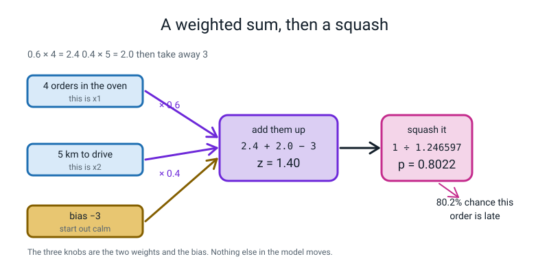
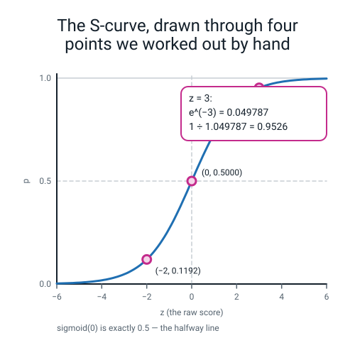
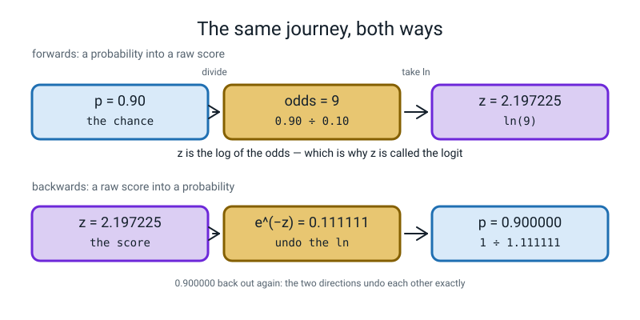
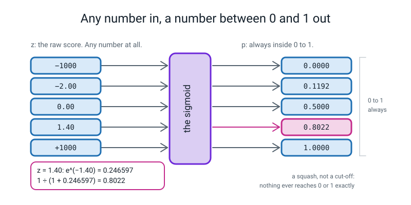
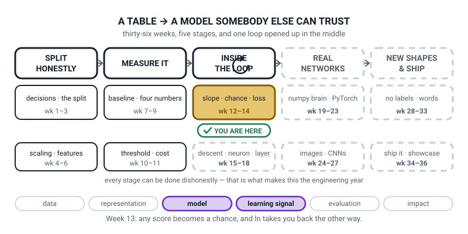

# Week 13 — From a Score to a Chance

[⬅ Week 12](week-12.md) · [Course Home](../README.md) · [Week 14 ➡](week-14.md) · [Student Guide](../student-guide/week-13.md) · [Workbook](../workbook/week-13.md)

---

## 📋 At a Glance

| | |
|---|---|
| **Duration** | 70 minutes |
| **Type** | 🟦 Teach — the week `predict_proba` stops being a black box |
| **Big idea** | A weighted sum can be **any number at all**. A probability has to sit between 0 and 1. The **sigmoid** is the squasher that gets you from one to the other. |
| **New vocabulary** | weight · bias · logit / raw score (z) · sigmoid · odds · log-odds · overflow |
| **New maths** | **The exponential `e^(−z)`.** Evaluated on a calculator for z = −2, 0, 1.4 and 3, then plotted as the S-curve from those four points. That is all. |
| **New syntax** | `np.exp(x)` · `np.where(cond, a, b)` |
| **Dataset** | **8 hand-typed pizza orders** (they fit on the board), then `make_classification(n_samples=200, n_features=2, n_informative=2, n_redundant=0, random_state=0)` — 200 rows, generated offline in a tenth of a second |
| **Materials** | A **real calculator with an `e^x` key** per pair — this is not optional · one big sheet of graph paper for the shared S-curve · printed workbook pages 13.1–13.7 · the Bug Log · board space for eight rows |
| **Tech needed** | Laptop with Python 3, numpy, matplotlib, scikit-learn. **No PyTorch yet, no downloads, nothing to install.** |
| **Prep time** | 20 minutes the night before · 5 minutes on the day |
| **Expected runtime of the code** | Every file today runs in **well under a second**. Nothing trains. |

> **⚠️ Watch out:** the temptation is to write `σ(z) = 1/(1 + e^(−z))` on the board and then explain it. **Do it the other way round.** Eight students each work out one `z` on a calculator, all eight go on one sheet of graph paper, and the S-curve appears in front of them. *Then* you name it. If the formula goes up first, the rest of the lesson is decoding somebody else's notation instead of watching a shape appear.

---

## 🎯 Lesson Objectives

By the end of the lesson the student can:

1. **Compute a raw score `z` from two features, two weights and a bias by hand**, for eight rows, showing the two multiplications and the addition each time.
2. **Evaluate `e^(−z)` on a calculator for z = −2, 0, 1.4 and 3**, and use those four numbers to compute the sigmoid to four decimal places.
3. **State the three properties that make the sigmoid the right squasher**, including that `sigmoid(0)` is *exactly* 0.5.
4. **Go backwards from a probability to a raw score** using the odds and the log-odds, and explain why `z` is called the logit.

Observable evidence: eight `z` values and eight probabilities in pen on workbook page 13.4; eight points plotted on the shared graph paper with the S-curve drawn through them; four backwards conversions with `ln(odds)` shown; and a pasted `RuntimeWarning: overflow encountered in exp` next to a fixed version that produces no warning.

---

## 🧑‍🏫 What YOU Need to Know First

> **📌 About the code blocks in this guide.** Outside the **🧰 Prep Checklist** and the **🔑 Answer Key**, the blocks are **illustrations, not whole files** — each carries on from the one above. **The complete runnable files are in the Prep Checklist and the Answer Key.**

There is exactly one new mathematical object this week and it is **`e^(−z)`, computed on a calculator**. Everything else is multiplication and addition. Twenty minutes with this section is enough, and if you only have ten, read §2, §3 and §6.

### 1. Where we are in the story, in three sentences

Week 12 taught the student to measure how steep a curve is at one point, by nudging. Weeks 14 and 15 will use that to make a model *learn*. **This week we build the model itself** — the smallest interesting model there is — and we build it out of two operations the student has been doing since primary school.

The reason this week exists is that in Level 2 and again in Weeks 2 and 10 the student typed `model.predict_proba(X)[:, 1]` and got probabilities out of a box. Today the box comes apart. **By the end of the lesson they can produce the exact same numbers `predict_proba` produces, with a calculator.** That is the moment the lesson is built around, and §7 has the printout that proves it.

### 2. The weighted sum, and why it cannot be a probability

Here is the whole model. You are guessing whether a pizza order will be late. You have two facts about the order:

- `x1` = how many orders are already in the oven
- `x2` = how many kilometres the rider has to drive

You believe each pending order adds a bit of worry, and each kilometre adds a bit of worry, and you start off fairly relaxed because most orders are fine. Write that down as arithmetic:

```
worry = 0.6 × (orders in the oven) + 0.4 × (km to drive) − 3
```

> **weight** — a number saying how much one fact pushes the answer up or down. Here `0.6` and `0.4` are the weights.

> **bias** — a constant added every single time, whatever the facts are. It slides the whole model up or down. Here the bias is `−3`.

> **logit, or raw score, written `z`** — the answer that comes out of the weighted sum, *before* anybody turns it into a probability. It can be any number at all: −8, 0, 0.37, 412.

**Do one on paper right now, because you are going to do it live in class.** Four orders in the oven, five kilometres to drive:

```
0.6 × 4 = 2.4
0.4 × 5 = 2.0
2.4 + 2.0 − 3 = 1.4
```

So `z = 1.4`.

**And here is the problem, stated as bluntly as you should state it in class.** Is 1.4 a probability? No. Probabilities live between 0 and 1. If the order had eight things in the oven and twenty kilometres to drive, `z` would be `4.8 + 8 − 3 = 9.8`. There is no 980% chance of anything.

So we need a **squasher**: something that takes any number at all and hands back a number between 0 and 1, without throwing away the ordering. Bigger `z` must always mean bigger probability.


*Figure 13.1 — A weighted sum, then a squash. Two multiplications, one addition, then one division.*

### 3. `e^(−z)`, the only new maths, done on a calculator

**You need to be able to do this on a real calculator in front of the class, without hesitating.** Find the `e^x` key. On most calculators it is above the `ln` key and you reach it with `SHIFT` or `2nd`.

The recipe for `e^(−z)`: type the number, press the `+/−` (sign-change) key, then `e^x`.

Do all four of these now, on the actual calculator you will use in class:

| Type this | Then this | You should see |
|---|---|---|
| `2`, `+/−` | `e^x` | `7.389056` |
| `0` | `e^x` | `1` |
| `1.4`, `+/−` | `e^x` | `0.246597` |
| `3`, `+/−` | `e^x` | `0.049787` |

> **🔢 The maths, slowly:** `e` is a fixed number, `2.71828...`, the same way π is a fixed number. `e^(−z)` means "e multiplied by itself −z times", which for a negative power means *dividing*. So as `z` gets bigger, `e^(−z)` gets **smaller, fast**. At z = 0 it is exactly 1. At z = 3 it is already under a twentieth. At z = −2 it has gone the other way and is over 7. That is the whole behaviour you need. **You do not need to know why e is 2.71828 and neither does the student.**

**Now the squasher.** Take `e^(−z)`, add 1, and divide 1 by the answer:

```
squashed = 1 ÷ (1 + e^(−z))
```

Four times, with the four numbers above:

```
z = −2 :   e^(−z) = 7.389056    1 + 7.389056 = 8.389056    1 ÷ 8.389056 = 0.1192
z =  0 :   e^(−z) = 1.000000    1 + 1.000000 = 2.000000    1 ÷ 2.000000 = 0.5000
z = 1.4:   e^(−z) = 0.246597    1 + 0.246597 = 1.246597    1 ÷ 1.246597 = 0.8022
z =  3 :   e^(−z) = 0.049787    1 + 0.049787 = 1.049787    1 ÷ 1.049787 = 0.9526
```

**Look at what just happened.** Four numbers went in: −2, 0, 1.4 and 3. Four numbers came out, and every single one of them sits between 0 and 1. And they came out **in the same order** they went in: the smallest `z` gave the smallest probability.

> **sigmoid** — the squasher `1 ÷ (1 + e^(−z))`. "Sigmoid" just means "S-shaped", and the S is what you see when you plot it. Its other name is the logistic function, which is where **logistic regression** gets its name.

**Three properties, and these are objective 3.** Say them in this order:

| Property | In plain words | The number that proves it |
|---|---|---|
| `sigmoid(0)` is exactly 0.5 | A raw score of zero means "no idea, coin flip" | `1 ÷ (1 + 1) = 0.5000`, exactly, no rounding |
| Big positive `z` → close to 1 | Confidently yes | `sigmoid(3) = 0.9526` |
| Big negative `z` → close to 0 | Confidently no | `sigmoid(−2) = 0.1192` |

And one more that matters and is easy to miss: **it never actually reaches 0 or 1.** `e^(−z)` is always a positive number, however tiny, so `1 + e^(−z)` is always bigger than 1, so the division always lands below 1. It is a squash, not a cut-off.


*Figure 13.2 — The S-curve, drawn through four points we worked out by hand. Those four points are the whole lesson.*

### 4. Going backwards: odds, and why `z` is called the logit

Sometimes you have a probability and you want to know what raw score would have produced it. This is objective 4, and there are exactly two steps.

**Step one: turn the probability into odds.**

> **odds** — the chance it happens divided by the chance it does not. `odds = p ÷ (1 − p)`.

This is the language of horse racing and it is worth saying so. If `p = 0.90`, then

```
odds = 0.90 ÷ 0.10 = 9
```

Nine. Read it out loud as **"nine to one on"** — nine times as likely to happen as not. A probability of 0.5 gives `0.5 ÷ 0.5 = 1`, which is "evens".

**Step two: take the natural log of the odds.**

> **log-odds** — the natural logarithm of the odds, `ln(odds)`. And this number is exactly `z`.

```
z = ln(9) = 2.197225
```

On the calculator: type `9`, press `ln`. That is it.

**Check it comes back.** Put `z = 2.197225` through the sigmoid: `e^(−2.197225) = 0.111111`, then `1 ÷ 1.111111 = 0.900000`. **Exactly the 0.90 we started with.** The two operations undo each other.

That is why `z` has the name **logit**: it is the **log** of the odds, an "**it**" for the "**log**it". A slightly silly name for a genuinely useful quantity.


*Figure 13.3 — The same journey, both ways. Forwards is exponential-then-divide; backwards is divide-then-log.*

> **🧑‍🏫 If a student asks** "why bother going backwards?": two real reasons. **One:** you can read a trained model's weights as "each extra kilometre adds 0.4 to the log-odds", which is a sentence a delivery manager can actually act on. **Two:** next week the loss function is built out of logs, and it will be far less mysterious to somebody who has already typed `ln` into a calculator this week.

### 5. Every line of `squash.py`, explained to somebody who has never programmed

```python
import numpy as np
```

Fetches the numbers library. `np` is the short name everyone uses for it.

```python
np.random.seed(0)
```

Fixes the dice, so anybody running this file gets exactly the numbers printed in this guide. Nothing today is actually random, but the habit is worth keeping.

```python
oven = np.array([0, 1, 2, 3, 5, 4, 6, 7])
km   = np.array([0, 1, 2, 3, 2, 5, 6, 8])
```

Two lists of eight whole numbers each, stored in numpy's fast list type. Read them **down**, in pairs: order 1 had 0 in the oven and 0 km to drive; order 5 had 5 in the oven and 2 km.

```python
z = 0.6 * oven + 0.4 * km - 3.0
```

**This one line does all sixteen multiplications and all eight additions.** In numpy, multiplying a list by a single number multiplies every item, and adding two lists adds them item by item. So `z` comes out as a list of eight raw scores. If you wrote this out with a loop it would be five lines; the student has been doing this since Level 2.

```python
def squash(z):
```

`def` starts a **function** — a named recipe you can reuse. Everything indented under it is the recipe body.

```python
    z = np.asarray(z, dtype=float)
```

Insurance. If somebody hands this function a plain number or a list of whole numbers, this turns it into a numpy list of decimals so the rest of the lines behave.

```python
    negative_part = np.where(z >= 0, -z, z)
```

**This is one of the two new pieces of syntax.** `np.where(condition, a, b)` goes through the list and, for each item, keeps `a` if the condition is true there and `b` if it is false. Read this line as: *"wherever `z` is zero or bigger, use minus z; everywhere else, use z as it is."* The effect is that every number in `negative_part` is **zero or less** — we have stripped off the sign.

```python
    e = np.exp(negative_part)
```

**The other new piece of syntax.** `np.exp(x)` is `e^x`, done to every item in the list. Because every item of `negative_part` is zero or less, **every item of `e` is between 0 and 1.** That is the entire point of the previous line, and §6 explains why it matters.

```python
    return np.where(z >= 0, 1.0 / (1.0 + e), e / (1.0 + e))
```

Two different divisions, and the `np.where` picks the right one per item. `return` hands the answer back to whoever called the function.

**Both divisions give the same answer**, which is worth checking on paper once so you believe it:

```
for z = 1.4 :   1 ÷ (1 + e^(−1.4)) = 1 ÷ 1.246597 = 0.802184
for z = −1.4:   e^(−1.4) ÷ (1 + e^(−1.4)) = 0.246597 ÷ 1.246597 = 0.197816
                and 1 ÷ (1 + e^(1.4)) = 1 ÷ 5.055200 = 0.197816   ← the same
```

```python
late = np.where(p >= 0.5, "yes", "no ")
```

`np.where` again, and this time it produces words instead of numbers. **This is the threshold from Week 10**, written in one line. The trailing space in `"no "` is only there so the printed columns line up.

### 6. Overflow: what breaks, and why it is not the student's fault

> **overflow** — when a calculation produces a number too big for the computer to store, so it stores "infinity" instead and prints a warning.

The obvious way to write the squasher is the way it appears on every website:

```python
def naive(z):
    return 1.0 / (1.0 + np.exp(-z))
```

Feed that `z = −1000` and you get this, on stderr, in yellow-ish text before the output:

```text
RuntimeWarning: overflow encountered in exp
```

**Here is the arithmetic behind the warning.** `z = −1000`, so `−z = +1000`, so the machine is asked for `e^1000`. That is a number with 435 digits. A `float64` can hold about 1.8 with 308 zeros after it and no more. So the machine gives up and stores `inf`:

```text
what the naive way asks for at z = -1000:
   e^(-z) = e^(1000) = inf
   1 / (1 + inf)     = 0.0
```

Notice: **the final answer, 0.0, is not wrong.** One divided by infinity really is zero-ish. So why care?

Three honest reasons, and give all three:

1. **The warning pollutes every run.** Next week you will run a training loop 500 times. A screen full of warnings is a screen where you cannot see the real problem.
2. **You cannot tell a harmless warning from a harmful one at a glance**, and some of them *are* harmful. Getting into the habit of "no warnings" is what makes the harmful one visible.
3. **`inf` spreads.** Multiply it by zero and you get `nan` — "not a number" — which then contaminates every average it touches. You will meet that next week.

**The fix.** Do the same arithmetic a different way, so that the exponential is **never** asked for a positive power:

```text
what the safe way asks for at z = -1000:
   e^(-|z|) = e^(-1000) = 0.0
   that / (1 + that)   = 0.0
```

No warning. Same answer.

> **⚠️ Watch out — be honest about what the fix does *not* fix.** At `z = −1000` the safe version also returns exactly `0.0`, because `e^(−1000)` is smaller than the smallest number a `float64` can hold, so it rounds down to zero. **The sigmoid can never truly be 0, and the computer says 0 anyway.** That is a separate problem, it has a separate fix, and it is next week's, when a probability of exactly 0 walks into a logarithm. Say this out loud rather than letting a sharp student catch you: *"we fixed the warning; we did not fix the zero, and the zero bites next Tuesday."*


*Figure 13.4 — Any number in, a number between 0 and 1 out. Minus a thousand and plus a thousand both survive.*

### 7. The payoff: the same numbers `predict_proba` gives

This is the last five minutes of the live-code and the reason the week matters. We ask scikit-learn to fit a logistic regression on 200 generated rows, then we **take its weights out and do the arithmetic ourselves**:

```text
w = [ 3.6298 -0.5546]   b = -0.7127

 row        x1        x2         z    p (mine)  p (sklearn)
   0    0.6170   -1.1940    2.1891    0.899268    0.899268
   1    0.0574   -0.5724   -0.1868    0.453431    0.453431
   2   -0.5589    0.7554   -3.1603    0.040686    0.040686
   3    0.3681    0.0616    0.5892    0.643181    0.643181
   4    2.3275   -2.9286    9.3597    0.999914    0.999914

biggest disagreement over all 200 rows: 0.000000000000
```

**Twelve zeros.** Not "close". Identical.

Check row 0 on the board while it is on screen, because it takes fifteen seconds and it is the whole point:

```
3.6298 × 0.6170     =  2.2395866
−0.5546 × (−1.1940) =  0.6621924
2.2395866 + 0.6621924 − 0.7127 = 2.1890790     ← the z column
e^(−2.1890790) = 0.1120199
1 ÷ 1.1120199 = 0.8992645                      ← the p column, to the digits our rounding allows
```

(Our hand version says `0.8992645` and the machine says `0.899268` — a gap of three parts in a million, entirely because we rounded the weights to four decimal places before multiplying. **Say that.** It is a real and useful lesson about rounding early, and it takes one sentence.)

### 8. The three misconceptions you will actually meet

**Misconception 1 — "the sigmoid decides yes or no."** It does not. It hands back a chance. **The threshold decides**, and the threshold is a separate choice the student already met in Week 10. Keep them apart: the sigmoid gives 0.8022; *you* decide that anything over 0.5 — or 0.3, or 0.9 — counts as "late".

**Misconception 2 — "sigmoid(0) is about a half."** It is **exactly** a half. `e^0 = 1`, `1 + 1 = 2`, `1 ÷ 2 = 0.5`. No rounding anywhere. This matters because next week `−ln(0.5) = 0.6931` becomes the single most diagnostic number in the course, and its exactness is what makes it diagnostic.

**Misconception 3 — "a bigger `z` means the model is more accurate."** No. A big `z` means the model is more *confident*. Confidence and correctness are different things, and Week 14 exists almost entirely to hammer that home. If a student says "z = 9.36 so it must be right", write `p = 0.9999` and `truth = no` on the board and leave it there.

### 9. How deep to go, and where to stop

**Go this far:** eight `z` values by hand; four `e^(−z)` values on a calculator; the sigmoid computed from them to 4 dp; the three properties; the S-curve drawn through the eight class points; odds and log-odds both ways on one number; the overflow warning seen and fixed.

**Stop before:**

| Do not teach today | Where it lives |
|---|---|
| **Log loss, `−ln(p)`, cross-entropy** | **Week 14, next week.** Today we make probabilities. We do not yet score them. Resist this hard — somebody will ask "but is 0.8022 good?" and the honest answer is *"brilliant question, and you cannot answer it yet. That is Tuesday."* |
| **Gradient descent, updating the weights** | **Week 15.** Today the weights `0.6`, `0.4`, `−3` were *chosen by us*. Nothing learns them. |
| Where the sigmoid's formula comes from, or its derivative | Week 15 needs the derivative and gets it there. No derivation today. |
| Why `e` and not 2 or 10 | Say honestly: "because it makes the maths in two weeks' time come out unbelievably clean, and you will see that happen." Do not attempt more. |
| Softmax, multi-class | Week 26. Two classes only, all term. |
| `nn.Sigmoid`, `torch.sigmoid` | Weeks 20–22. Numpy only for now. |

The line to hold all lesson: **today you learn what `predict_proba` was doing.** Not "learn logistic regression". Learn the squash.

---

### 10. 🧭 The Growing Map — the same box, the middle week

The student guide carries a figure called **Where This Fits**: the same picture every week with one more
piece filled in. This week, deliberately, almost nothing moves — and saying so out loud is the whole
two minutes.



*Figure 13.0 — Week 13's version. The same gold tile as last week, second of its three weeks. The ↻ on
stage three stays black, as it has been since Week 12.*

**What to do with it, in about two minutes at the end of the lesson:**

1. **Ask "which box did we do today?" and then "did it move?"** They point at the same gold tile,
   *slope · chance · loss*, and the honest answer to the second question is **no**. Then the useful
   question: *"which of the three words was today?"* — **chance**. Week 12 was slope, next week is loss.
   Three weeks, one tile, one word each.
2. **Hold up the shared S-curve.** The eight calculator answers plotted on graph paper *are* the middle
   third of that gold box. *"Eight of you each did one point, and between you you drew the thing that
   turns a score into a chance."* Then the detail worth repeating: `sigmoid(0)` is **exactly** 0.5.
3. **Point out that two threads are lit now, not one.** `model` joined `learning signal`. Ask why. The
   answer you are fishing for: the weights and the bias are the model, the chance is what the signal
   will judge next week. If nobody gets it, say it and move on — it costs nothing.

> **🧑‍🏫 Why this is worth two minutes.** A week that does not advance the map feels to a student like a
> week that did not count. Showing them that the tile is **three weeks wide** reframes it: they are
> two-thirds of the way through a box, not stuck. That is the difference between *"this is going
> nowhere"* and *"this is going somewhere in three steps."*

**One thing to notice, so you can answer if asked.** The ↻ is black, and stays black for the rest of the
level. If a student asks why it changed last week, *"that is the week we opened the training loop and we
are still inside it"* is the whole answer.

---

## 🧰 Prep Checklist

### 20 minutes the night before

- [ ] **Find a calculator with an `e^x` key and press it four times.** `2 +/− e^x` → `7.389056`. `0 e^x` → `1`. `1.4 +/− e^x` → `0.246597`. `3 +/− e^x` → `0.049787`. **If you have not done this on a physical calculator you will fumble it in front of the class, and this is the one moment where fumbling costs you.** Phone calculators work; you may need to rotate to landscape to find `e^x`.
- [ ] **Then press `ln` twice.** `9 ln` → `2.197225`. `50 ln` → `3.912023`. (You will not use the second one until next week, but it is the same key.)
- [ ] **Type and run `squash.py` yourself.** The complete file:

```python
"""squash.py - the Worry Meter, and the squasher that never overflows."""
import numpy as np

np.random.seed(0)

oven = np.array([0, 1, 2, 3, 5, 4, 6, 7])
km   = np.array([0, 1, 2, 3, 2, 5, 6, 8])

z = 0.6 * oven + 0.4 * km - 3.0
print("the eight raw scores:", z)
print()


def squash(z):
    """Any number in, a number strictly between 0 and 1 out."""
    z = np.asarray(z, dtype=float)
    negative_part = np.where(z >= 0, -z, z)     # always 0 or less
    e = np.exp(negative_part)                   # so e is never bigger than 1
    return np.where(z >= 0, 1.0 / (1.0 + e), e / (1.0 + e))


p = squash(z)
late = np.where(p >= 0.5, "yes", "no ")

print("order  oven   km        z         p    late?")
for i in range(8):
    print("%5d %5d %4d %8.2f %9.4f      %s"
          % (i + 1, oven[i], km[i], z[i], p[i], late[i]))
print()
print("squash(0)     = %.4f   <- exactly a half, every time" % squash(0.0))
print("squash(-1000) = %.4f   <- no warning, no infinity" % squash(-1000.0))
print("squash( 1000) = %.4f" % squash(1000.0))
```

Run `python3 squash.py`. You must see **exactly** this. **Runtime: 0.08 seconds.**

```text
the eight raw scores: [-3.  -2.  -1.   0.   0.8  1.4  3.   4.4]

order  oven   km        z         p    late?
    1     0    0    -3.00    0.0474      no 
    2     1    1    -2.00    0.1192      no 
    3     2    2    -1.00    0.2689      no 
    4     3    3     0.00    0.5000      yes
    5     5    2     0.80    0.6900      yes
    6     4    5     1.40    0.8022      yes
    7     6    6     3.00    0.9526      yes
    8     7    8     4.40    0.9879      yes

squash(0)     = 0.5000   <- exactly a half, every time
squash(-1000) = 0.0000   <- no warning, no infinity
squash( 1000) = 1.0000
```

- [ ] **Run `overflow.py`** (full file in the Answer Key, page 13.7) so the `RuntimeWarning` on your own screen is familiar. **It appears above the table, not below it**, because warnings go to a different output stream. That surprises people. **Runtime under a second.**
- [ ] **Run `real_data.py`** (full file in the Answer Key, page 13.6) and check you get twelve zeros on the last line. **Runtime under a second.**
- [ ] **Break it on purpose, twice**, so both deliberate mistakes in the live-code are muscle memory:
  1. Change `np.exp(negative_part)` to `np.exp(-z)` and feed it `−1000`. You get `RuntimeWarning: overflow encountered in exp`.
  2. **Swap the two arms of the first `np.where`** — write `np.where(z >= 0, z, -z)` instead of `np.where(z >= 0, -z, z)`. `squash(1.4)` quietly returns `0.1978` instead of `0.8022` and the S-curve runs backwards. Feed it `−1000` as well and you get `nan`, plus `RuntimeWarning: invalid value encountered in scalar divide`.
- [ ] **Print workbook pages 13.1–13.7.**
- [ ] **Tape one large sheet of graph paper to the board** and draw the axes on it: `z` across from −4 to +5, `p` up from 0 to 1. Mark the halfway line at `p = 0.5` with a dashed line. **Do this the night before**; drawing axes in front of a class eats four minutes.

### 5 minutes on the day

- [ ] Editor open, terminal ready. **`squash.py` deleted or renamed** — they type it.
- [ ] The graph paper on the board, axes already drawn, `p = 0.5` dashed.
- [ ] **One calculator per pair, on the desks, before anybody sits down.** Check the `e^x` key on each.
- [ ] Board split in three: the worry formula on the left, the eight-row table in the middle, empty space on the right for the odds work.
- [ ] Bug Log out.
- [ ] Week 12's slope work still on the wall — you will point at it once, in the wrap.

### Fallback if the laptops fail

**This week is almost unaffected by a power cut,** because the star of the lesson is a calculator and a sheet of graph paper.

1. **The hook works untouched** — it is arithmetic on the board.
2. **The activity works untouched** — it was always going to be calculators and graph paper.
3. **For the concept**, do all four `e^(−z)` values on the board with the class calling out digits from their own calculators. Then have every pair verify one row of the eight-row table against a neighbour's.
4. **Replace the live-code with a "predict the printout" exercise.** Write the `squash.py` source on the board, hand out workbook page 13.5, and have them fill in what each `print` will produce. Mark it together. **This is genuinely a good lesson, not a consolation prize** — they cannot skim, because there is nothing to run.
5. **Replace the `predict_proba` payoff with paper.** Write `w = [3.6298, −0.5546]`, `b = −0.7127`, and the row `x = [0.6170, −1.1940]`. Have them get to `z = 2.1891` and `p = 0.8993`. Then tell them scikit-learn printed `0.899268`. **Objectives 1 and 2, delivered with a pencil.**

| If this fails | Do this instead |
|---|---|
| A calculator has no `e^x` key | Use the phone calculator in landscape, or hand out this four-row lookup table: `e^(−2) = 7.389056`, `e^0 = 1`, `e^(−1.4) = 0.246597`, `e^(−3) = 0.049787`. **The lesson survives on those four numbers.** |
| `RuntimeWarning: overflow encountered in exp` appears when you did not want it | You are on the naive version. That is fine — it is the lesson. Point at it and carry on. |
| A student's probability is above 1 | They divided the wrong way round: `(1 + e^(−z)) ÷ 1`. Ask them to say the recipe out loud: *"one, divided by, one plus the exponential."* |
| A student's S-curve goes downhill | They computed `e^(+z)` instead of `e^(−z)` — they forgot the sign-change key. Every value is `1 −` the right answer. **Ask them to check `z = 0` first**; that one is right either way, which is why it is a bad check, and `z = 3` is a good one. |
| Two students disagree about the same row | Have each read their three numbers aloud: the two products and the total. The disagreement is always in one of the three, and finding it takes ten seconds. |
| Nobody is impressed by the S-curve | You drew it for them. **Rub it out, put up eight bare points from their sheets, and let them draw it.** The order matters. |

---

## ⏱️ The Lesson, Minute by Minute

| Segment | Minutes | Running total | What happens |
|---|---|---|---|
| 🪝 Hook — The Number That Cannot Be a Chance | 7 | 7 | One weighted sum on the board, and a 980% probability |
| 🧠 Concept & Maths — Four Calculator Presses | 18 | 25 | `e^(−z)` for four values, the squash, the three properties, odds both ways |
| 💻 Live-Code Together — `squash.py` | 18 | 43 | Build it, break it twice, then match `predict_proba` |
| 🎲 Their Turn — The Worry Meter | 20 | 63 | Eight rows by hand, eight points onto shared graph paper |
| 🔑 Wrap & Assign | 7 | 70 | Three checks, the takeaway, homework |

---

### 🪝 Hook — The Number That Cannot Be a Chance (7 minutes)

**Do this:** Nothing on the screen. On the board, write only this:

```
worry = 0.6 × (orders in the oven) + 0.4 × (km to drive) − 3
```

**Say this:**

> "This is a model. Not a metaphor for a model — an actual one, and it is the whole thing. Three numbers: 0.6, 0.4, and minus 3. Nothing hidden.
>
> An order comes in. There are **four** things already in the oven and the rider has **five** kilometres to drive. Work out the worry. Shout it."

**Do this:** Wait. Somebody gets `1.4`. Write the working underneath so everybody sees the three steps:

```
0.6 × 4 = 2.4
0.4 × 5 = 2.0
2.4 + 2.0 − 3 = 1.4
```

**Ask this:** "So — what is the chance this order is late?"

*Hoped-for answer:* somebody says "1.4?" and then hears themselves.

*If nobody bites:* ask it more bluntly — *"is the chance of this order being late one point four?"*

**Say this:**

> "One hundred and forty per cent. And it gets worse. Next order: **eight** in the oven, **twenty** kilometres."

**Do this:** Let them work it out — `4.8 + 8 − 3 = 9.8`. Write it big.

> "Nine hundred and eighty per cent chance of being late.
>
> So the model is useless? No. **The model is fine.** Look at it: more things in the oven, more worry. Longer drive, more worry. Every instinct in that formula is right. The *ordering* is perfect.
>
> The problem is the ruler. A weighted sum can land anywhere on the number line — minus a thousand, plus a thousand. A probability has to sit between 0 and 1, and there is no arrangement of 0.6 and 0.4 and minus 3 that can promise that.
>
> So we need one more step at the end. Something that takes **any number at all** and hands back a number between 0 and 1, without ever changing the order. Bigger worry must always mean bigger chance.
>
> That thing has a name, it has a shape, and by the end of today every one of you will have drawn the shape with your own hand from numbers you worked out yourselves. And here is what makes today worth your attention: **you have typed `predict_proba` maybe thirty times this year and got probabilities out of a box. Today the box comes apart, and by the end of the lesson you can produce its exact numbers with a calculator.**"

**Ask this:** "Before we start — `z` is our raw score. What should the chance be when `z` is exactly zero? Not roughly. Exactly."

*Hoped-for answer:* a half.

*If they guess:* good, hold it. *"Write it down as a prediction. In eleven minutes you will check it, and you will find it is not approximately a half. It is exactly a half, and that exactness matters more than you would think."*

---

### 🧠 Concept & Maths — Four Calculator Presses (18 minutes)

**Do this (6 min) — the four exponentials, on calculators, everybody.** Nothing on the laptop screen. Calculators out.

> **Say this:** "New button. Find `e^x`. It is usually above the `ln` key, so you need `SHIFT` or `2nd` to reach it. Hold it up when you have found it.
>
> `e` is a fixed number, `2.71828...`, in the same way π is a fixed number. You do not need to know why it is that and not something else. What you need to know is what `e^(−z)` **does**, and you are about to see it.
>
> Type `2`. Press the sign-change key — `+/−` or `(−)`. Then `e^x`. Call out what you get."

**Do this:** Write the four rows on the board as the class calls them out. **Do all four; do not shortcut.**

```
z = −2     e^(−z) = 7.389056
z =  0     e^(−z) = 1.000000
z =  1.4   e^(−z) = 0.246597
z =  3     e^(−z) = 0.049787
```

**Ask this:** "Look down that right-hand column. What is `e^(−z)` doing as `z` gets bigger?"

*Hoped-for answer:* shrinking, and shrinking fast.

*If they say only "getting smaller":* push once. *"From 7.4 to 0.05 while z went from minus 2 to 3. How many times smaller is that?"* (About 148 times.) *"Fast."*

> **Say this:** "Two things about that column and then we use it.
>
> At `z = 0` it is **exactly 1**. Anything to the power zero is 1, and that is going to matter in about four minutes.
>
> And it is **never zero and never negative.** It shrinks and shrinks and never gets there. Hold on to that."

**Do this (6 min) — build the squash, live, on the board.** Write:

```
p = 1 ÷ (1 + e^(−z))
```

> **Say this:** "Three steps. Get `e^(−z)` — you already have four of those. Add one. Divide one by the answer. That is the whole squasher.
>
> Do all four with me. Left column is what you already have."

**Do this:** Fill this in on the board, one row at a time, class calling out. **Every division on a calculator, out loud.**

```
z = −2 :   7.389056  →  8.389056  →  1 ÷ 8.389056 = 0.1192
z =  0 :   1.000000  →  2.000000  →  1 ÷ 2.000000 = 0.5000
z = 1.4:   0.246597  →  1.246597  →  1 ÷ 1.246597 = 0.8022
z =  3 :   0.049787  →  1.049787  →  1 ÷ 1.049787 = 0.9526
```

**Ask this:** "Four numbers went in: minus two, zero, one point four, three. Look at the four that came out. Tell me two things you notice."

*Hoped-for answers:* they are all between 0 and 1; they are in the same order as the inputs.

*If they only get the first:* point at the two columns with a finger and read them in pairs. *"Smallest in, smallest out. Biggest in, biggest out. Nothing got shuffled."*

*If somebody says "the middle one is exactly 0.5":* **stop and celebrate that.** Go back to their prediction from the hook. `1 ÷ (1 + 1) = 0.5`, and there is no rounding in that sum anywhere.

**Do this:** Now name it, and only now.

```
sigmoid(z)  =  1 ÷ (1 + e^(−z))
```

> **Say this:** "**Sigmoid.** It means 'S-shaped', and in twenty minutes you are going to see why. Its other name is the logistic function — which is where **logistic regression** got its name, and it is a model you have already used without knowing this was inside it.
>
> Three properties, and these are the three that make it the right tool rather than just *a* tool. Write them down.
>
> **One: sigmoid of zero is exactly a half.** No idea, coin flip.
>
> **Two: big positive z gives you close to 1.** Confidently yes.
>
> **Three: big negative z gives you close to 0.** Confidently no.
>
> And a fourth that is easy to miss: **it never actually gets to 0 or to 1.** Remember `e^(−z)` never being zero? So `1 + e^(−z)` is always a bit more than 1, so dividing one by it always lands a bit under 1. It is a squash, not a cliff. **A logistic regression model can never tell you something is certain**, and that is a feature, not a limitation."

**Do this (6 min) — backwards, on one number.** Clear the right-hand third of the board.

> **Say this:** "Now the other direction, because you will need it. I hand you a probability — **0.90** — and I want to know what raw score produced it.
>
> Two steps. First: **odds.** This is horse-racing language and it is exactly the right language. The chance it happens, divided by the chance it does not."

```
odds = 0.90 ÷ 0.10 = 9
```

> "Nine. Say it the way a bookmaker would: **nine to one on.** Nine times as likely to happen as not.
>
> Second step: take the natural log. Type `9`, press `ln`."

```
z = ln(9) = 2.197225
```

**Ask this:** "How do we check that is right?"

*Hoped-for answer:* put it back through the sigmoid and see if 0.90 comes out.

**Do this:** Do exactly that, on the calculator, out loud. `2.197225 +/− e^x` → `0.111111`. `1 + that` → `1.111111`. `1 ÷ that` → **`0.900000`**.

> **Say this:** "Exactly what we started with. The two operations undo each other.
>
> And that is why `z` has its silly name. `z` is the **log of the odds** — so it is called the **logit**. The log-odds and the raw score and the logit are three names for one number, and you will meet all three."

**Ask this:** "What are the odds when `p = 0.5`?"

*Hoped-for answer:* 1, and `ln(1) = 0`, which agrees with `sigmoid(0) = 0.5`. *"Everything closes."*

---

### 💻 Live-Code Together — `squash.py` (18 minutes)

**You never touch their keyboard.**

**Step 1 (4 min) — the eight raw scores in one line.**

```python
import numpy as np

np.random.seed(0)

oven = np.array([0, 1, 2, 3, 5, 4, 6, 7])
km   = np.array([0, 1, 2, 3, 2, 5, 6, 8])

z = 0.6 * oven + 0.4 * km - 3.0
print("the eight raw scores:", z)
```

```text
the eight raw scores: [-3.  -2.  -1.   0.   0.8  1.4  3.   4.4]
```

**Ask this:** "One line did sixteen multiplications and eight additions. Check one for me — order 6, four in the oven and five km."

*`0.6 × 4 + 0.4 × 5 − 3 = 2.4 + 2.0 − 3 = 1.4`.* Point at the `1.4` on the screen.

> **Say this:** "And notice what is in that list: **minus 3, and 4.4.** Neither is a probability. This is the hook's problem, in a variable."

**Step 2 (5 min) — 🐞 DELIBERATE MISTAKE ONE: the obvious squasher.**

Type the obvious version, the one on every website:

```python
def squash(z):
    return 1.0 / (1.0 + np.exp(-z))


print(squash(z))
print("and one very negative order:", squash(-1000.0))
```

Real output:

```text
RuntimeWarning: overflow encountered in exp
[0.04742587 0.11920292 0.26894142 0.5        0.68997448 0.80218389
 0.95257413 0.98787157]
and one very negative order: 0.0
```

**Do this:** Say nothing for five seconds. Let the yellow warning sit there.

**Ask this:** "Did it crash? Did it give a wrong answer? And what is it complaining about?"

*Hoped-for answers:* it did not crash, the answer looks fine, and something about `exp`.

> **Say this:** "**Overflow.** It means: I was asked for a number too big to store, so I stored infinity instead.
>
> Follow the arithmetic. `z` is minus a thousand. So `−z` is plus a thousand. So the machine has been asked for **e to the power of a thousand.** That number has 435 digits. The biggest number this kind of decimal can hold has 309. So it gave up and wrote `inf`.
>
> Then it did `1 ÷ (1 + inf)` and got `0.0`, which is — annoyingly — basically right.
>
> So why do I care about a warning that produced the right answer? Three reasons. **One:** next week you will run this five hundred times in a loop, and a screen full of warnings is a screen where you cannot see the actual problem. **Two:** you cannot tell a harmless warning from a fatal one by glancing at it, so the only workable rule is *no warnings*. **Three:** `inf` spreads. Multiply infinity by zero and you get `nan`, 'not a number', and one `nan` poisons every average it touches. You will meet that on Tuesday."

**Do this:** Now fix it, live, explaining the trick before typing it.

> **Say this:** "The trick is that there are two ways to write the same division, and one of them never asks for a big power. Watch."

```python
def squash(z):
    z = np.asarray(z, dtype=float)
    negative_part = np.where(z >= 0, -z, z)     # always 0 or less
    e = np.exp(negative_part)                   # so e is never bigger than 1
    return np.where(z >= 0, 1.0 / (1.0 + e), e / (1.0 + e))
```

> **Say this:** "`np.where` is new and it is the most useful line in numpy. Three things go in: a question, an answer for yes, an answer for no. It asks the question of **every item** and picks per item.
>
> Read the middle line out loud: *wherever `z` is zero or bigger, use minus z; everywhere else, leave z alone.* The result is that **every number is now zero or less** — I have stripped the sign off.
>
> So `np.exp` of it is **never bigger than 1**. It cannot overflow. It is not allowed to.
>
> And then the last line picks which of the two divisions to use, per item. Both give the same answer — I will prove it on paper in a second — but each one only ever divides by something small."

Re-run. **No warning.**

```text
squash(0)     = 0.5000   <- exactly a half, every time
squash(-1000) = 0.0000   <- no warning, no infinity
squash( 1000) = 1.0000
```

**Bug Log, ninety seconds**, with the words *"overflow = the number was too big to store, so it stored infinity"*.

**Step 3 (4 min) — 🐞 DELIBERATE MISTAKE TWO: swap the two arms of `np.where`.**

Change the first `np.where` from `np.where(z >= 0, -z, z)` to `np.where(z >= 0, z, -z)` — the arms the wrong way round, which is the single easiest `np.where` mistake to make — and re-run:

```python
    negative_part = np.where(z >= 0, z, -z)     # arms swapped by mistake
```

Real output:

```text
squash(1.4)  = 0.1978
squash(-2.0) = 0.8808
squash(3.0)  = 0.0474
squash(0.0)  = 0.5000
```

**Ask this:** "Any error message? And is this right?"

*Hoped-for answer:* no error, and it is badly wrong — the order with a high worry score now gets a low probability.

> **Say this:** "**No error at all.** The S-curve is running backwards. Busy oven, long drive, and the model says 'almost certainly on time'.
>
> This is the shape of bug you will meet for the rest of your life and it is why we do the arithmetic by hand first. **The only thing that caught this was that we already knew `sigmoid(1.4)` is `0.8022`, because we worked it out on a calculator eleven minutes ago.**
>
> And notice which value would *not* have caught it: `z = 0` gives 0.5 either way round — look at the fourth line. **A test that passes when the code is broken is worse than no test.**"

**Do this:** Then feed the broken version `−1000`, because it now does something new:

```text
RuntimeWarning: overflow encountered in exp
RuntimeWarning: invalid value encountered in scalar divide
squash(-1000.0) = nan
```

> **Say this:** "There it is — **`nan`, not a number.** Infinity divided by infinity. This is the thing I promised you ten minutes ago: `inf` spreads, and what it turns into is `nan`. **One `nan` in a list of five hundred losses makes the average of all five hundred `nan`.** Write that in the Bug Log; you will meet it again."

Fix it. Bug Log — this one goes in as a **"no error message, wrong answer, and then a `nan`"** entry.

**Step 4 (5 min) — the payoff: match `predict_proba`.**

```python
from sklearn.datasets import make_classification
from sklearn.linear_model import LogisticRegression

X, y = make_classification(n_samples=200, n_features=2, n_informative=2,
                           n_redundant=0, random_state=0)
model = LogisticRegression().fit(X, y)
w, b = model.coef_[0], float(model.intercept_[0])
print("w =", np.round(w, 4), "  b =", round(b, 4))

z = w[0] * X[:, 0] + w[1] * X[:, 1] + b
mine = squash(z)
theirs = model.predict_proba(X)[:, 1]
print("biggest disagreement over all 200 rows: %.12f"
      % float(np.max(np.abs(mine - theirs))))
```

```text
w = [ 3.6298 -0.5546]   b = -0.7127
biggest disagreement over all 200 rows: 0.000000000000
```

**Do this:** Print the first five rows too, then work row 0 on the board while it is on screen.

```
3.6298 × 0.6170     =  2.2395866
−0.5546 × (−1.1940) =  0.6621924
2.2395866 + 0.6621924 − 0.7127 = 2.1890790
e^(−2.1890790) = 0.1120199      1 ÷ 1.1120199 = 0.8993
```

**Ask this:** "The screen says `0.899268` and we got `0.8992645`. Who is wrong?"

*Hoped-for answer:* neither — we rounded the weights to four decimals before multiplying.

> **Say this:** "Nobody is wrong. I rounded `3.6298...` before I multiplied it, so my error travelled through the whole sum. **Round at the end, never in the middle.**
>
> But look at the last line. Twelve zeros. Not 'close'. **Identical.** `predict_proba` is the two lines you just wrote. That is all it ever was."

---

### 🎲 Their Turn — The Worry Meter (20 minutes)

Full instructions in **🎲 The Activity, In Full** below. In outline: eight orders, one per student or pair, each computes `z` and `sigmoid(z)` **by hand on a calculator** to four decimal places, checks against a neighbour, then walks up and plots their point on the shared graph paper. The S-curve appears.

---

### 🔑 Wrap & Assign (7 minutes)

**Do this:** Stand next to the graph paper with eight points and a curve drawn through them. Write four lines on the board underneath:

```
z = w1·x1 + w2·x2 + b        any number at all
e^(−z)                       shrinks fast, never zero
p = 1 ÷ (1 + e^(−z))         always between 0 and 1
z = ln( p ÷ (1 − p) )        and back again
```

**Say this:**

> "Four lines. That is the week.
>
> **Line one** is a weighted sum, and you have been doing those since primary school. It gives a number called the **raw score**, or `z`, or the **logit** — three names, one number. It can be anything.
>
> **Line two** is the only new thing today, and it is one button on a calculator. `e^(−z)` shrinks fast as `z` grows, and it is never, ever zero.
>
> **Line three** is the **sigmoid**. It squashes any number into 0 to 1, in order, and `sigmoid(0)` is exactly a half. That curve on the graph paper is what it looks like, and **you drew it, from eight numbers you worked out yourselves.**
>
> **Line four** goes backwards, through the **odds** and the **log-odds**. That is how you read a trained model's weights as a sentence a human can act on.
>
> And the thing to take home: **`predict_proba` is line three.** We proved it to twelve decimal places on two hundred rows. There is nothing else in there."

**Do this:** Point at Week 12's slope work on the wall.

> "One more thing. Look at the curve you have drawn. It is **smooth** — no corners, no jumps. Two weeks ago you learned how to measure how steep a curve is at one point. **Hold those two facts next to each other.** You now have a model that is a smooth curve, and a way to ask a curve which way is downhill. In two weeks those two things collide and something gets trained."

**Do this:** Three quick checks — exact wording in **✅ Assessing Understanding**.

**Say this, to close:**

> "One thing is missing and I want you to notice it before you leave.
>
> Order 6 got a probability of **0.8022**. Is that good? Is it a *good prediction*?
>
> You cannot answer that. Not because you are not clever enough — because **we have not built the tool.** We have a machine that produces chances and absolutely no way of scoring them. If it said 0.8022 and the order arrived on time, how much did that cost us? Nothing on this board can tell you.
>
> That is Tuesday. And Tuesday's answer involves the button right next to `e^x` on your calculator."

**Do this:** Hand out the homework. Read the third part out loud, slowly.

---

## 🐞 The Debugging Clinic

Every message below came from running a broken version of this week's actual code.

| What the student sees (real message) | What it means | Most likely cause | The fix |
|---|---|---|---|
| `RuntimeWarning: overflow encountered in exp` | "You asked me for a number too big to store, so I stored infinity." | The naive `np.exp(-z)` with a very negative `z` (or `np.exp(z)` with a very positive one). | Use the two-branch version, so the exponent is never positive: `np.where(z >= 0, -z, z)` first. |
| `ValueError: Number of informative, redundant and repeated features must sum to less than the number of total features` | "You asked for 2 features but also 2 informative **and** 2 redundant ones, and 2 + 2 is more than 2." | `make_classification(n_features=2, n_informative=2, ...)` **without** `n_redundant=0`. The default for `n_redundant` is 2, not 0. | Add `n_redundant=0`. **Read the message as arithmetic: it is telling you 2 + 2 > 2.** |
| `TypeError: bad operand type for unary -: 'list'` | "You put a minus sign in front of a plain Python list, and lists cannot be negated." | `z = [1.0, 2.0]` then `np.exp(-z)`. A list is not a numpy array. | `z = np.array([1.0, 2.0])`, or let `np.asarray(z, dtype=float)` at the top of the function do it. |
| `TypeError: where() takes from 1 to 3 positional arguments but 4 were given` | "`np.where` accepts exactly a question, a yes-answer and a no-answer." | A fourth argument added by mistake, usually a stray default value. | Three arguments only. If you need a third case, nest one `np.where` inside another. |
| `ValueError: operands could not be broadcast together with shapes (3,) (2,) (3,)` | "Your question is about 3 items and your yes-answer only has 2." | `np.where(z >= 0, a, z)` where `a` is shorter than `z`. | Make the arms either single numbers or the same length as the condition. **Print the lengths of all three.** |
| `IndexError: too many indices for array: array is 1-dimensional, but 2 were indexed` | "You asked for a column of something that has no columns." | `predict_proba(X)[:, 1]` written on a plain 1-D array of probabilities, instead of on `predict_proba`'s two-column output. | `predict_proba` returns two columns (class 0, class 1) and needs the `[:, 1]`. Your own `squash(z)` returns one column and must not have it. |
| `ValueError: Expected 2D array, got 1D array instead: array=[1. 2.].` | "I need a table of rows, and you handed me one row loose." | `model.predict_proba([1.0, 2.0])` for a single order. | Wrap it in another set of brackets: `model.predict_proba([[1.0, 2.0]])`. One row is still a table with one row in it. |
| `OverflowError: math range error` | The same overflow as above, but fatal. | `math.exp(1000)` instead of `np.exp(1000)`. Plain Python's `math` **raises** where numpy **warns**. | Use `np.exp`. And notice the difference: numpy carries on with `inf`, `math` stops the program. Neither is wrong; they made different choices. |
| **No error. The S-curve runs backwards.** | Nothing crashed. Every probability is `1 −` the right one. | `np.exp(z)` where `np.exp(-z)` was meant. | Check against a hand answer that is **not** `z = 0` — that one is 0.5 either way. `sigmoid(1.4)` must be `0.8022`; if you see `0.1978`, the sign is lost. |
| `RuntimeWarning: invalid value encountered in scalar divide`, then `nan` | "I divided infinity by infinity and there is no answer to that." | An `inf` from an earlier overflow reached a division — e.g. `e/(1 + e)` where `e` is already `inf`. | Fix the overflow, not the division. **And remember what `nan` does: one `nan` anywhere in a list makes `.mean()` of the whole list `nan`.** |
| **No error. Every probability is above 1.** | Nothing crashed. | The division is upside down: `(1 + e**-z) / 1`. | Say the recipe aloud: *"one, divided by, one plus the exponential."* |
| **No error. `p` is exactly `0.0` or exactly `1.0`.** | Nothing crashed, and it is still a lie — the sigmoid can never reach either. | `z` is beyond about ±36.8, at which point `e^(−z)` is smaller than the gap between 1.0 and the next storable number below it. | Nothing to fix today. **Next week we clip.** Note it in the Bug Log as a "correct-looking wrong answer". |

### How to teach debugging without giving the answer

All the old moves stand. This week adds two.

13. **"Check it against a hand answer that is not zero."** `sigmoid(0) = 0.5` whether or not you dropped the minus sign, so it is a useless test. `sigmoid(1.4) = 0.8022` catches it instantly. Generalise the habit out loud: **a good test is one that fails when the code is wrong.**

14. **"Read the warning as arithmetic."** `overflow encountered in exp` is not a mystery — it means some `e^something` was too big. So ask: *what is the biggest thing that went into `np.exp` in your program?* Have them print it. The answer is almost always a positive number in the hundreds, and then the fix is obvious.

And the sentence for this week:

> **"A raw score can be any number. A probability cannot. If you are ever confused about which one you are holding, ask whether it could be 4.4."**

---

## 🎲 The Activity, In Full

### The Worry Meter

**The goal.** Every student computes `z` and `sigmoid(z)` for one order, by hand, to four decimal places. All eight points go onto one shared sheet of graph paper. **The S-curve appears, drawn by the class, from numbers the class produced.** Nobody is shown the curve first.

**Setup (2 minutes)**

- The formula stays on the board: `z = 0.6 × (orders in the oven) + 0.4 × (km to drive) − 3`
- One large sheet of graph paper on the board, axes already drawn: `z` across from −4 to +5, `p` up from 0.0 to 1.0, with a dashed line at `p = 0.5`.
- One calculator per pair.
- Workbook page 13.4 out — it is the eight-row table with three columns blank.
- Assign orders. With eight students, one each. With sixteen, pairs. With four, two each. **Everybody must own at least one row, because owning it is what makes them walk to the board.**

**The eight orders**

| Order | Orders in the oven | Km to drive |
|:--:|:--:|:--:|
| 1 | 0 | 0 |
| 2 | 1 | 1 |
| 3 | 2 | 2 |
| 4 | 3 | 3 |
| 5 | 5 | 2 |
| 6 | 4 | 5 |
| 7 | 6 | 6 |
| 8 | 7 | 8 |

**Part 1 — the raw score (4 minutes)**

Each student computes their `z`, writing all three steps:

```
0.6 × (oven)  =  ____
0.4 × (km)    =  ____
add them, then subtract 3  →  z = ____
```

**Then they check with a neighbour before going further.** This costs thirty seconds and prevents a wrong point on the shared sheet, which is much more annoying to fix.

Correct answers, for your eyes: `−3.00, −2.00, −1.00, 0.00, 0.80, 1.40, 3.00, 4.40`.

**Part 2 — the squash (7 minutes)**

Each student computes `sigmoid(z)` to four decimal places, writing all three calculator steps:

```
e^(−z)          =  ____        (type z, press +/−, press e^x)
1 + that        =  ____
1 ÷ that        =  ____   ← to 4 decimal places
```

Correct answers: `0.0474, 0.1192, 0.2689, 0.5000, 0.6900, 0.8022, 0.9526, 0.9879`.

> **⚠️ Watch out:** order 1 has `z = −3.00`, so `e^(−z) = e^3 = 20.085537`. Students who trust the sign-change key without watching the display will type `3 e^x` and get the same 20.085537 — **right answer, wrong reason**, and it will fail on order 6. Circulate and watch fingers, not just answers.

**Part 3 — the shared curve (5 minutes)**

**One at a time, in order 1 to 8**, each student walks to the board, says their two numbers out loud, and marks their point with a fat dot.

**Do not comment while this happens.** Let the shape build. The interesting moment is around the fifth or sixth point, when somebody says "oh, it's an S" out loud without being asked. That is the lesson landing.

When all eight are up, hand a pen to whoever spoke first and ask them to join the dots freehand.

**What the finished sheet should look like: exactly Figure 13.2 above**, minus the callout box — eight dots, an S through them, and the point at `z = 0` sitting on the dashed line. **Do not show them that figure before the activity.** It is your reference, not theirs.

**Part 4 — three questions at the finished curve (2 minutes)**

Ask these at the sheet, with the class looking at their own curve:

1. **"Where does the curve cross the dashed line?"** — At `z = 0`, exactly. That is order 4, and it is exactly 0.5000.
2. **"What would happen if I gave you an order with `z = 20`? Point at where it would go."** — Hard against the top, but **not touching it.** Push on that: *"does it ever touch?"* No. Never.
3. **"Which two orders are furthest apart in `z`? And are they the furthest apart in `p`?"** — Orders 1 and 8 are 7.4 apart in `z`. In `p` they are only 0.94 apart, and orders 3 and 5 are 0.42 apart on a `z` gap of just 1.8. **The middle of the curve is where the action is; the ends are squashed flat.** This is a genuinely deep observation and it comes back in Week 15 as "the gradient vanishes at the ends".

**What "finished" looks like**

- Eight rows filled in on page 13.4, in pen, with **all three intermediate steps** shown for both halves — not just the answers.
- Eight dots on the shared sheet and a hand-drawn S through them.
- The dot at `z = 0` sitting exactly on the dashed line.
- Every student able to say their own two numbers without looking.

**Variation — easier**

Give them the four `e^(−z)` values from the concept segment as a printed lookup table, and assign the four orders whose `z` is −2, 0, 1.4 or 3 (orders 2, 4, 6 and 7). **Now there is no calculator work at all** — it is `1 + something` and one division. Four points still make an S, and objectives 1 and 2 are still met.

Even simpler if a student is stuck on the raw score: hand them `z` and have them do only the squash. **The squash is the new thing; the weighted sum is revision.**

**Variation — harder**

Three extensions, in order of interest:

1. **Find the order that makes `p = 0.75`.** They must go backwards: odds `= 0.75 ÷ 0.25 = 3`, `z = ln(3) = 1.098612`, so `0.6 × oven + 0.4 × km = 4.098612`. Then find whole numbers close to it — 5 in the oven and 2.7 km, or 4 in the oven and 4.25 km. **This is objective 4 with a real purpose.**
2. **Change the bias to `−5` and re-plot two of the points.** The whole curve slides right. Ask what that means in delivery terms. (Answer: the shop has become more optimistic; it takes a busier oven and a longer drive before it starts to worry.)
3. **The saturation question.** Compute `sigmoid(6)` and `sigmoid(7)`: `0.997527` and `0.999089`. Then `sigmoid(0)` and `sigmoid(1)`: `0.5` and `0.731059`. **One step of `z` bought 0.23 near the middle and 0.0016 out at the end.** Ask: if you were trying to *improve* a prediction, which region would be easier to work in? They have just described vanishing gradients two weeks early, in their own words. Write their sentence down and keep it for Week 15.

---

## ❓ Questions Students Ask This Week

**"Why `e`? Why not 2, or 10?"**

Honest answer: **because it makes the maths in two weeks' time come out unbelievably clean, and nothing else does.**

You can build an S-curve out of `2^(−z)` and it works fine — same shape, same properties, all between 0 and 1. Nobody does, and here is why. In Week 15 we will need to know how steep the sigmoid is at a point. With `e`, that slope turns out to be `p × (1 − p)` — a number you already have, requiring no new arithmetic at all. With any other base you get the same thing multiplied by an awkward constant that you would then carry around for ever.

So `e` is not a law of nature here. **It is the choice that makes the bill smaller later**, and you will watch the bill arrive in Week 15. That is a genuinely satisfying answer and it is worth waiting two weeks for.

**"Is `predict_proba` really just those two lines?"**

For logistic regression, **yes, exactly those two lines** — and we proved it to twelve decimal places on two hundred rows.

For other models it is a different two lines, but the shape of the answer is the same: some arithmetic on the row, then a squash. A decision tree's `predict_proba` counts what fraction of the training rows in that leaf were class 1. A random forest averages the trees' answers. **None of them is magic; all of them are one page of arithmetic.**

**"So is 0.8022 a good prediction or not?"**

You cannot tell, and neither can I, and that is not a dodge — **we have not built the tool yet.** That is Tuesday, and it is the whole of next week.

What you can say today: it is a *confident* prediction. Whether confidence is deserved is a completely separate question, and next week you will meet a way of measuring it that punishes confident wrongness brutally.

**"What if I want three classes, not two? Pizza on time / a bit late / very late?"**

Different squasher, called **softmax**, and it comes in Week 26 when we sort handwritten digits into ten piles.

The short version, because it is a fair question and the honest answer is interesting: you compute one raw score **per class**, then divide each one's `e^(score)` by the total of all of them, so they add up to 1. And when there are exactly two classes, softmax collapses into precisely the sigmoid you learned today. **It is not a different idea; it is the same idea counting higher.**

**"Why is the model only allowed a straight line? Couldn't it curve?"**

This one is worth taking seriously because the answer is a limitation, not a feature.

The model predicts "late" when `p ≥ 0.5`, which happens exactly when `z ≥ 0`, which is `w1·x1 + w2·x2 + b ≥ 0`. **That is the equation of a straight line**, and no choice of the three numbers can bend it. Logistic regression can only ever draw a straight boundary through your data.

Sometimes that is plenty. Sometimes it is hopeless, and no amount of training will help. **Weeks 16 to 19 exist entirely to fix this**, by stacking several of these things on top of each other so the boundary can bend.

**"The probability is never exactly 1. But the computer printed 1.0000. So which is it?"**

**Nobody should be entirely comfortable here, and that is the honest position.**

Mathematically, `sigmoid(1000)` is a number just under 1 — smaller than 1 by roughly a 1 followed by 434 zeros' worth of smallness. It is not 1.

In a `float64`, the gap between 1 and the next number down is about `1e-16`. Our value is far closer to 1 than that, so **there is no way to store it other than as 1.0**. The computer is not lying; it has run out of room to tell the truth.

Where people disagree is what to do about it. One camp says: clip probabilities into `[1e-15, 1 − 1e-15]` and move on. Another says: never store probabilities at all, store the raw score `z`, and do everything in log-odds where there is no ceiling to hit — this is why real libraries have functions with names like `BCEWithLogitsLoss` that take `z` rather than `p`. **The second camp is right and the first camp is what most code does**, because the first is one line and the second means rewriting your whole loss function. You will meet exactly this argument in Week 22 with `nn.BCEWithLogitsLoss`, and now you will know what it is arguing about.

**"Could the weights be negative?"**

Yes, and they usually are for at least one feature. Look at the model we fitted today: `w = [3.6298, −0.5546]`. Feature 2 has a **negative** weight, meaning bigger values of it push the answer *down*.

That is one of the nicest things about this model: **you can read it.** "Each extra unit of feature 1 adds 3.63 to the log-odds; each extra unit of feature 2 takes 0.55 off it." Try getting a sentence like that out of a random forest.

---

## ⚠️ Where This Lesson Goes Wrong

| What happens | Why | What to do right now |
|---|---|---|
| **The formula goes on the board before the calculators come out** | It is one line and it is tempting to lead with it | **Stop and rub it out.** Do the four `e^(−z)` values first, then the four divisions, and let the class watch the outputs land between 0 and 1. The formula is a summary of something they have already seen, or it is nothing. |
| **You draw the S-curve yourself** | It is faster and it looks better | Then it is your curve. **Eight dots and a freehand line from a student beats a perfect curve from you**, every time. If you have already drawn it, rub it out before the activity starts. |
| The class computes `e^(+z)` all lesson and nobody notices | The sign-change key is easy to skip and `z = 0` works either way | **Make the first check `z = 1.4 → 0.8022`, never `z = 0`.** Circulate during part 2 and watch fingers on the `+/−` key. |
| A wrong point goes on the shared graph paper and the S looks wrong | One arithmetic slip out of eight rows | This is why part 1 has a neighbour check. If it happens anyway: **do not fix it silently.** Ask the class "which of these eight is in the wrong place, and how can you tell?" The answer — *it breaks the order* — is worth more than a tidy sheet. |
| The lesson drifts into "so which orders are actually late?" | It is the natural next question and thresholds are last week's material | Say plainly: *"we did thresholds three weeks ago and nothing about them has changed. Today is only about where the number comes from."* Then move. |
| Somebody asks "is 0.8022 good?" and you answer it | The urge to be helpful | **Do not answer it.** Say *"you cannot answer that yet and neither can I with what is on this board. That is Tuesday."* An unresolved question is the best possible opening for Week 14, and answering it costs you next week's hook. |
| The overflow demonstration gets cut for time | It is a warning, not an error, so it looks optional | It is the source of two vocabulary words and one of next week's bugs. **Minimum viable version: run the naive squasher on −1000, point at the yellow text, say "too big to store", move on.** Ninety seconds. |
| The `predict_proba` match gets cut for time | It is last | **Cut a harder variation instead.** This is the moment the week justifies itself; without it the class has learned a formula rather than an explanation. If you truly have two minutes, skip the five-row table and print only the twelve-zero line. |
| A student rounds the weights and then argues with the computer | Perfectly reasonable behaviour | Answer with the rule, not the arithmetic: **round at the end, never in the middle.** Then show it: `3.6298 × 0.6170` versus `3.62984... × 0.6170`. |

---

## 🧭 Differentiation

### If the student is struggling

**Cut:** the backwards direction (odds and log-odds) from the lesson entirely. It is objective 4 and it is the most droppable thing here. Do it in the next lesson's first five minutes instead.

**Cut:** the eight orders down to four — the ones with `z = −2, 0, 1.4, 3`, which are orders 2, 4, 6 and 7. Four points make an S.

**Cut:** the second deliberate mistake. Keep the overflow one; it is where two vocabulary words come from.

**Give them the lookup table** and there is no calculator work left at all:

| `z` | `e^(−z)` |
|:--:|:--:|
| −3 | 20.085537 |
| −2 | 7.389056 |
| −1 | 2.718282 |
| 0 | 1.000000 |
| 0.8 | 0.449329 |
| 1.4 | 0.246597 |
| 3 | 0.049787 |
| 4.4 | 0.012277 |

**The version of the maths that skips the algebra.** No formula, no letters. Three boxes on a card, filled in left to right:

| Step | What to press | For `z = 1.4` |
|---|---|---|
| 1 | type z, press `+/−`, press `e^x` | `0.246597` |
| 2 | press `+`, `1`, `=` | `1.246597` |
| 3 | press `1 ÷ Ans =` | `0.8022` |

**Three keypress sequences and the answer is a probability.** That is objective 2, complete, with no `σ` and no `w` and no subscripts anywhere. A student who can do this card three times has met the week's new maths.

**The copy-this-exactly scaffold.** Eight lines, runs alone:

```python
import numpy as np

for z in [-2.0, 0.0, 1.4, 3.0]:
    e = np.exp(-z)
    p = 1.0 / (1.0 + e)
    print("z =", z, "  e^(-z) =", round(float(e), 6), "  p =", round(float(p), 4))
```

```text
z = -2.0   e^(-z) = 7.389056   p = 0.1192
z = 0.0   e^(-z) = 1.0   p = 0.5
z = 1.4   e^(-z) = 0.246597   p = 0.8022
z = 3.0   e^(-z) = 0.049787   p = 0.9526
```

Then two questions: **"which line is the squash?"** and **"find your calculator answers on that screen."** All four are there. That is the whole objective, delivered by finding your own handwriting in a printout.

**One thing you must not cut:** the shared graph paper. If the entire lesson collapses to one sentence, make it *"any number goes in and something between 0 and 1 comes out, and here is the shape of it."*

### If the student is flying

None of these need syntax from a later week.

1. **The `p = 0.75` hunt** (harder variation 1). Backwards through the odds to a `z`, then to a pair of whole numbers. **The best five minutes available today.**
2. **The saturation table** (harder variation 3), ending in their own sentence about the ends of the curve being flat. Keep the sentence; it is Week 15's hook.
3. **Prove the two branches agree.** Show algebraically — or just numerically for six values of `z` — that `1 ÷ (1 + e^(−z))` and `e^z ÷ (1 + e^z)` are the same number. Multiply top and bottom of the first by `e^z`. **This is the only algebra available today and a strong student will enjoy it.**
4. **Find the biggest `z` that does not saturate.** Search `z` until `1/(1+np.exp(-z)) == 1.0` comes out `True`. The answer is **between 36.7 and 36.8** — at `z = 36.7` the probability is `0.99999999999999978` and at `z = 36.8` it is exactly `1.0`. Then a second, much larger threshold: `np.exp(-z)` itself does not underflow to zero until about **`z = 746`** (`np.exp(-745.0)` is still `5e-324`; `np.exp(-746.0)` is `0.0`). **Two real numbers, discovered rather than told, and they are nowhere near each other.**
5. **Read the fitted model as English.** Given `w = [3.6298, −0.5546]` and `b = −0.7127`: write three sentences a manager could act on. Then ask the harder version: **is feature 1 really seven times as important as feature 2?** (Not necessarily — the weights are only comparable if the features are on the same scale, which is exactly Week 4's point coming back.)
6. **The honest challenge:** *"find an input where our safe squasher and the naive one disagree."* They will not find one that matters — both give the same answers everywhere except that one warns. **The lesson is that the fix bought cleanliness, not correctness**, and noticing that unaided is a level-5 moment.

### If the student won't engage today

**Close the laptop. One calculator, one sheet of graph paper.**

Start with something that is not maths:

> **"I'm going to describe a pizza order and you tell me if it'll be late. Four orders already in the oven, five kilometres to drive, and it's raining."**

Let them answer with a gut feeling — "probably", "maybe", "yeah, definitely". Then:

> **"Give me a number. Out of a hundred."**

They will say something like 80. Write it down. **Then:**

> **"Here's the thing. You just did the whole lesson. You looked at two facts, weighed them up, and produced a number between 0 and 100. Everything today is about how a machine does that last bit — because a machine's weighing-up gives it 1.4, and 1.4 is not out of a hundred."**

Then three calculator presses, and only three:

> **"Type 1.4. Press the plus-minus key. Press `e^x`."** → `0.246597`
> **"Add 1."** → `1.246597`
> **"One divided by that."** → `0.8022`

> **"Eighty per cent. You said eighty. The machine said eighty point two."**

That lands harder than any amount of explanation, because their guess and the machine's arithmetic agreed. Then, if they will take one more:

> **"Now do it for zero things in the oven and no distance to drive."**

`z = −3`, `p = 0.0474`. Five per cent. *"Empty shop, next door, five per cent chance of being late. Does that sound about right to you?"*

That is **objectives 1 and 2 delivered with a calculator and two questions**, in about ten minutes. The typing survives; next week uses all of it again.

---

## ✅ Assessing Understanding

Three checks, five minutes, exact wording.

**Check 1 — the ruler problem (spoken, 45 seconds)**

> "A model gives me a raw score of **4.4**. Why can I not just say '4.4' when somebody asks for the chance of a late delivery, and what do I do about it?"

*Good answer:* "Because a probability has to be between 0 and 1, and a weighted sum can be any number. You put it through the sigmoid: `e^(−4.4)` is 0.0123, add 1 to get 1.0123, and 1 divided by that is 0.9879."

**What to catch:** "you divide by the biggest one" or "you scale it". Both are guesses at normalising and both would break as soon as a new order arrives with a bigger score. Push once: *"what happens tomorrow when a score of 9 turns up?"*

**Check 2 — exactly a half (spoken, 45 seconds)**

> "What is the sigmoid of zero? And is that exact, or rounded?"

*Good answer:* "Exactly 0.5. `e^0` is exactly 1, `1 + 1` is exactly 2, and `1 ÷ 2` is exactly 0.5. No rounding anywhere."

**Full marks needs the word *exactly* and the three steps.** This looks like a trivia question and it is not: next week `0.6931` becomes the most useful diagnostic number in the course precisely because this one is exact.

**Check 3 — backwards, and the trap (written, 3 minutes)**

> "Two things on paper. **First:** I have a probability of **0.80**. What raw score produced it? Show the odds. **Second:** my classmate's program says `sigmoid(1.4) = 0.1978`. Their program does not crash and produces no warning. What have they done wrong, and how do you know?"

*Good answer, part one:* "Odds are `0.80 ÷ 0.20 = 4`. So `z = ln(4) = 1.386294`."

*Good answer, part two:* "They computed `e^(+z)` instead of `e^(−z)` — they lost the minus sign, so their S-curve runs backwards. I know because we worked `sigmoid(1.4)` out by hand and it is 0.8022, and 0.1978 is exactly `1 − 0.8022`."

**What to catch:** a student who says "I'd need to see their code". Push back once, warmly: *"you have a number. Compare it to a number you already trust."* Recognising `0.1978 = 1 − 0.8022` is the whole skill.

### Mastery scale for this week

| Level | What it looks like |
|---|---|
| **1 — Not yet** | Cannot compute `z` from two features and a bias without prompting. Reads `e^(−z)` as a typo. Thinks the raw score is the probability. |
| **2 — Emerging** | Computes `z` correctly. Gets `sigmoid(z)` right with the lookup table but not from the calculator. Can say "it squashes it" without saying between what. |
| **3 — Secure** | Does all three calculator steps unaided for any `z`, to 4 dp. States the three properties including that `sigmoid(0)` is exactly 0.5. Places their point correctly on the shared curve. **This is the target.** |
| **4 — Strong** | Goes backwards from `p` to `z` through the odds without prompting. Spots a reversed S-curve from one number. Explains what overflow is in terms of "too big to store", and why the two-branch version cannot overflow. |
| **5 — Exceptional** | Notices unprompted that the ends of the curve are flat and the middle is steep, and says why that might matter for training. Argues that `e` is a convenience rather than a necessity. Points out that the safe squasher still returns exactly 0.0 for very negative `z`, and asks what happens when that meets a logarithm. |

---

## 📤 Homework to Assign

**Say this:**

> "About an hour, three parts, and the third one is the interesting one.
>
> **First, page 13.2 — eight sigmoid conversions.** Eight raw scores. For each one: `e^(−z)`, then `1 +` it, then `1 ÷` it, to **four decimal places**, and **all three steps written down in pen.** Then beside each, the numpy check — one line, and a tick or a cross. I want to see the crosses. Eight ticks with no working is a page I do not believe.
>
> **Second, page 13.3 — four conversions backwards.** I give you a probability, you give me the raw score. Show the odds as a division, then the log. Then check it comes back through the sigmoid. **Both directions on the same line.**
>
> **Third, page 13.7 — the overflow experiment, and this is the one I am marking.** Compute the sigmoid of **minus one thousand** the naive way. Paste **exactly what happens** — the whole yellow warning, word for word, not 'it gave a warning'. Then do it the two-branch way and paste that. Then **two sentences**: what was the machine actually asked to compute that it could not do, and what did the second version do differently?
>
> Not 'the second one is safer'. **What number was too big, and how big was it?**"

**Workbook pages:** 13.4, 13.5 and 13.6 in class · **13.2, 13.3 and 13.7** at home · **13.1** as the warm-up either place.

**Expected time:** 25 min on the eight conversions with the numpy checks · 15 min on the four backwards · 20 min on the overflow experiment and the two sentences. **About an hour.**

> **🧑‍🏫 What to look for when you mark it:** three things, and the third is the real one. **One — are all three intermediate steps there for each of the eight?** A column of eight final answers is a column of eight numbers copied off a screen; the `e^(−z)` column is the evidence of hand work. **Two — is the warning pasted verbatim?** `RuntimeWarning: overflow encountered in exp` is a result. *"It broke"* is not. **Three — do the two sentences name the number?** The answer that earns full marks says something like *"it was asked for e to the power of a thousand, which has 435 digits, and the biggest number a float64 can hold has 309, so it stored infinity instead; the second version flips the sign first so the exponent is never positive and the answer is never bigger than 1."* A student who writes *"the second one avoids overflow"* has the vocabulary and not the idea, and that is worth one line of feedback: **"which number overflowed, and how big was it?"**

---

## 🔑 Answer Key

Every question restated, so you can mark from this page alone.

### Page 13.1 — Warm-up: is it a probability?

*For each number, say whether it could be a probability, and if not, why not.*

| # | Number | Could it be a probability? | Why |
|:--:|---|---|---|
| 1 | `0.8022` | **Yes** | Between 0 and 1. |
| 2 | `1.4` | **No** | Above 1. This is a raw score. |
| 3 | `−3` | **No** | Below 0. Also a raw score. |
| 4 | `0.5` | **Yes** | And it is what `sigmoid(0)` gives, exactly. |
| 5 | `9.8` | **No** | 980% of nothing. |
| 6 | `0.0000` | **Only as a printed value** | A true sigmoid output is never exactly 0 — but a computer will print 0.0000 once `z` is very negative. **This is the trick question.** |
| 7 | `0.9879` | **Yes** | `sigmoid(4.4)`. |
| 8 | `1.0` | **Same trick as 6** | Legal as a probability in general, but never produced by a sigmoid. |

### Page 13.2 — Eight sigmoid conversions, by hand and then checked

*For each `z`: compute `e^(−z)`, then `1 + e^(−z)`, then `1 ÷ that`, to 4 dp. Then check with numpy.*

| # | `z` | `e^(−z)` | `1 + e^(−z)` | `p` (4 dp) |
|:--:|:--:|---|---|:--:|
| 1 | `−4.00` | `54.598150` | `55.598150` | **0.0180** |
| 2 | `−1.50` | `4.481689` | `5.481689` | **0.1824** |
| 3 | `−0.70` | `2.013753` | `3.013753` | **0.3318** |
| 4 | `0.00` | `1.000000` | `2.000000` | **0.5000** |
| 5 | `0.25` | `0.778801` | `1.778801` | **0.5622** |
| 6 | `1.00` | `0.367879` | `1.367879` | **0.7311** |
| 7 | `2.50` | `0.082085` | `1.082085` | **0.9241** |
| 8 | `6.00` | `0.002479` | `1.002479` | **0.9975** |

The check, and its real output:

```python
import numpy as np

for z in [-4, -1.5, -0.7, 0, 0.25, 1, 2.5, 6]:
    e = np.exp(-z)
    print("z=%6.2f   e^(-z)=%12.6f   1+e^(-z)=%12.6f   p=%.4f"
          % (z, e, 1 + e, 1 / (1 + e)))
```

```text
z= -4.00   e^(-z)=   54.598150   1+e^(-z)=   55.598150   p=0.0180
z= -1.50   e^(-z)=    4.481689   1+e^(-z)=    5.481689   p=0.1824
z= -0.70   e^(-z)=    2.013753   1+e^(-z)=    3.013753   p=0.3318
z=  0.00   e^(-z)=    1.000000   1+e^(-z)=    2.000000   p=0.5000
z=  0.25   e^(-z)=    0.778801   1+e^(-z)=    1.778801   p=0.5622
z=  1.00   e^(-z)=    0.367879   1+e^(-z)=    1.367879   p=0.7311
z=  2.50   e^(-z)=    0.082085   1+e^(-z)=    1.082085   p=0.9241
z=  6.00   e^(-z)=    0.002479   1+e^(-z)=    1.002479   p=0.9975
```

**Marking notes.** Row 4 must be **exactly** 0.5000, not 0.4999 or "about a half". Rows 1 and 8 are the ends of the curve: 0.0180 and 0.9975, neither of which is 0 or 1. If a student's rows 1 and 2 look like `0.9820` and `0.8176`, they have computed `e^(+z)` — those are `1 −` the right answers.

### Page 13.3 — Four conversions backwards

*For each probability: write the odds as a division, take `ln`, then check the answer comes back through the sigmoid.*

**1. `p = 0.90`**

```
odds = 0.90 ÷ 0.10 = 9.000000
z    = ln(9) = 2.197225
check: e^(−2.197225) = 0.111111,  1 ÷ 1.111111 = 0.900000   ✓
```

**2. `p = 0.62`**

```
odds = 0.62 ÷ 0.38 = 1.631579
z    = ln(1.631579) = 0.489548
check: e^(−0.489548) = 0.612903,  1 ÷ 1.612903 = 0.620000   ✓
```

**3. `p = 0.50`**

```
odds = 0.50 ÷ 0.50 = 1.000000
z    = ln(1) = 0.000000
check: e^0 = 1,  1 ÷ 2 = 0.500000   ✓
```

**4. `p = 0.05`**

```
odds = 0.05 ÷ 0.95 = 0.052632
z    = ln(0.052632) = −2.944439
check: e^(2.944439) = 19.000000,  1 ÷ 20.000000 = 0.050000   ✓
```

The check, and its real output:

```python
import numpy as np

for p in (0.90, 0.62, 0.50, 0.05):
    odds = p / (1 - p)
    z = np.log(odds)
    check = 1.0 / (1.0 + np.exp(-z))
    print("p = %.2f   odds = %.6f   z = ln(odds) = %9.6f   back again = %.6f"
          % (p, odds, z, check))
```

```text
p = 0.90   odds = 9.000000   z = ln(odds) =  2.197225   back again = 0.900000
p = 0.62   odds = 1.631579   z = ln(odds) =  0.489548   back again = 0.620000
p = 0.50   odds = 1.000000   z = ln(odds) =  0.000000   back again = 0.500000
p = 0.05   odds = 0.052632   z = ln(odds) = -2.944439   back again = 0.050000
```

**Marking notes.** Row 3 is the anchor: `odds = 1`, `ln(1) = 0`, and that ties back to `sigmoid(0) = 0.5`. Row 4 is the mirror of row 1 — `−2.944` where row 1 gave `+2.197`, and **the signs should be opposite because 0.05 and 0.95 are mirror images.** A student who spots that unprompted is at level 4.

### Page 13.4 — The Worry Meter table (done in class)

`z = 0.6 × (orders in the oven) + 0.4 × (km to drive) − 3`

| Order | Oven | Km | `0.6 × oven` | `0.4 × km` | `z` | `e^(−z)` | `p` | Late at 0.5? |
|:--:|:--:|:--:|---|---|:--:|---|:--:|:--:|
| 1 | 0 | 0 | 0.0 | 0.0 | **−3.00** | 20.085537 | **0.0474** | no |
| 2 | 1 | 1 | 0.6 | 0.4 | **−2.00** | 7.389056 | **0.1192** | no |
| 3 | 2 | 2 | 1.2 | 0.8 | **−1.00** | 2.718282 | **0.2689** | no |
| 4 | 3 | 3 | 1.8 | 1.2 | **0.00** | 1.000000 | **0.5000** | yes |
| 5 | 5 | 2 | 3.0 | 0.8 | **0.80** | 0.449329 | **0.6900** | yes |
| 6 | 4 | 5 | 2.4 | 2.0 | **1.40** | 0.246597 | **0.8022** | yes |
| 7 | 6 | 6 | 3.6 | 2.4 | **3.00** | 0.049787 | **0.9526** | yes |
| 8 | 7 | 8 | 4.2 | 3.2 | **4.40** | 0.012277 | **0.9879** | yes |

**Answers to the three questions asked at the finished curve:**

1. **Where does the curve cross `p = 0.5`?** At `z = 0` exactly — order 4. And exactly, not approximately: `1 ÷ (1 + 1) = 0.5`.
2. **Where would `z = 20` go?** Hard against the top of the sheet, at `p = 0.9999999979`, and **not touching 1.** `e^(−20) = 0.00000000206`, so `p = 1 ÷ 1.00000000206`, which is below 1. It can never touch.
3. **Furthest apart in `z` versus in `p`?** Orders 1 and 8 are 7.40 apart in `z` but only 0.9405 apart in `p`. Orders 3 and 5 are 1.80 apart in `z` and 0.4211 apart in `p`. **So a `z` gap of 1.8 in the middle buys almost half as much probability as a `z` gap of 7.4 across the whole range.** The middle is steep; the ends are flat. Keep the student's phrasing of this — it is Week 15's opening.

### Page 13.5 — Predict the output

*Write what each block prints before you run it.*

**P1**

```python
import numpy as np
print(np.exp(0))
print(np.exp(1))
```

```text
1.0
2.718281828459045
```

`e^0` is 1 for any base. `e^1` is `e` itself — this is where the number comes from.

**P2**

```python
import numpy as np
z = np.array([-2.0, 0.0, 1.4, 3.0])
print(np.round(1.0 / (1.0 + np.exp(-z)), 4))
```

```text
[0.1192 0.5    0.8022 0.9526]
```

**The four numbers from the concept segment, in one line.** Note numpy prints `0.5` and not `0.5000` — trailing zeros are dropped, and that is display, not value.

**P3**

```python
import numpy as np
p = np.array([0.2, 0.6, 0.5, 0.9])
print(np.where(p >= 0.5, 1, 0))
```

```text
[0 1 1 1]
```

`np.where` asked the question of every item. **Note `0.5` itself counts as yes**, because the test is `>=`. That is a choice, and a different threshold rule would give `[0 1 0 1]`.

**P4**

```python
import numpy as np
print(np.where(np.array([-3.0, 2.0]) >= 0, "yes", "no"))
```

```text
['no' 'yes']
```

`np.where` works on words as happily as on numbers. Note the quotes in the output: these are text, not numbers, and you cannot do arithmetic on them.

**P5 — the hard one**

```python
import numpy as np
z = 1.4
print(round(1.0 / (1.0 + np.exp(-z)), 4))
print(round(1.0 / (1.0 + np.exp(z)), 4))
print(round(1.0 / (1.0 + np.exp(-z)) + 1.0 / (1.0 + np.exp(z)), 4))
```

```text
0.8022
0.1978
1.0
```

**The third line is exactly 1.0**, and that is not a coincidence: `sigmoid(z) + sigmoid(−z) = 1` always. It is the "chance it is late" plus "chance it is on time". **This is the check that catches a lost minus sign.**

### Page 13.6 — Match `predict_proba` (done in class)

*Fit a logistic regression, take its weights out, and reproduce its probabilities yourself.*

The complete file:

```python
"""real_data.py - the same two lines of arithmetic, on 200 generated rows."""
import numpy as np
from sklearn.datasets import make_classification
from sklearn.linear_model import LogisticRegression

np.random.seed(0)

X, y = make_classification(n_samples=200, n_features=2, n_informative=2,
                           n_redundant=0, random_state=0)
print("X shape:", X.shape, "  y shape:", y.shape)
print("first three rows of X:")
print(np.round(X[:3], 4))
print("first ten labels:", y[:10])

model = LogisticRegression().fit(X, y)
w = model.coef_[0]
b = float(model.intercept_[0])
print()
print("w =", np.round(w, 4), "  b =", round(b, 4))


def squash(z):
    z = np.asarray(z, dtype=float)
    e = np.exp(np.where(z >= 0, -z, z))
    return np.where(z >= 0, 1.0 / (1.0 + e), e / (1.0 + e))


z = w[0] * X[:, 0] + w[1] * X[:, 1] + b
p_mine = squash(z)
p_sklearn = model.predict_proba(X)[:, 1]

print()
print(" row        x1        x2         z    p (mine)  p (sklearn)")
for i in range(5):
    print("%4d  %8.4f  %8.4f  %8.4f    %.6f    %.6f"
          % (i, X[i, 0], X[i, 1], z[i], p_mine[i], p_sklearn[i]))
print()
print("biggest disagreement over all 200 rows: %.12f"
      % float(np.max(np.abs(p_mine - p_sklearn))))
```

(`np.abs` on the last line strips the minus sign off every number, so `np.max(np.abs(...))` reads as "the biggest disagreement, ignoring which way round it was".)

Real output. **Runtime under a second.**

```text
X shape: (200, 2)   y shape: (200,)
first three rows of X:
[[ 0.617  -1.194 ]
 [ 0.0574 -0.5724]
 [-0.5589  0.7554]]
first ten labels: [1 0 0 1 1 0 1 1 0 0]

w = [ 3.6298 -0.5546]   b = -0.7127

 row        x1        x2         z    p (mine)  p (sklearn)
   0    0.6170   -1.1940    2.1891    0.899268    0.899268
   1    0.0574   -0.5724   -0.1868    0.453431    0.453431
   2   -0.5589    0.7554   -3.1603    0.040686    0.040686
   3    0.3681    0.0616    0.5892    0.643181    0.643181
   4    2.3275   -2.9286    9.3597    0.999914    0.999914

biggest disagreement over all 200 rows: 0.000000000000
```

**The three questions on the page:**

**(a) Check row 0 by hand.**

```
3.6298 × 0.6170     =  2.239586
−0.5546 × (−1.1940) =  0.662192
2.2395866 + 0.6621924 − 0.7127 = 2.1890790      ≈ the 2.1891 on screen
e^(−2.1890790) = 0.1120199
1 ÷ 1.1120199 = 0.8992645
```

The screen says `0.899268`; we got `0.8992645`. **The gap of three parts in a million is entirely from rounding the weights to four decimal places before multiplying.** Round at the end, never in the middle.

**(b) Row 4 has `z = 9.3597`. What is `p`, and what does that tell you?**

`e^(−9.3597) = 0.0000861`, so `p = 0.999914`. The model is 99.99% sure. **It tells you the model is confident, and nothing whatsoever about whether it is right** — this row's true label happens to be 1, so it is, but the number could not have told you.

**(c) Which feature matters more?**

The weight on feature 1 is `+3.6298` and on feature 2 is `−0.5546`. So **feature 1 pushes hard towards class 1, and feature 2 pushes gently towards class 0.** The honest caveat, and full marks needs it: **weights are only comparable when the features are on the same scale.** These came out of `make_classification`, which produces roughly standardised columns, so here the comparison is fair. On raw data it would not be — which is Week 4's whole point.

### Page 13.7 — The overflow experiment (homework)

*Compute `sigmoid(−1000)` the naive way, paste what happens, then do it the two-branch way, and explain the difference in two sentences.*

The complete file:

```python
"""overflow.py - the naive squasher, then the safe one, side by side."""
import numpy as np


def naive(z):
    return 1.0 / (1.0 + np.exp(-z))


def safe(z):
    z = np.asarray(z, dtype=float)
    negative_part = np.where(z >= 0, -z, z)
    e = np.exp(negative_part)
    return np.where(z >= 0, 1.0 / (1.0 + e), e / (1.0 + e))


print("       z         naive          safe")
for zi in (-1000.0, -20.0, 0.0, 1.4, 20.0, 1000.0):
    print("%8.1f  %.10f  %.10f" % (zi, naive(zi), safe(zi)))
```

Real output. **Note that the warning appears above the table** — warnings go to a different output stream from `print`, so they are not interleaved in the order you would expect:

```text
overflow.py:6: RuntimeWarning: overflow encountered in exp
  return 1.0 / (1.0 + np.exp(-z))
       z         naive          safe
 -1000.0  0.0000000000  0.0000000000
   -20.0  0.0000000021  0.0000000021
     0.0  0.5000000000  0.5000000000
     1.4  0.8021838886  0.8021838886
    20.0  0.9999999979  0.9999999979
  1000.0  1.0000000000  1.0000000000
```

**The extra diagnostic block on the page** — save it as `why_safe.py` — which is what makes the two sentences answerable:

```python
import numpy as np

print("what the naive way asks for at z = -1000:")
print("   e^(-z) = e^(1000) =", np.exp(1000.0))
print("   1 / (1 + inf)     =", 1.0 / (1.0 + np.exp(1000.0)))
print()
print("what the safe way asks for at z = -1000:")
print("   e^(-|z|) = e^(-1000) =", np.exp(-1000.0))
print("   that / (1 + that)   =", np.exp(-1000.0) / (1.0 + np.exp(-1000.0)))
print()
print("and the sting in the tail, which is next week's problem:")
print("   ln(0.0) =", np.log(0.0))
```

```text
why_safe.py:4: RuntimeWarning: overflow encountered in exp
  print("   e^(-z) = e^(1000) =", np.exp(1000.0))
why_safe.py:5: RuntimeWarning: overflow encountered in exp
  print("   1 / (1 + inf)     =", 1.0 / (1.0 + np.exp(1000.0)))
why_safe.py:12: RuntimeWarning: divide by zero encountered in log
  print("   ln(0.0) =", np.log(0.0))
what the naive way asks for at z = -1000:
   e^(-z) = e^(1000) = inf
   1 / (1 + inf)     = 0.0

what the safe way asks for at z = -1000:
   e^(-|z|) = e^(-1000) = 0.0
   that / (1 + that)   = 0.0

and the sting in the tail, which is next week's problem:
   ln(0.0) = -inf
```

**The two sentences, full marks version:**

> The naive version was asked for `e^1000`, a number with 435 digits, and the biggest number a float64 can hold has 309 — so it could not store it and stored `inf` instead, which is what the warning was about. The two-branch version flips the sign before the exponential, so the power is never positive, `e^(−1000)` is a tiny number rather than an enormous one, and nothing ever exceeds what the machine can hold.

**The honest extra credit**, and worth a line of praise if anybody writes it unprompted:

> Both versions still return exactly `0.0`, which cannot be right, because the sigmoid never reaches 0. The fix stopped the warning; it did not stop the zero.

**Marking notes.** The commonest wrong answer is *"the second one is more stable"* with no number in it. Ask back: **"which number overflowed, and how big was it?"** The second commonest is claiming the naive version gave a *wrong answer* — it did not, it gave `0.0`, same as the safe one. **The naive version's crime is the warning and the `inf` in the middle, not the final value**, and being precise about that is what separates level 3 from level 4.

### Answers to every question posed in the lesson

**Hook — "So what is the chance this order is late?" (`z = 1.4`)**
It is not 1.4 and it is not 140%. `z` is a raw score; it needs squashing. The answer, once you have the sigmoid, is 0.8022.

**Hook — "Eight in the oven, twenty km. Work out the worry."**
`0.6 × 8 = 4.8`, `0.4 × 20 = 8.0`, `4.8 + 8.0 − 3 = 9.8`.

**Hook — "What should the chance be when `z` is exactly zero?"**
Exactly a half. `e^0 = 1`, `1 + 1 = 2`, `1 ÷ 2 = 0.5`.

**Concept — "What is `e^(−z)` doing as `z` gets bigger?"**
Shrinking, and fast: 7.389056 at `z = −2` down to 0.049787 at `z = 3`. About 148 times smaller over a span of 5.

**Concept — "Two things you notice about the four outputs."**
They are all strictly between 0 and 1, and they are in the same order as the four inputs. Nothing was shuffled and nothing escaped.

**Concept — "How do we check `z = ln(9) = 2.197225` is right?"**
Put it back through the sigmoid: `e^(−2.197225) = 0.111111`, `1 ÷ 1.111111 = 0.900000`. Exactly the 0.90 we started from.

**Concept — "What are the odds when `p = 0.5`?"**
`0.5 ÷ 0.5 = 1`, and `ln(1) = 0`, which agrees with `sigmoid(0) = 0.5`. Both directions close on the same number.

**Live-code — "Check order 6: four in the oven, five km."**
`0.6 × 4 + 0.4 × 5 − 3 = 2.4 + 2.0 − 3 = 1.4`.

**Live-code — "Did it crash? Wrong answer? What is it complaining about?"**
It did not crash. The final answer `0.0` is not wrong. It is complaining that `np.exp` was handed `+1000` and could not store the result, so it used `inf`.

**Live-code — "Any error message? Is this right?" (the lost minus sign)**
No error at all, and it is badly wrong: `sigmoid(1.4)` came out as `0.1978` instead of `0.8022`. The S-curve is running backwards. It was caught only because we already had a hand answer to compare against — and `z = 0` would not have caught it, because 0.5 comes out either way.

**Live-code — "The screen says `0.899268` and we got `0.8993`. Who is wrong?"**
Neither. We rounded the weights to four decimals before multiplying and the error travelled through the sum. Round at the end.

**Activity — "Where does the curve cross the dashed line?"**
At `z = 0`, exactly, which is order 4.

**Activity — "Where would `z = 20` go? Does it touch the top?"**
Hard against the top at `p = 0.9999999979`, and no — never. `e^(−20)` is `0.00000000206`, tiny but positive, so the denominator is always bigger than 1.

**Activity — "Which two orders are furthest apart in `z`, and in `p`?"**
Orders 1 and 8: 7.40 apart in `z`, 0.9405 apart in `p`. But orders 3 and 5 are only 1.80 apart in `z` and already 0.4211 apart in `p`. The middle is steep, the ends are flat.

---

## 🔮 Next Week Preview

Next week answers the question you refused to answer today: **is 0.8022 a good prediction?** The student meets **log loss** — the same idea as "how surprised were you?" — built out of `−ln(p)`, which is one calculator button away from the one they pressed today. The lesson is a contest: three weather forecasters, six real days, and every team totals up one forecaster's surprise by hand. Log loss crowns one winner. Then the class scores the same three with squared error and **it crowns a different one**, which nobody expects, and the argument about which scoreboard is fairer is the lesson. They will also meet `0.6931` — the loss of a model that answers 0.5 to everything — and it becomes the single most useful diagnostic number in the rest of the course.

**To prep early:** press `ln` on your calculator four times tonight — `0.9 ln`, `0.5 ln`, `0.1 ln`, `0.02 ln` — and check you get `−0.105361`, `−0.693147`, `−2.302585` and `−3.912023`. Those four numbers are next week's entire new maths. **Keep this week's shared S-curve on the wall**, because next week's curve is its partner and the two get compared. And leave `ln(2) = 0.693147` written somewhere permanent; you will point at it for the next twenty weeks.
