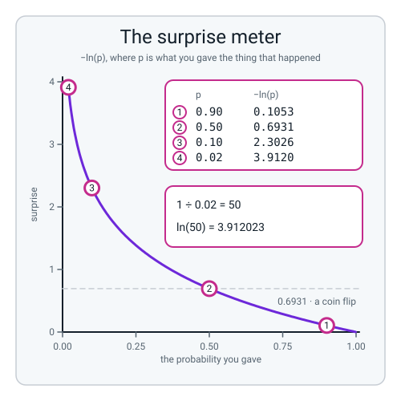
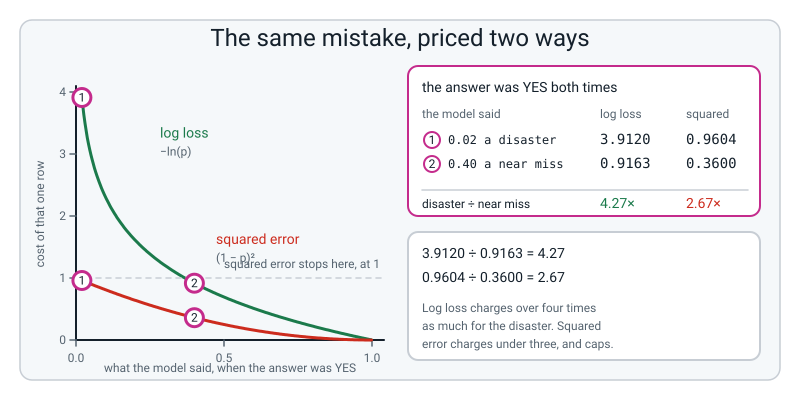
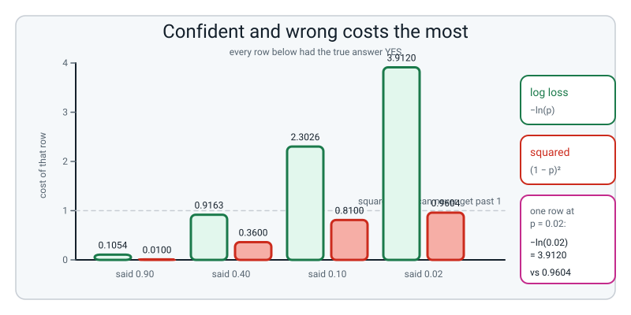
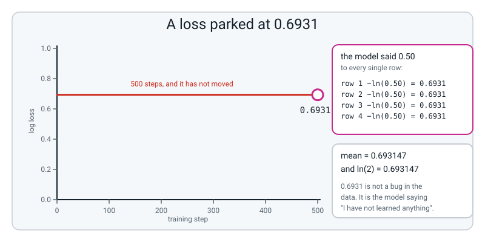
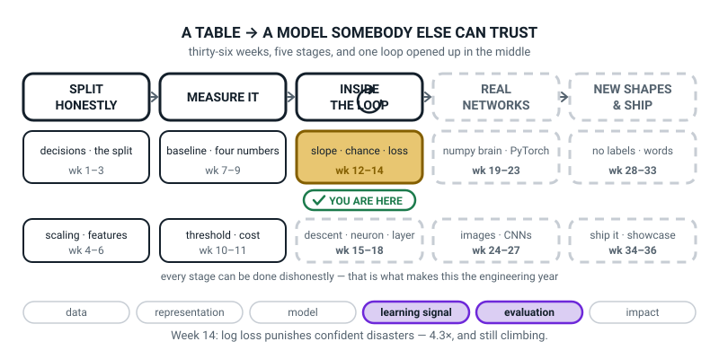

# Week 14 — Measuring How Wrong You Are

[⬅ Week 13](week-13.md) · [Course Home](../README.md) · [Week 15 ➡](week-15.md) · [Student Guide](../student-guide/week-14.md) · [Workbook](../workbook/week-14.md)

---

## 📋 At a Glance

| | |
|---|---|
| **Duration** | 70 minutes |
| **Type** | 🟦 Teach — the week the model gets a scoreboard |
| **Big idea** | Squared error rates a confident disaster only **2.7 times** worse than a near-miss. Log loss rates it **4.3 times** worse and keeps going — which is why logistic regression and neural-network classifiers are trained on log loss. |
| **New vocabulary** | log loss / cross-entropy · squared error · surprise · numerical guard / clipping · confidently wrong |
| **New maths** | **The natural logarithm `ln`, as a surprise meter.** `−ln(p)` computed for p = 0.9, 0.5, 0.1 and 0.02, read off a curve and checked on a calculator. One button. |
| **New syntax** | `np.log(x)` · `np.clip(p, 1e-12, 1 - 1e-12)` · `log_loss(y, prob)` |
| **Dataset** | **6 hand-typed weather forecasts** with their outcomes, then last week's `make_classification(n_samples=200, n_features=2, n_informative=2, n_redundant=0, random_state=0)` |
| **Materials** | A **calculator with an `ln` key** per pair · the printed workbook (Warm-Up through Self-Check) · ruled paper for each team's contest sheet · **three large cards labelled BOLD, CAREFUL and COIN** for the contest · the Bug Log · board space for a six-row table three times over |
| **Tech needed** | Laptop with Python 3, numpy, matplotlib, scikit-learn. **Nothing to install, nothing to download.** |
| **Prep time** | 20 minutes the night before · 5 minutes on the day |
| **Expected runtime of the code** | Every file today runs in **under a second.** Nothing trains. |

> **⚠️ Watch out:** the whole lesson turns on **one surprise, and you must not spoil it.** The class totals up three forecasters' surprise and crowns CAREFUL. *Then* you score the same three with squared error and it crowns **BOLD**. If you mention squared error before the log-loss scoreboard is finished and a winner has been declared out loud, the surprise evaporates and the lesson becomes a list of two formulas. **Log loss first. Winner declared. Then the twist.**

---

## 🎯 Lesson Objectives

By the end of the lesson the student can:

1. **Compute `−ln(p)` for p = 0.9, 0.5, 0.1 and 0.02** and read the four numbers out loud as levels of surprise.
2. **Compute log loss and squared error for the same six predictions**, and show the ratio between a near-miss and a confident disaster for both.
3. **Explain in one sentence, using the word *surprise*, why classification does not use squared error.**
4. **Recognise a loss stuck at 0.6931** and say immediately what the model is doing.

Observable evidence: four `−ln(p)` values in pen with the calculator keystrokes beside them; a completed six-day scoreboard for one forecaster on the board; workbook M2 (Do the Maths by Hand) with log loss and squared error side by side for six rows and both ratios computed; and a three-sentence written answer naming what a model that scores 0.6931 is doing.

---

## 🧑‍🏫 What YOU Need to Know First

> **📌 About the code blocks in this guide.** Outside the **🧰 Prep Checklist** and the **🔑 Answer Key**, the blocks are **illustrations, not whole files** — each carries on from the one above. **The complete runnable files are in the Prep Checklist and the Answer Key.**

There is exactly one new mathematical object this week and it is **`ln`, computed on a calculator** — the button immediately below the `e^x` button they used last week. Everything else is subtraction, squaring and averaging. Twenty minutes with this section is enough; if you only have ten, read §2, §3 and §5.

### 1. Where we are, and the question we refused to answer last week

Last week ended on a deliberate cliff. A pizza order got a probability of **0.8022**, and a student asked whether that was good, and the honest answer was *"you cannot tell yet."*

Here is why they could not. **A probability on its own has nothing to be compared against.** To say whether 0.8022 was a good prediction you need to know what actually happened — was the order late or not? — and you need a rule that turns "you said 0.8022 and it was late" into a number.

That rule is a **loss function**, and this week we build one.

> **loss function** — a formula that turns (what really happened, what you predicted) into a single number measuring how wrong you were. **Lower is better. Zero is perfect.**

Next week we make a model *chase* that number downhill. So this week matters twice: it gives us a scoreboard, and it gives next week something to roll down.

### 2. `ln`, the only new maths, done on a calculator

**Find the `ln` key.** It is a primary key on almost every calculator — you do not need `SHIFT`. It sits right where `e^x` was hiding last week, because they are the same operation run backwards.

Press it four times, now, on the calculator you will use in class:

| Type this | Press | You should see |
|---|---|---|
| `0.9` | `ln` | `−0.105361` |
| `0.5` | `ln` | `−0.693147` |
| `0.1` | `ln` | `−2.302585` |
| `0.02` | `ln` | `−3.912023` |

**Every one is negative.** That is not a fault; `ln` of anything below 1 is negative, and probabilities are always below 1. So we stick a minus sign on the front, which flips them all positive:

```text
−ln(0.9)  = 0.105361
−ln(0.5)  = 0.693147
−ln(0.1)  = 2.302585
−ln(0.02) = 3.912023
```

> **🔢 The maths, slowly:** `ln(x)` answers the question *"what power do I raise `e` to, to get `x`?"* — so it is the exact undoing of last week's `e^x`. Check it once on the calculator and you will believe it forever: press `0.02`, then `ln`, and you get `−3.912023`. Now press `e^x` on that answer. You get `0.02` back. **That is all `ln` is: the button that undoes `e^x`.**

**Now the only sentence that matters about those four numbers.** Read them as **surprise**:

> **surprise** — how astonished you should be that a thing happened, given the chance you gave it. `−ln(p)`, where `p` is the chance you gave the thing that actually happened.

| You said the chance was | It happened. Your surprise is | Read it as |
|---|---|---|
| `0.9` | **0.105** | "barely surprised — I said it would" |
| `0.5` | **0.693** | "no information either way; a shrug" |
| `0.1` | **2.303** | "genuinely surprised" |
| `0.02` | **3.912** | "astonished; I said it basically wouldn't" |

**Look at the gaps.** Going from 0.9 to 0.5 costs you about 0.59 of surprise. Going from 0.1 to 0.02 — a much smaller change in probability — costs you 1.61. **The surprise meter gets steeper and steeper as your prediction gets more confidently wrong, and it never stops.** `−ln(0.001) = 6.908`. `−ln(0.0000001) = 16.118`. There is no ceiling.


*Figure 14.1 — The surprise meter. Four points worked out on a calculator, and a curve that never stops climbing.*

### 3. Log loss: the surprise meter with an if-statement in front of it

The four numbers above assumed something happened. What if it did not?

Then the chance you gave *the thing that happened* is `1 − p`, and the surprise is `−ln(1 − p)`. That is the whole idea, and here is the whole formula:

> **log loss** (also called **binary cross-entropy** or just **cross-entropy**) — for one row: `−ln(p)` if the answer was yes, and `−ln(1 − p)` if the answer was no. Average over all the rows.

**Teach it as an if-statement, not as a formula.** In textbooks it is written as one line:

```text
L = −[ y × ln(p) + (1 − y) × ln(1 − p) ]
```

and that is a clever way of writing an if-statement without an `if`. Because `y` is either 0 or 1, one of the two halves is always multiplied by zero and disappears:

```text
if y = 1:  the second half is (1 − 1) × ... = 0, so L = −ln(p)
if y = 0:  the first half is 0 × ... = 0,     so L = −ln(1 − p)
```

**Say that out loud in class.** It removes ninety per cent of the intimidation, and it is honestly what the formula is.

🔢 **Four rows on paper, right now, because you are doing this live:**

```text
truth = yes, you said 0.90  →  −ln(0.90)      = 0.105361
truth = no,  you said 0.90  →  −ln(1 − 0.90)  = −ln(0.10) = 2.302585
truth = yes, you said 0.02  →  −ln(0.02)                  = 3.912023
truth = no,  you said 0.02  →  −ln(0.98)                  = 0.020203
```

Notice rows 1 and 4: **both are small, because both times you were confident and right.** And rows 2 and 3 are large, because both times you were confident and wrong. **Log loss does not care which way round yes and no are; it cares whether you were confident about the thing that did not happen.**

> **confidently wrong** — a prediction that was both far from 0.5 and on the wrong side. This is the thing log loss punishes and squared error shrugs at, and it is the whole week.

### 4. Why not squared error? The two numbers that settle it

> **squared error** — `(truth − prediction)²`. Take the gap, square it. Averaged over rows this is mean squared error, and it is the right loss for **regression** — predicting house prices, predicting exam marks.

Every instinct says use it here too. The gap is small when you are right and large when you are wrong. Why is it wrong for classification?

**Because of what it charges for a catastrophe.** Take a row where the answer was YES.

| Your prediction | What it is | Squared error | Log loss |
|---|---|---|---|
| `0.40` | mildly wrong, a near miss | `(1 − 0.40)² = 0.3600` | `−ln(0.40) = 0.9163` |
| `0.02` | 98% sure of the wrong answer | `(1 − 0.02)² = 0.9604` | `−ln(0.02) = 3.9120` |
| **ratio, disaster ÷ near miss** | | **2.67×** | **4.27×** |

**Do those two divisions on the board.** `0.9604 ÷ 0.3600 = 2.67`. `3.9120 ÷ 0.9163 = 4.27`.

Squared error says the catastrophe is under three times worse than the near-miss. **Nobody experiences it that way.** A fraud team, a hospital, a spam filter: being 98% sure of the wrong answer is not "somewhat worse" than being unsure, it is a different category of event.

And it gets worse, because **squared error has a ceiling.** The worst it can ever charge for one row is `(1 − 0)² = 1`. Predict 0.02 when the answer is yes and you pay 0.9604. Predict 0.0000001 and you pay 0.9999998. **Squared error literally cannot tell those apart.** Log loss charges 3.912 for the first and 16.118 for the second.


*Figure 14.2 — The same mistake, priced two ways. One curve has a ceiling at 1 and the other does not.*


*Figure 14.3 — Confident and wrong costs the most. Four predictions of the same true answer, priced twice.*

**And here is the honest second reason, which you should mention once and not dwell on.** There is a deeper problem than fairness. Next week the model will improve itself by asking *"if I nudge this weight, does the loss go down?"* When the model is confidently wrong, **squared error's answer to that question is almost 'no change at all'** — the loss is flat there, so the model gets no push, and it sits being confidently wrong forever. Log loss's answer is a shove. You will see this happen next week; do not attempt to prove it today.

### 5. `0.6931`: the most useful number in the rest of the course

Here is a fact worth writing on the wall permanently.

**A model that answers 0.50 to every single row has a log loss of exactly `0.693147`.**

Why: every row's surprise is `−ln(0.5)`, whichever way the truth went, because the chance it gave the thing that happened was 0.5 either way. And `−ln(0.5) = 0.693147`, which is also `ln(2)`. Average a list of identical numbers and you get that number back.

**Two things make this the most diagnostic number in the course.**

**One: it does not depend on the data at all.** Here is the same all-0.5 model scored against a balanced dataset and against a dataset that is 90% class 1:

```text
all 200 z values are: [0.]
all 200 p values are: [0.5]
log loss            : 0.693147
ln(2)               : 0.693147
sklearn agrees      : True

and a model that answers 0.5 to a 90-percent-class-1 dataset:
log loss            : 0.693147
```

**Identical.** So if you see 0.6931 you have learned something about the *model*, not the data.

**Two: it is what a model looks like when it has learned nothing.** Next week every training run starts with all the weights set to zero, which makes every raw score zero, which makes every probability exactly 0.5. **So every training run in this course begins at 0.6931 and should immediately start falling.** If it sits there, the model is not learning, and there are only three or four things it can be.

**The three things to check, and you should say them in this order:**

| If the loss is parked at 0.6931 | Check |
|---|---|
| 1 | **Print the weights.** Are they all still zero? Then nothing has been updated — the update step is missing, or the learning rate is so small nothing moved. |
| 2 | **Print the features.** Are they all zero, or all identical? A scaler applied to the wrong thing, or a column selected that does not exist, will do this. |
| 3 | **Print the labels.** Are they all the same value? Then a class went missing (a data bug; training on one class would not sit at 0.6931). If both classes are present and the loss is still parked, suspect labels shuffled or misaligned with the rows. |


*Figure 14.4 — A loss parked at 0.6931. Five hundred steps and it has not moved.*

> **🧑‍🏫 If a student asks** "is 0.6931 bad?": it is **exactly average**, in the most literal sense — it is the score of guessing. On balanced data, anything below it means the model knows something (on skewed data a model that merely answers the base rate already scores lower: a dataset that is 90% class 1 gives 0.325 for a constant 0.9). Anything **above** it means the model is actively worse than guessing, which is a real and alarming thing that happens, and you will see it next week at `lr = 800`.

### 6. Every line of `contest.py`, explained to somebody who has never programmed

```python
import numpy as np
from sklearn.metrics import log_loss
```

The numbers library, and one ready-made function from scikit-learn that computes log loss so we can check our own arithmetic.

```python
rained = np.array([1, 1, 0, 1, 0, 0])
```

**What actually happened on the six days.** `1` means it rained, `0` means it did not. This is the truth column, and it is only six numbers long because the class has to be able to check it by hand.

```python
bold    = np.array([0.99, 0.99, 0.01, 0.02, 0.01, 0.01])
careful = np.array([0.60, 0.55, 0.45, 0.55, 0.40, 0.45])
coin    = np.array([0.50, 0.50, 0.50, 0.50, 0.50, 0.50])
```

Three forecasters' predictions for the same six days. **Read them down against `rained` and you can see the story before any arithmetic:** BOLD was right five times out of six with enormous confidence and catastrophically wrong on day 4. CAREFUL was right about which side of a half every day but never committed. COIN said "fifty-fifty" and went home.

```python
def surprise(y, p):
    return -(y * np.log(p) + (1 - y) * np.log(1 - p))
```

**This is the if-statement from §3, written the textbook way.** `np.log` is `ln` — **not** log base 10, which is `np.log10` and is a real source of confusion. Because `y` is 0 or 1, one of the two halves is always multiplied by zero and vanishes. The minus sign out front flips the answer positive.

`np.log` is the second of this week's three new pieces of syntax, and it works on a whole list at once.

```python
sb, sc, sk = surprise(rained, bold), surprise(rained, careful), surprise(rained, coin)
```

Three lists of six surprises. Assigning three things on one line is just shorthand for three lines.

```python
    ll = float(np.mean(surprise(rained, p)))
    se = float(np.mean((rained - p) ** 2))
```

The two scoreboards. `np.mean` averages a list. `(rained - p) ** 2` subtracts item by item and squares each — **that is squared error, in one line.** `float(...)` turns numpy's answer into a plain number so `%` formatting behaves.

```python
print("sklearn log_loss, Bold   :", "%.5f" % log_loss(rained, bold))
```

**`log_loss(y, prob)` is the third new piece of syntax**, and its only job today is to agree with us. When our hand-written function and a library used by millions of people produce the same five decimals, we know our arithmetic is right — and this is the same move the student made last week against `predict_proba`.

### 7. The clipping guard, and the `nan` it prevents

Last week you left something broken on purpose. `squash(−1000)` returned exactly `0.0`, and you said *"the sigmoid can never really be 0 and the computer says 0 anyway, and that bites next Tuesday."*

**It is Tuesday.**

```python
y = np.array([1, 1, 0, 0])
p = np.array([0.9, 1.0, 0.0, 0.3])       # rows 2 and 3 are dead certain
raw = -(y * np.log(p) + (1 - y) * np.log(1 - p))
```

```text
guard.py:9: RuntimeWarning: divide by zero encountered in log
  raw = -(y * np.log(p) + (1 - y) * np.log(1 - p))
guard.py:9: RuntimeWarning: invalid value encountered in multiply
  raw = -(y * np.log(p) + (1 - y) * np.log(1 - p))
--- no guard ---
per row : [0.10536052        nan        nan 0.35667494]
mean    : nan
```

**Follow row 2 through, because it is more interesting than it looks.** `y = 1` and `p = 1.0`. The first half is `1 × ln(1) = 0`, which is fine. The second half is `(1 − 1) × ln(1 − 1) = 0 × ln(0) = 0 × (−inf)`.

**And zero times infinity is `nan`.** Not zero — `nan`, "not a number", because there is genuinely no right answer to that multiplication.

Then look at the mean: **`nan`.** Two poisoned rows out of four made the average of all four meaningless. **This is the single most common way a training run silently dies**, and it is worth being dramatic about.

**The fix is one line:**

```python
p_safe = np.clip(p, 1e-12, 1 - 1e-12)
```

> **clipping**, or a **numerical guard** — squashing every value into a safe range before it goes into something fragile. `np.clip(p, low, high)` replaces anything below `low` with `low` and anything above `high` with `high`.

`1e-12` is scientific notation for `0.000000000001`. So a probability of exactly 0 becomes `0.000000000001` and a probability of exactly 1 becomes `0.999999999999`. **Neither is meaningfully different from what it was, and neither breaks `ln`.**

```text
--- with the guard ---
p after clip: [9.e-01 1.e+00 1.e-12 3.e-01]
per row : [0.105361 0.       0.       0.356675]
mean    : 0.115509

sklearn log_loss: 0.115509
```

**Two things worth pointing at.** The second row now costs `0.000000` — a perfect prediction, correctly priced at nothing. And **scikit-learn's `log_loss` gives exactly the same answer as our clipped version**, because scikit-learn clips too. Every real implementation does. We are not inventing a hack; we are doing what the library does, visibly.

> **⚠️ Watch out:** the printed clipped array says `1.e+00` for the value `1 − 1e-12`. **It has not been left at 1.0** — numpy is just printing four significant figures. If a student says "the clip didn't work", have them print `1 - p_safe[1]`, which gives `9.999778782798785e-13`. **That is a display-versus-value moment, and they met one of those in Week 13 with the weights.**

### 8. The three misconceptions you will actually meet

**Misconception 1 — "so log loss is *better* than squared error."** Not in general. **Squared error is the correct loss for regression** and log loss would be nonsense there — you cannot take `ln` of a house price. The claim is narrower and you should state it narrowly: *for predicting probabilities, log loss prices confident wrongness in a way squared error cannot.* Different jobs, different rulers.

**Misconception 2 — "a lower loss means a better model."** Lower loss means better agreement with the labels you were given. **If the labels encode somebody's past bad decisions, a perfect loss means perfectly reproducing them.** The student met this in Weeks 6 and 9 with leakage and with metrics; it is the same lesson in a new coat, and it is worth thirty seconds. Nothing in `−ln(p)` can notice that the labels are unfair.

**Misconception 3 — "0.6931 means the data is bad."** It means the *model* is doing nothing. §5 has the proof: the same 0.6931 comes out of a balanced dataset and a 90%-skewed one. **The number is a statement about the model only.**

### 9. How deep to go, and where to stop

**Go this far:** `−ln(p)` for four probabilities on a calculator, read as surprise; log loss taught as an if-statement; the contest scored two ways with two different winners; the 2.67 and 4.27 ratios computed on the board; `0.6931` named and explained; `nan` seen and clipped away; `log_loss` agreeing with hand arithmetic.

**Stop before:**

| Do not teach today | Where it lives |
|---|---|
| **The derivative of log loss, or gradient descent** | **Week 15, next week.** Today the loss is a scoreboard we *read*. Nothing improves it. Resist hard: somebody will say "so how do we make it smaller?" and the answer is *"that is the whole of next week, and it is a lab."* |
| **The proof that squared error's gradients vanish** | Week 15 shows it happening. Say the sentence, do not prove it. |
| Why log loss is the "maximum likelihood" choice | Not in this course. It is a true and beautiful reason and it needs machinery the student does not have. If asked, the honest answer is in the Questions section. |
| `nn.BCEWithLogitsLoss`, `nn.CrossEntropyLoss` | Weeks 22 and 26. |
| Multi-class cross-entropy, softmax | Week 26. Two classes only. |
| Brier score as a name for squared error on probabilities | Mention only if a student finds it. It is the same arithmetic with a person's name on it. |

The line to hold all lesson: **today you build the scoreboard. Next week the model starts trying to win.**

---

### 10. 🧭 The Growing Map — the tile closes

The student guide carries a figure called **Where This Fits**: the same picture every week with one more
piece filled in. Today is a closing week, and closing weeks are the ones worth showing properly.



*Figure 14.0 — Week 14's version. Third and last week in the same gold tile. The ↻ on stage three is
black, as it has been since Week 12.*

**What to do with it, in about two minutes at the end of the lesson:**

1. **Ask "which box did we do today?" and then "is it finished?"** They point at *slope · chance ·
   loss*, and this time the answer to the second question is **yes**. Walk the three words out loud with
   the room: Week 12 **slope**, Week 13 **chance**, Week 14 **loss**. Three weeks, one tile, done.
2. **Anchor it on the twist.** The two ratios are still on the board: log loss rates a confident
   disaster **4.3×** worse than a near miss and keeps climbing; squared error stops at **2.7×** and
   crowned the wrong forecaster. *"That difference is what finishing this box was for."*
3. **Then point at the tile below it and say what happens next.** `descent · neuron · layer`, weeks 15
   to 18, still dashed. *"Next week the badge moves down there, and the first thing we do is take the
   slope of the loss you built today."* Naming the next box is a two-second job that buys you the first
   five minutes of next week's lesson.

> **🧑‍🏫 Why this is worth two minutes.** Log loss is the week students most often file under *"a formula
> we had to learn"*. The map makes it structural instead: a loss is the thing the entire right-hand side
> of the pipeline is steered by, and a completed tile is visible proof that three weeks added up to one
> component.

**One thing to notice, so you can answer if asked.** Two threads are lit — `learning signal` **and**
`evaluation` — and it is the only pairing of those two in the term. A loss is both at once: the number
you report and the number the model is trained by. If a student spots that, it is a very good spot.

---

## 🧰 Prep Checklist

This section lists what to set up before the lesson, and what to do if the laptops fail.

### 20 minutes the night before

- [ ] **Press `ln` four times on a real calculator.** `0.9 ln` → `−0.105361`. `0.5 ln` → `−0.693147`. `0.1 ln` → `−2.302585`. `0.02 ln` → `−3.912023`. **Then press `e^x` on that last answer and watch `0.02` come back.** That thirty seconds is what lets you answer "what even is ln" without hesitating.
- [ ] **Do the two divisions on the calculator too**, because you will do them on the board: `3.9120 ÷ 0.9163 = 4.27` and `0.9604 ÷ 0.3600 = 2.67`.
- [ ] **Type and run `contest.py` yourself.** The complete file:

```python
"""contest.py - three forecasters, six days, two scoreboards."""
import numpy as np
from sklearn.metrics import log_loss

rained = np.array([1, 1, 0, 1, 0, 0])

bold    = np.array([0.99, 0.99, 0.01, 0.02, 0.01, 0.01])
careful = np.array([0.60, 0.55, 0.45, 0.55, 0.40, 0.45])
coin    = np.array([0.50, 0.50, 0.50, 0.50, 0.50, 0.50])


def surprise(y, p):
    return -(y * np.log(p) + (1 - y) * np.log(1 - p))


print("day  rained    Bold  surprise   Careful  surprise    Coin  surprise")
sb, sc, sk = surprise(rained, bold), surprise(rained, careful), surprise(rained, coin)
for i in range(6):
    print("%3d %7d  %6.2f %9.4f %9.2f %9.4f %7.2f %9.4f"
          % (i + 1, rained[i], bold[i], sb[i], careful[i], sc[i], coin[i], sk[i]))

print()
print("%-9s %12s %12s" % ("forecaster", "log loss", "squared err"))
for name, p in [("Bold", bold), ("Careful", careful), ("Coin", coin)]:
    ll = float(np.mean(surprise(rained, p)))
    se = float(np.mean((rained - p) ** 2))
    print("%-9s %12.5f %12.5f" % (name, ll, se))

print()
print("sklearn log_loss, Bold   :", "%.5f" % log_loss(rained, bold))
print("sklearn log_loss, Careful:", "%.5f" % log_loss(rained, careful))
print("sklearn log_loss, Coin   :", "%.5f" % log_loss(rained, coin))
```

Run `python3 contest.py`. You must see **exactly** this. **Runtime under a second.**

```text
day  rained    Bold  surprise   Careful  surprise    Coin  surprise
  1       1    0.99    0.0101      0.60    0.5108    0.50    0.6931
  2       1    0.99    0.0101      0.55    0.5978    0.50    0.6931
  3       0    0.01    0.0101      0.45    0.5978    0.50    0.6931
  4       1    0.02    3.9120      0.55    0.5978    0.50    0.6931
  5       0    0.01    0.0101      0.40    0.5108    0.50    0.6931
  6       0    0.01    0.0101      0.45    0.5978    0.50    0.6931

forecaster     log loss  squared err
Bold           0.66038      0.16015
Careful        0.56883      0.18833
Coin           0.69315      0.25000

sklearn log_loss, Bold   : 0.66038
sklearn log_loss, Careful: 0.56883
sklearn log_loss, Coin   : 0.69315
```

- [ ] **Look at that middle block until you can see the twist without reading it.** **Log loss: CAREFUL wins (0.56883 beats 0.66038). Squared error: BOLD wins (0.16015 beats 0.18833).** Different winner, same six days, same three forecasters. **That is the lesson, and you must be able to say it while pointing.**
- [ ] **Work out the one-sentence explanation of the twist and rehearse it**, because a student will ask and a vague answer wastes the moment. Here it is: **BOLD's disaster on day 4 costs 3.912 under log loss, which is more than CAREFUL's entire six-day total of 3.413. The same disaster costs 0.9604 under squared error, which is less than CAREFUL's total of 1.1300.** One number bigger than a whole scoreboard; the other smaller. That is the whole twist, in two comparisons.
- [ ] **Run `guard.py`** (full file in the Answer Key, under Practice Set B, B4) so `nan` on your own screen is familiar. **Runtime under a second.**
- [ ] **Run `parked.py`** (full file in the Answer Key, under Build It, Part A) and check you get `0.693147` twice. **Runtime under a second.**
- [ ] **Break it on purpose, twice**, so both deliberate mistakes in the live-code are muscle memory:
  1. Drop the minus sign from `surprise`. **No error.** Every loss comes out negative, and the "best" forecaster becomes the worst.
  2. Use `np.log10` instead of `np.log`. **No error.** All the numbers shrink by a factor of 2.3026 and the *ranking does not change*, which makes it very hard to spot.
- [ ] **Print the workbook** (all sections, Warm-Up to Self-Check), and **have ruled paper ready** for the contest: the workbook has no contest sheet, so each team draws a six-row table.
- [ ] **Make three large cards: BOLD, CAREFUL, COIN.** You will hand one to each team and they will hold it up when they announce their total. **Physical cards make the contest a contest.**
- [ ] **Write the six days on the board before the lesson**, truth column only:

```text
day       1     2     3     4     5     6
rained?  YES   YES    no   YES    no    no
```

### 5 minutes on the day

- [ ] Editor open, terminal ready. **`contest.py` deleted or renamed** — they type it.
- [ ] The six-day truth row on the board, **with a lot of empty space underneath for three forecaster rows.**
- [ ] **One calculator per pair, on the desks.** Check the `ln` key on each.
- [ ] The three cards on your desk, face down.
- [ ] `ln(2) = 0.693147` written in a corner of the board **that you are not going to rub out**.
- [ ] Last week's shared S-curve still on the wall.
- [ ] Bug Log out.

### Fallback if the laptops fail

**This week survives a power cut better than almost any week this term**, because the contest was always going to be calculators and a board.

1. **The hook works untouched.**
2. **The contest works untouched** — that is 20 minutes of the lesson, unaffected.
3. **The two ratios work untouched:** `3.9120 ÷ 0.9163` and `0.9604 ÷ 0.3600`, on calculators, on the board.
4. **Replace the live-code with the printout.** Hand out the `contest.py` output on paper and have the class find their own team's numbers in it. Then have them mark which column each scoreboard's winner is in. **That is objective 2 delivered with a highlighter.**
5. **Do the `nan` demonstration on the board.** Write `y = 1`, `p = 1.0`, then `(1 − 1) × ln(1 − 1)` = `0 × ln(0)` = `0 × (−infinity)`. Ask the class what zero times infinity is. **Let them argue about it for ninety seconds — that argument is exactly why the answer is `nan`.** Then write the clip line and show that `0` becomes `0.000000000001`.
6. **Do `0.6931` on the board.** Six days, all forecasts 0.50, all surprises `−ln(0.5) = 0.693147`, average `0.693147`. **Then the killer question: "does that number depend at all on whether it rained?"** No. Look at the column — it is the same six numbers whatever the truth row says. **Objective 4, on paper.**

| If this fails | Do this instead |
|---|---|
| A calculator has no `ln` key | Every calculator has one, but if a phone is in portrait mode it is hidden — rotate to landscape. Failing that, hand out the four values: `−ln(0.9) = 0.105361`, `−ln(0.5) = 0.693147`, `−ln(0.1) = 2.302585`, `−ln(0.02) = 3.912023`. |
| Somebody's calculator gives `ln(0.02) = −1.69897` | They pressed `log`, not `ln`. That is log base 10. **The two keys are next to each other and this will happen.** `−1.69897 × 2.3026 = 3.9120`, which is a nice way to show they are the same idea on a different scale. |
| A team's total is off by exactly one row | Almost always day 3 or day 5, where the truth is "no" and they used `−ln(p)` instead of `−ln(1 − p)`. **Ask them: "what chance did your forecaster give the thing that actually happened?"** |
| `RuntimeWarning: divide by zero encountered in log`, then `nan` | Expected, and it is the lesson. Somebody put a `0.0` or a `1.0` in their probability list. Clip it. |
| `ValueError: y_true contains only one label` | Their truth list is all 1s or all 0s. `log_loss` refuses, and it is right to: with one class there is nothing to be right or wrong about. |
| The twist lands flat | You said "squared error" too early. **You cannot un-say it — so instead, make them commit.** Have every student write down which forecaster they think squared error will crown, in pen, before you compute it, and count the votes on the board. A vote they got wrong is nearly as good as a surprise. |

---

## ⏱️ The Lesson, Minute by Minute

This section is the lesson plan, one segment at a time.

| Segment | Minutes | Running total | What happens |
|---|---|---|---|
| 🪝 Hook — Was 0.8022 a Good Guess? | 7 | 7 | Last week's cliff, and three forecasters on the board |
| 🧠 Concept & Maths — The Surprise Meter | 18 | 25 | `−ln(p)` four times, log loss as an if-statement, the two ratios |
| 💻 Live-Code Together — `contest.py` | 18 | 43 | Build it, break it twice, then `nan` and the clip |
| 🎲 Their Turn — The Weather Forecaster Contest | 20 | 63 | Three teams, six days each, two scoreboards, two winners |
| 🔑 Wrap & Assign | 7 | 70 | Three checks, `0.6931` on the wall, homework |

---

### 🪝 Hook — Was 0.8022 a Good Guess? (7 minutes)

**Do this:** Nothing on the screen. Point at last week's S-curve on the wall.

**Say this:**

> "Last week an order got a probability of **0.8022**, somebody asked whether that was good, and I refused to answer. Today I have to answer.
>
> So: the order was **late**. You said 80% chance of late. Was that a good guess?"

**Do this:** Let them say "yes". Then:

> "Now a different order. You said **0.8022**, and it arrived **on time**. Same prediction. Was that a good guess?"

**Ask this:** "How much worse? Give me a number. How much worse is the second one than the first?"

*Expected:* silence, or a shrug, or a guess with no reasoning behind it.

> **Say this:** "You cannot say, and neither can I, and that is the entire point. **We have a machine that produces confidence and no way of pricing it.**
>
> So today we build the price list. And to work out what a fair price list looks like, we are going to have an argument about the weather."

**Do this:** Write the six days on the board — truth row only.

```text
day       1     2     3     4     5     6
rained?  YES   YES    no   YES    no    no
```

> "Six real days. Three forecasters, and every one of them gave a percentage chance of rain for every one of these days, the night before. Here they are."

**Do this:** Write the three rows underneath, slowly, saying each forecaster's character out loud as you write.

```text
BOLD     0.99  0.99  0.01  0.02  0.01  0.01
CAREFUL  0.60  0.55  0.45  0.55  0.40  0.45
COIN     0.50  0.50  0.50  0.50  0.50  0.50
```

> "**BOLD** commits. Ninety-nine per cent, one per cent, no hedging. Look across: right, right, right — **and then day four.** Two per cent chance of rain, and it rained. That is not a small mistake. That is standing on television saying it definitely will not rain on the day of the flood.
>
> **CAREFUL** never commits to anything. Sixty per cent, fifty-five, forty-five. But look which side of a half each one is on: right, right, right, right, right, right. **Six out of six, and never once brave.**
>
> **COIN** does not own a barometer."

**Ask this:** "Hands up. Who is the best forecaster? Vote for one."

**Do this:** Count the votes on the board. **Write the counts down** — you will come back to them twice. Most classes split between BOLD and CAREFUL, with somebody voting COIN as a joke.

> **Say this:** "Hold that vote. Because in about forty minutes I am going to show you that **the answer depends entirely on which price list you use, and two perfectly reasonable price lists disagree.**
>
> One of them says CAREFUL. The other says BOLD. Same six days, same three forecasters, same arithmetic done properly both times. And which one is right is not a maths question — it is a question about what you think a mistake costs, and it is your job to have an opinion."

---

### 🧠 Concept & Maths — The Surprise Meter (18 minutes)

**Do this (6 min) — `ln`, four times, everybody.** Calculators out. Nothing on the laptop screen.

> **Say this:** "New button, and it is the easiest one yet, because you have already used its twin. Find `ln`. No `SHIFT` needed — it is a main key, right where `e^x` was hiding last week.
>
> `ln` is the button that **undoes** `e^x`. That is genuinely all it is. Watch: type `0.02`, press `ln`."

**Do this:** Class calls out `−3.912023`. Write it.

> "Now press `e^x` on that answer."

**Do this:** Class calls out `0.02`. Write it beside. **Draw an arrow from each to the other.**

> "There and back. `e^x` and `ln` are one operation and its undo, like plus and minus.
>
> Now four presses. `0.9`, `ln`. Then `0.5`, `0.1`, `0.02`. Call them out."

```text
ln(0.9)  = −0.105361
ln(0.5)  = −0.693147
ln(0.1)  = −2.302585
ln(0.02) = −3.912023
```

**Ask this:** "Every single one is negative. Why?"

*Hoped-for answer:* because all four numbers are less than 1.

*If they are stuck:* ask what `ln(1)` is. (Zero.) *"And these are all below 1, so they are all below zero. Probabilities are always below 1 — so this is always going to happen."*

> **Say this:** "So we stick a minus on the front and they all flip positive. And now I am going to tell you what these four numbers **are**, and it is the sentence to write down."

**Do this:** Write on the board, large:

```text
−ln(p)  =  how SURPRISED you should be

     p = the chance you gave the thing that actually happened
```

```text
you said 0.9,  it happened  →  0.105   barely surprised
you said 0.5,  it happened  →  0.693   a shrug
you said 0.1,  it happened  →  2.303   genuinely surprised
you said 0.02, it happened  →  3.912   astonished
```

**Ask this:** "Look at the gaps. Going from 0.9 to 0.5 — how much surprise did that buy? And from 0.1 to 0.02?"

*0.588 for the first, 1.609 for the second.*

> **Say this:** "So a **small** drop at the confident end costs **more** than a big drop in the middle. The meter gets steeper and steeper the more confidently wrong you are, and — this is the important bit — **it never stops.** `−ln(0.001)` is 6.9. `−ln` of a millionth is 13.8. There is no worst possible score. **You can always be more astonished.**"

**Do this (6 min) — log loss as an if-statement.**

> **Say this:** "One thing is missing. That meter assumed the thing happened. What if it did not?
>
> Then the chance you gave the thing that **did** happen is `1 minus p`. So the surprise is `−ln(1 − p)`. Same meter, different input.
>
> So log loss is an if-statement, and I want you to see it as one."

**Do this:** Write it as an if-statement first:

```text
if it happened:      loss = −ln(p)
if it did not:       loss = −ln(1 − p)
```

Then — and only then — write the textbook version underneath:

```text
loss = −[ y × ln(p) + (1 − y) × ln(1 − p) ]
```

**Ask this:** "That second line looks much worse. But `y` is either 0 or 1. What happens to each half?"

*Hoped-for answer:* one of them gets multiplied by zero and disappears.

> **Say this:** "Exactly. **It is the same if-statement with the `if` hidden inside a multiplication.** If `y` is 1 the second half becomes `0 × something` and vanishes. If `y` is 0 the first half vanishes. It is written that way because a computer can do it without branching, and for no other reason. **Every time you see that formula, read it as the two lines above it.**"

**Do this:** Four rows on the board, class doing the calculator work:

```text
truth YES, said 0.90  →  −ln(0.90) = 0.105361      confident and right
truth  no, said 0.90  →  −ln(0.10) = 2.302585      confident and WRONG
truth YES, said 0.02  →  −ln(0.02) = 3.912023      confident and WRONG
truth  no, said 0.02  →  −ln(0.98) = 0.020203      confident and right
```

**Ask this:** "Rows 1 and 4 are both tiny. Rows 2 and 3 are both huge. What do rows 2 and 3 have in common?"

*Hoped-for answer:* the forecaster was confident about the thing that did not happen.

> **Say this:** "**Confidently wrong.** Write that phrase down. It is the thing this loss is designed to hunt, and it is why the whole week exists."

**Do this (6 min) — the twist, set up but not sprung.**

> **Say this:** "Now. Squared error. You have used this since Level 2 — take the gap, square it. It is the right tool for predicting exam marks and house prices, and every instinct says use it here too.
>
> Let us price the same two mistakes both ways. Truth is YES both times."

**Do this:** Build this table on the board, class doing every number on calculators.

```text
                     squared error         log loss
said 0.40  →   (1 − 0.40)² = 0.3600    −ln(0.40) = 0.9163
said 0.02  →   (1 − 0.02)² = 0.9604    −ln(0.02) = 3.9120

ratio      →   0.9604 ÷ 0.3600         3.9120 ÷ 0.9163
           →   2.67 ×                  4.27 ×
```

**Ask this:** "Squared error says the disaster is 2.67 times worse than the near-miss. Is that how a hospital would feel about it?"

*Hoped-for answer:* no — being 98% sure of the wrong answer is a completely different kind of event.

> **Say this:** "And here is the thing that finishes the argument, and it is not about fairness, it is about arithmetic. **Squared error has a ceiling.**
>
> The very worst it can charge for one row is `(1 − 0)² = 1`. So predict 0.02 when the answer is yes and you pay 0.96. Predict **one ten-millionth** and you pay 0.9999998. **Squared error cannot tell those two apart.** They are the same to it.
>
> Log loss charges 3.9 for the first and **16.1** for the second."

**Do this:** Do NOT reveal the contest twist yet. **Say this instead:**

> "So log loss punishes confident wrongness enormously and squared error barely notices. Which means — and this is what we are about to find out — **they might disagree about who the best forecaster is.**"

---

### 💻 Live-Code Together — `contest.py` (18 minutes)

**You never touch their keyboard.**

**Step 1 (4 min) — the data and the surprise function.**

```python
import numpy as np

rained = np.array([1, 1, 0, 1, 0, 0])

bold    = np.array([0.99, 0.99, 0.01, 0.02, 0.01, 0.01])
careful = np.array([0.60, 0.55, 0.45, 0.55, 0.40, 0.45])
coin    = np.array([0.50, 0.50, 0.50, 0.50, 0.50, 0.50])


def surprise(y, p):
    return -(y * np.log(p) + (1 - y) * np.log(1 - p))


print("BOLD   :", np.round(surprise(rained, bold), 4))
```

```text
BOLD   : [0.0101 0.0101 0.0101 3.912  0.0101 0.0101]
```

**Do this:** Say nothing for five seconds. Let the `3.912` sit in the middle of five hundredths.

**Ask this:** "Six numbers. Five of them are a hundredth. One is 3.912. Which day is that, and what happened?"

*Day 4. BOLD said 2% and it rained.*

> **Say this:** "One day out of six is contributing more than three hundred times what any other day contributes. **Log loss is not just scoring the forecaster — it is pointing at the exact day that went wrong.** That is a property you will lean on for the rest of your life: when a loss is high, look for the rows carrying it."

**Step 2 (4 min) — 🐞 DELIBERATE MISTAKE ONE: drop the minus sign.**

Delete the leading `-` from the `surprise` function and re-run all three.

Real output:

```text
BOLD   : -0.660379
CAREFUL: -0.568833
COIN   : -0.693147
```

**Ask this:** "No error. What is wrong, and who is the winner now?"

*Hoped-for answer:* all the losses are negative, and if lower is better then COIN — the one that knows nothing — is winning.

> **Say this:** "**A loss can never be negative.** Zero means perfect; there is nothing better than perfect. So a negative loss is not a bad score, it is a **broken score**.
>
> And look at the damage: the ranking has flipped completely. Most negative wins, so COIN — the forecaster who owns no instruments — is now the champion. **One missing character.**
>
> This is why 'is the sign right' is a real debugging question. Add it to the Bug Log with the rule: **a loss is never negative. If you see a minus, you have lost a minus.**"

Fix it. **Bug Log, ninety seconds.**

**Step 3 (4 min) — 🐞 DELIBERATE MISTAKE TWO: `np.log10`.**

Change both `np.log` calls to `np.log10` and re-run.

Real output:

```text
forecaster     log loss  squared err
Bold           0.28680      0.16015
Careful        0.24704      0.18833
Coin           0.30103      0.25000
```

**Ask this:** "Any error? Has the ranking changed? Is anything wrong?"

*Hoped-for answer:* no error, the ranking is identical, but all three numbers are much smaller.

> **Say this:** "**This is the most dangerous kind of bug in the whole course**, and I want you to look at it properly.
>
> Nothing crashed. The ranking is exactly right — CAREFUL still beats BOLD still beats COIN. If you were only looking at *who won*, you would never notice.
>
> But every number is wrong, by exactly the same factor. `0.693147 ÷ 0.301030 = 2.3026`. That is `ln(10)`. **`log10` and `ln` are the same idea measured in different units**, like centimetres and inches, and dividing by a constant does not change any ordering.
>
> So how would you ever catch it? **One number.** COIN answers 0.5 to everything, and its true log loss is 0.6931 — the number I have written in the corner of the board and am never rubbing out. The screen says 0.3010. **That is how you catch it: you already know one right answer.**"

Fix it. **Bug Log** — this goes in as a **"no error, right ranking, wrong numbers"** entry, which is a new category for them.

**Step 4 (3 min) — check against sklearn, and reveal the scoreboards.**

```python
from sklearn.metrics import log_loss

print("%-9s %12s %12s" % ("forecaster", "log loss", "squared err"))
for name, p in [("Bold", bold), ("Careful", careful), ("Coin", coin)]:
    ll = float(np.mean(surprise(rained, p)))
    se = float(np.mean((rained - p) ** 2))
    print("%-9s %12.5f %12.5f" % (name, ll, se))
print()
print("sklearn log_loss, Bold   :", "%.5f" % log_loss(rained, bold))
print("sklearn log_loss, Careful:", "%.5f" % log_loss(rained, careful))
```

```text
forecaster     log loss  squared err
Bold           0.66038      0.16015
Careful        0.56883      0.18833
Coin           0.69315      0.25000

sklearn log_loss, Bold   : 0.66038
sklearn log_loss, Careful: 0.56883
```

**Do this:** Point at the sklearn lines first.

> **Say this:** "Our function and scikit-learn's, five decimals, identical. **Same move as last week: we marked the library's homework and it passed.**"

**Do this:** **Now** point at the two columns and go quiet for a moment.

**Ask this:** "Read down the log loss column. Who wins? Now read down the squared error column. Who wins?"

*CAREFUL on the left. BOLD on the right.*

> **Say this:** "**Different winner. Same six days. Same three forecasters. Both columns computed correctly.**
>
> And the reason is one number. Look at day 4. Under log loss, BOLD's disaster costs **3.912** — which is more than CAREFUL's entire six-day total of **3.413**. One day worse than a whole week.
>
> Under squared error, the same disaster costs **0.9604** — which is **less** than CAREFUL's total of **1.1300**. One day cheaper than a whole week of hedging.
>
> That is it. That is the whole twist. **One catastrophe bigger than an entire scoreboard, or smaller than it, depending on which ruler you picked.**"

**Step 5 (3 min) — the `nan`, and the one-line guard.**

```python
y = np.array([1, 1, 0, 0])
p = np.array([0.9, 1.0, 0.0, 0.3])
print("per row :", surprise(y, p))
print("mean    :", surprise(y, p).mean())
```

```text
contest.py:13: RuntimeWarning: divide by zero encountered in log
  return -(y * np.log(p) + (1 - y) * np.log(1 - p))
contest.py:13: RuntimeWarning: invalid value encountered in multiply
  return -(y * np.log(p) + (1 - y) * np.log(1 - p))
per row : [0.10536052        nan        nan 0.35667494]
mean    : nan
```

(The line number will be whatever line your `surprise` function's `return` sits on — **numpy points at the arithmetic, not at the print.** That is worth saying out loud: the warning names the line that did the division, and the caller is somewhere else entirely.)

**Ask this:** "Row 2: the truth was yes and the forecaster said 1.0 — a perfect prediction. Why is a perfect prediction `nan`?"

*Hoped-for answer:* the other half of the formula tried to do `ln(0)`.

> **Say this:** "Follow it. `y` is 1 and `p` is 1.0. First half: `1 × ln(1) = 0`, fine. Second half: `(1 − 1) × ln(1 − 1)`, which is `0 × ln(0)`, which is **zero times minus infinity**.
>
> And there is no answer to that. Not zero, not infinity — genuinely no answer. So the machine writes `nan`: **not a number.**
>
> Now look at the mean. **`nan`.** Two bad rows out of four destroyed the average of all four. **This is how a training run dies at epoch 300 of 500 having worked perfectly for the first 299.**"

**Do this:** Fix it with the clip, live.

```python
p_safe = np.clip(p, 1e-12, 1 - 1e-12)
print("per row :", np.round(surprise(y, p_safe), 6))
print("mean    : %.6f" % surprise(y, p_safe).mean())
print("sklearn :", "%.6f" % log_loss(y, p))
```

```text
per row : [0.105361 0.       0.       0.356675]
mean    : 0.115509
sklearn : 0.115509
```

> **Say this:** "`np.clip` says: nothing below this, nothing above that. A probability of exactly 0 becomes 0.000000000001, and exactly 1 becomes 0.999999999999. **Neither is meaningfully different, and neither breaks `ln`.**
>
> Row 2 now costs **0.000000** — a perfect prediction, correctly priced at nothing.
>
> And the last line: **scikit-learn agrees with our clipped version exactly.** Because scikit-learn clips too. Every real implementation does. **We did not invent a hack; we did visibly what the library does invisibly.**"

---

### 🎲 Their Turn — The Weather Forecaster Contest (20 minutes)

Full instructions in **🎲 The Activity, In Full** below. In outline: three teams, one forecaster each, six days of surprise totalled **by hand on calculators**, cards held up, a winner crowned. Then the same three scored with squared error, and a different winner crowned.

---

### 🔑 Wrap & Assign (7 minutes)

**Do this:** Stand at the board with both scoreboards on it and the hook's vote counts still visible. Write four things underneath:

```text
−ln(p)                      surprise: how astonished you should be
log loss                    average surprise over all the rows
squared error               (truth − guess)², and it stops at 1
0.6931                      the score of a model that says 0.50 to everything
```

**Say this:**

> "Four things. That is the week.
>
> **`−ln(p)`** is one button and it measures **surprise**. You gave a chance to something and it happened; how astonished should you be? Said 0.9, barely surprised. Said 0.02, astonished.
>
> **Log loss** is the average of that over every row. It has no ceiling, so a confidently wrong row can dominate a whole dataset — and that is a feature, because a confidently wrong row *should* dominate your attention.
>
> **Squared error** is the right tool for a different job. Predicting exam marks, house prices, anything on a continuous scale. For probabilities it caps out at 1 per row, so it cannot tell a disaster from a catastrophe.
>
> And **0.6931**. Point at the corner of the board. That number is going to follow you for the rest of this course. It is `ln(2)`, and it is the log loss of a model that answers 0.50 to everything. **It does not depend on the data at all** — I ran it against a balanced dataset and a 90%-skewed one and got 0.693147 both times. So if you ever see a loss sitting at 0.6931, you have learned something about your **model**: it has learned nothing."

**Do this:** Point at the hook's vote counts.

> "And your vote. Look at it. Some of you voted BOLD and some voted CAREFUL, and here is the honest ending: **you were all right, and you were disagreeing about the price list, not about the weather.**
>
> If a confidently wrong forecast is catastrophic — a flood warning, a cancer screen, a fraud alert — you want log loss, and CAREFUL wins. If all you care about is being roughly close on average, squared error is defensible, and BOLD wins.
>
> **Probability-producing classifiers (logistic regression, neural networks) are trained on log loss.** And now you know exactly what that choice is buying, and what it is buying it with."

**Do this:** Three quick checks — exact wording in **✅ Assessing Understanding**.

**Say this, to close:**

> "One thing is missing, and it is the same thing that was missing last week.
>
> We have built a scoreboard. We can look at a model and say 'your loss is 0.66' — and then do absolutely nothing about it. Nothing on this board makes a model better. We can grade; we cannot teach.
>
> Next week we teach. And here is what next week actually is: **a loop.** Measure the loss. Ask each weight 'if I nudged you, would the loss go down?' — which is Week 12's slope, and you already know how to measure it. Nudge every weight the way that helps. Repeat five hundred times.
>
> That is what `.fit()` has been doing every single time you called it, since Level 2. Next week you write it yourself, in twenty-five lines, and check your answer against scikit-learn's."

**Do this:** Hand out the homework. Read the second part out loud, slowly.

---

## 🐞 The Debugging Clinic

Every message below came from running a broken version of this week's actual code.

| What the student sees (real message) | What it means | Most likely cause | The fix |
|---|---|---|---|
| `RuntimeWarning: divide by zero encountered in log` then `nan` in the results | "You asked me for `ln(0)`, which is minus infinity, and then something multiplied it by zero." | A probability of exactly `0.0` or exactly `1.0` reached the logarithm. | `p = np.clip(p, 1e-12, 1 - 1e-12)` **before** the log. |
| `RuntimeWarning: invalid value encountered in multiply` | "I was asked for zero times infinity and there is no answer to that." | The companion warning to the one above — it is the `(1 − y) × ln(1 − p)` half when `p` is exactly 1. | Same clip. **These two warnings almost always arrive together.** |
| `ValueError: y_prob contains values greater than 1: 1.2` | "That is not a probability." | Feeding `log_loss` raw scores instead of probabilities — a `z` of 1.2, not a `p`. | Put the scores through the sigmoid first. **This is Week 13's whole lesson, arriving as an error message.** |
| `ValueError: y_true contains only one label (1). Please provide the list of all expected class labels explicitly through the labels argument.` | "Every row has the same answer, so there is nothing to be right or wrong about." | A tiny test list like `[1, 1, 1]`, or a split that put all of one class on one side. | Include both classes, or pass `labels=[0, 1]` if you genuinely mean it. **In a real pipeline this usually means the split went wrong.** |
| `ValueError: Found input variables with inconsistent numbers of samples: [3, 4]` | "You gave me 4 answers and 3 predictions." | Truth and prediction lists of different lengths — usually a typo, or one list built from the wrong split. | `print(len(y), len(p))` first. **This is the cheapest check in the file.** |
| `TypeError: bad operand type for unary -: 'list'` | "You put a minus in front of a plain Python list." | `-(y * np.log(p) + ...)` where `y` is a list, not a numpy array. | `np.array([...])`. |
| **No error. Every loss is negative.** | Nothing crashed and every number is meaningless. | The leading minus sign is missing from the loss. | **A loss is never negative.** Zero is perfect; nothing beats perfect. Put the minus back. |
| **No error. Every loss is 2.3026 times too small, and the ranking is right.** | Nothing crashed, the ordering is correct, every value is wrong. | `np.log10` instead of `np.log`. | Use `np.log`. **Catch it with a number you already know:** an all-0.5 forecaster must score `0.693147`. If it says `0.301030`, you are in base 10. |
| **No error. The loss is sitting at exactly 0.6931 and will not move.** | Nothing crashed. The model is predicting 0.50 for everything. | Weights all zero (nothing updated), or all features zero, or all labels the same. | Print the weights, print the feature means, print `np.unique(y)`. **In that order.** |
| **No error. `np.clip(p, 1 - 1e-12, 1e-12)` and every probability became `1e-12`.** | Nothing crashed and all your data is gone. | The clip bounds are the wrong way round — low first, high second. | `np.clip(p, 1e-12, 1 - 1e-12)`. **Print the clipped array and look at it**; three identical values is not a probability list. |
| **No error. The clipped array prints `1.e+00` and looks unclipped.** | Nothing is wrong. | numpy printed four significant figures of `0.999999999999`. | `print(1 - p_safe[1])` gives `9.999778782798785e-13`. **Display versus value, same as last week's weights.** |

### How to teach debugging without giving the answer

All the old moves stand. This week adds two, and both are one line long.

15. **"Is your loss negative?"** If it is, stop looking at anything else. A loss cannot be negative, so you have found the bug's neighbourhood in one question. This is the cheapest diagnostic in the course.

16. **"Score an all-0.5 forecaster. What do you get?"** It must be `0.693147`. If it is not, the loss function itself is wrong — the base, the sign, or the averaging. **This is a one-line unit test for a loss function**, and it works for every loss function they will write for the next two years.

And the sentence for this week:

> **"A loss is never negative, and an all-0.5 model scores exactly 0.6931. Those two facts will catch most of the bugs you will ever write in a loss function."**

---

## 🎲 The Activity, In Full

This section holds the complete sheet and running notes for the contest.

### The Weather Forecaster Contest

**The goal.** Each team totals up one forecaster's six-day surprise **by hand**, on calculators. The three totals go on the board and a winner is crowned out loud. **Then** the same three forecasters are scored with squared error, and a **different** forecaster wins. The argument that follows is the lesson.

**Setup (2 minutes)**

- The six-day truth row and the three forecaster rows are already on the board from the hook.
- Three teams. Hand each team one card: **BOLD**, **CAREFUL**, **COIN**. (With a small class: one student per forecaster. With a large class: three teams of any size.)
- One calculator per pair.
- Ruled paper out — one blank six-row scoring sheet per team (the workbook has no contest sheet; each team rules its own).
- **Keep the hook's vote counts visible.** You will point at them at the end.

**The data, once, so it is in one place**

| Day | Rained? | BOLD | CAREFUL | COIN |
|:--:|:--:|:--:|:--:|:--:|
| 1 | YES | 0.99 | 0.60 | 0.50 |
| 2 | YES | 0.99 | 0.55 | 0.50 |
| 3 | no | 0.01 | 0.45 | 0.50 |
| 4 | YES | 0.02 | 0.55 | 0.50 |
| 5 | no | 0.01 | 0.40 | 0.50 |
| 6 | no | 0.01 | 0.45 | 0.50 |

**Part 1 — six surprises (8 minutes)**

Each team fills in one row per day on their sheet. For each day, **two decisions and one calculator press**:

1. **Did it rain?** If yes, the chance they gave the thing that happened is `p`. If no, it is `1 − p`.
2. Write that number down. **This column is where every mistake happens.**
3. Press `ln`, then flip the sign.

> **⚠️ Watch out:** step 1 is the whole difficulty and it is not arithmetic, it is reading. On day 3 it did **not** rain and BOLD said 0.01, so the chance BOLD gave the thing that happened is **0.99**, and the surprise is a hundredth. Students who write `−ln(0.01) = 4.605` there have inverted it. **Circulate during part 1 and check the "chance given to what happened" column, not the answers.**

Correct answers, for your eyes only:

| Day | BOLD | CAREFUL | COIN |
|:--:|:--:|:--:|:--:|
| 1 | 0.010050 | 0.510826 | 0.693147 |
| 2 | 0.010050 | 0.597837 | 0.693147 |
| 3 | 0.010050 | 0.597837 | 0.693147 |
| 4 | **3.912023** | 0.597837 | 0.693147 |
| 5 | 0.010050 | 0.510826 | 0.693147 |
| 6 | 0.010050 | 0.597837 | 0.693147 |
| **sum** | **3.962275** | **3.412999** | **4.158883** |
| **÷ 6** | **0.660379** | **0.568833** | **0.693147** |

**Part 2 — hold up the cards (3 minutes)**

Each team holds up its card and announces its **average** surprise. Write the three numbers on the board large.

**Ask this:** "Lower is better. Who wins?"

**CAREFUL, at 0.5688.** Let the room react — roughly half of them voted BOLD in the hook.

**Ask this:** "BOLD was right five days out of six and CAREFUL was never brave. Why did CAREFUL win?"

*Hoped-for answer:* day 4 alone cost BOLD 3.912.

**Do this:** Write the comparison that makes it undeniable:

```text
BOLD's single worst day    :  3.912023
CAREFUL's ENTIRE six days  :  3.412999
```

> **Say this:** "One day. Worse than a whole week of hedging. **That is what 'confidently wrong' costs.**"

**Ask this:** "And COIN scored 0.6931. Where have you seen that number today?"

*`−ln(0.5)`, and it is in the corner of the board.* Six identical surprises average to themselves. **This is objective 4, arriving naturally.**

**Part 3 — the twist (5 minutes)**

> **Say this:** "Now. Same six days. Same three forecasters. **Different price list.** Squared error: take the gap between the truth and the guess, and square it. You have used it since Level 2. Same sheet, second column."

**Do this:** Before they compute — **make them commit.** Every student writes down, in pen, who they think will win. Count the votes on the board.

Then let them compute. It is faster than the log column: six subtractions and six squares.

| Day | BOLD | CAREFUL | COIN |
|:--:|:--:|:--:|:--:|
| 1 | 0.0001 | 0.1600 | 0.2500 |
| 2 | 0.0001 | 0.2025 | 0.2500 |
| 3 | 0.0001 | 0.2025 | 0.2500 |
| 4 | **0.9604** | 0.2025 | 0.2500 |
| 5 | 0.0001 | 0.1600 | 0.2500 |
| 6 | 0.0001 | 0.2025 | 0.2500 |
| **sum** | **0.9609** | **1.1300** | **1.5000** |
| **÷ 6** | **0.160150** | **0.188333** | **0.250000** |

Cards up again.

**BOLD wins, at 0.1602.**

**Do this:** Let it land. Then write the two comparisons side by side, because they are the entire explanation:

```text
                      BOLD's worst day     CAREFUL's whole week
log loss                  3.9120       >         3.4130
squared error             0.9604       <         1.1300
```

**Ask this:** "Both columns are arithmetically correct. So which forecaster is actually better?"

**There is no answer, and that is the point.** Let them argue for two minutes. Steer with:

- *"If this was a flood warning for a town, which forecaster do you want?"* — CAREFUL, and everyone feels it.
- *"If this was guessing whether to bring a jacket, which do you want?"* — BOLD, five days out of six.
- *"So which price list you use is a decision about consequences, not about maths."*

**Part 4 — the one-sentence write-up (2 minutes)**

Every student writes **one sentence, using the word *surprise***, saying why classification uses log loss and not squared error. **This is objective 3 and it is the thing you mark.**

A full-marks sentence: *"Log loss measures surprise and has no ceiling, so a confidently wrong prediction can cost more than every other row put together, whereas squared error stops at 1 per row and so treats a disaster and a near-miss as almost the same."*

**What "finished" looks like**

- The contest sheet filled in with **three columns per forecaster**: the chance given to what happened, the surprise, and the squared error.
- Both averages computed and both winners circled — **and they are different names.**
- COIN's log loss written as `0.6931` with `= −ln(0.5)` beside it.
- One sentence per student containing the word *surprise*.

**Variation — easier**

Cut to **three days** — days 1, 3 and 4. That is enough: day 4 is the disaster, and it still flips the winner.

Check: over days 1, 3, 4 only — BOLD's log loss is `(0.010050 + 0.010050 + 3.912023) ÷ 3 = 1.310708`; CAREFUL's is `(0.510826 + 0.597837 + 0.597837) ÷ 3 = 0.568833`. Squared error: BOLD `(0.0001 + 0.0001 + 0.9604) ÷ 3 = 0.320200`; CAREFUL `(0.16 + 0.2025 + 0.2025) ÷ 3 = 0.188333`.

**Careful — with three days CAREFUL wins BOTH columns and the twist does not happen.** So if you cut days, cut differently: keep all six for one team and give the struggling team **COIN**, whose six identical values are the easiest column on the sheet and whose answer is the most useful number in the course. **Give the easy job to the team that needs it and let the twist survive.**

Also available: hand out a lookup table so there is no calculator work at all.

| `p` | `−ln(p)` |
|:--:|:--:|
| 0.99 | 0.010050 |
| 0.60 | 0.510826 |
| 0.55 | 0.597837 |
| 0.50 | 0.693147 |
| 0.45 | 0.798508 |
| 0.02 | 3.912023 |

**Variation — harder**

1. **Fix BOLD.** Change **only day 4** and find the smallest change that makes BOLD win the log-loss column. Both are averaged over the same six days, so compare sums: BOLD's total must come in under CAREFUL's `3.412999`. BOLD's five good days cost `0.050252` between them, so day 4 must cost under `3.362747`, so its probability must be above `e^(−3.362747) = 0.034640`. **BOLD only had to say 3.46% instead of 2% to win.** That number is genuinely shocking and it is worth the five minutes.
2. **Break the tie.** Invent a fourth forecaster who beats CAREFUL on log loss *and* BOLD on squared error. One that works is `[0.90, 0.85, 0.15, 0.80, 0.10, 0.15]`: its log loss is **0.153570** (against CAREFUL's 0.568833) and its squared error is **0.021250** (against BOLD's 0.160150). **Confident but never certain wins both columns**, and that is what a well-calibrated model looks like.
3. **The unbounded question.** How bad can one row get? Compute `−ln(0.0000001)` = 16.118, and `−ln` of a billionth = 20.723. Then ask: **what is the worst one row can be under squared error?** Exactly 1. *"So log loss has no worst score and squared error's worst score is 1. Which of those is a design choice you would defend?"*
4. **The `0.6931` proof.** Show that ANY forecaster who says 0.5 to everything scores exactly `ln(2)`, whatever the weather did — and then show it in code by changing the `rained` array and watching COIN's score not move.

---

## ❓ Questions Students Ask This Week

These are the questions students tend to ask this week, with suggested answers.

**"Why `ln` and not `log` base 10? They're the same shape."**

They are, and any base would give you a working loss function with the same ranking. The choice of `e` is the same choice as last week and for the same reason: **it makes next week's arithmetic come out clean.**

Specifically: next week you need to know how much the loss changes when a weight is nudged. Because `ln` is the exact partner of `e^x`, and the sigmoid is built out of `e^x`, the two cancel and the answer turns out to be **`prediction − truth`**. Nothing else. No logs, no exponentials, no fractions left over. With base 10 you would get the same thing divided by 2.3026 forever (the whole loss is divided by it, so its slope is too).

So: **`ln` is not a law of nature; it is the base that makes the sigmoid's mess cancel.** And you will watch it cancel next week.

**"Why is a lower loss better? It's backwards from accuracy."**

It is, and it is worth being explicit because the sign confusion is real. **A loss measures badness.** Zero is perfect. Accuracy measures goodness, and 1.0 is perfect. So `loss` goes down as models improve and `accuracy` goes up.

The reason we optimise a badness rather than a goodness is next week's mechanics: we are going to **roll downhill**, and downhill needs a valley. Turning it round would mean rolling uphill, which works exactly as well and is confusing to talk about, so nobody does it.

**"What if the model says exactly 1.0 and it's right? Shouldn't that be zero loss?"**

It is zero loss — you saw it: **row 2 of the guard demonstration cost `0.000000`.** So the answer to your question is yes.

But the arithmetic that gets there is fragile, and that is the interesting bit. `−ln(1) = 0` is fine. The problem is the *other* half of the formula, `(1 − y) × ln(1 − p)`, which is `0 × ln(0)`, which is `0 × (−inf)`, which is `nan` — and a `nan` beats a 0 in any average. **So the loss was right and the arithmetic died on the way to it.** The clip fixes the route, not the destination.

**"Could a loss ever be greater than 1? Squared error can't."**

Log loss absolutely can, and does, all the time. `−ln(0.1) = 2.30`. `−ln(0.02) = 3.91`. `−ln(0.001) = 6.91`. **There is no upper limit at all** — that is the property the whole week is about.

Squared error on probabilities is stuck between 0 and 1, and the ceiling is exactly the problem. Once you notice that, you can never quite un-notice it.

**"Is log loss the *best* loss? Why does anything else exist?"**

**Nobody fully agrees, and here is why.**

Log loss is the right thing to *train* on, and essentially everyone does. But it is very often **not** the thing anybody cares about.

Think about what you learned in Weeks 8 to 11. A fraud team does not care about average surprise; they care about **recall at a precision they can staff**, or **expected cost with a 50-to-1 penalty on a miss**. A hospital cares about missed cases, weighted by consequence. Nobody has ever been fired for a log loss of 0.31.

So why train on log loss? Because you have to be able to roll downhill on it, and **you cannot roll downhill on recall.** Recall counts things — it jumps as predictions cross the threshold and is perfectly flat in between. A flat surface has no downhill, so there is nothing to follow.

**The universal workaround is a two-step: train on a smooth loss you can descend, then tune the threshold against the metric you actually care about.** That is exactly what the student did in Week 10 without knowing it was a workaround.

And here is the disagreement. Some people think that two-step is a pragmatic compromise that leaves real performance on the table, and that we should build losses that approximate the business metric directly — there is a whole research area doing this. Others think the two-step is close to optimal in practice and that metric-shaped losses are fragile and hard to train. **Both camps have good results. It is genuinely unresolved.** What is not in dispute is why the compromise exists: you cannot descend a staircase that has no slope.

**"What does 'cross-entropy' mean? It sounds like something else entirely."**

It is the same thing under a different name, borrowed from information theory. In that field `−ln(p)` is the number of **nats** of information in an event — a nat being the natural-log cousin of a bit. Averaging it gives the "cross-entropy" between what you predicted and what happened.

**You lose nothing by treating them as synonyms**, which is what practitioners do. You will see `log_loss` in scikit-learn, `BCELoss` and `CrossEntropyLoss` in PyTorch (Weeks 22 and 26), and "cross-entropy" in every paper. Same idea, four names.

**"Our forecast data is made up. Would this work on real weather?"**

It is exactly what real weather services do, and it is one of the oldest uses of this idea. Forecasters have been scored on probability losses since the 1950s — the squared-error version has a name, the **Brier score**, after the meteorologist who proposed it in 1950, and log loss is used alongside it.

And the argument we just had in class is a real argument that meteorologists have had. Both rules reward a forecaster for reporting their honest probability; they differ in how hard they punish a confident miss, so they can rank the same forecasters differently. Which ruler you want depends on what people do with the forecast, and that is not a maths question.

---

## ⚠️ Where This Lesson Goes Wrong

| What happens | Why | What to do right now |
|---|---|---|
| **Squared error is mentioned before the log-loss winner has been declared out loud** | It is the natural comparison and it is on your mind | **You cannot un-say it — so make them commit instead.** Every student writes down, in pen, who they think each scoreboard will crown, and you count the votes. A wrong vote is nearly as good as a surprise. |
| The class scores day 3 and day 5 with `−ln(p)` instead of `−ln(1 − p)` | Those are the "no rain" days and the inversion is invisible in the arithmetic | **Circulate during part 1 and check the "chance given to what happened" column, not the answers.** The question to ask is always *"what chance did your forecaster give to the thing that actually happened?"* |
| Somebody presses `log` instead of `ln` | The keys are adjacent on every calculator | It gives `−1.69897` where you want `−3.912023`. **Turn it into a lesson:** `1.69897 × 2.3026 = 3.9120`. Same idea, different units, and the ranking survives — which is exactly why it is such a dangerous bug. |
| `0.6931` gets mentioned but not established | It looks like a piece of trivia | **It is objective 4 and it is the number that will save them the most debugging time in the next twenty weeks.** Non-negotiable minimum: COIN's column of six identical values, the average, and `= −ln(0.5) = ln(2)` written beside it. Then leave it on the wall. |
| The lesson drifts into "so how do we make the loss go down?" | Everybody wants it, including you | Say the honest thing: *"we built the scoreboard today. Making a model chase it is a whole lab, and it is next week."* **Ending on an unresolved cliff is the plan two weeks running, and it is working.** |
| The `nan` demonstration gets cut for time | It is a warning about a warning | It is where two vocabulary words come from and it is next week's most likely crash. **Minimum viable version: one row with `p = 1.0`, one `nan`, one clip line.** Ninety seconds. |
| A student concludes squared error is simply wrong | Because you spent fifteen minutes attacking it | Correct it clearly: **squared error is the right loss for regression** and log loss would be nonsense there — you cannot take `ln` of a house price. The claim is narrow: *for probabilities*, log loss prices confident wrongness and squared error cannot. |
| The twist lands as "so maths is arbitrary" | A reasonable but corrosive inference | Push back: **both columns are correct arithmetic, and the choice between them is a statement about consequences.** That is not arbitrariness, it is engineering. Use the flood-warning question — it makes the choice feel obvious in one direction, and that is the point. |
| Nobody can write the one-sentence answer | It is the hardest thing on the page and it is last | Give them the frame and let them fill it: *"Log loss measures ______ and has no ______, so a ______ prediction can cost more than ______, whereas squared error stops at ______."* **Scaffolding a sentence is not cheating; it is teaching writing.** |

---

## 🧭 Differentiation

This section adjusts the lesson for a student who is struggling, flying or not engaging.

### If the student is struggling

**Cut:** the `nan` and clipping demonstration from the live-code. It is a real bug and it can wait until it bites them next week, at which point it will teach itself.

**Cut:** COIN from the contest, unless the struggling student *is* COIN — in which case keep it, because six identical numbers is the friendliest column on the sheet and its answer is the most valuable number in the course.

**Cut:** the two ratios (2.67 and 4.27) down to one comparison: **BOLD's worst day is 3.9120 under log loss and CAREFUL's whole week is 3.4130.** One inequality, and the twist still works.

**Give them the lookup table** and there is no calculator work at all:

| `p` | `−ln(p)` | read as |
|:--:|:--:|---|
| 0.99 | 0.010050 | almost no surprise |
| 0.90 | 0.105361 | barely surprised |
| 0.60 | 0.510826 | mildly surprised |
| 0.55 | 0.597837 | mildly surprised |
| 0.50 | 0.693147 | a shrug |
| 0.45 | 0.798508 | slightly surprised |
| 0.10 | 2.302585 | surprised |
| 0.02 | 3.912023 | astonished |

**The version of the maths that skips the algebra.** No formula, no `y`, no subscripts. **Two questions and one button:**

| Step | Question | For day 3, BOLD |
|---|---|---|
| 1 | Did it happen? | No, it did not rain. |
| 2 | What chance did the forecaster give **that**? | They said 0.01 rain, so they gave 0.99 to no-rain. |
| 3 | Type it, press `ln`, drop the minus | `0.010050` |

**Three steps, and step 3 is one button.** A student who can do this card six times has met the week's new maths and completed objective 1. **The formula with the `y` in it can wait forever.**

**The copy-this-exactly scaffold.** Seven lines, runs alone:

```python
import numpy as np

for p in [0.9, 0.5, 0.1, 0.02]:
    print("you said", p, " and it happened.  surprise =", round(-np.log(p), 6))
```

```text
you said 0.9  and it happened.  surprise = 0.105361
you said 0.5  and it happened.  surprise = 0.693147
you said 0.1  and it happened.  surprise = 2.302585
you said 0.02  and it happened.  surprise = 3.912023
```

Then two questions: **"which line is the shrug?"** and **"find your four calculator answers on that screen."** All four are there. That is objective 1, delivered by finding your own handwriting in a printout.

**One thing you must not cut:** the moment both cards go up with different winners. If the whole lesson collapses to one sentence, make it *"two fair-looking scoreboards crowned two different champions, and log loss is the one that noticed the disaster."*

### If the student is flying

None of these need syntax from a later week.

1. **Fix BOLD** (harder variation 1). Both forecasters are scored over the same six days, so comparing means is the same as comparing sums. BOLD's five good days cost `5 × 0.010050 = 0.050252` between them. To beat CAREFUL, BOLD's total must come in under `3.412999`, so **day 4 alone must cost less than `3.412999 − 0.050252 = 3.362747`.** Turn that surprise back into a probability with last week's button: `e^(−3.362747) = 0.034640`. **BOLD only had to say 3.46% instead of 2% to win the championship.** That number is genuinely startling — a percentage and a half of humility — and working it out is the best ten minutes available today.
2. **The unbounded question** (harder variation 3), ending in the pair of facts: log loss has no worst score; squared error's worst score is exactly 1.
3. **The `0.6931` proof** (harder variation 4). Change the `rained` array to anything at all and watch COIN's score refuse to move. **Then the real question: why does no other forecaster have that property?**
4. **Beat both scoreboards** (harder variation 2). Design a forecaster that wins the log-loss column *and* the squared-error column. `[0.90, 0.85, 0.15, 0.80, 0.10, 0.15]` does it, at **0.153570** and **0.021250**. The insight — *be confident but never certain* — is exactly what a well-calibrated model looks like.
5. **The base question, properly.** Show that using `log10` instead of `ln` divides every loss by `2.302585` and therefore never changes any ranking. Then ask the honest follow-up: **if it never changes the answer, why does the choice matter at all?** (Because next week we differentiate it, and the constant would ride along forever.)
6. **The honest challenge:** *"find a pair of forecasters where log loss and squared error disagree even though neither one ever says anything more extreme than 0.2 or 0.8."* Such pairs do exist (a random search over values from 0.2 to 0.8 finds them), but the margins between the two forecasters are tiny on both rulers. **Discovering that the rulers agree on clear-cut cases, and that moderate predictions only split near-ties while a confident miss splits them decisively, is a level-5 insight.**

### If the student won't engage today

**Close the laptop. One calculator, and a bet.**

> **"I'll give you a deal. I'm going to name a football team. You tell me the percentage chance they win their next match. If you're right, you get nothing. If you're wrong, you pay me — and the more confident you were, the more you pay."**

Let them pick a number. Then:

> **"You said seventy per cent. They lost. Here's what you owe."**

`0.30` was the chance they gave the thing that happened. `0.30 ln` → `−1.203973`. So **1.20**.

> **"Now: what if you'd said ninety-nine per cent?"**

`0.01 ln` → `−4.605170`. **4.61.**

> **"And if you'd said fifty-fifty and refused to commit?"**

`0.5 ln` → `−0.693147`. **0.69.**

**Then the point, and let them get there:**

> **"So being confident and wrong cost you nearly seven times as much as shrugging. And being confident and *right* would have cost you almost nothing. What's the safest thing to say if you're clueless?"**

Fifty-fifty. Always. **Which is exactly why 0.6931 is the score of a model that knows nothing** — it is the price of a permanent shrug.

That is **objectives 1 and 4 delivered with a calculator and a bet**, in about ten minutes, and it is the same lesson the whole class got.

---

## ✅ Assessing Understanding

Three checks, five minutes, exact wording.

**Check 1 — read the meter (spoken, 45 seconds)**

> "I said there was a **10 per cent** chance of rain, and it rained. What is my surprise, and how did you get it?"

*Good answer:* "`−ln(0.10) = 2.302585`. Type 0.1, press `ln`, get `−2.302585`, flip the sign."

**What to catch:** `−ln(0.9) = 0.105`. That is the answer to "I said 10% and it did **not** rain". Ask back once: *"what chance did I give to the thing that actually happened?"*

**Check 2 — the ratio, and the ceiling (spoken, 90 seconds)**

> "The answer was YES. Forecaster A said **0.40**, forecaster B said **0.02**. How much worse is B under squared error, and how much worse under log loss? And then the harder half: **what if B had said one in a million?**"

*Good answer:* "Squared error: `0.9604 ÷ 0.3600 = 2.67` times worse. Log loss: `3.9120 ÷ 0.9163 = 4.27` times worse. And if B said one in a million, squared error would go to about 0.999999 — barely any change, because it can never pass 1 — while log loss would go to 13.8."

**Full marks needs the ceiling.** The two ratios are the arithmetic; **the ceiling is the idea.**

**Check 3 — 0.6931 (written, 2 minutes)**

> "Somebody shows you a training run. The loss starts at **0.6931** and after five hundred steps it is still **0.6931**. In two sentences: what is the model doing, and what are the first two things you would print?"

*Good answer:* "It is predicting 0.50 for every row, because `−ln(0.5) = 0.693147` is exactly what you get when every prediction is a half. I would print the weights to see whether they are still all zero, and print the features to check they are not all zero or all identical."

**What to catch:** "the data is bad" or "the dataset is too hard". Push back with the fact: **the same 0.6931 comes out of a balanced dataset and a 90%-skewed one.** It is a statement about the model, and only about the model.

### Mastery scale for this week

| Level | What it looks like |
|---|---|
| **1 — Not yet** | Cannot compute `−ln(p)` on a calculator without help. Uses `p` on days when the thing did not happen. Thinks a bigger loss is better. |
| **2 — Emerging** | Computes `−ln(p)` correctly with the lookup table. Gets the six-day total right when reminded to use `1 − p` on "no" days. Can say "log loss punishes bad guesses" without saying how much more. |
| **3 — Secure** | Fills in a six-day scoreboard unaided, both columns. States that CAREFUL wins log loss and BOLD wins squared error, and points at day 4 as the reason. Recognises 0.6931 and says what it means. **This is the target.** |
| **4 — Strong** | Computes both ratios and explains squared error's ceiling at 1 per row. Writes the one-sentence answer using the word *surprise* without a frame. Spots a negative loss as impossible. Diagnoses a parked 0.6931 with a printing plan. |
| **5 — Exceptional** | Works out how small a change to day 4 would have won BOLD the log-loss column, and is surprised by the answer. Argues that the choice of ruler is a statement about consequences, with a worked example. Notices that `log10` would never change a ranking and asks why the base matters at all — and connects it to next week. Points out that a low loss only means agreement with the labels you were given. |

---

## 📤 Homework to Assign

**Say this:**

> "About an hour, two parts, and the second one is short and is the one I am marking hardest.
>
> **First, the Do the Maths by Hand section, M2 — six predictions, two rulers.** I give you six rows: what really happened, and what the model said. For each row, **two numbers side by side**: the log loss and the squared error, both worked out in pen with the arithmetic shown. Then both averages. Then **two divisions**: the disaster row divided by the near-miss row, under each ruler. Those two numbers are the whole point of this week and I want to see them circled. M3 is the follow-up that reads your own table back to you; do that too.
>
> **Second, Build It — three sentences about 0.6931.** Sentence one: why is `0.6931` the loss of a model that answers 0.50 to everything? Show the arithmetic. Sentence two: **why does that number not depend on the data at all?** Sentence three: if you saw a training run parked there, **what is the first thing you would print, and what would each answer tell you?** The diagnosis table just above the sentences is where you plan it.
>
> Not 'the model isn't learning'. **What would you print, and what would you conclude from what you saw?**"

**Workbook sections, and the split.** The workbook is one printed booklet with these sections, in this order: ✅ Warm-Up (W1–W5) · 🔢 Do the Maths by Hand (M1–M4) · 🔎 Predict the Output (P1–P5) · ✍️ Practice Set A — Read It (A1–A6) · ✍️ Practice Set B — Write It (B1–B5) · 🐞 Fix the Broken Program · 🧩 Puzzle of the Week · 🤔 Think Deeper (T1–T2) · 🛠️ Build It (Part A, Part B, the three sentences, the Bug Log) · 🎨 Draw It · 📊 Self-Check. **The workbook has no scoring sheet for the contest**, so the contest in class runs on ruled paper or the board (see the key's last section).

- **In class:** the Warm-Up and **M1** (the four `ln` presses, as the concept segment's calculator work), **P1–P5** if time is left after the live-code, and the contest and `guard.py` from the lesson plan.
- **At home (the marked part):** **M2 and M3**, and **Build It** — the Part B diagnosis table and the three sentences. This is the same two-part, about-an-hour homework as the lesson always had.
- **Stretch and follow-on, any order, none required:** M4 (the ceiling, measured), Practice Sets A and B, Fix the Broken Program, Puzzle of the Week, Think Deeper, Build It Part A (`parked.py`, for anyone who wants to see 0.6931 come out of two different datasets), Draw It, and the Self-Check at the end.

**Expected time:** 30 min on M2 and M3 with both rulers and both ratios · 20 min on the diagnosis table and the three sentences. **About 50 minutes** for the marked part; every stretch section is on top.

> **🧑‍🏫 What to look for when you mark it:** three things, and the third is the real one. **One — is the arithmetic shown, not just the answers?** `−ln(0.02) = 3.912023` with the calculator step beside it, not a bare `3.9120`. And check rows 3, 4 and 6 of M2, where the truth is 0 and they must use `1 − p`; that is where the marks are lost. **Two — are both ratios there, and does the student say which is bigger?** `4.27` against `2.67`. A page with the two averages and no ratios has missed the objective. **Three — does sentence two actually explain the independence?** The answer that earns full marks is some version of *"because every row's surprise is `−ln(0.5)` whichever way the truth went — the chance the model gave to the thing that happened is 0.5 either way — so the average of a list of identical numbers is that number, and the labels never enter the arithmetic."* A student who writes *"because it's always 0.5"* is halfway there, and that is worth one line of feedback: **"why does it not matter what the label was?"**

---

## 🔑 Answer Key

Every question restated, so you can mark from this page alone. **The sections below follow the workbook's own order and use its own labels (W1, M2(b), A3(h), B4, T1 …).** The values are the ones in the workbook's Answers section at the back, re-derived by running the code (the numbers all reproduce). Under several sections is a **🧑‍🏫 Teacher only** note with the wrong answers to expect; the student never sees those. The last section is the contest sheet used in class, which is **not** a workbook page.

### ✅ Warm-Up — last week's sigmoid, five questions

*W1: the sigmoid as three calculator steps for `z = 1.4`. W2: the three-operation sum that makes `sigmoid(0)` exactly `0.5`. W3: the raw score behind `p = 0.90`, both steps. W4: which number overflowed in `exp`, and roughly how many digits. W5: what a classmate typed wrong to get `0.1978` for `z = 1.4`.*

**W1.** `e^(−1.4) = 0.246597` → `1 + 0.246597 = 1.246597` → `1 ÷ 1.246597 = 0.8022`.

**W2.** `e^0 = 1`, `1 + 1 = 2`, `1 ÷ 2 = 0.5`. **No rounding anywhere in that sum**, which is exactly why this week's `0.693147` can be quoted as exact.

**W3.** `odds = 0.90 ÷ 0.10 = 9`, `z = ln(9) = 2.197225`.

**W4.** `e^1000` was too big. **It has 435 digits**, and the biggest number this kind of decimal holds has 309, so the machine stored `inf`.

**W5.** They asked for `e^(+z)` where `e^(−z)` was meant — a lost sign change, or the two arms of `np.where` swapped. **You know without reading the code because `0.1978 + 0.8022 = 1.0000`:** their answer is exactly `1 −` the right one, which is the signature of a flipped sign.

> **🧑‍🏫 Teacher only:** W1 is where a student who skipped Week 13 shows up. A common slip is stopping at `1.246597` (step 2) and writing that as `p`. In W5 the full-marks answer must say *how you know* (`0.1978 + 0.8022 = 1`), not just "the sign".

### 🔢 Do the Maths by Hand — M1 to M4

*Calculator only, no code. M1: four `−ln(p)` presses for `p` = 0.9, 0.5, 0.1, 0.02 with the there-and-back check, why every `ln(p)` is negative, why the loss has a minus sign, and the two gaps. M2: six predictions priced by both rulers, with totals, means and the two ratios. M3: read your own M2 table. M4: one row pushed until squared error gives up.*

**M1.**

| # | `p` | `ln(p)` | `−ln(p)` | Read as |
|:--:|:--:|---|:--:|---|
| 1 | `0.9` | `−0.105361` | **0.105361** | barely surprised — I said it would |
| 2 | `0.5` | `−0.693147` | **0.693147** | a shrug; no information either way |
| 3 | `0.1` | `−2.302585` | **2.302585** | genuinely surprised |
| 4 | `0.02` | `−3.912023` | **3.912023** | astonished; I said it basically wouldn't |

**M1(a).** `0.02` comes back. **`ln` undoes `e^x`**, the way minus undoes plus. Try it on your own calculator once and the `ln` key stops feeling like magic for ever.

**M1(b).** `ln(1) = 0`, and every probability is **below 1**. `ln` of anything below 1 is below zero, so this was always going to happen.

**M1(c).** Because a **negative loss is meaningless** — zero means perfect and there is nothing better than perfect. The minus sign out in front flips all of them positive. **It is not decoration; it is the whole reason the sign is there.**

**M1(d).**

```text
from 0.9 down to 0.5 :  0.693147 − 0.105361 = 0.587786     (p dropped by 0.40)
from 0.1 down to 0.02:  3.912023 − 2.302585 = 1.609438     (p dropped by 0.08)
```

`1.609438 ÷ 0.587786 = 2.74`, so **about 2.7 times bigger on a probability change five times smaller.**

**The sentence:** the meter gets steeper and steeper the more confidently wrong you are, **and it never stops** — `−ln(0.001) = 6.907755` and `−ln(0.0000001) = 16.118096`.

*(A note on rounding: subtract the **full-precision** values and you get `0.587787`, not `0.587786`. Both are right — the first rounds the answer, the second rounds the inputs and then subtracts. **Round at the end, never in the middle**, and when you cannot, say which you did.)*

**M2.**

| Row | `y` | `p` | Log loss, worked | Value | Squared error, worked | Value |
|:--:|:--:|:--:|---|:--:|---|:--:|
| 1 | 1 | 0.90 | `−ln(0.90)` | **0.105361** | `(1 − 0.90)² = 0.10²` | **0.010000** |
| 2 | 1 | 0.40 | `−ln(0.40)` | **0.916291** | `(1 − 0.40)² = 0.60²` | **0.360000** |
| 3 | 0 | 0.20 | `−ln(1 − 0.20) = −ln(0.80)` | **0.223144** | `(0 − 0.20)² = 0.20²` | **0.040000** |
| 4 | 0 | 0.95 | `−ln(1 − 0.95) = −ln(0.05)` | **2.995732** | `(0 − 0.95)² = 0.95²` | **0.902500** |
| 5 | 1 | 0.02 | `−ln(0.02)` | **3.912023** | `(1 − 0.02)² = 0.98²` | **0.960400** |
| 6 | 0 | 0.50 | `−ln(1 − 0.50) = −ln(0.50)` | **0.693147** | `(0 − 0.50)² = 0.50²` | **0.250000** |

**M2(a).**

```text
log loss      sum = 8.845697      ÷ 6 = 1.474283
squared error sum = 2.522900      ÷ 6 = 0.420483
```

**M2(b).**

```text
log loss      : 3.912023 ÷ 0.916291 = 4.2694
squared error : 0.960400 ÷ 0.360000 = 2.6678
```

**`4.27` against `2.67` is the whole week in two numbers.** Squared error says the catastrophe is under three times worse than the near-miss. **Nobody experiences it that way.**

**M2(c).** `0.693147`, because the model said exactly `0.50`, and `−ln(0.5) = 0.693147 = ln(2)`. **Any row where the model said exactly 0.50 costs exactly this, whichever way the truth went.** It is the price of a shrug.

**M3(a).**

```text
log loss      : 3.912023 ÷ 8.845697 = 0.4423  →  44.2 % of the total
squared error : 0.960400 ÷ 2.522900 = 0.3807  →  38.1 % of the total
```

**M3(b).**

```text
log loss      : 3.912023 vs 2.995732  →  row 5 is 1.31 times worse
squared error : 0.960400 vs 0.902500  →  row 5 is 1.06 times worse
```

**M3(c).** **Squared error** thinks they are nearly the same event — `1.06` times apart is nothing. But row 5's forecaster was **more** confidently wrong: 2% against 5%. Only one ruler noticed. **It should worry you because "how confident were you?" is the only thing that separates a mistake from a disaster**, and if your ruler cannot see the difference, your training loop cannot either.

**M4.**

```python
import numpy as np
print("%12s %14s %14s" % ("p", "log loss", "squared err"))
for p in (0.40, 0.02, 0.001, 0.0000001):
    print("%12.7f %14.6f %14.7f" % (p, -np.log(p), (1 - p) ** 2))
```

```text
           p       log loss    squared err
   0.4000000       0.916291      0.3600000
   0.0200000       3.912023      0.9604000
   0.0010000       6.907755      0.9980010
   0.0000001      16.118096      0.9999998
```

**M4(a).** It is heading for **1**, and **no, it can never pass it.** The worst squared error for one row is `(1 − 0)² = 1`. **That is the ceiling.**

**M4(b).** **Nowhere.** There is no worst possible log loss; it keeps climbing for ever as `p` heads towards 0.

**M4(c).**

```text
log loss      : 16.118096 ÷ 3.912023 = 4.1201 times worse
squared error : 0.9999998 ÷ 0.9604000 = 1.0412 times worse
```

**Squared error cannot tell those two predictions apart** — they differ in the fourth decimal place, and a prediction of one ten-millionth is a hundred thousand times more confident than a prediction of 2%.

**M4(d).** *Classification does not use squared error because* **squared error has a ceiling of 1 per row, so it cannot express how surprised you should be by a confident disaster — and surprise is exactly the thing that separates a near-miss from a catastrophe.**

**M4(e).** `−ln(0.5) = 0.693147`, which is also `ln(2)`.

> **🧑‍🏫 Teacher only — wrong answers to expect.** **M1:** `−1.69897` for the `0.02` row means they pressed `log`, not `ln`; `−1.69897 × 2.3026 = 3.9120` is a kind way to show it is the same idea on a different scale. **M2:** on rows 3, 4 and 6 (`y = 0`) the usual error is `−ln(p)` instead of `−ln(1 − p)`, giving `1.609438` for row 3 and `0.051293` for row 4 (row 6 comes out right by accident, because `1 − 0.5 = 0.5`). Ask: *"what chance did your forecaster give the thing that actually happened?"* A total that is off by a whole row is nearly always this. **M2(b):** a student who writes the ratio upside down (`0.916 ÷ 3.912 = 0.234`) has the right numbers and the wrong question; the disaster goes on top. **M2 and M3 carry the homework marks**, so mark them against the full-precision values above and accept a last-digit difference from early rounding (the workbook's own note on `0.587786` against `0.587787` applies).

### 🔎 Predict the Output — P1 to P5

*Five snippets, each prediction written in pen before running: P1 `np.log(1)` and `np.log(np.e)`; P2 four surprises from a plain list, and `.shape`; P3 `np.log` against `np.log10` of `0.02` and their ratio; P4 `np.clip` on `[0.0, 0.3, 1.0]` and `1 - c[2]`; P5 the loss formula at `p = 0.5` for `y = [1, 0]`, and what `0.6931` says about the data.*

**P1.** `0.0` then `1.0`. `ln(1) = 0` — the surprise of a prediction you were sure about and got right. And `ln(e) = 1` **by definition**: that is what `e` is *for*.

**P2.**

```text
[0.105361 0.693147 2.302585 3.912023]
(4,)
```

**P2(a).** `np.log` **converted the plain list into a numpy array** on the way in. numpy functions do this quietly, which is convenient and is also exactly why a bug like `-[0.9, 0.5]` surprises people: the conversion happens inside `np.log`, and a minus sign written *before* the call never gets the benefit of it.

**P2(b).** In the `−ln(p)` column of **M1**. All four, in order.

**P3.** `-3.912023005428146`, `-1.6989700043360187`, `2.302585092994046`.

**P3(a).** `ln(10)`. The two logarithms differ by that one fixed number, always, like centimetres and inches.

**P3(b).** **Yes, the ranking would be perfect** — dividing every score by the same constant cannot reorder them. **That is exactly what makes it dangerous.** You catch it with a number you already know: score an all-0.5 forecaster and it **must** come out at `0.693147`. With `np.log10` it comes out at `0.30103`.

**P4.**

```text
[1.e-12 3.e-01 1.e+00]
9.999778782798785e-13
```

**P4(a).** **No, it is not 1.** numpy printed four significant figures of `0.999999999999`. The evidence is line 2: `1 - c[2]` is `9.999778782798785e-13`, which would be exactly `0.0` if the value were really 1. **Display versus value — the same trap as last week's rounded weights.**

**P4(b).** `0.000000000001` — eleven zeros after the point, then a 1.

**P5.**

```text
[0.69314718 0.69314718]
0.6931471805599453
```

**P5(a).** `y = 1 → −ln(0.5) = 0.693147` and `y = 0 → −ln(1 − 0.5) = −ln(0.5) = 0.693147`. **Both branches collapse to the same number**, because `0.5` and `1 − 0.5` are the same thing.

**P5(b).** **Nothing at all.** When `p = 0.5` the labels never enter the arithmetic, so `0.6931` tells you about the **model** and nothing about the data. A balanced dataset and a 90%-skewed one both score exactly `0.693147`.

> **🧑‍🏫 Teacher only:** the two traps this section sets are **P3(b)** (a loss written with `log10` ranks everybody correctly and is wrong in every digit; the all-0.5 test is the catch) and **P4(a)** (`1.e+00` is not `1`; display versus value, as with last week's weights). A student who answers P4(a) "yes it is 1" has not read line 2.

### ✍️ Practice Set A — Read It (A1 to A6)

*A1: match five words to five descriptions. A2: read the real `contest.py` printout and answer six questions (a to f), then write day 3 in full (g) and say why sklearn's lines were printed (h). A3: six buggy lines, say what happens and write the fix, then which one makes every loss negative (g) and which three rows of M2 would be wrong under bug (c) (h). A4: match five code lines to five outputs, then which two outputs are the same number (f). A5: label the eight boxes of the surprise-meter figure, plus (a) and (b). A6: finish six sentences.*

**A1.** log loss → (iv) · squared error → (i) · surprise → (v) · numerical guard → (ii) · confidently wrong → (iii)

**A2.**

| Question | Answer |
|---|---|
| a | It did not rain, so the chance BOLD gave **the thing that happened** was `1 − 0.01 = 0.99`. **BOLD was confidently right**, and `−ln(0.99) = 0.0101`. Anybody who writes `−ln(0.01) = 4.605` here has inverted the whole week. |
| b | Whether the chance they gave the thing that happened was `0.60` or `0.55`. `−ln(0.60) = 0.5108` and `−ln(0.55) = 0.5978`. **Days 1 and 5 are the `0.60` days** — day 1 they said 0.60 and it rained; day 5 they said 0.40 and it did not, so they gave 0.60 to what happened. |
| c | **Day 4**, and it cost `3.9120` — more than three hundred times any other day of theirs. |
| d | CAREFUL's six add to `3.412999`. **BOLD's day 4 alone is `3.912023`, which is bigger.** One day worse than somebody else's entire week. |
| e | `0.6931`, six times. `−ln(0.5)` whichever way the truth went, because the chance COIN gave the thing that happened was `0.5` either way. |
| f | **No — both are correct.** They are different rulers, and the choice between them is a statement about **consequences**, not about arithmetic. |

**A2(g).** it did not rain, so the chance BOLD gave the thing that happened was `1 − 0.01 = 0.99`, so the surprise is `−ln(0.99) = 0.010050`.

**A2(h).** To check **our** arithmetic, not theirs. It is the same move as Week 13's twelve zeros against `predict_proba`. **Once the library agrees with a formula you typed yourself, the formula stops being a spell** — and if it ever disagrees in future, you will know which of the two to doubt.

**A3.**

| # | What happens | The fix |
|:--:|---|---|
| a | **No error.** The leading minus sign is gone, so every loss is negative and the ranking inverts — the most negative wins, so **COIN becomes champion.** | `return -(...)`. One character. |
| b | **No error.** Every value is `2.302585` times too small and **the ranking is perfectly correct**, which is what makes it the nastiest bug in the chapter. | `np.log`, not `np.log10`. Catch it with the all-0.5 test. |
| c | **No error.** Correct on every row where `y = 1`, wrong on every row where `y = 0`. | Use the two-branch form, or the one-liner with `(1 - y)` in it. |
| d | **No error, and it looks fine.** It guards the bottom end and leaves the top end open, so a prediction of exactly `1.0` still gives `ln(1 - 1) = ln(0)`. **Half a guard is no guard.** | `np.clip(p, 1e-12, 1 - 1e-12)`. |
| e | `ValueError: Found input variables with inconsistent numbers of samples: [2, 3]`. Two predictions, three truths. **Note the order in the message is predictions first** — do not assume it matches your argument order. | `print(len(y), len(p))` — the cheapest check in the file. |
| f | **No error, and the numbers are nonsense.** The `nan` has already happened by the time the clip runs; clipping a `nan` leaves a `nan`. **A guard has to be in front of the thing it is guarding.** | Clip `p` on the line **before** the logarithm. |

**A3(g).** **(a).** And the rule: **a loss is never negative. If you see a minus, you have lost a minus.** It is the cheapest diagnostic in the whole course.

**A3(h).** **Rows 3, 4 and 6** are the rows where `y = 0`, so all three use the wrong branch — but **row 6 comes out right anyway**, because `p = 0.50` and `1 − 0.50` are the same number. So two rows are actually wrong:

```text
row 3:  wrong −ln(0.20) = 1.609438      right −ln(0.80) = 0.223144
row 4:  wrong −ln(0.95) = 0.051293      right −ln(0.05) = 2.995732
```

**Row 4 is the most wrong**, and it is wrong in the worst possible direction: the bug reports the confident disaster as costing `0.05` — **the cheapest row on the page** — when it should be the second most expensive. `2.995732 ÷ 0.051293 = 58.4` times out. **A bug that makes your worst row look like your best row is the most expensive kind there is.** And note row 6: a test built only on `p = 0.50` would have passed.

**A4.** i → **R** · ii → **S** · iii → **T** · iv → **P** · v → **Q**

**A4(f).** **P (`0.693147`) and T (`0.6931471805599453`)** are the same number. `T` is the full stored value; `P` went through `"%.6f"`, which **rounds for display only** and does not change anything. Two rulers' worth of digits, one number underneath.

**A5.** The eight boxes, top to bottom:

```text
1.  it happened, you said 0.9    →  −ln(0.90)        = 0.105361
2.  it happened, you said 0.5    →  −ln(0.50)        = 0.693147
3.  it happened, you said 0.1    →  −ln(0.10)        = 2.302585
4.  it happened, you said 0.02   →  −ln(0.02)        = 3.912023
5.  it did NOT, you said 0.20    →  −ln(1 − 0.20)    = 0.223144
6.  it did NOT, you said 0.95    →  −ln(1 − 0.95)    = 2.995732
7.  squared: (1 − 0.02)²         =  0.98²            = 0.960400
8.  squared: (1 − 0.40)²         =  0.60²            = 0.360000
```

The panel: log loss `3.912023 ÷ 0.916291 = 4.2694`; squared error `0.960400 ÷ 0.360000 = 2.6678`. **Squared error has the ceiling, and it is `1` per row.**

**A5(a).** **Row 4 is bigger** — `3.912023` against row 6's `2.995732`. Row 4's forecaster said 2% and row 6's said 5%, and **2% is the more confident claim**, so it costs more. The meter is measuring how far you stuck your neck out.

**A5(b).** `3.912023 ÷ 0.960400 = 4.0733`. Same prediction, same truth, **four times the cost** depending on which ruler you picked up.

**A6.**

**a)** …**the chance you gave the thing that actually happened** — not "what the model said".

**b)** …**an if-statement**…; `−ln(p)` if **it happened**, `−ln(1 − p)` if **it did not**.

**c)** …a **multiplication**…; `y` is only ever **0** or **1**, so one half is always **multiplied by zero and disappears**.

**d)** …**1**…; and log loss's is **there isn't one — it climbs for ever**.

**e)** …**a model that answers 0.50 to every row**…; `ln(2)`; …**the data**…

**f)** …**zero times minus infinity, which has no answer**…; numpy returns **`nan`**; and one of those makes the average of five hundred rows **`nan`**.

> **🧑‍🏫 Teacher only:** **A2(a)** is the self-check item that matters most; the wrong answer, `−ln(0.01) = 4.605`, is the whole week inverted, so it is worth stopping on if you see it. **A3(a)** and **A3(g)** are the same bug seen from two sides: if a student answers (g) with anything but (a), go back to the rule "a loss is never negative". **A4:** the answer string is i→R, ii→S, iii→T, iv→P, v→Q; two students swapping P and T have not yet understood A4(f).

### ✍️ Practice Set B — Write It (B1 to B5)

*B1: one line printing the four surprises rounded to six places. B2: write `surprise(y, p)` with the guard inside, then the all-0.5 test against `ln(2)`. B3: the M2 table in code, with sums, means and both ratios. B4: `guard.py`, with and without the clip, against `log_loss`. B5: `b5w14.py`, a fourth forecaster of your own, both rulers, both winners by `np.argmin`, and the self-test. Each task gives the expected output to match.*

**B1.**

```python
import numpy as np
print(np.round(-np.log([0.9, 0.5, 0.1, 0.02]), 6))
```

```text
[0.105361 0.693147 2.302585 3.912023]
```

**B2.**

```python
import numpy as np


def surprise(y, p):
    p = np.clip(p, 1e-12, 1 - 1e-12)
    return -(y * np.log(p) + (1 - y) * np.log(1 - p))


y = np.array([1, 0, 1, 0])
half = np.array([0.5, 0.5, 0.5, 0.5])
print("per row       :", np.round(surprise(y, half), 6))
print("mean          : %.6f" % float(np.mean(surprise(y, half))))
print("must be ln(2) : %.6f" % np.log(2.0))
print("passes?       ", bool(abs(float(np.mean(surprise(y, half))) - np.log(2.0)) < 1e-12))
```

```text
per row       : [0.693147 0.693147 0.693147 0.693147]
mean          : 0.693147
must be ln(2) : 0.693147
passes?        True
```

**Note the `y` in that test is `[1, 0, 1, 0]` — deliberately mixed.** The test still passes, and **that is the point**: the labels do not matter when `p = 0.5`.

**B3.**

```python
import numpy as np

y = np.array([1, 1, 0, 0, 1, 0])
p = np.array([0.90, 0.40, 0.20, 0.95, 0.02, 0.50])


def surprise(y, p):
    p = np.clip(p, 1e-12, 1 - 1e-12)
    return -(y * np.log(p) + (1 - y) * np.log(1 - p))


ll = surprise(y, p)
se = (y - p) ** 2
print("row   y      p     log loss   squared err")
for i in range(6):
    print("%3d   %d   %.2f   %10.6f    %10.6f" % (i + 1, y[i], p[i], ll[i], se[i]))
print("                 sum %10.6f    %10.6f" % (ll.sum(), se.sum()))
print("                mean %10.6f    %10.6f" % (ll.mean(), se.mean()))
print()
print("disaster / near-miss, log loss    : %.6f / %.6f = %.4f"
      % (ll[4], ll[1], ll[4] / ll[1]))
print("disaster / near-miss, squared err : %.6f / %.6f = %.4f"
      % (se[4], se[1], se[4] / se[1]))
```

```text
row   y      p     log loss   squared err
  1   1   0.90     0.105361      0.010000
  2   1   0.40     0.916291      0.360000
  3   0   0.20     0.223144      0.040000
  4   0   0.95     2.995732      0.902500
  5   1   0.02     3.912023      0.960400
  6   0   0.50     0.693147      0.250000
                 sum   8.845697      2.522900
                mean   1.474283      0.420483

disaster / near-miss, log loss    : 3.912023 / 0.916291 = 4.2694
disaster / near-miss, squared err : 0.960400 / 0.360000 = 2.6678
```

**B4.**

```python
"""guard.py - what ln(0) does to a loss, and the one line that stops it."""
import numpy as np
from sklearn.metrics import log_loss

y = np.array([1, 1, 0, 0])
p = np.array([0.9, 1.0, 0.0, 0.3])       # rows 2 and 3 are dead certain

print("--- no guard ---")
raw = -(y * np.log(p) + (1 - y) * np.log(1 - p))
print("per row :", raw)
print("mean    :", raw.mean())

print()
print("--- with the guard ---")
p_safe = np.clip(p, 1e-12, 1 - 1e-12)
print("p after clip:", p_safe)
guarded = -(y * np.log(p_safe) + (1 - y) * np.log(1 - p_safe))
print("per row :", np.round(guarded, 6))
print("mean    : %.6f" % guarded.mean())

print()
print("sklearn log_loss:", "%.6f" % log_loss(y, p))
print("1 - p_safe[1]   :", 1 - p_safe[1])
```

```text
guard.py:9: RuntimeWarning: divide by zero encountered in log
  raw = -(y * np.log(p) + (1 - y) * np.log(1 - p))
guard.py:9: RuntimeWarning: invalid value encountered in multiply
  raw = -(y * np.log(p) + (1 - y) * np.log(1 - p))
--- no guard ---
per row : [0.10536052        nan        nan 0.35667494]
mean    : nan

--- with the guard ---
p after clip: [9.e-01 1.e+00 1.e-12 3.e-01]
per row : [0.105361 0.       0.       0.356675]
mean    : 0.115509

sklearn log_loss: 0.115509
1 - p_safe[1]   : 9.999778782798785e-13
```

**Three things worth pointing at.** **Row 2 now costs `0.000000`** — a perfect prediction, correctly priced at nothing; the loss was always right, it was the *route* to it that died. **scikit-learn's answer equals our clipped one**, because scikit-learn clips too — every real implementation does. And **the clipped array prints `1.e+00` and looks unclipped**; the last line proves it is not.

**B5.**

```python
"""b5w14.py - four forecasters, six days, two rulers, and a self-test."""
import numpy as np
from sklearn.metrics import log_loss

np.random.seed(0)

rained = np.array([1, 1, 0, 1, 0, 0])

bold    = np.array([0.99, 0.99, 0.01, 0.02, 0.01, 0.01])
careful = np.array([0.60, 0.55, 0.45, 0.55, 0.40, 0.45])
coin    = np.array([0.50, 0.50, 0.50, 0.50, 0.50, 0.50])
mine    = np.array([0.90, 0.85, 0.15, 0.80, 0.10, 0.15])


def surprise(y, p):
    p = np.clip(p, 1e-12, 1 - 1e-12)
    return -(y * np.log(p) + (1 - y) * np.log(1 - p))


everyone = [("Bold", bold), ("Careful", careful), ("Coin", coin), ("Mine", mine)]

print("%-9s %12s %12s %12s" % ("forecaster", "log loss", "squared err", "sklearn"))
lls = []
ses = []
for name, p in everyone:
    ll = float(np.mean(surprise(rained, p)))
    se = float(np.mean((rained - p) ** 2))
    lls.append(ll)
    ses.append(se)
    print("%-9s %12.6f %12.6f %12.6f" % (name, ll, se, log_loss(rained, p)))

print()
print("winner on log loss    :", everyone[int(np.argmin(lls))][0], "%.6f" % np.min(lls))
print("winner on squared err :", everyone[int(np.argmin(ses))][0], "%.6f" % np.min(ses))
print()
print("self-test: an all-0.5 forecaster must score ln(2) = %.6f" % np.log(2.0))
print("   Coin scored %.6f" % lls[2])
```

```text
forecaster     log loss  squared err      sklearn
Bold          0.660379     0.160150     0.660379
Careful       0.568833     0.188333     0.568833
Coin          0.693147     0.250000     0.693147
Mine          0.153570     0.021250     0.153570

winner on log loss    : Mine 0.153570
winner on squared err : Mine 0.021250

self-test: an all-0.5 forecaster must score ln(2) = 0.693147
   Coin scored 0.693147
```

**Why `[0.90, 0.85, 0.15, 0.80, 0.10, 0.15]` wins both columns.** It is **confident but never certain**. It beats CAREFUL on log loss because it commits — `−ln(0.90) = 0.105` against `−ln(0.60) = 0.511` — and it beats BOLD on squared error because it never hands in a 2% on a day it rains, so it has no `0.9604` anywhere. **That is exactly what a well-behaved trained model looks like**, and it is worth remembering that a *shape* of prediction, not a cleverer formula, is what wins both rulers at once.

> **🧑‍🏫 Teacher only:** B4 is the same file the Prep Checklist has you run (`guard.py`), and its clipped-`1.e+00` line is the display-versus-value trap again. For B5 any invented forecaster is valid if the program runs, prints four aligned rows, names both winners and the self-test prints `0.693147`; the one in the key is just the example that wins both columns. Check that the clip is **inside** `surprise`, and that `np.random.seed(0)` is there (it does nothing today, but the course habit is that every file carries it).

**Questions asked in class about `guard.py`** (from the live-code segment; the same file as B4):

**(a) Row 2 was a perfect prediction (`y = 1`, `p = 1.0`). Why is it `nan`?**

The first half is `1 × ln(1) = 0`, which is fine. The second half is `(1 − 1) × ln(1 − 1)` = `0 × ln(0)` = `0 × (−inf)`, and **zero times infinity has no answer**, so numpy returns `nan`.

**(b) Why is the mean `nan` when two of the four rows are fine?**

Because `nan` propagates. Anything plus `nan` is `nan`, so the sum is `nan` and so is the average. **Two bad rows out of four destroyed all four.**

**(c) What does the clip actually change?**

`0.0` becomes `0.000000000001` and `1.0` becomes `0.999999999999`. **Neither is meaningfully different as a probability**, and neither is 0 or 1, so `ln` is happy. Rows 2 and 3 now cost `0.000000` each — correct, since both were perfect.

**(d) Why does scikit-learn's `log_loss` match the clipped version and not the unclipped one?**

**Because scikit-learn clips too.** Every real implementation does. This is not our workaround; it is the standard behaviour, and doing it by hand once is how you know it is happening.

### 🐞 Fix the Broken Program — three bugs in `broken14.py`

*Four real outputs, in the order you meet them. Bug 1: which line the message points at, which line is at fault, the kind of bug, what the `6` and the `5` count, the fix. Bug 2: which line, the kind, what is impossible about the column, the false "winner", the fix in characters. Bug 3: which forecaster and what is unusual, day 1 followed through, the kind, the one-line fix. Then three closing questions: is CERTAIN's `4.605170` fair, rank the three bugs by time to find, and why scikit-learn says `6.007276`.*

**Bug 1 — the message points at line 14; the fault is on line 7 (`bold`). A shape bug.** The `6` counts the days in `rained`; the `5` counts the predictions in `bold`. **numpy will not guess which day is missing.**

**The fix:** `bold = np.array([0.99, 0.99, 0.01, 0.02, 0.01, 0.01])` — six days, and BOLD said 0.01 on day 6.

**On reading a traceback:** the bottom line is the message, and the frames above it are the story. Line 20 called `surprise`; line 14 is where the two mismatched arrays actually met. **The fault is usually neither of those lines — it is wherever the bad value was created**, which here is line 7.

**Bug 2 — line 14, inside `surprise`. A silent logic bug.** The leading minus sign is missing.

**Every number in that column is negative, and a loss can never be negative** — zero means perfect and there is nothing better than perfect. **A negative loss is not a bad score; it is a broken score.**

Lower is better, so the "winner" on that broken screen is **COIN** at `−0.693147` — the forecaster who owns no instruments. **One missing character crowned the one competitor who did nothing.** And the self-test said it out loud: *we got `−0.693147`, sklearn says `0.693147`.*

**The fix is one character:** `return -(y * np.log(p) + (1 - y) * np.log(1 - p))`.

**Bug 3 — CERTAIN. A runtime bug that produces `nan` rather than a crash.** CERTAIN's six numbers are all exactly `1.00` or `0.00` — **dead certain, both ways.**

Day 1 in full: it rained and CERTAIN said `1.00`, so the first half is `1 × ln(1) = 0`, which is fine. The second half is `(1 − 1) × ln(1 − 1)` = `0` `×` `−inf`, which has **no answer at all** — not zero, not infinity. So numpy writes `nan`.

**And notice what that means: the rows CERTAIN got *perfectly right* are the rows that broke.** `nan` then propagates: anything plus `nan` is `nan`, so the mean of six is `nan`.

**The fix, one line, inside `surprise` before the logs:**

```python
p = np.clip(p, 1e-12, 1 - 1e-12)
```

**Is `4.605170` fair to CERTAIN?** **Yes, and it is the whole argument of the week.** Five of their days cost essentially nothing — `−ln(0.999999999999)` is about `1e−12`. Day 4 they said a **0%** chance of rain and it rained, and after clipping that single day costs `−ln(1e-12) = 27.631021`, which divided by six is `4.605170`. **A forecaster who says "impossible" about something that then happens has said the one thing a probability is not allowed to say.**

**Ranking, hardest first:**

1. **Bug 2**, the missing minus sign — no error, four plausible-looking numbers, and the ranking silently inverted. Only the self-test caught it, and the self-test only existed because somebody wrote it.
2. **Bug 3**, the `nan` — a warning rather than a crash, and it arrives on a different output stream so it can scroll away. **Three of the four forecasters were fine, which makes it easy to shrug at.**
3. **Bug 1**, the shape — the message prints both numbers and you count. Ten seconds.

**And the sting: `4.605170` against scikit-learn's `6.007276`.** The number we chose differently is **the clip constant**. We clipped at `1e-12`, so the worst one row can cost is `−ln(1e-12) = 27.631021`. scikit-learn clips at about `2.22e-16` — the smallest gap its decimals can represent — so its worst is `−ln(2.22e-16) = 36.043654`, and `36.043654 ÷ 6 = 6.007276`. **Neither is wrong; the clip constant is a *policy* about how much you are willing to punish a certainty.** Two lessons: the cost of a dead-certain mistake is **decided by you, not discovered**, and this is why guard.py's numbers agreed with sklearn while these do not — in guard.py the clipped rows were perfect predictions, so the constant barely mattered.

> **🧑‍🏫 Teacher only:** the item students most often get wrong is the line number in Bug 1. They write 14 (where the crash is) rather than 7 (where `bold` was typed with five numbers). Do not tell them; ask them what the `6` counts and what the `5` counts, and let them walk back up the file. The workbook's ranking (Bug 2 hardest, then Bug 3, then Bug 1) is a defensible order, not the only one: accept any ranking whose reason is "how loudly did it fail?".

### 🧩 Puzzle of the Week — two parts

*Part 1: six losses with the predictions thrown away; undo the meter with `e^x` (rows 5 and 6 have `y = 0`); (a) the extra step for rows 5 and 6; (b) can `0.693147` have come from a prediction that was not 0.5? Part 2: how little BOLD's day 4 had to change to win the log-loss championship; (a) as a percentage with the startling sentence; (b) the same sum under squared error; (c) what (b) proves.*

**Part 1.**

```python
import numpy as np
for L in (0.105361, 0.693147, 2.302585, 3.912023, 0.223144, 0.356675):
    print('L=%.6f -> e^(-L) = %.6f' % (L, np.exp(-L)))
```

```text
L=0.105361 -> e^(-L) = 0.900000
L=0.693147 -> e^(-L) = 0.500000
L=2.302585 -> e^(-L) = 0.100000
L=3.912023 -> e^(-L) = 0.020000
L=0.223144 -> e^(-L) = 0.800000
L=0.356675 -> e^(-L) = 0.700000
```

| # | loss | `y` | `e^(−L)` | `p` the model said | how |
|:--:|:--:|:--:|:--:|:--:|---|
| 1 | `0.105361` | 1 | `0.900000` | **0.90** | `y = 1`, so `e^(−L)` **is** `p` |
| 2 | `0.693147` | 1 | `0.500000` | **0.50** | same |
| 3 | `2.302585` | 1 | `0.100000` | **0.10** | same |
| 4 | `3.912023` | 1 | `0.020000` | **0.02** | same |
| 5 | `0.223144` | 0 | `0.800000` | **0.20** | `y = 0`, so `e^(−L) = 1 − p`, so `p = 1 − 0.80` |
| 6 | `0.356675` | 0 | `0.700000` | **0.30** | same: `p = 1 − 0.70` |

**Part 1(a).** The extra step is **subtracting from 1.** When the truth is 0, the loss was built from `1 − p`, so `e^(−L)` gives you `1 − p` back and you have to undo that too. **The loss never records which of the two branches it came from — you have to supply the label.**

**Part 1(b).** **Yes.** A loss of `0.693147` with `y = 0` came from `p = 0.5` as well, since `1 − 0.5 = 0.5`. **But more interestingly: any single loss value has two possible predictions** — one if the truth was yes and a different one if the truth was no. `0.356675` means `p = 0.70` when `y = 1` and `p = 0.30` when `y = 0`. **A loss on its own is not enough information to reconstruct a prediction.**

**Part 2.**

```text
BOLD's five good days cost  5 × 0.010050 = 0.050252
CAREFUL's whole week totals              = 3.412999
so day 4 was allowed to cost at most     3.412999 − 0.050252 = 3.362747
so day 4's probability had to be above   e^(−3.362747) = 0.034640
```

**BOLD said `0.02`. They only had to say `0.034640` to win.**

**Part 2(a).** **3.46% instead of 2%.** The startling sentence: *"BOLD lost a championship by one and a half percentage points on one day out of six."* That is how steep the meter is down at the confident end — one tiny adjustment to one number out of thirty-six flips the result.

**Part 2(b).**

`1.130000 − 0.000500 = 1.129500`, and `(1 − p)² = 1.129500` needs `1 − p = 1.0628`, so `p` above `−0.0628` — **which is impossible to fail**, because a probability cannot go below **0**.

**Part 2(c).** **Under squared error, BOLD could not have lost day 4 badly enough to lose the championship, no matter what they said.** The very worst possible cost for one row is `1`, and CAREFUL's hedging had already spent `1.13`. **A ruler with a ceiling cannot price a catastrophe, and that is not an opinion — it is the arithmetic you just did.**

### 🤔 Think Deeper — T1 and T2

*T1: argue for one ruler in a specific setting of the student's own choosing, naming the setting, what a confident wrong prediction costs there, and using `3.9120` and `0.9604`; finish with what you would do if the payer insisted on the other. T2: is `0.6931` a bad score? Address below it, above it, and a hospital model scoring `0.6900`, using the data-independence fact and next week's `7.8482`.*

**T1 — model answer (one of many valid settings).** I would use log loss for a **flood warning**. The setting: a model outputs a daily probability that a river tops its banks, and a town decides whether to sandbag on the strength of it. A confidently wrong prediction there does not cost a little more than a hedged one — it costs the difference between a town that prepared and a town that did not, and people plan their day around the number. Under log loss, saying 2% on the day of the flood costs **`3.9120`**; under squared error the same forecast costs **`0.9604`**, which is less than the `1.13` that a whole week of "maybe, maybe not" costs the careful forecaster. So squared error would train a model towards confident announcements, because it charges so little when they fail. Log loss charges 4.27 times what a near-miss charges, and keeps going, so it trains a model that is only as certain as the evidence warrants. If the person paying me insisted on squared error, I would fit with log loss and **report** both — every metric they asked for, plus the log loss, plus the single worst row and what it said. **The argument that actually wins is never "my formula is nicer"; it is one row of data with a cost attached.**

**T2 — model answer.** `0.6931` is neither good nor bad; it is **exactly the score of guessing**, and it is the score of answering 0.50 to every row on every dataset (on a skewed dataset, answering the base rate scores lower, e.g. 0.325 for 90% class 1, so there the baseline to beat is that one). Below it on balanced data, the model knows something — it has found some signal, however small. **Above it, the model is worse than guessing**, which sounds impossible for something that is trying and is not: next week a learning rate of 800 produces a loss of `7.8482`, because the model marched confidently in the wrong direction and a confident wrong answer is punished without limit. So the range is not "0 to 0.6931 is the useful part"; it is "below 0.6931 you have learned something, at it you have learned nothing, above it you have learned something backwards." Should a model scoring `0.6900` be deployed in a hospital? **No** — and the reason is not that `0.6900` is a bad number but that it is `0.0031` below guessing, which on a small or ordinary-sized test set is well within noise (with a very large one it could be a real but useless gain), and a hospital deploying a coin flip with a confident interface attached is worse than a hospital deploying nothing, because people will believe it. **The honest action is to report `0.6931` as the baseline next to `0.6900` and let the gap speak.** That is also why `0.6931` is worth memorising: it is the number that, on balanced data, turns "the loss is 0.69" from a measurement into a verdict.

> **🧑‍🏫 Teacher only:** these are open answers and the two above are model answers, not the only ones. Mark T1 on three things: a named setting, a real-world cost, and both numbers used. Mark T2 on whether all three required points are addressed; the sharpest students will notice that on a skewed dataset the baseline to beat is the base-rate score, not `0.6931`.

### 🛠️ Build It — Three Sentences About 0.6931

*Part A: run `parked.py` and fill in the six-row table of what was printed, then say why every `z` is exactly zero and why `np.unique` prints one number. Part B: the diagnosis drill, three things to print in order, what each result would look like, and what the problem would then be. Then the three marked sentences, and the Bug Log (two entries).*

**Part A — real output of `parked.py`. Runtime under a second.**

```text
all 200 z values are: [0.]
all 200 p values are: [0.5]
log loss            : 0.693147
ln(2)               : 0.693147
sklearn agrees      : True

and a model that answers 0.5 to a 90-percent-class-1 dataset:
log loss            : 0.693147
```

| What was printed | Value |
|---|---|
| all 200 `z` values are | `[0.]` |
| all 200 `p` values are | `[0.5]` |
| log loss, balanced data | `0.693147` |
| `ln(2)` | `0.693147` |
| `sklearn agrees` | `True` |
| log loss, 90%-class-1 data | `0.693147` |

**Why is every `z` exactly zero?** Because both weights and the bias are zero, so `0 × x1 + 0 × x2 + 0 = 0` **whatever the features are.** The features never get a chance to matter. And `sigmoid(0)` is exactly `0.5` — last week's third property, doing real work.

**Why one number and not 200?** `np.unique` lists the **distinct** values. There are 200 raw scores and they are all the same, so there is one distinct value. **It is the cheapest way to prove a column is constant.**

**Part B — the diagnosis drill:**

| Order | What I would print | If it comes back like this… | …then the problem is |
|:--:|---|---|---|
| 1 | **the weights**, `print(w, b)` | still all zero | nothing is being updated — the update step is missing, or the learning rate is so small nothing moved |
| 2 | **the features**, their means and standard deviations | all zero, or all identical | a scaler applied to the wrong thing, or a column selected that does not exist |
| 3 | **`np.unique(y)`** | one value only (a lost class — a data bug); both classes present but still parked → labels shuffled or misaligned | there is nothing to separate, or the labels are disconnected from the features |

**In that order**, because each check is cheaper than the next and each one rules out the one after it.

**The three sentences, full marks:**

> **One.** If the model says 0.50 to every row then every row's cost is `−ln(0.5)`, and `−ln(0.5) = 0.693147`, which is also `ln(2)`; averaging a list of identical numbers gives that number back, so the whole dataset scores exactly `0.693147`.
>
> **Two.** It does not depend on the data because when `p = 0.5` the two branches of the loss are the same number: if the answer was yes the cost is `−ln(0.5)` and if it was no the cost is `−ln(1 − 0.5)`, which is also `−ln(0.5)` — so the labels never enter the arithmetic at all, and a balanced dataset and a 90%-skewed one both score `0.693147`.
>
> **Three.** I would print the weights first: if they are all still zero then nothing has been updated, so either the update step is missing or the learning rate is so small that nothing has moved. Then the feature column means and standard deviations: if the features are all zero or all identical, the raw score is forced to be zero no matter what the weights are. Then `np.unique(y)`: if there is only one class present, that is a data bug (there is nothing to separate), and if both classes are present but the loss is still parked, the labels may be shuffled or misaligned with the rows.

**Marking notes.** Sentence one is arithmetic and almost everybody gets it. **Sentence two is the discriminator** — it must say *why the label stops mattering*, which is that both branches collapse to the same number at `p = 0.5`. *"Because it's always 0.5"* is halfway. Sentence three must name **what would be printed** and **what each answer would imply**; three things to print with no conclusions attached is worth half.

**Bug Log, filled in:**

| What I saw | What it means | Cause | Fix |
|---|---|---|---|
| Every loss negative, and COIN winning | The score is broken, not bad | The leading minus sign is missing | `return -(...)`; and remember **a loss is never negative** |
| `RuntimeWarning: divide by zero encountered in log`, then `nan` | A probability was exactly 0 or 1, so `ln(0)` was asked for | No guard before the logarithm | `p = np.clip(p, 1e-12, 1 - 1e-12)` **before** the logs |

### 🎨 Draw It — both rulers on one picture

*Draw both curves from your own hand-computed numbers on the empty frame, then answer four questions about your drawing: which curve leaves the top and at roughly which `p`; what the other curve does towards 0; what both do at `p = 1`; and where BOLD's day 4 sits.*

A good drawing has: **log loss dots at (0.9, 0.105), (0.5, 0.693), (0.1, 2.303) and (0.02, 3.912)** with a curve through them that leaves the top of the frame; **squared error dots at (0.9, 0.010), (0.5, 0.250), (0.1, 0.810) and (0.02, 0.960)** with a curve that flattens against the dashed line at 1; the word **"ceiling"** with an arrow at that dashed line; and both ratios, `4.27` and `2.67`, written in at the `p = 0.02` end.

**The four answers:**

- **The log loss curve** leaves the top. With the frame drawn to a cost of 4 it goes over the edge at about `p = 0.018`, because `−ln(0.018) = 4.017`.
- The squared error curve **flattens and stops** — it reaches `0.9604` at `p = 0.02` and cannot get past `1` however far left you go.
- **At `p = 1` both are exactly 0.** A prediction that gave 100% to the thing that happened is perfect, and both rulers agree that perfect costs nothing. **It is the only place they agree.**
- BOLD's day 4 sits on the **log loss** curve at `p = 0.02`, cost `3.9120` — and on the squared error curve at the same `p`, cost `0.9604`. **One dot, two heights, and the gap between them is the week.**

### 📊 Self-Check

*Ten "I can ..." statements, each rated 😀, 🙂 or 😕, and one question to ask.*


All ten statements should be 😀 or 🙂. If **"say what `p` means in `−ln(p)`"** is 😕, go straight back to A2(a) — day 3 of the contest is the whole point, and getting it backwards produces answers that look perfectly reasonable, which is the worst kind of wrong.

### The contest sheet — done in class (not a workbook page)

*The workbook has no sheet for the Weather Forecaster Contest; each team fills in a six-row sheet on ruled paper or the board while the lesson plan runs. This is what a finished sheet looks like, and it is the key to the contest's marking.*

*Truth:* `rained = [YES, YES, no, YES, no, no]`

**Log loss column.** For each day, the chance the forecaster gave **the thing that happened**, then `−ln` of it.

| Day | Rained? | BOLD said | gave to truth | `−ln` | CAREFUL said | gave to truth | `−ln` | COIN | gave | `−ln` |
|:--:|:--:|:--:|:--:|:--:|:--:|:--:|:--:|:--:|:--:|:--:|
| 1 | YES | 0.99 | 0.99 | 0.010050 | 0.60 | 0.60 | 0.510826 | 0.50 | 0.50 | 0.693147 |
| 2 | YES | 0.99 | 0.99 | 0.010050 | 0.55 | 0.55 | 0.597837 | 0.50 | 0.50 | 0.693147 |
| 3 | no | 0.01 | **0.99** | 0.010050 | 0.45 | **0.55** | 0.597837 | 0.50 | 0.50 | 0.693147 |
| 4 | YES | 0.02 | 0.02 | **3.912023** | 0.55 | 0.55 | 0.597837 | 0.50 | 0.50 | 0.693147 |
| 5 | no | 0.01 | **0.99** | 0.010050 | 0.40 | **0.60** | 0.510826 | 0.50 | 0.50 | 0.693147 |
| 6 | no | 0.01 | **0.99** | 0.010050 | 0.45 | **0.55** | 0.597837 | 0.50 | 0.50 | 0.693147 |
| | | | **sum** | **3.962275** | | **sum** | **3.412999** | | **sum** | **4.158883** |
| | | | **÷ 6** | **0.660379** | | **÷ 6** | **0.568833** | | **÷ 6** | **0.693147** |

**Winner on log loss: CAREFUL, 0.568833.**

**Squared error column.**

| Day | BOLD | CAREFUL | COIN |
|:--:|:--:|:--:|:--:|
| 1 | `(1 − 0.99)² = 0.000100` | `(1 − 0.60)² = 0.160000` | `0.250000` |
| 2 | `(1 − 0.99)² = 0.000100` | `(1 − 0.55)² = 0.202500` | `0.250000` |
| 3 | `(0 − 0.01)² = 0.000100` | `(0 − 0.45)² = 0.202500` | `0.250000` |
| 4 | `(1 − 0.02)² = 0.960400` | `(1 − 0.55)² = 0.202500` | `0.250000` |
| 5 | `(0 − 0.01)² = 0.000100` | `(0 − 0.40)² = 0.160000` | `0.250000` |
| 6 | `(0 − 0.01)² = 0.000100` | `(0 − 0.45)² = 0.202500` | `0.250000` |
| **sum** | **0.960900** | **1.130000** | **1.500000** |
| **÷ 6** | **0.160150** | **0.188333** | **0.250000** |

**Winner on squared error: BOLD, 0.160150.**

**The explanation, in two comparisons:**

```text
                      BOLD's worst day     CAREFUL's whole week
log loss                  3.9120       >         3.4130
squared error             0.9604       <         1.1300
```

**One day worse than an entire week, or cheaper than it, depending on the ruler.**

**Answers to the questions asked at the finished sheet:**

- **"Why did CAREFUL win, when BOLD was right five days out of six?"** Because day 4 alone cost BOLD 3.912023, which is more than CAREFUL's entire six-day total of 3.412999.
- **"COIN scored 0.6931. Where have you seen it?"** It is `−ln(0.5)`, six times, averaged — so it is `−ln(0.5)` itself, which is `ln(2) = 0.693147`.
- **"Both columns are correct. Which forecaster is better?"** There is no answer. If a confidently wrong forecast is catastrophic — a flood warning, a fraud alert — you want log loss and CAREFUL. If you only want to be roughly close on average, squared error is defensible and BOLD wins. **The choice of ruler is a statement about consequences.**

**The one-sentence write-up, full marks version:**

> Log loss measures surprise and has no ceiling, so a confidently wrong prediction can cost more than every other row put together, whereas squared error stops at 1 per row and so treats a disaster and a near-miss as almost the same.


### Answers to every question posed in the lesson

**Hook — "You said 0.8022 and it was late. Good guess? You said 0.8022 and it was on time. How much worse?"**
You cannot say without a loss function. Once you have one: `−ln(0.8022) = 0.2204` for the first, and `−ln(1 − 0.8022) = −ln(0.1978) = 1.620499` for the second. **About 7.4 times worse.** (You do not need to give this number in the hook — the point is that they cannot produce it yet.)

**Hook — "Who is the best forecaster?"**
No answer yet, on purpose. Count the votes and keep them.

**Concept — "Every `ln(p)` is negative. Why?"**
Because `ln(1) = 0` and every probability is below 1, so every `ln(p)` is below 0. Hence the minus sign on the front of the loss.

**Concept — "Going from 0.9 to 0.5, versus 0.1 to 0.02 — which gap is bigger?"**
`0.693147 − 0.105361 = 0.587786` for a probability drop of 0.40. `3.912023 − 2.302585 = 1.609438` for a drop of only 0.08. **The second is 2.7 times bigger on a change five times smaller.**

**Concept — "`y` is either 0 or 1. What happens to each half of the formula?"**
One half is always multiplied by zero and disappears. It is an if-statement with the `if` hidden inside a multiplication.

**Concept — "Rows 2 and 3 are both huge. What do they have in common?"**
The forecaster was confident about the thing that did **not** happen. **Confidently wrong.**

**Concept — "Squared error says the disaster is 2.67 times worse. Is that how a hospital would feel?"**
No. Being 98% sure of the wrong answer is a different category of event from being unsure, not a slightly worse version of it.

**Live-code — "Five surprises are a hundredth and one is 3.912. Which day, and what happened?"**
Day 4. BOLD said a 2% chance of rain and it rained. That single day contributes more than three hundred times any other.

**Live-code — "No error. What is wrong, and who wins now?" (minus sign dropped)**
Every loss is negative, which is impossible — zero is perfect and nothing beats perfect. And the ranking has inverted: COIN, at `−0.693147`, is now "best".

**Live-code — "Any error? Ranking changed? Anything wrong?" (`np.log10`)**
No error, ranking identical, every number wrong by a factor of `ln(10) = 2.302585`. **Catch it with COIN: an all-0.5 forecaster must score 0.693147, and base 10 gives 0.301030.**

**Live-code — "Read down the log loss column. Now the squared error column. Who wins?"**
CAREFUL (0.56883) then BOLD (0.16015). **Different winner, same days, both correct.**

**Live-code — "Row 2 was a perfect prediction. Why is it `nan`?"**
The other half of the formula computed `0 × ln(0)` = `0 × (−inf)`, which has no answer.

**Activity — "Why did CAREFUL win, when BOLD was right five days out of six?"**
Day 4 alone cost BOLD 3.912023, more than CAREFUL's whole six-day total of 3.412999.

**Activity — "COIN scored 0.6931. Where have you seen that number?"**
It is `−ln(0.5) = ln(2)`, and it is the loss of any model that answers 0.50 to everything.

**Activity — "Both columns are correct. Which forecaster is better?"**
There is no answer. Log loss and CAREFUL if a confident mistake is catastrophic; squared error and BOLD if you only need to be roughly close on average. **The ruler encodes what a mistake costs.**

---

## 🔮 Next Week Preview

Next week is a lab, and it is the one the last three weeks have been building towards: **the student writes `fit()`.** About twenty-five lines of numpy, no framework, no scikit-learn anywhere near the training loop — and at the end their final weights match scikit-learn's to six decimal places. The lesson is built around one line, `w -= lr * grad`, applied to three knobs at once, worked for three rounds on paper before any code. Then three learning rates on one log-scale plot — `0.005`, `0.5` and `800` — which turn out to be called **too small**, **converged** and **diverged**, and the class watches the decision boundary swing into place over three hundred epochs.

**To prep early:** three things. **One:** leave `0.6931` on the wall, because every training run next week starts there and the class needs to recognise it instantly. **Two:** re-read Week 12's nudge — `(f(w+h) − f(w−h)) ÷ 2h` — because next week's gradient is exactly that, done once per knob, and the connection has to be made out loud. **Three:** run the week's `descent.py` yourself before the lesson; it is the longest file of the term so far at about forty lines, and it takes **under two seconds** to train five hundred epochs three times over. Nothing new to install.
