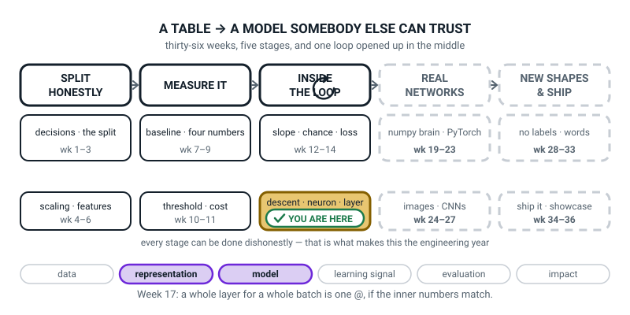

# Week 17 — A Layer Is a Grid Times a Grid

[⬅ Week 16](week-16.md) · [Course Home](../README.md) · [Week 18 ➡](week-18.md) · [Student Guide](../student-guide/week-17.md) · [Workbook](../workbook/week-17.md)

---

## 📋 At a Glance

| | |
|---|---|
| **Duration** | 70 minutes |
| **Type** | 🟦 Teach — one symbol replaces the loop, and the error it causes is the one they will see most for the rest of the year |
| **Big idea** | A whole layer for a whole batch is **one operation** — a grid times a grid — and it only works when the **inner numbers** of the two shapes match. |
| **New vocabulary** | matrix multiply · inner dimension · broadcasting · forward pass · softmax |
| **New maths** | **multiplying two grids**: `(3,2) @ (2,4) → (3,4)`, the inner numbers must match — computed cell by cell on real small numbers, with row 0 column 0 done as `1×10 + 2×50 = 110` |
| **New syntax** | `A @ B` · `arr.sum(axis=1, keepdims=True)` · `np.allclose(a, b)` |
| **Dataset** | Hand-typed 3×2 and 2×4 grids, then a hand-typed `(4, 2)` batch pushed through **2 → 3 → 1**. Every number small enough to check on paper. No files, no downloads. |
| **Materials** | **Twelve index cards** with one shape pair each, blank on the back (see 🧰) · a **blue pen** for the board trace · printed workbook pages 17.1–17.6 · the Bug Log · Week 16's four-row table still on the wall |
| **Tech needed** | Laptop with Python 3 and numpy. **No scikit-learn needed today, no PyTorch.** No internet. |
| **Prep time** | 20 minutes the night before · 5 minutes on the day |
| **Expected runtime of the code** | Every file today runs in **under a second**. Nothing trains. |

> **⚠️ Watch out:** the two temptations this week are equally fatal. The first is **teaching `@` as a rule to memorise** — "inner must match" chanted without a single cell ever being multiplied out. The second is **doing the twelve-cell multiply in full on the board**, which takes fourteen minutes and loses the room. Do exactly this instead: **compute three cells by hand, in full, out loud — `(0,0)`, `(1,2)` and `(2,3)` — and let numpy do the other nine.** Three is enough to see the pattern; twelve is arithmetic homework masquerading as teaching.

---

## 🎯 Lesson Objectives

By the end of the lesson the student can:

1. **Multiply a `(3,2)` grid by a `(2,4)` grid by hand**, computing at least three of the twelve output cells, and check them against numpy.
2. **State the shape rule** — inner two must match, outer two survive — and use it to **predict the output shape of twelve shape pairs**.
3. **Trace a full forward pass for a batch of four rows through a 2 → 3 → 1 network**, writing out every intermediate grid with its shape.
4. **Read a real shape-mismatch error, name the two numbers that failed to match, and fix it.**

Observable evidence: three output cells worked in longhand and ticked against the screen; twelve index cards sorted into two piles with the answer shape on the back of every card in the first pile; a board trace in blue pen showing `(4,2) → (4,3) → (4,1)` with the weight shapes written between the layers; and five pasted tracebacks with the two failing numbers circled in each.

---

## 🧑‍🏫 What YOU Need to Know First

> **📌 About the code blocks in this guide.** Outside the **🧰 Prep Checklist** and the **🔑 Answer Key**, the blocks are **illustrations, not whole files** — each one carries on from the one above. **The complete runnable files are in the Prep Checklist and the Answer Key.**

There is **one new mathematical idea** this week: how to multiply two grids of numbers. It is not hard — it is a lot of small multiplications and additions arranged in a particular pattern — but it is genuinely new, and it is the operation that every neural network in the world spends 99% of its time doing. Twenty minutes with this section is enough. If you only have ten, read §2 and §4.

### 1. Why this exists at all: the loop is too slow

Last week the class computed one neuron for one row with `(r * w).sum() + b`. A real network has sixteen neurons in a layer and hundreds of rows in a batch. Doing that with two nested Python loops means `16 × 750 = 12,000` trips round a loop, and Python loops are **slow** — roughly a hundred times slower than the same arithmetic done inside numpy.

**Matrix multiply is the fix.** One symbol, `@`, computes **every neuron for every row at once**, and it runs in machine code that somebody spent thirty years optimising. It is not a mathematical nicety; it is the difference between a model that trains in twenty seconds and one that trains overnight.

So the honest framing for the class is: *"you already know what a layer does. This week you learn to ask for the whole thing in one line, and the price of that convenience is that you have to get the shapes right."*

### 2. Matrix multiply, worked out in full, before any notation

> **matrix multiply** — take a row from the left grid and a column from the right grid, multiply them position by position, and add up the products. That one number goes in the answer. Do it for every row-column pair.

**Here are the two grids for the whole lesson.** Small, whole numbers, chosen so nothing needs a calculator:

```
A (3 rows, 2 columns)          B (2 rows, 4 columns)

[ 1  2 ]                       [ 10  20  30  40 ]
[ 3  4 ]                       [ 50  60  70  80 ]
[ 5  6 ]
```

> **🔢 The maths, slowly.** To get the number in the **top-left** of the answer, take the **first row of A** and the **first column of B**.
>
> First row of A: `1`, `2`. First column of B: reading **down**, `10`, `50`.
>
> Now pair them up in order and multiply:
>
> ```
> 1 × 10 = 10
> 2 × 50 = 100
> ```
>
> Add the two products: **`10 + 100 = 110`**.
>
> That is one cell. It cost two multiplications and one addition. **Row 0, column 0 of the answer is `110`.**

Do a second one so the pattern is visible rather than guessed. **Row 1, column 2:** second row of A is `3`, `4`; third column of B, read downwards, is `30`, `70`.

```
3 × 30 = 90
4 × 70 = 280
         ----
         370
```

And a third, from the far corner. **Row 2, column 3:** third row of A is `5`, `6`; fourth column of B is `40`, `80`.

```
5 × 40 = 200
6 × 80 = 480
         ----
         680
```

**The finished answer, all twelve cells:**

```
[ 110  140  170  200 ]
[ 230  300  370  440 ]
[ 350  460  570  680 ]
```

Three rows, four columns. **Shape `(3, 4)`.**


*Figure 17.1 — One output cell, multiplied out in full. `1 × 10 = 10`, `2 × 50 = 100`, and `10 + 100 = 110`.*

**Two things to notice, and say both out loud.** Each output cell needs exactly **two** multiplications, because A has two columns and B has two rows — that shared number is what gets consumed. And the answer has **three rows** (from A) and **four columns** (from B) — the two numbers that were *not* shared.

### 3. The shape rule, and where it comes from

> **inner dimension** — in `(3,2) @ (2,4)`, the two middle numbers: A's columns and B's rows. **They must be equal.**

```
(3, 2) @ (2, 4)  →  (3, 4)
    \____/
   these must match: 2 and 2

 \                \
  3 survives        4 survives
```

**The rule in eight words: inner two must match, outer two survive.**

**And it is not an arbitrary rule.** It comes straight out of §2: to make one output cell you pair up a row of A with a column of B, position by position. A row of A has as many numbers as A has columns. A column of B has as many numbers as B has rows. **If those two counts differ, there is nothing to pair the leftovers with, and the multiplication is not defined.** That is the whole explanation, and it is worth giving because a student who knows *why* can reconstruct the rule; a student who memorised it cannot.


*Figure 17.2 — The inner two numbers must match. The two 2s cancel and the outer numbers survive: 3 from A and 4 from B.*

**Twelve shape pairs, with the answers, because this is the activity and the homework:**

| Pair | Works? | Result / why not |
|---|---|---|
| `(3,2) @ (2,4)` | ✅ | `(3, 4)` |
| `(4,2) @ (2,3)` | ✅ | `(4, 3)` |
| `(4,3) @ (3,1)` | ✅ | `(4, 1)` |
| `(1,3) @ (3,1)` | ✅ | `(1, 1)` — one row, one column, **one number** |
| `(3,1) @ (1,3)` | ✅ | `(3, 3)` — the same two grids the other way round, and a totally different answer |
| `(2,2) @ (2,2)` | ✅ | `(2, 2)` |
| `(16,750) @ (750,1)` | ✅ | `(16, 1)` — the numbers can be huge; the rule does not care |
| `(2,750) @ (750,16)` | ✅ | `(2, 16)` |
| `(2,4) @ (3,2)` | ❌ | `4` against `3` |
| `(2,3) @ (1,4)` | ❌ | `3` against `1` |
| `(3,1) @ (5,2)` | ❌ | `1` against `5` |
| `(750,2) @ (16,1)` | ❌ | `2` against `16` |

**The two rows to spend time on are 4 and 5.** `(1,3) @ (3,1)` gives a single number; `(3,1) @ (1,3)` gives a 3×3 grid. **Same two grids, opposite order, and the answers are not even the same size.** Matrix multiply is *not* like ordinary multiplication — `A @ B` and `B @ A` are different things and usually only one of them is legal. That is the single most surprising fact of the week and it deserves its own thirty seconds.

### 4. Broadcasting: how one bias serves four rows

> **broadcasting** — numpy silently copying a small grid to fit a bigger one, so that a `(1, 3)` row of biases can be added to a `(4, 3)` grid of pre-activations.

Here is the situation. `X @ W1` gives four rows of three pre-activations. There are only **three** biases — one per hidden unit — and they have to be added to **all four** rows. Written out, numpy behaves as if the bias row were copied down:

```
X @ W1 (4, 3)                      b1, copied down (4, 3)
[  2.1    0.1   -0.2  ]            [ 0.1  0.05  -0.8 ]
[  0.2   -0.8    3.1  ]      +     [ 0.1  0.05  -0.8 ]
[  0.4    0.1   -0.35 ]            [ 0.1  0.05  -0.8 ]
[ -1.3    0.1   -0.5  ]            [ 0.1  0.05  -0.8 ]

=  Z1 (4, 3)
[  2.2    0.15  -1.0  ]
[  0.3   -0.75   2.3  ]
[  0.5    0.15  -1.15 ]
[ -1.2    0.15  -1.3  ]
```

**Check one cell out loud:** `2.1 + 0.1 = 2.2`. `−0.2 + (−0.8) = −1.0`. That is all broadcasting is — **the same three biases, applied to every row**, which is exactly right because a bias belongs to a *unit*, not to a *row of data*.

**The rule, in the only form the class needs it:** numpy lines the two shapes up from the **right-hand end** and, at each position, they must either be equal or one of them must be `1`. So `(4,3)` with `(1,3)` works — 3 matches 3, and the 1 stretches to 4. `(4,3)` with `(3,1)` does **not** — the 3 and the 1 are fine, but then 4 against 3 is not.

**The silent version, which is the one that will hurt somebody.** If the bias is accidentally shaped `(4, 1)` instead of `(1, 3)`, broadcasting **still works** and gives you a `(4, 3)` answer with no error at all — but it has added **one bias per row** instead of one per unit, and most of the numbers are wrong. There is a demonstration of exactly this in the Debugging Clinic, and it belongs in the lesson. **The dangerous shape bug is the one that does not crash.**

> **🧑‍🏫 If a student asks:** *"why don't we just store the bias as a flat `(3,)` list?"* — you can, and it works identically; numpy treats a flat `(3,)` as if it were `(1, 3)` for this purpose. **We use `(1, 3)` on purpose** because next week the backward pass produces a gradient for the bias, and keeping the bias 2-D means the gradient's shape matches the bias's shape exactly, with no surprises. It is a habit that pays off in Week 18.

### 5. The forward pass, traced for a batch of four rows

> **forward pass** — pushing data through the network from inputs to output, layer by layer, and keeping the intermediate grids.

**Today's network: 2 inputs → 3 hidden units with ReLU → 1 output with sigmoid.** Every weight is typed out. Note that the hidden layer's first two units are **exactly last week's two units**, so the numbers `2.20` and `0.15` will look familiar — that is deliberate, and worth pointing out.

```
X  (4, 2)              W1 (2, 3)                    b1 (1, 3)
[  1.0   2.0 ]         [ 0.5  -0.3   1.2 ]          [ 0.1  0.05  -0.8 ]
[  2.0  -1.0 ]         [ 0.8   0.2  -0.7 ]
[  0.0   0.5 ]
[ -1.0  -1.0 ]         W2 (3, 1)                    b2 (1, 1)
                       [  1.0 ]
                       [ -2.0 ]
                       [  0.5 ]
```

**Read `W1` the right way round, because this is where half the shape bugs come from.** `W1` is `(2, 3)`: **row `i` is input `i`, column `j` is hidden unit `j`.** So `W1[0][2] = 1.2` is the weight from input 1 to hidden unit 3. **Inputs down the side, units across the top. Always.**

> **🔢 The maths, slowly.** Row 0 of the batch is `x = [1.0, 2.0]`. Three hidden units, so three weighted sums, each using one **column** of `W1`:
>
> ```
> unit 1 (column 0):  1.0 × 0.5  + 2.0 × 0.8   + 0.1   =  0.5 + 1.6 + 0.1  =  2.20
> unit 2 (column 1):  1.0 × (−0.3) + 2.0 × 0.2 + 0.05  = −0.3 + 0.4 + 0.05 =  0.15
> unit 3 (column 2):  1.0 × 1.2  + 2.0 × (−0.7) − 0.8  =  1.2 − 1.4 − 0.8  = −1.00
> ```
>
> Now ReLU: `2.20` stays, `0.15` stays, **`−1.00` becomes `0`**. So `A1`'s first row is `[2.20, 0.15, 0]`.
>
> Then the output unit, using `W2`:
>
> ```
> Z2 = 2.20 × 1.0 + 0.15 × (−2.0) + 0 × 0.5 + 0.3 = 2.20 − 0.30 + 0 + 0.30 = 2.20
> A2 = sigmoid(2.20) = 1 ÷ (1 + e^(−2.20)) = 1 ÷ 1.110803 = 0.90024951
> ```
>
> **The network says 90.02% for row 0.** Nine multiplications and nine additions, and one exponential on the calculator.

**All four rows, so you can mark anything at a glance:**

| row | `Z1` | `A1` (after ReLU) | `Z2` | `A2` |
|---|---|---|---|---|
| `[1.0, 2.0]` | `2.20, 0.15, −1.00` | `2.20, 0.15, 0` | **2.20** | **0.900250** |
| `[2.0, −1.0]` | `0.30, −0.75, 2.30` | `0.30, 0, 2.30` | **1.75** | **0.851953** |
| `[0.0, 0.5]` | `0.50, 0.15, −1.15` | `0.50, 0.15, 0` | **0.50** | **0.622459** |
| `[−1.0, −1.0]` | `−1.20, 0.15, −1.30` | `0, 0.15, 0` | **0.00** | **0.500000** |

**And the shape ladder, which is the thing to write on the wall:**

```
X      (4, 2)
W1     (2, 3)   →   X @ W1   (4, 3)
b1     (1, 3)   →   Z1       (4, 3)      [broadcast down all four rows]
A1     (4, 3)
W2     (3, 1)   →   A1 @ W2  (4, 1)
b2     (1, 1)   →   Z2       (4, 1)
A2     (4, 1)                             one probability per row
```

**Say it out loud as a sentence, twice:** *"four by two, times two by three, gives four by three. Four by three, times three by one, gives four by one."* If the class cannot chant that, they cannot debug next week.


*Figure 17.3 — Follow the shapes through 2 to 3 to 1. `b1` is `(1, 3)` and gets copied down all four rows, which is called broadcasting.*

**Notice what stayed the same all the way through: the `4`.** Four rows went in, four probabilities came out, and every grid in between had four rows. **The batch size passes straight through a network untouched.** That is a genuinely useful thing to know, and it is the first sentence of the fix for most shape errors: *"which of my two numbers is the batch size?"*

### 6. Softmax, in one paragraph and one worked sum

> **softmax** — the squash for the output layer when there are **more than two** classes. It turns several raw scores into several probabilities that add up to exactly 1.

Sigmoid handles "spam or not spam". For "cat, dog or bird" you need three numbers that between them account for all the certainty you have. Softmax does it in two steps: **exponentiate everything, then divide by the total.**

> **🔢 The maths, slowly.** Suppose the three output units produce raw scores `[2.0, 1.0, 0.1]`.
>
> **Step one — `e^x` on each.** On a calculator: `e^2.0 = 7.389056`, `e^1.0 = 2.718282`, `e^0.1 = 1.105171`.
>
> Why exponentiate at all? Two reasons, both practical: it makes every number **positive** (probabilities cannot be negative), and it exaggerates differences, so a clear winner becomes a clear winner.
>
> **Step two — add them up and divide.** The total is `7.389056 + 2.718282 + 1.105171 = 11.212509`. Now:
>
> ```
> 7.389056 ÷ 11.212509 = 0.659001
> 2.718282 ÷ 11.212509 = 0.242433
> 1.105171 ÷ 11.212509 = 0.098566
> ```
>
> **Add those three: `0.659001 + 0.242433 + 0.098566 = 1.000000`.** Three proper probabilities.

**And this is where `keepdims` earns its keep.** The total, `11.212509`, has to be divided into a row of three numbers. In code:

```python
E = np.exp(Z)
P = E / E.sum(axis=1, keepdims=True)
```

`axis=1` means "add across each row". `keepdims=True` means "keep the answer 2-D" — so the total comes back as shape `(1, 1)` rather than a flat `(1,)`, and it broadcasts cleanly against the `(1, 3)` row above it. **Drop `keepdims` and you either get a wrong answer or a confusing error, depending on the shapes**, which is why the argument exists at all.

**Today, teach softmax as a squash and stop there.** Its gradient, and the fact that it pairs with a cross-entropy loss to give the same clean `p − y` form as sigmoid, is Week 26. Today it is a fourth squash with one worked sum beside it.

### 7. Every line of `forward.py`, explained to somebody who has never programmed

```python
import numpy as np

np.random.seed(0)
np.set_printoptions(precision=6, suppress=True)
```

Fetch the library; fix the dice; print six decimal places without scientific notation.

```python
X = np.array([[1.0, 2.0],
              [2.0, -1.0],
              [0.0, 0.5],
              [-1.0, -1.0]])
```

**Lists inside a list.** Four inner lists, so four rows; two numbers each, so two columns. Shape `(4, 2)`. **The convention for the whole year: one row per example, one column per feature.**

```python
W1 = np.array([[0.5, -0.3, 1.2],
               [0.8, 0.2, -0.7]])
b1 = np.array([[0.1, 0.05, -0.8]])
```

`W1` has two rows (one per input) and three columns (one per hidden unit): `(2, 3)`. `b1` has **two** sets of brackets, making it a `(1, 3)` grid rather than a flat `(3,)` list — one bias per unit, laid out as a single row.

```python
sigmoid = lambda z: 1.0 / (1.0 + np.exp(-z))
```

`lambda` is a one-line way of writing a small named recipe. This says: "`sigmoid` means, given `z`, hand back `1 ÷ (1 + e^(−z))`". It is Week 13's squasher.

```python
print("X  ", X.shape)
print("W1 ", W1.shape, "  b1", b1.shape)
```

**Last week's reflex, still first.** Print the shapes before you do anything with them.

```python
XW1 = X @ W1
```

**The line of the week.** `@` is matrix multiply. `(4,2) @ (2,3)` — inner numbers 2 and 2 agree, so it runs and gives `(4, 3)`. Twelve output cells, each one two multiplications and an addition, all done in machine code.

```python
Z1 = XW1 + b1
```

`(4, 3) + (1, 3)`. Broadcasting copies the three biases down all four rows.

```python
A1 = np.maximum(0, Z1)
```

Last week's ReLU, applied to all twelve cells at once. Shape unchanged: `(4, 3)`.

```python
Z2 = A1 @ W2 + b2
A2 = sigmoid(Z2)
```

The second layer, in one line each. `(4,3) @ (3,1)` gives `(4, 1)` — one raw score per row — and sigmoid turns each into a probability. **Four lines, and that is a whole neural network's forward pass.**

```python
print("Z1 agrees with my paper? ", np.allclose(Z1, by_hand_Z1))
```

`np.allclose(a, b)` asks: *"are these two grids the same, allowing for tiny floating-point wobble?"* It hands back one `True` or `False`. **It exists because `a == b` on decimals is a trap** — `0.1 + 0.2` is not exactly `0.3` in binary, so an exact test can fail on two answers that are genuinely identical. `np.allclose` allows a difference of about one part in a hundred thousand (relative, plus `1e-8` near zero) and calls that equal.

### 8. The three misconceptions you will actually meet

**Misconception 1 — "`A @ B` is the same as `A * B`."**
No, and this is the most consequential confusion of the week. `A * B` multiplies **matching cells** and needs the two shapes to be the same (or broadcastable). `A @ B` pairs **rows against columns**, sums the products, and needs the inner numbers to match. **They are different operations with different rules and different answers.** The demonstration takes fifteen seconds: `np.array([[1,2],[3,4]]) * np.array([[1,2],[3,4]])` gives `[[1,4],[9,16]]`; the same two with `@` gives `[[7,10],[15,22]]`.

**Misconception 2 — "if the shapes do not match I just transpose something until it runs."**
This *does* often make the error go away, and that is exactly the danger. A student who transposes at random until nothing crashes has a program that computes a confidently wrong number. **The cure is to say the sentence first:** *"four rows of two features, times two inputs by three units, gives four rows of three unit-outputs."* If the sentence makes sense, the shapes are right. If it does not, transposing will not save you.

**Misconception 3 — "the error message is unhelpful."**
It looks unhelpful because it is long, and students stop reading at `gufunc signature`. **The whole message is in the last six characters of the last line:** `size 3 is different from 2`. Two numbers. That is the diagnosis. Teach them to read the message **backwards**, last line first, and it becomes the most useful text on the screen. **This is the reading skill of the year, not just of the week.**

### 9. How deep to go, and where to stop

**Go this far:** three output cells of `(3,2) @ (2,4)` multiplied out in longhand and checked; the shape rule stated in eight words and applied to twelve pairs; broadcasting shown as a bias row copied down, including the silent `(4,1)` disaster; a full forward pass for four rows through 2 → 3 → 1 with the shape ladder written between the layers; five shape mismatches produced on purpose and read; softmax as a fourth squash with one worked sum; `np.allclose` used to compare a paper answer against numpy.

**Stop before:**

| Do not teach today | Where it lives |
|---|---|
| **Backpropagation, `A.T @ dZ`, gradients through a matrix multiply** | **Week 18, next week.** You may say "next week we run this backwards" and nothing more. Today's transposes are for *shape fixing* only. |
| **The identity `(AB)ᵀ = BᵀAᵀ`, or any matrix algebra law** | Never in this course. It is not needed and it costs the room. |
| Determinants, inverses, eigenvalues, matrix rank | Not in Level 3 at all. Nothing in this year needs them. |
| **Softmax's derivative, cross-entropy for many classes** | **Week 26.** Today softmax is a squash with a worked sum. |
| More than three hidden units, more than one hidden layer | **Week 19.** Three is enough to see the pattern and small enough to check on paper. |
| `np.dot`, `np.matmul`, `np.einsum` | Mention only if a student finds them online: `np.dot` and `@` do the same thing for 2-D grids; `@` is the modern spelling and the only one we use. |
| Timing comparisons, BLAS, why numpy is fast internally | One sentence — "somebody spent thirty years making this fast" — and move on. The optional timing experiment is in the harder variations. |
| `torch.matmul`, tensors, `nn.Linear` | **Weeks 20–22.** No torch this week. |

The line to hold all lesson: **say the shape sentence out loud before you type the line.**

---

### 10. 🧭 The Growing Map — the same box, the third of four weeks

The student guide carries a figure called **Where This Fits**: the same picture every week with one
more piece filled in. This week nothing moves again, and that is the point worth making out loud — the
tile is four weeks long and they are three weeks into it.



*Figure 17.0 — Week 17's version. Third week inside the gold `descent · neuron · layer` tile. The ↻ on
stage three is black, as it has been since Week 12, because the training loop is open.*

**What to do with it, in about two minutes at the end of the lesson:**

1. **Ask "which box did we do today?" and then "which word?"** Same gold tile as the last two weeks,
   *descent · neuron · layer*; the word is **layer**. Then the one-sentence history: *"Week 15 was one
   step downhill, Week 16 was one neuron, today was a whole layer of them for four rows at once. Next
   week is the thing that holds all three together."*
2. **Anchor it on the blue trace still on the board.** Point at `(4,2) → (4,3) → (4,1)` and ask *"which
   number never changes down that ladder, and why?"* The answer is the `4`: **the batch rides through
   untouched**, because a matrix multiply only ever consumes the inner dimension. A student who can say
   that has understood today's box better than one who can recite "inner must match."
3. **Point at stage four and say what today was not.** `REAL NETWORKS` is still dashed. *"We can now
   push four rows through two layers. Nothing learned today — no gradients, no update. That is next
   week, and then Week 19 is when it becomes a network that trains."* The dash is the honest answer to
   *"have we built a neural network yet?"*, which somebody will ask today.

> **🧑‍🏫 Why this is worth two minutes.** Today is the week a student most easily believes they have
> fallen behind: the code is short, nothing trains, and the error they spent twenty minutes on was
> about a bracket full of numbers. The map reframes that. The shape rule they practised today is the
> single most-used debugging tool in the eight weeks on the right-hand side of this picture — the two
> dashed stages are made of `@`, thousands of times over.

**One thing to notice, so you can answer if asked.** The threads are unchanged from last week —
`representation` and `model` — and `learning signal` is still dark. That is deliberate and worth saying:
**nothing learned today.** The forward pass is the model *describing* the batch, and the description
`(4, 3)` is a representation exactly as Week 4's scaling was. The signal comes back on next week, and
it does not switch off again for the rest of the level.

---

## 🧰 Prep Checklist

### 20 minutes the night before

- [ ] **Write the twelve Shape Dominoes cards.** One shape pair per index card, thick pen, **blank on the back**:

```
WORKS (8):
   (3,2) x (2,4)      (4,2) x (2,3)      (4,3) x (3,1)     (1,3) x (3,1)
   (3,1) x (1,3)      (2,2) x (2,2)      (16,750) x (750,1)  (2,750) x (750,16)

DOES NOT (4):
   (2,4) x (3,2)      (2,3) x (1,4)      (3,1) x (5,2)     (750,2) x (16,1)
```

  **Shuffle them.** The sorting is the activity; a pre-sorted deck is a worksheet.

- [ ] **Type and run `matmul.py` yourself.** The complete file:

```python
"""matmul.py - a grid times a grid, cell by cell."""
import numpy as np

np.random.seed(0)

A = np.array([[1, 2],
              [3, 4],
              [5, 6]])
B = np.array([[10, 20, 30, 40],
              [50, 60, 70, 80]])

print("A.shape =", A.shape, "  B.shape =", B.shape)
C = A @ B
print("C = A @ B")
print(C)
print("C.shape =", C.shape)
print()
print("row 0 col 0 by hand: 1*10 + 2*50 =", 1 * 10 + 2 * 50, " numpy:", C[0, 0])
print("row 1 col 2 by hand: 3*30 + 4*70 =", 3 * 30 + 4 * 70, " numpy:", C[1, 2])
print("row 2 col 3 by hand: 5*40 + 6*80 =", 5 * 40 + 6 * 80, " numpy:", C[2, 3])
```

You must see **exactly** this:

```text
A.shape = (3, 2)   B.shape = (2, 4)
C = A @ B
[[110 140 170 200]
 [230 300 370 440]
 [350 460 570 680]]
C.shape = (3, 4)

row 0 col 0 by hand: 1*10 + 2*50 = 110  numpy: 110
row 1 col 2 by hand: 3*30 + 4*70 = 370  numpy: 370
row 2 col 3 by hand: 5*40 + 6*80 = 680  numpy: 680
```

**Runtime: well under a second.**

- [ ] **Type and run `forward.py` yourself.** The complete file:

```python
"""forward.py - a batch of four rows through 2 -> 3 -> 1."""
import numpy as np

np.random.seed(0)
np.set_printoptions(precision=6, suppress=True)

X = np.array([[1.0, 2.0],
              [2.0, -1.0],
              [0.0, 0.5],
              [-1.0, -1.0]])

W1 = np.array([[0.5, -0.3, 1.2],
               [0.8, 0.2, -0.7]])
b1 = np.array([[0.1, 0.05, -0.8]])

W2 = np.array([[1.0],
               [-2.0],
               [0.5]])
b2 = np.array([[0.3]])

sigmoid = lambda z: 1.0 / (1.0 + np.exp(-z))

print("X  ", X.shape)
print("W1 ", W1.shape, "  b1", b1.shape)
print("W2 ", W2.shape, "  b2", b2.shape)
print()

XW1 = X @ W1
print("X @ W1        ", XW1.shape)
print(XW1)
Z1 = XW1 + b1
print("Z1 = X @ W1 + b1", Z1.shape)
print(Z1)
A1 = np.maximum(0, Z1)
print("A1 = ReLU(Z1) ", A1.shape)
print(A1)
Z2 = A1 @ W2 + b2
print("Z2 = A1 @ W2 + b2", Z2.shape)
print(Z2)
A2 = sigmoid(Z2)
print("A2 = sigmoid(Z2)", A2.shape)
print(A2)
```

Real output — the whole thing, and you will point at it repeatedly:

```text
X   (4, 2)
W1  (2, 3)   b1 (1, 3)
W2  (3, 1)   b2 (1, 1)

X @ W1         (4, 3)
[[ 2.1   0.1  -0.2 ]
 [ 0.2  -0.8   3.1 ]
 [ 0.4   0.1  -0.35]
 [-1.3   0.1  -0.5 ]]
Z1 = X @ W1 + b1 (4, 3)
[[ 2.2   0.15 -1.  ]
 [ 0.3  -0.75  2.3 ]
 [ 0.5   0.15 -1.15]
 [-1.2   0.15 -1.3 ]]
A1 = ReLU(Z1)  (4, 3)
[[2.2  0.15 0.  ]
 [0.3  0.   2.3 ]
 [0.5  0.15 0.  ]
 [0.   0.15 0.  ]]
Z2 = A1 @ W2 + b2 (4, 1)
[[2.2 ]
 [1.75]
 [0.5 ]
 [0.  ]]
A2 = sigmoid(Z2) (4, 1)
[[0.90025 ]
 [0.851953]
 [0.622459]
 [0.5     ]]
```

**Runtime: under a second.**

- [ ] **Run `break_five_ways.py`** (all five files are in the Answer Key, page 17.4) so all five messages are familiar. Especially the **fifth**, which produces **no error at all**.
- [ ] **Run `bcast.py`** and **`softmax.py`** (Answer Key, pages 17.5 and 17.6). **Under a second each.**
- [ ] **Do these on a calculator yourself**, or you cannot answer *"where did 0.90025 come from?"*:

| Keys | Result |
|---|---|
| `2.2`, negative, `e^x` | `0.110803` |
| `+1 =`, `1/x` | **`0.900250`** |
| `1.75`, negative, `e^x`, `+1 =`, `1/x` | **`0.851953`** |
| `2.0`, `e^x` | `7.389056` (softmax step one) |

- [ ] **Break it on purpose, twice**, so both deliberate mistakes are muscle memory:
  1. Build `W1` as `(3, 2)` instead of `(2, 3)`. Real message ends `size 3 is different from 2`.
  2. Shape `b1` as `(4, 1)` instead of `(1, 3)`. **No error at all.** The numbers are simply wrong.
- [ ] **Print workbook pages 17.1–17.6.**
- [ ] **Find a blue pen.** The board trace of the forward pass is done in blue, and next week's backward pass goes over the same diagram in red. Two colours, two directions.

### 5 minutes on the day

- [ ] Twelve cards shuffled on the desk.
- [ ] Editor open, terminal ready. **`matmul.py` and `forward.py` deleted or renamed** — they type them.
- [ ] `A` and `B` already on the board, top-left, with their shapes labelled `(3, 2)` and `(2, 4)`.
- [ ] Week 16's four-row table still on the wall. You will point at `2.20` and `0.15` and say "you have seen these before".
- [ ] Blue pen in your hand. Bug Log out.

### Fallback if the laptops fail

**This week survives a power cut almost intact**, because the activity is index cards and the maths is whole numbers.

1. **The three-cell multiply, on the board.** `110`, `370`, `680`. No computer can do this better than a piece of chalk. **That is objective 1.**
2. **Shape Dominoes in full**, and give it twenty-five minutes instead of twenty. Twelve cards sorted, eight backs written. **That is objective 2, completely.**
3. **The forward pass, by hand, in blue pen.** Four rows × three units is twelve weighted sums. With the class racing you in pairs it takes about fifteen minutes, and the shape ladder goes on the wall at the end. **That is objective 3.**
4. **The five mismatches, spoken.** Read each broken shape pair aloud and have the class shout the two failing numbers. `(2,4) @ (3,2)` → *"four against three!"* **That is objective 4 without a screen**, and it is arguably better as a chant than as a traceback.
5. **Softmax on three calculators.** `e^2.0`, `e^1.0`, `e^0.1`, add, divide three times, check the total is `1.000000`. Six minutes.

| If this fails | Do this instead |
|---|---|
| `ValueError: matmul: Input operand 1 has a mismatch in its core dimension 0 ... (size 3 is different from 2)` | The inner numbers disagree. **Read only the bracket at the end.** Print both shapes and look at A's second number against B's first. |
| `ValueError: operands could not be broadcast together with shapes (4,3) (3,1)` | This is `+`, not `@`. Line the shapes up from the right: 3 against 1 is fine, then 4 against 3 is not. The bias should be `(1, 3)`. |
| The answer runs but most numbers are wrong (nine of twelve here), and the shape is right | Almost certainly the bias is shaped `(4, 1)` — one bias per row instead of one per unit. **This is the silent bug and it is in the Clinic.** |
| A student transposed things until it ran and now cannot explain the result | Make them say the sentence: *"four rows of two features, times two inputs by three units."* If the sentence is nonsense, so is the code. |
| `TypeError: unsupported operand type(s) for @: 'list' and 'list'` | They forgot `np.array(...)`. Plain Python lists have no `@`. |
| `ValueError: could not broadcast input array` on `b1` | `b1` was written with one set of brackets, making it `(3,)`, and then reshaped wrongly. Write `np.array([[0.1, 0.05, -0.8]])` — **two** sets of brackets. |
| Everything runs, `A2` has four numbers, and a student asks which is which | Row order is preserved end to end. `A2[0]` is the answer for `X[0]`. **The batch dimension never moves.** |
| `np.allclose` says `False` and the student cannot find the difference | `print(np.abs(mine - theirs).max())` gives the biggest gap. If it is about `0.05`, it is a typo; if it is about `1e-16`, it is rounding and `allclose` would have said `True` — so check they compared the right two grids. |

---

## ⏱️ The Lesson, Minute by Minute

| Segment | Minutes | Running total | What happens |
|---|---|---|---|
| 🪝 Hook — Twelve Thousand Trips Round a Loop | 7 | 7 | Count the loop trips, then say one symbol replaces them |
| 🧠 Concept & Maths — Three Cells, Then the Rule | 18 | 25 | `1×10 + 2×50 = 110` in longhand; the eight-word rule; broadcasting |
| 💻 Live-Code Together — `matmul.py` then `forward.py` | 18 | 43 | Both files, the shape ladder, **two deliberate mistakes** |
| 🎲 Their Turn — Shape Dominoes, then the Board Trace | 20 | 63 | Twelve cards sorted, backs written, then 4 → 3 → 2 in blue pen |
| 🔑 Wrap & Assign | 7 | 70 | Three checks, softmax in ninety seconds, homework |

---

### 🪝 Hook — Twelve Thousand Trips Round a Loop (7 minutes)

**Do this:** Laptops shut. On the board, write only this:

```
750 rows of data
 16 neurons in the layer
```

**Say this:**

> "Last week you computed one neuron for one row. Multiply, add, squash — and it took you about forty seconds with a calculator.
>
> Now here is a small, ordinary layer. Sixteen neurons. And here is a small, ordinary batch of data: seven hundred and fifty rows.
>
> **How many weighted sums is that?**"

*`750 × 16 = 12,000`.* Write it up, large.

> "Twelve thousand. And each one of those is two multiplications and an addition, if there are two features — so about thirty-six thousand little arithmetic operations, and that is **one** forward pass through **one** layer.
>
> In Week 19 you will train a network for five hundred rounds. So that is twelve thousand, times five hundred, times two because there is a backward pass as well. **Twelve million trips round a Python loop.**
>
> Python loops are slow. Not a bit slow — about a hundred times slower than the same arithmetic done inside numpy. Twelve million of them would have you sitting here for a very long time."

**Ask this:** "So what would you want to be able to say to the computer instead?"

*Hoped-for answer:* something like "do all of them at once", "one instruction for the whole grid".

> **Say this:** "Exactly that. And there is a single symbol that does it. **One character.** It computes every neuron for every row in one go, and it runs in code that people have been optimising since before your parents were born.
>
> The symbol is **`@`**, and it means **grid times grid**.
>
> There is exactly one price. To use it, **you have to get the shapes right** — and when you get them wrong, you get an error message that you will see more times this year than any other. So today we are going to do two things: work out what `@` actually computes, by hand, on numbers small enough to check. And then break it on purpose five times so that message stops being frightening."

**Ask this:** "Last week's reflex. When something is confusing, what is the first thing you print?"

*The shape.* Good. **"Hold on to that. Today it stops being a good habit and becomes the whole job."**

---

### 🧠 Concept & Maths — Three Cells, Then the Rule (18 minutes)

**Do this (8 min) — the three cells, in longhand.** Write `A` and `B` on the board with their shapes:

```
A (3, 2)          B (2, 4)
[ 1  2 ]          [ 10  20  30  40 ]
[ 3  4 ]          [ 50  60  70  80 ]
[ 5  6 ]
```

> **Say this:** "Here is what `A @ B` means, and it is one sentence: **take a row from the left, take a column from the right, multiply them position by position, add up the products.** That number goes in the answer.
>
> Let us do the top-left cell together. First row of A — read it out. **One, two.** First column of B — read it **downwards**. **Ten, fifty.**"

**Do this:** Write it in longhand, slowly:

```
1 × 10 = 10
2 × 50 = 100
         ---
         110
```

> **Say this:** "One hundred and ten. **That is one cell of the answer**, and it cost two multiplications and one addition. Nothing clever happened."

**Ask this:** "Row 1, column 2. Which row of A, and which column of B?"

*Second row of A (`3, 4`); third column of B (`30, 70`).*

*If they take the third row of A:* gently — "row 1 with computers, so counting from zero. Row 0, row 1, row 2." **This is worth ten seconds because every index in every error message this year counts from zero.**

Work it: `3 × 30 = 90`, `4 × 70 = 280`, **`370`**. Then let a student do row 2, column 3: `5 × 40 = 200`, `6 × 80 = 480`, **`680`**.

**Do this (5 min) — the rule, and where it comes from.** Write on the board:

```
(3, 2) @ (2, 4)  →  (3, 4)
    \____/
   these two must match
```

> **Say this:** "**Inner two must match, outer two survive.** Eight words, and you will use them for the rest of your life.
>
> And it is not a rule somebody made up. Look at what we just did. A row of A has **two** numbers in it, because A has two columns. A column of B has **two** numbers in it, because B has two rows. **They paired up perfectly.** If A had three columns and B had two rows, one number in the row would have nothing to pair with, and the operation just would not mean anything."

**Ask this:** "What is `(4,3) @ (3,1)`?"

*`(4, 1)`.* Then, quickly: `(1,3) @ (3,1)`? *`(1, 1)` — one single number.* Then the interesting one:

**Ask this:** "`(3,1) @ (1,3)`. Same two grids, other way round."

*Hoped-for answer:* `(3, 3)`.

> **Say this:** "Three by three. **Nine numbers, from the same two grids that a moment ago gave you one.**
>
> So write this down, because it is the surprising fact of the week: **`A @ B` and `B @ A` are not the same thing.** Usually only one of them is even legal, and when both are legal they give different-sized answers. Grid multiplication is not like multiplying six by seven."

**Do this (5 min) — broadcasting, on the board.** Write:

```
X @ W1  is (4, 3)      four rows, three units
b1      is (1, 3)      three biases, one per unit
```

**Ask this:** "There are twelve numbers in the first grid and three in the second. How can you add them?"

*Hoped-for answer:* use each bias three— no, four times; copy the bias row down.

> **Say this:** "numpy copies the bias row down all four rows. It does not really make four copies in memory — it is cleverer than that — but that is exactly what it behaves like. This is called **broadcasting**.
>
> And it is not a convenience, it is **correct**. A bias belongs to a **unit**, not to a row of data. Hidden unit 2 has one bias, and it uses that same bias for every single row that ever comes through. So of course it gets copied down.
>
> The rule, if you want it: line the two shapes up **from the right-hand end**. At each position they must either be equal, or one of them must be a 1. `(4,3)` against `(1,3)`: three matches three, and the one stretches to four. Fine.
>
> Now here is the one to be frightened of. If I shape my biases `(4, 1)` by accident — four biases, one per **row** — that also broadcasts perfectly. **No error. No warning. Twelve numbers, and nine of them wrong.**"

**Do this:** Show it, because saying it is not enough:

```text
with the right b1, shape (1, 3)
[[ 2.2   0.15 -1.  ]
 [ 0.3  -0.75  2.3 ]
 [ 0.5   0.15 -1.15]
 [-1.2   0.15 -1.3 ]]
with b1 shape (4, 1) - no error at all:
[[ 2.2   0.2  -0.1 ]
 [ 0.25 -0.75  3.15]
 [-0.4  -0.7  -1.15]
 [-1.1   0.3  -0.3 ]]
shape of the wrong answer: (4, 3)
```

> **Say this:** "Same shape. Completely different numbers. **A shape error that crashes is your friend. A shape error that runs is the one that costs you a week.**"

---

### 💻 Live-Code Together — `matmul.py` then `forward.py` (18 minutes)

**You never touch their keyboard.**

**Step 1 (5 min) — `matmul.py`, and the three ticks.**

```python
import numpy as np

np.random.seed(0)

A = np.array([[1, 2], [3, 4], [5, 6]])
B = np.array([[10, 20, 30, 40], [50, 60, 70, 80]])

print("A.shape =", A.shape, "  B.shape =", B.shape)
C = A @ B
print(C)
print("C.shape =", C.shape)
```

```text
A.shape = (3, 2)   B.shape = (2, 4)
[[110 140 170 200]
 [230 300 370 440]
 [350 460 570 680]]
C.shape = (3, 4)
```

**Do this:** Walk to the board and put a tick beside `110`, `370` and `680`. Say each one out loud as you tick it.

> **Say this:** "Three of the twelve, done by hand, and numpy got the same three. The other nine are the same arithmetic and I am not going to make you do them — **but you now know exactly what they are.** That is the difference between using `@` and trusting `@`."

**Step 2 (5 min) — 🐞 DELIBERATE MISTAKE ONE: `W1` built the wrong way round.**

Start `forward.py`, and build `W1` as `(3, 2)`:

```python
X = np.array([[1.0, 2.0], [2.0, -1.0], [0.0, 0.5], [-1.0, -1.0]])
W1 = np.array([[0.5, 0.8], [-0.3, 0.2], [1.2, -0.7]])
b1 = np.array([[0.1, 0.05, -0.8]])

print("X ", X.shape, " W1", W1.shape)
Z1 = X @ W1 + b1
print(Z1)
```

Real output:

```text
X  (4, 2)  W1 (3, 2)
Traceback (most recent call last):
  File "forward.py", line 10, in <module>
    Z1 = X @ W1 + b1
ValueError: matmul: Input operand 1 has a mismatch in its core dimension 0, with gufunc signature (n?,k),(k,m?)->(n?,m?) (size 3 is different from 2)
```

**Do this:** Say nothing for five seconds. Then cover the middle of the message with your hand, leaving only the very end visible: **`(size 3 is different from 2)`**.

**Ask this:** "Ignore everything except what my hand is not covering. Where do the 3 and the 2 come from?"

*Hoped-for answer:* the 2 is X's columns; the 3 is W1's rows.

> **Say this:** "That is it. That is the entire message. **The 2 is `X`'s second number — two features. The 3 is `W1`'s first number — three rows.** The inner numbers are 2 and 3, and they do not match.
>
> Everything in the middle of that traceback — `gufunc signature`, `core dimension 0`, all of it — is numpy telling you which internal machinery complained. **You are allowed to not read it.** Read the last line, and inside the last line read the bracket at the end, and inside the bracket read the two numbers. That is the diagnosis.
>
> **Read error messages backwards.** It is the single most useful reading habit in programming."

**Do this:** Fix it — `W1` must be `(2, 3)`: **inputs down the side, units across the top.** Re-run and get real numbers. **Bug Log, ninety seconds**, with the sentence *"read the bracket at the end of the last line."*

**Step 3 (5 min) — the shape ladder, printed.**

```python
XW1 = X @ W1
print("X @ W1        ", XW1.shape)
Z1 = XW1 + b1
print("Z1            ", Z1.shape)
A1 = np.maximum(0, Z1)
print("A1            ", A1.shape)
Z2 = A1 @ W2 + b2
print("Z2            ", Z2.shape)
A2 = sigmoid(Z2)
print("A2            ", A2.shape)
print(A2)
```

```text
X @ W1         (4, 3)
Z1             (4, 3)
A1             (4, 3)
Z2             (4, 1)
A2             (4, 1)
[[0.90025 ]
 [0.851953]
 [0.622459]
 [0.5     ]]
```

**Ask this:** "One number appears in every single shape on that list. Which, and why?"

*Hoped-for answer:* the `4` — the batch size.

> **Say this:** "The four. Four rows went in and four probabilities came out, and every grid in between had four rows. **The batch size passes straight through a network untouched.**
>
> That is the first question to ask whenever a shape looks wrong: *which of my two numbers is the batch size?* If the answer is 'the second one', you have got something the wrong way round."

**Do this:** Point at the wall, at last week's table. `A1`'s first row is `[2.2, 0.15, 0]`. **`2.2` and `0.15` are exactly last week's two hidden units.**

> **Say this:** "Look at that. Two point two and nought point one five — you computed those last Tuesday with a piece of card and five people. **Same weights, same inputs, same numbers.** All that has changed is that numpy did all four rows and all three units in one line, and it took about a millionth of a second."

**Step 4 (3 min) — 🐞 DELIBERATE MISTAKE TWO: the silent bias.**

Change `b1` to `np.array([[0.1], [0.05], [-0.8], [0.2]])` — shape `(4, 1)`. Re-run.

**No error.** `Z1` prints, shape `(4, 3)`, and the numbers are:

```text
[[ 2.2   0.2  -0.1 ]
 [ 0.25 -0.75  3.15]
 [-0.4  -0.7  -1.15]
 [-1.1   0.3  -0.3 ]]
```

**Ask this:** "It ran. The shape is right. Is the answer right?"

Let them hunt. The tell is the second column: with the correct bias every entry of column 1 gets `+0.05`; here row 1 got `+0.05`, row 2 got `−0.8`, row 3 got `+0.2`.

> **Say this:** "It gave each **row** its own bias instead of giving each **unit** its own bias. Which is a completely different network, and there was not one word of warning.
>
> **This is why we say the sentence out loud before we type the line.** 'Three biases, one per hidden unit, added to every row.' `(1, 3)`. If you say that first, you cannot type `(4, 1)`."

**Bug Log** — as a *"no error, wrong answer"* entry.

---

### 🎲 Their Turn — Shape Dominoes, then the Board Trace (20 minutes)

Full instructions in **🎲 The Activity, In Full** below. In outline: twelve shape-pair cards sorted into two piles, the answer shape written on the back of every card in the first pile, the two failing numbers written on the back of every card in the second. Then a **4 → 3 → 2** forward pass traced on the board in blue pen, with every grid's shape annotated between the layers.

---

### 🔑 Wrap & Assign (7 minutes)

**Do this:** Stand at the shape ladder. Write four things beneath it:

```
A @ B                inner two must match, outer two survive
(4,2) @ (2,3) = (4,3)   say it out loud BEFORE you type it
b1 is (1, 3)         one bias per UNIT, broadcast down every row
last line, last bracket, two numbers    how to read the error
```

**Say this:**

> "Four things, and that is the week.
>
> **`@` is grid times grid.** A row from the left, a column from the right, multiply position by position, add. You did three of the twelve cells by hand and numpy agreed with all three.
>
> **Inner two must match, outer two survive.** Eight words. `(4,2) @ (2,3)` gives `(4,3)`, and you say that out loud before you type it, every time.
>
> **A bias belongs to a unit, not to a row.** `(1, 3)`, broadcast down. And if you get that wrong in the direction that still runs, nothing at all will tell you.
>
> **And when it breaks: last line, last bracket, two numbers.** You will read that message more times this year than any other sentence in English. It is not frightening; it is a diagnosis with the answer in it."

**Do this — softmax, ninety seconds, on the board.** This is the fifth piece of vocabulary and it needs exactly one worked sum.

```
three raw scores:   2.0     1.0     0.1

e^x:             7.389056  2.718282  1.105171     total 11.212509

divide:          0.659001  0.242433  0.098566     total  1.000000
```

> **Say this:** "Sigmoid gives you one probability, for a yes-or-no question. When there are **three** answers — cat, dog, bird — you need three numbers that add up to one, and that is **softmax**. Exponentiate everything so nothing is negative, then divide by the total so it all adds to one.
>
> Sixty-six per cent, twenty-four, ten. Add them up: one point zero zero zero. That is all it is, and you will use it properly in Week 26 when you classify ten different handwritten digits."

**Do this:** Three quick checks — exact wording in **✅ Assessing Understanding**.

**Say this, to close:**

> "One thing is missing, and it is next week's whole lesson.
>
> Today we pushed numbers **forwards** — inputs to answer. The network said ninety per cent for row one and it happened to be right. But suppose it had been badly wrong. **Which of the nine weights would you change, and by how much?**
>
> There are nine weights in that little network, and four biases. Thirteen knobs. Next week you find out how to work out how much **each one of the thirteen** contributed to the error — and you do it in one sweep backwards along the same wires you just went forwards along.
>
> Keep the blue trace on the board. Next week I am going over it in red."

**Do this:** Hand out the homework. Read the second half out loud, slowly.

---

## 🐞 The Debugging Clinic

Every message below came from running a broken version of this week's actual code.

| What the student sees (real message) | What it means | Most likely cause | The fix |
|---|---|---|---|
| `ValueError: matmul: Input operand 1 has a mismatch in its core dimension 0, with gufunc signature (n?,k),(k,m?)->(n?,m?) (size 3 is different from 2)` | "The inner two numbers do not match: I found 3 where I needed 2." | `W1` built as `(3, 2)` when `X` is `(4, 2)`. The weight grid is the wrong way round. | `W1` must be **`(2, 3)`** — inputs down the side, units across the top. Diagnose with `print(X.shape, W1.shape)` and compare the middle two numbers. |
| `ValueError: matmul: ... (size 1 is different from 3)` | Same problem, different two numbers. | `W2` built as `(1, 3)` when `A1` is `(4, 3)`. | `W2` must be `(3, 1)`. The rule never changes: A's columns = B's rows. |
| `ValueError: operands could not be broadcast together with shapes (4,3) (3,1)` | "I cannot stretch these two to the same size." | The bias written as a column, `(3, 1)`, instead of a row, `(1, 3)`. | `np.array([[0.1, 0.05, -0.8]])` — **two** sets of brackets, one row, three numbers. |
| `ValueError: operands could not be broadcast together with shapes (4,3) (1,4)` | Same, but the bias has the wrong *count*. | Four biases for three hidden units. | One bias per unit. Count the columns of `W1`. |
| `TypeError: unsupported operand type(s) for @: 'list' and 'list'` | "Plain Python lists do not know how to do `@`." | `np.array(...)` forgotten around one or both grids. | Wrap both: `np.array([[1, 2], [3, 4]])`. |
| `ValueError: matmul: Input operand 0 does not have enough dimensions (has 1, gufunc core with signature (n?,k),(k,m?)->(n?,m?) requires 2)` | "One of these is flat, and `@` wants grids." | A row typed as `np.array([1.0, 2.0])` — shape `(2,)` — instead of `np.array([[1.0, 2.0]])`. | Add the outer brackets, or `.reshape(1, 2)`. |
| **No error. Shape is right, most numbers are wrong (nine of twelve).** | Nothing crashed. | The bias is `(4, 1)` — one per **row** — instead of `(1, 3)` — one per **unit**. Broadcasting happily obliges. | Print `b1.shape`. It must have the same second number as `W1`'s second number. **This is the dangerous one.** |
| **No error. `A2` has the wrong number of rows.** | Nothing crashed. | `X` was transposed somewhere — `(2, 4)` instead of `(4, 2)`. | The batch size must be the **first** number of every grid in the ladder. Print the whole ladder and find where the 4 disappeared. |
| `np.allclose(mine, theirs)` prints `False` and nothing looks wrong | The two grids genuinely differ somewhere. | One arithmetic slip on paper, usually a dropped bias or a sign. | `print(np.abs(mine - theirs).max())`. A gap of about `0.05` is a typo; a gap of about `1e-16` means you compared the wrong pair, because `allclose` would have said `True`. |
| `AxisError: axis 1 is out of bounds for array of dimension 1` | "You asked me to add across the columns of something that has no columns." | `.sum(axis=1)` on a flat `(3,)` array. | Make it 2-D first, or use `axis=0`. This is why `keepdims=True` matters — it stops things silently going flat. |
| **No error. Softmax's row does not add to 1.** | Nothing crashed. | `keepdims=True` left off, so the division lined up wrongly; or `axis=0` used instead of `axis=1`. | `E / E.sum(axis=1, keepdims=True)`. Then check: `P.sum(axis=1)` must print `[1.]`. |

### How to teach debugging without giving the answer

All the old moves stand. This week adds the two that will carry the rest of the year.

23. **"Read the last line. Now read only the bracket at the end of it. Tell me the two numbers."** Do not let them read the middle of a numpy traceback — it is machinery, not information. The two numbers in the final bracket are the diagnosis, every time.

24. **"Say the sentence before you type the line."** *"Four rows of two features, times two inputs by three units, gives four rows of three unit-outputs."* If a student cannot say it, the fix is not a transpose, it is a think. **This is the move that prevents transpose-until-it-runs**, which is the worst habit available this week.

And the sentence for this week:

> **"Inner two must match, outer two survive. And if it runs but the numbers are wrong, check the bias: one per unit, not one per row."**

---

## 🎲 The Activity, In Full

### Shape Dominoes, then the Board Trace

**What it is.** Two halves. First, twelve index cards get sorted into "these multiply" and "these do not", and the answer shape gets written on the back of every card in the first pile — that is objective 2, and doing it with cards rather than a worksheet means the sorting is physical and the pile sizes are visible from across the room. Then the whole class traces a **4 → 3 → 2** forward pass on the board in blue pen with every shape annotated — that is objective 3, and the blue pen matters because next week goes over it in red.

### Setup

- **Twelve index cards**, shuffled, one shape pair each, blank backs. The deck is in the Prep Checklist.
- Two labelled areas on a desk or the floor: **THESE MULTIPLY** and **THESE DO NOT**.
- A blue pen, and a clear half-board.
- Workbook pages 17.2 (the twelve pairs) and 17.3 (the forward pass).


*Figure 17.4 — Shape Dominoes: the card, and the two piles. The front reads `(3,2) × (2,4)` with the two 2s boxed; the back reads `(3, 4)`.*

### Part 1 — sort the deck (8 minutes)

> **"Twelve cards. Each one is two shapes. Sort them into two piles: these multiply, these do not. **Do not write anything yet.** Ninety seconds."**

Then:

> **"Now go through the 'these multiply' pile and write the answer shape on the back of every card. And go through the other pile and write **the two numbers that failed to match** on the back of each of those. Not 'doesn't work' — the two numbers."**

**The answers, so you can mark by walking past:**

| Card | Pile | Back of card |
|---|---|---|
| `(3,2) × (2,4)` | ✅ | `(3, 4)` |
| `(4,2) × (2,3)` | ✅ | `(4, 3)` |
| `(4,3) × (3,1)` | ✅ | `(4, 1)` |
| `(1,3) × (3,1)` | ✅ | `(1, 1)` |
| `(3,1) × (1,3)` | ✅ | `(3, 3)` |
| `(2,2) × (2,2)` | ✅ | `(2, 2)` |
| `(16,750) × (750,1)` | ✅ | `(16, 1)` |
| `(2,750) × (750,16)` | ✅ | `(2, 16)` |
| `(2,4) × (3,2)` | ❌ | `4 vs 3` |
| `(2,3) × (1,4)` | ❌ | `3 vs 1` |
| `(3,1) × (5,2)` | ❌ | `1 vs 5` |
| `(750,2) × (16,1)` | ❌ | `2 vs 16` |

**Eight in the first pile, four in the second.** Announce those two counts before they start if the class needs a safety net; withhold them if they do not.

**Watch for exactly two failure modes.** First, `(3,1) × (1,3)` put in the "does not" pile — it looks wrong, because a 1 in the middle feels degenerate, but `1 = 1` and it produces a `(3, 3)` grid. **Have the student who spots it explain it to the room.** Second, the big-number cards being skipped as "too hard". They are the easiest: `750 = 750`, so it works, and the answer is `(16, 1)`. **The rule does not care how big the numbers are**, and saying that once is worth more than three worked examples.

**Then the verification, in one line each on a laptop** — this is where `@` and the shape rule meet:

```text
(3, 2)     @ (2, 4)     -> (3, 4)      works
(4, 2)     @ (2, 3)     -> (4, 3)      works
(4, 3)     @ (3, 1)     -> (4, 1)      works
(1, 3)     @ (3, 1)     -> (1, 1)      works
(3, 1)     @ (1, 3)     -> (3, 3)      works
(2, 2)     @ (2, 2)     -> (2, 2)      works
(16, 750)  @ (750, 1)   -> (16, 1)     works
(2, 750)   @ (750, 16)  -> (2, 16)     works
(2, 4)     @ (3, 2)     -> NO          size 3 is different from 4
(2, 3)     @ (1, 4)     -> NO          size 1 is different from 3
(3, 1)     @ (5, 2)     -> NO          size 5 is different from 1
(750, 2)   @ (16, 1)    -> NO          size 16 is different from 2
```


*Figure 17.5 — Shape Dominoes, sorted. Eight multiply, four do not, each crossed out with the failing pair named.*

### Part 2 — the board trace, in blue (12 minutes)

**Do this:** Clear a wide space. Announce a **new** network — deliberately not the one in the code, so it cannot be copied:

> **"Four features in. Three hidden units. Two outputs. A batch of five rows. Trace it."**

Draw it in **blue**, left to right, and make the class supply every shape. Write each grid as a labelled block, and write the weight shape **on the wire between** the layers:

```
X (5, 4)  --[ W1 (4, 3) ]-->  Z1 (5, 3)  --ReLU-->  A1 (5, 3)
                              + b1 (1, 3)

A1 (5, 3) --[ W2 (3, 2) ]-->  Z2 (5, 2)  --softmax-->  A2 (5, 2)
                              + b2 (1, 2)
```

**Ask, one shape at a time, and make them say the full sentence each time:**

| You ask | They must say |
|---|---|
| "What shape is `X`?" | `(5, 4)` — five rows, four features |
| "What shape must `W1` be?" | `(4, 3)` — four inputs down the side, three units across |
| "Say the multiplication." | "five by four, times four by three, gives five by three" |
| "What shape is `b1`?" | `(1, 3)` — one bias per unit |
| "Does ReLU change the shape?" | No — `(5, 3)` in, `(5, 3)` out |
| "What shape must `W2` be?" | `(3, 2)` — three inputs, two outputs |
| "Say it." | "five by three, times three by two, gives five by two" |
| "What shape is `A2`, and what is in it?" | `(5, 2)` — for each of five rows, two probabilities that add to 1 |

**The three moments to slow down for.** When somebody says `W1` is `(3, 4)`, do not correct — ask them to say the multiplication sentence and let it fail in their own mouth. When ReLU comes up, ask explicitly whether it changes the shape; a surprising number of students expect it to. And at `A2`, ask **"what do the two numbers in one row add up to?"** — `1`, because it is softmax, and that connects the last ninety seconds of the lesson to the trace.


*Figure 17.6 — Follow the shapes through 2 to 3 to 1. The pairs of inner numbers that have to agree, the two 2s and the two 3s, are boxed and joined underneath.*

**Do this:** When it is complete, draw a box round the whole thing and label it **FORWARD (blue)**. Leave room underneath.

> **Say this:** "Leave that on the board. Next week we go the other way along exactly those wires, in red, and work out how much each weight contributed to the error. **Same diagram, opposite direction.**"

### What "finished" looks like

- Twelve cards in two piles of **eight and four**, every back written — answer shapes on the first pile, failing number pairs on the second.
- The 5 → 3 → 2 trace on the board in blue, with a shape on every block and a weight shape on every wire.
- Each student able to chant, unprompted: **"five by four, times four by three, gives five by three."**
- Two Bug Log entries minimum, one of which is the **silent** bias bug.

### Variation — easier

**Give them six cards, not twelve** — four that work and two that do not: `(3,2)×(2,4)`, `(4,2)×(2,3)`, `(4,3)×(3,1)`, `(2,2)×(2,2)`, `(2,4)×(3,2)`, `(2,3)×(1,4)`. Skip the big-number cards entirely.

**Do the board trace for the network already in the code** — 2 → 3 → 1, batch of 4 — rather than a new one, so the shapes are on the screen to check against.

**The version of the maths that skips everything hard.** One cell, in longhand, with the numbers written out for them:

```
first row of A:        1   2
first column of B:    10  50

        1 × 10 = ____
        2 × 50 = ____
                 ----
                 ____
```

Fill in `10`, `100`, `110`. **Then find `110` on the screen.** That is objective 1 in three blanks, and it is enough.

**The copy-this-exactly scaffold.** Eight lines, runs alone:

```python
import numpy as np

A = np.array([[1, 2], [3, 4], [5, 6]])
B = np.array([[10, 20, 30, 40], [50, 60, 70, 80]])

print("A is", A.shape, "and B is", B.shape)
print("so A @ B must be", (A @ B).shape)
print(A @ B)
```

```text
A is (3, 2) and B is (2, 4)
so A @ B must be (3, 4)
[[110 140 170 200]
 [230 300 370 440]
 [350 460 570 680]]
```

Then three questions. **"Which two numbers had to match?"** (The two 2s.) **"Where did the 3 come from, and where did the 4 come from?"** (A and B.) **"What is `1 × 10 + 2 × 50`?"** (110 — and it is the top-left number on the screen.)

**One thing you must not cut:** three cells multiplied out by hand. If the student only ever sees `@` produce a grid, `@` is magic, and next week's backward pass has nothing to stand on.

### Variation — harder

1. **Compute all twelve cells of `A @ B` by hand** and check with `np.allclose`. It is twenty-four multiplications; a fast student does it in six minutes and owns the operation completely.
2. **`A @ B` versus `B @ A` for a pair where both are legal.** `(2,2) @ (2,2)` both ways with `A = [[1,2],[3,4]]` and `B = [[0,1],[1,0]]`. Different answers, same shape. **Ask them to explain in one sentence why order matters here but not for `6 × 7`.**
3. **Time it.** Build a `(500, 200)` grid and a `(200, 300)` grid, multiply them with `@`, then write the same thing with three nested Python loops on a `(50, 20) @ (20, 30)` version and time both. The ratio is enormous, and it makes the hook's argument concrete.
4. **The `keepdims` experiment.** Compute a softmax with `keepdims=True` and then without, on a `(4, 3)` grid, and explain the difference. Without it the totals come back as `(4,)`, which broadcasts along the **wrong axis** and silently produces nonsense. **This is a genuinely nasty bug and finding it unaided is a level-5 moment.**
5. **Predict then verify all twelve mismatch messages.** For each of the four failing cards, write down the two numbers you expect in the error, then produce it. Four for four is a real achievement.
6. **The honest question:** *"why is the bias a separate grid at all? Could you fold it into the weights?"* You can — add a column of 1s to `X` and an extra row to `W1`, and the bias becomes just another weight. It is a real technique with a real name (the bias trick). **Ask why we do not: because it makes the shapes harder to read, and shape clarity is worth more than elegance here.**

---

## ❓ Questions Students Ask This Week

**"Why is it row-times-column and not just cell-times-cell? That would be simpler."**

It would, and numpy has that too — it is `*`, and the class has used it since Week 15.

The reason `@` exists is that **cell-times-cell is not what a layer does.** A layer takes *all* the features of one row and combines them into *one* number per neuron. That is a row of data meeting a column of weights: pair them up, multiply, add. `@` is that operation, done for every row and every neuron at once.

So the honest answer is: `*` and `@` are both useful and they do different jobs. `*` is for "apply this to each cell" — like a bias, or a ReLU mask. `@` is for "combine a whole row into one number". **Confusing them is the misconception of the week**, and it is worth them hearing that it happens to everybody.

**"How do I remember which way round the weights go?"**

Say the sentence, and the shape falls out of it. *"Two inputs, three units."* `(2, 3)`. **Inputs down the side, units across the top.**

And there is a reason it has to be that way rather than a convention someone picked: `X` is `(rows, features)`, so its second number is features. For `X @ W1` to work, `W1`'s **first** number must be features. Everything else follows. **If you remember one thing, remember that data has rows first — and then the rest of the ladder is forced.**

**"What happens if the batch has one row? Or a million?"**

Nothing changes except the first number. `(1, 2) @ (2, 3)` gives `(1, 3)`. `(1000000, 2) @ (2, 3)` gives `(1000000, 3)`. **The weights do not know or care how many rows arrive**, which is exactly why the same trained network can score one email or ten million.

That is worth pausing on, because it is the reason a model is *reusable*. The weight shapes are fixed by the architecture; the batch size is fixed by whatever you happen to be predicting right now.

**"The error message is horrible. Do professionals really read that?"**

They read about ten characters of it, and so should you.

Here is the honest truth about numpy tracebacks: **the middle is written for the people who maintain numpy, not for you.** `gufunc signature (n?,k),(k,m?)->(n?,m?)` is a precise description of what matrix multiply requires, and it is genuinely useful — to about four hundred people worldwide.

**What everybody actually does** is read the last line, and inside it the bracket at the end: `size 3 is different from 2`. Two numbers. Then print both shapes and see which is which. That takes about eight seconds and it works every time. **Learning to skip the parts of a message that are not for you is a real professional skill**, not laziness.

**"Is `@` doing anything clever, or is it just a loop written by someone else?"**

Mostly the second, and *very* well. Underneath, `@` calls a library — usually one called BLAS — that has been optimised for about forty years: it arranges the numbers so they arrive in the processor's fastest memory in the right order, uses instructions that do four or eight multiplications at once, and splits the work across processor cores.

**There are also genuinely cleverer algorithms** that do fewer multiplications than the row-times-column method, and this is an area where **nobody fully agrees**. Strassen's method from 1969 does an `(n,n) @ (n,n)` multiply with about `n^2.81` operations instead of `n^3`, and there are newer methods with better exponents that are **too complicated to be faster in practice on real hardware**. So the theoretically best known method is not the one in your numpy. **People argue about this at conferences**, the record gets broken every few years by a fraction, and the practical answer stays "use the well-optimised obvious algorithm". That gap between theory and practice is real and worth knowing about.

**"Why does softmax use `e` and not just divide by the total?"**

Two reasons, and both are practical rather than deep.

**One: negatives.** Raw scores can be negative. If your three scores were `[2.0, −1.0, 0.5]` and you just divided by the total (`1.5`), you would get `[1.33, −0.67, 0.33]` — a negative probability, which is meaningless, and one above 1. `e^x` is always positive, so dividing after exponentiating always gives numbers between 0 and 1.

**Two: it sharpens.** `e^x` grows fast, so a score that is a bit higher becomes a probability that is a lot higher. `[2.0, 1.0, 0.1]` — the top score is twice the middle one, but softmax gives `0.659` against `0.242`, nearly three times. That is usually what you want from a classifier: **decisiveness.**

**"Do we ever need three grids multiplied together?"**

Constantly, and it is exactly what the forward pass is: `X @ W1` then that `@ W2`. Written in one go it would be `X @ W1 @ W2`, and it reads left to right — but **we never write it that way**, because the ReLU has to go in between, and because splitting it up is what lets you print the shape at every step.

That is a real habit, not a beginner's crutch. Professionals write the forward pass one line per layer with the intermediate values kept, precisely so they can print them when something goes wrong. **And next week you will need those intermediate values anyway**, because the backward pass reuses every single one.

---

## ⚠️ Where This Lesson Goes Wrong

| What happens | Why | What to do right now |
|---|---|---|
| **`@` is taught as a rule and no cell is ever multiplied out** | The rule is short and the arithmetic is dull | **Do three cells in longhand.** `1×10 + 2×50 = 110` on the board. Without it, `@` is magic, and next week's backward pass — which is the same operation with a transpose — has nothing to stand on. |
| **All twelve cells get computed on the board** | Wanting to be thorough | It takes fourteen minutes and the room leaves. **Three cells, then let numpy do nine.** Twelve cells is a stretch activity, not a lesson. |
| A student transposes at random until nothing crashes | It genuinely works, often | **Stop them and make them say the sentence.** *"Five rows of four features, times four inputs by three units."* If the sentence is nonsense, so is the program — and the program that runs is worse than the one that crashes. |
| The silent `(4, 1)` bias never gets shown | It is a subtle bug and there is a lot to fit in | It is **deliberate mistake two** and it is on the schedule at minute 40. **Cut something else.** A shape error that crashes teaches you to read a message; a shape error that runs teaches you humility, and it is the one that will cost them a week in Week 19. |
| Broadcasting gets described as "numpy being helpful" | It sounds helpful | It is *correct*, not helpful: a bias belongs to a unit and is reused for every row. Framing it as convenience makes the `(4, 1)` disaster feel like bad luck rather than a wrong statement about the world. |
| The middle of the traceback gets read out in full | It looks like it must matter | **Cover it with your hand.** Show only `(size 3 is different from 2)`. Then say plainly that the middle is for numpy's maintainers. Teaching them to skip it is a gift. |
| Softmax expands into ten minutes on multi-class classification | It is interesting and the class asks | **Ninety seconds, one worked sum, done.** It is the fifth vocabulary item and it has no job today. Week 26 gives it a whole lesson and ten digits to classify. |
| The board trace is done in the same colour as everything else | There is one pen on the ledge | Find a blue one. Next week goes over the **same** diagram in red, and the two-colour forward/backward picture is the single most useful image of Term 2. |
| Nobody says the shape sentence out loud | It feels babyish | **Make it a chant and do it four times.** "Four by two, times two by three, gives four by three." It sounds silly for about ninety seconds and then it starts catching their own bugs for them. |
| The `(3,1) @ (1,3)` card gets sorted as "does not work" and quietly corrected by you | It looks degenerate | **Have the student who got it right explain it**, not you. `1 = 1`, so it works, and it produces nine numbers from four. It is the most surprising card in the deck and it should be a moment. |

---

## 🧭 Differentiation

### If the student is struggling

**Cut:** the deck from twelve cards to six — four that work, two that do not. Drop the two big-number cards.

**Cut:** the new 5 → 3 → 2 board trace. Trace the network that is already on the screen, 2 → 3 → 1 with four rows, so every shape can be checked against a printout.

**Cut:** softmax entirely. It is vocabulary with no job today and it returns in Week 26 with a whole lesson attached.

**Give them `matmul.py` and `forward.py` complete.** All of today's learning is in the shapes and the three hand-computed cells, none of it is in typing four lists of numbers.

**The version of the maths that skips everything hard.** One cell, with the blanks already drawn:

| Fill in | Answer |
|---|---|
| first row of `A` | `1`, `2` |
| first column of `B`, read **downwards** | `10`, `50` |
| `1 × 10` | `10` |
| `2 × 50` | `100` |
| add them | **`110`** |

**Five blanks, and the last one is on the screen.** Then one shape question: *"A is three by two, B is two by four — which two numbers had to be the same?"* **That is objectives 1 and 2 in about four minutes.**

**The copy-this-exactly scaffold.** Six lines, runs alone:

```python
import numpy as np

X = np.array([[1.0, 2.0]])
W1 = np.array([[0.5, -0.3, 1.2], [0.8, 0.2, -0.7]])
print("X is", X.shape, "and W1 is", W1.shape, "so X @ W1 is", (X @ W1).shape)
print(X @ W1)
```

```text
X is (1, 2) and W1 is (2, 3) so X @ W1 is (1, 3)
[[ 2.1  0.1 -0.2]]
```

Then three questions. **"How many numbers came out?"** (Three — one per hidden unit.) **"Where does the 3 come from?"** (`W1`'s second number.) **"What is `1 × 0.5 + 2 × 0.8`?"** (`2.1` — and that is the first number on the screen.)

**One thing you must not cut:** the sentence said out loud. *"One row of two features, times two inputs by three units, gives one row of three unit-outputs."* If a student leaves able to say that and nothing else, they can debug next week.

### If the student is flying

None of these need syntax from a later week.

1. **All twelve cells by hand**, checked with `np.allclose` (harder variation 1). Twenty-four multiplications and complete ownership of the operation.
2. **`A @ B` versus `B @ A` where both are legal** (harder variation 2), with a written sentence on why order matters here and not for ordinary numbers.
3. **The `keepdims` experiment** (harder variation 4). Genuinely nasty, completely silent, and diagnosing it unaided is the deepest thing available today.
4. **Timing `@` against three nested loops** (harder variation 3). It turns the hook's argument into a measured ratio.
5. **Predict all four mismatch messages before producing them** (harder variation 5). Four for four means they have internalised which number the error reports first — and the answer is surprising: numpy reports **B's rows** before **A's columns**, so `(2,4) @ (3,2)` says `size 3 is different from 4`.
6. **The honest challenge:** *"fold the bias into the weights."* Add a column of `1.0` to `X`, add a row to `W1`, drop `b1` entirely, and prove with `np.allclose` that the answer is identical. Then the real question: **why don't we?** Because the shapes stop being readable, and this year shape clarity is worth more than elegance. **A student who does this and then argues for keeping the bias separate has understood something about engineering, not just maths.**

### If the student won't engage today

**Close the laptop. Twelve cards on the table.**

Shape Dominoes is a sorting game and it does not feel like schoolwork. Deal the twelve cards face up and say nothing except:

> **"Two piles. These work, these don't. You have got two minutes and I am not going to tell you the rule."**

Most students find the rule themselves in under two minutes, because eight of the twelve have matching middle numbers and the pattern is visible. **Discovering the rule is better than being told it**, and it is objective 2 delivered by a card game.

Then one card, `(3,2) × (2,4)`, and one question:

> **"You said this one works. Prove it. Here are the actual numbers."**

Give them `A` and `B` and ask for **only the top-left number of the answer**. `1 × 10 + 2 × 50 = 110`. One cell. **That is objective 1**, and they did it because they had already committed to the card working.

If they will go one step further, hand them the deck and ask them to **make a thirteenth card that works and a fourteenth that does not**. Inventing a valid pair is proof of the rule in a way that answering twelve is not.

The typing survives; Week 18 uses every one of these shapes again, backwards.

---

## ✅ Assessing Understanding

Three checks, five minutes, exact wording.

**Check 1 — one cell, by hand (spoken, 60 seconds)**

> "`A` is `[[1, 2], [3, 4], [5, 6]]`. `B` is `[[10, 20, 30, 40], [50, 60, 70, 80]]`. **Give me the number in row 1, column 1 of `A @ B`, and show me the two multiplications.**"

*Good answer:* "Row 1 of A is `3, 4`. Column 1 of B is `20, 60`. So `3 × 20 = 60` and `4 × 60 = 240`, and `60 + 240 = 300`."

**What to catch:** taking the *second* row and the *second* column but counting from one — that gives row 2, column 2, which is `460`. Ask *"how do computers count?"* and wait for "from zero".

**Check 2 — the shape rule (spoken, 45 seconds)**

> "I have a batch of **twenty** rows with **five** features, and I want a hidden layer of **eight** units. **What shape must the weight grid be, what shape is the bias, and what shape comes out?**"

*Good answer:* "`W1` is `(5, 8)` — five inputs down, eight units across. `b1` is `(1, 8)` — one bias per unit. Out comes `(20, 8)`. Twenty by five, times five by eight, gives twenty by eight."

**Full marks needs the sentence.** A student who gives three correct shapes but cannot chant the multiplication has memorised a pattern; the sentence is what makes it transferable.

**Check 3 — the error, and the silent one (spoken, 90 seconds)**

> "Two quick ones. **First:** my code says `size 3 is different from 2`. My `X` is `(4, 2)`. What is wrong with my weight grid? **Second:** my code runs with no error at all, the output shape is exactly what I expected, and most of the numbers are wrong. What is the first thing you would check?"

*Good answer:* "Your `W1` has three rows and it needs two, because `X` has two features. So it is the wrong way round — it should be `(2, something)`. And for the second one I'd check the bias shape: if it is `(4, 1)` instead of `(1, 3)`, broadcasting still works but it gives each row a bias instead of each unit, and nothing warns you."

**What to catch:** "I'd transpose it until it works" for the first part. Push once: *"and how would you know you transposed the right thing?"* The answer is the sentence.

### Mastery scale for this week

| Level | What it looks like |
|---|---|
| **1 — Not yet** | Cannot produce one output cell even with the row and column pointed out. Reads `(3,2) @ (2,4)` and guesses the answer shape. Stops reading a traceback at the word `gufunc`. |
| **2 — Emerging** | Computes a cell when told which row and which column to use. Applies "inner must match" to easy pairs. Finds the two numbers in an error message when prompted. |
| **3 — Secure** | Computes three cells unaided; predicts the output shape of most of the twelve pairs; traces `(4,2) → (4,3) → (4,1)` and says the multiplication sentence out loud; reads a mismatch error and names both numbers. **This is the target.** |
| **4 — Strong** | Gets twelve out of twelve, including `(3,1) @ (1,3)` and the big-number pairs. Says the shape sentence before typing, unprompted. Diagnoses a shape error by printing both shapes rather than by trial and error. Knows the bias is `(1, n_units)` and can say why. |
| **5 — Exceptional** | Spots the silent `(4, 1)` bias bug without being shown it. Explains that `A @ B` and `B @ A` are different operations, not the same one reordered. Notices that numpy reports B's rows before A's columns in the error message. Explains why keeping the layers on separate lines matters (the intermediates are needed next week). Can fold the bias into the weights, prove it identical, and then argue for not doing it. |

---

## 📤 Homework to Assign

**Say this:**

> "About an hour, two pages, and the second one asks you to break things on purpose.
>
> **First, page 17.3 — the full forward pass, by hand.** Four rows of two features, through three hidden units, to one output. Every intermediate grid written out: `X @ W1`, then `Z1`, then `A1`, then `Z2`, then `A2`. **And a shape written beside every single grid.** Then type it into numpy and check your paper answers with `np.allclose`. Three `True`s, or find your own slip.
>
> **Second, page 17.4 — break it five ways.** Five deliberate shape mismatches. For each one: **predict what will happen in one sentence, then run it, then paste the real error message**, and **circle the two numbers in it that failed to match.**
>
> And listen for this bit, because it is the one that matters: **one of the five does not produce an error at all.** It runs perfectly, the shape comes out exactly right, and most of the numbers are wrong. Your job on that one is to work out **which numbers are wrong and why**, and write two sentences about it."

**Workbook pages:** 17.1, 17.2 and 17.5 in class · **17.3 and 17.4** at home · **17.6** stretch, for anybody who wants softmax on a batch of four rows.

**Expected time:** 30 min on the forward pass by hand plus the numpy check · 25 min on the five breakages and the two sentences. **About 55 minutes.**

> **🧑‍🏫 What to look for when you mark it:** three things, and the third is the real one. **One — is there a shape written beside every intermediate grid on page 17.3?** A correct `A1` with no `(4, 3)` beside it is half a mark; the shapes are the point of the page. **Two — are the error messages pasted verbatim, with the two numbers circled?** *"Shape error"* is not a result; `size 3 is different from 2` with a ring round the 3 and the 2 is. **Three — do the two sentences about the silent breakage name the difference between a unit and a row?** The answer that earns full marks is some version of *"it gave every row its own bias instead of giving every unit its own bias, so column 2 got `+0.05` on one row and `−0.8` on another."* A student who writes *"the bias was the wrong shape"* has the diagnosis and not the understanding, and that is worth one line: **"which thing is a bias supposed to belong to?"**

---

## 🔑 Answer Key

Every question restated, so you can mark from this page alone.

### Page 17.1 — `(3,2) @ (2,4)`, three cells in longhand

*Compute at least cells `(0,0)`, `(1,2)` and `(2,3)` by hand. Then check all twelve with numpy.*

```
A (3, 2)          B (2, 4)
[ 1  2 ]          [ 10  20  30  40 ]
[ 3  4 ]          [ 50  60  70  80 ]
[ 5  6 ]
```

**Cell (0, 0)** — row 0 of A is `1, 2`; column 0 of B is `10, 50`:

```
1 × 10 = 10
2 × 50 = 100
         ----
         110
```

**Cell (1, 2)** — row 1 of A is `3, 4`; column 2 of B is `30, 70`:

```
3 × 30 = 90
4 × 70 = 280
         ----
         370
```

**Cell (2, 3)** — row 2 of A is `5, 6`; column 3 of B is `40, 80`:

```
5 × 40 = 200
6 × 80 = 480
         ----
         680
```

**And all twelve, for marking a student who did the harder variation:**

| | col 0 | col 1 | col 2 | col 3 |
|---|---|---|---|---|
| **row 0** | `1×10+2×50 =` **110** | `1×20+2×60 =` **140** | `1×30+2×70 =` **170** | `1×40+2×80 =` **200** |
| **row 1** | `3×10+4×50 =` **230** | `3×20+4×60 =` **300** | `3×30+4×70 =` **370** | `3×40+4×80 =` **440** |
| **row 2** | `5×10+6×50 =` **350** | `5×20+6×60 =` **460** | `5×30+6×70 =` **570** | `5×40+6×80 =` **680** |

**The script, and its real output:**

```python
"""matmul.py - a grid times a grid, cell by cell."""
import numpy as np

np.random.seed(0)

A = np.array([[1, 2],
              [3, 4],
              [5, 6]])
B = np.array([[10, 20, 30, 40],
              [50, 60, 70, 80]])

print("A.shape =", A.shape, "  B.shape =", B.shape)
C = A @ B
print("C = A @ B")
print(C)
print("C.shape =", C.shape)
print()
print("row 0 col 0 by hand: 1*10 + 2*50 =", 1 * 10 + 2 * 50, " numpy:", C[0, 0])
print("row 1 col 2 by hand: 3*30 + 4*70 =", 3 * 30 + 4 * 70, " numpy:", C[1, 2])
print("row 2 col 3 by hand: 5*40 + 6*80 =", 5 * 40 + 6 * 80, " numpy:", C[2, 3])
```

```text
A.shape = (3, 2)   B.shape = (2, 4)
C = A @ B
[[110 140 170 200]
 [230 300 370 440]
 [350 460 570 680]]
C.shape = (3, 4)

row 0 col 0 by hand: 1*10 + 2*50 = 110  numpy: 110
row 1 col 2 by hand: 3*30 + 4*70 = 370  numpy: 370
row 2 col 3 by hand: 5*40 + 6*80 = 680  numpy: 680
```

**And the reverse, which is worth showing:**

```python
print(B @ A)
```

```text
Traceback (most recent call last):
  File "bad_matmul.py", line 4, in <module>
    print(B @ A)
ValueError: matmul: Input operand 1 has a mismatch in its core dimension 0, with gufunc signature (n?,k),(k,m?)->(n?,m?) (size 3 is different from 4)
```

`(2,4) @ (3,2)`: the inner numbers are `4` and `3`. **Note the order in the message — it names B's rows (3) first, then A's columns (4).** Nobody guesses that; everybody notices it once.

### Page 17.2 — Twelve shape pairs

| # | Pair | Works? | Answer / failing numbers |
|:--:|---|:--:|---|
| 1 | `(3,2) @ (2,4)` | ✅ | **`(3, 4)`** |
| 2 | `(4,2) @ (2,3)` | ✅ | **`(4, 3)`** |
| 3 | `(4,3) @ (3,1)` | ✅ | **`(4, 1)`** |
| 4 | `(1,3) @ (3,1)` | ✅ | **`(1, 1)`** — one row, one column: a single number |
| 5 | `(3,1) @ (1,3)` | ✅ | **`(3, 3)`** — same two grids as #4, reversed, nine numbers |
| 6 | `(2,2) @ (2,2)` | ✅ | **`(2, 2)`** |
| 7 | `(16,750) @ (750,1)` | ✅ | **`(16, 1)`** — the rule does not care how big the numbers are |
| 8 | `(2,750) @ (750,16)` | ✅ | **`(2, 16)`** |
| 9 | `(2,4) @ (3,2)` | ❌ | `size 3 is different from 4` |
| 10 | `(2,3) @ (1,4)` | ❌ | `size 1 is different from 3` |
| 11 | `(3,1) @ (5,2)` | ❌ | `size 5 is different from 1` |
| 12 | `(750,2) @ (16,1)` | ❌ | `size 16 is different from 2` |

**The script, and its real output:**

```python
"""dominoes.py - twelve shape pairs, sorted by machine."""
import numpy as np

np.random.seed(0)

pairs = [((3, 2), (2, 4)), ((4, 2), (2, 3)), ((4, 3), (3, 1)), ((1, 3), (3, 1)),
         ((3, 1), (1, 3)), ((2, 2), (2, 2)), ((16, 750), (750, 1)), ((2, 750), (750, 16)),
         ((2, 4), (3, 2)), ((2, 3), (1, 4)), ((3, 1), (5, 2)), ((750, 2), (16, 1))]

for sa, sb in pairs:
    A = np.zeros(sa)
    B = np.zeros(sb)
    try:
        C = A @ B
        print("%-10s @ %-10s -> %-10s  works" % (sa, sb, C.shape))
    except ValueError as e:
        msg = str(e).split("(")[-1].rstrip(")")
        print("%-10s @ %-10s -> %-10s  %s" % (sa, sb, "NO", msg))
```

```text
(3, 2)     @ (2, 4)     -> (3, 4)      works
(4, 2)     @ (2, 3)     -> (4, 3)      works
(4, 3)     @ (3, 1)     -> (4, 1)      works
(1, 3)     @ (3, 1)     -> (1, 1)      works
(3, 1)     @ (1, 3)     -> (3, 3)      works
(2, 2)     @ (2, 2)     -> (2, 2)      works
(16, 750)  @ (750, 1)   -> (16, 1)     works
(2, 750)   @ (750, 16)  -> (2, 16)     works
(2, 4)     @ (3, 2)     -> NO          size 3 is different from 4
(2, 3)     @ (1, 4)     -> NO          size 1 is different from 3
(3, 1)     @ (5, 2)     -> NO          size 5 is different from 1
(750, 2)   @ (16, 1)    -> NO          size 16 is different from 2
```

**Note `np.zeros(sa)` builds a grid of that shape filled with zeros** — the *values* are irrelevant when you are only testing whether the shapes are compatible, and that is a genuinely useful trick to show.

### Page 17.3 — The full forward pass, by hand and then in numpy

*Four rows, 2 → 3 → 1. Write out every intermediate grid with its shape.*

```
X (4, 2)               W1 (2, 3)                b1 (1, 3)
[  1.0   2.0 ]         [ 0.5  -0.3   1.2 ]      [ 0.1  0.05  -0.8 ]
[  2.0  -1.0 ]         [ 0.8   0.2  -0.7 ]
[  0.0   0.5 ]
[ -1.0  -1.0 ]         W2 (3, 1)                b2 (1, 1)
                       [  1.0 ]                 [ 0.3 ]
                       [ -2.0 ]
                       [  0.5 ]
```

**Step 1 — `X @ W1`, shape `(4, 3)`.** Twelve cells. All twelve, worked:

| row | unit 1 (col 0 of W1) | unit 2 (col 1) | unit 3 (col 2) |
|---|---|---|---|
| `[1.0, 2.0]` | `1(0.5) + 2(0.8) = 2.1` | `1(−0.3) + 2(0.2) = 0.1` | `1(1.2) + 2(−0.7) = −0.2` |
| `[2.0, −1.0]` | `2(0.5) + (−1)(0.8) = 0.2` | `2(−0.3) + (−1)(0.2) = −0.8` | `2(1.2) + (−1)(−0.7) = 3.1` |
| `[0.0, 0.5]` | `0 + 0.5(0.8) = 0.4` | `0 + 0.5(0.2) = 0.1` | `0 + 0.5(−0.7) = −0.35` |
| `[−1.0, −1.0]` | `−0.5 − 0.8 = −1.3` | `0.3 − 0.2 = 0.1` | `−1.2 + 0.7 = −0.5` |

**Step 2 — `Z1 = X @ W1 + b1`, shape `(4, 3)`.** Add `0.1`, `0.05`, `−0.8` to **every** row:

```
[  2.2    0.15  -1.0  ]
[  0.3   -0.75   2.3  ]
[  0.5    0.15  -1.15 ]
[ -1.2    0.15  -1.3  ]
```

**Step 3 — `A1 = ReLU(Z1)`, shape `(4, 3)`.** Negatives to zero:

```
[ 2.2   0.15  0.0 ]
[ 0.3   0.0   2.3 ]
[ 0.5   0.15  0.0 ]
[ 0.0   0.15  0.0 ]
```

**Five of the twelve are zero.** Point that out when marking: the third hidden unit fires on exactly one of the four rows, and unit 1 is silent on the last row. **That patchiness is the network bending.**

**Step 4 — `Z2 = A1 @ W2 + b2`, shape `(4, 1)`.** `W2` is `[1.0, −2.0, 0.5]` as a column, plus `0.3`:

```
row 0:  2.2(1.0) + 0.15(−2.0) + 0(0.5) + 0.3  =  2.2 − 0.3 + 0 + 0.3  =  2.20
row 1:  0.3(1.0) + 0(−2.0) + 2.3(0.5) + 0.3   =  0.3 + 0 + 1.15 + 0.3 =  1.75
row 2:  0.5(1.0) + 0.15(−2.0) + 0(0.5) + 0.3  =  0.5 − 0.3 + 0 + 0.3  =  0.50
row 3:  0(1.0) + 0.15(−2.0) + 0(0.5) + 0.3    =  0 − 0.3 + 0 + 0.3    =  0.00
```

**Step 5 — `A2 = sigmoid(Z2)`, shape `(4, 1)`:**

```
sigmoid(2.20) = 1 ÷ (1 + e^(−2.20)) = 1 ÷ 1.110803 = 0.900250
sigmoid(1.75) = 1 ÷ (1 + e^(−1.75)) = 1 ÷ 1.173774 = 0.851953
sigmoid(0.50) = 1 ÷ (1 + e^(−0.50)) = 1 ÷ 1.606531 = 0.622459
sigmoid(0.00) = 1 ÷ (1 + 1)         = 1 ÷ 2        = 0.500000
```

**The shape ladder, which is the answer to "write a shape beside every grid":**

```
X      (4, 2)
X @ W1 (4, 3)      because (4,2) @ (2,3)
Z1     (4, 3)      + b1 (1, 3), broadcast down
A1     (4, 3)      ReLU never changes a shape
Z2     (4, 1)      because (4,3) @ (3,1)
A2     (4, 1)      one probability per row
```

**The numpy check, and its real output:**

```python
"""check_by_hand.py - my paper answers against numpy's."""
import numpy as np

np.random.seed(0)
np.set_printoptions(precision=6, suppress=True)

X = np.array([[1.0, 2.0], [2.0, -1.0], [0.0, 0.5], [-1.0, -1.0]])
W1 = np.array([[0.5, -0.3, 1.2], [0.8, 0.2, -0.7]])
b1 = np.array([[0.1, 0.05, -0.8]])
W2 = np.array([[1.0], [-2.0], [0.5]])
b2 = np.array([[0.3]])
sigmoid = lambda z: 1.0 / (1.0 + np.exp(-z))

Z1 = X @ W1 + b1
A1 = np.maximum(0, Z1)
Z2 = A1 @ W2 + b2
A2 = sigmoid(Z2)

by_hand_Z1 = np.array([[2.20, 0.15, -1.00],
                       [0.30, -0.75, 2.30],
                       [0.50, 0.15, -1.15],
                       [-1.20, 0.15, -1.30]])

by_hand_A1 = np.array([[2.20, 0.15, 0.00],
                       [0.30, 0.00, 2.30],
                       [0.50, 0.15, 0.00],
                       [0.00, 0.15, 0.00]])

by_hand_Z2 = np.array([[2.20], [1.75], [0.50], [0.00]])

print("Z1 agrees with my paper? ", np.allclose(Z1, by_hand_Z1))
print("A1 agrees with my paper? ", np.allclose(A1, by_hand_A1))
print("Z2 agrees with my paper? ", np.allclose(Z2, by_hand_Z2))
print()
typo = by_hand_Z2.copy()
typo[1, 0] = 1.70
print("with 1.70 typed instead of 1.75:", np.allclose(Z2, typo))
print("biggest gap:", np.abs(Z2 - typo).max())
```

```text
Z1 agrees with my paper?  True
A1 agrees with my paper?  True
Z2 agrees with my paper?  True

with 1.70 typed instead of 1.75: False
biggest gap: 0.04999999999999982
```

**The last two lines are the teaching, not the first three.** A deliberate typo of `1.70` instead of `1.75` makes `allclose` say `False`, and `np.abs(a - b).max()` says the gap is about `0.05` — which is far too big to be rounding, so it is a mistake. **A gap of about `1e-16` would be rounding; a gap of `0.05` is a wrong number.** Teaching students to look at the *size* of the disagreement is what turns `allclose` from a pass/fail buzzer into a diagnostic.

### Page 17.4 — Break it five ways

*Predict, run, paste the real message, circle the two numbers.*

**Break 1 — `W1` built the wrong way round.**

```python
import numpy as np
X = np.array([[1.0, 2.0], [2.0, -1.0], [0.0, 0.5], [-1.0, -1.0]])
b1 = np.array([[0.1, 0.05, -0.8]])
W1 = np.array([[0.5, 0.8], [-0.3, 0.2], [1.2, -0.7]])   # (3, 2), should be (2, 3)
print("X ", X.shape, " W1", W1.shape)
Z1 = X @ W1 + b1
print(Z1)
```

```text
X  (4, 2)  W1 (3, 2)
Traceback (most recent call last):
  File "break_five_ways.py", line 10, in <module>
    Z1 = X @ W1 + b1
ValueError: matmul: Input operand 1 has a mismatch in its core dimension 0, with gufunc signature (n?,k),(k,m?)->(n?,m?) (size 3 is different from 2)
```

**The two numbers: `3` (W1's rows) and `2` (X's columns).** **Fix:** `W1` must be `(2, 3)`.

**Break 2 — `W2` built the wrong way round.**

```python
A1 = np.array([[2.2, 0.15, 0.0], [0.3, 0.0, 2.3], [0.5, 0.15, 0.0], [0.0, 0.15, 0.0]])
W2 = np.array([[1.0, -2.0, 0.5]])     # (1, 3), should be (3, 1)
print("A1", A1.shape, " W2", W2.shape)
print(A1 @ W2)
```

```text
A1 (4, 3)  W2 (1, 3)
Traceback (most recent call last):
  File "b2.py", line 5, in <module>
    print(A1 @ W2)
ValueError: matmul: Input operand 1 has a mismatch in its core dimension 0, with gufunc signature (n?,k),(k,m?)->(n?,m?) (size 1 is different from 3)
```

**The two numbers: `1` (W2's rows) and `3` (A1's columns).** **Fix:** `W2` must be `(3, 1)`.

**Break 3 — the bias as a column.**

```python
Z1 = np.zeros((4, 3))
b1 = np.array([[0.1], [0.05], [-0.8]])    # (3, 1), should be (1, 3)
print("Z1", Z1.shape, " b1", b1.shape)
print(Z1 + b1)
```

```text
Z1 (4, 3)  b1 (3, 1)
Traceback (most recent call last):
  File "b3.py", line 5, in <module>
    print(Z1 + b1)
ValueError: operands could not be broadcast together with shapes (4,3) (3,1) 
```

**The two numbers: `4` and `3` — lining up from the right, 3 against 1 is fine, then 4 against 3 is not.** **Fix:** `b1` must be `(1, 3)`. **Note this is a *broadcasting* error, not a matmul error, and the message is a different one — worth pointing out.**

**Break 4 — one bias too many.**

```python
Z1 = np.zeros((4, 3))
b1 = np.array([[0.1, 0.05, -0.8, 0.2]])   # (1, 4), should be (1, 3)
print("Z1", Z1.shape, " b1", b1.shape)
print(Z1 + b1)
```

```text
Z1 (4, 3)  b1 (1, 4)
Traceback (most recent call last):
  File "b4.py", line 5, in <module>
    print(Z1 + b1)
ValueError: operands could not be broadcast together with shapes (4,3) (1,4) 
```

**The two numbers: `3` (three hidden units) and `4` (four biases).** **Fix:** one bias per unit. Count `W1`'s columns.

**Break 5 — the one that does not crash.**

```python
import numpy as np
np.set_printoptions(precision=6, suppress=True)
Z1 = np.array([[2.1, 0.1, -0.2], [0.2, -0.8, 3.1], [0.4, 0.1, -0.35], [-1.3, 0.1, -0.5]])
good = np.array([[0.1, 0.05, -0.8]])              # (1, 3): one bias per unit
bad = np.array([[0.1], [0.05], [-0.8], [0.2]])    # (4, 1): one bias per ROW
print("with the right b1, shape", good.shape)
print(Z1 + good)
print("with b1 shape", bad.shape, "- no error at all:")
print(Z1 + bad)
print("shape of the wrong answer:", (Z1 + bad).shape)
```

```text
with the right b1, shape (1, 3)
[[ 2.2   0.15 -1.  ]
 [ 0.3  -0.75  2.3 ]
 [ 0.5   0.15 -1.15]
 [-1.2   0.15 -1.3 ]]
with b1 shape (4, 1) - no error at all:
[[ 2.2   0.2  -0.1 ]
 [ 0.25 -0.75  3.15]
 [-0.4  -0.7  -1.15]
 [-1.1   0.3  -0.3 ]]
shape of the wrong answer: (4, 3)
```

**The two sentences that earn full marks:** *"It gave every row its own bias instead of giving every unit its own bias — row 0 got `+0.1` added to all three of its numbers, row 1 got `+0.05` added to all three, and so on."* And: *"There was no error because `(4,3)` and `(4,1)` broadcast perfectly well — lining up from the right, 3 against 1 stretches, then 4 matches 4 — so numpy did exactly what I asked and what I asked was wrong."*

**Two extra details worth a tick in the margin.** Cell `(0, 0)` is `2.2` in **both** answers, which is why a student who checks only one number will miss this entirely — `2.1 + 0.1` happens to be right by coincidence, because the first row's wrong bias and the first unit's right bias are both `0.1`. And row 2 of the wrong answer is `[−0.4, −0.7, −1.15]`, which after ReLU would be **all zeros** — the wrong bias has silently killed an entire row.

### Page 17.5 — Broadcasting and `keepdims`

```python
import numpy as np
np.set_printoptions(precision=6, suppress=True)
XW1 = np.array([[2.1, 0.1, -0.2], [0.2, -0.8, 3.1], [0.4, 0.1, -0.35], [-1.3, 0.1, -0.5]])
b1 = np.array([[0.1, 0.05, -0.8]])
print("XW1", XW1.shape, "  b1", b1.shape)
print("b1 written out four times, the way numpy sees it:")
print(np.broadcast_to(b1, XW1.shape))
print("XW1 + b1 =")
print(XW1 + b1)
print()
A1 = np.maximum(0, XW1 + b1)
print("A1.sum(axis=1)                =", A1.sum(axis=1), A1.sum(axis=1).shape)
print("A1.sum(axis=1, keepdims=True) =")
print(A1.sum(axis=1, keepdims=True), A1.sum(axis=1, keepdims=True).shape)
print("A1.sum(axis=0, keepdims=True) =")
print(A1.sum(axis=0, keepdims=True), A1.sum(axis=0, keepdims=True).shape)
```

```text
XW1 (4, 3)   b1 (1, 3)
b1 written out four times, the way numpy sees it:
[[ 0.1   0.05 -0.8 ]
 [ 0.1   0.05 -0.8 ]
 [ 0.1   0.05 -0.8 ]
 [ 0.1   0.05 -0.8 ]]
XW1 + b1 =
[[ 2.2   0.15 -1.  ]
 [ 0.3  -0.75  2.3 ]
 [ 0.5   0.15 -1.15]
 [-1.2   0.15 -1.3 ]]

A1.sum(axis=1)                = [2.35 2.6  0.65 0.15] (4,)
A1.sum(axis=1, keepdims=True) =
[[2.35]
 [2.6 ]
 [0.65]
 [0.15]] (4, 1)
A1.sum(axis=0, keepdims=True) =
[[3.   0.45 2.3 ]] (1, 3)
```

**Q1 — "What does `np.broadcast_to` show you?"**
Exactly what numpy behaves as if it did: **the same three biases, written out on every one of the four rows.** It does not really make the copies in memory — it is cleverer than that — but this is the picture to hold.

**Q2 — "`axis=1` gave four numbers. `axis=0` gave three. Why?"**
`axis=1` adds **across each row**, so you get one total per row — four rows, four totals. `axis=0` adds **down each column**, so you get one total per column — three columns, three totals. **Rows first, columns second — the same order as the shape.** Check one: column 0 of `A1` is `2.2, 0.3, 0.5, 0` and `2.2 + 0.3 + 0.5 + 0 = 3.0` ✅.

**Q3 — "What does `keepdims=True` change?"**
The shape only, never the numbers. `(4,)` becomes `(4, 1)`; `(3,)` becomes `(1, 3)`. **And that matters because a `(4,)` will broadcast along the wrong axis.** Try dividing a `(4, 3)` grid by a `(4,)` total and numpy either errors or, worse, lines the four up against the three columns and quietly does something absurd. `keepdims=True` is insurance against a silent bug.

### Page 17.6 — Softmax (stretch)

```python
"""softmax.py - three raw scores become three probabilities."""
import numpy as np

np.random.seed(0)
np.set_printoptions(precision=6, suppress=True)

Z = np.array([[2.0, 1.0, 0.1]])
E = np.exp(Z)
print("Z          =", Z, Z.shape)
print("np.exp(Z)  =", E)
row_totals = E.sum(axis=1, keepdims=True)
print("row totals =", row_totals, row_totals.shape)
P = E / row_totals
print("P          =", P, P.shape)
print("row sums   =", P.sum(axis=1))
print()
flat = E.sum(axis=1)
print("without keepdims: E.sum(axis=1) =", flat, flat.shape)
```

```text
Z          = [[2.  1.  0.1]] (1, 3)
np.exp(Z)  = [[7.389056 2.718282 1.105171]]
row totals = [[11.212509]] (1, 1)
P          = [[0.659001 0.242433 0.098566]] (1, 3)
row sums   = [1.]
without keepdims: E.sum(axis=1) = [11.212509] (1,)
```

**The arithmetic, by hand:**

```
e^2.0 = 7.389056
e^1.0 = 2.718282
e^0.1 = 1.105171
        ---------
total   11.212509

7.389056 ÷ 11.212509 = 0.659001
2.718282 ÷ 11.212509 = 0.242433
1.105171 ÷ 11.212509 = 0.098566
                       --------
                       1.000000
```

**Q1 — "Why exponentiate first?"**
Two reasons. **Negatives:** raw scores can be negative and probabilities cannot, and `e^x` is always positive. **Sharpening:** `e^x` grows fast, so a score that is slightly higher becomes a probability that is a lot higher — `2.0` against `1.0` is twice, but `0.659` against `0.242` is nearly three times. That decisiveness is usually what you want from a classifier.

**Q2 — "The three probabilities add to 1.000000. Is that a coincidence?"**
No — it is forced by the construction. Every number was divided by the total of all of them, so the sum has to be `total ÷ total = 1`. **It is a guarantee, not a result.**

**Q3 — "What is the `(1, 1)` in the row-totals line?"**
The total, kept 2-D by `keepdims=True`. Without it you get `(1,)`, and for a single row that happens to still work — **but on a batch of four rows it would be `(4,)` and the division would line the four totals up against the three columns and produce nonsense.** Show the last line of the output: `(1,)` versus `(1, 1)`. Same number, different shape, and the shape is the part that bites.

### Answers to every question posed in the lesson

**Hook — "How many weighted sums is that?" (750 rows, 16 neurons)**
`750 × 16 = 12,000`, and each one is two multiplications and an addition for two features, so about 36,000 operations for one forward pass through one layer.

**Hook — "So what would you want to be able to say to the computer instead?"**
Something that does all of them at once, in one instruction, without a Python loop. **That is `@`.**

**Concept — "Row 1, column 2. Which row of A, and which column of B?"**
Row 1 counting from zero is the **second** row, `3, 4`. Column 2 is the **third** column, `30, 70`. `3 × 30 + 4 × 70 = 90 + 280 = 370`.

**Concept — "What is `(4,3) @ (3,1)`?"** `(4, 1)`. **"`(1,3) @ (3,1)`?"** `(1, 1)` — one number.

**Concept — "`(3,1) @ (1,3)`. Same two grids, other way round."**
`(3, 3)` — nine numbers. **`A @ B` and `B @ A` are different operations**, and usually only one of them is legal.

**Concept — "There are twelve numbers in the first grid and three in the second. How can you add them?"**
numpy copies the bias row down all four rows — **broadcasting**. And it is correct, not merely convenient: a bias belongs to a unit, so it is reused for every row.

**Live-code — "Where do the 3 and the 2 come from?" (in `size 3 is different from 2`)**
The `2` is `X`'s second number — two features. The `3` is `W1`'s first number — three rows. The inner numbers are 2 and 3 and they must be equal.

**Live-code — "One number appears in every single shape on that list. Which, and why?"**
The `4` — the batch size. Four rows in, four probabilities out, four rows in every grid between. **The batch dimension passes straight through a network untouched.**

**Live-code — "It ran. The shape is right. Is the answer right?"**
No. With `b1` shaped `(4, 1)` each **row** got its own bias instead of each **unit**. The tell is column 1: it should get `+0.05` on every row, and instead it got `+0.1`, `+0.05`, `−0.8`, `+0.2`.

**Activity — "What shape must `W1` be?" (`X` is `(5, 4)` and the hidden layer has three units)**
`(4, 3)` — four inputs down the side, three units across the top. Sentence: *"five by four, times four by three, gives five by three."*

**Check 2 — the twenty-row question (`X` is `(20, 5)`, eight hidden units)**
`W1` is `(5, 8)`, `b1` is `(1, 8)`, and the output is `(20, 8)`. Sentence: *"twenty by five, times five by eight, gives twenty by eight."*

**Activity — "Does ReLU change the shape?"**
No. It works one cell at a time. `(5, 3)` in, `(5, 3)` out.

**Activity — "What do the two numbers in one row of `A2` add up to?"**
`1`, because the output squash is softmax and softmax divides by the row total.

**Wrap — "Which of the nine weights would you change, and by how much?"**
That is next week's entire lesson, and the answer is worked out in one sweep backwards along the same wires.

---

## 🔮 Next Week Preview

Next week is the **Term 2 Checkpoint**, and it is the week the whole term has been building towards: **backpropagation**, taught as blame assignment rather than calculus. The single idea is that **slopes multiply along a chain** — if nudging `w` moves `z` three times as much, and nudging `z` moves `L` fourteen times as much, then nudging `w` moves `L` forty-two times as much — and the class will measure that both ways, stage by stage and straight through, and watch the two answers agree exactly. Then they compute all four gradient arrays for a 2 → 2 → 1 network by hand and **gradient-check every one of them against a numerical nudge**, aiming for a relative error below `1e-6`. The activity is **The Blame Relay**: one half of the room multiplies three measured stage slopes together while the other half measures the whole chain in one go, and the two answers are revealed at the same moment.

**To prep early:** leave **today's blue forward-pass trace on the board** and find a **red pen** — next week draws the backward pass over the top of it, and the two-colour picture is the most useful image of the term. Keep today's shape ladder on the wall too; the backward pass produces a gradient for every weight, and **every gradient has exactly the same shape as its weight**, which is the sentence that makes the whole thing checkable. You will also want Week 16's neuron weights (`0.5, −0.3, 0.8, 0.2` for the hidden layer and `1.0, −2.0` for the output) because next week's network is the same one with the third hidden unit removed, so the number `2.20` will appear again on purpose. Nothing new to install.
