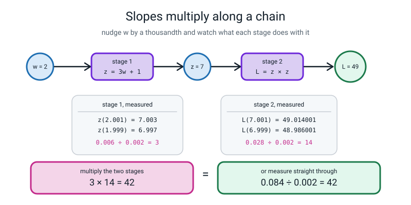
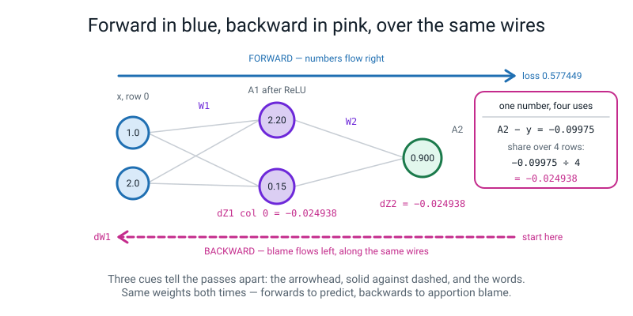
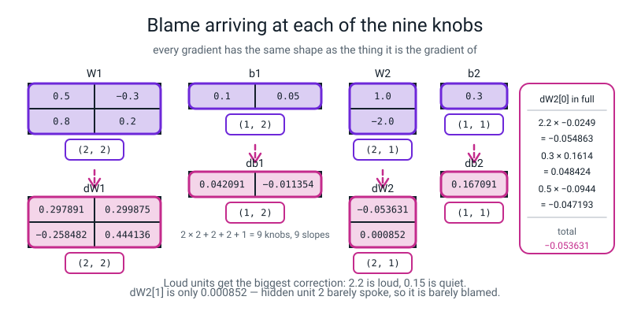
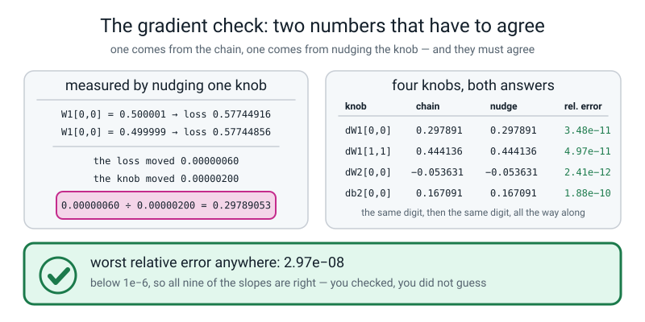
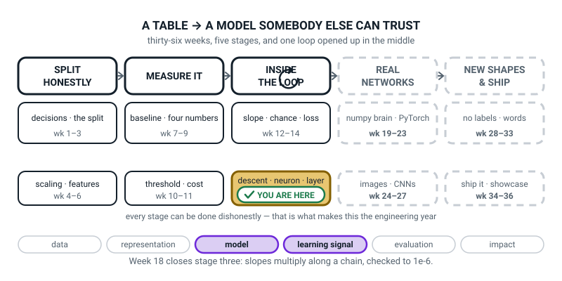
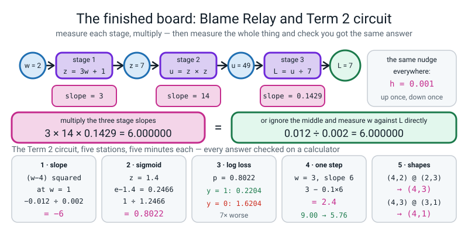

# Week 18 — Term 2 Checkpoint — How Much Did Each Knob Contribute?

[⬅ Week 17](week-17.md) · [Course Home](../README.md) · [Week 19 ➡](week-19.md) · [Student Guide](../student-guide/week-18.md) · [Workbook](../workbook/week-18.md)

---

## 📋 At a Glance

| | |
|---|---|
| **Duration** | 70 minutes |
| **Type** | 🟪 Review — the Term 2 checkpoint, and the week the hardest idea in the course turns out to be one multiplication |
| **Big idea** | **Backpropagation is blame assignment.** Slopes multiply along a path, so you can work out how much each of a hundred knobs contributed to the error in **one sweep backwards**. |
| **New vocabulary** | backpropagation · chain rule · gradient check · relative error · He initialization · symmetry breaking |
| **New maths** | **slopes multiply along a chain** — nudging `w` moves `z` 3× as much, nudging `z` moves `L` 14× as much, so nudging `w` moves `L` 42× as much — measured stage by stage **and** straight through, and shown to agree exactly |
| **New syntax** | `A.T @ dZ` · `(z > 0).astype(float)` |
| **Dataset** | A hand-typed **2 → 2 → 1** network with **four rows** of input. Every number small enough to check on paper. No files, no downloads. |
| **Materials** | **Week 17's blue forward trace still on the board — this is essential** · a **red pen** · printed workbook pages 18.1–18.6 (18.1 is the Term 2 reflection sheet) · five station cards for the review circuit · a calculator per student · the Bug Log |
| **Tech needed** | Laptop with Python 3 and numpy. **No PyTorch this week** — that is Week 20, and the whole point of today is doing it by hand first. |
| **Prep time** | 25 minutes the night before · 5 minutes on the day |
| **Expected runtime of the code** | Every file today runs in **under a second**. The gradient check on nine knobs is instant. Nothing trains. |

> **⚠️ Watch out:** the entire week rests on one moment — **the two answers being revealed at the same time and agreeing.** `3 × 14 = 42` on one side of the room, `0.084 ÷ 0.002 = 42` on the other. If you say "the chain rule is that slopes multiply" and then demonstrate it, you have taught a fact. If you **measure both and let them agree in front of the class**, you have taught that it is checkable — and checkable is what makes the next ten weeks survivable. **Do not reveal either answer early.**

> **🧑‍🏫 A note on pacing, from the course README:** *do not teach Weeks 18 and 20 in the same week.* Today is four gradient arrays by hand. Week 20 is the one line of PyTorch that reproduces them. The pride from today is the teaching tool for Week 20, and it needs a week to set.

---

## 🎯 Lesson Objectives

By the end of the lesson the student can:

1. **Measure the slope of each stage of a two-stage chain, multiply them, and show the product equals the slope measured straight through.**
2. **Compute all four gradient arrays for a 2 → 2 → 1 network by hand**, writing out every intermediate grid.
3. **Gradient-check every one of those arrays against a numerical nudge** and get a relative error below `1e-6`.
4. **Explain why random initialization is necessary**, and what happens to a network whose weights all start at zero.

Observable evidence: two numbers on opposite sides of the board that both read `42`; four gradient arrays in the student's own handwriting with shapes beside them; nine relative errors, every one below `1e-6`, pasted from a real run; and a printout of an all-zeros network whose every gradient is exactly `0`.

---

## 🧑‍🏫 What YOU Need to Know First

> **📌 About the code blocks in this guide.** Outside the **🧰 Prep Checklist** and the **🔑 Answer Key**, the blocks are **illustrations, not whole files** — each one carries on from the one above. **The complete runnable files are in the Prep Checklist and the Answer Key.**

This is the hardest week in the course, and it is hard for one reason only: it has a **frightening reputation**. The actual content is one multiplication and a lot of bookkeeping. **There is no calculus in this file.** Read §2 properly — it is the whole lesson — and if you have twenty-five minutes, read §2, §4 and §5.

### 1. What backpropagation is, in plain words

> **backpropagation** — working out how much every weight in a network contributed to the error, by starting at the error and working backwards through the network, one layer at a time.

Here is the problem it solves. A network has sixteen knobs — or sixteen million. You push some data through, you get an answer, and the answer is wrong by some amount. **Now: which knobs should you turn, and which way?**

You could try nudging each knob a tiny bit, one at a time, and see which way the error moved. That works, and it is exactly what we will use to *check* the answer today. But it costs one full pass through the network **per knob**. With sixteen million knobs and a network that takes a second to run, one training step would take six months.

**Backpropagation gets all sixteen million slopes in one backwards sweep**, at about the same cost as one forward pass. That is the whole reason the field exists. Not a new mathematical insight — a bookkeeping trick that turns six months into a millisecond.

🍕 **The analogy, and it is the right one.** A parcel arrives three days late. You do not re-run the entire postal system sixteen million times to find out who to blame. You walk the chain backwards: *the courier was two days late; the courier was late because the depot held the parcel one day; the depot held it because the sorting machine jammed for four hours.* **One walk backwards, and everybody's share of the blame falls out.** Each person only needs to know two things: how much blame arrived at them, and how much they passed on to the person before them.

That is backprop. **Blame arrives; you keep your share; you pass the rest back.** (One caution: the parcel's days add up, but in a network the blame is *multiplied* by each stage's slope, so a stage can shrink or amplify what it passes back. That is the next section.)

### 2. The one new idea: slopes multiply along a chain

This is the whole week, and it takes ten minutes with a calculator.

**Set up a two-stage chain.** Stage 1 takes `w` and produces `z`. Stage 2 takes `z` and produces `L`.

```
w  ──[ stage 1: z = 3w + 1 ]──▶  z  ──[ stage 2: L = z × z ]──▶  L
```

Start at `w = 2`. Then `z = 3(2) + 1 = 7`, and `L = 7 × 7 = 49`.

**Now measure how steep each stage is, using Week 12's nudge — a thousandth up, a thousandth down, subtract, divide by `0.002`.**

> **🔢 The maths, slowly. Stage 1 on its own.** How much does `z` move when `w` moves?
>
> ```
> w = 2.001  →  z = 3(2.001) + 1 = 6.003 + 1 = 7.003
> w = 1.999  →  z = 3(1.999) + 1 = 5.997 + 1 = 6.997
>
> z moved:  7.003 − 6.997 = 0.006
> w moved:  2.001 − 1.999 = 0.002
>
> 0.006 ÷ 0.002 = 3
> ```
>
> **Stage 1's slope is 3.** Nudge `w` and `z` moves three times as much.

> **🔢 The maths, slowly. Stage 2 on its own.** How much does `L` move when `z` moves? We are standing at `z = 7`.
>
> ```
> z = 7.001  →  L = 7.001 × 7.001 = 49.014001
> z = 6.999  →  L = 6.999 × 6.999 = 48.986001
>
> L moved:  49.014001 − 48.986001 = 0.028
> z moved:  0.002
>
> 0.028 ÷ 0.002 = 14
> ```
>
> **Stage 2's slope is 14.** Nudge `z` and `L` moves fourteen times as much.

**Now the question, and this is the moment to stop and ask the class before you tell them anything.**

> *"Nudging `w` moves `z` three times as much. Nudging `z` moves `L` fourteen times as much. **How much does nudging `w` move `L`?**"*

Someone will say **42**. Someone else will say **17**. Both guesses are reasonable and one is right, and **you must not say which until it is measured.**

> **🔢 The maths, slowly. Straight through, ignoring the middle.** Feed the nudged `w` all the way to `L`.
>
> ```
> w = 2.001  →  z = 7.003  →  L = 7.003 × 7.003 = 49.042009
> w = 1.999  →  z = 6.997  →  L = 6.997 × 6.997 = 48.958009
>
> L moved:  49.042009 − 48.958009 = 0.084
> w moved:  0.002
>
> 0.084 ÷ 0.002 = 42
> ```
>
> **42.** And `3 × 14 = 42`.

**That is the chain rule, and that is the entire mathematical content of this week.**

> **chain rule** — if `a` affects `b` and `b` affects `c`, then the slope from `a` to `c` is the slope from `a` to `b` **multiplied by** the slope from `b` to `c`. Slopes multiply along a path.


*Figure 18.1 — Slopes multiply along a chain. Stage by stage gives `3 × 14 = 42`; straight through gives `0.084 ÷ 0.002 = 42`.*

🍕 **The analogy for why they multiply.** One extra millimetre of rain puts three extra cars per minute on the road. Each extra car per minute adds half a minute to your journey. So one extra millimetre of rain costs you `3 × 0.5 = 1.5` minutes. **You never had to model rain-to-minutes directly.** You chained two local facts, and the chaining is a multiplication because each stage *scales* whatever arrives at it.

**Why this makes backprop possible.** Every operation in a network is a stage: a multiply, an add, a ReLU, a sigmoid. Each one knows **only** how to answer one local question: *"given the slope coming back into my output, what is the slope going out of each of my inputs?"* Multiply those together as you walk backwards, and you have the slope of the loss with respect to any weight anywhere. **No stage needs to know anything about the network it lives in.**

### 3. The five backward rules, and what each one is doing

There are exactly five, they cover everything in this course, and **each one is a sentence in English before it is a line of code.**

| Forward step | Backward rule | The sentence |
|---|---|---|
| output sigmoid + log loss | `dZ2 = (A2 − y) / n` | "the blame at the output is simply how wrong the answer was, shared over the batch" |
| `Z = A @ W` | `dW = A.T @ dZ` | "each weight's blame is **its input** times **the blame that came out of it**" |
| `Z = A @ W + b` | `db = dZ.sum(axis=0, keepdims=True)` | "the bias is added to every row, so it collects blame from every row" |
| `Z = A @ W` | `dA = dZ @ W.T` | "send the blame backwards through the same weights it came forwards through" |
| `A = ReLU(Z)` | `dZ = dA * (Z > 0)` | "if the valve was shut going forwards, no blame comes back through it" |

**The first rule is not new.** The class met `A2 − y` in Week 14: when a sigmoid output is scored with log loss, the messy-looking derivative cancels down to *"predicted minus actual"*. It is the reason those two are always paired. **Today it just arrives one layer earlier than it used to.**

**The second and fourth rules are the ones that need the transposes explained**, and the explanation is entirely about shapes, not about algebra:

```
dW2 = A1.T @ dZ2          A1 is (4, 2), so A1.T is (2, 4)
                          dZ2 is (4, 1)
                          (2, 4) @ (4, 1) → (2, 1)     and W2 is (2, 1)  ✅

dA1 = dZ2 @ W2.T          dZ2 is (4, 1), W2.T is (1, 2)
                          (4, 1) @ (1, 2) → (4, 2)     and A1 is (4, 2)  ✅
```

> **The rule that makes every transpose obvious: a gradient always has exactly the same shape as the thing it is the gradient of.** `dW2` must be shaped like `W2`. `dA1` must be shaped like `A1`. **So when you cannot remember where the `.T` goes, write down the shape you need and there is only one arrangement that produces it.** Say that sentence twice in class; it is worth more than any amount of derivation.

**The fifth rule is the one to spend a moment on**, because `(Z > 0)` is a new kind of thing:

```python
Z1 = np.array([[2.2, 0.15], [0.3, -0.75], [0.5, 0.15], [-1.2, 0.15]])
mask = (Z1 > 0).astype(float)
```

```text
[[1. 1.]
 [1. 0.]
 [1. 1.]
 [0. 1.]]
```

`Z1 > 0` asks the question *"is this cell positive?"* **once per cell**, and hands back a grid of `True`/`False`. `.astype(float)` turns those into `1.0` and `0.0`. Multiplying the incoming blame by that grid **zeroes out the blame for every unit that did not fire on that row.** It is ReLU's valve working in reverse: no signal went forward, so no blame comes back. **Two of the eight cells above are zero, and those are exactly the two units that were silent.**

### 4. The whole thing worked out, one row first

**Do the one-row version first, always.** It has nine numbers instead of nine arrays and it fits on the board. **These nine numbers are also exactly what Week 20 checks PyTorch against**, so getting them onto the wall today is doing next-Tuesday-but-one a favour.

**The network:**

```
W1 = [ 0.5  -0.3 ]      b1 = [ 0.1   0.05 ]
     [ 0.8   0.2 ]

W2 = [  1.0 ]           b2 = [ 0.3 ]
     [ -2.0 ]

x = [1.0, 2.0]          y = 1
```

`W1` is `(2, 2)`: **row `i` is input `i`, column `j` is hidden unit `j`** — Week 17's convention, unchanged.

**Forward:**

```
z1 = 1.0(0.5) + 2.0(0.8) + 0.1   =  0.5 + 1.6 + 0.1   =  2.20
z2 = 1.0(−0.3) + 2.0(0.2) + 0.05 = −0.3 + 0.4 + 0.05  =  0.15

A1 = ReLU([2.20, 0.15]) = [2.20, 0.15]      both positive, both pass

Z2 = 2.20(1.0) + 0.15(−2.0) + 0.3 = 2.20 − 0.30 + 0.30 = 2.20

A2 = sigmoid(2.20) = 1 ÷ (1 + e^(−2.20)) = 1 ÷ 1.110803 = 0.90024951

loss = −ln(0.90024951) = 0.10508332
```

**Backward, nine numbers, every one a multiplication you can do on a calculator:**

```
step 1 — blame at the output:
   dZ2 = A2 − y = 0.90024951 − 1 = −0.09975049

step 2 — the output layer's weights (blame × the input that fed them):
   dW2[0] = 2.20 × (−0.09975049) = −0.21945108
   dW2[1] = 0.15 × (−0.09975049) = −0.01496257
   db2    = −0.09975049

step 3 — push the blame back to the hidden outputs (blame × the weight it travelled through):
   dA1[0] = (−0.09975049) × 1.0    = −0.09975049
   dA1[1] = (−0.09975049) × (−2.0) = +0.19950098

step 4 — through the ReLU valve. Both z were positive, so the mask is [1, 1]:
   dZ1 = [−0.09975049, +0.19950098]

step 5 — the hidden layer's weights (input × blame):
   dW1[0][0] = 1.0 × (−0.09975049) = −0.09975049
   dW1[0][1] = 1.0 × (+0.19950098) = +0.19950098
   dW1[1][0] = 2.0 × (−0.09975049) = −0.19950098
   dW1[1][1] = 2.0 × (+0.19950098) = +0.39900196
   db1       = [−0.09975049, +0.19950098]
```

**Three things worth pointing at while you read those out.**

**Hidden unit 1 was loud (`2.20`) so its weight gets a big correction (`−0.219`); hidden unit 2 was quiet (`0.15`) so its weight barely moves (`−0.015`).** **Loud units get blamed most.** That is not a rule anybody imposed — it falls out of "blame × input".

**The sign flip in `dA1[1]`.** Unit 2's weight into the output is `−2.0`. So increasing unit 2 *decreases* the score, and we want the score *higher*, so the slope points the other way. The maths did the reasoning for us.

**`dW1` row 2 is exactly twice row 1.** Input 2 was `2.0` and input 1 was `1.0`, so the corrections are in the same ratio. **Big inputs earn big corrections.**


*Figure 18.2 — Forward in blue, backward in pink, over the same wires. `A2 − y = −0.09975`, shared over 4 rows to give `−0.024938`.*

### 5. Then the batch of four rows, which is what the homework uses

Same weights, same architecture, four rows and four labels:

```
X = [  1.0   2.0 ]        y = [ 1 ]
    [  2.0  -1.0 ]            [ 0 ]
    [  0.0   0.5 ]            [ 1 ]
    [ -1.0  -1.0 ]            [ 0 ]
```

**Forward, all four rows.** These are Week 17's numbers with the third hidden unit removed:

| row | `Z1` | `A1` | `Z2` | `A2` | loss for this row |
|---|---|---|---|---|---|
| `[1.0, 2.0]` | `2.20, 0.15` | `2.20, 0.15` | `2.20` | `0.900250` | `−ln(0.900250) = 0.105083` |
| `[2.0, −1.0]` | `0.30, −0.75` | `0.30, 0` | `0.60` | `0.645656` | `−ln(1 − 0.645656) = 1.037488` |
| `[0.0, 0.5]` | `0.50, 0.15` | `0.50, 0.15` | `0.50` | `0.622459` | `−ln(0.622459) = 0.474077` |
| `[−1.0, −1.0]` | `−1.20, 0.15` | `0, 0.15` | `0.00` | `0.500000` | `−ln(0.5) = 0.693147` |

**The batch loss is the average of those four:**

```
(0.105083 + 1.037488 + 0.474077 + 0.693147) ÷ 4 = 2.309796 ÷ 4 = 0.577449
```

**Row 2's loss of `1.037` is the worst**, because the network said 64.6% for something whose true label was 0. And row 4's `0.693147` is the number the class has known since Week 14: **`−ln(0.5)`, the loss of a model that is guessing.**

**Backward, and the only change from the one-row version is the `÷ 4`:**

```
dZ2 = (A2 − y) ÷ 4

   row 1: (0.900250 − 1) ÷ 4 = −0.099750 ÷ 4 = −0.024938
   row 2: (0.645656 − 0) ÷ 4 =  0.645656 ÷ 4 =  0.161414
   row 3: (0.622459 − 1) ÷ 4 = −0.377541 ÷ 4 = −0.094385
   row 4: (0.500000 − 0) ÷ 4 =  0.500000 ÷ 4 =  0.125000
```

**Now the four gradient arrays.** `dW2 = A1.T @ dZ2`, and here is the first entry worked out **in full**, which is the arithmetic the class must see:

```
dW2[0] = 2.2 × (−0.024938) + 0.3 × (0.161414) + 0.5 × (−0.094385) + 0.0 × (0.125000)
       = −0.054863    +    0.048424     +    (−0.047193)    +    0.000000
       = −0.053631
```

**Notice the last term is zero**, because hidden unit 1 was silent on row 4. That row contributed nothing to that weight's blame, and it is visible in the arithmetic.

**All four arrays:**

```
dW1 = [  0.297891   0.299875 ]        db1 = [ 0.042091  −0.011354 ]
      [ −0.258482   0.444136 ]

dW2 = [ −0.053631 ]                   db2 = [ 0.167091 ]
      [  0.000852 ]
```

**Nine knobs, nine slopes.** Four in `dW1`, two in `db1`, two in `dW2`, one in `db2`.


*Figure 18.3 — Blame arriving at each of the nine knobs. `dW2` entry 0 in full: `−0.054863 + 0.048424 − 0.047193 = −0.053631`.*

**And the shape check, which is the one thing to insist on:**

| knob | shape | its gradient | shape |
|---|---|---|---|
| `W1` | `(2, 2)` | `dW1` | `(2, 2)` ✅ |
| `b1` | `(1, 2)` | `db1` | `(1, 2)` ✅ |
| `W2` | `(2, 1)` | `dW2` | `(2, 1)` ✅ |
| `b2` | `(1, 1)` | `db2` | `(1, 1)` ✅ |

### 6. The gradient check: how you know you were right

This is objective 3 and it is the most professionally useful thing in the whole term.

> **gradient check** — nudge one weight by a tiny amount in both directions, recompute the loss both times, and see whether `(L₊ − L₋) ÷ 2ε` agrees with the gradient your chain produced.

**It works because the nudge does not know anything.** It does not use the chain rule, it does not use transposes, it does not care what a ReLU is. It just changes a number, runs the whole network again, and looks at the loss. **If your clever backwards sweep agrees with the dumb nudge, your clever sweep is right.**

> **🔢 The maths, slowly.** Check `dW1[0,0]`, which our chain said was `0.29789053`. Nudge that one weight by `ε = 0.000001` — a millionth — in each direction and recompute the whole batch loss both times.
>
> ```
> W1[0,0] = 0.500001  →  loss = 0.577449156639
> W1[0,0] = 0.499999  →  loss = 0.577448560858
>
> the loss moved:  0.577449156639 − 0.577448560858 = 0.000000595781
> the knob moved:  0.500001       − 0.499999       = 0.000002
>
> 0.000000595781 ÷ 0.000002 = 0.29789050
> ```
>
> **`0.29789050`, against the chain's `0.29789053`.** Six figures agree (the last two differ only because the losses were rounded to twelve places before subtracting). Note that you need all twelve places: with the losses rounded to eight places the subtraction gives `0.3`, not `0.2979`. And nothing in that calculation knew what backpropagation is.

> **relative error** — how much two numbers disagree, as a *fraction* of their size: `|num − ana| ÷ (|num| + |ana|)`. **Below `1e-6` means "the same number".**

**Why relative and not just the difference?** Because a difference of `0.001` is catastrophic if the gradient is `0.002` and irrelevant if the gradient is `50,000`. Dividing by the size makes the threshold mean the same thing for every knob. **Our worst relative error across all nine knobs today is `2.97e-08` — about thirty times better than the threshold.**


*Figure 18.4 — The gradient check: two numbers that have to agree. Worst relative error anywhere: `2.97e-08`, below `1e-6`.*

**And the honest caveat, which you should give the class.** The gradient check is **agonisingly slow** — two full forward passes per knob, so a million-knob network would need two million forward passes. **You never run it on a real model.** You run it on a tiny version, once, when you first write the backward pass, and then never again. **It turns "I think my arithmetic is right" into "I verified my arithmetic is right", and that is worth the ten minutes it costs.**

### 7. Why every weight cannot start at zero

Two pieces of vocabulary, and a demonstration that takes ninety seconds and is genuinely surprising.

> **symmetry breaking** — making sure the hidden units start out *different* from each other, so that they can learn different things.

In Week 15 the class started every weight at zero and logistic regression trained perfectly. **Do that in a neural network and it will never learn anything at all.**

**Here is what happens, and it is worth showing rather than saying.** With every weight and bias at zero:

```text
Z1 =
[[0. 0. 0. 0.]
 [0. 0. 0. 0.]
 [0. 0. 0. 0.]
 [0. 0. 0. 0.]]
A2 =
[[0.5]
 [0.5]
 [0.5]
 [0.5]]
loss = 0.693147    (and -ln(0.5) = 0.693147)
mask = (Z1 > 0) =
[[0. 0. 0. 0.]
 [0. 0. 0. 0.]
 [0. 0. 0. 0.]
 [0. 0. 0. 0.]]
dW1 =
[[0. 0. 0. 0.]
 [0. 0. 0. 0.]]
dW2 =
[[0.]
 [0.]
 [0.]
 [0.]]
```

**Read that top to bottom with the class.** Every `Z1` is exactly zero. `ReLU(0) = 0`, so every hidden output is zero. The output score is zero, so every probability is `0.5`, so the loss is `−ln(0.5) = 0.693147` — **the guessing number from Week 14.**

And now the killer: **the ReLU mask `(Z1 > 0)` is `False` everywhere**, because zero is not greater than zero. So **every hidden gradient is exactly zero, the weights never move, and the loss stays at `0.693147` for ever.** It is not slow learning. It is no learning.

**Even without ReLU it would fail**, for a different and subtler reason: every hidden unit would compute the same thing, receive the same blame, and take the same step. Sixteen hidden units behaving as one, for ever. **They are clones and nothing can ever separate them.** Random starting weights are what break that symmetry — hence the name.

> **He initialization** — start each weight as a random number from a bell curve centred on zero, with a spread of `sqrt(2 ÷ n_inputs)`. Biases start at zero, which is fine because the weights already differ.

**Why that formula, in one paragraph you can say aloud.** Each unit adds up `n_inputs` products. If the weights had the same spread no matter how many inputs there were, then a wide layer would produce enormous sums and the sigmoid at the end would be pinned at 0 or 1, where its slope is almost nothing. Shrinking the spread as the number of inputs grows (it goes as `sqrt(2 ÷ n_inputs)`, so four times as many inputs means half the spread) keeps the typical size of `z` about the same however wide the layer is. **The factor of 2 is there because ReLU throws away half the values**, so you need to start with twice as much to end up in the right place.

For our two-input layer: `sqrt(2 ÷ 2) = 1.0`. **Do not derive anything.** Say the sentence, show the printout in the Answer Key where every hidden column is genuinely different, and move on. Week 19 has real numbers showing all-zeros stuck at 50% accuracy while He initialization reaches 99.2%.

### 8. Every line of `backprop.py`, explained to somebody who has never programmed

The forward half is Week 17 unchanged. Only the backward half is new.

```python
n = X.shape[0]
```

`X.shape` is the pair `(4, 2)`; `[0]` takes the first of the two. So `n` is **4**, the number of rows in the batch. Writing it this way rather than typing `4` means the file still works if the batch changes size.

```python
dZ2 = (A2 - y) / n
```

`A2 - y` subtracts, cell by cell — predicted minus actual, for all four rows at once. `/ n` shares the blame over the batch, so the answer means "per row on average" rather than "for these four rows in total". **Without it, a batch of a thousand rows would produce gradients a thousand times bigger and every learning rate you ever chose would be wrong.**

```python
dW2 = A1.T @ dZ2
```

`A1.T` flips `A1` from `(4, 2)` to `(2, 4)`. Then `(2, 4) @ (4, 1)` gives `(2, 1)` — the shape of `W2`. **Each entry is one hidden unit's activations, dotted against the blame, summed over all four rows.**

```python
db2 = dZ2.sum(axis=0, keepdims=True)
```

`axis=0` adds **down the rows**, so four blames become one number. `keepdims=True` keeps it 2-D as `(1, 1)` rather than collapsing to a flat `(1,)` — Week 17's argument, doing real work: `b2` is `(1, 1)`, so its gradient must be too.

```python
dA1 = dZ2 @ W2.T
```

`W2.T` flips `(2, 1)` to `(1, 2)`. Then `(4, 1) @ (1, 2)` gives `(4, 2)` — the shape of `A1`. **The blame goes back through the same weights it came forwards through.**

```python
mask = (Z1 > 0).astype(float)
dZ1 = dA1 * mask
```

`(Z1 > 0)` asks "positive?" once per cell and gives a grid of `True`/`False`; `.astype(float)` makes those `1.0` and `0.0`. Then `*` — **cell by cell, not `@`** — zeroes the blame wherever the valve was shut.

```python
dW1 = X.T @ dZ1
db1 = dZ1.sum(axis=0, keepdims=True)
```

Exactly the same two rules as the output layer, one layer down. `X.T` is `(2, 4)`; `(2, 4) @ (4, 2)` gives `(2, 2)` — the shape of `W1`. **The backward pass is the same two lines repeated per layer, and that is why it scales to a hundred layers.**

### 9. The three misconceptions you will actually meet

**Misconception 1 — "the chain rule is a formula you have to memorise."**
It is a *multiplication*. Two slopes, multiplied. The class measured both of them with a calculator and multiplied them, and the answer matched the direct measurement to the last digit. **If a student can say "three times fourteen is forty-two", they know the chain rule.** Everything else is bookkeeping about which slope belongs to which stage.

**Misconception 2 — "the transposes are magic and I will never remember them."**
The transposes are **forced by the shapes**, and there is only ever one legal arrangement. **`dW` has the same shape as `W`. Full stop.** So write down what shape you need, look at what shapes you have, and there is exactly one way to make them fit. **The cure is not practice, it is the sentence** — say it every time a `.T` appears.

**Misconception 3 — "if the gradient check passes, my network works."**
No. The gradient check proves your **backward pass agrees with your forward pass**. If your *forward* pass computes the wrong thing, the check will happily confirm that you are correctly differentiating the wrong network. It is a check on the calculus, not on the architecture. **Say that plainly**, because it is the kind of precision that separates somebody who can debug from somebody who can only hope.

### 10. How deep to go, and where to stop

**Go this far:** the two-stage chain measured stage by stage and straight through, both giving `42`; the five backward rules stated as English sentences; the nine one-row gradients on the board; the four gradient arrays for the four-row batch, with `dW2[0]` worked out in full; the shapes of all four gradients matched against their weights; a gradient check on all nine knobs with relative errors pasted; the all-zeros network shown to have zero gradients everywhere and a loss stuck at `0.693147`.

**Stop before:**

| Do not teach today | Where it lives |
|---|---|
| **Actually training the network — a loop, many epochs, a falling loss curve** | **Week 19, next week.** Today's gradients are computed and *looked at*. Nothing is updated. This is deliberate and it is the same shape of ending as Week 20. |
| **`loss.backward()`, PyTorch, autograd, tensors** | **Week 20**, and the course README explicitly says not to teach Weeks 18 and 20 together. Today's nine numbers are what Week 20 checks the library against. |
| Symbolic differentiation, `dL/dw` notation, derivative rules as symbol manipulation | **Never in this course.** Every slope today is either measured by nudging or produced by multiplying two measured slopes. |
| Proof that the chain rule holds, limits, epsilon-delta | Never. The class *measured* it, twice, and the answers agreed. That is the level of rigour this course uses and it is honest about it. |
| Dead ReLUs as a named, counted phenomenon | **Week 19**, where they can be counted in a trained network. Today the mask having zeros in it is just "that unit was quiet". |
| Momentum, Adam, learning-rate schedules | **Week 26** for Adam. Today there is no optimizer at all. |
| Vanishing gradients across many layers | Name it in one sentence if a student connects it to Week 16's `0.25⁵`. Week 19 gives it a paragraph. |
| Softmax's gradient, multi-class cross-entropy | **Week 26.** |

The line to hold all lesson: **measure both, then multiply, then check they agree.**

---

### 11. 🧭 The Growing Map — the week a whole stage closes

The student guide carries a figure called **Where This Fits**: the same picture every week with one
more piece filled in. Today it does something it has only done once before — **a whole stage finishes.**
Given this is also the Term 2 checkpoint, this is the week to give the map its full two minutes.



*Figure 18.0 — Week 18's version. The gold `descent · neuron · layer` tile closes and stage three is
complete. The ↻ on stage three is black, as it has been since Week 12 — and now everything behind it
has been taken apart.*

**What to do with it, in about two minutes at the end of the lesson:**

1. **Ask "which box did we do today?" and then "what just finished?"** The tile is *descent · neuron ·
   layer*, fourth of four weeks, and with it **stage three is done**. Say the sentence: *"the loop is
   the thing everybody calls the magic. You have now built every part of it by hand and checked the
   hardest part against a ruler."*
2. **Anchor it on the two forty-twos.** They are still on the board — `3 × 14 = 42` on one side,
   `0.084 ÷ 0.002 = 42` on the other. *"That is today's box in two numbers. One is the chain rule, the
   other is a measurement, and they agreed."* Then point at the ↻ and say it has been black since Week
   12 for a reason: today is the week the inside of it ran out of parts.
3. **Point right and set up the next three weeks honestly.** `REAL NETWORKS` is dashed for one more
   week. *"Next week you put Weeks 15 to 18 in one file and press go, and it draws a curve. The week
   after, PyTorch gives you today's four arrays in one line — and you will check them against your own
   handwriting, which is why we did it by hand first."*

> **🧑‍🏫 Why this is worth two minutes.** Term 2 is the hardest stretch of the level and it ends with
> its hardest idea. A learner who can see three of five stages solid, with the loop opened and
> emptied, reads their own year as *"I am two thirds of the way through the maths"* rather than *"the
> maths keeps getting worse."* That single reframe is worth more in Week 18 than in any other week.

**One thing to notice, so you can answer if asked.** `learning signal` is lit beside `model`, and
`evaluation` is dark even though the whole lesson was a check. That is the right call and the
distinction is worth a sentence if a sharp student queries it: **a gradient check tests your
arithmetic, not your model.** Nobody measured how good the network is today. Evaluation comes back in
Week 19, when there is finally a test accuracy to report.

---

## 🧰 Prep Checklist

### 25 minutes the night before

- [ ] **Check Week 17's blue forward trace is still on the board.** If it has been rubbed out, redraw it before the lesson. **The whole lesson is drawn on top of it in red**, and the two-colour picture is the single most useful image of the term.

- [ ] **Write the five station cards for the Term 2 circuit.** One question per card, big print:

```
  1  SLOPE     f(w) = (w - 4) x (w - 4).  Measure the slope at w = 1 by nudging.
  2  SIGMOID   z = 1.4.  What is sigmoid(z), to four places?
  3  LOG LOSS  p = 0.8022.  Give the loss if y = 1, and the loss if y = 0.
  4  GRADIENT  w = 3, slope = 6, lr = 0.1.  One step.  New w?  New loss?
  5  SHAPES    (4,2) @ (2,3) = ?   (4,3) @ (3,1) = ?   And what shape is b1?
```

- [ ] **Type and run `chain.py` yourself.** The complete file:

```python
"""chain.py - slopes multiply along a chain, measured two ways."""
import numpy as np

np.random.seed(0)

def stage1(w):
    return 3 * w + 1

def stage2(z):
    return z * z

h = 0.001
w = 2.0
z = stage1(w)
L = stage2(z)

print("w =", w, "  z = 3w + 1 =", z, "  L = z * z =", L)
print()

s1 = (stage1(w + h) - stage1(w - h)) / (2 * h)
print("stage 1: z(2.001) = %.6f" % stage1(w + h))
print("         z(1.999) = %.6f" % stage1(w - h))
print("         (%.6f - %.6f) / 0.002 = %.6f" % (stage1(w + h), stage1(w - h), s1))
print()

s2 = (stage2(z + h) - stage2(z - h)) / (2 * h)
print("stage 2: L(7.001) = %.6f" % stage2(z + h))
print("         L(6.999) = %.6f" % stage2(z - h))
print("         (%.6f - %.6f) / 0.002 = %.6f" % (stage2(z + h), stage2(z - h), s2))
print()

print("stage 1 x stage 2 = %.6f x %.6f = %.6f" % (s1, s2, s1 * s2))
print()

straight = (stage2(stage1(w + h)) - stage2(stage1(w - h))) / (2 * h)
print("straight through: L(w=2.001) = %.6f" % stage2(stage1(w + h)))
print("                  L(w=1.999) = %.6f" % stage2(stage1(w - h)))
print("                  (%.6f - %.6f) / 0.002 = %.6f"
      % (stage2(stage1(w + h)), stage2(stage1(w - h)), straight))
print()
print("difference between the two answers: %.10f" % abs(s1 * s2 - straight))
```

You must see **exactly** this:

```text
w = 2.0   z = 3w + 1 = 7.0   L = z * z = 49.0

stage 1: z(2.001) = 7.003000
         z(1.999) = 6.997000
         (7.003000 - 6.997000) / 0.002 = 3.000000

stage 2: L(7.001) = 49.014001
         L(6.999) = 48.986001
         (49.014001 - 48.986001) / 0.002 = 14.000000

stage 1 x stage 2 = 3.000000 x 14.000000 = 42.000000

straight through: L(w=2.001) = 49.042009
                  L(w=1.999) = 48.958009
                  (49.042009 - 48.958009) / 0.002 = 42.000000

difference between the two answers: 0.0000000000
```

**Runtime: well under a second.**

- [ ] **Run `backprop.py`** (full file in the Answer Key, page 18.3) and **check the loss reads `0.577449`.** If it does not, something has been mistyped. **Under a second.**
- [ ] **Run `gradcheck.py`** (Answer Key, page 18.4) and confirm the last line reads **`all nine below 1e-6?  True`**. **Under a second.**
- [ ] **Run `symmetry.py`** (Answer Key, page 18.5) and **look at the grid of zeros.** You will show it in the last five minutes. **Under a second.**
- [ ] **Write the one-row nine numbers on the board or a large sheet and leave them up for two weeks.** Week 20 is a comparison against exactly these:

```
dW1 = [ −0.09975049   +0.19950098 ]      db1 = [ −0.09975049, +0.19950098 ]
      [ −0.19950098   +0.39900196 ]

dW2 = [ −0.21945108, −0.01496257 ]       db2 = −0.09975049
```

- [ ] **Do the chain by hand on your own calculator.** All six numbers. If you have not done `7.003 × 7.003 = 49.042009` yourself, you cannot answer *"is that really exact or just close?"*, and somebody will ask.
- [ ] **Break it on purpose, twice**, so both deliberate mistakes are muscle memory:
  1. Write `A1 @ dZ2` instead of `A1.T @ dZ2`. Real message ends `size 4 is different from 2`.
  2. Leave out the ReLU mask entirely — `dZ1 = dA1`. **No error.** The gradient check fails with relative errors around `0.2` to `1.0`.
- [ ] **Print workbook pages 18.1–18.6. Page 18.1 is the Term 2 reflection sheet** — check it is the right one; it is the only page today that is not arithmetic.
- [ ] **Find a red pen.**

### 5 minutes on the day

- [ ] Week 17's blue trace on the board. Red pen in your hand.
- [ ] Five station cards laid out at five places around the room, spaced so groups do not overhear each other.
- [ ] Editor open, terminal ready. **`chain.py` deleted or renamed** — they type it.
- [ ] The board split in half with a vertical line, and the two halves labelled **STAGE BY STAGE** and **STRAIGHT THROUGH**. Nothing written under either yet.
- [ ] A calculator per student. Bug Log out.
- [ ] Week 17's shape ladder still on the wall.

### Fallback if the laptops fail

**This is the best week of the term for a power cut**, because every number today was designed to be checkable with a calculator.

1. **The chain, on calculators, in full.** Six numbers: `7.003`, `6.997`, `49.014001`, `48.986001`, `49.042009`, `48.958009`. Three divisions: `3`, `14`, `42`. **That is objective 1 completely, and it is better on a calculator than on a screen**, because they feel the multiplication.
2. **The Blame Relay works entirely without computers** — it was designed that way. Run it as written and give it fifteen minutes.
3. **The nine one-row gradients, by hand.** One subtraction and eight multiplications. With the class racing you in pairs it takes eleven minutes. **That is objective 2 in its one-row form.**
4. **The gradient check by hand, on one knob.** Nudge `W1[0][0]` to `0.500001`, recompute `z1 = 2.200001`, `Z2 = 2.200001`, `A2 = 0.9002496`, `L₊ = 0.10508322`; then `0.499999` gives `L₋ = 0.10508342`. Subtract, divide by `0.000002`: **`−0.0997505`**, against the chain's `−0.09975049`. **That is objective 3, on paper, on one knob** — and one knob checked by hand is worth more than nine checked by a script.
5. **The all-zeros argument, spoken.** No computer needed: every `z` is zero, `ReLU(0) = 0`, the mask is `False` everywhere, so every gradient is zero and nothing ever moves. Then `−ln(0.5) = 0.693147` on the calculator. **That is objective 4.**
6. **The Term 2 circuit needs nothing but the five cards.**

| If this fails | Do this instead |
|---|---|
| `ValueError: matmul: ... (size 4 is different from 2)` | A `.T` is missing or on the wrong grid. Write the shape you need — `dW2` must be `(2, 1)` — and there is only one arrangement that gives it. |
| `ValueError: operands could not be broadcast together with shapes (4,2) (2,4)` | `dA1 * mask` where the mask got transposed. The mask must be the same shape as `Z1`. |
| `db1` has shape `(2,)` instead of `(1, 2)` and later arithmetic goes odd | `keepdims=True` was left off the `.sum(axis=0)`. |
| The gradient check gives relative errors around `0.2`–`1.0` on `dW1` only | **The ReLU mask has been forgotten.** `dW2` and `db2` will still pass — the mask only affects the hidden layer, which is exactly why this bug is sneaky. |
| The gradient check gives about `0.5` on **everything** | The `÷ n` is missing from `dZ2`, so every gradient is 4× too big. Relative error of a 4× overshoot is `3 ÷ 5 = 0.6`. |
| The gradient check gives about `1e-3` everywhere, not `1e-8` | `ε` is too big or too small. `1e-6` is the sweet spot: bigger and the nudge is not local, smaller and floating-point noise swamps the difference. |
| `RuntimeWarning: divide by zero encountered in log` | `A2` hit exactly 0 or exactly 1. Not possible with today's numbers, but if a student changed the weights: clip with `np.clip(A2, 1e-12, 1 - 1e-12)`, which is Week 14's fix. |
| Everybody gets `42` but nobody is impressed | You said the answer before it was measured. **The two halves of the board must be revealed at the same moment.** Rub them out and do it again; the reveal *is* the lesson. |

---

## ⏱️ The Lesson, Minute by Minute

| Segment | Minutes | Running total | What happens |
|---|---|---|---|
| 🪝 Hook — Sixteen Million Knobs | 7 | 7 | Count the cost of nudging every knob, then promise one sweep |
| 🧠 Concept & Maths — Three Times Fourteen | 18 | 25 | The chain measured both ways, revealed together. The five rules. |
| 💻 Live-Code Together — `backprop.py` | 18 | 43 | Four gradient arrays, shapes checked. **Two deliberate mistakes.** |
| 🎲 Their Turn — The Blame Relay, then the Term 2 Circuit | 20 | 63 | Three-stage relay revealed simultaneously, then five stations |
| 🔑 Wrap & Assign | 7 | 70 | All-zeros in ninety seconds, three checks, homework |

---

### 🪝 Hook — Sixteen Million Knobs (7 minutes)

**Do this:** Laptops shut. Week 17's blue trace is on the board. Write beside it:

```
16,000,000 knobs
one forward pass = 0.01 seconds
```

**Say this:**

> "Last week you pushed four rows through a network and got four answers. One of them was ninety per cent, and it happened to be right.
>
> Now suppose it had been badly wrong. **Which knob would you turn?**
>
> Here is the obvious method, and it works. Take knob number one. Nudge it up a tiny bit, run the whole network, see what the loss did. Nudge it down, run the whole network again, see what the loss did. Divide. **That is the slope for knob one**, and you have known how to do it since Week 12.
>
> Two runs per knob. Sixteen million knobs. That is thirty-two million runs, at a hundredth of a second each."

**Ask this:** "How long is that? Roughly. Anybody."

*`32,000,000 × 0.01 = 320,000` seconds.* Let them work it: about **89 hours**, or nearly **four days** — for **one** training step, and a real model takes hundreds of thousands of steps.

> **Say this:** "Four days. For one step. You would be here until the sun burns out.
>
> So the obvious method is correct and useless, and today you learn the method that is actually used. It gets **all sixteen million slopes in one sweep backwards**, for about the same cost as one forward pass. Not sixteen million times faster — more than that.
>
> It has a frightening name. **Backpropagation.** And I want to tell you now, before we start, what it actually is, because the name does it a disservice.
>
> **It is one multiplication.** That is it. Everything else today is bookkeeping — careful, checkable bookkeeping, but bookkeeping. By the end of the lesson you will have worked out how much each of nine knobs contributed to an error, and then you will have **proved you were right** using the slow nudging method on all nine, because nine knobs is small enough to afford it.
>
> Sixteen million is not. That is the only difference."

**Do this:** Draw a vertical line down the middle of a clear board. Label the halves **STAGE BY STAGE** and **STRAIGHT THROUGH**.

> **Say this:** "And here is how we are going to start. Two halves of a room, two ways of measuring the same thing, and neither side finds out the other side's answer until the end."

---

### 🧠 Concept & Maths — Three Times Fourteen (18 minutes)

**Do this (3 min) — set up the chain.** On the board, above the dividing line:

```
w  ──[ z = 3w + 1 ]──▶  z  ──[ L = z × z ]──▶  L

start at w = 2:    z = 7,    L = 49
```

**Ask this:** "Check those two for me. `3 × 2 + 1`? And `7 × 7`?"

*`7` and `49`.*

> **Say this:** "Two stages. `w` becomes `z`, `z` becomes `L`. Think of `L` as the loss and `w` as one weight, with something in between.
>
> The question is the only question in this lesson: **if I nudge `w`, how much does `L` move?**
>
> And there are two ways to find out. **One:** measure each stage on its own and combine them somehow. **Two:** ignore the middle entirely and just measure `w` against `L`. Left half of the room does the first. Right half does the second. **Nobody shouts.**"

**Do this (7 min) — the two measurements, in parallel.**

**Left half — stage by stage.** Give them the nudge: a thousandth up, a thousandth down, subtract, divide by `0.002`. Two measurements:

```
stage 1:  z(2.001) = 7.003        z(1.999) = 6.997
          0.006 ÷ 0.002 = 3

stage 2:  L(7.001) = 49.014001    L(6.999) = 48.986001
          0.028 ÷ 0.002 = 14
```

Write **`3`** and **`14`** on the left half. **Do not let them multiply yet.**

**Right half — straight through.** Same nudge, but feed it all the way:

```
w = 2.001  →  z = 7.003  →  L = 7.003 × 7.003 = 49.042009
w = 1.999  →  z = 6.997  →  L = 6.997 × 6.997 = 48.958009

           0.084 ÷ 0.002 = 42
```

Write **`42`** on the right half, **covered with a sheet of paper.**

**Ask this — and this is the moment of the week.** To the left half:

> "You have got a 3 and a 14. Nudging `w` moves `z` three times as much. Nudging `z` moves `L` fourteen times as much. **How much does nudging `w` move `L`? Write your guess down, do not say it.**"

Collect the guesses. You will get **42** and **17** and possibly **11**. Write all of them up.

> **Say this:** "Three answers on the board. One of them is right and I am not going to tell you which. The right half of the room has measured it directly, without using the middle at all.
>
> Right half — on three. One. Two. Three."

**Do this:** Uncover the `42`. Let the noise happen.

> **Say this:** "Forty-two. **Three times fourteen.**
>
> Slopes **multiply** along a chain. Not add — multiply. And you did not take my word for it; one half of this room measured it a completely different way and got the same number to ten decimal places.
>
> This has a name and the name is scarier than the thing. It is the **chain rule**, and it is the whole mathematical content of today's lesson. `3 × 14 = 42`. If you can say that, you know the chain rule."

**Ask this:** "Why *multiply* though? Why does that make sense?"

*Hoped-for answer:* each stage scales what comes in; scaling twice means multiplying the scalings.

> **Say this, if nobody gets there:** "Rain and traffic. One extra millimetre of rain puts **three** extra cars a minute on the road. Each extra car a minute adds **half a minute** to your journey. So one millimetre of rain costs you three times half a minute — **one and a half minutes.**
>
> You never had to work out rain-to-minutes. You chained two local facts, and each fact was a *scaling*, so they multiplied."

**Do this (8 min) — the five rules, as sentences.** Write them on the board as English first, code second:

```
1.  blame at the output      = how wrong you were, shared over the batch
                              dZ2 = (A2 - y) / n

2.  a weight's blame         = its input  x  the blame coming out of it
                              dW = A.T @ dZ

3.  a bias's blame           = all the blame from every row, added up
                              db = dZ.sum(axis=0, keepdims=True)

4.  blame going backwards    = send it back through the same weights
                              dA = dZ @ W.T

5.  through a ReLU           = if the valve was shut, nothing comes back
                              dZ = dA * (Z > 0)
```

> **Say this:** "Five rules. **Every network in this course uses these five and nothing else** — the fancier ones in the wild add more kinds of stage in the middle, each with its own one local rule.
>
> Rule one is not new. You met `A2 − y` in Week 14: when a sigmoid is scored with log loss, the messy derivative cancels down to **predicted minus actual**. That is why those two are always paired.
>
> Rule five is the one to look at. `(Z > 0)` asks *is this positive?* once per cell, and hands back a grid of ones and zeros. Multiply the blame by that and **every unit that was silent going forwards gets no blame coming back.** Which is fair. It did not contribute, so it is not to blame."

**Ask this:** "Rules 2 and 4 both have a `.T` in them. How am I supposed to remember where it goes?"

*Let them struggle for a moment, then:*

> **Say this:** "You are not. **You are supposed to look at the shapes.**
>
> Here is the sentence, and it is the most useful sentence of the term: **a gradient has exactly the same shape as the thing it is the gradient of.**
>
> `dW2` must be shaped like `W2`, which is `(2, 1)`. I have `A1`, which is `(4, 2)`, and `dZ2`, which is `(4, 1)`. There is **exactly one** way to arrange those to produce a `(2, 1)`: flip `A1` to `(2, 4)` and multiply. `(2,4) @ (4,1)` gives `(2,1)`. Done.
>
> You do not memorise the transposes. **You write down the shape you need and let last week's rule do the work.**"


*Figure 18.5 — Forward in blue, backward in pink, over the same wires. Blame flows leftwards, ending at `dW1`.*

**Do this:** Take the red pen and draw the backward arrows **over Week 17's blue trace**, right to left, dashed. Label them with the five rules as you go. **Two colours, two directions, one diagram.**

---

### 💻 Live-Code Together — `backprop.py` (18 minutes)

**You never touch their keyboard.**

**Step 1 (4 min) — forward, and check the loss.** The forward half is last week's code with one hidden unit removed:

```python
import numpy as np

np.random.seed(0)
np.set_printoptions(precision=6, suppress=True)

W1 = np.array([[0.5, -0.3], [0.8, 0.2]])
b1 = np.array([[0.1, 0.05]])
W2 = np.array([[1.0], [-2.0]])
b2 = np.array([[0.3]])

X = np.array([[1.0, 2.0], [2.0, -1.0], [0.0, 0.5], [-1.0, -1.0]])
y = np.array([[1.0], [0.0], [1.0], [0.0]])
n = X.shape[0]

sigmoid = lambda z: 1.0 / (1.0 + np.exp(-z))

Z1 = X @ W1 + b1
A1 = np.maximum(0, Z1)
Z2 = A1 @ W2 + b2
A2 = sigmoid(Z2)
loss = float(-(y * np.log(A2) + (1 - y) * np.log(1 - A2)).mean())

print("A2", A2.shape); print(A2)
print("loss = %.6f" % loss)
```

```text
A2 (4, 1)
[[0.90025 ]
 [0.645656]
 [0.622459]
 [0.5     ]]
loss = 0.577449
```

**Ask this:** "Row 4 says exactly `0.5` and its loss is the biggest single number in the four. What is `−ln(0.5)`, and where have you seen it before?"

*`0.693147` — Week 14, the loss of a model that answers 0.5 to everything.*

> **Say this:** "Nought point six nine three one four seven. **The guessing number.** Row four's inputs are minus one and minus one, and the network has genuinely no idea. Row two is worse in a different way — it said sixty-four per cent for something whose real answer was zero, so it is confidently wrong and its loss is `1.037`.
>
> The average of the four is `0.577449`, and that is the number we are about to work out how to reduce."

**Step 2 (5 min) — 🐞 DELIBERATE MISTAKE ONE: the missing `.T`.**

```python
dZ2 = (A2 - y) / n
dW2 = A1 @ dZ2
```

Real output:

```text
Traceback (most recent call last):
  File "backprop.py", line 26, in <module>
    dW2 = A1 @ dZ2
ValueError: matmul: Input operand 1 has a mismatch in its core dimension 0, with gufunc signature (n?,k),(k,m?)->(n?,m?) (size 4 is different from 2)
```

**Do this:** Say nothing. Point at the two numbers at the end.

**Ask this:** "Four and two. Where do they come from — and more useful, **what shape do I actually want?**"

*Hoped-for answer:* `dW2` should look like `W2`, which is `(2, 1)`.

> **Say this:** "That is the right question and it is always the right question. **`dW2` has to be `(2, 1)`, because `W2` is `(2, 1)`.**
>
> I have `A1` at `(4, 2)` and `dZ2` at `(4, 1)`. Which arrangement gives me `(2, 1)`? `A1` as it stands is `(4, 2)` and `dZ2` is `(4, 1)` — inner numbers 2 and 4, no good. Flip `A1` to `(2, 4)`: now `(2,4) @ (4,1)` gives `(2,1)`. **There is only one way and the shapes found it for me.**"

Fix to `A1.T @ dZ2`. **Bug Log, ninety seconds**, with the sentence *"a gradient has the shape of its knob, so write the shape you need first."*

**Step 3 (5 min) — the mask, and the four arrays.**

```python
dW2 = A1.T @ dZ2
db2 = dZ2.sum(axis=0, keepdims=True)
dA1 = dZ2 @ W2.T
mask = (Z1 > 0).astype(float)
print("mask ="); print(mask)
dZ1 = dA1 * mask
dW1 = X.T @ dZ1
db1 = dZ1.sum(axis=0, keepdims=True)

print("dW1", dW1.shape); print(dW1)
print("db1", db1.shape); print(db1)
print("dW2", dW2.shape); print(dW2)
print("db2", db2.shape); print(db2)
```

```text
mask =
[[1. 1.]
 [1. 0.]
 [1. 1.]
 [0. 1.]]
dW1 (2, 2)
[[ 0.297891  0.299875]
 [-0.258482  0.444136]]
db1 (1, 2)
[[ 0.042091 -0.011354]]
dW2 (2, 1)
[[-0.053631]
 [ 0.000852]]
db2 (1, 1)
[[0.167091]]
```

**Ask this:** "Two of the eight cells in the mask are zero. Which two, and what were those units doing?"

*Row 2 unit 2 and row 4 unit 1 — the two units whose `z` was negative, so ReLU silenced them.*

> **Say this:** "Row two, unit two: its `z` was minus nought point seven five, so ReLU said nothing and it gets no blame. Row four, unit one: `z` was minus one point two, same story. **The valve was shut, so nothing comes back through it.**
>
> Now look at the four shapes on the right of those printouts. `(2, 2)`, `(1, 2)`, `(2, 1)`, `(1, 1)`. **Compare them to the four knobs.** `W1` is `(2,2)`, `b1` is `(1,2)`, `W2` is `(2,1)`, `b2` is `(1,1)`. **Four for four.** That is your first check, and it costs nothing, and you should do it every single time."

**Do this:** Show one entry worked out in full, because this is the arithmetic in the figure:

```python
for i in range(n):
    print("   %6.2f x %10.6f = %10.6f" % (A1[i, 0], dZ2[i, 0], A1[i, 0] * dZ2[i, 0]))
print("   total                = %10.6f" % dW2[0, 0])
```

```text
     2.20 x  -0.024938 =  -0.054863
     0.30 x   0.161414 =   0.048424
     0.50 x  -0.094385 =  -0.047193
     0.00 x   0.125000 =   0.000000
   total                =  -0.053631
```

> **Say this:** "Four multiplications and an addition, and there is `dW2[0]`. Look at the last line: **nought times nought point one two five is nothing.** Row four's hidden unit one was silent, so row four had no opinion about that weight. The arithmetic shows you the silence."

**Step 4 (4 min) — 🐞 DELIBERATE MISTAKE TWO: forget the ReLU mask.**

Change `dZ1 = dA1 * mask` to `dZ1 = dA1`. Re-run.

**No error.** `dW1` comes out as:

```text
dW1 (2, 2)
[[ 0.172891 -0.345781]
 [-0.383482  0.766964]]
```

**Ask this:** "It ran. The shapes are all still right. Is it correct?"

*They cannot tell — and that is the point.*

> **Say this:** "You cannot tell. Neither can I, by looking. **The shapes are right, nothing crashed, and every one of those four numbers is wrong.**
>
> This is the most dangerous class of bug in this subject: **the silently wrong gradient.** Your network will still train. It will just train towards the wrong place, and get a mediocre score, and nothing anywhere will tell you why.
>
> Which is exactly why the next thing we do is the gradient check. **It is the only thing that catches this.**"

Put the mask back. **Bug Log** — as a *"no error, wrong numbers, only the gradient check found it"* entry.

---

### 🎲 Their Turn — The Blame Relay, then the Term 2 Circuit (20 minutes)

Full instructions in **🎲 The Activity, In Full** below. In outline: a **three**-stage chain, with one half of the room measuring each stage and multiplying while the other half measures the whole thing in one go — revealed simultaneously. Then the **Term 2 review circuit**: five stations, and every answer checked on a calculator.

---

### 🔑 Wrap & Assign (7 minutes)

**Do this — the all-zeros network, ninety seconds.** Run `symmetry.py` and put the output on the screen:

```text
Z1 =
[[0. 0. 0. 0.]
 [0. 0. 0. 0.]
 [0. 0. 0. 0.]
 [0. 0. 0. 0.]]
A2 =
[[0.5]
 [0.5]
 [0.5]
 [0.5]]
loss = 0.693147    (and -ln(0.5) = 0.693147)
mask = (Z1 > 0) =
[[0. 0. 0. 0.]
 [0. 0. 0. 0.]
 [0. 0. 0. 0.]
 [0. 0. 0. 0.]]
dW1 =
[[0. 0. 0. 0.]
 [0. 0. 0. 0.]]
```

**Ask this:** "In Week 15 you started every weight at zero and logistic regression trained perfectly. Look at this network. **What is going to happen when I train it?**"

*Hoped-for answer:* nothing at all.

> **Say this:** "Nothing. Not slowly — **nothing.**
>
> Follow it down the screen. Every `z` is zero, because every weight is zero. `ReLU(0)` is zero. The output score is zero, so every probability is nought point five, so the loss is `−ln(0.5)` — **the guessing number**, again.
>
> And then the killer. Look at the mask. `(Z > 0)` — is zero greater than zero? **No.** So the mask is `False` everywhere, so every hidden gradient is exactly zero, so no weight ever moves, so the loss is `0.693147` for ever. The network is dead on arrival.
>
> Even without the ReLU it would fail, for a subtler reason: every hidden unit would compute the same thing, receive the same blame, take the same step. **Sixteen units acting as one clone, for ever.** Random starting weights are what stop that, and it is called **symmetry breaking**.
>
> Next week you will use **He initialization** — random numbers with a spread of `sqrt(2 ÷ number of inputs)` — and you will see all-zeros stuck at fifty per cent accuracy while He reaches ninety-nine."

**Do this:** Stand at the two-colour diagram. Write four things beneath it:

```
3 x 14 = 42                slopes multiply along a chain
dW has the shape of W      that is how you know where the .T goes
gradient check < 1e-6      the dumb method marks the clever method's homework
all zeros never learns     symmetry has to be broken
```

**Say this:**

> "Four things, and that is Term 2 finished.
>
> **Three times fourteen is forty-two.** Slopes multiply along a chain, and you proved it two different ways in the same room. That single fact is all of backpropagation.
>
> **A gradient has the same shape as its knob.** That is how you know where every transpose goes, for ever, without memorising anything.
>
> **The gradient check.** The slow, stupid nudging method — two runs per knob — marks the clever method's homework. You got nine relative errors and the worst was about three parts in a hundred million. **You did not hope your arithmetic was right. You checked.**
>
> **And all zeros never learns.** Every weight identical means every unit identical for ever.
>
> One last thing. Look at that diagram: blue going forwards, red coming back. **You now know the engine inside how neural networks are trained.** Not roughly — actually. Nine numbers, by hand, checked. Next week you put it in a file, add a loop, and press go."

**Do this:** Three quick checks — exact wording in **✅ Assessing Understanding**.

**Do this:** Hand out the homework. **Read the reflection sheet instruction out loud** — it is the only non-arithmetic page of the term and it gets skipped if you do not name it.

---

## 🐞 The Debugging Clinic

Every message below came from running a broken version of this week's actual code.

| What the student sees (real message) | What it means | Most likely cause | The fix |
|---|---|---|---|
| `ValueError: matmul: Input operand 1 has a mismatch in its core dimension 0, with gufunc signature (n?,k),(k,m?)->(n?,m?) (size 4 is different from 2)` | "The inner numbers do not match." | `A1 @ dZ2` written instead of `A1.T @ dZ2`. | **Write the shape you need first.** `dW2` must be `(2, 1)`; `A1.T` is `(2, 4)` and `dZ2` is `(4, 1)`, so `(2,4) @ (4,1)` is the only arrangement. |
| `ValueError: matmul: ... (size 2 is different from 1)` | Same problem in rule 4. | `dZ2 @ W2` written instead of `dZ2 @ W2.T`. | `dA1` must be shaped like `A1`, which is `(4, 2)`. `(4,1) @ (1,2)` gives it. |
| `ValueError: operands could not be broadcast together with shapes (4,2) (2,4)` | "These two cannot be stretched to the same size." | `dA1 * mask` where the mask has been transposed. | The mask must be exactly `Z1`'s shape. `(Z1 > 0).astype(float)` — no `.T` anywhere near it. |
| **No error, but `db1` prints with shape `(2,)`** | A shape has silently gone flat. (`(1,2)` and `(2,)` broadcast legally, so numpy does not complain.) | `keepdims=True` left off `dZ1.sum(axis=0)`. | Put it back. `db1` must be `(1, 2)` to match `b1`. |
| `RuntimeWarning: divide by zero encountered in log` then `nan` in the loss | `A2` reached exactly 0 or exactly 1, and `ln(0)` has no value. | Weights changed to something extreme, so the sigmoid saturated. | `np.clip(A2, 1e-12, 1 - 1e-12)` before the log — Week 14's fix, unchanged. |
| **No error. The gradient check gives about `0.2`–`1.0` on `dW1` and `db1`, but `dW2` and `db2` pass.** | Nothing crashed. Half the gradients are wrong. | **The ReLU mask has been forgotten.** It only affects the hidden layer, which is why the output layer still passes. | `dZ1 = dA1 * (Z1 > 0).astype(float)`. **This is the bug the gradient check exists for.** |
| **No error. Every relative error is about `0.6`.** | Nothing crashed. All nine gradients are 4× too big. | The `÷ n` is missing from `dZ2`. A 4× overshoot gives relative error `3 ÷ 5 = 0.6`, which is suspiciously uniform. | `dZ2 = (A2 - y) / n`. **Uniformly wrong by the same factor almost always means a missing divide.** |
| **No error. The relative errors are about `1e-3` instead of `1e-8`.** | Nothing is really wrong. | `ε` is badly chosen: too big and the nudge is not local, too small and floating-point noise swamps the difference. | Use `1e-6`. It is the standard choice and it is not arbitrary — it is the compromise between those two failures. |
| **No error. The gradient check passes and the network still trains badly.** | The check did its job. | **The check verifies your backward pass against your forward pass.** If the forward pass computes the wrong thing, the check confirms you are correctly differentiating the wrong network. | Check the forward pass separately, against hand arithmetic. This is why Week 17 existed. |
| **No error. Every gradient is exactly `0.` and the loss is exactly `0.693147`.** | Nothing crashed. Nothing will ever happen. | Every weight starts at zero, so every `z` is zero, so the mask is `False` everywhere. | Random initialization. `rng.normal(0, np.sqrt(2 / n_in), size=(n_in, n_units))`. |
| `IndexError: too many indices for array: array is 1-dimensional, but 2 were indexed` | "You asked for `[i, j]` of something with only one dimension." | A gradient went flat because of a missing `keepdims`, and then got indexed with two numbers. | Print the shape. If it has one number in it, find the `.sum()` that dropped a dimension. |

### How to teach debugging without giving the answer

All the old moves stand. This week adds the two that matter most for the rest of the course.

25. **"What shape does that gradient have to be?"** Not "what shape is it" — what does it **have** to be. The answer is always "the same shape as its knob", and once said out loud the transpose places itself. This replaces every attempt to remember a formula.

26. **"Gradient-check it."** When a student says a number *looks* wrong, or *looks* right, stop the conversation and have them nudge that one knob. Two loss values and a division settle it in thirty seconds. **The habit of settling arguments with a measurement rather than a discussion is the most transferable thing in this course.**

And the sentence for this week:

> **"If it crashed, read the two numbers. If it ran and you are not sure, gradient-check it. And if every relative error is wrong by the same factor, you have dropped a divide."**

---

## 🎲 The Activity, In Full

### The Blame Relay, then the Term 2 Circuit

**What it is.** Two halves. First, **The Blame Relay** — a three-stage chain, with the room split so that one side measures each stage and multiplies while the other measures the whole thing directly, and neither knows the other's answer until they are revealed together. That is objective 1, and the simultaneous reveal is the emotional centre of the term. Then the **Term 2 review circuit** — five stations, five minutes each, covering slope, sigmoid, log loss, the gradient step and shapes.

### Setup

- A board split down the middle: **STAGE BY STAGE** on the left, **STRAIGHT THROUGH** on the right.
- Calculators — one per student, and they must have an `e^x` key for station 2.
- **Five station cards**, laid out around the room, spaced so groups cannot overhear each other. The five are in the Prep Checklist.
- Workbook pages 18.2 (the chain) and 18.6 (the review circuit answers, face down).


*Figure 18.6 — The finished board: Blame Relay and Term 2 circuit. Three stage slopes multiply to `6.000000`, and measuring straight through gives `6.000000`.*

### Part 1 — The Blame Relay (10 minutes)

**Do this:** Announce a **three**-stage chain this time, so it is not simply the concept segment repeated:

```
w  ──[ z = 3w + 1 ]──▶  z  ──[ u = z × z ]──▶  u  ──[ L = u ÷ 7 ]──▶  L

start at w = 2:   z = 7,   u = 49,   L = 7
```

**Split the room.** Left half gets the three stages, one stage per group of two or three students. Right half measures `w` against `L` directly. **Same nudge for everybody: `h = 0.001`.**

> **"Left half: each group measures ONE stage. Nudge your own input a thousandth either way, see how much your own output moves, divide. Then bring me your one number. **Do not multiply anything.**
>
> Right half: ignore the middle completely. Nudge `w`, push it all the way through all three stages, and measure how much `L` moved. One number.
>
> Nobody says anything out loud. I will collect."

**The real numbers, so you can mark instantly:**

| Who | Measures | Gets |
|---|---|---|
| left, group 1 | `z(2.001) = 7.003000`, `z(1.999) = 6.997000` | `0.006 ÷ 0.002 = ` **3.000000** |
| left, group 2 | `u(7.001) = 49.014001`, `u(6.999) = 48.986001` | `0.028 ÷ 0.002 = ` **14.000000** |
| left, group 3 | `L(49.001) = 7.000143`, `L(48.999) = 6.999857` | `0.000286 ÷ 0.002 = ` **0.142857** |
| right half | `L(w=2.001) = 7.006001`, `L(w=1.999) = 6.994001` | `0.012 ÷ 0.002 = ` **6.000000** |

**Do this:** Write `3`, `14` and `0.142857` on the left half of the board. Cover the right half.

**Ask the left half:** "Multiply your three numbers together. On my signal, not before."

**Then:** "Left half, your product. Right half, your measurement. **On three. One. Two. Three.**"

Both shout **six**.

> **Say this:** "Six. `3 × 14 × 0.142857` — and one seventh of forty-two is six.
>
> **Three stages. Three separate measurements. Multiply them and you get the answer to a question none of you measured.** And the other half of the room measured that question directly and got the same number.
>
> Now scale it up. That chain had three stages. A real network has two hundred. **Backpropagation is walking backwards along two hundred stages, and each stage only has to know one thing: how much does my output move when my input moves.** Multiply as you go. That is it. That is the whole algorithm."

**Watch for exactly two failure modes.** First, a group nudging the **original** `w` instead of their own stage's input — group 3 must nudge `u` around `49`, not `w` around `2`. Walk past and ask each group *"what is your input, and what number are you standing at?"* Second, group 3 finding `0.142857` alarming because it is less than one. **A slope less than one means that stage shrinks things**, and it is fine — the chain still works, it just comes out smaller. That is worth thirty seconds, because it is exactly what happens with sigmoid in Week 16's `0.25⁵` argument.

### Part 2 — The Term 2 review circuit (10 minutes)

**Five stations, two minutes each, calculators out, pairs rotate on your signal.** Everything on these cards has been taught between Week 10 and today.

**Station 1 — SLOPE (Week 12).**
> `f(w) = (w − 4) × (w − 4)`. Measure the slope at `w = 1` by nudging.

```
f(1.001) = (1.001 − 4)² = (−2.999)² = 8.994001
f(0.999) = (0.999 − 4)² = (−3.001)² = 9.006001

(8.994001 − 9.006001) ÷ 0.002 = −0.012 ÷ 0.002 = −6.000000
```

**Answer: `−6`.** And the shortcut rule agrees: `2(w − 4) = 2 × (1 − 4) = −6`. **Negative means uphill to the left**, so to reduce the loss you increase `w`.

**Station 2 — SIGMOID (Week 13).**
> `z = 1.4`. What is `sigmoid(z)`, to four places?

```
e^(−1.4) = 0.246597
1 + 0.246597 = 1.246597
1 ÷ 1.246597 = 0.802184
```

**Answer: `0.8022`.**

**Station 3 — LOG LOSS (Week 14).**
> `p = 0.8022`. Give the loss if `y = 1`, and the loss if `y = 0`.

```
y = 1:  −ln(0.802184) = 0.220417
y = 0:  −ln(1 − 0.802184) = −ln(0.197816) = 1.620417
```

**Answers: `0.2204` and `1.6204`.** **Seven times worse for being confidently wrong**, and the difference between them is exactly `ln(0.802184 ÷ 0.197816) = 1.4` — which is `z`. That is a lovely thing to notice and worth mentioning to anybody who finishes early.

**Station 4 — ONE GRADIENT STEP (Week 15).**
> `w = 3`, slope `= 6`, learning rate `= 0.1`. Take one step. New `w`? And if the loss is `w × w`, what was it before and after?

```
new w = 3 − 0.1 × 6 = 3 − 0.6 = 2.4
loss before = 3 × 3 = 9.00
loss after  = 2.4 × 2.4 = 5.76
```

**Answers: `2.4`, and the loss falls `9.00 → 5.76`.** **Thirty-six per cent of the loss gone in one step.**

**Station 5 — SHAPES (Weeks 16–17).**
> `(4,2) @ (2,3)` = ? `(4,3) @ (3,1)` = ? And what shape is `b1` for that first layer?

**Answers: `(4, 3)`, then `(4, 1)`, and `b1` is `(1, 3)` — one bias per unit.** If they say `(3, 1)` for the bias, ask them to say the broadcasting sentence: *"three biases, one per hidden unit, added to every row."*

### What "finished" looks like

- Two numbers on opposite sides of the board that both read **`6`** for the three-stage relay (and `42` from the concept segment still visible).
- Every student's workbook page 18.2 showing three stage slopes and one direct measurement, with the multiplication written out.
- Five station answers, all checked on a calculator, all correct: `−6`, `0.8022`, `0.2204` / `1.6204`, `2.4` and `9.00 → 5.76`, `(4,3)` / `(4,1)` / `(1,3)`.
- Two Bug Log entries minimum, one of which is the **silent** missing-mask bug.
- Every student can say, unprompted: **"slopes multiply along a chain."**

### Variation — easier

**Do the relay with two stages, not three** — the same `3 × 14 = 42` from the concept segment, but with the student doing the measuring instead of watching. Repetition here is not a waste; it is the whole idea landing a second time in their own handwriting.

**Cut the circuit to three stations** — slope, sigmoid, shapes. Those three are the spine of Term 2.

**Cut the four-row gradient arrays entirely and do the one-row version.** Nine single numbers instead of nine arrays. The nine one-row numbers are in §4 and they are all that Week 20 needs anyway.

**The version of the maths that skips everything hard.** Two nudges and one multiplication, with the numbers written out for them:

| Fill in | Answer |
|---|---|
| `z` when `w = 2.001` (`z = 3w + 1`) | `7.003` |
| `z` when `w = 1.999` | `6.997` |
| `(7.003 − 6.997) ÷ 0.002` | **`3`** |
| `L` when `z = 7.001` (`L = z × z`) | `49.014001` |
| `L` when `z = 6.999` | `48.986001` |
| `(49.014001 − 48.986001) ÷ 0.002` | **`14`** |
| `3 × 14` | **`42`** |

**Seven blanks, and the last one is backpropagation.** Then show them the direct measurement, `0.084 ÷ 0.002 = 42`, and ask one question: *"did we need the middle?"* **No.** That is objective 1, complete, in seven blanks.

**The copy-this-exactly scaffold.** Eleven lines, runs alone:

```python
import numpy as np

h = 0.001
stage1 = lambda w: 3 * w + 1
stage2 = lambda z: z * z

s1 = (stage1(2 + h) - stage1(2 - h)) / (2 * h)
s2 = (stage2(7 + h) - stage2(7 - h)) / (2 * h)
whole = (stage2(stage1(2 + h)) - stage2(stage1(2 - h))) / (2 * h)
print("stage 1:", s1, " stage 2:", s2, " multiplied:", s1 * s2)
print("straight through:", whole)
```

```text
stage 1: 3.0000000000001137  stage 2: 14.000000000006452  multiplied: 42.00000000002095
straight through: 42.00000000000159
```

**And say something about those trailing digits, because a student will ask.** `3.0000000000001137` is not "nearly three" — it *is* three, with the computer's usual tiny wobble from storing decimals in binary. The two answers, `42.00000000002095` and `42.00000000000159`, agree for **eleven digits** and then wobble apart in the twelfth. That is not the two methods disagreeing; it is two different routes through the same rounding. **The `chain.py` version in the Prep Checklist prints the difference as `0.0000000000` because it formats to ten places** — which is the honest amount of agreement to claim.

### Variation — harder

1. **A four-stage chain of their own invention**, measured stage by stage and straight through. They must choose the stages, and one of them must have a slope **less than 1** so the product shrinks.
2. **Gradient-check by hand, on paper, on one knob.** `W1[0][0]` nudged to `0.500001` and `0.499999`, the whole four-row loss recomputed both times. It is about twenty multiplications each way and the payoff is `0.29789053` matching to about six figures (keep twelve decimal places in the two losses). **Genuinely satisfying and completely unaided.**
3. **Break the gradient three ways and predict which check will fail.** (a) Forget the mask → `dW1` and `db1` fail, `dW2` and `db2` pass. (b) Forget the `÷ n` → all nine fail by the same factor. (c) Use `W2` instead of `W2.T` → a crash, not a wrong answer. **Predicting *which* fail is much harder than noticing that some do.**
4. **Take one step and confirm the loss dropped.** Apply `W ← W − 0.5 × dW` to all four arrays, run the forward pass again, and compare. On the one-row version the loss falls from `0.105083` to `0.043068` — **59% of it gone in one step** — and hidden unit 2's `z` flips negative, which is a preview of Week 19's dead units.
5. **Why is `ε = 1e-6` the right nudge?** Try `1e-2`, `1e-6` and `1e-12` and tabulate the relative errors. Too big and the nudge is not measuring a slope at a point; too small and floating-point noise dominates. **There is a U-shaped curve and finding its bottom is real numerical analysis.**
6. **The honest question:** *"could you train a network with only the nudging method?"* Yes, for a tiny one — and people did, before backprop was popularised. Ask them to estimate the cost for 16 million knobs, and then to say what backprop actually buys. **The answer is not accuracy. It is exactly the same numbers, obtained about sixteen million times faster.**

---

## ❓ Questions Students Ask This Week

**"Why do the slopes multiply instead of adding?"**

Because each stage **scales** what arrives at it, and scalings compose by multiplying.

Here is the version that lands. A photocopier enlarges by 3×. A second photocopier enlarges by 14×. Put a 1 cm line through both: `1 × 3 = 3`, then `3 × 14 = 42`. **42 cm.** You would never add 3 and 14 to get 17, because the second machine does not add 14 cm — it multiplies whatever it is given.

Slopes are exactly that: *"how much does my output change per unit of my input"*. That is a scale factor. **Scale factors multiply.**

**"Is this really the same thing as calculus? Because it does not feel like it."**

Yes and no, and the honest answer is worth giving.

What you are doing **is** differentiation. The number you get by nudging is the same number a maths student gets by applying rules, and if you did a calculus course you would learn shortcuts that give it without any arithmetic — for `L = z²` the rule says the slope is `2z`, so at `z = 7` it is `14`, which is the number you measured.

What you are **not** doing is symbol manipulation, and that is deliberate. **The nudge is what a derivative means.** The rules are a faster way to get the same number, and you can learn them any time. Plenty of professional machine-learning engineers have never derived a gradient symbolically in their lives, because the library does it — but the ones who are any good know that it is a slope, and can measure one when something looks wrong.

**"Nobody actually does this by hand, do they?"**

Almost nobody, and that is exactly why you are doing it today.

Here is the honest split. **You will never derive a network's gradients by hand in a career.** Not once. In two weeks a single line of PyTorch will produce all nine of today's numbers, and it will produce nine billion just as happily.

But: **when your loss goes to `nan`, or one layer never learns, or turning the learning rate up makes everything worse — those are all gradient questions, and the library answers none of them.** The person who has done it by hand has somewhere to stand. The person who started at `loss.backward()` has a spell that stopped working.

**"How do I know the gradient check itself is not wrong?"**

Good question, and the answer is that it barely can be, because **it is stupid on purpose.**

The check does not use the chain rule, does not know what a layer is, does not know what ReLU is. It changes one number, runs the whole forward pass, and looks at the loss. **The only things it can get wrong are the size of the nudge and the arithmetic of the division.**

That is precisely why it is trustworthy. **Two independent methods agreeing is much stronger evidence than one clever method looking right** — and this is a general principle in engineering, not a trick for this lesson.

**"Why is `1e-6` the nudge? Why not smaller — wouldn't smaller be more accurate?"**

**No, and this is genuinely interesting.** There are two errors pulling in opposite directions.

Make the nudge **bigger** and you stop measuring the slope *at a point* — you measure the average slope over a wider stretch, and if the curve bends, that is wrong.

Make it **smaller** and you hit the computer's precision limit. `0.577449157 − 0.577448561` is a difference in the seventh decimal place of numbers stored with about sixteen digits. Shrink the nudge to `1e-12` and the difference disappears into rounding noise entirely.

**So there is a sweet spot, and `1e-6` is roughly it** for the kind of numbers we use. It is not a magic constant — it is the bottom of a U-shaped curve, and the harder variation has them find it by experiment.

**"If all-zeros is so bad, why did it work in Week 15?"**

Because logistic regression has **no hidden layer.** There is one row of weights and nothing for them to be symmetric with. Each weight sees a different feature, so each one gets a different gradient immediately, and they separate on the first step.

Add a hidden layer and the units are **interchangeable** — they all see the same inputs. If they start identical, nothing in the maths can ever distinguish them: same output, same blame, same step, for ever. **They are not stuck because the algorithm is weak; they are stuck because there is genuinely no information anywhere that says which unit should become which.** Randomness supplies that information, and that is the whole job it does.

**"How big should the random starting weights be? Does it matter much?"**

It matters more than almost anything else, and **this is a place where the field genuinely argued for about twenty-five years.**

Too small and every unit produces nearly the same tiny number, the network behaves like one linear model, and it lands on logistic regression's score. Too big and the sigmoid at the end is pinned at 0 or 1 where its slope is almost nothing, so nothing learns. **Both failures are real and Week 19 has the measured numbers for both.**

The formula we use — `sqrt(2 ÷ n_inputs)` — is from a 2015 paper by Kaiming He, and it is the standard for ReLU networks. There is an older one for sigmoid and tanh networks (Xavier/Glorot, 2010), and there are people who will tell you that with modern normalisation layers **initialization hardly matters any more.** They are partly right, which is a very common shape of answer in this subject. **What is not in dispute is that all-zeros never works**, and that is the thing to be sure of today.

---

## ⚠️ Where This Lesson Goes Wrong

| What happens | Why | What to do right now |
|---|---|---|
| **The answer `42` is said before both halves have measured** | It is a satisfying number and it is tempting to lead with it | **Rub it out and run the reveal properly.** The lesson is not "slopes multiply"; the lesson is "two independent measurements agreed and I watched it happen". Told, it is a fact to memorise. Measured, it is a fact they own. |
| The transposes get taught as a formula to memorise | They look like a formula | **Say the shape sentence every single time a `.T` appears.** *"`dW2` must be `(2,1)`, so there is only one arrangement."* A student who memorises four lines will get the fifth wrong for ever; a student who reasons from shapes never will. |
| The gradient check gets skipped for time | It is last and it looks like verification rather than content | It is **objective 3**, and it is the only thing that catches the silent missing-mask bug you demonstrated ten minutes earlier. **Cut the review circuit to three stations instead.** |
| The missing-mask bug is described but not run | It produces no error, so there is nothing dramatic to show | **Run it.** The drama is the *absence* of drama: right shapes, no crash, four wrong numbers. Then the gradient check catches it. That sequence is the argument for the whole practice. |
| The four-row batch is attempted before the one-row version | The homework uses four rows, so it feels like the thing to teach | **One row first, always.** Nine single numbers on the board. Then say "now four rows, and the only change is a `÷ 4`". Going straight to arrays loses the room in the bookkeeping. |
| Somebody concludes the whole thing is just calculus with extra steps | It is a reasonable thing to think | Agree with the accurate half: it *is* differentiation. Then be precise: **the nudge is what a derivative means**, and the symbolic rules are a shortcut to the same number. Nobody is being protected from anything. |
| The all-zeros demonstration is described rather than shown | It is in the last five minutes and time is short | It is **objective 4** and it costs ninety seconds. The grid of zeros on screen, and the line `loss = 0.693147`, do the work. **Cut a station, not this.** |
| The red pen never appears and the backward pass is drawn in the same colour | There is one pen on the ledge | Find a red one before the lesson. **The two-colour diagram over Week 17's blue trace is the single most useful image of Term 2**, and it is worth thirty seconds of hunting. |
| The lesson drifts into actually training the network | Everyone wants to see the loss fall, including you | Say the honest thing: *"we have nine slopes and today we deliberately do not use them. Next week is the whole file with a loop in it."* **Ending on an unresolved cliff is the plan.** |
| The Term 2 reflection sheet gets handed out silently and never done | It is the only non-arithmetic page of the term | **Read the instruction out loud** and name it as the checkpoint's actual purpose. Nine weeks of new maths need one page of looking back, and it is the page that gets skipped if you do not say so. |

---

## 🧭 Differentiation

### If the student is struggling

**Cut:** the three-stage relay down to two stages — the same `3 × 14 = 42`, but measured by them rather than watched.

**Cut:** the four-row batch. **Do the one-row version only**, which is nine single numbers instead of nine arrays, and which is exactly what Week 20 will need.

**Cut:** the review circuit to three stations — slope, sigmoid, shapes.

**Cut:** He initialization to one sentence: *"start the weights as small random numbers, because if they all start the same they stay the same."* The `sqrt(2/n)` formula can wait for Week 19.

**Give them `backprop.py` complete.** There is no learning in typing four small arrays; all of today's learning is in the two revealed `42`s and the nine relative errors.

**The version of the maths that skips everything hard.** Seven blanks, from the easier variation above, ending in `3 × 14 = 42`. **That is objective 1 in full and it needs no algebra at all.**

**The copy-this-exactly scaffold.** Eight lines, runs alone, and it is objective 3 on one knob:

```python
import numpy as np

f = lambda w: (3 * w + 1) * (3 * w + 1)
h = 0.000001
slope = (f(2 + h) - f(2 - h)) / (2 * h)
print("L at w = 2 is", f(2.0))
print("measured slope at w = 2 is", slope)
print("and 3 x 14 is", 3 * 14)
```

```text
L at w = 2 is 49.0
measured slope at w = 2 is 41.99999999698889
and 3 x 14 is 42
```

Then three questions. **"Is `41.99999999698889` the same as `42`?"** (Yes — the last digits are the computer's rounding.) **"Where did the 3 come from?"** (Stage one's slope.) **"Where did the 14 come from?"** (Stage two's slope.)

**One thing you must not cut:** the two measurements agreeing. If the whole lesson collapses to one sentence, make it *"I measured it two completely different ways and got the same number."*

### If the student is flying

None of these need syntax from a later week.

1. **Gradient-check one knob entirely by hand** (harder variation 2). Twenty multiplications each way, and `0.29789053` matching to about six figures. This is the most satisfying unaided thing available today.
2. **Predict which checks fail for three different bugs** (harder variation 3). Getting "the mask only breaks the hidden layer" right, before running it, is a level-5 answer.
3. **Take one step and confirm the loss dropped** (harder variation 4). `0.105083 → 0.043068` on the one-row network, and hidden unit 2 dying in the process — a preview of Week 19 that they discover rather than get told.
4. **Find the best `ε`** (harder variation 5). A real U-shaped error curve, and real numerical analysis.
5. **A four-stage chain of their own**, with one stage whose slope is below 1 (harder variation 1). Choosing the stages is harder than measuring them.
6. **The honest challenge:** *"the nudging method gives the same answers. Why did anybody invent backprop?"* The answer is purely cost — same numbers, about sixteen million times faster — and getting there means they have understood that backprop is an **efficiency** result, not a mathematical discovery. **That is the deepest thing in this lesson and most textbooks never say it.**

### If the student won't engage today

**Close the laptop. Two calculators and a photocopier story.**

> **"This photocopier enlarges by three times. That one enlarges by fourteen times. I put a one-centimetre line through both. How long is it now?"**

`42`. They will get it in four seconds, and **they have just done the chain rule.**

Then make it their own numbers:

> **"Pick your own two photocopiers. Any two numbers. What does a one-centimetre line come out as?"**

Then the bridge, with a calculator in their hand:

> **"Right — same thing, with the sums. `z = 3w + 1`. Nudge `w` from 2 to 2.001. What does `z` do?"**

`7.003`. And `1.999` gives `6.997`. `0.006 ÷ 0.002 = 3`. **"There is your first photocopier. It enlarges by three."**

Then stage two, `14`. Then: **"so what does the whole thing enlarge by?"** `42`. And then measure it directly and watch it agree.

**That is objective 1 delivered with a photocopier and a calculator**, in about ten minutes, and it is arguably a better route than the one in the lesson plan.

If they will go one step further, give them station 4 of the circuit: `3 − 0.1 × 6 = 2.4`, and `9.00 → 5.76`. **A number went down because they turned a knob.** That is the whole of machine learning in one keystroke.

---

## ✅ Assessing Understanding

Three checks, five minutes, exact wording.

**Check 1 — the chain (spoken, 45 seconds)**

> "Nudging `a` moves `b` **five** times as much. Nudging `b` moves `c` **three** times as much. **How much does nudging `a` move `c`, and how would you check?**"

*Good answer:* "Fifteen — you multiply them. And I'd check it by nudging `a` a thousandth either way, pushing it all the way through to `c`, and dividing the change in `c` by `0.002`. If that comes out fifteen, I'm right."

**What to catch:** "eight". Do not correct with the rule — ask *"if the first machine triples something and the second one doubles it, does a 1 cm line come out at 5 cm or 6 cm?"* and wait.

**Check 2 — the transpose (spoken, 60 seconds)**

> "I need `dW2`. I have `A1`, which is `(4, 2)`, and `dZ2`, which is `(4, 1)`. `W2` is `(2, 1)`. **Tell me what to type, and tell me how you knew.**"

*Good answer:* "`A1.T @ dZ2`. Because `dW2` has to be `(2, 1)` — same shape as `W2` — and `A1.T` is `(2, 4)`, so `(2,4) @ (4,1)` gives `(2,1)`. It's the only arrangement that works."

**Full marks needs the reasoning, not the line.** A student who recites `A1.T @ dZ2` without saying *why* has memorised, and will get the next one wrong. Push once: *"how did you know the `.T` goes on `A1` and not on `dZ2`?"*

**Check 3 — the check, and the zeros (spoken, 90 seconds)**

> "Two quick ones. **First:** my gradient check gives a relative error of `0.6` on all nine knobs — every single one, the same. What have I probably done? **Second:** I start every weight at zero. What is my loss at the start, and what will it be after a thousand steps?"

*Good answer:* "All nine wrong by the same amount usually means a factor, so probably the `÷ n` is missing and every gradient is four times too big. And the loss starts at `0.693147`, which is `−ln(0.5)`, and after a thousand steps it's still `0.693147` — because every `z` is zero, so the ReLU mask is all `False`, so every gradient is zero and nothing ever moves."

**What to catch:** "it'd learn slowly" for the second part. Push: *"how slowly? Show me the gradient."* The answer is exactly zero, and *slowly* is not the same as *never*.

### Mastery scale for this week

| Level | What it looks like |
|---|---|
| **1 — Not yet** | Cannot measure a single stage's slope without the nudge written out for them. Adds the two slopes instead of multiplying. Cannot say what `dW1` is a gradient *of*. |
| **2 — Emerging** | Measures one stage's slope with the formula in front of them. Multiplies two given slopes correctly. Copies the five backward lines and gets the right numbers out. Reads shapes when asked. |
| **3 — Secure** | Measures both stages and the whole chain, and explains why they agree. Produces all four gradient arrays with the five rules to hand, and checks all four shapes against their weights. Runs the gradient check and reads the relative errors. Says what all-zeros does. **This is the target.** |
| **4 — Strong** | Places every transpose by reasoning from the required shape rather than recall. Predicts that a missing ReLU mask breaks only the hidden layer. Diagnoses a uniform relative error as a missing divide. Explains relative error as a fraction rather than a difference, and why that matters. |
| **5 — Exceptional** | Gradient-checks a knob entirely by hand and gets about `0.29789053`. Explains that backprop is an **efficiency** result — the same numbers as nudging, obtained about sixteen million times faster — rather than a new mathematical fact. Argues that the check verifies the backward pass **against the forward pass**, so a wrong forward pass would still pass. Finds the sweet spot for `ε` by experiment and explains both failure modes. Explains all-zeros two independent ways: the ReLU mask, and the clone argument that applies even without ReLU. |

---

## 📤 Homework to Assign

**Say this:**

> "About an hour, three pages, and the first one is not arithmetic — so listen for it.
>
> **Page 18.1 is the Term 2 reflection sheet.** One page, looking back over nine weeks: the slope, the sigmoid, log loss, gradient descent, the neuron, the grid multiply, and today. Four questions, and I want honest answers, not tidy ones. **The question I actually care about is the third: which week did you not really understand at the time, and do you understand it now?** Nobody has ever lost a mark on this page for admitting something.
>
> **Page 18.3 — all four gradient arrays, by hand.** The 2 → 2 → 1 network, four rows. `dW1`, `db1`, `dW2`, `db2`. **Every intermediate grid written out** — `dZ2`, then the mask, then `dZ1` — and **a shape beside every single grid.**
>
> **Page 18.4 — gradient-check every one of them.** Nine knobs, nine relative errors, pasted from the real run. **All nine must be below `1e-6`.**
>
> And here is the instruction that matters most. **If one of them is not below `1e-6`, do not come and tell me it is broken. Find your own arithmetic slip and write down where it was.** That sentence — *"I had the mask the wrong way round on row four"* — is worth more to me than nine passing numbers, because the whole point of the check is that it tells you where to look."

**Workbook pages:** 18.2, 18.5 and 18.6 in class · **18.1, 18.3 and 18.4** at home.

**Expected time:** 15 min on the reflection sheet · 25 min on the four gradient arrays by hand · 20 min on the gradient check and the write-up. **About 60 minutes.**

> **🧑‍🏫 What to look for when you mark it:** four things, and the last is the real one. **One — is there a shape beside every intermediate grid on 18.3?** A correct `dZ1` with no `(4, 2)` beside it is half a mark; the shapes are how the student will debug for the next ten weeks. **Two — is the ReLU mask actually written out as a grid of 1s and 0s?** If the mask is missing from the page, the two zeros in it are missing from the thinking, and `dW1` will be wrong. **Three — are the nine relative errors pasted verbatim, in scientific notation?** *"They all passed"* is not a result; `2.97e-08` is. **Four — if something failed, is there a sentence naming the slip?** The answer that earns full marks is some version of *"my `dZ1` row 2 second entry should have been 0 because that unit's `z` was `−0.75`; once I zeroed it the relative error went from `0.27` to `5e-11`."* A student who writes *"I fixed it"* has done the work and missed the lesson, and that is worth one line of feedback: **"the check told you which knob. What did it tell you about the arithmetic?"**

---

## 🔑 Answer Key

Every question restated, so you can mark from this page alone.

### Page 18.1 — Term 2 reflection sheet

*There is no single right answer to any of these. What follows is what a good answer looks like, so you can recognise one.*

**Q1 — "Name the one idea from Weeks 10–18 that changed how you think about what a model is doing."**

Strong answers name **one** thing and say what it replaced. Examples that earn full marks:

- *"That `fit()` was a loop. Before Week 15 I thought sklearn solved something; now I know it guessed, measured the slope, stepped, and repeated a few hundred times."*
- *"That 0.5 is not a law. Week 10's threshold dial made me realise the model gives a number and a human picks the cut."*
- *"That slopes multiply. I thought backpropagation was going to be the hard part of this course and it was one multiplication."*

**What is weak:** a list of everything covered. This question asks for one thing and a *change*.

**Q2 — "Which of these four numbers can you now explain from scratch, and which would you have to look up?** `0.25` · `0.6931` · `(4, 3)` · `42`"

The four, with what a complete explanation contains:

| Number | Where from | A complete explanation says |
|---|---|---|
| `0.25` | Week 16 | the steepest sigmoid ever gets, at `z = 0`; and `0.25⁵ = 0.00098`, which is why deep sigmoid networks failed |
| `0.6931` | Week 14 | `−ln(0.5)`: the log loss of a model that answers 0.5 to everything. **The guessing number.** |
| `(4, 3)` | Week 17 | four rows, three columns; the shape of `(4,2) @ (2,3)`; inner two match, outer two survive |
| `42` | Week 18 | `3 × 14`; slopes multiply along a chain; and it equals `0.084 ÷ 0.002` measured straight through |

**Q3 — "Which week did you not really understand at the time? Do you understand it now?"**

**This is the question that matters and it should be marked generously.** Common honest answers: Week 12 (the nudge felt pointless until Week 15 used it), Week 14 (log loss looked arbitrary until the surprise-meter idea landed), Week 17 (the transposes felt like memorisation until this week's shape sentence). **A student who names a week and says "still not really" has given you the single most useful piece of information on the page.** Reply to it.

**Q4 — "What is one thing you can now do that you could not do in September?"**

Anything concrete. The strongest answers are the least grand: *"I can read a shape error and know which two numbers to look at"*, *"I can measure how steep something is without knowing any calculus"*, *"I can work out what a neuron says on paper"*. **Watch for and gently push back on "I understand neural networks now"** — too big, and it is not what this term did. **It taught four measurable skills and they are all more interesting than the slogan.**

### Page 18.2 — The chain, measured two ways

```
w  ──[ z = 3w + 1 ]──▶  z  ──[ L = z × z ]──▶  L        starting at w = 2
```

**Stage 1, by hand:**

```
z(2.001) = 3(2.001) + 1 = 6.003 + 1 = 7.003
z(1.999) = 3(1.999) + 1 = 5.997 + 1 = 6.997
(7.003 − 6.997) ÷ 0.002 = 0.006 ÷ 0.002 = 3
```

**Stage 2, by hand, standing at `z = 7`:**

```
L(7.001) = 7.001 × 7.001 = 49.014001
L(6.999) = 6.999 × 6.999 = 48.986001
(49.014001 − 48.986001) ÷ 0.002 = 0.028 ÷ 0.002 = 14
```

**Multiplied: `3 × 14 = 42`.**

**Straight through, by hand:**

```
w = 2.001 → z = 7.003 → L = 7.003 × 7.003 = 49.042009
w = 1.999 → z = 6.997 → L = 6.997 × 6.997 = 48.958009
(49.042009 − 48.958009) ÷ 0.002 = 0.084 ÷ 0.002 = 42
```

**And the script, with its real output:**

```python
"""chain.py - slopes multiply along a chain, measured two ways."""
import numpy as np

np.random.seed(0)

def stage1(w):
    return 3 * w + 1

def stage2(z):
    return z * z

h = 0.001
w = 2.0
z = stage1(w)
L = stage2(z)

print("w =", w, "  z = 3w + 1 =", z, "  L = z * z =", L)
print()

s1 = (stage1(w + h) - stage1(w - h)) / (2 * h)
print("stage 1: z(2.001) = %.6f" % stage1(w + h))
print("         z(1.999) = %.6f" % stage1(w - h))
print("         (%.6f - %.6f) / 0.002 = %.6f" % (stage1(w + h), stage1(w - h), s1))
print()

s2 = (stage2(z + h) - stage2(z - h)) / (2 * h)
print("stage 2: L(7.001) = %.6f" % stage2(z + h))
print("         L(6.999) = %.6f" % stage2(z - h))
print("         (%.6f - %.6f) / 0.002 = %.6f" % (stage2(z + h), stage2(z - h), s2))
print()

print("stage 1 x stage 2 = %.6f x %.6f = %.6f" % (s1, s2, s1 * s2))
print()

straight = (stage2(stage1(w + h)) - stage2(stage1(w - h))) / (2 * h)
print("straight through: L(w=2.001) = %.6f" % stage2(stage1(w + h)))
print("                  L(w=1.999) = %.6f" % stage2(stage1(w - h)))
print("                  (%.6f - %.6f) / 0.002 = %.6f"
      % (stage2(stage1(w + h)), stage2(stage1(w - h)), straight))
print()
print("difference between the two answers: %.10f" % abs(s1 * s2 - straight))
```

```text
w = 2.0   z = 3w + 1 = 7.0   L = z * z = 49.0

stage 1: z(2.001) = 7.003000
         z(1.999) = 6.997000
         (7.003000 - 6.997000) / 0.002 = 3.000000

stage 2: L(7.001) = 49.014001
         L(6.999) = 48.986001
         (49.014001 - 48.986001) / 0.002 = 14.000000

stage 1 x stage 2 = 3.000000 x 14.000000 = 42.000000

straight through: L(w=2.001) = 49.042009
                  L(w=1.999) = 48.958009
                  (49.042009 - 48.958009) / 0.002 = 42.000000

difference between the two answers: 0.0000000000
```

**The last line is the whole point.** The two methods do not merely agree "closely" — the difference, printed to ten decimal places, is `0.0000000000`.

**And the three-stage version from the activity:**

```text
w = 2.0  ->  z = 3w + 1 = 7.0  ->  u = z x z = 49.0  ->  L = u / 7 = 7.0

stage 1 slope: (7.003000 - 6.997000) / 0.002 = 3.000000
stage 2 slope: (49.014001 - 48.986001) / 0.002 = 14.000000
stage 3 slope: (7.000143 - 6.999857) / 0.002 = 0.142857

multiplied:  3.000000 x 14.000000 x 0.142857 = 6.000000
straight through: (7.006001 - 6.994001) / 0.002 = 6.000000
difference: 0.0000000000
```

**Stage 3's slope is `0.142857`, which is one seventh** — that stage divides by 7, so it *shrinks* whatever comes through. `42 ÷ 7 = 6`. **A slope below 1 is not a problem; it is a stage that quietens things down**, and five of those in a row is exactly Week 16's `0.25⁵` argument.

### Page 18.3 — All four gradient arrays, by hand

```
W1 = [ 0.5  -0.3 ]   (2,2)     b1 = [ 0.1  0.05 ]   (1,2)
     [ 0.8   0.2 ]

W2 = [  1.0 ]        (2,1)     b2 = [ 0.3 ]         (1,1)
     [ -2.0 ]

X = [  1.0   2.0 ]   (4,2)     y = [ 1 ]            (4,1)
    [  2.0  -1.0 ]                 [ 0 ]
    [  0.0   0.5 ]                 [ 1 ]
    [ -1.0  -1.0 ]                 [ 0 ]
```

**Forward.** `Z1 = X @ W1 + b1`, shape `(4, 2)`:

| row | unit 1 | unit 2 |
|---|---|---|
| `[1.0, 2.0]` | `0.5 + 1.6 + 0.1 = 2.20` | `−0.3 + 0.4 + 0.05 = 0.15` |
| `[2.0, −1.0]` | `1.0 − 0.8 + 0.1 = 0.30` | `−0.6 − 0.2 + 0.05 = −0.75` |
| `[0.0, 0.5]` | `0 + 0.4 + 0.1 = 0.50` | `0 + 0.1 + 0.05 = 0.15` |
| `[−1.0, −1.0]` | `−0.5 − 0.8 + 0.1 = −1.20` | `0.3 − 0.2 + 0.05 = 0.15` |

`A1 = ReLU(Z1)`, shape `(4, 2)`: `[[2.20, 0.15], [0.30, 0], [0.50, 0.15], [0, 0.15]]`

`Z2 = A1 @ W2 + b2`, shape `(4, 1)`:

```
row 1:  2.20(1.0) + 0.15(−2.0) + 0.3 = 2.20 − 0.30 + 0.30 = 2.20
row 2:  0.30(1.0) + 0(−2.0)    + 0.3 = 0.30 − 0    + 0.30 = 0.60
row 3:  0.50(1.0) + 0.15(−2.0) + 0.3 = 0.50 − 0.30 + 0.30 = 0.50
row 4:  0(1.0)    + 0.15(−2.0) + 0.3 = 0    − 0.30 + 0.30 = 0.00
```

`A2 = sigmoid(Z2)`, shape `(4, 1)`: `0.900250`, `0.645656`, `0.622459`, `0.500000`

**Loss:**

```
−ln(0.900250)     = 0.105083
−ln(1 − 0.645656) = −ln(0.354344) = 1.037488
−ln(0.622459)     = 0.474077
−ln(1 − 0.500000) = −ln(0.5)      = 0.693147
                                    --------
sum                                 2.309796
÷ 4                                 0.577449
```

**Backward. Step 1 — `dZ2 = (A2 − y) ÷ 4`, shape `(4, 1)`:**

```
(0.900250 − 1) ÷ 4 = −0.099750 ÷ 4 = −0.024938
(0.645656 − 0) ÷ 4 =  0.645656 ÷ 4 =  0.161414
(0.622459 − 1) ÷ 4 = −0.377541 ÷ 4 = −0.094385
(0.500000 − 0) ÷ 4 =  0.500000 ÷ 4 =  0.125000
```

**Step 2 — `dW2 = A1.T @ dZ2`, shape `(2, 1)`. Both entries in full:**

```
dW2[0] = 2.2(−0.024938) + 0.3(0.161414) + 0.5(−0.094385) + 0(0.125000)
       = −0.054863 + 0.048424 − 0.047193 + 0
       = −0.053631

dW2[1] = 0.15(−0.024938) + 0(0.161414) + 0.15(−0.094385) + 0.15(0.125000)
       = 0.15 × (−0.024938 − 0.094385 + 0.125000)
       = 0.15 × 0.005677
       = 0.000852
```

**Step 3 — `db2 = dZ2.sum(axis=0)`, shape `(1, 1)`:**

```
−0.024938 + 0.161414 − 0.094385 + 0.125000 = 0.167091
```

**Step 4 — `dA1 = dZ2 @ W2.T`, shape `(4, 2)`.** Each row's blame times `1.0` and times `−2.0`:

```
[ −0.024938    0.049875 ]
[  0.161414   −0.322828 ]
[ −0.094385    0.188770 ]
[  0.125000   −0.250000 ]
```

**Step 5 — the ReLU mask, `(Z1 > 0)`, shape `(4, 2)`:**

```
[ 1  1 ]
[ 1  0 ]      <- unit 2's z was -0.75
[ 1  1 ]
[ 0  1 ]      <- unit 1's z was -1.20
```

**`dZ1 = dA1 × mask`, shape `(4, 2)`:**

```
[ −0.024938    0.049875 ]
[  0.161414    0        ]
[ −0.094385    0.188770 ]
[  0           −0.250000 ]
```

**Step 6 — `dW1 = X.T @ dZ1`, shape `(2, 2)`. All four entries in full:**

```
dW1[0,0] = 1(−0.024938) + 2(0.161414) + 0(−0.094385) + (−1)(0)
         = −0.024938 + 0.322828 = 0.297891

dW1[0,1] = 1(0.049875) + 2(0) + 0(0.188770) + (−1)(−0.250000)
         = 0.049875 + 0.250000 = 0.299875

dW1[1,0] = 2(−0.024938) + (−1)(0.161414) + 0.5(−0.094385) + (−1)(0)
         = −0.049875 − 0.161414 − 0.047193 = −0.258482

dW1[1,1] = 2(0.049875) + (−1)(0) + 0.5(0.188770) + (−1)(−0.250000)
         = 0.099750 + 0.094385 + 0.250000 = 0.444136
```

**Step 7 — `db1 = dZ1.sum(axis=0)`, shape `(1, 2)`:**

```
col 0:  −0.024938 + 0.161414 − 0.094385 + 0       =  0.042091
col 1:   0.049875 + 0        + 0.188770 − 0.250000 = −0.011354
```

**The four arrays:**

```
dW1 = [  0.297891   0.299875 ]   (2,2)     db1 = [ 0.042091  −0.011354 ]   (1,2)
      [ −0.258482   0.444136 ]

dW2 = [ −0.053631 ]              (2,1)     db2 = [ 0.167091 ]              (1,1)
      [  0.000852 ]
```

**The script, and its real output:**

```python
"""backprop.py - four gradient arrays for a 2 -> 2 -> 1 network, four rows."""
import numpy as np

np.random.seed(0)
np.set_printoptions(precision=6, suppress=True)

W1 = np.array([[0.5, -0.3],
               [0.8, 0.2]])
b1 = np.array([[0.1, 0.05]])
W2 = np.array([[1.0],
               [-2.0]])
b2 = np.array([[0.3]])

X = np.array([[1.0, 2.0],
              [2.0, -1.0],
              [0.0, 0.5],
              [-1.0, -1.0]])
y = np.array([[1.0], [0.0], [1.0], [0.0]])
n = X.shape[0]

sigmoid = lambda z: 1.0 / (1.0 + np.exp(-z))

# ---------------- forward ----------------
Z1 = X @ W1 + b1
A1 = np.maximum(0, Z1)
Z2 = A1 @ W2 + b2
A2 = sigmoid(Z2)
loss = float(-(y * np.log(A2) + (1 - y) * np.log(1 - A2)).mean())

print("Z1", Z1.shape); print(Z1)
print("A1", A1.shape); print(A1)
print("Z2", Z2.shape); print(Z2)
print("A2", A2.shape); print(A2)
print("loss = %.6f" % loss)
print()

# ---------------- backward ----------------
dZ2 = (A2 - y) / n
print("dZ2", dZ2.shape); print(dZ2)
dW2 = A1.T @ dZ2
db2 = dZ2.sum(axis=0, keepdims=True)
dA1 = dZ2 @ W2.T
mask = (Z1 > 0).astype(float)
print("mask = (Z1 > 0).astype(float)"); print(mask)
dZ1 = dA1 * mask
print("dZ1", dZ1.shape); print(dZ1)
dW1 = X.T @ dZ1
db1 = dZ1.sum(axis=0, keepdims=True)

print()
print("dW1", dW1.shape); print(dW1)
print("db1", db1.shape); print(db1)
print("dW2", dW2.shape); print(dW2)
print("db2", db2.shape); print(db2)
print()
print("dW2[0] worked out in full:")
for i in range(n):
    print("   %6.2f x %10.6f = %10.6f" % (A1[i, 0], dZ2[i, 0], A1[i, 0] * dZ2[i, 0]))
print("   total                = %10.6f" % dW2[0, 0])
```

```text
Z1 (4, 2)
[[ 2.2   0.15]
 [ 0.3  -0.75]
 [ 0.5   0.15]
 [-1.2   0.15]]
A1 (4, 2)
[[2.2  0.15]
 [0.3  0.  ]
 [0.5  0.15]
 [0.   0.15]]
Z2 (4, 1)
[[2.2]
 [0.6]
 [0.5]
 [0. ]]
A2 (4, 1)
[[0.90025 ]
 [0.645656]
 [0.622459]
 [0.5     ]]
loss = 0.577449

dZ2 (4, 1)
[[-0.024938]
 [ 0.161414]
 [-0.094385]
 [ 0.125   ]]
mask = (Z1 > 0).astype(float)
[[1. 1.]
 [1. 0.]
 [1. 1.]
 [0. 1.]]
dZ1 (4, 2)
[[-0.024938  0.049875]
 [ 0.161414 -0.      ]
 [-0.094385  0.18877 ]
 [ 0.       -0.25    ]]

dW1 (2, 2)
[[ 0.297891  0.299875]
 [-0.258482  0.444136]]
db1 (1, 2)
[[ 0.042091 -0.011354]]
dW2 (2, 1)
[[-0.053631]
 [ 0.000852]]
db2 (1, 1)
[[0.167091]]

dW2[0] worked out in full:
     2.20 x  -0.024938 =  -0.054863
     0.30 x   0.161414 =   0.048424
     0.50 x  -0.094385 =  -0.047193
     0.00 x   0.125000 =   0.000000
   total                =  -0.053631
```

**One detail to mention if a student asks:** `dZ1` row 2 prints `-0.` with a minus sign. That is **negative zero**, which happens when a negative number is multiplied by `0.0`. It is exactly equal to zero for every purpose and it is not a bug — but it looks odd and somebody always notices.

**And the one-row version, which is what Week 20 will check PyTorch against:**

```text
Z1 = [[2.2  0.15]]   A1 = [[2.2  0.15]]
Z2 = 2.20000000   A2 = 0.90024951   loss = 0.10508332

dZ2 = -0.09975049
dW1 =
[[-0.09975049  0.19950098]
 [-0.19950098  0.39900196]]
db1 =
[[-0.09975049  0.19950098]]
dW2 =
[[-0.21945108]
 [-0.01496257]]
db2 =
[[-0.09975049]]
```

### Page 18.4 — Gradient-check all nine

*Nudge each knob by `ε = 1e-6` in both directions, recompute the whole batch loss both times, divide by `2ε`, and compare against the chain's answer.*

```python
"""gradcheck.py - check every one of the nine slopes against a nudge."""
import numpy as np

np.random.seed(0)
np.set_printoptions(precision=6, suppress=True)

X = np.array([[1.0, 2.0], [2.0, -1.0], [0.0, 0.5], [-1.0, -1.0]])
y = np.array([[1.0], [0.0], [1.0], [0.0]])
n = X.shape[0]
sigmoid = lambda z: 1.0 / (1.0 + np.exp(-z))


def loss_of(W1, b1, W2, b2):
    Z1 = X @ W1 + b1
    A1 = np.maximum(0, Z1)
    A2 = sigmoid(A1 @ W2 + b2)
    return float(-(y * np.log(A2) + (1 - y) * np.log(1 - A2)).mean())


def grads(W1, b1, W2, b2):
    Z1 = X @ W1 + b1
    A1 = np.maximum(0, Z1)
    A2 = sigmoid(A1 @ W2 + b2)
    dZ2 = (A2 - y) / n
    dW2 = A1.T @ dZ2
    db2 = dZ2.sum(axis=0, keepdims=True)
    dZ1 = (dZ2 @ W2.T) * (Z1 > 0).astype(float)
    dW1 = X.T @ dZ1
    db1 = dZ1.sum(axis=0, keepdims=True)
    return {"W1": dW1, "b1": db1, "W2": dW2, "b2": db2}


P = {"W1": np.array([[0.5, -0.3], [0.8, 0.2]]),
     "b1": np.array([[0.1, 0.05]]),
     "W2": np.array([[1.0], [-2.0]]),
     "b2": np.array([[0.3]])}

G = grads(P["W1"], P["b1"], P["W2"], P["b2"])

eps = 1e-6
print("%-10s %14s %14s %14s" % ("knob", "by hand", "by nudging", "relative error"))
worst = 0.0
for name in ["W1", "b1", "W2", "b2"]:
    rows, cols = P[name].shape
    for i in range(rows):
        for j in range(cols):
            up = {k: v.copy() for k, v in P.items()}
            dn = {k: v.copy() for k, v in P.items()}
            up[name][i, j] += eps
            dn[name][i, j] -= eps
            num = (loss_of(up["W1"], up["b1"], up["W2"], up["b2"])
                   - loss_of(dn["W1"], dn["b1"], dn["W2"], dn["b2"])) / (2 * eps)
            ana = G[name][i, j]
            rel = abs(num - ana) / (abs(num) + abs(ana))
            worst = max(worst, rel)
            print("%-10s %14.8f %14.8f %14.2e"
                  % ("d%s[%d,%d]" % (name, i, j), ana, num, rel))
print()
print("worst relative error anywhere: %.2e" % worst)
print("all nine below 1e-6? ", worst < 1e-6)
```

```text
knob              by hand     by nudging relative error
dW1[0,0]       0.29789053     0.29789053       3.48e-11
dW1[0,1]       0.29987524     0.29987524       1.51e-10
dW1[1,0]      -0.25848190    -0.25848190       1.12e-10
dW1[1,1]       0.44413566     0.44413566       4.97e-11
db1[0,0]       0.04209129     0.04209129       1.20e-10
db1[0,1]      -0.01135442    -0.01135442       3.72e-09
dW2[0,0]      -0.05363113    -0.05363113       2.41e-12
dW2[1,0]       0.00085158     0.00085158       2.97e-08
db2[0,0]       0.16709129     0.16709129       1.88e-10
```

```text
worst relative error anywhere: 2.97e-08
all nine below 1e-6?  True
```

**Runtime: well under a second** for eighteen forward passes.

**Two things worth pointing out when you mark this.** The worst error, `2.97e-08`, is on `dW2[1,0]` — and that is **the smallest gradient in the set**, `0.00085158`. That is not a coincidence: relative error divides by the size of the numbers, so tiny gradients are where floating-point noise shows up most. **It is still thirty times better than the threshold.** And `dW2[0,0]` has the *best* error, `2.41e-12`, which is the cleanest agreement on the page.

**The by-hand version of the first row**, which is the harder variation and worth full credit:

```
W1[0,0] = 0.500001  →  loss = 0.577449156639
W1[0,0] = 0.499999  →  loss = 0.577448560858

the loss moved:  0.000000595781
the knob moved:  0.000002

0.000000595781 ÷ 0.000002 = 0.29789050      and the chain said 0.29789053
```

### Page 18.5 — Symmetry breaking

*Start every weight at zero. Run one forward pass and one backward pass. What happens, and why?*

```python
"""symmetry.py - why you cannot start every weight at zero."""
import numpy as np

np.random.seed(0)
np.set_printoptions(precision=6, suppress=True)

X = np.array([[1.0, 2.0], [2.0, -1.0], [0.0, 0.5], [-1.0, -1.0]])
y = np.array([[1.0], [0.0], [1.0], [0.0]])
n = X.shape[0]
sigmoid = lambda z: 1.0 / (1.0 + np.exp(-z))

print("--- all four hidden weights start at zero -------------------------")
W1 = np.zeros((2, 4))
b1 = np.zeros((1, 4))
W2 = np.zeros((4, 1))
b2 = np.zeros((1, 1))

Z1 = X @ W1 + b1
A1 = np.maximum(0, Z1)
A2 = sigmoid(A1 @ W2 + b2)
print("Z1 ="); print(Z1)
print("A1 ="); print(A1)
print("A2 ="); print(A2)
print("loss = %.6f    (and -ln(0.5) = %.6f)"
      % (float(-(y * np.log(A2) + (1 - y) * np.log(1 - A2)).mean()), -np.log(0.5)))
dZ2 = (A2 - y) / n
dW2 = A1.T @ dZ2
dZ1 = (dZ2 @ W2.T) * (Z1 > 0).astype(float)
dW1 = X.T @ dZ1
print("mask = (Z1 > 0) ="); print((Z1 > 0).astype(float))
print("dW1 ="); print(dW1)
print("dW2 ="); print(dW2)
print()

print("--- He initialization --------------------------------------------")
rng = np.random.default_rng(0)
n_in = 2
sd = np.sqrt(2.0 / n_in)
print("standard deviation asked for: sqrt(2 / %d) = %.6f" % (n_in, sd))
W1 = rng.normal(0.0, sd, size=(2, 4))
print("W1 ="); print(W1)
Z1 = X @ W1
A1 = np.maximum(0, Z1)
print("A1 ="); print(A1)
print("every hidden column different? ", not np.allclose(A1[:, 0], A1[:, 1]))
```

```text
--- all four hidden weights start at zero -------------------------
Z1 =
[[0. 0. 0. 0.]
 [0. 0. 0. 0.]
 [0. 0. 0. 0.]
 [0. 0. 0. 0.]]
A1 =
[[0. 0. 0. 0.]
 [0. 0. 0. 0.]
 [0. 0. 0. 0.]
 [0. 0. 0. 0.]]
A2 =
[[0.5]
 [0.5]
 [0.5]
 [0.5]]
loss = 0.693147    (and -ln(0.5) = 0.693147)
mask = (Z1 > 0) =
[[0. 0. 0. 0.]
 [0. 0. 0. 0.]
 [0. 0. 0. 0.]
 [0. 0. 0. 0.]]
dW1 =
[[0. 0. 0. 0.]
 [0. 0. 0. 0.]]
dW2 =
[[0.]
 [0.]
 [0.]
 [0.]]

--- He initialization --------------------------------------------
standard deviation asked for: sqrt(2 / 2) = 1.000000
W1 =
[[ 0.12573  -0.132105  0.640423  0.1049  ]
 [-0.535669  0.361595  1.304     0.947081]]
A1 =
[[0.       0.591085 3.248423 1.999062]
 [0.78713  0.       0.       0.      ]
 [0.       0.180798 0.652    0.47354 ]
 [0.409939 0.       0.       0.      ]]
every hidden column different?  True
```

**Q1 — "What is the loss, and where have you seen that number before?"**
`0.693147`, which is `−ln(0.5)`. **Week 14.** It is the log loss of a model that answers 0.5 to everything — the guessing number.

**Q2 — "Why is every gradient exactly zero?"**
Two reasons stacked. Every weight is zero, so every `Z1` is zero. The ReLU mask asks *"is this greater than zero?"* and **zero is not greater than zero**, so the mask is `False` everywhere. Multiplying the blame by that mask gives zero for every hidden gradient. And `dW2 = A1.T @ dZ2` is also zero because `A1` is all zeros. (The mask is not even the only lock: `W2` is zero, so `dA1 = dZ2 @ W2.T` is zero before the mask is applied.) **So nothing moves, ever.**

**Q3 — "Would it work if you used tanh instead of ReLU?"**
**No, and the reason is different and more interesting.** `tanh(0) = 0` and tanh's slope at 0 is 1, so the *mask* problem disappears, but the gradients are still exactly zero: `W2` is zero so `dA1 = dZ2 @ W2.T` is zero, and `A1 = tanh(0) = 0` so `dW2 = A1.T @ dZ2` is zero too (only `b2` can move). With an activation that does not start at zero (sigmoid, say) the gradients would be non-zero, but every hidden unit would still receive an identical gradient, take an identical step, and remain identical to its neighbours for ever. **Four units acting as one, permanently.** That is symmetry, and only randomness breaks it.

**Q4 — "Look at the He printout. What is different?"**
Every column of `W1` holds different numbers, so every column of `A1` is different. Read the first row of `A1`: `0`, `0.591085`, `3.248423`, `1.999062`. **Four units, four different opinions about the same input row** — and the first one is silent on that row, which is exactly the patchiness that lets a network bend. And `sqrt(2 ÷ 2) = 1.000000` for this two-input layer, so the spread asked for is 1.

### Page 18.6 — The Term 2 circuit (in class)

```python
"""circuit.py - answers to the five Term 2 review stations."""
import numpy as np
np.random.seed(0)
h = 0.001

f = lambda w: (w - 4) ** 2
print("station 1  f(1.001) = %.6f   f(0.999) = %.6f" % (f(1.001), f(0.999)))
print("           slope = (%.6f - %.6f) / 0.002 = %.6f" % (f(1.001), f(0.999), (f(1.001) - f(0.999)) / 0.002))
print("           shortcut 2(w - 4) = 2 x (1 - 4) =", 2 * (1 - 4))
print()
z = 1.4
print("station 2  e^(-1.4) = %.6f" % np.exp(-z))
print("           1 / (1 + %.6f) = %.6f" % (np.exp(-z), 1 / (1 + np.exp(-z))))
p = 1 / (1 + np.exp(-z))
print()
print("station 3  y = 1, p = %.6f -> loss = -ln(p) = %.6f" % (p, -np.log(p)))
print("           y = 0, p = %.6f -> loss = -ln(1 - p) = %.6f" % (p, -np.log(1 - p)))
print()
print("station 4  w = 3.00, slope = 6, lr = 0.1 -> 3 - 0.1 x 6 =", 3 - 0.1 * 6)
print("           loss before = %.2f   loss after = %.4f" % (3.0 ** 2, 2.4 ** 2))
print()
A = np.zeros((4, 2)); B = np.zeros((2, 3))
print("station 5  (4,2) @ (2,3) ->", (A @ B).shape)
print("           (4,3) @ (3,1) ->", (np.zeros((4, 3)) @ np.zeros((3, 1))).shape)
```

```text
station 1  f(1.001) = 8.994001   f(0.999) = 9.006001
           slope = (8.994001 - 9.006001) / 0.002 = -6.000000
           shortcut 2(w - 4) = 2 x (1 - 4) = -6

station 2  e^(-1.4) = 0.246597
           1 / (1 + 0.246597) = 0.802184

station 3  y = 1, p = 0.802184 -> loss = -ln(p) = 0.220417
           y = 0, p = 0.802184 -> loss = -ln(1 - p) = 1.620417

station 4  w = 3.00, slope = 6, lr = 0.1 -> 3 - 0.1 x 6 = 2.4
           loss before = 9.00   loss after = 5.7600

station 5  (4,2) @ (2,3) -> (4, 3)
           (4,3) @ (3,1) -> (4, 1)
```

**Station 5's third part — the bias — is not in the script and must be answered aloud: `b1` is `(1, 3)`, one bias per unit.**

**And one thing worth pointing out to whoever finishes station 3 first:** the two losses differ by `1.620417 − 0.220417 = 1.400000`, which is exactly `z`. That is not a coincidence — it falls out of the algebra of log loss and the sigmoid — and noticing it unprompted is a level-5 observation.

### Page 18.6b — The broken gradient (stretch)

*Forget the ReLU mask on purpose. Which checks fail, and by how much?*

```python
"""broken_grad.py - the gradient check catching a real mistake."""
import numpy as np

np.random.seed(0)
X = np.array([[1.0, 2.0], [2.0, -1.0], [0.0, 0.5], [-1.0, -1.0]])
y = np.array([[1.0], [0.0], [1.0], [0.0]])
n = X.shape[0]
sigmoid = lambda z: 1.0 / (1.0 + np.exp(-z))
W1 = np.array([[0.5, -0.3], [0.8, 0.2]])
b1 = np.array([[0.1, 0.05]])
W2 = np.array([[1.0], [-2.0]])
b2 = np.array([[0.3]])

def loss_of(W1, b1, W2, b2):
    A1 = np.maximum(0, X @ W1 + b1)
    A2 = sigmoid(A1 @ W2 + b2)
    return float(-(y * np.log(A2) + (1 - y) * np.log(1 - A2)).mean())

Z1 = X @ W1 + b1
A1 = np.maximum(0, Z1)
A2 = sigmoid(A1 @ W2 + b2)
dZ2 = (A2 - y) / n
dZ1_broken = dZ2 @ W2.T                       # the ReLU mask has been forgotten
dW1_broken = X.T @ dZ1_broken
dZ1_right = (dZ2 @ W2.T) * (Z1 > 0).astype(float)
dW1_right = X.T @ dZ1_right

eps = 1e-6
print("%-10s %13s %13s %14s" % ("knob", "my answer", "by nudging", "relative error"))
for i in range(2):
    for j in range(2):
        up = W1.copy(); dn = W1.copy()
        up[i, j] += eps; dn[i, j] -= eps
        num = (loss_of(up, b1, W2, b2) - loss_of(dn, b1, W2, b2)) / (2 * eps)
        for label, arr in [("broken", dW1_broken), ("correct", dW1_right)]:
            ana = arr[i, j]
            rel = abs(num - ana) / (abs(num) + abs(ana))
            print("%-10s %13.8f %13.8f %14.2e   %s"
                  % ("dW1[%d,%d]" % (i, j), ana, num, rel, label))
```

```text
knob           my answer    by nudging relative error
dW1[0,0]      0.17289053    0.29789053       2.66e-01   broken
dW1[0,0]      0.29789053    0.29789053       3.48e-11   correct
dW1[0,1]     -0.34578106    0.29987524       1.00e+00   broken
dW1[0,1]      0.29987524    0.29987524       1.51e-10   correct
dW1[1,0]     -0.38348190   -0.25848190       1.95e-01   broken
dW1[1,0]     -0.25848190   -0.25848190       1.12e-10   correct
dW1[1,1]      0.76696381    0.44413566       2.67e-01   broken
dW1[1,1]      0.44413566    0.44413566       4.97e-11   correct
```

**Read the broken rows out loud.** `2.66e-01`. `1.00e+00`. `1.95e-01`. `2.67e-01`. The threshold is `1e-6`, so these are between **two hundred thousand and a million times** too big.

**And `dW1[0,1]` is the striking one: relative error of exactly `1.00`.** That happens when the two numbers have **opposite signs** — the chain said `−0.346` and the nudge said `+0.300`. **The broken gradient does not just have the wrong size; it points the wrong way.** A network trained with it would move that weight in precisely the wrong direction.

**Q — "Would `dW2` and `db2` also fail?"**
**No — and that is the useful part.** The mask only sits between `dA1` and `dZ1`, which is *after* `dW2` and `db2` have already been computed. So the output layer's gradients are untouched and pass at about `1e-12`, while the hidden layer's fail at about `1e-1`. **A gradient check that fails on some layers and passes on others tells you where in the chain the bug is**, and that is why you check every knob rather than one.

### Answers to every question posed in the lesson

**Hook — "How long is 32,000,000 runs at 0.01 seconds each?"**
`320,000` seconds — about **89 hours**, nearly four days, for **one** training step.

**Concept — "Check those two for me. `3 × 2 + 1`? And `7 × 7`?"**
`7` and `49`.

**Concept — "You have got a 3 and a 14. How much does nudging `w` move `L`?"**
**42.** `3 × 14`. And measuring straight through gives `0.084 ÷ 0.002 = 42` — the same number, from a completely independent measurement.

**Concept — "Why multiply though?"**
Because each stage **scales** what arrives at it, and scalings compose by multiplying. A photocopier that enlarges 3× followed by one that enlarges 14× turns 1 cm into 42 cm, not 17 cm.

**Concept — "Rules 2 and 4 both have a `.T`. How am I supposed to remember where it goes?"**
You do not. **A gradient has exactly the same shape as the thing it is the gradient of.** Write down the shape you need and there is only one arrangement of the grids that produces it.

**Live-code — "Row 4 says exactly `0.5`. What is `−ln(0.5)`, and where have you seen it?"**
`0.693147`. **Week 14** — the log loss of a model that answers 0.5 to everything.

**Live-code — "Four and two. What shape do I actually want?"**
`(2, 1)`, because `W2` is `(2, 1)`. `A1.T` is `(2, 4)` and `dZ2` is `(4, 1)`, so `(2,4) @ (4,1)` is the only arrangement that gives it.

**Live-code — "Two of the eight cells in the mask are zero. Which two?"**
Row 2 unit 2 (its `z` was `−0.75`) and row 4 unit 1 (its `z` was `−1.20`). Both were silenced by ReLU going forwards, so no blame comes back through them.

**Live-code — "It ran. The shapes are right. Is it correct?"**
No, and you cannot tell by looking. Forgetting the mask produces four wrong numbers with no error and correct shapes. **Only the gradient check catches it** — the relative errors go from about `1e-11` to between `0.2` and `1.0`.

**Activity — "Multiply your three numbers together."**
`3 × 14 × 0.142857 = 6.000000`, and measuring `w` against `L` directly gives `0.012 ÷ 0.002 = 6.000000`.

**Wrap — "In Week 15 all-zeros worked. What is going to happen to this network?"**
Nothing at all. Every `z` is zero, `ReLU(0) = 0`, the mask is `False` everywhere, so every gradient is exactly zero and the loss stays at `0.693147` for ever. **It is not slow learning; it is no learning.**

---

## 🔮 Next Week Preview

Next week is a **project week**, and it is the one the whole year has been building towards: **NumPy Brain**. About forty lines of numpy, no framework, and a decision boundary that actually **curves**. The student already owns every piece — the forward pass from Week 17, the four gradient arrays from today, the update rule `w ← w − lr × slope` from Week 15, the ReLU from Week 16, the log loss from Week 14. What they have never done is **put them in one file and press go.** They will train a 2 → 16 → 1 network on `make_moons(n_samples=400, noise=0.25, random_state=0)`, get past 90% test accuracy, plot the curved boundary at epochs 0, 50 and 500, and — because the whole point of this week was that you check rather than hope — **run the gradient check on the real thing before they let it train.** They will also deliberately set the learning rate to 20 and count how many of the sixteen hidden units die.

**To prep early:** leave **today's two-colour diagram and the nine relative errors on the wall** — next week's success criterion is literally "the gradient check passes", and the students should be able to point at the standard. Keep the four gradient arrays up too; the project's `backward()` function is today's five rules with `16` in place of `2`, and being able to point at the small version while they debug the big one is worth a great deal. The one thing that genuinely needs doing before Tuesday: check that `from sklearn.datasets import make_moons` works on every laptop — it ships inside scikit-learn and needs no download, but a broken install is better discovered on Monday. Nothing to install.
