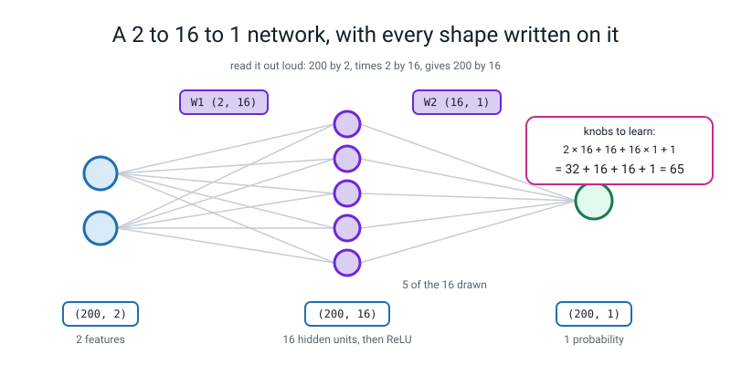
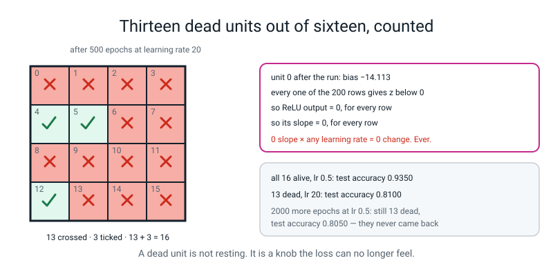
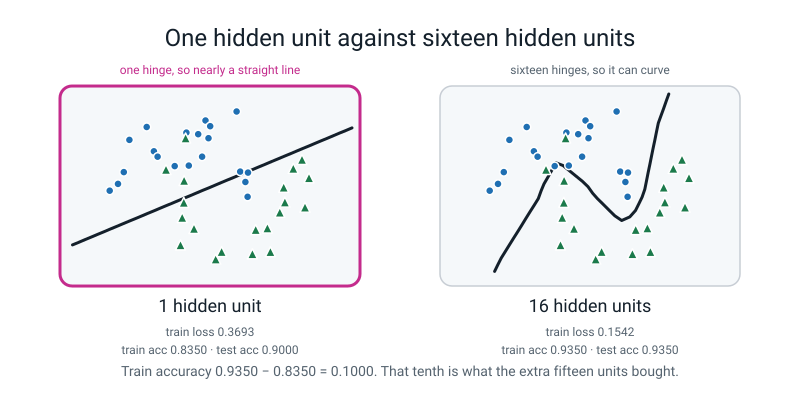
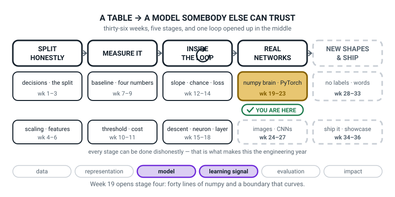
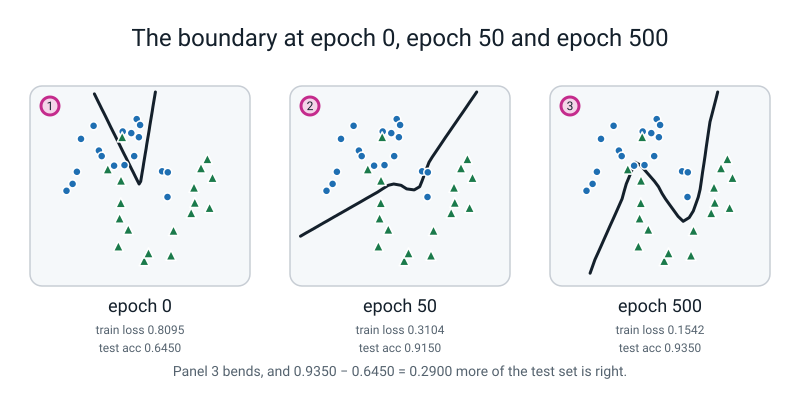

# Week 19 — NumPy Brain

[⬅ Week 18](week-18.md) · [Course Home](../README.md) · [Week 20 ➡](week-20.md) · [Student Guide](../student-guide/week-19.md) · [Workbook](../workbook/week-19.md)

---

## 📋 At a Glance

| | |
|---|---|
| **Duration** | 70 minutes |
| **Type** | 🟨 Project — the week the eight weeks since Week 12 turn into one file that runs |
| **Big idea** | Forty lines of numpy, no framework, and a boundary that actually **curves**. You have now built the thing everybody else imports. |
| **New vocabulary** | capacity · piecewise-linear · dead ReLU · vanishing gradient · decision boundary · symmetry |
| **New maths** | **None.** Not one new idea. Everything today was taught in Weeks 12–18; today it gets assembled and run. |
| **New syntax** | `make_moons(n_samples=400, noise=0.25, random_state=0)` · `np.meshgrid(xx, yy)` · `np.c_[a.ravel(), b.ravel()]` · `ax.contourf(XX, YY, Z)` |
| **Dataset** | `sklearn.datasets.make_moons(n_samples=400, noise=0.25, random_state=0)` — 400 points in two interleaving crescents, generated inside scikit-learn. **Nothing downloads. No internet needed.** |
| **Materials** | Printed workbook pages 19.1–19.6 · **three index cards per student** for the Break It predictions · the Bug Log · Week 17's shape table and Week 18's four gradient arrays still on the wall · a big sheet for the class boundary sketch |
| **Tech needed** | Laptop with Python 3, numpy, scikit-learn, matplotlib. **No PyTorch this week** — that is next week, on purpose. **No new installs.** |
| **Prep time** | 30 minutes the night before (20 of them running the code) · 5 minutes on the day |
| **Expected runtime of the code** | `numpy_brain.py` **under 1 second**. `plot_boundary.py` **about 1.5 seconds**. `break_it.py` **about 2 seconds**. Nothing today takes longer than a kettle. |

> **⚠️ Watch out:** this is a **project week, not a teaching week**, and the temptation is to fill it with explanation. Do not. The student has all the parts already — the forward pass from Week 17, the four gradient arrays from Week 18, the update rule from Week 15. What they have never done is **put them in one file and press go.** Your job today is to keep the room typing, and to stand behind them with two questions: *"what shape is that?"* and *"did the gradient check pass?"*

---

## 🎯 Lesson Objectives

By the end of the lesson the student can:

1. **Build a 2 → 16 → 1 network in pure numpy** that reaches **above 90% test accuracy** on `make_moons`, with the gradient check still passing below `1e-6`.
2. **Plot the decision boundary at epochs 0, 50 and 500** and point at the panel where it stops being a straight line.
3. **Break the network on purpose three ways** — all-zero initialization, learning rate 20, one hidden unit — and explain each failure in one sentence.
4. **Count the dead ReLUs** after a too-large learning rate and say what a dead unit costs you.

Observable evidence: `numpy_brain.py` printing a gradient check of `4.792e-08` and a final test accuracy of `0.9350`; a three-panel `boundary.png`; a filled-in Break It table with a prediction written **in pen before each run**; and the sentence *"a dead unit has slope zero, so no learning rate can ever move it again"* in the student's own words.

---

## 🧑‍🏫 What YOU Need to Know First

> **📌 About the code blocks in this guide.** Outside the **🧰 Prep Checklist** and the **🔑 Answer Key**, the blocks are **illustrations, not whole files** — each one carries on from the one above. **The complete runnable files are in the Prep Checklist and the Answer Key.**

**There is no new mathematics this week and no new idea.** That is worth knowing before you start worrying: today is a build. If you can read a shape off a printout and you can say "did the gradient check pass?", you can run this lesson. Twenty minutes with this section and one run of the code is genuinely enough.

### 1. What the student is building, in one paragraph

A **neural network** is a stack of the neurons they met in Week 16: multiply each input by a weight, add a bias, then squash. Today they stack two layers of them — sixteen neurons in the middle, one at the end — and train the whole thing by the loop from Week 15: measure how wrong you are, work out one slope per knob, nudge every knob against its slope, repeat.

The point of the week is the picture at the end. **A straight-line model cannot separate two interleaving crescents.** Sixteen hidden units can, and the boundary they draw bends. Nobody told the network to bend it. It bent because bending lowered the loss.


*Figure 19.1 — A 2 to 16 to 1 network, with every shape written on it. Read it out loud: 200 by 2, times 2 by 16, gives 200 by 16.*

> **decision boundary** — the line (or curve) where the model changes its mind. On one side it says class 0, on the other class 1. On our plots it is the black line where the predicted probability is exactly 0.5.

### 2. The parts list, and where each part came from

Print this and keep it beside you. **Every row is something the student already built.**

| Part | What it does | Which week it came from |
|---|---|---|
| `relu(z)` | keep positives, flatten negatives to zero | Week 16 |
| `sigmoid(z)` | squash any number into 0–1 | Week 13 |
| `forward(P, X)` | four lines: grid multiply, ReLU, grid multiply, squash | Week 17 |
| `loss_fn(A2, y)` | log loss — the surprise meter | Week 14 |
| `backward(P, cache, X, y)` | the four gradient arrays | Week 18 |
| `gradient_check(...)` | nudge one knob, divide, compare | Week 12 |
| the update `P[k] -= lr * g[k]` | step every knob against its slope | Week 15 |

The only genuinely new things in the file are **four lines of plotting syntax**, and they are in §6 below.

### 3. The numbers: how big is this network, exactly?

Two inputs. Sixteen hidden units. One output. So:

```
W1 is 2 rows by 16 columns   =  32 numbers
b1 is 1 row  by 16 columns   =  16 numbers
W2 is 16 rows by 1 column    =  16 numbers
b2 is 1 number               =   1 number
                               ─────────
                                 65 knobs
```

**32 + 16 + 16 + 1 = 65.** Say that out loud in class; it makes the model finite and knowable. Sixty-five numbers is fewer than the marks in a test paper. And every one of them gets its own slope, every epoch, five hundred times.

**The shape ladder, which is the single most useful thing on your board today.** A batch of 200 rows goes in. Follow the shapes:

| Line | Shapes involved | Result |
|---|---|---|
| `Z1 = X @ W1 + b1` | `(200, 2) @ (2, 16)`, then add `(1, 16)` | `(200, 16)` |
| `A1 = relu(Z1)` | shape never changes | `(200, 16)` |
| `Z2 = A1 @ W2 + b2` | `(200, 16) @ (16, 1)`, then add `(1, 1)` | `(200, 1)` |
| `A2 = sigmoid(Z2)` | shape never changes | `(200, 1)` |
| `dZ2 = (A2 - y) / n` | `(200, 1)` minus `(200, 1)` | `(200, 1)` |
| `dW2 = A1.T @ dZ2` | `(16, 200) @ (200, 1)` | `(16, 1)` ← same shape as `W2` ✅ |
| `dA1 = dZ2 @ W2.T` | `(200, 1) @ (1, 16)` | `(200, 16)` |
| `dZ1 = dA1 * (Z1 > 0)` | elementwise, so shape survives | `(200, 16)` |
| `dW1 = X.T @ dZ1` | `(2, 200) @ (200, 16)` | `(2, 16)` ← same shape as `W1` ✅ |

**The check that catches nearly every bug in this file: every gradient has exactly the same shape as the thing it is the gradient of.** `dW1` must be `(2, 16)` because `W1` is `(2, 16)`. If it is not, the transpose is in the wrong place. Write that sentence on the board and leave it there.

### 4. Every line of `numpy_brain.py`, explained to somebody who has never programmed

Here is the whole file in pieces. Nothing is assumed.

**The two squashers.**

```python
def relu(z):
    return np.maximum(0, z)


def sigmoid(z):
    return 1.0 / (1.0 + np.exp(-z))
```

`def name(argument):` means "here is a recipe called `name` that takes one thing in". `np.maximum(0, z)` compares every number in the grid `z` against 0 and keeps the larger — so `−3` becomes `0` and `2.2` stays `2.2`. `np.exp(-z)` is `e` to the power of minus that number, from Week 13. The whole `sigmoid` line squashes any number into the range 0 to 1.

**The knobs, and how they start.**

```python
def init_params(n_in, n_hidden, seed=0):
    rng = np.random.default_rng(seed)
    return {
        "W1": rng.normal(0, np.sqrt(2.0 / n_in), size=(n_in, n_hidden)),
        "b1": np.zeros((1, n_hidden)),
        "W2": rng.normal(0, np.sqrt(2.0 / n_hidden), size=(n_hidden, 1)),
        "b2": np.zeros((1, 1)),
    }
```

A **dictionary** — the `{ "name": value }` thing — is a labelled box: four grids of numbers, each with a name. `rng.normal(0, spread, size=(rows, cols))` fills a grid of that shape with random numbers centred on 0. The spread is the interesting bit:

```
layer 1:  sqrt(2 / 2)  = sqrt(1)      = 1.0
layer 2:  sqrt(2 / 16) = sqrt(0.125)  = 0.3536
```

That rule — *spread = the square root of two divided by however many inputs the layer has* — is called **He initialization**, and all you need to say about it is what it is for: **a layer with lots of inputs adds lots of numbers together, so each one should start smaller, or the sums come out enormous.** Sixteen inputs, so a smaller spread. Two inputs, so a bigger one. That is the whole idea, and a student who asks "why square root?" gets: *"because adding up n random numbers grows like the square root of n — we are cancelling that out."*

Biases start at exactly zero. That is fine and normal. **The weights are the things that must not start equal** — see §7.

**The forward pass.** Four lines, and it is Week 17 unchanged.

```python
def forward(P, X):
    Z1 = X @ P["W1"] + P["b1"]
    A1 = relu(Z1)
    Z2 = A1 @ P["W2"] + P["b2"]
    A2 = sigmoid(Z2)
    return {"Z1": Z1, "A1": A1, "Z2": Z2, "A2": A2}
```

`P["W1"]` means "the grid labelled W1 inside the box P". `@` is grid-times-grid. The four results are handed back together in another labelled box, because **the backward pass needs `Z1` and `A1` again** — that is what "cache" means when you see it: the numbers you kept from the way forward because you will need them on the way back.

**The loss.**

```python
def loss_fn(A2, y):
    p = np.clip(A2, 1e-12, 1 - 1e-12)
    return float(-np.mean(y * np.log(p) + (1 - y) * np.log(1 - p)))
```

Week 14, unchanged. `np.clip` drags any probability that has reached exactly 0 or exactly 1 a hair away from it, because `ln(0)` is not a number and would poison the average. `float(...)` turns a one-number grid into an ordinary number so it prints tidily.

**The backward pass.** Week 18, unchanged, and this is the part they should feel proud of.

```python
def backward(P, cache, X, y):
    n = X.shape[0]
    dZ2 = (cache["A2"] - y) / n
    dW2 = cache["A1"].T @ dZ2
    db2 = dZ2.sum(axis=0, keepdims=True)
    dA1 = dZ2 @ P["W2"].T
    dZ1 = dA1 * (cache["Z1"] > 0).astype(float)
    dW1 = X.T @ dZ1
    db1 = dZ1.sum(axis=0, keepdims=True)
    return {"W1": dW1, "b1": db1, "W2": dW2, "b2": db2}
```

Line by line: `n = X.shape[0]` is "how many rows". `(A2 - y) / n` is the blame at the output, shared out over the rows so the answer is an average and not a total. `.T` flips a grid on its diagonal, so `(200, 16)` becomes `(16, 200)` — it is there **to make the shapes meet**, nothing more mysterious than that. `.sum(axis=0, keepdims=True)` adds up the columns and keeps the result 2-D, so it still matches the bias's `(1, 16)`. `(cache["Z1"] > 0).astype(float)` is ReLU's own slope: 1 where the unit fired, 0 where it did not.

**The gradient check.** This is the most important function in the file, and it is the reason you can trust the rest.

```python
def gradient_check(P, X, y, h=1e-6):
    grads = backward(P, forward(P, X), X, y)
    worst = 0.0
    for name in ["W1", "b1", "W2", "b2"]:
        A = P[name]
        for i in range(A.shape[0]):
            for j in range(A.shape[1]):
                orig = A[i, j]
                A[i, j] = orig + h
                lp = loss_fn(forward(P, X)["A2"], y)
                A[i, j] = orig - h
                lm = loss_fn(forward(P, X)["A2"], y)
                A[i, j] = orig
                measured = (lp - lm) / (2 * h)
                mine = grads[name][i, j]
                bottom = max(1e-12, abs(measured) + abs(mine))
                worst = max(worst, abs(measured - mine) / bottom)
    return worst
```

Read it as English: *for every single knob — nudge it up a hair, see what the loss becomes; nudge it down a hair, see what the loss becomes; the difference divided by twice the hair is the slope. Then compare that against the slope my backward function claimed.* That is Week 12's nudge, `(f(w+h) − f(w−h)) ÷ 2h`, applied 65 times.

`bottom` is there so the comparison is **relative**: being out by 0.0001 matters if the slope is 0.0002 and does not matter if the slope is 900. And `A[i, j] = orig` — **always put the weight back** — is the line students forget. Measured: leaving it out shifts every weight by 1e-6, which is harmless to the result but means the check altered the model. It is in the Clinic.

**A number to expect: `4.792e-08`.** That is scientific notation for 0.00000004792. Anything below `1e-6` (0.000001) means the backward pass is correct. **This is not a hope, it is a measurement.**

**The training loop.**

```python
def train(P, X, y, lr, epochs, Xte=None, yte=None, log_every=100):
    history = []
    for e in range(epochs + 1):
        cache = forward(P, X)
        L = loss_fn(cache["A2"], y)
        history.append(L)
        if log_every and e % log_every == 0:
            line = f"epoch {e:>4}  train loss {L:.4f}"
            if Xte is not None:
                line += f"  test acc {accuracy(P, Xte, yte):.4f}"
            print(line)
        if e == epochs:
            break
        g = backward(P, cache, X, y)
        for k in P:
            P[k] -= lr * g[k]
    return history
```

`for e in range(epochs + 1)` counts 0, 1, 2 … 500. One trip round is one **epoch**: one look at all 200 rows. `e % log_every == 0` means "every hundredth trip, print something". `f"...{L:.4f}"` prints the loss to four decimal places. The last three lines are the whole of machine learning: **get the slopes, then move every knob a small step against its slope.**

### 5. What you will actually see on the screen, with the real numbers

**This is the real output of `numpy_brain.py`. You will see exactly this.**

```text
Xtr (200, 2)  ytr (200, 1)  Xte (200, 2)
gradient check (worst relative error): 4.792e-08

epoch    0  train loss 0.8095  test acc 0.6450
epoch  100  train loss 0.2612  test acc 0.9300
epoch  200  train loss 0.2015  test acc 0.9300
epoch  300  train loss 0.1740  test acc 0.9250
epoch  400  train loss 0.1604  test acc 0.9250
epoch  500  train loss 0.1542  test acc 0.9350

final train acc 0.9350
final test  acc 0.9350
```

**Four things to notice, and the second one is the objective.**

1. **`(200, 2)` and `(200, 1)`.** Two hundred training rows, two features, one answer column. 400 points split down the middle: 200 to train on, 200 to be judged on. **We keep half the data for testing because 400 rows is small, and a test score computed on 40 rows would wobble by five points on luck alone.** That is Week 11's worry, applied on purpose.
2. **`test acc 0.9350`.** Above 90%. Objective 1, met, by a file they typed.
3. **The loss falls fast then crawls**: 0.8095 → 0.2612 in a hundred epochs, then only to 0.1542 over the next four hundred. That is normal and it is what the log-scaled plot in Week 15 was for.
4. **Test accuracy is not monotone** — 0.9300, then 0.9250, then 0.9350. It goes *down* between epoch 100 and 400. Say so out loud. Accuracy is a count of 200 things; one point flipping either way moves it by 0.005. **The loss is smooth; the accuracy is lumpy.** A student who worries about the wobble has understood something real.

### 6. The four new lines: how a boundary gets drawn

This is the only genuinely new syntax this week, and all four lines exist to answer one question: *"what would the model say about every point on the page, not just the 200 we have?"*

**New line 1 — the data.**

```python
X, y = make_moons(n_samples=400, noise=0.25, random_state=0)
```

`make_moons` invents 400 points arranged as two interleaving crescent moons, 200 in each class. It downloads nothing. `noise=0.25` scatters them so the crescents blur into each other at the ends — **the data is deliberately not perfectly separable**, so 100% is not on offer and the honest ceiling is somewhere in the low 90s. `random_state=0` is the seed: same 400 points on your laptop and theirs.

**New line 2 — a grid of every point on the page.**

```python
gx = np.linspace(-2.6, 2.6, 200)
gy = np.linspace(-2.4, 2.4, 200)
XX, YY = np.meshgrid(gx, gy)
```

`np.linspace(a, b, n)` is Week 12: `n` evenly spaced numbers from `a` to `b`. `np.meshgrid` takes those two lists of 200 and builds **two grids of 200 × 200 = 40,000 numbers**: `XX` holds the across-coordinate of every point on the page, `YY` holds the up-coordinate. Think of a sheet of graph paper: `XX` is "which column am I in", `YY` is "which row".

**New line 3 — turn the grid into rows the model can eat.**

```python
grid = np.c_[XX.ravel(), YY.ravel()]
```

`.ravel()` unrolls a 200 × 200 grid into one long line of 40,000 numbers. `np.c_[a, b]` glues two of those lines together **side by side as columns**, giving a table of 40,000 rows and 2 columns — which is exactly the shape `forward()` wants. `print(grid.shape)` prints `(40000, 2)`, and printing it is a good habit to model.

**New line 4 — colour the page in.**

```python
Z = forward(P, grid)["A2"].reshape(XX.shape)
ax.contourf(XX, YY, Z, levels=20, cmap="coolwarm", alpha=0.7)
ax.contour(XX, YY, Z, levels=[0.5], colors="black", linewidths=2)
```

The model gives one probability per row: 40,000 numbers in a `(40000, 1)` column. `.reshape(XX.shape)` folds them back into the 200 × 200 grid they came from. `ax.contourf` fills the page with colour by value — blue where the probability is low, red where it is high. `ax.contour(..., levels=[0.5])` draws a single black line along the places where the probability is exactly 0.5. **That black line is the decision boundary.**

> **⚠️ Watch out:** `.reshape(XX.shape)` is the step everybody forgets, and matplotlib's complaint is genuinely confusing: `TypeError: Input z must be at least a (2, 2) shaped array, but has shape (40000, 1)`. It is in the Clinic, and it is deliberate mistake number two in the live-code.

### 7. The three breakages, and why each one happens

The last fifteen minutes of the lesson is **Break It Three Ways**. You need to understand all three before you walk in, because the students will predict wrongly and then want to know why.

**Breakage 1 — every weight starts at zero. The loss parks at 0.6931 and never moves.**

Set `W1` and `W2` to all zeros and train for 500 epochs. Real output:

```text
epoch    0  train loss 0.6931
epoch  250  train loss 0.6931
epoch  500  train loss 0.6931
test acc 0.5000   dead units 16/16
```

Here is the arithmetic, and it is the best two minutes of the lesson. With all weights zero, every hidden unit computes `0 × x1 + 0 × x2 + 0 = 0`, ReLU leaves it at 0, the output is `0 × 0 + ... + 0 = 0`, and `sigmoid(0) = 0.5`. So the network answers **0.5 to every single point.** Its loss is:

```
−ln(0.5) = 0.693147...
```

**0.6931 is the loss of a model that shrugs.** It will show up again in Weeks 20–27 and it is worth memorising: if your loss sits at 0.6931 and will not budge, your network is outputting 0.5 for everything.

Why can it not learn its way out? Because `dW1 = X.T @ dZ1`, and `dZ1 = dA1 * (Z1 > 0)` where `dA1 = dZ2 @ W2.T` — and `W2` is all zeros, so `dA1` is all zeros, so `dZ1` is all zeros, so **`dW1` is exactly zero.** The slope of every first-layer knob is zero. There is no downhill. The measured check confirms it: `dW1 all zero? True`, `dW2 all zero? True`, and `db2 = 6.07e-18`, which is floating-point dust around zero because our 200 training rows are exactly 100 of each class and `0.5 − y` averages to nothing.

> **symmetry** — when two units start with identical weights, they get identical gradients, so they stay identical for ever. Sixteen identical units are not sixteen units; they are one unit, copied.

**And symmetry bites even when the weights are not zero.** Start every weight at 0.5 instead:

```text
all-weights-equal init: loss 1.4117 -> 0.3697  test acc 0.9000
W1 after 500 epochs, first 4 columns:
[[ 0.20411   0.20411   0.20411   0.20411 ]
 [-0.342578 -0.342578 -0.342578 -0.342578]]
are all 16 hidden columns identical? True
```

It learns *something* — 0.9000 — but every one of the sixteen columns is the same number to six decimal places, so it is a **one-unit network wearing a sixteen-unit costume**, and its accuracy is exactly the one-unit accuracy. **That is why initial weights are random. Randomness is not decoration; it is the only thing that makes the units different from each other.**

**Breakage 2 — learning rate 20. Units die.**

```text
epoch    0  train loss 0.8095
epoch  250  train loss 0.6429
epoch  500  train loss 0.4493
test acc 0.8100   dead units 13/16
```

> **dead ReLU** — a hidden unit whose output is zero for *every* row in the data. It contributes nothing forward, so it receives no blame backward, so its slope is exactly zero, so it can never change again.

The mechanism, in numbers. One enormous step drives a unit's bias far negative. Unit 0 ended with `bias = −14.113`. Every row's weighted sum plus that bias comes out below zero, so `max(0, negative) = 0` for all 200 rows. ReLU's slope where it did not fire is **0**, so that unit's gradient is 0, so:

```
0 slope × any learning rate = 0 change.  Ever.
```

We tested exactly that: after the lr = 20 run, we trained for **2000 more epochs at a gentle lr = 0.5**, and the count was **still 13 dead**, with test accuracy drifting to 0.8050. **They do not come back.** Three surviving units did the work, and three units score 0.8100 where sixteen score 0.9350.


*Figure 19.2 — Thirteen dead units out of sixteen, counted. 13 crossed + 3 ticked = 16, and a dead unit's slope is zero for ever.*

> **vanishing gradient** — a slope so small that the knob effectively stops moving, however long you train. A dead ReLU is the extreme case: the slope is not small, it is exactly zero.

**Breakage 3 — one hidden unit. The boundary goes straight again.**

```text
first loss 0.6628   last loss 0.3693
test acc 0.9000   dead units 0/1
```

Nothing is broken. Nothing dies. The network simply **cannot bend**. One ReLU unit gives you one hinge, but the boundary it produces is still one straight line (a kink needs a second unit to bend against) — and against sixteen units:

| | 1 hidden unit | 16 hidden units |
|---|---|---|
| train loss | 0.3693 | **0.1542** |
| train accuracy | 0.8350 | **0.9350** |
| test accuracy | 0.9000 | **0.9350** |
| knobs | 5 | 65 |

**Train accuracy 0.9350 − 0.8350 = 0.1000.** That tenth is what the extra fifteen units bought.

> **capacity** — how complicated a shape a model is able to draw. More hidden units, more capacity.
>
> **piecewise-linear** — made of straight pieces joined at corners. A ReLU network's boundary is never a smooth curve; it is a lot of short straight segments, one hinge per unit. Sixteen hinges *look* like a curve.

**Be honest about one number here.** The 1-unit test accuracy, 0.9000, is not far off the 16-unit 0.9350, and a straight-line model — logistic regression — scores 0.8950 on this split. On 200 test rows, seven points is the whole difference. **The place the capacity shows up unmistakably is the training loss (0.3693 against 0.1542) and the shape of the boundary.** Say that plainly; a student who notices the test scores are close has noticed something true, and pretending otherwise costs you their trust.


*Figure 19.3 — One hidden unit against sixteen hidden units. One hinge is nearly a straight line; sixteen hinges can curve.*

### 8. The three misconceptions you will actually meet

**Misconception 1 — "more hidden units is always better."**
Not always, and we have the measurement. Sixteen units score 0.9350 on test; **sixty-four units score 0.9550 on train and only 0.9150 on test.** The big one has learned the noise in the training crescents — Week 2's overfitting, reappearing with a new dial to turn. The cure is the sweep in workbook page 19.6, done with their own hands.

**Misconception 2 — "the network is drawing a curve."**
It is drawing up to sixteen straight lines and joining them. Zoom into the boundary plot and the corners are visible. This matters because it explains everything about capacity in one sentence: **you get one hinge per unit, so the number of units is the number of bends you are allowed.**

**Misconception 3 — "the gradient check is a formality."**
It is the opposite: it is the only reason to believe the file. A network with a wrong backward pass **still trains**, usually to a mediocre score, and never tells you. The check is the difference between "my loss went down so it must be right" and "my slopes are correct to eight decimal places". Make them run it before they train, every time.

### 9. How deep to go, and where to stop

**Go this far:** the file runs; the gradient check prints below `1e-6`; the test accuracy is above 0.90; the three boundary panels exist; all three breakages have been predicted in pen and then run; the student can say what a dead unit costs.

**Stop before:**

| Do not teach today | Where it lives |
|---|---|
| **PyTorch, `torch`, autograd** | **Week 20, next week.** Somebody will ask whether a library does this. The honest answer: *"yes, and next week it does the whole backward pass in one line — which is only impressive because you have now done it by hand."* Do not show them a line of torch today. |
| Momentum, Adam, learning-rate schedules | **Week 26** brings `Adam`. Today the learning rate is a number you type. |
| Leaky ReLU, ELU, "just use a different activation" | Name it if asked — *"there is a version of ReLU with a small slope on the left, and it exists exactly because of dead units"* — then stop. It is not in this level. |
| Dropout, weight decay, any regularisation | Not in this level as a lesson. The 64-unit overfit is diagnosed, not fixed. |
| More than one hidden layer | Stretch task only (page 19.6 variation), never required. |
| Softmax and more than two classes | **Week 26**, with `nn.CrossEntropyLoss`. |
| Mini-batches | **Week 23**, with `DataLoader`. Today every epoch uses all 200 rows at once. |
| Why deep networks generalise at all | Nobody fully knows. See the Questions section — it is the honest answer and it is a good one. |

The line to hold all lesson: **today you finish the thing. It is 65 numbers, you know what every one of them is for, and it draws a curve.**

---

### 10. 🧭 The Growing Map — the week the gold box finally moves

The student guide carries a figure called **Where This Fits**: the same picture every week with one
more piece filled in. Today it moves for the first time since Week 15, and it moves into a new stage.
On a project week the map is also your wrap-up, so it is worth the full two minutes.



*Figure 19.0 — Week 19's version. Stage three is finished in plain white; `REAL NETWORKS` goes solid
and the gold badge is inside it. The ↻ on stage three stays black, as it has since Week 12.*

**What to do with it, in about two minutes at the end of the lesson:**

1. **Ask "which box did we do today?" — and let them notice it moved.** After four weeks of pointing at
   the same tile, somebody will spot it: the gold is now `numpy brain · PyTorch`, weeks 19 to 23, and
   stage three behind it has gone plain white. *"You finished a stage last week. Today you started a
   new one — and you started it with a network you wrote yourself."*
2. **Anchor it on the two numbers on their screens.** `4.792e-08` and `0.9350`. *"The first says your
   backward pass is right. The second says the model works. In that order, always — the gradient check
   comes before the accuracy, because a wrong backward pass still trains and never tells you."* Then
   point at the three-panel `boundary.png`: *"panel three is why stage three had to come first."*
3. **Point at the tile's own name and at the two stages still dashed.** The tile reads `numpy brain ·
   PyTorch`: half of it is done today, and PyTorch is the other four weeks. *"Everything in the two
   dashed stages — pictures, clusters, words, your showcase project — is what you built today, bigger.
   There is no part of it you have not now written from scratch."*

> **🧑‍🏫 Why this is worth two minutes.** On a project week students judge themselves by how much
> typing they did, and today's file is forty lines. The map converts forty lines into eight weeks: the
> gold box moving is the visible receipt for Weeks 12 to 18. Learners who have quietly been wondering
> whether the maths was going anywhere get their answer here, and it is the answer that carries them
> into PyTorch next week willing to believe there is nothing magic in it.

**One thing to notice, so you can answer if asked.** `learning signal` is lit beside `model` — the
first week since Week 15 that it has been on — and `evaluation` is dark despite a test accuracy being
printed. That is defensible in one sentence: *"we reported one number on one split, which is Week 7
work, not new evaluation."* If a student argues the other way, they are arguing well; tell them so.

---

## 🧰 Prep Checklist

### 30 minutes the night before

- [ ] **Type and run `numpy_brain.py` yourself.** The complete file:

```python
"""numpy_brain.py - a 2 -> 16 -> 1 network in pure numpy. No framework."""
import numpy as np
from sklearn.datasets import make_moons
from sklearn.model_selection import train_test_split
from sklearn.preprocessing import StandardScaler


def relu(z):
    return np.maximum(0, z)


def sigmoid(z):
    return 1.0 / (1.0 + np.exp(-z))


def init_params(n_in, n_hidden, seed=0):
    rng = np.random.default_rng(seed)
    return {
        "W1": rng.normal(0, np.sqrt(2.0 / n_in), size=(n_in, n_hidden)),
        "b1": np.zeros((1, n_hidden)),
        "W2": rng.normal(0, np.sqrt(2.0 / n_hidden), size=(n_hidden, 1)),
        "b2": np.zeros((1, 1)),
    }


def forward(P, X):
    Z1 = X @ P["W1"] + P["b1"]
    A1 = relu(Z1)
    Z2 = A1 @ P["W2"] + P["b2"]
    A2 = sigmoid(Z2)
    return {"Z1": Z1, "A1": A1, "Z2": Z2, "A2": A2}


def loss_fn(A2, y):
    p = np.clip(A2, 1e-12, 1 - 1e-12)
    return float(-np.mean(y * np.log(p) + (1 - y) * np.log(1 - p)))


def backward(P, cache, X, y):
    n = X.shape[0]
    dZ2 = (cache["A2"] - y) / n
    dW2 = cache["A1"].T @ dZ2
    db2 = dZ2.sum(axis=0, keepdims=True)
    dA1 = dZ2 @ P["W2"].T
    dZ1 = dA1 * (cache["Z1"] > 0).astype(float)
    dW1 = X.T @ dZ1
    db1 = dZ1.sum(axis=0, keepdims=True)
    return {"W1": dW1, "b1": db1, "W2": dW2, "b2": db2}


def gradient_check(P, X, y, h=1e-6):
    grads = backward(P, forward(P, X), X, y)
    worst = 0.0
    for name in ["W1", "b1", "W2", "b2"]:
        A = P[name]
        for i in range(A.shape[0]):
            for j in range(A.shape[1]):
                orig = A[i, j]
                A[i, j] = orig + h
                lp = loss_fn(forward(P, X)["A2"], y)
                A[i, j] = orig - h
                lm = loss_fn(forward(P, X)["A2"], y)
                A[i, j] = orig
                measured = (lp - lm) / (2 * h)
                mine = grads[name][i, j]
                bottom = max(1e-12, abs(measured) + abs(mine))
                worst = max(worst, abs(measured - mine) / bottom)
    return worst


def accuracy(P, X, y):
    pred = (forward(P, X)["A2"] >= 0.5).astype(int)
    return float((pred == y).mean())


def train(P, X, y, lr, epochs, Xte=None, yte=None, log_every=100):
    history = []
    for e in range(epochs + 1):
        cache = forward(P, X)
        L = loss_fn(cache["A2"], y)
        history.append(L)
        if log_every and e % log_every == 0:
            line = f"epoch {e:>4}  train loss {L:.4f}"
            if Xte is not None:
                line += f"  test acc {accuracy(P, Xte, yte):.4f}"
            print(line)
        if e == epochs:
            break
        g = backward(P, cache, X, y)
        for k in P:
            P[k] -= lr * g[k]
    return history


def get_data():
    X, y = make_moons(n_samples=400, noise=0.25, random_state=0)
    y = y.reshape(-1, 1).astype(float)
    Xtr, Xte, ytr, yte = train_test_split(X, y, test_size=0.50,
                                          stratify=y, random_state=0)
    sc = StandardScaler().fit(Xtr)
    return sc.transform(Xtr), sc.transform(Xte), ytr, yte


if __name__ == "__main__":
    Xtr, Xte, ytr, yte = get_data()
    print("Xtr", Xtr.shape, " ytr", ytr.shape, " Xte", Xte.shape)
    P = init_params(2, 16, seed=0)
    print("gradient check (worst relative error): %.3e"
          % gradient_check(P, Xtr[:20], ytr[:20]))
    print()
    train(P, Xtr, ytr, lr=0.5, epochs=500, Xte=Xte, yte=yte, log_every=100)
    print()
    print("final train acc %.4f" % accuracy(P, Xtr, ytr))
    print("final test  acc %.4f" % accuracy(P, Xte, yte))
```

Run `python3 numpy_brain.py`. You must see **exactly** this:

```text
Xtr (200, 2)  ytr (200, 1)  Xte (200, 2)
gradient check (worst relative error): 4.792e-08

epoch    0  train loss 0.8095  test acc 0.6450
epoch  100  train loss 0.2612  test acc 0.9300
epoch  200  train loss 0.2015  test acc 0.9300
epoch  300  train loss 0.1740  test acc 0.9250
epoch  400  train loss 0.1604  test acc 0.9250
epoch  500  train loss 0.1542  test acc 0.9350

final train acc 0.9350
final test  acc 0.9350
```

**Expected runtime: under 1 second.** If your gradient check is not `4.792e-08`, a seed is missing: check `random_state=0` in `make_moons`, `random_state=0` in `train_test_split`, and `seed=0` in `init_params`.

- [ ] **Run `plot_boundary.py`** (full file in the Answer Key, page 19.4) and **look at the PNG**. Three panels. Panel 1 is a straight line, panel 3 bends. Expected runtime about **1.5 seconds**. Its printed output is:

```text
XX shape (200, 200)  grid shape (40000, 2)
wrote boundary.png
epoch   0  loss 0.8095  test acc 0.6450
epoch  50  loss 0.3104  test acc 0.9150
epoch 500  loss 0.1542  test acc 0.9350
```

- [ ] **Run `break_it.py`** (full file in the Answer Key, page 19.5) so the three failures are not a surprise in the room. Expected runtime about **2 seconds**. You will see a `RuntimeWarning: overflow encountered in exp` if you include the `lr = 100` row — that is expected and it is a Clinic entry.
- [ ] **Do this one thing by hand, on paper, before you teach it:** `−ln(0.5)`. Any calculator: `ln(0.5) = −0.693147`, so the answer is `0.693147`. **If you have not done that division yourself you will not sound convincing when 0.6931 appears on the screen and you say "that is the loss of a model that shrugs".**
- [ ] **Break it on purpose, twice**, so both deliberate mistakes are muscle memory:
  1. Delete `.reshape(-1, 1)` from `y` in `get_data()`. **No error appears.** The loss prints `0.9534` instead of `0.8095`, because `A2 - y` quietly became a `(200, 200)` grid. This is deliberate mistake one.
  2. Write `dW1 = X @ dZ1` instead of `dW1 = X.T @ dZ1`. Real message: `ValueError: matmul: Input operand 1 has a mismatch in its core dimension 0 ... (size 200 is different from 2)`. This is deliberate mistake two.
- [ ] **Print workbook pages 19.1–19.6.**
- [ ] **Three index cards per student**, blank, for the Break It predictions.
- [ ] **Leave Week 17's shape table and Week 18's four gradient arrays on the wall.** You will point at both today.

### 5 minutes on the day

- [ ] Editor open, terminal ready. **`numpy_brain.py` deleted or renamed** — they type it, or they extend last week's file if they have one.
- [ ] `boundary.png` from your own run open in a window you can show at the end of the hook — **and then closed**, so they build their own.
- [ ] Workbook 19.1 out, with the three predictions **written in pen before any breaking happens**.
- [ ] Bug Log out.
- [ ] Big sheet on the wall with two empty axes drawn, ready for the class boundary sketch.

### Fallback if the laptops fail

**Paper works better this week than you would expect**, because the two hardest ideas — capacity and dead units — are pictures, not code.

1. **The hinge activity, unplugged.** Give them graph paper and this rule: *"draw a straight line. Now you are allowed one bend. Now two. Now sixteen."* Ask: *"how many bends do you need to separate two interlocking crescents?"* Two or three is usually enough. **That is capacity, and it lands harder with a pencil than with a plot.**
2. **The zero-weights arithmetic, by hand.** Every weight zero, so every hidden output is 0, so the final sum is 0, so the answer is `sigmoid(0) = 0.5`, so the loss is `−ln(0.5) = 0.6931`. Then the killer question: *"what is the slope of a knob that has no effect on the answer?"* Zero. **Breakage 1, complete, with no computer.**
3. **The dead-unit arithmetic, by hand.** `bias = −14.113`. Weighted sum for a typical row, say `0.6 × 1.2 + (−2.9) × 0.4 = 0.72 − 1.16 = −0.44`. Add the bias: `−14.55`. `max(0, −14.55) = 0`. Slope of ReLU below zero: `0`. Then: `0 × 0.5 = 0`. **Breakage 2, complete, and this is the best paper item of the week.**
4. **Sketch the three boundary panels on the wall sheet** from your own printout of `boundary.png` while they copy them into 19.4, and write the loss and test accuracy under each.

| If this fails | Do this instead |
|---|---|
| The gradient check prints something like `2.3e-01` | The backward pass is wrong, not the check. Nine times in ten it is a missing `.T`, and the shape ladder in §3 finds it in twenty seconds. |
| The gradient check prints `nan` | The loss or a slope overflowed or hit `log(0)`; look at the learning rate / inputs. (A missing `A[i, j] = orig` only shifts each weight by 1e-6; it does not give `nan`.) |
| The loss sits at exactly `0.6931` | Weights are all zero, or all equal. That is breakage 1, arriving early — use it. |
| The loss is `nan` after a few epochs | The learning rate is far too large. Ours is 0.5; anything above about 5 on this data starts killing units, and 100 gives `nan`. |
| Test accuracy is 0.5000 | The network is answering the same thing for everything. Print `forward(P, Xte)["A2"][:5]` — if they are all 0.5, see breakage 1. |
| `boundary.png` is one flat colour | The model has not been trained, or `Z` was reshaped wrong. Print `Z.min()` and `Z.max()`; if they are both 0.5, it is the first. |
| A student's numbers differ from the guide in the fourth decimal | Check all three seeds. **A printed number from an unseeded run is not a result** — same rule as every week since Week 1. |

---

## ⏱️ The Lesson, Minute by Minute

| Segment | Minutes | Running total | What happens |
|---|---|---|---|
| 🪝 Hook — The Line That Cannot Win | 7 | 7 | Two crescents on the board, and one straight line that fails |
| 🧠 Concept — The Parts List and the Shape Ladder | 18 | 25 | 65 knobs; the shape of every gradient; what the check proves |
| 💻 Live-Code Together — assemble and run | 18 | 43 | Build it, check it, train it, draw it. **Two deliberate mistakes.** |
| 🎲 Their Turn — Break It Three Ways | 20 | 63 | Predict in pen, then break: zeros, lr 20, one unit |
| 🔑 Wrap & Assign | 7 | 70 | Three checks, the takeaway, homework |

---

### 🪝 Hook — The Line That Cannot Win (7 minutes)

**Do this:** On the board, draw two interlocking crescents — like two bananas hooked around each other. Mark one lot with circles and the other with triangles. **Do not put anything on the screen yet.**

**Say this:**

> "Two hundred deliveries, plotted by two features. Circles arrived on time. Triangles were late. Look at the shape of it — they interlock, like two hands with the fingers laced together.
>
> Here is your job, and you have to do it with the only tool Level 2 gave you: **one straight line.** Come and draw it. Whichever side of your line a point falls on, that is your answer.
>
> Anyone who wants to try?"

**Do this:** Let two or three students come up and draw a line. Every line leaves a fat handful of points on the wrong side. **Count the mistakes out loud each time.** Do not rescue them.

**Ask this:** "What is the best any straight line can do here?"

*Hoped-for answer:* not very good — maybe 80-something per cent, because the tips of the crescents always end up on the wrong side.

*If they say "you could get it perfect with a curve":* **"Yes. Hold that thought for six minutes, because that is exactly what you are building today."**

*If they say "add more features":* "Good instinct, and that is Week 5's move. Today we have exactly two features and we are going to change the *model* instead."

**Say this:**

> "The honest number for the best straight line on this data is **0.8950** on the test rows — that is what logistic regression scores here, and we measured it. That is the wall.
>
> Now, since Week 12 you have built five things: how to measure a slope by nudging, how to squash a score into a probability, how to score a probability with log loss, how to step downhill, and — last week, and it was the hardest thing you have done — **how to work out how much each of a hundred knobs contributed to the error.**
>
> They have been five separate exercises. Today they become one file. Forty lines. No library that knows anything about neural networks — numpy can multiply grids, and that is all the help you get.
>
> And the deal is this: **when it works, your boundary will bend.** Nobody will tell it to bend. It will bend because bending makes the loss smaller."

**Do this:** Show your own `boundary.png` for **fifteen seconds** — long enough to see panel 3 curve — then close it.

> "That is where you are going. Two hundred rows, sixty-five knobs, and a curve. Let us count the knobs first."

---

### 🧠 Concept — The Parts List and the Shape Ladder (18 minutes)

**Do this:** Point at the wall — Week 17's shape table, Week 18's gradient arrays.

**Say this:**

> "Nothing on this board is new. That is the point of today. Let me show you what you already own."

**Do this:** Write the parts list on the board, in this order, saying which week each came from. Six lines, no more:

```
forward   →  Week 17   (grid multiply, ReLU, grid multiply, squash)
loss      →  Week 14   (log loss: the surprise meter)
backward  →  Week 18   (four gradient arrays)
check     →  Week 12   (nudge, divide, compare)
update    →  Week 15   (w ← w − lr × slope)
draw      →  TODAY     (four new lines of plotting)
```

**Say this:**

> "Five of those six are yours already. The sixth is four lines long and it exists only so you can see what you built."

**Do this (2 min) — count the knobs on the board.**

```
W1 : 2 rows × 16 columns  = 32
b1 : 1 × 16               = 16
W2 : 16 × 1               = 16
b2 : 1                    =  1
                          ─────
                            65
```

**Ask this:** "Sixty-five knobs. How many slopes does the backward pass have to produce, every single epoch?"

*Hoped-for answer:* sixty-five.

*If they say "four":* "Four *arrays*, yes — and how many numbers inside them?" Then count together. **The distinction between four arrays and 65 numbers is worth thirty seconds.**

> **Say this:** "Sixty-five slopes, five hundred times over. That is 32,500 slopes this afternoon, and last week you did nine of them by hand and it took you twenty minutes. That is what a computer is for."

**Do this (8 min) — build the shape ladder on the board.** This is the heart of the segment and it must end up written down, because they will use it all lesson to debug.

Write the left column first, then ask for each shape **before** you write it.

| Line | Shapes | Result |
|---|---|---|
| `Z1 = X @ W1 + b1` | `(200, 2) @ (2, 16)` | `(200, 16)` |
| `A1 = relu(Z1)` | unchanged | `(200, 16)` |
| `Z2 = A1 @ W2 + b2` | `(200, 16) @ (16, 1)` | `(200, 1)` |
| `A2 = sigmoid(Z2)` | unchanged | `(200, 1)` |
| `dZ2 = (A2 - y) / n` | `(200,1) − (200,1)` | `(200, 1)` |
| `dW2 = A1.T @ dZ2` | `(16, 200) @ (200, 1)` | `(16, 1)` |
| `dA1 = dZ2 @ W2.T` | `(200, 1) @ (1, 16)` | `(200, 16)` |
| `dZ1 = dA1 * (Z1 > 0)` | elementwise | `(200, 16)` |
| `dW1 = X.T @ dZ1` | `(2, 200) @ (200, 16)` | `(2, 16)` |

**Ask this, at the `dW2` row:** "Why does `A1` get transposed there?"

*Hoped-for answer:* so the inner numbers match — `(16, 200)` against `(200, 1)`.

*If they say "because that's the rule":* push once. *"What would happen if we didn't?"* `(200, 16) @ (200, 1)` — 16 against 200 — nothing happens, it errors. **The transpose is not ceremony; it is the only way the two blocks fit together.**

**Ask this, at the end:** "Look at `dW1`. It came out `(2, 16)`. What shape is `W1`?"

*Hoped-for answer:* `(2, 16)` — the same.

> **Say this:** "Write this on your page and box it: **every gradient has exactly the same shape as the thing it is the gradient of.** If your `dW1` is not `(2, 16)`, you do not need to think about calculus — you need to find the transpose you put in the wrong place. That one sentence will save you twenty minutes today."

**Do this (5 min) — the gradient check, explained as the only thing you trust.**

**Say this:**

> "Before we train, we check. Here is why, and it is the most grown-up idea of the week.
>
> Suppose your backward pass has a bug. What happens? **The loss still goes down.** Not as far, not as fast, but down — so nothing looks wrong. You get a mediocre model and you never find out why. A wrong backward pass does not crash. It just quietly makes you worse.
>
> So we test it against something we cannot get wrong: **Week 12's nudge.** Take one knob. Add a hair. What does the loss become? Take away a hair. What does the loss become? Subtract, divide by twice the hair. That is the slope, and it needed no calculus at all — just two subtractions and a division.
>
> Then compare it with what the backward pass claimed. If they agree to eight decimal places, the backward pass is right. And if they do not, you have a bug, and you know it in one second instead of never."

**Ask this:** "The check prints `4.792e-08`. Is that big or small?"

*Hoped-for answer:* tiny — it is 0.00000004792.

> "Below `1e-6` and we are happy. **This is the only number today that is a proof rather than an opinion.**"

---

### 💻 Live-Code Together — assemble and run (18 minutes)

**You never touch their keyboard.**

**Step 1 (4 min) — the data, and look at the shapes.**

```python
"""numpy_brain.py - a 2 -> 16 -> 1 network in pure numpy. No framework."""
import numpy as np
from sklearn.datasets import make_moons
from sklearn.model_selection import train_test_split
from sklearn.preprocessing import StandardScaler

X, y = make_moons(n_samples=400, noise=0.25, random_state=0)
y = y.reshape(-1, 1).astype(float)
Xtr, Xte, ytr, yte = train_test_split(X, y, test_size=0.50,
                                      stratify=y, random_state=0)
sc = StandardScaler().fit(Xtr)
Xtr, Xte = sc.transform(Xtr), sc.transform(Xte)
print("Xtr", Xtr.shape, " ytr", ytr.shape, " Xte", Xte.shape)
```

```text
Xtr (200, 2)  ytr (200, 1)  Xte (200, 2)
```

> **Say this:** "Four hundred points, split down the middle: 200 to learn from, 200 to be judged on. Half the data held back is a lot, and it is deliberate — 400 rows is small, and a test score computed on 40 rows would move five points on luck alone.
>
> And `y.reshape(-1, 1)`. `make_moons` hands back the answers as a flat line of 400 numbers, shape `(400,)`. We need a column, `(400, 1)`. In sixty seconds I am going to delete that line and show you what happens, because it is the nastiest bug in this file."

**Step 2 (3 min) — 🐞 DELIBERATE MISTAKE ONE: delete the reshape.**

Delete `.reshape(-1, 1)` so the line reads `y = y.astype(float)`, then paste in the params, forward and loss functions and print the starting loss.

Real output:

```text
loss with flat y: 0.9534
shape of A2 - yflat: (200, 200)
```

**Do this:** Say nothing. Write `0.9534` on the board next to `0.8095`.

**Ask this:** "Two different starting losses from the same network on the same data. And did anything go red?"

*Hoped-for answer:* no error at all.

> **Say this:** "Nothing complained. Look at the second line: **`A2 - y` came out `(200, 200)`.** Forty thousand numbers, from a column of 200 minus a row of 200. Numpy did what numpy always does — it broadcast — and it made a grid where every prediction was compared against every answer, including the 199 answers that belong to other people.
>
> The loss it printed is a real number. It is just a real number about a question nobody asked.
>
> **This is the shape bug of the year, and the cure is one line: print the shape.** `print(y.shape)` — if it says `(200,)` and not `(200, 1)`, stop and fix it before you do anything else."

Fix it live. Loss returns to `0.8095`. **Bug Log entry, ninety seconds**, and make sure the words *"no error, wrong answer, print the shape"* are in it.

**Step 3 (4 min) — the backward pass and 🐞 DELIBERATE MISTAKE TWO.**

Type `backward()` but write `dW1 = X @ dZ1`, without the transpose:

```text
Traceback (most recent call last):
  File "numpy_brain.py", line 46, in backward
    dW1 = X @ dZ1
ValueError: matmul: Input operand 1 has a mismatch in its core dimension 0, with gufunc signature (n?,k),(k,m?)->(n?,m?) (size 200 is different from 2)
```

**Do this:** Point at the last five words: `size 200 is different from 2`.

**Ask this:** "The error names two numbers, 200 and 2. Where do they come from, and which one is wrong?"

*Hoped-for answer:* `X` is `(200, 2)` and `dZ1` is `(200, 16)`; the inner numbers are 2 and 200, and they must match.

> **Say this:** "This is the friendly kind of error — it stops, and it tells you the two numbers that disagree. Look at the ladder on the board. We want `dW1` to come out `(2, 16)`, and the only way to get a 2 on the left is to flip `X` so it is `(2, 200)`. `X.T`. **The transpose exists to make the shapes meet.**"

Fix it. **Bug Log.**

**Step 4 (4 min) — check, then train.**

```python
P = init_params(2, 16, seed=0)
print("gradient check (worst relative error): %.3e"
      % gradient_check(P, Xtr[:20], ytr[:20]))
train(P, Xtr, ytr, lr=0.5, epochs=500, Xte=Xte, yte=yte, log_every=100)
```

**Ask before running:** "What has to be true of that first number for us to carry on?"

*Hoped-for answer:* smaller than `1e-6`.

```text
gradient check (worst relative error): 4.792e-08

epoch    0  train loss 0.8095  test acc 0.6450
epoch  100  train loss 0.2612  test acc 0.9300
epoch  200  train loss 0.2015  test acc 0.9300
epoch  300  train loss 0.1740  test acc 0.9250
epoch  400  train loss 0.1604  test acc 0.9250
epoch  500  train loss 0.1542  test acc 0.9350
```

> **Say this:** "`4.792e-08`. Your backward pass is correct — not probably correct, **measured** correct.
>
> Then look at the loss: 0.8095 down to 0.1542. And test accuracy 0.6450 up to 0.9350. The wall for a straight line was 0.8950. **You are through it.**
>
> One honest thing before we draw it. Look at test accuracy across the run: 0.9300, 0.9300, 0.9250, 0.9250, 0.9350. It went *down* in the middle. Why?"

**Ask this:** "Why is the accuracy lumpy when the loss is smooth?"

*Hoped-for answer:* accuracy counts whole points, so one point flipping changes it by 0.005; the loss moves continuously.

*If nobody has it:* "How many test points are there? 200. So one point changing its mind is worth how much? One divided by 200." **`1 ÷ 200 = 0.005`.** Write the division on the board.

**Step 5 (3 min) — draw the boundary.**

```python
gx = np.linspace(-2.6, 2.6, 200)
gy = np.linspace(-2.4, 2.4, 200)
XX, YY = np.meshgrid(gx, gy)
grid = np.c_[XX.ravel(), YY.ravel()]
print("XX shape", XX.shape, " grid shape", grid.shape)
Z = forward(P, grid)["A2"].reshape(XX.shape)
```

```text
XX shape (200, 200)  grid shape (40000, 2)
```

> **Say this:** "Forty thousand fake points, laid out on a grid over the whole page, and we ask the model about every one of them. That is how a boundary gets drawn: you do not draw the line, **you colour in the page and the line appears where the colour changes.**"

Then the plot, exactly as in the Answer Key file, and open the PNG. **Let them look at it for twenty seconds without talking.**

---

### 🎲 Their Turn — Break It Three Ways (20 minutes)

Full instructions in **🎲 The Activity, In Full** below. In outline: **write three predictions in pen on three index cards.** Then break the network three ways — all weights zero, learning rate 20, one hidden unit — run each, and mark your own prediction right or wrong.

---

### 🔑 Wrap & Assign (7 minutes)

**Do this:** Stand at the wall sheet where the class boundary sketch is. Write four numbers under it: `0.8950`, `0.9350`, `0.6931`, `13/16`.

**Say this:**

> "Four numbers, and you can now explain all four.
>
> **0.8950** — the best a straight line can do on this data. That was your ceiling for two years.
>
> **0.9350** — what sixty-five numbers and a bend did about it. Your file. No framework.
>
> **0.6931** — the loss of a network whose weights all started at zero, which answers 0.5 to everything, for ever. `−ln(0.5)`. If you ever see 0.6931 sitting still in a training log, you now know exactly what it means.
>
> **13 out of 16** — how many hidden units you killed with one careless learning rate, and how many can never come back."

**Do this:** Three quick checks — exact wording in **✅ Assessing Understanding**.

**Say this, to close:**

> "One more thing, and it is next week's door.
>
> Count the lines in your `backward` function. Eight. It took you two lessons to derive them and about forty minutes to get the transposes right.
>
> Next week I am going to show you the line that does all eight. It is one line long. It is called `loss.backward()`.
>
> And here is why we did it in this order, on purpose: **next week that line will look like a small miracle to you and like a black box to somebody who skipped today.** You will know what is inside it, because you built it. That is the whole reason this week exists."

**Do this:** Hand out the homework. Read part three out loud, slowly.

---

## 🐞 The Debugging Clinic

Every message below came from running a broken version of this week's actual code.

| What the student sees (real message) | What it means | Most likely cause | The fix |
|---|---|---|---|
| `ValueError: matmul: Input operand 1 has a mismatch in its core dimension 0, with gufunc signature (n?,k),(k,m?)->(n?,m?) (size 200 is different from 2)` | "The two blocks do not fit together. The inner numbers are 200 and 2." | A missing `.T` — usually `dW1 = X @ dZ1` instead of `X.T @ dZ1`. | Put the transpose in. Then check against the shape ladder: `dW1` must come out `(2, 16)`. |
| `ValueError: matmul: ... (size 16 is different from 2)` | Same complaint, different pair. | `W1` was built as `(16, 2)` instead of `(2, 16)`. | `size=(n_in, n_hidden)`. **Inputs first, units second**, always. |
| `TypeError: Input z must be at least a (2, 2) shaped array, but has shape (40000, 1)` | "You gave me a long thin column and I need a page." | `ax.contourf(XX, YY, Z)` where `Z` was never reshaped. | `Z = forward(P, grid)["A2"].reshape(XX.shape)`. |
| `ValueError: matmul: ... (size 2 is different from 100)` after building the grid | "Your grid is 100 columns wide." | `np.c_[XX, YY]` **without** `.ravel()` — that glues two 200×200 grids into a `(200, 400)` block. | `np.c_[XX.ravel(), YY.ravel()]`. Print `grid.shape`; it must be `(40000, 2)`. |
| `KeyError: 'w1'` | "There is no box with that label." | A dictionary key typed in the wrong case: `g["w1"]` for `g["W1"]`. | Match the case exactly. Dictionary keys are not forgiving. |
| `RuntimeWarning: overflow encountered in exp` then `nan` in the loss | "`e` to the power of a huge number is bigger than a computer can hold." | The learning rate is far too big — weights explode, `z` reaches thousands. Ours is 0.5; `lr = 100` does this on the first epoch. | Turn the learning rate down. Also note this is a **warning**, not an error: the program keeps running and produces `nan`, which poisons everything downstream including the dead-unit count. |
| **No error. The loss starts at `0.9534` instead of `0.8095`.** | Nothing crashed. Every number afterwards is about the wrong question. | `y` was left as shape `(200,)`, so `A2 - y` broadcast into `(200, 200)`. | `y = y.reshape(-1, 1)`. **Print `y.shape` before you train, every time.** |
| **No error. The loss sits at exactly `0.6931` for 500 epochs.** | Nothing crashed. The network answers 0.5 to everything. | All weights started at zero (or all equal), so every gradient into layer 1 is exactly zero. | Random initialization: `rng.normal(0, np.sqrt(2.0 / n_in), ...)`. **`0.6931` is `−ln(0.5)` — memorise it.** |
| **No error. The gradient check prints a number like `3.4e-01`.** | Nothing crashed. Your backward pass is wrong. | A transpose in the wrong place, a missing ReLU mask, or a forgotten `/ n`. | Check one array at a time, biggest first. `db2` is the simplest — if that one disagrees, the bug is at the output end. |
| **No error, but the weights differ by about 1e-6 after the gradient check.** | The check itself altered the network. | `A[i, j] = orig` was left out, so every nudged weight stayed nudged (by only 1e-6; no `nan`). | Restore the weight after every single nudge. **The check must not change the model it is checking.** |

### How to teach debugging without giving the answer

All the old moves stand. This week adds two, and both are about shapes.

17. **"Print the shape."** Not "print the array" — the array is 3,200 numbers and tells you nothing. `print(dW1.shape)` tells you everything in eight characters. Ask it before you look at their code, every time.

18. **"What shape *should* it be?"** Then, and only then, "what shape is it?" A student who can answer the first question can fix the bug alone; a student who cannot needs the ladder on the board, not your hands on their keyboard.

And the sentence for this week:

> **"Every gradient has the same shape as the thing it is the gradient of. Check that before you check anything else."**

---

## 🎲 The Activity, In Full

### Break It Three Ways

**What it is.** Fifteen to twenty minutes of deliberate sabotage, with a prediction written **in pen** before each run. Three breakages, three cards, three verdicts. This is the part of the week they will remember in three years.

### Setup

- A working `numpy_brain.py` (theirs, or yours handed out).
- **Three index cards per student**, blank.
- Workbook page 19.1, which has three prediction boxes and three result boxes.
- A pen. **Pen, not pencil** — the point is that a wrong prediction stays visible.

### Part 1 — predict, in pen (5 minutes)

Read the three sabotages out loud. **Do not discuss them.** Then give them four minutes of silence to write one prediction per card.

> **Card 1: "I set every weight in `W1` and `W2` to zero. Predict the loss after 500 epochs, and the test accuracy."**
>
> **Card 2: "I set the learning rate to 20 instead of 0.5. Predict the test accuracy, and predict how many of the sixteen hidden units are still doing anything at the end."**
>
> **Card 3: "I use one hidden unit instead of sixteen. Predict the test accuracy, and predict what the boundary looks like."**

**Typical predictions, so you know what you are collecting:** card 1 usually gets "it learns more slowly" (wrong — it does not learn at all). Card 2 usually gets "it will be chaotic" or "`nan`" (half right — 0.8100, and thirteen units dead). Card 3 usually gets "much worse, like 60%" (wrong — 0.9000, and this surprises them most).

### Part 2 — break it (10 minutes)

They change one thing, run, and write the real numbers in the result box. Three runs, about three minutes each. The code changes are tiny:

```python
# card 1
P = init_params(2, 16, seed=0)
P["W1"] = np.zeros((2, 16))
P["W2"] = np.zeros((16, 1))

# card 2
train(P, Xtr, ytr, lr=20.0, epochs=500)

# card 3
P = init_params(2, 1, seed=0)
```

For card 2 they also need the dead-unit counter, and it is one line worth typing out slowly:

```python
A1 = forward(P, Xtr)["A1"]
dead = int(np.sum(np.all(A1 <= 0, axis=0)))
print("dead units", dead, "/ 16")
```

Read it as English: *look at the hidden output for all 200 rows; for each column ask "was it zero or less every single time"; count the columns where the answer is yes.* `axis=0` means "down the rows", which is Week 16's axis rule doing real work.

The real results:

| | loss at the end | test accuracy | dead units |
|---|---|---|---|
| all weights zero | **0.6931** | **0.5000** | 16/16 |
| lr = 20 | 0.4493 | **0.8100** | **13/16** |
| one hidden unit | 0.3693 | **0.9000** | 0/1 |
| *(the working network)* | 0.1542 | 0.9350 | 0/16 |

### Part 3 — one sentence each (5 minutes)

> **"Turn each card over. Write one sentence — one — saying why that happened. Not what happened. Why."**

Good answers look like:

- **Card 1:** *"Every weight was zero so every hidden unit output zero, so the answer was always 0.5, and the slope of a knob that changes nothing is zero — there was no downhill to walk."*
- **Card 2:** *"One giant step pushed thirteen biases far negative, and a unit that never fires has slope zero, so no learning rate can wake it up again."*
- **Card 3:** *"One unit is one hinge, so the boundary can only be one straight line, and the crescents need bends."*

### What "finished" looks like

- Three cards with a prediction in pen on one side and a one-sentence explanation on the other.
- Page 19.1 filled in with the real numbers: `0.6931 / 0.5000`, `0.8100 / 13`, `0.9000`.
- At least one prediction marked **wrong**, out loud, without embarrassment. (If a student got all three right, ask them to explain card 1's zero gradient in arithmetic. That is the level-5 question.)
- The student can say the sentence: **"a dead unit has slope zero, so it can never come back."**

### Variation — easier

**Do card 1 only, and do it on paper first.** All weights zero, so:

```
hidden output = 0 × x1 + 0 × x2 + 0 = 0
final sum     = 0 × 0 + ... + 0 = 0
answer        = sigmoid(0) = 0.5
loss          = −ln(0.5) = 0.6931
```

Then run it and watch `0.6931` appear on the screen five times in a row. **One breakage, fully understood, beats three half-seen** — and this one carries the vocabulary word (symmetry) and the number they will meet again all year.

### Variation — harder

1. **Find the learning rate where the units start dying.** Sweep 0.5, 5, 20, 50. Real numbers: `0/16`, `0/16`, `13/16`, and at 100 the loss is `nan`. Ask what `nan` does to the dead-unit count. (It breaks it: `nan <= 0` is `False`, so `nan` units are counted as alive. **A broken measurement is worse than no measurement.**)
2. **Try to revive the dead.** Take the lr = 20 model and train it 2000 more epochs at lr = 0.5. Real answer: still 13 dead, test accuracy drifts to 0.8050. Then the question: *"what would you have to change by hand to bring unit 0 back?"* (Its bias, from −14.113 to something small. Nothing in the training loop can do that.)
3. **All weights equal to 0.5** instead of zero. It reaches 0.9000, and all sixteen hidden columns end up identical to six decimal places. Ask: *"how many hidden units does this network really have?"* **One.** This is the cleanest demonstration of symmetry available.
4. **The capacity sweep** (page 19.6): 1, 2, 4, 8, 16, 64 units. The interesting row is 64: train accuracy 0.9550, test accuracy 0.9150. **More capacity, worse score.** Ask them to name what that is. (Overfitting, from Week 2, with a new dial.)
5. **Zoom into the boundary.** Re-plot with the axes limited to a small window around one bend. The "curve" is visibly made of straight segments. Ask how many bends they can count and compare with 16.

---

## ❓ Questions Students Ask This Week

**"Why sixteen hidden units? Why not ten, or a hundred?"**

Because it is enough and it is fast, and nobody has a formula for this. Our own sweep: 1 unit gets 0.9000 on test, 8 gets 0.9100, 16 gets 0.9350, 64 gets 0.9150 while scoring 0.9550 on train.

**This is the honest answer, and it is worth saying in full: nobody fully agrees on how to choose this number.** There are rules of thumb, and they contradict each other. What professionals actually do is what you just did — try a few, look at the validation score, pick the smallest one that is not clearly worse. There is a whole research literature on why bigger networks often *do not* overfit as badly as the theory says they should, and it is genuinely unsettled. You are not missing a formula. **There is no formula.**

**"Is this a real neural network, or a toy?"**

Real. It is small, and it is structurally the same object as the big ones: layers, weights, biases, an activation, a loss, gradients, an update rule. A modern image model has more layers and a billion times more knobs, and the loop at its centre is the one on your screen.

What it is missing is engineering, not ideas: mini-batches (Week 23), a smarter optimizer (Week 26), convolution for images (Weeks 24–27), and someone else's GPU. **The physics is identical.**

**"Why do we scale the features? We are not using kNN."**

Because gradient descent is affected by scale even when the model is not, and Week 4 called it exactly right. If one feature runs 0–1 and another runs 0–1000, the loss surface becomes a long thin canyon, and the same learning rate that is sensible for one direction is far too big for the other. You get the bouncing you saw in Week 15. `StandardScaler` makes the canyon round.

**And note the discipline, which is Week 6's:** `StandardScaler().fit(Xtr)` — fitted on the **training rows only**, then applied to both. Fit it on all 400 and you have leaked the test rows into the mean.

**"My gradient check passed but my accuracy is worse than yours. Is something wrong?"**

Almost certainly not. The check proves your *derivatives* are right; it says nothing about your *choices*. Different learning rate, different epoch count, a different seed — all of those move the final number without any bug being present.

The two things worth checking: are all three seeds set (`make_moons`, `train_test_split`, `init_params`), and did you scale the features? If yes to both and you are above 0.90, **you have met the objective.** 0.9350 is not a target to hit exactly; it is the number this particular set of seeds produces.

**"Could the boundary ever be a real smooth curve?"**

Not with ReLU. ReLU is made of two straight pieces, so everything built from it is made of straight pieces — that is what **piecewise-linear** means. What you can do is use so many units that the corners are too small to see, which is what makes a big network's boundary look smooth.

With `tanh` (Week 16) you do get genuinely curved pieces. It is also slower to train and can suffer badly from **vanishing gradients** — `tanh` flattens out at both ends, so its slope goes towards zero and the knob stops moving. Trading one problem for another is very common in this subject, and ReLU won that particular trade in about 2012.

**"What happens if I add a second hidden layer?"**

It works, and it is stretch task 5 in the workbook. Two things to expect. First, the code grows: you need `W3`, `b3`, another line in forward, three more lines in backward. Second, **the gradient check earns its keep** — a two-layer backward pass is where most people's first bug lives, and the check finds it in one second.

Whether the *score* improves on this dataset: probably not much. Two interlocking crescents are not a hard shape. Depth pays off on data with structure in it — parts made of parts, like edges making shapes making objects. That is Week 24.

**"Why is the loss still going down at epoch 500 if the accuracy has stopped moving?"**

Because they measure different things. Accuracy asks *"which side of 0.5 is it?"* — and a point at 0.51 counts exactly the same as a point at 0.99. Log loss asks *"how confident were you, and were you right?"* — so pushing 0.51 to 0.99 improves the loss and does nothing at all to the accuracy.

Late in training that is mostly what is happening: the network is not changing its mind about anything, it is becoming more certain about what it already thought. **Sometimes that is good, and sometimes it is the beginning of overfitting.** Watching both numbers is how you tell, and Week 22 makes a whole lesson of it.

**"Sixty-five knobs seems tiny. How many does a real model have?"**

Yours: 65. A small image model: a few million. The large language models in the news: hundreds of billions. **The step from 65 to a billion is engineering — more layers, more machines, more data.** The step from 0 to 65 is understanding, and that is the one you took today.

---

## ⚠️ Where This Lesson Goes Wrong

| What happens | Why | What to do right now |
|---|---|---|
| **The teacher explains instead of letting them build** | It is a project week and it feels wrong to say so little | **Set a timer.** Hook and concept end at minute 25 and not a minute later. After that your only two sentences are *"what shape is that?"* and *"did the check pass?"* |
| A shape bug eats fifteen minutes | Transposes are genuinely fiddly, and the error text is long | **The ladder must be on the board before they type.** Then debugging is "which row of the ladder disagrees with your screen", which is a ten-second question. |
| The `y.reshape(-1, 1)` bug goes unnoticed and poisons the whole lesson | It produces no error and a plausible loss | This is deliberate mistake one and it is on the schedule at minute 27. **Do not skip it.** Then make `print(y.shape)` a rule for the rest of the year. |
| Everyone runs `train` before `gradient_check` | Training is the exciting part | Make the check the price of admission: *"nobody trains until their check prints a number smaller than `1e-6`."* Say it once, mean it. |
| Break It Three Ways gets cut for time | It is at the end and the build always runs long | **Cut the plotting instead**, and set it as homework. The three breakages are objectives 3 and 4; the plot is objective 2 and it survives being done at home. |
| Predictions get written after the run | It is quicker and it feels harmless | It destroys the activity. **Pen, cards face down, all three predictions before any running.** A prediction you can revise is not a prediction. |
| A student concludes capacity does not matter, because 1 unit scored 0.9000 on test | It is a reasonable reading of the numbers | Agree with the observation, then redirect to the two places it *does* show: **train loss 0.3693 against 0.1542**, and the shape of the boundary. Then say plainly that 200 test rows cannot resolve a two-point difference. That is honest and it is Week 11's lesson. |
| Somebody "fixes" the dead units by training longer | It is the obvious move | Let them try it — we did: **2000 more epochs, still 13 dead.** Then ask what number they would have to change by hand. (The bias.) **A failed fix that they ran themselves is worth more than your warning.** |
| The `lr = 100` run fills the screen with warnings and derails the room | `RuntimeWarning: overflow encountered in exp` looks alarming | Read it out loud as information: *"e to the power of a huge number is bigger than a computer can hold."* Then point out the sneaky bit — `nan` units get counted as **alive**, so the measurement itself broke. |
| The plot appears and nobody says anything about it | It is pretty, so it feels like the end rather than the point | Ask one question and wait: *"where exactly does it stop being a straight line?"* Make somebody come and put a finger on the bend. |

---

## 🧭 Differentiation

### If the student is struggling

**Cut:** the gradient check's inner loops. Hand it to them complete and treat it as a black box that prints one number. The *idea* (nudge, divide, compare) is Week 12 and they own it; the triple-nested loop is plumbing.

**Cut:** the boundary plot from the lesson entirely. Do it as homework with the file handed over. **The three breakages matter more.**

**Cut:** two of the three breakages. Do card 1 only, on paper first, per the easier variation.

**Give them the file complete.** Every bit of today's learning is in running it, reading the shapes, and breaking it — and none of it is in typing eight lines of `backward`.

**The version of the maths that skips the algebra.** No new maths exists this week, so the scaffold is a shape-matching table with the answers half-filled:

| Line | Left shape | Right shape | Result must be |
|---|---|---|---|
| `Z1 = X @ W1` | `(200, 2)` | `(2, 16)` | `(200, __)` |
| `dW2 = A1.T @ dZ2` | `(16, 200)` | `(200, 1)` | `(__, 1)` |
| `dW1 = X.T @ dZ1` | `(2, 200)` | `(200, 16)` | `(__, __)` |

Three fill-in-the-blanks. Then one question: **"cross out the two inner numbers in each row. What is left?"** The outer two. **That is matrix multiply, and it is objective 1's whole prerequisite.**

**The copy-this-exactly scaffold.** Eleven lines, runs on its own, proves the point:

```python
import numpy as np
from sklearn.datasets import make_moons
from numpy_brain import init_params, forward, loss_fn, backward, accuracy, get_data

Xtr, Xte, ytr, yte = get_data()
P = init_params(2, 16, seed=0)
print("start: loss %.4f  test acc %.4f" % (loss_fn(forward(P, Xtr)["A2"], ytr),
                                           accuracy(P, Xte, yte)))
for e in range(500):
    g = backward(P, forward(P, Xtr), Xtr, ytr)
    for k in P:
        P[k] -= 0.5 * g[k]
print("end:   loss %.4f  test acc %.4f" % (loss_fn(forward(P, Xtr)["A2"], ytr),
                                           accuracy(P, Xte, yte)))
```

```text
start: loss 0.8095  test acc 0.6450
end:   loss 0.1542  test acc 0.9350
```

Then three questions and nothing else: **"which line is the learning? which line is the measuring? and what does 0.5 do?"** — the two-line `for k in P` update; the `loss_fn` call; it is the learning rate, the size of each step. **That is the loop, and it fits on a postcard.**

**One thing you must not cut:** `−ln(0.5) = 0.6931`. If the whole lesson collapses to one fact, make it *"a network that has given up scores 0.6931, and you can predict that with a calculator."*

### If the student is flying

None of these need syntax from a later week.

1. **The capacity sweep** (page 19.6) with the 64-unit row and the sentence about what it shows. The gap between train 0.9550 and test 0.9150 is overfitting, arrived at by their own measurement.
2. **The revival experiment** (harder variation 2): 2000 gentle epochs cannot resurrect a dead unit. Then: *"what single number would you have to edit by hand?"*
3. **All-weights-equal initialization** (harder variation 3), ending with *"how many hidden units does this network really have?"* **This is the cleanest symmetry demonstration in the level.**
4. **A second hidden layer**, with the gradient check as the referee. Warn them: the check is what makes this a two-hour job instead of a two-day one.
5. **Count the hinges.** Zoom the boundary plot into one bend and count visible straight segments. Then predict what a 4-unit boundary looks like before plotting it. **Prediction first, always.**
6. **The honest question:** *"our test set is 200 rows. How big a difference in accuracy can you actually believe?"* One point is 0.005, so a two-point difference is four points on the page. **A student who says "I don't trust the difference between 0.9350 and 0.9150" has understood Week 11 properly.**

### If the student won't engage today

**Close the laptop. Graph paper and a pencil.**

Draw two interlocking crescents. Then:

> **"Separate them with one straight line. How many points end up on the wrong side?"**
>
> **"Now you may use one bend. How many now?"**
>
> **"Now two bends. Now sixteen."**

That is **capacity**, discovered rather than told, in eight minutes with no electricity. Then one arithmetic question:

> **"If every knob in the machine is set to zero, what does it answer?"**

Walk it: zero times anything is zero, all the way through, so the score is 0. And `sigmoid(0)` is 0.5 — they know that from Week 13. So it answers "maybe" to everything, for ever.

That is **objectives 3 and 4 delivered on paper**, and it is the half of the week that Weeks 20–27 stand on. The typing survives; next week revisits every part of it in PyTorch.

---

## ✅ Assessing Understanding

Three checks, five minutes, exact wording.

**Check 1 — the shape rule (spoken, 45 seconds)**

> "Your `W1` is **2 rows by 16 columns**. Without looking at your screen: **what shape is `dW1`?** And how do you know?"

*Good answer:* "`(2, 16)` — the same, because every gradient has the same shape as the thing it is the gradient of."

**What to catch:** a student who wants to compute it from the transposes. That is fine and correct, but slower. Push for the rule; the rule is the debugging tool.

**Check 2 — the network that shrugs (spoken, 60 seconds)**

> "A network's loss sits at **0.6931** for five hundred epochs and never moves. **Tell me what the network is doing, and tell me why it cannot stop.**"

*Good answer:* "It's answering 0.5 to everything — `−ln(0.5)` is 0.6931. Probably all the weights started equal or at zero, so every gradient is zero and there's no downhill to walk."

**Full marks needs the number named as `−ln(0.5)`.** A student who says "it's stuck" without the arithmetic is a level-2 answer.

**Check 3 — the cost of a dead unit (spoken, 90 seconds)**

> "After your `lr = 20` run, **thirteen of sixteen units are dead.** Tell me what that costs you, and tell me whether training for longer would fix it."

*Good answer:* "I've got three units left, so three hinges instead of sixteen, so my boundary can barely bend — 0.8100 instead of 0.9350. And no: a dead unit is zero for every row, so its slope is zero, and zero times any learning rate is zero. We trained 2000 more epochs and all thirteen were still dead."

**What to catch:** "they'd probably recover eventually." Do not correct with a rule — ask *"what is the slope of a unit that outputs zero for every row?"* and wait.

### Mastery scale for this week

| Level | What it looks like |
|---|---|
| **1 — Not yet** | Cannot get the file to run without the shapes being fixed for them. Reads a falling loss as proof that the code is right. Cannot say what the gradient check is for. |
| **2 — Emerging** | Runs the supplied file, reaches above 0.90, reads the log correctly. Fixes a shape error when told which line. Describes the three breakages as things that happened. |
| **3 — Secure** | Builds the file, gets the gradient check below `1e-6` **before** training, reaches above 0.90, plots the three boundary panels and points at the bend. Explains all three breakages in one sentence each. Counts the dead units. **This is the target.** |
| **4 — Strong** | Debugs their own shape errors using the ladder, unprompted. Predicts `0.6931` before running the zero-weights case, from `−ln(0.5)`. Says why a dead unit is permanent, in terms of slope. Notices that test accuracy is lumpy because it counts 200 whole points. |
| **5 — Exceptional** | Shows that the zero-init gradient is *exactly* zero by following `W2` all zeros → `dA1` all zeros → `dZ1` all zeros → `dW1` all zeros. Distinguishes symmetry (all weights equal, learns as one unit, 0.9000) from a dead unit (slope exactly zero, cannot learn at all). Reads the 64-unit row as overfitting and says which number gave it away. Argues that a two-point test difference on 200 rows is not evidence. |

---

## 📤 Homework to Assign

**Say this:**

> "About an hour, three pages, and one of them is a file that has to run.
>
> **First, page 19.3 — finish NumPy Brain.** Two things have to be true and I want both pasted: **the gradient check below `1e-6`**, and **test accuracy above 0.90**. Paste the whole log, including the epoch lines. If your gradient check is bigger than `1e-6`, do not train it — find the transpose. Training a wrong backward pass is how you get a mediocre model and no idea why.
>
> **Second, page 19.4 — the boundary at three epochs.** Three panels: epoch 0, epoch 50, epoch 500. Under each one write the training loss and the test accuracy. Then draw an arrow on the third panel pointing at **the exact place it stops being a straight line.**
>
> **Third, page 19.5 — and this is the page I am marking hardest. Count the dead ReLUs in the `lr = 20` run**, and write **one sentence** on why a dead unit can never come back. One sentence. The word 'slope' had better be in it."

**Workbook pages:** 19.1 and 19.2 in class · **19.3, 19.4, 19.5** at home · **19.6** stretch, for anyone who wants it.

**Expected time:** 25 min getting the file to pass the check and train · 20 min on the three panels · 15 min on the dead-unit count and the sentence. **About 60 minutes.**

> **🧑‍🏫 What to look for when you mark it:** three things, and the third is the real one. **One — is the gradient check pasted, and is it below `1e-6`?** A page with a training log and no check has skipped the only proof in the week. **Two — do the three panels have their numbers under them?** Three pictures with no numbers is an art project. **Three — does the dead-unit sentence contain the word 'slope', and does it say 'zero'?** The whole idea is that a dead unit is not sleeping — it is disconnected from the loss, and multiplying zero by any learning rate you like gives zero. A student who writes *"it stops learning because it got too big"* has the story and not the mechanism, and that is worth one line of feedback: **"what is the slope of a unit that outputs zero for every row?"**

---

## 🔑 Answer Key

Every question restated, so you can mark from this page alone.

### Page 19.1 — Break It Three Ways: predictions and results

*Three predictions in pen, then the three real runs. Marks are for **making** the prediction, not for being right.*

| Card | What was changed | Real result | The one-sentence why |
|---|---|---|---|
| 1 | every weight in `W1` and `W2` set to zero | **loss 0.6931 at epoch 0, 250 and 500. Test accuracy 0.5000. 16/16 units dead.** | Every hidden output is 0, so the answer is `sigmoid(0) = 0.5` for every row, and `−ln(0.5) = 0.6931`; since `W2` is zero, every gradient into layer 1 is exactly zero, so there is no downhill. |
| 2 | `lr = 20.0` instead of 0.5 | **final loss 0.4493. Test accuracy 0.8100. 13/16 units dead.** | Giant steps drove thirteen biases far negative (unit 0 ended at `−14.113`), and a unit that outputs zero for every row has slope zero, so it can never move again. |
| 3 | `init_params(2, 1)` — one hidden unit | **final loss 0.3693. Test accuracy 0.9000. 0/1 dead.** | One ReLU unit gives one hinge, so the boundary is one straight line — it has the capacity to draw the wrong shape only. |

**The arithmetic for card 1, which is the part to insist on:**

```
hidden pre-activation:  0 × x1 + 0 × x2 + 0  =  0        (for every row)
after ReLU:             max(0, 0)            =  0
output pre-activation:  0 × 0 + ... + 0      =  0
after sigmoid:          1 / (1 + e^0) = 1/2  =  0.5
loss:                   −ln(0.5)             =  0.693147
```

And measured, to confirm the gradients really are zero, not merely small:

```text
A2 first three: [0.5 0.5 0.5]   loss 0.6931
-ln(0.5) = 0.6931
dW1 all zero? True   dW2 all zero? True
db2 = [[6.07153217e-18]]
```

`db2` is `0.00000000000000000607` — floating-point dust. It is not exactly zero because the average of `0.5 − y` over 100 zeros and 100 ones is a subtraction of two equal numbers, which in floating point leaves a speck behind.

### Page 19.2 — The shape ladder, filled in

*A batch of 200 rows through 2 → 16 → 1. Give the shape after every line.*

| Line | Answer |
|---|---|
| `X` | `(200, 2)` |
| `W1` | `(2, 16)` |
| `Z1 = X @ W1 + b1` | `(200, 16)` |
| `A1 = relu(Z1)` | `(200, 16)` |
| `W2` | `(16, 1)` |
| `Z2 = A1 @ W2 + b2` | `(200, 1)` |
| `A2 = sigmoid(Z2)` | `(200, 1)` |
| `y` | `(200, 1)` |
| `dZ2 = (A2 - y) / n` | `(200, 1)` |
| `dW2 = A1.T @ dZ2` | `(16, 1)` — matches `W2` ✅ |
| `db2` | `(1, 1)` — matches `b2` ✅ |
| `dA1 = dZ2 @ W2.T` | `(200, 16)` |
| `dZ1 = dA1 * (Z1 > 0)` | `(200, 16)` |
| `dW1 = X.T @ dZ1` | `(2, 16)` — matches `W1` ✅ |
| `db1` | `(1, 16)` — matches `b1` ✅ |

**And the knob count:** `2 × 16 + 16 + 16 × 1 + 1 = 32 + 16 + 16 + 1 = 65`.

### Page 19.3 — Finish NumPy Brain

*The complete file is in the Prep Checklist.* Running `python3 numpy_brain.py` gives exactly:

```text
Xtr (200, 2)  ytr (200, 1)  Xte (200, 2)
gradient check (worst relative error): 4.792e-08

epoch    0  train loss 0.8095  test acc 0.6450
epoch  100  train loss 0.2612  test acc 0.9300
epoch  200  train loss 0.2015  test acc 0.9300
epoch  300  train loss 0.1740  test acc 0.9250
epoch  400  train loss 0.1604  test acc 0.9250
epoch  500  train loss 0.1542  test acc 0.9350

final train acc 0.9350
final test  acc 0.9350
```

**Marking:** gradient check `4.792e-08` (accept anything below `1e-6`), final test accuracy `0.9350` (accept anything above 0.90 if all three seeds are set). **Runtime under 1 second.**

### Page 19.4 — The boundary at epochs 0, 50 and 500

The complete file:

```python
"""plot_boundary.py - the boundary at epoch 0, epoch 50 and epoch 500."""
import matplotlib
matplotlib.use("Agg")
import matplotlib.pyplot as plt
import numpy as np

from numpy_brain import (accuracy, backward, forward, get_data, init_params,
                         loss_fn)

Xtr, Xte, ytr, yte = get_data()
P = init_params(2, 16, seed=0)

pad = 0.8
gx = np.linspace(Xtr[:, 0].min() - pad, Xtr[:, 0].max() + pad, 200)
gy = np.linspace(Xtr[:, 1].min() - pad, Xtr[:, 1].max() + pad, 200)
XX, YY = np.meshgrid(gx, gy)
grid = np.c_[XX.ravel(), YY.ravel()]
print("XX shape", XX.shape, " grid shape", grid.shape)

snapshots = {}
for e in range(501):
    cache = forward(P, Xtr)
    if e in (0, 50, 500):
        Z = forward(P, grid)["A2"].reshape(XX.shape)
        snapshots[e] = (Z, loss_fn(cache["A2"], ytr), accuracy(P, Xte, yte))
    if e == 500:
        break
    g = backward(P, cache, Xtr, ytr)
    for k in P:
        P[k] -= 0.5 * g[k]

fig, axes = plt.subplots(1, 3, figsize=(13, 4.2))
for ax, e in zip(axes, [0, 50, 500]):
    Z, L, acc = snapshots[e]
    ax.contourf(XX, YY, Z, levels=20, cmap="coolwarm", alpha=0.7)
    ax.contour(XX, YY, Z, levels=[0.5], colors="black", linewidths=2)
    ax.scatter(Xtr[ytr.ravel() == 0, 0], Xtr[ytr.ravel() == 0, 1],
               s=12, c="tab:blue", edgecolor="k", linewidth=0.3)
    ax.scatter(Xtr[ytr.ravel() == 1, 0], Xtr[ytr.ravel() == 1, 1],
               s=12, c="tab:red", edgecolor="k", linewidth=0.3)
    ax.set_title(f"epoch {e}  loss {L:.4f}  test acc {acc:.4f}")
    ax.set_xlabel("feature 1 (scaled)")
axes[0].set_ylabel("feature 2 (scaled)")
plt.tight_layout()
plt.savefig("boundary.png", dpi=120)
print("wrote boundary.png")
for e in (0, 50, 500):
    Z, L, acc = snapshots[e]
    print("epoch %3d  loss %.4f  test acc %.4f" % (e, L, acc))
```

Real output, runtime about 1.5 seconds:

```text
XX shape (200, 200)  grid shape (40000, 2)
wrote boundary.png
epoch   0  loss 0.8095  test acc 0.6450
epoch  50  loss 0.3104  test acc 0.9150
epoch 500  loss 0.1542  test acc 0.9350
```


*Figure 19.4 — The boundary at epoch 0, epoch 50 and epoch 500. Panel 1 is a straight line; panel 3 bends.*

**What the three panels show, and what to accept in marking:**

- **Epoch 0** — a straight line, in a nearly random place. Loss 0.8095, test accuracy 0.6450. The knobs are the random numbers `init_params` handed out; nothing has learned anything.
- **Epoch 50** — the line has acquired a bend and has moved into the gap between the crescents. Loss 0.3104, test accuracy 0.9150. **Most of the accuracy arrives in the first fifty epochs.**
- **Epoch 500** — the boundary follows the gap, curving at both ends. Loss 0.1542, test accuracy 0.9350. The remaining 450 epochs bought 0.0200 of accuracy and a much lower loss, which is mostly the network becoming **more confident** about points it already had right.

**The arrow on panel 3** should point anywhere along the section where the boundary changes direction — typically the sweep near the upper-left crescent tip. Accept any location on the curved section; the answer being marked is *"it is not straight here"*, not a coordinate.

### Page 19.5 — Dead ReLUs in the `lr = 20` run

The complete file:

```python
"""break_it.py - three ways to stop a network learning, on purpose."""
import numpy as np
from numpy_brain import (accuracy, forward, get_data, init_params, loss_fn,
                         train)

Xtr, Xte, ytr, yte = get_data()


def dead_units(P, X):
    A1 = forward(P, X)["A1"]
    return int(np.sum(np.all(A1 <= 0, axis=0)))


print("=== 1. all weights start at zero ===")
P = init_params(2, 16, seed=0)
P["W1"] = np.zeros((2, 16))
P["W2"] = np.zeros((16, 1))
h = train(P, Xtr, ytr, lr=0.5, epochs=500, log_every=250)
print("first loss %.4f   last loss %.4f" % (h[0], h[-1]))
print("test acc %.4f   dead units %d/16" % (accuracy(P, Xte, yte),
                                            dead_units(P, Xtr)))

print()
print("=== 2. learning rate 20 ===")
P = init_params(2, 16, seed=0)
h = train(P, Xtr, ytr, lr=20.0, epochs=500, log_every=250)
print("first loss %.4f   last loss %.4f" % (h[0], h[-1]))
print("test acc %.4f   dead units %d/16" % (accuracy(P, Xte, yte),
                                            dead_units(P, Xtr)))

print()
print("=== 3. one hidden unit ===")
P = init_params(2, 1, seed=0)
h = train(P, Xtr, ytr, lr=0.5, epochs=500, log_every=250)
print("first loss %.4f   last loss %.4f" % (h[0], h[-1]))
print("test acc %.4f   dead units %d/1" % (accuracy(P, Xte, yte),
                                           dead_units(P, Xtr)))

print()
print("=== for comparison: the working network ===")
P = init_params(2, 16, seed=0)
h = train(P, Xtr, ytr, lr=0.5, epochs=500, log_every=0)
print("first loss %.4f   last loss %.4f" % (h[0], h[-1]))
print("test acc %.4f   dead units %d/16" % (accuracy(P, Xte, yte),
                                            dead_units(P, Xtr)))
```

Real output, runtime about 2 seconds:

```text
=== 1. all weights start at zero ===
epoch    0  train loss 0.6931
epoch  250  train loss 0.6931
epoch  500  train loss 0.6931
first loss 0.6931   last loss 0.6931
test acc 0.5000   dead units 16/16

=== 2. learning rate 20 ===
epoch    0  train loss 0.8095
epoch  250  train loss 0.6429
epoch  500  train loss 0.4493
first loss 0.8095   last loss 0.4493
test acc 0.8100   dead units 13/16

=== 3. one hidden unit ===
epoch    0  train loss 0.6628
epoch  250  train loss 0.3698
epoch  500  train loss 0.3693
first loss 0.6628   last loss 0.3693
test acc 0.9000   dead units 0/1

=== for comparison: the working network ===
first loss 0.8095   last loss 0.1542
test acc 0.9350   dead units 0/16
```

**The count: 13 out of 16.** The dead units are numbers 0, 1, 2, 3, 6, 7, 8, 9, 10, 11, 13, 14 and 15. The three survivors are 4, 5 and 12.

**The model sentence:**

> *"Unit 0 ended with a bias of −14.113, so its weighted sum is below zero for every one of the 200 rows; ReLU's output is 0 and ReLU's slope is 0, and zero slope times any learning rate is zero change — so it can never move again."*

**Accept:** any sentence containing (a) output zero for every row, and (b) therefore slope zero, and (c) therefore no update. **Do not accept:** "it got stuck", "the weights got too big", "it stopped learning" — those are the symptom, not the mechanism.

**And the evidence that it is permanent**, which is worth showing a student who doubts it:

```text
after 2000 more epochs at lr 0.5, dead count: 13 /16
test acc now 0.8050
```

### Page 19.6 — Capacity sweep (stretch)

*Train 1, 2, 4, 8, 16 and 64 hidden units for 500 epochs at `lr = 0.5`. Record train loss, train accuracy, test accuracy and the knob count. Then two sentences.*

```python
for h in (1, 2, 4, 8, 16, 64):
    P = init_params(2, h, seed=0)
    hist = train(P, Xtr, ytr, lr=0.5, epochs=500, log_every=0)
    knobs = 2 * h + h + h + 1
    print("%7d %12.4f %11.4f %10.4f %7d" % (h, hist[-1], accuracy(P, Xtr, ytr),
                                            accuracy(P, Xte, yte), knobs))
```

Real output:

```text
 hidden   train loss   train acc   test acc  params
      1       0.3693      0.8350     0.9000       5
      2       0.3686      0.8350     0.8950       9
      4       0.3565      0.8350     0.9000      17
      8       0.2126      0.9150     0.9100      33
     16       0.1542      0.9350     0.9350      65
     64       0.1412      0.9550     0.9150     257
```

**The two sentences to look for:**

1. *"Train loss falls all the way down the table — more capacity always fits the training data better."* (0.3693 → 0.1412, every row an improvement.)
2. *"Test accuracy peaks at 16 units and then falls, so the 64-unit network is learning the noise in the training crescents: train 0.9550, test 0.9150. That is overfitting, and the gap between the two columns is what gave it away."*

**The interesting extra observation, worth full credit if unprompted:** 1, 2 and 4 units all score the same 0.8350 on train. Four hinges are available but, with seed 0, training only finds a use for one or two. It is not that the data does not need more (16 units reach train loss 0.1542 against 0.3565 for 4); gradient descent settled in a poor spot, and other seeds of the 4-unit network reach about 0.93 train accuracy. **Capacity is permission to bend, not an instruction to.**

### Answers to every question posed in the lesson

**Hook — "What is the best any straight line can do here?"**
**Train 0.8350, test 0.8950** for `LogisticRegression` on this split. The tips of the crescents are always on the wrong side of any line.

**Concept — "Sixty-five knobs. How many slopes must the backward pass produce every epoch?"**
Sixty-five — four arrays holding 32, 16, 16 and 1 numbers. Over 500 epochs that is **32,500 slopes**.

**Concept — "Why does `A1` get transposed in `dW2 = A1.T @ dZ2`?"**
`A1` is `(200, 16)` and `dZ2` is `(200, 1)`. Without the transpose the inner numbers are 16 and 200 and nothing happens. With it, `(16, 200) @ (200, 1)` gives `(16, 1)` — exactly `W2`'s shape.

**Concept — "`4.792e-08`. Is that big or small?"**
`0.00000004792`. Tiny, and well below the `1e-6` threshold. The backward pass agrees with the nudge to about eight decimal places.

**Live-code — "Two different starting losses from the same network. Did anything go red?"**
No. `0.9534` versus `0.8095`, and no error, because `A2 - y` broadcast into a `(200, 200)` grid comparing every prediction with every answer.

**Live-code — "The error names 200 and 2. Which one is wrong?"**
Neither number is wrong; the **arrangement** is. `X` is `(200, 2)`, `dZ1` is `(200, 16)`, so the inner numbers are 2 and 200. Transposing `X` makes them 200 and 200, and the result comes out `(2, 16)`.

**Live-code — "Why is accuracy lumpy when the loss is smooth?"**
Accuracy counts whole points out of 200, so the smallest step it can take is `1 ÷ 200 = 0.005`. Log loss responds to every tiny change in confidence, so it moves smoothly.

**Live-code — "What has to be true of the gradient check before we carry on?"**
Below `1e-6`. Ours is `4.792e-08`.

**Wrap — the four numbers.**
`0.8950` the straight-line ceiling · `0.9350` the network · `0.6931` = `−ln(0.5)`, the loss of a model that answers 0.5 to everything · `13/16` dead units after `lr = 20`.

---

## 🔮 Next Week Preview

Next week is the payoff, and it is the reason Weeks 12 to 19 were done in that order. The student meets a **tensor** — a numpy array that quietly records everything done to it — and one method called `loss.backward()` that produces all sixty-five slopes without anyone deriving anything. The lesson is built as a **match test**: take last week's hand-computed gradients, ask PyTorch for the same numbers, and diff them to eight decimal places on the board. They agree exactly, and that agreement is only meaningful to somebody who did it by hand first. **Do not teach Week 20 in the same sitting as this week.** The pride needs seven days to sit, or `loss.backward()` reads as *"so that was pointless then"* — and it was not pointless; it is the only reason that line will ever mean anything.

**To prep early:** check that `import torch` works on every machine **this week**, not next Tuesday morning — `python3 -c "import torch; print(torch.__version__)"` should print something like `2.2.1`. The proxy blocks `pip`, so if torch is missing on a laptop you need to know now, and the fallback is pairing students. Nothing else new is needed: no torchvision, no downloads, no datasets. Also keep Week 18's four gradient arrays and today's shape ladder on the wall — next week points at both, repeatedly.
