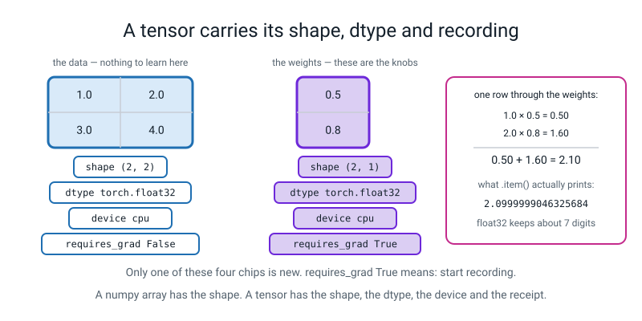
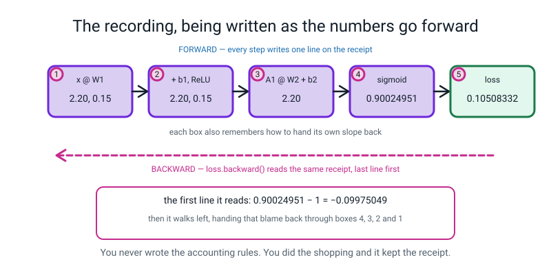
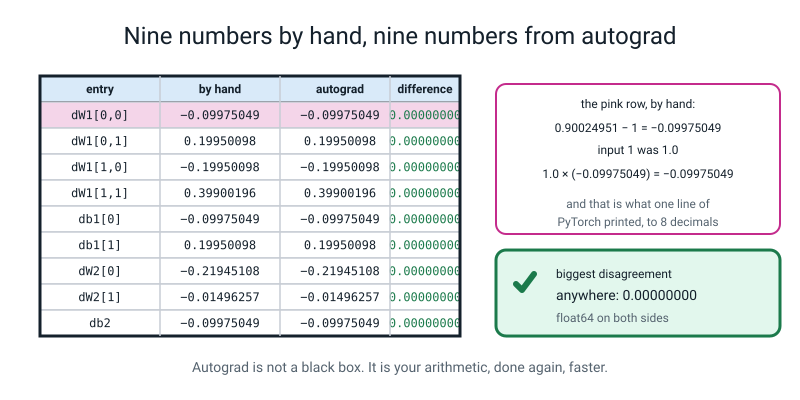
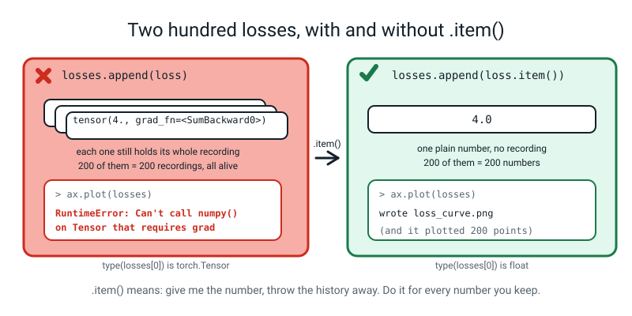
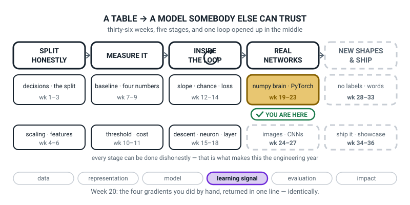

# Week 20 — A Machine That Does the Slopes For You

[⬅ Week 19](week-19.md) · [Course Home](../README.md) · [Week 21 ➡](week-21.md) · [Student Guide](../student-guide/week-20.md) · [Workbook](../workbook/week-20.md)

---

## 📋 At a Glance

| | |
|---|---|
| **Duration** | 70 minutes |
| **Type** | 🟦 Teach — the week eight lines of hand-derived calculus become one method call |
| **Big idea** | A **tensor** is a numpy array that remembers what was done to it — so it can hand you back every slope you spent last week computing by hand. |
| **New vocabulary** | tensor · dtype · device · `requires_grad` · computation graph · autograd · `.grad` |
| **New maths** | **None.** Not one new idea. Today's job is to check numbers you already have. |
| **New syntax** | `torch.tensor([...], requires_grad=True)` · `loss.backward()` · `w.grad` · `t.item()` |
| **Dataset** | **No dataset.** Hand-typed tensors, plus the exact 2 → 2 → 1 network numbers from Week 18. Everything today fits on the board. |
| **Materials** | Week 18's four gradient arrays **still on the wall — this is essential** · printed workbook pages 20.1–20.6 · the Bug Log · a wide space on the board for the two-column match test |
| **Tech needed** | Laptop with Python 3, numpy, matplotlib and **PyTorch** (`torch`). **Check `import torch` works on every machine before the lesson** — the proxy blocks `pip`, so a missing install means pairing students, not installing. **torchvision is not needed and is not available.** |
| **Prep time** | 25 minutes the night before · 5 minutes on the day |
| **Expected runtime of the code** | Every file today runs in **under 2 seconds**. `match_test.py` is instant. Nothing trains. |

> **⚠️ Watch out:** the whole lesson turns on one moment — **the two columns of numbers agreeing.** If you demonstrate `loss.backward()` before Week 18's numbers are on the board beside it, autograd becomes a magic box and the eight weeks that led here get quietly written off. **Put the hand numbers up first. Then run the line. Then diff them, out loud, digit by digit.**

---

## 🎯 Lesson Objectives

By the end of the lesson the student can:

1. **Create tensors with a chosen dtype and shape**, and state **two concrete ways** a tensor differs from a numpy array.
2. **Get a gradient from autograd without deriving anything**, and verify it against the number they computed by hand in Week 18.
3. **Explain what `requires_grad` and the computation graph are**, using the recording metaphor and one printed `grad_fn`.
4. **Use `.item()` to pull a plain number out of a tensor**, and demonstrate what goes wrong when they do not.

Observable evidence: a printed tensor with its shape, dtype and device read aloud; a nine-row match table where every difference column reads `0.00000000`; three deliberate breakages with the real error messages pasted; and a list of 200 losses built the wrong way, diagnosed, and fixed with one method call.

---

## 🧑‍🏫 What YOU Need to Know First

> **📌 About the code blocks in this guide.** Outside the **🧰 Prep Checklist** and the **🔑 Answer Key**, the blocks are **illustrations, not whole files** — each one carries on from the one above. **The complete runnable files are in the Prep Checklist and the Answer Key.**

**There is no new mathematics this week.** Every number on today's board was computed last week with a pencil. What is new is a **library** — a big pile of somebody else's code — and one idea about how it works. Twenty-five minutes with this section is enough, and if you only have ten, read §3 and §4.

### 1. What PyTorch is, and why we waited eight weeks to mention it

**PyTorch** is a free library for building and training neural networks. It is what most of the models in the news were built with. When you install it you get two things: fast array arithmetic, and **automatic differentiation** — the ability to hand back the slope of every knob without anybody deriving anything.

The student has just spent Weeks 12–19 doing that derivation by hand. Today they find out a single line does all of it.

**That order was deliberate and it is worth being explicit with the class about why.** Somebody who meets `loss.backward()` first has learned a spell: it works, they cannot say what it does, and when it goes wrong they have nowhere to stand. Somebody who has already written the eight lines it replaces reads that same call as *"oh — it is doing my `backward` function"*, and can debug it for the rest of their life. **The pride from last week is the teaching tool. Do not let it get flattened.**

### 2. What a tensor is, and the two differences that matter today

> **tensor** — PyTorch's array type. A grid of numbers with a shape, exactly like a numpy array, plus two extra things stapled to it.

The two extra things are:

1. **An address** — which piece of hardware the numbers physically live on. That is the **device**.
2. **A receipt** — a record of everything that was done to produce it. That is the **computation graph**.

🍕 **The analogy, and it carries the whole week.** A numpy array is a page of numbers in a notebook. A tensor is the same page with two things stapled to it: a label saying which machine it lives on, and **a till receipt listing every operation that produced it, in order.** At the end you can read the receipt backwards to work out how much each original ingredient contributed to the final bill. Nobody wrote the accounting rules down. The receipt did the remembering.


*Figure 20.1 — A tensor carries its shape, its dtype and its recording. The arithmetic is 1.0 × 0.5 + 2.0 × 0.8 = 2.10, and .item() prints 2.0999999046325684.*

> **dtype** — what kind of number is in the box. `torch.float32` is a decimal number stored in 32 bits, keeping about 7 useful digits. `torch.float64` is a decimal number in 64 bits, keeping about 16. `torch.int64` is a whole number.

> **device** — where the numbers physically live. `cpu` is the ordinary processor and always works. `cuda` is an NVIDIA graphics card; `mps` is Apple Silicon's graphics chip. **We use `cpu` all year and never mention the others again.**

**The two differences to teach, because both cause real bugs:**

| | numpy | torch |
|---|---|---|
| default decimal type | `float64` — about 16 digits | **`float32`** — about 7 digits |
| does it remember what was done to it? | no | **yes, if you ask** (`requires_grad=True`) |

The first difference has a consequence students can see immediately, and it is a good moment:

```
1.0 × 0.5 + 2.0 × 0.8 = 2.10          on paper
                        2.0999999046325684   printed by float32
```

**That is not a bug and it is not PyTorch being careless.** 2.1 cannot be written exactly in binary, the same way 1/3 cannot be written exactly in decimal. float32 gets it right to seven digits and then stops. When it matters — like today, when we are comparing against hand arithmetic to eight decimal places — you ask for `float64` and the problem goes away.

### 3. Autograd: the recording, and the one line that reads it backwards

> **`requires_grad=True`** — a flag on a tensor meaning *"this is a knob I want the slope of, so start recording."*

> **computation graph** — the record PyTorch keeps as you do arithmetic on tracked tensors. Every operation adds one entry that knows how to hand its own slope backwards.

> **autograd** — PyTorch's name for the whole system: the recording, plus the machinery that reads it backwards.

> **`.grad`** — the place the slope lands. After `loss.backward()`, `w.grad` holds the slope of the loss with respect to `w`, and it has exactly the same shape as `w`.

**The smallest possible demonstration, and it is the one to open the lesson with.** Two lines they can check with Week 12's nudge:

```python
x = torch.tensor([3.0], requires_grad=True)
y = x * x
y.backward()
print(x.grad.item())
```

```text
6.0
```

The slope of `x × x` at `x = 3` is `2 × 3 = 6`. **They measured exactly this number in Week 12 by nudging** — `(9.006001 − 8.994001) ÷ 0.002 = 6.000`. Autograd printed it without being told any rule at all.

**What actually happened, in four steps, and this is the explanation to give:**

1. `x = torch.tensor([3.0], requires_grad=True)` creates the knob and switches the recorder on.
2. `y = x * x` does the multiplication **and** writes a line on the receipt: *"multiplied a tracked tensor by itself"*. You can see the receipt: printing `y` gives `tensor([9.], grad_fn=<MulBackward0>)`, and **`grad_fn` is the receipt entry** — the name of the operation that produced this value.
3. `y.backward()` reads the receipt from the bottom up, working out how much each ingredient contributed.
4. The answer is deposited in `x.grad`.


*Figure 20.2 — The recording, being written as the numbers go forward. The first line the backward pass reads is 0.90024951 − 1 = −0.09975049.*

**Three facts about `.grad` that will each bite somebody today:**

- **Before `backward()`, `w.grad` is `None`.** Not zero — `None`, which means "nothing here yet". Printing it before the backward pass is a fair question with a boring answer.
- **`.grad` only gets filled in for tensors you asked to track** — the ones you created with `requires_grad=True`. Intermediate values do not get one, and asking prints a long, polite warning. It is in the Clinic.
- **`.grad` ADDS.** It does not overwrite. This is the single most important sentence of the next two weeks.

**Why it adds, in numbers.** Take one knob and two different losses:

```python
x = torch.tensor([3.0], requires_grad=True)
y = x ** 2          # slope 2x  = 6
y.backward()
y2 = x ** 3         # slope 3x² = 27
y2.backward()
print(x.grad.item())
```

```text
33.0
```

**`6 + 27 = 33`.** PyTorch did not choose between them; it added them. That is deliberate — it lets you sum up gradients over several small batches when one big batch will not fit in memory — and it is the reason next week's loop begins with a line whose entire job is to wipe `.grad` clean. Say the number `33` out loud in class. It makes "it adds" concrete in a way that no amount of prose does.

### 4. The Week 18 network, restated in full so you do not have to open Week 18

This is today's whole lesson, so here are all the numbers in one place. **Two inputs, two hidden units with ReLU, one output with sigmoid.**

```
W1 = [ 0.5  -0.3 ]      b1 = [ 0.1   0.05 ]
     [ 0.8   0.2 ]

W2 = [  1.0 ]           b2 = [ 0.3 ]
     [ -2.0 ]

one row of input:  x = [1.0, 2.0]        its true label:  y = 1
```

**The forward pass, by hand.** Hidden unit 1 uses column 0 of `W1`; hidden unit 2 uses column 1.

```
z1 = 1.0 × 0.5 + 2.0 × 0.8 + 0.1  =  0.5 + 1.6 + 0.1  =  2.20
z2 = 1.0 × (−0.3) + 2.0 × 0.2 + 0.05  =  −0.3 + 0.4 + 0.05  =  0.15

after ReLU:  both are positive, so A1 = [2.20, 0.15]

Z2 = 2.20 × 1.0 + 0.15 × (−2.0) + 0.3  =  2.20 − 0.30 + 0.30  =  2.20

A2 = sigmoid(2.20) = 1 / (1 + e^(−2.20)) = 1 / 1.110803 = 0.90024951

loss = −ln(0.90024951) = 0.10508332
```

**The network says 90.02% chance of class 1, and the true answer is 1, so the loss is small.**

**The backward pass, by hand.** Nine numbers, and every one of them is a multiplication you can do on a calculator.

```
step 1 — blame at the output:
   dZ2 = A2 − y = 0.90024951 − 1 = −0.09975049

step 2 — the output layer's weights (blame × the input that fed them):
   dW2[0] = 2.20 × (−0.09975049) = −0.21945108
   dW2[1] = 0.15 × (−0.09975049) = −0.01496257
   db2    = −0.09975049

step 3 — push the blame back to the hidden outputs (blame × the weight it travelled through):
   dA1[0] = (−0.09975049) × 1.0  = −0.09975049
   dA1[1] = (−0.09975049) × (−2.0) = +0.19950098

step 4 — through the ReLU valve. Both z were positive, so the mask is [1, 1]:
   dZ1 = [−0.09975049, +0.19950098]

step 5 — the hidden layer's weights (input × blame):
   dW1[0][0] = 1.0 × (−0.09975049) = −0.09975049
   dW1[0][1] = 1.0 × (+0.19950098) = +0.19950098
   dW1[1][0] = 2.0 × (−0.09975049) = −0.19950098
   dW1[1][1] = 2.0 × (+0.19950098) = +0.39900196
   db1       = [−0.09975049, +0.19950098]
```

**Two things worth pointing at while you read those out.** Hidden unit 1 was loud (2.20) so its weight gets a big correction (−0.219); hidden unit 2 was quiet (0.15) so its weight barely moves (−0.015). **Loud units get blamed most.** And the sign flip in `dA1[1]` is because unit 2's weight into the output is negative: increasing unit 2 *decreases* the score, and we want the score higher, so the slope points the other way.

Those nine numbers are what PyTorch has to reproduce. **Write them on the board before the lesson starts.**

### 5. Every line of `match_test.py`, explained to somebody who has never programmed

```python
import torch
```

Fetches the library. It is big — several hundred megabytes — and it is already installed.

```python
W1 = torch.tensor([[0.5, -0.3], [0.8, 0.2]], dtype=torch.float64, requires_grad=True)
```

`torch.tensor([...])` builds a grid from a list of lists: the outer list is the rows, the inner lists are the numbers in each row. So this is 2 rows by 2 columns. `dtype=torch.float64` asks for the 16-digit kind of decimal, **because we are about to compare against hand arithmetic to eight decimal places and float32 would run out of digits at seven.** `requires_grad=True` says: this is a knob, record what happens to it.

```python
x = torch.tensor([[1.0, 2.0]], dtype=torch.float64)
y = torch.tensor([[1.0]], dtype=torch.float64)
```

The input row and the true label. **Deliberately not `requires_grad`** — we do not want the slope of the loss with respect to the data. The data is not a knob; you cannot go and change last Tuesday's delivery.

```python
Z1 = x @ W1 + b1
A1 = torch.relu(Z1)
Z2 = A1 @ W2 + b2
A2 = torch.sigmoid(Z2)
loss = -(y * torch.log(A2) + (1 - y) * torch.log(1 - A2)).mean()
```

**These five lines are last week's `forward` and `loss_fn` with `np.` swapped for `torch.`.** `@` is grid-times-grid, same symbol. `torch.relu` is `np.maximum(0, z)`. `torch.sigmoid` is the squasher written out by hand last week. `torch.log` is `ln`. `.mean()` averages — with one row it does nothing, and it is there so the same code works for 200 rows.

Say that out loud in class: **the forward pass has not changed at all.** Only the library name.

```python
loss.backward()
```

**This is the line.** It reads the receipt backwards and fills in `.grad` on all four parameter tensors. It replaces the eight-line `backward()` function they wrote last week.

```python
print("dW1 =", W1.grad)
print("db2 =", b2.grad)
```

`W1.grad` is a tensor of the same shape as `W1`, holding one slope per weight.

```python
print("A2   = %.8f" % A2.item())
```

`.item()` takes a tensor holding **exactly one number** and hands back an ordinary Python number, with no receipt attached. It is how you get a number *out* of PyTorch. It only works on a one-number tensor: ask a two-number tensor and you get `RuntimeError: a Tensor with 2 elements cannot be converted to Scalar`.

### 6. What you will actually see on the screen, with the real numbers

**This is the real output of `match_test.py`. You will see exactly this.**

```text
Z1   = tensor([[2.2000, 0.1500]], dtype=torch.float64, grad_fn=<AddBackward0>)
A1   = tensor([[2.2000, 0.1500]], dtype=torch.float64, grad_fn=<ReluBackward0>)
Z2   = 2.20000000
A2   = 0.90024951
loss = 0.10508332

dW1 = tensor([[-0.0998,  0.1995],
        [-0.1995,  0.3990]], dtype=torch.float64)
db1 = tensor([[-0.0998,  0.1995]], dtype=torch.float64)
dW2 = tensor([[-0.2195],
        [-0.0150]], dtype=torch.float64)
db2 = tensor([[-0.0998]], dtype=torch.float64)

entry           by hand      autograd   difference
dW1[0,0]    -0.09975049   -0.09975049   0.00000000
dW1[0,1]     0.19950098    0.19950098   0.00000000
dW1[1,0]    -0.19950098   -0.19950098   0.00000000
dW1[1,1]     0.39900196    0.39900196   0.00000000
db1[0]      -0.09975049   -0.09975049   0.00000000
db1[1]       0.19950098    0.19950098   0.00000000
dW2[0]      -0.21945108   -0.21945108   0.00000000
dW2[1]      -0.01496257   -0.01496257   0.00000000
db2         -0.09975049   -0.09975049   0.00000000

biggest disagreement anywhere: 0.00000000
```

**Four things in there, and the fourth is the lesson.**

1. **`grad_fn=<AddBackward0>` on `Z1`, `grad_fn=<ReluBackward0>` on `A1`.** That is the receipt, visible. `Z1` remembers that the last thing done to it was an addition; `A1` remembers a ReLU. **Point at those two words on the screen; they are the only direct evidence of the graph the student will ever see.**
2. **`dtype=torch.float64` printed on every tensor.** We asked for it, and PyTorch is telling us it obliged.
3. **PyTorch prints gradients to four decimal places by default** — `-0.0998`. The hand number is `−0.09975049`. **They are the same number displayed differently**, and somebody will think they disagree. That is what the `%.8f` formatting in the table is for.
4. **Nine differences, all `0.00000000`.** Not "close". Not "to within rounding". **Zero to eight decimal places, nine times out of nine.**


*Figure 20.3 — Nine numbers by hand, nine numbers from autograd. Every difference reads 0.00000000.*

### 7. The three breakages, and the real messages they produce

The last part of the lesson breaks autograd on purpose, three ways. **Run all three yourself first.**

**Breakage 1 — `backward()` twice on the same recording.**

```python
w = torch.tensor([2.0], requires_grad=True)
loss = (w * w).sum()
loss.backward()
print("first backward: w.grad =", w.grad.item())
loss.backward()
```

```text
first backward: w.grad = 4.0
Traceback (most recent call last):
  File "break_three_ways.py", line 13, in <module>
    loss.backward()
RuntimeError: Trying to backward through the graph a second time (or directly access saved tensors after they have already been freed). Saved intermediate values of the graph are freed when you call .backward() or autograd.grad(). Specify retain_graph=True if you need to backward through the graph a second time or if you need to access saved tensors after calling backward.
```

**What it means, in one sentence: the receipt was thrown away after it was read.** PyTorch frees the intermediate values as it walks backwards, because keeping them would waste memory on every training step ever run. The fix is not `retain_graph=True` — that is what the message suggests and it is almost always the wrong answer. **The fix is to do the forward pass again**, which is exactly what a training loop does anyway.

(And `w.grad = 4.0` is checkable: the slope of `w × w` at `w = 2` is `2 × 2 = 4`.)

**Breakage 2 — `requires_grad` forgotten.**

```python
w2 = torch.tensor([2.0])
loss2 = (w2 * w2).sum()
print("loss2.requires_grad:", loss2.requires_grad, "  grad_fn:", loss2.grad_fn)
loss2.backward()
```

```text
loss2.requires_grad: False   grad_fn: None
Traceback (most recent call last):
  File "break_three_ways.py", line 23, in <module>
    loss2.backward()
RuntimeError: element 0 of tensors does not require grad and does not have a grad_fn
```

**What it means: nothing was recorded, so there is nothing to read backwards.** The two prints above the traceback are the diagnosis, and they are worth more than the traceback: `requires_grad: False` and `grad_fn: None` mean the receipt was never started. **Teach the students to print those two things whenever a gradient is missing.**

**Breakage 3 — 200 losses stored without `.item()`.**

```python
wrong = []
for step in range(200):
    pred = torch.sigmoid(x @ w)
    loss = -(y * torch.log(pred)).mean()
    wrong.append(loss)
print("wrong[0]   :", wrong[0])
print("type       :", type(wrong[0]))
ax.plot(wrong)
```

```text
wrong[0]   : tensor(0.1155, grad_fn=<NegBackward0>)
type       : <class 'torch.Tensor'>
plotting them: Can't call numpy() on Tensor that requires grad. Use tensor.detach().numpy() instead.
```

**What it means: you did not store 200 numbers, you stored 200 tensors, and every one of them is still holding its whole receipt.** The `grad_fn` in the printout is the proof: that value is still attached to the graph that made it.

The fix is one method call:

```python
right.append(loss.item())
```

```text
right[0]   : 0.11551953107118607
type       : <class 'float'>
plotting them: wrote item_experiment.png
```

**And the loss is checkable by hand**, which is why this example was chosen: `1.0 × 0.5 + 2.0 × 0.8 = 2.10`, `sigmoid(2.10) = 0.890903`, `−ln(0.890903) = 0.115520`.


*Figure 20.4 — Two hundred losses, with and without .item(). One list plots; the other one cannot.*

**What it actually costs, measured.** On a bigger example — 300 losses, each from a 400 × 200 matrix multiply — here are two runs of the same program, one storing tensors and one storing `.item()` floats:

```text
mode tensor   before:  159.3 MB
mode tensor   after :  259.6 MB   kept 300 items

mode item     before:  158.4 MB
mode item     after :  172.7 MB   kept 300 items
```

**100.3 MB against 14.3 MB.** Your machine's absolute numbers will differ, and the ratio will wobble a little from run to run (we have seen 6 and 7 times); it stays several times, not a few per cent. Three hundred kept tensors dragged a hundred megabytes of intermediate values along with them, and the same three hundred numbers cost essentially nothing. In a long training run this is how people run out of memory at epoch 400 of 500, having watched the first 399 work perfectly.

### 8. The three misconceptions you will actually meet

**Misconception 1 — "so last week was a waste of time."**
Somebody will say it, or think it, and the answer needs to be ready and warm. **Every line of `loss.backward()` is doing what they wrote by hand, and today proves it to eight decimal places.** The difference is that they can now read a shape error, name the ReLU mask, and say why a dead unit never comes back — and the person who started at `loss.backward()` cannot. Also, honestly: `.backward()` does not remove the need to understand gradients. It removes the *arithmetic*. Weeks 21–27 are full of failures that are only debuggable by somebody who knows what a gradient is.

**Misconception 2 — "`.grad` is the answer, so I can read it any time."**
`.grad` is `None` until a `backward()` has happened, and it is **cumulative** after that. A student who checks `w.grad` at the top of a loop is reading last iteration's number plus this one. The cure is the `6 + 27 = 33` demonstration, done live.

**Misconception 3 — "a tensor is just a numpy array with a fancier name."**
Ninety per cent of the time that is a useful simplification. The ten per cent that matters: the default dtype is different (`float32` versus `float64`, and it shows up as `2.0999999046325684`), and a tensor can be **tracked**, which is the entire point of the library. The visible evidence is `grad_fn` in the printout. **Make them find `grad_fn` on the screen with their own eyes.**

### 9. How deep to go, and where to stop

**Go this far:** a tensor printed with its shape, dtype and device; `requires_grad` and `grad_fn` named and pointed at on a screen; `loss.backward()` run once and matched against nine hand numbers; `.grad` accumulating shown as `6 + 27 = 33`; `.item()` used, and the failure without it seen.

**Stop before:**

| Do not teach today | Where it lives |
|---|---|
| **`torch.optim.SGD`, `optimizer.zero_grad()`, `optimizer.step()`** | **Week 21, next week.** Today's gradients are computed and then *looked at*. Nothing is updated, nothing is trained. Resist this hard: a student who sees the whole loop today will remember none of it. |
| **`with torch.no_grad():`** | **Week 21.** It belongs with the loop. |
| `nn.Linear`, `nn.ReLU`, `nn.Sequential`, `nn.Module` | **Week 22.** Today the weights are tensors you typed. |
| `nn.BCEWithLogitsLoss` and friends | **Week 22.** Today's loss is written out by hand, on purpose, so it matches Week 18 line for line. |
| `retain_graph=True` | Mention only if the traceback suggests it, and then say plainly: *"that is the message guessing at what you wanted. Almost always the right fix is to do the forward pass again."* |
| `.detach()`, `.numpy()`, `.cpu()` | `.item()` covers every case in this level. If a student finds `.detach()` in the error message, tell them what it does in one line — *"strip the receipt off, keep the numbers"* — and that `.item()` is the version we use. |
| GPUs, `cuda`, `mps`, `.to(device)` | Name `device` because it prints, and say we use `cpu` all year. Our biggest job this year is 1,797 tiny images; a GPU would be slower, because moving the data costs more than the arithmetic saves. |
| `torch.no_grad()` versus `requires_grad_(False)` versus freezing | **Week 27** freezes layers. Not today. |

The line to hold all lesson: **today you check the machine's homework against your own.** Not "learn PyTorch". Check it.

---

### 10. 🧭 The Growing Map — the same box, and why the map does not jump

The student guide carries a figure called **Where This Fits**: the same picture every week with one
more piece filled in. This week nothing moves, and for once that is the most interesting thing about
it — a framework arrived and the map did not react.



*Figure 20.0 — Week 20's version. Second week inside the gold `numpy brain · PyTorch` tile. The ↻ on
stage three is black, as it has been since Week 12, and stage three stays plain white behind you.*

**What to do with it, in about two minutes at the end of the lesson:**

1. **Ask "which box did we do today?" and then the better question: "why didn't the map change?"** Same
   gold tile, second of five weeks. *"PyTorch is not a new stage. It is a faster way of doing stage
   three, and stage three is already finished and white behind us."* That sentence is the whole
   relationship between this week and the eight before it.
2. **Anchor it on the two columns still on the board.** Nine rows, and every difference column reading
   `0.00000000`. *"Autograd did not teach us anything new today. It agreed with us."* Then the
   follow-up worth asking aloud: *"if it had disagreed, who would have been wrong?"* — and the honest
   answer, which they will enjoy: *"almost certainly us, and we would have found it, because we can
   check."*
3. **Point at the tile's remaining three weeks, not at the dashes.** `numpy brain · PyTorch` runs to
   Week 23. *"Next week five lines replace your update loop, Week 22 replaces your layers, Week 23
   saves the weights to a file. Nothing new gets invented in those three weeks either — things you
   built get shorter."*

> **🧑‍🏫 Why this is worth two minutes.** The risk this week is not confusion, it is **deflation**:
> eight lines of hard-won calculus reduced to one method call can feel like the last two months were
> wasted. The map answers that without you having to argue. Stage three is solid and finished, and the
> reason today's lesson was a *check* rather than a lecture is that they had numbers worth checking
> against. Learners who skip Weeks 12–18 and start here cannot do what your class did today.

**One thing to notice, so you can answer if asked.** Only **one** thread is lit — `learning signal`,
alone. Say why if asked: the model did not change, nothing was measured, and no new representation
appeared. The single lit pill is the map's way of saying *this week has exactly one subject*, and weeks
like that are the ones worth being strict about.

---

## 🧰 Prep Checklist

### 25 minutes the night before

- [ ] **Confirm PyTorch exists on every machine.** One line, on each laptop:

```bash
python3 -c "import torch; print(torch.__version__)"
```

You should see something like `2.2.1`. **If it errors, you cannot fix it in the room** — `pip` is blocked by the proxy — so plan to pair students on the machines that work. Do this the night before, not at 9:01.

- [ ] **Write Week 18's nine gradient numbers on the board before the lesson**, or check they are still on the wall. This is not optional; the lesson is a comparison and one column has to be there first.

```
dW1 = [ −0.09975049   +0.19950098 ]      db1 = [ −0.09975049, +0.19950098 ]
      [ −0.19950098   +0.39900196 ]

dW2 = [ −0.21945108, −0.01496257 ]       db2 = −0.09975049
```

- [ ] **Type and run `match_test.py` yourself.** The complete file:

```python
"""match_test.py - autograd against the four gradients we worked out by hand."""
import torch

torch.manual_seed(0)

W1 = torch.tensor([[0.5, -0.3], [0.8, 0.2]], dtype=torch.float64, requires_grad=True)
b1 = torch.tensor([[0.1, 0.05]], dtype=torch.float64, requires_grad=True)
W2 = torch.tensor([[1.0], [-2.0]], dtype=torch.float64, requires_grad=True)
b2 = torch.tensor([[0.3]], dtype=torch.float64, requires_grad=True)

x = torch.tensor([[1.0, 2.0]], dtype=torch.float64)
y = torch.tensor([[1.0]], dtype=torch.float64)

# ---------------- forward: four lines, exactly like the numpy ones ----------
Z1 = x @ W1 + b1
A1 = torch.relu(Z1)
Z2 = A1 @ W2 + b2
A2 = torch.sigmoid(Z2)
loss = -(y * torch.log(A2) + (1 - y) * torch.log(1 - A2)).mean()

print("Z1   =", Z1)
print("A1   =", A1)
print("Z2   = %.8f" % Z2.item())
print("A2   = %.8f" % A2.item())
print("loss = %.8f" % loss.item())

# ---------------- one line replaces the whole backward pass ----------------
loss.backward()

print()
print("dW1 =", W1.grad)
print("db1 =", b1.grad)
print("dW2 =", W2.grad)
print("db2 =", b2.grad)

# ---------------- the match test ------------------------------------------
by_hand = [
    ("dW1[0,0]", -0.09975049, W1.grad[0, 0].item()),
    ("dW1[0,1]", 0.19950098, W1.grad[0, 1].item()),
    ("dW1[1,0]", -0.19950098, W1.grad[1, 0].item()),
    ("dW1[1,1]", 0.39900196, W1.grad[1, 1].item()),
    ("db1[0]", -0.09975049, b1.grad[0, 0].item()),
    ("db1[1]", 0.19950098, b1.grad[0, 1].item()),
    ("dW2[0]", -0.21945108, W2.grad[0, 0].item()),
    ("dW2[1]", -0.01496257, W2.grad[1, 0].item()),
    ("db2", -0.09975049, b2.grad[0, 0].item()),
]
print()
print("%-9s %13s %13s %12s" % ("entry", "by hand", "autograd", "difference"))
worst = 0.0
for name, hand, auto in by_hand:
    gap = abs(hand - auto)
    worst = max(worst, gap)
    print("%-9s %13.8f %13.8f %12.8f" % (name, hand, auto, gap))
print()
print("biggest disagreement anywhere: %.8f" % worst)
```

Run `python3 match_test.py`. You must see **exactly** the output printed in §6 above, ending in `biggest disagreement anywhere: 0.00000000`. **Runtime: instant, well under a second.**

- [ ] **Run `break_three_ways.py`** (full file in the Answer Key, page 20.4) so all three tracebacks are familiar. **Runtime under 2 seconds.**
- [ ] **Run `item_experiment.py`** (full file in the Answer Key, page 20.6). **Runtime under 2 seconds.**
- [ ] **Do this one thing on a calculator yourself:** `sigmoid(2.2)`. Type `2.2`, make it negative, `e^x` → `0.110803`; add 1 → `1.110803`; press `1/x` → **`0.90024951`**. Then `ln(0.90024951)` → `−0.10508332`, so the loss is `0.10508332`. **If you have not done that on a real calculator you will not be able to answer "where did 0.9002 come from?", and somebody will ask.**
- [ ] **Break it on purpose, twice**, so both deliberate mistakes in the live-code are muscle memory:
  1. Leave `requires_grad=True` off `W1`. Real message: `RuntimeError: element 0 of tensors does not require grad and does not have a grad_fn`.
  2. Leave off `dtype=torch.float64`. **No error appears.** The differences in the match table become about `1e-8` instead of `0.00000000` — a beautiful, harmless, teachable disagreement.
- [ ] **Print workbook pages 20.1–20.6.**
- [ ] **Clear a wide space on the board** — you need two columns of nine numbers side by side, with room for a third column of zeros.

### 5 minutes on the day

- [ ] Editor open, terminal ready. **`match_test.py` deleted or renamed** — they type it.
- [ ] Week 18's nine numbers on the board, left-hand column, **before anybody sits down.**
- [ ] A calculator on the desk. You will use it in the hook.
- [ ] Workbook 20.1 out — the ten slopes, **hand answers written in pen first**.
- [ ] Bug Log out.
- [ ] Last week's shape ladder still on the wall.

### Fallback if the laptops fail

**This week survives a total power cut better than any week since Week 12**, because the entire lesson is a comparison of two columns of numbers, and one column is already on the board.

1. **The hook, on a calculator.** `sigmoid(2.2) = 0.90024951`, `−ln(0.90024951) = 0.10508332`, `0.90024951 − 1 = −0.09975049`. **Three keypresses each, and they are the first three numbers of the lesson.**
2. **The nine gradients, by hand, again — but fast.** Last week took two lessons. Today, with the chain already established, it takes eleven minutes: one subtraction and eight multiplications. Read §4 aloud and have them race you.
3. **Then the point, spoken:** *"the line I was going to show you produces those nine numbers in about a millionth of a second. It is one line long. Next week you will use it; today you have proved you do not need it."*
4. **The recording metaphor, on paper.** Give them a shopping receipt or draw one. Five items, a total, and then the question: *"if the tin of beans had cost 10p more, how much more would the total be?"* You can answer that from the receipt without re-shopping. **That is autograd, and it is the best two minutes of the paper version.**
5. **The `.item()` idea, on paper.** Draw a box labelled `4.0` and beside it a box labelled `4.0` with a long tail of five previous boxes stapled to it. Ask which one you would rather keep two hundred of. **Objective 4, delivered with a pencil.**

| If this fails | Do this instead |
|---|---|
| `ModuleNotFoundError: No module named 'torch'` | PyTorch is not installed on that machine and **you cannot install it** — the proxy blocks `pip`. Pair the student with a working laptop. |
| The differences are `1e-8` instead of `0.00000000` | `dtype=torch.float64` is missing somewhere. This is expected, harmless, and a good thing to notice — float32 keeps about seven digits. |
| `w.grad` prints `None` | Either `backward()` has not been called yet, or `requires_grad=True` is missing. Print `w.requires_grad` to tell them apart. |
| A student's `dW1` prints `[[-0.0998, 0.1995], ...]` and they think it disagrees | It does not: PyTorch prints four decimals by default. `print("%.8f" % W1.grad[0, 0].item())` shows the rest. |
| `RuntimeError: Only Tensors of floating point and complex dtype can require gradients` | They wrote `torch.tensor([[0]], requires_grad=True)` — whole numbers. A knob must be a decimal: `[[0.0]]`. |
| `RuntimeError: expected m1 and m2 to have the same dtype, but got: double != float` | One tensor is float64 and the other float32. Give every tensor in the file the same dtype. |
| `RuntimeError: a Tensor with 2 elements cannot be converted to Scalar` | `.item()` on something with more than one number. Index first: `W1.grad[0, 0].item()`. |
| Everything works but nobody is impressed | You showed `backward()` before the hand column was on the board. Rub out the autograd column, put the hand column up, and do it again. **The order is the lesson.** |

---

## ⏱️ The Lesson, Minute by Minute

| Segment | Minutes | Running total | What happens |
|---|---|---|---|
| 🪝 Hook — Eleven Minutes Versus One Line | 7 | 7 | Time them doing one gradient by hand, then say what is coming |
| 🧠 Concept — The Receipt | 18 | 25 | Tensor vs array; `requires_grad`; `grad_fn`; `.grad` adds (`6 + 27 = 33`) |
| 💻 Live-Code Together — `match_test.py` | 18 | 43 | Build it, run it, diff nine numbers. **Two deliberate mistakes.** |
| 🎲 Their Turn — The Match Test, then Break It Three Ways | 20 | 63 | Their own nine-row table, then three real tracebacks |
| 🔑 Wrap & Assign | 7 | 70 | Three checks, the takeaway, homework |

---

### 🪝 Hook — Eleven Minutes Versus One Line (7 minutes)

**Do this:** Nothing on the screen. Week 18's nine numbers are on the board, covered with a sheet of paper. On the visible part of the board write only:

```
x = [1.0, 2.0]      y = 1      A2 = 0.90024951
```

**Say this:**

> "Last week you spent two lessons working out nine numbers. Here is one of them, and I am going to time you.
>
> The network's answer was **0.90024951** and the truth was **1**. Give me the blame at the output. Go."

**Do this:** Wait. Somebody will say `0.90024951 − 1`. Write `−0.09975049` on the board.

> "Nine seconds. Now the next one: the weight from hidden unit 1 into the output. Hidden unit 1's value was **2.20**. Blame times input."

`2.20 × (−0.09975049) = −0.21945108`. Write it.

> "And the last one I will ask for: `dW1[1][1]`. Input 2 was **2.0**, and the blame arriving at hidden unit 2 was **+0.19950098**."

`2.0 × 0.19950098 = 0.39900196`.

**Say this:**

> "Three numbers, about ninety seconds, and you already knew the chain. Doing all nine from scratch last week took two lessons.
>
> Uncover the board.
>
> Nine numbers. That is your work. **Today I am going to show you one line of code that produces all nine, and then we are going to check it against yours, digit by digit, to eight decimal places.**
>
> And I want to be honest with you about the order we did this in, because it was on purpose. If I had shown you that line in September, it would be a spell — something you type because a website said so. You would have no idea what it does and no chance of fixing it when it goes wrong.
>
> You built it. So today, when it agrees with you, **you are not learning to trust a library. You are marking its homework.**"

**Ask this:** "Before we start — what should the difference between my number and PyTorch's number be?"

*Hoped-for answer:* zero.

*If they say "close to zero":* "Good instinct, and today it is exactly zero to eight decimals, and I will show you why: I am going to ask for the 16-digit kind of decimal. If I ask for the 7-digit kind we get differences at about `1e-8`. **Both answers are right; one just has fewer digits.**"

---

### 🧠 Concept — The Receipt (18 minutes)

**Do this (5 min) — what a tensor is.** Type this live, one line at a time:

```python
import torch

a = torch.tensor([[1.0, 2.0], [3.0, 4.0]])
print(a)
print("shape:", tuple(a.shape), " dtype:", a.dtype, " device:", a.device)
```

```text
tensor([[1., 2.],
        [3., 4.]])
shape: (2, 2)  dtype: torch.float32  device: cpu
```

> **Say this:** "Two rows, two columns. Same as numpy. Same `@`, same shapes, same broadcasting, and **`.shape` is still the first thing you print when anything is confusing.**
>
> Two things numpy does not print. **`device: cpu`** — where the numbers physically live. There are machines where that says `cuda`, meaning a graphics card. We will say `cpu` all year and it will be plenty; our biggest job this year is 1,797 pictures of digits, and a graphics card would actually be slower, because getting the data over there costs more than the arithmetic saves.
>
> And **`dtype: torch.float32`.** Numpy's default is `float64`. Torch's is `float32` — half the bits, about seven useful digits instead of sixteen. It is faster and it uses half the memory, and it will bite you exactly once."

```python
print("torch.tensor([1, 2, 3]).dtype     :", torch.tensor([1, 2, 3]).dtype)
print("torch.tensor([1.0, 2.0]).dtype    :", torch.tensor([1.0, 2.0]).dtype)
print("torch.zeros(2, 3).dtype           :", torch.zeros(2, 3).dtype)
```

```text
torch.tensor([1, 2, 3]).dtype     : torch.int64
torch.tensor([1.0, 2.0]).dtype    : torch.float32
torch.zeros(2, 3).dtype           : torch.float32
```

**Numpy's `np.array([1.0, 2.0])` would say `float64` here.** Same list of numbers, half the digits.

**Ask this:** "Why would writing `[1, 2, 3]` instead of `[1.0, 2.0, 3.0]` ever matter?"

*Hoped-for answer:* one is whole numbers, and weights need decimals.

> "Right. And a knob has to be a decimal, because a step of `−lr × slope` is almost never a whole number. Ask for gradients on a whole-number tensor and PyTorch stops you: **`Only Tensors of floating point and complex dtype can require gradients`.**"

**Do this (6 min) — the receipt, live and small.**

```python
w = torch.tensor([[0.5], [0.8]], requires_grad=True)
x = torch.tensor([[1.0, 2.0]])
print("w.requires_grad:", w.requires_grad, "  x.requires_grad:", x.requires_grad)
z = x @ w
print("z =", z)
print("w.grad before backward:", w.grad)
```

```text
w.requires_grad: True   x.requires_grad: False
z = tensor([[2.1000]], grad_fn=<MmBackward0>)
w.grad before backward: None
```

**Do this:** Point at `grad_fn=<MmBackward0>` on the screen. Underline it in the air.

> **Say this:** "There it is. **That is the receipt.** `z` is not just the number 2.1 — `z` knows that the last thing that happened to it was a matrix multiply, and it knows which tensors went into it. `Mm` is matrix multiply; `Backward0` means 'and here is how to hand a slope back through it'.
>
> Look at the other two lines. `w.requires_grad` is True, because I asked. `x.requires_grad` is False, because the data is not a knob — you cannot change last Tuesday's delivery, so its slope is of no use to anybody.
>
> And `w.grad` is **None**. Not zero. Nothing there yet. Nobody has read the receipt."

**Ask this:** "The number printed is `2.1000`. What is `1.0 × 0.5 + 2.0 × 0.8`?"

*2.1.* Then:

```python
print("z.item() =", z.item())
```

```text
z.item() = 2.0999999046325684
```

**Ask this:** "Is PyTorch wrong?"

*Hoped-for answer:* no — it is a rounding thing.

> **Say this:** "No. It is `float32`, and 2.1 cannot be written exactly in binary any more than a third can be written exactly in decimal. Seven digits and then it stops. When we need more — and in twenty minutes we will, because we are comparing to eight decimal places — **we will ask for `float64` and this goes away.**
>
> And notice what `.item()` did: it handed back a plain number. **No `grad_fn`, no receipt, nothing stapled to it.** Remember that; it is the last thing we do today."

**Do this (7 min) — `.grad` adds, and this is the sentence for next week.**

```python
x = torch.tensor([3.0], requires_grad=True)
y = x ** 2
y.backward()
print("after x**2 :", x.grad.item())
y2 = x ** 3
y2.backward()
print("after x**3 :", x.grad.item())
```

**Ask before running:** "Slope of `x²` at 3 is 6 — you measured that in Week 12. Slope of `x³` at 3 is 27. **What will the second print say?**"

*Most will say 27.* Run it:

```text
after x**2 : 6.0
after x**3 : 33.0
```

**Do this:** Write on the board, large: **`6 + 27 = 33`**.

> **Say this:** "Thirty-three. It did not replace the 6, it **added** the 27 to it.
>
> `.grad` accumulates. Every `backward()` you call adds into whatever is already sitting there.
>
> That sounds like a design mistake and it is not. It is there so that if a batch of data is too big to fit in memory, you can do it in four pieces, call `backward()` four times, and get the sum — which is exactly what you wanted.
>
> But it means that **in a training loop you must wipe `.grad` before every step**, or you are stepping with today's slope plus yesterday's plus the day before's. And that is next week's very first line of code. Write `6 + 27 = 33` in your notes and put a box round it."

---

### 💻 Live-Code Together — `match_test.py` (18 minutes)

**You never touch their keyboard.**

**Step 1 (4 min) — the four knobs, and 🐞 DELIBERATE MISTAKE ONE.**

Type the four parameter tensors, but **leave `requires_grad=True` off `W1`**:

```python
import torch

W1 = torch.tensor([[0.5, -0.3], [0.8, 0.2]], dtype=torch.float64)
b1 = torch.tensor([[0.1, 0.05]], dtype=torch.float64, requires_grad=True)
W2 = torch.tensor([[1.0], [-2.0]], dtype=torch.float64, requires_grad=True)
b2 = torch.tensor([[0.3]], dtype=torch.float64, requires_grad=True)

x = torch.tensor([[1.0, 2.0]], dtype=torch.float64)
y = torch.tensor([[1.0]], dtype=torch.float64)

Z1 = x @ W1 + b1
A1 = torch.relu(Z1)
Z2 = A1 @ W2 + b2
A2 = torch.sigmoid(Z2)
loss = -(y * torch.log(A2) + (1 - y) * torch.log(1 - A2)).mean()
loss.backward()
print("dW1 =", W1.grad)
```

Real output:

```text
dW1 = None
```

**Do this:** Say nothing for five seconds. Let `None` sit there.

**Ask this:** "It did not crash. What does `None` mean, and why isn't it zero?"

*Hoped-for answer:* nothing was ever put there.

> **Say this:** "`None` is not a number. It means the box is empty — nobody has ever written a slope into it.
>
> Why? Because I never asked PyTorch to record what was happening to `W1`. Look at the line: no `requires_grad=True`. So when `backward()` walked the receipt, `W1` was not on it. It was treated like the data — a number that was used, not a knob to be tuned.
>
> **And notice: no error.** In a real training loop this is a nightmare bug — one layer silently never learns, your model is mediocre, and nothing anywhere says why."

**Do this:** Show the diagnosis that finds it in two seconds:

```python
print("W1.requires_grad:", W1.requires_grad, "  loss.grad_fn:", type(loss.grad_fn).__name__)
```

```text
W1.requires_grad: False   loss.grad_fn: NegBackward0
```

Fix it, re-run, and get real numbers. **Bug Log, ninety seconds**, with the words *"None means nobody ever wrote a slope there"* in it.

**Step 2 (4 min) — the forward pass, and check it against the board.**

```python
print("Z1   =", Z1)
print("Z2   = %.8f" % Z2.item())
print("A2   = %.8f" % A2.item())
print("loss = %.8f" % loss.item())
```

```text
Z1   = tensor([[2.2000, 0.1500]], dtype=torch.float64, grad_fn=<AddBackward0>)
Z2   = 2.20000000
A2   = 0.90024951
loss = 0.10508332
```

**Ask this:** "Two numbers on that first line, 2.2 and 0.15. Where did they come from?"

*Hoped-for answer:* `1.0 × 0.5 + 2.0 × 0.8 + 0.1 = 2.20` and `1.0 × (−0.3) + 2.0 × 0.2 + 0.05 = 0.15`.

**Do this:** Write both sums on the board. Then point at `grad_fn=<AddBackward0>`.

> **Say this:** "And there is the receipt again, on `Z1` this time — the last thing done to it was an addition, the `+ b1`. `A1` will say `ReluBackward0`. Every value in this program is carrying a note about where it came from.
>
> `A2 = 0.90024951` and `loss = 0.10508332`. Those are the numbers on the board from last week. **The forward pass has not changed at all.** Look at my five lines: `@`, `torch.relu`, `@`, `torch.sigmoid`, log loss. That is your `forward()` from Week 19 with `np.` swapped for `torch.`."

**Step 3 (5 min) — the one line, and the diff.**

```python
loss.backward()
print("dW1 =", W1.grad)
print("db2 =", b2.grad)
```

```text
dW1 = tensor([[-0.0998,  0.1995],
        [-0.1995,  0.3990]], dtype=torch.float64)
db2 = tensor([[-0.0998]], dtype=torch.float64)
```

**Ask this:** "Board says `−0.09975049`. Screen says `−0.0998`. **Do they disagree?**"

*Hoped-for answer:* no — it is the same number rounded for display.

*If somebody says yes:* excellent, this is the moment. `print("%.8f" % W1.grad[0, 0].item())` → `-0.09975049`. **"PyTorch prints four decimals to keep the output readable. Ask for eight and there they are."**

Then build the match table, and let the nine `0.00000000` rows print:

```text
entry           by hand      autograd   difference
dW1[0,0]    -0.09975049   -0.09975049   0.00000000
...
biggest disagreement anywhere: 0.00000000
```

> **Say this:** "Nine numbers. Nine zeros. **You and a library that thousands of engineers work on agree exactly.**
>
> That is worth sitting with for a second, because it is the last time this year you will be able to check the machine by hand. From next week the networks get too big to trace with a pencil. **Today is the day you established that the thing is trustworthy — and you established it, you did not take somebody's word for it.**"

**Step 4 (5 min) — 🐞 DELIBERATE MISTAKE TWO: drop the dtype.**

Remove `dtype=torch.float64` from all four parameter tensors and the two data tensors, then re-run.

Real output (differences only):

```text
dW1[0,0]    -0.09975049   -0.09975046   0.00000003
dW1[0,1]     0.19950098    0.19950092   0.00000006
dW1[1,0]    -0.19950098   -0.19950092   0.00000006
dW1[1,1]     0.39900196    0.39900184   0.00000012
db1[0]      -0.09975049   -0.09975046   0.00000003
db1[1]       0.19950098    0.19950092   0.00000006
dW2[0]      -0.21945108   -0.21945100   0.00000008
dW2[1]      -0.01496257   -0.01496257   0.00000000
db2         -0.09975049   -0.09975046   0.00000003
biggest disagreement anywhere: 0.00000012
```

**Ask this:** "Is this a bug? And which of the two numbers is right?"

*Hoped-for answer:* not a bug; both are right, one has fewer digits.

> **Say this:** "Neither is wrong. `float32` keeps about seven digits, so it is correct to seven and then it guesses. `float64` keeps sixteen.
>
> Here is the useful judgement, and it applies for the rest of the year: **`float32` is what you train with, because it is faster and half the memory. `float64` is what you check with**, when you are comparing against arithmetic done by hand. Today is a checking day, so we asked for the big one."

**Do this:** Put it back. **Bug Log** — this one goes in as a *"no error, small disagreement, and here is why"* entry, which is a new category for them.

---

### 🎲 Their Turn — The Match Test, then Break It Three Ways (20 minutes)

Full instructions in **🎲 The Activity, In Full** below. In outline: **build the nine-row match table yourself** and get nine zeros. Then break autograd three ways on purpose and paste the real message each time.

---

### 🔑 Wrap & Assign (7 minutes)

**Do this:** Stand at the board with the two columns and the nine zeros. Write four things underneath:

```
requires_grad=True   →  start recording
grad_fn              →  the receipt, visible
loss.backward()      →  read it backwards, fill in every .grad
.item()              →  give me the number, throw the receipt away
```

**Say this:**

> "Four pieces of vocabulary and one line of code. That is the whole week.
>
> **`requires_grad=True`** on a tensor means *this is a knob, start recording.*
>
> **`grad_fn`** is that recording, and you can see it in the printout — `AddBackward0`, `ReluBackward0`, `MmBackward0`. Every value in a PyTorch program is carrying a note saying where it came from.
>
> **`loss.backward()`** reads the notes backwards and fills in `.grad` on every knob. It replaced eight lines you wrote by hand, and today it agreed with all nine of your numbers to eight decimal places.
>
> **`.item()`** hands you a plain number with nothing stapled to it, and if you keep two hundred losses without it, you keep two hundred receipts and a hundred megabytes.
>
> And the sentence to take home: **`.grad` adds. Six plus twenty-seven is thirty-three.**"

**Do this:** Three quick checks — exact wording in **✅ Assessing Understanding**.

**Say this, to close:**

> "One thing is missing, and I want you to notice it before you leave.
>
> Today we computed nine slopes and then... looked at them. We did not change a single weight. Nothing was trained. Nothing improved. We have the direction of downhill and we did not take a step.
>
> Next week we take the step, and it turns out that every training run in every framework on every dataset in the world is **the same five lines in the same order.** One of them is a line whose only job is to wipe `.grad` clean — and you now know exactly why that line has to exist."

**Do this:** Hand out the homework. Read the second part out loud, slowly.

---

## 🐞 The Debugging Clinic

Every message below came from running a broken version of this week's actual code.

| What the student sees (real message) | What it means | Most likely cause | The fix |
|---|---|---|---|
| `RuntimeError: element 0 of tensors does not require grad and does not have a grad_fn` | "There is no recording, so there is nothing to read backwards." | `requires_grad=True` was left off the tensor, so nothing was tracked. | Add it. Diagnose first: `print(w.requires_grad, loss.grad_fn)` — `False` and `None` means the receipt was never started. |
| `RuntimeError: Trying to backward through the graph a second time (or directly access saved tensors after they have already been freed). ... Specify retain_graph=True if you need to backward through the graph a second time` | "The receipt was thrown away when I read it." | `backward()` called twice on the same `loss`. | **Do the forward pass again** to build a fresh graph. Do *not* reach for `retain_graph=True`; it is the message guessing, and it usually just hides the real mistake. |
| `RuntimeError: Only Tensors of floating point and complex dtype can require gradients` | "You cannot take the slope of a whole number." | `torch.tensor([[0]], requires_grad=True)` — no decimal point. | `[[0.0]]`, or `dtype=torch.float32`. |
| `RuntimeError: a Tensor with 2 elements cannot be converted to Scalar` | "`.item()` wants exactly one number and you gave it two." | `W1.grad.item()` on a 2 × 2 tensor. | Index first: `W1.grad[0, 0].item()`. Or print the whole tensor without `.item()`. |
| `RuntimeError: expected m1 and m2 to have the same dtype, but got: double != float` | "One grid is 16-digit and the other is 7-digit, and I will not guess." | Some tensors given `dtype=torch.float64`, others left at the default `float32`. | Pick one dtype for the whole file. Today: `float64` everywhere. |
| `RuntimeError: grad can be implicitly created only for scalar outputs` | "`backward()` needs ONE number to start from, and you gave me a grid." | `backward()` called on something that is not a single number — a `(6, 1)` column of errors, for instance. | Reduce it first: `.mean()` or `.sum()`. A loss is always one number. |
| `RuntimeError: Can't call numpy() on Tensor that requires grad. Use tensor.detach().numpy() instead.` | "This value is still attached to its recording, so I cannot hand it to matplotlib." | Plotting a list of loss **tensors** instead of a list of numbers. | `losses.append(loss.item())`. **One method call, and it is objective 4.** |
| `UserWarning: The .grad attribute of a Tensor that is not a leaf Tensor is being accessed. Its .grad attribute won't be populated during autograd.backward().` then `None` | "That is a value in the middle of the recording, not a knob. I only fill in `.grad` for knobs." | Asking `y.grad` where `y = x * 2` — `y` is an intermediate, not something you created with `requires_grad=True`. | Ask the knob instead: `x.grad`. In our example `x.grad` is `24.0`, because `(2x)²` has slope `8x` and `8 × 3 = 24`. |
| **No error. `w.grad` prints `None`.** | Nothing crashed. That knob is silently not learning. | Either `backward()` has not run yet, or `requires_grad=True` is missing on that particular tensor. | `print(w.requires_grad)` tells you which. **In a real model this is how one layer quietly never trains.** |
| **No error. The differences are `1e-8` instead of `0.00000000`.** | Nothing is wrong. | `float32`: about seven useful digits. | Nothing to fix — but if you are comparing against hand arithmetic, ask for `dtype=torch.float64`. |
| **No error. `w.grad` is bigger than you expected, and grows every time you run the cell.** | Nothing crashed. Every number that depends on the gradient is wrong. | `.grad` accumulates and nothing wiped it. | `w.grad.zero_()`, or — from next week — `optimizer.zero_grad()`. Test it: the slope of `x²` at 3 is 6; if you see 12, you have called `backward()` twice. |

### How to teach debugging without giving the answer

All the old moves stand. This week adds two, and both are one print long.

19. **"Print `requires_grad` and `grad_fn`."** Whenever a gradient is missing or `None`. Two values, and between them they tell you whether the recording was ever started. It is this week's version of "print the shape".

20. **"Is that `None`, or is it zero?"** They mean completely different things — `None` is "nobody ever wrote here", zero is "the slope really is flat". A student who conflates them will chase the wrong bug for twenty minutes.

And the sentence for this week:

> **"`.grad` starts as None, gets filled in by `backward()`, and then ADDS. If a gradient looks twice as big as it should, you called `backward()` twice."**

---

## 🎲 The Activity, In Full

### The Match Test, then Break It Three Ways

**What it is.** Two halves. First, the student builds the nine-row comparison table themselves and gets nine zeros — that is objective 2, and it is the emotional centre of the week. Then they break autograd on purpose three ways and paste each real message.

### Setup

- `match_test.py`, in progress from the live-code (or handed out — see Differentiation).
- Week 18's nine numbers **visible**, either on the wall or copied into workbook page 20.2.
- Workbook page 20.2 (the nine-row table) and 20.4 (three breakage boxes).
- The Bug Log.

### Part 1 — the match test (10 minutes)

> **"Finish the table. Nine rows. For each one: the number you got last week, the number PyTorch just gave you, and the difference to eight decimal places. Then read me the biggest difference in the room."**

The nine numbers, so you can mark at a glance:

| entry | value |
|---|---|
| `dW1[0,0]` | `−0.09975049` |
| `dW1[0,1]` | `+0.19950098` |
| `dW1[1,0]` | `−0.19950098` |
| `dW1[1,1]` | `+0.39900196` |
| `db1[0]` | `−0.09975049` |
| `db1[1]` | `+0.19950098` |
| `dW2[0]` | `−0.21945108` |
| `dW2[1]` | `−0.01496257` |
| `db2` | `−0.09975049` |

**Watch for exactly two failure modes.** First, a student comparing PyTorch's four-decimal display against their eight-decimal hand number and concluding they disagree — the fix is `%.8f`. Second, a student who forgot `dtype=torch.float64` and gets differences of about `3e-08` — **that is not a failure, it is the float32 lesson arriving early**, and it deserves a *"good, tell the room why"*.

**Say this when the zeros appear:** *"Nine zeros. You did those nine numbers with a pencil and PyTorch did them with a graph, and there is not one digit between you."*

### Part 2 — break it three ways (10 minutes)

Three sabotages, three real messages, three boxes on page 20.4. **Predict first, in one sentence, then run.**

> **Break 1: "Call `loss.backward()` twice in a row. Predict what happens."**
>
> **Break 2: "Take `requires_grad=True` off `W1`, run, and print `W1.grad`. Predict what happens."**
>
> **Break 3: "Build a list of 200 losses without `.item()`, print two of them and their type, then try to plot them. Predict what happens."**

The real results:

| Break | What actually happens |
|---|---|
| `backward()` twice | **Crashes.** `RuntimeError: Trying to backward through the graph a second time ...` The first `backward()` worked and printed `w.grad = 4.0`. |
| `requires_grad` missing | **Depends where.** Missing on `W1` only: no error, `W1.grad` is `None`, everything else works. Missing everywhere: `RuntimeError: element 0 of tensors does not require grad and does not have a grad_fn`. |
| 200 losses, no `.item()` | **No error until you try to use them.** They print as `tensor(0.1155, grad_fn=<NegBackward0>)`, their type is `torch.Tensor`, and plotting them raises `Can't call numpy() on Tensor that requires grad`. |

**The one to spend time on is break 2**, because it is the only one of the three that can happen in real work and not tell you. Ask: *"which of these three would you rather have happen to you?"* The crash. **A crash is a friend; a silent `None` is not.**

### Part 3 — one sentence each (aloud, 2 minutes)

Around the room, one sentence each, no writing:

- *"Backward twice fails because the receipt is thrown away when it is read."*
- *"No `requires_grad` means nothing was recorded, so `.grad` stays empty."*
- *"Without `.item()` you store the whole recording instead of the number."*

### What "finished" looks like

- Nine rows on page 20.2 with `0.00000000` in every difference cell (or `~3e-08` with an explanation of float32).
- Three boxes on page 20.4 with a **prediction**, the **real message**, and a **one-sentence why**.
- Two Bug Log entries minimum.
- The student can say, unprompted: **"`.grad` adds, so 6 plus 27 is 33."**

### Variation — easier

**Do three rows of the match test, not nine.** `db2`, `dW2[0]`, `dW1[0][0]`. Those three cover the whole chain: the blame at the output, one output-layer weight, one hidden-layer weight. Three zeros land the point as well as nine.

**And do only break 2**, because it is the one that matters and the one that is silent. Hand over the file with `requires_grad` already missing and ask one question: **"why is this `None` and not a number?"**

**The version of the arithmetic that skips everything hard.** No new maths this week, so the scaffold is this five-line file and three questions:

```python
import torch

x = torch.tensor([3.0], requires_grad=True)
y = x * x
y.backward()
print("slope of x*x at x = 3 is", x.grad.item())
```

```text
slope of x*x at x = 3 is 6.0
```

Three questions: **"what is 2 × 3?"** (6 — and that is the answer PyTorch gave.) **"Which line switched the recorder on?"** (The `requires_grad=True` one.) **"Which line read it backwards?"** (`y.backward()`.) **That is objectives 2 and 3, in five lines.**

### Variation — harder

1. **Predict then verify all ten of the homework slopes** without running them first — including `1/x` at `x = 2` (`−0.25`) and `torch.relu(x)` at `x = −2` (`0`). The relu one is the interesting argument: is the slope 0 or undefined at exactly 0? PyTorch says `0`. **Ask them whether that is a fact or a decision.** (A decision, and a documented one.)
2. **The non-leaf warning.** `x = torch.tensor([3.0], requires_grad=True)`, `y = x * 2`, `z = (y * y).sum()`, `z.backward()`, then print `y.grad`. Real answer: `None` plus a long `UserWarning`, while `x.grad` is `24.0`. Then the arithmetic: `z = (2x)²= 4x²`, slope `8x`, `8 × 3 = 24`. **Verify it by nudging.**
3. **Measure the memory cost** with `memcost.py` (Answer Key, page 20.6), two runs. Ours: **100.3 MB against 14.3 MB.** Their numbers will differ and the ratio will wobble a little, but it should stay several times.
4. **Batch the match test.** Feed four rows of input instead of one, `x = torch.tensor([[1.0, 2.0], [0.5, 1.0], [2.0, 0.0], [1.5, 1.5]])` with four labels, and confirm the gradient shapes are still `(2, 2)`, `(1, 2)`, `(2, 1)`, `(1, 1)` — **unchanged, because a gradient always has the shape of its knob, no matter how many rows went in.** That is Week 19's rule, restated in torch.
5. **Break `backward()` on a non-scalar:** `loss = (pred - y)` without `.mean()`. Real message: `RuntimeError: grad can be implicitly created only for scalar outputs`. Ask why a slope needs one number to start from. (Because "how much does the loss change" only makes sense if there is one loss.)

---

## ❓ Questions Students Ask This Week

**"So was last week a waste of time?"**

No, and this is the most important question of the week, so answer it properly rather than defensively.

Three concrete things you have that somebody who started at `loss.backward()` does not. **One:** you can read a shape error, because you know `dW1` must have the same shape as `W1`. **Two:** you know what a dead ReLU is and why training longer cannot fix it — that is a gradient fact, and `backward()` does not explain it to you. **Three:** when your loss sits at 0.6931 forever you know what the network is doing, because you have seen `−ln(0.5)`.

And there is a fourth thing, which matters more over a career: **you now know that it is checkable.** You have marked the library's homework. Most people never do that, and it leaves them permanently unsure whether the thing works or they are lucky.

**"How does autograd actually work? Is it doing algebra?"**

No, and this is worth being precise about because the honest answer is more interesting than the guess.

It is not doing symbolic algebra — it never writes down a formula for the derivative. **It stores the graph and applies one small local rule per operation, on numbers rather than symbols.** Every operation in PyTorch ships with two pieces of code: one that computes the output, and one that says "given the slope coming back into my output, here is the slope going out of each of my inputs". `backward()` just walks the graph from the end to the beginning, calling those, multiplying as it goes.

**That multiplying-as-it-goes is Week 18's chain**, unchanged: nudging `w` moves `z` three times as much, nudging `z` moves `L` fourteen times as much, so `w` moves `L` forty-two times as much. You did it by hand on a network with nine gradients. PyTorch does it on a network with nine billion.

**"Why does `.grad` add? That seems like a mistake."**

It is deliberate, and there is one real use for it: **splitting a batch that will not fit in memory.** If you want the gradient over 1,000 rows but only 250 fit at a time, you run four forward-and-backward passes and let the four gradients pile up. The total is exactly the gradient over 1,000 rows for a sum-loss; for a mean-loss, divide by four (or scale each piece's loss by 1/4) to get the 1,000-row mean.

The cost of that convenience is that everybody, for ever, has to remember to wipe `.grad` before each step — and forgetting is the most common PyTorch bug in existence. There are people who think the default should have been the other way round. **PyTorch chose flexibility over safety here, and you will pay a small tax on it every week for the rest of your life.** That is a real engineering trade-off and it is fine to say you find it annoying.

**"Do I still need to understand gradients now that this exists?"**

Yes, and here is the honest split. **You will never derive one again by hand** — genuinely, not in a career. But you will constantly have to answer questions like: why is my loss `nan`; why is this layer not learning; why did turning the learning rate up make it worse; why does my model do nothing after epoch 3. Every one of those is a gradient question, and `backward()` answers none of them.

The arithmetic is automated. **The judgement is not, and nobody has automated it yet.**

**"Does this work for anything, or only neural networks?"**

Anything you can write in torch operations. People use autograd for physics simulations, for fitting curves to data, for engineering optimisation, and for problems that have nothing to do with machine learning at all. If you can write your quantity as arithmetic on tensors, autograd will give you the slope of it with respect to any input you marked.

That is a much bigger idea than "neural networks", and it is why the library is built the way it is.

**"What is `float32` versus `float64` really about, and which should I use?"**

Bits. `float32` uses 32 bits per number and keeps about 7 useful digits; `float64` uses 64 and keeps about 16.

**Use `float32` for training.** It is what every real model does: half the memory, faster arithmetic, and seven digits is far more precision than a gradient needs — the gradients are noisy anyway, because they are computed on a sample of data.

**Use `float64` for checking**, like today. When you are comparing against arithmetic you did by hand, you do not want the comparison to be about digits.

**"Is `.item()` the only way to get a number out?"**

It is the one we use all year and it covers every case in this course. There are others: `.detach()` strips the receipt off but leaves you a tensor; `.tolist()` gives you a Python list; `float(t)` works on a one-number tensor too.

The error message you will see mentions `.detach().numpy()`, and now you know why: matplotlib wants plain numbers, and the tensor is refusing to hand them over while it is still attached to a recording. **`.item()` says: give me the number, throw the history away.** For a loss you are only logging, that is exactly right.

**"Could I use PyTorch for last week's project instead of numpy?"**

You could, and next week you effectively will. What you would lose is the thing that made last week work: **the gradient check.** With numpy you wrote `backward()` and then proved it correct by nudging. With autograd there is nothing of yours to check — which is wonderful when you trust it and unhelpful when you are learning what a gradient is.

The order matters, not the tool. **Write it once by hand, then never again.**

---

## ⚠️ Where This Lesson Goes Wrong

| What happens | Why | What to do right now |
|---|---|---|
| **`backward()` is demonstrated before Week 18's numbers are on the board** | It is one line and it is tempting to lead with it | **Stop and put the hand column up.** The lesson is a comparison; with one column missing it is a magic trick, and magic tricks teach nothing. |
| Somebody concludes last week was pointless, and it goes unanswered | It is a completely reasonable inference | Answer it out loud, with the three concrete things from the Questions section. **Do not brush past it** — a student who privately believes their hard work was wasted will not do the hard work next time. |
| The four-decimal display starts an argument about disagreement | `-0.0998` really does look different from `−0.09975049` | Have `print("%.8f" % W1.grad[0, 0].item())` ready as a reflex. Ten seconds, and it turns a doubt into a lesson about display versus value. |
| `.grad` accumulation is mentioned but not demonstrated | It sounds like a footnote | **Run the `6 + 27 = 33` example live.** It costs ninety seconds and it is the entire foundation of next week's first line. |
| The lesson drifts into the training loop | Everyone wants to see it learn, including you | Say the honest thing: *"we have the direction of downhill and today we deliberately do not step. That is next week, and it is five lines."* **Ending on an unresolved cliff is the plan, not a failure.** |
| A missing `requires_grad` goes undiagnosed and eats ten minutes | It produces `None` and no error | Deliberate mistake one is exactly this and it is on the schedule at minute 26. Then make `print(w.requires_grad)` the reflex, the way `print(x.shape)` became one last week. |
| Somebody adds `retain_graph=True` because the error message suggested it | The message does suggest it | It usually works and it usually hides a real mistake. Say: *"the message is guessing at what you meant. What you actually want is a fresh forward pass."* |
| PyTorch is missing on a laptop and the room stalls | The proxy blocks `pip`, so it cannot be fixed live | This is why the Prep Checklist has you test every machine the night before. In the moment: pair students, and give the unpaired one the paper fallback — the nine gradients by hand, timed. |
| The `.item()` experiment gets skipped for time | It is last and it looks like a detail | It is objective 4 and it is the bug that will actually bite them in Week 23. **Cut a variation, not this.** Minimum viable version: print one loss with and without `.item()` and read the two types aloud. |

---

## 🧭 Differentiation

### If the student is struggling

**Cut:** the nine-row match test down to three rows — `db2`, `dW2[0]`, `dW1[0][0]`. Three zeros prove the same thing.

**Cut:** breakages 1 and 3. Keep breakage 2 (`requires_grad` missing), because it is silent and it is the one that matters.

**Cut:** the dtype demonstration. Hand them `float64` everywhere and say nothing about it.

**Give them `match_test.py` complete.** There is no learning in typing four tensors. All of today's learning is in reading the two columns and the nine zeros.

**The version of the maths that skips the algebra.** There is no new maths, so the scaffold is one calculator drill and one file. The drill, which they can do in ninety seconds:

| Do this on a calculator | Answer |
|---|---|
| `1.0 × 0.5 + 2.0 × 0.8 + 0.1` | `2.20` |
| `e^(−2.20)`, then `1 ÷ (1 + that)` | `0.90024951` |
| `0.90024951 − 1` | `−0.09975049` |
| `2.20 × (−0.09975049)` | `−0.21945108` |

**Four keypress sequences, and the last two are gradients.** Then run the file and find those same four numbers on the screen. **That is objectives 1 and 2, done with a calculator and a printout.**

**The copy-this-exactly scaffold.** Seven lines, runs alone:

```python
import torch

w = torch.tensor([[0.5], [0.8]], requires_grad=True)
x = torch.tensor([[1.0, 2.0]])
loss = ((x @ w) ** 2).mean()
loss.backward()
print("loss", loss.item(), " slope of loss for each w:", w.grad)
```

```text
loss 4.409999370574951  slope of loss for each w: tensor([[4.2000],
        [8.4000]])
```

Then three questions: **"what is `1 × 0.5 + 2 × 0.8`?"** (2.1, and `2.1² = 4.41`.) **"Which line asked for slopes?"** **"Which line produced them?"** And if they want the arithmetic: the slope of `z²` is `2z = 4.2`, times input 1 gives `4.2`, times input 2 gives `8.4`. **Both numbers on the screen, checkable.**

**One thing you must not cut:** the moment the difference column reads `0.00000000`. If the whole lesson collapses to one sentence, make it *"the library agreed with my pencil, exactly."*

### If the student is flying

None of these need syntax from a later week.

1. **The batched match test** (harder variation 4): four rows in, and the gradient shapes do not change. **This is the deepest idea available today** — a gradient has the shape of its knob, never the shape of the data.
2. **The non-leaf warning** (harder variation 2), ending in `x.grad = 24.0` and the arithmetic `8 × 3 = 24`, verified by nudging.
3. **The memory measurement** (harder variation 3). Two runs, two numbers, one ratio.
4. **`backward()` on a non-scalar** (harder variation 5) and the question of why a slope needs a single number to start from.
5. **The relu-at-zero question:** what is the slope of `relu(x)` at exactly `x = 0`? PyTorch says `0`. Mathematically there is no single answer — the function has a corner. **This is a decision the library made, not a fact it discovered**, and finding that out unaided is a level-5 moment.
6. **The honest challenge:** *"find something autograd cannot give you the slope of."* Anything with a round or a floor in it (zero slope almost everywhere), anything that leaves torch and goes through numpy in the middle. (An `if` on a tensor value does not break autograd: it differentiates the branch that ran, though the slope can jump where the branch changes.) **The receipt only records torch operations.**

### If the student won't engage today

**Close the laptop. One calculator and the board.**

Give them the receipt idea with actual shopping:

> **"Bread £1.20, milk £0.90, four tins of beans at £0.60. What is the total?"**
>
> **"Now: if beans went up by 10p a tin, how much does the total go up?"**

Forty pence. And they answered it **without adding the shopping up again** — they read it off the receipt: four tins, so ten pence each becomes forty. **That is a gradient, and that is autograd: keep the receipt, read it backwards.**

Then one number, on the calculator:

> **"The network said 0.90024951 and the answer was 1. What is the blame?"**

`−0.09975049`. Then: *"multiply that by 2.20 and you have one of the nine numbers a library would take a millionth of a second to produce. You just did it."*

That is **objectives 2 and 3 delivered with a receipt and a calculator**, in about ten minutes. The typing survives; next week uses all of it again.

---

## ✅ Assessing Understanding

Three checks, five minutes, exact wording.

**Check 1 — two differences (spoken, 45 seconds)**

> "Give me **two concrete ways** a tensor is not a numpy array. Not 'it's for neural networks' — two things you could show me on a screen."

*Good answer:* "The default dtype is `float32` not `float64`, so `2.1` prints as `2.0999999046325684`. And it can remember what was done to it — if you set `requires_grad=True` you see a `grad_fn` in the printout, and you can call `backward()`."

**What to catch:** "it's faster" or "it works on GPUs" as the *only* answer. Both true, neither observable on their screen today. Push once: *"show me on the printout."*

**Check 2 — the recording (spoken, 60 seconds)**

> "I write `z = x @ w` and print `z`. It says `grad_fn=<MmBackward0>`. **What is that, and what put it there?**"

*Good answer:* "It's the recording — `z` remembers that a matrix multiply made it and which tensors went in. It's there because `w` was created with `requires_grad=True`, so PyTorch started tracking. When I call `backward()` it reads those notes backwards and fills in `w.grad`."

**Full marks needs the causal link:** `requires_grad` on an input is *why* the output has a `grad_fn`.

**Check 3 — `.item()` and accumulation (spoken, 90 seconds)**

> "Two quick ones. **First:** I keep 200 losses in a list without `.item()`. What have I actually stored, and what will break? **Second:** I call `backward()` on `x²` and then on `x³`, both at `x = 3`. What does `x.grad` say, and why?"

*Good answer:* "You've stored 200 tensors, each still attached to its whole recording, so it uses far more memory — we measured 100 MB against 14 — and plotting them fails with 'Can't call numpy() on Tensor that requires grad'. And `x.grad` says 33, because the slopes are 6 and 27 and `.grad` adds instead of replacing."

**What to catch:** "27" for the second part. Do not correct with the rule — ask *"what was in `.grad` before the second backward?"* and wait.

### Mastery scale for this week

| Level | What it looks like |
|---|---|
| **1 — Not yet** | Cannot say what `requires_grad` does. Reads `.grad` printing `None` as a crash. Thinks a tensor is a numpy array with a different name and cannot name a difference. |
| **2 — Emerging** | Runs the supplied file and finds the matching numbers when shown where to look. Uses `.item()` when told to. Can say "backward gives you the slopes" without saying what a slope is here. |
| **3 — Secure** | Builds the tensors, runs `backward()`, completes the match table and gets nine zeros. Names `requires_grad`, `grad_fn` and `.grad` and says what each does. Uses `.item()` and can show what breaks without it. **This is the target.** |
| **4 — Strong** | Diagnoses a missing gradient by printing `requires_grad` and `grad_fn` before asking for help. Predicts `33` for the accumulation question. Explains the four-decimal display versus the eight-decimal value. Knows float32 is for training and float64 for checking, and why. |
| **5 — Exceptional** | Explains autograd as one local rule per operation applied on numbers, not symbols, along a stored graph, not as symbolic algebra. Shows that gradient shapes do not change when the batch size does. Argues that `.grad` accumulating is a trade-off — flexibility bought at the price of a bug everybody hits — and says what it buys. Spots that relu's slope at exactly 0 is a decision the library made. |

---

## 📤 Homework to Assign

**Say this:**

> "About an hour, two pages, and both of them are about checking rather than building.
>
> **First, page 20.1 — ten slopes, and your hand answer beside each.** Ten tiny expressions. For every one: **write your own answer first, in pen** — from Week 12's nudge, or from the shortcut rules if you know them — then run the four lines of torch and put a **tick or a cross** beside your prediction. I want to see the crosses. A page of ten ticks and no working is a page I do not believe.
>
> **Second, page 20.6 — the `.item()` experiment.** Build a list of 200 losses **the wrong way**, on purpose. Then: print two of them, print their type, try to plot them and paste whatever happens. Then fix it with **one method call**, print two of them again, print the type again, and write **one sentence** saying what you were storing before.
>
> That last sentence is the one I am marking. Not 'I was storing tensors' — **what is inside a tensor that a number does not have?**"

**Workbook pages:** 20.2, 20.3 and 20.4 in class · **20.1 and 20.6** at home · **20.5** stretch, for anyone who wants the memory measurement.

**Expected time:** 30 min on the ten slopes with hand answers · 25 min on the `.item()` experiment and the sentence. **About 55 minutes.**

> **🧑‍🏫 What to look for when you mark it:** three things, and the third is the real one. **One — is there a hand answer beside every one of the ten, and at least one cross?** Ten unmarked ticks means the predictions were written after the run, which is the one thing this page exists to prevent. **Two — is the real error message pasted, verbatim, for the plotting attempt?** *"It didn't work"* is not a result; `Can't call numpy() on Tensor that requires grad` is. **Three — does the closing sentence name the recording?** The answer that earns full marks is some version of *"each tensor was still carrying the graph of everything that made it, so I was keeping 200 recordings instead of 200 numbers."* A student who writes *"I was storing tensors not floats"* has the vocabulary and not the idea, and that is worth one line of feedback: **"and what is a tensor carrying that a float is not?"**

---

## 🔑 Answer Key

Every question restated, so you can mark from this page alone.

### Page 20.1 — Ten slopes, with your hand answer beside each

*For each expression, write your own answer first, then check it with four lines of torch. The pattern for every one:*

```python
x = torch.tensor([VALUE], requires_grad=True)
y = EXPRESSION
y.backward()
print(x.grad.item())
```

| # | Expression | at | By hand | Autograd | How to get the hand answer |
|:--:|---|:--:|---|---|---|
| 1 | `x * x` | 3 | **6** | `6.000000` | slope of `x²` is `2x`, and `2 × 3 = 6`. Nudge check: `(3.001² − 2.999²) ÷ 0.002 = 6.000` |
| 2 | `x * x * x` | 2 | **12** | `12.000000` | slope of `x³` is `3x²`, and `3 × 4 = 12` |
| 3 | `5 * x` | 7 | **5** | `5.000000` | a straight line of gradient 5 — the slope is 5 wherever you stand |
| 4 | `x * x + 3 * x` | 1 | **5** | `5.000000` | `2x + 3`, and `2 + 3 = 5`. Two slopes added |
| 5 | `(x - 4) * (x - 4)` | 1 | **−6** | `-6.000000` | `2(x − 4)`, and `2 × (1 − 4) = −6`. **Negative means uphill to the left** |
| 6 | `1 / x` | 2 | **−0.25** | `-0.250000` | by nudging: `(1/2.001 − 1/1.999) ÷ 0.002 = −0.250000` |
| 7 | `torch.exp(x)` | 0 | **1** | `1.000000` | by nudging: `(e^0.001 − e^−0.001) ÷ 0.002 = 1.000000` |
| 8 | `torch.log(x)` | 2 | **0.5** | `0.500000` | by nudging: `(ln 2.001 − ln 1.999) ÷ 0.002 = 0.500000` |
| 9 | `torch.relu(x)` | 2 | **1** | `1.000000` | it fired, so it is passing the input straight through: slope 1 |
| 10 | `torch.relu(x)` | −2 | **0** | `0.000000` | it did not fire, so nothing gets through: slope 0. **This is Week 19's dead unit, in one line** |

Real output of the whole page, run in one file:

```text
1.  x*x at x=3          autograd 6.000000   by hand 2*3 = 6
2.  x*x*x at x=2        autograd 12.000000   by hand 3*2*2 = 12
3.  5*x at x=7          autograd 5.000000   by hand 5
4.  x*x+3x at x=1       autograd 5.000000   by hand 2*1 + 3 = 5
5.  (x-4)^2 at x=1      autograd -6.000000   by hand 2*(1-4) = -6
6.  1/x at x=2          autograd -0.250000   by nudging -0.25
7.  exp(x) at x=0       autograd 1.000000   by nudging 1.0
8.  log(x) at x=2       autograd 0.500000   by nudging 0.5
9.  relu(x) at x=2      autograd 1.000000   by hand 1 (it fired)
10. relu(x) at x=-2     autograd 0.000000   by hand 0 (it did not)
```

**The bonus, two knobs at once**, which is worth asking for from anybody who finished early:

```python
w = torch.tensor([3.0], requires_grad=True)
b = torch.tensor([1.0], requires_grad=True)
L = (2 * w + b - 10) ** 2
L.backward()
```

```text
bonus: L = (2w + b - 10)^2 at w=3, b=1
  L      = 9.0000    (2*3 + 1 - 10 = -3, and -3 squared is 9)
  dL/dw  = -12.0000    (2 * -3 * 2 = -12)
  dL/db  = -6.0000    (2 * -3 * 1 = -6)
```

**Marking:** items 1–5, 9 and 10 must have a hand answer; 6, 7 and 8 may be nudged or looked up. **At least one cross somewhere on the page** is evidence the predictions came first. Items 5 and 10 are the two that catch people: a negative slope, and a slope of exactly zero.

### Page 20.2 — The nine-row match test

*The complete `match_test.py` is in the Prep Checklist.* The nine rows:

| entry | by hand | autograd | difference |
|---|---|---|---|
| `dW1[0,0]` | `−0.09975049` | `−0.09975049` | `0.00000000` |
| `dW1[0,1]` | `0.19950098` | `0.19950098` | `0.00000000` |
| `dW1[1,0]` | `−0.19950098` | `−0.19950098` | `0.00000000` |
| `dW1[1,1]` | `0.39900196` | `0.39900196` | `0.00000000` |
| `db1[0]` | `−0.09975049` | `−0.09975049` | `0.00000000` |
| `db1[1]` | `0.19950098` | `0.19950098` | `0.00000000` |
| `dW2[0]` | `−0.21945108` | `−0.21945108` | `0.00000000` |
| `dW2[1]` | `−0.01496257` | `−0.01496257` | `0.00000000` |
| `db2` | `−0.09975049` | `−0.09975049` | `0.00000000` |

**`biggest disagreement anywhere: 0.00000000`.**

**Accept differences up to about `1e-7`** if the student left the dtype at `float32` — and then ask them to say why, because that is the better answer.

### Page 20.3 — Read the printout

*Given this real printout, answer five questions.*

```text
tensor([[1., 2.],
        [3., 4.]])
shape: (2, 2)  dtype: torch.float32  device: cpu
z = tensor([[2.1000]], grad_fn=<MmBackward0>)
w.grad before backward: None
z.item()      = 2.0999999046325684
type(z)       = <class 'torch.Tensor'>
type(z.item())= <class 'float'>
```

| Question | Answer |
|---|---|
| How many numbers are in the first tensor, and what shape? | Four, shape `(2, 2)` — two rows, two columns. |
| What does `dtype: torch.float32` tell you about how many digits you can trust? | About seven. `float64` would give about sixteen. |
| What is `grad_fn=<MmBackward0>` and why is it there? | The recording: `z` remembers a matrix multiply produced it. It is there because one of the inputs (`w`) had `requires_grad=True`. |
| `w.grad` is `None`. Is that an error? | No. It means nothing has been written there yet — `backward()` has not been called. `None` and `0.0` are completely different. |
| Why is `z.item()` `2.0999999046325684` and not `2.1`? | 2.1 cannot be stored exactly in binary in 32 bits, the way a third cannot be written exactly in decimal. It is right to seven digits. `1.0 × 0.5 + 2.0 × 0.8 = 2.10` on paper. |

### Page 20.4 — Break it three ways

The complete file:

```python
"""break_three_ways.py - three ways to make autograd complain, on purpose."""
import traceback
import torch

torch.manual_seed(0)

print("### 1. backward() twice on the same recording")
w = torch.tensor([2.0], requires_grad=True)
loss = (w * w).sum()
loss.backward()
print("first  backward: w.grad =", w.grad.item())
try:
    loss.backward()
except RuntimeError:
    traceback.print_exc()

print()
print("### 2. requires_grad forgotten")
w2 = torch.tensor([2.0])
loss2 = (w2 * w2).sum()
print("loss2.requires_grad:", loss2.requires_grad, "  grad_fn:", loss2.grad_fn)
try:
    loss2.backward()
except RuntimeError:
    traceback.print_exc()
print("w2.grad is", w2.grad)

print()
print("### 3. a list of losses stored without .item()")
w3 = torch.tensor([2.0], requires_grad=True)
losses = []
for step in range(200):
    losses.append((w3 * w3).sum())
print("len(losses)     :", len(losses))
print("losses[0]       :", losses[0])
print("type(losses[0]) :", type(losses[0]))
```

Real output (the tracebacks come out on the error stream, so on your screen they may appear above the `###` headings — that is normal):

```text
### 1. backward() twice on the same recording
first  backward: w.grad = 4.0
RuntimeError: Trying to backward through the graph a second time (or directly access saved tensors after they have already been freed). Saved intermediate values of the graph are freed when you call .backward() or autograd.grad(). Specify retain_graph=True if you need to backward through the graph a second time or if you need to access saved tensors after calling backward.

### 2. requires_grad forgotten
loss2.requires_grad: False   grad_fn: None
RuntimeError: element 0 of tensors does not require grad and does not have a grad_fn
w2.grad is None

### 3. a list of losses stored without .item()
len(losses)     : 200
losses[0]       : tensor(4., grad_fn=<SumBackward0>)
type(losses[0]) : <class 'torch.Tensor'>
```

**The three one-sentence whys:**

1. **Backward twice:** the intermediate values are freed as the graph is read, so the second call finds an empty receipt. *(And `w.grad = 4.0` checks out: the slope of `w × w` at 2 is `2 × 2 = 4`.)*
2. **`requires_grad` forgotten:** nothing was recorded — `requires_grad: False`, `grad_fn: None` — so there is nothing to walk backwards through, and `.grad` stays `None`.
3. **No `.item()`:** each element is a tensor still attached to its graph, as `grad_fn=<SumBackward0>` shows, so you have stored 200 recordings rather than 200 numbers.

### Page 20.5 — What it costs, measured (stretch)

```python
"""memcost.py - what 300 kept losses actually cost. Run it twice, one MODE each."""
import resource
import sys
import torch

MODE = sys.argv[1]          # "tensor" or "item"
torch.manual_seed(0)
X = torch.randn(400, 200)
W = torch.randn(200, 200, requires_grad=True)


def rss_mb():
    return resource.getrusage(resource.RUSAGE_SELF).ru_maxrss / 1048576.0


print("mode %-7s  before: %6.1f MB" % (MODE, rss_mb()))
kept = []
for i in range(300):
    loss = ((X @ W) ** 2).mean()
    kept.append(loss if MODE == "tensor" else loss.item())
print("mode %-7s  after : %6.1f MB   kept %d items" % (MODE, rss_mb(), len(kept)))
```

Two runs, `python3 memcost.py tensor` then `python3 memcost.py item`:

```text
mode tensor   before:  159.3 MB
mode tensor   after :  259.6 MB   kept 300 items
mode item     before:  158.4 MB
mode item     after :  172.7 MB   kept 300 items
```

**The arithmetic:** `259.6 − 159.3 = 100.3 MB` for the tensors. `172.7 − 158.4 = 14.3 MB` for the numbers. **About seven times as much memory, for the same 300 answers.**

**Marking:** the absolute numbers depend on the machine and will not match. **What must be there is the subtraction and the comparison** — a page with two "after" numbers and no difference computed has not made the point.

### Page 20.6 — The `.item()` experiment

The complete file:

```python
"""item_experiment.py - 200 losses stored the wrong way, then the right way."""
import matplotlib
matplotlib.use("Agg")
import matplotlib.pyplot as plt
import torch

torch.manual_seed(0)

x = torch.tensor([[1.0, 2.0]])
y = torch.tensor([[1.0]])
w = torch.tensor([[0.5], [0.8]], requires_grad=True)

# ---- the wrong way ----
wrong = []
for step in range(200):
    pred = torch.sigmoid(x @ w)
    loss = -(y * torch.log(pred)).mean()
    wrong.append(loss)

print("--- stored without .item() ---")
print("how many:", len(wrong))
print("wrong[0]   :", wrong[0])
print("wrong[199] :", wrong[199])
print("type       :", type(wrong[0]))

fig, ax = plt.subplots()
try:
    ax.plot(wrong)
except RuntimeError as e:
    print("plotting them:", str(e))

# ---- the right way: one method call ----
right = []
for step in range(200):
    pred = torch.sigmoid(x @ w)
    loss = -(y * torch.log(pred)).mean()
    right.append(loss.item())

print()
print("--- stored with .item() ---")
print("how many:", len(right))
print("right[0]   :", right[0])
print("right[199] :", right[199])
print("type       :", type(right[0]))

fig, ax = plt.subplots()
ax.plot(right)
ax.set_xlabel("step")
ax.set_ylabel("loss")
plt.savefig("item_experiment.png")
print("plotting them: wrote item_experiment.png")
```

Real output, runtime under 2 seconds:

```text
--- stored without .item() ---
how many: 200
wrong[0]   : tensor(0.1155, grad_fn=<NegBackward0>)
wrong[199] : tensor(0.1155, grad_fn=<NegBackward0>)
type       : <class 'torch.Tensor'>
plotting them: Can't call numpy() on Tensor that requires grad. Use tensor.detach().numpy() instead.

--- stored with .item() ---
how many: 200
right[0]   : 0.11551953107118607
right[199] : 0.11551953107118607
type       : <class 'float'>
plotting them: wrote item_experiment.png
```

**The loss is checkable by hand, and it is worth asking for:**

```
1.0 × 0.5 + 2.0 × 0.8 = 2.10
sigmoid(2.10) = 1 / (1 + e^(−2.10)) = 1 / 1.122456 = 0.890903
−ln(0.890903) = 0.115520
```

**The model closing sentence:**

> *"Before the fix I was storing 200 tensors, and every one of them was still carrying the recording of the operations that made it — the `grad_fn` in the printout is that recording — so I was keeping 200 graphs alive instead of 200 numbers, and matplotlib would not even plot them."*

**Accept:** any sentence naming the graph, the recording, or the `grad_fn`. **Do not accept:** *"they were tensors, not floats"* — that is the type, not the cost. Push once: **"and what is a tensor carrying that a float is not?"**

**Why both losses are identical (`0.1155` at step 0 and at step 199):** nothing is being trained today. The weights never change, so the loss is the same 200 times. **Somebody will ask, and it is the perfect setup for next week:** we have the slopes and we are not yet taking the step.

### Answers to every question posed in the lesson

**Hook — "What should the difference between your number and PyTorch's be?"**
Zero. And with `dtype=torch.float64` it is exactly `0.00000000` on all nine. With the default `float32` it is about `3e-08`, because float32 keeps about seven digits.

**Concept — "Why would `[1, 2, 3]` instead of `[1.0, 2.0, 3.0]` ever matter?"**
The first is `int64`, whole numbers. A knob must be a decimal, and PyTorch refuses: `RuntimeError: Only Tensors of floating point and complex dtype can require gradients`.

**Concept — "The number printed is 2.1000. What is `1.0 × 0.5 + 2.0 × 0.8`?"**
`0.5 + 1.6 = 2.10`.

**Concept — "Is PyTorch wrong to print 2.0999999046325684?"**
No. `float32` holds about seven digits and 2.1 has no exact binary form. Ask for `float64` and you get more digits.

**Concept — "Slope of `x²` at 3 is 6, slope of `x³` at 3 is 27. What will the second print say?"**
**33**, because `.grad` adds: `6 + 27 = 33`.

**Live-code — "`dW1` printed `None`. What does that mean, and why isn't it zero?"**
Nothing has ever been written there. `requires_grad=True` was missing on `W1`, so it was never on the recording. Zero would mean "the slope really is flat"; `None` means "no slope was ever computed".

**Live-code — "Two numbers on that line, 2.2 and 0.15. Where did they come from?"**
`1.0 × 0.5 + 2.0 × 0.8 + 0.1 = 2.20` and `1.0 × (−0.3) + 2.0 × 0.2 + 0.05 = 0.15`.

**Live-code — "Board says `−0.09975049`, screen says `−0.0998`. Do they disagree?"**
No. PyTorch prints four decimal places by default. `print("%.8f" % W1.grad[0, 0].item())` gives `-0.09975049`.

**Live-code — "Is the float32 difference a bug? Which number is right?"**
Not a bug; both are right. float32 is correct to about seven digits, float64 to about sixteen. **Train in float32, check in float64.**

**Activity — "Which of the three breakages would you rather have happen to you?"**
The crash. `backward()` twice stops the program and tells you; a missing `requires_grad` gives you `None`, no error, and a layer that quietly never learns.

---

## 🔮 Next Week Preview

Next week the slopes finally get used. The student meets an **optimizer** — an object that holds the knobs and applies `w ← w − lr × slope` when told — and the five lines that every training run in every framework is made of: `zero_grad`, forward, loss, `backward`, `step`, in that order. The lesson is built as a clinic: **the five lines go on five index cards, one card gets removed, and the class predicts what breaks before running it.** Three of the five failures produce no error message at all, and the `zero_grad` card is saved for last because everybody gets it wrong — which is exactly why today ended on `6 + 27 = 33`.

**To prep early:** write out the five lines on five large index cards tonight, in this order — `optimizer.zero_grad()`, `pred = hours @ w + b`, `loss = ((pred - marks) ** 2).mean()`, `loss.backward()`, `optimizer.step()` — and keep today's `6 + 27 = 33` on the wall, because next week's first line exists entirely because of it. You will also need Week 12's six hours-versus-marks points: **(1, 20), (2, 28), (3, 36), (4, 44), (5, 52), (6, 60)**. Nothing new to install.
