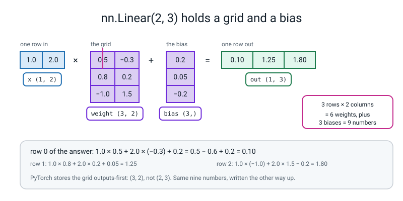
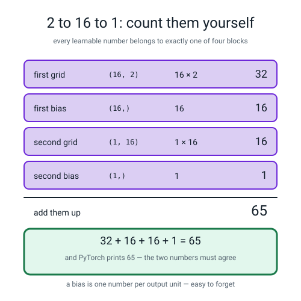
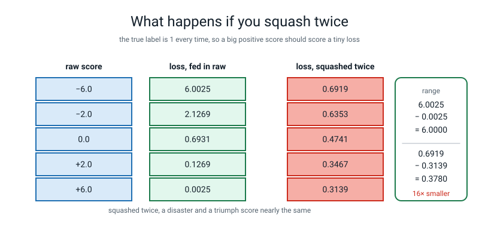
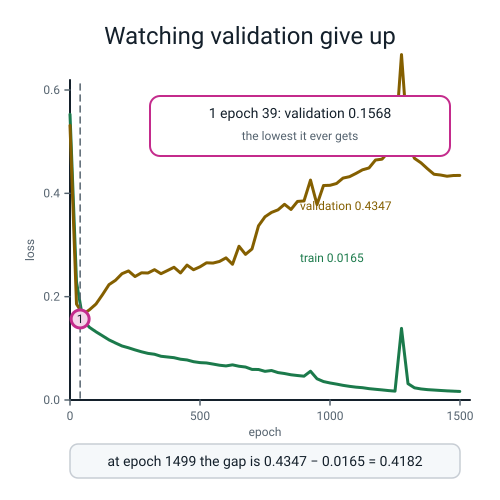
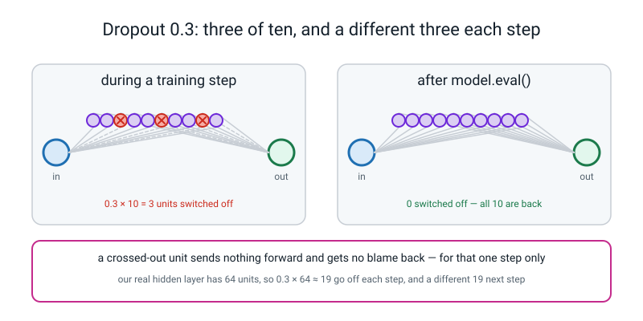
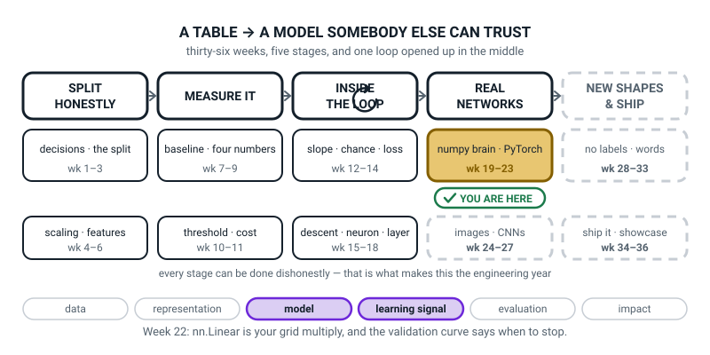

# Week 22 — Layers, Losses, and Watching It Overfit

[⬅ Week 21](week-21.md) · [Course Home](../README.md) · [Week 23 ➡](week-23.md) · [Student Guide](../student-guide/week-22.md) · [Workbook](../workbook/week-22.md)

---

## 📋 At a Glance

| | |
|---|---|
| **Duration** | 70 minutes |
| **Type** | 🟦 Teach — the library layer, the safe loss, and the first honest look at overfitting |
| **Big idea** | `nn.Linear` is the grid multiply plus the bias you already wrote by hand in Week 17. The losses with **WithLogits** in the name do the squash for you, and they do it safely — so your model must **not** squash first. |
| **New vocabulary** | `nn.Module` · `nn.Linear` · `nn.Sequential` · logit · `BCEWithLogitsLoss` · dropout · early stopping · patience |
| **New maths** | **None.** Every number today is a multiply, an add and a count. There is nothing new to teach the teacher mathematically — this week practises Weeks 12–21. |
| **New syntax** | `nn.Linear(n_in, n_out)` · `nn.ReLU()` · `nn.Sequential(...)` · `nn.BCEWithLogitsLoss()` |
| **Dataset** | `make_moons(n_samples=400, noise=0.25, random_state=0)` — 400 rows generated inside scikit-learn. **Nothing downloads. No internet needed.** |
| **Materials** | Printed workbook pages 22.1–22.6 · a big sheet on the wall headed **PARAMETER COUNT** with two columns, `by hand` and `PyTorch` · the Bug Log · Week 19's NumPy Brain still on disk · a ruler for the dashed line |
| **Tech needed** | Laptop with Python 3, numpy, scikit-learn, matplotlib, **torch**. Torch has been installed since Week 20. **No new installs. No torchvision.** |
| **Prep time** | 25 minutes the night before · 5 minutes on the day |
| **Expected runtime of the code** | `layers.py` **instant**. `overfit.py` trains two 4,417-parameter networks for 1,500 epochs each and writes two PNGs in **1.3 seconds**. |

> **⚠️ Watch out:** the lesson has one trap door, and it is the second half of the concept segment. `BCEWithLogitsLoss` **applies the sigmoid for you.** If a student puts `nn.Sigmoid()` on the end of the model as well, **nothing goes red** — the loss simply sticks at about 0.54 instead of falling to 0.15 and the model looks mediocre for ever. Show that failure on purpose, with the real numbers, or you will be debugging it silently in Weeks 23, 26 and 33.

---

## 🎯 Lesson Objectives

By the end of the lesson the student can:

1. **Build a network with `nn.Sequential`** and prove its parameter shapes are the same four grids as Week 19's NumPy brain — printing both lists side by side and naming which pair is transposed.
2. **Count the learnable numbers in a 2 → 16 → 1 network by hand** — 32 + 16 + 16 + 1 = 65 — and match the number PyTorch reports.
3. **Explain why `BCEWithLogitsLoss` takes raw scores rather than probabilities**, and say what goes wrong if you sigmoid twice: no error, and a loss with a high floor (about 0.31 on a correct 1, 0.69 on a correct 0, so near 0.50 on a two-class problem).
4. **Produce a train and validation loss curve on one axis** and mark with a dashed line the epoch where validation stopped improving.

Observable evidence: two printed shape lists with the four pairs matched; the number 65 written on the wall in both columns; one sentence explaining the double squash; and `overfit.png` with a dashed vertical line at epoch 39 and two sentences about what would have happened if training had carried on.

---

## 🧑‍🏫 What YOU Need to Know First

> **📌 About the code blocks in this guide.** Outside the **🧰 Prep Checklist** and the **🔑 Answer Key**, the blocks are **illustrations, not whole files** — each one carries on from the one above. **The complete runnable files are in the Prep Checklist and the Answer Key.**

**There is no new mathematics this week.** Everything is multiply, add, count. What is new is that the student stops writing the arithmetic and starts *naming a part that contains it* — and the danger of that swap is that the part becomes magic. Your whole job today is to keep it un-magic: every time you name a PyTorch part, open it and show the numbers inside.

Give this section fifteen minutes. There are four ideas.

### 1. What `nn.Linear` actually is

In Week 17 the student learned that a whole layer, for a whole batch, is one grid multiplied by another grid plus a bias. In Week 19 they wrote it out in numpy: `Z1 = X @ W1 + b1`.

`nn.Linear` is that line, packaged.

> **`nn.Linear(n_in, n_out)`** — one layer. It holds a grid of weights and a list of biases, and when you hand it a batch it multiplies and adds. It holds nothing else.

Here is the whole thing, on numbers small enough to check on paper. Say the layer is `nn.Linear(2, 3)` — two numbers in, three numbers out — and we set its weights by hand:

```
the grid                  the bias
 0.5   −0.3                 0.2
 0.8    0.2                 0.05
−1.0    1.5                −0.2
```

Now push in one row of input, `x = [1.0, 2.0]`. Three outputs come out, one per row of the grid:

```
row 0:   1.0 × 0.5  +  2.0 × (−0.3)  +  0.2   =  0.5 − 0.6 + 0.2  =  0.10
row 1:   1.0 × 0.8  +  2.0 × 0.2     +  0.05  =  0.8 + 0.4 + 0.05 =  1.25
row 2:   1.0 × (−1.0) + 2.0 × 1.5    −  0.2   = −1.0 + 3.0 − 0.2  =  1.80
```

**Do those three sums yourself now, on paper, before you read on.** They are the whole layer. There is no fourth thing.


*Figure 22.1 — nn.Linear is the grid multiply plus the bias. Six weights, three biases, nine numbers, and one of the three sums written out in full.*

**The one surprise, and students always spot it.** PyTorch stores that grid as shape **(3, 2)** — three rows because there are three *outputs*, two columns because there are two *inputs*. Week 19's numpy `W1` was the other way up: **(2, 16)** for a 2 → 16 layer, PyTorch writes **(16, 2)**.

Both hold the same numbers. PyTorch multiplies by the transpose, which the student met in Week 16 as `arr.T`. **Nothing is different except which way the grid is written down.** Say that out loud twice, because a student who thinks the shape is wrong will spend twenty minutes trying to fix something that is not broken.

> **`nn.ReLU()`** — the squash from Week 16, as a part you can drop into a list. It has no numbers of its own at all. It replaces every negative with zero and leaves everything else alone.

> **`nn.Sequential(...)`** — a list of parts. A batch goes in the top and comes out the bottom, passing through each part in order.

### 2. Counting the learnable numbers, and why you must

This is objective 2 and it is the one skill from today that they will use in every remaining week of the course. **A parameter count is the cheapest possible check that the model you built is the model you meant to build.**

Take `2 → 16 → 1`, the Week 19 architecture. Four blocks of numbers, and no fifth:

| Block | Shape | Count | Arithmetic |
|---|---|---|---|
| first grid | `(16, 2)` | 32 | 16 × 2 |
| first bias | `(16,)` | 16 | one per hidden unit |
| second grid | `(1, 16)` | 16 | 1 × 16 |
| second bias | `(1,)` | 1 | one per output |
| | | **65** | 32 + 16 + 16 + 1 |


*Figure 22.2 — Counting the learnable numbers by hand. 32 + 16 + 16 + 1 = 65, and PyTorch prints 65.*

**The bias is the bit everyone forgets.** A bias is one number per output unit — 16 of them after the first layer, 1 after the second. Students count the grids, get 48, and cannot see why PyTorch says 65. If that happens in your room, do not give the answer: point at the two bias rows in the table above and wait.

**The general shape of the count**, which you can hand a strong student:

```
one layer:  (inputs × outputs)  +  outputs
```

For 2 → 16: 2 × 16 + 16 = 48. For 16 → 1: 16 × 1 + 1 = 17. And 48 + 17 = **65**. Same answer, grouped differently, and the second grouping is the one that keeps working when the network gets deeper.

### 3. The logit, and why `WithLogits` is in the name

This is the hardest idea of the week and it is not hard because of maths. It is hard because two things that sound the same are different.

> **logit** — the raw score coming out of the last layer, before any squash. It can be any number at all: −9.2, 0, +4,000.

The student met this word in Week 13: a weighted sum is any number, a probability has to sit between 0 and 1, and the sigmoid is the squasher that gets you from one to the other. **A logit is the "any number" side.** Nothing new — only the name is being made official.

> **`nn.BCEWithLogitsLoss()`** — the log loss from Week 14, which **does the sigmoid squash itself, inside**. You hand it raw scores. You do **not** hand it probabilities.

Here is the whole thing on four numbers. Four raw scores, four true answers:

```
score   true answer
 2.0        1
−1.0        0
 0.5        1
−3.0        1
```

Step one, squash each score to a chance with the sigmoid from Week 13:

```
sigmoid( 2.0) = 0.880797
sigmoid(−1.0) = 0.268941
sigmoid( 0.5) = 0.622459
sigmoid(−3.0) = 0.047426
```

Step two, the surprise of each answer, using `−ln(p)` from Week 14 — and for a row whose true answer is 0, the surprise is `−ln(1 − p)`:

```
row 1  true 1, p = 0.880797  →  −ln(0.880797) = 0.126928
row 2  true 0, p = 0.268941  →  −ln(0.731059) = 0.313262
row 3  true 1, p = 0.622459  →  −ln(0.622459) = 0.474077
row 4  true 1, p = 0.047426  →  −ln(0.047426) = 3.048587
```

Step three, average the four:

```
0.126928 + 0.313262 + 0.474077 + 3.048587  =  3.962854
3.962854 ÷ 4  =  0.9907135
```

And `nn.BCEWithLogitsLoss()` on those exact four scores prints **0.9907134771347046**. Same number. **It did the two steps you just did.**

Notice row 4: the model said −3.0 (meaning "almost certainly a zero") and the answer was 1. Its surprise is 3.048587, more than the other three added together. That is Week 14's whole point, still true, now inside a library part.

⚠️ **Now the trap, and this is the paragraph to reread.** If the student puts `nn.Sigmoid()` at the end of the model **and** uses `BCEWithLogitsLoss`, the numbers get squashed twice. Nothing crashes. Here is exactly what it costs, on the same true answer of 1 every time:

| raw score | loss, fed in raw | loss, squashed twice |
|---|---|---|
| −6.0 | 6.0025 | 0.6919 |
| −2.0 | 2.1269 | 0.6353 |
| 0.0 | 0.6931 | 0.4741 |
| +2.0 | 0.1269 | 0.3467 |
| +6.0 | 0.0025 | 0.3139 |

**Read the two columns.** Fed in raw, a catastrophic answer costs 6.0025 and a perfect answer costs 0.0025 — a range of six whole units. Squashed twice, the same five answers cost between 0.6919 and 0.3139 — a range of 0.378, about **sixteen times smaller**. The loss can no longer tell a disaster from a triumph, so there is almost nothing left to learn from, and training crawls.


*Figure 22.3 — Squashing twice flattens the loss. Six units of range become 0.378, so a disaster and a triumph score nearly the same.*

Why does the double squash happen at all? Because `sigmoid(−6.0) = 0.0025`, and if you hand *that* to `BCEWithLogitsLoss` it treats 0.0025 as a raw score and squashes it again: `sigmoid(0.0025) = 0.5006`, which is a coin flip. **Every possible score gets crushed into the narrow band around 0.5.** You do not need to say that arithmetic to a 14-year-old, but you should know it, because it is the answer when they ask *"but why 0.69?"*

**The rule to put on the board:** *the last part of your model is a bare `nn.Linear`. The loss does the squash.*

### 4. Overfitting, dropout, early stopping — and the epoch to stop at

The student met overfitting in Level 2 with decision trees: a model that memorises its training rows and then does badly on new ones. Today they see it in a curve, with numbers.

Here is the real run you will do in class: 400 moons, 300 for training, 100 held back for validation, a 2 → 64 → 64 → 1 network with 4,417 learnable numbers, trained for 1,500 epochs.

```
 epoch    train     val
     0   0.5529   0.5314
    39   0.1659   0.1568      ← validation's best, ever
   100   0.1320   0.1858
   200   0.1046   0.2445
   400   0.0819   0.2569
   800   0.0531   0.3680
  1499   0.0165   0.4347
```

**Read it as a story in two halves.** Up to epoch 39 both numbers fall together: the model is learning something true about moons. After epoch 39 the train number keeps falling all the way to 0.0165 — nearly perfect — while the validation number climbs back up to 0.4347, **most of the way back to its epoch-0 value of 0.5314**. The model is now learning things that are true about those exact 300 rows and false about moons.

```
at the end:   0.4347 − 0.0165  =  0.4182
```

That gap is the whole diagnosis. **A small train loss and a big validation loss is the signature of memorising.**


*Figure 22.4 — Train and validation loss pulling apart. Validation bottoms out at 0.1568 on epoch 39 and never gets that low again.*

> **early stopping** — stop training at the epoch where the validation number stopped improving, and keep the weights from *that* epoch, not the last one.

> **patience** — how many epochs of no improvement you are willing to sit through before you accept it has stopped. `patience = 20` means "wait twenty epochs; if none of them beats the best, stop."

Patience exists because the validation curve is bumpy. Epoch 40 is worse than epoch 39, but that alone does not mean it is over — it might dip again at epoch 45. On our run it does not; from epoch 39 onwards every number is worse than 0.1568. **Patience is how you tell a wobble from a trend.** We are not coding early stopping today — that is a Week 23 and Week 34 tool — but the student must be able to *see* the epoch and mark it, which is objective 4.

> **dropout** — during each training step, switch off a random fraction of the hidden units. They send nothing forward and get no blame back. Next step, a different random set.

`nn.Dropout(0.3)` switches off about 3 in every 10. On a 64-unit layer that is `0.3 × 64 ≈ 19` units off, and a different 19 next step.


*Figure 22.5 — Dropout switches units off, one step at a time. Three of ten during a training step; all ten back on after model.eval().*

🍕 **The analogy that works.** A football team that always practises with the same eleven players learns plays that only work if all eleven are on the pitch. A coach who benches three at random every practice forces the team to learn plays that work *anyway*. That is dropout: the network cannot lean on any one unit, because any one unit might be missing.

And the real numbers, same net, same seed, dropout added:

| | best validation loss | at epoch | validation loss at the end |
|---|---|---|---|
| no dropout | 0.1568 | 39 | **0.4347** |
| dropout 0.3 | 0.1443 | 43 | **0.2385** |

**Dropout did not stop the overfitting. It slowed it down.** Look at the last column: 0.2385 instead of 0.4347, so the punishment for training too long is about half as bad. The best score barely moved (0.1443 against 0.1568). Be honest about that in the room — dropout is a brake, not a cure, and the cure is stopping at the right epoch.

⚠️ **One thing to know and not teach today.** Dropout must be switched off when you measure anything, or your validation number is random noise. The part that does that is `model.eval()`, and it is **Week 23's**. In today's code it is already there, in the two lines that measure, and if a student asks what it does say: *"it turns the dropout off so the measurement is repeatable. Next week is entirely about that line."* Do not improvise it — Week 23 spends twenty minutes on it and gets five different answers out of the same digit to prove the point.

### 5. Every line of this week's code, explained to somebody who has never programmed

```python
import torch
import torch.nn as nn
```

`torch` is the library from Week 20. `torch.nn` is the drawer inside it that holds network parts; `as nn` is a nickname so we can write `nn.Linear` instead of `torch.nn.Linear`. Same idea as `import numpy as np`.

```python
model = nn.Sequential(
    nn.Linear(2, 16),
    nn.ReLU(),
    nn.Linear(16, 1),
)
```

Read it top to bottom, because that is the order the numbers travel. `nn.Linear(2, 16)`: two numbers in, sixteen out. `nn.ReLU()`: replace negatives with zero. `nn.Linear(16, 1)`: sixteen in, one out. `nn.Sequential(...)` glues them into one object.

**The inner numbers must match, exactly as in Week 17.** The first layer produces 16, so the next layer must expect 16. `nn.Linear(2, 16)` followed by `nn.Linear(8, 1)` is a shape error, and it is in the Clinic.

**Note what is not there: no sigmoid at the end.** That is deliberate and it is the trap from §3.

```python
for name, p in model.named_parameters():
    print(name, tuple(p.shape), p.numel())
```

`named_parameters()` hands back every block of learnable numbers with its name. `p.shape` is its shape; `tuple(...)` just makes it print as `(16, 2)` instead of `torch.Size([16, 2])`. `p.numel()` is "number of elements" — how many numbers are in that block.

```python
print(sum(p.numel() for p in model.parameters()))
```

Add up the counts of every block. This is the number that must equal the one on the board.

```python
loss_fn = nn.BCEWithLogitsLoss()
```

Make the loss. It is an object you build once and then call, like the scalers in Term 1.

```python
loss = loss_fn(model(X_tr_t), y_tr_t)
```

`model(X_tr_t)` pushes the training batch through and gets raw scores back. `loss_fn(scores, answers)` compares them and gives one number. **Scores first, answers second** — the opposite of the truth-first order of `confusion_matrix` and the other sklearn metrics. Yes, that is annoying. Say so out loud; pretending it is consistent helps nobody.

```python
y_tr_t = torch.from_numpy(y_tr).float().reshape(-1, 1)
```

Three things in a row. `torch.from_numpy` makes a tensor out of a numpy array. `.float()` makes it 32-bit decimals, which is what `nn.Linear` insists on. `.reshape(-1, 1)` turns a flat list of 300 answers into a grid with 300 rows and 1 column — because the model produces a `(300, 1)` grid of scores and **the loss demands the two shapes match exactly.** The `-1` means "work this number out for me from the total".

Forget the `.reshape(-1, 1)` and you get a hard error naming both shapes. It is in the Clinic and it is the most common error of the week.

### 6. How deep to go, and where to stop

**Go this far:** `nn.Linear` opened up and its arithmetic checked on paper; the 65 counted by hand and matched; `nn.Sequential` built and its four shapes matched against Week 19's numpy shapes; `BCEWithLogitsLoss` checked against a hand computation; the double squash demonstrated on purpose; the two curves plotted with the dashed line at epoch 39; dropout added and the two validation curves compared.

**Stop before:**

| Do not teach today | Where it lives |
|---|---|
| `class Net(nn.Module)`, `super().__init__()`, `forward` | **Week 23, next week.** Today's networks are `nn.Sequential` only. If a student asks how to build one with branches, say *"next week, and it needs its own lesson"*. |
| `model.eval()` and `model.train()` | **Week 23.** They are in today's code because dropout forces them to be. One sentence: *"it turns dropout off so the measurement repeats"*, then move on. |
| `TensorDataset`, `DataLoader`, batches, steps | **Week 23.** Today is full-batch: all 300 rows at once, every epoch. |
| `torch.save`, `state_dict`, reloading | **Week 23.** |
| Coding early stopping with `patience` | **Week 23 informally, Week 34 properly.** Today they *see* the epoch and mark it with a ruler. That is objective 4 and it is enough. |
| `nn.CrossEntropyLoss` and more than two classes | **Week 26.** Today is one output and two classes. |
| `nn.Conv2d`, images | **Weeks 24–27.** |
| Weight decay, batch normalisation, learning-rate schedules | Not in this level. If a student finds one, let them try it and admire it, then hold the line. |

The sentence to keep in your head: **today the student stops writing the layer and starts naming it — and proves the named thing contains exactly the numbers they used to write.**

---

### 7. 🧭 The Growing Map — the same box, the fourth of five weeks

The student guide carries a figure called **Where This Fits**: the same picture every week with one more
piece filled in. This week nothing moves, and the two minutes are spent saying why a week that wrote less
code than any week since January is not a small week.



*Figure 22.0 — Week 22's version. Fourth week inside the gold `numpy brain · PyTorch` tile. The ↻ on stage
three is black, as it has been since Week 12.*

**What to do with it, in about two minutes at the end of the lesson:**

1. **Ask "which box did we do today?" and then "what did we replace?"** The box is the same gold tile as
   the last three weeks, *numpy brain · PyTorch*. The thing they replaced is on the wall: the
   **PARAMETER COUNT** sheet says **65** in both columns, `by hand` and `PyTorch`. *"Same four grids, same
   sixty-five numbers, one of them transposed. `nn.Linear` did not give us anything new — it gave us
   Week 19 in one line."*
2. **Point at the ↻ on stage three and connect it to `overfit.png`.** It has been black since Week 12
   because the loop is open. *"That symbol is the loop we opened in the spring. Today we ran it fifteen
   hundred times and learned that the last fourteen hundred and sixty of those were making the model
   worse."* Then the dashed line at **epoch 39** on the screen is the whole point of the map this week:
   knowing when to stop is a thing you can only see from outside the loop.
3. **Point at stage five and say what is not coming yet.** `NEW SHAPES & SHIP` is still dashed. Somebody
   will ask whether this is "real deep learning now". *"This is real PyTorch, on four hundred rows, with
   sixty-five weights. It is exactly the real thing, small. What is behind the dashed boxes is not more
   real — it is different problems."*

> **🧑‍🏫 Why this is worth two minutes.** Week 22 feels like a step backwards to a certain kind of
> student — forty lines became four, and "we didn't build anything". The map fixes that framing in one
> glance: the gold box has not moved, so nothing was skipped, and the four lines *contain* the forty.
> A learner who sees that stops equating typing with learning.

**One thing to notice, so you can answer if asked.** The threads are `model` and `learning signal`, and
`learning signal` is lit because of `BCEWithLogitsLoss`, not because of the optimiser. If a student asks
why `evaluation` is dark in a week that plotted a validation curve, that is a genuinely good question —
the answer is that the curve was used to **choose when to stop training**, which is steering, not
reporting. Evaluation lights up again in Week 26 when there is a test score to publish.

---

## 🧰 Prep Checklist

### 25 minutes the night before

- [ ] **Put the wall sheet up.** A big sheet headed **PARAMETER COUNT**, with two columns: `by hand` and `PyTorch`. Four blank rows. It stays up until Week 27.
- [ ] **Type and run `layers.py` yourself.** The complete file:

```python
"""layers.py - what nn.Linear actually holds."""
import torch
import torch.nn as nn

torch.manual_seed(0)

model = nn.Sequential(
    nn.Linear(2, 16),
    nn.ReLU(),
    nn.Linear(16, 1),
)
print(model)
print()
for name, p in model.named_parameters():
    print("%-10s %-10s %d numbers" % (name, str(tuple(p.shape)), p.numel()))
print()
print("total learnable numbers:", sum(p.numel() for p in model.parameters()))
```

Run `python3 layers.py`. You must see **exactly** this:

```text
Sequential(
  (0): Linear(in_features=2, out_features=16, bias=True)
  (1): ReLU()
  (2): Linear(in_features=16, out_features=1, bias=True)
)

0.weight   (16, 2)    32 numbers
0.bias     (16,)      16 numbers
2.weight   (1, 16)    16 numbers
2.bias     (1,)       1 numbers

total learnable numbers: 65
```

**Expected runtime: instant.** Note the names: `0`, `2`, no `1`. The `nn.ReLU()` is part number 1 and it holds no numbers, so it never appears — but it keeps its slot. Students ask about this every single time.

- [ ] **Do the three `nn.Linear` sums from §1 on paper yourself.** 0.10, 1.25, 1.80. If you have not done them by hand once, you will fumble them at the board.

- [ ] **Type and run `overfit.py`.** The complete file:

```python
"""overfit.py - watch validation give up, and see what dropout does about it."""
import time
import torch
import torch.nn as nn
import matplotlib
matplotlib.use("Agg")
import matplotlib.pyplot as plt
from sklearn.datasets import make_moons
from sklearn.model_selection import train_test_split
from sklearn.preprocessing import StandardScaler

X, y = make_moons(n_samples=400, noise=0.25, random_state=0)
X_tr, X_va, y_tr, y_va = train_test_split(X, y, test_size=0.25,
                                          stratify=y, random_state=0)
scaler = StandardScaler().fit(X_tr)
X_tr_t = torch.from_numpy(scaler.transform(X_tr)).float()
X_va_t = torch.from_numpy(scaler.transform(X_va)).float()
y_tr_t = torch.from_numpy(y_tr).float().reshape(-1, 1)
y_va_t = torch.from_numpy(y_va).float().reshape(-1, 1)
print("X_tr_t", tuple(X_tr_t.shape), " y_tr_t", tuple(y_tr_t.shape))
print("X_va_t", tuple(X_va_t.shape), " y_va_t", tuple(y_va_t.shape))

loss_fn = nn.BCEWithLogitsLoss()
EPOCHS = 1500


def build(with_dropout):
    torch.manual_seed(0)
    if with_dropout:
        return nn.Sequential(
            nn.Linear(2, 64), nn.ReLU(), nn.Dropout(0.3),
            nn.Linear(64, 64), nn.ReLU(), nn.Dropout(0.3),
            nn.Linear(64, 1))
    return nn.Sequential(
        nn.Linear(2, 64), nn.ReLU(),
        nn.Linear(64, 64), nn.ReLU(),
        nn.Linear(64, 1))


def train(with_dropout):
    model = build(with_dropout)
    opt = torch.optim.Adam(model.parameters(), lr=0.01)
    train_hist, val_hist = [], []
    for epoch in range(EPOCHS):
        model.train()
        opt.zero_grad()
        loss = loss_fn(model(X_tr_t), y_tr_t)
        loss.backward()
        opt.step()
        model.eval()
        with torch.no_grad():
            train_hist.append(loss_fn(model(X_tr_t), y_tr_t).item())
            val_hist.append(loss_fn(model(X_va_t), y_va_t).item())
    best = val_hist.index(min(val_hist))
    return model, train_hist, val_hist, best


t0 = time.time()
plain, tr_p, va_p, best_p = train(False)
drop,  tr_d, va_d, best_d = train(True)
print("\nlearnable numbers:", sum(p.numel() for p in plain.parameters()))
print("seconds:", round(time.time() - t0, 1))

print("\n epoch    train     val")
for ep in (0, 39, 100, 200, 400, 800, 1499):
    print("%6d   %.4f   %.4f" % (ep, tr_p[ep], va_p[ep]))

print("\nno dropout : best val loss %.4f at epoch %d, ended at %.4f"
      % (va_p[best_p], best_p, va_p[-1]))
print("dropout 0.3: best val loss %.4f at epoch %d, ended at %.4f"
      % (va_d[best_d], best_d, va_d[-1]))

for name, model in (("no dropout", plain), ("dropout 0.3", drop)):
    model.eval()
    with torch.no_grad():
        acc = ((model(X_va_t) >= 0).float() == y_va_t).float().mean().item()
    print("%-12s validation accuracy %.4f" % (name, acc))

plt.figure(figsize=(7, 4.5))
plt.plot(tr_p, label="train loss")
plt.plot(va_p, label="validation loss")
plt.axvline(best_p, linestyle="--", color="grey")
plt.annotate("validation stopped improving\nat epoch %d" % best_p,
             xy=(best_p, va_p[best_p]), xytext=(300, 0.42),
             arrowprops={"arrowstyle": "->"})
plt.xlabel("epoch"); plt.ylabel("BCEWithLogits loss")
plt.title("2 to 64 to 64 to 1 on make_moons, no dropout")
plt.legend(); plt.grid(alpha=0.3); plt.tight_layout()
plt.savefig("overfit.png", dpi=120)

plt.figure(figsize=(7, 4.5))
plt.plot(va_p, label="validation, no dropout")
plt.plot(va_d, label="validation, dropout 0.3")
plt.xlabel("epoch"); plt.ylabel("BCEWithLogits loss")
plt.title("The same net twice")
plt.legend(); plt.grid(alpha=0.3); plt.tight_layout()
plt.savefig("dropout.png", dpi=120)
print("\nwrote overfit.png and dropout.png")
```

You must see **exactly** this:

```text
X_tr_t (300, 2)  y_tr_t (300, 1)
X_va_t (100, 2)  y_va_t (100, 1)

learnable numbers: 4417
seconds: 1.3

 epoch    train     val
     0   0.5529   0.5314
    39   0.1659   0.1568
   100   0.1320   0.1858
   200   0.1046   0.2445
   400   0.0819   0.2569
   800   0.0531   0.3680
  1499   0.0165   0.4347

no dropout : best val loss 0.1568 at epoch 39, ended at 0.4347
dropout 0.3: best val loss 0.1443 at epoch 43, ended at 0.2385
no dropout   validation accuracy 0.9100
dropout 0.3  validation accuracy 0.9200

wrote overfit.png and dropout.png
```

**Expected runtime: 1.3 seconds** for both 1,500-epoch runs and both PNGs. **The `seconds:` line is the only one that will differ on your machine** — it is a stopwatch, not a result, and anything under about three seconds is fine. Every other line must match exactly. **Open `overfit.png` and look at it before class.** If your best epoch is not 39, a `torch.manual_seed(0)` or a `random_state=0` is missing.

- [ ] **Break it on purpose, twice.** These are the two deliberate mistakes in the live-code and you should have seen both:
  1. Add `nn.Sigmoid()` as a fourth part of the model and train for 600 epochs. **No error.** Train loss stops at **0.5423** instead of 0.1538.
  2. Drop the `.reshape(-1, 1)` from `y_tr_t`. You get `ValueError: Target size (torch.Size([300])) must be the same as input size (torch.Size([300, 1]))`.
- [ ] **Print workbook pages 22.1–22.6.**
- [ ] **Check Week 19's `numpy_brain.py` still runs on the student's machine.** Homework 22.4 prints its four shapes beside PyTorch's, and a broken file turns a 20-minute task into an hour.

### 5 minutes on the day

- [ ] Editor open, terminal ready. `layers.py` and `overfit.py` **deleted or renamed** — they type them.
- [ ] Wall sheet up, both columns blank.
- [ ] Workbook 22.1 out and face down. **22.1 gets filled in pen, before any code runs.**
- [ ] Bug Log out.
- [ ] A ruler on the desk. Objective 4 ends with a hand-drawn dashed line.

### Fallback if the laptops fail

**This week survives on paper better than most**, because two of the four objectives are counting.

1. **`nn.Linear` by hand.** Write the 3 × 2 grid and the bias on the board and have them compute the three outputs: 0.10, 1.25, 1.80. **That is `nn.Linear`, complete**, and it took no electricity.
2. **The Parameter Count Race, unchanged.** It is a paper activity already. 2 → 16 → 1 is 65, 2 → 12 → 1 is 49, 2 → 64 → 1 is 257, 64 → 64 → 10 is 4,810. **Objective 2, complete.**
3. **The four-row loss table by hand.** The four scores 2.0, −1.0, 0.5, −3.0 with the sigmoid values given, and they do the four `−ln` lookups and the average: 0.990713. **Objective 3's first half, complete.**
4. **The double squash, on the printed table.** Hand them the two columns from §3 and one question: *"which column can tell a disaster from a triumph?"* **Objective 3, complete.**
5. **Plot the curve on graph paper** from the seven printed epoch rows, and rule the dashed line at epoch 39. **Objective 4, complete, and arguably better by hand** — they have to decide where the minimum is themselves.

| If this fails | Do this instead |
|---|---|
| `ModuleNotFoundError: No module named 'torch'` | Torch came in Week 20 and is not installed on this machine. Nothing can be pip-installed here. Move to the paper version above; it covers all four objectives. |
| The best epoch is not 39 | A seed is missing. `torch.manual_seed(0)` inside `build`, `random_state=0` in both `make_moons` and `train_test_split`. |
| `total learnable numbers` is 48, not 65 | The student summed `p.numel()` for the two `weight` blocks only. Ask: *"how many biases does a 16-unit layer have?"* |
| The two curves look identical | They plotted `train_hist` twice. Check the second `plt.plot` says `va_p`. |
| A window opens and the lesson stops | `matplotlib.use("Agg")` is missing, or it is below the `import matplotlib.pyplot` line. It must be above. |
| The loss will not fall below about 0.54 | `nn.Sigmoid()` is the last part of the model. Delete it. This is deliberate mistake one, arriving early. |

---

## ⏱️ The Lesson, Minute by Minute

| Segment | Minutes | Running total | What happens |
|---|---|---|---|
| 🪝 Hook — Forty Lines Become Four | 7 | 7 | Week 19's numpy brain beside three lines of PyTorch. Same 65 numbers. |
| 🧠 Concept — Inside the Layer, Inside the Loss | 18 | 25 | `nn.Linear` opened on paper; the count; the logit; the double squash |
| 💻 Live-Code Together — `layers.py` then `overfit.py` | 18 | 43 | Build it, count it, train it, watch it diverge. **Two deliberate mistakes.** |
| 🎲 Their Turn — Parameter Count Race | 20 | 63 | Count four networks on paper, then race PyTorch; then dropout on one axis |
| 🔑 Wrap & Assign | 7 | 70 | Three checks, the takeaway, homework |

---

### 🪝 Hook — Forty Lines Become Four (7 minutes)

**Do this:** Open Week 19's `numpy_brain.py` on the shared screen and scroll slowly through the forward pass and the gradient block. Say nothing while you scroll. Let them see how much there is.

**Say this:**

> "Three weeks ago you wrote that. All of it. The two grid multiplies, the squash, the four gradient arrays, the update. It works — over ninety per cent on the moons — and it is yours.
>
> Today I am going to write the same network in three lines, and I want you watching for the trick, because there isn't one."

**Do this:** In a new file, type only this, and do not run it yet:

```python
model = nn.Sequential(
    nn.Linear(2, 16),
    nn.ReLU(),
    nn.Linear(16, 1),
)
```

**Say this:**

> "Two in, sixteen out. Squash. Sixteen in, one out. That is the same network — same two grids, same bias lists, same squash in the middle.
>
> And here is the thing I want you to be suspicious about. **A short piece of code that replaces a long one has to be hiding the long one somewhere.** So where are the numbers?"

**Ask this:** "Your numpy brain had four blocks of learnable numbers. Name them."

*Hoped-for answer:* `W1`, `b1`, `W2`, `b2`.

*If they name only the two grids:* ask *"and what did you add on after each multiply?"* The biases arrive.

**Ask this:** "How many numbers in all four? You worked this out in Week 19."

*Hoped-for answer:* 65.

*If they hesitate:* put it on the board a piece at a time — 2 × 16 = 32, plus 16 biases, plus 16 × 1 = 16, plus 1 bias. Do not rush this; it is objective 2 arriving early.

**Do this:** Write on the wall sheet, in the `by hand` column: **65**.

**Say this:**

> "Sixty-five. Now — those three lines I just typed. If they are the same network, they contain exactly sixty-five learnable numbers, and by the end of the next twenty minutes PyTorch is going to print that number in the second column and the two are going to match.
>
> If they don't match, one of two things is true: either I typed the wrong network, or you counted wrong. **And that is what a parameter count is for.** It is the cheapest check in this whole subject. It takes ten seconds and it catches the difference between the model you meant and the model you built."

**Do this:** Write the second thing on the board and leave it up:

> **`nn.Linear` = the grid multiply plus the bias. Nothing else is in there.**

---

### 🧠 Concept — Inside the Layer, Inside the Loss (18 minutes)

#### Part A — open the layer (6 minutes)

**Do this:** Draw on the board, big. A 3 × 2 grid and a bias column, as in Figure 22.1.

```
        the grid            the bias
        0.5   −0.3            0.2
        0.8    0.2            0.05
       −1.0    1.5           −0.2

        in:  1.0   2.0
```

**Say this:**

> "This is `nn.Linear(2, 3)`. Two numbers in, three out. Six weights, three biases, nine numbers, and I have written all nine on the board — there is nothing else inside it.
>
> Push in one row: 1.0 and 2.0. Three numbers come out, one for each row of the grid. Do the first one with me."

**Do this:** Write it out, saying every operation:

```
row 0:   1.0 × 0.5  +  2.0 × (−0.3)  +  0.2   =   0.5 − 0.6 + 0.2   =   0.10
```

**Ask this:** "Row 1. Off you go."

*Hoped-for answer:* 1.0 × 0.8 + 2.0 × 0.2 + 0.05 = 1.25.

*If somebody forgets the bias:* do not correct it. Write their answer, 1.20, then point at the bias column and wait.

**Ask this:** "And row 2?"

*Hoped-for answer:* −1.0 + 3.0 − 0.2 = 1.80.

**Say this, and slow down here:**

> "Now the one thing that is going to look wrong when we print it. Your numpy `W1` for a 2-to-16 layer had shape (2, 16) — inputs down the side, outputs across. **PyTorch writes it the other way up: (16, 2).** Outputs first.
>
> Same numbers. Same layer. It multiplies by the transpose — the `.T` you learned in Week 16 — so the arithmetic is identical. **When you see (16, 2) and you expected (2, 16), nothing is broken.** Write that down, because in about ten minutes it is going to print on the screen and somebody is going to try to fix it."

#### Part B — the count, and the bias trap (4 minutes)

**Do this:** On the board, the four-row table. Fill it in with the class, out loud.

| | shape | count |
|---|---|---|
| first grid | (16, 2) | 32 |
| first bias | (16,) | **16** |
| second grid | (1, 16) | 16 |
| second bias | (1,) | **1** |

**Ask this:** "Add them."

*Hoped-for answer:* 65.

*If somebody says 48:* they have left the biases out, which is the single most common answer here. Ask *"how many biases does a layer with 16 outputs have?"* and wait for "sixteen".

**Say this:**

> "Sixty-five. And the bit everyone drops is the biases, because they are boring. **One bias per output unit.** Sixteen outputs, sixteen biases. One output, one bias.
>
> Here is the rule that keeps working when the network gets deep:
>
> **one layer costs (inputs × outputs) + outputs.**
>
> 2 × 16 + 16 is 48. 16 × 1 + 1 is 17. 48 + 17 is 65. Same answer, and this way round it will still work when we do 64 to 64 to 10 next week."

#### Part C — the logit, and the loss (8 minutes)

**Say this:**

> "Now the loss. And there is a word in its name that is the whole point.
>
> In Week 13 you learned that a weighted sum can be any number at all — minus nine, zero, four thousand — and a probability has to sit between 0 and 1, and the sigmoid is the squasher that gets you from one to the other.
>
> **That 'any number at all' has a name. It is a logit.** That's it. A logit is a raw score before any squash. You have been making them since Week 13; today it gets a name."

**Do this:** Write on the board:

> **logit** — the raw score out of the last layer, before any squash. Any number at all.

**Say this:**

> "And the loss we use is called `BCEWithLogitsLoss`. Read the name backwards: it is a Loss, for Logits, of the Binary Cross-Entropy kind — which is the log loss you built by hand in Week 14.
>
> **'WithLogits' means: hand me raw scores. I will do the squash myself.**
>
> So let's check it does the same thing you did in Week 14."

**Do this:** Write four scores and four answers on the board, then the sigmoid values (which they may not compute quickly enough by hand — give them):

```
score   answer   sigmoid(score)
 2.0      1        0.880797
−1.0      0        0.268941
 0.5      1        0.622459
−3.0      1        0.047426
```

**Ask this:** "Week 14. Which of those four rows is the model most surprised by?"

*Hoped-for answer:* the last one — it said 0.047 and the answer was 1.

*If they pick row 2:* ask *"what was the true answer on row 2?"* Zero — and the model said 0.269, which is mostly right.

**Do this:** Do the four surprises on the board, using `−ln`:

```
row 1  −ln(0.880797) = 0.126928
row 2  −ln(0.731059) = 0.313262      ← 1 − 0.268941, because the answer was 0
row 3  −ln(0.622459) = 0.474077
row 4  −ln(0.047426) = 3.048587
```

```
3.962854 ÷ 4 = 0.9907135
```

**Say this:**

> "0.990713. And when we run `nn.BCEWithLogitsLoss()` on those four scores in ten minutes it is going to print 0.9907134771347046. **It did exactly what we just did.**
>
> Look at row 4 one more time: 3.048587, more than the other three added together. One confident wrong answer dominates the whole loss. That was Week 14's lesson and it is still true inside a library part."

**Do this — the trap. Put this on the board and box it:**

> **The last part of your model is a bare `nn.Linear`. The loss does the squash.**

**Say this:**

> "Because here is what happens if you do the squash as well. Nothing crashes. Nothing goes red. Your loss just quietly stops working."

**Do this:** Put the two-column table from §3 on the board.

```
raw score     fed in raw     squashed twice
  −6.0          6.0025           0.6919
   0.0          0.6931           0.4741
  +6.0          0.0025           0.3139
```

**Ask this:** "The true answer is 1 every time. Which column can tell the difference between a terrible answer and a perfect one?"

*Hoped-for answer:* the left one — 6.0 down to 0.0, a huge range.

*If they say both:* ask *"how big is the gap in each column?"* 6.0000 and 0.3780.

> "Six units of range against 0.378. Sixteen times smaller. **Squash twice and a disaster scores nearly the same as a triumph** — so the training loop gets a much weaker signal, and the loss sits at about 0.54 for ever (the model can still learn to classify, as its accuracy shows, but its loss cannot get low). We are going to do this on purpose in a minute so you know what it looks like."

**Do this:** Hand out workbook 22.1 — the Parameter Count Race sheet — and give them three minutes on the first two rows, **in pen**, before any code runs.

---

### 💻 Live-Code Together — `layers.py` then `overfit.py` (18 minutes)

**You never touch their keyboard.**

**Step 1 (3 min) — build it and count it.**

```python
"""layers.py - what nn.Linear actually holds."""
import torch
import torch.nn as nn

torch.manual_seed(0)

model = nn.Sequential(
    nn.Linear(2, 16),
    nn.ReLU(),
    nn.Linear(16, 1),
)
print(model)
print()
for name, p in model.named_parameters():
    print("%-10s %-10s %d numbers" % (name, str(tuple(p.shape)), p.numel()))
print()
print("total learnable numbers:", sum(p.numel() for p in model.parameters()))
```

**Ask before running:** "What four shapes are about to print, and what is the total?"

*Expected:* (16, 2), (16,), (1, 16), (1,), and 65 — though most will say (2, 16) for the first, which is the point.

Run it:

```text
Sequential(
  (0): Linear(in_features=2, out_features=16, bias=True)
  (1): ReLU()
  (2): Linear(in_features=16, out_features=1, bias=True)
)

0.weight   (16, 2)    32 numbers
0.bias     (16,)      16 numbers
2.weight   (1, 16)    16 numbers
2.bias     (1,)       1 numbers

total learnable numbers: 65
```

**Do this:** Walk to the wall sheet and write **65** in the `PyTorch` column, next to the 65 that has been in the `by hand` column since the hook. Point at both. Say nothing for three seconds.

> **Say this:** "Two columns, one number. That is what I want to see every time you build a network for the rest of this course.
>
> Three things in that output. **One: `(16, 2)`, not `(2, 16)`.** Outputs first. Nothing is broken.
>
> **Two: where is part number 1?** There's `0.weight`, `0.bias`, then `2.weight`. No `1`. Anybody?"

**Ask this:** "Why is there no part 1?"

*Hoped-for answer:* the `nn.ReLU()` is part 1 and it has no learnable numbers.

*If nobody has it:* count the three lines of the `Sequential` out loud — Linear is 0, ReLU is 1, Linear is 2 — then ask *"how many numbers does ReLU learn?"*

> "**Three: `bias=True`** in the printout. It is telling you the biases are there. If you ever want a layer without them you say `bias=False`, and then this count drops from 65 to 48 — which is exactly the wrong answer most people give when they count by hand."

**Step 2 (3 min) — check the loss against the board.**

```python
logits = torch.tensor([[2.0], [-1.0], [0.5], [-3.0]])
y      = torch.tensor([[1.0], [0.0], [1.0], [1.0]])

loss_fn = nn.BCEWithLogitsLoss()
print("BCEWithLogitsLoss :", loss_fn(logits, y).item())

p = torch.sigmoid(logits)
print("probabilities     :", p.reshape(-1).tolist())
per_row = -(y * torch.log(p) + (1 - y) * torch.log(1 - p))
print("surprise per row  :", [round(v, 6) for v in per_row.reshape(-1).tolist()])
print("their average     :", per_row.mean().item())
```

Run it:

```text
BCEWithLogitsLoss : 0.9907134771347046
probabilities     : [0.8807970285415649, 0.2689414322376251, 0.622459352016449, 0.04742587357759476]
surprise per row  : [0.126928, 0.313262, 0.474077, 3.048587]
their average     : 0.9907134771347046
```

> **Say this:** "0.9907134771347046 twice. Top line, the library. Bottom line, your Week 14 arithmetic done by hand in three lines. **Identical to the last decimal place.**
>
> That is the only reason we ran this. The point was never to get the number — you had it on the board. The point was to prove the library part is doing your maths and not something else."

**Step 3 (4 min) — 🐞 DELIBERATE MISTAKE ONE: squash it twice.**

> **Say this:** "Let's be helpful and add a sigmoid on the end of the model, so it produces probabilities like a sensible thing."

Type this and run it:

```python
torch.manual_seed(0)
bad = nn.Sequential(nn.Linear(2, 16), nn.ReLU(), nn.Linear(16, 1), nn.Sigmoid())
```

Then train both for 600 epochs on the moons — the file is in the Answer Key. Real output:

```text
   one squash  epoch   0  train loss 0.6564
   one squash  epoch 100  train loss 0.3069
   one squash  epoch 300  train loss 0.1687
   one squash  epoch 599  train loss 0.1538

   two squashes epoch   0  train loss 0.7170
   two squashes epoch 100  train loss 0.5754
   two squashes epoch 300  train loss 0.5591
   two squashes epoch 599  train loss 0.5423
```

**Do this:** Say nothing. Point at 0.1538, then at 0.5423.

**Ask this:** "Did anything go red? And which of those two models is learning?"

*Hoped-for answer:* nothing went red; the first one.

> **Say this:** "No error. No warning. Six hundred epochs of perfectly happy training, and the loss is stuck at 0.54 — which, if you remember Week 14, is barely better than a model that answers 0.5 to everything.
>
> **This is the worst kind of bug: the kind that runs.** The fix is one deleted part."

Fix it live: delete `nn.Sigmoid()`.

**Do this:** Bug Log entry, ninety seconds. Message: *"no message at all — loss stops falling around 0.54"*. Meaning: *"the model squashed and the loss squashed again"*. Fix: *"end the model with a bare nn.Linear"*.

**Step 4 (4 min) — the data, and 🐞 DELIBERATE MISTAKE TWO.**

```python
from sklearn.datasets import make_moons
from sklearn.model_selection import train_test_split
from sklearn.preprocessing import StandardScaler

X, y = make_moons(n_samples=400, noise=0.25, random_state=0)
X_tr, X_va, y_tr, y_va = train_test_split(X, y, test_size=0.25,
                                          stratify=y, random_state=0)
scaler = StandardScaler().fit(X_tr)
X_tr_t = torch.from_numpy(scaler.transform(X_tr)).float()
X_va_t = torch.from_numpy(scaler.transform(X_va)).float()
y_tr_t = torch.from_numpy(y_tr).float()          # <-- the mistake
loss_fn(model(X_tr_t), y_tr_t)
```

Run it. Real output:

```text
ValueError: Target size (torch.Size([300])) must be the same as input size (torch.Size([300, 1]))
```

**Ask this:** "Two shapes in that message. Read them both out. Which one is the model's and which one is ours?"

*Hoped-for answer:* `(300, 1)` is the model's output, `(300,)` is our answers.

> **Say this:** "This is the friendliest error message you will get all year, and it is friendly because **it printed both shapes.** The model produced a grid with 300 rows and 1 column. We handed it a flat list of 300. Those are not the same shape and PyTorch refuses to guess.
>
> The fix is `.reshape(-1, 1)`: make it 300 rows and 1 column. The `-1` means *work the 300 out for me*."

Fix it live:

```python
y_tr_t = torch.from_numpy(y_tr).float().reshape(-1, 1)
y_va_t = torch.from_numpy(y_va).float().reshape(-1, 1)
print("X_tr_t", tuple(X_tr_t.shape), " y_tr_t", tuple(y_tr_t.shape))
```

```text
X_tr_t (300, 2)  y_tr_t (300, 1)
```

**Do this:** Bug Log. **The habit being installed is: when an error names two shapes, write both down before you change anything.**

**Step 5 (4 min) — train it and watch it come apart.**

Type the rest of `overfit.py` (the full file is in the Prep Checklist) and run it.

**Ask before running:** "Training loss and validation loss. Which one falls further after 1,500 epochs?"

*Most will say both, or the training one.*

```text
learnable numbers: 4417

 epoch    train     val
     0   0.5529   0.5314
    39   0.1659   0.1568
   100   0.1320   0.1858
   200   0.1046   0.2445
   400   0.0819   0.2569
   800   0.0531   0.3680
  1499   0.0165   0.4347

no dropout : best val loss 0.1568 at epoch 39, ended at 0.4347
```

**Do this:** Point at the two columns and read them down together, slowly. Train: 0.55, 0.17, 0.13, 0.10, 0.08, 0.05, 0.02. Validation: 0.53, **0.16**, 0.19, 0.24, 0.26, 0.37, 0.43.

**Ask this:** "At which epoch was this model at its best, and how do you know?"

*Hoped-for answer:* epoch 39, because that is the lowest the validation number ever gets.

*If they say epoch 1499:* ask *"which of the two numbers is measured on rows the model has never trained on?"*

> **Say this:** "Epoch 39. After that, nothing ever beat it, and the trend was steadily worse at the only job that matters — being right about rows it has never seen. It kept getting better at the 300 rows it *had* seen, all the way down to 0.0165.
>
> ```
> 0.4347 − 0.0165 = 0.4182
> ```
>
> **That gap is the definition of memorising.** And we spent 1,460 more epochs making it bigger."

Open `overfit.png` on the screen and put a finger on the dashed line.

---

### 🎲 Their Turn — Parameter Count Race (20 minutes)

Full instructions in **🎲 The Activity, In Full** below. In outline: four networks counted on paper in pen; PyTorch prints all four; both numbers go on the wall side by side; then the same net is trained twice, with and without dropout, and both validation curves go on one axis.

---

### 🔑 Wrap & Assign (7 minutes)

**Do this:** Stand at the wall sheet with both columns filled in.

**Say this:**

> "Four networks. Four numbers in each column. **Every pair matches**, and you got them by counting rather than by running anything.
>
> Three things to take away.
>
> **One.** `nn.Linear` is the grid multiply plus the bias. Nothing else is in there. Its grid is written outputs-first, which is not a bug.
>
> **Two.** A loss with `WithLogits` in the name does the squash for you. **Your model ends with a bare `nn.Linear`.** Squash twice and nothing goes red and the loss number is wrong.
>
> **Three.** Two loss curves, not one. The training curve tells you what the model has memorised. **The validation curve is the only one that tells you anything about the future**, and on this run it gave up at epoch 39 while we kept going for another one and a half thousand."

**Do this:** Three quick checks — exact wording in **✅ Assessing Understanding**.

**Say this, to close:**

> "One last thing, and it is next week's door.
>
> The model you built today lives inside the file that trained it. Close the terminal and it is gone — 4,417 numbers, deleted. Every epoch of this lesson, thrown away.
>
> Next week the weights go out to a file, and a second script that contains no training code at all picks them up and classifies a handwritten digit. **A model you cannot reload in a fresh process is not finished.**"

**Do this:** Hand out the homework and read part two out loud, slowly.

---

## 🐞 The Debugging Clinic

Every message below came from running a broken version of this week's actual code.

| What the student sees (real message) | What it means | Most likely cause | The fix |
|---|---|---|---|
| `ValueError: Target size (torch.Size([300])) must be the same as input size (torch.Size([300, 1]))` | "Your answers and your scores are different shapes." | `y` is a flat list of 300; the model produces a 300-row, 1-column grid. | `y_tr_t = torch.from_numpy(y_tr).float().reshape(-1, 1)`. **Read both shapes in the message before you change anything.** |
| `RuntimeError: mat1 and mat2 must have the same dtype, but got Long and Float` | "You fed whole numbers into a layer that works in decimals." | `torch.tensor([[1, 2]])` with no decimal points is int64. | Write `[[1.0, 2.0]]`, or add `.float()`. |
| `RuntimeError: mat1 and mat2 must have the same dtype, but got Double and Float` | Same problem, different flavour. | `torch.from_numpy(arr)` on a numpy array of float64. numpy's default is float64; torch's is float32. | `torch.from_numpy(arr).float()`. **Every tensor built from numpy in this course gets `.float()`.** |
| `RuntimeError: mat1 and mat2 shapes cannot be multiplied (5x3 and 2x16)` | "Your batch has 3 columns and the first layer expects 2." | The input width does not match `nn.Linear`'s first number. | Print `X.shape` and make the layer's first number match its second entry. Week 17's inner-numbers rule, unchanged. |
| `TypeError: linear(): argument 'input' (position 1) must be Tensor, not numpy.ndarray` | "That is a numpy array, not a tensor." | Handing `X` straight to the model without converting. | `model(torch.from_numpy(X).float())`. |
| `RuntimeError: result type Float can't be cast to the desired output type Long` | "Your answers are whole numbers and this loss needs decimals." | `y` built as int64 and passed to `BCEWithLogitsLoss`. | `.float()` on the answers too. Both sides of the loss are float32. |
| `TypeError: list is not a Module subclass` | "You handed me one list where I wanted several parts." | `nn.Sequential([nn.Linear(2,16), nn.ReLU()])` — square brackets. | Drop the brackets: `nn.Sequential(nn.Linear(2,16), nn.ReLU())`. |
| **No error. The loss stops falling at about 0.54.** | Nothing crashed. The model will never train properly. | `nn.Sigmoid()` is the last part of the model **and** the loss is `BCEWithLogitsLoss`. Squashed twice. | Delete the `nn.Sigmoid()`. **The last part of the model is always a bare `nn.Linear`.** |
| **No error. `total learnable numbers` is 48 when you counted 65.** | Nothing crashed; the model is not the one you counted. | Either `bias=False` somewhere, or the student summed only the `weight` blocks. | Print `named_parameters()` and look for the two `bias` lines. |
| **No error. The validation loss jumps around by 0.05 every epoch even though nothing is training.** | Nothing crashed; the measurement is not repeatable. | Dropout is still switched on while measuring. | `model.eval()` before you measure, `model.train()` before the next epoch. **Both lines are in today's code — leave them there.** Week 23 explains them. |

### How to teach debugging without giving the answer

All the old moves stand. This week adds three, and they are all about shapes and counts.

17. **"Read me both shapes in the message."** Torch's shape errors almost always print two shapes. A student who reads both out loud has usually diagnosed it before they finish the sentence. Do not let them scroll past.

18. **"How many learnable numbers did you expect, and how many did it print?"** Ask it before anything else, every time a model is built. Ten seconds, and it catches a wrong layer width, a missing bias, and a typo in a size, all three.

19. **"Which of your two numbers is measured on rows the model has never seen?"** For anything to do with the loss curves. A student who reaches for the training number has not yet got the point of validation.

And the sentence for this week:

> **"An error that names two shapes has told you the answer. An error that names nothing is the one to be afraid of — and this week's is the loss that sticks at 0.54."**

---

## 🎲 The Activity, In Full

### Parameter Count Race

**What it is.** Two halves. First, a genuine race: four networks, counted on paper in pen, against PyTorch printing the same four numbers. Then the dropout comparison — the same net trained twice, both validation curves on one axis.

### Setup

- Workbook page 22.1: four networks with blank boxes for the four block counts and a total.
- The wall sheet, headed **PARAMETER COUNT**, two columns, four rows.
- A pen. **Pen, not pencil.** The point is committing to an answer.
- Laptops closed for part 1.

### Part 1 — count them on paper (8 minutes)

Read the instruction once and then say nothing:

> **"Four networks on the page. For each one, write down the four block counts and then the total. In pen. Laptops stay closed. When your total is written you may not change it."**

The four networks and their answers:

| Network | first grid | first bias | second grid | second bias | total |
|---|---|---|---|---|---|
| 2 → 16 → 1 | 32 | 16 | 16 | 1 | **65** |
| 2 → 12 → 1 | 24 | 12 | 12 | 1 | **49** |
| 2 → 64 → 1 | 128 | 64 | 64 | 1 | **257** |
| 64 → 64 → 10 | 4096 | 64 | 640 | 10 | **4810** |

**Watch for exactly two failure modes.**

1. **Biases missing.** Totals of 48, 36, 192, 4736. Ask: *"how many biases does a layer with 16 outputs have?"*
2. **The last row done as 64 × 64 × 10.** Ask: *"how many separate layers is that?"* Two. So two multiplies, added, not multiplied together.

**Sit on your hands.** The counting is the objective.

### Part 2 — race PyTorch (5 minutes)

> **"Laptops open. Type this. Do not change your paper answers."**

```python
import torch
import torch.nn as nn

torch.manual_seed(0)
for hidden in (16, 12, 64):
    model = nn.Sequential(nn.Linear(2, hidden), nn.ReLU(), nn.Linear(hidden, 1))
    total = sum(p.numel() for p in model.parameters())
    print("2 to %2d to 1 :  %d + %d + %d + 1 = %d" %
          (hidden, 2 * hidden, hidden, hidden, total))
```

```text
2 to 16 to 1 :  32 + 16 + 16 + 1 = 65
2 to 12 to 1 :  24 + 12 + 12 + 1 = 49
2 to 64 to 1 :  128 + 64 + 64 + 1 = 257
```

Then the fourth, which is next week's network:

```python
big = nn.Sequential(nn.Linear(64, 64), nn.ReLU(), nn.Linear(64, 10))
print("64 to 64 to 10:", sum(p.numel() for p in big.parameters()))
```

```text
64 to 64 to 10: 4810
```

**Do this:** Fill in the wall sheet, both columns, all four rows, out loud. **Every pair must match before you go on.** If one does not, find it now — that is the entire skill.

### Part 3 — dropout, both curves on one axis (7 minutes)

> **"Now run `overfit.py`, which trains the same net twice — once plain, once with dropout — and look at `dropout.png`."**

```text
no dropout : best val loss 0.1568 at epoch 39, ended at 0.4347
dropout 0.3: best val loss 0.1443 at epoch 43, ended at 0.2385
```

Three questions, in this order, and do not give any of the answers:

1. **"Which line ends lower?"** *(The dropout one: 0.2385 against 0.4347.)*
2. **"Which line gets lowest at any point?"** *(The dropout one, but only just: 0.1443 against 0.1568. Almost a tie.)*
3. **"So did dropout fix the overfitting, or slow it down?"** *(Slowed it down. Both curves still turn upward. The best score barely moved.)*

### What "finished" looks like

- Four totals in pen on page 22.1, and four matching numbers on the wall.
- `dropout.png` open, with both curves visible and the student able to point at the place each one turns upward.
- The student can say, unprompted: *"dropout made it worse more slowly. It didn't stop it."*

### Variation — easier

**Two networks instead of four**, and give them the shapes rather than making them derive them:

| Block | Shape | Count |
|---|---|---|
| first grid | (16, 2) | |
| first bias | (16,) | |
| second grid | (1, 16) | |
| second bias | (1,) | |

Four multiplications and one addition. Then one question: **"which two of those four rows do people forget?"** The biases. That is objective 2, delivered with a calculator.

And skip part 3 entirely. Just look at `overfit.png` and answer one question: *"point at the lowest place on the orange line."*

### Variation — harder

1. **Take the ReLU out.** Same 65 parameters, and the honest result is a surprise:

```text
with nn.ReLU()     params 65  train loss 0.1538  train acc 0.9367  val acc 0.9100
without nn.ReLU()  params 65  train loss 0.3424  train acc 0.8500  val acc 0.9300
```

Two questions. *"Which model can fit the training data better?"* The one with the ReLU, clearly: 0.1538 against 0.3424, and 93.67% against 85.00%. *"So why did the one without it score higher on validation?"* Because a straight line already does well on moons (it scored 85% on training and 93% on these particular 100 validation rows), and 2 rows out of 100 is 2%. **This is the best five minutes available to a strong student today**: the training numbers show what the model *can express*, and a 100-row validation set cannot tell 0.91 from 0.93 apart. Both facts are worth having.

2. **Find the exact epoch yourself.** Do not use `val_hist.index(min(val_hist))`. Loop over the list, keep the best-so-far and the epoch it happened on, and print both. Then ask: what would `patience = 20` have done? *(Stopped at epoch 59, because epochs 40 to 59 are all worse than 0.1568.)*

3. **Price a picture.** A 64 × 64 greyscale photo, flattened, into a 256-unit layer. `nn.Linear(4096, 256)` — count it by hand, then check: **1,048,832**. Ask what fraction of it is biases. (256 out of 1,048,832, about 0.02%.) This is Week 24's hook and getting there unaided is a level-5 answer.

4. **Deliberately mismatch the middle.** `nn.Linear(2, 16)` followed by `nn.Linear(8, 1)`. Predict the error message before running it, including both numbers in it. *(`mat1 and mat2 shapes cannot be multiplied (300x16 and 8x1)`.)*

5. **Turn dropout up to 0.8.** Predict what happens, then run it. On our seed-0 moons run it still learns well (validation loss about 0.17, accuracy 91%), so 0.8 on this problem is noisy rather than fatal; the point to draw out is that each step now trains a much thinner network and training is noisier. **Too much brake eventually underfits, but find out where on your own data rather than taking a number from a book.**

---

## ❓ Questions Students Ask This Week

**"If `nn.Linear` is just the grid multiply, why not keep writing it ourselves?"**

Three honest reasons, and one of them is the real one.

**One:** it keeps the numbers for you. Your numpy brain had four separate arrays you had to remember to update. `model.parameters()` hands the optimizer all of them at once, and it cannot forget one.

**Two:** it initialises them sensibly. Week 19 spent time on why starting weights matter. `nn.Linear` already picks reasonable starting numbers.

**Three, and this is the real one:** you now have to be *right* about the shapes rather than *lucky*. When you wrote it yourself, a transposed grid gave you a confusing wrong answer. `nn.Linear` refuses to run and prints both shapes. **The library did not remove the difficulty; it moved the difficulty into an error message you can read.**

**"Why is the weight shape backwards?"**

Because `nn.Linear` computes `x @ W.T + b` rather than `x @ W + b`, and storing it outputs-first makes the most common operation — grabbing all the weights belonging to one output unit — a single row of memory rather than a scattered column. It is a storage convention PyTorch chose, and nothing in this course depends on it.

**What matters for you:** the numbers are the same numbers, `numel()` is the same count, and the parameter total is unaffected. If your shape looks transposed, it is transposed, and that is correct.

**"What is the point of `nn.ReLU()` if it has no numbers in it?"**

Everything. Take it out and the two grid multiplies collapse into one — a grid times a grid is just another grid — so a 2 → 16 → 1 network without a squash can only ever draw a straight line, no matter how many layers you stack. That was Week 16's whole lesson.

The evidence, from the harder variation: with the ReLU, train accuracy 0.9367. Without it, 0.8500, with exactly the same 65 numbers. **The squash is what makes stacking worth doing.**

**"Can I put the sigmoid on the end anyway and use a different loss?"**

Yes, and PyTorch provides one: `nn.BCELoss()` takes probabilities. So `Sigmoid` + `BCELoss` is a legal pairing and it computes the same thing in exact arithmetic.

**Don't.** Here is why, honestly. `BCEWithLogitsLoss` computes the squash and the logarithm together in one step, in a way that never divides by something tiny. Write the two steps yourself (sigmoid, then `torch.log`) and a very confident wrong answer can produce `log(0)`, which is minus infinity, which can turn every weight in your network into `nan` (`nn.BCELoss` clips the log at −100 to avoid that, which hides the problem by flattening the gradient) — Not A Number — and every prediction after it. **One combined part cannot make that mistake; two separate parts can.** The library is not being fussy; it is being careful in a place where care is invisible until it isn't.

**"Is dropout not just... breaking the model on purpose?"**

Yes. That is precisely what it is, and it is worth sitting with how strange that is.

The reasoning goes: a network with 4,417 numbers and 300 training rows has more than enough room to memorise every row individually. If it can always rely on unit 37 being there, it will happily build a private arrangement between unit 37 and row 112. Switch units off at random and no such arrangement can be relied on, so the network is pushed towards things that are true of moons in general.

And be honest about the cost: our best validation loss barely improved, 0.1443 against 0.1568. **Dropout bought us a gentler decline, not a better model.** It is a brake.

**"Why did we train for 1,500 epochs if the answer was at epoch 39?"**

Because you cannot see epoch 39 until you have gone past it. That is not a joke — it is the actual difficulty. At epoch 39 all you know is that this epoch is better than epoch 38. The only way to know it was the *best* is to keep going and watch nothing beat it.

Which is what `patience` is for: keep the best weights you have seen, keep going for another twenty epochs, and if none of them wins, stop and go back to the best. You will build that in Week 34. Today you find the epoch by looking, which is the honest first version of the same idea.

**"How many hidden units should I use?"** *(Nobody fully agrees, and here is why.)*

**There is no formula, and the confident-sounding rules you will find online do not survive contact with evidence.** Be straight about this.

**What everybody agrees on:** more units means more capacity to memorise, so more units needs either more data, or more brake, or an earlier stop. Our 4,417-parameter net overfit 300 rows badly. The 65-parameter net on the same data barely overfits at all.

**Where it splits.** One camp says start small and grow until validation stops improving — cheap, and you can explain every step. A second camp says start deliberately too big and control it with dropout, early stopping and more data, because a too-small network fails in a way you cannot fix by tuning, while a too-big one fails in a way you can. That second position won the last decade fairly decisively at large scale; at the scale of a laptop and 300 rows, the first is usually the better afternoon's work.

**And there is a third position which is the most honest:** the question is badly posed, because "how many units" is being asked as though the architecture were the thing that determines the result, and on most real problems it is not. **The data is.** Four hundred noisy moons will not support a good model at any width. A student who has spent Term 1 on leakage and features already half knows this.

What to tell a 14-year-old, out loud: **"try two sizes, plot both validation curves, keep the better one. Anybody who gives you a formula is guessing with more confidence than you."**

---

## ⚠️ Where This Lesson Goes Wrong

| What happens | Why | What to do right now |
|---|---|---|
| **The layer becomes magic** | `nn.Linear(2, 16)` is short and does a lot, so it reads as a spell | Open it. Every time. `print(layer.weight)` and `print(layer.bias)` on the shared screen, and the three sums on the board **before** the class types `nn.Sequential`. If they cannot say what is inside it, nothing else today will stick. |
| The transposed shape sends somebody down a rabbit hole | `(16, 2)` when you expected `(2, 16)` looks exactly like a bug | Say it **before** it prints, write it on the board, and say it again when it prints. *"Outputs first. Nothing is broken."* |
| The parameter count is 48 and gets shrugged at | Biases are boring and easy to skip | **Stop.** Do not go on until the two columns match. This is objective 2 and it is the check they will use for the rest of the course; letting one mismatch through undoes the habit. |
| The double squash never gets shown, because time is short | It has no error message, so it feels less urgent than an error | **Do not skip deliberate mistake one.** It is the single most expensive silent bug in this half of the course and it will reappear in Weeks 23, 26 and 33 if it is not named today. |
| `model.eval()` gets explained | It is right there in the code and somebody asks | One sentence: *"it turns dropout off so the measurement repeats. Next week is entirely about it."* **Then move on.** A half-explanation makes Week 23 harder, not easier. |
| The training curve gets treated as the result | It is the number that goes down nicely | Every time it happens: *"which of those two numbers is measured on rows the model has never seen?"* Ask it until it is automatic. |
| Dropout gets sold as the fix | It is the new part and new parts feel like solutions | Show the two numbers side by side: best 0.1443 against 0.1568. *"It barely improved the best score. It halved the punishment for going on too long. Those are different things."* |
| Somebody trains for 20,000 epochs to see what happens | It is a very reasonable instinct | Let them, it takes seconds — but make them predict the two numbers first, and write the prediction down. |
| The plot opens in a window and the lesson stops for four minutes | `matplotlib.use("Agg")` missing, or below the pyplot import | It must be **above** `import matplotlib.pyplot`. Two lines, in that order, every plotting file in this course. |
| The 20-minute activity becomes a 20-minute typing exercise | Part 2 is only six lines but part 1 is the objective | **Laptops closed for part 1.** Say it, and mean it. The counting is the lesson; the printing is the check. |

---

## 🧭 Differentiation

### If the student is struggling

**Cut:** dropout, entirely. Objectives 1, 2 and 4 do not need it. Run `overfit.py` with only the plain network and spend the recovered time on the parameter count.

**Cut:** the `BCEWithLogitsLoss` hand-check to two rows instead of four. Row 1 (0.126928) and row 4 (3.048587) make the point on their own — a nearly-right answer and a confidently wrong one.

**Cut:** part 3 of the activity.

**Give them `overfit.py` complete.** None of today's learning is in typing an import block.

**The copy-this-exactly scaffold.** Twelve lines, and it delivers objectives 1 and 2 on its own:

```python
import torch
import torch.nn as nn

torch.manual_seed(0)
model = nn.Sequential(nn.Linear(2, 16), nn.ReLU(), nn.Linear(16, 1))

for name, p in model.named_parameters():
    print("%-10s %-10s %d numbers" % (name, str(tuple(p.shape)), p.numel()))
print("total:", sum(p.numel() for p in model.parameters()))
print("32 + 16 + 16 + 1 =", 32 + 16 + 16 + 1)
```

```text
0.weight   (16, 2)    32 numbers
0.bias     (16,)      16 numbers
2.weight   (1, 16)    16 numbers
2.bias     (1,)       1 numbers
total: 65
32 + 16 + 16 + 1 = 65
```

Then three questions and nothing else: **"which two lines are the biases? how many numbers are in them? and does the total match the sum on the last line?"** `0.bias` and `2.bias`; 16 and 1; yes.

**The version of the arithmetic with no algebra in it.** One table, the shapes given, only the multiplying left:

| Block | Shape | Numbers |
|---|---|---|
| first grid | 16 rows × 2 columns | |
| first bias | 16 | 16 |
| second grid | 1 row × 16 columns | |
| second bias | 1 | 1 |
| | **add them** | |

Two multiplications and one addition. **That is objective 2.**

**One thing you must not cut:** the moment the two 65s sit side by side on the wall. If the whole lesson collapses to one sentence, make it *"count the numbers yourself, then make the computer agree with you."*

### If the student is flying

None of these need syntax from a later week.

1. **The no-ReLU experiment** (harder variation 1), all the way through the surprise that validation accuracy went *up*. The two-part answer — expressiveness shows in the training numbers, and 100 validation rows cannot resolve 2% — is the most grown-up thing available today.
2. **Find the best epoch with their own loop** (harder variation 2), then work out what `patience = 20` would have done. **Epoch 59.**
3. **Price the 64 × 64 photo** (harder variation 3): 1,048,832 parameters in one layer. This is Week 24's hook, arrived at unaided.
4. **Work out why the double squash bottoms out where it does.** `sigmoid(6.0) = 0.997527`, feed that in as a score, `sigmoid(0.997527) = 0.730572`, and `−ln(0.730572) = 0.313927`. So the best possible loss with two squashes is about 0.3139 — which is exactly the last row of the table. **Predicting a number in the table from first principles is a level-5 answer.**
5. **The honest question:** *"our best validation loss was 0.1568 on 100 rows. If we had held back 200 rows instead, would we have got a better model or just a better measurement?"* A better measurement, and a slightly worse model, because those 100 extra validation rows came out of training. There is no free hold-out. Week 11 said the same thing about cross-validation.

6. **Redo Week 21's fit with `nn.Linear(1, 1)`** in place of the two hand-typed tensors, and check the answer lands in exactly the same place. Two learnable numbers instead of 65, and the five-line loop does not change at all:

```python
"""linear11.py - Week 21's fit again, with nn.Linear(1, 1) instead of two tensors."""
import torch
import torch.nn as nn

torch.manual_seed(0)

hours = torch.tensor([[1.0], [2.0], [3.0], [4.0], [5.0], [6.0]])
marks = torch.tensor([[20.0], [28.0], [36.0], [44.0], [52.0], [60.0]])

model = nn.Linear(1, 1)
model.weight.data = torch.tensor([[0.0]])      # start where Week 21 started
model.bias.data = torch.tensor([0.0])
print("learnable numbers:", sum(p.numel() for p in model.parameters()))

optimizer = torch.optim.SGD(model.parameters(), lr=0.05)

for step in range(400):
    optimizer.zero_grad()
    loss = ((model(hours) - marks) ** 2).mean()
    loss.backward()
    optimizer.step()

print("found:  marks = %.4f x hours + %.4f"
      % (model.weight.item(), model.bias.item()))
print("Week 21 got: marks = 8.0014 x hours + 11.9939")
```

```text
learnable numbers: 2
found:  marks = 8.0014 x hours + 11.9939
Week 21 got: marks = 8.0014 x hours + 11.9939
```

**The same four decimal places, from the same starting point.** And notice what changed and what did not: `w` and `b` became `model.parameters()`, and **the five lines of the loop are untouched.** `nn.Linear` did not change the training; it only changed who is holding the knobs.

### If the student won't engage today

**Close the laptop. Wall sheet, pen, four networks.**

Better still: **let them choose the networks.** Any three numbers. `7 → 3 → 2`. `1 → 1 → 1`. `100 → 1 → 100`. They pick, they count, then we check.

Three instructions and nothing else:

> **"Pick three numbers. That's your network: this many in, this many hidden, this many out."**
>
> **"Four boxes: two grids and two biases. Fill them in."**
>
> **"Now add them up, and I'll type it into PyTorch and we'll see who's right."**

For `7 → 3 → 2`: 21 + 3 + 6 + 2 = **32**. For `1 → 1 → 1`: 1 + 1 + 1 + 1 = **4**. For `100 → 1 → 100`: 100 + 1 + 100 + 100 = **301**.

That is objective 2 delivered with a pen in eight minutes, and it is the objective everything from here to Week 36 leans on — Week 24's whole hook is a parameter count, and Week 26 asks for one on a CNN. The typing survives; Week 23 rebuilds all of it.

---

## ✅ Assessing Understanding

Three checks, five minutes, exact wording.

**Check 1 — inside the layer (spoken, 45 seconds)**

> "`nn.Linear(3, 5)`. **How many learnable numbers, and what are they?**"

*Good answer:* "A grid of 5 by 3, so 15 weights, plus 5 biases, one per output. Twenty numbers."

**What to catch:** "fifteen". Push once: *"and after the multiply, what gets added?"*

**Check 2 — the logit (spoken, 60 seconds)**

> "Your model's last part is `nn.Linear(16, 1)` and the loss is `BCEWithLogitsLoss`. **Should there be a sigmoid between them? Say why, and say what happens if you put one there.**"

*Good answer:* "No. The loss does the sigmoid itself, that's what WithLogits means. If you add one, the numbers get squashed twice, no error appears, and the loss gets stuck around 0.54 because a terrible answer and a perfect answer end up scoring nearly the same."

**Full marks needs the "no error appears" part.** A student who knows the rule but thinks it would crash will not recognise it when it happens to them.

**Check 3 — the two curves (spoken, 90 seconds)**

> "Point at `overfit.png`. **Which epoch was this model at its best, how do you know, and what were we doing for the other 1,460 epochs?**"

*Good answer:* "Epoch 39, because that's the lowest the validation loss ever gets. After that the training loss kept falling — down to 0.0165 — but validation climbed to 0.4347, so for the other 1,460 epochs we were teaching it things that are true about those 300 rows and false about moons."

**What to catch:** any answer that reads the training curve. *"Which of your two numbers came from rows the model has never seen?"*

### Mastery scale for this week

| Level | What it looks like |
|---|---|
| **1 — Not yet** | Treats `nn.Linear` as a black box. Cannot say what is inside it. Counts parameters by guessing, or not at all. Reads the training loss as the result. |
| **2 — Emerging** | Builds an `nn.Sequential` by copying. Counts the two grids but forgets the biases. Knows the sigmoid rule as a rule, without knowing why. Can point at the divergence on a plot when it is pointed out first. |
| **3 — Secure** | Counts 32 + 16 + 16 + 1 = 65 unaided and checks it against PyTorch. States that `nn.Linear` is the grid multiply plus the bias, and that the stored shape is outputs-first. Explains that `WithLogits` does the squash and that squashing twice fails silently. Produces the two-curve plot and marks the epoch. **This is the target.** |
| **4 — Strong** | Prints a parameter count before training anything, without being asked. Reads both shapes out of a shape error before touching the code. Says that dropout slowed the overfitting rather than fixing it, and cites both numbers. Works out what `patience = 20` would have done. |
| **5 — Exceptional** | Predicts the 0.3139 bottom of the double-squash column from `sigmoid(sigmoid(6.0))` and a logarithm, and notices that a true 0 has a floor of 0.6931. Explains that the no-ReLU model's higher validation accuracy is a measurement limit of 100 rows, not a modelling result, and uses the training numbers to say what the ReLU actually bought. Argues that architecture size is the wrong first question and the data is the right one. |

---

## 📤 Homework to Assign

**Say this:**

> "About an hour, three pages, and part two is the one I'm marking hardest.
>
> **First, page 22.4 — rebuild Week 19's brain in `nn.Sequential` and prove every parameter shape matches.** Open your numpy brain, print the shape of `W1`, `b1`, `W2` and `b2`. Then build the same network in `nn.Sequential` and print all four of its shapes. **Both lists, pasted, one above the other.** Then write four lines: which PyTorch block is which numpy array — and for the pair that is transposed, say so and say why that is not a problem.
>
> **Second, page 22.5 — the plot, and the two sentences.** Produce `overfit.png` with both curves on one axis, and **mark the epoch where validation stopped improving with a dashed vertical line.** Then two sentences: what would have happened if you had kept training past that epoch, and what number you would report if somebody asked how good this model is.
>
> **Third, page 22.6 — six short questions about logits, the double squash and the vocabulary.** Ten minutes. One of them asks you to do a four-row loss by hand and I want the arithmetic, not the answer."

**Workbook pages:** 22.1, 22.2, 22.3 in class · **22.4, 22.5, 22.6** at home.

**Expected time:** 25 min on the two shape lists and the four matching lines · 25 min on the plot and the two sentences · 10 min on the six questions. **About 60 minutes.**

> **🧑‍🏫 What to look for when you mark it:** three things, and the second is the real one. **One — are both shape lists actually pasted?** A page that says "they match" without the two lists has not done the task; the whole point is the comparison. **Two — does the dashed line land at the right epoch, and is it justified?** The good answer says *"epoch 39, because that is the lowest the validation loss ever gets"*; the weak answer puts the line where the curves cross, which is a different place and a different idea. **Three — for the transposed pair, is the explanation right?** *"PyTorch stores it outputs-first and multiplies by the transpose, so it holds the same 32 numbers"* is full marks. *"PyTorch is backwards"* is not, and the difference matters: one of those students will spend an hour next week trying to fix it.

---

## 🔑 Answer Key

Every question restated, so you can mark from this page alone.

### Page 22.1 — Parameter Count Race (in pen, in class)

*For each network, the four block counts and the total.*

| Network | first grid | first bias | second grid | second bias | total |
|---|---|---|---|---|---|
| 2 → 16 → 1 | 16 × 2 = **32** | **16** | 1 × 16 = **16** | **1** | **65** |
| 2 → 12 → 1 | 12 × 2 = **24** | **12** | 1 × 12 = **12** | **1** | **49** |
| 2 → 64 → 1 | 64 × 2 = **128** | **64** | 1 × 64 = **64** | **1** | **257** |
| 64 → 64 → 10 | 64 × 64 = **4096** | **64** | 10 × 64 = **640** | **10** | **4810** |

**Confirmed against PyTorch:**

```text
2 to 16 to 1 :  32 + 16 + 16 + 1 = 65
2 to 12 to 1 :  24 + 12 + 12 + 1 = 49
2 to 64 to 1 :  128 + 64 + 64 + 1 = 257
64 to 64 to 10: 4810
```

**Marking notes.** A total that is short by exactly the sum of the hidden and output widths (48, 36, 192, 4736) is the missing-biases error and it is worth one line of feedback every week until it stops. The fourth row is next week's network, so getting 4,810 today is worth pointing out loud.

### Page 22.2 — Predict the shape (in pen, before running)

*For each layer, the shape PyTorch will print for `weight` and for `bias`, and the total count.*

| Layer | `weight` shape | `bias` shape | total |
|---|---|---|---|
| `nn.Linear(2, 16)` | **(16, 2)** | **(16,)** | 48 |
| `nn.Linear(16, 1)` | **(1, 16)** | **(1,)** | 17 |
| `nn.Linear(3, 5)` | **(5, 3)** | **(5,)** | 20 |
| `nn.Linear(64, 64)` | **(64, 64)** | **(64,)** | 4160 |
| `nn.Linear(64, 10)` | **(10, 64)** | **(10,)** | 650 |
| `nn.Linear(4096, 256)` | **(256, 4096)** | **(256,)** | 1048832 |
| `nn.ReLU()` | **none** | **none** | 0 |
| `nn.Dropout(0.3)` | **none** | **none** | 0 |

**Every `weight` is (outputs, inputs).** A student who wrote all eight the other way round has one misconception, not eight mistakes — say so, and give the marks for the counts.

**Row 6 is the one to talk about.** 1,048,832 numbers in a single layer, for one 64 × 64 greyscale picture. Hold that number; it is Week 24's hook.

### Page 22.3 — The four-row loss, by hand (in class)

*Four raw scores with their sigmoid values given. Compute the surprise of each row and the average.*

```
score   answer   sigmoid(score)   surprise
 2.0      1        0.880797       −ln(0.880797) = 0.126928
−1.0      0        0.268941       −ln(1 − 0.268941) = −ln(0.731059) = 0.313262
 0.5      1        0.622459       −ln(0.622459) = 0.474077
−3.0      1        0.047426       −ln(0.047426) = 3.048587
```

```
0.126928 + 0.313262 + 0.474077 + 3.048587  =  3.962854
3.962854 ÷ 4  =  0.9907135
```

**Confirmed against PyTorch:**

```text
BCEWithLogitsLoss : 0.9907134771347046
probabilities     : [0.8807970285415649, 0.2689414322376251, 0.622459352016449, 0.04742587357759476]
surprise per row  : [0.126928, 0.313262, 0.474077, 3.048587]
their average     : 0.9907134771347046
```

**Marking notes.** Row 2 is the only one that can go wrong: the true answer is 0, so the surprise uses `1 − p`, not `p`. A student who wrote `−ln(0.268941) = 1.313262` has made exactly the Week 14 slip and should be sent back to that page rather than told.

**And the question underneath:** *"which row contributes most, and by how much?"* Row 4, with 3.048587 — **more than the other three added together** (0.126928 + 0.313262 + 0.474077 = 0.914267). One confident wrong answer dominates the loss.

### Page 22.4 — Rebuild Week 19's brain and prove the shapes match

**The numpy side.** Week 19's brain, with its four arrays:

```python
"""numpy_side.py - Week 19's brain, and its four grids."""
import numpy as np

rng = np.random.default_rng(0)
W1 = rng.normal(0, 0.5, size=(2, 16))
b1 = np.zeros((1, 16))
W2 = rng.normal(0, 0.5, size=(16, 1))
b2 = np.zeros((1, 1))
for name, arr in (("W1", W1), ("b1", b1), ("W2", W2), ("b2", b2)):
    print("%-3s %-9s %d numbers" % (name, str(arr.shape), arr.size))
print("total:", W1.size + b1.size + W2.size + b2.size)
```

```text
W1  (2, 16)   32 numbers
b1  (1, 16)   16 numbers
W2  (16, 1)   16 numbers
b2  (1, 1)    1 numbers
total: 65
```

**The PyTorch side.** Already run, in the Prep Checklist:

```text
0.weight   (16, 2)    32 numbers
0.bias     (16,)      16 numbers
2.weight   (1, 16)    16 numbers
2.bias     (1,)       1 numbers

total learnable numbers: 65
```

**The four matching lines — this is the marked part:**

| numpy | PyTorch | Same numbers? | Same shape? |
|---|---|---|---|
| `W1` (2, 16) | `0.weight` (16, 2) | yes, 32 | **no — transposed** |
| `b1` (1, 16) | `0.bias` (16,) | yes, 16 | same 16 numbers, written as a flat list instead of a 1-row grid |
| `W2` (16, 1) | `2.weight` (1, 16) | yes, 16 | **no — transposed** |
| `b2` (1, 1) | `2.bias` (1,) | yes, 1 | one number either way |

**Totals: 65 and 65.** ✅

**The required sentence about the transpose, at full marks:**

> "PyTorch stores a layer's weights as (outputs, inputs) and then multiplies by the transpose, so `0.weight` holds exactly the 32 numbers that were in my `W1`, written the other way up. `numel()` is 32 on both sides and the parameter total is unaffected, so nothing needs fixing."

**Marking notes.** *"PyTorch is backwards"* or *"they don't match"* is not full marks, and it is worth correcting carefully: a student who believes the shape is wrong will try to transpose something next week and break a working model.

**A very good extra, if you see it:** the biases match in *count* but not in *rank* — numpy's `b1` is a 1 × 16 grid, PyTorch's is a flat 16. Both hold 16 numbers. A student who notices that broadcasting is what made the numpy version work has understood Week 17 properly.

### Page 22.5 — The plot, the dashed line, and the two sentences

**The plot.** `overfit.png` from the Prep Checklist file: train loss and validation loss on one axis, x from 0 to 1,500, a dashed vertical line at **epoch 39** with the annotation *"validation stopped improving at epoch 39"*.

**The numbers behind it:**

```text
 epoch    train     val
     0   0.5529   0.5314
    39   0.1659   0.1568      ← the dashed line goes here
   100   0.1320   0.1858
   200   0.1046   0.2445
   400   0.0819   0.2569
   800   0.0531   0.3680
  1499   0.0165   0.4347
```

**Sentence one — what would have happened if you had kept training?** Full marks:

> "It did keep training, for another 1,460 epochs, and not one of them beat epoch 39 on rows it had never seen: validation loss drifted up, with wobbles, from 0.1568 to 0.4347, most of the way back to its epoch-0 value of 0.5314. The training loss fell to 0.0165, so the model was getting better and better at the 300 rows it had already seen and worse and worse at everything else."

**Sentence two — what number would you report?** Full marks:

> "The validation loss at epoch 39, 0.1568, and I would say which epoch it came from — because reporting 0.4347 would be reporting the model I accidentally ended up with rather than the best one I trained, and reporting 0.0165 would be reporting a score on rows the model had memorised."

**Marking notes.** Two things. **The line must be at the minimum of the validation curve, not at the crossing point of the two curves** — they are different epochs and only one of them is the answer. And any answer that reports 0.0165 as the model's quality has missed the entire week; send them back to Figure 22.4 rather than writing the correction out.

### Page 22.6 — Six short questions

**1. What is a logit?**

The raw score coming out of the last layer, before any squash. It can be any number at all. (Same idea as Week 13's "a weighted sum can be anything, a probability has to sit between 0 and 1".)

**2. Your model ends `nn.Linear(16, 1)` and you use `BCEWithLogitsLoss`. Should you add `nn.Sigmoid()`? What happens if you do?**

No. The loss applies the sigmoid itself — that is what `WithLogits` means. Add one and the numbers get squashed twice: **no error appears**, and the loss can barely separate a terrible answer from a perfect one. On our moons run it stuck at **0.5423** instead of falling to **0.1538**.

**3. `nn.Linear(10, 4)`. How many learnable numbers, and what shape does `weight` have?**

`weight` is **(4, 10)** — outputs first — so 40 weights, plus 4 biases. **44 numbers.**

**4. Two networks are trained on the same data. A has train loss 0.02 and validation loss 0.41. B has train loss 0.16 and validation loss 0.17. Which would you ship, and why?**

**B.** A has memorised its training rows: a tiny training loss with a validation loss twenty times bigger is the signature of memorising, and 0.41 is what A will actually do on new data. B is worse at the rows it has seen and much better at the rows it hasn't, and the second is the only one that matters. (These are our real numbers, rounded: A is the plain net at epoch 1499, B is the plain net at epoch 39.)

**5. `nn.Dropout(0.3)` sits after a 64-unit layer. About how many units are switched off in one training step, and are they the same ones next step?**

About `0.3 × 64 ≈ 19`. **No** — a different random set every step. That is the whole mechanism: the network cannot come to rely on any particular unit being there.

**6. Compute the loss by hand for these four scores, true answers all 1: `−6.0, 0.0, +2.0, +6.0`. The sigmoid values are 0.002473, 0.5, 0.880797, 0.997527.**

```
−ln(0.002473) = 6.002476
−ln(0.5)      = 0.693147
−ln(0.880797) = 0.126928
−ln(0.997527) = 0.002476
```

```
6.002476 + 0.693147 + 0.126928 + 0.002476  =  6.825027
6.825027 ÷ 4  =  1.706257
```

**Marking notes.** The single number worth commenting on is `6.002476` — one confidently wrong row out of four drags the average from about 0.27 to 1.71. That is Week 14's lesson and it is why the loss column in Figure 22.3 has six units of range in it.

### Answers to every question posed in the lesson

**Hook — "your numpy brain had four blocks of learnable numbers. Name them."** `W1`, `b1`, `W2`, `b2`. Two grids and two bias lists.

**Hook — "how many numbers in all four?"** 32 + 16 + 16 + 1 = **65**.

**Concept A — "row 1, off you go."** 1.0 × 0.8 + 2.0 × 0.2 + 0.05 = 0.8 + 0.4 + 0.05 = **1.25**.

**Concept A — "and row 2?"** 1.0 × (−1.0) + 2.0 × 1.5 − 0.2 = −1.0 + 3.0 − 0.2 = **1.80**.

**Concept B — "add them."** 32 + 16 + 16 + 1 = **65**. The two numbers people drop are the **biases**, 16 and 1.

**Concept C — "which of those four rows is the model most surprised by?"** Row 4: it said 0.047426 and the answer was 1, so its surprise is **3.048587** — more than the other three combined.

**Concept C — "which column can tell a terrible answer from a perfect one?"** The **raw** column. Its range is 6.0025 − 0.0025 = **6.0000**. The double-squashed column ranges 0.6919 − 0.3139 = **0.3780**, about sixteen times smaller.

**Live-code step 1 — "what four shapes are about to print?"** `(16, 2)`, `(16,)`, `(1, 16)`, `(1,)`, total **65**. Most of the room will predict `(2, 16)` for the first, which is the teachable moment.

**Live-code step 1 — "why is there no part 1?"** Part 1 is the `nn.ReLU()`, and it holds no learnable numbers, so it never appears in `named_parameters()`. It still occupies slot 1, which is why the second `nn.Linear` is called `2`.

**Live-code step 3 — "did anything go red, and which model is learning?"** Nothing went red. The one-squash model is learning: train loss **0.1538** against **0.5423**.

**Live-code step 4 — "two shapes in that message; which is which?"** `torch.Size([300, 1])` is the model's output — 300 rows, one score each. `torch.Size([300])` is our flat list of answers. The fix is `.reshape(-1, 1)`.

**Live-code step 5 — "which epoch was this model at its best, and how do you know?"** **Epoch 39**, because 0.1568 is the lowest the validation loss ever gets. Everything after it is worse.

**Activity part 3 — "which line ends lower?"** Dropout: **0.2385** against **0.4347**.

**Activity part 3 — "which line gets lowest at any point?"** Dropout again, but only just: **0.1443** against **0.1568**.

**Activity part 3 — "did dropout fix the overfitting or slow it down?"** **Slowed it down.** Both curves still turn upward; only the steepness of the climb changed. The best score moved by 0.0125, which is almost nothing.

**Harder variation 1 — "why did the model without the ReLU score higher on validation?"** Because these 100 validation rows are very nearly separable with a straight line, and the difference between 0.9100 and 0.9300 is **two rows**. The training numbers show the real difference in what each model can express: train loss 0.1538 against 0.3424, train accuracy 0.9367 against 0.8500. **The ReLU model is more capable; the validation set is too small to show it.**

**Harder variation 2 — "what would `patience = 20` have done?"** Stopped at **epoch 59**. The best was epoch 39; epochs 40 to 59 are twenty consecutive epochs with nothing better than 0.1568, so the twentieth failure triggers the stop, and the weights kept are epoch 39's.

**Harder variation 3 — the 64 × 64 photo.** `nn.Linear(4096, 256)` is 256 × 4096 = 1,048,576 weights plus 256 biases = **1,048,832**, of which the biases are about **0.02%**.

**Harder variation 4 — the predicted error message.** `RuntimeError: mat1 and mat2 shapes cannot be multiplied (300x16 and 8x1)` — the first layer produced 16 columns and the second expects 8.

**Flying 4 — where does 0.3139 come from?** `sigmoid(6.0) = 0.997527`. Hand that in as though it were a raw score: `sigmoid(0.997527) = 0.730572`. Then `−ln(0.730572) = 0.313927`, which rounds to the **0.3139** in the last row of the table. **For a row whose true answer is 1, the double-squashed loss can never go below about 0.3133 no matter how right the model is** (and for a row whose answer is 0 it can never go below 0.6931, so a whole two-class dataset floors near 0.50). That high floor and the flattened signal are why the loss sticks near 0.54 — but the model still learns to classify: in our run it reached 93% accuracy.

---

## 🔮 Next Week Preview

Next week is a lab, and it is the week the model stops living inside the script that made it. The student writes their first `nn.Module` subclass — `__init__` to declare the parts, `forward` to say how a batch flows — and proves it is the *same* model as this week's `nn.Sequential`, byte for byte, 65 numbers and all. Then the data starts arriving in batches instead of all at once: `TensorDataset` and `DataLoader`, and the arithmetic of 1,257 training digits at 32 at a time, which is 40 steps per epoch worked out three separate ways until all three agree. Then a real network on a real dataset — `load_digits`, 1,797 handwritten eights and threes and nines, 64 → 64 → 10, past 96% in under a second — and finally the Clean Room Test with torch: close everything, open a `predict.py` that contains no training code at all, and classify three digits it has never seen.

**To prep early:** three things. **One — leave the PARAMETER COUNT sheet up.** Week 23 adds the 4,810 row and Week 26 adds a CNN to it; redrawing it costs ten minutes. **Two — check `from sklearn.datasets import load_digits` works on the student's machine tonight**, and that `load_digits().data.shape` prints `(1797, 64)`. It ships inside scikit-learn, so it needs no internet, but you want to have seen it load before the room is watching. **Three — make sure `overfit.py` and `layers.py` are saved somewhere the student can find them.** Week 23's identity proof reuses this week's `nn.Sequential`, and retyping it burns five minutes of a lab that needs all seventy.
