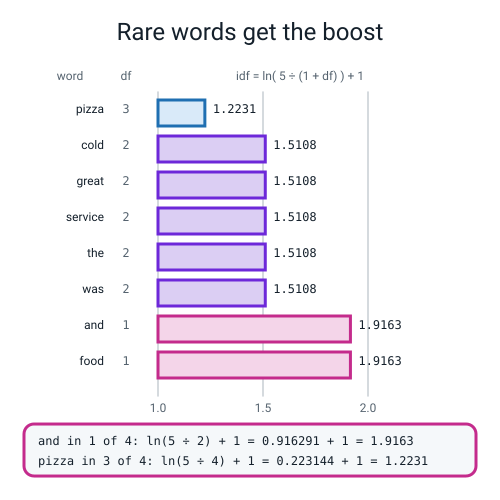
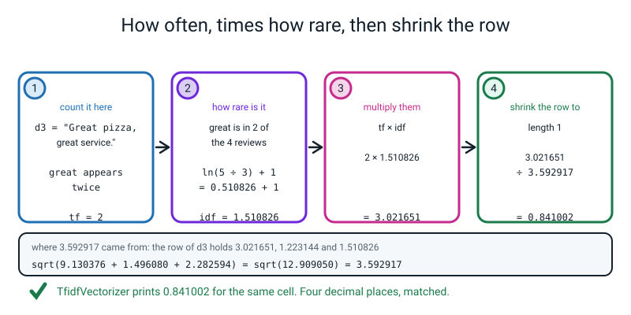
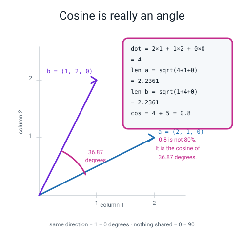
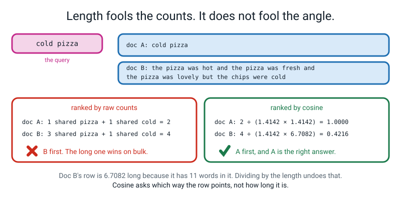
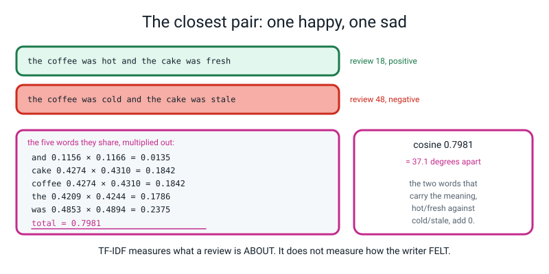

# Week 32 — Rare Words Matter More

[⬅ Week 31](week-31.md) · [Course Home](../README.md) · [Week 33 ➡](week-33.md) · [Student Guide](../student-guide/week-32.md) · [Workbook](../workbook/week-32.md)

---

## 📋 At a Glance

| | |
|---|---|
| **Duration** | 70 minutes |
| **Type** | 🟦 Teach — one multiplication, one division, and the week's one new piece of maths |
| **Big idea** | `and` appeared 55 times in the corpus and tells you nothing. **TF-IDF multiplies how often a word appears *here* by how rare it is *everywhere else*.** Then documents are compared by the **angle** between their rows, not by how long they are. |
| **New vocabulary** | term frequency · document frequency · inverse document frequency · TF-IDF · L2 normalization · cosine similarity · n-gram |
| **New maths** | **Cosine similarity** — the dot product of two lists divided by both their lengths. Worked by hand on two three-number lists, and **read as an angle**: `4 ÷ 5 = 0.8`, which is `36.87` degrees. Also the natural logarithm, reused from Week 14, now as a rarity meter. |
| **New syntax** | `TfidfVectorizer()` · `cosine_similarity(A, B)` · `X.toarray()` · `normalize(v)` |
| **Dataset** | **The same four whiteboard reviews as Week 31**, then the student's own **60-review corpus**. Nothing downloads. Every number in this lesson can be checked on a phone calculator. |
| **Materials** | Printed workbook pages 32.1–32.7 · **a second wall sheet headed IDF, with the eight words down the side and three blank columns: `df`, `ln(...)`, `idf`** · THE VOCABULARY sheet from Week 31, still up · **a calculator per student that does natural logarithms** · graph paper for the cosine drawing · two colours of pen · the Bug Log |
| **Tech needed** | Laptop with Python 3, numpy, pandas, scikit-learn. **No new installs. No torch this week.** |
| **Prep time** | 30 minutes the night before · 5 minutes on the day |
| **Expected runtime of the code** | `tfidf.py` runs in **under 1 second**. No training. **The time in this lesson goes on arithmetic done by hand, and that is the design.** |

> **⚠️ Watch out:** the single most likely way to wreck this lesson is a **calculator set to `log` base 10.** `ln(5 ÷ 3) = 0.510826`; `log₁₀(5 ÷ 3) = 0.221849`. A student using the wrong button gets `1.221849` where the library says `1.510826`, concludes the lesson is wrong, and stops trusting the arithmetic — which is the one thing this week is for. **Check every calculator in the room in the first two minutes. It is on the Prep Checklist for a reason.**

---

## 🎯 Lesson Objectives

By the end of the lesson the student can:

1. **Compute a TF-IDF weight by hand with the exact formula scikit-learn uses**, including the L2 normalization, and **match it to four decimal places** — `tf = 2`, `idf = ln(5 ÷ 3) + 1 = 1.510826`, product `3.021651`, divided by `3.592917`, giving **`0.841002`**.
2. **Compute cosine similarity by hand for two three-number lists** and **say what the number means as an angle** — `4 ÷ 5 = 0.8`, which is `36.87` degrees, not "80 per cent".
3. **Show with one example pair that raw counts rank the wrong document first**, and that cosine similarity fixes it — `2` against `4` by counts, `1.0000` against `0.4216` by cosine.
4. **Explain why a rare word gets a bigger IDF**, using document frequencies they counted themselves — `pizza` is in 3 of 4 reviews and scores `1.2231`; `and` is in 1 of 4 and scores `1.9163`.

Observable evidence: page 32.2 with the four-stage arithmetic in pen and `0.841002` written twice — once by hand and once copied off the screen; the IDF wall sheet with all eight `df` values and all eight `idf` values on it; a hand-drawn pair of arrows on graph paper with `36.87 degrees` written between them; and a written sentence naming **length** as the property of raw counts that caused the mis-ranking.

---

## 🧑‍🏫 What YOU Need to Know First

> **📌 About the code blocks in this guide.** Outside the **🧰 Prep Checklist** and the **🔑 Answer Key**, the blocks are **illustrations, not whole files** — each one carries on from the one above. **The complete runnable file is in the Prep Checklist and the Answer Key.**

**This week has genuine maths in it, and it is all arithmetic you can do on a phone.** There are no derivatives, no matrices, no calculus. There is one logarithm, one square root, one division, and one idea — the angle between two lists — which is the only genuinely new mathematical object of the week. **Work through §2, §3 and §5 below with a calculator in your hand before class. It takes twenty minutes and it is the difference between teaching this and reading it out.**

### 1. The complaint that this week answers

Last week's corpus produced this, and somebody in the room said something about it:

```text
the ten commonest words in the corpus:
   and        55
   the        34
   was        26
   cold       11
   rude       10
   driver     8
```

**`and` appears 55 times. `rude` appears 10 times.** And in a grid of raw counts, `and` therefore gets **five and a half times as much say** as `rude` in deciding what a review is like.

That is obviously backwards. `and` appears in a happy review and an angry review with equal enthusiasm; it cannot tell them apart. `rude` appears in exactly one kind of review. **The word that carries the information is getting a fifth of the weight of the word that carries none.**

So we want a weight that is:

- **big** when the word appears a lot **in this document**, and
- **big** when the word is **rare across the corpus**.

Multiply those two together and you have TF-IDF. **That is the entire idea and it is worth saying in one sentence before any symbols appear:** *how often, times how unsurprising-it-is-not.*

🍕 **The analogy that works, and it is the module's:** you have found a lost exercise book and you want to know whose subject it is. **Every exercise book contains the word "the", so seeing "the" tells you nothing.** This one contains "photosynthesis" three times. **Now you know it is Biology.** TF-IDF is that instinct written down as arithmetic.

### 2. Term frequency and document frequency, counted by hand

> **Term frequency (TF)** — how many times a term appears in **this** document. It is just the count you already built last week.
>
> **Document frequency (DF)** — how many **documents** contain the term at least once. Not how many times in total — how many documents.

**The distinction between those two is the commonest confusion of the week**, and the cure is to count both for one word on the board.

The four whiteboard reviews, again:

```text
d1: "The pizza was great!"
d2: "The pizza was cold."
d3: "Great pizza, great service."
d4: "Cold service and cold food."
```

Take the word `great`. **How many times does it appear in total?** Three — once in d1 and twice in d3. **How many documents contain it?** **Two** — d1 and d3.

**`tf` is per document, so `great` has `tf = 1` in d1 and `tf = 2` in d3. `df` is one number for the whole corpus, and it is 2.**

Here is the full `df` count for all eight words, and the class can do this in three minutes:

```text
and     : 1   (d4 only)
cold    : 2   (d2, d4)
food    : 1   (d4 only)
great   : 2   (d1, d3)
pizza   : 3   (d1, d2, d3)
service : 2   (d3, d4)
the     : 2   (d1, d2)
was     : 2   (d1, d2)
```

> **⚠️ Watch out:** `cold` appears **three times in total** (once in d2, twice in d4) but its `df` is **2**, because only two documents contain it. A student who writes 3 has counted occurrences instead of documents. **Say the word "documents" every single time you say "df", for the whole lesson.**

### 3. Inverse document frequency: the exact formula, and the arithmetic

Here is the formula scikit-learn actually uses, with its default settings. **Write it on the board and then immediately do it on four real numbers, because a formula nobody has evaluated is a decoration.**

```
idf(t) = ln( (1 + n) / (1 + df(t)) ) + 1

    n     = how many documents there are         (here, 4)
    df(t) = how many documents contain term t
```

**Three details trip people up and all three have a reason:**

- **The two `+1`s are smoothing.** They pretend there is one extra document that contains every term. Without them, a term with `df = 0` would divide by zero. With `n = 4`, the top of the fraction is always `5`.
- **The trailing `+ 1`, outside the logarithm, stops idf ever being zero.** A word in every single document gets `ln(1) + 1 = 0 + 1 = 1`, so it is knocked down to a plain count rather than deleted. **That is a design choice and a good one: "worthless" and "delete it" are not the same instruction.**
- **`ln` is the natural logarithm** — the same one from Week 14, where `−ln(p)` was the surprise meter. **On a calculator it is the `ln` button, not `log`.**

**Now the arithmetic, for all eight words. This is the table the class fills in on the wall sheet:**

| term | df | (1 + 4) ÷ (1 + df) | ln(that) | **idf = ln + 1** |
|---|---:|---|---:|---:|
| and | 1 | 5 ÷ 2 = 2.5000 | 0.916291 | **1.916291** |
| cold | 2 | 5 ÷ 3 = 1.6667 | 0.510826 | **1.510826** |
| food | 1 | 2.5000 | 0.916291 | **1.916291** |
| great | 2 | 1.6667 | 0.510826 | **1.510826** |
| pizza | 3 | 5 ÷ 4 = 1.2500 | 0.223144 | **1.223144** |
| service | 2 | 1.6667 | 0.510826 | **1.510826** |
| the | 2 | 1.6667 | 0.510826 | **1.510826** |
| was | 2 | 1.6667 | 0.510826 | **1.510826** |

**Read the last column out loud.** `pizza` is in three of the four reviews, so it gets the **smallest** weight, `1.2231`. `and` and `food` are in one review each, so they get the **biggest**, `1.9163`. **The ubiquitous word is discounted and the distinctive word is boosted, and that is IDF doing its one job.**


*Figure 32.1 — The rarer the word, the bigger its boost. `and` is in 1 review of 4 and scores `ln(5 ÷ 2) + 1 = 1.9163`; `pizza` is in 3 of 4 and scores `ln(5 ÷ 4) + 1 = 1.2231`.*

And the library agrees, to six decimal places:

```text
--- idf, from TfidfVectorizer ---
   and      1.916291
   cold     1.510826
   food     1.916291
   great    1.510826
   pizza    1.223144
   service  1.510826
   the      1.510826
   was      1.510826
```

> **🔢 The maths, slowly:** the fraction `(1 + n) / (1 + df)` is *how many documents there are, divided by how many contain the word* — roughly, **"one in how many"**. A word in 1 of 4 documents gives 2.5, so it is a "one in two-and-a-half" word. A word in 3 of 4 gives 1.25, so it is nearly everywhere. **The logarithm's only job is to stop that number growing too fast** — without it, a word in 1 document out of 20,000 would get a weight of 10,000 and would drown out everything else. `ln` turns 10,000 into about 9.2. **That is the whole reason a logarithm is there, and it is worth saying, because otherwise it looks like decoration.**

### 4. L2 normalization: the step everybody forgets

**TF-IDF is not finished when you multiply.** Scikit-learn does one more thing, and if you skip it your hand arithmetic will not match and you will not know why.

> **L2 normalization** — divide every number in a row by the row's **length**, so that the row's length becomes exactly 1.
>
> The length of a row is `sqrt(` each number squared, added up `)`. It is Pythagoras, in as many dimensions as you have columns.

**Here it is, all the way, for the word `great` in d3 — and this is the in-class activity, so know it cold.**

d3 is `"Great pizza, great service."` It has three different words in it, so its row has three non-zero numbers.

**Step 1 — the raw products, `tf × idf`:**

```text
great   : tf 2 x idf 1.510826 = 3.021651
pizza   : tf 1 x idf 1.223144 = 1.223144
service : tf 1 x idf 1.510826 = 1.510826
```

**Step 2 — square each one and add them up:**

```text
3.021651 squared = 9.130376
1.223144 squared = 1.496080
1.510826 squared = 2.282594
                   ---------
            total   12.909050
```

**Step 3 — the row's length is the square root of that:**

```text
sqrt(12.909050) = 3.592917
```

**Step 4 — divide every number in the row by 3.592917:**

```text
great   = 3.021651 / 3.592917 = 0.841002
pizza   = 1.223144 / 3.592917 = 0.340432
service = 1.510826 / 3.592917 = 0.420501
```

**And that is what scikit-learn prints.** To six decimal places:

```text
         and      cold      food     great     pizza   service       the       was
d1  0.000000  0.000000  0.000000  0.523035  0.423442  0.000000  0.523035  0.523035
d2  0.000000  0.523035  0.000000  0.000000  0.423442  0.000000  0.523035  0.523035
d3  0.000000  0.000000  0.000000  0.841002  0.340432  0.420501  0.000000  0.000000
d4  0.442462  0.697684  0.442462  0.000000  0.000000  0.348842  0.000000  0.000000
length of every row: [1. 1. 1. 1.]
```


*Figure 32.2 — How often, times how rare, then shrink the row. `tf = 2`, `idf = 1.510826`, product `3.021651`, divided by the row length `3.592917`, giving `0.841002` — and `TfidfVectorizer` prints `0.841002`.*

**Why normalize at all?** Because otherwise a long review beats a short one at everything simply by being long. A 200-word review has bigger numbers in every column than a 10-word review on the same subject. **Dividing by the length asks "what is this review made of?" instead of "how much of it is there?"** And it has a very convenient consequence, which §5 uses:

> **Because every TF-IDF row has length exactly 1, comparing two of them by cosine similarity is just multiplying them together and adding up. The dividing has already been done.**

### 5. Cosine similarity — this week's one new piece of maths

**Teach it on two three-number lists before you ever say the word "document".**

Two people order pizza toppings. Each order is three numbers: how many portions of cheese, pepperoni, olives.

```
Ravi : (2 cheese, 1 pepperoni, 0 olives)   ->  a = (2, 1, 0)
Sam  : (1 cheese, 2 pepperoni, 0 olives)   ->  b = (1, 2, 0)
```

**Are those similar orders?** They feel quite similar — same two toppings, different emphasis. Here is how you turn that feeling into a number, in three steps, all arithmetic.

**Step 1 — the dot product. Multiply matching positions, add up.**

```text
2 x 1  +  1 x 2  +  0 x 0  =  2 + 2 + 0  =  4
```

**Step 2 — each list's length. Square, add, square root.** Same Pythagoras as §4.

```text
length of a = sqrt(2² + 1² + 0²) = sqrt(4 + 1 + 0) = sqrt(5) = 2.236068
length of b = sqrt(1² + 2² + 0²) = sqrt(1 + 4 + 0) = sqrt(5) = 2.236068
```

**Step 3 — divide the dot product by both lengths.**

```text
4 / (2.236068 x 2.236068) = 4 / 5 = 0.8
```

> **Cosine similarity** — the dot product of two lists, divided by both their lengths. It measures the **angle** between them and completely ignores how long they are.

**And now the part that makes it click, and it is objective 2.** Draw it. Two arrows from the same corner: `a` goes 2 across and 1 up; `b` goes 1 across and 2 up. **They point in slightly different directions, and 0.8 is the cosine of the angle between them.** Put `0.8` into the `cos⁻¹` button (sometimes `acos`, sometimes `arccos`) and you get:

```text
angle = 36.87 degrees
```


*Figure 32.3 — Cosine is the angle between two lists. `a = (2, 1, 0)`, `b = (1, 2, 0)`, dot product 4, both lengths `sqrt(5)`, so `4 ÷ 5 = 0.8` — an angle of `36.87` degrees.*

**Three landmarks to write on the board and leave there all lesson:**

| cosine | angle | means |
|---:|---:|---|
| **1.0** | 0 degrees | pointing exactly the same way — same words in the same proportions |
| **0.8** | 36.87 degrees | close, but not the same |
| **0.0** | 90 degrees | at right angles — **not one word in common** |

> **⚠️ Watch out:** **`0.8` is not 80 per cent of anything.** Students will read it as a percentage and it is not one — the relationship between the number and the angle is not straight. `0.9` is 25.8 degrees and `0.5` is 60 degrees, so going from 0.9 to 0.5 costs you 34 degrees while going from 0.5 to 0.1 (84.3 degrees) costs you only 24. **Insist on the angle for at least this week.** It stops the false arithmetic "0.8 is twice as similar as 0.4" — it is not; 0.4 is 66.4 degrees, and 66.4 is not twice 36.87.

### 6. Why the dot product alone is a trap

**This is objective 3 and it takes ninety seconds to prove.**

```text
d1      = "the pizza was great"                          (4 words)
d1_long = "the pizza was great the pizza was great"       (the same text, twice)
```

Their count rows over the four-word vocabulary are `[1 1 1 1]` and `[2 2 2 2]`. Now:

```text
dot(short, short) = 4.0
dot(short, long ) = 8.0
```

**By dot product, the doubled document is twice as similar to d1 as d1 is to itself.** That is not a small inaccuracy; it is nonsense. **Length is drowning out content.**

Redo it with cosine:

```text
cos(short, short) = 1.0000
cos(short, long ) = 1.0000
```

**Both exactly 1.0, which is right** — they contain the same words in the same proportions, so they point the same way.

🍕 **The analogy:** two people describe the same pizza. One says "cheesy, tomatoey, hot". The other says the same three things but repeats each five times because they are excited. **They are describing the same pizza.** Cosine asks *"are they pointing the same way?"* The dot product asks *"who talked longer?"*

**The version that is a genuine ranking failure, and the one the homework uses:**

```text
query : cold pizza
doc A : cold pizza
doc B : the pizza was hot and the pizza was fresh and the pizza was lovely but the chips were cold

raw count dot product   A: 2   B: 4
cosine similarity       A: 1.0000   B: 0.4216
length of A's row = 1.4142, length of B's row = 6.7082
```

**Raw counts put B first, and B is wrong.** Doc A *is* the query. Doc B mentions `pizza` three times and `cold` once, so it collects four points by bulk. **Cosine divides by 6.7082 and B drops to 0.4216, and the right answer comes first.**


*Figure 32.4 — Length fools the counts. It does not fool the angle. `4 ÷ (1.4142 × 6.7082) = 0.4216`, and doc A's `1.0000` wins.*

**The sentence the homework wants, and mark it hard:** *"the property of raw counts that caused the mistake is that a longer document has bigger numbers in it, so it collects more points just by being longer, regardless of whether it is more relevant."*

### 7. The honest result, on their own corpus

**This is the wrap, and it is the best thing in the week.** Run cosine similarity over all sixty of the student's reviews, find the closest pair, and you get this:

```text
the two most similar reviews in the corpus, cosine 0.7981 (37.1 degrees):
   [18] the coffee was hot and the cake was fresh
   [48] the coffee was cold and the cake was stale
```

**Read those two reviews.** One is a happy customer and one is a furious customer, and **TF-IDF says they are the two most similar documents in the entire corpus.**

Here is exactly why, multiplied out. Their rows share five words, and each shared word contributes:

```text
and      0.1156 x 0.1166 = 0.0135
cake     0.4274 x 0.4310 = 0.1842
coffee   0.4274 x 0.4310 = 0.1842
the      0.4209 x 0.4244 = 0.1786
was      0.4853 x 0.4894 = 0.2375
                   total = 0.7981
```

**And the four words that carry the entire meaning — `hot`, `fresh`, `cold`, `stale` — contribute exactly nothing**, because they are not shared, and cosine similarity only ever adds up shared terms.


*Figure 32.4b — The closest pair in the corpus is one happy and one sad. Five shared words add to 0.7981; the four words that carry the meaning add 0.*

And the same thing happens on the four whiteboard reviews, which is why the whole cosine matrix is worth printing:

```text
        d1      d2      d3      d4
d1  1.0000  0.7264  0.5840  0.0000
d2  0.7264  1.0000  0.1442  0.3649
d3  0.5840  0.1442  1.0000  0.1467
d4  0.0000  0.3649  0.1467  1.0000

cos(d1, d2) = 0.7264, which is an angle of 43.4 degrees
cos(d1, d4) = 0.0000, which is an angle of 90.0 degrees
```

**The highest off-diagonal number is `0.7264` — d1 against d2.** `"The pizza was great!"` and `"The pizza was cold."` **The happiest review and the unhappiest review, 43.4 degrees apart, and the closest pair in the corpus.**

**Say the honest summary out loud, and this is the sentence that carries Weeks 32 and 33:**

> **TF-IDF measures what a document is ABOUT. It does not measure how the writer FELT. It is very good at topic and bad at sentiment, and next week you are going to build a sentiment model out of it anyway and find out exactly how much that costs.**

And notice `cos(d1, d4) = 0.0000` — exactly zero, a right angle. d1 is `"The pizza was great!"` and d4 is `"Cold service and cold food."` **They have literally no word in common, so the model says they have nothing to do with each other** — which is true at the word level and false at the meaning level, because both are somebody's opinion about the same restaurant.

### 8. Every new line of this week's code, explained to somebody who has never programmed

Four new things.

**New thing 1 — the weighted counter.**

```python
from sklearn.feature_extraction.text import TfidfVectorizer

tv = TfidfVectorizer()
X = tv.fit_transform(docs)
```

**This is last week's `CountVectorizer` with the multiplying and dividing built in.** Same interface, same defaults, same alphabetical vocabulary, same single-letter-words problem. `.fit_transform` reads the documents, works out the `df` of every word, computes the `idf` of every word, multiplies, and normalizes each row to length 1. **Four steps, one call.**

The one extra thing it has is `tv.idf_` — the learned idf values, in column order, which is how you check your hand arithmetic against it:

```python
for term, value in zip(tv.get_feature_names_out(), tv.idf_):
    print(term, value)
```

**The trailing underscore in `idf_` is scikit-learn's convention for "this was learned during `fit`"**, exactly like Week 4's `scaler.mean_`. Ask for it before fitting and you get `NotFittedError`.

**New thing 2 — turning a sparse matrix into a grid.**

```python
X.toarray()
```

Met last week. Says it again because you cannot do any hand-checking without it: `X` is a sparse matrix and holds only the non-zeros; `.toarray()` builds the full rectangle of numbers, zeros included, so you can print it or index it. **Never call it on a real corpus with 50,000 columns — that is when eight megabytes becomes eight gigabytes.** On a 4 × 8 or 60 × 92 grid it is free.

**New thing 3 — the angle between rows.**

```python
from sklearn.metrics.pairwise import cosine_similarity

cosine_similarity(A, B)
```

Takes **two matrices** and returns a grid of every row of `A` against every row of `B`. Hand it one matrix — `cosine_similarity(X)` — and you get every row against every other row, which is the 4 × 4 table above.

> **⚠️ Watch out:** it wants **2-D** input, always. A single row is a 1-D thing and produces `ValueError: Expected 2D array, got 1D array instead`. The fix is square brackets: `cosine_similarity([a], [b])`. **This is the commonest error of the week and it is deliberate mistake two in the live-code segment.**

**New thing 4 — normalizing by hand.**

```python
from sklearn.preprocessing import normalize

normalize(M)
```

Divides every row of `M` by that row's own length, so every row comes out with length 1. **It is the last step of TF-IDF, available on its own**, and its point in this lesson is to prove that cosine similarity is not magic:

```text
normalize(query row) = [0.  0.  0.  0.7071  0.  0.  0.  0.7071  0.  0.  0. ]
its length           = 1.0000
dot of the normalized rows, A: 1.0000   B: 0.4216
```

**Normalize first, then take a plain dot product, and you get the cosine similarity exactly.** `0.7071` is `1 ÷ sqrt(2)`, which is what you get when you divide a row of two 1s by its length of `1.4142`. **Two 1s become two 0.7071s, and `0.7071² + 0.7071² = 1`.** That arithmetic is worth doing on the board; it makes "normalize" concrete in a way the word never does.

### 9. The three misconceptions you will actually meet

**Misconception 1 — "df is how many times the word appears."**
It is how many **documents** contain it. `cold` appears three times but its `df` is 2. **Cure:** count both numbers for `cold` on the board, out loud, and write them next to each other: *occurrences 3, documents 2.*

**Misconception 2 — "cosine 0.8 means 80 per cent similar."**
**Cure:** the three landmarks. `0.9` is 25.8 degrees; `0.5` is 60 degrees; `0.1` is 84.3 degrees. **The gap from 0.9 to 0.5 is 34 degrees and the gap from 0.5 to 0.1 is 24 degrees**, so the number is not a percentage and does not behave like one. Make them say "degrees" for a week.

**Misconception 3 — "TF-IDF fixes the problem from last week."**
It fixes one part of one problem: `and` and `the` now get less weight than `rude`. **It does nothing whatsoever about word order or negation**, and the closest-pair result proves it — a happy review and a furious review, 37.1 degrees apart, closest in the corpus. **Cure:** that result, on their own data, at minute 65.

### 10. How deep to go, and where to stop

**Go this far:** tf versus df counted by hand; the exact idf formula evaluated on all eight words; why the logarithm is there; the L2 divide, all four steps, on one word; the cosine of two three-number lists, drawn and converted to an angle; the dot-product trap; the closest-pair result on their own corpus.

**Stop before:**

| Do not teach today | Where it lives |
|---|---|
| **Training a classifier on TF-IDF** | **Week 33**, and it is the whole of next week. Today nothing is fitted but the vectorizer. |
| **n-grams** | **Week 33.** The word appears in this week's vocabulary list because you will *say* it once — *"there is a patch for word order called an n-gram and we measure it next week"* — and then stop. **Do not demonstrate `ngram_range` today.** |
| **`sublinear_tf`, `smooth_idf=False`, `norm=None`** | Not in this level. There are four or five knobs on `TfidfVectorizer` and every one of them is a different formula. **We teach exactly the default and match it to four decimals.** If asked: *"there are other versions of this formula; the one we did is the one this library uses unless you tell it otherwise."* |
| **Why `ln` and not `log₂` or `log₁₀`** | One sentence: *"any base works and they differ by a constant multiplier, so the ranking is identical; `ln` is what this library chose."* **Do not go further — it is a true fact with no consequence for a fourteen-year-old.** |
| **The geometry of high-dimensional space** | Not in this level, and genuinely strange. If a student asks how you can have an angle in 92 dimensions, the honest answer is in §9 of the Questions section and it is *"the arithmetic works the same and you should not try to picture it."* |
| **`linear_kernel` being faster than `cosine_similarity`** | One sentence if it comes up: *"because TF-IDF rows already have length 1, the division is a waste of time, and there is a faster function that skips it."* **Not worth five minutes.** |
| **Embeddings** | **Week 33's last ten minutes, then Level 4.** |

The line to hold in your head all lesson: **today the student makes a library's number appear on paper first, and then measures the distance between two documents as an angle.**

---

## 🧰 Prep Checklist

### 30 minutes the night before

- [ ] **Do §3, §4 and §5 with a calculator in your hand.** Twenty of the thirty minutes go here and they are the important twenty. **Specifically: get `ln(5 ÷ 3)` to read `0.510826` on your own calculator, and get `cos⁻¹(0.8)` to read `36.87`.** If you cannot find the `ln` button or the `cos⁻¹` button on the calculator you plan to give the class, find that out tonight rather than at minute 20.
- [ ] **Type and run `tfidf.py` yourself**, in the same folder as last week's `reviews.py`. The complete file:

```python
"""tfidf.py - Week 32: how often, times how rare, then the angle."""
import numpy as np
import pandas as pd
from sklearn.feature_extraction.text import CountVectorizer, TfidfVectorizer
from sklearn.metrics.pairwise import cosine_similarity
from sklearn.preprocessing import normalize

from reviews import CORPUS_60

pd.set_option("display.width", 250)
pd.set_option("display.max_columns", 50)

docs = ["The pizza was great!",
        "The pizza was cold.",
        "Great pizza, great service.",
        "Cold service and cold food."]
names = ["d1", "d2", "d3", "d4"]

# ---------- 1. document frequency and idf, by hand and by library ----------
cv = CountVectorizer()
C = cv.fit_transform(docs).toarray()
terms = cv.get_feature_names_out()
n = len(docs)
df = (C > 0).sum(axis=0)

print("--- idf, by hand, n = 4 ---")
print("%-9s %3s  %-10s %-10s %s" % ("term", "df", "(1+n)/(1+df)", "ln(that)", "idf = ln + 1"))
for t, d in zip(terms, df):
    ratio = (1 + n) / (1 + d)
    print("%-9s %3d  %-12.4f %-10.6f %.6f" % (t, d, ratio, np.log(ratio),
                                              np.log(ratio) + 1))

tv = TfidfVectorizer()
X = tv.fit_transform(docs)
print()
print("--- idf, from TfidfVectorizer ---")
for t, v in zip(tv.get_feature_names_out(), tv.idf_):
    print("   %-9s %.6f" % (t, v))

# ---------- 2. one word, all the way: 'great' in d3 ----------
print()
print("--- 'great' in d3, all the way ---")
tf = 2
idf = np.log(5 / 3) + 1
raw = tf * idf
print("tf('great', d3)            =", tf)
print("idf('great')               = ln(5/3) + 1 = %.6f" % idf)
print("tf x idf                   = 2 x %.6f = %.6f" % (idf, raw))
parts = np.array([2 * (np.log(5 / 3) + 1),          # great
                  1 * (np.log(5 / 4) + 1),          # pizza
                  1 * (np.log(5 / 3) + 1)])         # service
print("the three raw weights in d3:", np.round(parts, 6))
print("squares                    :", np.round(parts ** 2, 6))
print("sum of squares             = %.6f" % (parts ** 2).sum())
norm = np.sqrt((parts ** 2).sum())
print("L2 length of the row       = sqrt(%.6f) = %.6f" % ((parts ** 2).sum(), norm))
print("great, normalized          = %.6f / %.6f = %.6f" % (raw, norm, raw / norm))
print("sklearn's number for it    = %.6f" % X.toarray()[2, list(terms).index("great")])

print()
print("--- the whole L2-normalized TF-IDF matrix ---")
print(pd.DataFrame(np.round(X.toarray(), 6), index=names, columns=terms))
print("length of every row:", np.round(np.sqrt((X.toarray() ** 2).sum(axis=1)), 6))

# ---------- 3. cosine on two 3-number lists ----------
a = np.array([2.0, 1.0, 0.0])
b = np.array([1.0, 2.0, 0.0])
print()
print("--- cosine on two 3-number lists ---")
print("a =", a, "   b =", b)
print("dot           = 2x1 + 1x2 + 0x0 =", float(a @ b))
print("length of a   = sqrt(4 + 1 + 0) = sqrt(5) = %.6f" % np.sqrt(5))
print("length of b   = sqrt(1 + 4 + 0) = sqrt(5) = %.6f" % np.sqrt(5))
print("product       = %.6f" % (np.sqrt(5) * np.sqrt(5)))
print("cosine        = 4 / 5 = %.4f" % (a @ b / (np.sqrt(5) * np.sqrt(5))))
print("angle         = %.2f degrees" % np.degrees(np.arccos(0.8)))

# ---------- 4. the four documents, by angle ----------
S = cosine_similarity(X)
print()
print("--- cosine similarity of the four reviews ---")
print(pd.DataFrame(np.round(S, 4), index=names, columns=names))
print()
print("cos(d1, d2) = %.4f, which is an angle of %.1f degrees"
      % (S[0, 1], np.degrees(np.arccos(S[0, 1]))))
print("cos(d1, d4) = %.4f, which is an angle of %.1f degrees"
      % (S[0, 3], np.degrees(np.arccos(S[0, 3]))))
print("d1 is 'The pizza was great!' and d2 is 'The pizza was cold.'")

# ---------- 5. length fools counts, not cosine ----------
pair = ["the pizza was great", "the pizza was great the pizza was great"]
P = CountVectorizer().fit_transform(pair).toarray().astype(float)
print()
print("--- length fools the dot product ---")
print("count rows:", P[0], P[1])
print("dot(short, short) =", float(P[0] @ P[0]))
print("dot(short, long ) =", float(P[0] @ P[1]))
print("cos(short, short) = %.4f" % cosine_similarity([P[0]], [P[0]])[0, 0])
print("cos(short, long ) = %.4f" % cosine_similarity([P[0]], [P[1]])[0, 0])

# ---------- 6. raw counts rank the wrong document first ----------
query = "cold pizza"
A = "cold pizza"
B = ("the pizza was hot and the pizza was fresh and the pizza was lovely "
     "but the chips were cold")
cv2 = CountVectorizer()
M = cv2.fit_transform([query, A, B]).toarray().astype(float)
q, ra, rb = M[0], M[1], M[2]
print()
print("--- counts rank the wrong one first ---")
print("query :", query)
print("doc A :", A)
print("doc B :", B)
print("raw count dot product   A: %.0f   B: %.0f" % (q @ ra, q @ rb))
print("cosine similarity       A: %.4f   B: %.4f"
      % (cosine_similarity([q], [ra])[0, 0], cosine_similarity([q], [rb])[0, 0]))
print("length of A's row = %.4f, length of B's row = %.4f"
      % (np.sqrt((ra ** 2).sum()), np.sqrt((rb ** 2).sum())))

# ---------- 7. normalize, then dot, equals cosine ----------
Nrm = normalize(M)
print()
print("--- normalize then dot IS cosine ---")
print("normalize(query row) =", np.round(Nrm[0], 4))
print("its length           = %.4f" % np.sqrt((Nrm[0] ** 2).sum()))
print("dot of the normalized rows, A: %.4f   B: %.4f"
      % (Nrm[0] @ Nrm[1], Nrm[0] @ Nrm[2]))

# ---------- 8. the sixty reviews ----------
tv60 = TfidfVectorizer()
X60 = tv60.fit_transform(CORPUS_60)
v60 = tv60.get_feature_names_out()
o = np.argsort(tv60.idf_)
print()
print("--- your 60-review corpus ---")
print("vocabulary size:", len(v60))
print("the five LOWEST idf words (they are everywhere, so they are worth least):")
for i in o[:5]:
    print("   %-10s idf %.4f" % (v60[i], tv60.idf_[i]))
print("the highest idf is %.4f, and %d of the %d words share it"
      % (tv60.idf_.max(), int((tv60.idf_ == tv60.idf_.max()).sum()), len(v60)))

S60 = cosine_similarity(X60)
np.fill_diagonal(S60, 0.0)
i, j = np.unravel_index(np.argmax(S60), S60.shape)
print()
print("the two most similar reviews in the corpus, cosine %.4f (%.1f degrees):"
      % (S60[i, j], np.degrees(np.arccos(S60[i, j]))))
print("   [%d] %s" % (i, CORPUS_60[i]))
print("   [%d] %s" % (j, CORPUS_60[j]))
```

Run `python3 tfidf.py`. You must see **exactly** this:

```text
--- idf, by hand, n = 4 ---
term       df  (1+n)/(1+df) ln(that)   idf = ln + 1
and         1  2.5000       0.916291   1.916291
cold        2  1.6667       0.510826   1.510826
food        1  2.5000       0.916291   1.916291
great       2  1.6667       0.510826   1.510826
pizza       3  1.2500       0.223144   1.223144
service     2  1.6667       0.510826   1.510826
the         2  1.6667       0.510826   1.510826
was         2  1.6667       0.510826   1.510826

--- idf, from TfidfVectorizer ---
   and      1.916291
   cold     1.510826
   food     1.916291
   great    1.510826
   pizza    1.223144
   service  1.510826
   the      1.510826
   was      1.510826

--- 'great' in d3, all the way ---
tf('great', d3)            = 2
idf('great')               = ln(5/3) + 1 = 1.510826
tf x idf                   = 2 x 1.510826 = 3.021651
the three raw weights in d3: [3.021651 1.223144 1.510826]
squares                    : [9.130376 1.49608  2.282594]
sum of squares             = 12.909050
L2 length of the row       = sqrt(12.909050) = 3.592917
great, normalized          = 3.021651 / 3.592917 = 0.841002
sklearn's number for it    = 0.841002

--- the whole L2-normalized TF-IDF matrix ---
         and      cold      food     great     pizza   service       the       was
d1  0.000000  0.000000  0.000000  0.523035  0.423442  0.000000  0.523035  0.523035
d2  0.000000  0.523035  0.000000  0.000000  0.423442  0.000000  0.523035  0.523035
d3  0.000000  0.000000  0.000000  0.841002  0.340432  0.420501  0.000000  0.000000
d4  0.442462  0.697684  0.442462  0.000000  0.000000  0.348842  0.000000  0.000000
length of every row: [1. 1. 1. 1.]

--- cosine on two 3-number lists ---
a = [2. 1. 0.]    b = [1. 2. 0.]
dot           = 2x1 + 1x2 + 0x0 = 4.0
length of a   = sqrt(4 + 1 + 0) = sqrt(5) = 2.236068
length of b   = sqrt(1 + 4 + 0) = sqrt(5) = 2.236068
product       = 5.000000
cosine        = 4 / 5 = 0.8000
angle         = 36.87 degrees

--- cosine similarity of the four reviews ---
        d1      d2      d3      d4
d1  1.0000  0.7264  0.5840  0.0000
d2  0.7264  1.0000  0.1442  0.3649
d3  0.5840  0.1442  1.0000  0.1467
d4  0.0000  0.3649  0.1467  1.0000

cos(d1, d2) = 0.7264, which is an angle of 43.4 degrees
cos(d1, d4) = 0.0000, which is an angle of 90.0 degrees
d1 is 'The pizza was great!' and d2 is 'The pizza was cold.'

--- length fools the dot product ---
count rows: [1. 1. 1. 1.] [2. 2. 2. 2.]
dot(short, short) = 4.0
dot(short, long ) = 8.0
cos(short, short) = 1.0000
cos(short, long ) = 1.0000

--- counts rank the wrong one first ---
query : cold pizza
doc A : cold pizza
doc B : the pizza was hot and the pizza was fresh and the pizza was lovely but the chips were cold
raw count dot product   A: 2   B: 4
cosine similarity       A: 1.0000   B: 0.4216
length of A's row = 1.4142, length of B's row = 6.7082

--- normalize then dot IS cosine ---
normalize(query row) = [0.     0.     0.     0.7071 0.     0.     0.     0.7071 0.     0.
 0.    ]
its length           = 1.0000
dot of the normalized rows, A: 1.0000   B: 0.4216

--- your 60-review corpus ---
vocabulary size: 92
the five LOWEST idf words (they are everywhere, so they are worth least):
   and        idf 1.0855
   the        idf 1.9754
   was        idf 2.2777
   cold       idf 2.6260
   rude       idf 2.7130
the highest idf is 4.4177, and 15 of the 92 words share it

the two most similar reviews in the corpus, cosine 0.7981 (37.1 degrees):
   [18] the coffee was hot and the cake was fresh
   [48] the coffee was cold and the cake was stale
```

**Expected runtime: under 1 second.** There is no training in this lesson.

- [ ] **Break the logarithm on purpose, once.** Change `np.log` to `np.log10` in the idf line and run it. You get `1.221849` for `great` where the library says `1.510826`. **No error, no warning, and a number that looks completely plausible.** This is deliberate mistake one, and it is the exact mistake a student with a badly-set calculator will make.
- [ ] **Break `cosine_similarity` on purpose, once.** `cosine_similarity(a, b)` with the two three-number lists gives:

```text
ValueError: Expected 2D array, got 1D array instead:
array=[2. 1. 0.].
Reshape your data either using array.reshape(-1, 1) if your data has a single feature or array.reshape(1, -1) if it contains a single sample.
```

**Read that last sentence carefully yourself, because it offers you two fixes and one of them is wrong for us.** We have one *sample* with three *features*, so it is `reshape(1, -1)` — or, much more simply, square brackets: `cosine_similarity([a], [b])`. This is deliberate mistake two.

- [ ] **Print workbook pages 32.1–32.7.**
- [ ] **Rule up the IDF wall sheet:** the eight words down the side, and three columns headed `df`, `ln(5 ÷ (1 + df))`, `idf`. **It gets filled in live in the concept segment and it stays up for Week 33.**
- [ ] **Test every calculator you are going to hand out.** `ln(5 ÷ 3)` must read `0.510826...`. A calculator reading `0.221849` is on `log` base 10 and will ruin the lesson for whoever gets it. **Two minutes, and it is the highest-value two minutes in this checklist.**
- [ ] **Check the student's own sixty reviews still run.** The last ten minutes of the lesson is the closest-pair result on **their** corpus, and it is the best moment of the week.

### 5 minutes on the day

- [ ] Editor open, terminal ready, `reviews.py` and `tfidf.py` in the same folder.
- [ ] THE VOCABULARY sheet from Week 31 still up; the new IDF sheet up beside it, blank.
- [ ] Graph paper out. **The cosine drawing is done by hand and the angle is measured with a protractor if you have one — it should come out at about 37 degrees and measuring it is worth more than being told it.**
- [ ] Calculators out and tested.
- [ ] Workbook 32.1 out, with the `df` column ready to fill in first.
- [ ] Bug Log out.

### Fallback if the laptops fail

**This is the second most paper-friendly week of the term. Three of the four objectives are entirely arithmetic.**

1. **Objective 4 — why a rare word gets a bigger idf — needs a calculator and nothing else.** Count the eight `df` values, do eight logarithms, fill in the wall sheet. **Twelve minutes, no electricity.**
2. **Objective 1 — one weight, all the way — is four arithmetic steps** and it works better on a board than on a screen, because you can leave all four steps visible at once. **The only thing you lose is the verification**, so print this file's matrix and have them check `0.841002` against the printout. Say what you are doing.
3. **Objective 2 — cosine as an angle — is the best paper activity of the term.** Graph paper, two arrows, a protractor. **Measuring 37 degrees with a protractor and then computing `cos⁻¹(0.8) = 36.87` on a calculator is a genuinely delightful moment** and it is strictly better than watching a number appear on a screen.
4. **Objective 3 — the ranking failure — works on the board.** Write the query, the two documents, and have two students each count one. `2` and `4`. Then the two lengths, `1.4142` and `6.7082`, and the two divisions.
5. **The only casualty is the closest-pair result on their own sixty reviews.** Use this file's — `"the coffee was hot and the cake was fresh"` against `"the coffee was cold and the cake was stale"`, `0.7981`, 37.1 degrees — and set finding their own as homework.

| If this fails | Do this instead |
|---|---|
| A student's idf values are all wrong by the same pattern | **Their calculator is on `log` base 10.** `ln(5 ÷ 3) = 0.510826`; `log₁₀(5 ÷ 3) = 0.221849`. Check the button, not the arithmetic. |
| A student's idf for `cold` is `1.2231` instead of `1.5108` | They counted **occurrences** (3) instead of **documents** (2). **Say "documents" out loud and have them recount.** |
| The hand-computed `0.841002` comes out as `3.021651` | **They stopped before the L2 divide.** That is the step everybody forgets and it is why the activity is called *All The Way*. |
| The hand-computed weight is close but not equal — `0.8410` versus `0.8411` | **Rounding, and it is worth thirty seconds.** If you round `idf` to 4 places before multiplying, the error compounds. **Carry six decimal places and round only at the end.** |
| `ValueError: Expected 2D array, got 1D array instead` | Square brackets: `cosine_similarity([a], [b])`. **Deliberate mistake two — if it happens by accident, celebrate it.** |
| Somebody's closest pair is not one happy and one sad | **Then that is their result and they should report it.** Ask what their pair shares. **The lesson is that cosine adds up only shared words; whether that produces a comic result depends on their corpus, and finding out is the work.** |
| The class reads 0.7264 as "72% similar" | **Convert it out loud, every time, for the rest of the lesson.** `cos⁻¹(0.7264) = 43.4 degrees`. Make them do the conversion themselves twice and the habit sticks. |
| Somebody asks how there can be an angle in 92 dimensions | **Answer honestly and briefly:** *"the arithmetic is identical and you should not try to picture it."* The long version is in the Questions section. **Do not spend five minutes here.** |

---

## ⏱️ The Lesson, Minute by Minute

| Segment | Minutes | Running total | What happens |
|---|---|---|---|
| 🪝 Hook — `and` 55 Times, `rude` 10 | 7 | 7 | The complaint from last week, and the shape of the repair |
| 🧠 Concept & Maths — How Rare, and What Angle | 18 | 25 | tf vs df, the idf table, the L2 divide, cosine on two lists |
| 💻 Live-Code Together — `tfidf.py` | 18 | 43 | idf, one word all the way, the dot-product trap. **Two deliberate mistakes.** |
| 🎲 Their Turn — All The Way, and the Wrong Ranking | 20 | 63 | `great` in d3 to four decimals, then the query ranking |
| 🔑 Wrap & Assign | 7 | 70 | The closest pair, 37.1 degrees, and what it means for next week |

---

### 🪝 Hook — `and` 55 Times, `rude` 10 (7 minutes)

**Do this:** Nothing on the screen. Write two lines on the board, large:

```
and    55
rude   10
```

**Say this:**

> "Those are two numbers off your own corpus from last week. **`and` appears fifty-five times in your sixty reviews. `rude` appears ten times.**
>
> I am going to read you one word out of a review, and you tell me whether the review was happy or angry. Ready. The word is: **`and`**."

**Ask this:** "Happy or angry?"

*You cannot tell.*

> "Right. Next word: **`rude`**."

**Ask this:** "Happy or angry?"

*Angry. Obviously, instantly, no hesitation.*

**Say this:**

> "So one of those words told you everything and the other told you nothing. **And in the grid you built last week, `and` gets five and a half times as much say as `rude`, because it appears five and a half times as often.**
>
> That is backwards. Not slightly — completely backwards. The word carrying the information has a fifth of the weight of the word carrying none."

**Ask this:** "So what should we do about it? Be specific — I want an instruction I could carry out."

*Take answers. You will get "delete `and`", "ignore the common words", "count `rude` more". All three are on the right track and the third is the actual answer.*

> "Two families of answer there, and they are genuinely different.
>
> **One: delete the common words.** That is last week's stopword list, and you already know what it costs — you dropped `not` and turned a happy customer into an angry one. **Deleting is irreversible and you are guessing.**
>
> **Two: keep every word but turn its volume down.** And that is what we do today, because it is reversible and it is not a guess — it comes out of the data. **A word that is everywhere gets its volume turned down automatically, and by exactly how much depends on how many of your documents it is in.**
>
> It takes one multiplication and one division. **One multiplication: how often the word appears here, times how rare it is elsewhere.** One division at the end, which stops long reviews winning everything by being long.
>
> And then the second half of today, which is a different question. Once every review is a row of numbers: **how do you measure whether two reviews are alike?** You are going to find out that the obvious answer is wrong, and then you are going to measure the distance between two reviews as an **angle**, which will sound strange for about four minutes and then will not."

---

### 🧠 Concept & Maths — How Rare, and What Angle (18 minutes)

**Do this:** Write the four whiteboard reviews up. **Keep them up for the whole lesson.**

```
d1: The pizza was great!
d2: The pizza was cold.
d3: Great pizza, great service.
d4: Cold service and cold food.
```

**Say this:**

> "Two counts, and they are different, and mixing them up is the mistake I most expect today. Take the word `cold`."

**Ask this:** "How many times does `cold` appear altogether, in all four reviews?"

*Three — once in d2, twice in d4.*

**Ask this:** "And how many **reviews** contain it?"

*Two — d2 and d4.*

**Do this:** Write both numbers on the board, next to each other, and box them:

```
cold:   occurrences 3        documents 2
```

**Say this:**

> "Two different numbers for the same word, and they both have names. **How many times it appears in one document is the term frequency, `tf`.** That is the number you wrote in the grid last week. **How many documents contain it at all is the document frequency, `df`** — and there is only one `df` per word for the whole corpus, not one per review.
>
> `tf` says *how much of this review is this word*. `df` says *how special is this word*. And it is `df` we want, because a word in every document is not special at all."

**Do this:** Now build the `df` column on the IDF wall sheet, out loud, with the class calling out. **Three minutes, eight numbers.**

```
and 1   cold 2   food 1   great 2   pizza 3   service 2   the 2   was 2
```

**Ask this:** "Which word is in the most reviews?"

*`pizza`, in three of four.*

**Ask this:** "So under the rule we just agreed — common means useless — should `pizza` get a big weight or a small one?"

*Small.*

**Do this:** Write the formula on the board. **Then immediately evaluate it, before anybody has time to be frightened of it.**

```
idf = ln( 5 / (1 + df) ) + 1
```

**Say this:**

> "Four pieces and I will name all four.
>
> **`df` you just counted.** Eight numbers on that sheet.
>
> **The 5 is 1 plus the number of documents.** We have four documents, so it is five. The `+1` is there so that a word in **zero** documents does not make us divide by zero — it pretends there is one extra document containing every word. Same reason for the `1 +` on the bottom.
>
> **`ln` is the natural logarithm.** You met it in Week 14 as the surprise meter — `−ln(p)`. It is the `ln` button on your calculator, **not** the `log` button. If you press the wrong one every number today will be wrong and nothing will tell you.
>
> **And the `+ 1` on the end, outside the bracket, is so that idf is never zero.** A word in every single document gets `ln(1) + 1`, which is `0 + 1`, which is `1` — so it is knocked down to a plain count rather than deleted. **That is a deliberate choice. 'This word is worthless' and 'delete this word' are not the same instruction.**"

**Do this:** Now fill in the other two columns of the wall sheet, live, with the class on calculators. **Do `and` and `pizza` first, because they are the two extremes.**

```
and     df 1    5 / 2 = 2.5     ln(2.5)  = 0.916291    idf = 1.916291
pizza   df 3    5 / 4 = 1.25    ln(1.25) = 0.223144    idf = 1.223144
```

**Ask this:** "`and` gets 1.9163 and `pizza` gets 1.2231. Which word does the model now listen to more?"

*`and`.*

**Do this:** Pause. Let somebody object. **Somebody will object, because `and` is obviously useless and it has just got the biggest weight.**

> **Say this:** "**Good. That is the right objection and the answer is a detail of our tiny corpus, not a flaw in the method.** In these four reviews, `and` appears in exactly one of them — d4. So in *this* corpus `and` genuinely is a rare and distinctive word: if I tell you a review contains `and`, you know it is d4.
>
> Look at what happens on your real sixty reviews, where `and` is in most of them."

**Do this:** Write on the board:

```
in your 60 reviews:   and  idf 1.0855      rude  idf 2.7130
```

> "**There it is.** On sixty reviews, `and` drops to 1.0855 — almost the minimum possible value of 1 — and `rude` climbs to 2.7130. **The method works; the four-review corpus is too small for it to look impressive, and a small corpus that you can check by hand is worth more today than a big one you cannot.**"

**Do this:** Fill in the remaining six rows of the wall sheet. They are all `ln(5 ÷ 3) + 1 = 1.510826` except `food`, which matches `and`.

**Say this:**

> "One more step, and it is the step everybody forgets. **After you multiply, you shrink the row so its length is exactly 1.**"

**Do this:** Write and box:

> **L2 normalization** — divide every number in a row by the row's length, so the length becomes 1.
> **The length of a row** is `sqrt(` each number squared, added up `)`. Pythagoras, with as many sides as you have columns.

**Ask this:** "Why on earth would we want every row to have length 1?"

*Take answers. Steer towards: so a long review does not beat a short one just by being long.*

> "**Exactly that.** A two-hundred-word review has bigger numbers in every column than a ten-word review about the same thing. Dividing by the length changes the question from *'how much of this is there?'* to *'what is this made of?'* And that is almost always the question you meant."

**Do this:** Now cosine similarity, and **do it on toppings, not documents.** Write:

```
Ravi : 2 cheese, 1 pepperoni, 0 olives     a = (2, 1, 0)
Sam  : 1 cheese, 2 pepperoni, 0 olives     b = (1, 2, 0)
```

**Ask this:** "Similar orders or not?"

*Quite similar — same toppings, different amounts.*

> "Let us turn 'quite similar' into a number. Three steps, all arithmetic, and you can all do them."

**Do this:** Work all three on the board, out loud, with the class on calculators.

```
1. multiply matching positions and add up:  2x1 + 1x2 + 0x0 = 4
2. each list's length:  sqrt(4+1+0) = sqrt(5) = 2.236068   (both the same)
3. divide by both lengths:  4 / (2.236068 x 2.236068) = 4 / 5 = 0.8
```

**Do this:** Graph paper. Everybody draws two arrows from the corner: one going 2 across and 1 up, one going 1 across and 2 up.

**Ask this:** "What is 0.8, actually? What kind of number is it?"

*Let them guess. Somebody will say "80%".*

> "**It is not 80 per cent of anything.** It is the **cosine of the angle between those two arrows.** So if I want the angle, I undo the cosine — the `cos⁻¹` button, sometimes written `acos` or `arccos`. Everybody: `cos⁻¹` of `0.8`."

*36.87 degrees.*

**Do this:** If you have protractors, measure the angle on the graph paper. **It comes out at about 37 degrees and the delight in the room is worth the two minutes.**

**Do this:** Write the three landmarks on the board and leave them up:

```
cosine 1.0  =  0 degrees   -> same direction, same words in the same proportions
cosine 0.8  = 36.9 degrees -> close, not the same
cosine 0.0  = 90 degrees   -> a right angle: NOT ONE WORD IN COMMON
```

> **Say this:** "And here is why I want you saying *degrees* and not *per cent* for the next week. **`0.9` is 25.8 degrees. `0.5` is 60 degrees. `0.1` is 84.3 degrees.** Going from 0.9 down to 0.5 costs you thirty-four degrees. Going from 0.5 down to 0.1 costs you twenty-four. **The number is not a percentage and it does not behave like one, so 'twice the cosine' does not mean 'twice as similar'.**"

---

### 💻 Live-Code Together — `tfidf.py` (18 minutes)

**You never touch their keyboard.** They type; you narrate.

**Step 1 (3 min) — the idf table, checked against the wall sheet.**

```python
import numpy as np
from sklearn.feature_extraction.text import CountVectorizer, TfidfVectorizer

docs = ["The pizza was great!", "The pizza was cold.",
        "Great pizza, great service.", "Cold service and cold food."]
cv = CountVectorizer()
C = cv.fit_transform(docs).toarray()
terms = cv.get_feature_names_out()
df = (C > 0).sum(axis=0)
print("df per term:", dict(zip(terms, df)))

tv = TfidfVectorizer()
X = tv.fit_transform(docs)
for t, v in zip(tv.get_feature_names_out(), tv.idf_):
    print("   %-9s %.6f" % (t, v))
```

```text
--- idf, from TfidfVectorizer ---
   and      1.916291
   cold     1.510826
   food     1.916291
   great    1.510826
   pizza    1.223144
   service  1.510826
   the      1.510826
   was      1.510826
```

> **Say this:** "Eight numbers on the screen, eight numbers on the wall sheet in your handwriting. **Check all eight.** Not the first one — all eight. Six decimal places. **If one of yours disagrees, put your hand up before you change it, because there are two possible explanations.**"

**Do this:** Wait for the checking. **This is not dead time; it is the lesson.**

> **Say this:** "`(C > 0)` is worth a word. `C` is the count grid. `C > 0` turns it into `True` where there is a number and `False` where there is a zero. Then `.sum(axis=0)` adds down each column, and Python counts `True` as 1. **So `(C > 0).sum(axis=0)` is 'how many documents contain each word' — that is `df`, in one line.** Note `axis=0` means down the columns; `axis=1` would be along the rows and would give you something useless."

**Step 2 (4 min) — 🐞 DELIBERATE MISTAKE ONE: the wrong logarithm.**

> **Say this:** "Let me do it by hand in the code, to prove the formula. `log` of five over three, plus one."

```python
print("idf of great, by hand :", np.log10(5 / 3) + 1)
print("sklearn's idf for great:", tv.idf_[list(terms).index("great")])
```

```text
idf of great, by hand : 1.2218487496163564
sklearn's idf for great: 1.5108256237659907
```

**Do this:** Say nothing. Point at the two numbers. Wait.

**Ask this:** "Those do not agree. Whose arithmetic is wrong, and how would you find out?"

*Take answers. Somebody will say "check the formula". Somebody may spot `log10`.*

> **Say this:** "**No error. No warning.** Two plausible-looking numbers and one of them is wrong, and if I had not printed both I would never have known.
>
> `np.log10` is the logarithm base ten. `np.log` — no number on the end — is the **natural** logarithm, which is base `e`, and it is the one the formula wants. **`log10(5/3) = 0.2218`. `ln(5/3) = 0.5108`.** Both are real, both are correct answers to different questions, and I asked the wrong question.
>
> **And this is exactly what will happen to somebody in this room in the next ten minutes**, because on a calculator the `log` button is base ten and the `ln` button is base `e`, and they sit next to each other."

Fix it:

```python
print("idf of great, by hand :", np.log(5 / 3) + 1)
```

```text
idf of great, by hand : 1.5108256237659907
```

**Do this:** Bug Log. Message: *"no message — two numbers that disagree"*. Meaning: *"one of them used the wrong logarithm"*. Fix: *"`np.log` is natural; `np.log10` is base ten; the formula wants `np.log`"*. **Alarm: if your hand arithmetic and the library disagree by a constant ratio, you are using the wrong log base.** (`0.5108 ÷ 0.2218 = 2.303`, and that ratio is the same for every word, which is the fingerprint.)

**Step 3 (5 min) — one word, all the way.**

```python
tf = 2
idf = np.log(5 / 3) + 1
raw = tf * idf
parts = np.array([2 * (np.log(5 / 3) + 1),      # great
                  1 * (np.log(5 / 4) + 1),      # pizza
                  1 * (np.log(5 / 3) + 1)])     # service
print("the three raw weights in d3:", np.round(parts, 6))
print("squares                    :", np.round(parts ** 2, 6))
print("sum of squares             = %.6f" % (parts ** 2).sum())
norm = np.sqrt((parts ** 2).sum())
print("L2 length of the row       = sqrt(%.6f) = %.6f" % ((parts ** 2).sum(), norm))
print("great, normalized          = %.6f / %.6f = %.6f" % (raw, norm, raw / norm))
print("sklearn's number for it    = %.6f" % X.toarray()[2, list(terms).index("great")])
```

```text
the three raw weights in d3: [3.021651 1.223144 1.510826]
squares                    : [9.130376 1.49608  2.282594]
sum of squares             = 12.909050
L2 length of the row       = sqrt(12.909050) = 3.592917
great, normalized          = 3.021651 / 3.592917 = 0.841002
sklearn's number for it    = 0.841002
```

**Ask this before the last line runs:** "We have got `0.841002`. **What do you think the library is going to say?**"

*The same thing, and they should say so with confidence by now.*

> **Say this:** "**`0.841002` and `0.841002`.** Six decimal places, and every step of the way was arithmetic you could do on paper. `2 × 1.510826`, then three squares, then an addition, then a square root, then one division.
>
> **This is the moment the week is for.** From here on, when a text tool hands you a number you do not recognise, you know it is not magic. It is `tf` times `idf`, divided by the length of the row, and you have done it by hand."

**Step 4 (3 min) — 🐞 DELIBERATE MISTAKE TWO: cosine on two lists.**

> **Say this:** "Cosine similarity. I have two three-number lists, so let me just hand them over."

```python
from sklearn.metrics.pairwise import cosine_similarity
a = np.array([2.0, 1.0, 0.0])
b = np.array([1.0, 2.0, 0.0])
print(cosine_similarity(a, b))
```

```text
ValueError: Expected 2D array, got 1D array instead:
array=[2. 1. 0.].
Reshape your data either using array.reshape(-1, 1) if your data has a single feature or array.reshape(1, -1) if it contains a single sample.
```

**Do this:** Read the whole message out, including the last sentence, which offers two different fixes.

**Ask this:** "It is offering me two repairs. One of them is right for us. **Which, and why?**"

*Hoped-for answer:* `reshape(1, -1)` — we have one sample with three features, not three samples with one feature.

> **Say this:** "**It wants a grid, not a list.** And that is not fussiness — `cosine_similarity` compares *every row of the first thing* against *every row of the second thing*. It needs rows. A flat list of three numbers could be one row of three, or three rows of one, and it will not guess.
>
> The message names both repairs. `reshape(-1, 1)` means 'three samples, one feature each' — wrong for us. `reshape(1, -1)` means 'one sample, three features' — right for us. **And there is a shorter way to say the same thing: put square brackets round each one.**"

```python
print(cosine_similarity([a], [b]))
print("angle:", np.degrees(np.arccos(0.8)), "degrees")
```

```text
[[0.8]]
angle: 36.86989764584401 degrees
```

**Ask this:** "Why has it come back as a grid with one number in it, rather than just `0.8`?"

*Because it compares every row against every row, and 1 × 1 is a 1 × 1 grid.*

**Do this:** Bug Log. Message: *`Expected 2D array, got 1D array instead`*. Meaning: *"I need rows and you gave me a flat list"*. Fix: *"square brackets: `cosine_similarity([a], [b])`"*. **Alarm: every `pairwise` function in scikit-learn wants 2-D. Always.**

**Step 5 (3 min) — the dot-product trap.**

```python
pair = ["the pizza was great", "the pizza was great the pizza was great"]
P = CountVectorizer().fit_transform(pair).toarray().astype(float)
print("count rows:", P[0], P[1])
print("dot(short, short) =", float(P[0] @ P[0]))
print("dot(short, long ) =", float(P[0] @ P[1]))
print("cos(short, short) = %.4f" % cosine_similarity([P[0]], [P[0]])[0, 0])
print("cos(short, long ) = %.4f" % cosine_similarity([P[0]], [P[1]])[0, 0])
```

```text
count rows: [1. 1. 1. 1.] [2. 2. 2. 2.]
dot(short, short) = 4.0
dot(short, long ) = 8.0
cos(short, short) = 1.0000
cos(short, long ) = 1.0000
```

**Ask this:** "The second document is the first document typed twice. **Dot product says it is twice as similar to the original as the original is to itself.** Is that possible?"

*No. Nothing can be more similar to something than that thing is to itself.*

> **Say this:** "**Nothing can be more like you than you are.** The dot product has just claimed otherwise, and the reason is that the second row is twice as long, so every one of its numbers is twice as big, so the total is twice as big. **Length is drowning out content.**
>
> Cosine says `1.0000` and `1.0000`. Both exactly 1, both zero degrees apart, **and that is right** — the two documents contain the same words in the same proportions. One of them just says it twice."

---

### 🎲 Their Turn — All The Way, and the Wrong Ranking (20 minutes)

Full instructions in **🎲 The Activity, In Full** below. In outline: **twelve minutes** on TF-IDF By Hand, All The Way — one word, one document, four stages on paper, then `TfidfVectorizer`'s number beside it and **a digit-by-digit comparison to four decimal places, and nobody moves on until they match**; then **eight minutes** on the ranking failure — a query, two documents, counted by counts and by cosine, and the right answer arriving second.

---

### 🔑 Wrap & Assign (7 minutes)

**Do this:** Put the four-review cosine matrix on the screen.

```text
        d1      d2      d3      d4
d1  1.0000  0.7264  0.5840  0.0000
d2  0.7264  1.0000  0.1442  0.3649
d3  0.5840  0.1442  1.0000  0.1467
d4  0.0000  0.3649  0.1467  1.0000
```

**Ask this:** "Why is the diagonal all 1.0000?"

*Every review is identical to itself — zero degrees.*

**Ask this:** "Find the biggest number that is **not** on the diagonal."

*0.7264 — d1 against d2.*

**Ask this:** "So what are the two most similar reviews in this corpus? Read them out."

*d1 is `"The pizza was great!"` and d2 is `"The pizza was cold."`*

**Do this:** Say nothing for four seconds. Then write on the board:

```
the two most similar reviews in the corpus:
   "The pizza was great!"   <- a happy customer
   "The pizza was cold."    <- an unhappy customer
   cosine 0.7264  =  43.4 degrees apart
```

**Say this:**

> "**A happy customer and an angry customer, and our brand-new weighted, normalized, mathematically respectable method says they are the two most similar documents in the corpus.**
>
> And it is not being stupid. It is being exactly correct about the question it was asked. They share `the`, `pizza` and `was` — three of their four words. **And the one word that carries the entire meaning, `great` against `cold`, contributes nothing at all, because cosine similarity only ever adds up the words the two documents share.**
>
> Look at `cos(d1, d4)` too. **Exactly zero.** A right angle. d1 is `"The pizza was great!"` and d4 is `"Cold service and cold food."` **They have literally no word in common, so the method says they have nothing to do with each other** — which is true about the words and false about the world, because both are somebody's opinion about the same restaurant."

**Do this:** Now run the same thing on their own sixty reviews.

```text
the two most similar reviews in the corpus, cosine 0.7981 (37.1 degrees):
   [18] the coffee was hot and the cake was fresh
   [48] the coffee was cold and the cake was stale
```

**Ask this:** "Same shape of answer or different?"

*Same — one happy, one furious.*

**Do this:** Put the five shared words on the board with their products.

```
and     0.1156 x 0.1166 = 0.0135
cake    0.4274 x 0.4310 = 0.1842
coffee  0.4274 x 0.4310 = 0.1842
the     0.4209 x 0.4244 = 0.1786
was     0.4853 x 0.4894 = 0.2375
                  total = 0.7981
```

**Ask this:** "Where are `hot`, `fresh`, `cold` and `stale` in that sum?"

*They are not in it at all — they are not shared.*

**Say this:**

> "**Nowhere. The four words that carry the whole meaning contribute exactly zero, because cosine only adds up shared words.**
>
> So here is the honest summary of today, and I want it written down because it is the sentence next week is built on:
>
> **TF-IDF measures what a document is ABOUT. It does not measure how the writer FELT.**
>
> It is genuinely good at topic. `coffee` and `cake` are exactly right — these two reviews *are* both about coffee and cake, and the method found that in one line with no help. **It is bad at sentiment, and it is bad at it for a structural reason, not because we did it wrong.**
>
> And next week you are going to build a sentiment model out of it anyway."

**Ask this:** "Why would you do that, if you already know it is bad at sentiment?"

*Take answers. Steer towards: because it might still work well enough, and because you should measure rather than assume.*

> "**Because 'bad at' is not a number, and next week you are going to get the number.** You will build a classifier out of exactly this, measure it properly against a baseline, and find out that on ordinary reviews it is startlingly good and on twelve carefully-chosen sentences it is **worse than a coin toss and confident about it.**
>
> And the twelve sentences will all have the same shape. They will all be some version of the thing you discovered last week: `not`."

**Do this:** Three quick checks — exact wording in **✅ Assessing Understanding**.

**Do this:** Hand out the homework and read the third part out loud, slowly.

---

## 🐞 The Debugging Clinic

Every message below came from running a broken version of this week's actual code.

| What the student sees (real message) | What it means | Most likely cause | The fix |
|---|---|---|---|
| `ValueError: Expected 2D array, got 1D array instead: array=[2. 1. 0.]. Reshape your data either using array.reshape(-1, 1) ... or array.reshape(1, -1) ...` | "I compare rows against rows. You gave me a flat list." | `cosine_similarity(a, b)` on two 1-D arrays. | Square brackets: `cosine_similarity([a], [b])`. **And read the message's two offers: `reshape(1, -1)` is the right one — one sample, three features.** |
| `ValueError: Incompatible dimension for X and Y matrices: X.shape[1] == 8 while Y.shape[1] == 3` | "These two grids have different numbers of columns, so I cannot pair them up." | Two matrices built by **two different vectorizers**, so column 3 means different words in each. | **One vectorizer.** `fit_transform` on the training documents, `transform` on everything else. **This is Week 6's leakage discipline and it is about to matter enormously in Week 33.** |
| `sklearn.exceptions.NotFittedError: TfidfVectorizer is not fitted yet. Call 'fit' with appropriate arguments before using this attribute.` | "I have not read any documents, so I have no idf values." | `tv.idf_` before any `fit`. | `tv.fit(docs)` first. **`idf_` ends in an underscore, which is scikit-learn's mark for "learned during fit".** |
| `ValueError: Shape of passed values is (4, 1), indices imply (4, 8)` | "I see four rows and one column." | `pd.DataFrame(X, ...)` on a sparse matrix. | `pd.DataFrame(X.toarray(), ...)`. **Same as last week, and it will happen again.** |
| `ValueError: Expected 2D array, got 1D array instead` from `normalize` | "Same problem, different function." | `normalize(a)` on a flat list. | `normalize([a])`, or `normalize(M)` on a whole matrix. **Every scikit-learn function that expects rows expects 2-D.** |
| `TypeError: expected string or bytes-like object` | "That is not text." | A `NaN` or a number in the list of documents. | `str(x)` or clean the list. **A missing value in a text column arrives as a float.** |
| **No error. Your idf values are all wrong by the same ratio.** | Nothing crashed. Every number is the right shape and the wrong size. | `np.log10` instead of `np.log`, or the `log` button instead of `ln`. | `np.log`. **The fingerprint is that `your value ÷ 2.303` pattern holds for every word: `ln(x) = log10(x) × 2.302585`. If one word is wrong you miscounted; if every word is wrong by the same factor, it is the log base.** |
| **No error. Your weight is `3.021651` and sklearn says `0.841002`.** | Nothing crashed. You stopped one step early. | The **L2 normalization** was never done. | Divide by the row's length. `3.021651 ÷ 3.592917 = 0.841002`. **This is the single commonest mismatch of the week and it is why the activity is called *All The Way*.** |
| **No error. Your weight is `0.8411` and sklearn says `0.8410`.** | Nothing crashed. You rounded too early. | `idf` was rounded to 4 decimal places **before** being multiplied and squared, so the error compounded through three operations. | **Carry six decimal places all the way and round only the final answer.** Worth saying out loud: rounding is not free, and rounding in the middle of a chain is where it costs. |
| **No error. Every cosine similarity is 1.0000.** | Nothing crashed. You are comparing each row with itself. | `cosine_similarity(X, X)` where you meant two *different* sets of rows, or you indexed the same row twice. | Check the two things you passed in are different. **And remember `cosine_similarity(X)` already gives every row against every other row, with 1.0000 down the diagonal by construction.** |
| **No error. Your df for `cold` is 3 and mine is 2.** | Nothing crashed. You counted the wrong thing. | Occurrences instead of documents. `cold` appears 3 times, in 2 documents. | **Count documents.** Say the word "documents" out loud as you count. |
| **No error. The two most similar reviews are a happy one and an angry one.** | Nothing crashed. **This is the correct output and the lesson of the week.** | Cosine similarity adds up only the words two documents **share**, and two reviews about the same thing share the topic words whatever they think of it. | **Nothing. Report it.** The fix is not available at this level — it is Week 33's measurement and then Level 4's embeddings. |

### How to teach debugging without giving the answer

All the old moves stand. This week adds three, and the first is the most important habit of the whole term.

29. **"Print both numbers."** Yours and the library's, next to each other, to six decimal places. **Never check a formula by looking at it. Check it by evaluating it twice and comparing.** Half of this week's bugs are invisible until the two numbers are on adjacent lines.

30. **"Is every number wrong, or just one?"** This is a genuinely powerful diagnostic and it is new. **One wrong number is a miscount. Every number wrong by the same factor is a wrong formula** — the log base, a missing `+1`, a forgotten normalization. **The pattern of the wrongness tells you where to look.**

31. **"Convert it to an angle."** If a similarity number looks odd, take `cos⁻¹` of it. `0.9999` is 0.8 degrees and `0.98` is 11.5 degrees, which look nearly identical as numbers and are wildly different as angles. **The angle is the honest scale.**

And the sentence for this week:

> **"Arithmetic bugs do not crash. They produce a plausible number, and the only defence is to compute the same thing two different ways and put the two answers on adjacent lines. That is not being careful; that is the job."**

---

## 🎲 The Activity, In Full

### Part A — TF-IDF By Hand, All The Way (12 minutes)

**What it is.** One word, in one document, taken through all four stages on paper. Then `TfidfVectorizer` prints its number and **the two are compared digit by digit to four decimal places. Nobody is allowed to move on until they match.**

**Why it is worth twelve minutes.** Because this is the last week of the year in which a library's number can be reproduced by hand in four steps. Next week's numbers — a coefficient of `−3.0641` — cannot be checked by a fourteen-year-old at all, and the only reason to believe them is the memory of having checked these.

### Setup

- Workbook page 32.2, which has the four stages ruled out with blank boxes.
- A calculator, **tested for `ln`**.
- The IDF wall sheet with all eight values on it.
- The four reviews on the board. **d3 is the one: `"Great pizza, great service."`**
- The screen showing `tfidf.py`'s output for section 2, **covered until step 5.**

### Step 1 — the term frequency (1 minute)

**Ask this:** "The word is `great` and the document is d3. What is `tf`?"

*2 — `great` is in d3 twice.*

**Write it in box 1.** *"`tf` is a count, and you counted it last week."*

### Step 2 — the idf (2 minutes)

**Ask this:** "How many documents contain `great`?"

*2 — d1 and d3.*

```
idf = ln(5 / (1 + 2)) + 1 = ln(5/3) + 1 = ln(1.666667) + 1
    = 0.510826 + 1
    = 1.510826
```

**Everybody on their calculator.** `5 ÷ 3`, then `ln`, then `+ 1`. **Six decimal places in box 2.**

> **⚠️ Watch out:** this is the moment the `log` button ruins somebody's lesson. **Walk the room and look at every screen.** A student with `1.221849` has used base ten. **Find them now, not at step 5.**

### Step 3 — multiply (1 minute)

```
tf x idf = 2 x 1.510826 = 3.021651
```

**Box 3.** *"And that is the TF-IDF weight — except it is not finished, and the next step is the one everybody forgets."*

### Step 4 — the L2 divide (5 minutes)

**This is the long step and it needs the whole row, not just one word.**

**Ask this:** "d3 is `"Great pizza, great service."` How many different words does it contain?"

*Three: `great`, `pizza`, `service`.*

**Do this:** All three raw weights, off the wall sheet:

```
great   : 2 x 1.510826 = 3.021651
pizza   : 1 x 1.223144 = 1.223144
service : 1 x 1.510826 = 1.510826
```

Then the length of the row:

```
3.021651 squared = 9.130376
1.223144 squared = 1.496080
1.510826 squared = 2.282594
                   ---------
            total = 12.909050

sqrt(12.909050) = 3.592917
```

Then the division:

```
3.021651 / 3.592917 = 0.841002
```

**Box 4, in pen, six decimal places.**

> **Say this, while they are working:** "Three squares, one addition, one square root, one division. **Carry all six decimal places.** If you round `1.510826` to `1.51` now, you will get `0.8410` or `0.8411` at the end and you will not know which is right. **Round at the end, never in the middle.**"

### Step 5 — the comparison, digit by digit (3 minutes)

**Do this:** Reveal the screen.

```text
great, normalized          = 3.021651 / 3.592917 = 0.841002
sklearn's number for it    = 0.841002
```

> **Say this:** "**Digit by digit.** Zero point eight four one zero zero two. Read yours out loud, one digit at a time, and check each one. **Four decimal places is the bar and six is what you should have.**"

**Ask this:** "Hands up if all six digits match."

**What "finished" looks like:**

- Page 32.2 with four boxes filled in in pen: `2`, `1.510826`, `3.021651`, `0.841002`.
- The three squares and the square root written out, not just the answer.
- `0.841002` written **twice** on the page — once by hand and once copied off the screen.
- The student can say, unprompted: *"the library is doing `tf` times `idf`, divided by the length of the row."*

### Variation — easier

**Do `pizza` in d1 instead of `great` in d3.** `tf = 1`, so the multiplication is trivial, and it gives `0.423442`. **The L2 step is identical in structure and that is the step that matters.** d1's three other weights are all `1.510826` so the sum of squares is `3 × 2.282594 + 1.496080 = 8.343862`, the length is `2.888574`, and `1.223144 ÷ 2.888574 = 0.423442`.

**Or cut to two stages.** `tf × idf` only, stopping before the normalization, and **tell them** the library does one more step: *"it divides by the row's length; I have done it for you; your number times `1 ÷ 3.592917` is theirs."* **Objective 1 becomes "compute a raw TF-IDF weight" rather than "match sklearn to 4 dp", which is a real reduction but keeps the multiplication.**

**One scaffold that works very well:** pre-fill box 2 with `1.510826` so the calculator is out of the picture entirely, and let them do the multiply, the squares and the divide. **Three arithmetic steps and no logarithm.**

### Variation — harder

1. **Do all four documents' full rows** and check all fifteen non-zero cells of the TF-IDF matrix. **Thirty minutes of arithmetic and a completely verified matrix at the end of it.**
2. **Predict which cell in the whole matrix is biggest, before computing anything.** It is d3's `great` at `0.841002`, and the reasoning is: it is the only cell with `tf = 2` on a word that also has a high `idf`, in a short document. **All three of those matter, and saying so is a level-5 answer.**
3. **Work out `d2`'s row without any new logarithms.** d2 has exactly the same *shape* as d1 — four distinct words, three with `idf 1.510826` and one with `1.223144` — so its length is identical, `2.888574`, and its numbers are d1's with `cold` where `great` was. **Spotting that and not recomputing is real mathematical maturity.**
4. **Prove the rows have length 1.** Take d3: `0.841002² + 0.340432² + 0.420501² = 0.707285 + 0.115894 + 0.176821 = 1.000000`. **Do it on a calculator. It comes out at 1 and it is satisfying.**
5. **Find which word in their own 60-review corpus has the highest idf, and why 15 words share it.** They are the words appearing in exactly one review: `idf = ln(61 ÷ 2) + 1 = ln(30.5) + 1 = 4.4177`. **Then the question that matters: is a word in one review out of sixty useful evidence, or a coincidence?**

### Part B — Counts Rank the Wrong Document First (8 minutes)

**What it is.** A search query, two candidate documents, ranked twice. Eight minutes, and the point arrives in the first three.

### Step 1 — predict, in pen (2 minutes)

**Do this:** Write on the board:

```
query:  cold pizza

doc A:  cold pizza
doc B:  the pizza was hot and the pizza was fresh and the pizza
        was lovely but the chips were cold
```

> **Say this:** "Page 32.3. **In pen. Which document should come first?**"

*A. Obviously, unanimously. A **is** the query.*

**Ask this:** "Now the arithmetic. Count the shared words with the query, for each document. Just the raw counts, multiplied and added."

```
doc A: 1 shared pizza + 1 shared cold = 2
doc B: 3 shared pizza + 1 shared cold = 4
```

**Ask this:** "So which does raw counting put first?"

*B. With twice the score.*

### Step 2 — run it (2 minutes)

```python
query, A = "cold pizza", "cold pizza"
B = ("the pizza was hot and the pizza was fresh and the pizza was lovely "
     "but the chips were cold")
M = CountVectorizer().fit_transform([query, A, B]).toarray().astype(float)
q, ra, rb = M[0], M[1], M[2]
print("raw count dot product   A: %.0f   B: %.0f" % (q @ ra, q @ rb))
print("cosine similarity       A: %.4f   B: %.4f"
      % (cosine_similarity([q], [ra])[0, 0], cosine_similarity([q], [rb])[0, 0]))
print("length of A's row = %.4f, length of B's row = %.4f"
      % (np.sqrt((ra ** 2).sum()), np.sqrt((rb ** 2).sum())))
```

```text
raw count dot product   A: 2   B: 4
cosine similarity       A: 1.0000   B: 0.4216
length of A's row = 1.4142, length of B's row = 6.7082
```

### Step 3 — the arithmetic, on the board (2 minutes)

**Do this:** Write the division out:

```
        4
-----------------  =   4 / 9.4868  =  0.4216
1.4142 x 6.7082
```

**Ask this:** "Where does `6.7082` come from?"

*The length of B's row: its counts are `the` 4, `pizza` 3, `was` 3, `and` 2, and six words once each, so `16 + 9 + 9 + 4 + 6 = 44`... plus one more: `sqrt(45) = 6.7082`.*

> **Say this:** "**Forty-five.** Sixteen for the four `the`s, nine for the three `pizza`s, nine for the three `was`es, four for the two `and`s, and one each for `hot`, `fresh`, `lovely`, `but`, `chips`, `were`. **Add them: 45. Square root: 6.7082.** That is B's punishment for being long, and it is exactly the right size of punishment."

### Step 4 — the sentence (2 minutes)

**Ask this:** "One sentence. **Which property of raw counts caused the mistake?**"

*Hoped-for answer:* longer documents have bigger numbers, so they collect more points just by being long.

> **Say this:** "**Length.** Not relevance, not topic, not vocabulary — length. A longer document has bigger numbers in more columns, so it scores more on any query, whether or not it is a better answer. **Cosine similarity divides that back out, and after dividing, doc A is a perfect match at zero degrees and doc B is 65 degrees away.**"

**What "finished" looks like:** page 32.3 with a prediction in pen, both rankings, the `4 ÷ (1.4142 × 6.7082)` division written out, and **one sentence naming length as the culprit.** That sentence is the homework's marking bar.

---

## ❓ Questions Students Ask This Week

**"Why a logarithm? Why not just `n ÷ df`?"**

**You could, and for four documents it would behave almost identically. It falls apart at scale, and that is the whole reason.**

Take a real corpus: 20,000 documents. A word in 10,000 of them gives `n ÷ df = 2`. A word in 1 of them gives `20,000`. **That is a ratio of ten thousand to one between the most common and the rarest word**, so one word appearing once would completely dominate every similarity calculation. Every document containing that word would look like every other document containing it and nothing else would matter.

`ln` squashes that. `ln(2) = 0.69`; `ln(20,000) = 9.9`. **A ratio of about fourteen to one instead of ten thousand to one.** Rare words still get more weight — which is what we want — but not a thousand times more.

**The general principle is worth naming because it comes back:** a logarithm is what you reach for when a quantity spans many orders of magnitude and you want differences to matter more than ratios. **That is the same reason Week 14 used `−ln(p)` for the loss.**

**"Isn't `0.8` just 80% similar? It feels like a percentage."**

**No, and this is the misconception worth spending sixty seconds killing.**

Convert three values and the problem is obvious:

| cosine | angle |
|---:|---:|
| 0.9 | 25.8 degrees |
| 0.5 | 60.0 degrees |
| 0.1 | 84.3 degrees |

**Going from 0.9 to 0.5 costs 34 degrees. Going from 0.5 to 0.1 costs 24 degrees.** The same drop in the number is a different amount of actual separation depending on where you are. So `0.8` is not "80% of the way to identical", and **`0.8` is not twice as similar as `0.4`** — 0.4 is 66.4 degrees, and 66.4 is not twice 36.87.

**What it is:** the cosine of the angle. If you want a number that behaves like a proportion, use the angle: 36.87 out of 90 degrees genuinely is 41% of the way from "identical" to "nothing in common".

**"How can there be an angle in 92 dimensions? I can't picture it."**

**You cannot picture it, nobody can, and you do not need to. Say that plainly rather than pretending.**

Here is the honest version. In two dimensions, "the angle between two arrows" has a formula: dot product, divided by both lengths. **That formula does not contain the number 2 anywhere.** It says: multiply matching positions, add up, divide by both lengths. You can hand it lists of three numbers, or ten, or ninety-two, and it will produce an answer, and that answer behaves the way an angle behaves: it is 1 when the lists point the same way, 0 when they have nothing in common, and in between otherwise.

**So "angle" in ninety-two dimensions is defined by the arithmetic, not by a picture.** Mathematicians do it the other way round from how you learned it: the formula is the definition, and the picture is the special case you happen to be able to draw.

**And one honest warning, because it is real:** high-dimensional space is genuinely strange, and one of the ways it is strange is that almost every pair of random directions is nearly at right angles. **Which is why almost every cell of a big cosine matrix is close to 0** — and why 0.7981 was worth remarking on. It is not a large number on a 0-to-1 scale; **it is a large number for text.**

**"Why does `TfidfVectorizer` add 1 to the idf at the end? Doesn't that ruin the formula?"**

It changes the formula, deliberately, and the reason is a good one.

Without the `+ 1`, a word appearing in **every** document gets `ln(1) = 0`, so its weight becomes `tf × 0 = 0`, and the word is **deleted** from every row. With the `+ 1`, it gets `1`, so its weight becomes `tf × 1 = tf` — **it is demoted to a plain count rather than erased.**

**And that is the same argument you had last week about stopwords.** Deleting is irreversible and you are guessing. Turning the volume down is reversible and it comes out of the data. **`+ 1` is the "turn the volume down instead of deleting" decision, written into the library's default.**

**You can turn it off** — there is a setting — and then a word in every document really does vanish. **The fact that the library's default is the gentler option tells you something about what thirty years of people using this found out.**

**"If TF-IDF is so good, why did the happy review and the angry review come out closest?"**

**Because TF-IDF answers "what is this about?" and you asked it "how does this person feel?", and those are different questions.**

Look at what cosine similarity actually adds up: **only the words the two documents share.** `"the coffee was hot and the cake was fresh"` and `"the coffee was cold and the cake was stale"` share `the`, `coffee`, `was`, `cake` and `and`. Those five words contribute the whole 0.7981. **The four words that carry the entire meaning — `hot`, `fresh`, `cold`, `stale` — appear in only one document each, so they contribute exactly zero.**

**This is not a bug and TF-IDF is not failing.** It is correctly reporting that these two reviews are about the same thing. They are! Both are about coffee and cake at the same restaurant. **If you were sorting reviews into "about the drinks" and "about the delivery", that 0.7981 is exactly the right answer and it would put these two in the same pile, correctly.**

The lesson is narrower and more useful than "TF-IDF is bad": **a similarity measure answers one question, and you have to know which.** Next week you stop asking for similarity and start asking for a *decision*, and a classifier can learn that `cold` means one thing and `hot` means another even though cosine similarity cannot.

**"What's an n-gram? You wrote it in the vocabulary list and never used it."**

**Deliberately, and next week you measure it.**

The short version: instead of counting single words, you also count **pairs of adjacent words**. So `"the food was not good"` gives you the five single words *and* the four pairs `the food`, `food was`, `was not`, `not good`. **Now `not good` is its own column**, and a classifier can learn a negative weight for it separately from `good`.

That looks like it solves last week's word-order problem, and it half does, and **the half it does not solve is the most instructive thing in the whole of Week 33.** Do not let anybody convince you today that it is the answer; next week you will count how many of twelve carefully-chosen sentences it repairs, and the number will be **zero.**

**"Which similarity measure should you actually use?"** *(Nobody fully agrees, and here is why.)*

**There is no settled answer for text, and the disagreement is genuinely alive.**

**Camp one says cosine, always, for text.** It ignores document length, which is almost always what you want, and it is what every search engine and every retrieval system has used for decades. Its weakness is exactly its strength: it *cannot* see length, so a one-word document and a thousand-word document about the same thing look identical, and sometimes length is information — a one-word review and a thousand-word review are different kinds of thing.

**Camp two says Euclidean distance, on normalized rows.** And here is the awkward fact that makes the argument slightly silly: **on rows of length 1, Euclidean distance and cosine similarity are the same measurement wearing different clothes** — `distance² = 2 − 2 × cosine`. So the two camps often agree and do not always notice.

**Camp three says none of this is the right shape of question.** Similarity between whole documents is a blunt instrument: two reviews can be 0.80 similar and mean opposite things, as you saw today. What you usually want is not "how alike are these" but "does this document have property X", and that is a **classifier**, not a distance. **This is the modern mainstream position and it is next week's lesson.**

**And camp four says the measure barely matters compared to the representation.** Argue about cosine versus Euclidean all you like; the reason your happy and angry reviews came out close is not the measure, it is that `hot` and `cold` were two unrelated columns. **Fix the representation — embeddings — and the measure stops mattering much.** That is Level 4, and it is probably the most honest answer.

What to tell a fourteen-year-old, out loud: **"use cosine for text, because it ignores length and length is usually noise. And remember what it is adding up — only the words both documents share — because that one fact explains every surprising answer it will ever give you."**

---

## ⚠️ Where This Lesson Goes Wrong

| What happens | Why | What to do right now |
|---|---|---|
| **A calculator is on `log` base 10** | The `log` and `ln` buttons are next to each other, and `log` is the one with the familiar name | **Test every calculator in the first two minutes of the activity, not at the comparison step.** `ln(5 ÷ 3) = 0.510826`. A student who spends eight minutes on careful arithmetic and then finds every number wrong learns the wrong lesson about their own competence. |
| The L2 normalization gets skipped | It feels like tidying-up, and `3.021651` looks like a finished answer | **This is the commonest mismatch of the week and the activity is named after it.** *All The Way.* Write the four stages on the board as four numbered boxes before they start, so a page with three boxes filled in looks visibly unfinished. |
| `df` is counted as occurrences | Both are counting and both involve the same word | **Count `cold` both ways on the board, out loud, and write both numbers side by side.** `occurrences 3, documents 2`. Then say the word "documents" every single time you say "df" for the rest of the lesson. |
| Rounding in the middle, so the answer is out by 1 in the fourth place | It seems harmless to round `1.510826` to `1.51` | **Say "six decimal places, round at the end" before they start, and write it on the board.** Then show what early rounding costs: `2 × 1.51 = 3.02`, squared is `9.1204` instead of `9.130376`, and the error is through three more operations before it reaches the answer. **This is a genuinely useful lesson about arithmetic and worth the ninety seconds.** |
| 0.7264 gets read as "72% similar" | It is a number between 0 and 1 and that is what those usually mean | **Convert it out loud every single time, for the whole lesson.** 43.4 degrees. Make them do the `cos⁻¹` themselves twice. **The habit takes four minutes to install and it prevents a whole family of wrong statements.** |
| The idf table gets shown rather than computed | It is a table and tables can be printed | **Fill in the wall sheet live, with the class on calculators, and do `and` and `pizza` first because they are the extremes.** A printed idf table teaches nothing; eight logarithms done by the class teaches objective 4 completely. |
| The four-review corpus makes `and` look important, and it undermines the lesson | With `df = 1`, `and` genuinely is the rarest word in those four reviews | **Expect this objection and welcome it.** Then show the sixty-review numbers: `and` idf `1.0855`, `rude` idf `2.7130`. **The method is right; the toy corpus is too small to flatter it.** A student who raises this has understood idf better than one who does not. |
| The cosine drawing gets skipped for time | It is graph paper in a computing lesson | **Do not skip it.** Objective 2 is *"say what the number means as an angle"* and the number only becomes an angle if they have seen two arrows and a gap between them. **Two minutes, and with a protractor it is the best moment of the lesson.** |
| The closest-pair reveal lands flat | It is at minute 65 and everybody is tired | **Read both reviews out loud yourself, in two different voices — a pleased one and a furious one.** Then say the number. **The joke is the lesson and it needs performing.** |
| The lesson drifts into Week 33 | The closest-pair result makes everybody want to fix it immediately | **Ask "why would we build a sentiment model out of something bad at sentiment?" and let them answer, then stop.** The answer — *because "bad at" is not a number* — is the right place to end. **Do not start `ngram_range` at minute 68.** |

---

## 🧭 Differentiation

### If the student is struggling

**Cut:** the eight-row idf table down to **three** rows — `pizza` (df 3), `great` (df 2), `and` (df 1). **Three logarithms, and the whole of objective 4 is in the comparison between them.**

**Cut:** the `normalize` demonstration. It proves that cosine is not magic, which is lovely and not load-bearing.

**Cut:** the four-review cosine matrix down to the single number `cos(d1, d2) = 0.7264`. **One number, read as 43.4 degrees, with both reviews read out.** That carries the wrap completely.

**Give them box 2 pre-filled** on page 32.2 — `idf = 1.510826` already written in — so the logarithm is out of the picture and the activity is a multiply, three squares, a square root and a divide. **Objective 1 survives; only the logarithm goes.**

**The version that skips everything hard.** No logarithms and no code. **One table, already computed, and three questions:**

| word | in how many of the 4 reviews | idf |
|---|---:|---:|
| pizza | 3 | 1.2231 |
| great | 2 | 1.5108 |
| and | 1 | 1.9163 |

> **"Which word is in the most reviews? Which one got the biggest number? So what is the rule?"**

`pizza`; `and`; **the rarer the word, the bigger the number.** **That is objective 4, complete, with no calculator at all**, and it is the objective that matters most for Week 33's list of trusted words.

**The copy-this-exactly scaffold.** Six lines, and it runs on its own:

```python
import numpy as np

print("a word in 3 of 4 reviews:", np.log(5 / 4) + 1)
print("a word in 2 of 4 reviews:", np.log(5 / 3) + 1)
print("a word in 1 of 4 reviews:", np.log(5 / 2) + 1)
```

```text
a word in 3 of 4 reviews: 1.2231435513142097
a word in 2 of 4 reviews: 1.5108256237659907
a word in 1 of 4 reviews: 1.916290731874155
```

Then two questions and nothing else: **"which is biggest, and which word was in the fewest reviews?"** The biggest is the last; the word in the fewest reviews. **The rule is visible in three lines of output and it needs no formula at all.**

**One thing you must not cut:** the closest-pair reveal. If the whole lesson collapses to one sentence, make it *"the two most similar reviews in the corpus are a happy one and an angry one, because similarity only counts the words they share."*

### If the student is flying

None of these need syntax from a later week.

1. **Verify all fifteen non-zero cells of the 4 × 8 TF-IDF matrix by hand.** Half an hour of arithmetic and a completely checked matrix. **d2 can be done with no new logarithms at all if they notice it has the same shape as d1** — same four-word structure, so the same row length `2.888574`.
2. **Prove a row has length 1.** `0.841002² + 0.340432² + 0.420501² = 0.707284 + 0.115894 + 0.176821 = 0.999999`, which is 1 once you allow for the rounding. **Satisfying, and it makes "normalized" mean something.**
3. **Predict the biggest cell in the matrix before computing anything.** d3's `great` at `0.841002`, and the reason has three parts: `tf = 2`, a high-ish `idf`, and a short document so the row length is small. **All three, stated, is level 5.**
4. **Explain why 15 of the 92 words in their own corpus share the same highest idf, `4.4177`.** Because those 15 appear in exactly one review each, and `ln(61 ÷ 2) + 1 = ln(30.5) + 1 = 4.4177`. **Then the real question: is a word seen once in sixty reviews evidence, or a coincidence? Hold that thought — it is one of Week 33's best findings.**
5. **Find the closest pair, the second-closest, and the furthest-apart pair in their own corpus**, and look for the pattern. **The pattern is that the close pairs are matched positive/negative reviews about the same thing, which is the week's lesson found independently.**
6. **Check that cosine and Euclidean distance agree on normalized rows.** `distance² = 2 − 2 × cosine`. For `cos = 0.7981`: `2 − 1.5962 = 0.4038`, so the distance is `0.6355`. **Then compute the Euclidean distance directly and find it matches. That is a genuinely surprising identity and worth the ten minutes.**

### If the student won't engage today

**Close the laptop. A calculator and one sheet of paper.**

Write three words and three counts:

```
pizza   is in 3 of the 4 reviews
great   is in 2 of the 4 reviews
and     is in 1 of the 4 reviews
```

Then three instructions:

> **"Work out 5 divided by 4, then press `ln`, then add 1. Write it down."**
>
> **"Now 5 divided by 3, `ln`, add 1."**
>
> **"Now 5 divided by 2, `ln`, add 1."**

`1.2231`, `1.5108`, `1.9163`. Then one question: **"which word got the biggest number, and how many reviews was it in?"** `and`, and one. **That is objective 4 complete, in four minutes, with a calculator and nothing else.**

If they will take one more, go to the angle on graph paper:

> **"Draw an arrow 2 across and 1 up. Now another one 1 across and 2 up."**
>
> **"Multiply the acrosses, multiply the ups, add the two answers."**
>
> **"Now measure the angle between your arrows with a protractor."**

`2 × 1 = 2`, `1 × 2 = 2`, total `4`. Both arrows have length `sqrt(5) = 2.236`, so `4 ÷ 5 = 0.8`. **And the protractor says about 37 degrees, and `cos⁻¹(0.8)` says 36.87.** That is objective 2, discovered with a pencil and a protractor, and it is the best moment available today.

---

## ✅ Assessing Understanding

Three checks, five minutes, exact wording.

**Check 1 — df versus occurrences (spoken, 45 seconds)**

> "The word `cold` appears **three times** across our four reviews. **What is its document frequency, and why isn't it three?**"

*Good answer:* "Two. It's in d2 once and d4 twice, so it appears three times but only two documents contain it. Document frequency counts documents, not occurrences."

**What to catch:** "three". **Push once:** *"how many of the four reviews contain it?"* **Full marks needs the word "documents".** A student who has not separated these two will get every idf wrong next week and will not know why.

**Check 2 — the four stages (spoken, 90 seconds)**

> "You got `0.841002` for the word `great` in d3, and so did scikit-learn. **Walk me through the four numbers you went through to get there.**"

*Good answer:* "`tf` is 2, because `great` is in d3 twice. `idf` is `ln(5 ÷ 3) + 1 = 1.510826`, because `great` is in 2 of the 4 documents. Multiply them: `3.021651`. Then divide by the row's length, which is `sqrt(9.130376 + 1.496080 + 2.282594) = sqrt(12.909050) = 3.592917`. `3.021651 ÷ 3.592917 = 0.841002`."

**What to catch:** stopping at `3.021651`. **Push once:** *"and then?"* **The fourth stage is the objective.** A student who names all four stages in order, even without the exact digits, is at level 3; a student who can say *why* the fourth stage exists — so long documents do not win by being long — is at level 4.

**Check 3 — the angle, and the closest pair (spoken, 90 seconds)**

> "Cosine similarity said `"The pizza was great!"` and `"The pizza was cold."` are the two most similar reviews in the corpus, at **0.7264**. **Say that number as an angle, and then tell me why those two came out closest.**"

*Good answer:* "43.4 degrees. They came out closest because cosine similarity only adds up the words both reviews share, and they share `the`, `pizza` and `was` — three of their four words. `great` and `cold` are in only one review each, so they contribute nothing at all, even though they're the words that carry the whole meaning."

**What to catch:** "72% similar", and also "because the method is broken". **Neither is right.** The correct answer contains the angle **and** the phrase "only the words they share". **A student who adds *"which is fine if you want the topic and useless if you want the feeling"* is at level 5, and that sentence is the one Week 33 is built on.**

### Mastery scale for this week

| Level | What it looks like |
|---|---|
| **1 — Not yet** | Cannot separate `tf` from `df`. Uses the `log` button and does not notice the mismatch. Reads 0.7264 as a percentage. Cannot say what cosine similarity is measuring. |
| **2 — Emerging** | Computes an idf with help and gets it right. Gets `3.021651` and stops there. Knows cosine similarity compares two rows but not that it ignores length. |
| **3 — Secure** | Counts `df` correctly for all eight words. Computes `0.841002` through all four stages unaided and matches sklearn to four decimal places. Computes a cosine by hand on two three-number lists and converts it to an angle. Says why a rare word gets a bigger idf, using their own counted `df` values. Names length as the property that made raw counts rank wrongly. **This is the target.** |
| **4 — Strong** | Says why the fourth stage exists, not just that it does. Objects that `and` looks important on four reviews and checks it against the sixty. Explains that cosine adds up only shared terms, and uses that to explain the closest-pair result. Spots that rounding early changes the fourth decimal place. |
| **5 — Exceptional** | Predicts the biggest cell in the matrix and gives all three reasons. Notices d2 has d1's shape and reuses the row length instead of recomputing it. Explains why the logarithm is in the formula at all, in terms of what would happen without it at 20,000 documents. Asks whether a word seen in one review out of sixty is evidence or a coincidence — which is Week 33's best finding, one week early. Says unprompted that TF-IDF answers "about what" and not "how did they feel". |

---

## 📤 Homework to Assign

**Say this:**

> "About an hour, three pages, and the third one is the one I mark hardest.
>
> **First, page 32.4 — four TF-IDF weights by hand, matched to four decimal places.** Use the five reviews from last week's homework. **All four non-zero weights of `e2`**, which is `"Cold pizza and cold chips."` — so that is `and`, `chips`, `cold` and `pizza`. **I want the working, not the answers:** the `df` of each word, the `idf` of each word to six decimals, the four raw products, the four squares, the sum, the square root, and then four divisions. **Then print sklearn's matrix and compare digit by digit.** If a single one of your four disagrees at the fourth decimal place, say which and say why — and 'I rounded early' is a completely acceptable answer if it is the true one.
>
> **Second, page 32.5 — three cosine similarities by hand.** `cos(e1, e2)`, `cos(e2, e3)` and `cos(e1, e4)`. **These are quicker than they look, because every TF-IDF row already has length 1, so cosine is just multiply-and-add** — and only the shared words contribute anything, so most columns are nothing to do. **And give me each answer as an angle as well as a number.**
>
> **Third, page 32.6 — and this is the page I care about.** Find one query and two documents where **raw counts rank the wrong document first and cosine fixes it.** You may invent the documents, or take them out of your own sixty reviews. Show both rankings, show the two row lengths, show the division. **And then one sentence: which property of raw counts caused the mistake?** Not 'because cosine is better'. **Name the property.** A page without that sentence scores nothing, and I will hand it back once.
>
> Page 32.7 is a stretch: it asks you to find the closest pair in your **own** sixty reviews and say what they share. **Mine turned out to be one happy review and one furious one. I want to know whether yours does too.**"

**Workbook pages:** 32.1, 32.2, 32.3 in class · **32.4, 32.5, 32.6** at home · 32.7 optional.

**Expected time:** 25 min on the four weights · 15 min on the three cosines · 20 min on the ranking failure · **about 60 minutes**, plus 15 more for the stretch.

> **🧑‍🏫 What to look for when you mark it:** three things, and the third is the real one. **One — is the working there on page 32.4, or only the answers?** Four `df`s, four `idf`s, four products, four squares, a sum, a square root, four divisions. **A page with four correct numbers and no arithmetic has been copied off a screen and should be handed back**, because the whole objective is *matching sklearn*, and you cannot match something you did not compute. **Two — are the cosines given as angles as well as numbers?** `0.4611` and `62.5 degrees`. The angle is where the misconception lives and asking for it every time is how you kill it. **Three — does page 32.6 name the property?** The bar is one sentence containing the idea *"a longer document has bigger numbers, so it collects more points just for being long"*. **"Cosine is better" scores nothing. "Cosine divides by the length" is half marks — it says what the fix does, not what the disease was.** And praise loudly anybody who builds their example out of their **own** reviews rather than inventing one; it is harder, because you have to go looking for a long review that happens to repeat a query word.

---

## 🔑 Answer Key

Every question restated, so you can mark from this page alone.

### Page 32.1 — The IDF table, by hand (in class)

*Count `df` for all eight words, then compute `idf = ln(5 ÷ (1 + df)) + 1` to six decimal places.*

| term | df | which documents | (1 + 4) ÷ (1 + df) | ln(that) | **idf** |
|---|---:|---|---|---:|---:|
| and | 1 | d4 | 5 ÷ 2 = 2.5000 | 0.916291 | **1.916291** |
| cold | 2 | d2, d4 | 5 ÷ 3 = 1.6667 | 0.510826 | **1.510826** |
| food | 1 | d4 | 5 ÷ 2 = 2.5000 | 0.916291 | **1.916291** |
| great | 2 | d1, d3 | 5 ÷ 3 = 1.6667 | 0.510826 | **1.510826** |
| pizza | 3 | d1, d2, d3 | 5 ÷ 4 = 1.2500 | 0.223144 | **1.223144** |
| service | 2 | d3, d4 | 5 ÷ 3 = 1.6667 | 0.510826 | **1.510826** |
| the | 2 | d1, d2 | 5 ÷ 3 = 1.6667 | 0.510826 | **1.510826** |
| was | 2 | d1, d2 | 5 ÷ 3 = 1.6667 | 0.510826 | **1.510826** |

**The reading, which is objective 4:** `pizza` is in three of the four reviews and gets the **smallest** weight. `and` and `food` are in one each and get the **biggest**. **Common means discounted; rare means boosted.**

**The two traps on this page:**

- **`cold` has `df = 2`, not 3.** It appears three times (once in d2, twice in d4) but only two documents contain it.
- **`ln`, not `log`.** `ln(5 ÷ 3) = 0.510826`; `log₁₀(5 ÷ 3) = 0.221849`. A page where every number is `1.22`, `1.22`, `1.40`-ish has used base ten. **Check the button, not the arithmetic.**

**Marking notes.** **Eight `df` values and eight `idf` values, six decimal places.** The `which documents` column is worth insisting on because it is the proof they counted documents and not occurrences. **A page where all eight idf values are wrong by the same factor of 2.303 is a log-base problem and should be marked as correct arithmetic with the wrong button** — say so, because the student has done the work.

### Page 32.2 — One word, all the way (in class)

*`great` in d3. Four boxes.*

**Box 1 — term frequency.** `great` appears in `"Great pizza, great service."` **twice**, so `tf = 2`.

**Box 2 — inverse document frequency.** `great` is in 2 of the 4 documents.

```
idf = ln( 5 / (1 + 2) ) + 1
    = ln( 5 / 3 ) + 1
    = ln( 1.666667 ) + 1
    = 0.510826 + 1
    = 1.510826
```

**Box 3 — multiply.**

```
tf x idf = 2 x 1.510826 = 3.021651
```

**Box 4 — the L2 divide.** d3 contains three different words, so its row has three numbers in it:

```
great   : 2 x 1.510826 = 3.021651
pizza   : 1 x 1.223144 = 1.223144
service : 1 x 1.510826 = 1.510826

squares:   3.021651² = 9.130376
           1.223144² = 1.496080
           1.510826² = 2.282594
                       ---------
               total = 12.909050

row length = sqrt(12.909050) = 3.592917

great = 3.021651 / 3.592917 = 0.841002
```

**And sklearn's number, real output:**

```text
great, normalized          = 3.021651 / 3.592917 = 0.841002
sklearn's number for it    = 0.841002
```

**Six digits, matched.** ✅

**The other two cells of d3's row, for anybody who did the whole row:**

```
pizza   = 1.223144 / 3.592917 = 0.340432
service = 1.510826 / 3.592917 = 0.420501
```

**And the proof the row has length 1:** `0.841002² + 0.340432² + 0.420501² = 0.707284 + 0.115894 + 0.176821 = 0.999999`, which is 1 once you allow for the rounding. ✅

**Marking notes.** **Four boxes and the three squares written out.** A page with `3.021651` in box 3 and box 4 empty is the commonest failure and it is the whole reason the activity is called *All The Way*. **`0.841002` must appear twice — once computed and once copied from the screen** — because "matching sklearn" is the objective and a single number cannot demonstrate a match.

### Page 32.3 — The ranking failure (in class)

*(a) Prediction, in pen. Which document should come first?* **Doc A** — it *is* the query.

*(b) Raw count scores.*

```
doc A: 1 shared pizza + 1 shared cold = 2
doc B: 3 shared pizza + 1 shared cold = 4
```

**Raw counts put B first, with twice the score, and B is wrong.**

*(c) Cosine scores.* Real output:

```text
raw count dot product   A: 2   B: 4
cosine similarity       A: 1.0000   B: 0.4216
length of A's row = 1.4142, length of B's row = 6.7082
```

**The divisions, written out:**

```
doc A:   2 / (1.4142 x 1.4142) = 2 / 2.0000 = 1.0000     ->  0 degrees
doc B:   4 / (1.4142 x 6.7082) = 4 / 9.4868 = 0.4216     -> 65.1 degrees
```

**Where 6.7082 comes from.** Doc B's counts are `the` 4, `pizza` 3, `was` 3, `and` 2, and `but`, `chips`, `cold`, `fresh`, `hot`, `lovely`, `were` once each:

```
16 + 9 + 9 + 4 + 1 + 1 + 1 + 1 + 1 + 1 + 1 = 45
sqrt(45) = 6.7082
```

*(d) The sentence.* **Full marks:**

> *"Raw counts rank B first because a longer document has bigger numbers in more columns, so it collects more points on any query just by being longer — regardless of whether it is a better answer. Doc B mentions `pizza` three times, so it scores three for `pizza` alone. Cosine similarity divides by the length of each row, which takes that advantage away: doc B's row is 6.7082 long against doc A's 1.4142, so dividing puts A first at 1.0000 — zero degrees, a perfect match — and drops B to 0.4216, which is 65 degrees away."*

**Marking notes.** **The prediction in pen, both rankings, and the sentence.** The sentence is the objective. **"Cosine is better" is zero. "Cosine divides by the length" is half — it names the cure, not the disease. Full marks needs the disease: length.**

### Page 32.4 — Four TF-IDF weights, matched to four decimals

*The five reviews from Week 31's homework:*

```text
e1: "The chips were cold."
e2: "Cold pizza and cold chips."
e3: "Great chips, great pizza!"
e4: "The pizza was late."
e5: "Late again, and cold again."
```

**Step 1 — the vocabulary and the `df` counts.** Ten terms, `n = 5`, so the top of the fraction is `1 + 5 = 6`:

| term | df | which | 6 ÷ (1 + df) | ln(that) | **idf** |
|---|---:|---|---|---:|---:|
| again | 1 | e5 | 6 ÷ 2 = 3.0000 | 1.098612 | **2.098612** |
| and | 2 | e2, e5 | 6 ÷ 3 = 2.0000 | 0.693147 | **1.693147** |
| chips | 3 | e1, e2, e3 | 6 ÷ 4 = 1.5000 | 0.405465 | **1.405465** |
| cold | 3 | e1, e2, e5 | 6 ÷ 4 = 1.5000 | 0.405465 | **1.405465** |
| great | 1 | e3 | 3.0000 | 1.098612 | **2.098612** |
| late | 2 | e4, e5 | 2.0000 | 0.693147 | **1.693147** |
| pizza | 3 | e2, e3, e4 | 1.5000 | 0.405465 | **1.405465** |
| the | 2 | e1, e4 | 2.0000 | 0.693147 | **1.693147** |
| was | 1 | e4 | 3.0000 | 1.098612 | **2.098612** |
| were | 1 | e1 | 3.0000 | 1.098612 | **2.098612** |

**And sklearn's `idf_`, real output:**

```text
{'again': 2.098612, 'and': 1.693147, 'chips': 1.405465, 'cold': 1.405465,
 'great': 2.098612, 'late': 1.693147, 'pizza': 1.405465, 'the': 1.693147,
 'was': 2.098612, 'were': 2.098612}
```

**Step 2 — e2's four raw weights.** `e2` is `"Cold pizza and cold chips."` — and `cold` appears **twice**, so `tf = 2` for `cold` only:

```
and    : 1 x 1.693147 = 1.693147      squared = 2.866747
chips  : 1 x 1.405465 = 1.405465      squared = 1.975332
cold   : 2 x 1.405465 = 2.810930      squared = 7.901329
pizza  : 1 x 1.405465 = 1.405465      squared = 1.975332
                                                ---------
                                  sum of squares 14.718740
```

**Step 3 — the row length.**

```
sqrt(14.718740) = 3.836501
```

**Step 4 — four divisions.**

```
and    = 1.693147 / 3.836501 = 0.441326
chips  = 1.405465 / 3.836501 = 0.366340
cold   = 2.810930 / 3.836501 = 0.732681
pizza  = 1.405465 / 3.836501 = 0.366340
```

**And sklearn's matrix, real output — the e2 row is the one to check:**

```text
       again       and     chips      cold     great      late     pizza       the       was      were
e1  0.000000  0.000000  0.419559  0.419559  0.000000  0.000000  0.000000  0.505438  0.000000  0.626477
e2  0.000000  0.441326  0.366340  0.732681  0.000000  0.000000  0.366340  0.000000  0.000000  0.000000
e3  0.000000  0.000000  0.302637  0.000000  0.903782  0.000000  0.302637  0.000000  0.000000  0.000000
e4  0.000000  0.000000  0.000000  0.000000  0.000000  0.486484  0.403826  0.486484  0.602985  0.000000
e5  0.834033  0.336446  0.000000  0.279281  0.000000  0.336446  0.000000  0.000000  0.000000  0.000000
```

**All four matched to six decimal places.** ✅

**Two things worth pointing out on this page:**

- **`chips` and `pizza` come out identical, `0.366340`.** They have the same `df`, the same `tf` and the same row, so of course they do. **Identical weights are a fingerprint of identical evidence, and Week 33 makes real use of that observation.**
- **`cold` is exactly twice `chips`:** `0.732681 = 2 × 0.366340`. **Because `tf` was 2 instead of 1 and everything else was the same.** A student who spots that has understood what `tf` does.

**Marking notes.** **The working, not the answers.** Ten `df`s, ten `idf`s, four products, four squares, a sum, a square root, four divisions. **A student who is out by 1 in the fourth decimal place and correctly identifies early rounding as the cause has done better work than one who is exactly right and cannot explain any of it** — say so on the page.

### Page 32.5 — Three cosine similarities by hand

**Because every TF-IDF row has length 1, cosine similarity is just the dot product** — multiply matching positions and add up. **And only the words the two reviews share contribute anything at all.**

**(a) `cos(e1, e2)`** — e1 is `"The chips were cold."`, e2 is `"Cold pizza and cold chips."` **Shared: `chips`, `cold`.**

```
chips : 0.419559 x 0.366340 = 0.153701
cold  : 0.419559 x 0.732681 = 0.307403
                      total = 0.461104
```

**`0.4611`, which is an angle of 62.5 degrees.**

**(b) `cos(e2, e3)`** — e3 is `"Great chips, great pizza!"`. **Shared: `chips`, `pizza`.**

```
chips : 0.366340 x 0.302637 = 0.110868
pizza : 0.366340 x 0.302637 = 0.110868
                      total = 0.221736
```

**`0.2217`, which is 77.2 degrees.** (And the two contributions are identical, for the reason noted on page 32.4.)

**(c) `cos(e1, e4)`** — e4 is `"The pizza was late."`. **Shared: `the`, and nothing else.**

```
the : 0.505438 x 0.486484 = 0.245887
                    total = 0.245887
```

**`0.2459`, which is 75.8 degrees.**

**And the full matrix, real output, for checking:**

```text
        e1      e2      e3      e4      e5
e1  1.0000  0.4611  0.1270  0.2459  0.1172
e2  0.4611  1.0000  0.2217  0.1479  0.3531
e3  0.1270  0.2217  1.0000  0.1222  0.0000
e4  0.2459  0.1479  0.1222  1.0000  0.1637
e5  0.1172  0.3531  0.0000  0.1637  1.0000
```

**Two observations worth a sentence each:**

- **`cos(e3, e5) = 0.0000` exactly** — `"Great chips, great pizza!"` and `"Late again, and cold again."` share not one word, so they are at a right angle.
- **The highest off-diagonal number is `cos(e1, e2) = 0.4611`.** e1 is `"The chips were cold."` and e2 is `"Cold pizza and cold chips."` **Both are complaints, so this time the closest pair actually agrees about the food** — which is worth pointing out, because it shows the four-review result was not a law of nature, it was what that corpus happened to contain.

**Marking notes.** **Angles as well as numbers, all three.** And the shared-word list for each pair: **a student who writes out ten columns of multiplications, eight of which are zero, has not understood that only shared terms contribute.** Full marks lists the shared words first and multiplies only those.

### Page 32.6 — Counts rank the wrong document first

*Find one query and two documents where raw counts rank wrongly and cosine fixes it.*

**Version one — the constructed example, and the cleanest:**

```text
query : cold pizza
doc A : cold pizza
doc B : the pizza was hot and the pizza was fresh and the pizza was lovely
        but the chips were cold
```

```text
raw count dot product   A: 2   B: 4
cosine similarity       A: 1.0000   B: 0.4216
length of A's row = 1.4142, length of B's row = 6.7082
```

**The verdict:** raw counts rank **B** first with a score of 4 against A's 2, and that is wrong — A **is** the query. Cosine ranks A first at `1.0000` (zero degrees) and puts B at `0.4216` (65.1 degrees).

**Version two — built out of their own sixty reviews, which is harder and better.** Query `"cold pizza"`, ranked over all sixty:

```text
--- top 5 by RAW COUNT dot product ---
   2  len 3.317  the pizza arrived cold and the base was soggy
   2  len 2.449  an awful pizza, cold and soggy
   2  len 2.449  rude driver and a cold, greasy pizza
   1  len 2.236  a delicious pizza, hot and perfect
   1  len 2.449  poor value and a cold, rude welcome
--- top 5 by COSINE ---
   0.5774  an awful pizza, cold and soggy
   0.5774  rude driver and a cold, greasy pizza
   0.4264  the pizza arrived cold and the base was soggy
   0.3162  a delicious pizza, hot and perfect
   0.3162  late again and a cold bag
```

**The verdict, and this version is genuinely instructive:** **raw counts cannot separate the top three at all** — all three score exactly 2, and which one comes first is decided by whichever happened to be earliest in the list. **Cosine can separate them**, and it promotes the two shorter reviews above the longer one: `0.5774` against `0.4264`, because in the shorter reviews `cold pizza` is a bigger share of what was said.

**The sentence, full marks:**

> *"The property of raw counts that caused the mistake is that a longer document has bigger numbers spread over more columns, so it collects more points on any query simply by being longer — and if two documents match the query equally, raw counts cannot tell them apart at all. Cosine similarity divides each row by its own length, so what is being compared is the *proportion* of the document that matches, not the *amount*."*

**Marking notes.** **Both rankings, both row lengths, the division written out, and the sentence.** The sentence is the whole page. **A student who uses their own corpus and discovers the three-way tie in the raw counts has found something better than the assignment asked for** — the tie is a sharper failure than the mis-ranking, because a tie means the measure has no opinion at all. Say so.

### Page 32.7 — Stretch: the closest pair in your own corpus

```python
import numpy as np
from sklearn.feature_extraction.text import TfidfVectorizer
from sklearn.metrics.pairwise import cosine_similarity

from reviews import CORPUS_60

tv = TfidfVectorizer()
X = tv.fit_transform(CORPUS_60)
S = cosine_similarity(X)
np.fill_diagonal(S, 0.0)
i, j = np.unravel_index(np.argmax(S), S.shape)
print("closest pair, cosine %.4f (%.1f degrees):"
      % (S[i, j], np.degrees(np.arccos(S[i, j]))))
print("   [%d] %s" % (i, CORPUS_60[i]))
print("   [%d] %s" % (j, CORPUS_60[j]))

w = tv.get_feature_names_out()
a, b = X.toarray()[i], X.toarray()[j]
total = 0.0
for k in np.nonzero(a * b)[0]:
    total += a[k] * b[k]
    print("   %-8s %.4f x %.4f = %.4f" % (w[k], a[k], b[k], a[k] * b[k]))
print("   total %.4f" % total)
print("only in the first :", [w[k] for k in np.nonzero(a)[0] if b[k] == 0])
print("only in the second:", [w[k] for k in np.nonzero(b)[0] if a[k] == 0])
```

**Real output:**

```text
closest pair, cosine 0.7981 (37.1 degrees):
   [18] the coffee was hot and the cake was fresh
   [48] the coffee was cold and the cake was stale
   and      0.1156 x 0.1166 = 0.0135
   cake     0.4274 x 0.4310 = 0.1842
   coffee   0.4274 x 0.4310 = 0.1842
   the      0.4209 x 0.4244 = 0.1786
   was      0.4853 x 0.4894 = 0.2375
   total 0.7981
only in the first : ['fresh', 'hot']
only in the second: ['cold', 'stale']
```

**The full answer:**

**The two most similar reviews in the corpus are a happy one and a furious one**, 37.1 degrees apart. Five shared words supply the whole 0.7981, and the biggest single contribution is `was` at 0.2375 — **a word that means nothing at all.**

**And the four words that carry the entire meaning contribute exactly zero**, because `hot` and `fresh` are only in the first review and `cold` and `stale` are only in the second, and cosine similarity multiplies matching positions — so a word present in one and absent in the other contributes `something × 0 = 0`.

**`np.fill_diagonal(S, 0.0)` is worth a note:** without it, the biggest number in the matrix is `1.0000` on the diagonal, and `argmax` proudly reports that review 0 is extremely similar to review 0. **Blanking the diagonal is how you ask the question you meant.**

**Marking notes.** Full marks is the pair, the shared-word sum, **and** the observation that the meaning-carrying words contribute zero. **A student whose corpus produces a pair that is *not* one happy and one sad should report exactly that** — it depends on what they typed, and *"mine came out as two complaints about the same dish"* is a correct and interesting result. **What earns level 5 is saying why the shared words are the only ones that count, without being told.**

### Answers to every question posed in the lesson

**Hook — "the word is `and`. Happy or angry?"** **You cannot tell.** **"The word is `rude`."** **Angry, instantly.** And in a raw count grid `and` gets five and a half times as much say.

**Hook — "so what should we do about it?"** Two families: **delete the common words** (last week's stopword list, irreversible, and it eats `not`) or **keep every word and turn its volume down** (today's answer, reversible, and the amount comes out of the data).

**Concept — "how many times does `cold` appear altogether?"** **Three** — once in d2, twice in d4. **"How many reviews contain it?"** **Two.** Occurrences 3, documents 2.

**Concept — "which word is in the most reviews?"** **`pizza`**, in three of four. **"So should it get a big weight or a small one?"** **Small.**

**Concept — "`and` gets 1.9163 and `pizza` gets 1.2231. Which does the model listen to more?"** **`and`** — and that is correct for *this* four-review corpus, where `and` appears in exactly one document. **On the real sixty reviews `and` drops to 1.0855 and `rude` climbs to 2.7130**, which is the method working properly on a corpus big enough to show it.

**Concept — "why would we want every row to have length 1?"** So a long review does not beat a short one simply by being long. **It changes the question from "how much of this is there?" to "what is this made of?"**

**Concept — "Ravi and Sam. Similar orders?"** Quite similar — same toppings, different amounts. **And the number is `4 ÷ 5 = 0.8`.**

**Concept — "what is 0.8, actually?"** **The cosine of the angle between the two arrows**, and the angle is `cos⁻¹(0.8) = 36.87 degrees`. **It is not 80 per cent of anything.**

**Live-code step 1 — what `(C > 0).sum(axis=0)` does.** `C > 0` turns the count grid into `True`/`False`; `.sum(axis=0)` adds down each column and counts `True` as 1. **So it is "how many documents contain each word" — `df`, in one line.**

**Live-code step 2 — "those two numbers do not agree. Whose arithmetic is wrong?"** **Mine.** `np.log10(5/3) + 1 = 1.221849`; `np.log(5/3) + 1 = 1.510826`. **`np.log` is the natural logarithm and it is the one the formula wants.** The fingerprint is that every word is wrong by the same factor, 2.302585.

**Live-code step 3 — "what will the library say?"** **`0.841002`**, the same to six decimal places.

**Live-code step 4 — "it offers two repairs. Which is right for us?"** **`reshape(1, -1)`** — one sample with three features. `reshape(-1, 1)` would mean three samples with one feature each, which is not what we have. **And square brackets do the same job more briefly.**

**Live-code step 4 — "why a grid with one number in it?"** Because `cosine_similarity` compares **every row of the first thing against every row of the second**, and one row against one row is a 1 × 1 grid.

**Live-code step 5 — "the dot product says the doubled document is twice as similar as the original is to itself. Is that possible?"** **No. Nothing can be more like you than you are.** The second row is twice as long, so every number is twice as big, so the total doubles. **Length is drowning out content.** Cosine gives `1.0000` both times, which is right.

**Wrap — "why is the diagonal all 1.0000?"** Every review is identical to itself: zero degrees.

**Wrap — "the two most similar reviews?"** **d1 `"The pizza was great!"` and d2 `"The pizza was cold."`**, cosine `0.7264`, **43.4 degrees apart.** A happy customer and an unhappy one.

**Wrap — "where are `hot`, `fresh`, `cold` and `stale` in that sum?"** **Not in it.** Cosine only adds up shared words, and each of those four is in only one of the two reviews, so each contributes `something × 0 = 0`.

**Wrap — "why build a sentiment model out of something bad at sentiment?"** **Because "bad at" is not a number.** Next week measures it: startlingly good on ordinary reviews, and worse than a coin toss — with high confidence — on twelve carefully chosen sentences.

**Activity A — "how many documents contain `great`?"** **Two**, d1 and d3, so `idf = ln(5 ÷ 3) + 1 = 1.510826`.

**Activity B — "where does 6.7082 come from?"** Doc B's counts squared and added: `16 + 9 + 9 + 4 + 1 + 1 + 1 + 1 + 1 + 1 + 1 = 45`, and `sqrt(45) = 6.7082`.

**Activity B — "which property of raw counts caused the mistake?"** **Length.** A longer document has bigger numbers in more columns and collects more points on any query regardless of relevance.

---

## 🔮 Next Week Preview

Next week is a lab, and it is the week everything from Weeks 31 and 32 gets pointed at a real decision. The student builds a **sentiment engine**: `TfidfVectorizer` and `LogisticRegression` inside one `make_pipeline`, trained on 60 of their 80 reviews, and then measured properly — per-class precision and recall against a `DummyClassifier` baseline, exactly as in Weeks 8 and 9. It scores **20 out of 20 on the held-out reviews**, which sounds like a triumph and is actually a statement about how the corpus was written, and saying that out loud is half the lesson. Then `clf.coef_[0]` opens the model up and prints **the fifteen words it learned to trust in each direction** — `rude` at `−3.0641`, `fresh` at `+2.7813`, all of them humanly sensible, and three of them (`an`, `torn`, `helpful`) resting on one or two reviews and therefore meaningless. And then the **Negation Trap Gauntlet**: twelve held-out sentences, predictions written down in pen before anything runs, and a score of **0 out of 12** — every single one wrong, and the worst of them wrong with 97% confidence, because the word `not` never appeared in a training review and so has no column at all. Switching bigrams on fixes **zero** of the twelve, and finding out why is the best twenty minutes of the term.

**To prep early:** three things. **One — the student needs twenty more reviews typed, ten positive and ten negative**, taking their corpus from 60 to 80, and **twelve negation traps written by hand** — sentences whose meaning is carried entirely by a negator plus a word of the opposite polarity, like `"not cold and not soggy"` and `"never quick and never friendly"`. **Set that tonight; it is the whole dataset of next week and it cannot be improvised in the lesson.** **Two — a big wall sheet headed THE TWELVE TRAPS**, with twelve numbered rows and three columns: `my prediction`, `unigrams`, `bigrams`. Predictions go in in pen before anything runs. **Three — check `from sklearn.dummy import DummyClassifier` and `from sklearn.pipeline import make_pipeline` both import tonight.** Both ship with scikit-learn, nothing downloads, but you want to have seen them load.
