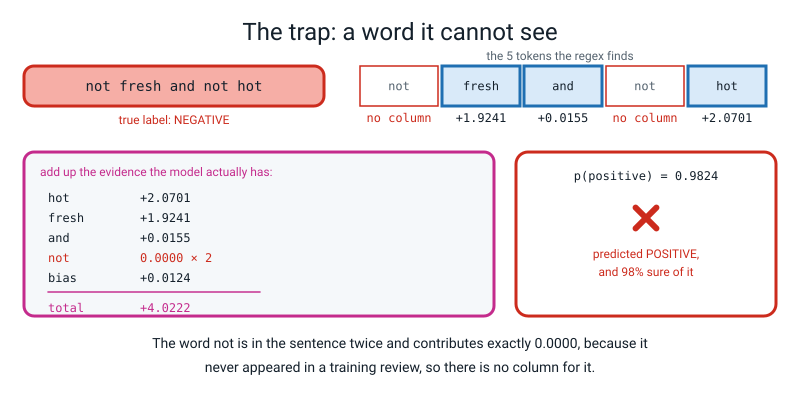
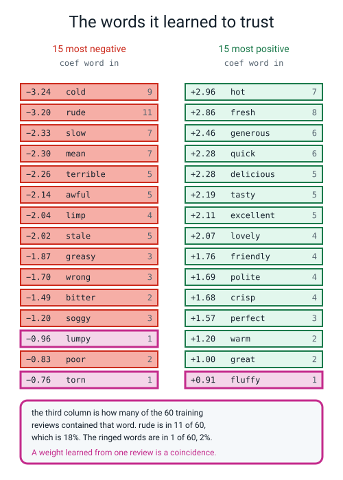
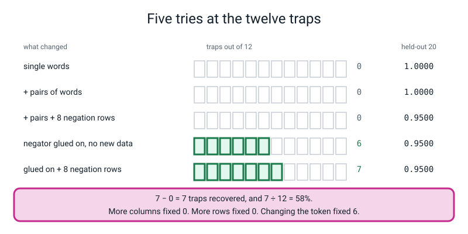
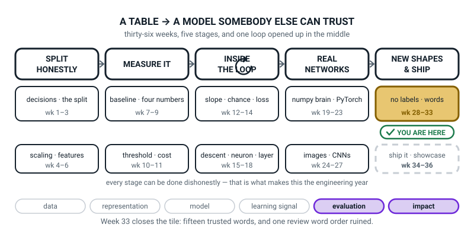
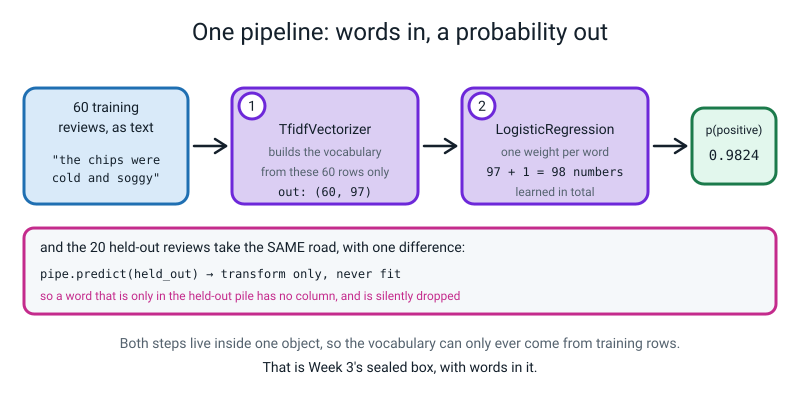
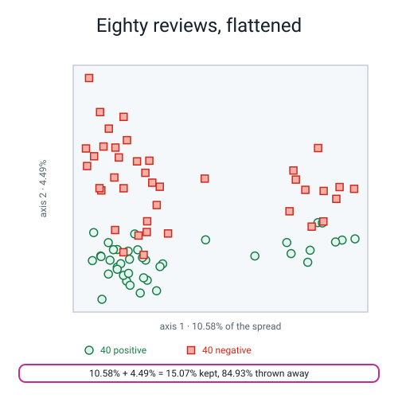

# Week 33 — Sentiment Engine

[⬅ Week 32](week-32.md) · [Course Home](../README.md) · [Week 34 ➡](week-34.md) · [Student Guide](../student-guide/week-33.md) · [Workbook](../workbook/week-33.md)

---

## 📋 At a Glance

| | |
|---|---|
| **Duration** | 70 minutes |
| **Type** | 🟩 Lab — build the thing, measure the thing, then break the thing on purpose |
| **Big idea** | A TF-IDF classifier will **tell you the fifteen words it learned to trust** — and the review it gets wrong will be the one where **word order was the whole meaning**. It scores `1.0000` on twenty ordinary held-out reviews and **0 out of 12** on twelve sentences containing the word `not`. |
| **New vocabulary** | word embedding · distributional hypothesis · co-occurrence matrix · negation trap · learned coefficient |
| **New maths** | **None.** Everything this week is arithmetic they already own: a multiply, a sum, and Week 13's `1 ÷ (1 + e^−z)`. **This is deliberate — the week's difficulty is honesty, not algebra.** |
| **New syntax** | `TfidfVectorizer(ngram_range=(1, 2))` · `make_pipeline(vec, clf)` · `clf.coef_[0]` · `np.argsort(coefs)[:15]` |
| **Dataset** | **80 reviews typed by the student** — 40 positive, 40 negative — plus **12 hand-written negation traps** held out and never trained on. Nothing downloads. `reviews80.py` is the whole dataset and it is 110 lines of typing. |
| **Materials** | Printed workbook pages 33.1–33.8 · **a big wall sheet headed THE TWELVE TRAPS**, twelve numbered rows, three columns: `my prediction`, `single words`, `glued negators` · **pens, not pencils** — predictions go in and cannot be edited · THE VOCABULARY sheet from Week 31, still up · the Bug Log |
| **Tech needed** | Laptop with Python 3, numpy, matplotlib, scikit-learn. **No new installs. No torch this week.** |
| **Prep time** | 35 minutes the night before · 5 minutes on the day |
| **Expected runtime of the code** | `sentiment.py` **1 second**. `five_tries.py` **under 1 second** — it fits five models. `picture.py` **1 second**. **Nothing in this week takes longer than a breath, which means there is no excuse for not running it four times.** |

> **⚠️ Watch out:** the worst possible version of this lesson is the one where the model scores `1.0000` on the held-out twenty, everybody claps, and the bell goes. **That number is not a triumph; it is a statement about how the corpus was written.** Eighty reviews, typed by one person in matched pairs, using the same forty sentiment words over and over — of course a linear model separates them perfectly. **Say that out loud in the lesson.** The twelve traps exist so that the room finds out, from its own model, on its own screen, what the `1.0000` was hiding.

---

## 🎯 Lesson Objectives

By the end of the lesson the student can:

1. **Build a TF-IDF plus logistic regression classifier inside one `Pipeline`** so the vocabulary can only ever come from training rows — `(60, 97)` in, `97 + 1 = 98` learned numbers out, and the 20 held-out reviews transformed but never fitted.
2. **Report per-class precision and recall against a baseline**, and **list the fifteen most positive and fifteen most negative learned words** — `cold` at `−3.2388`, `hot` at `+2.9625`, with the number of training reviews each rests on printed beside it.
3. **Measure whether bigrams recover the negation traps**, and report **how many of twelve were fixed** — the answer is **zero**, the vocabulary grows from `97` to `318` columns, and `"not fresh"` is not one of them.
4. **Write a post-mortem of one wrong prediction that names word order as the mechanism**, not just the symptom — *"`not` has no column, so the two negative words in the sentence contributed `+0.0000` and the model added up `+1.9241 + 2.0701` and said positive."*

Observable evidence: a terminal showing `classification_report` for the model **and** for `DummyClassifier` side by side; the top-fifteen list with a document-frequency column; THE TWELVE TRAPS wall sheet with twelve predictions in pen and twelve results beside them; and a written paragraph containing the phrase *"has no column"* or an equivalent.

---

## 🧑‍🏫 What YOU Need to Know First

> **📌 About the code blocks in this guide.** Outside the **🧰 Prep Checklist** and the **🔑 Answer Key**, the blocks are **illustrations, not whole files** — each one carries on from the one above. **The complete runnable files are in the Prep Checklist and the Answer Key, and every output pasted in this file came from actually running them.**

**There is no new maths this week, and that is the main thing to know before you start.** Week 32 asked you to do logarithms; this week asks you to do something harder, which is to tell a fourteen-year-old that their model scoring 100% is bad news. Everything numerical below is a multiply and an add. **What you need to prepare is the argument, not the arithmetic.**

### 1. What a "sentiment engine" actually is, in one paragraph

A **sentiment engine** is a thing that reads a review and says *happy* or *angry*. That is the whole job. And by this week the student already owns every part of it:

- **Week 31** turned a sentence into a row of word counts.
- **Week 32** reweighted those counts so rare words count more, and made every row the same length.
- **Week 13** turned a score into a chance with `1 ÷ (1 + e^−z)`.
- **Week 15** found the weights by rolling downhill.
- **Weeks 8 and 9** taught precision, recall and why one number is never enough.
- **Week 3** sealed the whole chain inside one object so the test set cannot leak in.

**This week is assembly, not invention.** Six lines of code produce a working classifier. The other sixty minutes are spent finding out what it knows and what it cannot know.

> **Learned coefficient** — one number per word, which the model worked out from the training reviews. A positive number pushes towards *happy*, a negative number pushes towards *angry*, and the size says how hard.

### 2. What the model does, arithmetic first, name second

Here is the whole prediction, on one real held-out review. **Do this on the board and you have taught the week.**

The review is `"not fresh and not hot"`. Its true label is **negative** — the customer is complaining.

Week 31's regex chops it into five tokens: `not`, `fresh`, `and`, `not`, `hot`.

Now the model looks up one weight per token and adds. Three of the five tokens have a column in the vocabulary, and two do not:

```
token    tf-idf value   learned coefficient      contribution
-----    ------------   -------------------      ------------
and          0.2461   ×          +0.0629    =         +0.0155
fresh        0.6716   ×          +2.8648    =         +1.9241
hot          0.6988   ×          +2.9625    =         +2.0701
not             ---     no column at all     =         +0.0000     (twice)
bias                                         =         +0.0124
                                                ------------
                                        total        +4.0222
```

Check the sum yourself: `0.0155 + 1.9241 + 2.0701 + 0.0124 = 4.0221`, and the extra thousandth is rounding in the printed pieces. **Then Week 13's squash:**

```
chance of positive = 1 / (1 + e^-4.0222) = 0.9824
```

**The model says positive, and it is 98% sure.** The review said `not fresh and not hot`.

**That is the entire lesson of Week 33 and it fits on a board.** The word `not` appears **twice** in a five-word sentence and contributes **exactly nothing**, because it never appeared in a training review, so the vocabulary has no column for it, so at prediction time it is silently thrown away. The model is not confused. It never saw the word.


*Figure 33.1 — Five tokens go in, three have columns, and the two that carry the meaning contribute `+0.0000`.*

> **🔢 The maths, slowly:** there is no calculus here. `0.6716 × 2.8648` is a multiplication you can do on a phone: **1.9241**. Do all three, add them, add the bias, and you have `+4.0222`. Then `e^-4.0222 = 0.017913`, and `1 ÷ 1.017913 = 0.98240`. **Two buttons on a calculator: `e^x` and `1/x`.** You have done this in Week 13 and Week 14 and you can do it again in forty seconds. **Do it in front of them; do not read the answer out.**

### 3. Why "no column" is not the same as "a column with a zero in it"

This distinction is the hinge of the whole week and Week 31 planted it deliberately. **It is worth two minutes of your preparation because a student will ask, and the honest answer is surprising.**

Take the word `cold`. It has a column, because lots of training reviews used it. In the review `"the salad was fresh"`, `cold`'s cell is **0**, and that zero is real information — it means *this review did not mention cold*, and the model's weight for `cold` is multiplied by that zero, so `cold` contributes nothing **on purpose**.

Now take the word `not`. It has **no column at all**. Not a zero — nothing. The word is deleted before the model ever sees the row. **And the two situations look identical from the outside: both contribute `+0.0000`.**

Here is the part that should make you sit up. **Suppose you were sloppy and built the vocabulary from all 80 reviews instead of just the 60 training rows.** Then `not` *does* get a column, because one of the held-out reviews is `"i would not order from here again"`. What happens?

```
leaked model: coefficient of 'not' = 0.0
'not' appears in 0 of the 60 TRAINING reviews
```

**The coefficient is exactly zero.** The column exists, but no training review put a number in it, so the model has no evidence and the weight stays at nothing. **Leaking the test set into the vocabulary did not teach the model what `not` means. It just gave it an empty shelf.**

It did do one thing, though, and it is subtle and worth knowing:

```
  and      tfidf 0.1020 coef +0.0762 -> +0.0078
  fresh    tfidf 0.2966 coef +2.8950 -> +0.8587
  hot      tfidf 0.2966 coef +2.9443 -> +0.8733
  not      tfidf 0.9020 coef +0.0000 -> +0.0000
  bias 0.0245 TOTAL 1.7642 p(pos) 0.8537
```

`fresh`'s tf-idf value fell from `0.6716` to `0.2966`, because the row now contains two `not`s taking up space and the whole row still has to have length 1. So the confidence dropped from `0.9824` to `0.8537`. **The leak made the model look more humble without making it any more right.** If a student does this by accident, that is what they are seeing, and it is a genuinely interesting thing to have found.

### 4. The fifteen words, and the three you should not trust

`clf.coef_[0]` hands back one number per column, in the same order as `get_feature_names_out()`. Sort it and you can read the model's mind. **This is the single best thing about linear models on text and it is worth being excited about in front of them** — you cannot do this with the digits CNN from Week 26.

Here is the real output, with a third column that most tutorials leave out:

```
15 words that push hardest towards NEGATIVE
   -3.2388   cold         in  9 of 60 reviews
   -3.2033   rude         in 11 of 60 reviews
   -2.3327   slow         in  7 of 60 reviews
   -2.3024   mean         in  7 of 60 reviews
   -2.2553   terrible     in  5 of 60 reviews
   -2.1383   awful        in  5 of 60 reviews
   -2.0372   limp         in  4 of 60 reviews
   -2.0247   stale        in  5 of 60 reviews
   -1.8736   greasy       in  3 of 60 reviews
   -1.7020   wrong        in  3 of 60 reviews
   -1.4902   bitter       in  2 of 60 reviews
   -1.1954   soggy        in  3 of 60 reviews
   -0.9621   lumpy        in  1 of 60 reviews
   -0.8295   poor         in  2 of 60 reviews
   -0.7625   torn         in  1 of 60 reviews
```

**Almost every one of those is a word a human would have picked.** That is genuinely impressive and you should say so. The model was handed sixty rows of numbers and no dictionary, and it worked out that `rude` and `cold` are complaints.

**Now the three entries that should worry you**, and the reason the third column exists:

| word | coefficient | rests on | the problem |
|---|---:|---:|---|
| `lumpy` | `−0.9621` | **1 review** | One review said the rice was lumpy and it happened to be negative. **That is not a finding; it is a coincidence with a decimal point.** |
| `torn` | `−0.7625` | **1 review** | Same. One torn bag. |
| `fluffy` | `+0.9114` | **1 review** | One fluffy rice. It is fifteenth on the positive list purely because nothing else is left. |

**The rule to state out loud, and it is the most transferable thing in the week:**

> **Print the document frequency next to every coefficient you plan to quote. A weight learned from one review is a coincidence with a decimal point.**


*Figure 33.2 — Thirty learned coefficients with the number of training reviews each rests on. The three ringed in pink rest on one review apiece.*

### 5. The negation trap, and why it is not a bug

> **Negation trap** — a sentence whose meaning is flipped by a small word like `not`, `never`, `no` or `hardly`, so a bag-of-words model reads it backwards.

Twelve of them, all held out, none of them ever trained on. Here is what the model does, and it is the moment of the lesson:

```
 #  true pred  p(positive)  verdict  review
 1    0    1     0.9824     WRONG   not fresh and not hot
 2    0    1     0.9616     WRONG   not tasty and not generous
 3    0    1     0.9392     WRONG   never polite and never quick
 4    0    1     0.7931     WRONG   the pizza was not perfect and the salad was not crisp
 5    0    1     0.7943     WRONG   no warm welcome and no friendly driver
 6    0    1     0.8526     WRONG   hardly a delicious meal
 7    1    0     0.0571     WRONG   not cold and not soggy
 8    1    0     0.0241     WRONG   not rude and not slow
 9    1    0     0.0654     WRONG   never stale and never greasy
10    1    0     0.2622     WRONG   the base was not limp and the chips were not awful
11    1    0     0.1038     WRONG   no mean portions and no wrong order
12    1    0     0.2206     WRONG   hardly a terrible meal

score on the twelve traps: 0 out of 12
```

**Zero out of twelve.** Not "some difficulty with negation" — **every single one wrong**, and the worst of them wrong at 98% confidence. A coin would have scored six.

**Say this to yourself before class, because you will need to say it in class:** this is not a bug in scikit-learn, and it is not a bug in the student's code. **It is the exact cost of the decision made in Week 31**, when the class agreed to count words and throw away their order. The model is doing precisely what it was built to do. `"not fresh"` and `"fresh"` are the same bag with one extra item in it, and the extra item is a word the model has never met.

> **🧑‍🏫 If a student asks "so is the model broken?"** — *"No. It is answering the question we asked it, which was 'which words are in this review'. We wanted the answer to a different question, which was 'what did this person mean'. Those two questions are the same for eighty reviews out of eighty and different for twelve out of twelve, and the whole skill this year is knowing which pile you are standing in."*

### 6. Why bigrams do not save you, and the one line that proves it

Everybody's first instinct — including every adult's — is: *count pairs of words as well as single words, then `not fresh` becomes one thing and the problem goes away.*

> **n-gram** — a run of `n` words next to each other, treated as one token. `fresh` is a 1-gram (a unigram); `not fresh` is a 2-gram (a bigram).

`TfidfVectorizer(ngram_range=(1, 2))` does exactly that. Here is what it buys:

```
columns with single words only  : 97
columns with pairs added        : 318
extra columns bigrams bought    : 221

held-out 20, single words: 1.0
held-out 20, with pairs  : 1.0
traps, single words: 0 of 12
traps, with pairs  : 0 of 12
traps whose answer changed at all: 0

--- is the pair we needed actually a column? ---
   'not fresh'          False
   'not hot'            False
   'never quick'        False
   'hardly delicious'   False
   'not cold'           False
   'was cold'           True
   'the pizza'          True
```

**Two hundred and twenty-one new columns, and not one of the twelve answers changed.** Not improved, not worsened — **identical**.

The last block says exactly why, and it is worth reading out line by line. `"was cold"` is a column, because a training review contained those two words in that order. `"not fresh"` is **not** a column, because **no training review contains the words `not fresh` next to each other**. And a bigram that is not in the vocabulary is thrown away at prediction time just as silently as a unigram that is not in the vocabulary.

**The general principle, and it is the most important sentence of the lab:**

> **A feature can only help you if the training data contained it. Adding a feature *type* does not add features; adding *data* does.**

That is not an obvious idea and it is not a comfortable one. It is also the reason "just add bigrams" appears in a hundred tutorials and fixes nothing in any of them.


*Figure 33.3 — Five configurations, one bar of twelve boxes each. More columns fixed nothing. More rows fixed nothing.*

### 7. The thing that does work, and why half of its wins are fake

There is a repair that works, and it costs no new data at all. **Glue a negator onto the word after it before you count anything:**

```
"not fresh and not hot"    →    "not_fresh and not_hot"
"hardly a delicious meal"  →    "hardly_delicious meal"
```

Now `not_fresh` is a single token, so it is a single column, so it can have its own weight. Run all five configurations:

```
1 single words                   cols=97    held-out=1.0000  traps=0/12
2 + pairs of words               cols=318   held-out=1.0000  traps=0/12
3 + pairs + 8 negation rows      cols=337   held-out=0.9500  traps=0/12
4 marked, no new data            cols=97    held-out=0.9500  traps=6/12
5 marked + 8 negation rows       cols=104   held-out=0.9500  traps=7/12
```

**Zero, zero, zero, six, seven.** Gluing negators on fixed six of twelve with **no new training data at all** and **no extra columns at all** — still 97.

**And now the part that makes this the best twenty minutes of the term.** Look at *how* it got those six right:

```
bias: 0.0124

 #  p(pos)  pred true  words that still have a column
 1  0.5188    1    0   ['and']
 2  0.5188    1    0   ['and']
 3  0.5188    1    0   ['and']
 4  0.5348    1    0   ['the', 'pizza', 'was', 'and', 'the', 'salad', 'was']
 5  0.4461    0    0   ['welcome', 'and', 'driver']
 6  0.5781    1    0   ['meal']
 7  0.5188    1    1   ['and']
 8  0.5188    1    1   ['and']
 9  0.5188    1    1   ['and']
10  0.6112    1    1   ['the', 'base', 'was', 'and', 'the', 'chips', 'were']
11  0.3724    0    1   ['portions', 'and', 'order']
12  0.5781    1    1   ['meal']
```

**Traps 7, 8 and 9 came out "right" at a probability of `0.5188` with the single word `and` as their only surviving evidence.** `not_cold` is not a column either — the training reviews never said `not cold` — so gluing did not *reverse* the evidence. **It deleted it.** The sentence arrived at the classifier as, effectively, the word `and`, and the model fell back on its bias of `+0.0124`, which happens to lean very slightly positive, and the four positive traps happened to want *positive*.

**Six out of twelve, and five of the six are coin flips that landed the right way up.** That is a completely different claim from "gluing negators fixes negation", and telling the difference is the skill.

> **⚠️ Watch out:** if you stop at the `6/12` line you will have taught the class that negation marking works. **It does not work; it abstains.** The ninety seconds spent printing the surviving words is what turns a wrong lesson into a right one, and it is in the Live-Code segment for that reason.

### 8. Why the held-out score of 1.0000 is not good news

`classification_report` on the twenty held-out reviews:

```
              precision    recall  f1-score   support

    negative      1.000     1.000     1.000        10
    positive      1.000     1.000     1.000        10

    accuracy                          1.000        20
```

**Twenty out of twenty.** And the baseline that always guesses *negative*:

```
    negative      0.500     1.000     0.667        10
    positive      0.000     0.000     0.000        10

    accuracy                          0.500        20
```

So the model beat the baseline by fifty points. **And that tells you almost nothing**, for three reasons you should have ready:

1. **Twenty reviews is a tiny test set.** One mistake would have been `0.9500`. The number has no resolution.
2. **All eighty reviews were typed by one person in matched pairs**, using roughly forty sentiment words over and over. `"the coffee was hot and the cake was fresh"` and `"the coffee was cold and the cake was stale"` differ in exactly two words, and both of those words are on the top-fifteen list. **The test set is drawn from the same tiny word pool as the training set. It is not a fresh sample of the world; it is the same sentences reshuffled.**
3. **The reviews contain no negation, no sarcasm, no comparison, no mixed opinion.** Every one of them is unambiguously one thing. Real reviews are not like that.

**The honest one-sentence summary, and it is worth writing on the board:** *"It gets 100% on reviews that look like its training reviews, and 0% on reviews that do not."*

### 9. Where "word embedding" comes in, and how far to go

Three of this week's vocabulary words point forwards rather than backwards, and you should introduce them in about ninety seconds at the end and then stop.

> **Distributional hypothesis** — the idea that words used in the same contexts tend to mean similar things. *"You shall know a word by the company it keeps."*
>
> **Co-occurrence matrix** — a grid counting how often each word appears near each other word.
>
> **Word embedding** — a short list of numbers standing for a word, arranged so that words used in similar ways get similar lists.

**The connection to today is exact and it is the only reason to mention them.** Today's model has 97 columns and each one is **one word, unrelated to all the others**. `delicious` and `tasty` are as unrelated in this model as `delicious` and `torn`. That is why it cannot generalise from `not good` to `hardly wonderful` — it has no notion that `good` and `wonderful` are related at all.

An embedding fixes exactly that, by giving `delicious` and `tasty` lists of numbers that sit close together. **That is Level 4.** Say the sentence, name the three words, put them on the vocabulary sheet, and do not open a co-occurrence matrix today — there is no time and it would swallow the wrap.

### 10. Every new line of this week's code, explained to somebody who has never programmed

Four new constructs. **Read this section with the file open in front of you.**

**New thing 1 — chaining two steps into one object, without naming them.**

```python
pipe = make_pipeline(
    TfidfVectorizer(),
    LogisticRegression(C=10, max_iter=2000, random_state=0),
)
```

`make_pipeline` takes a list of steps and returns **one object that behaves like a single model**. When you call `pipe.fit(X_train, y_train)`, it runs `fit_transform` on the vectorizer and then `fit` on the classifier. When you call `pipe.predict(X_test)`, it runs `transform` on the vectorizer — **note: transform, never fit** — and then `predict`.

**Week 3 built the same thing with `Pipeline(steps=[("prep", ...), ("clf", ...)])`, where you chose the names.** `make_pipeline` is the shortcut that names them for you, in lowercase, after the class: `"tfidfvectorizer"` and `"logisticregression"`. **That naming rule is the one thing that catches everybody**, and it is debugging-clinic row 4.

`C=10` is the dial from Week 22 — how much the model is allowed to trust any one word. `max_iter=2000` is how many downhill steps it may take before giving up. `random_state=0` is the seed, as always.

**New thing 2 — asking a fitted model for its weights.**

```python
clf = pipe.named_steps["logisticregression"]
coefs = clf.coef_[0]
```

`named_steps` is a dictionary of the pipeline's stages. `clf.coef_` is the learned weights, and **it comes back as a grid with one row per class**, even when there are only two classes and therefore only one row. `clf.coef_[0]` takes that single row out, so you get a flat list of 97 numbers instead of a 1-by-97 grid.

**The trailing underscore in `coef_` is scikit-learn's mark for "this was learned during `fit`".** Ask for it before fitting and you get `AttributeError: 'LogisticRegression' object has no attribute 'coef_'`, which is a perfectly honest message.

> **⚠️ Watch out:** forget the `[0]` and you get `IndexError: index 12 is out of bounds for axis 0 with size 1`, which sounds like it is about something else entirely. It is not: `clf.coef_` is a `(1, 97)` grid, so `np.argsort` of it is also `(1, 97)`, so `order[:15]` is **the whole thing** rather than fifteen positions, so the loop runs once with all ninety-seven positions at once. **That is deliberate mistake number two in the live-code segment, and the cure is Week 16's: print the shape.**

**New thing 3 — sorting positions instead of values.**

```python
order = np.argsort(coefs)
```

`np.sort` gives you the numbers in order. **`np.argsort` gives you the *positions* of those numbers in order** — and positions are what you need, because position 43 in the coefficient list is the same word as position 43 in the vocabulary list.

`order[:15]` is the fifteen **smallest** — the most negative, the angriest words. `order[::-1][:15]` reverses the whole order and then takes fifteen, giving the fifteen **largest**. **Read `[::-1]` out loud as "backwards"; it is Week 19's slice and nothing new.**

**New thing 4 — counting pairs of words as well as single words.**

```python
TfidfVectorizer(ngram_range=(1, 2))
```

`(1, 2)` means "make a column for every run of 1 word **and** every run of 2 words". `(1, 1)` — the default — means single words only. `(2, 2)` would mean pairs only, which nobody wants.

It is one argument and it triples the number of columns. **It is also, this week, completely useless, and finding that out is the point.**

### 11. The three misconceptions you will actually meet

**Misconception 1 — "100% means it works."**
**Cure:** the twelve traps, and the fact that predictions go on the wall **in pen before anything runs**. A student who has written down twelve confident predictions and then watched all twelve be wrong does not need convincing.

**Misconception 2 — "the model is confused by `not`."**
It is not confused. **It never received the word.** **Cure:** print `"not" in set(words)` and let `False` sit on the screen for a moment. Then the contribution table: `+0.0000`, twice. **There is no confusion anywhere in this system; there is a deletion.**

**Misconception 3 — "adding bigrams gives the model the phrase `not fresh`."**
It gives the model **a column for every pair that occurred in training**, and `not fresh` was not one of them. **Cure:** `'not fresh' in vocab_bi` → `False`, sitting on the screen next to `'was cold' in vocab_bi` → `True`. **Two lines, one true and one false, and the misconception is gone.**

### 12. How deep to go, and where to stop

**Go this far:** the pipeline; the report against a baseline; the top-fifteen lists with document frequencies; the three words resting on one review; the twelve traps at 0/12; the contribution table for trap 1; bigrams buying 221 columns and zero traps; negation marking reaching 6/12 **and** the fact that five of the six are abstentions; the PCA picture and the 84.93% it threw away; the three embedding words named and parked.

**Stop before:**

| Do not teach today | Where it lives |
|---|---|
| **Building a co-occurrence matrix and doing vector arithmetic on it** | **Level 4.** Name the three words, show nothing. It is a lovely forty-minute activity and there is no room for it. |
| **`class_weight`, `C` tuning, grid search over the vectorizer** | Not this week. The model is not the problem; the data is. **A student who wants to tune should be redirected to writing eight more reviews, which will help, unlike tuning, which will not.** |
| **Stemming, lemmatizing, spaCy, NLTK** | Not in this level. **They need libraries we do not have offline.** One sentence if asked. |
| **Regular expressions as a subject** | Still not. One pattern, from Week 31, unchanged. |
| **Transformers, BERT, "how does ChatGPT do it"** | **Level 4, and be brief and honest:** *"a model that reads the sentence in order instead of as a bag. It is the direct answer to today's problem and it takes a book."* |
| **Interpreting the PCA plot as evidence the classes overlap** | **This is a trap and it is in the Questions section.** The plot shows 15.07% of the structure. The classifier separates the same reviews perfectly using all of it. |

The line to hold in your head all lesson: **today the student builds something that works, finds out exactly what it cannot do, and says why in a sentence that names word order.**

---

### 13. 🧭 The Growing Map — the tile closes, and only shipping is left

The student guide carries a figure called **Where This Fits**: the same picture every week with one more
piece filled in. Today the gold tile it has been sitting in since Week 28 **finishes**, and exactly one
dashed box remains on the whole page.



*Figure 33.0 — Week 33's version. Last week inside the gold `no labels · words` tile; one dashed box left,
`ship it · showcase`. The ↻ on stage three is black, as it has been since Week 12.*

**What to do with it, in about two minutes at the end of the lesson:**

1. **Ask "which box did we do today?" and then "how many dashed boxes are left?"** Same gold tile, and the
   answer to the second question is **one**. *"Weeks 28 to 30 were the no-labels half; 31, 32 and 33 were
   the words half. That tile is done. Everything left on this map is handing it over."* Six weeks in one
   box, closed — say it, because they have never had a tile last that long.
2. **Anchor it on `1.0000` and on `0/12`, together, in one breath.** Point at THE TWELVE TRAPS sheet.
   *"This box built something that scores perfectly on twenty held-out reviews and zero out of twelve on
   sentences with `not` in them, and the worst one was wrong at `0.9824`."* Then make somebody say the
   mechanism out loud, and insist on the phrase **"has no column"**. **The two numbers belong to the same
   model, and that is the lesson — not the second number on its own.**
3. **Point forward at the last dashed box, and make the link explicit.** *"Next week you write a page that
   says what your model must never be used for. What goes on it?"* The answer is already on the wall:
   twelve traps, `0/12`, and a sentence naming word order. **Their limitations section is finished before
   the week that asks for it** — tell them so, because it turns today's bad news into next week's
   deliverable.

> **🧑‍🏫 Why this is worth two minutes.** Today ends on a failure, and that is deliberate — but a lesson
> that *ends* on `0/12` can read to a fourteen-year-old as "we wasted six weeks". The map is the antidote:
> **the tile is gold and finished, not crossed out.** The engine works, it is readable, and you found its
> edge on purpose using your own twelve sentences. That is what a closed tile looks like in this course.

**One thing to notice, so you can answer if asked.** `impact` is lit alongside `evaluation`, and a student
may reasonably ask what impact a toy sentiment model has. Take the question seriously and answer it with
the routing example: a support ticket saying *"I have never had a worse delivery"* contains `delivery` and
nothing negative with a column, and a real system routes it to the wrong queue. **The model is a toy; the
mechanism is not.** That is why the thread is lit today rather than in Week 35.

---

## 🧰 Prep Checklist

### 35 minutes the night before

- [ ] **Check the student has actually typed the twenty extra reviews and the twelve traps.** This was set at the end of Week 32 and **it is the whole dataset of this lesson.** If it is not done, the lesson does not happen — so check tonight, not at the door.

- [ ] **Type and run `reviews80.py` first.** It is the Week 31 corpus with ten more of each label, plus the twelve traps. **Twelve minutes to type. Everything else imports it.**

```python
"""reviews80.py - Week 33. Eighty reviews and twelve traps, all typed by hand."""

POS_40 = [
    "the pizza arrived hot and the base was perfect",
    "quick delivery and a friendly driver",
    "delicious food and a generous portion",
    "the salad was fresh and crisp",
    "great value and a lovely warm welcome",
    "excellent service from a polite driver",
    "the chips were hot and crisp",
    "a tasty curry and a generous helping of rice",
    "fresh bread and a delicious dip",
    "the delivery was quick and the food was hot",
    "lovely staff and a perfect order",
    "friendly, polite and on time",
    "the sauce was tasty and the cheese was lovely",
    "generous portions and excellent prices",
    "the burger was hot and the salad was fresh",
    "delicious dessert and a friendly note in the bag",
    "a perfect meal and a quick refund on the drink",
    "great chips, crisp and properly salted",
    "the coffee was hot and the cake was fresh",
    "polite driver and a warm, tasty pizza",
    "excellent noodles with fresh vegetables",
    "a lovely evening and a delicious meal",
    "quick, friendly and generous",
    "the fish was fresh and the batter was crisp",
    "perfect timing and a hot bag",
    "tasty wrap, generous salad and a great price",
    "the naan was warm and lovely",
    "friendly manager and a quick, fair refund",
    "a delicious pizza, hot and perfect",
    "excellent, fresh food and a polite driver",
    # --- the ten you typed this week ---
    "helpful driver and a hot, tasty pizza",
    "the bread was warm and the dip was delicious",
    "generous portions and a friendly welcome",
    "quick service and an excellent, fresh garden salad",
    "a lovely handwritten note and a perfect, crisp base",
    "great coffee and a moist, tasty cake",
    "the curry was hot and the rice was fluffy",
    "polite staff and a generous, speedy refund",
    "fresh vegetables and a delicious, rich sauce",
    "quick, warm and lovely throughout",
]

NEG_40 = [
    "the pizza arrived cold and the base was soggy",
    "slow delivery and a rude driver",
    "awful food and a mean portion",
    "the salad was stale and limp",
    "poor value and a cold, rude welcome",
    "terrible service from a rude driver",
    "the chips were cold and soggy",
    "an awful curry and a mean helping of rice",
    "stale bread and a greasy dip",
    "the delivery was slow and the food was cold",
    "rude staff and a wrong order",
    "rude, slow and very late",
    "the sauce was bitter and the cheese was greasy",
    "mean portions and terrible prices",
    "the burger was cold and the salad was limp",
    "awful dessert and a rude note in the bag",
    "a wrong meal and a slow refund on the drink",
    "soggy chips, cold and completely unsalted",
    "the coffee was cold and the cake was stale",
    "rude driver and a cold, greasy pizza",
    "terrible noodles with limp vegetables",
    "i would not order from here again",
    "slow, rude and mean",
    "the fish was stale and the batter was soggy",
    "late again and a cold bag",
    "greasy wrap, limp salad and a terrible price",
    "the naan was cold and stale",
    "rude manager and a slow, unfair refund",
    "an awful pizza, cold and soggy",
    "terrible, stale food and a rude driver",
    # --- the ten you typed this week ---
    "the bag was torn and the pizza was stone cold",
    "the bread was stale and the dip was greasy",
    "mean portions and a rude welcome",
    "slow service and an awful, stale salad",
    "a wrong note and a soggy, limp base",
    "poor watery coffee and a dry, bitter cake",
    "the curry was cold and the rice was lumpy",
    "rude staff and a mean, sluggish refund",
    "limp vegetables and a greasy, thin sauce",
    "slow, cold and mean throughout",
]

CORPUS_80 = POS_40 + NEG_40
LABELS_80 = [1] * 40 + [0] * 40

# The twelve negation traps. These are NEVER trained on.
TRAPS = [
    ("not fresh and not hot",                                 0),
    ("not tasty and not generous",                            0),
    ("never polite and never quick",                          0),
    ("the pizza was not perfect and the salad was not crisp",  0),
    ("no warm welcome and no friendly driver",                 0),
    ("hardly a delicious meal",                               0),
    ("not cold and not soggy",                                1),
    ("not rude and not slow",                                 1),
    ("never stale and never greasy",                          1),
    ("the base was not limp and the chips were not awful",      1),
    ("no mean portions and no wrong order",                   1),
    ("hardly a terrible meal",                                1),
]
TRAP_TEXTS  = [t for t, _ in TRAPS]
TRAP_LABELS = [y for _, y in TRAPS]

if __name__ == "__main__":
    print("positive reviews:", len(POS_40))
    print("negative reviews:", len(NEG_40))
    print("total           :", len(CORPUS_80))
    print("traps           :", len(TRAPS))
```

**Real output, instant:**

```text
positive reviews: 40
negative reviews: 40
total           : 80
traps           : 12
```

- [ ] **Type and run `sentiment.py`, in the same folder.** This is the file you build live in the lesson.

```python
"""sentiment.py - Week 33. One pipeline: words in, a label out."""
import numpy as np
from sklearn.model_selection import train_test_split
from sklearn.feature_extraction.text import TfidfVectorizer
from sklearn.linear_model import LogisticRegression
from sklearn.pipeline import make_pipeline
from sklearn.dummy import DummyClassifier
from sklearn.metrics import classification_report

from reviews80 import CORPUS_80, LABELS_80

# ---------- 1. split FIRST, before anything looks at a word ----------
X_train, X_test, y_train, y_test = train_test_split(
    CORPUS_80, LABELS_80, test_size=20, random_state=0, stratify=LABELS_80)
print("train reviews:", len(X_train), " positives:", sum(y_train))
print("held out     :", len(X_test), " positives:", sum(y_test))

# ---------- 2. one pipeline: vectorizer, then classifier ----------
pipe = make_pipeline(
    TfidfVectorizer(),
    LogisticRegression(C=10, max_iter=2000, random_state=0),
)
pipe.fit(X_train, y_train)

vec = pipe.named_steps["tfidfvectorizer"]
clf = pipe.named_steps["logisticregression"]
words = vec.get_feature_names_out()
print("\nvocabulary built from the training rows only:", len(words), "words")
print("matrix handed to the classifier:", vec.transform(X_train).shape)
print("numbers the classifier learned :", len(clf.coef_[0]), "+ 1 intercept")

# ---------- 3. score it, with a baseline beside it ----------
print("\n--- the model, on the 20 held-out reviews ---")
print(classification_report(y_test, pipe.predict(X_test),
                            target_names=["negative", "positive"], digits=3))

dummy = DummyClassifier(strategy="most_frequent", random_state=0)
dummy.fit(X_train, y_train)
print("--- the baseline that always says 'negative' ---")
print(classification_report(y_test, dummy.predict(X_test),
                            target_names=["negative", "positive"],
                            digits=3, zero_division=0))
```

**Real output. Runtime 1 second.**

```text
train reviews: 60  positives: 30
held out     : 20  positives: 10

vocabulary built from the training rows only: 97 words
matrix handed to the classifier: (60, 97)
numbers the classifier learned : 97 + 1 intercept

--- the model, on the 20 held-out reviews ---
              precision    recall  f1-score   support

    negative      1.000     1.000     1.000        10
    positive      1.000     1.000     1.000        10

    accuracy                          1.000        20
   macro avg      1.000     1.000     1.000        20
weighted avg      1.000     1.000     1.000        20

--- the baseline that always says 'negative' ---
              precision    recall  f1-score   support

    negative      0.500     1.000     0.667        10
    positive      0.000     0.000     0.000        10

    accuracy                          0.500        20
   macro avg      0.250     0.500     0.333        20
weighted avg      0.250     0.500     0.333        20
```

- [ ] **Type and run `inspect_model.py`.** This is the file that produces the top-fifteen lists.

```python
"""inspect_model.py - Week 33. Read the model's mind, word by word."""
import numpy as np
from sklearn.model_selection import train_test_split
from sklearn.feature_extraction.text import TfidfVectorizer
from sklearn.linear_model import LogisticRegression
from sklearn.pipeline import make_pipeline

from reviews80 import CORPUS_80, LABELS_80

X_train, X_test, y_train, y_test = train_test_split(
    CORPUS_80, LABELS_80, test_size=20, random_state=0, stratify=LABELS_80)
pipe = make_pipeline(TfidfVectorizer(),
                     LogisticRegression(C=10, max_iter=2000, random_state=0))
pipe.fit(X_train, y_train)

vec = pipe.named_steps["tfidfvectorizer"]
clf = pipe.named_steps["logisticregression"]
words = vec.get_feature_names_out()
coefs = clf.coef_[0]

# how many of the 60 training reviews contain each word
counts = (vec.transform(X_train) > 0).sum(axis=0).A1

order = np.argsort(coefs)          # smallest (most negative) first

print("15 words that push hardest towards NEGATIVE")
for i in order[:15]:
    print(f"   {coefs[i]:+.4f}   {words[i]:<12} in {counts[i]:>2} of 60 reviews")

print("\n15 words that push hardest towards POSITIVE")
for i in order[::-1][:15]:
    print(f"   {coefs[i]:+.4f}   {words[i]:<12} in {counts[i]:>2} of 60 reviews")

print(f"\nintercept: {clf.intercept_[0]:+.4f}")
```

**Real output, instant. The negative half is in §4 above; here is the positive half and the bias:**

```text
15 words that push hardest towards POSITIVE
   +2.9625   hot          in  7 of 60 reviews
   +2.8648   fresh        in  8 of 60 reviews
   +2.4595   generous     in  6 of 60 reviews
   +2.2803   quick        in  6 of 60 reviews
   +2.2796   delicious    in  5 of 60 reviews
   +2.1873   tasty        in  5 of 60 reviews
   +2.1066   excellent    in  5 of 60 reviews
   +2.0669   lovely       in  4 of 60 reviews
   +1.7633   friendly     in  4 of 60 reviews
   +1.6854   polite       in  4 of 60 reviews
   +1.6798   crisp        in  4 of 60 reviews
   +1.5712   perfect      in  3 of 60 reviews
   +1.2042   warm         in  2 of 60 reviews
   +1.0037   great        in  2 of 60 reviews
   +0.9114   fluffy       in  1 of 60 reviews

intercept: +0.0124
```

- [ ] **Type and run `gauntlet.py`.** This is the file the class watches at the climax of the lesson. **Run it tonight so you know exactly how long the silence after `0 out of 12` should be.**

```python
"""gauntlet.py - Week 33. Twelve traps, one at a time, with the arithmetic."""
import numpy as np
from sklearn.model_selection import train_test_split
from sklearn.feature_extraction.text import TfidfVectorizer
from sklearn.linear_model import LogisticRegression
from sklearn.pipeline import make_pipeline

from reviews80 import CORPUS_80, LABELS_80, TRAP_TEXTS, TRAP_LABELS

X_train, X_test, y_train, y_test = train_test_split(
    CORPUS_80, LABELS_80, test_size=20, random_state=0, stratify=LABELS_80)
pipe = make_pipeline(TfidfVectorizer(),
                     LogisticRegression(C=10, max_iter=2000, random_state=0))
pipe.fit(X_train, y_train)

pred = pipe.predict(TRAP_TEXTS)
prob = pipe.predict_proba(TRAP_TEXTS)[:, 1]

print(" #  true pred  p(positive)  verdict  review")
for k in range(12):
    ok = "right" if pred[k] == TRAP_LABELS[k] else "WRONG"
    print(f"{k+1:>2}    {TRAP_LABELS[k]}    {pred[k]}     {prob[k]:.4f}     {ok}   {TRAP_TEXTS[k]}")

score = int((pred == np.array(TRAP_LABELS)).sum())
print(f"\nscore on the twelve traps: {score} out of 12")

# ---------- open up trap number 1 and add up the evidence ----------
vec = pipe.named_steps["tfidfvectorizer"]
clf = pipe.named_steps["logisticregression"]
words = vec.get_feature_names_out()
coefs = clf.coef_[0]

s = TRAP_TEXTS[0]
row = vec.transform([s]).toarray()[0]
print(f"\n--- inside {s!r} ---")
total = 0.0
for i in np.nonzero(row)[0]:
    piece = row[i] * coefs[i]
    total += piece
    print(f"   {words[i]:<8} tfidf {row[i]:.4f}  x  coef {coefs[i]:+.4f}  =  {piece:+.4f}")
print(f"   {'not':<8} no column at all            =  +0.0000   (twice)")
total += clf.intercept_[0]
print(f"   {'bias':<8}                             = {clf.intercept_[0]:+.4f}")
print(f"   {'TOTAL':<8}                             = {total:+.4f}")
print(f"   chance of positive = 1 / (1 + e^-{total:.4f}) = {1/(1+np.exp(-total)):.4f}")
print("   is 'not' in the vocabulary?", "not" in set(words))
```

**Real output. The twelve-row table is in §5 above; here is the arithmetic block:**

```text
--- inside 'not fresh and not hot' ---
   and      tfidf 0.2461  x  coef +0.0629  =  +0.0155
   fresh    tfidf 0.6716  x  coef +2.8648  =  +1.9241
   hot      tfidf 0.6988  x  coef +2.9625  =  +2.0701
   not      no column at all            =  +0.0000   (twice)
   bias                                 = +0.0124
   TOTAL                                = +4.0222
   chance of positive = 1 / (1 + e^-4.0222) = 0.9824
   is 'not' in the vocabulary? False
```

- [ ] **Type and run `five_tries.py`.** This one fits five models and still finishes in under a second. **The complete file is in the Answer Key, page 33.7.** Check you get `0, 0, 0, 6, 7`.

- [ ] **Type and run `picture.py`.** Look at `reviews_pca.png` before the lesson so you are not surprised by how mixed it looks. **The full file is in the Answer Key, page 33.6.** Check the two percentages come out `10.58` and `4.49`.

- [ ] **Make THE TWELVE TRAPS wall sheet.** Twelve numbered rows, the review text written out, then three empty columns: `my prediction`, `single words`, `glued negators`. **Write the twelve reviews out by hand — it takes eight minutes and it means the sheet is up and readable before the lesson starts.**

- [ ] **Read §7 twice.** The `6/12` result and the reason five of the six are abstentions is the hardest thing in this file to teach, and it is the thing worth teaching.

### 5 minutes on the day

- [ ] Editor open, terminal ready, all five `.py` files in one folder with `reviews80.py`.
- [ ] `python3 reviews80.py` once, so the folder is proven before the class is watching.
- [ ] THE TWELVE TRAPS sheet up, blank. **Pens out, not pencils.**
- [ ] THE VOCABULARY sheet from Week 31 still up; add a blank line for the five new words.
- [ ] Workbook 33.1 out, which is the prediction sheet.
- [ ] Bug Log out.

### Fallback if the laptops fail

**This week survives a power cut better than any lab this term, because every number in it is printed in this file.**

1. **Objective 1 — the pipeline — becomes a drawing.** Figure 33.4 on the board: text in, vectorizer, `(60, 97)`, classifier, `98` numbers, probability out. **Then one question: "which of those two boxes is allowed to look at the held-out reviews?" Neither, for fitting; both, for transforming. That is the objective.**
2. **Objective 2 — the fifteen words — works from a printout.** Print §4's two lists. **Then the real work, which needs no computer: go down the third column and ring every word that rests on one or two reviews.** Seven of the thirty. That is the whole of the interesting half of objective 2.
3. **Objective 4 — the post-mortem — is the best paper activity of the term.** Write `not fresh and not hot` on the board. Write the three contributions. **Have the class do `0.0155 + 1.9241 + 2.0701 + 0.0124` on calculators, then `e^x` and `1/x`, and get `0.9824` themselves.** Then ask where `not` is. **Nowhere.** Objective 4, complete, on paper, in nine minutes.
4. **Objective 3 — bigrams — reduces to two printed lines**: `'was cold' → True`, `'not fresh' → False`. **Those two lines are the entire argument. Write them on the board and ask why one is true and the other is not.**
5. **The only casualty is the PCA picture**, which is decoration this week rather than evidence. Skip it without guilt and set it as homework.

| If this fails | Do this instead |
|---|---|
| A student's held-out score is `0.9500` not `1.0000` | **Their twenty reviews are not this file's twenty.** Fine — the lesson does not depend on the number. **Ask which one it got wrong and read it out.** |
| A student's vocabulary is 94 or 101, not 97 | **Their extra twenty reviews used different words.** Completely expected. **Every conclusion in the lesson is unaffected.** Say so immediately, or they will think they have a bug. |
| A student's trap score is 1 or 2, not 0 | **Possible and harmless** — a trap can be got right by accident. **Ask which one, and check the probability: if it is near `0.5`, it was a coin flip, not understanding.** |
| `KeyError: 'tfidf'` | `make_pipeline` names the step `"tfidfvectorizer"`. **Deliberate mistake one; if it happens by accident, celebrate it.** |
| `IndexError: index 12 is out of bounds for axis 0 with size 1` | **`clf.coef_` instead of `clf.coef_[0]`.** `coef_` is `(1, 97)`. Deliberate mistake two. |
| Somebody's model gives a `ConvergenceWarning` | **They dropped `max_iter=2000`.** The default is 100 and it is not enough at `C=10`. **The predictions will still be nearly right, which is the dangerous part — say so.** |
| The class decides bigrams "nearly worked" | **Print `traps whose answer changed at all: 0`.** Not nearly. **Identical.** Nothing moved. |
| Somebody claims negation marking solved it | **Print the surviving words.** `['and']`, at `0.5188`. **It abstained.** |
| The PCA plot starts an argument about overlapping classes | **`10.58% + 4.49% = 15.07%`.** You are looking at a seventh of the data. **The classifier got 20 out of 20 using all of it.** |

---

## ⏱️ The Lesson, Minute by Minute

| Segment | Minutes | Running total | What happens |
|---|---|---|---|
| 🪝 Hook — Twelve Predictions, In Pen | 7 | 7 | The traps go on the wall and everybody commits before any code runs |
| 🧠 Concept & Maths — What the Model Adds Up | 18 | 25 | The pipeline, the top fifteen, and the three words resting on one review |
| 💻 Live-Code Together — `sentiment.py` to `gauntlet.py` | 18 | 43 | Build it, score it, open it, then break it. **Two deliberate mistakes.** |
| 🎲 Their Turn — The Negation Trap Gauntlet | 20 | 63 | 0/12, then bigrams fix 0, then gluing fixes 6 and five of those are fake |
| 🔑 Wrap & Assign | 7 | 70 | The sentence that names word order, and the word `embedding` |

---

### 🪝 Hook — Twelve Predictions, In Pen (7 minutes)

**Do this:** Nothing on the screen. THE TWELVE TRAPS wall sheet is up, with the twelve reviews written out and three empty columns. Hand out pens. **Pens, and say the word.**

**Say this:**

> "Before anything runs today, you are going to commit. **Twelve reviews on that sheet. Your job is to write down, in pen, what you think the model we are about to build will say about each one — positive or negative.** Not what *you* think the review means. **What you think the model will say.** Those are different questions today and the difference is the whole lesson.
>
> Pen, because I want you to be unable to change your mind quietly. **Being wrong in public is the fastest way to learn something, and I will be wrong about at least one of these too.**
>
> Read number one out loud, somebody."

*`"not fresh and not hot"`.*

**Ask this:** "What does that review mean? Is that customer happy?"

*Obviously not. The pizza was cold and old.*

**Ask this:** "And what will the model say?"

*You will get "negative" from most of the room, and possibly "positive" from one student who has been paying attention for the last two weeks. **Both answers go on the sheet. Do not correct either.***

**Say this:**

> "Good. I am not going to tell you. **Write it down.** Same for all twelve. You have four minutes and there are twelve of them, so that is twenty seconds each — do not agonise, commit.
>
> While you write, here is what I will tell you. **The model we build in the next twenty minutes is going to get twenty out of twenty on twenty held-out reviews.** A hundred per cent. Perfect score. **And then it is going to meet these twelve.**"

**Do this:** Let them write. **Walk the room and read what they are writing.** You are looking for how many rows have `negative` against trap 1.

**Ask this, at the four-minute mark:** "Hands up — who has all twelve the same as the true meaning of the review?"

*Most hands. Some students will have hedged on one or two.*

**Say this:**

> "So most of this room thinks the model will read English. **By minute sixty-three you will know whether it does.** Nobody touches their pen again after this moment — those predictions are evidence.
>
> One more thing before we build. **Two weeks ago you decided to count words and throw away their order.** You knew at the time it cost something — you did the dog and the man. **Today we find out what it costs in money**, so to speak: how many customers does a shop lose because its complaint-reader cannot read the word `not`."

---

### 🧠 Concept & Maths — What the Model Adds Up (18 minutes)

**Do this:** Draw the pipeline on the board, left to right, four boxes. **Do not open a laptop yet.**


*Figure 33.4 — Four stages. The vocabulary can only ever come from the 60 training rows.*

**Say this:**

> "Four boxes and you own all four.
>
> **Box one is sixty reviews as plain text.** Strings. Not numbers.
>
> **Box two is the `TfidfVectorizer` from last week.** It reads those sixty reviews, builds a vocabulary, and hands out a grid. And we will find out in a minute exactly how big that grid is.
>
> **Box three is the logistic regression from Week 15.** One weight per column, plus one extra number called the bias. It multiplies and adds.
>
> **Box four is a probability**, because of Week 13's squash.
>
> And the reason all four live inside **one object** is Week 3. **The vocabulary is allowed to come from box one and from nowhere else.** If a word only ever appears in the held-out pile, it has no column, full stop, and it is thrown away when that review arrives. **That is not a defect. It is the honesty rule.**"

**Ask this:** "Sixty reviews. How many columns do you think the vectorizer will build?"

*Last week's sixty gave 92. So somewhere near there. Take estimates and write two or three on the board.*

**Ask this:** "And how many numbers does the classifier have to learn?"

*One per column. **Push for the extra one.*** *"One per column, plus one more" — the bias. **If nobody gets the bias, point at Week 15's `w ← w − lr × slope` and ask what else was in the sum.***

**Do this:** Now the important board work of the lesson. Write this table, **leaving the right-hand column blank**:

```
token        tf-idf     coefficient     contribution
-----        ------     -----------     ------------
and          0.2461        +0.0629
fresh        0.6716        +2.8648
hot          0.6988        +2.9625
not            ---      no column
bias                                       +0.0124
```

**Say this:**

> "This is trap number one, `not fresh and not hot`, going through box three. Three of its five tokens have columns. Two do not.
>
> **Multiply across each row and tell me what you get.** Calculators."

**Do this:** Fill the right-hand column as they call out. `+0.0155`, `+1.9241`, `+2.0701`. **Write them yourself, large.**

**Ask this:** "Now the two `not`s. What do they contribute?"

*Nothing. Zero.*

**Ask this:** "Why? And I want the mechanism, not 'because it has no column' — why does having no column mean zero?"

*Because the model's sum is (value × weight) for every column, and if there is no column, the word is not in the sum at all. It was deleted before the arithmetic started.* **If a student says "because its weight is zero", correct that carefully — it is the misconception from §3 and it is worth ninety seconds.** *"There is no weight. There is no column to have a weight. Those are different, and next week's homework asks you to prove they are different."*

**Ask this:** "Add it all up."

*`0.0155 + 1.9241 + 2.0701 + 0.0124 = 4.0221`.*

**Do this:** Write `+4.0222` on the board. **Say the extra thousandth is rounding in the printed pieces and move on — do not spend time there.**

**Ask this:** "Week 13. Turn `+4.0222` into a chance."

*`1 ÷ (1 + e^-4.0222)`. **Do it on calculators.** `e^-4.0222 = 0.017913`, `1 ÷ 1.017913 = 0.9824`.*

**Say this:**

> "**0.9824.** The model will say this review is positive, and it will be ninety-eight per cent confident.
>
> Say the review out loud one more time."

*`not fresh and not hot`.*

**Say this:**

> "Right. **And notice what is not happening here. The model is not confused. It is not struggling. It is not making a close call it got wrong.** It is doing exactly the sum we built it to do, on exactly the tokens we gave it, and it is extremely sure. **The mistake is not in the model. The mistake was made two weeks ago, by us, when we decided that a review is a bag of words.**
>
> Now. Before we run anything, one more idea, and it is the good news of the week. **This model will tell you what it learned.** Ninety-seven weights, one per word, and you can read them. Print them, sort them, and you are reading the model's mind. **You cannot do that with the digit network from Week 26** — it has thousands of numbers and none of them is 'the weight for the word rude'."

**Do this:** Put up Figure 33.2 or the printed lists from §4. **Give them thirty seconds to read it in silence.**

**Ask this:** "Any word on either of those lists that a human would not have chosen?"

*They will find `lumpy`, `torn`, `fluffy`, and possibly argue about `poor`. **Good.***

**Ask this:** "Look at the third column. What do `lumpy`, `torn` and `fluffy` have in common?"

*Each appears in exactly one of the sixty training reviews.*

**Say this:**

> "One review. **So the model's opinion about the word `fluffy` is based on a single sentence that one person typed on a Tuesday.** It is not wrong exactly — the rice *was* fluffy and the review *was* happy — but it is not knowledge either. **It is a coincidence with a decimal point.**
>
> So the rule, and write this down because it applies to every model you will ever build, not just this one: **print how much evidence a number rests on, next to the number.** A weight from ten reviews and a weight from one review look identical on the page and they are not remotely the same claim."

**Ask this:** "Which of the thirty words on those lists would you actually trust?"

*The ones with 4 or more. `cold` (9), `rude` (11), `hot` (7), `fresh` (8), `slow` (7), `mean` (7). **Roughly the top eight of each list and no further.***

---

### 💻 Live-Code Together — `sentiment.py` to `gauntlet.py` (18 minutes)

**Do this:** Share the screen. `reviews80.py` already in the folder. **Everybody types along.**

#### Step 1 — the split, before anything else (2 minutes)

```python
from sklearn.model_selection import train_test_split
from reviews80 import CORPUS_80, LABELS_80

X_train, X_test, y_train, y_test = train_test_split(
    CORPUS_80, LABELS_80, test_size=20, random_state=0, stratify=LABELS_80)
print("train reviews:", len(X_train), " positives:", sum(y_train))
print("held out     :", len(X_test), " positives:", sum(y_test))
```

```text
train reviews: 60  positives: 30
held out     : 20  positives: 10
```

**Say this:**

> "**First line of the file, before a single word has been counted.** `stratify` is why it came out thirty–thirty and ten–ten instead of some lopsided accident. **This is Week 2's three-piles discipline and it is the only line in the file that can quietly ruin everything.**"

#### Step 2 — the pipeline, and **deliberate mistake one** (5 minutes)

```python
from sklearn.feature_extraction.text import TfidfVectorizer
from sklearn.linear_model import LogisticRegression
from sklearn.pipeline import make_pipeline

pipe = make_pipeline(
    TfidfVectorizer(),
    LogisticRegression(C=10, max_iter=2000, random_state=0),
)
pipe.fit(X_train, y_train)
vec = pipe.named_steps["tfidf"]        # <-- WRONG ON PURPOSE
```

**Do this:** Run it. **The real traceback:**

```text
Traceback (most recent call last):
  File "sentiment.py", line 15, in <module>
    vec = pipe.named_steps["tfidf"]        # <-- WRONG ON PURPOSE
  File ".../sklearn/utils/_bunch.py", line 42, in __getitem__
    return super().__getitem__(key)
KeyError: 'tfidf'
```

**Ask this:** "A `KeyError` with a name I chose in it. What is it telling me?"

*There is no step called `tfidf`. **Push:** so what is it called?*

**Say this:**

> "I did not name these steps. **`make_pipeline` named them for me, and it names them after the class, in lowercase.** So it is not `tfidf`, it is `tfidfvectorizer`. **In Week 3 you used `Pipeline(steps=[("prep", ...)])` and chose the names yourself. `make_pipeline` is the short version and the price of the shortcut is that it picks the names.**
>
> And here is how you find out rather than guessing."

```python
print(pipe.named_steps.keys())
```

```text
dict_keys(['tfidfvectorizer', 'logisticregression'])
```

**Do this:** Fix it, and print the shapes.

```python
vec = pipe.named_steps["tfidfvectorizer"]
clf = pipe.named_steps["logisticregression"]
words = vec.get_feature_names_out()
print("vocabulary built from the training rows only:", len(words), "words")
print("matrix handed to the classifier:", vec.transform(X_train).shape)
print("numbers the classifier learned :", len(clf.coef_[0]), "+ 1 intercept")
```

```text
vocabulary built from the training rows only: 97 words
matrix handed to the classifier: (60, 97)
numbers the classifier learned : 97 + 1 intercept
```

**Ask this:** "Ninety-seven columns from sixty reviews. Last week sixty reviews gave ninety-two. Where did five more come from?"

*The twenty new reviews brought new words — `helpful`, `torn`, `fluffy`, `lumpy`, `garden`, `stone` and so on — and some of them landed in the training sixty. **And some of last week's 92 words are now in the held-out pile instead, so it is not simply 92 plus 5.***

#### Step 3 — score it, with a baseline (4 minutes)

```python
from sklearn.dummy import DummyClassifier
from sklearn.metrics import classification_report

print(classification_report(y_test, pipe.predict(X_test),
                            target_names=["negative", "positive"], digits=3))
dummy = DummyClassifier(strategy="most_frequent", random_state=0).fit(X_train, y_train)
print(classification_report(y_test, dummy.predict(X_test),
                            target_names=["negative", "positive"],
                            digits=3, zero_division=0))
```

**The two reports appear. Both are printed in full in the Prep Checklist.** The model: `1.000` precision and `1.000` recall on both classes. The baseline: `0.500` accuracy, and `0.000` precision on positive.

**Ask this:** "Twenty out of twenty. Are we finished?"

*You will get a yes. Take it seriously and then take it apart.*

**Say this:**

> "Twenty out of twenty, and the baseline got ten. So we beat the baseline by fifty points and we should feel good for about four seconds.
>
> **Then three questions. One: how many held-out reviews are there?** Twenty. **So what is the smallest amount this number could have dropped by?** Five points — one review. **A score with no resolution is not a measurement.**
>
> **Two: who wrote the held-out reviews?** You did. **Who wrote the training reviews?** You did, the same evening, out of the same forty adjectives. `"the coffee was hot and the cake was fresh"` and `"the coffee was cold and the cake was stale"` differ in two words and both of those words are in the top fifteen. **The test set is not a fresh sample of the world. It is the same sentences, reshuffled.**
>
> **Three: is there a single review in that held-out twenty that is hard?** Look at them. Not one. No sarcasm, no 'the food was great but the driver was rude', no `not`. **Every one of them is unambiguously one thing.**
>
> So the honest sentence is: **it gets a hundred per cent on reviews that look like its training reviews.** Which is true, and useful, and nothing like as impressive as it sounded ten seconds ago."

#### Step 4 — open the model up, and **deliberate mistake two** (4 minutes)

```python
import numpy as np
coefs = clf.coef_                    # <-- MISSING THE [0] ON PURPOSE
order = np.argsort(coefs)
for i in order[:15]:
    print(f"   {coefs[i]:+.4f}   {words[i]}")
```

**The real traceback:**

```text
Traceback (most recent call last):
  File "sentiment.py", line 19, in <module>
    print(f"   {coefs[i]:+.4f}   {words[i]}")
IndexError: index 12 is out of bounds for axis 0 with size 1
```

**Ask this:** "`axis 0 with size 1`. What has size 1 here? I have ninety-seven words."

*Take guesses. Then print it.*

```python
print("coefs.shape:", clf.coef_.shape)
print("order.shape:", order.shape)
print("what one loop step gives me:", order[0].shape)
```

```text
coefs.shape: (1, 97)
order.shape: (1, 97)
what one loop step gives me: (97,)
```

**Say this:**

> "**`coef_` comes back as a grid with one row per class**, even when there are only two classes and therefore only one row. So it is **one by ninety-seven**, not ninety-seven. `argsort` of a one-by-ninety-seven grid is a one-by-ninety-seven grid of positions. So `order[:15]` is not fifteen positions — **it is the whole thing**, because the first axis only has one thing in it and fifteen of one thing is one thing.
>
> Then the loop runs **once**, and `i` is all ninety-seven positions at once, and `coefs[i]` tries to take row twelve out of a grid with one row. **Hence `index 12 is out of bounds for axis 0 with size 1`.**
>
> **Week 16's rule, and it has never been more useful: when something is confusing, print the shape.** Three shapes and the whole thing is obvious. **`clf.coef_[0]` is the fix.**"

**Do this:** Fix it and print the full lists.

```python
coefs = clf.coef_[0]
counts = (vec.transform(X_train) > 0).sum(axis=0).A1
order = np.argsort(coefs)
for i in order[:15]:
    print(f"   {coefs[i]:+.4f}   {words[i]:<12} in {counts[i]:>2} of 60 reviews")
```

**The fifteen negative words appear, exactly as in §4.** Let it sit on the screen.

#### Step 5 — the gauntlet (3 minutes)

```python
from reviews80 import TRAP_TEXTS, TRAP_LABELS
pred = pipe.predict(TRAP_TEXTS)
prob = pipe.predict_proba(TRAP_TEXTS)[:, 1]
for k in range(12):
    ok = "right" if pred[k] == TRAP_LABELS[k] else "WRONG"
    print(f"{k+1:>2}    {TRAP_LABELS[k]}    {pred[k]}     {prob[k]:.4f}     {ok}   {TRAP_TEXTS[k]}")
print("score on the twelve traps:", int((pred == np.array(TRAP_LABELS)).sum()), "out of 12")
```

**Do this:** **Before you press enter, stop.** Point at THE TWELVE TRAPS wall sheet and the pens.

**Say this:**

> "Predictions are in pen and they are not changing. **Here we go.**"

**Do this:** Run it. The twelve-row table appears, ending:

```text
score on the twelve traps: 0 out of 12
```

**Do this:** **Say nothing for five seconds.** Let them read it.

**Ask this:** "How many did a coin get?"

*Six.*

**Say this:**

> "**Zero out of twelve. A coin scores six. Our model, which just got a hundred per cent, scored worse than a coin — and it did it with confidence.** Look at row one: ninety-eight per cent sure, and wrong.
>
> **Fill in the `single words` column on the wall sheet.** Twelve crosses. Then look at your own predictions beside them."

---

### 🎲 Their Turn — The Negation Trap Gauntlet (20 minutes)

**Full instructions are in 🎲 The Activity, In Full below.** In summary: three rounds, twenty minutes.

- **Round 1 (6 min) — bigrams.** They change one argument, rerun, and find that 221 new columns changed exactly nothing. Then the two-line proof of why.
- **Round 2 (8 min) — the repair that works.** Glue negators on, rerun, get `6/12`, and be pleased.
- **Round 3 (6 min) — the repair that doesn't.** Print what survived. `['and']` at `0.5188`. **Be un-pleased, correctly.**

**Do this while they work:** walk the room with one question: *"is that a fix or an abstention?"*

---

### 🔑 Wrap & Assign (7 minutes)

**Do this:** Laptops down. Everybody looking at THE TWELVE TRAPS sheet with its three filled columns.

**Say this:**

> "Two numbers on that sheet. **Zero out of twelve with single words. Zero out of twelve with two hundred and twenty-one extra columns. Six out of twelve after we glued negators on, and five of those six were coin flips.**
>
> So let me ask the question the whole lesson was for."

**Ask this:** "Why did the model get trap one wrong? And I do not want 'because of `not`'. I want the mechanism."

*The answer you are fishing for: **`not` never appeared in any of the sixty training reviews, so the vocabulary has no column for it, so when the review arrived the word was thrown away before the arithmetic started. The model added up `fresh` and `hot`, both strongly positive, and said positive.***

**If they say "because the model doesn't understand English":** true and useless. **Push:** *"tell me the step where the information was lost. Point at one of the four boxes."* **Box two.** The vectorizer.

**If they say "because bag-of-words ignores order":** correct, and one level short. **Push:** *"ignoring order is why `not fresh` and `fresh not` look the same. But `not fresh` and `fresh` also look nearly the same here — why?"* Because `not` has no column at all, so the bag does not even contain it.

**Ask this:** "Trap seven came out right after we glued negators on. Was that a fix?"

*No. **The surviving evidence was the single word `and`, the probability was `0.5188`, and the model fell back on its bias. It abstained and the coin landed right way up.***

**Say this:**

> "**That distinction — a fix versus an abstention — is the most professional thing in this lesson.** A number going up is not evidence that something got better. You have to look at *how* it went up. **Six out of twelve looked like progress and it was mostly luck.**
>
> So what would actually fix it? **Two answers, and one of them is boring and right.**
>
> **The boring right one: more data.** Write forty reviews that use the word `not`, and the model will learn what `not_fresh` means, because it will have seen it. **Not a clever feature. Rows.**
>
> **And the interesting one, which is next year.** The reason `not fresh` does not help us with `hardly wonderful` is that our model has ninety-seven columns and **each one is one word, unrelated to every other word.** `delicious` and `tasty` are as unrelated in this model as `delicious` and `torn`. There is no notion that they mean nearly the same thing."

**Do this:** Write three words on the vocabulary sheet.

**Say this:**

> "Three words, and then we stop.
>
> **Distributional hypothesis** — words used in the same company tend to mean similar things. *You shall know a word by the company it keeps.*
>
> **Co-occurrence matrix** — a grid counting how often each word turns up near each other word. **That is how you measure the company a word keeps, and you already know how to build a grid of counts.**
>
> **Word embedding** — a short list of numbers standing for a word, arranged so that `delicious` and `tasty` get similar lists. **That is the repair for today's problem and it is Level 4.**
>
> One sentence to take away, and it is the sentence I want in your post-mortem: **a bag-of-words model cannot be wrong about word order, because it was never told about word order. It can only be wrong about what you asked it to be right about.**"

**Do this:** Assign the homework. See 📤 below.

---

## 🐞 The Debugging Clinic

Every message below came from running a broken version of this week's actual code. **The tracebacks are trimmed to the last frame plus the message; the full versions run twelve lines deep through scikit-learn and the last line is always the one that matters.**

| What the student sees (real message) | What it means | Most likely cause | The fix |
|---|---|---|---|
| `KeyError: 'tfidf'` | "There is no step with that name." | `pipe.named_steps["tfidf"]`. **`make_pipeline` names steps after the class, in lowercase.** | `pipe.named_steps["tfidfvectorizer"]`. **And the way to find out rather than guess: `print(pipe.named_steps.keys())`.** |
| `IndexError: index 12 is out of bounds for axis 0 with size 1` | "You asked for row 12 of something with one row." | `clf.coef_` without the `[0]`. It is a `(1, 97)` grid, so `argsort` gives `(1, 97)`, so `order[:15]` is the whole grid and the loop runs once with 97 positions at once. | `clf.coef_[0]`. **Print `clf.coef_.shape` and it is obvious. Week 16's rule.** |
| `AttributeError: 'LogisticRegression' object has no attribute 'coef_'` | "I have not learned anything yet, so I have no weights." | `clf.coef_` before `fit`. | `pipe.fit(X_train, y_train)` first. **The trailing underscore in `coef_` is scikit-learn's mark for "learned during fit".** |
| `ValueError: This LogisticRegression estimator requires y to be passed, but the target y is None.` | "You gave me reviews but no answers." | `pipe.fit(X_train)` — the labels were left off. | `pipe.fit(X_train, y_train)`. **Read it as the sentence it is; it says exactly what is missing.** |
| `ValueError: Iterable over raw text documents expected, string object received.` | "I expected a list of reviews. You gave me one review." | `pipe.predict("not fresh and not hot")`. | Square brackets: `pipe.predict(["not fresh and not hot"])`. **Same message as Week 31. It will happen again.** |
| `ValueError: Expected 2D array, got 1D array instead: array=['i would not order from here again' ... ]. Reshape your data either using array.reshape(-1, 1) ... or array.reshape(1, -1) ...` | "I am a classifier, not a pipeline. I eat numbers, not strings." | `clf.predict(X_test)` where `clf` is the bare `LogisticRegression` out of `named_steps`, so the vectorizer was skipped. | `pipe.predict(X_test)`. **The whole point of the pipeline is that you never call the two halves separately.** |
| `ValueError: Shape of passed values is (60, 1), indices imply (60, 97)` | "I see sixty rows and one column." | `pd.DataFrame(X, ...)` on a sparse matrix. | `pd.DataFrame(X.toarray(), ...)`. **Third week running. It is the sparse matrix again.** |
| `IndexError: index 200 is out of bounds for axis 0 with size 97` | "There are only 97 words." | Reading a column number off last week's 92-word run, or off a bigram run's 318. | **Print `len(words)` every time before you index it.** The vocabulary changes size whenever the training rows or `ngram_range` change. |
| `TypeError: expected string or bytes-like object` | "That is not text." | `re.findall(pattern, list_of_reviews)` — a list where a single string was wanted. | Loop over the list, or pass one string. **`re.findall` takes one string at a time.** |
| `ConvergenceWarning: lbfgs failed to converge after 5 iteration(s) (status=1):` | "I ran out of steps before I stopped improving." | `max_iter` left at the default, or set too low, at `C=10`. | `max_iter=2000`. **And say this out loud: the model still made predictions, and they were nearly right. A warning that produces plausible output is more dangerous than an error.** |
| `UndefinedMetricWarning: Precision is ill-defined and being set to 0.0 in labels with no predicted samples.` | "You asked me for the precision of a class the model never predicted. Zero out of zero is not a number." | `classification_report` on the `DummyClassifier`, which never says *positive*. | `zero_division=0` to silence it, **but read it first**: it is telling you something true and important about the baseline. |
| **No error. Held-out score is `1.0000` and the trap score is `0`.** | Nothing crashed. **This is the correct output and it is the lesson of the week.** | The training reviews contain no negation, so the vocabulary has no `not` column, so the traps arrive with their meaning deleted. | **Nothing. Report it.** The fix is more rows, not more features. |
| **No error. The trap score went from 0 to 6 and everybody is pleased.** | Nothing crashed. **Six of the twelve are now right and five of the six are coin flips.** | Negation marking deleted the evidence instead of reversing it, so the model fell back on its bias of `+0.0124`. | **Print the words that still have a column, and the probability.** `['and']` at `0.5188` is not a fix. |
| **No error. The vocabulary is 107 words instead of 97, and `not` is in it.** | Nothing crashed. **The test set leaked into the vocabulary.** | `TfidfVectorizer().fit(CORPUS_80)` — fitted on all eighty rows before the split. | **Fit inside the pipeline, after the split.** And then look at what the leak bought: `not`'s coefficient is exactly `0.0000`, because no *training* review contains it. **An empty shelf is not knowledge.** |

### How to teach debugging without giving the answer

All the old moves stand. This week adds three, and the first is the single most useful habit in the file.

32. **"Is that a fix or an abstention?"** A number improving is not evidence that anything got better. **Ask what the model actually had in front of it when it got the answer right.** If the answer is "almost nothing, and it guessed", the number is noise. **This question generalises to every metric in the rest of the course and it is the professional's question.**

33. **"How much evidence is that weight resting on?"** Print the document frequency beside the coefficient. **A number from ten reviews and a number from one review are the same size on the page and are not the same claim.**

34. **"Does the column exist, or is it a zero?"** These look identical in the output and are completely different situations. **`"word" in set(vec.get_feature_names_out())` is one line and it settles it.**

And the sentence for this week:

> **"Nothing here crashed. The model was confident and wrong, and the only thing that caught it was twelve sentences somebody wrote on purpose to catch it. Your test set does not contain the cases you did not think of — so think of some on purpose, write them down, and hold them back."**

---

## 🎲 The Activity, In Full

### The Negation Trap Gauntlet (20 minutes, three rounds)

**What it is.** Twelve held-out sentences, predictions already committed in pen, and three attempts to rescue them. **Round 1 fails. Round 2 appears to succeed. Round 3 reveals that round 2 did not.**

**Why it is worth twenty minutes.** Because the arc — *obvious fix fails, clever fix appears to work, inspection shows it abstained* — is the shape of most real machine-learning work, and a fourteen-year-old can walk the whole arc in twenty minutes on a corpus they typed themselves. **There is no other activity in this level where the student gets to catch themselves being pleased about nothing.**

### Setup

- `reviews80.py`, `sentiment.py`, `gauntlet.py` already in the folder and already run.
- Workbook page 33.1 with the twelve predictions already in pen.
- THE TWELVE TRAPS wall sheet, `single words` column filled in with twelve crosses.
- **One new file: `five_tries.py`.** They type it once and change two arguments.

---

### Round 1 — Bigrams (6 minutes)

**Say this:**

> "Everybody's first instinct, including mine the first time, is: **count pairs of words as well as single words.** Then `not fresh` is one thing and the problem goes away. **One argument changes. Do it.**"

**Do this:** They change `TfidfVectorizer()` to `TfidfVectorizer(ngram_range=(1, 2))` and rerun.

```python
uni = make_pipeline(TfidfVectorizer(ngram_range=(1, 1)),
                    LogisticRegression(C=10, max_iter=2000, random_state=0)).fit(X_train, y_train)
bi = make_pipeline(TfidfVectorizer(ngram_range=(1, 2)),
                   LogisticRegression(C=10, max_iter=2000, random_state=0)).fit(X_train, y_train)

n_uni = len(uni.named_steps["tfidfvectorizer"].get_feature_names_out())
n_bi = len(bi.named_steps["tfidfvectorizer"].get_feature_names_out())
print("columns with single words only  :", n_uni)
print("columns with pairs added        :", n_bi)
print("extra columns bigrams bought    :", n_bi - n_uni)
print("\nheld-out 20, single words:", uni.score(X_test, y_test))
print("held-out 20, with pairs  :", bi.score(X_test, y_test))
pu = uni.predict(TRAP_TEXTS)
pb = bi.predict(TRAP_TEXTS)
print("traps, single words:", int((pu == np.array(TRAP_LABELS)).sum()), "of 12")
print("traps, with pairs  :", int((pb == np.array(TRAP_LABELS)).sum()), "of 12")
print("traps whose answer changed at all:", int((pu != pb).sum()))
```

**Real output:**

```text
columns with single words only  : 97
columns with pairs added        : 318
extra columns bigrams bought    : 221

held-out 20, single words: 1.0
held-out 20, with pairs  : 1.0
traps, single words: 0 of 12
traps, with pairs  : 0 of 12
traps whose answer changed at all: 0
```

**Ask this:** "Two hundred and twenty-one new columns. How many of the twelve answers changed?"

*Zero. Not improved — **identical**.*

**Ask this:** "Why not? Be specific."

*Take guesses, then prove it:*

```python
vocab_bi = set(bi.named_steps["tfidfvectorizer"].get_feature_names_out())
for pair in ["not fresh", "not hot", "never quick", "hardly delicious",
             "not cold", "was cold", "the pizza"]:
    print(f"   {pair!r:<20} {pair in vocab_bi}")
```

```text
   'not fresh'          False
   'not hot'            False
   'never quick'        False
   'hardly delicious'   False
   'not cold'           False
   'was cold'           True
   'the pizza'          True
```

**Ask this:** "`'was cold'` is a column and `'not fresh'` is not. What is the difference between those two pairs?"

*A training review contains the words `was cold` next to each other. **No training review contains `not fresh` next to each other.** So there is no column, so the pair is thrown away exactly as silently as the word `not` was.*

**Say this:**

> "**Write this sentence down, because it is the most useful thing in the lab. A feature can only help you if the training data contained it.** Turning on bigrams does not give the model phrases. **It gives the model a column for every pair that actually occurred in the sixty reviews, and `not fresh` was not one of them.**
>
> **Adding a feature *type* does not add features. Adding *data* adds features.**"

**Finished looks like:** `221` and `0` written on their page, and the two-line proof copied out.

---

### Round 2 — Glue The Negator On (8 minutes)

**Say this:**

> "So bigrams failed because `not fresh` was never two adjacent words in training. **Fine. What if we make `not fresh` into one word before the vectorizer ever sees it?** Not a pair — a single token, spelled `not_fresh`. **Then it is a unigram and it gets a column like anything else.**
>
> Here is the function. Read it before you type it."

```python
NEGATORS = {"not", "never", "no", "hardly"}

def mark_negation(text):
    """Glue a negator onto the word after it: 'not fresh' -> 'not_fresh'."""
    words = re.findall(r"\b\w\w+\b", text.lower())
    out, i = [], 0
    while i < len(words):
        if words[i] in NEGATORS and i + 1 < len(words):
            out.append(words[i] + "_" + words[i + 1])
            i += 2
        else:
            out.append(words[i])
            i += 1
    return " ".join(out)
```

**Ask this:** "That regex is Week 31's, unchanged. What does it throw away?"

*Every one-letter word — `a`, `i`. **So `hardly a delicious meal` becomes `hardly delicious meal` before the gluing starts.***

**Ask this:** "So what will `hardly a delicious meal` come out as?"

*`hardly_delicious meal`. **Which is lucky, and worth noticing out loud: the regex that drops single letters happens to let the negator reach the word it actually negates.** Had we kept `a`, we would have glued `hardly` onto `a` and achieved nothing.*

**Do this:** They run the two demonstration lines.

```python
print("mark_negation('not fresh and not hot') ->", repr(mark_negation("not fresh and not hot")))
print("mark_negation('hardly a delicious meal') ->", repr(mark_negation("hardly a delicious meal")))
```

```text
mark_negation('not fresh and not hot') -> 'not_fresh and not_hot'
mark_negation('hardly a delicious meal') -> 'hardly_delicious meal'
```

**Do this:** Then all five configurations. **The complete `five_tries.py` is in the Answer Key, page 33.7.**

```text
1 single words                   cols=97    held-out=1.0000  traps=0/12
2 + pairs of words               cols=318   held-out=1.0000  traps=0/12
3 + pairs + 8 negation rows      cols=337   held-out=0.9500  traps=0/12
4 marked, no new data            cols=97    held-out=0.9500  traps=6/12
5 marked + 8 negation rows       cols=104   held-out=0.9500  traps=7/12
```

**Ask this:** "Row four. How many columns?"

*Ninety-seven. **The same as row one.** No extra columns, no extra data, six more traps right.*

**Say this:**

> "**Six out of twelve, from nothing.** No new reviews, no new columns, one function that runs before the vectorizer. **Row three added two hundred and forty extra columns and eight new reviews and fixed nothing; row four added neither and fixed six.**
>
> Be pleased. **You have ninety seconds.**"

**Finished looks like:** the wall sheet's `glued negators` column filled in — six ticks, six crosses — and the five-row table copied onto page 33.4.

---

### Round 3 — Was That A Fix? (6 minutes)

**Say this:**

> "Now the question that separates somebody who builds models from somebody who reports numbers. **We got six right. I want to know *how* we got them right.**
>
> **Print, for each trap, which of its words still have a column at all — and the probability.**"

```python
vocab = set(p4.named_steps["tfidfvectorizer"].get_feature_names_out())
marked = [mark_negation(t) for t in TRAP_TEXTS]
prob = p4.predict_proba(marked)[:, 1]
print("bias:", round(p4.named_steps["logisticregression"].intercept_[0], 4))
for k in range(12):
    kept = [w for w in marked[k].split() if w in vocab]
    print(f"{k+1:>2}  {prob[k]:.4f}    {int(prob[k]>=0.5)}    {TRAP_LABELS[k]}   {kept}")
```

**Real output:**

```text
bias: 0.0124

 #  p(pos)  pred true  words that still have a column
 1  0.5188    1    0   ['and']
 2  0.5188    1    0   ['and']
 3  0.5188    1    0   ['and']
 4  0.5348    1    0   ['the', 'pizza', 'was', 'and', 'the', 'salad', 'was']
 5  0.4461    0    0   ['welcome', 'and', 'driver']
 6  0.5781    1    0   ['meal']
 7  0.5188    1    1   ['and']
 8  0.5188    1    1   ['and']
 9  0.5188    1    1   ['and']
10  0.6112    1    1   ['the', 'base', 'was', 'and', 'the', 'chips', 'were']
11  0.3724    0    1   ['portions', 'and', 'order']
12  0.5781    1    1   ['meal']
```

**Ask this:** "Trap seven came out right. What did the model have to go on?"

*The single word `and`.*

**Ask this:** "And the probability?"

*`0.5188`. **Barely over the line.***

**Ask this:** "Rows one, two, three, seven, eight and nine all say `0.5188`. Why are they all identical?"

*Because after gluing, all six of those sentences reduce to the same surviving evidence — the word `and` — so the model computes the same sum every time and lands on its bias of `+0.0124`, which leans very slightly positive. **The three that were truly positive came out right and the three that were truly negative came out wrong, by exactly the same arithmetic.***

**Say this:**

> "**So `not_cold` has no column either.** No training review said `not cold`. Gluing did not teach the model that `not cold` is good news — **it deleted the evidence.** The sentence arrived at the classifier as, effectively, the word `and`, and the model shrugged.
>
> **That is not a fix. That is an abstention that happened to land right way up six times out of twelve.** And a coin lands right way up six times out of twelve.
>
> So the honest report on round two is: **negation marking recovered six of twelve, but five of the six were decided by the bias rather than by evidence, so the real improvement is one trap, number five, where three real words survived.** That sentence is worth more than the number 6."

**Finished looks like:** a written sentence on page 33.4 containing the words *abstain* or *deleted* or *bias*, and the number `0.5188` circled.

### Variation — easier

**Cut rounds 2 and 3 entirely. Do round 1, then one thing:** open trap 1 by hand, using the table already on the board from the Concept segment, and have them compute `0.9824` themselves on a calculator. **Objectives 1, 3 and 4 all survive; only the negation-marking arc goes.**

**And give them this instead of the five configurations — three lines, no functions:**

```python
print("'not' has a column?      ", "not" in set(words))
print("'not fresh' has a column?", "not fresh" in vocab_bi)
print("'was cold' has a column? ", "was cold" in vocab_bi)
```

```text
'not' has a column?       False
'not fresh' has a column? False
'was cold' has a column?  True
```

**Three lines, two `False`s and one `True`, and the whole of objective 3 is in the comparison.**

### Variation — harder

1. **Find the smallest set of extra training reviews that fixes all twelve traps.** They will discover it needs roughly one review per negator-plus-word combination, which is the honest and depressing answer, and **that discovery is worth more than any tuning.**
2. **Make the negation marking span three words instead of one** — `not very fresh` → `not_very not_fresh`. **Measure it.** It changes almost nothing here and finding that out is real work.
3. **Ask whether the bias of `+0.0124` is a bug.** It is not; it is what the model learned from a perfectly balanced thirty-thirty training set, and it is very nearly zero for exactly that reason. **Then the good question: what would happen to the six `0.5188` rows if the training set had been forty negative and twenty positive?** They would all flip to negative, and the "fix" would have scored three instead of six. **A student who works that out unaided is at level 5.**
4. **Build the leaked version on purpose** — `TfidfVectorizer().fit(CORPUS_80)` before the split — and explain why `not`'s coefficient comes out at exactly `0.0000` while `fresh`'s tf-idf value drops from `0.6716` to `0.2966`. **§3 has the numbers.**

---

## ❓ Questions Students Ask This Week

**"The plot shows the positive and negative reviews completely mixed up. So how can the model get 100%?"**

**This is the best question of the week and the answer is a lesson in reading pictures.** The plot keeps `10.58% + 4.49% = 15.07%` of the structure and throws away `84.93%`. **You are looking at a seventh of the data.** The classifier separates the same eighty reviews using all ninety-seven columns, and it does so perfectly. **The mixing is a property of the picture, not of the data.** Say this out loud: *"a two-dimensional picture of ninety-seven-dimensional data is a shadow, and things that do not touch can have overlapping shadows."*

**"Why does `cold` have a bigger weight than `rude` when `rude` is in more reviews?"**

`cold` is `−3.2388` in 9 reviews; `rude` is `−3.2033` in 11. **Two reasons, and the second is the interesting one.** First, they are within four hundredths of each other, so the ordering is nearly arbitrary. Second, **TF-IDF already discounted `rude` more than `cold`**, because `rude` is in more documents, so `rude`'s tf-idf values are smaller and the classifier needs a slightly bigger weight to get the same effect — except it cannot, because `C=10` limits how big weights can get. **The honest answer is: the difference is noise, and you should not have an explanation for a gap of 0.0355.** That answer is better than inventing a story.

**"Could we just add `not` to the training vocabulary manually?"**

You can, and it will do nothing, and that is worth demonstrating. **A column with no training examples in it gets a coefficient of exactly `0.0000`** — the arithmetic in §3 shows it. **The model does not learn from a column existing; it learns from rows containing numbers in that column.** Adding the word without adding sentences that use it is like adding a shelf to a library.

**"Why is the word `and` in the model at all? It means nothing."**

Its coefficient is `+0.0629`, which is the fourteenth smallest absolute weight in the model — **so the model has, essentially, ignored it, which is the right answer, reached without being told.** TF-IDF already turned its volume down (it is in **56 of the 60** training reviews) and then logistic regression found there was no signal in what was left. **This is the system working exactly as designed and it is worth a moment of appreciation.** Contrast Week 31, where `and` had the biggest raw count in the corpus.

**"Is the model racist / sexist / biased?"**

**Take this completely seriously, because the honest answer is "it is made entirely of whatever was in the training reviews, and we can read exactly what that was."** Print the fifteen words. Nothing alarming is in there, because the corpus is about pizza. **Then the real point:** a sentiment model trained on real internet reviews learns real internet vocabulary, including words about people, and it learns them the same way it learned `rude` — by counting. **The reason this week matters is that a linear model on TF-IDF lets you look.** Week 34's model card is where this becomes a thing you have to write down.

**"How does ChatGPT do it, then? It obviously understands `not`."**

**Honest answer, briefly:** it reads the sentence in order rather than as a bag, and it has a way of representing a word that carries the word's meaning rather than just its identity. **Those are exactly the two repairs today's failures point at**, and one of them — the embedding — is in the vocabulary list today. The other is Level 4. **Do not attempt a two-minute explanation of attention; say "in order, not as a bag" and stop.**

**"Nobody fully agrees on this one: is a test set of twelve sentences you wrote yourself a legitimate test set?"**

**This is genuinely contested and worth four minutes.** The case against: you wrote them to catch a failure you already suspected, so the result is not a surprise, and a test set you designed cannot estimate how often the failure happens in the wild. **That criticism is correct.** The case for: a randomly-sampled test set only contains the failures that are common, and the failure you have to explain to a customer is usually rare and specific. **Deliberately-constructed hard cases — the industry calls them "challenge sets" or "behavioural tests" — are a standard and respected practice, and they answer a different question: "does this system fail in this particular way?" not "how often does it fail?"** The professional position is that **you need both**, and reporting only one of them is where the argument starts. **A student who says "the twelve tell you the model cannot read `not`; the twenty tell you nothing at all" has understood the whole debate.**

**"Which of the thirty words should I actually believe?"**

The ones resting on four or more of the sixty reviews: `cold` (9), `rude` (11), `slow` (7), `mean` (7), `terrible` (5), `awful` (5), `limp` (4), `stale` (5), `hot` (7), `fresh` (8), `generous` (6), `quick` (6), `delicious` (5), `tasty` (5), `excellent` (5), `lovely` (4), `friendly` (4), `polite` (4), `crisp` (4). **Not `lumpy`, `torn`, `fluffy`, `bitter`, `poor`, `warm` or `great`.** And the last two on that list will annoy them — `great` is a real sentiment word and it rests on two reviews, so **the model has almost no opinion about one of the most obviously positive words in English.** That is not the model's fault. **It is a fact about a corpus in which `great` was typed twice.**

---

## ⚠️ Where This Lesson Goes Wrong

| What happens | Why | What to do right now |
|---|---|---|
| **The `1.0000` gets celebrated and the lesson stops there** | It is a perfect score and perfect scores feel like endings | **Have the three counter-questions ready and ask them within fifteen seconds of the number appearing.** How many held-out reviews? Who wrote them? Is a single one of them hard? **The score is a fact about the corpus, not about the model, and saying so is half the lesson.** |
| Predictions are made in pencil, or after the code has run | Pens run out and pencils are what is on the desk | **Hand out pens yourself, at the door, and say the word "pen" twice.** The entire hook depends on twelve predictions that cannot be quietly revised. **A student who edits their prediction has removed the only evidence that they were surprised.** |
| The class concludes bigrams "nearly worked" or "helped a bit" | `0` and `0` look like a small change rather than no change | **Print `traps whose answer changed at all: 0`.** Not nearly, not a bit. **Byte-identical predictions.** Then the two-line vocabulary proof. **Do not move on until somebody says the words "it was never in the training data".** |
| **The `6/12` from negation marking is reported as a success and round 3 gets skipped for time** | It is minute 58 and 6 is bigger than 0 | **This is the worst thing that can happen in this lesson, and it is the most likely.** Round 3 is six minutes and it is the reason the lab exists. **If you are short of time, cut round 1's second half, not round 3.** A class that leaves believing negation marking works has learned something false. |
| A student's numbers differ from this file's — 94 columns, `0.9500` held out | **Their twenty extra reviews are not this file's twenty** | **Say so immediately and loudly, before they conclude they have a bug.** Every conclusion in the lesson is unaffected. **Then use the difference: "your model has a different vocabulary and it still scored 0 on the traps. What does that tell you?"** That the failure is structural, not a detail of the corpus. |
| The word `not` gets described as "confusing the model" | It is the natural English way to describe it | **Correct it every single time, gently, for the rest of the lesson.** The model is not confused; **it never received the word.** `"not" in set(words)` → `False`. **This distinction is objective 4 and a student who keeps saying "confused" has not got it.** |
| Somebody fits the vectorizer on all eighty rows and gets a bigger vocabulary | It is one line and the split feels like a formality | **Do not just say "that's leakage".** Show them what the leak actually bought: `not` gets a column with coefficient exactly `0.0000`, and `fresh`'s tf-idf drops from `0.6716` to `0.2966`, so the model becomes **less confident and equally wrong.** **A leak that makes the numbers look worse is the most memorable kind.** |
| The PCA plot starts an argument that the classes overlap | The plot genuinely looks like a single cloud | **`10.58% + 4.49% = 15.07%`, so `84.93%` is missing.** You are looking at a shadow. **Say the sentence: things that do not touch can have overlapping shadows.** Then move on — the plot is decoration this week, not evidence. |
| The lesson drifts into embeddings | The failures point straight at them and somebody will ask | **Three definitions, ninety seconds, on the vocabulary sheet, at minute 68.** Do not open a co-occurrence matrix. **If pushed: "that is the first thing we build next year, and it is the direct answer to what went wrong today."** |
| A student decides the whole approach is useless | Zero out of twelve is a demoralising number | **Redirect hard to what it *did* do.** It read sixty rows of numbers with no dictionary and worked out that `rude` and `cold` are complaints and `fresh` and `hot` are praise. **And it told you so, in a list, which the Week 26 digit network cannot do.** *"It is excellent at the question we asked and useless at the question we wanted. Knowing the difference is the job."* |
| Everybody runs out of typing time because `reviews80.py` was not done as homework | It is 110 lines of typing and it was set a week ago | **Check the night before, not at the door.** If it is not done, **have your own file on a memory stick and hand it over** — losing the typing is bad, losing the lesson is worse. **Then set the typing as this week's homework and mean it.** |

---

## 🧭 Differentiation

### If the student is struggling

**Cut:** rounds 2 and 3 of the gauntlet entirely. **Objectives 1, 3 and 4 survive on round 1 alone.**

**Cut:** the PCA picture. It is the only genuinely optional thing in the lesson.

**Cut:** the baseline comparison down to one sentence — *"a thing that always says negative gets 10 out of 20"* — and skip the second `classification_report`.

**Give them the pipeline pre-typed** in a file, already working, so the lesson starts at `pipe.predict(TRAP_TEXTS)`. **The typing is not the objective this week; the surprise is.**

**The version that skips everything hard.** No `argsort`, no `named_steps`, no functions. **One table, already computed, and three questions:**

| token in `"not fresh and not hot"` | has a column? | contributes |
|---|---|---:|
| `not` | **no** | `+0.0000` |
| `fresh` | yes | `+1.9241` |
| `and` | yes | `+0.0155` |
| `not` | **no** | `+0.0000` |
| `hot` | yes | `+2.0701` |
| the bias | — | `+0.0124` |
| | | **`+4.0222`** |

> **"Add up the right-hand column. Is the total positive or negative? So does the model think this review is happy or angry? And what did the customer actually say?"**

`+4.0222`; positive; happy; **the customer said the food was not fresh and not hot.** **That is objective 4, complete, with no code at all**, and it is the objective that the post-mortem is marked on.

**The copy-this-exactly scaffold.** Seven lines, and it runs on its own once `reviews80.py` and a fitted `pipe` exist:

```python
for review in ["not fresh and not hot", "the salad was fresh and crisp",
               "rude driver and a cold pizza", "not rude and not slow"]:
    p = pipe.predict_proba([review])[0][1]
    print(f"p(happy) = {p:.4f}   {review}")
```

```text
p(happy) = 0.9824   not fresh and not hot
p(happy) = 0.9162   the salad was fresh and crisp
p(happy) = 0.0615   rude driver and a cold pizza
p(happy) = 0.0241   not rude and not slow
```

**Then two questions and nothing else: "which two of those four is it wrong about, and what do those two have in common?"** Rows one and four; **both contain the word `not`.** **That is the whole week in four lines of output.**

**One thing you must not cut:** the pen. **The twelve predictions committed in advance are the mechanism by which this lesson lands, and a struggling student needs that more than a strong one does.**

### If the student is flying

None of these need syntax from a later week.

1. **Find the minimum number of extra training reviews that gets all twelve traps right.** They will find it takes roughly one review per negator-word pair, which is an honest and slightly depressing answer. **The real prize is the sentence: "the model did not learn that negation reverses meaning; it learned nine specific glued tokens."**
2. **Work out what the six `0.5188` rows would have done if the training set had been 40 negative and 20 positive.** The bias would have leaned negative, all six would have flipped, and negation marking would have "fixed" three instead of six. **So the headline number depends on the class balance of the training set and not on the repair at all. That is a level-5 observation.**
3. **Build the leaked model on purpose** and explain both effects: `not`'s coefficient is exactly `0.0000` (no training row puts a number in that column) **and** `fresh`'s tf-idf falls from `0.6716` to `0.2966` (the row is L2-normalized and now has two `not`s taking up length). **The second one needs all of Week 32 and it is a genuinely hard piece of reasoning.**
4. **Extend `mark_negation` to span two words** — `not very fresh` → `not_very not_fresh` — and measure it. **It changes almost nothing on this corpus, and the honest write-up of a change that did nothing is a skill.**
5. **Check whether the model's fifteen positive words agree with a thesaurus's notion of similarity.** `delicious`, `tasty` and `lovely` are near-synonyms and have coefficients `+2.2796`, `+2.1873`, `+2.0669` — close. `hot` and `fresh` are not synonyms at all and are `+2.9625` and `+2.8648` — also close. **So the coefficients encode sentiment, not meaning, and nothing in this model knows that `delicious` and `tasty` are related.** That is exactly the gap embeddings fill, discovered independently, and it is the best possible bridge into Level 4.
6. **Report per-class precision and recall on the twelve traps** rather than just the count. Precision for *positive* is `0 ÷ 6 = 0.0000`, recall for *positive* is `0 ÷ 6 = 0.0000`, and the same both ways round. **Weeks 8 and 9's machinery applied to a set where everything is wrong is a nice sanity check on whether they really understood those weeks.**

### If the student won't engage today

**Close the laptop.** One sheet of paper and a pen.

Write two sentences at the top:

```
A:  the pizza was hot and fresh
B:  the pizza was not hot and not fresh
```

Then three instructions:

> **"Circle every word that appears in both sentences."**

*Six: `the`, `pizza`, `was`, `hot`, `and`, `fresh`.*

> **"Now write down the words that are in B and not in A."**

*Just one word, written twice: `not`.*

> **"Last one. The machine we built has a list of ninety-seven words it knows, and `not` is not on the list. So cross out every word in B that the machine cannot see. What is left?"**

*`the pizza was hot and fresh` — **exactly sentence A.***

Then one question and nothing else:

> **"So when you show the machine sentence B, what does it see?"**

**Sentence A.** That is the entire week, on one sheet of paper, in four minutes, with no numbers and no code. **If they engage with nothing else today, they have objective 4.** And if they then ask *"well that's stupid, why doesn't it just know about `not`?"* — **that is the question the rest of the lesson answers, and they have asked it themselves, which is the best possible way in.**

---

## ✅ Assessing Understanding

Three checks, five minutes, exact wording.

**Check 1 — no column versus a zero (spoken, 60 seconds)**

> "In the review `"the salad was fresh"`, the word `cold` contributes nothing. In the review `"not fresh and not hot"`, the word `not` contributes nothing. **Those two nothings are different. Explain the difference.**"

*Good answer:* "`cold` has a column, and its value in that row is 0, so its weight gets multiplied by zero — the model considered it and it wasn't there. `not` has no column at all, so it was deleted before the model saw the row. The model never considered it."

**What to catch:** "they're the same" and "`not`'s weight is zero". **Push once:** *"how many weights does the model have?"* Ninety-seven, one per column, **and there is no column for `not`, so there is no weight for it to be zero.** **Full marks needs the word "deleted" or "thrown away" or "never got there".** A student who has not separated these will write a post-mortem that says "the model thinks `not` is neutral", which is wrong.

**Check 2 — why bigrams failed (spoken, 90 seconds)**

> "Turning on bigrams added **221** new columns and changed **zero** of the twelve answers. **Why?**"

*Good answer:* "Because the column `not fresh` was never created. Bigram columns come from pairs that actually occurred in the sixty training reviews, and no training review has `not` next to `fresh`. `was cold` is a column because a training review said `was cold`. So `not fresh` gets thrown away at prediction time exactly like the word `not` did."

**What to catch:** "because bigrams don't work" and "because 221 isn't enough". **Push once:** *"is `'was cold'` a column?"* Yes. *"So why is that one there and `'not fresh'` isn't?"* **Level 3 needs the sentence "it was never in the training data". Level 4 adds "so adding a feature type does not add features — adding data does".**

**Check 3 — fix or abstention (spoken, 90 seconds)**

> "Gluing negators on took the trap score from 0 to 6, and three of those six came out at a probability of exactly `0.5188`. **Was that a fix? Say what actually happened to trap seven, `"not cold and not soggy"`.**"

*Good answer:* "No. `not_cold` isn't a column either, so gluing deleted the evidence instead of reversing it. All that was left of the sentence was the word `and`, so the model fell back on its bias of `+0.0124`, which leans very slightly positive, and trap seven happened to be positive. It abstained and got lucky. The only real fix was trap five, where three actual words survived."

**What to catch:** "yes, six is better than zero". **Push once:** *"what words did the model have in front of it?"* `['and']`. **A student who says "it guessed" is at level 4; a student who adds "and if the training set had been unbalanced it would have guessed the other way and scored three" is at level 5.**

### Mastery scale for this week

| Level | What it looks like |
|---|---|
| **1 — Not yet** | Cannot say what the pipeline's two steps do. Reports `1.0000` as the result of the lesson. Thinks the model is "confused by" `not`. Cannot say where in the four boxes the information was lost. |
| **2 — Emerging** | Builds the pipeline with help and gets `(60, 97)`. Prints the top fifteen. Says the traps failed "because of word order" without naming a mechanism. Reports `6/12` as a success. |
| **3 — Secure** | Builds the pipeline unaided and can say why both steps live in one object. Reports per-class precision and recall **with the baseline beside them**, and says in one sentence why `1.0000` is not impressive. Lists the fifteen each way with document frequencies and names the three resting on one review. Reports bigrams as fixing **zero** and can say why. Writes a post-mortem naming `not`'s missing column as the mechanism. **This is the target.** |
| **4 — Strong** | Separates "no column" from "a column containing zero" and can say why both print `+0.0000`. Recognises the `0.5188` rows as abstentions. Reproduces trap 1's `+4.0222` and `0.9824` by hand on a calculator. Objects that a test set of twelve sentences they wrote themselves measures something different from the held-out twenty. |
| **5 — Exceptional** | Works out that the six "fixes" depend on the training set's class balance, and that an unbalanced set would have scored three. Explains both effects of the vocabulary leak, including the drop in `fresh`'s tf-idf value from `0.6716` to `0.2966`. Notices that `delicious` and `hot` have almost the same coefficient despite being unrelated words, and concludes unprompted that the model encodes sentiment but not meaning — which is the argument for embeddings, one year early. Says that the fix for negation is rows, not features, and can say how many rows. |

---

## 📤 Homework to Assign

**Say this:**

> "About an hour, four pages, and the fourth one is the one I mark hardest.
>
> **First, page 33.3 — the report and the baseline.** Per-class precision and recall for your model **and** for `DummyClassifier(strategy="most_frequent")`, printed side by side, and then **one sentence saying why your model's score is not as impressive as it looks.** I want a reason, not modesty. **'Only twenty reviews' is a reason. 'I could do better' is not.**
>
> **Second, page 33.4 — the fifteen and the fifteen.** Both lists, with the document-frequency column, and then **ring every word that rests on one or two of the sixty reviews and count them.** In mine there are seven. **Then one sentence: what would you have to do to find out whether `fluffy` really is a positive word?** There is a correct answer and it involves typing.
>
> **Third, page 33.5 — the unigram-versus-bigram table.** Five rows: single words, plus pairs, plus pairs and eight negation reviews, glued negators, glued plus eight. Columns for the number of features, the held-out score and the trap score. **And then the thing I actually want: for the row that scored best on the traps, print which words still had a column, and say whether it was a fix or an abstention.**
>
> **Fourth, page 33.8 — the post-mortem, and this is the page I care about.** Pick **one** wrong prediction. Not a summary of all twelve — **one.** And write me four things: the review, what the model said and how confident it was, **the arithmetic** — every token, its tf-idf value, its coefficient and its contribution, adding up to the total — and then **the mechanism**. The mechanism has to name word order or the missing column. **'The model was wrong' is not a mechanism. 'The model does not understand English' is not a mechanism.** And then the last line: **the smallest change that would fix it.** Smallest. **'Use a neural network' is not the smallest change and it scores nothing.**
>
> Page 33.6 is the PCA plot, which is quick. Page 33.7 is a stretch and it is the best question in the set: **what would have happened to the six `0.5188` rows if your training set had been forty negative reviews and twenty positive ones?**"

**Workbook pages:** 33.1, 33.2 in class · **33.3, 33.4, 33.5, 33.8** at home · 33.6 quick · 33.7 optional.

**Expected time:** 10 min on the report · 15 min on the two lists · 20 min on the five-row table · 20 min on the post-mortem · **about 65 minutes**, plus 15 more for the stretch.

> **🧑‍🏫 What to look for when you mark it:** four things, and the fourth is the real one. **One — is the baseline actually printed on page 33.3, or just mentioned?** A score with no baseline beside it is not a measurement and this is the fourth term running that has been true. **Two — is the document-frequency column on page 33.4?** A top-fifteen list without it is the thing every tutorial on the internet prints and it is the thing this week exists to improve on. **Three — does page 33.5 distinguish a fix from an abstention?** The bar is the surviving-words printout and one sentence. **A page that reports `6/12` as a success has missed round three and should get it back with one question written on it: "what words did the model have in front of it?"** **Four — page 33.8's mechanism.** It must name **either** the missing column **or** word order, with the arithmetic above it. **The strongest possible answer, and mark it as such, is: "`not` has no column, so its two appearances contributed `+0.0000`; the model summed `fresh` at `+1.9241` and `hot` at `+2.0701` and said positive at `0.9824`; the smallest fix is roughly forty training reviews that use `not`, because a feature can only help if the training data contained it."** And praise loudly any post-mortem where the student picked a trap **other** than number one — number one is the worked example in the lesson, and choosing a different one means they did the arithmetic themselves.

---

## 🔑 Answer Key

Every question restated, so you can mark from this page alone. **Every output below was produced by running the code.**

### Page 33.1 — The twelve predictions (in class)

*Write down, in pen, what the model will say about each of the twelve traps.*

**There is no right answer to this page and that is the design.** It is marked on completeness — twelve rows filled in before the code ran — and on honesty. **Do not mark it for accuracy.**

The two answers you will see, and both are worth something:

- **"negative" against trap 1** — the commonest, and wrong. **The student read the review rather than modelling the model.** Perfectly reasonable, and the lesson lands hardest on them.
- **"positive" against trap 1** — rare, and right, and it means they remembered Week 31's order demo. **Ask them why, in front of the class, at minute 6.** If the answer is *"because `not` was never in the training reviews so it has no column"*, they are at level 4 before the lesson has started, and their job for the next hour is to work out **how confident** the model will be.

**The full result, for your reference:**

```text
 #  true pred  p(positive)  verdict  review
 1    0    1     0.9824     WRONG   not fresh and not hot
 2    0    1     0.9616     WRONG   not tasty and not generous
 3    0    1     0.9392     WRONG   never polite and never quick
 4    0    1     0.7931     WRONG   the pizza was not perfect and the salad was not crisp
 5    0    1     0.7943     WRONG   no warm welcome and no friendly driver
 6    0    1     0.8526     WRONG   hardly a delicious meal
 7    1    0     0.0571     WRONG   not cold and not soggy
 8    1    0     0.0241     WRONG   not rude and not slow
 9    1    0     0.0654     WRONG   never stale and never greasy
10    1    0     0.2622     WRONG   the base was not limp and the chips were not awful
11    1    0     0.1038     WRONG   no mean portions and no wrong order
12    1    0     0.2206     WRONG   hardly a terrible meal

score on the twelve traps: 0 out of 12
```

**Note for marking the class as a whole:** the six negative traps are all predicted positive and the six positive traps are all predicted negative. **Every single one is wrong in the direction you would predict if the model simply ignored the negators, which is exactly what it did.** That symmetry is worth pointing out — it is the fingerprint of the mechanism, not of bad luck.

### Page 33.2 — Build the pipeline (in class)

*Build the pipeline, print the shapes, and answer three questions.*

**The code, and the real output:**

```python
pipe = make_pipeline(
    TfidfVectorizer(),
    LogisticRegression(C=10, max_iter=2000, random_state=0),
)
pipe.fit(X_train, y_train)
vec = pipe.named_steps["tfidfvectorizer"]
clf = pipe.named_steps["logisticregression"]
words = vec.get_feature_names_out()
print("vocabulary built from the training rows only:", len(words), "words")
print("matrix handed to the classifier:", vec.transform(X_train).shape)
print("numbers the classifier learned :", len(clf.coef_[0]), "+ 1 intercept")
```

```text
vocabulary built from the training rows only: 97 words
matrix handed to the classifier: (60, 97)
numbers the classifier learned : 97 + 1 intercept
```

**Q1 — What are the two steps called, and who chose those names?**
`"tfidfvectorizer"` and `"logisticregression"`. **`make_pipeline` chose them, after the class, in lowercase.** In Week 3 they used `Pipeline(steps=[("prep", ...), ("clf", ...)])` and chose the names themselves. **The way to find out rather than guess is `print(pipe.named_steps.keys())`, which gives `dict_keys(['tfidfvectorizer', 'logisticregression'])`.**

**Q2 — Why 98 numbers and not 97?**
Ninety-seven weights, one per column, **plus one bias**, which is the number added on at the end regardless of what the review says. Here it is `+0.0124`. **It is Week 15's extra term and it never went away.**

**Q3 — The held-out review `"i would not order from here again"` contains the word `not`. Does `not` have a column?**
**No.** That review is in the held-out twenty, so it played no part in building the vocabulary. **The word is deleted when the review arrives.** `"not" in set(words)` → `False`. **And this is the entire cause of everything that happens later in the lesson.**

### Page 33.3 — The report, and the baseline

*Print per-class precision and recall for your model and for `DummyClassifier(strategy="most_frequent")`. Then one sentence saying why the score is not as impressive as it looks.*

```python
from sklearn.dummy import DummyClassifier
from sklearn.metrics import classification_report

print("--- the model ---")
print(classification_report(y_test, pipe.predict(X_test),
                            target_names=["negative", "positive"], digits=3))
dummy = DummyClassifier(strategy="most_frequent", random_state=0).fit(X_train, y_train)
print("--- always says negative ---")
print(classification_report(y_test, dummy.predict(X_test),
                            target_names=["negative", "positive"],
                            digits=3, zero_division=0))
```

**Real output:**

```text
--- the model ---
              precision    recall  f1-score   support

    negative      1.000     1.000     1.000        10
    positive      1.000     1.000     1.000        10

    accuracy                          1.000        20
   macro avg      1.000     1.000     1.000        20
weighted avg      1.000     1.000     1.000        20

--- always says negative ---
              precision    recall  f1-score   support

    negative      0.500     1.000     0.667        10
    positive      0.000     0.000     0.000        10

    accuracy                          0.500        20
   macro avg      0.250     0.500     0.333        20
weighted avg      0.250     0.500     0.333        20
```

**Reading the baseline, which is worth doing out loud.** The dummy always says *negative*. So its **recall on negative is `1.000`** — it caught every single negative review, because it says negative to everything. Its **precision on negative is `0.500`** — of the twenty things it called negative, ten actually were. And on positive it scored `0.000` on both, because it never predicted positive at all. **That is Week 8's four numbers doing exactly their job: `1.000` recall looks wonderful until you see the precision beside it.**

**Three acceptable sentences for the "why it is not impressive" line. Any one of the three is full marks; two is strong.**

1. **"Twenty held-out reviews means the score can only move in steps of five points, so `1.000` and `0.950` are one review apart and the number has no resolution."**
2. **"All eighty reviews were typed by one person out of the same forty-odd adjectives, so the held-out twenty are the training sentences reshuffled rather than a fresh sample of the world."**
3. **"Not one of the twenty held-out reviews is hard — no negation, no sarcasm, no mixed opinion — so the test set contains none of the cases the model actually fails on."**

**Not acceptable:** "because I could do better", "because 20 is a small number" with nothing after it, "because accuracy is a bad metric" (it is not the problem here — the classes are balanced and precision and recall are both `1.000` too).

### Page 33.4 — The fifteen and the fifteen

*Both lists with document frequencies. Ring every word resting on one or two of the sixty reviews and count them. Then: what would you have to do to find out whether `fluffy` really is a positive word?*

**The complete lists, from `inspect_model.py`:**

```text
15 words that push hardest towards NEGATIVE
   -3.2388   cold         in  9 of 60 reviews
   -3.2033   rude         in 11 of 60 reviews
   -2.3327   slow         in  7 of 60 reviews
   -2.3024   mean         in  7 of 60 reviews
   -2.2553   terrible     in  5 of 60 reviews
   -2.1383   awful        in  5 of 60 reviews
   -2.0372   limp         in  4 of 60 reviews
   -2.0247   stale        in  5 of 60 reviews
   -1.8736   greasy       in  3 of 60 reviews
   -1.7020   wrong        in  3 of 60 reviews
   -1.4902   bitter       in  2 of 60 reviews
   -1.1954   soggy        in  3 of 60 reviews
   -0.9621   lumpy        in  1 of 60 reviews
   -0.8295   poor         in  2 of 60 reviews
   -0.7625   torn         in  1 of 60 reviews

15 words that push hardest towards POSITIVE
   +2.9625   hot          in  7 of 60 reviews
   +2.8648   fresh        in  8 of 60 reviews
   +2.4595   generous     in  6 of 60 reviews
   +2.2803   quick        in  6 of 60 reviews
   +2.2796   delicious    in  5 of 60 reviews
   +2.1873   tasty        in  5 of 60 reviews
   +2.1066   excellent    in  5 of 60 reviews
   +2.0669   lovely       in  4 of 60 reviews
   +1.7633   friendly     in  4 of 60 reviews
   +1.6854   polite       in  4 of 60 reviews
   +1.6798   crisp        in  4 of 60 reviews
   +1.5712   perfect      in  3 of 60 reviews
   +1.2042   warm         in  2 of 60 reviews
   +1.0037   great        in  2 of 60 reviews
   +0.9114   fluffy       in  1 of 60 reviews

intercept: +0.0124
```

**The count of words resting on one or two reviews: seven.**

| word | coefficient | reviews |
|---|---:|---:|
| `bitter` | `−1.4902` | 2 |
| `lumpy` | `−0.9621` | **1** |
| `poor` | `−0.8295` | 2 |
| `torn` | `−0.7625` | **1** |
| `warm` | `+1.2042` | 2 |
| `great` | `+1.0037` | 2 |
| `fluffy` | `+0.9114` | **1** |

**The three resting on exactly one review are `lumpy`, `torn` and `fluffy`**, and those are the three ringed in Figure 33.2.

**The `fluffy` question — the correct answer, and there is only one.** **Type more reviews containing the word `fluffy`, some positive and some negative, and see whether the coefficient survives.** If `fluffy` really carries positive sentiment, then reviews using it will mostly be positive and the weight will stay positive as evidence accumulates. If it does not, the weight will drift towards zero. **A weight based on one review cannot be checked by looking at it harder; it can only be checked by collecting more data.**

**Full marks needs the word "more reviews" or "more data".** **Half marks** for "check whether `fluffy` is positive in a dictionary" — that answers a different question (what the word means) rather than this one (what this corpus says about it). **Zero** for "retrain the model" — retraining on the same sixty rows gives the same number.

**Mark generously on the observation that `great` rests on only two reviews.** It is the most obviously positive word in English and the model has almost no opinion about it. **That is not a flaw in the model; it is a fact about a corpus in which somebody typed `great` twice.**

### Page 33.5 — The unigram-versus-bigram table

*Five rows, three columns. Then: for the best row, print which words still had a column, and say whether it was a fix or an abstention.*

**The complete `five_tries.py`, and this is the file to hand out if anybody is stuck:**

```python
"""five_tries.py - Week 33. Five attempts at the twelve traps."""
import re
import numpy as np
from sklearn.model_selection import train_test_split
from sklearn.feature_extraction.text import TfidfVectorizer
from sklearn.linear_model import LogisticRegression
from sklearn.pipeline import make_pipeline

from reviews80 import CORPUS_80, LABELS_80, TRAP_TEXTS, TRAP_LABELS

NEGATORS = {"not", "never", "no", "hardly"}

def mark_negation(text):
    """Glue a negator onto the word after it: 'not fresh' -> 'not_fresh'."""
    words = re.findall(r"\b\w\w+\b", text.lower())
    out, i = [], 0
    while i < len(words):
        if words[i] in NEGATORS and i + 1 < len(words):
            out.append(words[i] + "_" + words[i + 1])
            i += 2
        else:
            out.append(words[i])
            i += 1
    return " ".join(out)

# eight short negation reviews, four of each label, none of them a trap
AUG_TEXTS = [
    "the order was not late",
    "never a wrong order",
    "no soggy chips",
    "hardly any greasy food",
    "the order was not quick",
    "never a generous portion",
    "no fresh bread",
    "hardly any tasty food",
]
AUG_LABELS = [1, 1, 1, 1, 0, 0, 0, 0]

X_train, X_test, y_train, y_test = train_test_split(
    CORPUS_80, LABELS_80, test_size=20, random_state=0, stratify=LABELS_80)

def try_it(name, ngram=(1, 1), add_rows=False, mark=False):
    train, labels, test, traps = list(X_train), list(y_train), list(X_test), list(TRAP_TEXTS)
    if add_rows:
        train = train + AUG_TEXTS
        labels = labels + AUG_LABELS
    if mark:
        train = [mark_negation(t) for t in train]
        test = [mark_negation(t) for t in test]
        traps = [mark_negation(t) for t in traps]
    p = make_pipeline(TfidfVectorizer(ngram_range=ngram),
                      LogisticRegression(C=10, max_iter=2000, random_state=0))
    p.fit(train, labels)
    guesses = p.predict(traps)
    fixed = int((guesses == np.array(TRAP_LABELS)).sum())
    n = len(p.named_steps["tfidfvectorizer"].get_feature_names_out())
    print(f"{name:<32} cols={n:<5} held-out={p.score(test, y_test):.4f}  traps={fixed}/12")
    return guesses

print("mark_negation('not fresh and not hot') ->", repr(mark_negation("not fresh and not hot")))
print("mark_negation('hardly a delicious meal') ->", repr(mark_negation("hardly a delicious meal")))
print()
g1 = try_it("1 single words", (1, 1))
g2 = try_it("2 + pairs of words", (1, 2))
g3 = try_it("3 + pairs + 8 negation rows", (1, 2), add_rows=True)
g4 = try_it("4 marked, no new data", (1, 1), mark=True)
g5 = try_it("5 marked + 8 negation rows", (1, 1), add_rows=True, mark=True)

print("\n #  1 2 3 4 5   true  review")
for k in range(12):
    row = " ".join("Y" if g[k] == TRAP_LABELS[k] else "." for g in (g1, g2, g3, g4, g5))
    print(f"{k+1:>2}  {row}    {TRAP_LABELS[k]}    {TRAP_TEXTS[k]}")
```

**Real output. Runtime under 1 second for all five models.**

```text
mark_negation('not fresh and not hot') -> 'not_fresh and not_hot'
mark_negation('hardly a delicious meal') -> 'hardly_delicious meal'

1 single words                   cols=97    held-out=1.0000  traps=0/12
2 + pairs of words               cols=318   held-out=1.0000  traps=0/12
3 + pairs + 8 negation rows      cols=337   held-out=0.9500  traps=0/12
4 marked, no new data            cols=97    held-out=0.9500  traps=6/12
5 marked + 8 negation rows       cols=104   held-out=0.9500  traps=7/12

 #  1 2 3 4 5   true  review
 1  . . . . .    0    not fresh and not hot
 2  . . . . .    0    not tasty and not generous
 3  . . . . .    0    never polite and never quick
 4  . . . . .    0    the pizza was not perfect and the salad was not crisp
 5  . . . Y Y    0    no warm welcome and no friendly driver
 6  . . . . .    0    hardly a delicious meal
 7  . . . Y Y    1    not cold and not soggy
 8  . . . Y Y    1    not rude and not slow
 9  . . . Y Y    1    never stale and never greasy
10  . . . Y Y    1    the base was not limp and the chips were not awful
11  . . . . Y    1    no mean portions and no wrong order
12  . . . Y Y    1    hardly a terrible meal
```

**The table as it should appear on the page:**

| what changed | features | held-out 20 | traps out of 12 |
|---|---:|---:|---:|
| single words | 97 | `1.0000` | **0** |
| + pairs of words | 318 | `1.0000` | **0** |
| + pairs + 8 negation rows | 337 | `0.9500` | **0** |
| glued negators, no new data | **97** | `0.9500` | **6** |
| glued + 8 negation rows | 104 | `0.9500` | **7** |

**The three readings worth marks:**

1. **Rows 2 and 3 added 221 and 240 columns and fixed nothing.** Row 4 added **zero** columns and fixed six. **Features are not the lever; tokens are.**
2. **The held-out score went *down* in rows 3, 4 and 5, from `1.0000` to `0.9500`.** One held-out review out of twenty is now wrong. **So every repair cost something on the easy cases, which is a completely normal trade and worth naming.**
3. **Row 5 is the best on the traps and it is still only 7 of 12.** Five traps survive every repair. **The model did not learn that negation reverses meaning; it learned some specific glued tokens.**

**And the required "fix or abstention" printout:**

```text
bias: 0.0124

 #  p(pos)  pred true  words that still have a column
 1  0.5188    1    0   ['and']
 2  0.5188    1    0   ['and']
 3  0.5188    1    0   ['and']
 4  0.5348    1    0   ['the', 'pizza', 'was', 'and', 'the', 'salad', 'was']
 5  0.4461    0    0   ['welcome', 'and', 'driver']
 6  0.5781    1    0   ['meal']
 7  0.5188    1    1   ['and']
 8  0.5188    1    1   ['and']
 9  0.5188    1    1   ['and']
10  0.6112    1    1   ['the', 'base', 'was', 'and', 'the', 'chips', 'were']
11  0.3724    0    1   ['portions', 'and', 'order']
12  0.5781    1    1   ['meal']
```

**The correct verdict, and this is the page's whole purpose:** **abstention, not fix.** Six traps came out right; **traps 7, 8 and 9 had only the word `and` left** and all three landed on `0.5188`, which is the bias of `+0.0124` squashed. **Trap 12 had only `meal` left, at `0.5781`. Trap 10 had only topic words left, at `0.6112`.** The only one where real evidence survived is **trap 5** — `welcome`, `and`, `driver` — and even that is `0.4461`, a whisker under the line. **So of six apparent fixes, one is arguably real and five are the model shrugging.**

**Full marks needs the word "abstain", "shrug", "bias", "guessed" or "deleted the evidence". A page reporting `6/12` as a success gets it back.**

### Page 33.6 — The picture

*Squash all eighty TF-IDF rows down to two columns and plot them by label. Report the two percentages. Then: why do the classes look mixed when the classifier gets 20 out of 20?*

**The complete `picture.py`:**

```python
"""picture.py - Week 33. Squash 97 columns down to 2 and look."""
import numpy as np
import matplotlib
matplotlib.use("Agg")
import matplotlib.pyplot as plt
from sklearn.model_selection import train_test_split
from sklearn.feature_extraction.text import TfidfVectorizer
from sklearn.decomposition import PCA

from reviews80 import CORPUS_80, LABELS_80

X_train, X_test, y_train, y_test = train_test_split(
    CORPUS_80, LABELS_80, test_size=20, random_state=0, stratify=LABELS_80)

vec = TfidfVectorizer()
vec.fit(X_train)                       # vocabulary from training rows ONLY
Z = vec.transform(CORPUS_80).toarray()  # all 80 rows, 97 columns
print("rows to draw:", Z.shape)

pca = PCA(n_components=2, random_state=0)
P = pca.fit_transform(Z)
r = pca.explained_variance_ratio_
print(f"axis 1 holds {r[0]*100:.2f}% of the spread")
print(f"axis 2 holds {r[1]*100:.2f}% of the spread")
print(f"kept in the picture: {r.sum()*100:.2f}%   thrown away: {(1-r.sum())*100:.2f}%")

y = np.array(LABELS_80)
fig, ax = plt.subplots(figsize=(6, 6))
ax.scatter(P[y == 1, 0], P[y == 1, 1], marker="o", label="positive")
ax.scatter(P[y == 0, 0], P[y == 0, 1], marker="s", label="negative")
ax.set_xlabel(f"axis 1  ({r[0]*100:.2f}% of the spread)")
ax.set_ylabel(f"axis 2  ({r[1]*100:.2f}% of the spread)")
ax.set_title("80 reviews, 97 columns squashed to 2")
ax.legend()
plt.savefig("reviews_pca.png", dpi=110, bbox_inches="tight")
print("saved reviews_pca.png")
```

**Real output. Runtime 1 second.**

```text
rows to draw: (80, 97)
axis 1 holds 10.58% of the spread
axis 2 holds 4.49% of the spread
kept in the picture: 15.07%   thrown away: 84.93%
saved reviews_pca.png
```


*Figure 33.5 — All eighty reviews on two axes. They are thoroughly mixed, and `84.93%` of the structure is not in this picture.*

**The answer to "why do they look mixed?"** Because `10.58 + 4.49 = 15.07`, so **`84.93%` of the structure is missing from the picture.** The classifier separates the same eighty reviews using **all ninety-seven columns** and gets them all right. **A two-dimensional plot of ninety-seven-dimensional data is a shadow, and things that do not touch can have overlapping shadows.**

**Full marks needs the percentage.** A student who writes "because PCA loses information" without saying **how much** has given the right shape of answer with the evidence missing. **Week 29 established that `explained_variance_ratio_` is the number you quote, and this is the week it earns its keep.**

**Common wrong answer to correct firmly:** *"the plot shows the model can't really separate them."* **It shows the opposite of nothing at all.** The plot is a statement about the projection, not about the classifier. **The classifier's score is the statement about the classifier.**

### Page 33.7 — Stretch: what if the training set had been unbalanced?

*Six of the twelve traps came out right at probabilities of `0.5188`, `0.5188`, `0.5188`, `0.5781`, `0.6112` and `0.4461`. What would have happened if the training set had been 40 negative and 20 positive?*

**The reasoning, which is the whole answer:**

The bias is `+0.0124` — **almost exactly zero, because the training set is exactly balanced at thirty and thirty.** With nothing else in the sum, the model lands at `1 ÷ (1 + e^−0.0124) = 0.5031`, and the tf-idf-weighted `and` nudges it to `0.5188`. **It leans positive by a hair.**

If the training set had been forty negative and twenty positive, **the bias would have learned to lean negative**, because with no evidence at all the best guess is the commoner class. **So all the rows whose only surviving evidence was `and` would have flipped to negative.**

That is traps 1, 2, 3, 7, 8 and 9. **Traps 1, 2 and 3 are truly negative, so they would have become *right*. Traps 7, 8 and 9 are truly positive, so they would have become *wrong*.**

**Net effect: still 6 out of 12** — but a completely different six, and *for exactly the same reason*: **the bias, not the evidence.** And if the imbalance had been sharper, or the four positive traps had been five, the headline number would have moved.

**The sentence that earns level 5:** *"the trap score of 6 out of 12 is a measurement of the training set's class balance, not of the negation repair, because six of the twelve had no surviving evidence and were decided by the bias alone."*

**Marking:** full marks for identifying that the bias would lean negative **and** that the rows resting only on `and` would flip. **Half marks** for "the score would change" without saying which rows or why. **Bonus, and say so:** a student who actually runs it — duplicate ten negative training reviews, refit, and report — has done real experimental work and should be shown to the class.

### Page 33.8 — The post-mortem

*One wrong prediction. The review, what the model said and how confident, the full arithmetic, the mechanism, and the smallest change that would fix it.*

**A full-marks answer, using trap 1. Mark against this.**

**The review.** `"not fresh and not hot"`. **True label: negative** — the customer is complaining that the food arrived old and cold.

**What the model said.** **Positive**, with `p(positive) = 0.9824`. **So it is not a close call it got wrong; it is 98% confident and wrong.**

**The arithmetic.** Week 31's regex finds five tokens — `not`, `fresh`, `and`, `not`, `hot`. Three have columns; two do not.

| token | tf-idf value | coefficient | contribution |
|---|---:|---:|---:|
| `and` | `0.2461` | `+0.0629` | `+0.0155` |
| `fresh` | `0.6716` | `+2.8648` | `+1.9241` |
| `hot` | `0.6988` | `+2.9625` | `+2.0701` |
| `not` | — | **no column** | `+0.0000` |
| `not` | — | **no column** | `+0.0000` |
| bias | — | — | `+0.0124` |
| | | **total** | **`+4.0222`** |

Then Week 13's squash: `1 ÷ (1 + e^−4.0222)`. `e^−4.0222 = 0.017913`, so `1 ÷ 1.017913 = 0.9824`.

**The mechanism.** **The word `not` has no column in the vocabulary**, because the vocabulary was built from the sixty training reviews and **not one of them contains the word `not`** — the only review in the whole corpus that uses it, `"i would not order from here again"`, landed in the held-out twenty. So when this review arrived, **both occurrences of `not` were deleted before the arithmetic began.** What reached the classifier was, effectively, `"fresh and hot"`, and `fresh` and `hot` are the second and first strongest positive words in the model. **The model did not misread the sentence. It never received the two words that carried its meaning.** And underneath that: **a bag-of-words model has no representation of word order at all, so even if `not` had a column, `not fresh` and `fresh not` would be the same row.**

**The smallest change that would fix it.** **Add training reviews that use `not`** — roughly forty of them, half positive and half negative, using `not` in front of the sentiment words the corpus actually contains. **Because a feature can only help you if the training data contained it: no amount of feature engineering creates a column that the training rows did not put there.** Turning on bigrams was tried and fixed **zero of twelve**, for exactly this reason: `"not fresh"` was never two adjacent words in training, so there is no such column either.

**Marking rubric:**

| | |
|---|---|
| **Full marks** | All five parts. The arithmetic adds up. The mechanism names **the missing column** or **word order**. The smallest change is **data**. |
| **Strong** | All five parts but the mechanism stops at "bag-of-words ignores order" without noticing that `not` has no column at all. **Write one question on it: "if the model had a column for `not`, would it have got this right?"** The answer is *probably still no, but for a different reason*, and that is a good conversation. |
| **Half marks** | The arithmetic is present and correct but the mechanism is "the model does not understand English". **Hand it back with: "point at the box where the information was lost."** |
| **Zero on the mechanism line** | "The model was wrong." "The model is bad at negation." **Both restate the symptom.** |
| **Zero on the last line** | "Use a neural network." "Use ChatGPT." **Neither is the smallest change and the word "smallest" was in the question.** |

**Praise loudly** any post-mortem on a trap **other** than number one, because number one is the worked example from the lesson and choosing another means the student did the arithmetic themselves. **Trap 2's numbers, for your reference, since it is the likeliest alternative:**

```text
tokens: ['not', 'tasty', 'and', 'not', 'generous']
   and        tfidf 0.2268 x coef +0.0629 = +0.0143
   generous   tfidf 0.6721 x coef +2.4595 = +1.6531
   tasty      tfidf 0.7049 x coef +2.1873 = +1.5418
   not        no column at all             =  +0.0000  (twice)
   bias                                    = +0.0124
   TOTAL                                   = +3.2216
   p(positive) = 0.9616   sklearn says 0.9616
```

**Same shape, same story:** `0.0143 + 1.6531 + 1.5418 + 0.0124 = 3.2216`, then `1 ÷ (1 + e^−3.2216) = 0.9616`. **The two `not`s contribute nothing and the two positive words win.**

### Answers to every question posed in the lesson

**Hook — "what does `not fresh and not hot` mean? Is that customer happy?"** **No.** The food arrived old and cold. **Which is the point: a fourteen-year-old reads it correctly in half a second and the model does not read it at all.**

**Concept — "sixty reviews, how many columns?"** **97.** Last week's sixty gave 92; the twenty new reviews brought new words and the split reshuffled which reviews are in the training pile, so it is not simply 92 plus something.

**Concept — "how many numbers must the classifier learn?"** **98** — one per column, plus the bias.

**Concept — "the two `not`s. What do they contribute?"** **`+0.0000`.** And the mechanism: **the model's sum is (value × weight) over the columns, and `not` has no column, so it is not in the sum at all.** It was deleted, not zeroed.

**Concept — "add it all up."** `0.0155 + 1.9241 + 2.0701 + 0.0124 = 4.0221`, and the printed total is `+4.0222` — the thousandth is rounding in the displayed pieces.

**Concept — "turn `+4.0222` into a chance."** `e^−4.0222 = 0.017913`; `1 ÷ 1.017913 = 0.9824`.

**Concept — "any word on those lists a human would not have chosen?"** `lumpy`, `torn`, `fluffy`, and arguably `poor` (it is a sentiment word, but at `−0.8295` on 2 reviews it is barely in the model).

**Concept — "what do `lumpy`, `torn` and `fluffy` have in common?"** **Each appears in exactly one of the sixty training reviews.**

**Concept — "which of the thirty would you trust?"** Those resting on **four or more**: `cold`, `rude`, `slow`, `mean`, `terrible`, `awful`, `limp`, `stale`, `hot`, `fresh`, `generous`, `quick`, `delicious`, `tasty`, `excellent`, `lovely`, `friendly`, `polite`, `crisp`. **Nineteen of the thirty.**

**Live-code step 2 — "a `KeyError` with a name I chose in it. What is it telling me?"** **There is no step called `tfidf`.** `make_pipeline` named them after the class, so it is `tfidfvectorizer`. **`print(pipe.named_steps.keys())` settles it.**

**Live-code step 2 — "ninety-seven columns; last week ninety-two. Where did five more come from?"** The twenty new reviews contributed words like `helpful`, `torn`, `fluffy`, `lumpy`, `garden`, `stone`, `watery`, `handwritten`, and some landed in the training sixty. **And some of last week's words are now in the held-out pile, so the arithmetic is not simply additive.**

**Live-code step 3 — "twenty out of twenty. Are we finished?"** **No.** Twenty reviews gives a five-point resolution; the held-out reviews were typed by the same person from the same word pool as the training reviews; and **not one of the twenty is hard.**

**Live-code step 4 — "`axis 0 with size 1`. What has size 1?"** **`clf.coef_`**, which is a `(1, 97)` grid — one row per class. So `order` is `(1, 97)` too, `order[:15]` is the whole thing, the loop runs once, and `i` is all ninety-seven positions at once.

**Live-code step 5 — "how many did a coin get?"** **Six.** **Our model got zero and was confident about it.**

**Their Turn round 1 — "221 new columns. How many answers changed?"** **Zero.** Byte-identical.

**Their Turn round 1 — "`'was cold'` is a column and `'not fresh'` is not. What is the difference?"** **A training review contains `was cold` as two adjacent words. No training review contains `not fresh` as two adjacent words.** So there is no column, so the pair is discarded at prediction time.

**Their Turn round 2 — "what does that regex throw away?"** **Every one-letter word.** So `hardly a delicious meal` becomes `hardly delicious meal` before gluing, and the negator reaches the word it actually negates — `hardly_delicious`. **Had the `a` survived, we would have glued `hardly` onto `a` and gained nothing.**

**Their Turn round 2 — "row four. How many columns?"** **97 — the same as row one.** No new columns, no new data, six more traps right.

**Their Turn round 3 — "trap seven came out right. What did the model have to go on?"** **The single word `and`**, at `p = 0.5188`.

**Their Turn round 3 — "why are six rows all exactly `0.5188`?"** Because after gluing, six of the sentences reduce to the same surviving evidence — the word `and` — **so the model computes the same sum every time and lands on its bias of `+0.0124`.** Three of those six are truly positive and came out right; three are truly negative and came out wrong. **Same arithmetic, opposite luck.**

**Wrap — "why did the model get trap one wrong? Give me the mechanism."** **`not` has no column, because no training review contains it, so both occurrences were deleted before the arithmetic started. The model summed `fresh` at `+1.9241` and `hot` at `+2.0701` and said positive at `0.9824`.**

**Wrap — "was six out of twelve a fix?"** **No. An abstention.** The evidence was deleted, not reversed, and the model fell back on a bias that happened to lean the right way for four of the traps.

---

## 🔮 Next Week Preview

Next week is the first half of the capstone, and it changes the question entirely. For thirty-three weeks the question has been *does it work*. **From next week the question is *can somebody else use it*.** The student picks one of the two things they have built — the Week 26 digits CNN or this week's sentiment engine — and turns it into **an artifact with a contract**: a single file on disk that somebody who has never met them can load and call, plus a written promise about what goes in, what comes out, and what happens when the input is wrong. They will write a real command-line program with `argparse.ArgumentParser()`, so it can be run as `python3 predict.py --text "not fresh and not hot"` rather than by editing a file; they will read and write JSON so the contract is machine-checkable as well as human-readable; they will time the thing with `time.perf_counter()` and find out that **loading the model takes forty times as long as making a prediction**, which is the single most important fact about deploying anything and it is not in any of the thirty-three weeks so far. And they will discover the first law of shipping, which is that **the artifact must contain the vectorizer**: a saved `LogisticRegression` without its `TfidfVectorizer` is ninety-eight numbers and no way to know which word column 43 was, and this week's `make_pipeline` is exactly what makes that mistake impossible.

**To prep early:** three things. **One — the student must decide this week which model they are shipping**, and they should decide it before they leave the room, because next week begins with `joblib.dump` and not with a debate. **Say this: the sentiment engine is the easier one to ship and the more embarrassing one to demonstrate, because somebody in the audience will type the word `not`.** That is an argument for shipping it, not against. **Two — check that `import argparse`, `import json` and `from pathlib import Path` all work tonight.** All three are in the Python standard library, nothing downloads, but you want to have seen them load, and `argparse` in particular is the first module all year that is not from scikit-learn. **Three — Week 34 needs the Week 33 artifact to still exist and still run.** Have the student check tonight that `python3 sentiment.py` prints `1.0000` and `python3 gauntlet.py` prints `0 out of 12`, and **have them write those two numbers on a sticky note and put it on the laptop**, because next week they will be asked to prove the shipped version behaves identically to the version they built, and a deployed model that quietly disagrees with the notebook it came from is the commonest bug in the whole profession.
