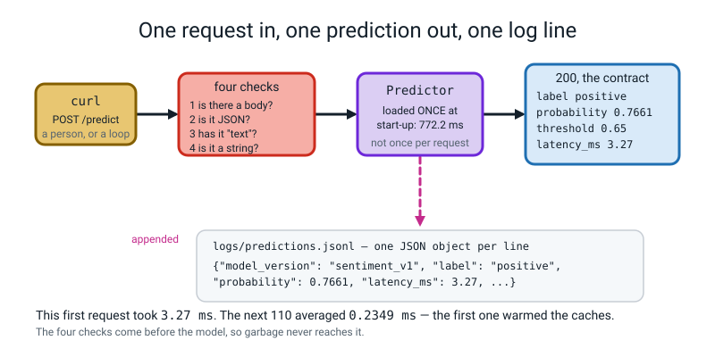
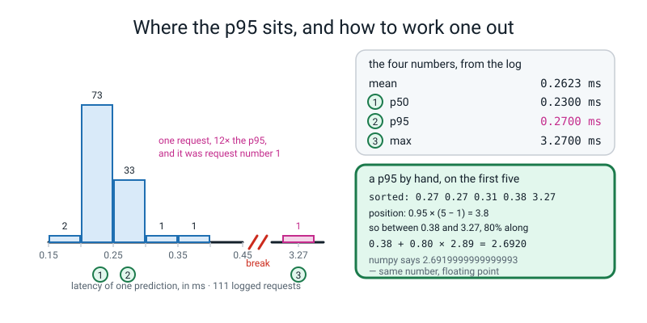
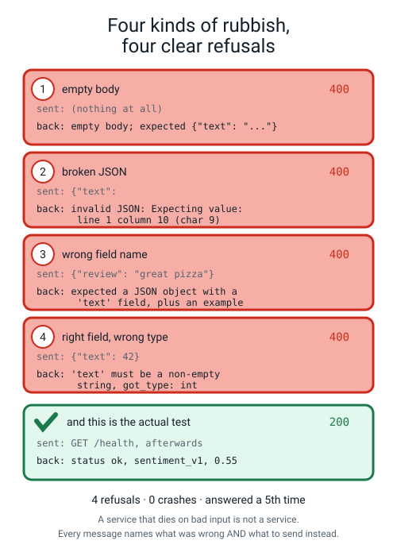
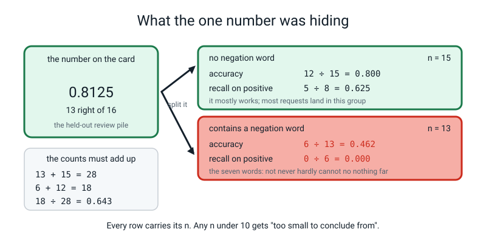
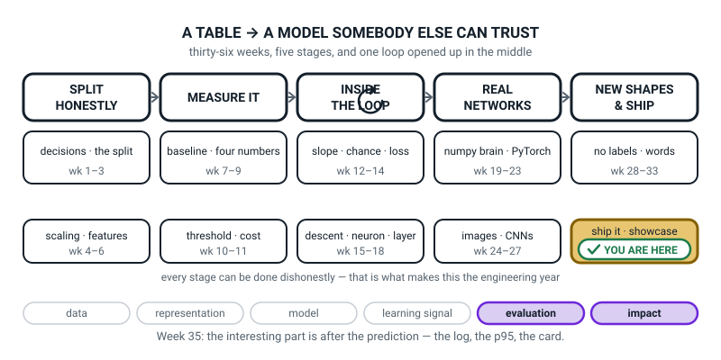

# Week 35 — Ship It, Part 2: The Service, the Log, and the Card

[⬅ Week 34](week-34.md) · [Course Home](../README.md) · [Week 36 ➡](week-36.md) · [Student Guide](../student-guide/week-35.md) · [Workbook](../workbook/week-35.md)

---

## 📋 At a Glance

| | |
|---|---|
| **Duration** | 70 minutes |
| **Type** | 🟦 Capstone, part 2 of 3 — the week the model stops being a file and starts being a thing that answers |
| **Big idea** | The interesting part of shipping is what happens **after** the prediction: it gets logged with its inputs and its latency, and somebody can read that log back and tell you what is going wrong. **A model with no log cannot be debugged, defended, or trusted.** |
| **New vocabulary** | endpoint · request / response · prediction log · p95 latency · subgroup metrics · monitoring plan · drift |
| **New maths** | **None.** One percentile worked by hand on five numbers, and two divisions for the subgroup table. |
| **New syntax** | `http.server.BaseHTTPRequestHandler` · `HTTPServer(("127.0.0.1", 8000), Handler)` · `logging.basicConfig(filename=...)` · `np.percentile(latencies, 95)` |
| **Dataset** | **The student's own shipped artifact from Week 34**, plus 100+ requests they generate against it. The reference run below is 111 requests against `sentiment_v1`. **Nothing downloads.** |
| **Materials** | Printed workbook (its opening note names the sections 35.1–35.8: 35.1 = Predict the Output P1, 35.3 = Do the Maths by Hand M1, 35.2 and 35.4–35.8 = the numbered steps of Build It) · **a fresh wall sheet headed FINDINGS with four blank rows** · the THE SIX BOXES sheet from Week 34, still up · the **laptop-swap pairing written on the board before they arrive** · the Bug Log · the model card template, printed, six headings |
| **Tech needed** | Laptop with Python 3, numpy, scikit-learn, joblib — **and `curl` in the terminal.** `http.server`, `json` and `logging` all ship with Python. **No Flask. No FastAPI. No installs. That is deliberate.** |
| **Prep time** | 35 minutes the night before · 10 minutes on the day |
| **Expected runtime of the code** | The service starts in **about 0.8 seconds** and then sits there. One prediction is **about 0.23 ms**. Generating 110 requests with a shell loop takes **under half a second**. `read_logs.py` and `subgroup_report.py` are both instant. **Nothing here is slow.** |

> **⚠️ Watch out:** **latency is the one kind of number in this entire course that will not reproduce.** Every other printed number in Level 3 comes from a seeded run and will match to the last decimal place. A latency will not: it depends on your laptop, what else is running, and whether the caches are warm. The numbers in this file are real measurements from one real run, quoted exactly — and **your job is not to match them, it is to measure your own and say so.** Tell the class that at the top of the lesson.

---

## 🎯 Lesson Objectives

This section lists what a student should be able to do, and show, by the end of the lesson.

By the end of the lesson the student can:

1. **Serve their Week 34 artifact over local HTTP** using only the standard library, bound to `127.0.0.1`, with a `GET /health` and a `POST /predict`, the model loaded **once at start-up**, and say out loud why `127.0.0.1` and not `0.0.0.0`.
2. **Survive four kinds of malformed request** — empty body, invalid JSON, wrong field name, right field with the wrong type — returning a clear `400` with an actionable message each time, and prove the service is still alive afterwards with one more `GET /health`.
3. **Log every prediction** with its input, its output, its probability, its threshold, its version and its latency, generate **100+ lines**, then read their own log back and report **four numbers: mean, p50, p95 and max** — having worked a p95 by hand on five of them first.
4. **Produce a subgroup metrics table** with `n` on every row, and write one sentence naming **what the overall number was hiding**; then a one-page monitoring plan naming **one number computable without labels**, its measured baseline, its alarm level, and the action.

Observable evidence: `curl -s http://127.0.0.1:8000/health` returning a version and a threshold; a transcript of four refusals followed by a `200`; `wc -l logs/predictions.jsonl` printing a number over 100; a printed p95 with the by-hand arithmetic beside it; a subgroup table where a row reads `contains a negation word · n = 13 · accuracy 0.462 · recall 0.000`; and a FINDINGS sheet in the students' own handwriting.

---

## 🧑‍🏫 What YOU Need to Know First

This section is your background reading. It covers the ideas you need before teaching: what an HTTP request is, each new line of code, the four checks, subgroup metrics and the monitoring number.

> **📌 About the code blocks in this guide.** Outside the **🧰 Prep Checklist** and the **🔑 Answer Key**, the blocks are **illustrations, not whole files** — each carries on from the one above. **The complete runnable files are in the Prep Checklist and the Answer Key.**

**There is no new mathematics this week.** There is one percentile, computed by hand on five numbers, and two divisions. What the prep buys you is confidence about three things you may never have met: what an HTTP request actually *is*, why a log is a data file rather than a diary, and why a single number can hide a group the model completely fails on.

### 1. What an HTTP request actually is, for somebody who has never seen one

Strip away every website you have ever used and this is all that is left.

A **server** is a program that sits waiting. A **client** is a program that sends it a message and waits for a reply. The message is a **request**; the reply is a **response**. Both are just text, with a small amount of structure.

A request has four parts:

| Part | In our service | What it is |
|---|---|---|
| a **method** | `GET` or `POST` | the verb. `GET` means "give me something". `POST` means "here is some data, do something with it". |
| a **path** | `/health` or `/predict` | which door you are knocking on |
| **headers** | `Content-Length: 21` | small facts about the message, one per line |
| a **body** | `{"text": "cold food"}` | the data itself. `GET` requests usually have none. |

> **Endpoint** — one path on a server that does one job. `/predict` is an endpoint. `/health` is another.

A response has three parts: a **status code** (a number), headers, and a body. Three status codes matter this week and the class should know all three cold:

| Code | Means | We return it when |
|---|---|---|
| **200** | OK, here is your answer | a good prediction, or `/health` |
| **400** | Bad request — **you** sent something wrong | any of the four malformed cases |
| **404** | Not found — that path does not exist | somebody asks for `/predikt` |

`curl` is the client we use. It is a program that sends one request and prints the response. That is all it does.

```bash
curl -s http://127.0.0.1:8000/health
```

- `-s` means "silent" — don't print a progress bar.
- `http://127.0.0.1:8000` is **which machine and which door-number**. `127.0.0.1` always means *this very computer*; `8000` is the **port**, which you can think of as a numbered door on the side of the machine.
- `/health` is the path.

For a `POST` you add three things:

```bash
curl -s -X POST http://127.0.0.1:8000/predict \
     -H 'Content-Type: application/json' \
     -d '{"text": "cold food and a rude driver"}'
```

`-X POST` sets the method. `-H` adds one header. `-d` supplies the body — and **`curl` counts the body's length for you and adds the `Content-Length` header**, which matters because our first check reads exactly that header.


*Figure 35.1 — One request in, one prediction out, one log line. Four checks run before the model is touched, so garbage never reaches it. The Predictor was loaded once, at start-up.*

### 2. `127.0.0.1` versus `0.0.0.0`, and why this is not a detail

`HTTPServer(("127.0.0.1", 8000), Handler)` — that first string is the answer to *"who is allowed to reach this?"*

- **`127.0.0.1`** means **only this computer**. Nothing on the school network, nothing on the café wifi, nothing on the internet.
- **`0.0.0.0`** means **anything that can reach this machine at all**.

Your service has no password, no rate limit, and a model that will happily answer a million requests. Every tutorial online writes `0.0.0.0`, because tutorials run inside containers where it is the only thing that works. **In a classroom it is the wrong default and the students must be able to say why in one sentence.** It is one of the eight questions they will be asked next week.

### 3. Every new line of this week's code, explained to somebody who has never programmed

**(a) `BaseHTTPRequestHandler` — a form with two blanks to fill in.**

Python gives you a class that already knows how to read an HTTP request and write a response. You fill in the bits it cannot guess: what to do for a `GET`, and what to do for a `POST`.

```python
class Handler(BaseHTTPRequestHandler):
    def do_GET(self):
        ...          # runs whenever somebody sends a GET
    def do_POST(self):
        ...          # runs whenever somebody sends a POST
```

The names are not a choice: Python looks for a method called exactly `do_GET` for a `GET` request. Get the capitals wrong and Python will not find it, and the reply will be `501 Unsupported method`. Inside, three things are available:

- `self.path` — the path, as a string: `"/predict"`.
- `self.headers.get("Content-Length")` — one header, as text.
- `self.rfile.read(n)` — read `n` bytes of the body. **You must say how many**, which is why you read the length header first.

And to reply you call three things in this order: `self.send_response(code)`, then `self.send_header(...)` for each header, then `self.end_headers()`, then write the body. **The order is not optional** — headers cannot be sent after the body has started.

**(b) `HTTPServer(("127.0.0.1", 8000), Handler)` — the thing that waits.**

```python
server = HTTPServer(("127.0.0.1", 8000), Handler)
server.serve_forever()
```

Two arguments: **where to listen** (a pair: address and port) and **who handles each request** (your class). `serve_forever()` does exactly what it says — it never returns until you press Ctrl+C. Everything that happens from then on happens inside `Handler`.

**(c) `logging.basicConfig(filename=...)` — sending lines to a file.**

```python
logging.basicConfig(filename=str(LOG_PATH), level=logging.INFO, format="%(message)s")
logging.info(json.dumps(row))
```

Three arguments, each doing one job:

- `filename=` — where the lines go. **Set this once, at start-up, before any logging happens.**
- `level=logging.INFO` — how much to keep. **This one is load-bearing.** Python's default level is `WARNING`, which is *above* `INFO`, so without this line `logging.info(...)` prints nothing, writes nothing, and raises nothing. The commonest silent bug of the week.
- `format="%(message)s"` — what each line looks like. The default adds a severity word and a logger name; we want the line to be **nothing but the JSON**, so the file can be read back by a program.

> **Prediction log** — a file with one complete record per line, appended, never rewritten, holding everything you would need to explain a single prediction six months later.

The format is called **JSON Lines**: one JSON object per line. A human can read it; a program can parse it; and you can append to it forever without rewriting what is already there.

**(d) `np.percentile(latencies, 95)` — the p95.**

> **p95 latency** — the time that 95 percent of requests came in under. Five percent were slower.

The mean is a bad summary of a latency, because latencies have a long tail: nearly all of them are fast and a few are slow, and the slow ones are the ones a person actually notices. The mean gets dragged around by the tail without describing it. The p95 describes it.

**Here is the whole thing, worked by hand on five real numbers from our log.** Sort them:

```text
0.27   0.27   0.31   0.38   3.27
  0      1      2      3      4     ← positions
```

Numpy's rule: the p95 sits at position `0.95 × (n − 1)`, counting from zero.

```text
0.95 × (5 − 1)  =  0.95 × 4  =  3.8
```

Position 3.8 is not a real position — it is between position 3 and position 4, **eight tenths of the way along**. So take the value at 3, and add eight tenths of the gap to the value at 4:

```text
gap   = 3.27 − 0.38 = 2.89
p95   = 0.38 + 0.80 × 2.89
      = 0.38 + 2.312
      = 2.692
```

And numpy:

```text
np.percentile([3.27, 0.38, 0.31, 0.27, 0.27], 95)  →  2.6919999999999993
```

**Same number.** The trailing `...93` is floating point, not a disagreement — the same wobble they met in Week 17 when `np.allclose` existed.

**Do the p50 too, because it comes out exact and that reassures people:** `0.50 × 4 = 2.0`, a whole number, so the p50 is just the value at position 2, which is `0.31`.


*Figure 35.3 — Where the p95 sits, and how to work one out. 111 real requests: 73 of them between 0.20 and 0.25 ms, and one lone request out at 3.27 ms, which was request number one. The mean is 0.2623 and the other 110 average 0.2349, so the first request was about 14 times slower than the rest.*

### 4. The four checks, in order, and why the order matters

The whole robustness lesson is four `if` statements, and **they must run in this order**, because each one is only safe once the one above it has passed.

| # | Check | Why it must come first | What we return |
|---|---|---|---|
| 1 | Is there a body, and is its declared length sane? | You cannot read a body without knowing how many bytes to read | `400 empty body` · `413 body too large` |
| 2 | Is it valid JSON? | You cannot look for a field inside something that is not an object yet | `400 invalid JSON: <the parser's own message>` |
| 3 | Is it an object with a `text` field? | You cannot check a field's type before knowing it exists | `400` plus **a worked example of what to send** |
| 4 | Is `text` a non-empty string? | The model will do something strange with a number, silently | `400` naming the type it got |

**Then, and only then, the model is touched.** That sentence is the design.

**Every message must say what to send instead.** `{"error": "bad input"}` is useless to the person on the other end. `{"error": "expected a JSON object with a 'text' field", "example": {"text": "the pizza was hot"}}` can be acted on without asking you anything. **This is the single easiest place in the whole capstone to score well, and almost nobody bothers.**


*Figure 35.2 — Four kinds of rubbish, four clear refusals. And the fifth row is the actual test: `GET /health` afterwards still returns 200. Four refusals, zero crashes, and the service answered a fifth time.*

**One more thing to notice, and it is the subtle half of the hook:** none of those four requests produces a log line. Nothing was predicted, so there is nothing to log. **The log counts predictions, not requests**, and knowing the difference is what stops a student claiming 115 predictions when they made 111.

### 5. Subgroup metrics, and what one number hides

This is the part of the week that matters most and takes the least code.

> **Subgroup metrics** — the same metric, computed separately for groups of rows you chose on purpose, with the size of each group printed beside it.

The reference model's headline is `0.8125` on 16 held-out reviews (13 right, 3 wrong, at the shipped threshold of 0.65) — respectable against a baseline of 0.500. Now split 28 labelled rows — those 16 plus the 12 negation traps from Week 33 — by whether the review contains one of seven negation words (`not`, `never`, `hardly`, `cannot`, `no`, `nothing`, `far`):

```text
subgroup                     n   accuracy  precision  recall
ALL 28 labelled rows        28    0.643      0.833     0.357
the 16 test reviews         16    0.812      1.000     0.625
the 12 negation traps       12    0.417      0.000     0.000
contains a negation word    13    0.462      0.000     0.000
no negation word            15    0.800      1.000     0.625
short (5 words or fewer)     9    0.556      0.667     0.400   <- too small to conclude from
longer (6 words or more)    19    0.684      1.000     0.333
```

**Read row four out loud, slowly.** On the 13 rows containing a negation word, accuracy is `0.462` and **recall on the positive class is `0.000`.** Not "lower". Not "worse". **Zero.** There were six genuinely positive reviews in that group and the model found none of them.

And the counts check out, which is how you know you have not miscounted:

```text
13 + 15 = 28    ✅ every row is in exactly one of the two groups
 6 + 12 = 18    ✅ six right in the negation group, twelve right in the other
18 ÷ 28 = 0.643 ✅ which is the ALL row
```


*Figure 35.4 — What the one number was hiding. `0.8125` on the 16 held-out reviews, and `0.462` on the 13 rows that contain a negation word, where recall on the positive class is `0 ÷ 6 = 0.000`.*

**Two pieces of honesty you must insist on, because they are what separate a real card from a school exercise.**

**One — every group carries its `n`, and anything under about 10 carries the words "too small to conclude from".** `1.000` on four rows is not "perfect"; it is four rows, and one flip takes it to 0.750.

**Two — the negation traps were written on purpose to break the model, so `0.417` is not an estimate of anything.** It is a demonstration that a mechanism exists. **The honest claim is about the mechanism, not the rate:** *"bag-of-words keeps almost no word order (the pairs only see neighbours, and `not` never appeared in training), so `not` — which this model has no weight for at all — cannot flip `delicious`; here are 13 rows where that is visible, and I chose them to be visible."* A student who says that is doing better science than one who reports 0.462 as if it were a population statistic.

And notice **why** this failure is satisfying rather than depressing: Week 31 and Week 32 *predicted* it from theory, and Week 35 measured it in their own service. **That coincidence between a prediction made from theory and evidence found in your own log is the strongest thing you can put in a model card.**

### 6. The monitoring number, and the one rule that makes it hard

> **Monitoring plan** — one page naming one number you would watch, how you would measure it, what value would set off an alarm, and what you would do.
> **Drift** — the inputs slowly stopping looking like the data you trained on, so the model quietly gets worse without anything breaking.

Here is the rule that makes this genuinely hard, and it is the whole reason this section exists:

> **In production, nobody tells you the right answer.**

A comment goes through your classifier, gets a label, and then… nothing. No truth ever arrives. So **a monitoring plan built on accuracy is a plan you can never run.** The good numbers are the ones computable from **inputs and outputs alone**.

Two that work for this model, both with real measured baselines:

**The uncertainty-band rate.** The share of predictions whose probability falls between 0.45 and 0.65 — the stretch just under the 0.65 fence, where the model is least sure whether to call something positive. Straight from the log, no labels:

```text
in the 0.45-0.65 uncertainty band: 16 of 111 (14.4%)
```

**The out-of-vocabulary rate.** The share of an input's tokens the vectorizer has never seen. The vocabulary is 287 items (single words and adjacent pairs together), and here is what it does:

```text
0.1111  cold food and a rude driver
0.8667  the biryani was absolutely banging fam no cap
1.0000  lorem ipsum dolor sit amet
```

**Why this number degrades for *this* model, specifically.** It is TF-IDF. A word the vectorizer has never seen contributes *exactly nothing* — it is silently dropped. So a rising OOV rate means a rising share of every input is invisible to the model, and the answer rests on fewer and fewer words. Keep two cases apart.

- **If only some words are unknown, they are ignored and the known ones decide alone** (`delicious` and `delicious xyzzy plugh quux` both score `0.6928` — TF-IDF normalises over the words it *can* see, so there is no drift to the middle).
- **If every word is unknown, nothing reaches the classifier**, and the answer is the bias-only output, `0.4887`, which sits inside the 0.45-0.65 band.

**That is a mechanism, not a vibe, and naming the mechanism is what lifts a monitoring plan a whole rubric level.**

**And one honest wrinkle worth saying out loud.** The band rate over our 111 logged requests is `14.4%`. On the 16 test reviews it is `3 of 16 = 18.8%`. **Different, and neither is wrong** — they are different traffic. **A baseline has to come from the traffic you are actually going to watch**, which means you cannot write the alarm level until you have logged some real requests. That is a genuinely useful thing to have learned at fourteen.

### 7. The three misconceptions you will actually meet

**"The log is for when something goes wrong."** No — the log is a **data file**, and its first job is answering questions nobody thought to ask. That is why one line holds the input, the output, the probability, the threshold, the version and the latency. A log of labels can answer nothing.

**"My mean latency is 0.26 ms, so it's fast."** The mean is fine and the *tail* is the user experience. Our max was `3.27 ms` — twelve times the p95 — and it was request number one. **If you only report a mean you have hidden the only request that anybody would have noticed.**

**"0.8125 accuracy, so it works."** It scores 0.800 on the 15 rows with no negation word, and on the 13 rows that have one it finds none of the positives. **"Works" is not a property of a model; it is a property of a model on a group of rows.**

### 8. How deep to go, and where to stop

**Go this deep:** two endpoints, four checks, one log file, four latency numbers, one subgroup table, one monitoring number.

**Stop before:** threads and concurrency (`HTTPServer` handles one request at a time and today that is a feature) · authentication · HTTPS · rate limiting · Flask or FastAPI · any deployment to any machine that is not this one · `dataclasses` · a database. **If a student asks about any of them, the answer is "yes, and that is a real thing, and it is not this week" — then write it on the FINDINGS sheet as a question, which honours it without derailing you.**

---

### 9. 🧭 The Growing Map — the same last box, and what happens after the prediction

The student guide carries a figure called **Where This Fits**: the same picture every week with one more
piece filled in. The gold stays on the last tile, and the page still has no dashes anywhere on it.



*Figure 35.0 — Week 35's version. Second week inside the last tile, `ship it · showcase`, and the whole map
solid. The ↻ on stage three is black, as it has been since Week 12.*

**What to do with it, in about two minutes at the end of the lesson:**

1. **Ask "which box did we do today?" and then "which arrow is the log on?"** Same gold tile — and the
   second question has no answer on the map, which is the point. *"Every arrow on this picture points
   left to right, into a prediction. Today you built the thing that happens **after** the last arrow."*
   Have somebody draw the missing arrow, curving back from stage five to stage two. **That loop is
   monitoring, and it is the honest shape of a shipped model.**
2. **Anchor it on the four numbers and on one subgroup row.** Point at the FINDINGS sheet. *"This box
   produced mean, p50, p95 and max — and with 111 requests the p95 cannot see the max, so both get
   printed."* Then read one subgroup row aloud exactly as written, `n` included: **`contains a negation
   word · n = 13 · accuracy 0.462 · recall 0.000`.** Then ask what the overall `0.8125` was hiding. **The
   answer is a group of rows, not a percentage.**
3. **Point at stage two, then at stage one.** *"Which tile does `p95` belong to?"* — `threshold · cost`,
   Weeks 10–11, because a latency you promise is a threshold you chose. And then the harder one: *"which
   tile does 'the words people type next month will not look like the words in my training set' belong
   to?"* — stage one, `scaling · features`, Week 6. **Drift is the Week 6 question asked again after launch** (not leakage — nothing from the future got in — but the same habit of asking where the data came from), and saying that out
   loud connects the last week of the year to the sixth.

> **🧑‍🏫 Why this is worth two minutes.** A student finishing today thinks the work is over because the
> thing answers. The map, plus the arrow they just drew, says otherwise: **everything they built today
> feeds measurement back into a box they finished in November.** That is the difference between a model
> that ran once and a model somebody trusts — and it is the sentence the banner at the top of the figure
> has been making since Week 1.

**One thing to notice, so you can answer if asked.** Latency is the only number in Level 3 that will not
reproduce, and a sharp student may ask how that squares with *"a number you cannot reproduce is not a
result"*. The answer is precise and worth giving: **you cannot reproduce the value, but you can reproduce
the measurement** — same script, same 111 requests, same four statistics, and you state the machine. That
is what makes it a result rather than an impression, and it is exactly what a model card's performance
section has to say.

---

## 🧰 Prep Checklist

This section is what to prepare before the lesson, and it holds the complete runnable files.

### 35 minutes the night before

- [ ] **Read §1 to §6 above.** Twenty-five minutes. §1 is the one to read twice if you have never met HTTP.
- [ ] **Check `curl` exists** on the machines: `curl --version` in a terminal. It ships with macOS and most Linux. **Find out tonight, not at minute four.**
- [ ] **Write the laptop-swap pairing on the board** before they arrive. Choosing partners live costs six minutes.
- [ ] **Put up the FINDINGS wall sheet**, four blank rows, and write at the top: *every crash written here is a finding, not a failure.* **Ban the word "failure" from that sheet out loud.**
- [ ] **Print** the whole workbook (Warm-Up through Self-Check; 35.1–35.8 are P1, M1 and the Build It steps), and the six-heading model card template.
- [ ] **Build and run the whole thing yourself.** Twenty minutes. You need to have seen a service refuse four things and then answer a fifth.

**Add two files to last week's `ship-it/`:**

```text
ship-it/
├── model/ ...                 (unchanged from Week 34)
├── serve/
│   ├── predictor.py           (unchanged — the ONE place a prediction happens)
│   ├── predict.py             (unchanged)
│   └── service.py             ← NEW
├── eval/
│   ├── read_logs.py           ← NEW
│   └── subgroup_report.py     ← NEW
└── logs/                      ← created by the service
```

**`serve/service.py`** — the whole file, 40 lines of substance:

```python
"""service.py — a tiny local prediction service. Standard library only.

Run:   python3 serve/service.py
Then:  curl -s http://127.0.0.1:8000/health
"""
import argparse
import json
import logging
import sys
from http.server import BaseHTTPRequestHandler, HTTPServer
from pathlib import Path

sys.path.insert(0, str(Path(__file__).resolve().parent))
from predictor import Predictor

ROOT = Path(__file__).resolve().parent.parent
LOG_PATH = ROOT / "logs" / "predictions.jsonl"
MAX_BODY_BYTES = 100000      # ~100 KB. Bigger than any real review.
MAX_LOGGED_CHARS = 300       # a privacy decision, written down on purpose.

PREDICTOR = None


class Handler(BaseHTTPRequestHandler):
    server_version = "ShipIt/1.0"

    def send_json(self, code, payload):
        body = json.dumps(payload).encode("utf-8")
        self.send_response(code)
        self.send_header("Content-Type", "application/json")
        self.send_header("Content-Length", str(len(body)))
        self.end_headers()
        self.wfile.write(body)

    def log_message(self, fmt, *args):
        return                    # silence the built-in access log; ours is JSON

    def do_GET(self):
        if self.path == "/health":
            self.send_json(200, {"status": "ok",
                                 "model_version": PREDICTOR.version,
                                 "threshold": PREDICTOR.threshold,
                                 "classes": PREDICTOR.classes,
                                 "load_ms": round(PREDICTOR.load_ms, 1)})
        else:
            self.send_json(404, {"error": "not found",
                                 "routes": ["GET /health", "POST /predict"]})

    def do_POST(self):
        if self.path != "/predict":
            self.send_json(404, {"error": "not found",
                                 "routes": ["GET /health", "POST /predict"]})
            return

        # CHECK 1 — is there a body at all, and is it a sane size?
        header = self.headers.get("Content-Length", "0")
        if not header.isdigit():
            self.send_json(400, {"error": "Content-Length is not a number"})
            return
        length = int(header)
        if length == 0:
            self.send_json(400, {"error": "empty body; expected {\"text\": \"...\"}"})
            return
        if length > MAX_BODY_BYTES:
            self.send_json(413, {"error": "body too large (%d bytes); limit is %d"
                                          % (length, MAX_BODY_BYTES)})
            return
        raw = self.rfile.read(length)

        # CHECK 2 — is it actually JSON?
        try:
            payload = json.loads(raw.decode("utf-8"))
        except Exception as e:
            self.send_json(400, {"error": "invalid JSON: %s" % e})
            return

        # CHECK 3 — is it an object with the field the contract promised?
        if not isinstance(payload, dict) or "text" not in payload:
            self.send_json(400, {"error": "expected a JSON object with a 'text' field",
                                 "example": {"text": "the pizza was hot"}})
            return

        # CHECK 4 — is that field a non-empty string?
        text = payload["text"]
        if not isinstance(text, str) or text.strip() == "":
            self.send_json(400, {"error": "'text' must be a non-empty string",
                                 "got_type": type(text).__name__})
            return

        # Only now does the model get touched.
        out = PREDICTOR.predict_one(text)

        row = dict(out)
        row["input"] = row["input"][:MAX_LOGGED_CHARS]
        row["input_chars"] = len(text)
        logging.info(json.dumps(row))

        self.send_json(200, out)


def main():
    global PREDICTOR
    ap = argparse.ArgumentParser(description="Serve one sentiment artifact locally.")
    ap.add_argument("--version", default=None)
    ap.add_argument("--threshold", type=float, default=None)
    ap.add_argument("--port", type=int, default=8000)
    args = ap.parse_args()

    LOG_PATH.parent.mkdir(parents=True, exist_ok=True)
    logging.basicConfig(filename=str(LOG_PATH), level=logging.INFO,
                        format="%(message)s")

    PREDICTOR = Predictor(version=args.version, threshold=args.threshold)
    print("loaded %s in %.0f ms (threshold %.2f)"
          % (PREDICTOR.version, PREDICTOR.load_ms, PREDICTOR.threshold))

    server = HTTPServer(("127.0.0.1", args.port), Handler)   # NOT 0.0.0.0
    print("serving on http://127.0.0.1:%d   (Ctrl+C to stop)" % args.port)
    try:
        server.serve_forever()
    except KeyboardInterrupt:
        print("\nshutting down")
        server.server_close()


if __name__ == "__main__":
    main()
```

**Start it (terminal 1):**

```text
loaded sentiment_v1 in 772 ms (threshold 0.65)
serving on http://127.0.0.1:8000   (Ctrl+C to stop)
```

**Poke it (terminal 2). Real output, from one real session:**

```bash
$ curl -s http://127.0.0.1:8000/health
{"status": "ok", "model_version": "sentiment_v1", "threshold": 0.65, "classes": ["negative", "positive"], "load_ms": 772.2}

$ curl -s -X POST http://127.0.0.1:8000/predict \
     -H 'Content-Type: application/json' \
     -d '{"text": "delicious fresh pizza and kind friendly staff"}'
{"model_version": "sentiment_v1", "input": "delicious fresh pizza and kind friendly staff", "label": "positive", "probability": 0.7661, "threshold": 0.65, "latency_ms": 3.27}
```

**Break it. All five, then check it is alive:**

```bash
# 1. empty body
$ curl -s -X POST http://127.0.0.1:8000/predict -d ''
{"error": "empty body; expected {\"text\": \"...\"}"}

# 2. invalid JSON
$ curl -s -X POST http://127.0.0.1:8000/predict -d '{"text": '
{"error": "invalid JSON: Expecting value: line 1 column 10 (char 9)"}

# 3. wrong field name
$ curl -s -X POST http://127.0.0.1:8000/predict -d '{"review": "great pizza"}'
{"error": "expected a JSON object with a 'text' field", "example": {"text": "the pizza was hot"}}

# 4. right field, wrong type
$ curl -s -X POST http://127.0.0.1:8000/predict -d '{"text": 42}'
{"error": "'text' must be a non-empty string", "got_type": "int"}

# 5. oversized body (150,013 bytes of the word "pizza")
$ curl -s -X POST http://127.0.0.1:8000/predict --data-binary @big.json
{"error": "body too large (150013 bytes); limit is 100000"}

# 6. STILL ALIVE? ← this is the actual test
$ curl -s http://127.0.0.1:8000/health
{"status": "ok", "model_version": "sentiment_v1", "threshold": 0.65, "classes": ["negative", "positive"], "load_ms": 772.2}
```

**Generate 110 more requests** with a shell loop over a list of 22 reviews, five times round. The reference list is the 16 held-out test reviews plus six more: `the biryani was absolutely banging fam no cap`, `lorem ipsum dolor sit amet`, `it was fine i suppose`, `not cold not rude`, `cold food and a rude driver` and `stale bread and awful coffee`. Then:

```bash
$ wc -l logs/predictions.jsonl
     111 logs/predictions.jsonl

$ head -1 logs/predictions.jsonl
{"model_version": "sentiment_v1", "input": "delicious fresh pizza and kind friendly staff", "label": "positive", "probability": 0.7661, "threshold": 0.65, "latency_ms": 3.27, "input_chars": 45}
```

**`eval/read_logs.py`:**

```python
"""read_logs.py — read your own log back as data."""
import json
from pathlib import Path

import numpy as np

LOG = Path(__file__).resolve().parent.parent / "logs" / "predictions.jsonl"

rows = []
for line in LOG.read_text().splitlines():
    if line.strip() != "":
        rows.append(json.loads(line))

latencies = np.array([r["latency_ms"] for r in rows])
probs = np.array([r["probability"] for r in rows])

print("requests        : %d" % len(rows))
print("by version      : %s" % {v: sum(1 for r in rows if r["model_version"] == v)
                                for v in sorted({r["model_version"] for r in rows})})
print("by label        : %s" % {v: sum(1 for r in rows if r["label"] == v)
                                for v in sorted({r["label"] for r in rows})})
print("latency mean    : %.2f ms" % latencies.mean())
print("latency p50     : %.2f ms" % np.percentile(latencies, 50))
print("latency p95     : %.2f ms" % np.percentile(latencies, 95))
print("latency max     : %.2f ms" % latencies.max())
print("mean probability: %.4f" % probs.mean())
band = ((probs >= 0.45) & (probs <= 0.65)).sum()
print("in the 0.45-0.65 uncertainty band: %d of %d (%.1f%%)"
      % (band, len(rows), 100.0 * band / len(rows)))
```

```text
requests        : 111
by version      : {'sentiment_v1': 111}
by label        : {'negative': 76, 'positive': 35}
latency mean    : 0.26 ms
latency p50     : 0.23 ms
latency p95     : 0.27 ms
latency max     : 3.27 ms
mean probability: 0.4546
in the 0.45-0.65 uncertainty band: 16 of 111 (14.4%)
```

**`eval/subgroup_report.py`** — rebuilds exactly the pile `train.py` measured (same seeds, same sizes), adds the 12 traps, and reports seven groups. The full file is in the Answer Key. Its output:

```text
subgroup                     n   accuracy  precision  recall
ALL 28 labelled rows        28    0.643      0.833     0.357
the 16 test reviews         16    0.812      1.000     0.625
the 12 negation traps       12    0.417      0.000     0.000
contains a negation word    13    0.462      0.000     0.000
no negation word            15    0.800      1.000     0.625
short (5 words or fewer)     9    0.556      0.667     0.400   <- too small to conclude from
longer (6 words or more)    19    0.684      1.000     0.333
```

### 10 minutes on the day

- [ ] Pairing on the board. FINDINGS sheet up, blank, with the word "failure" crossed out at the top.
- [ ] **Two terminal windows open on the shared screen, side by side.** One will run the service; the other will attack it. Set this up before they come in — rearranging windows live is dead air.
- [ ] `service.py` **partly given**: hand them `send_json`, `log_message` and `main` complete, printed. **They type `do_GET` and the four checks themselves** — those are the new lines and the whole lesson.
- [ ] Workbook Predict the Output **P1** (page 35.1) out. **The four predicted replies filled in, in pen, before anything runs.**
- [ ] `big.json` already made, so the oversized-body demo is instant.
- [ ] Bug Log out. It will get three entries today.

### Fallback if the laptops fail

**Two of the four objectives survive whole, and they are the two the rubric weights highest.**

1. **The subgroup table, from this file's numbers.** Print the seven-row output. Then the whole of objective 4 on paper: find the worst group, check `13 + 15 = 28`, check `6 + 12 = 18`, check `18 ÷ 28 = 0.643`, and write the sentence about what `0.8125` was hiding. **This is the best twenty minutes of the paper version and it needs no electricity.**
2. **The p95 by hand.** `0.95 × 4 = 3.8`, `0.38 + 0.80 × 2.89 = 2.692`. Then the good question: *"we have 111 requests and the p95 is 0.27, but the max is 3.27. Why didn't the p95 catch it?"* — because one request in 111 sits beyond the 99th percentile, and the p95 cannot see above itself. **That conversation is better than the code.**
3. **Break Each Other's Service, on paper.** Genuinely works: each student writes the four malformed bodies on a card and swaps with their partner, who writes the status code and the exact error message they would return. **Then compare with the real transcript in this file.** Objective 2's *thinking*, without objective 2's typing.
4. **The model card and the monitoring plan.** Both are writing. Both are homework anyway.
5. **Objectives 1 and 3 are the casualty.** Say so plainly: *"the one thing we cannot do on paper is have a program answer a question. That is your homework, and next week you are demoing it."*

| If this fails | Do this instead |
|---|---|
| `OSError: [Errno 48] Address already in use` | An old service is still running on port 8000. `--port 8001` gets them moving in five seconds; killing the old one is the proper fix. **This will happen to at least three students and it is worth pre-announcing.** |
| `wc: logs/predictions.jsonl: open: No such file or directory` | The service has never successfully logged. Nine times out of ten `level=logging.INFO` is missing. **Python's default level drops `INFO` silently.** |
| `IndexError: index -1 is out of bounds for axis 0 with size 0` from `read_logs.py` | The log exists but is empty — no successful predictions yet, only refusals. **Send one good request, then re-run.** And notice it is telling the truth: you cannot take a percentile of nothing. |
| `curl` is missing or behaves oddly on a Windows terminal | Use `predict.py` to generate log lines instead, and demo the malformed requests on the shared screen only. **Objective 2 becomes a group demonstration rather than an individual one; say so and move on.** |
| The Break-Each-Other activity turns into chaos | Cap it: **four requests each, written on the card first, then sent.** Unwritten attacks become a competition to crash things; written ones stay a diagnosis. |
| Somebody's service crashes and they are embarrassed | **This is the moment the FINDINGS sheet exists for.** Get them to write it on the wall, in their own handwriting, and thank them out loud. Do it for the first crash of the lesson and the tone is set for the rest. |
| Everybody finishes in 12 minutes | Build It 35.8 (the stretch): send the service 30 requests from a completely different domain and watch the out-of-vocabulary rate climb. **That plot is what drift actually looks like.** |

---

## ⏱️ The Lesson, Minute by Minute

This section is the lesson plan: what to say, ask, expect and watch for at each step.

| Segment | Minutes | Running total | What happens |
|---|---|---|---|
| 🪝 Hook — Four Pieces of Rubbish, and One Missing Line | 7 | 7 | You attack your own service live; then the log, and what isn't in it |
| 🧠 Concept & Maths — Request, Response, Log, p95 | 18 | 25 | HTTP in four parts, the four checks, the p95 by hand on five numbers |
| 💻 Live-Code Together — `service.py` | 18 | 43 | Two endpoints, four checks, one log line. **Two deliberate mistakes.** |
| 🎲 Their Turn — Break Each Other's Service | 20 | 63 | Laptops swap. Four attacks each. Every crash goes on the wall. |
| 🔑 Wrap & Assign | 7 | 70 | The subgroup table, three checks, the card and the plan |

---

### 🪝 Hook — Four Pieces of Rubbish, and One Missing Line (7 minutes)

**Do this:** Two terminals already side by side. In the left one, start the service, and read the output aloud.

```text
loaded sentiment_v1 in 772 ms (threshold 0.65)
serving on http://127.0.0.1:8000   (Ctrl+C to stop)
```

**Say this:**

> "Last week you froze a model into a file and wrote a tool that reads it. The tool was for you. **Today the model has to answer somebody who is not you.**
>
> That program is now sitting there waiting. It is not doing anything. It is listening on door number 8000 of this machine, and it will answer anybody who knocks — as long as they are also on this machine, and we will come back to why that matters."

**Do this:** In the right terminal, one good prediction.

```bash
$ curl -s -X POST http://127.0.0.1:8000/predict \
     -H 'Content-Type: application/json' \
     -d '{"text": "delicious fresh pizza and kind friendly staff"}'
{"model_version": "sentiment_v1", "input": "delicious fresh pizza and kind friendly staff", "label": "positive", "probability": 0.7661, "threshold": 0.65, "latency_ms": 3.27}
```

**Say this:**

> "There it is: the five fields from box 3 of your contract, over a wire. Now watch me try to break it. **I wrote this thing and I am going to attack it on purpose, in front of you, and I want you to count the crashes.**"

**Do this:** Send all four, fast, reading each reply aloud.

```bash
$ curl -s -X POST http://127.0.0.1:8000/predict -d ''
{"error": "empty body; expected {\"text\": \"...\"}"}

$ curl -s -X POST http://127.0.0.1:8000/predict -d '{"text": '
{"error": "invalid JSON: Expecting value: line 1 column 10 (char 9)"}

$ curl -s -X POST http://127.0.0.1:8000/predict -d '{"review": "great pizza"}'
{"error": "expected a JSON object with a 'text' field", "example": {"text": "the pizza was hot"}}

$ curl -s -X POST http://127.0.0.1:8000/predict -d '{"text": 42}'
{"error": "'text' must be a non-empty string", "got_type": "int"}
```

**Ask this:** "How many crashes?"

*None.*

**Do this:** One more `GET /health`, and let the reply land.

> "**Still alive.** Four pieces of garbage, four clear refusals, and it answered a fifth time. And look at what each refusal did: it said what was wrong **and what to send instead**. Number three even gave a worked example. That is the difference between an experiment and something a person can use."

**Do this:** Now the second half. Print the log.

```bash
$ wc -l logs/predictions.jsonl
     111 logs/predictions.jsonl
```

**Ask this:** "I have sent this thing 111 good requests and 4 pieces of rubbish. That is 115. Why does the file say 111?"

*Let them work it out. The answer: nothing was predicted for the four bad ones, so there was nothing to log.*

> "**Exactly. The log counts predictions, not requests.** Know the difference, because next week somebody will ask you how many predictions your service has made, and 115 would be a lie."

**Do this:** Show the first line and one from the middle.

```text
{"model_version": "sentiment_v1", ..., "latency_ms": 3.27, "input_chars": 45}
```

**Ask this:** "That first request took 3.27 milliseconds. The other 110 averaged 0.2349. Which one is lying?"

*Neither. Take answers. Land on: the first one paid for warming everything up.*

> "Neither. **They are both true and they measure different things** — and by the end of today you will be able to say that sentence about your own service, with your own numbers."

---

### 🧠 Concept & Maths — Request, Response, Log, p95 (18 minutes)

**Do this:** Board, four parts of a request, in a column:

```text
METHOD    GET  or  POST
PATH      /health  or  /predict
HEADERS   Content-Length: 39
BODY      {"text": "cold food and a rude driver"}
```

**Say this:**

> "That is all an HTTP request is. A verb, a door, a few small facts, and some data. **`GET` means give me something. `POST` means here is some data, do something with it.** You have sent millions of these and never seen one."

**Do this:** Beside it, the three status codes:

```text
200   fine, here it is
400   YOU sent something wrong
404   that door doesn't exist
```

**Ask this:** "Which of those three is the server's fault?"

*None of them. 400 and 404 are both the client's fault; 200 is nobody's fault.*

> "Right — and the one that would be the server's fault is a **500**, which means *I broke*. **Your goal today is a service that never returns a 500**, because every bad input has already been caught by a 400."

**Do this:** Write the four checks, in order, numbered.

```text
1  is there a body, and is it a sane size?
2  is it JSON?
3  is it an object with a "text" field?
4  is "text" a non-empty string?
--------------------------------------------
   only now: touch the model
```

**Ask this:** "Why can't check 3 come before check 2?"

*Because you cannot look for a field inside something that isn't an object yet.*

**Ask this:** "And why can't check 4 come before check 3?"

*Because you cannot ask what type a field is before you know it exists.*

> "**The order is the design.** Four checks, each safe only because the one above it passed. And underneath all four, a line I want you to notice: `text = payload["text"]` happens on line four and **the model is not touched until line five.** Rubbish never reaches it."

**Do this:** Now `127.0.0.1`. Write both on the board:

```text
HTTPServer(("127.0.0.1", 8000), Handler)     ← only this computer
HTTPServer(("0.0.0.0",   8000), Handler)     ← anything on the network
```

**Ask this:** "My service has no password and no limit on how many questions you can ask. Which line do I want?"

*127.0.0.1.*

> "**Every tutorial on the internet writes the second one**, because tutorials run inside containers where it is the only thing that works. On your laptop on a school network it means anybody here can send your model a million requests. **This is one of the eight questions you will be asked next week, so learn the sentence: no authentication, no rate limit, therefore localhost.**"

**Do this:** Now the maths. Write five real latencies on the board, unsorted, then sorted:

```text
3.27   0.38   0.31   0.27   0.27        ← as they happened
0.27   0.27   0.31   0.38   3.27        ← sorted
  0      1      2      3      4         ← positions, from ZERO
```

**Say this:**

> "The **p95** is the time that 95 out of every 100 requests came in under. Here is the whole rule, and it is one multiplication and one bit of in-between."

**Do this:** Work it on the board, saying every step:

```text
position  =  0.95 x (5 - 1)  =  0.95 x 4  =  3.8

3.8 is between position 3 and position 4, eight tenths of the way

gap  =  3.27 - 0.38  =  2.89
p95  =  0.38 + 0.80 x 2.89
     =  0.38 + 2.312
     =  2.692
```

**Do this:** Then show numpy, which is the point:

```text
np.percentile([3.27, 0.38, 0.31, 0.27, 0.27], 95)  →  2.6919999999999993
```

**Ask this:** "Is that the same number I got?"

*Yes — floating point wobble, exactly like Week 17's `np.allclose`.*

**Ask this:** "Now do the p50. What is `0.50 × 4`?"

*2.0 — a whole number, so no in-between needed. The p50 is the value at position 2: `0.31`.*

> "**Every formula in this course you have done by hand first and then checked.** This one is no different, and it is the last one of the year."

**Do this:** Hand out page 35.1 — the four predicted replies, in pen. Three minutes.

> "Pen. For each of the four attacks: what status code, and what would you want the message to say? **Do not write 'error'. Write the sentence you would want if you were the person who got it wrong.**"

---

### 💻 Live-Code Together — `service.py` (18 minutes)

**You never touch their keyboard.** `send_json`, `log_message` and `main` are given complete and printed. **They type `do_GET`, `do_POST` and the four checks.**

**Step 1 (4 min) — the skeleton and `/health`.**

They type `do_GET`. Then start it and hit it.

```bash
$ curl -s http://127.0.0.1:8000/health
{"status": "ok", "model_version": "sentiment_v1", "threshold": 0.65, "classes": ["negative", "positive"], "load_ms": 772.2}
```

> **Say this:** "A health endpoint costs six lines and it is the first thing anybody checks. **Notice what it returns: which model, which threshold, and how long it took to load.** Those three facts are what a person needs before they trust a single answer."

**⚠️ DELIBERATE MISTAKE 1 — the missing log level.** Write `logging.basicConfig` deliberately without the `level`:

```python
logging.basicConfig(filename=str(LOG_PATH), format="%(message)s")   # no level!
```

Send a good prediction — it works, you get a `200` and a label. Then:

```bash
$ wc -l logs/predictions.jsonl
       0 logs/predictions.jsonl
```

**Ask this:** "The prediction worked. The reply was right. Where did the log line go?"

*Let them hunt. Nobody will guess it.*

> **Say this:** "Nowhere. **Python's default level is `WARNING`, and `INFO` is below it, so `logging.info` threw my line away and said nothing about it.** No error, no warning, no file. Watch what one word fixes."

Add `level=logging.INFO`, restart, send one request:

```bash
$ wc -l logs/predictions.jsonl
       1 logs/predictions.jsonl
```

> **Say this:** "**This is the most dangerous kind of bug and you have met it all year: the one with no error message.** Week 27's roll axis, Week 26's double softmax, and now a log that isn't there. The defence is always the same — **print a number you can predict in advance.** I predicted 1, so I checked for 1. Bug Log."

**Step 2 (7 min) — the four checks, typed by them, one at a time, tested after each.**

Do this properly: they type check 1, then send an empty body and watch it refuse. Then check 2, then send `{"text": ` and watch it refuse. **Four checks, four tests, in four pairs.** It takes seven minutes and it teaches the order.

```bash
$ curl -s -X POST http://127.0.0.1:8000/predict -d ''
{"error": "empty body; expected {\"text\": \"...\"}"}

$ curl -s -X POST http://127.0.0.1:8000/predict -d '{"text": '
{"error": "invalid JSON: Expecting value: line 1 column 10 (char 9)"}
```

> **Say this about the second one:** "Look at what my message did — it **passed along the JSON parser's own words**: `line 1 column 10, char 9`. I did not write that. I put `%s` and let the exception describe itself, and the result tells the sender exactly where their JSON went wrong. **When a library gives you a good message, forward it.**"

**⚠️ DELIBERATE MISTAKE 2 — the port that is already busy.** Leave the first service running and start a second one:

```text
OSError: [Errno 48] Address already in use
```

**Ask this:** "What does 'address' mean here?"

*The pair — `127.0.0.1` and port `8000`. Something is already sitting on door 8000.*

> **Say this:** "**Two programs cannot listen on the same door.** This will happen to you today, probably twice, and there are two fixes: use a different port with `--port 8001`, or go and stop the old one. **Knowing which of those you want is the actual skill** — a different port is fine for five minutes and terrible as a habit, because next week's demo is on 8000."

**Step 3 (4 min) — generate the log and read it back.**

```bash
$ for i in $(seq 1 20); do
    curl -s -X POST http://127.0.0.1:8000/predict \
      -H 'Content-Type: application/json' \
      -d '{"text": "cold food and a rude driver"}' > /dev/null
  done
$ wc -l logs/predictions.jsonl
      21 logs/predictions.jsonl
```

> **Say this:** "One shell loop and you have a data file. `> /dev/null` means 'throw the reply away' — I do not want twenty replies on my screen, I want twenty lines in my log."

**Step 4 (3 min) — the four numbers.**

```bash
$ python3 eval/read_logs.py
requests        : 111
by version      : {'sentiment_v1': 111}
by label        : {'negative': 76, 'positive': 35}
latency mean    : 0.26 ms
latency p50     : 0.23 ms
latency p95     : 0.27 ms
latency max     : 3.27 ms
mean probability: 0.4546
in the 0.45-0.65 uncertainty band: 16 of 111 (14.4%)
```

**Ask this:** "p95 is 0.27 and max is 3.27. Why didn't the p95 catch the slow one?"

*Because one request out of 111 sits at the very top, beyond the 99th percentile, and the p95 cannot see above itself.*

> **Say this:** "**So you print the max as well.** The mean hides the tail, the p95 describes most of the tail, and the max is the one request somebody actually noticed. **Three numbers, three different jobs.** And the last line — 14 percent of my answers sat in the stretch just under the fence — is the number this whole thing is monitored on, and we come back to it in the wrap."

---

### 🎲 Their Turn — Break Each Other's Service (20 minutes)

See **🎲 The Activity, In Full** below. In brief: laptops swap by the pairing on the board, four written attacks each, every crash goes on the FINDINGS wall in the finder's handwriting, and every finding is fixed before the bell.

---

### 🔑 Wrap & Assign (7 minutes)

**Do this:** Run the subgroup report, and put it on the screen.

```text
subgroup                     n   accuracy  precision  recall
ALL 28 labelled rows        28    0.643      0.833     0.357
the 16 test reviews         16    0.812      1.000     0.625
the 12 negation traps       12    0.417      0.000     0.000
contains a negation word    13    0.462      0.000     0.000
no negation word            15    0.800      1.000     0.625
short (5 words or fewer)     9    0.556      0.667     0.400   <- too small to conclude from
longer (6 words or more)    19    0.684      1.000     0.333
```

**Ask this:** "The number on your model card is 0.8125. Point at the row that shows what it was hiding."

*Row four: `contains a negation word · n = 13 · accuracy 0.462`.*

**Ask this:** "Read me the recall on that row."

*0.000.*

**Say this:**

> "**Zero.** There were six genuinely positive reviews in that group and it found none of them. Not 'worse'. None.
>
> And here is why this is the best number in your whole project. **Week 31 told you bag-of-words throws away word order. Week 32 told you `not` carries almost no signal. That was theory.** This is your own service, on your own held-out rows, showing you the exact failure the theory predicted. **A prediction from theory, confirmed by evidence in your own log, is the strongest thing you can put in a model card**, and almost no professional card contains one."

**Ask this:** "One honesty check: the 12 traps were written on purpose to break it. So is 0.417 a real estimate of how it does on negations?"

*No — they were chosen to be hard.*

> "**Correct, and you must write that down.** The honest claim is about the mechanism, not the rate. Say *'here are 13 rows where the mechanism is visible, and I chose them to be visible.'* That sentence is worth a rubric level."

**Do this:** Run the three checks from **✅ Assessing Understanding**. Then assign.

---

## 🐞 The Debugging Clinic

This section is for when a student's service misbehaves. Find the message they see, then read across for the cause and the fix.

Every message below came from running a broken version of this week's actual code.

| What the student sees (real message) | What it means | Most likely cause | The fix |
|---|---|---|---|
| `OSError: [Errno 48] Address already in use` | "Something is already sitting on that door." | An older service is still running on port 8000 — often from a terminal they closed without stopping it. | `--port 8001` to get moving; find and stop the old one to actually fix it. **Two programs cannot share a port.** |
| `wc: logs/predictions.jsonl: open: No such file or directory` | "That file has never existed." | `level=logging.INFO` is missing, so every `logging.info` was silently dropped. Or the service was never started. | Add the `level`. **Python's default level is `WARNING` and it discards `INFO` without a word.** |
| `IndexError: index -1 is out of bounds for axis 0 with size 0` | "You asked for a percentile of nothing." | The log exists but is empty — only refusals so far, no successful predictions. | Send one good request first. **And notice the message is correct: an empty list has no 95th percentile.** |
| `FileNotFoundError: [Errno 2] No such file or directory: '/.../logs/predictions.jsonl'` from `read_logs.py` | "No log to read." | Same cause, different script — `read_logs.py` reads before the service has ever logged. | Start the service, send a request, then read. **Or better: make `read_logs.py` say "no log yet — start the service and send one request" instead of raising.** |
| `json.decoder.JSONDecodeError: Expecting value: line 1 column 1 (char 0)` inside `read_logs.py` | "One line of that file isn't JSON." | The log has a blank line, or the `format=` was left at the default so every line begins `INFO:root:`. | `format="%(message)s"`. **`char 0` means it failed on the first character, which means the line does not start with `{`.** |
| `TypeError: Object of type ndarray is not JSON serializable` | "You tried to put a numpy array in JSON." | `probability` came straight from `predict_proba` without `float()` round it. | `float(...)` first. **The `Predictor` already does this; a student who rewrote it will hit this.** |
| `BrokenPipeError: [Errno 32] Broken pipe` in the service's terminal | "The client went away before I finished replying." | Ctrl+C in the `curl` terminal mid-request, or `curl` timed out. | Harmless here. **Worth naming out loud so nobody thinks they broke the model:** it is the client's disappearance, not a server fault. |
| `501 Unsupported method ('POST')` in the reply | "I have no idea what to do with a POST." | `do_POST` is spelled `do_post`, or is defined outside the class, or the indentation puts it at the wrong level. | Exactly `do_POST`, indented inside `class Handler`. **Python looks up the name literally.** |
| **No error. The reply is right but the log stays at 0 lines.** | Nothing crashed. Nothing was recorded. | `logging.basicConfig` sits **after** the first `logging.info`, or after `Predictor()` raised and was caught. | `basicConfig` first, before anything else logs. **Calling it a second time does nothing at all — that is the trap.** |
| **No error. `by version` shows two versions.** | Nothing crashed. The log spans a rollback. | `LATEST` was changed halfway through, so some lines came from v1 and some from v2. | **This is a feature, not a bug.** It is exactly why `model_version` is in every line. Report both counts. |
| **No error. Every latency in the log is the same number.** | Nothing crashed. The stopwatch is in the wrong place. | Both `perf_counter()` calls are outside the prediction, or a single `latency_ms` was computed once and reused. | One stopwatch pair per prediction, inside `predict_one`. **Every latency identical to the last digit is never real.** |
| **No error. A subgroup row says `n = 0`.** | Nothing crashed. Nothing matched. | The negation-word list is missing the word that actually appears, or `.lower()` was forgotten so `Not` never matched `not`. | Print the group sizes before the metrics. **A group of zero is a filter bug, not a finding.** |

### How to teach debugging without giving the answer

All the old moves stand. This week adds three, and they are the last three of the year.

29. **"Is the service still running?"** Half of this week's mysteries are a dead server in the other window. Make looking at the other terminal the first move, not the fifth.

30. **"How many lines is the log, and how many did you expect?"** Predict, then check. The number is free and it catches the two worst silent bugs of the week.

31. **"What status code came back?"** Not "did it work" — *what number*. `400` means you sent something wrong; `404` means you knocked on the wrong door; `500` means the server broke. **Three different people have to fix three different things.**

And the sentence for this week:

> **"The three bugs that cost the most time today all printed nothing: a log with no level, a stopwatch in the wrong place, and a subgroup filter that matched nothing. All three are caught by printing one count you could have predicted in advance."**

---

## 🎲 The Activity, In Full

This section describes the main activity step by step.

### Break Each Other's Service

**What it is.** Laptops swap. Every student sends four deliberately malformed requests at somebody else's service, writes down what came back, and **every crash goes on the FINDINGS wall in the finder's handwriting.** Then every finding is fixed before the bell.

**Why it is worth twenty minutes.** Because you cannot test your own robustness. You wrote the checks, so you will unconsciously send the things they catch. **Somebody else will send the thing you did not think of, and that is the entire value.** It is also the activity students remember years later, and the reason is that it reframes a crash as a gift.

### Setup

- The pairing is on the board already. **A rotation of four is better than pairs if the class is big enough** — you get four attackers per service instead of one.
- The FINDINGS sheet, four blank rows, with "failure" crossed out at the top.
- Workbook Build It **35.2** — the findings card: four rows, `what I sent` / `status code` / `what came back` / `did it stay up`.
- **Every service running on a different port**, written on a sticky note stuck to the laptop. This saves five minutes of confusion and it is worth doing.
- Workbook P1 (page 35.1) already filled in, in pen, so they can compare what they predicted with what happened.

### Step 1 — write the attacks before sending them (4 minutes)

**Say this:**

> "Four attacks. **Write them on the card first, all four, before you send anything.** An unwritten attack turns into a competition to crash things; a written one is a diagnosis.
>
> Here are the four, and they are the four that matter:
>
> **1. Nothing at all.** An empty body.
> **2. Broken JSON.** Start an object and don't finish it.
> **3. The right shape, the wrong name.** `{"review": "..."}` instead of `{"text": "..."}`.
> **4. The right name, the wrong type.** `{"text": 42}`.
>
> Predict the status code for each one before you send it."

### Step 2 — swap, and attack (8 minutes)

**Do this:** Laptops swap. Two minutes per attack, and you call the time out loud.

For each attack they write four things: what they sent, the status code, the exact message, and — **the important one** — whether `GET /health` still answered afterwards.

**What you will see, and what to do:**

| What you see | What to do |
|---|---|
| A service returns a Python traceback to the client | **Finding.** On the wall. Then: *"what did the person who sent that learn from it?"* Nothing, and it also leaks your file paths. |
| A service dies on the empty body | **Finding, and the best one of the day.** On the wall, and thank them loudly. |
| A service returns `200` and a label for `{"text": 42}` | **Finding.** Ask what the model actually predicted on the number 42, and watch the face. |
| The error message is `{"error": "bad input"}` | Not a crash, so not a finding — but say it: *"you told them they were wrong and not what to do. One more sentence fixes it."* |
| Everything survives all four | **Congratulate them, then raise the bar.** Give them attack five: `{"text": "   "}` — three spaces. Then attack six: a body of 200,000 characters. |
| Two students start racing to crash things | Bring it back to the card. **Written attacks only.** |

### Step 3 — the wall, read aloud (4 minutes)

**Do this:** Stand at the FINDINGS sheet and have each finder read their own line out. Then say the thing that makes this activity work:

> "Every line on this wall is a bug that will now never reach a stranger, and it is there because somebody else found it. **Nobody on this wall did anything wrong.** The person who found it and the person who wrote it both did their job."

### Step 4 — fix them (4 minutes)

**Do this:** Laptops back. Every finding against your own service gets fixed, now, and re-tested by the person who found it. **The activity is not finished until the finder signs the line.**

### What "finished" looks like

Four attacks written before they were sent · four status codes and four messages recorded · a `GET /health` that answered after all four · every finding on the wall fixed and signed off by its finder.

**A service with three findings that all got fixed is a better outcome than a service with none**, and you should say that sentence at the end.

### Variation — easier

Give them the four attacks **pre-typed in a text file** so no typing is needed — they copy, paste, and record. Then only two things to write per attack: the status code, and whether it stayed up. **The recording is the objective; the typing is not.** And drop attacks 2 and 4 if needed: the empty body and the wrong field name are the two that catch the most real bugs.

### Variation — harder

Four extra attacks, all real, all worth finding:

1. **`{"text": "   "}`** — three spaces. A string, non-empty by length, empty in every way that matters. Check 4's `.strip()` is what catches it, and a student who spots *why* `.strip()` is there has read the code properly.
2. **A 200,000-character body.** Should be a `413` naming the limit. **Then ask the good question: is 100,000 the right limit? Justify it.** The reference answer: the longest review in the corpus is 51 characters, so 100,000 is nearly 2,000 times longer than anything real — generous, and small enough that nobody can fill the disk.
3. **`{"text": ["a", "b"]}`** — a list. `isinstance(text, str)` catches it and the reply names the type: `got_type: list`.
4. **A `GET` on `/predict`.** Should be a `404` naming the two real routes, because `do_GET` only knows `/health`. **Ask whether `404` is the right code here** — a purist would say `405 Method Not Allowed`, and arguing about it for sixty seconds is a genuinely good use of sixty seconds.

---

## ❓ Questions Students Ask This Week

This section gives short answers to the questions students are likely to ask.

**"Why not just use Flask? Everyone uses Flask."**

Because `pip install flask` does not work here, and because you would learn less. Everything Flask gives you, this week you can see: it reads the length header, parses the body, routes the path, and sets the status code. **Forty lines of standard library, and no line of it is magic.** When you do pick up Flask you will know exactly what it is doing for you, which is the only good reason to use a framework. Also, honestly: a service you cannot install is a service you cannot ship to a school laptop.

**"What's the difference between the mean and the p50? They sound the same."**

They are different whenever the numbers are lopsided, which latencies always are. Our mean was `0.2623` and our p50 was `0.2300`. The mean got pulled upward by one request at `3.27`; the p50 did not notice it at all, because the p50 only cares about *which value is in the middle*, not how big the extremes are. **The mean is sensitive to the tail; the p50 is blind to it; the p95 describes it.** That is three different tools and you report all three.

**"Our p95 was 0.27 but the max was 3.27. Isn't the p95 useless then?"**

It is not useless, it is **precise about something else**. With 111 requests, one slow one sits beyond the 99th percentile, and the p95 by definition cannot see above itself. What the p95 tells you is *the experience of nearly everybody*; what the max tells you is *the worst thing that happened*. If you had 10,000 requests and 1,000 of them were slow, the p95 would catch it immediately. **With 111 requests, print the max too and say why.**

**"Why 100,000 bytes for the body limit? Why not a million? Why not a thousand?"**

Because a limit must be justified, and here is the justification: the longest review in the training corpus is 51 characters, so 100,000 is nearly two thousand times longer than anything real. It is generous enough that no legitimate user hits it, and small enough that nobody can fill your disk by sending you rubbish all day. **A number in a limit that you cannot justify is a number somebody will change carelessly.**

**"Is it OK that the log has people's text in it?"**

**This is the question with no settled answer, and you should say so.** It is a real decision with real arguments on both sides, and the professional world genuinely disagrees. You cannot debug a wrong answer without seeing the input — so a log with no text is a log that cannot answer "why did it say that?". But someone's words are now in a file on your disk, forever, and they did not agree to that. Our compromise is visible in the code: we keep the **first 300 characters** and also record the true length in `input_chars`, so a long input is not silently pretended to be short. That is a choice, not a rule. **Write down what you log, what you don't, and why — one paragraph in the model card. The paragraph is the deliverable, not the answer.**

**"The traps score 0.417. Isn't that just because we wrote them to be hard?"**

Yes, exactly, and saying so is worth marks. The 12 traps are **adversarial by construction**, so `0.417` is not an estimate of anything — it is a demonstration that a mechanism exists. The honest sentence is *"here are 13 rows where bag-of-words' loss of word order is visible, and I chose them to be visible."* **What you may claim is the mechanism. What you may not claim is the rate.**

**"Could I just monitor accuracy?"**

Not in production, and this is the hardest idea in the week. In production nobody tells you the right answer — a comment goes through, gets a label, and no truth ever arrives. So accuracy is a number you can *never compute*, and a plan built on it is a plan you can never run. Your staleness number has to come from **inputs and outputs alone**: the uncertainty-band rate, the out-of-vocabulary rate, the prediction mix, the p95. **All four are computable from the log file with no labels at all, which is exactly why they are the right choice.**

**"If I see drift, can't I just retrain on what the model has already predicted? I've got 111 labelled rows right there."**

They are not labelled rows; they are **the model's own opinions**. Train on them and the model learns its own mistakes, becomes more confident about them, and the confidence looks like improvement. That is a feedback loop and it is one of the genuinely dangerous things in this field. **New training data has to be labelled by a human.** Write the sentence *"I would not retrain on my own predictions"* into your monitoring plan; naming a thing you deliberately will not do is one of the strongest lines in the whole document.

---

## ⚠️ Where This Lesson Goes Wrong

This section lists the usual ways the lesson goes off course, and what to do when it happens.

| What happens | Why | What to do right now |
|---|---|---|
| **Half the class is on port 8000 and nothing works.** | Everybody copied the default. | **Sticky note with a port number on every laptop, before the lesson.** Ports 8001 to 8030. This costs two minutes of prep and saves eight of chaos. |
| **A student's log file never appears and they think the service is broken.** | `level=logging.INFO` missing, and Python says nothing at all. | Make `wc -l logs/predictions.jsonl` the first thing everybody types after their first successful prediction. **Predict 1, check for 1.** |
| **Break Each Other's Service turns into a competition to crash things.** | It is more fun than recording. | Back to the card. **Four written attacks, four recorded replies.** And say out loud that the goal is the wall, not the crash. |
| **Somebody is humiliated when their service dies.** | Fourteen-year-olds. | **This is why the FINDINGS sheet exists, and why you handle the first crash of the lesson personally.** Get the finder to write it up, thank them by name, and thank the author too. The tone of the next fifteen minutes is set in those ten seconds. |
| **The subgroup table gets skipped because time ran out.** | It is in the wrap, and wraps get eaten. | **Protect it.** If you are behind at minute 60, cut the log-generation demo — they can do that at home — and keep the subgroup table. It is the highest-weighted thing in the week's rubric. |
| **Everybody reports one latency number.** | It is the one `read_logs.py` prints first. | Make them say all four out loud: mean, p50, p95, max. **Then ask which one a user would notice.** |
| **A student claims "115 predictions" because they sent 115 requests.** | The four refusals felt like requests, and they were. | Back to the hook. **The log counts predictions, not requests.** It is a small thing and it is exactly the kind of small thing that makes a report untrustworthy. |
| **Somebody binds to `0.0.0.0` because a tutorial said so and it "works better".** | It does work, on a network. | Do not just correct it. **Ask what would happen if somebody else on the school wifi found port 8000.** Let them answer. Then have them write the sentence in their own words. |
| **The model card becomes a paragraph of "may contain bias".** | It sounds responsible and costs nothing. | Hand it back with one instruction: **name the group, give the number, give the `n`.** "0.462 accuracy and 0.000 recall on the 13 rows containing a negation word, against 0.800 on the 15 without" is a sentence. "May contain bias" is not. |

---

## 🧭 Differentiation

This section says what to cut or add for students who need less or more.

### If the student is struggling

**Cut:** the oversized-body check (`413`) · the `--version` and `--threshold` flags on the service · the `by version` line in `read_logs.py` · four of the seven subgroup rows · Build It 35.8.

**Give them the copy-this-exactly scaffold.** Hand them `service.py` complete and printed **except for the four checks**, which are replaced by four numbered blank lines with the error message already written in a comment beside each. They type four `if` statements. **Typing those four `if`s is the whole of objective 2.**

**The version of the maths that skips the algebra.** Do not do the interpolated p95 at all. Do this instead, on eleven latencies sorted on paper:

```text
0.21 0.22 0.22 0.23 0.23 0.23 0.24 0.25 0.27 0.31 3.27
 1    2    3    4    5    6    7    8    9   10   11

"95 out of 100" on 11 numbers ≈ "all but the slowest one"
so the p95 is about the 10th:  0.31
and the max is the 11th:       3.27
```

**Counting to the second-from-last is a completely honest way to understand a p95**, and it produces the right intuition — *the p95 is nearly the worst, but not the very worst*. They can then use `np.percentile` for the exact figure and still explain what it means. **That is a pass on objective 3.**

**And the one thing not to cut:** the subgroup table. A student who leaves today able to say *"my headline was 0.8125 and on the 13 rows with a negation word it was 0.462, with recall of zero"* has had the best possible lesson, whatever their service does.

### If the student is flying

1. **The drift simulator (Build It 35.8).** Send the service 30 requests from a completely different domain — slang, emoji, a different topic — and watch the out-of-vocabulary rate climb. The reference numbers: `0.1111` for a familiar review, `0.8667` for `the biryani was absolutely banging fam no cap`, `1.0000` for Latin. **Then the honest hard question: at what OOV rate did the accuracy actually start dropping? Label 20 of the drifted inputs by hand and find out.** Write the guess down first; it depends on whether the words left are sentiment-bearing or filler.
2. **A fifth, sixth and seventh malformed case they invent themselves.** Three spaces, a list, a `GET` on `/predict`. Each one gets a status code and a justification.
3. **Make `read_logs.py` refuse gracefully.** Instead of `IndexError: index -1 is out of bounds`, print `no log yet — start the service and send one request`. **Turning somebody else's ugly error into your own helpful one is a real engineering habit and it takes four lines.**
4. **Two more subgroups of their own choosing, each justified in one sentence.** The good ones for this model: reviews containing a word outside the vocabulary; reviews of exactly one word. **The justification sentence is the marked part, not the number.**
5. **Argue about `404` versus `405`** for a `GET` on `/predict`, and pick one in writing. There is a correct answer (`405 Method Not Allowed`) and the argument is more valuable than the answer.

### If the student won't engage today

The attacking half of this lesson is the most engaging twenty minutes of the term, and it requires no code to be written. Use it.

Make them the **chief attacker**: they go round every laptop in the room with the four written attacks and record the results, and they own the FINDINGS sheet. It is a real job, the class depends on it, and it requires them to understand all four checks and all three status codes to do it properly. **They will end up knowing objective 2 better than anybody who wrote code.**

If even that is too much, hand them the printed subgroup table and one question: *"find the row where the model finds nothing at all, and tell me how many reviews that row is."* One row, two numbers. Then: *"do you think that's fair on the people who write like that?"* **That question gets an answer out of almost anybody**, and it is the beginning of the model card.

---

## ✅ Assessing Understanding

Three checks, five minutes, exact wording.

**Check 1 — the four checks and the order (spoken, 60 seconds)**

> "Somebody sends your service `{"review": "great pizza"}`. **Walk me through what happens, and tell me what comes back.**"

*Good answer:* "Check 1 sees a body of a sane length, so we read it. Check 2 parses it as JSON, and it is valid JSON. Check 3 looks for a field called `text` and there isn't one, so we stop there and return a `400` saying we expected a JSON object with a `text` field, plus an example of one. **The model is never touched, and nothing goes in the log.**"

**What to catch:** "it would error" or "it'd return 500". **A 500 is the server admitting it broke; this is the client's mistake and it must be a 400.** And full marks needs the words "nothing goes in the log".

**Check 2 — two latency numbers, and the third (spoken, 60 seconds)**

> "Your log says mean 0.26, p50 0.23, p95 0.27, max 3.27. **Which of those would a user notice, and which one would you put in a report?**"

*Good answer:* "A user would notice the 3.27 — that is the one request that felt slow, and it was the first one, before anything was warm. I would report the p95 as the headline because it describes nearly everybody's experience, and the max beside it because with only 111 requests the p95 can't see a single outlier. The mean I would not report alone, because one slow request pulled it above the p50."

**What to catch:** any answer with one number in it. **"It's fast" is not a pass.**

**Check 3 — what the headline hid (spoken, 90 seconds)**

> "Your model card says **0.8125**. Tell me what that number was hiding, with the group size."

*Good answer:* "On the 13 rows containing a negation word, accuracy is 0.462 and recall on the positive class is 0.000 — it found none of the six positive ones. On the 15 rows without a negation word it is 0.800. Both counts add to 28, and 18 of 28 right is the 0.643 overall. **And I have to say that the 12 traps were written on purpose to be hard, so 0.462 demonstrates the mechanism rather than estimating a rate.**"

**What to catch:** a number with no `n`. Push once: *"how many reviews was that?"* **A student who volunteers the "written on purpose" caveat without being asked is at level 5, and this is the check that predicts whether next week's cross-examination goes well.**

### Mastery scale for this week

| Level | What it looks like |
|---|---|
| **1 — Not yet** | The service crashes on at least one of the four, or returns a traceback to the client. No log file, or a log of labels only. Reports one latency number. Reads 0.8125 as "it works". |
| **2 — Emerging** | Two endpoints work. Two or three malformed cases handled. A log exists with most fields. Reports a mean latency. Produces a subgroup table without the group sizes. |
| **3 — Secure** | All four malformed cases return a clear `400` with an actionable message, and `GET /health` answers afterwards. Bound to `127.0.0.1` and can say why. 100+ log lines with all six fields. Reports mean, p50, p95 **and** max. Subgroup table with `n` on every row and a sentence naming what the headline hid. **This is the target.** |
| **4 — Strong** | Messages that say what to send instead, including a worked example. Explains why the p95 missed the max. Traces the negation gap to the mechanism from Week 31. Flags every group under `n = 10` as too small to conclude from. A monitoring number computable without labels, with a measured baseline. |
| **5 — Exceptional** | Invented a fifth malformed case and justified its status code. Justified the 100,000-byte limit with the length of the longest training review. Wrote down the privacy decision about logging text and defended it. Says out loud that the traps are adversarial so the rate is not an estimate. Names one thing they would deliberately **not** do — retrain on their own predictions — and explains the feedback loop. |

---

## 📤 Homework to Assign

This section is the homework, with the words to say when you set it.

**Say this:**

> "About an hour and a quarter — this is the biggest homework of the year and it is four of your seven capstone milestones.
>
> **First, Build It 35.4 — a hundred log lines and the four numbers.** Get your service to 100+ lines, then `read_logs.py`. Write down the count, the mean, the p50, the p95 and the max, **and one sentence saying which one a user would notice and why.**
>
> **Second, Build It 35.5 — the subgroup table, and this is the section I mark hardest.** At least two subgroups, **`n` on every single row**, and any group under ten labelled 'too small to conclude from'. Then one sentence: **what was the overall number hiding?** And if a group is adversarial, say so.
>
> **Third, Build It 35.6 — the full model card, six headings, plus a seventh paragraph on what you log.** Intended use · training data · metrics · metrics by subgroup · known failure modes · out-of-scope uses. **Three failure modes, each with a real example input and the wrong output it gives.** 'It struggles with negation' is not a failure mode. *'It scores "not fresh and not hot" at p = 0.7992, so it calls it positive, because `fresh` and `hot` are strong positive features and `not` is not in its vocabulary at all'* — **that** is a failure mode.
>
> **Fourth, Build It 35.7 — the monitoring plan. One page, no more.** One number. How you measure it **with no labels at all**. Its measured baseline from your own log. The level that sets off the alarm. What you actually do. And one thing you would deliberately **not** do.
>
> Build It 35.8 is a stretch: send your service thirty requests from a completely different world and watch the out-of-vocabulary rate climb. **That climb is what drift looks like, and having made one yourself means you will recognise it when it happens for real.**"

**Workbook sections.** In class, as before: **P1** (Predict the Output, page 35.1), **Build It 35.2** (the findings card) and **M1** (Do the Maths by Hand, page 35.3). At home: **Build It 35.4, 35.5, 35.6, 35.7**, the four milestones above. **Build It 35.8** is optional. The workbook has more sections than the old page list named, so here is a suggested split for them (my choice, not something the lesson plan fixes): **Warm-Up** at the start of class; the rest is a bank to assign selectively, not a second homework: **M2, M3, M4** and **Fix the Broken Program** are the most useful (M3 and M4 are the hand version of the 35.5 table, so do them before it if the student is shaky), then **P2, P3, P4**, **Practice Set A** (reading) and **B** (writing), **Puzzle of the Week**, **Think Deeper**, **Draw It**, and **Self-Check** as a last five minutes. The answer key below follows the workbook order, section by section.

**Expected time:** 15 min generating and reading the log · 20 min on the subgroup table · 25 min on the model card · 15 min on the monitoring plan · **about 75 minutes**, plus 30 more for the stretch.

> **🧑‍🏫 What to look for when you mark it:** four things, and the second and fourth are the real ones. **One — is `n` on every row of the subgroup table?** A table without sizes is the single commonest way a real report tells a lie without anybody meaning to. **Two — is any failure mode a mechanism rather than a complaint?** The bar: does it name a real input, the wrong output, and *why*? A coefficient or a missing feature earns the mark; "it's bad at negation" does not. **Three — is the monitoring number computable without labels?** If the plan says "watch the accuracy", hand it straight back with one question: *who tells you the right answer in production?* **Four — is there one thing they say they would deliberately not do?** Almost nobody writes this unprompted, and it is the line that shows somebody has thought rather than read. **Mark these tonight if you can: next week is Showcase Day, and a student whose card has no subgroup table cannot answer three of the eight questions.**

---

## 🔑 Answer Key

Every section and every item of the student workbook, **in the workbook's own order and with the workbook's own labels** (W1, M1, P1, A1, B1 and so on), so you can mark from this page alone. The workbook's opening note tells the student that your mark scheme calls some sections "pages 35.1 to 35.8": **35.1 is P1 (Predict the Output)**, **35.3 is M1 (Do the Maths by Hand)**, and **35.2, 35.4, 35.5, 35.6, 35.7 and 35.8 are the numbered steps of 🛠️ Build It**. Those names are kept below in brackets. Every value in this key agrees with the workbook's own Answers section; the arithmetic was recomputed for this key (percentiles with numpy, the subgroup table with scikit-learn).

### Warm-Up

*Five questions about last week; five minutes.*

| # | answer |
|---|---|
| W1 | `12 + 1 = 13` (twelve characters plus one newline). Roll back with `echo "sentiment_v2" > model/artifacts/LATEST`. |
| W2 | Last line `TypeError: Object of type TextIOWrapper is not JSON serializable`; fix `json.dump(meta, f)`, **data first, file second**. |
| W3 | It sits `0.0002` above the threshold, so a retrain, a library upgrade or a rounding difference between machines flips it. An alarm that cries wolf is not a test. |
| W4 | **Never add them, and never report only one of them.** The cold start is paid once; the latency is paid every prediction. |
| W5 | "That blank line is **evidence**, not **a promise**." |

**Marking notes.** Mark W1 and W2 as a pair: a student who writes the sum but not the command has half of W1. W4 is the one that comes back next week in the cross-examination.

### Do the Maths by Hand

*Calculator only, no code. There is no new maths this week; the p95 is the one piece of arithmetic.*

### M1 — a p95 by hand, on five latencies (page 35.3)

*The five numbers are given, unsorted: 3.27, 0.38, 0.31, 0.27, 0.27.*

```text
sorted:      0.27   0.27   0.31   0.38   3.27
positions:     0      1      2      3      4

p95 position  =  0.95 × (5 − 1)  =  0.95 × 4  =  3.8

3.8 sits between position 3 and position 4, eight tenths along

gap  =  3.27 − 0.38  =  2.89
p95  =  0.38 + 0.80 × 2.89
     =  0.38 + 2.312
     =  2.692
```

**Check against numpy:**

```text
np.percentile([3.27, 0.38, 0.31, 0.27, 0.27], 95)  →  2.6919999999999993
```

**And the p50, which comes out exact:** `0.50 × 4 = 2.0`, a whole position, so the p50 is the value at position 2: **0.31**.

**And the follow-up: "the p95 of all 111 was 0.27, but of these five it is 2.692. How can it be ten times bigger on fewer numbers?"**

Because with five numbers, 95 percent of them is 4.75 numbers — the one slow request is a **fifth of the data**, so it dominates. With 111 numbers it is one part in 111 and the p95 never reaches it. **A percentile is a statement about a *proportion*, so it depends entirely on how many numbers you have. A p95 on five requests is nearly meaningless, and saying so is the level-4 answer.**

**Marking notes.** The multiplication, the "between two positions" step, and the final addition. **The commonest error is dividing by 5 instead of 4** — the positions run 0 to 4, so the span is 4. Second commonest is sorting descending.

**M1 (d) and (e).** (d) is the p50 above: `0.50 × 4 = 2.0`, position 2, **0.31**. (e) The mean: `(0.27 + 0.27 + 0.31 + 0.38 + 3.27) ÷ 5 = 4.50 ÷ 5 = 0.90`. **Four of the five requests came in at 0.38 or less, so the mean describes a request that never happened.**

### M2 — the same method on eight latencies

*Given: 0.24, 0.31, 1.88, 0.22, 0.27, 0.26, 0.29, 0.25.*

```text
(a) sorted      0.22  0.24  0.25  0.26  0.27  0.29  0.31  1.88
(b) 0.95 × (8 − 1) = 0.95 × 7 = 6.65        between positions 6 and 7
(c) gap = 1.88 − 0.31 = 1.57
    p95 = 0.31 + 0.65 × 1.57 = 0.31 + 1.0205 = 1.3305      numpy: 1.3304999999999991
(d) 0.50 × 7 = 3.5                          between positions 3 and 4
    p50 = (0.26 + 0.27) ÷ 2 = 0.265
(e) mean = 3.72 ÷ 8 = 0.465                 max = 1.88
(f) without the 1.88: seven values, 0.95 × 6 = 5.7, between 0.29 and 0.31
    p95 = 0.29 + 0.7 × 0.02 = 0.304
```

**(g)** 95 percent of eight numbers is 7.6 numbers, so the one slow request is an eighth of the data and the p95 reaches most of the way up to it. Removing it took the p95 from 1.3305 to 0.304, a factor of more than four. **A percentile is a claim about a proportion, so what it means depends on how many numbers you have; print the count beside the p95, always.**

**Marking notes.** Same two errors as M1 (dividing by 8 instead of 7, sorting downwards). For (g) the mark is the word *proportion* or "one in eight"; "because it is an outlier" alone is half.

### M3 — precision, recall and accuracy for three subgroups by hand

*Given the 28-row truth / model / negation strip. Rows 1–16 are the test reviews, 17–28 the traps; row 12 is the one non-trap row with a negation word.*

```text
(a) the 16 test reviews (model differs from truth at rows 2, 10, 15: all truth 1, all called 0)
    TP = 5   FP = 0   FN = 3   TN = 8          check: 5 + 0 + 3 + 8 = 16
    accuracy  = (5 + 8) ÷ 16 = 13 ÷ 16 = 0.8125 → 0.812
    precision = 5 ÷ (5 + 0) = 1.000
    recall    = 5 ÷ (5 + 3) = 5 ÷ 8 = 0.625

(b) the 12 traps (row 18 is the one false positive; rows 23-28 are six missed positives)
    TP = 0   FP = 1   FN = 6   TN = 5
    accuracy  = 5 ÷ 12 = 0.4167 → 0.417
    precision = 0 ÷ (0 + 1) = 0.000
    recall    = 0 ÷ (0 + 6) = 0.000

(c) the 13 negation rows = the 12 traps + row 12 (truth 0, called 0)
    accuracy = 6 ÷ 13 = 0.4615 → 0.462          recall = 0 ÷ 6 = 0.000

(d) the 15 rows with no negation word = the 16 test rows minus row 12
    accuracy  = 12 ÷ 15 = 0.800
    precision = 5 ÷ 5 = 1.000
    recall    = 5 ÷ 8 = 0.625
```

**Marking notes.** The commonest slip is putting row 12 in both negation and non-negation, which makes the group sizes add to 29 (M4a catches it). Full marks for (a) need the check line `5 + 0 + 3 + 8 = 16`. In (b) a student who writes precision as `0 ÷ 0` has miscounted FP: row 18 is a false positive.

### M4 — the two checks that stop a subgroup table lying

| part | answer |
|---|---|
| (a) | `13 + 15 = 28` and `6 + 12 = 18` correct out of 28. |
| (b) | `18 ÷ 28 = 0.6429 → 0.643`, **which equals the ALL row.** Yes. If it did not, a group has a row twice or not at all. |
| (c) | From `6 ÷ 13 = 0.462` to `7 ÷ 13 = 0.5385 → 0.538`. |
| (d) | *"Both the 13-row and the 15-row groups are only just above the ten-row line, and one row flipping moves the negation group from 0.462 to 0.538, so these numbers show that the mechanism exists; they do not estimate how often it bites."* |

**Marking notes.** For (d) look for the words *one row* and *mechanism exists* (or equivalent) and a number. "The sample is small" with no number is half.

### Predict the Output

*In pen, before anything runs.*

### P1 — predict the four replies (page 35.1)

| # | what you send | most students predict | what actually comes back |
|---|---|---|---|
| 1 | empty body | "an error" / 500 | `400` · `{"error": "empty body; expected {\"text\": \"...\"}"}` |
| 2 | `{"text": ` | "it crashes" | `400` · `{"error": "invalid JSON: Expecting value: line 1 column 10 (char 9)"}` |
| 3 | `{"review": "great pizza"}` | 400, or "it ignores it" | `400` · `{"error": "expected a JSON object with a 'text' field", "example": {"text": "the pizza was hot"}}` |
| 4 | `{"text": 42}` | "it predicts something" | `400` · `{"error": "'text' must be a non-empty string", "got_type": "int"}` |

**And the fifth row, which is the actual test:** `GET /health` afterwards → `200`, and the log is **unchanged**, because none of the four produced a prediction.

**The real `/health` reply, and three more real replies the workbook shows:**

```text
$ curl -s http://127.0.0.1:8017/health
{"status": "ok", "model_version": "tiny_v1", "threshold": 0.55, "classes": ["negative", "positive"]}

$ curl -s -X POST http://127.0.0.1:8017/predict -d '{"text": "   "}'
{"error": "'text' must be a non-empty string", "got_type": "str"}

$ curl -s -X POST http://127.0.0.1:8017/predict -d '["text"]'
{"error": "expected a JSON object with a 'text' field", "example": {"text": "the pizza was hot"}}

$ curl -s http://127.0.0.1:8017/predikt
{"error": "not found", "routes": ["GET /health", "POST /predict"]}
```

**The blanks at the bottom of P1:** the health prediction is `200`; `wc -l` is the same before and after; **crashes: zero; log lines produced by the four: zero**, because nothing was *predicted*. **The log counts predictions, not requests.** The thing to notice about reply 2 is that the service forwarded the JSON parser's own words (`line 1 column 10 (char 9)`): the student wrote `%s` and let the exception describe itself.

**Marking notes.** **Present or absent for the predictions.** The marked part is the *message* they wanted, not the code: a student who wrote "tell them the field should be called text and show them an example" has understood the lesson better than one who wrote "400" and nothing else.

### P2 — three percentiles and one typo

```text
sorted        : [0.2, 0.3, 0.4, 2.0]
p95 position  : 2.8499999999999996
np p95        : 1.7599999999999993
np p50        : 0.35
np p75        : 0.8
np 0.95 (!)   : 0.20285
np p100       : 2.0  max: 2.0
```

By hand: position `0.95 × 3 = 2.85`, between `0.4` and `2.0`, so `0.4 + 0.85 × 1.6 = 1.76`. **The `(!)` line:** `np.percentile` takes the percentile out of 100, so `0.95` asks for the *0.95th* percentile, position `0.0095 × 3 = 0.0285`, a whisker above the smallest value. It looks like a plausible fast latency, so nothing raises and nothing looks wrong. **The tell: a p95 must sit between the p50 and the max.**

**Marking notes.** The answers to the "my ..." boxes are compared to the truth boxes; the marked part is the one-sentence explanation of the `(!)` line (the argument is out of 100, not out of 1).

### P3 — the log that silently is not there

```text
(a) lines in the file: 0
(b) lines in the file: 1
    {"label": "positive", "probability": 0.6857}
(c) the line as written: INFO:root:{"label": "positive"}
    JSONDecodeError: Expecting value: line 1 column 1 (char 0)
```

**(a)** The word is **`level=logging.INFO`**. The default level is `WARNING`, `INFO` is below it, so the call is discarded with no error; that is what a level is for, which is exactly why it is dangerous. The defence: predict a number you can check (one request sent, so one line expected, so `wc -l` first). **(c)** `char 0` means it failed on the very first character, so the line does not start with `{`; the default prefix `INFO:root:` is still on it.

### P4 — one digit arrives as 64 numbers in a JSON body

```text
1. from JSON      : list of 64
2. as an 8x8 grid : (8, 8) float64
3. as a tensor    : (8, 8) torch.float32
4. batch of one   : (1, 1, 8, 8)
5. logits         : (1, 10)
6. the answer     : 9
7. one unsqueeze short -> RuntimeError
   mat1 and mat2 shapes cannot be multiplied (16x4 and 64x10)
```

**Line 6 is the one line allowed to differ:** it is a prediction on a ramp, so it depends on the student's own Week 26 weights. Lines 1-5 and 7 are shapes, dtypes and an error message and are the same everywhere. **(a)** The final **`Linear`** layer raises it; every earlier layer was happy. **(b)** A `(1, 8, 8)` input is one unbatched image, flowing to `(16, 2, 2)` after the second pool; `Flatten` keeps dimension 0 as the batch and gives `(16, 4)`, sixteen "rows" of four, while `Linear(64, 10)` wants rows of 64. So `16` and `4` come from the channels being mistaken for the batch. **Dropping `.float()`:** `Conv2d`, the first layer, complains: `RuntimeError: Input type (double) and bias type (float) should be the same` (`from_numpy` keeps `float64`).

**Marking notes.** A student whose line 6 differs from 9 and whose other lines match is right; do not mark it down. The best answer to (b) says the batch dimension went missing.

### Practice Set A — Read It

*Everything uses the 12-line `logs/demo.jsonl` (toy models `tiny_v1` / `tiny_v2`, threshold `0.55`).*

**A1.** endpoint **(iii)** · request / response **(v)** · prediction log **(vi)** · p95 latency **(ii)** · subgroup metrics **(iv)** · drift **(i)**.

**A2.** (a) `tiny_v1`. (b) The threshold, `0.55`. (c) `0.6331 − 0.55 = 0.0831`. (d) **No, the label is wrong:** `the pizza was not delicious` is negative and the model said positive. What it tells you that no accuracy number would: accuracy is an average over rows you chose, and this row is evidence about a *mechanism*; the model has no word order and `not` is not in its vocabulary, so what reached the classifier was effectively `pizza delicious`. One log line with its input in it is a post-mortem; a number without inputs is not. (e) They differ **when the input was longer than the logging limit (300 characters) and was truncated**; both are logged so a truncated input is never pretended to be short, and `input_chars` is the number that would show somebody sending 100-kilobyte bodies.

**A3.**

| item | what happens | fix |
|---|---|---|
| (1) | **The traceback:** `split("\n")` on a file ending in a newline leaves a final empty string; last line `json.decoder.JSONDecodeError: Expecting value: line 1 column 1 (char 0)` | `.splitlines()`, or skip lines where `line.strip() == ""` |
| (2) | Silent, and a lie: the divisor is hard-coded `115` (requests) but `rows` holds predictions. Honest `16 ÷ 111 = 14.4%`; it prints `16 ÷ 115 = 13.9%` | divide by `len(rows)` |
| (3) | Silent, prints `n = 0`: `"Not"` with a capital never matches the lowercase log. A subgroup of zero is a filter bug, not a finding | `r["input"].lower().split()` |

**A4.** (a) `the 16 test reviews`, measured on **16** rows. (b) `contains a negation word`; recall `0.000`, found **0** of the **6** positive ones. (c) `13 + 15 = 28`, and `0.643 × 28 = 18.0`; yes, both agree. (d) FP must be **at least 1** (it is 1); with TP = 0 and FP = 0 precision is `0 ÷ 0`, and `zero_division=0` tells scikit-learn to **report 0 instead of raising**, a presentation choice and not a calculation. `0.000` could mean "every positive call was wrong" or "it never predicted positive", very different models, so print the counts beside the metric. (e) *"Twelve of those twelve trap rows were written by me on purpose to be hard, so 0.417 shows the mechanism exists; it does not estimate how often this happens on real traffic."*

**A5.**

| code | what it means | whose fault | a request that gets it |
|---:|---|---|---|
| `200` | here is your answer | nobody | `{"text": "hot pizza"}` |
| `400` | you sent it wrong, and here is what to send instead | the sender's | any of the four malformed bodies |
| `404` | that door does not exist; here are the ones that do | the sender's | `GET /predikt` |
| `500` | **I broke** | **mine** | an unhandled exception in my own code |

Today's goal is never to send a **`500`**. A 150,000-byte body gets **`413`** (limit 100,000, caught by check 1 before anything is read).

**A6.** Check 1 *is there a body at all, and is it a sane size* (`400`, or `413` if too big) · check 2 *is it actually JSON* · check 3 *has it the field the contract promised* · check 4 *is that field a non-empty string*. The bodies map: empty body to check 1, unfinished object to check 2, `{"review": ...}` to check 3, `{"text": 42}` to check 4. **(a)** You cannot look for a field inside something that is not an object yet; at that point it is raw bytes. **(b)** You cannot ask a field's type before knowing it exists; `payload["text"]` would raise `KeyError: 'text'`.

**Marking notes.** A1 is all-or-nothing per row. In A3 the mark is for saying *which two are silent* (2 and 3); a student who "fixes" (2) by changing 115 to 111 has swapped one hard-coded number for another and should be sent back. In A5 the common slip is saying `404` is the server's fault.

### Practice Set B — Write It

*Reference programs are in the workbook's own Answers section; the expected outputs and what to check are here.*

**B1.** `print("%.4f" % np.percentile([json.loads(l)["latency_ms"] for l in open("logs/demo.jsonl")], 95))` prints `1.6970`.

**B2 — `my_p95`.** Sort, position `(q/100) × (n − 1)`, take the whole part and the fraction, interpolate; guard the last index. Expected:

```text
twelve  mine p95 1.697000   numpy 1.697000   mine p50 0.265000   numpy 0.265000
five    mine p95 2.692000   numpy 2.692000   mine p50 0.310000   numpy 0.310000
```

They are not identical strings because raw `np.percentile(five, 95)` prints `2.6919999999999993` against `2.692`: the two programs multiply in a different order and differ in the sixteenth decimal place. "Same" means `np.allclose`, not `==` (Week 17). If the p50 disagrees but the p95 agrees, the "fraction of the gap" step is wrong, not the sorting.

**B3 — `check(raw)`.** Four checks in order: empty, JSON, dict with `text`, non-empty string using `.strip()`. Expected: six `400`s and one `200`.

```text
''                             -> 400  empty body
'{"text": '                    -> 400  invalid JSON: Expecting value: line 1 column 10 (char 9)
'{"review": "great pizza"}'    -> 400  expected a JSON object with a 'text' field
'{"text": 42}'                 -> 400  'text' must be a non-empty string, got_type=int
'{"text": "   "}'              -> 400  'text' must be a non-empty string, got_type=str
'["text"]'                     -> 400  expected a JSON object with a 'text' field
'{"text": "hot delicious pizza"}' -> 200  predicted on 19 characters
```

`'["text"]'` is valid JSON, so check 2 lets it through and check 3 must catch it with `isinstance(payload, dict)`. Without that, `"text" not in payload` is `False` for a list containing the string `"text"`, and `payload["text"]` raises `TypeError`: a `500` for a mistake that should be a `400`. The sneaky body is `'{"text": "   "}'`; only `.strip()` catches it.

**B4 — the subgroup report.** Expected (five rows, `n` on every row, three decimals):

```text
subgroup                     n   accuracy  precision  recall
ALL 28 labelled rows        28    0.643      0.833     0.357
the 16 test reviews         16    0.812      1.000     0.625
the 12 negation traps       12    0.417      0.000     0.000
contains a negation word    13    0.462      0.000     0.000
no negation word            15    0.800      1.000     0.625
```

Everything matches M3 and M4. The caveat is printed by the `if len(yt) == 0: return` guard, the `note = ...` line and the `%s` at the end of the format string; with `n = 4` and accuracy `1.000` it would otherwise look like the best result in the table.

**B5 — `monitor.py`.** Band rate `k of n = xx.x%`, mean OOV, two drifted inputs, and whether `not` is in the vocabulary. Against the 29-word vocabulary of the toy model that produced the demo log, the real output is:

```text
vocabulary size  : 29
band rate        : 4 of 12 = 33.3%
mean OOV over the 12 logged requests: 0.1278
the biryani was absolutely banging fam no cap   8 of  8  OOV=1.0000
lorem ipsum dolor sit amet                      5 of  5  OOV=1.0000
'not' in vocabulary: False
```

(The full program prints one OOV line per logged input first; `the pizza was not delicious` is `3 of 5`, OOV `0.6000`, unknown `the`, `was`, `not`.) **`'not' in vocabulary: False` because not one training review contained the word**, so three of five tokens are silently dropped and the classifier sees `pizza delicious`. `crisp` is unknown because its review landed in the test half. Students' numbers differ because their vocabulary is theirs; **the shape does not: near zero for their own traffic, near one for language they never typed.** Note these are toy-model numbers (29 words, mean `0.1278`); the reference project's numbers in 35.7 and 35.8 come from a 287-item vocabulary, so do not mix the two sets.

**Marking notes.** B1 to B3: run them. B4: `n` on every row or it does not pass. B5: two numbers, no labels anywhere in the program; a program that reads a truth column has missed the point.

### Fix the Broken Program

*`broken35.py`, three bugs.*

| bug | what it is | fix |
|---|---|---|
| **1 (stops dead)** | `read_text().split("\n")` on a file ending in a newline leaves a final empty string; `json.loads("")` fails with `char 0` (the line does not start with `{`, the emptiest way being to be empty) | `.splitlines()`; belt and braces, skip lines where `line.strip() == ""` |
| **2 (shape)** | `lat` is **`(12,)`** and `band` is **`(12, 1)`** (from `.reshape(-1, 1)`); a boolean mask must match the shape of what it selects from. `IndexError: too many indices for array: array is 1-dimensional, but 2 were indexed` | delete the 15 characters **`.reshape(-1, 1)`** |
| **3 (silent)** | `np.percentile(lat, 0.95)` prints a p95 of `0.2210` below the p50 of `0.2650` | `np.percentile(lat, 95)` |

**Bug 2 extra.** `band.sum()` printed `4 of 12`, the right answer, because summing a `(12, 1)` boolean array gives the same total; the error surfaced one line later when the mask was used. The wrong shape gave a right-looking number first.

**Bug 3 (a)** `0.2210 < 0.2650`, and **a p95 can never be smaller than a p50**; it is arithmetically impossible. **(b)** It asked for the 0.95th percentile: position `0.0095 × 11 = 0.1045`, essentially the fastest request. **(d)** With twelve requests `0.95 × 11 = 10.45` lands between the 11th value (`0.41`) and the 12th (`3.27`), 45 percent of the way up to the outlier, so the p95 is `1.6970`, a time no request took. Report the count, report the max beside it, and do not present a p95 of twelve requests as describing the service.

```text
requests            : 12
latency mean        : 0.5225 ms
latency p50         : 0.2650 ms
latency p95         : 1.6970 ms
latency max         : 3.2700 ms
in the 0.45-0.65 band: 4 of 12
their latencies      : [0.24 0.25 0.26 0.24]
```

**Marking notes.** Bug 3 is the one that matters; a student who fixes 1 and 2 and does not notice the p95 is below the p50 has missed it, and it is the error most likely to ship.

### Puzzle of the Week — The Check That Can Never Fire

| shuffle | what happens | the real error |
|---|---|---|
| **(a) 1, 3, 2, 4** | Check 3 runs on raw **bytes**; it crashes on good requests as well as rubbish, which is how a `500` gets sent | `TypeError: a bytes-like object is required, not 'str'` (or `TypeError: byte indices must be integers or slices, not str` with `raw["text"]`) |
| **(b) 1, 2, 4, 3** | `payload["text"]` runs before anyone checked it exists, so `{"review": "great pizza"}` crashes instead of getting its helpful `400`. Check 3 is not unreachable; it is *too late* | `KeyError: 'text'` |
| **(c) 2, 1, 3, 4** | Empty body fails `json.loads("")`, so the reply is **still a `400`** but **not a useful one**: `invalid JSON: Expecting value: line 1 column 1 (char 0)` instead of `empty body; expected {"text": "..."}`. The order of the checks is the quality of the messages | none raised |
| **(d) `text == ""` instead of `.strip()`** | `{"text": "   "}` gets through; the model scores it confidently and no error ever appears | none raised |

**Part 2.** *"Each check is only safe because **the one above it already passed**, which is why the order is **cheapest and most structural first: does it exist, is it parseable, has it the field, is the field usable**, and not **whichever order you thought of them in**."*

**Marking notes.** For (c) the two words to look for are "still 400" and "not useful"; a student who writes "it crashes" has not run it.

### Think Deeper

**T1.** Full marks: logging the refusals would not make 115 match 111, it would make the numbers *mean something different*. A refusal has no probability, threshold, label or meaningful latency, so a merged file blends two populations, and the first casualty is the p95 (empty latencies counted as zero flatter it; skipped ones mean the line count is no longer the divisor). If recording refusals, add a **`kind`** field (`prediction` or `refusal`) and a **`status`** field, and then compute every number twice, **115 for traffic and 111 for predictions**, saying which each time. Do not quietly merge them.

**T2.** The question that ends it: **who tells you the right answer in production?** Nobody; no truth arrives, so accuracy cannot be computed on live traffic. Labelling 100 lines a week is **building a test set from production traffic**, a good idea that real teams do, costing about an hour a week forever (and it stops in week three). The thing that goes wrong that is not effort: **they would be labelling the model's own outputs in the order it chose to show them**, so the sample is biased toward the cases it flags; the fix is a *random* sample including confident and ignored rows, and at 1 percent positives a hundred rows a week takes months to say anything. The monitoring number comes from inputs and outputs; hand-labelling is a separate, slower project.

**Marking notes.** T1: the two marks are the `kind` field and the "two counts" sentence. T2: the mark is for the *sampling bias* point; "it is boring" or "it takes time" is the effort answer the question explicitly rules out.

### Build It — the service, the log, the card and the plan

*The workbook’s step checklist names these 35.2, 35.4, 35.5, 35.6, 35.7 and the stretch 35.8.*

### 35.2 — The findings card

*Four rows: what I sent · status code · what came back · did it stay up.*

**Marking notes.** **All four rows, and the "did it stay up" column filled in every time** — that column is the objective. A card with four status codes and a blank last column is a card from somebody who forgot the point. **The banned word on this card is "failure"; they are *findings*.** **Then check the signature: every finding raised against somebody else's service must be signed off by the finder after the fix.**

### 35.4 — A hundred log lines, and the four numbers

```text
$ wc -l logs/predictions.jsonl
     111 logs/predictions.jsonl

$ python3 eval/read_logs.py
requests        : 111
by version      : {'sentiment_v1': 111}
by label        : {'negative': 76, 'positive': 35}
latency mean    : 0.26 ms
latency p50     : 0.23 ms
latency p95     : 0.27 ms
latency max     : 3.27 ms
mean probability: 0.4546
in the 0.45-0.65 uncertainty band: 16 of 111 (14.4%)
```

**The sentence:** *"A user would notice the 3.27 ms — it was request number one, before anything was warm, and it is twelve times the p95. I would report the p95 of 0.27 ms as the headline, with the max beside it, because with only 111 requests a single slow one sits above the 95th percentile and the p95 cannot see it."*

**"Lines" against "requests I actually sent":** 111 lines against 115 sent. The difference is the four malformed requests, which produced no prediction and so no line. A student whose two numbers differ with no explanation has not met the first idea of the week. **The max request to quote:** the first one, latency `3.27`, logged before anything was warm.

**And the check that the counts are honest:** `76 + 35 = 111` ✅.

**Marking notes.** **Their numbers will not match these and must not be expected to** — latency is the one measurement in this course that does not reproduce. What must be there: four numbers, the count, and a sentence that names which one a user feels. **A student who reports only a mean has not met objective 3.**

### 35.5 — The subgroup metrics table

```text
subgroup                     n   accuracy  precision  recall
ALL 28 labelled rows        28    0.643      0.833     0.357
the 16 test reviews         16    0.812      1.000     0.625
the 12 negation traps       12    0.417      0.000     0.000
contains a negation word    13    0.462      0.000     0.000
no negation word            15    0.800      1.000     0.625
short (5 words or fewer)     9    0.556      0.667     0.400   <- too small to conclude from
longer (6 words or more)    19    0.684      1.000     0.333
```

**The arithmetic, all of which the student should be able to check:**

```text
negation group   :  6 right of 13   →  6 ÷ 13 = 0.4615 → 0.462
                    TP = 0, FN = 6  →  recall 0 ÷ 6 = 0.000
no-negation group: 12 right of 15   → 12 ÷ 15 = 0.8000 → 0.800
                    TP = 5, FN = 3  →  recall 5 ÷ 8 = 0.625
both groups      : 13 + 15 = 28  ✅   and  6 + 12 = 18
overall          : 18 ÷ 28 = 0.6429 → 0.643  ✅ matches the ALL row
```

**The sentence:** *"The 0.8125 on my card was measured on the 16 held-out reviews only. Split by whether a review contains one of seven negation words, the model scores 0.800 on the 15 rows without one and **0.462 on the 13 rows with one, where its recall on the positive class is 0.000 — it found none of the six positive ones.** The mechanism is the one Week 31 predicted: bag-of-words keeps almost no word order (pairs only see neighbours, and `not` never appeared in training), so `not` cannot flip `delicious`. And 12 of those 13 rows are traps I wrote on purpose to be hard, so 0.462 demonstrates that the mechanism exists rather than estimating how often it bites."*

**And the sizes caveat:** every group here is 12 to 28 rows except the short-review group at 9, which the report itself flags as too small to conclude from. **The two 13-row groups are above the ten-row line but only just**, and one flip in the negation group moves it from 0.462 to 0.538. That sentence belongs on the page.

**The full `eval/subgroup_report.py`:**

```python
"""subgroup_report.py — the same model, measured separately per group."""
import sys
from pathlib import Path

from sklearn.metrics import accuracy_score, precision_score, recall_score
from sklearn.model_selection import train_test_split

ROOT = Path(__file__).resolve().parent.parent
sys.path.insert(0, str(ROOT / "serve"))
sys.path.insert(0, str(ROOT / "model"))
from predictor import Predictor
from reviews import TRAPS, load_corpus

NEGATION = ["not", "never", "hardly", "cannot", "no", "nothing", "far"]


def has_negation(text):
    """True if any word in this review is one of the seven negation words."""
    for word in text.lower().split():
        if word in NEGATION:
            return True
    return False


# Rebuild EXACTLY the pile train.py measured: same seeds, same sizes.
texts, labels = load_corpus()
X_tr, X_tmp, y_tr, y_tmp = train_test_split(
    texts, labels, test_size=0.40, stratify=labels, random_state=0)
X_val, X_te, y_val, y_te = train_test_split(
    X_tmp, y_tmp, test_size=0.50, stratify=y_tmp, random_state=0)

# 16 held-out reviews, then the 12 negation traps: 28 labelled rows in all.
review = list(X_te)
truth = list(y_te)
group = ["test"] * len(X_te)
for text, name in TRAPS:
    review.append(text)
    truth.append(1 if name == "positive" else 0)
    group.append("trap")

p = Predictor()
pred = []
for text in review:
    pred.append(1 if p.predict_one(text)["label"] == "positive" else 0)


def report(name, keep):
    """keep is a list of True/False, one per row."""
    yt = []
    yp = []
    for i in range(len(review)):
        if keep[i]:
            yt.append(truth[i])
            yp.append(pred[i])
    if len(yt) == 0:
        return
    note = ""
    if len(yt) < 10:
        note = "   <- too small to conclude from"
    print("%-26s %3d    %.3f      %.3f     %.3f%s"
          % (name, len(yt), accuracy_score(yt, yp),
             precision_score(yt, yp, zero_division=0),
             recall_score(yt, yp, zero_division=0), note))


everyone = []
is_test = []
is_trap = []
negated = []
plain = []
short = []
longer = []
for i in range(len(review)):
    everyone.append(True)
    is_test.append(group[i] == "test")
    is_trap.append(group[i] == "trap")
    negated.append(has_negation(review[i]))
    plain.append(not has_negation(review[i]))
    short.append(len(review[i].split()) <= 5)
    longer.append(len(review[i].split()) >= 6)

print("subgroup                     n   accuracy  precision  recall")
report("ALL 28 labelled rows", everyone)
report("the 16 test reviews", is_test)
report("the 12 negation traps", is_trap)
report("contains a negation word", negated)
report("no negation word", plain)
report("short (5 words or fewer)", short)
report("longer (6 words or more)", longer)
```

**Marking notes.** **`n` on every row, or the page does not pass.** Then the sentence, then the caveat. **Praise loudly anybody who volunteers that the traps are adversarial** — it is the single most grown-up thing in the homework.

### 35.6 — The model card: six headings plus a seventh paragraph on what you log

Model answer for the reference project. **Mark for specificity, not for matching this wording.**

> **1 · INTENDED USE.** Suggests which comments on a small community forum a human moderator should read first, by scoring each one as positive or negative sentiment. It is for one volunteer moderator triaging about 400 comments a day. **This model outputs a suggestion, not a decision.**
>
> **2 · TRAINING DATA.** 80 short English reviews that I typed myself in September 2026 — 40 positive, 40 negative, mostly about pizza deliveries and films, split 48 train / 16 validation / 16 test, stratified, `random_state=0`. **Not represented:** any language other than English; sarcasm; anything longer than about ten words (my longest training review is 51 characters, and the mean is 37.9); any real forum comment at all. The vocabulary is **287 items** including bigrams.
>
> **3 · METRICS.** Accuracy **0.8125** on the 16 held-out reviews (13 right), at the shipped threshold of **0.65**, against a most-frequent baseline of **0.500**. F1 on the positive class **0.769**. **16 rows means one row is worth 6.25 percentage points**, so a score of 0.8125 here means "three mistakes on these 16", not "right 81% of the time on anything" — and the table below shows how much it hides.
>
> **4 · METRICS BY SUBGROUP.** (the seven-row table above) **Worst group: the 13 rows containing a negation word — accuracy 0.462, recall on the positive class 0.000.** 12 of those 13 rows are traps written deliberately to be hard, so this shows that the mechanism exists rather than estimating how often it bites.
>
> **5 · KNOWN FAILURE MODES.**
> **(a)** `not boring for a single minute` → `negative` at `p = 0.4887`. It is a positive review. None of its words was in the training vocabulary, so the answer is the pure prior — the model is shrugging, and the shrug lands below the 0.65 fence.
> **(b)** `not fresh and not hot` → `positive` at `p = 0.7992`. It is negative. `fresh` and `hot` are two of the strongest positive features in the vocabulary and `not` is not in the vocabulary at all, so the negation cannot flip them — and it is the one negation trap the model gets *confidently* wrong in the other direction.
> **(c)** Anything in language it has not seen. `the biryani was absolutely banging fam no cap` has an out-of-vocabulary rate of **0.8667** — 13 of its 15 tokens (words and pairs) are invisible to the model, so the answer is essentially made up from the remaining two.
>
> **6 · OUT-OF-SCOPE USES.** Not for deciding who gets banned, muted or reported — its recall on negated positives is 0 of 6. Not for marking schoolwork. Not for any language other than English. **And the tempting one: not for measuring whether the forum's mood is improving week to week** — 14 percent of its answers sit in the stretch just under the fence, so a small real change would be buried in its own uncertainty.
>
> **7 · WHAT I LOG, AND WHAT I DON'T.** Every prediction: timestamp, version, the first 300 characters of the input, the true character count, the label, the probability, the threshold and the latency. I keep the input because I cannot explain a wrong answer without it. I truncate at 300 characters because keeping unlimited text forever is a decision I do not want to default into, and I record `input_chars` so a truncated input is never silently pretended to be short.

**Marking notes.** **Section 5 is the whole card.** Three failure modes, each with a real input, the real output, and a *why*. A card whose section 5 says "struggles with negation and sarcasm" scores nothing on section 5. **Section 6's "tempting" use is the second-hardest mark** and the one that distinguishes somebody who has thought about their model being used.

### 35.7 — The one-page monitoring plan

> **The number: the uncertainty-band rate.** The share of predictions whose probability falls between 0.45 and 0.65.
>
> **How I measure it, with no labels:** straight from `logs/predictions.jsonl`. `read_logs.py` already prints it. No truth ever has to arrive.
>
> **Baseline, measured:** **16 of 111 logged requests, 14.4%.** (On my 16 test reviews it is 3 of 16, **18.8%** — different, because that is different traffic. **A baseline has to come from the traffic you are actually going to watch**, which is why I could not write this number until the service had run.)
>
> **Alarm level:** a weekly mean above **40%**, or any week more than **10 points** above the week before.
>
> **Why this number degrades for *this* model:** it is TF-IDF. A word the vectorizer has never seen contributes exactly nothing — it is silently dropped. So an input made only of unfamiliar language becomes a vector of all zeros and gets the same answer every time, `0.4887`, which falls inside the band. (An input that is only *partly* unfamiliar is not pulled to the middle: the unknown words are ignored and the known ones decide alone.) A rising band rate can therefore mean a rising share of inputs that my model cannot see at all, and my accuracy is falling in a way that no number computed on my training data would ever show me.
>
> **Action if it trips:** (1) pull the requests that fell inside the band (16 of them in the reference log) out of the log; (2) read them — fifteen minutes, and it usually explains everything; (3) if they are a genuine new subject, hand-label 40 of them and train a `v3`, keeping `v1` live until the new model beats it **on the same test set**; (4) if they are rubbish or an attack, add input validation instead of retraining.
>
> **What I would deliberately NOT do:** retrain on my own predictions. Those 111 log lines are not labelled data, they are the model's own opinions — and a model trained on its own opinions learns its own mistakes and gets *more* confident about them, which looks exactly like improvement.
>
> **What would make me retire it entirely:** if the band rate settled above 50% and stayed there, the model would be guessing on half its traffic, and a coin flip with a confident-looking number attached is worse than no model at all.

**And the alternative number, which is equally acceptable and slightly better:**

> **The out-of-vocabulary rate.** The share of an input's tokens that are absent from the 287-item vocabulary. Measured examples: **0.1111** for `cold food and a rude driver`, **0.8667** for `the biryani was absolutely banging fam no cap`, **1.0000** for Latin. Mean over my 111 logged requests: **0.1795**. Same mechanism, same actions, and it detects a new subject one step earlier than the band rate does, because a partly unfamiliar input still gets a confident-looking answer and never reaches the band, while its missing words do show up in this rate.

**Marking notes.** **Three things, and the first is a pass/fail.** **One — can the number be computed without labels?** If not, hand it back. **Two — is the baseline measured, or guessed?** A plan with an alarm level but no baseline is a plan nobody can run. **Three — is there something they say they would not do?** Almost nobody writes this unprompted, and it is the clearest signal in the whole homework that somebody has thought about it rather than read about it.

### 35.8 — Stretch: watch the drift

Send 30 requests from a different world and watch the OOV rate climb. Real measured numbers from the reference model, whose vocabulary is 287 items (single words and adjacent pairs together):

| input | OOV rate | what it means |
|---|---:|---|
| `cold food and a rude driver` | **0.1111** | one token in nine is unknown (words and pairs together) — normal traffic |
| `the biryani was absolutely banging fam no cap` | **0.8667** | 13 of its 15 tokens invisible; the answer comes from the remaining two |
| `lorem ipsum dolor sit amet` | **1.0000** | nothing at all is visible; the answer is pure prior |
| mean over the 111 logged requests | **0.1795** | this is what "normal" looks like for my traffic |

**The honest hard question, and the answer most people get wrong:** *at what OOV rate does accuracy actually start dropping?* You cannot know without labels, so **label 20 of the drifted inputs by hand and find out.** It depends on what is left: if the few words it *can* see are sentiment-bearing (`delicious`) it may do fine at a high OOV rate; if they are filler (`the` and `was` are all that remains of the biryani sentence, which scores `0.6058`) it is guessing. Note that the OOV rate here counts word pairs as well as words, so it runs higher than the share of words missing. **Guessing first and then being surprised, one way or the other, is the whole value of the page.**

**Workbook table:** one row for a normal request from the student’s own log, two drifted inputs, and the mean over the whole log. **Marking notes.** The four OOV numbers, and the hand-labelled experiment. **Full marks needs the sentence "I guessed X and it was actually Y".**

### Draw It

*Sketch the figure from memory: the tail, and what one number hid.* A full-mark drawing has three things.

1. **The twelve latencies as dots on one axis, to scale**: eleven huddled between 0.22 and 0.41, one at 3.27. Four named positions: the mean `0.5225` (which lands in the empty space **where no request was**), the p50 `0.2650`, the p95 `1.6970` and the max `3.2700`. The answer to "which of the four lands where no real request was" is the **mean** (the p95 also lands in empty space, which is worth praising if volunteered).
2. **Two bars with `n` written inside each**: `0.800` tall on `n = 15` and `0.462` short on `n = 13`, and **`recall 0 of 6`** in large figures under the short bar.
3. **One handwritten sentence** containing both numbers and saying what the overall figure was hiding.

**The commonest mistake** is spacing the twelve dots evenly. That is a drawing of a different log, and it makes the p95 look sensible, which is the misunderstanding the figure exists to prevent. A mean drawn inside the huddle is a drawing of the wrong data.

### Self-Check

There are no right answers; it is a confidence grid. Three rows are worth checking honestly. **"Say why a p95 on twelve requests is nearly meaningless"**: if the student cannot say *95% of twelve is 11.4 numbers*, that is a 😕. **"Name a monitoring number that needs no labels"**: if the answer is accuracy, send them back to 35.7. **"Say one thing I would deliberately not do"**: almost nobody writes this unprompted, and it is the clearest sign someone has thought rather than read. A student who ticks 😀 on the p95 row but could not do M2 has not earned the tick.

### Answers to every question posed in the lesson

**Hook — "how many crashes?"** None. Four refusals, then a `200` on `/health`.

**Hook — "115 requests but 111 log lines. Why?"** The four malformed requests never produced a prediction, so there was nothing to log. **The log counts predictions, not requests.**

**Hook — "3.27 ms against 0.2349 ms — which one is lying?"** Neither. The first request paid for warming up the caches; the rest did not. Both are true and they measure different things.

**Concept — "which status code is the server's fault?"** None of `200`, `400` or `404`. A `500` would be.

**Concept — "why can't check 3 come before check 2?"** You cannot look for a field inside something that is not an object yet. **"Why not 4 before 3?"** You cannot ask a field's type before knowing it exists.

**Concept — "no password, no limit. Which line do I want?"** `127.0.0.1`.

**Concept — "is numpy's answer the same as mine?"** Yes — `2.6919999999999993` against `2.692`; floating-point wobble, exactly like Week 17.

**Concept — "what is 0.50 × 4?"** `2.0`, a whole position, so the p50 is the value at position 2: `0.31`.

**Live-code — "the prediction worked; where did the log line go?"** Nowhere. `logging.info` was below Python's default `WARNING` level, so the line was discarded with no error, no warning and no file.

**Live-code — "what does 'address' mean in `Address already in use`?"** The pair: `127.0.0.1` and port `8000`. Two programs cannot listen on the same port.

**Live-code — "p95 is 0.27, max is 3.27. Why didn't the p95 catch it?"** One request in 111 sits beyond the 99th percentile, and a p95 cannot see above itself. So you print the max as well.

**Wrap — "point at the row that shows what 0.8125 was hiding."** `contains a negation word · n = 13 · accuracy 0.462 · recall 0.000`.

**Wrap — "is 0.417 a real estimate?"** No. The traps were written on purpose to be hard. The claim you may make is about the mechanism, not the rate.

---

## 🔮 Next Week Preview

Next week is the last one, and there is nothing new to learn — which is exactly what makes it hard. It is **Showcase Day**. Every student gives a **ten-minute live demo starting from a cold terminal**, in this order: the contract in sixty seconds, a cold start in a brand-new window, the service with its two separate timing numbers, four malformed requests sent live, the log with its p95 and its max, the subgroup row where the model finds nothing, and the monitoring number. Then the **cross-examination**: eight questions, the same eight for everybody, with the **banned-words list on display** — `production-ready`, `scalable`, `it just works`, `robust`, `real-time`, `seamless`, `99% accurate` — and every answer has to contain a number. Then, after a break, the **75-minute written paper**: twenty multiple choice, eight short answers and four debug problems, no computer, no notes, covering the whole year from Week 1's unit of prediction to last week's p95.

**To prep early:** five things. **One — mark Build It 35.5 (the subgroup table) and 35.6 (the model card) this week, not next.** A student with no subgroup table cannot answer three of the eight questions, and you want to know that on Monday. **Two — print the eight questions and the banned-words list, big, and put them on the wall now**, so everybody rehearses against them all week. **Three — print the paper, and print it double-sided with the four debug problems on their own sheet**, because students will want to spread those out. **Four — book the room for the full session and work out the running order**, allowing ten minutes of demo plus five of cross-examination per student; if you have more than six students you need two sessions and you should say so this week, not next. **Five — and this is the one that matters most: tell them tonight that the demo must start from a terminal they open in front of the room.** Not a terminal that is already warm, not a notebook, not a screenshot. **Every year somebody rehearses in a warm terminal and discovers on the day that their artifact only loads from one folder.** Ten seconds of warning this week prevents it.
