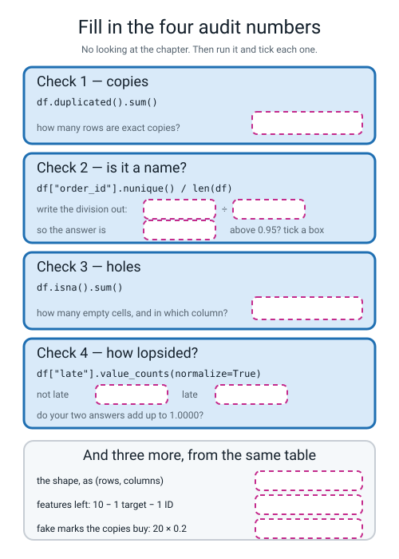
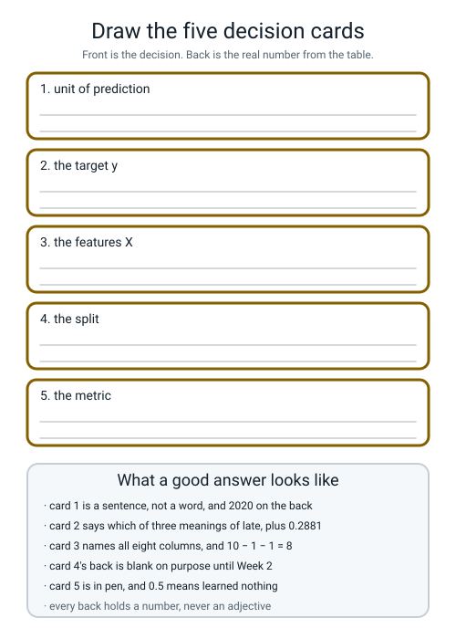

# Workbook — Week 1: The One Line That Hid Five Decisions

**Name:** ________________________________  **Date:** ______________

[⬅ Course Home](../README.md) · [📖 Read the chapter first](../student-guide/week-01.md) · [Course Home](../README.md) · [Next ➡](week-02.md)

---

## ✅ Warm-Up (5 min)

This is week one, so there is no last week. **These five are from last *year*** — the Level 2 habits you are about to use much harder.

**W1.** A table has 500 rows and 12 columns. **What does `df.shape` print?**

____________________  **and does `shape` need brackets after it?** ____________

**W2.** In `model.fit(X_train, y_train)` — **which of those two holds the answers?**

____________________

**W3.** A model scores **0.99** on the rows it learned from and **0.61** on rows it has never seen. **What is that called, in one word?**

____________________

**W4.** Write the line that keeps only the rows of `df` where `distance_km` is bigger than 5.

`________________________________________________`

**W5.** Every tutorial you read last year had `random_state=0` in it. **What does that one setting buy you?**

________________________________________________________________

---

## 🔢 Do the Maths by Hand

**There is no new maths this week.** So these four use the most recent maths you have — **counts turned into fractions**, which is all of Level 2's arithmetic — on this week's real numbers. **Calculator only. No code.**

**M1 — the four audit divisions.** Every audit number is a division. Fill in the answers to **four decimal places**.

| What you are asking | The division | Answer |
|---|---|---|
| how ID-like is `order_id`? | 2000 ÷ 2020 | ____________ |
| how holey is `driver_experience_months`? | 108 ÷ 2020 | ____________ |
| how many orders are **not** late? | 1438 ÷ 2020 | ____________ |
| how many orders **are** late? | 582 ÷ 2020 | ____________ |

**M1(a).** Add your last two answers together. **What should they come to, and do they?**

____________________

**M1(b).** 1438 + 582 = ____________. **Which number in the table is that, and why is checking it worth ten seconds?**

________________________________________________________________

**M2 — the division that hides.** This is the most important arithmetic of the week. Same column, same top of the fraction, two different bottoms.

```
sum of driver_experience_months = 56693
values that actually exist      = 1912
rows in the table               = 2020

56693 ÷ 1912 = ____________          <- what pandas gives you
56693 ÷ 2020 = ____________          <- what you asked for

subtract the two rounded answers = ____________
```

**M2(a).** Which of the two answers is *wrong*? ____________

**M2(b).** Finish the sentence, and get the word **bottom** into it:

*The bug was never the ______________ of the fraction. It was the* ______________________________

________________________________________________________________

**M3 — the fake marks the copies would buy.** There are **20** exact duplicate rows. Next week 20% of rows go into a sealed test pile.

```
copies that land in the test pile  =  20 × 0.2   =  ____________
```

**M3(a).** Now suppose the test pile were **40%** of the table instead of 20%. `20 × 0.4` = ____________

**M3(b).** And suppose there were **200** duplicate rows instead of 20, with a 20% test pile. `200 × 0.2` = ____________

**M3(c).** In one sentence: why is a copy that lands in the test pile worse than a copy that lands in the training pile twice?

________________________________________________________________

**M4 — ID-ness, on a table you can see all of.** Here are twelve rows. For each column, count the **different** values and do the division.

| order_id | distance_km | weather | late |
|---|---|---|---|
| 1 | 1.0 | clear | 0 |
| 2 | 2.0 | clear | 0 |
| 3 | 8.0 | storm | 1 |
| 4 | 1.5 | clear | 0 |
| 5 | 6.0 | rain | 1 |
| 6 | 2.5 | clear | 0 |
| 7 | 7.0 | storm | 1 |
| 8 | 3.0 | rain | 0 |
| 9 | 1.0 | clear | 0 |
| 10 | 2.0 | clear | 0 |
| 11 | 9.0 | storm | 1 |
| 12 | 2.0 | clear | 0 |

| Column | different values | ÷ 12 | ID column? |
|---|---|---|---|
| `order_id` | ______ | ______ | ______ |
| `distance_km` | ______ | ______ | ______ |
| `weather` | ______ | ______ | ______ |
| `late` | ______ | ______ | ______ |

**M4(a).** `late`: how many are 1? ______ out of 12 = ____________  **So "never late" would be right how often?** ____________

**M4(b).** One of those four columns scored **above 0.95** and is **not** something you would ever use as a feature. One scored **below 0.95** and is also not a feature. Name both, and say why each is out.

________________________________________________________________

________________________________________________________________

---

## 🔎 Predict the Output

**Write your prediction in pen before you run anything.** Every snippet starts with `import numpy as np` and `import pandas as pd`. **Two of these four are not what most people guess.**

### P1 — the seed, and the thing about it that catches everybody

```python
rng = np.random.default_rng(0)
print(rng.random(2))
print(rng.random(2))

rng2 = np.random.default_rng(0)
print(rng2.random(2))
```

**I predict — line 1:** ____________________  **line 2:** ____________________

**line 3:** ____________________

**It really printed:**

```text
________________________________
________________________________
________________________________
```

**Lines 1 and 2 came out of the same generator. Are they the same?** ____________

**Lines 1 and 3 came out of two generators seeded the same way. Are they the same?** ____________

**So say in one sentence what a seed actually fixes.**

________________________________________________________________

### P2 — how many duplicates? It depends what you asked

```python
small = pd.DataFrame({
    "order_id":    [1,   2,   3,   4,   5,   6],
    "distance_km": [2.0, 5.0, 2.0, 5.0, 2.0, 9.0],
    "weather":     ["clear", "rain", "clear", "rain", "clear", "storm"],
    "late":        [0,   1,   0,   1,   0,   1],
})
print(small.duplicated().sum())
print(small.drop(columns=["order_id"]).duplicated().sum())
print(small["weather"].nunique() / len(small))
```

**I predict:** ____________  ____________  ____________

**It really printed:**

```text
________________________
________________________
________________________
```

**Two of those numbers are both correct answers to "how many duplicate rows are there?" Explain how that can be.**

________________________________________________________________

________________________________________________________________

### P3 — the silent division, in five numbers you can add up in your head

```python
s = pd.Series([4.0, 8.0, np.nan, 12.0, np.nan])
print(s.mean())
print(s.sum() / len(s))
print(s.count())
print(s.isna().sum())
```

**Add up 4 + 8 + 12 yourself first:** ____________

**I predict:** ____________  ____________  ____________  ____________

**It really printed:**

```text
________________________
________________________
________________________
________________________
```

**Lines 1 and 2 are different. Write both divisions out in full, top and bottom.**

**line 1:** ______ ÷ ______ = ______      **line 2:** ______ ÷ ______ = ______

### P4 — three shapes, and one of them is not a table

```python
from make_data import make_deliveries
df = make_deliveries(n=2000, seed=0)
X = df.drop(columns=["late", "order_id"])
print(df.shape)
print(X.shape)
print(df["late"].value_counts(normalize=True).round(4).shape)
```

**I predict — line 1:** ____________  **line 2:** ____________  **line 3:** ____________

**It really printed:**

```text
________________________
________________________
________________________
```

**You asked `make_deliveries` for `n=2000`. Line 1 disagrees. By how much, and where did the extra rows come from?**

________________________________________________________________

**Line 3 has one number in it, not two. What is being counted, and why is it not 2020?**

________________________________________________________________

**How many of the answers on this page did you get right?** ______ / 13

**Which one surprised you most?** ______________________________

---

## ✍️ Practice Set A — Read It

**A1. Match the word to the thing.** Write the letter.

| Word | | Description |
|---|---|---|
| **unit of prediction** | ______ | (i) The single column holding the answer you want out |
| **target (y)** | ______ | (ii) A fixed list of questions asked of every table before anything else |
| **features (X)** | ______ | (iii) What one row of the table stands for — a decision, not a fact |
| **data audit** | ______ | (iv) The fraction of rows in each answer class |
| **ID column** | ______ | (v) Every column the model is allowed to look at |
| **class balance** | ______ | (vi) A column whose job is to *name* the row, not describe it |

**A2. Trace the columns.** The raw table has 10 columns. Fill in every result.

| Line | What it does | Result |
|---|---|---|
| `df.shape` | the whole table | ____________ |
| `y = df["late"]` | one column out | `y.shape` = ____________ |
| `X = df.drop(columns=["late"])` | target gone only | `X.shape` = ____________ |
| `X = df.drop(columns=["late", "order_id"])` | target **and** ID gone | `X.shape` = ____________ |
| `df.drop_duplicates().shape` | the copies gone | ____________ |

**A2(a).** Write the arithmetic for the fourth row: 10 − ______ − ______ = ______

**A2(b).** Two of those five lines produce something with **one** number in its shape instead of two. Which, and why?

________________________________________________________________

**A3. Spot the bug.** Each line is wrong. Say what happens and write the fix.

| # | The line | What happens | The fix |
|---|---|---|---|
| a | `print(df.duplicated.sum())` | | |
| b | `print(df["Late"].value_counts())` | | |
| c | `print(df["late"].value_counts(normalise=True))` | | |
| d | `print(df.shape())` | | |
| e | `print(df.info())` | | |
| f | `X = df.drop(columns=["late"])` | | |

**A3(g).** Two of those six produce **no traceback at all.** Which two, and what is the printed clue in each case?

________________________________________________________________

________________________________________________________________

**A4. Match the code to the output.** Five of each, no output used twice.

| | Code |
|---|---|
| i | `print(df["order_id"].nunique())` |
| ii | `print(round(108 / 2020, 4))` |
| iii | `print(df.isna().sum().sum())` |
| iv | `print(2000 / 2020)` |
| v | `print(len(df.drop_duplicates()))` |

| | Output |
|---|---|
| P | `108` |
| Q | `0.9900990099009901` |
| R | `2000` |
| S | `0.0535` |
| T | `2000` |

**Your answers:** i → ______  ii → ______  iii → ______  iv → ______  v → ______

**A4(a).** Two of the outputs are the same number. **Does that make the two pieces of code interchangeable?** Say why not, in one sentence.

________________________________________________________________

**A5. Read four audit reports and say what you would do next.** All four are real, from real runs.

**Report A**

```text
shape: (2020, 10)
exact duplicate rows: 20
ID-like columns: order_id -> 2000 of 2020 = 0.9901
empty cells: 108
class balance: 0.7119 / 0.2881
```

**What is the biggest problem here, and what is your first move?**

________________________________________________________________

**Report B**

```text
shape: (178, 14)
exact duplicate rows: 0
ID-like columns: none above 0.95
empty cells: 0
class balance: 0.3989 / 0.3315 / 0.2697
```

**Two things in this report are unusual for a real table. Name both.**

________________________________________________________________

**And one thing is new: there are three numbers in the class balance, not two. What does that tell you?**

________________________________________________________________

**Report C**

```text
shape: (569, 31)
exact duplicate rows: 0
ID-like columns: mean concave points -> 542 of 569 = 0.9525
                 smoothness error -> 547 of 569 = 0.9613
                 compactness error -> 541 of 569 = 0.9508
                 fractal dimension error -> 545 of 569 = 0.9578
                 worst area -> 544 of 569 = 0.9561
empty cells: 0
class balance: 0.6274 / 0.3726
```

**Five columns got flagged. How many of them should you actually drop, and why?**

________________________________________________________________

**Report D**

```text
shape: (2020, 10)
exact duplicate rows: 20
empty cells: 127
class balance: 0.7000 / 0.3000
```

**Report D is the same generator as Report A with one thing changed. What?**

____________________

**A5(a).** In Reports A and D the duplicate count is **20** both times, but the empty-cell count moved from 108 to 127. **One of those two numbers is a decision somebody made and the other is a measurement. Which is which, and how does the report itself tell you?**

________________________________________________________________

________________________________________________________________

**A6. Fill in the four audit numbers.** Every answer has been removed from the figure. Fill in all of it from memory first, then run `audit.py` and tick the ones you got.


*Figure W1.1 — The four checks with their answers removed, plus three more from the same table.*

**A6(a).** Which of the boxes did you get wrong? ______________________

**A6(b).** Two of the seven boxes hold a number that is a **count**, and the others hold a **fraction**. Which are the counts, and why is a count on its own not enough?

________________________________________________________________

---

## ✍️ Practice Set B — Write It

### B1 — one line, plus a print

**Task:** print how ID-like `order_id` is, rounded to 4 decimal places.

**Expected output:**

```text
order_id ID-ness: 0.9901
```

**Done looks like:** one `print`, containing one division and one `round`.

```python
print("order_id ID-ness:", ____________________________________)
```

### B2 — the ID finder, as a function

**Task:** write `id_like(df, threshold=0.95)` which returns a **list** of the column names whose different-values-divided-by-rows is above the threshold.

**Expected output** for these three calls on the delivery table:

```text
['order_id']
['order_id']
['order_id', 'restaurant', 'distance_km', 'items', 'prep_minutes', 'order_hour', 'day_of_week', 'weather', 'driver_experience_months', 'late']
```

**Done looks like:** a `for` loop, one division, one `if`, and an `append`.

```python
def id_like(df, threshold=0.95):
    flagged = ____________________________________________________
    for col in ______________________________________________:
        fraction = ______________________________________________
        if ____________________________________________________:
            ______________________________________________
    return ______________________________________________
```

**B2(a).** The three calls above used thresholds `0.95`, `0.5` and `0.0001`. **Which one produced the third line, and what does that tell you about how much of the work the threshold is doing?**

________________________________________________________________

### B3 — three seeds, three tables

**Task:** print the row count, duplicate count, empty-cell count and late rate for seeds 0, 1 and 2, one line each.

**Expected output:**

```text
seed  rows  dupes  holes  late rate
   0  2020     20    108     0.2881
   1  2020     20    127     0.3000
   2  2020     20    122     0.3059
```

**Done looks like:** a header `print`, then a `for` loop over a list of three seeds, calling `make_deliveries` once per turn.

```python
print("seed  rows  dupes  holes  late rate")
for seed in ____________________________________________________:
    d = ______________________________________________________
    print(______________________________________________________)
```

**B3(a).** Which of the four columns is **identical** in all three rows? ____________

**B3(b).** And which changes every time? ____________  **Explain the difference in one sentence.**

________________________________________________________________

### B4 — the two averages, printed side by side

**Task:** write `two_averages.py`, which prints all six of the numbers behind the silent bug.

**Expected output:**

```text
sum of the column   : 56693.0
values that exist   : 1912
rows in the table   : 2020
sum / values exist  : 29.6512
sum / rows          : 28.0658
pandas .mean()      : 29.6512
difference          : 1.5853
```

**Done looks like:** seven prints, no loop, and the sixth line **matching the fourth exactly.**

**B4(a).** Which two of those seven lines are the same number? ____________ and ____________

**B4(b).** You worked out `29.6512 − 28.0658 = 1.5854` on your calculator in M2, and the program prints **1.5853**. **Both are right. What is different about the two subtractions?**

________________________________________________________________

________________________________________________________________

### B5 — a whole program of your own, about 25 lines

**Task:** write `audit_any.py`, containing a function `audit(df, target)` that runs **all four checks plus check 0** on *any* table, and then call it on `load_wine`.

It must:

1. print check 0: the shape
2. print check 1: the duplicate-row count
3. print check 2: every column above 0.95, with its counts and the division — and the words `none above 0.95` if there are none
4. print check 3: the total number of empty cells
5. print check 4: `value_counts(normalize=True)` on whichever column you were handed as `target`
6. then, at the bottom of the file, load `load_wine(as_frame=True).frame` and call `audit(wine, "target")`

**Expected output:**

```text
=== check 0: what am I holding? ===
shape: (178, 14)

=== check 1: duplicate rows ===
exact duplicate rows: 0

=== check 2: ID-like columns ===
  none above 0.95

=== check 3: missing values ===
empty cells in the whole table: 0

=== check 4: class balance ===
1    0.3989
0    0.3315
2    0.2697
```

**Done looks like:** one function that never mentions pizza, called once at the bottom, and **the words `none above 0.95` actually appearing** — which means you remembered that "found nothing" has to be printed too.

> **⚠️ Watch out:** the wine table's answer column really is called `target`, not `late`. That is exactly why `audit` takes the name as an argument instead of hard-coding it.

---

## 🐞 Fix the Broken Program

This program has **three** bugs: one **shape** bug, one **runtime** bug, and one **silent logic** bug. The real error messages are below, in the order you meet them.

```python
"""broken01.py - the four-check audit on the delivery table. THREE bugs."""
import pandas as pd
from make_data import make_deliveries

df = make_deliveries(n=2000, seed=0)

print("=== check 0 ===")
print("shape:", df.shape())

print("=== check 1 ===")
print("exact duplicate rows:", df.duplicated.sum())

print("=== check 2 ===")
for col in df.columns:
    fraction = df[col].nunique() / len(df)
    if fraction > 0.95:
        print(col, "is an ID column:", round(fraction, 4))

print("=== check 3 ===")
print("empty cells:", df.isna().sum().sum())

print("=== check 4 ===")
print(df["late"].value_counts(normalize=True).round(4).to_string())

y = df["late"]
X = df.drop(columns=["late"])
print("X shape:", X.shape, " y shape:", y.shape)
```

**Run 1 — it stops after one line:**

```text
=== check 0 ===
Traceback (most recent call last):
  File "/private/tmp/l3wb/broken01.py", line 8, in <module>
    print("shape:", df.shape())
TypeError: 'tuple' object is not callable
```

**Bug 1.** Which line? ______  **Kind of bug?** ______________

**The message says `'tuple' object`. What tuple is it talking about?** ____________________

**The fix:** ______________________________

**Run 2 — after fixing bug 1:**

```text
=== check 0 ===
shape: (2020, 10)
=== check 1 ===
Traceback (most recent call last):
  File "/private/tmp/l3wb/broken01.py", line 11, in <module>
    print("exact duplicate rows:", df.duplicated.sum())
AttributeError: 'function' object has no attribute 'sum'
```

**Bug 2.** Which line? ______  **Kind of bug?** ______________

**Bugs 1 and 2 are opposites of each other. Say how, in one sentence.**

________________________________________________________________

**The fix:** ______________________________

**Run 3 — after fixing bugs 1 and 2. It runs all the way through with no error at all:**

```text
=== check 0 ===
shape: (2020, 10)
=== check 1 ===
exact duplicate rows: 20
=== check 2 ===
order_id is an ID column: 0.9901
=== check 3 ===
empty cells: 108
=== check 4 ===
0    0.7119
1    0.2881
X shape: (2020, 9)  y shape: (2020,)
```

**Bug 3 is in the last two lines, and check 2 printed the clue for it four lines earlier.**

**What number does the last line print that your Week 1 card says should be different?**

**it printed** ____________  **the card says** ____________

**So which column is still in X that must not be?** ____________________

**The fix:** write the corrected line.

```python
________________________________________________________________
```

**Two questions, and they are the point of the whole page.**

**Bug 3 produced no error, no warning, and a completely plausible printout. Which of the three bugs would have survived longest in a real project, and why?**

________________________________________________________________

________________________________________________________________

**Rank the three from easiest to hardest to notice, and say what would have caught each one.**

**easiest → hardest:** ______  ______  ______

________________________________________________________________

---

## 🧩 Puzzle of the Week

### The Row Count Detective

**One file. Nothing in it changes.** All that changes is the sentence you write for the unit of prediction. For each sentence, work out how many rows the table would have. Use the facts in the box.

```text
FACTS ABOUT THE FILE
  2020 delivery rows (2000 once the copies go)
  5 different restaurants
  7 different days of the week
  3 different kinds of weather
  14 different order hours (10 to 23)
```

| # | "One row is…" | Rows |
|---|---|---|
| 1 | one order | ______ |
| 2 | one restaurant | ______ |
| 3 | one day of the week | ______ |
| 4 | one kind of weather | ______ |
| 5 | one restaurant on one day | ______ |
| 6 | one restaurant in one hour | ______ |
| 7 | one restaurant on one day in one kind of weather | ______ |

**Part 1(a).** For rows 5, 6 and 7 you multiplied. Write the three multiplications.

________________________________________________________________

**Part 1(b).** Now the twist, and it is the whole puzzle. **The real answer to number 7 is 103, not what you calculated.** Explain the difference.

________________________________________________________________

________________________________________________________________

**Part 1(c).** So which of your seven answers are **guaranteed** and which are **at most**? Put a G or an A beside each number above.

### Part 2 — the column that changed jobs

Under *"one row is one order"*, `restaurant` has 5 different values in 2020 rows — 5 ÷ 2020 = 0.0025, nowhere near an ID.

**Part 2(a).** Under *"one row is one restaurant"*, what is `restaurant`'s ID-ness? ______ ÷ ______ = ______

**Part 2(b).** So `restaurant` was a perfectly good **feature** and has become an **ID**, without one character of the file changing. Write the one-sentence rule that falls out of this.

________________________________________________________________

________________________________________________________________

---

## 🤔 Think Deeper

**T1.** The audit is five checks and it takes about a third of a second to run. Somebody says: *"we've used this table for two years, everybody knows it, we don't need to audit it."* **Write a paragraph** answering them. Is there a version of their argument that is right? What would you actually check, on a table you had already used for two years — and what would change your mind?

________________________________________________________________

________________________________________________________________

________________________________________________________________

________________________________________________________________

________________________________________________________________

**T2.** `.mean()` skipping the 108 holes is not a bug in pandas. Somebody chose that behaviour on purpose, and there are millions of programs that depend on it. **Write a paragraph** on who should have to know: should the library refuse to answer until you say what you meant, should it print a warning, or is it right to just answer? Whose job is it to know that 1912 is not 2020 — and does your answer change if the program is deciding who gets a loan?

________________________________________________________________

________________________________________________________________

________________________________________________________________

________________________________________________________________

________________________________________________________________

---

## 🛠️ Build It — The Prediction Contract

**Two things get handed in: the four audit numbers with your pen guesses beside them, and a written contract somebody else could rebuild your table from.**

### Step checklist

- [ ] **1.** `make_data.py` runs. **Check the first `order_id` is 100955.** If it is not, stop — your seed is wrong and every number this term will disagree with the book.
- [ ] **2.** Write your **four guesses in pen**, before running `audit.py`. Guessing badly is the point.
- [ ] **3.** `audit.py` runs, all five checks, and you have the four real numbers.
- [ ] **4.** Find the one line of `df.info()` that disagrees with all the others, and write down which column and which number.
- [ ] **5.** Run the five diagnostic lines from Step 6 of the chapter. Copy both averages.
- [ ] **6.** Write the prediction contract: five headings, all filled in.
- [ ] **7.** List X **column by column**. Eight names. Not "the useful ones".
- [ ] **8.** Write the two sentences about `order_id` — one about what is in the column, one about tomorrow.
- [ ] **9.** Two Bug Log entries: one loud, one silent.
- [ ] **10.** *(Stretch)* Run seeds 1 and 2 and fill in the bottom of the results table.

### Guesses first, in pen

| What | My guess (pen) | The real number | How far out was I? |
|---|---|---|---|
| rows in the table | | | |
| exact duplicate rows | | | |
| empty cells | | | |
| fraction of orders that are late | | | |

**Which guess was furthest out?** ____________________

**Almost everybody guesses a clean table. Why do you think that is?**

________________________________________________________________

### The four numbers, written as numbers

```text
____________   exact duplicate rows
____________   how ID-like order_id is
____________   empty cells, all in one column
____________   the fraction that is NOT late
```

**The one line of `df.info()` that is different from all the others:**

**column** ____________________  **its non-null count** ______  **so 2020 − ______ = ______ holes**

### The two averages

| | Number |
|---|---|
| `df["driver_experience_months"].mean()` | |
| sum of the column | |
| values that actually exist | |
| sum ÷ 2020 | |
| the difference | |

**Which of the two averages is right?** ____________________

**What is the actual bug, then?** ______________________________

### The prediction contract

**1. Unit of prediction** — one full sentence.

________________________________________________________________

**2. The target y** — the column, *and* the definition in words.

________________________________________________________________

________________________________________________________________

**3. The features X** — all eight, named one by one.

| # | Column | Will it exist at the moment I need the prediction? |
|---|---|---|
| 1 | | |
| 2 | | |
| 3 | | |
| 4 | | |
| 5 | | |
| 6 | | |
| 7 | | |
| 8 | | |

**4. The split** — what you intend to do, even though you have not done it yet.

________________________________________________________________

**5. The metric** — in pen. And what would count as failure.

________________________________________________________________

________________________________________________________________

### The column that must never be a feature

**Its name:** ____________________

**Sentence 1 — what is actually in the column:**

________________________________________________________________

**Sentence 2 — what happens when order 102000 arrives tomorrow:**

________________________________________________________________

### Stretch — three seeds

| seed | rows | dupes | holes | late rate |
|---|---|---|---|---|
| 0 | | | | |
| 1 | | | | |
| 2 | | | | |

**Which column never changes?** ____________  **Which always does?** ____________

**One sentence about why:**

________________________________________________________________

### The Bug Log

Two entries today: one loud, one silent.

| What I saw | What it means | Cause | Fix |
|---|---|---|---|
| | | | |
| | | | |

---

## 🎨 Draw It

Draw the five decisions as five cards, in your own hand, in the frames below. Front is the decision; back is the real number from the table.


*Figure W1.2 — Five empty cards, and what a good answer contains.*

**Then answer four things about your own drawing:**

**Which card's back is deliberately blank, and until when?** ____________________

**Which card is in pen, and why does that matter?** ____________________

**Which card is a whole sentence rather than a word?** ____________________

**Look at cards 2 and 3 together. What single rule decides whether a column goes on card 2, on card 3, or nowhere?**

________________________________________________________________

---

## 📊 Self-Check

| I can... | 😀 | 🙂 | 😕 |
|---|---|---|---|
| name the five decisions hidden inside `model.fit(X, y)` without a list | | | |
| state the unit of prediction as a full sentence, and say why it comes first | | | |
| explain why the same file can have 2020 rows, 35 rows or 5 rows | | | |
| run all four audit checks and report **20 · 0.9901 · 108 · 0.7119** as numbers | | | |
| say why a column may only be in X if it exists at prediction time | | | |
| spot an ID column with one division, and say why it must never be a feature | | | |
| explain the two averages — 56693 ÷ 1912 against 56693 ÷ 2020 | | | |
| commit a metric to writing before training, and say what failure would look like | | | |
| read the last line of a traceback and find my own filename in it | | | |
| explain why a number from an unseeded run is not a result | | | |

**The one thing I would ask about if I could ask one question:**

________________________________________________________________

---

## ✅ Answers

<details>
<summary>Check your answers</summary>

### Warm-Up

**W1.** **`(500, 12)`** — rows first, columns second. **No brackets.** `shape` is a **fact** about the table, not something it *does*. `df.shape()` is bug 1 of the Fix-It page.

**W2.** **`y_train`.** X is what the model is allowed to look at; y is the answer it is trying to produce. This year you decide which columns go where, in writing, and that decision is cards 2 and 3.

**W3.** **Overfitting.** It memorised the rows it saw instead of learning something that carries over. The whole of this year is about the difference, and it starts by dropping one column.

**W4.** `df[df["distance_km"] > 5]` — the mask goes inside the square brackets. `df["distance_km"] > 5` on its own gives you 2020 Trues and Falses.

**W5.** **The same "random" choices every time, on any machine.** Without it, you cannot check your own number tomorrow, and nobody else can check it at all. This week's version is `np.random.default_rng(0)`.

### Do the Maths by Hand

**M1.**

| The division | Answer |
|---|---|
| 2000 ÷ 2020 | **0.9901** |
| 108 ÷ 2020 | **0.0535** |
| 1438 ÷ 2020 | **0.7119** |
| 582 ÷ 2020 | **0.2881** |

Worked slowly for the first one: 2020 × 0.99 = 1999.8, which is nearly 2000, so the answer is just above 0.99. Exactly, it is 0.990099…, which rounds to **0.9901**.

**M1(a).** 0.7119 + 0.2881 = **1.0000.** Every row is either late or not late, so the two fractions must add to exactly 1. If they do not, one of your counts is wrong.

**M1(b).** 1438 + 582 = **2020** — the row count. It is worth ten seconds because it checks two numbers at once: if the two class counts do not add up to the number of rows, then either a row is in neither class or you have miscounted.

**M2.**

```
56693 ÷ 1912 = 29.6512          <- what pandas gives you
56693 ÷ 2020 = 28.0658          <- what you asked for

29.6512 − 28.0658 = 1.5854
```

**M2(a).** **Neither is wrong.** That is the whole point and it is the answer most people get wrong. 29.6512 is *"the average of the experience we know about"*; 28.0658 is *"the average experience per order"*. Both are legitimate answers to different questions.

**M2(b).** *The bug was never the **top** of the fraction. It was the **bottom**, and nobody chose which bottom they meant.* Same 56693 both times; 1912 against 2020.

**M3.** 20 × 0.2 = **4.** About four rows the model has already memorised, sitting in the pile that is supposed to be measuring it.

**M3(a).** 20 × 0.4 = **8.**

**M3(b).** 200 × 0.2 = **40.**

**M3(c).** A copy in the training pile only makes the model pay slightly more attention to that one row — mildly annoying, not dishonest. A copy in the **test** pile means the model is being examined on a row it has already been shown the answer to, so the score you report is too high, and you will never know by how much.

**M4.**

| Column | different values | ÷ 12 | ID column? |
|---|---|---|---|
| `order_id` | **12** | **1.0000** | **yes** |
| `distance_km` | **9** | **0.7500** | no |
| `weather` | **3** | **0.2500** | no |
| `late` | **2** | **0.1667** | no |

`distance_km` holds 1.0, 2.0, 8.0, 1.5, 6.0, 2.5, 7.0, 3.0, 9.0 as its *different* values — 1.0 appears twice and 2.0 appears three times, so 12 cells but only **9** different values. 9 ÷ 12 = 0.75, which pandas prints as **0.75** rather than 0.7500.

`order_id` at **1.0000** is the most ID-like a column can possibly be: one value per row, every time.

**M4(a).** Rows 3, 5, 7 and 11 are late, so **4** out of 12 = **0.3333.** "Never late" would be right 8 times out of 12, which is **0.6667.**

**M4(b).** **`order_id`** scored above 0.95 and is out because it names the row instead of describing it — order 7 is not late *because* it is order 7. **`late`** scored 0.1667, well below 0.95, and is out for a completely different reason: **it is the answer.** Putting the target in X is not a leak, it is not even a model — it is a lookup.

That contrast is worth keeping. **The check flags one kind of "not a feature". Your contract has to catch the other.**

### Predict the Output

**P1.**

```text
[0.63696169 0.26978671]
[0.04097352 0.01652764]
[0.63696169 0.26978671]
```

**Lines 1 and 2: different.** **Lines 1 and 3: identical.**

This is the bit that catches everybody. A seeded generator is not a machine that returns the same number over and over — it is a machine that produces the **same sequence** from the same starting point. Ask `rng` for two more numbers and you get the *next* two in the sequence. Build a **new** generator with the same seed and you go back to the start.

**In one sentence:** the seed fixes the whole sequence and where it begins, not the individual answer.

**P2.**

```text
0
3
0.5
```

**Line 1 is 0** — with `order_id` in the table no two rows can possibly be identical, because every `order_id` is different.

**Line 2 is 3** — take `order_id` away and three rows repeat an earlier row: row 3 (`2.0 / clear / 0`) repeats row 1, row 4 (`5.0 / rain / 1`) repeats row 2, and row 5 (`2.0 / clear / 0`) repeats row 1 as well.

**How can both be correct?** Because **"duplicate" is a decision about which columns count.** If two orders describe the identical situation but were placed by different people at different times, are they the same row? There is no answer in the file. Somebody has to choose, and write down which columns they chose.

**Line 3 is 0.5** — `weather` has 3 different values (clear, rain, storm) in 6 rows, and 3 ÷ 6 = 0.5. Well below 0.95, so not an ID — but notice how easily a *small* table pushes an ordinary column's score up. On 2020 rows the same column scores 0.0015.

**P3.** 4 + 8 + 12 = **24.**

```text
8.0
4.8
3
2
```

**line 1:** 24 ÷ **3** = **8.0** — pandas skipped the two holes and divided by the three values that exist.
**line 2:** 24 ÷ **5** = **4.8** — you divided by the length of the series.

Five numbers, and the two answers are nearly double each other. This is exactly the 29.6512-against-28.0658 bug shrunk to something you can check in your head — and that is why it is worth doing on five numbers before you meet it on 2020.

**P4.**

```text
(2020, 10)
(2020, 8)
(2,)
```

**You asked for 2000 and got 2020** — twenty rows too many. They came from the last two lines of `make_data.py`, which pick `2000 // 100 = 20` row numbers and glue those rows onto the bottom of the table. The very first number the table printed disagreed with what you asked for, which is exactly why check 0 exists.

**Line 3 has one number because it is not a table.** `value_counts` gives you one row per *different value* of `late`, and there are only two — 0 and 1. So the shape is `(2,)`: two things in a single line, not 2020 rows. It is counting **answers**, not orders.

### Practice Set A

**A1.** unit of prediction → **iii** · target (y) → **i** · features (X) → **v** · data audit → **ii** · ID column → **vi** · class balance → **iv**

**A2.**

| Line | Result |
|---|---|
| `df.shape` | **(2020, 10)** |
| `y = df["late"]` | **(2020,)** |
| `X = df.drop(columns=["late"])` | **(2020, 9)** |
| `X = df.drop(columns=["late", "order_id"])` | **(2020, 8)** |
| `df.drop_duplicates().shape` | **(2000, 10)** |

**A2(a).** 10 − **1** (the target) − **1** (the ID) = **8.**

**A2(b).** `y = df["late"]` gives `(2020,)` because **one column pulled out on its own is not a table** — it is a single line of 2020 values, so there is nothing to put in the second slot. `value_counts(...).shape` in P4 was `(2,)` for the same reason. Getting used to reading a shape with one number in it now is what makes tensors readable in Week 16.

**A3.**

| # | What happens | The fix |
|---|---|---|
| a | `AttributeError: 'function' object has no attribute 'sum'`. `df.duplicated` without brackets is the **recipe**, and recipes have no `.sum()` | `df.duplicated().sum()` |
| b | `KeyError: 'Late'` — nineteen lines of traceback for one capital letter. Column names are text, and text is fussy | `df["late"]` |
| c | `TypeError: ... got an unexpected keyword argument 'normalise'`. Every setting in pandas and scikit-learn is American | `normalize=True` |
| d | `TypeError: 'tuple' object is not callable`. `df.shape` is already the answer `(2020, 10)`; the brackets try to *call* that answer | `df.shape` |
| e | **No error.** It prints the whole report, then prints `None` underneath, because `info()` prints for itself and hands back nothing | `df.info()` on its own line, no `print` |
| f | **No error.** `order_id` is still in X, so `X.shape` is `(2020, 9)` and your model can memorise IDs | `df.drop(columns=["late", "order_id"])` |

**A3(g).** **e and f.** In **e** the clue is the word `None` on a line of its own at the end of a report that otherwise looks perfect. In **f** the clue is the number **9** where your card says 8 — a printed shape you have to be in the habit of reading. Neither bug will ever stop your program.

**A4.** i → **R** · ii → **S** · iii → **P** · iv → **Q** · v → **T**

**A4(a).** R and T are both `2000`, and **no**, the code is not interchangeable. `df["order_id"].nunique()` counts **different values in one column**; `len(df.drop_duplicates())` counts **rows that are not copies of another row**. They agree here for a reason worth knowing: the 20 duplicated rows were copied whole, `order_id` and all. Change `make_data.py` to renumber the copies and the first stays 2020 while the second stays 2000.

**A5.**

**Report A.** The biggest problem is **`order_id` at 0.9901** — an ID column that a flexible model will memorise. First move: **drop it from X.** (The 20 duplicates and 108 holes are next, in Weeks 2 and 6 respectively, and the 0.7119 tells you not to trust accuracy.)

**Report B.** Two things are unusual: **zero duplicate rows** and **zero empty cells.** Real tables that somebody emails you have both. This one is a curated teaching dataset that ships inside scikit-learn, which is why it is spotless. Also unusual, and worth noticing: **no column at all is above 0.95**, on only 178 rows.

**Three numbers in the class balance means three classes** — this is not a yes/no problem, it is a three-way sort. The dumbest model would say "class 1" every time and be right **39.89%** of the time, so that, not 50%, is the number to keep in mind.

**Report C.** **None of them.** All five are real physical measurements recorded to several decimal places, so of course almost every row has its own value. `smoothness error` is 0.9613 ID-like by the arithmetic and 0% ID-like in reality. **A check is a screen, not a verdict:** it hands you five columns and asks you to look. Thirty seconds of looking, then you move on.

**Report D.** **The seed.** This is `seed=1` instead of `seed=0`.

**A5(a).** The duplicate count of **20** is a **decision**: `make_data.py` says `size=max(1, n // 100)`, and `2000 // 100` is exactly 20 every time, whatever the seed. The empty-cell count is a **measurement**: the line is `rng.random(n) < 0.06`, so about 6% of 2000 comes out True — about 120, but *which* rows and *how many* depend on the dice. Hence 108, 127, 122.

How the report tells you: **the number that never moves when the seed moves was fixed by code; the number that moves was rolled.** That is a test you can run on any generated table.

**A6.** The seven boxes, in order:

```text
check 1                       20
check 2      2000 ÷ 2020 = 0.9901,  above 0.95, so yes
check 3                      108, all in driver_experience_months
check 4       0.7119 not late  /  0.2881 late   (they add to 1.0000)
shape                  (2020, 10)
features                        8
fake marks           20 × 0.2 = 4
```

**A6(b).** The **counts** are 20 and 108 (and the 8 features). The rest are fractions. A count on its own means nothing: **108 empty cells** could be a catastrophe or a shrug, and only 108 ÷ 2020 = 0.0535 tells you which. Same for 20: 20 duplicates out of 2020 is 1%; 20 out of 25 would be a broken file.

### Practice Set B

**B1.**

```python
from make_data import make_deliveries
df = make_deliveries(n=2000, seed=0)
print("order_id ID-ness:", round(df["order_id"].nunique() / len(df), 4))
```

```text
order_id ID-ness: 0.9901
```

**B2.**

```python
def id_like(df, threshold=0.95):
    flagged = []
    for col in df.columns:
        fraction = df[col].nunique() / len(df)
        if fraction > threshold:
            flagged.append(col)
    return flagged

print(id_like(df))
print(id_like(df, 0.5))
print(id_like(df, 0.0001))
```

```text
['order_id']
['order_id']
['order_id', 'restaurant', 'distance_km', 'items', 'prep_minutes', 'order_hour', 'day_of_week', 'weather', 'driver_experience_months', 'late']
```

**B2(a).** The third line came from **`0.0001`**. And look what it says: at a threshold that low, *every* column is an "ID column", including `late`, which has two values. So the threshold is doing **all** of the work — the code is just a division. 0.95 is somebody's judgement about how close to "one value per row" counts as a name rather than a description. You may argue for 0.98. What you may not do is skip the division.

Notice also that 0.95 and 0.5 give the identical answer here. On this table nothing sits between those two, so the exact threshold does not matter — which is the reassuring case, and worth checking rather than assuming.

**B3.**

```python
from make_data import make_deliveries

print("seed  rows  dupes  holes  late rate")
for seed in [0, 1, 2]:
    d = make_deliveries(n=2000, seed=seed)
    print(f"{seed:4d} {len(d):5d} {int(d.duplicated().sum()):6d} "
          f"{int(d.isna().sum().sum()):6d}     {d['late'].mean():.4f}")
```

```text
seed  rows  dupes  holes  late rate
   0  2020     20    108     0.2881
   1  2020     20    127     0.3000
   2  2020     20    122     0.3059
```

**B3(a).** **`dupes` — 20 every time.** (`rows` is also identical at 2020, for the same reason: 2000 + 20.)

**B3(b).** **`holes` changes every time**, and so does the late rate. `make_data.py` *decides* to duplicate `n // 100` rows, which is exactly 20 whatever the dice say; it *rolls* for the holes with `rng.random(n) < 0.06`, so about 6% come up True but never the same 6%. **A number fixed by code does not move when the seed moves. A number rolled by dice does.**

**B4.**

```python
from make_data import make_deliveries

df = make_deliveries(n=2000, seed=0)
col = df["driver_experience_months"]
total = col.sum()
print("sum of the column   :", total)
print("values that exist   :", col.count())
print("rows in the table   :", len(df))
print("sum / values exist  :", round(total / col.count(), 4))
print("sum / rows          :", round(total / len(df), 4))
print("pandas .mean()      :", round(col.mean(), 4))
print("difference          :", round(total / col.count() - total / len(df), 4))
```

```text
sum of the column   : 56693.0
values that exist   : 1912
rows in the table   : 2020
sum / values exist  : 29.6512
sum / rows          : 28.0658
pandas .mean()      : 29.6512
difference          : 1.5853
```

**B4(a).** **`sum / values exist`** and **`pandas .mean()`** — both 29.6512. That is the proof, in your own printout, of what `.mean()` quietly did: it divided by 1912.

**B4(b).** Your calculator subtracted **two numbers that had already been rounded to 4 decimal places**: 29.6512 − 28.0658 = 1.5854. The program subtracted **the full-precision numbers and rounded afterwards**: 29.65115062… − 28.06584158… = 1.58530904…, which rounds to 1.5853.

Both are honest. The one-in-the-last-digit gap is a real thing that will bite you again, and the rule is: **round at the end, not in the middle.** The chapter quotes 1.5854 because it is subtracting the two numbers you can see printed on the page, which is the right thing for a reader to be able to check by hand.

**B5.**

```python
"""audit_any.py - the five checks, on any table at all."""
from sklearn.datasets import load_wine


def audit(df, target):
    print("=== check 0: what am I holding? ===")
    print("shape:", df.shape)
    print()
    print("=== check 1: duplicate rows ===")
    print("exact duplicate rows:", df.duplicated().sum())
    print()
    print("=== check 2: ID-like columns ===")
    found = 0
    for col in df.columns:
        fraction = df[col].nunique() / len(df)
        if fraction > 0.95:
            print(" ", col, "->", df[col].nunique(), "of", len(df),
                  "=", round(fraction, 4))
            found = found + 1
    if found == 0:
        print("  none above 0.95")
    print()
    print("=== check 3: missing values ===")
    print("empty cells in the whole table:", df.isna().sum().sum())
    print()
    print("=== check 4: class balance ===")
    print(df[target].value_counts(normalize=True).round(4).to_string())


wine = load_wine(as_frame=True).frame
audit(wine, "target")
```

```text
=== check 0: what am I holding? ===
shape: (178, 14)

=== check 1: duplicate rows ===
exact duplicate rows: 0

=== check 2: ID-like columns ===
  none above 0.95

=== check 3: missing values ===
empty cells in the whole table: 0

=== check 4: class balance ===
1    0.3989
0    0.3315
2    0.2697
```

**Runtime: about 0.6 seconds**, nearly all of it importing scikit-learn.

The `found = 0` counter is the part worth arguing about. Without it, a clean table prints a heading and then nothing, and *nothing* looks exactly like *the code did not run*. **A check that finds nothing has to say so out loud**, or you cannot tell it apart from a check you forgot to write.

And the payoff of writing `audit` as a function that takes `target` as an argument: the wine table's answer column is called `target`, not `late`. Hard-code the name and your audit only ever works on pizza.

### Fix the Broken Program

**Bug 1.** Line **8**. Kind: **a shape bug** — `df.shape` is the shape, already computed. The message says `'tuple' object` because `(2020, 10)` *is* a tuple, and you tried to call it as if it were a function.

**The fix:** `print("shape:", df.shape)` — drop the brackets.

**Bug 2.** Line **11**. Kind: **runtime** (`AttributeError`).

**Bugs 1 and 2 are exact opposites:** bug 1 put brackets on a **fact**, and bug 2 left brackets off a **verb**. That is the rule for the whole year — **a verb takes brackets, a fact doesn't.** `df.shape` is a fact. `df.duplicated()` is a verb.

**The fix:** `df.duplicated().sum()`.

**Bug 3.** It printed **`(2020, 9)`**; the card says **8**.

The still-present column is **`order_id`** — and check 2 named it four lines earlier: `order_id is an ID column: 0.9901`. The program found the problem, printed it, and then did the wrong thing anyway.

**The fix:**

```python
X = df.drop(columns=["late", "order_id"])
```

which prints `X shape: (2020, 8)  y shape: (2020,)`.

**Which would survive longest?** **Bug 3**, and by a long way. Bugs 1 and 2 stop the program before it can do anything, so they cost you a minute each. Bug 3 produces a running program, a plausible printout and a model that trains happily — and then scores brilliantly on rows it has seen and uselessly on tomorrow's orders. It survives until somebody asks why the live system is worse than the report.

**Easiest → hardest:** **1, 2, 3.**

- Bug 1 is caught by **running the file** — it fails on the second line of output.
- Bug 2 is caught by **running the file** too, but three lines later.
- Bug 3 is caught only by **reading a printed shape and comparing it against a number you wrote down first.** Nothing else catches it. That is what the contract is for.

### Puzzle of the Week

| # | "One row is…" | Rows |
|---|---|---|
| 1 | one order | **2020** |
| 2 | one restaurant | **5** |
| 3 | one day of the week | **7** |
| 4 | one kind of weather | **3** |
| 5 | one restaurant on one day | **35** |
| 6 | one restaurant in one hour | **70** |
| 7 | one restaurant on one day in one kind of weather | **105**, calculated |

**Part 1(a).** 5 × 7 = **35** · 5 × 14 = **70** · 5 × 7 × 3 = **105**.

**Part 1(b).** The real answer is **103** because **two of the 105 possible combinations never actually happened.** Storms are rare — 6% of orders — so some restaurant somewhere never had a storm on a Wednesday in these 2020 rows. Multiplication tells you how many combinations *could* exist. The file tells you how many *do*.

That gap grows fast. Add a fourth thing to group by and most of the combinations will be empty; each empty one is a row you do not have.

**Part 1(c).** **1, 2, 3 and 4 are guaranteed** (G) — they are counts of things that are actually in the file. **5, 6 and 7 are "at most"** (A) — they are products of counts, and the file only contains the combinations that really occurred. 35 and 70 happen to be exactly right in this table; 105 is not.

**Part 2(a).** 5 ÷ 5 = **1.0000.**

**Part 2(b).** **A column's job depends on the unit of prediction, not on the column.** `restaurant` is a perfectly good feature when one row is one order, and it is the ID column when one row is one restaurant — and nothing in the file changed. Which is why decision 1 has to be written down before decision 3 can mean anything.

### Think Deeper

**T1.** A good answer takes the objection seriously first: they are right that they know things about the table you do not, and right that a familiar table is less likely to surprise you than a stranger's spreadsheet. Then it separates *knowing the data* from *knowing this copy of the data*: the four checks are not about the subject, they are about **the file in front of you today** — and files change. A new export, a new column, a system migration, a supplier who started sending blanks instead of zeros. So the answer is not "audit because you might be careless", it is "audit because the file is not the same object it was last year". Strong answers name a concrete thing that would change their mind (a checksum, a version number, an automated audit that runs on every export and shouts when a number moves) and notice that the honest cost of the argument is about a third of a second.

**T2.** The strongest answers refuse the easy "the library should warn you". Consider what a warning would cost: `.mean()` is called billions of times a day, mostly on data with no holes, and a library that printed a warning every time would train everybody to ignore warnings — which is worse than silence. Then consider the "refuse to answer" option seriously, because some libraries do exactly that, and it is genuinely defensible for a small number of high-stakes operations. Then land the actual answer: the behaviour is documented, consistent and impossible to change now, so **it is your job**, and the profession's way of making it your job is check 3 — count the holes before you average anything.

The loan question is the good half of this. It does not change whose *job* it is, but it changes what a mistake **costs**, and therefore how much checking is proportionate. A 1.5854-month error in average driver experience is a rounding-level annoyance. The same shape of error in "average income of applicants like you" is a decision about somebody's house. Same arithmetic, same silence, very different stakes — which is the argument for writing down what you checked, so that somebody else can see that you did.

### Build It

Your own numbers, but here is what the four guesses should be measured against, and the shape of a full-marks contract.

**The four numbers:**

```text
20         exact duplicate rows
0.9901     how ID-like order_id is
108        empty cells, all in one column
0.7119     the fraction that is NOT late
```

**The `df.info()` line:** column **`driver_experience_months`**, non-null count **1912**, so 2020 − 1912 = **108** holes. Every other column says 2020.

**The two averages:** `.mean()` gives **29.651150627615063**; the sum is **56693.0**; **1912** values exist; 56693 ÷ 2020 = **28.065841584158417**; the difference is **1.5853** (or 1.5854 from the rounded pair — see B4(b)).

**Which is right? Both.** They answer different questions. **The bug is that nobody chose**, and a library made the choice for you without saying so.

**A full-marks contract:**

1. **Unit of prediction:** *"One row is one pizza order."* A whole sentence. Not "orders", not "deliveries" — a sentence, because everything after it is *per what?*
2. **Target y:** the `late` column, defined as **1 if the order arrived after the promised time.** Not "more than five minutes after", and not "the customer complained" — those are different columns and different models.
3. **Features X — all eight, and every one of them exists at order time:**

| # | Column | Exists when the order is placed? |
|---|---|---|
| 1 | `restaurant` | yes |
| 2 | `distance_km` | yes |
| 3 | `items` | yes |
| 4 | `prep_minutes` | yes — the kitchen's estimate |
| 5 | `order_hour` | yes |
| 6 | `day_of_week` | yes |
| 7 | `weather` | yes |
| 8 | `driver_experience_months` | yes, in 1912 of 2020 rows |

*"The useful columns"* earns nothing. Eight names, one per line.

4. **The split:** three piles — one to learn from, one to choose with, one opened exactly once. **Deliberately not done yet**; that is Week 2, and the numbers 1200 / 400 / 400 belong on this line next week.
5. **The metric:** **ROC-AUC**, chosen now, in pen, before anything is trained. 0.5 means learned nothing; 1.0 is perfect; it is not fooled by a 71% class. **Failure** = anything at or below 0.5000, because that is the score of the sentence "never late".

**The column that must never be a feature: `order_id`.**

- Sentence 1: it holds a number whose only job is to *name* the order — 2000 different values in 2020 rows, 0.9901 — and it carries no information about distance, weather, kitchen or driver.
- Sentence 2: tomorrow order 102000 arrives with an ID the model has never seen, so a model that memorised "100955 → not late" has **nothing at all to go on** — it can only memorise, never generalise.

A sentence that only says *"it's an ID"* has named the category and missed the reason.

**Stretch:**

| seed | rows | dupes | holes | late rate |
|---|---|---|---|---|
| 0 | 2020 | 20 | 108 | 0.2881 |
| 1 | 2020 | 20 | 127 | 0.3000 |
| 2 | 2020 | 20 | 122 | 0.3059 |

**Never changes:** dupes (and rows). **Always does:** holes (and the late rate). Because 20 is `2000 // 100`, computed, and the holes come from `rng.random(n) < 0.06`, rolled.

**Bug Log — the two entries:**

| What I saw | What it means | Cause | Fix |
|---|---|---|---|
| `AttributeError: 'function' object has no attribute 'sum'` | I handed pandas a recipe, and recipes have no `.sum()` | brackets left off `duplicated` | `df.duplicated().sum()` — a verb takes brackets |
| `.mean()` said 29.6512 but 56693 ÷ 2020 said 28.0658. **No error at all** | pandas divided by 1912 and skipped the 108 holes | I averaged before I counted the holes | run check 3 first, then **choose** which division you meant, and write down which |

### Draw It

**Card 4's back is blank**, until **Week 2** — that is when 1200 / 400 / 400 gets written on it.

**Card 5 is in pen**, because a metric you are allowed to rub out when you dislike the answer was never a commitment. Choosing the metric after seeing the scores is marketing, not measurement.

**Card 1 is the whole sentence:** *"One row is one pizza order."*

**The rule for cards 2 and 3:** a column goes on card **2** if it is the answer you want out, on card **3** if it will exist, filled in, **at the moment you need the prediction**, and **nowhere** otherwise. `refund_issued` fails that test — it is filled in only *after* something went wrong. So does `order_id`, for a different reason: it exists, but it describes nothing.

### Self-Check answers

Every row should end up a 😀 by the time you have finished the Build It page. Two are worth being honest about:

- *"explain the two averages"* — you can do this one only if you can say **both** numbers, **both** divisions, and the sentence *"the bug is that nobody chose."* If you can only say "pandas ignores NaN", you have the mechanism and not the lesson.
- *"say why a column may only be in X if it exists at prediction time"* — the test is whether you can tell the `refund_issued` story back, with the six weeks in it.

</details>

---

[⬅ Course Home](../README.md) · [📖 Week 1 chapter](../student-guide/week-01.md) · [Week 2 ➡](week-02.md) · [Glossary](../../glossary.md)
