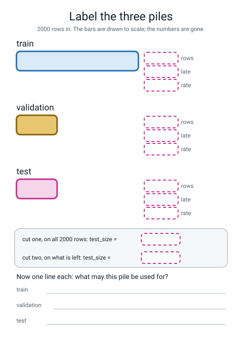
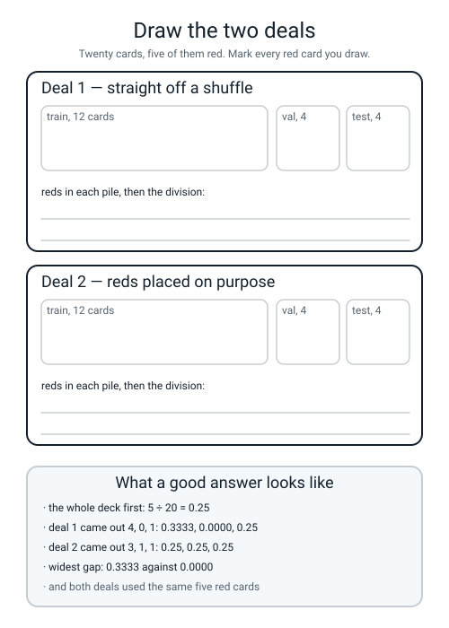

# Workbook — Week 2: Practice, Mock Exam, Final Exam

**Name:** ________________________________  **Date:** ______________

[⬅ Week 1](week-01.md) · [📖 Read the chapter first](../student-guide/week-02.md) · [Course Home](../README.md) · [Next ➡](week-03.md)

---

## ✅ Warm-Up (5 min)

Five quick questions about **last week** — the four-check audit and the five decisions.

**W1.** Say the four audit numbers out loud, then write them down.

**duplicate rows** ______  **ID-ness of `order_id`** ____________  **empty cells** ______  **fraction not late** ____________

**W2.** `.mean()` gave **29.6512** and `56693 ÷ 2020` gave **28.0658**. **Which of the two is wrong?**

____________________  **and what *is* the bug, then?** ____________________________

**W3.** `df["order_id"].nunique()` is **2000** and there are **2020** rows. **Write the division and the answer**, and say what it makes `order_id`.

______ ÷ ______ = ____________  → ____________________

**W4.** Which needs brackets and which does not: `df.shape` or `df.duplicated()`? **State the rule in five words.**

________________________________________________________________

**W5.** Card 4 of last week's five was left **blank on purpose.** What goes on it, and why could you not fill it in yet?

________________________________________________________________

---

## 🔢 Do the Maths by Hand

**There is no new maths this week** either — so these four use Week 1's skill, **turning counts into fractions and comparing them**, on this week's numbers. **Calculator only. No code.**

**M1 — two cuts, three piles.** Do the arithmetic before any code, every time.

```text
rows after the 20 copies go                      = ____________

CUT ONE   20% off the top:   2000 × 0.2          = ____________
          so what is left:   2000 − ____________ = ____________

CUT TWO   75 / 25 of what is left:
          1600 × 0.75                            = ____________
          1600 × 0.25                            = ____________

CHECK     ______ + ______ + ______               = ____________
```

**M1(a).** Now the trap. Somebody writes `test_size=0.2` on cut **two** instead of 0.25. What three pile sizes do they get?

`1600 × 0.2` = ______, so the piles are ______ / ______ / ______

**M1(b).** Write the division that shows why 0.25 is the right number: ______ ÷ ______ = ____________

**M1(c).** And the one that catches everybody out: as a fraction of the **whole table**, 400 ÷ 2000 = ____________

**Two right answers, same 400 rows. What is different about the two questions?**

________________________________________________________________

**M2 — the late rates, with and without `stratify`.** Fill in every division to **four decimal places**.

**WITH `stratify` in both cuts:**

| pile | late | rows | rate |
|---|---|---|---|
| train | 345 | 1200 | ____________ |
| validation | 115 | 400 | ____________ |
| test | 115 | 400 | ____________ |

**WITHOUT `stratify` anywhere:**

| pile | late | rows | rate |
|---|---|---|---|
| train | 337 | 1200 | ____________ |
| validation | 130 | 400 | ____________ |
| test | 108 | 400 | ____________ |

**M2(a).** Add up the late counts in each version.

**with:** 345 + 115 + 115 = ______   **without:** 337 + 130 + 108 = ______

**Are they the same?** ______  **So what actually changed between the two versions?**

________________________________________________________________

**M2(b).** The widest gap between any two piles.

**with `stratify`:** ______ − ______ = ____________

**without:** ______ − ______ = ____________

**M2(c).** Now do 115 ÷ 400 **without a calculator**, using the trick from the chapter: 115 ÷ 4 = ______, then move the decimal point ______ places = ____________

**M3 — the baseline, in three divisions.** The `most_frequent` dummy says "not late" 400 times out of 400 on the validation pile, which holds 115 late orders.

```text
orders that are NOT late  =  400 − 115        =  ____________
times it was right        =  ____________
accuracy                  =  ______ ÷ 400     =  ____________

times it said "late"      =  ____________
late orders it caught     =  ______ ÷ 115     =  ____________
```

**M3(a).** Its ROC-AUC is **0.5000** and its accuracy is your answer above. **Write the two numbers one above the other and say what each one is asking.**

**accuracy** ____________ asks: ______________________________________

**ROC-AUC** ____________ asks: ______________________________________

**M3(b).** A dispatcher runs their whole evening on this model. **How many warnings do they get?** ______  **Now say why "71% accurate" is a dishonest way to describe that.**

________________________________________________________________

**M4 — what looking twenty times bought.** The best of twenty pure dice rolls scored **0.5853** on validation and **0.5125** on the sealed pile.

```text
above the true zero      =  0.5853 − 0.5000  =  ____________
the drop when it met the sealed pile
                         =  0.5853 − 0.5125  =  ____________
how far the sealed score is above the zero
                         =  0.5125 − 0.5000  =  ____________
```

**M4(a).** Perfect is 1.0000 and the zero is 0.5000, so there is **0.5000** of room to play in. What fraction of the room did the winner's *validation* score claim?

____________ ÷ 0.5000 = ____________

**M4(b).** Same experiment, same dice, on a validation pile of **40 rows** instead of 400: best of 20 scored **0.7198**.

`0.7198 − 0.5000` = ____________  **That is how many times bigger than the 400-row prize?**

____________ ÷ ____________ = about ____________

**M4(c).** Finish the sentence with a number in it:

*The smaller the validation pile, the* ______________________________________

---

## 🔎 Predict the Output

**Write your prediction in pen before you run anything.** Every snippet assumes the three piles have already been made the correct way, with `stratify` on both cuts. **One of these four raises an error, and its message hands you the answer.**

### P1 — two shapes, and the one everybody forgets

```python
dummy = DummyClassifier(strategy="most_frequent").fit(X_train, y_train)
p = dummy.predict_proba(X_val)
print(p.shape)
print(p[:, 1].shape)
print(p[:2])
print(p[:, 1].sum())
```

**I predict — line 1:** ____________  **line 2:** ____________

**line 3:** ____________________  **line 4:** ____________

**It really printed:**

```text
________________________
________________________
________________________
________________________
________________________
```

**Line 4 is the one to think about. Add up 400 numbers, each of which is the model's chance that the order is late. Why is the total that?**

________________________________________________________________

### P2 — four names, and which pile got cut

```python
a, b, c, d = train_test_split(X_rest, y_rest, test_size=0.2, random_state=0)
print(len(a), len(b), len(c), len(d))
print(len(a) + len(b))
```

**I predict — line 1:** ____________________  **line 2:** ____________

**It really printed:**

```text
________________________
________________________
```

**`a`, `b`, `c`, `d` are terrible names. Say what each one actually holds, in the order they come out.**

**a:** ______________  **b:** ______________  **c:** ______________  **d:** ______________

**And the numbers 1280 and 320 are not 1200 and 400. Why not?**

________________________________________________________________

### P3 — a model with only one opinion

```python
pred = dummy.predict(X_val)
print(pred.shape)
print(int(pred.sum()))
print(np.unique(pred))
print(accuracy_score(y_val, pred))
```

**I predict:** ____________  ____________  ____________  ____________

**It really printed:**

```text
________________________
________________________
________________________
________________________
```

**Lines 2 and 3 together tell you something no single number could. What?**

________________________________________________________________

### P4 — three ways to score nothing at all

```python
print(roc_auc_score(y_val, np.zeros(400)))
print(roc_auc_score(y_val, np.ones(400)))
print(roc_auc_score(y_val, 1 - dummy.predict_proba(X_val)[:, 1]))
print(roc_auc_score(y_val, dummy.predict_proba(X_val)))
```

**I predict — lines 1 to 3:** ____________  ____________  ____________

**and line 4:** ____________________________________________

**It really printed:**

```text
________________________
________________________
________________________
________________________
________________________
```

**Line 3 flipped every probability upside down and the score did not move. What does that tell you about what AUC is actually measuring?**

________________________________________________________________

**Line 4 stopped the program. Copy the two shapes out of its message.**

**it wanted** ____________________  **you gave it** ____________________

**How many of the answers on this page did you get right?** ______ / 15

**Which one surprised you most?** ______________________________

---

## ✍️ Practice Set A — Read It

This set is for reading code and output that already exist, and saying what they do.

**A1. Match the word to the thing.** Write the letter.

| Word | | Description |
|---|---|---|
| **train / validation / test** | ______ | (i) The score of a model so stupid it cannot have learned anything |
| **stratified split** | ______ | (ii) A model that ignores every feature and answers by a fixed rule |
| **baseline** | ______ | (iii) The model's number between 0 and 1 for "the answer is 1" |
| **DummyClassifier** | ______ | (iv) Three piles: learn from, choose with, open once |
| **ROC-AUC** | ______ | (v) A split that shares out each class in the same proportion, on purpose |
| **predicted probability** | ______ | (vi) The chance a late order is ranked above an on-time one |

**A2. Trace the counts.** Same two cuts, three different tables. Fill in every box.

| Table | rows in | cut 1 (0.2) → rest / test | cut 2 (0.25) → train / val |
|---|---|---|---|
| the delivery table | 2000 | ______ / ______ | ______ / ______ |
| a 1000-row delivery table | 1000 | ______ / ______ | ______ / ______ |
| 569 cell measurements | 569 | ______ / ______ | ______ / ______ |

**A2(a).** The 569-row table cannot be divided neatly. `569 × 0.2` = ______, and the real test pile came out **114.** **What did scikit-learn have to do, and why had it no choice?**

________________________________________________________________

**A2(b).** On the 1000-row table the three stratified rates came out **0.2967 / 0.2950 / 0.2950**, not three identical numbers. **Does that mean `stratify` failed?** Explain using the number **200.**

________________________________________________________________

________________________________________________________________

**A3. Spot the bug.** Each line is wrong. Say what happens and write the fix.

| # | The line | What happens | The fix |
|---|---|---|---|
| a | `roc_auc_score(y_val, dummy.predict_proba(X_val))` | | |
| b | `train_test_split(X_rest, y, test_size=0.25, ...)` | | |
| c | `train_test_split(X, y, test_size=0.2, stratify="y", ...)` | | |
| d | `X_rest, X_test, y_rest = train_test_split(X, y, test_size=0.2)` | | |
| e | `train_test_split(X_rest, y_rest, test_size=0.2, ...)` on cut two | | |
| f | `train_test_split(X_rest, y_rest, test_size=0.25, random_state=0)` | | |

**A3(g).** Two of those six produce **no error message at all.** Which two, and what is the printed clue in each case?

________________________________________________________________

________________________________________________________________

**A4. Match the code to the output.** Five of each, no output used twice.

| | Code |
|---|---|
| i | `print(round(400 / 1600, 4))` |
| ii | `print(round(400 / 2000, 4))` |
| iii | `print(accuracy_score(y_val, dummy.predict(X_val)))` |
| iv | `print(roc_auc_score(y_val, dummy.predict_proba(X_val)[:, 1]))` |
| v | `print(int((dummy.predict(X_val) == 1).sum()))` |

| | Output |
|---|---|
| P | `0.5` |
| Q | `0.25` |
| R | `0` |
| S | `0.7125` |
| T | `0.2` |

**Your answers:** i → ______  ii → ______  iii → ______  iv → ______  v → ______

**A4(a).** Outputs **S** and **P** came from **the same model on the same 400 rows.** Write the two numbers one above the other, then write the one sentence that explains how both are true.

________________________________________________________________

**A5. Read four split reports and name the sabotage.** All four are real runs on the same 2000-row de-duplicated table. **The whole table is 0.2875 late.**

**Report A**

```text
pile         rows   late     rate
train        1200    345   0.2875
validation    400    115   0.2875
test          400    115   0.2875
```

**What was done to it:** ______________________________________

**The giveaway:** ____________________________________________

**Report B**

```text
pile         rows   late     rate
train        1200    355   0.2958
validation    400    105   0.2625
test          400    115   0.2875
```

**What was done to it:** ______________________________________

**The giveaway:** ____________________________________________

**Report C**

```text
pile         rows   late     rate
train        1280    368   0.2875
validation    320     92   0.2875
test          400    115   0.2875
```

**What was done to it:** ______________________________________

**The giveaway:** ____________________________________________

**Report D**

```text
pile         rows   late     rate
train        1200    337   0.2808
validation    400    130   0.3250
test          400    108   0.2700
```

**What was done to it:** ______________________________________

**The giveaway:** ____________________________________________

**A5(a).** In **Report B** the test pile is still perfect at 0.2875. **Why did only one pile get damaged?**

________________________________________________________________

**A5(b).** **Report C** has all three rates exactly right and is still wrong. **What breaks, and would you ever notice from the rates alone?**

________________________________________________________________

**A5(c).** Rank the four reports from "safest" to "most dangerous", and say what makes the most dangerous one dangerous.

**safest → most dangerous:** ______  ______  ______  ______

________________________________________________________________

**A6. Label the three piles.** Every number has been removed. Fill in all fifteen boxes from memory first, then run your own split and tick the ones you got.


*Figure W2.1 — Three bars drawn to scale, with the counts, the late totals, the rates and the two `test_size` values removed.*

**A6(a).** Add up your three row boxes: ______ + ______ + ______ = ______

**A6(b).** Add up your three late boxes: ______ + ______ + ______ = ______

**A6(c).** Two of the three bars are the same width. **Which two, and does that make them the same kind of thing?**

________________________________________________________________

---

## ✍️ Practice Set B — Write It

This set is for writing short programs of your own, from one line up to a whole program.

### B1 — one line, plus a loop

**Task:** print the rows, the late count and the late rate to 4 decimal places for all three piles.

**Expected output:**

```text
train        1200    345 0.2875
validation    400    115 0.2875
test          400    115 0.2875
```

**Done looks like:** one `for` loop over a list of `(name, labels)` pairs, one f-string, and **three identical rates.**

```python
for name, yy in ____________________________________________________:
    print(________________________________________________________)
```

### B2 — the proof, as a function

**Task:** write `rates(y_train, y_val, y_test)`, which prints a header, one line per pile, and then the **widest gap** between any two rates.

**Expected output**, called twice — once on the stratified split, once on a split with `stratify` left off cut two:

```text
pile         rows   late     rate
train        1200    345   0.2875
validation    400    115   0.2875
test          400    115   0.2875
widest gap: 0.0
pile         rows   late     rate
train        1200    355   0.2958
validation    400    105   0.2625
test          400    115   0.2875
widest gap: 0.0333
```

**Done looks like:** one function, one loop inside it, and `max(...) - min(...)` for the gap.

```python
def rates(y_train, y_val, y_test):
    print("pile         rows   late     rate")
    for name, yy in ______________________________________________:
        print(____________________________________________________)
    widest = ______________________________________________________
    print("widest gap:", round(widest, 4))
```

**B2(a).** The first call prints `widest gap: 0.0` and not `0.0000`. **Why?** ____________________

**B2(b).** 0.0333 — where does that number come from? ______ − ______ = ____________

### B3 — what the second `test_size` actually buys

**Task:** print the three pile sizes for four different values of the **second** `test_size`, leaving cut one alone.

**Expected output:**

```text
second test_size   train   val   test
           0.20    1280   320   400
           0.25    1200   400   400
           0.30    1120   480   400
           0.50     800   800   400
```

**Done looks like:** a header, a loop over `[0.2, 0.25, 0.3, 0.5]`, and **the test column never moving.**

```python
print("second test_size   train   val   test")
for ts in ______________________________________________________:
    ______________________________________________________________
    print(______________________________________________________)
```

**B3(a).** Which column is identical in all four rows, and why? ____________________

**B3(b).** In the last row, train and validation are the same size. **Name one thing that gets better and one thing that gets worse.**

**better:** ______________________  **worse:** ______________________

### B4 — both baselines on a table that is not about pizza

**Task:** build the three piles on `load_wine`, with `y = 1` when the wine is class 1 and 0 otherwise, then run both dummy baselines on validation.

**Expected output:**

```text
class 1 rate: 0.3989
piles: 106 36 36
baseline        accuracy   ROC-AUC   times it said 1
most_frequent    0.6111    0.5000    0
stratified       0.7500    0.7565    17
```

**Done looks like:** the same two cuts as the delivery table, then a loop over the two strategies, printing four things per row.

**B4(a).** The `most_frequent` accuracy is 0.6111. **Show the division:** ______ ÷ ______ = ____________

**B4(b).** Now the shocking row. The `stratified` dummy — which guesses at random, matching the training proportions, and looks at **no feature whatsoever** — scored **ROC-AUC 0.7565.** On the delivery table the same strategy scored 0.4857.

**What is different about this validation pile?** ____________________

**And what would you tell somebody who came to you excited about a 0.7565?**

________________________________________________________________

________________________________________________________________

### B5 — a whole program of your own, about 25 lines

**Task:** write `best_of_n.py`, which extends the chapter's `best_of_twenty.py` into a function so you can ask *"what does trying N things buy me?"*

It must:

1. build the three piles exactly as the chapter does, with `stratify` on both cuts
2. define `best_of(n_tries)` which, for `n_tries` turns, draws `len(y_val)` random numbers **and** `len(y_test)` random numbers, scores the validation draw, and keeps the winner's validation AUC **and** that same winner's test AUC
3. re-seed with `np.random.default_rng(0)` **inside** `best_of`, so every row starts from the same dice
4. print a header, then one row for each of `1, 5, 20, 100`

**Expected output:**

```text
how many tried   best validation AUC   above 0.5000   its TEST AUC
             1   0.5026                0.0026         0.5314
             5   0.5032                0.0032         0.4577
            20   0.5853                0.0853         0.5125
           100   0.5853                0.0853         0.5125
```

**Done looks like:** four rows you can read across, `np.random.default_rng(0)` **inside** the function, and the 20-row matching the chapter's 0.5853 / 0.5125 exactly.

**B5(a).** The 20-row and the 100-row are identical. **Say why, and say what would have to happen for row 100 to be bigger.**

________________________________________________________________

**B5(b).** Read down the **TEST AUC** column: 0.5314, 0.4577, 0.5125, 0.5125. **Is there a pattern? Should there be?**

________________________________________________________________

> **⚠️ Watch out:** the chapter's Worked Example 2 reports **0.5257** for five tries, and your row 5 says **0.5032**. Neither is wrong. Worked Example 2 draws **one** set of random numbers per turn; yours draws **two** (a validation set and a test set), so after five turns yours has used ten draws and is somewhere else in the same sequence. **Same seed, different number of draws, different place in the queue.** Write that in your Bug Log — it is the commonest reason two people with the same seed get different numbers.

---

## 🐞 Fix the Broken Program

This program has **three** bugs: one **runtime** bug, one **shape** bug, and one **silent logic** bug. The real error messages are below, in the order you meet them.

```python
"""broken02.py - three piles and a baseline on the delivery table. THREE bugs."""
from sklearn.dummy import DummyClassifier
from sklearn.metrics import accuracy_score, roc_auc_score
from sklearn.model_selection import train_test_split
from make_data import make_deliveries

df = make_deliveries(n=2000, seed=0).drop_duplicates().reset_index(drop=True)
y = df["late"]
X = df.drop(columns=["late", "order_id"])

X_rest, X_test, y_rest, y_test = train_test_split(
    X, y, test_size=0.2, stratify=y, random_state=0)
X_train, X_val, y_train, y_val = train_test_split(
    X_rest, y, test_size=0.25, random_state=0)

print("pile         rows   late     rate")
for name, yy in [("train", y_train), ("validation", y_val), ("test", y_test)]:
    print(f"{name:11s} {len(yy):5d} {int(yy.sum()):6d}   {yy.mean():.4f}")

dummy = DummyClassifier(strategy="most_frequent")
dummy.fit(X_train, y_train)
pred = dummy.predict(X_val)
prob = dummy.predict_proba(X_val)
print("accuracy:", round(accuracy_score(y_val, pred), 4))
print("ROC-AUC :", round(roc_auc_score(y_val, prob), 4))
```

**Run 1 — nothing prints at all:**

```text
Traceback (most recent call last):
  ...
  File ".../sklearn/utils/validation.py", line 530, in indexable
    check_consistent_length(*result)
  File ".../sklearn/utils/validation.py", line 473, in check_consistent_length
    raise ValueError(
ValueError: Found input variables with inconsistent numbers of samples: [1600, 2000]
```

**Bug 1.** Which line? ______  **Kind of bug?** ______________

**The message names two numbers. Where does each come from?**

**1600 comes from:** ______________________  **2000 comes from:** ______________________

**The fix:** ______________________________

**Run 2 — after fixing bug 1:**

```text
pile         rows   late     rate
train        1200    355   0.2958
validation    400    105   0.2625
test          400    115   0.2875
accuracy: 0.7375
Traceback (most recent call last):
  ...
  File ".../sklearn/metrics/_ranking.py", line 867, in _binary_clf_curve
    y_score = column_or_1d(y_score)
  File ".../sklearn/utils/validation.py", line 1483, in column_or_1d
    raise ValueError(
ValueError: y should be a 1d array, got an array of shape (400, 2) instead.
```

**Bug 2.** Which line? ______  **Kind of bug?** ______________

**What are the two columns of that `(400, 2)`?**

**column 0:** ______________________  **column 1:** ______________________

**The fix:** ______________________________

**Run 3 — after fixing bugs 1 and 2. It runs all the way through with no error at all:**

```text
pile         rows   late     rate
train        1200    355   0.2958
validation    400    105   0.2625
test          400    115   0.2875
accuracy: 0.7375
ROC-AUC : 0.5
```

**Bug 3 has been there since run 1, and it is printed in three of those lines.**

**The whole table is 0.2875 late. Which two piles disagree with that, and by how much?**

**pile** ____________ **rate** ____________  **pile** ____________ **rate** ____________

**difference between validation and test:** ______ − ______ = ____________

**Which one line is missing?** ______________________

**The fix:** write the corrected two lines.

```python
________________________________________________________________

________________________________________________________________
```

**Run 4 — after fixing all three:**

```text
pile         rows   late     rate
train        1200    345   0.2875
validation    400    115   0.2875
test          400    115   0.2875
accuracy: 0.7125
ROC-AUC : 0.5
```

**Three questions, and the second is the point of the whole page.**

**The accuracy moved from 0.7375 to 0.7125. Explain both numbers with a division.**

**0.7375 =** ______ ÷ ______      **0.7125 =** ______ ÷ ______

**Bug 3 changed the number you were going to write in a box and hang on your wall all term. And nothing complained. So what is the only thing that catches it?**

________________________________________________________________

**The ROC-AUC is 0.5 in both runs. Why did bug 3 not touch it?**

________________________________________________________________

---

## 🧩 Puzzle of the Week

### The Five Reds

Twenty playing cards. **Five are red.** You deal them into piles of **12 / 4 / 4** off a genuine shuffle.

**Part 1(a).** The whole deck: ______ ÷ ______ = ____________ red.

**Part 1(b).** What is the **smallest** number of reds the 4-card test pile could get? ______

**And the largest?** ______  **Why can it not be 5?** ____________________

**Part 1(c).** How many different `(train, val, test)` red-count patterns are possible at all? Count them systematically — every way of splitting 5 reds into three piles, remembering the val and test piles hold only 4 cards each.

**patterns:** ______

**Part 1(d).** **One** of those patterns is the one `stratify=y` always produces. Which? ______ / ______ / ______

**Part 1(e).** Now the number that should worry you. What is the chance the test pile gets **no reds at all**? Work it out as four fractions multiplied together — the chance the first card dealt to it is black, then the second, then the third, then the fourth:

```text
15/20  ×  14/19  ×  13/18  ×  12/17  =  ____________
```

**Part 1(f).** Write that as "about one shuffle in ______", and then say in one sentence what a test pile with no reds in it can tell you about red.

________________________________________________________________

### Part 2 — Reading a prize list backwards

Here is the real best-of-N table from the chapter's Worked Example 2, on a **400-row** validation pile and then on a **40-row** one.

| how many tried | 400 rows | 40 rows |
|---|---|---|
| 1 | 0.5026 | 0.5604 |
| 20 | 0.5853 | 0.7198 |
| 100 | 0.5853 | 0.7747 |
| 500 | 0.5853 | — |

**Part 2(a).** Three of the numbers in the 400-row column are identical. **What has to be true about draws 21 to 500 for that to happen?**

________________________________________________________________

**Part 2(b).** Could any number in either column ever be **smaller** than the number above it? Say why or why not in one sentence.

________________________________________________________________

**Part 2(c).** The 40-row column reaches **0.7747** with no model at all. Somebody shows you a report with a validation AUC of 0.77. **Write the two questions you would ask before believing it.**

**1.** ______________________________________________________

**2.** ______________________________________________________

---

## 🤔 Think Deeper

These questions are for writing a longer answer in your own words.

**T1.** There is no locked box and no referee. Nobody can tell whether you opened the test pile early, and next week's model card will just have a line where you write down that you did not. **Write a paragraph** on what makes that line worth anything at all. Is a rule nobody can check still a rule? What would you actually do to make it harder for **yourself** to cheat in six weeks' time, when the score disappoints you?

________________________________________________________________

________________________________________________________________

________________________________________________________________

________________________________________________________________

________________________________________________________________

**T2.** Twenty models that were pure dice rolls, and the best scored 0.5853. You will try a hundred and forty things this term and keep the better one every time. **Write a paragraph** on what that does to your final validation number — and then on the harder half: *given that you cannot stop trying things, what should you do instead?* Is there a version of "count how many things you tried and write it down" that would actually help a reader?

________________________________________________________________

________________________________________________________________

________________________________________________________________

________________________________________________________________

________________________________________________________________

---

## 🛠️ Build It — Three Piles and the Zero on Your Ruler

**Three things get handed in: the card deal with all its divisions, the three-way split proved to four decimal places, and the baseline number in a box you can point at all term.**

### Step checklist

- [ ] **1.** Twenty cards, exactly five red. **Predict the three red counts in pen, before you deal.**
- [ ] **2.** Deal 12 / 4 / 4 off a real shuffle. Count the reds. Do all three divisions.
- [ ] **3.** Deal again, placing the reds 3 / 1 / 1 on purpose. Do all three divisions.
- [ ] **4.** Write the one sentence: which deal was fair, **and how you knew — with a number in it.**
- [ ] **5.** `split_three.py` runs. Check `rows as generated: 2020` then `2000`.
- [ ] **6.** Print all three rates to **4 decimal places.** All three must read 0.2875.
- [ ] **7.** Delete `stratify=y_rest` from cut **two only**, run it, and copy the three damaged rates.
- [ ] **8.** Put it back. Check all three read 0.2875 again.
- [ ] **9.** `baselines.py` runs. Both strategies, both metrics, and the "times it said late" count.
- [ ] **10.** Draw the box. Both numbers in it. **Pin it up; it stays until Week 7.**
- [ ] **11.** `best_of_twenty.py` runs. Copy the winner's two AUCs and do the subtraction.
- [ ] **12.** Two Bug Log entries: one loud, one silent.

### The card deal

**Predictions, in pen, before dealing:** train ______  val ______  test ______

**DEAL 1 — off a real shuffle**

| pile | cards | reds | the division | rate |
|---|---|---|---|---|
| train | 12 | | ______ ÷ 12 | |
| validation | 4 | | ______ ÷ 4 | |
| test | 4 | | ______ ÷ 4 | |
| **whole deck** | 20 | 5 | 5 ÷ 20 | |

**DEAL 2 — reds placed 3 / 1 / 1 on purpose**

| pile | cards | reds | the division | rate |
|---|---|---|---|---|
| train | 12 | | ______ ÷ 12 | |
| validation | 4 | | ______ ÷ 4 | |
| test | 4 | | ______ ÷ 4 | |

**Which deal was fair, and how did you know? (A number, not a feeling.)**

________________________________________________________________

**Did your predictions match deal 1 or deal 2? Most people predict the stratified answer. Why?**

________________________________________________________________

### The three-way split, proved

```text
rows as generated              : ____________
rows after dropping the copies : ____________
X shape                        : ____________
y shape                        : ____________
```

| pile | rows | late | rate (3 dp) | rate (4 dp) |
|---|---|---|---|---|
| train | | | | |
| validation | | | | |
| test | | | | |

**Do the three row counts add to 2000?** ______ + ______ + ______ = ______

**Do the three late counts add to 575?** ______ + ______ + ______ = ______

**Are the three 4-dp rates identical?** ______  **Was that luck?** ______

### With `stratify` deleted from cut two

| pile | rows | late | rate (4 dp) |
|---|---|---|---|
| train | | | |
| validation | | | |
| test | | | |

**validation − test:** ______ − ______ = ____________

**Which pile is still perfect, and why?** ______________________________

**Was there an error message?** ______  **A warning?** ______

### The baseline box

| baseline | accuracy | ROC-AUC | times it said "late" |
|---|---|---|---|
| `most_frequent` | | | |
| `stratified` | | | |

**Now draw the box, and pin it up.**

```text
   +------------------------------------------+
   |  BASELINE, validation pile, ____ rows    |
   |                                          |
   |     accuracy   ____________              |
   |     ROC-AUC    ____________              |
   |                                          |
   |  Anything at or below ______ AUC has     |
   |  learned nothing.                        |
   +------------------------------------------+
```

**The `most_frequent` model caught ______ of the 115 late orders. ______ ÷ 115 = ____________**

**The `stratified` model said "late" ______ times, and its accuracy was *worse*. Why?**

________________________________________________________________

### Best of twenty

| | Number |
|---|---|
| the winner's model number | |
| its validation AUC | |
| its TEST AUC | |
| the difference (pure luck) | |
| how far the validation score is above 0.5000 | |

**Not one of those twenty was a model. So where did the 0.0853 come from?**

________________________________________________________________

**Now the last four minutes, in writing. What is a validation score actually worth, and what would you have to do to get a number you could report? (Both halves.)**

________________________________________________________________

________________________________________________________________

________________________________________________________________

### Stretch — re-roll the dice

Run `best_of_twenty.py` again with `np.random.default_rng(1)`.

| | seed 0 | seed 1 |
|---|---|---|
| winning model number | | |
| its validation AUC | | |
| its TEST AUC | | |
| the gap | | |

**What changed?** ______________________  **What stayed the same?**

________________________________________________________________

### The Bug Log

| What I saw | What it means | Cause | Fix |
|---|---|---|---|
| | | | |
| | | | |

---

## 🎨 Draw It

Draw both deals, by hand, in the two frames below. Mark every red card, then write the three divisions under each.


*Figure W2.2 — Two empty deal frames, and what a good answer contains.*

**Then answer four things about your own drawing:**

**In your deal 1, which pile came out furthest from 0.25?** ____________________

**Did any pile get zero reds?** ______  **If yes, what can it measure about red?** ____________

**In deal 2, all three piles read the same. Are they the same size?** ______

**So what exactly is `stratify=y` promising — the same *number* of reds, or the same *fraction*?**

________________________________________________________________

---

## 📊 Self-Check

Use this table to rate yourself honestly on each skill from the week. Tick one face per row.

| I can... | 😀 | 🙂 | 😕 |
|---|---|---|---|
| split a table three ways by calling `train_test_split` twice | | | |
| say out loud what each of the three piles is legally allowed to be used for | | | |
| explain why the second `test_size` is 0.25 and not 0.2, with a division | | | |
| explain why choosing a model on the test set is itself a kind of fitting | | | |
| prove a stratified split worked by printing three rates to 4 decimal places | | | |
| spot a missing `stratify` from the printed rates alone, with no error message | | | |
| build both dummy baselines and say what each one actually does | | | |
| write down the number a real model has to beat, and name the pile it came from | | | |
| explain how one model scores 0.7125 and 0.5000 at the same time | | | |
| say why `predict_proba(X)[:, 1]` needs the `[:, 1]`, and read the shape in the error | | | |

**The one thing I would ask about if I could ask one question:**

________________________________________________________________

---

## ✅ Answers

This section is for checking your work after you have finished every page above.

<details>
<summary>Check your answers</summary>

### Warm-Up

**W1.** **20** duplicate rows · **0.9901** ID-ness · **108** empty cells · **0.7119** not late.

**W2.** **Neither is wrong.** 29.6512 is the average of the values that exist (56693 ÷ 1912); 28.0658 is the average per order (56693 ÷ 2020). **The bug is that nobody chose**, and a library made the choice silently.

**W3.** 2000 ÷ 2020 = **0.9901**, which is above 0.95, so `order_id` is an **ID column** — its job is to name the row, not describe it, and it must never be a feature.

**W4.** `df.duplicated()` needs them; `df.shape` does not. **A verb takes brackets, a fact doesn't.**

**W5.** **The split** — 1200 / 400 / 400. You could not fill it in because you had not decided it yet: last week was the contract, this week is the cut. Go and write it on now.

### Do the Maths by Hand

**M1.**

```text
rows after the 20 copies go                      = 2000

CUT ONE   2000 × 0.2                             = 400
          2000 − 400                             = 1600

CUT TWO   1600 × 0.75                            = 1200
          1600 × 0.25                            = 400

CHECK     1200 + 400 + 400                       = 2000   ✓
```

**M1(a).** 1600 × 0.2 = **320**, so the piles come out **1280 / 320 / 400.** No error, no warning — just three piles that are not the ones your model card says.

**M1(b).** **400 ÷ 1600 = 0.25.** You want 400 rows and you are cutting a 1600-row pile, so the fraction is a quarter.

**M1(c).** **400 ÷ 2000 = 0.20.**

**The difference:** the top of the fraction is the same 400 rows both times; only the bottom changed. 0.25 is *a quarter of the leftovers*; 0.20 is *a fifth of the whole table*. This is Week 1's two-averages lesson in a new costume — **the bottom of the fraction is where the mistakes live.**

**M2.**

**WITH `stratify`:** 345 ÷ 1200 = **0.2875** · 115 ÷ 400 = **0.2875** · 115 ÷ 400 = **0.2875**

**WITHOUT:** 337 ÷ 1200 = **0.2808** · 130 ÷ 400 = **0.3250** · 108 ÷ 400 = **0.2700**

**M2(a).** With: 345 + 115 + 115 = **575.** Without: 337 + 130 + 108 = **575.** **Identical.**

**Nothing was created and nothing was destroyed. Only the sharing-out changed.** That sentence is the whole of `stratify` and it is worth being able to say without looking.

**M2(b).** With: 0.2875 − 0.2875 = **0.0000.** Without: 0.3250 − 0.2700 = **0.0550** — five and a half percentage points between the pile you would choose with and the pile you would report from.

**M2(c).** 115 ÷ 4 = **28.75**, then move the decimal point **two** places left = **0.2875.** (Dividing by 400 instead of 4 is the same as dividing by 4 and then by 100.)

**M3.**

```text
orders that are NOT late  =  400 − 115  =  285
times it was right        =  285
accuracy                  =  285 ÷ 400  =  0.7125

times it said "late"      =  0
late orders it caught     =  0 ÷ 115    =  0.0000
```

**M3(a).** **Accuracy 0.7125** asks *"how often were you right?"* — and on a pile that is 71% one answer you can score 71% without a single thought. **ROC-AUC 0.5000** asks *"can you tell the two kinds apart?"* — and the answer is no, because it hands every single order the identical score.

**M3(b).** **Zero warnings.** All evening. Not one. Calling that "71% accurate" describes the sums and hides the behaviour — the number is arithmetically true and, as a description of a working system, a lie.

**M4.**

```text
above the true zero      =  0.5853 − 0.5000  =  0.0853
the drop                 =  0.5853 − 0.5125  =  0.0728
sealed score above zero  =  0.5125 − 0.5000  =  0.0125
```

**M4(a).** 0.0853 ÷ 0.5000 = **0.1706** — the winner's validation score claimed about **17%** of the whole distance from useless to perfect, on the strength of nothing at all.

**M4(b).** 0.7198 − 0.5000 = **0.2198.** And 0.2198 ÷ 0.0853 = about **2.6** — the prize is about two and a half times bigger on a pile a tenth the size.

**M4(c).** *The smaller the validation pile, the bigger the best-of-N prize — on 400 rows it was **0.0853**, on 40 rows it was **0.2198**.*

### Predict the Output

**P1.**

```text
(400, 2)
(400,)
[[1. 0.]
 [1. 0.]]
0.0
```

**Line 4 is 0.0** because **column 1 is the chance of "late"**, and this model gives every single order a 0.0 chance of being late. Add 400 zeros and you get zero. Which is exactly why its AUC is 0.5000: 400 identical scores cannot rank anything above anything.

**P2.**

```text
1280 320 1280 320
1600
```

**a** = the X rows of the first pile · **b** = the X rows of the second pile · **c** = the labels of the first pile · **d** = the labels of the second pile. **X first pile, X second pile, y first pile, y second pile — always that order.** Get it wrong and nothing errors; your labels are just attached to the wrong rows.

**1280 and 320 because `test_size=0.2` on a 1600-row pile** gives 1600 × 0.2 = 320, not 400. **400 ÷ 1600 = 0.25** is the number you wanted.

**P3.**

```text
(400,)
0
[0]
0.7125
```

**Lines 2 and 3 together** say something no single number could: line 3 shows the *only* value the model ever produced is `0`, and line 2 confirms it never once said 1. So this is not a model that is bad at spotting late orders — **it is a model that has one opinion and repeats it 400 times.** Accuracy alone would have hidden that completely.

**P4.**

```text
0.5
0.5
0.5
```

then the program stops:

```text
ValueError: y should be a 1d array, got an array of shape (400, 2) instead.
```

**Line 3 flipped every probability and the score did not move**, because all 400 probabilities were identical to begin with — flipping identical numbers gives identical numbers. The deeper lesson: **AUC only looks at the ranking of the scores (which order scores higher than which), not at how big the numbers are.** (Flipping scores that differ would turn an AUC of 0.8 into 0.2; it only failed to move here because every score was the same.) Add 100 to every probability, or halve them all, and the AUC is unchanged.

**Line 4:** it wanted **a 1d array** (one column, shape `(400,)`); you gave it **shape `(400, 2)`**. Both shapes are in the message, which is exactly the habit to build: *what shape did it want, and what shape did I give it?*

### Practice Set A

**A1.** train/validation/test → **iv** · stratified split → **v** · baseline → **i** · DummyClassifier → **ii** · ROC-AUC → **vi** · predicted probability → **iii**

**A2.**

| Table | rows in | cut 1 → rest / test | cut 2 → train / val |
|---|---|---|---|
| the delivery table | 2000 | **1600 / 400** | **1200 / 400** |
| a 1000-row delivery table | 1000 | **800 / 200** | **600 / 200** |
| 569 cell measurements | 569 | **455 / 114** | **341 / 114** |

**A2(a).** 569 × 0.2 = **113.8**, and **you cannot put 113.8 rows in a pile.** Rows are whole things, so scikit-learn rounds up to 114 and the rest gets 455. Then 455 × 0.25 = 113.75, which becomes 114 again, leaving 341. 341 + 114 + 114 = 569. ✓

**A2(b).** **No, `stratify` did exactly its job.** With 200-row piles the finest adjustment it can make is **one row**, and one row out of 200 is 0.0050. The three rates 0.2967 / 0.2950 / 0.2950 sit inside 0.0017 of each other — closer than one row. `stratify=y` never promises identical rates; it promises **the closest sharing-out that whole rows allow.** On 2000 rows that happened to be exact. Print the numbers rather than assuming.

**A3.**

| # | What happens | The fix |
|---|---|---|
| a | `ValueError: y should be a 1d array, got an array of shape (400, 2) instead` — you handed it two columns and it can only rank one | `dummy.predict_proba(X_val)[:, 1]` |
| b | `ValueError: Found input variables with inconsistent numbers of samples: [1600, 2000]` — 1600 rows of X, 2000 labels | `train_test_split(X_rest, y_rest, ...)` |
| c | `InvalidParameterError: The 'stratify' parameter ... Got 'y' instead` — you gave it the **word** y, in quotes | `stratify=y`, no quotes. Quotes make it writing; no quotes make it the thing |
| d | `ValueError: too many values to unpack (expected 3)` — four things came back and you gave three names | four names, always, in order |
| e | **No error.** You get piles of **1280 / 320 / 400** instead of 1200 / 400 / 400 | `test_size=0.25`, because 400 ÷ 1600 = 0.25 |
| f | **No error.** `stratify` is missing, so the rates come out 0.2958 / 0.2625 / 0.2875 | add `stratify=y_rest` |

**A3(g).** **e and f.** In **e** the clue is the printed pile sizes — 1280 and 320 where your card says 1200 and 400. In **f** the clue is the printed *rates* — 0.2625 where the table says 0.2875. Both clues only exist if you print them, which is why the four-line proof loop is not optional decoration.

**A4.** i → **Q** · ii → **T** · iii → **S** · iv → **P** · v → **R**

**A4(a).**

```text
    accuracy   0.7125
    ROC-AUC    0.5000
```

**One model, two rulers.** Accuracy asks *"how often were you right"*, and saying "not late" 400 times is right 285 of them. AUC asks *"can you tell the two apart"*, and giving all 400 orders the identical score of zero cannot separate anything, so it scores exactly a coin flip. **Nothing about the model changed between those two lines — only which ruler you picked up.**

**A5.**

**Report A** — **nothing was done to it; this is the correct split.** Giveaway: **all three 4-dp rates are identical and equal to the whole table's 0.2875.**

**Report B** — **`stratify` was left off cut two only.** Giveaway: **train and validation are wrong (0.2958, 0.2625) but test is still exactly 0.2875**, so the damage happened *after* the test pile was sealed.

**Report C** — **`test_size=0.2` was used on cut two instead of 0.25.** Giveaway: **the sizes, not the rates** — 1280 / 320 / 400. The rates are all perfect because `stratify` was present throughout.

**Report D** — **`stratify` was left off both cuts.** Giveaway: **all three rates are wrong**, and the widest gap is 0.3250 − 0.2700 = 0.0550.

**A5(a).** Because cut one still had `stratify=y`. It ran first, sealed 400 correctly-proportioned rows into the test pile, and finished. Cut two then chopped up the *other* 1600 rows badly. **One broken line, one damaged pile, quietly** — which is the shape of most real bugs in this subject.

**A5(b).** What breaks is **the size of the validation pile, and therefore how much a validation score wobbles.** 320 rows instead of 400 means a noisier number and a bigger best-of-N prize — and it also means your model card's "1200 / 400 / 400" is a false statement. **You would never notice from the rates alone**, because the rates are perfect. You notice from the printed *counts*, which is why the proof loop prints both.

**A5(c).** **A → C → B → D.**

A is correct. C is wrong in a way that is written in large print on the screen — the sizes are simply not the numbers you asked for. B is worse because two of the three piles are quietly asking a slightly different question, and only one number betrays it. D is worst: **all three piles are wrong at once**, so nothing in the report agrees with anything else, and there is no clean pile left to compare against. What makes it dangerous is not the size of the error — 0.0550 is small — it is that **nothing anywhere raised a hand.**

**A6.** The fifteen boxes:

```text
train        1200 rows,   345 late,   0.2875
validation    400 rows,   115 late,   0.2875
test          400 rows,   115 late,   0.2875
cut one  test_size = 0.2       (of 2000)
cut two  test_size = 0.25      (of 1600)
```

**A6(a).** 1200 + 400 + 400 = **2000.** ✓

**A6(b).** 345 + 115 + 115 = **575.** ✓

**A6(c).** **Validation and test** are the same width — both 400 rows. **No, that does not make them the same kind of thing.** Validation may be looked at many times, and it wears out. Test is opened **once**, at the very end. They are the same size and they answer different questions: *"which of these should I pick?"* versus *"what will this actually do?"*

The three lines about what each pile may be used for:

- **train** — look at it as often as you like, fit on it, plot it, stare at it.
- **validation** — you may look many times, and **it wears out**: every decision you change because of it spends a little of its honesty.
- **test** — **once**, at the very end, then stop. The moment a test score changes a decision, it has become a validation pile.

### Practice Set B

**B1.**

```python
for name, yy in [("train", y_train), ("validation", y_val), ("test", y_test)]:
    print(f"{name:11s} {len(yy):5d} {int(yy.sum()):6d} {yy.mean():.4f}")
```

```text
train        1200    345 0.2875
validation    400    115 0.2875
test          400    115 0.2875
```

**B2.**

```python
def rates(y_train, y_val, y_test):
    print("pile         rows   late     rate")
    for name, yy in [("train", y_train), ("validation", y_val), ("test", y_test)]:
        print(f"{name:11s} {len(yy):5d} {int(yy.sum()):6d}   {yy.mean():.4f}")
    widest = (max(y_train.mean(), y_val.mean(), y_test.mean())
              - min(y_train.mean(), y_val.mean(), y_test.mean()))
    print("widest gap:", round(widest, 4))
```

```text
pile         rows   late     rate
train        1200    345   0.2875
validation    400    115   0.2875
test          400    115   0.2875
widest gap: 0.0
pile         rows   late     rate
train        1200    355   0.2958
validation    400    105   0.2625
test          400    115   0.2875
widest gap: 0.0333
```

**B2(a).** Because `round(0.0, 4)` **is** `0.0` — `round` does not pad with zeros, it just removes decimals you did not want. The `:.4f` inside an f-string is the thing that pads, which is why the rate column shows `0.2875` and the gap line does not. Worth knowing so you never chase a "missing" zero.

**B2(b).** 0.2958 − 0.2625 = **0.0333** — train against validation, the two piles cut two touched.

**B3.**

```python
print("second test_size   train   val   test")
for ts in [0.2, 0.25, 0.3, 0.5]:
    Xt2, Xv2, yt2, yv2 = train_test_split(
        X_rest, y_rest, test_size=ts, stratify=y_rest, random_state=0)
    print(f"{ts:15.2f} {len(yt2):7d} {len(yv2):5d} {len(y_test):5d}")
```

```text
second test_size   train   val   test
           0.20    1280   320   400
           0.25    1200   400   400
           0.30    1120   480   400
           0.50     800   800   400
```

**B3(a).** **The test column — 400 every time.** Cut one is never touched by the loop, so the test pile was sealed before any of this happened. That is precisely the property you want from a pile you are only allowed to open once.

**B3(b).** **Better:** an 800-row validation pile wobbles far less, so a validation score you compare two models with is much more trustworthy, and the best-of-N prize shrinks. **Worse:** the model only learns from 800 rows instead of 1200 — 400 examples thrown away — so every model you compare is worse than it needed to be. **There is no right answer, which is why there has to be a written answer.**

**B4.**

```python
from sklearn.datasets import load_wine
from sklearn.dummy import DummyClassifier
from sklearn.metrics import accuracy_score, roc_auc_score
from sklearn.model_selection import train_test_split

data = load_wine(as_frame=True)
X = data.data
y = (data.target == 1).astype(int)
print("class 1 rate:", round(y.mean(), 4))

X_rest, X_test, y_rest, y_test = train_test_split(
    X, y, test_size=0.2, stratify=y, random_state=0)
X_train, X_val, y_train, y_val = train_test_split(
    X_rest, y_rest, test_size=0.25, stratify=y_rest, random_state=0)
print("piles:", len(y_train), len(y_val), len(y_test))

print("baseline        accuracy   ROC-AUC   times it said 1")
for strategy in ["most_frequent", "stratified"]:
    dummy = DummyClassifier(strategy=strategy, random_state=0)
    dummy.fit(X_train, y_train)
    pred = dummy.predict(X_val)
    prob = dummy.predict_proba(X_val)[:, 1]
    print(f"{strategy:14s}   {accuracy_score(y_val, pred):.4f}    "
          f"{roc_auc_score(y_val, prob):.4f}    {int((pred == 1).sum())}")
```

```text
class 1 rate: 0.3989
piles: 106 36 36
baseline        accuracy   ROC-AUC   times it said 1
most_frequent    0.6111    0.5000    0
stratified       0.7500    0.7565    17
```

**Runtime: about 0.7 seconds.**

**B4(a).** The validation pile has 36 rows, 14 of them class 1, so 22 are not. **22 ÷ 36 = 0.6111.**

**B4(b).** **The validation pile has 36 rows.** That is the whole answer. Thirty-six coin flips can fall into a pattern that looks like knowledge - rarely (this seed landed in about the luckiest 1 draw in 500; the usual wobble on 36 rows is about 0.08 either way), but a seed you fixed in advance can hit it - and here it did: a model that looked at not one of the thirteen wine measurements scored **0.7565**.

**What you would tell them:** *"How many rows is that measured on, and how many things did you try before you got it?"* Thirty-six rows cannot support a claim like that — the honest range around 0.7565 on 36 rows is enormous. Compare it against the delivery table, where the same strategy on 400 rows scored 0.4857, right where a coin flip belongs. **Small piles do not just make scores noisier. They make nonsense look like a result.**

**B5.**

```python
"""best_of_n.py - what does trying N things buy you?"""
import numpy as np
from sklearn.metrics import roc_auc_score
from sklearn.model_selection import train_test_split
from make_data import make_deliveries

df = make_deliveries(n=2000, seed=0).drop_duplicates().reset_index(drop=True)
y = df["late"]
X = df.drop(columns=["late", "order_id"])
X_rest, X_test, y_rest, y_test = train_test_split(
    X, y, test_size=0.2, stratify=y, random_state=0)
X_train, X_val, y_train, y_val = train_test_split(
    X_rest, y_rest, test_size=0.25, stratify=y_rest, random_state=0)


def best_of(n_tries):
    rng = np.random.default_rng(0)
    best_auc = -1
    best_test_auc = None
    for i in range(n_tries):
        guess_val = rng.random(len(y_val))
        guess_test = rng.random(len(y_test))
        auc = roc_auc_score(y_val, guess_val)
        if auc > best_auc:
            best_auc = auc
            best_test_auc = roc_auc_score(y_test, guess_test)
    return best_auc, best_test_auc


print("how many tried   best validation AUC   above 0.5000   its TEST AUC")
for n_tries in [1, 5, 20, 100]:
    best, best_test = best_of(n_tries)
    print(f"{n_tries:14d}   {best:.4f}                {best - 0.5:.4f}"
          f"         {best_test:.4f}")
```

```text
how many tried   best validation AUC   above 0.5000   its TEST AUC
             1   0.5026                0.0026         0.5314
             5   0.5032                0.0032         0.4577
            20   0.5853                0.0853         0.5125
           100   0.5853                0.0853         0.5125
```

**Runtime: about 1 second.**

**B5(a).** Because **none of draws 21 to 100 happened to beat the lucky one from the first twenty.** Each extra bit of fake score needs a rarer and rarer fluke, so the prize grows fast at first and then very slowly. For row 100 to be bigger, one of those 80 extra draws would have to score above 0.5853 — possible, just not what these dice did.

And note what can never happen: the best of 100 can never be **worse** than the best of 20, because the first 20 draws are among the 100.

**B5(b).** **No pattern, and there should not be one.** The test AUCs are 0.5314, 0.4577, 0.5125, 0.5125 — they scatter around 0.5000 with no direction, because the test pile had no say in which model won. That is what a pile with no say looks like: a number that does not improve when you try harder. **The validation column climbs; the test column does not.** Put those two columns side by side and you have the entire argument for a third pile.

### Fix the Broken Program

**Bug 1.** Line **14** (`X_rest, y, ...` in cut two). Kind: **runtime** (`ValueError`).

**1600 comes from** `X_rest` — the pile you are actually cutting. **2000 comes from** `y` — the labels for the *whole* table, which you handed it by mistake.

**The fix:** `train_test_split(X_rest, y_rest, test_size=0.25, random_state=0)`.

**Bug 2.** Line **24** (`prob = dummy.predict_proba(X_val)`). Kind: **shape**.

**Column 0** is the chance the order is **not** late; **column 1** is the chance it **is** late. You want column 1, because that is the thing you are trying to rank.

**The fix:** `prob = dummy.predict_proba(X_val)[:, 1]`.

**Bug 3.** The whole table is 0.2875 late. **Train is 0.2958** and **validation is 0.2625** — both wrong. Test is still 0.2875, because cut one was fine.

**validation against test:** 0.2875 − 0.2625 = **0.0250.**

**The missing line is `stratify=y_rest` on cut two.** The corrected two lines:

```python
X_train, X_val, y_train, y_val = train_test_split(
    X_rest, y_rest, test_size=0.25, stratify=y_rest, random_state=0)
```

**The two accuracies:**

**0.7375** = **295 ÷ 400** — the damaged validation pile holds only 105 late orders, so 400 − 105 = 295 are not late, and "never late" is right 295 times.

**0.7125** = **285 ÷ 400** — the correct pile holds 115 late orders, so 285 are not.

**Which is the point of the page:** bug 3 did not break the program, did not raise a warning, and **changed the baseline number you were about to hang on your wall for five weeks.** All term you would have been comparing real models against 0.7375, a number that came from a mis-cut pile.

**The only thing that catches it** is printing all three rates, to four decimal places, every single time — and knowing what number they are supposed to be.

**Why the AUC did not move:** because the `most_frequent` model gives every order the identical probability, and identical scores cannot rank anything. Its AUC is 0.5000 on any pile, of any size, with any class balance. **The metric that is immune to the class balance is also immune to this bug** — which is a good reason to report both, not a reason to relax.

### Puzzle of the Week

**Part 1(a).** 5 ÷ 20 = **0.25.**

**Part 1(b).** Smallest: **0.** Largest: **4.** It cannot be 5 because **the test pile only holds 4 cards** — there is physically no room for a fifth.

**Part 1(c).** **19.** Every way of writing 5 as `train + val + test` with all three at least 0 gives 21 possibilities; two of those need val = 5 or test = 5, and neither pile is big enough, so 21 − 2 = **19.** (Train can absorb anything up to 12, so it never blocks anything.)

**Part 1(d).** **3 / 1 / 1** — because 3 ÷ 12 = 0.25, 1 ÷ 4 = 0.25, 1 ÷ 4 = 0.25, matching the deck's 0.25. Exactly **one** of the nineteen patterns does that.

**Part 1(e).**

```text
15/20 = 0.7500
14/19 = 0.7368
13/18 = 0.7222
12/17 = 0.7059

0.7500 × 0.7368 × 0.7222 × 0.7059 = 0.2817
```

**Part 1(f).** About **one shuffle in 3.5** — more than a quarter of all honest deals. And a test pile with no red cards in it can tell you **nothing whatsoever** about red. Not "it does badly on red" — there is no red in it to be bad at. **You have not built a bad measurement; you have built no measurement.**

That is the number to remember from this puzzle: the disaster is not rare. It happens more than a quarter of the time, and `stratify=y` makes it happen never.

**Part 2(a).** **None of draws 21 to 500 scored above 0.5853.** Four hundred and eighty extra tries bought exactly nothing, because beating a fluke requires a bigger fluke.

**Part 2(b).** **No, never.** "The best of 100" includes all 20 of the first draws, so it cannot be lower than the best of 20. A best-of-N prize can stay flat forever; it can never go down. That one-way property is precisely why trying more things is dangerous rather than merely noisy.

**Part 2(c).** The two questions:

1. **How many rows is the validation pile?** (Forty rows can produce 0.7747 from pure dice.)
2. **How many things did you try before this one, and did you pick this one because it scored best?** (If yes, some of that 0.77 was bought by looking.)

A third, if you get one: **"what does the baseline score on the same pile?"** — because 0.77 above a baseline of 0.50 and 0.77 above a baseline of 0.74 are completely different results.

### Think Deeper

**T1.** Good answers refuse to settle for "be honest". They notice that the line is worth something *because it is specific and dated*: "the test pile was not opened" is checkable against your own files, your own commit history, your own memory — and it is embarrassing to write down a false one. Then they get practical about making it hard to cheat, because willpower in Week 7 is not a plan. Real answers: put the test split in a separate file you do not open; never write a line that scores on it until the last day; have somebody else hold the number; write the metric down in pen in Week 1 (which you did) so there is no room to swap it later. The strongest answers notice who the rule protects: not the reader, who cannot check, but **you**, from the version of you who will be disappointed and looking for a way out.

**T2.** The first half is arithmetic you have now measured: every "keep the better one" spends a little of the validation pile's honesty, and after a hundred and forty of them the validation score is optimistic by an unknown amount — bigger on small piles, bigger the more you tried. The second half is the interesting one, and the honest answer is *not* "stop trying things", because trying things is the job. Good answers arrive at some of: **write down how many things you tried** (a number a reader can weigh); **keep the test pile genuinely sealed** so there is one number that had no say; **prefer a difference you can see over one you cannot** — if two options differ by 0.002 on 400 rows, you have not learned which is better - the gap is smaller than the noise, so the data cannot tell them apart; and **cross-validation**, which is Week 11 and exists for exactly this reason. Reporting "AUC 0.79 on validation, chosen from 140 attempts, 0.76 on a test pile opened once" is a far more useful sentence than "AUC 0.79".

### Build It

Your own numbers, but here is what they should be measured against.

**The card deal.** Deal 2 is the fair one, and the way you know is that **all three piles read 0.25 and so does the whole deck.** In deal 1, whatever you got, at least one pile will be a long way off — and there is about a **28%** chance one of your 4-card piles got no reds at all.

Most people predict **3 / 1 / 1**, which is the *stratified* answer, because it is the one that feels tidy. Finding out that a real shuffle does not do that is the entire point of the exercise.

**The split:**

```text
rows as generated              : 2020
rows after dropping the copies : 2000
X shape                        : (2000, 8)
y shape                        : (2000,)
```

| pile | rows | late | rate (3 dp) | rate (4 dp) |
|---|---|---|---|---|
| train | 1200 | 345 | 0.287 | 0.2875 |
| validation | 400 | 115 | 0.287 | 0.2875 |
| test | 400 | 115 | 0.287 | 0.2875 |

1200 + 400 + 400 = **2000** ✓ · 345 + 115 + 115 = **575** ✓ · the three rates are **identical**, and **no, it was not luck** — you asked for it with `stratify`.

**With `stratify` deleted from cut two:** 1200 / 355 / 0.2958, 400 / 105 / 0.2625, 400 / 115 / 0.2875. Validation − test = 0.2875 − 0.2625 = **0.0250.** **Test is still perfect** because cut one still had `stratify` and ran first. **No error. No warning.**

**The baseline box:**

| baseline | accuracy | ROC-AUC | times it said "late" |
|---|---|---|---|
| `most_frequent` | 0.7125 | 0.5000 | 0 |
| `stratified` | 0.5850 | 0.4857 | 109 |

```text
   +------------------------------------------+
   |  BASELINE, validation pile, 400 rows     |
   |                                          |
   |     accuracy   0.7125                    |
   |     ROC-AUC    0.5000   <- the real zero |
   |                                          |
   |  Anything at or below 0.5000 AUC has     |
   |  learned nothing.                        |
   +------------------------------------------+
```

It caught **0** of the 115 late orders. **0 ÷ 115 = 0.0000.**

The `stratified` dummy said "late" **109** times, and its accuracy is **worse** (0.5850 against 0.7125) for a simple reason: guessing "late" sometimes means being **wrong** sometimes. Saying "not late" every single time is the safest way to be right on a pile that is 71% not-late — and it is also the most useless.

**Best of twenty:**

| | Number |
|---|---|
| the winner's model number | 8 |
| its validation AUC | 0.5853 |
| its TEST AUC | 0.5125 |
| the difference | 0.0728 |
| above 0.5000 | 0.0853 |

**Where did the 0.0853 come from?** From **looking at twenty numbers and keeping the biggest one.** Nothing was fitted, nothing looked at a single column. The score was bought by the act of choosing.

**What is a validation score worth — both halves:**

1. It is the **right** tool for **comparing** two options, and it is **optimistic** — the more things you tried, the more optimistic.
2. To **report** a number you need a pile that had **no say** in which model you picked, opened **once**.

*"Validation scores are wrong"* misses it completely. They are the right tool for the wrong job.

**Stretch — seed 1.** The winner will be a different model with a different score and a different-sized gap. What stays the same is **the shape of the story**: the pile you chose with flatters the winner, and the pile that had no say does not.

**Bug Log — the two entries:**

| What I saw | What it means | Cause | Fix |
|---|---|---|---|
| `ValueError: y should be a 1d array, got an array of shape (400, 2) instead.` | it can only rank one column of numbers; I handed it two | the `[:, 1]` left off `predict_proba` | `dummy.predict_proba(X_val)[:, 1]` — and always look for the two shapes in the message |
| rates came out 0.2958 / 0.2625 / 0.2875. **No error at all** | my validation and test piles are asking slightly different questions | `stratify=y_rest` missing from cut two | add it, then print all three rates to 4 dp every single time |

### Draw It

**In deal 1** the pile furthest from 0.25 is whichever one the dice punished — most often one of the 4-card piles, because 4 cards cannot land on 0.25 unless they get exactly one red.

**If a pile got zero reds, it can measure nothing about red.** There is nothing in it to be right or wrong about.

**In deal 2 all three piles read 0.25 and they are *not* the same size** — 12, 4 and 4.

**So `stratify=y` promises the same *fraction*, not the same *number*.** The train pile got 3 reds and the test pile got 1, and both are a quarter. That distinction is exactly why the delivery table gets 345 late orders in train and 115 in validation, and both are 0.2875.

### Self-Check answers

Everything should be a 😀 once the Build It page is finished. Two are worth being strict about:

- *"explain how one model scores 0.7125 and 0.5000 at the same time"* — you can do this only if you can say **both divisions** (285 ÷ 400 and 0 ÷ 115) and the sentence *"one model, two rulers."*
- *"spot a missing `stratify` from the printed rates alone"* — the test is whether you know the number the rates are **supposed** to be, without looking it up. It is 0.2875, three times.

</details>

---

[⬅ Week 1](week-01.md) · [📖 Week 2 chapter](../student-guide/week-02.md) · [Week 3 ➡](week-03.md) · [Glossary](../../glossary.md)
