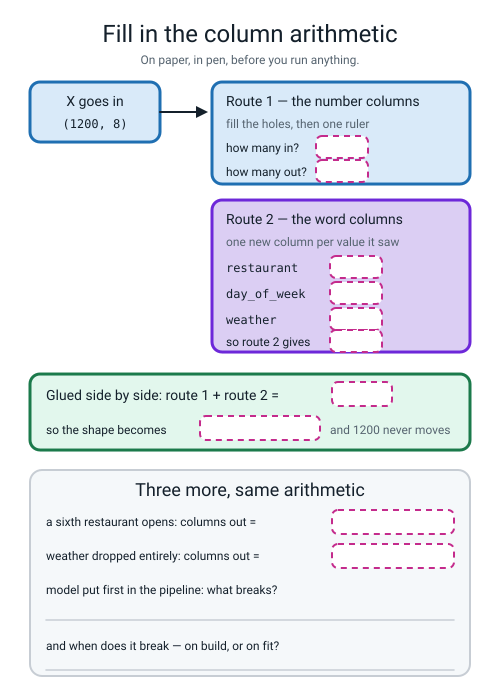
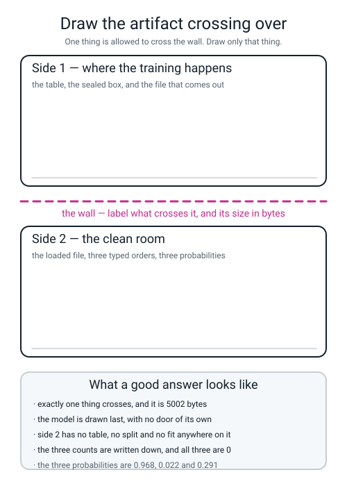

# Workbook — Week 3: The Artifact Is the Deliverable

**Name:** ________________________________  **Date:** ______________

[⬅ Week 2](week-02.md) · [📖 Read the chapter first](../student-guide/week-03.md) · [Course Home](../README.md) · [Next ➡](week-04.md)

---

## ✅ Warm-Up (5 min)

Five quick questions about **last week** — three piles and the zero on your ruler.

**W1.** The second `test_size` is **0.25**, not 0.2. **Write the division that proves it**, and say what you get if you use 0.2 instead.

______ ÷ ______ = ____________  **with 0.2 you get piles of** ______ / ______ / ______

**W2.** The `most_frequent` dummy scored **0.7125** and **0.5000** at the same time, on the same 400 rows. **Which is the accuracy, and which is the number a real model has to beat?**

________________________________________________________________

**W3.** `predict_proba(X_val)` has shape `(400, 2)`. **What is in each column, and which one do you want?**

**column 0:** ______________________  **column 1:** ______________________

**W4.** Twenty models that were pure dice rolls. The best scored **0.5853** on validation and **0.5125** on the sealed pile. **In four words, what bought the 0.0853?**

________________________________________________________________

**W5.** Name the one pile you are allowed to open exactly once — and say what happens to it the moment a score on it changes a decision.

________________________________________________________________

---

## 🔢 Do the Maths by Hand

**There is no new maths this week** — just **counting**, done with much more care than feels necessary. That is the skill. **Calculator only. No code.**

**M1 — count the output columns before you run anything.**

```
ROUTE 1   the number columns
          distance_km, items, prep_minutes, order_hour,
          driver_experience_months                     = ______ columns in
          fill the holes  -> still ______
          one ruler       -> still ______
                                                  route 1 gives ______ out

ROUTE 2   the word columns, one new column per value it saw
          restaurant   how many different?  ______   -> ______ columns
          day_of_week  how many different?  ______   -> ______ columns
          weather      how many different?  ______   -> ______ columns
                                    ______ + ______ + ______ = ______ out

GLUED     ______ + ______ = ______
```

**M1(a).** Write the whole thing as one shape change: `(1200, ______)` → `(1200, ______)`

**M1(b).** Now check it **backwards**: 20 − 15 = ______. **What should that number be, and is it?**

____________________

**M1(c).** Which number in `(1200, 20)` did **not** move, and why not?

________________________________________________________________

**M2 — four what-ifs, same arithmetic.** For each change, work out the new number of output columns.

| The change | number cols | word cols out | total |
|---|---|---|---|
| a sixth restaurant opens | ______ | ______ + 7 + 3 = ______ | ______ |
| `weather` is dropped from X entirely | ______ | ______ + ______ = ______ | ______ |
| a fourth kind of weather appears (`fog`) | ______ | 5 + 7 + ______ = ______ | ______ |
| the restaurants merge from 5 branches down to 3 | ______ | ______ + 7 + 3 = ______ | ______ |

**M2(a).** Two of those four give the **same** total. Which two? ______________________

**M2(b).** In one sentence: if the shape prints 21 when your paper said 20, what is the very first thing you should check?

________________________________________________________________

**M3 — the score, read against last week's zero.**

```
validation ROC-AUC                    =  0.7541
the baseline, same pile               =  0.5000
                                         --------
above the zero                        =  ____________

room available: perfect 1.0000 minus the zero 0.5000
                                      =  ____________

fraction of the room taken:  ______ ÷ ______  =  ____________
```

**M3(a).** So the model has travelled about ______% of the distance from useless to perfect.

**M3(b).** Somebody reports "our model is 75% good". **Say in one sentence why "0.2541 above a baseline of 0.5000" is a more honest sentence than that one.**

________________________________________________________________

**M4 — the preparation learns numbers too.** Four numbers from the chapter, and the two differences between them.

```
the hole-filling median
  learned from the 1200 TRAIN rows       =  30.0
  learned from all 2000 rows             =  29.0
  difference                             =  ____________

the centre of the distance ruler
  learned from the 1200 TRAIN rows       =  3.4591
  learned from all 2000 rows             =  3.5193
  difference                             =  ____________
```

**M4(a).** And the cost, measured to six decimal places: the right way scored **0.754111** and the wrong way scored **0.754020**.

`0.754020 − 0.754111` = ____________

**M4(b).** The sign is **negative** — the wrong way came out slightly **worse**. Most people expect leakage to make the score go **up**. Say in two sentences why coming out worse is *more* worrying than coming out better.

________________________________________________________________

________________________________________________________________

**M4(c).** One last subtraction, from the seven minutes at the start of the chapter. The same order, prepared and unprepared:

`1.000 − 0.709` = ____________  **and how many error messages were printed?** ______

---

## 🔎 Predict the Output

**Write your prediction in pen before you run anything.** **One of these four raises an error, and one of them prints something you have to look at twice.**

### P1 — four rows and three columns you can check by hand

```python
cafe = pd.DataFrame({
    "waiting_minutes": [3.0, 9.0, None, 6.0],
    "size":            ["small", "large", "small", "medium"],
    "day":             ["Sat", "Sat", "Sun", "Sat"],
})
number_route = Pipeline(steps=[("fill_holes", SimpleImputer(strategy="median")),
                               ("same_ruler", StandardScaler())])
prep = ColumnTransformer([
    ("num", number_route, ["waiting_minutes"]),
    ("cat", OneHotEncoder(handle_unknown="ignore"), ["size", "day"]),
])
prep.fit(cafe)
out = prep.transform(cafe)
print(cafe.shape)
print(out.shape)
print(cafe["waiting_minutes"].median())
```

**Count on paper first.** 1 number column stays ______. `size` has ______ different values; `day` has ______. So ______ + ______ + ______ = ______ columns out.

**I predict — line 1:** ____________  **line 2:** ____________  **line 3:** ____________

**It really printed:**

```text
________________________
________________________
________________________
```

**The median came from three numbers, not four. Which three, and what is their middle value?**

______, ______, ______ → ____________

### P2 — what order do the words come out in?

> **📌 One word here is not on your ladder yet, and that is fine.** `.toarray()` turns the memory-saving object `OneHotEncoder` hands back into an ordinary grid of numbers you can read. **It is here only so you can see the four rows.** Week 31 is the week that explains why the saving exists.

```python
tiny = pd.DataFrame({"route": ["red", "blue", "green", "red"]})
enc = OneHotEncoder(handle_unknown="ignore")
enc.fit(tiny)
print(enc.transform(tiny).toarray())
```

**I predict the four rows:**

```text
________________________
________________________
________________________
________________________
```

**It really printed:**

```text
________________________
________________________
________________________
________________________
```

**Row 0 was `"red"`. Which column got the 1?** ______  **Row 1 was `"blue"`. Which column?** ______

**So what order are the three columns in, and why is it not the order the words appeared in the data?**

________________________________________________________________

### P3 — built without a murmur

```python
bad = Pipeline(steps=[("model", LogisticRegression()), ("prep", StandardScaler())])
print("built with no complaint:", len(bad.steps), "steps")
bad.fit(np.array([[1.0], [2.0]]), np.array([0, 1]))
```

**I predict — does line 2 print, or does the program stop first?** ____________________

**It really printed:**

```text
________________________________________
```

**and then** ____________________________________________

**So: is a pipeline with the model in the wrong place checked when you *build* it, or when you *fit* it?**

________________________________________________________________

**Why is that the more dangerous of the two, if you were writing a big program?**

________________________________________________________________

### P4 — four orders, one of them wrong on purpose

The pipeline is already fitted, and `order` is the SliceHouse order from the chapter.

```python
print("known       :", round(pipe.predict_proba(pd.DataFrame([order]))[0, 1], 3))
print("PizzaNova   :", round(pipe.predict_proba(pd.DataFrame([{**order, "restaurant": "PizzaNova"}]))[0, 1], 3))
print("day 'Zzz'   :", round(pipe.predict_proba(pd.DataFrame([{**order, "day_of_week": "Zzz"}]))[0, 1], 3))
print("exp missing :", round(pipe.predict_proba(pd.DataFrame([{**order, "driver_experience_months": np.nan}]))[0, 1], 3))
```

**I predict — how many of the four raise an error?** ______

**and the four numbers:** ______  ______  ______  ______

**It really printed:**

```text
________________________
________________________
________________________
________________________
```

**Line 4 replaced a real 42.0 with nothing at all, and the probability moved. What number did the pipeline put in its place, and is 42 above or below it?**

**it used** ______  **42 is** ____________  **so the probability went** ____________

**Not one of the four complained. Write the one sentence that has to go on the model card because of that.**

________________________________________________________________

**How many of the answers on this page did you get right?** ______ / 14

**Which one surprised you most?** ______________________________

---

## ✍️ Practice Set A — Read It

**A1. Match the word to the thing.** Write the letter.

| Word | | Description |
|---|---|---|
| **pipeline** | ______ | (i) The fitted thing, saved to disk as a file. Not the code, not the score |
| **ColumnTransformer** | ______ | (ii) One object holding several steps in a fixed order, with one name |
| **artifact** | ______ | (iii) A short document travelling with the artifact under fixed headings |
| **joblib** | ______ | (iv) Loading the artifact in a brand-new file with no training code, proved by counting |
| **model card** | ______ | (v) A switchboard: routes of (name, treatment, columns), glued side by side |
| **clean room test** | ______ | (vi) The tool that writes a fitted object to a file and reads it back |

**A2. Trace the shapes.** Same 1200 training rows, five different column sets. Fill in every result.

| `NUMBER_COLUMNS` | `WORD_COLUMNS` | shape in | word cols out | shape out |
|---|---|---|---|---|
| all 5 | all 3 | `(1200, 8)` | ______ | ____________ |
| all 5 | `["restaurant"]` | `(1200, 6)` | ______ | ____________ |
| all 5 | `["restaurant", "weather"]` | `(1200, 7)` | ______ | ____________ |
| all 5 | `["day_of_week", "weather"]` | `(1200, 7)` | ______ | ____________ |
| first 4 only | all 3 | `(1200, 7)` | ______ | ____________ |

**A2(a).** Two rows of that table have the same **shape in** and different **shape out**. Which two, and what does that tell you about reading a shape?

________________________________________________________________

**A2(b).** The last row drops `driver_experience_months` from `NUMBER_COLUMNS`. **Name one thing that gets simpler and one thing you have just quietly thrown away.**

**simpler:** ______________________  **thrown away:** ______________________

**A3. Spot the bug.** Each line is wrong. Say what happens and write the fix.

| # | The line | What happens | The fix |
|---|---|---|---|
| a | `Pipeline(steps=[("model", LogisticRegression()), ("prep", prep)])` | | |
| b | `NUMBER_COLUMNS = [..., "weather"]` | | |
| c | `number_route = Pipeline(steps=[("same_ruler", StandardScaler())])` — imputer removed | | |
| d | `joblib.load("deliverypipeline.joblib")` | | |
| e | an order typed with only seven of the eight keys | | |
| f | `df = make_deliveries(n=2000, seed=0)` — `.drop_duplicates()` left off | | |

**A3(g).** One of those six produces **no error message at all.** Which, and what is the printed clue?

________________________________________________________________

**A3(h).** Two of them name the exact thing that is wrong, in words, inside the error message. Which two, and what do they name?

________________________________________________________________

**A4. Match the code to the output.** Five of each, no output used twice.

| | Code |
|---|---|
| i | `print(prep.transform(X_train).shape)` |
| ii | `print(round(roc_auc_score(y_val, pipe.predict_proba(X_val)[:, 1]), 4))` |
| iii | `print(X_train["restaurant"].nunique() + X_train["day_of_week"].nunique() + X_train["weather"].nunique())` |
| iv | `print(X_train["driver_experience_months"].median())` |
| v | `print(round(0.2541 / 0.5000, 4))` |

| | Output |
|---|---|
| P | `15` |
| Q | `0.5082` |
| R | `(1200, 20)` |
| S | `30.0` |
| T | `0.7541` |

**Your answers:** i → ______  ii → ______  iii → ______  iv → ______  v → ______

**A4(a).** Output **P** is 15 and output **R** ends in 20. **Write the sum that connects them.** ______ + ______ = ______

**A5. Four files called `predict.py`. Which are clean rooms?** Here are the real counts from all four.

```text
p_a.py  fit( 0  make_data 0  train_test 0  lines 7
p_b.py  fit( 1  make_data 1  train_test 2  lines 10
p_c.py  fit( 0  make_data 0  train_test 0  lines 8
p_d.py  fit( 0  make_data 0  train_test 0  lines 7
```

**File p_a.py**

```python
import joblib
import pandas as pd
pipe = joblib.load("delivery_pipeline.joblib")
orders = pd.DataFrame([{"restaurant": "Napoli", "distance_km": 1.2, "items": 1,
    "prep_minutes": 8.0, "order_hour": 12, "day_of_week": "Tue",
    "weather": "clear", "driver_experience_months": 42.0}])
print(pipe.predict_proba(orders)[:, 1])
```

**Clean room?** ______  **What does it print?** ____________________

**File p_b.py**

```python
import pandas as pd
from sklearn.linear_model import LogisticRegression
from sklearn.model_selection import train_test_split
from make_data import make_deliveries
df = make_deliveries(n=2000, seed=0)
y = df["late"]
X = df.drop(columns=["late", "order_id"])
Xtr, Xte, ytr, yte = train_test_split(X, y, test_size=0.2, random_state=0)
model = LogisticRegression(max_iter=1000).fit(Xtr, ytr)
print(model.predict_proba(Xte)[:, 1])
```

**Clean room?** ______  **Which three counts betray it?** ____________________

**And it has "predict" in its name. Say in one sentence what it actually is.**

________________________________________________________________

**File p_c.py**

```python
import joblib
import pandas as pd
prep = joblib.load("prep.joblib")
model = joblib.load("model.joblib")
orders = pd.DataFrame([{"restaurant": "Napoli", "distance_km": 1.2, "items": 1,
    "prep_minutes": 8.0, "order_hour": 12, "day_of_week": "Tue",
    "weather": "clear", "driver_experience_months": 42.0}])
print(model.predict_proba(orders)[:, 1])
```

**All three counts are zero. Is it a clean room?** ______

**Something is still badly wrong. What, and which of the two loaded objects never gets used?**

________________________________________________________________

________________________________________________________________

**File p_d.py**

```python
import joblib
import pandas as pd
pipe = joblib.load("delivery_pipeline.joblib")
orders = pd.DataFrame([{"restaurant": "Napoli", "distance_km": 1.2, "items": 1,
    "prep_minutes": 8.0, "order_hour": 12, "day_of_week": "Tue",
    "driver_experience_months": 42.0}])
print(pipe.predict_proba(orders)[:, 1])
```

**All three counts are zero. What happens when you run it?**

```text
________________________________________________________________
```

**A5(a).** Two of those four files have identical counts and identical line totals, and one works while the other stops. **So what does the count actually prove, and what does it not?**

________________________________________________________________

________________________________________________________________

**A6. Fill in the column arithmetic.** Every count has been removed. Do it in pen before you run anything.


*Figure W3.1 — The switchboard with every count removed, plus three what-ifs.*

**A6(a).** Which of your boxes did you get wrong? ______________________

**A6(b).** The bottom panel asks what breaks if the model is put first. **Name the exception, and say when it is raised.**

________________________________________________________________

---

## ✍️ Practice Set B — Write It

### B1 — one line, plus a print

**Task:** print the shape going in and the shape coming out of the fitted switchboard, on one line each.

**Expected output:**

```text
columns in : (1200, 8)
columns out: (1200, 20)
```

**Done looks like:** two prints, and **the second number matching the count you did on paper.**

```python
print("columns in :", ____________________________________)
print("columns out:", ____________________________________)
```

### B2 — predict the width before you build anything

**Task:** write `columns_out(df, number_columns, word_columns)`, which returns how many columns the switchboard **will** produce — worked out from `nunique()`, without building a `ColumnTransformer` at all.

**Expected output** for these three calls:

```text
predicted on paper: 20
predicted, no weather: 17
predicted, 4 numbers only: 19
```

**Done looks like:** one running total, a `for` loop over the word columns, and **no `ColumnTransformer` anywhere in the function.**

```python
def columns_out(df, number_columns, word_columns):
    total = ______________________________________________________
    for col in ______________________________________________:
        total = ______________________________________________
    return ______________________________________________
```

**B2(a).** The third call passed `NUMBER_COLUMNS[:4]` — four numbers instead of five — and got **19**, not 19-something-else. Show the sum: ______ + ______ = ______

**B2(b).** This function is four lines long and it saves you from a whole class of bug. **Say which class**, in one sentence.

________________________________________________________________

### B3 — the clean room test, as a program

**Task:** write `clean_room_check.py`, which reads `predict.py` as text and prints all four numbers.

**Expected output:**

```text
predict.py       fit(  0  make_data  0  train_test  0  lines  24
```

**Done looks like:** one `open(...).read()`, three `.count(...)` calls, one `len(...splitlines())`, and **three zeros.**

```python
name = "predict.py"
text = ____________________________________________________
print(________________________________________________________)
```

**B3(a).** Why does the program count `fit(` **with the bracket** rather than just `fit`?

________________________________________________________________

**B3(b).** Name one thing this check would **miss** — a `predict.py` that scores three zeros and is still not a clean room.

________________________________________________________________

### B4 — the same shape of artifact, on wine

**Task:** build a five-column pipeline on `load_wine`, with `y = 1` when the wine is class 1, measure it against the dummy, and save the artifact.

Use these five columns:

```python
WINE_NUMBERS = ["alcohol", "malic_acid", "flavanoids", "color_intensity", "proline"]
```

**Expected output:**

```text
piles: 106 36 36
columns in : (106, 5)
columns out: (106, 5)
validation ROC-AUC  : 1.0000
baseline ROC-AUC    : 0.5000
beat the baseline by: 0.5000
```

**Done looks like:** the same two cuts, the same sealed box, `columns in` equal to `columns out` because there are no word columns, and an artifact of **3146 bytes** on disk.

**B4(a).** **Why are `columns in` and `columns out` the same here**, when the delivery table went from 8 to 20?

________________________________________________________________

**B4(b).** **`1.0000`.** Last week's rule and this week's rule both fire at once. Write the two things you would check before believing it.

**1.** ______________________________________________________

**2.** ______________________________________________________

**B4(c).** The wine artifact is **3146 bytes** and the delivery one is **5002 bytes.** What is in the delivery file that is not in the wine file?

________________________________________________________________

### B5 — a whole program of your own, about 25 lines

**Task:** write `card_numbers.py`, which prints **every number your model card needs**, so you never have to hunt for one again.

It must:

1. build the table, drop the duplicates, make X and y, and cut the two cuts with `stratify` on both
2. print the row count after de-duplication, and the number of features
3. print the three pile sizes and the three late rates
4. print `columns in` and `columns out`
5. print a hard-coded line saying whether the test pile has been opened
6. **contain no `predict_proba` and no metric at all** — this program produces card numbers, not scores

**Expected output:**

```text
MODEL CARD NUMBERS - delivery lateness
rows after de-duplication : 2000
features                  : 8
piles train/val/test      : 1200 / 400 / 400
late rate in all three    : 0.2875 0.2875 0.2875
columns in  -> out        : (1200, 8) -> (1200, 20)
test pile opened          : no
```

**Done looks like:** seven lines of output, every one of which you can paste straight into `model_card.md`, and **the last line typed by a human on purpose** — because no program can know whether you peeked.

> **💡 Try this:** run it, then paste all seven lines into your card under headings 3, 4 and 5. That is twenty minutes of writing reduced to a copy and paste, and it is why the card is worth building out of numbers instead of adjectives.

---

## 🐞 Fix the Broken Program

This program has **three** bugs: one **runtime** bug, one **dtype** bug, and one **silent logic** bug. The real error messages are below, in the order you meet them.

```python
"""broken03.py - fit a sealed pipeline, measure it, save it. THREE bugs."""
import joblib
from sklearn.compose import ColumnTransformer
from sklearn.dummy import DummyClassifier
from sklearn.impute import SimpleImputer
from sklearn.linear_model import LogisticRegression
from sklearn.metrics import roc_auc_score
from sklearn.model_selection import train_test_split
from sklearn.pipeline import Pipeline
from sklearn.preprocessing import OneHotEncoder, StandardScaler

from make_data import make_deliveries

NUMBER_COLUMNS = ["distance_km", "items", "prep_minutes",
                  "order_hour", "driver_experience_months", "weather"]
WORD_COLUMNS = ["restaurant", "day_of_week"]

df = make_deliveries(n=2000, seed=0)
y = df["late"]
X = df.drop(columns=["late", "order_id"])

X_rest, X_test, y_rest, y_test = train_test_split(
    X, y, test_size=0.2, stratify=y, random_state=0)
X_train, X_val, y_train, y_val = train_test_split(
    X_rest, y_rest, test_size=0.25, stratify=y_rest, random_state=0)
print("piles:", len(y_train), len(y_val), len(y_test))

number_route = Pipeline(steps=[
    ("fill_holes", SimpleImputer(strategy="median")),
    ("same_ruler", StandardScaler()),
])
prep = ColumnTransformer([
    ("num", number_route, NUMBER_COLUMNS),
    ("cat", OneHotEncoder(handle_unknown="ignore"), WORD_COLUMNS),
])
pipe = Pipeline(steps=[
    ("model", LogisticRegression(max_iter=1000, random_state=0)),
    ("prep", prep),
])
print("pipeline built")
pipe.fit(X_train, y_train)

print("columns in :", X_train.shape)
print("columns out:", prep.transform(X_train).shape)
auc = roc_auc_score(y_val, pipe.predict_proba(X_val)[:, 1])
dummy = DummyClassifier(strategy="most_frequent").fit(X_train, y_train)
base = roc_auc_score(y_val, dummy.predict_proba(X_val)[:, 1])
print(f"validation ROC-AUC  : {auc:.4f}")
print(f"baseline ROC-AUC    : {base:.4f}")
joblib.dump(pipe, "broken_pipeline.joblib")
print("saved broken_pipeline.joblib")
```

**Run 1 — two lines print, then it stops:**

```text
piles: 1212 404 404
pipeline built
Traceback (most recent call last):
  File "/private/tmp/l3wb/broken03.py", line 41, in <module>
    pipe.fit(X_train, y_train)
  ...
  File ".../sklearn/pipeline.py", line 340, in _validate_steps
    raise TypeError(
TypeError: All intermediate steps should be transformers and implement fit and transform or be the string 'passthrough' 'LogisticRegression(max_iter=1000, random_state=0)' (type <class 'sklearn.linear_model._logistic.LogisticRegression'>) doesn't
```

**Bug 1.** Which lines? ______  **Kind of bug?** ______________

**The word `intermediate` is doing all the work in that message. What does it mean, and why can a model never be an intermediate step?**

________________________________________________________________

**Notice `pipeline built` printed first. What does that tell you about *when* the check happens?**

________________________________________________________________

**The fix:** ______________________________

**Run 2 — after fixing bug 1:**

```text
piles: 1212 404 404
pipeline built
Traceback (most recent call last):
  File "/private/tmp/l3wb/broken03.py", line 41, in <module>
    pipe.fit(X_train, y_train)
  ...
  File ".../sklearn/impute/_base.py", line 361, in _validate_input
    raise new_ve from None
ValueError: Cannot use median strategy with non-numeric data:
could not convert string to float: 'rain'
```

**Bug 2.** Which lines? ______  **Kind of bug?** ______________

**The message quotes a value back at you: `'rain'`. Search the program for the column that value lives in. Which column, and which list is it in that it should not be?**

**column:** ______________  **wrongly listed in:** ______________________

**The fix:** write both corrected lines.

```python
________________________________________________________________

________________________________________________________________
```

**Run 3 — after fixing bugs 1 and 2. It runs all the way through with no error at all:**

```text
piles: 1212 404 404
pipeline built
columns in : (1212, 8)
columns out: (1212, 20)
validation ROC-AUC  : 0.7680
baseline ROC-AUC    : 0.5000
saved broken_pipeline.joblib
```

**Bug 3 has been sitting in line 18 since run 1, and it was printed on the very first line of every run.**

**Compare the piles with your Week 2 card.**

**it printed** ______ / ______ / ______  **the card says** ______ / ______ / ______

**1212 − 1200 = ______  and 404 − 400 = ______, twice. Add those three up: ______**

**Where have you seen that number before?** ____________________

**The fix:** write the corrected line.

```python
________________________________________________________________
```

**Run 4 — after fixing all three:**

```text
piles: 1200 400 400
pipeline built
columns in : (1200, 8)
columns out: (1200, 20)
validation ROC-AUC  : 0.7541
baseline ROC-AUC    : 0.5000
saved broken_pipeline.joblib
```

**Three questions, and the middle one is the point of the whole page.**

**The AUC fell from 0.7680 to 0.7541 when you fixed the bug.** `0.7680 − 0.7541` = ____________

**So fixing a bug made your score *worse*. Explain, in two sentences, why 0.7541 is nonetheless the honest number.**

________________________________________________________________

________________________________________________________________

**Notice that `columns out` said `(1212, 20)` in run 3 — the 20 was right all along. So the column count you did on paper would never have caught bug 3. What would have?**

________________________________________________________________

---

## 🧩 Puzzle of the Week

### The Width Detective

Somebody hands you five fitted pipelines. You cannot see the code — **all you have is the printed shape.** Work out what must be true.

The rules never change: **every number column gives 1 column out; every word column gives one column per value it saw; the two get glued side by side.**

| # | shape in | shape out | number cols | word cols out | your deduction |
|---|---|---|---|---|---|
| 1 | `(1200, 8)` | `(1200, 20)` | 5 | ______ | the known one |
| 2 | `(1200, 8)` | `(1200, 21)` | 5 | ______ | ______________________ |
| 3 | `(1200, 8)` | `(1200, 8)` | ______ | ______ | ______________________ |
| 4 | `(1200, 8)` | `(1200, 17)` | 5 | ______ | ______________________ |
| 5 | `(1200, 6)` | `(1200, 20)` | 5 | ______ | ______________________ |

**Part 1(a).** In row 3, `shape in` and `shape out` are identical. **Give two completely different explanations that both fit.**

**explanation 1:** ______________________________________________

**explanation 2:** ______________________________________________

**Part 1(b).** Row 5 has **one** word column producing **15** columns. **Is that possible? What would that column have to be?**

________________________________________________________________

**Part 1(c).** Now the one that is impossible. Somebody shows you `(1200, 8)` → `(1200, 4)` from a switchboard in which every one of the eight columns goes down a route. **Prove it cannot happen**, in one sentence.

________________________________________________________________

### Part 2 — Six months later

Your artifact is on somebody's laptop. It still loads. It still answers. Then these four things happen, one at a time.

For each: **does it crash, does it answer, or does it answer *wrongly and silently*?**

| # | What happened | crash / answers / silently wrong |
|---|---|---|
| 1 | a sixth restaurant, `PizzaNova`, opens | ______________ |
| 2 | somebody emails a spreadsheet with the eight columns in a different order | ______________ |
| 3 | somebody sends an order with no `weather` key at all | ______________ |
| 4 | somebody sends three orders and only one of them has a `weather` key | ______________ |

**Part 2(a).** Two of those four are safe, one shouts, and one whispers. **Name the one that whispers, and say what the printed clue is.**

________________________________________________________________

**Part 2(b).** Finish the slogan from the chapter: *A missing ______________ shouts. A missing ______________ whispers.*

**Part 2(c).** Under which of the seven model-card headings does situation 1 belong, and what exactly do you write?

**heading:** ______________________

________________________________________________________________

---

## 🤔 Think Deeper

**T1.** Preparing before splitting cost **0.000092** of AUC on this data — invisible, and in the wrong direction. Somebody says: *"so it does not matter; the pipeline is bureaucracy."* **Write a paragraph** answering them. What would you have to measure to know whether it mattered on *their* data — and is "I measured it and it was tiny" a good enough reason to stop welding? What is the difference between a mistake that is small and a mistake that is invisible?

________________________________________________________________

________________________________________________________________

________________________________________________________________

________________________________________________________________

________________________________________________________________

**T2.** `handle_unknown="ignore"` means a restaurant nobody has ever heard of becomes five zeros, and the model answers 0.308 with total composure. The alternative is a system that stops working the first time a new branch opens. **Write a paragraph** on the third option — answering *and also saying that you had to guess.* What would that look like in the artifact? Who would read it? And why does nothing in this week's code do it, even though everybody agrees it is better?

________________________________________________________________

________________________________________________________________

________________________________________________________________

________________________________________________________________

________________________________________________________________

---

## 🛠️ Build It — The Artifact and the Card

**Three things get handed in: a `predict.py` that scores three zeros, a `model_card.md` full of real numbers, and one real error message with a one-line explanation of what it protected you from.**

### Step checklist

- [ ] **1.** The column count **in pen, before running**: 8 in, and the 5 / 7 / 3 that make 20.
- [ ] **2.** `train_pipeline.py` runs. Check `piles: 1200 400 400`.
- [ ] **3.** Check `columns out: (1200, 20)` **against your paper number.**
- [ ] **4.** Swap the two steps so the model is first. Save it as `train_pipeline_bad.py`. Paste the real `TypeError`.
- [ ] **5.** Put it back. Read the AUC and the baseline **from the same printout**.
- [ ] **6.** `joblib.dump`, then `ls -l`. Write down the size in bytes.
- [ ] **7.** **Close `train_pipeline.py`. Actually close the tab.** Open a brand-new empty `predict.py`.
- [ ] **8.** Type the eight column names **from your Week 1 card**, not from the training file.
- [ ] **9.** Three orders, three probabilities. **Do they tell a sensible story?**
- [ ] **10.** `clean_room_check.py` runs. Three zeros or start again.
- [ ] **11.** The two experiments: scrambled column order, and `PizzaNova`.
- [ ] **12.** `model_card.md`, seven headings, real numbers in every one.
- [ ] **13.** Delete a required column, paste the real error, write what it protected you from.
- [ ] **14.** Two Bug Log entries.

### The count, in pen, before anything runs

```text
   5 number columns                            ->  ______
   restaurant ______, day_of_week ______, weather ______
                                    ______ + ______ + ______  =  ______
   ______ + ______ = ______        (1200, ______) -> (1200, ______)
```

**What the program actually printed:** `columns out: ______________`

**Did your paper number and the computer's shape agree?** ______

### The model first, on purpose

**Did it complain when you *built* the pipeline?** ______  **When you *fitted* it?** ______

**Which line number did the traceback point at?** ______

**Paste the last line of the error:**

```text
________________________________________________________________
```

**The one word in it that explains the rule:** ____________________

### The measurement, with its baseline beside it

```text
validation ROC-AUC  : ____________
baseline ROC-AUC    : ____________
beat the baseline by: ____________
```

**Why must the dummy be rebuilt in the same script rather than quoted from last week?**

________________________________________________________________

### The artifact

**`ls -l delivery_pipeline.joblib`** → ____________ bytes

**Name four things that are inside that file:**

1. ______________________  2. ______________________

3. ______________________  4. ______________________

**Name two things that are *not* in it:** ______________________ and ______________________

### The clean room

```text
occurrences of  fit(        : ______
occurrences of  make_data   : ______
occurrences of  train_test  : ______
lines in predict.py         : ______
```

**Three zeros?** ______  **If not, did you copy the training file and delete the top?** ______

| order | restaurant | km | weather | hour | P(late) | does the story make sense? |
|---|---|---|---|---|---|---|
| 1 | | | | | | |
| 2 | | | | | | |
| 3 | | | | | | |

**Which order is closest to the base rate of 0.2875, and why is that reassuring rather than boring?**

________________________________________________________________

### The two experiments

**Columns retyped in a completely different order:** P(late) = ____________

**Same as before?** ______  **Why?** ______________________________

**A restaurant that does not exist:**

```text
SliceHouse (in the training data) P(late) = ____________
PizzaNova  (never seen before)    P(late) = ____________
difference                                = ____________
```

**Error?** ______  **Warning?** ______  **So where does this fact have to live instead?**

________________________________________________________________

### The model card

Fill in all seven. **Every heading needs a real number or a real sentence — no moods.**

| # | Heading | Yours |
|---|---|---|
| 1 | Intended use | |
| 2 | Out-of-scope use | |
| 3 | Unit of prediction | |
| 4 | Training data | |
| 5 | Splits | |
| 6 | Metrics | |
| 7 | Known limitations | |

**Which three of the seven did you already write, in your own handwriting, two weeks ago?** ______  ______  ______

**Heading 6 must name the pile as well as the score. Write it out in full:**

________________________________________________________________

**Heading 5 says the test pile has not been opened. Is that still true today?** ______

### The error that protected you

**Delete one required column from your three orders and run it. Paste the real last line:**

```text
________________________________________________________________
```

**Which column did it name?** ____________________

**Now the sentence that is actually being marked. Do not write just "it stopped my program". Write down what the error did *instead of guessing*:**

________________________________________________________________

________________________________________________________________

### Stretch — a missing value instead of a missing column

Delete `weather` from **one** of the three orders instead of all three.

| order | weather | P(late) before | P(late) now |
|---|---|---|---|
| CrustyBros | storm | | |
| Napoli | *(deleted)* | | |
| SliceHouse | rain | | |

**Error?** ______  **What did `pd.DataFrame` put in the gap?** ______

**In one sentence: why is a missing *value* more dangerous than a missing *column*?**

________________________________________________________________

### The Bug Log

| What I saw | What it means | Cause | Fix |
|---|---|---|---|
| | | | |
| | | | |

---

## 🎨 Draw It

Draw the training side, the wall, and the clean room — in your own hand, in the frames below. **Only one thing is allowed to cross the wall. Draw only that thing, and label its size.**


*Figure W3.2 — Two empty frames and a wall, and what a good answer contains.*

**Then answer four things about your own drawing:**

**How many arrows cross your wall?** ______

**Is there a `fit` anywhere on side 2 of your drawing?** ______

**Where did you draw the model — and can anything reach it without going through the preparation?**

________________________________________________________________

**Somebody on side 2 wants to know what the file must never be used for. Where on your drawing is that written?**

________________________________________________________________

---

## 📊 Self-Check

| I can... | 😀 | 🙂 | 😕 |
|---|---|---|---|
| count the output columns on paper before running anything: 5 + 5 + 7 + 3 = 20 | | | |
| build a `ColumnTransformer` with two routes, selecting columns **by name** | | | |
| explain why a scrambled column order still gives 0.291 | | | |
| weld preparation and model into one `Pipeline`, model **last** | | | |
| say why the pipeline is a *shape that cannot be got wrong*, not a tidier version of me | | | |
| explain what the preparation itself learns, and name two of those numbers | | | |
| save a fitted pipeline with `joblib` and load it in a brand-new file | | | |
| prove a file is a clean room by **counting**, not by feeling | | | |
| write a model card under all seven headings, with real numbers in it | | | |
| treat a probability of 1.000 as an alarm and say what I would check | | | |

**The one thing I would ask about if I could ask one question:**

________________________________________________________________

---

## ✅ Answers

<details>
<summary>Check your answers</summary>

### Warm-Up

**W1.** **400 ÷ 1600 = 0.25.** With 0.2 you get 1600 × 0.2 = 320, so the piles come out **1280 / 320 / 400** — and nothing errors.

**W2.** **0.7125 is the accuracy.** **0.5000 is the number to beat**, because that is the AUC of a model that has learned nothing, and AUC is the metric you committed to in Week 1.

**W3.** **Column 0** is the chance the order is **not** late; **column 1** is the chance it **is** late. You want **column 1** — hence `[:, 1]`.

**W4.** **Keeping the biggest number.** (Or: "choosing is a kind of fitting.")

**W5.** **The test pile.** The moment a score on it changes a decision, **it has become a validation pile** — and you no longer have a test pile at all.

### Do the Maths by Hand

**M1.**

```
ROUTE 1   5 columns in
          fill the holes  -> still 5
          one ruler       -> still 5
                                                  route 1 gives 5 out

ROUTE 2   restaurant   5   -> 5 columns
          day_of_week  7   -> 7 columns
          weather      3   -> 3 columns
                                    5 + 7 + 3 = 15 out

GLUED     5 + 15 = 20
```

**M1(a).** `(1200, 8)` → `(1200, 20)`

**M1(b).** 20 − 15 = **5**, which had better be the number of number columns. **It is.** Checking backwards catches a miscount without redoing the whole sum.

**M1(c).** **The 1200 did not move.** You are not adding or removing rows, only **re-describing** each one using more columns. If the row count ever changes inside a preparation step, something is badly wrong.

**M2.**

| The change | number cols | word cols out | total |
|---|---|---|---|
| a sixth restaurant opens | 5 | **6** + 7 + 3 = **16** | **21** |
| `weather` dropped from X | 5 | **5 + 7 = 12** | **17** |
| a fourth weather (`fog`) | 5 | 5 + 7 + **4** = **16** | **21** |
| restaurants merge to 3 | 5 | **3** + 7 + 3 = **13** | **18** |

**M2(a).** **The sixth restaurant and the fourth weather** — both give **21.** One new value anywhere in any word column adds exactly one output column, and the arithmetic cannot tell you *which* column grew. Which is a small lesson with a long tail: **a shape is a check, not a diagnosis.**

**M2(b).** Check **`nunique()` on all three word columns**, and compare each against the 5, 7 and 3 you wrote down. One of them will have grown.

**M3.**

```
above the zero                =  0.7541 − 0.5000  =  0.2541
room available                =  1.0000 − 0.5000  =  0.5000
fraction of the room taken    =  0.2541 ÷ 0.5000  =  0.5082
```

**M3(a).** About **51%** of the distance from useless to perfect.

**M3(b).** Because **"75% good" has no zero on it.** 0.7541 sounds like three quarters of the way there, and it is actually about half — and on a different problem with a different baseline the same 0.7541 could be excellent or worthless. A score reported as a distance from a measured baseline can be checked; a percentage on its own cannot.

**M4.**

```
median: 30.0 − 29.0                = 1.0
ruler centre: 3.5193 − 3.4591      = 0.0602
```

**M4(a).** 0.754020 − 0.754111 = **−0.000092.**

**M4(b).** Because a mistake that makes the score go **up** announces itself — you get suspicious of a number that is too good, and you go looking. A mistake that makes the score go slightly **down**, or moves it by nine hundredths of a thousandth, gives you **no signal in either direction**: it is not punished, it is not rewarded, it is simply not visible. And on the next dataset the same mistake might be worth 0.05 or more (nothing stops it, though we have not measured one), and there would be nothing to tell you which day that was.

**M4(c).** 1.000 − 0.709 = **0.291** of pure damage, and **zero** error messages.

### Predict the Output

**P1.** On paper: 1 number column stays **1**; `size` has **3** different values (small, large, medium); `day` has **2** (Sat, Sun). So 1 + 3 + 2 = **6** columns out.

```text
(4, 3)
(4, 6)
6.0
```

**The median came from 3.0, 9.0 and 6.0** — the hole is not a number, so it is not in the middle-finding. Sorted: 3, 6, 9 → the middle is **6.0.**

Worth going one step further, because this whole table is small enough to check by hand. After the hole is filled the column is `3, 9, 6, 6`, whose mean is 6.0, and the printed grid is:

```text
[[-1.414  0.     0.     1.     1.     0.   ]
 [ 1.414  1.     0.     0.     1.     0.   ]
 [ 0.     0.     0.     1.     0.     1.   ]
 [ 0.     0.     1.     0.     1.     0.   ]]
```

Row 3 had the hole, and its number column is **0.000** — exactly the same as row 4, which really was 6.0. **A filled hole is indistinguishable from a real value afterwards.** That is a limitation, and limitations go under heading 7. (Week 6 shows you how to keep a record of which was which.)

**P2.**

```text
[[0. 0. 1.]
 [1. 0. 0.]
 [0. 1. 0.]
 [0. 0. 1.]]
```

Row 0 was `"red"` and the 1 is in **column 2**. Row 1 was `"blue"` and the 1 is in **column 0**.

**The columns come out in alphabetical order — blue, green, red** — not in the order the words appeared in the data. `OneHotEncoder` sorts the values it finds, because it needs a rule that gives the same answer whatever order the rows arrive in. If it used first-appearance order, shuffling your training rows would silently rearrange your columns, and the artifact you saved on Tuesday would not match the one you saved on Wednesday.

**P3.**

```text
built with no complaint: 2 steps
```

and then a `TypeError: All intermediate steps should be transformers...`.

**A wrong pipeline is checked when you *fit* it, not when you *build* it.**

**Why that is the more dangerous of the two:** because in a big program the building might happen in one file, at import time, and the fitting somewhere else entirely, minutes later, after an expensive data load. An error at build time would point straight at the line you typed; an error at fit time points at `pipe.fit(...)`, which is not where the mistake is.

**P4.** **None of the four raises an error.**

```text
known       : 0.291
PizzaNova   : 0.308
day 'Zzz'   : 0.336
exp missing : 0.36
```

**Line 4:** the pipeline filled the hole with the **training median, 30.0.** 42 is **above** 30, and more driver experience means less lateness, so replacing 42 with 30 made the order look riskier and the probability went **up**, from 0.291 to 0.360.

*(`0.36` rather than `0.360` because `round(0.3599..., 3)` gives `0.36` and Python does not pad. The `:.3f` inside an f-string is the thing that pads.)*

**The card sentence:** *"An unknown restaurant, an unknown day or a missing number is silently replaced — by zeros or by the training median — and the model answers anyway, with no warning of any kind."*

### Practice Set A

**A1.** pipeline → **ii** · ColumnTransformer → **v** · artifact → **i** · joblib → **vi** · model card → **iii** · clean room test → **iv**

**A2.**

| `NUMBER_COLUMNS` | `WORD_COLUMNS` | shape in | word cols out | shape out |
|---|---|---|---|---|
| all 5 | all 3 | `(1200, 8)` | **15** | **(1200, 20)** |
| all 5 | `["restaurant"]` | `(1200, 6)` | **5** | **(1200, 10)** |
| all 5 | `["restaurant", "weather"]` | `(1200, 7)` | **8** | **(1200, 13)** |
| all 5 | `["day_of_week", "weather"]` | `(1200, 7)` | **10** | **(1200, 15)** |
| first 4 only | all 3 | `(1200, 7)` | **15** | **(1200, 19)** |

**A2(a).** Rows 3 and 4 both go in at `(1200, 7)` and come out at `(1200, 13)` and `(1200, 15)`. (Row 5 also goes in at 7 columns, and comes out at 19.) **So a shape tells you how many columns there are and nothing about which ones** — three completely different tables can share an input shape. A shape check catches miscounts; it does not tell you that you picked the right columns.

**A2(b).** **Simpler:** with `driver_experience_months` gone, there are no holes left in X at all, so you no longer need the imputer. **Thrown away:** the one column that says something about the *driver* rather than the order — and 1912 rows really did have a value in it. You have solved the missing-data problem by deleting the data.

**A3.**

| # | What happens | The fix |
|---|---|---|
| a | `TypeError: All intermediate steps should be transformers...` **raised at `fit`, not at build** | model **last**: `[("prep", prep), ("model", ...)]` |
| b | `ValueError: Cannot use median strategy with non-numeric data: could not convert string to float: 'rain'` | move `"weather"` into `WORD_COLUMNS` |
| c | `ValueError: Input X contains NaN.` followed by several sentences of advice — those are Week 1's 108 holes arriving | put `SimpleImputer(strategy="median")` back, first in the route |
| d | `FileNotFoundError: [Errno 2] No such file or directory: 'deliverypipeline.joblib'` — the underscore is missing | match the filename exactly, and `ls` to check which folder you are in |
| e | `ValueError: columns are missing: {'weather'}` — **it names the column** | add the key. All eight are required |
| f | **No error.** The piles come out **1212 / 404 / 404** and the AUC comes out **0.7680** instead of 0.7541 | `.drop_duplicates().reset_index(drop=True)` |

**A3(g).** **f.** The clue is the printed pile sizes: **1212 / 404 / 404** where your Week 2 card says 1200 / 400 / 400. That is the only signal, and it appears on the first line of output, which is exactly why you print it.

**A3(h).** **b and e.** **b** quotes the offending *value* back at you — `'rain'` — so you can search your file for the column that value lives in. **e** names the missing *column* — `{'weather'}` — so you can search for that exact word. That is what a name-based switchboard buys you: errors you can grep for.

**A4.** i → **R** · ii → **T** · iii → **P** · iv → **S** · v → **Q**

**A4(a).** **5 + 15 = 20.** The 15 is the word columns; the 5 is the number columns; the 20 is what the shape prints.

**A5.**

**p_a.py** — **yes, a clean room.** It prints `[0.02167288]`, which is the Napoli order from the chapter: 1.2 km, one item, lunchtime, clear weather, experienced driver. Nothing is against it, so 0.022.

**p_b.py** — **no.** All three counts betray it: `fit( 1`, `make_data 1`, `train_test 2`. **It is a training script with the word "predict" in its name.** Hand it to somebody and they cannot use it without your data — and if they had your data they would not need your model.

**p_c.py** — **it is not a clean room, and the counting missed it.** Two loose objects were saved instead of one welded pipeline, and then **`prep` is loaded and never used** — the raw order with `"Napoli"` and `"clear"` in it goes straight into `model.predict_proba`. That is the same mistake as the first seven minutes of the chapter — the preparation skipped — but here the words go in too, so instead of a wrong number it stops: `ValueError: could not convert string to float: 'Napoli'`. (Had the order been only numbers, it would have answered without complaint, like the 0.709-to-1.000 demonstration.) It scores three zeros because it contains no training code; it is broken because it contains no *preparation*.

**p_d.py** — it stops:

```text
ValueError: columns are missing: {'weather'}
```

The order was typed with only seven of the eight keys.

**A5(a).** p_a and p_d have identical counts (0, 0, 0) and identical line totals (7), and one works while the other stops. **So the count proves exactly one thing: there is no training code in the file.** It does not prove the file is correct, that the artifact is the right artifact, that the columns are all there, or that the preparation is inside the thing you loaded. It is a check on **what crossed the wall**, not on the code you wrote after it arrived.

Which is the honest version of the rule: **counting cannot be fooled by good intentions, and it cannot read your program either.**

**A6.** The boxes: route 1 is **5 in, 5 out**; `restaurant` **5**, `day_of_week` **7**, `weather` **3**, so route 2 gives **15**; glued, **20**; the shape becomes **(1200, 20)**. The three what-ifs: a sixth restaurant gives **21**; dropping weather gives **17**.

**A6(b).** **`TypeError: All intermediate steps should be transformers and implement fit and transform...`** — and it is raised **when you fit the pipeline, not when you build it.** Building a wrong pipeline is silent.

### Practice Set B

**B1.**

```python
print("columns in :", X_train.shape)
print("columns out:", prep.transform(X_train).shape)
```

```text
columns in : (1200, 8)
columns out: (1200, 20)
```

**B2.**

```python
def columns_out(df, number_columns, word_columns):
    total = len(number_columns)
    for col in word_columns:
        total = total + df[col].nunique()
    return total


print("predicted on paper:", columns_out(X_train, NUMBER_COLUMNS, WORD_COLUMNS))
print("predicted, no weather:",
      columns_out(X_train, NUMBER_COLUMNS, ["restaurant", "day_of_week"]))
print("predicted, 4 numbers only:",
      columns_out(X_train, NUMBER_COLUMNS[:4], WORD_COLUMNS))
```

```text
predicted on paper: 20
predicted, no weather: 17
predicted, 4 numbers only: 19
```

**B2(a).** **4 + 15 = 19.**

**B2(b).** **Shape bugs** — the class where the number of columns going into the model is not the number you thought, so a mismatch shows up thirty lines later in a message about a matrix. Working the width out from `nunique()` **before** you build anything means you have a number to compare the printed shape against, and a disagreement is caught in seconds rather than in Week 17.

**B3.**

```python
name = "predict.py"
text = open(name).read()
print(f"{name:16s} fit( {text.count('fit('):2d}  make_data {text.count('make_data'):2d}  "
      f"train_test {text.count('train_test'):2d}  lines {len(text.splitlines()):3d}")
```

```text
predict.py       fit(  0  make_data  0  train_test  0  lines  24
```

**B3(a).** Because the letters `fit` appear inside perfectly innocent words — `fitted`, `profit`, `benefit`, and in a comment like *"this artifact was fitted on 1200 rows"*. **`fit(` with the bracket only matches something being called**, which is the thing you actually care about. It is not perfect (`predict_proba(` contains no `fit(`, but `refit(` would match) and that is fine: a screen, not a verdict.

**B3(b).** Several good answers. It would miss a file that **imports** a training module (`from train_pipeline import pipe`) — no `fit(` in *this* file, but the fitting happens the moment you import. It would miss `p_c.py` above, which has no training code and no preparation either. And it would miss a file that loads the wrong artifact, or a stale one from three weeks ago.

**B4.**

```python
"""w3b4.py - the same shape of artifact, on wine."""
import joblib
from sklearn.compose import ColumnTransformer
from sklearn.datasets import load_wine
from sklearn.dummy import DummyClassifier
from sklearn.impute import SimpleImputer
from sklearn.linear_model import LogisticRegression
from sklearn.metrics import roc_auc_score
from sklearn.model_selection import train_test_split
from sklearn.pipeline import Pipeline
from sklearn.preprocessing import StandardScaler

WINE_NUMBERS = ["alcohol", "malic_acid", "flavanoids", "color_intensity", "proline"]

data = load_wine(as_frame=True)
X = data.data[WINE_NUMBERS]
y = (data.target == 1).astype(int)

X_rest, X_test, y_rest, y_test = train_test_split(
    X, y, test_size=0.2, stratify=y, random_state=0)
X_train, X_val, y_train, y_val = train_test_split(
    X_rest, y_rest, test_size=0.25, stratify=y_rest, random_state=0)
print("piles:", len(y_train), len(y_val), len(y_test))

number_route = Pipeline(steps=[
    ("fill_holes", SimpleImputer(strategy="median")),
    ("same_ruler", StandardScaler()),
])
prep = ColumnTransformer([("num", number_route, WINE_NUMBERS)])
pipe = Pipeline(steps=[
    ("prep", prep),
    ("model", LogisticRegression(max_iter=1000, random_state=0)),
])
pipe.fit(X_train, y_train)

print("columns in :", X_train.shape)
print("columns out:", prep.transform(X_train).shape)

auc = roc_auc_score(y_val, pipe.predict_proba(X_val)[:, 1])
dummy = DummyClassifier(strategy="most_frequent").fit(X_train, y_train)
base = roc_auc_score(y_val, dummy.predict_proba(X_val)[:, 1])
print(f"validation ROC-AUC  : {auc:.4f}")
print(f"baseline ROC-AUC    : {base:.4f}")
print(f"beat the baseline by: {auc - base:.4f}")

joblib.dump(pipe, "wine_pipeline.joblib")
```

```text
piles: 106 36 36
columns in : (106, 5)
columns out: (106, 5)
validation ROC-AUC  : 1.0000
baseline ROC-AUC    : 0.5000
beat the baseline by: 0.5000
```

**Runtime: about 1 second.** The artifact is **3146 bytes.**

**B4(a).** **There are no word columns.** Filling holes does not change the number of columns and neither does a ruler, so 5 in gives 5 out. All of the widening in the delivery table came from turning three words into fifteen 0/1 columns.

**B4(b).** The two checks:

1. **How many rows is that measured on?** Thirty-six. A perfect score on 36 rows is not the same kind of claim as a perfect score on 3,600 — and last week you watched a model that looked at nothing score 0.7565 on this exact pile.
2. **What does 1.0000 mean mechanically?** That every class-1 wine got a higher score than every non-class-1 wine, with no overlap at all. So look at the actual probabilities: if they are all 0.999 and 0.001, ask what column is doing that, and whether it could be reading the answer.

Here it survives the check — these are real chemical measurements of three genuinely different grape varieties, and for class 1 against the rest, `color_intensity` alone already separates them well (AUC about 0.96 on all 178 wines). But **a perfect score is a thing you look into, not a thing you celebrate**, and what you found goes on the card.

**B4(c).** **The fifteen category names.** The delivery artifact has to remember every restaurant, every day and every weather it saw, in alphabetical order, so it can build the same twenty columns tomorrow. The wine artifact has five column names, five medians, five ruler centres and widths, and six learned coefficients — and nothing to remember about words.

**B5.**

```python
"""card_numbers.py - every number the model card needs. No scores in here."""
from sklearn.model_selection import train_test_split
from make_data import make_deliveries

NUMBER_COLUMNS = ["distance_km", "items", "prep_minutes",
                  "order_hour", "driver_experience_months"]
WORD_COLUMNS = ["restaurant", "day_of_week", "weather"]

df = make_deliveries(n=2000, seed=0).drop_duplicates().reset_index(drop=True)
y = df["late"]
X = df.drop(columns=["late", "order_id"])

X_rest, X_test, y_rest, y_test = train_test_split(
    X, y, test_size=0.2, stratify=y, random_state=0)
X_train, X_val, y_train, y_val = train_test_split(
    X_rest, y_rest, test_size=0.25, stratify=y_rest, random_state=0)

word_out = 0
for col in WORD_COLUMNS:
    word_out = word_out + X_train[col].nunique()
out = len(NUMBER_COLUMNS) + word_out

print("MODEL CARD NUMBERS - delivery lateness")
print("rows after de-duplication :", len(df))
print("features                  :", X.shape[1])
print("piles train/val/test      :", len(y_train), "/", len(y_val), "/", len(y_test))
print("late rate in all three    :", round(y_train.mean(), 4),
      round(y_val.mean(), 4), round(y_test.mean(), 4))
print("columns in  -> out        :", X_train.shape, "->", (len(X_train), out))
print("test pile opened          : no")
```

```text
MODEL CARD NUMBERS - delivery lateness
rows after de-duplication : 2000
features                  : 8
piles train/val/test      : 1200 / 400 / 400
late rate in all three    : 0.2875 0.2875 0.2875
columns in  -> out        : (1200, 8) -> (1200, 20)
test pile opened          : no
```

**Runtime: about 0.7 seconds.** Nothing is fitted in this file at all — which is the point. The 20 comes from `nunique()`, exactly as in B2, so this program tells you the shape without ever building the switchboard.

And the last line is typed by hand for a reason worth stating out loud: **no program can know whether you peeked.** That line is a person's claim, and the only thing that makes it worth anything is that you wrote it before you were disappointed.

### Fix the Broken Program

**Bug 1.** Lines **36–39** (the outer `Pipeline`). Kind: **runtime** (`TypeError`).

**`intermediate` means every step except the last.** An intermediate step has to **change data and pass it on** — that is what "transformer" means here. A model does not pass data on; it **ends** the line, producing answers instead of columns. So **a model can only ever be the last step.** A pipeline is a queue with a worker at the end.

**`pipeline built` printed first**, so the check happens **when you fit**, not when you build. Building a wrong pipeline is completely silent.

**The fix:** swap the two steps so `("prep", prep)` comes first and `("model", ...)` is last.

**Bug 2.** Lines **14–16** (the two column lists). Kind: **dtype**.

**Column:** `weather`. **Wrongly listed in:** `NUMBER_COLUMNS`. The imputer tried to find the median of a column full of the words `clear`, `rain` and `storm`, and quoted the first one it could not turn into a number.

**The fix:**

```python
NUMBER_COLUMNS = ["distance_km", "items", "prep_minutes",
                  "order_hour", "driver_experience_months"]
WORD_COLUMNS = ["restaurant", "day_of_week", "weather"]
```

*(Worth working out what the broken version's width **would** have been, if it had got that far: 6 number columns, and word columns of 5 + 7 = 12, giving 6 + 12 = **18** — not 20. So your paper count would have caught this one too, if the program had survived long enough to print a shape. It did not, which is the nice thing about a dtype error: it is loud.)*

**Bug 3.** It printed **1212 / 404 / 404**; the card says **1200 / 400 / 400.**

1212 − 1200 = **12** · 404 − 400 = **4**, twice · 12 + 4 + 4 = **20.**

**Where have you seen 20 before?** **The duplicate rows from Week 1.** `.drop_duplicates()` was left off, so all 20 copies are still in the table and got dealt out across the three piles.

**The fix:**

```python
df = make_deliveries(n=2000, seed=0).drop_duplicates().reset_index(drop=True)
```

**0.7680 − 0.7541 = 0.0139.**

**Why 0.7541 is the honest number.** With `.drop_duplicates()` left off, about four of the twenty copies landed in the validation pile while their twins sat in the training pile (we counted 4 of the 404), so the model was examined on a few rows whose answers it had already been shown — that is memory, not skill, and it makes the whole method untrustworthy. Be careful about the size of it, though: four rows cannot explain 0.0139 by themselves. The two runs also use different rows (1212 versus 1200 training rows, so different splits), and on validation piles this small, changing the split alone moves the AUC by several hundredths in either direction. So 0.7541 is the honest number because the procedure that produced it is sound, not because it is lower — had the leaky run come out lower, it would still have been the wrong one to report.

**What would have caught bug 3?** **Reading the first line of output against a number you had written down** — `piles: 1212 404 404` against `1200 / 400 / 400`. Not the column count, which was right all along; not the AUC, which went *up*; not any error message, because there was none. Only the pile sizes, and only because Week 2 made you write them on a card.

### Puzzle of the Week

| # | shape out | number cols | word cols out | deduction |
|---|---|---|---|---|
| 1 | `(1200, 20)` | 5 | **15** | the known one |
| 2 | `(1200, 21)` | 5 | **16** | **one word column gained a value** — a sixth restaurant, or a fourth weather, or an eighth day |
| 3 | `(1200, 8)` | **8** | **0** | **there are no word columns at all** — all eight went down route 1 |
| 4 | `(1200, 17)` | 5 | **12** | **three fewer word columns than before** — most likely `weather` was dropped from the word list |
| 5 | `(1200, 20)` | 5 | **15** | **only one word column, and it has 15 different values** |

**Part 1(a).** Two explanations for row 3, both consistent with the shape:

**1.** All eight columns are numbers and every one went down route 1, so nothing widened.
**2.** There **are** word columns, but they were left out of the switchboard entirely and quietly dropped — and something else made the count come back to 8. (For instance: 8 columns in, 5 numbers listed and 3 word columns each with exactly one value would give 5 + 3 = 8.)

The point is that **a shape is not a diagnosis.** Two very different pipelines print the same thing, and one of them is silently ignoring three of your columns.

**Part 1(b).** **Yes, perfectly possible.** It would have to be a word column with **15 different values** — a `postcode_district`, a `driver_name`, a `menu_item`. Which is worth pausing on: 15 different values in 1200 rows is 0.0125, nowhere near an ID, so Week 1's check would not flag it — and yet it is quietly adding fifteen columns to your model.

**Part 1(c).** **Impossible — if every column goes down a route.** Every number column gives at least 1 column out and every word column gives at least 1 (a column with only one value still produces one), so **the output can never be narrower than the number of columns you fed in** — unless the switchboard is dropping columns you meant to keep — `ColumnTransformer` drops any column you do not list, silently, so listing only four columns and leaving four out would print exactly `(1200, 4)`. That is a different bug, and it is why a shape is a check and not a diagnosis. With every column routed: widening or staying the same, yes; shrinking, no.

**Part 2.**

| # | What happened | Answer |
|---|---|---|
| 1 | a sixth restaurant opens | **answers** — five zeros, 0.308, no warning |
| 2 | columns in a different order | **answers**, and *correctly* — 0.291 either way, because columns are chosen by name |
| 3 | an order with no `weather` key at all | **crashes** — `ValueError: columns are missing: {'weather'}` |
| 4 | three orders, only one with a `weather` key | **silently wrong** — `pd.DataFrame` builds the column anyway and fills the gaps with `nan`, which becomes three zeros |

**Part 2(a).** **Number 4 whispers.** The printed clue is the word **`nan`** sitting in the `weather` column when you print `orders` — and the probability quietly moving, from 0.022 to 0.039 for the Napoli order. Nothing else tells you.

**Part 2(b).** *A missing **column** shouts. A missing **value** whispers.*

**Part 2(c).** **Heading 7, known limitations.** Something like: *"A restaurant, day or weather the model has never seen becomes all zeros — as if the order came from no restaurant at all — and the model answers anyway with no warning. Measured: SliceHouse 0.291, the same order from an unseen PizzaNova 0.308."*

The number is what makes it a limitation rather than a worry.

### Think Deeper

**T1.** Strong answers separate two different claims. First: *how would you measure it on their data?* — fit it both ways, on the same split, with the same seed, and print the difference to six decimal places, exactly as Worked Example 3 does. That is fifteen lines and half a minute, and everybody should be able to do it. Second, and this is the real question: **"I measured it and it was tiny" is a statement about today's data, and the artifact will outlive today's data.** The centre of a ruler learned from 2000 rows and from 1200 rows differed by 0.0602 here; on a table with one wild outlier in the held-out rows it could differ by ten times that. The best answers land on the distinction the chapter is built around: a **small** mistake is one you can see and decide to tolerate; an **invisible** mistake is one you cannot see and therefore cannot decide anything about. You do not weld the pipeline because doing it wrong is obviously bad. You weld it because doing it wrong is undetectable, and **the only defence against an undetectable mistake is a shape that cannot make it.**

**T2.** The third option is *"answer, and also report that you had to guess"* — and thinking about what that means in practice is the useful part. In the artifact it would mean returning two things instead of one: the probability, and a flag or a list saying which inputs were unrecognised. That changes the shape of every program downstream, which is exactly why it is not free. Who reads it: not the customer, but a dispatcher's screen showing "0.31 (unknown restaurant)", or a log a person checks weekly, or an alert when the unknown-value rate crosses 1%. Why nothing here does it: because `predict_proba` returns numbers, full stop, and adding a second channel means designing an interface — which is Weeks 34 and 35, and is genuinely most of the work of shipping something. The honest closer is that `handle_unknown="ignore"` is simultaneously **the right default and a permanent liability**, and the only thing making it safe today is that a person wrote it down under heading 7.

### Build It

Your own numbers, but here is what they must match.

**The count:** 5 number columns → 5. `restaurant` 5, `day_of_week` 7, `weather` 3 → 5 + 7 + 3 = 15. 5 + 15 = **20.** `(1200, 8)` → `(1200, 20)`, and the program prints `columns out: (1200, 20)`. **They agree.**

**The model first:** it did **not** complain when you built it; it complained when you **fitted** it, at the `pipe.fit(X_train, y_train)` line. The last line of the error is `TypeError: All intermediate steps should be transformers and implement fit and transform or be the string 'passthrough' ...`, and the word that explains the rule is **`intermediate`** — every step except the last.

**The measurement:**

```text
validation ROC-AUC  : 0.7541
baseline ROC-AUC    : 0.5000
beat the baseline by: 0.2541
```

**Why the dummy is rebuilt in the same script:** because a score with no baseline beside it is a number somebody will quote on its own. If the two live in different files, sooner or later one of them travels without the other — and "0.7541" without "against 0.5000" is half an answer.

**The artifact: 5002 bytes.** Inside it: the **median** it will use to fill holes (30.0), the **centre and width** of the ruler for all five number columns, the **list of every restaurant, day and weather** it knows about in alphabetical order, and the **twenty-one numbers** logistic regression learned. Not in it: **the data**, and **the training code**.

**The clean room:** `fit(` → **0**, `make_data` → **0**, `train_test` → **0**, and **24** lines.

| order | restaurant | km | weather | hour | P(late) |
|---|---|---|---|---|---|
| 1 | CrustyBros | 8.5 | storm | 19 | **0.968** |
| 2 | Napoli | 1.2 | clear | 12 | **0.022** |
| 3 | SliceHouse | 4.2 | rain | 18 | **0.291** |

**Order 3 is closest to the base rate of 0.2875**, and that is reassuring rather than boring: an order with nothing remarkable about it *should* get the answer "about as likely as any other order". A middling order that came out 0.03 or 0.94 would mean something was wrong with what reached the model.

**The two experiments:**

**Scrambled column order:** P(late) = **0.291.** **Identical**, because the switchboard looks columns up **by name** and never counts from the left. A spreadsheet somebody emails you will have its columns in whatever order they felt like, and it will still work.

```text
SliceHouse (in the training data) P(late) = 0.291
PizzaNova  (never seen before)    P(late) = 0.308
difference                                = 0.017
```

**No error. No warning.** So the fact has to live **on the card, under heading 7** — the only place left for something that is true, important and not enforced by any code.

**The model card — a full-marks version:**

| # | Heading | Content |
|---|---|---|
| 1 | Intended use | Flag a risky order **at order time**, so a dispatcher can act |
| 2 | Out-of-scope use | **Not** for driver pay, ratings, shift allocation or discipline decisions |
| 3 | Unit of prediction | One order |
| 4 | Training data | 2000 rows (after 20 duplicates removed), 8 features, `make_data.py` seed 0 |
| 5 | Splits | 1200 / 400 / 400, stratified, 0.2875 late in all three. **Test pile not opened.** |
| 6 | Metrics | **Validation** ROC-AUC **0.7541**, against a baseline of **0.5000**, on 400 rows |
| 7 | Known limitations | An unseen restaurant becomes five zeros and it answers anyway (0.291 → 0.308, no warning). A missing driver-experience value is replaced by the training median of 30.0 and is indistinguishable from a real 30 afterwards. A missing *value* raises nothing; only a missing *column* does |

**Headings 3, 4 (the feature list) and 6 (the metric)** were written two weeks ago on index cards; headings 1 and 2 are new this week. The cleanest answer: **heading 3 is card 1, heading 4's feature list is card 3, and heading 6's metric is card 5.** The card is not a report; it is the contract, updated.

**Heading 6 in full:** *"Validation ROC-AUC 0.7541 on the 400-row validation pile, against a `most_frequent` baseline of 0.5000 on the same pile — 0.2541 above the zero. The test pile has not been opened."*

**The error that protected you:** the last line is `ValueError: columns are missing: {'weather'}`, and it names **`weather`**.

**What the error did instead of guessing:** it **stopped and named `weather`** instead of guessing or answering anyway. (A missing *column* cannot slip through as zeros — the switchboard looks it up by name. The silent case is a missing *value*, in the Stretch below.) *"It stopped my program"* alone is the wrong shape of answer; the right shape says what it did instead of guessing.

**Stretch — a missing value instead of a missing column:**

| order | weather | before | now |
|---|---|---|---|
| CrustyBros | storm | 0.968 | **0.968** |
| Napoli | *(deleted)* | 0.022 | **0.039** |
| SliceHouse | rain | 0.291 | **0.291** |

**No error.** `pd.DataFrame` built the `weather` column anyway — two of the three orders had one — and put **`nan`** in the gap. `OneHotEncoder` turned that `nan` into three zeros, exactly as it does for a restaurant it has never seen.

**Why a missing value is more dangerous:** **the switchboard checks that a column *exists*, not that it has anything *in* it** — so a missing column raises an error you cannot ignore, and a missing value produces a slightly different number you will never notice.

**Bug Log — the two entries:**

| What I saw | What it means | Cause | Fix |
|---|---|---|---|
| `TypeError: All intermediate steps should be transformers...` | every step but the last must change data and pass it on; a model ends the line | the model was first in the pipeline | model **last**, always. And note it is silent when built, loud when fitted |
| `ValueError: columns are missing: {'weather'}` | the switchboard looks columns up by name and refused to guess | one of the eight keys left off a hand-typed order | add the key. **This error protected me** from a guess: it named `weather` and stopped |

### Draw It

**One arrow crosses the wall**, and it is labelled `delivery_pipeline.joblib`, **5002 bytes**.

**There is no `fit` anywhere on side 2** — no `fit`, no `make_data`, no `train_test`, no table. If your drawing has any of those on the right of the wall, you have drawn a training script with "predict" in its name.

**The model is drawn as the last thing inside the sealed box**, with the preparation in front of it and **no arrow reaching it directly.** That is the whole diagram: not a tidier arrangement, a shape with no way in.

**What the file must never be used for is written on the card**, drawn as a page travelling alongside the artifact — because a 5002-byte file is completely silent, and heading 2 is the sentence that stops somebody using a lateness model to decide who gets fewer shifts.

### Self-Check answers

Everything should be a 😀 once the Build It page is done. Three are worth being strict about:

- *"say why the pipeline is a shape that cannot be got wrong"* — you can only claim this if you can quote **0.709 → 1.000** and **0.7541 either way** in the same breath. The pipeline is not a better model; it is the same model with no way to reach it wrongly.
- *"explain what the preparation itself learns"* — name two: the **median** (30.0 from train, 29.0 from all 2000) and the **ruler's centre** (3.4591 against 3.5193). If you cannot name two numbers, you have the idea and not the evidence.
- *"prove a file is a clean room by counting"* — and then remember A5: the count proves there is no training code, and **nothing else.** `p_c.py` scored three zeros and was broken.

</details>

---

[⬅ Week 2](week-02.md) · [📖 Week 3 chapter](../student-guide/week-03.md) · [Week 4 ➡](week-04.md) · [Glossary](../../glossary.md)
