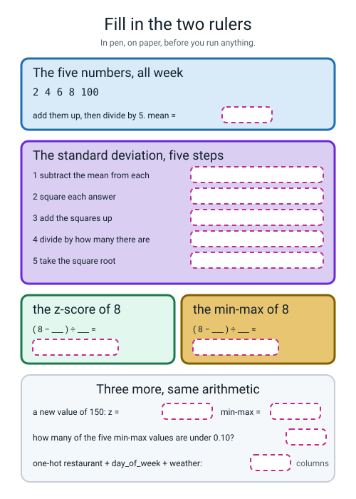
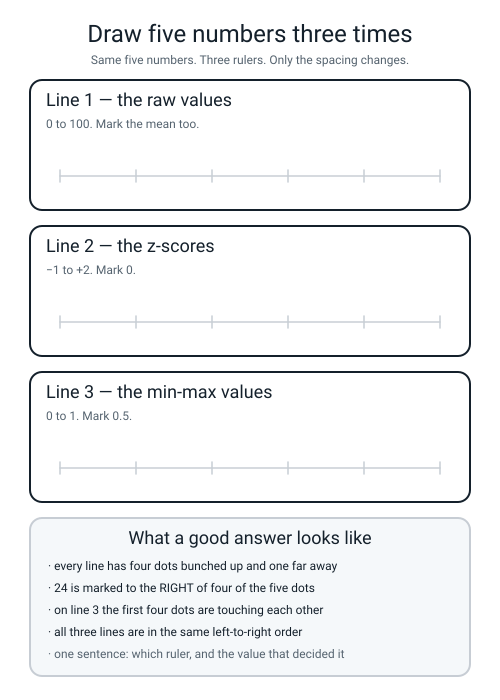

# Workbook — Week 4: Same Number, Different Ruler

**Name:** ________________________________  **Date:** ______________

[⬅ Course Home](../README.md) · [📖 Read the chapter first](../student-guide/week-04.md) · [⬅ Week 3](week-03.md) · [Next ➡](week-05.md)

---

## ✅ Warm-Up (5 min)

Five from **last week** — the `Pipeline`, the artifact and the clean room. No looking back.

**W1.** In `Pipeline(steps=[("prep", prep), ("model", clf)])` — **which of those two stages must be last, and what happens if you put it first?**

________________________________________________________________

**W2.** Eight columns went into last week's `ColumnTransformer` and **twenty** came out. Write the arithmetic.

5 number columns → ______ · 5 + 7 + 3 = ______ · total = ______

**W3.** `delivery_pipeline.joblib` is **5002 bytes**. **Is that file the code, the score, or the fitted thing?**

____________________

**W4.** The clean-room check counted three things in `predict.py` and got **0, 0, 0**. Name any two of the three things it counted.

____________________  and  ____________________

**W5.** Last week's model scored **0.7541** on validation and the baseline scored **0.5000**. **Why must those two numbers be printed by the same script?**

________________________________________________________________

---

## 🔢 Do the Maths by Hand

**Calculator only. No code on this page.** Four exercises, and every one of them is the same five operations: **subtract, square, add, divide, square-root.** Write the five words down the side of your page and point at the one you are on.

### M1 — Column P = `[3, 5, 7, 9, 11]` (the tidy one)

**Step 1 — the mean.**

```text
3 + 5 + 7 + 9 + 11 = __________          __________ ÷ 5 = __________
```

**Step 2 — the standard deviation, all five steps shown.**

```text
subtract the mean:   ______  ______  ______  ______  ______
square each:         ______  ______  ______  ______  ______
add them up:         ______ + ______ + ______ + ______ + ______ = ______
divide by 5:         ______ ÷ 5 = ______
square root:         √______ = ______________
```

**Step 3 — two z-scores.**

| x | arithmetic | z |
|---|---|---|
| 3 | (3 − ______) ÷ ______ | ____________ |
| 11 | (11 − ______) ÷ ______ | ____________ |

**M1(a).** Your two z-scores should be the same number with opposite signs. **Are they? And why should that be true for *this* list?**

________________________________________________________________

**Step 4 — one min-max value.** min = ______, max = ______, range = ______

```text
(5 − ______) ÷ ______ = ______ ÷ ______ = ____________
```

**M1(b).** Min-max all five of column P in your head. You should get five very tidy numbers. Write them.

______  ______  ______  ______  ______

**M1(c).** On this column, **which ruler produces the nicer-looking numbers?** ____________________

### M2 — Column Q = `[1, 2, 2, 3, 92]` (the same shape, with a monster in it)

**Step 1 — the mean.**

```text
1 + 2 + 2 + 3 + 92 = __________          __________ ÷ 5 = __________
```

**Step 2 — the standard deviation, all five steps.**

```text
subtract the mean:   ______  ______  ______  ______  ______
square each:         ______  ______  ______  ______  ______
add them up:         ______________________________ = ______
divide by 5:         ______ ÷ 5 = ______
square root:         √______ = ____________
```

> **⚠️ Watch out:** step 4 does **not** come out whole this time. Keep every digit your calculator gives you and do not round before the square root.

**Step 3 — the monster's z-score.** (92 − ______) ÷ ______ = ____________

**Step 4 — min-max of 2.** min ______, max ______, range ______. (2 − ______) ÷ ______ = ____________

**Step 5 — a value of 120 arrives next month.** Both rulers were fitted on column Q.

```text
z      : (120 − ______) ÷ ______ = ____________
min-max: (120 − ______) ÷ ______ = ____________
```

**M2(a).** One of those two answers has broken a promise. **Which one, what was the promise, and did anything warn you?**

________________________________________________________________

**M2(b).** Columns P and Q **disagree about which ruler is nicer.** P is `3, 5, 7, 9, 11`; Q is nearly the same list with one value replaced. Write one sentence saying what actually changed — **and notice that neither recipe changed at all.**

________________________________________________________________

### M3 — The same column, two units (this one is the point of the week)

Somebody logged driver experience in **months**: `0, 12, 24, 36, 48`. Somebody else logged the identical five drivers in **years**: `0, 1, 2, 3, 4`.

**Months.**

```text
mean = __________ ÷ 5 = __________
squares: ______ + ______ + ______ + ______ + ______ = ______
______ ÷ 5 = ______        √______ = ____________
z of 48 = (48 − ______) ÷ ______ = ____________
```

**Years.**

```text
mean = __________ ÷ 5 = __________
squares: ______ + ______ + ______ + ______ + ______ = ______
______ ÷ 5 = ______        √______ = ____________
z of 4 = (4 − ______) ÷ ______ = ____________
```

**M3(a).** Compare your two z-scores. **Write down what you notice, in one line.**

________________________________________________________________

**M3(b).** Before scaling, the months column ran 0–48 and the years column ran 0–4 — **twelve times bigger.** After standardizing, they are ______________________.

**M3(c).** So finish this sentence, which is the best reason to scale anything: *"Standardizing makes the model immune to ..."*

________________________________________________________________

### M4 — The ladder that is not evenly spaced

Real lateness rates from your own delivery table:

```text
clear  0.2451        rain  0.3507        storm  0.5360
```

**The two steps.**

```text
rain  − clear = 0.3507 − 0.2451 = ____________
storm − rain  = 0.5360 − 0.3507 = ____________
```

**The comparison.** ____________ ÷ ____________ = ____________

**M4(a).** Ordinal encoding codes these `clear 0, rain 1, storm 2`. **Which of the two things below does it get right, and which does it get wrong?**

the **order** → ____________     the **spacing** → ____________

**M4(b).** Now the cardinality arithmetic, which you will do every week from here on.

| column | different values | one-hot columns |
|---|---|---|
| `restaurant` | ______ | ______ |
| `day_of_week` | ______ | ______ |
| `weather` | ______ | ______ |
| | | **total** ______ |

**M4(c).** Those three columns leave and ______ arrive. **Is the row count affected?** ____________

---

## 🔎 Predict the Output

**Write your prediction in pen before you run anything.** Every snippet begins with

```python
import numpy as np
import pandas as pd
```

**Three of these four are not what most people guess.**

### P1 — a column where every value is the same

```python
from sklearn.preprocessing import StandardScaler

X = np.array([5, 5, 5, 5], dtype=float).reshape(-1, 1)
ss = StandardScaler().fit(X)
print("mean_ :", ss.mean_)
print("scale_:", ss.scale_)
print("z     :", ss.transform(X).ravel())
```

**Work out the standard deviation of `5, 5, 5, 5` by hand first.** Mean = ______. Every distance = ______. Every square = ______. So the sd = ______.

**I predict — `mean_`:** ____________  **`scale_`:** ____________  **`z`:** ____________________

**It really printed:**

```text
________________________________
________________________________
________________________________
```

**`scale_` is not what your arithmetic said. What did sklearn do instead, and why would the honest answer have been a disaster?**

________________________________________________________________

________________________________________________________________

### P2 — one capital letter

```python
from sklearn.preprocessing import OneHotEncoder

train = pd.DataFrame({"weather": ["rain", "clear", "Storm"]})
ohe = OneHotEncoder(handle_unknown="ignore", sparse_output=False).fit(train)
print(ohe.get_feature_names_out())

later = pd.DataFrame({"weather": ["clear", "storm", "rain", "clear"]})
out = ohe.transform(later)
print(out.shape)
print(out.astype(int))
```

**I predict — the names, in the order they come out:**

____________________________________________________________

**the shape:** ____________  **and how many 1s in the grid?** ______

**It really printed:**

```text
________________________________________________
________________________________________________
________________________________________________
________________________________________________
________________________________________________
________________________________________________
```

**One row of that grid is all zeros. Which row, and why?**

________________________________________________________________

**Nothing warned you. Write the check you would run to catch this in a real table.**

`________________________________________________`

### P3 — the ladder nobody told it about

```python
from sklearn.preprocessing import OrdinalEncoder

sizes = pd.DataFrame({"size": ["small", "medium", "large", "medium", "small"]})
oe = OrdinalEncoder()
codes = oe.fit_transform(sizes).ravel().astype(int)
print("categories_:", oe.categories_)
print("codes      :", codes)
```

**I predict — `categories_`:** ____________________________  **`codes`:** ____________________

**It really printed:**

```text
________________________________________________
________________________________________________
```

**Write out what the model now believes, using the words *small* and *large*.**

________________________________________________________________

**The one-line fix:**

`oe = OrdinalEncoder(________________________________________)`

### P4 — a shape prediction, on the real table

```python
from sklearn.preprocessing import OneHotEncoder
from make_data import make_deliveries

df = make_deliveries(n=2000, seed=0).drop_duplicates().reset_index(drop=True)
CAT = ["restaurant", "day_of_week", "weather"]
ohe = OneHotEncoder(handle_unknown="ignore", sparse_output=False)
out = ohe.fit_transform(df[CAT])
print("in shape :", df[CAT].shape)
print("out shape:", out.shape)
print("sum of every row:", set(out.sum(axis=1)))
print("sum of the whole grid:", int(out.sum()))
```

**I predict — in shape:** ____________  **out shape:** ____________

**sum of every row:** ____________  **sum of the whole grid:** ____________

**It really printed:**

```text
________________________________
________________________________
________________________________
________________________________
```

**The row sum is not 1. Explain, in one line, why it is what it is.**

________________________________________________________________

**And write the grid total as a multiplication:** ______ × ______ = ______

**How many of the answers on this page did you get right?** ______ / 14

**Which one surprised you most?** ______________________________

---

## ✍️ Practice Set A — Read It

This set is for reading code and output closely before you write any of your own.

**A1. Match the word to the thing.** Write the letter.

| Word | | Description |
|---|---|---|
| **standardization (z-score)** | ______ | (i) One yes-or-no column per category, exactly one 1 per row, no order invented |
| **min-max scaling** | ______ | (ii) How many different values a column has |
| **one-hot encoding** | ______ | (iii) Take away the mean, then divide by the standard deviation |
| **ordinal encoding** | ______ | (iv) Each category becomes one integer on a ladder — and the ladder may not be real |
| **cardinality** | ______ | (v) Take away the smallest, then divide by the range |

**A2. Trace the shapes.** `x` is the five numbers `[2, 4, 6, 8, 100]`; `df` is the 2,000-row delivery table; `CAT` is the three word columns.

| Line | Result |
|---|---|
| `X = x.reshape(-1, 1)` → `X.shape` | ____________ |
| `ss.transform(X).shape` | ____________ |
| `ss.transform(X).ravel().shape` | ____________ |
| `ohe.fit_transform(df[["restaurant"]]).shape` | ____________ |
| `ohe.fit_transform(df[CAT]).shape` | ____________ |
| `oe.fit_transform(df[["weather"]]).shape` | ____________ |

**A2(a).** Two of those six results have **one** number in them instead of two. Which, and what does that mean?

________________________________________________________________

**A2(b).** The last two lines both start from a word column and they come out **completely different widths.** Write both widths and the one-word reason.

______ and ______ · because ____________________

**A3. Spot the bug.** Each line is wrong, or does something you did not want. Say what happens and write the fix.

| # | The line | What happens | The fix |
|---|---|---|---|
| a | `StandardScaler().fit(x)` where `x` is a flat row of 5 numbers | | |
| b | `MinMaxScaler().fit(df["distance_km"])` | | |
| c | `print(StandardScaler().mean_)` | | |
| d | `OneHotEncoder(handle_unknown="ignore").fit_transform(df[["weather"]])` then print it | | |
| e | `OrdinalEncoder(categories=["clear", "rain", "storm"])` | | |
| f | `StandardScaler().fit(df[["weather"]])` | | |

**A3(g).** Exactly one of those six produces **no traceback at all.** Which one, and what does the printout look like?

________________________________________________________________

**A3(h).** Two of those six are the *same* mistake in two different notations. Which two, and what is the mistake in one sentence?

________________________________________________________________

**A4. Match the code to the output.** All five were fitted on **column Q = `[1, 2, 2, 3, 92]`**, held as a `(5, 1)` numpy block. Five of each, no output used twice.

| | Code |
|---|---|
| i | `print(np.round(ss.scale_, 4))` |
| ii | `print(np.round(mm.transform([[2.0]]).ravel(), 4))` |
| iii | `print(mm.data_max_ - mm.data_min_)` |
| iv | `print(np.round(ss.transform([[120.0]]).ravel(), 4))` |
| v | `print(np.round(mm.transform([[120.0]]).ravel(), 4))` |

| | Output |
|---|---|
| P | `[1.3077]` |
| Q | `[91.]` |
| R | `[0.011]` |
| S | `[36.0056]` |
| T | `[2.7773]` |

**Your answers:** i → ______  ii → ______  iii → ______  iv → ______  v → ______

**A4(a).** One of those five outputs is **the number a `MinMaxScaler` divides by**, and one of them is an output that **only min-max could ever produce**. Name both, with the reason.

________________________________________________________________

________________________________________________________________

**A4(b).** Every one of the five would change if a value of 120 had been in the training data. **Would the z of 120 go up or down?** ____________  **One line of reasoning:**

________________________________________________________________

**A5. Read four scaler reports and pick the ruler.** All four are real, from real runs on 2,000 rows.

**Report A**

```text
--- report on distance_km ---
  scaler.mean_ : 3.5193
  scaler.scale_: 2.2938
  data_min_    : 0.33   data_max_: 14.40
  biggest z    : +4.7435
  how many min-max values are below 0.10: 448 of 2000
```

**Which ruler, and the number that decided it?** ____________________________________

**Report B**

```text
--- report on items ---
  scaler.mean_ : 3.5520
  scaler.scale_: 1.7290
  data_min_    : 1.00   data_max_: 6.00
  biggest z    : +1.4159
  how many min-max values are below 0.10: 328 of 2000
```

**This one is genuinely arguable. Give the case for min-max in one sentence.**

________________________________________________________________

**Report C**

```text
--- report on pixel_brightness ---
  scaler.mean_ : 130.6980
  scaler.scale_: 73.3530
  data_min_    : 0.00   data_max_: 255.00
  biggest z    : +1.6946
  how many min-max values are below 0.10: 182 of 2000
```

**This is the honest min-max case. Say the sentence out loud that makes it honest.**

________________________________________________________________

**Report D**

```text
--- report on monthly_pay ---
  scaler.mean_ : 2449.8420
  scaler.scale_: 1321.6155
  data_min_    : 617.00   data_max_: 9033.00
  biggest z    : +4.9811
  how many min-max values are below 0.10: 487 of 2000
```

**Which report is the *worst* candidate for min-max, and which two numbers prove it?**

________________________________________________________________

**A5(a).** Three of those four reports have `data_min_` and `data_max_` that come from **whatever happened to be in the training rows.** One has limits that come from **the definition of the thing itself.** Which one, and why does that difference decide the whole question?

________________________________________________________________

________________________________________________________________

**A6. Fill in the two rulers.** Every answer has been removed. Do all of it from memory first, then run `rulers.py` and tick the boxes you got.


*Figure W4.1 — The five numbers with every answer removed, plus three more from the same page.*

**A6(a).** Which boxes did you get wrong? ______________________

**A6(b).** Two of the boxes hold a **count of things** rather than a measurement. Which two?

________________________________________________________________

---

## ✍️ Practice Set B — Write It

This set is for writing short programs of your own, from one line up to a whole program.

### B1 — one line, plus a print

**Task:** print the standard deviation that a `StandardScaler` learns from column Q, `[1, 2, 2, 3, 92]`, rounded to 4 decimal places.

**Expected output:**

```text
Q typical gap: 36.0056
```

**Done looks like:** one `reshape`, one `.fit`, one `round`, and **no loop**.

```python
import numpy as np
from sklearn.preprocessing import StandardScaler

Q = np.array([1, 2, 2, 3, 92], dtype=float).reshape(____, ____)
ss = ____________________________
print("Q typical gap:", ______________________________)
```

### B2 — the five steps, as a function

**Task:** write `z_by_hand(values)` which returns the mean, the standard deviation rounded to 4 places, and a list of z-scores rounded to 4 places — **using nothing but `+`, `−`, `×`, `÷` and `** 0.5`.** Then print sklearn's answer underneath and check every digit.

**Expected output:**

```text
column     : [3, 5, 7, 9, 11]
  by hand  : mean 7.0  sd 2.8284
  z        : [-1.4142, -0.7071, 0.0, 0.7071, 1.4142]
  sklearn  : mean 7.0  sd 2.8284
  z        : [-1.4142, -0.7071, 0.0, 0.7071, 1.4142]
column     : [1, 2, 2, 3, 92]
  by hand  : mean 20.0  sd 36.0056
  z        : [-0.5277, -0.4999, -0.4999, -0.4721, 1.9997]
  sklearn  : mean 20.0  sd 36.0056
  z        : [-0.5277, -0.4999, -0.4999, -0.4721, 1.9997]
```

**Done looks like:** three `for` loops, one `** 0.5`, and **your four numbers matching sklearn's four numbers exactly.**

```python
def z_by_hand(values):
    n = ______________
    total = 0.0
    for v in values:
        total = ______________________
    mean = ______________
    squares = 0.0
    for v in values:
        squares = ______________________________________
    sd = ______________________
    zs = []
    for v in values:
        zs.append(______________________________)
    return mean, round(sd, 4), zs
```

**B2(a).** Your function divides by `n`, not by `n − 1`. If you divide by `n − 1` instead you get 3.1623 for column P rather than 2.8284. **Which one matches sklearn?** ____________

### B3 — the ten drills, checked by machine

**Task:** write `drills.py`, which prints `mean_`, `scale_`, the z-scores and the min-max values for **both** columns P and Q, and then what each ruler does with a new value of 120 for Q.

**Expected output:**

```text
--- column P ---
  scaler.mean_  [7.]  scaler.scale_ [2.82842712]
  z             [-1.4142 -0.7071  0.      0.7071  1.4142]
  min-max       [0.   0.25 0.5  0.75 1.  ]
--- column Q ---
  scaler.mean_  [20.]  scaler.scale_ [36.00555513]
  z             [-0.5277 -0.4999 -0.4999 -0.4721  1.9997]
  min-max       [0.    0.011 0.011 0.022 1.   ]

new value 120 for Q:
  z       [2.7773]
  min-max [1.3077]
```

**Done looks like:** one `for` loop over a list of two `(name, values)` pairs, and the number `1.3077` appearing on your screen.

### B4 — count the columns before you look

**Task:** write `count_columns.py`. Print the cardinality of each of the three word columns, then one-hot all three at once and print the shapes and the sum. **Write your predictions in pen first.**

**Expected output:**

```text
restaurant cardinality: 5
day_of_week cardinality: 7
weather cardinality: 3
in shape : (2000, 3)
out shape: (2000, 15)
5 + 7 + 3 = 15
['restaurant_CrustyBros' 'restaurant_GreenLeaf' 'restaurant_Napoli'
 'restaurant_SliceHouse' 'restaurant_TandooriPizza' 'day_of_week_Fri'
 'day_of_week_Mon' 'day_of_week_Sat' 'day_of_week_Sun' 'day_of_week_Thu'
 'day_of_week_Tue' 'day_of_week_Wed' 'weather_clear' 'weather_rain'
 'weather_storm']
```

**Done looks like:** a loop over `CAT` for the cardinalities, then one `fit_transform`, and **the printed `15` agreeing with your pen.**

**B4(a).** The names come out grouped by original column and **alphabetical inside each group.** Find the one place in that list where alphabetical order is not what you would have guessed.

____________________

### B5 — a whole program of your own, about 25 lines

**Task:** write `escape_check.py`. For each of the four numeric columns `distance_km`, `items`, `prep_minutes` and `order_hour`, print what both scalers learned. Then push **one new value per column** through both rulers and print whether the min-max answer **escaped the 0-to-1 box.**

Use these four new values: `distance_km 5.00` · `items 8.0` · `prep_minutes 30.0` · `order_hour 9.0`.

**Expected output:**

```text
column              mean_    scale_       min       max
distance_km        3.5193    2.2938      0.33     14.40
items              3.5520    1.7290      1.00      6.00
prep_minutes      14.0658    4.0002      4.00     26.60
order_hour        16.7885    3.6022     10.00     23.00

one new value per column, arriving at prediction time:
distance_km        5.00  ->  z +0.6455   min-max  +0.3319   inside
items              8.00  ->  z +2.5726   min-max  +1.4000   ESCAPED THE BOX
prep_minutes      30.00  ->  z +3.9833   min-max  +1.1504   ESCAPED THE BOX
order_hour         9.00  ->  z -2.1622   min-max  -0.0769   ESCAPED THE BOX
```

**Done looks like:** two loops, an `if` that decides between `inside` and `ESCAPED THE BOX`, and **the word ESCAPED appearing three times.**

> **⚠️ Watch out:** wrap each new value in `pd.DataFrame({col: [value]})`, not `[[value]]`. A bare list of lists works, but sklearn prints `UserWarning: X does not have valid feature names` because it was fitted on a named column and you handed it an anonymous block.

**B5(a).** Three columns escaped. **One of them escaped out of the *bottom*.** Which, what number did it get, and how is a negative min-max value even possible?

________________________________________________________________

**B5(b).** `distance_km 5.00` is the one that stayed inside. Check its two numbers on a calculator and write both divisions out in full.

```text
z      : (5.00 − ________) ÷ ________ = ____________
min-max: (5.00 − ________) ÷ ________ = ____________
```

---

## 🐞 Fix the Broken Program

This page is for practising finding bugs from their error messages.

This program has **three** bugs: one **shape** bug, one **runtime** bug, and one **silent logic** bug. The real error messages are below, in the order you meet them.

```python
"""broken04.py - put four columns of a T-shirt shop on the same ruler. THREE bugs."""
import numpy as np
import pandas as pd
from sklearn.preprocessing import (MinMaxScaler, OneHotEncoder,
                                   OrdinalEncoder, StandardScaler)

price = np.array([8, 10, 12, 14, 96], dtype=float)

print("=== step 1: the price column, standardized ===")
ss = StandardScaler().fit(price)
print("mean_ :", ss.mean_)
print("scale_:", ss.scale_)

print("=== step 2: the same column, min-maxed ===")
mm = MinMaxScaler().fit(price.reshape(-1, 1))
print("min-max:", np.round(mm.transform(price.reshape(-1, 1)).ravel(), 4))

print("=== step 3: colour is not a ladder, so one-hot it ===")
colour = pd.DataFrame({"colour": ["red", "blue", "green", "blue", "red"]})
ohe = OneHotEncoder(sparse_output=False).fit(colour)
print("columns:", ohe.get_feature_names_out())
print("a new colour arrives:", ohe.transform(pd.DataFrame({"colour": ["teal"]})))

print("=== step 4: size IS a ladder, so ordinal-encode it ===")
size = pd.DataFrame({"size": ["small", "medium", "large", "medium", "small"]})
oe = OrdinalEncoder()
codes = oe.fit_transform(size).ravel().astype(int)
print(pd.DataFrame({"size": size["size"], "code": codes}).to_string(index=False))
```

**Run 1 — it stops on the first thing it tries:**

```text
=== step 1: the price column, standardized ===
Traceback (most recent call last):
  File "/private/tmp/l3wb456/broken04.py", line 10, in <module>
    ss = StandardScaler().fit(price)
  ...
  File ".../sklearn/utils/validation.py", line 1091, in check_array
    raise ValueError(msg)
ValueError: Expected 2D array, got 1D array instead:
array=[ 8. 10. 12. 14. 96.].
Reshape your data either using array.reshape(-1, 1) if your data has a single feature or array.reshape(1, -1) if it contains a single sample.
```

**Bug 1.** Which line? ______  **Kind of bug?** ______________

**The message offers you two reshapes. Which one, and why not the other?**

________________________________________________________________

**The fix:** `ss = StandardScaler().fit(______________________)`

**One line of the program already does it right. Which line, and what does that tell you about the bug?**

____________________

**Run 2 — after fixing bug 1:**

```text
=== step 1: the price column, standardized ===
mean_ : [28.]
scale_: [34.05877273]
=== step 2: the same column, min-maxed ===
min-max: [0.     0.0227 0.0455 0.0682 1.    ]
=== step 3: colour is not a ladder, so one-hot it ===
columns: ['colour_blue' 'colour_green' 'colour_red']
Traceback (most recent call last):
  File "/private/tmp/l3wb456/broken04_fix1.py", line 22, in <module>
    print("a new colour arrives:", ohe.transform(pd.DataFrame({"colour": ["teal"]})))
  ...
  File ".../sklearn/preprocessing/_encoders.py", line 218, in _transform
    raise ValueError(msg)
ValueError: Found unknown categories ['teal'] in column 0 during transform
```

**Bug 2.** Which line? ______  **Kind of bug?** ______________

**Read the last three words of that message. Why does `during transform` matter more than `during fit` would?**

________________________________________________________________

**The fix:** `ohe = OneHotEncoder(____________________________, sparse_output=False).fit(colour)`

**And check the arithmetic in that output while you are here.**

```text
8 + 10 + 12 + 14 + 96 = ______        ______ ÷ 5 = ______   (matches mean_?  ______)
squares: ______ + ______ + ______ + ______ + ______ = ______
______ ÷ 5 = ______        √______ = ____________   (matches scale_?  ______)
min-max of 10: (10 − ______) ÷ ______ = ____________
```

**Run 3 — after fixing bugs 1 and 2. It runs all the way through with no error at all:**

```text
=== step 1: the price column, standardized ===
mean_ : [28.]
scale_: [34.05877273]
=== step 2: the same column, min-maxed ===
min-max: [0.     0.0227 0.0455 0.0682 1.    ]
=== step 3: colour is not a ladder, so one-hot it ===
columns: ['colour_blue' 'colour_green' 'colour_red']
a new colour arrives: [[0. 0. 0.]]
=== step 4: size IS a ladder, so ordinal-encode it ===
  size  code
 small     2
medium     1
 large     0
medium     1
 small     2
```

> **⚠️ Before you go on, run one consistency check on that last table.** Both `small` rows should carry the same code, and both `medium` rows should too. **Do they?** ______ · **Why is that worth checking even though the encoder is wrong?**

________________________________________________________________

**Bug 3.** Which line? ______  **Kind of bug?** ______________

**What does the model now believe? Use the words `small` and `large`.**

________________________________________________________________

**The fix:** write the corrected line.

```python
oe = ____________________________________________________________
```

**And the printout after the fix — fill in the three codes:**

small → ______  medium → ______  large → ______

**Two questions, and they are the point of the whole page.**

**All three bugs are about the same thing: a library filling in a decision you did not make. Name the decision it filled in each time.**

bug 1 ____________________ · bug 2 ____________________ · bug 3 ____________________

**Rank the three from easiest to hardest to notice, and say what would have caught each one.**

**easiest → hardest:** ______  ______  ______

________________________________________________________________

________________________________________________________________

---

## 🧩 Puzzle of the Week

This page is for working out, from printed numbers alone, what was done to them.

### The Ruler Detective

Five printouts. Somebody scaled a column and threw away the code. **For each one, say which ruler it was — z-score or min-max — and write the clue that proves it.**

```text
1   [0.     0.25   0.5    0.75   1.    ]
2   [-1.4142 -0.7071  0.      0.7071  1.4142]
3   [0.     0.011  0.011  0.022  1.    ]
4   [-0.5277 -0.4999 -0.4999 -0.4721  1.9997]
5   [0. 0. 0. 0.]
```

| # | Which ruler? | The clue |
|---|---|---|
| 1 | | |
| 2 | | |
| 3 | | |
| 4 | | |
| 5 | | |

**Part 1(a).** Two of the five clues are **structural** — they are true of every min-max output that has ever existed, or of every z-score output. Write both rules.

**min-max always contains** ____________________________________

**z-scores always add up to** ____________________

**Part 1(b).** One of the five is **impossible to decide.** Which, and what would you have to be told?

________________________________________________________________

**Part 1(c).** Printouts 1 and 3 came from **the same recipe** on two different columns, and printouts 2 and 4 came from the same recipe on those same two columns. **Which pair of printouts came from the column with the monster in it, and how can you tell without being told?**

________________________________________________________________

### Part 2 — work backwards

A scaler was fitted, and all you are told is this:

```text
scaler.mean_ : [50.]
scaler.scale_: [8.]
```

Three z-scores come out: `-2.5`, `0.0`, `+1.25`. **Recover the three original values.**

```text
raw = mean + z × sd

______ + (−2.5 × ______) = ______
______ + ( 0.0 × ______) = ______
______ + ( 1.25 × ______) = ______
```

**Part 2(a).** Now a `MinMaxScaler` on the *same three numbers*. What are its `data_min_` and `data_max_`?

____________  and  ____________

**Part 2(b).** So what min-max value does the middle number get? ____________ ÷ ____________ = ____________

**Part 2(c).** One of the two scalers can be run **backwards** from its two learned numbers alone, for any value, for ever. **Can the other?** Write one line on what each scaler would need to be told.

________________________________________________________________

---

## 🤔 Think Deeper

These questions are for explaining your reasoning in your own words.

**T1.** Standardizing makes a model give the identical answer whether experience was logged in months or years. **Write a paragraph** on what that actually buys you. Is "the answer no longer depends on a unit somebody chose arbitrarily" a *better* reason to scale than "the score went up"? What would you say to somebody who scaled, saw the score go **down** by 0.0009, and wanted to take the scaler out again?

________________________________________________________________

________________________________________________________________

________________________________________________________________

________________________________________________________________

________________________________________________________________

**T2.** `handle_unknown="ignore"` turns a crash into five zeros and a slightly worse answer. That is a **choice about what to do when you do not know**, and somebody had to make it. **Write a paragraph:** is a quietly worse answer always better than an error? Think of a case where you would *rather* the program stopped. Where does the person receiving the prediction fit into your answer — do they get told that this order was for a restaurant the model has never seen?

________________________________________________________________

________________________________________________________________

________________________________________________________________

________________________________________________________________

________________________________________________________________

---

## 🛠️ Build It — Ten Drills, Five Cards, One Trap

**Three things get handed in: the ten drills with the machine's answer beside every one, the one-hot count, and two sentences about the ordinal trap.** The third is the one being marked.

### Step checklist

- [ ] **1.** `make_data.py` from Week 1 is still in the folder. **Check the first `order_id` is 100955.**
- [ ] **2.** All ten drills done **by hand**, with the five steps visible. Not just the answers.
- [ ] **3.** `drills.py` runs. Write the machine's numbers **beside** your own, four decimal places.
- [ ] **4.** For any disagreement, write down **which of the five steps** went wrong. Do not cross out your own work.
- [ ] **5.** Three rows of five restaurants one-hot encoded on paper, by hand.
- [ ] **6.** The cardinality sum: 5 + 7 + 3, and the total written down.
- [ ] **7.** One sentence on `handle_unknown="ignore"` that mentions **something that happens in the world**, not in Python.
- [ ] **8.** The two ordinal-trap sentences, with **a number in at least one of them**.
- [ ] **9.** Name one column where ordinal encoding is **right**, and write the ladder out with less-than signs.
- [ ] **10.** Two Bug Log entries: one loud, one silent.

### The ten drills

**Column P = `[3, 5, 7, 9, 11]`**

| Drill | What | By hand | sklearn | Agree? |
|---|---|---|---|---|
| 1 | the mean | | | |
| 2 | the standard deviation | | | |
| 3 | z-score of 3 | | | |
| 4 | z-score of 11 | | | |
| 5 | min-max of 5 | | | |

**Column Q = `[1, 2, 2, 3, 92]`**

| Drill | What | By hand | sklearn | Agree? |
|---|---|---|---|---|
| 6 | the mean | | | |
| 7 | the standard deviation | | | |
| 8 | z-score of 92 | | | |
| 9 | min-max of 2 | | | |
| 10 | a new value of 120, both rulers | | | |

**Show the five steps for drills 2 and 7. Working, not answers.**

**Drill 2:**

```text
subtract: ____________________________________________
square:   ____________________________________________
add:      ____________________________________________
divide:   ____________________________________________
root:     ____________________________________________
```

**Drill 7:**

```text
subtract: ____________________________________________
square:   ____________________________________________
add:      ____________________________________________
divide:   ____________________________________________
root:     ____________________________________________
```

**Which drill disagreed with sklearn, if any?** ____________

**Which of the five steps was guilty?** ____________________

### Which ruler, and why

**For column P I would use** ____________________ **because** ________________________________

**For column Q I would use** ____________________ **because** ________________________________

**The two columns disagree. Write the one sentence that explains why, mentioning the value 92.**

________________________________________________________________

### One-hot by hand

| restaurant | _CrustyBros | _GreenLeaf | _Napoli | _SliceHouse | _TandooriPizza |
|---|---|---|---|---|---|
| Napoli | | | | | |
| CrustyBros | | | | | |
| TandooriPizza | | | | | |

**The check:** how many 1s in the whole grid? ______  **How many 0s?** ______  **Total cells:** ______ × ______ = ______

**The column count**

```text
restaurant   :  ______ values  ->  ______ columns
day_of_week  :  ______ values  ->  ______ columns
weather      :  ______ values  ->  ______ columns
                                  --------
                                   ______ new columns, replacing ______ old ones
```

**`handle_unknown="ignore"` — one sentence, about the world:**

________________________________________________________________

**And the row a sixth restaurant gets:** ______  ______  ______  ______  ______

### The ordinal trap

**The codes:** clear → ______  rain → ______  storm → ______

**The two real gaps, from your own table:**

```text
rain  − clear = ____________ − ____________ = ____________
storm − rain  = ____________ − ____________ = ____________
the comparison:  ____________ ÷ ____________ = ____________
```

**Sentence 1 — what the model now wrongly believes (put a number in it):**

________________________________________________________________

________________________________________________________________

**Sentence 2 — and what that forces the model to do about it:**

________________________________________________________________

________________________________________________________________

**A column where ordinal encoding is RIGHT.** Name it, then write the ladder.

**column:** ____________________

**the ladder:** ______ < ______ < ______ < ______ < ______

### The Bug Log

| What I saw | What it means | Cause | Fix |
|---|---|---|---|
| | | | |
| | | | |

---

## 🎨 Draw It

This page is for drawing the week's idea instead of writing it.

Draw the same five numbers — `2, 4, 6, 8, 100` — three times, on three number lines in your own hand.


*Figure W4.2 — Three empty number lines, and what a good answer contains.*

**Then answer four things about your own drawing:**

**On which line do four of your five dots touch each other?** ____________

**On which line is the mean marked to the *right* of four of the five dots?** ____________

**Is the left-to-right order the same on all three lines?** ____________  **What does that tell you about what scaling does and does not change?**

________________________________________________________________

**If you rubbed out the 100 and redrew all three lines, one of them would change character completely. Which, and how?**

________________________________________________________________

---

## 📊 Self-Check

This page is for marking honestly how well you can do each thing. Tick one face per row.

| I can... | 😀 | 🙂 | 😕 |
|---|---|---|---|
| work out a standard deviation by hand in five named steps: subtract, square, add, divide, square-root | | | |
| say why you square, and why averaging the raw distances is useless | | | |
| turn any value into a z-score and say it out loud in "typical steps from average" | | | |
| min-max scale a column, and say what `2, 4, 6, 8` become and why that is a problem | | | |
| check my hand answers against `scaler.mean_` and `scaler.scale_` to four decimal places | | | |
| explain what a new value of 150 does to each ruler — 3.3112 and 1.5102 | | | |
| one-hot a five-category column, count the new columns, and check one 1 per row | | | |
| say what `handle_unknown="ignore"` saves me from, in terms of the world | | | |
| show the false ordering ordinal encoding invents, with 0.1056 and 0.1853 | | | |
| name a column where ordinal encoding is right, and write the ladder with less-than signs | | | |
| read `Expected 2D array, got 1D array` and fix it without help | | | |
| explain what a trailing underscore means, and what an `AttributeError` on one tells me | | | |

**The one thing I would ask about if I could ask one question:**

________________________________________________________________

---

## ✅ Answers

Use this section only after you have finished the pages above. Open it to check your work.

<details>
<summary>Check your answers</summary>

### Warm-Up

**W1.** **The model must be last.** Everything before it must have a `.transform`; the model does not. Put it first and the pipeline raises a `TypeError` when you call `.fit`, because it tries to `transform` with something that cannot transform.

**W2.** 5 number columns → **5** · 5 + 7 + 3 = **15** · total **20**. Five stayed five because scaling changes the *values* and not the *width*; the three word columns turned into fifteen.

**W3.** **The fitted thing.** Not the code — that is in your `.py` files. Not the score — that is a number in a report. 5002 bytes of learned numbers: the medians, the means, the standard deviations, the category lists and the weights.

**W4.** Any two of: `fit(`, `make_data`, `train_test`. Three zeros means no training code got into the prediction program.

**W5.** Because a score without its baseline is not a result. If they live in two files, sooner or later somebody quotes the 0.7541 and forgets the 0.5000, and nobody can tell whether the model learned anything. Printing both in one run makes that impossible.

### Do the Maths by Hand

**M1 — column P = `[3, 5, 7, 9, 11]`.**

```text
3 + 5 + 7 + 9 + 11 = 35        35 ÷ 5 = 7

subtract 7:   −4    −2     0     2     4
square:       16     4     0     4    16
add:          16 + 4 + 0 + 4 + 16 = 40
divide by 5:  40 ÷ 5 = 8
square root:  √8 = 2.8284
```

z of 3 = (3 − 7) ÷ 2.8284 = −4 ÷ 2.8284 = **−1.4142**
z of 11 = (11 − 7) ÷ 2.8284 = 4 ÷ 2.8284 = **+1.4142**

**M1(a).** They are equal and opposite, **because this list is symmetric about its mean.** 3 is exactly as far below 7 as 11 is above it. A list with a monster in it does not behave like that — see M2.

**Step 4.** min 3, max 11, range 8. (5 − 3) ÷ 8 = 2 ÷ 8 = **0.2500**.

**M1(b).** **0, 0.25, 0.5, 0.75, 1.** Perfectly even, because the five values are evenly spaced.

**M1(c).** **Min-max** looks nicer here, and that is the honest answer. `0, 0.25, 0.5, 0.75, 1` is friendlier than `−1.4142 … +1.4142`. **Nothing about the recipes changed between P and Q — only the data did.**

**M2 — column Q = `[1, 2, 2, 3, 92]`.**

```text
1 + 2 + 2 + 3 + 92 = 100       100 ÷ 5 = 20

subtract 20:  −19   −18   −18   −17   +72
square:       361   324   324   289  5184
add:          361 + 324 + 324 + 289 + 5184 = 6482
divide by 5:  6482 ÷ 5 = 1296.4
square root:  √1296.4 = 36.0056
```

**Step 3.** z of 92 = (92 − 20) ÷ 36.0056 = 72 ÷ 36.0056 = **+1.9997**.

**Step 4.** min 1, max 92, range 91. (2 − 1) ÷ 91 = 1 ÷ 91 = **0.0110**.

**Step 5.**

```text
z      : (120 − 20) ÷ 36.0056 = 100 ÷ 36.0056 = 2.7773
min-max: (120 −  1) ÷ 91      = 119 ÷ 91      = 1.3077
```

**M2(a).** **The min-max answer, 1.3077.** The promise was *"every value comes out between 0 and 1"*, and it is broken the very first time a value bigger than anything in training walks in. **No error, no warning.** The z-score never promised a limit, so 2.7773 breaks nothing — it says *"120 sits 2.78 typical steps above average"*, which is true and comparable with any other column.

**M2(b).** **One value changed.** P's biggest value is 11; Q's is 92. That one number moves the mean from 7 to 20, the typical gap from 2.8284 to 36.0056, and the min-max range from 8 to 91 — and because min-max divides by that range, the four small values collapse into `0, 0.011, 0.011, 0.022`, the bottom **2.2%** of the ruler. `2` and `3` are now nearly the same number, and in the original list one is 1.5 times the other.

**M3 — months against years.**

```text
MONTHS 0, 12, 24, 36, 48
mean = 120 ÷ 5 = 24
squares: 576 + 144 + 0 + 144 + 576 = 1440
1440 ÷ 5 = 288        √288 = 16.9706
z of 48 = (48 − 24) ÷ 16.9706 = 24 ÷ 16.9706 = +1.4142

YEARS 0, 1, 2, 3, 4
mean = 10 ÷ 5 = 2
squares: 4 + 1 + 0 + 1 + 4 = 10
10 ÷ 5 = 2            √2 = 1.4142
z of 4 = (4 − 2) ÷ 1.4142 = 2 ÷ 1.4142 = +1.4142
```

**And the machine agrees, exactly:**

```python
import numpy as np
from sklearn.preprocessing import StandardScaler

for name, vals in [("months", [0, 12, 24, 36, 48]), ("years", [0, 1, 2, 3, 4])]:
    X = np.array(vals, dtype=float).reshape(-1, 1)
    ss = StandardScaler().fit(X)
    print(f"--- {name} ---")
    print("  mean_ ", ss.mean_, " scale_", np.round(ss.scale_, 4))
    print("  z     ", np.round(ss.transform(X).ravel(), 4))
```

**Real output. Runtime under 1 second.**

```text
--- months ---
  mean_  [24.]  scale_ [16.9706]
  z      [-1.4142 -0.7071  0.      0.7071  1.4142]
--- years ---
  mean_  [2.]  scale_ [1.4142]
  z      [-1.4142 -0.7071  0.      0.7071  1.4142]
```

**M3(a).** **The two sets of z-scores are identical, digit for digit.** Not close — identical.

**M3(b).** After standardizing they are **exactly the same column**: mean 0, typical step 1, same five values.

**M3(c).** *"Standardizing makes the model immune to* **the unit somebody happened to choose when they wrote the data down.** *"* Divide every value by 12 and both the mean and the typical gap divide by 12 too, so the division cancels it out. This is a much better reason to scale than any score, because it is true before you have measured anything.

**M4 — the uneven ladder.**

```text
rain  − clear = 0.3507 − 0.2451 = 0.1056
storm − rain  = 0.5360 − 0.3507 = 0.1853
0.1853 ÷ 0.1056 = 1.75
```

**M4(a).** the **order** → **right.** Weather really is a ladder: clear, then rain, then storm, and nobody would argue. the **spacing** → **wrong.** Codes 0, 1, 2 say the two steps are the same size, and the second step is **1.75 times** the first.

**M4(b).**

| column | different values | one-hot columns |
|---|---|---|
| `restaurant` | **5** | **5** |
| `day_of_week` | **7** | **7** |
| `weather` | **3** | **3** |
| | | **total 15** |

**M4(c).** Those three leave and **fifteen** arrive. **The row count is not affected at all.** One-hot encoding changes how wide the table is, never how tall.

### Predict the Output

**P1 — every value the same.**

By hand: mean = **5**. Every distance = **0**. Every square = **0**. So the sd = **0**.

```text
mean_ : [5.]
scale_: [1.]
z     : [0. 0. 0. 0.]
```

**`scale_` is 1, not 0.** sklearn noticed the standard deviation was zero and **quietly replaced it with 1**, because the next thing it does is divide by it, and dividing by zero gives `inf` or `nan` for every row of your table. So instead of a column full of `nan` you get a column full of `0.0` — which is honest, in its way: *"every value in this column is average, because they are all the same."*

**The honest answer would have been a disaster:** a single constant column would have poisoned every row of `X` with `nan`, and the model would have refused to fit — or worse, some other library would have carried on with `nan` in it.

> **💡 Try this:** a column where every value is the same carries **no information at all**. Neither ruler can help it. The real fix is to notice it and drop it.

**P2 — one capital letter.**

```text
['weather_Storm' 'weather_clear' 'weather_rain']
(4, 3)
[[0 1 0]
 [0 0 0]
 [0 0 1]
 [0 1 0]]
```

**Three things happened.** First, `Storm` sorted **before** `clear` and `rain`, because sorting compares character codes and **capitals come before lowercase**. Second, the shape is `(4, 3)`: four rows in, four rows out; three categories learned, three columns out — the shape is decided by `fit`, never by `transform`. Third: **there are only three 1s in a four-row grid.**

**Row 2 is all zeros.** It asked for `"storm"` with a small s, and the encoder learned `"Storm"` with a big one. **They are different strings.** `handle_unknown="ignore"` did exactly what it was told: an unseen value becomes all zeros. **No error. No warning.**

**The check:**

```python
print(sorted(later["weather"].unique()), sorted(train["weather"].unique()))
```

or, better, count the ones: `print(out.sum(axis=1))` should be `1` on every row, and here it prints `[1. 0. 1. 1.]`. **A row that sums to 0 is a category your encoder has never met.** Make that check a reflex.

**P3 — the ladder nobody told it about.**

```text
categories_: [array(['large', 'medium', 'small'], dtype=object)]
codes      : [2 1 0 1 2]
```

It sorted alphabetically: **l**arge, **m**edium, **s**mall. So `large` became 0 and `small` became 2.

**What the model now believes:** that **small is bigger than large** — two whole steps bigger — and that medium sits neatly between them. The ladder is upside down, and nothing on your screen says so.

**The fix:**

```python
oe = OrdinalEncoder(categories=[["small", "medium", "large"]])
```

**A list inside a list**, in the order you mean. Not optional politeness — it is the difference between a correct ladder and a silently reversed one.

**P4 — the shape prediction.**

```text
in shape : (2000, 3)
out shape: (2000, 15)
sum of every row: {3.0}
sum of the whole grid: 6000
```

**The row sum is 3, not 1,** because there are **three** one-hot blocks side by side — one for `restaurant`, one for `day_of_week`, one for `weather` — and each block contributes exactly one 1. *"Exactly one 1 per row"* is a rule about **one** encoded column, not about the whole grid.

**The grid total:** 2000 × 3 = **6000**. Two thousand rows, three 1s each.

`set(out.sum(axis=1))` printing `{3.0}` is a nice trick worth keeping: it collapses 2,000 row sums into the *set* of distinct values found. One element means every single row agrees. If you ever see `{2.0, 3.0}` there is a category the encoder never met.

### Practice Set A

**A1.** standardization → **(iii)** · min-max → **(v)** · one-hot → **(i)** · ordinal → **(iv)** · cardinality → **(ii)**

**A2.**

| Line | Result |
|---|---|
| `X.shape` | **(5, 1)** |
| `ss.transform(X).shape` | **(5, 1)** |
| `ss.transform(X).ravel().shape` | **(5,)** |
| `ohe.fit_transform(df[["restaurant"]]).shape` | **(2000, 5)** |
| `ohe.fit_transform(df[CAT]).shape` | **(2000, 15)** |
| `oe.fit_transform(df[["weather"]]).shape` | **(2000, 1)** |

**A2(a).** The third one, `(5,)`. `.ravel()` flattens the one-column table back into a flat row, and a flat row has only a length. (The trailing comma in `(5,)` is Python saying *"this is a tuple with one thing in it, not a bracketed number"*.) It is fine for printing and **not** fine for handing back to sklearn.

**A2(b).** **15** and **1**, because one-hot makes *one column per value* and ordinal makes *one column, full stop*. `weather` has cardinality 3, so one-hot gives 3 and ordinal gives 1 — and that single column carries the extra claim that the three values are in order and evenly spaced.

**A3.**

| # | What happens | The fix |
|---|---|---|
| a | `ValueError: Expected 2D array, got 1D array instead` | `x.reshape(-1, 1)` |
| b | `ValueError: Expected a 2-dimensional container but got <class 'pandas.core.series.Series'> instead.` | double brackets: `df[["distance_km"]]` |
| c | `AttributeError: 'StandardScaler' object has no attribute 'mean_'` | call `.fit(X)` first |
| d | **no error** — it prints `(0, 0)  1.0` and so on, a list of coordinates | add `sparse_output=False` while you are learning |
| e | `ValueError: Shape mismatch: if categories is an array, it has to be of shape (n_features,).` | a list **inside** a list: `categories=[["clear", "rain", "storm"]]` |
| f | `ValueError: could not convert string to float: 'clear'` | send word columns down the categorical branch |

**A3(g).** **(d).** You get a *sparse* matrix, which saves memory by storing only the cells that are not zero, and prints as a list of coordinates:

```text
  (0, 0)	1.0
  (1, 1)	1.0
  (2, 1)	1.0
```

That is not a bug and it is what you want inside a real pipeline. It is useless while you are learning, because you cannot see the grid.

**A3(h).** **(a) and (b).** Both hand a **flat row** to something that wants a **table**. `reshape(-1, 1)` fixes it for a numpy array and double brackets fix it for a DataFrame — same idea, two notations. And the reason sklearn refuses to guess is that `[2, 4, 6, 8, 100]` genuinely is ambiguous: five examples of one thing, or one example of five things?

> **🐞 A related one worth knowing:** `categories=[["clear", "rain"]]` on a column that also contains `storm` gives `ValueError: Found unknown categories ['storm'] in column 0 during fit` — **during fit**, not transform, because your list was incomplete from the start. Check with `df["weather"].nunique()` before you type the list.

**A4.** i → **S** · ii → **R** · iii → **Q** · iv → **T** · v → **P**

**A4(a).** **Q, `[91.]`, is the number min-max divides by** — the range, `data_max_ − data_min_ = 92 − 1`. And **P, `[1.3077]`, could only have come from min-max**, because it is outside 0 to 1 and no other recipe in this week even claims a 0-to-1 range to break. (`[36.0056]` is the z-score's divisor, the typical gap, and 91 and 36.0056 are two different answers to *"what do I divide by?"* on the very same column.)

**A4(b).** **Down.** With 120 in the training data the mean rises (from 20 to about 36.7) and the typical gap rises too, so 120 is fewer typical steps above a higher average. Same value, smaller z — **because a z-score is always a statement about the company a value keeps.**

**A5.**

**Report A — `distance_km`: standardize.** The number that decides it is **448 of 2000 min-max values below 0.10** — nearly a quarter of the table crammed into the bottom tenth of the ruler — with a biggest z of +4.7435 showing the long tail that caused it.

**Report B — `items`: genuinely arguable, and min-max is defensible.** The case for it in one sentence: *"a basket holds 1 to 6 items and it cannot hold 0 or 6.5, so the limits are real limits rather than the biggest thing I happened to see, and the biggest z is only +1.4159 so there is no monster to crush anybody."*

**Report C — `pixel_brightness`: min-max, honestly.** The sentence is *"brightness is 0 to 255 **by definition**, so nothing bigger can ever arrive"* — and that is one of the only two honest reasons for min-max. (The other is *"something later in my program demands 0 to 1."*)

**Report D is the worst candidate for min-max**, and the two numbers that prove it are the biggest z of **+4.9811** and the **487 of 2000** values below 0.10. Pay has a long right tail; a handful of large salaries own the whole range and everybody else shares the bottom.

**A5(a).** **Report C.** `pixel_brightness`'s 0 and 255 come from what a pixel *is*; A's 0.33 and 14.40, B's 1 and 6 and D's 617 and 9033 come from **whatever turned up in 2,000 training rows.** That difference decides everything, because min-max's whole promise — *"output between 0 and 1"* — is only true for values inside the range it saw. Real limits mean the promise holds for ever. Accidental limits mean it holds until next Tuesday.

*(Report B sits in between, which is why it is the arguable one: 1 and 6 are accidental in the sense that a 7-item order could exist, and real in the sense that the column has a floor at 1.)*

**A6.** The filled-in figure:

```text
the five numbers      2   4   6   8   100
sum 120,  mean 120 ÷ 5 = 24

1  subtract 24:   −22    −20    −18    −16    +76
2  square:        484    400    324    256   5776
3  add:           7240
4  divide by 5:   1448
5  square root:   38.0526

z-score of 8 :  ( 8 − 24 ) ÷ 38.0526 = −0.4205
min-max of 8 :  ( 8 −  2 ) ÷ 98      =  0.0612

a new value of 150:  z = 3.3112     min-max = 1.5102
min-max values under 0.10:  4  (0.0000, 0.0204, 0.0408, 0.0612)
one-hot restaurant + day_of_week + weather:  15 columns
```

**A6(b).** **The `4`** (how many of the five min-max values sit under 0.10) and **the `15`** (how many one-hot columns three word columns become). Both are counts of things you could point at. Everything else in the figure is a measurement.

### Practice Set B

**B1.**

```python
import numpy as np
from sklearn.preprocessing import StandardScaler

Q = np.array([1, 2, 2, 3, 92], dtype=float).reshape(-1, 1)
ss = StandardScaler().fit(Q)
print("Q typical gap:", round(ss.scale_[0], 4))
```

```text
Q typical gap: 36.0056
```

`scale_` is an **array with one number in it** — one per column — so `scale_[0]` is how you get the number out. Forget the `[0]` and you print `[36.0056]` with brackets, which is not wrong, just noisier.

**B2.**

```python
"""w4b2.py - the five steps, written out as a function."""
import numpy as np
from sklearn.preprocessing import StandardScaler


def z_by_hand(values):
    n = len(values)
    total = 0.0
    for v in values:
        total = total + v
    mean = total / n
    squares = 0.0
    for v in values:
        squares = squares + (v - mean) * (v - mean)
    sd = (squares / n) ** 0.5
    zs = []
    for v in values:
        zs.append(round((v - mean) / sd, 4))
    return mean, round(sd, 4), zs


for col in [[3, 5, 7, 9, 11], [1, 2, 2, 3, 92]]:
    mean, sd, zs = z_by_hand(col)
    print("column     :", col)
    print("  by hand  : mean", mean, " sd", sd)
    print("  z        :", zs)
    X = np.array(col, dtype=float).reshape(-1, 1)
    ss = StandardScaler().fit(X)
    print("  sklearn  : mean", ss.mean_[0], " sd", round(ss.scale_[0], 4))
    print("  z        :", list(np.round(ss.transform(X).ravel(), 4)))
```

**Real output. Runtime under 1 second.**

```text
column     : [3, 5, 7, 9, 11]
  by hand  : mean 7.0  sd 2.8284
  z        : [-1.4142, -0.7071, 0.0, 0.7071, 1.4142]
  sklearn  : mean 7.0  sd 2.8284
  z        : [-1.4142, -0.7071, 0.0, 0.7071, 1.4142]
column     : [1, 2, 2, 3, 92]
  by hand  : mean 20.0  sd 36.0056
  z        : [-0.5277, -0.4999, -0.4999, -0.4721, 1.9997]
  sklearn  : mean 20.0  sd 36.0056
  z        : [-0.5277, -0.4999, -0.4999, -0.4721, 1.9997]
```

**Four numbers, four matches.** `(v - mean) * (v - mean)` is the squaring; `** 0.5` is the square root. Notice `sd` is computed from the **unrounded** `squares / n` — round before the square root and your fourth decimal place will disagree with sklearn's, which is exactly the mistake the drills are designed to catch.

**B2(a).** **Dividing by `n` matches sklearn.** (There is a second, older definition that divides by `n − 1`, used when you are treating your numbers as a *sample* of a bigger population. `StandardScaler` divides by `n`, so that is what this course does. You will meet the other one in a statistics class; do not let it make you think one of you is wrong.)

**B3.**

```python
"""drills.py - the ten drills, checked by machine."""
import numpy as np
from sklearn.preprocessing import MinMaxScaler, StandardScaler

for name, vals in [("P", [3, 5, 7, 9, 11]), ("Q", [1, 2, 2, 3, 92])]:
    X = np.array(vals, dtype=float).reshape(-1, 1)
    ss = StandardScaler().fit(X)
    mm = MinMaxScaler().fit(X)
    print(f"--- column {name} ---")
    print("  scaler.mean_ ", ss.mean_, " scaler.scale_", ss.scale_)
    print("  z            ", np.round(ss.transform(X).ravel(), 4))
    print("  min-max      ", np.round(mm.transform(X).ravel(), 4))

X = np.array([1., 2., 2., 3., 92.]).reshape(-1, 1)
ss = StandardScaler().fit(X)
mm = MinMaxScaler().fit(X)
print("\nnew value 120 for Q:")
print("  z      ", np.round(ss.transform([[120.]]).ravel(), 4))
print("  min-max", np.round(mm.transform([[120.]]).ravel(), 4))
```

**Real output. Runtime under 1 second.**

```text
--- column P ---
  scaler.mean_  [7.]  scaler.scale_ [2.82842712]
  z             [-1.4142 -0.7071  0.      0.7071  1.4142]
  min-max       [0.   0.25 0.5  0.75 1.  ]
--- column Q ---
  scaler.mean_  [20.]  scaler.scale_ [36.00555513]
  z             [-0.5277 -0.4999 -0.4999 -0.4721  1.9997]
  min-max       [0.    0.011 0.011 0.022 1.   ]

new value 120 for Q:
  z       [2.7773]
  min-max [1.3077]
```

**Read column P's min-max row and then column Q's, one after the other.** Same recipe. `0, 0.25, 0.5, 0.75, 1` against `0, 0.011, 0.011, 0.022, 1`. **A student who notices that P and Q disagree about which ruler is nicer has understood the whole week.**

**B4.**

```python
"""count_columns.py - three word columns, and how many come out."""
from sklearn.preprocessing import OneHotEncoder
from make_data import make_deliveries

df = make_deliveries(n=2000, seed=0).drop_duplicates().reset_index(drop=True)
CAT = ["restaurant", "day_of_week", "weather"]

for col in CAT:
    print(col, "cardinality:", df[col].nunique())

ohe = OneHotEncoder(handle_unknown="ignore", sparse_output=False)
out = ohe.fit_transform(df[CAT])
print("in shape :", df[CAT].shape)
print("out shape:", out.shape)
print("5 + 7 + 3 =", 5 + 7 + 3)
print(ohe.get_feature_names_out())
```

**Real output. Runtime about 1 second.**

```text
restaurant cardinality: 5
day_of_week cardinality: 7
weather cardinality: 3
in shape : (2000, 3)
out shape: (2000, 15)
5 + 7 + 3 = 15
['restaurant_CrustyBros' 'restaurant_GreenLeaf' 'restaurant_Napoli'
 'restaurant_SliceHouse' 'restaurant_TandooriPizza' 'day_of_week_Fri'
 'day_of_week_Mon' 'day_of_week_Sat' 'day_of_week_Sun' 'day_of_week_Thu'
 'day_of_week_Tue' 'day_of_week_Wed' 'weather_clear' 'weather_rain'
 'weather_storm']
```

**B4(a).** **The days of the week: `Fri, Mon, Sat, Sun, Thu, Tue, Wed`.** Alphabetical, not Monday-to-Sunday. It is doing exactly what it says and it looks wrong every time. This is also a tiny argument in favour of `day_of_week` being one-hot rather than ordinal: the alphabet has no opinion about which day comes after which, and neither does one-hot, and that is fine — but an `OrdinalEncoder()` with no `categories=` would code Friday as day zero.

**B5.**

```python
"""escape_check.py - both rulers on four columns, and who escapes the box."""
import pandas as pd
from sklearn.preprocessing import MinMaxScaler, StandardScaler
from make_data import make_deliveries

NUM = ["distance_km", "items", "prep_minutes", "order_hour"]
NEW = {"distance_km": 5.00, "items": 8.0, "prep_minutes": 30.0, "order_hour": 9.0}

df = make_deliveries(n=2000, seed=0).drop_duplicates().reset_index(drop=True)

print("%-15s %9s %9s %9s %9s" % ("column", "mean_", "scale_", "min", "max"))
for col in NUM:
    one = df[[col]]
    ss = StandardScaler().fit(one)
    mm = MinMaxScaler().fit(one)
    print("%-15s %9.4f %9.4f %9.2f %9.2f"
          % (col, ss.mean_[0], ss.scale_[0], mm.data_min_[0], mm.data_max_[0]))

print()
print("one new value per column, arriving at prediction time:")
for col in NUM:
    one = df[[col]]
    ss = StandardScaler().fit(one)
    mm = MinMaxScaler().fit(one)
    fresh = pd.DataFrame({col: [NEW[col]]})
    z = ss.transform(fresh).ravel()[0]
    m = mm.transform(fresh).ravel()[0]
    if m < 0 or m > 1:
        flag = "ESCAPED THE BOX"
    else:
        flag = "inside"
    print("%-15s %7.2f  ->  z %+7.4f   min-max %+8.4f   %s"
          % (col, NEW[col], z, m, flag))
```

**Real output. Runtime about 1 second.**

```text
column              mean_    scale_       min       max
distance_km        3.5193    2.2938      0.33     14.40
items              3.5520    1.7290      1.00      6.00
prep_minutes      14.0658    4.0002      4.00     26.60
order_hour        16.7885    3.6022     10.00     23.00

one new value per column, arriving at prediction time:
distance_km        5.00  ->  z +0.6455   min-max  +0.3319   inside
items              8.00  ->  z +2.5726   min-max  +1.4000   ESCAPED THE BOX
prep_minutes      30.00  ->  z +3.9833   min-max  +1.1504   ESCAPED THE BOX
order_hour         9.00  ->  z -2.1622   min-max  -0.0769   ESCAPED THE BOX
```

**B5(a).** **`order_hour`, with −0.0769.** A negative min-max value is possible because the recipe is `(value − data_min_) ÷ range`, and if the value is *below* the smallest one seen in training, the top of that fraction is negative. Nobody ever ordered before ten in the morning in these 2,000 rows, so `data_min_` is 10 — and the shop opening an hour earlier produces a negative number in a column that was supposed to run 0 to 1. **Min-max breaks out of its box at both ends.**

**B5(b).**

```text
z      : (5.00 − 3.5193) ÷ 2.2938 = 1.4807 ÷ 2.2938 = 0.6455
min-max: (5.00 − 0.33)   ÷ 14.07  = 4.67   ÷ 14.07  = 0.3319
```

The min-max range is `14.40 − 0.33 = 14.07`. Both match the program to four decimal places, on a calculator.

### Fix the Broken Program

**Bug 1.** Line **10**. Kind: **a shape bug.** `price` is a flat row of five numbers and `.fit` wants a table.

**Which reshape?** `reshape(-1, 1)`, because these are **five examples of one thing** — five prices. `reshape(1, -1)` would say *"one example with five features"*, which would give you one row and five columns, and a scaler that learned five separate means of one number each.

**The fix:** `ss = StandardScaler().fit(price.reshape(-1, 1))`

**Line 15 already does it right** — `mm = MinMaxScaler().fit(price.reshape(-1, 1))`. That is the most useful thing on the page: **the answer was already in the file, five lines down.** When something fails, look for the same operation done correctly somewhere else before you go to the internet.

**Bug 2.** Line **21**. Kind: **runtime** (`ValueError` at `transform` time).

**Why `during transform` matters more:** *during fit* means the problem is in your training data, which is sitting on your laptop where you can look at it. **During transform means the problem arrived later** — after the model was built, saved and shipped. That is not a bug you find at your desk. That is a real customer's order at half past seven on a Friday, and a shop that opened last week.

**The fix:** `ohe = OneHotEncoder(handle_unknown="ignore", sparse_output=False).fit(colour)`

**The arithmetic in that output:**

```text
8 + 10 + 12 + 14 + 96 = 140        140 ÷ 5 = 28     (matches mean_ [28.]  ✅)
squares: 400 + 324 + 256 + 196 + 4624 = 5800
5800 ÷ 5 = 1160        √1160 = 34.0588            (matches scale_ [34.05877273]  ✅)
min-max of 10: (10 − 8) ÷ (96 − 8) = 2 ÷ 88 = 0.0227  ✅
```

**Note the shape of it:** four cheap shirts and one designer one, and min-max puts `8, 10, 12, 14` into `0, 0.0227, 0.0455, 0.0682` — **the bottom 7% of the ruler.** It is the five numbers of the chapter wearing a different price tag.

**The consistency check.** **Yes** — both `small` rows say 2 and both `medium` rows say 1. And that is worth checking precisely *because* the encoder is wrong: **a wrong-but-consistent mapping is a bug in your instructions, and a wrong-and-inconsistent one is a bug in your data.** They need completely different fixes, and one division of five seconds tells you which you have.

**Bug 3.** Line **28** (`oe = OrdinalEncoder()`). Kind: **silent logic.** No error, no warning, a perfectly plausible table.

**What the model now believes:** that **`small` is two rungs above `large`** — that a small shirt is the biggest thing in the shop. It sorted alphabetically: `large` < `medium` < `small`.

**The fix:**

```python
oe = OrdinalEncoder(categories=[["small", "medium", "large"]])
```

**After the fix:** small → **0**, medium → **1**, large → **2**.

```text
=== step 4: size IS a ladder, so ordinal-encode it ===
  size  code
 small     0
medium     1
 large     2
medium     1
 small     0
```

**The decision the library filled in each time:**

- **bug 1 —** *"is this five examples of one thing, or one example of five things?"* sklearn **refused** to fill this one in, which is why you got an error instead of a wrong answer. **Refusing is the friendliest of the three.**
- **bug 2 —** *"what should I do with a value I have never seen?"* The default is **stop**, and you have to ask for the other behaviour by name.
- **bug 3 —** *"what order are these categories in?"* The default is **alphabetical**, chosen silently, and alphabetical is almost never the order you meant.

**Easiest → hardest: 1, 2, 3.**

- Bug 1 is caught by **running the file** — it fails on the first line that does any work.
- Bug 2 is caught by **running the file** too, but only because the program happened to try an unseen colour. A version that never tried one would have shipped, and failed in production.
- Bug 3 is caught only by **reading the printed codes and comparing them against the ladder you meant.** Nothing else catches it. Not the error log, not the score, not the shape.

**And notice the pattern for the whole year:** the loud bugs cost you a minute each. The quiet one changes what the model believes about the world.

### Puzzle of the Week

| # | Which ruler? | The clue |
|---|---|---|
| 1 | **min-max** | it contains exactly one `0` and exactly one `1` |
| 2 | **z-score** | the five values add up to 0, and there are negatives |
| 3 | **min-max** | one `0`, one `1`, and everybody else crushed near the bottom |
| 4 | **z-score** | negatives, and they sum to 0 (−0.5277 − 0.4999 − 0.4999 − 0.4721 + 1.9997 = 0.0001, rounding) |
| 5 | **cannot tell** | both rulers produce all-zeros for a constant column |

**Part 1(a).**

- **min-max always contains** a `0` (the smallest training value) **and a `1`** (the biggest) — and never a negative, *unless a value from outside the training range has been pushed through it.*
- **z-scores always add up to 0** across the column they were fitted on, because you subtracted the mean, and the mean is precisely the place where the pluses and minuses balance. (Their standard deviation is always 1, too.)

**Part 1(b).** **Number 5.** A column where every value is the same has a standard deviation of 0 *and* a range of 0, and sklearn replaces both with 1 rather than divide by zero — so both rulers hand back all zeros. To decide you would have to be told which scaler was used, or be shown `data_min_`/`data_max_` versus `mean_`/`scale_`. **The useful reaction is not "which ruler?" but "why is there a constant column in my table at all?"**

**Part 1(c).** **Printouts 3 and 4 came from the column with the monster** — column Q, `[1, 2, 2, 3, 92]`. You can tell **without being told** two ways. In printout 3, four of the five values are jammed into the bottom 2.2% of the ruler, which only happens when one value owns the whole range. In printout 4, four of the five z-scores are bunched around −0.5 while one is up at +2.0 — a lopsided shape. Printouts 1 and 2 are evenly spread, which is what an evenly spaced column looks like on either ruler.

**Part 2.**

```text
raw = mean + z × sd

50 + (−2.50 × 8) = 50 − 20 = 30
50 + ( 0.00 × 8) = 50 +  0 = 50
50 + ( 1.25 × 8) = 50 + 10 = 60
```

**The three original values are 30, 50 and 60.**

**Part 2(a).** `data_min_` = **30**, `data_max_` = **60**.

**Part 2(b).** (50 − 30) ÷ 30 = **20 ÷ 30 = 0.6667.** Notice that the middle value is *not* in the middle of the min-max ruler, because 30, 50, 60 are not evenly spaced.

**Part 2(c).** **Both can be run backwards**, and that is the neat part: `raw = mean_ + z × scale_` undoes the z-score, and `raw = data_min_ + m × (data_max_ − data_min_)` undoes min-max. Each needs **exactly its own two learned numbers and nothing else** — which is precisely what is inside the 5002-byte artifact from Week 3. It also tells you something slightly uncomfortable: **a scaled column is not anonymous.** Anybody with the fitted scaler can read the original values straight back out.

### Think Deeper

**T1.** A strong answer starts by separating two claims. *"The score went up"* is a claim about one 400-row validation pile on one Tuesday, and next week's chapter will show you how easily a delta of 0.0009 flips sign. *"The answer no longer depends on a unit somebody chose"* is a claim about the **structure** of the model, and it is true before you measure anything — it follows from the arithmetic, because dividing every value by 12 divides both the mean and the typical gap by 12 and the two cancel.

So the second reason is stronger, and the good answer says *why*: a reason that survives a re-split is worth more than a reason that might not. To the person who wants to remove the scaler because the score fell by 0.0009 you say two things. First: **0.0009 on 400 rows is not a finding**, and you have no evidence that removing it helps. Second, and more important: **you have to say what you would gain.** Keeping the scaler costs one line inside a `Pipeline` and buys immunity to a whole class of bug plus readable weights. Removing it buys 0.0009 that may not exist. **That is not a trade anybody should make**, and being able to say so calmly, with the numbers, is the actual skill.

Best answers also notice the honest exception: a decision tree genuinely does not care, so on a tree the argument is only about readability — and they scale anyway, because the pipeline might not always hold a tree.

**T2.** The strongest answers refuse to make this a rule. Start with the case for five zeros: a pizza service that stops answering because a shop opened is worse than a pizza service that gives a slightly vaguer answer, and the model still has distance, weather, prep time and the driver to work with. Then take the other side seriously, because there are real cases where you want the crash. If the unknown value is the **most important** column — if `restaurant` were the only feature that mattered — then "five zeros" is not a slightly worse answer, it is a **confident guess with nothing behind it**, and stopping is honest. Medicine and money are full of those.

The best answers land on **it depends on how much of the prediction that column was carrying, and on what the receiver is told** — and then say the thing almost nobody says: whoever gets the prediction should be able to find out. A number that means *"my best guess for a restaurant I have never seen"* is a different product from a number that means *"my best guess for Napoli, which I have seen hundreds of times"*, and shipping both under the same label is the actual dishonesty. Which is what heading 7 of the Week 3 model card is for: write it down under known limitations, and print a flag beside the prediction.

### Build It

Your own page, but here is what it should be measured against.

**The ten drills.**

| Drill | What | Answer |
|---|---|---|
| 1 | mean of P | **7** |
| 2 | sd of P | **2.8284** |
| 3 | z of 3 | **−1.4142** |
| 4 | z of 11 | **+1.4142** |
| 5 | min-max of 5 | **0.2500** |
| 6 | mean of Q | **20** |
| 7 | sd of Q | **36.0056** |
| 8 | z of 92 | **+1.9997** |
| 9 | min-max of 2 | **0.0110** |
| 10 | 120: z and min-max | **2.7773** and **1.3077** |

**The five steps for drill 2:**

```text
subtract:  −4  −2  0  2  4
square:    16   4  0  4  16
add:       40
divide:    40 ÷ 5 = 8
root:      √8 = 2.8284
```

**The five steps for drill 7:**

```text
subtract:  −19  −18  −18  −17  +72
square:    361  324  324  289  5184
add:       6482
divide:    6482 ÷ 5 = 1296.4
root:      √1296.4 = 36.0056
```

**The commonest disagreement is drill 8**, and it is always step 5: rounding 36.0056 to 36.01 before dividing gives 1.9994 instead of 1.9997. **Divide by the full number.**

**Which ruler.** Full marks for anything of this shape:

> *"For column P I would use min-max, because the five values are evenly spaced with no freak value, so min-max gives a clean 0, 0.25, 0.5, 0.75, 1 and the hard-limits argument is at least arguable. For column Q I would use the z-score, because 92 is a freak value and min-max divides by a range of 91 that only exists because of it, so 1, 2, 2 and 3 land in 0.0000, 0.0110, 0.0110 and 0.0220 — the bottom 2.2% of the ruler — and 2 and 3 become nearly the same number when one is 1.5 times the other."*

**And the sentence that explains the disagreement:** *"Nothing about either recipe changed. Only the data did — 11 became 92 — and that one value moved the range from 8 to 91."*

**One-hot by hand**, categories alphabetical as sklearn sorts them:

| restaurant | _CrustyBros | _GreenLeaf | _Napoli | _SliceHouse | _TandooriPizza |
|---|---|---|---|---|---|
| Napoli | 0 | 0 | **1** | 0 | 0 |
| CrustyBros | **1** | 0 | 0 | 0 | 0 |
| TandooriPizza | 0 | 0 | 0 | 0 | **1** |

**The check:** **3** ones, **12** zeros, 3 × 5 = **15** cells.

**The column count**

```text
restaurant   : 5 values  ->  5 columns
day_of_week  : 7 values  ->  7 columns
weather      : 3 values  ->  3 columns
                            ---
                             15 new columns, replacing 3 old ones
```

**`handle_unknown="ignore"` — a full-marks sentence:** *"A restaurant opens that wasn't in my training data, and without that setting my saved model throws an exception on a real customer's order instead of giving a slightly worse answer."*

**What loses marks:** *"it stops a ValueError."* True, and it describes Python rather than the world. The point is that **a business opened a shop**, which is a thing the world does, and your service stayed up.

**The sixth restaurant's row:** `0  0  0  0  0`. Not a sixth column — your model was trained with five weights and a sixth column would have no weight to be multiplied by.

**The ordinal trap.** Codes: clear **0**, rain **1**, storm **2**.

```text
rain  − clear = 0.3507 − 0.2451 = 0.1056
storm − rain  = 0.5360 − 0.3507 = 0.1853
0.1853 ÷ 0.1056 = 1.75
```

**The two marked sentences, full marks:**

> *"By coding clear 0, rain 1 and storm 2 and giving the model one weight for the whole column, I have told it that going from clear to rain and going from rain to storm are steps of exactly the same size. They are not: the first step costs 0.1056 in lateness and the second costs 0.1853, so the second is 1.75 times the first."*
>
> *"So the model has to split the difference — whatever single weight it picks, it will over-estimate the harm of rain or under-estimate the harm of a storm, and it can never get both right."*

**What loses the mark:** a sentence about the *order* — *"it thinks a storm is worse than rain"*. That is **true**, and ordinal encoding gets it right, because weather really is a ladder. **The wrong belief is always about the spacing.**

**A column where ordinal encoding is right.** Any genuine ladder with the chain written out: `XS < S < M < L < XL` · `none < primary < secondary < bachelor < master` · `1 star < 2 stars < 3 stars < 4 stars < 5 stars` · `cold < warm < hot`. **Full marks needs the less-than signs**, because that is the test: if you cannot write the chain, it is not a ladder.

**The Bug Log — the two entries:**

| What I saw | What it means | Cause | Fix |
|---|---|---|---|
| `ValueError: Expected 2D array, got 1D array instead` | I gave a row where a table was wanted | `.fit(x)` on a flat numpy row | `x.reshape(-1, 1)`, or `df[["col"]]` with double brackets |
| Ordinal codes came out `large 0, medium 1, small 2`. **No error at all** | sklearn sorted my categories alphabetically because I never said what order I meant | `OrdinalEncoder()` with no `categories=` | `OrdinalEncoder(categories=[["small", "medium", "large"]])` — and **always** read the printed codes |

### Draw It

**Four of the five dots touch each other on line 3**, the min-max line — `0.0000, 0.0204, 0.0408, 0.0612` all inside the first 6% of the ruler.

**The mean is marked to the right of four of the five dots on line 1.** 24 with four values at 8 or less. That is surprising and correct, and it is the whole reason the median exists.

**The order is the same on all three lines.** 2 smallest, 100 biggest, every time. **Scaling is a change of units, not a change of facts** — it does not reorder anything within a column. What changes is the size of the numbers the weights get multiplied by, and so how much each column counts when several are compared.

**Rub out the 100 and line 3 changes character completely.** `2, 4, 6, 8` min-maxed becomes `0, 0.3333, 0.6667, 1` — evenly spread and the *nicest* of the three lines. Line 2 barely changes shape; the z-scores become `−1.3416, −0.4472, +0.4472, +1.3416`, still evenly spread. **So min-max is not a bad recipe. It is a recipe that one freak value can ruin, and the z-score is not.**

### Self-Check answers

Every row should end up 😀 by the time the Build It page is finished. Three are worth being honest about:

- *"say why you square"* — the test is whether you can say **"because averaging the raw distances gives exactly zero, every time, for every list of numbers there has ever been."** If you can only say "to get rid of the minus signs", you have half of it.
- *"name a column where ordinal encoding is right"* — if all you have is *"ordinal bad, one-hot good"*, you memorised a rule instead of understanding an idea. Write the chain with less-than signs and the understanding is proved.
- *"explain what a trailing underscore means"* — the full answer is **"the machine learned it from data, so it does not exist before `.fit`"**, and the payoff is that an `AttributeError` on anything ending in `_` has exactly one cause.

</details>

---

[⬅ Course Home](../README.md) · [📖 Week 4 chapter](../student-guide/week-04.md) · [Week 5 ➡](week-05.md) · [Glossary](../../glossary.md)
