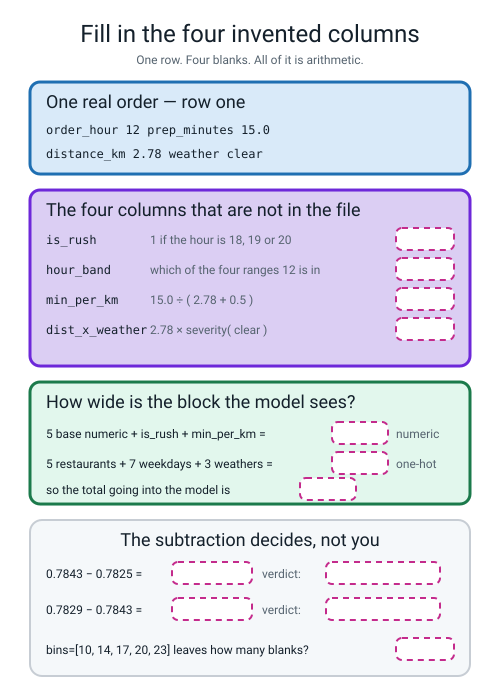
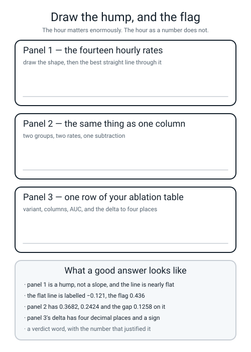

# Workbook — Week 5: Columns You Invent Yourself

**Name:** ________________________________  **Date:** ______________

[⬅ Course Home](../README.md) · [📖 Read the chapter first](../student-guide/week-05.md) · [⬅ Week 4](week-04.md) · [Next ➡](week-06.md)

---

## ✅ Warm-Up (5 min)

Five from **last week** — the two rulers and the two encoders. No looking back.

**W1.** `scaler.mean_` and `scaler.scale_` both end in an underscore. **What does that underscore mean, and what happens if you print one before `.fit`?**

________________________________________________________________

**W2.** Column Q was `[1, 2, 2, 3, 92]`. A `MinMaxScaler` fitted on it is handed a new value of **120** and returns **1.3077**. **Which promise did min-max just break?**

________________________________________________________________

**W3.** The cardinality arithmetic, from memory.

```
restaurant  ______ values  ->  ______ columns
day_of_week ______ values  ->  ______ columns
weather     ______ values  ->  ______ columns
                              --------
                               ______ new columns replacing ______ old ones
```

**W4.** Ordinal encoding codes weather as `clear 0, rain 1, storm 2`. **One of the two things below it gets right and the other it gets wrong.**

the **order** → ____________     the **spacing** → ____________

**W5.** `handle_unknown="ignore"` and a sixth restaurant turns up next month. **Write the row of five numbers the one-hot encoder produces for it.**

______  ______  ______  ______  ______

---

## 🔢 Do the Maths by Hand

**Calculator only. No code on this page.**

> **📌 Week 5 has no new maths.** So this page does two jobs. **M1 and M2 are this week's arithmetic** — subtraction to four decimal places, which sounds like nothing and is the entire deliverable. **M3 and M4 keep Week 4's standard deviation and z-score warm**, pointed at this week's numbers.

### M1 — Six subtractions, and the one that costs people money

Here is the real ablation table from class. **Every number in it is a four-decimal-place printout of a real run.**

```text
              variant  cols  accuracy  roc_auc  d_auc
  A  raw columns only    20    0.7600   0.7752 0.0000
       B  A + is_rush    21    0.7725   0.7825 0.0074
     C  A + hour_band    24    0.7675   0.7815 0.0063
    D  B + min_per_km    22    0.7675   0.7843 0.0091
E  D + dist_x_weather    23    0.7725   0.7829 0.0077
    F  E + is_weekend    24    0.7725   0.7828 0.0076
```

**Step 1 — five subtractions, each against the row *above* it.** Write the sign every time, even when it is a plus.

```
B − A :  0.7825 − 0.7752 = ____________
C − A :  0.7815 − 0.7752 = ____________
D − B :  0.7843 − 0.7825 = ____________
E − D :  0.7829 − 0.7843 = ____________
F − E :  0.7828 − 0.7829 = ____________
```

**Step 2 — the verdicts.** Write KEEP or DELETE beside each, using nothing but the sign.

B ____________  C ____________  D ____________  E ____________  F ____________

**Step 3 — now round all five of your deltas to two decimal places**, the way school maths teaches you to.

```
______  ______  ______  ______  ______
```

**M1(a).** How many different numbers are on that line? ______ **How many different *decisions* were on the line above it?** ______

**M1(b).** Write the sentence that this exercise exists to teach.

________________________________________________________________

**M1(c). And now the awkward bit — one of your answers disagrees with the table.** Compare your `B − A` with the `d_auc` column of row B, and your `D − B` with the difference of the two `d_auc` entries.

your B − A ____________ · the table's `d_auc` for B ____________ · do they match? ______

**M1(d).** The table's own delta came from the **full-precision** AUCs: `0.7825476735 − 0.7751639969 = 0.0073836...`, which rounds to `0.0074`. Yours came from two numbers that had **already** been rounded to four places. **Write the rule this proves, in one line.**

________________________________________________________________

### M2 — The ratio, worked by hand, with and without its guard

`min_per_km = prep_minutes ÷ (distance_km + 0.5)`

| order | prep_minutes | distance_km | the arithmetic | min_per_km (4 dp) |
|---|---|---|---|---|
| 1 | 15.0 | 2.78 | 15.0 ÷ (2.78 + 0.5) = 15.0 ÷ ______ | ____________ |
| 2 | 12.9 | 3.09 | 12.9 ÷ ______ | ____________ |
| 3 | 14.2 | 2.65 | 14.2 ÷ ______ | ____________ |
| 4 | 4.9 | 9.60 | 4.9 ÷ ______ | ____________ |
| 5 | 19.6 | 2.33 | 19.6 ÷ ______ | ____________ |

**M2(a).** Which order has the **smallest** `min_per_km`? ______ **Say in one sentence what kind of order that is, without using either column name.**

________________________________________________________________

**M2(b). Now take the guard away.** A sixth order arrives with `prep_minutes = 11.0` and `distance_km = 0.00`.

```
with the guard   : 11.0 ÷ (0.00 + 0.5) = 11.0 ÷ ______ = ____________
without the guard: 11.0 ÷ ______ = ____________
```

**What does a calculator say for the second one?** ____________________

**M2(c).** Two orders both had **12 minutes** of prep — one on a 2 km run and one on a 9 km run.

```
12 ÷ (2 + 0.5) = 12 ÷ ______ = ____________
12 ÷ (9 + 0.5) = 12 ÷ ______ = ____________
```

**Same prep time. Write the question the ratio is asking that neither original column could ask.**

________________________________________________________________

### M3 — Week 4's standard deviation, on this week's six scores

The six `roc_auc` values from the table are `0.7752, 0.7825, 0.7815, 0.7843, 0.7829, 0.7828`. **Five steps: subtract, square, add, divide, square-root.**

**Step 1 — the mean.**

```
0.7752 + 0.7825 + 0.7815 + 0.7843 + 0.7829 + 0.7828 = ____________

____________ ÷ 6 = ________________  (keep every digit)
```

**Step 2 — the standard deviation.** Work in units of **0.0001** to keep the digits manageable: so instead of `−0.0063` write `−63`.

```
subtract the mean:  ______  ______  ______  ______  ______  ______
square each:        ______  ______  ______  ______  ______  ______
add them up:        ______________________________________ = ______
divide by 6:        ______ ÷ 6 = ____________
square root:        √____________ = ____________  (in units of 0.0001)
```

**So the standard deviation is** ____________ **× 0.0001 =** ________________

**Step 3 — two z-scores.**

```
z of row A (0.7752) = (0.7752 − ________________) ÷ ________________ = ____________
z of row D (0.7843) = (0.7843 − ________________) ÷ ________________ = ____________
```

**M3(a).** Row A is the honest baseline and row D is the winner. **Row A's z-score is more than two. Say what that means in plain words, using the phrase "typical steps".**

________________________________________________________________

**M3(b).** The six scores are spread over a standard deviation of about **0.0029**. Next week you will meet a single column worth **+0.2011**. **How many of these standard deviations is that?** ____________ ÷ ____________ ≈ ____________

### M4 — Two group rates, three subtractions

Real lateness rates from your own delivery table.

**The rush-hour flag.**

```
not rush (1283 orders)  0.2424
rush     ( 717 orders)  0.3682
                        subtract: ____________
```

**Check the rows:** 1283 + 717 = ______ ✅

**The four-band cut.**

```
morning   (10-14)  684 orders   0.2383
afternoon (15-17)  286 orders   0.2552
rush      (18-20)  717 orders   0.3682
night     (21-23)  313 orders   0.2396
```

**Check the rows:** 684 + 286 + 717 + 313 = ______ ✅

**M4(a).** Three of those four band rates are close together. **Write the biggest gap among those three.**

______________ − ______________ = ____________

**M4(b).** So the four-band version costs **three extra columns** to describe ______ real distinction(s). **Which of the two wins, and why?**

________________________________________________________________

**The distance-by-weather crosstab.**

| | clear | rain | storm |
|---|---|---|---|
| **under 5 km** | 0.1765 | 0.2927 | 0.3908 |
| **over 5 km** | 0.5034 | 0.5914 | 0.8571 |

```
what a long trip costs in the clear: 0.5034 − 0.1765 = ____________
what a long trip costs in a storm  : 0.8571 − 0.3908 = ____________

the comparison:  ____________ ÷ ____________ = ____________
```

**M4(c).** Finish the sentence: *"Distance is ______ times as costly in a storm as in the clear, which means adding two weights cannot express it, because adding can only say ____________________."*

---

## 🔎 Predict the Output

**Write your prediction in pen before you run anything.** Every snippet begins with

```python
import pandas as pd
```

**Three of these four are not what most people guess.**

### P1 — fence posts

```python
hours = pd.Series([10, 14, 17, 20, 23])
a = pd.cut(hours, bins=[9, 14, 17, 20, 23],
           labels=["morning", "afternoon", "rush", "night"])
b = pd.cut(hours, bins=[10, 14, 17, 20, 23],
           labels=["morning", "afternoon", "rush", "night"])
print("edge at 9 :", list(a))
print("edge at 10:", list(b))
print("blanks with edge 9 :", int(a.isna().sum()))
print("blanks with edge 10:", int(b.isna().sum()))
```

**Before you predict, write down what `(9, 14]` means in words:**

________________________________________________________________

**I predict — `a`:** ____________________________________________

**`b`:** ____________________________________________

**blanks:** ______ and ______

**It really printed:**

```text
________________________________________________
________________________________________________
________________________________________________
________________________________________________
```

**14 is a bin edge. Which of the four bands does it land in, and why that one?**

________________________________________________________________

### P2 — inclusive at both ends

```python
h = pd.Series([17, 18, 19, 20, 21])
flag = h.between(18, 20)
print(flag.dtype)
print(list(flag))
print(flag.astype(int).tolist())
print("how many rush hours:", int(flag.sum()))
print("mean of the flag   :", flag.astype(int).mean())
```

**I predict — `dtype`:** ____________  **the list:** ____________________________

**as ints:** ____________________  **the sum:** ______  **the mean:** ____________

**It really printed:**

```text
________________________________
________________________________
________________________________
________________________________
________________________________
```

**`int(flag.sum())` worked even though `flag` holds `True`/`False`. Say what Python did there.**

________________________________________________________________

**And the last line is a suspiciously meaningful number. What does the mean of a 0/1 column always tell you?**

________________________________________________________________

### P3 — one missing line

```python
df = pd.DataFrame({"prep_minutes": [15.0, 12.9], "distance_km": [2.78, 3.09]})


def careless(d):
    d["min_per_km"] = d["prep_minutes"] / (d["distance_km"] + 0.5)
    return d


def careful(d):
    d = d.copy()
    d["min_per_km"] = d["prep_minutes"] / (d["distance_km"] + 0.5)
    return d


print("df at the start        :", df.shape)
out1 = careful(df)
print("after careful(df), df  :", df.shape, " out:", out1.shape)
out2 = careless(df)
print("after careless(df), df :", df.shape, " out:", out2.shape)
d3 = df.assign(items_per_km=[3, 5])
print("after df.assign(...), df:", df.shape, " d3:", d3.shape)
```

**The only difference between the two functions is one line.**

**I predict — the four `df.shape` values, in order:**

____________  ____________  ____________  ____________

**It really printed:**

```text
________________________________________________
________________________________________________
________________________________________________
________________________________________________
```

**One of the two functions changed `df` itself. Which, and what would that do to an ablation table after six calls?**

________________________________________________________________

________________________________________________________________

### P4 — a shape prediction, on the real table

```python
from sklearn.compose import ColumnTransformer
from sklearn.impute import SimpleImputer
from sklearn.pipeline import Pipeline
from sklearn.preprocessing import OneHotEncoder, StandardScaler
from make_data import make_deliveries

df = make_deliveries(n=2000, seed=0).drop_duplicates().reset_index(drop=True)
X = df.drop(columns=["late", "order_id"])

d = X.copy()
d["is_rush"] = d["order_hour"].between(18, 20).astype(int)
d["hour_band"] = pd.cut(d["order_hour"], bins=[9, 14, 17, 20, 23],
                        labels=["morning", "afternoon", "rush", "night"])
print("X shape :", X.shape)
print("d shape :", d.shape)

NUM = ["distance_km", "items", "prep_minutes", "order_hour",
       "driver_experience_months", "is_rush"]
CAT = ["restaurant", "day_of_week", "weather", "hour_band"]
pre = ColumnTransformer([
    ("num", Pipeline([("impute", SimpleImputer(strategy="median")),
                      ("scale", StandardScaler())]), NUM),
    ("cat", OneHotEncoder(handle_unknown="ignore", sparse_output=False), CAT)])
block = pre.fit_transform(d)
print("block shape:", block.shape)
print("names shape:", pre.get_feature_names_out().shape)
```

**Do the column arithmetic in pen first.**

```
numeric columns in NUM        : ______
one-hot from restaurant       : ______
one-hot from day_of_week      : ______
one-hot from weather          : ______
one-hot from hour_band        : ______
                               ------
                          total ______
```

**I predict — `X shape`:** ____________  **`d shape`:** ____________

**`block shape`:** ____________  **`names shape`:** ____________

**It really printed:**

```text
________________________________
________________________________
________________________________
________________________________
```

**`names shape` has one number in it and `block shape` has two. Say why in one line.**

________________________________________________________________

**Most people predict 24 here. Which column did they forget to count?** ____________

**How many of the answers on this page did you get right?** ______ / 16

**Which one surprised you most?** ______________________________

---

## ✍️ Practice Set A — Read It

**A1. Match the word to the thing.** Write the letter.

| Word | | Description |
|---|---|---|
| **feature engineering** | ______ | (i) The difference between two scores, written to four decimal places |
| **binning** | ______ | (ii) Build the model with the feature, build it without, change nothing else, compare |
| **ratio feature** | ______ | (iii) Two columns multiplied, so the model can say "A matters more when B is true" |
| **interaction feature** | ______ | (iv) Building new columns out of the ones you already have |
| **ablation** | ______ | (v) Chopping a continuous column into ranges and treating each range as a category |
| **delta** | ______ | (vi) One column divided by another, with a small guard on the bottom |

**A2. Trace the shapes.** `df` is the 2,000-row delivery table after `drop_duplicates()`; `X` is `df` with `late` and `order_id` removed; `add_features` is the five-switch function from class.

| Line | Result |
|---|---|
| `df.shape` | ____________ |
| `X.shape` | ____________ |
| `add_features(X).shape` | ____________ |
| `add_features(X, rush=True).shape` | ____________ |
| `add_features(X, rush=True, ratio=True).shape` | ____________ |
| `add_features(X, band=True)["hour_band"].shape` | ____________ |
| all five switches on | ____________ |
| `X.shape` after all of the above | ____________ |

**A2(a).** One of those results has **one** number in it instead of two. Which, and what does that mean?

________________________________________________________________

**A2(b).** The last line is the point of the whole table. **Which single line inside `add_features` makes it come out that way?**

____________________

**A3. Spot the bug.** Each line is wrong, or does something you did not want. Say what happens and write the fix.

| # | The line | What happens | The fix |
|---|---|---|---|
| a | `pd.cut(s, bins=[9, 14, 17, 20, 23], labels=["am", "pm", "rush"])` | | |
| b | `pd.cut(d["order_hour"], bins=[10, 14, 17, 20, 23], labels=[...4...])` on hours starting at 10 | | |
| c | `d["min_per_km"] = d["prep_minutes"] / d["distance_km"]` | | |
| d | `FunctionTransformer(add_features(d, rush=True))` | | |
| e | `pipe.named_steps["pre"]` where the stage is called `"prep"` | | |
| f | `print(pipe.named_steps["prep"].get_feature_names_out())` before `.fit` | | |

**A3(g).** Exactly one of those six produces **no traceback at all.** Which one, and what is the damage?

________________________________________________________________

**A3(h).** Two of those six are caught by the same four-second habit. **Name the habit and the two lines.**

________________________________________________________________

**A4. Match the code to the output.** All five ran on this five-row table. No output used twice.

```python
five = pd.DataFrame({
    "order_hour":   [12, 22, 16, 13, 20],
    "prep_minutes": [15.0, 12.9, 14.2, 4.9, 19.6],
    "distance_km":  [2.78, 3.09, 2.65, 9.60, 2.33],
    "items":        [3, 5, 2, 2, 5],
    "weather":      ["clear", "rain", "rain", "clear", "clear"],
})
```

| | Code |
|---|---|
| i | `print(five["order_hour"].between(18, 20).astype(int).tolist())` |
| ii | `print((five["prep_minutes"] / (five["distance_km"] + 0.5)).round(4).tolist())` |
| iii | `print(list(pd.cut(five["order_hour"], bins=[9, 14, 17, 20, 23], labels=["morning", "afternoon", "rush", "night"])))` |
| iv | `print((five["distance_km"] * five["weather"].map({"clear": 0.0, "rain": 1.0, "storm": 2.0})).round(2).tolist())` |
| v | `print((five["items"] / (five["distance_km"] + 0.5)).round(4).tolist())` |

| | Output |
|---|---|
| P | `[0.9146, 1.3928, 0.6349, 0.198, 1.7668]` |
| Q | `['morning', 'night', 'afternoon', 'morning', 'rush']` |
| R | `[0, 0, 0, 0, 1]` |
| S | `[4.5732, 3.5933, 4.5079, 0.4851, 6.9258]` |
| T | `[0.0, 3.09, 2.65, 0.0, 0.0]` |

**Your answers:** i → ______  ii → ______  iii → ______  iv → ______  v → ______

**A4(a).** Outputs **P** and **S** are both ratios and they share a denominator. **Which is which, and what is the shared denominator made of?**

________________________________________________________________

**A4(b).** Output **T** has three zeros in it. **All three came from the same cause. What cause, and which rows?**

________________________________________________________________

**A4(c).** Output **R** and output **Q** both describe `order_hour`. **One costs one column and one costs four. Which is which, and which one won in class?**

________________________________________________________________

**A5. Read four real ablation reports and write the verdict.** All four come from real runs on your table, validation AUC, four decimal places.

**Report 1**

```text
             variant  cols  accuracy  roc_auc   d_auc
P0  raw columns only    20      0.76   0.7752  0.0000
     P1  + prep_band    23      0.76   0.7747 -0.0005
```

**the subtraction:** ____________ − ____________ = ____________ · **verdict** ____________

**How many columns did you pay for it?** ______

**Report 2**

```text
             variant  cols  accuracy  roc_auc   d_auc
R0  raw columns only    20      0.76   0.7752  0.0000
     R1  + is_rookie    21      0.76   0.7750 -0.0002
```

**the subtraction:** ____________ − ____________ = ____________ · **verdict** ____________

**Both accuracies are identical. Does that settle anything?** ____________________

**Report 3**

```text
                  variant  cols  accuracy  roc_auc  d_auc
S0  D (rush + min_per_km)    22    0.7675   0.7843 0.0000
     S1  D + is_big_order    23    0.7625   0.7861 0.0018
```

**the subtraction:** ____________ − ____________ = ____________ · **verdict** ____________

**The accuracy went *down* while the AUC went *up*. Which one decides, and when was that decided?**

________________________________________________________________

**Report 4**

```text
             variant  cols  accuracy  roc_auc   d_auc
Z0  raw columns only    20    0.7600   0.7752  0.0000
  Z1  + is_big_order    21    0.7550   0.7756  0.0004
```

**the subtraction:** ____________ − ____________ = ____________ · **verdict** ____________

**A5(a). Reports 3 and 4 add the *same* column, `is_big_order`, and get +0.0018 and +0.0004.** Nothing about the column changed. **What did change, and what does that tell you about the question "is this feature good"?**

________________________________________________________________

________________________________________________________________

**A6. Fill in the four invented columns.** Every answer has been removed. Do all of it from memory first, then run your own `features.py` and tick the boxes you got.


*Figure W5.1 — One real order with all four invented columns removed, plus the column count, two deltas and the blank check.*

**A6(a).** Which boxes did you get wrong? ______________________

**A6(b).** Two of the boxes hold a **count of columns** and two hold a **subtraction**. Which is which?

________________________________________________________________

---

## ✍️ Practice Set B — Write It

### B1 — one line of evidence

**Task:** print the two lateness rates for a rush-hour flag, and the gap between them. `make_data.py` must be in the folder.

**Expected output:**

```text
            size    mean
order_hour              
0           1283  0.2424
1            717  0.3682
the gap: 0.1258
```

**Done looks like:** one `groupby`, one `.agg(["size", "mean"])`, and the number **0.1258** on your screen.

```python
import pandas as pd
from make_data import make_deliveries

df = make_deliveries(n=2000, seed=0).drop_duplicates().reset_index(drop=True)
rush = (df["order_hour"].________________(18, 20)).astype(____)
rates = df.groupby(________)["late"].mean()
print(df.groupby(________)["late"].agg([________, ________]).round(4).to_string())
print("the gap:", round(rates.iloc[____] - rates.iloc[____], 4))
```

### B2 — your own two-switch feature function

**Task:** write `my_features(d, big=False, dband=False)` that adds **one flag** (`is_big_order`, 1 when `items` is 5 or more) and **one bin** (`dist_band`, three ranges of `distance_km`). Then print the first five rows, the blank count and the three band counts.

**Expected output:**

```text
columns before: 10  after: 12
 items  is_big_order  distance_km dist_band
     3             0         2.78    medium
     5             1         3.09    medium
     2             0         2.65    medium
     2             0         9.60      long
     5             1         2.33    medium
blank dist_band values: 0 out of 2000
short     588
medium    990
long      422
counts add to: 2000
```

**Done looks like:** `d = d.copy()` as the first line, `bins=[0, 2, 5, 20]`, **the blank count printed and equal to 0**, and the three counts adding to 2000.

> **⚠️ Watch out:** the smallest `distance_km` in the table is **0.33**. Your first bin edge must be **below** it, not equal to it. If you write `bins=[0.33, ...]` you will silently lose rows and nothing will tell you.

### B3 — the evidence table, before you build anything

**Task:** for each of these four candidate columns, print the group sizes and lateness rates, and the biggest-minus-smallest spread.

```
is_big_order   items >= 5
dist_band      distance_km cut at 2 and 5
items_per_min  items / (prep_minutes + 0.5), cut at 0.2 and 0.4
items_x_dist   items * distance_km, cut at 6 and 15
```

> **⚠️ Watch out:** the last two candidates are **numbers you invented**, so before you can cut them you have to know their smallest and largest values. `items_per_min` runs **0.0403 to 1.3333** and `items_x_dist` runs **0.43 to 72.66** — so use `bins=[0, 0.2, 0.4, 3]` and `bins=[0, 6, 15, 80]`. **First edge below the minimum, last edge above the maximum, every time.**

**Expected output — the first block only, so you know your numbers are right:**

```text
--- is_big_order  items >= 5 ---
       size    mean
items              
0      1305  0.2582
1       695  0.3424
rows accounted for: 2000  blanks: 0
biggest rate minus smallest: 0.0842  -> guess: probably nothing
```

**Done looks like:** four blocks, every one of them printing `rows accounted for: 2000`, and a written guess before any model is fitted.

**B3(a).** Write your four guesses here **before** you run the ablation in Build It.

is_big_order ____________ · dist_band ____________ · items_per_min ____________ · items_x_dist ____________

### B4 — one ablation row

**Task:** fit the class pipeline twice — once with no invented columns, once with `is_big_order` added — and print both AUCs and the subtraction. **Change nothing else.**

**Expected output:**

```text
Z0  raw columns only   cols= 20  roc_auc=0.7752
Z1  + is_big_order     cols= 21  roc_auc=0.7756
0.7756 - 0.7752 = +0.0004
```

**Done looks like:** `0.7752` appearing on the first line — **if it does not, stop and fix that before anything else** — and a delta printed with `%+.4f` so the sign is always visible.

**B4(a).** Your new column added **one** column, not more. **Why one and not four?** ____________________

### B5 — a whole program of your own, about 25 lines

**Task:** write `evidence.py`, which loops over the four candidates from B3 and prints, for each one: the group table, the rows accounted for, the blank count, the spread, and a printed guess of *"worth a try"* (spread 0.10 or more) or *"probably nothing"*. Finish by printing the rush-hour gap of 0.1258 for comparison.

**Expected output — the last block, so you know you got to the end:**

```text
--- items_x_dist  cut at 6 and 15 ---
      size    mean
low    672  0.1577
mid    727  0.2696
high   601  0.4542
rows accounted for: 2000  blanks: 0
biggest rate minus smallest: 0.2965  -> guess: worth a try

for comparison, the rush-hour flag we already know pays:
  0.3682 - 0.2424 = 0.1258
```

**Done looks like:** one list of `(name, grouping)` pairs, one `for` loop, **`blanks: 0` on all four blocks**, and every block accounting for exactly 2000 rows.

**B5(a).** Three of your four groupings came from `pd.cut` with edges **you chose**, and one came from a plain `>=` comparison. **Which one gave you groups you could not predict the sizes of before running it, and why?**

________________________________________________________________

---

## 🐞 Fix the Broken Program

This program has **three** bugs: one **dtype** bug, one **runtime** bug, and one **silent logic** bug. The real error messages are below, in the order you meet them.

```python
"""broken05.py - invent two columns and ablate them. THREE bugs."""
import pandas as pd
from sklearn.compose import ColumnTransformer
from sklearn.impute import SimpleImputer
from sklearn.linear_model import LogisticRegression
from sklearn.metrics import roc_auc_score
from sklearn.model_selection import train_test_split
from sklearn.pipeline import Pipeline
from sklearn.preprocessing import FunctionTransformer, OneHotEncoder, StandardScaler
from make_data import make_deliveries

RS = 42
NUM = ["distance_km", "items", "prep_minutes", "order_hour",
       "driver_experience_months"]
CAT = ["restaurant", "day_of_week", "weather"]

df = make_deliveries(n=2000, seed=0).drop_duplicates().reset_index(drop=True)
y = df["late"]
X = df.drop(columns=["late", "order_id"])
X_tmp, X_te, y_tmp, y_te = train_test_split(
    X, y, test_size=.20, random_state=RS, stratify=y)
X_tr, X_va, y_tr, y_va = train_test_split(
    X_tmp, y_tmp, test_size=.25, random_state=RS, stratify=y_tmp)


def add_features(d, band=False, ratio=False):
    d = d.copy()
    if band:
        d["prep_band"] = pd.cut(d["prep_minutes"], bins=[0, 10, 18, 45],
                                labels=["fast", "slow"])
    if ratio:
        d["items_per_km"] = d["items"] / (d["distance_km"] + 0.5)
    return d


def score(label, num, cat, **kw):
    pre = ColumnTransformer([
        ("num", Pipeline([("impute", SimpleImputer(strategy="median")),
                          ("scale", StandardScaler())]), num),
        ("cat", OneHotEncoder(handle_unknown="ignore", sparse_output=False), cat)])
    pipe = Pipeline([("derive", FunctionTransformer(add_features, kw_args=kw)),
                     ("prep", pre),
                     ("model", LogisticRegression(max_iter=2000, random_state=RS))])
    pipe.fit(X_tr, y_tr)
    auc = roc_auc_score(y_va, pipe.predict_proba(X_va)[:, 1])
    n = len(pipe.named_steps["prep"].get_feature_names_out())
    print(f"{label:<20s} cols={n:>3d}  roc_auc={auc:.4f}")
    return auc


a = score("A raw", NUM, CAT)
b = score("B + prep_band", NUM + ["prep_band"], CAT, band=True)
c = score("C + items_per_km", NUM + ["prep_band"], CAT, band=True, ratio=True)
print("delta B - A:", round(b - a, 4))
print("delta C - B:", round(c - b, 4))
```

**Run 1 — row A is fine, then it stops:**

```text
A raw                cols= 20  roc_auc=0.7752
Traceback (most recent call last):
  File "/private/tmp/w56/br5/broken05.py", line 54, in <module>
    b = score("B + prep_band", NUM + ["prep_band"], CAT, band=True)
  ...
  File "/private/tmp/w56/br5/broken05.py", line 29, in add_features
    d["prep_band"] = pd.cut(d["prep_minutes"], bins=[0, 10, 18, 45],
  File ".../pandas/core/reshape/tile.py", line 454, in _bins_to_cuts
    raise ValueError(
ValueError: Bin labels must be one fewer than the number of bin edges
```

**Bug 1.** Which line? ______  **Kind of bug?** ______________

**Count them:** edges ______ · labels ______ · labels wanted ______

**The fix:** `labels=[____________________________________]`

**Row A printed `0.7752`. Why does that matter before you fix anything else?**

________________________________________________________________

**Run 2 — after fixing bug 1:**

```text
A raw                cols= 20  roc_auc=0.7752
Traceback (most recent call last):
  File "/private/tmp/w56/br5/broken05_fix1.py", line 54, in <module>
  ...
  File ".../sklearn/impute/_base.py", line 361, in _validate_input
    raise new_ve from None
ValueError: Cannot use median strategy with non-numeric data:
could not convert string to float: 'normal'
```

**Bug 2.** Which line? ______  **Kind of bug?** ______________

**The word `'normal'` appears in the error. Where did the program get it from?**

________________________________________________________________

**The fix:** `b = score("B + prep_band", ______________, ______________________, band=True)`

**Write the rule this bug exists to teach, in one line.**

________________________________________________________________

**Run 3 — after fixing bugs 1 and 2. No error at all:**

```text
A raw                cols= 20  roc_auc=0.7752
B + prep_band        cols= 23  roc_auc=0.7747
C + items_per_km     cols= 23  roc_auc=0.7747
delta B - A: -0.0005
delta C - B: 0.0
```

> **⚠️ Before you go on, read the `cols` column.** Row B has ______ and row C has ______.

**Bug 3.** Which line? ______  **Kind of bug?** ______________

**`delta C - B` is not "small". It is `0.0` exactly. What does an exactly-zero delta almost always mean?**

________________________________________________________________

**The one-line check that proves it in four seconds:**

`print(________________________________________________)`

**The fix:** `c = score("C + items_per_km", ________________________________, CAT + ["prep_band"], band=True, ratio=True)`

**And the output after all three fixes — fill in the two numbers that change:**

```text
C + items_per_km     cols= ______  roc_auc= ____________
delta C - B: ____________
```

**Two questions, and they are the point of the whole page.**

**Rank the three bugs from easiest to hardest to notice, and say what caught each one.**

**easiest → hardest:** ______  ______  ______

________________________________________________________________

**After all three fixes, both deltas are still tiny (−0.0005 and +0.0004). So was the whole exercise a waste?**

________________________________________________________________

---

## 🧩 Puzzle of the Week

### The Invention Detective

Somebody built five new columns on the first five rows of the delivery table and then lost the code. **Here are the original columns:**

```text
row  order_hour  prep_minutes  distance_km  items  weather  driver_exp
 1       12          15.0          2.78       3     clear      5.0
 2       22          12.9          3.09       5     rain       0.0
 3       16          14.2          2.65       2     rain      33.0
 4       13           4.9          9.60       2     clear     27.0
 5       20          19.6          2.33       5     clear     35.0
```

**And here are the five mystery columns:**

```text
M1  [0, 0, 0, 0, 1]
M2  [4.5732, 3.5933, 4.5079, 0.4851, 6.9258]
M3  ['morning', 'night', 'afternoon', 'morning', 'rush']
M4  [0.0, 3.09, 2.65, 0.0, 0.0]
M5  [13.9, 0.0, 87.45, 259.2, 81.55]
```

**For each one: which of the four shapes, which original columns, and the formula.**

| | shape (FLAG / BIN / RATIO / INTERACTION) | columns used | the formula |
|---|---|---|---|
| M1 | | | |
| M2 | | | |
| M3 | | | |
| M4 | | | |
| M5 | | | |

**Part 1(a).** **M4 and M5 are both interactions and both contain a zero.** The zeros have completely different causes. Write both.

M4's zeros: ____________________________________________

M5's zero: ____________________________________________

**Part 1(b).** **M1 and M3 are describing the same original column.** Which column, and how can you tell from the two printouts alone?

________________________________________________________________

**Part 1(c).** Check one value of M2 on a calculator and write the division out in full.

```
row ______ : ____________ ÷ ( ____________ + 0.5 ) = ____________ ÷ ____________ = ____________
```

### Part 2 — work backwards

An ablation table was printed and somebody spilled tea on it. **Recover the missing numbers.**

```text
              variant  roc_auc   delta against the row above
  A  raw columns only   0.7752            —
       B  A + is_rush   ??????         +0.0074
    D  B + min_per_km   0.7843         ??????
E  D + dist_x_weather   ??????         −0.0014
```

```
B's AUC : 0.7752 + ____________ = ____________
D − B   : 0.7843 − ____________ = ____________
E's AUC : 0.7843 + ( ____________ ) = ____________
```

**Part 2(a).** Row B has 21 columns and row C (not shown) had 24 for a **four-band** version of the same information. **How many columns did the bin cost over the flag, and what did it buy?**

______ extra columns · it bought ____________________

**Part 2(b).** Somebody adds a fifth feature and reports `delta = 0.0000`. **Write the two things that could mean, and the one line that tells them apart.**

1. ____________________________________________

2. ____________________________________________

**the line:** `________________________________________________`

---

## 🤔 Think Deeper

**T1.** `is_rush` hard-codes the hours **18 to 20**. The model's weights get updated every time you retrain; the numbers `18` and `20` do not. **Write a paragraph.** If the city's rush hour shifts to 17:00–19:00 next year, what happens to your model, and would a retrain fix it? Where should a fact like "rush hour is 18 to 20" be written down so that somebody finds it in two years? And is `is_rush` part of the *features* or part of the *model* — does the question even have an answer?

________________________________________________________________

________________________________________________________________

________________________________________________________________

________________________________________________________________

________________________________________________________________

**T2.** `dist_x_weather` had the best story of the week. You saw the amplification with your own eyes: a long trip costs 0.3269 in the clear and 0.4663 in a storm, which is 1.43 times. **And the ablation still said delete, at −0.0014.** Write a paragraph: what is the difference between a pattern being *real* and a column being *worth its place*? Somebody says "the story is right so the column stays" — what do you say back, and what number would change your mind? And is it honest to write the deleted row into your table anyway, or is that just clutter?

________________________________________________________________

________________________________________________________________

________________________________________________________________

________________________________________________________________

________________________________________________________________

---

## 🛠️ Build It — Four Inventions, One Table, At Least One Deletion

**Three things get handed in: the evidence sentences, the ablation table with ΔAUC to four decimal places, and the deletion notes.** The third is the one being marked, and **a deletion note without a subtraction in it scores zero.**

### Step checklist

- [ ] **1.** `make_data.py` from Week 1 is still in the folder. **Check the first `order_id` is 100955.**
- [ ] **2.** Four features, **one of each shape**: one flag, one bin, one ratio, one interaction. **Not the four from class.**
- [ ] **3.** One sentence of **evidence** per feature, with two rates and a subtraction in it, written **before** you fit anything.
- [ ] **4.** All four live inside **one** `add_features` function with **four switches**.
- [ ] **5.** `print(int(s.isna().sum()))` after your `pd.cut`. **Write the number down even when it is 0.**
- [ ] **6.** Row A reproduces **0.7600 / 0.7752**. If it does not, stop.
- [ ] **7.** One change per row. **Five rows for four features.**
- [ ] **8.** ΔAUC to **four** decimal places, and say whether you measured against row A or the row above.
- [ ] **9.** At least **one** deletion note, with the subtraction written out.
- [ ] **10.** Two Bug Log entries: one loud, one silent.

### The evidence, first

| # | feature | shape | the two rates | the subtraction | my guess |
|---|---|---|---|---|---|
| 1 | | | | | |
| 2 | | | | | |
| 3 | | | | | |
| 4 | | | | | |

**The blank check after my `pd.cut`:** ______ blanks out of ______

### The ablation table

| variant | cols | accuracy | roc_auc | Δ vs row above | verdict |
|---|---|---|---|---|---|
| A  raw columns only | | | | — | baseline |
| Z1 + | | | | | |
| Z2 + | | | | | |
| Z3 + | | | | | |
| Z4 + | | | | | |

**I measured my deltas against:** ☐ row A  ☐ the row above

### The five subtractions, written out

```
Z1 − A  = ____________ − ____________ = ____________   ____________
Z2 − Z1 = ____________ − ____________ = ____________   ____________
Z3 − Z2 = ____________ − ____________ = ____________   ____________
Z4 − Z3 = ____________ − ____________ = ____________   ____________
```

### The deletion notes

**Write one per deleted feature. Copy this shape exactly.**

> **Feature:** ____________________ — ____________________________________
> **What I thought it would do:** ____________________________________
> **AUC without it:** ____________ · **AUC with it:** ____________
> **The delta:** ____________ − ____________ = ____________
> **Why I am deleting it:** ____________________________________________

> **Feature:** ____________________ — ____________________________________
> **What I thought it would do:** ____________________________________
> **AUC without it:** ____________ · **AUC with it:** ____________
> **The delta:** ____________ − ____________ = ____________
> **Why I am deleting it:** ____________________________________________

**The honest caveat, on your smallest deletion:**

________________________________________________________________

### The one that surprised me

**Which feature's ablation disagreed most with its evidence?** ____________________

**Write the explanation in one sentence.**

________________________________________________________________

### The Bug Log

| What I saw | What it means | Cause | Fix |
|---|---|---|---|
| | | | |
| | | | |

---

## 🎨 Draw It

Draw the hump, then the flag, then one row of an ablation table — all three in your own hand.


*Figure W5.2 — Three empty framed panels, and what a good answer contains.*

**Then answer four things about your own drawing:**

**In panel 1, where does your straight line sit relative to the hump — above it, below it, or through the middle?**

________________________________________________________________

**Write the fitted weight of `order_hour` on your straight line.** ____________ **And `is_rush`'s weight in panel 2.** ____________

**In panel 2, is the 0.1258 written as a subtraction or just as a number?** ____________  **Why does that matter?**

________________________________________________________________

**If the lateness rate had climbed steadily from hour 10 to hour 23 instead of humping, which of your three panels would stop making sense?**

________________________________________________________________

---

## 📊 Self-Check

| I can... | 😀 | 🙂 | 😕 |
|---|---|---|---|
| name the four shapes of invented column — flag, bin, ratio, interaction | | | |
| derive a ratio by hand, with a guard on the bottom, and say why the guard is there | | | |
| bin a column with `pd.cut`, count the edges and the labels, and check the blanks | | | |
| explain why `bins=[10, ...]` on hours starting at 10 loses 47 rows silently | | | |
| build an interaction and say what "worse together" means that adding cannot say | | | |
| wrap my own function in a `FunctionTransformer` so it lives inside the `Pipeline` | | | |
| say what error I get if I build a feature outside the pipeline instead | | | |
| run an ablation: one change per row, four decimal places, against the row above | | | |
| read a delta of −0.0014 and delete my own idea because of it | | | |
| write a deletion note that contains an actual subtraction | | | |
| use `get_feature_names_out()` to find out why a delta was exactly 0.0000 | | | |
| say why 0.7843 and 0.7829 must never be rounded to two decimal places | | | |

**The one thing I would ask about if I could ask one question:**

________________________________________________________________

---

## ✅ Answers

<details>
<summary>Check your answers</summary>

### Warm-Up

**W1.** The trailing underscore means **"I learnt this from data."** It does not exist before `.fit`, so printing it first gives `AttributeError: 'StandardScaler' object has no attribute 'mean_'`. That is the library telling you, precisely, *"I have not looked at any data yet."*

**W2.** Min-max promises **every value lands between 0 and 1.** 120 is bigger than the largest value it was fitted on (92), so it comes out at 1.3077 — **outside the box.** Nothing warned you. The promise only holds for values inside the training range.

**W3.**

```
restaurant  5 values -> 5 columns
day_of_week 7 values -> 7 columns
weather     3 values -> 3 columns
                       --------
                        15 new columns replacing 3 old ones
```

**W4.** The **order** → **right.** clear is genuinely safer than rain, which is genuinely safer than storm. The **spacing** → **wrong.** It claims the clear→rain step and the rain→storm step are the same size, and they are not: 0.1056 against 0.1853, which is about 1.75 times.

**W5.** `0  0  0  0  0` — a row of five zeros. `handle_unknown="ignore"` turns a crash into a row that says *"none of the restaurants I know about."*

### Do the Maths by Hand

**M1 — the six subtractions.**

```
B − A :  0.7825 − 0.7752 = +0.0073
C − A :  0.7815 − 0.7752 = +0.0063
D − B :  0.7843 − 0.7825 = +0.0018
E − D :  0.7829 − 0.7843 = −0.0014
F − E :  0.7828 − 0.7829 = −0.0001
```

**Verdicts:** B **KEEP** · C **drop** (it gains less than B while costing three more columns) · D **KEEP** · E **DELETE** · F **DELETE**.

**Rounded to two places:** `0.01  0.01  0.00  0.00  0.00`.

**M1(a).** **Two** different numbers on that line. **Five** different decisions on the line above it. Three of the five decisions — keep, delete, delete — all became `0.00`.

**M1(b).** **Rounding a delta to two decimal places erases the answer.** The sign matters more than the size, and the sign lives in the fourth place.

**M1(c).** Your `B − A` is **+0.0073**. The table's `d_auc` for row B is **0.0074**. **They do not match.**

**M1(d).** **Round the printed result, never the inputs.** The full-precision AUCs are 0.7751639969 and 0.7825476735, and their difference is 0.0073836…, which rounds to **0.0074**. You subtracted two numbers that had each already lost digits, and the errors added up to one unit in the fourth place. The same thing happens on `D − B`: by hand from the printout you get +0.0018, the machine's own delta is +0.0017.

**Does this change any verdict?** No — and that is the useful part of the answer. Every sign is the same either way. **But write your deltas from the full-precision numbers if you have them**, and never be surprised by a disagreement of 0.0001 between your pen and the machine.

**M2 — the ratio.**

| order | the arithmetic | min_per_km |
|---|---|---|
| 1 | 15.0 ÷ 3.28 | **4.5732** |
| 2 | 12.9 ÷ 3.59 | **3.5933** |
| 3 | 14.2 ÷ 3.15 | **4.5079** |
| 4 | 4.9 ÷ 10.10 | **0.4851** |
| 5 | 19.6 ÷ 2.83 | **6.9258** |

**M2(a).** **Order 4**, at 0.4851. It is an order where **the road was long and the kitchen was quick** — most of the journey time is travel, none of it is waiting. Neither `prep_minutes` (4.9, the lowest) nor `distance_km` (9.60, the highest) says that *on its own*; you need them together.

**M2(b).**

```
with the guard   : 11.0 ÷ (0.00 + 0.5) = 11.0 ÷ 0.5 = 22.0
without the guard: 11.0 ÷ 0.00        = inf
```

A calculator says **error** or **∞**; numpy says `inf`, and then `LogisticRegression` stops with `ValueError: Input X contains infinity or a value too large for dtype('float64')`. **That is what the `+ 0.5` is for.** Any small constant does — **pick one and write down that you picked it.**

**M2(c).**

```
12 ÷ 2.5 = 4.80
12 ÷ 9.5 = 1.2632
```

The question the ratio asks: **"is the kitchen the bottleneck, or is the road?"** Same twelve minutes of prep; in one case that is most of the job, in the other it is a small part of a long trip.

**M3 — the standard deviation of the six scores.**

```
0.7752 + 0.7825 + 0.7815 + 0.7843 + 0.7829 + 0.7828 = 4.6892

4.6892 ÷ 6 = 0.78153333...
```

In units of 0.0001, subtract the mean (78153.33 ten-thousandths ≈ 781.53 in units of 0.0001 for a four-decimal number — easier: subtract 0.781533 from each and multiply by 10,000):

```
subtract:  −63.3    +9.7     −0.3    +27.7    +13.7    +12.7
square:    4006.9   94.1      0.1    767.3    187.7    161.3
add:       4006.9 + 94.1 + 0.1 + 767.3 + 187.7 + 161.3 = 5217.4
divide:    5217.4 ÷ 6 = 869.6
root:      √869.6 = 29.49
```

**So the standard deviation is 29.49 × 0.0001 = 0.002949.** numpy says `0.0029488227406128677`. ✅

```
z of row A = (0.7752 − 0.781533) ÷ 0.0029488 = −0.006333 ÷ 0.0029488 = −2.1477
z of row D = (0.7843 − 0.781533) ÷ 0.0029488 = +0.002767 ÷ 0.0029488 = +0.9382
```

**M3(a).** Row A sits **about 2.15 typical steps below the average of the six runs.** Every other variant beat it, and it is the furthest from the middle of the pack of any row in the table — which is exactly what you want the baseline to be.

**M3(b).** `0.2011 ÷ 0.0029 ≈ 69`. **Next week's one leaky column is worth about seventy standard deviations of this week's entire honest table.** That is the alarm bell you are being trained to hear.

**M4 — the group rates.**

```
0.3682 − 0.2424 = 0.1258        1283 + 717 = 2000 ✅
684 + 286 + 717 + 313 = 2000 ✅
```

**M4(a).** The three non-rush bands are 0.2383, 0.2552 and 0.2396. The biggest gap among them is **0.2552 − 0.2383 = 0.0169.**

**M4(b).** The four-band version costs three extra columns to describe **one** real distinction — *rush against everything else.* Two of its columns are spending themselves on a 0.0169 difference. **The flag wins**: +0.0074 for one column against +0.0063 for four. **A feature's cost is a column; its benefit is whatever real distinction it captures. Four columns capturing one distinction is a bad trade.**

**M4(c).**

```
0.5034 − 0.1765 = 0.3269
0.8571 − 0.3908 = 0.4663
0.4663 ÷ 0.3269 = 1.4264, so about 1.43
```

*"Distance is **1.43** times as costly in a storm as in the clear, which means adding two weights cannot express it, because adding can only say **'both of these matter, by a fixed amount each'** — never *'this one matters more when that one is true.'*"

### Predict the Output

**P1.** Real output:

```text
edge at 9 : ['morning', 'morning', 'afternoon', 'rush', 'night']
edge at 10: [nan, 'morning', 'afternoon', 'rush', 'night']
blanks with edge 9 : 0
blanks with edge 10: 1
```

`(9, 14]` means **"bigger than 9, up to and including 14."** Round bracket = excluded, square bracket = included.

**14 lands in `morning`**, the band `(9, 14]`, because a bin edge belongs to the band **below** it — the band whose square bracket it is. Every edge in the list behaves the same way: 17 → afternoon, 20 → rush, 23 → night.

And with the first edge at 10, **hour 10 is not bigger than 10**, so it falls out of the bottom and becomes `nan`. On the real table that is **47 rows out of 2000, with no error and no warning.**

**P2.** Real output:

```text
bool
[False, True, True, True, False]
[0, 1, 1, 1, 0]
how many rush hours: 3
mean of the flag   : 0.6
```

`.between(18, 20)` is **inclusive at both ends** — 18, 19 **and** 20 all count. That is why three of the five are `True` and not one.

`flag.sum()` worked because Python and numpy treat `True` as **1** and `False` as **0** when you do arithmetic on them. So summing a column of yes/no answers **counts the yeses**.

And the mean of a 0/1 column is always **the fraction of rows that are 1** — here 3 out of 5, so 0.6. That is why `df.groupby(rush)["late"].mean()` gives you a lateness *rate* rather than a total: `late` is a 0/1 column too.

**P3.** Real output:

```text
df at the start        : (2, 2)
after careful(df), df  : (2, 2)  out: (2, 3)
after careless(df), df : (2, 3)  out: (2, 3)
after df.assign(...), df: (2, 3)  d3: (2, 4)
```

**`careless` changed `df` itself**, because without `d = d.copy()` the name `d` inside the function points at *the very same table* you handed in. `careful` made a private copy first, so the original is untouched.

**What that does to an ablation:** row A is supposed to be the raw table. Call `careless` once and it is not raw any more. By the sixth call your "baseline" has five invented columns bolted onto it, every delta is measured from a moving number, and **nothing on the page means anything.** No error, no warning. **`d = d.copy()` is one line and it is the difference between a measurement and a mess.**

The last line is the safe way to try an idea: `df.assign(...)` **returns a new table** and leaves `df` alone. `df` still has 3 columns (the 3 that `careless` left it with); `d3` has 4.

**P4.** Real output:

```text
X shape : (2000, 8)
d shape : (2000, 10)
block shape: (2000, 25)
names shape: (25,)
```

The column arithmetic:

```
numeric columns in NUM        : 6     (5 base + is_rush)
one-hot from restaurant       : 5
one-hot from day_of_week      : 7
one-hot from weather          : 3
one-hot from hour_band        : 4
                               ----
                          total 25
```

`X` has 8 columns because the 10-column table lost `late` and `order_id`. `d` has 10 because two were invented.

**`names shape` is `(25,)` — one number — because it is a flat *list* of 25 names, not a grid.** `block shape` is `(2000, 25)` because that is a grid: 2000 rows and 25 columns.

**Most people predict 24 and forget `is_rush`** — they remember that row C in class had 24 columns, but row C had `hour_band` and **no** `is_rush`. Here you have both. The fix is always the same: count the numeric list, count each categorical column's values, add.

### Practice Set A

**A1.** feature engineering → **iv** · binning → **v** · ratio feature → **vi** · interaction feature → **iii** · ablation → **ii** · delta → **i**

**A2.** The eight answers:

```text
df.shape                                      (2000, 10)
X.shape                                       (2000, 8)
add_features(X).shape                         (2000, 8)
add_features(X, rush=True).shape              (2000, 9)
add_features(X, rush=True, ratio=True).shape  (2000, 10)
add_features(X, band=True)["hour_band"].shape (2000,)
all five switches on                          (2000, 13)
X.shape after all of the above                (2000, 8)
```

**A2(a).** `add_features(X, band=True)["hour_band"].shape` is `(2000,)` — **one number**, because a single column is a flat list of 2,000 values, not a grid. A grid needs two numbers.

**A2(b).** `d = d.copy()`. That one line is why `X` is still `(2000, 8)` after five calls that added nine columns between them.

**A3.**

| # | What happens | The fix |
|---|---|---|
| a | `ValueError: Bin labels must be one fewer than the number of bin edges`. Five edges need four labels | add a fourth label. Count edges, subtract one |
| b | **No error.** 47 rows silently become `NaN`, because `(10, 14]` means "bigger than 10" and hour 10 is not | `bins=[9, ...]` — first edge **below** your minimum. Then `print(int(s.isna().sum()))` |
| c | Fine until a `distance_km` of 0 turns up, then `inf`, then `ValueError: Input X contains infinity or a value too large for dtype('float64')` | guard the bottom: `/ (d["distance_km"] + 0.5)`, and write down which constant you chose |
| d | `InvalidParameterError: The 'func' parameter of FunctionTransformer must be a callable or None. Got   order_hour  is_rush ... instead.` The brackets **called** the function and handed in its answer | pass the function unbracketed: `FunctionTransformer(add_features, kw_args={"rush": True})` |
| e | `KeyError: 'pre'` | use the exact stage name. `print(pipe.named_steps.keys())` lists them |
| f | `NotFittedError: This ColumnTransformer instance is not fitted yet.` | fit first. The names depend on the data — how many restaurants there were — so they cannot exist beforehand |

**A3(g).** **Line b.** The damage is 47 rows of a column you invented, quietly missing a value, which an imputer will then fill in with something plausible next week — **and nobody will ever know.**

**A3(h).** The habit is **printing something and counting it.** For line b, `print(int(s.isna().sum()))` after every `pd.cut`. For line f — and for any delta that comes out 0.0000 — `print(pipe.named_steps["prep"].get_feature_names_out())` and count. **Four seconds each, and both turn a mystery into a fact.**

**A4.** i → **R** · ii → **S** · iii → **Q** · iv → **T** · v → **P**

**A4(a).** **S is `min_per_km`** (minutes of prep per kilometre) and **P is `items_per_km`** (pizzas per kilometre). The shared denominator is `distance_km + 0.5` — **the same guard on the same column.** Two different questions, one shared bottom.

**A4(b).** All three zeros came from **`weather == "clear"`, which maps to 0.0**, so the product is `distance × 0 = 0` no matter how long the trip. **Rows 1, 4 and 5.** Notice that row 4 is the 9.60 km trip — the longest in the batch — and its interaction value is 0, which is exactly right: a long trip in clear weather is not the thing this column is looking for.

**A4(c).** **R is the flag** (one column) and **Q is the bin** (four columns, one per band). **The flag won in class:** +0.0074 for one column against +0.0063 for four.

**A5.**

**Report 1:** `0.7747 − 0.7752 = −0.0005` · **DELETE.** You paid **three** columns for it (20 → 23), because `prep_band` is a category with three bands.

**Report 2:** `0.7750 − 0.7752 = −0.0002` · **DELETE.** The identical accuracies settle **nothing** — accuracy is a coarse number and 400 validation rows can give the same accuracy for two genuinely different models. **You chose AUC in Week 1. Read AUC.**

**Report 3:** `0.7861 − 0.7843 = +0.0018` · **KEEP.** The AUC decides, and **you decided that in Week 1** — before you had any results to be tempted by. **Write down that accuracy disagreed**; an honest table records the disagreement rather than hiding it.

**Report 4:** `0.7756 − 0.7752 = +0.0004` · **DELETE**, and this is the interesting one. It is positive, so nothing is *wrong* — but +0.0004 is a column somebody has to maintain for ever in exchange for almost nothing. A defensible alternative verdict is *"keep, flagged for retest with cross-validation in Week 11."* **Either is fine if the number is written down.**

**A5(a).** What changed is **what else was in the table.** In report 4 the baseline is raw columns; in report 3 the baseline already has `is_rush` and `min_per_km` in it. **So "is this feature good?" is not a question about the feature. It is a question about the feature *and the company it keeps*** — which is exactly why an ablation must change one thing per row, and why you have to say which row you measured against.

**A6.** Reading the blanks left to right:

```
is_rush        : 12 is not between 18 and 20  ->  0
hour_band      : 12 is in (9, 14]             ->  morning
min_per_km     : 15.0 / (2.78 + 0.5) = 15.0 / 3.28 -> 4.5732
dist_x_weather : clear -> 0, so 2.78 x 0      ->  0.00

columns: 5 base numeric + is_rush + min_per_km = 7 numeric
         5 restaurants + 7 weekdays + 3 weathers = 15 one-hot
         7 + 15 = 22

deltas : 0.7843 − 0.7825 = +0.0018  ->  keep
         0.7829 − 0.7843 = −0.0014  ->  delete

blank check with bins=[10, ...]: 47 out of 2000
```

**A6(b).** The **counts of columns** are the `7`, the `15` and the `22`. The **subtractions** are the `+0.0018` and the `−0.0014`. The `47` is neither — it is a count of *rows you lost*.

### Practice Set B

**B1.**

```python
import pandas as pd
from make_data import make_deliveries

df = make_deliveries(n=2000, seed=0).drop_duplicates().reset_index(drop=True)
rush = df["order_hour"].between(18, 20).astype(int)
rates = df.groupby(rush)["late"].mean()
print(df.groupby(rush)["late"].agg(["size", "mean"]).round(4).to_string())
print("the gap:", round(rates.iloc[1] - rates.iloc[0], 4))
```

Real output:

```text
            size    mean
order_hour              
0           1283  0.2424
1            717  0.3682
the gap: 0.1258
```

**1283 + 717 = 2000** ✅. The index is labelled `order_hour` because that is the name of the Series you grouped by, even though its values are now 0 and 1 — mildly confusing and harmless.

**B2.**

```python
import pandas as pd
from make_data import make_deliveries

df = make_deliveries(n=2000, seed=0).drop_duplicates().reset_index(drop=True)


def my_features(d, big=False, dband=False):
    d = d.copy()
    if big:
        d["is_big_order"] = (d["items"] >= 5).astype(int)
    if dband:
        d["dist_band"] = pd.cut(d["distance_km"], bins=[0, 2, 5, 20],
                                labels=["short", "medium", "long"])
    return d


out = my_features(df, big=True, dband=True)
print("columns before:", df.shape[1], " after:", out.shape[1])
print(out[["items", "is_big_order", "distance_km", "dist_band"]].head(5).to_string(index=False))
print("blank dist_band values:", int(out["dist_band"].isna().sum()), "out of", len(out))
print(out["dist_band"].value_counts().reindex(["short", "medium", "long"]).to_string())
print("counts add to:", int(out["dist_band"].value_counts().sum()))
```

Real output:

```text
columns before: 10  after: 12
 items  is_big_order  distance_km dist_band
     3             0         2.78    medium
     5             1         3.09    medium
     2             0         2.65    medium
     2             0         9.60      long
     5             1         2.33    medium
blank dist_band values: 0 out of 2000
short     588
medium    990
long      422
counts add to: 2000
```

**Check three things every time.** Ten columns in, twelve out. **Zero blanks** — because the first edge (0) is below the smallest distance (0.33). And **588 + 990 + 422 = 2000.**

**B3 / B5.** One program does both. Real output:

```text
--- is_big_order  items >= 5 ---
       size    mean
items              
0      1305  0.2582
1       695  0.3424
rows accounted for: 2000  blanks: 0
biggest rate minus smallest: 0.0842  -> guess: probably nothing

--- dist_band     cut at 2 and 5 ---
             size    mean
distance_km              
short         588  0.1480
medium        990  0.2576
long          422  0.5521
rows accounted for: 2000  blanks: 0
biggest rate minus smallest: 0.4041  -> guess: worth a try

--- items_per_min cut at 0.2 and 0.4 ---
      size    mean
low    770  0.2481
mid    868  0.3180
high   362  0.2983
rows accounted for: 2000  blanks: 0
biggest rate minus smallest: 0.0699  -> guess: probably nothing

--- items_x_dist  cut at 6 and 15 ---
      size    mean
low    672  0.1577
mid    727  0.2696
high   601  0.4542
rows accounted for: 2000  blanks: 0
biggest rate minus smallest: 0.2965  -> guess: worth a try

for comparison, the rush-hour flag we already know pays:
  0.3682 - 0.2424 = 0.1258
```

The program:

```python
"""evidence.py - look at the rates BEFORE you build anything."""
import pandas as pd
from make_data import make_deliveries

df = make_deliveries(n=2000, seed=0).drop_duplicates().reset_index(drop=True)

CANDIDATES = [
    ("is_big_order  items >= 5", (df["items"] >= 5).astype(int)),
    ("dist_band     cut at 2 and 5", pd.cut(df["distance_km"], bins=[0, 2, 5, 20],
                                            labels=["short", "medium", "long"])),
    ("items_per_min cut at 0.2 and 0.4", pd.cut(df["items"] / (df["prep_minutes"] + 0.5),
                                                bins=[0, 0.2, 0.4, 3],
                                                labels=["low", "mid", "high"])),
    ("items_x_dist  cut at 6 and 15", pd.cut(df["items"] * df["distance_km"],
                                             bins=[0, 6, 15, 80],
                                             labels=["low", "mid", "high"])),
]

for name, grouping in CANDIDATES:
    rates = df.groupby(grouping, observed=True)["late"].agg(["size", "mean"]).round(4)
    spread = round(rates["mean"].max() - rates["mean"].min(), 4)
    print("--- " + name + " ---")
    print(rates.to_string())
    print("rows accounted for:", int(rates["size"].sum()),
          " blanks:", int(pd.Series(grouping).isna().sum()))
    print("biggest rate minus smallest:", spread,
          " -> guess:", "worth a try" if spread >= 0.10 else "probably nothing")
    print()

print("for comparison, the rush-hour flag we already know pays:")
rush = df["order_hour"].between(18, 20).astype(int)
r = df.groupby(rush)["late"].mean()
print("  0.3682 - 0.2424 =", round(r.iloc[1] - r.iloc[0], 4))
```

**Runtime: under 1 second.**

**B5(a).** **`is_big_order`** — the `>= 5` comparison. With `pd.cut` you pick the edges, so you can look at the edges and roughly guess the group sizes before running. With `items >= 5` the split is decided by **however many orders happen to have five or six pizzas in them** — 695 out of 2000, which you could not have known. **Every grouping in that output is worth checking against the row total for exactly this reason: `2000` on all four blocks is the proof that no rows fell down a crack.**

**And note the third block is not even in order** — low 0.2481, mid 0.3180, high 0.2983. **The middle group is the latest of the three.** That is not a slope and it is not much of a hump either; it is mostly noise, and it predicts the delete you are about to measure.

**B4.** Real output:

```text
Z0  raw columns only   cols= 20  roc_auc=0.7752
Z1  + is_big_order     cols= 21  roc_auc=0.7756
0.7756 - 0.7752 = +0.0004
```

**B4(a).** Because `is_big_order` is a **0/1 number**, not a category. It goes down the numeric branch, gets scaled, and stays **one** column. `dist_band` is a category with three values, so it goes down the categorical branch and becomes **three** columns. **A flag costs one column. A three-band bin costs three.**

### Fix the Broken Program

**Bug 1 — line 29, a runtime bug that shouts.**

```
edges  : 4   (0, 10, 18, 45)
labels : 2   ("fast", "slow")
wanted : 3
```

**The fix:** `labels=["fast", "normal", "slow"]`. **Four fence posts make three fields.**

**Row A printing `0.7752` matters because every delta on the page is measured from it.** If row A is wrong, the whole table is fiction and there is no point fixing anything else. Check the baseline **first, always.**

**Bug 2 — line 54, a dtype bug.** `prep_band` was put in the **numeric** list, so it went to `SimpleImputer(strategy="median")`, which tried to find the middle number of a list of words.

The word `'normal'` came from **your own `labels=` list** — the one you had just fixed. That is the tell: a string in the error message that you can point at in your own source.

**The fix:** `b = score("B + prep_band", NUM, CAT + ["prep_band"], band=True)`

**The rule:** **a binned column is a category, however numeric the thing it came from was.** Numbers go down the numeric branch and get scaled; categories go down the categorical branch and get one-hot encoded.

**Bug 3 — line 55, a silent logic bug.** `items_per_km` gets created inside `add_features`, and then the `ColumnTransformer` is never told about it, so it is **silently discarded.** Row B has `cols= 23` and row C has `cols= 23` — **the same number, which is the whole tell.**

**An exactly-zero delta almost never means "this feature does nothing."** It means **the model never saw the feature.** A feature that genuinely does nothing gives you −0.0003 or +0.0001, not `0.0` to every decimal place.

**The four-second check:**

```python
print(pipe.named_steps["prep"].get_feature_names_out())
```

`num__items_per_km` is simply not in the list.

**The fix:** `c = score("C + items_per_km", NUM + ["items_per_km"], CAT + ["prep_band"], band=True, ratio=True)`

**After all three fixes, real output:**

```text
A raw                cols= 20  roc_auc=0.7752
B + prep_band        cols= 23  roc_auc=0.7747
C + items_per_km     cols= 24  roc_auc=0.7751
delta B - A: -0.0005
delta C - B: 0.0004
```

**So `cols` went 23 → 24 and the delta went from `0.0` to `+0.0004`.**

**Ranking, easiest to hardest: bug 1, bug 2, bug 3.**

- **Bug 1** stopped the program on the line that caused it and told you the rule. **An error that shouts is a good day.**
- **Bug 2** also stopped the program, but the message named a *value* (`'normal'`) rather than a column, so you had to work out which column it came from.
- **Bug 3** printed a perfectly normal-looking table. **Only the `cols` column and the suspiciously round `0.0` gave it away.** Nothing would ever have stopped you handing that table in.

**Was the exercise a waste?** **No.** Two features were tested and both bought essentially nothing — `prep_band` −0.0005 and `items_per_km` +0.0004 — and **that is a result.** You now know not to maintain those two columns for the next three years, and you have the numbers that justify it. **An ablation that says "no" has done its job.** The waste would have been keeping both on the grounds that they sounded sensible.

### Puzzle of the Week

| | shape | columns used | the formula |
|---|---|---|---|
| M1 | **FLAG** | `order_hour` | `order_hour.between(18, 20).astype(int)` — only row 5 (hour 20) is 1 |
| M2 | **RATIO** | `prep_minutes`, `distance_km` | `prep_minutes / (distance_km + 0.5)` |
| M3 | **BIN** | `order_hour` | `pd.cut(order_hour, bins=[9, 14, 17, 20, 23], labels=["morning", "afternoon", "rush", "night"])` |
| M4 | **INTERACTION** | `distance_km`, `weather` | `distance_km × {clear: 0, rain: 1, storm: 2}` |
| M5 | **INTERACTION** | `distance_km`, `driver_exp` | `distance_km × driver_exp` |

**Part 1(a).** **M4's zeros (rows 1, 4, 5) come from the *weather*** — clear maps to 0.0, so the product is 0 however long the trip. **M5's zero (row 2) comes from the *driver*** — that driver has 0 months of experience, so the product is 0 however long the trip. **Same printed value, two completely different stories**, which is exactly why you check a derived column against the rows that made it instead of trusting the numbers on their own.

**Part 1(b).** Both describe **`order_hour`**. The tell: M1 has a 1 exactly where M3 says `'rush'` — row 5 — and 0 everywhere M3 says anything else. **M1 is M3 with three of its four bands glued together.** That is the flag-versus-bin trade in one printout.

**Part 1(c).** For example row 5:

```
19.6 ÷ (2.33 + 0.5) = 19.6 ÷ 2.83 = 6.9258
```

**Part 2.**

```
B's AUC : 0.7752 + 0.0074 = 0.7826    (the table printed 0.7825 — see below)
D − B   : 0.7843 − 0.7825 = +0.0018
E's AUC : 0.7843 + (−0.0014) = 0.7829
```

**And the 0.7826 is the M1(d) lesson coming back to bite.** Adding a rounded delta to a rounded baseline gives 0.7826; the real printed value is **0.7825**, because the true delta was 0.00738. **Working backwards from rounded numbers recovers the answer to about ±0.0001 and no better.** Say so when you do it.

**Part 2(a).** The bin cost **3** extra columns (21 → 24). It bought **three separate band rates instead of one yes/no** — morning 0.2383, afternoon 0.2552, night 0.2396 as distinct numbers rather than one lumped 0.2424. **And those three are within 0.017 of each other, so it bought almost nothing real.**

**Part 2(b).** A delta of exactly 0.0000 means either:

1. **The column never arrived** — it was created but not listed in the `ColumnTransformer`, so it was silently dropped; or
2. **The column is an exact copy of information already there** — for example `distance_m = distance_km * 1000`, which after scaling is literally the same column.

**The line that tells them apart:**

```python
print(pipe.named_steps["prep"].get_feature_names_out())
```

If the name is missing, it is cause 1. If the name is there, it is cause 2 — and then `print(df[["new", "old"]].corr())` will show you the duplicate.

### Think Deeper

**T1 — a model answer.**

If rush hour shifts to 17:00–19:00, `is_rush` starts labelling the wrong three hours, and **a retrain will not fix it.** A retrain updates the *weights*; it cannot update the *numbers 18 and 20*, because those are typed into a file. The model will quietly get worse — it will still find whatever signal survives, so the score will fall a little and nobody will know why. This is the difference between the parts of a system that learn and the parts that a human has to notice. **Where it goes:** into the model card, under something like *"hard-coded assumptions: rush hour is defined as 18:00–20:00 inclusive, from the hourly lateness rates measured on the 2020 training rows (0.3682 against 0.2424). Recheck annually."* Six months from now the only person who can save that column is the one who reads that sentence.

**Is it features or model?** The useful test is **what updates automatically when you retrain, and what needs a human to notice and edit a file.** By that test the `18, 20` is model-like and the weights are model-like, but only one of them is maintained. Push the question far enough and the boundary dissolves: forty hand-written rules plus a model that adds them up is mostly *your* knowledge wearing a machine-learning costume. **The answer that matters is not "which is it" but "which parts of my system can a retrain fix?"**

**T2 — a model answer.**

**Looks real** means the pattern shows up in a table: 0.4663 against 0.3269, a factor of 1.43 — though the storm corner holds only 35 orders, so it may be partly luck. **Worth its place** means adding a column for it makes the model better than not adding it. Those are different tests because `distance_km` and the three one-hot weather columns were **already carrying most of that pattern between them**, and the new column is one more weight to estimate from the same 1,200 rows. A weight estimated from not-quite-enough data is noise, and noise costs score.

So to *"the story is right so the column stays"* the reply is **never "your story is wrong."** It is: *"the story is right and the column still has to earn its place. This one didn't — −0.0014."* And then the question that ends every version of this argument: **"what number would change your mind?"** For me it is a positive delta that survives cross-validation in Week 11, because −0.0014 measured on 400 validation rows is genuinely inside the wobble of a 400-row measurement.

**Keeping the deleted row is not clutter, it is the most valuable line in the table.** Without it, somebody spends an afternoon next spring inventing `dist_x_weather`, and then another afternoon arguing for it. With it, they read one row and move on. **A table of things that did not work is a map.**

### Build It

**A worked model answer, with real numbers, using four features that were not built in class.**

**The evidence, first** — from `evidence.py`:

| # | feature | shape | the two/three rates | the subtraction | my guess |
|---|---|---|---|---|---|
| 1 | `is_big_order` = items ≥ 5 | FLAG | 0.2582 (1305) vs 0.3424 (695) | 0.3424 − 0.2582 = **0.0842** | probably nothing |
| 2 | `dist_band` cut at 2 and 5 | BIN | 0.1480 / 0.2576 / 0.5521 | 0.5521 − 0.1480 = **0.4041** | worth a try |
| 3 | `items_per_min` | RATIO | 0.2481 / 0.3180 / 0.2983 | 0.3180 − 0.2481 = **0.0699** | probably nothing |
| 4 | `items_x_dist` | INTERACTION | 0.1577 / 0.2696 / 0.4542 | 0.4542 − 0.1577 = **0.2965** | worth a try |

**Blank check after `pd.cut`: 0 blanks out of 2000**, because the first edge (0) is below the smallest distance (0.33).

**The ablation table. Real output, runtime about 1 second for all five fits:**

```text
             variant  cols  accuracy  roc_auc   d_auc
Z0  raw columns only    20    0.7600   0.7752  0.0000
  Z1  + is_big_order    21    0.7550   0.7756  0.0004
     Z2  + dist_band    24    0.7450   0.7718 -0.0034
 Z3  + items_per_min    25    0.7475   0.7714 -0.0037
  Z4  + items_x_dist    26    0.7500   0.7720 -0.0032
```

**Row Z0 reproduces 0.7600 / 0.7752 exactly.** ✅

**The five subtractions, against the row above:**

```
Z1 − Z0 = 0.7756 − 0.7752 = +0.0004   keep? barely
Z2 − Z1 = 0.7718 − 0.7756 = −0.0038   DELETE
Z3 − Z2 = 0.7714 − 0.7718 = −0.0004   DELETE
Z4 − Z3 = 0.7720 − 0.7714 = +0.0006   keep? barely
```

**And the headline finding, which is the opposite of what the evidence predicted.**

`dist_band` had the **biggest** rate spread of anything on the page — **0.4041**, more than three times the rush-hour gap of 0.1258 — and it was the **worst** feature in the table at **−0.0038.** Sit with that for a second, because it is the deepest thing in this week.

**Here is why.** Look at what `distance_km` does when you cut it into four narrower ranges with `bins=[0, 2, 3.5, 5, 20]`:

```text
0-2     588 orders  0.1480
2-3.5   588 orders  0.2483
3.5-5   402 orders  0.2711
5+      422 orders  0.5521
```

**Check the rows: 588 + 588 + 402 + 422 = 2000** ✅ **And that climbs the whole way. It is a slope, not a hump.** And a slope is exactly what one weight on `distance_km` can already draw — which is why `distance_km` is the biggest weight in the model at 1.128. So `dist_band` spends **three columns** re-describing a pattern the model already had, and, because the raw `distance_km` column stays in the model, it loses no resolution — it just adds three redundant columns, each one more weight to estimate.

**Compare `order_hour`:** 0.213, 0.231, 0.261, 0.249, 0.202, 0.218, 0.256, 0.280, **0.374, 0.375, 0.355**, 0.236, 0.196, 0.309. **Up in the middle and down again.** No straight line can draw that, so binning is pure gain there.

> **🔑 The rule to write down: bin a hump, never a slope.** A big rate spread tells you the **underlying column** matters. It does not tell you your **new column** adds anything.

**The deletion notes:**

> **Feature:** `dist_band` — `distance_km` cut into short (≤2 km), medium (2–5 km), long (>5 km).
> **What I thought it would do:** the band rates go 0.1480 / 0.2576 / 0.5521, a spread of 0.4041, which is the biggest gap I found anywhere.
> **AUC without it (Z1):** 0.7756 · **AUC with it (Z2):** 0.7718
> **The delta:** 0.7718 − 0.7756 = **−0.0038**
> **Why I am deleting it:** the rates climb steadily, so `distance_km` is a **slope**, and the model already draws slopes with one weight (1.128, its biggest). The bin cost three columns, added nothing new, and was redundant with the raw `distance_km` that stays in the model. **Bin a hump, not a slope.**

> **Feature:** `items_per_min` — `items / (prep_minutes + 0.5)`, pizzas per minute of prep.
> **What I thought it would do:** a fast kitchen making many pizzas is under pressure, so more lateness.
> **AUC without it (Z2):** 0.7718 · **AUC with it (Z3):** 0.7714
> **The delta:** 0.7714 − 0.7718 = **−0.0004**
> **Why I am deleting it:** the evidence was already against it — the three group rates are 0.2481 / 0.3180 / 0.2983, a spread of only 0.0699, and **the middle group is later than the top group**, so the three rates are not even in an order. **Two lines of `groupby` would have predicted this delete before I wrote any code.**

**The honest caveat, on the smallest deletion:**

> *"−0.0004 for `items_per_min` was measured on 400 validation rows and is well inside the wobble of a 400-row measurement — retest with cross-validation in Week 11 before calling it settled. The −0.0038 for `dist_band` is bigger and has a plausible reason (three redundant columns), but it is also one split of 400 rows, so I would retest it too."*

**The one that surprised me:** `dist_band` — biggest evidence spread of anything I looked at (0.4041) and the worst delta in the table (−0.0038), because the spread came from a column the model already had as a straight line.

**And one bonus row worth running**, because it shows that a feature's worth depends on its company:

```text
                  variant  cols  accuracy  roc_auc  d_auc
S0  D (rush + min_per_km)    22    0.7675   0.7843 0.0000
     S1  D + is_big_order    23    0.7625   0.7861 0.0018
```

**`is_big_order` bought +0.0004 on top of raw columns and +0.0018 on top of variant D.** Same column, same data, same seed. **"Is this feature good?" is not a question about the feature alone** — which is precisely why one change per row, and why you must say what you measured against.

**The Bug Log — two entries:**

| What I saw | What it means | Cause | Fix |
|---|---|---|---|
| `ValueError: Bin labels must be one fewer than the number of bin edges` | my fence posts and my fields don't match | 4 edges, 2 labels | count edges, subtract one. **A loud error is a good day** |
| A delta of exactly `0.0` and `cols` unchanged at 23. **No error at all** | the model never received my column | the new column was not added to the `ColumnTransformer`'s list, so it was silently dropped | `print(pipe.named_steps["prep"].get_feature_names_out())` and count |

### Draw It

**Panel 1 — where the line sits.** Through the middle, and **almost flat.** The best straight line through a hump has to compromise: too high for the 0.196 at hour 22 and far too low for the 0.375 at hour 19. **The fitted weight for `order_hour` in the raw-columns model is +0.092** (it reads −0.121 in the finished model D, where `is_rush` has already taken over the hump), against `distance_km`'s 0.925 (1.128 in D). Either way, that is nothing.

**Panel 2 — `is_rush`'s weight is 0.436.** Read those two numbers together and you have understood binning completely: **the hour matters enormously; the hour *as a number* does not.**

**The 0.1258 should be written as `0.3682 − 0.2424 = 0.1258`, not just as `0.1258`.** It matters because the subtraction is the evidence and the answer is only the conclusion. Somebody reading *"the gap is 0.1258"* has to trust you. Somebody reading the subtraction can check you in four seconds — and can see immediately that a 0.37 and a 0.24 are both ordinary-sized rates rather than something freakish.

**If the rate climbed steadily from hour 10 to hour 23, panel 1 stops making sense** — the straight line would fit beautifully, there would be nothing for a bin to rescue, and `is_rush` would be throwing information away instead of adding it. **That is the `dist_band` result from Build It, in advance.** Panels 2 and 3 would still be drawable; they would just report a delete.

### Self-Check answers

Every row should end up 😀 by the time the Build It page is finished. Four are worth being honest about:

- *"say why the guard is there"* — the test is whether you can say **"because a distance of zero gives `inf`, and `inf` stops `LogisticRegression` with `ValueError: Input X contains infinity`."** "To avoid dividing by zero" is only half of it; the other half is knowing what the error looks like.
- *"explain why `bins=[10, ...]` loses 47 rows silently"* — full marks means saying **"`(10, 14]` means bigger than 10, and hour 10 is not bigger than 10"**, not just "the edges are wrong."
- *"read a delta of −0.0014 and delete my own idea because of it"* — this is the only row on the page that is about character rather than knowledge. If you can recite the rule but you kept `dist_x_weather` anyway, mark it 😕 honestly.
- *"use `get_feature_names_out()` to find out why a delta was exactly 0.0000"* — the full answer is **"an exactly-zero delta means the column never arrived, not that it does nothing"**, and it should be a reflex, not a thing you remember to do.

</details>

---

[⬅ Course Home](../README.md) · [📖 Week 5 chapter](../student-guide/week-05.md) · [Week 6 ➡](week-06.md) · [Glossary](../../glossary.md)
