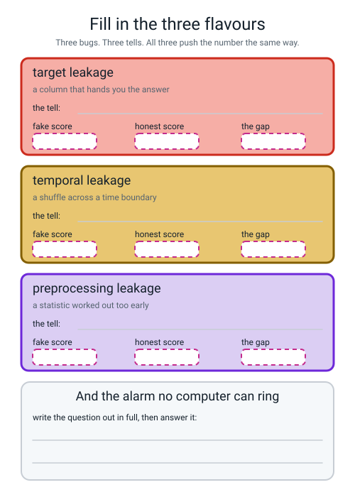
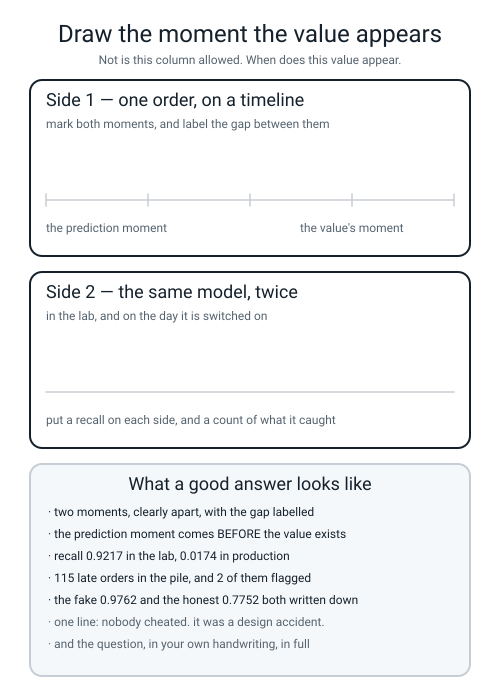

# Workbook — Week 6: The Answer Was in the Features

**Name:** ________________________________  **Date:** ______________

[⬅ Course Home](../README.md) · [📖 Read the chapter first](../student-guide/week-06.md) · [⬅ Week 5](week-05.md) · [Next ➡](week-07.md)

---

## ✅ Warm-Up (5 min)

Five from **last week** — the four shapes, the ablation and the fourth decimal place. No looking back.

**W1.** Name the **four shapes** of invented column, and give a one-word example of each.

____________________ · ____________________ · ____________________ · ____________________

**W2.** `pd.cut(d["order_hour"], bins=[10, 14, 17, 20, 23], labels=[...four...])` on hours that start at 10. **No error appears. What went wrong, and how many rows?**

________________________________________________________________

**W3.** Two deltas: `+0.0018` and `−0.0014`. Round both to two decimal places.

______ and ______ · **Why is that a disaster?** ____________________________________

**W4.** Your new feature's delta comes out **exactly `0.0000`**. **What does that almost always mean, and what is the one line you run?**

________________________________________________________________

**W5.** `d["min_per_km"] = d["prep_minutes"] / (d["distance_km"] + 0.5)`. **What is the `+ 0.5` for, and what error do you get without it?**

________________________________________________________________

---

## 🔢 Do the Maths by Hand

**Calculator only. No code on this page.**

> **📌 Week 6 has no new maths.** So this page uses **the median**, which you first met in Level 2 and which today decides what goes into 106 blank cells — plus the three subtractions that are this week's whole deliverable, and the two divisions that convict a column.

### M1 — The median, by counting to the middle

**Eight pupils and how many hours of sleep they got. Two did not fill the form in.** The first five rows are the **training** pile; the last three are the **validation** pile.

| name | Ada | Ben | Cleo | Dev | Eli | Fay | Gus | Hana |
|---|---|---|---|---|---|---|---|---|
| sleep_hours | 5.0 | 6.0 | **blank** | 7.0 | 9.0 | **blank** | 12.0 | 10.0 |
| pile | train | train | train | train | train | val | val | val |

**Step 1 — the number you are ALLOWED to learn: the median of the train rows.**

```text
values present in train, lined up:  ______  ______  ______  ______

that is ______ numbers. ______ is even/odd, so the middle is ____________________

the two middles are number ______ and number ______, which are ______ and ______

( ______ + ______ ) ÷ 2 = ____________
```

**Step 2 — the number you are NOT allowed to learn: the median of the whole table.**

```text
values present in the whole table:  ______  ______  ______  ______  ______  ______

that is ______ numbers, so the two middles are number ______ and number ______

( ______ + ______ ) ÷ 2 = ____________
```

**M1(a).** Your two answers are different. **Which two pupils caused the difference, and which pile are they in?**

________________________________________________________________

**M1(b).** Cleo's blank gets filled in with your Step 1 answer. **Write the number, and then write what number Fay's blank gets** — Fay is in the validation pile.

Cleo → ____________  Fay → ____________  **Why are they the same number?**

________________________________________________________________

**M1(c). Now the mean, for contrast.**

```text
train mean      : (5.0 + 6.0 + 7.0 + 9.0) ÷ 4 = ______ ÷ 4 = ____________
whole-table mean: (5 + 6 + 7 + 9 + 10 + 12) ÷ 6 = ______ ÷ 6 = ____________
```

**M1(d).** Now do the same counting on the real table. **1,140 training rows have a value.**

```text
1140 is even, so the two middles are number ______ and number ______

sorted, number 570 is 29 and number 571 is 30

( ______ + ______ ) ÷ 2 = ____________
```

**And the whole table has 1,894 values present**, whose two middles are **both 29**.

```text
( 29 + 29 ) ÷ 2 = ____________
```

**The two candidate numbers are** ____________ **and** ____________ **. You are allowed** ____________ .

### M2 — Three subtractions that hold the whole chapter

```text
target        fake 0.9762   honest 0.7752
temporal      fake 0.8139   honest 0.5249
preprocessing fake 0.765    honest 0.520
```

```text
target        : 0.9762 − 0.7752 = ____________
temporal      : 0.8139 − 0.5249 = ____________
preprocessing : 0.765  − 0.520  = ____________
```

**M2(a).** Last week's two surviving honest features bought **+0.0091** between them. **How many times bigger is the target leak?**

____________ ÷ ____________ = ____________

**M2(b).** The chapter reports the target gap as **+0.2011** and your subtraction says **0.2010**. **This is exactly the Week 5 rounding lesson. Write the rule again.**

________________________________________________________________

*(The full-precision numbers are 0.976231884 and 0.775163997. Their difference is 0.2010678…, which rounds to 0.2011.)*

**M2(c).** All three gaps have the **same sign**. Write the sentence that makes that the most dangerous fact in the chapter.

________________________________________________________________

### M3 — Two divisions that convict a column

**The crosstab from your own run:**

```text
late                        0    1
customer_called_support           
0                        1413   35
1                          12  540
```

```text
the bottom row: 12 + 540 = ______ orders had a support call
of those, late: 540 ÷ ______ = ____________

the whole table: 1413 + 35 + 12 + 540 = ______
the column agrees with the answer: 1413 + 540 = ______
the agreement rate: ______ ÷ ______ = ____________
```

**M3(a).** **The hospital's crosstab, for comparison.**

```text
malignant        0    1
biopsy_booked          
0              346   25
1               11  187
```

```text
biopsies booked: 11 + 187 = ______
of those malignant: 187 ÷ ______ = ____________
```

**M3(b).** **Both crosstabs have the same shape. Describe it in one sentence, using the word "diagonal".**

________________________________________________________________

**M3(c).** The other two audits are also divisions.

```text
audit 1, how strongly it moves with the answer: 0.942 ÷ 0.345 = ____________
audit 4, the size of its weight               : 3.482 ÷ 0.804 = ____________
```

**Which of the four audits needs the fewest keystrokes?** ____________________

### M4 — Five fold scores, twice

```text
WRONG  0.875  0.750  0.800  0.725  0.675
RIGHT  0.425  0.475  0.600  0.425  0.675
```

```text
WRONG: ______ + ______ + ______ + ______ + ______ = ______    ______ ÷ 5 = ____________
RIGHT: ______ + ______ + ______ + ______ + ______ = ______    ______ ÷ 5 = ____________

the difference: ____________ − ____________ = ____________
```

**M4(a).** There is **nothing** in that table — 200 rows of random noise and a coin-flip label. **So what number should the honest method give?** ____________ **How close did it get?** ____________

**M4(b).** One of the WRONG folds and one of the RIGHT folds are **the same number**. Which? ____________ **Does that mean anything?** ____________________

**M4(c). The drift arithmetic**, from the temporal-leak world. The rule is `2.0 − 0.13 × week`.

```text
week  0 : 2.0 − 0.13 × 0  = ____________
week 15 : 2.0 − 0.13 × 15 = 2.0 − ______ = ____________
week 29 : 2.0 − 0.13 × 29 = 2.0 − ______ = ____________
```

**By week 29 the feature has not merely stopped mattering. Write what it has done.**

________________________________________________________________

---

## 🔎 Predict the Output

**Write your prediction in pen before you run anything.** Every snippet begins with

```python
import numpy as np
import pandas as pd
```

**Three of these four are not what most people guess.**

### P1 — asking before it has looked

**First, two lines on their own. Predict whether they run at all.**

```python
from sklearn.impute import SimpleImputer

col = pd.DataFrame({"sleep": [5.0, 6.0, np.nan, 7.0, 9.0]})
imp = SimpleImputer(strategy="median")
print(imp.statistics_)
```

**I predict:** ☐ it prints a number  ☐ it prints nothing  ☐ it stops with an error

**It really printed:**

```text
________________________________________________
________________________________________________
________________________________________________
________________________________________________
```

**Now add `imp.fit(col)` before the print and carry on.**

```python
imp.fit(col)
print("statistics_:", imp.statistics_)
print("filled     :", imp.transform(col).ravel())
mean_imp = SimpleImputer(strategy="mean").fit(col)
print("if mean    :", mean_imp.statistics_)
```

**Do the arithmetic first.** Present values: ______ ______ ______ ______ · median = ____________ · mean = ____________

**I predict — `statistics_`:** ____________  **`filled`:** ____________________  **`if mean`:** ____________

**It really printed:**

```text
________________________________________________
________________________________________________
________________________________________________
```

**What does the trailing underscore on `statistics_` mean, and what is the library telling you with that error?**

________________________________________________________________

### P2 — a shape prediction, and the new columns go somewhere surprising

```python
from sklearn.impute import SimpleImputer

two = pd.DataFrame({"sleep":  [5.0, 6.0, np.nan, 7.0, 9.0],
                    "screen": [2.0, np.nan, 4.0, 4.0, 8.0]})
plain = SimpleImputer(strategy="median")
flagged = SimpleImputer(strategy="median", add_indicator=True)
a = plain.fit_transform(two)
b = flagged.fit_transform(two)
print("in shape     :", two.shape)
print("plain out    :", a.shape)
print("flagged out  :", b.shape)
print(b)
```

**Count the blanks first:** blanks in `sleep` ______ · blanks in `screen` ______ · total ______

**I predict — `in shape`:** ____________  **`plain out`:** ____________  **`flagged out`:** ____________

**And sketch the grid `b`. How many columns, and which cells hold a 1?**

```text
________________________________________________
________________________________________________
________________________________________________
________________________________________________
________________________________________________
```

**It really printed:**

```text
________________________________________________
________________________________________________
________________________________________________
________________________________________________
________________________________________________
________________________________________________
________________________________________________
________________________________________________
```

**Most people predict `(5, 3)`. Why is it not 3?** ____________________________________

**Where in the grid did the indicator columns go — beside the column they describe, or somewhere else?**

________________________________________________________________

### P3 — the same column, two piles, two numbers

```python
sleep = pd.Series([5.0, 6.0, np.nan, 7.0, 9.0, np.nan, 12.0, 10.0])
train = sleep[:5]
val = sleep[5:]
print("values present in train :", sorted(train.dropna()))
print("values present in all   :", sorted(sleep.dropna()))
print("train-only median :", train.median())
print("whole-table median:", sleep.median())
print("train-only mean   :", round(train.mean(), 4))
print("whole-table mean  :", round(sleep.mean(), 4))
```

**I predict — train median:** ____________  **whole median:** ____________

**train mean:** ____________  **whole mean:** ____________

**It really printed:**

```text
________________________________________________
________________________________________________
________________________________________________
________________________________________________
________________________________________________
________________________________________________
```

**Both `.dropna()` calls silently threw rows away and nothing warned you. Is that the right behaviour here?**

________________________________________________________________

**The gap between the two medians is ______ and the gap between the two means is ______. Which is more affected by Gus's 12, and why?**

________________________________________________________________

### P4 — read a crosstab you have never seen

```python
from sklearn.metrics import roc_auc_score

late = np.array([0, 0, 1, 1, 0, 1, 0, 1, 1, 0])
called = np.where(late == 1, 1, 0)
called[2] = 0
called[4] = 1
tab = pd.crosstab(pd.Series(called, name="called"), pd.Series(late, name="late"))
print(tab)
print("orders with a call :", int(called.sum()))
print("of those, late     :", int(((called == 1) & (late == 1)).sum()))
print("agreement count    :", int((called == late).sum()), "out of", len(late))
print("the column on its own, AUC:", round(roc_auc_score(late, called), 4))
```

**Work the two arrays out on paper first.**

```text
late   : 0  0  1  1  0  1  0  1  1  0
called : ______________________________
```

**I predict — the four cells of the crosstab:**

```text
        late 0   late 1
called 0  ______   ______
called 1  ______   ______
```

**calls:** ______ **of those late:** ______ **agreement:** ______ / 10 **solo AUC:** ____________

**It really printed:**

```text
________________________________________________
________________________________________________
________________________________________________
________________________________________________
________________________________________________
________________________________________________
________________________________________________
```

**`called[2] = 0` and `called[4] = 1` each broke the copying in one row. Which cell of the crosstab did each one create?**

`called[2] = 0` → ____________________  `called[4] = 1` → ____________________

**How many of the answers on this page did you get right?** ______ / 18

**Which one surprised you most?** ______________________________

---

## ✍️ Practice Set A — Read It

This set is for reading: matching words, tracing shapes, spotting bugs and reading audit reports.

**A1. Match the word to the thing.** Write the letter.

| Word | | Description |
|---|---|---|
| **imputation** | ______ | (i) A statistic worked out over all the data before the split |
| **missing indicator** | ______ | (ii) Filling a blank with a number worked out from the rows you are allowed to look at |
| **data leakage** | ______ | (iii) Shuffling rows across a time boundary, so the model trains on the future |
| **target leakage** | ______ | (iv) How a computer writes "not a number" |
| **temporal leakage** | ______ | (v) An extra 0/1 column recording that the original value was blank |
| **preprocessing leakage** | ______ | (vi) A column that only gets filled in because the outcome already happened |
| **NaN** | ______ | (vii) Information that will not be available at the moment you have to predict |

**A2. Trace the shapes.** `df` is the delivery table **with `customer_called_support` joined on**; `X` is `df` without `late` and `order_id`; `NUM` is the five numeric columns; `CAT` is the three word columns.

| Line | Result |
|---|---|
| `df.shape` | ____________ |
| `X.shape` | ____________ |
| `X_tr.shape` | ____________ |
| `X_tr[NUM].shape` | ____________ |
| `imp.statistics_.shape` | ____________ |
| `imp.transform(X_tr[NUM]).shape` | ____________ |
| with `add_indicator=True`, `statistics_.shape` | ____________ |
| with `add_indicator=True`, transform shape | ____________ |
| `len(get_feature_names_out())`, plain | ____________ |
| `len(get_feature_names_out())`, `add_indicator=True` | ____________ |
| `len(get_feature_names_out())`, plain + the leaky column | ____________ |

**A2(a). Two of those rows are `21` for completely different reasons.** Name both reasons.

________________________________________________________________

**A2(b).** `add_indicator=True` changes the **transform** shape but **not** the `statistics_` shape. **Say why in one line.**

________________________________________________________________

**A3. Spot the bug.** Each line is wrong, or does something you did not want. Say what happens and write the fix.

| # | The line | What happens | The fix |
|---|---|---|---|
| a | `LogisticRegression().fit(df[NUM], df["late"])` with 106 blanks in `NUM` | | |
| b | `SimpleImputer(strategy="median").fit(df[["weather"]])` | | |
| c | `pipe.named_steps["prep"].statistics_` | | |
| d | `pipe.named_steps["pre"]` where the stage is called `"prep"` | | |
| e | `df["driver_experience_months"].fillna(df["driver_experience_months"].median())` before `train_test_split` | | |
| f | `SelectKBest(f_classif, k=20).fit_transform(X, y)` and *then* cross-validating | | |

**A3(g).** Two of those six produce **no traceback at all.** Which two, and which one is more dangerous?

________________________________________________________________

**A3(h).** Lines **e** and **f** are the **same bug** at two different strengths. **Name the flavour, and give the two numbers that measure it in each case.**

flavour: ____________________

e: ____________ against ____________ · f: ____________ against ____________

**A4. Match the code to the output.** All five ran on the delivery table with the support-call column joined on. No output used twice.

| | Code |
|---|---|
| i | `print(int(X["driver_experience_months"].isna().sum()))` |
| ii | `print(imp.statistics_)` — fitted on `X_tr[NUM]` |
| iii | `print(len(pipe.named_steps["prep"].get_feature_names_out()))` — with `add_indicator=True` |
| iv | `print(round(roc_auc_score(y_va, X_va["customer_called_support"]), 4))` |
| v | `print(pd.crosstab(df["customer_called_support"], df["late"]).to_numpy().ravel())` |

| | Output |
|---|---|
| P | `0.9556` |
| Q | `[1413   35   12  540]` |
| R | `[ 2.91  4.   14.   18.   29.5 ]` |
| S | `106` |
| T | `21` |

**Your answers:** i → ______  ii → ______  iii → ______  iv → ______  v → ______

**A4(a).** Output **P** comes from ranking the rows by **nothing but one column's raw values** (no model at all). **Why is 0.9556 a conviction rather than a discovery?**

________________________________________________________________

**A4(b).** Output **R** has five numbers in it. **Which one is the only one this week cares about, and what is the number you are NOT allowed to have?**

____________ and ____________

**A5. Four audit reports, four verdicts.** Every number is real.

**Report 1 — `customer_called_support` (delivery table)**

```text
moves with the answer : 0.942      (best honest column: 0.345)
crosstab              : 1413  35 / 12  540
on its own            : AUC 0.9556
its weight            : 3.482      (next biggest: 0.804)
```

**verdict** ____________________ · **which audit convinced you fastest?** ____________________

**Report 2 — `distance_km` (delivery table)**

```text
moves with the answer : 0.345
two-group rates       : under 5 km 0.2167 (1578 orders) · over 5 km 0.5521 (422)
on its own            : AUC 0.6800
its weight            : 0.804
```

**verdict** ____________________ · **the gap is 0.3354, which is huge. So why is this not a leak?**

________________________________________________________________

**Report 3 — `order_hour` (delivery table)**

```text
moves with the answer : 0.064
two-group rates       : 18-20 is 0.3682 (717 orders) · everything else 0.2424 (1283)
on its own            : AUC 0.5358
its weight            : 0.257
```

**verdict** ____________________ · **`0.064` and `0.5358` both look like nothing, and yet the two-group rates differ by 0.1258. Explain.**

________________________________________________________________

**Report 4 — `biopsy_booked` (hospital table)**

```text
moves with the answer : 0.864      (best honest column: 0.415)
crosstab              : 346  25 / 11  187
on its own            : AUC 0.9235 (all three honest columns together: 0.7887)
its weight            : 2.369      (next biggest: 1.097)
in the lab            : recall 0.8750
on the day it is live : recall 0.0625 — 4 of 64 malignant tumours flagged
```

**verdict** ____________________

**A5(a). Reports 2 and 4 both have a big two-group or crosstab gap. One is a leak and one is not. Write the ONE question that separates them**, and answer it for both columns.

**the question:** ________________________________________________________________

`distance_km` → ____________  `biopsy_booked` → ____________

**A5(b).** In report 4 the AUC only fell from 0.9537 to 0.8064 when the column went dead, but the **recall** fell from 0.8750 to 0.0625. **What does that tell you about keeping only one number?**

________________________________________________________________

**A6. Fill in the three flavours.** Every number and every tell has been removed. Do all of it from memory first, then check against your own runs.


*Figure W6.1 — The three flavours with every tell and every number removed, plus the one question no computer can answer.*

**A6(a).** Which boxes did you get wrong? ______________________

**A6(b).** Two of the three flavours are bugs in **how you cut** rather than bugs in a **column**. Which two?

________________________________________________________________

---

## ✍️ Practice Set B — Write It

This set is for writing: each task gives the output you should match, and you write the code that produces it.

### B1 — count the holes, find the two numbers

**Task:** print the blank count for each of the three piles, check they add up, and print both candidate medians.

**Expected output:**

```text
blanks: whole 106  train 60  val 25  test 21
they add up to: 106
median of the WHOLE table: 29.0
median of the TRAIN rows : 29.5
the one I am allowed     : 29.5
```

**Done looks like:** the three pile counts adding to 106, and **two different medians on the screen at the same time** so you can see the gap.

### B2 — walk the address into a fitted pipeline

**Task:** fit the Week 3 pipeline, then print the stage names, the branch names, and what the imputer learned. **Four names, in order.**

**Expected output:**

```text
stage names   : ['prep', 'model']
branch names  : ['num', 'cat']
statistics_   : [ 2.91  4.   14.   18.   29.5 ]
the one I care about: 29.5
```

**Done looks like:** the full address typed out, and **29.5** printed on its own.

```python
prep = pipe.named_steps[____________]
print("stage names   :", list(pipe.____________.keys()))
print("branch names  :", list(prep.________________________.keys()))
imp = prep.________________________[________].named_steps[____________]
print("statistics_   :", imp.____________)
```

**B2(a).** Why does `prep.statistics_` fail? ____________________________________

### B3 — the fastest audit there is

**Task:** print the crosstab of the suspect column against `late`, then the three numbers that convict it.

**Expected output:**

```text
late                        0    1
customer_called_support           
0                        1413   35
1                          12  540
calls: 552  of those late: 540
540 / 552 = 0.9783
the column agrees with the answer 1953 times out of 2000
```

**Done looks like:** one `pd.crosstab` call, and the number **0.9783** on your screen.

**B3(a).** This audit only works on a **0/1** column. **Write what you do instead for a column like `distance_km`.**

________________________________________________________________

### B4 — ablate the missing indicator

**Task:** fit the same pipeline twice — `add_indicator=False` then `add_indicator=True` — and print the column count, accuracy, AUC and the subtraction.

**Expected output:**

```text
add_indicator=False cols= 20  accuracy=0.7600  roc_auc=0.7752
add_indicator=True  cols= 21  accuracy=0.7550  roc_auc=0.7723
0.7723 - 0.7752 = -0.0029
the new column is called: num__missingindicator_driver_experience_months
its weight: -0.1609
```

**Done looks like:** one `for indicator in (False, True):` loop, and a **negative** delta printed with a sign.

**B4(a).** 60 blank training rows, and a lateness rate of 0.15 against 0.2947 — a gap of **0.1447**, which looks enormous. **The ablation still said delete. How many actual late deliveries is that 0.15 made of?**

______ × ______ = ______ late deliveries

### B5 — a whole program of your own, about 20 lines

**Task:** write `noise_shrink.py`. Run the noise experiment at **2,000, 500, 200 and 50** columns, keeping `k=20` and `default_rng(0)` fixed, and print the fake score, the honest score and the difference for each. **One row per column count.**

**Expected output:**

```text
columns   fake    honest   invented
   2000   0.765   0.520    +0.245
    500   0.735   0.505    +0.230
    200   0.700   0.540    +0.160
     50   0.635   0.615    +0.020
```

**Done looks like:** one `for ncols in [...]` loop, `StratifiedKFold(5, shuffle=True, random_state=0)` **created once outside the loop**, and the `invented` column **shrinking all the way down the page.** Runtime about 1 second.

**B5(a).** Write the one-sentence explanation of that last column, using the word **chances**.

________________________________________________________________

**B5(b).** At 50 columns the fake score is still **0.635**, not 0.500. **Is the bug gone?** ____________ **What is the honest score there, and what does the gap of 0.020 tell you?**

________________________________________________________________

---

## 🐞 Fix the Broken Program

This program has **three** bugs: one **runtime** bug, one **attribute** bug, and one **silent logic** bug. The real error messages are below, in the order you meet them.

```python
"""broken06.py - fill the blanks, score the model, read the fill-in number. THREE bugs."""
import pandas as pd
from sklearn.compose import ColumnTransformer
from sklearn.impute import SimpleImputer
from sklearn.linear_model import LogisticRegression
from sklearn.metrics import roc_auc_score
from sklearn.model_selection import train_test_split
from sklearn.pipeline import Pipeline
from sklearn.preprocessing import OneHotEncoder, StandardScaler
from make_data import make_deliveries
from support_calls import attach_support_calls

RS = 42
NUM = ["distance_km", "items", "prep_minutes", "order_hour",
       "driver_experience_months", "customer_called_support"]
CAT = ["restaurant", "day_of_week", "weather"]

df = attach_support_calls(
    make_deliveries(n=2000, seed=0).drop_duplicates().reset_index(drop=True))
y = df["late"]
X = df.drop(columns=["late", "order_id"])
X_tmp, X_te, y_tmp, y_te = train_test_split(
    X, y, test_size=.20, random_state=RS, stratify=y)
X_tr, X_va, y_tr, y_va = train_test_split(
    X_tmp, y_tmp, test_size=.25, random_state=RS, stratify=y_tmp)

pre = ColumnTransformer([
    ("num", StandardScaler(), NUM),
    ("cat", OneHotEncoder(handle_unknown="ignore", sparse_output=False), CAT)])
pipe = Pipeline([("prep", pre),
                 ("model", LogisticRegression(max_iter=2000, random_state=RS))])
pipe.fit(X_tr, y_tr)

auc = roc_auc_score(y_va, pipe.predict_proba(X_va)[:, 1])
print("columns going into the model:", len(pipe.named_steps["prep"].get_feature_names_out()))
print(f"validation roc_auc : {auc:.4f}")
print("the fill-in number it learned:", pipe.named_steps["prep"].statistics_)
```

**Run 1 — it stops on the first thing it tries:**

```text
Traceback (most recent call last):
  File "/private/tmp/w56/br6/broken06.py", line 34, in <module>
    pipe.fit(X_tr, y_tr)
  ...
  File ".../sklearn/utils/validation.py", line 169, in _assert_all_finite_element_wise
    raise ValueError(msg_err)
ValueError: Input X contains NaN.
LogisticRegression does not accept missing values encoded as NaN natively. For supervised learning, you might want to consider sklearn.ensemble.HistGradientBoostingClassifier and Regressor which accept missing values encoded as NaNs natively. Alternatively, it is possible to preprocess the data, for instance by using an imputer transformer in a pipeline or drop samples with missing values. See https://scikit-learn.org/stable/modules/impute.html
```

**Bug 1.** Which line? ______  **Kind of bug?** ______________

**This error message is unusually generous. Copy out the seven words in it that are the fix.**

`________________________________________________________`

**The fix:**

```python
    ("num", ____________________________________________________
            ____________________________________________, NUM),
```

**How many blanks were in that column, and how many in the training pile?** ______ and ______

**Run 2 — after fixing bug 1:**

```text
columns going into the model: 21
validation roc_auc : 0.9762
Traceback (most recent call last):
  File "/private/tmp/w56/br6/broken06_fix1.py", line 40, in <module>
    print("the fill-in number it learned:", pipe.named_steps["prep"].statistics_)
AttributeError: 'ColumnTransformer' object has no attribute 'statistics_'
```

**Bug 2.** Which line? ______  **Kind of bug?** ______________

**Read the error's first four words. What kind of object is `prep`, and what is it holding?**

________________________________________________________________

**The fix — write the whole address:**

```python
pipe.named_steps["prep"].________________________["______"].named_steps["________"].____________
```

> **⚠️ Stop. Before you fix anything else, look at the second line of that output.** `roc_auc : 0.9762`.

**Run 3 — after fixing bugs 1 and 2. No error at all, and a beautiful score:**

```text
columns going into the model: 21
validation roc_auc : 0.9762
the fill-in number it learned: [ 2.91  4.   14.   18.   29.5   0.  ]
```

**Bug 3.** Which line? ______  **Kind of bug?** ______________

**Three separate things in that three-line output are tells. Name all three.**

1. ____________________________________________

2. ____________________________________________

3. ____________________________________________

**The one question that settles it, written out in full:**

________________________________________________________________

**your answer:** ______

**The fix:** remove ____________________________ from ______

**And the output after all three fixes:**

```text
columns going into the model: ______
validation roc_auc : ____________
the fill-in number it learned: ____________________________________
```

**Two questions, and they are the point of the whole page.**

**Rank the three bugs from easiest to hardest to notice, and say what caught each one.**

**easiest → hardest:** ______  ______  ______

________________________________________________________________

**Bug 3 made the score go UP by 0.2011. Write the sentence about which kind of bug gets fixed on Tuesday and which kind gets a presentation.**

________________________________________________________________

---

## 🧩 Puzzle of the Week

### The Timing Detective

**Six columns, from six different real projects. For each one: does the value exist at the moment you need the prediction?** If no, say **when** it appears and how far from the prediction moment that is.

| # | what you are predicting | the column | exists at prediction time? | if not, when does it appear? |
|---|---|---|---|---|
| 1 | will this pizza be late? | `driver_experience_months` | | |
| 2 | will this pizza be late? | `customer_called_support` | | |
| 3 | will this patient need intensive care? | `ward_moved_to` | | |
| 4 | will this pupil pass the summer exam? | `mock_exam_mark` | | |
| 5 | will this pupil pass the summer exam? | `summer_revision_hours` | | |
| 6 | will this loan be paid back? | `total_repaid_so_far` | | |

**Part 1(a).** **Exactly one of the six is genuinely arguable.** Which, and what would you need to be told to decide?

________________________________________________________________

**Part 1(b).** Number 5 is a trap in a different direction. `summer_revision_hours` is measured *before* the exam, so it is not target leakage. **But there is still a timing problem if you want to predict in April. Name it.**

________________________________________________________________

**Part 1(c).** Number 6 is the most dangerous kind, because the column is **partly** allowed. Write the version of `total_repaid_so_far` that would be legal.

________________________________________________________________

### Part 2 — work backwards

Three leak reports had their honest numbers spilled on. **Recover them.**

```text
flavour          fake      gap         honest
target           0.9762    0.2011      ______
temporal         0.8139    0.2890      ______
preprocessing    ______    0.245       0.520
```

```text
target        : 0.9762 − ____________ = ____________
temporal      : 0.8139 − ____________ = ____________
preprocessing : 0.520  + ____________ = ____________
```

**Part 2(a).** One of those three honest numbers is very close to **0.5000**. Which, and why is 0.5000 the number that matters?

________________________________________________________________

**Part 2(b).** A colleague reports a new feature worth **+0.06** of AUC. **Write the number from this chapter that tells you whether to celebrate or audit, and say which you would do.**

the threshold: ____________ · my decision: ____________________

**Part 2(c).** And one that has no arithmetic in it at all: **a leak is found in a model that has been running for eight months. Who was it that made the mistake?**

________________________________________________________________

---

## 🤔 Think Deeper

These two questions ask for a written paragraph each. Take your time over the reasons.

**T1.** The preprocessing leak on your delivery table was worth **−0.0000**. The identical bug on a 2,000-column noise table was worth **+0.245**. **Write a paragraph.** Which of those two is the more dangerous bug to have in your code, and why? How would you ever find the −0.0000 one? And what does it mean that the fix is *structural* — moving a line inside a `Pipeline` — rather than *moral*, meaning "be more careful"? Is there any bug you know of where being careful is actually the right defence?

________________________________________________________________

________________________________________________________________

________________________________________________________________

________________________________________________________________

________________________________________________________________

**T2.** Nobody in the hospital story cheated. Somebody joined two tables, the join was correct, every value in the column was true, and every single step was reasonable. Sixty women with malignant tumours were then told they were fine. **Write a paragraph:** if nobody made a mistake, whose job was it to catch this? What would you put in a checklist that a person who has never heard the word "leakage" could still run? And is *"good news gets audited harder than bad news"* a rule you can actually make people follow, or does it need to be built into the tools?

________________________________________________________________

________________________________________________________________

________________________________________________________________

________________________________________________________________

________________________________________________________________

---

## 🛠️ Build It — Three Repairs, Six Numbers, One Noise Table

This section is where you record your own runs for the week. Work down the checklist, then fill in the pages below it.

**Three things get handed in: the imputation with `statistics_` printed, the three repairs with the fake and honest numbers side by side, and the two paragraphs.** A repair with only the honest number on it **is not a repair, it is a claim.**

### Step checklist

- [ ] **1.** `make_data.py` from Week 1 is still in the folder. **Check the first `order_id` is 100955.**
- [ ] **2.** Blank counts for all three piles, and they add to **106**.
- [ ] **3.** `statistics_` printed, with **29.5** in it. Write down the number you were **not** allowed: ______
- [ ] **4.** The missing indicator ablated. **Delta written out with its sign.**
- [ ] **5.** Repair 1 — **target**: two AUCs, the subtraction, and the timing question answered in one sentence.
- [ ] **6.** Repair 2 — **temporal**: two AUCs, the subtraction, and which split matches how the model will be used.
- [ ] **7.** Repair 3 — **preprocessing**: two AUCs, the subtraction, and *where* the statistic was computed.
- [ ] **8.** `noise_leak.py` run once, **all ten fold scores pasted**, both totals and both means.
- [ ] **9.** `noise_leak.py` run again with the leaky half removed. **Two sentences on what you expected.**
- [ ] **10.** Two Bug Log entries: one loud, one silent.

### The imputation

```text
blanks: whole ______  train ______  val ______  test ______      add up to ______

statistics_ : ____________________________________________

the number I am allowed  : ____________
the number I am NOT       : ____________
where the difference came from: ____________________________________
```

**The indicator ablation:**

| | cols | accuracy | roc_auc |
|---|---|---|---|
| `add_indicator=False` | | | |
| `add_indicator=True` | | | |

```text
the subtraction: ____________ − ____________ = ____________     verdict ____________
```

**Why didn't it pay, when the two lateness rates were 0.15 and 0.2947?**

________________________________________________________________

### The three repairs

| flavour | the fake number | the honest number | the subtraction | where the bug was |
|---|---|---|---|---|
| **target** | | | | |
| **temporal** | | | | |
| **preprocessing** | | | | |

**The tell for each, in your own words:**

target ____________________________________________

temporal ____________________________________________

preprocessing ____________________________________________

### The noise experiment

**Run 1 — both halves.**

```text
WRONG five scores: ______  ______  ______  ______  ______
       total ____________  ÷ 5 = ____________

RIGHT five scores: ______  ______  ______  ______  ______
       total ____________  ÷ 5 = ____________

the invented score: ____________ − ____________ = ____________
```

**Run 2 — the leaky half removed.**

**What I expected to see:** ________________________________________________

**What I saw:** ________________________________________________

### The two paragraphs

**Paragraph 1 — how can a table with nothing in it score 76.5%?** *Blame the selection, not the model.*

________________________________________________________________

________________________________________________________________

________________________________________________________________

**Paragraph 2 — which flavour would be hardest to spot at a real job, and why?** *You are marked on the reason, not the choice.*

________________________________________________________________

________________________________________________________________

________________________________________________________________

### Optional extension — hunt for a temporal leak in your own table

`order_id` counts upwards, so it is a clock. **Split on it instead of at random and compare.** The first `order_id` is 100000 and there are 2,000 of them, so a 75/25 cut by time is:

```python
tr = df[df["order_id"] <= 101499]        # the first 1500 orders
te = df[df["order_id"] >  101499]        # the last 500
print("rows:", len(tr), len(te))
```

```text
RANDOM split AUC : ____________
TIME   split AUC : ____________
the gap          : ____________
```

**What I found, and why:** ________________________________________________

### The Bug Log

| What I saw | What it means | Cause | Fix |
|---|---|---|---|
| | | | |
| | | | |

---

## 🎨 Draw It

Draw the moment the value appears — and then the same model twice, in the lab and on the day it is switched on.


*Figure W6.2 — Two empty framed panels, and what a good answer contains.*

**Then answer four things about your own drawing:**

**On your timeline, which comes first — the moment you need the prediction, or the moment `customer_called_support` gets a value?**

________________________________________________________________

**How far apart did you draw them, and what is the real gap?** ____________________

**In panel 2, write the two recalls you drew.** in the lab ____________ · in production ____________

**And the two counts.** late orders ______ · flagged ______

**If you redrew panel 1 for `driver_experience_months` instead, what would change?**

________________________________________________________________

---

## 📊 Self-Check

Use this table to rate yourself honestly on each skill from the week.

| I can... | 😀 | 🙂 | 😕 |
|---|---|---|---|
| find a median by counting to the middle of a sorted list, including the even-length case | | | |
| say why the median and not the mean, with the list `2, 4, 6, 8, 100` as evidence | | | |
| impute with a statistic learned from the **training rows only**, and print `statistics_` to prove it | | | |
| explain why 29.5 is allowed and 29.0 is not | | | |
| add a missing indicator, count the new column, and **ablate it** like any other column | | | |
| name the three flavours of leakage and give the tell for each | | | |
| read a crosstab and say whether a column is nearly a photocopy of the answer | | | |
| run all four audits on a column and write the verdict | | | |
| ask the one question no computer can answer, unprompted | | | |
| produce 76.5% accuracy on pure noise and explain it by blaming the **selection** | | | |
| walk the address `named_steps["prep"].named_transformers_["num"].named_steps["impute"]` | | | |
| say why a leak worth −0.0000 is more dangerous than one worth +0.2011 | | | |

**The one thing I would ask about if I could ask one question:**

________________________________________________________________

---

## ✅ Answers

<details>
<summary>Check your answers</summary>

### Warm-Up

**W1.** **FLAG** (`is_rush`) · **BIN** (`hour_band`) · **RATIO** (`min_per_km`) · **INTERACTION** (`dist_x_weather`).

**W2.** `pd.cut` reads `(10, 14]` as *"bigger than 10, up to and including 14"*, and **hour 10 is not bigger than 10.** So all **47** orders placed at 10:00 fell out of the bottom of the bins and became `NaN`. **No error, no warning.** Fix: start the first edge below your minimum, `bins=[9, ...]`, and `print(int(s.isna().sum()))` every single time.

**W3.** `0.00` and `0.00`. **A disaster because one means keep and one means delete.** Rounding to two places erases the answer, and the sign matters more than the size.

**W4.** It almost always means **the model never saw the feature** — it was created but never added to the `ColumnTransformer`'s list, so it was silently dropped. The line: `print(pipe.named_steps["prep"].get_feature_names_out())`, then count.

**W5.** The `+ 0.5` is a **guard** so you can never divide by zero. Without it, a `distance_km` of 0 gives `inf`, and then `ValueError: Input X contains infinity or a value too large for dtype('float64')`. **Pick a constant and write down that you picked it.**

### Do the Maths by Hand

**M1 — the median.**

```text
values present in train, lined up:  5.0  6.0  7.0  9.0

that is 4 numbers. 4 is even, so there is no single middle one.
the two middles are number 2 and number 3, which are 6.0 and 7.0
( 6.0 + 7.0 ) ÷ 2 = 6.5

values present in the whole table:  5.0  6.0  7.0  9.0  10.0  12.0
that is 6 numbers, so the two middles are number 3 and number 4, which are 7.0 and 9.0
( 7.0 + 9.0 ) ÷ 2 = 8.0
```

**M1(a).** **Gus (12.0) and Hana (10.0)**, and they are both in the **validation** pile. Use 8.0 and you have written a number into Cleo's row that was **partly computed from two pupils you are about to be marked on.**

**M1(b).** Cleo → **6.5** · Fay → **6.5**. They are the same number because **the imputer does not re-learn on new rows — it applies the number it already remembers.** `.fit` on train, `.transform` on everything. That is the entire discipline in one sentence.

**M1(c).**

```text
train mean      : 27.0 ÷ 4 = 6.75
whole-table mean: 49.0 ÷ 6 = 8.1667
```

Both means moved too. The medians moved by 1.5 and the means by 1.4167 — on a list this short they behave similarly. Put one 100 in instead of the 12 and the mean runs away while the median barely moves. **That is why the median.**

**M1(d).**

```text
1140 is even, so the two middles are number 570 and number 571
( 29 + 30 ) ÷ 2 = 29.5

( 29 + 29 ) ÷ 2 = 29.0
```

**The two candidates are 29.0 and 29.5. You are allowed 29.5** — the training median, and nothing else.

**M2 — the three subtractions.**

```text
target        : 0.9762 − 0.7752 = 0.2010
temporal      : 0.8139 − 0.5249 = 0.2890
preprocessing : 0.765  − 0.520  = 0.245
```

**M2(a).** `0.2011 ÷ 0.0091 = 22.1`. **Twenty-two times as much from one column, in four seconds, as two honest features bought in a whole lesson.** That ratio is the alarm.

**M2(b).** **Round the printed result, never the inputs.** 0.976231884 − 0.775163997 = 0.2010678…, which rounds to **0.2011**. Subtracting two already-rounded numbers cost you one unit in the fourth place. **It changes no verdict here — but say so when it happens rather than quietly writing a different number from the machine's.**

**M2(c).** **All three make the score go up, which is why leakage is nearly the only kind of bug that gets applauded.** A bug that makes your number worse gets fixed on Tuesday, because somebody is annoyed about it. A bug that makes your number better gets a presentation and six months in production being wrong.

**M3 — the two divisions.**

```text
12 + 540 = 552 orders had a support call
540 ÷ 552 = 0.9783

1413 + 35 + 12 + 540 = 2000
1413 + 540 = 1953
1953 ÷ 2000 = 0.9765
```

**M3(a).** `11 + 187 = 198` biopsies booked · `187 ÷ 198 = 0.9444` of those patients had a malignant tumour.

**M3(b).** **The two big numbers sit on one diagonal and the other two are tiny** — which is what "this column is nearly a photocopy of the answer" looks like when you print it.

**M3(c).**

```text
0.942 ÷ 0.345 = 2.73
3.482 ÷ 0.804 = 4.33
```

**The crosstab needs the fewest keystrokes** — one line, four seconds, and no model required. **It is the fastest audit there is.**

**M4 — the fold scores.**

```text
WRONG: 0.875 + 0.750 + 0.800 + 0.725 + 0.675 = 3.825    3.825 ÷ 5 = 0.765
RIGHT: 0.425 + 0.475 + 0.600 + 0.425 + 0.675 = 2.600    2.600 ÷ 5 = 0.520

0.765 − 0.520 = 0.245 of pure invention
```

**M4(a).** An honest method should give about **0.500**. It gave **0.520** — twenty thousandths off, on 40 rows a fold, which is exactly the size of wobble you expect. **0.520 is what "nothing there" looks like.**

**M4(b).** **0.675** appears in both. **It means nothing at all** — it is a coincidence between two lists of five noisy numbers. Reading meaning into a single matching fold is the same mistake as reading meaning into a single lucky noise column, one level up.

**M4(c).**

```text
week  0 : 2.0 − 0 = 2.0
week 15 : 2.0 − 1.95 = 0.05
week 29 : 2.0 − 3.77 = −1.77
```

**It has reversed.** By week 29 a high `x1` pushes the answer the *opposite* way from week 0, and a model trained on a shuffled mixture of all thirty weeks has **no way to express that** — it has to pick one average number for a knob whose true value changed sign.

### Predict the Output

**P1.** The first two lines **stop with an error.** Real traceback:

```text
Traceback (most recent call last):
  File "/private/tmp/w56/p6/p1a.py", line 7, in <module>
    print(imp.statistics_)
AttributeError: 'SimpleImputer' object has no attribute 'statistics_'
```

And with `imp.fit(col)` added, real output:

```text
statistics_: [6.5]
filled     : [5.  6.  6.5 7.  9. ]
if mean    : [6.75]
```

Present values 5, 6, 7, 9 → median **6.5**, mean **6.75**.

**The trailing underscore means "I learnt this from data."** The `AttributeError` is the library telling you, precisely, *"I have not looked at any data yet."* Nothing in scikit-learn ending in `_` exists before `.fit` — and that means an `AttributeError` on a name ending in `_` has exactly one cause, every time.

**P2.** Real output:

```text
in shape     : (5, 2)
plain out    : (5, 2)
flagged out  : (5, 4)
[[5.  2.  0.  0. ]
 [6.  4.  0.  1. ]
 [6.5 4.  1.  0. ]
 [7.  4.  0.  0. ]
 [9.  8.  0.  0. ]]
```

One blank in `sleep`, one in `screen`, **two** in total.

**It is `(5, 4)` and not `(5, 3)` because there is one indicator column per column that had a blank — and both columns had one.** Two columns in, two indicators out, four columns total.

**The indicators go on the end**, not beside the column they describe. Reading the grid: column 0 is the filled `sleep` (Cleo's row got 6.5), column 1 is the filled `screen` (median 4.0), column 2 flags `sleep` blanks and column 3 flags `screen` blanks. **That surprises people and it matters when you are counting columns** — on the delivery table it is why 20 becomes 21 rather than the indicator appearing at position 5.

**P3.** Real output:

```text
values present in train : [5.0, 6.0, 7.0, 9.0]
values present in all   : [5.0, 6.0, 7.0, 9.0, 10.0, 12.0]
train-only median : 6.5
whole-table median: 8.0
train-only mean   : 6.75
whole-table mean  : 8.1667
```

**Is silent dropping right here?** For *computing a statistic*, **yes** — you cannot include a blank in a median, and `.dropna()` is exactly the honest thing to do. It would be wrong if you then reported "the median of 8 pupils" when you had used 6. **The rule: dropping blanks to compute a number is fine; dropping blanks to make a problem go away is not, and the difference is whether you print the count.**

**Medians gap 1.5, means gap 1.4167.** The **mean** is more affected by Gus's 12 in principle — a mean is dragged by every value, and one extreme value drags it a long way. Here they happen to move by almost the same amount because the two extra values (10 and 12) sit neatly above the old middle. **Put a 100 in instead of the 12 and the mean would jump to 22.8 while the median would not move at all.**

**P4.** Real output:

```text
late    0  1
called      
0       4  1
1       1  4
orders with a call : 5
of those, late     : 4
agreement count    : 8 out of 10
the column on its own, AUC: 0.8
```

Working the arrays out:

```text
late   : 0  0  1  1  0  1  0  1  1  0
called : 0  0  0  1  1  1  0  1  1  0
              ^     ^
            index 2  index 4
```

**`called[2] = 0` created the `called 0 / late 1` cell** — a late order nobody rang about. **`called[4] = 1` created the `called 1 / late 0` cell** — somebody rang about an order that was not late. **Those two cells are the only thing stopping this column from being a perfect photocopy**, and on the real table they hold 35 and 12 out of 2,000.

### Practice Set A

**A1.** imputation → **ii** · missing indicator → **v** · data leakage → **vii** · target leakage → **vi** · temporal leakage → **iii** · preprocessing leakage → **i** · NaN → **iv**

**A2.** The eleven answers:

```text
df.shape                                        (2000, 11)
X.shape                                         (2000, 9)
X_tr.shape                                      (1200, 9)
X_tr[NUM].shape                                 (1200, 5)
imp.statistics_.shape                           (5,)
imp.transform(X_tr[NUM]).shape                  (1200, 5)
with add_indicator=True, statistics_.shape      (5,)
with add_indicator=True, transform shape        (1200, 6)
len(get_feature_names_out()), plain             20
len(get_feature_names_out()), add_indicator     21
len(get_feature_names_out()), + leaky column    21
```

`df` has 11 columns because the support-call column was joined on; `X` has 9 because `late` and `order_id` came off.

**A2(a).** With `add_indicator=True` the 21st column is **`num__missingindicator_driver_experience_months`** — a 0/1 flag for a blank. With the leaky column the 21st is **`num__customer_called_support`** — a sixth real numeric column. **Same count, one honest and one a disaster.** This is why you print the *names* and not just the *number*.

**A2(b).** `statistics_` holds **one fill-in number per column**, and the indicator is not a fill-in number — it is a *record of where the filling happened.* So five columns still means five statistics, while the output gains a sixth column.

**A3.**

| # | What happens | The fix |
|---|---|---|
| a | `ValueError: Input X contains NaN.` plus a long paragraph. The model cannot multiply by a blank | `SimpleImputer(strategy="median")` in the numeric branch. **The fix is written inside the message** |
| b | `ValueError: Cannot use median strategy with non-numeric data: could not convert string to float: 'clear'` | send word columns down the categorical branch, or `strategy="most_frequent"` |
| c | `AttributeError: 'ColumnTransformer' object has no attribute 'statistics_'` — you asked the box, not the thing inside it | `...named_transformers_["num"].named_steps["impute"].statistics_` |
| d | `KeyError: 'pre'` | use the exact stage name. `print(pipe.named_steps.keys())` lists them |
| e | **No error.** The blanks get filled with the **whole-table** median, 29.0, which was partly computed from the 800 rows you are marked on. Worth **−0.0000** here | let the imputer inside the `Pipeline` do it, fitted on train rows only → **29.5** |
| f | **No error.** The 20 columns were chosen while looking at every label, so cross-validation is scoring a cheat sheet. **0.765 on pure noise** | put the `SelectKBest` **inside** the `Pipeline`, so it re-runs on the training rows of each fold → **0.520** |

**A3(g).** **e** and **f**. **e is more dangerous.** f is worth +0.245 and anyone who checks the result against "what should an honest method score?" will find it. **e is worth −0.0000, so no measurement you can take will ever reveal it** — you find it only by reading *where* the statistic was computed. A bug you cannot measure is a bug that lives in your code for three years.

**A3(h).** The flavour is **preprocessing leakage.** In **e** the two numbers are **0.7751 against 0.7752** (a gap of −0.0000). In **f** they are **0.765 against 0.520** (a gap of +0.245). **Same bug, one thousand times the consequence — and the strength depends entirely on how many chances the leak had to find a lucky coincidence.**

**A4.** i → **S** · ii → **R** · iii → **T** · iv → **P** · v → **Q**

**A4(a).** Because **one column reaching 0.9556 on its own is not a feature — it is a label with a different name on it.** If any honest column in a real table moved that closely with the thing you are trying to predict, **nobody would need a model at all.** Compare `distance_km` alone: 0.6800.

**A4(b).** The only one this week cares about is **29.5** (the fifth, for `driver_experience_months`). The number you are **not** allowed is **29.0**, the whole-table median, because 800 of the rows behind it are rows you are about to be marked on.

**A5.**

**Report 1 — `customer_called_support`: TARGET LEAKAGE, drop it.** The fastest convincing audit is **the crosstab** — one line, no model, four seconds, and 540 of 552 is unmistakable. (The `0.942` is just as damning and takes the same time; either answer is fine if you say *why*.)

**Report 2 — `distance_km`: KEEP. It is honest.** The gap is real and large, and that is fine — **a big gap is not evidence of leakage.** `distance_km` is known **the moment the order is placed**: you have the address. It is also nowhere near a photocopy of the answer — over 5 km is late 0.5521 of the time, which means **45% of long trips arrive on time.** A leaked column does not leave 45% of its rows disagreeing with it.

**Report 3 — `order_hour`: KEEP, and it is the Week 5 lesson in audit clothing.** `0.064` and `0.5358` look like nothing because **both of those measurements look for a steady one-way trend (correlation a straight line, solo AUC a rising or falling order)**, and the effect of the hour is a **hump**: 0.374 at 18:00, 0.196 at 22:00. Neither can see a hump. The two-group rates can, which is why you bin it: 0.3682 against 0.2424. **A low correlation is not proof a column is useless — it can also mean you are measuring it the wrong way.**

**Report 4 — `biopsy_booked`: TARGET LEAKAGE, drop it.** A biopsy gets booked *because* somebody read the scan and was worried.

**A5(a).** **The question is: *"At the moment I need the prediction, does this value exist?"*** For `distance_km` → **yes**, you have the address the instant somebody clicks ORDER. For `biopsy_booked` → **no**, it only gets filled in after a radiologist has read the scan. **That single question separates them, and it needs no data, no code and no maths.**

**A5(b).** That keeping one number can hide a catastrophe. **AUC fell 0.15 and looked survivable; recall fell from 87.5% to 6.25% and is a disaster** — 60 women with malignant tumours told they were fine. **A leaky column can go on looking respectable in one metric while being ruinous in another**, which is exactly why next week is about four numbers instead of one.

**A6.** Reading the blanks:

```text
TARGET         tell: "is it filled in yet?"            0.9762 / 0.7752  gap 0.2011
TEMPORAL       tell: "do the rows have a date?"        0.8139 / 0.5249  gap 0.2890
PREPROCESSING  tell: "was it fitted before the cut?"   0.765  / 0.520   gap 0.245

the question no computer can answer:
  "At the moment I need the prediction, does this value exist?"
  For customer_called_support the answer is No.
```

**A6(b).** **Temporal and preprocessing** are bugs in **how you cut**. Target is a bug **in a column**. That distinction matters because the two cutting bugs have a *structural* fix — put everything that learns from data inside the `Pipeline`, split by time when the rows have a time — while the column bug needs a human to ask a question about the world.

### Practice Set B

**B1.** Real output:

```text
blanks: whole 106  train 60  val 25  test 21
they add up to: 106
median of the WHOLE table: 29.0
median of the TRAIN rows : 29.5
the one I am allowed     : 29.5
```

**60 + 25 + 21 = 106** ✅ Every blank accounted for. Roughly 60% of the blanks landed in the pile that is 60% of the rows, which is what a random split should do.

**B2.**

```python
prep = pipe.named_steps["prep"]
print("stage names   :", list(pipe.named_steps.keys()))
print("branch names  :", list(prep.named_transformers_.keys()))
imp = prep.named_transformers_["num"].named_steps["impute"]
print("statistics_   :", imp.statistics_)
print("the one I care about:", imp.statistics_[4])
```

Real output:

```text
stage names   : ['prep', 'model']
branch names  : ['num', 'cat']
statistics_   : [ 2.91  4.   14.   18.   29.5 ]
the one I care about: 29.5
```

**B2(a).** Because `prep` is a **`ColumnTransformer`** — it is the **box that contains** the imputer, not the imputer. It has no `statistics_` of its own. **Read the address out loud:** *the pipeline's `prep` stage, its `num` branch, that branch's `impute` step, and what it learned.* It is long, and it is just a path through a nest of boxes.

**B3.** Real output:

```text
late                        0    1
customer_called_support           
0                        1413   35
1                          12  540
calls: 552  of those late: 540
540 / 552 = 0.9783
the column agrees with the answer 1953 times out of 2000
```

**B3(a).** A crosstab of a continuous column against the answer would have hundreds of rows and tell you nothing. **Instead cut it into two or three groups and compare the rates** — `df.groupby(df["distance_km"] > 5)["late"].agg(["size", "mean"])`, which gives 0.2167 against 0.5521. **Same audit, one extra step.**

**B4.** Real output:

```text
add_indicator=False cols= 20  accuracy=0.7600  roc_auc=0.7752
add_indicator=True  cols= 21  accuracy=0.7550  roc_auc=0.7723
0.7723 - 0.7752 = -0.0029
the new column is called: num__missingindicator_driver_experience_months
its weight: -0.1609
```

**Worse. So it goes.** A new tool does not get an exemption from last week's rule. And the honest caveat: −0.0029 measured on 400 validation rows is inside the wobble of a 400-row measurement, so **retest with cross-validation in Week 11 before calling it settled.**

**B4(a).** `60 × 0.15 = 9` **late deliveries.** The whole "enormous" 0.1447 gap is made of **nine events.** And `make_data.py` chose the blanks with a coin flip — you can read the line that does it — so **there is no story about rookie drivers hiding in there to find. That gap is noise wearing a costume.**

**B5.**

```python
"""noise_shrink.py - fewer columns, fewer lucky coincidences."""
import numpy as np
from sklearn.feature_selection import SelectKBest, f_classif
from sklearn.linear_model import LogisticRegression
from sklearn.model_selection import StratifiedKFold, cross_val_score
from sklearn.pipeline import Pipeline

cv = StratifiedKFold(5, shuffle=True, random_state=0)
print("columns   fake    honest   invented")
for ncols in [2000, 500, 200, 50]:
    rng = np.random.default_rng(0)
    X = rng.normal(size=(200, ncols))
    y = rng.integers(0, 2, size=200)
    X20 = SelectKBest(f_classif, k=20).fit_transform(X, y)
    wrong = cross_val_score(LogisticRegression(max_iter=1000), X20, y, cv=cv).mean()
    pipe = Pipeline([("select", SelectKBest(f_classif, k=20)),
                     ("model", LogisticRegression(max_iter=1000))])
    right = cross_val_score(pipe, X, y, cv=cv).mean()
    print(f"{ncols:>7d}   {wrong:.3f}   {right:.3f}    {wrong - right:+.3f}")
```

Real output. **Runtime about 1 second.**

```text
columns   fake    honest   invented
   2000   0.765   0.520    +0.245
    500   0.735   0.505    +0.230
    200   0.700   0.540    +0.160
     50   0.635   0.615    +0.020
```

**B5(a).** **More columns means more chances for a column of noise to line up with the coin flip by luck**, so the best 20 of 2,000 look far more convincing than the best 20 of 50 — and none of it has anything to do with the data meaning anything.

**B5(b).** **No, the bug is not gone at 50 columns** — the code is exactly as wrong as before. The honest score there is **0.615**, so the invented part is only **+0.020**. **The bug has not changed; its consequence has.** That is the most useful thing on the page: **a leak's danger depends on how many chances it had**, so the same line of code can be worth 0.245 in one project and 0.020 in another. You cannot judge a leak by how much it happened to be worth last time. *(One honest caveat: this is a single seed, and the 0.615 is itself a lucky draw on a table of noise, whose true answer is 0.5. Averaged over 20 different seeds the 50-column leak is worth about +0.085, not +0.020, and the 2,000-column leak about +0.28. The slide from large to small is real; the exact size of the last row is not.)*

### Fix the Broken Program

**Bug 1 — line 30 (`("num", StandardScaler(), NUM)`), a runtime bug.** There is no imputer in the numeric branch, and `driver_experience_months` has holes in it.

**The seven words in the message that are the fix:** *"by using an imputer transformer in a pipeline"*. **The error message contains the answer**, and most people stop at the red word and never read that far.

**The fix:**

```python
    ("num", Pipeline([("impute", SimpleImputer(strategy="median")),
                      ("scale", StandardScaler())]), NUM),
```

**106** blanks in the column, **60** of them in the training pile.

**Bug 2 — line 40, an attribute bug.** `prep` is a **`ColumnTransformer`** — the box that *contains* the imputer — so it has no `statistics_` of its own.

**The fix:**

```python
pipe.named_steps["prep"].named_transformers_["num"].named_steps["impute"].statistics_
```

**Bug 3 — line 14, a silent logic bug: `customer_called_support` is in `NUM`.** It runs perfectly, prints a lovely score and is **target leakage.**

**The three tells in that three-line output:**

1. **`columns going into the model: 21`** — it should be 20. Five numeric plus fifteen one-hot. There is a sixth numeric column in there.
2. **`roc_auc : 0.9762`** — nineteen points above last week's best honest score of 0.7843, when last week's two surviving honest features bought +0.0091 between them. **When a single change moves your score by more than about 0.05, stop and audit before you celebrate.**
3. **`statistics_` has SIX numbers in it, and the sixth is `0.`** — one per numeric column, so six numbers means six numeric columns. And the sixth statistic being 0 says *"the median of this column is zero"*, i.e. most rows have no call, which is exactly what a column that only fills in after a failure looks like.

**The question that settles it:** *"At the moment I need the prediction — the moment a customer clicks ORDER — has that customer already rung up to complain about a delivery that has not arrived yet?"* **No.**

**The fix:** remove **`"customer_called_support"`** from **`NUM`**.

**After all three fixes, real output:**

```text
columns going into the model: 20
validation roc_auc : 0.7752
the fill-in number it learned: [ 2.91  4.   14.   18.   29.5 ]
```

**Ranking, easiest to hardest: bug 1, bug 2, bug 3.**

- **Bug 1** stopped the program and the fix was inside the message. **An error that shouts is a good day.**
- **Bug 2** also stopped the program and named the wrong object type for you, so it was a two-minute fix once you knew that `prep` is a box.
- **Bug 3** printed three tidy lines and a wonderful score. **Nothing would ever have stopped you handing that in**, and had you shipped it, it would have caught **2 late deliveries out of 115** on the day it went live.

**And the sentence:** **a bug that makes your number worse gets fixed on Tuesday afternoon, because somebody is annoyed about it. A bug that makes your number better gets a presentation and six months in production being wrong.** That is why **good news gets audited harder than bad news.**

### Puzzle of the Week

| # | exists at prediction time? | when does it appear? |
|---|---|---|
| 1 | `driver_experience_months` — **yes** | it is a fact about the driver that is already true before the order exists |
| 2 | `customer_called_support` — **no** | about an hour later, and **only if the delivery was late** |
| 3 | `ward_moved_to` — **no** | after a doctor has already decided the patient needs intensive care |
| 4 | `mock_exam_mark` — **yes**, if the mock happened before you predict | in the spring term, weeks before the summer exam |
| 5 | `summer_revision_hours` — **arguable**, see below | during the revision period, which may be after you wanted the prediction |
| 6 | `total_repaid_so_far` — **no**, as written | it grows for the whole life of the loan, including after the default |

**Part 1(a).** **Number 5.** You would need to be told **when you are making the prediction.** Predicting in April, after revision is over, it is a legal column. Predicting in September so you can offer help early, it does not exist yet — and worse, *how much revision they will do* is partly a consequence of everything you are trying to predict. **The question is not "is this column allowed?" It is "is this column allowed at the moment I predict?"**

**Part 1(b).** It is **temporal**: the value is measured at a point in time that may be **after** your prediction moment. Nothing about the column is dishonest; the bug is in **when** you read it. Same shape as shuffling rows across a time boundary.

**Part 1(c).** **`total_repaid_so_far_as_at_the_moment_of_prediction`** — a snapshot frozen at the decision date, not a running total that keeps updating. In practice that means storing the value *with the date you read it*, and it is one of the commonest and most expensive bugs in real financial data. **Any column that keeps changing after the outcome is a leak in waiting.**

**Part 2.**

```text
target        : 0.9762 − 0.2011 = 0.7751     (the printed honest number is 0.7752)
temporal      : 0.8139 − 0.2890 = 0.5249
preprocessing : 0.520  + 0.245  = 0.765
```

**And the target one comes out 0.7751 rather than 0.7752 — the rounding lesson again.** Working backwards from rounded numbers recovers the answer to about ±0.0001 and no better. Say so when you do it.

**Part 2(a).** **The temporal one, 0.5249.** 0.5000 matters because it is **what a model that knows nothing scores** — a coin flip. So the time split is not reporting a slightly worse model; on these weeks (one seed) it is reporting a model **no better than guessing**, because the rule it learned from the past has reversed. And that is the number production would have given you.

**Part 2(b).** **The threshold is about 0.05.** +0.06 is above it, so: **audit.** Real features arrive in units of 0.005, and you spent last week learning to be pleased about +0.0018. Four audits and one question take under ten minutes; being wrong in production for eight months does not.

**Part 2(c).** **There is no clean answer, and that is the point.** Somebody joined two correct tables. Somebody else built a model on the result. A third person approved it. Every step was reasonable, so **there is no individual to blame and therefore no individual who will spontaneously fix it** — which is exactly why you need audits that run whether or not anyone suspects anything, and a model card naming every column and when it gets filled in. **Leakage is a design accident, not dishonesty.** Keep your answer for Week 34, when you write the card.

### Think Deeper

**T1 — a model answer.**

**The −0.0000 one is more dangerous, and that is genuinely counter-intuitive.** The +0.245 bug announces itself: anybody who asks *"what should an honest method score on a table with nothing in it?"* finds it in one minute. The −0.0000 bug cannot be found by **any** measurement, because there is nothing to measure — the score with the bug and the score without it are the same to three decimal places. **You find it only by reading where the statistic was computed**, which means a person has to look at the right five lines of code for the right reason.

And it will not stay worth −0.0000. **The same line of code was worth +0.245 on a table with 2,000 columns**, and my own `noise_shrink.py` run shows the consequence sliding from +0.245 to +0.020 on that seed (about +0.28 to +0.09 averaged over 20 seeds) purely on how many chances the leak had. So the bug is a loaded gun that happens to be pointing at the floor today.

**Which is why the fix is structural rather than moral.** "Be more careful" fails because carefulness does not survive a deadline, a new colleague, or a file that already has 200 lines in it. **Putting everything that learns from data inside the `Pipeline` means the bug cannot be expressed** — there is no place in that structure to write the whole-table median. That is what a `Pipeline` is actually for, and it took six weeks to find out.

**Is carefulness ever the right defence?** Yes — for the question *"does this value exist at prediction time?"*, because no structure can answer it. That question is about the world, not the code, and no library will ever ask it for you. **Structure for the bugs a computer can see; discipline for the ones only a person can.**

**T2 — a model answer.**

If nobody made a mistake, then **the mistake was that nobody's job description included the question.** The person who did the join was doing joins correctly. The person who built the model was scoring it correctly. Nobody owned the sentence *"when does this column get its value?"* — and a question that belongs to nobody gets asked by nobody.

**A checklist a leakage-innocent person could still run**, which is the useful deliverable:

1. Print every column name and read each one out loud. For each, write **when it gets filled in** — before the prediction, at the prediction, or after.
2. Any column whose answer is "after" gets deleted, today, with no argument.
3. For every 0/1 column, print the crosstab against the answer. **If two cells hold nearly everything, stop.**
4. If the score is more than about 0.05 better than the previous honest model, **stop and run step 1 again** rather than writing a slide.
5. Do the rows have a date on them? Then split by time as well, and report both numbers.

Every one of those needs no maths and no understanding of the model.

**Can you make people follow "good news gets audited harder"?** Honestly, not by asking. Good news is exactly when people are least motivated to look — everybody is pleased, the meeting is going well, and the person raising a hand is the problem. **So it has to be built into the tools:** the script that reports the score also prints the four audits and the column-by-column timing table, every single time, with no flag to switch it off. A rule that depends on somebody being brave will fail on the day it matters; a rule that prints itself will not.

### Build It

**A worked model answer, with real numbers throughout.**

**The imputation.**

```text
blanks: whole 106  train 60  val 25  test 21      add up to 106 ✅

statistics_ : [ 2.91  4.   14.   18.   29.5 ]

the number I am allowed  : 29.5   (the median of the 1,140 training values present)
the number I am NOT       : 29.0   (the median of all 1,894 values present)
where the difference came from: the 800 validation-and-test rows, which I am
   about to be marked on and am therefore not allowed to learn anything from.
```

**The indicator ablation:**

| | cols | accuracy | roc_auc |
|---|---|---|---|
| `add_indicator=False` | 20 | 0.7600 | 0.7752 |
| `add_indicator=True` | 21 | 0.7550 | 0.7723 |

```text
the subtraction: 0.7723 − 0.7752 = −0.0029     verdict DELETE
```

**Why it didn't pay:** the two lateness rates were 0.15 (blank) against 0.2947 (present), a gap of 0.1447 — **but there are only 60 blank training rows, so the 0.15 is made of nine late deliveries.** And `make_data.py` chooses the blanks with a coin flip; **there is no story about rookie drivers hiding in there to find.** The column's fitted weight is −0.1609, which is the model dutifully learning from nine events.

**The three repairs.**

| flavour | the fake number | the honest number | the subtraction | where the bug was |
|---|---|---|---|---|
| **target** | 0.9762 | 0.7752 | 0.9762 − 0.7752 = **0.2011** | in a **column** — `customer_called_support` |
| **temporal** | 0.8139 | 0.5249 | 0.8139 − 0.5249 = **0.2890** | in **how you cut** — a shuffle across a time boundary |
| **preprocessing** | 0.765 | 0.520 | 0.765 − 0.520 = **0.245** | in **how you cut** — 20 columns chosen while looking at every label |

**The tells:**

- **target** — *"Is it filled in yet?"* A customer rings up to complain **after** the pizza is late. At the moment somebody clicks ORDER, that column is empty for every row, for ever.
- **temporal** — *"Do the rows have a date on them, and will I deploy forward in time?"* If both, split by time. The random split reports a working model; the time split reports roughly a coin flip, and **the time split is the one that matches how the thing will be used.**
- **preprocessing** — *"Was the statistic fitted before the cut?"* A median, a mean, a ranking, a choice of columns. **You cannot detect this one by looking at your score;** you detect it by looking at where the statistic was computed.

**The noise experiment, run 1.**

```text
WRONG five scores: 0.875  0.750  0.800  0.725  0.675
       total 3.825  ÷ 5 = 0.765

RIGHT five scores: 0.425  0.475  0.600  0.425  0.675
       total 2.600  ÷ 5 = 0.520

the invented score: 0.765 − 0.520 = 0.245
98 + 102 = 200 ✅  the label really is a coin flip
```

**Run 2 — the leaky half removed.** Expected: only the honest half prints, and it reports **exactly the same five scores and the same 0.520**, because **removing the leaky *report* does not change the honest number one bit** — the two halves never interacted. Real output:

```text
RIGHT - the choosing is inside the Pipeline
  five scores: [0.425 0.475 0.6   0.425 0.675]
  their total: 2.600   divided by 5: 0.520   <- the truth
```

If your honest number *does* change when you delete the wrong half, something else is wrong — most likely you re-seeded the generator in between, or you moved the `cross_val_score` call. **That is the point of the check: a correct measurement should not care what else is in the file.**

**Paragraph 1 — a full-marks answer.**

> *"There are 2,000 columns, so there are 2,000 chances for a column of noise to line up with the coin flip by luck. Some of them do, very well — that is what 2,000 tries buys you, and it has nothing to do with the data meaning anything. When the best 20 are chosen while looking at all 200 labels, the model is handed the columns that happen to match the exact rows it is about to be marked on. The model did nothing wrong; **the choosing did** — the model only ever saw 20 columns, not 2,000. Moving the selection inside the `Pipeline` means it only ever sees the training rows of each fold, and the score falls to 0.520, which is what 'nothing there' looks like."*

**The commonest wrong answer is "the model overfitted",** and it misses the whole point: the model never saw 2,000 columns.

**Paragraph 2 — a full-marks answer** (any of the three choices earns full marks with the right reason):

> *"Preprocessing, because it is the only one you cannot find by measuring. On my delivery table it was worth **−0.0000** — the wrong version scored 0.7751 and the right one 0.7752 — so no experiment I could run would ever reveal it. Target leakage announces itself with a suspiciously good score, and temporal leakage shows up the moment you also report a time split. Preprocessing leakage shows up as nothing at all, until the day somebody runs the same code on a table with 2,000 columns and it is suddenly worth 0.245. A bug whose size depends on the data rather than the code is a bug you cannot learn to fear from experience."*

**The optional extension — the temporal hunt on our own table.** Real numbers:

```text
RANDOM split AUC : 0.7462
TIME   split AUC : 0.8018      (cut at order_id 101499, 1500 train / 500 test)
the gap          : −0.0556
```

**The finding is that nothing bad happens — and the time split is actually *higher*.** That is the strongest possible evidence of no drift: if the world were changing, the time split would be **worse**, not better. `make_data.py` uses the same rule for row 1 and row 2000, so there is nothing to leak, and the ±0.05 difference is just the noise of two different 500-row test piles.

**Be straight about that in your write-up, because a negative result explained is worth more than a positive one guessed.** And install the habit anyway: **almost everything you are handed at work does have a timestamp, and the world does drift** — prices, fashions, opening hours, what people order, what counts as "late".

**The Bug Log — two entries:**

| What I saw | What it means | Cause | Fix |
|---|---|---|---|
| `ValueError: Input X contains NaN.` plus a long paragraph | the model cannot multiply by a blank | no imputer in the numeric branch | `SimpleImputer(strategy="median")`. **The fix was inside the message** |
| `roc_auc : 0.9762`, `21` columns, and a `statistics_` array with **six** numbers in it. **No error at all** | a column that will not exist at prediction time is in my feature list | `customer_called_support` in `NUM` | drop the column. **And run the four audits on good news, not just on bad news** |

### Draw It

**Panel 1 — the prediction moment comes FIRST.** Somebody clicks ORDER; you need the prediction *that instant*, so the kitchen can be warned. `customer_called_support` gets its value **about an hour later**, and **only if the delivery was late** — the pizza has to arrive late *and* the customer has to be annoyed enough to ring. **Those are two separate later events, and the model is being trained as though they were the same moment as the click.**

**Panel 2 — the two recalls are 0.9217 in the lab and 0.0174 in production.** And the counts: **115** late orders in the 400 validation rows, **2** of them flagged. In the lab it catches 92% of the late deliveries. On the day it is switched on it catches two out of a hundred and fifteen.

**If you redrew panel 1 for `driver_experience_months`, the two moments would collapse into one** — or rather, the value's moment would move to **before** the prediction, because how long the driver has worked there is already true when the order arrives. **That is the whole difference between an honest column and a leaked one, and it is a fact about time, not about statistics.** A good drawing makes the arrow for `driver_experience_months` point in from the *left* of the prediction, and the arrow for `customer_called_support` point in from the *right*.

### Self-Check answers

Every row should end up 😀 by the time the Build It page is finished. Four are worth being honest about:

- *"explain why 29.5 is allowed and 29.0 is not"* — full marks means naming the 800 rows: **"29.0 was partly computed from the validation and test rows, which I am about to be marked on."** "Because you should only use training data" is the rule without the reason.
- *"ablate it like any other column"* — the test is whether you actually wrote `0.7723 − 0.7752 = −0.0029` down, or just remembered that the indicator "didn't help". **The number is the deliverable.**
- *"ask the one question no computer can answer, unprompted"* — the word that matters is **unprompted.** If you only ask it when a workbook tells you to, mark it 🙂 honestly and put it on a sticky note.
- *"say why a leak worth −0.0000 is more dangerous"* — the full answer is **"because no measurement can ever reveal it, and its size depends on the data rather than the code"**, which is the deepest idea in Term 1.

</details>

---

[⬅ Course Home](../README.md) · [📖 Week 6 chapter](../student-guide/week-06.md) · [Week 7 ➡](week-07.md) · [Glossary](../../glossary.md)
