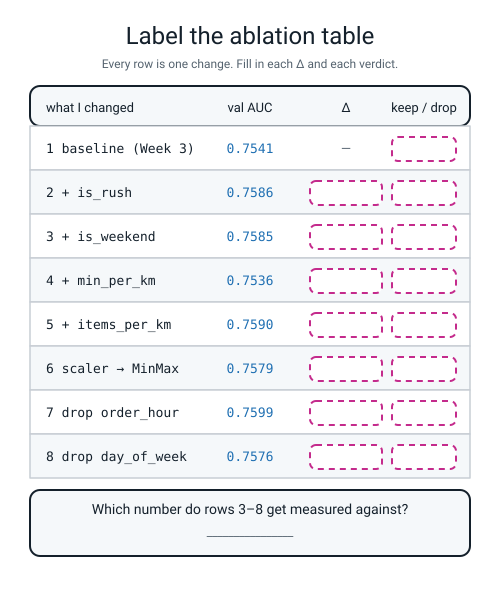
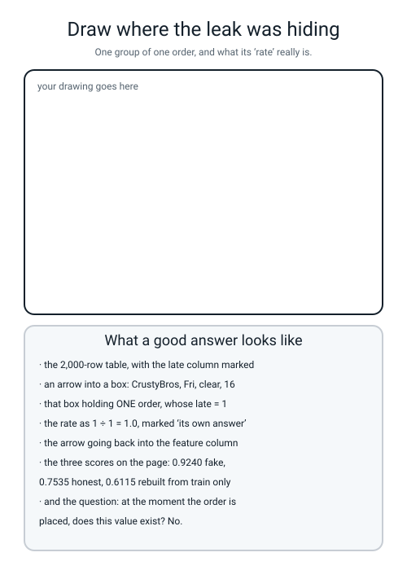

# Workbook — Week 7: Beat the Baseline

**Name:** ________________________________  **Date:** ______________

[⬅ Week 6](week-06.md) · [📖 Read the chapter first](../student-guide/week-07.md) · [Course Home](../README.md) · [Next ➡](week-08.md)

---

## ✅ Warm-Up (5 min)

Five quick questions about **last week** — the week a good score became suspicious.

**W1.** Name the **three flavours of leakage** and give the one-line tell for each.

**target:** ______________________________________________________

**temporal:** ____________________________________________________

**preprocessing:** _______________________________________________

**W2.** The median of `driver_experience_months` over **all 2,000 rows** is **29.0**. Over the **1,200 training rows** it is **29.5**. **Which number is the imputer allowed to use, and why?**

________________________________________________________________

**W3.** `add_indicator=True` added one column and the score went from **0.7752** to **0.7723**. Write the delta, and say what you did with the column.

**delta:** ____________  **what I did:** ____________________________

**W4.** A model was given a table of **pure noise** — 200 rows, 2,000 columns, no signal at all — and the 20 columns most related to the answer were chosen **before** the split. It scored **0.765**, and after the fix **0.520**. Which flavour of leak is that? ____________________

**W5.** Write out the one question that catches a leak with no arithmetic at all.

________________________________________________________________

---

## 🔢 Do the Maths by Hand

**There is no new maths this week.** So these four use **the subtraction of two scores** from Weeks 5 and 6, and **the mean and standard deviation** from Week 4, on this week's real numbers. **Calculator only. No code.**

**M1 — the seven deltas.** Here is the `val_auc` column from a real `bench.py` run. Fill in every delta and every verdict.

> **⚠️ Watch out:** rows 3 to 8 are each **one change from row 2**, so their deltas are measured against **0.7586**, not against row 1. Only row 2's delta is measured against row 1.

Use this rule for the verdict: **keep if the delta is bigger than +0.0010, otherwise drop.**

| row | what I changed | val AUC | measured against | Δ | keep / drop |
|---|---|---|---|---|---|
| 1 | baseline (Week 3 pipeline) | 0.7541 | — | — | keep |
| 2 | + `is_rush` | 0.7586 | 0.7541 | ____________ | ____________ |
| 3 | + `is_weekend` | 0.7585 | 0.7586 | ____________ | ____________ |
| 4 | + `min_per_km` | 0.7536 | 0.7586 | ____________ | ____________ |
| 5 | + `items_per_km` | 0.7590 | 0.7586 | ____________ | ____________ |
| 6 | scaler → `MinMaxScaler` | 0.7579 | 0.7586 | ____________ | ____________ |
| 7 | drop `order_hour` | 0.7599 | 0.7586 | ____________ | ____________ |
| 8 | drop `day_of_week` | 0.7576 | 0.7586 | ____________ | ____________ |

**M1(a).** The total honest gain is the best score minus the baseline. Show the subtraction.

`________________  −  ________________  =  ________________`

**M1(b).** How many of the seven deltas are **regressions**? ______ / 7

**M2 — the four worlds.** Somebody changed **two** things at once and the score went up by **+0.004**. Each row below is a different world that produces that same total. Fill in the gaps.

| World | change A did | change B did | total |
|---|---|---|---|
| 1 | +0.004 | ____________ | +0.004 |
| 2 | ____________ | +0.004 | +0.004 |
| 3 | +0.010 | ____________ | +0.004 |
| 4 | ____________ | +0.010 | +0.004 |

**M2(a).** In which world have you just shipped a change that **costs** you something? ______

**M2(b).** One sentence on why the single number +0.004 cannot tell those four worlds apart.

________________________________________________________________

**M3 — do two deltas add up?** Row 5 (`+ items_per_km`) gained **+0.0003**. Row 7 (`drop order_hour`) gained **+0.0013**.

**M3(a).** If deltas simply added, what score would you expect from doing **both**?

`0.7586  +  ________  +  ________  =  ________`

**M3(b).** Run together, the real measured score is **0.7604**. What is that delta?

`0.7604  −  0.7586  =  ________`

**M3(c).** Is your prediction the same as the measurement? ______  **By how much?** ________

**M4 — Week 4's mean and standard deviation, on the six deltas.** Take the six deltas from rows 3 to 8. Work down the table; the mean has been left for you to compute.

| delta *d* | *d* − mean | (*d* − mean)² |
|---|---|---|
| −0.0001 | | |
| −0.0051 | | |
| +0.0003 | | |
| −0.0007 | | |
| +0.0013 | | |
| −0.0010 | | |

**sum of the six deltas** = ________________  **mean** = sum ÷ 6 = ________________

**sum of the squares** = ________________  **÷ 6** = ________________

**standard deviation** = the square root of that = ________________

**M4(a).** The leaky feature moved the score by **+0.1705**. How many standard deviations is that above the mean of your six honest deltas? Show the division.

`(0.1705 − ________) ÷ ________ = ________`

**M4(b).** Finish the sentence with your own number: *"an honest change on this table moves the score by about ________, so a jump of 0.1705 is ________ times bigger than anything honest, and that is why I stopped and audited it."*

---

## 🔎 Predict the Output

**Write your prediction in pen before you run anything.** All four snippets assume you are in the delivery folder with `make_data.py` beside you. **Two of these four run cleanly and are still not what you would expect.**

### P1 — `.drop` gives you a copy, and the shapes prove it

```python
import pandas as pd
from make_data import make_deliveries

df = make_deliveries(n=2000, seed=0).drop_duplicates().reset_index(drop=True)
X = df.drop(columns=["late", "order_id"])
lean = X.drop(columns=["order_hour"])
print(X.shape)
print(lean.shape)
print("order_hour" in X.columns)
```

**I predict — line 1:** ____________  **line 2:** ____________  **line 3:** ____________

**It really printed:**

```text
________________________
________________________
________________________
```

**The table started with 2,020 rows. Why does line 1 not say 2,020?**

________________________________________________________________

### P2 — four decimal places, and one subtraction

```python
print("%.4f" % 0.75855)
print("%.4f" % 0.75865)
print(0.7590 - 0.7586)
print(round(0.7590 - 0.7586, 4))
```

**I predict — line 1:** ____________  **line 2:** ____________

**line 3:** ____________________________  **line 4:** ____________

**It really printed:**

```text
________________________
________________________
________________________
________________________
```

**Lines 1 and 2 both end in a 5 and they do not round the same way. And line 3 is not `0.0004`.** One sentence on what that means for a table whose whole honest gain is 0.0058:

________________________________________________________________

### P3 — `.drop` without `columns=`

```python
X.drop("order_hour")
```

**I predict:** does this run? ____________  If it fails, what is the last line?

________________________________________________________________

**It really printed:**

```text
________________________________________________________________
```

**What does `.drop` think you meant, if you do not say `columns=`?** ____________________

### P4 — the two lines that build `is_rush` and `is_weekend`

```python
import pandas as pd

s = pd.Series([17, 18, 19, 20, 21])
print(s.between(18, 20).astype(int).tolist())
print(int(s.between(18, 20).sum()))
print(pd.Series(["Sat", "Mon", "Sun"]).isin(["Sat", "Sun"]).astype(int).tolist())
```

**I predict — line 1:** ____________________  **line 2:** ______  **line 3:** ____________________

**It really printed:**

```text
________________________________
________________________________
________________________________
```

**Is `20` inside `between(18, 20)` or outside it?** ____________  **So how many hours count as the rush?** ______

**How many of the answers on this page did you get right?** ______ / 13

**Which one surprised you most?** ______________________________

---

## ✍️ Practice Set A — Read It

**A1. Match the word to the thing.** Write the letter.

| Word | | Description |
|---|---|---|
| **feature set** | ______ | (i) The log of your experiments: one row per change, with its delta |
| **ablation table** | ______ | (ii) A deliberate audit run on a score that looks too good |
| **regression** | ______ | (iii) The exact written list of columns you decided to feed the model |
| **leak hunt** | ______ | (iv) A column computed from the answer, so it cannot exist at prediction time |
| **target leakage** | ______ | (v) A change that made things worse |

**A2. One change or more?** For each experiment, say whether it is **one** change or **more than one**. If it is more, rewrite it as separate rows.

| # | The experiment as described | one or more? | If more, the rows it should be |
|---|---|---|---|
| 1 | "I added `is_rush`." | | |
| 2 | "I added `is_rush` and `is_weekend`." | | |
| 3 | "I swapped `StandardScaler` for `MinMaxScaler`." | | |
| 4 | "I added `min_per_km` and dropped `prep_minutes`, since the ratio contains it." | | |
| 5 | "I added `dist_x_weather` and changed `max_iter` from 2000 to 5000." | | |
| 6 | "I re-ran yesterday's experiment on my friend's laptop." | | |

**A2(a).** One of those six is **illegal today** for a reason that has nothing to do with counting changes. Which, and why?

________________________________________________________________

**A2(b).** One of those six belongs in the **Bug Log**, not the ablation table. Which, and why?

________________________________________________________________

**A3. Spot the bug.** Each line is wrong or dangerous. Say what happens and write the fix.

| # | The line | What happens | The fix |
|---|---|---|---|
| a | `pipe.set_params(prep__scaler=MinMaxScaler())` | | |
| b | `X.drop("day_of_week")` | | |
| c | `measure(BASE_NUM, CAT, RUSH)` when you meant to add `is_rush` | | |
| d | `measure(CHAMP, CAT, {})` | | |
| e | `measure(CHAMP, CAT, RUSH, drop=("order_hour",))` | | |
| f | `table.round(4).to_string(index=False)` on a line of its own | | |
| g | `X = X.drop(columns=["order_hour"])` | | |

**A3(h).** Three of those seven produce **no error message at all**. Which three, and what is the printed clue in each case?

________________________________________________________________

**A4. Match the code to the output.** Five of each, no output used twice.

| | Code |
|---|---|
| i | `print("%.4f" % (0.7599 - 0.7541))` |
| ii | `print(len(["distance_km", "items", "prep_minutes", "order_hour", "driver_experience_months"]))` |
| iii | `print("%+.4f" % (0.7536 - 0.7586))` |
| iv | `print(round(0.75356217, 4))` |
| v | `print("%.4f" % (0.9240 - 0.7535))` |

| | Output |
|---|---|
| P | `0.7536` |
| Q | `-0.0050` |
| R | `0.1705` |
| S | `5` |
| T | `0.0058` |

**Your answers:** i → ______  ii → ______  iii → ______  iv → ______  v → ______

**A5. Read four experiment logs and name what happened.** All four came from the same folder on the same afternoon.

**Log A**

```text
baseline                    : 0.7541
+ is_rush (built, not shown): 0.7541
delta                       : +0.0000
```

**What went wrong:** ______________________________________

**The giveaway:** ____________________________________________

**Log B**

```text
baseline        : 0.7541
Traceback (most recent call last):
  ...
ValueError: A given column is not a column of the dataframe
```

**What went wrong:** ______________________________________

**The giveaway:** ____________________________________________

**Log C**

```text
with similar_orders_late_rate : val AUC 0.9240
without it                      : val AUC 0.7535
jump                            : +0.1705
```

**What went wrong:** ______________________________________

**The giveaway:** ____________________________________________

**Log D**

```text
row 1  + is_rush            : 0.7861
row 2  scaler -> MinMaxScaler: 0.7863
delta                        : +0.0002
```

**What went wrong:** ______________________________________

**The giveaway:** ____________________________________________

**A5(a).** Rank those four from **easiest to hardest to notice**, and say what would have caught each one.

**easiest → hardest:** ______  ______  ______  ______

________________________________________________________________

**A6. Label the ablation table.** Fill in every empty box in the figure — one delta and one verdict per row.


*Figure W7.1 — Eight rows with the deltas and verdicts removed.*

**A6(a).** Write the sentence the bottom panel asks for:

________________________________________________________________

**A6(b).** Two of the eight rows are keeps. Which two, and what is the total gain they bought between them?

________________________________________________________________

---

## ✍️ Practice Set B — Write It

### B1 — one line, plus a print

**Task:** make a copy of `X_train` with `order_hour` taken out, then prove in one printed line that the **original** still has the column.

**Expected output:**

```text
full (1200, 8)   lean (1200, 7)   original still has order_hour: True
```

**Done looks like:** one `.drop(columns=[...])`, one `print`, and the word `True` at the end.

```python
X_lean = ______________________________________________________

print(________________________________________________________)
```

### B2 — the delta machine, as a function

**Task:** write `show_deltas(rows, reference)` where `rows` is a list of `(label, auc)` pairs. For each row it prints the label, the score, the delta against the reference to four decimal places **with its sign**, and `keep` or `drop` using the rule *keep if the delta is above +0.0010*.

Test it on this list, with the reference **0.7586**:

```python
rows = [("3  + is_weekend", 0.7585), ("4  + min_per_km", 0.7536),
        ("5  + items_per_km", 0.7590), ("6  scaler -> MinMaxScaler", 0.7579),
        ("7  drop order_hour", 0.7599), ("8  drop day_of_week", 0.7576)]
```

**Expected output:**

```text
reference: 0.7586
3  + is_weekend            0.7585  -0.0001  drop
4  + min_per_km            0.7536  -0.0050  drop
5  + items_per_km          0.7590  +0.0004  drop
6  scaler -> MinMaxScaler  0.7579  -0.0007  drop
7  drop order_hour         0.7599  +0.0013  keep
8  drop day_of_week        0.7576  -0.0010  drop
```

**Done looks like:** a `for` loop, `%+.4f` for the delta, and one `if` for the verdict.

**⚠️ And one thing to notice when you run it:** two of your deltas will **not** match `bench.py`'s table. Write down which two, and turn to the answers for why.

**mine differ on rows:** ______  and ______

### B3 — one new row of your own

**Task:** measure a brand-new feature. `add_features` already knows how to build `dist_x_weather` — it is `distance_km` multiplied by a weather severity of 0, 1 or 2. Add it to the champion feature set, measure it, and print the row.

**Expected output:**

```text
reference (+ is_rush)   : 0.7586
9  + dist_x_weather     : 0.7568
delta                   : -0.0018
verdict                 : drop
```

**Done looks like:** one `measure(...)` call with **both** lists in agreement — `dist_x_weather` in the number list **and** `inter=True` in the settings.

```python
auc = ___________________________________________________________
```

### B4 — audit 0, in four lines

**Task:** the fastest audit there is. Score the leaky feature set, score the same set without the suspect column, and print both plus the jump. Use `leaky_features.py` and the `fit_and_score` function from `leak_hunt.py`.

**Expected output:**

```text
with similar_orders_late_rate : val AUC 0.9240
without it                      : val AUC 0.7535
jump                            : +0.1705
```

**Done looks like:** two calls, three prints, and a `%+.4f` on the jump so the sign is visible.

### B5 — a whole program of your own, about 25 lines

**Task:** write `my_bench.py`. It imports `measure`, `CHAMP`, `CAT` and `RUSH` from your `bench.py`, then measures **three rows of your own** on top of the champion — one added feature and two dropped columns — and prints them as a table with `to_string(index=False)`.

**Expected output** (the three rows are the ones we used; yours may differ, and that is fine as long as each row is one change):

```text
          what I changed  val_auc   delta verdict
2  + is_rush (reference)   0.7586  0.0000    keep
     9  + dist_x_weather   0.7568 -0.0018    drop
      10 drop restaurant   0.7465 -0.0121    drop
         11 drop weather   0.7310 -0.0276    drop

reference : 0.7586 on the 400 validation rows
best      : 0.7586 on the 400 validation rows
```

**Done looks like:** one row per change, a delta column, a verdict column, and the pile named on the last two lines. **Runtime under 3 seconds.**

---

## 🐞 Fix the Broken Program

This program has **three** bugs: one **wrong-columns** bug, one **runtime** bug, and one **silent logic** bug. The real error messages are below, in the order you meet them.

```python
"""broken7.py - two ablation rows.  THREE bugs."""
import pandas as pd
from sklearn.compose import ColumnTransformer
from sklearn.impute import SimpleImputer
from sklearn.linear_model import LogisticRegression
from sklearn.metrics import roc_auc_score
from sklearn.model_selection import train_test_split
from sklearn.pipeline import Pipeline
from sklearn.preprocessing import (FunctionTransformer, MinMaxScaler,
                                   OneHotEncoder, StandardScaler)

from make_data import make_deliveries

NUM = ["distance_km", "items", "prep_minutes", "order_hour",
       "driver_experience_months", "is_rush"]
CAT = ["restaurant", "day_of_week", "weather"]

df = make_deliveries(n=2000, seed=0).drop_duplicates().reset_index(drop=True)
y = df["late"]
X = df.drop(columns=["late", "order_id"])
X_tmp, X_test, y_tmp, y_test = train_test_split(
    X, y, test_size=0.20, random_state=0, stratify=y)
X_train, X_val, y_train, y_val = train_test_split(
    X_tmp, y_tmp, test_size=0.25, random_state=0, stratify=y_tmp)


def add_features(d, rush=False):
    d = d.copy()
    if rush:
        d["is_rush"] = d["order_hour"].between(18, 20).astype(int)
    return d


def measure(num, kw, minmax=False):
    prep = ColumnTransformer([
        ("num", Pipeline([("imputer", SimpleImputer(strategy="median")),
                          ("scaler", StandardScaler())]), num),
        ("cat", OneHotEncoder(handle_unknown="ignore"), CAT),
    ])
    pipe = Pipeline([("derive", FunctionTransformer(add_features, kw_args=kw)),
                     ("prep", prep),
                     ("model", LogisticRegression(max_iter=2000, random_state=0))])
    if minmax:
        pipe.set_params(prep__scaler=MinMaxScaler())
    pipe.fit(X_train, y_train)
    return roc_auc_score(y_train, pipe.predict_proba(X_train)[:, 1])


row1 = measure(NUM, {})
print("row 1  + is_rush            : %.4f" % row1)
row2 = measure(NUM, {"rush": True}, minmax=True)
print("row 2  scaler -> MinMaxScaler: %.4f" % row2)
print("delta                        : %+.4f" % (row2 - row1))
```

**Run 1 — nothing prints at all:**

```text
Traceback (most recent call last):
  ...
  File ".../sklearn/utils/_indexing.py", line 451, in _get_column_indices
    raise ValueError("A given column is not a column of the dataframe") from e
ValueError: A given column is not a column of the dataframe
```

**Bug 1.** Which line? ______  **Which column is it looking for?** ____________

**The `num` list contains `is_rush`. What was `add_features` told to build?** ____________

**The fix:** ______________________________________________

**Run 2 — after fixing bug 1:**

```text
Traceback (most recent call last):
  ...
  File ".../sklearn/base.py", line 345, in set_params
    raise ValueError(
ValueError: Invalid parameter 'scaler' for estimator ColumnTransformer(transformers=[('num',
                                 Pipeline(steps=[('imputer',
                                                  SimpleImputer(strategy='median')),
                                                 ('scaler', StandardScaler())]),
                                 ['distance_km', 'items', 'prep_minutes',
                                  'order_hour', 'driver_experience_months',
                                  'is_rush']),
                                ('cat', OneHotEncoder(handle_unknown='ignore'),
                                 ['restaurant', 'day_of_week', 'weather'])]). Valid parameters are: ['force_int_remainder_cols', 'n_jobs', 'remainder', 'sparse_threshold', 'transformer_weights', 'transformers', 'verbose', 'verbose_feature_names_out'].
```

**Bug 2.** Which line? ______  **Kind of bug?** ______________

**The last sentence hands you a list of valid names. Which one is the door you need to go through, and what comes after it?**

________________________________________________________________

**The fix:** ______________________________________________

**Run 3 — after fixing bugs 1 and 2. It runs all the way through, with no error at all:**

```text
row 1  + is_rush            : 0.7861
row 2  scaler -> MinMaxScaler: 0.7863
delta                        : +0.0002
```

**Bug 3 is in `measure`, on the very last line, and it has been there all along.**

**Compare 0.7861 with the 0.7586 you know is right. Which rows is the score being measured on?**

________________________________________________________________

**Why is a score measured on the training rows always the wrong number to put in an ablation table?**

________________________________________________________________

**The fix:** write the corrected line.

```python
________________________________________________________________
```

**Run 4 — after fixing all three:**

```text
row 1  + is_rush            : 0.7586
row 2  scaler -> MinMaxScaler: 0.7579
delta                        : -0.0007
```

**Two questions, and they are the point of the whole page.**

**The broken version's delta was `+0.0002` and the correct one is `−0.0007`. What happened to the *sign*, and what would you have written in the verdict column?**

________________________________________________________________

**Rank the three bugs from easiest to hardest to notice, and say what would have caught each one.**

**easiest → hardest:** ______  ______  ______

________________________________________________________________

---

## 🧩 Puzzle of the Week

### The Ablation Detective

Somebody left you a notebook. They ran three experiments, and **every one of them changed two things at once** — which is exactly what you are not supposed to do. All three were measured from the same baseline. Deltas are in ten-thousandths, so **+40 means +0.0040**.

| Experiment | What they changed | Δ |
|---|---|---|
| 1 | A **and** B | **+40** |
| 2 | B **and** C | **−20** |
| 3 | A **and** C | **+100** |

Assume — and this is a real assumption, worth remembering — that each change contributes the same amount whichever company it keeps.

**Part 1(a).** Add all three deltas together. What do you get? ______

**Part 1(b).** Each of A, B and C appears **exactly twice** in that sum. So what is `A + B + C`? ______

**Part 1(c).** Now find each one. Show the subtraction.

`C = (A + B + C) − (A + B) = ________ − ________ = ________`

`A = ________________________________  = ________`

`B = ________________________________  = ________`

**Part 1(d).** Check all three of your answers against all three experiments.

`A + B = ______`  `B + C = ______`  `A + C = ______`

**Part 1(e).** One of the three changes is a **regression**. Which, and **what did the notebook's owner ship without knowing it?**

________________________________________________________________

**Part 1(f).** How many experiments would they have needed if they had changed **one** thing at a time? ______  **And how many did they run?** ______

### Part 2 — Strike out the illegal rounds

Here is a wall table from a real tournament. Three rows have to be struck out. Put a cross in the last column for each one, and say why.

| # | what I changed | val AUC | Δ | strike out? why? |
|---|---|---|---|---|
| 1 | baseline | 0.7541 | — | |
| 2 | + `is_rush` | 0.7586 | +0.0045 | |
| 3 | + `is_weekend`, + `items_per_km` | 0.7588 | +0.0002 | |
| 4 | + `min_per_km` | 0.7536 | −0.0051 | |
| 5 | changed the model to a decision tree | 0.7188 | −0.0398 | |
| 6 | drop `order_hour` | 0.7599 | +0.0013 | |
| 7 | + `is_weekend` on my friend's laptop | 0.7601 | +0.0015 | |

**Part 2(a).** After the strikes, how many usable rows are left? ______

**Part 2(b).** Row 3 has to be **re-run as two rows**. Write the two labels you would use.

`row 3a: ______________________________`  `row 3b: ______________________________`

---

## 🤔 Think Deeper

**T1.** An afternoon of honest feature work bought **+0.0058**. A single leaked column "bought" **+0.1705**. Somebody says: *"nobody would ever notice the difference between 0.7541 and 0.7599, so why bother?"* **Write a paragraph** answering them. Say what the 0.0058 is actually worth, what you learned about pizza that the model did not, and whether you would defend spending an afternoon on it. Then answer the harder half: **is there a score improvement so small that it is not worth reporting at all?**

________________________________________________________________

________________________________________________________________

________________________________________________________________

________________________________________________________________

________________________________________________________________

**T2.** The rule you were given today is *"on 400 validation rows, treat anything under about 0.005 as no evidence."* That rule condemns row 5 (+0.0003) — and it also puts a question mark over row 7 (+0.0013), which you **kept**. **Write a paragraph** on what to do about that. Is keeping row 7 dishonest? What would you have to measure to settle it, and what would you write on the table in the meantime so that future-you knows exactly what past-you believed?

________________________________________________________________

________________________________________________________________

________________________________________________________________

________________________________________________________________

---

## 🛠️ Build It — The Table, The Leak Hunt, The Defence

**Three things get handed in, and the first is the real one: a table where every row contains exactly one change.**

### Step checklist

- [ ] **1.** `bench.py` runs. Paste the whole output, including the `train 1200   val 400   test 400` line.
- [ ] **2.** **Before you run anything else, predict the sign of four changes, in pen.** The table is below. No cheating by running first — this page is marked on honesty, not accuracy.
- [ ] **3.** Copy the class wall table into the ablation table below, in your own handwriting.
- [ ] **4.** Add **at least two rows of your own**, so the table has **six rows minimum**. Each row: one change.
- [ ] **5.** Write, at the top of the table, the number you are measuring rows 3 onwards against.
- [ ] **6.** Write your best validation AUC **with the pile named**.
- [ ] **7.** `leak_hunt.py` runs. Fill in all five audits.
- [ ] **8.** Name the flavour, the fake score and the honest score.
- [ ] **9.** Fill in the defence table: every kept column and every dropped column with **a number** beside it.
- [ ] **10.** Two Bug Log entries: one loud, one silent.

### Predict the sign (in pen, before running)

| Proposed change | I predict the delta will be… | The truth (fill in later) | Was I right? |
|---|---|---|---|
| + `is_weekend` | | | |
| + `min_per_km` | | | |
| scaler → `MinMaxScaler` | | | |
| drop `order_hour` | | | |

**How many did I get right?** ______ / 4  **Which surprise was biggest?** ______________________

### My ablation table

**Rows 3 onwards are measured against:** ________________  **because** ____________________________

| # | what I changed | val AUC | Δ | keep / drop | why (a number, or "untested") |
|---|---|---|---|---|---|
| 1 | | | — | | |
| 2 | | | | | |
| 3 | | | | | |
| 4 | | | | | |
| 5 | | | | | |
| 6 | | | | | |
| 7 | | | | | |
| 8 | | | | | |
| 9 | | | | | |
| 10 | | | | | |

**My best validation AUC is ________________, on the ________________ rows.**

**Total honest gain:** ________ − ________ = ________

**Rows that were regressions:** ______ / ______

### The leak hunt

| Audit | What it printed | What it tells me |
|---|---|---|
| 0 — with and without | with ________  without ________  jump ________ | |
| 1 — correlation with `late` | suspect ________  best honest ________ | |
| 2 — that column alone | ________ | |
| 3 — the biggest weight | ________ vs next ________ | |
| 4 — the question | | |

**The poisoned feature is:** ______________________________

**The flavour is:** ______________________  **and the reason it is that flavour:** ______________________

**The fake score:** ________  **The honest score:** ________

**Rebuilt from the 1,200 training rows only (still naively), it scores ________ — which is ________ than not having the feature at all.**

**In my own words: at the moment a customer places the order, does this value exist?**

________________________________________________________________

### Defend my final feature set

**Kept:**

| Column | Where it came from | The number that justifies it |
|---|---|---|
| | | |
| | | |
| | | |
| | | |
| | | |
| | | |
| | | |

**Dropped:**

| Column | Why it went | The number |
|---|---|---|
| | | |
| | | |
| | | |
| | | |
| | | |
| | | |

> **⚠️ Watch out:** a line with no number on it is **not** a defence. If you never tested a column on its own, write **"untested"** — that is honest and it earns marks. An invented reason does not.

### The Bug Log

Two entries today: one loud, one silent.

| What I saw | What it means | Cause | Fix |
|---|---|---|---|
| | | | |
| | | | |

---

## 🎨 Draw It

Draw the leak. Not the code — **the path the answer took to get into the feature.** Use the frame below, then check yourself against the panel underneath it.


*Figure W7.2 — An empty frame, and what a good answer contains.*

**Then answer three things about your own drawing:**

**How many boxes did you draw between the `late` column and the feature column?** ______

**Where on your drawing is the number `1.0`, and what is it the late rate *of*?**

________________________________________________________________

**If you had to explain your drawing to somebody in ten seconds, which single arrow would you point at?**

________________________________________________________________

---

## 📊 Self-Check

| I can... | 😀 | 🙂 | 😕 |
|---|---|---|---|
| improve a model by changing **only** the features, with the model frozen | | | |
| keep an ablation table where every row has exactly one change and a delta | | | |
| say what the four worlds are, and why a two-change row is worthless | | | |
| use `pipe.set_params(prep__num__scaler=...)` and read the error when I get the address wrong | | | |
| drop a column with `X.drop(columns=[c])` and explain why the original survives | | | |
| print a table a human can read with `to_string(index=False)` | | | |
| find a planted leak and name which flavour it is | | | |
| report a fake score and an honest score side by side | | | |
| state my best score **with the pile named**, every time | | | |
| defend every column I kept with a number from my own table | | | |

**The one thing I would ask about if I could ask one question:**

________________________________________________________________

---

## ✅ Answers

<details>
<summary>Check your answers</summary>

### Warm-Up

**W1.** **Target leakage** — a column that only exists, or only gets filled in, **because the outcome already happened** (`customer_called_support`, fake 0.9762 against honest 0.7752). **Temporal leakage** — rows shuffled across a **time** boundary, so the model trains on the future and is tested on the past (0.8139 against 0.5249). **Preprocessing leakage** — a statistic worked out over **all** the data before the split: a mean, a median, or a choice of which columns to keep (0.765 against 0.520).

**W2.** **29.5, the median of the training rows.** The fill-in number is a thing the model *learns*, so it may only be learned from the rows the model is allowed to see. 29.0 was worked out partly from the 800 rows you were about to be marked on, so a score measured against them is measured against numbers that already knew something about the answers.

**W3.** **0.7723 − 0.7752 = −0.0029.** It made the model worse, so **the column goes.** A new column earns its place or it leaves — that is the Week 5 habit surviving contact with a new tool.

**W4.** **Preprocessing leakage.** No individual column was poisoned and no time boundary was crossed. The bug was *choosing* the 20 columns while looking at every label — a decision made over all the data, before the split. With 2,000 pure-noise columns you get 2,000 chances to get lucky, and 20 of them look wonderful by accident.

**W5.** ***"At the moment I need the prediction, does this value exist?"*** If the answer is no, the feature is poison no matter how good the score looks — and no arithmetic is required to find that out.

### Do the Maths by Hand

**M1.**

| row | val AUC | measured against | Δ | keep / drop |
|---|---|---|---|---|
| 2 | 0.7586 | 0.7541 | **+0.0045** | **keep** |
| 3 | 0.7585 | 0.7586 | **−0.0001** | **drop** |
| 4 | 0.7536 | 0.7586 | **−0.0050** | **drop** |
| 5 | 0.7590 | 0.7586 | **+0.0004** | **drop** |
| 6 | 0.7579 | 0.7586 | **−0.0007** | **drop** |
| 7 | 0.7599 | 0.7586 | **+0.0013** | **keep** |
| 8 | 0.7576 | 0.7586 | **−0.0010** | **drop** |

> **🔢 The maths, slowly — and this is worth two minutes of your life.** `bench.py` prints **−0.0051** for row 4 and **+0.0003** for row 5, and you just wrote **−0.0050** and **+0.0004**. **You are not wrong and neither is the computer.** Row 4's real score is `0.75356217`, and `0.75356217 − 0.75862700 = −0.00506484`, which rounds to **−0.0051**. You subtracted the numbers *after* they had been rounded to `0.7536`, so you got **−0.0050**. Same for row 5: the real delta is `+0.00033562`, but `0.7590 − 0.7586` is `+0.0004`.
>
> **The rule this teaches: round at the end, never in the middle.** A tenth of a ten-thousandth does not matter today. It matters enormously in Week 15, when thousands of tiny numbers get added up.

**M1(a).** `0.7599 − 0.7541 = **0.0058**`.

**M1(b).** **Four** of the seven deltas are negative: rows 3 (−0.0001), 4 (−0.0050), 6 (−0.0007) and 8 (−0.0010). Row 5 (+0.0004) is *positive* and still gets dropped, because it is below the keep line.

**So the honest count is: seven changes, four regressions, five drops (the four regressions plus row 5), two keeps.** An earlier wording of the chapter called the dropped rows "regressions" — and the distinction is worth having in your own words: **a regression made it worse; a drop merely failed to earn its place.** Both belong on the table.

**M2.**

| World | change A did | change B did | total |
|---|---|---|---|
| 1 | +0.004 | **0.000** | +0.004 |
| 2 | **0.000** | +0.004 | +0.004 |
| 3 | +0.010 | **−0.006** | +0.004 |
| 4 | **−0.006** | +0.010 | +0.004 |

**M2(a).** **World 3** (and world 4, which is the same story with the letters swapped). Change B costs you 0.006 and you have just shipped it, because A was carrying it.

**M2(b).** One number is one equation and you have two unknowns. Four different pairs of contributions produce the identical total, so the measurement cannot choose between them — **the information was never collected.**

**M3(a).** `0.7586 + 0.0003 + 0.0013 = **0.7602**`.

**M3(b).** `0.7604 − 0.7586 = **+0.0018**`.

**M3(c).** **Not exactly — the prediction is 0.0002 low.** But 0.0002 is far below the 0.005 line (and partly rounding: the unrounded deltas are 0.00034 and 0.00131), so this example does not prove the deltas fail to add. It shows you cannot *assume* they add: when features overlap in what they explain, their effects can **interact**, which is the honest reason "one change at a time" is a *discipline* rather than a *proof*. It gives you attributable rows; it does not give you a formula for combining them.

**M4.**

| delta *d* | *d* − mean | (*d* − mean)² |
|---|---|---|
| −0.0001 | +0.00078 | 0.00000061 |
| −0.0051 | −0.00422 | 0.00001778 |
| +0.0003 | +0.00118 | 0.00000140 |
| −0.0007 | +0.00018 | 0.00000003 |
| +0.0013 | +0.00218 | 0.00000477 |
| −0.0010 | −0.00012 | 0.00000001 |

**sum of the six deltas** = `−0.0001 − 0.0051 + 0.0003 − 0.0007 + 0.0013 − 0.0010 = **−0.0053**`

**mean** = `−0.0053 ÷ 6 = **−0.00088**` (to five places, −0.000883)

**sum of the squares** = **0.00002461**  **÷ 6** = **0.00000410**

**standard deviation** = `√0.00000410 = **0.00203**` (Python gives 0.002025)

**M4(a).** `(0.1705 − (−0.00088)) ÷ 0.00203 = 0.17138 ÷ 0.00203 = **84.4**` standard deviations. (Python, keeping every decimal place instead of the rounded ones: **84.63**.)

**M4(b).** *"An honest change on this table moves the score by about **0.002**, so a jump of 0.1705 is about **84** times bigger than anything honest, and that is why I stopped and audited it."* Any answer in the same neighbourhood is right; the point is that **the leak is not slightly unusual, it is off the end of the ruler.**

### Predict the Output

**P1.**

```text
(2000, 8)
(2000, 7)
True
```

**Why not 2,020?** Because of `.drop_duplicates()`. `make_data.py` deliberately duplicates 20 rows — 1% of 2,000 — and a duplicated row that lands in two different piles is a row the model has already seen. Dropping them takes 2,020 back to **2,000**.

And **8 columns, not 10**, because `order_id` and `late` were both dropped: `order_id` is a row number, not a fact about the world, and `late` is the answer.

**Line 3 is `True` and it is the whole point of the snippet:** `.drop` hands you a **copy**. `X` is untouched, which is exactly what lets you drop a column, measure, and still have the full table ready for the next experiment.

**P2.**

```text
0.7585
0.7587
0.00039999999999995595
0.0004
```

**Two surprises, both worth having.**

**One: `0.75855` printed `0.7585` and `0.75865` printed `0.7587`.** Both end in 5, and they went opposite ways. The reason is that neither number exists exactly in binary — `0.75855` is stored as very slightly *less* than 0.75855, so it rounds down, and `0.75865` is stored as slightly *more*, so it rounds up. **You cannot predict which way a `...5` will go, so never let a decision hang on the fourth decimal place.**

**Two: `0.7590 - 0.7586` is not `0.0004`.** It is `0.00039999999999995595`. Same cause: neither number is exact, so their difference carries the error. `round(..., 4)` tidies it to `0.0004` for printing.

**What it means for a table whose gain is 0.0058:** the arithmetic is fine to about twelve decimal places, which is eight more than you are using — so it does not threaten your table. **But it does mean you round for display and never compare two numbers by `==`.**

**P3.**

```text
KeyError: "['order_hour'] not found in axis"
```

**`.drop` means rows unless you say otherwise.** With no `columns=`, pandas went looking for a **row** whose index label was `"order_hour"` and there is no such row. Note the message says *"not found in axis"* — that is pandas telling you it searched the wrong axis, which is the clue.

The fix is `X.drop(columns=["order_hour"])` — `columns=` **and** square brackets, even for a single name.

**P4.**

```text
[0, 1, 1, 1, 0]
3
[1, 0, 1]
```

**`between(18, 20)` includes both ends.** 18, 19 **and 20** are all `True`, so there are **three** rush hours, not two. That is `is_rush` in one line, and if you thought the 20 was excluded, you had just invented a different feature.

`.isin(["Sat", "Sun"])` is the same idea for words: `Sat` → 1, `Mon` → 0, `Sun` → 1. That is `is_weekend`.

**Both lines end in `.astype(int)`** because a column of `True`/`False` is not something you can scale and multiply by a weight — but `1` and `0` are.

### Practice Set A

**A1.** feature set → **(iii)** · ablation table → **(i)** · regression → **(v)** · leak hunt → **(ii)** · target leakage → **(iv)**

**A2.**

| # | Verdict | If more than one, the rows it should be |
|---|---|---|
| 1 | **One change.** | — |
| 2 | **Two changes.** | Row A: + `is_rush`. Row B: + `is_weekend`, on top of A. |
| 3 | **One change.** | — |
| 4 | **Two changes.** | Row A: + `min_per_km`. Row B: − `prep_minutes`, on top of A. The reasoning is good; it is still two rows. |
| 5 | **Two changes — and one of them is illegal today.** | Row A: + `dist_x_weather`. The `max_iter` change touches the **model**, which is frozen this week. Revert it. |
| 6 | **Zero changes — and not comparable anyway.** | Nothing to record. |

**A2(a).** **Number 5.** `max_iter` is a setting on `LogisticRegression`, and this week's whole discipline is *the model is frozen, only the features move.* If you change the model, every earlier row in your table is now about a machine that no longer exists.

**A2(b).** **Number 6.** A different laptop is not a feature change. If the score differs, the cause is a different `random_state`, a different `make_data.py`, or a different library version — all of which are **bugs to investigate**, not experiments to record.

**A3.**

| # | What happens | The fix |
|---|---|---|
| a | `ValueError: Invalid parameter 'scaler' for estimator ColumnTransformer(...)`, ending in a list of valid names. The address is missing a level: `prep` holds *transformers*, and the scaler lives inside the one called `num`. | `pipe.set_params(prep__num__scaler=MinMaxScaler())` |
| b | `KeyError: "['day_of_week'] not found in axis"`. Without `columns=`, `.drop` looks for a **row**. | `X.drop(columns=["day_of_week"])` |
| c | **No error. A plausible, wrong number: 0.7541 — identical to the baseline.** `is_rush` was built and never shown to the model, because it is not in the number list. | `measure(CHAMP, CAT, RUSH)` — both lists must agree |
| d | `ValueError: A given column is not a column of the dataframe`. `CHAMP` **lists** `is_rush` and `{}` tells `add_features` to build **nothing**. | `measure(CHAMP, CAT, RUSH)` |
| e | `KeyError: 'order_hour'`, raised **inside `add_features`** in your own file: you threw away the ingredient and then asked for the cake. | Take the name out of the **number list**, not out of the table: `measure([c for c in CHAMP if c != "order_hour"], CAT, RUSH)` |
| f | **No error and nothing appears.** `to_string` *makes* text; only `print` *shows* it. | `print(table.round(4).to_string(index=False))` |
| g | **No error, and a slow disaster.** You have overwritten `X`, so the column is gone for every later experiment and every later row of your table is secretly about a smaller table. | `X_lean = X.drop(columns=["order_hour"])` — never assign back over the original |

**A3(h).** **c, f and g** produce no error at all — three of the seven, which is the real lesson of the page. The clues: **c** prints a score *identical to the baseline to four decimal places*, which is a coincidence too large to believe; **f** prints *nothing*, and a program that prints nothing has not succeeded; **g** shows up as a later row failing with `KeyError` on a column you know is in the file, or — worse — as every later score quietly shifting.

**A4.** i → **T** · ii → **S** · iii → **Q** · iv → **P** · v → **R**

`%+.4f` on `0.7536 - 0.7586` gives `-0.0050`: the `+` in the format means *always show the sign*, and the sign here is a minus.

**A5.**

**Log A — the built-but-not-listed bug.** `is_rush` was created by the derive step and never put in the `num` list, so the model never saw it. **The giveaway is the identical score:** 0.7541 twice, to four decimal places. A new column is worth *exactly* nothing only if it never arrived.

**Log B — the listed-but-not-built bug.** The same mistake from the other direction: the column is named in `num` and `add_features` was told to build nothing. **The giveaway is that the baseline printed first** — so the file is fine and it is the *second* call that is wrong.

**Log C — target leakage.** A single column moved the score by 0.1705 when every honest change all afternoon moved it by less than 0.005. **The giveaway is the size of the jump**, and audit 4 confirms it with no arithmetic: the value does not exist when the order is placed.

**Log D — measured on the wrong pile.** These are training scores, not validation scores. **The giveaway is the level, 0.786** — far above the 0.74 to 0.77 band where honest scores live on this table — **and the sign**, because on validation this change is a small loss, not a small gain.

**A5(a).** Easiest → hardest: **B, C, D, A.**

**B** is easiest: it crashes, and the message names the problem. **C** is next: nothing crashes, but the number is so far outside the honest band that it announces itself — *if* you know what the honest band is. **D** is harder: the numbers look like plausible AUCs and only the level gives it away. **A** is hardest of all, because the number is not merely plausible, it is *the number you already believed*.

What would have caught them: B — reading the last line. C — knowing the honest range, plus audit 0. D — printing which pile every score came from, on every line. A — printing both lists side by side before trusting the row.

**A6.** The deltas and verdicts are exactly M1's table: **+0.0045 keep · −0.0001 drop · −0.0050 drop · +0.0004 drop · −0.0007 drop · +0.0013 keep · −0.0010 drop** (`bench.py` prints −0.0051 and +0.0003 on rows 4 and 5, because it subtracts before rounding — see the note under M1).

**A6(a).** *"Rows 3 to 8 are each one change from row 2, so every delta on those rows is measured against **0.7586**. Only row 2 is measured against row 1's 0.7541."*

**A6(b).** **Rows 2 and 7.** Between them: `+0.0045 + 0.0013 = +0.0058` — which is exactly the total honest gain, `0.7599 − 0.7541`. **The two keeps account for the whole afternoon.**

### Practice Set B

**B1.**

```python
X_lean = X_train.drop(columns=["order_hour"])

print("full %s   lean %s   original still has order_hour: %s"
      % (X_train.shape, X_lean.shape, "order_hour" in X_train.columns))
```

```text
full (1200, 8)   lean (1200, 7)   original still has order_hour: True
```

**B2.**

```python
rows = [("3  + is_weekend", 0.7585), ("4  + min_per_km", 0.7536),
        ("5  + items_per_km", 0.7590), ("6  scaler -> MinMaxScaler", 0.7579),
        ("7  drop order_hour", 0.7599), ("8  drop day_of_week", 0.7576)]


def show_deltas(rows, reference):
    print("reference: %.4f" % reference)
    for label, auc in rows:
        delta = auc - reference
        verdict = "keep" if delta > 0.0010 else "drop"
        print("%-26s %.4f  %+.4f  %s" % (label, auc, delta, verdict))


show_deltas(rows, 0.7586)
```

```text
reference: 0.7586
3  + is_weekend            0.7585  -0.0001  drop
4  + min_per_km            0.7536  -0.0050  drop
5  + items_per_km          0.7590  +0.0004  drop
6  scaler -> MinMaxScaler  0.7579  -0.0007  drop
7  drop order_hour         0.7599  +0.0013  keep
8  drop day_of_week        0.7576  -0.0010  drop
```

**The two rows that differ from `bench.py` are 4 and 5** — `−0.0050` here against `−0.0051` there, and `+0.0004` here against `+0.0003` there. **Cause: you handed the function numbers that had already been rounded to four places.** `bench.py` subtracts `0.75356217 − 0.75862700` and only rounds at the end. Both are correct arithmetic on the numbers they were given; only one of them is *the delta*. **Round at the end, never in the middle.**

**B3.**

```python
auc = measure(CHAMP + ["dist_x_weather"], CAT, {**RUSH, "inter": True})
```

Full program and its real output:

```python
from bench import CAT, CHAMP, RUSH, measure

champ = measure(CHAMP, CAT, RUSH)
auc = measure(CHAMP + ["dist_x_weather"], CAT, {**RUSH, "inter": True})
print("reference (+ is_rush)   : %.4f" % champ)
print("9  + dist_x_weather     : %.4f" % auc)
print("delta                   : %+.4f" % (auc - champ))
print("verdict                 : %s" % ("keep" if auc - champ > 0.0010 else "drop"))
```

```text
reference (+ is_rush)   : 0.7586
9  + dist_x_weather     : 0.7568
delta                   : -0.0018
verdict                 : drop
```

**Note the two lists agreeing.** `dist_x_weather` is in the number list **and** `inter=True` is in the settings. Leave either one out and you get the pair of bugs from A3 (c) and (d).

**And note the result: an "obviously clever" interaction feature lost 0.0018.** Distance times weather severity *sounds* like exactly the sort of thing that should help. It is a regression, it goes on the table as a regression, and the table is better for having it.

**B4.**

```python
print("--- audit 0: the two scores ---")
leaky_pipe, leaky_auc = fit_and_score(NUM + [SUSPECT])
_, honest_auc = fit_and_score(NUM)
print("with %s : val AUC %.4f" % (SUSPECT, leaky_auc))
print("without it                      : val AUC %.4f" % honest_auc)
print("jump                            : %+.4f" % (leaky_auc - honest_auc))
```

```text
--- audit 0: the two scores ---
with similar_orders_late_rate : val AUC 0.9240
without it                      : val AUC 0.7535
jump                            : +0.1705
```

**Two model fits and three prints, and it is the most valuable two seconds in the week.** Audit 0 does not tell you *what* is wrong — it tells you *whether to worry*, which is the only question you have at the start.

**B5.** `my_bench.py`:

```python
"""my_bench.py - two rows of my own, on top of the Week 7 champion."""
import pandas as pd

from bench import CAT, CHAMP, RUSH, measure

champ = measure(CHAMP, CAT, RUSH)
rows = [["2  + is_rush (reference)", champ, 0.0, "keep"]]

for label, num, cat, kw, drop in [
    ("9  + dist_x_weather", CHAMP + ["dist_x_weather"], CAT, {**RUSH, "inter": True}, ()),
    ("10 drop restaurant", CHAMP, [c for c in CAT if c != "restaurant"], RUSH, ("restaurant",)),
    ("11 drop weather", CHAMP, [c for c in CAT if c != "weather"], RUSH, ("weather",)),
]:
    auc = measure(num, cat, kw, drop)
    delta = auc - champ
    rows.append([label, auc, delta, "keep" if delta > 0.0010 else "drop"])

table = pd.DataFrame(rows, columns=["what I changed", "val_auc", "delta", "verdict"])
print()
print(table.round(4).to_string(index=False))
print()
print("reference : 0.7586 on the 400 validation rows")
print("best      : %.4f on the 400 validation rows" % table["val_auc"].max())
```

**Real output — and read the first thing that happens:**

```text
          what I changed  val_auc   delta verdict
2  + is_rush (reference)   0.7586  0.0000    keep
     9  + dist_x_weather   0.7568 -0.0018    drop
      10 drop restaurant   0.7465 -0.0121    drop
         11 drop weather   0.7310 -0.0276    drop

reference : 0.7586 on the 400 validation rows
best      : 0.7586 on the 400 validation rows
```

> **⚠️ Watch out:** `from bench import ...` **runs the whole of `bench.py`**, so before your own table appears you will see Week 7's eight-row table print itself again. Nothing is broken — importing a script executes it. It is also why `bench.py` is worth keeping short.

**And now read rows 10 and 11, because they are the most useful thing on this page.** Dropping `restaurant` costs **0.0121**; dropping `weather` costs **0.0276**. Those are the two biggest numbers in this little table, and they are *negative* — which means those two columns are **carrying the model**. You now have a number to write next to `weather` on your defence page instead of "untested", and it is twenty times the size of anything you invented.

### Fix the Broken Program

**Bug 1 — line `row1 = measure(NUM, {})`. A wrong-columns bug.** `NUM` lists `is_rush`, and `{}` tells `add_features` to build nothing, so `ColumnTransformer` went looking for a column that was never made. It is looking for **`is_rush`**.

**The fix:** `row1 = measure(NUM, {"rush": True})` — the list and the settings must agree.

**Bug 2 — the `set_params` line. A runtime bug.** `prep__scaler` is an address with a level missing. Read the last sentence of the error: the valid parameters of a `ColumnTransformer` include **`transformers`**, which is the hint — the scaler is not a part of `prep` itself, it is inside the transformer called `num`.

**The fix:** `pipe.set_params(prep__num__scaler=MinMaxScaler())`.

**Bug 3 — the last line of `measure`. A silent logic bug.** It scores on `y_train` and `X_train`: **the model is being marked on the rows it revised from.**

Why that is always wrong: the model has already seen every one of those 1,200 rows and adjusted its weights to fit them. A score on training rows measures **memory**, not skill, and it always looks better — 0.7861 against the honest 0.7586. Worse, it moves in unpredictable directions when you add features, because a more complicated model can memorise more.

**The fix:**

```python
    return roc_auc_score(y_val, pipe.predict_proba(X_val)[:, 1])
```

**What happened to the sign:** the broken version says `MinMaxScaler` **gained** 0.0002; the truth is that it **lost** 0.0007. On the broken table you would have written **keep** in the verdict column (well, not quite — +0.0002 is below the +0.0010 line, so you would have written *drop* for the wrong reason, which is worse: a right answer with a broken instrument). Either way **the sign of the delta flipped, and the sign is the entire content of the row.**

**Ranking, easiest → hardest: 2, 1, 3.**

**Bug 2** is easiest — it crashes and the message prints the list of names it would have accepted. **Bug 1** also crashes, but the message does not say *which* column, so you have to compare two lists yourself. **Bug 3** is by far the hardest: it produces four plausible decimal numbers and a plausible delta, and nothing on the screen says which pile they came from. What would have caught it: **printing the pile beside every score.** `"val AUC 0.7586"` and `"train AUC 0.7861"` are impossible to confuse; `0.7861` on its own is not.

### Puzzle of the Week

**Part 1(a).** `+40 − 20 + 100 = **+120**`.

**Part 1(b).** Every letter appears exactly twice in that sum — A in experiments 1 and 3, B in 1 and 2, C in 2 and 3 — so the total is `2 × (A + B + C)`. Therefore `A + B + C = 120 ÷ 2 = **+60**`, that is **+0.0060**.

**Part 1(c).**

```text
C = (A + B + C) − (A + B) = 60 − 40   = +20   -> +0.0020
A = (A + B + C) − (B + C) = 60 − (−20) = +80  -> +0.0080
B = (A + B + C) − (A + C) = 60 − 100  = −40   -> −0.0040
```

**Part 1(d).** `A + B = 80 − 40 = +40` ✅ · `B + C = −40 + 20 = −20` ✅ · `A + C = 80 + 20 = +100` ✅

**Part 1(e).** **B is the regression, at −0.0040.** And the notebook's owner shipped it — twice. Experiment 1 looked like a success (+40) and experiment 2 looked like a modest failure (−20), and in both of them **B was quietly costing 40 while A or C paid for it.** That is world 3 from M2, happening to a real person.

**Part 1(f).** **Three** experiments, one per change — the same number they ran. **The same amount of work — but under the stated assumption they had to solve three equations to untangle it, and every number in the notebook was muddled until they did.** One-change rows hand you A, B and C directly, with no assumption about how changes combine. That is the argument for the discipline, and notice that it cost them nothing in effort to get it wrong.

**Part 2.**

| # | strike out? | why |
|---|---|---|
| 1 | no | the baseline: zero changes, and it is the anchor for row 2 |
| 2 | no | one change |
| 3 | **STRIKE** | **two changes in one row.** +0.0002 could be `+0.0004` and `−0.0002`, or anything else |
| 4 | no | one change, and a regression — perfectly legal |
| 5 | **STRIKE** | changes the **model**, which is frozen. Not a feature experiment at all |
| 6 | no | one change |
| 7 | **STRIKE** | different machine. Not comparable, and it belongs in the Bug Log |

**Part 2(a).** **Four** usable rows: 1, 2, 4 and 6.

**Part 2(b).** `row 3a: + is_weekend` and `row 3b: + items_per_km (on top of 3a)`. Both must be measured with the same `measure` function, from the same reference, and the second one has to say what it is sitting on top of.

### Think Deeper

**T1.** A good answer contains four things.

**One — what 0.0058 is actually worth.** On 400 validation rows, an AUC of 0.7599 against 0.7541 is a small, real, *defensible* improvement, and — this is the part that matters — **you can explain every ten-thousandth of it.** One row bought +0.0045 and one bought +0.0013, and both have a reason: a 0/1 flag can express a hump that a straight line cannot, and once you have the good version of a column the raw version costs you.

**Two — what you learned that the model did not.** Lateness humps over the dinner rush. Day of week barely matters. Distance, weather and restaurant are carrying most of the signal (dropping them costs 0.1038, 0.0276 and 0.0121). **That knowledge outlives this model**, and it will still be true when somebody replaces the logistic regression with something else next year.

**Three — the honest defence of the afternoon.** Yes, worth it — not because of the 0.0058 but because of the *table*. The table is what makes the next 0.0058 findable, and it is what would have caught the 0.9240.

**Four — the harder half.** Yes, there is a gain too small to report *as a gain*: on 400 rows, anything under about 0.005 has no evidence behind it. But **"no evidence" is itself worth reporting**, as a row with a number and the word "drop". A table that only records successes is a table that has thrown away most of what it learned. The dishonest move is not reporting a small number — it is reporting it *without* saying how big the wobble might be.

**T2.** A good answer says: **no, keeping row 7 is not dishonest — reporting it as certain would be.**

Row 7 gained +0.0013, which is inside the noise band you have declared, so the correct entry is something like: *"drop `order_hour`: +0.0013 on the 400 validation rows. Kept, because it also removes a column and simpler is better when the evidence is a tie. This is inside my noise band and I have not proven it."* **That sentence is worth more than the decision either way**, because it tells future-you exactly what past-you believed and how much they believed it.

What would settle it: **measure the wobble.** Score the same change on many different splits of the same data and look at the spread of the answers — if reshuffling flips the sign, there is nothing there. That is **cross-validation**, and it is Week 11. Until then the honest move is a written rule at the top of the table (*"under 0.005 = no evidence, on 400 rows"*) and a note in the "why" column on any row that leans on it.

**A full-marks extra:** notice that row 7 has a *second* reason to be kept that has nothing to do with the score — it makes the feature set **smaller**. One fewer column to explain, maintain and break. When two options tie on evidence, prefer the one with less machinery.

### Build It

**Predict the sign — the truth:**

| Proposed change | A common prediction | The truth | Δ |
|---|---|---|---|
| + `is_weekend` | positive — "weekends are busier" | **0.7585** | **−0.0001** |
| + `min_per_km` | positive — "a ratio is cleverer than two columns" | **0.7536** | **−0.0051** |
| scaler → `MinMaxScaler` | no change — "same information" | **0.7579** | **−0.0007** |
| drop `order_hour` | negative — "you're throwing real data away" | **0.7599** | **+0.0013** |

**Two wrong out of four is the expected result and it is the point of the page.** `min_per_km` feels clever and loses 0.0051; dropping a real column feels destructive and gains 0.0013. **Both intuitions were backwards, which is exactly why we measure instead of arguing.**

**The ablation table** — the eight class rows are in M1 above. Rows of your own that we measured, so you can check yours:

| what I changed | val AUC | Δ vs 0.7586 | verdict |
|---|---|---|---|
| 9 + `dist_x_weather` | 0.7568 | **−0.0018** | drop |
| 10 drop `restaurant` | 0.7465 | **−0.0121** | drop |
| 11 drop `weather` | 0.7310 | **−0.0276** | drop |
| 12 drop `distance_km` | 0.6548 | **−0.1038** | drop |
| 13 drop `items` | 0.7561 | **−0.0025** | drop |
| 14 drop `prep_minutes` | 0.7562 | **−0.0024** | drop |

**Headline sentence, and it must be this shape:** *"My best validation AUC is **0.7599**, on the **400 validation** rows."* Without the pile named it loses a mark — this week, and every week until Week 36.

**The leak hunt:**

| Audit | What it printed | What it tells me |
|---|---|---|
| 0 | with **0.9240**, without **0.7535**, jump **+0.1705** | One column moved the score 34 times more than any honest change all afternoon. **Worry.** |
| 1 | suspect **0.676**, best honest `distance_km` **0.345** | The suspect is nearly twice as informative as everything else. On real data that is rarely good news. |
| 2 | that column alone: **0.8916** | One column beats the entire honest feature set (0.7535). That is not a feature, it is a copy of the answer. |
| 3 | `num__similar_orders_late_rate` **2.071** vs `num__distance_km` **0.971** | The model has bet more than twice as much on it as on anything else. |
| 4 | the lookup was built from the `late` column of all 2,000 rows; 360 of the 820 groups hold exactly one order | **Stop.** No number needed. |

**The poisoned feature:** `similar_orders_late_rate`. The other two — `is_rush` and `min_per_km` — are row-wise arithmetic on columns that exist when the order is placed. (`min_per_km` happens to be a *bad* feature, at −0.0051. **Bad is not the same as poisoned.**)

**The flavour: target leakage** — the column was computed from `late`, which is the answer. A student who says *"it is also preprocessing leakage, because the lookup was built over all 2,000 rows instead of the 1,200 training rows, and the target half is the fatal half"* is **more right than this answer key**.

**Fake 0.9240 · honest 0.7535 · rebuilt from the 1,200 training rows only 0.6115** — which is **worse** than not having the feature at all. Why: the rebuild is still naive — every training row is counted inside its own group (647 groups over 1,200 rows, so most hold one or two orders), so on the training rows the column is partly the row's own answer (train AUC about 0.96). The model learns to bet on it, and the bet does not carry over to validation orders, over a quarter of which sit in groups never seen in training. Rebuilt out-of-fold and smoothed, the same idea scores only about 0.758, barely above 0.7535. **The 0.9240 was never a measure of the feature; it was the answer.**

**In my own words:** *"No. At the moment the customer taps 'order', nobody knows whether it will be late, so nobody could work out what fraction of similar orders were late — including this one. The lookup could only have been built by somebody who already had all the answers. In production this column would be empty."*

**The defence page** — the shape that earns full marks, with a number on every line:

| Kept | The number that justifies it |
|---|---|
| `distance_km` | correlation **0.345**, weight **0.971**, and dropping it costs **0.1038** |
| `weather` (one-hot) | dropping it costs **0.0276** — the biggest honest number on my table after `distance_km` |
| `restaurant` (one-hot) | dropping it costs **0.0121** |
| `items` | dropping it costs **0.0025** |
| `prep_minutes` | dropping it costs **0.0024** |
| `driver_experience_months` | correlation **−0.123**, weight **−0.411** |
| `is_rush` | **row 2: +0.0045**, the largest single gain of the day |

| Dropped | The number |
|---|---|
| `order_hour` (raw) | **row 7: +0.0013 when removed** |
| `is_weekend` | **row 3: −0.0001** — no signal |
| `min_per_km` | **row 4: −0.0051** — the worst change of the day |
| `items_per_km` | **row 5: +0.0003**, inside the noise band on 400 rows |
| `dist_x_weather` | **row 9: −0.0018** |
| `similar_orders_late_rate` | **target leakage** — fake 0.9240, honest 0.7535, naively rebuilt from training rows 0.6115 |
| `order_id` | a row number, not a fact about the world. Never a candidate |

**`day_of_week` is the interesting one.** Row 8 says removing it costs 0.0010 — right on the noise line. **A student who keeps it citing −0.0010 and a student who drops it citing "inside the noise band" are both right**, provided they cite the number and say which side of 0.005 they think it falls on.

**Bug Log — the two entries to expect:**

| What I saw | What it means | Cause | Fix |
|---|---|---|---|
| `ValueError: A given column is not a column of the dataframe` | a name in `num` that no step ever creates | the two lists disagreed | pass the settings that build it |
| two identical scores to 4 dp | the change never happened | column built, never listed | print both lists before trusting the row |

### Draw It

A good drawing has **five** things on it, and they are on the panel in the figure: the 2,000-row table with the `late` column marked; an arrow into a box labelled with one group (`CrustyBros, Fri, clear, 16`); that box holding **exactly one order**, whose `late` is 1; the rate written out as `1 ÷ 1 = 1.0` and annotated *"its own answer"*; and the arrow coming back out into the feature column under its innocent name.

**How many boxes between `late` and the feature?** **Two** — the group, and the lookup table. And that is precisely why it is hard to spot: nobody looks two boxes upstream of a column called `similar_orders_late_rate`.

**Where is the `1.0`?** Inside the group of one, and it is "the late rate of similar orders" for a group whose only member is **this order**. So it is not a rate at all. **It is a label with a statistic's name on it.**

**The one arrow to point at:** the one going **from the `late` column into the lookup**. Everything downstream of that arrow is contaminated, and everything upstream is fine.

### Self-Check answers

There are no right answers to a self-check, but two of those ten lines are the ones to be honest about. **"State my best score with the pile named"** — if that is not a 😀 by now, put a sticky note on your screen, because it is a mark in every week for the rest of the year. And **"defend every column I kept with a number"** — if that is a 😕, the cure is not more reading, it is running six more rows of `my_bench.py` and filling in the "why" column.

</details>
