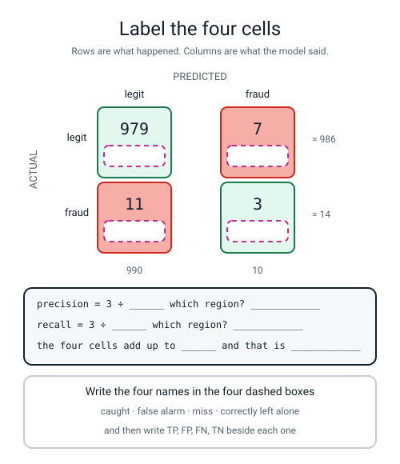
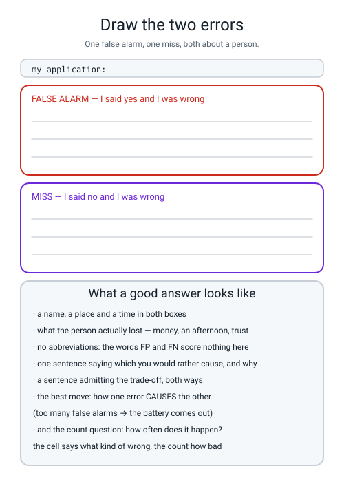

# Workbook — Week 8: Four Numbers That Tell You What Kind of Wrong

**Name:** ________________________________  **Date:** ______________

[⬅ Week 7](week-07.md) · [📖 Read the chapter first](../student-guide/week-08.md) · [Course Home](../README.md) · [Next ➡](week-09.md)

---

## ✅ Warm-Up (5 min)

Five quick questions about **last week** — the week the deliverable was a piece of paper.

**W1.** A row on your ablation table says *"added `is_weekend` and swapped the scaler: +0.0006"*. **What do you do with that row, and why?**

________________________________________________________________

**W2.** Write the whole of last week's honest work as one subtraction.

`________________  −  ________________  =  ________________`

**W3.** What does the word **regression** mean in this course? (It is not `LinearRegression`.)

________________________________________________________________

**W4.** `pipe.set_params(prep__num__scaler=MinMaxScaler())` — name what each of the three words points at.

**`prep`:** ______________  **`num`:** ______________  **`scaler`:** ______________

**W5.** The leaky column scored **0.9240** and the honest feature set scored **0.7535**. Write the one question that condemned it without any arithmetic at all.

________________________________________________________________

---

## 🔢 Do the Maths by Hand

**There is no new maths this week** — only two fractions with whole numbers above and below the line. So these four use **this week's fractions** and **Week 7's subtraction**. **Calculator only. No code.**

**M1 — the four piles from the class activity.** Forty index cards went into four labelled piles and came out like this:

```text
correctly left alone (TN) : 22
false alarm          (FP) :  6
missed               (FN) :  3
caught               (TP) :  9
```

**M1(a).** The check that must always pass. Do it.

`22 + 6 + 3 + 9 = ________`  **and that number should be** ________

**M1(b).** Fill in all four fractions. **Write the sentence first, then the numbers** — the sentence is the answer and the decimal is only the arithmetic.

| Metric | The sentence | On top | On the bottom | = |
|---|---|---|---|---|
| **precision** | "of everything I flagged, ______ was really fraud" | ______ | ______ | ____________ |
| **recall** | "of everything that really was fraud, I caught ______" | ______ | ______ | ____________ |
| **specificity** | "of everything that really was legit, I left ______ alone" | ______ | ______ | ____________ |
| **accuracy** | "of all forty cards, I got ______ right" | ______ | ______ | ____________ |

**M1(c).** Two of those four fractions have a **12** or a **15** on the bottom. Which region of the 2×2 is each of those — a row or a column?

**the one with 15 on the bottom:** ____________________

**the one with 12 on the bottom:** ____________________

**M2 — accuracy is not an independent measurement.** On the 1,000 validation rows the tree scored recall **0.2143** on 14 fraud rows and specificity **0.9929** on 986 legitimate rows. Accuracy is those two, **weighted by how many rows are in each class**.

**M2(a).** Work out the two shares. `14 ÷ 1000 = ________`  and  `986 ÷ 1000 = ________`

**M2(b).** Multiply each metric by its share, then add.

```
recall      x share of fraud  =  0.2143  x  ________  =  ________
specificity x share of legit  =  0.9929  x  ________  =  ________
                                                total =  ________
```

**M2(c).** The tree's accuracy is **0.9820**. Did you get it? ______

**M2(d).** Finish the sentence: *"so accuracy on this data is ______% a statement about leaving the easy rows alone, and only ______% a statement about catching the hard ones."*

**M3 — work backwards.** Same forty cards, twelve of them really fraud. A different model scores **precision 0.5000 and recall 0.5000**. Find all four cells.

**M3(a).** Recall is `TP ÷ 12 = 0.5000`, so **TP = ________** and **FN = ________**

**M3(b).** Precision is `TP ÷ (TP + FP) = 0.5000`, which means FP must equal ________, so **FP = ________**

**M3(c).** Everything left over is TN. `40 − ______ − ______ − ______ =` **TN = ________**

**M3(d).** Check: `TP + FP + FN + TN = ________`  ✅ / ❌

**M3(e).** What is that model's accuracy? `________ ÷ 40 = ________`

**M4 — the model that never says yes.** Its four counts on the 1,000 validation rows are **TN 986, FP 0, FN 14, TP 0**.

**M4(a).** Accuracy: `________ ÷ 1000 = ________`

**M4(b).** Recall: `________ ÷ ________ = ________`

**M4(c).** Specificity: `________ ÷ ________ = ________`

**M4(d).** Precision: `0 ÷ (0 + 0) =` ____________________  **Say what that means in words, not as a number.**

________________________________________________________________

**M4(e).** A smoke alarm has never gone off in ten years, and there has never been a fire. Which two of its four counts do you know for certain, and which single count would tell you whether the alarm works?

**known:** ____________________  **the one that matters:** ____________________

---

## 🔎 Predict the Output

**Write your prediction in pen before you run anything.** All four snippets carry on from `fraud.py`, so `y_val`, `pred` and `pred_lazy` already exist. **Three of these four run cleanly, and two of those three are wrong in ways nothing tells you about.**

### P1 — the shape of the thing, then the flattening

```python
cm = confusion_matrix(y_val, pred)
print(cm.shape)
print(cm)
print(cm.ravel())
print(cm.ravel().shape)
```

**I predict — line 1:** ____________  **line 4:** ____________

**And write out what you think lines 2 and 3 look like:**

```text
________________________________
________________________________
________________________________
```

**It really printed:**

```text
________________________________
________________________________
________________________________
________________________________
________________________________
```

**`.ravel()` turned a 2×2 grid into a list of four. In what order did it read the cells?** ____________________

**So which of the four counts comes out first — and is it the one you care about most?** ____________________

### P2 — the same call, arguments swapped

```python
print(confusion_matrix(pred, y_val).ravel())
print(confusion_matrix(y_val, pred).ravel())
```

**I predict — line 1:** ____________________  **line 2:** ____________________

**It really printed:**

```text
________________________________
________________________________
```

**Which two of the four numbers moved?** ____________________

**Did Python complain?** ______  **If somebody read line 1 out loud as a report, what would they say happened, and what actually happened?**

**they would say:** ______________________________________________

**the truth:** ______________________________________________

### P3 — asking a model that never says yes for its precision

```python
print("precision       : %.4f" % precision_score(y_val, pred_lazy))
```

**I predict:** does this run? ____________  What number, or what error?

________________________________________________________________

**It really printed:**

```text
________________________________________________________________
________________________________________________________________
________________________________________________________________
```

**Is that an error or a warning?** ____________  **How can you tell?** ____________________

**The message says "no predicted samples". Which part of the fraction is missing?** ____________________

**Is `0.0000` the honest answer?** ______  **What is?** ____________________

### P4 — the trap that gives you one number where you wanted four

```python
cm = confusion_matrix(pred_lazy, pred_lazy)
print(cm.shape)
print(cm)
tn, fp, fn, tp = cm.ravel()
```

**I predict — line 1:** ____________  **line 2:** ____________  **line 3:** ____________________

**It really printed:**

```text
________________________________________________________________
________________________________________________________________
________________________________________________________________
________________________________________________________________
```

**Why is the matrix 1×1 and not 2×2?** ______________________________

**The warning names the cure. Write the fixed line:**

```python
________________________________________________________________
```

**How many of the answers on this page did you get right?** ______ / 14

**Which one surprised you most?** ______________________________

---

## ✍️ Practice Set A — Read It

**A1. Match the word to the thing.** Write the letter.

| Word | | Description |
|---|---|---|
| **true positive** | ______ | (i) It was legitimate, you said fraud. A false alarm |
| **false positive** | ______ | (ii) Of everything that really was positive, how much you caught |
| **false negative** | ______ | (iii) It was fraud, you said fraud. You caught one |
| **true negative** | ______ | (iv) The 2×2 table holding all four counts |
| **confusion matrix** | ______ | (v) It was fraud, you said legitimate. A miss |
| **precision** | ______ | (vi) When the thing you want is rare, a model that never says yes scores well |
| **recall** | ______ | (vii) It was legitimate, you said legitimate. Correctly left alone |
| **specificity** | ______ | (viii) Of everything you flagged, how much was really positive |
| **accuracy paradox** | ______ | (ix) Of everything that really was negative, how much you left alone |

**A2. Name the cell.** The model's job is flagging fraud, so "positive" means *the model said fraud*.

| # | Scenario | Cell | Why |
|---|---|---|---|
| 1 | The card was stolen and the model flagged it. | | |
| 2 | An ordinary weekly shop, nothing flagged. | | |
| 3 | The card was stolen and the model let it through. | | |
| 4 | A tourist's genuine card was blocked in Rome. | | |
| 5 | Somebody's £3 coffee was flagged as fraud. It wasn't. | | |
| 6 | £2,000 was stolen and the model said nothing. | | |
| 7 | The model flagged a transaction and the bank confirmed it was fraud. | | |
| 8 | A legitimate transaction went through untouched. | | |
| 9 | The model flagged 200 transactions and 6 were fraud. | | |
| 10 | The model has never once said "fraud" in a whole year. | | |

**A2(a).** Two of those ten do not describe a single card. Which two, and what makes them different?

________________________________________________________________

**A2(b).** For number 9, what is the precision? `______ ÷ ______ = ____________`

**A3. Spot the bug.** Each line is wrong or dangerous. Say what happens and write the fix.

| # | The line | What happens | The fix |
|---|---|---|---|
| a | `tn, fp, fn, tp = confusion_matrix(pred, y_val).ravel()` | | |
| b | `tn, fp, fn, tp = confusion_matrix(y_val, pred)` | | |
| c | `tn, fp, fn, tp = confusion_matrix(y_val, pred_lazy).ravel()` where the model never says yes and `y_val` is all zeros too | | |
| d | `print(accuracy_score(y_val, tree))` | | |
| e | `print("specificity: %.4f" % specificity_score(y_val, pred))` | | |
| f | `print("accuracy: %.4f" % accuracy_score(y_val, pred))` reported on its own | | |

**A3(g).** Which of those six is the **most dangerous**, and why? (It is not the one that crashes hardest.)

________________________________________________________________

**A4. Match the code to the output.** Five of each, no output used twice.

| | Code |
|---|---|
| i | `print(confusion_matrix(y_val, pred).ravel())` |
| ii | `print("%.4f" % (3 / 14))` |
| iii | `print("%.4f" % (979 / 986))` |
| iv | `print(int(y.sum()))` |
| v | `print(confusion_matrix(y_val, pred).shape)` |

| | Output |
|---|---|
| P | `(2, 2)` |
| Q | `0.9929` |
| R | `[979   7  11   3]` |
| S | `72` |
| T | `0.2143` |

**Your answers:** i → ______  ii → ______  iii → ______  iv → ______  v → ______

**A5. Read four models and name each one.** All four ran on the **same 1,000 validation rows** with the **same 14 frauds**.

**Model A**

```text
tn 986  fp   0  fn 14  tp  0
```

**accuracy** ____________  **precision** ____________  **recall** ____________  **specificity** ____________

**What is this model?** ______________________________________

**Model B**

```text
tn   0  fp 986  fn  0  tp 14
```

**accuracy** ____________  **precision** ____________  **recall** ____________  **specificity** ____________

**What is this model?** ______________________________________

**Model C**

```text
tn 979  fp   7  fn 11  tp  3
```

**accuracy** ____________  **precision** ____________  **recall** ____________  **specificity** ____________

**What is this model?** ______________________________________

**Model D**

```text
tn 985  fp   1  fn 13  tp  1
```

**accuracy** ____________  **precision** ____________  **recall** ____________  **specificity** ____________

**What is this model?** ______________________________________

**A5(a).** **Two of the four have exactly the same accuracy.** Which two, and what does one of them do that the other does not?

________________________________________________________________

**A5(b).** One model has a **perfect recall of 1.0000**. Would you ship it? One sentence, and name the number that stops you.

________________________________________________________________

**A5(c).** Which model has the **best precision**, and is it the best model? ____________________

**A6. Label the four cells.** Fill in every dashed box in the figure, then answer the questions in the panel.


*Figure W8.1 — The tree's 2×2 with the four counts filled in and the four names removed.*

**A6(a).** Write the two denominators the panel asks for, and name the region each one is:

**precision = 3 ÷ ______, which is the ____________ of the table**

**recall = 3 ÷ ______, which is the ____________ of the table**

**A6(b).** The four cells add up to ______, and that number is ____________________

**A6(c).** The four numbers **never moved** between precision and recall. What did?

________________________________________________________________

---

## ✍️ Practice Set B — Write It

### B1 — one line, plus a print

**Task:** you have `tn = 979`, `fp = 7`, `fn = 11`, `tp = 3`. Print the specificity to four decimal places. There is no `specificity_score` in scikit-learn, so you compute it.

**Expected output:**

```text
specificity : 0.9929
```

**Done looks like:** one line, one division, and `%.4f`.

```python
print(_______________________________________________________)
```

### B2 — the four counts, as a function that checks itself

**Task:** write `four_counts(y_true, y_pred, name)` that prints all four counts **using the words of the application**, prints the addition check, and returns the four numbers. Use `labels=[0, 1]` so it survives a model that only ever predicts one class.

Test it on the thirty transactions from the Build It page.

**Expected output:**

```text
thirty transactions
  caught (TP)       : 6
  false alarm (FP)  : 4
  missed (FN)       : 3
  left alone (TN)   : 17
  check: 6 + 4 + 3 + 17 = 30
```

**Done looks like:** one `confusion_matrix(...).ravel()`, five prints, one `return`, and the check on the last line.

### B3 — the alarm, not the floor

**Task:** print the lazy model's accuracy **and the majority-class rate directly underneath it**, plus how many times it said fraud. Three lines of output, and the point is that the first two are the same number.

**Expected output:**

```text
accuracy            : 0.9860
majority-class rate : 0.9860
times it said fraud : 0
```

**Done looks like:** `accuracy_score`, then `1 - y_val.mean()`, then `int(pred_lazy.sum())`.

**And answer this in one line:** what does it mean when those two numbers are identical?

________________________________________________________________

### B4 — all four fractions, from the counts, with no metric functions at all

**Task:** starting from `tn, fp, fn, tp = 979, 7, 11, 3`, print all four fractions **showing the division** — the top, the bottom and the answer — without calling `precision_score` or `recall_score` even once.

**Expected output:**

```text
precision   = 3 / 10 = 0.3000
recall      = 3 / 14 = 0.2143
specificity = 979 / 986 = 0.9929
accuracy    = 982 / 1000 = 0.9820
```

**Done looks like:** four prints, each with `%d / %d = %.4f`, and every denominator built out of the counts and not typed in by hand.

### B5 — a whole program of your own, about 25 lines

**Task:** write `cards30.py`. Store the thirty transactions as two lists of `0`s and `1`s. Count the four cells yourself with a loop and four counters — **no `confusion_matrix` for the counting** — print the four counts and the addition check, print the three fractions, and only **then** check yourself against `confusion_matrix(...).ravel()` on the last line.

**Expected output:**

```text
caught (TP)      : 6
false alarm (FP) : 4
missed (FN)      : 3
left alone (TN)  : 17
check : 6 + 4 + 3 + 17 = 30

precision   = 6 / 10 = 0.6000
recall      = 6 / 9  = 0.6667
specificity = 17 / 21 = 0.8095
accuracy    = 23 / 30 = 0.7667

sklearn agrees: [17  4  3  6]
```

**Done looks like:** one `for` loop with an `if`/`elif`/`elif`/`else`, four counters that start at 0, and the last line agreeing with your own counting. **Runtime instant.**

---

## 🐞 Fix the Broken Program

This program has **three** bugs: one **shape** bug, one **runtime** bug, and one **silent logic** bug. The real messages are below, in the order you meet them.

```python
"""broken8.py - a metrics report on the fraud data.  THREE bugs."""
from sklearn.datasets import make_classification
from sklearn.dummy import DummyClassifier
from sklearn.metrics import (accuracy_score, confusion_matrix,
                             precision_score, recall_score)
from sklearn.model_selection import train_test_split
from sklearn.tree import DecisionTreeClassifier

X, y = make_classification(n_samples=5000, n_features=8, n_informative=4,
                           n_redundant=0, weights=[0.99, 0.01], random_state=0)
X_tmp, X_test, y_tmp, y_test = train_test_split(
    X, y, test_size=0.20, random_state=0, stratify=y)
X_train, X_val, y_train, y_val = train_test_split(
    X_tmp, y_tmp, test_size=0.25, random_state=0, stratify=y_tmp)

lazy = DummyClassifier(strategy="most_frequent").fit(X_train, y_train)
pred_lazy = lazy.predict(X_val)
a, b, c, d = confusion_matrix(pred_lazy, pred_lazy).ravel()
print("baseline : tn %d  fp %d  fn %d  tp %d" % (a, b, c, d))

tree = DecisionTreeClassifier(random_state=0).fit(X_train, y_train)
pred = tree.predict(X_val)
print("accuracy : %.4f" % accuracy_score(y_val, tree))

tn, fp, fn, tp = confusion_matrix(pred, y_val).ravel()
print("tn %d  fp %d  fn %d  tp %d" % (tn, fp, fn, tp))
print("precision       : %.4f" % precision_score(y_val, pred))
print("recall          : %.4f" % recall_score(y_val, pred))
print("specificity     : %.4f" % (tn / (tn + fp)))
print("false alarms    :", fp)
print("frauds missed   :", fn)
```

**Run 1 — nothing prints at all:**

```text
/Library/Frameworks/Python.framework/Versions/3.10/lib/python3.10/site-packages/sklearn/metrics/_classification.py:534: UserWarning: A single label was found in 'y_true' and 'y_pred'. For the confusion matrix to have the correct shape, use the 'labels' parameter to pass all known labels.
  warnings.warn(
Traceback (most recent call last):
  File "broken8.py", line 18, in <module>
    a, b, c, d = confusion_matrix(pred_lazy, pred_lazy).ravel()
ValueError: not enough values to unpack (expected 4, got 1)
```

**Bug 1.** Which line? ______  **Kind of bug?** ______________

**"expected 4, got 1" — what shape did the matrix come back as, and why?**

________________________________________________________________

**There are two separate mistakes on that line. Name them both.**

**one:** ______________________________  **two:** ______________________________

**The fix:** write the corrected line.

```python
________________________________________________________________
```

**Run 2 — after fixing bug 1:**

```text
baseline : tn 986  fp 0  fn 14  tp 0
Traceback (most recent call last):
  File "broken8.py", line 23, in <module>
    print("accuracy : %.4f" % accuracy_score(y_val, tree))
  File ".../sklearn/utils/_param_validation.py", line 98, in validate_parameter_constraints
    raise InvalidParameterError(
sklearn.utils._param_validation.InvalidParameterError: The 'y_pred' parameter of accuracy_score must be an array-like or a sparse matrix. Got DecisionTreeClassifier(random_state=0) instead.
```

**Bug 2.** Which line? ______  **Kind of bug?** ______________

**The message ends with "Got DecisionTreeClassifier(random_state=0) instead." What was handed over, and what should have been?**

________________________________________________________________

**The fix:** ______________________________________________

**Run 3 — after fixing bugs 1 and 2. It runs all the way through, with no error and no warning:**

```text
baseline : tn 986  fp 0  fn 14  tp 0
accuracy : 0.9820
tn 979  fp 11  fn 7  tp 3
precision       : 0.3000
recall          : 0.2143
specificity     : 0.9889
false alarms    : 11
frauds missed   : 7
```

**Bug 3 has been there all along and nothing on that screen is red.**

**Compare those counts with the ones you know are right. Which two numbers are in the wrong places?** ____________________

**Which argument goes first in `confusion_matrix`?** ____________________

**The last two printed lines are a sentence about real people. Write out the sentence the broken program is telling you, and then the true one.**

**the broken program says:** ______________________________________

**the truth is:** ______________________________________

**The fix:** ______________________________________________

**Run 4 — after fixing all three:**

```text
baseline : tn 986  fp 0  fn 14  tp 0
accuracy : 0.9820
tn 979  fp 7  fn 11  tp 3
precision       : 0.3000
recall          : 0.2143
specificity     : 0.9929
false alarms    : 7
frauds missed   : 11
```

**Two questions, and they are the point of the whole page.**

**Precision and recall printed 0.3000 and 0.2143 in run 3 *and* in run 4 — they did not change at all. So which numbers on the page did the swap actually corrupt, and why did those two survive?**

________________________________________________________________

________________________________________________________________

**Rank the three bugs from easiest to hardest to notice, and say what would have caught each one.**

**easiest → hardest:** ______  ______  ______

________________________________________________________________

---

## 🧩 Puzzle of the Week

### Reconstruct the 2×2 from three clues

A bank hands you a report with the table torn off. All you have is four facts about **100 transactions**:

```text
rows in the report        : 100
accuracy                  : 0.9000
precision                 : 0.8000
transactions that really were fraud : 22
```

Find all four cells. Work in this order, because each step gives the next one.

**Part 1(a).** Accuracy 0.9000 of 100 rows means how many were **right**? ______  So how many were **wrong**? ______

**Part 1(b).** The wrong ones are FP and FN added together. Write that as a sentence with a number in it.

`FP + FN = ________`

**Part 1(c).** 22 rows really were fraud, and TP + FN = 22. So `FN = 22 − TP`. Substitute that into your answer to (b):

`FP + 22 − TP = ________`, so `FP = TP − ________`

**Part 1(d).** Precision 0.8000 means `TP ÷ (TP + FP) = 0.8000`, so `FP` is a quarter of `TP`. Write that:

`FP = TP ÷ ________`

**Part 1(e).** You now have two statements about FP. Set them equal and solve.

`TP ÷ 4 = TP − 12`, so `TP = ________`

**Part 1(f).** Finish the table.

| | predicted legit | predicted fraud | row total |
|---|---|---|---|
| **actual legit** | ______ | ______ | ______ |
| **actual fraud** | ______ | ______ | ______ |
| column total | ______ | ______ | **100** |

**Part 1(g).** Check every clue against your table.

`accuracy = ______ ÷ 100 = ________`  `precision = ______ ÷ ______ = ________`  `real frauds = ________`

**Part 1(h).** What is the **recall** of this model — a number nobody told you?

`______ ÷ ______ = ________`

### Part 2 — which clue could you have done without?

**Part 2(a).** Suppose the report had given you **recall** instead of "22 real frauds". Could you still have found all four cells? Try it: accuracy 0.9000, precision 0.8000, recall 0.7273, n = 100.

________________________________________________________________

**Part 2(b).** Now the interesting one. Suppose the report gave you **only** accuracy 0.9000 and n = 100. Write down **two completely different** 2×2 tables that both fit.

**table one:** TP ______ FP ______ FN ______ TN ______

**table two:** TP ______ FP ______ FN ______ TN ______

**Part 2(c).** Finish the slogan: *one number can be true and still be __________________ ; four counts can only be __________________ .*

---

## 🤔 Think Deeper

**T1.** Here are three applications where the two errors are not equal: **a spam filter**, **a cancer screening test**, and **deciding who gets bail**. For each one, write which error you think costs more and who pays. Then answer the hard part: **one of those three is not a maths question at all.** Say which, and what would have to happen before anybody could honestly put a number on it.

________________________________________________________________

________________________________________________________________

________________________________________________________________

________________________________________________________________

________________________________________________________________

**T2.** A smoke alarm's false positives — the toast at 7am, the whole family outside in February — are annoying but cheap. So somebody argues: *"safety first, I don't care about false alarms at all."* **Write a paragraph** explaining why that position is not actually safe. Use the battery. Then say what the same argument looks like for a bank that declines too many honest cards, and what number you would want to watch to catch it happening.

________________________________________________________________

________________________________________________________________

________________________________________________________________

________________________________________________________________

---

## 🛠️ Build It — The 2×2 By Hand, The Three Fractions, The Two Afternoons

**Three things get handed in, and the third one is the one that matters most.**

### Step checklist

- [ ] **1.** `fraud.py` runs. Paste the whole output.
- [ ] **2.** Before you look at it: **predict the lazy model's four counts, in pen.** Two of them are zero — which two?
- [ ] **3.** Count the thirty transactions below into the four cells **by hand**. Tick each row as you place it.
- [ ] **4.** **Add the four cells up.** If you do not get 30, you have miscounted, and finding it is part of the job.
- [ ] **5.** Compute precision, recall and specificity — **with the sentence beside each one.**
- [ ] **6.** Compare the majority-class rate with the accuracy on **this** table, not the fraud table.
- [ ] **7.** Write the two afternoons: one false positive, one false negative, about a person.
- [ ] **8.** Say which of the two you would rather cause, and admit what it costs.
- [ ] **9.** Two Bug Log entries: one that shouted, one that did not.

### Predict the lazy model (in pen, before running)

| | I predict | The truth |
|---|---|---|
| TN | | |
| FP | | |
| FN | | |
| TP | | |
| accuracy | | |

**Which two are zero, and what does that tell you about the model?** ______________________________

### The thirty transactions

`1` means fraud (or flagged). Tick the box as you place each card.

| # | actual | predicted | ✓ | | # | actual | predicted | ✓ | | # | actual | predicted | ✓ |
|---|---|---|---|---|---|---|---|---|---|---|---|---|---|
| T01 | 0 | 0 | | | T11 | 1 | 1 | | | T21 | 0 | 0 | |
| T02 | 0 | 0 | | | T12 | 0 | 1 | | | T22 | 0 | 0 | |
| T03 | 1 | 1 | | | T13 | 0 | 0 | | | T23 | 1 | 0 | |
| T04 | 0 | 0 | | | T14 | 1 | 0 | | | T24 | 0 | 1 | |
| T05 | 0 | 1 | | | T15 | 0 | 0 | | | T25 | 0 | 0 | |
| T06 | 1 | 0 | | | T16 | 1 | 1 | | | T26 | 1 | 1 | |
| T07 | 0 | 0 | | | T17 | 0 | 0 | | | T27 | 0 | 0 | |
| T08 | 1 | 1 | | | T18 | 0 | 1 | | | T28 | 0 | 0 | |
| T09 | 0 | 0 | | | T19 | 0 | 0 | | | T29 | 0 | 0 | |
| T10 | 0 | 0 | | | T20 | 1 | 1 | | | T30 | 0 | 0 | |

**Write the card numbers into the four lists as you go:**

**True positives (actual 1, predicted 1):** ______________________________________  **= ______**

**False positives (actual 0, predicted 1):** ______________________________________  **= ______**

**False negatives (actual 1, predicted 0):** ______________________________________  **= ______**

**True negatives (actual 0, predicted 0):** everything else  **= ______**

### My 2×2

| | predicted legit | predicted fraud | row total |
|---|---|---|---|
| **actual legit** | ______ left alone | ______ false alarm | ______ |
| **actual fraud** | ______ missed | ______ caught | ______ |
| column total | ______ | ______ | ______ |

**The check:** `______ + ______ + ______ + ______ = ______`  ✅ / ❌

**How many really were fraud?** ______  **How many did the model flag?** ______

### The three fractions, with the working shown

**Precision — "of everything I flagged, how much was really fraud?"**

```
I flagged   TP + FP  =  ______ + ______  =  ______
Of those,   ______ were really fraud.
precision   =  ______ ÷ ______  =  ____________
```

**The count on the bottom is ______, because ______ is how many ______________________.**

**Recall — "of everything that really was fraud, how much did I catch?"**

```
Real frauds  TP + FN  =  ______ + ______  =  ______
Of those,    ______ were caught.
recall       =  ______ ÷ ______  =  ____________
```

**The count on the bottom is ______, because ______ is how many ______________________.**

**Specificity — "of everything that really was legitimate, how much did I correctly leave alone?"**

```
Real legit   TN + FP  =  ______ + ______  =  ______
Of those,    ______ were left alone.
specificity  =  ______ ÷ ______  =  ____________
```

**The count on the bottom is ______, because ______ is how many ______________________.**

**And accuracy, for comparison:**

```
correct   =  TP + TN  =  ______ + ______  =  ______
accuracy  =  ______ ÷ ______  =  ____________
```

**Last week's rule, applied here: what is the majority-class rate on these thirty rows?**

`______ ÷ 30 = ____________`  **and my accuracy beats it by** ____________

### The two afternoons

**My application is:** ______________________________________

**One false positive — a person, a place, a time, and what they lost.**

________________________________________________________________

________________________________________________________________

________________________________________________________________

**One false negative — a person, a place, a time, and what they lost.**

________________________________________________________________

________________________________________________________________

________________________________________________________________

**Which would I rather cause, and why? And what does my choice cost?**

________________________________________________________________

________________________________________________________________

> **⚠️ Watch out:** *"a legitimate instance was misclassified"* scores **zero** on this page, however accurate it is. That is the definition again. **What happened to the person?**

### The Bug Log

| What I saw | What it means | Cause | Fix |
|---|---|---|---|
| | | | |
| | | | |

---

## 🎨 Draw It

Draw your two errors as two afternoons — in pictures this time, not sentences. Two frames, one for the false alarm and one for the miss, then check yourself against the panel underneath.


*Figure W8.2 — Two empty frames, and what a good answer contains.*

**Then answer three things about your own drawing:**

**Is there a person in both frames?** ______  **Is there a time of day in both?** ______

**Which frame did you find easier to draw, and what does that tell you about which error you find easier to imagine?**

________________________________________________________________

**Draw one extra arrow: from one frame to the other, labelled with how the first error can *cause* the second.** What did you write on it?

________________________________________________________________

---

## 📊 Self-Check

| I can... | 😀 | 🙂 | 😕 |
|---|---|---|---|
| build a confusion matrix by hand from a list of predictions | | | |
| name all four cells in the language of the application, not as letters | | | |
| add the four cells up and know what the total must be | | | |
| compute precision and say which count I put on the bottom, and why | | | |
| compute recall and say which count I put on the bottom, and why | | | |
| compute specificity, and know there is no `specificity_score` | | | |
| build a model that scores 98.6% and has never said yes | | | |
| explain the accuracy paradox to somebody in one sentence | | | |
| always print the majority-class rate beside the accuracy | | | |
| say which of a false positive and a false negative costs more, for a stated application | | | |
| describe both errors as things that happened to a real person | | | |

**The one thing I would ask about if I could ask one question:**

________________________________________________________________

---

## ✅ Answers

<details>
<summary>Check your answers</summary>

### Warm-Up

**W1.** **Throw the row away and re-run it as two rows.** With two changes in one row, +0.0006 could be `+0.0006` and `0.0000`, or `+0.0013` and `−0.0007`, or anything else. **The number cannot say which change did what**, so the row carries no information.

**W2.** `0.7599 − 0.7541 = **0.0058**` — and it is stated on the 400 validation rows.

**W3.** **A change that made things worse.** Nothing to do with `LinearRegression`; it is the ordinary software-engineering word. Six of the eight rows last week were drops, four of them genuine regressions, **and that is healthy** — a table of eight successes means nothing risky was tried.

**W4.** **`prep`** is the `ColumnTransformer` that routes the columns. **`num`** is the branch inside it that handles the number columns. **`scaler`** is the step inside that branch which does the scaling. **Double underscores, twice — it is an address, not a word.**

**W5.** ***"At the moment a customer places the order, does this value exist?"*** No — nobody knows yet whether it will be late. **That one question is worth more than all four statistical audits put together.**

### Do the Maths by Hand

**M1(a).** `22 + 6 + 3 + 9 = **40**`, and 40 is **the number of cards** — every card is in exactly one pile, and there is no fifth pile.

**M1(b).**

| Metric | The sentence | On top | On the bottom | = |
|---|---|---|---|---|
| **precision** | "of everything I flagged, **9 out of 15** was really fraud" | 9 | **15** (TP + FP) | **0.6000** |
| **recall** | "of everything that really was fraud, I caught **9 out of 12**" | 9 | **12** (TP + FN) | **0.7500** |
| **specificity** | "of everything that really was legit, I left **22 of 28** alone" | 22 | **28** (TN + FP) | **0.7857** |
| **accuracy** | "of all forty cards, I got **31** right" | 31 | **40** | **0.7750** |

The four divisions in full: `9 ÷ 15 = 0.6000` · `9 ÷ 12 = 0.7500` · `22 ÷ 28 = 0.7857` · `31 ÷ 40 = 0.7750`.

**M1(c).** **15 on the bottom is precision, and it is a column** — the predicted-fraud column, everything you flagged. **12 on the bottom is recall, and it is a row** — the actual-fraud row, everything that really was fraud. **Same four numbers, two different outlines.**

**M2(a).** `14 ÷ 1000 = **0.014**` and `986 ÷ 1000 = **0.986**`.

**M2(b).**

```
recall      x share of fraud  =  0.2143  x  0.014  =  0.0030
specificity x share of legit  =  0.9929  x  0.986  =  0.9790
                                                total =  0.9820
```

On a calculator: `0.2143 × 0.014 = 0.0030002` and `0.9929 × 0.986 = 0.9790` (0.97900), and `0.0030 + 0.9790 = 0.9820`. **Every digit is checkable.**

**M2(c).** **Yes — 0.9820, exactly the accuracy.**

**M2(d).** *"So accuracy on this data is **98.6%** a statement about leaving the easy rows alone, and only **1.4%** a statement about catching the hard ones."*

**That is the accuracy paradox in arithmetic**, and it is the clearest explanation there is: accuracy was never hiding anything from you. **You just did not ask what it was made of.**

**M3(a).** `TP ÷ 12 = 0.5000` so **TP = 6**, and since TP + FN = 12, **FN = 6**.

**M3(b).** Precision 0.5000 means the top is half the bottom, so **FP must equal TP**, so **FP = 6**.

**M3(c).** `40 − 6 − 6 − 6 = **TN = 22**`.

**M3(d).** `6 + 6 + 6 + 22 = **40**` ✅

**M3(e).** `(6 + 22) ÷ 40 = 28 ÷ 40 = **0.7000**`.

**And notice something:** this model and the class activity's model have **the same accuracy to within 0.075**, and completely different behaviour — 9 caught against 6 caught, 6 false alarms against 6. **Accuracy is a very blunt instrument.**

**M4(a).** `986 ÷ 1000 = **0.9860**`.

**M4(b).** `0 ÷ 14 = **0.0000**`. It caught nothing.

**M4(c).** `986 ÷ 986 = **1.0000**`. A *perfect* specificity, because it never raises a false alarm — and it never raises an alarm at all.

**M4(d).** `0 ÷ 0` is **undefined**. In words: *"of everything I flagged, how much was fraud?"* — **it flagged nothing, so the question has nothing to be about.** scikit-learn prints `0.0000` and warns you, but **"undefined" is the better answer**, and the honest one.

**M4(e).** You know **FP = 0** (it never went off, so it never went off wrongly) and **TP = 0** (it never went off, so it never caught anything). The count that matters is **FN — how many fires there actually were.** Zero fires and the alarm is fine. One fire and it failed at the only job it had. **Two of its four cells are empty, and the two that matter are the two you cannot read off the device.**

### Predict the Output

**P1.**

```text
(2, 2)
[[979   7]
 [ 11   3]]
[979   7  11   3]
(4,)
```

**`.ravel()` reads left to right, top to bottom** — so the order is **TN, FP, FN, TP**.

**TN comes out first, and it is the one you care about least.** 979 correctly-left-alone rows is the easy work. **That is exactly why you never index into a confusion matrix blindly** — unpack it into four *named* variables and then use the names.

**P2.**

```text
[979  11   7   3]
[979   7  11   3]
```

**The 7 and the 11 swapped**, which are FP and FN — **the two errors.**

**Python did not complain.** No error, no warning, nothing.

Somebody reading line 1 as a report would say *"we blocked 11 innocent cards and missed 7 frauds"*. **The truth is "we blocked 7 innocent cards and missed 11 frauds."** Those are different afternoons for different people, and both sentences sound equally confident. **`confusion_matrix` takes the truth first.**

**P3.**

```text
/Library/Frameworks/Python.framework/Versions/3.10/lib/python3.10/site-packages/sklearn/metrics/_classification.py:1731: UndefinedMetricWarning: Precision is ill-defined and being set to 0.0 due to no predicted samples. Use `zero_division` parameter to control this behavior.
  _warn_prf(average, modifier, f"{metric.capitalize()} is", result.shape[0])
precision       : 0.0000
```

**It is a warning, not an error**, and you can tell because **the program carried on and printed a number.** A traceback stops everything; a warning grumbles and continues.

**The missing part of the fraction is the bottom** — `TP + FP`, which is `0 + 0`.

**`0.0000` is not the honest answer. "Undefined" is**, because there is nothing on the bottom of the fraction. And notice what the message is really doing: **it is not telling you your code is wrong. It is describing your model.** That makes it one of the friendliest messages you will get all year.

**P4.**

```text
/Library/Frameworks/Python.framework/Versions/3.10/lib/python3.10/site-packages/sklearn/metrics/_classification.py:534: UserWarning: A single label was found in 'y_true' and 'y_pred'. For the confusion matrix to have the correct shape, use the 'labels' parameter to pass all known labels.
  warnings.warn(
(1, 1)
[[1000]]
Traceback (most recent call last):
  File "p4.py", line 13, in <module>
    tn, fp, fn, tp = cm.ravel()
ValueError: not enough values to unpack (expected 4, got 1)
```

**The matrix is 1×1 because only one label — `0` — appears anywhere in either argument.** `confusion_matrix` builds a grid out of the classes it can *see*, and it could only see one, so it built a 1×1 grid holding all 1,000 rows.

The warning tells you the cure by name:

```python
cm = confusion_matrix(y_val, pred_lazy, labels=[0, 1])
```

**`labels=[0, 1]` says "there are two classes, whether or not this model believes in both of them".** You need it any time a model might predict only one class — which is exactly what the baseline does.

### Practice Set A

**A1.** true positive → **(iii)** · false positive → **(i)** · false negative → **(v)** · true negative → **(vii)** · confusion matrix → **(iv)** · precision → **(viii)** · recall → **(ii)** · specificity → **(ix)** · accuracy paradox → **(vi)**

**A2.**

| # | Cell | Why |
|---|---|---|
| 1 | **True Positive** | Predicted fraud, and right. **Caught one.** |
| 2 | **True Negative** | Predicted legit, and right. **Correctly left alone.** |
| 3 | **False Negative** | Predicted legit, and wrong. **A miss.** |
| 4 | **False Positive** | Predicted fraud, and wrong. **A false alarm.** |
| 5 | **False Positive** | Same as 4. Small money, still a false alarm. |
| 6 | **False Negative** | Same as 3. The size of the loss does not change the cell. |
| 7 | **True Positive** | Predicted fraud, and right. |
| 8 | **True Negative** | Predicted legit, and right. |
| 9 | **6 True Positives and 194 False Positives** | One sentence, many cards. |
| 10 | **FP = 0 and TP = 0** | The whole predicted-fraud column is empty. **The fingerprint of a model that has given up** — and its accuracy will look excellent. |

**A2(a).** **Numbers 9 and 10.** Number 9 describes 200 cards at once, which breaks the one-sentence-one-cell habit. Number 10 describes a whole *column* of the table being empty, which is a fact about the model rather than about a card. **Both are worth arguing about, and 10 is the entire hook of the week restated as a scenario.**

**A2(b).** `6 ÷ 200 = **0.0300**`. **Three per cent.** 194 people had a card declined so that six frauds could be caught.

**A3.**

| # | What happens | The fix |
|---|---|---|
| a | **No error, no warning.** FP and FN swap: you get `979, 11, 7, 3` instead of `979, 7, 11, 3`. Every sentence you write about the two errors is now back to front. | `confusion_matrix(y_val, pred).ravel()` — **truth first** |
| b | `ValueError: not enough values to unpack (expected 4, got 2)`. Without `.ravel()` you are unpacking a 2×2 grid into four names, and Python sees only two rows. | add `.ravel()` |
| c | `ValueError: not enough values to unpack (expected 4, got 1)`, plus a `UserWarning`. Only one class is present, so the matrix is 1×1. | `confusion_matrix(y_val, pred_lazy, labels=[0, 1]).ravel()` |
| d | `InvalidParameterError: The 'y_pred' parameter of accuracy_score must be an array-like... Got DecisionTreeClassifier(random_state=0) instead.` You handed over the **model** instead of its predictions. | `accuracy_score(y_val, tree.predict(X_val))`, or use `pred` |
| e | `NameError: name 'specificity_score' is not defined`. **There isn't one in scikit-learn**, and people assume they have installed something wrong. They have not. | `print("specificity: %.4f" % (tn / (tn + fp)))` |
| f | **No error and a plausible number.** 0.9820 sounds like an achievement until you put 0.9860 next to it. | print the majority-class rate on the line underneath, always |

**A3(g).** **(a) is the most dangerous.** (b), (c), (d) and (e) all crash, and a crash is a gift — it stops you and names the problem. (f) is dangerous but at least the number is *true*. **(a) produces four correct-looking counts with two of them in the wrong cells, silently, and the two that move are the two errors.** You would go and tell somebody a confident, precise, backwards sentence about who got hurt.

**A4.** i → **R** · ii → **T** · iii → **Q** · iv → **S** · v → **P**

Note **iv is 72, not 50.** `weights=[0.99, 0.01]` is a *target, not a promise*: the generator aimed at 1% of 5,000 and landed at 1.44%. **Ask for something, then check what you got.**

**A5.**

**Model A** — accuracy **0.9860**, precision **undefined** (`0 ÷ 0`), recall **0.0000**, specificity **1.0000**. **This is the piece of paper**: `DummyClassifier(strategy="most_frequent")`, the model that never says yes. Its entire predicted-fraud column is empty.

**Model B** — accuracy **0.0140**, precision **0.0140** (`14 ÷ 1000`), recall **1.0000**, specificity **0.0000**. **This is the model that flags everything.** It caught all 14 frauds and blocked all 986 honest customers to do it.

**Model C** — accuracy **0.9820**, precision **0.3000**, recall **0.2143**, specificity **0.9929**. **This is the decision tree** — the only one of the four anybody would consider shipping, and it misses 11 of 14.

**Model D** — accuracy **0.9860**, precision **0.5000**, recall **0.0714** (`1 ÷ 14`), specificity **0.9990**. **This is the timid model**: it says fraud exactly twice in a thousand rows and is right once.

**A5(a).** **A and D both score 0.9860.** One of them has **never once said yes**; the other has caught a fraud. **Accuracy cannot tell them apart, and recall can** — 0.0000 against 0.0714. That is the whole week in one comparison.

**A5(b).** **No.** Model B's recall is perfect and its **precision is 0.0140**, which means 986 legitimate customers had their cards blocked to catch 14 frauds. **You can always max out one metric by wrecking the other** — that is the fishing net: drain the lake and you catch every fish.

**A5(c).** **Model D, at 0.5000** — and no, it is not the best model. It has the best precision because it barely ever guesses, and being right one time out of two is easy when you only guess twice. **It caught one fraud out of fourteen.** Precision without recall beside it is a stunt.

**A6.** The four names: **979 = correctly left alone (TN)** · **7 = false alarm (FP)** · **11 = miss (FN)** · **3 = caught (TP)**.

**A6(a).** **precision = 3 ÷ 10, which is the predicted-fraud column** (7 + 3 = 10, everything you flagged). **recall = 3 ÷ 14, which is the actual-fraud row** (11 + 3 = 14, everything that really was fraud).

**A6(b).** The four cells add up to **1000**, and that is **the number of validation rows**. Do that addition every single time you draw one of these; it takes five seconds and it catches every counting mistake you will ever make.

**A6(c).** **Only the outline moved.** 979, 7, 11 and 3 sat still. Draw a box round a column and you get 0.30; draw a box round a row and you get 0.21. **Precision and recall are not two measurements — they are the same four numbers read twice.**

### Practice Set B

**B1.**

```python
print("specificity : %.4f" % (979 / (979 + 7)))
```

```text
specificity : 0.9929
```

Or, better, with the counts in variables so the arithmetic reads itself: `tn / (tn + fp)`.

**B2.**

```python
from sklearn.metrics import confusion_matrix


def four_counts(y_true, y_pred, name):
    tn, fp, fn, tp = confusion_matrix(y_true, y_pred, labels=[0, 1]).ravel()
    print("%s" % name)
    print("  caught (TP)       : %d" % tp)
    print("  false alarm (FP)  : %d" % fp)
    print("  missed (FN)       : %d" % fn)
    print("  left alone (TN)   : %d" % tn)
    print("  check: %d + %d + %d + %d = %d" % (tp, fp, fn, tn, tp + fp + fn + tn))
    return tn, fp, fn, tp
```

```text
thirty transactions
  caught (TP)       : 6
  false alarm (FP)  : 4
  missed (FN)       : 3
  left alone (TN)   : 17
  check: 6 + 4 + 3 + 17 = 30
```

**Two design choices worth naming.** `labels=[0, 1]` means the function still works on a model that only predicts one class — which is the baseline, which is the model you run *first*, every time. And the words come before the letters: **"caught", not "TP"**, because a report full of abbreviations is a report nobody argues with.

**B3.**

```python
print("accuracy            : %.4f" % accuracy_score(y_val, pred_lazy))
print("majority-class rate : %.4f" % (1 - y_val.mean()))
print("times it said fraud :", int(pred_lazy.sum()))
```

```text
accuracy            : 0.9860
majority-class rate : 0.9860
times it said fraud : 0
```

**When those two numbers are identical, the model has added exactly nothing.** `most_frequent` *is* the majority class, so of course they match — and that is why this is the number to print beside every accuracy you ever report. `0.9820` sounds like an achievement; `0.9820 against a majority rate of 0.9860` is obviously a problem.

**B4.**

```python
tn, fp, fn, tp = 979, 7, 11, 3
print("precision   = %d / %d = %.4f" % (tp, tp + fp, tp / (tp + fp)))
print("recall      = %d / %d = %.4f" % (tp, tp + fn, tp / (tp + fn)))
print("specificity = %d / %d = %.4f" % (tn, tn + fp, tn / (tn + fp)))
print("accuracy    = %d / %d = %.4f"
      % (tp + tn, tp + fp + fn + tn, (tp + tn) / (tp + fp + fn + tn)))
```

```text
precision   = 3 / 10 = 0.3000
recall      = 3 / 14 = 0.2143
specificity = 979 / 986 = 0.9929
accuracy    = 982 / 1000 = 0.9820
```

**Every denominator is built out of the counts, and that is the whole exercise.** `10` is not a number you typed — it is `tp + fp`, and printing it that way means the code says out loud which region of the table each fraction reads.

**B5.** `cards30.py`:

```python
"""cards30.py - the thirty transactions, counted twice: by hand and by sklearn."""
from sklearn.metrics import confusion_matrix

actual = [0, 0, 1, 0, 0, 1, 0, 1, 0, 0,
          1, 0, 0, 1, 0, 1, 0, 0, 0, 1,
          0, 0, 1, 0, 0, 1, 0, 0, 0, 0]
flagged = [0, 0, 1, 0, 1, 0, 0, 1, 0, 0,
           1, 1, 0, 0, 0, 1, 0, 1, 0, 1,
           0, 0, 0, 1, 0, 1, 0, 0, 0, 0]

tp = fp = fn = tn = 0
for a, p in zip(actual, flagged):
    if a == 1 and p == 1:
        tp = tp + 1
    elif a == 0 and p == 1:
        fp = fp + 1
    elif a == 1 and p == 0:
        fn = fn + 1
    else:
        tn = tn + 1

print("caught (TP)      : %d" % tp)
print("false alarm (FP) : %d" % fp)
print("missed (FN)      : %d" % fn)
print("left alone (TN)  : %d" % tn)
print("check : %d + %d + %d + %d = %d" % (tp, fp, fn, tn, tp + fp + fn + tn))
print()
print("precision   = %d / %d = %.4f" % (tp, tp + fp, tp / (tp + fp)))
print("recall      = %d / %d  = %.4f" % (tp, tp + fn, tp / (tp + fn)))
print("specificity = %d / %d = %.4f" % (tn, tn + fp, tn / (tn + fp)))
print("accuracy    = %d / %d = %.4f" % (tp + tn, len(actual), (tp + tn) / len(actual)))
print()
print("sklearn agrees:", confusion_matrix(actual, flagged).ravel())
```

```text
caught (TP)      : 6
false alarm (FP) : 4
missed (FN)      : 3
left alone (TN)  : 17
check : 6 + 4 + 3 + 17 = 30

precision   = 6 / 10 = 0.6000
recall      = 6 / 9  = 0.6667
specificity = 17 / 21 = 0.8095
accuracy    = 23 / 30 = 0.7667

sklearn agrees: [17  4  3  6]
```

**Read the last line carefully: `[17  4  3  6]`.** That is TN, FP, FN, TP — **the same order `.ravel()` always gives you**, and the reason to unpack into names rather than trusting positions. Your own four counters printed the same four numbers in the order a human would say them.

### Fix the Broken Program

**Bug 1 — line `a, b, c, d = confusion_matrix(pred_lazy, pred_lazy).ravel()`. A shape bug.** The matrix came back **1×1**, holding a single 1000, because `pred_lazy` is all zeros and it was passed as *both* arguments — so only one class was visible anywhere.

**There are two mistakes on that line.** **One:** the truth is missing — `y_val` should be the first argument, not a second copy of the predictions. **Two:** there is no `labels=[0, 1]`, so even with the truth in place a model that only predicts one class can still produce a wrong-shaped matrix (here it would be fine, because `y_val` contains both classes — but on the day it is not, you get this same crash).

**The fix:**

```python
a, b, c, d = confusion_matrix(y_val, pred_lazy, labels=[0, 1]).ravel()
```

**Bug 2 — the `accuracy_score(y_val, tree)` line. A runtime bug.** The **model** was handed over where its **predictions** belonged. The message says so almost in English: *"Got DecisionTreeClassifier(random_state=0) instead."*

**The fix:** `accuracy_score(y_val, pred)` — `pred` is on the previous line, waiting.

**Bug 3 — `confusion_matrix(pred, y_val)`. A silent logic bug.** Truth goes **first**. With the arguments swapped, FP and FN change places: you get `fp 11, fn 7` instead of `fp 7, fn 11`, and specificity comes out `0.9889` instead of `0.9929`.

**The broken program says:** *"we blocked 11 innocent people's cards and let 7 frauds through."*
**The truth is:** *"we blocked 7 innocent people's cards and let 11 frauds through."*

**The fix:** `tn, fp, fn, tp = confusion_matrix(y_val, pred).ravel()`.

**Why precision and recall survived the swap:** because they were computed by `precision_score(y_val, pred)` and `recall_score(y_val, pred)` — **which had the arguments in the right order all along.** Only the four counts came from the broken line, so only the counts, the specificity and the two English sentences were corrupted. **That is the nastiest part: half the report was right, which makes the other half look right too.**

**Ranking, easiest → hardest: 2, 1, 3.**

**Bug 2** is easiest: it crashes and the message names the object you passed. **Bug 1** also crashes, and the `UserWarning` above the traceback hands you the cure (`labels`), but you still have to notice the missing truth. **Bug 3** is by far the hardest, because nothing is red, the numbers are plausible, and the two numbers that moved are the two that matter. What would have caught it: **the meaning check, not the numbers.** FN is "frauds I missed", and on a model that barely catches anything FN should be *large*. `fn 7` next to `fp 11` on a model that caught 3 of 14 is the wrong shape, and asking *"does this story make sense?"* catches it in four seconds.

### Puzzle of the Week

**Part 1(a).** `0.9000 × 100 = **90** right`, so **10 wrong**.

**Part 1(b).** `FP + FN = **10**`. Every wrong row is either a false alarm or a miss; there is no third way to be wrong.

**Part 1(c).** Substituting `FN = 22 − TP`: `FP + 22 − TP = 10`, so `FP = TP − **12**`.

**Part 1(d).** Precision `TP ÷ (TP + FP) = 0.8` means `TP + FP` is `TP ÷ 0.8 = 1.25 × TP`, so `FP = 0.25 × TP`, that is `FP = TP ÷ **4**`.

**Part 1(e).** `TP ÷ 4 = TP − 12` → multiply both sides by 4 → `TP = 4TP − 48` → `48 = 3TP` → **TP = 16**.

**Part 1(f).** `FP = 16 ÷ 4 = 4`. `FN = 22 − 16 = 6`. `TN = 100 − 16 − 4 − 6 = 74`.

| | predicted legit | predicted fraud | row total |
|---|---|---|---|
| **actual legit** | **74** | **4** | **78** |
| **actual fraud** | **6** | **16** | **22** |
| column total | **80** | **20** | **100** |

**Part 1(g).** `accuracy = (16 + 74) ÷ 100 = 90 ÷ 100 = **0.9000**` ✅ · `precision = 16 ÷ 20 = **0.8000**` ✅ · `real frauds = 16 + 6 = **22**` ✅

**Part 1(h).** `recall = 16 ÷ 22 = **0.7273**`. **Nobody told you that number and you reconstructed it**, which is the point of the puzzle: **from the four counts you can get every metric, and from the metrics you can sometimes — with enough of them — get back to the counts.**

**Part 2(a).** **Yes.** Precision 0.8 gives `FP = TP ÷ 4`; recall 0.7273 gives `FN = TP × (1 ÷ 0.7273 − 1) = TP × 0.375`; and accuracy gives `FP + FN = 10`. So `TP ÷ 4 + 0.375 × TP = 10` → `0.625 × TP = 10` → **TP = 16** again, and the rest follows. **Two ratios and a total are enough; which two ratios does not much matter.**

**Part 2(b).** Any two tables where TP + TN = 90 and the other two add to 10. For example:

**table one:** TP **16** FP **4** FN **6** TN **74**
**table two:** TP **0** FP **0** FN **10** TN **90**

**Table two is the piece of paper**: it never says fraud, catches nothing, and scores exactly the same 0.9000. **That is the accuracy paradox in two lines of a puzzle.**

**Part 2(c).** *One number can be true and still be **useless** (or "**a cover-up**", or "**not about the thing you care about**"); four counts can only be **complete** (or "**taken apart again**").*

### Think Deeper

**T1.** A good answer has a clear choice, a named victim, and one honest admission.

**Spam filter — the false positive costs more.** Your bank's one-time passcode lands in the junk folder and you cannot log in; the alternative is one junk email you delete in half a second. The person who pays is the recipient, and they pay in a missed message they never knew arrived.

**Cancer screening — the false negative costs more**, and it is not close. A false positive costs an anxious week and one extra scan. A false negative is an undetected tumour that grows for another year. The person who pays is the patient.

**Bail — this is the one that is not a maths question.** A false positive is a low-risk person held in a cell, losing their job and possibly their housing, before any trial. A false negative is a high-risk person released. **Both costs land on different people, and they are not measured in the same units** — one is liberty, the other is somebody else's safety — so no arithmetic can trade them off. Before anybody could honestly put a number on it you would need a public, argued decision about **how many days of wrongful detention are worth one prevented harm**, made by people who are accountable for it, in the open. **A model cannot supply that number, and a model that quietly picks one has made a decision about other people's lives and hidden it inside a metric.**

**The best answers also notice that "which costs more" changes with the count**: one false positive in ten thousand is a different product from one in five.

**T2.** The position is not safe because **false positives destroy the system that produces them.** The alarm goes off over toast at 7am every other week; the family stands outside in February; and two weeks later somebody takes the battery out — and now the alarm has **FP = 0 and a guaranteed FN** on the night there is a real fire. **The false positives caused the false negative.**

The bank version is identical in shape. Decline enough honest cards and customers stop using the card, or move bank. The fraud rate on a card nobody uses is zero, so the model's numbers *improve* while the business dies. **You have solved fraud by making the card useless.**

The number to watch is **specificity** — of everything that really was legitimate, how much did you correctly leave alone? — because it is the only one of the four fractions whose denominator is the honest customers. **F1 will never tell you that** (a full-marks answer might not know that yet; it arrives next week). And a full-marks answer says the general rule: ***"I don't care about false alarms" is not a safe position, because the two errors are connected.***

### Build It

**Predict the lazy model — the truth:** TN **986**, FP **0**, FN **14**, TP **0**, accuracy **986 ÷ 1000 = 0.9860**.

**The two zeros are the whole answer.** FP = 0 and TP = 0 means **the entire predicted-fraud column is empty**: it never says yes, so it never raises a false alarm and it never catches anything. Anybody who predicted a non-zero FP has not yet grasped what "most frequent" means, and the fastest cure is the question *"how many times does it say fraud?"*

**Sorting the thirty, card by card:**

- **True Positives** (actual 1, predicted 1): T03, T08, T11, T16, T20, T26 → **6**
- **False Positives** (actual 0, predicted 1): T05, T12, T18, T24 → **4**
- **False Negatives** (actual 1, predicted 0): T06, T14, T23 → **3**
- **True Negatives** (actual 0, predicted 0): everything else → **17**

**The 2×2:**

| | predicted legit | predicted fraud | row total |
|---|---|---|---|
| **actual legit** | **17** left alone | **4** false alarm | 21 |
| **actual fraud** | **3** missed | **6** caught | 9 |
| column total | 20 | 10 | **30** |

**The check: 17 + 4 + 3 + 6 = 30.** ✅ **9 real frauds, 10 flagged.**

**The three fractions, with the working:**

```
I flagged   TP + FP  =  6 + 4  =  10
Of those,   6 were really fraud.
precision   =  6 ÷ 10  =  0.6000
```

**The count on the bottom is 10, because 10 is how many I flagged.**

```
Real frauds  TP + FN  =  6 + 3  =  9
Of those,    6 were caught.
recall       =  6 ÷ 9  =  0.6667
```

**The count on the bottom is 9, because 9 is how many frauds there really were.**

```
Real legit   TN + FP  =  17 + 4  =  21
Of those,    17 were left alone.
specificity  =  17 ÷ 21  =  0.8095
```

**The count on the bottom is 21, because 21 is how many were really legitimate.**

```
correct   =  TP + TN  =  6 + 17  =  23
accuracy  =  23 ÷ 30  =  0.7667
```

**The majority-class rate here is `21 ÷ 30 = 0.7000`**, and accuracy 0.7667 beats it by **0.0667** — real, and not enormous. **Notice how differently accuracy behaves on a balanced-ish table**: on the fraud data it was useless because 98.6% of rows were easy; here 70% are, and accuracy starts to mean something again. **The paradox is caused by rarity, not by accuracy being a stupid idea.**

**The two afternoons — a full-marks answer for fraud detection:**

> **The false positive.** "Mrs Okafor's card was declined at the supermarket checkout on Saturday afternoon. She had a full trolley and two children with her, and eleven people in the queue behind her. She had to leave the shopping at the till and drive home. She spent forty minutes on the phone to the bank on Sunday and she has started carrying cash."
>
> **The false negative.** "Somebody used Daniel's card details to buy £240 of vouchers at 3am. Nobody noticed for three weeks, because the amount was small enough not to look strange. By the time he reported it the vouchers had been spent and the money was gone."
>
> **Which would I rather cause?** "The declined card, because the money is not gone and it can be undone with a phone call, whereas the £240 cannot. **But I would want to know how often** — if we decline one legitimate card in every twenty, people stop using the card at all, and the bank has solved fraud by making the card useless. So my answer depends on the count, not just the cell."

**And one for a smoke alarm, which is just as good:**

> **False positive:** "The alarm went off at 7am because of toast. The whole family went outside in dressing gowns in February. Two weeks later somebody took the battery out, which is the actual danger."
>
> **False negative:** "There was a fire in the kitchen at 2am and the alarm stayed silent."
>
> **Which would I rather cause?** "The toast, every time — a false alarm costs five cold minutes and a miss can cost a life. **But** the fact that false alarms make people remove the battery means the false positive can *cause* the false negative, so 'I don't care about false alarms' is not actually a safe position."

**What earns the marks:** a person, a place, a time, and what they lost. **What earns nothing:** anything that begins *"a legitimate instance was incorrectly..."* — that is the definition again in different words. And the best answers do two extra things: they **notice the two errors interact**, and they **ask how often**. The cell tells you *what kind* of wrong; only the count tells you *how bad*.

**Bug Log — the two entries to expect:**

| What I saw | What it means | Cause | Fix |
|---|---|---|---|
| `UndefinedMetricWarning: Precision is ill-defined` | the fraction has nothing on the bottom | the model flagged nothing at all | nothing to fix in the code — it is describing the model. Report "undefined" |
| four plausible counts with FP and FN swapped | the two errors are the wrong way round | `confusion_matrix(pred, y_val)` | truth first, always; then sanity-check that FN is large on a model that misses a lot |

### Draw It

A good pair of frames has **a person in both**, **a time of day in both**, and **something lost in both** — money, an afternoon, a weekend, trust. If one frame is much easier to draw than the other, that is worth knowing about yourself: **most people find the false alarm easy to picture and the miss hard**, because a false alarm happens *in front of you* and a miss happens quietly, somewhere else, to somebody who does not find out for three weeks. **That asymmetry is exactly why misses go unfixed.**

**The extra arrow** should say something like *"the family got sick of the toast alarm and took the battery out"* or *"Mrs Okafor stopped using the card, so the bank cannot protect her at all"*. Any arrow that makes **one error produce the other** is the best answer on the page.

### Self-Check answers

There are no right answers to a self-check, but two of those eleven lines carry the week. **"Compute precision and say which count I put on the bottom, and why"** — if that is not a 😀, go back to M1 and do the four fractions again saying each sentence out loud; the sentence is the skill and the decimal is only arithmetic. And **"describe both errors as things that happened to a real person"** — if that is a 😕, the cure is not more maths. Pick a different application and write two more afternoons.

</details>
