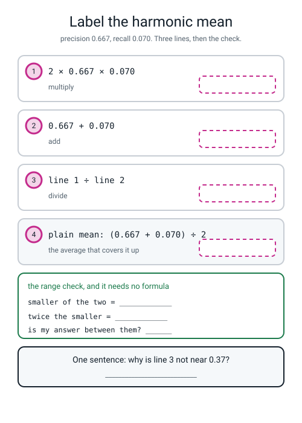
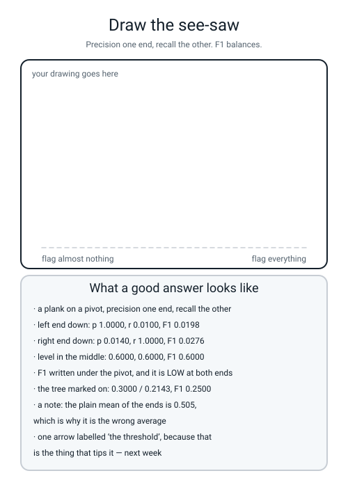

# Workbook — Week 9: Term 1 Checkpoint — One Number Is Never Enough

**Name:** ________________________________  **Date:** ______________

[⬅ Week 8](week-08.md) · [📖 Read the chapter first](../student-guide/week-09.md) · [Course Home](../README.md) · [Next ➡](week-10.md)

---

## ✅ Warm-Up (5 min)

Five quick questions about **last week** — the four counts.

**W1.** *"A tourist's perfectly good card was blocked in Rome."* Which cell? ____________________

*"The card was stolen and the model let it through."* Which cell? ____________________

**W2.** The tree's four counts on the 1,000 validation rows were **TN 979, FP 7, FN 11, TP 3**. Write the two denominators.

**precision = 3 ÷ ______**  **recall = 3 ÷ ______**

**W3.** The model that never says yes scored **0.9860** accuracy. **How many frauds did it catch, out of how many?** ____________________

**W4.** `confusion_matrix(pred, y_val)` — arguments the wrong way round. **Which two of the four counts move, and does Python complain?**

________________________________________________________________

**W5.** Why do you have to compute specificity yourself?

________________________________________________________________

---

## 🔢 Do the Maths by Hand

**This week has new maths: the harmonic mean, `2 × p × r ÷ (p + r)`.** Do every one of these on a calculator, in **three separate lines** — the multiply, the add, the divide. **Cramming it onto one line is how you end up dividing by 2 as well as by (p + r).**

**M1 — three pairs, two averages each.**

**Pair 1 — precision 0.900, recall 0.100.**

```
plain    :  0.9 + 0.1 = ________        ________ ÷ 2 = ____________
harmonic :  2 × 0.9 × 0.1 = ____________
            0.9 + 0.1     = ____________
            ________ ÷ ________ = ____________
check    :  smaller ________,  twice it ________,  in range?  ______
```

**Pair 2 — precision 0.600, recall 0.600.**

```
plain    :  0.6 + 0.6 = ________        ________ ÷ 2 = ____________
harmonic :  2 × 0.6 × 0.6 = ____________
            0.6 + 0.6     = ____________
            ________ ÷ ________ = ____________
check    :  smaller ________,  twice it ________,  in range?  ______
```

**M1(a).** What happened with pair 2, and what does it prove about the harmonic mean?

________________________________________________________________

**Pair 3 — precision 0.667, recall 0.070.** *(A bank with 200 real frauds. The model flags 21 and 14 of them are fraud: 14 ÷ 21 = 0.6667 and 14 ÷ 200 = 0.0700.)*

```
plain    :  0.667 + 0.070 = ________        ________ ÷ 2 = ____________
harmonic :  2 × 0.667 × 0.070 = ____________
            0.667 + 0.070       = ____________
            ________ ÷ ________ = ____________
check    :  smaller ________,  twice it ________,  in range?  ______
```

**M1(b).** For pair 3, the two averages are ________ and ________. **Which one would a bank's press release prefer, and which one is the truth about 186 uncaught frauds?**

________________________________________________________________

**M2 — the drive to your grandmother's house.** 120 km. The first 60 km at **90 km/h**, the second 60 km at **10 km/h** behind a tractor.

**M2(a).** Time for the first leg: `60 ÷ 90 = ________ hours`

**M2(b).** Time for the second leg: `60 ÷ 10 = ________ hours`

**M2(c).** Total time: ________ hours. Total distance: ________ km.

**M2(d).** So your real average speed is `________ ÷ ________ = ________ km/h`

**M2(e).** Now the harmonic mean of 90 and 10: `2 × 90 × 10 ÷ (90 + 10) = ________ ÷ ________ = ________`

**M2(f).** The plain mean of 90 and 10 is **50**. If you had really averaged 50 km/h, how long would 120 km have taken? `________ hours`. **And how long were you actually in the car?** ________ hours.

**M2(g).** One sentence on why the clock settles the argument:

________________________________________________________________

**M3 — F1 straight from the four counts.** The shortcut is `2 × TP ÷ (2 × TP + FP + FN)`, and it needs no precision and no recall — just the counts. **Same 1,000 validation orders, same 14 frauds.**

| Model | TN | FP | FN | TP | 2 × TP | 2 × TP + FP + FN | F1 |
|---|---|---|---|---|---|---|---|
| never says yes | 986 | 0 | 14 | 0 | ______ | ______ | ____________ |
| the decision tree | 979 | 7 | 11 | 3 | ______ | ______ | ____________ |
| flags everything | 0 | 986 | 0 | 14 | ______ | ______ | ____________ |

**M3(a).** Which model has the **best recall**? ____________________  **Its recall is** ____________  **and its F1 is** ____________

**M3(b).** The first model's **precision is undefined** (`0 ÷ 0`). Is its **F1** undefined too? ______  **Why?**

________________________________________________________________

**M3(c).** Which count does not appear **anywhere** in `2 × TP ÷ (2 × TP + FP + FN)`? ____________

**M3(d).** And one from last week: your own thirty transactions had **TP 6, FP 4, FN 3, TN 17**. Their F1:

`2 × 6 ÷ (12 + 4 + 3) = ________ ÷ ________ = ____________`

**M4 — F1 for your own delivery model, both ways.** From your Week 7 pipeline on the 400 validation rows: precision **0.5667**, recall **0.4435**, and the counts **TN 246, FP 39, FN 64, TP 51**.

**M4(a).** From the counts: `2 × 51 ÷ (102 + 39 + 64) = ________ ÷ ________ = ____________`

**M4(b).** From the two fractions, three lines:

```
2 × 0.5667 × 0.4435  =  ____________
0.5667 + 0.4435      =  ____________
________ ÷ ________  =  ____________
```

**M4(c).** Do the two routes agree? ______  **Range check:** smaller ________, twice it ________, in range? ______

**M4(d).** Last week's tree caught **3** of 14 frauds and had F1 **0.2500**. Suppose it had caught **4** instead, with one fewer miss and one more flag: TP 4, FP 7, FN 10.

`precision = 4 ÷ ______ = ________`  `recall = 4 ÷ ______ = ________`  `F1 = 8 ÷ ______ = ________`

**M4(e).** That is a better F1. **Is it a better model, or a luckier one?** One sentence — and name what is on the bottom of the recall fraction.

________________________________________________________________

---

## 🔎 Predict the Output

**Write your prediction in pen before you run anything.** All four carry on from `f1.py`, so `y_val` and `pred` already exist. **One of these four raises nothing at all and is still the most dangerous line on the page.**

### P1 — four things, and their shapes

```python
prec, rec, f1, sup = precision_recall_fscore_support(y_val, pred)
print(prec.shape)
print(f1)
print(sup)
print(f1_score(y_val, pred))
```

**I predict — line 1 (a shape):** ____________  **line 3:** ____________________

**and lines 2 and 4:** ____________________  ____________________

**It really printed:**

```text
________________________
________________________
________________________
________________________
```

**Line 1 is a shape, and it is not `(4,)`. Why is it `(2,)`?** ____________________

**Line 4 printed one number where line 2 printed two. Which of the two did it print, and why that one?**

________________________________________________________________

### P2 — arguments the wrong way round, again

```python
print("%.4f" % f1_score(pred, y_val))
print("%.4f" % precision_score(pred, y_val))
print("%.4f" % recall_score(pred, y_val))
```

**I predict — line 1:** ____________  **line 2:** ____________  **line 3:** ____________

**It really printed:**

```text
________________________
________________________
________________________
```

**Two of those three changed from the right way round, and one did not. Which one sat still, and why?**

________________________________________________________________

**So which is the better bug-detector: F1, or the four counts?** ____________________

### P3 — the brackets

```python
p, r = 0.9, 0.1
print(2 * p * r / (p + r))
print((p + r) / 2)
print(2 * p * r / p + r)
```

**I predict — line 1:** ____________________  **line 2:** ____________  **line 3:** ____________________

**It really printed:**

```text
________________________________
________________________________
________________________________
```

**Line 3 has lost its brackets. Work out by hand what Python actually computed, in the order it did it:**

`2 × 0.9 × 0.1 = ________`, then `÷ 0.9 = ________`, then `+ 0.1 = ________`

**Is line 3's answer wildly wrong, or plausibly wrong?** ____________________  **Which is worse?** ____________________

### P4 — two averages, no error, no warning

```python
print("%.4f" % f1_score(y_val, pred, average="macro"))
print("%.4f" % f1_score(y_val, pred, pos_label=0))
```

**I predict — line 1:** ____________  **line 2:** ____________

**It really printed:**

```text
________________________
________________________
```

**Neither line raised anything. The F1 you actually want is 0.2500. Say in one sentence what each of these two numbers is really about:**

**`average="macro"`:** ______________________________________

**`pos_label=0`:** ______________________________________

**And the four-second check that catches both:** ______________________________________

**How many of the answers on this page did you get right?** ______ / 14

**Which one surprised you most?** ______________________________

---

## ✍️ Practice Set A — Read It

**A1. Match the word to the thing.** Write the letter.

| Word | | Description |
|---|---|---|
| **F1 score** | ______ | (i) How many rows of that class there really were. A count, not a score |
| **harmonic mean** | ______ | (ii) The harmonic mean of precision and recall |
| **macro average** | ______ | (iii) The average for rates over the same fixed amount of work |
| **support** | ______ | (iv) Average the per-class scores giving each class an equal vote, whatever its size |

**A1(a).** Which two of those four are **not scores at all**, in the sense that you would never report them as "how good is my model"? ____________________

**A2. Three models, one score.** Fill in every gap, then answer the three questions. Same 1,000 validation orders, same 14 frauds.

| Model | TN | FP | FN | TP | precision | recall | F1 |
|---|---|---|---|---|---|---|---|
| never says yes | 986 | 0 | 14 | 0 | ____________ | ____________ | ____________ |
| the decision tree | 979 | 7 | 11 | 3 | ____________ | ____________ | ____________ |
| flags everything | 0 | 986 | 0 | 14 | ____________ | ____________ | ____________ |

**A2(a).** Which model has the best recall, and is it the best model?

________________________________________________________________

**A2(b).** Why is the first model's precision **undefined** rather than zero?

________________________________________________________________

**A2(c).** Which model would you actually ship, and what reservation would you state out loud?

________________________________________________________________

**A3. Spot the bug.** Each line is wrong or dangerous. Say what happens and write the fix.

| # | The line | What happens | The fix |
|---|---|---|---|
| a | `prec, rec, f1 = precision_recall_fscore_support(y_val, pred)` | | |
| b | `print("f1 : %.4f" % f1_score(y_val, pred, average="macro"))` | | |
| c | `print("f1 : %.4f" % f1_score(y_val, pred, pos_label=0))` | | |
| d | `print("f1 : %.4f" % f1)` where `f1` came from `precision_recall_fscore_support` | | |
| e | `f1 = 2 * p * r / p + r` | | |
| f | `print("F1 %.4f beats last week's %.4f" % (0.4976, 0.2500))` | | |

**A3(g).** Four of those six produce **no error at all**. Which three, and which is the hardest to catch?

________________________________________________________________

**A4. Match the code to the output.** Five of each, no output used twice.

| | Code |
|---|---|
| i | `print("%.4f" % f1_score(y_val, pred))` |
| ii | `print("%.4f" % f1_score(y_val, pred, average="macro"))` |
| iii | `print("%.4f" % f1_score(y_val, pred, average="weighted"))` |
| iv | `print(precision_recall_fscore_support(y_val, pred)[3])` |
| v | `print("%.4f" % (2 * 0.9 * 0.1 / (0.9 + 0.1)))` |

| | Output |
|---|---|
| P | `0.9805` |
| Q | `[986  14]` |
| R | `0.1800` |
| S | `0.2500` |
| T | `0.6204` |

**Your answers:** i → ______  ii → ______  iii → ______  iv → ______  v → ______

**A5. Four reports of the same model. Which number goes on the card?** All four describe the **same decision tree** on the **same 1,000 validation rows**.

**Report A**

```text
              precision    recall  f1-score   support

           0     0.9889    0.9929    0.9909       986
           1     0.3000    0.2143    0.2500        14

    accuracy                         0.9820      1000
   macro avg     0.6444    0.6036    0.6204      1000
weighted avg     0.9792    0.9820    0.9805      1000
```

**Report B**

```text
f1 : 0.6204
```

**Report C**

```text
f1 : 0.9805
```

**Report D**

```text
tn 979  fp 7  fn 11  tp 3
precision 0.3000  recall 0.2143  F1 = 6 / 24 = 0.2500
```

**A5(a).** Are reports B, C and D **wrong**? ______  **What is each of them the F1 *of*?**

**B:** ______________________________________________

**C:** ______________________________________________

**D:** ______________________________________________

**A5(b).** Which report would you put in front of a bank manager, and why?

________________________________________________________________

**A5(c).** Report A contains every number in B, C and D. **Point at where each one lives in it.**

**B is on the row called** ____________  **C is on the row called** ____________  **D is on the row called** ____________

**A5(d).** Which single row of report A has **14** on it, and why does that one number make you uneasy about all the others?

________________________________________________________________

**A6. Label the harmonic mean.** Fill in every dashed box in the figure for the pair **0.667 and 0.070**, then the range check, then the sentence.


*Figure W9.1 — The three lines of the harmonic mean, with the answers removed.*

**A6(a).** Write the sentence the bottom panel asks for — why line 3 is not near 0.37:

________________________________________________________________

**A6(b).** Which of the four boxes in that figure is the one a dishonest report would quote? ______

---

## ✍️ Practice Set B — Write It

### B1 — one line, plus a print

**Task:** print the F1 of the class you actually care about, to four decimal places, with `average` left alone.

**Expected output:**

```text
F1 : 0.2500
```

**Done looks like:** one call, truth first, no `average=` anywhere.

```python
print(_______________________________________________________)
```

### B2 — the harmonic mean, as a function that shows its working

**Task:** write `harmonic(a, b)` that prints the **three lines** — multiply, add, divide — then the range check, then returns the answer. The range check is *"the harmonic mean always lands between the smaller number and twice the smaller number"*.

Test it on `(0.9, 0.1)` and on your own delivery model's `(0.5667, 0.4435)`.

**Expected output:**

```text
2 x 0.9000 x 0.1000 = 0.18000
0.9000 + 0.1000      = 1.00000
0.18000 / 1.00000 = 0.1800
range check: 0.1000 <= 0.1800 <= 0.2000  -> True
2 x 0.5667 x 0.4435 = 0.50266
0.5667 + 0.4435      = 1.01020
0.50266 / 1.01020 = 0.4976
range check: 0.4435 <= 0.4976 <= 0.8870  -> True
```

**Done looks like:** four prints inside the function, `min(a, b)` for the check, and `<=` twice in one condition.

### B3 — the Arithmetic Race, in code

**Task:** write `race.py`. Put six pairs in a list, and for each one print the plain mean, the harmonic mean, the smaller number, twice the smaller, and whether the answer is in range. The six pairs: `(0.9, 0.1)`, `(0.6, 0.6)`, `(0.667, 0.070)`, `(0.3, 3/14)`, `(1.0, 0.01)`, `(0.014, 1.0)`.

**Expected output:**

```text
pair             plain    harmonic   smaller  2x smaller  in range?
0.900 / 0.100    0.5000   0.1800    0.1000   0.2000      True
0.600 / 0.600    0.6000   0.6000    0.6000   1.2000      True
0.667 / 0.070    0.3685   0.1267    0.0700   0.1400      True
0.300 / 0.2143   0.2571   0.2500    0.2143   0.4286      True
1.000 / 0.010    0.5050   0.0198    0.0100   0.0200      True
0.014 / 1.000    0.5070   0.0276    0.0140   0.0280      True
```

**Done looks like:** a list of `(label, p, r)` triples, one `for` loop, and `True` six times out of six. **Runtime instant.**

**And answer this from your own output:** which pair has the **biggest gap** between the plain mean and F1? ____________  **How big?** ____________

### B4 — a metrics report, as a reusable function

**Task:** write `metrics_report(y_true, y_pred, pile)` that prints the four counts with their sum, then precision, recall and F1 — **each one showing its fraction** and **each one with the name of the pile on the end of the line** — and finally checks its own F1 against `f1_score`.

**Expected output** (on the fraud tree):

```text
tn 979  fp 7  fn 11  tp 3   sum 1000
precision = 3 / 10 = 0.3000   on the 1,000 validation rows
recall    = 3 / 14 = 0.2143   on the 1,000 validation rows
F1        = 6 / 24 = 0.2500   on the 1,000 validation rows
check against sklearn      : 0.2500
```

**Done looks like:** `labels=[0, 1]` on the confusion matrix, `%d / %d = %.4f` three times, and **the pile named on every line that carries a number.**

### B5 — a whole program of your own, about 25 lines

**Task:** write `term1_report.py`. Rebuild your Week 7 champion pipeline (the feature set with `is_rush` and without raw `order_hour`), fit it on the 1,200 training rows, and print the **full Term 1 report** on the 400 validation rows: the four counts with their sum, then accuracy, precision, recall, specificity, F1 and ROC AUC — **every single one with its fraction and its pile** — and the majority-class rate on the last line.

**Expected output:**

```text
late in the 400 validation rows : 115
tn 246  fp 39  fn 64  tp 51   sum 400
accuracy    = (51 + 246) / 400 = 0.7425   on the 400 validation rows
precision   =  51 / 90       = 0.5667   on the 400 validation rows
recall      =  51 / 115      = 0.4435   on the 400 validation rows
specificity =  246 / 285     = 0.8632   on the 400 validation rows
F1          = 102 / 205      = 0.4976   on the 400 validation rows
ROC AUC     = over all 400 probabilities = 0.7599   on the 400 validation rows
majority-class rate on val      : 0.7125
```

**Done looks like:** the pipeline from Week 3, the feature set from Week 7, the counts from Week 8, F1 from this week, and **not one number without its pile.** **Runtime under 3 seconds.**

---

## 🐞 Fix the Broken Program

This program has **three** bugs: one **unpacking** bug, one **runtime** bug, and one **silent logic** bug. The real messages are below, in the order you meet them.

```python
"""broken9.py - F1 for two models on the fraud data.  THREE bugs."""
from sklearn.datasets import make_classification
from sklearn.dummy import DummyClassifier
from sklearn.metrics import (confusion_matrix, f1_score,
                             precision_recall_fscore_support, precision_score,
                             recall_score)
from sklearn.model_selection import train_test_split
from sklearn.tree import DecisionTreeClassifier

X, y = make_classification(n_samples=5000, n_features=8, n_informative=4,
                           n_redundant=0, weights=[0.99, 0.01], random_state=0)
X_tmp, X_test, y_tmp, y_test = train_test_split(
    X, y, test_size=0.20, random_state=0, stratify=y)
X_train, X_val, y_train, y_val = train_test_split(
    X_tmp, y_tmp, test_size=0.25, random_state=0, stratify=y_tmp)

tree = DecisionTreeClassifier(random_state=0).fit(X_train, y_train)
pred = tree.predict(X_val)
prec, rec, f1 = precision_recall_fscore_support(y_val, pred)
print("fraud precision %.4f  recall %.4f  f1 %.4f" % (prec[1], rec[1], f1[1]))

print("one number for the report : %.4f" % f1_score(y_val, pred, average="macro"))

lazy = DummyClassifier(strategy="most_frequent").fit(X_train, y_train)
pred_lazy = lazy.predict(X_val)
tn, fp, fn, tp = confusion_matrix(y_val, pred_lazy, labels=[0, 1]).ravel()
p = precision_score(y_val, pred_lazy, zero_division=0)
r = recall_score(y_val, pred_lazy)
print("lazy model: tn %d fp %d fn %d tp %d" % (tn, fp, fn, tp))
print("lazy F1 by hand : %.4f" % (2 * p * r / (p + r)))
```

**Run 1 — nothing prints at all:**

```text
Traceback (most recent call last):
  File "broken9.py", line 19, in <module>
    prec, rec, f1 = precision_recall_fscore_support(y_val, pred)
ValueError: too many values to unpack (expected 3)
```

**Bug 1.** Which line? ______  **Kind of bug?** ______________

**The answer is printed on the label. Read the function's name slowly and count the things it hands back:** ______

**The fix:** ______________________________________________

**Run 2 — after fixing bug 1:**

```text
fraud precision 0.3000  recall 0.2143  f1 0.2500
one number for the report : 0.6204
lazy model: tn 986 fp 0 fn 14 tp 0
Traceback (most recent call last):
  File "broken9.py", line 30, in <module>
    print("lazy F1 by hand : %.4f" % (2 * p * r / (p + r)))
ZeroDivisionError: float division by zero
```

**Bug 2.** Which line? ______  **Kind of bug?** ______________

**Both `p` and `r` are on the bottom of that fraction. What are they, for a model that never says yes?**

**p = ________  r = ________  so `p + r` = ________**

**Here is the interesting part: the model's F1 is not undefined — it is honestly 0.0000. Write the version that gets there from the counts, and say why that version cannot divide by zero.**

```python
________________________________________________________________
```

________________________________________________________________

**Run 3 — after fixing bugs 1 and 2. It runs all the way through, with no error and no warning:**

```text
fraud precision 0.3000  recall 0.2143  f1 0.2500
one number for the report : 0.6204
lazy model: tn 986 fp 0 fn 14 tp 0
lazy F1 from the counts : 0 / 14 = 0.0000
```

**Bug 3 is on the line that calls itself "one number for the report".**

**Line 1 says the fraud F1 is 0.2500. Line 2 says 0.6204. Both are correct. What did `average="macro"` average?**

`(________ + ________) ÷ 2 = ________`

**How many rows are in each of those two classes?** ______ and ______

**So what is wrong with giving them an equal vote?**

________________________________________________________________

**The fix:** ______________________________________________

**Run 4 — after fixing all three:**

```text
fraud precision 0.3000  recall 0.2143  f1 0.2500
one number for the report : 0.2500
lazy model: tn 986 fp 0 fn 14 tp 0
lazy F1 from the counts : 0 / 14 = 0.0000
```

**Two questions, and they are the point of the whole page.**

**Bug 3 changed a number from 0.6204 to 0.2500 and nothing on the screen ever objected. Write the one-line check that would have caught it** — it involves the two numbers on line 1.

________________________________________________________________

**Rank the three bugs from easiest to hardest to notice, and say what would have caught each one.**

**easiest → hardest:** ______  ______  ______

________________________________________________________________

---

## 🧩 Puzzle of the Week

### The F1 = 0.5000 Club

A bank has **12 real frauds** in its validation pile. You are looking for every model whose F1 is **exactly 0.5000**.

Start from the shortcut: `F1 = 2 × TP ÷ (2 × TP + FP + FN)`.

**Part 1(a).** If F1 is exactly 0.5000, then the bottom is exactly **twice** the top. Write that:

`2 × TP + FP + FN = ________ × TP`, so `FP + FN = ________ × TP`

**Part 1(b).** There are 12 real frauds, so `TP + FN = 12`, which means `FN = 12 − TP`. Substitute:

`FP + 12 − TP = 2 × TP`, so `FP = ________ × TP − ________`

**Part 1(c).** Now fill in the club membership list. FP can never be negative, so some rows are impossible — cross them out.

| TP | FN = 12 − TP | FP = 3TP − 12 | 2 × TP | 2TP + FP + FN | F1 | possible? |
|---|---|---|---|---|---|---|
| 2 | ______ | ______ | ______ | ______ | ______ | |
| 4 | ______ | ______ | ______ | ______ | ______ | |
| 6 | ______ | ______ | ______ | ______ | ______ | |
| 8 | ______ | ______ | ______ | ______ | ______ | |
| 12 | ______ | ______ | ______ | ______ | ______ | |

**Part 1(d).** What is the **smallest** TP that can be in the club? ______  **What is that model's precision?** ______

**Part 1(e).** For **TP = 12**, work out precision and recall.

`precision = 12 ÷ ______ = ________`  `recall = 12 ÷ 12 = ________`

**Part 1(f).** Now the point of the whole puzzle. Two members of the club:

| | precision | recall | F1 |
|---|---|---|---|
| the careful model (TP 4, FP 0, FN 8) | ______ | ______ | 0.5000 |
| the enthusiastic model (TP 12, FP 24, FN 0) | ______ | ______ | 0.5000 |

**Are those the same model? Are they even similar? Write one sentence about what F1 has hidden.**

________________________________________________________________

**Part 1(g).** So finish the rule: **F1 is a good single number when you have to pick one, but you always print ______________________ underneath it, because from those you can get back to every other number and from F1 alone you cannot.**

### Part 2 — the club with the see-saw

**Part 2(a).** Going down the club list from TP 4 to TP 12, what happens to **precision**? ____________________  To **recall**? ____________________

**Part 2(b).** Draw the see-saw for the two models in Part 1(f). Which way does each one tip?

________________________________________________________________

**Part 2(c).** Which member of the club would you ship for a bank, and which for a cancer screening test? Say why in one line each.

**bank:** ______________________________________________

**screening:** ______________________________________________

---

## 🤔 Think Deeper

**T1.** `2 × TP ÷ (2 × TP + FP + FN)` contains **no TN at all.** Pad the legitimate class from 979 correctly-left-alone rows to 999,979 and F1 stays at exactly 0.2500, while accuracy climbs from 0.9820 to 0.999982. **Write a paragraph** on whether that is a feature or a bug. Say what it protects you from, then say what it hides — and name the metric you would print beside F1 to cover the gap.

________________________________________________________________

________________________________________________________________

________________________________________________________________

________________________________________________________________

________________________________________________________________

**T2.** `f1_score(y_val, pred, average="macro")` gives **0.6204**, and it is a completely correct number. It is the F1 of a model that treats *"spot the fraud"* and *"leave ordinary shopping alone"* as **equally important jobs.** **Write a paragraph** on this: the number is right and the framing is wrong. Who decides that the two jobs are not equally important — the data, the library, or a person? And what does that tell you about the question *"which rows was that measured on?"*

________________________________________________________________

________________________________________________________________

________________________________________________________________

________________________________________________________________

---

## 🛠️ Build It — The Term 1 Report

**Three things get handed in. The metrics report is the one marked hardest, and every number on it wears its pile.**

### Step checklist

- [ ] **1.** `f1.py` runs. Paste the whole output.
- [ ] **2.** Check that three of its four F1 routes agree: your hand formula, `f1_score`, and the version from the counts.
- [ ] **3.** Fill in the relay handover record from memory — five stations, five handovers.
- [ ] **4.** `term1_report.py` runs on **your own** Week 7 model. Paste the output.
- [ ] **5.** Draw the 2×2 and **add the four cells up.** They must come to 400.
- [ ] **6.** Write all six numbers with their fractions and **the pile named on every line.**
- [ ] **7.** Check F1 the other way — from precision and recall — and do the range check.
- [ ] **8.** Compare accuracy with the majority-class rate.
- [ ] **9.** Answer the nine reflection questions. **Numbers, not adjectives.**
- [ ] **10.** Write the paragraph: which error should your application fear more, and one concrete change.
- [ ] **11.** Two Bug Log entries.

### The relay handover record

| Station | What I handed over | The numbers |
|---|---|---|
| 1 Audit | four numbers | rows ______ × ______ · duplicates ______ · missing ______ · late rate ____________ |
| 2 Split | pile sizes and rates | ______ / ______ / ______, all three at ____________ late |
| 3 Baseline | the number to beat | accuracy ____________, ROC AUC ____________ |
| 4 Pipeline | one fitted pipe and its score | `derive → prep → model`, validation ROC AUC ____________ |
| 5 Metrics | one artifact and six numbers | file: ______________________ |

**Which station took you longest, and why?** ______________________________________

### My own model's report

**My feature set was:** ______________________________________________

**The 2×2, on the ______ validation rows, ______ of them late:**

| | predicted on time | predicted late | row total |
|---|---|---|---|
| **actually on time** | ______ correctly left alone | ______ false alarm | ______ |
| **actually late** | ______ missed | ______ caught | ______ |
| column total | ______ | ______ | ______ |

**The check:** `______ + ______ + ______ + ______ = ______`  ✅ / ❌

**The six numbers, each with its fraction and its pile:**

```
accuracy    =  (____ + ____) ÷ ____  =  ____ ÷ ____  =  ________   on the ____________ rows
precision   =  ____ ÷ (____ + ____) =  ____ ÷ ____  =  ________   on the ____________ rows
recall      =  ____ ÷ (____ + ____) =  ____ ÷ ____  =  ________   on the ____________ rows
specificity =  ____ ÷ (____ + ____) =  ____ ÷ ____  =  ________   on the ____________ rows
F1          =  2 × ____ ÷ (____ + ____ + ____)      =  ________   on the ____________ rows
ROC AUC     =  over all ____ predicted probabilities =  ________   on the ____________ rows
```

**F1 the other way, to check:**

```
2 × ________ × ________  =  ____________
________ + ________      =  ____________
________ ÷ ________      =  ____________     same answer?  ______
range check              :  smaller ________, twice it ________, in range?  ______
```

**The majority-class rate on my validation pile is ____________, and my accuracy beats it by ____________.**

**Which is worse on my model — recall or specificity?** ____________  **Why, in one sentence about the row counts?**

________________________________________________________________

### The Term 1 reflection sheet

**Numbers, not adjectives.** "The model got better" is worth nothing; "from 0.7541 to 0.7599 on the 400 validation rows" is worth full marks.

**1. What did the audit find that you would have missed?**

________________________________________________________________

**2. Why three piles and not two?**

________________________________________________________________

**3. What did the baseline tell you?**

________________________________________________________________

**4. Why does the scaler go inside the pipeline?**

________________________________________________________________

**5. Name one feature you invented and what it earned.**

________________________________________________________________

**6. What was the leak, and how did you catch it?**

________________________________________________________________

**7. How many rows did your ablation table have, and how many were regressions?**

________________________________________________________________

**8. Why isn't accuracy enough?**

________________________________________________________________

**9. What one number would you put on the report, and why?**

________________________________________________________________

### Which error should my application fear more?

**One paragraph. A person, a consequence, and one concrete change.**

________________________________________________________________

________________________________________________________________

________________________________________________________________

________________________________________________________________

**And be honest: would your one change make the other error worse?** ______  **How?**

________________________________________________________________

### The Bug Log

| What I saw | What it means | Cause | Fix |
|---|---|---|---|
| | | | |
| | | | |

---

## 🎨 Draw It

Draw the see-saw. Precision at one end, recall at the other, F1 written under the pivot — and three positions, because the whole point is that F1 is **low at both ends and high only in the middle.**


*Figure W9.2 — An empty frame, and what a good answer contains.*

**Then answer three things about your own drawing:**

**Where on your see-saw is the model that flags exactly one transaction and is right?** ____________________

**Where is the model that flags all thousand?** ____________________

**Your own delivery model has precision 0.5667 and recall 0.4435. Mark it. Which way does it tip, and by how much?**

________________________________________________________________

---

## 📊 Self-Check

| I can... | 😀 | 🙂 | 😕 |
|---|---|---|---|
| compute a harmonic mean by hand in three lines | | | |
| show that (0.9, 0.1) gives 0.18, not 0.5, and say why | | | |
| do the range check — between the smaller number and twice it | | | |
| explain in one sentence why F1 is the right summary for an imbalanced problem | | | |
| compute F1 straight from the four counts, with no precision or recall | | | |
| say what `macro average` averaged, and why that was the wrong question | | | |
| say what `support` is, and why 14 makes me uneasy | | | |
| re-run the whole Term 1 pipeline from raw table to saved artifact from memory | | | |
| produce a full metrics report with the split named beside **every** number | | | |
| say which of the two errors my application should fear more, and name one concrete change | | | |

**The one thing I would ask about if I could ask one question:**

________________________________________________________________

---

## ✅ Answers

<details>
<summary>Check your answers</summary>

### Warm-Up

**W1.** Blocked tourist card → **false positive** (you said positive, and you were wrong). Stolen card let through → **false negative** (you said negative, and you were wrong). **Read the two words backwards: the second word is what you predicted, the first says whether you were right.**

**W2.** **precision = 3 ÷ 10** (TP + FP — everything you flagged, the predicted-fraud *column*). **recall = 3 ÷ 14** (TP + FN — everything that really was fraud, the actual-fraud *row*).

**W3.** **Zero, out of 14.** Its whole predicted-fraud column is empty: FP = 0 and TP = 0.

**W4.** **FP and FN swap** — the 7 and the 11 change places — and **Python does not complain at all.** No error, no warning. The two numbers that move are the two errors, which is why this is the worst silent bug of the term.

**W5.** **Because there is no `specificity_score` in scikit-learn.** You compute it yourself: `tn / (tn + fp)`. People go looking for it and assume they have installed something wrong. They have not.

### Do the Maths by Hand

**M1 — pair 1 (0.900, 0.100).**

```
plain    :  0.9 + 0.1 = 1.000        1.000 ÷ 2 = 0.5000
harmonic :  2 × 0.9 × 0.1 = 0.180
            0.9 + 0.1     = 1.000
            0.180 ÷ 1.000 = 0.1800
check    :  smaller 0.100,  twice it 0.200,  and 0.1800 is between them.  ✅
```

**Pair 2 (0.600, 0.600).**

```
plain    :  0.6 + 0.6 = 1.200        1.200 ÷ 2 = 0.6000
harmonic :  2 × 0.6 × 0.6 = 0.720
            0.6 + 0.6     = 1.200
            0.720 ÷ 1.200 = 0.6000
check    :  smaller 0.600,  twice it 1.200,  and 0.6000 is between them.  ✅
```

**M1(a).** **They are identical — 0.6000 both ways.** So the harmonic mean is **not** permanently pessimistic and F1 is not a "stricter score that is always lower". **It only punishes lopsidedness.** When precision and recall agree, both averages agree exactly. **This is the most important pair in the week**, because it tells you what F1 is actually measuring.

**Pair 3 (0.667, 0.070).**

```
plain    :  0.667 + 0.070 = 0.737    0.737 ÷ 2 = 0.3685
harmonic :  2 × 0.667 × 0.070 = 0.0934
            0.667 + 0.070       = 0.737
            0.0934 ÷ 0.737      = 0.1267
check    :  smaller 0.070,  twice it 0.140,  and 0.1267 is between them.  ✅
```

**M1(b).** The two averages are **0.3685** and **0.1267**. A press release would much prefer **0.3685** — it is nearly three times bigger and it sounds like a system that half works. **The truth is 0.1267**, and the reason is the number the plain mean threw away: recall 0.070 means **186 of the 200 real frauds walked straight through.** The plain mean gave that catastrophe an equal vote with a respectable precision and split the difference. **The harmonic mean refuses.**

**M2(a).** `60 ÷ 90 = **0.6667** hours` (40 minutes).

**M2(b).** `60 ÷ 10 = **6** hours`.

**M2(c).** Total time **6.6667 hours** (6 hours 40 minutes). Total distance **120 km**.

**M2(d).** `120 ÷ 6.6667 = **18.0** km/h`.

**M2(e).** `2 × 90 × 10 ÷ 100 = 1800 ÷ 100 = **18.0**` — **exactly the same number.**

**M2(f).** At 50 km/h, 120 km takes `120 ÷ 50 = **2.4** hours` — two hours twenty-four minutes. **You were in the car for 6.6667 hours.**

**M2(g).** *"The plain mean of two speeds is not a speed the journey ever had — the clock says 6 hours 40, and only 18 km/h reproduces that."* **You spent nearly all your time crawling, so the crawl should dominate the average**, and that is exactly what the harmonic mean does. It is the right average for **rates over the same fixed amount of work** — 60 km each leg, or "one model, judged on catching things and on not crying wolf".

**M3.**

| Model | 2 × TP | 2 × TP + FP + FN | F1 |
|---|---|---|---|
| never says yes | **0** | **14** | **0.0000** |
| the decision tree | **6** | **24** | **0.2500** |
| flags everything | **28** | **1014** | **0.0276** |

All three divisions are paper arithmetic: `0 ÷ 14`, `6 ÷ 24`, `28 ÷ 1014`.

**M3(a).** **"Flags everything" has the best recall — a perfect 1.0000** — and **its F1 is 0.0276**, barely above the model that does nothing at all. It blocked all 986 legitimate transactions to get that perfect score. **Recall on its own is a stunt, exactly as accuracy was last week.**

**M3(b).** **No — its F1 is honestly 0.0000.** Precision is `0 ÷ 0`, which is not a number; but F1 from the counts is `2 × 0 ÷ (0 + 0 + 14) = 0 ÷ 14`, and **14 is not zero**, so the division is perfectly legal. **That is one genuinely good reason to report F1: it survives a model that never says yes, where precision cannot.**

**M3(c).** **TN.** There is no TN anywhere in the formula. The 979 (or 986, or 999,979) correctly-left-alone rows do not appear at all — which is Think Deeper T1.

**M3(d).** `2 × 6 ÷ (12 + 4 + 3) = **12** ÷ **19** = **0.6316**`.

**M4(a).** `2 × 51 ÷ (102 + 39 + 64) = **102** ÷ **205** = **0.4976**`.

**M4(b).**

```
2 × 0.5667 × 0.4435  =  0.50266
0.5667 + 0.4435      =  1.01020
0.50266 ÷ 1.01020    =  0.4976
```

**M4(c).** **Yes — 0.4976 both ways.** Range check: smaller is **0.4435**, twice it is **0.8870**, and 0.4976 sits between them ✅.

**M4(d).** `precision = 4 ÷ **11** = **0.3636**` · `recall = 4 ÷ **14** = **0.2857**` · `F1 = 8 ÷ **25** = **0.3200**`.

**M4(e).** **Nobody can tell from one measurement**, and the reason is on the bottom of the recall fraction: **14.** One extra fraud caught out of fourteen moves F1 from 0.2500 to 0.3200 — a big-looking jump resting on a single row. **A four-decimal number standing on 14 rows should make you uneasy**, and the instrument that puts a `±` on it is Week 11. Being uneasy about it now is exactly the right instinct.

### Predict the Output

**P1.**

```text
(2,)
[0.99089069 0.25      ]
[986  14]
0.25
```

**Line 1 is `(2,)` because there are two classes, not four things.** `precision_recall_fscore_support` hands back **four** arrays, and each array has **one entry per class**. So `prec`, `rec`, `f1` and `sup` are each two numbers long: index 0 is the legit class, index 1 is fraud.

**Line 4 printed 0.25 — the fraud class, index 1.** With two classes and `average` left alone, `f1_score` reports the F1 of **the positive class**, which is class 1, which is the class you care about. **That is the number that goes on the card.**

Two details worth noticing. `f1` printed as `[0.99089069 0.25]` — **numpy prints the full precision**, which is why the report uses `%.4f`. And `sup` is `[986  14]`: **not a score, a count.** It is the smallest number on the screen and the reason every other number is shaky.

**P2.**

```text
0.2500
0.2143
0.3000
```

**F1 sat still.** Precision and recall traded places — 0.3000 and 0.2143 swapped — but F1 stayed at exactly 0.2500.

**Why:** swapping truth and predictions swaps FP and FN, and **F1's denominator adds them**: `6 + 7 + 11` and `6 + 11 + 7` are both 24. So the swap is invisible to F1 and visible in precision and recall.

**The better bug-detector is the four counts.** F1 *cannot* warn you about the swap; the counts can, because `fn 7` on a model that misses most frauds is the wrong shape of story. **That is a real reason to keep printing them.**

**P3.**

```text
0.18000000000000002
0.5
0.30000000000000004
```

**Line 3, in the order Python did it:** `2 × 0.9 × 0.1 = 0.18`, then `÷ 0.9 = 0.2`, then `+ 0.1 = 0.3`. Division binds tighter than addition, so the `r` on the end was added instead of being part of the denominator.

**0.3 is plausibly wrong, and that is much worse than wildly wrong.** It is between 0.1 and 0.9, it looks like a metric, and it would sail into a report. Compare that with a crash, which stops you.

Note also `0.18000000000000002` — the harmonic mean of 0.9 and 0.1 is not stored exactly in binary. Print it with `%.4f` and it says `0.1800`. **Round for display; never compare with `==`.**

**P4.**

```text
0.6204
0.9909
```

**`average="macro"`** is the F1 of a model **that treats both classes as equally important**: `(0.9909 + 0.2500) ÷ 2 = 0.6204`, giving the 986 easy rows exactly the same vote as the 14 hard ones.

**`pos_label=0`** is the F1 **of the class you do not care about** — how well the model recognises ordinary legitimate shopping. **0.9909**, and it is a true statement about something nobody asked.

**The four-second check:** *is this number between precision and recall?* F1 must land between the smaller of the pair and twice the smaller — here between **0.2143 and 0.4286**. **0.6204 is not. 0.9909 is not.** Both fail the check instantly, and neither raised so much as a warning.

### Practice Set A

**A1.** F1 score → **(ii)** · harmonic mean → **(iii)** · macro average → **(iv)** · support → **(i)**

**A1(a).** **Support and the harmonic mean.** Support is a **count** of rows — it says nothing about quality. The harmonic mean is a **kind of average**, a tool; F1 is what you get when you point it at precision and recall. Calling either of them "the score" is a category mistake.

**A2.**

| Model | precision | recall | F1 |
|---|---|---|---|
| never says yes | **undefined** (`0 ÷ 0`) | **0.0000** (`0 ÷ 14`) | **0.0000** (`0 ÷ 14`) |
| the decision tree | **0.3000** (`3 ÷ 10`) | **0.2143** (`3 ÷ 14`) | **0.2500** (`6 ÷ 24`) |
| flags everything | **0.0140** (`14 ÷ 1000`) | **1.0000** (`14 ÷ 14`) | **0.0276** (`28 ÷ 1014`) |

**A2(a).** **"Flags everything", with a perfect 1.0000 — and no, it is not the best model.** It blocked every legitimate transaction in the pile. Its F1 of 0.0276 is barely above the model that does nothing.

**A2(b).** Precision is `TP ÷ (TP + FP)` and both are zero, so it is `0 ÷ 0`, which is **not a number**. scikit-learn prints `0.0000` and raises `UndefinedMetricWarning` to tell you why. **"Undefined" is the better answer.** Zero would mean "I flagged things and none of them were fraud", which is a different and more informative failure.

**A2(c).** **The tree — with a stated reservation.** It is the only one that catches anything (3 of 14) without blocking a whole country. **But it misses 11 of 14, and 7 of the 10 cards it blocked belonged to innocent people, so it is not good enough yet.** An answer of *"none of them, and here is why"* is equally full marks.

**A3.**

| # | What happens | The fix |
|---|---|---|
| a | `ValueError: too many values to unpack (expected 3)`. The function returns **four** things — its name says so. | `prec, rec, f1, sup = precision_recall_fscore_support(y_val, pred)` |
| b | **No error, no warning, and 0.6204** — two and a half times the right answer, because it gives 986 easy rows the same vote as 14 hard ones. | leave `average` alone: `f1_score(y_val, pred)` |
| c | **No error, and 0.9909** — the F1 of the class you do not care about. | drop `pos_label=0` |
| d | `TypeError: only length-1 arrays can be converted to Python scalars`. `f1` is a **list of two**, one per class, not a single number, and `%.4f` can only format one number. | `f1[1]`, the fraud class |
| e | **No error, and a plausible wrong number.** Missing brackets: Python computes `(2pr ÷ p) + r`. | `f1 = 2 * p * r / (p + r)` |
| f | **No error, and a false statement.** Those two F1s come from **different datasets** — 28.75% late against 1.4% fraud. | never compare F1 across datasets; compare models on the same rows |

**A3(g).** **b, c, e and f** produce no error — four of the six, in fact, which is the shape of this whole week. **The hardest to catch is (f)**, because it is not a coding mistake at all: every number in it is correct, the formatting is right, and the sentence is still nonsense. **Comparing F1 across datasets is comparing a maths mark with a history mark.** Of the coding ones, **(b)** is worst, because 0.6204 is exactly the kind of number that looks like a result.

**A4.** i → **S** · ii → **T** · iii → **P** · iv → **Q** · v → **R**

**A5(a).** **No, none of them is wrong.** Every number is correctly computed.

**B is the macro-average F1** — the average of the two classes' F1 scores with an equal vote each: `(0.9909 + 0.2500) ÷ 2 = 0.6204`.

**C is the weighted-average F1** — the same two numbers weighted by support: `(0.9909 × 986 + 0.2500 × 14) ÷ 1000 = 0.9805`. **That is 98.6% a statement about legitimate transactions.**

**D is the F1 of the fraud class** — the one you asked about. **0.2500.**

**A5(b).** **Report D**, and if you have room, report A. D gives the four counts **and** the number, so the manager can see that the model caught 3 frauds out of 14 and blocked 7 innocent people — **and from those four counts anybody can recompute every other number on this page.** From 0.6204 alone, nobody can get back.

**A5(c).** **B is on the `macro avg` row. C is on the `weighted avg` row. D is on the row called `1`.**

**A5(d).** **The row called `1` — support 14.** Every interesting number in the whole report rests on those 14 rows: precision has 10 on the bottom, recall has 14, F1 has 24. **Collect a different 1,000 transactions and 14 could easily have been 8 or 22, and every one of those decimals would move.** Being uneasy about that is correct, and Week 11 is where the uneasiness gets an instrument.

**A6.** For (0.667, 0.070) the four boxes are: **0.0934** (the multiply), **0.737** (the add), **0.1267** (the divide) and **0.3685** (the plain mean). Range check: smaller **0.070**, twice it **0.140**, and 0.1267 is between them ✅.

**A6(a).** *"Line 3 is not near 0.37 because the harmonic mean is dragged down towards the smaller of the two numbers — a recall of 0.070 means 186 of 200 frauds were missed, and no average that respects both numbers can call that a third of a success."*

**A6(b).** **The fourth box — the plain mean, 0.3685.** It is nearly three times larger and it is the one that hides the missed frauds.

### Practice Set B

**B1.**

```python
print("F1 : %.4f" % f1_score(y_val, pred))
```

```text
F1 : 0.2500
```

**B2.**

```python
def harmonic(a, b):
    h = 2 * a * b / (a + b)
    small = min(a, b)
    print("2 x %.4f x %.4f = %.5f" % (a, b, 2 * a * b))
    print("%.4f + %.4f      = %.5f" % (a, b, a + b))
    print("%.5f / %.5f = %.4f" % (2 * a * b, a + b, h))
    print("range check: %.4f <= %.4f <= %.4f  -> %s"
          % (small, h, 2 * small, small <= h <= 2 * small))
    return h


harmonic(0.9, 0.1)
harmonic(0.5667, 0.4435)
```

```text
2 x 0.9000 x 0.1000 = 0.18000
0.9000 + 0.1000      = 1.00000
0.18000 / 1.00000 = 0.1800
range check: 0.1000 <= 0.1800 <= 0.2000  -> True
2 x 0.5667 x 0.4435 = 0.50266
0.5667 + 0.4435      = 1.01020
0.50266 / 1.01020 = 0.4976
range check: 0.4435 <= 0.4976 <= 0.8870  -> True
```

**Why the three separate prints matter:** they are the three lines you do on paper, in the same order, so the function is a *check* on your hand arithmetic rather than a replacement for it. **The commonest error in this week is dividing by 2 as well as by (p + r)**, and the middle line makes that impossible to hide.

**B3.** `race.py`:

```python
"""race.py - six pairs, two averages each, and the range check."""
pairs = [("0.900 / 0.100", 0.9, 0.1),
         ("0.600 / 0.600", 0.6, 0.6),
         ("0.667 / 0.070", 0.667, 0.070),
         ("0.300 / 0.2143", 0.3, 3 / 14),
         ("1.000 / 0.010", 1.0, 0.01),
         ("0.014 / 1.000", 0.014, 1.0)]

print("pair             plain    harmonic   smaller  2x smaller  in range?")
for label, p, r in pairs:
    plain = (p + r) / 2
    harm = 2 * p * r / (p + r)
    small = min(p, r)
    ok = small <= harm <= 2 * small
    print("%-15s  %.4f   %.4f    %.4f   %.4f      %s"
          % (label, plain, harm, small, 2 * small, ok))
```

```text
pair             plain    harmonic   smaller  2x smaller  in range?
0.900 / 0.100    0.5000   0.1800    0.1000   0.2000      True
0.600 / 0.600    0.6000   0.6000    0.6000   1.2000      True
0.667 / 0.070    0.3685   0.1267    0.0700   0.1400      True
0.300 / 0.2143   0.2571   0.2500    0.2143   0.4286      True
1.000 / 0.010    0.5050   0.0198    0.0100   0.0200      True
0.014 / 1.000    0.5070   0.0276    0.0140   0.0280      True
```

**The biggest gap is `1.000 / 0.010`: plain 0.5050 against F1 0.0198, a gap of 0.4852.** That is the "flag one transaction and be right about it" stunt — a perfect precision and thirteen frauds still walking around. **The plain mean calls it half a success; F1 calls it 2%.** The gap shrinks as the pair gets closer together and hits exactly zero on `0.600 / 0.600`.

**And the last column is the point of the file: `True` six times out of six.** The range check needs no formula at all, and it catches every arithmetic slip in this week.

**B4.**

```python
def metrics_report(y_true, y_pred, pile):
    tn, fp, fn, tp = confusion_matrix(y_true, y_pred, labels=[0, 1]).ravel()
    print("tn %d  fp %d  fn %d  tp %d   sum %d" % (tn, fp, fn, tp, tn + fp + fn + tp))
    print("precision = %d / %d = %.4f   on %s" % (tp, tp + fp, tp / (tp + fp), pile))
    print("recall    = %d / %d = %.4f   on %s" % (tp, tp + fn, tp / (tp + fn), pile))
    print("F1        = %d / %d = %.4f   on %s"
          % (2 * tp, 2 * tp + fp + fn, 2 * tp / (2 * tp + fp + fn), pile))
    print("check against sklearn      : %.4f" % f1_score(y_true, y_pred))


metrics_report(y_val, pred, "the 1,000 validation rows")
```

```text
tn 979  fp 7  fn 11  tp 3   sum 1000
precision = 3 / 10 = 0.3000   on the 1,000 validation rows
recall    = 3 / 14 = 0.2143   on the 1,000 validation rows
F1        = 6 / 24 = 0.2500   on the 1,000 validation rows
check against sklearn      : 0.2500
```

**Three design choices worth naming.** `pile` is a *parameter*, so it is impossible to print a number without also printing where it came from. Every fraction shows its top and bottom, so the report explains itself. And the last line checks your own F1 against scikit-learn's — **the computer is not the authority here; agreement between two independent routes is.**

**B5.** `term1_report.py`:

```python
"""term1_report.py - the full metrics report for my own delivery model.  Week 9."""
from sklearn.compose import ColumnTransformer
from sklearn.impute import SimpleImputer
from sklearn.linear_model import LogisticRegression
from sklearn.metrics import (accuracy_score, confusion_matrix, f1_score,
                             precision_score, recall_score, roc_auc_score)
from sklearn.model_selection import train_test_split
from sklearn.pipeline import Pipeline
from sklearn.preprocessing import (FunctionTransformer, OneHotEncoder,
                                   StandardScaler)

from make_data import make_deliveries

NUM = ["distance_km", "items", "prep_minutes", "driver_experience_months",
       "is_rush"]
CAT = ["restaurant", "day_of_week", "weather"]

df = make_deliveries(n=2000, seed=0).drop_duplicates().reset_index(drop=True)
y = df["late"]
X = df.drop(columns=["late", "order_id"])
X_tmp, X_test, y_tmp, y_test = train_test_split(
    X, y, test_size=0.20, random_state=0, stratify=y)
X_train, X_val, y_train, y_val = train_test_split(
    X_tmp, y_tmp, test_size=0.25, random_state=0, stratify=y_tmp)


def add_features(d):
    d = d.copy()
    d["is_rush"] = d["order_hour"].between(18, 20).astype(int)
    return d


prep = ColumnTransformer([
    ("num", Pipeline([("imputer", SimpleImputer(strategy="median")),
                      ("scaler", StandardScaler())]), NUM),
    ("cat", OneHotEncoder(handle_unknown="ignore"), CAT),
])
pipe = Pipeline([("derive", FunctionTransformer(add_features)),
                 ("prep", prep),
                 ("model", LogisticRegression(max_iter=2000, random_state=0))])
pipe.fit(X_train, y_train)
prob = pipe.predict_proba(X_val)[:, 1]
pred = pipe.predict(X_val)
tn, fp, fn, tp = confusion_matrix(y_val, pred).ravel()
print("late in the 400 validation rows :", int(y_val.sum()))
print("tn %d  fp %d  fn %d  tp %d   sum %d" % (tn, fp, fn, tp, tn + fp + fn + tp))
print("accuracy    = (%d + %d) / 400 = %.4f   on the 400 validation rows"
      % (tp, tn, accuracy_score(y_val, pred)))
print("precision   =  %d / %d       = %.4f   on the 400 validation rows"
      % (tp, tp + fp, precision_score(y_val, pred)))
print("recall      =  %d / %d      = %.4f   on the 400 validation rows"
      % (tp, tp + fn, recall_score(y_val, pred)))
print("specificity =  %d / %d     = %.4f   on the 400 validation rows"
      % (tn, tn + fp, tn / (tn + fp)))
print("F1          = %d / %d      = %.4f   on the 400 validation rows"
      % (2 * tp, 2 * tp + fp + fn, f1_score(y_val, pred)))
print("ROC AUC     = over all 400 probabilities = %.4f   on the 400 validation rows"
      % roc_auc_score(y_val, prob))
print("majority-class rate on val      : %.4f" % (1 - y_val.mean()))
```

**Real output. Runtime under 3 seconds.**

```text
late in the 400 validation rows : 115
tn 246  fp 39  fn 64  tp 51   sum 400
accuracy    = (51 + 246) / 400 = 0.7425   on the 400 validation rows
precision   =  51 / 90       = 0.5667   on the 400 validation rows
recall      =  51 / 115      = 0.4435   on the 400 validation rows
specificity =  246 / 285     = 0.8632   on the 400 validation rows
F1          = 102 / 205      = 0.4976   on the 400 validation rows
ROC AUC     = over all 400 probabilities = 0.7599   on the 400 validation rows
majority-class rate on val      : 0.7125
```

**Notice the AUC: 0.7599 — the exact number from Week 7.** Same pipeline, same rows, same seed. **That is what reproducibility looks like**, and it is why every `random_state` in this course is 0.

### Fix the Broken Program

**Bug 1 — line `prec, rec, f1 = precision_recall_fscore_support(y_val, pred)`. An unpacking bug.** Count the words in the function's name: **precision, recall, fscore, support — four things.** You asked for three, so Python stopped. **This is one of the friendliest errors you will ever get: the answer is printed on the label.**

**The fix:** `prec, rec, f1, sup = precision_recall_fscore_support(y_val, pred)`.

**Bug 2 — the hand-written harmonic mean for the lazy model. A runtime bug.** For a model that never says yes, `p = 0.0` (with `zero_division=0`) and `r = 0.0`, so `p + r = 0.0`, and `2 × 0 × 0 ÷ 0` is a division by zero. `ZeroDivisionError: float division by zero`.

**The version from the counts:**

```python
print("lazy F1 from the counts : %d / %d = %.4f"
      % (2 * tp, 2 * tp + fp + fn, 2 * tp / (2 * tp + fp + fn)))
```

**Why it cannot divide by zero here:** the bottom is `2 × TP + FP + FN = 0 + 0 + 14 = **14**`, and 14 is not zero. `0 ÷ 14 = 0.0000`. **So this model's F1 is honestly 0.0000 even though its precision is undefined** — the counts route survives where the fractions route dies, which is a real, practical reason to know both.

**Bug 3 — `average="macro"`. A silent logic bug.** It averaged the two classes' F1s with an equal vote: `(0.9909 + 0.2500) ÷ 2 = 0.6204`. The two classes hold **986** and **14** rows.

**What is wrong with an equal vote:** it gives the 986 easy rows the same say as the 14 hard ones, so a model that misses 11 frauds out of 14 comes back with a respectable-sounding 0.6204. **That is last week's accuracy paradox in a new costume** — 98.6% accurate and nothing caught, 0.6204 macro F1 and eleven frauds missed.

**The fix:** `f1_score(y_val, pred)` — leave `average` alone on a two-class problem and you get the F1 of the positive class, **0.2500**.

**The one-line check that catches it:** *is the reported F1 between precision and recall — between 0.2143 and 0.4286?* **0.6204 is not.** The check needs no library and takes four seconds, and it also catches `pos_label=0` (0.9909) and the missing brackets (0.3000).

**Ranking, easiest → hardest: 1, 2, 3.** Bug 1 crashes and names the count it wanted. Bug 2 crashes with a message that is clear once you ask *"what are p and r for a model that never says yes?"*. **Bug 3 never complains at all, and 0.6204 is exactly the sort of number that ends up on a slide.**

### Puzzle of the Week

**Part 1(a).** `2 × TP + FP + FN = **4** × TP`, so `FP + FN = **2** × TP`.

**Part 1(b).** `FP + 12 − TP = 2 × TP`, so `FP = **3** × TP − **12**`.

**Part 1(c).**

| TP | FN | FP | 2 × TP | 2TP + FP + FN | F1 | possible? |
|---|---|---|---|---|---|---|
| 2 | 10 | **−6** | 4 | — | — | **impossible — FP cannot be negative** |
| 4 | 8 | **0** | 8 | 16 | **0.5000** | ✅ |
| 6 | 6 | **6** | 12 | 24 | **0.5000** | ✅ |
| 8 | 4 | **12** | 16 | 32 | **0.5000** | ✅ |
| 12 | 0 | **24** | 24 | 48 | **0.5000** | ✅ |

**Part 1(d).** The smallest possible TP is **4**, when FP is exactly 0. Its precision is `4 ÷ 4 = **1.0000**` — **a perfect precision, with eight frauds missed.**

**Part 1(e).** `precision = 12 ÷ **36** = **0.3333**` (TP + FP = 12 + 24), and `recall = 12 ÷ 12 = **1.0000**`.

**Part 1(f).**

| | precision | recall | F1 |
|---|---|---|---|
| the careful model (TP 4, FP 0, FN 8) | **1.0000** | **0.3333** | 0.5000 |
| the enthusiastic model (TP 12, FP 24, FN 0) | **0.3333** | **1.0000** | 0.5000 |

**They are not the same model and they are not remotely similar.** One never raises a false alarm and misses two thirds of the fraud; the other catches every fraud and wrongly blocks twenty-four people. **F1 has hidden which of the two errors you are making** — it only tells you *how much* wrongness there is, not *what kind*. Notice too that the two rows are **mirror images**: 1.0000/0.3333 and 0.3333/1.0000. **F1 cannot tell a mirror from the thing itself**, for the same reason it survived the swapped arguments in P2.

**Part 1(g).** **…you always print the four counts (TN, FP, FN, TP) underneath it**, because from those you can recompute every other number and from F1 alone you cannot get back.

**Part 2(a).** Going down the list, **precision falls** (1.0000 → 0.5000 → 0.4000 → 0.3333) and **recall rises** (0.3333 → 0.5000 → 0.6667 → 1.0000). **That is the see-saw, and every position on it has the same F1** — which is a rather beautiful way to see that F1 measures the *balance*, not the *tilt*.

**Part 2(b).** The careful model tips **hard towards precision** (down at the precision end); the enthusiastic model tips **hard towards recall**. Both are far from level, and both score 0.5000, so **F1 is telling you how far the plank is from the ground, not which way it leans.**

**Part 2(c).** **Bank: the careful model, probably** — 24 wrongly blocked cards is 24 people stranded at a checkout, and the bank has other defences; but say out loud that eight frauds got through. **Screening: the enthusiastic model, without hesitation** — a false positive is an anxious week and one extra scan, a false negative is an undetected tumour. **Same F1, opposite decisions, and the deciding argument is not in the data at all.**

### Think Deeper

**T1.** A good answer says **both**, and names the metric.

**What it protects you from.** Because there is no TN in the formula, **F1 cannot be inflated by adding easy rows.** That is exactly the trick that broke accuracy: 98.6% of the fraud table was "leave it alone", so accuracy was 98.6% a statement about the easy work. Pad the legitimate class to a million and accuracy goes to 0.999982 while F1 sits still at 0.2500. **F1 survives imbalance because it simply refuses to look at the class that causes it.**

**What it hides.** "7 false alarms out of 986 honest customers" and "7 out of a million" are wildly different businesses, and **F1 calls them both 0.2500.** If you need to know what fraction of honest customers get wrongly blocked, F1 will never tell you.

**The metric to print beside it: specificity** — `TN ÷ (TN + FP)` — because it is the only one of the four fractions whose denominator is the honest customers. **Feature and bug at once, and the cure is to report both.**

**T2.** A good answer separates *correct* from *appropriate*.

0.6204 is a true statement about a model that treats "spot the fraud" and "leave ordinary shopping alone" as **equally important jobs**. Nobody thinks those two jobs are equally important: one is the reason the system exists and the other is what happens 98.6% of the time by default. **So the number is right and the framing is wrong** — and note that nothing in the data, and nothing in scikit-learn, made that choice. `average="macro"` is a *person's* decision about what matters, typed into a keyword argument, and once it is typed it looks exactly like a measurement.

**That is why *"which rows was that measured on?"* is the most useful question in this course.** Every score is a fraction, every fraction has a denominator, and **the denominator is where somebody's judgement is hiding.** The strongest answers add the general rule: **when a number surprises you upwards, find out which rows it was measured on** — and then say who chose them.

### Build It

**The relay handover record:**

| Station | The right answer |
|---|---|
| **1 Audit** | **2020 rows × 10 columns · 20 duplicate rows · 108 missing driver-experience values · late rate 0.2881** (and 0.2875 after `drop_duplicates()`) |
| **2 Split** | **1200 / 400 / 400**, and all three at **0.2875** late |
| **3 Baseline** | **accuracy 0.7125, ROC AUC 0.5000** — and the AUC is the number to beat |
| **4 Pipeline** | **`derive → prep → model`, validation ROC AUC 0.7599** |
| **5 Metrics** | **`term1_model.joblib`**, plus 246 / 39 / 64 / 51 giving accuracy 0.7425, precision 0.5667, recall 0.4435, specificity 0.8632, F1 0.4976, AUC 0.7599 — **all on the 400 validation rows** |

**Why the dummy scores accuracy 0.7125 and AUC 0.5000 at the same time:** accuracy asks *"how often were you right"*, and 71.25% of orders really are on time. AUC asks *"can you rank the late ones above the on-time ones"*, and every prediction has the identical probability, so it ranks nothing. **0.5 is the AUC of a coin.**

**The report — the shape that earns full marks** (numbers are for the Week 7 champion set: `distance_km`, `items`, `prep_minutes`, `driver_experience_months`, `is_rush`, plus the three one-hot word columns, with raw `order_hour` dropped):

| | predicted on time | predicted late | row total |
|---|---|---|---|
| **actually on time** | **246** correctly left alone | **39** false alarm | 285 |
| **actually late** | **64** missed | **51** caught | 115 |
| column total | 310 | 90 | **400** |

**The check: 246 + 39 + 64 + 51 = 400.** ✅

```
accuracy    =  (51 + 246) ÷ 400  =  297 ÷ 400  =  0.7425   on the 400 validation rows
precision   =  51 ÷ (51 + 39)    =   51 ÷  90  =  0.5667   on the 400 validation rows
recall      =  51 ÷ (51 + 64)    =   51 ÷ 115  =  0.4435   on the 400 validation rows
specificity =  246 ÷ (246 + 39)  =  246 ÷ 285  =  0.8632   on the 400 validation rows
F1          =  2 × 51 ÷ (102 + 39 + 64)  =  102 ÷ 205  =  0.4976   on the 400 validation rows
ROC AUC     =  over all 400 predicted probabilities      =  0.7599   on the 400 validation rows
```

**Accuracy 0.7425 against a majority-class rate of 0.7125** — the model beats "say on time to everything" by **0.0300**. Real, and not enormous. **Saying that unprompted is a level-4 observation.**

**Recall 0.4435 is much worse than specificity 0.8632**, and the reason is the row counts: **285 of the 400 rows are on time and only 115 are late**, so the model has seen far more of the easy class and is far better at it. **Same imbalance story as the fraud data, at a gentler ratio.**

**One thing that gets marked down every time, all year: any of those numbers without the words "on the 400 validation rows".**

**The reflection sheet — full-marks answers:**

**1.** "**20 duplicate rows** and **108 missing** driver-experience values in 2,020 rows. A duplicate landing in both train and validation is a row the model has already seen, and the missing values would have crashed the logistic regression. Neither was mentioned anywhere; the audit found both."

**2.** "Because I make choices with the validation pile — seven of them in Week 7 alone — and every choice uses it up a little. **The test pile is 400 rows I have never looked at, so it is the only honest estimate left**, and I open it once, in Week 36."

**3.** "`DummyClassifier(strategy='most_frequent')` scores **accuracy 0.7125 and AUC 0.5000**. So a model at 0.71 accuracy has added nothing, and **0.5000 is the number to beat**, not zero."

**4.** "So it is fitted on the **1,200 training rows only**. Scale first and the mean and standard deviation have already seen the validation rows. Inside the pipeline the bug becomes unwriteable — `pipe.fit` only ever sees train."

**5.** "**`is_rush`**, 1 when the order hour is 18, 19 or 20. **+0.0045**, the biggest single gain of Week 7. `order_hour` was already in as a number, but a straight line can only say 'later is worse'; the truth is a hump over the dinner rush, and a 0/1 flag can express a hump."

**6.** "`similar_orders_late_rate` — built from the `late` column of all 2,000 rows. Fake AUC **0.9240**, honest **0.7535**. I caught it with the question that needs no arithmetic: **at the moment an order is placed, does this value exist?** No."

**7.** "Eight rows (a baseline and seven changes), **five dropped, four of them genuine regressions.** Two kept. Total honest gain **0.7541 → 0.7599 = +0.0058.** Five dropped out of seven is not bad work — it is what the table is for."

**8.** "On the fraud data a model that never says yes scores **0.9860**, and a real tree scores **0.9820** and catches 3 frauds out of 14. **Accuracy went down and the model got better.** The four counts could tell them apart and accuracy could not."

**9.** "**F1** — for the delivery model, **0.4976 on the 400 validation rows** — because it is the harmonic mean of precision and recall, so it lands near the smaller of the two and cannot be faked by flagging almost nothing or almost everything. **And I would print the four counts underneath it**, because from the counts anybody can recompute every other number, and from F1 alone nobody can get back."

**Every answer needs at least one number in it.** "The audit found some problems" is worth nothing; "20 duplicates and 108 missing" is worth full marks.

**Which error should the delivery model fear more — a full-marks answer:**

> **"The miss — the false negative — and here is the person. A customer orders at 19:10 on a Friday in the rain. The model says 'on time', so nobody texts them and nobody sends a second driver. Forty-five minutes later the food arrives cold, they have already fed the children toast, and they order from somewhere else next month. The false alarm is much cheaper: a driver gets dispatched a few minutes early to an order that was going to be fine, which costs the company a little money and costs the customer nothing. So the two errors are not equal, and my recall of 0.4435 is the number I should be embarrassed about — I am missing 64 of the 115 late orders.**
>
> **The one thing I would change: make the model say 'late' more readily than at 0.5, so it catches more of the 64. That would push recall up and precision down — I would send drivers early to more orders that were fine — so I would want to know what a wasted early dispatch costs before choosing how far to move it."**

**And the other side is equally available and equally full marks:**

> **"The false alarm is worse, because of what it does over time. Every early dispatch is a driver taken off a delivery that needed them, so a false alarm on order A can cause a real late delivery on order B. Chasing recall from 0.4435 to 0.80 would mean flagging most orders as late, the drivers would be permanently reshuffled, and the system would create more lateness than it prevented. So I would leave the dial alone and spend the effort on features — dropping `weather` costs 0.0276 and dropping `restaurant` costs 0.0121, so those two are where the signal is."**

**What earns the marks:** a person, a place, a time, what they lost, **one concrete change** (not "improve the model"), and **an admission of the trade**. The very best answers notice that **one error can cause the other** — a false alarm steals a driver and creates a real late delivery, exactly as too many smoke-alarm false alarms get the battery removed.

**Bug Log — the two entries to expect:**

| What I saw | What it means | Cause | Fix |
|---|---|---|---|
| `ValueError: too many values to unpack (expected 3)` | the function returns four things | `precision_recall_fscore_support` unpacked into three names | four names — the count is in the function's name |
| `f1 : 0.6204` with no warning | the F1 of a model that thinks both classes matter equally | `average="macro"` on an imbalanced problem | leave `average` alone; then range-check against precision and recall |

### Draw It

**The model that flags exactly one transaction and is right** sits at the far **precision** end: precision 1.0000, recall 0.0100, **F1 0.0198**. **The model that flags all thousand** sits at the far **recall** end: precision 0.0140, recall 1.0000, **F1 0.0276**. Both ends are *down*, and F1 under the pivot is **tiny at both** — which is the entire reason F1 is the number that cannot be gamed by either stunt.

**Your delivery model** (0.5667, 0.4435) sits **near the middle, tipped slightly towards precision** — it is a little more careful than eager. The gap between the two is only 0.1232, which is why its F1 (0.4976) is close to their plain mean (0.5051): **F1 only bites when the pair disagrees badly.**

A good drawing also has the tree marked on somewhere (0.3000 / 0.2143, F1 0.2500) and one arrow labelled **"the threshold"** — because that is the thing that actually tips the plank, and it is next week.

### Self-Check answers

There are no right answers to a self-check, but three of those ten lines carry the whole term. **"Do the range check"** — it is four seconds and it catches every arithmetic slip in this week, so if it is not a 😀 you are working without a safety net. **"Produce a full metrics report with the split named beside every number"** — this is the habit that is marked in Week 36 as well as this week. And **"re-run the whole Term 1 pipeline from memory"** — if that one is a 😕, the fix is not reading. Sit down with a blank file and do the five stations again, in order, without looking.

</details>
