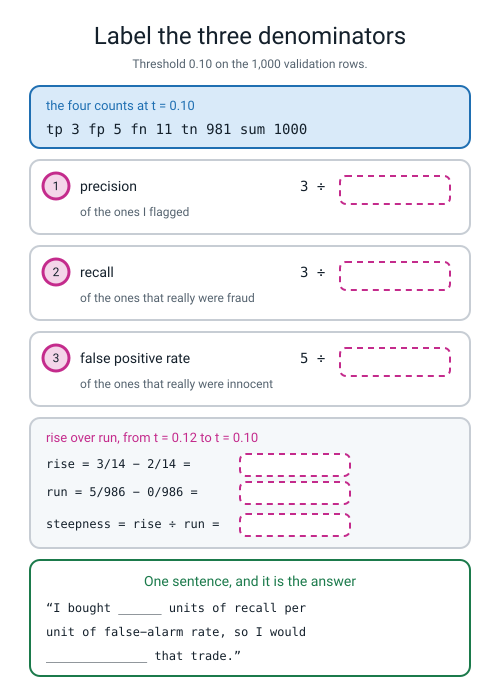
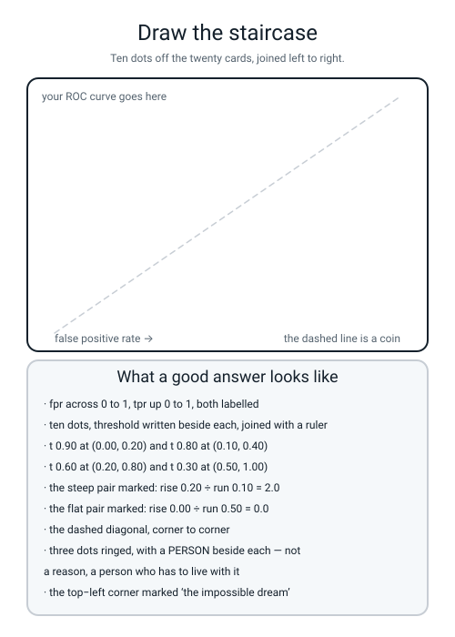

# Workbook — Week 10: The Threshold Dial, and the Curve It Draws

**Name:** ________________________________  **Date:** ______________

[⬅ Week 9](week-09.md) · [📖 Read the chapter first](../student-guide/week-10.md) · [Course Home](../README.md) · [Next ➡](week-11.md)

---

## ✅ Warm-Up (5 min)

Five quick questions about **last week** — the harmonic mean and F1.

**W1.** The fraud tree's four counts on the 1,000 validation rows were **TN 979, FP 7, FN 11, TP 3**. Write its F1 straight from the counts, showing the fraction.

`2 × 3 ÷ (______ + ______ + ______) = ______ ÷ ______ = ____________`

**W2.** Your delivery model had precision **0.5667** and recall **0.4435**, and F1 **0.4976**. Do the range check.

**smaller** ________  **twice the smaller** ________  **is 0.4976 between them?** ______

**W3.** `f1_score(y_val, pred, average="macro")` printed **0.6204** with no warning. **What two numbers did it average, and how many rows were in each class?**

________________________________________________________________

**W4.** Which of the four counts never appears anywhere in `2 × TP ÷ (2 × TP + FP + FN)`? ____________

**W5.** For precision 0.9 and recall 0.1, the plain mean is **0.5000** and the harmonic mean is **0.1800**. **Which one would a press release quote, and which one is the truth?**

________________________________________________________________

---

## 🔢 Do the Maths by Hand

**This week's new maths is one division: steepness = rise ÷ run.** Use a calculator. No code on this page. **And after every division, write the sentence** — *"I bought ___ units of recall per unit of false alarm."* The sentence is the answer; the decimal is just the arithmetic.

**M1 — the twenty index cards, where the numbers are clean.** Ten fraud, ten legit, so both denominators are **10**. Here are five dots off that curve:

| threshold | dot (fpr, tpr) |
|---|---|
| 0.90 | **(0.00, 0.20)** |
| 0.80 | **(0.10, 0.40)** |
| 0.70 | **(0.10, 0.60)** |
| 0.60 | **(0.20, 0.80)** |
| 0.50 | **(0.30, 0.80)** |
| 0.30 | **(0.50, 1.00)** |
| 0.05 | **(1.00, 1.00)** |

**(a) The steep pair: 0.90 → 0.80.**

```
rise  =  0.40 − 0.20  =  ____________
run   =  0.10 − 0.00  =  ____________
steepness  =  ________ ÷ ________  =  ____________
```

**the sentence:** ______________________________________________

**(b) 0.80 → 0.70.** Careful with this one.

```
rise  =  0.60 − 0.40  =  ____________
run   =  0.10 − 0.10  =  ____________
steepness  =  ________ ÷ ________  =  ____________
```

**M1(b1).** What went wrong, and **what does that mean in English about what you bought?**

________________________________________________________________

**(c) 0.60 → 0.50.**

```
rise  =  ________ − ________  =  ____________
run   =  ________ − ________  =  ____________
steepness  =  ________ ÷ ________  =  ____________
```

**(d) 0.40 → 0.30**, where the dots are (0.40, 0.90) and (0.50, 1.00).

```
rise  ________   run  ________   steepness  ____________
```

**(e) 0.30 → 0.05.**

```
rise  ________   run  ________   steepness  ____________
```

**M1(f).** Put your five answers in order. **Where on the curve is recall cheap, and where are you paying for nothing?**

________________________________________________________________

**M2 — the same trick on the real data, where the numbers are ugly.** From the nine-row sweep. **The denominators are 14 and 986.**

| t | tp | fp |
|---|---|---|
| 0.12 | 2 | 0 |
| 0.10 | 3 | 5 |
| 0.08 | 3 | 12 |
| 0.04 | 4 | 61 |
| 0.02 | 5 | 211 |
| 0.01 | 8 | 421 |

**Six decimal places on every rise and every run.** Work each rise as `(new tp − old tp) ÷ 14` and each run as `(new fp − old fp) ÷ 986`.

| from → to | rise | run | steepness | take it? |
|---|---|---|---|---|
| 0.12 → 0.10 | ____________ | ____________ | ____________ | |
| 0.10 → 0.08 | ____________ | ____________ | ____________ | |
| 0.04 → 0.02 | ____________ | ____________ | ____________ | |
| 0.02 → 0.01 | ____________ | ____________ | ____________ | |

**M2(a).** One of those four is almost exactly **1.0**. Write the number, and say what a steepness of 1 means about the model.

________________________________________________________________

**M2(b).** One of them is **less than 1 but bigger than 0**. Which, and would you take that trade? **Name the person you would have to justify it to.**

________________________________________________________________

**M3 — why 14 and not 2.** On the cards, one extra fraud and one extra false alarm both moved the dot by a tenth. On the real data they do not.

```
one extra fraud caught moves the rise by   1 ÷ 14  = ____________
one extra false alarm  moves the run  by   1 ÷ 986 = ____________
so one fraud traded for one false alarm looks   986 ÷ 14 = ____________  times steep
```

**M3(a).** So the steepness of an ROC curve depends on ____________________________________, not just on how good the model is.

**M3(b).** Two banks have the same model. Bank A's validation pile has 14 frauds in 1,000 rows; bank B's has 500 frauds in 1,000 rows. **Whose left-hand curve looks steeper, and is their model better?**

________________________________________________________________

**M4 — three denominators, two rows.** The four counts at `t = 0.04` are **tp 4, fp 61, fn 10, tn 925**, and at `t = 0.02` they are **tp 5, fp 211, fn 9, tn 775**.

**M4(a).** Add each row up before you divide anything.

`4 + 61 + 10 + 925 = ________`  ✅ / ❌   `5 + 211 + 9 + 775 = ________`  ✅ / ❌

**M4(b).** Six divisions, six decimal places.

| t | precision = tp ÷ (tp + fp) | recall = tp ÷ 14 | fpr = fp ÷ 986 |
|---|---|---|---|
| 0.04 | ______ ÷ ______ = ____________ | ______ ÷ 14 = ____________ | ______ ÷ 986 = ____________ |
| 0.02 | ______ ÷ ______ = ____________ | ______ ÷ 14 = ____________ | ______ ÷ 986 = ____________ |

**M4(c).** Going from 0.04 to 0.02, false alarms went from 61 to **211** — you bothered **150 more people.** By how much did each of the three numbers move?

**precision moved by** ____________  **recall by** ____________  **fpr by** ____________

**M4(d).** **Which of the three barely noticed 150 extra false alarms, and why?** Name the denominator.

________________________________________________________________

---

## 🔎 Predict the Output

**Write your prediction in pen before you run anything.** All four carry on from `dial.py`, so `y_val` and `prob` already exist. **One of these four raises nothing at all and is the reason the whole chapter has a warning in it.**

### P1 — shapes, and what a comparison gives back

```python
print(prob.shape)
print(prob[:3])
pred = (prob >= 0.10).astype(int)
print(pred.shape, pred.dtype)
print(pred.sum())
```

**I predict — line 1 (a shape):** ____________  **line 3 (a shape and a dtype):** ____________________

**and line 4:** ____________

**It really printed:**

```text
________________________
________________________
________________________
________________________
```

**`prob` holds decimals and `pred` holds 0s and 1s. Their shapes are the same — why?**

________________________________________________________________

**And what is `pred.sum()` actually counting?** ______________________________________

### P2 — three lists back, and one of them is shorter

```python
fpr, tpr, thr = roc_curve(y_val, prob)
prec, rec, pthr = precision_recall_curve(y_val, prob)
print(len(fpr), len(tpr), len(thr))
print(len(prec), len(rec), len(pthr))
print(thr[0])
print(prec[-1], rec[-1])
```

**I predict — line 1:** ____________  **line 2:** ____________  **line 3:** ____________  **line 4:** ____________

**It really printed:**

```text
________________________
________________________
________________________
________________________
```

**Line 2 has one number that is one smaller than the other two. Which, and why?**

________________________________________________________________

**Line 3 is not a number you can use as a threshold. What is it for?** ______________________________________

### P3 — the card sitting exactly on the line

```python
a = np.array([0.60, 0.55, 0.60, 0.42])
print((a >= 0.60).astype(int))
print((a > 0.60).astype(int))
print((a >= 0.60).sum(), (a > 0.60).sum())
```

**I predict — line 1:** ____________________  **line 2:** ____________________  **line 3:** ____________

**It really printed:**

```text
________________________
________________________
________________________
```

**In Worked Example 1, `t = 0.60` flagged ten cards, not nine. Which line above explains that?** ______

**And if you had used `>` all term, would Python ever have told you?** ______

### P4 — no error, no warning, two wrong numbers

```python
pred = (prob >= 0.10).astype(int)
print("%.4f" % roc_auc_score(y_val, prob))
print("%.4f" % roc_auc_score(y_val, pred))
print("%.4f" % average_precision_score(y_val, pred))
print(len(roc_curve(y_val, pred)[0]))
```

**I predict — line 1:** ____________  **line 2:** ____________  **line 3:** ____________  **line 4:** ____________

**It really printed:**

```text
________________________
________________________
________________________
________________________
```

**Lines 2 and 3 are both wrong and nothing complained. What did you hand those functions, and what had already been thrown away?**

________________________________________________________________

**Line 4 is the tell-tale. Why are there only three points on that curve?** ______________________________________

**How many of the answers on this page did you get right?** ______ / 15

**Which one surprised you most?** ______________________________

---

## ✍️ Practice Set A — Read It

**A1. Match the word to the thing.** Write the letter.

| Word | | Description |
|---|---|---|
| **decision threshold** | ______ | (i) Of everything that really was negative, the fraction you wrongly flagged |
| **true positive rate** | ______ | (ii) One dot per threshold: TPR up the side, FPR along the bottom |
| **false positive rate** | ______ | (iii) The probability above which you call something positive |
| **ROC curve** | ______ | (iv) One number for a whole precision-recall curve; its baseline is the positive rate |
| **average precision** | ______ | (v) Of everything that really was positive, the fraction you caught |

**A1(a).** Two of those five are **the same fraction under two names**, and one of them is not in the list under its more common name. Which fraction, and what is its other name? ____________________

**A2. Read the sweep.** The nine-row table from `dial.py`:

```text
   t   flagged  tp  fp  fn   tn  precision  recall     fpr
 0.50       0   0   0  14  986     0.0000  0.0000  0.000000
 0.15       1   1   0  13  986     1.0000  0.0714  0.000000
 0.12       2   2   0  12  986     1.0000  0.1429  0.000000
 0.10       8   3   5  11  981     0.3750  0.2143  0.005071
 0.08      15   3  12  11  974     0.2000  0.2143  0.012170
 0.06      25   3  22  11  964     0.1200  0.2143  0.022312
 0.04      65   4  61  10  925     0.0615  0.2857  0.061866
 0.02     216   5 211   9  775     0.0231  0.3571  0.213996
 0.01     429   8 421   6  565     0.0186  0.5714  0.426978
```

**A2(a).** Read the `recall` column downwards. **Does it ever go down?** ______  **Write the one-sentence reason.**

________________________________________________________________

**A2(b).** Read the `precision` column downwards. **Does it only go down?** ______  **Find the row where it goes up and say why.**

________________________________________________________________

**A2(c).** Between `t = 0.10` and `t = 0.06`, how many extra innocent people were flagged, and how many extra frauds were caught?

**extra false alarms** ______  **extra frauds** ______

**A2(d).** Check the `t = 0.04` row adds to 1,000: `______ + ______ + ______ + ______ = ______`  ✅ / ❌

**A2(e).** Which single row would you pick if you had to ship one today and knew nothing about costs? **Say why in one line, and name who you are talking to.**

________________________________________________________________

**A3. Spot the bug.** Each line is wrong or dangerous. Say what happens and write the fix.

| # | The line | What happens | The fix |
|---|---|---|---|
| a | `tn, fp, fn, tp = confusion_matrix(y_val[:5], pred[:5]).ravel()` where `pred` is all zeros | | |
| b | `fpr, tpr = roc_curve(y_val, prob)` | | |
| c | `roc_curve(prob, y_val)` | | |
| d | `plt.plot(pthr, prec)` | | |
| e | `prob = model.predict_proba(X_val)` | | |
| f | `roc_auc_score(y_val, (prob >= 0.10).astype(int))` | | |

**A3(g).** Only one of those six produces **no error at all**. Which, and why is it the most dangerous line on the page?

________________________________________________________________

**A4. Match the code to the output.** Five of each, no output used twice.

| | Code |
|---|---|
| i | `print(len(roc_curve(y_val, prob)[0]))` |
| ii | `print(len(precision_recall_curve(y_val, prob)[0]))` |
| iii | `print("%.4f" % roc_auc_score(y_val, prob))` |
| iv | `print("%.4f" % average_precision_score(y_val, prob))` |
| v | `print(int((prob >= 0.06).sum()))` |

| | Output |
|---|---|
| P | `0.2078` |
| Q | `25` |
| R | `1001` |
| S | `28` |
| T | `0.6116` |

**Your answers:** i → ______  ii → ______  iii → ______  iv → ______  v → ______

**A5. Two scores, two baselines.** These four numbers came from `balance.py` — the **same** model code fitted to the **same** eight-feature problem twice, once with the classes even and once with them rare.

```text
balanced  50/50  positives  500 of 1000
   ROC AUC 0.7788  (a coin gets 0.5000)
   AP      0.7986  (a coin gets 0.5000)

rare      99/1   positives   14 of 1000
   ROC AUC 0.6831  (a coin gets 0.5000)
   AP      0.1877  (a coin gets 0.0140)
```

**A5(a).** Work out how many times better than a coin each AP is.

`0.7986 ÷ 0.5000 = ____________`  `0.1877 ÷ 0.0140 = ____________`

**A5(b).** So which of the two APs describes the **more** useful model, and which of them is the **bigger number**?

________________________________________________________________

**A5(c).** Which of the two scores — AUC or AP — can you compare **across two different datasets**, and why?

________________________________________________________________

**A5(d).** At `t = 0.50` the balanced model flags 485 rows and the rare model flags **0**. **Whose fault is that, and what would you change?**

________________________________________________________________

**A6. Label the three denominators.** Fill in every dashed box, then the rise-over-run panel, then the sentence.


*Figure W10.1 — The three fractions at one threshold, with the denominators removed.*

**A6(a).** Which of the three boxes has **986** in it, and which has **14**? ____________________

**A6(b).** Which of the three denominators **never changes** as you turn the dial, on this dataset? ____________  **Why not?**

________________________________________________________________

---

## ✍️ Practice Set B — Write It

### B1 — one line, plus a print

**Task:** print how many of the 1,000 rows get flagged at a threshold of 0.04, using the dial line.

**Expected output:**

```text
flagged at t = 0.04 : 65
```

**Done looks like:** one `(prob >= t).astype(int)`, one `.sum()`, one `int(...)` so it prints as a whole number.

```python
print(_______________________________________________________)
```

### B2 — one dot, as a named recipe

**Task:** write `dot(t)` that prints the four counts' two fractions and returns the dot `(fpr, tpr)`. Call it at 0.12, 0.10 and 0.02.

**Expected output:**

```text
t 0.12  tp   2 / 14  fp   0 / 986  dot (fpr 0.000000, tpr 0.142857)
t 0.10  tp   3 / 14  fp   5 / 986  dot (fpr 0.005071, tpr 0.214286)
t 0.02  tp   5 / 14  fp 211 / 986  dot (fpr 0.213996, tpr 0.357143)
```

**Done looks like:** `labels=[0, 1]` on the confusion matrix, `pos` and `neg` worked out once outside the function, and **both fractions printed with their denominators.**

### B3 — the steepness of five pairs, with a verdict

**Task:** write `steep.py`. For five pairs of thresholds print the rise, the run, the steepness and a one-word verdict. **The first pair has a run of zero, so your program must not crash on it.**

The five pairs: `(0.15, 0.12)`, `(0.12, 0.10)`, `(0.10, 0.08)`, `(0.04, 0.02)`, `(0.02, 0.01)`.

**Expected output:**

```text
  from    to     rise      run      steepness   verdict
  0.15 -> 0.12  0.071429 0.000000   straight up   free recall
  0.12 -> 0.10  0.071429 0.005071     14.0857   take it
  0.10 -> 0.08  0.000000 0.007099      0.0000   do not
  0.04 -> 0.02  0.071429 0.152130      0.4695   think hard
  0.02 -> 0.01  0.214286 0.212982      1.0061   take it
```

**Done looks like:** an `if run == 0:` branch, three verdicts chosen by comparing the steepness with 1 and 0, and **runtime under 2 seconds.**

### B4 — the twenty cards, with the addition check

**Task:** write `sweep20.py`. Put the twenty card probabilities and their twenty truths in two arrays, sweep ten thresholds, and print the four counts, their **sum**, and the two rates. **The last column must say `OK` on all ten rows.**

**Expected output:**

```text
   t   tp  fp  fn  tn   sum   tpr    fpr
 0.90    2   0   8  10    20  0.20   0.00   OK
 0.80    4   1   6   9    20  0.40   0.10   OK
 0.70    6   1   4   9    20  0.60   0.10   OK
 0.60    8   2   2   8    20  0.80   0.20   OK
 0.50    8   3   2   7    20  0.80   0.30   OK
 0.40    9   4   1   6    20  0.90   0.40   OK
 0.30   10   5   0   5    20  1.00   0.50   OK
 0.20   10   7   0   3    20  1.00   0.70   OK
 0.10   10   9   0   1    20  1.00   0.90   OK
 0.05   10  10   0   0    20  1.00   1.00   OK
```

**Done looks like:** the sum computed and **printed**, not assumed; an `if` that prints `LOST A CARD` when it is not 20; `labels=[0, 1]`.

### B5 — a whole program of your own, about 25 lines

**Task:** write `defend.py`. Sweep the nine thresholds on the fraud data and print, for every row, the flagged count, the four counts you need, the three fractions, **and two new columns: how many extra frauds and how many extra false alarms this row bought compared with the row above.** End with the lowest threshold that still bought at least one extra fraud, plus the two summary scores with their coin baselines.

**Expected output:**

```text
val rows 1000   real frauds 14   real legit 986
   t  flagged  tp  fp   precision  recall      fpr   extra tp  extra fp
 0.50       0   0   0     0.0000  0.0000  0.000000         0         0
 0.15       1   1   0     1.0000  0.0714  0.000000         1         0
 0.12       2   2   0     1.0000  0.1429  0.000000         1         0
 0.10       8   3   5     0.3750  0.2143  0.005071         1         5
 0.08      15   3  12     0.2000  0.2143  0.012170         0         7
 0.06      25   3  22     0.1200  0.2143  0.022312         0        10
 0.04      65   4  61     0.0615  0.2857  0.061866         1        39
 0.02     216   5 211     0.0231  0.3571  0.213996         1       150
 0.01     429   8 421     0.0186  0.5714  0.426978         3       210
the lowest threshold that still bought me a fraud : 0.01
ROC AUC 0.6116   (a coin gets 0.5000)
AP      0.2078   (a coin gets 0.0140)
```

**Done looks like:** `last_tp` and `last_fp` remembered from row to row, a check that the four counts add to 1,000 on **every** row, and **runtime under 2 seconds.**

**And answer this from your own output:** which two rows bought **zero** extra frauds? ____________  **How many people did those two rows bother, between them?** ____________

---

## 🐞 Fix the Broken Program

This program has **three** bugs: one **shape** bug, one **runtime** bug, and one **silent logic** bug. The real messages are below, in the order you meet them.

```python
"""broken10.py - the threshold dial on the fraud data.  THREE bugs."""
import numpy as np
from sklearn.datasets import make_classification
from sklearn.linear_model import LogisticRegression
from sklearn.metrics import (average_precision_score, confusion_matrix,
                             precision_score, recall_score, roc_auc_score,
                             roc_curve)
from sklearn.model_selection import train_test_split

X, y = make_classification(n_samples=5000, n_features=8, n_informative=4,
                           n_redundant=0, weights=[0.99, 0.01], random_state=0)
X_tmp, X_test, y_tmp, y_test = train_test_split(
    X, y, test_size=0.20, random_state=0, stratify=y)
X_train, X_val, y_train, y_val = train_test_split(
    X_tmp, y_tmp, test_size=0.25, random_state=0, stratify=y_tmp)
model = LogisticRegression(max_iter=2000, random_state=0).fit(X_train, y_train)
prob = model.predict_proba(X_val)

print("   t  flagged  tp  fp  precision  recall")
for t in [0.50, 0.10, 0.02]:
    pred = (prob >= t).astype(int)
    tn, fp, fn, tp = confusion_matrix(y_val, pred, labels=[0, 1]).ravel()
    print("%5.2f %7d %3d %3d     %.4f  %.4f"
          % (t, pred.sum(), tp, fp,
             precision_score(y_val, pred, zero_division=0),
             recall_score(y_val, pred, zero_division=0)))

fpr, tpr, thr = roc_curve(prob, y_val)
print("points on the curve :", len(fpr))

flagged = (prob >= 0.10).astype(int)
print("ROC AUC %.4f" % roc_auc_score(y_val, flagged))
print("AP      %.4f" % average_precision_score(y_val, flagged))
```

**Run 1 — the header prints and then it stops:**

```text
   t  flagged  tp  fp  precision  recall
Traceback (most recent call last):
  File "broken10.py", line 22, in <module>
    tn, fp, fn, tp = confusion_matrix(y_val, pred, labels=[0, 1]).ravel()
ValueError: Classification metrics can't handle a mix of binary and multilabel-indicator targets
```

**Bug 1.** Which line? ______  **Kind of bug?** ______________

**Add one line to the program to see it instantly:** `print(_______________)`. **What would it print?** ____________

**`y_val` has shape (1000,). What shape is `pred`?** ____________  **Why?**

________________________________________________________________

**The fix:** ______________________________________________

**Run 2 — after fixing bug 1:**

```text
   t  flagged  tp  fp  precision  recall
 0.50       0   0   0     0.0000  0.0000
 0.10       8   3   5     0.3750  0.2143
 0.02     216   5 211     0.0231  0.3571
Traceback (most recent call last):
  File "broken10.py", line 28, in <module>
    fpr, tpr, thr = roc_curve(prob, y_val)
ValueError: continuous format is not supported
```

**Bug 2.** Which line? ______  **Kind of bug?** ______________

**What does "continuous" mean here, and which of the two things you passed is continuous?**

________________________________________________________________

**The fix:** ______________________________________________  **and the rule in three words:** ______________

**Run 3 — after fixing bugs 1 and 2. It runs all the way through, with no error and no warning:**

```text
   t  flagged  tp  fp  precision  recall
 0.50       0   0   0     0.0000  0.0000
 0.10       8   3   5     0.3750  0.2143
 0.02     216   5 211     0.0231  0.3571
points on the curve : 28
ROC AUC 0.6046
AP      0.0914
```

⚠️ **Careful. Both of those last two lines are wrong, and they look exactly as respectable as right ones.** The AUC should be **0.6116** and the AP should be **0.2078**.

**Bug 3.** Which variable is the problem? ____________  **Kind of bug?** ______________

**What is in `flagged`, and what is in `prob`?**

**`flagged` holds** ______________________________  **`prob` holds** ______________________________

**So what did `roc_auc_score` have to work with, and what had already been thrown away?**

________________________________________________________________

**The fix:** ______________________________________________

**Run 4 — after fixing all three:**

```text
   t  flagged  tp  fp  precision  recall
 0.50       0   0   0     0.0000  0.0000
 0.10       8   3   5     0.3750  0.2143
 0.02     216   5 211     0.0231  0.3571
points on the curve : 28
ROC AUC 0.6116
AP      0.2078
```

**Two questions, and they are the point of the whole page.**

**In run 3 nothing crashed and nothing warned, yet the AUC was off by 0.007 and the AP was off by more than half (0.0914 against 0.2078). Which error is easier to miss, and why should "no error message" make you more careful rather than less?**

________________________________________________________________

**Rank the three bugs from easiest to hardest to notice, and say what would have caught each one.**

**easiest → hardest:** ______  ______  ______

________________________________________________________________

---

## 🧩 Puzzle of the Week

### The Ladder of Eight

Eight cards. **Three are fraud (F), five are legit (L).** A model has ranked them, most suspicious first. Nothing else about the model matters — **the ranking is all it gave you.**

Because there are 3 frauds and 5 legits, walking down the ranking one card at a time:

```text
   every F   ->  step UP    by 1 ÷ 3  =  0.3333
   every L   ->  step RIGHT by 1 ÷ 5  =  0.2000
```

**Part 1(a).** How steep is one up-step compared with one right-step?

`0.3333 ÷ 0.2000 = ____________`

**Part 1(b) — walk ranking A: `F F L F L L L L`.** Start at (0, 0) and fill in the dot after each card. Round to 4 dp.

| card | F or L | fpr | tpr |
|---|---|---|---|
| start | — | 0.0000 | 0.0000 |
| 1 | F | ______ | ______ |
| 2 | F | ______ | ______ |
| 3 | L | ______ | ______ |
| 4 | F | ______ | ______ |
| 5 | L | ______ | ______ |
| 6 | L | ______ | ______ |
| 7 | L | ______ | ______ |
| 8 | L | ______ | ______ |

**Part 1(c) — walk ranking B: `F L F L F L L L`.** Just the four dots where something interesting happens.

after card 1: (______, ______)  after card 3: (______, ______)  after card 5: (______, ______)  after card 8: (______, ______)

**Part 1(d) — walk ranking C: `L F F L F L L L`.** Same four.

after card 1: (______, ______)  after card 3: (______, ______)  after card 5: (______, ______)  after card 8: (______, ______)

**Part 1(e).** Sketch all three on one sheet of graph paper. **Put them in order, best ranking first, just by looking:**

______  ______  ______

**Part 1(f) — now count instead of looking.** There are `3 × 5 = 15` fraud-and-legit **pairs**. For each pair ask one question: *"is the fraud card ranked above the legit card?"* Count the pairs where the answer is yes.

| ranking | pairs in the right order, out of 15 | that over 15 |
|---|---|---|
| A | ______ | ____________ |
| B | ______ | ____________ |
| C | ______ | ____________ |

> **💡 How to count without going mad.** Take each fraud card in turn and count how many legit cards are **below** it. Add those three numbers up. For ranking A the first F has 5 legits below it, the second F has 5, and the third F has… you finish it.

**Part 1(g).** Now run this and compare:

```python
import numpy as np
from sklearn.metrics import roc_auc_score
scores = np.array([0.80, 0.70, 0.60, 0.50, 0.40, 0.30, 0.20, 0.10])
truth = np.array([1, 1, 0, 1, 0, 0, 0, 0])          # this is ranking A
print("%.5f" % roc_auc_score(truth, scores))
```

**It printed:** ____________  **And your "pairs out of 15" for A was** ____________

**Write one sentence about what you have just discovered.**

________________________________________________________________

### Part 2 — the corner you cannot reach

**Part 2(a).** Look at ranking C. Its very first card is **legit**. **Is there any threshold at all that catches all three frauds and raises zero false alarms?** ______  **Why not?**

________________________________________________________________

**Part 2(b).** In the twenty-card activity, the card at **0.84 is legit** and the card at **0.80 is fraud**. Any threshold you put between them does what?

________________________________________________________________

**Part 2(c).** So to reach the top-left corner you would have to change ______________________, not ______________________. Which is exactly why the corner is called the impossible dream.

---

## 🤔 Think Deeper

**T1.** Our model's ROC AUC is **0.6116** — barely better than a coin's 0.5000 — and its average precision is **0.2078**, about fifteen times better than a coin's 0.0140. **Write a paragraph** on whether it is a good model. Say what each of the two numbers is actually measuring, name the denominator that makes them disagree, and finish with the sentence you would write on a report that a manager will read. **Your paragraph must contain at least three numbers from your own sweep.**

________________________________________________________________

________________________________________________________________

________________________________________________________________

________________________________________________________________

________________________________________________________________

**T2.** For nine weeks, `predict()` has been comparing your model's probabilities with **0.5** — a number nobody in this room chose, that arrived in a library, and that flags **nothing at all** on this dataset. **Write a paragraph** on what you now think a "default" is. Who is responsible when a default makes a bad decision — the person who wrote the library, the person who used it, or nobody? And what is the smallest thing you could write down in your own code so that the next person can argue with your choice instead of inheriting it?

________________________________________________________________

________________________________________________________________

________________________________________________________________

________________________________________________________________

---

## 🛠️ Build It — The Dial, and Three Thresholds You Would Defend

**Four things get handed in. The fourth is the one marked hardest, and it has people's names on it.**

### Step checklist

- [ ] **1.** Twenty cards written and shuffled. **Count the FRAUDs twice — there must be ten.**
- [ ] **2.** The probability line drawn, all twenty cards laid on it, **face up**, nothing turned over.
- [ ] **3.** Ten thresholds swept by hand. Four counts each. **Every row added up to 20.**
- [ ] **4.** Ten dots plotted, joined with a ruler, dashed diagonal drawn.
- [ ] **5.** Two rise-over-run divisions off your own graph paper — one steep, one flat — **each with its sentence.**
- [ ] **6.** `dial.py` typed and run. Four key numbers checked against your handwriting.
- [ ] **7.** `dial.png` saved and looked at. Say which panel falls off a cliff.
- [ ] **8.** Three thresholds chosen, **each with a person on it**, and one sentence each.
- [ ] **9.** One line saying what you would need to know to choose between the three.
- [ ] **10.** Two Bug Log entries.

### The ten-threshold sweep, by hand

**Twenty cards. Ten fraud, ten legit. Both denominators are 10.**

| t | flagged | tp | fp | fn | tn | sum = 20? | tpr = tp ÷ 10 | fpr = fp ÷ 10 |
|---|---|---|---|---|---|---|---|---|
| 0.90 | ______ | ______ | ______ | ______ | ______ | ______ | ______ | ______ |
| 0.80 | ______ | ______ | ______ | ______ | ______ | ______ | ______ | ______ |
| 0.70 | ______ | ______ | ______ | ______ | ______ | ______ | ______ | ______ |
| 0.60 | ______ | ______ | ______ | ______ | ______ | ______ | ______ | ______ |
| 0.50 | ______ | ______ | ______ | ______ | ______ | ______ | ______ | ______ |
| 0.40 | ______ | ______ | ______ | ______ | ______ | ______ | ______ | ______ |
| 0.30 | ______ | ______ | ______ | ______ | ______ | ______ | ______ | ______ |
| 0.20 | ______ | ______ | ______ | ______ | ______ | ______ | ______ | ______ |
| 0.10 | ______ | ______ | ______ | ______ | ______ | ______ | ______ | ______ |
| 0.05 | ______ | ______ | ______ | ______ | ______ | ______ | ______ | ______ |

**Any row that did not come to 20:** ____________  **Where was the missing card?** ______________________

### Two divisions off my own graph paper

```
the steepest pair I could find:  t = ________ to t = ________

     rise  =  ________ − ________  =  ____________
     run   =  ________ − ________  =  ____________
     steepness  =  ____________

     the sentence: __________________________________________________
```

```
the flattest pair I could find:  t = ________ to t = ________

     rise  =  ________ − ________  =  ____________
     run   =  ________ − ________  =  ____________
     steepness  =  ____________

     the sentence: __________________________________________________
```

### Four numbers from `dial.py`, checked

| What | My prediction | What it printed | Same? |
|---|---|---|---|
| highest probability | ____________ | ____________ | ______ |
| how many above 0.5 | ____________ | ____________ | ______ |
| `tp` at `t = 0.10` | ____________ | ____________ | ______ |
| `roc_auc_score` | ____________ | ____________ | ______ |
| `average_precision_score` | ____________ | ____________ | ______ |
| a coin's AP here | ____________ | ____________ | ______ |

**Which panel of `dial.png` falls off a cliff in the first fifth of the chart?** ____________________

**Why does that panel disagree so violently with the other one? Name the denominator.**

________________________________________________________________

### Three thresholds I would defend

**Not three reasons. Three people.** And pick three thresholds that are **different kinds of decision** — three numbers within 0.01 of each other is one decision written three times.

```
t = ________   I am defending this to: ______________________________________

     the numbers:  flagged ______, caught ______ of 14, false alarms ______

     my sentence: __________________________________________________________

     ______________________________________________________________________
```

```
t = ________   I am defending this to: ______________________________________

     the numbers:  flagged ______, caught ______ of 14, false alarms ______

     my sentence: __________________________________________________________

     ______________________________________________________________________
```

```
t = ________   I am defending this to: ______________________________________

     the numbers:  flagged ______, caught ______ of 14, false alarms ______

     my sentence: __________________________________________________________

     ______________________________________________________________________
```

**And the last line, which is next week's door. What would you need to know to choose between those three?**

________________________________________________________________

### The Bug Log

| What I saw | What it means | Cause | Fix |
|---|---|---|---|
| | | | |
| | | | |

---

## 🎨 Draw It

Draw the staircase. Ten dots off the twenty cards, joined left to right, the dashed diagonal corner to corner, and **three dots ringed with a person's name beside each.**


*Figure W10.2 — An empty frame, and what a good answer contains.*

**Then answer three things about your own drawing:**

**Where on your staircase does the curve go straight up, and what did that step cost you?** ____________________

**Where does it go straight across, and what did that step buy you?** ____________________

**Mark the dot for `t = 0.50` on the real fraud model. Which corner is it in, and how many frauds does it catch?**

________________________________________________________________

---

## 📊 Self-Check

| I can... | 😀 | 🙂 | 😕 |
|---|---|---|---|
| explain that `predict()` is `predict_proba()` followed by `>= 0.5` | | | |
| write `(prob >= t).astype(int)` from memory and say what each piece does | | | |
| sweep nine thresholds and tabulate precision, recall and the false-alarm count at each | | | |
| add the four counts up **every** row, before dividing anything | | | |
| measure the steepness between two dots of my own ROC curve, rise over run | | | |
| read a steepness out loud as *"recall bought per false alarm"* | | | |
| name all three denominators — 8, 14 and 986 — and say which one barely moves | | | |
| say which of ROC and precision-recall to trust when positives are rare, with a reason | | | |
| say why AUC's baseline is always 0.5 and AP's baseline is not | | | |
| mark three thresholds and name the **person** each one is right for | | | |

**The one thing I would ask about if I could ask one question:**

________________________________________________________________

---

## ✅ Answers

<details>
<summary>Check your answers</summary>

### Warm-Up

**W1.** `2 × 3 ÷ (**6** + **7** + **11**) = **6** ÷ **24** = **0.2500**`. The formula is `2 × TP ÷ (2 × TP + FP + FN)`, so the three numbers on the bottom are `2 × TP`, then FP, then FN.

**W2.** smaller **0.4435**, twice the smaller **0.8870**, and **yes** — 0.4976 sits between them ✅. **That check takes four seconds and catches every arithmetic slip in the harmonic mean.**

**W3.** It averaged the **F1 of the fraud class (0.2500)** and the **F1 of the legitimate class (0.9909)**: `(0.9909 + 0.2500) ÷ 2 = 0.6204`. The two classes hold **14** and **986** rows, so an equal vote gives the 986 easy rows the same say as the 14 hard ones.

**W4.** **TN.** The correctly-left-alone rows do not appear in F1 anywhere, which is exactly why F1 cannot be inflated by padding the easy class.

**W5.** A press release would quote **0.5000** and the truth is **0.1800**. The plain mean split the difference between a respectable precision and a recall of 0.1, which means nine out of ten of the things you were looking for walked straight past you.

### Do the Maths by Hand

**M1(a).** rise `0.40 − 0.20 = **0.20**`, run `0.10 − 0.00 = **0.10**`, steepness `0.20 ÷ 0.10 = **2.0**`.

**The sentence:** *"For every one unit of false-alarm rate I spent, I bought **two** units of recall."* **That is a bargain and you can hear that it is a bargain.**

**M1(b).** rise `0.60 − 0.40 = **0.20**`, run `0.10 − 0.10 = **0.00**`, and `0.20 ÷ 0.00` **has no answer** — you cannot divide by zero.

**M1(b1).** Nothing went wrong with the arithmetic; **the curve went straight up.** Between those two thresholds you caught **two more frauds and raised not one extra false alarm.** In English: **that recall was free.** A vertical section of an ROC curve is the best thing that can happen to you, and it is exactly why the answer is not a number — dividing by zero is the arithmetic's way of saying *"infinitely steep"*. In code you must test `if run == 0:` before dividing, which is why B3 asks for it.

**M1(c).** rise `0.80 − 0.80 = **0.00**`, run `0.30 − 0.20 = **0.10**`, steepness `0.00 ÷ 0.10 = **0.0**`. One more innocent card blocked, **zero** extra frauds. A pure loss.

**M1(d).** rise **0.10**, run **0.10**, steepness **1.0** — one for one, which is exactly a coin's exchange rate.

**M1(e).** rise **0.00**, run **0.50**, steepness **0.0**. **Five** innocent cards blocked to catch nothing at all, because you already had all ten frauds at `t = 0.30`.

**M1(f).** In order: **straight up (0.80→0.70), then 2.0, then 1.0, then 0.0, then 0.0.** Recall is cheap at the **top of the ranking** — the frauds are stacked there — and from `t = 0.30` downwards you are **paying in people and getting nothing back.** The whole shape of the sentence is: *steep on the left, flat on the right, and the flat part is where you stop.*

**M2.**

| from → to | rise | run | steepness | take it? |
|---|---|---|---|---|
| 0.12 → 0.10 | `1 ÷ 14 = ` **0.071429** | `5 ÷ 986 = ` **0.005071** | **14.0857** | **yes** |
| 0.10 → 0.08 | `0 ÷ 14 = ` **0.000000** | `7 ÷ 986 = ` **0.007099** | **0.0000** | **no** |
| 0.04 → 0.02 | `1 ÷ 14 = ` **0.071429** | `150 ÷ 986 = ` **0.152130** | **0.4695** | **think hard** |
| 0.02 → 0.01 | `3 ÷ 14 = ` **0.214286** | `210 ÷ 986 = ` **0.212982** | **1.0061** | **probably not** |

The four rises come from `tp` going 2→3, 3→3, 4→5 and 5→8; the four runs from `fp` going 0→5, 5→12, 61→211 and 211→421.

**M2(a).** **1.0061.** A steepness of 1 means you are buying recall at **exactly the rate a coin would give you** — one unit of recall per unit of false-alarm rate. **The model has stopped helping down there.** Below about `t = 0.02` you are no longer using its ranking, you are just flagging more things.

**M2(b).** **0.4695**, between `t = 0.04` and `t = 0.02`. You caught **one** more fraud and bothered **150** more innocent customers. Whether you take it depends entirely on who is on the other end: **to the customer whose £900 is gone it is obviously worth it; to the 150 people whose cards were declined at a till on a Saturday it obviously is not; and to the analyst who has to phone all 150 it is a fortnight of work for one arrest.** Full marks names one of those people. **"It is not worth it because 0.4695 is less than 1" gets half marks** — true, and it has not noticed that a price list would settle it, which is next week.

**M3.** `1 ÷ 14 = **0.0714286**` · `1 ÷ 986 = **0.00101420**` · `986 ÷ 14 = **70.4286**`.

**M3(a).** …**on how lopsided your classes are** — how many positives and how many negatives are in the pile you measured on.

**M3(b).** **Bank A's**, because its rise steps are `1 ÷ 14 = 0.0714` and bank B's are `1 ÷ 500 = 0.0020`, so one caught fraud jumps A's curve thirty-five times as far up the page. **And no, their model is not better — it is the same model.** This is the single most useful thing to understand about ROC curves: **a steep left-hand corner on a very imbalanced problem is partly the imbalance talking.** It is honest, it matters, and it is exactly why next week measures in pounds instead of in units of rate.

**M4(a).** `4 + 61 + 10 + 925 = **1000**` ✅ and `5 + 211 + 9 + 775 = **1000**` ✅. **Do this before you divide anything, every single time.**

**M4(b).**

| t | precision | recall | fpr |
|---|---|---|---|
| 0.04 | `4 ÷ 65 = ` **0.061538** | `4 ÷ 14 = ` **0.285714** | `61 ÷ 986 = ` **0.061866** |
| 0.02 | `5 ÷ 216 = ` **0.023148** | `5 ÷ 14 = ` **0.357143** | `211 ÷ 986 = ` **0.213996** |

**M4(c).** precision moved by **−0.038390** (0.061538 → 0.023148), recall by **+0.071429**, fpr by **+0.152130**.

**M4(d).** **Precision noticed hardest and fpr noticed…** — careful, read the numbers again. **Precision fell to about a third of what it was, and it is the one that hurts**, because its denominator is *the pile you have to review*, which went from 65 rows to 216. **The false positive rate moved by 0.15, which sounds big, but its denominator is 986 and it will never exceed 1** — it has plenty of room and it will happily absorb hundreds of false alarms without looking alarming. **The full-marks answer names the two denominators: 216 versus 986.** The false positive rate is the one that lets a flood of false alarms look survivable, and that is the reason this week has two charts instead of one.

### Predict the Output

**P1.**

```text
(1000,)
[0.03113533 0.01705627 0.01463761]
(1000,) int64
8
```

**Same shape because it is the same thousand rows.** `prob >= 0.10` asks one yes/no question of each of the 1,000 numbers, so you get 1,000 answers back — one per row, in the same order. **`.astype(int)` changes what is in each box, never how many boxes there are.** That is worth holding on to: comparing and converting never change a shape.

**`pred.sum()` is counting the 1s**, and a 1 means *"flagged"*. So **8 is the number of rows flagged at `t = 0.10`** — the same 8 as in the sweep table. Adding up a column of 0s and 1s is how you count `True`s, and you will use that trick for the rest of the course.

**P2.**

```text
28 28 28
1001 1001 1000
inf
1.0 0.0
```

**`prec` and `rec` have 1001 entries and `pthr` has 1000.** scikit-learn tacks the point **(recall 0, precision 1)** on the end so the curve reaches the axis — that is exactly what line 4 prints, `1.0 0.0`. There is no threshold that produces that point; it is added for drawing. **So plot `rec` against `prec` and never against `pthr`**, or you get `ValueError: x and y must have same first dimension, but have shapes (1000,) and (1001,)`.

**`thr[0]` is `inf`** — infinity. It is a **sentinel**: a fake first threshold so high that nothing at all is flagged, which puts the curve's first dot at the origin (0, 0). You never use it as a threshold. Notice that `roc_curve` gave 28 points on 1,000 rows, not 1,000 — by default (`drop_intermediate=True`) it throws away points that lie on a straight stretch between their neighbours and so add nothing to the picture; with `drop_intermediate=False` you would get 1,001.

**P3.**

```text
[1 0 1 0]
[0 0 0 0]
2 0
```

**`>=` includes the value itself; `>` does not.** Both 0.60s are flagged by `>=` and neither by `>`.

**Line 1 explains the ten flagged cards at `t = 0.60`** — the card sitting exactly on 0.60 counts. *"At least 0.60"* includes 0.60.

**And no, Python would never have told you.** `>` is perfectly legal and gives no error, no warning. You would simply have had a sweep that was quietly one card out on every row where a probability landed exactly on a threshold. **That is the shape of nearly every bug in this chapter: legal, silent, and wrong.**

**P4.**

```text
0.6116
0.6046
0.0914
3
```

**You handed `roc_auc_score` and `average_precision_score` the 0s and 1s from `pred`**, and what had already been thrown away is **the confidence** — the actual probability of each row. Those two functions' whole job is to try *every* threshold, so they need the raw numbers. **You cannot un-decide a decision.**

**Line 4 is the tell-tale: three points.** There are only **two different values** in `pred` (0 and 1), so there are only two places to cut, so the curve has three dots — the origin, one corner, and (1, 1). A real ROC curve on this data has **28**. **If your curve has three points, you passed predictions where probabilities were wanted**, and that check costs one `len()`.

| Kind of function | What it wants |
|---|---|
| **draws a curve** — `roc_curve`, `precision_recall_curve`, `roc_auc_score`, `average_precision_score` | **probabilities** |
| **counts cells** — `confusion_matrix`, `precision_score`, `recall_score`, `f1_score` | **predictions** |

### Practice Set A

**A1.** decision threshold → **(iii)** · true positive rate → **(v)** · false positive rate → **(i)** · ROC curve → **(ii)** · average precision → **(iv)**

**A1(a).** **True positive rate and recall are the same fraction**, `TP ÷ (TP + FN)`. TPR came from 1940s radar operators and recall came from search engines; two fields, one division, both names stuck. **You will meet both for the rest of your life, so say "recall, also called the true positive rate" once and move on.**

**A2(a).** **No, never.** **Lowering the bar can only *add* rows to the flagged pile, never remove them** — so a fraud you have already caught cannot escape. Recall climbs or stays flat, and if yours ever goes down you have a bug, most likely in the order of `tn, fp, fn, tp`.

**A2(b).** **No — precision goes *up* between `t = 0.50` and `t = 0.15`**, from 0.0000 to 1.0000. At 0.50 nothing is flagged at all, so precision is `0 ÷ 0`, which has no answer, and `zero_division=0` printed 0.0000 as a placeholder. **The 0.0000 on the top row is not a measurement.** After that, precision only falls.

**A2(c).** extra false alarms **17** (5 → 22), extra frauds **0** (3, 3, 3). **Seventeen real people getting a phone call, for nothing.**

**A2(d).** `4 + 61 + 10 + 925 = **1000**` ✅

**A2(e).** **`t = 0.10` is the best defensible answer** and it needs one line: *"eight rows flagged and three of them real, so a third of my review pile is worth opening — and the next two rows down (0.08 and 0.06) would add seventeen people and catch nothing."* Said to **the person who signs off the review queue.** `t = 0.12` is equally full marks — *"two cases a day, both of them real, nothing wasted"* — said to **a two-person review desk.** **What scores zero is `t = 0.50`**, which flags nothing and is the one factually indefensible choice on the table.

**A3.**

| # | What happens | The fix |
|---|---|---|
| a | `ValueError: not enough values to unpack (expected 4, got 1)`, with a `UserWarning` **above** the traceback that names the fix. In those five rows **both** the truth and the prediction are all zeros, so scikit-learn has only ever seen one class and hands back a 1×1 grid — and one number cannot fill four names | `confusion_matrix(y_val[:5], pred[:5], labels=[0, 1]).ravel()` |
| b | `ValueError: too many values to unpack (expected 2)`. `roc_curve` hands back **three** lists, not two | `fpr, tpr, thr = roc_curve(y_val, prob)` |
| c | `ValueError: continuous format is not supported`. The first argument must be the truth, and you gave it the decimals | `roc_curve(y_val, prob)` — **truth first, always** |
| d | `ValueError: x and y must have same first dimension, but have shapes (1000,) and (1001,)`. `prec` is one longer than `pthr` | `plt.plot(rec, prec)` |
| e | `predict_proba` returns **two** columns, so `pred` comes out (1000, 2) and the metrics raise `ValueError: Classification metrics can't handle a mix of binary and multilabel-indicator targets` | `model.predict_proba(X_val)[:, 1]` |
| f | **No error, no warning, and 0.6046 instead of 0.6116.** The `>=` has already applied the threshold and thrown the confidence away | pass `prob`, not a 0/1 array |

> **⚠️ Watch out on (a) — the slice is the whole point.** Run that same line on the **full** thousand rows and it does **not** crash: `confusion_matrix(y_val, pred)` gets 14 real frauds in `y_val`, so it knows there are two classes even though `pred` never says 1, and you get a tidy `[[986, 0], [14, 0]]` and four clean numbers. **The crash needs the truth to be single-class too**, which is why it bites on a small slice, a small fold or a quiet day — and not on the data you tested with. **That is worse than a bug that always fires**, and it is the reason `labels=[0, 1]` goes in every time rather than only when you have seen it fail.

**A3(g).** **(f)** is the silent one, and it is the most dangerous line on the page **because 0.6046 looks exactly like a result.** It is in the right range, it has four decimals, it is slightly lower than the truth so it does not even look suspiciously good, and it would sail into a report and stay there. Everything else on the list stops the program, and a program that stops is a program that is telling you something.

**A4.** i → **S** · ii → **R** · iii → **T** · iv → **P** · v → **Q**

**A5(a).** `0.7986 ÷ 0.5000 = **1.5972**` · `0.1877 ÷ 0.0140 = **13.4071**`

**A5(b).** **The rare model's AP describes the more useful model** — 13.4 times better than a coin against the balanced model's 1.6 times — and **it is by far the smaller number** (0.1877 against 0.7986). **Average precision has no fixed baseline**, so quoting one without the class balance beside it is close to meaningless.

**A5(c).** **AUC**, because **a coin always gets exactly 0.5000, whatever the data looks like.** That fixed baseline is the entire reason people keep reporting AUC even when precision-recall would be more useful for the day's work. AP's baseline moves with the positive rate — 0.5000 here, 0.0140 there — so two APs from two datasets are not comparable.

**A5(d).** **Nobody's fault except the 0.5.** The rare model learned something completely correct — *fraud is rare* — so its most confident answer is 0.1774, and comparing that with 0.5 flags nothing. **The thing to change is the threshold, not the model**, and this is the clearest possible proof: same code, same features, same seed, and 0.5 is sensible in one experiment and a catastrophe in the other.

**A6.** The three boxes are **precision = 3 ÷ 8 = 0.3750**, **recall = 3 ÷ 14 = 0.2143** and **false positive rate = 5 ÷ 986 = 0.005071**. The rise-over-run panel: rise `3/14 − 2/14 = 1/14 = **0.071429**`, run `5/986 − 0/986 = **0.005071**`, steepness **14.0857**. The sentence: *"I bought **fourteen** units of recall per unit of false-alarm rate, so I would **take** that trade."*

**A6(a).** **986 is on the bottom of the false positive rate; 14 is on the bottom of recall.**

**A6(b).** **Recall's denominator, 14** — and the false positive rate's, 986. **Those two are properties of the data, not of the threshold**: there are 14 real frauds and 986 real innocents in the pile whatever number you cut at. **Precision's denominator is the one that moves**, from 0 to 8 to 216 to 429, because it is *how many rows you decided to flag*. That is the whole reason precision is so much more volatile than fpr on rare data.

### Practice Set B

**B1.**

```python
print("flagged at t = 0.04 :", int((prob >= 0.04).astype(int).sum()))
```

```text
flagged at t = 0.04 : 65
```

`int(...)` is there so it prints `65` rather than numpy's `65`. Without `.astype(int)` you would be summing `True`/`False`, which also works — Python counts `True` as 1 — but writing the conversion out keeps the habit in place.

**B2.**

```python
pos = y_val.sum()
neg = len(y_val) - pos


def dot(t):
    pred = (prob >= t).astype(int)
    tn, fp, fn, tp = confusion_matrix(y_val, pred, labels=[0, 1]).ravel()
    print("t %.2f  tp %3d / %d  fp %3d / %d  dot (fpr %.6f, tpr %.6f)"
          % (t, tp, pos, fp, neg, fp / neg, tp / pos))
    return fp / neg, tp / pos


for t in [0.12, 0.10, 0.02]:
    dot(t)
```

```text
t 0.12  tp   2 / 14  fp   0 / 986  dot (fpr 0.000000, tpr 0.142857)
t 0.10  tp   3 / 14  fp   5 / 986  dot (fpr 0.005071, tpr 0.214286)
t 0.02  tp   5 / 14  fp 211 / 986  dot (fpr 0.213996, tpr 0.357143)
```

**Why `pos` and `neg` live outside the function:** they are properties of the data and they never change, so computing them once makes it obvious that **the denominators are fixed and only the numerators move.** Printing them beside every number means nobody can quote a rate without its denominator.

**B3.** `steep.py`:

```python
"""steep.py - five pairs of thresholds, one division each.  Week 10 workbook."""
pos = y_val.sum()
neg = len(y_val) - pos


def point(t):
    pred = (prob >= t).astype(int)
    tn, fp, fn, tp = confusion_matrix(y_val, pred, labels=[0, 1]).ravel()
    return tp / pos, fp / neg


print("  from    to     rise      run      steepness   verdict")
for t1, t2 in [(0.15, 0.12), (0.12, 0.10), (0.10, 0.08), (0.04, 0.02), (0.02, 0.01)]:
    tpr1, fpr1 = point(t1)
    tpr2, fpr2 = point(t2)
    rise = tpr2 - tpr1
    run = fpr2 - fpr1
    if run == 0:
        print("  %.2f -> %.2f  %.6f %.6f   straight up   free recall"
              % (t1, t2, rise, run))
    else:
        s = rise / run
        if s > 1:
            v = "take it"
        elif s > 0:
            v = "think hard"
        else:
            v = "do not"
        print("  %.2f -> %.2f  %.6f %.6f   %9.4f   %s" % (t1, t2, rise, run, s, v))
```

```text
  from    to     rise      run      steepness   verdict
  0.15 -> 0.12  0.071429 0.000000   straight up   free recall
  0.12 -> 0.10  0.071429 0.005071     14.0857   take it
  0.10 -> 0.08  0.000000 0.007099      0.0000   do not
  0.04 -> 0.02  0.071429 0.152130      0.4695   think hard
  0.02 -> 0.01  0.214286 0.212982      1.0061   take it
```

**The `if run == 0:` branch is the whole point of this exercise.** Without it the first pair raises `ZeroDivisionError` and you never see the other four. And the honest label for that row is not "error" — it is **free recall**, one extra fraud for zero extra false alarms, which is the best row in the table. **A program that crashes on its own best case is a program that has misunderstood the problem.**

Note the verdict on the last row: `1.0061` is just over 1 so the program says *"take it"*, and **a human should override that.** One for one is a coin's exchange rate, and 210 extra false alarms for 3 extra frauds is not obviously a good deal in pounds. **The program can do the division; it cannot do the judgement.**

**B4.** `sweep20.py`:

```python
"""sweep20.py - the twenty index cards, ten thresholds, with the sum check.  Week 10 workbook."""
import numpy as np
from sklearn.metrics import confusion_matrix

prob = np.array([0.96, 0.92, 0.88, 0.84, 0.80, 0.76, 0.72, 0.68, 0.64, 0.60,
                 0.55, 0.48, 0.42, 0.36, 0.30, 0.25, 0.20, 0.15, 0.10, 0.05])
truth = np.array([1, 1, 1, 0, 1, 1, 1, 0, 1, 1,
                  0, 1, 0, 0, 1, 0, 0, 0, 0, 0])
print("   t   tp  fp  fn  tn   sum   tpr    fpr")
for t in [0.90, 0.80, 0.70, 0.60, 0.50, 0.40, 0.30, 0.20, 0.10, 0.05]:
    pred = (prob >= t).astype(int)
    tn, fp, fn, tp = confusion_matrix(truth, pred, labels=[0, 1]).ravel()
    total = tn + fp + fn + tp
    print("%5.2f %4d %3d %3d %3d %5d  %.2f   %.2f   %s"
          % (t, tp, fp, fn, tn, total, tp / 10.0, fp / 10.0,
             "OK" if total == 20 else "LOST A CARD"))
```

```text
   t   tp  fp  fn  tn   sum   tpr    fpr
 0.90    2   0   8  10    20  0.20   0.00   OK
 0.80    4   1   6   9    20  0.40   0.10   OK
 0.70    6   1   4   9    20  0.60   0.10   OK
 0.60    8   2   2   8    20  0.80   0.20   OK
 0.50    8   3   2   7    20  0.80   0.30   OK
 0.40    9   4   1   6    20  0.90   0.40   OK
 0.30   10   5   0   5    20  1.00   0.50   OK
 0.20   10   7   0   3    20  1.00   0.70   OK
 0.10   10   9   0   1    20  1.00   0.90   OK
 0.05   10  10   0   0    20  1.00   1.00   OK
```

`"OK" if total == 20 else "LOST A CARD"` is a one-line `if` that chooses between two values. **The point of printing the sum rather than assuming it is that a program which checks its own arithmetic is worth ten programs that are probably right.** Every one of those rows also matches the by-hand sweep in Build It, so mark your page against it row by row.

**B5.** `defend.py`:

```python
"""defend.py - nine thresholds, and the three I would defend.  Week 10 workbook."""
pos = int(y_val.sum())
neg = len(y_val) - pos
print("val rows %d   real frauds %d   real legit %d" % (len(y_val), pos, neg))
print("   t  flagged  tp  fp   precision  recall      fpr   extra tp  extra fp")
last_tp = 0
last_fp = 0
worth_it = None
for t in [0.50, 0.15, 0.12, 0.10, 0.08, 0.06, 0.04, 0.02, 0.01]:
    pred = (prob >= t).astype(int)
    tn, fp, fn, tp = confusion_matrix(y_val, pred, labels=[0, 1]).ravel()
    if tn + fp + fn + tp != len(y_val):
        print("COUNTS DO NOT ADD UP")
    if tp > last_tp:
        worth_it = t
    print("%5.2f %7d %3d %3d     %.4f  %.4f  %.6f %9d %9d"
          % (t, int(pred.sum()), tp, fp, precision_score(y_val, pred, zero_division=0),
             recall_score(y_val, pred, zero_division=0), fp / neg,
             tp - last_tp, fp - last_fp))
    last_tp = tp
    last_fp = fp
print("the lowest threshold that still bought me a fraud : %.2f" % worth_it)
print("ROC AUC %.4f   (a coin gets 0.5000)" % roc_auc_score(y_val, prob))
print("AP      %.4f   (a coin gets %.4f)"
      % (average_precision_score(y_val, prob), y_val.mean()))
```

**Real output. Runtime under 2 seconds.**

```text
val rows 1000   real frauds 14   real legit 986
   t  flagged  tp  fp   precision  recall      fpr   extra tp  extra fp
 0.50       0   0   0     0.0000  0.0000  0.000000         0         0
 0.15       1   1   0     1.0000  0.0714  0.000000         1         0
 0.12       2   2   0     1.0000  0.1429  0.000000         1         0
 0.10       8   3   5     0.3750  0.2143  0.005071         1         5
 0.08      15   3  12     0.2000  0.2143  0.012170         0         7
 0.06      25   3  22     0.1200  0.2143  0.022312         0        10
 0.04      65   4  61     0.0615  0.2857  0.061866         1        39
 0.02     216   5 211     0.0231  0.3571  0.213996         1       150
 0.01     429   8 421     0.0186  0.5714  0.426978         3       210
the lowest threshold that still bought me a fraud : 0.01
ROC AUC 0.6116   (a coin gets 0.5000)
AP      0.2078   (a coin gets 0.0140)
```

**The two rows that bought zero extra frauds are `t = 0.08` and `t = 0.06`**, and between them they bothered **17** extra people (7 + 10) for nothing at all. **Those two rows are the single most useful thing on the page**, and you can only see them because the program prints the *change* and not just the totals. A table of totals hides the fact that two of its rows are pure waste.

**Notice that `worth_it` comes out at 0.01, not 0.10.** The program only remembers the *lowest* threshold that bought a fraud, and even the bottom row still bought three, so the honest answer to *"where does lowering the bar stop paying?"* is **not "at the first row that buys nothing"** (0.08 and 0.06 buy nothing, then 0.04 buys another) — the frauds keep coming, at an ever worse price. It stops when the frauds cost more than they are worth, and **that requires a price, which is next week.**

### Fix the Broken Program

**Bug 1 — line `prob = model.predict_proba(X_val)`. A shape bug.** `predict_proba` hands back **two** columns, one per class: column 0 is *"probability legit"* and column 1 is *"probability fraud"*. So `prob` has shape **(1000, 2)**, and `(prob >= t).astype(int)` is a 1000×2 grid of 0s and 1s, which the metrics cannot match against a 1,000-long column of truths.

**The line to add:** `print(prob.shape)`, which prints **`(1000, 2)`**. `y_val` is **(1000,)**. **Two shapes that do not match, printed side by side, is a four-second diagnosis** — and printing a shape when something is confusing is the habit this whole level is built on.

**The fix:** `prob = model.predict_proba(X_val)[:, 1]`.

**Bug 2 — line `fpr, tpr, thr = roc_curve(prob, y_val)`. A runtime bug.** "Continuous" means *full of decimals*, and the thing full of decimals is **`prob`** — which you put in the first position, where the truth belongs. scikit-learn looked at the first argument, saw 0.0001 and 0.1774 and a thousand numbers in between, and said it cannot treat that as a set of labels.

**The fix:** `roc_curve(y_val, prob)`. **The rule in three words: truth first, always.** Every metric in scikit-learn, without exception.

**Bug 3 — `flagged`. A silent logic bug.**

**`flagged` holds** 0s and 1s — a thousand decisions that have already been made. **`prob` holds** 1,000 decimals between 0.0001 and 0.1774 — the model's confidence about each row.

So `roc_auc_score` had only two distinct values to work with. Its whole job is to try every possible threshold, and there are only two places to cut a column of 0s and 1s, so it drew a three-point curve and measured that. **The confidence had already been thrown away by the `>= 0.10`, and you cannot un-decide a decision.**

**The fix:** `roc_auc_score(y_val, prob)` and `average_precision_score(y_val, prob)`.

**Both numbers were wrong, and the AUC is the easier one to miss.** 0.6046 against 0.6116 is a difference in the second decimal place that nobody would question, while 0.0914 against 0.2078 is a big miss. A wrong input can produce a right-looking number, so *"the number looked fine"* is not evidence of anything. The reliable check does not depend on how a number looks: **`len(fpr)` was 3 instead of 28.**

**Ranking, easiest → hardest: 1, 2, 3.** Bug 1 crashes on the very first row of the table and names both shapes if you print them. Bug 2 crashes with a message that is obscure for about ten seconds and then obvious. **Bug 3 never complains at all, produced two wrong numbers (one of them deceptively close to the truth), and would have gone into a report.** What catches each: **printing a shape**, **the phrase "truth first"**, and **`len(fpr)`**.

### Puzzle of the Week

**Part 1(a).** Typing the two rounded numbers straight into a calculator: `0.3333 ÷ 0.2000 = **1.6665**`. Using the fractions they were rounded from: `(1 ÷ 3) ÷ (1 ÷ 5) = 5 ÷ 3 = **1.6667**`. **Both are right answers to slightly different questions, and the gap between them is the rounding you did when you wrote 0.3333 instead of a third.** Take the mark for either, and notice the lesson for free: **rounding early leaks into every number downstream.** **Every up-step is about 1.67 times as tall as a right-step is wide**, and the reason is that there are fewer frauds than legits: `1/3` is bigger than `1/5`. **Same idea as M3, on numbers small enough to check on your fingers.**

**Part 1(b) — ranking A, `F F L F L L L L`:**

| card | F or L | fpr | tpr |
|---|---|---|---|
| start | — | 0.0000 | 0.0000 |
| 1 | F | **0.0000** | **0.3333** |
| 2 | F | **0.0000** | **0.6667** |
| 3 | L | **0.2000** | **0.6667** |
| 4 | F | **0.2000** | **1.0000** |
| 5 | L | **0.4000** | **1.0000** |
| 6 | L | **0.6000** | **1.0000** |
| 7 | L | **0.8000** | **1.0000** |
| 8 | L | **1.0000** | **1.0000** |

Two steps straight up, one across, one more straight up, then four across along the ceiling.

**Part 1(c) — ranking B, `F L F L F L L L`:** after card 1 **(0.0000, 0.3333)**, after card 3 **(0.2000, 0.6667)**, after card 5 **(0.4000, 1.0000)**, after card 8 **(1.0000, 1.0000)**. A neat staircase, up-across-up-across-up.

**Part 1(d) — ranking C, `L F F L F L L L`:** after card 1 **(0.2000, 0.0000)**, after card 3 **(0.2000, 0.6667)**, after card 5 **(0.4000, 1.0000)**, after card 8 **(1.0000, 1.0000)**. **Same as B except it starts by going sideways** — the first thing it did was block an innocent person.

**Part 1(e).** By eye, best first: **A, B, C.** A hugs the top-left corner, B is a tidy staircase down the middle, and C is B shifted right by one step, which is strictly worse.

**Part 1(f).**

| ranking | pairs in the right order | that over 15 |
|---|---|---|
| A | **14** | **0.93333** |
| B | **12** | **0.80000** |
| C | **11** | **0.73333** |

**Ranking A, counted properly:** the first F has all 5 legits below it, the second F has all 5, and the third F (in position 4) has only **4** legits below it, because the L in position 3 got above it. `5 + 5 + 4 = **14**`.
**Ranking B:** positions 1, 3, 5 → `5 + 4 + 3 = **12**`.
**Ranking C:** positions 2, 3, 5 → `4 + 4 + 3 = **11**`.

**Part 1(g).** It printed **0.93333**, and your count for A was **14 out of 15**, which is `14 ÷ 15 = 0.93333`.

**The sentence:** *"`roc_auc_score` is counting pairs. It is the fraction of fraud-and-legit pairs that my model put in the right order."* **That is what AUC is**, and it explains two things you have already been told and not shown. **A coin gets 0.5** because a coin gets about half its pairs the right way round. And **AUC is about the ranking only** — it never looks at the actual probabilities, just the order, which is why it did not care that ours all sit below 0.1774. Next week you meet the other way to get the same number, by measuring the **area** under the staircase, and the two ways agree exactly.

**Part 2(a).** **No.** The most suspicious card in the whole pile is legit, so the moment your threshold is low enough to catch **any** fraud, it has already caught that legit card. **The fraud-catching cannot start before the first false alarm.** You would need `fpr = 0` and `tpr = 1` at the same time, and on ranking C you can have either but never both.

**Part 2(b).** Any threshold between 0.80 and 0.84 **either flags the legit card at 0.84 and misses the fraud at 0.80, or flags neither.** There is no cut in the world that keeps the fraud and drops the legit, because the model put them in the wrong order.

**Part 2(c).** To reach the top-left corner you would have to change **the ranking** — which means a better model, better features, or more data — **not the threshold.** The threshold can only choose a point on the staircase you already have; it cannot move the staircase. **That is the most important sentence in the whole puzzle**, and it is why "tune the threshold" and "improve the model" are two different jobs that people constantly confuse.

### Think Deeper

**T1.** A full-marks paragraph separates the two questions and names the denominator.

> *"AUC asks **can the model rank the frauds above the innocents**, and ours scores 0.6116 where a coin gets 0.5000 — so as a ranking machine it is mediocre, and I would not claim otherwise. AP asks **if I open my review pile, will it be worth opening**, and ours scores 0.2078 where a coin would get 0.0140, the fraud rate. That is about fifteen times better than nothing. Both describe the same model on the same 1,000 rows. The reason they disagree is the denominator: the false positive rate divides by **986**, so 211 false alarms slide the ROC across by only 0.2140 and it looks survivable, while precision divides by **216**, the pile a human has to review, and it falls from 0.3750 to 0.0231. At `t = 0.10` the model hands me 8 rows of which 3 are fraud, out of a background rate of 1.4% — it has concentrated the needles by a factor of twenty-seven without catching anything yet. **So: a weak ranker that is nevertheless a useful triage tool, and the sentence I would put on the report is 'AUC 0.6116, AP 0.2078 on 14 positives in 1,000 validation rows — at a threshold of 0.10 it returns 8 cases a day of which about 3 are real.'"*

**What earns the marks:** the two questions named separately, at least three real numbers, **the class balance printed beside the AP**, and a report sentence that contains the threshold. **What loses them:** "it's a bad model" with no number, or "AP 0.21 is terrible" — which forgets that AP has no fixed baseline.

**T2.** A full-marks paragraph does not blame the library.

> *"A default is somebody else's guess, frozen into a tool, that keeps making decisions until somebody notices. 0.5 is a perfectly sensible guess when you know nothing — it is the least stupid place to cut if the classes are roughly even — and the library authors were right to pick something rather than force everyone to choose on day one. The person responsible is **me**, because I am the one who knows my classes are 99 to 1 and knows my highest probability is 0.1774, and the library does not. The smallest thing I can write down is the threshold and where I picked it: `THRESHOLD = 0.10  # chosen on the validation set; the review desk clears ~8 cases a day`. Three things in one line — the number, the pile it was chosen on, and the human reason. Now the next person can disagree with me, and that is the difference between tuning and lying."*

**The strongest answers** notice that a default is not neutral just because nobody chose it, and that **writing the choice down is what makes it arguable** — the same move as next week's price list. **"It's the library's fault" scores zero**; the library never saw your data.

### Build It

**The ten-threshold sweep — the marking key.** Every row must come to 20.

| t | flagged | tp | fp | fn | tn | sum | tpr | fpr |
|---|---|---|---|---|---|---|---|---|
| 0.90 | 2 | **2** | **0** | **8** | **10** | **20** | **0.20** | **0.00** |
| 0.80 | 5 | **4** | **1** | **6** | **9** | **20** | **0.40** | **0.10** |
| 0.70 | 7 | **6** | **1** | **4** | **9** | **20** | **0.60** | **0.10** |
| 0.60 | 10 | **8** | **2** | **2** | **8** | **20** | **0.80** | **0.20** |
| 0.50 | 11 | **8** | **3** | **2** | **7** | **20** | **0.80** | **0.30** |
| 0.40 | 13 | **9** | **4** | **1** | **6** | **20** | **0.90** | **0.40** |
| 0.30 | 15 | **10** | **5** | **0** | **5** | **20** | **1.00** | **0.50** |
| 0.20 | 17 | **10** | **7** | **0** | **3** | **20** | **1.00** | **0.70** |
| 0.10 | 19 | **10** | **9** | **0** | **1** | **20** | **1.00** | **0.90** |
| 0.05 | 20 | **10** | **10** | **0** | **0** | **20** | **1.00** | **1.00** |

**Two rows people get wrong.** At `t = 0.60` the flagged count is **10, not 9** — `>=` includes the card sitting exactly on 0.60. And from `t = 0.30` downwards `fn` is **0** and stays 0; if yours goes back up, you have mislabelled a card.

**The two divisions — the shape that earns full marks:**

```
the steepest pair:  t = 0.90 to t = 0.80
     rise  =  0.40 − 0.20  =  0.20
     run   =  0.10 − 0.00  =  0.10
     steepness  =  2.0
     the sentence: "I bought two units of recall per unit of false-alarm
                    rate. That is a bargain and I would take it."

the flattest pair:  t = 0.30 to t = 0.05
     rise  =  1.00 − 1.00  =  0.00
     run   =  1.00 − 0.50  =  0.50
     steepness  =  0.0
     the sentence: "I blocked five more innocent people and caught zero
                    extra frauds. There is nothing left to buy down here."
```

**A page with three correct decimals and no sentences has done the sums and missed the week.**

**The four numbers from `dial.py`:**

| What | What it printed |
|---|---|
| highest probability | **0.1774** |
| how many above 0.5 | **0** |
| `tp` at `t = 0.10` | **3** |
| `roc_auc_score` | **0.6116** |
| `average_precision_score` | **0.2078** |
| a coin's AP here | **0.0140** |

**The right-hand panel of `dial.png` — precision-recall — falls off a cliff**, from 0.3750 down to 0.0231 as false alarms go from 5 to 211, and then crawls just above the dashed 0.0140 line.

**Why it disagrees with the left-hand panel:** *"precision divides by **216**, the pile I have to review, and 216 rows containing 5 frauds means about forty-two innocent people per thief. The false positive rate divides by **986**, which is so big that 211 false alarms only move it by 0.21. Both charts are true. The precision-recall one is the one the operations team will shout about, and it is the one telling the truth about the day's work."*

**Three thresholds — the shape that earns full marks:**

```
t = 0.12   I am defending this to: the fraud team's two-person review desk
     the numbers: flagged 2, caught 2 of 14, false alarms 0
     my sentence: "Two cases a day and both of them are real, so nobody
     wastes a minute and no innocent customer is ever phoned. I am
     accepting that twelve frauds get through, and I am saying so out loud."

t = 0.10   I am defending this to: the manager who signs off the review queue
     the numbers: flagged 8, caught 3 of 14, false alarms 5
     my sentence: "Eight cases a day, three of them real — a third of the
     pile is worth opening. It is also the steepest step on the curve,
     and the next two rows down, 0.08 and 0.06, cost seventeen more
     people and catch nothing."

t = 0.02   I am defending this to: the customer whose money is actually gone
     the numbers: flagged 216, caught 5 of 14, false alarms 211
     my sentence: "Five frauds stopped instead of three. Two families do
     not lose a month's rent. I know it means 211 declined cards and I am
     saying that this is the trade I would make, not pretending it is free."
```

**Three numbers with no people scores zero, however sensible the numbers are.** And the three must be **different kinds of decision** — 0.10, 0.11 and 0.12 is one decision written three times.

**The last line — what you would need to know:** *"How much each kind of mistake actually costs. If a missed fraud costs the bank £500 and a false alarm costs £10, I can multiply instead of arguing."* **If you wrote anything like that, you have worked out what Week 11 is for.**

**Bug Log — the two entries to expect:**

| What I saw | What it means | Cause | Fix |
|---|---|---|---|
| `ValueError: not enough values to unpack (expected 4, got 1)` | a threshold flagged nothing **and the rows you handed it had no real frauds either**, so the matrix is 1×1 | `labels=[0, 1]` missing — **and the fix is printed in the warning above the traceback** | `confusion_matrix(y_val, pred, labels=[0, 1]).ravel()` |
| `AUC 0.6046` with no error | the curve had 3 points instead of 28 | hard predictions passed where probabilities were wanted | pass `prob`; check with `len(fpr)` |

### Draw It

**Where the curve goes straight up: between `t = 0.80` and `t = 0.70`** (and again from the origin up to `t = 0.90`). **It cost nothing** — two extra frauds caught, zero extra false alarms, which is why the division has no answer and the honest label is *"free recall"*.

**Where it goes straight across: from `t = 0.30` down to `t = 0.05`.** It bought **nothing at all** — recall was already 1.0000 and five more innocent cards got blocked. **Both ends of a sweep are usually waste**, and seeing that on your own graph paper is worth more than any formula.

**`t = 0.50` on the real fraud model sits in the bottom-left corner, at exactly (0, 0)**, and it catches **0 of the 14 frauds.** A good drawing has that dot labelled *"the default"*, because it is the single most persuasive thing on the page: **the number that shipped with the library is in the corner where nothing happens.**

A strong drawing also has the diagonal dashed in and one sentence under it — *"this is what a coin gets, and the gap between my curve and it is all my model contributed"* — plus an arrow labelled **"the price list"** pointing at the three ringed dots, because that is what actually chooses between them, and it is next week.

### Self-Check answers

There are no right answers to a self-check, but three of those ten lines carry the week. **"Add the four counts up every row"** — that is four seconds and it catches every miscount you will make this year, so if it is not a 😀 the habit is not installed. **"Read a steepness out loud as recall bought per false alarm"** — if you can produce the decimal but not the sentence, you have done the arithmetic and missed the point; go back to M1 and say all five out loud. And **"name the person each threshold is right for"** — this one is marked in Week 11, Week 34 and Week 36 as well as this week, and it is the thing that separates somebody who can operate a library from somebody you would let near a live system.

</details>
