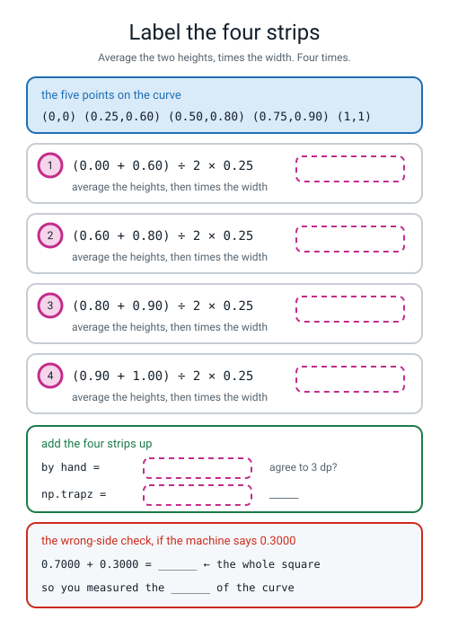
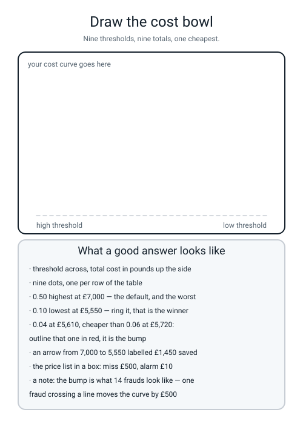

# Workbook — Week 11: Fraud Bench — What Does a Mistake Cost?

**Name:** ________________________________  **Date:** ______________

[⬅ Week 10](week-10.md) · [📖 Read the chapter first](../student-guide/week-11.md) · [Course Home](../README.md) · [Next ➡](week-12.md)

---

## ✅ Warm-Up (5 min)

Five quick questions about **last week** — the threshold dial and the two curves.

**W1.** `predict()` is `predict_proba()` followed by ______________. Who chose that number? ____________________

**W2.** At `t = 0.10` the counts were **tp 3, fp 5, fn 11, tn 981.** Write the three fractions with their denominators.

**precision = ______ ÷ ______**  **recall = ______ ÷ ______**  **fpr = ______ ÷ ______**

**W3.** Between `t = 0.12` and `t = 0.10` the rise was 0.071429 and the run was 0.005071. **Write the division and then the sentence.**

`________ ÷ ________ = ____________` — *"I bought ________ units of recall per unit of false alarm."*

**W4.** Somebody hands `roc_auc_score` a column of 0s and 1s instead of probabilities. **Does Python complain, and what goes wrong?**

________________________________________________________________

**W5.** A coin's ROC AUC is always ____________. A coin's average precision on our fraud data is ____________, and that number is also called ______________________.

---

## 🔢 Do the Maths by Hand

**This week's new maths is the area of a trapezoid: `(left height + right height) ÷ 2 × width`.** Use a calculator and squared graph paper. No code on this page. **Work out every width *first*, before you touch a height** — that is where the marks go missing.

**M1 — four strips, all the same width.** Plot these five points and join them with straight lines:

```text
(0.00, 0.00)   (0.25, 0.60)   (0.50, 0.80)   (0.75, 0.90)   (1.00, 1.00)
```

Draw vertical lines at 0.25, 0.50 and 0.75. **Four strips, each 0.25 wide.**

```
strip 1:  (0.00 + 0.60) ÷ 2 = ________     ________ × 0.25 = ____________
strip 2:  (0.60 + 0.80) ÷ 2 = ________     ________ × 0.25 = ____________
strip 3:  (0.80 + 0.90) ÷ 2 = ________     ________ × 0.25 = ____________
strip 4:  (0.90 + 1.00) ÷ 2 = ________     ________ × 0.25 = ____________
                                                             ------------
                                           total           = ____________
```

**M1(a).** Why is averaging the two heights **exactly right** for each strip, rather than an approximation?

________________________________________________________________

**M1(b).** A classmate runs `np.trapz(xs, ys)` and gets **0.3000**. Add their answer to yours: `________ + ________ = ________`. **What have they measured, and how do you know without reading any documentation?**

________________________________________________________________

**M2 — four strips, all different widths.** This is last week's twenty-card curve, read off at five of its thresholds. **It is harder for exactly one reason.**

```text
   t = 0.90  ->  (0.0, 0.2)
   t = 0.70  ->  (0.1, 0.6)
   t = 0.50  ->  (0.3, 0.8)
   t = 0.30  ->  (0.5, 1.0)
   t = 0.05  ->  (1.0, 1.0)
```

**Widths first. Write all four down before anything else.**

`w1 = ________`  `w2 = ________`  `w3 = ________`  `w4 = ________`  **and they must add to** ________

```
strip 1:  (0.2 + 0.6) ÷ 2 = ________     ________ × ________ = ____________
strip 2:  (0.6 + 0.8) ÷ 2 = ________     ________ × ________ = ____________
strip 3:  (0.8 + 1.0) ÷ 2 = ________     ________ × ________ = ____________
strip 4:  (1.0 + 1.0) ÷ 2 = ________     ________ × ________ = ____________
                                                               ------------
                                         total               = ____________
```

**M2(a).** Now do it again with only **two** strips, using just `(0.0, 0.2)`, `(0.3, 0.8)` and `(1.0, 1.0)`.

```
strip 1:  (0.2 + 0.8) ÷ 2 = ________     ________ × 0.3 = ____________
strip 2:  (0.8 + 1.0) ÷ 2 = ________     ________ × 0.7 = ____________
                                                          ------------
                                         total          = ____________
```

**M2(b).** `roc_auc_score` on all twenty cards says **0.8500.** Your four-strip answer was ________ and your two-strip answer was ________.

**Which one is too big?** ____________  **Which is too small?** ____________  **Who is wrong?** ____________

**M2(c).** So the one rule about strips is: ______________________________________

**M3 — the cost table.** The bank's price list: **a miss costs £500, a false alarm costs £10.**

**M3(a).** How many false alarms is one missed fraud worth? `500 ÷ 10 = ________`

**M3(b).** Fill in the whole table. `fn` and `fp` come straight from last week's sweep. **Write `10 × 0 = 0` on the rows where there are no false alarms — it still has to be written.**

| t | fn | fp | `500 × fn` | `10 × fp` | total cost |
|---|---|---|---|---|---|
| 0.50 | 14 | 0 | ____________ | ____________ | ____________ |
| 0.15 | 13 | 0 | ____________ | ____________ | ____________ |
| 0.12 | 12 | 0 | ____________ | ____________ | ____________ |
| 0.10 | 11 | 5 | ____________ | ____________ | ____________ |
| 0.08 | 11 | 12 | ____________ | ____________ | ____________ |
| 0.06 | 11 | 22 | ____________ | ____________ | ____________ |
| 0.04 | 10 | 61 | ____________ | ____________ | ____________ |
| 0.02 | 9 | 211 | ____________ | ____________ | ____________ |
| 0.01 | 6 | 421 | ____________ | ____________ | ____________ |

**Circle the cheapest row.** The winner is `t = ________` at £________

**M3(c).** The winner's arithmetic, longhand, in three lines:

```
500 × ________  =  ____________
 10 × ________  =  ____________
                   ------------
                   ____________
```

**M3(d).** The default `t = 0.50` costs £________ and the winner costs £________, so changing one number in a comparison saved £________ on a thousand transactions. **How much of the model changed?** ____________

**M3(e).** At `t = 0.01` you catch **8** frauds instead of 3 — five more, worth `5 × 500 = ________` saved. And you buy **421** false alarms to do it, costing `421 × 10 = ________`.

**So you spent £________ to save £________.** Write the one sentence that explains why a 50-to-1 price ratio did not help you.

________________________________________________________________

**M3(f).** Look at `t = 0.04` (£________) and `t = 0.06` (£________). **The bowl is not smooth. Which row is the bump, and what is it made of?**

________________________________________________________________

**M4 — the price list changes, and so does the answer.** Now **a miss costs £50**, a false alarm still £10.

| t | fn | fp | `50 × fn` | `10 × fp` | total cost |
|---|---|---|---|---|---|
| 0.15 | 13 | 0 | ____________ | ____________ | ____________ |
| 0.12 | 12 | 0 | ____________ | ____________ | ____________ |
| 0.10 | 11 | 5 | ____________ | ____________ | ____________ |
| 0.08 | 11 | 12 | ____________ | ____________ | ____________ |
| 0.04 | 10 | 61 | ____________ | ____________ | ____________ |
| 0.01 | 6 | 421 | ____________ | ____________ | ____________ |

**M4(a).** Two rows tie for cheapest. Which two? ____________ and ____________  **Which do you ship, and why?**

________________________________________________________________

**M4(b).** The break-even formula is `t* = cost of a false alarm ÷ (cost of a false alarm + cost of a miss)`. Work it out for both price lists.

`£500 list:  10 ÷ (10 + 500) = 10 ÷ ________ = ____________`

`£50  list:  10 ÷ (10 + 50)  = 10 ÷ ________ = ____________`

**M4(c).** The model did not change at all. **What changed, and in one sentence, whose job is it?**

________________________________________________________________

**M4(d) — the mean and the `±`, by hand.** The five fold AUCs were `0.6183, 0.5909, 0.6873, 0.7504, 0.4954`.

```
0.6183 + 0.5909  =  ____________
     ____________ + 0.6873  =  ____________
     ____________ + 0.7504  =  ____________
     ____________ + 0.4954  =  ____________

     ____________ ÷ 5  =  ____________     ->  rounds to ____________
```

**M4(e).** Now the standard deviation — the same recipe as Week 4. Subtract the mean (use **0.6285**) from each score, square it, average the five squares, square-root.

| score | score − 0.6285 | squared |
|---|---|---|
| 0.6183 | ____________ | ____________ |
| 0.5909 | ____________ | ____________ |
| 0.6873 | ____________ | ____________ |
| 0.7504 | ____________ | ____________ |
| 0.4954 | ____________ | ____________ |

`sum of the five squares = ____________`  `÷ 5 = ____________`  `square root = ____________`

**M4(f).** So the honest report is `AUC = ________ ± ________`, which is a band from ________ to ________.

**M4(g).** Somebody hands you a model scoring **0.65**. Can you claim yours is worse? ______  **A model scoring 0.85?** ______  **Write the rule in one sentence.**

________________________________________________________________

---

## 🔎 Predict the Output

**Write your prediction in pen before you run anything.** P2 and P3 carry on from `fraud_bench.py`, so `X`, `y` and `pipe` already exist. **Two of these four print beautiful numbers that mean nothing.**

### P1 — heights first, positions second, and a shape

```python
xs = np.array([0.00, 0.25, 0.50, 0.75, 1.00])
ys = np.array([0.00, 0.60, 0.80, 0.90, 1.00])
print(xs.shape, ys.shape)
print("%.4f" % np.trapz(ys, xs))
print("%.4f" % np.trapz(xs, ys))
print("%.4f" % np.trapz(ys))
```

**I predict — line 1 (two shapes):** ____________  **line 2:** ____________  **line 3:** ____________  **line 4:** ____________

**It really printed:**

```text
________________________
________________________
________________________
________________________
```

**Line 4 has no `xs` at all. What did `np.trapz` assume every strip was, and is the answer too big or too small?**

________________________________________________________________

**Lines 2 and 3 add up to ________, which is** ______________________________

### P2 — how many frauds in each chunk

```python
skf = StratifiedKFold(n_splits=5, shuffle=True, random_state=0)
kf = KFold(n_splits=5, shuffle=True, random_state=0)
print([int(y[te].sum()) for tr, te in skf.split(X, y)])
print([len(te) for tr, te in skf.split(X, y)])
print([int(y[te].sum()) for tr, te in kf.split(X, y)])
print(sum(int(y[te].sum()) for tr, te in kf.split(X, y)))
```

**I predict — line 1:** ____________________  **line 2:** ____________________

**line 3:** ____________________  **line 4:** ____________

**It really printed:**

```text
________________________________
________________________________
________________________________
________________________________
```

**Line 2 is the same number five times. Why?** ______________________________

**Lines 1 and 3 add to the same total but look completely different. Which is which, and what does the difference cost you when you try to diagnose a wide `±`?**

________________________________________________________________

### P3 — five beautiful, consistent, meaningless numbers

```python
s = cross_val_score(pipe, X, y, cv=skf)
print(np.round(s, 4))
s2 = cross_val_score(pipe, X, y, cv=skf, scoring="roc_auc")
print("%.4f  %.4f  %.4f" % (s2.mean(), s2.std(), s2.std(ddof=1)))
```

**I predict — line 1:** ____________________  **line 2 (three numbers):** ____________________

**It really printed:**

```text
________________________________
________________________________
```

**Line 1's five numbers are all about 0.986. Where have you seen 0.986 before, and what did you forget to type?**

________________________________________________________________

**Line 2's second and third numbers are different. What is the difference, and does any conclusion change?**

________________________________________________________________

### P4 — brackets, again, and one honest number

```python
COST_FN, COST_FP = 500, 10
fn, fp = 11, 5
print(COST_FN * fn + COST_FP * fp)
print(COST_FN * fn + COST_FP * fp / 2)
print(COST_FP / COST_FP + COST_FN)
print(COST_FP / (COST_FP + COST_FN))
```

**I predict — line 1:** ____________  **line 2:** ____________  **line 3:** ____________  **line 4:** ____________

**It really printed:**

```text
________________________
________________________
________________________
________________________
```

**Line 3 was meant to be the break-even formula. Work out by hand what Python actually computed, in the order it did it:**

`10 ÷ 10 = ________`, then `+ 500 = ________`

**Is line 3's answer wildly wrong or plausibly wrong?** ____________  **Which is worse, and why?**

________________________________________________________________

**How many of the answers on this page did you get right?** ______ / 14

**Which one surprised you most?** ______________________________

---

## ✍️ Practice Set A — Read It

**A1. Match the word to the thing.** Write the letter.

| Word | | Description |
|---|---|---|
| **cost matrix** | ______ | (i) The area under the ROC curve; a coin gets exactly 0.5 |
| **expected cost** | ______ | (ii) Each chunk holds the same proportion of the rare class as the whole set |
| **stratified k-fold** | ______ | (iii) The confusion matrix with a price in each cell instead of a count |
| **AUC** | ______ | (iv) How much a number moves if you measure the same thing again a different way |
| **error bar** | ______ | (v) The total price of all the mistakes a model makes at a given threshold |

**A1(a).** Two of the four cells of a cost matrix are **£0**. Which two, and why?

________________________________________________________________

**A2. Read the cost table.** This is the £500/£10 table from `fraud_bench.py`:

```text
   t   fn   fp   500 x fn   10 x fp   total cost
 0.50   14    0       7000         0         7000
 0.15   13    0       6500         0         6500
 0.12   12    0       6000         0         6000
 0.10   11    5       5500        50         5550
 0.08   11   12       5500       120         5620
 0.06   11   22       5500       220         5720
 0.04   10   61       5000       610         5610
 0.02    9  211       4500      2110         6610
 0.01    6  421       3000      4210         7210
```

**A2(a).** Read the `total cost` column downwards and describe its shape in five words or fewer.

________________________________________________________________

**A2(b).** Three consecutive rows have `500 × fn = 5500`. Which three, and what does that tell you about those three thresholds?

________________________________________________________________

**A2(c).** Which single row is **cheaper than the row above it** even though the bowl is supposed to be going up there? ____________  **Name the cause in four words.** ______________________

**A2(d).** If the bank rang up and said *"actually a false alarm costs £100, not £10"*, which column would you recompute, and would the winner move up or down the table? (Work out two rows to check.)

`t = 0.12 : 500 × 12 + 100 × 0 = ____________`   `t = 0.10 : 500 × 11 + 100 × 5 = ____________`

**so the winner moves** ______________________

**A3. Spot the bug.** Each line is wrong or dangerous. Say what happens and write the fix.

| # | The line | What happens | The fix |
|---|---|---|---|
| a | `cross_val_score(pipe, X, y, cv=skf, scoring="auc")` | | |
| b | `cross_val_score(pipe, X, y, cv=skf)` | | |
| c | `skf = StratifiedKFold(n_splits=5)` | | |
| d | `np.trapz(xs, ys)` | | |
| e | `scores = []` … then `scores.mean()` | | |
| f | `X = StandardScaler().fit_transform(X)` before `cross_val_score(model, X, y, ...)` | | |

**A3(g).** Three of those six produce **no error at all**. Which three, and which of those three would be hardest to find in somebody else's code?

________________________________________________________________

**A4. Match the code to the output.** Five of each, no output used twice.

| | Code |
|---|---|
| i | `print("%.4f" % np.trapz(ys, xs))` |
| ii | `print("%.4f" % np.trapz(xs, ys))` |
| iii | `print("%.4f" % np.trapz(ys))` |
| iv | `print("%.4f" % np.trapz(tpr, fpr))` |
| v | `print([int(y[te].sum()) for tr, te in kf.split(X, y)])` |

| | Output |
|---|---|
| P | `0.3000` |
| Q | `[11, 17, 14, 17, 13]` |
| R | `0.6116` |
| S | `2.8000` |
| T | `0.7000` |

**Your answers:** i → ______  ii → ______  iii → ______  iv → ______  v → ______

**A5. Two error bars, two hospitals' worth of difference.** Same code, same `Pipeline`, two different datasets.

| | fraud bench | hospital screen |
|---|---|---|
| positives per held-out fold | **14 or 15** | **42 or 43** |
| the five scores | 0.6183, 0.5909, 0.6873, 0.7504, 0.4954 | 0.9846, 0.9990, 0.9980, 1.0000, 0.9956 |
| reported | **0.628 ± 0.087** | **0.995 ± 0.006** |

**A5(a).** How many times wider is the fraud band? `0.087 ÷ 0.006 = ____________`

**A5(b).** Is the fraud **model** fourteen times worse? ______  **Write the correct diagnosis in one sentence.**

________________________________________________________________

**A5(c).** With `± 0.006` you could confidently detect a model that was **0.02** better. With `± 0.087` could you? ______  **What is the smallest improvement you could detect with the fraud band?**

________________________________________________________________

**A5(d).** Name the **three** possible causes of a wide `±`, in the order they are usually the answer, and say which one applies here.

**1.** ______________________________  **2.** ______________________________

**3.** ______________________________  **ours is** ______

**A6. Label the four strips.** Fill in every dashed box, then the total panel, then the wrong-side check.


*Figure W11.1 — Four strips of the same curve, with the areas removed.*

**A6(a).** Which strip is the **biggest**, and why is it the biggest even though it is the same width as the others?

________________________________________________________________

**A6(b).** Which strip would change most if the point `(0.25, 0.60)` moved up to `(0.25, 0.90)`? ____________  **Work out the new total:** ____________

---

## ✍️ Practice Set B — Write It

### B1 — one line, plus a print

**Task:** print the area under the five-point curve to four decimal places, using `np.trapz` the right way round.

**Expected output:**

```text
0.7000
```

**Done looks like:** heights first, positions second, `%.4f`.

```python
print(_______________________________________________________)
```

### B2 — a function that shows its working

**Task:** write `strips(xs, ys)` that prints one line per strip — the width, the two heights, and the strip's area — then the hand total, then `np.trapz`, then whether they agree to 3 dp. **It must work for equal widths and unequal widths, so compute each width rather than assuming it.**

Test it on both curves from the maths page.

**Expected output:**

```text
strip 1: width 0.25  (0.00 + 0.60) / 2 x 0.25 = 0.0750
strip 2: width 0.25  (0.60 + 0.80) / 2 x 0.25 = 0.1750
strip 3: width 0.25  (0.80 + 0.90) / 2 x 0.25 = 0.2125
strip 4: width 0.25  (0.90 + 1.00) / 2 x 0.25 = 0.2375
by hand   : 0.7000
np.trapz  : 0.7000
agree to 3 dp? True

strip 1: width 0.10  (0.20 + 0.60) / 2 x 0.10 = 0.0400
strip 2: width 0.20  (0.60 + 0.80) / 2 x 0.20 = 0.1400
strip 3: width 0.20  (0.80 + 1.00) / 2 x 0.20 = 0.1800
strip 4: width 0.50  (1.00 + 1.00) / 2 x 0.50 = 0.5000
by hand   : 0.8600
np.trapz  : 0.8600
agree to 3 dp? True
```

**Done looks like:** `range(len(xs) - 1)`, `xs[i + 1] - xs[i]` for the width, and **`True` on both agreement lines.**

### B3 — three price lists, three winners

**Task:** write `price.py`. Loop over `COST_FN` in `[50, 500, 5000]` with `COST_FP = 10` fixed, print the nine costed rows for each, the winner, and the break-even formula's answer.

**Expected output** (first block shown; you should get three):

```text
--- a miss costs 50, a false alarm costs 10  (5 false alarms per miss) ---
   0.50  fn 14  fp   0   total     700
   0.15  fn 13  fp   0   total     650
   0.12  fn 12  fp   0   total     600
   0.10  fn 11  fp   5   total     600
   0.08  fn 11  fp  12   total     670
   0.06  fn 11  fp  22   total     770
   0.04  fn 10  fp  61   total    1110
   0.02  fn  9  fp 211   total    2560
   0.01  fn  6  fp 421   total    4510
  winner t = 0.12 at 600
  break-even formula t* = 10 / (10 + 50) = 0.1667
```

**Done looks like:** the `if best_cost is None or cost < best_cost:` shape, three winners that are **three different thresholds**, and **runtime under 2 seconds.**

**From your own output:** the three winners were ________, ________ and ________.

### B4 — five folds, and the check that they add up

**Task:** write `folds.py`. Print the frauds per fold for `StratifiedKFold` and for plain `KFold`, both sums, a `True`/`False` check that every fraud was held out exactly once, then the five AUCs, the mean, **both** standard deviations, the report line and the band.

**Expected output:**

```text
frauds per fold, stratified : [14, 14, 14, 15, 15]  sum 72
frauds per fold, plain      : [11, 17, 14, 17, 13]  sum 72
every fraud held out once?   True
the five AUCs : [0.6183 0.5909 0.6873 0.7504 0.4954]
mean 0.6285   sd (divide by 5) 0.0867   sd (divide by 4) 0.0969
report it as  : AUC = 0.628 +/- 0.087 (5-fold stratified CV)
the band      : 0.542 to 0.715
```

**Done looks like:** `y.sum()` compared with both fold sums in one condition, `scores.std()` and `scores.std(ddof=1)` side by side, and **the band printed, not left for the reader to work out.**

### B5 — a whole program of your own, about 25 lines

**Task:** write `bench200.py`. Your own Fraud Bench on a **new price list**: a miss costs **£200**, a false alarm still £10. Print the nine costed rows with both multiplications shown, the winner, what the default 0.50 costs, what you saved, the break-even formula, the area check (`np.trapz` against `roc_auc_score`), and the 5-fold `± `.

**Expected output:**

```text
price list: a miss 200, a false alarm 10, so 20 alarms per miss
 0.50  fn 14  fp   0  200 x 14 =  2800  10 x   0 =     0  total   2800
 0.15  fn 13  fp   0  200 x 13 =  2600  10 x   0 =     0  total   2600
 0.12  fn 12  fp   0  200 x 12 =  2400  10 x   0 =     0  total   2400
 0.10  fn 11  fp   5  200 x 11 =  2200  10 x   5 =    50  total   2250
 0.08  fn 11  fp  12  200 x 11 =  2200  10 x  12 =   120  total   2320
 0.06  fn 11  fp  22  200 x 11 =  2200  10 x  22 =   220  total   2420
 0.04  fn 10  fp  61  200 x 10 =  2000  10 x  61 =   610  total   2610
 0.02  fn  9  fp 211  200 x  9 =  1800  10 x 211 =  2110  total   3910
 0.01  fn  6  fp 421  200 x  6 =  1200  10 x 421 =  4210  total   5410
cheapest t = 0.10 at 2250   default 0.50 costs 2800   saved 550
break-even formula t* = 0.0476
np.trapz(tpr, fpr) 0.6116   roc_auc_score 0.6116
AUC = 0.628 +/- 0.087 (5-fold stratified CV)
```

**Done looks like:** `COST_FN` and `COST_FP` in **capitals at the top**, the scaler **inside** the `Pipeline`, `np.trapz` and `roc_auc_score` printed on the same line so they can be compared at a glance, and **runtime about 1 second.**

**And answer this from your own output:** at £200 a miss the winner is the same threshold as at £500 a miss. **Was the saving the same?** ____________ against ____________. **Why is the saving so much smaller?**

________________________________________________________________

---

## 🐞 Fix the Broken Program

This program has **three** bugs: one **shape** bug, one **runtime** bug, and one **silent logic** bug. The real messages are below, in the order you meet them.

```python
"""broken11.py - a price list and an error bar on the fraud data.  THREE bugs."""
import numpy as np
from sklearn.datasets import make_classification
from sklearn.linear_model import LogisticRegression
from sklearn.metrics import confusion_matrix, roc_auc_score
from sklearn.model_selection import StratifiedKFold, train_test_split
from sklearn.pipeline import Pipeline
from sklearn.preprocessing import StandardScaler

COST_FN = 500
COST_FP = 10

X, y = make_classification(n_samples=5000, n_features=8, n_informative=4,
                           n_redundant=0, weights=[0.99, 0.01], random_state=0)
X_tmp, X_test, y_tmp, y_test = train_test_split(
    X, y, test_size=0.20, random_state=0, stratify=y)
X_train, X_val, y_train, y_val = train_test_split(
    X_tmp, y_tmp, test_size=0.25, random_state=0, stratify=y_tmp)
model = LogisticRegression(max_iter=2000, random_state=0).fit(X_train, y_train)
prob = model.predict_proba(X_val)[:, 1]

print("   t   fn   fp   total cost")
for t in [0.12, 0.10, 0.04]:
    pred = (prob >= t).astype(int)
    tn, fp, fn, tp = confusion_matrix(y_val, pred, labels=[0, 1])
    print("%5.2f %4d %4d %12d" % (t, fn, fp, COST_FN * fn + COST_FP * fp))

pipe = Pipeline([("scaler", StandardScaler()),
                 ("model", LogisticRegression(max_iter=2000, random_state=0))])
skf = StratifiedKFold(n_splits=5)
scores = []
for tr, te in skf.split(X, y):
    pipe.fit(X[tr], y[tr])
    p = pipe.predict_proba(X[te])[:, 1]
    scores.append(roc_auc_score(y[te], p))
print("the five AUCs :", np.round(scores, 4))
print("AUC = %.3f +/- %.3f (5-fold stratified CV)" % (scores.mean(), scores.std()))
```

**Run 1 — the header prints and then it stops:**

```text
   t   fn   fp   total cost
Traceback (most recent call last):
  File "broken11.py", line 25, in <module>
    tn, fp, fn, tp = confusion_matrix(y_val, pred, labels=[0, 1])
ValueError: not enough values to unpack (expected 4, got 2)
```

**Bug 1.** Which line? ______  **Kind of bug?** ______________

**`confusion_matrix` hands back a grid. What shape is that grid?** ____________  **So how many things does Python find when it tries to unpack it?** ______

**And why are the two things it found not `tn` and `fp`?**

________________________________________________________________

**The fix:** ______________________________________________

**Run 2 — after fixing bug 1:**

```text
   t   fn   fp   total cost
 0.12   12    0         6000
 0.10   11    5         5550
 0.04   10   61         5610
the five AUCs : [0.7349 0.6389 0.6484 0.5851 0.648 ]
Traceback (most recent call last):
  File "broken11.py", line 37, in <module>
    print("AUC = %.3f +/- %.3f (5-fold stratified CV)" % (scores.mean(), scores.std()))
AttributeError: 'list' object has no attribute 'mean'
```

**Bug 2.** Which line? ______  **Kind of bug?** ______________

**What is `scores`, and what would it have to be for `.mean()` to work?**

________________________________________________________________

**Notice something odd: `np.round(scores, 4)` on the line above worked perfectly. Why did that one not complain?**

________________________________________________________________

**Two fixes are possible. Write both.**

`fix A: ______________________________________________`

`fix B: ______________________________________________`

**Run 3 — after fixing bugs 1 and 2. It runs all the way through, with no error and no warning:**

```text
   t   fn   fp   total cost
 0.12   12    0         6000
 0.10   11    5         5550
 0.04   10   61         5610
the five AUCs : [0.7349 0.6389 0.6484 0.5851 0.648 ]
AUC = 0.651 +/- 0.048 (5-fold stratified CV)
```

⚠️ **That `±` is only about half the size of the real one, and the real one is 0.087. A smaller error bar looks like better news.**

**Bug 3.** Which line? ______  **Kind of bug?** ______________

**What is missing from that line, and what does the missing part do?**

________________________________________________________________

**Explain in two sentences why a smaller `±` here is *worse* news, not better.**

________________________________________________________________

**The fix:** ______________________________________________

**Run 4 — after fixing all three:**

```text
   t   fn   fp   total cost
 0.12   12    0         6000
 0.10   11    5         5550
 0.04   10   61         5610
the five AUCs : [0.6183 0.5909 0.6873 0.7504 0.4954]
AUC = 0.628 +/- 0.087 (5-fold stratified CV)
```

**Two questions, and they are the point of the whole page.**

**The cost table printed exactly the same three rows in runs 2, 3 and 4. Does that mean the cost table was never affected by any of the bugs? What does that tell you about where to look when only some of your output is wrong?**

________________________________________________________________

**Rank the three bugs from easiest to hardest to notice, and say what would have caught each one.**

**easiest → hardest:** ______  ______  ______

________________________________________________________________

---

## 🧩 Puzzle of the Week

### The Price List Detective

Somebody at the bank has circled a threshold on the nine-row table but **spilled coffee on the price list.** You can still read that a false alarm costs **£10**. You cannot read what a miss costs. Call it **C**.

Here are the nine rows again. **`fn` and `fp` never change — they belong to the model, not to the money.**

| t | fn | fp | total cost |
|---|---|---|---|
| 0.50 | 14 | 0 | `14C` |
| 0.15 | 13 | 0 | `13C` |
| 0.12 | 12 | 0 | `12C` |
| 0.10 | 11 | 5 | `11C + 50` |
| 0.08 | 11 | 12 | `11C + 120` |
| 0.06 | 11 | 22 | `11C + 220` |
| 0.04 | 10 | 61 | `10C + 610` |
| 0.02 | 9 | 211 | `9C + 2110` |
| 0.01 | 6 | 421 | `6C + 4210` |

**Part 1(a) — three rows can be crossed out immediately.** Compare `0.10` (`11C + 50`) with `0.08` (`11C + 120`) and `0.06` (`11C + 220`). **Whatever C is, which of the three is cheapest, and why do you not need to know C at all?**

________________________________________________________________

**Cross out 0.08 and 0.06. Also cross out 0.50 and 0.15** — say why in one line: ______________________________

**Part 1(b) — when does `0.10` beat `0.12`?** Fill in the arithmetic at three candidate values of C.

| C | `12C` (t = 0.12) | `11C + 50` (t = 0.10) | cheaper |
|---|---|---|---|
| 20 | ________ | ________ | ________ |
| 50 | ________ | ________ | ________ |
| 100 | ________ | ________ | ________ |

**So `0.10` overtakes `0.12` somewhere between C = ________ and C = ________, and at C = ________ they tie exactly.**

**Part 1(c) — when does `0.04` beat `0.10`?** Same three columns.

| C | `11C + 50` (t = 0.10) | `10C + 610` (t = 0.04) | cheaper |
|---|---|---|---|
| 300 | ________ | ________ | ________ |
| 560 | ________ | ________ | ________ |
| 700 | ________ | ________ | ________ |

**They tie at C = ________**

**Part 1(d) — when does `0.01` beat `0.04`?**

| C | `10C + 610` (t = 0.04) | `6C + 4210` (t = 0.01) | cheaper |
|---|---|---|---|
| 700 | ________ | ________ | ________ |
| 900 | ________ | ________ | ________ |
| 1200 | ________ | ________ | ________ |

**They tie at C = ________**

**Part 1(e) — the verdict.** Fill in the four bands. Only **four** of the nine rows can ever win.

| if a miss costs… | the winning threshold is |
|---|---|
| up to £________ | `t = ________` |
| £________ to £________ | `t = ________` |
| £________ to £________ | `t = ________` |
| more than £________ | `t = ________` |

**Part 1(f).** `t = 0.02` is in the middle of the table and it **never wins, for any C at all.** Prove it by comparing it with `0.04` and with `0.01` at one value of C in each direction.

at C = 700: `0.02` costs ________, `0.04` costs ________ → ________ wins

at C = 2000: `0.02` costs ________, `0.01` costs ________ → ________ wins

**One sentence on what a row like that is:** ______________________________________

**Part 1(g).** The bank's real price list said **£500**. Which band is that in, and does it match the winner you computed on the maths page? ____________________

### Part 2 — the detective's warning

**Part 2(a).** The band for `t = 0.04` is quite narrow — about £560 to £900. **Now remember that the whole table rests on 14 frauds.** If one fraud had landed on the other side of one threshold, `fn` would change by 1 and the cost by £C. **Is a band of £340 wide enough to trust?**

________________________________________________________________

**Part 2(b).** So write the sentence you would put in your report beside the winning threshold. It has to contain the price list, the number of positives, and an admission.

________________________________________________________________

---

## 🤔 Think Deeper

**T1.** The break-even formula says `t* = 0.0196` and the 99-threshold sweep says `t = 0.032`. **Neither is wrong.** **Write a paragraph** on what their disagreement is telling you. Name the assumption the formula makes, name the word for a model that satisfies it, say how many positives the sweep's minimum rests on, and finish by saying what you would write in a report — including what you would say if the two numbers had *agreed*.

________________________________________________________________

________________________________________________________________

________________________________________________________________

________________________________________________________________

________________________________________________________________

**T2.** Somebody has to write down that a stolen paycheque is worth fifty inconvenienced customers. **Write a paragraph** on whether that is a better or worse situation than last week, where the decision was being made by the number `0.5` sitting in a library's defaults. Then pick a case where you genuinely cannot put a price on either side — school exclusion, bail, medical screening — and say what you would do instead. **You are not allowed to answer "you just have to be careful".**

________________________________________________________________

________________________________________________________________

________________________________________________________________

________________________________________________________________

---

## 🛠️ Build It — Fraud Bench

**Four things get handed in. The fourth is the two `±` sentences, and it is the one marked hardest.**

### Step checklist

- [ ] **1.** The price list written on a card **before** you sweep anything: `a miss £500 · a false alarm £10`.
- [ ] **2.** The nine-row cost table filled in, **with `10 × 0 = 0` written on the zero rows.**
- [ ] **3.** The winner circled, and **one row's arithmetic written out longhand in three lines.**
- [ ] **4.** The second price list (`COST_FN = 50`), all nine rows again, winner circled, one sentence on why it moved.
- [ ] **5.** Five points plotted on graph paper. **Widths written down before heights.**
- [ ] **6.** Four strips computed by hand and added up. Then `np.trapz`. **Agreed to 3 dp before you move on.**
- [ ] **7.** `np.trapz(tpr, fpr)` compared with `roc_auc_score`. Same number?
- [ ] **8.** `StratifiedKFold` fold counts printed and **added up to 72.**
- [ ] **9.** `AUC = ? ± ?` reported, with the mean checked by hand.
- [ ] **10.** The two `±` sentences.
- [ ] **11.** Two Bug Log entries.

### The cost table, at £500 a miss

| t | fn | fp | `500 × fn` | `10 × fp` | total | cheapest? |
|---|---|---|---|---|---|---|
| 0.50 | ______ | ______ | ____________ | ____________ | ____________ | |
| 0.15 | ______ | ______ | ____________ | ____________ | ____________ | |
| 0.12 | ______ | ______ | ____________ | ____________ | ____________ | |
| 0.10 | ______ | ______ | ____________ | ____________ | ____________ | |
| 0.08 | ______ | ______ | ____________ | ____________ | ____________ | |
| 0.06 | ______ | ______ | ____________ | ____________ | ____________ | |
| 0.04 | ______ | ______ | ____________ | ____________ | ____________ | |
| 0.02 | ______ | ______ | ____________ | ____________ | ____________ | |
| 0.01 | ______ | ______ | ____________ | ____________ | ____________ | |

**The winning row's arithmetic, longhand:**

```
500 × ________  =  ____________
 10 × ________  =  ____________
                   ------------
                   ____________
```

**Default 0.50 costs £________. Winner costs £________. Saved £________ on 1,000 transactions, and the model did not change at all.**

### The second price list, at £50 a miss

**The winner moved from `t = ________` to `t = ________`**, and one row **tied** with it: `t = ________`.

**Which of the tied pair do I ship, and why?** ______________________________________

**One sentence on why the winner moved at all:**

________________________________________________________________

### Four strips, by hand and by machine

```
the five points:  (0.00, 0.00)  (0.25, 0.60)  (0.50, 0.80)  (0.75, 0.90)  (1.00, 1.00)

the four widths:  ________  ________  ________  ________     they add to ________

strip 1:  (________ + ________) ÷ 2 = ________   × ________ = ____________
strip 2:  (________ + ________) ÷ 2 = ________   × ________ = ____________
strip 3:  (________ + ________) ÷ 2 = ________   × ________ = ____________
strip 4:  (________ + ________) ÷ 2 = ________   × ________ = ____________
                                                              ------------
                                     BY HAND                = ____________
                                     np.trapz               = ____________
                                     agree to 3 dp?           ______
```

**And the reveal:**

`np.trapz(tpr, fpr)` on my own ROC curve = ____________  `roc_auc_score` = ____________  **same?** ______

**So `roc_auc_score` is** ______________________________________, **and nothing else.**

**And now I know where "a coin gets 0.5" came from:** ______________________________________

### Five folds, reported properly

| fold | frauds held out | AUC |
|---|---|---|
| 1 | ______ | ____________ |
| 2 | ______ | ____________ |
| 3 | ______ | ____________ |
| 4 | ______ | ____________ |
| 5 | ______ | ____________ |
| **total frauds** | **______** | |

**The fold counts must add to ________.** ✅ / ❌  **Every fraud held out exactly** ______ time.

**The mean, checked by hand:** ____________ ÷ 5 = ____________

**The report line:** `AUC = ________ ± ________ (5-fold stratified CV)`

**The band:** ________ to ________

**Plain `KFold` gave frauds per fold of ____________________. Why is that a problem even though it adds to the same total?**

________________________________________________________________

### The two `±` sentences

**Sentence 1 — what the `±` is *for*.** It must contain your band and the word "believe" or "claim".

________________________________________________________________

________________________________________________________________

**Sentence 2 — what you would conclude if the `±` were three times bigger**, so `± 0.260`, a band from ________ to ________.

________________________________________________________________

________________________________________________________________

**And the fix for a wide band is** ______________________________, **not** ______________________________.

### The Bug Log

| What I saw | What it means | Cause | Fix |
|---|---|---|---|
| | | | |
| | | | |

---

## 🎨 Draw It

Draw the cost bowl. Threshold along the bottom, total cost in pounds up the side, nine dots, the winner ringed — **and the bump outlined in red.**


*Figure W11.2 — An empty frame, and what a good answer contains.*

**Then answer three things about your own drawing:**

**Which end of your bowl is higher — the `t = 0.50` end or the `t = 0.01` end?** ____________  **By how much?** ____________

**Draw a second, fainter bowl for the `£50` price list on the same axes. What happened to its shape?**

________________________________________________________________

**Mark the bump. If you had only measured five thresholds instead of nine, could you have seen it?** ______  **What does that say about how many rows a cost table should have?**

________________________________________________________________

---

## 📊 Self-Check

| I can... | 😀 | 🙂 | 😕 |
|---|---|---|---|
| write a cost matrix for a stated application, with two cells at zero | | | |
| compute the expected cost at nine thresholds and circle the winner | | | |
| show one row's arithmetic longhand — two multiplications and an addition | | | |
| explain why a 50-to-1 price ratio did **not** send the winner to the bottom of the table | | | |
| find the area under a five-point curve in strips, with **unequal** widths | | | |
| match my hand answer to `np.trapz` to three decimal places | | | |
| say what `np.trapz(xs, ys)` measured instead, and the check that catches it | | | |
| say why `roc_auc_score` is trapezoid strips, and why a coin gets exactly 0.5 | | | |
| run stratified 5-fold CV and report `mean ± sd` with the fold counts added up | | | |
| say what the `±` is for, and what a large one usually means | | | |

**The one thing I would ask about if I could ask one question:**

________________________________________________________________

---

## ✅ Answers

<details>
<summary>Check your answers</summary>

### Warm-Up

**W1.** `predict()` is `predict_proba()` followed by **`>= 0.5`**. **Nobody chose it** — it is a default that shipped with the library, and it has been making decisions on your behalf since Week 3.

**W2.** `precision = **3 ÷ 8**` (everything you flagged) · `recall = **3 ÷ 14**` (everything that really was fraud) · `fpr = **5 ÷ 986**` (everything that really was innocent). **Three different denominators, and choosing the denominator is the whole skill.**

**W3.** `0.071429 ÷ 0.005071 = **14.0857**` — *"I bought **fourteen** units of recall per unit of false alarm."* **That is a bargain, and you can hear that it is.**

**W4.** **No, Python does not complain at all.** The curve comes back with **3 points instead of 28** and the AUC reads **0.6046** instead of 0.6116, because hard predictions have already had the threshold applied and the confidence thrown away. **You cannot un-decide a decision.**

**W5.** A coin's ROC AUC is always **0.5000**. A coin's AP on our data is **0.0140**, which is also **the positive class rate** — the fraud rate, `14 ÷ 1000`.

### Do the Maths by Hand

**M1.**

```
strip 1:  (0.00 + 0.60) ÷ 2 = 0.30     0.30 × 0.25 = 0.0750
strip 2:  (0.60 + 0.80) ÷ 2 = 0.70     0.70 × 0.25 = 0.1750
strip 3:  (0.80 + 0.90) ÷ 2 = 0.85     0.85 × 0.25 = 0.2125
strip 4:  (0.90 + 1.00) ÷ 2 = 0.95     0.95 × 0.25 = 0.2375
                                                     ------
                                       total       = 0.7000
```

**M1(a).** Because **the top of each strip is a straight line.** Averaging the two ends of a straight line gives you its exact middle height, so `average height × width` is the exact area of that trapezoid. **It is not a shortcut and not an approximation** — the only approximation anywhere is in pretending the *curve* is made of straight pieces, and that is a separate question (M2).

**M1(b).** `0.7000 + 0.3000 = **1.0000**` — **the area of the whole 1-by-1 square.** So they measured the area to the **left** of the curve instead of underneath it, and the two regions fill the square between them. **`np.trapz` wants heights first and positions second**, which is the opposite order from how you say it out loud. **The check needs no documentation: if your two answers add up to something you recognise, you measured the wrong side.**

**M2.** Widths: `w1 = **0.1**`, `w2 = **0.2**`, `w3 = **0.2**`, `w4 = **0.5**`, and they add to **1.0** ✅ (which they must, because the x-axis runs from 0 to 1).

```
strip 1:  (0.2 + 0.6) ÷ 2 = 0.40     0.40 × 0.1 = 0.0400
strip 2:  (0.6 + 0.8) ÷ 2 = 0.70     0.70 × 0.2 = 0.1400
strip 3:  (0.8 + 1.0) ÷ 2 = 0.90     0.90 × 0.2 = 0.1800
strip 4:  (1.0 + 1.0) ÷ 2 = 1.00     1.00 × 0.5 = 0.5000
                                                  ------
                                     total      = 0.8600
```

**If your answer disagrees, it is almost always strip 4**, which is 0.5 wide and not 0.25 like the others. **Go back to the widths before you check a single height.**

**M2(a).** `(0.2 + 0.8) ÷ 2 = **0.50**`, `0.50 × 0.3 = **0.1500**`; `(0.8 + 1.0) ÷ 2 = **0.90**`, `0.90 × 0.7 = **0.6300**`; total **0.7800**.

**M2(b).** Four strips gave **0.8600**, which is **too big**. Two strips gave **0.7800**, which is **too small**. The truth is 0.8500 with eleven strips. **Nobody is wrong.** Four strips cut some corners off the staircase and each cut corner made the answer slightly too big; two strips cut across a bulge and came out too small. **The direction of the error depends on which corners you happen to cut**, and noticing that is a genuinely good observation.

**M2(c).** **More strips, more accurate.** That is the only thing there is to know about this. Four strips got within about one part in eighty-five, which is good enough for a lot of real work — **and scikit-learn simply uses every point the curve has.**

**M3(a).** `500 ÷ 10 = **50**`. **Fifty false alarms per missed fraud. And not fifty-one** — that is not an opinion any more, it is arithmetic.

**M3(b).**

| t | fn | fp | `500 × fn` | `10 × fp` | total cost |
|---|---|---|---|---|---|
| 0.50 | 14 | 0 | **7000** | **0** | **7000** |
| 0.15 | 13 | 0 | **6500** | **0** | **6500** |
| 0.12 | 12 | 0 | **6000** | **0** | **6000** |
| **0.10** | 11 | 5 | **5500** | **50** | **5550** ⬅ cheapest |
| 0.08 | 11 | 12 | **5500** | **120** | **5620** |
| 0.06 | 11 | 22 | **5500** | **220** | **5720** |
| 0.04 | 10 | 61 | **5000** | **610** | **5610** |
| 0.02 | 9 | 211 | **4500** | **2110** | **6610** |
| 0.01 | 6 | 421 | **3000** | **4210** | **7210** |

**M3(c).**

```
500 × 11  =  5500
 10 ×  5  =    50
             ----
             5550
```

**M3(d).** Default **£7,000**, winner **£5,550**, saved **£1,450** on a thousand transactions. **None of the model changed.** No retraining, no new data, no new features — one number in a comparison.

**M3(e).** `5 × 500 = **2500**` saved; `421 × 10 = **4210**` spent. **You spent £4,210 to save £2,500.**

**The sentence:** *"A miss being fifty times worse than a false alarm does not help you when there are **eighty times as many** false alarms."* `421 ÷ 5 ≈ 84`. **That is the whole answer to the hook's question, and most people guess wrong.**

**M3(f).** `t = 0.04` costs **£5,610** and `t = 0.06` costs **£5,720**, so **0.04 is the bump** — cheaper than the row above it, which a smooth bowl would not allow. **It is made of one fraud.** The whole table rests on **14** frauds, so one fraud crossing a line moves the cost by £500, which is more than the gap between several neighbouring rows. **The bump is not a discovery, it is noise**, and it is the reason the second half of the chapter exists.

**M4.**

| t | `50 × fn` | `10 × fp` | total |
|---|---|---|---|
| 0.15 | **650** | **0** | **650** |
| **0.12** | **600** | **0** | **600** ⬅ cheapest |
| **0.10** | **550** | **50** | **600** ⬅ tied |
| 0.08 | **550** | **120** | **670** |
| 0.04 | **500** | **610** | **1110** |
| 0.01 | **300** | **4210** | **4510** |

**M4(a).** **`t = 0.12` and `t = 0.10` tie at exactly £600.** **Ship 0.12 — take the higher threshold.** It bothers **five fewer people** for exactly the same money, and there is never a reason to pay the same price and annoy more customers.

**M4(b).** `£500 list: 10 ÷ **510** = **0.0196**` · `£50 list: 10 ÷ **60** = **0.1667**`

Notice that the formula moved the same way the sweep did — **make a miss cheaper and the threshold goes up.** Make a miss ten times cheaper and you become ten times more reluctant to raise an alarm.

**M4(c).** What changed was **somebody's opinion about what a stolen paycheque is worth.** **And it is not the data scientist's job** — it belongs to whoever owns the consequences: the fraud team, the finance department, a committee with a spreadsheet. **Your job is to write their number down where a person can argue with it.** *"A threshold is not a property of your model. It is a property of your model and somebody's value judgement, together."*

**M4(d).**

```
0.6183 + 0.5909  =  1.2092
1.2092 + 0.6873  =  1.8965
1.8965 + 0.7504  =  2.6469
2.6469 + 0.4954  =  3.1423

3.1423 ÷ 5  =  0.62846   ->  rounds to 0.6285
```

**M4(e).**

| score | score − 0.6285 | squared |
|---|---|---|
| 0.6183 | **−0.0102** | **0.00010404** |
| 0.5909 | **−0.0376** | **0.00141376** |
| 0.6873 | **+0.0588** | **0.00345744** |
| 0.7504 | **+0.1219** | **0.01485961** |
| 0.4954 | **−0.1331** | **0.01771561** |

`sum = **0.03755046**`  `÷ 5 = **0.00751009**`  `square root = **0.086661**`

**Which rounds to 0.0867 — exactly what numpy printed.** Dividing by 5 rather than 4 is numpy's default; `ddof=1` divides by 4 and gives **0.0969**. **Both conventions are standard, no conclusion changes, say which one you used.**

**M4(f).** `AUC = **0.628** ± **0.087**`, a band from **0.542** to **0.715**.

**M4(g).** **0.65 — no, you cannot claim anything.** 0.65 is inside your band, so it might be your own model on a luckier split. **0.85 — yes, now you can talk**, because 0.85 is well outside it.

**The rule:** *"The `±` tells you how big a difference between two models you are entitled to believe."* **Anything inside the band is not a result.**

### Predict the Output

**P1.**

```text
(5,) (5,)
0.7000
0.3000
2.8000
```

**Line 4 had no positions at all, so `np.trapz` assumed every strip was `1` wide** — and our strips are 0.25 wide, so the answer is **four times too big.** `0.7000 × 4 = 2.8000` ✅. It is **always too big** if your real widths are less than 1, and it never warns you.

**Lines 2 and 3 add up to 1.0000, which is the area of the whole square** — so one of them is the area under the curve and the other is the area to its left. **The check costs one addition and no documentation.**

**P2.**

```text
[14, 14, 14, 15, 15]
[1000, 1000, 1000, 1000, 1000]
[11, 17, 14, 17, 13]
72
```

**Line 2 is 1000 five times because 5,000 rows chopped into 5 equal chunks is 1,000 rows each.** Every row is held out **exactly once**, so the five chunks have to cover the whole table with no overlaps.

**Line 1 is stratified and line 3 is plain `KFold`.** Both add to **72**, every fraud in the table ✅ — but the plain version gave one chunk **11** frauds and another **17**, a 55% difference in how much there was to find. **What it costs you:** if the five scores come out different from each other, **you have no way of knowing whether that is the model being unstable or one chunk simply having had an easier job.** Stratification removes one of the two explanations, and when you are diagnosing something, **removing an explanation is the whole game.**

**P3.**

```text
[0.986 0.986 0.986 0.985 0.985]
0.6285  0.0867  0.0969
```

**0.986 is the fraction of rows that are legitimate** — you met it in Week 8. `cross_val_score` defaults to **accuracy** for a classifier, and on 1.4%-fraud data accuracy is a statement about the 4,928 easy rows. **You forgot `scoring="roc_auc"`.** Five beautiful, consistent numbers, and not one of them is about fraud. **Build this reflex now: on this dataset, any score near 0.98 is a suspect, not a result.**

**Line 2's two standard deviations differ by the divisor.** `scores.std()` divides by **5** (numpy's default, the population formula) and gives 0.0867; `scores.std(ddof=1)` divides by **4** and gives 0.0969. **No conclusion changes** — the band is 0.54–0.72 either way — but you must say which you used.

**P4.**

```text
5550
5525.0
501.0
0.0196078431372549
```

**Line 3, in the order Python did it:** `10 ÷ 10 = **1.0**`, then `+ 500 = **501.0**`. Division binds tighter than addition, so the `COST_FN` on the end was added instead of being part of the denominator.

**Line 3 is *wildly* wrong — 501 is not a threshold, it is not even between 0 and 1 — and that is much better news than plausibly wrong.** Compare line 2: `5525.0` instead of `5550`, a cost that is out by £25 and looks completely normal. **A number that is obviously nonsense stops you; a number that is quietly wrong goes into a report.** (And notice line 2 ends in `.0` where line 1 is a whole number — that stray decimal point is the only visible clue.)

### Practice Set A

**A1.** cost matrix → **(iii)** · expected cost → **(v)** · stratified k-fold → **(ii)** · AUC → **(i)** · error bar → **(iv)**

**A1(a).** **The two diagonal cells — a legitimate transaction correctly left alone, and a fraud correctly caught.** **Getting it right is free.** That is why the whole cost of running a model at a threshold is only two multiplications and one addition.

**A2(a).** **"Down, then up, with a bump."** Or *"a bowl that is not smooth."* Either is full marks; "it goes down then up" without the bump misses the interesting half.

**A2(b).** **`t = 0.10`, `0.08` and `0.06`.** All three have `fn = 11`, meaning **all three miss exactly the same eleven frauds.** Lowering the bar twice added 17 innocent people to the pile and caught **not one extra fraud** — so the only thing changing across those three rows is the money you are wasting.

**A2(c).** **`t = 0.04` at £5,610**, cheaper than `t = 0.06` at £5,720. **Four words: "one fraud, fourteen total."** (Or "noise from 14 positives.")

**A2(d).** You would recompute the `10 × fp` column — now `100 × fp`.

`t = 0.12 : 500 × 12 + 100 × 0 = **6000**` · `t = 0.10 : 500 × 11 + 100 × 5 = **6000**`

**So the winner moves *up* the table** — they tie at £6,000, and by the tie-break rule you take the higher threshold, `0.12`. **Making false alarms ten times more expensive makes you more reluctant to raise them**, which raises the threshold. Exactly the mirror of M4.

**A3.**

| # | What happens | The fix |
|---|---|---|
| a | `InvalidParameterError: The 'scoring' parameter … Got 'auc' instead`, followed by a wall of sixty valid names — **and the right one is in the list** | `scoring="roc_auc"` |
| b | **No error.** You get **accuracy**: `[0.986 0.986 0.986 0.985 0.985]`, five statements about the easy rows | `scoring="roc_auc"` |
| c | **No error.** `shuffle=True` is missing, so the folds are cut in whatever order the rows happen to be stored in, and the sd comes out **0.0481** instead of 0.0867 (a different chop of the same data; the sd itself wanders from about 0.03 to 0.12 across shuffle seeds) | `StratifiedKFold(n_splits=5, shuffle=True, random_state=0)` |
| d | **No error**, and **0.3000** — the area of the wrong side of the curve | `np.trapz(ys, xs)`; check that your two answers add to the square |
| e | `AttributeError: 'list' object has no attribute 'mean'`. Plain Python lists cannot average themselves | `np.array(scores).mean()`, or collect with `cross_val_score` |
| f | **No error**, and every fold's score is slightly different, because the scaler's mean and standard deviation had already seen the held-out rows (in principle an optimistic leak; here the scores moved both ways and the mean fell by 0.0005) | put the scaler **inside** the `Pipeline` — Week 3 and Week 6's lesson in a new place |

**A3(g).** **b, c and d** produce no error. **The hardest to find in somebody else's code is (f)** — leakage through a scaler applied before cross-validation. It is not on the list of three because it is *worse* than all of them: **nothing looks wrong, the numbers are only slightly off, and there is no single line you can point at.** Of the three that are on the list, **(c) is the nastiest, because its symptom is a number that looks like an improvement.** A smaller error bar from one particular chop is not a better measurement, because the sd of five folds is itself noisy; fix the chop in advance.

**A4.** i → **T** · ii → **P** · iii → **S** · iv → **R** · v → **Q**

**A5(a).** `0.087 ÷ 0.006 = **14.5**` times wider.

**A5(b).** **No.** The correct diagnosis: *"The fraud **measurement** is fourteen times noisier, not the fraud **model** fourteen times worse. Each fraud fold holds 14 or 15 positives against the hospital's 42 or 43, and the underlying problem is much harder."* **A `±` is a statement about your measuring equipment, not about your model.**

**A5(c).** **No.** A 0.02 improvement is invisible inside a band of ±0.087. **The smallest improvement you could detect is something like 0.09 or more** — you would need a model scoring about 0.72 or better before you could claim anything, and 0.85 to be comfortable.

**A5(d).** **1. The held-out chunks are too small for the thing you are measuring.** **2. The model is genuinely unstable.** **3. The data is not homogeneous.** **Ours is 1**, overwhelmingly — **14 positives is 14.** And the fix for that is more data, or at least more positives per fold, **not a different model.**

**A6.** The four boxes are **0.0750**, **0.1750**, **0.2125** and **0.2375**; the total panel is **0.7000** by hand and **0.7000** from `np.trapz`, agreeing ✅. The wrong-side check: `0.7000 + 0.3000 = **1**`, the whole square, so you measured the **left-hand side** of the curve.

**A6(a).** **Strip 4, at 0.2375.** All four are the same width, so the only thing that can make one bigger is **being taller** — strip 4 sits under the highest part of the curve, where the two heights are 0.90 and 1.00. **Width and height both matter, and here only height varies.**

**A6(b).** **Strips 1 and 2 both change, and by exactly the same amount, +0.0375 each** (strip 1 changes by the bigger fraction, +50% against +21%): strip 1 goes from `(0.00 + 0.60) ÷ 2 × 0.25 = 0.0750` to `(0.00 + 0.90) ÷ 2 × 0.25 = **0.1125**`, and strip 2 from 0.1750 to `(0.90 + 0.80) ÷ 2 × 0.25 = **0.2125**`.

**New total:** `0.1125 + 0.2125 + 0.2125 + 0.2375 = **0.7750**`. **Moving one point up raised the area, which is exactly what a better-ranking model would do to an ROC curve.**

### Practice Set B

**B1.**

```python
print("%.4f" % np.trapz(ys, xs))
```

```text
0.7000
```

**B2.**

```python
"""strips.py - the area of a curve, one strip at a time.  Week 11 workbook."""
import numpy as np


def strips(xs, ys):
    total = 0.0
    for i in range(len(xs) - 1):
        width = xs[i + 1] - xs[i]
        strip = (ys[i] + ys[i + 1]) / 2 * width
        total = total + strip
        print("strip %d: width %.2f  (%.2f + %.2f) / 2 x %.2f = %.4f"
              % (i + 1, width, ys[i], ys[i + 1], width, strip))
    print("by hand   : %.4f" % total)
    print("np.trapz  : %.4f" % np.trapz(ys, xs))
    print("agree to 3 dp? %s" % (round(total, 3) == round(float(np.trapz(ys, xs)), 3)))
    return total


strips(np.array([0.00, 0.25, 0.50, 0.75, 1.00]),
       np.array([0.00, 0.60, 0.80, 0.90, 1.00]))
print()
strips(np.array([0.0, 0.1, 0.3, 0.5, 1.0]),
       np.array([0.2, 0.6, 0.8, 1.0, 1.0]))
```

```text
strip 1: width 0.25  (0.00 + 0.60) / 2 x 0.25 = 0.0750
strip 2: width 0.25  (0.60 + 0.80) / 2 x 0.25 = 0.1750
strip 3: width 0.25  (0.80 + 0.90) / 2 x 0.25 = 0.2125
strip 4: width 0.25  (0.90 + 1.00) / 2 x 0.25 = 0.2375
by hand   : 0.7000
np.trapz  : 0.7000
agree to 3 dp? True

strip 1: width 0.10  (0.20 + 0.60) / 2 x 0.10 = 0.0400
strip 2: width 0.20  (0.60 + 0.80) / 2 x 0.20 = 0.1400
strip 3: width 0.20  (0.80 + 1.00) / 2 x 0.20 = 0.1800
strip 4: width 0.50  (1.00 + 1.00) / 2 x 0.50 = 0.5000
by hand   : 0.8600
np.trapz  : 0.8600
agree to 3 dp? True
```

**The line that matters is `width = xs[i + 1] - xs[i]`.** A version with `0.25` typed in works perfectly on the first curve and is silently wrong on the second. **Anything you can compute, compute** — that is how a function survives being handed data it was not written for.

**B3.** `price.py`:

```python
"""price.py - three price lists, nine thresholds, three winners.  Week 11 workbook."""
COST_FP = 10
for COST_FN in [50, 500, 5000]:
    print("--- a miss costs %d, a false alarm costs %d  (%d false alarms per miss) ---"
          % (COST_FN, COST_FP, COST_FN / COST_FP))
    best_t = None
    best_cost = None
    for t in [0.50, 0.15, 0.12, 0.10, 0.08, 0.06, 0.04, 0.02, 0.01]:
        pred = (prob >= t).astype(int)
        tn, fp, fn, tp = confusion_matrix(y_val, pred, labels=[0, 1]).ravel()
        cost = COST_FN * fn + COST_FP * fp
        if best_cost is None or cost < best_cost:
            best_t = t
            best_cost = cost
        print("  %5.2f  fn %2d  fp %3d   total %7d" % (t, fn, fp, cost))
    print("  winner t = %.2f at %d" % (best_t, best_cost))
    print("  break-even formula t* = %d / (%d + %d) = %.4f"
          % (COST_FP, COST_FP, COST_FN, COST_FP / (COST_FP + COST_FN)))
    print()
```

**Real output. Runtime under 2 seconds.**

```text
--- a miss costs 50, a false alarm costs 10  (5 false alarms per miss) ---
   0.50  fn 14  fp   0   total     700
   0.15  fn 13  fp   0   total     650
   0.12  fn 12  fp   0   total     600
   0.10  fn 11  fp   5   total     600
   0.08  fn 11  fp  12   total     670
   0.06  fn 11  fp  22   total     770
   0.04  fn 10  fp  61   total    1110
   0.02  fn  9  fp 211   total    2560
   0.01  fn  6  fp 421   total    4510
  winner t = 0.12 at 600
  break-even formula t* = 10 / (10 + 50) = 0.1667

--- a miss costs 500, a false alarm costs 10  (50 false alarms per miss) ---
   0.50  fn 14  fp   0   total    7000
   0.15  fn 13  fp   0   total    6500
   0.12  fn 12  fp   0   total    6000
   0.10  fn 11  fp   5   total    5550
   0.08  fn 11  fp  12   total    5620
   0.06  fn 11  fp  22   total    5720
   0.04  fn 10  fp  61   total    5610
   0.02  fn  9  fp 211   total    6610
   0.01  fn  6  fp 421   total    7210
  winner t = 0.10 at 5550
  break-even formula t* = 10 / (10 + 500) = 0.0196

--- a miss costs 5000, a false alarm costs 10  (500 false alarms per miss) ---
   0.50  fn 14  fp   0   total   70000
   0.15  fn 13  fp   0   total   65000
   0.12  fn 12  fp   0   total   60000
   0.10  fn 11  fp   5   total   55050
   0.08  fn 11  fp  12   total   55120
   0.06  fn 11  fp  22   total   55220
   0.04  fn 10  fp  61   total   50610
   0.02  fn  9  fp 211   total   47110
   0.01  fn  6  fp 421   total   34210
  winner t = 0.01 at 34210
  break-even formula t* = 10 / (10 + 5000) = 0.0020
```

**The three winners are `0.12`, `0.10` and `0.01`.** Same model, same 1,000 probabilities, same nine thresholds, same 14 frauds, **three different answers** — because the only thing that changed was somebody's opinion about money. **Which of the three is *correct*? All of them, each under its own price list. None of them, without one.**

Notice also that at `COST_FN = 50` **the miss part of every row is ten times smaller but the false-alarm part is unchanged**, so the rows with many false alarms barely shrank (7,210 became 4,510) and the *ordering* changed — which is the whole reason you cannot re-use last week's winner.

**B4.** `folds.py`:

```python
"""folds.py - five chunks, five scores, one honest number.  Week 11 workbook."""
skf = StratifiedKFold(n_splits=5, shuffle=True, random_state=0)
kf = KFold(n_splits=5, shuffle=True, random_state=0)
strat = [int(y[te].sum()) for tr, te in skf.split(X, y)]
plain = [int(y[te].sum()) for tr, te in kf.split(X, y)]
print("frauds per fold, stratified :", strat, " sum", sum(strat))
print("frauds per fold, plain      :", plain, " sum", sum(plain))
print("every fraud held out once?  ", sum(strat) == int(y.sum()) == sum(plain))
scores = cross_val_score(pipe, X, y, cv=skf, scoring="roc_auc")
print("the five AUCs :", np.round(scores, 4))
print("mean %.4f   sd (divide by 5) %.4f   sd (divide by 4) %.4f"
      % (scores.mean(), scores.std(), scores.std(ddof=1)))
print("report it as  : AUC = %.3f +/- %.3f (5-fold stratified CV)"
      % (scores.mean(), scores.std()))
print("the band      : %.3f to %.3f" % (scores.mean() - scores.std(),
                                        scores.mean() + scores.std()))
```

```text
frauds per fold, stratified : [14, 14, 14, 15, 15]  sum 72
frauds per fold, plain      : [11, 17, 14, 17, 13]  sum 72
every fraud held out once?   True
the five AUCs : [0.6183 0.5909 0.6873 0.7504 0.4954]
mean 0.6285   sd (divide by 5) 0.0867   sd (divide by 4) 0.0969
report it as  : AUC = 0.628 +/- 0.087 (5-fold stratified CV)
the band      : 0.542 to 0.715
```

**`sum(strat) == int(y.sum()) == sum(plain)` is a chained comparison** — Python checks both equalities and gives one `True`. **Printing the band rather than leaving it to the reader is the whole point of the file:** `0.628 ± 0.087` is a pair of numbers, `0.542 to 0.715` is a conclusion, and it is the conclusion that stops somebody claiming 0.65 is an improvement.

**B5.** `bench200.py`:

```python
"""bench200.py - my own Fraud Bench, at 200 pounds a miss.  Week 11 workbook."""
COST_FN = 200          # a missed fraud
COST_FP = 10           # a false alarm

print("price list: a miss %d, a false alarm %d, so %d alarms per miss"
      % (COST_FN, COST_FP, COST_FN // COST_FP))
best_t, best_cost = None, None
for t in [0.50, 0.15, 0.12, 0.10, 0.08, 0.06, 0.04, 0.02, 0.01]:
    pred = (prob >= t).astype(int)
    tn, fp, fn, tp = confusion_matrix(y_val, pred, labels=[0, 1]).ravel()
    cost = COST_FN * fn + COST_FP * fp
    if best_cost is None or cost < best_cost:
        best_t, best_cost = t, cost
    print("%5.2f  fn %2d  fp %3d  %d x %2d = %5d  %d x %3d = %5d  total %6d"
          % (t, fn, fp, COST_FN, fn, COST_FN * fn, COST_FP, fp, COST_FP * fp, cost))
print("cheapest t = %.2f at %d   default 0.50 costs %d   saved %d"
      % (best_t, best_cost, COST_FN * 14, COST_FN * 14 - best_cost))
print("break-even formula t* = %.4f" % (COST_FP / (COST_FP + COST_FN)))
fpr, tpr, thr = roc_curve(y_val, prob)
print("np.trapz(tpr, fpr) %.4f   roc_auc_score %.4f"
      % (np.trapz(tpr, fpr), roc_auc_score(y_val, prob)))
skf = StratifiedKFold(n_splits=5, shuffle=True, random_state=0)
s = cross_val_score(pipe, X, y, cv=skf, scoring="roc_auc")
print("AUC = %.3f +/- %.3f (5-fold stratified CV)" % (s.mean(), s.std()))
```

**Real output. Runtime about 1 second.**

```text
price list: a miss 200, a false alarm 10, so 20 alarms per miss
 0.50  fn 14  fp   0  200 x 14 =  2800  10 x   0 =     0  total   2800
 0.15  fn 13  fp   0  200 x 13 =  2600  10 x   0 =     0  total   2600
 0.12  fn 12  fp   0  200 x 12 =  2400  10 x   0 =     0  total   2400
 0.10  fn 11  fp   5  200 x 11 =  2200  10 x   5 =    50  total   2250
 0.08  fn 11  fp  12  200 x 11 =  2200  10 x  12 =   120  total   2320
 0.06  fn 11  fp  22  200 x 11 =  2200  10 x  22 =   220  total   2420
 0.04  fn 10  fp  61  200 x 10 =  2000  10 x  61 =   610  total   2610
 0.02  fn  9  fp 211  200 x  9 =  1800  10 x 211 =  2110  total   3910
 0.01  fn  6  fp 421  200 x  6 =  1200  10 x 421 =  4210  total   5410
cheapest t = 0.10 at 2250   default 0.50 costs 2800   saved 550
break-even formula t* = 0.0476
np.trapz(tpr, fpr) 0.6116   roc_auc_score 0.6116
AUC = 0.628 +/- 0.087 (5-fold stratified CV)
```

**The winner is `t = 0.10`, the same threshold as at £500 — and the saving is £550 instead of £1,450.**

**Why the saving shrank:** the saving comes almost entirely from **misses you stopped having**, and the winner stops 3 of the 14 either way. At £500 a miss those three are worth `3 × 500 = 1500`; at £200 they are worth `3 × 200 = 600`, and you still pay £50 for the five false alarms. `1500 − 50 = 1450` and `600 − 50 = 550`. **The threshold is set by the *ratio* of the two prices; the saving is set by their *size*.** Two different questions, and mixing them up is the commonest mistake in this whole lab.

**Also worth saying out loud:** the break-even formula moved a long way, from 0.0196 to **0.0476**, and the sweep's winner did not move at all. **A nine-row table is too coarse to notice a change that size** — which is exactly why the chapter also runs 99 thresholds.

### Fix the Broken Program

**Bug 1 — line `tn, fp, fn, tp = confusion_matrix(y_val, pred, labels=[0, 1])`. A shape bug.** `.ravel()` is missing.

`confusion_matrix` hands back a grid of shape **(2, 2)**. Unpacking a 2-D array gives you its **rows**, so Python found **2** things where four names were waiting. **And the two things it found are not `tn` and `fp` — they are the two whole rows**, `[979 7]` and `[11 3]`. `.ravel()` is what flattens that 2×2 grid into the four numbers `tn, fp, fn, tp` in that order.

**The fix:** `confusion_matrix(y_val, pred, labels=[0, 1]).ravel()`.

**Bug 2 — line `print("AUC = ..." % (scores.mean(), scores.std()))`. A runtime bug.** `scores` is a **plain Python list**, built with `scores = []` and `.append(...)`. Plain lists cannot average themselves — `.mean()` and `.std()` are numpy methods. For them to work, `scores` would have to be a **numpy array**.

**Why `np.round(scores, 4)` on the line above worked:** `np.round` is a **function you hand a list to**, and it quietly converts the list to an array on the way in. `.mean()` is a **method you ask the list to perform**, and a list has never heard of it. **That distinction — function-you-call versus method-the-object-has — explains most `AttributeError`s you will ever see.**

**Two fixes:**

`fix A: **scores = np.array(scores)** before the print — or **np.array(scores).mean()** inline`

`fix B: **replace the whole loop with** scores = cross_val_score(pipe, X, y, cv=skf, scoring="roc_auc") **— which returns an array already**`

**Fix B is better**, and not only because it is shorter: the hand-written loop refits the pipeline itself, which is fine here but is exactly where people accidentally fit the scaler outside the fold.

**Bug 3 — line `skf = StratifiedKFold(n_splits=5)`. A silent logic bug.** **`shuffle=True, random_state=0` is missing.** `shuffle=True` mixes the rows before chopping; `random_state=0` makes that mix reproducible.

**Why a smaller `±` here is not good news:** nothing about the model improved. Without shuffling, the folds are cut in whatever order the rows happen to be stored in, which is a different chop of the same data (the mean also moved, 0.651 against 0.628). The sd of five folds resting on 14 frauds each is itself noisy: with shuffle seeds 1 to 7 it ranges from about 0.03 to 0.12. So a small `±` from one chop tells you nothing, and choosing the chop that gives the answer you like would be cheating. `shuffle=True` matters most when data is stored in some order (by date or by label), because then each chunk is a different kind of row.

**The fix:** `StratifiedKFold(n_splits=5, shuffle=True, random_state=0)`.

**Why the cost table never changed.** The cost table is computed from `prob`, which comes from the single train/validation split at the top of the file. **None of the three bugs touched that part of the program.** The lesson is about **where to look**: when only *some* of your output is wrong, **trace backwards from the wrong number to the variables it depends on, and ignore everything else.** The three broken lines all lived downstream of `pipe` and `skf`; the cost table lived downstream of `model` and `prob`. **A bug cannot affect a number it has no path to**, and remembering that turns a twenty-minute hunt into a two-minute one.

**Ranking, easiest → hardest: 1, 2, 3.** Bug 1 crashes on the first row and names both counts it wanted. Bug 2 crashes with a message that is clear once you know the difference between a list and an array. **Bug 3 never complains at all, and its symptom — a smaller `±` — looks like good news**, which makes it the only one of the three that could survive a code review. What catches each: **`.ravel()` being a habit**, **reading "list object" in the error**, and **knowing that 0.087 is the right answer** — which is the real point: *you need to have seen the honest number once to notice when it goes missing.*

### Puzzle of the Week

**Part 1(a).** All three cost `11C + something`, and the somethings are **50, 120 and 220.** `11C` is identical in all three, so **`t = 0.10` is cheapest whatever C is** — you are comparing 50 with 120 with 220 and nothing else. **You never need to know C**, which is the nicest kind of comparison there is.

**Cross out 0.50 and 0.15 too:** they cost `14C` and `13C`, both more than `t = 0.12`'s `12C`, for any positive C. **Three rows gone in one line of reasoning, and no arithmetic.**

**Part 1(b).**

| C | `12C` | `11C + 50` | cheaper |
|---|---|---|---|
| 20 | **240** | **270** | **0.12** |
| 50 | **600** | **600** | **tie** |
| 100 | **1200** | **1150** | **0.10** |

**So `0.10` overtakes `0.12` between C = 20 and C = 100, and at C = 50 they tie exactly.** (Which is exactly the tie you found on the maths page with the £50 price list ✅.)

**Part 1(c).**

| C | `11C + 50` | `10C + 610` | cheaper |
|---|---|---|---|
| 300 | **3350** | **3610** | **0.10** |
| 560 | **6210** | **6210** | **tie** |
| 700 | **7750** | **7610** | **0.04** |

**They tie at C = 560.**

**Part 1(d).**

| C | `10C + 610` | `6C + 4210` | cheaper |
|---|---|---|---|
| 700 | **7610** | **8410** | **0.04** |
| 900 | **9610** | **9610** | **tie** |
| 1200 | **12610** | **11410** | **0.01** |

**They tie at C = 900.**

**Part 1(e).**

| if a miss costs… | the winning threshold is |
|---|---|
| up to **£50** | `t = **0.12**` |
| **£50** to **£560** | `t = **0.10**` |
| **£560** to **£900** | `t = **0.04**` |
| more than **£900** | `t = **0.01**` |

**Four winners out of nine rows.** At every boundary the two rows tie, and the tie-break rule (take the higher threshold) settles it.

**Part 1(f).** at C = 700: `0.02` costs `9 × 700 + 2110 = **8410**`, `0.04` costs `10 × 700 + 610 = **7610**` → **0.04 wins.**

at C = 2000: `0.02` costs `9 × 2000 + 2110 = **20110**`, `0.01` costs `6 × 2000 + 4210 = **16210**` → **0.01 wins.**

**One sentence:** *"A row that is never the cheapest for any price at all is **dominated** — there is always a better row above it or below it, so it is not a candidate and never was."* That is genuinely useful: **five of the nine rows in this table are decoration.** And notice you did not need to try every C — two well-chosen values on each side settle it, because the costs are straight lines in C and two straight lines cross at most once.

**Part 1(g).** £500 is in the **£50 to £560** band, so the winner is **`t = 0.10`** — **which matches the winner you circled on the maths page ✅.** Getting the same answer by two completely different routes is the whole habit of this term.

**Part 2(a).** **No, not really.** One fraud crossing one threshold changes `fn` by 1 and the cost by **£C** — at C = 700 that is £700, and the whole band for `t = 0.04` is only £340 wide. **So a single row of data landing differently could move the boundary right past the band.** The bands are exact arithmetic on measurements that are not exact, **and the arithmetic cannot be more precise than the fourteen frauds it rests on.**

**Part 2(b).** Full marks looks like:

> *"Threshold 0.10, chosen on the 1,000 validation rows under the price list 'a miss £500, a false alarm £10'. It is the cheapest of nine thresholds at £5,550 against the default's £7,000. **The measurement rests on 14 frauds**, so the boundary between 0.10 and 0.04 sits at about £560 a miss and one differently-placed fraud could move it; I would re-check this threshold on more positives before trusting it in production."*

**Three things earn the marks: the price list, the number of positives, and an admission.** A threshold reported without its price list is an opinion pretending to be a measurement.

### Think Deeper

**T1.** A full-marks paragraph explains that the *disagreement itself* is the result.

> *"The formula `t* = 10 ÷ (10 + 500) = 0.0196` assumes the probabilities are **honest** — that a row scored 0.02 really does turn out to be fraud about 2% of the time. A model whose probabilities can be read as real chances is called **calibrated**, and I cannot tell whether ours is: the scores top out at 0.1774, which is what you would expect when fraud is 1.4% of rows, and they add up to 14.1 against 14 real frauds, so on average they are about right, but 14 frauds cannot check each score. The sweep's answer, `t = 0.032`, is a measurement rather than an assumption, and it has its own problem: **the minimum rests on 14 frauds**, and one fraud crossing a line moves the cost by £500, which is more than the gap between several neighbouring rows. So neither is wrong, and both are shaky in different ways. In a report I would print both and say: 'the formula says 0.0196 and the 99-point sweep says 0.032; they disagree by about half again, which is a prompt to check whether my probabilities can be read as literal chances, though with 14 frauds much of the gap may be noise.' **And if they had agreed, I would say that too — agreement between an assumption and a measurement is mild evidence that the assumption holds.**"*

**What earns the marks:** naming **calibrated**, naming **14**, and the observation that **the disagreement is itself a useful question you got for free** out of two numbers you were computing anyway.

**T2.** A full-marks paragraph says *better*, and then does the hard half.

> *"It is much better, and not because the number is right. Somebody might be completely wrong that a stolen paycheque is worth fifty inconvenienced customers. **But now there is a somebody.** Last week the decision was being made by `0.5` in a library's defaults and there was nobody to ask, no meeting to attend and nothing to disagree with. Writing the price list down does not make it correct — **it makes it arguable**, and that is a much bigger improvement than it sounds.*
>
> *"For school exclusion I could not write the two numbers down and I would not want to. Two things I would do instead. **One: price the ratio even when I cannot price either side.** 'Wrongly excluding a child is at least a hundred times worse than wrongly keeping one in' is a usable sentence, and a ratio is all the arithmetic needs — it gives me a threshold without anybody having to put a price on a childhood. **Two: if I genuinely refuse to name even a ratio, then I publish the whole curve** and let the head teacher pick their own point, with the four counts printed beside every candidate. What I may **not** do is pick a threshold quietly and let it look like a measurement."*

**"You just have to be careful" scores zero**, which is why the question forbids it. The two acceptable answers are **price the ratio** and **publish the curve and let the decision-maker choose**, and the strongest answers add the third thing: **log which threshold was used, so the decision can be audited later.**

### Build It

**The cost table — the marking key.** Winner `t = 0.10` at £5,550.

| t | fn | fp | `500 × fn` | `10 × fp` | total |
|---|---|---|---|---|---|
| 0.50 | 14 | 0 | 7000 | 0 | **7000** |
| 0.15 | 13 | 0 | 6500 | 0 | **6500** |
| 0.12 | 12 | 0 | 6000 | 0 | **6000** |
| **0.10** | 11 | 5 | 5500 | 50 | **5550** ⬅ |
| 0.08 | 11 | 12 | 5500 | 120 | **5620** |
| 0.06 | 11 | 22 | 5500 | 220 | **5720** |
| 0.04 | 10 | 61 | 5000 | 610 | **5610** |
| 0.02 | 9 | 211 | 4500 | 2110 | **6610** |
| 0.01 | 6 | 421 | 3000 | 4210 | **7210** |

**`10 × 0 = 0` has to be written on the three zero rows.** It is not pedantry — it is where the habit of never skipping a step comes from, and the students who skip it are the ones who later skip a step that mattered.

**Default £7,000, winner £5,550, saved £1,450**, and the model did not change at all.

**The second price list: the winner moved from `0.10` up to `0.12`, and `0.10` tied with it at £600.** Ship **0.12** — same money, **five fewer people bothered.**

**Why it moved:** *"Making a miss ten times cheaper made me ten times more reluctant to raise an alarm, so the threshold went up. Nothing about the model changed — the same 1,000 probabilities, the same nine thresholds, the same 14 frauds. What changed was somebody's opinion about what a stolen paycheque is worth."*

**Four strips:** widths **0.25, 0.25, 0.25, 0.25**, adding to **1.0**; strips **0.0750, 0.1750, 0.2125, 0.2375**; **BY HAND 0.7000** and **np.trapz 0.7000**, agreeing ✅.

**The reveal:** `np.trapz(tpr, fpr) = **0.6116**` and `roc_auc_score = **0.6116**` — **the same number, because it is the same calculation**, with twenty-seven strips instead of four.

**So `roc_auc_score` is trapezoid strips added up**, and nothing else. **You have been able to compute it by hand since about Year 7 and nobody told you.**

**And "a coin gets 0.5" is not a convention — it is the area of a triangle.** The diagonal cuts a 1-by-1 square in half, and `½ × 1 × 1 = 0.5`.

**Five folds:**

| fold | frauds held out | AUC |
|---|---|---|
| 1 | 14 | **0.6183** |
| 2 | 14 | **0.5909** |
| 3 | 14 | **0.6873** |
| 4 | 15 | **0.7504** |
| 5 | 15 | **0.4954** |
| **total** | **72** | |

**`14 + 14 + 14 + 15 + 15 = 72`** ✅ — every fraud in the 5,000-row table, held out exactly **one** time.

**Mean by hand: `3.1423 ÷ 5 = 0.62846`.** Report: **`AUC = 0.628 ± 0.087 (5-fold stratified CV)`**. Band **0.542 to 0.715**.

**Plain `KFold` gave `[11, 17, 14, 17, 13]`.** Why that is a problem despite the same total: *"One chunk had 11 frauds to find and another had 17 — a 55% difference in the size of the job. So when the five scores come out different, I cannot tell whether that is my model being unstable or one chunk simply having been easier. **Stratification removes one of the two explanations**, and when you are diagnosing something, removing an explanation is the whole game."*

**Sentence 1 — full marks:**

> *"The `±` tells me how big a difference between two models I am allowed to believe. Our band is 0.628 ± 0.087, so about **0.542 to 0.715**. Any model scoring inside that band might just be our own model on a luckier split, so I cannot claim it is better — and any model scoring 0.85 clearly is."*

**Sentence 2 — full marks.** Three times bigger is `± 0.260`, a band from **0.368 to 0.888**.

> *"That band contains 'clearly worse than a coin' and 'genuinely good' at the same time, so I would conclude that my measurement cannot answer any question I actually care about. The instrument is too blunt for the job, and reporting the mean on its own would be dishonest."*

**And the fix for a wide band is more data — or at least more positive examples per fold — not a different model.** The fraud data shows it directly: 3 times as many rows (about 48 frauds per fold) narrows the band from about 0.09 to about 0.03. The hospital example narrows too (±0.006), but it mixes more positives with an easier problem; cut to 14 positives per fold it is still about ±0.005.

**"The ± shows how accurate the model is" scores zero.** It shows how noisy the **measurement** is. The model has one true quality; we measured it five times, coarsely, on fourteen frauds at a time.

**Bug Log — the two entries to expect:**

| What I saw | What it means | Cause | Fix |
|---|---|---|---|
| `InvalidParameterError: … Got 'auc' instead` | not the name of a scorer, and the real name is in the wall of text | `scoring="auc"` | `scoring="roc_auc"` — **scan the list, do not panic** |
| `np.trapz : 0.3000` with no error | the area of the wrong side of the curve | heights and positions swapped | `np.trapz(ys, xs)`; check the two answers add to 1 |

### Draw It

**The `t = 0.01` end is higher: £7,210 against £7,000**, so it is **£210 worse** than the default — which is the most surprising number in the week. **Flagging 429 rows out of 1,000 and catching 8 of the 14 frauds is *more expensive* than flagging nothing at all.** A strong drawing has that fact labelled, because it is the whole answer to the hook.

**The `£50` bowl on the same axes is about ten times shallower and its lowest point has slid to the left**, to `t = 0.12`. The important observation is that **it is not the same shape scaled down** — the ordering of the rows changed, so it is a genuinely different curve. **A cost curve is not a property of the model; it is a property of the model and the price list together.**

**The bump: no, five thresholds would probably have hidden it.** `t = 0.04` is only cheaper than `t = 0.06` by £110, and a five-row table (say 0.50, 0.20, 0.10, 0.05, 0.01) would have skipped both rows entirely and drawn a perfectly smooth-looking bowl. **What that says about how many rows a cost table should have: enough that you can see whether it is smooth.** A curve you have only sampled five times cannot tell you whether it is bumpy, and if it is bumpy, your "minimum" is partly luck. That is why the chapter also runs 99 thresholds — **and why the 99-row answer (0.032) is not the same as the 9-row answer (0.10).**

### Self-Check answers

There are no right answers to a self-check, but three of those ten lines carry the week. **"Show one row's arithmetic longhand"** — if that is not a 😀 you are trusting a computer to do two multiplications and an addition, which is the one place in this course you never need to. **"Match my hand answer to `np.trapz` to three decimal places"** — that stopping rule *is* the skill; you will use the identical move in Week 19 to check a neural network's gradients, and today was rehearsal. And **"say what the `±` is for"** — if you can compute it but cannot say what it licenses you to claim, you have a number and not a measurement, and the fix is to write sentence 1 out again without looking.

</details>
