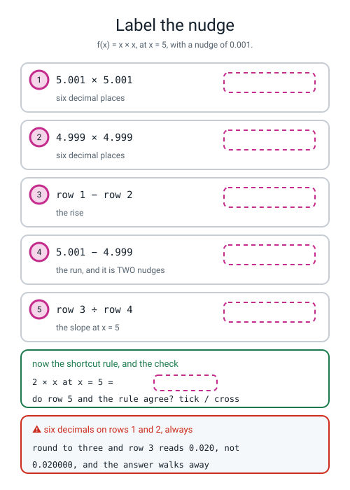
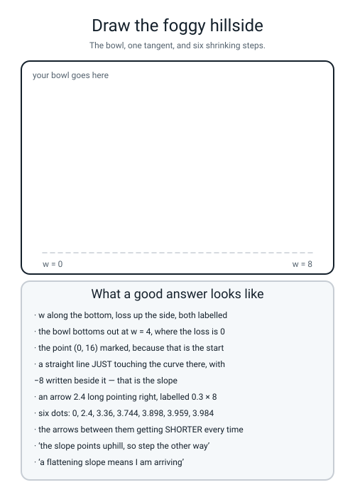

# Workbook — Week 12: How Steep Is the Hill Right Here?

**Name:** ________________________________  **Date:** ______________

[⬅ Week 11](week-11.md) · [📖 Read the chapter first](../student-guide/week-12.md) · [Course Home](../README.md) · [Next ➡](week-13.md)

---

## ✅ Warm-Up (5 min)

Five quick questions about **last week** — cost matrices, trapezoid strips and the `±`.

**W1.** A miss costs £500 and a false alarm costs £10. **How many false alarms is one miss worth?** ________  **And at `t = 0.10` there were 11 misses and 5 false alarms, so the total cost was** `500 × ______ + 10 × ______ = ____________`

**W2.** The area of one trapezoid strip is ______________________________________________

**W3.** `np.trapz(xs, ys)` gave 0.3000 where `np.trapz(ys, xs)` gives 0.7000. **What is the five-second check that tells you which is wrong?**

________________________________________________________________

**W4.** `StratifiedKFold` gave frauds per fold of `[14, 14, 14, 15, 15]` and plain `KFold` gave `[11, 17, 14, 17, 13]`. **Both add to 72. Why does the second one make diagnosis harder?**

________________________________________________________________

**W5.** We reported `AUC = 0.628 ± 0.087`. Somebody's new model scores **0.65**. **Can you say yours is worse?** ______  **Why?** ______________________________

---

## 🔢 Do the Maths by Hand

**This is the most important page in Level 3 and there is no code on it.** Calculator, three sheets of squared paper, and **six decimal places on every multiplication.** Rounding to three decimals is right by luck at `x = 3` and wrong at `x = 5`.

**M1 — the nudge, on the simplest curve there is.** `f(x) = x × x`, and the nudge is `h = 0.001`. **So every division is by 0.002**, because you move a nudge each way and that is two nudges in total.

**(a) at x = 3:**

```
f(3.001)  =  3.001 × 3.001  =  ______________        <- six decimals
f(2.999)  =  2.999 × 2.999  =  ______________        <- six decimals

the rise  =  ______________ − ______________  =  ______________
the run   =  3.001 − 2.999  =  ______________

slope     =  ______________ ÷ ______________  =  ______________
```

**(b) at x = 1:**

```
f(1.001) = ______________   f(0.999) = ______________
rise = ______________   ÷ 0.002 = ______________
```

**(c) at x = 5:**

```
f(5.001) = ______________   f(4.999) = ______________
rise = ______________   ÷ 0.002 = ______________
```

**M1(d).** Line your three answers up under the three x values and look at them **before** reading on.

```
    at x = 1  the slope is  ________
    at x = 3  the slope is  ________
    at x = 5  the slope is  ________
```

**Write the pattern as a rule:** the slope of `x × x` is ______________

**M1(e).** Somebody divided by **0.001** instead of 0.002 and got 4, 12 and 20. **In one sentence, how far apart are 3.001 and 2.999?**

________________________________________________________________

**M2 — two more functions, six more slopes.** Same nudge, same division.

**`g(x) = x × x × x`. The rule is `3 × x × x`.**

| x | `g(x + h)` | `g(x − h)` | difference | `÷ 0.002` | rule `3 × x²` | ✅ / ❌ |
|---|---|---|---|---|---|---|
| 1 | ____________ | ____________ | ____________ | ____________ | ______ | |
| 3 | ____________ | ____________ | ____________ | ____________ | ______ | |
| 5 | ____________ | ____________ | ____________ | ____________ | ______ | |

**`k(x) = 5 × x`. The rule is just `5`.**

| x | `k(x + h)` | `k(x − h)` | difference | `÷ 0.002` | rule | ✅ / ❌ |
|---|---|---|---|---|---|---|
| 1 | ____________ | ____________ | ____________ | ____________ | ______ | |
| 3 | ____________ | ____________ | ____________ | ____________ | ______ | |
| 5 | ____________ | ____________ | ____________ | ____________ | ______ | |

**M2(a).** The `x × x × x` measurements do **not** come out exactly on the rule. Write one of them to six decimals: ____________  **Is that a mistake?** ______  **Why?**

________________________________________________________________

**M2(b).** `5 × x` has the same slope at all three points. **What is it about that curve that makes it so?**

________________________________________________________________

**M2(c).** `x²` → `2x`. `x³` → `3x²`. **Predict the rule for `x⁴`, then test it at `x = 2`.**

**my prediction:** ______________  **so at x = 2 it should be** `4 × 2³ = ________`

```
(2.001)⁴ = ______________     (1.999)⁴ = ______________
difference = ______________   ÷ 0.002 = ______________
```

**Did your prediction survive?** ______

**M3 — six steps downhill.** The loss is `loss(w) = (w − 4) × (w − 4)`. Start at **w = 0**, learning rate **0.3**. **Re-measure the slope at every new w — that is the whole exercise.**

| step | w | loss | slope | `0.3 × slope` | new w |
|---|---|---|---|---|---|
| 0 | 0.000000 | ____________ | ____________ | ____________ | ____________ |
| 1 | ____________ | ____________ | ____________ | ____________ | ____________ |
| 2 | ____________ | ____________ | ____________ | ____________ | ____________ |
| 3 | ____________ | ____________ | ____________ | ____________ | ____________ |
| 4 | ____________ | ____________ | ____________ | ____________ | ____________ |
| 5 | ____________ | ____________ | ____________ | ____________ | ____________ |

**M3(a).** Row 0, longhand. Use the shortcut `slope = 2 × (w − 4)` and also check it by nudging.

```
slope at w = 0:      2 × (0 − 4)  =  2 × (________)  =  ____________
by nudging:          ((0.001 − 4)² − (−0.001 − 4)²) ÷ 0.002  =  ____________
the step:            0.3 × (________)  =  ____________
the new w:           0 − (________)  =  0 + ________  =  ____________
```

**M3(b).** After six steps `w = ____________` and the target was **4**. **Why did it not land exactly on 4?** Two sentences, and the words "rounding error" are banned.

________________________________________________________________

________________________________________________________________

**M3(c) — the check that catches every slip.** Write the **gap** `w − 4` after each step and see what is happening to it.

```
start:  ________   step 1: ________   step 2: ________   step 3: ________

step 4: ________   step 5: ________   step 6: ________
```

**Each gap is the one before it multiplied by ____________.** If one row breaks that pattern, **that is the row with the slip in it.**

**M3(d).** What would `w` be if you did **one more** step? Use the multiplier, not the table.

`gap = ________ × ________ = ____________`  so `w = 4 + (________) = ____________`

**M4 — the eight losses on the ten students.** `predicted marks = w × hours + 12`, and the real marks are `8 × hours + 12` exactly.

| hours | 1 | 2 | 3 | 4 | 5 | 6 | 7 | 8 | 9 | 10 |
|---|---|---|---|---|---|---|---|---|---|---|
| marks | 20 | 28 | 36 | 44 | 52 | 60 | 68 | 76 | 84 | 92 |

**M4(a) — the loss at `w = 10`, all ten rows, in your head.**

```
  hours       1    2    3    4    5    6    7    8    9   10
  predicted  __   __   __   __   __   __   __   __   __   __      (10 × hours + 12)
  actual     20   28   36   44   52   60   68   76   84   92
  error      __   __   __   __   __   __   __   __   __   __      (predicted − actual)
  squared    __   __   __   __   __   __   __   __   __   __

  the squares add up to ____________
  ____________ ÷ 10  =  ____________
```

**M4(b).** Now `w = 4`. You do not need to write out ten rows if you spot the pattern — **every error is a multiple of `(w − 8)`.**

`at w = 4 each error is ________ × hours`, `so each square is ________ × hours²`, `and the loss is ____________`

**M4(c).** The sum of `1² + 2² + … + 10²` is **385**. Divide by 10: ____________

**Now write the loss as one formula:** `loss(w) = ________ × (w − 8)²`

**M4(d).** Check your formula against three known losses.

`at w = 0: ________ × 64 = ____________`   `at w = 6: ________ × 4 = ____________`   `at w = 14: ________ × 36 = ____________`

**M4(e).** The chapter said the measured slope on this loss is exactly `77 × (w − 8)`. **Where does the 77 come from?** ______________________

**M4(f).** So at `w = 2` the slope is `77 × (________) = ____________`, and at `w = 12` it is `77 × ________ = ____________`.

**Which way would you step from each?** from w = 2: ____________  from w = 12: ____________

---

## 🔎 Predict the Output

**Write your prediction in pen before you run anything.** **Two of these four print no error and nonsense.**

### P1 — eight numbers, a shape, and a position

```python
c = np.linspace(0, 14, 8)
print(c.shape)
print(c)
losses = np.array([2464., 1386., 616., 154., 0., 154., 616., 1386.])
print(np.argmin(losses), np.min(losses), c[np.argmin(losses)])
print(np.linspace(0, 14).shape)
```

**I predict — line 1 (a shape):** ____________  **line 2:** ____________________

**line 3 (three things):** ____________________  **line 4 (a shape):** ____________

**It really printed:**

```text
________________________________
________________________________
________________________________
________________________________
```

**Line 3 prints three numbers that people constantly confuse. Say what each one is:**

**`np.argmin(losses)`** = ______________________  **`np.min(losses)`** = ______________________

**`c[np.argmin(losses)]`** = ______________________

**Line 4 left the `8` off. How many numbers did numpy give you instead, and did it warn you?** ____________

### P2 — four brackets, four answers, one right

```python
def f(x):
    return x * x
h = 0.001
print("%.6f" % ((f(3 + h) - f(3 - h)) / (2 * h)))
print("%.6f" % ((f(3 + h) - f(3 - h)) / 2 * h))
print("%.6f" % ((f(3 + h) - f(3 - h)) / h))
print("%.6f" % ((f(3 + h) - f(3)) / h))
```

**I predict — line 1:** ____________  **line 2:** ____________  **line 3:** ____________  **line 4:** ____________

**It really printed:**

```text
________________________
________________________
________________________
________________________
```

**Line 2 is a million times too small. Write out what Python did, in the order it did it:**

`(9.006001 − 8.994001) = ________`, then `÷ 2 = ________`, then `× 0.001 = ________`

**Line 3 is exactly double. Why?** ______________________________________

**Line 4 nudges only one way and gets 6.001. Which of these four would you use, and why not line 4?**

________________________________________________________________

### P3 — the caret that is not a power

```python
e = np.array([-2, -4, -6])
print(e ** 2)
print(e ^ 2)
print((e ** 2).mean())
print((e ^ 2).mean())
```

**I predict — line 1:** ____________________  **line 2:** ____________________

**line 3:** ____________  **line 4:** ____________

**It really printed:**

```text
________________________________
________________________________
________________________________
________________________________
```

**Line 2 produced negative "squares" and no error. If every one of your squared errors came out negative, what did you type?** ____________

**Line 4 is a negative average of things that were supposed to be squares. Could a loss ever be negative?** ______  **So what would that number have told you if you had been watching?**

________________________________________________________________

### P4 — one wrong character, five rows of disaster

```python
h = 0.001


def L(w):
    return (w - 8) ** 2


w = 2.0
for step in range(3):
    s = (L(w + h) - L(w - h)) / (2 * h)
    w = w + 0.3 * s
    print("step %d  slope %.4f  w %.4f  loss %.4f" % (step, s, w, L(w)))
```

**I predict — step 0:** ____________________  **step 2's loss:** ____________

**It really printed:**

```text
________________________________________
________________________________________
________________________________________
```

**Which single character is wrong?** ______  **What is the loss column doing?** ______________

**Why does it get *faster*, not slower?** ______________________________________

**The chant:** ______________________________________

**How many of the answers on this page did you get right?** ______ / 15

**Which one surprised you most?** ______________________________

---

## ✍️ Practice Set A — Read It

**A1. Match the word to the thing.** Write the letter.

| Word | | Description |
|---|---|---|
| **loss** | ______ | (i) How big a step you take downhill; your stride length |
| **loss surface** | ______ | (ii) A slope measured by nudging each way and dividing. Slow, and never lies |
| **derivative** | ______ | (iii) One number for how wrong the model is right now |
| **numerical gradient** | ______ | (iv) The shape you get by plotting loss against a weight |
| **learning rate** | ______ | (v) The slope at a point, written as a rule that works at every point |

**A1(a).** Two of those five are the **same measurement**, one done by arithmetic and one written as a rule. Which two? ____________________

**A2. Read the eight guesses.** Real output from `valley.py`:

```text
candidates [ 0.  2.  4.  6.  8. 10. 12. 14.]
   w      loss
  0.0    2464.00
  2.0    1386.00
  4.0     616.00
  6.0     154.00
  8.0       0.00
 10.0     154.00
 12.0     616.00
 14.0    1386.00
np.argmin(losses) = 4
so the best of the eight is w = 8.0
```

**A2(a).** `w = 6` and `w = 10` give **exactly** the same loss. **Why? Name the operation responsible.**

________________________________________________________________

**A2(b).** `np.argmin` says **4** and the best `w` is **8.0**. **Explain the gap between those two numbers in one sentence.**

________________________________________________________________

**A2(c).** Suppose the hidden answer had been **8.3** instead of 8. **Would this method have found it?** ______  **Why not?**

________________________________________________________________

**A2(d).** Count the guesses needed to try 8 candidate values for each weight.

`1 weight: ________`  `2 weights: 8 × 8 = ________`  `3 weights: ________`

**A small network has a hundred thousand knobs. Write the one sentence this is all for:**

________________________________________________________________

**A3. Spot the bug.** Each line is wrong or dangerous. Say what happens and write the fix.

| # | The line | What happens | The fix |
|---|---|---|---|
| a | `hours = [1, 2, 3, 4, 5]` then `w * hours + 12` | | |
| b | `s = (loss(w + h) - loss(w - h)) / 2 * h` | | |
| c | `s = (loss(w + h) - loss(w - h)) / h` | | |
| d | `w = w + lr * s` | | |
| e | `candidates = np.linspace(0, 14)` | | |
| f | `print("best w =", np.argmin(losses))` | | |

**A3(g).** **Five** of those six produce no error at all. Which one crashes? ______  **And of the five silent ones, which is hardest to notice?** ______  **Why?**

________________________________________________________________

**A4. Match the code to the output.** Five of each, no output used twice.

| | Code |
|---|---|
| i | `print("%.6f" % ((f(3+h) - f(3-h)) / (2*h)))` |
| ii | `print("%.6f" % ((f(3+h) - f(3-h)) / 2 * h))` |
| iii | `print("%.6f" % ((f(3+h) - f(3-h)) / h))` |
| iv | `print(np.linspace(0, 14, 8))` |
| v | `print(np.array([-2, -4, -6]) ^ 2)` |

| | Output |
|---|---|
| P | `[-4 -2 -8]` |
| Q | `12.000000` |
| R | `[ 0.  2.  4.  6.  8. 10. 12. 14.]` |
| S | `0.000006` |
| T | `6.000000` |

**Your answers:** i → ______  ii → ______  iii → ______  iv → ______  v → ______

**A5. Four learning rates, one doctor's chart.** Real output, all starting from `w = 2` on the ten-student loss, 25 steps each:

```text
lr = 0.001  after 25 steps  w =         7.1905   loss =          25.2260
lr = 0.01   after 25 steps  w =         8.0000   loss =           0.0000
lr = 0.026  after 25 steps  w =        14.3073   loss =        1531.6139
lr = 0.03   after 25 steps  w =      5135.8303   loss =  1012343768.1032
```

**A5(a).** Write a one-word diagnosis for each.

`0.001:` ____________  `0.01:` ____________  `0.026:` ____________  `0.03:` ____________

**A5(b).** `0.026` **drifts slowly away** from the answer and `0.03` **leaps to `w = 5135`**. Is the change between them gentle or sudden? ____________  **What does that mean for how you should pick one?**

________________________________________________________________

**A5(c).** Earlier in the chapter, `lr = 0.3` worked beautifully on the **one-student** loss. On the ten-student loss it does this:

```text
  step 0  w           140.6000  loss            676936.2600
  step 1  w         -2922.4600  loss         330622438.7526
```

**The slope at `w = 2` is −12 on one loss and −462 on the other. Work out `462 ÷ 12`:** ____________

**Now write the sentence:** ______________________________________

**A5(d).** Your loss is going up. **What are the only two things you check, and in what order?**

**1.** ______________________  **2.** ______________________

**A6. Label the nudge.** Fill in all five dashed boxes, then the rule panel, then say what the warning panel is about.


*Figure W12.1 — Five lines of arithmetic at x = 5, with the answers removed.*

**A6(a).** Which two of the five boxes need **six** decimal places, and what goes wrong with three?

________________________________________________________________

**A6(b).** Box 4 is the run. A classmate wrote **0.001** in it. **What answer will they get, and how would they spot it?**

________________________________________________________________

---

## ✍️ Practice Set B — Write It

### B1 — one line, plus a print

**Task:** print the measured slope of `x × x` at `x = 7`, to six decimal places, with `h = 0.001`. **Before you run it, work out what the shortcut rule says it should be.**

**the rule says:** ____________

**Expected output:**

```text
14.000000
```

**Done looks like:** brackets round `2 * h`, `%.6f`, and a number that matches your prediction.

```python
h = 0.001
print(_______________________________________________________)
```

### B2 — one function that measures any slope

**Task:** write `slope_at(f, x, h)` that prints the four lines of the arithmetic and then returns the slope. **It has to take the function as an argument**, so the same six lines work for any curve. Test it on `x × x` at 3 and on `x × x × x` at 2.

**Expected output:**

```text
f(3.001) = 9.006001
f(2.999) = 8.994001
difference        = 0.012000
divided by 0.002  = 6.000000

f(2.001) = 8.012006
f(1.999) = 7.988006
difference        = 0.024000
divided by 0.002  = 12.000001
```

**Done looks like:** `def slope_at(f, x, h):` with `f` used as `f(x + h)`, `%.6f` on every number, and the two results checked against `2 × 3` and `3 × 2²`.

### B3 — nine slopes, nine ticks

**Task:** write `nine.py`. Three functions, three points each, and a last column that prints `tick` or `CROSS` by comparing your measurement with the rule. **Nine ticks out of nine.**

**Expected output:**

```text
function   x    f(x+h)       f(x-h)      difference   / 0.002     rule    tick
x*x      1.0     1.002001     0.998001     0.004000   2.000000      2.0   tick
x*x      3.0     9.006001     8.994001     0.012000   6.000000      6.0   tick
x*x      5.0    25.010001    24.990001     0.020000  10.000000     10.0   tick
x*x*x    1.0     1.003003     0.997003     0.006000   3.000001      3.0   tick
x*x*x    3.0    27.027009    26.973009     0.054000  27.000001     27.0   tick
x*x*x    5.0   125.075015   124.925015     0.150000  75.000001     75.0   tick
5*x      1.0     5.005000     4.995000     0.010000   5.000000      5.0   tick
5*x      3.0    15.005000    14.995000     0.010000   5.000000      5.0   tick
5*x      5.0    25.005000    24.995000     0.010000   5.000000      5.0   tick
```

**Done looks like:** three `def`s, one loop, and `abs(measured - expected) < 0.001` for the tick — **not `==`**, because `x³` comes out at 3.000001 and an exact comparison would fail on three perfectly correct rows.

### B4 — six steps, with the gap column

**Task:** write `descend.py`. Six steps on `(w − 4)²` from `w = 0` with `lr = 0.3`, tabulated, plus a **gap to 4** column. Then print the gap sequence on its own, produced by multiplying by the factor rather than by descending — so the two agree.

**Expected output:**

```text
step    w        loss      slope     lr x slope     new w      gap to 4
   0 0.000000   16.000000  -8.000000     -2.400000   2.400000    -1.600000
   1 2.400000    2.560000  -3.200000     -0.960000   3.360000    -0.640000
   2 3.360000    0.409600  -1.280000     -0.384000   3.744000    -0.256000
   3 3.744000    0.065536  -0.512000     -0.153600   3.897600    -0.102400
   4 3.897600    0.010486  -0.204800     -0.061440   3.959040    -0.040960
   5 3.959040    0.001678  -0.081920     -0.024576   3.983616    -0.016384
after six steps w = 3.983616    the target was 4

the gap gets multiplied by the same number every step:
  after 0 steps the gap is  -4.000000
  after 1 steps the gap is  -1.600000
  after 2 steps the gap is  -0.640000
  after 3 steps the gap is  -0.256000
  after 4 steps the gap is  -0.102400
  after 5 steps the gap is  -0.040960
  after 6 steps the gap is  -0.016384
```

**Done looks like:** the slope re-measured by nudging **inside** the loop, and the second block's numbers matching the first block's `gap to 4` column exactly. **Runtime instant.**

### B5 — a whole program of your own, about 25 lines

**Task:** write `hill.py` — the same method on a completely new problem. **Basketball practice.** Eight sessions; a player already makes 5 shots with no practice at all, plus some number of extra shots per session. **The hidden answer is 4, and your program must not be told it.**

```text
sessions   1   2   3   4   5   6   7   8
made       9  13  17  21  25  29  33  37       (4 x sessions + 5, exactly)
```

Print: the data, eight guesses with their losses and `np.argmin`, the nudged slope at three guesses, and eight steps downhill from `w = 0` with `lr = 0.01`.

**Expected output:**

```text
sessions [1 2 3 4 5 6 7 8]
made     [ 9 13 17 21 25 29 33 37]

--- eight guesses for w (extra shots per session) ---
   w      loss
  0.0   408.0000
  1.0   229.5000
  2.0   102.0000
  3.0    25.5000
  4.0     0.0000
  5.0    25.5000
  6.0   102.0000
  7.0   229.5000
np.argmin(losses) = 4   best of the eight w = 4.0

--- the slope, by nudging, at three of those guesses ---
   w   loss(w+h)   loss(w-h)   difference     slope
 1.0  229.347026  229.653025    -0.306000 -153.0000
 4.0    0.000026    0.000025     0.000000    0.0000
 7.0  229.653026  229.347025     0.306000  153.0000

--- eight steps downhill from w = 0, lr = 0.01 ---
step    w        loss      slope     lr x slope     new w
   0 0.000000  408.000000  -204.0000     -2.040000   2.040000
   1 2.040000   97.960800   -99.9600     -0.999600   3.039600
   2 3.039600   23.520388   -48.9804     -0.489804   3.529404
   3 3.529404    5.647245   -24.0004     -0.240004   3.769408
   4 3.769408    1.355904   -11.7602     -0.117602   3.887010
   5 3.887010    0.325552    -5.7625     -0.057625   3.944635
   6 3.944635    0.078165    -2.8236     -0.028236   3.972871
   7 3.972871    0.018767    -1.3836     -0.013836   3.986707
after eight steps w = 3.986707    the answer hidden in the data was 4
```

**Done looks like:** `np.array` for both columns, `np.linspace(0, 7, 8)` for the grid, the slope re-measured every step, and **runtime instant.**

**And answer these from your own output:** the three signs in the middle block are ________, ________ and ________. **What is each one telling you to do?** ______________________________________

**Why `lr = 0.01` and not 0.3?** ______________________________________

---

## 🐞 Fix the Broken Program

This program has **three** bugs: one **type** bug, one **runtime** bug, and one **silent logic** bug. The real messages are below, in the order you meet them.

```python
"""broken12.py - eight steps downhill on the ten students.  THREE bugs."""
import numpy as np

hours = [1, 2, 3, 4, 5, 6, 7, 8, 9, 10]
marks = np.array([20, 28, 36, 44, 52, 60, 68, 76, 84, 92])
h = 0.0
lr = 0.01


def loss(w):
    return ((w * hours + 12 - marks) ** 2).mean()


print("loss at w = 6 :", loss(6))
print("step    w         loss        slope")
w = 2.0
for step in range(6):
    s = (loss(w + h) - loss(w - h)) / (2 * h)
    w = w + lr * s
    print("%4d %9.4f %12.4f %12.4f" % (step, w, loss(w), s))
print("final w %.6f" % w)
```

**Run 1 — nothing prints at all:**

```text
Traceback (most recent call last):
  File "broken12.py", line 14, in <module>
    print("loss at w = 6 :", loss(6))
  File "broken12.py", line 11, in loss
    return ((w * hours + 12 - marks) ** 2).mean()
TypeError: can only concatenate list (not "int") to list
```

**Bug 1.** Which line? ______  **Kind of bug?** ______________

**`w * hours` did not crash, and it did not multiply anything either. What did it actually do?**

________________________________________________________________

**So how many numbers were in the thing Python then tried to add 12 to?** ______

**The fix:** ______________________________________________

**Run 2 — after fixing bug 1:**

```text
/…/broken12.py:18: RuntimeWarning: invalid value encountered in scalar divide
  s = (loss(w + h) - loss(w - h)) / (2 * h)
loss at w = 6 : 154.0
step    w         loss        slope
   0       nan          nan          nan
   1       nan          nan          nan
   2       nan          nan          nan
   3       nan          nan          nan
   4       nan          nan          nan
   5       nan          nan          nan
final w nan
```

**Bug 2.** Which line? ______  **Kind of bug?** ______________

**Work out by hand what the top and the bottom of that division were:**

`loss(w + 0.0) − loss(w − 0.0) = ____________`  `2 × 0.0 = ____________`

**`nan` stands for "not a number". What is the arithmetic that produces it?** ____________

> **💡 Worth knowing.** In **plain Python**, `0.0 / 0.0` raises `ZeroDivisionError: float division by zero` and stops. In **numpy**, it prints a warning and hands you `nan`, which then quietly spreads through everything it touches. **Notice that `loss at w = 6 : 154.0` was right** — the loss function was fine all along.

**The fix:** ______________________________________________

**And the honest one-line reason calculus exists:** ______________________________________________

**Run 3 — after fixing bugs 1 and 2. It runs all the way through, with no error and no warning:**

```text
loss at w = 6 : 154.0
step    w         loss        slope
   0   -2.6200    4342.1994    -462.0000
   1  -10.7974   13603.6765    -817.7400
   2  -25.2714   42618.9581   -1447.3998
   3  -50.8904  133520.9339   -2561.8976
   4  -96.2360  418307.7337   -4534.5588
   5 -176.4977 1310516.2988   -8026.1691
```

**Bug 3.** Which line? ______  **Kind of bug?** ______________

**Read the `loss` column out loud. What is it doing?** ______________

**The slope at step 0 is −462. Work out both possible steps:**

`w − 0.01 × (−462) = ____________`  `w + 0.01 × (−462) = ____________`

**Which one moves towards 8?** ____________  **So which sign is right?** ______

**Why does the disaster speed up rather than settle down?**

________________________________________________________________

**The fix:** ______________________________________________

**Run 4 — after fixing all three:**

```text
loss at w = 6 : 154.0
step    w         loss        slope
   0    6.6200      73.3194    -462.0000
   1    7.6826       3.8786    -106.2600
   2    7.9270       0.2052     -24.4398
   3    7.9832       0.0109      -5.6212
   4    7.9961       0.0006      -1.2929
   5    7.9991       0.0000      -0.2974
final w 7.999112
```

**Two questions, and they are the point of the whole page.**

**In run 4 the slope column goes −462, −106, −24.4, −5.6, −1.3, −0.30. What is that telling you, and what would it mean if it stopped shrinking?**

________________________________________________________________

**`loss at w = 6 : 154.0` printed correctly in runs 2, 3 and 4 — through all three bugs. What does that tell you about where to start looking when most of a program works?**

________________________________________________________________

**Rank the three bugs from easiest to hardest to notice.**

**easiest → hardest:** ______  ______  ______

---

## 🧩 Puzzle of the Week

### The Stride That Lands Exactly

Same bowl as the maths page: `loss(w) = (w − 4)²`, slope `2 × (w − 4)`, always starting at **w = 0**.

You already found that with `lr = 0.3` **the gap to 4 gets multiplied by 0.4 every step.** This puzzle is about where that 0.4 came from — **and there is no algebra in it, only arithmetic you can check.**

**Part 1(a).** Do **one** step for each learning rate and work out the new gap. The starting gap is `0 − 4 = −4`.

| lr | slope at w = 0 | `lr × slope` | new w | new gap | `new gap ÷ −4` |
|---|---|---|---|---|---|
| 0.1 | −8 | ____________ | ____________ | ____________ | ____________ |
| 0.25 | −8 | ____________ | ____________ | ____________ | ____________ |
| 0.3 | −8 | ____________ | ____________ | ____________ | ____________ |
| 0.5 | −8 | ____________ | ____________ | ____________ | ____________ |
| 0.6 | −8 | ____________ | ____________ | ____________ | ____________ |
| 1.0 | −8 | ____________ | ____________ | ____________ | ____________ |
| 1.1 | −8 | ____________ | ____________ | ____________ | ____________ |

**Part 1(b).** That last column is the **factor** — what the gap gets multiplied by, every single step. Line the seven factors up against their learning rates:

| lr | 0.1 | 0.25 | 0.3 | 0.5 | 0.6 | 1.0 | 1.1 |
|---|---|---|---|---|---|---|---|
| factor | ______ | ______ | ______ | ______ | ______ | ______ | ______ |
| `1 − 2 × lr` | ______ | ______ | ______ | ______ | ______ | ______ | ______ |

**Write the rule you have just found:** factor = ______________

**Part 1(c) — the magic stride.** One of those learning rates has a factor of **exactly zero.** Which? ____________  **What happens on the very first step?**

________________________________________________________________

**Part 1(d) — the strange one.** For `lr = 0.6` the factor is **negative.** Write the gaps for six steps.

```
−4.0000  →  ________  →  ________  →  ________  →  ________  →  ________  →  ________
```

**Describe in one sentence what the walker is doing.**

________________________________________________________________

**Does it still arrive?** ______  **How do you know from the factor alone?** ______________________

**Part 1(e) — the trap.** For `lr = 1.0` the factor is **−1**. Write six gaps:

```
−4.0000  →  ________  →  ________  →  ________  →  ________  →  ________  →  ________
```

**What is the loss doing?** ______________  **Will it ever arrive?** ______  **In one sentence, why is this the most instructive failure of the whole page?**

________________________________________________________________

**Part 1(f) — the catastrophe.** For `lr = 1.1` the factor is **−1.2**. Write six gaps to four decimals:

```
−4.0000  →  ________  →  ________  →  ________  →  ________  →  ________  →  ________
```

**Part 1(g) — the verdict.** Fill in the three bands, using the factor rule and the fact that a gap only shrinks when the factor is **between −1 and 1**.

| the factor is | which happens when lr is | and the walker |
|---|---|---|
| between 0 and 1 | ________ to ________ | ______________________ |
| exactly 0 | ________ | ______________________ |
| between −1 and 0 | ________ to ________ | ______________________ |
| exactly −1 or beyond | ________ or more | ______________________ |

**Part 1(h).** Check your verdict against the real output, by running this:

```python
h = 0.001


def L(w):
    return (w - 4) ** 2


for lr in [0.1, 0.25, 0.3, 0.5, 0.6, 1.0, 1.1]:
    w = 0.0
    for step in range(6):
        s = (L(w + h) - L(w - h)) / (2 * h)
        w = w - lr * s
    print("lr = %-5s factor %+.2f   after six steps w = %12.6f   loss = %14.6f"
          % (lr, 1 - 2 * lr, w, L(w)))
```

**It printed:**

```text
____________________________________________________________
____________________________________________________________
____________________________________________________________
____________________________________________________________
____________________________________________________________
____________________________________________________________
____________________________________________________________
```

**Part 1(i).** The chapter said `lr = 0.026` drifts away from the answer on the ten-student loss and `0.03` explodes, and called it *"a hard edge, not a gentle degradation"*. **Using the factor rule, explain the hard edge in one sentence.**

________________________________________________________________

---

## 🤔 Think Deeper

**T1.** We already knew the answer was **8** — we planted it in the data on purpose. **Write a paragraph** on why that was the right way to build this lesson. What would you have been able to say about `7.996068` if the real answer had been unknown? Then name two later weeks where the same trick gets used again, and finish with the general rule in one sentence.

________________________________________________________________

________________________________________________________________

________________________________________________________________

________________________________________________________________

________________________________________________________________

**T2.** Our loss reached **exactly zero**, and it only did that because a perfect straight line was hidden in the data. Put a wobble on those ten students — real students, who sleep badly and forget things — and the best possible loss becomes **8.9106**, and no amount of stepping gets below it. **Write a paragraph** on what that 8.9106 is. Is it a bug? Is it the model's fault? Should you keep training? **And say what you would do if you had two models, one reaching 8.9106 and one reaching 0.0000 on the same wobbly data.**

________________________________________________________________

________________________________________________________________

________________________________________________________________

________________________________________________________________

---

## 🛠️ Build It — The Foggy Hillside

**Four things get handed in, and the fourth is one sentence.** There is code in this week's homework, but **the code is only there to mark you.**

### Step checklist

- [ ] **1.** Nine slopes by hand. **Six decimal places on every multiplication.**
- [ ] **2.** The shortcut rule written beside each, with **a tick or a cross.** *(Crosses are expected — write them.)*
- [ ] **3.** Predict `x⁴`, then test it at `x = 2`.
- [ ] **4.** Six steps downhill on `(w − 4)²` from `w = 0`, `lr = 0.3`, tabulated.
- [ ] **5.** The **gap column** filled in, and the multiplier identified.
- [ ] **6.** The eight losses on the ten-student data, three of them worked by hand.
- [ ] **7.** `valley.py`, `slope.py` and `walk.py` typed and run. **Tick every number that matches your handwriting.**
- [ ] **8.** `valley.png` opened and looked at.
- [ ] **9.** One sentence: what is a derivative — **no symbols, and without using the word.**
- [ ] **10.** Two Bug Log entries.

### Nine slopes, by hand

**`f(x) = x × x`** — the rule is `2 × x`

| x | `f(x + h)` | `f(x − h)` | difference | `÷ 0.002` | the rule says | ✅ / ❌ |
|---|---|---|---|---|---|---|
| 1 | ____________ | ____________ | ____________ | ____________ | ______ | |
| 3 | ____________ | ____________ | ____________ | ____________ | ______ | |
| 5 | ____________ | ____________ | ____________ | ____________ | ______ | |

**`g(x) = x × x × x`** — the rule is `3 × x × x`

| x | `g(x + h)` | `g(x − h)` | difference | `÷ 0.002` | the rule says | ✅ / ❌ |
|---|---|---|---|---|---|---|
| 1 | ____________ | ____________ | ____________ | ____________ | ______ | |
| 3 | ____________ | ____________ | ____________ | ____________ | ______ | |
| 5 | ____________ | ____________ | ____________ | ____________ | ______ | |

**`k(x) = 5 × x`** — the rule is `5`

| x | `k(x + h)` | `k(x − h)` | difference | `÷ 0.002` | the rule says | ✅ / ❌ |
|---|---|---|---|---|---|---|
| 1 | ____________ | ____________ | ____________ | ____________ | ______ | |
| 3 | ____________ | ____________ | ____________ | ____________ | ______ | |
| 5 | ____________ | ____________ | ____________ | ____________ | ______ | |

**My score:** ______ / 9  **Any crosses, and what caused them:** ______________________________

**`x⁴` at `x = 2`:** my prediction ____________, the nudge gave ____________

### Six steps downhill on `(w − 4)²`

| step | w | loss | slope | `0.3 × slope` | new w | gap to 4 |
|---|---|---|---|---|---|---|
| 0 | 0.000000 | ____________ | ____________ | ____________ | ____________ | ____________ |
| 1 | ____________ | ____________ | ____________ | ____________ | ____________ | ____________ |
| 2 | ____________ | ____________ | ____________ | ____________ | ____________ | ____________ |
| 3 | ____________ | ____________ | ____________ | ____________ | ____________ | ____________ |
| 4 | ____________ | ____________ | ____________ | ____________ | ____________ | ____________ |
| 5 | ____________ | ____________ | ____________ | ____________ | ____________ | ____________ |

**The gap is multiplied by ____________ every row.** **Any row that breaks the pattern:** ____________

**After six steps `w = ____________`, and the target was 4. It did not land exactly because:**

________________________________________________________________

### The eight losses, checked against the code

| w | my hand answer | what `valley.py` printed | same? |
|---|---|---|---|
| 0 | ____________ | ____________ | ______ |
| 2 | ____________ | ____________ | ______ |
| 4 | ____________ | ____________ | ______ |
| 6 | ____________ | ____________ | ______ |
| 8 | ____________ | ____________ | ______ |
| 10 | ____________ | ____________ | ______ |
| 12 | ____________ | ____________ | ______ |
| 14 | ____________ | ____________ | ______ |

**`np.argmin(losses)` printed ______, and the best `w` is ____________.** **Those are different numbers because** ______________________________

**My formula for the whole loss:** `loss(w) = ________ × (w − 8)²`  **and for the slope:** `________ × (w − 8)`

### Three numbers from `slope.py` and `walk.py`, checked

| What | My prediction | What it printed | Same? |
|---|---|---|---|
| slope of `x × x` at `x = 3` | ____________ | ____________ | ______ |
| slope of `x³` at `x = 3` | ____________ | ____________ | ______ |
| `w` after eight steps on the one-student loss | ____________ | ____________ | ______ |
| `w` after 25 steps, ten students, `lr = 0.01` | ____________ | ____________ | ______ |
| `w` after 25 steps, ten students, `lr = 0.03` | ____________ | ____________ | ______ |

**Looking at `valley.png`: how many red dots are on the curve, and which one is at the bottom?** ____________________

### One sentence: what is a derivative?

**No symbols. And if your sentence contains the word "derivative", start again.** Write it as if for somebody two years younger than you who has never heard the word.

________________________________________________________________

________________________________________________________________

### The Bug Log

| What I saw | What it means | Cause | Fix |
|---|---|---|---|
| | | | |
| | | | |

---

## 🎨 Draw It

Draw the foggy hillside. The bowl, **one straight line just touching it at `w = 0`**, with the slope written beside it — and six dots marching in with arrows that get shorter.


*Figure W12.2 — An empty frame, and what a good answer contains.*

**Then answer three things about your own drawing:**

**Your touching line at `w = 0` goes down by 8 for every 1 across. Write that as a fraction:** ____________

**Draw a second touching line at `w = 6`. Which way does it tilt, and what does that tell the walker to do?**

________________________________________________________________

**Your six arrows get shorter. Nobody told them to. Explain why in one sentence containing the word "proportional".**

________________________________________________________________

---

## 📊 Self-Check

| I can... | 😀 | 🙂 | 😕 |
|---|---|---|---|
| turn a guess into one number by averaging ten squared errors | | | |
| compute the loss at eight candidate values and sketch the valley | | | |
| measure the slope of a curve at one point by nudging 0.001 each way | | | |
| get exactly **6.000** at `x = 3` on `x × x`, and say why the division is by 0.002 | | | |
| show that 2, 6 and 10 at `x = 1, 3, 5` are `2 × x`, and only then say "derivative" | | | |
| explain why nudging **both** ways beats nudging one way | | | |
| use the sign of the slope to decide which way to step | | | |
| walk six steps downhill by hand, re-measuring the slope every row | | | |
| spot that a rising loss means the sign or the learning rate is wrong, in that order | | | |
| say what a derivative is in one sentence, with no symbols and without the word | | | |

**The one thing I would ask about if I could ask one question:**

________________________________________________________________

---

## ✅ Answers

<details>
<summary>Check your answers</summary>

### Warm-Up

**W1.** `500 ÷ 10 = **50**` false alarms per miss. And `500 × **11** + 10 × **5** = 5500 + 50 = **5550**`.

**W2.** **`(left height + right height) ÷ 2 × width`** — average the two heights, then multiply by how wide the strip is. And it is **exactly** right, not an approximation, because the top of each strip is a straight line.

**W3.** **Add the two answers up.** `0.7 + 0.3 = 1`, the area of the whole 1-by-1 square — so one of them is the area under the curve and the other is the area to its left. **If your two answers make something you recognise, you measured the wrong side.** No documentation needed.

**W4.** **One chunk had 11 frauds to find and another had 17** — a 55% difference in the size of the job. So if the five scores come out different, you cannot tell whether that is the model being unstable or one chunk simply having been easier. **Stratification removes one of the two explanations.**

**W5.** **No.** 0.65 is **inside** the band 0.542 to 0.715, so it might be your own model on a luckier split. You would need about 0.85 before you could claim anything.

### Do the Maths by Hand

**M1(a).**

```
f(3.001)  =  3.001 × 3.001  =  9.006001
f(2.999)  =  2.999 × 2.999  =  8.994001

the rise  =  9.006001 − 8.994001  =  0.012000
the run   =  3.001 − 2.999  =  0.002

slope     =  0.012000 ÷ 0.002  =  6.000
```

**Six. Two multiplications, one subtraction, one division, and no calculus anywhere.**

**M1(b).** `f(1.001) = **1.002001**`, `f(0.999) = **0.998001**`, rise **0.004000**, `÷ 0.002 = **2.000**`.

**M1(c).** `f(5.001) = **25.010001**`, `f(4.999) = **24.990001**`, rise **0.020000**, `÷ 0.002 = **10.000**`.

**M1(d).**

```
    at x = 1  the slope is  2
    at x = 3  the slope is  6
    at x = 5  the slope is 10
```

**Two times one. Two times three. Two times five.** The rule: **the slope of `x × x` is `2 × x`**, at every point, every time. **And only now is the word allowed.** You measured it; you were not handed it.

**M1(e).** **3.001 and 2.999 are 0.002 apart, not 0.001.** You moved a nudge each way, so **you travelled two nudges in total**, and the run is the whole distance you travelled. Dividing by half the distance doubles the answer. **The symptom is exact: if your answer is precisely twice the rule's, this is why.**

**M2 — `g(x) = x × x × x`:**

| x | `g(x + h)` | `g(x − h)` | difference | `÷ 0.002` | rule | |
|---|---|---|---|---|---|---|
| 1 | **1.003003** | **0.997003** | **0.006000** | **3.000001** | 3 | ✅ out by a millionth |
| 3 | **27.027009** | **26.973009** | **0.054000** | **27.000001** | 27 | ✅ |
| 5 | **125.075015** | **124.925015** | **0.150000** | **75.000001** | 75 | ✅ |

**`k(x) = 5 × x`:**

| x | `k(x + h)` | `k(x − h)` | difference | `÷ 0.002` | rule | |
|---|---|---|---|---|---|---|
| 1 | **5.005000** | **4.995000** | **0.010000** | **5.000000** | 5 | ✅ |
| 3 | **15.005000** | **14.995000** | **0.010000** | **5.000000** | 5 | ✅ |
| 5 | **25.005000** | **24.995000** | **0.010000** | **5.000000** | 5 | ✅ |

**M2(a).** **3.000001** (or 27.000001, or 75.000001). **No, it is not a mistake — it is correct.** The nudge is not infinitely small, so the measurement is off in the sixth decimal. **If you wrote 3.000000 you rounded, or you copied the rule's answer instead of measuring** — and that is the one thing that breaks this page. The rule is a shortcut for something you can only ever measure approximately; **being honest about the millionth is what makes the agreement meaningful.**

**M2(b).** **It is a straight line, and a straight line has only one steepness.** Wherever you stand on it, the ground tilts the same amount. **That is the first hint that some slopes depend on where you are standing and some do not** — and it is why the loss of a straight-line model has a slope that changes (the loss is a curve) while the model itself does not.

**M2(c).** **Prediction: `4 × x³`.** So at `x = 2` it should be `4 × 8 = **32**`.

```
(2.001)⁴ = 16.032024008001     (1.999)⁴ = 15.968023992001
difference = 0.064000016000     ÷ 0.002 = 32.000008
```

**Yes — 32.000008 against a prediction of 32.** Out by eight millionths, for the same reason as `x³`. **That is the actual method by which those rules were found, historically: measure a lot of them and notice the pattern.**

**M3.**

| step | w | loss | slope | `0.3 × slope` | new w |
|---|---|---|---|---|---|
| 0 | 0.000000 | **16.000000** | **−8.000000** | **−2.400000** | **2.400000** |
| 1 | **2.400000** | **2.560000** | **−3.200000** | **−0.960000** | **3.360000** |
| 2 | **3.360000** | **0.409600** | **−1.280000** | **−0.384000** | **3.744000** |
| 3 | **3.744000** | **0.065536** | **−0.512000** | **−0.153600** | **3.897600** |
| 4 | **3.897600** | **0.010486** | **−0.204800** | **−0.061440** | **3.959040** |
| 5 | **3.959040** | **0.001678** | **−0.081920** | **−0.024576** | **3.983616** |

**M3(a).**

```
slope at w = 0:      2 × (0 − 4)  =  2 × (−4)  =  −8
by nudging:          ((−3.999)² − (−4.001)²) ÷ 0.002
                     = (15.992001 − 16.008001) ÷ 0.002
                     = −0.016000 ÷ 0.002  =  −8.000000
the step:            0.3 × (−8)  =  −2.4
the new w:           0 − (−2.4)  =  0 + 2.4  =  2.4
```

**The nudge and the shortcut agree exactly.** A shortcut you have verified is a shortcut you may use — same habit as last week's `BY HAND | np.trapz` board.

**M3(b).** After six steps `w = **3.983616**`, which is 0.016384 short of 4.

> **Full marks:** *"Each step is proportional to the slope, and the slope gets smaller as I get closer, so the steps get smaller too — 2.4, then 0.96, then 0.384. **The gap gets multiplied by 0.4 every step, and multiplying by 0.4 never actually reaches zero.** More steps would get me closer, and no number of steps would get me there."*

**"I made a rounding error" is wrong and loses the mark.** You did not. **The 0.016384 is not an error, it is how the algorithm works.**

**M3(c).** `−4.000000 → **−1.600000** → **−0.640000** → **−0.256000** → **−0.102400** → **−0.040960** → **−0.016384**`

**Each gap is the one before it multiplied by 0.4.**

**M3(d).** `gap = **−0.016384** × **0.4** = **−0.0065536**`, so `w = 4 + (−0.0065536) = **3.9934464**`. **Once you have seen the multiplier you can predict every row without doing any of the arithmetic**, which is exactly why the gap column is the marking check.

**M4(a).**

```
  hours       1    2    3    4    5    6    7    8    9   10
  predicted  22   32   42   52   62   72   82   92  102  112
  actual     20   28   36   44   52   60   68   76   84   92
  error       2    4    6    8   10   12   14   16   18   20
  squared     4   16   36   64  100  144  196  256  324  400

  the squares add up to 1540
  1540 ÷ 10  =  154.0
```

**Exactly the same 154 as `w = 6`** — because 10 is two too high and 6 is two too low, and the errors get squared, so being wrong in either direction by the same amount is equally bad. **That is what makes the shape a valley rather than a slide.**

**M4(b).** At `w = 4` each error is `**−4** × hours`, each square is `**16** × hours²`, and the loss is `16 × 385 ÷ 10 = **616**`.

**M4(c).** `385 ÷ 10 = **38.5**`. So `loss(w) = **38.5** × (w − 8)²`.

**M4(d).** `38.5 × 64 = **2464**` ✅ · `38.5 × 4 = **154**` ✅ · `38.5 × 36 = **1386**` ✅ — **all three match the printed table.** You have just worked out the whole loss surface from one number, and you did it by noticing a pattern rather than by being told a formula.

**M4(e).** **The 77 is `2 × 38.5`.** The loss is `38.5 × (w − 8)²`, and you already measured that the slope of `something²` is `2 × something`, so the slope is `38.5 × 2 × (w − 8) = 77 × (w − 8)`. **Same reasoning as `x × x → 2 × x`, with a constant along for the ride.**

**M4(f).** at `w = 2`: `77 × (**−6**) = **−462**` · at `w = 12`: `77 × **4** = **308**`.

**From `w = 2` the slope is negative, so the ground falls away to the right: step RIGHT.** From `w = 12` it is positive, so the ground rises to the right: **step LEFT.** Both arrows point at 8, and `w = w − lr × slope` does both with **no `if` statement anywhere.**

### Predict the Output

**P1.**

```text
(8,)
[ 0.  2.  4.  6.  8. 10. 12. 14.]
4 0.0 8.0
(50,)
```

**`np.argmin(losses)` = the *position* of the smallest loss** — 4, because the smallest is the fifth one and Python counts from 0. **`np.min(losses)` = the smallest loss itself**, 0.0. **`c[np.argmin(losses)]` = the `w` that produced it**, 8.0 — which is the only one of the three you actually wanted.

**Confusing those three is the most common numpy slip there is, and it produces no error at all.** "Best `w` = 4" is wrong, and 4 is a perfectly plausible-looking weight.

**Line 4 gave you 50 numbers, and numpy did not warn you.** `np.linspace(a, b)` defaults to 50 points. **The `8` is not optional.**

**P2.**

```text
6.000000
0.000006
12.000000
6.001000
```

**Line 2, in the order Python did it:** `(9.006001 − 8.994001) = **0.012000**`, then `÷ 2 = **0.006**`, then `× 0.001 = **0.000006**`. Python works strictly left to right through `/` and `*`, so `/ 2 * h` divides by two and then *multiplies* by the nudge. **A million times too small, no error message.**

**Line 3 is exactly double because you divided by one nudge when you travelled two.** 3.001 down to 2.999 is a distance of 0.002.

**Use line 1.** Line 4 is the **one-sided** nudge: `(f(3.001) − f(3)) ÷ 0.001 = 6.001` — close, but it only looks one way, so the curvature on that side is not cancelled out by the other side. **Symmetric nudging is the same amount of work and lands on 6.000 dead on**, so there is never a reason to nudge one way.

> **🐞 The habit that catches line 2 in one second:** the slope of `x × x` at 3 is about 6, and **you knew that before you looked at the screen.** So `0.000006` is obviously wrong without reading a single line of code. **Work out roughly what the answer should be before you run anything.**

**P3.**

```text
[ 4 16 36]
[-4 -2 -8]
18.666666666666668
-4.666666666666667
```

**`^` in Python is not "to the power of"** — it is a bit-by-bit operation on whole numbers, and it happily produces negative "squares". **If every one of your squared errors came out negative, you typed `^ 2` instead of `** 2`.** No error, no warning, complete nonsense.

**No, a loss can never be negative** — it is an average of squares, and a square is never negative. **So `−4.67` would have told you instantly that something upstream was broken**, if you had been watching. **That is the whole reason to know roughly what size your numbers should be: a loss below zero is impossible, and impossible numbers are free bug detectors.**

**P4.**

```text
step 0  slope -12.0000  w -1.6000  loss 92.1600
step 1  slope -19.2000  w -7.3600  loss 235.9296
step 2  slope -30.7200  w -16.5760  loss 603.9798
```

**The wrong character is the `+` in `w = w + 0.3 * s`.** The loss column is **going up**, and fast: 92, 236, 604.

**Why it gets faster:** **the slope points uphill**, so adding it walks you *up* the side of the valley — and **the further up you go, the steeper it gets**, so the next step is bigger, which takes you further up, which makes the next step bigger again. Look at the slope column: −12, −19.2, −30.7. **A disaster that feeds itself.**

**The chant: *"loss up, check the sign."*** Sign first, learning rate second. **No other diagnosis before those two.**

### Practice Set A

**A1.** loss → **(iii)** · loss surface → **(iv)** · derivative → **(v)** · numerical gradient → **(ii)** · learning rate → **(i)**

**A1(a).** **Derivative and numerical gradient.** They are the same quantity: the numerical gradient is the slope **measured** by nudging and dividing; the derivative is the same slope **written down as a rule** you can use everywhere. *"It is not a new kind of number and it is not a new operation; it is the answer to the nudge-and-divide question, written down once instead of measured every time."*

**A2(a).** **Squaring.** `w = 6` is two too low and `w = 10` is two too high; the errors are `−2, −4, −6, …` and `+2, +4, +6, …`, and squaring throws the sign away. **Being wrong in either direction by the same amount is equally bad**, which is what bends the shape into a valley with a bottom instead of a slide.

**A2(b).** **`np.argmin` gives a position and `candidates[...]` gives the value** — the fifth entry of an eight-long list is at index 4, and the value living there is 8.0. **Writing "best w = 4" is the silent version of this bug.**

**A2(c).** **No.** Eight guesses only ever finds one of the eight values you happened to guess, and 8.3 is not one of `0, 2, 4, 6, 8, 10, 12, 14`. The nearest candidate, 8, would have had a non-zero loss and you would have had no way of knowing whether the true answer was 8, 8.3 or 7.9. **It worked here only because we planted the answer on the grid.**

**A2(d).** `1 weight: **8**` · `2 weights: **64**` · `3 weights: **512**`.

**The sentence:** *"Eight to the power of a hundred thousand. **Guessing does not scale**, and that is the entire motivation for measuring the slope instead."*

**A3.**

| # | What happens | The fix |
|---|---|---|
| a | `TypeError: can only concatenate list (not "int") to list`. `w * hours` **repeats the list** rather than multiplying it, and then adding 12 to a list has no meaning | `hours = np.array([1, 2, 3, 4, 5])` |
| b | **No error**, and a slope a **million** times too small: `0.000006` instead of 6. `/ 2 * h` divides then multiplies | `/ (2 * h)` |
| c | **No error**, and a slope **exactly double**: 12 instead of 6. You travelled two nudges | `/ (2 * h)` |
| d | **No error.** The loss goes **up**, faster every step: 92, 236, 604, 1546, 3958 | `w = w - lr * s` |
| e | **No error.** numpy silently gives **50** numbers instead of 8 | `np.linspace(0, 14, 8)` |
| f | **No error**, and it prints `4` — a **position**, not a weight | `candidates[np.argmin(losses)]` → 8.0 |

**A3(g).** **(a) is the only crash.** Of the five silent ones, **(c) is the hardest to notice** — and it is worth saying why, because most people pick (b). `0.000006` is so absurd that you spot it in a second; `12.000000` **looks exactly like a slope.** It is a tidy number, the right sign, the right order of magnitude, and it would take your descent in the right direction at twice the stride, so **the program would still appear to work** and would just be oddly sensitive to the learning rate. **A wrong answer that still works is the worst kind.** (**(f)** is a close second for the same reason: 4 is a perfectly plausible weight.)

**A4.** i → **T** · ii → **S** · iii → **Q** · iv → **R** · v → **P**

**A5(a).** `0.001:` **slow** · `0.01:` **arrived** · `0.026:` **overshooting** · `0.03:` **catastrophe** (or "diverging").

**A5(b).** **Sudden.** There is a **hard edge**, not a gentle degradation — 0.026 crawls away from the answer and 0.03 leaps clean over the valley to `w = 5135` with a loss of a billion. **So do not try to tune it finely from above.** Start small, and if the loss goes up, **divide the learning rate by ten** rather than shaving a bit off it. Nobody looks the right value up; there is no formula.

**A5(c).** `462 ÷ 12 = **38.5**`.

**The sentence:** *"The ten-student valley is 38.5 times steeper than the one-student valley, so the same stride length that walks gently down one of them launches you off the other. **A learning rate belongs to the hillside, not to you.**"* (And 38.5 is exactly the number you found in M4(c) — it is the average of the squared hours.)

**A5(d).** **1. The sign** — is it `w = w - lr * s`? **2. The learning rate** — divide it by ten. **In that order, and nothing else before them.**

**A6.** The five boxes are **25.010001**, **24.990001**, **0.020000**, **0.002** and **10.000000**. The rule panel: `2 × 5 = **10**`, and **yes they agree — tick.**

**A6(a).** **Boxes 1 and 2**, the two multiplications. Round them to three decimals and you get 25.010 and 24.990, so the difference reads **0.020** rather than 0.020000 — and at `x = 5` you need the fourth, fifth and sixth decimals to be sure that the difference really is 0.020000 and not, say, 0.020004. **At `x = 3` rounding happens to be right by luck; at `x = 5` it stops being.**

**A6(b).** They will get **20.000000** — **exactly double** the right answer. **How they spot it:** the rule says `2 × 5 = 10`, so their measurement disagrees with the shortcut by a factor of exactly two, **and "exactly double" is the signature of dividing by one nudge instead of two.** That is the entire reason the rule column is on the page: **a measurement with nothing to check it against is not evidence.**

### Practice Set B

**B1.** **The rule says `2 × 7 = 14`.**

```python
h = 0.001
print("%.6f" % (((7 + h) * (7 + h) - (7 - h) * (7 - h)) / (2 * h)))
```

```text
14.000000
```

**Predicting 14 before running it is the whole exercise.** A number you predicted and then confirmed is worth ten numbers a computer handed you.

**B2.**

```python
"""slope_at.py - one function that measures any slope.  Week 12 workbook."""


def slope_at(f, x, h):
    up = f(x + h)
    down = f(x - h)
    print("f(%.3f) = %.6f" % (x + h, up))
    print("f(%.3f) = %.6f" % (x - h, down))
    print("difference        = %.6f" % (up - down))
    print("divided by %.3f  = %.6f" % (2 * h, (up - down) / (2 * h)))
    return (up - down) / (2 * h)


def square(x):
    return x * x


def cube(x):
    return x * x * x


slope_at(square, 3.0, 0.001)
print()
slope_at(cube, 2.0, 0.001)
```

```text
f(3.001) = 9.006001
f(2.999) = 8.994001
difference        = 0.012000
divided by 0.002  = 6.000000

f(2.001) = 8.012006
f(1.999) = 7.988006
difference        = 0.024000
divided by 0.002  = 12.000001
```

**Checks: `2 × 3 = 6` ✅ and `3 × 2² = 12` ✅** (and 12.000001, not 12.000000 — the honest millionth again).

**`f` being an argument is the new idea here.** You have passed numbers and strings into functions all year; **a function is a thing you can pass too**, and once you can do that, one six-line recipe measures the slope of anything you will ever write. **That is exactly how PyTorch will feel in Week 20**, except it will not nudge.

**B3.** `nine.py`:

```python
"""nine.py - nine slopes, nine ticks.  Week 12 workbook."""
h = 0.001


def f(x):
    return x * x


def g(x):
    return x * x * x


def k(x):
    return 5 * x


print("function   x    f(x+h)       f(x-h)      difference   / 0.002     rule    tick")
for name, fn, rule in [("x*x    ", f, 0), ("x*x*x  ", g, 1), ("5*x    ", k, 2)]:
    for x in [1.0, 3.0, 5.0]:
        up, down = fn(x + h), fn(x - h)
        measured = (up - down) / (2 * h)
        if rule == 0:
            expected = 2 * x
        elif rule == 1:
            expected = 3 * x * x
        else:
            expected = 5.0
        tick = "tick" if abs(measured - expected) < 0.001 else "CROSS"
        print("%s %4.1f %12.6f %12.6f %12.6f %10.6f %8.1f   %s"
              % (name, x, up, down, up - down, measured, expected, tick))
```

```text
function   x    f(x+h)       f(x-h)      difference   / 0.002     rule    tick
x*x      1.0     1.002001     0.998001     0.004000   2.000000      2.0   tick
x*x      3.0     9.006001     8.994001     0.012000   6.000000      6.0   tick
x*x      5.0    25.010001    24.990001     0.020000  10.000000     10.0   tick
x*x*x    1.0     1.003003     0.997003     0.006000   3.000001      3.0   tick
x*x*x    3.0    27.027009    26.973009     0.054000  27.000001     27.0   tick
x*x*x    5.0   125.075015   124.925015     0.150000  75.000001     75.0   tick
5*x      1.0     5.005000     4.995000     0.010000   5.000000      5.0   tick
5*x      3.0    15.005000    14.995000     0.010000   5.000000      5.0   tick
5*x      5.0    25.005000    24.995000     0.010000   5.000000      5.0   tick
```

**Nine for nine — and the `abs(... ) < 0.001` matters.** Write `measured == expected` instead and the three `x³` rows come back `CROSS`, because 3.000001 is not 3. **They are correct measurements and an exact test would call them failures.** *"Is it close enough?"* is the right question about anything measured; *"is it identical?"* almost never is.

**B4.** `descend.py`:

```python
"""descend.py - six steps downhill, with the gap column.  Week 12 workbook."""
h, lr = 0.001, 0.3


def loss(w):
    return (w - 4) ** 2


print("step    w        loss      slope     lr x slope     new w      gap to 4")
w = 0.0
for step in range(6):
    s = (loss(w + h) - loss(w - h)) / (2 * h)
    new = w - lr * s
    print("%4d %8.6f %11.6f %10.6f %13.6f %10.6f %12.6f"
          % (step, w, loss(w), s, lr * s, new, new - 4))
    w = new
print("after six steps w = %.6f    the target was 4" % w)
print()
print("the gap gets multiplied by the same number every step:")
gap = -4.0
for step in range(7):
    print("  after %d steps the gap is %10.6f" % (step, gap))
    gap = gap * 0.4
```

```text
step    w        loss      slope     lr x slope     new w      gap to 4
   0 0.000000   16.000000  -8.000000     -2.400000   2.400000    -1.600000
   1 2.400000    2.560000  -3.200000     -0.960000   3.360000    -0.640000
   2 3.360000    0.409600  -1.280000     -0.384000   3.744000    -0.256000
   3 3.744000    0.065536  -0.512000     -0.153600   3.897600    -0.102400
   4 3.897600    0.010486  -0.204800     -0.061440   3.959040    -0.040960
   5 3.959040    0.001678  -0.081920     -0.024576   3.983616    -0.016384
after six steps w = 3.983616    the target was 4
```

```text
the gap gets multiplied by the same number every step:
  after 0 steps the gap is  -4.000000
  after 1 steps the gap is  -1.600000
  after 2 steps the gap is  -0.640000
  after 3 steps the gap is  -0.256000
  after 4 steps the gap is  -0.102400
  after 5 steps the gap is  -0.040960
  after 6 steps the gap is  -0.016384
```

**The two blocks agree number for number**, and they got there by completely different routes: the first measured a slope six times and stepped, the second multiplied by 0.4 six times. **Two independent routes agreeing is what verification looks like**, and the second one needs no loss function at all.

**The single most instructive wrong answer available here is six identical steps of 2.4** — which happens when you compute `s` once, outside the loop. **The slope has to be re-measured at the new `w` every single time**, because the whole point is that the ground changes under your feet.

**B5.** `hill.py`:

```python
"""hill.py - basketball practice: how many extra shots does one session buy?  Week 12 workbook."""
import numpy as np

sessions = np.array([1, 2, 3, 4, 5, 6, 7, 8])
made = np.array([9, 13, 17, 21, 25, 29, 33, 37])      # 4 x sessions + 5, exactly
print("sessions", sessions)
print("made    ", made)


def loss(w):
    return (((w * sessions + 5) - made) ** 2).mean()


print()
print("--- eight guesses for w (extra shots per session) ---")
grid = np.linspace(0, 7, 8)
losses = np.array([loss(w) for w in grid])
print("   w      loss")
for i in range(len(grid)):
    print("%5.1f  %9.4f" % (grid[i], losses[i]))
print("np.argmin(losses) =", np.argmin(losses),
      "  best of the eight w =", grid[np.argmin(losses)])

print()
print("--- the slope, by nudging, at three of those guesses ---")
h = 0.001
print("   w   loss(w+h)   loss(w-h)   difference     slope")
for w in [1.0, 4.0, 7.0]:
    up, down = loss(w + h), loss(w - h)
    print("%4.1f %11.6f %11.6f %12.6f %9.4f"
          % (w, up, down, up - down, (up - down) / (2 * h)))

print()
print("--- eight steps downhill from w = 0, lr = 0.01 ---")
print("step    w        loss      slope     lr x slope     new w")
w, lr = 0.0, 0.01
for step in range(8):
    s = (loss(w + h) - loss(w - h)) / (2 * h)
    print("%4d %8.6f %11.6f %10.4f %13.6f %10.6f"
          % (step, w, loss(w), s, lr * s, w - lr * s))
    w = w - lr * s
print("after eight steps w = %.6f    the answer hidden in the data was 4" % w)
```

**Real output. Runtime instant.**

```text
sessions [1 2 3 4 5 6 7 8]
made     [ 9 13 17 21 25 29 33 37]

--- eight guesses for w (extra shots per session) ---
   w      loss
  0.0   408.0000
  1.0   229.5000
  2.0   102.0000
  3.0    25.5000
  4.0     0.0000
  5.0    25.5000
  6.0   102.0000
  7.0   229.5000
np.argmin(losses) = 4   best of the eight w = 4.0

--- the slope, by nudging, at three of those guesses ---
   w   loss(w+h)   loss(w-h)   difference     slope
 1.0  229.347026  229.653025    -0.306000 -153.0000
 4.0    0.000026    0.000025     0.000000    0.0000
 7.0  229.653026  229.347025     0.306000  153.0000

--- eight steps downhill from w = 0, lr = 0.01 ---
step    w        loss      slope     lr x slope     new w
   0 0.000000  408.000000  -204.0000     -2.040000   2.040000
   1 2.040000   97.960800   -99.9600     -0.999600   3.039600
   2 3.039600   23.520388   -48.9804     -0.489804   3.529404
   3 3.529404    5.647245   -24.0004     -0.240004   3.769408
   4 3.769408    1.355904   -11.7602     -0.117602   3.887010
   5 3.887010    0.325552    -5.7625     -0.057625   3.944635
   6 3.944635    0.078165    -2.8236     -0.028236   3.972871
   7 3.972871    0.018767    -1.3836     -0.013836   3.986707
after eight steps w = 3.986707    the answer hidden in the data was 4
```

**The three signs are `−`, `0` and `+`.** At `w = 1` the slope is **negative** → the bottom is to the **right**, so go right. At `w = 4` it is **zero** → **stop, you are at the bottom.** At `w = 7` it is **positive** → the bottom is to the **left**, so go left. **That single column is the entire navigation system.**

**Why `lr = 0.01` and not 0.3:** this hillside has a slope of **−204** at the start, so a stride of 0.3 would move you `0.3 × 204 = 61.2` in one step, to `w = 61.2`, and it gets worse from there. **The valley is steep, so the stride must be short.** The loss is `25.5 × (w − 4)²` — `25.5` is the average of `1²…8²`, which is `204 ÷ 8` — so the slope is `51 × (w − 4)`, and by the Puzzle's rule the gap factor is `1 − 51 × lr`. At `lr = 0.01` that is **0.49** (the gap roughly halves each step, which is exactly what the table does); at `lr = 0.3` it is **−14.3**, and a factor of −14.3 multiplies your distance from the answer by fourteen every step. **Different data, different units, different learning rate — identical arithmetic.**

### Fix the Broken Program

**Bug 1 — line `hours = [1, 2, 3, 4, 5, 6, 7, 8, 9, 10]`. A type bug.** It is a plain Python list, not a numpy array.

**What `w * hours` actually did:** with `w = 6` and `hours` a list, `*` means **repeat**, not multiply. So it built a list of **60** numbers — the same ten hours over and over, six times — and did not multiply anything at all. Then `+ 12` on a list has no meaning, and **that** is what crashed.

**So the thing Python tried to add 12 to had 60 numbers in it.** **The error message is about the addition, and the real damage happened one operation earlier** — which is the single most useful thing to know about reading tracebacks.

**The fix:** `hours = np.array([1, 2, 3, 4, 5, 6, 7, 8, 9, 10])`. Then arithmetic happens to **every element**, which is what you wanted all along.

**Bug 2 — line `h = 0.0`. A runtime bug.** A nudge of nothing.

`loss(w + 0.0) − loss(w − 0.0) = **0.0**` — you asked the same question twice and got the same answer, so the difference is zero. `2 × 0.0 = **0.0**`. **So the division is `0.0 ÷ 0.0`**, which is the arithmetic that produces `nan`. Not `1 ÷ 0` (that would be infinity) — **zero divided by zero, which has no answer at all.**

**And `loss at w = 6 : 154.0` was right**, which is the clue: the loss function was never broken, only the thing measuring it.

**The fix:** `h = 0.001`.

**The honest one-line reason calculus exists:** *"Calculus gets the answer for a nudge of **literally zero**, by reasoning instead of arithmetic — which is exactly the thing a computer cannot do, so a computer uses 0.001 and checks."*

**Bug 3 — line `w = w + lr * s`. A silent logic bug.** A plus where a minus belongs.

**The loss column is going up, and getting faster:** 4342, 13603, 42618, 133520, 418307, 1310516.

`w − 0.01 × (−462) = 2.0 + 4.62 = **6.62**` · `w + 0.01 × (−462) = 2.0 − 4.62 = **−2.62**`

**6.62 moves towards 8, so the minus is right.**

**Why it speeds up:** **the slope points uphill**, so adding it walks you *up* the wall of the valley — and the valley gets steeper the higher you go, so each step is longer than the last, which takes you somewhere steeper still. The slope column proves it: −462, −818, −1447, −2562, −4535, −8026. **The mistake compounds.**

**The fix:** `w = w - lr * s`. **The slope points uphill, so step the other way.**

**The slope column in run 4** goes −462, −106, −24.4, −5.6, −1.3, −0.30. **A flattening slope means you are arriving** — the ground is levelling off under your feet, and the steps shorten by themselves because the step is the slope times the stride. **That is the single most useful diagnostic in the entire rest of this course.** If it **stopped** shrinking and sat at some non-zero number, you would be walking along a flat-ish shelf rather than into a bottom, or your learning rate would be too small to make progress — either way, **a slope that will not shrink is the signal to stop and think.**

**And `loss at w = 6 : 154.0` printing correctly through all three bugs tells you where to start looking: at the smallest piece of the program that is definitely wrong, not at the whole thing.** The loss function was provably fine from run 2 onwards, so after run 2 there were only three lines left that could be at fault. **Narrow before you hunt.**

**Ranking, easiest → hardest: 1, 2, 3.** Bug 1 crashes before anything prints. Bug 2 prints a warning **and** six rows of `nan`, which is impossible to miss even if `nan` is new to you. **Bug 3 produces no error, no warning, and six rows of beautifully formatted numbers** — and a student who has not learned to read the loss column would say "it ran".

### Puzzle of the Week

**Part 1(a).**

| lr | `lr × slope` | new w | new gap | `new gap ÷ −4` |
|---|---|---|---|---|
| 0.1 | **−0.8** | **0.8** | **−3.2** | **0.8** |
| 0.25 | **−2.0** | **2.0** | **−2.0** | **0.5** |
| 0.3 | **−2.4** | **2.4** | **−1.6** | **0.4** |
| 0.5 | **−4.0** | **4.0** | **0.0** | **0.0** |
| 0.6 | **−4.8** | **4.8** | **+0.8** | **−0.2** |
| 1.0 | **−8.0** | **8.0** | **+4.0** | **−1.0** |
| 1.1 | **−8.8** | **8.8** | **+4.8** | **−1.2** |

**Part 1(b).**

| lr | 0.1 | 0.25 | 0.3 | 0.5 | 0.6 | 1.0 | 1.1 |
|---|---|---|---|---|---|---|---|
| factor | **0.8** | **0.5** | **0.4** | **0.0** | **−0.2** | **−1.0** | **−1.2** |
| `1 − 2 × lr` | **0.8** | **0.5** | **0.4** | **0.0** | **−0.2** | **−1.0** | **−1.2** |

**The rule: factor = `1 − 2 × lr`.** Seven for seven, and **you measured it rather than deriving it.** (If you want to see why, it is one line: the step is `lr × 2 × gap`, so the new gap is `gap − 2 × lr × gap`, which is `gap × (1 − 2 × lr)`. **But the table came first, which is the whole method of this chapter.**)

**Part 1(c).** **`lr = 0.5`, whose factor is exactly 0.** On the very first step the gap is multiplied by zero, so **it lands exactly on 4 and the loss is exactly 0.000000** — one step, done, nothing left to do. **There is a perfect stride for every bowl**, and it is a lovely fact that nobody can use, because finding it requires knowing the shape of the bowl, and if you knew that you would already know the answer.

**Part 1(d).** `−4.0000 → **+0.8000** → **−0.1600** → **+0.0320** → **−0.0064** → **+0.0013** → **−0.0003**`

**The walker is overshooting every time and landing on the other side of the bottom**, alternating left, right, left, right — **but by less each time.**

**Yes, it still arrives.** You know from the factor alone: `−0.2` is **between −1 and 1**, so multiplying by it repeatedly shrinks the gap towards zero whatever the sign does. **The sign of the factor says which side you land on; the size of it says whether you are getting closer.**

**Part 1(e).** `−4.0000 → **+4.0000** → **−4.0000** → **+4.0000** → **−4.0000** → **+4.0000** → **−4.0000**`

**The loss is doing nothing at all** — it sits at exactly 16.000000 forever, because the gap is always 4 in size. The walker jumps from `w = 0` to `w = 8` to `w = 0` to `w = 8`, for ever.

**Why it is the most instructive failure on the page:** **the loss is not going up, so the "loss up, check the sign" rule does not fire — and the model is learning absolutely nothing.** A flat loss curve looks like a model that has finished. Here it is a model that is bouncing between two walls and will still be bouncing tomorrow. **So "the loss stopped changing" has two completely different meanings — arrived, or oscillating — and the way to tell them apart is to look at the weight, not the loss.**

**Part 1(f).** `−4.0000 → **+4.8000** → **−5.7600** → **+6.9120** → **−8.2944** → **+9.9533** → **−11.9439**`

**Each jump is bigger than the last and on the other side.** This is the `lr = 0.03` catastrophe in miniature.

**Part 1(g).**

| the factor is | which happens when lr is | and the walker |
|---|---|---|
| between 0 and 1 | **0** to **0.5** | **creeps in from one side, never overshooting** |
| exactly 0 | **0.5** | **lands exactly, in one step** |
| between −1 and 0 | **0.5** to **1.0** | **overshoots each time but by less — still arrives** |
| exactly −1 or beyond | **1.0** or more | **bounces for ever, or explodes** |

**Part 1(h).** Real output:

```text
lr = 0.1   factor +0.80   after six steps w =     2.951424   loss =       1.099512
lr = 0.25  factor +0.50   after six steps w =     3.937500   loss =       0.003906
lr = 0.3   factor +0.40   after six steps w =     3.983616   loss =       0.000268
lr = 0.5   factor +0.00   after six steps w =     4.000000   loss =       0.000000
lr = 0.6   factor -0.20   after six steps w =     3.999744   loss =       0.000000
lr = 1.0   factor -1.00   after six steps w =    -0.000000   loss =      16.000000
lr = 1.1   factor -1.20   after six steps w =    -7.943936   loss =     142.657607
```

**Every band is confirmed.** Note the two oddities worth a minute: **`lr = 0.6` beats `lr = 0.3`** even though it overshoots. Compare the two remaining gaps, which is the honest way to say it: `4 − 3.999744 = **0.000256**` against `4 − 3.983616 = **0.016384**`, so after the same six steps `lr = 0.6` is **sixty-four times closer** — because `0.2⁶ = 0.000064` while `0.4⁶ = 0.004096`. **A factor of −0.2 shrinks the gap faster than 0.4 does, and the minus sign costs you nothing at all.** **And `lr = 1.0` came back to `w = −0.000000` with a loss of exactly 16**, having done six steps and achieved precisely nothing.

**Part 1(i).** *"The factor crosses −1 at one exact learning rate, and on one side of that line the gap shrinks every step while on the other side it grows every step. **There is no in-between, because a number bigger than 1 in size makes things bigger however many times you multiply by it** — so the failure arrives all at once rather than gradually."* On the ten-student loss the slope is `77 × (w − 8)`, so the factor is `1 − 77 × lr`, which hits −1 at `lr = 2 ÷ 77 = 0.025974…` — **just below 0.026.** So `lr = 0.026` gives a factor of `1 − 2.002 = −1.002`, barely over the line, and the gap grows by two thousandths a step: that is the slow drift the chapter shows. `lr = 0.03` gives `1 − 2.31 = −1.31`, and multiplying your distance from the answer by 1.31 twenty-five times is how you get to `w = 5135`. **Working that boundary out from the factor rule is a genuinely excellent five minutes**, and it is the only place in this course where you can predict a failure before running it.

### Think Deeper

**T1.** A full-marks paragraph names the alternative and then generalises.

> *"If the answer had been unknown, the method would have printed 7.996068 and I would have had nothing at all to compare it with. I could not have told a working method from one with a plus instead of a minus, a nudge divided by `h` instead of `2h`, or a learning rate a hair too big — every one of those still prints a number with six decimals. **Planting the answer turns 'it printed something' into 'it worked'.** The same trick comes back twice: in **Week 19** the numpy network's gradients get checked against a numerical nudge, and in **Week 23** the PyTorch network gets checked against the numpy one on the same data with the same seed. The rule: **test every new method first on a problem whose answer you already know, and only then point it at data.**"*

**What earns the marks:** naming at least one specific bug that a planted answer catches, naming two later weeks, and the general rule. **"So we could check it" on its own is half marks** — it has not said *check it against what*.

**T2.** A full-marks paragraph names the 8.9106 correctly.

> *"The 8.9106 is **the wobble itself** — the part of those ten students' marks that revision hours cannot explain, because real people sleep badly and forget things. It is not a bug and it is not the model's fault: there is no straight line through wobbly points that passes through all of them, so the best possible loss is **not zero**, and no amount of stepping gets below it. **You should stop when the loss flattens out, not when it reaches zero** — and if you had expected zero you would train for ever and conclude your optimiser was broken.*
>
> *"Two models on the same wobbly data, one at 8.9106 and one at 0.0000: **I would trust the 8.9106 one and be frightened of the other.** A loss of zero on noisy data means the model has fitted the noise — it has memorised which student happened to have a bad night, and that is Level 2's word, **overfitting**. The test is the one from Week 2: score both on rows neither has seen. **I would expect the perfect one to be much worse there**, and I would say so before running it, because a prediction you make in advance is worth more than one you make afterwards."*

**What earns the marks:** naming the 8.9106 as noise/irreducible error rather than a failure, **connecting a zero loss on noisy data to overfitting**, and proposing the held-out check. **"You should keep training until it's zero" is the wrong answer and the whole reason the question is here.**

### Build It

**Nine slopes — the marking key.** All nine numbers are in the Practice Set B answer for `nine.py` above. The ones people get wrong:

- **`x³` at `x = 1` written as 3.000000.** The measurement is **3.000001**. Writing the rule's answer instead of the measurement means you did not measure it, and that is a cross, not a tick.
- **Rounding to three decimals.** Right by luck at `x = 3`, **wrong at `x = 5`**, where you need all six decimals to see 0.020000 rather than 0.020.
- **Dividing by 0.001.** Gives 4, 12, 20 — **exactly double**, every time.

**`x⁴` at `x = 2`: prediction `4 × 2³ = 32`, nudge gives 32.000008.** ✅

**Six steps on `(w − 4)²` — the full table is in M3 above.** Gap column: `−1.600000, −0.640000, −0.256000, −0.102400, −0.040960, −0.016384`, **each 0.4 times the one before.** After six steps `w = 3.983616`.

**Why it did not land exactly:** *"The step is proportional to the slope and the slope shrinks as I get closer, so the gap is multiplied by 0.4 every step — and multiplying by 0.4 never reaches zero. More steps get me closer; no number of steps gets me there. **That is not an error, it is how the algorithm works.**"*

**The eight losses:**

| w | loss |
|---|---|
| 0 | **2464.00** |
| 2 | **1386.00** |
| 4 | **616.00** |
| 6 | **154.00** |
| 8 | **0.00** |
| 10 | **154.00** |
| 12 | **616.00** |
| 14 | **1386.00** |

**`np.argmin(losses)` printed 4 and the best `w` is 8.0.** Those are different because **one is a position in a list and the other is the value living at that position** — the fifth entry of eight is at index 4.

**The formula:** `loss(w) = **38.5** × (w − 8)²` and the slope is `**77** × (w − 8)`. **Deriving 38.5 from `385 ÷ 10` and 77 from `2 × 38.5` is a level-4 answer**, and it means you can now write down the entire loss surface and its slope without running anything.

**Three numbers from the code:**

| What | What it printed |
|---|---|
| slope of `x × x` at `x = 3` | **6.0000** |
| slope of `x³` at `x = 3` | **27.000001** |
| `w` after eight steps, one student, `lr = 0.3` | **7.996068** |
| `w` after 25 steps, ten students, `lr = 0.01` | **8.000000** |
| `w` after 25 steps, ten students, `lr = 0.03` | **5135.8303** |

**`valley.png` has eight red dots on the blue curve, and the one at the bottom is at `w = 8`, loss 0.00** — labelled by `ax.annotate`. The curve itself is drawn from 161 points so it looks smooth; **the eight dots are the guesses you actually made, and the smooth curve is the thing you could not see.**

**One sentence: what is a derivative?** Full marks looks like any of these:

> *"How much the answer changes when you change the question by a tiny bit, divided by how tiny the bit was."*

> *"How steep a curve is at exactly the spot you are standing on, worked out by taking one small step each way and seeing how far up or down you went."*

> *"It is a rise over a run where the run is nearly nothing."*

> *"The number that tells you which way is downhill and how steeply, right here."*

**"The rate of change" scores zero.** It is technically true and it is a phrase you have memorised, not a sentence you mean — and the follow-up question is *the rate of change of what, with respect to what, and how would you measure it with a calculator?* **"2x" also scores zero**: that is the answer for one particular curve, not what the thing is. **And any sentence containing the word "derivative" is circular.**

**Bug Log — the two entries to expect:**

| What I saw | What it means | Cause | Fix |
|---|---|---|---|
| `TypeError: can only concatenate list (not "int") to list` | a plain list was repeated instead of multiplied, one operation before the crash | `hours` was a list, not a numpy array | `np.array([...])` |
| slope printed `0.000006` with no error | divided by 2 and then multiplied by `h` | `/ 2 * h` instead of `/ (2 * h)` | the brackets — **and know roughly what the answer should be before you run it** |

### Draw It

**The touching line at `w = 0` falls 8 for every 1 across, so as a fraction it is `−8 ÷ 1`, which is `**−8**`** — and that is the whole of what a slope is. **Writing it as a fraction is the point:** the derivative is not a new object, it is a rise over a run where the run is nearly nothing.

**The touching line at `w = 6` tilts the other way — upwards to the right**, because the slope there is `2 × (6 − 4) = **+4**`. **So the walker at `w = 6` must go LEFT.** A good drawing has both lines on it and the two arrows pointing at each other, because that is the picture of *"one formula, both walls of the valley, no `if` statement."*

**Why the arrows get shorter:** *"Each step is **proportional** to the slope, and the ground gets flatter as I approach the bottom, so the slope shrinks and the step shrinks with it — 2.4, then 0.96, then 0.384. **The algorithm slows down as it arrives, for free, out of one multiplication, and nobody had to tell it to.**"*

A strong drawing also has the slope written next to each of the six dots, so the flattening is visible as numbers as well as as arrow lengths — **because "a flattening slope means you are arriving" is the diagnostic you will be using in Week 26 on a network with ten thousand knobs**, where you cannot draw the bowl at all.

### Self-Check answers

There are no right answers to a self-check, but three of those ten lines carry the whole of Level 3. **"Get exactly 6.000 at `x = 3`, and say why the division is by 0.002"** — if that is not a 😀, stop and do it on a calculator again, because every single week from here to Week 27 stands on it. **"Use the sign of the slope to decide which way to step"** — if you cannot explain out loud why subtracting a negative number moves you to the right, you will not be able to debug a training loop, and that is Week 21. And **"say what a derivative is in one sentence, with no symbols and without the word"** — if you can do the arithmetic but not the sentence, you have a procedure and not an idea. Write the sentence for somebody two years younger than you; if they could follow it, you have understood this week.

</details>
