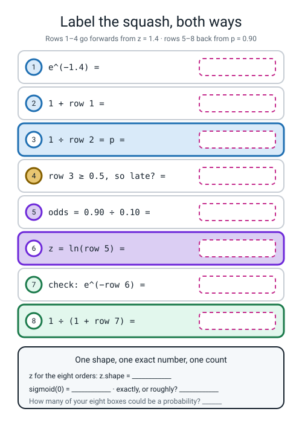
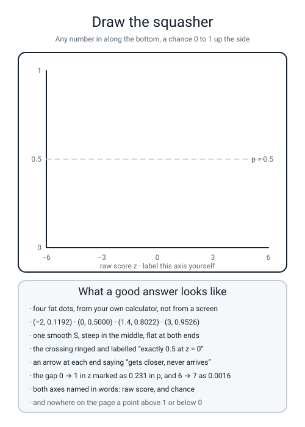

# Workbook — Week 13: From a Score to a Chance

**Name:** ________________________________  **Date:** ______________

[⬅ Week 12](week-12.md) · [📖 Read the chapter first](../student-guide/week-13.md) · [Course Home](../README.md) · [Next ➡](week-14.md)

---

## ✅ Warm-Up (5 min)

Five quick questions about **last week** — how steep is the hill right here.

**W1.** Write the nudge formula for the slope at one point, with `h = 0.001`, and **put the brackets in the right place.**

`slope = ` ________________________________________________

**W2.** On the curve `x × x` you measured the slope at three places and got `2`, `6` and `10`. **What was the rule you found, and where did you find it?**

________________________________________________________________

**W3.** `np.argmin(losses)` gave `4` and `np.min(losses)` gave `0.0`. **One of those is a position and one is a value. Which is which, and which one do you actually want?**

________________________________________________________________

**W4.** A classmate's loss reads `92, 236, 604, 1546, 3958`. **Name the two things that could cause that, and say which one you would check first.**

________________________________________________________________

**W5.** Nudging one way gave `6.001`. Nudging both ways gave `6.000`. **Which is right, and why is the two-sided version not more work?**

________________________________________________________________

---

## 🔢 Do the Maths by Hand

**Calculator only. No code on this page.** You need the `e^x` key — on most calculators it is above `ln`, so you reach it with `SHIFT` or `2nd`. **The recipe for `e^(−z)`: type the number, press `+/−`, press `e^x`.**

### M1 — is it a probability?

Eight numbers. For each one, say whether it **could** be a probability, and if not, why not. **Two of these eight are trick questions.**

| # | Number | Could it be a probability? | Why / why not |
|:--:|:--:|:--:|---|
| 1 | `0.8022` | ________ | ______________________________ |
| 2 | `1.4` | ________ | ______________________________ |
| 3 | `−3` | ________ | ______________________________ |
| 4 | `0.5` | ________ | ______________________________ |
| 5 | `9.8` | ________ | ______________________________ |
| 6 | `0.0000` | ________ | ______________________________ |
| 7 | `0.9879` | ________ | ______________________________ |
| 8 | `1.0` | ________ | ______________________________ |

**M1(a).** Three of those eight came out of the Worry Meter as **raw scores**. Which three? ____________________

**M1(b).** One-sentence test you can use for the rest of your life: **"if it could be 4.4, it is a ______________________."**

### M2 — eight sigmoid conversions, all three steps, four decimal places

**This is the main page of the week.** For each `z`: press `e^(−z)`, add 1, then divide 1 by the answer. **Fill in all three columns. The middle column is the evidence that you did it by hand** — a column of eight final answers alone is a column of eight numbers copied off a screen.

| # | `z` | `e^(−z)` (6 dp) | `1 + e^(−z)` (6 dp) | `p` (4 dp) |
|:--:|:--:|---|---|:--:|
| 1 | `−4.00` | ______________ | ______________ | __________ |
| 2 | `−1.50` | ______________ | ______________ | __________ |
| 3 | `−0.70` | ______________ | ______________ | __________ |
| 4 | `0.00` | ______________ | ______________ | __________ |
| 5 | `0.25` | ______________ | ______________ | __________ |
| 6 | `1.00` | ______________ | ______________ | __________ |
| 7 | `2.50` | ______________ | ______________ | __________ |
| 8 | `6.00` | ______________ | ______________ | __________ |

**M2(a).** Row 4 is the one that must be **exact**. Write the whole sum with no rounding anywhere in it:

`e^0 = ` ______ , `1 + ` ______ ` = ` ______ , `1 ÷ ` ______ ` = ` ______

**M2(b).** Rows 1 and 8 are the two ends. Neither is `0` and neither is `1`. Write both: ______________ and ______________

**M2(c).** **The self-check that catches the commonest mistake of the week.** If your row 1 came out at `0.9820` and your row 2 at `0.8176`, you pressed `e^x` **without** the sign change. Add your row 1 to `0.9820`: ____________ . What does that tell you? ______________________________

### M3 — four conversions backwards, through the odds

Two steps each. `odds = p ÷ (1 − p)`, then `z = ln(odds)`. **Then check it comes back**, because a conversion you cannot check is a conversion you cannot trust.

**1. `p = 0.90`**

```
odds = 0.90 ÷ ______ = ______________
z    = ln(______) = ______________
check: e^(−______) = ______________ ,  1 ÷ ______________ = ______________
```

**2. `p = 0.62`**

```
odds = 0.62 ÷ ______ = ______________
z    = ln(______) = ______________
check: e^(−______) = ______________ ,  1 ÷ ______________ = ______________
```

**3. `p = 0.50`**

```
odds = 0.50 ÷ ______ = ______________
z    = ln(______) = ______________
check: e^(−______) = ______________ ,  1 ÷ ______________ = ______________
```

**4. `p = 0.05`**

```
odds = 0.05 ÷ ______ = ______________
z    = ln(______) = ______________
check: e^(______) = ______________ ,  1 ÷ ______________ = ______________
```

**M3(a).** Row 3 is the anchor of the whole week. `odds = ______`, `ln(______) = ______`, and it agrees with `sigmoid(0) = ______`.

**M3(b).** Rows 1 and 4 are mirror images: `0.90` and `0.05`… nearly. **Which two probabilities would be exact mirrors, and what would their two `z` values be?**

____________________ and ____________________

**M3(c).** Say out loud what `z` is the log of. **Then finish the sentence:** *`z` is called the **logit** because it is the* ______________________ *of the* ______________________.

### M4 — the Worry Meter, eight orders

`z = 0.6 × (orders in the oven) + 0.4 × (km to drive) − 3`

| Order | Oven | Km | `0.6 × oven` | `0.4 × km` | `z` |
|:--:|:--:|:--:|---|---|:--:|
| 1 | 0 | 0 | ________ | ________ | __________ |
| 2 | 1 | 1 | ________ | ________ | __________ |
| 3 | 2 | 2 | ________ | ________ | __________ |
| 4 | 3 | 3 | ________ | ________ | __________ |
| 5 | 5 | 2 | ________ | ________ | __________ |
| 6 | 4 | 5 | ________ | ________ | __________ |
| 7 | 6 | 6 | ________ | ________ | __________ |
| 8 | 7 | 8 | ________ | ________ | __________ |

**M4(a).** Which order gives exactly `z = 0`? ______ **And therefore exactly what probability?** ____________

**M4(b).** Orders 1 and 8 are the two extremes. **How far apart are they in `z`?** ____________ **And in `p`?** ____________ *(You have `p` for both: `0.0474` and `0.9879`.)*

**M4(c).** Orders 3 and 5 are only `1.80` apart in `z`, and their probabilities are `0.2689` and `0.6900`. **How far apart in `p`?** ____________ **Now say the sentence about the middle and the ends:**

________________________________________________________________

---

## 🔎 Predict the Output

**Write your prediction in pen before you run anything.** Five snippets. Every one starts with `import numpy as np`.

### P1 — the two presses that define `e`

```python
import numpy as np
print(np.exp(0))
print(np.exp(1))
```

**My prediction, line 1:** ____________________  **line 2:** ____________________

**What it really printed:** ____________________ and ____________________

**One line on why:** ______________________________________________

### P2 — four squashes and two shapes

```python
import numpy as np
z = np.array([-2.0, 0.0, 1.4, 3.0])
p = 1.0 / (1.0 + np.exp(-z))
print(np.round(p, 4))
print(p.shape)
print(np.where(p >= 0.5, "late", "on time").shape)
```

**My prediction:**

```
line 1: ______________________________________
line 2: ______________
line 3: ______________
```

**What it really printed:**

```
line 1: ______________________________________
line 2: ______________
line 3: ______________
```

**P2(a).** Line 1 has **four** numbers and one of them prints as `0.5` and not `0.5000`. **Is that a different number?** ______ **Why does it print short?** ______________________

**P2(b).** Line 3 is a shape, and the thing it is the shape of holds **words**, not numbers. **Did the shape change when the numbers became words?** ______ **What does that tell you about what a shape counts?**

________________________________________________________________

### P3 — the threshold, and the edge of it

```python
import numpy as np
p = np.array([0.2, 0.6, 0.5, 0.9])
print(np.where(p >= 0.5, 1, 0))
```

**My prediction:** ______________________  **Real:** ______________________

**P3(a).** The third item is exactly `0.5`. **Which way did it go, and which character decided that?** ____________________

**P3(b).** Write the line that would have sent it the other way: ______________________________

### P4 — words instead of numbers

```python
import numpy as np
print(np.where(np.array([-3.0, 2.0]) >= 0, "yes", "no"))
```

**My prediction:** ______________________  **Real:** ______________________

**P4(a).** There are quote marks in the real output. **What can you no longer do with those two items?** ______________________

### P5 — the hard one

```python
import numpy as np
z = 1.4
print(round(1.0 / (1.0 + np.exp(-z)), 4))
print(round(1.0 / (1.0 + np.exp(z)), 4))
print(round(1.0 / (1.0 + np.exp(-z)) + 1.0 / (1.0 + np.exp(z)), 4))
```

**My prediction:** ______________ , ______________ , ______________

**Real:** ______________ , ______________ , ______________

**P5(a).** The third line is not a coincidence. **Write the rule it demonstrates:**

`sigmoid(z) + sigmoid(______) = ______` **, always.**

**P5(b).** **Why is this the single best test for a squasher you just wrote?** One sentence.

________________________________________________________________

---

## ✍️ Practice Set A — Read It

**A1. Match the word to the thing.** Write the letter.

| Word | | Description |
|---|---|---|
| **weight** | ______ | (i) The chance it happens divided by the chance it does not |
| **bias** | ______ | (ii) A number too big to store, so the machine keeps `inf` and warns you |
| **logit / raw score `z`** | ______ | (iii) `ln(odds)` — and it is exactly the raw score again |
| **sigmoid** | ______ | (iv) How much one fact pushes the answer up or down |
| **odds** | ______ | (v) The squasher `1 ÷ (1 + e^(−z))`. Any number in, 0-to-1 out, in order |
| **log-odds** | ______ | (vi) A constant added to every row, whatever the facts are |
| **overflow** | ______ | (vii) What the weighted sum produces before anything squashes it. Any number at all |

**A2. Read the printout.** This is the real output of `squash.py`.

```text
the eight raw scores: [-3.  -2.  -1.   0.   0.8  1.4  3.   4.4]

order  oven   km        z         p    late?
    1     0    0    -3.00    0.0474      no 
    2     1    1    -2.00    0.1192      no 
    3     2    2    -1.00    0.2689      no 
    4     3    3     0.00    0.5000      yes
    5     5    2     0.80    0.6900      yes
    6     4    5     1.40    0.8022      yes
    7     6    6     3.00    0.9526      yes
    8     7    8     4.40    0.9879      yes

squash(0)     = 0.5000   <- exactly a half, every time
squash(-1000) = 0.0000   <- no warning, no infinity
squash( 1000) = 1.0000
```

| Question | Your answer |
|---|---|
| a. How many orders, and how many facts about each? | |
| b. Order 5 has a busier oven than order 6 but a lower `p`. How? | |
| c. Order 4 is `0.5000` and counted as "yes". Would `>` instead of `>=` have changed it? | |
| d. Which column is the model's *output*, and which is *your* decision? | |
| e. The last line says `1.0000`. Is the true value 1? | |
| f. Between which two consecutive orders does `p` jump the most? | |

**A2(g).** Order 6 has 4 in the oven and 5 km. **Show the arithmetic that gives `1.40`:**

`0.6 × ______ = ______` , `0.4 × ______ = ______` , `______ + ______ − 3 = 1.40`

**A2(h).** The `z` column runs from `−3.00` to `4.40` — a span of `7.40`. The `p` column runs from `0.0474` to `0.9879` — a span of `0.9405`. **Which of the two columns could you plot on graph paper with a fixed, sensible axis before you saw the data, and why does that matter?**

________________________________________________________________

**A3. Spot the bug.** Each line is wrong or misleading. Say what happens and write the fix. **Most of these six produce no error message at all — part of the exercise is counting how many.**

| # | The line | What happens | The fix |
|:--:|---|---|---|
| a | `z = [1.0, 2.0]` then `print(np.exp(-z))` | | |
| b | `p = 1.0 / 1.0 + np.exp(-z)` | | |
| c | `p = 1.0 / (1.0 + np.exp(z))` | | |
| d | `late = np.where(p > 0.5, "yes", "no ")` | | |
| e | `odds = p / 1 - p` | | |
| f | `z = np.log10(p / (1 - p))` | | |

**A3(g).** **How many of the six raise a `Traceback` and stop the program?** ______ **List them:** ____________________

**A3(h).** For **(b)**, the first printed value is `21.0855`. **In one sentence, why is that number impossible to mistake for a probability, and which single character was missing?**

________________________________________________________________

**A4. Match the code to the output.** Five of each, no output used twice. Assume `import numpy as np` above each.

| | Code |
|---|---|
| i | `print(np.exp(0.7))` |
| ii | `print(np.round(1/(1+np.exp(-np.array([0.25]))), 4))` |
| iii | `print(np.where(np.array([0.0474, 0.5, 0.8022]) >= 0.5, 1, 0))` |
| iv | `print(np.log(9))` |
| v | `print(np.array([0, 1, 2, 3, 5, 4, 6, 7]).shape)` |

| | Output |
|---|---|
| P | `2.1972245773362196` |
| Q | `[0.5622]` |
| R | `(8,)` |
| S | `2.0137527074704766` |
| T | `[0 1 1]` |

**Your answers:** i → ______  ii → ______  iii → ______  iv → ______  v → ______

**A4(f).** Three of those five outputs are numbers you wrote on **M2** or **M3**. Name all three and say which row.

________________________________________________________________

**A5. Label the squash, both ways.** Fill in all eight empty boxes in the figure, then the panel at the bottom.


*Figure W13.1 — Label the squash, both ways. Rows 1–4 go forwards from `z = 1.4`; rows 5–8 go backwards from `p = 0.90`.*

**A5(a).** Box 3 and box 8 are both probabilities, and they are **different** probabilities. Say what each one is the chance of:

box 3: ____________________  box 8: ____________________

**A5(b).** Boxes 1 and 7 are both `e^(−something)`. **Which is bigger, and why does that make sense before you compute either?**

________________________________________________________________

**A6. Say the sentence.** Finish each one so it is true and complete.

**a)** A weighted sum can be ______________________; a probability has to sit ______________________.

**b)** The sigmoid is three steps: ______________________, then ______________________, then ______________________.

**c)** `sigmoid(0)` is ______ — **exactly**, because `e^0 = ` ______ and ______ ` ÷ ` ______ ` = ` ______ with no rounding anywhere.

**d)** The sigmoid never reaches 0 or 1 because `e^(−z)` is always ______________________, so `1 + e^(−z)` is always ______________________.

**e)** Going backwards is also two steps: first ______________________, then ______________________.

**f)** `e^1000` has ______ digits and there is room for ______, so the machine stores ______ and prints ______________________________.

---

## ✍️ Practice Set B — Write It

### B1 — one line, eight raw scores

**Task.** In one line, compute all eight Worry Meter raw scores from two numpy arrays. Then print the shape.

**Expected output:**

```text
z      = [-3.  -2.  -1.   0.   0.8  1.4  3.   4.4]
shape  = (8,)
```

**Done looks like:** one arithmetic line, no `for` loop anywhere, and the shape printed so you know how many orders came out.

```python
# your code here


```

### B2 — the squasher that cannot overflow

**Task.** Write `squash(z)` using `np.where` so the exponential is **never** asked for a positive power. Then print four checks.

**Expected output:**

```text
squash(0.0)     = 0.5000
squash(1.4)     = 0.8022
squash(-1000.0) = 0.0000
squash(1000.0)  = 1.0000
```

**Done looks like:** four lines of output, **no `RuntimeWarning` anywhere on the screen**, and `0.8022` on the second line. If you see `0.1978` there, your two arms are swapped.

```python
# your code here


```

### B3 — the mirror test, on all eight

**Task.** Using your `squash` from B2 and the eight `z` values from **M2**, print `squash(z)`, `squash(-z)`, and the two added together.

**Expected last two lines:**

```text
the two added  = [1. 1. 1. 1. 1. 1. 1. 1.]
all exactly 1?  False
```

**Done looks like:** eight `1.`s on the sum line — **and the honest `False` underneath it.** Read the answer key for why; the `False` is not a bug in your code.

```python
# your code here


```

### B4 — backwards, in a loop

**Task.** For `p` in `0.90, 0.62, 0.50, 0.05`, print the odds, `z = ln(odds)`, and the probability you get back through the sigmoid, in aligned columns to six decimal places.

**Expected output:**

```text
    p       odds          z = ln(odds)   back again
 0.90     9.000000       2.197225     0.900000
 0.62     1.631579       0.489548     0.620000
 0.50     1.000000       0.000000     0.500000
 0.05     0.052632      -2.944439     0.050000
```

**Done looks like:** the last column is the first column again, to six decimal places. If it is not, one of your two steps is wrong and the check just caught it for you.

```python
# your code here


```

### B5 — a whole program of your own, about 25 lines

**Task.** `b5w13.py`. Eight orders, forwards to a chance **and** backwards to a raw score, all in one table — plus the proof that the round trip loses nothing.

**It must:**

1. set `np.random.seed(0)` (nothing is random today, and the habit has no exceptions);
2. build `oven` and `km` as numpy arrays;
3. define `squash` the safe way;
4. compute `z`, then `p`, then `odds`, then `ln(odds)`;
5. add a `late?` column using `np.where` and a threshold of `0.5`;
6. print one aligned row per order;
7. finish with the biggest gap between `z` and `ln(odds)` over all eight rows, to **twelve** decimal places.

**Expected output:**

```text
order oven   km        z        p      odds   ln(odds)  late?
    1    0    0    -3.00   0.0474    0.0498   -3.0000    no 
    2    1    1    -2.00   0.1192    0.1353   -2.0000    no 
    3    2    2    -1.00   0.2689    0.3679   -1.0000    no 
    4    3    3     0.00   0.5000    1.0000    0.0000    yes
    5    5    2     0.80   0.6900    2.2255    0.8000    yes
    6    4    5     1.40   0.8022    4.0552    1.4000    yes
    7    6    6     3.00   0.9526   20.0855    3.0000    yes
    8    7    8     4.40   0.9879   81.4509    4.4000    yes

biggest gap between z and ln(odds): 0.000000000000
```

**Done looks like:** twelve zeros on the last line. Not "close". **Identical**, because the two operations are exact opposites.

> **💡 Try this:** look down the `odds` column. Order 7's odds are `20.0855` — *"twenty to one on"*. Order 1's are `0.0498`, which a bookmaker would say the other way round as *"twenty to one against"*. **`1 ÷ 0.0498 = 20.08`.** Orders 1 and 7 are mirror images, and the odds column shows it more clearly than the `p` column does.

---

## 🐞 Fix the Broken Program

This program has **three** bugs: one **shape** bug, one **runtime** bug, and one **silent logic** bug. The real error messages are below, in the order you meet them.

```python
"""broken13.py - eight orders into eight chances. THREE bugs."""
import numpy as np

np.random.seed(0)

oven = np.array([0, 1, 2, 3, 5, 4, 6, 7])
km   = np.array([0, 1, 2, 3, 2, 5, 6])


def squash(z):
    z = np.asarray(z, dtype=float)
    e = np.exp(np.where(z >= 0, z, -z))
    return np.where(z >= 0, 1.0 / (1.0 + e), e / (1.0 + e))


z = 0.6 * oven + 0.4 * km - 3.0
p = squash(z)
late = np.where(p >= 0.5, "yes", "no ")

print("order        z        p   late?")
for i in range(8):
    print("%5d %8.2f %8.4f    %s" % (i + 1, z[i], p[i], late[i]))

extreme = [-20.0, 20.0]
print()
print("the two extremes:", 1.0 / (1.0 + np.exp(-extreme)))
print("squash(1.4) =", "%.4f" % squash(1.4))
```

**Run 1 — nothing prints at all:**

```text
Traceback (most recent call last):
  File "broken13.py", line 16, in <module>
    z = 0.6 * oven + 0.4 * km - 3.0
ValueError: operands could not be broadcast together with shapes (8,) (7,)
```

**Bug 1.** Which line? ______  **Kind of bug?** ______________

**The message names two shapes. Say what each number counts.**

**the `8` counts:** ____________________  **the `7` counts:** ____________________

**The fix:** ______________________________

**Run 2 — after fixing bug 1:**

```text
order        z        p   late?
    1    -3.00   0.9526    yes
    2    -2.00   0.8808    yes
    3    -1.00   0.7311    yes
    4     0.00   0.5000    yes
    5     0.80   0.3100    no 
    6     1.40   0.1978    no 
    7     3.00   0.0474    no 
    8     4.40   0.0121    no 

Traceback (most recent call last):
  File "broken13.py", line 26, in <module>
    print("the two extremes:", 1.0 / (1.0 + np.exp(-extreme)))
TypeError: bad operand type for unary -: 'list'
```

**Bug 2.** Which line? ______  **Kind of bug?** ______________

**What is `-[1.0, 2.0]` supposed to mean in plain Python?** ____________________

**The fix:** ______________________________

**Run 3 — after fixing bugs 1 and 2. It runs all the way through, no error at all:**

```text
order        z        p   late?
    1    -3.00   0.9526    yes
    2    -2.00   0.8808    yes
    3    -1.00   0.7311    yes
    4     0.00   0.5000    yes
    5     0.80   0.3100    no 
    6     1.40   0.1978    no 
    7     3.00   0.0474    no 
    8     4.40   0.0121    no 

the two extremes: [2.06115362e-09 9.99999998e-01]
squash(1.4) = 0.1978
```

**Bug 3 is in that table, and it is silent.** Your chapter has the correct version of exactly this table. **Go and look at it, then answer these.**

**Order 1 has nothing in the oven and no distance to drive, and the program says its chance of being late is `0.9526`. Is that sensible?** ______

**The last line says `squash(1.4) = 0.1978`. What should it say?** ____________ **And `0.1978 + ____________ = 1.0000`.**

**Which line of the program is responsible?** ______  **What exactly is wrong with it?** ______________________

**The fix:** ______________________________

**Run 4 — after fixing all three:**

```text
order        z        p   late?
    1    -3.00   0.0474    no 
    2    -2.00   0.1192    no 
    3    -1.00   0.2689    no 
    4     0.00   0.5000    yes
    5     0.80   0.6900    yes
    6     1.40   0.8022    yes
    7     3.00   0.9526    yes
    8     4.40   0.9879    yes

the two extremes: [2.06115362e-09 9.99999998e-01]
squash(1.4) = 0.8022
```

**Three questions, and the last one is the point of the page.**

**Order 4 reads `0.5000` in both the broken and the fixed table. Why?**

________________________________________________________________

**So if the only check you had written was `squash(0) == 0.5`, what would it have told you?**

________________________________________________________________

**Rank the three bugs by how much time each would cost you to find, and explain the ranking.**

________________________________________________________________

________________________________________________________________

---

## 🧩 Puzzle of the Week

### Part 1 — The Ladder

Five probabilities. **Take each one backwards to its raw score**, using `odds` then `ln`. Every answer lands within `0.001` of a whole number.

| # | `p` | `odds = p ÷ (1 − p)` | `z = ln(odds)` | nearest whole number |
|:--:|:--:|---|---|:--:|
| 1 | `0.5000` | ____________ | ____________ | ______ |
| 2 | `0.7311` | ____________ | ____________ | ______ |
| 3 | `0.8808` | ____________ | ____________ | ______ |
| 4 | `0.9526` | ____________ | ____________ | ______ |
| 5 | `0.9820` | ____________ | ____________ | ______ |

**Now the actual puzzle.** The five `z` values are evenly spaced — the gap is the same every time. **The five `p` values are not.**

**The four gaps in `z`:** ______ , ______ , ______ , ______

**The four gaps in `p`:** ____________ , ____________ , ____________ , ____________

**One sentence: what is the curve doing to equal steps?**

________________________________________________________________

**And the hard part.** If the ladder carried on — `z = 5`, `z = 6`, `z = 7` — **would the `p` gaps ever reach zero?** ______ **Why?**

________________________________________________________________

### Part 2 — The Mirror

Every `z` has a twin: `−z`. And their two probabilities always add to exactly 1.

| `z` | `p` | its twin `−z` | the twin's `p` | do they add to 1? |
|:--:|:--:|:--:|:--:|:--:|
| `1.4` | `0.8022` | ______ | ____________ | ______ |
| `−4.0` | `0.0180` | ______ | ____________ | ______ |
| `0.0` | `0.5000` | ______ | ____________ | ______ |

**Part 2(a).** One row of that table is its own twin. Which, and what does that force its probability to be?

________________________________________________________________

**Part 2(b).** A classmate's squasher returns `0.1978` for `z = 1.4`. **Without looking at their code, say exactly what they typed wrong, and what the odds column of their table would look like.**

________________________________________________________________

---

## 🤔 Think Deeper

**T1.** The sigmoid can never reach `0` or `1`, and yet the computer printed `squash(-1000) = 0.0000` and `squash(1000) = 1.0000`. **Write a paragraph** on whether the machine is lying. Use the fact that `e^(−1000)` is smaller than the smallest decimal the machine can store, and finish by arguing for one of two policies: *clip the probabilities into a safe range and move on*, or *never store probabilities at all — store `z` and work in log-odds*. Say which you would pick for a hospital and which for a pizza shop, and why they might differ.

________________________________________________________________

________________________________________________________________

________________________________________________________________

________________________________________________________________

________________________________________________________________

**T2.** Why `e`? You could build an S-curve out of `2^(−z)` instead: same shape, all answers between 0 and 1, same ordering. **Work out `1 ÷ (1 + 2^(−z))` at `z = 0`, `z = 1` and `z = −1`** on your calculator, then write a paragraph on what is actually lost by choosing 2. Your paragraph must contain a number, and it must end with a judgement: is *"it makes the maths two weeks from now come out cleaner"* a good enough reason to build a whole subject on one particular number?

________________________________________________________________

________________________________________________________________

________________________________________________________________

________________________________________________________________

________________________________________________________________

---

## 🛠️ Build It — The Overflow Experiment

**Two files, and the second is the one that earns the marks.** Total about 20 minutes.

### Part A — `overflow.py`: both squashers, side by side

**Type it, run it, and paste what happens — word for word, including the warning.**

```python
"""overflow.py - the naive squasher, then the safe one, side by side."""
import numpy as np


def naive(z):
    return 1.0 / (1.0 + np.exp(-z))


def safe(z):
    z = np.asarray(z, dtype=float)
    negative_part = np.where(z >= 0, -z, z)
    e = np.exp(negative_part)
    return np.where(z >= 0, 1.0 / (1.0 + e), e / (1.0 + e))


print("       z         naive          safe")
for zi in (-1000.0, -20.0, 0.0, 1.4, 20.0, 1000.0):
    print("%8.1f  %.10f  %.10f" % (zi, naive(zi), safe(zi)))
```

**Paste the warning line here, exactly:**

________________________________________________________________

**Now fill in the table from your own screen. Ten decimal places.**

| `z` | `naive(z)` | `safe(z)` | same answer? | warning? |
|:--:|---|---|:--:|:--:|
| `−1000.0` | ______________ | ______________ | ______ | ______ |
| `−20.0` | ______________ | ______________ | ______ | ______ |
| `0.0` | ______________ | ______________ | ______ | ______ |
| `1.4` | ______________ | ______________ | ______ | ______ |
| `20.0` | ______________ | ______________ | ______ | ______ |
| `1000.0` | ______________ | ______________ | ______ | ______ |

**Where in the output did the warning appear — above the table, or below it?** ____________

**That is surprising. Why does it happen?** ______________________________

### Part B — `why_safe.py`: the arithmetic behind the warning

```python
import numpy as np

print("what the naive way asks for at z = -1000:")
print("   e^(-z) = e^(1000) =", np.exp(1000.0))
print("   1 / (1 + inf)     =", 1.0 / (1.0 + np.exp(1000.0)))
print()
print("what the safe way asks for at z = -1000:")
print("   e^(-|z|) = e^(-1000) =", np.exp(-1000.0))
print("   that / (1 + that)   =", np.exp(-1000.0) / (1.0 + np.exp(-1000.0)))
print()
print("and the sting in the tail, which is next week's problem:")
print("   ln(0.0) =", np.log(0.0))
```

| What the program asked for | What it got |
|---|---|
| `e^(1000)` | ______________ |
| `1 ÷ (1 + inf)` | ______________ |
| `e^(−1000)` | ______________ |
| `that ÷ (1 + that)` | ______________ |
| `ln(0.0)` | ______________ |

### The two sentences being marked

**Not *"the second one is safer"*. Which number overflowed, and how big was it?**

**Sentence 1 — what went wrong in the naive version:**

________________________________________________________________

________________________________________________________________

**Sentence 2 — what the two-branch version does differently:**

________________________________________________________________

________________________________________________________________

### The honest extra credit

**Both versions return exactly `0.0` at `z = −1000`. Is that right?** ______ **So what did the fix actually fix, and what did it not?**

________________________________________________________________

### The Bug Log

Two entries today, and the second is the dangerous category: *no error, no crash, every number backwards.*

| What I saw | What it means | Cause | Fix |
|---|---|---|---|
| | | | |
| | | | |

---

## 🎨 Draw It

Draw the **S-curve** — from your own four hand-computed points, not from a screen.


*Figure W13.2 — An empty frame with the raw score along the bottom, the chance up the side, and a dashed halfway line, plus what a good answer contains.*

**Then answer four things about your own drawing:**

**Where exactly does your curve cross the dashed line, and how do you know it is exact?** ______________________

**What did you write at the two ends?** ______________________

**Measure your own curve: how much does `p` rise between `z = 0` and `z = 1`?** ____________ **And between `z = 3` and `z = 4`?** ____________

**Which single point on your drawing did you not need a calculator for?** ______________________

---

## 📊 Self-Check

| I can... | 😀 | 🙂 | 😕 |
|---|---|---|---|
| compute a raw score `z` from two features, two weights and a bias, by hand | | | |
| press `e^(−z)` correctly on a real calculator, for a negative `z` as well as a positive one | | | |
| do all three sigmoid steps by hand and land on four correct decimal places | | | |
| say the three properties of the sigmoid, and the fourth one people forget | | | |
| explain why `sigmoid(0)` is *exactly* 0.5 and not approximately | | | |
| go backwards from a probability to `z` through the odds and the log-odds | | | |
| say why `z` is called the logit, in one sentence | | | |
| write a squasher with `np.where` that never overflows | | | |
| read `RuntimeWarning: overflow encountered in exp` and name the number that caused it | | | |
| catch a lost minus sign with `sigmoid(1.4) = 0.8022`, and say why `sigmoid(0)` would not catch it | | | |

**The one thing I would ask about if I could ask one question:**

________________________________________________________________

---

## ✅ Answers

<details>
<summary>Check your answers</summary>

### Warm-Up

**W1.** `slope = (f(w + h) − f(w − h)) ÷ (2 × h)`. **The brackets around `2 × h` are the whole answer.** Write `/ 2 * h` and you get `0.000006` instead of `6.000000` — a million times out, with no error message. Write `/ h` and you get `12.000000`, exactly double, because you travelled two nudges and only divided by one.

**W2.** The rule is `2 × x`, and **you found it by measuring.** Three slopes at `x = 1, 3, 5` came out `2, 6, 10`, and each one is twice the `x`. Nobody handed it over as a formula to memorise; it fell out of four presses of a calculator.

**W3.** `np.argmin` gives a **position** (`4` means "the fifth item in the list"); `np.min` gives the **value** (`0.0`). **You want neither on its own** — you want `candidates[np.argmin(losses)]`, which gave `8.0`, the weight that produced the smallest loss.

**W4.** **Either the sign in the update is wrong, or the learning rate is too big.** Those are the only two options. **Check the sign first**, because that is one character and it is free to check; the learning rate needs a re-run. Here the numbers grow by about 2.6 times each step, which is an explosion, so it is more likely to be the learning rate — but you still check the cheap thing first.

**W5.** **`6.000` is right**, and it is the two-sided one. The curve bends, so a one-sided nudge measures the slope of a line between where you are and slightly to the right of where you are, which is a bit too steep. The two-sided version takes one step each way and splits the difference, and it is **the same amount of work** — two evaluations of the function either way.

### Do the Maths by Hand

**M1.**

| # | Number | Probability? | Why |
|:--:|:--:|:--:|---|
| 1 | `0.8022` | **Yes** | Between 0 and 1. It is `sigmoid(1.4)`. |
| 2 | `1.4` | **No** | Above 1. This is a raw score. |
| 3 | `−3` | **No** | Below 0. Also a raw score. |
| 4 | `0.5` | **Yes** | And it is exactly what `sigmoid(0)` gives. |
| 5 | `9.8` | **No** | 980% of nothing. |
| 6 | `0.0000` | **Only as a printed value** | **Trick question.** A true sigmoid output is never exactly 0 — but a computer prints `0.0000` once `z` is very negative, because it has run out of room. |
| 7 | `0.9879` | **Yes** | `sigmoid(4.4)`. |
| 8 | `1.0` | **Same trick as 6** | Legal as a probability in general, but **never produced by a sigmoid.** |

**M1(a).** `1.4`, `−3` and `9.8` — orders 6, 1 and the eight-in-the-oven, twenty-km order from the hook.

**M1(b).** *"If it could be 4.4, it is a **raw score**."*

**M2.** Real output of the check:

```python
import numpy as np

for z in [-4, -1.5, -0.7, 0, 0.25, 1, 2.5, 6]:
    e = np.exp(-z)
    print("z=%6.2f   e^(-z)=%12.6f   1+e^(-z)=%12.6f   p=%.4f"
          % (z, e, 1 + e, 1 / (1 + e)))
```

```text
z= -4.00   e^(-z)=   54.598150   1+e^(-z)=   55.598150   p=0.0180
z= -1.50   e^(-z)=    4.481689   1+e^(-z)=    5.481689   p=0.1824
z= -0.70   e^(-z)=    2.013753   1+e^(-z)=    3.013753   p=0.3318
z=  0.00   e^(-z)=    1.000000   1+e^(-z)=    2.000000   p=0.5000
z=  0.25   e^(-z)=    0.778801   1+e^(-z)=    1.778801   p=0.5622
z=  1.00   e^(-z)=    0.367879   1+e^(-z)=    1.367879   p=0.7311
z=  2.50   e^(-z)=    0.082085   1+e^(-z)=    1.082085   p=0.9241
z=  6.00   e^(-z)=    0.002479   1+e^(-z)=    1.002479   p=0.9975
```

**M2(a).** `e^0 = 1`, `1 + 1 = 2`, `1 ÷ 2 = 0.5`. **Three operations, no rounding in any of them.** This is why `sigmoid(0)` is exactly a half and not approximately one.

**M2(b).** `0.0180` and `0.9975`. **Neither end arrived.** `e^(−z)` is `54.598150` at one end and `0.002479` at the other — small, but never zero, so the division never gives exactly 1.

**M2(c).** `0.9820 + 0.0180 = 1.0000`. **Your answer is `1 −` the right answer, every row**, which is the signature of a lost sign change: you computed `e^(+z)` where `e^(−z)` was meant. Every number is "possible" and every one is the mirror of the truth.

**M3.**

```python
import numpy as np

for p in (0.90, 0.62, 0.50, 0.05):
    odds = p / (1 - p)
    z = np.log(odds)
    check = 1.0 / (1.0 + np.exp(-z))
    print("p = %.2f   odds = %.6f   z = ln(odds) = %9.6f   back again = %.6f"
          % (p, odds, z, check))
```

```text
p = 0.90   odds = 9.000000   z = ln(odds) =  2.197225   back again = 0.900000
p = 0.62   odds = 1.631579   z = ln(odds) =  0.489548   back again = 0.620000
p = 0.50   odds = 1.000000   z = ln(odds) =  0.000000   back again = 0.500000
p = 0.05   odds = 0.052632   z = ln(odds) = -2.944439   back again = 0.050000
```

Longhand, so every division is visible:

```
1.  odds = 0.90 ÷ 0.10 = 9.000000        z = ln(9) = 2.197225
    check: e^(−2.197225) = 0.111111 ,  1 ÷ 1.111111 = 0.900000   ✓
2.  odds = 0.62 ÷ 0.38 = 1.631579        z = ln(1.631579) = 0.489548
    check: e^(−0.489548) = 0.612903 ,  1 ÷ 1.612903 = 0.620000   ✓
3.  odds = 0.50 ÷ 0.50 = 1.000000        z = ln(1) = 0.000000
    check: e^0 = 1 ,  1 ÷ 2 = 0.500000   ✓
4.  odds = 0.05 ÷ 0.95 = 0.052632        z = ln(0.052632) = −2.944439
    check: e^(2.944439) = 19.000000 ,  1 ÷ 20.000000 = 0.050000   ✓
```

**M3(a).** `odds = 1`, `ln(1) = 0`, and `sigmoid(0) = 0.5`. **Everything closes.** Evens in one language, zero in the other.

**M3(b).** `0.95` and `0.05` are exact mirrors, and their raw scores are `+2.944439` and `−2.944439`. (`0.90` and `0.05` are *not* mirrors — `0.90`'s mirror is `0.10`, with `z = −2.197225`.)

**M3(c).** `z` is the **log** of the **odds**. That is the whole reason for the name **logit**, and it is a slightly silly name for a genuinely useful quantity.

**M4.**

| Order | Oven | Km | `0.6 × oven` | `0.4 × km` | `z` |
|:--:|:--:|:--:|:--:|:--:|:--:|
| 1 | 0 | 0 | 0.0 | 0.0 | **−3.00** |
| 2 | 1 | 1 | 0.6 | 0.4 | **−2.00** |
| 3 | 2 | 2 | 1.2 | 0.8 | **−1.00** |
| 4 | 3 | 3 | 1.8 | 1.2 | **0.00** |
| 5 | 5 | 2 | 3.0 | 0.8 | **0.80** |
| 6 | 4 | 5 | 2.4 | 2.0 | **1.40** |
| 7 | 6 | 6 | 3.6 | 2.4 | **3.00** |
| 8 | 7 | 8 | 4.2 | 3.2 | **4.40** |

**M4(a).** Order 4, and therefore **exactly `0.5000`**.

**M4(b).** In `z`: `4.40 − (−3.00) = 7.40`. In `p`: `0.9879 − 0.0474 = 0.9405`.

**M4(c).** `0.6900 − 0.2689 = 0.4211`. **So a `z` gap of `1.80` in the middle buys `0.4211` of probability, while a `z` gap of `7.40` across the whole range buys only `0.9405`.** Four times the distance bought a bit over twice the probability. **The middle is steep; the ends are flat.**

### Predict the Output

**P1.** `1.0` then `2.718281828459045`. Anything to the power zero is 1, for any base at all. And `e^1` is `e` itself — **that line is where the number comes from.** It is not `2.718` and it is not 22/7; it goes on for ever like π.

**P2.**

```text
[0.1192 0.5    0.8022 0.9526]
(4,)
(4,)
```

**P2(a).** `0.5` and `0.5000` are the **same number.** numpy drops trailing zeros when it prints an array, and it lines the columns up instead. **Display is not value** — the trap of the week.

**P2(b).** The shape did **not** change: `(4,)` both times. **A shape counts items, not what kind of thing they are.** Four numbers in, four words out, same shape. This is the first appearance of a habit you will use for the next twenty weeks: when something is confusing, print the shape.

**P3.** `[0 1 1 1]`.

**P3(a).** The third item went to **1**, and the character that decided it is the `=` in `>=`. With `>` it would have gone to `0`.

**P3(b).** `print(np.where(p > 0.5, 1, 0))` → `[0 1 0 1]`.

**P4.** `['no' 'yes']`. **P4(a).** You can no longer do **arithmetic** on them. They are text. `"yes" + 1` is an error, and `"no" * 2` gives `'nono'`, which is worse than an error because it does not complain.

**P5.** `0.8022`, `0.1978`, `1.0`.

**P5(a).** `sigmoid(z) + sigmoid(−z) = 1`, always. It is "the chance the order is late" plus "the chance it is on time", and those two have to add to one.

**P5(b).** Because it is a test that **fails when the code is wrong.** `sigmoid(0) = 0.5` passes even on a squasher with the sign the wrong way round, so it tests nothing. The mirror test uses a value where wrong and right differ, and it works on every `z` you can think of.

### Practice Set A

**A1.** weight → (iv) · bias → (vi) · logit/raw score → (vii) · sigmoid → (v) · odds → (i) · log-odds → (iii) · overflow → (ii)

**A2.**

| Question | Answer |
|---|---|
| a | **Eight orders, two facts each** — orders in the oven, and km to drive. |
| b | Order 5 is `5` oven and `2` km; order 6 is `4` oven and `5` km. `0.6 × 5 + 0.4 × 2 = 3.8` against `0.6 × 4 + 0.4 × 5 = 4.4`. **The extra 3 km outweighed the extra pizza**, because `0.4 × 3 = 1.2` beats `0.6 × 1 = 0.6`. |
| c | **Yes.** `0.5000` is not greater than `0.5`, so with `>` order 4 would read "no". **One character moves one order across the line.** |
| d | The `p` column is the **model's output.** The `late?` column is **your decision**, made by a threshold you chose, on a different line of the program. |
| e | **No.** The true value is below 1 by an amount with 434 zeros in it, and the machine has no way to store a number that close to 1, so it printed 1.0000. **It has run out of room, not lied.** |
| f | Between orders **3 and 4**: `0.5000 − 0.2689 = 0.2311`. That is the steep middle of the S. |

**A2(g).** `0.6 × 4 = 2.4`, `0.4 × 5 = 2.0`, `2.4 + 2.0 − 3 = 1.40`.

**A2(h).** **The `p` column.** A probability is always between 0 and 1, so you can draw the axis *before* you have any data, and every model's output will fit on it. The `z` column has no bounds at all — one model's raw scores might run −3 to 4.4 and another's −400 to 900 — so you cannot draw the axis until you have looked. **That is the practical reason for squashing: it makes the output comparable across models, thresholds and days.**

**A3.**

| # | What happens | The fix |
|:--:|---|---|
| a | `TypeError: bad operand type for unary -: 'list'`. **You put a minus sign in front of a plain Python list**, and lists cannot be negated. | `z = np.array([1.0, 2.0])`, or let `np.asarray(z, dtype=float)` inside `squash` do it. |
| b | **No error.** The missing brackets make it `(1.0 ÷ 1.0) + e^(−z)`, which is `1 + e^(−z)`. First value `21.0855`. | `p = 1.0 / (1.0 + np.exp(-z))`. **Say the recipe out loud: "one, divided by, one plus the exponential".** |
| c | **No error.** The S-curve runs backwards: `sigmoid(1.4)` gives `0.1978`. Every value is `1 −` the right one. | `np.exp(-z)`. Check against `0.8022`, never against `sigmoid(0)`. |
| d | **No error.** Identical to the correct version on seven of the eight orders, and **different on order 4** — `0.5000` now reads "no". | Decide which you want and write it down. It is not a bug so much as an undocumented choice, which is worse. |
| e | **No error at first.** `p / 1 - p` is `(p ÷ 1) − p`, which is `0.0` for every `p`. Then `ln(0)` gives `-inf`. | `odds = p / (1 - p)`. **Brackets again** — this is the same bug as (b) wearing a different hat. |
| f | **No error.** `log10(9) = 0.954243` instead of `ln(9) = 2.197225`. Every raw score is `2.302585` times too small, the ordering is perfect, and the numbers are all wrong. | `np.log`. **`np.log` is `ln`**; `np.log10` is base 10. |

**A3(g).** **Exactly one** — **(a)** — raises a `Traceback` and stops. **(e)** produces a `RuntimeWarning` and keeps going with `-inf` in it. The other four — **(b), (c), (d), (f)** — run to the end in perfect silence with wrong numbers. **That ratio is the point of the page: one loud bug to five quiet ones.**

**A3(h).** `21.0855` is above 1, so it cannot be a probability at all — **no amount of squashing can produce it, so something upstream is not a squash.** The missing characters are a pair of brackets: `1.0 / (1.0 + ...)`.

**A4.** i → **S** · ii → **Q** · iii → **T** · iv → **P** · v → **R**

**A4(f).** `S = 2.0137527074704766` is **M2 row 3's `e^(−z)` column** (`z = −0.70`, so `e^(0.70) = 2.013753`). `Q = [0.5622]` is **M2 row 5's `p` column** (`z = 0.25`). `P = 2.1972245773362196` is **M3 row 1's answer** — `ln(9) = 2.197225`, the log-odds of `p = 0.90`.

**A5.** The eight boxes, top to bottom:

```
1.  e^(−1.4)          = 0.246597
2.  1 + 0.246597      = 1.246597
3.  1 ÷ 1.246597      = 0.8022        <- p
4.  0.8022 ≥ 0.5      = yes
5.  0.90 ÷ 0.10       = 9.000000      <- odds
6.  ln(9)             = 2.197225      <- z, the logit
7.  e^(−2.197225)     = 0.111111
8.  1 ÷ 1.111111      = 0.900000      <- back to p
```

The panel: `z.shape` for eight orders is **`(8,)`**. `sigmoid(0) = 0.5000`, **exactly**. And **two** of the eight boxes could be a probability: box 3 (`0.8022`) and box 8 (`0.900000`). Box 7 is `0.111111`, which *looks* like a probability but is `e^(−z)` — a step in the middle of a calculation, not a chance of anything.

**A5(a).** Box 3 is the chance that **this order with `z = 1.4` is late.** Box 8 is the chance we **started** with in row 5 — it is `0.90` coming back round after a trip through the odds and the logarithm. **They are unrelated numbers that happen to live on the same page.**

**A5(b).** Box 1 is `e^(−1.4) = 0.246597`; box 7 is `e^(−2.197225) = 0.111111`. **Box 1 is bigger**, and you could say so before computing either, because `e^(−z)` shrinks as `z` grows and `1.4` is less than `2.197225`.

**A6.**

**a)** …**any number at all**; …**between 0 and 1**.

**b)** `e^(−z)`, then **add 1**, then **divide 1 by the answer**.

**c)** `0.5`; `e^0 = 1`; `1 + 1 = 2`; `1 ÷ 2 = 0.5`.

**d)** …**a positive number, however tiny**; …**a little more than 1**, so dividing 1 by it always lands a little under 1.

**e)** first **divide by one minus itself to get the odds**, then **take `ln` of the odds**.

**f)** `e^1000` has **435** digits and there is room for **309**, so the machine stores **`inf`** and prints **`RuntimeWarning: overflow encountered in exp`**.

### Practice Set B

**B1.**

```python
import numpy as np

np.random.seed(0)
oven = np.array([0, 1, 2, 3, 5, 4, 6, 7])
km   = np.array([0, 1, 2, 3, 2, 5, 6, 8])
z = 0.6 * oven + 0.4 * km - 3.0
print("z      =", z)
print("shape  =", z.shape)
```

```text
z      = [-3.  -2.  -1.   0.   0.8  1.4  3.   4.4]
shape  = (8,)
```

**Sixteen multiplications and eight additions in one line.** Multiplying a numpy array by a single number multiplies every item; adding two arrays adds them item by item.

**B2.**

```python
"""b2.py - the squasher that cannot overflow, and the three checks."""
import numpy as np

np.random.seed(0)


def squash(z):
    z = np.asarray(z, dtype=float)
    e = np.exp(np.where(z >= 0, -z, z))
    return np.where(z >= 0, 1.0 / (1.0 + e), e / (1.0 + e))


print("squash(0.0)     = %.4f" % squash(0.0))
print("squash(1.4)     = %.4f" % squash(1.4))
print("squash(-1000.0) = %.4f" % squash(-1000.0))
print("squash(1000.0)  = %.4f" % squash(1000.0))
```

```text
squash(0.0)     = 0.5000
squash(1.4)     = 0.8022
squash(-1000.0) = 0.0000
squash(1000.0)  = 1.0000
```

**Why it cannot overflow:** `np.where(z >= 0, -z, z)` strips the sign off, so the number handed to `np.exp` is **always zero or less**, so `e` is always between 0 and 1. A number between 0 and 1 cannot be too big to store.

**B3.**

```python
import numpy as np

np.random.seed(0)


def squash(z):
    z = np.asarray(z, dtype=float)
    e = np.exp(np.where(z >= 0, -z, z))
    return np.where(z >= 0, 1.0 / (1.0 + e), e / (1.0 + e))


z = np.array([-4.0, -1.5, -0.7, 0.0, 0.25, 1.0, 2.5, 6.0])
print("squash(z)      =", np.round(squash(z), 6))
print("squash(-z)     =", np.round(squash(-z), 6))
print("the two added  =", np.round(squash(z) + squash(-z), 6))
print("all exactly 1? ", bool(np.all(squash(z) + squash(-z) == 1.0)))
```

```text
squash(z)      = [0.017986 0.182426 0.331812 0.5      0.562177 0.731059 0.924142 0.997527]
squash(-z)     = [0.982014 0.817574 0.668188 0.5      0.437823 0.268941 0.075858 0.002473]
the two added  = [1. 1. 1. 1. 1. 1. 1. 1.]
all exactly 1?  False
```

**The `False` is the interesting part and it is not a bug in your code.** Seven of the eight pairs add to exactly `1.0`. The eighth — `z = 6.0` — adds to `1.0000000000000002`:

```python
a = 0.99752737684336534318   # squash(6.0)
b = 0.00247262315663477478   # squash(-6.0)
print(repr(a + b - 1.0))
```

```text
2.220446049250313e-16
```

The two halves were computed separately, each rounded to the nearest storable decimal, and the roundings did not cancel. **The gap is two parts in ten thousand million million.** The lesson: **never test decimals with `==`.** Use `np.allclose(squash(z) + squash(-z), 1.0)`, which returns `True`.

**B4.**

```python
import numpy as np

np.random.seed(0)
print("    p       odds          z = ln(odds)   back again")
for p in (0.90, 0.62, 0.50, 0.05):
    odds = p / (1 - p)
    z = np.log(odds)
    back = 1.0 / (1.0 + np.exp(-z))
    print("%5.2f   %10.6f   %12.6f   %10.6f" % (p, odds, z, back))
```

```text
    p       odds          z = ln(odds)   back again
 0.90     9.000000       2.197225     0.900000
 0.62     1.631579       0.489548     0.620000
 0.50     1.000000       0.000000     0.500000
 0.05     0.052632      -2.944439     0.050000
```

**B5.**

```python
"""b5w13.py - eight orders, forwards to a chance and backwards to a score."""
import numpy as np

np.random.seed(0)

oven = np.array([0, 1, 2, 3, 5, 4, 6, 7])
km   = np.array([0, 1, 2, 3, 2, 5, 6, 8])


def squash(z):
    z = np.asarray(z, dtype=float)
    e = np.exp(np.where(z >= 0, -z, z))
    return np.where(z >= 0, 1.0 / (1.0 + e), e / (1.0 + e))


z = 0.6 * oven + 0.4 * km - 3.0
p = squash(z)
odds = p / (1 - p)
z_again = np.log(odds)
late = np.where(p >= 0.5, "yes", "no ")

print("order oven   km        z        p      odds   ln(odds)  late?")
for i in range(8):
    print("%5d %4d %4d %8.2f %8.4f %9.4f %9.4f    %s"
          % (i + 1, oven[i], km[i], z[i], p[i], odds[i], z_again[i], late[i]))
print()
print("biggest gap between z and ln(odds): %.12f"
      % float(np.max(np.abs(z - z_again))))
```

```text
order oven   km        z        p      odds   ln(odds)  late?
    1    0    0    -3.00   0.0474    0.0498   -3.0000    no 
    2    1    1    -2.00   0.1192    0.1353   -2.0000    no 
    3    2    2    -1.00   0.2689    0.3679   -1.0000    no 
    4    3    3     0.00   0.5000    1.0000    0.0000    yes
    5    5    2     0.80   0.6900    2.2255    0.8000    yes
    6    4    5     1.40   0.8022    4.0552    1.4000    yes
    7    6    6     3.00   0.9526   20.0855    3.0000    yes
    8    7    8     4.40   0.9879   81.4509    4.4000    yes

biggest gap between z and ln(odds): 0.000000000000
```

**Twelve zeros.** The `ln(odds)` column is the `z` column, recovered from the probabilities alone — and the probabilities were the only thing in between. `np.abs` strips the minus sign off every number, so `np.max(np.abs(...))` reads as *"the biggest disagreement, ignoring which way round it was"*.

**Worth noticing:** order 1's odds are `0.0498` and order 7's are `20.0855`, and `1 ÷ 0.0498 = 20.08`. Their `z` values are `−3.00` and `+3.00`. **Mirror scores give reciprocal odds.**

### Fix the Broken Program

**Bug 1 — line 7 (`km`). A shape bug.** `km` has only **seven** numbers and `oven` has **eight**. The `8` counts the orders in `oven`; the `7` counts the orders in `km`. numpy has no way to pair them up, so it refuses rather than guessing.

**The fix:** `km = np.array([0, 1, 2, 3, 2, 5, 6, 8])` — the eighth order drives 8 km.

**Bug 2 — line 26. A runtime bug.** `extreme` is a plain Python **list**, and `-extreme` has no meaning: a list can be added to another list, and multiplied by a whole number, but it cannot be negated. **numpy never got a chance to help, because the minus sign was applied before `np.exp` was called.**

**The fix:** `extreme = np.array([-20.0, 20.0])`.

**Bug 3 — line 12, inside `squash`. A silent logic bug.** The two arms of `np.where` are swapped: it says `np.where(z >= 0, z, -z)` where it should say `np.where(z >= 0, -z, z)`.

Order 1 has an empty oven and no distance and the program gives it a **95%** chance of being late, which is nonsense on its face. And `squash(1.4)` gives `0.1978`, where the correct answer is `0.8022`, and `0.1978 + 0.8022 = 1.0000`. **Every probability in the table is `1 −` the right one, so the model's advice is exactly reversed.**

**The fix:** `e = np.exp(np.where(z >= 0, -z, z))`.

**Order 4 reads `0.5000` in both tables** because `z = 0`, and `−0` is `0`. Both arms of the swapped `np.where` hand `np.exp` the same number, so both versions compute `1 ÷ (1 + 1)`. **So a test of `squash(0) == 0.5` would have told you nothing at all** — it passes on the broken code. **A test that cannot fail is not a test.**

**Ranking, hardest first:**

1. **Bug 3, by a mile.** It runs, it prints eight plausible probabilities, and every one is wrong. The only thing that catches it is a hand-computed answer at a `z` that is not zero.
2. **Bug 2.** A clear message, but it names a Python type rather than your intent, so you have to know that `-list` is meaningless.
3. **Bug 1, cheapest.** The message literally prints both shapes and you count the numbers. Ten seconds.

### Puzzle of the Week

**Part 1 — The Ladder.**

| # | `p` | `odds` | `z = ln(odds)` | nearest |
|:--:|:--:|---|---|:--:|
| 1 | `0.5000` | `1.000000` | `0.000000` | **0** |
| 2 | `0.7311` | `2.718855` | `1.000211` | **1** |
| 3 | `0.8808` | `7.389262` | `2.000028` | **2** |
| 4 | `0.9526` | `20.097046` | `3.000573` | **3** |
| 5 | `0.9820` | `54.555556` | `3.999220` | **4** |

**The `z` gaps:** `1`, `1`, `1`, `1`. **The `p` gaps:** `0.2311`, `0.1497`, `0.0718`, `0.0294`.

**The sentence:** **equal steps in `z` buy less and less probability the further out you go.** The first step buys `0.2311`; the fourth buys `0.0294` — about **eight times less** for exactly the same step.

**Would the gaps ever reach zero?** **No.** Each gap is smaller than the one before, and each one is **more than nothing**, because `e^(−z)` is never zero. They shrink for ever and never arrive — the same fact that stops the curve touching 1, seen from the side.

*(The odds column is worth a second look: `1`, `2.72`, `7.39`, `20.10`, `54.56`. Each one is about `2.718` times the last. **Equal steps in `z` multiply the odds by `e` every time.** That is the cleanest single sentence anybody has ever written about the logit.)*

**Part 2 — The Mirror.**

| `z` | `p` | twin `−z` | twin's `p` | add to 1? |
|:--:|:--:|:--:|:--:|:--:|
| `1.4` | `0.8022` | `−1.4` | `0.1978` | **yes** |
| `−4.0` | `0.0180` | `4.0` | `0.9820` | **yes** |
| `0.0` | `0.5000` | `0.0` | `0.5000` | **yes** |

**Part 2(a).** The `z = 0` row. **Zero is its own negative**, so the row is its own twin, and a number that must add to itself to make 1 has no choice but to be `0.5`. **That is a second, independent proof that `sigmoid(0)` is exactly a half.**

**Part 2(b).** They typed `np.exp(z)` where `np.exp(-z)` was meant (or swapped the two arms of `np.where`, which does the same thing). Their odds column would be the **reciprocal** of the right one: where the correct table has `4.0552` they would have `1 ÷ 4.0552 = 0.2466`, and their `ln(odds)` column would be the correct one with every sign flipped.

### Think Deeper

**T1 — model answer.** The machine is not lying; it has run out of room. Mathematically `sigmoid(−1000)` is a positive number smaller than anything you could write down in a lifetime, and `sigmoid(1000)` is below 1 by a similarly absurd amount. But the decimals a computer uses have a smallest positive value of about `5e−324`, and the gap between 1 and the next number below it is about `1e−16`. Our two values fall inside those gaps, so **there is no representation other than `0.0` and `1.0`**, and printing anything else would be the lie. The reason to care is what happens next: next week those exact values go into a logarithm, and `ln(0)` is `−inf`, which poisons every average it touches. **For a pizza shop, clipping is the right answer** — one line, `np.clip(p, 1e-12, 1 - 1e-12)`, and no prediction changes by an amount anybody could notice. **For a hospital I would keep `z` and never store `p` at all**, because in log-odds there is no ceiling to hit. Tiny probabilities near 0 are stored finely enough (`1e-7` and `1e-9` stay different), so the trouble is on the near-1 side: a confidence of `1 − 1e-17` and one of `1 − 1e-20` both become exactly `1.0` (and a clip at `1 − 1e-12` merges even more), while `z = 39` and `z = 46` stay *distinguishable* — and in a medical setting telling "very sure" from "extremely sure" can be exactly the thing the model exists to do. The honest summary is that almost all real code clips, because clipping is one line and working in log-odds means rewriting the loss function — and that is a decision about effort, not about correctness.

**T2 — model answer.** With base 2:

```
z = 0 :  2^0 = 1         1 ÷ (1 + 1) = 0.500000
z = 1 :  2^(−1) = 0.5    1 ÷ 1.5     = 0.666667
z = −1:  2^1 = 2         1 ÷ 3       = 0.333333
```

**Everything still works.** It is an S, it is bounded by 0 and 1, `z = 0` still gives exactly a half, and `0.666667 + 0.333333 = 1`, so the mirror rule survives. The two curves are not even different shapes — base-2 is the base-`e` curve fed `z × ln(2)` (`ln(2) = 0.6931`) instead of `z`, so it is the same curve stretched sideways by about 1.44 times, which is why the base-2 curve rises more slowly. **So nothing is lost about the model; what is lost is arithmetic two weeks from now.** In Week 15 you need to know how steeply the sigmoid rises at a point, and with base `e` that steepness comes out as `p × (1 − p)` — a number you already have on the page, requiring no new work. With base 2 you get the same thing multiplied by `0.6931`, for ever, in every line. **My judgement: yes, that is a good enough reason**, and it is worth being clear about why. It is not that `e` is magic. It is that a constant you carry through ten thousand lines of arithmetic is ten thousand chances to drop it, and choosing the base that makes the constant equal to 1 removes all of them. Engineers choose conventions that delete whole categories of mistake, and this is one.

### Build It

**Part A — real output of `overflow.py`.** The warning arrives **above** the table in this captured output, because warnings go to a different output stream from `print` and `print` is buffered when output is piped (in a live terminal it may appear between the header and the first row; either is normal):

```text
overflow.py:6: RuntimeWarning: overflow encountered in exp
  return 1.0 / (1.0 + np.exp(-z))
       z         naive          safe
 -1000.0  0.0000000000  0.0000000000
   -20.0  0.0000000021  0.0000000021
     0.0  0.5000000000  0.5000000000
     1.4  0.8021838886  0.8021838886
    20.0  0.9999999979  0.9999999979
  1000.0  1.0000000000  1.0000000000
```

| `z` | `naive(z)` | `safe(z)` | same? | warning? |
|:--:|---|---|:--:|:--:|
| `−1000.0` | `0.0000000000` | `0.0000000000` | yes | **yes** |
| `−20.0` | `0.0000000021` | `0.0000000021` | yes | no |
| `0.0` | `0.5000000000` | `0.5000000000` | yes | no |
| `1.4` | `0.8021838886` | `0.8021838886` | yes | no |
| `20.0` | `0.9999999979` | `0.9999999979` | yes | no |
| `1000.0` | `1.0000000000` | `1.0000000000` | yes | no |

**Every answer in the two columns is identical.** Only the route differed. The warning fired **once**, on the first row, because that is the only row where the naive version was asked for a positive power big enough to overflow. *(numpy reports a given warning once per line of code, so a second overflow on the same line prints nothing — which is another reason not to live with warnings.)*

**Part B — real output of `why_safe.py`:**

```text
why_safe.py:4: RuntimeWarning: overflow encountered in exp
  print("   e^(-z) = e^(1000) =", np.exp(1000.0))
why_safe.py:5: RuntimeWarning: overflow encountered in exp
  print("   1 / (1 + inf)     =", 1.0 / (1.0 + np.exp(1000.0)))
why_safe.py:12: RuntimeWarning: divide by zero encountered in log
  print("   ln(0.0) =", np.log(0.0))
what the naive way asks for at z = -1000:
   e^(-z) = e^(1000) = inf
   1 / (1 + inf)     = 0.0

what the safe way asks for at z = -1000:
   e^(-|z|) = e^(-1000) = 0.0
   that / (1 + that)   = 0.0

and the sting in the tail, which is next week's problem:
   ln(0.0) = -inf
```

| Asked for | Got |
|---|---|
| `e^(1000)` | `inf` |
| `1 ÷ (1 + inf)` | `0.0` |
| `e^(−1000)` | `0.0` |
| `that ÷ (1 + that)` | `0.0` |
| `ln(0.0)` | `-inf` |

**The two sentences, full marks:**

> **One.** The naive version was asked for `e^1000`, a number with 435 digits, and the biggest number this kind of decimal can hold has 309 — so it could not store it and stored `inf` instead, which is what the warning was about.
>
> **Two.** The two-branch version flips the sign before the exponential, so the power is never positive, `e^(−1000)` is a tiny number rather than an enormous one, and nothing ever exceeds what the machine can hold.

**The honest extra credit.** **No, `0.0` is not right** — the sigmoid never reaches 0. **What the fix fixed was the warning and the `inf` in the middle of the calculation. It did not fix the zero at the end**, which is a different problem with a different cause: `e^(−1000)` is smaller than the smallest storable decimal, so it rounds down. That zero walks into a logarithm next week.

**Common wrong answers.** *"The second one is more stable"* — no number in it, half marks. *"The naive one gave the wrong answer"* — **it did not**; it gave `0.0`, the same as the safe one. **The naive version's crime is the warning and the infinity in the middle, not the final value.**

**Bug Log, filled in:**

| What I saw | What it means | Cause | Fix |
|---|---|---|---|
| `RuntimeWarning: overflow encountered in exp` | A number too big to store, so `inf` was stored | `np.exp` was handed `+1000` | Two-branch `squash`, so the power is never positive |
| No error; every `p` was `1 −` the right one | The S-curve is running backwards | The two arms of `np.where` swapped, or `np.exp(z)` for `np.exp(-z)` | Check `squash(1.4) == 0.8022`, **never** `squash(0)` |

### Draw It

A good drawing has: **four fat dots at (−2, 0.1192), (0, 0.5000), (1.4, 0.8022) and (3, 0.9526)**; one smooth S through them; the crossing at `z = 0` ringed and annotated *"exactly 0.5"*; an arrow at each end saying *"gets closer, never arrives"*; and both axes named in words — **raw score** along the bottom, **chance** up the side.

**The four answers:**

- **It crosses at `z = 0` exactly**, and you know it is exact because `e^0 = 1`, `1 + 1 = 2`, `1 ÷ 2 = 0.5` — there is no rounding in that sum to hide behind.
- At the two ends: *"flattening towards 0 and 1, never touching either"*.
- `z = 0` to `z = 1`: `0.7311 − 0.5000 = 0.2311`. `z = 3` to `z = 4`: `0.9820 − 0.9526 = 0.0294`. **Nearly eight times less for the same step.**
- **`(0, 0.5000)`.** It is the one point you can place from the three-line sum in your head.

### Self-Check answers

All ten statements should be 😀 or 🙂 by now. If **"explain why `sigmoid(0)` is exactly 0.5"** is 😕, go back to M2(a) and write the three lines out again — next week's most useful number, `0.6931`, is built directly on that one being exact rather than approximate.

</details>
