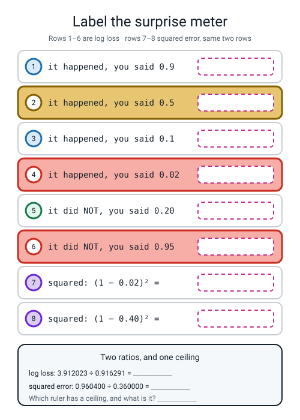
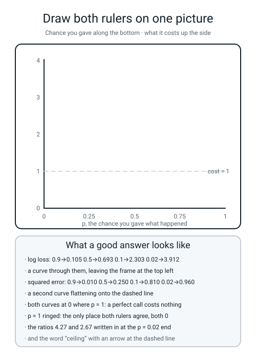

# Workbook — Week 14: Measuring How Wrong You Are

**Name:** ________________________________  **Date:** ______________

[⬅ Week 13](week-13.md) · [📖 Read the chapter first](../student-guide/week-14.md) · [Course Home](../README.md) · [Next ➡](week-15.md)

---

## ✅ Warm-Up (5 min)

Five quick questions about **last week** — from a score to a chance.

**W1.** Write the sigmoid as three steps on a calculator, then do it for `z = 1.4`.

`step 1: ` ____________ `  step 2: ` ____________ `  step 3: ` ____________ `  → p = ` ____________

**W2.** `sigmoid(0)` is exactly `0.5`. **Write the three-operation sum that makes it exact:**

________________________________________________________________

**W3.** A probability of `0.90` came from which raw score? **Show both steps.**

`odds = ` ____________ `  z = ln(` ______ `) = ` ____________

**W4.** `RuntimeWarning: overflow encountered in exp`. **Which number was too big, and roughly how many digits did it have?**

________________________________________________________________

**W5.** A classmate's squasher returns `0.1978` for `z = 1.4`. **What did they type wrong, and how do you know without reading their code?**

________________________________________________________________

---

## 🔢 Do the Maths by Hand

**Calculator only. No code on this page.** This week's button is `ln`, and on almost every calculator it is a **primary key** — no `SHIFT` needed. It sits right where `e^x` was hiding last week.

> **⚠️ Watch out:** `log` and `ln` are **different keys and they sit next to each other.** If you get `−1.69897` where the answer key says `−3.912023`, you pressed `log`.

### M1 — four presses, and the there-and-back check

| # | `p` | `ln(p)` | `−ln(p)` | Read it out loud as |
|:--:|:--:|---|---|---|
| 1 | `0.9` | ______________ | ______________ | ______________________________ |
| 2 | `0.5` | ______________ | ______________ | ______________________________ |
| 3 | `0.1` | ______________ | ______________ | ______________________________ |
| 4 | `0.02` | ______________ | ______________ | ______________________________ |

**M1(a).** **The there-and-back check.** Press `e^x` on your row-4 answer of `−3.912023`. What comes out? ____________ **What does that prove about the two buttons?**

________________________________________________________________

**M1(b).** **Every one of your four `ln(p)` answers is negative. Why?** *(Two facts, and the second is the one people forget.)*

`ln(1) = ` ______ , and every probability is ______________________.

**M1(c).** **So why does the loss have a minus sign out in the front?**

________________________________________________________________

**M1(d).** **Now the gaps, because the gaps are the point.** Subtract your 6-decimal-place answers.

```text
from 0.9 down to 0.5 :  ____________ − ____________ = ____________     (p dropped by 0.40)
from 0.1 down to 0.02:  ____________ − ____________ = ____________     (p dropped by 0.08)
```

**The second gap is about ______ times bigger, on a probability change ______ times smaller.**

**One sentence on what the meter is doing:** ______________________________________________

### M2 — six predictions, two rulers

**This is the main page of the week.** Six rows. `y = 1` means the thing happened. **Watch rows 3, 4 and 6: the truth is 0, so the chance you gave the thing that happened is `1 − p`.** That is where the marks get lost.

| Row | `y` | `p` | Log loss — write the sum | Value (6 dp) | Squared error — write the sum | Value (6 dp) |
|:--:|:--:|:--:|---|---|---|---|
| 1 | 1 | 0.90 | `−ln(________)` | ____________ | `(1 − 0.90)² = ______²` | ____________ |
| 2 | 1 | 0.40 | `−ln(________)` | ____________ | `(1 − 0.40)² = ______²` | ____________ |
| 3 | 0 | 0.20 | `−ln(________)` | ____________ | `(0 − 0.20)² = ______²` | ____________ |
| 4 | 0 | 0.95 | `−ln(________)` | ____________ | `(0 − 0.95)² = ______²` | ____________ |
| 5 | 1 | 0.02 | `−ln(________)` | ____________ | `(1 − 0.02)² = ______²` | ____________ |
| 6 | 0 | 0.50 | `−ln(________)` | ____________ | `(0 − 0.50)² = ______²` | ____________ |

**M2(a).** Both totals and both averages:

```text
log loss      sum = ____________      ÷ 6 = ____________
squared error sum = ____________      ÷ 6 = ____________
```

**M2(b).** **The two ratios, and they are the whole week.** Row 5 is the confident disaster — said 2%, answer was yes. Row 2 is the near miss — said 40%, answer was yes. **Circle both answers.**

```text
log loss      : ____________ ÷ ____________ = ____________
squared error : ____________ ÷ ____________ = ____________
```

**M2(c).** Row 6 has a log loss you have seen before, twice. **Write it, and say where it came from:**

____________ , because ______________________________________________

### M3 — read your own table

**M3(a).** Row 5 is the worst row under both rulers. **What share of each total is it?**

```text
log loss      : ____________ ÷ ____________ = ____________  →  ______ % of the total
squared error : ____________ ÷ ____________ = ____________  →  ______ % of the total
```

**M3(b).** Row 4 said `0.95` and the answer was **no**. Row 5 said `0.02` and the answer was **yes**. **Which is worse, and by how much, under each ruler?**

```text
log loss      : ____________ vs ____________  →  row 5 is ______ times worse
squared error : ____________ vs ____________  →  row 5 is ______ times worse
```

**M3(c).** One of those two rulers thinks rows 4 and 5 are nearly the same event. Which, and **why should that worry you?**

________________________________________________________________

### M4 — the ceiling, measured

Six rows was a scoreboard. This is one row, pushed until one of the two rulers gives up. **The truth is `y = 1` every time.**

| `p` | Log loss `−ln(p)` | Squared error `(1 − p)²` |
|:--:|---|---|
| `0.40` | ____________ | ____________ |
| `0.02` | ____________ | ____________ |
| `0.001` | ____________ | ____________ |
| `0.0000001` | ____________ | ____________ |

**M4(a).** Go down the squared-error column. **What number is it heading for, and can it ever pass it?**

____________ , and ______

**M4(b).** Go down the log loss column. **Where is it heading?** ______________________

**M4(c).** **The killer comparison.** Compare the last row with the `0.02` row:

```text
log loss      : ____________ ÷ ____________ = ____________ times worse
squared error : ____________ ÷ ____________ = ____________ times worse
```

**M4(d).** Finish the sentence, using the word **surprise**:

*Classification does not use squared error because* ______________________________________________

________________________________________________________________

**M4(e).** And the number to know by heart. `−ln(0.5) = ` ____________ , which is also `ln(` ______ `)`.

---

## 🔎 Predict the Output

This section is for practising prediction: you commit to an answer first, then run the code and compare.

**Write your prediction in pen before you run anything.** Five snippets. Every one starts with `import numpy as np`.

### P1 — the two presses that define `ln`

```python
import numpy as np
print(np.log(1))
print(np.log(np.e))
```

**My prediction:** ____________ and ____________  **Real:** ____________ and ____________

**One line on why line 2 is what it is:** ______________________________________

### P2 — four surprises and a shape

```python
import numpy as np
s = -np.log([0.9, 0.5, 0.1, 0.02])
print(np.round(s, 6))
print(s.shape)
```

**My prediction:**

```text
line 1: ______________________________________
line 2: ______________
```

**Real:**

```text
line 1: ______________________________________
line 2: ______________
```

**P2(a).** The thing going in was a **plain Python list** and the thing coming out has a `.shape`. **What did `np.log` quietly do?**

________________________________________________________________

**P2(b).** Where have you written those four numbers already today? ____________________

### P3 — two logarithms that are not the same

```python
import numpy as np
print(np.log(0.02))
print(np.log10(0.02))
print(np.log(0.02) / np.log10(0.02))
```

**My prediction:** ____________ , ____________ , ____________

**Real:** ____________ , ____________ , ____________

**P3(a).** The third line is a number you have seen. What is it? `ln(` ______ `)`

**P3(b).** **The dangerous part.** If you used `np.log10` throughout your loss function, **would the best forecaster still come out best?** ______ **So how would you ever catch it?**

________________________________________________________________

### P4 — the clip that looks like it did nothing

```python
import numpy as np
c = np.clip(np.array([0.0, 0.3, 1.0]), 1e-12, 1 - 1e-12)
print(c)
print(1 - c[2])
```

**My prediction:**

```text
line 1: ______________________________________
line 2: ______________________________________
```

**Real:**

```text
line 1: ______________________________________
line 2: ______________________________________
```

**P4(a).** The third value in line 1 prints as `1.e+00`. **Is it 1?** ______ **What is the evidence, and which line gives it?**

________________________________________________________________

**P4(b).** What is `1.e-12` in ordinary digits? `0.` ____________________

### P5 — the hard one

```python
import numpy as np
y = np.array([1, 0])
p = np.array([0.5, 0.5])
print(-(y * np.log(p) + (1 - y) * np.log(1 - p)))
print(np.log(2))
```

**My prediction:**

```text
line 1: ______________________________________
line 2: ______________________________________
```

**Real:**

```text
line 1: ______________________________________
line 2: ______________________________________
```

**P5(a).** One of those two rows was a **yes** and the other was a **no**, and they cost the **same**. Show why, with both branches written out:

`y = 1 → −ln(` ______ `) = ` ____________  and  `y = 0 → −ln(1 − ` ______ `) = ` ____________

**P5(b).** **So what does a loss of exactly `0.6931` tell you about your data?** ____________________

---

## ✍️ Practice Set A — Read It

This set is for reading: matching words, reading a printout, spotting bugs and tracing code without writing any.

**A1. Match the word to the thing.** Write the letter.

| Word | | Description |
|---|---|---|
| **log loss / cross-entropy** | ______ | (i) `(truth − prediction)²`. The right ruler for a number, not a chance |
| **squared error** | ______ | (ii) Squashing values into a safe range before something fragile |
| **surprise** | ______ | (iii) Far from 0.5 and on the wrong side. The thing log loss hunts |
| **numerical guard / clipping** | ______ | (iv) `−ln(p)` if it happened, `−ln(1 − p)` if not, averaged over the rows |
| **confidently wrong** | ______ | (v) How astonished you should be, given the chance you gave what happened |

**A2. Read the printout.** This is the real output of `contest.py`.

```text
day  rained    Bold  surprise   Careful  surprise    Coin  surprise
  1       1    0.99    0.0101      0.60    0.5108    0.50    0.6931
  2       1    0.99    0.0101      0.55    0.5978    0.50    0.6931
  3       0    0.01    0.0101      0.45    0.5978    0.50    0.6931
  4       1    0.02    3.9120      0.55    0.5978    0.50    0.6931
  5       0    0.01    0.0101      0.40    0.5108    0.50    0.6931
  6       0    0.01    0.0101      0.45    0.5978    0.50    0.6931

forecaster     log loss  squared err
Bold           0.66038      0.16015
Careful        0.56883      0.18833
Coin           0.69315      0.25000

sklearn log_loss, Bold   : 0.66038
sklearn log_loss, Careful: 0.56883
sklearn log_loss, Coin   : 0.69315
```

| Question | Your answer |
|---|---|
| a. On day 3 it did **not** rain and BOLD said `0.01`, yet BOLD's surprise is a tiny `0.0101`. Why? | |
| b. CAREFUL's six surprises are only ever `0.5108` or `0.5978`. What decides which? | |
| c. BOLD was on the right side of 0.5 on five days out of six and still lost. Which day cost them, and how much? | |
| d. Add up CAREFUL's six surprises. Is that bigger or smaller than BOLD's day 4 alone? | |
| e. COIN's column is six identical numbers. What number, and why identical? | |
| f. The two scoreboard columns crown **different** winners. Is one of them computing something wrong? | |

**A2(g).** Day 3 again, in full. **Write the two-step reasoning:**

it did not rain, so the chance BOLD gave the thing that happened was `1 − ` ______ ` = ` ______ , so the surprise is `−ln(` ______ `) = ` ____________

**A2(h).** The `sklearn log_loss` lines agree with ours to five decimal places. **What was the point of printing them, given that we already had the answer?**

________________________________________________________________

**A3. Spot the bug.** Each line is wrong or misleading. Say what happens and write the fix.

| # | The line | What happens | The fix |
|:--:|---|---|---|
| a | `return (y * np.log(p) + (1 - y) * np.log(1 - p))` | | |
| b | `return -(y * np.log10(p) + (1 - y) * np.log10(1 - p))` | | |
| c | `loss = -np.log(p)` used on every row, whatever `y` is | | |
| d | `p = np.clip(p, 1e-12, 1)` | | |
| e | `p = np.array([0.9, 0.5]); y = [1, 1, 0]` then `log_loss(y, p)` | | |
| f | `np.clip` applied **after** `np.log` instead of before | | |

**A3(g).** Which of those six makes every printed loss **negative**? ______ **And what is the one-line rule that catches it for ever?**

________________________________________________________________

**A3(h).** For **(c)**, **three of the six rows of M2 would be wrong.** Which three, and which single row would be **most** wrong? Give the wrong value and the right one.

________________________________________________________________

**A4. Match the code to the output.** Five of each, no output used twice. Assume `import numpy as np` and `from sklearn.metrics import log_loss` above each.

| | Code |
|---|---|
| i | `print(-np.log(0.8))` |
| ii | `print(np.round((np.array([1,0]) - np.array([0.02,0.95]))**2, 4))` |
| iii | `print(np.log(2))` |
| iv | `print("%.6f" % log_loss(np.array([1,1,0,0]), np.array([0.5,0.5,0.5,0.5])))` |
| v | `print(np.clip(np.array([0.0, 1.0]), 1e-12, 1 - 1e-12).shape)` |

| | Output |
|---|---|
| P | `0.693147` |
| Q | `(2,)` |
| R | `0.2231435513142097` |
| S | `[0.9604 0.9025]` |
| T | `0.6931471805599453` |

**Your answers:** i → ______  ii → ______  iii → ______  iv → ______  v → ______

**A4(f).** Two of those five outputs are the **same number** printed two different ways. Which two, and what is the difference?

________________________________________________________________

**A5. Label the surprise meter.** Fill in all eight empty boxes in the figure, then the panel at the bottom.


*Figure W14.1 — Label the surprise meter. Rows 1–6 are log loss; rows 7–8 price two of the same rows with squared error instead.*

**A5(a).** Rows 4 and 6 are both disasters, and their two boxes are different sizes. **Which is bigger, and why, given that one said 2% and the other said 5%?**

________________________________________________________________

**A5(b).** Row 4's box and row 7's box price **the same prediction**. Write both, and the ratio:

`____________ ÷ ____________ = ____________`

**A6. Say the sentence.** Finish each one so it is true and complete.

**a)** Surprise is `−ln(p)`, where `p` is ______________________________________________.

**b)** Log loss is the surprise meter with ______________________ in front of it: `−ln(p)` if ______________________, `−ln(1 − p)` if ______________________.

**c)** The textbook one-liner hides an `if` inside a ______________________, because `y` is only ever ______ or ______, so one half is always ______________________.

**d)** Squared error's worst possible cost for one row is ______ , and log loss's is ______________________.

**e)** `0.6931` is the loss of ______________________, it is also `ln(` ______ `)`, and it does not depend on ______________________ at all.

**f)** A probability of exactly 0 or 1 gives `0 × ln(0)`, which is ______________________, so numpy returns ______ , and one of those makes the average of five hundred rows ______.

---

## ✍️ Practice Set B — Write It

This set is for writing code: each task gives an expected output to match.

### B1 — one line, four surprises

**Task.** In one line, print the surprise for `0.9, 0.5, 0.1, 0.02`, rounded to six decimal places.

**Expected output:**

```text
[0.105361 0.693147 2.302585 3.912023]
```

**Done looks like:** one line, four numbers, and they match the column you wrote by hand in **M1**.

```python
# your code here

```

### B2 — the surprise function, and the test that guards it

**Task.** Write `surprise(y, p)` with the guard inside it. Then score an **all-0.5** forecaster and check it against `ln(2)`.

**Expected output:**

```text
per row       : [0.693147 0.693147 0.693147 0.693147]
mean          : 0.693147
must be ln(2) : 0.693147
passes?        True
```

**Done looks like:** `True` on the last line. **This is the one-line test for a loss function and it will keep working for the next two years.**

```python
# your code here


```

### B3 — the six rows, both rulers, in code

**Task.** Put your **M2** table into code. Print one row per prediction, then both sums, both means, and both ratios.

**Expected output:**

```text
row   y      p     log loss   squared err
  1   1   0.90     0.105361      0.010000
  2   1   0.40     0.916291      0.360000
  3   0   0.20     0.223144      0.040000
  4   0   0.95     2.995732      0.902500
  5   1   0.02     3.912023      0.960400
  6   0   0.50     0.693147      0.250000
                 sum   8.845697      2.522900
                mean   1.474283      0.420483

disaster / near-miss, log loss    : 3.912023 / 0.916291 = 4.2694
disaster / near-miss, squared err : 0.960400 / 0.360000 = 2.6678
```

**Done looks like:** every number on the screen also appears in your handwriting on **M2**. If one disagrees, **find out which of the two of you is wrong before you go on.**

```python
# your code here


```

### B4 — make the `nan`, then stop it

**Task.** Two halves in one file. First compute the loss on `y = [1, 1, 0, 0]`, `p = [0.9, 1.0, 0.0, 0.3]` with **no** guard and print the per-row values and the mean. Then do it again **with** `np.clip`, and compare both against `log_loss`.

**Expected output** (the warnings arrive above, on a different stream):

```text
--- no guard ---
per row : [0.10536052        nan        nan 0.35667494]
mean    : nan

--- with the guard ---
p after clip: [9.e-01 1.e+00 1.e-12 3.e-01]
per row : [0.105361 0.       0.       0.356675]
mean    : 0.115509

sklearn log_loss: 0.115509
```

**Done looks like:** `nan` in the first half, `0.115509` in the second, and the two `RuntimeWarning` lines pasted into your homework word for word.

```python
# your code here


```

### B5 — a whole program of your own, about 25 lines

**Task.** `b5w14.py`. The contest, plus a **fourth forecaster you invent**, scored on both rulers, with the winners named by the program and the self-test at the bottom.

**It must:**

1. set `np.random.seed(0)`;
2. hold the truth `rained = [1, 1, 0, 1, 0, 0]`;
3. hold BOLD, CAREFUL, COIN, and **your own** six predictions;
4. define `surprise(y, p)` **with the clip inside it**;
5. print log loss, squared error and `log_loss` for all four, in aligned columns;
6. print the winner of each column by name, found with `np.argmin`;
7. finish with the all-0.5 self-test against `ln(2)`.

**Aim for a forecaster that wins *both* columns.** `[0.90, 0.85, 0.15, 0.80, 0.10, 0.15]` does it, and understanding *why* is the objective. **Expected output with that one:**

```text
forecaster     log loss  squared err      sklearn
Bold          0.660379     0.160150     0.660379
Careful       0.568833     0.188333     0.568833
Coin          0.693147     0.250000     0.693147
Mine          0.153570     0.021250     0.153570

winner on log loss    : Mine 0.153570
winner on squared err : Mine 0.021250

self-test: an all-0.5 forecaster must score ln(2) = 0.693147
   Coin scored 0.693147
```

**Done looks like:** your `sklearn` column agrees with your `log loss` column on all four rows, and the self-test prints `0.693147`.

> **💡 Try this:** before you run it, **predict which ruler your forecaster will win by more.** `0.153570` against CAREFUL's `0.568833` is a **3.7×** improvement; `0.021250` against BOLD's `0.160150` is a **7.5×** improvement. The reason is that BOLD's squared error was already almost as low as it could go, while CAREFUL's log loss had a lot of hedging in it.

---

## 🐞 Fix the Broken Program

This section is for practising debugging from real tracebacks and outputs.

This program has **three** bugs: one **shape** bug, one **silent logic** bug, and one **runtime** bug that produces `nan` instead of a crash. The real outputs are below, in the order you meet them.

```python
"""broken14.py - score four forecasters over six days. THREE bugs."""
import numpy as np
from sklearn.metrics import log_loss

rained  = np.array([1, 1, 0, 1, 0, 0])

bold    = np.array([0.99, 0.99, 0.01, 0.02, 0.01])
careful = np.array([0.60, 0.55, 0.45, 0.55, 0.40, 0.45])
coin    = np.array([0.50, 0.50, 0.50, 0.50, 0.50, 0.50])
certain = np.array([1.00, 1.00, 0.00, 0.00, 0.00, 0.00])


def surprise(y, p):
    return (y * np.log(p) + (1 - y) * np.log(1 - p))


print("%-9s %12s" % ("forecaster", "log loss"))
for name, p in [("Bold", bold), ("Careful", careful),
                ("Coin", coin), ("Certain", certain)]:
    print("%-9s %12.6f" % (name, float(np.mean(surprise(rained, p)))))

print()
print("self-test, an all-0.5 forecaster must score 0.693147:")
print("   we got %.6f" % float(np.mean(surprise(rained, coin))))
print("   sklearn says %.6f" % log_loss(rained, coin))
```

**Run 1 — nothing prints at all:**

```text
Traceback (most recent call last):
  File "broken14.py", line 20, in <module>
    print("%-9s %12.6f" % (name, float(np.mean(surprise(rained, p)))))
  File "broken14.py", line 14, in surprise
    return (y * np.log(p) + (1 - y) * np.log(1 - p))
ValueError: operands could not be broadcast together with shapes (6,) (5,)
```

**Bug 1.** Which line does the message *point* at? ______  **Which line is actually at fault?** ______  **Kind of bug?** ______________

**The `6` counts:** ____________________  **The `5` counts:** ____________________

**The fix:** ______________________________

> **⚠️ Watch out:** the traceback names line 14, inside `surprise`. **That is where the crash happened, not where the mistake was made.** Read a traceback from the **bottom up** for the message and from the **top down** for the story: line 20 called `surprise`, and line 14 is where the two mismatched arrays finally met.

**Run 2 — after fixing bug 1:**

```text
/tmp/broken14.py:14: RuntimeWarning: divide by zero encountered in log
  return (y * np.log(p) + (1 - y) * np.log(1 - p))
/tmp/broken14.py:14: RuntimeWarning: invalid value encountered in multiply
  return (y * np.log(p) + (1 - y) * np.log(1 - p))
forecaster     log loss
Bold         -0.660379
Careful      -0.568833
Coin         -0.693147
Certain            nan

self-test, an all-0.5 forecaster must score 0.693147:
   we got -0.693147
   sklearn says 0.693147
```

**There are now two problems on that screen. Deal with the silent one first, because the self-test just caught it for you.**

**Bug 2.** Which line? ______  **Kind of bug?** ______________

**What is impossible about every number in that log loss column?** ____________________

**Lower is better, so which forecaster is the "winner" on that broken screen?** ____________ **And is that sensible?** ______

**The fix — how many characters?** ______  **Write it:** ______________________________

**Run 3 — after fixing bugs 1 and 2:**

```text
/tmp/broken14.py:14: RuntimeWarning: divide by zero encountered in log
  return -(y * np.log(p) + (1 - y) * np.log(1 - p))
/tmp/broken14.py:14: RuntimeWarning: invalid value encountered in multiply
  return -(y * np.log(p) + (1 - y) * np.log(1 - p))
forecaster     log loss
Bold          0.660379
Careful       0.568833
Coin          0.693147
Certain            nan

self-test, an all-0.5 forecaster must score 0.693147:
   we got 0.693147
   sklearn says 0.693147
```

**Bug 3.** Which forecaster is the problem, and what is unusual about their six numbers?

________________________________________________________________

**CERTAIN got days 1, 2, 3, 5 and 6 exactly right — and even those rows came out `nan`. Follow day 1 through:** it rained and CERTAIN said `1.00`, so the first half is `1 × ln(1) = ` ______ , and the second half is `(1 − 1) × ln(1 − 1)`, which is ______ ` × ` ______ , which has ______________________.

**Kind of bug?** ______________  **The fix, one line, and it goes inside `surprise` before the logs:**

______________________________

**Run 4 — after fixing all three:**

```text
forecaster     log loss
Bold          0.660379
Careful       0.568833
Coin          0.693147
Certain       4.605170

self-test, an all-0.5 forecaster must score 0.693147:
   we got 0.693147
   sklearn says 0.693147
```

**Three questions, and the last one is new.**

**CERTAIN is the worst of the four by a mile. Is that fair, given they got five days out of six exactly right?**

________________________________________________________________

**Rank the three bugs by how much time each would cost you to find, and explain the ranking.**

________________________________________________________________

________________________________________________________________

**And the sting.** Ask scikit-learn to score CERTAIN and it says **`6.007276`**, not `4.605170`. **Neither of you is wrong. What is the one number you chose that they chose differently, and what does that tell you about a clip constant?**

________________________________________________________________

---

## 🧩 Puzzle of the Week

This section is for applying the week's two rulers to two puzzles.

### Part 1 — Run the meter backwards

Somebody wrote down six losses and threw away the predictions. **Get them back.** *(Hint: the meter is `−ln(p)`, so undo it with `e^x`. You did the there-and-back check in M1(a).)*

| # | the loss | the truth `y` | `p` the model said | how? |
|:--:|:--:|:--:|:--:|---|
| 1 | `0.105361` | 1 | ____________ | |
| 2 | `0.693147` | 1 | ____________ | |
| 3 | `2.302585` | 1 | ____________ | |
| 4 | `3.912023` | 1 | ____________ | |
| 5 | `0.223144` | **0** | ____________ | |
| 6 | `0.356675` | **0** | ____________ | |

**Part 1(a).** Rows 5 and 6 need one extra step that rows 1 to 4 do not. **What is it, and why?**

________________________________________________________________

**Part 1(b).** A loss of `0.693147` came back as `p = 0.5`. **Could a loss of `0.693147` have come from a prediction that was *not* 0.5?** ______ **Explain.**

________________________________________________________________

### Part 2 — The Championship, by 1.46%

BOLD lost the log-loss championship because of **one day**. Find out by how little.

```text
BOLD's five good days cost  5 × 0.010050 = ____________
CAREFUL's whole week totals              = 3.412999
so day 4 was allowed to cost at most     ____________ − ____________ = ____________
so day 4's probability had to be above   e^(−____________) = ____________
```

**BOLD said `0.02`. They only had to say ____________ to win the championship.**

**Part 2(a).** Write that as a percentage, and then write the sentence that makes it startling: ______________________

**Part 2(b).** Now do the same sum under **squared error**. BOLD's five good days cost `5 × 0.0001 = 0.000500`, and CAREFUL's week totals `1.130000`. **How bad could BOLD's day 4 have been and still won?**

`1.130000 − 0.000500 = ` ____________ , and `(1 − p)² = ` ____________ needs `p` above ____________ — **which is impossible to fail**, because a probability cannot go below ______.

**Part 2(c).** **One sentence on what Part 2(b) just proved about squared error.**

________________________________________________________________

---

## 🤔 Think Deeper

This section is for longer written answers that pull the week together.

**T1.** Log loss and squared error crowned different winners from the same six days, and **both columns were computed correctly.** Write a paragraph arguing for one of them in a specific setting of your own choosing — a flood warning, a fraud alert, a music recommender, a spell checker. Your paragraph must name the setting, say what a confidently wrong prediction actually *costs* there in the real world, and use the numbers `3.9120` and `0.9604`. Finish by saying what you would do if the person paying you insisted on the other one.

________________________________________________________________

________________________________________________________________

________________________________________________________________

________________________________________________________________

________________________________________________________________

**T2.** Is `0.6931` a bad score? Write a paragraph. You must address all three of these: what it means for a loss to be **below** `0.6931`; what it means to be **above** it, and whether that is even possible for a model that is trying; and whether a model that scores `0.6900` on a hospital dataset should be deployed. Use the fact that `0.6931` does not depend on the data at all, and the fact that next week you will see a loss of `7.8482`.

________________________________________________________________

________________________________________________________________

________________________________________________________________

________________________________________________________________

________________________________________________________________

---

## 🛠️ Build It — Three Sentences About 0.6931

**Two files, then three sentences. The third sentence is the one that earns the marks.**

### Part A — `parked.py`: prove it twice

```python
"""parked.py - the loss of a model that answers 0.5 to everything."""
import numpy as np
from sklearn.datasets import make_classification
from sklearn.metrics import log_loss

np.random.seed(0)

X, y = make_classification(n_samples=200, n_features=2, n_informative=2,
                           n_redundant=0, random_state=0)

w = np.array([0.0, 0.0])
b = 0.0
z = w[0] * X[:, 0] + w[1] * X[:, 1] + b
p = 1.0 / (1.0 + np.exp(-z))

print("all 200 z values are:", np.unique(z))
print("all 200 p values are:", np.unique(p))
print("log loss            : %.6f" % log_loss(y, p))
print("ln(2)               : %.6f" % np.log(2.0))
print("sklearn agrees      :", abs(log_loss(y, p) - np.log(2.0)) < 1e-12)
print()
print("and a model that answers 0.5 to a 90-percent-class-1 dataset:")
y_skew = np.zeros(200, dtype=int)
y_skew[:180] = 1
print("log loss            : %.6f" % log_loss(y_skew, p))
```

**Runtime: under a second.** Fill in your own screen:

| What was printed | Value |
|---|---|
| all 200 `z` values are | ____________ |
| all 200 `p` values are | ____________ |
| log loss, balanced data | ____________ |
| `ln(2)` | ____________ |
| `sklearn agrees` | ____________ |
| log loss, 90%-class-1 data | ____________ |

**Why is every single `z` exactly zero?** ______________________________________

**Why does `np.unique` print just one number and not 200?** ______________________

### Part B — the diagnosis drill

**Your loss has been stuck at `0.6931` for 200 epochs. You get to print three things, in order.**

| Order | What I would print | If it comes back like this… | …then the problem is |
|:--:|---|---|---|
| 1 | | | |
| 2 | | | |
| 3 | | | |

### The three sentences being marked

**Sentence 1 — why `0.6931` is the loss of a model that answers 0.50 to everything. Show the arithmetic.**

________________________________________________________________

________________________________________________________________

**Sentence 2 — why it does not depend on the data. *(This is the discriminator. "Because it's always 0.5" is only halfway.)***

________________________________________________________________

________________________________________________________________

**Sentence 3 — what you would print first, and what each answer would tell you.**

________________________________________________________________

________________________________________________________________

________________________________________________________________

### The Bug Log

Two entries today, and the first is the worst kind: *no crash, every number a different sign.*

| What I saw | What it means | Cause | Fix |
|---|---|---|---|
| | | | |
| | | | |

---

## 🎨 Draw It

This section is for turning your hand-computed numbers into a picture.

Draw **both rulers on one picture** — from your own hand-computed numbers.


*Figure W14.2 — An empty frame with `p` along the bottom, the cost up the side, and a dashed line at a cost of 1, plus what a good answer contains.*

**Then answer four things about your own drawing:**

**Which curve leaves the top of your frame, and at roughly which `p`?** ______________________

**What happens to the other curve as `p` heads towards 0?** ______________________

**At `p = 1` both curves do the same thing. What, and why?** ______________________

**Mark the point on your drawing that BOLD's day 4 sits on. Which curve, and what two numbers?** ______________________

---

## 📊 Self-Check

This section is for rating yourself honestly on each skill from the week.

| I can... | 😀 | 🙂 | 😕 |
|---|---|---|---|
| compute `−ln(p)` on a calculator for four probabilities and read each as a level of surprise | | | |
| say what `p` means in `−ln(p)` — and it is not "what the model said" | | | |
| compute log loss for a row where the truth is 0, using `1 − p` | | | |
| compute squared error for the same row, and both averages | | | |
| compute both disaster-to-near-miss ratios and say which is bigger | | | |
| explain in one sentence, using the word *surprise*, why classification does not use squared error | | | |
| say what squared error's ceiling is, and show a pair of predictions it cannot tell apart | | | |
| recognise `0.6931` instantly and name what the model is doing | | | |
| explain why `0.6931` is the same on balanced and 90%-skewed data | | | |
| spot a `nan` from `0 × ln(0)` and fix it with one line of clipping | | | |

**The one thing I would ask about if I could ask one question:**

________________________________________________________________

---

## ✅ Answers

This section is for checking your work after you have finished every page above.

<details>
<summary>Check your answers</summary>

### Warm-Up

**W1.** `e^(−1.4) = 0.246597` → `1 + 0.246597 = 1.246597` → `1 ÷ 1.246597 = 0.8022`.

**W2.** `e^0 = 1`, `1 + 1 = 2`, `1 ÷ 2 = 0.5`. **No rounding anywhere in that sum**, which is exactly why this week's `0.693147` can be quoted as exact.

**W3.** `odds = 0.90 ÷ 0.10 = 9`, `z = ln(9) = 2.197225`.

**W4.** `e^1000` was too big. **It has 435 digits**, and the biggest number this kind of decimal holds has 309, so the machine stored `inf`.

**W5.** They asked for `e^(+z)` where `e^(−z)` was meant — a lost sign change, or the two arms of `np.where` swapped. **You know without reading the code because `0.1978 + 0.8022 = 1.0000`:** their answer is exactly `1 −` the right one, which is the signature of a flipped sign.

### Do the Maths by Hand

**M1.**

| # | `p` | `ln(p)` | `−ln(p)` | Read as |
|:--:|:--:|---|:--:|---|
| 1 | `0.9` | `−0.105361` | **0.105361** | barely surprised — I said it would |
| 2 | `0.5` | `−0.693147` | **0.693147** | a shrug; no information either way |
| 3 | `0.1` | `−2.302585` | **2.302585** | genuinely surprised |
| 4 | `0.02` | `−3.912023` | **3.912023** | astonished; I said it basically wouldn't |

**M1(a).** `0.02` comes back. **`ln` undoes `e^x`**, the way minus undoes plus. Try it on your own calculator once and the `ln` key stops feeling like magic for ever.

**M1(b).** `ln(1) = 0`, and every probability is **below 1**. `ln` of anything below 1 is below zero, so this was always going to happen.

**M1(c).** Because a **negative loss is meaningless** — zero means perfect and there is nothing better than perfect. The minus sign out in front flips all of them positive. **It is not decoration; it is the whole reason the sign is there.**

**M1(d).**

```text
from 0.9 down to 0.5 :  0.693147 − 0.105361 = 0.587786     (p dropped by 0.40)
from 0.1 down to 0.02:  3.912023 − 2.302585 = 1.609438     (p dropped by 0.08)
```

`1.609438 ÷ 0.587786 = 2.74`, so **about 2.7 times bigger on a probability change five times smaller.**

**The sentence:** the meter gets steeper and steeper the more confidently wrong you are, **and it never stops** — `−ln(0.001) = 6.907755` and `−ln(0.0000001) = 16.118096`.

*(A note on rounding: subtract the **full-precision** values and you get `0.587787`, not `0.587786`. Both are right — the first rounds the answer, the second rounds the inputs and then subtracts. **Round at the end, never in the middle**, and when you cannot, say which you did.)*

**M2.**

| Row | `y` | `p` | Log loss, worked | Value | Squared error, worked | Value |
|:--:|:--:|:--:|---|:--:|---|:--:|
| 1 | 1 | 0.90 | `−ln(0.90)` | **0.105361** | `(1 − 0.90)² = 0.10²` | **0.010000** |
| 2 | 1 | 0.40 | `−ln(0.40)` | **0.916291** | `(1 − 0.40)² = 0.60²` | **0.360000** |
| 3 | 0 | 0.20 | `−ln(1 − 0.20) = −ln(0.80)` | **0.223144** | `(0 − 0.20)² = 0.20²` | **0.040000** |
| 4 | 0 | 0.95 | `−ln(1 − 0.95) = −ln(0.05)` | **2.995732** | `(0 − 0.95)² = 0.95²` | **0.902500** |
| 5 | 1 | 0.02 | `−ln(0.02)` | **3.912023** | `(1 − 0.02)² = 0.98²` | **0.960400** |
| 6 | 0 | 0.50 | `−ln(1 − 0.50) = −ln(0.50)` | **0.693147** | `(0 − 0.50)² = 0.50²` | **0.250000** |

**M2(a).**

```text
log loss      sum = 8.845697      ÷ 6 = 1.474283
squared error sum = 2.522900      ÷ 6 = 0.420483
```

**M2(b).**

```text
log loss      : 3.912023 ÷ 0.916291 = 4.2694
squared error : 0.960400 ÷ 0.360000 = 2.6678
```

**`4.27` against `2.67` is the whole week in two numbers.** Squared error says the catastrophe is under three times worse than the near-miss. **Nobody experiences it that way.**

**M2(c).** `0.693147`, because the model said exactly `0.50`, and `−ln(0.5) = 0.693147 = ln(2)`. **Any row where the model said exactly 0.50 costs exactly this, whichever way the truth went.** It is the price of a shrug.

**M3(a).**

```text
log loss      : 3.912023 ÷ 8.845697 = 0.4423  →  44.2 % of the total
squared error : 0.960400 ÷ 2.522900 = 0.3807  →  38.1 % of the total
```

**M3(b).**

```text
log loss      : 3.912023 vs 2.995732  →  row 5 is 1.31 times worse
squared error : 0.960400 vs 0.902500  →  row 5 is 1.06 times worse
```

**M3(c).** **Squared error** thinks they are nearly the same event — `1.06` times apart is nothing. But row 5's forecaster was **more** confidently wrong: 2% against 5%. Only one ruler noticed. **It should worry you because "how confident were you?" is the only thing that separates a mistake from a disaster**, and if your ruler cannot see the difference, your training loop cannot either.

**M4.**

```python
import numpy as np
print("%12s %14s %14s" % ("p", "log loss", "squared err"))
for p in (0.40, 0.02, 0.001, 0.0000001):
    print("%12.7f %14.6f %14.7f" % (p, -np.log(p), (1 - p) ** 2))
```

```text
           p       log loss    squared err
   0.4000000       0.916291      0.3600000
   0.0200000       3.912023      0.9604000
   0.0010000       6.907755      0.9980010
   0.0000001      16.118096      0.9999998
```

**M4(a).** It is heading for **1**, and **no, it can never pass it.** The worst squared error for one row is `(1 − 0)² = 1`. **That is the ceiling.**

**M4(b).** **Nowhere.** There is no worst possible log loss; it keeps climbing for ever as `p` heads towards 0.

**M4(c).**

```text
log loss      : 16.118096 ÷ 3.912023 = 4.1201 times worse
squared error : 0.9999998 ÷ 0.9604000 = 1.0412 times worse
```

**Squared error cannot tell those two predictions apart** — they differ in the fourth decimal place, and a prediction of one ten-millionth is a hundred thousand times more confident than a prediction of 2%.

**M4(d).** *Classification does not use squared error because* **squared error has a ceiling of 1 per row, so it cannot express how surprised you should be by a confident disaster — and surprise is exactly the thing that separates a near-miss from a catastrophe.**

**M4(e).** `−ln(0.5) = 0.693147`, which is also `ln(2)`.

### Predict the Output

**P1.** `0.0` then `1.0`. `ln(1) = 0` — the surprise of a prediction you were sure about and got right. And `ln(e) = 1` **by definition**: that is what `e` is *for*.

**P2.**

```text
[0.105361 0.693147 2.302585 3.912023]
(4,)
```

**P2(a).** `np.log` **converted the plain list into a numpy array** on the way in. numpy functions do this quietly, which is convenient and is also exactly why a bug like `-[0.9, 0.5]` surprises people: the conversion happens inside `np.log`, and a minus sign written *before* the call never gets the benefit of it.

**P2(b).** In the `−ln(p)` column of **M1**. All four, in order.

**P3.** `-3.912023005428146`, `-1.6989700043360187`, `2.302585092994046`.

**P3(a).** `ln(10)`. The two logarithms differ by that one fixed number, always, like centimetres and inches.

**P3(b).** **Yes, the ranking would be perfect** — dividing every score by the same constant cannot reorder them. **That is exactly what makes it dangerous.** You catch it with a number you already know: score an all-0.5 forecaster and it **must** come out at `0.693147`. With `np.log10` it comes out at `0.30103`.

**P4.**

```text
[1.e-12 3.e-01 1.e+00]
9.999778782798785e-13
```

**P4(a).** **No, it is not 1.** numpy printed four significant figures of `0.999999999999`. The evidence is line 2: `1 - c[2]` is `9.999778782798785e-13`, which would be exactly `0.0` if the value were really 1. **Display versus value — the same trap as last week's rounded weights.**

**P4(b).** `0.000000000001` — eleven zeros after the point, then a 1.

**P5.**

```text
[0.69314718 0.69314718]
0.6931471805599453
```

**P5(a).** `y = 1 → −ln(0.5) = 0.693147` and `y = 0 → −ln(1 − 0.5) = −ln(0.5) = 0.693147`. **Both branches collapse to the same number**, because `0.5` and `1 − 0.5` are the same thing.

**P5(b).** **Nothing at all.** When `p = 0.5` the labels never enter the arithmetic, so `0.6931` tells you about the **model** and nothing about the data. A balanced dataset and a 90%-skewed one both score exactly `0.693147`.

### Practice Set A

**A1.** log loss → (iv) · squared error → (i) · surprise → (v) · numerical guard → (ii) · confidently wrong → (iii)

**A2.**

| Question | Answer |
|---|---|
| a | It did not rain, so the chance BOLD gave **the thing that happened** was `1 − 0.01 = 0.99`. **BOLD was confidently right**, and `−ln(0.99) = 0.0101`. Anybody who writes `−ln(0.01) = 4.605` here has inverted the whole week. |
| b | Whether the chance they gave the thing that happened was `0.60` or `0.55`. `−ln(0.60) = 0.5108` and `−ln(0.55) = 0.5978`. **Days 1 and 5 are the `0.60` days** — day 1 they said 0.60 and it rained; day 5 they said 0.40 and it did not, so they gave 0.60 to what happened. |
| c | **Day 4**, and it cost `3.9120` — more than three hundred times any other day of theirs. |
| d | CAREFUL's six add to `3.412999`. **BOLD's day 4 alone is `3.912023`, which is bigger.** One day worse than somebody else's entire week. |
| e | `0.6931`, six times. `−ln(0.5)` whichever way the truth went, because the chance COIN gave the thing that happened was `0.5` either way. |
| f | **No — both are correct.** They are different rulers, and the choice between them is a statement about **consequences**, not about arithmetic. |

**A2(g).** it did not rain, so the chance BOLD gave the thing that happened was `1 − 0.01 = 0.99`, so the surprise is `−ln(0.99) = 0.010050`.

**A2(h).** To check **our** arithmetic, not theirs. It is the same move as Week 13's twelve zeros against `predict_proba`. **Once the library agrees with a formula you typed yourself, the formula stops being a spell** — and if it ever disagrees in future, you will know which of the two to doubt.

**A3.**

| # | What happens | The fix |
|:--:|---|---|
| a | **No error.** The leading minus sign is gone, so every loss is negative and the ranking inverts — the most negative wins, so **COIN becomes champion.** | `return -(...)`. One character. |
| b | **No error.** Every value is `2.302585` times too small and **the ranking is perfectly correct**, which is what makes it the nastiest bug in the chapter. | `np.log`, not `np.log10`. Catch it with the all-0.5 test. |
| c | **No error.** Correct on every row where `y = 1`, wrong on every row where `y = 0`. | Use the two-branch form, or the one-liner with `(1 - y)` in it. |
| d | **No error, and it looks fine.** It guards the bottom end and leaves the top end open, so a prediction of exactly `1.0` still gives `ln(1 - 1) = ln(0)`. **Half a guard is no guard.** | `np.clip(p, 1e-12, 1 - 1e-12)`. |
| e | `ValueError: Found input variables with inconsistent numbers of samples: [2, 3]`. Two predictions, three truths. **Note the order in the message is predictions first** — do not assume it matches your argument order. | `print(len(y), len(p))` — the cheapest check in the file. |
| f | **No error, and the numbers are nonsense.** The `nan` has already happened by the time the clip runs; clipping a `nan` leaves a `nan`. **A guard has to be in front of the thing it is guarding.** | Clip `p` on the line **before** the logarithm. |

**A3(g).** **(a).** And the rule: **a loss is never negative. If you see a minus, you have lost a minus.** It is the cheapest diagnostic in the whole course.

**A3(h).** **Rows 3, 4 and 6** are the rows where `y = 0`, so all three use the wrong branch — but **row 6 comes out right anyway**, because `p = 0.50` and `1 − 0.50` are the same number. So two rows are actually wrong:

```text
row 3:  wrong −ln(0.20) = 1.609438      right −ln(0.80) = 0.223144
row 4:  wrong −ln(0.95) = 0.051293      right −ln(0.05) = 2.995732
```

**Row 4 is the most wrong**, and it is wrong in the worst possible direction: the bug reports the confident disaster as costing `0.05` — **the cheapest row on the page** — when it should be the second most expensive. `2.995732 ÷ 0.051293 = 58.4` times out. **A bug that makes your worst row look like your best row is the most expensive kind there is.** And note row 6: a test built only on `p = 0.50` would have passed.

**A4.** i → **R** · ii → **S** · iii → **T** · iv → **P** · v → **Q**

**A4(f).** **P (`0.693147`) and T (`0.6931471805599453`)** are the same number. `T` is the full stored value; `P` went through `"%.6f"`, which **rounds for display only** and does not change anything. Two rulers' worth of digits, one number underneath.

**A5.** The eight boxes, top to bottom:

```text
1.  it happened, you said 0.9    →  −ln(0.90)        = 0.105361
2.  it happened, you said 0.5    →  −ln(0.50)        = 0.693147
3.  it happened, you said 0.1    →  −ln(0.10)        = 2.302585
4.  it happened, you said 0.02   →  −ln(0.02)        = 3.912023
5.  it did NOT, you said 0.20    →  −ln(1 − 0.20)    = 0.223144
6.  it did NOT, you said 0.95    →  −ln(1 − 0.95)    = 2.995732
7.  squared: (1 − 0.02)²         =  0.98²            = 0.960400
8.  squared: (1 − 0.40)²         =  0.60²            = 0.360000
```

The panel: log loss `3.912023 ÷ 0.916291 = 4.2694`; squared error `0.960400 ÷ 0.360000 = 2.6678`. **Squared error has the ceiling, and it is `1` per row.**

**A5(a).** **Row 4 is bigger** — `3.912023` against row 6's `2.995732`. Row 4's forecaster said 2% and row 6's said 5%, and **2% is the more confident claim**, so it costs more. The meter is measuring how far you stuck your neck out.

**A5(b).** `3.912023 ÷ 0.960400 = 4.0733`. Same prediction, same truth, **four times the cost** depending on which ruler you picked up.

**A6.**

**a)** …**the chance you gave the thing that actually happened** — not "what the model said".

**b)** …**an if-statement**…; `−ln(p)` if **it happened**, `−ln(1 − p)` if **it did not**.

**c)** …a **multiplication**…; `y` is only ever **0** or **1**, so one half is always **multiplied by zero and disappears**.

**d)** …**1**…; and log loss's is **there isn't one — it climbs for ever**.

**e)** …**a model that answers 0.50 to every row**…; `ln(2)`; …**the data**…

**f)** …**zero times minus infinity, which has no answer**…; numpy returns **`nan`**; and one of those makes the average of five hundred rows **`nan`**.

### Practice Set B

**B1.**

```python
import numpy as np
print(np.round(-np.log([0.9, 0.5, 0.1, 0.02]), 6))
```

```text
[0.105361 0.693147 2.302585 3.912023]
```

**B2.**

```python
import numpy as np


def surprise(y, p):
    p = np.clip(p, 1e-12, 1 - 1e-12)
    return -(y * np.log(p) + (1 - y) * np.log(1 - p))


y = np.array([1, 0, 1, 0])
half = np.array([0.5, 0.5, 0.5, 0.5])
print("per row       :", np.round(surprise(y, half), 6))
print("mean          : %.6f" % float(np.mean(surprise(y, half))))
print("must be ln(2) : %.6f" % np.log(2.0))
print("passes?       ", bool(abs(float(np.mean(surprise(y, half))) - np.log(2.0)) < 1e-12))
```

```text
per row       : [0.693147 0.693147 0.693147 0.693147]
mean          : 0.693147
must be ln(2) : 0.693147
passes?        True
```

**Note the `y` in that test is `[1, 0, 1, 0]` — deliberately mixed.** The test still passes, and **that is the point**: the labels do not matter when `p = 0.5`.

**B3.**

```python
import numpy as np

y = np.array([1, 1, 0, 0, 1, 0])
p = np.array([0.90, 0.40, 0.20, 0.95, 0.02, 0.50])


def surprise(y, p):
    p = np.clip(p, 1e-12, 1 - 1e-12)
    return -(y * np.log(p) + (1 - y) * np.log(1 - p))


ll = surprise(y, p)
se = (y - p) ** 2
print("row   y      p     log loss   squared err")
for i in range(6):
    print("%3d   %d   %.2f   %10.6f    %10.6f" % (i + 1, y[i], p[i], ll[i], se[i]))
print("                 sum %10.6f    %10.6f" % (ll.sum(), se.sum()))
print("                mean %10.6f    %10.6f" % (ll.mean(), se.mean()))
print()
print("disaster / near-miss, log loss    : %.6f / %.6f = %.4f"
      % (ll[4], ll[1], ll[4] / ll[1]))
print("disaster / near-miss, squared err : %.6f / %.6f = %.4f"
      % (se[4], se[1], se[4] / se[1]))
```

```text
row   y      p     log loss   squared err
  1   1   0.90     0.105361      0.010000
  2   1   0.40     0.916291      0.360000
  3   0   0.20     0.223144      0.040000
  4   0   0.95     2.995732      0.902500
  5   1   0.02     3.912023      0.960400
  6   0   0.50     0.693147      0.250000
                 sum   8.845697      2.522900
                mean   1.474283      0.420483

disaster / near-miss, log loss    : 3.912023 / 0.916291 = 4.2694
disaster / near-miss, squared err : 0.960400 / 0.360000 = 2.6678
```

**B4.**

```python
"""guard.py - what ln(0) does to a loss, and the one line that stops it."""
import numpy as np
from sklearn.metrics import log_loss

y = np.array([1, 1, 0, 0])
p = np.array([0.9, 1.0, 0.0, 0.3])       # rows 2 and 3 are dead certain

print("--- no guard ---")
raw = -(y * np.log(p) + (1 - y) * np.log(1 - p))
print("per row :", raw)
print("mean    :", raw.mean())

print()
print("--- with the guard ---")
p_safe = np.clip(p, 1e-12, 1 - 1e-12)
print("p after clip:", p_safe)
guarded = -(y * np.log(p_safe) + (1 - y) * np.log(1 - p_safe))
print("per row :", np.round(guarded, 6))
print("mean    : %.6f" % guarded.mean())

print()
print("sklearn log_loss:", "%.6f" % log_loss(y, p))
print("1 - p_safe[1]   :", 1 - p_safe[1])
```

```text
guard.py:9: RuntimeWarning: divide by zero encountered in log
  raw = -(y * np.log(p) + (1 - y) * np.log(1 - p))
guard.py:9: RuntimeWarning: invalid value encountered in multiply
  raw = -(y * np.log(p) + (1 - y) * np.log(1 - p))
--- no guard ---
per row : [0.10536052        nan        nan 0.35667494]
mean    : nan

--- with the guard ---
p after clip: [9.e-01 1.e+00 1.e-12 3.e-01]
per row : [0.105361 0.       0.       0.356675]
mean    : 0.115509

sklearn log_loss: 0.115509
1 - p_safe[1]   : 9.999778782798785e-13
```

**Three things worth pointing at.** **Row 2 now costs `0.000000`** — a perfect prediction, correctly priced at nothing; the loss was always right, it was the *route* to it that died. **scikit-learn's answer equals our clipped one**, because scikit-learn clips too — every real implementation does. And **the clipped array prints `1.e+00` and looks unclipped**; the last line proves it is not.

**B5.**

```python
"""b5w14.py - four forecasters, six days, two rulers, and a self-test."""
import numpy as np
from sklearn.metrics import log_loss

np.random.seed(0)

rained = np.array([1, 1, 0, 1, 0, 0])

bold    = np.array([0.99, 0.99, 0.01, 0.02, 0.01, 0.01])
careful = np.array([0.60, 0.55, 0.45, 0.55, 0.40, 0.45])
coin    = np.array([0.50, 0.50, 0.50, 0.50, 0.50, 0.50])
mine    = np.array([0.90, 0.85, 0.15, 0.80, 0.10, 0.15])


def surprise(y, p):
    p = np.clip(p, 1e-12, 1 - 1e-12)
    return -(y * np.log(p) + (1 - y) * np.log(1 - p))


everyone = [("Bold", bold), ("Careful", careful), ("Coin", coin), ("Mine", mine)]

print("%-9s %12s %12s %12s" % ("forecaster", "log loss", "squared err", "sklearn"))
lls = []
ses = []
for name, p in everyone:
    ll = float(np.mean(surprise(rained, p)))
    se = float(np.mean((rained - p) ** 2))
    lls.append(ll)
    ses.append(se)
    print("%-9s %12.6f %12.6f %12.6f" % (name, ll, se, log_loss(rained, p)))

print()
print("winner on log loss    :", everyone[int(np.argmin(lls))][0], "%.6f" % np.min(lls))
print("winner on squared err :", everyone[int(np.argmin(ses))][0], "%.6f" % np.min(ses))
print()
print("self-test: an all-0.5 forecaster must score ln(2) = %.6f" % np.log(2.0))
print("   Coin scored %.6f" % lls[2])
```

```text
forecaster     log loss  squared err      sklearn
Bold          0.660379     0.160150     0.660379
Careful       0.568833     0.188333     0.568833
Coin          0.693147     0.250000     0.693147
Mine          0.153570     0.021250     0.153570

winner on log loss    : Mine 0.153570
winner on squared err : Mine 0.021250

self-test: an all-0.5 forecaster must score ln(2) = 0.693147
   Coin scored 0.693147
```

**Why `[0.90, 0.85, 0.15, 0.80, 0.10, 0.15]` wins both columns.** It is **confident but never certain**. It beats CAREFUL on log loss because it commits — `−ln(0.90) = 0.105` against `−ln(0.60) = 0.511` — and it beats BOLD on squared error because it never hands in a 2% on a day it rains, so it has no `0.9604` anywhere. **That is exactly what a well-behaved trained model looks like**, and it is worth remembering that a *shape* of prediction, not a cleverer formula, is what wins both rulers at once.

### Fix the Broken Program

**Bug 1 — the message points at line 14; the fault is on line 7 (`bold`). A shape bug.** The `6` counts the days in `rained`; the `5` counts the predictions in `bold`. **numpy will not guess which day is missing.**

**The fix:** `bold = np.array([0.99, 0.99, 0.01, 0.02, 0.01, 0.01])` — six days, and BOLD said 0.01 on day 6.

**On reading a traceback:** the bottom line is the message, and the frames above it are the story. Line 20 called `surprise`; line 14 is where the two mismatched arrays actually met. **The fault is usually neither of those lines — it is wherever the bad value was created**, which here is line 7.

**Bug 2 — line 14, inside `surprise`. A silent logic bug.** The leading minus sign is missing.

**Every number in that column is negative, and a loss can never be negative** — zero means perfect and there is nothing better than perfect. **A negative loss is not a bad score; it is a broken score.**

Lower is better, so the "winner" on that broken screen is **COIN** at `−0.693147` — the forecaster who owns no instruments. **One missing character crowned the one competitor who did nothing.** And the self-test said it out loud: *we got `−0.693147`, sklearn says `0.693147`.*

**The fix is one character:** `return -(y * np.log(p) + (1 - y) * np.log(1 - p))`.

**Bug 3 — CERTAIN. A runtime bug that produces `nan` rather than a crash.** CERTAIN's six numbers are all exactly `1.00` or `0.00` — **dead certain, both ways.**

Day 1 in full: it rained and CERTAIN said `1.00`, so the first half is `1 × ln(1) = 0`, which is fine. The second half is `(1 − 1) × ln(1 − 1)` = `0` `×` `−inf`, which has **no answer at all** — not zero, not infinity. So numpy writes `nan`.

**And notice what that means: the rows CERTAIN got *perfectly right* are the rows that broke.** `nan` then propagates: anything plus `nan` is `nan`, so the mean of six is `nan`.

**The fix, one line, inside `surprise` before the logs:**

```python
p = np.clip(p, 1e-12, 1 - 1e-12)
```

**Is `4.605170` fair to CERTAIN?** **Yes, and it is the whole argument of the week.** Five of their days cost essentially nothing — `−ln(0.999999999999)` is about `1e−12`. Day 4 they said a **0%** chance of rain and it rained, and after clipping that single day costs `−ln(1e-12) = 27.631021`, which divided by six is `4.605170`. **A forecaster who says "impossible" about something that then happens has said the one thing a probability is not allowed to say.**

**Ranking, hardest first:**

1. **Bug 2**, the missing minus sign — no error, four plausible-looking numbers, and the ranking silently inverted. Only the self-test caught it, and the self-test only existed because somebody wrote it.
2. **Bug 3**, the `nan` — a warning rather than a crash, and it arrives on a different output stream so it can scroll away. **Three of the four forecasters were fine, which makes it easy to shrug at.**
3. **Bug 1**, the shape — the message prints both numbers and you count. Ten seconds.

**And the sting: `4.605170` against scikit-learn's `6.007276`.** The number we chose differently is **the clip constant**. We clipped at `1e-12`, so the worst one row can cost is `−ln(1e-12) = 27.631021`. scikit-learn clips at about `2.22e-16` — the smallest gap its decimals can represent — so its worst is `−ln(2.22e-16) = 36.043654`, and `36.043654 ÷ 6 = 6.007276`. **Neither is wrong; the clip constant is a *policy* about how much you are willing to punish a certainty.** Two lessons: the cost of a dead-certain mistake is **decided by you, not discovered**, and this is why guard.py's numbers agreed with sklearn while these do not — in guard.py the clipped rows were perfect predictions, so the constant barely mattered.

### Puzzle of the Week

**Part 1.**

```python
import numpy as np
for L in (0.105361, 0.693147, 2.302585, 3.912023, 0.223144, 0.356675):
    print('L=%.6f -> e^(-L) = %.6f' % (L, np.exp(-L)))
```

```text
L=0.105361 -> e^(-L) = 0.900000
L=0.693147 -> e^(-L) = 0.500000
L=2.302585 -> e^(-L) = 0.100000
L=3.912023 -> e^(-L) = 0.020000
L=0.223144 -> e^(-L) = 0.800000
L=0.356675 -> e^(-L) = 0.700000
```

| # | loss | `y` | `e^(−L)` | `p` the model said | how |
|:--:|:--:|:--:|:--:|:--:|---|
| 1 | `0.105361` | 1 | `0.900000` | **0.90** | `y = 1`, so `e^(−L)` **is** `p` |
| 2 | `0.693147` | 1 | `0.500000` | **0.50** | same |
| 3 | `2.302585` | 1 | `0.100000` | **0.10** | same |
| 4 | `3.912023` | 1 | `0.020000` | **0.02** | same |
| 5 | `0.223144` | 0 | `0.800000` | **0.20** | `y = 0`, so `e^(−L) = 1 − p`, so `p = 1 − 0.80` |
| 6 | `0.356675` | 0 | `0.700000` | **0.30** | same: `p = 1 − 0.70` |

**Part 1(a).** The extra step is **subtracting from 1.** When the truth is 0, the loss was built from `1 − p`, so `e^(−L)` gives you `1 − p` back and you have to undo that too. **The loss never records which of the two branches it came from — you have to supply the label.**

**Part 1(b).** **Yes.** A loss of `0.693147` with `y = 0` came from `p = 0.5` as well, since `1 − 0.5 = 0.5`. **But more interestingly: any single loss value has two possible predictions** — one if the truth was yes and a different one if the truth was no. `0.356675` means `p = 0.70` when `y = 1` and `p = 0.30` when `y = 0`. **A loss on its own is not enough information to reconstruct a prediction.**

**Part 2.**

```text
BOLD's five good days cost  5 × 0.010050 = 0.050252
CAREFUL's whole week totals              = 3.412999
so day 4 was allowed to cost at most     3.412999 − 0.050252 = 3.362747
so day 4's probability had to be above   e^(−3.362747) = 0.034640
```

**BOLD said `0.02`. They only had to say `0.034640` to win.**

**Part 2(a).** **3.46% instead of 2%.** The startling sentence: *"BOLD lost a championship by one and a half percentage points on one day out of six."* That is how steep the meter is down at the confident end — one tiny adjustment to one number out of thirty-six flips the result.

**Part 2(b).**

`1.130000 − 0.000500 = 1.129500`, and `(1 − p)² = 1.129500` needs `1 − p = 1.0628`, so `p` above `−0.0628` — **which is impossible to fail**, because a probability cannot go below **0**.

**Part 2(c).** **Under squared error, BOLD could not have lost day 4 badly enough to lose the championship, no matter what they said.** The very worst possible cost for one row is `1`, and CAREFUL's hedging had already spent `1.13`. **A ruler with a ceiling cannot price a catastrophe, and that is not an opinion — it is the arithmetic you just did.**

### Think Deeper

**T1 — model answer (one of many valid settings).** I would use log loss for a **flood warning**. The setting: a model outputs a daily probability that a river tops its banks, and a town decides whether to sandbag on the strength of it. A confidently wrong prediction there does not cost a little more than a hedged one — it costs the difference between a town that prepared and a town that did not, and people plan their day around the number. Under log loss, saying 2% on the day of the flood costs **`3.9120`**; under squared error the same forecast costs **`0.9604`**, which is less than the `1.13` that a whole week of "maybe, maybe not" costs the careful forecaster. So squared error would train a model towards confident announcements, because it charges so little when they fail. Log loss charges 4.27 times what a near-miss charges, and keeps going, so it trains a model that is only as certain as the evidence warrants. If the person paying me insisted on squared error, I would fit with log loss and **report** both — every metric they asked for, plus the log loss, plus the single worst row and what it said. **The argument that actually wins is never "my formula is nicer"; it is one row of data with a cost attached.**

**T2 — model answer.** `0.6931` is neither good nor bad; it is **exactly the score of guessing**, and it is the score of answering 0.50 to every row on every dataset (on a skewed dataset, answering the base rate scores lower, e.g. 0.325 for 90% class 1, so there the baseline to beat is that one). Below it on balanced data, the model knows something — it has found some signal, however small. **Above it, the model is worse than guessing**, which sounds impossible for something that is trying and is not: next week a learning rate of 800 produces a loss of `7.8482`, because the model marched confidently in the wrong direction and a confident wrong answer is punished without limit. So the range is not "0 to 0.6931 is the useful part"; it is "below 0.6931 you have learned something, at it you have learned nothing, above it you have learned something backwards." Should a model scoring `0.6900` be deployed in a hospital? **No** — and the reason is not that `0.6900` is a bad number but that it is `0.0031` below guessing, which on a small or ordinary-sized test set is well within noise (with a very large one it could be a real but useless gain), and a hospital deploying a coin flip with a confident interface attached is worse than a hospital deploying nothing, because people will believe it. **The honest action is to report `0.6931` as the baseline next to `0.6900` and let the gap speak.** That is also why `0.6931` is worth memorising: it is the number that, on balanced data, turns "the loss is 0.69" from a measurement into a verdict.

### Build It

**Part A — real output of `parked.py`. Runtime under a second.**

```text
all 200 z values are: [0.]
all 200 p values are: [0.5]
log loss            : 0.693147
ln(2)               : 0.693147
sklearn agrees      : True

and a model that answers 0.5 to a 90-percent-class-1 dataset:
log loss            : 0.693147
```

| What was printed | Value |
|---|---|
| all 200 `z` values are | `[0.]` |
| all 200 `p` values are | `[0.5]` |
| log loss, balanced data | `0.693147` |
| `ln(2)` | `0.693147` |
| `sklearn agrees` | `True` |
| log loss, 90%-class-1 data | `0.693147` |

**Why is every `z` exactly zero?** Because both weights and the bias are zero, so `0 × x1 + 0 × x2 + 0 = 0` **whatever the features are.** The features never get a chance to matter. And `sigmoid(0)` is exactly `0.5` — last week's third property, doing real work.

**Why one number and not 200?** `np.unique` lists the **distinct** values. There are 200 raw scores and they are all the same, so there is one distinct value. **It is the cheapest way to prove a column is constant.**

**Part B — the diagnosis drill:**

| Order | What I would print | If it comes back like this… | …then the problem is |
|:--:|---|---|---|
| 1 | **the weights**, `print(w, b)` | still all zero | nothing is being updated — the update step is missing, or the learning rate is so small nothing moved |
| 2 | **the features**, their means and standard deviations | all zero, or all identical | a scaler applied to the wrong thing, or a column selected that does not exist |
| 3 | **`np.unique(y)`** | one value only (a lost class — a data bug); both classes present but still parked → labels shuffled or misaligned | there is nothing to separate, or the labels are disconnected from the features |

**In that order**, because each check is cheaper than the next and each one rules out the one after it.

**The three sentences, full marks:**

> **One.** If the model says 0.50 to every row then every row's cost is `−ln(0.5)`, and `−ln(0.5) = 0.693147`, which is also `ln(2)`; averaging a list of identical numbers gives that number back, so the whole dataset scores exactly `0.693147`.
>
> **Two.** It does not depend on the data because when `p = 0.5` the two branches of the loss are the same number: if the answer was yes the cost is `−ln(0.5)` and if it was no the cost is `−ln(1 − 0.5)`, which is also `−ln(0.5)` — so the labels never enter the arithmetic at all, and a balanced dataset and a 90%-skewed one both score `0.693147`.
>
> **Three.** I would print the weights first: if they are all still zero then nothing has been updated, so either the update step is missing or the learning rate is so small that nothing has moved. Then the feature column means and standard deviations: if the features are all zero or all identical, the raw score is forced to be zero no matter what the weights are. Then `np.unique(y)`: if there is only one class present, that is a data bug (there is nothing to separate), and if both classes are present but the loss is still parked, the labels may be shuffled or misaligned with the rows.

**Marking notes.** Sentence one is arithmetic and almost everybody gets it. **Sentence two is the discriminator** — it must say *why the label stops mattering*, which is that both branches collapse to the same number at `p = 0.5`. *"Because it's always 0.5"* is halfway. Sentence three must name **what would be printed** and **what each answer would imply**; three things to print with no conclusions attached is worth half.

**Bug Log, filled in:**

| What I saw | What it means | Cause | Fix |
|---|---|---|---|
| Every loss negative, and COIN winning | The score is broken, not bad | The leading minus sign is missing | `return -(...)`; and remember **a loss is never negative** |
| `RuntimeWarning: divide by zero encountered in log`, then `nan` | A probability was exactly 0 or 1, so `ln(0)` was asked for | No guard before the logarithm | `p = np.clip(p, 1e-12, 1 - 1e-12)` **before** the logs |

### Draw It

A good drawing has: **log loss dots at (0.9, 0.105), (0.5, 0.693), (0.1, 2.303) and (0.02, 3.912)** with a curve through them that leaves the top of the frame; **squared error dots at (0.9, 0.010), (0.5, 0.250), (0.1, 0.810) and (0.02, 0.960)** with a curve that flattens against the dashed line at 1; the word **"ceiling"** with an arrow at that dashed line; and both ratios, `4.27` and `2.67`, written in at the `p = 0.02` end.

**The four answers:**

- **The log loss curve** leaves the top. With the frame drawn to a cost of 4 it goes over the edge at about `p = 0.018`, because `−ln(0.018) = 4.017`.
- The squared error curve **flattens and stops** — it reaches `0.9604` at `p = 0.02` and cannot get past `1` however far left you go.
- **At `p = 1` both are exactly 0.** A prediction that gave 100% to the thing that happened is perfect, and both rulers agree that perfect costs nothing. **It is the only place they agree.**
- BOLD's day 4 sits on the **log loss** curve at `p = 0.02`, cost `3.9120` — and on the squared error curve at the same `p`, cost `0.9604`. **One dot, two heights, and the gap between them is the week.**

### Self-Check answers

All ten statements should be 😀 or 🙂. If **"say what `p` means in `−ln(p)`"** is 😕, go straight back to A2(a) — day 3 of the contest is the whole point, and getting it backwards produces answers that look perfectly reasonable, which is the worst kind of wrong.

</details>
