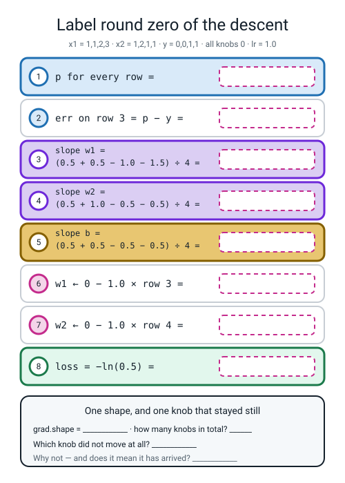
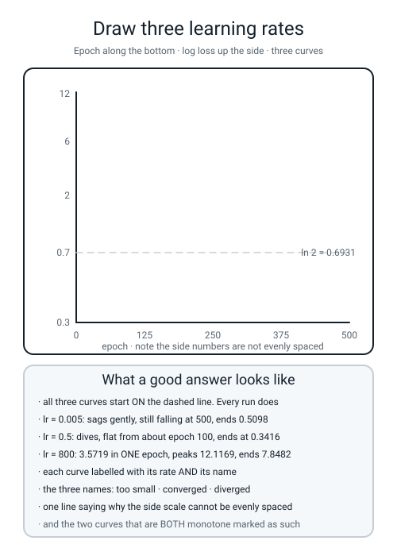

# Workbook — Week 15: Rolling Downhill: Descent From Scratch

**Name:** ________________________________  **Date:** ______________

[⬅ Week 14](week-14.md) · [📖 Read the chapter first](../student-guide/week-15.md) · [Course Home](../README.md) · [Next ➡](week-16.md)

---

## ✅ Warm-Up (5 min)

Five quick questions about **last week** — measuring how wrong you are.

**W1.** `−ln(0.9)` and `−ln(0.02)`. **Write both, to six decimal places.**

____________ and ____________

**W2.** Why does log loss have a minus sign out in front of it? **One sentence, and it must mention `ln(1)`.**

________________________________________________________________

**W3.** A model answers `0.50` to every row. **What is its log loss, and does it depend on the data?**

____________ , and ______

**W4.** `RuntimeWarning: divide by zero encountered in log`, then `nan` everywhere. **What went in, and what one line fixes it?**

________________________________________________________________

**W5.** A near-miss cost `0.9163` and a confident disaster cost `3.9120`. **Under squared error the same two rows cost `0.3600` and `0.9604`. Write both ratios and say which ruler you want for a fraud alert.**

________________________________________________________________

---

## 🔢 Do the Maths by Hand

**Calculator only. No code on this page.** This is the longest hand page of the term and it is the one the whole chapter rests on. **Do not read the code section until these numbers are in ink.**

The four delivery orders, for the whole page. `x1` is orders already in the oven, `x2` is riders standing free, `y = 1` means late. **`lr = 1.0` throughout.**

```text
        x1 (oven)   x2 (riders free)   y (late?)
row 1       1              1               0
row 2       1              2               0
row 3       2              1               1
row 4       3              1               1
```

### M1 — which way does the weight move?

Five knobs, five slopes, **`lr = 0.1`**. For each: up, down or neither, and the new value. **Write the subtraction out.**

| # | Weight now | Its slope | Up or down? | New weight — show `w − lr × slope` |
|:--:|:--:|:--:|---|---|
| 1 | `0.80` | `+0.25` | ____________ | `0.80 − 0.1 × ______ = ` ____________ |
| 2 | `0.80` | `−0.25` | ____________ | `0.80 − 0.1 × ______ = ` ____________ |
| 3 | `0.00` | `−0.375` | ____________ | `0.00 − 0.1 × ______ = ` ____________ |
| 4 | `−0.50` | `+1.20` | ____________ | `−0.50 − 0.1 × ______ = ` ____________ |
| 5 | `2.00` | `0.00` | ____________ | `2.00 − 0.1 × ______ = ` ____________ |

**M1(a).** Rows 1 and 2 have the same weight and opposite slopes, and they move opposite ways. **Say the sentence out loud and write it down:**

*"A negative slope means the loss* ______________________ *as the weight* ______________________*, and I want the loss to fall, so the weight* ______________________*."*

**M1(b).** Row 5's slope is exactly zero, so nothing happens. **Is that good or bad?** *(There are two completely different situations that both look like this. Name both.)*

________________________________________________________________

________________________________________________________________

### M2 — round 0, every number

**Step 1 — the predictions.** All three knobs start at zero.

```text
row 1:  z = 0 × 1 + 0 × 1 + 0 = ______        p = sigmoid(______) = ____________
row 4:  z = 0 × 3 + 0 × 1 + 0 = ______        p = sigmoid(______) = ____________
```

**Every `z` is ______, because ______________________________. So every `p` is ____________, and it is exact, not approximate.**

`loss = −ln(______) = ` ____________

**Step 2 — the four errors.** `error = prediction − truth`. **That order, always.**

```text
row 1:  ______ − ______ = ____________
row 2:  ______ − ______ = ____________
row 3:  ______ − ______ = ____________
row 4:  ______ − ______ = ____________
```

**Which two are negative, and why?** ______________________________________

**Step 3 — three slopes, one per knob.** Error times feature, averaged. **Write out every term.**

```text
slope w1 = ( ______×1  ______×1  ______×2  ______×3 ) ÷ 4
         = ( ______ + ______ − ______ − ______ ) ÷ 4
         = ______ ÷ 4
         = ____________

slope w2 = ( ______×1  ______×2  ______×1  ______×1 ) ÷ 4
         = ( ______ + ______ − ______ − ______ ) ÷ 4
         = ______ ÷ 4
         = ____________

slope b  = ( ______  ______  ______  ______ ) ÷ 4
         = ______ ÷ 4
         = ____________
```

**Step 4 — three updates, all at once.**

```text
w1 ← 0.000000 − 1.0 × (____________) = ____________
w2 ← 0.000000 − 1.0 × (____________) = ____________
b  ← 0.000000 − 1.0 × (____________) = ____________
```

**M2(a).** In the `slope w1` line, one of the four terms is bigger than any of the others. **Which row, and why?**

________________________________________________________________

**M2(b).** **The bias's slope is exactly zero. Why?** *(Two facts about this particular dataset are doing the work.)*

________________________________________________________________

**M2(c).** `w1`'s slope was negative and `w1` went **up**. **Is that right?** ______ **Say why in one sentence.**

________________________________________________________________

### M3 — rounds 2 and 3

**Round 1 is done for you**, so you can check your method before you spend twenty minutes on a mistake.

```text
Round 1:  w = [0.375000, −0.125000]   b = 0.000000
   z   = [0.250000, 0.125000, 0.625000, 1.000000]
   p   = [0.562177, 0.531209, 0.651355, 0.731059]
   loss = 0.581375
   err = [+0.562177, +0.531209, −0.348645, −0.268941]
   slope w1 = −0.102682   slope w2 = +0.251752   slope b = +0.118950
   w ← [0.477682, −0.376752]   b ← −0.118950
```

**Now round 2. `w = [0.477682, −0.376752]`, `b = −0.118950`.** Six decimal places everywhere.

```text
z   = [ ____________ , ____________ , ____________ , ____________ ]
p   = [ ____________ , ____________ , ____________ , ____________ ]
loss = ____________

err = [ ____________ , ____________ , ____________ , ____________ ]

slope w1 = ____________   slope w2 = ____________   slope b = ____________

w1 ←  0.477682 − 1.0 × (____________) = ____________
w2 ← −0.376752 − 1.0 × (____________) = ____________
b  ← −0.118950 − 1.0 × (____________) = ____________
```

**And round 3.**

```text
z   = [ ____________ , ____________ , ____________ , ____________ ]
p   = [ ____________ , ____________ , ____________ , ____________ ]
loss = ____________

err = [ ____________ , ____________ , ____________ , ____________ ]

slope w1 = ____________   slope w2 = ____________   slope b = ____________

w1 ←  0.657777 − 1.0 × (____________) = ____________
w2 ← −0.534785 − 1.0 × (____________) = ____________
b  ← −0.176340 − 1.0 × (____________) = ____________
```

**M3(a).** **The four numbers that are the point of the whole page.** Write the loss column:

____________ → ____________ → ____________ → ____________

**And the three improvements:** ____________ , ____________ , ____________

**M3(b).** `w2` goes `0` → `−0.125` → `−0.377` → `−0.535` → `−0.692`. `w2` is "riders standing free". **What has the model worked out, from four rows and four rounds of arithmetic?**

________________________________________________________________

**M3(c).** **Why are the improvements shrinking?** One sentence, and it must mention the slopes.

________________________________________________________________

### M4 — the gradient check

**A slope is a slope whichever way you get it.** Week 12's nudge and this week's formula must agree, and checking that is called a **gradient check**.

Using round 1's weights `w1 = 0.375`, `w2 = −0.125`, `b = 0`, and `h = 0.0001`:

```text
loss with w1 = 0.3751  (everything else unchanged)  = ____________
loss with w1 = 0.3749  (everything else unchanged)  = ____________

difference                = ____________ − ____________ = ____________
divided by 2h = 0.0002    = ____________

round 1's slope w1 from the formula                 = ____________
```

**M4(a).** **Do they agree?** ______ **To how many decimal places?** ______

**M4(b).** The nudge needs **two whole passes over the data per knob**. The formula needs **one pass for all of them**. **With three knobs, how many passes does each method cost?**

nudge: ______  formula: ______

**M4(c).** **So why does the nudge still matter, if it is slower?**

________________________________________________________________

---

## 🔎 Predict the Output

**Write your prediction in pen before you run anything.** Five snippets. Every one starts with `import numpy as np`.

### P1 — the forward pass, in two lines

```python
import numpy as np
X = np.array([[1.0, 1.0], [1.0, 2.0], [2.0, 1.0], [3.0, 1.0]])
w = np.array([0.5, -0.25])
print(X * w)
print((X * w).sum(axis=1))
```

**My prediction:**

```text
line 1: ______________________________________
        ______________________________________
        ______________________________________
        ______________________________________
line 2: ______________________________________
```

**Real:**

```text
line 1: ______________________________________
        ______________________________________
        ______________________________________
        ______________________________________
line 2: ______________________________________
```

**P1(a).** `X * w` kept the grid shape. **How many numbers went in, and how many came out?** ______ and ______

**P1(b).** `.sum(axis=1)` collapsed it. **How many numbers now?** ______ **And what is each one?** ______________________

### P2 — the trap, and two shapes

```python
import numpy as np
X = np.array([[1.0, 1.0], [1.0, 2.0], [2.0, 1.0], [3.0, 1.0]])
w = np.array([0.5, -0.25])
print((X * w).sum())
print(np.shape((X * w).sum()))
print((X * w).sum(axis=0).shape)
```

**My prediction:** ____________ , ____________ , ____________

**Real:** ____________ , ____________ , ____________

**P2(a).** Line 2 prints `()`. **What does an empty pair of brackets mean as a shape?**

________________________________________________________________

**P2(b).** Fill the table in from memory, then check it:

| | What it does | What you get from a `(4, 2)` grid |
|---|---|---|
| `.sum(axis=0)` | goes ______ the ______________ | ______ numbers |
| `.sum(axis=1)` | goes ______ the ______________ | ______ numbers |
| `.sum()` | adds up ______________ | ______ number |

**P2(c).** **Which one do you want for a raw score per order, and why?** ______________________

### P3 — one column at a time

```python
import numpy as np
X = np.array([[1.0, 1.0], [1.0, 2.0], [2.0, 1.0], [3.0, 1.0]])
print(X[:, 0])
print(X[:, 1])
```

**My prediction:** ______________________ and ______________________

**Real:** ______________________ and ______________________

**P3(a).** Read `X[:, 0]` out loud in words: ______________________________________

**P3(b).** In the gradient, what does each of those two columns get multiplied by? ______________________

### P4 — did it actually go downhill?

```python
import numpy as np
h = [0.6931, 0.5814, 0.5048, 0.4484]
print(np.diff(h))
print(np.all(np.diff(h) <= 0))
```

**My prediction:** ______________________________________ and ______________

**Real:** ______________________________________ and ______________

**P4(a).** Four losses went in and **three** numbers came out. **Why three?** ______________________

**P4(b).** `np.all(...)` returned one word. **What question did it answer?**

________________________________________________________________

**P4(c).** A run scores `True` here and ends at `0.5098` while another scores `True` and ends at `0.3416`. **What does `True` prove, and what does it not prove?**

________________________________________________________________

### P5 — the hard one

```python
import numpy as np
w = np.array([0, 0])
w -= 0.5 * np.array([0.1, 0.2])
```

**My prediction:** ______________________________________

**Real — paste the last line of it:**

________________________________________________________________

**P5(a).** The message names two types. **What is each one?**

`int64` is ______________________  `float64` is ______________________

**P5(b).** **How many characters does the fix need?** ______ **Write it:** ______________________

**P5(c).** numpy could have rounded `−0.05` down to `0` and carried on. **It refused instead. Which behaviour would you rather have, and why?**

________________________________________________________________

---

## ✍️ Practice Set A — Read It

**A1. Match the word to the thing.** Write the letter.

| Word | | Description |
|---|---|---|
| **gradient** | ______ | (i) One weight update |
| **epoch** | ______ | (ii) All the slopes, one per knob, kept in a list |
| **step / iteration** | ______ | (iii) The rule that tells you when to stop |
| **divergence** | ______ | (iv) Whether one gradient uses all the rows, a chunk of 32, or one row |
| **convergence criterion** | ______ | (v) One complete pass over all the training data |
| **batch / mini-batch / stochastic** | ______ | (vi) The loss goes up and stays up, because the steps are too long |

**A2. Read the printout.** This is the real output of `descent.py`.

```text
X_tr shape: (300, 2)   X_te shape: (100, 2)

      lr   epoch 0 epoch 100     final     worst downhill?
   0.005    0.6931    0.6375    0.5098    0.6931      True
   0.500    0.6931    0.3438    0.3416    0.6931      True
 800.000    0.6931    2.7628    7.8482   12.1169     False

lr = 0.5, 2000 epochs
   my w = [-0.6221  3.0924]   my b = 0.2271
   final training loss = 0.3416
   test accuracy       = 0.8200
```

| Question | Your answer |
|---|---|
| a. 400 rows went in. Why is `X_tr` 300 and `X_te` 100? | |
| b. All three runs share one number in the `epoch 0` column. What, and why? | |
| c. `lr = 0.005` and `lr = 0.5` both say `True`. Are they equally good? | |
| d. `lr = 800`'s `worst` is `12.1169` and its `final` is `7.8482`. What does a loss of 12 mean? | |
| e. `my w = [-0.6221 3.0924]`. Which feature does the model think matters more, and which way? | |
| f. Test accuracy `0.8200` on a converged, correct loop. Whose fault is the 18%? | |

**A2(g).** Row 3's `downhill?` is `False`. **Write the one line of code that produced that word**, and say what it measures.

________________________________________________________________

**A2(h).** The `worst` column reads `0.6931` for the two good rows. **Why is the *worst* loss of a successful run its *first* loss?**

________________________________________________________________

**A3. Spot the bug.** Each line is wrong or misleading. Say what happens and write the fix.

| # | The line | What happens | The fix |
|:--:|---|---|---|
| a | `w = np.array([0, 0])` | | |
| b | `w = np.array([0.0, 0.0, 0.0])`, meaning "two weights and a bias" | | |
| c | `z = (X * w).sum()` | | |
| d | `grad = np.array([err * X[:, 0], err * X[:, 1]])` | | |
| e | `w += lr * grad` | | |
| f | `err = y - p` | | |
| g | `ax.set_yscale("logarithmic")` | | |

**A3(h).** Some of those seven produce **no error message at all**. **How many, which, and what would you have to look at to catch each one?**

________________________________________________________________

**A3(i).** For **(f)**, the loss would do something very specific. **What, and why is it the same symptom as (e)?**

________________________________________________________________

**A4. Match the code to the output.** Five of each, no output used twice. Assume `import numpy as np` above each.

| | Code |
|---|---|
| i | `print((np.array([[1.,1.],[1.,2.]]) * np.array([0.5,-0.25])).sum(axis=1))` |
| ii | `print(np.array([[1.,1.],[1.,2.],[2.,1.],[3.,1.]])[:, 1])` |
| iii | `print(np.diff([0.6931, 0.5814]))` |
| iv | `print(np.array([0.0,0.0]) - 1.0 * np.array([-0.375, 0.125]))` |
| v | `print(np.shape((np.array([[1.,1.],[1.,2.]]) * np.array([0.5,-0.25])).sum()))` |

| | Output |
|---|---|
| P | `[1. 2. 1. 1.]` |
| Q | `()` |
| R | `[ 0.375 -0.125]` |
| S | `[0.25 0.  ]` |
| T | `[-0.1117]` |

**Your answers:** i → ______  ii → ______  iii → ______  iv → ______  v → ______

**A4(f).** Output **R** is a pair of numbers you wrote by hand on **M2**. Which step, and what are they? ______________________

**A5. Label round zero of the descent.** Fill in all eight empty boxes in the figure, then the panel at the bottom.


*Figure W15.1 — Label round zero of the descent. The same four orders, all knobs at zero, `lr = 1.0`.*

**A5(a).** Box 5 is exactly `0.000000`, and box 8 is `0.693147`. **One of those two numbers would be the same on *any* dataset and one would not. Which is which?**

________________________________________________________________

**A5(b).** Suppose row 4's label were `0` instead of `1`, so three orders were on time and one was late. **Which of your eight boxes would change?** ____________________ **And would box 5 still be zero?** ______

**A6. Say the sentence.** Finish each one so it is true and complete.

**a)** The gradient is ______________________, kept in ______________________. For two weights and a bias that is ______ numbers.

**b)** Each slope is ______________________ times ______________________, averaged over ______________________.

**c)** The bias's slope is the same formula with the feature set to ______, which means ______________________.

**d)** The update is `w ← w ______ lr × slope`, and the sign is that way round because the gradient points ______________________.

**e)** `axis=1` goes ______________________ the rows and gives ______ numbers from a `(4, 2)` grid; `axis=0` goes ______________________ and gives ______.

**f)** Every training run in this course starts at ______________, because ______________________________________.

**g)** The logarithms and exponentials cancelled when the slope was worked out, and **that cancellation is the reason** ______________________ **and** ______________________ **are always used together.**

---

## ✍️ Practice Set B — Write It

This set is for writing the week's code yourself, one piece at a time.

### B1 — the forward pass, and the trap beside it

**Task.** Compute the four raw scores for round 1's weights `w = [0.375, -0.125]`, `b = 0.0`. Print `z`, its shape, **and** what you get with no axis at all.

**Expected output:**

```text
z       = [0.25  0.125 0.625 1.   ]
z.shape = (4,)
no axis = 2.0   shape ()
```

**Done looks like:** four numbers and the shape `(4,)`. **The third line is there so you have seen the wrong answer once, deliberately.**

```python
# your code here


```

### B2 — the gradient, in three lines

**Task.** Round 0 from scratch, in code: `p`, `err`, the two-number gradient with its shape, `grad_b`, and the weights after one step at `lr = 1.0`.

**Expected output:**

```text
p      = [0.5 0.5 0.5 0.5]
err    = [ 0.5  0.5 -0.5 -0.5]
grad   = [-0.375  0.125]   shape (2,)
grad_b = 0.000000

after one step at lr = 1.0:
w = [ 0.375 -0.125]   b = 0.000000
```

**Done looks like:** `[-0.375 0.125]` on the screen and the same two numbers in your handwriting on **M2 step 3**. **If they disagree, stop here.**

```python
# your code here


```

### B3 — the four rounds, as a loop

**Task.** `three_rounds.py`. Wrap B2 in a `for` loop of four rounds and print `w`, `b`, `loss`, `z`, `p`, `err`, the gradient and the weights after the step, every round.

**Expected output — the first round and the loss column:**

```text
round 0
   w = [0.000000, 0.000000]   b = 0.000000   loss = 0.693147
   z   = [0. 0. 0. 0.]
   p   = [0.5 0.5 0.5 0.5]
   err = [ 0.5  0.5 -0.5 -0.5]
   grad = [-0.375000, 0.125000]   grad_b = 0.000000
   after the step:  w = [0.375000, -0.125000]   b = 0.000000
```

and the four losses must be **`0.693147`, `0.581375`, `0.504824`, `0.448421`**.

**Done looks like:** every number on the screen has a tick or a cross beside it on your **M2/M3** pages. **Until those four losses appear, nothing else in this chapter is trustworthy.**

```python
# your code here


```

### B4 — three learning rates, on one honest picture

**Task.** `curves.py`. 400 generated rows, split and scaled, your own `train(X, y, lr, n_epochs)`, three learning rates plotted on **one log-scale** axis with a dashed line at `ln 2`, saved to `descent.png`. Then a second panel showing the boundary at epochs 0, 50, 150 and 300, starting from the deliberately wrong `w = [2.0, −2.0]`, `b = 1.0`.

**Expected printed output:**

```text
epoch       w1        w2         b      loss
    0    2.0000   -2.0000    1.0000    2.0454
   50   -0.2798    2.1091    0.0902    0.3590
  150   -0.5478    2.8694    0.1883    0.3423
  300   -0.6110    3.0587    0.2211    0.3416
wrote descent.png
```

**Runtime: about 1.7 seconds including both panels.**

**Done looks like:** `descent.png` exists, and in the left panel the `lr = 800` curve is clearly **above** the dashed line while the other two are below it. **Three things that will bite you:** `matplotlib.use("Agg")` must come **before** `import matplotlib.pyplot`; the scale is `"log"`, not `"logarithmic"`; and the boundary line is `x2 = −(w1 × x1 + b) ÷ w2`, which comes from setting `z = 0`.

```python
# your code here (about 45 lines — it is mostly Weeks 1 to 4)


```

### B5 — a whole program of your own, about 25 lines of real work

**Task.** `match.py`. Train **your** loop for 20,000 epochs, then fit `LogisticRegression` on the **identical arrays** twice — once at its defaults and once with `tol=1e-8` — and print all three sets of numbers in aligned columns, plus both gaps, plus all three test accuracies.

**Two arguments matter and you must not leave them out.** `penalty=None` turns off L2 regularisation, which by default deliberately handicaps the model by penalising large weights — **a handicapped model will never match an unhandicapped one.** `max_iter=5000` just gives it room to finish.

**Expected output. Runtime about 1.1 seconds for 20,000 epochs.**

```text
                      weight 1    weight 2        bias
mine (20000 epochs)   -0.622142    3.092423    0.227114
sklearn, default      -0.621309    3.089931    0.226750
sklearn, tol=1e-8     -0.622142    3.092423    0.227114

biggest gap vs default   : 0.002492
biggest gap vs tol=1e-8  : 0.000000

my test accuracy         : 0.8200
sklearn default accuracy : 0.8200
sklearn tight accuracy   : 0.8200
```

**Done looks like:** `biggest gap vs tol=1e-8 : 0.000000`. **All six printed decimal places, exactly.**

```python
# your code here


```

---

## 🐞 Fix the Broken Program

This program has **three** bugs: one **dtype** bug, one **shape** bug, and one **silent logic** bug. The real error messages are below, in the order you meet them.

```python
"""broken15.py - train logistic regression on 300 rows. THREE bugs."""
import numpy as np
from sklearn.datasets import make_classification
from sklearn.model_selection import train_test_split
from sklearn.preprocessing import StandardScaler

np.random.seed(0)

X, y = make_classification(n_samples=400, n_features=2, n_informative=2,
                           n_redundant=0, random_state=0)
X_tr, X_te, y_tr, y_te = train_test_split(X, y, test_size=0.25,
                                          stratify=y, random_state=0)
scaler = StandardScaler().fit(X_tr)
X_tr = scaler.transform(X_tr)
X_te = scaler.transform(X_te)


def squash(z):
    e = np.exp(np.where(z >= 0, -z, z))
    return np.where(z >= 0, 1.0 / (1.0 + e), e / (1.0 + e))


w = np.array([0, 0])
b = 0.0
lr = 0.5
for epoch in range(500):
    p = np.clip(squash((X_tr * w).sum(axis=1) + b), 1e-12, 1 - 1e-12)
    loss = -np.mean(y_tr * np.log(p) + (1 - y_tr) * np.log(1 - p))
    err = p - y_tr
    grad = np.array([err * X_tr[:, 0], err * X_tr[:, 1]])
    w += lr * grad
    b += lr * np.mean(err)
    if epoch < 5:
        print("epoch %d  loss = %.6f" % (epoch, loss))
print("final w =", np.round(w, 6), "  b = %.6f" % b)
```

**Run 1 — nothing prints at all:**

```text
Traceback (most recent call last):
  File "broken15.py", line 31, in <module>
    w += lr * grad
numpy.core._exceptions._UFuncOutputCastingError: Cannot cast ufunc 'add' output from dtype('float64') to dtype('int64') with casting rule 'same_kind'
```

**Bug 1.** Which line does the message point at? ______  **Which line is at fault?** ______  **Kind of bug?** ______________

**Read the message. Which type is the *box*, and which type is the *thing you tried to put in it*?**

the box: ______________  the thing: ______________

**The fix — two characters:** ______________________________

**Run 2 — after fixing bug 1:**

```text
Traceback (most recent call last):
  File "broken15.py", line 31, in <module>
    w += lr * grad
ValueError: operands could not be broadcast together with shapes (2,) (2,300) (2,) 
```

**Bug 2.** Which line? ______  **Kind of bug?** ______________

**The message names three shapes. Say what each is.**

`(2,)` is ____________________  `(2,300)` is ____________________  `(2,)` again is ____________________

**The gradient should be two numbers and it is a grid of six hundred. What is missing, and how many times?**

________________________________________________________________

**The fix:** ______________________________

**Run 3 — after fixing bugs 1 and 2. It runs all the way through, no error at all:**

```text
epoch 0  loss = 0.693147
epoch 1  loss = 0.759960
epoch 2  loss = 0.844350
epoch 3  loss = 0.949854
epoch 4  loss = 1.079249
final w = [ -42.443166 -190.473469]   b = -2.852179
```

**Bug 3 is in those six lines, and there is no message at all.**

**What is the loss doing?** ______________________ **What should it be doing?** ______________________

**The first loss is `0.693147`, which is correct. So the setup is right. Which two lines are wrong?**

______ and ______  **Kind of bug?** ______________

**A loss that climbs *smoothly* with a sensible learning rate is this bug and essentially nothing else. What would a loss that climbed *raggedly* have meant instead?**

________________________________________________________________

**The fix — how many characters in total?** ______  **Write both lines:**

______________________________  and  ______________________________

**Run 4 — after fixing all three:**

```text
epoch 0  loss = 0.693147
epoch 1  loss = 0.634199
epoch 2  loss = 0.588923
epoch 3  loss = 0.553740
epoch 4  loss = 0.525964
final w = [-0.621281  3.089822]   b = 0.226652
```

**Three questions, and the last one is the point of the page.**

**The final weights are `[-0.621281, 3.089822]`. Where have you seen numbers extremely close to those?**

________________________________________________________________

**Rank the three bugs by how much time each would cost you to find, and explain the ranking.**

________________________________________________________________

________________________________________________________________

**Bugs 1 and 2 both crashed on the same line, `w += lr * grad`, for completely different reasons. What does that tell you about where a bug lives versus where it lands?**

________________________________________________________________

---

## 🧩 Puzzle of the Week

### Part 1 — Run the update backwards

You are shown a weight before and after one step, and the learning rate. **Find the slope.** *(Rearrange `w_new = w_old − lr × slope`.)*

| # | `w` before | `w` after | `lr` | the slope was |
|:--:|:--:|:--:|:--:|---|
| 1 | `0.800000` | `0.775000` | `0.1` | ____________ |
| 2 | `0.000000` | `0.037500` | `0.1` | ____________ |
| 3 | `−0.125000` | `−0.376752` | `1.0` | ____________ |
| 4 | `0.477682` | `0.657777` | `1.0` | ____________ |
| 5 | `2.000000` | `2.000000` | `0.1` | ____________ |

**Part 1(a).** Write the rearranged formula you used: `slope = ` ______________________________

**Part 1(b).** Rows 3 and 4 came out of the four-round table. **Which round, and which knob, for each?**

row 3: ____________________  row 4: ____________________

**Part 1(c).** Suppose somebody tells you only that a weight went **up**. **What do you know for certain about its slope, and what do you not know?**

________________________________________________________________

### Part 2 — The Bias That Refuses To Move

In round 0 the bias's slope came out **exactly zero**. That was not luck — it was the labels.

Keep the same four rows (`x1 = 1, 1, 2, 3` and `x2 = 1, 2, 1, 1`), all knobs at zero, so **every `p` is 0.5 and every error is `+0.5` or `−0.5`.** Now you get to choose the four labels.

**Part 2(a).** **How many of the sixteen possible labellings make `slope b` exactly zero?** ______ **What do they all have in common?**

________________________________________________________________

**Part 2(b).** Try `y = [0, 0, 0, 1]` — one late order out of four.

```text
err      = [ ______ , ______ , ______ , ______ ]
slope b  = ( ______ + ______ + ______ − ______ ) ÷ 4 = ____________
```

**So the bias moves. Which way, and does that make sense given that only one order in four was late?**

________________________________________________________________

**Part 2(c).** **Now the hard half. Can you choose labels that make `slope w1` exactly zero?**

`slope w1 = 0.5 × (sum of x1 over the on-time rows − sum of x1 over the late rows) ÷ 4`

The four `x1` values are `1, 1, 2, 3`, which add up to ______ . For the two sums to be equal, each would have to be ______ ÷ 2 = ______ .

**Is that possible with these four rows?** ______ **Write the one-line proof:**

________________________________________________________________

**Part 2(d).** **Change one `x1` value so that it becomes possible, and give the labelling that does it.**

new `x1` = [ ______ , ______ , ______ , ______ ] , `y` = [ ______ , ______ , ______ , ______ ]

---

## 🤔 Think Deeper

**T1.** You wrote twenty-five lines of numpy and matched a professionally engineered library to **all six printed decimal places**. Write a paragraph on what that does and does not prove. You must address: the fact that the loss for logistic regression is **convex** — one bowl, one bottom; the fact that your loop took 20,000 steps and scikit-learn's took about ten; and the fact that neural networks, which have millions of weights, use variants of **your** loop rather than scikit-learn's optimiser. Finish with a sentence on whether "it got the same answer" is ever enough to call two programs equivalent.

________________________________________________________________

________________________________________________________________

________________________________________________________________

________________________________________________________________

________________________________________________________________

**T2.** You can make the loss go down **without ever computing a gradient**: pick a random direction, take a small step, keep it if the loss went down, otherwise throw it away and try again. **It works.** Write a paragraph on why nobody does it. Your paragraph must include a number: with **three** knobs a random direction is downhill roughly half the time, but with **a hundred thousand** knobs — a small neural network — the chance of a random direction being usefully downhill collapses. Say what the gradient buys you that random guessing cannot, and connect it back to Week 12's *"8 candidates for one weight, 64 for two, 512 for three"*.

________________________________________________________________

________________________________________________________________

________________________________________________________________

________________________________________________________________

________________________________________________________________

---

## 🛠️ Build It

**Two parts. The first is a side-by-side comparison; the second is a diagnosis.** About 35 minutes.

### Part A — Match scikit-learn, and say whose error it was

**Run `match.py` from B5, then fill this in from your own screen.**

| | weight 1 | weight 2 | bias |
|---|---|---|---|
| mine, 20,000 epochs | ____________ | ____________ | ____________ |
| sklearn, default | ____________ | ____________ | ____________ |
| sklearn, `tol=1e-8` | ____________ | ____________ | ____________ |

```text
biggest gap vs default   : ____________
biggest gap vs tol=1e-8  : ____________
```

**The sentence being marked. Whose `0.0025` was it, and what is your evidence?**

________________________________________________________________

________________________________________________________________

**And the follow-ups:**

**What does `penalty=None` turn off, and why must it be off for this comparison to mean anything?**

________________________________________________________________

**All three test accuracies came out the same. Write the number** ______ **and say what that means about the `0.0025`.**

________________________________________________________________

**Is scikit-learn *wrong* to stop early?** ______ **One sentence:**

________________________________________________________________

### Part B — Diagnose four loss curves

Four training runs, all on the same 300 rows, all for 500 epochs. **Name each one, give your evidence, and give the fix in one line.**

> **⚠️ Watch out:** the four consecutive columns in the middle are there on purpose. **Read them.**

| Curve | ep 0 | ep 1 | ep 2 | ep 3 | ep 100 | ep 101 | ep 102 | ep 103 | ep 250 | ep 499 |
|:--:|:--:|:--:|:--:|:--:|:--:|:--:|:--:|:--:|:--:|:--:|
| **A** | 0.6931 | 0.6925 | 0.6919 | 0.6913 | 0.6375 | 0.6370 | 0.6365 | 0.6360 | 0.5757 | 0.5098 |
| **B** | 0.6931 | 0.6342 | 0.5889 | 0.5537 | 0.3438 | 0.3438 | 0.3437 | 0.3437 | 0.3417 | 0.3416 |
| **C** | 0.6931 | 0.4485 | 0.3684 | 0.3571 | 0.3557 | 0.3591 | 0.3557 | 0.3591 | 0.3557 | 0.3591 |
| **D** | 0.6931 | 3.5719 | 3.3446 | 3.5101 | 2.7628 | 3.1164 | 8.8994 | 6.4570 | 7.1064 | 7.8482 |

**The four names to choose from: too small · converged · too big · diverged.**

| Curve | Name | Evidence — a number, not an impression | Fix, one line |
|:--:|---|---|---|
| **A** | | | |
| **B** | | | |
| **C** | | | |
| **D** | | | |

**Part B(a).** **Which two curves would you have called "converged" if you had only been given epochs 0, 100, 250 and 499?** ______ and ______ **What exposes the difference?**

________________________________________________________________

**Part B(b).** Curve D's loss at epoch 1 is `3.5719`. The gradient at the very start of this data is `[−0.0051, −0.3545]`, and this run used `lr = 800`. **How far did `w2` move in that one epoch?**

`800 × 0.3545 = ` ____________

**And what does a raw score in the hundreds do to a probability?** ______________________

**Part B(c).** For each of the four curves, write down the `downhill?` word the one-line test would print:

A: ______  B: ______  C: ______  D: ______

**Part B(d).** **One of the four is "correct but unfinished" and one is "stable but permanently worse". Name both, and say which you would rather hand in.**

________________________________________________________________

### Stretch — the largest safe learning rate

Sweep the learning rate and find the biggest one whose loss still falls every single epoch.

| `lr` | worst loss | final loss | `downhill?` |
|:--:|---|---|---|
| `1` | ____________ | ____________ | ______ |
| `3` | ____________ | ____________ | ______ |
| `8` | ____________ | ____________ | ______ |
| `10` | ____________ | ____________ | ______ |
| `12` | ____________ | ____________ | ______ |
| `15` | ____________ | ____________ | ______ |
| `20` | ____________ | ____________ | ______ |
| `30` | ____________ | ____________ | ______ |

**The boundary is between ______ and ______ .**

**`lr = 20` never went above its starting loss, so its `worst` column looks innocent. Is it safe?** ______ **Explain, using its `downhill?` and its final loss.**

________________________________________________________________

**`lr = 12` reaches `0.3416` by about epoch 8; `lr = 0.5` needs about 100. So why would anybody use `0.5`?**

________________________________________________________________

### The Bug Log

Three entries today. **The third is the one you will meet again for the rest of your life.**

| What I saw | What it means | Cause | Fix |
|---|---|---|---|
| | | | |
| | | | |
| | | | |

---

## 🎨 Draw It

Draw **three learning rates on one picture** — from the real numbers, not from memory.


*Figure W15.2 — An empty frame with epoch along the bottom and the loss up an unevenly spaced side, plus what a good answer contains.*

**Then answer four things about your own drawing:**

**All three of your curves start at the same height. What height, and why is that not a coincidence?** ______________________

**Which curve crosses the dashed line, in which direction, and at which epoch?** ______________________

**Which two of your curves would score `True` on the `downhill?` test?** ______________________

**Why can the numbers up the side not be evenly spaced? Name the two values that have to share the axis.** ______________________

---

## 📊 Self-Check

This table is for marking how sure you are of each skill from this week.

| I can... | 😀 | 🙂 | 😕 |
|---|---|---|---|
| say what a gradient is, and how many numbers it has for a given model | | | |
| compute all three slopes for one round by hand, writing out every term | | | |
| apply `w ← w − lr × slope` to three knobs at once and get the signs right | | | |
| produce the four losses `0.693147 → 0.581375 → 0.504824 → 0.448421` on paper | | | |
| write a 25-line training loop in numpy with no framework at all | | | |
| explain what `axis=1` does, and what `.sum()` with no axis does instead | | | |
| check a slope two ways — by nudging and by the formula — and show they agree | | | |
| name the three learning-rate fates from a loss curve, with a number as evidence | | | |
| read `_UFuncOutputCastingError` and fix it in ten seconds | | | |
| see a loss climbing smoothly and know it is the sign before I look at anything else | | | |
| match scikit-learn's weights and say whose remaining `0.0025` it was | | | |

**The one thing I would ask about if I could ask one question:**

________________________________________________________________

---

## ✅ Answers

<details>
<summary>Check your answers</summary>

### Warm-Up

**W1.** `−ln(0.9) = 0.105361` and `−ln(0.02) = 3.912023`.

**W2.** Because `ln(1) = 0` and every probability is below 1, so every `ln(p)` is **negative** — and a negative loss is meaningless, since zero already means perfect. The minus sign flips them all positive.

**W3.** `0.693147`, and **no** — it does not depend on the data at all. When `p = 0.5` both branches of the loss are the same number, so the labels never enter the arithmetic.

**W4.** A probability of exactly `0` or exactly `1` went into the logarithm, so `ln(0)` was asked for. One line fixes it: `p = np.clip(p, 1e-12, 1 - 1e-12)`, **before** the logs.

**W5.** `3.9120 ÷ 0.9163 = 4.27` and `0.9604 ÷ 0.3600 = 2.67`. **For a fraud alert you want log loss**, because a confidently wrong alert is a different category of event from an unsure one, and only log loss prices it that way.

### Do the Maths by Hand

**M1.**

| # | Weight now | Slope | Up or down? | New weight |
|:--:|:--:|:--:|---|:--:|
| 1 | `0.80` | `+0.25` | **down** — a positive slope means the loss grows as the weight grows | `0.80 − 0.1 × 0.25 = 0.775` |
| 2 | `0.80` | `−0.25` | **up** — a negative slope means the loss shrinks as the weight grows | `0.80 − 0.1 × (−0.25) = 0.825` |
| 3 | `0.00` | `−0.375` | **up** | `0.00 − 0.1 × (−0.375) = 0.0375` |
| 4 | `−0.50` | `+1.20` | **down** | `−0.50 − 0.1 × 1.20 = −0.62` |
| 5 | `2.00` | `0.00` | **neither** | `2.00 − 0.1 × 0 = 2.00` |

**M1(a).** *"A negative slope means the loss **falls** as the weight **rises**, and I want the loss to fall, so the weight **rises**."*

**M1(b).** **Both, and they look identical from inside the loop.**

- **Good:** it is what the **bottom** looks like. At the lowest point of a bowl the ground is level, so the slope is zero and the weight has nowhere better to go.
- **Bad:** it is also what a **stuck** knob looks like, and you saw one today — in round 0 the bias's slope was exactly zero and the bias did not move, even though, by round 3, it had moved to `−0.243791`.

**A zero slope means "no reason to move *right now*", not "we have arrived."**

**M2. Step 1.** Both rows give `z = 0`, because **everything is multiplied by a weight of zero.** So every `p` is `sigmoid(0) = 0.5`, exactly — Week 13's third property, doing real work.

`loss = −ln(0.5) = 0.693147`, before anything has happened.

**Step 2.**

```text
row 1:  0.5 − 0 = +0.5
row 2:  0.5 − 0 = +0.5
row 3:  0.5 − 1 = −0.5
row 4:  0.5 − 1 = −0.5
```

**Rows 3 and 4 are negative** because those two really were late and the model said "coin flip".

**Step 3.**

```text
slope w1 = ( +0.5×1  +0.5×1  −0.5×2  −0.5×3 ) ÷ 4
         = ( 0.5 + 0.5 − 1.0 − 1.5 ) ÷ 4 = −1.5 ÷ 4 = −0.375000

slope w2 = ( +0.5×1  +0.5×2  −0.5×1  −0.5×1 ) ÷ 4
         = ( 0.5 + 1.0 − 0.5 − 0.5 ) ÷ 4 = +0.5 ÷ 4 = +0.125000

slope b  = ( +0.5  +0.5  −0.5  −0.5 ) ÷ 4 = 0.0 ÷ 4 =  0.000000
```

**Step 4.**

```text
w1 ← 0.000000 − 1.0 × (−0.375000) = +0.375000
w2 ← 0.000000 − 1.0 × (+0.125000) = −0.125000
b  ← 0.000000 − 1.0 × ( 0.000000) =  0.000000
```

**M2(a).** **Row 4**, contributing `−1.5`. Its feature is `3`, the largest of the four. **Rows with big features get the biggest say in that weight** — if a weight is attached to a feature that was large on a row, that weight really is more responsible for whatever the model said about the row. **Big feature, big responsibility, big correction.**

**M2(b).** Two facts. **One:** two rows were late and two were not. **Two:** every prediction was exactly `0.5`. So the four errors were `+0.5, +0.5, −0.5, −0.5` and **they cancelled perfectly.** The bias only moves when the **average prediction** is off from the **average label**, and right now it is dead on. **That will not last** — from round 1 the predictions differ from each other, so the errors stop cancelling.

**M2(c).** **Yes.** A negative slope means the loss falls as the weight rises, so **up is downhill.** `0 − 1.0 × (−0.375) = +0.375`.

**M3.** Real output of `three_rounds.py`:

```text
round 2
   w = [0.477682, -0.376752]   b = -0.118950   loss = 0.504824
   z   = [-0.01802  -0.394772  0.459662  0.937344]
   p   = [0.495495 0.402569 0.612934 0.718563]
   err = [ 0.495495  0.402569 -0.387066 -0.281437]
   grad = [-0.180095, 0.158033]   grad_b = 0.057390
   after the step:  w = [0.657777, -0.534785]   b = -0.176340
round 3
   w = [0.657777, -0.534785]   b = -0.176340   loss = 0.448421
   z   = [-0.053348 -0.588133  0.604429  1.262206]
   p   = [0.486666 0.357063 0.646669 0.779406]
   err = [ 0.486666  0.357063 -0.353331 -0.220594]
   grad = [-0.131179, 0.156717]   grad_b = 0.067451
   after the step:  w = [0.788956, -0.691502]   b = -0.243791
```

Written out as the page asks:

```text
Round 2:  z   = [−0.018020, −0.394772, +0.459662, +0.937344]
          p   = [ 0.495495,  0.402569,  0.612934,  0.718563]
          loss = 0.504824
          err = [+0.495495, +0.402569, −0.387066, −0.281437]
          slope w1 = −0.180095   slope w2 = +0.158033   slope b = +0.057390
          w1 ←  0.477682 − 1.0 × (−0.180095) =  0.657777
          w2 ← −0.376752 − 1.0 × (+0.158033) = −0.534785
          b  ← −0.118950 − 1.0 × (+0.057390) = −0.176340

Round 3:  z   = [−0.053348, −0.588133, +0.604429, +1.262206]
          p   = [ 0.486666,  0.357063,  0.646669,  0.779406]
          loss = 0.448421
          err = [+0.486666, +0.357063, −0.353331, −0.220594]
          slope w1 = −0.131179   slope w2 = +0.156717   slope b = +0.067451
          w1 ←  0.657777 − 1.0 × (−0.131179) =  0.788956
          w2 ← −0.534785 − 1.0 × (+0.156717) = −0.691502
          b  ← −0.176340 − 1.0 × (+0.067451) = −0.243791
```

**M3(a).** `0.693147 → 0.581375 → 0.504824 → 0.448421`. **Down every single round.**

The three improvements: `0.111772`, `0.076551`, `0.056403`.

**M3(b).** `w2` is "riders standing free", and it is becoming more and more negative. **The model has worked out — from four rows and four rounds of arithmetic — that more riders standing free makes an order *less* likely to be late.** Nobody told it that; it found it in the errors. **A negative weight is not a bug. It is the model disagreeing with a feature, out loud, in a number you can read.**

**M3(c).** Because **the slopes, taken together, are shrinking** (their overall size goes `0.395`, `0.297`, `0.246`, `0.215`; any single one can wobble) as the weights get closer to the bottom of the bowl, and the step is `lr × slope`. Flatter ground means smaller steps means smaller improvements. **That is what approaching a minimum looks like**, and it is why a converged run goes *flat* rather than stopping dead at some particular epoch.

**M4.**

```python
"""gradcheck.py - the same slope two ways: nudge, and the formula."""
import numpy as np

X = np.array([[1.0, 1.0], [1.0, 2.0], [2.0, 1.0], [3.0, 1.0]])
y = np.array([0.0, 0.0, 1.0, 1.0])


def loss_at(w1, w2, b):
    z = w1 * X[:, 0] + w2 * X[:, 1] + b
    p = 1.0 / (1.0 + np.exp(-z))
    return -np.mean(y * np.log(p) + (1 - y) * np.log(1 - p))


w1, w2, b = 0.375, -0.125, 0.0
h = 0.0001
up, down = loss_at(w1 + h, w2, b), loss_at(w1 - h, w2, b)
nudged = (up - down) / (2 * h)
z = w1 * X[:, 0] + w2 * X[:, 1] + b
p = 1.0 / (1.0 + np.exp(-z))
formula = np.mean((p - y) * X[:, 0])

print("loss at w1 + h  = %.12f" % up)
print("loss at w1 - h  = %.12f" % down)
print("difference      = %.12f" % (up - down))
print("divided by 2h   = %.9f" % nudged)
print("the formula     = %.9f" % formula)
print("they agree to   = %.12f" % abs(nudged - formula))
```

```text
loss at w1 + h  = 0.581364940997
loss at w1 - h  = 0.581385477431
difference      = -0.000020536433
divided by 2h   = -0.102682166
the formula     = -0.102682165
they agree to   = 0.000000001271
```

**M4(a).** **Yes**, to **nine** decimal places — they differ by `0.000000001271`. **Two completely different methods, one answer.** That is a gradient check, and it is the single most useful debugging tool in machine learning: it does not care whether you understand your own formula, only whether it is right.

**M4(b).** nudge: **6** passes (two per knob, three knobs). formula: **1** pass for all three.

**M4(c).** Because **it never lies.** The formula is a shortcut that somebody derived, and a derivation can be wrong or mistyped; the nudge only needs the loss function itself. **So you use the formula in the training loop, for speed, and the nudge once at the start, to prove the formula.** In Week 19 you will build a network with dozens of slopes and this is the only check that will tell you which one is wrong.

### Predict the Output

**P1.**

```text
[[ 0.5  -0.25]
 [ 0.5  -0.5 ]
 [ 1.   -0.25]
 [ 1.5  -0.25]]
[0.25 0.   0.75 1.25]
```

**P1(a).** **Eight numbers in, eight numbers out.** `X * w` multiplies every row item by item and **keeps the grid shape** — each row is now `[x1 × w1, x2 × w2]`.

**P1(b).** **Four.** Each one is a row's two products added together — **one raw score per order.**

**P2.** `2.25`, `()`, `(2,)`.

**P2(a).** `()` means **no rows and no columns** — a single number, not a list of one. It is the shape of a scalar, and it is the shape that tells you `.sum()` has collapsed everything you wanted to keep.

**P2(b).**

| | What it does | From a `(4, 2)` grid |
|---|---|---|
| `.sum(axis=0)` | goes **down** the **columns** | **2** numbers — one per column |
| `.sum(axis=1)` | goes **across** the **rows** | **4** numbers — one per row |
| `.sum()` | adds up **everything** | **1** number |

**P2(c).** `axis=1`, **because you want one raw score per order** and there are four orders. **`axis=1` keeps the rows.**

**P3.** `[1. 1. 2. 3.]` and `[1. 2. 1. 1.]`.

**P3(a).** *"Every row, column zero."* The colon means "all of them".

**P3(b).** **The errors.** `err * X[:, 0]` is error times feature 1, row by row; averaging that is `w1`'s slope. **That is "error times feature, averaged", typed out.**

**P4.** `[-0.1117 -0.0766 -0.0564]` and `True`.

**P4(a).** Because `np.diff` gives the **gaps between** consecutive numbers, and four numbers have three gaps. *(Four fence posts, three panels.)*

**P4(b).** *"Was every single gap zero or negative?"* — that is, **did the loss never once go up?** One line, one word, no squinting at a picture.

**P4(c).** `True` proves the run was **stable**. It does **not** prove the run **finished**. `0.5098` is monotone and 0.17 short of where `0.3416` got to. **You need the final loss as well, and the two numbers answer different questions: *was it safe?* and *did it get anywhere?***

**P5.**

```text
numpy.core._exceptions._UFuncOutputCastingError: Cannot cast ufunc 'subtract' output from dtype('float64') to dtype('int64') with casting rule 'same_kind'
```

**P5(a).** `int64` is **whole numbers** — it is the box, made that way by `np.array([0, 0])` with no decimal points. `float64` is **decimals** — the thing you tried to put in it, namely `−0.05`.

**P5(b).** **Two** characters: `w = np.array([0.0, 0.0])`.

**P5(c).** **The refusal, every time.** A silent round to zero would mean the weights never moved and the loss parked at `0.6931` for five hundred epochs with no message at all — which is one of the hardest bugs in this course to find. **numpy stopped, named both types, named the operation and pointed at the exact line. Long error messages are usually the helpful kind.**

### Practice Set A

**A1.** gradient → (ii) · epoch → (v) · step/iteration → (i) · divergence → (vi) · convergence criterion → (iii) · batch/mini-batch/stochastic → (iv)

**A2.**

| Question | Answer |
|---|---|
| a | `test_size=0.25` — a quarter of 400 is 100, so 300 train and 100 test. **And `stratify=y` kept the class balance the same in both piles.** |
| b | `0.6931`. **All three start with every weight at zero**, so every raw score is zero, so every probability is exactly `0.5`, so every row costs `−ln(0.5) = 0.693147`. Week 14's number, arriving in every training run there will ever be. |
| c | **No.** `lr = 0.005` is monotone *and* unfinished — `0.5098` against `0.3416`. **Monotone means safe, not finished.** |
| d | `−ln(p) = 12` means `p = e^(−12) = 0.0000061` — a six-millionths chance given to something that happened. **It is not "a bit worse than 0.69"; it is a model that is extremely sure of itself on the rows it gets wrong. **But it does not mean the model gets most rows wrong:** this `lr = 800` run still classifies roughly 80% of the training rows correctly on average, and the loss is huge because each wrong row is charged up to `−ln(1e-12) = 27.6`. Loss and accuracy answer different questions. |
| e | **Feature 2, by a long way, and positively**: `+3.0924` against `−0.6221`. Feature 1 pushes gently towards class 0. **The comparison is fair only because both features were standardised** — on raw columns it would be meaningless, which is Week 4's whole point. |
| f | **The model's, not the loop's.** The loop converged and matched scikit-learn. This model draws a **straight line** — it predicts "late" when `z ≥ 0`, and that is the equation of a line — and the data is not straight. **That is the reason Weeks 16 to 19 exist.** |

**A2(g).** `downhill = bool(np.all(np.diff(h) <= 1e-12))`. It measures whether the loss went down at **every single epoch** — `np.diff` gives the gaps, `np.all` asks whether they were all zero or negative. **A curve that rises by `0.0001` somewhere in five hundred epochs looks perfectly flat to the eye, which is why this is measured rather than looked at.**

**A2(h).** Because a successful run **never goes up**, so the highest loss it ever reaches is the one it started with. **`worst = 0.6931` is therefore another way of saying "this run was monotone"** — and notice that `lr = 20` in the stretch has `worst = 0.6931` and is *not* monotone, so it is a weaker test than `downhill?`.

**A3.**

| # | What happens | The fix |
|:--:|---|---|
| a | `_UFuncOutputCastingError: Cannot cast ... float64 ... to dtype('int64')`. **A whole-number box will not hold `−0.1875`.** | `np.array([0.0, 0.0])` — two characters. |
| b | `ValueError: operands could not be broadcast together with shapes (300,2) (3,)`. **The bias is not one of the weights.** `w` holds the two weights; `b` sits on its own. | `w = np.array([0.0, 0.0])` and a separate `b = 0.0`. |
| c | **No error.** One number where you wanted 300, with shape `()`. **The bug hides for three lines and then explodes somewhere downstream**, in a message naming a shape you have never heard of. | `.sum(axis=1)` — **`axis=1` keeps the rows.** |
| d | `ValueError: operands could not be broadcast together with shapes (2,) (2,300) (2,)`. **Your gradient is a grid, not a list**: the `np.mean` is missing. | `np.array([np.mean(err * X[:, 0]), np.mean(err * X[:, 1])])`. |
| e | **No error.** The loss **climbs smoothly**: `0.693147, 0.759960, 0.844350, 0.949854, 1.079249`. You are walking uphill on purpose, five hundred times. | `w -= lr * grad`. **The gradient points uphill.** |
| f | **No error.** `y - p` is the error with every sign flipped, so every slope is flipped, so the update goes the wrong way. **Identical symptom to (e).** | `err = p - y`. **Prediction minus truth. That order, always.** |
| g | `ValueError: 'logarithmic' is not a valid value for scale; supported values are 'linear', 'log', 'symlog', 'asinh', 'logit', 'function', 'functionlog'` | `ax.set_yscale("log")`. **When a message lists the legal values, read the list.** |

**A3(h).** **Three** — (c), (e) and (f) — and (c) is the one people forget because it only bites later. To catch **(c)** you print `z.shape` and expect `(300,)`. To catch **(e)** or **(f)** you **print the loss every epoch and look at it**; if it is going up, it is one of those two and nothing else.

**A3(i).** **The loss would climb smoothly from `0.693147`**, exactly as in (e). The reason is the same: `y - p` is `-(p - y)`, so every slope has the wrong sign, and subtracting a flipped slope is the same as adding the right one. **Two different typos, one symptom** — which is why the diagnostic is *"the loss is going up, so it is the sign or the stride"* rather than *"the loss is going up, so line 31 is wrong"*.

**A4.** i → **S** · ii → **P** · iii → **T** · iv → **R** · v → **Q**

**A4(f).** **M2 step 4** — the two weights after round 0's update: `w1 = +0.375` and `w2 = −0.125`. The code is literally `0 − 1.0 × gradient`, which is the update rule with the numbers you computed by hand.

**A5.** The eight boxes, top to bottom:

```text
1.  p for every row                                    = 0.500000
2.  err on row 3 = p − y = 0.5 − 1                     = −0.500000
3.  slope w1 = (0.5 + 0.5 − 1.0 − 1.5) ÷ 4 = −1.5 ÷ 4  = −0.375000
4.  slope w2 = (0.5 + 1.0 − 0.5 − 0.5) ÷ 4 = +0.5 ÷ 4  = +0.125000
5.  slope b  = (0.5 + 0.5 − 0.5 − 0.5) ÷ 4 =  0.0 ÷ 4  =  0.000000
6.  w1 ← 0 − 1.0 × (−0.375000)                         = +0.375000
7.  w2 ← 0 − 1.0 × (+0.125000)                         = −0.125000
8.  loss = −ln(0.5)                                    =  0.693147
```

The panel: `grad.shape` is **`(2,)`**; there are **3** knobs in total (`w1`, `w2` and `b` — **the bias is a knob but it is not in `w`**). **The bias did not move.** Why not: two rows late, two on time, every prediction `0.5`, so the four errors cancelled exactly. **And no, it has not arrived** — by round 3 it is at `−0.243791`.

**A5(a).** **Box 8, `0.693147`, would be the same on any dataset at all** — it is `−ln(0.5)`, and every model that starts with all weights at zero predicts `0.5` for every row, whatever the features and whatever the labels. **Box 5, `0.000000`, is a property of *this* dataset** — it is zero only because exactly half the rows are late.

**A5(b).** Boxes **2 stays the same** (row 3 is still late), but boxes **3, 4, 5, 6 and 7 all change**, because row 4's error flips from `−0.5` to `+0.5`. **Box 1 and box 8 do not change at all** — all-zero weights give `p = 0.5` and a loss of `0.693147` whatever the labels are. **And box 5 would no longer be zero:** the errors would be `+0.5, +0.5, −0.5, +0.5`, which average to `+0.25`, so `slope b = +0.25`.

**A6.**

**a)** …**one slope per knob**…, …**a list**…, **3** numbers.

**b)** …**the error (prediction − truth)** times **that feature**, averaged over **all the rows**.

**c)** …set to **1**, which means **there is nothing to multiply by** — it is just the average error.

**d)** `w ← w **−** lr × slope`, because the gradient points **uphill** and you want to go down.

**e)** `axis=1` goes **across** the rows and gives **4** numbers; `axis=0` goes **down the columns** and gives **2**.

**f)** …at **`0.6931`**, because **every weight starts at zero, so every raw score is zero, so every probability is exactly 0.5, so every row costs `−ln(0.5)`**.

**g)** …**the sigmoid** and **log loss** are always used together.

### Practice Set B

**B1.**

```python
import numpy as np
X = np.array([[1.0, 1.0], [1.0, 2.0], [2.0, 1.0], [3.0, 1.0]])
w = np.array([0.375, -0.125])
b = 0.0
z = (X * w).sum(axis=1) + b
print("z       =", z)
print("z.shape =", z.shape)
print("no axis =", (X * w).sum(), "  shape", np.shape((X * w).sum()))
```

```text
z       = [0.25  0.125 0.625 1.   ]
z.shape = (4,)
no axis = 2.0   shape ()
```

Those four raw scores are round 1's `z` column, and `2.0` is their total — **a perfectly real number that answers a question nobody asked.**

**B2.**

```python
import numpy as np

X = np.array([[1.0, 1.0], [1.0, 2.0], [2.0, 1.0], [3.0, 1.0]])
y = np.array([0.0, 0.0, 1.0, 1.0])
w = np.array([0.0, 0.0])
b = 0.0

z = (X * w).sum(axis=1) + b
p = 1.0 / (1.0 + np.exp(-z))
err = p - y
grad = np.array([np.mean(err * X[:, 0]), np.mean(err * X[:, 1])])
grad_b = np.mean(err)

print("p      =", p)
print("err    =", err)
print("grad   =", grad, "  shape", grad.shape)
print("grad_b = %.6f" % grad_b)
print()
print("after one step at lr = 1.0:")
print("w =", w - 1.0 * grad, "  b = %.6f" % (b - 1.0 * grad_b))
```

```text
p      = [0.5 0.5 0.5 0.5]
err    = [ 0.5  0.5 -0.5 -0.5]
grad   = [-0.375  0.125]   shape (2,)
grad_b = 0.000000

after one step at lr = 1.0:
w = [ 0.375 -0.125]   b = 0.000000
```

**`w - 1.0 * grad` does both subtractions at once**, because `w` and `grad` are both lists of two. That single line is the whole algorithm.

**B3.**

```python
"""three_rounds.py - the four-order table, three rounds, every number printed."""
import numpy as np

X = np.array([[1.0, 1.0],
              [1.0, 2.0],
              [2.0, 1.0],
              [3.0, 1.0]])
y = np.array([0.0, 0.0, 1.0, 1.0])

w = np.array([0.0, 0.0])
b = 0.0
lr = 1.0

for it in range(4):
    z = (X * w).sum(axis=1) + b
    p = 1.0 / (1.0 + np.exp(-z))
    loss = -np.mean(y * np.log(p) + (1 - y) * np.log(1 - p))
    err = p - y
    g1 = np.mean(err * X[:, 0])
    g2 = np.mean(err * X[:, 1])
    gb = np.mean(err)
    print("round %d" % it)
    print("   w = [%.6f, %.6f]   b = %.6f   loss = %.6f" % (w[0], w[1], b, loss))
    print("   z   =", np.round(z, 6))
    print("   p   =", np.round(p, 6))
    print("   err =", np.round(err, 6))
    print("   grad = [%.6f, %.6f]   grad_b = %.6f" % (g1, g2, gb))
    grad = np.array([g1, g2])
    w = w - lr * grad
    b = b - lr * gb
    print("   after the step:  w = [%.6f, %.6f]   b = %.6f" % (w[0], w[1], b))
```

```text
round 0
   w = [0.000000, 0.000000]   b = 0.000000   loss = 0.693147
   z   = [0. 0. 0. 0.]
   p   = [0.5 0.5 0.5 0.5]
   err = [ 0.5  0.5 -0.5 -0.5]
   grad = [-0.375000, 0.125000]   grad_b = 0.000000
   after the step:  w = [0.375000, -0.125000]   b = 0.000000
round 1
   w = [0.375000, -0.125000]   b = 0.000000   loss = 0.581375
   z   = [0.25  0.125 0.625 1.   ]
   p   = [0.562177 0.531209 0.651355 0.731059]
   err = [ 0.562177  0.531209 -0.348645 -0.268941]
   grad = [-0.102682, 0.251752]   grad_b = 0.118950
   after the step:  w = [0.477682, -0.376752]   b = -0.118950
round 2
   w = [0.477682, -0.376752]   b = -0.118950   loss = 0.504824
   z   = [-0.01802  -0.394772  0.459662  0.937344]
   p   = [0.495495 0.402569 0.612934 0.718563]
   err = [ 0.495495  0.402569 -0.387066 -0.281437]
   grad = [-0.180095, 0.158033]   grad_b = 0.057390
   after the step:  w = [0.657777, -0.534785]   b = -0.176340
round 3
   w = [0.657777, -0.534785]   b = -0.176340   loss = 0.448421
   z   = [-0.053348 -0.588133  0.604429  1.262206]
   p   = [0.486666 0.357063 0.646669 0.779406]
   err = [ 0.486666  0.357063 -0.353331 -0.220594]
   grad = [-0.131179, 0.156717]   grad_b = 0.067451
   after the step:  w = [0.788956, -0.691502]   b = -0.243791
```

**Runtime 0.08 seconds.** **A loop that prints *a* number, with no hand-computed answer beside it, is a spell. A loop that prints these four is a transcription of something you already understand.**

**B4.**

```python
"""curves.py - three learning rates on one log-scale plot, and the boundary moving."""
import numpy as np
import matplotlib
matplotlib.use("Agg")
import matplotlib.pyplot as plt
from sklearn.datasets import make_classification
from sklearn.model_selection import train_test_split
from sklearn.preprocessing import StandardScaler

np.random.seed(0)

X, y = make_classification(n_samples=400, n_features=2, n_informative=2,
                           n_redundant=0, random_state=0)
X_tr, X_te, y_tr, y_te = train_test_split(X, y, test_size=0.25,
                                          stratify=y, random_state=0)
scaler = StandardScaler().fit(X_tr)
X_tr = scaler.transform(X_tr)


def squash(z):
    e = np.exp(np.where(z >= 0, -z, z))
    return np.where(z >= 0, 1.0 / (1.0 + e), e / (1.0 + e))


def train(X, y, lr, n_epochs, w0, b0):
    w = np.array(w0)
    b = b0
    history = []
    snapshots = []
    for epoch in range(n_epochs):
        p = np.clip(squash((X * w).sum(axis=1) + b), 1e-12, 1 - 1e-12)
        loss = -np.mean(y * np.log(p) + (1 - y) * np.log(1 - p))
        history.append(loss)
        if epoch in (0, 50, 150, 300):
            snapshots.append((epoch, w.copy(), b, loss))
        err = p - y
        w -= lr * np.array([np.mean(err * X[:, 0]), np.mean(err * X[:, 1])])
        b -= lr * np.mean(err)
    return w, b, history, snapshots


fig, (left, right) = plt.subplots(1, 2, figsize=(12, 4.5))

for lr in (0.005, 0.5, 800.0):
    _, _, h, _ = train(X_tr, y_tr, lr, 500, [0.0, 0.0], 0.0)
    left.plot(h, label="lr = %g" % lr)
left.axhline(np.log(2), color="grey", linestyle="--", linewidth=1,
             label="ln 2 = 0.6931")
left.set_yscale("log")
left.set_xlabel("epoch")
left.set_ylabel("training log loss (log scale)")
left.set_title("Three learning rates")
left.legend(fontsize=8)

_, _, _, snaps = train(X_tr, y_tr, 0.5, 301, [2.0, -2.0], 1.0)
right.scatter(X_tr[y_tr == 0, 0], X_tr[y_tr == 0, 1], s=12, marker="o",
              label="on time")
right.scatter(X_tr[y_tr == 1, 0], X_tr[y_tr == 1, 1], s=12, marker="^",
              label="late")
xs = np.linspace(-3.0, 3.0, 50)
print("epoch       w1        w2         b      loss")
for epoch, ww, bb, ll in snaps:
    print("%5d %9.4f %9.4f %9.4f %9.4f" % (epoch, ww[0], ww[1], bb, ll))
    right.plot(xs, -(ww[0] * xs + bb) / ww[1], linewidth=1.3,
               label="epoch %d" % epoch)
right.set_ylim(-3.2, 2.7)
right.set_xlim(-3.0, 3.2)
right.set_xlabel("feature 1 (standardised)")
right.set_ylabel("feature 2 (standardised)")
right.set_title("The boundary walking into place")
right.legend(fontsize=7)

plt.tight_layout()
plt.savefig("descent.png", dpi=120)
print("wrote descent.png")
```

```text
epoch       w1        w2         b      loss
    0    2.0000   -2.0000    1.0000    2.0454
   50   -0.2798    2.1091    0.0902    0.3590
  150   -0.5478    2.8694    0.1883    0.3423
  300   -0.6110    3.0587    0.2211    0.3416
wrote descent.png
```

**Runtime 1.7 seconds. What to look for in `descent.png`.** Left: the `lr = 0.5` curve dives almost vertically and flattens just under `0.35`; `lr = 0.005` sags gently and is still sagging at epoch 500; `lr = 800` leaps clean over the dashed `ln 2` line in one epoch and thrashes between about 2 and 12 for the remaining 499. Right: the epoch-0 line cuts steeply across the data at completely the wrong angle, and the other three lie almost on top of each other, nearly flat.

**And the question worth answering: the line is basically right by epoch 50, so why run another 250 epochs?** **Because the loss was still falling** — `0.3590 → 0.3423 → 0.3416` — even though the picture barely changes. **A picture is not a measurement.**

**B5.**

```python
"""match.py - my 25 lines against scikit-learn's."""
import numpy as np
from sklearn.datasets import make_classification
from sklearn.model_selection import train_test_split
from sklearn.preprocessing import StandardScaler
from sklearn.linear_model import LogisticRegression

np.random.seed(0)

X, y = make_classification(n_samples=400, n_features=2, n_informative=2,
                           n_redundant=0, random_state=0)
X_tr, X_te, y_tr, y_te = train_test_split(X, y, test_size=0.25,
                                          stratify=y, random_state=0)
scaler = StandardScaler().fit(X_tr)
X_tr, X_te = scaler.transform(X_tr), scaler.transform(X_te)


def squash(z):
    e = np.exp(np.where(z >= 0, -z, z))
    return np.where(z >= 0, 1.0 / (1.0 + e), e / (1.0 + e))


w = np.array([0.0, 0.0])
b = 0.0
lr = 0.5
for epoch in range(20000):
    p = np.clip(squash((X_tr * w).sum(axis=1) + b), 1e-12, 1 - 1e-12)
    err = p - y_tr
    w -= lr * np.array([np.mean(err * X_tr[:, 0]), np.mean(err * X_tr[:, 1])])
    b -= lr * np.mean(err)

loose = LogisticRegression(penalty=None, max_iter=5000).fit(X_tr, y_tr)
tight = LogisticRegression(penalty=None, max_iter=5000, tol=1e-8).fit(X_tr, y_tr)

print("                      weight 1    weight 2        bias")
print("mine (20000 epochs) %11.6f %11.6f %11.6f" % (w[0], w[1], b))
print("sklearn, default    %11.6f %11.6f %11.6f"
      % (loose.coef_[0][0], loose.coef_[0][1], float(loose.intercept_[0])))
print("sklearn, tol=1e-8   %11.6f %11.6f %11.6f"
      % (tight.coef_[0][0], tight.coef_[0][1], float(tight.intercept_[0])))
print()
print("biggest gap vs default   : %.6f" % float(np.max(np.abs(w - loose.coef_[0]))))
print("biggest gap vs tol=1e-8  : %.6f" % float(np.max(np.abs(w - tight.coef_[0]))))
print()
mine_acc = float(((squash((X_te * w).sum(axis=1) + b) >= 0.5).astype(int) == y_te).mean())
print("my test accuracy         : %.4f" % mine_acc)
print("sklearn default accuracy : %.4f" % loose.score(X_te, y_te))
print("sklearn tight accuracy   : %.4f" % tight.score(X_te, y_te))
```

```text
                      weight 1    weight 2        bias
mine (20000 epochs)   -0.622142    3.092423    0.227114
sklearn, default      -0.621309    3.089931    0.226750
sklearn, tol=1e-8     -0.622142    3.092423    0.227114

biggest gap vs default   : 0.002492
biggest gap vs tol=1e-8  : 0.000000

my test accuracy         : 0.8200
sklearn default accuracy : 0.8200
sklearn tight accuracy   : 0.8200
```

**Runtime about 1.1 seconds for 20,000 epochs.**

### Fix the Broken Program

**Bug 1 — the message points at line 31; the fault is on line 23, `w = np.array([0, 0])`. A dtype bug.** The **box** is `int64` — whole numbers, made that way by writing `0` instead of `0.0`. The **thing** is `float64`, the decimal you asked it to store.

**The fix, two characters:** `w = np.array([0.0, 0.0])`.

**Bug 2 — line 30 (`grad`), landing on line 31. A shape bug.** `(2,)` is `w` — two weights. `(2,300)` is the gradient — **two rows of three hundred numbers, one per training row**. The second `(2,)` is the output `w` is being written back into.

**What is missing is `np.mean`, twice** — once around `err * X_tr[:, 0]` and once around `err * X_tr[:, 1]`. Without it you have not averaged over the rows, so instead of *"one slope per knob"* you have *"one slope per knob per row"*.

**The fix:** `grad = np.array([np.mean(err * X_tr[:, 0]), np.mean(err * X_tr[:, 1])])`.

**Bug 3 — lines 31 and 32, the two `+=`. A silent logic bug.** The loss is **climbing**: `0.693147, 0.759960, 0.844350, 0.949854, 1.079249`. It should be **falling**.

The first loss is correct, so the data, the scaler, the squash and the loss function are all fine — **the setup is right and the step is backwards.** `w += lr * grad` follows the gradient, and **the gradient points uphill**, so this program is walking up the hill as fast as it can, deliberately, five hundred times. The final weights, `[−42.44, −190.47]`, are enormous because it never stopped climbing.

**A loss that climbs *raggedly* would have meant a learning rate that is too big** — bounding across the valley and back. **A loss that climbs *smoothly* from `0.693147` is the sign, and essentially nothing else.**

**The fix, two characters:** `w -= lr * grad` and `b -= lr * np.mean(err)`.

**Where have you seen `[-0.621281, 3.089822]`?** They are within `0.0009` of **scikit-learn's default answer**, `[-0.621309, 3.089931]`, from `match.py`. **Five hundred epochs of a correct loop already lands essentially where a professional optimiser lands** — the remaining digits took another 19,500.

**Ranking, hardest first:**

1. **Bug 3, by a distance.** No message, no crash, five plausible-looking numbers, and the only thing that catches it is **knowing what the loss is supposed to do.** It would run to completion five hundred times out of five hundred.
2. **Bug 2.** A good message, but it names three shapes and you have to work out which one is the impostor. **Reading `(2,300)` as "two per row instead of two in total" is the skill.**
3. **Bug 1, cheapest.** It names both types, names the operation, and points at the line. Ten seconds.

**Where a bug lives versus where it lands.** Both bugs crashed on `w += lr * grad`, and **neither of them was on that line.** One was created on line 23 and one on line 30. **A traceback tells you where the program stopped, not where you were wrong** — so the habit is to read the message for *what* is inconsistent, then walk backwards to wherever each of those things was made.

### Puzzle of the Week

**Part 1(a).** `slope = (w_before − w_after) ÷ lr`

| # | before | after | `lr` | slope |
|:--:|:--:|:--:|:--:|:--:|
| 1 | `0.800000` | `0.775000` | `0.1` | `(0.800000 − 0.775000) ÷ 0.1 = ` **+0.250000** |
| 2 | `0.000000` | `0.037500` | `0.1` | `(0.000000 − 0.037500) ÷ 0.1 = ` **−0.375000** |
| 3 | `−0.125000` | `−0.376752` | `1.0` | `(−0.125000 + 0.376752) ÷ 1.0 = ` **+0.251752** |
| 4 | `0.477682` | `0.657777` | `1.0` | `(0.477682 − 0.657777) ÷ 1.0 = ` **−0.180095** |
| 5 | `2.000000` | `2.000000` | `0.1` | `(2.000000 − 2.000000) ÷ 0.1 = ` **0.000000** |

**Part 1(b).** Row 3 is **round 1's `slope w2`**; row 4 is **round 2's `slope w1`**. Both are on your M3 page.

**Part 1(c).** **For certain: its slope was negative** (or the learning rate was negative, which nobody does). **What you do not know: by how much**, because the move is `lr × slope` and a big slope with a tiny `lr` looks exactly like a small slope with a large one. **One number cannot be recovered from a product without the other.**

**Part 2(a).** **Six** of the sixteen. They all have **exactly two late orders** — `Σy = 2`. With every prediction at `0.5`, each on-time row contributes `+0.5` and each late row `−0.5`, so the four errors cancel exactly when there are two of each. *(The six are `1100, 1010, 1001, 0110, 0101, 0011`.)*

**Part 2(b).**

```text
err      = [ +0.5 , +0.5 , +0.5 , −0.5 ]
slope b  = ( 0.5 + 0.5 + 0.5 − 0.5 ) ÷ 4 = 1.0 ÷ 4 = +0.250000
```

**The slope is positive, so the bias goes *down*:** `0 − 1.0 × 0.25 = −0.25`. **And that makes sense.** Only one order in four was late, so the model's flat `0.5` is far too pessimistic, and the bias is the knob that slides every prediction at once. **A negative bias pushes every probability below a half** — which is exactly the right first move when three rows out of four are on time.

**Part 2(c).** The four `x1` values add to `1 + 1 + 2 + 3 = ` **7**. For the on-time sum to equal the late sum, each would have to be `7 ÷ 2 = ` **3.5**.

**Not possible.** The one-line proof: **each of those sums is a total of whole numbers, so it is a whole number, and 3.5 is not.** *(Equivalently: `slope w1 = 0.125 × (7 − 2 × Σ_late x1)`, and `7 − 2 × anything whole` is odd, so it can never be 0.)*

**Part 2(d).** You need the `x1` column to add up to an even number, **and** to be splittable into two halves that are equal. **Change row 4's `x1` from `3` to `4`:** now `x1 = [1, 1, 2, 4]`, which adds to `8`, so each side needs `4` — and `4` on its own equals `1 + 1 + 2`. So **`y = [0, 0, 0, 1]`** does it: the late side is `{4}` and the on-time side is `{1, 1, 2}`, both totalling `4`.

*(Check it: `err = [+0.5, +0.5, +0.5, −0.5]`, and `slope w1 = (0.5×1 + 0.5×1 + 0.5×2 − 0.5×4) ÷ 4 = (0.5 + 0.5 + 1.0 − 2.0) ÷ 4 = 0 ÷ 4 = 0`. And notice this labelling makes `slope b` **non**-zero — it is `+0.25`, from Part 2(b). That is the point: the knobs get stuck for independent reasons, and a zero slope on one knob says nothing at all about the others.)*

### Think Deeper

**T1 — model answer.** Matching to six decimal places proves that **our method is correct**, and nothing at all about whether it is good. The reason the match was even possible is that the loss for logistic regression is **convex** — one bowl, one bottom, no traps anywhere — so there is exactly **one** right answer, and any correct method has to find it. Twenty-five lines of numpy and a professionally engineered optimiser both arrived because there was only one place to arrive. What the two programs do not share is **effort**: ours took 20,000 steps of a fixed size, while scikit-learn's L-BFGS took about ten steps (7 to 11), because it builds up a picture of the shape of the bowl as it goes and uses that picture to take much better steps. So it is roughly a thousand times more efficient at the same problem. And yet the footnote is the interesting part: **neural networks mostly do not use L-BFGS**, because it works best on exact full-batch gradients (networks train on noisy mini-batches) and it keeps extra copies of every weight, which hurts when a network has millions or billions of them. **They use variants of the loop we just wrote** — which means these 25 lines are closer to how a real network trains than scikit-learn's optimiser is. So: "it got the same answer" is never enough to call two programs equivalent, because it says nothing about cost, nothing about what happens on a problem with more than one bottom, and nothing about which one will still work when the problem gets a thousand times bigger. **Equality of output on one input is the weakest kind of agreement there is** — but it is exactly the right thing to check first, because a fast wrong answer is worth nothing.

**T2 — model answer.** Random search works, and it works for a reason that quietly evaporates: with **three** knobs, a random direction has a decent chance of pointing somewhere useful — roughly half of all directions go downhill at all, and of those a fair fraction go downhill steeply enough to be worth the step. With **a hundred thousand** knobs, still about half of all directions go downhill, but almost all of them go downhill *by a hopelessly tiny amount*, because the one direction of steepest descent is a vanishingly thin sliver of a hundred-thousand-dimensional space; a random direction is very nearly perpendicular to it. So you keep almost every step and almost none of them help. **The gradient buys you the single best direction, at the cost of one pass over the data** — and crucially that cost does **not** grow with the number of knobs, because one pass produces every slope at once. This is exactly Week 12's counting problem in a new costume: 8 candidates for one weight, 64 for two, 512 for three, and a small network has a hundred thousand, so `8^100000` is not a number anybody will ever evaluate. **Gradient descent is the thing that turned an impossible search into a cheap walk**, and the price is that you must be able to compute the slope — which is why Week 12 measured one by nudging, and why this week's formula, which gets all of them in one pass, is worth the page of arithmetic it took to trust.

### Build It

**Part A — real output of `match.py`. Runtime about 1.1 seconds.**

| | weight 1 | weight 2 | bias |
|---|---|---|---|
| mine, 20,000 epochs | `-0.622142` | `3.092423` | `0.227114` |
| sklearn, default | `-0.621309` | `3.089931` | `0.226750` |
| sklearn, `tol=1e-8` | `-0.622142` | `3.092423` | `0.227114` |

```text
biggest gap vs default   : 0.002492
biggest gap vs tol=1e-8  : 0.000000
```

**Whose `0.0025` was it? scikit-learn's.** And the evidence is that **our loop never changed between the two comparisons** — the only thing that changed was scikit-learn's stopping rule. Its default is `tol=1e-4`, *"stop when the improvement gets small"*, and it stopped a little short of the bottom on purpose. Tighten `tol` to `1e-8` and it walks the rest of the way and lands **exactly** where we did, to all six printed decimal places. **If the gap had been our error, tightening their tolerance would have made it worse, not zero.**

**What `penalty=None` turns off:** **L2 regularisation.** By default `LogisticRegression` deliberately handicaps the model by adding a penalty for large weights, so it cannot overfit by leaning hard on one feature. That shrinks the weights towards zero, **so a handicapped model can never match an unhandicapped one** — we are comparing training loops, so both sides have to be unhandicapped or the comparison measures the handicap instead.

**All three test accuracies: `0.8200`.** So **the last `0.0025` of a weight changed no prediction at all.** Stopping early traded an amount of precision that does not matter for time that does.

**Is scikit-learn wrong to stop early? No.** Chasing a difference that moves zero predictions is not accuracy, it is arithmetic — **and the valuable thing here is not that they agree, it is that you can now tell when they do not, and turn it off.**

**Part B — the four curves.**

| Curve | Name | Evidence | Fix |
|:--:|---|---|---|
| **A** | **too small** | Falls at every epoch and never rises, so nothing is unstable — but the drop is `0.0006` between epochs 0 and 1, and at epoch 499 it is **still falling** and still `0.168` above what B reached. **A correct run that has not finished.** *(This was `lr = 0.005`.)* | Turn the learning rate up ×10 and check it is still monotone, or run far more epochs. |
| **B** | **converged** | Falls fast, monotone throughout, essentially flat from epoch 100: it improves by `0.0022` over the last 400 epochs, and the consecutive columns show no wobble — `0.3438, 0.3438, 0.3437, 0.3437`. *(This was `lr = 0.5`.)* | None. Stop earlier if you want the time back. |
| **C** | **too big** | **The discriminating one.** It looks converged at epochs 0, 100, 250 and 499 — about `0.356` all the way. But read the consecutive columns: `0.3557, 0.3591, 0.3557, 0.3591`. It is **alternating for ever** between two values either side of the bottom, and its final loss `0.3591` is worse than B's `0.3416`. *(This was `lr = 15`.)* | Divide the learning rate by 2 or 3. You lose almost nothing and gain the last `0.0175`. |
| **D** | **diverged** | Went **above its starting point immediately** — `0.6931` to `3.5719` in one epoch — never came back below 1.9, spiked to `8.8994` at epoch 102, and ended at `7.8482`, **eleven times worse than a model that knows nothing.** *(This was `lr = 800`.)* | Divide by 10 repeatedly until the curve is monotone, then use the largest value that still is. |

**Part B(a).** **B and C.** At those four epochs C reads `0.6931, 0.3557, 0.3557, 0.3591` and looks flat and settled. **Only the consecutive rows expose the alternation** — and `np.all(np.diff(h) <= 1e-12)` returns `False` for C and `True` for B, which no amount of squinting at a plot would have told you. **This is the whole reason the measurement exists.**

**Part B(b).** `800 × 0.3545 = 283.6`. The slope was **negative**, so the step was `0 − 800 × (−0.3545)`, and `w2` leapt from `0` to about **`+283.6`** in a single epoch. **Raw scores in the hundreds make probabilities of essentially exactly 0 or 1**, so every row the model got wrong contributed an enormous surprise — `−ln(1e-12)` after clipping. **One step turned a know-nothing model into a confidently wrong one.**

**Part B(c).** A: **True** · B: **True** · C: **False** · D: **False**

**Part B(d).** **"Correct but unfinished" is A. "Stable but permanently worse" is C.** *(C alternates for ever, so it never lands, and its final loss is worse than B's.)* **I would rather hand in A**, and the reason is honest: A is a correct run with a knob turned too low, and one change fixes it. C *looks* finished, which means I might ship it, and it will be permanently `0.0175` worse than it needed to be with nobody ever finding out. **A bug that announces itself is cheaper than a bug that looks like success.**

**Stretch — real output:**

```text
lr=1      worst 0.6931  final 0.3416  downhill True
lr=3      worst 0.6931  final 0.3416  downhill True
lr=8      worst 0.6931  final 0.3416  downhill True
lr=10     worst 0.6931  final 0.3416  downhill True
lr=12     worst 0.6931  final 0.3416  downhill True
lr=15     worst 0.6931  final 0.3591  downhill False
lr=20     worst 0.6931  final 0.5115  downhill False
lr=30     worst 1.5311  final 0.8175  downhill False
```

**The boundary is between 12 and 15.**

**Is `lr = 20` safe? No, and that is the trap in the question.** It never went above its **starting** value, so `worst` looks innocent at `0.6931` — but `downhill` is `False`, which means it rose *somewhere*, and its final loss of `0.5115` is far worse than `0.3416`. **"Worst loss ≤ starting loss" is a much weaker test than "went down every epoch." Use the strong one.**

**So why use `0.5`?** `lr = 12` is essentially at the bottom by **epoch 8** — its first eight losses are `0.6931, 0.4018, 0.3495, 0.3456, 0.3439, 0.3429, 0.3423, 0.3420` — where `lr = 0.5` needs about 100. Twenty-four times the stride bought about twelve times the speed and was still perfectly safe. **But on a problem where you do not already know the answer you cannot tell 12 from 15 without trying, and 15 costs you a permanently worse final loss.** `0.5` is slow and unmistakably safe. **On a training run that costs an hour you tune; on one that costs a second you do not bother.**

**Bug Log, filled in:**

| What I saw | What it means | Cause | Fix |
|---|---|---|---|
| `_UFuncOutputCastingError: ... float64 ... to dtype('int64')` | A decimal will not fit in a whole-number box | `np.array([0, 0])` with no decimal points | `np.array([0.0, 0.0])` |
| `ValueError: operands could not be broadcast together with shapes (2,) (2,300) (2,)` | My gradient is a grid, not a list | `np.mean` forgotten inside the gradient | Wrap both terms in `np.mean` |
| **No error.** Loss climbs smoothly from `0.6931` | Walking uphill on purpose, 500 times | `w += lr * grad`, or `err = y - p` | `w -= lr * grad`, and `err = p - y`. **Print the loss every epoch and look at it.** |

### Draw It

A good drawing has: **all three curves starting exactly on the dashed `ln 2` line**; `lr = 0.005` sagging gently and still falling at epoch 500, ending at `0.5098`; `lr = 0.5` diving and flat from about epoch 100, ending at `0.3416`; `lr = 800` leaping above the dashed line to `3.5719` in **one** epoch, peaking at `12.1169` and ending at `7.8482`; and each curve labelled with **both** its rate and its name.

**The four answers:**

- **All three start at `0.6931`**, and it is not a coincidence: every run starts with every weight at zero, so every raw score is zero, so every probability is exactly `0.5`, so every row costs `−ln(0.5)`.
- **The `lr = 800` curve crosses the dashed line upwards, between epoch 0 and epoch 1.** One step. That single crossing is the entire diagnosis.
- **`lr = 0.005` and `lr = 0.5`** would both score `True`. **Monotone means safe, not finished.**
- Because `0.3416` and `12.1169` have to share the axis — **a factor of about 35.** On an evenly spaced scale both good curves would be squashed into an unreadable smear along the bottom. **A logarithmic scale gives every *ratio* the same amount of room**, so the gap from `0.34` to `0.69` gets as much space as the gap from `6` to `12`.

### Self-Check answers

All eleven statements should be 😀 or 🙂. If **"see a loss climbing smoothly and know it is the sign"** is 😕, go back and re-read Run 3 of the broken program: `0.693147, 0.759960, 0.844350, 0.949854, 1.079249` is a fingerprint, and recognising it on sight will save you an hour before the end of this term.

</details>
