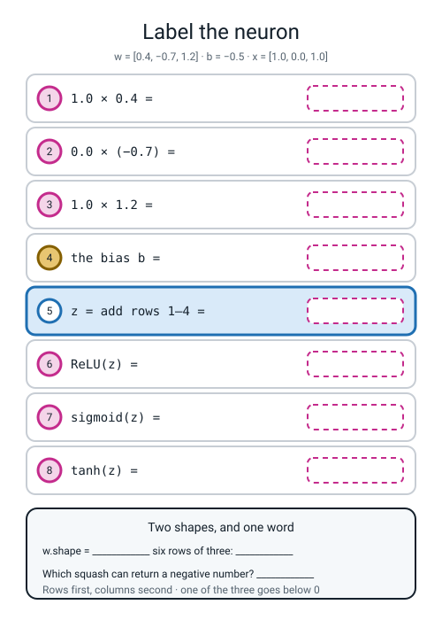
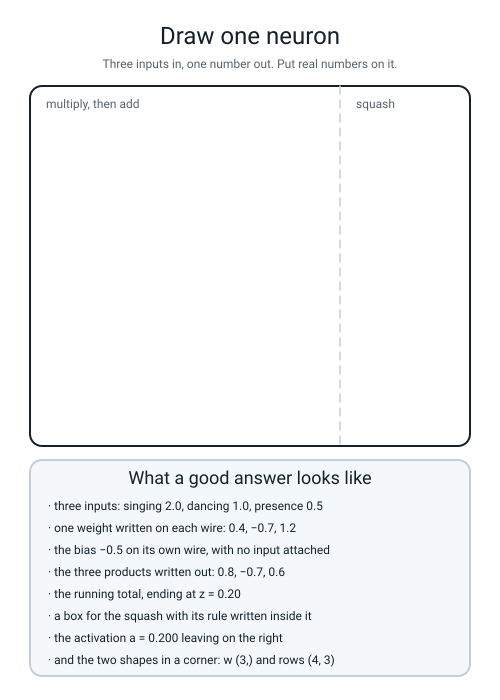

# Workbook — Week 16: One Neuron, By Hand

**Name:** ________________________________  **Date:** ______________

[⬅ Week 15](week-15.md) · [📖 Read the chapter first](../student-guide/week-16.md) · [Course Home](../README.md) · [Next ➡](week-17.md)

---

## ✅ Warm-Up (5 min)

Five quick questions about **last week** — rolling downhill, gradient descent from scratch.

**W1.** A gradient is not one number. **How many numbers is it, and what decides how many?**

________________________________________________________________

**W2.** The update line is `w ← w − lr × slope`. **Why is there a minus sign in it?**

________________________________________________________________

**W3.** Your first loss, before any training, was `0.693147`. **Where does that number come from?** Show the sum.

`−ln(______) = 0.693147`

**W4.** A classmate's loss climbs smoothly: `0.693147, 0.759960, 0.844350, 0.949854`. **Their learning rate is fine. What single character is wrong, and where?**

________________________________________________________________

**W5.** Your loop matched scikit-learn to six decimal places, and still scored only **0.8200** on the test set. **Whose fault is that — the loop's or the model's?** One sentence.

________________________________________________________________

---

## 🔢 Do the Maths by Hand

**Calculator only. No code on this page.** The new maths this week is the **shape**, which is counting — so M1 is counting, and M2 to M4 are the arithmetic that the shape is wrapped around.

### M1 — count the shape off the printout

Six grids. For each, count the rows going **down** with your finger, then the numbers across **one** row.

```text
P =              Q =                R =            S =
[[1 2]           [[7 8 9]           [[4]           [[1 2 3 4 5 6]]
 [3 4]            [1 2 3]]           [5]
 [5 6]                               [6]
 [7 8]]                              [7]]
```

```text
T = [2.5  4.5  6.5]          U = [[0.5]]
```

| grid | shape | how many numbers in it? |
|---|---|---|
| `P` | ____________ | ______ |
| `Q` | ____________ | ______ |
| `R` | ____________ | ______ |
| `S` | ____________ | ______ |
| `T` | ____________ | ______ |
| `U` | ____________ | ______ |

**M1(a).** One of those six shapes has only **one** number in it, with a lone comma. Which, and what does the comma mean?

________________________________________________________________

**M1(b).** `P` holds eight numbers. **List every legal shape for eight numbers:** ____________________________________

**M1(c).** `P.reshape(3, 3)` is refused. **Do the arithmetic that refuses it:** `3 × 3 = ` ______ and `P` has ______.

### M2 — six neuron outputs, eighteen numbers

The judge from the chapter: `w = [0.4, −0.7, 1.2]`, `b = −0.5`. **Six new rows.** Do the `z` column first, all six, and check it before you touch a squash — a wrong `z` makes all three squashes wrong.

| # | row `x` | the three products + the bias | `z` |
|---|---|---|---|
| 1 | `[1.0, 0.0, 1.0]` | `0.4 + ____ + ____ − 0.5` | ____________ |
| 2 | `[0.0, 1.0, 2.0]` | `____ + ____ + ____ − 0.5` | ____________ |
| 3 | `[3.0, 2.0, 0.0]` | `____ + ____ + ____ − 0.5` | ____________ |
| 4 | `[2.0, 0.0, 0.5]` | `____ + ____ + ____ − 0.5` | ____________ |
| 5 | `[−1.0, −1.0, 0.0]` | `____ + ____ + ____ − 0.5` | ____________ |
| 6 | `[0.5, 1.5, 1.0]` | `____ + ____ + ____ − 0.5` | ____________ |

**M2(a).** Now the eighteen. **Three decimal places.** For sigmoid, type `z`, make it negative, press `e^x`, add 1, press `1/x`. For tanh, press the `tanh` key.

| # | `z` | ReLU | sigmoid | tanh |
|---|---|---|---|---|
| 1 | | | | |
| 2 | | | | |
| 3 | | | | |
| 4 | | | | |
| 5 | | | | |
| 6 | | | | |

**M2(b).** **Count the negative numbers in your eighteen.** ______ **Which column are they all in, and why can the other two never produce one?**

________________________________________________________________

**M2(c).** Row 5 and row 6 both have a negative `z`, and their ReLU answers are identical. **Write what ReLU threw away in each case:** row 5 lost ____________ and row 6 lost ____________ . **Can you get either number back from the ReLU answer?** ______

### M3 — how steep is each squash, by nudging

Week 12's nudge: step a thousandth above and below, subtract the two answers, divide by `0.002`. Do **sigmoid at `z = 1.0`**, on a calculator.

```text
sigmoid(1.001) = 1 ÷ (1 + e^(−1.001)) = ____________
sigmoid(0.999) = 1 ÷ (1 + e^(−0.999)) = ____________

it moved:  ____________ − ____________ = ____________
we moved:  0.002

____________ ÷ 0.002 = ____________
```

**M3(a).** Now tanh at `z = 1.0`, the same way:

```text
tanh(1.001) = ____________     tanh(0.999) = ____________

(____________ − ____________) ÷ 0.002 = ____________
```

**M3(b).** And ReLU at `z = 1.0`. **You do not need a calculator for this one.** Why not, and what is the answer? ______

**M3(c).** Fill in the sentence that is the whole argument for ReLU: *sigmoid's steepest is `0.25`, so five stacked sigmoid layers pass on* `0.25⁵ = ` ____________ *of the signal, while five ReLU layers pass on* `1⁵ = ` ______.

### M4 — prove the collapse, in three lines

A **new** two-layer network with no squash anywhere in it:

```text
h1 =  0.2·x₁ + 1.5·x₂ − 0.4
h2 =  0.6·x₁ − 0.9·x₂ + 0.2

out = 2.0·h1 + 1.0·h2 − 0.1
```

**Substitute and collect. Three lines, in pen.**

```text
out = 2.0(                                  ) + 1.0(                                  ) − 0.1

x₁ terms:   ______ + ______ = ______
x₂ terms:   ______ − ______ = ______
plain numbers:  ______ + ______ − ______ = ______

out = ______·x₁ + ______·x₂ + ______
```

**M4(a).** Check it on `x = [3.0, 2.0]`, both ways:

```text
two layers:  h1 = ____________   h2 = ____________   out = ____________
one line:    out = ____________
```

**Do they agree?** ______

**M4(b).** Now put a ReLU on `h1` and `h2` and do the row `x = [1.0, 4.0]`:

```text
h1 = ____________   h2 = ____________   which one gets binned? ______

with ReLU:  out = ____________        no squash: out = ____________
the gap:    ____________
```

**M4(c).** In one sentence: **what is the gap made of?**

________________________________________________________________

---

## 🔎 Predict the Output

**Write your prediction in pen before you run anything.** Every snippet starts with `import numpy as np`. **One of these four prints something that is not a shape and is not a number either.**

### P1 — a flat list, four ways

```python
a = np.array([1.0, 2.0, 3.0])
print(a.shape)
print(a.T.shape)
print(a.reshape(3, 1).shape)
print(a.reshape(1, 3).shape)
```

**I predict:** ____________  ____________  ____________  ____________

**It really printed:**

```text
________________________________
________________________________
________________________________
________________________________
```

**Two of those four lines are identical. Which two, and what does that tell you about `.T`?**

________________________________________________________________

### P2 — same shape, different grid

```python
G = np.array([[1, 2], [3, 4], [5, 6]])
print(G.T[0])
print(G.reshape(2, 3)[0])
print(np.array_equal(G.T, G.reshape(2, 3)))
```

**I predict:** ____________________  ____________________  ____________

**It really printed:**

```text
________________________________
________________________________
________________________________
```

**Both grids are `(2, 3)`. Line 3 still says what it says. Explain in one sentence.**

________________________________________________________________

### P3 — two functions with almost the same name

```python
z = np.array([-2.3, 0.2, 0.7])
print(np.maximum(0, z))
print(np.max(z))
print(np.maximum(0, z).shape)
```

**I predict:** ____________________  ____________  ____________

**It really printed:**

```text
________________________________
________________________________
________________________________
```

**`np.maximum` and `np.max` are different functions. Say the difference in one line each.**

`np.maximum`: ______________________________

`np.max`: ______________________________

### P4 — the shape of a weighted sum (shape prediction)

```python
rows = np.array([[2.0, 1.0, 0.5], [-1.0, 2.0, 0.0]])
w = np.array([0.4, -0.7, 1.2])
print((rows * w).shape)
print((rows * w).sum(axis=1).shape)
print((rows * w).sum(axis=0).shape)
print((rows * w).sum().shape)
```

**I predict:** ____________  ____________  ____________  ____________

**It really printed:**

```text
________________________________
________________________________
________________________________
________________________________
```

**Line 1 is not `(2,)`. Why does `rows * w` keep six numbers rather than producing two?**

________________________________________________________________

**Line 4 is the strange one. What is it, and what would `.sum()` on its own have printed instead of a shape?**

________________________________________________________________

**How many of the answers on this page did you get right?** ______ / 14

**Which one surprised you most?** ______________________________

---

## ✍️ Practice Set A — Read It

**A1. Match the word to the thing.** Write the letter.

| Word | | Description |
|---|---|---|
| **neuron / unit** | ______ | (i) The number *after* the squash. What the unit actually says |
| **pre-activation `z`** | ______ | (ii) Rows × columns, written in brackets, rows first |
| **activation `a`** | ______ | (iii) A row of units that all see the same inputs, each with their own weights and bias |
| **ReLU** | ______ | (iv) The number *before* the squash. Can be any number at all |
| **tanh** | ______ | (v) Negatives become zero, positives come through untouched |
| **layer** | ______ | (vi) A layer whose outputs you never look at; it only feeds the next layer |
| **hidden layer** | ______ | (vii) Multiply each input by a weight, add them plus a bias, squash |
| **MLP** | ______ | (viii) A squash into −1 to +1. The only one of the three that can go negative |
| **shape** | ______ | (ix) Inputs, hidden layers, output layer, everything connected to everything |

**A2. Read the printout.** A spam-filter neuron: three features — exclamation marks, links, all-caps words — with `w = [0.9, 1.4, −0.6]` and `b = −1.5`. Four texts went in. **This is real output.**

```text
w.shape      = (3,)
rows.shape   = (4, 3)
rows.T.shape = (3, 4)
z            = [ 1.7 -3.3  3.  -0.7]
z.shape      = (4,)
ReLU(z)      = [1.7 0.  3.  0. ]
sigmoid(z)   = [0.845535 0.035571 0.952574 0.331812]
tanh(z)      = [ 0.935409 -0.997283  0.995055 -0.604368]
```

| Question | Your answer |
|---|---|
| a. How many texts, and how many features each? | |
| b. Why is `w.shape` `(3,)` and not `(3, 1)`? | |
| c. `rows.T.shape` is `(3, 4)`. What does one **row** of `rows.T` now hold? | |
| d. Two of the four texts got `0.` from ReLU. What do those two have in common? | |
| e. Which numbers in the three squash rows (ReLU, sigmoid, tanh) are negative, and which squash produced them? | |
| f. `z.shape` is `(4,)`. Why four and not three? | |

**A2(g).** Text 2 is `[0, 0, 3]` — no exclamation marks, no links, three shouted words. **Show the arithmetic that gives `−3.3`:**

`3 × ______ + ______ = −3.3`

**A2(h).** Three judges, three ways of saying "not spam": `0.000`, `0.035571`, `−0.997283`. **Which one is saying something the other two cannot, and what is it saying?**

________________________________________________________________

**A3. Spot the bug.** Each line is wrong or misleading. Say what happens and write the fix.

| # | The line | What happens | The fix |
|---|---|---|---|
| a | `print(rows.shape())` | | |
| b | `def relu(z): return max(0, z)`, called on a `(4,)` array | | |
| c | `w = [0.4, -0.7, 1.2]` then `print(w.shape)` | | |
| d | `G.reshape(4, 2)` where `G` is `(3, 2)` | | |
| e | `w = np.array([0.4, -0.7, 1.2, 0.9])` with three feature columns | | |
| f | `a = np.array([1.0, 2.0, 3.0])` then `col = a.T` | | |

**A3(g).** Which one of those six produces **no error at all**? ______ **How would you notice it?**

________________________________________________________________

**A4. Match the code to the output.** Five of each, no output used twice. Assume `import numpy as np` above each, and **no `set_printoptions`**.

| | Code |
|---|---|
| i | `print(np.maximum(0, np.array([-2.0, 3.0])))` |
| ii | `print(np.array([[1,2],[3,4],[5,6]]).T.shape)` |
| iii | `print(np.tanh(np.array([-2.3])))` |
| iv | `print(np.array([1.0,2.0,3.0]).T.shape)` |
| v | `print(1.0/(1.0+np.exp(-np.array([0.0]))))` |

| | Output |
|---|---|
| P | `(3,)` |
| Q | `[-0.9800964]` |
| R | `[0. 3.]` |
| S | `[0.5]` |
| T | `(2, 3)` |

**Your answers:** i → ______  ii → ______  iii → ______  iv → ______  v → ______

**A4(f).** Three of those five outputs come from *squashes* (i, iii and v). One of the five output values could **never** be produced by ReLU **or** by sigmoid, whatever the input. Which, and which squash made it?

________________________________________________________________

**A5. Label the neuron.** Fill in every empty box in the figure — the three products, the bias, `z`, and the three squash answers — then the two shapes and the one word underneath.


*Figure W16.1 — One neuron with every number removed. The row is `x = [1.0, 0.0, 1.0]`, the weights are `[0.4, −0.7, 1.2]` and the bias is `−0.5`.*

**A5(a).** One of your eight boxes is exactly `0.0`, and it is not because a squash did anything. Which one, and why is it zero?

________________________________________________________________

**A5(b).** If the bias were deleted from this neuron, which boxes would change? ____________________

**A6. Say the sentence.** Finish each one so it is true and complete.

**a)** A neuron is three steps: ______________________, ______________________, ______________________.

**b)** `z` is the number ____________ the squash and can be ______________________; `a` is the number ____________ the squash.

**c)** `(4, 3)` means ______ rows and ______ columns, and **rows come** ____________.

**d)** `.T` reads ______________________ and `.reshape` reads ______________________. Same shape out, ______________________ inside.

**e)** With no squash, two layers are ______________________, and the single line for the chapter's network is `out = ______·x₁ + ______·x₂ + ______`.

**f)** ReLU is the default hidden squash because its slope is ______ everywhere it fires, while sigmoid's steepest is ever ______.

---

## ✍️ Practice Set B — Write It

### B1 — one line, plus a shape

**Task:** ReLU the array `[-2.3, 0.2, 0.7]` and print the result and its shape on one line.

**Expected output:**

```text
[0.  0.2 0.7] (3,)
```

**Done looks like:** `np.maximum`, not `max`, and the shape is `(3,)` — a squash never changes a shape.

```python
import numpy as np

z = ______________________________________________________________

print(__________________________________________________________)
```

### B2 — one neuron, four lines

**Task:** run `w = [0.4, −0.7, 1.2]`, `b = −0.5` on the row `x = [1.0, 0.0, 1.0]`, and print `z` and all three squashes.

**Expected output:**

```text
z       = 1.10
ReLU    = 1.100000
sigmoid = 0.750260
tanh    = 0.800499
```

**Done looks like:** you wrote `1.10` on your page before you ran it. `0.4 + 0 + 1.2 − 0.5`.

```python
import numpy as np

w = ______________________________________________________________
b = ______________________________________________________________
x = ______________________________________________________________

z = ______________________________________________________________

print(__________________________________________________________)
print(__________________________________________________________)
print(__________________________________________________________)
print(__________________________________________________________)
```

### B3 — the shape reflex, five times

**Task:** print the shape of five things, each on its own line, with its name.

**Expected output:**

```text
rows                   (2, 3)
rows.T                 (3, 2)
w                      (3,)
w.reshape(3, 1)        (3, 1)
np.maximum(0, rows)    (2, 3)
```

**Done looks like:** five shapes, and **you can say out loud which two are the same grid and which two are not.**

```python
import numpy as np

rows = ___________________________________________________________
w    = ___________________________________________________________

print("%-22s %s" % ("rows", ________________________))
```

*(…then four more lines like it.)*

**B3(a).** Two of those five shapes are `(2, 3)`. **Are they the same grid?** ______ **Why?**

________________________________________________________________

### B4 — the collapse, in code

**Task:** write the M4 network two ways — as two layers with no squash, and as your single line — and print the gap on three rows.

**Expected output:**

```text
(3.0, 2.0)  two layers  6.500000   one line  6.500000   gap 0.000000
(1.0, 4.0)  two layers  8.700000   one line  8.700000   gap 0.000000
(-2.0, 0.5)  two layers -1.650000   one line -1.650000   gap 0.000000
```

**Done looks like:** **the gap column is `0.000000` on every row.** If one row disagrees, your algebra in M4 has a slip in it and this is how you find it.

```python
import numpy as np

def two_layers_no_squash(x1, x2):
    h1 = ________________________________________________________
    h2 = ________________________________________________________
    return ______________________________________________________

def one_line(x1, x2):
    return ______________________________________________________

for x1, x2 in [(3.0, 2.0), (1.0, 4.0), (-2.0, 0.5)]:
    ____________________________________________________________
```

### B5 — a whole program of your own, about 25 lines

**Task:** write `b5w16.py` — your own **eighteen-number marking program**. It must:

1. set `np.random.seed(0)` and `np.set_printoptions(precision=6, suppress=True)`
2. build `w`, `b` and the **six** rows from M2, and print `w.shape` and `rows.shape`
3. print the six-row table: row, `z`, ReLU, sigmoid, tanh
4. hold **your own eighteen hand answers from M2** in a list of six lists, to three decimal places
5. compare all eighteen, counting a **miss** as any gap bigger than `0.0005`
6. print how many numbers were checked, how many missed, and the biggest gap

**Expected output** (with the hand answers from the answer key typed in):

```text
w.shape    = (3,)
rows.shape = (6, 3)

row                        z     ReLU   sigmoid     tanh
[1. 0. 1.]              1.10    1.100     0.750    0.800
[0. 1. 2.]              1.20    1.200     0.769    0.834
[3. 2. 0.]             -0.70    0.000     0.332   -0.604
[2.  0.  0.5]           0.90    0.900     0.711    0.716
[-1. -1.  0.]          -0.20    0.000     0.450   -0.197
[0.5 1.5 1. ]          -0.15    0.000     0.463   -0.149

numbers checked      : 18
misses (gap > 0.0005): 0
biggest gap          : 0.000499
```

**Done looks like:** **your own numbers in, not mine.** If you get three misses, the program has done its job and you should leave them in and write the crosses on your page.

> **💡 Try this:** change the threshold from `0.0005` to `0.0001` and re-run. **Several numbers now "miss" even though nothing is wrong.** Work out why, and you have understood what rounding to three places actually costs you.

---

## 🐞 Fix the Broken Program

This program has **three** bugs: one **shape** bug, one **runtime** bug, and one **silent logic** bug. The real error messages are below, in the order you meet them.

```python
"""broken16.py - four rows through one neuron, three squashes. THREE bugs."""
import numpy as np

np.random.seed(0)
np.set_printoptions(precision=6, suppress=True)

w = np.array([0.4, -0.7, 1.2, 0.9])
b = -0.5

rows = np.array([[2.0, 1.0, 0.5],
                 [-1.0, 2.0, 0.0],
                 [0.0, 0.0, 1.0],
                 [1.0, 1.0, 1.0]])

def relu(z):
    return max(0, z)

def sigmoid(z):
    return 1.0 / (1.0 + np.exp(-z))

z_all = (rows * w).sum(axis=1)
print("z_all       =", z_all)
print("relu(z_all) =", relu(z_all))

print("%-18s %8s %8s %9s %8s" % ("row", "z", "ReLU", "sigmoid", "tanh"))
for r in rows:
    z = (r * w).sum()
    print("%-18s %8.2f %8.3f %9.3f %8.3f"
          % (str(r), z, relu(z), sigmoid(z), np.tanh(z)))
```

**Run 1 — nothing prints at all:**

```text
Traceback (most recent call last):
  File "broken16.py", line 21, in <module>
    z_all = (rows * w).sum(axis=1)
ValueError: operands could not be broadcast together with shapes (4,3) (4,)
```

**Bug 1.** Which line? ______  **Kind of bug?** ______________

**The message names two shapes. Circle the two numbers that clash and say what each one counts.**

**the `3` counts:** ____________________  **the `4` counts:** ____________________

**The fix:** ______________________________

**Run 2 — after fixing bug 1:**

```text
z_all       = [ 0.7 -1.8  1.2  0.9]
Traceback (most recent call last):
  File "broken16.py", line 23, in <module>
    print("relu(z_all) =", relu(z_all))
  File "broken16.py", line 16, in relu
    return max(0, z)
ValueError: The truth value of an array with more than one element is ambiguous. Use a.any() or a.all()
```

**Bug 2.** Which line? ______  **Kind of bug?** ______________

**How many yes-or-no questions does Python's `max` ask?** ______  **How many numbers did you hand it?** ______

**The fix:** ______________________________

**Run 3 — after fixing bugs 1 and 2. It runs all the way through, no error at all:**

```text
z_all       = [ 0.7 -1.8  1.2  0.9]
relu(z_all) = [0.7 0.  1.2 0.9]
row                       z     ReLU   sigmoid     tanh
[2.  1.  0.5]          0.70    0.700     0.668    0.604
[-1.  2.  0.]         -1.80    0.000     0.142   -0.947
[0. 0. 1.]             1.20    1.200     0.769    0.834
[1. 1. 1.]             0.90    0.900     0.711    0.716
```

**Bug 3 is in that table, and it is silent.** Your chapter has the correct version of exactly this table. **Go and look at it, then answer these.**

**The correct `z` column is `0.20, −2.30, 0.70, 0.40`. What has happened to every one of the four?**

________________________________________________________________

**Which line of the program is responsible?** ______  **What is missing from it?** ____________

**There are two lines with the same fault. Name both:** ______ and ______

**The fix:** ______________________________

**Run 4 — after fixing all three:**

```text
z_all       = [ 0.2 -2.3  0.7  0.4]
relu(z_all) = [0.2 0.  0.7 0.4]
row                       z     ReLU   sigmoid     tanh
[2.  1.  0.5]          0.20    0.200     0.550    0.197
[-1.  2.  0.]         -2.30    0.000     0.091   -0.980
[0. 0. 1.]             0.70    0.700     0.668    0.604
[1. 1. 1.]             0.40    0.400     0.599    0.380
```

**Two questions, and they are the point of the page.**

**Rank the three bugs by how much time each would cost you to find, and explain the ranking.**

________________________________________________________________

________________________________________________________________

**Bug 3 shifted every `z` by exactly the same amount. Suppose the program printed no table, only `sigmoid(z)`. Could you still have spotted it? What would you have had to do?**

________________________________________________________________

---

## 🧩 Puzzle of the Week

### Part 1 — Which squash made this?

Somebody ran one number through one squash and wrote down the answer, but not which squash. **For each row, name the squash.** Three decimal places.

| # | `z` | the answer | which squash? |
|---|---|---|---|
| 1 | `−3.0` | `0.000` | ____________ |
| 2 | `0.0` | `0.500` | ____________ |
| 3 | `2.0` | `0.964` | ____________ |
| 4 | `1.5` | `1.500` | ____________ |
| 5 | `−1.0` | `−0.762` | ____________ |
| 6 | `0.0` | `0.000` | ____________ |

**Part 1(a).** Row 6 has **two** possible answers. Which two, and why can you not decide?

________________________________________________________________

**Part 1(b).** Row 5 has only **one** possible answer, and you can say so without touching a calculator. Why?

________________________________________________________________

**Part 1(c).** For row 3, all three squashes give an answer. Write all three and say which two you ruled out and how.

`ReLU = ` ______  `sigmoid = ` ______  `tanh = ` ______

### Part 2 — The Mystery Judge

A neuron with three inputs and a bias. You are not told any of the four numbers. But you are allowed to feed it rows, and somebody has recorded four `z` values for you (no squash — these are raw `z`):

| row fed in | `z` came out |
|---|---|
| `[1, 0, 0]` | `0.30` |
| `[0, 1, 0]` | `−0.40` |
| `[0, 0, 1]` | `1.50` |
| `[0, 0, 0]` | `−0.20` |

**Part 2(a).** Start with the last row. **What must it tell you, and why is it the row to start with?**

________________________________________________________________

**Part 2(b).** Now recover all four numbers.

`b = ` ______  `w₁ = ` ______  `w₂ = ` ______  `w₃ = ` ______

**Part 2(c).** Predict the `z` for the row `[2, 1, 1]`, then say what each squash would report.

`z = ` ______  `ReLU = ` ______  `sigmoid = ` ______  `tanh = ` ______

**Part 2(d).** Somebody says: *"we only needed three test rows, not four."* **Are they right?** Explain what you would have lost.

________________________________________________________________

**Part 2(e).** Now the hard half. Suppose the four recorded numbers had been **after** a ReLU instead of raw `z`. **Which of the four could you no longer trust, and what would you do about it?**

________________________________________________________________

---

## 🤔 Think Deeper

**T1.** ReLU throws information away. Every negative pre-activation becomes exactly `0`, and nothing downstream can ever recover what it was — `−0.20` and `−47.5` both arrive as `0`. **Write a paragraph** on whether that is a cost you are paying or the entire point. Use the `2.10` against `0.60` measurement from the chapter, and say whether a squash that loses *no* information (one you could undo, like sigmoid) could still bend the line.

________________________________________________________________

________________________________________________________________

________________________________________________________________

________________________________________________________________

________________________________________________________________

**T2.** You proved that two layers with **no** squash collapse into one straight line. Now suppose the squash is `double(z) = 2z` — every number that comes out is twice what went in. **Work it out on paper for the chapter's network, then write a paragraph** answering: does the collapse still happen? What does that tell you about the property a squash must actually have, and is "squashing" even the right word for it?

________________________________________________________________

________________________________________________________________

________________________________________________________________

________________________________________________________________

________________________________________________________________

---

## 🛠️ Build It — Eighteen Numbers, and Eight Shapes

**Two pages. The first is about being wrong in pen; the second is about being right before you run anything.**

### Part A — eighteen numbers, hand answers first

**Copy your M2 answers into the "by hand" columns in pen. Then run `b5w16.py`. Then tick or cross all eighteen.**

| # | row | `z` (hand) | ReLU hand / numpy | ✓✗ | sigmoid hand / numpy | ✓✗ | tanh hand / numpy | ✓✗ |
|:--:|---|:--:|---|:--:|---|:--:|---|:--:|
| 1 | `[1.0, 0.0, 1.0]` | | / | | / | | / | |
| 2 | `[0.0, 1.0, 2.0]` | | / | | / | | / | |
| 3 | `[3.0, 2.0, 0.0]` | | / | | / | | / | |
| 4 | `[2.0, 0.0, 0.5]` | | / | | / | | / | |
| 5 | `[−1.0, −1.0, 0.0]` | | / | | / | | / | |
| 6 | `[0.5, 1.5, 1.0]` | | / | | / | | / | |

**How many crosses?** ______  **(Zero crosses with no working is a page nobody believes. Be honest about whether the hand column really came first.)**

**Which column caused the most crosses?** ____________  **Why do you think that is?**

________________________________________________________________

**One cross is worth more than the others: a wrong `z`. Did you have one?** ______ **If yes, how many of the eighteen did it poison?** ______

### Part B — eight shapes, predicted in pen

**Write all eight predictions in pen. Only then type `shapes8.py` and run it.**

```python
"""shapes8.py - eight shapes, predicted in pen first."""
import numpy as np
np.random.seed(0)

A = np.array([[1, 2, 3],
              [4, 5, 6]])
v = np.array([2.0, 4.0, 6.0])
w = np.array([0.4, -0.7, 1.2])
rows = np.array([[1.0, 0.0, 1.0],
                 [0.0, 1.0, 2.0],
                 [3.0, 2.0, 0.0],
                 [2.0, 0.0, 0.5],
                 [-1.0, -1.0, 0.0],
                 [0.5, 1.5, 1.0]])

print("1. A.shape                       =", A.shape)
print("2. A.T.shape                     =", A.T.shape)
print("3. A.reshape(3, 2).shape         =", A.reshape(3, 2).shape)
print("5. v.shape                       =", v.shape)
print("6. v.T.shape                     =", v.T.shape)
print("7. v.reshape(3, 1).shape         =", v.reshape(3, 1).shape)
print("8. (rows * w).sum(axis=1).shape  =", (rows * w).sum(axis=1).shape)
print()
print("4. A.reshape(4, 2) ->")
print(A.reshape(4, 2))
```

| # | the expression | my prediction (pen) | what it printed | ✓ / ✗ | if I missed it, why — one line |
|:--:|---|---|---|:--:|---|
| 1 | `A.shape` | | | | |
| 2 | `A.T.shape` | | | | |
| 3 | `A.reshape(3, 2).shape` | | | | |
| 4 | `A.reshape(4, 2)` | | | | |
| 5 | `v.shape` | | | | |
| 6 | `v.T.shape` | | | | |
| 7 | `v.reshape(3, 1).shape` | | | | |
| 8 | `(rows * w).sum(axis=1).shape` | | | | |

**Score:** ______ / 8

**Item 4 is not a shape at all. Paste its last line, word for word:**

________________________________________________________________

**and do the arithmetic that refused it:** `4 × 2 = ` ______ **against** `A` **holding** ______ **numbers.**

**Items 5 and 6 are the silent pair. Write the one sentence that explains them both:**

________________________________________________________________

### The sentence being marked

**Not "I got 7 out of 8". What is the shape *for*? Why is printing it the first thing you do when something is confusing?**

________________________________________________________________

________________________________________________________________

### Stretch — design a silent neuron

Find a bias that makes this neuron say **nothing at all** — ReLU `0` — on all four of the chapter's class rows.

| my bias | `z` on the four rows | ReLU on the four rows | silent on all four? |
|---|---|---|---|
| | | | |
| | | | |

**The biggest `z` with no bias at all is** ______, **so any bias below** ______ **does it.**

**And the closing question: is a permanently silent neuron a bug, or just a waste?**

________________________________________________________________

### The Bug Log

Two entries today, and one of them is the new category: *no error, no crash, every number wrong.*

| What I saw | What it means | Cause | Fix |
|---|---|---|---|
| | | | |
| | | | |

---

## 🎨 Draw It

Draw **one neuron** — the whole machine, with real numbers on every wire.


*Figure W16.2 — An empty frame split into multiply-and-add on the left and squash on the right, and what a good answer contains.*

**Then answer four things about your own drawing:**

**How many wires come in, and how many weights are written on them?** ______________________

**Where is the bias, and what is it attached to?** ______________________

**What did you write inside the squash box — a name, or a rule?** ______________________

**Which number in your drawing is `z` and which is `a`? Ring both and label them.**

________________________________________________________________

---

## 📊 Self-Check

| I can... | 😀 | 🙂 | 😕 |
|---|---|---|---|
| compute one neuron's `z` by hand from three inputs, three weights and a bias | | | |
| compute ReLU, sigmoid and tanh on the same `z`, on a calculator | | | |
| say which of the three squashes can return a negative number, and show one | | | |
| count the shape off a printout, rows first, and be right eight times out of eight | | | |
| say what `(3,)` means and why transposing it does nothing | | | |
| explain the difference between `.T` and `.reshape` using `1 3 5` against `1 2 3` | | | |
| prove in three lines that two layers with no squash are one straight line | | | |
| back that proof up with one row of numbers | | | |
| say why ReLU is the default hidden squash, using `0.25` as the reason | | | |
| read `ValueError: cannot reshape array of size 6 into shape (4,2)` and fix it in ten seconds | | | |

**The one thing I would ask about if I could ask one question:**

________________________________________________________________

---

## ✅ Answers

<details>
<summary>Check your answers</summary>

### Warm-Up

**W1.** **One number per knob.** A model with three knobs has a gradient of three numbers; the gradient is a **list**, not a single value. `[−0.375, +0.125, 0.000]` is a gradient.

**W2.** Because **the gradient points uphill** and you want to go down. Subtracting takes you the opposite way to the slope. Write `+` instead and the loss climbs, smoothly and forever.

**W3.** `−ln(**0.5**) = 0.693147`. Every weight starts at zero, so every score is zero, so every probability is `0.5`. **It is the loss of a model that is guessing**, and you will meet it again this term.

**W4.** The `−` in `w -= lr * grad` has become a `+`. **One character.** A loss that rises *smoothly* with a sensible learning rate is this bug and essentially nothing else — a bad learning rate makes it jump about, not climb tidily.

**W5.** **The model's.** The loop is correct and converged; the model draws a **straight line**, because it predicts "late" when `z ≥ 0`, and that is the equation of a line. The data is not straight. **That is the reason Weeks 16 to 19 exist.**

### Do the Maths by Hand

**M1.**

| grid | shape | numbers |
|---|---|---|
| `P` | **(4, 2)** | **8** |
| `Q` | **(2, 3)** | **6** |
| `R` | **(4, 1)** | **4** |
| `S` | **(1, 6)** | **6** |
| `T` | **(3,)** | **3** |
| `U` | **(1, 1)** | **1** |

**M1(a).** **`T`, which is `(3,)`.** The lone comma is Python saying *"this shape has exactly one number in it"* — three numbers, flat, with no rows and columns at all. It is not a typo and it is not a printing bug.

**M1(b).** `(1, 8)`, `(2, 4)`, `(4, 2)`, `(8, 1)` — **anything whose two numbers multiply to 8.** (And `(8,)` if you are allowed to go flat.)

**M1(c).** `3 × 3 = **9**` and `P` has **8**. numpy will not invent a ninth number, so it refuses.

**M2.** The `z` column first:

```text
1.  1.0×0.4 + 0.0×(−0.7) + 1.0×1.2 − 0.5 =  0.4 + 0    + 1.2 − 0.5 =  1.10
2.  0.0×0.4 + 1.0×(−0.7) + 2.0×1.2 − 0.5 =  0   − 0.7  + 2.4 − 0.5 =  1.20
3.  3.0×0.4 + 2.0×(−0.7) + 0.0×1.2 − 0.5 =  1.2 − 1.4  + 0   − 0.5 = −0.70
4.  2.0×0.4 + 0.0×(−0.7) + 0.5×1.2 − 0.5 =  0.8 + 0    + 0.6 − 0.5 =  0.90
5. −1.0×0.4 + (−1.0)×(−0.7) + 0.0×1.2 − 0.5 = −0.4 + 0.7 + 0 − 0.5 = −0.20
6.  0.5×0.4 + 1.5×(−0.7) + 1.0×1.2 − 0.5 =  0.2 − 1.05 + 1.2 − 0.5 = −0.15
```

**M2(a).** Real output, to three places, from `b5w16.py`:

| # | `z` | ReLU | sigmoid | tanh |
|---|---|---|---|---|
| 1 | 1.10 | **1.100** | **0.750** | **0.800** |
| 2 | 1.20 | **1.200** | **0.769** | **0.834** |
| 3 | −0.70 | **0.000** | **0.332** | **−0.604** |
| 4 | 0.90 | **0.900** | **0.711** | **0.716** |
| 5 | −0.20 | **0.000** | **0.450** | **−0.197** |
| 6 | −0.15 | **0.000** | **0.463** | **−0.149** |

And to eight places, if you want to check your calculator properly:

```text
z =  1.1000  relu=1.100000  sig=0.75026011  tanh= 0.80049902
z =  1.2000  relu=1.200000  sig=0.76852478  tanh= 0.83365461
z = -0.7000  relu=0.000000  sig=0.33181223  tanh=-0.60436778
z =  0.9000  relu=0.900000  sig=0.71094950  tanh= 0.71629787
z = -0.2000  relu=0.000000  sig=0.45016600  tanh=-0.19737532
z = -0.1500  relu=0.000000  sig=0.46257015  tanh=-0.14888503
```

**M2(b).** **Three** negatives: `−0.604`, `−0.197`, `−0.149`. **All three are in the tanh column.** ReLU's floor is a hard zero — it cannot go below it. Sigmoid's floor is zero too, and it never even reaches it: it squeezes everything into the gap between 0 and 1. **Tanh is the only one of the three allowed to say "actively bad".**

**M2(c).** Row 5 lost **`−0.20`** and row 6 lost **`−0.15`**. **No, you cannot get either back.** Both arrive at the next layer as `0` and nothing downstream can tell them apart — or tell either of them from `−47.5`. That is exactly the point of T1.

**M3.**

```text
e^(−1.001) = 0.367512,  so  sigmoid(1.001) = 1 ÷ 1.367512 = 0.73125515
e^(−0.999) = 0.368248,  so  sigmoid(0.999) = 1 ÷ 1.368248 = 0.73086192

it moved:  0.73125515 − 0.73086192 = 0.00039323
we moved:  0.002

0.00039323 ÷ 0.002 = 0.196615
```

The chapter's table says **`0.196612`**, and Python with every digit it has gets `0.196612` exactly. **Accept anything from `0.196` to `0.197`.**

> **⚠️ Watch out:** the thing you are subtracting is about **four ten-thousandths**. If you round the two sigmoids to four decimal places first — `0.7313` and `0.7309` — you get `0.0004 ÷ 0.002 = 0.2`, which is wrong in the second digit. **When you subtract two nearly-equal numbers, every digit you threw away earlier comes back magnified.** Keep eight places on this page.

**M3(a).** `tanh(1.001) = 0.76201381`, `tanh(0.999) = 0.76117386`.

```text
(0.76201381 − 0.76117386) ÷ 0.002 = 0.00083995 ÷ 0.002 = 0.419975
```

**`0.419974` to six places** — and that is the chapter's number for tanh at `z = 1.0`. **About twice as steep as sigmoid at `z = 1`** (and four times as steep at `z = 0`), which is exactly the trap in Trick 4: tanh wins in the middle and loses at the edges.

**M3(b).** **No calculator needed, and the answer is `1`.** ReLU at `z = 1` is firing, and while it fires it repeats its input exactly — nudge the input up by a thousandth and the output goes up by a thousandth. `0.002 ÷ 0.002 = 1`.

**M3(c).** `0.25⁵ = **0.0009765625**` — about **one thousandth** of the signal survives five sigmoid layers. `1⁵ = **1**` — **all** of it. That single comparison is the main reason ReLU is the default (not the only one: it is also cheap to compute), and you can check it yourself.

**M4.**

```text
out = 2.0(0.2x₁ + 1.5x₂ − 0.4) + 1.0(0.6x₁ − 0.9x₂ + 0.2) − 0.1

x₁ terms:        0.4 + 0.6 = 1.0
x₂ terms:        3.0 − 0.9 = 2.1
plain numbers:  −0.8 + 0.2 − 0.1 = −0.7

out = 1.0·x₁ + 2.1·x₂ − 0.7
```

**M4(a).**

```text
two layers:  h1 = 0.2(3) + 1.5(2) − 0.4 = 0.6 + 3.0 − 0.4 = 3.20
             h2 = 0.6(3) − 0.9(2) + 0.2 = 1.8 − 1.8 + 0.2 = 0.20
             out = 2.0(3.20) + 1.0(0.20) − 0.1 = 6.4 + 0.2 − 0.1 = 6.50

one line:    out = 1.0(3) + 2.1(2) − 0.7 = 3.0 + 4.2 − 0.7 = 6.50
```

**They agree. Exactly** — not "closely". They are the same function written two ways.

**M4(b).**

```text
h1 = 0.2(1) + 1.5(4) − 0.4 = 0.2 + 6.0 − 0.4 =  5.80
h2 = 0.6(1) − 0.9(4) + 0.2 = 0.6 − 3.6 + 0.2 = −2.80    ← h2 gets binned

with ReLU:  out = 2.0(5.80) + 1.0(0) − 0.1 = 11.60 − 0.1 = 11.50
no squash:  out = 2.0(5.80) + 1.0(−2.80) − 0.1 = 11.6 − 2.8 − 0.1 = 8.70
the gap:    11.50 − 8.70 = 2.80
```

**M4(c).** **The gap is exactly the contribution that got thrown away.** `h2` was `−2.80` and its weight into the output is `1.0`, so binning it removed `1.0 × (−2.80) = −2.80` from the answer, which *raised* the answer by `2.80`. **ReLU bends the line because it cuts some rows and leaves others alone; a rule that behaves differently in different places is not a straight line.**

### Predict the Output

**P1.**

```text
(3,)
(3,)
(3, 1)
(1, 3)
```

**Lines 1 and 2 are identical.** `a.T` did nothing at all, and there was **no error**. A flat `(3,)` has no rows and columns to swap, so transposing it is a no-op. **To get a column you must make it 2-D first:** `a.reshape(3, 1)`.

**P2.**

```text
[1 3 5]
[1 2 3]
False
```

**Same shape, different grid.** `G.T` reads **down the columns** of the original — one, three, five. `G.reshape(2, 3)` reads **along the rows** — one, two, three. `np.array_equal` compares the *contents*, not the shape, so it says `False`. **Shape is not identity.**

**P3.**

```text
[0.  0.2 0.7]
0.7
(3,)
```

**`np.maximum`** compares **two things, cell by cell**, and hands back a grid the same shape as what went in. It is the ReLU. **`np.max`** looks *inside one array* and hands back **the single largest number in it**. Two letters apart, completely different jobs, and mixing them up is a real bug that does not crash.

**P4.**

```text
(2, 3)
(2,)
(3,)
()
```

**Line 1 keeps six numbers** because `rows * w` is a **cell-by-cell** multiply: it pairs each row's three values against the three weights and gives three products **per row**. Nothing has been added up yet. The adding is `.sum(axis=1)`, which is line 2, and that is what turns six products into two weighted sums.

**Line 4 is `()`** — an **empty** shape, because `.sum()` with no axis adds up *everything* and gives back a single number with no rows and no columns at all. On its own, `(rows * w).sum()` prints `**-1.0999999999999999**` — the total of all six products, which is `0.7 + (−1.8) = −1.1`, with the usual binary wobble on the last digit.

### Practice Set A

**A1.** neuron → **(vii)** · pre-activation `z` → **(iv)** · activation `a` → **(i)** · ReLU → **(v)** · tanh → **(viii)** · layer → **(iii)** · hidden layer → **(vi)** · MLP → **(ix)** · shape → **(ii)**

**A2.**

| Question | Answer |
|---|---|
| a | **Four texts, three features each** — that is what `(4, 3)` says, rows first |
| b | Because `w` was built from a flat list with no inner brackets. It is **one weight per feature, in a line** — not a grid. `(3,)` and `(3, 1)` hold the same three numbers but behave differently |
| c | One **feature**, across all four texts. Row 0 of `rows.T` is every text's exclamation-mark count. **Same twelve numbers, a different question** |
| d | **Both had a negative `z`** — `−3.3` and `−0.7`. ReLU silences anything negative |
| e | **`−0.997283` and `−0.604368`, both from tanh.** It is the only squash of the three that can go below zero |
| f | Because there are **four rows**, and a neuron produces **one number per row**. One `z` per text |

**A2(g).** `3 × **(−0.6)** + **(−1.5)** = −1.8 − 1.5 = −3.3`. Three shouted words, each weighted `−0.6`, plus the grumpy bias.

**A2(h).** **Tanh's `−0.997283`.** ReLU says *"nothing"* and sigmoid says *"very unlikely"*, but both of those are just small positive numbers or zero. Tanh says **"actively, definitely not spam"** — it has a direction, not only a size. That is genuinely extra information, and it is why tanh is still in use.

**A3.**

| # | What happens | The fix |
|---|---|---|
| a | `TypeError: 'tuple' object is not callable`. `.shape` is a **property**, not a function | drop the brackets: `rows.shape` |
| b | `ValueError: The truth value of an array with more than one element is ambiguous` | `np.maximum(0, z)` — it asks the question once per cell |
| c | `AttributeError: 'list' object has no attribute 'shape'`. A plain Python list has no shape | wrap it: `np.array([0.4, -0.7, 1.2])` |
| d | `ValueError: cannot reshape array of size 6 into shape (4,2)`. `4 × 2 = 8`, and there are 6 | any shape multiplying to 6: `(2,3)`, `(3,2)`, `(1,6)`, `(6,1)` |
| e | `ValueError: operands could not be broadcast together with shapes (n,3) (4,)`. Four weights, three columns | delete the fourth weight. **One weight per column, always** |
| f | **No error, and nothing happens.** `a` is flat `(3,)`, so there is nothing to flip and `col` has the same shape and numbers as `a` | `a.reshape(3, 1)`, or `a.reshape(1, 3).T` |

**A3(g).** **f.** Nothing crashes, `col` looks plausible, and the shape is quietly still `(3,)`. **How you would notice: `print(col.shape)`.** That is this week's whole reflex, and f is the reason it exists.

**A4.** i → **R** · ii → **T** · iii → **Q** · iv → **P** · v → **S**

**A4(f).** **`Q` (`[-0.9800964]`)**: ReLU cannot return a negative number at all, and sigmoid lives strictly between 0 and 1, so neither could have made it. It must be **tanh**. (And `S`, `[0.5]`, on the input `z = 0` that the code uses, is sigmoid's answer: ReLU of `0` is `0` and tanh of `0` is `0`.)

**A5.** The eight boxes, in order:

| # | the step | answer |
|---|---|---|
| 1 | `1.0 × 0.4` | **0.4** |
| 2 | `0.0 × (−0.7)` | **0.0** |
| 3 | `1.0 × 1.2` | **1.2** |
| 4 | the bias `b` | **−0.5** |
| 5 | `z` = add rows 1–4 | **1.10** |
| 6 | `ReLU(z)` | **1.100** |
| 7 | `sigmoid(z)` | **0.750** |
| 8 | `tanh(z)` | **0.800** |

And underneath: `w.shape` is **`(3,)`**, six rows of three is **`(6, 3)`**, and the squash that can return a negative number is **tanh**.

**A5(a).** **Box 2, the product `0.0 × (−0.7)`.** It is zero because the **input** was zero, not because anything squashed it. `w₂` is `−0.7` and is perfectly alive — it simply had nothing to multiply. **An absent input contributes nothing, whatever its weight.**

**A5(b).** **Boxes 4, 5, 6, 7 and 8** — every box from the bias downwards. Boxes 1, 2 and 3 are products of inputs and weights and have nothing to do with `b`. Without the bias, `z` would be `1.60`, and all three squash answers would change.

**A6.**

**a)** **multiply each input by its own weight**, **add the products plus a bias**, **squash the total**.

**b)** `z` is the number **before** the squash and can be **any number at all — `−40`, `0`, `6000`**; `a` is the number **after** the squash.

**c)** `(4, 3)` means **4** rows and **3** columns, and **rows come first**.

**d)** `.T` reads **down the columns** and `.reshape` reads **along the rows**. Same shape out, **different numbers** inside.

**e)** With no squash, two layers are **one layer, written out the long way**, and the chapter's single line is `out = **1.1**·x₁ + **0.4**·x₂ + **0.3**`.

**f)** ReLU's slope is **1** everywhere it fires, while sigmoid's steepest is ever **0.25** — and `0.25⁵` is about a thousandth.

### Practice Set B

**B1.**

```python
import numpy as np

z = np.array([-2.3, 0.2, 0.7])
print(np.maximum(0, z), np.maximum(0, z).shape)
```

```text
[0.  0.2 0.7] (3,)
```

**B2.**

```python
import numpy as np

w = np.array([0.4, -0.7, 1.2])
b = -0.5
x = np.array([1.0, 0.0, 1.0])

z = (x * w).sum() + b

print("z       = %.2f" % z)
print("ReLU    = %.6f" % np.maximum(0, z))
print("sigmoid = %.6f" % (1.0 / (1.0 + np.exp(-z))))
print("tanh    = %.6f" % np.tanh(z))
```

```text
z       = 1.10
ReLU    = 1.100000
sigmoid = 0.750260
tanh    = 0.800499
```

`0.4 + 0 + 1.2 − 0.5 = 1.10`. **If you wrote `1.10` first, tick it.**

**B3.**

```python
import numpy as np

rows = np.array([[1.0, 0.0, 1.0], [0.0, 1.0, 2.0]])
w = np.array([0.4, -0.7, 1.2])

print("%-22s %s" % ("rows", rows.shape))
print("%-22s %s" % ("rows.T", rows.T.shape))
print("%-22s %s" % ("w", w.shape))
print("%-22s %s" % ("w.reshape(3, 1)", w.reshape(3, 1).shape))
print("%-22s %s" % ("np.maximum(0, rows)", np.maximum(0, rows).shape))
```

```text
rows                   (2, 3)
rows.T                 (3, 2)
w                      (3,)
w.reshape(3, 1)        (3, 1)
np.maximum(0, rows)    (2, 3)
```

**B3(a).** **Yes, those two are the same grid here** — but only because every number in this `rows` is already zero or positive. `np.maximum(0, rows)` squashes **every cell in place**, so the shape is untouched and no number moves; with a negative cell in `rows` the *value* would change to `0`, but it would still sit in the same place. It is `.T` and `.reshape` that give you the same shape with the numbers *moved*. **A squash never changes a shape; a rearrangement never changes the count.**

**B4.**

```python
import numpy as np

def two_layers_no_squash(x1, x2):
    h1 = 0.2 * x1 + 1.5 * x2 - 0.4
    h2 = 0.6 * x1 - 0.9 * x2 + 0.2
    return 2.0 * h1 + 1.0 * h2 - 0.1

def one_line(x1, x2):
    return 1.0 * x1 + 2.1 * x2 - 0.7

for x1, x2 in [(3.0, 2.0), (1.0, 4.0), (-2.0, 0.5)]:
    a = two_layers_no_squash(x1, x2)
    b = one_line(x1, x2)
    print("(%.1f, %.1f)  two layers %9.6f   one line %9.6f   gap %.6f"
          % (x1, x2, a, b, abs(a - b)))
```

```text
(3.0, 2.0)  two layers  6.500000   one line  6.500000   gap 0.000000
(1.0, 4.0)  two layers  8.700000   one line  8.700000   gap 0.000000
(-2.0, 0.5)  two layers -1.650000   one line -1.650000   gap 0.000000
```

**Three rows, three zeros.** Not "close" — the same function. If **one** row disagrees, your `x₁` or `x₂` collection in M4 has a slip; if **all three** disagree, you have collected the plain numbers wrongly.

**B5.**

```python
"""b5w16.py - six rows through one neuron, three squashes, marked against my paper."""
import numpy as np

np.random.seed(0)
np.set_printoptions(precision=6, suppress=True)

w = np.array([0.4, -0.7, 1.2])
b = -0.5

rows = np.array([[1.0, 0.0, 1.0],
                 [0.0, 1.0, 2.0],
                 [3.0, 2.0, 0.0],
                 [2.0, 0.0, 0.5],
                 [-1.0, -1.0, 0.0],
                 [0.5, 1.5, 1.0]])

# my eighteen hand answers, in the order ReLU, sigmoid, tanh
by_hand = [[1.100, 0.750, 0.800],
           [1.200, 0.769, 0.834],
           [0.000, 0.332, -0.604],
           [0.900, 0.711, 0.716],
           [0.000, 0.450, -0.197],
           [0.000, 0.463, -0.149]]

print("w.shape    =", w.shape)
print("rows.shape =", rows.shape)
print()
print("%-20s %7s %8s %9s %8s" % ("row", "z", "ReLU", "sigmoid", "tanh"))
worst = 0.0
misses = 0
for i in range(len(rows)):
    r = rows[i]
    z = (r * w).sum() + b
    got = [float(np.maximum(0, z)), 1.0 / (1.0 + np.exp(-z)), float(np.tanh(z))]
    print("%-20s %7.2f %8.3f %9.3f %8.3f" % (str(r), z, got[0], got[1], got[2]))
    for k in range(3):
        mine = by_hand[i][k]
        theirs = got[k]
        gap = abs(mine - theirs)
        worst = max(worst, gap)
        if gap > 0.0005:
            misses += 1
print()
print("numbers checked      : 18")
print("misses (gap > 0.0005): %d" % misses)
print("biggest gap          : %.6f" % worst)
```

```text
w.shape    = (3,)
rows.shape = (6, 3)

row                        z     ReLU   sigmoid     tanh
[1. 0. 1.]              1.10    1.100     0.750    0.800
[0. 1. 2.]              1.20    1.200     0.769    0.834
[3. 2. 0.]             -0.70    0.000     0.332   -0.604
[2.  0.  0.5]           0.90    0.900     0.711    0.716
[-1. -1.  0.]          -0.20    0.000     0.450   -0.197
[0.5 1.5 1. ]          -0.15    0.000     0.463   -0.149

numbers checked      : 18
misses (gap > 0.0005): 0
biggest gap          : 0.000499
```

**And the "Try this":** at a threshold of `0.0001` several numbers "miss" — for example `0.800` against `0.80049902` is a gap of `0.000499`. **Nothing is wrong.** Rounding to three decimal places can be off by up to `0.0005` by definition, so a threshold *tighter* than `0.0005` is asking your three-place answers to be four-place answers. **The threshold has to match the precision you wrote down.**

### Fix the Broken Program

**Bug 1 — line 7, `w = np.array([0.4, -0.7, 1.2, 0.9])`. A shape bug.**

The message names `(4,3)` and `(4,)`. **The `3` counts the feature columns in `rows`** — each row has three numbers. **The `4` counts the weights you supplied.** One weight per column, always, so the fourth weight has nothing to multiply and numpy stops.

*(The coincidence that `rows` also has four rows is the nasty part of this message: the `4` on the right is **not** the `4` on the left. Read what each number counts, not where it sits.)*

**The fix:** `w = np.array([0.4, -0.7, 1.2])`.

**Bug 2 — line 16, `return max(0, z)`. A runtime bug.**

Python's built-in `max` asks **one** yes-or-no question: *"is this one bigger?"* You handed it **four** numbers at once, and *"is `[0.7, −1.8, 1.2, 0.9]` bigger than zero"* has no single answer — some of them are.

**The fix:** `return np.maximum(0, z)`. **Built-in Python functions work on one thing; numpy functions work on every cell.**

**Bug 3 — lines 21 and 27: `+ b` is missing from both.** A silent logic bug.

Every `z` in the table is exactly **`0.5` too big**: `0.70` instead of `0.20`, `−1.80` instead of `−2.30`, `1.20` instead of `0.70`, `0.90` instead of `0.40`. `0.5` is the size of the bias, and the bias is negative, so leaving it out raises every score. **The two guilty lines are `z_all = (rows * w).sum(axis=1)` and `z = (r * w).sum()`.**

**The fix:** `+ b` on both. (Fixing only one gives you a program whose two printouts disagree, which is its own kind of horrible.)

**Ranking by time cost: bug 3 ≫ bug 2 ≈ bug 1.** Bugs 1 and 2 crash on the spot and the message names the exact problem — one prints both shapes, the other prints the offending line. Bug 3 produces a program that runs, prints a tidy table, and is wrong in eleven of the twelve squash numbers (row 2's ReLU is `0.000` either way). **The only things that catch it are a hand-checked row or a table you can compare against.**

**Could you spot it from `sigmoid(z)` alone?** **Yes, but only by doing arithmetic.** The sigmoid column is `0.668, 0.142, 0.769, 0.711`, and nothing about those numbers looks wrong — they are all sensible probabilities. You would have to **take one row and compute `z` by hand**: `2×0.4 + 1×(−0.7) + 0.5×1.2 − 0.5 = 0.20`, then `sigmoid(0.20) = 0.550`, which is not `0.668`. **One hand-checked row is the whole defence**, and it is why the chapter keeps asking for one.

### Puzzle of the Week

**Part 1.**

| # | `z` | answer | which squash | why |
|---|---|---|---|---|
| 1 | −3.0 | 0.000 | **ReLU** | sigmoid gives `0.047`, tanh gives `−0.995`. Only ReLU is exactly 0 |
| 2 | 0.0 | 0.500 | **sigmoid** | ReLU gives 0, tanh gives 0 |
| 3 | 2.0 | 0.964 | **tanh** | ReLU gives 2.000, sigmoid gives 0.881 |
| 4 | 1.5 | 1.500 | **ReLU** | it repeated its input, which only ReLU does |
| 5 | −1.0 | −0.762 | **tanh** | it is negative |
| 6 | 0.0 | 0.000 | **ReLU or tanh** | both give exactly 0 at `z = 0` |

**Part 1(a).** **ReLU and tanh.** `ReLU(0) = 0` and `tanh(0) = 0` — they agree at exactly one point, and that point is the one you were given. **One measurement is not always enough to identify a function**, and the cure is to feed it a second, different `z`.

**Part 1(b).** Because **the answer is negative**, and only one of the three squashes is allowed to return a negative number. You do not need to evaluate anything; the *sign* is the whole diagnosis.

**Part 1(c).** `ReLU = **2.000**`, `sigmoid = **0.881**`, `tanh = **0.964**`. ReLU is ruled out because it would have repeated `2.0` exactly. Sigmoid is ruled out because `0.881 ≠ 0.964`. **Both were ruled out by arithmetic, not by taste.**

**Part 2.**

**Part 2(a).** The row `[0, 0, 0]` feeds **nothing** in, so every weight is multiplied by zero and contributes nothing. **Whatever comes out must be the bias, on its own.** It is the row to start with because it isolates one unknown — and it is the reason the bias exists at all: it is the only knob with an opinion about an empty row.

**Part 2(b).** `b = **−0.20**`. Then each of the other three rows is one weight plus the bias:

```text
w₁ + (−0.20) =  0.30  →  w₁ =  0.50
w₂ + (−0.20) = −0.40  →  w₂ = −0.20
w₃ + (−0.20) =  1.50  →  w₃ =  1.70
```

**Part 2(c).** `z = 2(0.50) + 1(−0.20) + 1(1.70) − 0.20 = 1.00 − 0.20 + 1.70 − 0.20 = **2.30**`.

`ReLU = **2.300**` · `sigmoid = **0.909**` · `tanh = **0.980**`. *(`e^(−2.3) = 0.100259`, so `1 ÷ 1.100259 = 0.908877`.)*

**Part 2(d).** **They are wrong.** Three rows give you three equations in **four** unknowns — the three weights and the bias — which is one short. With only `[1,0,0]`, `[0,1,0]` and `[0,0,1]` you would know `w₁ + b`, `w₂ + b` and `w₃ + b`, so you could work out the **differences** between the weights but never any single one of them. **The empty row is not a spare; it is the fourth equation.**

**Part 2(e).** **Rows 2 and 4 become useless.** Their `z` values are `−0.40` and `−0.20`, so after a ReLU both would be recorded as `0.000`, and *any* negative number produces `0.000`. You could no longer recover `w₂` or `b` at all — you would only know they are negative. **What to do about it: feed the neuron rows that push `z` positive, or simply ask for `z` instead of `a`.** For `w₂` (which is negative) feed a *negative* input, e.g. `[0, −5, 0]`, which gives `z = (−0.20)(−5) − 0.20 = 0.80`, positive and so recorded exactly. For `b`, use a row whose `z` is already positive, such as `[0, 0, 1]` and `[0, 0, 2]` (`1.50` and `3.20`), whose difference gives `w₃ = 1.70` and then `b = 1.50 − 1.70 = −0.20`. **A squash that clips is a squash that destroys evidence, and that is the same fact as T1.**

### Think Deeper

**T1 — a model answer.** It is a cost *and* a bend, and the measurement shows the bend. With no squash, the chapter's two-layer network is exactly `1.1x₁ + 0.4x₂ + 0.3` — a straight line, no matter how many layers you stack. Put ReLU back in and the row `[2.0, −1.0]` goes from `2.10` to `0.60`. **That gap of `1.50` exists only because ReLU cut something off for that row and not for others.** If the cutting were uniform — everything halved, say — it would still be a line, because a line scaled is a line. **The bend comes from the rule behaving differently in different places.**

**A squash that keeps all its information can still bend.** Sigmoid and tanh never throw anything away — each output can be traced back to exactly one input, and neither is a straight line, so a network built from them does *not* collapse. So losing information is not what makes a squash useful: **not being a straight line is.** ReLU just happens to bend by cutting, and that cut has a real cost: a unit whose `z` is negative on *every* row in your data is permanently silent, contributes nothing, and (because its slope is zero there) gets no training signal to revive it — that is the "dead ReLU", and you will meet it properly in Week 19. **So the answer is: for ReLU the cut is the bend, and the price is that some units can die.**

**T2 — a model answer.** Work it through. With `double(z) = 2z` between the layers:

```text
h1 = 0.5x₁ + 0.8x₂ + 0.1      →  double →  1.0x₁ + 1.6x₂ + 0.2
h2 = −0.3x₁ + 0.2x₂ + 0.05    →  double → −0.6x₁ + 0.4x₂ + 0.10

out = 1.0(1.0x₁ + 1.6x₂ + 0.2) − 2.0(−0.6x₁ + 0.4x₂ + 0.10) + 0.3
    = (1.0 + 1.2)x₁ + (1.6 − 0.8)x₂ + (0.2 − 0.2 + 0.3)
    = 2.2x₁ + 0.8x₂ + 0.3
```

**Still one straight line.** The collapse happens exactly as before; all `double` achieved was doubling two of the three coefficients, which a different choice of weights could have done anyway.

So the property a squash must have is **not** "makes numbers smaller" and **not** "keeps numbers in a range". It is: **it must not be a straight line itself.** `2z` is a straight line through the origin, so a layer of it composes with its neighbours into another straight line. ReLU is two straight pieces with a **corner**, and the corner is the whole point — which row of data you are on decides which piece you get, and that is something no single line can imitate.

**And so "squashing" is a slightly misleading word.** Sigmoid and tanh do squash, into `(0,1)` and `(−1,1)`. ReLU does not squash at all on the side that fires — it repeats its input exactly, forever, with no ceiling. **The honest name for what all three have in common is "not a straight line",** which is why the proper term is *non-linearity*. It is an ugly word for a simple idea: **put a bend in it, or depth is free money you cannot spend.**

### Build It

**Part A — the eighteen numbers.** The table is in **M2(a)** above, to three and to eight decimal places. Marking notes:

- **`z` first.** If your `z` is wrong, all three squashes on that row are wrong and it counts as **one** mistake, not three — but write it as three crosses, because that is what a marker sees.
- **The column that causes most crosses is usually sigmoid**, because it needs four calculator presses in the right order: negate, `e^x`, `+1`, `1/x`. Skipping the negate gives you `1 − sigmoid(z)`, which for row 1 is `0.250` rather than `0.750` — **if your sigmoid column looks like one minus the right answer, that is the slip.**
- **A wrong `z` poisons three of the eighteen.** Six rows × three squashes, so one bad `z` costs exactly three.

**Part B — the eight shapes.** Real output:

```text
1. A.shape                       = (2, 3)
2. A.T.shape                     = (3, 2)
3. A.reshape(3, 2).shape         = (3, 2)
5. v.shape                       = (3,)
6. v.T.shape                     = (3,)
7. v.reshape(3, 1).shape         = (3, 1)
8. (rows * w).sum(axis=1).shape  = (6,)

4. A.reshape(4, 2) ->
Traceback (most recent call last):
  File "shapes8.py", line 25, in <module>
    print(A.reshape(4, 2))
ValueError: cannot reshape array of size 6 into shape (4,2)
```

**Item 4's last line, verbatim:** `ValueError: cannot reshape array of size 6 into shape (4,2)`. And the arithmetic: `4 × 2 = **8**` against `A` holding **6** numbers. **numpy will not invent two numbers and will not throw two away.**

**Items 5 and 6, in one sentence:** *"`v` is flat — `(3,)` — so there are no rows and columns to swap, and transposing it does nothing at all, silently."*

**Items 2 and 3 are the pair worth noticing.** Both print `(3, 2)` and **they are different grids**: `A.T` is `[[1 4], [2 5], [3 6]]` and `A.reshape(3, 2)` is `[[1 2], [3 4], [5 6]]`.

**The sentence being marked:**

> *"The shape is two numbers that say how the data is laid out, and almost every array bug is a disagreement between two shapes — so printing it first turns a mysterious crash into arithmetic I can do in my head."*

**Accept** any answer naming *diagnosis*, *the two clashing numbers*, or *"it tells me what the error message is about to tell me"*. **Do not accept** *"so I know how big it is"* — size is not the point; **agreement** is.

**Stretch — the silent neuron.**

```text
with no bias at all, the four class rows give z = 0.70, −1.80, 1.20, 0.90
so the biggest is 1.20, and any bias below −1.20 silences every row

b = −1.3:   z = [−0.6, −3.1, −0.1, −0.4]   ReLU = [0, 0, 0, 0]    silent on all four  ✅
b = −1.0:   z = [−0.3, −2.8,  0.2, −0.1]   ReLU = [0, 0, 0.2, 0]  not silent          ❌
```

*(Those `z` values use `w = [0.4, −0.7, 1.2]` on the chapter's four rows `[2,1,0.5]`, `[−1,2,0]`, `[0,0,1]`, `[1,1,1]`.)*

**Bug or waste?** **Waste, on this data — and that is the honest answer.** It is not a bug, because the neuron is doing exactly what its numbers say. But it contributes nothing to any prediction, so you are paying for a unit that is permanently asleep. **And it is worse than waste: because ReLU's slope is zero there, no gradient ever reaches it, so no amount of training wakes it up.** That is Week 19's "dead ReLU", and you have just built one on purpose.

### Draw It

**A good drawing has:** three input wires, each labelled with both its value and its weight (`2.0` with `×0.4`, `1.0` with `×−0.7`, `0.5` with `×1.2`); the **bias on its own fourth wire with no input attached to it**; the three products written out (`0.8`, `−0.7`, `0.6`); the running total ending at **`z = 0.20`**; a box for the squash with **the rule inside it**, not just the name — *"negatives become zero, positives come through"*; the activation `a = 0.200` leaving on the right; and the two shapes `(3,)` and `(4, 3)` in a corner.

**The four questions.** **Three wires in, three weights on them** — and if you drew a fourth weight on the bias wire, that is the commonest slip: the bias is not multiplied by anything. **The bias attaches to nothing**; that is the whole reason it can have an opinion about an empty row. **Inside the squash box you should have written a rule, not a name** — "ReLU" tells a reader nothing, "negatives → 0" tells them everything. And **`z = 0.20` is before the box, `a = 0.200` is after it.** If your drawing has only one number there, you have drawn half a neuron.

### Self-Check answers

No right answers here, but the honest bar: 😀 means you could do it now on a blank sheet with nothing open. 🙂 means you could do it with your chapter beside you. 😕 is the one to ask about first — and make sure **"count the shape off a printout, rows first"** is not a 😕, because next week is nothing but shapes, and the week after that is nothing but shapes with transposes in them.

</details>
