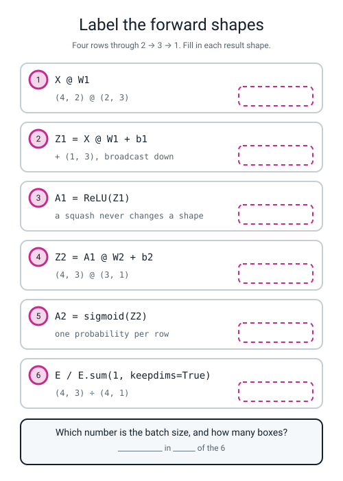
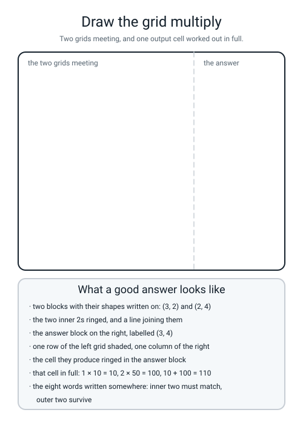

# Workbook — Week 17: A Layer Is a Grid Times a Grid

**Name:** ________________________________  **Date:** ______________

[⬅ Week 16](week-16.md) · [📖 Read the chapter first](../student-guide/week-17.md) · [Course Home](../README.md) · [Next ➡](week-18.md)

---

## ✅ Warm-Up (5 min)

Five quick questions about **last week** — one neuron, by hand.

**W1.** A neuron is three steps. **Name all three, in order.**

______________________ → ______________________ → ______________________

**W2.** `G` is `(3, 2)`. **`G.T` and `G.reshape(2, 3)` are both `(2, 3)`. Are they the same grid?** ____________ **Give the first row of each as evidence.**

`G.T[0] = ` ____________  `G.reshape(2, 3)[0] = ` ____________

**W3.** `a = np.array([1.0, 2.0, 3.0])`. **What does `a.T.shape` print, and is that an error?**

________________________________________________________________

**W4.** Which of ReLU, sigmoid and tanh can hand the next layer a **negative** number? ____________ **Give one real value from last week.** ____________

**W5.** ReLU is the default hidden squash. **State the reason as arithmetic, not as an opinion.**

`0.25` to the power five is ____________ , and `1` to the power five is ______.

---

## 🔢 Do the Maths by Hand

**Calculator only. No code on this page.** The new maths is the grid multiply, so M1 is a grid multiply you have not seen before.

### M1 — a new `(3,2) @ (2,4)`

```
A (3 rows, 2 columns)        B (2 rows, 4 columns)

[  2   1 ]                   [ 1   5   2   0 ]
[  0   3 ]                   [ 3  −1   4   6 ]
[  4  −1 ]
```

**Say the shape sentence out loud before you compute anything:**

*"______ by ______ , times ______ by ______ , gives ______ by ______ ."* That is ______ cells to fill.

**M1(a).** Four cells in longhand. Remember computers count from zero, so **row 1 is the second row** and **column 2 is the third column**.

| cell | row of A | column of B | the arithmetic | answer |
|---|---|---|---|---|
| (0,0) | ______ , ______ | ______ , ______ | `____ × ____ + ____ × ____` | ______ |
| (1,2) | ______ , ______ | ______ , ______ | `____ × ____ + ____ × ____` | ______ |
| (2,3) | ______ , ______ | ______ , ______ | `____ × ____ + ____ × ____` | ______ |
| (2,1) | ______ , ______ | ______ , ______ | `____ × ____ + ____ × ____` | ______ |

**M1(b).** Now all twelve. Write them into the grid.

```
[ ______  ______  ______  ______ ]
[ ______  ______  ______  ______ ]
[ ______  ______  ______  ______ ]
```

**M1(c).** How many multiplications did that take in total? `12 × ` ______ ` = ` ______ **And how many additions?** ______

**M1(d).** **The grand-total cross-check**, which catches a single slip anywhere. Add up your whole answer grid: ______

Now get the same number a completely different way. A's **column** totals are `2+0+4 = ` ______ and `1+3+(−1) = ` ______ . B's **row** totals are `1+5+2+0 = ` ______ and `3+(−1)+4+6 = ` ______ .

```
______ × ______  +  ______ × ______  =  ______
```

**Do the two routes agree?** ______ **If not, you have exactly one arithmetic slip — the cross-check tells you it exists but not where.**

### M2 — twelve shape pairs

For each pair, decide whether it multiplies. If it does, write the output shape. If it does not, write **the two numbers that failed to match**.

| # | pair | works? | result, or the two failing numbers |
|:--:|---|:--:|---|
| 1 | `(3,2) @ (2,4)` | | |
| 2 | `(5,1) @ (1,5)` | | |
| 3 | `(1,5) @ (5,1)` | | |
| 4 | `(4,4) @ (4,4)` | | |
| 5 | `(2,6) @ (6,3)` | | |
| 6 | `(100,8) @ (8,1)` | | |
| 7 | `(3,2) @ (3,2)` | | |
| 8 | `(2,5) @ (4,5)` | | |
| 9 | `(6,1) @ (2,1)` | | |
| 10 | `(1,1) @ (1,1)` | | |
| 11 | `(7,3) @ (3,7)` | | |
| 12 | `(3,7) @ (7,3)` | | |

**M2(a).** Rows 2 and 3 are the **same two grids in the opposite order**. How many numbers are in each answer? ______ and ______ . **Write the one-sentence conclusion.**

________________________________________________________________

**M2(b).** Rows 11 and 12 are also the same pair swapped, and **both** are legal. Their answers are ______ and ______ . **Are the answers the same grid?** ______

**M2(c).** Row 6 has the biggest numbers on the page and is one of the easiest. Why?

________________________________________________________________

### M3 — line the shapes up from the right

Broadcasting rule: line the two shapes up **from the right-hand end**. At each position they must either be **equal** or one of them must be **1**.

For each, write the lined-up comparison and then the verdict.

| # | the sum | lined up from the right | result shape, or "no" |
|:--:|---|---|---|
| a | `(4,3) + (1,3)` | `3 vs 3` ✓ , then `4 vs 1` → ____ | ____________ |
| b | `(4,3) + (3,1)` | `3 vs 1` ____ , then `4 vs 3` ____ | ____________ |
| c | `(4,3) + (4,1)` | `3 vs 1` ____ , then `4 vs 4` ____ | ____________ |
| d | `(4,3) + (3,)` | `3 vs 3` ____ , then nothing left | ____________ |
| e | `(4,3) + (4,)` | `3 vs 4` ____ | ____________ |
| f | `(2,3) + (2,3)` | `3 vs 3` ____ , then `2 vs 2` ____ | ____________ |

**M3(a).** **One of those six is the dangerous one**: it works, the shape comes out right, and it is almost never what you meant. Which? ______ **What has it added one of, per row instead of per unit?** ____________

**M3(b).** A bias for three hidden units should be shaped ____________ . Say the sentence out loud that stops you typing the wrong one:

________________________________________________________________

### M4 — softmax on three new scores

Three output units produce the raw scores `[1.5, −0.5, 2.0]`.

**Step one — `e^x` on each. Six decimal places.**

```
e^1.5    = ____________
e^(−0.5) = ____________
e^2.0    = ____________
```

**M4(a).** One of those three inputs was negative. **What did `e^x` do to it, and why does softmax need that?**

________________________________________________________________

**Step two — add them up, then divide each by the total.**

```
total = ____________ + ____________ + ____________ = ____________

____________ ÷ ____________ = ____________
____________ ÷ ____________ = ____________
____________ ÷ ____________ = ____________
```

**M4(b).** Add your three answers: ______ + ______ + ______ = ______ . **It must be `1.000000`.**

**M4(c).** The raw scores `1.5` and `2.0` differ by `0.5`. **What is the ratio of their two probabilities, and what does that tell you about `e^x`?**

`____________ ÷ ____________ = ` ____________

________________________________________________________________

---

## 🔎 Predict the Output

**Write your prediction in pen before you run anything.** Every snippet starts with `import numpy as np`. **One of these four prints a grid with no error at all and every number in it is a lie.**

### P1 — star against at-sign

```python
A = np.array([[1, 2], [3, 4]])
print(A * A)
print(A @ A)
print((A @ A).shape)
```

**I predict:**

```text
________________________________
________________________________
________________________________
```

**It really printed:**

```text
________________________________
________________________________
________________________________
```

**Both answers are `(2, 2)`, so the shape cannot tell you which operator ran. Show the arithmetic for the top-left cell of each:**

`A * A` top-left: ______________________  `A @ A` top-left: ______________________

### P2 — the same two grids, both ways round

```python
u = np.array([[1, 2, 3]])
v = np.array([[4], [5], [6]])
print((u @ v).shape)
print(u @ v)
print((v @ u).shape)
```

**I predict:** ____________  ____________________  ____________

**It really printed:**

```text
________________________________
________________________________
________________________________
```

**One answer holds one number and the other holds nine. Write the arithmetic for the single number:**

`____ × ____ + ____ × ____ + ____ × ____ = ` ____________

### P3 — two biases, one of them wrong

```python
Z = np.zeros((4, 3))
print((Z + np.array([[1.0, 2.0, 3.0]])).shape)
print((Z + np.array([[1.0], [2.0], [3.0], [4.0]])).shape)
print(Z + np.array([[1.0], [2.0], [3.0], [4.0]]))
```

**I predict:** ____________  ____________  and then a grid of ______________________

**It really printed:**

```text
________________________________
________________________________
________________________________
________________________________
________________________________
________________________________
```

**Lines 1 and 2 print the same shape. Look at line 3's grid. What went wrong, in one sentence?**

________________________________________________________________

### P4 — `keepdims`, four ways (shape prediction)

```python
E = np.array([[1.0, 2.0, 3.0], [4.0, 5.0, 6.0]])
print(E.sum(axis=1).shape)
print(E.sum(axis=1, keepdims=True).shape)
print(E.sum(axis=0, keepdims=True).shape)
print((E / E.sum(axis=1, keepdims=True)).sum(axis=1))
```

**I predict:** ____________  ____________  ____________  ____________

**It really printed:**

```text
________________________________
________________________________
________________________________
________________________________
```

**Lines 1 and 2 add up exactly the same six numbers. What is the only difference, and why does it matter?**

________________________________________________________________

**Line 3 asked for `axis=0` instead of `axis=1`. Which way did it add, and what are the two numbers it produced?**

________________________________________________________________

**How many of the answers on this page did you get right?** ______ / 13

**Which one surprised you most?** ______________________________

---

## ✍️ Practice Set A — Read It

**A1. Match the word to the thing.** Write the letter.

| Word | | Description |
|---|---|---|
| **matrix multiply** | ______ | (i) The two middle numbers of a shape pair. They must be equal |
| **inner dimension** | ______ | (ii) Exponentiate, then divide by the total. The output squash for more than two classes |
| **broadcasting** | ______ | (iii) A row from the left, a column from the right, multiply position by position, add |
| **forward pass** | ______ | (iv) numpy stretching a small grid to fit a bigger one, lining shapes up from the right |
| **softmax** | ______ | (v) Pushing data through the network, inputs to output, keeping every intermediate grid |

**A2. Read the printout.** A real run of a forward pass through 2 → 3 → 1 on four rows.

```text
X  (4, 2)  W1 (2, 3)  b1 (1, 3)  W2 (3, 1)  b2 (1, 1)

X @ W1 (4, 3)
[[ 1.3  -0.6  -0.6 ]
 [-0.2  -0.8   2.  ]
 [ 0.7  -0.1  -0.8 ]
 [-0.55  0.7  -0.7 ]]
Z1     (4, 3)
[[ 1.1  -0.3  -0.1 ]
 [-0.4  -0.5   2.5 ]
 [ 0.5   0.2  -0.3 ]
 [-0.75  1.   -0.2 ]]
A1     (4, 3)
[[1.1 0.  0. ]
 [0.  0.  2.5]
 [0.5 0.2 0. ]
 [0.  1.  0. ]]
Z2     (4, 1)
[[ 1.2 ]
 [-3.65]
 [ 0.7 ]
 [ 0.6 ]]
A2     (4, 1)
[[0.768525]
 [0.025333]
 [0.668188]
 [0.645656]]
```

| Question | Your answer |
|---|---|
| a. How many rows of data, and how many features each? | |
| b. How many hidden units? Give two places on the printout that prove it | |
| c. `b1` is `(1, 3)`. Reading column 0, what number got added to every row? | |
| d. How many of `A1`'s twelve cells are zero? | |
| e. Row 2 of `A1` is `[0, 0, 2.5]`. What did the other two units say about that row? | |
| f. One number appears in every single shape on the page. Which, and what is it? | |

**A2(g).** Take `Z1` row 0, column 0. It is `1.1`, and `X @ W1` row 0 column 0 was `1.3`. **What is the difference, and where did it come from?**

________________________________________________________________

**A2(h).** Row 2's answer is `0.025333` — the most confident *no* on the page. Trace it back in one sentence: which hidden unit was loud, and what sign is its weight into the output?

________________________________________________________________

**A3. Spot the bug.** Each line is wrong or misleading. Say what happens and write the fix.

| # | The line | What happens | The fix |
|---|---|---|---|
| a | `W1 = np.array([[0.6, 0.1], [-0.5, 0.4], [0.2, -1.0]])` for 2 features and 3 units | | |
| b | `b1 = np.array([-0.2, 0.3, 0.5])` (one set of brackets) then `Z1 + b1` on a `(4,3)` | | |
| c | `X @ W1` where both are plain Python lists | | |
| d | `P = E / E.sum(axis=1)` on a `(2, 3)` grid | | |
| e | `P = E / E.sum(axis=1)` on a `(3, 3)` grid | | |
| f | `b1 = np.array([[-0.2], [0.3], [0.5], [0.0]])` for a `(4, 3)` `Z1` | | |

**A3(g).** **Two** of those six produce no error at all. Which two? ______ and ______ **What do they have in common?**

________________________________________________________________

**A4. Match the code to the output.** Five of each, no output used twice. Assume `import numpy as np` above each.

| | Code |
|---|---|
| i | `print((np.zeros((4,2)) @ np.zeros((2,3))).shape)` |
| ii | `print((np.zeros((3,1)) @ np.zeros((1,3))).shape)` |
| iii | `print((np.zeros((1,3)) @ np.zeros((3,1))).shape)` |
| iv | `print(np.array([[1,2]]) @ np.array([[10],[50]]))` |
| v | `print(np.array([[1,2]]) * np.array([[10,50]]))` |

| | Output |
|---|---|
| P | `(3, 3)` |
| Q | `[[110]]` |
| R | `(4, 3)` |
| S | `[[ 10 100]]` |
| T | `(1, 1)` |

**Your answers:** i → ______  ii → ______  iii → ______  iv → ______  v → ______

**A4(f).** Outputs `Q` and `S` come from the **same two grids**. Write the one-sentence difference between the two operators.

________________________________________________________________

**A5. Label the forward shapes.** Fill in every empty box in the figure, then answer the two questions in the panel underneath.


*Figure W17.1 — Six lines of a forward pass with their result shapes removed. Four rows of two features, through 2 → 3 → 1.*

**A5(a).** Which of the six lines is the only one that could **change** the first number of the shape? ______ **Why can the others not?**

________________________________________________________________

**A5(b).** Rows 3 and 5 are both squashes. Write the rule they share, in six words or fewer. ____________________

**A6. Say the sentence.** Finish each one so it is true and complete.

**a)** The shape rule in eight words: ______________________________________________

**b)** `W1` is shaped `(inputs, units)` — so for 2 features and 3 hidden units it is ____________ , with **inputs down the** ____________ and **units across the** ____________ .

**c)** `A @ B` and `B @ A` are ______________________ ; `(1,3) @ (3,1)` gives ______ number and `(3,1) @ (1,3)` gives ______ .

**d)** A bias belongs to a ____________ , not to a ____________ , so its shape is ____________ .

**e)** When a shape error happens you read ______________________ , then ______________________ , then ______________________ .

**f)** `np.allclose` exists because ______________________________ , and when it says `False` the next thing you print is ______________________ .

---

## ✍️ Practice Set B — Write It

### B1 — one line, plus a shape

**Task:** multiply a grid of zeros shaped `(3, 2)` by one shaped `(2, 4)` and print the result's shape.

**Expected output:**

```text
(3,2) @ (2,4) -> (3, 4)
```

**Done looks like:** you said *"three by two, times two by four, gives three by four"* out loud before typing it.

```python
import numpy as np

A = ______________________________________________________________
B = ______________________________________________________________

print(__________________________________________________________)
```

### B2 — two cells, by hand and by numpy

**Task:** build M1's `A` and `B`, compute `A @ B`, and check **two** cells against your own arithmetic in the same print line.

**Expected output:**

```text
C.shape = (3, 4)
row 0 col 1 by hand: 2*5 + 1*(-1) = 9  numpy: 9
row 2 col 0 by hand: 4*1 + (-1)*3 = 1  numpy: 1
```

**Done looks like:** the hand number and the numpy number are **printed side by side on one line**, so a reader can see they match without doing any work.

```python
import numpy as np

A = ______________________________________________________________
B = ______________________________________________________________
C = ______________________________________________________________

print("C.shape =", ____________________)
print("row 0 col 1 by hand: 2*5 + 1*(-1) =", ____________, " numpy:", ____________)
print("row 2 col 0 by hand: 4*1 + (-1)*3 =", ____________, " numpy:", ____________)
```

### B3 — the shape checker

**Task:** loop over M2's twelve shape pairs. For each, decide from the shapes alone whether it multiplies; if it does, build two grids of zeros and print the real output shape; if it does not, print the two failing numbers.

**Expected output:**

```text
(3, 2)    @ (2, 4)    -> (3, 4)    works
(5, 1)    @ (1, 5)    -> (5, 5)    works
(1, 5)    @ (5, 1)    -> (1, 1)    works
(4, 4)    @ (4, 4)    -> (4, 4)    works
(2, 6)    @ (6, 3)    -> (2, 3)    works
(100, 8)  @ (8, 1)    -> (100, 1)  works
(3, 2)    @ (3, 2)    -> NO        2 against 3
(2, 5)    @ (4, 5)    -> NO        5 against 4
(6, 1)    @ (2, 1)    -> NO        1 against 2
(1, 1)    @ (1, 1)    -> (1, 1)    works
(7, 3)    @ (3, 7)    -> (7, 7)    works
(3, 7)    @ (7, 3)    -> (3, 3)    works
```

**Done looks like:** **nine "works" and three "NO"**, and your program decided which was which from `a[1] == b[0]` rather than from trying it and catching a crash.

```python
import numpy as np

pairs = [((3, 2), (2, 4)), ((5, 1), (1, 5)), ((1, 5), (5, 1)), ((4, 4), (4, 4)),
         ((2, 6), (6, 3)), ((100, 8), (8, 1)), ((3, 2), (3, 2)), ((2, 5), (4, 5)),
         ((6, 1), (2, 1)), ((1, 1), (1, 1)), ((7, 3), (3, 7)), ((3, 7), (7, 3))]

for a, b in pairs:
    if ________________________________________:
        got = ______________________________________________________
        print("%-9s @ %-9s -> %-9s works" % (str(a), str(b), str(got)))
    else:
        ____________________________________________________________
```

### B4 — the silent bias, measured

**Task:** take the real `X @ W1` grid from A2, add the **right** bias `(1, 3)` and the **wrong** bias `(4, 1)`, print both results and **count how many of the twelve cells differ.**

**Expected output:**

```text
right (4, 3)
[[ 1.1  -0.3  -0.1 ]
 [-0.4  -0.5   2.5 ]
 [ 0.5   0.2  -0.3 ]
 [-0.75  1.   -0.2 ]]
wrong (4, 3)
[[ 1.1  -0.8  -0.8 ]
 [ 0.1  -0.5   2.3 ]
 [ 1.2   0.4  -0.3 ]
 [-0.55  0.7  -0.7 ]]
cells that differ: 9 of 12
```

**Done looks like:** **nine, not twelve.** Three cells agree by coincidence, and finding out which three is the point of the exercise.

```python
import numpy as np
np.set_printoptions(precision=6, suppress=True)

Z1 = np.array([[1.3, -0.6, -0.6], [-0.2, -0.8, 2.0],
               [0.7, -0.1, -0.8], [-0.55, 0.7, -0.7]])
right = ___________________________________________________________
wrong = ___________________________________________________________

print("right", ____________); print(______________)
print("wrong", ____________); print(______________)
print("cells that differ:", ____________________________________, "of 12")
```

**B4(a).** Name the three cells that agree, and say why each one does.

________________________________________________________________

### B5 — a whole program of your own, about 25 lines

**Task:** write `b5w17.py` — a forward pass through a **3 → 2 → 2** network with a **softmax** output, on a batch of three rows. It must:

1. set the seed and `np.set_printoptions(precision=6, suppress=True)`
2. use `X` `(3,3)` `= [[1,0,2],[0,3,1],[2,1,0]]`, `W1` `(3,2)` `= [[0.4,−0.5],[0.1,0.9],[−0.7,0.2]]`, `b1` `(1,2)` `= [[0.2,−0.6]]`
3. use `W2` `(2,2)` `= [[1.5,−0.5],[−1.0,2.0]]` and `b2` `(1,2)` `= [[0.1,−0.1]]`
4. print the shape **and** the grid at every stage: `Z1`, `A1`, `Z2`, `E`, `total`, `P`
5. use `keepdims=True` on the softmax total, and print `P.sum(axis=1)` — it must be `[1. 1. 1.]`
6. print `P.argmax(axis=1)`
7. hold your own hand answers for `P` and check them with `np.allclose(..., atol=1e-5)` plus the biggest gap

**Expected output:**

```text
X  (3, 3)  W1 (3, 2)  b1 (1, 2)  W2 (2, 2)  b2 (1, 2)
Z1 (3, 2)
[[-0.8 -0.7]
 [-0.2  2.3]
 [ 1.1 -0.7]]
A1 (3, 2)
[[0.  0. ]
 [0.  2.3]
 [1.1 0. ]]
Z2 (3, 2)
[[ 0.1  -0.1 ]
 [-2.2   4.5 ]
 [ 1.75 -0.65]]
E  (3, 2)
[[ 1.105171  0.904837]
 [ 0.110803 90.017131]
 [ 5.754603  0.522046]]
total (3, 1)
[[ 2.010008]
 [90.127934]
 [ 6.276648]]
P  (3, 2)
[[0.549834 0.450166]
 [0.001229 0.998771]
 [0.916827 0.083173]]
row sums: [1. 1. 1.]
argmax  : [0 1 0]
agrees with my paper? True
biggest gap: 3.986212774192456e-07
```

**Done looks like:** `row sums: [1. 1. 1.]` — **if any row sum is not 1, `keepdims` has gone missing.**

> **💡 Try this:** delete `keepdims=True` and re-run. **This batch is `(3, 2)` and the totals are `(3,)`, so lining up from the right gives `2 vs 3` and you get a clean crash.** Now change `X` to have only two rows and try again: the totals become `(2,)`, `2 vs 2` matches, and **numpy silently divides the wrong things by each other.** A batch whose row count equals its column count turns a crash into a lie.

---

## 🐞 Fix the Broken Program

This program has **three** bugs: one **type** bug, one **shape** bug, and one **silent logic** bug. The real error messages are below, in the order you meet them.

```python
"""broken17.py - a batch of four rows through 2 -> 3 -> 1. THREE bugs."""
import numpy as np

np.random.seed(0)
np.set_printoptions(precision=6, suppress=True)

X = [[2.0, 1.0],
     [0.0, -2.0],
     [1.0, 1.0],
     [-1.0, 0.5]]

W1 = [[0.6, -0.5, 0.2],
      [0.1, 0.4, -1.0]]

b1 = np.array([[-0.2], [0.3], [0.5], [0.0]])

W2 = np.array([[1.0, 0.5, -1.5]])
b2 = np.array([[0.1]])

sigmoid = lambda z: 1.0 / (1.0 + np.exp(-z))

Z1 = X @ W1 + b1
A1 = np.maximum(0, Z1)
Z2 = A1 @ W2 + b2
A2 = sigmoid(Z2)

print("Z1", Z1.shape); print(Z1)
print("A2", A2.shape); print(A2)
```

**Run 1 — nothing prints at all:**

```text
Traceback (most recent call last):
  File "broken17.py", line 22, in <module>
    Z1 = X @ W1 + b1
TypeError: unsupported operand type(s) for @: 'list' and 'list'
```

**Bug 1.** Which lines? ______ and ______  **Kind of bug?** ______________

**This is a `TypeError`, not a `ValueError`. What is the difference being reported?**

________________________________________________________________

**The fix:** ______________________________

**Run 2 — after fixing bug 1:**

```text
Traceback (most recent call last):
  File "broken17.py", line 24, in <module>
    Z2 = A1 @ W2 + b2
ValueError: matmul: Input operand 1 has a mismatch in its core dimension 0, with gufunc signature (n?,k),(k,m?)->(n?,m?) (size 1 is different from 3)
```

**Bug 2.** Which line? ______  **Kind of bug?** ______________

**Cover the middle of that message with your hand and read only the last bracket. Circle the two numbers.**

**the `1` is:** ____________________  **the `3` is:** ____________________

**What shape must `W2` be, and how do you know without guessing?**

________________________________________________________________

**The fix:** ______________________________

**Run 3 — after fixing bugs 1 and 2. It runs all the way through, no error at all:**

```text
Z1 (4, 3)
[[ 1.1  -0.8  -0.8 ]
 [ 0.1  -0.5   2.3 ]
 [ 1.2   0.4  -0.3 ]
 [-0.55  0.7  -0.7 ]]
A2 (4, 1)
[[0.768525]
 [0.037327]
 [0.817574]
 [0.610639]]
```

**Bug 3 is silent.** `Z1`'s shape is right. Look at the numbers instead.

**Which line is it on?** ______  **What shape is that variable, and what shape should it be?**

`is:` ____________  `should be:` ____________

**Hunt for the tell. Look down `Z1`'s column 1. With a correct bias, what should have been added to every one of those four numbers?** ____________ **What was actually added, row by row?**

______ , ______ , ______ , ______

**Write the two sentences that earn full marks: what it did, and why there was no error.**

________________________________________________________________

________________________________________________________________

**The fix:** ______________________________

**Run 4 — after fixing all three:**

```text
Z1 (4, 3)
[[ 1.1  -0.3  -0.1 ]
 [-0.4  -0.5   2.5 ]
 [ 0.5   0.2  -0.3 ]
 [-0.75  1.   -0.2 ]]
A2 (4, 1)
[[0.768525]
 [0.025333]
 [0.668188]
 [0.645656]]
```

**Two questions, and they are the point of the page.**

**Compare the two `A2` printouts. One of the four numbers is identical in both. Which, and why is that more dangerous than if none had matched?**

________________________________________________________________

________________________________________________________________

**Rank the three bugs by how much time each would cost you to find, and explain the ranking.**

________________________________________________________________

________________________________________________________________

---

## 🧩 Puzzle of the Week

### Part 1 — The Shape Chain

A batch of **100 rows** with **5 features** goes into a network: `5 → 8 → 8 → 3`, with ReLU after each hidden layer and **softmax** on the output. **Fill in every shape, then count the knobs.**

| thing | shape | how many numbers |
|---|---|---|
| `X` | `(100, 5)` | 500 |
| `W1` | ____________ | ______ |
| `b1` | ____________ | ______ |
| `Z1` | ____________ | ______ |
| `A1` | ____________ | ______ |
| `W2` | ____________ | ______ |
| `b2` | ____________ | ______ |
| `Z2` | ____________ | ______ |
| `A2` | ____________ | ______ |
| `W3` | ____________ | ______ |
| `b3` | ____________ | ______ |
| `Z3` | ____________ | ______ |
| `A3` | ____________ | ______ |

**Part 1(a).** **Total knobs** — every weight and every bias, and nothing else:

`____ + ____ + ____ + ____ + ____ + ____ = ` ______

**Part 1(b).** Which of the thirteen shapes would change if you fed in **1,000** rows instead of 100? ______________________ **Which would not?** ______________________

**Part 1(c).** One row of `A3` holds three numbers. **What must they add up to, and why?**

________________________________________________________________

### Part 2 — Count the Multiplications

Every output cell of `A @ B` costs one multiplication per shared number. So the whole multiply costs **(rows of A) × (columns of B) × (the inner number)**.

**Part 2(a).** `A` is `(6, ?)`, `B` is `(?, 4)`, and the multiply took **72 multiplications**. Find the inner number.

`6 × 4 = ` ______ cells, so `______ × k = 72`, so `k = ` ______

**Part 2(b).** `A` is `(5, ?)`, `B` is `(?, 2)`, and it took **40 multiplications**. `k = ` ______

**Part 2(c).** `A` is `(?, 3)`, `B` is `(3, 7)`, and the answer grid holds **84 numbers**. How many rows has `A`? ______

**Part 2(d).** Now the chapter's hook, properly. **750 rows, 2 features, a hidden layer of 16 units, one output.** Count the multiplications in **one** forward pass:

```
layer 1:  750 × 16 × 2  = ____________
layer 2:  750 ×  1 × 16 = ____________
                  total = ____________
```

**Part 2(e).** The chapter says Python loops are about **a hundred times** slower than numpy for the same arithmetic. If one forward pass is `36,000` multiplications, and you train for **500** rounds with a backward pass costing the same as a forward one, how many multiplications is that in total?

`36,000 × 500 × 2 = ` ____________

**Part 2(f).** And the point. **Does `@` do fewer multiplications than a Python loop would?** ______ **So where does the hundredfold speed-up come from?**

________________________________________________________________

---

## 🤔 Think Deeper

**T1.** The `(4, 1)` bias runs without complaint and produces nine wrong numbers out of twelve. **Write a paragraph** designing a rule numpy *could* have used that would have caught it — then be honest about what your rule would cost. What legitimate, useful things would it also refuse? Would you still ship it?

________________________________________________________________

________________________________________________________________

________________________________________________________________

________________________________________________________________

________________________________________________________________

**T2.** `@` is one character that replaces thirty-six thousand trips round a Python loop, and it runs about a hundred times faster. **Write a paragraph** on what you give up in exchange. Think about what you can no longer *see*, what kinds of mistake become harder to notice, and whether the shape rule is a price or a gift.

________________________________________________________________

________________________________________________________________

________________________________________________________________

________________________________________________________________

________________________________________________________________

---

## 🛠️ Build It — One Forward Pass, and Five Breakages

**Two pages. The first is arithmetic you check; the second is error messages you learn to read.**

### Part A — a full forward pass, by hand, then in numpy

**A brand-new network.** Nothing here appeared in the chapter, so there is nothing to copy.

```
X  (4, 2)              W1 (2, 3)                      b1 (1, 3)
[  2.0   1.0 ]         [ 0.6  -0.5   0.2 ]            [ -0.2   0.3   0.5 ]
[  0.0  -2.0 ]         [ 0.1   0.4  -1.0 ]
[  1.0   1.0 ]
[ -1.0   0.5 ]         W2 (3, 1)                      b2 (1, 1)
                       [  1.0 ]                       [ 0.1 ]
                       [  0.5 ]
                       [ -1.5 ]
```

- [ ] **1.** Write the shape ladder **before any arithmetic**, and say it out loud twice.
- [ ] **2.** Compute `X @ W1` by hand — twelve cells. Write the shape beside it.
- [ ] **3.** Add `b1`. Write the shape beside it.
- [ ] **4.** ReLU it. Write the shape beside it, and **count the zeros**.
- [ ] **5.** Compute `A1 @ W2 + b2` by hand — four cells.
- [ ] **6.** Sigmoid all four, on a calculator, to six places.
- [ ] **7.** Type it into `fwd17.py` and check `Z1` and `Z2` with `np.allclose`.
- [ ] **8.** Deliberately type `−3.55` instead of `−3.65` into your hand answer and print the biggest gap.

**The shape ladder — fill it in before you compute anything:**

```
X       ____________
W1      ____________   →   X @ W1    ____________
b1      ____________   →   Z1        ____________     [broadcast down all ____ rows]
A1      ____________
W2      ____________   →   A1 @ W2   ____________
b2      ____________   →   Z2        ____________
A2      ____________
```

**`X @ W1`, twelve cells, by hand:** shape ____________

```
[ ________  ________  ________ ]
[ ________  ________  ________ ]
[ ________  ________  ________ ]
[ ________  ________  ________ ]
```

**`Z1 = X @ W1 + b1`:** shape ____________

```
[ ________  ________  ________ ]
[ ________  ________  ________ ]
[ ________  ________  ________ ]
[ ________  ________  ________ ]
```

**`A1 = ReLU(Z1)`:** shape ____________   **zeros:** ______ of 12

```
[ ________  ________  ________ ]
[ ________  ________  ________ ]
[ ________  ________  ________ ]
[ ________  ________  ________ ]
```

**`Z2` and `A2`:**

| row | `Z2` | `A2` (six places) |
|---|---|---|
| 1 | | |
| 2 | | |
| 3 | | |
| 4 | | |

**The checks:**

| check | what it printed |
|---|---|
| `np.allclose(Z1, by_hand_Z1)` | |
| `np.allclose(Z2, by_hand_Z2)` | |
| `np.abs(Z1 - by_hand_Z1).max()` | |
| with `−3.55` typed in: `np.allclose(...)` | |
| with `−3.55` typed in: biggest gap | |

**Two sizes of gap, two different meanings. Write the rule:**

a gap of about `1e-17` means ______________________ ; a gap of about `0.1` means ______________________

**Row 2 of your `A1` should be interesting. What is it, and what does it mean about that row of data?**

________________________________________________________________

### Part B — five breakages, predicted then pasted

**Predict each error message in one sentence, in pen, BEFORE you run it.** One of the five produces no error at all.

| # | what you break | my prediction (pen) |
|:--:|---|---|
| 1 | `W1` built as `(3, 2)` instead of `(2, 3)` | |
| 2 | `W2` built as `(1, 3)` instead of `(3, 1)` | |
| 3 | `b1` written as a column `(3, 1)` | |
| 4 | `X` and `W1` left as plain Python lists | |
| 5 | `b1` shaped `(4, 1)` — one per row | |

**Now run all five and paste the real output, word for word. Circle the two failing numbers on each.**

**Break 1:**

```text
________________________________________________________________
________________________________________________________________
```

the two numbers: ______ and ______ — the ______ is ____________________ and the ______ is ____________________

**Break 2:**

```text
________________________________________________________________
________________________________________________________________
```

the two numbers: ______ and ______

**Break 3:**

```text
________________________________________________________________
________________________________________________________________
```

**This one is a different *kind* of message from 1 and 2. Which operator failed, and what is the message called?** ____________________

**Break 4:**

```text
________________________________________________________________
```

**Break 5:**

```text
________________________________________________________________
________________________________________________________________
________________________________________________________________
```

**Score:** ______ / 5 predicted correctly.

**Which one did you get wrong, and what part of the rule had you not got yet?**

________________________________________________________________

### The sentence being marked

**Break 5 ran perfectly and the shape came out exactly right. In two sentences: which numbers are wrong, and why was there no error? The full-marks answer names the difference between a unit and a row.**

________________________________________________________________

________________________________________________________________

### The Bug Log

Three entries today, and the third is the important one.

| What I saw | What it means | Cause | Fix |
|---|---|---|---|
| | | | |
| | | | |
| | | | |

---

## 🎨 Draw It

Draw **the grid multiply** — two blocks meeting, and one output cell worked out in full.


*Figure W17.2 — An empty frame with room for the two grids on the left and the answer on the right, and what a good answer contains.*

**Then answer four things about your own drawing:**

**Does every block have its shape written on it?** ______________________

**Which two numbers did you ring, and what did you draw between them?** ______________________

**Which output cell did you work out, and what is the sum you wrote?** ______________________

**Where on your drawing can a reader see the number `3` and the number `4` surviving?**

________________________________________________________________

---

## 📊 Self-Check

| I can... | 😀 | 🙂 | 😕 |
|---|---|---|---|
| multiply a `(3,2)` grid by a `(2,4)` grid by hand, and check cells against numpy | | | |
| state the shape rule in eight words | | | |
| predict the output shape of twelve shape pairs and be right on all twelve | | | |
| say why `A @ B` and `B @ A` are different operations, with an example of each | | | |
| trace a full forward pass for four rows through 2 → 3 → 1, with every shape written | | | |
| explain broadcasting by lining two shapes up from the right | | | |
| say what shape a bias must be, and why it is a row and not a column | | | |
| read a `matmul` error, name the two numbers, and fix it in twenty seconds | | | |
| tell a `matmul` error from a broadcasting error and say which operator failed | | | |
| compute a softmax by hand and check that the row adds to 1 | | | |
| use `np.allclose` to mark my own paper, and read the size of a gap | | | |

**The one thing I would ask about if I could ask one question:**

________________________________________________________________

---

## ✅ Answers

<details>
<summary>Check your answers</summary>

### Warm-Up

**W1.** **Multiply each input by its own weight** → **add the products plus a bias** → **squash the total**.

**W2.** **No, they are not the same grid.** `G.T[0] = [1 3 5]` — it reads **down the columns**. `G.reshape(2, 3)[0] = [1 2 3]` — it reads **along the rows**. Same shape, different contents. **Shape is not identity.**

**W3.** It prints **`(3,)`** — unchanged — and **no, that is not an error.** A flat array has no rows and columns to swap, so transposing it does nothing at all, silently. **That is the dangerous one**, and it is why this week keeps printing shapes.

**W4.** **tanh**, and `tanh(−2.30) = −0.980`.

**W5.** `0.25⁵ = **0.0009765625**` and `1⁵ = **1**`. One thousandth of the signal survives five sigmoid layers; all of it survives five ReLU layers. **That is an argument, not a fashion.**

### Do the Maths by Hand

**M1.** The shape sentence: *"three by two, times two by four, gives three by four."* **Twelve cells.**

**M1(a).**

| cell | row of A | column of B | arithmetic | answer |
|---|---|---|---|---|
| (0,0) | 2, 1 | 1, 3 | `2×1 + 1×3 = 2 + 3` | **5** |
| (1,2) | 0, 3 | 2, 4 | `0×2 + 3×4 = 0 + 12` | **12** |
| (2,3) | 4, −1 | 0, 6 | `4×0 + (−1)×6 = 0 − 6` | **−6** |
| (2,1) | 4, −1 | 5, −1 | `4×5 + (−1)×(−1) = 20 + 1` | **21** |

**M1(b).** All twelve, real output from numpy:

```
[[ 5   9   8   6]
 [ 9  -3  12  18]
 [ 1  21   4  -6]]
```

**M1(c).** `12 × **2** = **24**` multiplications, because each cell pairs two numbers with two numbers. And **12 additions** — one per cell.

**M1(d).** Grand total of the answer grid:

```
row 0:  5 +  9 +  8 +  6 =  28
row 1:  9 + (−3) + 12 + 18 =  36
row 2:  1 + 21 +  4 + (−6) =  20
                     total =  84
```

The other route: A's column totals are `2+0+4 = **6**` and `1+3+(−1) = **3**`. B's row totals are `1+5+2+0 = **8**` and `3+(−1)+4+6 = **12**`.

```
6 × 8  +  3 × 12  =  48 + 36  =  84   ✅
```

**Same number, two completely different routes.** If yours disagree, you have exactly one slip and now you know to look for it.

**M2.**

| # | pair | works? | result / failing pair |
|:--:|---|:--:|---|
| 1 | `(3,2) @ (2,4)` | ✅ | `(3, 4)` |
| 2 | `(5,1) @ (1,5)` | ✅ | `(5, 5)` — twenty-five numbers |
| 3 | `(1,5) @ (5,1)` | ✅ | `(1, 1)` — **one** number |
| 4 | `(4,4) @ (4,4)` | ✅ | `(4, 4)` |
| 5 | `(2,6) @ (6,3)` | ✅ | `(2, 3)` |
| 6 | `(100,8) @ (8,1)` | ✅ | `(100, 1)` |
| 7 | `(3,2) @ (3,2)` | ❌ | `2` against `3` |
| 8 | `(2,5) @ (4,5)` | ❌ | `5` against `4` |
| 9 | `(6,1) @ (2,1)` | ❌ | `1` against `2` |
| 10 | `(1,1) @ (1,1)` | ✅ | `(1, 1)` |
| 11 | `(7,3) @ (3,7)` | ✅ | `(7, 7)` — forty-nine numbers |
| 12 | `(3,7) @ (7,3)` | ✅ | `(3, 3)` — nine numbers |

**Nine work, three do not.**

**M2(a).** **Twenty-five** and **one**. *"`A @ B` and `B @ A` are not the same operation — swapping the order can change not only the answer but the size of the answer."*

**M2(b).** `(7, 7)` and `(3, 3)`. **No** — they are not even the same shape, let alone the same grid. Forty-nine numbers against nine.

**M2(c).** Because **the rule does not care how big the numbers are.** `8 = 8`, so it works, and the answer is `(100, 1)`. Large numbers *feel* harder and are exactly as easy: you compare two numbers and copy two others.

**M3.**

| # | the sum | lined up from the right | result |
|:--:|---|---|---|
| a | `(4,3) + (1,3)` | `3 vs 3` ✓ , `4 vs 1` ✓ (the 1 stretches) | **(4, 3)** |
| b | `(4,3) + (3,1)` | `3 vs 1` ✓ , `4 vs 3` ✗ | **no** — `ValueError` |
| c | `(4,3) + (4,1)` | `3 vs 1` ✓ , `4 vs 4` ✓ | **(4, 3)** ⚠️ |
| d | `(4,3) + (3,)` | `3 vs 3` ✓ , nothing left to compare | **(4, 3)** |
| e | `(4,3) + (4,)` | `3 vs 4` ✗ | **no** — `ValueError` |
| f | `(2,3) + (2,3)` | `3 vs 3` ✓ , `2 vs 2` ✓ | **(2, 3)** |

**M3(a).** **c.** It has added **one bias per row** instead of one per unit. Every number in row 0 got `+` the same thing, then every number in row 1 got `+` something else — which is not what a bias is for.

**Note row e**, because it is a nice surprise: `(4,3) + (4,)` **fails**, even though 4 matches 4, because lining up **from the right** puts the `4` against the `3`. Broadcasting never looks at the left-hand end first.

**M3(b).** **`(1, 3)`.** The sentence: *"three biases, one per hidden unit, added to every row."* Say that before you type the line and you cannot type `(3, 1)`.

**M4.**

```
e^1.5    = 4.481689
e^(−0.5) = 0.606531
e^2.0    = 7.389056
```

**M4(a).** `−0.5` became **`0.606531` — small but positive.** Softmax needs that because **probabilities cannot be negative**, and a raw score is allowed to be. Exponentiating is the cheapest way to make everything positive without changing which score is biggest.

```
total = 4.481689 + 0.606531 + 7.389056 = 12.477276

4.481689 ÷ 12.477276 = 0.359188
0.606531 ÷ 12.477276 = 0.048611
7.389056 ÷ 12.477276 = 0.592201
```

**M4(b).** `0.359188 + 0.048611 + 0.592201 = **1.000000**` ✅

**M4(c).** `0.592201 ÷ 0.359188 = **1.649**`. The raw scores differed by only `0.5`, and one probability is **1.65 times** the other. **`e^x` exaggerates:** a modest lead in the raw score becomes a clear lead in the probability, which is exactly what you want from an output layer that has to pick a winner. *(And `e^0.5 = 1.6487` — the ratio of the probabilities is just `e` to the power of the gap between the scores. Spotting that unprompted is a very good catch.)*

### Predict the Output

**P1.**

```text
[[ 1  4]
 [ 9 16]]
[[ 7 10]
 [15 22]]
(2, 2)
```

`A * A` top-left: **`1 × 1 = 1`** — matching cells, no adding. `A @ A` top-left: **`1 × 1 + 2 × 3 = 1 + 6 = 7`** — a row against a column, with the products added. **Both are `(2, 2)`, so only the numbers can tell you which ran.**

**P2.**

```text
(1, 1)
[[32]]
(3, 3)
```

`1 × 4 + 2 × 5 + 3 × 6 = 4 + 10 + 18 = **32**`. And the other way round gives a `(3, 3)` grid of nine numbers. **Same two grids, opposite order, and not even the same size answer.**

**P3.**

```text
(4, 3)
(4, 3)
[[1. 1. 1.]
 [2. 2. 2.]
 [3. 3. 3.]
 [4. 4. 4.]]
```

**Look at the grid.** Every number in row 0 is `1.`, every number in row 1 is `2.` — **the "bias" was added one per *row* rather than one per *column***, so all three units in a row got the same thing. With the correct `(1, 3)` bias, the pattern would run down the **columns** instead. **Same shape, completely different meaning, no error at all.**

**P4.**

```text
(2,)
(2, 1)
(1, 3)
[1. 1.]
```

**Lines 1 and 2 add up exactly the same six numbers** — `6` and `15`. The only difference is whether the answer stays **2-D**. `(2,)` is flat; `(2, 1)` is a column. It matters because `(2,3) ÷ (2,1)` broadcasts correctly along the rows, while `(2,3) ÷ (2,)` lines `3` up against `2` and crashes — **or, on a square batch, does not crash and lies.**

**Line 3 added down the rows** (`axis=0` goes down), producing the two column totals `1+4 = 5` and `2+5 = 7`… and `3+6 = 9`. **Three numbers, not two** — that is the catch: `axis=0` on a `(2, 3)` grid gives `(1, 3)`, because it collapses the **rows** and leaves the **columns**. The values are `[[5. 7. 9.]]`.

### Practice Set A

**A1.** matrix multiply → **(iii)** · inner dimension → **(i)** · broadcasting → **(iv)** · forward pass → **(v)** · softmax → **(ii)**

**A2.**

| Question | Answer |
|---|---|
| a | **Four rows, two features each** — `X (4, 2)` |
| b | **Three.** `W1` is `(2, 3)` so its second number is the unit count, and `b1` is `(1, 3)` — one bias per unit. `X @ W1` being `(4, 3)` is a third piece of evidence |
| c | **`−0.2`.** `X @ W1` column 0 is `1.3, −0.2, 0.7, −0.55` and `Z1` column 0 is `1.1, −0.4, 0.5, −0.75` — every one is `0.2` lower |
| d | **Seven of twelve** |
| e | **Nothing** — both had a negative `z` (`−0.4` and `−0.5`) and ReLU silenced them. Only unit 3 had an opinion about row 2 |
| f | **The `4`** — the batch size. Four rows in, four probabilities out, and every grid in between has four rows |

**A2(g).** The difference is **`0.2`**, and it came from **`b1`'s first entry, `−0.2`, broadcast down all four rows.** `1.3 + (−0.2) = 1.1`.

**A2(h).** **Unit 3 was loud — `2.5` — and its weight into the output is negative (`−1.5`).** So a large positive activation pushed the score a long way *down*: `2.5 × (−1.5) + 0.1 = −3.65`, and `sigmoid(−3.65) = 0.025333`. **A loud unit with a negative weight is the most confident "no" a network can produce.**

**A3.**

| # | What happens | The fix |
|---|---|---|
| a | `ValueError: matmul: ... (size 3 is different from 2)`. `W1` is `(3,2)`; its rows must equal `X`'s columns | `(2, 3)` — **inputs down the side, units across the top** |
| b | **No error.** `(4,3) + (3,)` broadcasts happily and gives the *right* answer here — but `b1.shape` is `(3,)`, so it will not behave like a `(1,3)` everywhere else | use two sets of brackets: `np.array([[-0.2, 0.3, 0.5]])` |
| c | `TypeError: unsupported operand type(s) for @: 'list' and 'list'`. Plain lists have no `@` | wrap both in `np.array(...)` |
| d | `ValueError: operands could not be broadcast together with shapes (2,3) (2,)`. Lining up from the right: `3 vs 2` | `E.sum(axis=1, keepdims=True)` |
| e | **No error**, because `3` happens to match `3` — and the row sums come out as things like `1.414565`. **A square batch turns a crash into a silent lie** | the same fix: `keepdims=True`, and then **check `P.sum(axis=1)`** |
| f | **No error**, right shape, nine wrong numbers out of twelve: one bias per row instead of per unit | `np.array([[-0.2, 0.3, 0.5]])` |

**A3(g).** **b, e and f** all run — so strictly three, and if you named **e and f** as "the dangerous two" that is the intended answer, because **b** is merely untidy while **e** and **f** are actually wrong. What e and f have in common: **the shapes happened to be compatible for the wrong reason.** Broadcasting did exactly what it was asked and what it was asked was not what was meant.

**A4.** i → **R** · ii → **P** · iii → **T** · iv → **Q** · v → **S**

**A4(f).** **`*` multiplies matching cells and stops; `@` pairs a row against a column, multiplies position by position, and adds the products.** `[[1,2]] * [[10,50]]` gives `[[10, 100]]` — two numbers, nothing added. `[[1,2]] @ [[10],[50]]` gives `[[110]]` — one number, because `10 + 100` got added up.

**A5.** The six boxes, in order:

| # | line | result shape |
|---|---|---|
| 1 | `X @ W1` | **(4, 3)** |
| 2 | `Z1 = X @ W1 + b1` | **(4, 3)** |
| 3 | `A1 = ReLU(Z1)` | **(4, 3)** |
| 4 | `Z2 = A1 @ W2 + b2` | **(4, 1)** |
| 5 | `A2 = sigmoid(Z2)` | **(4, 1)** |
| 6 | `E / E.sum(1, keepdims=True)` | **(4, 3)** |

And the panel: the batch size is **`4`**, and it appears in **all 6** of them.

**A5(a).** **None of the six.** That is the answer, and it is the point: a matrix multiply changes the **second** number (the columns), a bias add changes nothing, a squash changes nothing, and a broadcast division changes nothing. **The batch size passes straight through a network untouched** — so if the first number of a shape has changed, something is the wrong way round.

**A5(b).** **"A squash never changes a shape."** *(Or "same shape in, same shape out".)*

**A6.**

**a)** **Inner two must match, outer two survive.**

**b)** `(2, 3)`, with **inputs down the side** and **units across the top**.

**c)** **different operations**; `(1,3) @ (3,1)` gives **one** number and `(3,1) @ (1,3)` gives **nine**.

**d)** A bias belongs to a **unit**, not to a **row**, so its shape is **`(1, units)`** — a row, broadcast down.

**e)** **the last line**, then **the bracket at the end of it**, then **the two numbers inside the bracket**.

**f)** `np.allclose` exists because **an exact `==` test on decimals fails on answers that are genuinely identical** — `0.1 + 0.2` is not exactly `0.3` in binary. When it says `False`, the next thing you print is **`np.abs(mine - theirs).max()`**, because the *size* of the gap tells you whether it is rounding (`~1e-16`) or a wrong number (`~0.05`).

### Practice Set B

**B1.**

```python
import numpy as np

A = np.zeros((3, 2))
B = np.zeros((2, 4))

print("(3,2) @ (2,4) ->", (A @ B).shape)
```

```text
(3,2) @ (2,4) -> (3, 4)
```

**B2.**

```python
import numpy as np

A = np.array([[2, 1], [0, 3], [4, -1]])
B = np.array([[1, 5, 2, 0], [3, -1, 4, 6]])
C = A @ B

print("C.shape =", C.shape)
print("row 0 col 1 by hand: 2*5 + 1*(-1) =", 2 * 5 + 1 * (-1), " numpy:", C[0, 1])
print("row 2 col 0 by hand: 4*1 + (-1)*3 =", 4 * 1 + (-1) * 3, " numpy:", C[2, 0])
```

```text
C.shape = (3, 4)
row 0 col 1 by hand: 2*5 + 1*(-1) = 9  numpy: 9
row 2 col 0 by hand: 4*1 + (-1)*3 = 1  numpy: 1
```

**B3.**

```python
import numpy as np

pairs = [((3, 2), (2, 4)), ((5, 1), (1, 5)), ((1, 5), (5, 1)), ((4, 4), (4, 4)),
         ((2, 6), (6, 3)), ((100, 8), (8, 1)), ((3, 2), (3, 2)), ((2, 5), (4, 5)),
         ((6, 1), (2, 1)), ((1, 1), (1, 1)), ((7, 3), (3, 7)), ((3, 7), (7, 3))]

for a, b in pairs:
    if a[1] == b[0]:
        got = (np.zeros(a) @ np.zeros(b)).shape
        print("%-9s @ %-9s -> %-9s works" % (str(a), str(b), str(got)))
    else:
        print("%-9s @ %-9s -> NO        %d against %d" % (str(a), str(b), a[1], b[0]))
```

```text
(3, 2)    @ (2, 4)    -> (3, 4)    works
(5, 1)    @ (1, 5)    -> (5, 5)    works
(1, 5)    @ (5, 1)    -> (1, 1)    works
(4, 4)    @ (4, 4)    -> (4, 4)    works
(2, 6)    @ (6, 3)    -> (2, 3)    works
(100, 8)  @ (8, 1)    -> (100, 1)  works
(3, 2)    @ (3, 2)    -> NO        2 against 3
(2, 5)    @ (4, 5)    -> NO        5 against 4
(6, 1)    @ (2, 1)    -> NO        1 against 2
(1, 1)    @ (1, 1)    -> (1, 1)    works
(7, 3)    @ (3, 7)    -> (7, 7)    works
(3, 7)    @ (7, 3)    -> (3, 3)    works
```

**The `if a[1] == b[0]` line *is* the shape rule**, in one comparison. Nine work, three do not.

**B4.**

```python
import numpy as np
np.set_printoptions(precision=6, suppress=True)

Z1 = np.array([[1.3, -0.6, -0.6], [-0.2, -0.8, 2.0],
               [0.7, -0.1, -0.8], [-0.55, 0.7, -0.7]])
right = np.array([[-0.2, 0.3, 0.5]])
wrong = np.array([[-0.2], [0.3], [0.5], [0.0]])

print("right", (Z1 + right).shape); print(Z1 + right)
print("wrong", (Z1 + wrong).shape); print(Z1 + wrong)
print("cells that differ:", int((np.abs((Z1 + right) - (Z1 + wrong)) > 1e-12).sum()), "of 12")
```

```text
right (4, 3)
[[ 1.1  -0.3  -0.1 ]
 [-0.4  -0.5   2.5 ]
 [ 0.5   0.2  -0.3 ]
 [-0.75  1.   -0.2 ]]
wrong (4, 3)
[[ 1.1  -0.8  -0.8 ]
 [ 0.1  -0.5   2.3 ]
 [ 1.2   0.4  -0.3 ]
 [-0.55  0.7  -0.7 ]]
cells that differ: 9 of 12
```

**B4(a).** The three that agree, and why each one does:

- **Cell (0,0):** row 0's wrong bias is `−0.2` and unit 0's right bias is also `−0.2`. **The same number by coincidence.** Both give `1.1`.
- **Cell (1,1):** row 1's wrong bias is `0.3` and unit 1's right bias is also `0.3`. Both give `−0.5`.
- **Cell (2,2):** row 2's wrong bias is `0.5` and unit 2's right bias is also `0.5`. Both give `−0.3`.

**The agreements are exactly the diagonal**, because the wrong bias is the right bias written the other way round — so wherever the row index equals the unit index, the two numbers coincide. **Check one number, or worse, check the top-left number, and you will miss this entirely.**

**B5.** The program:

```python
"""b5w17.py - a forward pass through 3 -> 2 -> 2 with a softmax output."""
import numpy as np

np.random.seed(0)
np.set_printoptions(precision=6, suppress=True)

X = np.array([[1.0, 0.0, 2.0],
              [0.0, 3.0, 1.0],
              [2.0, 1.0, 0.0]])
W1 = np.array([[0.4, -0.5],
               [0.1, 0.9],
               [-0.7, 0.2]])
b1 = np.array([[0.2, -0.6]])
W2 = np.array([[1.5, -0.5],
               [-1.0, 2.0]])
b2 = np.array([[0.1, -0.1]])

print("X ", X.shape, " W1", W1.shape, " b1", b1.shape, " W2", W2.shape, " b2", b2.shape)

Z1 = X @ W1 + b1
print("Z1", Z1.shape); print(Z1)
A1 = np.maximum(0, Z1)
print("A1", A1.shape); print(A1)
Z2 = A1 @ W2 + b2
print("Z2", Z2.shape); print(Z2)

E = np.exp(Z2)
print("E ", E.shape); print(E)
total = E.sum(axis=1, keepdims=True)
print("total", total.shape); print(total)
P = E / total
print("P ", P.shape); print(P)
print("row sums:", P.sum(axis=1))
print("argmax  :", P.argmax(axis=1))

by_hand_P = np.array([[0.549834, 0.450166],
                      [0.001229, 0.998771],
                      [0.916827, 0.083173]])
print("agrees with my paper?", np.allclose(P, by_hand_P, atol=1e-5))
print("biggest gap:", np.abs(P - by_hand_P).max())
```

```text
X  (3, 3)  W1 (3, 2)  b1 (1, 2)  W2 (2, 2)  b2 (1, 2)
Z1 (3, 2)
[[-0.8 -0.7]
 [-0.2  2.3]
 [ 1.1 -0.7]]
A1 (3, 2)
[[0.  0. ]
 [0.  2.3]
 [1.1 0. ]]
Z2 (3, 2)
[[ 0.1  -0.1 ]
 [-2.2   4.5 ]
 [ 1.75 -0.65]]
E  (3, 2)
[[ 1.105171  0.904837]
 [ 0.110803 90.017131]
 [ 5.754603  0.522046]]
total (3, 1)
[[ 2.010008]
 [90.127934]
 [ 6.276648]]
P  (3, 2)
[[0.549834 0.450166]
 [0.001229 0.998771]
 [0.916827 0.083173]]
row sums: [1. 1. 1.]
argmax  : [0 1 0]
agrees with my paper? True
biggest gap: 3.986212774192456e-07
```

**Row 0 is the interesting one, and it is worth a sentence.** `Z1` row 0 is `[−0.8, −0.7]`, both negative, so **ReLU silenced the whole hidden layer for that row** and `A1` row 0 is `[0, 0]`. That means `Z2` row 0 is just `b2` — `[0.1, −0.1]` — so the answer `[0.549834, 0.450166]` came **entirely from the output bias**. The hidden layer contributed nothing at all. **That is what a network with too few hidden units looks like from the inside.**

**And the "Try this":** on this `(3, 2)` batch, dropping `keepdims` gives `total` as `(3,)`, and `(3,2) ÷ (3,)` lines `2` up against `3` — clean crash, `ValueError`. On a **square** batch the same mistake matches by accident, divides columns by rows, and hands you "probabilities" above 1 with no complaint.

### Fix the Broken Program

**Bug 1 — lines 7 and 12: `X` and `W1` are plain Python lists.** A type bug.

A `TypeError` is a different complaint from a `ValueError`. **`ValueError` means "I understand what you gave me but the numbers are wrong."** **`TypeError` means "I do not know how to do this to that kind of thing at all."** `@` is defined for numpy arrays; a Python list does not have it. Note that if only *one* of the two had been a list, numpy would have quietly coped — it takes two lists to produce this message.

**The fix:** wrap both in `np.array(...)`.

**Bug 2 — line 17, `W2 = np.array([[1.0, 0.5, -1.5]])`. A shape bug.**

The last bracket says `(size 1 is different from 3)`. **The `1` is `W2`'s rows**; **the `3` is `A1`'s columns** — three hidden units. `W2` must be **`(3, 1)`**, and **you know that without guessing** because `W2` is `(inputs to this layer, units in this layer)` = `(3, 1)`, and because `A1 @ W2` has to give one probability per row, which is `(4, 1)`.

**The fix:** `W2 = np.array([[1.0], [0.5], [-1.5]])`.

**Bug 3 — line 15, `b1 = np.array([[-0.2], [0.3], [0.5], [0.0]])`. A silent logic bug.**

It **is** `(4, 1)` and **should be** `(1, 3)`.

Look down `Z1`'s column 1. With the correct bias, every one of those four numbers should have had **`+0.3`** added. What actually got added, row by row, was **`−0.2`, `0.3`, `0.5`, `0.0`** — the bias values handed out one per *row*.

**The two sentences:**

> *"It gave every row its own bias instead of giving every unit its own bias — row 0 got `−0.2` added to all three of its numbers, row 1 got `+0.3` added to all three, and so on down the batch."*

> *"There was no error because `(4,3)` and `(4,1)` broadcast perfectly well — lining up from the right, `3` against `1` stretches, then `4` matches `4` — so numpy did exactly what I asked and what I asked was wrong."*

**The fix:** `b1 = np.array([[-0.2, 0.3, 0.5]])`.

**The identical number.** `A2` row 1 is **`0.768525` in both runs.** That happens because `A1` row 0 is `[1.1, 0, 0]` in both versions — row 0's wrong bias `−0.2` is the same number as unit 0's right bias `−0.2`, and the other two entries were negative either way so ReLU zeroed them both times. **It is more dangerous than no match at all**, because it is the *first* number you look at, and it agrees. If you spot-check the top of a printout you will conclude the program is fine.

**Ranking by time cost: bug 3 ≫ bug 1 ≈ bug 2.** Bugs 1 and 2 crash immediately and the message names the exact problem — one tells you the two types, the other the two numbers. Bug 3 produces a complete, plausible, correctly-shaped answer with nine wrong numbers in it. **The only things that catch it are a hand-worked row, `np.allclose` against paper, or reading down a column and asking whether the same thing got added to every row.**

### Puzzle of the Week

**Part 1 — the shape chain.**

| thing | shape | numbers |
|---|---|---|
| `X` | `(100, 5)` | 500 |
| `W1` | **(5, 8)** | **40** |
| `b1` | **(1, 8)** | **8** |
| `Z1` | **(100, 8)** | **800** |
| `A1` | **(100, 8)** | **800** |
| `W2` | **(8, 8)** | **64** |
| `b2` | **(1, 8)** | **8** |
| `Z2` | **(100, 8)** | **800** |
| `A2` | **(100, 8)** | **800** |
| `W3` | **(8, 3)** | **24** |
| `b3` | **(1, 3)** | **3** |
| `Z3` | **(100, 3)** | **300** |
| `A3` | **(100, 3)** | **300** |

**Part 1(a).** `40 + 8 + 64 + 8 + 24 + 3 = **147** knobs.`

**Notice that the data grids are far bigger than the model.** `Z1` alone holds 800 numbers and the entire model is 147. **The knob count does not depend on the batch size at all** — which is the whole reason you can train on a million rows with the same model.

**Part 1(b).** **Every shape with `100` in it changes** — `X`, `Z1`, `A1`, `Z2`, `A2`, `Z3`, `A3`, all becoming `(1000, ...)`. **The six weight and bias shapes do not change**: `W1`, `b1`, `W2`, `b2`, `W3`, `b3`. **The model does not know how much data it is about to see.**

**Part 1(c).** They must add up to **exactly 1**, because the output squash is **softmax**, which divides every exponentiated score by the total of all three. Three classes, one row, all the certainty accounted for.

**Part 2 — count the multiplications.**

**Part 2(a).** `6 × 4 = **24**` cells, so `24 × k = 72`, so `k = **3**`.

**Part 2(b).** `5 × 2 = 10` cells, so `10 × k = 40`, so `k = **4**`.

**Part 2(c).** The answer grid is `(rows, 7)` and holds 84 numbers, so `rows × 7 = 84` and `rows = **12**`.

**Part 2(d).**

```
layer 1:  750 × 16 × 2  = 24,000
layer 2:  750 ×  1 × 16 = 12,000
                  total = 36,000
```

**Part 2(e).** `36,000 × 500 × 2 = **36,000,000**` — thirty-six million multiplications.

**Part 2(f).** **No — `@` does exactly the same number of multiplications.** Twenty-four thousand is twenty-four thousand however you spell it.

The speed-up comes from **everything around** the multiplications. A Python loop, for each of the 36,000 products, has to look up variables by name, check their types, build a new Python number object, and store it — dozens of machine operations of overhead per one useful multiply. **`@` hands the whole job to compiled code in one go:** the types are checked once instead of 36,000 times, the numbers sit next to each other in memory so the processor can fetch them in blocks, and the multiplications are done several at a time by a single instruction. **You did not buy fewer multiplications. You bought less bookkeeping.**

### Think Deeper

**T1 — a model answer.** The obvious rule: *"when adding a smaller grid to a bigger one, only stretch a dimension of size 1 if the other dimensions match **exactly** and the smaller grid is a row."* That would refuse `(4,3) + (4,1)` and keep `(4,3) + (1,3)`, which is precisely what we want here.

**And it would break real, useful code.** `(4,3) + (4,1)` is exactly right when you genuinely want *per-row* arithmetic — dividing each row of a softmax by its own total is that operation, and it is the line the chapter told us to write with `keepdims=True`. A rule that refused it would refuse the correct softmax as well as the incorrect bias. **numpy cannot tell a per-row divide from a per-row bias, because they are the same operation with different meanings**, and meaning is not something an array carries.

Would I ship it? **No** — but I would ship a **warning**, and I think that is the honest middle. Something that fires the first time you broadcast a `(n,1)` against a `(n,m)` in the same expression as a `@`, saying *"did you mean a bias? biases are usually rows"*. It would be annoying and it would be right more often than it was wrong. **The real lesson is that the protection has to live in the human: say the shape sentence out loud before you type the line.**

**T2 — a model answer.** What you give up is **visibility**. In a Python loop I can put a `print` inside it and watch one weighted sum being built up, number by number; I can stop at row 17, unit 3, and look. `@` is a single indivisible step: the twelve products for one output cell happen inside compiled code I cannot step into, and what I get back is the finished grid. If the answer is wrong I cannot inspect the middle of the calculation — **only the input, the output, and my own understanding of what should have happened.**

That makes a particular class of mistake harder to notice: one where the arithmetic is fine and the *arrangement* is wrong. A loop that indexes the wrong weight usually crashes with an `IndexError` or produces obvious rubbish. `@` with a transposed grid either crashes with a clear message or **silently computes a different, well-formed answer** — and the `(4,1)` bias is the version of that which does not crash at all.

**Is the shape rule a price or a gift?** A gift, and this is the honest conclusion. The rule is the *only* thing standing between you and silent nonsense. A world where `@` accepted any two grids and made something up would be faster to write and impossible to trust. **Most of the time the error message is doing you a favour: it is the compiled code telling you, for free, that the sentence you meant to say does not parse.** The dangerous cases are exactly the ones where the shapes happen to line up — which is why "it ran" is never the same as "it is right".

### Build It

**Part A — the forward pass.** The shape ladder:

```
X       (4, 2)
W1      (2, 3)   →   X @ W1    (4, 3)
b1      (1, 3)   →   Z1        (4, 3)     [broadcast down all 4 rows]
A1      (4, 3)
W2      (3, 1)   →   A1 @ W2   (4, 1)
b2      (1, 1)   →   Z2        (4, 1)
A2      (4, 1)
```

*"Four by two, times two by three, gives four by three. Four by three, times three by one, gives four by one."*

**`X @ W1`** `(4, 3)` — one column of `W1` per unit:

```
row 0 [ 2.0,  1.0]:  2(0.6)+1(0.1) = 1.3   2(−0.5)+1(0.4) = −0.6   2(0.2)+1(−1.0) = −0.6
row 1 [ 0.0, −2.0]:  0(0.6)−2(0.1) = −0.2  0(−0.5)−2(0.4) = −0.8   0(0.2)−2(−1.0) =  2.0
row 2 [ 1.0,  1.0]:  0.6+0.1 = 0.7        −0.5+0.4 = −0.1          0.2−1.0 = −0.8
row 3 [−1.0,  0.5]: −0.6+0.05 = −0.55      0.5+0.2 = 0.7          −0.2−0.5 = −0.7

[[ 1.3  -0.6  -0.6 ]
 [-0.2  -0.8   2.  ]
 [ 0.7  -0.1  -0.8 ]
 [-0.55  0.7  -0.7 ]]
```

**`Z1 = X @ W1 + b1`** `(4, 3)`, with `b1 = [−0.2, 0.3, 0.5]` added to **every** row:

```
[[ 1.1  -0.3  -0.1 ]
 [-0.4  -0.5   2.5 ]
 [ 0.5   0.2  -0.3 ]
 [-0.75  1.   -0.2 ]]
```

**`A1 = ReLU(Z1)`** `(4, 3)`, **7 zeros of 12**:

```
[[1.1 0.  0. ]
 [0.  0.  2.5]
 [0.5 0.2 0. ]
 [0.  1.  0. ]]
```

**`Z2` and `A2`:**

```
row 0: 1.1(1.0) + 0(0.5) + 0(−1.5) + 0.1 =  1.2   →  sigmoid( 1.20) = 0.768525
row 1: 0(1.0) + 0(0.5) + 2.5(−1.5) + 0.1 = −3.65  →  sigmoid(−3.65) = 0.025333
row 2: 0.5(1.0) + 0.2(0.5) + 0(−1.5) + 0.1 = 0.7  →  sigmoid( 0.70) = 0.668188
row 3: 0(1.0) + 1.0(0.5) + 0(−1.5) + 0.1 =  0.6   →  sigmoid( 0.60) = 0.645656
```

**The checks, real output:**

```text
Z1 agrees with my paper? True
Z2 agrees with my paper? True
biggest gap on Z1: 5.551115123125783e-17
with -3.55 typed instead of -3.65: False
biggest gap: 0.10000000000000009
```

**The rule:** a gap of about `1e-17` means **floating-point rounding — the same number as far as anything cares**; a gap of about `0.1` means **a wrong number: a typo, a dropped bias, or a sign.** *(And the `0.10000000000000009` is delightful: even the size of the mistake has rounding noise on it.)*

**Row 2 of `A1` is `[0, 0, 2.5]`.** Only the **third** hidden unit had anything to say about that row of data; the other two were silenced by ReLU. And unit 3's weight into the output is `−1.5`, so that single loud unit dragged the score down to `−3.65` and produced the most confident **no** in the batch: `0.025333`. **One unit decided that row on its own.**

**Part B — the five breakages.** All five, real output.

**Break 1 — `W1` as `(3, 2)`:**

```text
X (4, 2)  W1 (3, 2)
Traceback (most recent call last):
  File "break1.py", line 6, in <module>
    print(X @ W1)
ValueError: matmul: Input operand 1 has a mismatch in its core dimension 0, with gufunc signature (n?,k),(k,m?)->(n?,m?) (size 3 is different from 2)
```

The two numbers: **`3` and `2`.** The `3` is **`W1`'s rows**; the `2` is **`X`'s columns — the feature count.**

**Break 2 — `W2` as `(1, 3)`:**

```text
A1 (4, 3)  W2 (1, 3)
Traceback (most recent call last):
  File "break2.py", line 6, in <module>
    print(A1 @ W2)
ValueError: matmul: Input operand 1 has a mismatch in its core dimension 0, with gufunc signature (n?,k),(k,m?)->(n?,m?) (size 1 is different from 3)
```

The two numbers: **`1`** (`W2`'s rows) and **`3`** (`A1`'s columns — the three hidden units).

**Break 3 — `b1` as a column `(3, 1)`:**

```text
Z1 (4, 3)  b1 (3, 1)
Traceback (most recent call last):
  File "break3.py", line 6, in <module>
    print(Z1 + b1)
ValueError: operands could not be broadcast together with shapes (4,3) (3,1) 
```

**The failing operator is `+`, not `@`, and the message is called a broadcasting error.** It looks completely different from breaks 1 and 2 — no `gufunc`, no `core dimension`, just the two shapes. Lining up from the right: `3 vs 1` stretches fine, then `4 vs 3` does not.

**Break 4 — plain Python lists:**

```text
Traceback (most recent call last):
  File "break4.py", line 4, in <module>
    print(X @ W1)
TypeError: unsupported operand type(s) for @: 'list' and 'list'
```

**Break 5 — `b1` as `(4, 1)`. No error at all:**

```text
right b1 (1, 3)
[[ 1.1  -0.3  -0.1 ]
 [-0.4  -0.5   2.5 ]
 [ 0.5   0.2  -0.3 ]
 [-0.75  1.   -0.2 ]]
wrong b1 (4, 1) - no error at all:
[[ 1.1  -0.8  -0.8 ]
 [ 0.1  -0.5   2.3 ]
 [ 1.2   0.4  -0.3 ]
 [-0.55  0.7  -0.7 ]]
shape of the wrong answer: (4, 3)
```

**Three of the four error messages are different from each other**, and learning to tell them apart at a glance is worth more than any of the individual fixes: `matmul` + `core dimension` means a **grid multiply**, `operands could not be broadcast` means a **`+`, `*` or `/`**, and `TypeError: unsupported operand` means **you are not holding numpy arrays at all.**

**The sentence being marked:**

> *"Nine of the twelve numbers are wrong: it added one bias per **row** instead of one per **unit**, so all three units in row 0 got `−0.2` and all three in row 1 got `+0.3`, whereas the right bias gives every row the same `−0.2, +0.3, +0.5` across its three units. There was no error because `(4,3)` and `(4,1)` broadcast legally — from the right, `3` against `1` stretches and then `4` matches `4` — so numpy did exactly what it was asked."*

**Accept** any answer that names **unit versus row**. **Do not accept** *"the bias was the wrong shape"* — that is the cause, not the effect, and it does not show you know what the wrong numbers actually are.

### Draw It

**A good drawing has:** two blocks with shapes written **on** them — `(3, 2)` and `(2, 4)`; the two inner `2`s **ringed**, with a line joining them and a note saying *"these must match"*; the answer block on the right labelled `(3, 4)` with the `3` traced back to the left block and the `4` traced back to the right one; **one row of the left grid shaded and one column of the right grid shaded**; the cell they produce ringed in the answer; and that cell written out in full — `1 × 10 = 10`, `2 × 50 = 100`, `10 + 100 = 110`. Plus the eight words somewhere: **inner two must match, outer two survive.**

**The four questions.** **Every block needs its shape** — a drawing of three unlabelled rectangles is a drawing of nothing. **The two ringed numbers are the inner pair, and between them you should have drawn a joining line or an equals sign**, not an arrow: they are not flowing into each other, they are being *compared*. **The output cell should have its whole sum written out**, because a ringed empty cell proves nothing. And **the `3` and the `4` should be visibly travelling**: the `3` from the left block's rows to the answer's rows, the `4` from the right block's columns to the answer's columns. If a reader cannot see those two journeys, the figure has not explained "outer two survive".

### Self-Check answers

No right answers here, but the honest bar: 😀 means you could do it now on a blank sheet with nothing open. 🙂 means you could do it with your chapter beside you. 😕 is the one to ask about first — and make sure **"read a `matmul` error, name the two numbers, and fix it"** is not a 😕, because next week goes backwards along the same wires and every single line of it has a transpose in it.

</details>
