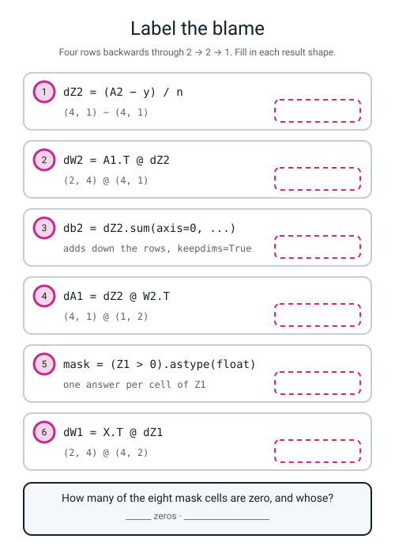
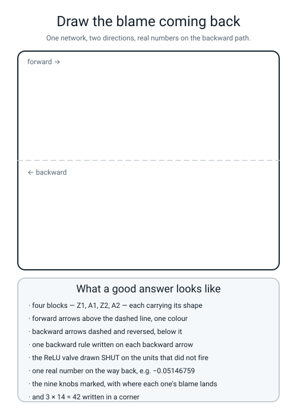

# Workbook — Week 18: Term 2 Checkpoint — How Much Did Each Knob Contribute?

**Name:** ________________________________  **Date:** ______________

[⬅ Week 17](week-17.md) · [📖 Read the chapter first](../student-guide/week-18.md) · [Course Home](../README.md) · [Next ➡](week-19.md)

---

## ✅ Warm-Up (5 min)

Five quick questions about **last week** — a layer is a grid times a grid.

**W1.** The shape rule, in eight words: ______________________________________________

**W2.** `(3,1) @ (1,3)` and `(1,3) @ (3,1)` are both legal. **How many numbers does each answer hold?** ______ and ______

**W3.** A bias for **four** hidden units must be shaped ____________ . **What goes wrong, and what does *not* go wrong, if you shape it `(n, 1)` instead?**

________________________________________________________________

**W4.** You see `ValueError: matmul: ... (size 4 is different from 2)`. **Where in the message do you look, and what are you looking for?**

________________________________________________________________

**W5.** `np.allclose(mine, theirs)` says `False`. **What is the very next line you type, and what are the two answers you are hoping to tell apart?**

next line: ______________________  a gap of `1e-16` means ____________  a gap of `0.05` means ____________

---

## 🔢 Do the Maths by Hand

**Calculator only. No code on this page.** The new maths is *slopes multiply along a chain*, so M1 and M2 measure chains, and M3 and M4 are the arithmetic backprop is made of.

### M1 — a two-stage chain, measured two ways

```
w  ──[ stage 1: z = 4w − 3 ]──▶  z  ──[ stage 2: L = z × z ]──▶  L
```

**Start at `w = 2`.** Then `z = 4(2) − 3 = ` ______ and `L = ` ______ × ______ ` = ` ______ .

**Step 1 — stage 1 on its own.** Nudge `w` a thousandth each way. **Stage 2 does not exist for this measurement.**

```
w = 2.001  →  z = 4(2.001) − 3 = ____________
w = 1.999  →  z = 4(1.999) − 3 = ____________

z moved:  ____________ − ____________ = ____________
w moved:  0.002

____________ ÷ 0.002 = ____________
```

**Step 2 — stage 2 on its own.** You are standing at `z = ` ______ . Nudge `z`, not `w`.

```
z = ______.001  →  L = ____________
z = ______.999  →  L = ____________

L moved:  ____________         z moved:  0.002

____________ ÷ 0.002 = ____________
```

**M1(a). Before you read on, commit to an answer.** Nudging `w` moves `z` ______ times as much. Nudging `z` moves `L` ______ times as much. **So nudging `w` moves `L`** ______ **times as much.**

**Step 3 — measure straight through, ignoring the middle entirely.**

```
w = 2.001  →  z = ____________  →  L = ____________
w = 1.999  →  z = ____________  →  L = ____________

L moved:  ____________ − ____________ = ____________
w moved:  0.002

____________ ÷ 0.002 = ____________
```

**M1(b).** Did your two answers agree? ______  Write the multiplication: ______ × ______ = ______

**M1(c).** Somebody says the answer should be `4 + 10 = 14`. **Give them the photocopier argument in one sentence.**

________________________________________________________________

### M2 — three stages, one of them quietening things down

```
w  ──[ z = 2w + 1 ]──▶  z  ──[ u = z × z ]──▶  u  ──[ L = u ÷ 5 ]──▶  L
```

**Start at `w = 1`:** `z = ` ______ , `u = ` ______ , `L = ` ______ .

| stage | nudge it either way | the two answers | slope |
|---|---|---|---|
| 1 | `w` from 1.001 to 0.999 | ____________ / ____________ | ____________ |
| 2 | `z` from ______ to ______ | ____________ / ____________ | ____________ |
| 3 | `u` from ______ to ______ | ____________ / ____________ | ____________ |

**M2(a).** Multiply all three: ______ × ______ × ______ = ______

**M2(b).** Now straight through:

```
L(w = 1.001) = ____________     L(w = 0.999) = ____________

(____________ − ____________) ÷ 0.002 = ____________
```

**M2(c).** Stage 3's slope is **below 1**. Is that a problem? ______ **What does a stage with a slope below 1 do to whatever passes through it, and what happens if you stack five of them?**

________________________________________________________________

**M2(d).** `1 ÷ 5 = 0.2`, and stage 3's slope was `0.2`. **Why is that not a coincidence?**

________________________________________________________________

### M3 — nine numbers, for one row

**This week's network.** Two inputs, two hidden units with ReLU, one output with sigmoid.

```
W1 = [ 0.6  -0.4 ]      b1 = [ 0.2  -0.1 ]
     [ 0.5   0.9 ]

W2 = [  1.5 ]           b2 = [ -0.2 ]
     [ -1.0 ]
```

**Row 1 on its own:** `x = [1.0, 1.0]`, `y = 1`. **One row, so `n = 1` and there is no dividing.**

**Forward:**

```
z1 = 1.0(0.6) + 1.0(0.5) + 0.2   = ____ + ____ + ____ = ____________
z2 = 1.0(−0.4) + 1.0(0.9) − 0.1  = ____ + ____ + ____ = ____________

both positive, so A1 = [ ____________ , ____________ ]

Z2 = ____ (1.5) + ____ (−1.0) − 0.2 = ____________

A2 = sigmoid(Z2) = 1 ÷ (1 + e^(−____)) = 1 ÷ ____________ = ____________

loss = −ln(____________) = ____________
```

**Backward — every single one of these is a multiplication.**

```
step 1 — blame at the output:
   dZ2 = A2 − y = ____________ − 1 = ____________

step 2 — the output weights (blame × the input that fed them):
   dW2[0] = ____________ × ____________ = ____________
   dW2[1] = ____________ × ____________ = ____________
   db2    = ____________

step 3 — push the blame back (blame × the weight it travelled through):
   dA1[0] = ____________ × 1.5    = ____________
   dA1[1] = ____________ × (−1.0) = ____________

step 4 — through the ReLU valve. Both z positive, so the mask is [ ____ , ____ ]:
   dZ1 = [ ____________ , ____________ ]

step 5 — the hidden weights (input × blame):
   dW1[0][0] = 1.0 × ____________ = ____________
   dW1[0][1] = 1.0 × ____________ = ____________
   dW1[1][0] = 1.0 × ____________ = ____________
   dW1[1][1] = 1.0 × ____________ = ____________
```

**M3(a).** `dW1`'s two rows are **identical**. Why, and would that still be true for the row `x = [2.0, 0.0]`?

________________________________________________________________

**M3(b).** `dA1[1]` came out **positive** while `dZ2` was negative. Explain in one sentence.

________________________________________________________________

**M3(c).** Which hidden unit gets the bigger correction to its output weight, and what decided that? ____________________

**M3(d).** Do the shape check, from memory:

| knob | shape | its gradient | shape |
|---|---|---|---|
| `W1` | ____________ | `dW1` | ____________ |
| `b1` | ____________ | `db1` | ____________ |
| `W2` | ____________ | `dW2` | ____________ |
| `b2` | ____________ | `db2` | ____________ |

**Four for four?** ______

### M4 — score the agreement

> **relative error** — `|num − ana| ÷ (|num| + |ana|)`. **Below `1e-6` means "the same number".**

For each pair, do the division and say whether it passes.

| # | by nudging | by hand | `|num − ana|` | `|num| + |ana|` | relative error | pass? |
|:--:|---|---|---|---|---|:--:|
| a | 0.25000000 | 1.00000000 | ______ | ______ | ____________ | |
| b | 0.30000000 | −0.30000000 | ______ | ______ | ____________ | |
| c | 0.04744046 | 0.04744050 | ______ | ______ | ____________ | |
| d | 0.00201357 | 0.00201358 | ______ | ______ | ____________ | |

**M4(a).** Row b's relative error is exactly `1.00`. **What must be true of two numbers for that to happen?**

________________________________________________________________

**M4(b).** Rows c and d differ by about the **same tiny amount** — four hundred-millionths against one hundred-millionth — and yet one passes and one fails. **Why?**

________________________________________________________________

**M4(c).** Row a's `6.00e-01` is a fingerprint you will meet in the Puzzle. `1.00 ÷ 0.25 = ` ______ , so the hand answer was ______ times too big. **Work out why a `4×` overshoot always gives exactly `0.6`:**

`3 ÷ 5 = ` ______

**M4(d).** Why is the score a **relative** error rather than just the difference? One sentence.

________________________________________________________________

---

## 🔎 Predict the Output

**Write your prediction in pen before you run anything.** Every snippet starts with `import numpy as np`. **One of these four prints a number with a minus sign in front of a zero.**

### P1 — the valve, twice

```python
Z1 = np.array([[1.3, 0.4], [1.4, -0.9], [-0.3, -1.0], [0.6, 2.1]])
print(Z1 > 0)
print((Z1 > 0).astype(float))
print((Z1 > 0).astype(float).sum())
```

**I predict:** a grid of ______________________ , then a grid of ______________________ , then ______

**It really printed:**

```text
________________________________
________________________________
________________________________
________________________________
________________________________
________________________________
________________________________
________________________________
________________________________
```

**How many of the eight cells are zero?** ______  **Which rows and units are they, and what did those units do going forwards?**

________________________________________________________________

### P2 — where the transposes land (shape prediction)

```python
A1 = np.zeros((4, 2)); dZ2 = np.zeros((4, 1)); W2 = np.zeros((2, 1))
print((A1.T @ dZ2).shape)
print((dZ2 @ W2.T).shape)
print(dZ2.sum(axis=0, keepdims=True).shape)
print(dZ2.sum(axis=0).shape)
```

**I predict:** ____________  ____________  ____________  ____________

**It really printed:**

```text
________________________________
________________________________
________________________________
________________________________
```

**Line 1 is the shape of which knob's gradient?** ______  **Line 2?** ______

**Lines 3 and 4 add up exactly the same four numbers. One of them is the shape of `b2`'s gradient and one is not. Which, and why does it matter?**

________________________________________________________________

### P3 — a minus sign in front of nothing

```python
np.set_printoptions(precision=6, suppress=True)
a = np.array([[-0.5, 0.25]])
m = np.array([[0.0, 1.0]])
print(a * m)
print((a * m)[0, 0] == 0.0)
```

**I predict:** ____________________  ____________

**It really printed:**

```text
________________________________
________________________________
```

**Line 1 has something odd in it. What, and what causes it?**

________________________________________________________________

**Line 2 tells you whether it matters. Does it?** ______

### P4 — slopes multiplying, in floating point

```python
h = 0.001
s1 = lambda w: 4 * w - 3
s2 = lambda z: z * z
one = (s1(2 + h) - s1(2 - h)) / (2 * h)
two = (s2(5 + h) - s2(5 - h)) / (2 * h)
both = (s2(s1(2 + h)) - s2(s1(2 - h))) / (2 * h)
print(round(one, 6), round(two, 6))
print(round(one * two, 6))
print(round(both, 6))
print(one * two == both)
```

**I predict:** ____________  ____________  ____________  ____________

**It really printed:**

```text
________________________________
________________________________
________________________________
________________________________
```

**Line 4 is the surprise. The first three lines agree perfectly and line 4 says otherwise. Explain, and say whether the chain rule is in trouble.**

________________________________________________________________

________________________________________________________________

**How many of the answers on this page did you get right?** ______ / 14

**Which one surprised you most?** ______________________________

---

## ✍️ Practice Set A — Read It

**A1. Match the word to the thing.** Write the letter.

| Word | | Description |
|---|---|---|
| **backpropagation** | ______ | (i) Nudge one knob a millionth each way, recompute the loss, divide, compare |
| **chain rule** | ______ | (ii) Start each weight random from a bell curve with spread `sqrt(2 ÷ n_inputs)` |
| **gradient check** | ______ | (iii) Working out every weight's share of the error by walking backwards from the loss |
| **relative error** | ______ | (iv) Making sure hidden units start out *different*, so they can learn different things |
| **He initialization** | ______ | (v) If `a` affects `b` and `b` affects `c`, the two slopes **multiply** |
| **symmetry breaking** | ______ | (vi) How far apart two numbers are as a fraction of their size. Below `1e-6` is "the same" |

**A2. Read the printout.** A real backward sweep through this week's 2 → 2 → 1 network, four rows.

```text
A1 (4, 2)
[[1.3 0.4]
 [1.4 0. ]
 [0.  0. ]
 [0.6 2.1]]
A2 (4, 1)
[[0.79413 ]
 [0.869892]
 [0.450166]
 [0.197816]]
loss = 0.297113

dZ2 (4, 1)
[[-0.051468]
 [-0.032527]
 [ 0.112542]
 [ 0.049454]]
mask
[[1. 1.]
 [1. 0.]
 [0. 0.]
 [1. 1.]]
dW1 (2, 2)
[[-0.248964  0.100922]
 [ 0.071161 -0.04744 ]]
db1 (1, 2)
[[-0.051811  0.002014]]
dW2 (2, 1)
[[-0.082773]
 [ 0.083266]]
db2 (1, 1)
[[0.078001]]
```

| Question | Your answer |
|---|---|
| a. The four labels were `1, 1, 0, 0`. Which two `dZ2` entries are negative, and what does a negative blame mean? | |
| b. How many knobs has this network, and where are they on the printout? | |
| c. Row 3 of `A1` is `[0, 0]`. What produced this row's answer of `0.450166`? | |
| d. How many of the eight mask cells are zero? | |
| e. `dZ2` has been divided by something. By what, and how can you tell it was done? | |
| f. Check all four gradient shapes against their knobs. Do they match? | |

**A2(g).** Row 3's loss is the biggest of the four. **Work it out and say why it is the worst:**

`−ln(1 − ____________) = ` ____________

**A2(h).** `db2` is `0.078001` and `dZ2`'s four entries are `−0.051468, −0.032527, 0.112542, 0.049454`. **Show the arithmetic that connects them**, and say which backward rule that is.

```
____________ + ____________ + ____________ + ____________ = ____________
```

rule: ______________________________

**A3. Spot the bug.** Each line is wrong or misleading. Say what happens and write the fix.

| # | The line | What happens | The fix |
|---|---|---|---|
| a | `dW2 = A1 @ dZ2` | | |
| b | `mask = (Z1 > 0).astype(float).T` then `dA1 * mask` | | |
| c | `dZ1 = dA1 @ mask` | | |
| d | `db1 = dZ1.sum(axis=0)` | | |
| e | `dZ2 = A2 - y` with a batch of four | | |
| f | `dZ1 = dA1` (the mask left out entirely) | | |

**A3(g).** **Three** of those six produce no error at all. Which three? ______ , ______ and ______  **Which of the three would a gradient check NOT catch?** ______

**A4. Match the code to the output.** Five of each, no output used twice. Assume `import numpy as np` above each.

| | Code |
|---|---|
| i | `print((np.zeros((4,2)).T @ np.zeros((4,1))).shape)` |
| ii | `print((np.zeros((4,1)) @ np.zeros((2,1)).T).shape)` |
| iii | `print(np.zeros((4,1)).sum(axis=0, keepdims=True).shape)` |
| iv | `print((np.array([[2.2, 0.15]]) > 0).astype(float))` |
| v | `print(np.array([[-0.5]]) * np.array([[0.0]]))` |

| | Output |
|---|---|
| P | `(4, 2)` |
| Q | `[[-0.]]` |
| R | `(2, 1)` |
| S | `[[1. 1.]]` |
| T | `(1, 1)` |

**Your answers:** i → ______  ii → ______  iii → ______  iv → ______  v → ______

**A4(f).** Outputs `P` and `R` are the shapes of two different gradients. Name both, and say which knob each belongs to.

________________________________________________________________

**A5. Label the blame.** Fill in every empty box in the figure, then answer the question in the panel underneath.


*Figure W18.1 — Six lines of a backward sweep with their result shapes removed. Four rows, backwards through 2 → 2 → 1.*

**A5(a).** Four of the six boxes are the shape of a **knob's** gradient or an **activation's** gradient. Sort them:

shapes of knobs' gradients: ____________________  shapes of activations' gradients: ____________________

**A5(b).** Which line uses `*` rather than `@`, and what would happen if you typed `@`?

________________________________________________________________

**A6. Say the sentence.** Finish each one so it is true and complete.

**a)** Slopes ______________________ along a chain, not ______________________ . The measurement is `3 × 14 = ` ______ and `0.084 ÷ 0.002 = ` ______ .

**b)** The most useful sentence of the term: **a gradient always has** ______________________________________________ .

**c)** The blame at the output of a sigmoid scored with log loss is ____________ , shared over ____________ .

**d)** A weight's blame is ______________________ times ______________________ .

**e)** If the valve was ____________ going forwards, ______________________ comes back through it.

**f)** A gradient check proves your ______________________ agrees with your ______________________ . It says **nothing** about ______________________ .

**g)** All-zero weights never learn because `(0 > 0)` is ____________ , so the mask is ______________________ , so every hidden gradient is ____________ , and the loss parks on ____________ for ever.

---

## ✍️ Practice Set B — Write It

### B1 — one line, plus the mask

**Task:** build this week's `Z1` and print the ReLU mask as `1.0`s and `0.0`s.

**Expected output:**

```text
[[1. 1.]
 [1. 0.]
 [0. 0.]
 [1. 1.]]
```

**Done looks like:** three zeros, and you can point at the three negative numbers in `Z1` that caused them.

```python
import numpy as np

Z1 = np.array([[1.3, 0.4], [1.4, -0.9], [-0.3, -1.0], [0.6, 2.1]])
print(____________________________________________________________)
```

### B2 — the blame at the output, four lines

**Task:** given this week's `A2` and `y`, compute `dZ2` for a batch of four and print it with its shape.

**Expected output:**

```text
dZ2 (4, 1)
[[-0.051468]
 [-0.032527]
 [ 0.112542]
 [ 0.049454]]
```

**Done looks like:** the `/ n` is there, and `n` came from `X.shape[0]` or was written as `4.0` — **not** left out.

```python
import numpy as np
np.set_printoptions(precision=6, suppress=True)

A2 = np.array([[0.79412963], [0.86989153], [0.45016600], [0.19781611]])
y  = ______________________________________________________________
n  = ______________________________________________________________

dZ2 = ____________________________________________________________
print("dZ2", ____________); print(______)
```

**B2(a).** Two entries are negative and two are positive. **What single thing decides the sign?**

________________________________________________________________

### B3 — the gradient shape ladder

**Task:** using grids of zeros only — no real numbers at all — print the shape of all seven quantities in a backward sweep for a batch of four through 2 → 2 → 1.

**Expected output:**

```text
dZ2   (4, 1)
dW2   (2, 1)
db2   (1, 1)
dA1   (4, 2)
dZ1   (4, 2)
dW1   (2, 2)
db1   (1, 2)
```

**Done looks like:** you got all seven right **without computing a single real number.** Shapes are checkable on their own, and that is the point.

```python
import numpy as np

X = np.zeros((4, 2)); A1 = np.zeros((4, 2))
dZ2 = np.zeros((4, 1)); W2 = np.zeros((2, 1))

dW2 = ______________________________________________________________
db2 = ______________________________________________________________
dA1 = ______________________________________________________________
dZ1 = dA1 * np.ones((4, 2))
dW1 = ______________________________________________________________
db1 = ______________________________________________________________

for name, arr in [("dZ2", dZ2), ("dW2", dW2), ("db2", db2), ("dA1", dA1),
                  ("dZ1", dZ1), ("dW1", dW1), ("db1", db1)]:
    print("%-5s %s" % (name, ____________))
```

### B4 — a chain of your own, measured two ways

**Task:** write `chain18.py` for a **new** chain — `z = 6w + 2`, then `L = z × z` — at `w = 1`. Measure each stage, multiply, measure straight through, and print the difference to ten decimal places.

**Expected output:**

```text
z = 8.0  L = 64.0
stage 1 = 6.000000
stage 2 = 16.000000
product = 96.000000
straight through = 96.000000
difference = 0.0000000000
```

**Done looks like:** **`difference = 0.0000000000`**, and you can say where the `16` came from without running anything. (`z` is `8`, and the slope of `z × z` at `8` is…)

```python
import numpy as np

h = 0.001
f = lambda w: ______________________________________________________
g = lambda z: ______________________________________________________

print("z =", f(1.0), " L =", g(f(1.0)))
s1 = ______________________________________________________________
s2 = ______________________________________________________________
st = ______________________________________________________________
print("stage 1 = %.6f" % s1)
print("stage 2 = %.6f" % s2)
print("product = %.6f" % (s1 * s2))
print("straight through = %.6f" % st)
print("difference = %.10f" % ____________________)
```

### B5 — a whole program of your own, about 25 lines

**Task:** write `b5w18.py` — a gradient check on **all four entries of `dW1`**, from scratch. It must:

1. hold this week's `W1`, `b1`, `W2`, `b2`, `X`, `y` and `n = X.shape[0]`
2. define a function `batch_loss(W1)` that does the whole forward pass and returns one number
3. compute `dZ1` and `dW1` with the chain — **mask included**
4. use `eps = 1e-6` and loop over `i` and `j`
5. for each entry: copy `W1`, add `eps`, copy again, subtract `eps`, and divide the two losses' difference by `2 * eps`
6. print a four-column table: knob, by hand, by nudging, relative error in scientific notation
7. print the worst relative error and whether all four are below `1e-6`

**Expected output:**

```text
knob             by hand     by nudging relative error
dW1[0,0]     -0.24896379    -0.24896379       2.96e-11
dW1[0,1]      0.10092162     0.10092162       2.76e-10
dW1[1,0]      0.07116069     0.07116069       2.99e-10
dW1[1,1]     -0.04744046    -0.04744046       1.04e-10

worst relative error: 2.99e-10
all four below 1e-6? True
```

**Done looks like:** **`.copy()` is there.** Without it, `up` and `dn` are two names for the same grid as `W1`, so the `+ eps` and `- eps` land on the same numbers and cancel.

> **💡 Try this:** change `eps` to `0.1` and re-run, then to `1e-11`. **At `0.1` the errors climb to around `1e-3`** — the nudge is no longer local, so it measures the average steepness across a stretch of curve. **At `1e-11` they climb again, for the opposite reason:** the two losses round to almost the same number and the subtraction is mostly noise. `1e-6` sits between the two walls, and now you have seen both. **Paste all three tables and compare which knob is worst in each.**

---

## 🐞 Fix the Broken Program

This program has **three** bugs: one **shape** bug, one **runtime** bug, and one **silent logic** bug. The real error messages are below, in the order you meet them.

```python
"""broken18.py - all four gradient arrays for a 2 -> 2 -> 1 network. THREE bugs."""
import numpy as np

np.random.seed(0)
np.set_printoptions(precision=6, suppress=True)

W1 = np.array([[0.6, -0.4],
               [0.5, 0.9]])
b1 = np.array([[0.2, -0.1]])
W2 = np.array([[1.5],
               [-1.0]])
b2 = np.array([[-0.2]])

X = np.array([[1.0, 1.0],
              [2.0, 0.0],
              [0.0, -1.0],
              [-1.0, 2.0]])
y = np.array([[1.0], [1.0], [0.0], [0.0]])
n = X.shape[0]

sigmoid = lambda z: 1.0 / (1.0 + np.exp(-z))

Z1 = X @ W1 + b1
A1 = np.maximum(0, Z1)
Z2 = A1 @ W2 + b2
A2 = sigmoid(Z2)
loss = float(-(y * np.log(A2) + (1 - y) * np.log(1 - A2)).mean())
print("loss = %.6f" % loss)

dZ2 = A2 - y
print("A1", A1.shape, " dZ2", dZ2.shape)
dW2 = A1 @ dZ2
db2 = dZ2.sum(axis=0, keepdims=True)
dA1 = dZ2 @ W2.T
mask = (Z1 > 0).astype(float).T
dZ1 = dA1 * mask
dW1 = X.T @ dZ1
db1 = dZ1.sum(axis=0, keepdims=True)

print("dW1", dW1.shape); print(dW1)
print("db1", db1.shape); print(db1)
print("dW2", dW2.shape); print(dW2)
print("db2", db2.shape); print(db2)
```

**Run 1:**

```text
loss = 0.297113
A1 (4, 2)  dZ2 (4, 1)
Traceback (most recent call last):
  File "broken18.py", line 32, in <module>
    dW2 = A1 @ dZ2
ValueError: matmul: Input operand 1 has a mismatch in its core dimension 0, with gufunc signature (n?,k),(k,m?)->(n?,m?) (size 4 is different from 2)
```

**Bug 1.** Which line? ______  **Kind of bug?** ______________

**Do NOT go looking for where a `.T` belongs. Do this instead:**

**What shape must `dW2` be, and how do you know?** ____________ , because ______________________

**What two shapes have you got?** `A1` is ____________ and `dZ2` is ____________

**List the arrangements and their inner numbers:**

`A1 @ dZ2` → inner ______ and ______ ✗  ·  `A1.T @ dZ2` → inner ______ and ______ ______ , giving ____________

**The fix:** ______________________________

**Run 2 — after fixing bug 1:**

```text
loss = 0.297113
A1 (4, 2)  dZ2 (4, 1)
Traceback (most recent call last):
  File "broken18.py", line 36, in <module>
    dZ1 = dA1 * mask
ValueError: operands could not be broadcast together with shapes (4,2) (2,4) 
```

**Bug 2.** Which line? ______  **Kind of bug?** ______________

**This is a different *kind* of message from run 1. Which operator failed this time?** ______

**What shape must the mask be, and why exactly that shape?**

________________________________________________________________

**The fix:** ______________________________

**Run 3 — after fixing bugs 1 and 2. It runs all the way through, no error at all, and all four shapes are correct:**

```text
loss = 0.297113
A1 (4, 2)  dZ2 (4, 1)
dW1 (2, 2)
[[-0.995855  0.403686]
 [ 0.284643 -0.189762]]
db1 (1, 2)
[[-0.207244  0.008054]]
dW2 (2, 1)
[[-0.331094]
 [ 0.333066]]
db2 (1, 1)
[[0.312003]]
```

**Bug 3 is silent, and it is in one line near the top of the backward half.**

**Here is the gradient check for that run:**

```text
knob           my answer     by nudging relative error
dW1[0,0]     -0.99585515    -0.24896379       6.00e-01
dW1[0,1]      0.40368648     0.10092162       6.00e-01
dW1[1,0]      0.28464278     0.07116069       6.00e-01
dW1[1,1]     -0.18976185    -0.04744046       6.00e-01
db1[0,0]     -0.20724410    -0.05181103       6.00e-01
db1[0,1]      0.00805426     0.00201357       6.00e-01
dW2[0,0]     -0.33109368    -0.08277342       6.00e-01
dW2[1,0]      0.33306569     0.08326642       6.00e-01
db2[0,0]      0.31200327     0.07800082       6.00e-01
```

**Every single one is `6.00e-01`, identically. What does a fingerprint like that tell you?**

________________________________________________________________

**Divide one pair:** `−0.99585515 ÷ −0.24896379 = ` ______ **So every gradient is** ______ **times too big.**

**Which line?** ______  **What is missing?** ____________

**Why does the network still "work" with this bug, and what would make it catastrophic?**

________________________________________________________________

________________________________________________________________

**The fix:** ______________________________

**Run 4 — after fixing all three:**

```text
loss = 0.297113
A1 (4, 2)  dZ2 (4, 1)
dW1 (2, 2)
[[-0.248964  0.100922]
 [ 0.071161 -0.04744 ]]
db1 (1, 2)
[[-0.051811  0.002014]]
dW2 (2, 1)
[[-0.082773]
 [ 0.083266]]
db2 (1, 1)
[[0.078001]]
```

**Two questions, and they are the point of the page.**

**Bugs 1 and 2 both crashed. Bug 3 printed four correctly-shaped grids of wrong numbers, and `loss = 0.297113` was right in every single run. Explain why the loss was never affected.**

________________________________________________________________

________________________________________________________________

**Rank the three bugs by how much time each would cost you, and say what the only thing is that catches the third.**

________________________________________________________________

---

## 🧩 Puzzle of the Week

### Part 1 — The Photocopier Chain

Each stage of a chain **scales** whatever arrives at it. Stage slopes multiply.

**Part 1(a).** A three-stage chain with slopes `2`, `5` and `3`. **Overall slope?** ______

**Part 1(b).** A four-stage chain with slopes `0.5`, `0.5`, `0.5` and `0.5`. **Overall?** ______  **Is the signal arriving stronger or weaker?** ____________

**Part 1(c).** A three-stage chain whose overall slope is `42`. Stages 1 and 2 are `3` and `2`. **Stage 3?** ______

**Part 1(d).** A five-stage chain whose overall slope is `0`. Stages 1, 2, 4 and 5 are `3`, `7`, `2` and `9`. **Stage 3?** ______  **And what does a stage with that slope *do*?**

________________________________________________________________

**Part 1(e).** Five sigmoid layers, every one at sigmoid's absolute steepest. **Overall slope:**

`0.25 × 0.25 × 0.25 × 0.25 × 0.25 = ` ____________

**And five ReLU layers, all firing:** `1 × 1 × 1 × 1 × 1 = ` ______

**Part 1(f).** Now do it backwards. A twenty-stage chain, every stage `0.9`. **Overall slope to three decimal places:** ______  **And with every stage `1.1`:** ______

**Write the one-sentence moral about long chains:**

________________________________________________________________

### Part 2 — Fingerprint the Bug

Four gradient-check printouts from four broken programs. **Each bug has a signature. Name it.**

**Printout A:**

```text
dW1[0,0]      1.19156212     0.29789053       6.00e-01
dW1[0,1]      1.19950098     0.29987524       6.00e-01
dW1[1,0]     -1.03392762    -0.25848190       6.00e-01
dW1[1,1]      1.77654263     0.44413566       6.00e-01
dW2[0,0]     -0.21452452    -0.05363113       6.00e-01
db2[0,0]      0.66836516     0.16709129       6.00e-01
```

**The bug:** ______________________________  **The tell:** ______________________________

**Printout B:**

```text
dW1[0,0]     -0.24896379    -0.24896379       2.96e-11
dW1[0,1]      0.16597586     0.10092162       2.44e-01
dW1[1,0]     -0.09765156     0.07116069       1.00e+00
dW1[1,1]      0.06510104    -0.04744046       1.00e+00
db1[0,0]      0.11700123    -0.05181103       1.00e+00
db1[0,1]     -0.07800082     0.00201357       1.00e+00
dW2[0,0]     -0.08277342    -0.08277342       1.66e-10
dW2[1,0]      0.08326642     0.08326642       8.78e-11
db2[0,0]      0.07800082     0.07800082       2.33e-10
```

**The bug:** ______________________________  **The tell:** ______________________________

**Printout B(i).** **Four of those nine have a relative error of exactly `1.00e+00`. What is true of those four pairs?**

________________________________________________________________

**Printout B(ii).** `dW1[0,0]` **passed**, at `2.96e-11`, even though the same bug hit the same grid. **How is that possible?** *(Hint: look at `X` column 0 — it is `1, 2, 0, −1` — and at which mask cells are zero.)*

________________________________________________________________

**Printout C:**

```text
dW1[0,0]     -0.24896379    -0.24896474       1.91e-06
dW1[0,1]      0.10092162     0.10092205       2.12e-06
dW1[1,0]      0.07116069     0.07116252       1.28e-05
dW1[1,1]     -0.04744046    -0.04744261       2.26e-05
db1[0,0]     -0.05181103    -0.05181133       2.97e-06
db1[0,1]      0.00201357     0.00200950       1.01e-03
dW2[0,0]     -0.08277342    -0.08277268       4.49e-06
dW2[1,0]      0.08326642     0.08326673       1.83e-06
db2[0,0]      0.07800082     0.07800427       2.21e-05
```

**The bug:** ______________________________  **The tell:** ______________________________

**Printout C(i).** Nothing here is *dramatically* wrong — the two columns agree to about five figures everywhere. **Which knob is worst, and what does its being worst tell you about the direction of the mistake?**

________________________________________________________________

**Printout D:**

```text
dW1[0,0]     -0.24896379    -0.24896379       2.96e-11
db1[0,1]      0.00201357     0.00201357       6.26e-09
```

**The bug:** ______________________________  **The tell:** ______________________________

**Part 2(a).** One of those four printouts is not a bug at all. Which? ______

**Part 2(b).** In printout D, `db1[0,1]` has the worst error of the two — `6.26e-09` against `2.96e-11`, about **two hundred times** worse. **It is still fine. Why is it the worst, and what is special about that particular gradient?**

________________________________________________________________

**Part 2(c).** **Finish the rule.** *A check that fails on some layers and passes on others tells you* ______________________ ; *a check that fails on everything by the same amount tells you* ______________________ .

---

## 🤔 Think Deeper

**T1.** Forgetting the ReLU mask made `dW1[1,0]` come out as `−0.09765156` when the truth was `+0.07116069` — a relative error of exactly `1.00`, and **the wrong sign**. **Write a paragraph** on what happens to a network trained with a gradient of roughly the right size and the wrong sign, and argue why that is worse than a gradient that is simply four times too big. Would either one crash? Would either one show up in the loss curve?

________________________________________________________________

________________________________________________________________

________________________________________________________________

________________________________________________________________

________________________________________________________________

**T2.** You gradient-checked **nine** knobs and it took a fraction of a second. A real model has sixteen million, and checking them all would need thirty-two million forward passes. **Write a paragraph** on what a professional actually does instead — and be precise about what the word "verified" can honestly mean at that scale. Is a check on a tiny version of the same code a proof about the big one, or only evidence?

________________________________________________________________

________________________________________________________________

________________________________________________________________

________________________________________________________________

________________________________________________________________

---

## 🛠️ Build It — The Reflection, the Four Arrays, and the Nine Checks

**Three parts. The first is the one that gets skipped and the one your teacher will actually read.**

### Part A — the Term 2 reflection sheet

**Honest answers, not tidy ones. Nobody has ever lost a mark for admitting something.**

**1. Term 2 in five numbers.** Each of these came from a different week. Say what each one is and which week it is from.

| number | what it is | week |
|---|---|---|
| `−6` | | |
| `0.8022` | | |
| `0.2204` and `1.6204` | | |
| `9.00 → 5.76` | | |
| `(4, 3)` | | |

**2. The thing that clicked.** Name one idea from Weeks 10–18 that you did not understand when you first met it and now do. **What made the difference — a number, a figure, an error message, or somebody saying it differently?**

________________________________________________________________

________________________________________________________________

**3. The thing that has not clicked yet.** *This is the question that matters.* Which week did you not really understand at the time — and do you understand it now?

________________________________________________________________

________________________________________________________________

________________________________________________________________

**4. Your own bug.** Pick the single worst bug you have had this term. Write what you saw, what it actually was, and how long it took.

| what I saw | what it actually was | how long it took me |
|---|---|---|
| | | |

**And the follow-up:** **what would have caught it in one minute?**

________________________________________________________________

### Part B — all four gradient arrays, by hand

**The network, the batch and the labels.** Nothing here appeared in the chapter, so there is nothing to copy.

```
W1 = [ 0.6  -0.4 ]      b1 = [ 0.2  -0.1 ]
     [ 0.5   0.9 ]

W2 = [  1.5 ]           b2 = [ -0.2 ]
     [ -1.0 ]

X = [  1.0   1.0 ]      y = [ 1 ]
    [  2.0   0.0 ]          [ 1 ]
    [  0.0  -1.0 ]          [ 0 ]
    [ -1.0   2.0 ]          [ 0 ]
```

- [ ] **1.** Forward: `Z1`, `A1`, `Z2`, `A2`, and the four per-row losses and their average.
- [ ] **2.** Write the **shape** beside every single grid. A correct grid with no shape beside it is half a mark.
- [ ] **3.** `dZ2 = (A2 − y) ÷ 4`, all four entries.
- [ ] **4.** Write the **mask out as a grid of 1s and 0s.** If it is not on your page, `dW1` will be wrong.
- [ ] **5.** `dW2`, `db2`, `dA1`, `dZ1`, `dW1`, `db1` — with shapes.
- [ ] **6.** Do the shape check: four knobs, four gradients, four ticks.
- [ ] **7.** Work out `dW2[0]` in full — four multiplications and an addition.

**Forward:**

| row | `Z1` | `A1` | `Z2` | `A2` | this row's loss |
|---|---|---|---|---|---|
| `[1.0, 1.0]` | | | | | |
| `[2.0, 0.0]` | | | | | |
| `[0.0, −1.0]` | | | | | |
| `[−1.0, 2.0]` | | | | | |

shapes: `Z1` ______  `A1` ______  `Z2` ______  `A2` ______

**Batch loss:** `( ______ + ______ + ______ + ______ ) ÷ 4 = ` ______

**The mask**, shape ______ :

```
[ ____  ____ ]
[ ____  ____ ]
[ ____  ____ ]
[ ____  ____ ]
```

**How many zeros?** ______  **One whole row of the mask is zero. Which, and what does that mean about that row of data?**

________________________________________________________________

**Backward:**

```
dZ2  ( ____ , ____ ) = [ ________ , ________ , ________ , ________ ]

dW2  ( ____ , ____ ) = [ ________ ]        db2  ( ____ , ____ ) = [ ________ ]
                       [ ________ ]

dZ1  ( ____ , ____ ) = [ ________  ________ ]
                       [ ________  ________ ]
                       [ ________  ________ ]
                       [ ________  ________ ]

dW1  ( ____ , ____ ) = [ ________  ________ ]    db1 ( ____ , ____ ) = [ ________  ________ ]
                       [ ________  ________ ]
```

**The shape check:**

| knob | shape | gradient | shape | ✓ |
|---|---|---|---|:--:|
| `W1` | | `dW1` | | |
| `b1` | | `db1` | | |
| `W2` | | `dW2` | | |
| `b2` | | `db2` | | |

**`dW2[0]` in full:**

```
   ______ × ____________ = ____________
   ______ × ____________ = ____________
   ______ × ____________ = ____________
   ______ × ____________ = ____________
   total                 = ____________
```

**One of those four lines is exactly zero. Which, and why?**

________________________________________________________________

### Part C — the gradient check, all nine knobs

**Run your checker and paste the nine relative errors verbatim, in scientific notation.** *"They all passed"* is not a result.

| knob | by hand | by nudging | relative error | below `1e-6`? |
|---|---|---|---|:--:|
| `dW1[0,0]` | | | | |
| `dW1[0,1]` | | | | |
| `dW1[1,0]` | | | | |
| `dW1[1,1]` | | | | |
| `db1[0,0]` | | | | |
| `db1[0,1]` | | | | |
| `dW2[0,0]` | | | | |
| `dW2[1,0]` | | | | |
| `db2[0,0]` | | | | |

**Worst relative error anywhere:** ____________  **All nine below `1e-6`?** ______

**Which knob is the worst, and what is unusual about its gradient?** ______________________

**And if one of yours is NOT below `1e-6` — do not report that it is broken. Find your own slip and write down where it was.** A sentence like *"my `dZ1` row 2 second entry should have been 0 because that unit's `z` was `−0.9`; once I zeroed it the relative error went from `0.24` to `3e-10`"* is worth more than nine passing numbers.

**My slip, if I had one:**

________________________________________________________________

________________________________________________________________

### Stretch — break your own backward pass on purpose

Delete the mask, run the check. Put it back, delete the `÷ n`, run the check. **Paste both.**

| what I broke | the pattern of relative errors | how I would recognise it next time |
|---|---|---|
| mask deleted | | |
| `÷ n` deleted | | |

**The two bugs have two different fingerprints. Write both in one line each.**

________________________________________________________________

________________________________________________________________

### The Bug Log

| What I saw | What it means | Cause | Fix |
|---|---|---|---|
| | | | |
| | | | |
| | | | |

---

## 🎨 Draw It

Draw **the blame coming back** — one network, forward in one colour and backward in another, over the same wires.


*Figure W18.2 — An empty frame split into a forward half and a backward half, and what a good answer contains.*

**Then answer four things about your own drawing:**

**How many blocks did you draw, and does each carry a shape?** ______________________

**What is written on your backward arrows — names, or rules?** ______________________

**Which real number did you put on the backward path?** ______________________

**Where on your drawing is a ReLU valve shut, and what did you draw arriving at it from the right?**

________________________________________________________________

---

## 📊 Self-Check

| I can... | 😀 | 🙂 | 😕 |
|---|---|---|---|
| measure the slope of one stage of a chain by nudging, with no calculus | | | |
| measure a two-stage chain both ways and show the product equals the whole | | | |
| say why slopes multiply rather than add, with the photocopier argument | | | |
| compute all four gradient arrays for a 2 → 2 → 1 network by hand | | | |
| write the ReLU mask as a grid of 1s and 0s and say which units it silenced | | | |
| place every `.T` by writing down the shape I need first | | | |
| gradient-check a knob and get a relative error below `1e-6` | | | |
| read a failing check and say **which** bug it is from the pattern alone | | | |
| explain why a wrong gradient usually does not crash | | | |
| explain why all-zero weights never learn, and what `−ln(0.5)` is | | | |
| say what a gradient check does **not** prove | | | |

**The one thing I would ask about if I could ask one question:**

________________________________________________________________

---

## ✅ Answers

<details>
<summary>Check your answers</summary>

### Warm-Up

**W1.** **Inner two must match, outer two survive.**

**W2.** `(3,1) @ (1,3)` holds **nine**; `(1,3) @ (3,1)` holds **one**. Same two grids, opposite order, and not even the same size answer.

**W3.** It must be **`(1, 4)`**. Shaped `(n, 1)` instead, **nothing goes wrong visibly**: it broadcasts legally, there is no error, and the shape of the answer is exactly right. **What goes wrong is the meaning** — every row gets its own bias instead of every unit getting its own.

**W4.** **The last line, then the bracket at the end of it, then the two numbers inside the bracket.** You are looking for the two shapes' **inner** numbers, and which grid each belongs to. Everything in the middle of the message is numpy naming its own internal machinery and you may ignore it.

**W5.** Next line: **`np.abs(mine - theirs).max()`**. A gap of `1e-16` means **floating-point rounding — the same number**. A gap of `0.05` means **a genuinely wrong number: a typo, a dropped bias or a sign.**

### Do the Maths by Hand

**M1.** At `w = 2`: `z = 4(2) − 3 = **5**` and `L = 5 × 5 = **25**`.

**Step 1 — stage 1:**

```
w = 2.001  →  z = 4(2.001) − 3 = 8.004 − 3 = 5.004000
w = 1.999  →  z = 4(1.999) − 3 = 7.996 − 3 = 4.996000

z moved:  5.004000 − 4.996000 = 0.008
w moved:  0.002

0.008 ÷ 0.002 = 4.000000
```

**Step 2 — stage 2, standing at `z = 5`:**

```
z = 5.001  →  L = 5.001 × 5.001 = 25.010001
z = 4.999  →  L = 4.999 × 4.999 = 24.990001

L moved:  0.020000        z moved: 0.002

0.020000 ÷ 0.002 = 10.000000
```

**M1(a).** `z` moves **4** times as much; `L` moves **10** times as much; so `L` moves **40** times as much. *(If you wrote 14, read M1(c) and then Trick 1 in the chapter. It is not a silly answer — it is what you get if you think of the stages as adding effort rather than scaling a signal.)*

**Step 3 — straight through:**

```
w = 2.001  →  z = 5.004000  →  L = 25.040016
w = 1.999  →  z = 4.996000  →  L = 24.960016

L moved:  25.040016 − 24.960016 = 0.080000
w moved:  0.002

0.080000 ÷ 0.002 = 40.000000
```

**M1(b).** **They agree.** `4 × 10 = 40`. Real output from `chain18.py`-style code prints the difference as `0.0000000000`.

**M1(c).** *"A photocopier that enlarges 4× followed by one that enlarges 10× turns 1 cm into 40 cm, not 14 cm — each stage **scales** what arrives at it, and scalings compose by multiplying."*

**M2.** At `w = 1`: `z = 3`, `u = 9`, `L = 9 ÷ 5 = **1.8**`.

| stage | the two answers | slope |
|---|---|---|
| 1 | `z(1.001) = 3.002000`, `z(0.999) = 2.998000` | `0.004 ÷ 0.002 = ` **2.000000** |
| 2 | `u(3.001) = 9.006001`, `u(2.999) = 8.994001` | `0.012 ÷ 0.002 = ` **6.000000** |
| 3 | `L(9.001) = 1.800200`, `L(8.999) = 1.799800` | `0.0004 ÷ 0.002 = ` **0.200000** |

**M2(a).** `2 × 6 × 0.2 = **2.400000**`

**M2(b).**

```
L(w = 1.001) = 1.802401     L(w = 0.999) = 1.797601

(1.802401 − 1.797601) ÷ 0.002 = 0.004800 ÷ 0.002 = 2.400000
```

**Both `2.400000`**, and the real run prints the difference as `0.0000000000`. **Three stages, three separate measurements, and multiplying them answers a question none of the three measured.**

**M2(c).** **Not a problem at all.** A slope below 1 is a stage that **quietens things down**: whatever wobble arrives, a smaller wobble leaves. Stack five of them and you get `0.2⁵ = 0.00032` — three ten-thousandths of the signal survives. **That is exactly Week 16's `0.25⁵` argument, and it is the reason sigmoid is not used in hidden layers.**

**M2(d).** Because **dividing by 5 *is* multiplying by 0.2**, and a straight-line stage has the same slope everywhere. `L = u ÷ 5` is a straight line of gradient `1/5`, so nudging `u` by anything at all moves `L` by a fifth of it. **The nudge just confirmed what the formula already said** — which is the whole point of checking.

**M3.** Forward:

```
z1 = 1.0(0.6) + 1.0(0.5) + 0.2  = 0.6 + 0.5 + 0.2  = 1.30
z2 = 1.0(−0.4) + 1.0(0.9) − 0.1 = −0.4 + 0.9 − 0.1 = 0.40

both positive, so A1 = [1.30, 0.40]

Z2 = 1.30(1.5) + 0.40(−1.0) − 0.2 = 1.95 − 0.40 − 0.20 = 1.35

A2 = sigmoid(1.35) = 1 ÷ (1 + e^(−1.35)) = 1 ÷ 1.259240 = 0.79412963

loss = −ln(0.79412963) = 0.23050857
```

Backward, real output:

```
step 1:  dZ2 = 0.79412963 − 1 = −0.20587037

step 2:  dW2[0] = 1.30 × (−0.20587037) = −0.26763148
         dW2[1] = 0.40 × (−0.20587037) = −0.08234815
         db2    = −0.20587037

step 3:  dA1[0] = (−0.20587037) × 1.5    = −0.30880556
         dA1[1] = (−0.20587037) × (−1.0) = +0.20587037

step 4:  mask = [1, 1],  so  dZ1 = [−0.30880556, +0.20587037]

step 5:  dW1[0][0] = 1.0 × (−0.30880556) = −0.30880556
         dW1[0][1] = 1.0 × (+0.20587037) = +0.20587037
         dW1[1][0] = 1.0 × (−0.30880556) = −0.30880556
         dW1[1][1] = 1.0 × (+0.20587037) = +0.20587037
```

**M3(a).** Because **both inputs are `1.0`**, and a weight's blame is *its input × the blame coming out of it*. Two identical inputs earn two identical corrections. **For `x = [2.0, 0.0]` it would not be true at all**: row 0 of `dW1` would be twice the blame and row 1 would be **exactly zero**, because an input of `0.0` cannot be blamed for anything.

**M3(b).** **Unit 2's weight into the output is negative (`−1.0`)**, so turning unit 2 **up** pushes the score **down**. We want the score up, so unit 2's slope points the opposite way to unit 1's. **A negative weight flips the direction of the blame, and the arithmetic did that reasoning for us.**

**M3(c).** **Unit 1**, because it was **louder** — `1.30` against `0.40` — and blame is `input × blame out`. `−0.268` against `−0.082`, about three times as much. **Loud units get blamed most. Nobody imposed that rule; it falls out of the multiplication.**

**M3(d).**

| knob | shape | gradient | shape |
|---|---|---|---|
| `W1` | **(2, 2)** | `dW1` | **(2, 2)** ✅ |
| `b1` | **(1, 2)** | `db1` | **(1, 2)** ✅ |
| `W2` | **(2, 1)** | `dW2` | **(2, 1)** ✅ |
| `b2` | **(1, 1)** | `db2` | **(1, 1)** ✅ |

**Four for four.** That check costs nothing and you should do it every single time.

**M4.**

| # | `|num − ana|` | `|num| + |ana|` | relative error | pass? |
|:--:|---|---|---|:--:|
| a | 0.75000000 | 1.25000000 | **6.000e-01** | ❌ |
| b | 0.60000000 | 0.60000000 | **1.000e+00** | ❌ |
| c | 0.00000004 | 0.09488096 | **4.216e-07** | ✅ |
| d | 0.00000001 | 0.00402715 | **2.483e-06** | ❌ |

**M4(a).** They must have **opposite signs and (here) equal size.** In general, a relative error of `1.00` happens when `|num − ana| = |num| + |ana|`, and that is only possible when one is positive and the other negative (or one of them is exactly zero). **A gradient with a relative error of 1 does not merely have the wrong size; it points the wrong way.**

**M4(b).** Because the score divides by the **size** of the numbers. Row c's gradients are about `0.047`; row d's are about `0.002` — **twenty-three times smaller.** The same absolute wobble is a much bigger *fraction* of a tiny number. **Tiny gradients are where floating-point noise shows up most**, which is why the worst relative error in a healthy check is almost always on the smallest gradient. *(And row d's `2.5e-6` is only just over the line, which in a real run would make you shrink `eps` rather than hunt for a bug.)*

**M4(c).** `1.00 ÷ 0.25 = **4**`, so the hand answer was **4** times too big. And in general, if `ana = 4 × num`, then

```
|num − 4num| ÷ (|num| + |4num|)  =  3num ÷ 5num  =  3 ÷ 5 = 0.6
```

**The `num` cancels**, which is why the fingerprint is *exactly* `6.00e-01` on every knob regardless of size. That is what makes it recognisable on sight.

**M4(d).** Because **a difference of `0.001` is catastrophic if the gradient is `0.002` and irrelevant if the gradient is `50,000`.** Dividing by the size makes one threshold mean the same thing for every knob in the network.

### Predict the Output

**P1.**

```text
[[ True  True]
 [ True False]
 [False False]
 [ True  True]]
[[1. 1.]
 [1. 0.]
 [0. 0.]
 [1. 1.]]
5.0
```

**Three of the eight cells are zero** — and note that the last line prints `5.0`, the number of cells that are **one**. The zeros are **row 2 unit 2** (`z = −0.9`) and **both units of row 3** (`z = −0.3` and `z = −1.0`). Going forwards, those units **did not fire at all** — ReLU silenced them — so no blame comes back through them.

**P2.**

```text
(2, 1)
(4, 2)
(1, 1)
(1,)
```

Line 1 is **`dW2`**'s shape — and `W2` is `(2, 1)`, so ✅. Line 2 is **`dA1`**'s shape — and `A1` is `(4, 2)`, so ✅.

**Lines 3 and 4 add up exactly the same four numbers.** `(1, 1)` is `db2`'s correct shape, because `b2` is `(1, 1)`. `(1,)` is flat, and **`b2` is not flat** — so the two shapes no longer match. Nothing breaks *today*, because the numbers are identical; it breaks next week, when you write `b2 -= lr * db2` and a `(1,)` broadcasts somewhere you did not intend. **A gradient has the shape of its knob.**

**P3.**

```text
[[-0.    0.25]]
True
```

**The odd thing is `-0.` — negative zero, with a minus sign.** It happens when a **negative** number is multiplied by `0.0`: `−0.5 × 0.0` keeps the sign and loses everything else. It appears constantly in `dZ1` printouts because the mask multiplies negative blames by zero.

**Does it matter?** **No.** Line 2 says `True`: negative zero is exactly equal to zero for every purpose. **It looks like a bug and is not one, and somebody always notices it.**

**P4.**

```text
4.0 10.0
40.0
40.0
False
```

**Line 4 is the surprise, and the chain rule is in no trouble whatsoever.** The three printed numbers are **rounded** to six places. Underneath, the actual values are

```
one       = 3.9999999999995595
two       = 10.00000000000334
one * two = 40.00000000000895
both      = 39.999999999995595
```

so the difference is about `1.3e-11`. **That is floating-point rounding, not a flaw in the chain rule.** These two chains are straight lines and a square, for which the thousandth-sized nudge is mathematically exact, so the leftover is rounding: each route subtracts nearly equal numbers and divides by `0.002`, and the two routes round slightly differently — so `==` on decimals says `False` for two numbers that agree to eleven decimal places. **This is exactly why `np.allclose` exists, and exactly why the gradient check scores a *relative error* instead of demanding equality.**

### Practice Set A

**A1.** backpropagation → **(iii)** · chain rule → **(v)** · gradient check → **(i)** · relative error → **(vi)** · He initialization → **(ii)** · symmetry breaking → **(iv)**

**A2.**

| Question | Answer |
|---|---|
| a | **Rows 1 and 2** (`−0.051468`, `−0.032527`). Their labels were `1` and the network said `0.794` and `0.870` — **less than the truth, so the score needs to go up.** A negative blame means "raise this" |
| b | **Nine.** Four in `W1`, two in `b1`, two in `W2`, one in `b2` — and the printout shows their gradients: `dW1` (4 numbers), `db1` (2), `dW2` (2), `db2` (1) |
| c | **Nothing but `b2`.** `A1` row 3 is `[0, 0]`, so `Z2 = 0(1.5) + 0(−1.0) + (−0.2) = −0.2`, and `sigmoid(−0.2) = 0.450166`. **The hidden layer had no opinion at all about that row** |
| d | **Three** |
| e | **By `n = 4`, the batch size.** You can tell because `A2 − y` for row 4 is `0.197816 − 0 = 0.197816`, and `dZ2` row 4 is `0.049454` — exactly a quarter of it |
| f | **Yes, four for four.** `dW1 (2,2)` = `W1 (2,2)`; `db1 (1,2)` = `b1 (1,2)`; `dW2 (2,1)` = `W2 (2,1)`; `db2 (1,1)` = `b2 (1,1)` |

**A2(g).** `−ln(1 − **0.450166**) = −ln(0.549834) = **0.598139**`. It is the worst because the label was `0` and the network said **45%** — it very nearly called it the wrong way, and it did so on a row where the hidden layer contributed nothing at all. *(Compare row 4: also label `0`, but it said `0.198`, and its loss is only `0.220417`.)*

**A2(h).**

```
−0.051468 + (−0.032527) + 0.112542 + 0.049454 = 0.078001
```

The rule: **"the bias is added to every row, so it collects blame from every row"** — `db2 = dZ2.sum(axis=0, keepdims=True)`.

**A3.**

| # | What happens | The fix |
|---|---|---|
| a | `ValueError: matmul: ... (size 4 is different from 2)`. Inner numbers 2 and 4 | `A1.T @ dZ2` — and find that by writing down that `dW2` must be `(2, 1)`, not by guessing |
| b | `ValueError: operands could not be broadcast together with shapes (4,2) (2,4)`. `*` is cell by cell, so both must be the same shape | drop the `.T`. **The mask must be exactly `Z1`'s shape** |
| c | `ValueError: matmul: ... (size 2 is different from 4)`. `@` would try to pair rows against columns | `*`, not `@`. **The mask is applied cell by cell** |
| d | **No error**, and the numbers are identical — but `db1` is now `(2,)` while `b1` is `(1, 2)` | `keepdims=True` |
| e | **No error.** Every gradient comes out four times too big; a learning rate of `0.1` behaves like `0.4` | `dZ2 = (A2 - y) / n` |
| f | **No error.** `dW1` and `db1` are wrong, `dW2` and `db2` are right, and nothing tells you | `dZ1 = dA1 * (Z1 > 0).astype(float)` |

**A3(g).** **d, e and f** run without error. The two that produce **wrong gradients** are **e and f**. A gradient check catches **both of them** — e at exactly `6.00e-01` everywhere, f at between `0.24` and `1.00` **on the hidden layer only.** *(And d is the one a gradient check would **not** catch, because the numbers are right; it is a shape bug that only bites next week.)*

**A4.** i → **R** · ii → **P** · iii → **T** · iv → **S** · v → **Q**

**A4(f).** **`R` is `(2, 1)` — the shape of `dW2`, which belongs to the knob `W2`.** **`P` is `(4, 2)` — the shape of `dA1`**, which belongs to `A1`, and `A1` is **not** a knob: it is an activation. **Every gradient has the shape of its thing, whether that thing is a knob you will turn or a value you were just passing through.**

**A5.** The six boxes, in order:

| # | line | result shape |
|---|---|---|
| 1 | `dZ2 = (A2 − y) / n` | **(4, 1)** |
| 2 | `dW2 = A1.T @ dZ2` | **(2, 1)** |
| 3 | `db2 = dZ2.sum(axis=0, keepdims=True)` | **(1, 1)** |
| 4 | `dA1 = dZ2 @ W2.T` | **(4, 2)** |
| 5 | `mask = (Z1 > 0).astype(float)` | **(4, 2)** |
| 6 | `dW1 = X.T @ dZ1` | **(2, 2)** |

And the panel: **three** of the eight mask cells are zero — **row 2 unit 2, and both units of row 3.**

**A5(a).** Shapes of **knobs'** gradients: **`dW2 (2,1)`, `db2 (1,1)`, `dW1 (2,2)`** *(and `db1 (1,2)`, which is not on the figure)*. Shapes of **activations'** gradients: **`dZ2 (4,1)`, `dA1 (4,2)`** *(and `dZ1`, the same shape as the mask)*. **The tell is the batch size**: anything with a `4` in it is per-row and belongs to the data; anything without a `4` belongs to the model.

**A5(b).** **Line 5's mask is used with `*`**, in `dZ1 = dA1 * mask`. If you typed `@` you would get `ValueError: matmul: ... (size 2 is different from 4)`, because `@` would try to pair `dA1`'s rows against the mask's columns instead of asking one question per cell. **The mask is a yes-or-no answer per cell, so it multiplies per cell.**

**A6.**

**a)** Slopes **multiply**, not **add**. `3 × 14 = **42**` and `0.084 ÷ 0.002 = **42**`.

**b)** **a gradient always has exactly the same shape as the thing it is the gradient of.**

**c)** **`A2 − y`** — how wrong the answer was — shared over **the batch** (divided by `n`).

**d)** A weight's blame is **its input** times **the blame that came out of it**.

**e)** If the valve was **shut** going forwards, **no blame at all** comes back through it.

**f)** A gradient check proves your **backward pass** agrees with your **forward pass**. It says nothing about **whether the forward pass computes the right thing** — the architecture, the features, the labels.

**g)** `(0 > 0)` is **`False`**, so the mask is **zero everywhere**, so every hidden gradient is **exactly `0`**, and the loss parks on **`−ln(0.5) = 0.693147`** for ever. **It is not slow learning. It is no learning.**

### Practice Set B

**B1.**

```python
import numpy as np

Z1 = np.array([[1.3, 0.4], [1.4, -0.9], [-0.3, -1.0], [0.6, 2.1]])
print((Z1 > 0).astype(float))
```

```text
[[1. 1.]
 [1. 0.]
 [0. 0.]
 [1. 1.]]
```

The three zeros come from `−0.9`, `−0.3` and `−1.0`.

**B2.**

```python
import numpy as np
np.set_printoptions(precision=6, suppress=True)

A2 = np.array([[0.79412963], [0.86989153], [0.45016600], [0.19781611]])
y  = np.array([[1.0], [1.0], [0.0], [0.0]])
n  = 4.0

dZ2 = (A2 - y) / n
print("dZ2", dZ2.shape); print(dZ2)
```

```text
dZ2 (4, 1)
[[-0.051468]
 [-0.032527]
 [ 0.112542]
 [ 0.049454]]
```

**B2(a).** **Which way you were wrong.** If the truth was `1` and the model said less than 1, `A2 − y` is negative — *raise the score*. If the truth was `0` and the model said more than 0, it is positive — *lower the score*. **The sign of the blame is just the direction of the mistake**, and the size is how big the mistake was.

**B3.**

```python
import numpy as np

X = np.zeros((4, 2)); A1 = np.zeros((4, 2))
dZ2 = np.zeros((4, 1)); W2 = np.zeros((2, 1))

dW2 = A1.T @ dZ2
db2 = dZ2.sum(axis=0, keepdims=True)
dA1 = dZ2 @ W2.T
dZ1 = dA1 * np.ones((4, 2))
dW1 = X.T @ dZ1
db1 = dZ1.sum(axis=0, keepdims=True)

for name, arr in [("dZ2", dZ2), ("dW2", dW2), ("db2", db2), ("dA1", dA1),
                  ("dZ1", dZ1), ("dW1", dW1), ("db1", db1)]:
    print("%-5s %s" % (name, arr.shape))
```

```text
dZ2   (4, 1)
dW2   (2, 1)
db2   (1, 1)
dA1   (4, 2)
dZ1   (4, 2)
dW1   (2, 2)
db1   (1, 2)
```

**Every shape came out right and not one real number was involved.** That is worth sitting with: **you can debug the whole wiring of a backward pass with grids of zeros**, before you have a single correct value. It is the cheapest test in the subject.

**B4.**

```python
import numpy as np

h = 0.001
f = lambda w: 6 * w + 2
g = lambda z: z * z

print("z =", f(1.0), " L =", g(f(1.0)))
s1 = (f(1 + h) - f(1 - h)) / (2 * h)
s2 = (g(8 + h) - g(8 - h)) / (2 * h)
st = (g(f(1 + h)) - g(f(1 - h))) / (2 * h)
print("stage 1 = %.6f" % s1)
print("stage 2 = %.6f" % s2)
print("product = %.6f" % (s1 * s2))
print("straight through = %.6f" % st)
print("difference = %.10f" % abs(s1 * s2 - st))
```

```text
z = 8.0  L = 64.0
stage 1 = 6.000000
stage 2 = 16.000000
product = 96.000000
straight through = 96.000000
difference = 0.0000000000
```

**Where the `16` comes from:** the slope of `z × z` is `2z`, and you are standing at `z = 8`, so `2 × 8 = 16`. You have measured that shortcut by nudging four times this term now, and every time it has agreed.

**B5.**

```python
"""b5w18.py - gradient-check the four entries of dW1, from scratch."""
import numpy as np

np.random.seed(0)
np.set_printoptions(precision=6, suppress=True)

W1 = np.array([[0.6, -0.4],
               [0.5, 0.9]])
b1 = np.array([[0.2, -0.1]])
W2 = np.array([[1.5],
               [-1.0]])
b2 = np.array([[-0.2]])
X = np.array([[1.0, 1.0],
              [2.0, 0.0],
              [0.0, -1.0],
              [-1.0, 2.0]])
y = np.array([[1.0], [1.0], [0.0], [0.0]])
n = X.shape[0]


def batch_loss(W1):
    Z1 = X @ W1 + b1
    A1 = np.maximum(0, Z1)
    A2 = 1.0 / (1.0 + np.exp(-(A1 @ W2 + b2)))
    return float(-(y * np.log(A2) + (1 - y) * np.log(1 - A2)).mean())


Z1 = X @ W1 + b1
A1 = np.maximum(0, Z1)
A2 = 1.0 / (1.0 + np.exp(-(A1 @ W2 + b2)))
dZ2 = (A2 - y) / n
dZ1 = (dZ2 @ W2.T) * (Z1 > 0).astype(float)
dW1 = X.T @ dZ1

eps = 1e-6
print("%-10s %13s %14s %14s" % ("knob", "by hand", "by nudging", "relative error"))
worst = 0.0
for i in range(2):
    for j in range(2):
        up = W1.copy(); up[i, j] += eps
        dn = W1.copy(); dn[i, j] -= eps
        num = (batch_loss(up) - batch_loss(dn)) / (2 * eps)
        ana = dW1[i, j]
        rel = abs(num - ana) / (abs(num) + abs(ana))
        worst = max(worst, rel)
        print("dW1[%d,%d]   %13.8f %14.8f %14.2e" % (i, j, ana, num, rel))
print()
print("worst relative error: %.2e" % worst)
print("all four below 1e-6?", worst < 1e-6)
```

```text
knob             by hand     by nudging relative error
dW1[0,0]     -0.24896379    -0.24896379       2.96e-11
dW1[0,1]      0.10092162     0.10092162       2.76e-10
dW1[1,0]      0.07116069     0.07116069       2.99e-10
dW1[1,1]     -0.04744046    -0.04744046       1.04e-10

worst relative error: 2.99e-10
all four below 1e-6? True
```

**Why `.copy()` matters:** `up = W1` would make `up` a **second name for the same grid**, so `up[i,j] += eps` would change `W1` itself. Then `dn = W1` would start from the already-nudged version and `dn[i,j] -= eps` would put it back — and both losses would be identical, giving a "slope" of exactly `0.0` for every knob. **A whole column of zeros in a gradient check is almost always a missing `.copy()`.**

### Fix the Broken Program

**Bug 1 — line 32, `dW2 = A1 @ dZ2`. A shape bug: a missing `.T`.**

`dW2` must be **`(2, 1)`**, because **`W2` is `(2, 1)` and a gradient has the shape of its knob.** You have `A1` at `(4, 2)` and `dZ2` at `(4, 1)`.

```
A1   @ dZ2   →  inner 2 and 4   ✗
A1.T @ dZ2   →  inner 4 and 4   ✓   giving (2, 4) @ (4, 1) = (2, 1)
```

**There is exactly one legal arrangement, and the shapes found it for you.** You never memorise transposes.

**The fix:** `dW2 = A1.T @ dZ2`.

**Bug 2 — line 35, `mask = (Z1 > 0).astype(float).T`. A runtime bug.**

**The failing operator is `*`**, not `@`, which is why the message is a **broadcasting** error and looks nothing like run 1's. `*` asks one question per cell, so both grids must be the same shape, and `(4,2)` against `(2,4)` is neither equal nor broadcastable.

**The mask must be exactly `Z1`'s shape — `(4, 2)` — because it is answering a question about every single cell of `Z1`:** *did this unit fire on this row?* Eight cells in, eight answers out.

**The fix:** drop the `.T`.

**Bug 3 — line 30, `dZ2 = A2 - y`. A silent logic bug: the `÷ n` is missing.**

**The fingerprint:** every relative error is `6.00e-01`, **identically, across all nine knobs and all three layers.** An error that is the same on every knob cannot be a wiring mistake — wiring mistakes hit some parts of the chain and not others. **An identical error everywhere means a single scale factor applied to the whole gradient.**

`−0.99585515 ÷ −0.24896379 = **4**`, so every gradient is **4** times too big — and `4` is the batch size. *(And the `0.6` is forced: if `ana = 4 × num` then the relative error is `3num ÷ 5num = 0.6`, whatever `num` is. That is why it is the same to two decimal places on a gradient of `0.99` and on a gradient of `0.008`.)*

**Why it still "works":** with a batch of four, every gradient being 4× too big is **identical to using a learning rate four times bigger than you thought.** The network trains, the loss falls, and you might never notice. **What makes it catastrophic is a bigger batch:** with a thousand rows your gradients are a thousand times too big and the very first step launches the weights into nonsense. **The `÷ n` is what makes a learning rate mean the same thing whatever your batch size is.**

**The fix:** `dZ2 = (A2 - y) / n`.

**Why the loss was never affected.** All three bugs live in the **backward** half of the program, and `loss` is computed on line 27 — **before any of them.** The forward pass was correct throughout, so `0.297113` was right in every run. **This is the single most important thing to understand about a gradient bug: the loss cannot see it.** A wrong gradient does not make today's loss wrong; it makes tomorrow's step wrong. So "the loss looks sensible" is not evidence of anything at all.

**Ranking: bug 3 ≫ bug 2 ≈ bug 1.** Bugs 1 and 2 crash on the spot and name both shapes. Bug 3 produces four correctly-shaped grids, a correct loss, and a program that trains. **The only thing that catches it is the gradient check** — and it catches it instantly, with a fingerprint you can now read at a glance.

### Puzzle of the Week

**Part 1 — the photocopier chain.**

**(a)** `2 × 5 × 3 = **30**`

**(b)** `0.5 × 0.5 × 0.5 × 0.5 = **0.0625**`. **Weaker** — one sixteenth of what went in.

**(c)** `42 ÷ (3 × 2) = 42 ÷ 6 = **7**`

**(d)** `3 × 7 × ? × 2 × 9 = 0`, so stage 3 is **`0`**. **A stage with slope zero is a wall.** Nothing gets through it, so nothing before it can learn anything at all — whatever the other four stages do. **That is exactly a dead ReLU**, and it is why no learning rate revives one.

**(e)** `0.25⁵ = **0.0009765625**` — about one thousandth. `1⁵ = **1**` — all of it.

**(f)** `0.9²⁰ = **0.122**` and `1.1²⁰ = **6.727**`.

**The moral:** *"A long chain is exponentially sensitive to whether its typical stage slope is below or above 1 — a tenth either side of 1 turns into `0.12` on one side and `6.7` on the other over twenty stages — a factor of about fifty between them — so gradients either **vanish** or **explode**, and neither is a bug in your code."* *(Those two words are the real names, and they are the reason ReLU, careful initialization and a dozen later tricks all exist.)*

**Part 2 — fingerprint the bug.**

**Printout A:** **the `÷ n` is missing.** The tell: **every relative error is exactly `6.00e-01`, on every knob in every layer.** One scale factor applied to the whole gradient. *(Check: `1.19156212 ÷ 0.29789053 = 4`.)*

**Printout B:** **the ReLU mask has been forgotten.** The tell: **the hidden layer fails at between `0.24` and `1.00` while `dW2`, `dW2[1,0]` and `db2` all pass at about `1e-10`.** The mask sits between `dA1` and `dZ1`, which is *after* the output layer's gradients have already been computed — so the output layer is untouched. **A check that fails on some layers and passes on others tells you where in the chain the bug is.**

**Printout B(i).** **Those four pairs have opposite signs.** `−0.0977` against `+0.0712`; `+0.0651` against `−0.0474`; `+0.117` against `−0.0518`; `−0.078` against `+0.00201`. **A relative error of 1 means the gradient points the wrong way** — a network trained with it would move those four knobs in precisely the wrong direction.

**Printout B(ii).** Because of a coincidence in the data, and it is a beautiful one. `dW1[0,0]` is `X` column 0 dotted with `dZ1` column 0. `X` column 0 is `[1, 2, 0, −1]`, and the mask cells that are zero in **column 0** are only **row 3** — whose `X` value is `**0.0**`. So the term the mask was supposed to kill was `0.0 × (something)`, which is **zero either way.** **The bug was real, and that one entry could not see it.** Which is the whole argument for checking *every* knob rather than one: a single passing number proves nothing.

**Printout C:** **`eps` is the wrong size — far too *small*.** This one came from a real run with `eps = 1e-11`. The tell: **nothing is dramatically wrong, but everything is off by about `1e-5` or `1e-6` instead of `1e-10`, right across all three layers.** No sign flips, no factor of four — just a uniform loss of precision. **When every knob is mildly wrong, suspect the check rather than the chain.**

For comparison, the same nine knobs at `eps = 0.1` — too *big* — look like this:

```text
dW1[0,0]     -0.24896379    -0.25017403       2.42e-03
dW1[0,1]      0.10092162     0.10100162       3.96e-04
dW1[1,0]      0.07116069     0.07210013       6.56e-03
dW1[1,1]     -0.04744046    -0.04771951       2.93e-03
db1[0,0]     -0.05181103    -0.05192909       1.14e-03
db1[0,1]      0.00201357     0.00201368       2.75e-05
dW2[0,0]     -0.08277342    -0.08294845       1.06e-03
dW2[1,0]      0.08326642     0.08363319       2.20e-03
db2[0,0]      0.07800082     0.07797609       1.59e-04
```

**Two walls, and `1e-6` sits between them.** Too big and the nudge measures the average steepness across a stretch of curve instead of the steepness at a point. Too small and the two losses round to almost the same number, so the subtraction is mostly noise.

**Printout C(i).** The worst is **`db1[0,1]` at `1.01e-03` — the *smallest* gradient, `0.00201357`.** And that is the clue to the direction of the mistake: **when `eps` is too small, the tiniest gradients break first**, because they are the ones whose two losses were closest together to begin with, so they have the least signal to lose to rounding. *(Compare the `eps = 0.1` table above, where `db1[0,1]` is the **best** row at `2.75e-05` — with a large nudge, the tiny gradient is the one least affected by curvature. **The two walls have opposite signatures**, and that is how you tell which one you have hit.)*

**Printout D:** **no bug.** Both numbers are below `1e-6` — one at `3e-11`, the other at `6e-09`. **This is what a healthy check looks like.**

**Part 2(a).** **D.**

**Part 2(b).** Because `db1[0,1]` is **the smallest gradient in the set — `0.00201357`** — and relative error divides by the size of the numbers. The same absolute floating-point wobble is a much larger fraction of a small number. **The worst relative error in a healthy check is almost always on the smallest gradient**, and that is a fact about arithmetic, not about your code. It is still about **160 times** better than the threshold.

**Part 2(c).** *A check that fails on some layers and passes on others tells you **where in the chain the bug is** ; a check that fails on everything by the same amount tells you **that one single scale factor is wrong — usually the `÷ n`**.*

### Think Deeper

**T1 — a model answer.** A gradient four times too big is a **speed** problem. Every knob still moves in the correct direction; they all move too far. So with a small enough learning rate the network still trains, just as if you had picked a learning rate four times bigger — and if the steps become too large you see it immediately, because the loss curve wobbles upwards or explodes to `nan`. **It is loud, and the cure is a number you were going to tune anyway.**

A gradient with the wrong **sign** is a **direction** problem, and it is much worse. Those knobs climb the hill instead of descending it, and no learning rate fixes a wrong direction — **making the steps smaller just means you go the wrong way more slowly.** Neither bug crashes, so that is not the difference. The real difference is what the loss curve does. With the mask forgotten, *four* of the nine knobs are still correct — both entries of `dW2`, `db2` and one entry of `dW1` — so the network still finds *some* downhill and **the loss still falls.** It ends up somewhere mediocre, the curve looks entirely ordinary, and there is nothing to notice. **A bug that makes training fail is a nuisance; a bug that makes training merely worse is a catastrophe, because you will ship it.**

**T2 — a model answer.** What professionals actually do is check a **tiny version of the same code**: two features, two hidden units, four rows, nine knobs, `float64`, once, on the day the backward pass is written — and then never again. That is `torch.autograd.gradcheck`, and every serious library ships one. The point is that the *code* being checked is the same code; only the *sizes* are small. A transpose in the wrong place, a missing mask, a forgotten `÷ n` — none of those care whether the layer has 2 units or 2,000, so a tiny example exercises the same logic.

**What "verified" can honestly mean at that scale is narrower than it sounds**, and it is worth being precise about three separate gaps. First, the check proves the **backward pass matches the forward pass** — nothing about whether the forward pass computes what you intended. Second, it proves it **for the sizes and values you tried**; a bug that only appears when a dimension is 1, or when every unit in a layer dies, or in `float32` rather than `float64`, will sail straight through. Third, it proves it **for that shape of network**; adding a layer adds wiring the check never saw.

So a passing check on a small version is **strong evidence, not a proof.** It is the same kind of confidence as a good test suite: it rules out the whole family of mistakes people actually make, which is worth enormous amounts, while proving nothing in the mathematical sense. **And that is exactly why the honest phrasing on a model card is "gradients verified against numerical differentiation on a 9-parameter instance, worst relative error 6.26e-09" rather than "the gradients are correct."** One of those you can defend; the other you cannot.

### Build It

**Part A — the reflection sheet.** The five numbers:

| number | what it is | week |
|---|---|---|
| `−6` | the slope of `(w − 4)²` at `w = 1`, measured by nudging | **Week 12** |
| `0.8022` | `sigmoid(1.4)` — a score turned into a chance | **Week 13** |
| `0.2204` and `1.6204` | the log loss of `p = 0.8022` if `y = 1` and if `y = 0` | **Week 14** |
| `9.00 → 5.76` | one gradient step: `3 − 0.1 × 6 = 2.4`, and the loss falling | **Week 15** |
| `(4, 3)` | the output shape of `(4,2) @ (2,3)` | **Weeks 16–17** |

Questions 2, 3 and 4 have no right answers, and question 3 is the one that gets read. **The only wrong answer to question 3 is "everything was fine."**

**Part B — the four gradient arrays.** Real output.

**Forward:**

| row | `Z1` | `A1` | `Z2` | `A2` | loss |
|---|---|---|---|---|---|
| `[1.0, 1.0]` | `1.30, 0.40` | `1.30, 0.40` | `1.35` | `0.794130` | `−ln(0.794130) = 0.230509` |
| `[2.0, 0.0]` | `1.40, −0.90` | `1.40, 0` | `1.90` | `0.869892` | `−ln(0.869892) = 0.139387` |
| `[0.0, −1.0]` | `−0.30, −1.00` | `0, 0` | `−0.20` | `0.450166` | `−ln(1 − 0.450166) = 0.598139` |
| `[−1.0, 2.0]` | `0.60, 2.10` | `0.60, 2.10` | `−1.40` | `0.197816` | `−ln(1 − 0.197816) = 0.220417` |

shapes: `Z1 (4,2)` · `A1 (4,2)` · `Z2 (4,1)` · `A2 (4,1)`

**Batch loss:** `(0.230509 + 0.139387 + 0.598139 + 0.220417) ÷ 4 = 1.188452 ÷ 4 = **0.297113**`

**The mask**, shape `(4, 2)`:

```
[[1. 1.]
 [1. 0.]
 [0. 0.]
 [1. 1.]]
```

**Three zeros.** **Row 3's whole row is zero** — both hidden units had a negative `z` (`−0.30` and `−1.00`) so **neither fired.** That row's answer of `0.450166` came entirely from the output bias `−0.2`; the hidden layer said nothing at all about it. And going backwards, **no blame from that row reaches any hidden weight.**

**Backward:**

```
dZ2  (4, 1) = [ −0.051468, −0.032527, 0.112542, 0.049454 ]

dW2  (2, 1) = [ −0.082773 ]        db2  (1, 1) = [ 0.078001 ]
              [  0.083266 ]

dA1  (4, 2) = [ −0.077201   0.051468 ]
              [ −0.048791   0.032527 ]
              [  0.168812  −0.112542 ]
              [  0.074181  −0.049454 ]

dZ1  (4, 2) = [ −0.077201   0.051468 ]
              [ −0.048791   0.       ]
              [  0.        −0.       ]
              [  0.074181  −0.049454 ]

dW1  (2, 2) = [ −0.248964   0.100922 ]    db1 (1, 2) = [ −0.051811   0.002014 ]
              [  0.071161  −0.047440 ]
```

To eight places, if you want to mark yourself properly:

```
dW1 = [[-0.24896379, 0.10092162], [0.07116069, -0.04744046]]
db1 = [-0.05181103, 0.00201357]
dW2 = [-0.08277342, 0.08326642]
db2 = 0.07800082
```

**The shape check:** `W1 (2,2)` / `dW1 (2,2)` ✅ · `b1 (1,2)` / `db1 (1,2)` ✅ · `W2 (2,1)` / `dW2 (2,1)` ✅ · `b2 (1,1)` / `db2 (1,1)` ✅ — **four for four.**

**`dW2[0]` in full:**

```
     1.30 x  -0.051468 =  -0.066908
     1.40 x  -0.032527 =  -0.045538
     0.00 x   0.112542 =   0.000000
     0.60 x   0.049454 =   0.029672
   total                =  -0.082773
```

**The third line is zero.** Row 3's hidden unit 1 was silent (`A1 = 0`), so that row had **no opinion at all** about that weight. (Going further, row 3's whole mask row is zero, so it contributes nothing to any hidden-layer gradient.) **The arithmetic shows you the silence.**

*(A nice second one to notice: in `dW1[0,0]`, the four products are `1.0 × −0.0772`, `2.0 × −0.0488`, `0.0 × 0.0`, and `−1.0 × 0.0742` — where the third term is zero **twice over**, once because the mask shut it and once because `X` was `0.0` there.)*

**Part C — the gradient check.** Real output, all nine knobs:

```text
knob             by hand     by nudging relative error
dW1[0,0]     -0.24896379    -0.24896379       2.96e-11
dW1[0,1]      0.10092162     0.10092162       2.76e-10
dW1[1,0]      0.07116069     0.07116069       2.99e-10
dW1[1,1]     -0.04744046    -0.04744046       1.04e-10
db1[0,0]     -0.05181103    -0.05181103       2.25e-10
db1[0,1]      0.00201357     0.00201357       6.26e-09
dW2[0,0]     -0.08277342    -0.08277342       1.66e-10
dW2[1,0]      0.08326642     0.08326642       8.78e-11
db2[0,0]      0.07800082     0.07800082       2.33e-10

worst relative error anywhere: 6.26e-09
all nine below 1e-6?  True
```

**The worst is `db1[0,1]` at `6.26e-09`, and its gradient is `0.00201357` — the smallest of the nine.** That is not a coincidence: relative error divides by the size, so **tiny gradients are where floating-point noise shows up most.** It is still about 160 times better than the threshold.

**And two of the nine, worked by hand so you can see the nudge doing it:**

```
W1[0,0] = 0.600001  →  loss = 0.297112653273
W1[0,0] = 0.599999  →  loss = 0.297113151201

the loss moved:  0.297112653273 − 0.297113151201 = −0.000000497928
the knob moved:  0.000002

−0.000000497928 ÷ 0.000002 = −0.24896400
```

```
b2 = −0.199999  →  loss = 0.297112980238
b2 = −0.200001  →  loss = 0.297112824236

(0.297112980238 − 0.297112824236) ÷ 0.000002 = 0.000000156002 ÷ 0.000002 = 0.07800100
```

**Six figures of agreement from a calculation that has never heard of backpropagation.** The last digits drift only because those losses were rounded to twelve places before subtracting; Python with all its digits gets `−0.24896379` and `0.07800082` exactly.

**Stretch — the two fingerprints.**

**Mask deleted:**

```text
knob           my answer     by nudging relative error
dW1[0,0]     -0.24896379    -0.24896379       2.96e-11
dW1[0,1]      0.16597586     0.10092162       2.44e-01
dW1[1,0]     -0.09765156     0.07116069       1.00e+00
dW1[1,1]      0.06510104    -0.04744046       1.00e+00
db1[0,0]      0.11700123    -0.05181103       1.00e+00
db1[0,1]     -0.07800082     0.00201357       1.00e+00
dW2[0,0]     -0.08277342    -0.08277342       1.66e-10
dW2[1,0]      0.08326642     0.08326642       8.78e-11
db2[0,0]      0.07800082     0.07800082       2.33e-10
```

**`÷ n` deleted:**

```text
knob           my answer     by nudging relative error
dW1[0,0]     -0.99585515    -0.24896379       6.00e-01
dW1[0,1]      0.40368648     0.10092162       6.00e-01
dW1[1,0]      0.28464278     0.07116069       6.00e-01
dW1[1,1]     -0.18976185    -0.04744046       6.00e-01
db1[0,0]     -0.20724410    -0.05181103       6.00e-01
db1[0,1]      0.00805426     0.00201357       6.00e-01
dW2[0,0]     -0.33109368    -0.08277342       6.00e-01
dW2[1,0]      0.33306569     0.08326642       6.00e-01
db2[0,0]      0.31200327     0.07800082       6.00e-01
```

**The two fingerprints, one line each:**

> *"Mask forgotten: the hidden layer fails between `0.2` and `1.0` while the output layer still passes at `1e-10`, and four of them have the **wrong sign**."*

> *"`÷ n` forgotten: **every** knob fails at exactly `6.00e-01`, because every gradient is 4× too big and `3 ÷ 5 = 0.6`."*

**And notice `dW1[0,0]` passing in the first table.** The mask bug was real and that one knob could not see it, because the only masked cell in `X`'s first column sat on a row whose input was `0.0`. **That is why you check all nine.**

### Draw It

**A good drawing has:** four blocks — `Z1 (4,2)`, `A1 (4,2)`, `Z2 (4,1)`, `A2 (4,1)` — each with its shape written on it, plus the loss as a single number at the far right; forward arrows along the top in one colour; **backward arrows dashed and reversed** along the bottom; **a rule on each backward arrow, not a name** — `A2 − y over n`, `A1.T @ dZ2`, `dZ2 @ W2.T`, `× mask`, `X.T @ dZ1`; **the ReLU valve drawn shut** on row 2's second unit and both of row 3's units; at least one real number on the backward path — `−0.05146759` is the natural one; the nine knobs marked with where their blame lands; and `3 × 14 = 42` in a corner.

**The four questions.** **Four blocks plus the loss is the natural count, and every one needs a shape** — a diagram of unlabelled boxes with arrows is a diagram of the word "network", not of this network. **Your backward arrows should carry rules**: writing "chain rule" on an arrow tells a reader nothing, while writing `dA1 = dZ2 @ W2.T` tells them everything, including where the transpose goes. **The real number on the backward path is the blame** — `−0.051468` for row 1 — and if there is no number anywhere on the backward half, the drawing has not done the job this week asks for.

**And the valve.** At a shut valve you should have drawn **blame arriving from the right and stopping** — an arrow that hits the valve and goes no further, with `0` written beyond it. That is the thing the figure exists to say: **no signal went forward, so no blame comes back.**

### Self-Check answers

No right answers here, but the honest bar: 😀 means you could do it now on a blank sheet with nothing open. 🙂 means you could do it with your chapter beside you. 😕 is the one to ask about first.

**Two of these matter more than the rest, and here is why.** Make sure **"place every `.T` by writing down the shape I need first"** is not a 😕 — next week you build a whole network from scratch and there are six transposes in it, and the sentence is the only thing that places them. And make sure **"explain why a wrong gradient usually does not crash"** is not a 😕 either, because from Week 20 a library does the backward pass for you and **you will never see it again.** The gradient check is the last week in which you get to look.

</details>
