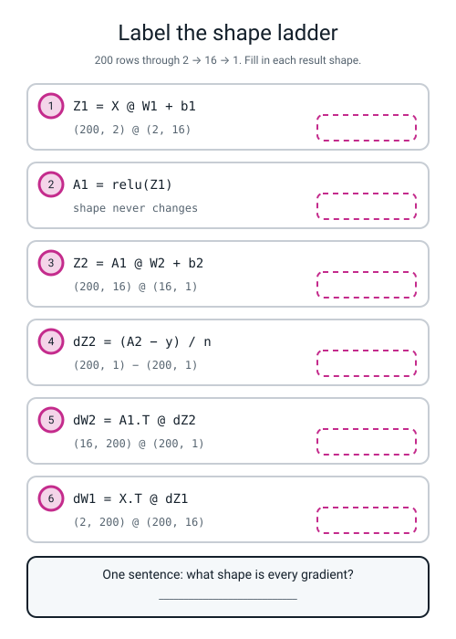
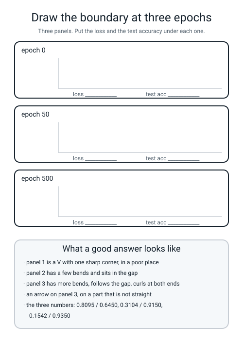

# Workbook — Week 19: NumPy Brain

**Name:** ________________________________  **Date:** ______________

[⬅ Week 18](week-18.md) · [📖 Read the chapter first](../student-guide/week-19.md) · [Course Home](../README.md) · [Next ➡](week-20.md)

---

## ✅ Warm-Up (5 min)

Five quick questions about **last week** — the 2 → 2 → 1 network you did by hand.

**W1.** Nudging `w` moves `z` **three times as much**. Nudging `z` moves `L` **fourteen times as much**. **How much does nudging `w` move `L`?**

______________  **and what did you do to the two numbers?** ____________________

**W2.** `(z > 0).astype(float)` — what is it for, and what are the only two values it can hold?

________________________________________________________________

**W3.** `dW1 = X.T @ dZ1`. **Why is the transpose there?** (One sentence, and it should not contain the word "calculus".)

________________________________________________________________

**W4.** In last week's network, hidden unit 1's value was **2.20** and hidden unit 2's was **0.15**. The blame at the output was **−0.09975049**. **Which of the two output weights gets the bigger correction, and why?**

________________________________________________________________

**W5.** `W2` has shape `(16, 1)`. **What shape must `dW2` be?** ____________  **Why?**

________________________________________________________________

---

## 🔢 Do the Maths by Hand

**There is no new maths this week**, so these four exercises use **Week 18's chain rule and Week 12's nudge** on this week's numbers. **Calculator only. No code.**

**M1 — the loss of a shrug.** Work out `−ln(p)` for four probabilities. Use the `ln` button, then make the answer positive.

| p | `−ln(p)` to 4 decimal places |
|---|---|
| 0.9 | ____________ |
| **0.5** | ____________ |
| 0.1 | ____________ |
| 0.02 | ____________ |

**M1(a).** Which of those four is the number a network prints when every weight starts at zero? ____________

**M1(b).** Explain the link in one sentence: *all weights zero → the hidden outputs are ____, so the score is ____, so `sigmoid` gives ____, so the loss is ____.*

________________________________________________________________

**M2 — the nudge, from Week 12.** Measure the slope of `x²` at `x = 5` without any calculus. Use `h = 0.001`.

```
f(5.001) = 5.001 × 5.001 = ____________
f(4.999) = 4.999 × 4.999 = ____________

difference                 = ____________
divide by 2h = 0.002       = ____________
```

**M2(a).** The shortcut rule says the slope of `x²` is `2x`. At `x = 5` that is ______. **Do the two agree?** ____________

**M2(b).** The gradient check does exactly this, for all **______** knobs in the network, and reports the worst disagreement.

**M3 — three links of last week's chain.** All three are one multiplication each. The blame at the output was **−0.09975049**.

```
(a) the blame arriving at hidden unit 2, which is connected by a weight of −2.0:
    (−0.09975049) × (−2.0)  =  ____________

(b) the slope for dW1[1][1], where input 2 was 2.0 and the blame at unit 2 is your answer to (a):
    2.0 × ____________      =  ____________

(c) the slope for dW2[1], where hidden unit 2's value was 0.15:
    0.15 × (−0.09975049)    =  ____________
```

**M3(a).** Part (a) came out **positive** from two negative numbers. **Say in one sentence what a negative weight does to the direction of the blame.**

________________________________________________________________

**M3(b).** Compare your answer to (c) with `dW2[0] = −0.21945108`, which came from hidden unit 1's value of 2.20. **Which unit's weight moves more, and what is the rule?**

________________________________________________________________

**M4 — why a dead unit stays dead.** After the `lr = 20` run, unit 0 ended with **bias = −14.113**. Take a typical row where the two feature values are `1.2` and `0.4`, and the unit's two weights are `0.6` and `−2.9`.

```
weighted sum   =  0.6 × 1.2  +  (−2.9) × 0.4     =  ____________
plus the bias  =  ____________ + (−14.113)       =  ____________
after ReLU     =  max(0, ____________)           =  ____________
ReLU's slope below zero                          =  ____________
the update     =  that slope × lr 0.5            =  ____________
```

**M4(a).** Now try it with `lr = 1000`. What is the update? ____________

**M4(b).** Finish the sentence, and get the word **slope** into it:

*A dead unit can never come back because* ______________________________________

________________________________________________________________

---

## 🔎 Predict the Output

**Write your prediction in pen before you run anything.** Every snippet starts with `import numpy as np`. **Two of these four run cleanly and are not what you would expect.**

### P1 — a shape, and a count that is not what it looks like

```python
X = np.zeros((5, 2))
W1 = np.zeros((2, 3))
b1 = np.zeros((1, 3))
Z1 = X @ W1 + b1
print(Z1.shape)
print((Z1 > 0).astype(float).sum())
```

**I predict — line 1:** ____________  **line 2:** ____________

**It really printed:**

```text
________________________
________________________
```

**The second line is the one that catches people. Why is it not 15?**

________________________________________________________________

### P2 — the broadcast that does not complain

```python
A2 = np.zeros((4, 1)) + 0.5
y_flat = np.array([1.0, 0.0, 1.0, 0.0])
y_col = y_flat.reshape(-1, 1)
print((A2 - y_col).shape)
print((A2 - y_flat).shape)
print((A2 - y_flat).mean())
```

**I predict — will any line raise an error?** ____________

**I predict the three lines:** ____________  ____________  ____________

**It really printed:**

```text
________________________
________________________
________________________
```

**Line 2 produced 16 numbers from 4 predictions and 4 answers. Where did the other 12 come from, and what question do they answer?**

________________________________________________________________

### P3 — two numbers you have to know by heart

```python
print(1 / (1 + np.exp(-0.0)))
print(-np.log(0.5))
print(np.maximum(0, np.array([-3.0, 0.0, 2.2])))
```

**I predict:** ____________  ____________  ____________

**It really printed:**

```text
________________________
________________________
________________________
```

**The third line has a `0.0` in the middle of it. Was that value changed by `np.maximum`?** ____________  **What does that tell you about ReLU's slope at exactly zero?**

________________________________________________________________

### P4 — the dead-unit counter, and the axis that matters

```python
A1 = np.array([[0.0, 2.0, 0.0],
               [0.0, 1.0, 3.0],
               [0.0, 0.5, 0.0]])
print(np.all(A1 <= 0, axis=0))
print(int(np.sum(np.all(A1 <= 0, axis=0))))
print(np.all(A1 <= 0, axis=1))
```

**I predict — line 1:** ____________________  **line 2:** ______  **line 3:** ____________________

**It really printed:**

```text
________________________________
________________________________
________________________________
```

**Lines 1 and 3 use the same data and the same test. Say what each of them is asking, in English.**

**`axis=0` asks:** ______________________________________________

**`axis=1` asks:** ______________________________________________

**Which one counts dead units, and why?** ______________________

**How many of the answers on this page did you get right?** ______ / 14

**Which one surprised you most?** ______________________________

---

## ✍️ Practice Set A — Read It

**A1. Match the word to the thing.** Write the letter.

| Word | | Description |
|---|---|---|
| **capacity** | ______ | (i) A slope so small the knob effectively stops moving |
| **piecewise-linear** | ______ | (ii) The line or curve where the model changes its mind |
| **dead ReLU** | ______ | (iii) How complicated a shape the model is able to draw |
| **vanishing gradient** | ______ | (iv) Units that start identical get identical gradients, so stay identical for ever |
| **decision boundary** | ______ | (v) A hidden unit that outputs zero for every row and can never change again |
| **symmetry** | ______ | (vi) Made of straight pieces joined at corners |

**A2. Trace the shapes.** A batch of **50** rows goes through a **2 → 8 → 1** network. Fill in every result shape.

| Line | Shapes going in | Result shape |
|---|---|---|
| `Z1 = X @ W1 + b1` | `(50, 2) @ (2, 8)` | ____________ |
| `A1 = relu(Z1)` | unchanged | ____________ |
| `Z2 = A1 @ W2 + b2` | `(50, 8) @ (8, 1)` | ____________ |
| `A2 = sigmoid(Z2)` | unchanged | ____________ |
| `dZ2 = (A2 - y) / n` | `(50, 1) − (50, 1)` | ____________ |
| `dW2 = A1.T @ dZ2` | `(8, 50) @ (50, 1)` | ____________ |
| `dA1 = dZ2 @ W2.T` | `(50, 1) @ (1, 8)` | ____________ |
| `dZ1 = dA1 * (Z1 > 0)` | elementwise | ____________ |
| `dW1 = X.T @ dZ1` | `(2, 50) @ (50, 8)` | ____________ |

**A2(a).** How many knobs has this network got? Show the sum.

`2 × 8 + ____ + ____ + ____ = ______`

**A2(b).** Which two rows of that table are the ones you check first when something is wrong, and what do you compare them against?

________________________________________________________________

**A3. Spot the bug.** Each line is wrong. Say what happens and write the fix.

| # | The line | What happens | The fix |
|---|---|---|---|
| a | `"W1": rng.normal(0, 1.0, size=(16, 2))` | | |
| b | `dW1 = X @ dZ1` | | |
| c | `grid = np.c_[XX, YY]` | | |
| d | `Z = forward(P, grid)["A2"]` then `ax.contourf(XX, YY, Z)` | | |
| e | `y = y.astype(float)` (no reshape) | | |
| f | `db1 = dZ1.sum(axis=0)` (no `keepdims`) | | |

**A3(g).** Which of those six produces **no error message at all**? ____________  **What is the printed clue in each case?**

________________________________________________________________

**A4. Match the code to the output.** Five of each, no output used twice.

| | Code |
|---|---|
| i | `print(np.sqrt(2.0 / 16))` |
| ii | `print(-np.log(0.5))` |
| iii | `print(2 * 16 + 16 + 16 + 1)` |
| iv | `print(np.maximum(0, -4.0))` |
| v | `print((np.zeros((200, 2)) @ np.zeros((2, 16))).shape)` |

| | Output |
|---|---|
| P | `0.0` |
| Q | `0.3535533905932738` |
| R | `(200, 16)` |
| S | `65` |
| T | `0.6931471805599453` |

**Your answers:** i → ______  ii → ______  iii → ______  iv → ______  v → ______

**A5. Read four training logs and name the sabotage.** All four ran for 500 epochs on the same data. **Each one is a different thing going wrong — or not going wrong.**

**Log A**

```text
epoch    0  train loss 0.6628
epoch  250  train loss 0.3698
epoch  500  train loss 0.3693
test acc 0.9000   dead units 0/1
```

**What was done to it:** ______________________________________

**The giveaway:** ____________________________________________

**Log B**

```text
epoch    0  train loss 0.6931
epoch  250  train loss 0.6931
epoch  500  train loss 0.6931
test acc 0.5000   dead units 16/16
```

**What was done to it:** ______________________________________

**The giveaway:** ____________________________________________

**Log C**

```text
epoch    0  train loss 0.8095
epoch  250  train loss 0.6429
epoch  500  train loss 0.4493
test acc 0.8100   dead units 13/16
```

**What was done to it:** ______________________________________

**The giveaway:** ____________________________________________

**Log D**

```text
epoch    0  train loss 0.6912
epoch  250  train loss 0.1643
epoch  500  train loss 0.1412
train acc 0.9550  test acc 0.9150   dead units 0/64
```

**What was done to it:** ______________________________________

**The giveaway:** ____________________________________________

**A5(a).** **Only one of those four is a healthy network with a real problem you learned about in Level 2.** Which, and what is the problem called?

________________________________________________________________

**A6. Label the shape ladder.** Fill in every empty box in the figure.


*Figure W19.1 — Six lines of the ladder with the answers removed. 200 rows through 2 → 16 → 1.*

**A6(a).** Write the one sentence the bottom panel asks for:

________________________________________________________________

**A6(b).** Two of those six rows produce a result whose shape matches a **knob**. Which two, and which knobs?

________________________________________________________________

---

## ✍️ Practice Set B — Write It

### B1 — one line, plus a print

**Task:** build a 50 × 50 grid over the box from `−2.0` to `2.0` across and `−1.5` to `1.5` up, glue it into rows, and print both shapes.

**Expected output:**

```text
XX (50, 50)  grid (2500, 2)
```

**Done looks like:** three lines of setup and one print, and `2500` is `50 × 50`.

```python
gx = ____________________________________________________________

gy = ____________________________________________________________

XX, YY = ________________________________________________________

grid = __________________________________________________________

print(__________________________________________________________)
```

### B2 — the dead-unit counter, as a function

**Task:** write `dead_units(A1)` that takes a hidden-output grid and returns how many columns were zero-or-less for **every** row. Test it on this grid:

```python
A1 = np.array([[0.0, 2.0, 0.0, 1.0],
               [0.0, 1.0, 3.0, 0.0],
               [0.0, 0.5, 0.0, 4.0]])
```

**Expected output:**

```text
dead units 1 / 4
which ones: [0]
```

**Done looks like:** one line inside the function, using `np.all(..., axis=0)`, and `np.flatnonzero` for the second print.

```python
def dead_units(A1):
    return ________________________________________________________
```

**B2(a).** Column 2 is `[0.0, 3.0, 0.0]` — two zeros out of three. **Why is it not counted?**

________________________________________________________________

### B3 — count the knobs for four network sizes

**Task:** print the knob count for 1, 4, 16 and 64 hidden units, with two inputs and one output.

**Expected output:**

```text
 1 hidden units ->   5 knobs
 4 hidden units ->  17 knobs
16 hidden units ->  65 knobs
64 hidden units -> 257 knobs
```

**Done looks like:** a `for` loop, and the arithmetic `2 * h + h + h + 1` written once.

```python
for h in ________________________________________________________:
    knobs = ____________________________________________________
    print(____________________________________________________)
```

### B4 — eight hidden units

**Task:** train a 2 → **8** → 1 network for 500 epochs at `lr = 0.5`, and report the train loss, both accuracies and the dead count on one line.

**Expected output:**

```text
8 units: train loss 0.2126  train acc 0.9150  test acc 0.9100  dead 0/8
```

**Done looks like:** four lines, importing everything from `numpy_brain`, and **`log_every=0`** so the epoch lines are silent.

```python
________________________________________________________________

________________________________________________________________

________________________________________________________________

________________________________________________________________
```

**B4(a).** Compare with the 16-unit numbers (`0.1542`, `0.9350`, `0.9350`). **Which of the three columns shows the difference most clearly?**

________________________________________________________________

### B5 — a whole program of your own, about 25 lines

**Task:** write `b5.py`, which runs the same network three ways and prints one row each. It must:

1. import `get_data`, `init_params`, `train`, `forward`, `accuracy` from `numpy_brain`
2. define `dead_units(P, X)`
3. define `run(label, hidden, lr, zero_weights=False)` that trains for 500 epochs at the given `lr`, with `log_every=0`, and prints **one line**: the label, the final loss, the test accuracy, and the dead count out of `hidden`
4. print a header row, then call `run` three times: the working network, all weights zero, and `lr = 20`

**Expected output:**

```text
run                      loss   test acc       dead
working (16, 0.5)      0.1542     0.9350        0/16
all weights zero       0.6931     0.5000       16/16
lr = 20                0.4493     0.8100       13/16
```

**Done looks like:** three rows in a table you can read across, `run` called three times with different arguments, and **the numbers matching the ones in your chapter.**

> **⚠️ Watch out:** the `lr = 20` row will also print `RuntimeWarning: overflow encountered in exp`. **That is expected**, and it is a message about the learning rate, not about your code.

---

## 🐞 Fix the Broken Program

This program has **three** bugs: one **shape**, one **runtime**, and one **silent logic bug**. The real error messages are below, in the order you meet them.

```python
"""broken19.py - a tiny 2 -> 4 -> 1 network on make_moons. THREE bugs."""
import numpy as np
from sklearn.datasets import make_moons
from sklearn.model_selection import train_test_split
from sklearn.preprocessing import StandardScaler

X, y = make_moons(n_samples=200, noise=0.25, random_state=0)
y = y.reshape(-1, 1).astype(float)
sc = StandardScaler().fit(X)
X = sc.transform(X)
Xtr, Xte, ytr, yte = train_test_split(X, y, test_size=0.50,
                                      stratify=y, random_state=0)

rng = np.random.default_rng(0)
W1 = rng.normal(0, 1.0, size=(4, 2))
b1 = np.zeros((1, 4))
W2 = rng.normal(0, 0.5, size=(4, 1))
b2 = np.zeros((1, 1))

for epoch in range(301):
    Z1 = Xtr @ W1 + b1
    A1 = np.maximum(0, Z1)
    Z2 = A1 @ W2 + b2
    A2 = 1.0 / (1.0 + np.exp(-Z2))
    loss = float(-np.mean(ytr * np.log(A2) + (1 - ytr) * np.log(1 - A2)))
    n = Xtr.shape[0]
    dZ2 = (A2 - ytr) / n
    dW2 = A1.T @ dZ2
    db2 = dZ2.sum(axis=0, keepdims=True)
    dA1 = dZ2 @ W2.T
    dZ1 = dA1 * (Z1 > 0).astype(float)
    dW1 = Xtr @ dZ1
    db1 = dZ1.sum(axis=0, keepdims=True)
    W1 -= 0.5 * dW1
    b1 -= 0.5 * db1
    W2 -= 0.5 * dW2
    b2 -= 0.5 * db2
    if epoch % 150 == 0:
        print("epoch %3d  loss %.4f" % (epoch, loss))

test_pred = (1.0 / (1.0 + np.exp(-(np.maximum(0, Xte @ W1 + b1) @ W2 + b2))) >= 0.5)
print("test acc %.4f" % float((test_pred.astype(int) == yte).mean()))
```

**Run 1 — nothing prints at all:**

```text
Traceback (most recent call last):
  File "broken19.py", line 21, in <module>
    Z1 = Xtr @ W1 + b1
ValueError: matmul: Input operand 1 has a mismatch in its core dimension 0, with gufunc signature (n?,k),(k,m?)->(n?,m?) (size 4 is different from 2)
```

**Bug 1.** Which line? ______  **Kind of bug?** ______________

**The message names two numbers, 4 and 2. Where does each come from?**

**4 comes from:** ______________________  **2 comes from:** ______________________

**The fix:** ______________________________

**Run 2 — after fixing bug 1:**

```text
Traceback (most recent call last):
  File "broken19.py", line 32, in <module>
    dW1 = Xtr @ dZ1
ValueError: matmul: Input operand 1 has a mismatch in its core dimension 0, with gufunc signature (n?,k),(k,m?)->(n?,m?) (size 100 is different from 2)
```

**Bug 2.** Which line? ______  **Kind of bug?** ______________

**What shape must `dW1` come out, and how do you know?** ____________________

**The fix:** ______________________________

**Run 3 — after fixing bugs 1 and 2. It runs all the way through, with no error at all:**

```text
epoch   0  loss 0.6516
epoch 150  loss 0.3549
epoch 300  loss 0.3450
test acc 0.8700
```

**Bug 3 is in the first ten lines, and it has been there all along.** It does not raise anything, and the loss falls perfectly nicely.

**Look at the order of these two things: scaling, and splitting. Which happens first?**

________________________________________________________________

**Why is that the wrong way round?** ______________________________

________________________________________________________________

**The fix:** write the three corrected lines.

```python
________________________________________________________________

________________________________________________________________

________________________________________________________________
```

**Run 4 — after fixing all three:**

```text
epoch   0  loss 0.6574
epoch 150  loss 0.3554
epoch 300  loss 0.3239
test acc 0.8900
```

**Two questions, and they are the point of the whole page.**

**The leaky version scored 0.8700 and the correct one scored 0.8900. So leakage made the score *worse*. Does that mean the leak did not matter?**

________________________________________________________________

________________________________________________________________

**Rank the three bugs from easiest to hardest to notice, and say what would have caught each one.**

**easiest → hardest:** ______  ______  ______

________________________________________________________________

---

## 🧩 Puzzle of the Week

### The Hinge Budget

A ReLU network gets **one hinge per hidden unit**. A hinge is one place where the boundary is allowed to change direction. Below are five boundaries described in words. **For each one, write the smallest number of hidden units that could possibly draw it.**

| # | The boundary you need | Smallest number of hidden units |
|---|---|---|
| 1 | one straight line, at any angle | ______ |
| 2 | a straight line with one kink in it, like a very wide V | ______ |
| 3 | a Z shape: down, across, down again | ______ |
| 4 | a closed triangle, with everything inside it class 1 | ______ |
| 5 | a closed square | ______ |

**Part 1(a).** Two of your five answers should be the same number. Which two, and why?

________________________________________________________________

**Part 1(b).** Now the interesting one. **Our own sweep found that 1, 2 and 4 hidden units all score exactly 0.8350 on the training data.** Four hinges were available and only one or two got used. **Why would a network refuse to use a hinge it has been given?**

________________________________________________________________

________________________________________________________________

**Part 1(c).** Finish the slogan: *capacity is __________________ to bend, not __________________ to.*

### Part 2 — How many bends do two crescents need?

Get a piece of graph paper and draw two interlocking crescents, like two bananas hooked round each other. Then:

1. **Draw one straight line.** Count the points on the wrong side: ______
2. **Now you may use one bend.** Count again: ______
3. **Now two bends.** Count again: ______
4. **Now as many as you like.** How many bends did you actually need? ______

**Part 2(a).** Compare your answer to step 4 with **16**. **So why does the chapter use sixteen units rather than three?**

________________________________________________________________

**Part 2(b).** The 64-unit network scored **0.9550 on train and 0.9150 on test.** In hinge language, what did those extra 48 hinges spend themselves on?

________________________________________________________________

---

## 🤔 Think Deeper

**T1.** The gradient check is slow. Checking 65 knobs means 130 extra forward passes, and on a real network with a million knobs it is completely impossible. **Write a paragraph** on what you would do instead on a big network — and whether "I can't check it all, so I won't check any of it" is a reasonable position. What could you check?

________________________________________________________________

________________________________________________________________

________________________________________________________________

________________________________________________________________

________________________________________________________________

**T2.** Randomness is doing real work in this file. If every weight starts at the same value, sixteen units behave as one unit for ever. **Write a paragraph** on what that says about what a "hidden unit" actually *is*. Is a unit a thing, or is it just a slot that becomes a thing because it happened to start somewhere different from its neighbours?

________________________________________________________________

________________________________________________________________

________________________________________________________________

________________________________________________________________

________________________________________________________________

---

## 🛠️ Build It — Finish NumPy Brain

**Three things have to be true and all three get pasted: the gradient check below `1e-6`, the test accuracy above 0.90, and the three boundary panels with their numbers.**

### Step checklist

- [ ] **1.** `numpy_brain.py` runs. Paste the whole log, including the epoch lines.
- [ ] **2.** **Check the gradient check first.** Below `1e-6`? If not, **do not train** — find the transpose.
- [ ] **3.** Print `y.shape` before you train. It must say `(200, 1)`, not `(200,)`.
- [ ] **4.** Read the final test accuracy. Above 0.90?
- [ ] **5.** `plot_boundary.py` runs and writes `boundary.png`. Print `grid.shape` and check it says `(40000, 2)`.
- [ ] **6.** Open the PNG. Three panels. Write the loss and test accuracy under each.
- [ ] **7.** Draw an arrow on panel 3, on **the exact place it stops being a straight line.**
- [ ] **8.** Write your three Break It predictions **in pen, before running anything.**
- [ ] **9.** Run all three sabotages and fill in the results table.
- [ ] **10.** Count the dead units in the `lr = 20` run.
- [ ] **11.** Write the one sentence. The word **slope** had better be in it.

### The gradient check and the training log

**My gradient check printed:** ______________  **Below `1e-6`?** ____________

**My `y.shape` printed:** ______________

| epoch | train loss | test acc |
|---|---|---|
| 0 | | |
| 100 | | |
| 200 | | |
| 300 | | |
| 400 | | |
| 500 | | |

**final train acc:** ____________  **final test acc:** ____________

**Above 0.90?** ____________  **And the straight-line wall was ____________.**

### The three boundary panels

| panel | epoch | train loss | test acc | is the boundary straight or bent? |
|---|---|---|---|---|
| 1 | 0 | | | |
| 2 | 50 | | | |
| 3 | 500 | | | |

**Between which two panels did most of the accuracy arrive?** ____________

**The last 450 epochs bought how much accuracy?** ____________  **So what were they actually doing?**

________________________________________________________________

### Break It Three Ways

**Predictions first. In pen.**

| card | what I changed | I predict |
|---|---|---|
| 1 | every weight in `W1` and `W2` set to zero | |
| 2 | `lr = 20.0` instead of 0.5 | |
| 3 | `init_params(2, 1)` — one hidden unit | |

**Now the real numbers.**

| card | final loss | test accuracy | dead units | prediction right? |
|---|---|---|---|---|
| 1 | | | | |
| 2 | | | | |
| 3 | | | | |
| *(working)* | | | | |

**One sentence each — why, not what.**

**Card 1:** ______________________________________________________

________________________________________________________________

**Card 2:** ______________________________________________________

________________________________________________________________

**Card 3:** ______________________________________________________

________________________________________________________________

### The dead-unit sentence (marked hardest)

**Dead units in the `lr = 20` run:** ______ / 16

**Unit 0's final bias:** ______________

**Why can a dead unit never come back? One sentence, containing the word *slope* and the word *zero*.**

________________________________________________________________

________________________________________________________________

**And the evidence:** we trained the dead network for **2000 more epochs at `lr = 0.5`**. How many were still dead? ______

### Stretch — the capacity sweep

| hidden units | train loss | train acc | test acc | knobs |
|---|---|---|---|---|
| 1 | | | | |
| 2 | | | | |
| 4 | | | | |
| 8 | | | | |
| 16 | | | | |
| 64 | | | | |

**Two sentences about the table:**

1. ______________________________________________________________
2. ______________________________________________________________

### The Bug Log

Two entries today: one loud, one silent.

| What I saw | What it means | Cause | Fix |
|---|---|---|---|
| | | | |
| | | | |

---

## 🎨 Draw It

Draw the boundary at three epochs **from your own `boundary.png`**, by hand, in the three frames below. Then write the two numbers under each.


*Figure W19.2 — Three empty panels, and what a good answer contains.*

**Then answer four things about your own drawing:**

**Which panel is a straight line?** ____________

**Which panel has exactly one bend?** ____________

**On panel 3, how many separate straight segments can you count?** ____________

**Is that number bigger or smaller than 16, and why is that not a problem?**

________________________________________________________________

---

## 📊 Self-Check

| I can... | 😀 | 🙂 | 😕 |
|---|---|---|---|
| build a 2 → 16 → 1 network in pure numpy that scores above 0.90 | | | |
| get the gradient check below `1e-6` **before** training | | | |
| say what the gradient check proves, and why a falling loss does not prove it | | | |
| trace a shape through the whole forward and backward pass | | | |
| use the rule "every gradient has the shape of its own knob" to find a bug | | | |
| plot a decision boundary with `meshgrid`, `np.c_` and `contourf` | | | |
| explain why all-zero weights park the loss on 0.6931, using `−ln(0.5)` | | | |
| count dead ReLUs, and say what one costs me | | | |
| say why a dead unit can never come back, in terms of slope | | | |
| explain why sixteen hinges only *look* like a curve | | | |

**The one thing I would ask about if I could ask one question:**

________________________________________________________________

---

## ✅ Answers

<details>
<summary>Check your answers</summary>

### Warm-Up

**W1.** **42.** You **multiply** them: `3 × 14 = 42`. Slopes along a chain multiply — that is the whole of last week in five words.

**W2.** It is **ReLU's own slope**, used as a valve on the way back. Its only two values are **`1.0`** (the unit fired, so blame passes straight through) and **`0.0`** (the unit did not fire, so nothing gets through). It is `(Z1 > 0)`, a grid of `True`/`False`, turned into `1.0`/`0.0`.

**W3.** **To make the shapes meet.** `X` is `(200, 2)` and `dZ1` is `(200, 16)`; without the transpose the inner numbers are 2 and 200 and nothing happens. With it, `(2, 200) @ (200, 16)` gives `(2, 16)` — exactly `W1`'s shape.

**W4.** **Hidden unit 1's weight**, because it was **loud** (2.20 against 0.15). The slope is *blame × the value that fed the weight*, so `2.20 × (−0.09975049) = −0.21945108` against `0.15 × (−0.09975049) = −0.01496257`. **Loud units get blamed most** — about fifteen times as much here.

**W5.** **`(16, 1)`** — the same shape as `W2`. **Every gradient has the same shape as the thing it is the gradient of.**

### Do the Maths by Hand

**M1.**

| p | `−ln(p)` |
|---|---|
| 0.9 | **0.1054** |
| **0.5** | **0.6931** |
| 0.1 | **2.3026** |
| 0.02 | **3.9120** |

**M1(a).** **0.5**, giving **0.6931**.

**M1(b).** *All weights zero → the hidden outputs are **0**, so the score is **0**, so `sigmoid` gives **0.5**, so the loss is **−ln(0.5) = 0.6931**.*

Notice the shape of that column, too: being 90% confident and right costs you 0.1054; being 2% confident and wrong costs you 3.9120. **Log loss punishes confident mistakes hardest.** That is Week 14.

**M2.**

```
f(5.001) = 5.001 × 5.001 = 25.010001
f(4.999) = 4.999 × 4.999 = 24.990001

difference               =  0.020000
divide by 0.002          = 10.0000
```

**M2(a).** `2 × 5 = 10`. **They agree exactly**, to four decimal places.

**M2(b).** All **65** knobs. Two forward passes per knob, so 130 extra forward passes — which is why the check is slow and why you run it once, before training, rather than every epoch.

**M3.**

```
(a)  (−0.09975049) × (−2.0)  =  +0.19950098
(b)  2.0 × (+0.19950098)     =  +0.39900196
(c)  0.15 × (−0.09975049)    =  −0.01496257
```

**M3(a).** **A negative weight flips the direction of the blame.** Turning unit 2 up would push the score *down*; the score needs to go up, so the slope for unit 2 points the opposite way to unit 1's.

**M3(b).** **Unit 1's weight moves far more**: `−0.21945108` against `−0.01496257`, about fifteen times as much. The rule is **blame × the value that fed the weight** — a loud unit (2.20) collects a big correction, a quiet one (0.15) barely moves.

**M4.**

```
weighted sum   =  0.6 × 1.2 + (−2.9) × 0.4  =  0.72 − 1.16  =  −0.44
plus the bias  =  −0.44 + (−14.113)         =  −14.553
after ReLU     =  max(0, −14.553)           =  0
ReLU's slope below zero                     =  0
the update     =  0 × 0.5                   =  0
```

**M4(a).** `0 × 1000 = ` **0.** Still nothing. **That is the whole point.**

**M4(b).** *A dead unit can never come back because it outputs zero for every row, so **ReLU's slope there is zero**, so its gradient is zero, and **zero times any learning rate is zero** — no update of any size can move it.*

### Predict the Output

**P1.**

```text
(5, 3)
0.0
```

**Why not 15?** Because every value in `Z1` is exactly `0.0`, and the test is `Z1 > 0` — **strictly greater than.** `0 > 0` is `False`. So all fifteen cells are `False`, all fifteen become `0.0`, and the sum is `0.0`.

This is not a curiosity. It is exactly what happens in the all-zero-weights sabotage: **every unit's mask is zero, so no blame gets through to layer 1, so `dW1` is exactly zero.**

**P2.**

```text
(4, 1)
(4, 4)
0.0
```

No error anywhere. **Where did the other 12 numbers come from?** `A2` is a **column** of 4 and `y_flat` is a **row** of 4, so numpy broadcast them into a 4 × 4 grid: every prediction compared with **every** answer, including the three that belong to other rows. The mean of that grid happens to be `0.0` here, which makes it look even more innocent.

**The question those 12 numbers answer is one nobody asked.** This is the `y.reshape(-1, 1)` bug, in three lines.

**P3.**

```text
0.5
0.6931471805599453
[0.  0.  2.2]
```

**Was the `0.0` changed?** No — `max(0, 0.0)` is `0.0`. And that is the honest answer to *"what is ReLU's slope at exactly zero?"*: **there isn't one.** The function has a corner there, and `np.maximum` simply returns 0. It is a decision, not a discovery, and it is why the gradient check can fail on data that sits exactly on the corner (see the chapter's Break 3).

**P4.**

```text
[ True False False]
1
[False False False]
```

**`axis=0` asks:** *"going **down** each column, was every value ≤ 0?"* — one answer per **column**, so three answers for three hidden units.

**`axis=1` asks:** *"going **across** each row, was every value ≤ 0?"* — one answer per **row**, so three answers for three data rows.

**`axis=0` counts dead units**, because a hidden unit *is* a column: column 0 is unit 0's output for all three rows. `axis=1` would tell you which *data rows* got nothing out of any unit, which is a different and much less useful question.

### Practice Set A

**A1.** capacity → **(iii)** · piecewise-linear → **(vi)** · dead ReLU → **(v)** · vanishing gradient → **(i)** · decision boundary → **(ii)** · symmetry → **(iv)**

**A2.**

| Line | Result shape |
|---|---|
| `Z1 = X @ W1 + b1` | `(50, 8)` |
| `A1 = relu(Z1)` | `(50, 8)` |
| `Z2 = A1 @ W2 + b2` | `(50, 1)` |
| `A2 = sigmoid(Z2)` | `(50, 1)` |
| `dZ2 = (A2 - y) / n` | `(50, 1)` |
| `dW2 = A1.T @ dZ2` | `(8, 1)` |
| `dA1 = dZ2 @ W2.T` | `(50, 8)` |
| `dZ1 = dA1 * (Z1 > 0)` | `(50, 8)` |
| `dW1 = X.T @ dZ1` | `(2, 8)` |

**A2(a).** `2 × 8 + **8** + **8** + **1** = 16 + 8 + 8 + 1 = **33**`.

**A2(b).** **`dW2` and `dW1`**, and you compare them against **`W2` and `W1`**. `dW2` must be `(8, 1)` and `dW1` must be `(2, 8)`. If either disagrees, a transpose is in the wrong place — and you know that without doing any calculus.

**A3.**

| # | What happens | The fix |
|---|---|---|
| a | `ValueError: matmul ... (size 16 is different from 2)` on the very first line of `forward` | `size=(n_in, n_hidden)` — **inputs first, units second**: `(2, 16)` |
| b | `ValueError: matmul ... (size 200 is different from 2)` | `dW1 = X.T @ dZ1` |
| c | `grid` is `(200, 400)`, then `ValueError: matmul ... (size 2 is different from 400)` | `np.c_[XX.ravel(), YY.ravel()]`, then print `grid.shape` and check `(40000, 2)` |
| d | `TypeError: Input z must be at least a (2, 2) shaped array, but has shape (40000, 1)` | `.reshape(XX.shape)` |
| e | **No error.** The loss prints `0.9534` instead of `0.8095`, because `A2 - y` broadcast into `(200, 200)` | `y = y.reshape(-1, 1)`, and **print `y.shape`** |
| f | **No error.** `db1` comes out flat, `(16,)` instead of `(1, 16)`. `b1 -= lr * db1` still runs, because `(1, 16)` and `(16,)` broadcast — and on this network the final numbers are **identical** (`loss 0.1542`, `test acc 0.9350`). Nothing complains and nothing is visibly wrong; the **shape rule** has quietly been broken and you got lucky | `dZ1.sum(axis=0, keepdims=True)` |

**A3(g).** **e and f.** For **e** the clue is the loss being `0.9534` rather than `0.8095`, and `y.shape` printing `(200,)`. For **f** the clue is `db1.shape` printing `(16,)` when `b1` is `(1, 16)` — **the gradient no longer has the shape of its knob**, which is the one rule you check first. And **f** is the more frightening of the two, because here it does no damage at all: the same rule broken on a differently-shaped bias would broadcast into the wrong grid and be wrong with no warning.

**A4.** i → **Q** · ii → **T** · iii → **S** · iv → **P** · v → **R**

`np.sqrt(2/16) = 0.3535533905932738` is the He spread for the second layer, and `−ln(0.5) = 0.6931471805599453` is the loss of a shrug.

**A5.**

**Log A — one hidden unit.** Giveaway: **`dead units 0/1`** — the denominator says how many hidden units there are. Also the starting loss is `0.6628`, not `0.8095`, because a different-sized network gets different random weights.

**Log B — all weights started at zero.** Giveaway: **the loss is `0.6931` three times and never moves**, and `0.6931 = −ln(0.5)`. Plus `test acc 0.5000` exactly, and `16/16` dead.

**Log C — learning rate 20.** Giveaway: it starts at the normal `0.8095` and does learn a bit (0.8095 → 0.4493), but **13 of 16 units are dead** and the test accuracy is stuck at 0.8100. A too-large learning rate is the only thing on the list that kills most of a layer while still improving.

**Log D — 64 hidden units, and it is a healthy network.** Giveaway: **`0/64`** in the dead count, the lowest loss of the four (`0.1412`), and the gap between **train 0.9550 and test 0.9150**.

**A5(a).** **Log D**, and the problem is **overfitting.** It fits the training crescents better than any other run and generalises worse than the 16-unit network — 0.9150 against 0.9350. **The tell is the gap between the two accuracy columns, not either number on its own.**

**A6.** The six answers, in order: `(200, 16)` · `(200, 16)` · `(200, 1)` · `(200, 1)` · `(16, 1)` · `(2, 16)`.

**A6(a).** *"Every gradient has exactly the same shape as the thing it is the gradient of."*

**A6(b).** Row 5, `dW2 = A1.T @ dZ2` → `(16, 1)`, which matches **`W2`**. Row 6, `dW1 = X.T @ dZ1` → `(2, 16)`, which matches **`W1`**.

### Practice Set B

**B1.**

```python
import numpy as np

gx = np.linspace(-2.0, 2.0, 50)
gy = np.linspace(-1.5, 1.5, 50)
XX, YY = np.meshgrid(gx, gy)
grid = np.c_[XX.ravel(), YY.ravel()]
print("XX", XX.shape, " grid", grid.shape)
```

```text
XX (50, 50)  grid (2500, 2)
```

`2500` is `50 × 50` — one row per point on the page. **If yours says `(50, 100)` you left out `.ravel()`.**

**B2.**

```python
import numpy as np


def dead_units(A1):
    return int(np.sum(np.all(A1 <= 0, axis=0)))


A1 = np.array([[0.0, 2.0, 0.0, 1.0],
               [0.0, 1.0, 3.0, 0.0],
               [0.0, 0.5, 0.0, 4.0]])
print("dead units", dead_units(A1), "/ 4")
print("which ones:", list(np.flatnonzero(np.all(A1 <= 0, axis=0))))
```

```text
dead units 1 / 4
which ones: [0]
```

**B2(a).** Because `np.all` means **every single one**, and column 2 has a `3.0` in it. The unit fired on row 1, so it is alive: it contributed something forward, so it will receive some blame backward, so its slope is not zero. **A unit that fires even once for one row is not dead.**

**B3.**

```python
for h in (1, 4, 16, 64):
    knobs = 2 * h + h + h + 1
    print("%2d hidden units -> %3d knobs" % (h, knobs))
```

```text
 1 hidden units ->   5 knobs
 4 hidden units ->  17 knobs
16 hidden units ->  65 knobs
64 hidden units -> 257 knobs
```

*(Your `%3d` may line the numbers up slightly differently; the four counts are what matters.)*

**B4.**

```python
import numpy as np
from numpy_brain import accuracy, forward, get_data, init_params, train

Xtr, Xte, ytr, yte = get_data()
P = init_params(2, 8, seed=0)
hist = train(P, Xtr, ytr, lr=0.5, epochs=500, log_every=0)
A1 = forward(P, Xtr)["A1"]
print("8 units: train loss %.4f  train acc %.4f  test acc %.4f  dead %d/8"
      % (hist[-1], accuracy(P, Xtr, ytr), accuracy(P, Xte, yte),
         int(np.sum(np.all(A1 <= 0, axis=0)))))
```

```text
8 units: train loss 0.2126  train acc 0.9150  test acc 0.9100  dead 0/8
```

**B4(a).** **The train loss.** `0.2126` against `0.1542` is a clear, un-lumpy difference. The test accuracies are `0.9100` and `0.9350` — five test points apart out of 200, which is not a difference you should trust on its own.

**B5.**

```python
"""b5.py - break NumPy Brain two ways and report a table."""
import numpy as np
from numpy_brain import (accuracy, forward, get_data, init_params, loss_fn,
                         train)

Xtr, Xte, ytr, yte = get_data()


def dead_units(P, X):
    A1 = forward(P, X)["A1"]
    return int(np.sum(np.all(A1 <= 0, axis=0)))


def run(label, hidden, lr, zero_weights=False):
    P = init_params(2, hidden, seed=0)
    if zero_weights:
        P["W1"] = np.zeros((2, hidden))
        P["W2"] = np.zeros((hidden, 1))
    hist = train(P, Xtr, ytr, lr=lr, epochs=500, log_every=0)
    print("%-18s %10.4f %10.4f %8d/%d"
          % (label, hist[-1], accuracy(P, Xte, yte), dead_units(P, Xtr), hidden))


print("%-18s %10s %10s %10s" % ("run", "loss", "test acc", "dead"))
run("working (16, 0.5)", 16, 0.5)
run("all weights zero", 16, 0.5, zero_weights=True)
run("lr = 20", 16, 20.0)
```

```text
run                      loss   test acc       dead
working (16, 0.5)      0.1542     0.9350        0/16
all weights zero       0.6931     0.5000       16/16
lr = 20                0.4493     0.8100       13/16
```

Runtime about 3 seconds, and the `lr = 20` row also prints `RuntimeWarning: overflow encountered in exp` to the error stream. **That warning is information, not a failure**: `e` to the power of a huge number is bigger than a computer can hold.

### Fix the Broken Program

**Bug 1 — line 15, `W1 = rng.normal(0, 1.0, size=(4, 2))`. A shape bug.**

`Xtr` is `(100, 2)` and `W1` was built `(4, 2)`. The inner numbers of `(100, 2) @ (4, 2)` are **2 and 4**, and they must match. **4 comes from** `W1`'s first dimension (the number of hidden units, put in the wrong slot). **2 comes from** `Xtr`'s second dimension (the number of features).

**The fix:** `size=(2, 4)`. **Inputs first, units second**, always.

**Bug 2 — line 32, `dW1 = Xtr @ dZ1`. A runtime bug: a missing transpose.**

`dW1` must come out **`(2, 4)`**, because `W1` is `(2, 4)` and every gradient has the shape of its own knob. `Xtr` is `(100, 2)` and `dZ1` is `(100, 4)`, so the inner numbers are 2 and 100 — no fit. Turning `Xtr` round gives `(2, 100) @ (100, 4) = (2, 4)`. ✅

**The fix:** `dW1 = Xtr.T @ dZ1`.

**Bug 3 — lines 9–12. The scaler is fitted before the split. A silent logic bug: leakage.**

**Scaling happens first, on all 200 rows, and the split happens afterwards.** That means `StandardScaler` computed its mean and its spread using the 100 rows that were about to become the test set. **The test rows helped decide how the training data was transformed**, so the test score is no longer a measurement of "how does this model do on data it has never seen".

**The fix:**

```python
Xtr, Xte, ytr, yte = train_test_split(X, y, test_size=0.50,
                                      stratify=y, random_state=0)
sc = StandardScaler().fit(Xtr)
Xtr, Xte = sc.transform(Xtr), sc.transform(Xte)
```

**Split first. Fit on the training rows only. Then transform both.** That is Week 6's rule, and it holds even when there is no pipeline object to hide behind.

**"Leakage made the score worse, so it did not matter"** — no, and this is the important half of the page. Leakage does not promise to flatter you; it promises to make the number **meaningless**. `0.8700` is not a pessimistic estimate of anything. It is a number produced by a procedure that cannot be repeated on genuinely new data, because genuinely new data does not get to influence the scaler. **A measurement you cannot repeat is not a measurement, whichever direction it happens to point.**

**Ranking, easiest to hardest: bug 1, bug 2, bug 3.** Bug 1 crashes on the first line of the loop and names both numbers. Bug 2 crashes too, but eleven lines further in, and you need the shape ladder to know which of the two operands to turn round. **Bug 3 never says anything at all**, and the only thing that catches it is reading the order of your own first ten lines — or a checklist that says *"where is the scaler fitted?"*

### Puzzle of the Week

**Part 1 — the hinge budget.**

| # | The boundary | Smallest number of hidden units |
|---|---|---|
| 1 | one straight line | **1** |
| 2 | a wide V — one kink | **2** |
| 3 | a Z shape — two kinks | **3** |
| 4 | a closed triangle | **3** |
| 5 | a closed square | **4** |

**Part 1(a).** **3 and 4 are both 3.** A Z has two corners and needs three straight pieces; a triangle has three sides. In both cases you need three hinges' worth of direction changes, and the count is *the number of straight pieces the boundary is made of*.

**Part 1(b).** **Because the network is not trying to use its hinges. It is trying to make the loss smaller.** A hinge only earns its keep if bending there moves points to the right side of the boundary. If the data can be split reasonably well with one bend, adding a second bend buys nothing, the gradient for the units that would provide it is tiny, and they simply drift. Accept anything that says *"there was no gain in the loss from bending more."*

**Part 1(c).** *Capacity is **permission** to bend, not **an instruction** to.*

**Part 2 — two crescents.** Answers will vary, and that is fine. Typical: one straight line leaves about **20 to 30** points wrong out of 200; one bend leaves about **10 to 15**; two bends leaves a handful; and **two or three bends is usually enough** to get as close as the noise allows.

**Part 2(a).** Because **you do not know in advance how many bends the data needs**, and there is no formula. Sixteen is a cheap, safe over-estimate: it costs 65 numbers and under a second, and it lets the network find out for itself. **This is also honest about a real limitation** — nobody has a rule for choosing this number, and what professionals actually do is try a few and look at the validation score.

**Part 2(b).** **On the noise.** The extra 48 hinges bent themselves around individual training points that happened to sit on the wrong side because of `noise=0.25`. That is why train accuracy rose to 0.9550 and test accuracy *fell* to 0.9150: those bends describe the training set, not the crescents.

### Think Deeper

**T1 — a model answer.** On a big network you cannot check every knob, and *"so I won't check anything"* is the worst possible response — it is exactly the position that lets a wrong backward pass live for months. What people actually do is **check a random sample**: pick twenty knobs, nudge those, compare those twenty. If all twenty agree to eight decimals, the odds that the whole backward pass is wrong are very small, because a bug in a transpose or a mask affects whole arrays, not individual cells. You can also check **on a tiny version of the same architecture** — 3 rows, 2 hidden units — where checking everything takes a second and the code is identical. And there is a third trick: **check the shapes**, which is free and catches most of what the gradient check would have caught. The general principle worth writing down: *when a complete check is impossible, a sampled check is enormously better than none.*

**T2 — a model answer.** A hidden unit is a **slot**, not a thing. Nothing in the code says what unit 7 is for; it has no name and no job description. What it becomes is decided entirely by where it happened to start and which direction the gradients then pushed it. That is why identical starting weights are fatal: with nothing to distinguish the slots, the gradients cannot distinguish them either, and sixteen slots collapse into one repeated unit — our own run had all sixteen columns at `0.20411` to six decimal places. So **the randomness is not noise to be tolerated; it is the thing that makes specialisation possible.** A good answer might add that this is uncomfortable: it means the units of a trained network have no fixed meaning, two runs with different seeds produce completely different-looking hidden layers that score the same, and "what does unit 7 detect?" is a much harder question than it sounds. That is a real open area, not a gap in this course.

### Build It

**The gradient check and the training log.**

```text
Xtr (200, 2)  ytr (200, 1)  Xte (200, 2)
gradient check (worst relative error): 4.792e-08

epoch    0  train loss 0.8095  test acc 0.6450
epoch  100  train loss 0.2612  test acc 0.9300
epoch  200  train loss 0.2015  test acc 0.9300
epoch  300  train loss 0.1740  test acc 0.9250
epoch  400  train loss 0.1604  test acc 0.9250
epoch  500  train loss 0.1542  test acc 0.9350

final train acc 0.9350
final test  acc 0.9350
```

`y.shape` is `(200, 1)`. The check `4.792e-08` is well below `1e-6`. **Accept any gradient check below `1e-6` and any test accuracy above 0.90 if all three seeds are set** (`make_moons`, `train_test_split`, `init_params`). The straight-line wall was **0.8950**.

**The three boundary panels.**

| panel | epoch | train loss | test acc | straight or bent? |
|---|---|---|---|---|
| 1 | 0 | 0.8095 | 0.6450 | **straight** — a line in a nearly random place |
| 2 | 50 | 0.3104 | 0.9150 | **one bend**, and it has moved into the gap |
| 3 | 500 | 0.1542 | 0.9350 | **bent at both ends**, following the gap |

**Most of the accuracy arrived between panels 1 and 2** — 0.6450 to 0.9150 in fifty epochs.

The last 450 epochs bought **`0.9350 − 0.9150 = 0.0200`** of accuracy, and a much lower loss (0.3104 → 0.1542). **They were mostly making the network more confident about points it already had right**, which improves log loss and does nothing to accuracy.

**Break It Three Ways.**

| card | final loss | test accuracy | dead units |
|---|---|---|---|
| 1 — all weights zero | **0.6931** | **0.5000** | 16/16 |
| 2 — `lr = 20` | 0.4493 | **0.8100** | **13/16** |
| 3 — one hidden unit | 0.3693 | **0.9000** | 0/1 |
| *(working)* | 0.1542 | 0.9350 | 0/16 |

**Typical wrong predictions**, so you can mark your own honestly: card 1 usually gets *"it learns more slowly"* (wrong — it does not learn at all); card 2 usually gets *"chaos"* or *"`nan`"* (half right); card 3 usually gets *"much worse, maybe 60%"* (wrong, and this is the one that surprises people).

**Card 1:** *"Every weight was zero so every hidden unit output zero, so the answer was always `sigmoid(0) = 0.5` and the loss was `−ln(0.5) = 0.6931`; and since `W2` was zero, every gradient into layer 1 was exactly zero, so there was no downhill to walk."*

**Card 2:** *"One giant step drove thirteen biases far negative, and a unit that never fires has slope zero, so no learning rate can wake it up again."*

**Card 3:** *"One ReLU unit gives one hinge, so the boundary can only be a straight line with at most one bend, and the crescents need more bends than that."*

**The dead-unit answers.** **13 of 16.** The dead ones are units 0, 1, 2, 3, 6, 7, 8, 9, 10, 11, 13, 14 and 15; the three survivors are 4, 5 and 12. **Unit 0's final bias is `−14.113`.**

**The model sentence:** *"Unit 0 ended with a bias of −14.113, so its weighted sum is below zero for every one of the 200 rows; ReLU's output is 0 and ReLU's **slope** is **zero**, and zero slope times any learning rate is zero change — so it can never move again."*

**Accept** any sentence with (a) output zero for every row, (b) therefore slope zero, (c) therefore no update. **Do not accept** *"it got stuck"*, *"the weights got too big"* or *"it stopped learning"* — those are the symptom.

**And the evidence it is permanent:**

```text
after 2000 more epochs at lr 0.5, dead count: 13 /16
test acc now 0.8050
```

**The capacity sweep.**

```text
 hidden   train loss   train acc   test acc  params
      1       0.3693      0.8350     0.9000       5
      2       0.3686      0.8350     0.8950       9
      4       0.3565      0.8350     0.9000      17
      8       0.2126      0.9150     0.9100      33
     16       0.1542      0.9350     0.9350      65
     64       0.1412      0.9550     0.9150     257
```

**The two sentences.**

1. *"Train loss falls all the way down the table — more capacity always fits the training data better."* (0.3693 → 0.1412, every row an improvement.)
2. *"Test accuracy peaks at 16 units and then falls, so the 64-unit network is learning the noise in the training crescents: train 0.9550, test 0.9150. That is overfitting, and the gap between the two columns is what gave it away."*

**Full credit if you also spotted this unprompted:** 1, 2 and 4 units all score the same 0.8350 on train. **Capacity is permission to bend, not an instruction to.**

### Draw It

**A good drawing has:** three panels; panel 1 a single straight line lying somewhere unhelpful; panel 2 a line with **one** visible bend, sitting in the gap between the crescents; panel 3 a line that follows the gap and **turns at both ends**; the two numbers written under each panel (0.8095 / 0.6450, 0.3104 / 0.9150, 0.1542 / 0.9350); and an arrow on panel 3 pointing at any part of the curved section. **Accept any location on the curved section** — the answer being marked is *"it is not straight here"*, not a coordinate.

**Which panel is a straight line?** Panel 1. **One bend?** Panel 2.

**Segments countable on panel 3:** typically **three to six** by eye. That is **fewer than 16**, and it is not a problem: sixteen units give you *up to* sixteen hinges, and the network only uses the ones that lower the loss. Several of them end up nearly in line with each other, so you cannot see the join. **Permission, not instruction — for the third time this week.**

### Self-Check answers

There are no right answers to a self-check, but here is the honest bar for the middle box on each line: 😀 means you could do it now, on a blank file, without looking anything up. 🙂 means you could do it with your chapter open. 😕 means it is the thing to ask about first — and **"say why a dead unit can never come back, in terms of slope"** is the one to make sure is not a 😕, because Weeks 20 to 27 all lean on it.

</details>
