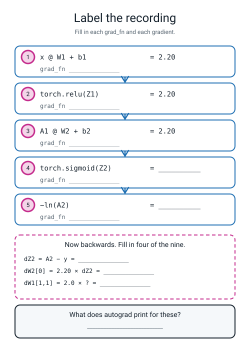
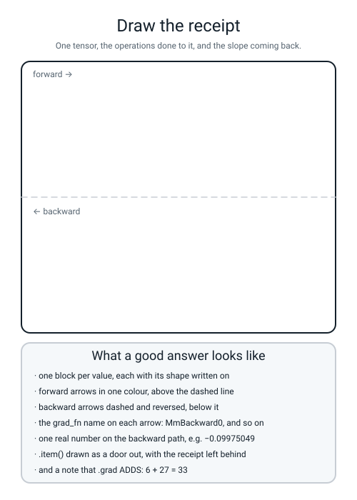

# Workbook — Week 20: A Machine That Does the Slopes For You

**Name:** ________________________________  **Date:** ______________

[⬅ Week 19](week-19.md) · [📖 Read the chapter first](../student-guide/week-20.md) · [Course Home](../README.md) · [Next ➡](week-21.md)

---

## ✅ Warm-Up (5 min)

Five quick questions about **last week** — NumPy Brain.

**W1.** `W1` is `(2, 16)`. **What shape is `dW1`, and how do you know without doing any arithmetic?**

**shape:** ____________  **because:** ______________________________

**W2.** A network's loss sits on exactly **0.6931** for 500 epochs and never moves. **What is the network doing, and what is 0.6931?**

________________________________________________________________

**W3.** How many knobs has a 2 → 16 → 1 network got? Show the sum.

`____ × ____ + ____ + ____ + ____ = ______`

**W4.** After a `lr = 20` run, **13 of 16** units are dead. **Would training for another 2000 gentle epochs bring any of them back?** ____________  **Why?**

________________________________________________________________

**W5.** Your gradient check prints `4.792e-08`. **Is that big or small, and what does it license you to do next?**

________________________________________________________________

---

## 🔢 Do the Maths by Hand

**There is no new maths this week**, so these four exercises use **Week 18's chain** and **Week 12's nudge** — because today's whole job is checking numbers you can produce yourself. **Calculator only. No code.**

**M1 — the forward pass of the Week 18 network.** Two inputs `x = [1.0, 2.0]`. Hidden unit 1 uses `W1` column 0, unit 2 uses column 1.

```
W1 = [ 0.5  -0.3 ]      b1 = [ 0.1   0.05 ]      W2 = [  1.0 ]      b2 = [ 0.3 ]
     [ 0.8   0.2 ]                                    [ -2.0 ]
```

```
z1 = 1.0 × 0.5 + 2.0 × 0.8 + 0.1        = ____________
z2 = 1.0 × (−0.3) + 2.0 × 0.2 + 0.05    = ____________

both positive, so after ReLU  A1 = [ ____________ , ____________ ]

Z2 = ____ × 1.0 + ____ × (−2.0) + 0.3   = ____________
```

**M1(a).** Now `sigmoid(Z2)` on a real calculator. Type the number, make it negative, press `e^x`, add 1, press `1/x`:

```
e^(−2.20)        = ____________
1 + that         = ____________
1 ÷ that         = ____________     ← this is A2
```

**M1(b).** And the loss. Press `ln` on your A2, then make it positive:

```
loss = −ln(____________) = ____________
```

**M1(c).** The network said about **90%** chance of class 1 and the truth was 1. **Is a loss of 0.105 large or small? Compare it with `−ln(0.5) = 0.6931`.**

________________________________________________________________

**M2 — nine gradients from one number.** The blame at the output is `A2 − y`.

```
dZ2  = ____________ − 1 = ____________
```

Now four multiplications, and every one is *blame × something*:

| entry | the sum | answer to 8 d.p. |
|---|---|---|
| `dW2[0]` | 2.20 × dZ2 | ____________ |
| `dW2[1]` | 0.15 × dZ2 | ____________ |
| `dA1[0]` | dZ2 × 1.0 | ____________ |
| `dA1[1]` | dZ2 × (−2.0) | ____________ |

**M2(a).** `dA1[1]` came out **positive** from two negatives. Explain in one sentence.

________________________________________________________________

**M2(b).** `dW1[1][1] = 2.0 × dA1[1] = ` ____________  and `dW1[0][1] = 1.0 × dA1[1] = ` ____________

**M2(c).** Which is bigger, and why? ______________________________

**M3 — the nudge, three times.** Measure three slopes with `h = 0.001` and the formula `(f(x+h) − f(x−h)) ÷ 2h`. No calculus.

| function | at | your nudged slope | the shortcut rule |
|---|---|---|---|
| `x²` | 3 | ____________ | `2x` = ______ |
| `1/x` | 2 | ____________ | — |
| `ln x` | 2 | ____________ | — |

**M3(a).** For `1/x` at 2, write out the two numbers you subtracted:

`1 ÷ 2.001 = ` ____________  and `1 ÷ 1.999 = ` ____________

**M3(b).** The last two rows have no shortcut rule you have been taught. **Did that stop you measuring the slope?** ____________  **What does that tell you about which of the two methods is more general?**

________________________________________________________________

**M4 — accumulation, by hand.** The slope of `x²` at `x = 3` is **6**. The slope of `x³` at `x = 3` is `3 × 3² = ` ______.

```
after the first  backward():  x.grad = ____________
after the second backward():  x.grad = ____________
```

**M4(a).** Suppose you accidentally call `backward()` **five** times on `x²` at `x = 3`. What does `x.grad` print? `5 × 6 = ` ______

**M4(b).** Now the reverse. `x.grad` prints **42** and you know the true one-call slope is 6. **How many times did you call `backward()`?** ______

**M4(c).** In one sentence, why is this the reason next week's loop starts with a wiping line?

________________________________________________________________

---

## 🔎 Predict the Output

**Write your prediction in pen before you run anything.** Every snippet starts with `import torch`. **One of these four prints something that is not zero and is not a number either.**

### P1 — a shape and two dtypes

```python
a = torch.tensor([[1, 2, 3], [4, 5, 6]])
print(a.shape)
print(a.dtype)
print(torch.tensor([[1.0, 2.0, 3.0], [4.0, 5.0, 6.0]]).dtype)
```

**I predict:** ____________________  ____________________  ____________________

**It really printed:**

```text
________________________________
________________________________
________________________________
```

**Line 1 does not look like `(2, 3)`. What does it actually say, and how would you make it print `(2, 3)`?**

________________________________________________________________

**Lines 2 and 3 differ by one thing you typed. What?** ____________________

### P2 — before and after

```python
x = torch.tensor([4.0], requires_grad=True)
y = x * x
print(y)
print(x.grad)
y.backward()
print(x.grad)
```

**I predict:** ____________________  ____________________  ____________________

**It really printed:**

```text
________________________________
________________________________
________________________________
```

**Line 1 has something extra on the end of it. What is it, and what put it there?**

________________________________________________________________

**Line 2 is the tricky one. Is it a number?** ____________  **What does it mean?** ______________________

### P3 — three trips round a loop

```python
w = torch.tensor([5.0], requires_grad=True)
for i in range(3):
    loss = (w * w).sum()
    loss.backward()
    print(w.grad.item())
```

**The slope of `w × w` at `w = 5` is** ______. **So I predict:** ______  ______  ______

**It really printed:**

```text
________________________________
```

**Write the arithmetic that produced the third line:** ______________________

### P4 — the shape of a gradient (tensor-shape prediction)

```python
W = torch.tensor([[1.0, 2.0], [3.0, 4.0]], requires_grad=True)
loss = (W * W).sum()
loss.backward()
print(W.grad)
print(W.grad.shape)
print(W.grad[0, 1].item())
print(type(W.grad[0, 1].item()))
```

**I predict — the shape on line 2:** ____________  **the number on line 3:** ____________

**It really printed:**

```text
________________________________________
________________________________________
________________________________________
________________________________________
```

**Every cell of `W.grad` is twice the matching cell of `W`. Why?**

________________________________________________________________

**Line 4 prints a *type*, not a number. Which method on line 3 changed the type, and what did it throw away?**

________________________________________________________________

**How many of the answers on this page did you get right?** ______ / 14

**Which one surprised you most?** ______________________________

---

## ✍️ Practice Set A — Read It

**A1. Match the word to the thing.** Write the letter.

| Word | | Description |
|---|---|---|
| **tensor** | ______ | (i) Where the slope lands. `None` until `backward()`, and it **adds** |
| **dtype** | ______ | (ii) The whole system: the recording plus the machinery that reads it backwards |
| **device** | ______ | (iii) A grid of numbers with a shape, plus a device and a recording |
| **`requires_grad`** | ______ | (iv) The record kept as you do arithmetic on tracked tensors |
| **computation graph** | ______ | (v) What kind of number is in the box, and how many digits you can trust |
| **autograd** | ______ | (vi) Where the numbers physically live |
| **`.grad`** | ______ | (vii) A flag meaning "this is a knob I want the slope of, so start recording" |

**A2. Read the printout.** Given this real output, answer six questions.

```text
tensor([[1., 2.],
        [3., 4.]])
shape: (2, 2)  dtype: torch.float32  device: cpu
z = tensor([[2.1000]], grad_fn=<MmBackward0>)
w.grad before backward: None
z.item()      = 2.0999999046325684
type(z)       = <class 'torch.Tensor'>
type(z.item())= <class 'float'>
```

| Question | Your answer |
|---|---|
| a. How many numbers are in the first tensor, and what shape? | |
| b. `torch.float32` — how many digits can you trust? | |
| c. What is `grad_fn=<MmBackward0>`, and **why is it there**? | |
| d. `w.grad` is `None`. Is that an error? | |
| e. Why is `z.item()` `2.0999999046325684` and not `2.1`? | |
| f. Which of the two lines at the bottom shows that `.item()` changed something? | |

**A2(g).** For (c), full marks needs a **cause**. Finish this sentence: *`z` has a `grad_fn` because* ______________________________________

**A3. Spot the bug.** Each line is wrong or misleading. Say what happens and write the fix.

| # | The line | What happens | The fix |
|---|---|---|---|
| a | `w = torch.tensor([[0]], requires_grad=True)` | | |
| b | `print(W1.grad.item())` where `W1` is 2 × 2 | | |
| c | `loss.backward()` written twice in a row | | |
| d | `losses.append(loss)` inside a 200-step loop | | |
| e | `x = torch.tensor([[1.0]], dtype=torch.float64)` and `w = torch.tensor([[0.5]])`, then `x @ w` | | |
| f | `loss = pred - y` (six rows), then `loss.backward()` | | |

**A3(g).** Which one of those six produces **no error at all**? ______  **How would you notice it?**

________________________________________________________________

**A4. Match the code to the output.** Five of each, no output used twice. Assume `import torch` above each.

| | Code |
|---|---|
| i | `x = torch.tensor([3.0], requires_grad=True); y = x*x; y.backward(); print(x.grad.item())` |
| ii | `x = torch.tensor([-2.0], requires_grad=True); y = torch.relu(x); y.backward(); print(x.grad.item())` |
| iii | `print(torch.tensor([1, 2]).dtype)` |
| iv | `w = torch.tensor([[0.5],[0.8]], requires_grad=True); print((torch.tensor([[1.0,2.0]]) @ w))` |
| v | `x = torch.tensor([2.0], requires_grad=True); y = 1/x; y.backward(); print(x.grad.item())` |

| | Output |
|---|---|
| P | `torch.int64` |
| Q | `6.0` |
| R | `-0.25` |
| S | `0.0` |
| T | `tensor([[2.1000]], grad_fn=<MmBackward0>)` |

**Your answers:** i → ______  ii → ______  iii → ______  iv → ______  v → ______

**A4(f).** One of those five outputs is the whole of Week 19's **dead ReLU**, in a single line. Which, and why?

________________________________________________________________

**A5. Label the recording.** Fill in every empty box in the figure — the value, the `grad_fn`, and the four gradients underneath.


*Figure W20.1 — The five forward lines with their grad_fn names removed, and four of the nine gradients to fill in.*

**A5(a).** Two of the five boxes hold the value **2.20**. Are they the same number for the same reason?

________________________________________________________________

**A5(b).** Which box's `grad_fn` is the one that would print `ReluBackward0`? ______

**A6. Say the sentence.** Finish each one so it is true and complete.

**a)** A tensor is a numpy array with two things stapled to it: ______________________ and ______________________.

**b)** `requires_grad=True` means ______________________________, and you can see that it worked because the results grow a ____________.

**c)** `w.grad` is `None` when ______________________________ or ______________________________.

**d)** `.grad` **adds** rather than replaces, and the number that proves it is ______ + ______ = ______.

**e)** You use `float32` for ______________ and `float64` for ______________.

**f)** `.item()` gives you ______________________ and throws away ______________________.

---

## ✍️ Practice Set B — Write It

### B1 — one line, plus a print

**Task:** make a 2 × 3 tensor of decimals and print its shape, dtype and device on one line.

**Expected output:**

```text
shape (2, 3)  dtype torch.float32  device cpu
```

**Done looks like:** `tuple(t.shape)` so it prints `(2, 3)` rather than `torch.Size([2, 3])`.

```python
t = ______________________________________________________________

print(__________________________________________________________)
```

### B2 — one slope, four lines

**Task:** get the slope of `x³` at `x = 2` out of autograd, and print it.

**Expected output:**

```text
slope of x**3 at x = 2 is 12.0
```

**Done looks like:** four lines, and you wrote **12** on your page before you ran it. (`3x²` at 2 is `3 × 4`.)

```python
x = ______________________________________________________________

y = ______________________________________________________________

________________________________________________________________

print(__________________________________________________________)
```

### B3 — accumulation, then the wipe

**Task:** call `backward()` three times on `x * x` at `x = 4`, printing `x.grad` each time. Then wipe it with `x.grad.zero_()` and do one more.

**Expected output:**

```text
backward 1: x.grad = 8.0
backward 2: x.grad = 16.0
backward 3: x.grad = 24.0
after zero_() and one more: x.grad = 8.0
```

**Done looks like:** the three numbers are `1, 2, 3` times `2 × 4`, and **the fourth line is back to a single slope.**

```python
x = ______________________________________________________________

for i in range(3):
    ____________________________________________________________
    ____________________________________________________________
    print(______________________________________________________)

________________________________________________________________
```

**B3(a).** Why does the forward line have to be **inside** the loop?

________________________________________________________________

### B4 — the `.item()` experiment, in miniature

**Task:** build two lists of 5 losses from the same calculation — one with `.item()` and one without — then print the first element and the type of each.

**Expected output:**

```text
wrong[0] : tensor(4.4100, grad_fn=<MeanBackward0>)  type <class 'torch.Tensor'>
right[0] : 4.409999370574951  type <class 'float'>
```

**Done looks like:** one loop, two `append` lines, and you can point at the `grad_fn` and say what it is.

```python
x = torch.tensor([[1.0, 2.0]])
w = torch.tensor([[0.5], [0.8]], requires_grad=True)

wrong, right = [], []
for step in range(5):
    loss = ____________________________________________________
    ____________________________________________________________
    ____________________________________________________________

print(__________________________________________________________)
print(__________________________________________________________)
```

**B4(a).** `4.41` is `2.1²`, and `2.1` is `1 × 0.5 + 2 × 0.8`. **Why does `right[0]` print `4.409999370574951` rather than `4.41`?**

________________________________________________________________

### B5 — a whole program of your own, about 25 lines

**Task:** write `b5w20.py` — your own **three-row match test** on a single neuron with two inputs. It must:

1. use `dtype=torch.float64` everywhere, and `requires_grad=True` on `w` and `b` only
2. use `x = [[2.0, 5.0]]`, `y = [[0.0]]`, `w = [[0.3], [0.1]]`, `b = [-0.6]`
3. do the forward pass — `z`, then `sigmoid`, then the loss for a **class-0** row, which is `−ln(1 − p)`
4. print `z`, `p` and the loss to 8 decimal places
5. call `backward()` once
6. build a **three-row table**: entry name, your hand answer, autograd's answer, and the difference to 8 decimal places
7. print the biggest disagreement

**The hand answers you need:** the blame is `p − y = p − 0`, and each weight's slope is *blame × its input*, so `2.0 × blame`, `5.0 × blame`, and the bias's slope is the blame itself.

**Expected output:**

```text
z    = 0.50000000
p    = 0.62245933
loss = 0.97407698

entry        by hand      autograd   difference
dw[0]     1.24491866    1.24491866   0.00000000
dw[1]     3.11229666    3.11229666   0.00000000
db        0.62245933    0.62245933   0.00000000

biggest disagreement: 0.00000000
```

**Done looks like:** **three zeros**, and you can show on a calculator that `2 × 0.3 + 5 × 0.1 − 0.6 = 0.5` and that `sigmoid(0.5) = 0.62245933`.

> **💡 Try this:** afterwards, delete `dtype=torch.float64` from all four tensors and re-run. **The differences stop being zero.** They are about `1e-8`, and neither column is wrong.

---

## 🐞 Fix the Broken Program

This program has **three** bugs: one **dtype**, one **runtime**, and one **silent logic bug**. The real error messages are below, in the order you meet them.

```python
"""broken20.py - one neuron, its gradients, and a log of losses. THREE bugs."""
import torch

torch.manual_seed(0)

x = torch.tensor([[3.0, 1.0]], dtype=torch.float64)
y = torch.tensor([[1.0]], dtype=torch.float64)

w = torch.tensor([[0.4], [-0.2]], requires_grad=True)
b = torch.tensor([0.5], dtype=torch.float64)

log = []
for step in range(5):
    z = x @ w + b
    p = torch.sigmoid(z)
    loss = -torch.log(p)
    log.append(loss.item())

loss.backward()
print("w.grad =", w.grad.item())
print("b.grad =", b.grad)
print("log[0] =", log[0], " type", type(log[0]))
```

**Run 1 — nothing prints at all:**

```text
Traceback (most recent call last):
  File "broken20.py", line 14, in <module>
    z = x @ w + b
RuntimeError: expected m1 and m2 to have the same dtype, but got: double != float
```

**Bug 1.** Which line? ______  **Kind of bug?** ______________

**"double" is PyTorch's word for `float64` and "float" is its word for `float32`. Which tensor is which?**

**`double`:** ____________  **`float`:** ____________

**The fix:** ______________________________

**Run 2 — after fixing bug 1:**

```text
Traceback (most recent call last):
  File "broken20.py", line 20, in <module>
    print("w.grad =", w.grad.item())
RuntimeError: a Tensor with 2 elements cannot be converted to Scalar
```

**Bug 2.** Which line? ______  **Kind of bug?** ______________

**How many numbers does `.item()` want?** ______  **How many are in `w.grad`, and why that many?**

________________________________________________________________

**Two possible fixes — write both:**

**print the whole thing:** ______________________________

**or index one cell first:** ______________________________

**Run 3 — after fixing bugs 1 and 2. It runs all the way through, no error at all:**

```text
w.grad = tensor([[-0.5473],
        [-0.1824]], dtype=torch.float64)
b.grad = None
log[0] = 0.2014132779827524  type <class 'float'>
```

**Bug 3 is on that middle line, and it is silent.**

**What does `b.grad` printing `None` mean?** ______________________________

**Which line of the program caused it?** ______  **What is missing?** ______________________

**In a real training loop, what would be the consequence of this bug, and would anything tell you?**

________________________________________________________________

________________________________________________________________

**The fix:** ______________________________

**Run 4 — after fixing all three:**

```text
w.grad = tensor([[-0.5473],
        [-0.1824]], dtype=torch.float64)
b.grad = tensor([-0.1824], dtype=torch.float64)
log[0] = 0.2014132779827524  type <class 'float'>
```

**Two questions, and they are the point of the page.**

**Bug 3 changed one line of output from `None` to a number. Rank the three bugs by how much time each would cost you to find, and explain the ranking.**

________________________________________________________________

________________________________________________________________

**The `log` line was already correct — it uses `.item()`. Say what the printout would have looked like without it, and which field would have given it away.**

________________________________________________________________

---

## 🧩 Puzzle of the Week

### Part 1 — How many backwards?

Somebody has been calling `backward()` more times than they meant to. For each row you are given **the true one-call slope** and **what `.grad` actually printed**. Work out how many times `backward()` was called.

| # | expression | at | true one-call slope | `.grad` printed | how many calls? |
|---|---|---|---|---|---|
| 1 | `x * x` | 3 | 6 | `42.0` | ______ |
| 2 | `x * x * x` | 2 | 12 | `60.0` | ______ |
| 3 | `1 / x` | 2 | −0.25 | `-0.75` | ______ |
| 4 | `5 * x` | 7 | 5 | `5.0` | ______ |
| 5 | `torch.relu(x)` | −2 | 0 | `0.0` | ______ |

**Part 1(a).** Row 5 is impossible to answer. Why?

________________________________________________________________

**Part 1(b).** So finish the rule, being careful about the exception: *you can work out the number of `backward()` calls from `.grad` by dividing — unless* ______________________.

**Part 1(c).** Rows 1 to 3 all have the same answer to a different question. What single habit would have prevented all three?

________________________________________________________________

### Part 2 — The Receipt Detective

Here are five real printouts from one short program. For each, say whether the tensor is **a knob**, **data**, or **a value in the middle of the recording** — and give your evidence.

```text
A: tensor([[1., 2.]])
B: tensor([[0.5000],
        [0.8000]], requires_grad=True)
C: tensor([[2.1000]], grad_fn=<MmBackward0>)
D: 0.8909031748771667
E: tensor([[0.8909]], grad_fn=<SigmoidBackward0>)
```

| | knob / data / middle | my evidence |
|---|---|---|
| **A** | | |
| **B** | | |
| **C** | | |
| **D** | | |
| **E** | | |

**Part 2(a).** **D and E are the same number.** What is the difference between them, and which method call turned one into the other?

________________________________________________________________

**Part 2(b).** Which two of the five would have a `.grad` filled in by `backward()`? ____________

**Part 2(c).** `C` says `MmBackward0` and `E` says `SigmoidBackward0`. **In one sentence, what is that word telling you?**

________________________________________________________________

**Part 2(d).** Reconstruct the program. Write the three lines that produced A, B, C and E.

```python
________________________________________________________________

________________________________________________________________

________________________________________________________________
```

---

## 🤔 Think Deeper

**T1.** `loss.backward()` replaced eight lines you spent two lessons deriving. **Write a paragraph** answering, honestly, whether Week 18 and Week 19 were worth it. Name at least two specific things you can do that somebody who started at `loss.backward()` cannot — and be fair to the other side: name one thing they have that you do not.

________________________________________________________________

________________________________________________________________

________________________________________________________________

________________________________________________________________

________________________________________________________________

**T2.** Autograd never writes down a formula. Every operation just ships with a small piece of code saying *"given the slope coming into my output, here is the slope going out of each input"*, and `backward()` walks the graph calling those. **Write a paragraph** on what that means about the *limits* of autograd. What kind of calculation could you write that it would not be able to differentiate — and is that a bug or a boundary?

________________________________________________________________

________________________________________________________________

________________________________________________________________

________________________________________________________________

________________________________________________________________

---

## 🛠️ Build It — Ten Slopes, and the `.item()` Experiment

**Two pages. The first is about being wrong in pen; the second is about what a tensor is carrying.**

### Part A — ten slopes, hand answer first

**The pattern for every one:**

```python
x = torch.tensor([VALUE], requires_grad=True)
y = EXPRESSION
y.backward()
print(x.grad.item())
```

**Write your own answer in the "by hand" column FIRST, in pen. Then run it. Then tick or cross.**

| # | expression | at | by hand (in pen) | autograd | ✓ / ✗ |
|:--:|---|:--:|---|---|:--:|
| 1 | `x * x` | 3 | | | |
| 2 | `x * x * x` | 2 | | | |
| 3 | `5 * x` | 7 | | | |
| 4 | `x * x + 3 * x` | 1 | | | |
| 5 | `(x - 4) * (x - 4)` | 1 | | | |
| 6 | `1 / x` | 2 | | | |
| 7 | `torch.exp(x)` | 0 | | | |
| 8 | `torch.log(x)` | 2 | | | |
| 9 | `torch.relu(x)` | 2 | | | |
| 10 | `torch.relu(x)` | −2 | | | |

**How many crosses?** ______  **(If the answer is zero, be honest with yourself about whether the predictions really came first.)**

**Which two caught you out?** ______ and ______

**Item 10 is a whole idea from last week, in one line. Which idea?**

________________________________________________________________

**Bonus — two knobs at once.** `L = (2w + b − 10)²` at `w = 3`, `b = 1`.

```python
w = torch.tensor([3.0], requires_grad=True)
b = torch.tensor([1.0], requires_grad=True)
L = (2 * w + b - 10) ** 2
L.backward()
```

**By hand first:** `2 × 3 + 1 − 10 = ` ______, so `L = ` ______

**dL/dw =** ____________  **dL/db =** ____________

**And what autograd said:** ____________  ____________

### Part B — the `.item()` experiment

**Build a list of 200 losses the wrong way, on purpose.**

- [ ] **1.** Loop 200 times. Compute `pred = torch.sigmoid(x @ w)` and `loss = -(y * torch.log(pred)).mean()`.
- [ ] **2.** `wrong.append(loss)` — **no `.item()`**.
- [ ] **3.** Print `len(wrong)`, `wrong[0]`, `wrong[199]` and `type(wrong[0])`.
- [ ] **4.** Try to plot the list. **Paste whatever happens, word for word.**
- [ ] **5.** Now do the same 200 losses again with **one method call** added.
- [ ] **6.** Print the same four things.
- [ ] **7.** Plot it. It works. Say what file got written.
- [ ] **8.** Write the one sentence.

**The wrong way:**

| | what it printed |
|---|---|
| `len(wrong)` | |
| `wrong[0]` | |
| `wrong[199]` | |
| `type(wrong[0])` | |
| plotting it | |

**The error message, word for word:**

________________________________________________________________

**The right way:**

| | what it printed |
|---|---|
| `len(right)` | |
| `right[0]` | |
| `right[199]` | |
| `type(right[0])` | |
| plotting it | |

**The one method call that fixed it:** ____________________

**`wrong[0]` and `wrong[199]` are identical. Why? (There is nothing wrong.)**

________________________________________________________________

### The sentence being marked

**What were you storing before the fix? Not the type — what was each one *carrying*?**

________________________________________________________________

________________________________________________________________

### Stretch — measure what it costs

Run `memcost.py` twice, once with `tensor` and once with `item`, and **do the subtraction**.

| mode | before | after | difference |
|---|---|---|---|
| `tensor` | | | |
| `item` | | | |

**The ratio:** ____________  **Your absolute numbers will not match anyone else's. Should the ratio?** ____________

### The Bug Log

Two entries today, and one of them is a new category: *no error, small disagreement, and here is why.*

| What I saw | What it means | Cause | Fix |
|---|---|---|---|
| | | | |
| | | | |

---

## 🎨 Draw It

Draw **the receipt** — one tensor, the operations done to it going forward, and the slope coming back.


*Figure W20.2 — An empty frame split into a forward half and a backward half, and what a good answer contains.*

**Then answer four things about your own drawing:**

**How many blocks did you draw, and does each one carry a shape?** ______________________

**What is written on your backward arrows?** ______________________

**Which real number did you put on the backward path?** ______________________

**Where is `.item()` in your drawing, and what is left behind when you go through it?**

________________________________________________________________

---

## 📊 Self-Check

| I can... | 😀 | 🙂 | 😕 |
|---|---|---|---|
| create a tensor with a chosen dtype and shape, and print all three of shape, dtype and device | | | |
| name **two concrete ways** a tensor is not a numpy array, and point at both on a printout | | | |
| say what `requires_grad=True` does, and find the `grad_fn` it caused | | | |
| get a gradient from `backward()` and check it against a hand answer | | | |
| explain the difference between `w.grad` being `None` and being `0.0` | | | |
| explain why `.grad` adds, using `6 + 27 = 33` | | | |
| use `.item()`, and show what breaks without it | | | |
| read `−0.0998` and `−0.09975049` as the same number | | | |
| say when to use `float32` and when to use `float64`, and why | | | |
| explain autograd as one local rule per operation, not as algebra | | | |

**The one thing I would ask about if I could ask one question:**

________________________________________________________________

---

## ✅ Answers

<details>
<summary>Check your answers</summary>

### Warm-Up

**W1.** **`(2, 16)`** — the same as `W1`, **because every gradient has the same shape as the thing it is the gradient of.** You do not need to look at a single transpose to answer this.

**W2.** It is answering **0.5 to every row**, for ever. `0.6931` is `−ln(0.5)` — the loss of a model that shrugs. It happens when every weight starts at zero (or all equal), because then every gradient into layer 1 is exactly zero and there is no downhill.

**W3.** `2 × 16 + 16 + 16 + 1 = 32 + 16 + 16 + 1 = **65**`.

**W4.** **No.** A dead unit outputs zero for every row, so ReLU's slope there is zero, so its gradient is zero, and **zero times any learning rate is zero.** We tested it: 2000 more epochs at `lr = 0.5` and all thirteen were still dead.

**W5.** **Tiny** — `4.792e-08` is `0.00000004792`, well below the `1e-6` threshold. It licenses you to **train**. Above `1e-6`, you go and find the transpose instead.

### Do the Maths by Hand

**M1.**

```
z1 = 1.0 × 0.5 + 2.0 × 0.8 + 0.1      = 0.5 + 1.6 + 0.1   = 2.20
z2 = 1.0 × (−0.3) + 2.0 × 0.2 + 0.05  = −0.3 + 0.4 + 0.05 = 0.15

A1 = [2.20, 0.15]

Z2 = 2.20 × 1.0 + 0.15 × (−2.0) + 0.3 = 2.20 − 0.30 + 0.30 = 2.20
```

**M1(a).** `e^(−2.20) = 0.110803` · `1 + that = 1.110803` · `1 ÷ that = **0.90024951**`.

**M1(b).** `loss = −ln(0.90024951) = **0.10508332**`.

**M1(c).** **Small.** Being 90% confident and right costs about a tenth of a nat; shrugging at 0.5 costs 0.6931, nearly seven times as much. **Log loss rewards confident correctness.**

**M2.**

```
dZ2 = 0.90024951 − 1 = −0.09975049
```

| entry | answer |
|---|---|
| `dW2[0]` | **−0.21945108** |
| `dW2[1]` | **−0.01496257** |
| `dA1[0]` | **−0.09975049** |
| `dA1[1]` | **+0.19950098** |

**M2(a).** Unit 2's weight into the output is **negative** (−2.0), so turning unit 2 **up** pushes the score **down**. We want the score up, so the slope for unit 2 points the opposite way to unit 1's. A negative weight flips the direction of the blame.

**M2(b).** `dW1[1][1] = 2.0 × 0.19950098 = **0.39900196**` and `dW1[0][1] = 1.0 × 0.19950098 = **0.19950098**`.

**M2(c).** **`dW1[1][1]`, by exactly a factor of two**, because input 2 was `2.0` and input 1 was `1.0`. The slope is *input × blame*, so a bigger input means a bigger correction. **Loud inputs get blamed most** — the same rule as loud units.

**M3.**

| function | at | nudged slope | shortcut |
|---|---|---|---|
| `x²` | 3 | **6.0000** | `2x` = **6** |
| `1/x` | 2 | **−0.2500** | — |
| `ln x` | 2 | **0.5000** | — |

**M3(a).** `1 ÷ 2.001 = 0.49975012` and `1 ÷ 1.999 = 0.50025013`. Subtract: `−0.00050001`. Divide by `0.002`: `−0.2500`.

**M3(b).** **No, it did not stop you.** That is the whole point: **the nudge needs no rules at all**, only the ability to evaluate the function twice. The shortcut rules are faster and they only exist for functions somebody has already worked out. **The nudge is more general; the rules are more convenient.** Autograd is the third option: as general as the nudge and as fast as the rules.

**M4.** Slope of `x³` at 3 is `3 × 9 = **27**`.

```
after the first  backward():  x.grad = 6
after the second backward():  x.grad = 33      (6 + 27)
```

**M4(a).** `5 × 6 = **30**`.

**M4(b).** `42 ÷ 6 = **7** calls.`

**M4(c).** *Because `.grad` adds, every trip round a training loop would step with today's slope plus yesterday's plus the day before's, so the steps grow for no reason — which is why the loop's first line exists to wipe it.*

### Predict the Output

**P1.**

```text
torch.Size([2, 3])
torch.int64
torch.float32
```

**Line 1 says `torch.Size([2, 3])`**, not `(2, 3)`. `torch.Size` is a special kind of tuple, and it prints itself with its own name on it. **To get `(2, 3)`, wrap it: `tuple(a.shape)`.**

**Lines 2 and 3 differ because of the decimal points.** `[[1, 2, 3], ...]` is whole numbers, so `int64`. `[[1.0, 2.0, 3.0], ...]` is decimals, so `float32`. **The `.0` is not decoration** — a knob has to be a decimal, and `requires_grad=True` on an `int64` tensor is refused outright.

**P2.**

```text
tensor([16.], grad_fn=<MulBackward0>)
None
tensor([8.])
```

**Line 1's extra piece is `grad_fn=<MulBackward0>`** — the receipt. It is there because `x` was created with `requires_grad=True`, so multiplying it recorded the operation. `Mul` is multiply.

**Line 2 is not a number.** `None` means **nothing has been written into that box yet** — `backward()` has not run. It is not zero. And line 3 is `2 × 4 = 8`, which you can check with a nudge.

**P3.** The slope of `w × w` at `w = 5` is `2 × 5 = **10**`.

```text
10.0
20.0
30.0
```

**The arithmetic for the third line: `10 + 10 + 10 = 30`.** Three `backward()` calls, three slopes piled into the same box, and **nothing wiped it in between.**

**P4.**

```text
tensor([[2., 4.],
        [6., 8.]])
torch.Size([2, 2])
4.0
<class 'float'>
```

**Every cell is twice the matching cell of `W`** because the loss is the sum of every cell squared, and the slope of `c²` with respect to `c` is `2c`. So the gradient of cell `[0,1]`, which holds `2.0`, is `2 × 2.0 = 4.0`. **And the shape is `(2, 2)` — the same as `W`.** Week 19's rule, unchanged in torch.

**Line 4:** `.item()` changed the type from `torch.Tensor` to `float`. **What it threw away is the receipt** — the `grad_fn` and the whole graph behind it. That is exactly what you want for a number you are only going to print.

### Practice Set A

**A1.** tensor → **(iii)** · dtype → **(v)** · device → **(vi)** · `requires_grad` → **(vii)** · computation graph → **(iv)** · autograd → **(ii)** · `.grad` → **(i)**

**A2.**

| Question | Answer |
|---|---|
| a | **Four**, shape `(2, 2)` — two rows, two columns |
| b | **About seven.** `float64` would give about sixteen |
| c | It is **the recording**: `z` remembers that a matrix multiply produced it, and which tensors went in. It is there because one of the inputs had `requires_grad=True` |
| d | **No.** It means nothing has been written there yet — `backward()` has not run. `None` and `0.0` mean completely different things |
| e | 2.1 cannot be stored exactly in binary in 32 bits, the way a third cannot be written exactly in decimal. It is right to seven digits. On paper, `1.0 × 0.5 + 2.0 × 0.8 = 2.10` |
| f | The last two lines: `type(z)` is `torch.Tensor`, `type(z.item())` is `float`. **The type changed, so something was thrown away** |

**A2(g).** *`z` has a `grad_fn` because **one of the tensors that went into making it had `requires_grad=True`, so PyTorch started recording.*** Full marks needs that causal link — the flag on the **input** is what gives the **output** a receipt.

**A3.**

| # | What happens | The fix |
|---|---|---|
| a | `RuntimeError: Only Tensors of floating point and complex dtype can require gradients` | `[[0.0]]`, or `dtype=torch.float32` |
| b | `RuntimeError: a Tensor with 4 elements cannot be converted to Scalar` | `W1.grad[0, 0].item()`, or print `W1.grad` without `.item()` |
| c | `RuntimeError: Trying to backward through the graph a second time ...` | Do the forward pass again. **Not** `retain_graph=True` |
| d | **No error.** You keep 200 tensors, each carrying its whole graph. Plotting them raises `Can't call numpy() on Tensor that requires grad` | `losses.append(loss.item())` |
| e | `RuntimeError: expected m1 and m2 to have the same dtype, but got: double != float` | Give both the same dtype |
| f | `RuntimeError: grad can be implicitly created only for scalar outputs` | `.mean()` or `.sum()`. `backward()` needs one number |

**A3(g).** **d.** You would notice it from the **type** — `type(losses[0])` says `torch.Tensor` — or from the printout carrying a `grad_fn`, or from the program using far more memory than it should, or from matplotlib refusing to plot it. **Nothing crashes until you try to use the list.**

**A4.** i → **Q** · ii → **S** · iii → **P** · iv → **T** · v → **R**

**A4(f).** **ii, which prints `0.0`.** `torch.relu(x)` at `x = −2` did not fire, so nothing gets through, so the slope is exactly zero. **That is a dead ReLU in one line** — and it is why no learning rate can revive one.

**A5.** The five `grad_fn` names and the values, in order:

| # | line | value | `grad_fn` |
|---|---|---|---|
| 1 | `x @ W1 + b1` | 2.20 | `AddBackward0` |
| 2 | `torch.relu(Z1)` | 2.20 | `ReluBackward0` |
| 3 | `A1 @ W2 + b2` | 2.20 | `AddBackward0` |
| 4 | `torch.sigmoid(Z2)` | **0.90024951** | `SigmoidBackward0` |
| 5 | `−ln(A2)` | **0.10508332** | `NegBackward0` |

And the four gradients: `dZ2 = 0.90024951 − 1 = **−0.09975049**` · `dW2[0] = 2.20 × dZ2 = **−0.21945108**` · `dW1[1,1] = 2.0 × (+0.19950098) = **+0.39900196**`.

**A5(a).** **No, and this is a nice coincidence to notice.** Box 1's `2.20` is `0.5 + 1.6 + 0.1`. Box 2's `2.20` is the *same* number, because ReLU left a positive value alone. Box 3's `2.20` is a **different sum that happens to land on the same value**: `2.20 − 0.30 + 0.30`. The `−0.30` and `+0.30` cancel.

**A5(b).** **Box 2.**

**A6.**

**a)** **a device** (where the numbers live) and **a computation graph** (a receipt of everything done to it).

**b)** *"this is a knob I want the slope of, so start recording"*, and you can see it worked because the results grow a **`grad_fn`**.

**c)** when **`backward()` has not been called yet**, or when **`requires_grad=True` is missing on that tensor**.

**d)** **6 + 27 = 33.**

**e)** `float32` for **training** (faster, half the memory, and seven digits is plenty for a noisy gradient) and `float64` for **checking** against arithmetic you did by hand.

**f)** `.item()` gives you **an ordinary Python number** and throws away **the recording — the `grad_fn` and the whole graph behind it**.

### Practice Set B

**B1.**

```python
import torch

t = torch.tensor([[1.0, 2.0, 3.0], [4.0, 5.0, 6.0]])
print("shape", tuple(t.shape), " dtype", t.dtype, " device", t.device)
```

```text
shape (2, 3)  dtype torch.float32  device cpu
```

**B2.**

```python
import torch

x = torch.tensor([2.0], requires_grad=True)
y = x ** 3
y.backward()
print("slope of x**3 at x = 2 is", x.grad.item())
```

```text
slope of x**3 at x = 2 is 12.0
```

`3x²` at `x = 2` is `3 × 4 = 12`. **If you wrote 12 first, tick it.**

**B3.**

```python
import torch

x = torch.tensor([4.0], requires_grad=True)
for i in range(3):
    y = x * x
    y.backward()
    print("backward %d: x.grad = %.1f" % (i + 1, x.grad.item()))

x.grad.zero_()
y = x * x
y.backward()
print("after zero_() and one more: x.grad = %.1f" % x.grad.item())
```

```text
backward 1: x.grad = 8.0
backward 2: x.grad = 16.0
backward 3: x.grad = 24.0
after zero_() and one more: x.grad = 8.0
```

`8, 16, 24` is `1, 2, 3` times `2 × 4`.

**B3(a).** Because **the graph is freed when `backward()` reads it.** A single `y` built before the loop would be readable once, and the second `backward()` would raise *"Trying to backward through the graph a second time"*. **Every backward pass needs a fresh forward pass** — which is exactly why line 2 of next week's loop is inside the loop.

**B4.**

```python
import torch

x = torch.tensor([[1.0, 2.0]])
w = torch.tensor([[0.5], [0.8]], requires_grad=True)

wrong, right = [], []
for step in range(5):
    loss = ((x @ w) ** 2).mean()
    wrong.append(loss)
    right.append(loss.item())

print("wrong[0] :", wrong[0], " type", type(wrong[0]))
print("right[0] :", right[0], " type", type(right[0]))
```

```text
wrong[0] : tensor(4.4100, grad_fn=<MeanBackward0>)  type <class 'torch.Tensor'>
right[0] : 4.409999370574951  type <class 'float'>
```

**B4(a).** Because it is **`float32`**. `1 × 0.5 + 2 × 0.8 = 2.1` cannot be stored exactly in binary, so `2.1²` comes out as `4.409999370574951` rather than `4.41`. **Seven digits, then it stops.** Note that `wrong[0]` *also* holds that value — it just prints itself to four decimals.

**B5.**

```python
"""b5w20.py - a three-row match test on one neuron."""
import torch

torch.manual_seed(0)

x = torch.tensor([[2.0, 5.0]], dtype=torch.float64)
y = torch.tensor([[0.0]], dtype=torch.float64)
w = torch.tensor([[0.3], [0.1]], dtype=torch.float64, requires_grad=True)
b = torch.tensor([-0.6], dtype=torch.float64, requires_grad=True)

z = x @ w + b
p = torch.sigmoid(z)
loss = -torch.log(1 - p)
print("z    = %.8f" % z.item())
print("p    = %.8f" % p.item())
print("loss = %.8f" % loss.item())

loss.backward()

blame = p.item() - 0.0
rows = [
    ("dw[0]", 2.0 * blame, w.grad[0, 0].item()),
    ("dw[1]", 5.0 * blame, w.grad[1, 0].item()),
    ("db   ", 1.0 * blame, b.grad[0].item()),
]
print()
print("%-6s %13s %13s %12s" % ("entry", "by hand", "autograd", "difference"))
worst = 0.0
for name, hand, auto in rows:
    gap = abs(hand - auto)
    worst = max(worst, gap)
    print("%-6s %13.8f %13.8f %12.8f" % (name, hand, auto, gap))
print()
print("biggest disagreement: %.8f" % worst)
```

```text
z    = 0.50000000
p    = 0.62245933
loss = 0.97407698

entry        by hand      autograd   difference
dw[0]     1.24491866    1.24491866   0.00000000
dw[1]     3.11229666    3.11229666   0.00000000
db        0.62245933    0.62245933   0.00000000

biggest disagreement: 0.00000000
```

**Every number is checkable:**

```
z    = 2 × 0.3 + 5 × 0.1 − 0.6 = 0.6 + 0.5 − 0.6 = 0.50
p    = sigmoid(0.50) = 0.62245933
loss = −ln(1 − 0.62245933) = −ln(0.37754067) = 0.97407698

blame = p − y = 0.62245933 − 0 = 0.62245933
  × 2.0  →  1.24491866
  × 5.0  →  3.11229666
  × 1.0  →  0.62245933   (the bias multiplies 1 on every row)
```

**Note the signs.** Here `y = 0` and the model said 0.62, so the blame is **positive** — the score needs to come **down**. In the chapter's example `y = 1` and the blame was negative. **The sign of the blame is just which way you were wrong.**

### Fix the Broken Program

**Bug 1 — line 9, `w = torch.tensor([[0.4], [-0.2]], requires_grad=True)`. A dtype bug.**

`double` is `float64`; `float` is `float32`. So **`x` is the `double`** (it was given `dtype=torch.float64`) and **`w` is the `float`** (it was left at the default). PyTorch will not silently promote one to match the other in a matrix multiply — it refuses and tells you which two it saw.

**The fix:** `w = torch.tensor([[0.4], [-0.2]], dtype=torch.float64, requires_grad=True)`.

**Bug 2 — line 20, `print("w.grad =", w.grad.item())`. A runtime bug.**

`.item()` wants **exactly one** number. `w.grad` holds **two**, because `w` holds two — one weight per input feature, and **a gradient always has the shape of its knob.**

**Two fixes:** `print("w.grad =", w.grad)` — print the whole tensor. Or `print(w.grad[0, 0].item())` — index one cell first.

**Bug 3 — line 10, `b = torch.tensor([0.5], dtype=torch.float64)`. A silent logic bug: `requires_grad=True` is missing.**

`b.grad` printing **`None`** means **nobody ever wrote a slope into that box.** `b` was never on the recording, so `backward()` walked straight past it. It was treated like the data.

**The consequence in a real training loop:** the optimizer has no gradient for `b`, so **that knob never learns.** The model still trains, still improves, and ends up mediocre. **Nothing tells you.** No error, no warning, and the loss curve looks perfectly ordinary.

**The fix:** add `requires_grad=True` to `b`.

**Ranking by time cost: bug 3 ≫ bug 2 ≈ bug 1.** Bugs 1 and 2 crash immediately and name the exact problem — the message even tells you the two dtypes, or the number of elements. Bug 3 is the expensive one, and it is expensive precisely *because* it is cheap to run: it produces a working program. The only thing that catches it is the habit of **printing `requires_grad` and looking for `None`**.

**Without `.item()` on the log line**, `log[0]` would have printed `tensor([[0.2014]], dtype=torch.float64, grad_fn=<NegBackward0>)` and the type would have been `<class 'torch.Tensor'>`. **The `grad_fn` field is what gives it away** — it means that value is still attached to the graph that made it.

### Puzzle of the Week

**Part 1 — how many backwards?**

| # | how many calls | working |
|---|---|---|
| 1 | **7** | `42 ÷ 6 = 7` |
| 2 | **5** | `60 ÷ 12 = 5` |
| 3 | **3** | `−0.75 ÷ −0.25 = 3` |
| 4 | **1** | `5 ÷ 5 = 1` |
| 5 | **impossible to say** | — |

**Part 1(a).** Because the true slope is **zero**, and **any number of zeros still add up to zero.** `0`, `2 × 0`, `900 × 0` — all print `0.0`. The division `0 ÷ 0` has no answer.

**Part 1(b).** *…you can work out the number of `backward()` calls from `.grad` by dividing — **unless the true slope is zero**, in which case the pile is invisible.*

**Part 1(c).** **Wiping `.grad` before every backward pass** — either `x.grad.zero_()`, or, from next week, `optimizer.zero_grad()`. One habit, all three rows prevented.

**Part 2 — the Receipt Detective.**

| | verdict | evidence |
|---|---|---|
| **A** | **data** | no `requires_grad=True`, no `grad_fn`. It was used, not tuned |
| **B** | **a knob** | it says `requires_grad=True` and has **no** `grad_fn` — nothing made it, you typed it |
| **C** | **middle** | it has a `grad_fn` (`MmBackward0`), which only appears on values something *produced* |
| **D** | **middle, after `.item()`** | it is a bare Python number with no `tensor(...)` wrapper and no `grad_fn` at all |
| **E** | **middle** | `grad_fn=<SigmoidBackward0>` |

**Part 2(a).** **D is `E.item()`.** Same value, but D is a plain `float` with **nothing attached**, while E is a tensor still carrying its whole recording. D also shows more digits, because E prints itself to four decimals by default.

**Part 2(b).** **Only B.** `.grad` is filled in for the tensors you created with `requires_grad=True`. Asking C or E for `.grad` gives `None` plus a long `UserWarning` about non-leaf tensors.

**Part 2(c).** **It is the name of the operation that produced that value** — `Mm` for matrix multiply, `Sigmoid` for the squash — and it is the entry on the receipt that knows how to hand a slope back through itself.

**Part 2(d).**

```python
w = torch.tensor([[0.5], [0.8]], requires_grad=True)
x = torch.tensor([[1.0, 2.0]])
z = x @ w
p = torch.sigmoid(z)
```

*(Three or four lines, in any order that works. `1 × 0.5 + 2 × 0.8 = 2.1`, and `sigmoid(2.1) = 0.8909`.)*

### Think Deeper

**T1 — a model answer.** Three concrete things. **One:** I can read a shape error, because I know `dW1` must have the same shape as `W1`, so when a transpose is in the wrong place I can find it in twenty seconds instead of guessing. **Two:** I know what a dead ReLU is and why training longer cannot fix it — that is a gradient fact, and `backward()` will never explain it, it will just quietly hand me a zero. **Three:** when a loss sits on 0.6931 I know the network is answering 0.5 to everything, because I have computed `−ln(0.5)` myself. And a fourth that matters more over a lifetime: **I have marked the library's homework and it agreed to eight decimal places**, so my trust in it is a measurement rather than a hope.

**Being fair to the other side:** somebody who started at `loss.backward()` has spent those two lessons on something else, and there is a real cost to spending two weeks on arithmetic a computer will always do faster. The honest defence is not *"the arithmetic is useful"* — it is *"the judgement built by doing the arithmetic once is useful, and there is no other way to get it."*

**T2 — a model answer.** Autograd can only differentiate what is **on the receipt**, and only torch operations get written on it. Two kinds of thing defeat it, and one that people expect to does not. **An `if` on a tensor's value does not defeat it** — autograd differentiates the branch that ran, which is right for that input, though the slope can jump where the input crosses the `if`'s boundary. **A rounding or flooring step**, because its slope is zero almost everywhere and undefined at the steps, so the gradient carries no useful information. **Anything that leaves torch and comes back** — convert to numpy, do arithmetic, convert back, and the middle section is invisible to the recording.

**Is that a bug or a boundary?** A boundary, and an honest one. Autograd is not a general theory of change; it is a bookkeeping system for a specific list of operations. The limitation is not that PyTorch is badly written — it is that **"how does this output respond to that input?"** genuinely has no answer for a function with a jump in it. That is a fact about the maths, not about the library.

### Build It

**Part A — the ten slopes.** Real output of all ten in one file:

```text
1.  x*x at x=3          autograd 6.000000   by hand 2*3 = 6
2.  x*x*x at x=2        autograd 12.000000   by hand 3*2*2 = 12
3.  5*x at x=7          autograd 5.000000   by hand 5
4.  x*x+3x at x=1       autograd 5.000000   by hand 2*1 + 3 = 5
5.  (x-4)^2 at x=1      autograd -6.000000   by hand 2*(1-4) = -6
6.  1/x at x=2          autograd -0.250000   by nudging -0.25
7.  exp(x) at x=0       autograd 1.000000   by nudging 1.0
8.  log(x) at x=2       autograd 0.500000   by nudging 0.5
9.  relu(x) at x=2      autograd 1.000000   by hand 1 (it fired)
10. relu(x) at x=-2     autograd 0.000000   by hand 0 (it did not)
```

**How to get each hand answer:**

| # | working |
|---|---|
| 1 | slope of `x²` is `2x`, and `2 × 3 = 6`. Nudge: `(3.001² − 2.999²) ÷ 0.002 = 6.000` |
| 2 | slope of `x³` is `3x²`, and `3 × 4 = 12` |
| 3 | a straight line of gradient 5 — the slope is 5 wherever you stand |
| 4 | `2x + 3`, and `2 + 3 = 5`. **Two slopes added** |
| 5 | `2(x − 4)`, and `2 × (1 − 4) = −6`. **Negative means uphill to the left** |
| 6 | by nudging: `(1/2.001 − 1/1.999) ÷ 0.002 = −0.250000` |
| 7 | by nudging: `(e^0.001 − e^−0.001) ÷ 0.002 = 1.000000` |
| 8 | by nudging: `(ln 2.001 − ln 1.999) ÷ 0.002 = 0.500000` |
| 9 | it fired, so it passes the input straight through: slope 1 |
| 10 | it did not fire, so nothing gets through: slope 0 |

**The two that catch people are 5 and 10** — a negative slope, and a slope of exactly zero. **Item 10 is Week 19's dead ReLU, in one line.**

**Bonus.** `2 × 3 + 1 − 10 = **−3**`, so `L = (−3)² = **9**`.

```text
bonus: L = (2w + b - 10)^2 at w=3, b=1
  L      = 9.0000    (2*3 + 1 - 10 = -3, and -3 squared is 9)
  dL/dw  = -12.0000    (2 * -3 * 2 = -12)
  dL/db  = -6.0000    (2 * -3 * 1 = -6)
```

`dL/dw = 2 × (−3) × 2 = −12` — the extra `× 2` is because `w` is multiplied by 2 inside the bracket. `dL/db = 2 × (−3) × 1 = −6`. **`dL/dw` is exactly twice `dL/db`, for exactly that reason.**

**Part B — the `.item()` experiment.**

**The wrong way:**

```text
--- stored without .item() ---
how many: 200
wrong[0]   : tensor(0.1155, grad_fn=<NegBackward0>)
wrong[199] : tensor(0.1155, grad_fn=<NegBackward0>)
type       : <class 'torch.Tensor'>
plotting them: Can't call numpy() on Tensor that requires grad. Use tensor.detach().numpy() instead.
```

**The right way:**

```text
--- stored with .item() ---
how many: 200
right[0]   : 0.11551953107118607
right[199] : 0.11551953107118607
type       : <class 'float'>
plotting them: wrote item_experiment.png
```

**The one method call: `.item()`** — `right.append(loss.item())`.

**And the loss is checkable by hand:**

```
1.0 × 0.5 + 2.0 × 0.8 = 2.10
sigmoid(2.10) = 1 / (1 + e^(−2.10)) = 1 / 1.122456 = 0.890903
−ln(0.890903) = 0.115520
```

**Why `wrong[0]` and `wrong[199]` are identical:** **nothing is being trained.** The weights never change, so the same calculation happens 200 times and gives the same answer. It is the perfect setup for next week: we have the slopes and we are not yet taking the step.

**The sentence being marked:**

> *"Before the fix I was storing 200 tensors, and every one of them was still carrying the recording of the operations that made it — the `grad_fn` in the printout is that recording — so I was keeping 200 graphs alive instead of 200 numbers, and matplotlib would not even plot them."*

**Accept** any sentence naming the graph, the recording, or the `grad_fn`. **Do not accept** *"they were tensors, not floats"* — that is the type, not the cost.

**Stretch — the memory measurement.** On the machine this book was written on:

```text
mode tensor   before:  159.2 MB
mode tensor   after :  258.1 MB   kept 300 items
mode item     before:  159.7 MB
mode item     after :  176.2 MB   kept 300 items
```

```
258.1 − 159.2  =  98.9 MB   for 300 tensors
176.2 − 159.7  =  16.5 MB   for 300 numbers
```

**About six times as much, for the same 300 answers.** **Your absolute numbers will not match, and the ratio will wobble a little — but it should stay several times, not a few per cent.** A page with two "after" numbers and no subtraction has not made the point.

### Draw It

**A good drawing has:** one block per value, each with its shape written on it; forward arrows in one colour along the top; **backward arrows dashed and reversed** along the bottom; the `grad_fn` name written on each arrow (`MmBackward0`, `AddBackward0`, `ReluBackward0`, `SigmoidBackward0`, `NegBackward0`); **at least one real number on the backward path** — `−0.09975049` is the natural one; `.item()` drawn as a door out of the diagram with the receipt left behind on the inside; and a note somewhere saying **`.grad` ADDS: 6 + 27 = 33**.

**The four questions.** Blocks: five is the natural number for the Week 18 network (`Z1`, `A1`, `Z2`, `A2`, `loss`), and each should carry a shape — `(1, 2)`, `(1, 2)`, `(1, 1)`, `(1, 1)`, and one number. Backward arrows carry the `grad_fn` names. The real number on the backward path is the blame, `−0.09975049`. And **through the `.item()` door, the number goes out and the whole graph stays behind** — which is exactly why the number is cheap to keep and the tensor is not.

### Self-Check answers

No right answers here, but the honest bar: 😀 means you could do it now on a blank file with nothing open. 🙂 means you could do it with your chapter beside you. 😕 is the one to ask about first — and make sure **"explain the difference between `w.grad` being `None` and being `0.0`"** is not a 😕, because next week has three silent failures and that distinction is how you tell two of them apart.

</details>
