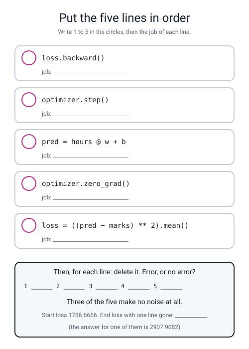
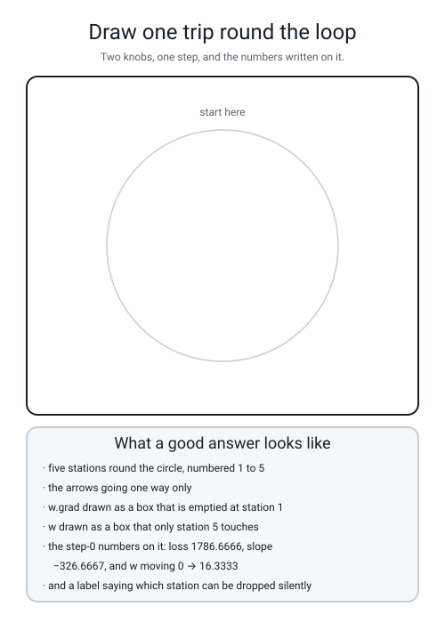

# Workbook — Week 21: The Five-Line Loop

**Name:** ________________________________  **Date:** ______________

[⬅ Week 20](week-20.md) · [📖 Read the chapter first](../student-guide/week-21.md) · [Course Home](../README.md) · [Next ➡](week-22.md)

---

## ✅ Warm-Up (5 min)

Five quick questions about **last week** — tensors and autograd.

**W1.** Name **two concrete ways** a tensor is not a numpy array. *"It's for neural networks"* does not count — both must be things you could point at on a printout.

**1.** ______________________________________________________

**2.** ______________________________________________________

**W2.** `z = x @ w` and printing `z` gives `tensor([[2.1000]], grad_fn=<MmBackward0>)`. **What is `grad_fn`, and what put it there?**

________________________________________________________________

**W3.** You call `backward()` on `x²` at `x = 3`, then on `x³` at `x = 3`. **What does `x.grad` say, and why?**

**it says:** ______  **because:** ______________________________

**W4.** `w.grad` prints `None`. **Give the two possible causes**, and the one print that tells them apart.

________________________________________________________________

**W5.** You keep 200 losses in a list without `.item()`. **What have you actually stored, and what is the first thing that will break?**

________________________________________________________________

---

## 🔢 Do the Maths by Hand

**There is no new maths this week**, so these four exercises are **this week's own arithmetic** — one gradient and one step, from Week 15 — done before any code runs. **Calculator only. No code.**

The six points. Both knobs start at **zero**, so every prediction is 0.

| hours | 1 | 2 | 3 | 4 | 5 | 6 |
|---|---|---|---|---|---|---|
| marks | 20 | 28 | 36 | 44 | 52 | 60 |

**M1 — the loss at step 0.**

```
errors (prediction − mark):  ____  ____  ____  ____  ____  ____

squared:                     ____  ____  ____  ____  ____  ____

sum of the squares:          ____________

divide by 6:                 ____________
```

**M1(a).** The screen will print `1786.6666` and your answer says `1786.6667`. **Which is right, and why do they differ?**

________________________________________________________________

**M2 — the slope for `w`.** From Week 15: *twice the average of (error × the input that weight multiplies)*. `w` multiplies the **hours**.

```
(−20 × 1) = ______   (−28 × 2) = ______   (−36 × 3) = ______

(−44 × 4) = ______   (−52 × 5) = ______   (−60 × 6) = ______

sum:                        ____________

× 2:                        ____________

÷ 6:                        ____________
```

**M2(a).** The slope came out **negative**. **Which way does that tell you to move `w`?** ____________

**M2(b).** The step, with `lr = 0.05`:

```
w ← 0 − 0.05 × (____________)  =  ____________
```

**M3 — the slope for `b`, which is the one people get wrong.** The bias multiplies **1** on every row, so there is **no multiplying to do**.

```
sum of the errors:  ____________

× 2 ÷ 6:            ____________

b ← 0 − 0.05 × (____________)  =  ____________
```

**M3(a).** `w`'s slope is `−326.6667` and `b`'s is your answer above. **Which knob moves faster, and roughly how many times faster?**

________________________________________________________________

**M3(b).** Look at the real log: at step 50, `w` is `8.8773` and `b` is only `8.2442`. **Does that match your answer to M3(a)?** ____________

**M4 — the pile-up.** The true slope for `w` is `−326.6667` every time, on unchanged weights. Nobody wipes `.grad`.

| after | `w.grad` should read |
|---|---|
| 1 backward | ____________ |
| 2 backwards | ____________ |
| 3 backwards | ____________ |
| 4 backwards | ____________ |

**M4(a).** Write the multiplication for the last row: `4 × 326.6667 = ` ____________

**M4(b).** The real run prints `−1306.6667` for the fourth row, not `−1306.6668`. **One sentence on why.**

________________________________________________________________

**M4(c).** Now the consequence. If `.grad` is four times too big and you take a step of `lr = 0.05`, **how big is the step you actually took, compared with the one you meant?**

________________________________________________________________

---

## 🔎 Predict the Output

**Write your prediction in pen before you run anything.** Every snippet starts with `import torch`. **One of these four prints something that is not a number, and it is not the one you expect.**

### P1 — what does `zero_grad()` leave behind?

```python
w = torch.tensor([[3.0]], requires_grad=True)
opt = torch.optim.SGD([w], lr=0.1)
loss = (w * w).sum()
loss.backward()
print(w.grad)
opt.zero_grad()
print(w.grad)
print(w)
```

**I predict — line 1:** ____________  **line 2:** ____________  **line 3:** ____________

**It really printed:**

```text
________________________________________
________________________________________
________________________________________
```

**Line 2 is the surprise. What did you expect, and what did you get?**

**expected:** ____________________  **got:** ____________________

**Line 3 is the important one. Did `zero_grad()` change `w`?** ____________  **What does that prove about the two jobs?**

________________________________________________________________

### P2 — one step, by hand first

```python
w = torch.tensor([[3.0]], requires_grad=True)
opt = torch.optim.SGD([w], lr=0.1)
loss = (w * w).sum()
loss.backward()
opt.step()
print(w.item())
print(w.grad.item())
```

**By hand first.** The slope of `w × w` at `w = 3` is ______. So `3 − 0.1 × ` ______ ` = ` ____________

**I predict — line 1:** ____________  **line 2:** ____________

**It really printed:**

```text
________________________________________
________________________________________
```

**Line 1 is not exactly `2.4`. Why?** ______________________________

**Line 2 is unchanged from before the step. What does that prove?**

________________________________________________________________

### P3 — a shape prediction, and a loss that is wrong without erroring

```python
hours = torch.tensor([[1.0], [2.0], [3.0]])
w = torch.tensor([[2.0]], requires_grad=True)
b = torch.tensor([1.0], requires_grad=True)
pred = hours @ w + b
print(pred.shape)
marks = torch.tensor([3.0, 5.0, 7.0])
print((pred - marks).shape)
print(((pred - marks) ** 2).mean().item())
```

**I predict — the two shapes:** ____________  ____________

**It really printed:**

```text
________________________________________
________________________________________
________________________________________
```

**Work out the three predictions by hand:** `1 × 2 + 1 = ` ____  `2 × 2 + 1 = ` ____  `3 × 2 + 1 = ` ____

**The three marks are 3, 5, 7. So the model is perfect. What should the loss be?** ____________

**What was it?** ____________  **Where did the extra numbers come from?**

________________________________________________________________

**Now write the one-word fix to `marks`:** ______________________

### P4 — inside and outside the block

```python
w = torch.tensor([[2.0]], requires_grad=True)
x = torch.tensor([[4.0]])
a = x @ w
with torch.no_grad():
    q = x @ w
print(a.requires_grad, a.grad_fn is None)
print(q.requires_grad, q.grad_fn is None)
print(a.item(), q.item())
```

**I predict — line 1:** ____________  **line 2:** ____________  **line 3:** ____________

**It really printed:**

```text
________________________________________
________________________________________
________________________________________
```

**Line 3 is the whole argument for `no_grad`. Say it in one sentence.**

________________________________________________________________

**How many of the answers on this page did you get right?** ______ / 14

**Which one surprised you most?** ______________________________

---

## ✍️ Practice Set A — Read It

**A1. Match the word to the thing.** Write the letter.

| Word | | Description |
|---|---|---|
| **optimizer** | ______ | (i) A block where nothing is recorded — for measuring, not learning |
| **`zero_grad`** | ______ | (ii) `.grad` adds rather than replaces |
| **`step`** | ______ | (iii) An object holding a list of knobs and the rule for updating them |
| **`no_grad`** | ______ | (iv) Wipe the slopes. Does not touch the weights |
| **gradient accumulation** | ______ | (v) Move the weights using the slopes. Does not touch the slopes |

**A2. Put the five lines in order, and say what each does.** Fill in the figure.


*Figure W21.1 — The five lines in a deliberately wrong order, with the numbers and the jobs to fill in.*

**A2(a).** For each line, **give the argument** for why it cannot come earlier than it does.

**line 2 must come after line 1 because:** ______________________________

**line 3 must come after line 2 because:** ______________________________

**line 4 must come after line 3 because:** ______________________________

**line 5 must come after line 4 because:** ______________________________

**A2(b).** Line 1 is the odd one out: it does not *need* anything to have happened first. So why do we always write it first?

________________________________________________________________

**A3. Spot the bug.** Each line is wrong. Say what happens and write the fix.

| # | The line | What happens | The fix |
|---|---|---|---|
| a | `optimizer = torch.optim.SGD(w, lr=0.05)` | | |
| b | `loss = ((pred - marks) ** 2)` then `loss.backward()` | | |
| c | `hours = torch.tensor([[1], [2], [3]])` | | |
| d | `pred = hours @ w + b` written **above** the `for` line | | |
| e | `marks = torch.tensor([20.0, 28.0, 36.0])` (flat, not a column) | | |
| f | `optimizer.step()` written **before** `loss.backward()` | | |

**A3(g).** Which **two** of those six produce **no error at all**? ______ and ______

**A3(h).** For each of those two, name the printed value that gives it away.

________________________________________________________________

**A4. Match the code to the output.** Five of each, no output used twice.

| | Code |
|---|---|
| i | `w = torch.tensor([[3.0]], requires_grad=True); opt = torch.optim.SGD([w], lr=0.1); (w*w).sum().backward(); opt.zero_grad(); print(w.grad)` |
| ii | `w = torch.tensor([[3.0]], requires_grad=True); (w*w).sum().backward(); print(w.grad)` |
| iii | `x = torch.tensor([[4.0]]); w = torch.tensor([[2.0]], requires_grad=True); print((x @ w).requires_grad)` |
| iv | `x = torch.tensor([[4.0]]); w = torch.tensor([[2.0]], requires_grad=True)`<br>`with torch.no_grad(): print((x @ w).requires_grad)` |
| v | `print(((torch.tensor([[1.0]]) @ torch.tensor([[2.0]])) - torch.tensor([[5.0]])).item())` |

| | Output |
|---|---|
| P | `True` |
| Q | `None` |
| R | `-3.0` |
| S | `tensor([[6.]])` |
| T | `False` |

**Your answers:** i → ______  ii → ______  iii → ______  iv → ______  v → ______

**A4(f).** Two of those five outputs look like "nothing here". Which two, and what is the difference between them?

________________________________________________________________

**A5. Read four training logs and name the missing line.** All four ran 400 steps on the same six points. **One of them is not missing a line at all.**

**Log W**

```text
  step   0  loss    1786.6666  w    16.3333  dL/dw    -326.6667
  step   1  loss     650.5742  w    22.8278  dL/dw    -129.8889
  step   2  loss    2737.1262  w     8.9743  dL/dw     277.0704
  step 399  loss    2907.9082  w     5.3946  dL/dw    -247.1715
```

**What is missing:** ______________________  **The giveaway:** ______________________

**Log X**

```text
  step   0  loss    1786.6666  w     0.0000  dL/dw None
  step   1  loss    1786.6666  w     0.0000  dL/dw None
  step   2  loss    1786.6666  w     0.0000  dL/dw None
  step 399  loss    1786.6666  w     0.0000  dL/dw None
```

**What is missing:** ______________________  **The giveaway:** ______________________

**Log Y**

```text
  step   0  loss    1786.6666  w     0.0000  dL/dw    -326.6667
  step   1  loss    1786.6666  w     0.0000  dL/dw    -326.6667
  step   2  loss    1786.6666  w     0.0000  dL/dw    -326.6667
  step 399  loss    1786.6666  w     0.0000  dL/dw    -326.6667
```

**What is missing:** ______________________  **The giveaway:** ______________________

**Log Z**

```text
  step   0  loss    1786.6666  w    32.6667  dL/dw    -326.6667
  step   1  loss    8553.4082  w   -39.3556  dL/dw     720.2223
  step   2  loss   41215.3555  w   118.6163  dL/dw   -1579.7188
  step 399  loss          nan  w        nan  dL/dw          nan
```

**What is missing:** ______________________  **The giveaway:** ______________________

**A5(a).** **Logs X and Y have identical loss columns.** Write the single question that separates them, and the two answers.

**the question:** ______________________________________________

**X:** ____________  **Y:** ____________

**A5(b).** Log Z's step-0 `w` is `32.6667`, twice the healthy `16.3333`. **What single number was changed, and to what?**

________________________________________________________________

**A5(c).** Rank the four logs from **easiest to notice** to **hardest to notice**, and justify the hardest one.

**easiest → hardest:** ______  ______  ______  ______

________________________________________________________________

**A6. Say the sentence.** Finish each one so it is true and complete.

**a)** `zero_grad` wipes ______________ and never touches ______________. `step` moves ______________ and never touches ______________.

**b)** Line 1 exists because line 4 ______________ instead of ______________.

**c)** Three of the five lines fail with ______________. The comparison that catches the worst of them is ______________ against ______________.

**d)** You tell a missing `backward` from a missing `step` by looking at ____________: `None` means ______________, and `−326.6667` means ______________.

**e)** `no_grad` changes ______________ about the answer, and saves ______________.

**f)** If you see `nan`, look at the ______________ steps, not the last one.

---

## ✍️ Practice Set B — Write It

### B1 — one line, plus a print

**Task:** create the two knobs and hand them to an `SGD` optimizer with `lr = 0.05`, then print both shapes and `w.grad`.

**Expected output:**

```text
w (1, 1)  b (1,)  w.grad None
```

**Done looks like:** the optimizer takes a **list**, and `w.grad` is `None` because nothing has run yet.

```python
w = ______________________________________________________________

b = ______________________________________________________________

optimizer = ______________________________________________________

print(__________________________________________________________)
```

### B2 — one trip round the loop, before and after

**Task:** do exactly **one** trip: `zero_grad`, forward, loss, `backward`. Print `w`, `w.grad` and the loss. Then `step()`, and print `w` and `w.grad` again.

**Expected output:**

```text
before step: w = 0.0000   w.grad = -326.6667   loss = 1786.6666
after  step: w = 16.3333   w.grad = -326.6667
```

**Done looks like:** **`w` changed and `w.grad` did not.** If both changed, you have `zero_grad` in the wrong place.

**B2(a).** Write, in one sentence, what the second line proves about `step()`.

________________________________________________________________

### B3 — the whole loop, 400 steps, one printed line

**Task:** the five lines, 400 times, on the six points at `lr = 0.05`. Print **only** the final result.

**Expected output:**

```text
w = 8.0014   b = 11.9939   loss = 0.000007
```

**Done looks like:** twelve lines of code, five of them the loop body, and the two numbers are within `0.01` of 8 and 12.

```python
for step in range(400):
    ____________________________________________________________
    ____________________________________________________________
    ____________________________________________________________
    ____________________________________________________________
    ____________________________________________________________

print(__________________________________________________________)
```

### B4 — measure it with the recorder off

**Task:** after training, measure the average absolute miss inside a `torch.no_grad()` block, and print the evidence that the recorder really was off.

**Expected output:**

```text
requires_grad False  grad_fn None
average miss 0.0023 marks
```

**Done looks like:** the `with` block indents two lines, and **both** of the values on the first line are the "off" version.

```python
with torch.no_grad():
    ____________________________________________________________
    ____________________________________________________________
print(__________________________________________________________)
print(__________________________________________________________)
```

**B4(a).** `.abs()` is in there for a reason. What would go wrong without it?

________________________________________________________________

### B5 — a whole program of your own, about 25 lines

**Task:** write `b5w21.py`, which runs the same loop **four ways** and prints one row each. It must:

1. define `fresh()`, which sets the seed, makes two fresh knobs at zero, and returns them with a new optimizer at `lr = 0.05`
2. define `run(label, skip=None)`, which runs 400 steps and **leaves out** whichever of `zero_grad`, `backward` or `step` is named by `skip`
3. print one row per run: the label, the final loss, `w`, `b`, and `w.grad` — where `w.grad` prints as the word `None` if it is `None`
4. print a header, then call `run` four times: all five lines, no `zero_grad`, no `backward`, no `step`

**Expected output:**

```text
run                      final loss         w         b     w.grad
all five lines               0.0000    8.0014   11.9939     0.0005
no zero_grad              2907.9082    5.3946   18.9274  -247.1715
no backward               1786.6666    0.0000    0.0000       None
no step                   1786.6666    0.0000    0.0000  -326.6667
```

**Done looks like:** four rows you can read across, **three of which had no error at all**, and rows 3 and 4 differing only in the last column.

> **💡 Try this:** why does `fresh()` have to be a function? Try making the knobs once at the top instead, and watch the four runs contaminate each other.

---

## 🐞 Fix the Broken Program

This program has **three** bugs: one **dtype**, one **runtime**, and one **silent logic bug**. The real error messages are below, in the order you meet them.

```python
"""broken21.py - fit minutes = 6 x km + 10 with the five-line loop. THREE bugs."""
import torch

torch.manual_seed(0)

km = torch.tensor([[1], [2], [3], [4], [5]])
minutes = torch.tensor([[16.0], [22.0], [28.0], [34.0], [40.0]])

w = torch.tensor([[0.0]], requires_grad=True)
b = torch.tensor([0.0], requires_grad=True)
optimizer = torch.optim.SGD([w, b], lr=0.05)

for step in range(600):
    pred = km @ w + b
    loss = ((pred - minutes) ** 2)
    loss.backward()
    optimizer.step()

    if step % 200 == 0 or step == 599:
        print("step %3d  loss %12.4f  w %8.4f  b %8.4f  dL/dw %12.4f"
              % (step, loss.item(), w.item(), b.item(), w.grad.item()))

print()
print("found:  minutes = %.4f x km + %.4f" % (w.item(), b.item()))
print("wanted: minutes = 6 x km + 10")
```

**Run 1 — nothing prints at all:**

```text
Traceback (most recent call last):
  File "broken21.py", line 14, in <module>
    pred = km @ w + b
RuntimeError: expected m1 and m2 to have the same dtype, but got: long long != float
```

**Bug 1.** Which line? ______  **Kind of bug?** ______________

**"long long" is PyTorch's name for whole numbers. Which of the two tensors holds whole numbers, and what one character is missing from each of its five values?**

**the tensor:** ____________  **the character:** ______

**The fix:** ______________________________

**Run 2 — after fixing bug 1:**

```text
Traceback (most recent call last):
  File "broken21.py", line 16, in <module>
    loss.backward()
RuntimeError: grad can be implicitly created only for scalar outputs
```

**Bug 2.** Which line is actually wrong — the one in the traceback, or a different one? ______

**"Scalar" means one number. How many numbers is `loss` holding, and why that many?**

________________________________________________________________

**Say in one sentence why `backward()` needs exactly one number to start from.**

________________________________________________________________

**The fix:** ______________________________

**Run 3 — after fixing bugs 1 and 2. It runs all the way through, with no error at all:**

```text
step   0  loss     856.0000  w   9.6000  b   2.8000  dL/dw    -192.0000
step 200  loss     125.5516  w  -0.1292  b   4.3970  dL/dw     209.3039
step 400  loss     139.6251  w  14.8365  b  15.7245  dL/dw    -122.2911
step 599  loss      28.7285  w  -4.2352  b  14.8329  dL/dw     193.2677

found:  minutes = -4.2352 x km + 14.8329
wanted: minutes = 6 x km + 10
```

**Bug 3 is a missing line, and it is missing from the top of the loop.**

**Two questions before you name it. Read the `dL/dw` column: −192.0, +209.3, −122.3, +193.3. What is wrong with those numbers?**

________________________________________________________________

**Read the `w` column: 9.6, −0.1, 14.8, −4.2. What is `w` doing?**

________________________________________________________________

**The missing line:** ______________________________

**Now check step 0 by hand, because it is the one step that is still right.** With both knobs at 0, all five errors are `0 − minutes`:

```
errors:        ____  ____  ____  ____  ____
squared sum:   ____________
÷ 5:           ____________     ← matches the printed 856.0000?  ______

each error × its km, summed:  ____________
× 2 ÷ 5:                      ____________     ← matches −192.0000?  ______
w ← 0 − 0.05 × (−192.0)     = ____________     ← matches 9.6000?     ______
```

**Run 4 — after fixing all three:**

```text
step   0  loss     856.0000  w   9.6000  b   2.8000  dL/dw    -192.0000
step 200  loss       0.0119  w   6.0697  b   9.7484  dL/dw       0.0240
step 400  loss       0.0000  w   6.0023  b   9.9917  dL/dw       0.0008
step 599  loss       0.0000  w   6.0001  b   9.9997  dL/dw       0.0000

found:  minutes = 6.0001 x km + 9.9997
wanted: minutes = 6 x km + 10
```

**Notice that step 0 is byte-for-byte identical in Run 3 and Run 4.** Say why in one sentence.

________________________________________________________________

**Two questions, and they are the point of the page.**

**Compare the `dL/dw` columns of Run 3 and Run 4. Describe the difference in one sentence, and say which one is a healthy training run.**

________________________________________________________________

**Bug 3 produced a plausible-looking log with falling-then-rising losses and no error. Rank the three bugs by how long each would take you to find, and say what habit would catch the slowest one.**

________________________________________________________________

________________________________________________________________

---

## 🧩 Puzzle of the Week

### Part 1 — Find the learning-rate boundary

`lr = 0.05` works and `lr = 0.1` dies. **Somewhere between them is a boundary.** Here are three real results, and two rows for you to fill in by running it.

| `lr` | `w` after 400 steps | `b` after 400 steps | final loss | verdict |
|---|---|---|---|---|
| `0.01` | `8.5199` | `9.7743` | `0.960224` | too small — right direction, not finished |
| `0.05` | `8.0014` | `11.9939` | `0.000007` | about right |
| `0.06` | ______ | ______ | ______ | ______ |
| `0.07` | ______ | ______ | ______ | ______ |
| `0.1` | `nan` | `nan` | `nan` | too big — diverged and died |

**Print all five with the same `%.6f` on the loss, so the column is comparable.**

**Part 1(a).** Where exactly is the boundary? ______________

**Part 1(b).** **Is that boundary a property of the optimizer, or of the data?** Argue for one, then for the other, then decide.

________________________________________________________________

________________________________________________________________

**Part 1(c).** `lr = 0.01` is described as *"not finished"* rather than *"wrong"*. **What would you do to it to finish the job, and what would that cost you?**

________________________________________________________________

**Part 1(d).** Now the honest question: **so how do you choose a learning rate on a problem where you do not know the answer?**

________________________________________________________________

### Part 2 — The Order Puzzle

The five lines can be arranged 120 different ways. Most are nonsense. Below are **five** arrangements. For each, say whether it **crashes**, **learns**, or **runs and learns nothing** — and if it learns, whether it learns *correctly*.

Write them as: **Z** = `zero_grad`, **F** = forward, **L** = loss, **B** = `backward`, **S** = `step`.

| # | order | crashes / learns / does nothing | correct? |
|---|---|---|---|
| 1 | Z F L B S | | |
| 2 | F L B S Z | | |
| 3 | Z F L S B | | |
| 4 | Z B F L S | | |
| 5 | F L Z B S | | |

**Part 2(a).** **Number 2 works.** Explain why, and then say why we still write `zero_grad` first.

________________________________________________________________

________________________________________________________________

**Part 2(b).** **Number 3 is the nastiest one on the list.** It runs 400 steps, raises nothing, and `w` never leaves `0.0000` — while `w.grad` holds a perfectly correct `−326.6667` the whole time. **Explain the mechanism**, step by step, for one trip round the loop.

________________________________________________________________

________________________________________________________________

________________________________________________________________

**Part 2(c).** Which of the five would you rather have written by accident, and why?

________________________________________________________________

---

## 🤔 Think Deeper

**T1.** Three of the five lines fail with no error message. **Write a paragraph** arguing whether that is a design flaw in PyTorch or something no library could avoid. Take each of the three in turn and ask: *could a library have detected this?* Then say what **you** are going to check, every run, for the rest of your life.

________________________________________________________________

________________________________________________________________

________________________________________________________________

________________________________________________________________

________________________________________________________________

**T2.** Our data had `8x + 12` hidden in it exactly, and the loop found it to three decimal places with a final loss of `0.000007`. **Write a paragraph** on whether that is a good model or a memorised one — and what you would need in order to answer that question at all. Then say what you expect to happen when the data does **not** sit on a line.

________________________________________________________________

________________________________________________________________

________________________________________________________________

________________________________________________________________

________________________________________________________________

---

## 🛠️ Build It — Fit the Hidden Line, Then Break It Five Ways

**Two parts. The first must find `8x + 12`. The second must contain at least one row saying "no error, but wrong."**

### Part A — fit the line

- [ ] **1.** Type the six points as **columns**: shape `(6, 1)` both. Print both shapes and check.
- [ ] **2.** Two knobs at `0.0`, both with `requires_grad=True`.
- [ ] **3.** `torch.optim.SGD([w, b], lr=0.05)` — **with the brackets.**
- [ ] **4.** The five lines, in order, 400 times.
- [ ] **5.** Print every fiftieth step: loss, `w`, `b`, `dL/dw`. **`.item()` on all four.**
- [ ] **6.** Before you run it, write the step-0 row from your M1–M3 answers.
- [ ] **7.** Run it. Compare.
- [ ] **8.** Report the final `w` and `b` and write the hidden line beside them.

**My predicted step 0:** loss ____________  `w` ____________  `dL/dw` ____________

**The real log:**

| step | loss | `w` | `b` | `dL/dw` |
|---|---|---|---|---|
| 0 | | | | |
| 50 | | | | |
| 100 | | | | |
| 200 | | | | |
| 300 | | | | |
| 399 | | | | |

**found:** `marks = ` ____________ ` × hours + ` ____________

**wanted:** `marks = ` ____________ ` × hours + ` ____________

**Three things to read off your own log:**

**1.** What is the `dL/dw` column doing from top to bottom, and what does that mean?

________________________________________________________________

**2.** At step 50, which of `w` and `b` is closer to its target? ____________  **Why?**

________________________________________________________________

**3.** Will it ever reach exactly 8 and 12? ____________  **Why not?**

________________________________________________________________

### Part B — the five-row table

**Delete each line in turn. Prediction in pen, before the run. At least one row must say "no error, but wrong".**

| line removed | I predicted (in pen) | what actually happened | the error message, verbatim |
|---|---|---|---|
| `optimizer.zero_grad()` | | | |
| `pred = hours @ w + b` | | | |
| `loss = ((pred - marks) ** 2).mean()` | | | |
| `loss.backward()` | | | |
| `optimizer.step()` | | | |

**How many rows say "no error"?** ______  **(It should be three.)**

**How many of my five predictions were right?** ______ / 5

**For the `zero_grad` row — the sentence being marked. Name the mechanism, and use both loss numbers.**

________________________________________________________________

________________________________________________________________

**For the last two rows — the one question that separates them:**

________________________________________________________________

**`w.grad` in the no-`backward` run:** ____________  **in the no-`step` run:** ____________

### Part C — `no_grad`, once

**Run the measurement twice, once with the recorder on and once off.**

| | `requires_grad` | `grad_fn` |
|---|---|---|
| recorder on | | |
| inside `no_grad()` | | |

**The average miss:** ____________ marks

**Are the two numbers the same?** ____________  **So what exactly does `no_grad` save?**

________________________________________________________________

### Stretch — the learning-rate sweep

| `lr` | `w` | `b` | final loss | verdict |
|---|---|---|---|---|
| 0.01 | | | | |
| 0.05 | | | | |
| 0.1 | | | | |

**And the first four steps at `lr = 0.1`:**

| step | loss | `w` |
|---|---|---|
| 0 | | |
| 1 | | |
| 2 | | |
| 3 | | |

**What is the `w` column doing, in one sentence?**

________________________________________________________________

### The Bug Log

Two entries today, and one of them has **no error message at all** — write the *symptom* in the message column instead.

| What I saw | What it means | Cause | Fix |
|---|---|---|---|
| | | | |
| | | | |

---

## 🎨 Draw It

Draw **one trip round the loop** as five stations on a circle, with the step-0 numbers written on it.


*Figure W21.2 — An empty frame with a faint circle, and what a good answer contains.*

**Then answer four things about your own drawing:**

**Which station empties a box?** ______________  **Which station fills it?** ______________

**Which station is the only one that touches `w`?** ______________

**Where did you write `−326.6667`, and where did you write `16.3333`?**

________________________________________________________________

**Mark the three stations that can be removed **without any error**. Which are they?**

______________  ______________  ______________

---

## 📊 Self-Check

| I can... | 😀 | 🙂 | 😕 |
|---|---|---|---|
| write the five lines from a blank file, in the right order | | | |
| give the argument for why each line cannot come earlier | | | |
| predict the step-0 loss, slope and new `w` with a calculator | | | |
| say what `zero_grad` touches and what `step` touches | | | |
| explain why `.grad` accumulates, and what that default buys you | | | |
| name the three failures that produce no error | | | |
| tell a missing `backward` from a missing `step` by looking at `.grad` | | | |
| diagnose `nan` by reading the first four steps | | | |
| use `torch.no_grad()` and show the evidence that it worked | | | |
| say why fitting a line whose answer you already know is a good idea | | | |

**The one thing I would ask about if I could ask one question:**

________________________________________________________________

---

## ✅ Answers

<details>
<summary>Check your answers</summary>

### Warm-Up

**W1.** **One:** the default decimal type is `float32`, about seven digits, so `2.1` prints as `2.0999999046325684` — numpy would say `float64`. **Two:** a tensor can be **tracked**: set `requires_grad=True` and the results grow a `grad_fn` in the printout, and you can call `backward()` on them. Both are visible on a screen.

**W2.** It is **the recording**: `z` remembers that a matrix multiply produced it and which tensors went in. **It is there because one of the inputs (`w`) had `requires_grad=True`**, so PyTorch started tracking.

**W3.** **33**, because the slopes are `6` and `27` and **`.grad` adds instead of replacing.**

**W4.** Either **`backward()` has not been called yet**, or **`requires_grad=True` is missing** on that tensor. `print(w.requires_grad)` tells you which.

**W5.** **200 tensors, each still carrying the whole graph that made it** — visible as the `grad_fn` in the printout. The first thing to break is plotting: `Can't call numpy() on Tensor that requires grad`. And the memory cost is real — about six times as much for the same numbers.

### Do the Maths by Hand

**M1.**

```
errors:        −20   −28   −36   −44   −52   −60
squared:       400   784  1296  1936  2704  3600
sum:           10720
÷ 6:           1786.6667
```

**M1(a).** **Both are right.** `10720 ÷ 6` is `1786.66666…` repeating for ever. Your calculator rounds the seventh digit up to `1786.6667`; the screen is showing you `float32`, which holds about seven digits and lands on `1786.6666`. **Same number, different number of digits kept.**

**M2.**

```
(−20 × 1) = −20    (−28 × 2) = −56    (−36 × 3) = −108
(−44 × 4) = −176   (−52 × 5) = −260   (−60 × 6) = −360

sum:  −980
× 2:  −1960
÷ 6:  −326.6667
```

**M2(a).** **Increase it.** A negative slope means the loss falls as `w` rises, so you go that way. The `−` in `w ← w − lr × slope` turns the negative slope into a positive step.

**M2(b).** `w ← 0 − 0.05 × (−326.6667) = 0 + 16.3333 = **16.3333**`.

**M3.**

```
sum of the errors:  −240
× 2 ÷ 6:            −80.0

b ← 0 − 0.05 × (−80.0) = 0 + 4.0 = 4.0
```

**M3(a).** **`w` moves faster, by about four times**: `326.6667 ÷ 80 = 4.08`.

**M3(b).** **Yes.** At step 50, `w` has travelled from 0 to 8.88 (nearly all of the way to 8) while `b` has only reached 8.24 out of 12. **Different knobs learn at different speeds**, and this is one of the reasons Week 26's optimizer exists.

**M4.**

| after | `w.grad` |
|---|---|
| 1 backward | **−326.6667** |
| 2 backwards | **−653.3334** |
| 3 backwards | **−980.0001** |
| 4 backwards | **−1306.6668** |

**M4(a).** `4 × 326.6667 = **1306.6668**`.

**M4(b).** *Because each of the four additions happens in `float32`, which keeps about seven digits, so a tiny rounding error accumulates and the fourth total lands on `1306.6667` instead.* **That is last week's dtype lesson, turning up somewhere you were not looking for it.**

**M4(c).** **Four times as big as you meant.** The step is `lr × .grad`, and the `lr` is unchanged, so a gradient four times too large is a step four times too large. **In a real loop the pile is not four times the slope but the running total of every slope so far, which is why the run swings about instead of settling.**

### Predict the Output

**P1.**

```text
tensor([[6.]])
None
tensor([[3.]], requires_grad=True)
```

**Line 2: expected `tensor([[0.]])`, got `None`.** Modern PyTorch's `zero_grad()` **throws the box away** rather than filling it with zero — it is slightly faster, and the effect on the next `backward()` is the same, because `backward()` adds into an empty box either way.

**So `None` is a completely normal thing to see just after `zero_grad()`.** And last week's rule still stands: `None` means nobody has written there.

**Line 3: no, `zero_grad()` did not change `w`.** It is still `3.0`. **That proves the two jobs are separate: `zero_grad` touches slopes only.**

**P2.** The slope of `w × w` at `w = 3` is `2 × 3 = **6**`. So `3 − 0.1 × 6 = **2.4**`.

```text
2.4000000953674316
6.0
```

**Line 1 is not exactly 2.4 because it is `float32`** — 2.4 has no exact binary form, so you get it right to about seven digits and then it stops.

**Line 2 proves that `step()` does not touch the slopes.** It moved `w` from 3.0 to 2.4 and left `w.grad` sitting on `6.0`, exactly where `backward()` put it. **Which is precisely why you must wipe it yourself.**

**P3.**

```text
torch.Size([3, 1])
torch.Size([3, 3])
5.333333492279053
```

By hand: `1 × 2 + 1 = **3**`, `2 × 2 + 1 = **5**`, `3 × 2 + 1 = **7**`. The three marks are 3, 5, 7. **The model is perfect, so the loss should be `0.0`.**

**It was `5.333333492279053`.** The extra numbers came from **broadcasting**: `pred` is a `(3, 1)` column and `marks` is a `(3,)` flat row, so `pred - marks` became a **3 × 3 grid** comparing every prediction with every mark — including the six pairs that belong to different students.

**The one-word fix:** `marks.reshape(-1, 1)` — make it a **column**. *(Writing `marks = torch.tensor([[3.0], [5.0], [7.0]])` in the first place is the same fix.)*

**P4.**

```text
True False
False True
8.0 8.0
```

**Line 3 in one sentence:** *`no_grad` gave exactly the same answer, `8.0`, while storing nothing for a backward pass that was never going to happen.* **Same numbers, less bookkeeping. That is the entire trade.**

### Practice Set A

**A1.** optimizer → **(iii)** · `zero_grad` → **(iv)** · `step` → **(v)** · `no_grad` → **(i)** · gradient accumulation → **(ii)**

**A2.** The correct order and jobs:

| # | line | job |
|---|---|---|
| 1 | `optimizer.zero_grad()` | wipe last step's slopes |
| 2 | `pred = hours @ w + b` | predict with today's knobs |
| 3 | `loss = ((pred − marks) ** 2).mean()` | one number for how wrong |
| 4 | `loss.backward()` | one slope per knob |
| 5 | `optimizer.step()` | move every knob downhill |

**A2(a).**

- **line 2 after line 1:** so that the slopes are clean before the pass that will add to them.
- **line 3 after line 2:** the loss compares a prediction with the truth, and without line 2 there is no prediction — or worse, there is **last iteration's**.
- **line 4 after line 3:** `backward()` starts from a loss. Without one there is nothing to walk back from.
- **line 5 after line 4:** `step()` applies the slopes, so the slopes have to exist first.

**A2(b).** Because **it is the only position where you can look at a loop and *know* the gradients are clean before `backward()` runs.** Putting it at the end also works (see the Order Puzzle), but then you have to reason about what happens on the first iteration. **First, every time, and then you never think about it again.**

**A3.**

| # | What happens | The fix |
|---|---|---|
| a | `TypeError: params argument given to the optimizer should be an iterable of Tensors or dicts, but got torch.FloatTensor` | `SGD([w, b], lr=0.05)` — a list, even for one knob |
| b | `RuntimeError: grad can be implicitly created only for scalar outputs` | `.mean()` on the loss line |
| c | `RuntimeError: expected m1 and m2 to have the same dtype, but got: long long != float` | `[[1.0], [2.0], [3.0]]` |
| d | Completes step 0, then `RuntimeError: Trying to backward through the graph a second time ...` | Put the forward line **inside** the loop |
| e | **No error.** `pred - marks` broadcasts into a 3 × 3 grid (6 × 6 with the full data) and every number afterwards is about the wrong question | Make it a column: `[[20.0], [28.0], [36.0]]` |
| f | **No error.** `step()` applies the freshly-wiped gradient, so nothing moves — 400 steps and `w` stays `0.0000` | Put `backward()` before `step()` |

**A3(g).** **e and f.**

**A3(h).** For **e**, print `marks.shape` — `(3,)` instead of `(3, 1)` — or notice `(pred - marks).shape` is `(3, 3)`. For **f**, `w` never leaves `0.0000` while `w.grad` holds a perfectly good `−326.6667`. **The gradient is right and nothing moves.**

**A4.** i → **Q** · ii → **S** · iii → **P** · iv → **T** · v → **R**

**A4(f).** **Q (`None`) and T (`False`).** `None` means **no slope has ever been written into that box** — it is an absence. `False` means **this tensor is genuinely not being tracked** — it is a fact about the tensor, deliberately arranged by the `no_grad` block. **One is "nothing has happened yet"; the other is "nothing is going to."**

**A5.**

**Log W — `optimizer.zero_grad()` is missing.** Giveaway: **the gradient column never shrinks and flips sign** (−326.7, −129.9, +277.1, and still around ±250 at step 399) and **the final loss, 2907.9082, is higher than the starting 1786.6666.** Those are piles, not slopes.

**Log X — `loss.backward()` is missing.** Giveaway: **`dL/dw` is `None` on every line.** No backward pass ever ran, so `step()` had nothing to apply.

**Log Y — `optimizer.step()` is missing.** Giveaway: **`dL/dw` is a perfectly correct `−326.6667` on every line, and nothing moves.** The slopes were computed and then wiped, 400 times.

**Log Z — nothing is missing. The learning rate is too big** (`0.1` instead of `0.05`). Giveaway: **step 0 is fine, then `w` alternates in sign** (32.7, −39.4, +118.6) while the loss grows, and it ends in `nan`.

**A5(a).** **The question is: what does `dL/dw` say?** X says **`None`** — no `backward()`. Y says **`−326.6667`** — `backward()` ran, `step()` did not.

**A5(b).** **The learning rate**, changed from `0.05` to **`0.1`**. `0 − 0.1 × (−326.6667) = 32.6667`, exactly twice the healthy step.

**A5(c).** **Easiest → hardest: Z, X, Y, W.** Z screams — the numbers are absurd within three steps and end in `nan`. X and Y are obvious *if you print the gradient*, and invisible if you only watch the loss. **W is the hardest by a long way**, because it goes down at step 1 and produces a plausible-looking log all the way through; the only thing that catches it is comparing the **first** loss with the **last** one.

**A6.**

**a)** `zero_grad` wipes **the slopes** and never touches **the weights**. `step` moves **the weights** and never touches **the slopes**.

**b)** Line 1 exists because line 4 **adds into `.grad`** instead of **overwriting it**.

**c)** Three of the five lines fail with **no error at all**. The comparison that catches the worst of them is **the first loss (1786.6666)** against **the last loss (2907.9082)**.

**d)** by looking at **`w.grad`**: `None` means **`backward()` never ran**, and `−326.6667` means **`backward()` ran and `step()` did not**.

**e)** `no_grad` changes **nothing** about the answer, and saves **the memory and time of storing every intermediate value for a backward pass that will never happen**.

**f)** look at the **first four** steps.

### Practice Set B

**B1.**

```python
import torch

w = torch.tensor([[0.0]], requires_grad=True)
b = torch.tensor([0.0], requires_grad=True)
optimizer = torch.optim.SGD([w, b], lr=0.05)
print("w", tuple(w.shape), " b", tuple(b.shape), " w.grad", w.grad)
```

```text
w (1, 1)  b (1,)  w.grad None
```

`w` is `(1, 1)` so that `hours @ w` works — `(6, 1) @ (1, 1)` gives `(6, 1)`. `b` is a single number that broadcasts across all six rows.

**B2.**

```python
import torch

hours = torch.tensor([[1.0], [2.0], [3.0], [4.0], [5.0], [6.0]])
marks = torch.tensor([[20.0], [28.0], [36.0], [44.0], [52.0], [60.0]])
w = torch.tensor([[0.0]], requires_grad=True)
b = torch.tensor([0.0], requires_grad=True)
optimizer = torch.optim.SGD([w, b], lr=0.05)

optimizer.zero_grad()
pred = hours @ w + b
loss = ((pred - marks) ** 2).mean()
loss.backward()
print("before step: w = %.4f   w.grad = %.4f   loss = %.4f"
      % (w.item(), w.grad.item(), loss.item()))
optimizer.step()
print("after  step: w = %.4f   w.grad = %.4f" % (w.item(), w.grad.item()))
```

```text
before step: w = 0.0000   w.grad = -326.6667   loss = 1786.6666
after  step: w = 16.3333   w.grad = -326.6667
```

**B2(a).** *`step()` moved `w` from 0 to 16.3333 and left `w.grad` sitting on exactly the same `−326.6667`, so it moves the weights and does not touch the slopes — which is why they have to be wiped by something else.*

**B3.**

```python
import torch

torch.manual_seed(0)
hours = torch.tensor([[1.0], [2.0], [3.0], [4.0], [5.0], [6.0]])
marks = torch.tensor([[20.0], [28.0], [36.0], [44.0], [52.0], [60.0]])
w = torch.tensor([[0.0]], requires_grad=True)
b = torch.tensor([0.0], requires_grad=True)
optimizer = torch.optim.SGD([w, b], lr=0.05)

for step in range(400):
    optimizer.zero_grad()
    pred = hours @ w + b
    loss = ((pred - marks) ** 2).mean()
    loss.backward()
    optimizer.step()

print("w = %.4f   b = %.4f   loss = %.6f" % (w.item(), b.item(), loss.item()))
```

```text
w = 8.0014   b = 11.9939   loss = 0.000007
```

**B4.**

```python
with torch.no_grad():
    pred = hours @ w + b
    gap = (pred - marks).abs().mean()
print("requires_grad", pred.requires_grad, " grad_fn", pred.grad_fn)
print("average miss %.4f marks" % gap.item())
```

```text
requires_grad False  grad_fn None
average miss 0.0023 marks
```

**B4(a).** Without `.abs()`, a prediction that is **2 too high** and one that is **2 too low** would cancel out, and a model that was wildly wrong in both directions could report an average miss of zero. **You want the *size* of each miss, not its direction.**

**B5.**

```python
"""b5w21.py - run the loop five ways and report one row each."""
import torch

hours = torch.tensor([[1.0], [2.0], [3.0], [4.0], [5.0], [6.0]])
marks = torch.tensor([[20.0], [28.0], [36.0], [44.0], [52.0], [60.0]])


def fresh():
    torch.manual_seed(0)
    w = torch.tensor([[0.0]], requires_grad=True)
    b = torch.tensor([0.0], requires_grad=True)
    return w, b, torch.optim.SGD([w, b], lr=0.05)


def run(label, skip=None):
    w, b, opt = fresh()
    for step in range(400):
        if skip != "zero_grad":
            opt.zero_grad()
        pred = hours @ w + b
        loss = ((pred - marks) ** 2).mean()
        if skip != "backward":
            loss.backward()
        if skip != "step":
            opt.step()
    grad = "None" if w.grad is None else "%.4f" % w.grad.item()
    print("%-22s %12.4f %9.4f %9.4f %10s" % (label, loss.item(), w.item(), b.item(), grad))


print("%-22s %12s %9s %9s %10s" % ("run", "final loss", "w", "b", "w.grad"))
run("all five lines")
run("no zero_grad", skip="zero_grad")
run("no backward", skip="backward")
run("no step", skip="step")
```

```text
run                      final loss         w         b     w.grad
all five lines               0.0000    8.0014   11.9939     0.0005
no zero_grad              2907.9082    5.3946   18.9274  -247.1715
no backward               1786.6666    0.0000    0.0000       None
no step                   1786.6666    0.0000    0.0000  -326.6667
```

**Read the last two rows across.** Identical in every column except the last, where one says `None` and the other says `−326.6667`. **That single column is the whole diagnosis.**

**Why `fresh()` has to be a function:** because each run needs **brand-new knobs starting at zero and a brand-new optimizer holding them.** Make them once at the top and run 2 starts wherever run 1 finished, so every row after the first is measuring something meaningless.

### Fix the Broken Program

**Bug 1 — line 6, `km = torch.tensor([[1], [2], [3], [4], [5]])`. A dtype bug.**

**`km` holds whole numbers**, so its dtype is `int64` — which PyTorch calls `long long` in this message. The missing character is the **`.0`** (or just the `.`) on each of the five values. `minutes` and `w` are decimals, so the multiply refuses.

**The fix:** `km = torch.tensor([[1.0], [2.0], [3.0], [4.0], [5.0]])`.

**Bug 2 — the traceback names line 16, `loss.backward()`, but the wrong line is line 15**, `loss = ((pred - minutes) ** 2)`. **The `.mean()` is missing.**

`loss` is holding **five** numbers, one per delivery, because `(pred - minutes) ** 2` squares each row separately and nothing collapses them.

**Why `backward()` needs one number:** *"how much does the loss change if I nudge this knob?"* only has an answer if there is **one** loss. Five losses is five different questions, and PyTorch will not guess which one you meant.

**The fix:** `loss = ((pred - minutes) ** 2).mean()`.

**Bug 3 — `optimizer.zero_grad()` is missing from the top of the loop. A silent logic bug.**

**The `dL/dw` column is wrong in two ways: the magnitudes do not shrink, and the sign keeps flipping.** In a healthy run the gradient falls steadily towards zero. −192.0, +209.3, −122.3, +193.3 are not slopes at all; they are **sums of every slope so far**, so `w` keeps being pushed by old slopes after it has passed the answer.

**`w` is thrashing** — 9.6, then −0.1, then 14.8, then −4.2. It is leaping past the answer and back again, never settling. It ends at `−4.2352` when the answer is 6.

**The missing line:** `optimizer.zero_grad()`, as the first line inside the loop.

**Step 0 by hand:**

```
errors:        −16   −22   −28   −34   −40
squared sum:   256 + 484 + 784 + 1156 + 1600  =  4280
÷ 5:           856.0                     ← matches 856.0000  ✅

each error × its km:  −16, −44, −84, −136, −200   sum = −480
× 2 ÷ 5:                                −192.0    ← matches −192.0000  ✅
w ← 0 − 0.05 × (−192.0)               = +9.6      ← matches 9.6000     ✅
```

**Step 0 is identical in both runs**, because on the very first trip there is nothing in `.grad` to pile onto. **The bug only bites from step 1 onwards** — which is exactly why it survives so long. *(That is also the answer to the "byte-for-byte identical" question.)*

**Comparing the two `dL/dw` columns:** in Run 4 it **shrinks monotonically towards zero** (−192.0 → 0.0240 → 0.0008 → 0.0000), which is what arriving at the bottom of a valley looks like. In Run 3 it stays large and **changes sign**, which is what a pile looks like. **Run 4 is the healthy one.**

**Ranking: bug 3 ≫ bug 2 > bug 1.** Bugs 1 and 2 crash on the first trip and name the problem. Bug 3 costs the most because **it produces a running program with a plausible log.** The habit that catches it: **compare the first loss with the last loss, and read the gradient column.** Not *"is it going down"* — it went down between steps 0 and 200 in Run 3 too.

### Puzzle of the Week

**Part 1 — the learning-rate boundary.** Real output, all five rows printed with the same formatting:

```text
lr 0.01  w   8.5199  b   9.7743  loss 0.960224
lr 0.05  w   8.0014  b  11.9939  loss 0.000007
lr 0.06  w   8.0003  b  11.9986  loss 0.000000
lr 0.07  w      nan  b      nan  loss nan
lr 0.10  w      nan  b      nan  loss nan
```

| `lr` | `w` | `b` | final loss | verdict |
|---|---|---|---|---|
| `0.01` | `8.5199` | `9.7743` | `0.960224` | too small |
| `0.05` | `8.0014` | `11.9939` | `0.000007` | about right |
| **`0.06`** | **`8.0003`** | **`11.9986`** | **`0.000000`** | **about right — very slightly better** |
| **`0.07`** | **`nan`** | **`nan`** | **`nan`** | **too big — dead** |
| `0.1` | `nan` | `nan` | `nan` | too big — dead |

*(The `0.06` loss is not truly zero — it is about four ten-millionths, and `%.6f` has run out of places to show it. **A printed `0.000000` is a formatting limit, not a fact.**)*

**Part 1(a).** **Between `0.06` and `0.07`.** There is no single "right" number; there is a cliff, and it is very close to a value that works beautifully.

**Part 1(b).** **A model answer.** *For the optimizer:* `SGD` takes a fixed step of `lr × slope`, with no memory and no adaptation, so how big a step is safe is entirely determined by that one number. *For the data:* the slopes themselves come from the data — our `dL/dw` starts at `−326.6667` because the marks run up to 60 and the hours up to 6. The cliff comes from the inputs: a nudge to `w` changes each prediction by `hours × nudge`, so with hours up to 6 a step that is too big gets amplified up to 6 times. Squash the hours down (say to 0.1–0.6) and the same `lr` would be perfectly safe. (Scaling the *marks* down would shrink the first slopes but would **not** move the cliff: `lr = 0.1` still gives `nan` with marks divided by 10.) **It is both**, and the honest conclusion is that a learning rate is not a property of an algorithm — it is a property of an algorithm **and** the numbers you feed it. That is exactly why Week 15 made you hunt for one instead of giving you a rule, and why Week 4's scaling lesson matters even when the model does not care about scale.

**Part 1(c).** **Run it for longer.** `lr = 0.01` is walking in the right direction and simply has not arrived; a few thousand more steps would get there. **The cost is time** — and on a real model that is hours or days of computing, which is why nobody just turns the learning rate down and waits.

**Part 1(d).** **You watch a curve.** Try a few values that differ by roughly a factor of three (0.001, 0.003, 0.01, 0.03, 0.1), plot the loss for the first fifty steps of each, and pick the largest one whose loss is falling smoothly rather than jumping. **And you check the first four steps, not the last one**, because divergence is visible immediately and `nan` tells you nothing about the cause. There is no formula, and pretending otherwise would be dishonest.

**Part 2 — the Order Puzzle.**

| # | order | verdict | correct? |
|---|---|---|---|
| 1 | Z F L B S | **learns** | **yes** — this is the canonical loop |
| 2 | F L B S Z | **learns** | **yes** — `zero_grad` at the end works |
| 3 | Z F L S B | **runs and learns nothing** | no — and **no error at all** |
| 4 | Z B F L S | **crashes on the first line it reaches** | — there is no `loss` yet to walk back from |
| 5 | F L Z B S | **learns** | **yes** — the wipe still happens before `backward()` |

Real output, all four of the non-canonical orders run for 400 steps:

```text
2 F L B S Z -> w 8.0014  b 11.9939  loss 0.000007  w.grad None
3 Z F L S B -> w 0.0000  b 0.0000  loss 1786.666626  w.grad -326.6667
4 Z B F L S -> UnboundLocalError: local variable 'loss' referenced before assignment
5 F L Z B S -> w 8.0014  b 11.9939  loss 0.000007  w.grad 0.0005
```

**Orders 2 and 5 land on exactly the same `8.0014` and `11.9939` as the canonical order** — all three are genuinely correct loops. Order 4's message is Python's, not PyTorch's: you asked to differentiate a variable that does not exist yet. *(Written at the top level of a file rather than inside a function, the same mistake says `NameError: name 'loss' is not defined`.)*

**Part 2(a).** **Number 2 works because `zero_grad` only has to happen once per trip, before the next `backward()`.** Wiping at the *end* of trip 1 leaves the box empty at the start of trip 2, which is exactly what wiping at the *start* of trip 2 would have achieved.

**We still write it first because of the first iteration.** With the wipe at the end, you have to stop and reason: *"is `.grad` clean on the very first trip?"* (It is — it starts as `None`.) With the wipe at the front, that question never arises. **The order that requires no reasoning is the order to write.**

**Part 2(b).** Trip by trip:

1. `zero_grad()` — `w.grad` becomes `None`.
2. forward and loss — fine, a real prediction and a real number.
3. `step()` — **the optimizer looks for a gradient and there is nothing there**, so it skips `w` and `b` entirely. `w` does not move.
4. `backward()` — fills `w.grad` with a perfectly correct `−326.6667`.
5. Next trip begins with `zero_grad()`, which **throws that gradient away before anything uses it.**

So every trip computes the right slope, one line too late, and discards it. **400 steps, `w = 0.0000`, `w.grad = −326.6667`, and no error whatsoever.** Note that this is indistinguishable from a missing `step()` by looking at the log — the tell is reading the code.

**Part 2(c).** **Number 4**, the crash, without hesitation. It stops immediately and tells you what is wrong. **Number 3 is the one to fear**: it runs, it looks fine, and it wastes however long it takes you to notice that `w` has not moved.

### Think Deeper

**T1 — a model answer.** Take them one at a time. **A missing `step()`:** a library *could* detect this. It knows gradients were computed, and it could warn if `.grad` is overwritten without any parameter having changed. Nobody does, but it is possible. **A missing `backward()`:** also detectable — `step()` could notice that every gradient it was asked to apply is `None` and say so. Arguably it should. **A missing `zero_grad()`:** this one genuinely cannot be detected, because accumulating is sometimes exactly what you asked for — that is the whole point of the default — and the library cannot know whether four backwards were four pieces of one batch or four mistakes.

So the honest verdict is: two of the three are missed opportunities, and one is unavoidable. And the general lesson is bigger than PyTorch: **in this subject the failures that matter usually do not raise errors.** What I will check every run: **the first loss against the last loss**, and **the gradient column shrinking rather than growing.** Two habits, thirty seconds, and they catch all three.

**T2 — a model answer.** **You cannot tell**, and that is the whole answer. A loss of `0.000007` on the data you trained on tells you the model fits those six points; it says nothing about whether it would work on a seventh student. In this particular case we happen to know it is a good model, but **not because of the loss** — because we hid `8x + 12` in the data ourselves and can see it found it. **Take that knowledge away and `0.000007` is uninterpretable.**

What I would need is **data the model has not learned from.** A seventh student who revised for 7 hours: the model predicts `8.0014 × 7 + 11.9939 = 68.0037`, and the real line says 68. That comparison is a measurement; the training loss is not.

And when the data does **not** sit on a line, the loss will **stop falling at some non-zero number**, and that leftover is the part of the data no straight line can explain. Our wobbled pizza example bottomed out at `0.560000` and stayed there — nothing broken, just an honest limit. **A loss that reaches zero on real data is more likely to be a warning than a triumph.**

### Build It

**Part A — the real log.**

```text
step   0  loss  1786.6666  w 16.3333  b  4.0000  dL/dw  -326.6667
step  50  loss     2.8163  w  8.8773  b  8.2442  dL/dw     0.3261
step 100  loss     0.4466  w  8.3493  b 10.5044  dL/dw     0.1299
step 200  loss     0.0112  w  8.0554  b 11.7628  dL/dw     0.0206
step 300  loss     0.0003  w  8.0088  b 11.9624  dL/dw     0.0033
step 399  loss     0.0000  w  8.0014  b 11.9939  dL/dw     0.0005

found:  marks = 8.0014 x hours + 11.9939
wanted: marks = 8 x hours + 12
```

**Accept anything above `w = 7.99` and `b = 11.9`.** The predicted step-0 row is loss `1786.6666`, `w` `16.3333`, `dL/dw` `−326.6667` — all three from M1–M3.

**1.** The `dL/dw` column **shrinks steadily, from −326.6667 to 0.0005.** A flattening slope means you are arriving at the bottom of the valley — Week 12's picture, seen from inside a loop.

**2.** **`w` is closer.** At step 50 it is 8.88 against a target of 8, while `b` is 8.24 against a target of 12. **Because `w`'s slope started at −326.7 and `b`'s at −80**, so `w` moves about four times as fast.

**3.** **No, and it never can.** Each step is proportional to the remaining slope, so as you approach the bottom the slope shrinks and the steps shrink with it. You get closer and closer and never land exactly.

**Part B — the five-row table.**

| line removed | Error? | What happened | The tell |
|---|---|---|---|
| `optimizer.zero_grad()` | **No error** | Loss 1786.6666 → **2907.9082**. `w = 5.3946`, `b = 18.9274`. Worse than it started | The gradient column **never shrinks and flips sign**: −326.7, −129.9, +277.1, +244.9 |
| `pred = hours @ w + b` | **RuntimeError** | Completes step 0, crashes on step 1: *"Trying to backward through the graph a second time"* | It worked **once**. The graph was freed when it was read |
| `loss = ((pred - marks) ** 2).mean()` | **RuntimeError** | Identical failure, identical message | The loss and the forward pass are one thing; both belong inside the loop |
| `loss.backward()` | **No error** | 400 steps, `w` and `b` never leave `0.0000`, loss stuck at `1786.666626` | **`w.grad` is `None`** |
| `optimizer.step()` | **No error** | 400 steps, `w` and `b` never leave `0.0000`, loss stuck at `1786.666626` | **`w.grad` is `−326.6667`** |

**Three rows say "no error".** A table with fewer than three has conflated something.

**The `zero_grad` sentence:** *"The gradients added up instead of being wiped, so each step carried every old slope along with it, so it kept overshooting the bottom and ended up worse than it started — 1786.6666 at step 0 and 2907.9082 at step 399."* **Accept nothing that does not name accumulation and use both numbers.**

**The separating question for the last two rows: what does `w.grad` say?** `None` in the no-`backward` run; `−326.6667` in the no-`step` run.

**Part C — `no_grad`.**

| | `requires_grad` | `grad_fn` |
|---|---|---|
| recorder on | `True` | `AddBackward0` |
| inside `no_grad()` | `False` | `None` |

**Average miss: 0.0023 marks.** **The two numbers are identical** — `no_grad` changes nothing about the arithmetic. What it saves is **the storage of every intermediate value** that would have been needed for a backward pass that is never going to happen. Invisible on six points; the difference between fitting in memory and crashing on twenty thousand images.

**Stretch — the sweep.**

```text
lr 0.01 after 400: w 8.519876480102539 b 9.774307250976562 loss 0.960224449634552
lr 0.05 after 400: w 8.001418113708496 b 11.993927955627441 loss 7.36106994736474e-06
lr 0.10 after 400: w nan b nan loss nan
```

And the first four steps at `lr = 0.1`:

```text
  step  0 loss 1786.6666259765625 w 32.66666793823242
  step  1 loss 8553.408203125 w -39.355560302734375
  step  2 loss 41215.35546875 w 118.61631774902344
  step  3 loss 198849.859375 w -228.6627655029297
```

**The `w` column is alternating in sign and growing** — 32.7, −39.4, +118.6, −228.7 — so it is leaping straight over the bottom of the valley and landing higher up the other side each time. **That is Week 15's third panel, with `optimizer.step()` doing the leaping.**

### Draw It

**A good drawing has:** five stations round the circle, **numbered 1 to 5**; arrows going **one way only**; a box labelled `w.grad` that is **emptied at station 1 and filled at station 4**; a box labelled `w` that **only station 5 touches**; the step-0 numbers written on the relevant stations — `loss 1786.6666` at station 3, `−326.6667` at station 4, and `0 → 16.3333` at station 5; and a mark showing which stations can be dropped silently.

**The four questions.** **Station 1 empties `w.grad`; station 4 fills it.** **Station 5 is the only one that touches `w`.** `−326.6667` belongs on station 4 (or on the arrow out of it); `16.3333` belongs on station 5. **The three stations that can be removed with no error are 1, 4 and 5** — `zero_grad`, `backward` and `step`. Stations 2 and 3 both crash.

### Self-Check answers

No right answers here, but the honest bar: 😀 means you could do it now on blank paper with nothing open. 🙂 means you could do it with your chapter beside you. 😕 is the one to ask about first — and make sure **"name the three failures that produce no error"** is not a 😕, because from Week 22 onwards the models get big enough that reading a log carefully is the only debugging tool you have left.

</details>
