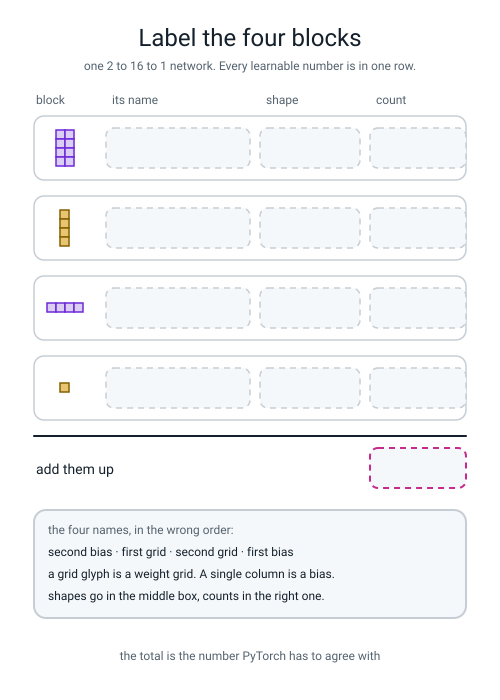
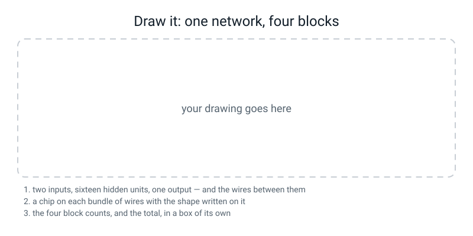

# Workbook — Week 22: Layers, Losses, and Watching It Overfit

**Name:** ________________________________  **Date:** ______________

[⬅ Week 21](week-21.md) · [📖 Read the chapter first](../student-guide/week-22.md) · [Course Home](../README.md) · [🧑‍🏫 Teacher guide](../teacher-guide/week-22.md) · [Next ➡](week-23.md)

---

## ✅ Warm-Up (5 min)

Five quick questions about **last week**.

**W1.** Write the five lines of the training loop, in order, with nothing else in between.

1. ______________________________  2. ______________________________
3. ______________________________  4. ______________________________
5. ______________________________

**W2.** One of those five, when you delete it, produces **no error message at all**. Which one, and what happens instead?

________________________________________________________________

**W3.** Does `optimizer.zero_grad()` reset the weights? **What does it reset?**

________________________________________________________________

**W4.** Week 21's loop found `marks = 8.0014 × hours + 11.9939` from six points. **What line was hidden in the data, and who told the loop either of those two numbers?**

________________________________________________________________

**W5.** What does `with torch.no_grad():` save you, and what does `requires_grad` print for a tensor made inside that block?

________________________________________________________________

---

## 🔢 Do the Maths by Hand

**This week has no new maths, so these use the most recent maths you have: Week 14's surprise meter, `−ln`.** It is the arithmetic that `BCEWithLogitsLoss` does for you, so doing it by hand is the only way to know the library is not lying to you.

**Calculator only. No code.** You need the `ln` button.

**M1.** Fill in the surprise for each chance. Six decimal places.

| chance the model gave to what happened | `−ln(chance)` |
|---|---|
| 0.90 | ________________ |
| 0.50 | ________________ |
| 0.10 | ________________ |
| 0.02 | ________________ |

**M1(a).** The chance from row 1 to row 4 got **45 times smaller**. How many times bigger did the surprise get? ______________

**M1(b).** In one sentence, what shape is that relationship? *(Not a formula — a sentence.)*

________________________________________________________________

**M2.** Four predictions with what actually happened. **Careful: two of the answers are 0**, so the chance the model gave to what happened is `1 − p`.

| p the model said | what happened | chance given to what happened | surprise `−ln(...)` |
|---|---|---|---|
| 0.95 | 1 | ____________ | ________________ |
| 0.60 | 0 | ____________ | ________________ |
| 0.30 | 1 | ____________ | ________________ |
| 0.05 | 0 | ____________ | ________________ |

**total:** ________________  **÷ 4 = average loss:** ________________

**M2(a).** Two of those four rows have **exactly the same** surprise. Which two, and why is that not a coincidence?

________________________________________________________________

**M2(b).** Which single row contributes most to the average, and what fraction of the total is it?

________________________________________________________________

**M3.** The double squash, by hand. You are given `sigmoid(2.0) = 0.880797`.

**Step 1.** If you hand `2.0` straight to `BCEWithLogitsLoss` with a true answer of 1, the loss is `−ln(0.880797)` = ________________

**Step 2.** Now suppose you put `nn.Sigmoid()` on the end of the model. The loss receives `0.880797` and treats it as a **raw score**, so it squashes it again. You are given `sigmoid(0.880797) = 0.706987`.

The loss is now `−ln(0.706987)` = ________________

**Step 3.** How many times bigger is the squashed-twice loss? ______________

**M3(a).** A **perfect** answer should cost almost nothing. Did squashing twice make this good answer look better or worse? ____________

**M3(b).** You are given `sigmoid(−6.0) = 0.002473` and `sigmoid(0.002473) = 0.500618`. A model that said "−6.0" when the answer was 1 is catastrophically wrong. What does the squashed-twice loss charge it?

`−ln(0.500618)` = ________________

**M3(c).** Now put your two squashed-twice numbers side by side. **Write one sentence saying why a loss that cannot separate those two answers cannot teach anything.**

________________________________________________________________

**M4.** Counting, which is this week's arithmetic. Fill in every box. **Remember: one bias per output unit.**

| Network | first grid | first bias | second grid | second bias | total |
|---|---|---|---|---|---|
| 3 → 8 → 1 | ______ | ______ | ______ | ______ | ______ |
| 30 → 16 → 1 | ______ | ______ | ______ | ______ | ______ |
| 64 → 64 → 10 | ______ | ______ | ______ | ______ | ______ |
| 4096 → 256 → 1 | ______ | ______ | ______ | ______ | ______ |

**M4(a).** Which row is a 64 × 64 greyscale photograph going into one layer? ____________

**M4(b).** Write the general rule for one layer in your own words:

one layer costs ______________________________________________

---

## 🔎 Predict the Output

**Write your prediction in pen before you run anything.** Every snippet starts with `import torch` and `import torch.nn as nn`.

### P1 — outputs first, inputs second

```python
torch.manual_seed(0)
layer = nn.Linear(3, 5)
print(tuple(layer.weight.shape))
print(tuple(layer.bias.shape))
print(sum(p.numel() for p in layer.parameters()))
```

**I predict:**

**weight shape:** ____________  **bias shape:** ____________  **total:** ______

**It really printed:**

```text
________________________________________________________________
________________________________________________________________
________________________________________________________________
```

**Which of the two numbers in `nn.Linear(3, 5)` came first in the printed shape?** ____________

### P2 — the missing numbers in the names

```python
torch.manual_seed(0)
net = nn.Sequential(nn.Linear(2, 4), nn.ReLU(), nn.Dropout(0.5), nn.Linear(4, 1))
for name, p in net.named_parameters():
    print(name, tuple(p.shape))
```

**I predict — how many lines print, and what are the names?**

________________________________________________________________

**It really printed:**

```text
________________________________________________________________
________________________________________________________________
________________________________________________________________
________________________________________________________________
```

**Two numbers are missing from the names. Which two, and why?**

________________________________________________________________

### P3 — a shape prediction, and a trap

```python
import numpy as np
torch.manual_seed(0)
model = nn.Sequential(nn.Linear(2, 16), nn.ReLU(), nn.Linear(16, 1))
X = torch.zeros(4, 2)
print(tuple(model(X).shape))
y = np.array([0, 1, 1, 0])
print(tuple(torch.from_numpy(y).float().shape))
print(tuple(torch.from_numpy(y).float().reshape(-1, 1).shape))
```

**I predict — three shapes:**

1. ____________  2. ____________  3. ____________

**It really printed:**

```text
________________________________________________________________
________________________________________________________________
________________________________________________________________
```

**Two of those three shapes could be handed to `BCEWithLogitsLoss` together. Which two, and what would the third one do?**

________________________________________________________________

### P4 — one squash or two

```python
loss_fn = nn.BCEWithLogitsLoss()
score = torch.tensor([[4.0]])
answer = torch.tensor([[1.0]])
print(round(loss_fn(score, answer).item(), 4))
print(round(loss_fn(torch.sigmoid(score), answer).item(), 4))
```

**I predict — which of the two numbers will be smaller?**

________________________________________________________________

**It really printed:**

```text
________________  ________________
```

**A score of +4.0 with a true answer of 1 is a very good prediction. Which of those two numbers says so?**

________________________________________________________________

**And here is the uncomfortable bit: is the wrong one bigger or smaller than the right one? Why does that make the bug harder to notice?**

________________________________________________________________

**How many of the answers on this page did you get right?** ______ / 15

---

## ✍️ Practice Set A — Read It

**A1. Match the word to the thing.** Write the letter.

| Word | | Description |
|---|---|---|
| **`nn.Linear`** | ______ | (i) Switching off a random fraction of the hidden units on every training step |
| **`nn.Sequential`** | ______ | (ii) Week 14's log loss, which does the sigmoid squash itself, inside |
| **logit** | ______ | (iii) One layer: a grid of weights and a list of biases, and nothing else |
| **`BCEWithLogitsLoss`** | ______ | (iv) A list of parts. A batch goes in the top and comes out the bottom |
| **dropout** | ______ | (v) A raw score out of the last layer, before any squash. Any number at all |

**A1(a).** Which of those five holds **no learnable numbers at all**? ____________ *(there are two right answers)*

**A2. Trace the shape.** A batch of 8 rows, 3 features each, goes through this network. Fill in every box.

```python
model = nn.Sequential(nn.Linear(3, 6), nn.ReLU(), nn.Linear(6, 2), nn.ReLU(), nn.Linear(2, 1))
```

| After this part | shape |
|---|---|
| the batch, before anything | ____________ |
| `nn.Linear(3, 6)` | ____________ |
| `nn.ReLU()` | ____________ |
| `nn.Linear(6, 2)` | ____________ |
| `nn.ReLU()` | ____________ |
| `nn.Linear(2, 1)` | ____________ |

**A2(a).** Which number in the shape never changes, and what is it? ____________

**A2(b).** Which parts changed the shape, and which changed nothing? ____________

**A2(c).** Count this network's learnable numbers. Show every block.

________________________________________________________________

**A3. Spot the bug.** Each line or pair of lines is wrong. Say what happens and write the fix.

| # | The code | What happens | The fix |
|---|---|---|---|
| a | `nn.Sequential([nn.Linear(2,16), nn.ReLU()])` | | |
| b | `nn.Sequential(nn.Linear(2,16), nn.ReLU(), nn.Linear(8,1))` | | |
| c | `y_t = torch.from_numpy(y).float()` then `loss_fn(model(X_t), y_t)` | | |
| d | `model(torch.from_numpy(X))` | | |
| e | `nn.Sequential(nn.Linear(2,16), nn.ReLU(), nn.Linear(16,1), nn.Sigmoid())` with `BCEWithLogitsLoss` | | |
| f | `layer.weight = torch.zeros(16, 2)` | | |

**A3(g).** Which of those six produces **no error message at all**? ____________  **What is the only symptom?**

________________________________________________________________

**A3(h).** Two of the six print two shapes in the error message. Which two, and why is that generous of PyTorch?

________________________________________________________________

**A4. Match the code to the output.** Five of each, no output used twice.

| | Code |
|---|---|
| i | `print(sum(p.numel() for p in nn.Linear(10, 4).parameters()))` |
| ii | `print(tuple(nn.Linear(64, 10).weight.shape))` |
| iii | `print(len(list(nn.Sequential(nn.Linear(2,4), nn.ReLU()).named_parameters())))` |
| iv | `print(tuple(nn.Sequential(nn.Linear(2,4), nn.ReLU(), nn.Linear(4,1))(torch.zeros(7,2)).shape))` |
| v | `print(nn.BCEWithLogitsLoss()(torch.tensor([[0.0]]), torch.tensor([[1.0]])).item())` |

| | Output |
|---|---|
| P | `(10, 64)` |
| Q | `0.6931471824645996` |
| R | `44` |
| S | `2` |
| T | `(7, 1)` |

**Your answers:** i → ______  ii → ______  iii → ______  iv → ______  v → ______

**A4(f).** Output Q is `0.6931…`, and you have seen that number before. Where from, and what does it mean here?

________________________________________________________________

**A5. Read the two curves.** Here are seven rows from a real run.

```
 epoch    train     val
     0   0.5529   0.5314
    39   0.1659   0.1568
   100   0.1320   0.1858
   200   0.1046   0.2445
   400   0.0819   0.2569
   800   0.0531   0.3680
  1499   0.0165   0.4347
```

**a)** At which epoch was this model at its best? ____________  **How do you know?**

________________________________________________________________

**b)** The gap at the end: ____________ − ____________ = ____________

**c)** Compare the validation loss at epoch 1499 with the validation loss at epoch 0. Which is worse, and what does that tell you?

________________________________________________________________

**d)** If somebody asked "how good is this model?", which single number would you give them, and what would you say alongside it?

________________________________________________________________

**e)** For how many epochs was this run making the model **worse** at the only job that matters? ____________

**A6. Label the diagram.** Every box is empty. Fill in all thirteen.


*Figure W22.1 — The four blocks of learnable numbers in a 2 → 16 → 1 network. The glyph on the left tells you which kind of block it is.*

**A6(a).** How did you tell a weight grid from a bias, just from the glyph?

________________________________________________________________

**A6(b).** Which two rows are the ones people forget, and how much would forgetting them cost you? ____________

**A7. Say the sentence.** Finish each one so it is true and complete.

**a)** `nn.Linear` is ______________________________ plus ______________________________, and nothing else.

**b)** A weight's shape is written ( ____________ , ____________ ), which is why `nn.Linear(2, 16)` prints ____________ .

**c)** A logit is ______________________________, and `WithLogits` in a loss's name means ______________________________.

**d)** The last part of your model is ______________________________, because ______________________________.

**e)** Squashing twice produces ______________________________ and the only symptom is ______________________________.

**f)** The epoch you want is at the ______________________________ of the ______________________________ curve, **not** where the two curves cross.

---

## ✍️ Practice Set B — Write It

### B1 — one line

**Task:** print how many learnable numbers are in `nn.Linear(10, 4)`.

**Expected output:**

```text
44
```

**Done looks like:** one line, using `sum(...)` and `p.numel()`.

```python
________________________________________________________________
```

### B2 — four shapes and a total

**Task:** build a 4 → 12 → 1 network and print all four blocks with their shapes and counts, then the total, then the same total worked out by hand in one arithmetic line.

**Expected output:**

```text
0.weight   (12, 4)    48 numbers
0.bias     (12,)      12 numbers
2.weight   (1, 12)    12 numbers
2.bias     (1,)       1 numbers
total: 73
by hand: 12 x 4 + 12 + 1 x 12 + 1 = 73
```

**Done looks like:** a seed, an `nn.Sequential`, a `for` loop over `named_parameters()`, and two totals that agree.

```python
________________________________________________________________

________________________________________________________________

________________________________________________________________

________________________________________________________________
```

### B3 — set the numbers yourself and check them

**Task:** build `nn.Linear(2, 2)`, set its weight grid to `[[3.0, -1.0], [0.5, 0.5]]` and its biases to `[2.0, -1.0]`, push in the single row `[4.0, 6.0]`, and print what comes out. **Then check both numbers on paper.**

**Expected output:**

```text
out: [8.0, 4.0]
by hand row 0: 4*3 + 6*(-1) + 2 = 8
by hand row 1: 4*0.5 + 6*0.5 - 1 = 4.0
```

**Done looks like:** `.data` on both assignments, `with torch.no_grad():` round the forward pass, and two hand sums printed underneath that match.

```python
________________________________________________________________

________________________________________________________________

________________________________________________________________

________________________________________________________________
```

### B4 — prove the loss is doing your arithmetic

**Task:** on the three scores `1.5, −0.5, −2.0` with answers `1, 1, 0`, print (a) what `nn.BCEWithLogitsLoss()` says, (b) the three chances after a sigmoid, (c) the surprise of each row, and (d) their average.

**Expected output:**

```text
library : 0.4341394901275635
chances : [0.817574, 0.377541, 0.119203]
surprise: [0.201413, 0.974077, 0.126928]
average : 0.4341394007205963
```

**Done looks like:** the surprise line uses `-(y * torch.log(p) + (1 - y) * torch.log(1 - p))` and the first and last numbers agree to seven decimal places.

```python
________________________________________________________________

________________________________________________________________

________________________________________________________________

________________________________________________________________

________________________________________________________________
```

**B4(a).** The two numbers agree to seven decimal places and then differ. **Whose arithmetic do you trust more, and why does `BCEWithLogitsLoss` exist at all if the two-step version works?**

________________________________________________________________

### B5 — a whole program, about 25 lines

**Task:** write `hit.py`. Is this song a hit? Six invented features, 600 songs, and two loss curves. It must:

1. build the data with `make_classification(n_samples=600, n_features=6, n_informative=4, random_state=0)`
2. split it with `train_test_split(..., test_size=0.25, stratify=y, random_state=0)`
3. scale with `StandardScaler().fit(X_tr)` — **fitted on the training rows only**
4. turn all four pieces into tensors, with `.float()`, and `.reshape(-1, 1)` on the two answer lists
5. build `6 → 32 → 32 → 1` with `nn.Sequential`, after `torch.manual_seed(0)`
6. print the parameter count **by hand and from PyTorch**, and make them match
7. train for 600 epochs with `nn.BCEWithLogitsLoss()` and `torch.optim.Adam(..., lr=0.01)`
8. record the train loss and the validation loss every epoch, inside `with torch.no_grad():`
9. print the best validation loss, the epoch it happened on, and where the run ended
10. save a plot of both curves with a dashed vertical line at the best epoch

**Expected output:**

```text
by hand: (32x6+32) + (32x32+32) + (1x32+1) = 1313
PyTorch : 1313
best validation loss 0.0985 at epoch 84, ended at 0.1676
train loss at the end: 0.0062, so the gap is 0.1614
wrote hit.png
```

**Done looks like:** the two parameter counts agree, the dashed line is at the **minimum** of the validation curve, and the run takes about two seconds.

**B5(a).** Your network has 1,313 learnable numbers and 450 training rows. **Write down, before you look at your plot, which of the two curves you expect to keep falling.**

________________________________________________________________

**B5(b).** Which epoch did your run pick, and how far past it did the training carry on? ____________

**B5(c).** Look at the gap, 0.1614. **What is that gap a measurement of?**

________________________________________________________________

---

## 🐞 Fix the Broken Program

This program has **three** bugs: one **dtype**, one **shape**, and one that produces **no error at all**. The real messages are below, in the order you meet them.

```python
"""hit_broken.py - will this song be a hit? Three bugs."""
import torch
import torch.nn as nn
from sklearn.datasets import make_classification
from sklearn.model_selection import train_test_split
from sklearn.preprocessing import StandardScaler

X, y = make_classification(n_samples=600, n_features=6, n_informative=4,
                           random_state=0)
X_tr, X_va, y_tr, y_va = train_test_split(X, y, test_size=0.25,
                                          stratify=y, random_state=0)
scaler = StandardScaler().fit(X_tr)
X_tr_t = torch.from_numpy(scaler.transform(X_tr))
X_va_t = torch.from_numpy(scaler.transform(X_va)).float()
y_tr_t = torch.from_numpy(y_tr).float()
y_va_t = torch.from_numpy(y_va).float().reshape(-1, 1)

torch.manual_seed(0)
model = nn.Sequential(nn.Linear(6, 16), nn.ReLU(), nn.Linear(16, 1))
loss_fn = nn.BCEWithLogitsLoss()
opt = torch.optim.SGD(model.parameters(), lr=0.1)

for epoch in range(400):
    loss = loss_fn(model(X_tr_t), y_tr_t)
    loss.backward()
    opt.step()

with torch.no_grad():
    print("train loss %.4f" % loss_fn(model(X_tr_t), y_tr_t).item())
    print("val   loss %.4f" % loss_fn(model(X_va_t), y_va_t).item())
```

**Run 1 — nothing prints:**

```text
  File ".../torch/nn/modules/linear.py", line 116, in forward
    return F.linear(input, self.weight, self.bias)
RuntimeError: mat1 and mat2 must have the same dtype, but got Double and Float
```

**Bug 1.** Which line? ______  **Kind of bug?** ______________

**Two words in that message are the two kinds of number. Which is numpy's default and which is torch's?**

**Double is:** ____________  **Float is:** ____________

**Why did `X_va_t` not cause this?** ______________________________

**The fix:** ______________________________

**Run 2 — after fixing bug 1:**

```text
  File ".../torch/nn/functional.py", line 3197, in binary_cross_entropy_with_logits
    raise ValueError(f"Target size ({target.size()}) must be the same as input size ({input.size()})")
ValueError: Target size (torch.Size([450])) must be the same as input size (torch.Size([450, 1]))
```

**Bug 2.** Which line? ______  **Kind of bug?** ______________

**Read both shapes out of the message.** The model's output is ____________ and our answers are ____________ .

**Which one has to change, and to what?** ______________________________

**The fix:** ______________________________

**Run 3 — after fixing bug 2. No error at all, and this prints:**

```text
train loss 2.1637
val   loss 3.2132
```

**Bug 3.** It runs perfectly. **But look at the training loss.** A model that answers "0.5, I have no idea" to every single row scores `−ln(0.5) = 0.693147`. Ours scored 2.1637.

**Is 2.1637 better or worse than knowing nothing?** ____________

**Which of the five lines of the training loop is missing?** ______________________________

**Where exactly does it go?** ______________________________

**The fix:** ______________________________

**Run 4 — fixed:**

```text
train loss 0.2316
val   loss 0.2140
```

**Two questions, and they are the point of the page.**

**Bug 3 had no error message. What was the only clue, and would you have spotted it if the loss had come out at 0.71 instead of 2.16?**

________________________________________________________________

**Rank the three bugs from easiest to hardest to find, and say why.**

**easiest → hardest:** ______  ______  ______

________________________________________________________________

---

## 🧩 Puzzle of the Week

### Guess the network from its parameter count

Somebody has trained four networks and thrown away the code. All you have is the shape of each one — with **one number missing** — and the total number of learnable numbers PyTorch reported. **Find the missing number each time.**

Remember the rule: one layer costs `(inputs × outputs) + outputs`.

**Puzzle 1.** `2 → h → 1`, total **257**.

Write the equation: 2h + ______ + ______ + 1 = 257

**h = ______**

**Puzzle 2.** `n → 8 → 1`, total **105**.

Write the equation: ______ + 8 + 8 + 1 = 105

**n = ______**

**Puzzle 3.** `4 → h → 3`, total **83**.

Write the equation: ______________________________ = 83

**h = ______**

**Puzzle 4.** `4 → h → 3`, total **90**.

Write the equation: ______________________________ = 90

**h = ______**

**Puzzle 4(a).** Something is wrong with puzzle 4. **What, and what does that tell you about the number 90?**

________________________________________________________________

**Puzzle 4(b).** For a `4 → h → 3` network, the total is always `8h + 3`. **Write down the three smallest totals that are possible, and one that is impossible.**

**possible:** ______  ______  ______  **impossible:** ______

**Puzzle 4(c).** Somebody tells you their `4 → h → 3` network has 4,000 parameters. Without a calculator, how do you know instantly that they are wrong?

________________________________________________________________

---

## 🤔 Think Deeper

**T1.** In Week 19 you wrote a neural network yourself, in numpy, in about forty lines. This week you replaced it with three. **Write a paragraph** about what you gained and what you lost. Be specific: name one thing `nn.Sequential` does for you that your numpy version could get wrong, and name one thing you understand *because* you wrote the numpy version that somebody who started with PyTorch would not. Then answer the harder question: **the library did not remove any difficulty — where did the difficulty go?**

________________________________________________________________

________________________________________________________________

________________________________________________________________

________________________________________________________________

________________________________________________________________

**T2.** The double squash produces **no error message.** The model trains happily for six hundred epochs and the loss sticks at 0.5423. **Write a paragraph** about why this class of bug is worse than a traceback, and about what you could actually *do* to catch it — not "be careful", but a concrete check you could run on any training script before you trusted its numbers. Then say what the equivalent check was in Term 1, when the silent bug was leakage rather than a double squash.

________________________________________________________________

________________________________________________________________

________________________________________________________________

________________________________________________________________

________________________________________________________________

---

## 🛠️ Build It — Week 19's Brain, Rebuilt

**Two parts. The first is a comparison, and the comparison *is* the task — a page that says "they match" without both lists pasted has not done it.**

### Step checklist

- [ ] **1.** Open your Week 19 `numpy_brain.py`. Find `W1`, `b1`, `W2`, `b2`.
- [ ] **2.** Print all four shapes and all four sizes, and the total.
- [ ] **3.** New file. Build the **same architecture** with `nn.Sequential` — 2 in, 16 hidden, 1 out, `nn.ReLU()` in the middle, **no sigmoid at the end**.
- [ ] **4.** Print all four of *its* shapes and counts, and the total.
- [ ] **5.** **Paste both lists on this page, one above the other.**
- [ ] **6.** Write four matching lines: which PyTorch block is which numpy array.
- [ ] **7.** For the two pairs that are transposed, say so **and say why it does not matter.**
- [ ] **8.** Now `overfit.py`: train 2 → 64 → 64 → 1 on `make_moons(n_samples=400, noise=0.25, random_state=0)` for 1,500 epochs, recording both losses.
- [ ] **9.** Plot both curves on one axis and put a **dashed vertical line at the minimum of the validation curve.**
- [ ] **10.** Write the two sentences: what would have happened if you had kept training, and what number you would report.

### Part 1 — the two shape lists

**From numpy:**

```text
________________________________________________________________
________________________________________________________________
________________________________________________________________
________________________________________________________________
________________________________________________________________
```

**From PyTorch:**

```text
________________________________________________________________
________________________________________________________________
________________________________________________________________
________________________________________________________________
________________________________________________________________
```

### The four matching lines

| numpy | PyTorch | same numbers? | same shape? |
|---|---|---|---|
| `W1` ____________ | ____________ | ______ | ______________________ |
| `b1` ____________ | ____________ | ______ | ______________________ |
| `W2` ____________ | ____________ | ______ | ______________________ |
| `b2` ____________ | ____________ | ______ | ______________________ |

**numpy total:** ______  **PyTorch total:** ______  **agree?** ____________

**The sentence about the transpose — this is the marked part:**

________________________________________________________________

________________________________________________________________

### Part 2 — the plot and the epoch

**Fill in your own numbers.**

| epoch | train loss | validation loss |
|---|---|---|
| 0 | ____________ | ____________ |
| the best epoch: ______ | ____________ | ____________ |
| 400 | ____________ | ____________ |
| 1499 | ____________ | ____________ |

**The gap at the end:** ____________ − ____________ = ____________

**Is the dashed line at the minimum of the validation curve, or where the two curves cross?** ____________

**Sentence one — what would have happened if you had kept training past the best epoch?**

________________________________________________________________

________________________________________________________________

**Sentence two — what number would you report if somebody asked how good this model is?**

________________________________________________________________

________________________________________________________________

### The Bug Log

Two entries this week: one loud, one silent.

| What I saw | What it means | Cause | Fix |
|---|---|---|---|
| | | | |
| | | | |

---

## 🎨 Draw It

Draw **one network** and **its four blocks of numbers** — not the code, the numbers.


*Figure W22.2 — Your drawing goes in the frame. The three things it must contain are listed underneath.*

**What a good answer looks like:** two input circles on the left, sixteen hidden circles in a column (or five and a "…"), one output circle on the right, and every wire drawn. Then, and this is what earns the marks: **a chip on each bundle of wires with its shape written on it** — `(16, 2)` on the first bundle, `(1, 16)` on the second — and **a small bias tag beside each layer of circles**, 16 on the hidden column and 1 on the output. Then a box in the corner with the four counts and the total: `32 + 16 + 16 + 1 = 65`. A drawing with the circles and wires but no numbers is a picture of a network; a drawing with the numbers is a picture of what a network *is*.

**How many wires between the input and hidden layers?** ______

**How many biases altogether?** ______

**What is the total?** ______

**Which two of the four blocks are the ones people forget?**

________________________________________________________________

---

## 📊 Self-Check

| I can... | 😀 | 🙂 | 😕 |
|---|---|---|---|
| build a network with `nn.Sequential` from a blank file | | | |
| say what is inside `nn.Linear`, and what is inside `nn.ReLU` | | | |
| count the learnable numbers in a 2 → 16 → 1 network, unaided, and get 65 | | | |
| explain why a weight's shape prints outputs-first, and not try to fix it | | | |
| say what a logit is in one sentence | | | |
| explain why `BCEWithLogitsLoss` wants raw scores | | | |
| say what happens if you squash twice — including that nothing goes red | | | |
| read a train-and-validation table and find the epoch to stop at | | | |
| plot both curves and mark the right epoch with a dashed line | | | |
| say whether dropout fixed the overfitting or slowed it down, with both numbers | | | |

**The one thing I would ask about if I could ask one question:**

________________________________________________________________

---

## ✅ Answers

<details>
<summary>Check your answers</summary>

### Warm-Up

**W1.** In order:

1. `optimizer.zero_grad()` — wipe last step's slopes
2. the forward pass — `pred = model(X)`
3. the loss — `loss = loss_fn(pred, y)`
4. `loss.backward()` — work out every slope
5. `optimizer.step()` — nudge every knob

**W2.** `optimizer.zero_grad()`. **No error at all.** The gradients from every previous step stay on the tensors and the new ones are added to them, so the steps get bigger and bigger and the run falls apart. Week 21's run went down at step 1 and was a wreck by step 399.

**W3.** **No.** It resets the **slopes** (the `.grad` on each tensor) to zero. The weights keep everything they have learned. Print `w` before and after and it does not change.

**W4.** The hidden line was **`marks = 8 × hours + 12`**. **Nobody told the loop either number** — it started at `w = 0`, `b = 0` and found 8.0014 and 11.9939 by rolling downhill 400 times. That is the whole point of the week.

**W5.** It stops PyTorch recording the receipt, which makes measuring faster and uses less memory. A tensor made inside the block has `requires_grad` printing **`False`**.

### Do the Maths by Hand

**M1.**

| chance | `−ln(chance)` |
|---|---|
| 0.90 | **0.105361** |
| 0.50 | **0.693147** |
| 0.10 | **2.302585** |
| 0.02 | **3.912023** |

**M1(a).** The chance went from 0.90 to 0.02, which is 45 times smaller. The surprise went from 0.105361 to 3.912023:

```
3.912023 ÷ 0.105361 = 37.13
```

**About 37 times bigger.**

**M1(b).** The surprise climbs slowly at first and then very steeply. Between 0.90 and 0.50 it goes from 0.105 to 0.693, about 6.6 times bigger; between 0.10 and 0.02 it adds another 1.6 on top of an already large number. **Being a bit wrong is cheap; being confidently wrong is not.** *(And `−ln(0)` has no value at all, which is why real code clips the probability away from 0 — Week 14's `np.clip`.)*

**M2.**

| p | happened | chance given to what happened | surprise |
|---|---|---|---|
| 0.95 | 1 | **0.95** | **0.051293** |
| 0.60 | 0 | **0.40** | **0.916291** |
| 0.30 | 1 | **0.30** | **1.203973** |
| 0.05 | 0 | **0.95** | **0.051293** |

```
0.051293 + 0.916291 + 1.203973 + 0.051293  =  2.222850
2.222850 ÷ 4                               =  0.555713
```

**M2(a).** Rows 1 and 4, both **0.051293**. Not a coincidence: row 1 said 0.95 and the answer was 1, so the chance given to what happened is 0.95. Row 4 said 0.05 and the answer was 0, so the chance given to what happened is `1 − 0.05 = 0.95` — **the same number.** The loss does not care which way round the answer was; it cares how much chance you put on the thing that actually happened.

**M2(b).** Row 3, with **1.203973**:

```
1.203973 ÷ 2.222850 = 0.5416
```

**About 54% of the total, from one row out of four** — and it is the row that said 0.30 when the answer was 1.

**M3.**

**Step 1.** `−ln(0.880797) = ` **0.126928**

**Step 2.** `−ln(0.706987) = ` **0.346742**

**Step 3.**

```
0.346742 ÷ 0.126928 = 2.73
```

**About 2.7 times bigger.**

**M3(a).** **Worse.** A very good answer now costs 0.346742 instead of 0.126928. Squashing twice punishes good answers.

**M3(b).** `−ln(0.500618) = ` **0.691912**

**M3(c).** The good answer costs 0.346742 and the catastrophic answer costs 0.691912 — **the disaster is only twice as expensive as the triumph.** Fed in raw, the same two answers cost 0.126928 and 6.002476, which is forty-seven times apart. A loss whose worst possible score is only twice its best gives the training loop a much weaker signal, and the loss parks at about 0.54 (with two squashes, no answer can cost less than 0.31 if it should be 1, or 0.69 if it should be 0).

**M4.**

| Network | first grid | first bias | second grid | second bias | total |
|---|---|---|---|---|---|
| 3 → 8 → 1 | 8 × 3 = **24** | **8** | 1 × 8 = **8** | **1** | **41** |
| 30 → 16 → 1 | 16 × 30 = **480** | **16** | 1 × 16 = **16** | **1** | **513** |
| 64 → 64 → 10 | 64 × 64 = **4096** | **64** | 10 × 64 = **640** | **10** | **4810** |
| 4096 → 256 → 1 | 256 × 4096 = **1048576** | **256** | 1 × 256 = **256** | **1** | **1049089** |

**Every one of those was confirmed against PyTorch:**

```python
import torch, torch.nn as nn
torch.manual_seed(0)
for a, h, b in ((3, 8, 1), (30, 16, 1), (64, 64, 10), (4096, 256, 1)):
    m = nn.Sequential(nn.Linear(a, h), nn.ReLU(), nn.Linear(h, b))
    print("%4d -> %3d -> %2d : %d" % (a, h, b, sum(p.numel() for p in m.parameters())))
```

```text
   3 ->   8 ->  1 : 41
  30 ->  16 ->  1 : 513
  64 ->  64 -> 10 : 4810
4096 -> 256 ->  1 : 1049089
```

**M4(a).** The last row. 64 × 64 = **4096** pixels, flattened.

**M4(b).** **One layer costs (how many numbers come in × how many go out), plus one more for every number that goes out.** The second part is the bias, and it is the part people drop.

### Predict the Output

**P1.**

```text
(5, 3)
(5,)
20
```

**Outputs came first.** `nn.Linear(3, 5)` means three in and five out, and the grid is stored as **(5, 3)** — five rows, one per output unit, each holding three weights. 15 weights plus 5 biases = 20.

**P2.**

```text
0.weight (4, 2)
0.bias (4,)
3.weight (1, 4)
3.bias (1,)
```

**Four lines.** Numbers **1 and 2** are missing: part 1 is the `nn.ReLU()` and part 2 is the `nn.Dropout(0.5)`, and **neither has any learnable numbers**, so neither appears in `named_parameters()`. They still occupy their slots, which is why the second `nn.Linear` is called `3` and not `1`.

**P3.**

```text
(4, 1)
(4,)
(4, 1)
```

**Shapes 1 and 3 could go into the loss together** — `(4, 1)` and `(4, 1)`, a grid of four scores against a grid of four answers. Shape 2, the flat `(4,)`, would give you:

```text
ValueError: Target size (torch.Size([4])) must be the same as input size (torch.Size([4, 1]))
```

Note that `model(X)` turned a `(4, 2)` batch into `(4, 1)`: **the layer changed the second number and left the first one alone.**

**P4.**

```text
0.0181  0.3181
```

**The first is smaller, and the first is the right one.** A score of +4.0 with a true answer of 1 is a very confident, very correct prediction, so it should cost almost nothing — and 0.0181 says so. Working it through: `sigmoid(4.0) = 0.982014`, and `−ln(0.982014) = 0.018150`.

The squashed-twice version treats 0.982014 as a raw score: `sigmoid(0.982014) = 0.727508`, and `−ln(0.727508) = 0.318131`.

**And the uncomfortable bit: the wrong number is *bigger*, 0.3181 against 0.0181.** So on a single very good prediction the bug makes the loss look worse. But across a whole training run the bug makes the *average* loss look flatter, and — as Worked Example 3 in the chapter shows — on a real six-row set the wrong loss came out **smaller** (0.5869 against 0.9141). **A bug that sometimes makes your headline number look better is a bug you will not go looking for.**

### Practice Set A

**A1.** `nn.Linear` → **(iii)** · `nn.Sequential` → **(iv)** · logit → **(v)** · `BCEWithLogitsLoss` → **(ii)** · dropout → **(i)**

**A1(a).** **dropout and `BCEWithLogitsLoss`** hold no learnable numbers. *(`nn.Sequential` holds its parts, so its numbers are the parts' numbers, and a logit is a value, not a part. Side note: `nn.ReLU()` holds none either, which is why the second `nn.Linear` in a three-part `Sequential` is called `2`.)*

**A2.**

| After this part | shape |
|---|---|
| the batch | **(8, 3)** |
| `nn.Linear(3, 6)` | **(8, 6)** |
| `nn.ReLU()` | **(8, 6)** |
| `nn.Linear(6, 2)` | **(8, 2)** |
| `nn.ReLU()` | **(8, 2)** |
| `nn.Linear(2, 1)` | **(8, 1)** |

**Confirmed:**

```python
import torch, torch.nn as nn
torch.manual_seed(0)
parts = [nn.Linear(3, 6), nn.ReLU(), nn.Linear(6, 2), nn.ReLU(), nn.Linear(2, 1)]
x = torch.zeros(8, 3)
print("batch          ", tuple(x.shape))
for p in parts:
    x = p(x)
    print("%-15s" % p.__class__.__name__, tuple(x.shape))
```

```text
batch           (8, 3)
Linear          (8, 6)
ReLU            (8, 6)
Linear          (8, 2)
ReLU            (8, 2)
Linear          (8, 1)
```

**A2(a).** The **first** number, **8** — the batch size, how many rows you handed it.

**A2(b).** The three `nn.Linear` parts changed the shape. **Both `nn.ReLU()` parts changed nothing** — a ReLU replaces every negative with zero, one number at a time, so the grid it hands back is exactly the same shape as the grid it received.

**A2(c).**

```
first grid    (6, 3)    6 × 3  = 18
first bias    (6,)               6
second grid   (2, 6)    2 × 6  = 12
second bias   (2,)               2
third grid    (1, 2)    1 × 2  =  2
third bias    (1,)               1
                              ----
                                41
```

```python
print(sum(p.numel() for p in nn.Sequential(
    nn.Linear(3, 6), nn.ReLU(), nn.Linear(6, 2), nn.ReLU(), nn.Linear(2, 1)).parameters()))
```

```text
41
```

**A3.**

| # | What happens | The fix |
|---|---|---|
| a | `TypeError: list is not a Module subclass` | Drop the square brackets: `nn.Sequential(nn.Linear(2,16), nn.ReLU())` |
| b | `RuntimeError: mat1 and mat2 shapes cannot be multiplied (300x16 and 8x1)` | The inner numbers must match: `nn.Linear(16, 1)` |
| c | `ValueError: Target size (torch.Size([300])) must be the same as input size (torch.Size([300, 1]))` | `.reshape(-1, 1)` on the answers |
| d | `RuntimeError: mat1 and mat2 must have the same dtype, but got Double and Float` | `.float()` after `torch.from_numpy(...)` |
| e | **No error.** The loss stops falling at about 0.54 | Delete the `nn.Sigmoid()`. The last part is a bare `nn.Linear` |
| f | `TypeError: cannot assign 'torch.FloatTensor' as parameter 'weight' (torch.nn.Parameter or None expected)` | `layer.weight.data = torch.zeros(16, 2)` — with `.data` |

**A3(g).** **(e).** The only symptom is a **training loss that stops falling at about 0.54** and a model that looks permanently mediocre. Nothing is printed, nothing is coloured red, and it will train for as many epochs as you give it.

**A3(h).** **(b) and (c).** It is generous because **the answer is inside the message.** `(300x16 and 8x1)` tells you a layer produces 16 and the next expects 8; `([300])` and `([300, 1])` tells you which side needs reshaping. You do not have to guess anything — you just have to read both numbers instead of one.

**A4.** i → **R** · ii → **P** · iii → **S** · iv → **T** · v → **Q**

```python
import torch, torch.nn as nn
torch.manual_seed(0)
print(sum(p.numel() for p in nn.Linear(10, 4).parameters()))
print(tuple(nn.Linear(64, 10).weight.shape))
print(len(list(nn.Sequential(nn.Linear(2,4), nn.ReLU()).named_parameters())))
print(tuple(nn.Sequential(nn.Linear(2,4), nn.ReLU(), nn.Linear(4,1))(torch.zeros(7,2)).shape))
print(nn.BCEWithLogitsLoss()(torch.tensor([[0.0]]), torch.tensor([[1.0]])).item())
```

```text
44
(10, 64)
2
(7, 1)
0.6931471824645996
```

**iii is the interesting one:** a `Sequential` of one `nn.Linear` and one `nn.ReLU` yields **two** named parameters, a weight and a bias, because the ReLU contributes none.

**A4(f).** `0.6931…` is **`−ln(0.5)`**, and you first met it in Week 14. A raw score of `0.0` squashes to a probability of exactly 0.5, so the model has said "I have absolutely no idea" — and 0.693147 is the price of knowing nothing. **It is the number every loss curve starts near, and any loss stuck above it means something is wrong.**

**A5.**

**a)** **Epoch 39.** Because **0.1568 is the lowest the validation loss ever gets** — every epoch after it is worse.

**b)** `0.4347 − 0.0165 = **0.4182**`

**c)** **Careful — this one is a trap, and the honest answer is the interesting one.** Epoch 0's validation loss is 0.5314 and epoch 1499's is 0.4347, and **0.4347 is the smaller of the two**, so the fully-trained model is still very slightly better on new data than the almost-untrained one. But it is nearly three times worse than the best it ever was (0.1568). **So: 1,460 epochs of training took a model that was genuinely good on new data and dragged it most of the way back to where it started.** That is a more precise — and more damning — statement than "it got worse than nothing".

**d)** **0.1568**, and *"the validation loss at epoch 39, out of 100 held-out rows"*. Reporting 0.4347 would be reporting the model you accidentally ended up with; reporting 0.0165 would be reporting a score on 300 rows the model has memorised.

**e)** **1,460 epochs** — from epoch 40 to epoch 1499.

**A6.** Reading down the figure:

| glyph | its name | its shape | count |
|---|---|---|---|
| a 2-wide, 4-tall grid | **first grid** | **(16, 2)** | **32** |
| a single column of cells | **first bias** | **(16,)** | **16** |
| a 4-wide, 1-tall row | **second grid** | **(1, 16)** | **16** |
| one cell on its own | **second bias** | **(1,)** | **1** |

**total: 65**

**A6(a).** A weight grid glyph has cells in **two directions** — it has both rows and columns, because it joins every input to every output. A bias glyph is a **single line of cells**, because there is exactly one bias per output and nothing to join.

**A6(b).** The two **bias** rows. Forgetting both costs you `16 + 1 = **17**`, which is why the classic wrong answer is 48 instead of 65.

**A7.**

**a)** …**the grid multiply** plus **the bias**, and nothing else.

**b)** ( **outputs** , **inputs** ), which is why `nn.Linear(2, 16)` prints **(16, 2)**.

**c)** A logit is **the raw score out of the last layer, before any squash — it can be any number at all**, and `WithLogits` means **the loss does the sigmoid squash itself, so hand it raw scores and not probabilities**.

**d)** …**a bare `nn.Linear`**, because **the loss does the squash, and squashing twice collapses the loss's range from 6.0000 to 0.3780 with no error message**.

**e)** Squashing twice produces **no error at all** and the only symptom is **a training loss that stops falling at about 0.54**.

**f)** The epoch you want is at the **lowest point** of the **validation** curve, not where the two curves cross.

### Practice Set B

**B1.**

```python
import torch.nn as nn
print(sum(p.numel() for p in nn.Linear(10, 4).parameters()))
```

```text
44
```

`4 × 10 = 40` weights plus 4 biases.

**B2.**

```python
import torch
import torch.nn as nn

torch.manual_seed(0)
net = nn.Sequential(nn.Linear(4, 12), nn.ReLU(), nn.Linear(12, 1))
for name, p in net.named_parameters():
    print("%-10s %-10s %d numbers" % (name, str(tuple(p.shape)), p.numel()))
print("total:", sum(p.numel() for p in net.parameters()))
print("by hand: 12 x 4 + 12 + 1 x 12 + 1 =", 12 * 4 + 12 + 12 + 1)
```

```text
0.weight   (12, 4)    48 numbers
0.bias     (12,)      12 numbers
2.weight   (1, 12)    12 numbers
2.bias     (1,)       1 numbers
total: 73
by hand: 12 x 4 + 12 + 1 x 12 + 1 = 73
```

**B3.**

```python
import torch
import torch.nn as nn

torch.manual_seed(0)
layer = nn.Linear(2, 2)
layer.weight.data = torch.tensor([[3.0, -1.0], [0.5, 0.5]])
layer.bias.data = torch.tensor([2.0, -1.0])
x = torch.tensor([[4.0, 6.0]])
with torch.no_grad():
    print("out:", layer(x).reshape(-1).tolist())
print("by hand row 0: 4*3 + 6*(-1) + 2 =", 4 * 3 + 6 * -1 + 2)
print("by hand row 1: 4*0.5 + 6*0.5 - 1 =", 4 * 0.5 + 6 * 0.5 - 1)
```

```text
out: [8.0, 4.0]
by hand row 0: 4*3 + 6*(-1) + 2 = 8
by hand row 1: 4*0.5 + 6*0.5 - 1 = 4.0
```

**The arithmetic, in full:**

```
row 0:   4.0 × 3.0  +  6.0 × (−1.0)  +  2.0   =  12 − 6 + 2   =  8.0
row 1:   4.0 × 0.5  +  6.0 × 0.5     +  (−1.0) =  2 + 3 − 1   =  4.0
```

**Note the `.data`.** Without it you get `TypeError: cannot assign 'torch.FloatTensor' as parameter 'weight'`, because `layer.weight` is not a plain tensor — it is a `Parameter`, and `.data` is how you reach the numbers inside it.

**B4.**

```python
import torch
import torch.nn as nn

scores = torch.tensor([[1.5], [-0.5], [-2.0]])
answers = torch.tensor([[1.0], [1.0], [0.0]])
loss_fn = nn.BCEWithLogitsLoss()
print("library :", loss_fn(scores, answers).item())
p = torch.sigmoid(scores)
print("chances :", [round(v, 6) for v in p.reshape(-1).tolist()])
per_row = -(answers * torch.log(p) + (1 - answers) * torch.log(1 - p))
print("surprise:", [round(v, 6) for v in per_row.reshape(-1).tolist()])
print("average :", per_row.mean().item())
```

```text
library : 0.4341394901275635
chances : [0.817574, 0.377541, 0.119203]
surprise: [0.201413, 0.974077, 0.126928]
average : 0.4341394007205963
```

**And the arithmetic:**

```
row 1   answer 1, p = 0.817574   →  −ln(0.817574) = 0.201413
row 2   answer 1, p = 0.377541   →  −ln(0.377541) = 0.974077
row 3   answer 0, p = 0.119203   →  −ln(1 − 0.119203) = −ln(0.880797) = 0.126928

0.201413 + 0.974077 + 0.126928  =  1.302418
1.302418 ÷ 3                    =  0.434139
```

**B4(a).** They agree to **seven** decimal places — `0.4341394` — and then differ in the eighth: `…901` against `…007`. Trust the library's. The two-step version squashes and *then* takes a logarithm, and computers store decimals with limited room, so tiny errors creep in between the two steps. `BCEWithLogitsLoss` does both at once in a way that never divides by anything tiny.

**And that is the real reason it exists.** On these three friendly numbers the difference is in the eighth decimal place and does not matter. On a very confident wrong answer the two-step version can produce `log(0)`, which is minus infinity, which turns every weight in your network into `nan` and every prediction after it. **One combined part cannot make that mistake; two separate parts can.**

**B5.**

```python
"""hit.py - is this song a hit? Two curves, and the epoch to stop at."""
import torch
import torch.nn as nn
import matplotlib
matplotlib.use("Agg")
import matplotlib.pyplot as plt
from sklearn.datasets import make_classification
from sklearn.model_selection import train_test_split
from sklearn.preprocessing import StandardScaler

X, y = make_classification(n_samples=600, n_features=6, n_informative=4,
                           random_state=0)
X_tr, X_va, y_tr, y_va = train_test_split(X, y, test_size=0.25,
                                          stratify=y, random_state=0)
scaler = StandardScaler().fit(X_tr)
X_tr_t = torch.from_numpy(scaler.transform(X_tr)).float()
X_va_t = torch.from_numpy(scaler.transform(X_va)).float()
y_tr_t = torch.from_numpy(y_tr).float().reshape(-1, 1)
y_va_t = torch.from_numpy(y_va).float().reshape(-1, 1)

torch.manual_seed(0)
model = nn.Sequential(nn.Linear(6, 32), nn.ReLU(), nn.Linear(32, 32),
                      nn.ReLU(), nn.Linear(32, 1))
print("by hand: (32x6+32) + (32x32+32) + (1x32+1) =", (32*6+32) + (32*32+32) + (1*32+1))
print("PyTorch :", sum(p.numel() for p in model.parameters()))

loss_fn = nn.BCEWithLogitsLoss()
opt = torch.optim.Adam(model.parameters(), lr=0.01)
tr, va = [], []
for epoch in range(600):
    opt.zero_grad()
    loss_fn(model(X_tr_t), y_tr_t).backward()
    opt.step()
    with torch.no_grad():
        tr.append(loss_fn(model(X_tr_t), y_tr_t).item())
        va.append(loss_fn(model(X_va_t), y_va_t).item())

best = va.index(min(va))
print("best validation loss %.4f at epoch %d, ended at %.4f" % (va[best], best, va[-1]))
print("train loss at the end: %.4f, so the gap is %.4f" % (tr[-1], va[-1] - tr[-1]))

plt.plot(tr, label="train loss")
plt.plot(va, label="validation loss")
plt.axvline(best, linestyle="--", color="grey")
plt.xlabel("epoch"); plt.ylabel("BCEWithLogits loss")
plt.legend(); plt.grid(alpha=0.3); plt.tight_layout()
plt.savefig("hit.png", dpi=120)
print("wrote hit.png")
```

```text
by hand: (32x6+32) + (32x32+32) + (1x32+1) = 1313
PyTorch : 1313
best validation loss 0.0985 at epoch 84, ended at 0.1676
train loss at the end: 0.0062, so the gap is 0.1614
wrote hit.png
```

**Runtime: about 2 seconds.**

**B5(a).** The **training** curve. 1,313 learnable numbers against 450 training rows is nearly three numbers per row, which is more than enough room to memorise every one of them — so the training loss will keep falling towards zero for as long as you let it.

**B5(b).** **Epoch 84**, and the run carried on for another **515** epochs, and none of them beat it on rows the model had not seen.

**B5(c).** The gap is a measurement of **how much of the model's performance is memorising.** Train loss 0.0062 means it has essentially learned all 450 training songs by heart. Validation loss 0.1676 is what it can actually do on a song it has never met, and that is 27 times worse. **A model whose two numbers are close together is learning the pattern; a model whose two numbers are far apart is learning the rows.**

### Fix the Broken Program

**Bug 1** — line 13, `X_tr_t = torch.from_numpy(scaler.transform(X_tr))`. **A dtype bug.**

**Double is numpy's default** (64-bit decimals). **Float is torch's default** for layer weights (32-bit decimals). `X_va_t` did not cause it because that line already has `.float()` on the end — which is the clue: **one of the two lines is different from the other, and the different one is wrong.**

**The fix:** `torch.from_numpy(scaler.transform(X_tr)).float()`

**Bug 2** — line 15, `y_tr_t = torch.from_numpy(y_tr).float()`. **A shape bug.**

The model's output is **`torch.Size([450, 1])`** — 450 rows, one score each. Our answers are **`torch.Size([450])`** — a flat list. **The answers have to change**, into a grid of 450 rows and 1 column.

**The fix:** `torch.from_numpy(y_tr).float().reshape(-1, 1)`

**Bug 3** — the missing line is **`opt.zero_grad()`**, and it goes as the **first line inside the `for` loop**, before the forward pass.

**2.1637 is far worse than knowing nothing.** A model answering 0.5 to everything scores `−ln(0.5) = 0.693147`. Ours scored more than three times that, which means it is confidently wrong on a lot of rows. Without `zero_grad()` every step's gradients pile on top of all the previous ones, so the steps get bigger and bigger and the weights are flung past anything sensible. **This is Week 21's silent failure, arriving inside a real program.**

**The fix:**

```python
for epoch in range(400):
    opt.zero_grad()
    loss = loss_fn(model(X_tr_t), y_tr_t)
    loss.backward()
    opt.step()
```

```text
train loss 0.2316
val   loss 0.2140
```

**The only clue** was a number: a training loss *above* 0.693147 after 400 epochs. **And no, you very likely would not have spotted 0.71** — it is only just over the line, and it looks like "the model didn't learn much". This is the argument for knowing that `−ln(0.5) = 0.693147` by heart: **it is the score for knowing nothing, and it is the line every loss must get below.**

**Ranking: b, a, c** — easiest to hardest? No: **easiest is bug 1 and bug 2 together**, because both stop the program dead and both name the exact problem, and bug 2 even prints both shapes. **Hardest by a long way is bug 3**, because the program runs, prints two tidy numbers, and never mentions that anything went wrong. **Loudness is not the same as seriousness.**

### Puzzle of the Week

**Puzzle 1.** `2 → h → 1`:

```
first grid  h × 2 = 2h
first bias        = h
second grid 1 × h = h
second bias       = 1
              ------
              4h + 1 = 257
              4h     = 256
              h      = 64
```

**h = 64.**

**Puzzle 2.** `n → 8 → 1`:

```
8n + 8 + 8 + 1 = 105
8n + 17        = 105
8n             = 88
n              = 11
```

**n = 11.**

**Puzzle 3.** `4 → h → 3`:

```
first grid  h × 4 = 4h
first bias        = h
second grid 3 × h = 3h
second bias       = 3
              ------
              8h + 3 = 83
              8h     = 80
              h      = 10
```

**h = 10.**

**Puzzle 4.** `8h + 3 = 90` gives `8h = 87` and `h = 10.875`.

**Puzzle 4(a).** **There is no answer.** A hidden layer cannot have 10.875 units — you cannot have most of a unit. So **90 is not a possible parameter count for a `4 → h → 3` network at all**, and whoever told you it was has either given you the wrong total or the wrong architecture.

**Puzzle 4(b).** The total is always `8h + 3`, so it is 3 more than a multiple of 8:

```
h = 1   →  11
h = 2   →  19
h = 3   →  27
```

**possible: 11, 19, 27.** **Impossible: 90** — and so is 12, 20, 88, or any number that is not 3 more than a multiple of 8.

**Puzzle 4(c).** `4000 − 3 = 3997`, and 3997 is not a multiple of 8 (`3997 ÷ 8 = 499.625`). **So no whole number of hidden units gives 4,000.** The nearest possible totals are `8 × 499 + 3 = 3995` and `8 × 500 + 3 = 4003`.

**All four confirmed against PyTorch:**

```python
import torch, torch.nn as nn
torch.manual_seed(0)
def total(a, h, b):
    m = nn.Sequential(nn.Linear(a, h), nn.ReLU(), nn.Linear(h, b))
    return sum(p.numel() for p in m.parameters())
print("2 -> 64 -> 1 :", total(2, 64, 1))
print("11 -> 8 -> 1 :", total(11, 8, 1))
print("4 -> 10 -> 3 :", total(4, 10, 3))
print("4 -> 11 -> 3 :", total(4, 11, 3))
```

```text
2 -> 64 -> 1 : 257
11 -> 8 -> 1 : 105
4 -> 10 -> 3 : 83
4 -> 11 -> 3 : 91
```

**Look at the last two: 83 and 91.** There is nothing in between, which is exactly why 90 is impossible.

### Think Deeper

**T1 — a full answer.**

> "What I gained is that the numbers are looked after for me. My numpy brain had four separate arrays and I had to remember to update all four; `model.parameters()` hands the optimizer every block at once and it cannot forget one. `nn.Linear` also picks sensible starting numbers, which took me a whole lesson to get right in Week 19.
>
> What I understand because I wrote the numpy version is that `nn.Linear` is not doing anything clever. It is one grid multiply and one add, and I can still write out the three sums for a 2 → 3 layer on paper. Somebody who started with PyTorch would read `nn.Linear(2, 16)` as a spell.
>
> And the difficulty did not disappear — **it moved into the error messages.** When I transposed a grid in numpy, I got a confusing wrong answer and no complaint. When I get a shape wrong now, PyTorch refuses to run and prints both shapes at me. That is not less difficult; it is difficulty I can read."

**T2 — a full answer.**

> "A traceback is a bug that has already been found for you. The double squash is a bug that has to be found by a person, and the only evidence is a number that looks unimpressive rather than wrong — 0.5423 does not look like a crash, it looks like a model that needs more layers. So you go and add layers, and it still says 0.54, and now you have two problems.
>
> The concrete check is **a floor and a ceiling on the loss.** Before I trust a training run I want to know what a model that knows nothing would score: for `BCEWithLogitsLoss` that is `−ln(0.5) = 0.693147`. So the check is: does my loss get meaningfully below 0.693, and does it keep going? A loss that parks between 0.5 and 0.69 and refuses to move is a reason to check for a squash problem (it can have other causes too), and I can check that in one line. The second check is cheaper still: **look at the last part of the model.** If it is not a bare `nn.Linear`, ask why.
>
> In Term 1 the silent bug was leakage, and the equivalent check was 'is this score too good?' — a fraud model at 99% accuracy or a feature that predicts perfectly. Same shape of thinking: **know what an impossible number looks like, and check for it before you celebrate.**"

### Build It

**Part 1 — the numpy side.**

```python
"""numpy_side.py - Week 19's brain, and its four grids."""
import numpy as np

rng = np.random.default_rng(0)
W1 = rng.normal(0, 0.5, size=(2, 16))
b1 = np.zeros((1, 16))
W2 = rng.normal(0, 0.5, size=(16, 1))
b2 = np.zeros((1, 1))
for name, arr in (("W1", W1), ("b1", b1), ("W2", W2), ("b2", b2)):
    print("%-3s %-9s %d numbers" % (name, str(arr.shape), arr.size))
print("total:", W1.size + b1.size + W2.size + b2.size)
```

```text
W1  (2, 16)   32 numbers
b1  (1, 16)   16 numbers
W2  (16, 1)   16 numbers
b2  (1, 1)    1 numbers
total: 65
```

**The PyTorch side.**

```python
"""torch_side.py - the same brain, three lines of it."""
import torch
import torch.nn as nn

torch.manual_seed(0)
model = nn.Sequential(nn.Linear(2, 16), nn.ReLU(), nn.Linear(16, 1))
for name, p in model.named_parameters():
    print("%-10s %-10s %d numbers" % (name, str(tuple(p.shape)), p.numel()))
print("total learnable numbers:", sum(p.numel() for p in model.parameters()))
```

```text
0.weight   (16, 2)    32 numbers
0.bias     (16,)      16 numbers
2.weight   (1, 16)    16 numbers
2.bias     (1,)       1 numbers
total learnable numbers: 65
```

**The four matching lines:**

| numpy | PyTorch | same numbers? | same shape? |
|---|---|---|---|
| `W1` (2, 16) | `0.weight` (16, 2) | yes, **32** | **no — transposed** |
| `b1` (1, 16) | `0.bias` (16,) | yes, **16** | same 16 numbers, written as a flat list rather than a 1-row grid |
| `W2` (16, 1) | `2.weight` (1, 16) | yes, **16** | **no — transposed** |
| `b2` (1, 1) | `2.bias` (1,) | yes, **1** | one number either way |

**Totals: 65 and 65.** ✅

**The sentence about the transpose, at full marks:**

> "PyTorch stores a layer's weights as (outputs, inputs) and then multiplies by the transpose, so `0.weight` holds exactly the 32 numbers that were in my `W1`, written the other way up. `numel()` is 32 on both sides and the parameter total is unaffected, so **nothing needs fixing.**"

*"PyTorch is backwards"* or *"they don't match"* is **not** full marks, and the difference matters: a student who believes the shape is wrong will transpose something next week and break a working model.

**Part 2 — the plot and the epoch.** The complete `overfit.py` is in the chapter's 💻 Type This, Steps 4–6. Its real output:

```text
 epoch    train     val
     0   0.5529   0.5314
    39   0.1659   0.1568
   100   0.1320   0.1858
   200   0.1046   0.2445
   400   0.0819   0.2569
   800   0.0531   0.3680
  1499   0.0165   0.4347

no dropout : best val loss 0.1568 at epoch 39, ended at 0.4347
dropout 0.3: best val loss 0.1443 at epoch 43, ended at 0.2385
```

**The gap at the end:** `0.4347 − 0.0165 = 0.4182`

**The dashed line goes at the minimum of the validation curve — epoch 39.** Not where the curves cross, which is a different epoch and a different idea.

**Sentence one, at full marks:**

> "It did keep training, for another 1,460 epochs, and not one of them beat epoch 39 on rows it had never seen: the validation loss drifted up, with wobbles, from 0.1568 to 0.4347. The training loss fell to 0.0165, so the model was getting better and better at the 300 rows it had already seen and worse and worse at everything else."

**Sentence two, at full marks:**

> "The validation loss at epoch 39, **0.1568**, and I would say which epoch it came from and how many rows it was measured on — because reporting 0.4347 would be reporting the model I accidentally ended up with rather than the best one I trained, and reporting 0.0165 would be reporting a score on rows the model had memorised."

**Bug Log, filled in:**

| What I saw | What it means | Cause | Fix |
|---|---|---|---|
| `ValueError: Target size (torch.Size([300])) must be the same as input size (torch.Size([300, 1]))` | My answers and my scores are different shapes | `y` was a flat list of 300; the model makes a 300 × 1 grid | `.reshape(-1, 1)` on the answers |
| **No message at all** — the loss stopped falling around 0.54 | The model squashed and the loss squashed again | `nn.Sigmoid()` was the last part of the model | End the model with a bare `nn.Linear` |

### Draw It

**How many wires between the input and hidden layers?** `2 × 16 = **32**`

**How many biases altogether?** `16 + 1 = **17**`

**What is the total?** `32 + 17 = **49**`? **No — 65.** Careful: the 32 wires are only the *first* grid. There are another `16 × 1 = 16` wires from the hidden layer to the output. So `32 + 16 = 48` weights, plus 17 biases, = **65**.

*(That deliberate stumble is worth sitting with. A drawing makes the first bundle of wires very visible and the second bundle easy to skim past, which is exactly the mistake the wall sheet is there to catch.)*

**Which two of the four blocks are the ones people forget?** The two **biases** — 16 after the hidden layer and 1 after the output. Together they are 17 of the 65 numbers, which is why the classic wrong answer is 48.

**A drawing at full marks has:** two input circles, sixteen hidden circles (or five and a "…" with "16 units" written beside it), one output circle, every wire drawn, a chip reading `(16, 2)` on the first bundle and `(1, 16)` on the second, a bias tag reading 16 beside the hidden column and 1 beside the output, and a box in the corner reading `32 + 16 + 16 + 1 = 65`.

### Self-Check answers

There are no right answers to a self-check — but if you ticked 😕 for **"say what happens if you squash twice"**, go back and reread §3 of the chapter and then run the two-column table yourself. That one silent bug will otherwise follow you into Weeks 23, 26 and 33.

And if you ticked 😕 for **"count the learnable numbers unaided"**, do it five more times tonight on networks you invent. It is the cheapest skill in this course and the one you will use most.

</details>
