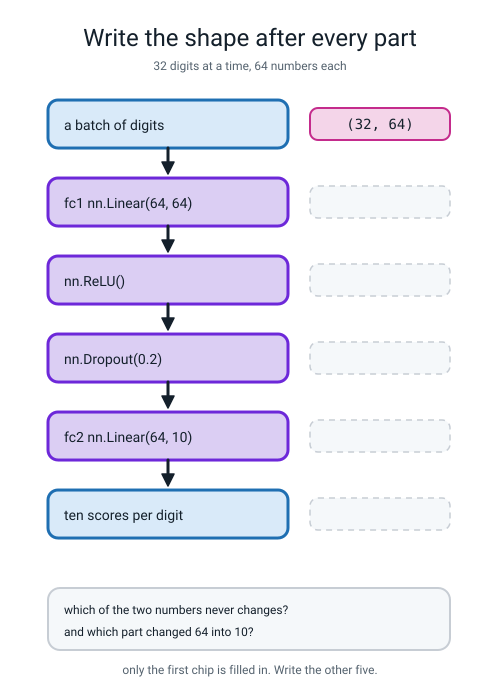
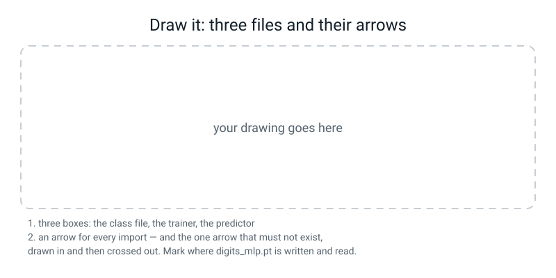

# Workbook — Week 23: Same Brain, Real Framework

**Name:** ________________________________  **Date:** ______________

[⬅ Week 22](week-22.md) · [📖 Read the chapter first](../student-guide/week-23.md) · [Course Home](../README.md) · [🧑‍🏫 Teacher guide](../teacher-guide/week-23.md) · [Next ➡](week-24.md)

---

## ✅ Warm-Up (5 min)

Five quick questions about **last week**.

**W1.** What is inside `nn.Linear`? And what is inside `nn.ReLU()`?

**inside `nn.Linear`:** ______________________________________________

**inside `nn.ReLU()`:** ______________________________________________

**W2.** `nn.Linear(3, 5)`. What shape does `weight` print, and how many learnable numbers are there altogether?

**shape:** ____________  **numbers:** ______  **the arithmetic:** ____________________

**W3.** What is a logit, and why does `BCEWithLogitsLoss` want them rather than probabilities?

________________________________________________________________

**W4.** You put `nn.Sigmoid()` on the end of your model and keep `BCEWithLogitsLoss`. **What error do you get, and what is the only symptom?**

________________________________________________________________

**W5.** You have a training loss curve and a validation loss curve. **Which one tells you anything about the future, and where exactly does the dashed line go?**

________________________________________________________________

---

## 🔢 Do the Maths by Hand

**Week 23 has no new maths.** So these four use the arithmetic you actually do today — **one division, rounded up** — plus **Week 22's parameter counting**, which is the most recent maths in the course. Both come back in Weeks 25, 26 and 34.

**Calculator only. No code.**

**M1.** Fill in every box. **Round the division UP, always** — and then check your answer by adding the batches back together.

| rows | batch size | `rows ÷ batch` | full batches | leftover | total batches | check: full × batch + leftover |
|---|---|---|---|---|---|---|
| 1257 | 32 | ____________ | ______ | ______ | ______ | ____________ |
| 500 | 100 | ____________ | ______ | ______ | ______ | ____________ |
| 1000 | 128 | ____________ | ______ | ______ | ______ | ____________ |
| 426 | 64 | ____________ | ______ | ______ | ______ | ____________ |

**M1(a).** **One of those four rows has no leftover at all.** Which one, and what size is its last batch?

________________________________________________________________

**M1(b).** Somebody writes down "11 batches, and the last one has 0 rows" for the 500-row case. **What have they misunderstood about "round up"?**

________________________________________________________________

**M2.** Steps, not epochs. Same 1,257 training rows, same 15 epochs, two different batch sizes.

| batch size | batches per epoch | × 15 epochs = steps |
|---|---|---|
| 32 | ______ | ______ |
| 512 | ______ | ______ |

**M2(a).** How many times fewer weight updates does the second one do? ____________

**M2(b).** Both runs are honestly described as "15 epochs". **Write one sentence explaining why that description is useless on its own.**

________________________________________________________________

**M3.** Count what goes in the file. The digits network is `64 → 64 → 10`.

**Grouping one — layer by layer**, using Week 22's rule `(inputs × outputs) + outputs`:

```
first layer,  64 → 64:   64 × 64 + 64  =  ________ + ______  =  ________
second layer, 64 → 10:   10 × 64 + 10  =  ________ + ______  =  ________
                                                                --------
                                                                ________
```

**Grouping two — block by block:**

| Block | Shape | How many |
|---|---|---|
| `fc1.weight` | `(64, 64)` | ________ |
| `fc1.bias` | `(64,)` | ________ |
| `fc2.weight` | `(10, 64)` | ________ |
| `fc2.bias` | `(10,)` | ________ |
| | | **________** |

**M3(a).** Do the two groupings agree? ____________

**M3(b).** Each of those numbers is a 32-bit decimal, which takes **4 bytes**. How many bytes of numbers is that?

____________ × 4 = ____________ bytes

**M3(c).** The file on disk is **21,352 bytes**. That is bigger than your answer. **Guess what the extra bytes are for.**

________________________________________________________________

**M4.** Two more networks. Count them, and say which one would fit in the smaller file.

| Network | first grid | first bias | second grid | second bias | total |
|---|---|---|---|---|---|
| 30 → 16 → 1 | ______ | ______ | ______ | ______ | ______ |
| 64 → 32 → 10 | ______ | ______ | ______ | ______ | ______ |

**M4(a).** The second one is the *same shape of job* as the digits network but with a narrower middle. How many numbers did halving the hidden layer save?

4810 − ____________ = ____________

**M4(b).** Halving the hidden layer roughly halved the count. **Why "roughly" and not "exactly"?**

________________________________________________________________

---

## 🔎 Predict the Output

**Write your prediction in pen before you run anything.** Every snippet starts with `import torch` and `import torch.nn as nn`.

### P1 — how many batches?

```python
from torch.utils.data import TensorDataset, DataLoader
for rows, bs in ((100, 10), (100, 30), (1257, 32), (7, 32)):
    ds = TensorDataset(torch.zeros(rows, 2))
    print(rows, bs, len(DataLoader(ds, batch_size=bs)))
```

**I predict — four numbers:**

1. ______  2. ______  3. ______  4. ______

**It really printed:**

```text
________________________________________________________________
________________________________________________________________
________________________________________________________________
________________________________________________________________
```

**The last one asks for batches of 32 out of only 7 rows. What did it do, and is that sensible?**

________________________________________________________________

### P2 — the names in a `state_dict`

```python
torch.manual_seed(0)
seq = nn.Sequential(nn.Linear(3, 5), nn.ReLU(), nn.Linear(5, 1))
print(list(seq.state_dict().keys()))

class Net(nn.Module):
    def __init__(self):
        super().__init__()
        self.hidden = nn.Linear(3, 5)
        self.out = nn.Linear(5, 1)
    def forward(self, x):
        return self.out(torch.relu(self.hidden(x)))

print(list(Net().state_dict().keys()))
```

**I predict — two lists of four names:**

________________________________________________________________

________________________________________________________________

**It really printed:**

```text
________________________________________________________________
________________________________________________________________
```

**Could you save from one of these and load into the other?** ____________  **What message would you get?**

________________________________________________________________

### P3 — the shapes coming out of a loop

```python
from torch.utils.data import TensorDataset, DataLoader
torch.manual_seed(0)
X = torch.zeros(10, 3)
y = torch.zeros(10, 1)
loader = DataLoader(TensorDataset(X, y), batch_size=4, shuffle=True)
for xb, yb in loader:
    print(tuple(xb.shape), tuple(yb.shape))
```

**I predict — how many lines, and what shapes?**

________________________________________________________________

**It really printed:**

```text
________________________________________________________________
________________________________________________________________
________________________________________________________________
```

**Which number changes between the lines, and which never does?**

________________________________________________________________

**Add up the first numbers of the three `xb` shapes.** ______  **Why is that number reassuring?**

________________________________________________________________

### P4 — the same input, twice, in two modes

```python
torch.manual_seed(0)
net = nn.Sequential(nn.Linear(4, 16), nn.ReLU(), nn.Dropout(0.5), nn.Linear(16, 1))
x = torch.ones(1, 4)
net.train()
with torch.no_grad():
    print("train mode:", [round(net(x).item(), 4) for _ in range(5)])
net.eval()
with torch.no_grad():
    print("eval  mode:", [round(net(x).item(), 4) for _ in range(5)])
```

**I predict — will the five numbers in each line be the same as each other?**

**train mode:** ____________  **eval mode:** ____________

**It really printed:**

```text
________________________________________________________________
________________________________________________________________
```

**Both lines are wrapped in `torch.no_grad()`. So why did the first line still move?**

________________________________________________________________

**How many of the answers on this page did you get right?** ______ / 14

---

## ✍️ Practice Set A — Read It

**A1. Match the word to the thing.** Write the letter.

| Word | | Description |
|---|---|---|
| **`DataLoader`** | ______ | (i) A dictionary of *name → block of numbers*. The weights, not the code |
| **batch** | ______ | (ii) Using a trained model to answer a question — no learning, no gradients |
| **epoch** | ______ | (iii) Hands you the rows in groups, one group at a time, in a `for` loop |
| **`state_dict`** | ______ | (iv) One full lap of the training data |
| **inference** | ______ | (v) One group of rows, pushed through together. One of these is one step |

**A1(a).** Which two of those five are **counted in the same units**, so that saying one without the other is meaningless?

________________________________________________________________

**A2. Trace the shape through the class.** Fill in every chip. One is done for you.


*Figure W23.1 — Six stages of the digits network. Only the first shape is filled in; write the other five.*

**A2(a).** Which of the two numbers never changes, and what is it? ____________

**A2(b).** Which part turned 64 into 10? ____________

**A2(c).** Two of the six parts change no shape at all. Which two, and why not?

________________________________________________________________

**A3. Spot the bug.** Say what happens and write the fix.

| # | The code | What happens | The fix |
|---|---|---|---|
| a | `class Net(nn.Module):` … `def __init__(self): self.fc1 = nn.Linear(2, 4)` | | |
| b | `class Net(nn.Module):` with `__init__` but no `forward` | | |
| c | `TensorDataset(np.zeros((10, 64)), np.zeros((10, 10)))` | | |
| d | `wrong = nn.Sequential(...)` then `wrong.load_state_dict(torch.load("digits_mlp.pt"))` | | |
| e | `x = torch.from_numpy(row).float()` then `model(x).numpy().argmax(axis=1)` | | |
| f | `model.load_state_dict(...)` then straight to predicting, no `model.eval()` | | |

**A3(g).** Which of the six produces **no error at all**? ____________  **What is the two-second test that catches it?**

________________________________________________________________

**A3(h).** Two of the six are `state_dict` problems, and they are **different kinds** of problem. Which is a **name** problem and which is a **shape** problem?

________________________________________________________________

**A4. Match the code to the output.** Five of each, no output used twice.

| | Code |
|---|---|
| i | `print(len(DataLoader(TensorDataset(torch.zeros(426, 30)), batch_size=64)))` |
| ii | `print(list(nn.Sequential(nn.Linear(2, 3)).state_dict().keys()))` |
| iii | `print(sum(t.numel() for t in torch.load("digits_mlp.pt").values()))` |
| iv | `print([tuple(xb.shape) for (xb,) in DataLoader(TensorDataset(torch.zeros(5, 2)), batch_size=2)])` |
| v | `print(tuple(torch.from_numpy(np.eye(10)[np.array([3, 7])]).float().shape))` |

| | Output |
|---|---|
| P | `['0.weight', '0.bias']` |
| Q | `[(2, 2), (2, 2), (1, 2)]` |
| R | `7` |
| S | `(2, 10)` |
| T | `4810` |

**Your answers:** i → ______  ii → ______  iii → ______  iv → ______  v → ______

**A4(f).** Output Q's last entry is `(1, 2)`, not `(2, 2)`. **Why, and is that a bug?**

________________________________________________________________

**A5. Read the three-file diagram.** Here is somebody's project.

```
alice_net.py        class AliceNet(nn.Module)         14 lines
train_alice.py      from alice_net import AliceNet    45 lines
predict_alice.py    from train_alice import AliceNet  16 lines
```

**a)** Which line is wrong? ______________________________

**b)** What happens when somebody runs `predict_alice.py`?

________________________________________________________________

**c)** What is the one-word fix? ____________

**d)** Write the grep you would run to prove the fix worked, and say what exit code counts as a pass.

________________________________________________________________

**e)** Alice deletes `train_alice.py` completely. **Does `predict_alice.py` still work — before the fix, and after it?**

**before:** ____________  **after:** ____________

**A6. Read the eval experiment.** Here are ten predictions on the same handwritten digit.

```text
row 37, true label 9

block one
   try 1: guess 5   score for 9 = -1.7783
   try 2: guess 9   score for 9 = +0.6095
   try 3: guess 3   score for 9 = -3.0162
   try 4: guess 9   score for 9 = -1.8427
   try 5: guess 5   score for 9 = -0.8994

block two
   try 1: guess 9   score for 9 = -1.6703
   try 2: guess 9   score for 9 = -1.6703
   try 3: guess 9   score for 9 = -1.6703
   try 4: guess 9   score for 9 = -1.6703
   try 5: guess 9   score for 9 = -1.6703
```

**a)** Which block is `model.train()` and which is `model.eval()`? ____________________

**b)** How many **different answers** did block one give to one picture? ______  **List them.** ____________

**c)** Nothing was printed in red. **So what would you actually have to do to notice this bug?**

________________________________________________________________

**d)** Both blocks were inside `with torch.no_grad():`. **What does that line do, and what does it not do?**

________________________________________________________________

**A7. Say the sentence.** Finish each one so it is true and complete.

**a)** A network class has two halves: `__init__` ______________________________ and runs ____________, while `forward` ______________________________ and runs ____________.

**b)** The first line of every `__init__` is ______________________________, and leaving it out gives you ______________________________.

**c)** An epoch is ____________ and a step is ____________, so 15 epochs at batch size 32 over 1,257 rows is ______ steps.

**d)** A `state_dict` holds ______________________________ but not ______________________________, which is why ______________________________.

**e)** Every loading error is either ______________________________ or ______________________________, and the message ______________________________.

**f)** `model.eval()` stops ____________ and `torch.no_grad()` stops ____________, so you need ______________________________.

---

## ✍️ Practice Set B — Write It

### B1 — one line

**Task:** print how many batches a `DataLoader` will produce from 426 rows at batch size 64.

**Expected output:**

```text
7
```

**Done looks like:** one `print`, using `len(DataLoader(...))`, and you can say what `7 × 64 − 426` is without running anything.

```python
________________________________________________________________
```

### B2 — a class, and its four names

**Task:** write a class called `TinyNet` with a hidden layer called `hidden` (3 in, 5 out) and an output layer called `out` (5 in, 1 out). Print its four `state_dict` names with their shapes, its total, and the total worked out by hand.

**Expected output:**

```text
hidden.weight  (5, 3)
hidden.bias    (5,)
out.weight     (1, 5)
out.bias       (1,)
total: 26
by hand: 5 x 3 + 5 + 1 x 5 + 1 = 26
```

**Done looks like:** `super().__init__()` first, a `forward` that reads inside out, and the two totals agreeing.

```python
________________________________________________________________

________________________________________________________________

________________________________________________________________

________________________________________________________________

________________________________________________________________
```

**B2(a).** Your names are `hidden` and `out`. If you had used `nn.Sequential` instead, what would the four names be?

________________________________________________________________

### B3 — the three ways, on numbers you choose

**Task:** 1,000 rows, batch size 128. Get the number of batches three ways — divide and round up, count the loop, ask the DataLoader — then print every batch size and their sum.

**Expected output:**

```text
way 1 - divide and round up: 8
way 2 - count the loop     : 8
way 3 - ask the DataLoader : 8
every batch: [128, 128, 128, 128, 128, 128, 128, 104]
they add up to: 1000
```

**Done looks like:** `import math` and `math.ceil`, a list comprehension for the sizes, and a sum that comes to exactly 1,000.

```python
________________________________________________________________

________________________________________________________________

________________________________________________________________

________________________________________________________________

________________________________________________________________
```

**B3(a).** Add `drop_last=True` and run it again. **Which of the three ways still says 8?** ____________  **What does the sum say now?** ____________

### B4 — prove a reload is exact

**Task:** load `tumour.pt` (or your own saved weights) into **two** fresh models, put the same five random rows through both, and prove the two agree exactly.

**Expected output:**

```text
model A: [1.212721, -0.017426, 1.373963, 12.045229, -0.754386]
model B: [1.212721, -0.017426, 1.373963, 12.045229, -0.754386]
identical: True
biggest difference: 0.000000
```

**Done looks like:** `model.eval()` on both, `torch.manual_seed(0)` before the random input, `torch.equal(...)`, and a difference of exactly `0.000000`.

```python
________________________________________________________________

________________________________________________________________

________________________________________________________________

________________________________________________________________

________________________________________________________________
```

**B4(a).** Why **exactly** 0.000000, rather than "very close"?

________________________________________________________________

### B5 — the whole thing: three files, and a `predict.py` that ships

**Task:** finish the digits trio. `digits_net.py`, `train_digits.py`, `predict_digits.py`.

`predict_digits.py` must:

1. import the class from `digits_net`, and **import nothing from `train_digits`**
2. build the model, `load_state_dict` from `digits_mlp.pt`, then call `model.eval()`
3. print how many numbers were in the file
4. pick three digits with `np.random.default_rng(0).integers(0, 1797, size=3)`
5. scale each one by dividing by 16.0, and `.reshape(1, 64)` before the model sees it
6. wrap the forward pass in `with torch.no_grad():`
7. draw each digit as text art and print the true label, the guess, and whether it was right

**Expected output:**

```text
loaded digits_mlp.pt, dropout is off
picked rows: [1528, 1144, 918]
   row 1528   true 2   guessed 2   correct
   row 1144   true 5   guessed 5   correct
   row 918   true 3   guessed 3   correct
```

*(with the text-art digits above each line)*

**Done looks like:** the grep prints nothing and reports `exit=1`, and running it twice gives byte-identical output.

**B5(a).** Paste your grep result:

```text
________________________________________________________________
```

**B5(b).** Run it twice. Identical? ____________  **Which single line makes that true?** ____________

**B5(c).** Delete `train_digits.py`. Does `predict_digits.py` still work? ____________  **Why is that the whole point of the week?**

________________________________________________________________

---

## 🐞 Fix the Broken Program

This program has **three** bugs: one **type**, one **missing line in a class**, and one that produces **no error at all**. The real messages are below, in the order you meet them.

```python
"""digits_broken.py - train the digits MLP. Three bugs."""
import numpy as np
import torch
import torch.nn as nn
from torch.utils.data import TensorDataset, DataLoader
from sklearn.datasets import load_digits
from sklearn.model_selection import train_test_split


class DigitNet(nn.Module):
    def __init__(self):
        self.fc1 = nn.Linear(64, 32)
        self.fc2 = nn.Linear(32, 10)

    def forward(self, x):
        return self.fc2(torch.relu(self.fc1(x)))


torch.manual_seed(0)
digits = load_digits()
X, y = digits.data / 16.0, digits.target
X_tr, X_te, y_tr, y_te = train_test_split(X, y, test_size=0.30,
                                          stratify=y, random_state=0)
X_tr_t = torch.from_numpy(X_tr).float()
X_te_t = torch.from_numpy(X_te).float()
Y_tr_t = np.eye(10)[y_tr]

loader = DataLoader(TensorDataset(X_tr_t, Y_tr_t), batch_size=32, shuffle=True)
model = DigitNet()
loss_fn = nn.BCEWithLogitsLoss()
opt = torch.optim.Adam(model.parameters(), lr=0.005)

for epoch in range(15):
    for xb, yb in loader:
        opt.zero_grad()
        loss_fn(model(xb), yb).backward()
        opt.step()

with torch.no_grad():
    scores = model(X_tr_t).numpy()
print("test accuracy %.4f" % (scores.argmax(axis=1) == y_tr).mean())
```

**Run 1 — nothing prints:**

```text
  File "digits_broken.py", line 28, in <module>
    loader = DataLoader(TensorDataset(X_tr_t, Y_tr_t), batch_size=32, shuffle=True)
  File ".../torch/utils/data/dataset.py", line 202, in __init__
    assert all(tensors[0].size(0) == tensor.size(0) for tensor in tensors), "Size mismatch between tensors"
TypeError: 'int' object is not callable
```

**Bug 1.** Which line? ______  **Kind of bug?** ______________

**This is the most confusing message of the week. It says `'int' object is not callable` and points at a line about sizes.** Here is the clue: torch tensors have `.size()` as a **method you call**; numpy arrays have `.size` as a **plain number**. So `tensor.size(0)` on a numpy array means *"call the number 12570"*.

**What did we hand `TensorDataset` that was not a tensor?** ____________

**The fix:** ______________________________

**Run 2 — after fixing bug 1:**

```text
  File "digits_broken.py", line 29, in <module>
    model = DigitNet()
  File "digits_broken.py", line 12, in __init__
    self.fc1 = nn.Linear(64, 32)
  File ".../torch/nn/modules/module.py", line 1716, in __setattr__
    raise AttributeError(
AttributeError: cannot assign module before Module.__init__() call
```

**Bug 2.** Which line? ______  **Kind of bug?** ______________

**The missing line:** ______________________________  **Where exactly does it go?** ______________________

**Why is this a *friendly* error rather than a nasty one?**

________________________________________________________________

**Run 3 — after fixing bug 2. No error at all, and this prints:**

```text
test accuracy 0.9698
```

**Bug 3.** It runs. It prints a number. The number is even quite good. **Read the last three lines of the program very carefully.**

**Which rows was that 0.9698 measured on?** ______________________________

**Which rows does the printed label claim it was measured on?** ______________________________

**Is 0.9698 a lie, a mistake, or a true number with a wrong label?**

________________________________________________________________

**The fix — write all three changed lines:**

```python
________________________________________________________________

________________________________________________________________

________________________________________________________________
```

**Run 4 — fixed:**

```text
test accuracy 0.9574 on 540 held-out digits
```

**Two questions, and they are the point of the page.**

**The real score is 0.9574 and the fake one was 0.9698. The gap is small. Does that make the bug less serious?**

________________________________________________________________

**Which of the three bugs would still be in the program a month later, and why?**

________________________________________________________________

---

## 🧩 Puzzle of the Week

### The batch-size detective

Five training runs. In each one, some of the numbers have been rubbed out. **Fill in every gap, and find the one run that is impossible.**

The only rules you need:

```
batches per epoch = rows ÷ batch size, rounded UP
last batch        = rows − (full batches × batch size)   ... unless it divides exactly
steps             = batches per epoch × epochs
every batch added together = rows
```

| Run | rows | batch size | batches | last batch | epochs | steps |
|---|---|---|---|---|---|---|
| A | 1257 | 32 | ______ | ______ | 15 | ______ |
| B | 1000 | 128 | ______ | ______ | 20 | ______ |
| C | ______ | 32 | 40 | 9 | 15 | ______ |
| D | ______ | 50 | 7 | 50 | 4 | ______ |
| E | 500 | 32 | 10 | 40 | 6 | ______ |

**Run C — show how you got the rows:** ____________ × ____________ + ____________ = ____________

**Run D — why is there no leftover?**

________________________________________________________________

**Run E is impossible. What gives it away?**

________________________________________________________________

**Puzzle(a).** Runs A and C have the same batches, the same last batch and the same epochs. **Are they the same run?** ____________  **How do you know?**

________________________________________________________________

**Puzzle(b).** Somebody says: *"my run had 8 batches per epoch and 1,000 rows."* **What batch sizes are possible?** *(Hint: it must round up to 8, so it is bigger than 1000 ÷ 8 and no bigger than 1000 ÷ 7.)*

**smallest possible:** ______  **largest possible:** ______

**Puzzle(c).** One of the five runs above has `drop_last=True` switched on, and the table cannot tell you which — **because the table does not contain the one number that would give it away.** What number is missing from the table?

________________________________________________________________

---

## 🤔 Think Deeper

**T1.** `predict_digits.py` needs three things to work: the class file, the weights file, and — in Worked Example 3 — two little `.npy` files holding the scaler's numbers. **Write a paragraph** listing everything that has to travel together for a trained model to be useful on somebody else's laptop, and what goes wrong if each one is missing. Then answer the harder question: **what would you have to write down that is not a file at all?** *(Think about what a person receiving your folder would need to know that no amount of code can tell them.)*

________________________________________________________________

________________________________________________________________

________________________________________________________________

________________________________________________________________

________________________________________________________________

**T2.** Three different ways of counting the steps all said 40, and we treated that as proof. But in Worked Example 2 you saw three ways all agree on **6** when the right answer was 7 and 42 rows were being silently thrown away. **Write a paragraph** about the difference between *agreement* and *correctness*. What made the three ways agree on a wrong answer? What was different about the fourth check — the sum of the batch sizes — that let it notice? And then, generalising: **what makes a check worth having?** *(You met this exact idea in Level 2 with a normalisation check that could never fail.)*

________________________________________________________________

________________________________________________________________

________________________________________________________________

________________________________________________________________

________________________________________________________________

---

## 🛠️ Build It — Ship the Digits MLP

**Three parts. The third is an experiment, not a question, and it is the one being marked hardest.**

### Step checklist

- [ ] **1.** Three files in one folder: `digits_net.py`, `train_digits.py`, `predict_digits.py`.
- [ ] **2.** `digits_net.py` contains a class and nothing else. **`super().__init__()` first.**
- [ ] **3.** `train_digits.py` imports it, trains 15 epochs at batch size 32, and saves `digits_mlp.pt`.
- [ ] **4.** The trainer prints the `FINAL:` line **with the pile in it**.
- [ ] **5.** The trainer prints the four `state_dict` names with their shapes.
- [ ] **6.** `predict_digits.py` imports from `digits_net` and **nothing** from `train_digits`.
- [ ] **7.** `model.eval()` on the line straight after `load_state_dict`.
- [ ] **8.** Close everything. New terminal. Run the predictor.
- [ ] **9.** Run the grep. `exit=1` is the pass.
- [ ] **10.** Run the predictor a second time and check it is identical.
- [ ] **11.** Count the steps in one epoch **three ways** and paste all three numbers.
- [ ] **12.** Do the `model.eval()` experiment and paste all ten predictions.

### Part 1 — the three pieces of evidence

**The `FINAL:` line, exactly as printed:**

```text
________________________________________________________________
```

**Where did the number of held-out rows come from?** 30% of ______ is ______ , and ______ + ______ = ______

**The four names in the file, with their shapes:**

```text
________________________________________________________________
________________________________________________________________
________________________________________________________________
________________________________________________________________
```

**How many numbers is that?** ______ + ______ + ______ + ______ = ______

**The grep, and its exit code:**

```text
________________________________________________________________
```

**Does `exit=1` mean it passed or failed?** ____________  **Why does that feel backwards?**

________________________________________________________________

### Part 2 — the steps, three ways

| The way | The number |
|---|---|
| divide and round up: `______ ÷ ______` rounded up | ______ |
| count the loop | ______ |
| ask the DataLoader (`len(loader)`) | ______ |

**All three agree?** ____________

**Now the fourth check.** Add up every batch size: ______  **Does it equal your training row count?** ____________

**And the sentence being marked — what would you do if the three disagreed?**

________________________________________________________________

________________________________________________________________

**Steps in the whole run:** ______ epochs × ______ steps = ______

### Part 3 — the `model.eval()` experiment

**Pick one digit. Row: ______  True label: ______**

**Five predictions with `model.train()` — paste all five:**

```text
________________________________________________________________
________________________________________________________________
________________________________________________________________
________________________________________________________________
________________________________________________________________
```

**Five predictions after `model.eval()` — paste all five:**

```text
________________________________________________________________
________________________________________________________________
________________________________________________________________
________________________________________________________________
________________________________________________________________
```

**How many different answers in the first block?** ______  **In the second?** ______

**Sentence one — what changed, and why?**

________________________________________________________________

________________________________________________________________

**Sentence two — why does that matter if you were shipping this to somebody?**

________________________________________________________________

________________________________________________________________

> **⚠️ Watch out:** if all ten of your predictions are identical, **something is wrong.** Either `model.eval()` was called before the first block, or your class has no `nn.Dropout` in it. Go and find out which — you have not yet seen the thing this page exists to show you.

### The Bug Log

Two entries this week: one friendly, one silent.

| What I saw | What it means | Cause | Fix |
|---|---|---|---|
| | | | |
| | | | |

---

## 🎨 Draw It

Draw the **three files and every arrow between them** — including the arrow that must not exist.


*Figure W23.2 — Your drawing goes in the frame. The three things it must contain are listed underneath.*

**What a good answer looks like:** three boxes, labelled with the real filenames. **Two solid arrows** running from `train_digits.py` and `predict_digits.py` up to `digits_net.py`, each labelled `from digits_net import DigitNet`. **One dashed arrow, crossed out**, from `predict_digits.py` to `train_digits.py`, labelled *"importing a script runs it"*. Then a small file shape for `digits_mlp.pt`, with an arrow **out of** the trainer into it and an arrow **out of it into** the predictor — and `4810 numbers` written on the file. A drawing with three boxes and no arrows is a list of filenames; a drawing with the arrows is a picture of a dependency, which is the thing being taught.

**How many arrows point at `digits_net.py`?** ______

**How many arrows touch `digits_mlp.pt`, and which way do they point?**

________________________________________________________________

**If you delete the trainer box, which arrows disappear, and does the predictor still work?**

________________________________________________________________

---

## 📊 Self-Check

| I can... | 😀 | 🙂 | 😕 |
|---|---|---|---|
| write an `nn.Module` subclass from a blank file, both halves, unaided | | | |
| remember `super().__init__()` without being reminded | | | |
| show that a class and an `nn.Sequential` are the same model | | | |
| explain the difference between an epoch and a step, with numbers | | | |
| work out batches per epoch three ways and make them agree | | | |
| say what is in a `.pt` file, and what is not | | | |
| tell a `state_dict` **name** error from a `state_dict` **shape** error at a glance | | | |
| say what `model.eval()` does and what `torch.no_grad()` does, separately | | | |
| ship a `predict.py` with no training code in it, and prove it with a grep | | | |
| report a score with the pile it came from, without being asked | | | |

**The one thing I would ask about if I could ask one question:**

________________________________________________________________

---

## ✅ Answers

<details>
<summary>Check your answers</summary>

### Warm-Up

**W1.** **Inside `nn.Linear`:** a grid of weights and a list of biases, and nothing else — it multiplies and adds. **Inside `nn.ReLU()`:** nothing at all. It has no learnable numbers; it replaces every negative with zero and leaves everything else alone.

**W2.** `weight` prints **(5, 3)** — **outputs first**. `5 × 3 = 15` weights plus **5** biases = **20** numbers.

**W3.** A logit is the **raw score out of the last layer, before any squash** — it can be any number at all. `BCEWithLogitsLoss` wants logits because it **does the sigmoid squash itself, inside**, in one combined step that never divides by anything tiny.

**W4.** **No error at all.** The only symptom is a training loss that stops falling at about **0.54** and a model that looks permanently mediocre. On our moons run it stuck at 0.5423 instead of falling to 0.1538.

**W5.** The **validation** curve. The training curve only tells you what the model has memorised. The dashed line goes at the **lowest point of the validation curve** — **not** where the two curves cross.

### Do the Maths by Hand

**M1.**

| rows | batch | `rows ÷ batch` | full batches | leftover | total batches | check |
|---|---|---|---|---|---|---|
| 1257 | 32 | **39.28125** | **39** | **9** | **40** | 39 × 32 + 9 = **1257** ✅ |
| 500 | 100 | **5.0** | **5** | **0** | **5** | 5 × 100 + 0 = **500** ✅ |
| 1000 | 128 | **7.8125** | **7** | **104** | **8** | 7 × 128 + 104 = **1000** ✅ |
| 426 | 64 | **6.65625** | **6** | **42** | **7** | 6 × 64 + 42 = **426** ✅ |

**Confirmed against the DataLoader:**

```python
import math, torch
from torch.utils.data import TensorDataset, DataLoader
for rows, bs in ((1257, 32), (500, 100), (1000, 128), (426, 64)):
    loader = DataLoader(TensorDataset(torch.zeros(rows, 1)), batch_size=bs)
    sizes = [xb.shape[0] for (xb,) in loader]
    print("rows %5d  bs %3d  ->  batches %2d  last %3d  sum %5d  ceil %2d"
          % (rows, bs, len(sizes), sizes[-1], sum(sizes), math.ceil(rows / bs)))
```

```text
rows  1257  bs  32  ->  batches 40  last   9  sum  1257  ceil 40
rows   500  bs 100  ->  batches  5  last 100  sum   500  ceil  5
rows  1000  bs 128  ->  batches  8  last 104  sum  1000  ceil  8
rows   426  bs  64  ->  batches  7  last  42  sum   426  ceil  7
```

**M1(a).** **Row 2: 500 rows at 100.** `500 ÷ 100 = 5.0` exactly, so there is nothing left over and **the last batch is a full 100**.

**M1(b).** They have learned "round up" as a **ritual** rather than as an idea. You round up **because the leftovers have to go somewhere.** If there are no leftovers, there is nothing to round up — and a batch containing zero rows is not a batch, it is nothing.

**M2.**

| batch size | batches per epoch | × 15 epochs |
|---|---|---|
| 32 | **40** | **600** |
| 512 | **3** | **45** |

```
1257 ÷ 512 = 2.455…   round up → 3
2 × 512 = 1024        1257 − 1024 = 233      1024 + 233 = 1257 ✅
```

**M2(a).** `600 ÷ 45 = 13.33`, so **more than thirteen times fewer.**

**M2(b).** *"15 epochs" tells you how many times the data went past, not how many times the weights moved — and the weights only learn when they move. One of those runs nudged the weights 600 times and the other nudged them 45, so calling them both "15 epochs of training" describes two completely different amounts of learning with the same words.*

**M3.**

```
first layer,  64 → 64:   64 × 64 + 64  =  4096 + 64  =  4160
second layer, 64 → 10:   10 × 64 + 10  =   640 + 10  =   650
                                                        ----
                                                        4810
```

| Block | Shape | How many |
|---|---|---|
| `fc1.weight` | `(64, 64)` | **4096** |
| `fc1.bias` | `(64,)` | **64** |
| `fc2.weight` | `(10, 64)` | **640** |
| `fc2.bias` | `(10,)` | **10** |
| | | **4810** |

**M3(a).** **Yes — 4810 both ways.** Two groupings of the same numbers.

**M3(b).** `4810 × 4 = **19,240** bytes.`

**M3(c).** The extra 2,112 bytes are **bookkeeping**: the four names as text, the shape of each block, what kind of number each holds, and a little wrapper saying what version of PyTorch wrote the file. **The numbers are the payload; the rest is the label on the tin** — and the label is exactly what makes the file loadable at all.

**Confirmed:**

```python
import os, torch
print(sum(t.numel() for t in torch.load("digits_mlp.pt").values()), "numbers")
print(4810 * 4, "bytes of numbers")
print(os.path.getsize("digits_mlp.pt"), "bytes on disk")
```

```text
4810 numbers
19240 bytes of numbers
21352 bytes on disk
```

**M4.**

| Network | first grid | first bias | second grid | second bias | total |
|---|---|---|---|---|---|
| 30 → 16 → 1 | 16 × 30 = **480** | **16** | 1 × 16 = **16** | **1** | **513** |
| 64 → 32 → 10 | 32 × 64 = **2048** | **32** | 10 × 32 = **320** | **10** | **2410** |

```python
import torch, torch.nn as nn
torch.manual_seed(0)
for a, h, b in ((30, 16, 1), (64, 32, 10)):
    m = nn.Sequential(nn.Linear(a, h), nn.ReLU(), nn.Linear(h, b))
    print("%d -> %d -> %d : %d" % (a, h, b, sum(p.numel() for p in m.parameters())))
```

```text
30 -> 16 -> 1 : 513
64 -> 32 -> 10 : 2410
```

**M4(a).** `4810 − 2410 = **2400**`.

**M4(b).** Because **the biases do not halve the way the grids do.** Halving 64 hidden units halved both grids exactly — 4096 → 2048 and 640 → 320 — but the output bias is still 10 either way, since it depends on the number of *outputs*, not on the hidden width. `4810 ÷ 2 = 2405`, and the real answer is 2410, five more, which is exactly the five bias numbers that did not halve.

### Predict the Output

**P1.**

```text
100 10 10
100 30 4
1257 32 40
7 32 1
```

**The last one:** 7 rows into batches of 32 gives **one** batch, containing all 7 rows. That is completely sensible — `ceil(7 ÷ 32) = 1` — and it is what happens whenever your batch size is bigger than your dataset. The batch is just smaller than you asked for.

**P2.**

```text
['0.weight', '0.bias', '2.weight', '2.bias']
['hidden.weight', 'hidden.bias', 'out.weight', 'out.bias']
```

**No, you could not load one into the other.** The shapes are identical — `(5, 3)`, `(5,)`, `(1, 5)`, `(1,)` on both sides — but a `state_dict` is a dictionary **keyed by name**, so you would get:

```text
RuntimeError: Error(s) in loading state_dict for Sequential:
	Missing key(s) in state_dict: "0.weight", "0.bias", "2.weight", "2.bias". 
	Unexpected key(s) in state_dict: "hidden.weight", "hidden.bias", "out.weight", "out.bias". 
```

**A name problem, not a shape problem.**

**P3.**

```text
(4, 3) (4, 1)
(4, 3) (4, 1)
(2, 3) (2, 1)
```

**Three lines.** The **first** number changes — 4, 4, 2 — because it is the batch size and the last batch is short. The **second** number never changes: 3 features and 1 answer, whatever the batch.

`4 + 4 + 2 = **10**`, which is exactly the number of rows we started with. **That is the reassuring part: every row was used exactly once, and none twice.**

**P4.**

```text
train mode: [0.367, 0.367, 0.3624, -0.2901, -0.0479]
eval  mode: [0.1635, 0.1635, 0.1635, 0.1635, 0.1635]
```

**Both lines were inside `torch.no_grad()`, and the first one still moved** — because `no_grad` and `eval` do **different jobs**. `no_grad` stops PyTorch *recording* the receipt it would need for `backward()`; it saves time and memory and changes no answers. `model.eval()` stops the dropout layer *dropping*; that is the thing that changes answers. **The first line moved because dropout was still switching about 8 of the 16 hidden units off at random on every call.**

*(Two of the five train-mode numbers happen to be identical, 0.367 twice. With 16 units and dropout 0.5 the same mask can come up twice — which is worth noticing, because "I ran it twice and got the same answer" is not conclusive on its own. Run it five times.)*

### Practice Set A

**A1.** `DataLoader` → **(iii)** · batch → **(v)** · epoch → **(iv)** · `state_dict` → **(i)** · inference → **(ii)**

**A1(a).** **epoch and batch** — or, more precisely, **epoch and step**, since one batch is one step. A number of epochs means nothing without the batch size, because the batch size is what turns laps into weight updates.

**A2.** Reading down the figure:

| After this part | shape |
|---|---|
| a batch of digits | **(32, 64)** — given |
| `fc1` = `nn.Linear(64, 64)` | **(32, 64)** |
| `nn.ReLU()` | **(32, 64)** |
| `nn.Dropout(0.2)` | **(32, 64)** |
| `fc2` = `nn.Linear(64, 10)` | **(32, 10)** |
| ten scores per digit | **(32, 10)** |

**Confirmed:**

```python
import torch, torch.nn as nn
torch.manual_seed(0)
parts = [nn.Linear(64, 64), nn.ReLU(), nn.Dropout(0.2), nn.Linear(64, 10)]
x = torch.zeros(32, 64)
print("batch    ", tuple(x.shape))
for p in parts:
    x = p(x)
    print("%-9s" % p.__class__.__name__, tuple(x.shape))
```

```text
batch     (32, 64)
Linear    (32, 64)
ReLU      (32, 64)
Dropout   (32, 64)
Linear    (32, 10)
```

**A2(a).** The **first** number, **32** — the batch size.

**A2(b).** **`fc2`**, which is `nn.Linear(64, 10)`. The 10 is its number of outputs.

**A2(c).** **`nn.ReLU()` and `nn.Dropout(0.2)`.** Both work one number at a time — ReLU replaces negatives with zero, dropout replaces some numbers with zero — so the grid that comes out is exactly the same shape as the grid that went in. **Neither has any learnable numbers either.**

**A3.**

| # | What happens | The fix |
|---|---|---|
| a | `AttributeError: cannot assign module before Module.__init__() call` | `super().__init__()` as the **first** line of `__init__` |
| b | `NotImplementedError: Module [Net] is missing the required "forward" function` | Define `def forward(self, x):`. **Spelling matters** — `foward` gets no warning |
| c | `TypeError: 'int' object is not callable` from inside `dataset.py` | `torch.from_numpy(arr).float()` first. `TensorDataset` takes **tensors** |
| d | `Missing key(s) … "0.weight"` / `Unexpected key(s) … "fc1.weight"` | Build the **same class** the weights were saved from |
| e | `numpy.exceptions.AxisError: axis 1 is out of bounds for array of dimension 1` | `.reshape(1, 64)`. **One row is still a batch — a batch of one** |
| f | **No error.** A different answer every run | `model.eval()` immediately after `load_state_dict` |

**A3(g).** **(f).** The two-second test: **run it twice on the same input and see whether you get the same answer.**

**A3(h).** **(d) is a name problem** — the four shapes are right and the four names are wrong. A **shape** problem looks completely different: `size mismatch for fc1.weight: copying a param with shape torch.Size([64, 64]) … current model is torch.Size([32, 64])`, and it prints both shapes on every line.

**A4.** i → **R** · ii → **P** · iii → **T** · iv → **Q** · v → **S**

```python
import numpy as np, torch, torch.nn as nn
from torch.utils.data import TensorDataset, DataLoader
torch.manual_seed(0)
print(len(DataLoader(TensorDataset(torch.zeros(426, 30)), batch_size=64)))
print(list(nn.Sequential(nn.Linear(2, 3)).state_dict().keys()))
print(sum(t.numel() for t in torch.load("digits_mlp.pt").values()))
print([tuple(xb.shape) for (xb,) in DataLoader(TensorDataset(torch.zeros(5, 2)), batch_size=2)])
print(tuple(torch.from_numpy(np.eye(10)[np.array([3, 7])]).float().shape))
```

```text
7
['0.weight', '0.bias']
4810
[(2, 2), (2, 2), (1, 2)]
(2, 10)
```

**A4(f).** Because `5 ÷ 2` does not divide exactly: two full batches of 2 and **one leftover row**. `2 + 2 + 1 = 5`. **Not a bug — the opposite of a bug.** A short final batch means no row was thrown away.

**A5.**

**a)** Line 3: `from train_alice import AliceNet` in `predict_alice.py`.

**b)** **Importing a script runs it.** So `predict_alice.py` runs all 45 lines of `train_alice.py` first — it retrains the whole model, prints all its training output, and *then* makes a prediction. Every single time anybody uses it.

**c)** Change `train_alice` to **`alice_net`**.

**d)**

```bash
grep -E "optimizer|loss_fn|backward|\.step\(\)|DataLoader|train_test_split" predict_alice.py ; echo "exit=$?"
```

**`exit=1` is the pass** — grep exits 1 when it finds nothing.

**e)** **Before the fix: no** — `ModuleNotFoundError: No module named 'train_alice'`. **After the fix: yes**, it works perfectly, because the predictor only ever needed the class and the weights file. **That is the entire point of the week.**

**A6.**

**a)** **Block one is `model.train()`** (dropout on) and **block two is `model.eval()`** (dropout off).

**b)** **Three** different answers: **5, 9 and 3.**

**c)** **Run it more than once on the same input and compare.** There is no error message, no warning and nothing on the screen, so the only way to notice is a deliberate repeatability test. Two seconds, and it catches the whole class of bug.

**d)** `torch.no_grad()` stops PyTorch **recording** the receipt it would need for `backward()` — it makes measuring faster and use less memory, and it changes **no answers**. It does **not** turn dropout off. That is `model.eval()`'s job, and the two are not substitutes: `no_grad` was in both blocks above and the top one still gave three answers.

**A7.**

**a)** `__init__` **declares the parts the model will need** and runs **once, when the model is built**, while `forward` **says how one batch flows through those parts** and runs **every time you call the model**.

**b)** …**`super().__init__()`**, and leaving it out gives you **`AttributeError: cannot assign module before Module.__init__() call`, immediately, on the next line**.

**c)** An epoch is **one full lap of the training data** and a step is **one nudge of the weights**, so 15 epochs at batch size 32 over 1,257 rows is **600** steps.

**d)** A `state_dict` holds **names and blocks of numbers** but not **the model's code or architecture**, which is why **you have to build the same class first and then pour the numbers in**.

**e)** Every loading error is either **a name that does not match** or **a shape that does not match**, and the message **tells you which — `Missing key(s)` / `Unexpected key(s)` for names, `size mismatch` with both shapes printed for shapes**.

**f)** `model.eval()` stops **dropout dropping** and `torch.no_grad()` stops **the recording**, so you need **both, every time you measure anything**.

### Practice Set B

**B1.**

```python
import torch
from torch.utils.data import TensorDataset, DataLoader
print(len(DataLoader(TensorDataset(torch.zeros(426, 30)), batch_size=64)))
```

```text
7
```

And `7 × 64 − 426 = 448 − 426 = **22**` — the number of "empty places" in the short final batch, which holds 42 rows rather than 64.

**B2.**

```python
import torch
import torch.nn as nn


class TinyNet(nn.Module):
    def __init__(self):
        super().__init__()
        self.hidden = nn.Linear(3, 5)
        self.out = nn.Linear(5, 1)

    def forward(self, x):
        return self.out(torch.relu(self.hidden(x)))


torch.manual_seed(0)
net = TinyNet()
for name, tensor in net.state_dict().items():
    print("%-14s %s" % (name, tuple(tensor.shape)))
print("total:", sum(p.numel() for p in net.parameters()))
print("by hand: 5 x 3 + 5 + 1 x 5 + 1 =", 5 * 3 + 5 + 1 * 5 + 1)
```

```text
hidden.weight  (5, 3)
hidden.bias    (5,)
out.weight     (1, 5)
out.bias       (1,)
total: 26
by hand: 5 x 3 + 5 + 1 x 5 + 1 = 26
```

**B2(a).** `'0.weight'`, `'0.bias'`, `'2.weight'`, `'2.bias'` — **numbered by position, with slot 1 taken by the ReLU.** Same 26 numbers, four different names, and a file saved from one will not load into the other.

**B3.**

```python
import math
import torch
from torch.utils.data import TensorDataset, DataLoader

torch.manual_seed(0)
X = torch.zeros(1000, 4)
loader = DataLoader(TensorDataset(X), batch_size=128, shuffle=True)
sizes = [xb.shape[0] for (xb,) in loader]
print("way 1 - divide and round up:", math.ceil(1000 / 128))
print("way 2 - count the loop     :", len(sizes))
print("way 3 - ask the DataLoader :", len(loader))
print("every batch:", sizes)
print("they add up to:", sum(sizes))
```

```text
way 1 - divide and round up: 8
way 2 - count the loop     : 8
way 3 - ask the DataLoader : 8
every batch: [128, 128, 128, 128, 128, 128, 128, 104]
they add up to: 1000
```

**B3(a).** **Only way 1 still says 8.** Ways 2 and 3 both drop to **7**, and the sum drops to **896** — so 104 rows are being thrown away on every epoch. **The sum is the check that notices.**

**B4.**

```python
import torch
from tumour_net import TumourNet

a = TumourNet()
a.load_state_dict(torch.load("tumour.pt"))
a.eval()
b = TumourNet()
b.load_state_dict(torch.load("tumour.pt"))
b.eval()

torch.manual_seed(0)
x = torch.randn(5, 30)
with torch.no_grad():
    sa, sb = a(x), b(x)
print("model A:", [round(v, 6) for v in sa.reshape(-1).tolist()])
print("model B:", [round(v, 6) for v in sb.reshape(-1).tolist()])
print("identical:", torch.equal(sa, sb))
print("biggest difference: %.6f" % float((sa - sb).abs().max()))
```

```text
model A: [1.212721, -0.017426, 1.373963, 12.045229, -0.754386]
model B: [1.212721, -0.017426, 1.373963, 12.045229, -0.754386]
identical: True
biggest difference: 0.000000
```

**B4(a).** Because loading a `state_dict` **copies the numbers**; it does not recompute anything. Both models then do bit-for-bit identical arithmetic on identical inputs. **Anything other than exactly zero would mean the two models are not the same model** — and that is the check you want before you ship anything.

**B5.** The complete `predict_digits.py` is in the chapter's 💻 Type This, Step 6. Its real output:

```text
loaded digits_mlp.pt, dropout is off
picked rows: [1528, 1144, 918]

   .=@@@...
   .@@@@-..
   .*=-@-..
   ...=@-..
   ...@@...
   ..:@@.-.
   ..@@@@@.
   .-@@@@@.
   row 1528   true 2   guessed 2   correct
```

*(and the same for rows 1144 and 918 — a 5 and a 3, both correct)*

**B5(a).**

```text
exit=1
```

**B5(b).** **Identical**, and the single line that makes it true is **`model.eval()`**.

**B5(c).** **Yes, it still works.** And that is the whole point: **the prediction script does not know how to train. It only knows how to load.** A folder containing `digits_net.py`, `predict_digits.py` and `digits_mlp.pt` is a complete, working, shippable thing — and it is about 30 lines plus 21 kilobytes.

### Fix the Broken Program

**Bug 1** — line 26, `Y_tr_t = np.eye(10)[y_tr]`. **A type bug.**

**We handed `TensorDataset` a numpy array** where it wanted a tensor. The message is confusing because of *how* it fails: `TensorDataset` checks that all its inputs have the same number of rows by calling `tensor.size(0)`. On a torch tensor `.size` is a **method**, so `.size(0)` works. On a numpy array `.size` is a **plain number** — 12,570 in this case, because the grid is 1,257 × 10 — so `.size(0)` means *"call the number 12570 with the argument 0"*, and Python says `'int' object is not callable`.

**The fix:** `Y_tr_t = torch.from_numpy(np.eye(10)[y_tr]).float()`

**Bug 2** — line 11–12: `def __init__(self):` with no `super().__init__()`. **A missing line in a class.**

**The missing line is `super().__init__()`, and it goes as the very first line of `__init__`,** before any `self.something = nn.Something()`.

**It is a friendly error** because PyTorch caught it **immediately**, on the very next line, and the message names the exact thing that was skipped and says it has to happen first. Compare that with bug 3, which never says anything at all. **An error that stops you is doing you a favour.**

**Bug 3** — the last three lines. **The accuracy is measured on `X_tr_t` and `y_tr`, which are the training rows, and printed with the label "test accuracy".**

**0.9698 is a true number with a wrong label.** The model really does get 96.98% on those rows. But it has seen every one of them 15 times, so that number says nothing about new digits — and the word "test" claims it does. **That is the lie, and the lie is in the label.**

**The fix:**

```python
model.eval()
with torch.no_grad():
    scores = model(X_te_t).numpy()
print("test accuracy %.4f on %d held-out digits"
      % ((scores.argmax(axis=1) == y_te).mean(), len(y_te)))
```

```text
test accuracy 0.9574 on 540 held-out digits
```

*(Three changes: `model.eval()` added, `X_tr_t` → `X_te_t`, `y_tr` → `y_te` — and the pile named in the printed line, which is the fourth thing and the one that stops it happening again.)*

**Is the small gap less serious?** **No — and this is the trap.** The gap here happens to be small (0.9698 against 0.9574) because this network is small and 1,257 rows is a lot for it. Change one thing — a wider network, fewer rows, more epochs — and the same bug reports 0.99 while the truth is 0.85. **The size of the gap is luck; the bug is the same bug either way.** A number you cannot trust is not made trustworthy by happening to be close to the right one.

**Which bug would still be there a month later?** **Bug 3.** The other two stop the program dead, so they get fixed in the first minute. Bug 3 prints a tidy, plausible, slightly-too-good number and never complains, so it survives — and it survives into the report, the slide, and the conversation where somebody asks how good your model is.

### Puzzle of the Week

| Run | rows | batch size | batches | last batch | epochs | steps |
|---|---|---|---|---|---|---|
| A | 1257 | 32 | **40** | **9** | 15 | **600** |
| B | 1000 | 128 | **8** | **104** | 20 | **160** |
| C | **1257** | 32 | 40 | 9 | 15 | **600** |
| D | **350** | 50 | 7 | 50 | 4 | **28** |
| E | 500 | 32 | 10 | 40 | 6 | — |

**Run C:** `39 × 32 + 9 = 1248 + 9 = **1257**`

**Run D — why no leftover?** Because `350 ÷ 50 = 7` **exactly**. Seven full batches of 50, nothing left over, so the last batch is a full 50. And `7 × 50 = 350` ✅.

**Run E is impossible: the last batch is bigger than the batch size.** A batch can never hold more rows than you asked for — 40 > 32 is not a thing a `DataLoader` can produce. *(And the row count is wrong too: `ceil(500 ÷ 32) = 16`, not 10.)*

**Puzzle(a).** **Yes, they are the same run** — and you know because the rows are forced. Given batches = 40, last batch = 9 and batch size = 32, there is exactly one possible row count: `39 × 32 + 9 = 1257`. **Three of the four numbers pin down the fourth.**

**Puzzle(b).** For 8 batches from 1,000 rows, the batch size `b` must satisfy `ceil(1000 ÷ b) = 8`, which means `1000 ÷ b` is more than 7 and at most 8:

```
1000 ÷ 8 = 125      → b must be more than 125, so at least 126
1000 ÷ 7 = 142.85…  → b must be at most 142
```

**smallest possible: 125.** **largest possible: 142.**

Check both ends. `1000 ÷ 125 = 8` **exactly**, so 125 gives 8 full batches and no leftover — that counts. `1000 ÷ 124 = 8.06…`, which rounds up to **9**, so 124 is too small. At the other end `ceil(1000 ÷ 142) = ceil(7.04…) = 8` ✅, and `ceil(1000 ÷ 143) = ceil(6.99…) = 7`, so 143 is too big.

**Confirmed:**

```python
import math
print([b for b in range(100, 200) if math.ceil(1000 / b) == 8])
```

```text
[125, 126, 127, 128, 129, 130, 131, 132, 133, 134, 135, 136, 137, 138, 139, 140, 141, 142]
```

**Puzzle(c).** **The sum of the batch sizes.** Every other number in the table — batches, last batch, steps — is consistent with `drop_last=True` on some other row count. Only "do the batches add up to the rows?" can tell you whether rows are being quietly discarded, which is exactly the fourth check from Worked Example 2.

### Think Deeper

**T1 — a full answer.**

> "Four things have to travel. **The weights file**, or there is no model at all. **The class file**, or there is nothing to pour the weights into — a `state_dict` is names and numbers and it does not record that the network was 64 → 64 → 10, so without the class you get `Missing key(s)` at best and nothing at worst. **The preparation numbers** — the scaler's mean and spread — because the model was trained on scaled inputs and a fresh process must scale the same way, using the *training set's* numbers. Miss those and the model gives confident, sensible-looking, completely wrong answers with no error. And **the prediction script itself**, which is the part that puts the other three together in the right order.
>
> And the thing that is not a file: **the contract.** What shape does one input have to be, and in what units? What do the ten output numbers mean, and in what order? What was the model trained on, and what is it therefore *not* safe to use it for? What score did it get, on which pile, and how many rows was that? None of that is anywhere in the folder, and no amount of code can tell somebody. **It has to be written down by a person, in words** — which is exactly what a model card is, and it is Weeks 34 and 35."

**T2 — a full answer.**

> "The three ways agreed on the wrong answer because **they were all asking the same object the same question.** Dividing 426 by 64 is arithmetic I do; counting the loop and calling `len(loader)` both ask the DataLoader — and the DataLoader is precisely the thing that had been told to throw rows away. Two of my three checks were downstream of the bug, so they reported the bug's answer confidently and consistently.
>
> The fourth check was different because it looked at something the DataLoader had no say over: **the total number of rows I started with.** 426 is a fact about my data, not about my loader, so comparing `sum(sizes)` with 426 brought in information from outside the thing being tested — and that is what let it notice.
>
> So what makes a check worth having is **not** that it agrees with your other checks. It is that it **carries information from somewhere else.** In Level 2 I met a normalisation check that could never fail: after dividing by the range, the minimum is always 0 and the maximum is always 1, so checking those two numbers checks nothing at all — the formula guarantees them. **The useful check there was a range check that knew something the formula did not**, that a test score cannot be 950. Same shape of idea, three terms apart."

### Build It

**The `FINAL:` line:**

```text
FINAL: test accuracy 0.9667 on 540 held-out digits
```

**Where 540 came from:** 30% of **1797** is **539.1**, and `train_test_split(test_size=0.30, stratify=y, random_state=0)` gives **540** test and **1257** train. `540 + 1257 = 1797` ✅

**The four names:**

```text
   fc1.weight (64, 64)
   fc1.bias   (64,)
   fc2.weight (10, 64)
   fc2.bias   (10,)
```

`4096 + 64 + 640 + 10 = **4810**`

**The grep:**

```text
exit=1
```

**`exit=1` means it passed.** It feels backwards because an exit code of 1 usually means failure — but grep's job is to *find* things, so "found nothing" is its failure and our success. **Say it out loud before you run it and nobody wastes two minutes trying to fix a pass.**

**Part 2 — the steps, three ways:**

| The way | The number |
|---|---|
| divide and round up: `1257 ÷ 32` rounded up | **40** |
| count the loop | **40** |
| ask the DataLoader | **40** |

**The fourth check:** the batch sizes add up to **1257**, which is the training row count. ✅

**The sentence at full marks:**

> "Each way tests something different, so the *pattern* of disagreement tells me where to look. If the division says 40 and the loop says 39, my loop is wrong — probably something is breaking out of it early. If the loop and the division both say 40 and `len(loader)` says 39, the DataLoader is not the one I think I built — most likely `drop_last=True`. And if all three say 39, I should add up the batch sizes, because three methods can agree with each other and still all be wrong: the sum would come to 1,248, not 1,257, and only that check notices the nine missing digits."

`15 × 40 = **600** steps.`

**Part 3 — the experiment.** The complete file:

```python
"""eval_test.py - the same digit, five times, with dropout on and then off."""
import torch
from sklearn.datasets import load_digits

from digits_net import DigitNet

torch.manual_seed(0)

model = DigitNet()
model.load_state_dict(torch.load("digits_mlp.pt"))

digits = load_digits()
row = 37
x = torch.from_numpy(digits.data[row] / 16.0).float().reshape(1, 64)
print("row %d, true label %d" % (row, digits.target[row]))

model.train()          # dropout ON
print("\nmodel.train()  - dropout is ON")
for i in range(5):
    with torch.no_grad():
        scores = model(x).numpy()
    print("   try %d: guess %d   score for 9 = %+.4f"
          % (i + 1, scores.argmax(axis=1)[0], scores[0][9]))

model.eval()           # dropout OFF
print("\nmodel.eval()   - dropout is OFF")
for i in range(5):
    with torch.no_grad():
        scores = model(x).numpy()
    print("   try %d: guess %d   score for 9 = %+.4f"
          % (i + 1, scores.argmax(axis=1)[0], scores[0][9]))
```

```text
row 37, true label 9

model.train()  - dropout is ON
   try 1: guess 5   score for 9 = -1.7783
   try 2: guess 9   score for 9 = +0.6095
   try 3: guess 3   score for 9 = -3.0162
   try 4: guess 9   score for 9 = -1.8427
   try 5: guess 5   score for 9 = -0.8994

model.eval()   - dropout is OFF
   try 1: guess 9   score for 9 = -1.6703
   try 2: guess 9   score for 9 = -1.6703
   try 3: guess 9   score for 9 = -1.6703
   try 4: guess 9   score for 9 = -1.6703
   try 5: guess 9   score for 9 = -1.6703
```

**Three different answers in block one (5, 9, 3). One in block two.**

**Sentence one, at full marks:**

> "With `model.train()` the dropout layer was still switching about 13 of the 64 hidden units off at random on every forward pass — `0.2 × 64 = 12.8` — and a different 13 each time, so the same picture got five different sets of ten scores and three different answers. After `model.eval()` the dropout stops dropping, the forward pass is exactly the same arithmetic every time, and all five runs give 9 with a score of −1.6703 to four decimal places."

**Sentence two, at full marks:**

> "Because nothing goes wrong on the screen. There is no error and no warning — the model just gives a different answer to the same question depending on when you asked, so two people checking the same digit would disagree and neither could reproduce the other's result. And it costs real accuracy: over all 540 test digits these same weights score 0.9519, 0.9444, 0.9463, 0.9481 and 0.9500 on five passes with dropout still on, against exactly 0.9667 every time after `model.eval()`. So forgetting one line loses about a point and a half — and, worse, loses the ability to quote a single number at all."

**Bug Log, filled in:**

| What I saw | What it means | Cause | Fix |
|---|---|---|---|
| `AttributeError: cannot assign module before Module.__init__() call` | I hung a layer on a model that was not set up yet | `super().__init__()` missing from `__init__` | Make it the **first** line of `__init__` |
| **No message** — a different answer every time I ran the predictor | The model is not repeatable | `model.eval()` missing, so dropout was still dropping | `model.eval()` straight after `load_state_dict` |

### Draw It

**How many arrows point at `digits_net.py`?** **Two** — one from the trainer and one from the predictor.

**How many arrows touch `digits_mlp.pt`?** **Two**, and they point in opposite directions: **out of** `train_digits.py` **into** the file (that is `torch.save`), and **out of** the file **into** `predict_digits.py` (that is `torch.load`). **The file is the only thing the two scripts share, and they never talk to each other directly.**

**If you delete the trainer box:** the arrow from the trainer to the class file disappears, and the arrow from the trainer into the `.pt` file disappears. **The predictor still works**, because the two arrows it depends on — class file in, weights file in — are both still there. *(You just cannot make a **new** weights file any more.)*

**A drawing at full marks also has** the forbidden arrow drawn in as a dashed line from `predict_digits.py` to `train_digits.py` and then crossed out, labelled *"importing a script runs it"*, and `4810 numbers` written on the `.pt` file.

### Self-Check answers

No right answers here — but two nudges.

If you ticked 😕 for **"tell a name error from a shape error at a glance"**, go and cause both on purpose. Rename `fc1` to `layer1` in your class after training, and separately change 64 to 32. Two minutes, two tracebacks, and the distinction becomes permanent.

And if you ticked 😕 for **"report a score with the pile it came from"** — that is not a skill, it is a habit, and it is the single easiest mark to pick up between now and Week 36. Write the sentence out once: **a score, and the pile it came from.**

</details>
