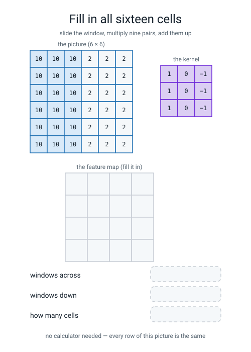
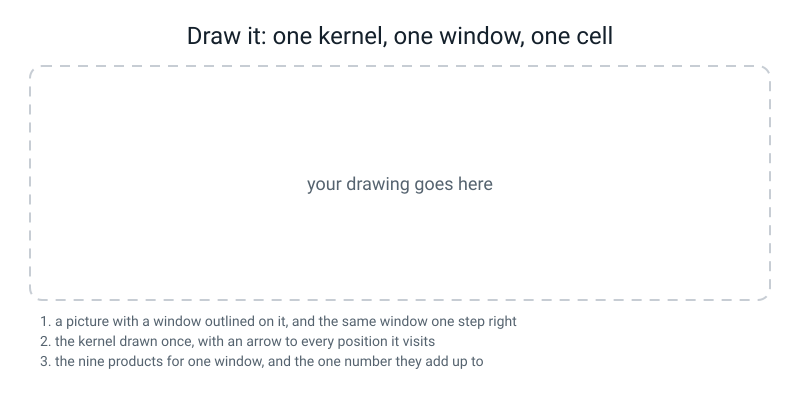

# Workbook — Week 24: Why Flattening a Picture Throws Away the Picture

**Name:** ________________________________  **Date:** ______________

[⬅ Week 23](week-23.md) · [📖 Read the chapter first](../student-guide/week-24.md) · [Course Home](../README.md) · [🧑‍🏫 Teacher guide](../teacher-guide/week-24.md) · [Next ➡](week-25.md)

---

## ✅ Warm-Up (5 min)

Five quick questions about **last week**.

**W1.** A network class has two halves. **Name them, and say what each one is for in one sentence.**

________________________________________________________________

________________________________________________________________

**W2.** 900 training rows, batch size 100, twelve epochs. **How many batches in one epoch, how many optimizer steps altogether, and how big is the last batch?**

**batches:** ______  **steps:** ______  **last batch:** ______

**W3.** What is in a `.pt` file, and what is **not** in it?

________________________________________________________________

**W4.** You email somebody `digits_mlp.pt` and nothing else. **Can they use it? What else do they need, and what one line must they remember to call?**

________________________________________________________________

**W5.** Which produces no error message at all: forgetting `super().__init__()`, or forgetting `model.eval()`? **And what is the symptom of the silent one?**

________________________________________________________________

---

## 🔢 Do the Maths by Hand

**Week 24 has no new maths.** So these four use the arithmetic you actually do today — **nine products, added up, sixteen times** — plus **Week 22's parameter counting**, which is the most recent maths in the course.

**Calculator only. No code.**

**M1.** Count the window positions. **Never mind formulas — count where the window can start.**

| picture | kernel | starting columns | starting rows | feature map | how many cells |
|---|---|---|---|---|---|
| 6 × 6 | 3 × 3 | ______ | ______ | ______ × ______ | ______ |
| 8 × 8 | 3 × 3 | ______ | ______ | ______ × ______ | ______ |
| 10 × 10 | 3 × 3 | ______ | ______ | ______ × ______ | ______ |
| 8 × 8 | 5 × 5 | ______ | ______ | ______ × ______ | ______ |
| 6 × 6 | 6 × 6 | ______ | ______ | ______ × ______ | ______ |

**M1(a).** Write down, in words, the pattern you notice for the "starting columns" column:

________________________________________________________________

**M1(b).** The last row gives a **1 × 1** feature map — one number for the whole picture. **Is that useful?** Say why or why not.

________________________________________________________________

**M2.** Nine products, three times over. For each window, write **all nine products**, then each row's sum, then the total.

**The kernel every time:**

```text
  1   0  −1
  1   0  −1
  1   0  −1
```

**Window A:**

```text
 9   9   0
 9   9   0
 9   9   0
```

nine products: ______________________________________________

row sums: ______  ______  ______   **total: ______**

**Window B:**

```text
 0   9   9
 0   9   9
 0   9   9
```

nine products: ______________________________________________

row sums: ______  ______  ______   **total: ______**

**Window C:**

```text
 4   4   4
 4   4   4
 4   4   4
```

nine products: ______________________________________________

row sums: ______  ______  ______   **total: ______**

**M2(a).** Windows A and B have the **same nine numbers in a different order**, and they gave answers with opposite signs. **Explain in one sentence.**

________________________________________________________________

**M2(b).** Window C gave zero even though every number in it is 4. **What is this kernel actually measuring, if a bright flat window and a dark flat window both score 0?**

________________________________________________________________

**M3.** Now the same three windows with the **horizontal** kernel:

```text
  1   1   1
  0   0   0
 −1  −1  −1
```

| window | total |
|---|---|
| A (`9 9 0` in every row) | ______ |
| B (`0 9 9` in every row) | ______ |
| C (all 4s) | ______ |

**M3(a).** All three came out the same. **Why?**

________________________________________________________________

**M3(b).** Now one where it does fire. Work this one out fully, nine products and all:

```text
window            kernel
 9   9   0        1   1   1
 9   9   0        0   0   0
 0   0   0       −1  −1  −1
```

nine products: ______________________________________________

row sums: ______  ______  ______   **total: ______**

**M4.** The price, both ways. Fill in every box.

| Layer | weights | biases | total |
|---|---|---|---|
| `nn.Linear(64, 16)` on a flattened 8 × 8 | 16 × 64 = ________ | ________ | ________ |
| `nn.Conv2d(1, 1, kernel_size=3)` | 3 × 3 = ________ | ________ | ________ |
| `nn.Conv2d(1, 4, kernel_size=3)` | 4 × 1 × 3 × 3 = ________ | ________ | ________ |
| `nn.Linear(4096, 256)` on a flattened 64 × 64 | 256 × 4096 = ________ | ________ | ________ |
| `nn.Conv2d(1, 4, kernel_size=3)` on 64 × 64 | ________ | ________ | ________ |

```text
1040 ÷ 10 = ____________
1048832 ÷ 40 = ____________
```

**M4(a).** **Two rows of that table are the same layer with the same numbers.** Which two, and what changed between them?

________________________________________________________________

**M4(b).** Write the one-line verdict — **with a reason in it**, not just the numbers:

________________________________________________________________

________________________________________________________________

---

## 🔎 Predict the Output

**Write your prediction in pen before you run anything.** Every snippet starts with `import numpy as np`, `import torch` and `import torch.nn as nn`.

### P1 — four numbers in a kernel's shape

```python
torch.manual_seed(0)
conv = nn.Conv2d(1, 4, kernel_size=3)
print(tuple(conv.weight.shape))
print(tuple(conv.bias.shape))
print(sum(p.numel() for p in conv.parameters()))
```

**I predict:**

**weight shape:** ____________  **bias shape:** ____________  **total:** ______

**It really printed:**

```text
________________________________________________________________
________________________________________________________________
________________________________________________________________
```

**Now say the weight shape out loud as words, not digits:**

______ filters, ______ channel in, ______ high, ______ wide

**Why are there 4 biases and not 36?**

________________________________________________________________

### P2 — three output shapes

```python
torch.manual_seed(0)
x = torch.zeros(1, 1, 8, 8)
print(tuple(nn.Conv2d(1, 3, kernel_size=3)(x).shape))
print(tuple(nn.Conv2d(1, 1, kernel_size=5)(x).shape))
print(tuple(nn.Conv2d(1, 8, kernel_size=3)(torch.zeros(4, 1, 6, 6)).shape))
```

**I predict — three shapes:**

1. ____________  2. ____________  3. ____________

**It really printed:**

```text
________________________________________________________________
________________________________________________________________
________________________________________________________________
```

**In each of the four numbers, which one comes from where?**

**first number:** ______________  **second:** ______________

**third and fourth:** ______________________________

### P3 — where does `unsqueeze` put the 1?

```python
img = np.zeros((6, 6))
t = torch.from_numpy(img).float()
print(tuple(t.shape))
print(tuple(t.unsqueeze(0).shape))
print(tuple(t.unsqueeze(0).unsqueeze(0).shape))
print(tuple(t.unsqueeze(1).shape))
```

**I predict — four shapes:**

1. ____________  2. ____________  3. ____________  4. ____________

**It really printed:**

```text
________________________________________________________________
________________________________________________________________
________________________________________________________________
________________________________________________________________
```

**The last one is `unsqueeze(1)`, not `unsqueeze(0)`. What did the number in the brackets do?**

________________________________________________________________

**Which of those four shapes could `nn.Conv2d(1, 1, kernel_size=3)` accept?**

________________________________________________________________

### P4 — a kernel that copies the middle pixel

```python
torch.manual_seed(0)
img = np.full((5, 5), 4.0)
k = np.zeros((3, 3))
k[1, 1] = 1.0
conv = nn.Conv2d(1, 1, kernel_size=3)
conv.weight.data = torch.from_numpy(k).float().reshape(1, 1, 3, 3)
t = torch.from_numpy(img).float().unsqueeze(0).unsqueeze(0)
with torch.no_grad():
    print(conv(t)[0][0].numpy())
```

**I predict — the picture is all 4s and the kernel copies the middle pixel, so what comes out?**

**shape:** ____________  **every value:** ____________

**It really printed:**

```text
________________________________________________________________
________________________________________________________________
________________________________________________________________
```

**It is not 4.0. What has been added, and how do you know it is that and not an arithmetic slip?**

________________________________________________________________

**Which single line is missing from the program?** ______________________________

**How many of the answers on this page did you get right?** ______ / 16

---

## ✍️ Practice Set A — Read It

**A1. Match the word to the thing.** Write the letter.

| Word | | Description |
|---|---|---|
| **convolution** | ______ | (i) One slice of depth. Grey is one; red-green-blue is three |
| **kernel / filter** | ______ | (ii) The grid of answers — one number per position the window sat in |
| **feature map** | ______ | (iii) Sliding a small grid over a picture: nine multiplies and one add, everywhere |
| **weight sharing** | ______ | (iv) The small grid of numbers that slides. Two words for the same thing |
| **channel** | ______ | (v) The same nine numbers used at every position, instead of a fresh set per place |

**A1(a).** Which of those five is the reason the count does not grow when the picture does? ____________

**A2. Fill in all sixteen cells, then the three boxes underneath.**


*Figure W24.1 — The picture and the kernel are printed for you. The feature map is empty.*

**A2(a).** Did you work out all sixteen cells, or one row and then copy it down? ____________

**A2(b).** If you copied, **say why you were allowed to.**

________________________________________________________________

**A2(c).** Which two columns of your feature map are 0, and what is true about the picture underneath them?

________________________________________________________________

**A3. Spot the bug.** Say what happens and write the fix.

| # | The code | What happens | The fix |
|---|---|---|---|
| a | `conv(torch.from_numpy(img).float())` | | |
| b | `conv(torch.from_numpy(img).unsqueeze(0).unsqueeze(0))` | | |
| c | `conv.weight.data = torch.from_numpy(kernel).float()` | | |
| d | `conv.weight = torch.from_numpy(kernel).float().reshape(1,1,3,3)` | | |
| e | `conv = nn.Conv2d(4, 1, kernel_size=3)` on a one-channel picture | | |
| f | weights set from the kernel, `conv.bias.data` never touched | | |

**A3(g).** Which one produces **no error at all**? ____________  **What is the one question that identifies it?**

________________________________________________________________

**A3(h).** Bugs (a) and (b) each skip a different preparation step and give **different** messages. **If one tensor had both problems, which message would torch show first?**

________________________________________________________________

**A4. Match the code to the output.** Five of each, no output used twice. Every snippet has `torch.manual_seed(0)` above it.

| | Code |
|---|---|
| i | `print(sum(p.numel() for p in nn.Conv2d(1, 6, kernel_size=3).parameters()))` |
| ii | `print(tuple(nn.Conv2d(1, 1, kernel_size=3).weight.shape))` |
| iii | `print(tuple(nn.Conv2d(1, 3, kernel_size=3)(torch.zeros(1, 1, 8, 8)).shape))` |
| iv | `print(tuple(torch.from_numpy(np.zeros((6, 6))).float().unsqueeze(0).shape))` |
| v | `print(sum(p.numel() for p in nn.Linear(64, 16).parameters()))` |

| | Output |
|---|---|
| P | `(1, 1, 3, 3)` |
| Q | `1040` |
| R | `60` |
| S | `(1, 6, 6)` |
| T | `(1, 3, 6, 6)` |

**Your answers:** i → ______  ii → ______  iii → ______  iv → ______  v → ______

**A4(f).** Outputs Q and R are 1,040 and 60. **What are those two layers each doing, and which of them would still work on a 16 × 16 picture without being rebuilt?**

________________________________________________________________

**A5. Read the feature maps.** Here are three maps from the same 8 × 8 letter T. The T has a bar across the top (rows 1–2) and a stem down the middle (rows 3–6).

```text
vertical-edge map              horizontal-edge map
[[-18.   0.   0.   0.   0.  18.]    [[-18. -27. -27. -27. -27. -18.]
 [-18.  -9.  -9.   9.   9.  18.]     [ 18.  18.   9.   9.  18.  18.]
 [ -9. -18. -18.  18.  18.   9.]     [ 18.  18.   9.   9.  18.  18.]
 [  0. -27. -27.  27.  27.   0.]     [  0.   0.   0.   0.   0.   0.]
 [  0. -27. -27.  27.  27.   0.]     [  0.   0.   0.   0.   0.   0.]
 [  0. -18. -18.  18.  18.   0.]]    [  0.   9.  18.  18.   9.   0.]]
```

**a)** What size is the picture, and how do you know from the maps alone? ____________

**b)** In the **vertical** map, rows 3 and 4 reach ±27, the biggest response anywhere. **What part of the letter is that?**

________________________________________________________________

**c)** In the **horizontal** map, rows 3 and 4 are **exactly zero all the way across.** What is underneath there, and why does a horizontal-edge detector say nothing about it?

________________________________________________________________

**d)** The vertical map has negatives on the left of the stem and positives on the right. **Is one of those a bug?** Say what the two signs mean.

________________________________________________________________

**e)** Both maps have **±18 and ±27** in them. The picture is made of 9s and 0s. **Where do 18 and 27 come from?**

________________________________________________________________

**A6. Read the shuffle experiment.**

```text
the new column order starts: [16, 36, 27, 8, 44, 23, 53, 4]
the pictures as they are     test accuracy 0.9667
the same 64 columns shuffled test accuracy 0.9704
```

**a)** How many held-out digits is 0.0037 of 540? ______

**b)** So which is the better model? ______________________________

**c)** What has this experiment actually **proved**?

________________________________________________________________

**d)** What has it **not** proved, that somebody might think it had?

________________________________________________________________

**e)** Design a test that would show why the arrangement of pixels matters for real pictures. *(Hint: what would happen if you moved every digit two pixels to the left — and would the shuffled model and the unshuffled model behave differently from each other?)*

________________________________________________________________

**A7. Say the sentence.** Finish each one so it is true and complete.

**a)** Flattening a picture throws away ______________________________, and the evidence is ______________________________.

**b)** A convolution is ______________________________ at every position, and the grid of answers is called a ______________.

**c)** The feature map is smaller than the picture because ______________________________, so a 3 × 3 kernel on a 10 × 10 picture gives ______ × ______.

**d)** Weight sharing buys two things: ______________________________ and ______________________________.

**e)** `nn.Conv2d` always wants ______ numbers in the input shape, and they are ____________, ____________, ____________, ____________.

**f)** A feature map that is wrong by the same amount everywhere has ______________________________; one with the wrong sign has ______________________________. **Neither** ______________________________.

---

## ✍️ Practice Set B — Write It

### B1 — one line

**Task:** print how many learnable numbers are in `nn.Conv2d(1, 6, kernel_size=3)`.

**Expected output:**

```text
60
```

**Done looks like:** one `print`, and you can say `6 × 1 × 3 × 3 + 6` out loud without running it.

```python
________________________________________________________________
```

### B2 — write your own picture

**Task:** build a 6 × 6 picture with numpy whose **top half is bright (10) and bottom half is dark (2)**, and print it. This is the lesson's `bar` picture turned a quarter turn.

**Expected output:**

```text
[[10. 10. 10. 10. 10. 10.]
 [10. 10. 10. 10. 10. 10.]
 [10. 10. 10. 10. 10. 10.]
 [ 2.  2.  2.  2.  2.  2.]
 [ 2.  2.  2.  2.  2.  2.]
 [ 2.  2.  2.  2.  2.  2.]]
```

**Done looks like:** three lines — `np.zeros`, then two slice assignments — and you can say which slice does which half.

```python
________________________________________________________________

________________________________________________________________

________________________________________________________________
```

### B3 — one window, nine products, no library

**Task:** take the picture from B2, cut out the window at **rows 1–3, columns 2–4**, and print the window, the nine products against the **horizontal** kernel, and their sum.

**Expected output:**

```text
the window:
[[10. 10. 10.]
 [10. 10. 10.]
 [ 2.  2.  2.]]
the nine products:
[[10. 10. 10.]
 [ 0.  0.  0.]
 [-2. -2. -2.]]
their sum: 24.0
```

**Done looks like:** the slice is `stack[1:4, 2:5]`, the multiply is `window * horizontal` (element by element, **not** `@`), and the sum is 24.0.

```python
________________________________________________________________

________________________________________________________________

________________________________________________________________

________________________________________________________________
```

**B3(a).** Add up `10 + 10 + 10 + 0 + 0 + 0 − 2 − 2 − 2` on paper. ______

**B3(b).** Why is the middle row all zeros?

________________________________________________________________

### B4 — sixteen cells, two ways, and they must agree

**Task:** on the B2 picture, compute all sixteen cells of the **horizontal**-kernel feature map with a double loop, then load the same nine numbers into `nn.Conv2d` and check every cell. **Then swap in the vertical kernel and look at what happens.**

**Expected output:**

```text
by hand:
[[ 0.  0.  0.  0.]
 [24. 24. 24. 24.]
 [24. 24. 24. 24.]
 [ 0.  0.  0.  0.]]
from nn.Conv2d:
[[ 0.  0.  0.  0.]
 [24. 24. 24. 24.]
 [24. 24. 24. 24.]
 [ 0.  0.  0.  0.]]
all sixteen cells agree? True

the VERTICAL kernel on the same picture:
[[0. 0. 0. 0.]
 [0. 0. 0. 0.]
 [0. 0. 0. 0.]
 [0. 0. 0. 0.]]
```

**Done looks like:** `conv.bias.data = torch.zeros(1)`, `np.allclose(...)` printing `True`, and a completely silent vertical map.

```python
________________________________________________________________

________________________________________________________________

________________________________________________________________

________________________________________________________________

________________________________________________________________
```

**B4(a).** Compare this feature map with the one in the chapter (`0 24 24 0` in every row). **What is the relationship between the two?**

________________________________________________________________

**B4(b).** The vertical kernel printed sixteen zeros. **Is it broken?**

________________________________________________________________

### B5 — the whole thing: four pictures, three kernels, twelve maps

**Task:** write `kernels.py`. It must:

1. build **four** 8 × 8 pictures with numpy — a `bar` (left half 10, right half 2), a `stripe` (right half 8, rest 0), a `cross` (middle two rows and middle two columns 9), and a `noisy` one from `np.random.default_rng(0).uniform(0, 9, size=(8, 8))`, rounded
2. write **three** kernels by hand — vertical edge, horizontal edge, and a 3 × 3 averager of nine one-ninths
3. load all three into a single `nn.Conv2d(1, 3, kernel_size=3)` with `np.stack` and a `.reshape(3, 1, 3, 3)`
4. **zero the three biases**
5. print the weight shape and the learnable-number count
6. for each picture, print the biggest and smallest value of each of its three feature maps
7. save all sixteen images — four rows, four columns, the picture then its three maps — as **one labelled figure** with `matplotlib.use("Agg")` and `plt.savefig`
8. print all 36 cells of the vertical kernel's map on the cross

**Expected output:**

```text
conv.weight shape: (3, 1, 3, 3)
learnable numbers: 30

bar     -> feature maps (3, 6, 6)
   vertical edge    biggest  +24.00   smallest   +0.00
   horizontal edge  biggest   +0.00   smallest   +0.00
   average          biggest  +10.00   smallest   +2.00
```

*(and the same three lines for `stripe`, `cross` and `noisy`)*

**Done looks like:** `feature_maps.png` exists, every one of the sixteen panels has a title, and the run takes about two seconds.

**B5(a).** Write **one sentence per kernel** saying what it **found** — not what it is called.

**vertical edge:** ______________________________________________

________________________________________________________________

**horizontal edge:** ______________________________________________

________________________________________________________________

**average:** ______________________________________________

________________________________________________________________

**B5(b).** The horizontal kernel's numbers on the `bar` picture are `biggest +0.00, smallest +0.00`. **Is that a failure?**

________________________________________________________________

**B5(c).** The `average` kernel on the noisy picture ran from **+3.11 to +6.00**, but the picture itself ran from 0 to 9. **What has it done, in one sentence?**

________________________________________________________________

---

## 🐞 Fix the Broken Program

This program has **three** bugs: one **dtype**, one **shape**, and one that produces **no error at all**. The real messages are below, in the order you meet them.

```python
"""conv_broken.py - sixteen cells by hand, then from nn.Conv2d. Three bugs."""
import numpy as np
import torch
import torch.nn as nn

torch.manual_seed(0)

bar = np.zeros((6, 6))
bar[:, 0:3] = 10.0
bar[:, 3:6] = 2.0

kernel = np.array([[1.0, 0.0, -1.0],
                   [1.0, 0.0, -1.0],
                   [1.0, 0.0, -1.0]])

by_hand = np.zeros((4, 4))
for r in range(4):
    for c in range(4):
        by_hand[r, c] = (bar[r:r + 3, c:c + 3] * kernel).sum()
print("by hand:")
print(by_hand)

t = torch.from_numpy(bar)

conv = nn.Conv2d(1, 1, kernel_size=3)
conv.weight.data = torch.from_numpy(kernel).float().reshape(1, 1, 3, 3)

with torch.no_grad():
    out = conv(t)
print("\nfrom nn.Conv2d:")
print(out[0][0].numpy())
print("all sixteen cells agree?", np.allclose(by_hand, out[0][0].numpy()))
```

**Run 1 — the `by hand` block prints fine, and then:**

```text
  File ".../torch/nn/modules/conv.py", line 456, in _conv_forward
    return F.conv2d(input, weight, bias, self.stride,
RuntimeError: Input type (double) and bias type (float) should be the same
```

**Bug 1.** Which line? ______  **Kind of bug?** ______________

**Two words in that message are the two kinds of number. Which one is yours, and which one is the layer's?**

**mine:** ____________  **the layer's:** ____________

**Which of numpy and torch defaults to which?**

________________________________________________________________

**The fix:** ______________________________

**Run 2 — after fixing bug 1:**

```text
  File ".../torch/nn/modules/conv.py", line 456, in _conv_forward
    return F.conv2d(input, weight, bias, self.stride,
RuntimeError: Expected 3D (unbatched) or 4D (batched) input to conv2d, but got input of size: [6, 6]
```

**Bug 2.** Which line? ______  **Kind of bug?** ______________

**It wants three or four numbers and we gave it two. Name all four, in order:**

____________ , ____________ , ____________ , ____________

**What should the shape be for one greyscale 6 × 6 picture?** ____________

**The fix:** ______________________________

**Run 3 — after fixing bug 2. No error at all, and this prints:**

```text
by hand:
[[ 0. 24. 24.  0.]
 [ 0. 24. 24.  0.]
 [ 0. 24. 24.  0.]
 [ 0. 24. 24.  0.]]

from nn.Conv2d:
[[ 0.08820419 24.088203   24.088203    0.08820419]
 [ 0.08820419 24.088203   24.088203    0.08820419]
 [ 0.08820419 24.088203   24.088203    0.08820419]
 [ 0.08820419 24.088203   24.088203    0.08820419]]
all sixteen cells agree? False
```

**Bug 3.** No error. Sixteen numbers, all of them **nearly** right.

**By how much is each cell wrong?** ____________

**Is it the same amount in every cell, or different?** ____________

**So is this an arithmetic mistake, or something else? Say how you know.**

________________________________________________________________

**The missing line:** ______________________________

**Where does it go?** ______________________________

**Run 4 — fixed:**

```text
from nn.Conv2d:
[[ 0. 24. 24.  0.]
 [ 0. 24. 24.  0.]
 [ 0. 24. 24.  0.]
 [ 0. 24. 24.  0.]]
all sixteen cells agree? True
```

**Two questions, and they are the point of the page.**

**Bug 3 printed a number that was 0.37% away from the truth. Why is that more dangerous than a number that is 100% wrong?**

________________________________________________________________

**The program had a check in it — `np.allclose` — and the check caught bug 3. What would have happened without that line?**

________________________________________________________________

---

## 🧩 Puzzle of the Week

### The kernel detective

Somebody ran **four** different 3 × 3 kernels over the **same** 6 × 6 picture and printed the four feature maps. They forgot to write down which kernel produced which map.

**The picture, every time:**

```text
 10  10  10   2   2   2
 10  10  10   2   2   2
 10  10  10   2   2   2
 10  10  10   2   2   2
 10  10  10   2   2   2
 10  10  10   2   2   2
```

**The four kernels they used, in some order:**

```text
  W:  1  0 −1        X: −1  0  1        Y:  1  1  1        Z:  0  0  0
      1  0 −1           −1  0  1            0  0  0            0  1  0
      1  0 −1           −1  0  1           −1 −1 −1            0  0  0
      (all rows)         (all rows)
```

**The four feature maps:**

**Map 1**

```text
[[10. 10.  2.  2.]
 [10. 10.  2.  2.]
 [10. 10.  2.  2.]
 [10. 10.  2.  2.]]
```

**Map 2**

```text
[[0. 0. 0. 0.]
 [0. 0. 0. 0.]
 [0. 0. 0. 0.]
 [0. 0. 0. 0.]]
```

**Map 3**

```text
[[  0. -24. -24.   0.]
 [  0. -24. -24.   0.]
 [  0. -24. -24.   0.]
 [  0. -24. -24.   0.]]
```

**Map 4**

```text
[[ 0. 24. 24.  0.]
 [ 0. 24. 24.  0.]
 [ 0. 24. 24.  0.]
 [ 0. 24. 24.  0.]]
```

**Match them up.**

Map 1 → kernel ______   Map 2 → kernel ______   Map 3 → kernel ______   Map 4 → kernel ______

**Puzzle(a).** Which map did you identify **first**, and what gave it away?

________________________________________________________________

**Puzzle(b).** Maps 3 and 4 look like the same map with a minus sign. **Is any information lost by the sign flip?**

________________________________________________________________

**Puzzle(c).** Map 1 is the picture itself, minus one ring all the way round. **What does that kernel do, and why is its output still smaller than its input?**

________________________________________________________________

**Puzzle(d).** There is a **fifth** kernel — the averager, nine copies of one-ninth. Its feature map on this picture is:

```text
[[10.    7.33  4.67  2.  ]
 [10.    7.33  4.67  2.  ]
 [10.    7.33  4.67  2.  ]
 [10.    7.33  4.67  2.  ]]
```

**Work out the second cell of the top row by hand.** The window is rows 0–2, columns 1–3, so every row reads `10, 10, 2`:

nine numbers added: ____________  ÷ 9 = ____________

**Puzzle(e).** Why does the averager's map go **10, 7.33, 4.67, 2** rather than the picture's sharp step from 10 straight to 2?

________________________________________________________________

---

## 🤔 Think Deeper

**T1.** Your digits model scored 0.9667 on real pictures and 0.9704 on shuffled confetti. **Write a paragraph** about what that tells you and what it does not. Was last week wasted? Be specific about what the model *did* learn, why it worked on `load_digits` in particular, and what kind of new picture would break it. Then the harder half: **can you think of a model you use every day that might be fragile in the same way — right for a reason that will not survive contact with a slightly different world?**

________________________________________________________________

________________________________________________________________

________________________________________________________________

________________________________________________________________

________________________________________________________________

**T2.** Today's nine numbers were chosen by a person: you wrote `1, 0, −1` because you wanted a vertical edge, and it worked. For about thirty years that is how computer vision was done — people designed filters, published them, and gave them names. **Write a paragraph** about what changes when the nine numbers become **weights** that gradient descent finds instead. What could a trained kernel discover that a person would not think to draw? What is lost when nobody can say what a particular filter is *for*? And — the interesting part — when researchers first drew a trained network's first-layer filters as little pictures, **they looked like edge detectors.** What do you make of that?

________________________________________________________________

________________________________________________________________

________________________________________________________________

________________________________________________________________

________________________________________________________________

---

## 🛠️ Build It — Four Pictures, Three Kernels, Twelve Feature Maps

**Two parts. The first produces a figure. The second is the parameter-count verdict, and the verdict has to be a sentence.**

### Step checklist

- [ ] **1.** Build four 8 × 8 pictures with numpy: `bar`, `stripe`, `cross`, `noisy`. **Print all four** and look at them.
- [ ] **2.** Write three kernels by hand: vertical edge, horizontal edge, averager.
- [ ] **3.** `np.stack` the three into one block and `.reshape(3, 1, 3, 3)`.
- [ ] **4.** Load them into `nn.Conv2d(1, 3, kernel_size=3)` with `.data`, and **zero the biases.**
- [ ] **5.** Print the weight shape and the learnable-number count. Predict both first.
- [ ] **6.** For each picture, print the biggest and smallest of each feature map.
- [ ] **7.** Save one labelled figure: **four rows, four columns**, picture then its three maps.
- [ ] **8.** Print all 36 cells of the vertical kernel's map on the `cross`.
- [ ] **9.** Write one sentence per kernel saying **what it found**.
- [ ] **10.** Do the parameter-count comparison on 8 × 8 and again on 64 × 64.
- [ ] **11.** Write the one-line verdict, with a reason in it.

### Part 1 — the twelve maps

**Predict before you run:** `conv.weight.shape` will be ____________ and the learnable-number count will be ______

**And it really was:** ____________ and ______

**Fill in your own numbers:**

| picture | vertical: biggest / smallest | horizontal: biggest / smallest | average: biggest / smallest |
|---|---|---|---|
| bar | ______ / ______ | ______ / ______ | ______ / ______ |
| stripe | ______ / ______ | ______ / ______ | ______ / ______ |
| cross | ______ / ______ | ______ / ______ | ______ / ______ |
| noisy | ______ / ______ | ______ / ______ | ______ / ______ |

**One sentence per kernel — what it FOUND, from the evidence in your table:**

**vertical edge:**

________________________________________________________________

________________________________________________________________

**horizontal edge:**

________________________________________________________________

________________________________________________________________

**average:**

________________________________________________________________

________________________________________________________________

**Two rows of your table are all `+0.00 / +0.00`.** Which, and why?

________________________________________________________________

### Part 2 — the counts, and the verdict

| Picture | dense layer | the count | convolution | the count |
|---|---|---|---|---|
| 8 × 8 | `nn.Linear(64, 16)` | ______ | `nn.Conv2d(1, 1, kernel_size=3)` | ______ |
| 64 × 64 | `nn.Linear(4096, 256)` | ______ | `nn.Conv2d(1, 4, kernel_size=3)` | ______ |

```text
______ ÷ ______ = ____________ times fewer
______ ÷ ______ = ____________ times fewer
```

**The verdict — one sentence, and it must contain a reason, not just numbers:**

________________________________________________________________

________________________________________________________________

**And the thing to notice:** which number in that table **did not change** when the picture got sixty-four times bigger? ____________  **Why not?**

________________________________________________________________

### The Bug Log

Two entries this week: one loud, one silent.

| What I saw | What it means | Cause | Fix |
|---|---|---|---|
| | | | |
| | | | |

---

## 🎨 Draw It

Draw **one kernel, one window, and one cell** — with all nine products written out.


*Figure W24.2 — Your drawing goes in the frame. The three things it must contain are listed underneath.*

**What a good answer looks like:** a picture grid — 6 × 6 is plenty — with **two** window outlines on it, one at the top-left and the same window one step to the right, drawn in different colours or one solid and one dashed. The kernel drawn **once, off to the side**, with an arrow to each of the two window positions and the words *"the same nine numbers"* on it. Then, underneath, the nine products for the second window written out in full, their three row sums, and the single total in a box: `8 + 8 + 8 = 24`. Then a small empty answer grid with the two cells you computed filled in — `0` and `24` — and the other fourteen left blank.

**A drawing with the kernel drawn twice, once per position, has missed the point of the week.**

**How many products go into one cell?** ______

**How many cells does a 3 × 3 kernel make on a 6 × 6 picture?** ______

**How many times did you have to draw the kernel?** ______  **Why?**

________________________________________________________________

---

## 📊 Self-Check

| I can... | 😀 | 🙂 | 😕 |
|---|---|---|---|
| say what flattening a picture throws away, and quote the evidence | | | |
| count 1,040 and 10 unaided and say which layer is the better tool | | | |
| compute one convolution cell on paper, showing all nine products | | | |
| fill in all sixteen cells of a feature map without losing my place | | | |
| work out a feature map's size by counting where the window fits | | | |
| explain weight sharing, **both** benefits | | | |
| write a picture and a kernel from scratch with numpy | | | |
| get a numpy grid into `nn.Conv2d` without a shape or dtype error | | | |
| design a horizontal-edge kernel and predict that it is silent on a vertical edge | | | |
| diagnose a uniformly-offset feature map as a bias, and a sign-flipped one as a mirrored kernel | | | |

**The one thing I would ask about if I could ask one question:**

________________________________________________________________

---

## ✅ Answers

<details>
<summary>Check your answers</summary>

### Warm-Up

**W1.** **`__init__`** declares the parts the model will need, and runs **once**, when the model is built. **`forward`** says how one batch flows through those parts, and runs **every time** you call the model. *(And `super().__init__()` is the first line of `__init__`.)*

**W2.** `900 ÷ 100 = 9` **exactly**, so **9 batches**, **no leftover**, and the last batch is a **full 100**. `12 × 9 = **108** steps`. *(A student who says "10 batches, last one has 0 rows" has learned "round up" as a ritual.)*

**W3.** **In it:** a dictionary of names and blocks of numbers — for the digits model, four names and 4,810 numbers. **Not in it:** the model's code. Nothing in the file says the network was 64 → 64 → 10.

**W4.** **Not on its own.** They also need the **class file**, so they can build the same architecture before pouring the numbers in — and, if you scaled your inputs, the **scaler's numbers** too. And they must call **`model.eval()`**, or dropout stays on and they get a different answer every run.

**W5.** **Forgetting `model.eval()`** is the silent one. Forgetting `super().__init__()` gives an immediate `AttributeError`. The symptom of the silent one: **the same input gives different answers on different runs**, with nothing printed to say so — five goes at the same handwritten 9 gave 5, 9, 3, 9, 5.

### Do the Maths by Hand

**M1.**

| picture | kernel | starting columns | starting rows | feature map | cells |
|---|---|---|---|---|---|
| 6 × 6 | 3 × 3 | **4** | **4** | **4 × 4** | **16** |
| 8 × 8 | 3 × 3 | **6** | **6** | **6 × 6** | **36** |
| 10 × 10 | 3 × 3 | **8** | **8** | **8 × 8** | **64** |
| 8 × 8 | 5 × 5 | **4** | **4** | **4 × 4** | **16** |
| 6 × 6 | 6 × 6 | **1** | **1** | **1 × 1** | **1** |

**Confirmed against PyTorch:**

```python
import torch, torch.nn as nn
torch.manual_seed(0)
for n, k in ((6, 3), (8, 3), (10, 3), (8, 5), (6, 6)):
    x = torch.zeros(1, 1, n, n)
    c = nn.Conv2d(1, 1, kernel_size=k)
    print("picture %2d x %2d, kernel %d  ->  %s   (%d - %d + 1 = %d)"
          % (n, n, k, tuple(c(x).shape), n, k, n - k + 1))
```

```text
picture  6 x  6, kernel 3  ->  (1, 1, 4, 4)   (6 - 3 + 1 = 4)
picture  8 x  8, kernel 3  ->  (1, 1, 6, 6)   (8 - 3 + 1 = 6)
picture 10 x 10, kernel 3  ->  (1, 1, 8, 8)   (10 - 3 + 1 = 8)
picture  8 x  8, kernel 5  ->  (1, 1, 4, 4)   (8 - 5 + 1 = 4)
picture  6 x  6, kernel 6  ->  (1, 1, 1, 1)   (6 - 6 + 1 = 1)
```

**M1(a).** **Take the kernel's width away from the picture's width, then add one.** Adding one is the part people drop: a 3-wide window on a 6-wide picture starts at column 0, 1, 2 or 3 — that is four positions, not three. *(If that looks like the beginning of a formula, hold it. Next week the window starts jumping and the edges get padded, and the rule grows two more terms.)*

**M1(b).** **Sometimes very useful, but not here.** One number for a whole picture cannot say *where* anything is, so it is useless for finding an edge. But it is exactly what you want at the **end** of a network, when the question is "is this a 7?" rather than "where is the edge?" — you spend the early layers keeping the positions and the late layers throwing them away deliberately.

**M2.**

**Window A** (`9 9 0` in every row):

```text
products:   9  0  0   |   9  0  0   |   9  0  0
row sums:      9              9              9
total:      9 + 9 + 9  =  27
```

**Window B** (`0 9 9` in every row):

```text
products:   0  0  −9  |   0  0  −9  |   0  0  −9
row sums:     −9             −9             −9
total:      −9 − 9 − 9  =  −27
```

**Window C** (all 4s):

```text
products:   4  0  −4  |   4  0  −4  |   4  0  −4
row sums:      0              0              0
total:      0 + 0 + 0  =  0
```

**M2(a).** Window A is **bright on the left, dark on the right**; window B is **dark on the left, bright on the right.** The kernel puts `+1` on the left column and `−1` on the right, so it adds the left and subtracts the right. Bright-minus-dark is positive; dark-minus-bright is negative. **Same edge, opposite direction, opposite sign.**

**M2(b).** It is measuring **the difference between the left column and the right column of the window** — a *sideways step in brightness*. A flat window has no step, so it scores 0 whether it is flat-and-bright or flat-and-dark. **It is a change detector, not a brightness meter.**

**M3.**

| window | total |
|---|---|
| A (`9 9 0` in every row) | **0** |
| B (`0 9 9` in every row) | **0** |
| C (all 4s) | **0** |

**M3(a).** All three windows have **identical rows** — every row is the same as the row above it. The horizontal kernel adds the **top** row and subtracts the **bottom** row, so if the top and bottom rows are the same, they cancel exactly. **A horizontal-edge detector needs an up-and-down step, and none of these three has one.**

**M3(b).**

```text
row 0:   (1 × 9) + (1 × 9) + (1 × 0)      =   9 + 9 + 0   =   18
row 1:   (0 × 9) + (0 × 9) + (0 × 0)      =   0 + 0 + 0   =    0
row 2:  (−1 × 0) + (−1 × 0) + (−1 × 0)    =   0 + 0 + 0   =    0
```

```text
18 + 0 + 0 = 18
```

**Total 18**, and the nine products in full are `9, 9, 0, 0, 0, 0, 0, 0, 0`.

*(This window is a made-up corner shape, not one that occurs in the cross picture, where the arms run straight on through; 18 does also appear as a cell of the cross's horizontal-edge feature map.)*

**M4.**

| Layer | weights | biases | total |
|---|---|---|---|
| `nn.Linear(64, 16)` | 16 × 64 = **1024** | **16** | **1040** |
| `nn.Conv2d(1, 1, kernel_size=3)` | 3 × 3 = **9** | **1** | **10** |
| `nn.Conv2d(1, 4, kernel_size=3)` | 4 × 1 × 3 × 3 = **36** | **4** | **40** |
| `nn.Linear(4096, 256)` | 256 × 4096 = **1048576** | **256** | **1048832** |
| `nn.Conv2d(1, 4, kernel_size=3)` on 64 × 64 | **36** | **4** | **40** |

```text
1040 ÷ 10 = 104
1048832 ÷ 40 = 26220.8
```

**Confirmed against PyTorch:**

```python
import torch.nn as nn
print("nn.Linear(64, 16)                  total:", sum(p.numel() for p in nn.Linear(64, 16).parameters()))
print("nn.Conv2d(1, 1, kernel_size=3)     total:", sum(p.numel() for p in nn.Conv2d(1, 1, kernel_size=3).parameters()))
print("nn.Conv2d(1, 4, kernel_size=3)     total:", sum(p.numel() for p in nn.Conv2d(1, 4, kernel_size=3).parameters()))
print("nn.Linear(4096, 256) needs        ", sum(p.numel() for p in nn.Linear(4096, 256).parameters()))
print("nn.Conv2d(1, 4, kernel_size=3)    ", sum(p.numel() for p in nn.Conv2d(1, 4, kernel_size=3).parameters()))
```

```text
nn.Linear(64, 16)                  total: 1040
nn.Conv2d(1, 1, kernel_size=3)     total: 10
nn.Conv2d(1, 4, kernel_size=3)     total: 40
nn.Linear(4096, 256) needs         1048832
nn.Conv2d(1, 4, kernel_size=3)     40
```

**M4(a).** **Rows 3 and 5 — they are the same layer, the same 40 numbers.** What changed is the **picture**: 8 × 8 in row 3 and 64 × 64 in row 5, sixty-four times as many pixels. The dense layer's count grew by a factor of about a thousand between rows 1 and 4. **A convolution's count depends on the size of its kernel, not on the size of the picture.**

**M4(b), at full marks:**

> "On the 8 × 8 picture the dense layer needs 1,040 learnable numbers and the convolution needs 10 — a hundred and four times fewer — and the convolution is *also* the one that knows which pixels are neighbours, so it is smaller and **better** rather than smaller and worse. And the gap grows with the picture: on a 64 × 64 image the dense layer needs over a million while the convolution still needs 40."

*"Conv is smaller"* is half a mark. **The verdict has to contain a reason**, and the best ones contain two: the count, and the fact that the cheaper layer is the one with the right assumption baked in. (Note for marking: 1,040 against 10 is not a like-for-like comparison, because the dense layer makes 16 numbers and the convolution a whole map; the fairer figure is 592 against 10, about 59 times. Praise a verdict that says so.)

### Predict the Output

**P1.**

```text
(4, 1, 3, 3)
(4,)
40
```

**Said as words: four filters, one channel in, three high, three wide.** `4 × 1 × 3 × 3 = 36` weights.

**Four biases and not 36 because there is one bias per filter, not one per weight.** Each filter produces one feature map, and its single bias is added to every cell of that map.

**P2.**

```text
(1, 3, 6, 6)
(1, 1, 4, 4)
(4, 8, 4, 4)
```

**First number:** the batch — how many pictures went in (1, 1, then 4).
**Second number:** the number of **filters** — the second argument to `nn.Conv2d` (3, 1, then 8).
**Third and fourth:** from **counting window positions**. `8 − 3 + 1 = 6`, `8 − 5 + 1 = 4`, `6 − 3 + 1 = 4`.

**Those are two completely separate facts**, and a student who knows them separately can predict any conv shape in this course.

**P3.**

```text
(6, 6)
(1, 6, 6)
(1, 1, 6, 6)
(6, 1, 6)
```

**The number in the brackets says *where* to put the new 1.** `unsqueeze(0)` puts it at position 0, the front. `unsqueeze(1)` puts it at position 1 — **in the middle** — turning `(6, 6)` into `(6, 1, 6)`, which is six pictures of one channel and six columns. Not what anybody wanted.

**The third shape, `(1, 1, 6, 6)`, is what we mean by one greyscale picture.** *(`nn.Conv2d(1, 1, 3)` would also accept the second, `(1, 6, 6)`: with three numbers PyTorch reads `(channels, height, width)` — one unbatched picture — and returns `(1, 4, 4)`. The fourth, `(6, 1, 6)`, would be read as six channels and fail with "expected 1 channels … got 6". So the answer to the question is the second and the third; only the third has the batch number we always use.)*

**P4.**

```text
[[4.0882044 4.0882044 4.0882044]
 [4.0882044 4.0882044 4.0882044]
 [4.0882044 4.0882044 4.0882044]]
```

**Shape `(3, 3)`**, because `5 − 3 + 1 = 3`. And the value should be exactly **4.0**: the kernel is all zeros except a 1 in the middle, so it copies the middle pixel, and every pixel is 4.

**0.0882044 has been added** — the **bias**. And you know it is the bias and not an arithmetic slip because **it is exactly the same amount in all nine cells.** An arithmetic mistake would be wrong differently in different places.

**The missing line:** `conv.bias.data = torch.zeros(1)`

### Practice Set A

**A1.** convolution → **(iii)** · kernel / filter → **(iv)** · feature map → **(ii)** · weight sharing → **(v)** · channel → **(i)**

**A1(a).** **weight sharing.** The same nine numbers are reused at every position, so the count is nine weights and a bias whatever size the picture is.

**A2.** All sixteen cells:

```text
   0   24   24    0
   0   24   24    0
   0   24   24    0
   0   24   24    0
```

**windows across: 4** (`6 − 3 + 1`) · **windows down: 4** · **how many cells: 16**

**A2(a) and (b).** Working out one row and copying it down **is allowed**, and it is the better answer. Every row of the picture is identical, so every window in column position *c* contains exactly the same nine numbers whichever row you slide it to — so every row of the answer must be identical too. **Noticing that is the same reasoning that makes convolutions efficient in the first place**, and it is worth saying out loud.

**A2(c).** **Columns 0 and 3.** Underneath column 0 the window sits entirely inside the bright left half — all 10s, completely flat. Underneath column 3 it sits entirely inside the dark right half — all 2s, completely flat. **No sideways step, so no response.**

**A3.**

| # | What happens | The fix |
|---|---|---|
| a | `RuntimeError: Expected 3D (unbatched) or 4D (batched) input to conv2d, but got input of size: [6, 6]` | `.unsqueeze(0).unsqueeze(0)` → `(1, 1, 6, 6)` |
| b | `RuntimeError: Input type (double) and bias type (float) should be the same` | `.float()` after `torch.from_numpy(...)` |
| c | `RuntimeError: weight should have at least three dimensions` | `.reshape(1, 1, 3, 3)` |
| d | `TypeError: cannot assign 'torch.FloatTensor' as parameter 'weight' (torch.nn.Parameter or None expected)` | `conv.weight.data = ...` — with `.data` |
| e | `RuntimeError: Given groups=1, weight of size [1, 4, 3, 3], expected input[1, 1, 6, 6] to have 4 channels, but got 1 channels instead` | Channels **in** first, filters **out** second: `nn.Conv2d(1, 4, ...)` |
| f | **No error.** Every cell is 24.088203 instead of 24 | `conv.bias.data = torch.zeros(1)` |

**A3(g).** **(f).** The one question: **"is the error the same amount in every cell, or different?"** Identical means a bias.

**Taken one at a time, (a) has the right dtype but the wrong shape, so it hits the shape error; (b) has the right shape but the wrong dtype, so it hits the dtype error.** The ordering only shows when a tensor has *both* problems — a 2-D `torch.from_numpy(img)` with no `.float()` — and then torch reports the dtype first. **If you have both problems, you fix them in the order torch finds them**, which is dtype and then shape — and that is exactly the order in the Fix the Broken Program section.

**A4.** i → **R** · ii → **P** · iii → **T** · iv → **S** · v → **Q**

```python
import numpy as np, torch, torch.nn as nn
torch.manual_seed(0)
print(sum(p.numel() for p in nn.Conv2d(1, 6, kernel_size=3).parameters()))
print(tuple(nn.Conv2d(1, 1, kernel_size=3).weight.shape))
print(tuple(nn.Conv2d(1, 3, kernel_size=3)(torch.zeros(1, 1, 8, 8)).shape))
print(tuple(torch.from_numpy(np.zeros((6, 6))).float().unsqueeze(0).shape))
print(sum(p.numel() for p in nn.Linear(64, 16).parameters()))
```

```text
60
(1, 1, 3, 3)
(1, 3, 6, 6)
(1, 6, 6)
1040
```

**A4(f).** **Q (1,040)** is a dense layer taking a flattened 8 × 8 picture into 16 units. **R (60)** is six 3 × 3 filters — `6 × 1 × 3 × 3 = 54` weights plus 6 biases.

**Only R would still work on a 16 × 16 picture without being rebuilt.** A dense layer's first number *is* the number of pixels, so a new picture size means a new layer with a new count (`16 × 256 + 16 = 4112`). The conv layer's count never mentions the picture at all.

**A5.**

**a)** **8 × 8.** Both maps are 6 × 6, and a 3 × 3 kernel loses one ring all the way round, so the picture was `6 + 3 − 1 = 8` on each side.

**b)** The **stem** of the T — its left edge (negative) and its right edge (positive). Rows 3 and 4 of the map are the strongest because down there the stem is 9s against 0s with nothing else in the window to muddy the response.

**c)** A **vertical stem**, and nothing changing up-or-down. Rows 3, 4 and 5 of the picture are all identical to each other, so a detector that adds the top row and subtracts the bottom row gets exactly zero. **A detector that stays silent on the wrong thing is a working detector.**

**d)** **Neither is a bug.** `1, 0, −1` fires **positively** on bright-to-dark and **negatively** on dark-to-bright. The left edge of the stem goes dark → bright, so it reports negative; the right edge goes bright → dark, so it reports positive. **The sign tells you which way the edge runs, and that is extra information, not an error.**

**e)** From how many of the window's three rows contain the step. Each row that contains a full step contributes `9 − 0 = 9`:

```text
one row with a step   →   9
two rows with a step  →  18
three rows            →  27
```

**±27 means the step ran the whole height of the window; ±18 means two rows of three; ±9 means one.** That is why the numbers fade as you move away from an edge.

**A6.**

**a)** `0.0037 × 540 = 1.998`, so **about two digits.**

**b)** **Neither — you cannot tell.** Two digits out of 540 is not a difference a 540-row measurement can resolve, and a different seed reverses the order.

**c)** That **this measurement cannot tell the two models apart**, and therefore that the model's accuracy does not depend on the pixels being in their proper places. **The model was never using the arrangement.**

**d)** It has **not** proved that shuffling helps, and it has **not** proved that pixel arrangement is unimportant in general. It has only proved that *this* model on *this* tidy dataset was not using it.

**e)** **Shift every digit two pixels to the left and test the trained model on the shifted version.** Its learned slots all move, so it should fall over (a similar dense network I tried dropped from about 97% to under 20%). **Be careful what this test shows:** the *shuffled* model falls over just as badly, because a dense layer cannot tell the two orderings apart — so this does not separate those two models. It separates a *dense* model from a *convolutional* one: next week's model, where the same nine numbers slide everywhere, should cope far better with the shift (not perfectly). **That is the test that shows what locality is worth.**

**A7.**

**a)** …**which pixels are next to which**, and the evidence is **that shuffling the 64 columns identically for every picture leaves the accuracy unchanged: 0.9704 against 0.9667**.

**b)** A convolution is **nine multiplications and one addition** at every position, and the grid of answers is called a **feature map**.

**c)** …because **the window cannot hang off the edge of the picture**, so a 3 × 3 kernel on a 10 × 10 picture gives **8 × 8**.

**d)** …**it is cheap — ten numbers instead of 592, and the ten do not grow when the picture does** — and **it only has to learn "this is an edge" once, instead of separately for every position**.

**e)** `nn.Conv2d` always wants **four** numbers, and they are **pictures (the batch)**, **channels**, **height**, **width**.

**f)** …**a bias in it**; one with the wrong sign has **a mirrored kernel**. Neither **produces an error message**.

### Practice Set B

**B1.**

```python
import torch, torch.nn as nn
torch.manual_seed(0)
print(sum(p.numel() for p in nn.Conv2d(1, 6, kernel_size=3).parameters()))
```

```text
60
```

`6 × 1 × 3 × 3 = 54` weights, plus **6** biases, one per filter.

**B2.**

```python
import numpy as np

stack = np.zeros((6, 6))
stack[0:3, :] = 10.0
stack[3:6, :] = 2.0
print(stack)
```

```text
[[10. 10. 10. 10. 10. 10.]
 [10. 10. 10. 10. 10. 10.]
 [10. 10. 10. 10. 10. 10.]
 [ 2.  2.  2.  2.  2.  2.]
 [ 2.  2.  2.  2.  2.  2.]
 [ 2.  2.  2.  2.  2.  2.]]
```

**`stack[0:3, :]` is "rows 0, 1 and 2, every column"** — the top half. `stack[3:6, :]` is the bottom half. **Note the order swapped round from the chapter's `bar`:** there the slice was `[:, 0:3]`, *every row, the first three columns*. **The comma is the whole difference.**

**B3.**

```python
import numpy as np

stack = np.zeros((6, 6))
stack[0:3, :] = 10.0
stack[3:6, :] = 2.0
horizontal = np.array([[1., 1., 1.], [0., 0., 0.], [-1., -1., -1.]])

window = stack[1:4, 2:5]
print("the window:")
print(window)
print("the nine products:")
print(window * horizontal)
print("their sum:", (window * horizontal).sum())
```

```text
the window:
[[10. 10. 10.]
 [10. 10. 10.]
 [ 2.  2.  2.]]
the nine products:
[[10. 10. 10.]
 [ 0.  0.  0.]
 [-2. -2. -2.]]
their sum: 24.0
```

**B3(a).** `10 + 10 + 10 + 0 + 0 + 0 − 2 − 2 − 2 = 30 − 6 = **24**`

**B3(b).** Because **the middle row of the kernel is all zeros.** A horizontal-edge detector compares the top row with the bottom row; the middle row of the window is not part of that comparison at all, so whatever is in it gets multiplied by 0 and disappears.

**B4.**

```python
import numpy as np
import torch
import torch.nn as nn

torch.manual_seed(0)
stack = np.zeros((6, 6))
stack[0:3, :] = 10.0
stack[3:6, :] = 2.0
horizontal = np.array([[1., 1., 1.], [0., 0., 0.], [-1., -1., -1.]])

by_hand = np.zeros((4, 4))
for r in range(4):
    for c in range(4):
        by_hand[r, c] = (stack[r:r + 3, c:c + 3] * horizontal).sum()
print("by hand:")
print(by_hand)

t = torch.from_numpy(stack).float().unsqueeze(0).unsqueeze(0)
conv = nn.Conv2d(1, 1, kernel_size=3)
conv.weight.data = torch.from_numpy(horizontal).float().reshape(1, 1, 3, 3)
conv.bias.data = torch.zeros(1)
with torch.no_grad():
    out = conv(t)
print("from nn.Conv2d:")
print(out[0][0].numpy())
print("all sixteen cells agree?", np.allclose(by_hand, out[0][0].numpy()))

print()
vertical = np.array([[1., 0., -1.], [1., 0., -1.], [1., 0., -1.]])
conv.weight.data = torch.from_numpy(vertical).float().reshape(1, 1, 3, 3)
with torch.no_grad():
    print("the VERTICAL kernel on the same picture:")
    print(conv(t)[0][0].numpy())
```

```text
by hand:
[[ 0.  0.  0.  0.]
 [24. 24. 24. 24.]
 [24. 24. 24. 24.]
 [ 0.  0.  0.  0.]]
from nn.Conv2d:
[[ 0.  0.  0.  0.]
 [24. 24. 24. 24.]
 [24. 24. 24. 24.]
 [ 0.  0.  0.  0.]]
all sixteen cells agree? True

the VERTICAL kernel on the same picture:
[[0. 0. 0. 0.]
 [0. 0. 0. 0.]
 [0. 0. 0. 0.]
 [0. 0. 0. 0.]]
```

**B4(a).** It is the chapter's feature map **turned a quarter turn**. There, `0 24 24 0` ran across every **row**; here it runs down every **column**. **Same picture rotated, same kernel rotated, same answer rotated** — which is a satisfying check that neither the picture nor the kernel has a secret preference for one direction.

**B4(b).** **No.** The vertical kernel looks for **sideways** steps in brightness, and this picture has none — every row of it is completely flat. Sixteen zeros is the **correct** answer, and it is the same result as the chapter's horizontal kernel on the chapter's picture. **A detector that fires at everything is not a detector.**

**B5.** The complete `kernels.py`:

```python
"""kernels.py - four pictures, three kernels, twelve feature maps in one figure."""
import numpy as np
import torch
import torch.nn as nn
import matplotlib
matplotlib.use("Agg")
import matplotlib.pyplot as plt

# --- the four pictures, written out with numpy ---
bar = np.zeros((8, 8)); bar[:, 0:4] = 10.0; bar[:, 4:8] = 2.0
stripe = np.zeros((8, 8)); stripe[:, 4:] = 8.0
cross = np.zeros((8, 8)); cross[3:5, :] = 9.0; cross[:, 3:5] = 9.0
noisy = np.round(np.random.default_rng(0).uniform(0, 9, size=(8, 8)), 0)
pictures = [("bar", bar), ("stripe", stripe), ("cross", cross), ("noisy", noisy)]

# --- the three kernels, written out by hand ---
vertical = np.array([[1., 0., -1.], [1., 0., -1.], [1., 0., -1.]])
horizontal = np.array([[1., 1., 1.], [0., 0., 0.], [-1., -1., -1.]])
average = np.full((3, 3), 1.0 / 9.0)
kernels = [("vertical edge", vertical), ("horizontal edge", horizontal), ("average", average)]

conv = nn.Conv2d(1, 3, kernel_size=3)
conv.weight.data = torch.from_numpy(np.stack([vertical, horizontal, average])).float().reshape(3, 1, 3, 3)
conv.bias.data = torch.zeros(3)
print("conv.weight shape:", tuple(conv.weight.shape))
print("learnable numbers:", sum(p.numel() for p in conv.parameters()))

fig, axes = plt.subplots(4, 4, figsize=(9, 9))
for r, (pname, picture) in enumerate(pictures):
    t = torch.from_numpy(picture).float().unsqueeze(0).unsqueeze(0)
    with torch.no_grad():
        maps = conv(t)[0].numpy()
    print("\n%-7s -> feature maps %s" % (pname, tuple(maps.shape)))
    axes[r][0].imshow(picture, cmap="gray")
    axes[r][0].set_title("picture: " + pname)
    for c, (kname, _) in enumerate(kernels):
        m = maps[c]
        print("   %-16s biggest %+7.2f   smallest %+7.2f" % (kname, m.max(), m.min()))
        axes[r][c + 1].imshow(m, cmap="gray")
        axes[r][c + 1].set_title(kname)
    for ax in axes[r]:
        ax.set_xticks([]); ax.set_yticks([])
plt.tight_layout()
plt.savefig("feature_maps.png", dpi=110)
print("\nwrote feature_maps.png")

print("\nthe vertical kernel on the cross, all 36 cells:")
t = torch.from_numpy(cross).float().unsqueeze(0).unsqueeze(0)
with torch.no_grad():
    print(conv(t)[0][0].numpy())
```

```text
conv.weight shape: (3, 1, 3, 3)
learnable numbers: 30

bar     -> feature maps (3, 6, 6)
   vertical edge    biggest  +24.00   smallest   +0.00
   horizontal edge  biggest   +0.00   smallest   +0.00
   average          biggest  +10.00   smallest   +2.00

stripe  -> feature maps (3, 6, 6)
   vertical edge    biggest   +0.00   smallest  -24.00
   horizontal edge  biggest   +0.00   smallest   +0.00
   average          biggest   +8.00   smallest   +0.00

cross   -> feature maps (3, 6, 6)
   vertical edge    biggest  +27.00   smallest  -27.00
   horizontal edge  biggest  +27.00   smallest  -27.00
   average          biggest   +8.00   smallest   +0.00

noisy   -> feature maps (3, 6, 6)
   vertical edge    biggest  +12.00   smallest  -10.00
   horizontal edge  biggest  +14.00   smallest  -13.00
   average          biggest   +6.00   smallest   +3.11

wrote feature_maps.png

the vertical kernel on the cross, all 36 cells:
[[  0. -27. -27.  27.  27.   0.]
 [  0. -18. -18.  18.  18.   0.]
 [  0.  -9.  -9.   9.   9.   0.]
 [  0.  -9.  -9.   9.   9.   0.]
 [  0. -18. -18.  18.  18.   0.]
 [  0. -27. -27.  27.  27.   0.]]
```

**Runtime: about 2 seconds.**

**B5(a), at full marks:**

> **Vertical edge.** "It lit up as a bright stripe down the middle of the bar picture, reaching **+24**, and stayed at exactly **0** on the flat left and right thirds. On the stripe picture it reached **−24** instead of +24, because that edge goes dark-to-bright rather than bright-to-dark. So it is reporting **where brightness steps sideways, and which way.**"
>
> **Horizontal edge.** "It was **completely silent** on the bar and the stripe — biggest +0.00, smallest +0.00 — because neither of them has a top-to-bottom step anywhere. On the cross it reached **+27 and −27**, on the top and bottom edges of the horizontal bar. So it reports **where brightness steps up-and-down**, and it is the vertical kernel turned a quarter turn."
>
> **Average.** "It found **no edges at all.** On the bar its answers run from **+2 to +10**, which are just the picture's own two brightness levels, and on the noisy picture it squashed everything into **+3.11 to +6.00** — a much narrower band than the original 0 to 9. So it is **smoothing, not detecting**: it replaces each pixel with the average of its nine neighbours."

**A sentence that only restates the kernel's name scores nothing.**

**B5(b).** **No — it is the opposite of a failure.** The bar picture has a vertical edge and no horizontal one, so a horizontal-edge detector *should* say nothing about it. Exact zeros are the strongest possible evidence that the kernel is doing what you designed it to do. **A detector that fires at everything is useless.**

**B5(c).** **It has blurred it.** Replacing each pixel by the average of its nine neighbours pulls extreme values towards the middle, so a range of 0-to-9 becomes 3.11-to-6.00. **Narrowing the range *is* what "blur" means in numbers.**

### Fix the Broken Program

**Bug 1** — line 23, `t = torch.from_numpy(bar)`. **A dtype bug.**

**`double` is mine** — 64-bit decimals, which is what numpy makes by default. **`float` is the layer's** — 32-bit decimals, which is what torch layers hold. **numpy defaults to 64-bit; torch defaults to 32-bit**, and they will not meet in the middle.

**The fix:** `t = torch.from_numpy(bar).float()`

**Bug 2** — the same line. **A shape bug.**

The four numbers, in order: **pictures (the batch), channels, height, width.** For one greyscale 6 × 6 picture the shape should be **`(1, 1, 6, 6)`**.

**The fix:** `t = torch.from_numpy(bar).float().unsqueeze(0).unsqueeze(0)`

*(Notice that both bugs were on the same line and torch found them one at a time, dtype first. That is why the fix arrives in two runs rather than one.)*

**Bug 3** — `conv.bias.data` was never set.

**Each cell is wrong by 0.08820419**, and it is **exactly the same amount in every one of the sixteen cells.** So it is **not** an arithmetic mistake: an arithmetic mistake gets different cells wrong by different amounts. **It is the bias** — PyTorch put a small random number in it when the layer was built, we overwrote the nine weights and left the bias alone, and a bias is added to every cell of the feature map.

**The missing line:** `conv.bias.data = torch.zeros(1)`, and it goes **immediately after the line that sets the weights.**

**Why 0.37% wrong is more dangerous than 100% wrong.** Because it looks like *your* mistake. A number that is wildly wrong makes you suspect the program; a number that is nearly right makes you suspect your own arithmetic — so you re-do the sixteen sums, get 24 again, re-do them a third time, and eventually decide the computer must be right and you must be bad at adding. **A near-miss attacks your confidence in the check itself**, which is the most expensive thing it can take from you.

**Without `np.allclose`?** The program would have printed two grids and said nothing about whether they matched, and a reader glancing at `24.088203` next to `24.` would very likely have called that agreement. **The check is the only line in the program that turns a pile of numbers into a verdict** — and one line that prints `True` or `False` is worth more than four lines of numbers you have to compare by eye.

### Puzzle of the Week

**Map 1 → kernel Z** (the identity — copies the middle pixel)
**Map 2 → kernel Y** (the horizontal-edge detector — silent on this picture)
**Map 3 → kernel X** (the mirrored vertical detector — everything negative)
**Map 4 → kernel W** (the vertical-edge detector)

**Confirmed:**

```python
import numpy as np, torch, torch.nn as nn
torch.manual_seed(0)
bar = np.zeros((6, 6)); bar[:, 0:3] = 10.0; bar[:, 3:6] = 2.0
t = torch.from_numpy(bar).float().unsqueeze(0).unsqueeze(0)
ks = {"W": np.array([[1., 0., -1.]] * 3),
      "X": np.array([[-1., 0., 1.]] * 3),
      "Y": np.array([[1., 1., 1.], [0., 0., 0.], [-1., -1., -1.]]),
      "Z": np.array([[0., 0., 0.], [0., 1., 0.], [0., 0., 0.]])}
for name, k in ks.items():
    conv = nn.Conv2d(1, 1, kernel_size=3)
    conv.weight.data = torch.from_numpy(k).float().reshape(1, 1, 3, 3)
    conv.bias.data = torch.zeros(1)
    with torch.no_grad():
        print(name)
        print(conv(t)[0][0].numpy())
```

```text
W
[[ 0. 24. 24.  0.]
 [ 0. 24. 24.  0.]
 [ 0. 24. 24.  0.]
 [ 0. 24. 24.  0.]]
X
[[  0. -24. -24.   0.]
 [  0. -24. -24.   0.]
 [  0. -24. -24.   0.]
 [  0. -24. -24.   0.]]
Y
[[0. 0. 0. 0.]
 [0. 0. 0. 0.]
 [0. 0. 0. 0.]
 [0. 0. 0. 0.]]
Z
[[10. 10.  2.  2.]
 [10. 10.  2.  2.]
 [10. 10.  2.  2.]
 [10. 10.  2.  2.]]
```

**Puzzle(a).** **Map 1**, almost certainly — it is the only one whose numbers are the picture's own brightnesses, 10 and 2, rather than differences. Any kernel that adds and subtracts neighbours produces numbers that are *not* in the original picture. **Map 1 has no new numbers in it at all**, which only the identity kernel can manage.

**Puzzle(b).** **No information is lost.** X is W with every weight negated, so its output is W's output multiplied by −1, and you could recover either from the other. **What the sign carries is *which way* the edge runs** — W's +24 says bright-then-dark and X's −24 says the same edge seen the other way round. Both maps say "there is an edge in columns 1 and 2 and nowhere else", equally clearly.

**Puzzle(c).** Kernel Z has a single 1 in the middle and zeros everywhere else, so its nine products are eight zeros and one copy of the middle pixel. **It copies the picture.** And the output is still 4 × 4 rather than 6 × 6 because **the window cannot hang off the edge, no matter what is inside it** — you lose the outer ring for a purely geometric reason that has nothing to do with the weights.

*(That is padding, arrived at from exactly the right direction, and it is next week.)*

**Puzzle(d).** The window is rows 0–2, columns 1–3, so every row reads `10, 10, 2`. All nine of the averager's weights are one-ninth, so:

```text
10 + 10 + 2 = 22 per row,  three rows  =  66
66 ÷ 9 = 7.333…
```

**nine numbers added: 66.  ÷ 9 = 7.33** ✅ — and the printed map says 7.33.

**Puzzle(e).** Because the averager mixes each pixel with its **eight neighbours**, and near the edge some of those neighbours are on the bright side and some on the dark side. A window entirely inside the bright half averages to 10; a window straddling the boundary averages the 10s and the 2s together and lands somewhere in between; a window entirely inside the dark half averages to 2. **A sharp step becomes a ramp — 10, 7.33, 4.67, 2 — and that is exactly what blurring an edge looks like when you write it as numbers.**

### Think Deeper

**T1 — a full answer.**

> "It tells me that my model's accuracy did not depend on the pixels being in their proper places, and therefore that **it was never using the arrangement.** What it *did* learn is which of 64 particular slots tend to be bright for each digit — 'slot 41 is usually bright on a seven' — and that is a real, working pattern, which is why 96.67% is a real score.
>
> It worked because `load_digits` is unusually tidy: every digit has been centred and scaled before it got into the dataset, so slot 41 really is the same part of the stroke every time. **The model is right for a reason that only holds because somebody else did the hard part.** A picture where the digit sits two pixels to the left would break it completely, because every one of its 64 learned slots would now be looking at the wrong bit of the stroke.
>
> And the everyday example that worries me is **a phone's face unlock**. It works brilliantly on my face, in my lighting, at my usual arm's length. Whether it works because it has learned something true about faces, or because it has learned the specific arrangement of pixels my face makes at that distance in that light, is a question I cannot answer from the outside — and 'it usually works' is not evidence either way. **Finding out how a model is fragile is not the same as finding out whether it is accurate**, and I only know how to measure the second one."

**T2 — a full answer.**

> "When the nine numbers become weights, nobody has to know what a good filter looks like. Gradient descent will try to make the loss smaller, and if a slightly lopsided diagonal detector helps, it will build one — including detectors nobody would ever think to draw, because they do not correspond to any word we have. And it scales: a person can hand-design nine numbers, and possibly a hundred sets of nine numbers, but not the several million weights in the later layers of a real network. **The layers past the first are the ones no human was ever going to design.**
>
> What is lost is the ability to say what a filter is *for*. My `1, 0, −1` has a name and a reason, and I can tell you exactly why it gives 24 on the bar picture. A trained filter has a shape and a number, and the honest answer to 'why those nine numbers?' is 'because that made the loss smaller'. That is a real loss, not a philosophical one: if the model misbehaves, I have nothing to inspect.
>
> And the fact that the trained first-layer filters **looked like edge detectors** cuts both ways, which is why I like it. Optimistically: the network independently discovered what thirty years of human research had also discovered, which is evidence that edges really are the right first thing to look for, and that the method finds true things. Pessimistically: the first layer was the part we already knew, so the network's rediscovery of it proves only that the method can reach the answer we could already reach. **The interesting claim is about the twenty layers after it — and those are exactly the ones nobody can check by eye.**"

### Build It

**Predicted and real:** `conv.weight.shape` is **`(3, 1, 3, 3)`** — three filters, one channel in, three high, three wide — and the count is `3 × 1 × 3 × 3 + 3 = 27 + 3 = **30**`.

**The table, filled in:**

| picture | vertical: biggest / smallest | horizontal: biggest / smallest | average: biggest / smallest |
|---|---|---|---|
| bar | **+24.00 / +0.00** | **+0.00 / +0.00** | **+10.00 / +2.00** |
| stripe | **+0.00 / −24.00** | **+0.00 / +0.00** | **+8.00 / +0.00** |
| cross | **+27.00 / −27.00** | **+27.00 / −27.00** | **+8.00 / +0.00** |
| noisy | **+12.00 / −10.00** | **+14.00 / −13.00** | **+6.00 / +3.11** |

**The three sentences** are in the Practice Set B answer above (B5(a)).

**The two all-zero rows** are the **horizontal** kernel on **bar** and on **stripe**. Both of those pictures change only from left to right; neither has any top-to-bottom step anywhere, so a detector that adds the top row of its window and subtracts the bottom row gets exactly zero at every position. **Both of them are the detector working, not failing.**

**Part 2 — the counts:**

| Picture | dense layer | count | convolution | count |
|---|---|---|---|---|
| 8 × 8 | `nn.Linear(64, 16)` | **1,040** | `nn.Conv2d(1, 1, kernel_size=3)` | **10** |
| 64 × 64 | `nn.Linear(4096, 256)` | **1,048,832** | `nn.Conv2d(1, 4, kernel_size=3)` | **40** |

```text
1040 ÷ 10 = 104 times fewer
1048832 ÷ 40 = 26220.8 times fewer
```

**The verdict, at full marks:**

> "On the 8 × 8 picture the dense layer needs 1,040 learnable numbers and the convolution needs 10 — a hundred and four times fewer — and the convolution is *also* the one that knows which pixels are neighbours, so it is smaller **and** better rather than smaller and worse. And the gap grows with the picture: on a 64 × 64 image the dense layer needs over a million while the convolution still needs 40, because a convolution's count depends on the size of its kernel and not on the size of the picture."

**The number that did not change: 40** — the same layer, the same 40 numbers, on a picture with sixty-four times as many pixels. **Because of weight sharing: the same nine numbers are reused at every position, so more positions cost more *arithmetic* but not more *weights*.**

**Bug Log, filled in:**

| What I saw | What it means | Cause | Fix |
|---|---|---|---|
| `RuntimeError: Expected 3D (unbatched) or 4D (batched) input to conv2d, but got input of size: [6, 6]` | The layer needs to know how many pictures and how many channels | Two `.unsqueeze(0)` calls missing | `torch.from_numpy(img).float().unsqueeze(0).unsqueeze(0)` → **batch, channels, height, width** |
| **No message** — every cell read 24.088203 instead of 24 | All sixteen answers off by exactly the same amount | The bias was never zeroed, and **a bias is added to every cell of the feature map** | `conv.bias.data = torch.zeros(1)` |

### Draw It

**How many products go into one cell?** **Nine.**

**How many cells does a 3 × 3 kernel make on a 6 × 6 picture?** **Sixteen** — `(6 − 3 + 1) × (6 − 3 + 1) = 4 × 4`.

**How many times did you have to draw the kernel?** **Once.** Because the same nine numbers are used at every position — that is **weight sharing**, and it is the reason a drawing with the kernel drawn twice has missed the week's point. The kernel does not change as it moves; only the window under it does.

**A drawing at full marks has:** a picture grid with two window outlines on it — the top-left one and the same window one step right — the kernel drawn **once** off to the side with an arrow to each position, the nine products for the second window written out in full, their three row sums (8, 8, 8), the total boxed (`8 + 8 + 8 = 24`), and a small answer grid with `0` and `24` in its first two cells and the other fourteen left blank.

### Self-Check answers

No right answers here — but two nudges.

If you ticked 😕 for **"fill in all sixteen cells without losing my place"**, do it again on a picture you invent yourself, and this time say each cell out loud as you write it: *"row zero, column two: ten, ten, two — eight, eight, eight — twenty-four."* **Speaking it is what stops you drifting**, and it is why the class does this part with laptops closed.

And if you ticked 😕 for **"diagnose a uniformly-offset feature map as a bias"**, remember there is only one question: **is the error the same amount everywhere, or different?** Identical means a bias. Different means the arithmetic. That single question covers both of this week's silent failures.

</details>
