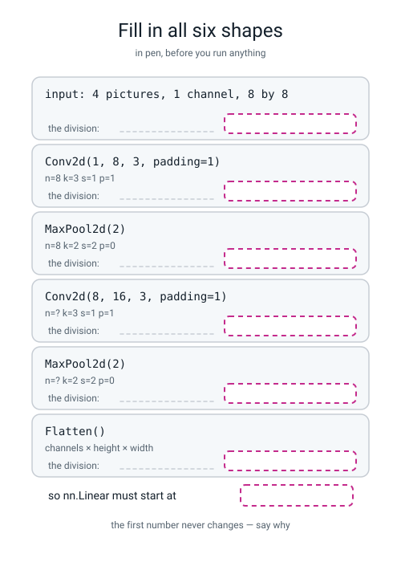
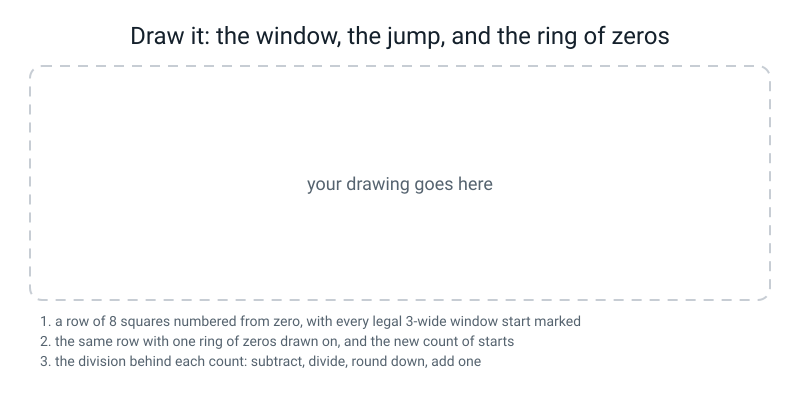

# Workbook — Week 25: Work Out the Size Before You Run It

**Name:** ________________________________  **Date:** ______________

[⬅ Week 24](week-24.md) · [📖 Read the chapter first](../student-guide/week-25.md) · [Course Home](../README.md) · [Next ➡](week-26.md)

---

## ✅ Warm-Up (5 min)

Five quick questions about **last week**.

**W1.** You slid a 3×3 kernel over a 6×6 picture. **What size was the feature map, and how many windows fitted?**

**size:** ______ × ______   **windows:** ______

**W2.** The same nine numbers were used at every single position on the picture. **What is that called, and what does it buy you?**

________________________________________________________________

**W3.** You loaded your nine numbers into `conv.weight.data` and every output cell printed `24.088203` instead of a clean `24`. **What did you forget, and why is it the same amount wrong in every cell?**

________________________________________________________________

**W4.** One 3×3 filter on a one-channel picture. **How many learnable numbers, and where does the last one come from?**

______ numbers, because ________________________________________

**W5.** Why does flattening a picture before a dense layer throw the *picture* away, even though not one pixel value changed?

________________________________________________________________

---

## 🔢 Do the Maths by Hand

This page is for practising the output-size rule with nothing but a pencil and a calculator.

**Calculator only. No code on this page.** The rule is `out = (n + 2p − k) ÷ s + 1`, **rounded down**, applied to height and width separately.

**Write every step**, not just the answer: the subtraction, the division, the rounding, and the plus one.

**M1.** A picture **10** squares across. A window **4** wide. It jumps **1** at a time. **No padding.**

`10 + (2 × 0) − 4 = ` ______   `______ ÷ 1 = ` ______   `______ + 1 = ` ______

**And say it in words: what was the last legal start, and why is the answer one bigger than that?**

________________________________________________________________

**M2.** A picture **8** squares across. A window **5** wide. It jumps **1**. **Two** rings of zeros.

`8 + (2 × ___) − 5 = ` ______   `______ ÷ 1 = ` ______   `______ + 1 = ` ______

**This gives you back the number you started with. Which other `k` and `p` pair on this page does the same thing, and what is the pattern?**

________________________________________________________________

**M3.** A picture **7** squares across. A **2**-wide pooling window. It jumps **2**. No padding. **This one does not divide evenly — be careful.**

`7 + 0 − 2 = ` ______   `______ ÷ 2 = ` ______   rounded **down** = ______   `______ + 1 = ` ______

**Seven is odd, so the window cannot cover it evenly. What happens to the last column of the picture?**

________________________________________________________________

**M4.** A picture **8** squares across. A window **3** wide. It jumps **2**. **One** ring of zeros.

`8 + 2 − 3 = ` ______   `______ ÷ 2 = ` ______   rounded **down** = ______   `______ + 1 = ` ______

**Now the trap. Somebody rounded to the nearest instead of down and got a different answer. What did they get, and how would sliding a card show them they were wrong?**

________________________________________________________________

**How many of the four did you get right first time?** ______ / 4

**Which one did the rounding catch you on?** ____________

---

## 🔎 Predict the Output

This page is for committing to a shape before you see it. Each snippet below is one small experiment.

**Write your prediction in pen before you run anything.** Every snippet begins with `import torch` and `import torch.nn as nn`, and every one has `torch.manual_seed(0)` in it so the numbers are reproducible. **Three of these four are shape predictions, and two of them are genuinely nasty.**

### P1 — an odd number of squares

```python
x = torch.zeros(1, 3, 7, 7)
print(tuple(nn.MaxPool2d(2)(x).shape))
print(tuple(nn.Conv2d(3, 3, 2, stride=2)(x).shape))
```

**I predict — line 1:** ( ____ , ____ , ____ , ____ )   **line 2:** ( ____ , ____ , ____ , ____ )

**It really printed:**

________________________________________________________________

**7 ÷ 2 is 3.5. The answer is not 3.5 and it is not 4. Write the division out and say what the rounding did:**

________________________________________________________________

**The two lines print the same thing. Both used a 2-wide window jumping 2. So why did the channel count stay 3 in both?**

________________________________________________________________

### P2 — two ways to reshape, and one of them loses the batch

```python
t = torch.zeros(4, 16, 2, 2)
print(tuple(t.view(t.size(0), -1).shape))
print(tuple(t.view(-1).shape))
print(t.numel())
```

**I predict — line 1:** ( ____ , ____ )   **line 2:** ( ____ , )   **line 3:** ______

**It really printed:**

________________________________________________________________

**All three lines are about the same 256 numbers. Which line is the flatten you actually want in a network, and what is wrong with the other one?**

________________________________________________________________

### P3 — one missing word, no error at all

```python
x = torch.zeros(2, 1, 8, 8)
print(tuple(nn.Conv2d(1, 4, 3, 1)(x).shape))
print(tuple(nn.Conv2d(1, 4, 3, padding=1)(x).shape))
```

**I predict — will these two print the same thing?** ____________

**It really printed:**

________________________________________________________________

________________________________________________________________

**The fourth number in `nn.Conv2d(1, 4, 3, 1)` is not padding. What is it?** ____________

**Did anything go red?** ______  **So how would you ever catch this?**

________________________________________________________________

### P4 — four layers, and one of them changes nothing

```python
x = torch.zeros(6, 1, 8, 8)
h = nn.Conv2d(1, 8, 5, padding=2)(x)
print("after conv 5x5 pad 2 :", tuple(h.shape))
h = nn.ReLU()(h)
print("after ReLU           :", tuple(h.shape))
h = nn.MaxPool2d(4)(h)
print("after MaxPool2d(4)   :", tuple(h.shape))
print("after Flatten        :", tuple(nn.Flatten()(h).shape))
```

**I predict, all four lines:**

1: ( ____ , ____ , ____ , ____ )  2: ( ____ , ____ , ____ , ____ )

3: ( ____ , ____ , ____ , ____ )  4: ( ____ , ____ )

**It really printed:**

```text
________________________________________________________________
________________________________________________________________
________________________________________________________________
________________________________________________________________
```

**`MaxPool2d(4)` is a 4-wide window. What is its stride, given nobody said?** ____________

**Write the division for line 3:** ______________________________

**And the flatten:** ______ × ______ × ______ = ______

**How many of the answers on this page did you get right?** ______ / 14

**Which one surprised you most, and why?**

________________________________________________________________

---

## ✍️ Practice Set A — Read It

**A1. Match the word to the thing.** Write the letter.

| Word | | Description |
|---|---|---|
| **stride** | ______ | (i) Rings of zeros glued round the outside before anything slides |
| **padding** | ______ | (ii) How much of the *original* picture one later cell can see |
| **max pooling** | ______ | (iii) How far the window jumps between one position and the next |
| **receptive field** | ______ | (iv) Squash every dimension except the batch into one long row |
| **flatten** | ______ | (v) Slide a small window and keep only the biggest number. No weights |

**A2. Trace the shape all the way down.** A batch of **10** pictures, **1** channel, **16 × 16**. Fill in every row, and **write the division in the last column** for any row where the height changed.

| Layer | Shape | The arithmetic |
|---|---|---|
| input | ( ____ , ____ , ____ , ____ ) | given |
| `nn.Conv2d(1, 6, 3, padding=1)` | ( ____ , ____ , ____ , ____ ) | |
| `nn.ReLU()` | ( ____ , ____ , ____ , ____ ) | |
| `nn.MaxPool2d(2)` | ( ____ , ____ , ____ , ____ ) | |
| `nn.Conv2d(6, 12, 3, padding=1)` | ( ____ , ____ , ____ , ____ ) | |
| `nn.MaxPool2d(2)` | ( ____ , ____ , ____ , ____ ) | |
| `nn.Flatten()` | ( ____ , ____ ) | |

**So `nn.Linear` after this stack must start at** ______ .

**A3. Spot the bug — and the number in the error is not the wrong one.** This program errors, and the obvious fix makes it run and leaves it broken.

```python
net = nn.Sequential(
    nn.Conv2d(1, 8, 3, 1),
    nn.ReLU(),
    nn.MaxPool2d(2),
    nn.Flatten(),
    nn.Linear(128, 10))
print(tuple(net(torch.zeros(4, 1, 8, 8)).shape))
```

It prints:

```text
RuntimeError: mat1 and mat2 shapes cannot be multiplied (4x72 and 128x10)
```

**Which line is actually wrong?** ____________

**What did the author think that line did, and what does it really do?**

________________________________________________________________

**Work out the real flatten length, showing both divisions:**

________________________________________________________________

**The author's `128` was not a typo — it was right for the network they *meant* to build. Show that:**

________________________________________________________________

**So what is the one-line fix, and what is the tempting fix that would be wrong?**

**right fix:** ______________________  **tempting wrong fix:** ______________________

**A4. Match the code to the error.** Draw a line, or write the letter.

| Code | | Error |
|---|---|---|
| `nn.Linear(32, 10)` after a flatten of 64 | ______ | (i) `Expected 3D (unbatched) or 4D (batched) input to conv2d, but got input of size: [8, 8]` |
| An 8×8 numpy array handed straight to a conv | ______ | (ii) `Given input size: (16x1x1). Calculated output size: (16x0x0). Output size is too small` |
| `torch.from_numpy(a)` with no `.float()` | ______ | (iii) `mat1 and mat2 shapes cannot be multiplied (4x64 and 32x10)` |
| A fourth `MaxPool2d(2)` on an 8×8 | ______ | (iv) `Input type (double) and bias type (float) should be the same` |
| `nn.Conv2d(1, 16, 3)` where 8 channels arrive | ______ | (v) `Given groups=1, weight of size [16, 1, 3, 3], expected input[4, 8, 8, 8] to have 1 channels, but got 8 channels instead` |

**A5. Read the error and answer three questions about it.**

```text
RuntimeError: mat1 and mat2 shapes cannot be multiplied (8x128 and 64x10)
```

**Which of those four numbers came out of the picture?** ______

**Which one is written in your file and needs changing?** ______

**Change it to what?** ______

**And one guess: if the flatten is 128 and there were two pools from a 16×16 start, how many filters did the last conv have?**

______ , because ______________________________________________

**A6. Label the diagram.** Fill in all six shapes **in pen**, and write the division in the space provided on every row where the height changed.


*Figure W25.1 — Fill in all six shapes, in pen, before you run anything.*

**Which number is identical on every single row, and why?**

________________________________________________________________

---

## ✍️ Practice Set B — Write It

### B1 — one line

Print the shape that comes out of `nn.Conv2d(1, 6, 5, padding=2)` when you hand it a batch of **2** pictures, **1** channel, **8 × 8**.

**Expected output:** one tuple of four numbers, and the last two must be **8** and **8**.

**Done looks like:** you predicted it first, and you can say which `p` makes a 5-wide window keep the size.

**Your line:**

```python
________________________________________________________________
```

**It printed:** ______________________  **Why is `p = 2` the right ring count for `k = 5`?**

________________________________________________________________

### B2 — the rule as a function

Write a function `out_size(n, k, s, p)` that returns the answer with **one** line of arithmetic in it, then check it against `nn.Conv2d` on these five settings: `(8,3,1,0)`, `(8,3,1,1)`, `(8,2,2,0)`, `(10,4,1,0)`, `(5,3,2,1)`.

**Expected output:** five rows, each printing your number, PyTorch's number, and the word `agree`.

**Done looks like:** all five say `agree`, and your function uses `//` and not `/`.

**Your program:**

```python
________________________________________________________________
________________________________________________________________
________________________________________________________________
________________________________________________________________
________________________________________________________________
```

**Try it with `/` instead of `//` on the `(5,3,2,1)` row. What goes wrong?**

________________________________________________________________

### B3 — a ladder printer for any starting size

Write a function `ladder(n)` that pushes a batch of **2** pictures of `n × n` through this stack and prints the shape at every step: conv(1→8, k3, pad 1), pool 2, conv(8→16, k3, pad 1), pool 2, flatten. Then print the number `nn.Linear` must start at. **Call it twice: `ladder(8)` and `ladder(16)`.**

**Expected output:** two blocks of six shapes, ending in `(2, 64)` and `(2, 256)`.

**Done looks like:** you predicted the `16` case before running it, and you can explain why the second number quadrupled when the picture only doubled.

**Your prediction for `ladder(16)`'s last line:** ( ______ , ______ )

**Why does doubling the picture's width multiply the flatten length by four?**

________________________________________________________________

### B4 — how many pools does an 8×8 support?

Write a short program that pools an `(1, 1, 8, 8)` tensor with `nn.MaxPool2d(2)` over and over, printing the shape each time, until PyTorch refuses.

**Expected output:** three successful shapes and then a real traceback.

**Done looks like:** you can name the number of pools **before** running it, and you paste the last line of the error.

**How many pools?** ______

**The last line of the error, copied exactly:**

________________________________________________________________

**And now the useful version of the question: how many pools does a 32×32 photo support?** ______

### B5 — measure the receptive field, about 20 lines

Build a four-layer stack — conv(1→1, k3, pad 1, `bias=False`), pool 2, conv(1→1, k3, pad 1, `bias=False`), pool 2 — and set **every** weight to `1.0`. Then switch on **one pixel at a time** in an 8×8 of zeros and record which pixels can make the **top-left** cell of the final 2×2 map non-zero.

**Expected output:** an 8×8 grid of 0s and 1s, and a count.

**Done looks like:** the count is a number you can explain, not just a number.

**The count:** ______ of 64

**Draw the region you found:**

```text
row 0  ________
row 1  ________
row 2  ________
row 3  ________
row 4  ________
row 5  ________
row 6  ________
row 7  ________
```

**Why is it not all 64?**

________________________________________________________________

---

## 🐞 Fix the Broken Program

This program is supposed to push three hand-typed 8×8 pictures of a bright cross through a two-block conv stack and print a shape of `(3, 10)`. **It has three bugs. One is about dtypes, one is a shape error you will see, and one is completely silent.**

```python
"""broken25.py - three bugs. One is silent."""
import numpy as np
import torch
import torch.nn as nn

torch.manual_seed(0)
np.random.seed(0)

# a batch of 3 hand-typed 8x8 pictures: a bright cross in each
imgs = np.zeros((3, 8, 8))
imgs[:, 3:5, :] = 9.0
imgs[:, :, 3:5] = 9.0

x = torch.from_numpy(imgs).unsqueeze(1)
print("input shape:", tuple(x.shape))

net = nn.Sequential(
    nn.Conv2d(1, 8, 3, 1),
    nn.ReLU(),
    nn.MaxPool2d(2),
    nn.Conv2d(8, 16, 3, padding=1),
    nn.ReLU(),
    nn.MaxPool2d(2),
    nn.Flatten(),
    nn.Linear(32, 10),
)
print("output shape:", tuple(net(x).shape))
```

**What it really prints the first time you run it:**

```text
  File ".../torch/nn/modules/conv.py", line 456, in _conv_forward
    return F.conv2d(input, weight, bias, self.stride,
RuntimeError: Input type (double) and bias type (float) should be the same
```

**Bug 1 — the dtype.** Which line, and what one method fixes it?

**line:** ____________  **fix:** ____________

**Now run it again. Write the new last line:**

________________________________________________________________

**Bug 2 — the shape.** Two numbers in that message. **Which one came out of the picture, and which one did the author type?**

**picture:** ______  **typed:** ______

**Bug 3 — the silent one.** Even after you make the program run, the network is **not** the one the author meant to build. Find it.

**Which line?** ____________

**What did the author think that line did, and what does it actually do?**

________________________________________________________________

**Fill in the real shape ladder for the broken version and the fixed version, side by side:**

| Layer | broken (bug 3 still in) | fixed |
|---|---|---|
| input | ( ____ , ____ , ____ , ____ ) | ( ____ , ____ , ____ , ____ ) |
| conv 1 | ( ____ , ____ , ____ , ____ ) | ( ____ , ____ , ____ , ____ ) |
| pool 1 | ( ____ , ____ , ____ , ____ ) | ( ____ , ____ , ____ , ____ ) |
| conv 2 | ( ____ , ____ , ____ , ____ ) | ( ____ , ____ , ____ , ____ ) |
| pool 2 | ( ____ , ____ , ____ , ____ ) | ( ____ , ____ , ____ , ____ ) |
| flatten | ( ____ , ____ ) | ( ____ , ____ ) |

**And the one-sentence lesson from bug 3:**

________________________________________________________________

---

## 🧩 Puzzle of the Week

### The Halving Ladder

A 2×2 pool with stride 2 halves a picture, **rounding down**. So from 8 you get `8 → 4 → 2 → 1`, and then there is nothing left to halve.

**Part 1 — fill in the whole ladder for each starting size, in pen, with no computer.** Stop when you reach 1.

| start | the ladder | how many pools |
|---:|---|---:|
| 8 | 4 → 2 → 1 | 3 |
| 12 | ____________________________________ | ______ |
| 28 | ____________________________________ | ______ |
| 32 | ____________________________________ | ______ |
| 224 | ____________________________________ | ______ |

**Part 2 — three of those rows have a step where the rounding-down actually does something.** Find the two shorter ones; the third is the long ladder.

**start 12:** the step ______ → ______ , because ____________________

**start 28:** the step ______ → ______ , because ____________________

**Part 3 — the interesting question.** Two of the five sizes are **powers of two** and three are not.

**Which ones are powers of two?** ____________

**Look at their ladders. What is different about them?**

________________________________________________________________

**Part 4 — and now the design question.** Real photo networks are very often built for pictures of **224 × 224**, which is not a power of two and is not a round number in any other sense either.

**How many halvings does 224 give you?** ______

**224 = 32 × 7. Given that, why might 224 be a more useful size than 256?**

________________________________________________________________

**Part 5 — check it.** Write a loop that applies the rule `(cur − 2) // 2 + 1` over and over from each starting size and prints the ladder. **How many of your five rows were right?** ______ / 5

---

## 🤔 Think Deeper

These two questions ask for a paragraph each, in your own words.

**T1.** The output-size rule works out the *shape* of what comes out of a layer without knowing a single pixel value, a single weight, or whether the model has ever been trained. **Write a paragraph** about what else in this course you could work out exactly, in advance, on paper — and what you could not. Where is the line between the part of a machine-learning system you can *prove* and the part you can only *measure*? And does knowing which side of the line you are on change how you would spend an afternoon debugging?

________________________________________________________________

________________________________________________________________

________________________________________________________________

________________________________________________________________

________________________________________________________________

**T2.** Padding invents zeros that nobody measured, so every answer along the border of a feature map is partly made up. Pooling throws away *where* a strong response happened and keeps only *that* it happened. Both of those are losses, and both are in almost every image network anybody builds. **Write a paragraph** about why a technique with a known, admitted cost is more useful than one that claims no cost at all — and what you would have to write down in a report so that somebody reading it in a year knows what you gave away.

________________________________________________________________

________________________________________________________________

________________________________________________________________

________________________________________________________________

________________________________________________________________

---

## 🛠️ Build It — Twelve Sizes, Then Break It on Purpose

**Part one goes on paper first, in pen. That is the whole reason the printed number is a check rather than an answer.**

### Step checklist

- [ ] **1.** On paper, work out all **twelve** rows of the table below by hand. **Write the arithmetic in the middle column** — subtraction, division, rounding, plus one.
- [ ] **2.** New file, `sizes.py`. Build the `CASES` list from the table.
- [ ] **3.** For each case, compute your number with `(n + 2 * p - k) // s + 1`.
- [ ] **4.** Build the matching layer — `nn.Conv2d(1, 1, k, stride=s, padding=p)` or `nn.MaxPool2d(k, stride=s, padding=p)` — and read `.shape[-1]` off a `torch.zeros(1, 1, n, n)`.
- [ ] **5.** Print both numbers side by side, plus `yes` or `NO`.
- [ ] **6.** **Write the printed number beside each of your twelve.** Tick the matches.
- [ ] **7.** For every miss, write **one sentence** saying what you did instead of what the rule says. Not "I got it wrong" — *"I rounded 2.5 up to 3 instead of down to 2."*
- [ ] **8.** New file, `stack.py`. Build the six-shape stack from class, ending in `nn.Flatten()`.
- [ ] **9.** Add `nn.Linear(?, 10)` with a **deliberately wrong** number. Any wrong number you like.
- [ ] **10.** Run it. **Paste the whole last line of the error** below.
- [ ] **11.** Circle the number that came from the picture and write *picture*. Circle the number you typed and write *mine*.
- [ ] **12.** Write **one sentence**: how you would have known the right number without running anything at all.
- [ ] **13.** Two sentences for the last page, and **each one needs a number in it.**

### The twelve sizes

| # | n | k | s | p | kind | The arithmetic, in full | mine | printed | ✓ |
|---|---:|---:|---:|---:|---|---|---:|---:|---|
| a | 8 | 3 | 1 | 0 | conv | | | | |
| b | 8 | 3 | 1 | 1 | conv | | | | |
| c | 8 | 2 | 2 | 0 | pool | | | | |
| d | 8 | 5 | 1 | 0 | conv | | | | |
| e | 8 | 5 | 1 | 2 | conv | | | | |
| f | 8 | 3 | 2 | 0 | conv | | | | |
| g | 8 | 3 | 2 | 1 | conv | | | | |
| h | 7 | 3 | 1 | 0 | conv | | | | |
| i | 7 | 2 | 2 | 0 | pool | | | | |
| j | 6 | 3 | 3 | 0 | conv | | | | |
| k | 4 | 2 | 2 | 0 | pool | | | | |
| l | 4 | 3 | 1 | 1 | conv | | | | |

**How many matched?** ______ / 12

**My misses, one sentence each:**

________________________________________________________________

________________________________________________________________

**Three rows on this table give you back the number you started with. Which three, and what do their `k` and `p` have in common?**

________________________________________________________________

**Three rows turn an 8 into a 4. Which three?** ______ , ______ and ______ **Two of them halve it on purpose in completely different ways; which one shrinks it by accident?** ______

### Break it on purpose

**The wrong number I chose:** ______

**The whole last line of the error, copied exactly:**

```text
________________________________________________________________
```

**Which number came from the picture?** ______   **Which one did I type?** ______

**How I would have known without running anything:**

________________________________________________________________

________________________________________________________________

### Two sentences with numbers in them

**What is padding for?**

________________________________________________________________

________________________________________________________________

**What does stride 2 cost you?**

________________________________________________________________

________________________________________________________________

> **⚠️ Watch out:** a sentence with no number in it does not count. "Padding stops the image shrinking" is true and useless. Say **how much** it would have shrunk.

---

## 🎨 Draw It

This page is for turning the counting rule into a picture.

Draw the window, the jump and the ring of zeros yourself, with your own numbers on it.


*Figure W25.2 — Your row of squares, every legal window start marked, and the division written out.*

**What a good answer looks like:** a row of **8 squares numbered from zero**, with every legal 3-wide window start marked underneath — six of them, and the last one labelled `5`, with `5 + 1 = 6` written beside it. Then the **same row again with one shaded square glued on each end** and a `0` written in both, and the new count of starts — eight — with `(8 + 2 − 3) ÷ 1 + 1 = 8` beside it. Then a **third row** where the window only visits starts 0, 2 and 4, labelled `stride 2`, with `2.5 rounded down to 2, then + 1 = 3`. And the thing that earns the marks: **an arrow from the row of eight squares in the stride-2 drawing to the row of eight squares in the first drawing, labelled *"same picture"*.**

**How many starts in my first drawing?** ______  **With padding?** ______  **With stride 2?** ______

**The one sentence I wrote on my arrow:**

________________________________________________________________

---

## 📊 Self-Check

This page is for marking honestly which ideas feel solid. Tick one face per row.

| I can... | 😀 | 🙂 | 😕 |
|---|---|---|---|
| count the window positions of a 3-wide window on 8 squares with a card | | | |
| derive `(n + 2p − k) ÷ s + 1` from that count, rather than recalling it | | | |
| say why the `+ 1` is there, in one sentence, without hesitating | | | |
| round **down** on the stride-2 rows every single time | | | |
| apply the rule to height and width separately | | | |
| say what padding does to the size **and** what it does to the corner pixel, with numbers | | | |
| say what stride 2 costs, with a number, and not claim the picture shrank | | | |
| work out a flatten length as `channels × height × width` | | | |
| predict all six shapes through a conv-pool-conv-pool-flatten stack in pen | | | |
| look at `(4x64 and 32x10)` and say which number is mine | | | |
| say how many 2×2 pools a picture of a given size supports, and why | | | |

**The one thing I would ask about if I could ask one question:**

________________________________________________________________

---

## ✅ Answers

<details>
<summary>Check your answers</summary>

### Warm-Up

**W1.** **4 × 4**, and **16** windows. A 3-wide window on 6 squares has starts 0, 1, 2, 3 — the last start is `6 − 3 = 3`, and counting from zero that is `3 + 1 = 4`. Four across, four down, so `4 × 4 = 16` windows and 16 output cells.

**W2.** **Weight sharing.** It buys you two things. **One rule that works everywhere:** if "there is a vertical edge here" is worth measuring in the top-left corner, it is worth measuring in the bottom-right too, and the same nine numbers do both. **A count that does not grow with the picture:** one 3×3 filter is 10 numbers whether the picture is 6×6 or 600×600, where a dense layer's count grows with every pixel you add.

**W3.** **The bias.** `conv.weight.data = ...` sets the nine weights but leaves the bias at whatever random number PyTorch invented, which happened to be `0.088204`. It is the **same** amount wrong in every cell because there is exactly one bias per filter and it gets added once at every position. Fix: `conv.bias.data = torch.zeros(1)`.

**W4.** **10** numbers: nine weights (3 × 3) **plus one bias**. The bias is the number added once at every position, whatever is underneath — the weight of the empty bowl.

**W5.** Because a dense layer sees 64 slots with no idea which slots were **next to each other**. Flattened, the pixel directly above a given pixel lands 8 slots away, and a pixel on the far side of the row lands 1 slot away. **A dense layer cannot tell which of those two means "touching"** — it has to learn the neighbourhood from data, one weight at a time, and it never fully does.

### Do the Maths by Hand

**M1.** `10 + 0 − 4 = 6`; `6 ÷ 1 = 6`; `6 + 1 = ` **7**.

The last legal start is 6, because a 4-wide window starting at 6 covers squares 6, 7, 8, 9 and there is no square 10. The answer is one bigger than 6 **because the starts run 0, 1, 2, 3, 4, 5, 6, which is seven numbers, and you counted the one at zero.**

**M2.** `p = 2`, so `8 + (2 × 2) − 5 = 8 + 4 − 5 = 7`; `7 ÷ 1 = 7`; `7 + 1 = ` **8**. Same size in, same size out.

The other pair that does it is **`k = 3, p = 1`** (with stride 1) — the one from the chapter, and row (b) of the Build It table. (M4 uses `k = 3, p = 1` too, but with stride 2, so it does not keep the size.) **The pattern is `p = (k − 1) ÷ 2`:** `k = 3 → p = 1`, `k = 5 → p = 2`, `k = 7 → p = 3`. Every odd window has a ring count that keeps the size, and every even window does not have a clean one — which is one of the reasons odd kernels are almost universal.

**M3.** `7 + 0 − 2 = 5`; `5 ÷ 2 = 2.5`; rounded **down** = `2`; `2 + 1 = ` **3**.

**The last column of the picture is simply dropped.** The windows sit at starts 0, 2 and 4, covering columns 0–1, 2–3 and 4–5. Column 6 is never inside any window, so nothing about it reaches the output. Worth knowing before it happens to your data: **an odd size cannot be halved by a 2×2 pool without losing a row and a column.**

**M4.** `8 + 2 − 3 = 7`; `7 ÷ 2 = 3.5`; rounded **down** = `3`; `3 + 1 = ` **4**.

Somebody who rounded to the nearest got `3.5 → 4`, then `4 + 1 = ` **5**. The card shows them wrong immediately: on the padded row of ten squares, the starts with stride 2 are 0, 2, 4 and 6 — **four of them** — and a fifth start would be 8, where a 3-wide window needs squares 8, 9 and 10, and there is no square 10. **Down, always down.**

### Predict the Output

**P1.**

```text
(1, 3, 3, 3)
(1, 3, 3, 3)
```

**The division:** `(7 + 0 − 2) ÷ 2 + 1`. That is `5 ÷ 2 = 2.5`, which rounds **down** to 2, then `2 + 1 = 3`. **Not 3.5, and not 4.** Seven is odd, so the last column and the last row of the picture are dropped.

**The channel count stayed 3 in both for two different reasons.** `MaxPool2d` never mixes channels — it pools each channel separately, so whatever went in comes out. And `nn.Conv2d(3, 3, ...)` was asked for **3 filters**, so it happens to produce 3 channels too. If you had written `nn.Conv2d(3, 7, 2, stride=2)` you would get `(1, 7, 3, 3)`.

**P2.**

```text
(4, 64)
(256,)
256
```

**Line 1 is the flatten you want.** `t.view(t.size(0), -1)` keeps the batch dimension — 4 pictures, 64 numbers each — which is exactly what `nn.Linear` expects.

**Line 2 has thrown the batch away.** `t.view(-1)` produces one flat list of all 256 numbers with no idea where one picture ends and the next begins. Hand *that* to a `Linear` layer and you get a shape error, or worse, a network that quietly treats four pictures as one. **Line 3 is the check that they are all the same 256 numbers:** `4 × 16 × 2 × 2 = 256`.

**P3.**

```text
(2, 4, 6, 6)
(2, 4, 8, 8)
```

**No, they do not print the same thing.** The fourth positional argument of `nn.Conv2d` is **`stride`**, not `padding`. So `nn.Conv2d(1, 4, 3, 1)` is a stride-1, **padding-0** conv, and `(8 + 0 − 3) ÷ 1 + 1 = 6`.

**Nothing goes red.** Not an error, not a warning, nothing. **You catch it by printing the shape** — which is the whole reason the shape ladder exists. And you avoid it for ever by writing `padding=1` with the keyword name on it, every single time.

**P4.**

```text
after conv 5x5 pad 2 : (6, 8, 8, 8)
after ReLU           : (6, 8, 8, 8)
after MaxPool2d(4)   : (6, 8, 2, 2)
after Flatten        : (6, 32)
```

**`MaxPool2d(4)`'s stride is 4.** When you do not say, a pool's stride defaults to its **window size**, so the windows do not overlap at all. (A conv's stride defaults to 1, which is a genuinely annoying inconsistency and worth remembering.)

**The division for line 3:** `(8 + 0 − 4) ÷ 4 + 1 = 4 ÷ 4 + 1 = 1 + 1 = 2`.

**The flatten:** `8 × 2 × 2 = 32`.

And the ReLU line is the free one: **a squash never changes a shape.**

### Practice Set A

**A1.** stride (iii) · padding (i) · max pooling (v) · receptive field (ii) · flatten (iv)

**A2.**

| Layer | Shape | The arithmetic |
|---|---|---|
| input | **(10, 1, 16, 16)** | given |
| `nn.Conv2d(1, 6, 3, padding=1)` | **(10, 6, 16, 16)** | channels 1 → 6; `(16 + 2 − 3) ÷ 1 + 1 = 16` |
| `nn.ReLU()` | **(10, 6, 16, 16)** | a squash never changes a shape |
| `nn.MaxPool2d(2)` | **(10, 6, 8, 8)** | `(16 + 0 − 2) ÷ 2 + 1 = 7 + 1 = 8` |
| `nn.Conv2d(6, 12, 3, padding=1)` | **(10, 12, 8, 8)** | channels 6 → 12; `(8 + 2 − 3) ÷ 1 + 1 = 8` |
| `nn.MaxPool2d(2)` | **(10, 12, 4, 4)** | `(8 + 0 − 2) ÷ 2 + 1 = 3 + 1 = 4` |
| `nn.Flatten()` | **(10, 192)** | `12 × 4 × 4 = 192` |

**`nn.Linear` must start at 192.** And notice the batch size, 10, on every single row.

**A3.** **The wrong line is `nn.Conv2d(1, 8, 3, 1)`.**

The author thought the fourth number was `padding`. **It is `stride`** — and `stride=1` is already the default, so the padding stays at 0 and the conv gives 6×6 instead of 8×8.

**The real flatten length:**

```text
conv, no padding : (8 + 0 − 3) ÷ 1 + 1 = 6      so 8 channels of 6 × 6
pool 2           : (6 + 0 − 2) ÷ 2 + 1 = 3      so 8 channels of 3 × 3
flatten          : 8 × 3 × 3 = 72
```

Which is exactly the 72 in the error message.

**The `128` was right for the network they meant to build:**

```text
conv, one ring   : (8 + 2 − 3) ÷ 1 + 1 = 8      so 8 channels of 8 × 8
pool 2           : (8 + 0 − 2) ÷ 2 + 1 = 4      so 8 channels of 4 × 4
flatten          : 8 × 4 × 4 = 128
```

**The right fix is `nn.Conv2d(1, 8, 3, padding=1)`**, and then the `128` is correct and the program prints `(4, 10)`.

**The tempting wrong fix is `nn.Linear(72, 10)`.** It makes the error go away, the program runs, and you now have a network with a 3×3 final feature map instead of a 4×4 one — **not the network you designed, and nothing will ever tell you.** This is the whole reason the shape ladder exists: *the error tells you two numbers disagree; it does not tell you which of the two should have been different.*

**A4.** `nn.Linear(32, 10)` after a flatten of 64 → **(iii)** · numpy 8×8 straight to a conv → **(i)** · `from_numpy` with no `.float()` → **(iv)** · a fourth pool on an 8×8 → **(ii)** · `nn.Conv2d(1, 16, 3)` where 8 channels arrive → **(v)**

**A5.** **The 128 came out of the picture** — it is the flatten length, and you cannot change it without changing the stack. **The 64 is written in your file**, in the `nn.Linear`, and it needs changing **to 128**.

**And the guess: 8 filters.** Two pools from a 16×16 start gives `16 → 8 → 4`, so the final map is 4×4 and the flatten is `channels × 4 × 4 = channels × 16`. `128 ÷ 16 = 8`, so the last conv had **8 filters**. (If you said 32, you divided by 4 instead of 16 — do the two pools out on paper.) **Notice that you can work backwards from a flatten length to the layer above it**, which is genuinely useful when you are reading somebody else's network and they did not write the shapes down.

**A6.** The six shapes are:

| # | Layer | Shape | The arithmetic |
|---|---|---|---|
| 1 | input | **(4, 1, 8, 8)** | given: 4 pictures, 1 channel, 8 by 8 |
| 2 | `Conv2d(1, 8, 3, padding=1)` | **(4, 8, 8, 8)** | channels 1 → 8. `(8 + 2 − 3) ÷ 1 + 1 = 7 + 1 = 8` |
| 3 | `MaxPool2d(2)` | **(4, 8, 4, 4)** | channels unchanged. `(8 + 0 − 2) ÷ 2 + 1 = 3 + 1 = 4` |
| 4 | `Conv2d(8, 16, 3, padding=1)` | **(4, 16, 4, 4)** | channels 8 → 16. `(4 + 2 − 3) ÷ 1 + 1 = 3 + 1 = 4` |
| 5 | `MaxPool2d(2)` | **(4, 16, 2, 2)** | `(4 + 0 − 2) ÷ 2 + 1 = 1 + 1 = 2` |
| 6 | `Flatten()` | **(4, 64)** | `16 × 2 × 2 = 64` |

And `nn.Linear` must start at **64**.

**The number identical on every row is the 4** — the batch size. **Nothing you do to a picture changes how many pictures you have.** Every layer this week treats the batch dimension as a stack of independent jobs and never lets two pictures meet. If the first number ever changes, something is badly wrong.

### Practice Set B

**B1.**

```python
import torch, torch.nn as nn
torch.manual_seed(0)
print(tuple(nn.Conv2d(1, 6, 5, padding=2)(torch.zeros(2, 1, 8, 8)).shape))
```

```text
(2, 6, 8, 8)
```

**`p = 2` is right for `k = 5` because a ring adds a square on each side, so `2p = 4`**, and `(8 + 4 − 5) ÷ 1 + 1 = 7 + 1 = 8`. The general pattern is `p = (k − 1) ÷ 2`.

**B2.**

```python
"""b2.py - the rule as a function, checked against PyTorch."""
import torch
import torch.nn as nn

torch.manual_seed(0)


def out_size(n, k, s, p):
    return (n + 2 * p - k) // s + 1


for n, k, s, p in [(8, 3, 1, 0), (8, 3, 1, 1), (8, 2, 2, 0), (10, 4, 1, 0),
                   (5, 3, 2, 1)]:
    hand = out_size(n, k, s, p)
    real = nn.Conv2d(1, 1, k, stride=s, padding=p)(
        torch.zeros(1, 1, n, n)).shape[-1]
    print("n=%3d k=%d s=%d p=%d  by hand %2d  PyTorch %2d  %s"
          % (n, k, s, p, hand, real, "agree" if hand == real else "DISAGREE"))
```

```text
n=  8 k=3 s=1 p=0  by hand  6  PyTorch  6  agree
n=  8 k=3 s=1 p=1  by hand  8  PyTorch  8  agree
n=  8 k=2 s=2 p=0  by hand  4  PyTorch  4  agree
n= 10 k=4 s=1 p=0  by hand  7  PyTorch  7  agree
n=  5 k=3 s=2 p=1  by hand  3  PyTorch  3  agree
```

**With `/` instead of `//`** the `(5,3,2,1)` row still passes, because `(5 + 2 − 3) / 2 + 1` is `4 / 2 + 1 = 3.0`, and `3.0 == 3` is `True`. **So swap in the row `(8, 3, 2, 0)` and it breaks — beautifully:**

```text
n=  5 k=3 s=2 p=1  by hand  3  PyTorch  3  agree
n=  8 k=3 s=2 p=0  by hand  3  PyTorch  3  DISAGREE
```

**Read that second row twice.** Both printed numbers say 3, and the verdict says DISAGREE. The function returned `3.5`, `%2d` rounded it for display, and only the comparison saw the truth. **`//` is not a style choice — it is the rounding-down in the rule**, and a `/` version can look right on screen while being wrong.

**B3.**

```python
"""b3.py - a ladder printer for any starting size."""
import torch
import torch.nn as nn

torch.manual_seed(0)


def ladder(n):
    x = torch.zeros(2, 1, n, n)
    parts = [("input", None),
             ("Conv2d(1, 8, 3, padding=1)", nn.Conv2d(1, 8, 3, padding=1)),
             ("MaxPool2d(2)", nn.MaxPool2d(2)),
             ("Conv2d(8, 16, 3, padding=1)", nn.Conv2d(8, 16, 3, padding=1)),
             ("MaxPool2d(2)", nn.MaxPool2d(2)),
             ("Flatten()", nn.Flatten())]
    print("--- starting from %d x %d ---" % (n, n))
    for name, layer in parts:
        if layer is not None:
            x = layer(x)
        print("  %-28s %s" % (name, tuple(x.shape)))
    print("  so nn.Linear must start at", x.shape[1])
    print()


ladder(8)
ladder(16)
```

```text
--- starting from 8 x 8 ---
  input                        (2, 1, 8, 8)
  Conv2d(1, 8, 3, padding=1)   (2, 8, 8, 8)
  MaxPool2d(2)                 (2, 8, 4, 4)
  Conv2d(8, 16, 3, padding=1)  (2, 16, 4, 4)
  MaxPool2d(2)                 (2, 16, 2, 2)
  Flatten()                    (2, 64)
  so nn.Linear must start at 64

--- starting from 16 x 16 ---
  input                        (2, 1, 16, 16)
  Conv2d(1, 8, 3, padding=1)   (2, 8, 16, 16)
  MaxPool2d(2)                 (2, 8, 8, 8)
  Conv2d(8, 16, 3, padding=1)  (2, 16, 8, 8)
  MaxPool2d(2)                 (2, 16, 4, 4)
  Flatten()                    (2, 256)
  so nn.Linear must start at 256
```

**Doubling the picture's width multiplies the flatten by four because the flatten counts an AREA.** The map went from 2 × 2 to 4 × 4, and `4 × 4` is four times `2 × 2`, not twice. **And this is exactly why the `Linear` layer's size is the part that grows with the picture while the conv layers' does not:** the conv weight count did not change at all — it is still 80 and 1,168 — but the `Linear` after the flatten just got four times bigger.

**B4.**

```python
"""b4.py - how many pools does an 8x8 support?"""
import torch
import torch.nn as nn

torch.manual_seed(0)
h = torch.zeros(1, 1, 8, 8)
pool = nn.MaxPool2d(2)
print("start      ", tuple(h.shape))
for i in range(1, 4):
    h = pool(h)
    print("after pool", i, tuple(h.shape))
print("after pool 4:")
print(tuple(pool(h).shape))
```

```text
start       (1, 1, 8, 8)
after pool 1 (1, 1, 4, 4)
after pool 2 (1, 1, 2, 2)
after pool 3 (1, 1, 1, 1)
after pool 4:
```

and then:

```text
RuntimeError: Given input size: (1x1x1). Calculated output size: (1x0x0). Output size is too small
```

**Three pools.** `8 → 4 → 2 → 1`, and then there is nothing left to halve.

**A 32×32 photo supports five:** `32 → 16 → 8 → 4 → 2 → 1`. Which is a real design constraint and not a curiosity: **the size of the picture puts a hard ceiling on how deep the network can go.**

**B5.**

```python
"""b5.py - which pixels can change the top-left cell of the final 2x2 map?"""
import numpy as np
import torch
import torch.nn as nn

back = nn.Sequential(nn.Conv2d(1, 1, 3, padding=1, bias=False), nn.MaxPool2d(2),
                     nn.Conv2d(1, 1, 3, padding=1, bias=False), nn.MaxPool2d(2))
with torch.no_grad():
    for p in back.parameters():
        p.fill_(1.0)

mask = np.zeros((8, 8), dtype=int)
for r in range(8):
    for c in range(8):
        x = torch.zeros(1, 1, 8, 8)
        x[0, 0, r, c] = 1.0
        if back(x)[0, 0, 0, 0].item() != 0:
            mask[r, c] = 1
print("pixels that can change the TOP-LEFT cell of the final 2x2 map:")
print(mask)
print("count:", mask.sum(), "of 64")
```

```text
pixels that can change the TOP-LEFT cell of the final 2x2 map:
[[1 1 1 1 1 1 1 0]
 [1 1 1 1 1 1 1 0]
 [1 1 1 1 1 1 1 0]
 [1 1 1 1 1 1 1 0]
 [1 1 1 1 1 1 1 0]
 [1 1 1 1 1 1 1 0]
 [1 1 1 1 1 1 1 0]
 [0 0 0 0 0 0 0 0]]
count: 49 of 64
```

**The count is 49 — the top-left 7 × 7.** That region is the **receptive field** of that one cell.

**Why not all 64?** Because that cell is in the **corner**, so its window is clipped by the edge of the picture. Two convs and two pools reach about 10 squares, which is further than an 8×8 picture is wide — so a cell in the middle of a *bigger* picture would see 10 × 10, and this one only sees as much as there is. **And that is part of why stacking layers helps with digits: by the end, one cell is looking at nearly the whole digit, where one cell of a single conv layer sees only a 3 × 3 patch.**

Two notes on the code. `bias=False` matters — with a bias, every cell is non-zero whatever you put in, and the whole measurement collapses. And `p.fill_(1.0)` inside `with torch.no_grad():` sets every weight to 1 so a pixel can only fail to reach the cell if it genuinely is not connected, rather than because two random weights happened to cancel.

### Fix the Broken Program

**Bug 1 — the dtype. Line: `x = torch.from_numpy(imgs).unsqueeze(1)`.** `imgs` was built with `np.zeros((3, 8, 8))`, and numpy's default is 64-bit (`float64`), while `nn.Conv2d`'s weights are 32-bit. **Fix: `.float()`** —

```python
x = torch.from_numpy(imgs).float().unsqueeze(1)
```

**Run it again and the new last line is:**

```text
RuntimeError: mat1 and mat2 shapes cannot be multiplied (3x16 and 32x10)
```

**Bug 2 — the shape.** **The `16` came out of the picture** and the **`32` was typed** by the author in `nn.Linear(32, 10)`.

But **do not just change the 32 to 16.** That makes the program run and leaves it wrong, which is bug 3.

**Bug 3 — the silent one. Line: `nn.Conv2d(1, 8, 3, 1)`.**

The author thought the fourth number was `padding`. **It is `stride`.** So that conv has no padding at all, and the whole ladder comes out four times smaller than intended.

| Layer | broken (bug 3 still in) | fixed |
|---|---|---|
| input | **(3, 1, 8, 8)** | **(3, 1, 8, 8)** |
| conv 1 | **(3, 8, 6, 6)** | **(3, 8, 8, 8)** |
| pool 1 | **(3, 8, 3, 3)** | **(3, 8, 4, 4)** |
| conv 2 | **(3, 16, 3, 3)** | **(3, 16, 4, 4)** |
| pool 2 | **(3, 16, 1, 1)** | **(3, 16, 2, 2)** |
| flatten | **(3, 16)** | **(3, 64)** |

**The fully fixed program** is `.float()` added, `nn.Conv2d(1, 8, 3, padding=1)`, and `nn.Linear(64, 10)`:

```text
input shape: (3, 1, 8, 8)
output shape: (3, 10)
```

**The one-sentence lesson from bug 3:** *a shape error tells you two numbers disagree; it does not tell you which of the two is the one that should have been different, and if you fix the wrong one you get a program that runs and a network that is not the one you designed.*

### Puzzle of the Week

**Part 1.**

| start | the ladder | how many pools |
|---:|---|---:|
| 8 | 4 → 2 → 1 | **3** |
| 12 | **6 → 3 → 1** | **3** |
| 28 | **14 → 7 → 3 → 1** | **4** |
| 32 | **16 → 8 → 4 → 2 → 1** | **5** |
| 224 | **112 → 56 → 28 → 14 → 7 → 3 → 1** | **7** |

**Part 2.** **Start 12: the step 3 → 1.** `(3 − 2) ÷ 2 = 0.5`, which rounds **down** to 0, then `+ 1 = 1`. Half of 3 is 1.5, and you get 1 — the last row and column are dropped.

**Start 28: the step 7 → 3.** `(7 − 2) ÷ 2 = 2.5`, rounds down to 2, then `+ 1 = 3`. Half of 7 is 3.5, and you get 3.

*(224's ladder has the same two steps in it, 7 → 3 and 3 → 1, because it passes through 7.)*

**Part 3.** **8 and 32 are powers of two.** Their ladders **halve exactly every time** — 8, 4, 2, 1 and 32, 16, 8, 4, 2, 1 — and nothing is ever dropped. Every other size loses a row and a column at least once, and once it has, it never gets it back.

**Part 4.** **224 gives you seven halvings.**

`224 = 32 × 7`, and `32 = 2⁵`. So 224 halves cleanly **five** times — 224, 112, 56, 28, 14 — and only then hits an odd number, 7. **That is the point: 224 gives you five clean halvings and then a 7×7 feature map, which is small enough to flatten and big enough to still have a middle.** With 256 you would get 256, 128, 64, 32, 16, 8, 4, 2, 1 — eight clean halvings, and after five you are at 8, which is a fine size too. It is genuinely a matter of taste and habit, and 224 is largely a convention that stuck. **The honest answer is that both work, and anybody who tells you 224 is optimal is repeating something they read.**

**Part 5.**

```python
"""puzzle25.py - how many 2x2 pools does a picture of each size support?"""
import torch
import torch.nn as nn

torch.manual_seed(0)
for n in (8, 12, 28, 32, 224):
    sizes = [n]
    cur = n
    while True:
        nxt = (cur + 0 - 2) // 2 + 1
        if nxt < 1 or nxt == cur:
            break
        sizes.append(nxt)
        cur = nxt
        if cur == 1:
            break
    print("%4d -> %-34s %d pools" % (n, " -> ".join(str(s) for s in sizes[1:]),
                                     len(sizes) - 1))

print()
print("--- and PyTorch agrees: pooling a 1x1 errors ---")
```

```text
   8 -> 4 -> 2 -> 1                        3 pools
  12 -> 6 -> 3 -> 1                        3 pools
  28 -> 14 -> 7 -> 3 -> 1                  4 pools
  32 -> 16 -> 8 -> 4 -> 2 -> 1             5 pools
 224 -> 112 -> 56 -> 28 -> 14 -> 7 -> 3 -> 1 7 pools
```

And if you add `print(tuple(nn.MaxPool2d(2)(torch.zeros(1, 1, 1, 1)).shape))` at the end:

```text
RuntimeError: Given input size: (1x1x1). Calculated output size: (1x0x0). Output size is too small
```

### Think Deeper

**T1 — a strong answer covers three things.**

**What you can prove on paper, exactly, before running anything:** every shape in the network; every parameter count; how many pools a picture supports; the flatten length; which of two numbers in a shape error came from the data. All of these are arithmetic on `n`, `k`, `s`, `p` and the channel counts, and **none of them depend on a single pixel value or a single weight.**

**What you can only measure:** how long it takes; how much memory it needs; what accuracy you get; what the filters end up looking like; whether the model is fair. These depend on data you have not seen and on random starting weights.

**Why the line matters when you are debugging:** if a shape is wrong, **stop typing and do arithmetic** — guessing at a provable thing is the most expensive habit in this course, and a shape error fails identically every time so there is no rush. If an *accuracy* is disappointing, arithmetic will not save you and you have to run an experiment with a control. **Knowing which kind of problem you have tells you whether to reach for a pen or for a seed.**

**T2 — a strong answer covers three things.**

**Name both costs precisely, with the numbers.** Padding: every border answer is partly computed from invented zeros, which is why a feature map can show a faint frame. Pooling: sixteen numbers become four, and you lose *where* the strong response was — the 9 in the top-right of a block and the 9 in the bottom-left of it produce the same output.

**Why an admitted cost beats a claimed free lunch.** Because you can price it, plan round it, and check whether it is hurting you *in your particular case*. If you know padding invents border numbers, you know to be suspicious of a model whose most important feature is at the edge of the frame, and you know to test it. A technique that claims no cost gives you nothing to test.

**What goes in the report.** A short, specific list: the padding used on each conv and that it means border values are partly invented; the number of pools and therefore that positions are only known to within four pixels by the end; the size of picture the network requires and what happens to a picture that is bigger or smaller; and the flatten length, because it is the number that welds the model to one input size. **The test of a good limitations section is whether a reader can predict a failure from it** — and "positions are only known to within four pixels" lets them.

### Build It

**The twelve sizes:**

| # | n | k | s | p | kind | The arithmetic, in full | out |
|---|---:|---:|---:|---:|---|---|---:|
| a | 8 | 3 | 1 | 0 | conv | `(8 + 0 − 3) = 5`; `5 ÷ 1 = 5`; `5 + 1` | **6** |
| b | 8 | 3 | 1 | 1 | conv | `(8 + 2 − 3) = 7`; `7 ÷ 1 = 7`; `7 + 1` | **8** |
| c | 8 | 2 | 2 | 0 | pool | `(8 + 0 − 2) = 6`; `6 ÷ 2 = 3`; `3 + 1` | **4** |
| d | 8 | 5 | 1 | 0 | conv | `(8 + 0 − 5) = 3`; `3 ÷ 1 = 3`; `3 + 1` | **4** |
| e | 8 | 5 | 1 | 2 | conv | `(8 + 4 − 5) = 7`; `7 ÷ 1 = 7`; `7 + 1` | **8** |
| f | 8 | 3 | 2 | 0 | conv | `(8 + 0 − 3) = 5`; `5 ÷ 2 = 2.5 → 2`; `2 + 1` | **3** |
| g | 8 | 3 | 2 | 1 | conv | `(8 + 2 − 3) = 7`; `7 ÷ 2 = 3.5 → 3`; `3 + 1` | **4** |
| h | 7 | 3 | 1 | 0 | conv | `(7 + 0 − 3) = 4`; `4 ÷ 1 = 4`; `4 + 1` | **5** |
| i | 7 | 2 | 2 | 0 | pool | `(7 + 0 − 2) = 5`; `5 ÷ 2 = 2.5 → 2`; `2 + 1` | **3** |
| j | 6 | 3 | 3 | 0 | conv | `(6 + 0 − 3) = 3`; `3 ÷ 3 = 1`; `1 + 1` | **2** |
| k | 4 | 2 | 2 | 0 | pool | `(4 + 0 − 2) = 2`; `2 ÷ 2 = 1`; `1 + 1` | **2** |
| l | 4 | 3 | 1 | 1 | conv | `(4 + 2 − 3) = 3`; `3 ÷ 1 = 3`; `3 + 1` | **4** |

**The verification file:**

```python
"""sizes.py - twelve output sizes, by hand and by PyTorch."""
import torch
import torch.nn as nn

CASES = [("a", 8, 3, 1, 0, "conv"), ("b", 8, 3, 1, 1, "conv"),
         ("c", 8, 2, 2, 0, "pool"), ("d", 8, 5, 1, 0, "conv"),
         ("e", 8, 5, 1, 2, "conv"), ("f", 8, 3, 2, 0, "conv"),
         ("g", 8, 3, 2, 1, "conv"), ("h", 7, 3, 1, 0, "conv"),
         ("i", 7, 2, 2, 0, "pool"), ("j", 6, 3, 3, 0, "conv"),
         ("k", 4, 2, 2, 0, "pool"), ("l", 4, 3, 1, 1, "conv")]

print(" #   n   k   s   p  kind   by hand   PyTorch  agree")
for tag, n, k, s, p, kind in CASES:
    hand = (n + 2 * p - k) // s + 1
    layer = (nn.Conv2d(1, 1, k, stride=s, padding=p) if kind == "conv"
             else nn.MaxPool2d(k, stride=s, padding=p))
    real = layer(torch.zeros(1, 1, n, n)).shape[-1]
    print(" %s %3d %3d %3d %3d  %-5s %7d %9d  %s"
          % (tag, n, k, s, p, kind, hand, real, "yes" if hand == real else "NO"))
```

```text
 #   n   k   s   p  kind   by hand   PyTorch  agree
 a   8   3   1   0  conv        6         6  yes
 b   8   3   1   1  conv        8         8  yes
 c   8   2   2   0  pool        4         4  yes
 d   8   5   1   0  conv        4         4  yes
 e   8   5   1   2  conv        8         8  yes
 f   8   3   2   0  conv        3         3  yes
 g   8   3   2   1  conv        4         4  yes
 h   7   3   1   0  conv        5         5  yes
 i   7   2   2   0  pool        3         3  yes
 j   6   3   3   0  conv        2         2  yes
 k   4   2   2   0  pool        2         2  yes
 l   4   3   1   1  conv        4         4  yes
```

**Runtime: under one second.**

**The three rows that give the size back are (b), (e) and (l).** `k = 3, p = 1` (twice, on an 8 and on a 4) and `k = 5, p = 2`. **What their `k` and `p` have in common is `p = (k − 1) ÷ 2`** — and if you spotted that, you have found "same padding" for yourself, which is what everybody else calls it.

**The three rows that turn an 8 into a 4 are (c), (d) and (g).** (c) is a 2×2 pool jumping 2; (g) is a 3×3 padded conv jumping 2. **Those two are completely different ways to halve a picture, and the shapes are identical** — see Worked Example 2 in the chapter. (d) also gives 4, but by accident: a 5-wide window with no padding loses 4 squares, which is shrinking, not halving.

**And rows (f) and (i) are the two most people get wrong**, because both need `2.5` rounded **down** to 2.

**Break it on purpose.** With `nn.Linear(32, 10)` on the class stack:

```python
"""stack.py - deliberately mis-size the Linear layer."""
import torch
import torch.nn as nn

torch.manual_seed(0)
batch = torch.zeros(4, 1, 8, 8)
net = nn.Sequential(
    nn.Conv2d(1, 8, 3, padding=1), nn.ReLU(), nn.MaxPool2d(2),
    nn.Conv2d(8, 16, 3, padding=1), nn.ReLU(), nn.MaxPool2d(2),
    nn.Flatten(),
    nn.Linear(32, 10))          # <-- wrong on purpose: should be 64
logits = net(batch)
print(tuple(logits.shape))
```

```text
Traceback (most recent call last):
  File "stack.py", line 12, in <module>
    logits = net(batch)
  ...
  File ".../torch/nn/modules/linear.py", line 116, in forward
    return F.linear(input, self.weight, self.bias)
RuntimeError: mat1 and mat2 shapes cannot be multiplied (4x64 and 32x10)
```

**The labels:**

- **`4`** — the batch size. Mine, but harmless: it is how many pictures I put in.
- **`64`** — **from the picture.** `16 channels × 2 × 2 = 64`. The flatten produced it and I cannot change it without changing the stack.
- **`32`** — **mine.** I typed `nn.Linear(32, 10)`. **This is the number to change.**
- **`10`** — mine, and correct: ten digits, ten scores.

**How you would have known without running anything:** *"Walk the ladder. 8×8 → pad-1 conv keeps 8×8 → pool gives 4×4 → pad-1 conv keeps 4×4 → pool gives 2×2, with 16 channels. So the flatten is 16 × 2 × 2 = 64, and `Linear` must start at 64."*

**Any wrong number counts** — 32, 128, 100, whatever you picked — as long as the labelling is right. **A student who chose 128 and correctly labelled the 64 as coming from the picture has met the objective exactly.**

Fixed, it prints `(4, 10)`: four pictures, ten scores each, one per digit.

**Two sentences with numbers in them — full marks looks like this:**

> **Padding.** *"Padding is a ring of zeros round the outside so the window can reach the edge pixels. With one ring, a window-3 stride-1 conv takes an 8 to an 8 instead of dropping it to 6 — so you can stack layers without the picture disappearing. And it means the corner pixel sits inside 4 windows instead of 1, where a middle pixel sits inside 9, so the corners stop being ignored."*

> **Stride 2.** *"Stride 2 makes the window jump two squares instead of one, so on 8 squares you get 3 window starts instead of 6 and the answer comes out half the size. What it costs you is the 3 windows you skipped — you never looked at those positions. And the picture itself did not shrink: it is still 8 squares. You just looked at it half as often."*

The three numbers that earn full marks are **8 stays 8 instead of 6**, **1 window versus 4**, and **6 starts become 3**. Any two of the three is secure; all three is excellent.

### Draw It

**Counts:** first drawing **6** starts, with padding **8**, with stride 2 **3**.

**A good sentence on the arrow:** *"Same picture, both times — eight squares, nothing removed. Stride 2 only changed how many of the windows I bothered to compute, so the ANSWER went from 6 long to 3 long."*

**What separates a good drawing from a great one:** the great one has the **last legal start labelled with its number** on every row (5, then 7, then 4), because that is the number the `+ 1` is added to, and having it written down is the difference between rebuilding the rule and remembering it.

### Self-Check answers

There are no right answers to a self-check, but two of the rows are the ones that predict next week.

**"look at `(4x64 and 32x10)` and say which number is mine"** — if that is a 😕, go back and do Build It's "break it on purpose" once more with a different wrong number. It is ninety seconds and it is the single highest-value thing on the page.

**"say why the `+ 1` is there, in one sentence, without hesitating"** — if that is a 😕, get a strip of card and chant the start numbers once more. Nobody who has said "zero, one, two, three, four, five" out loud and then answered "how many did you say?" gets this wrong again.

</details>
