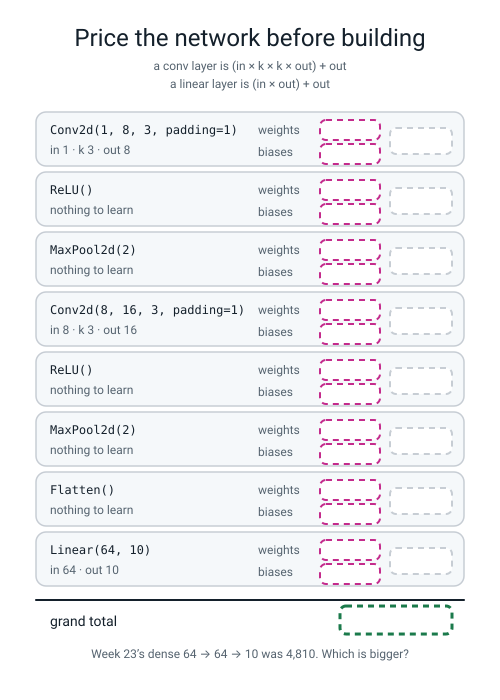
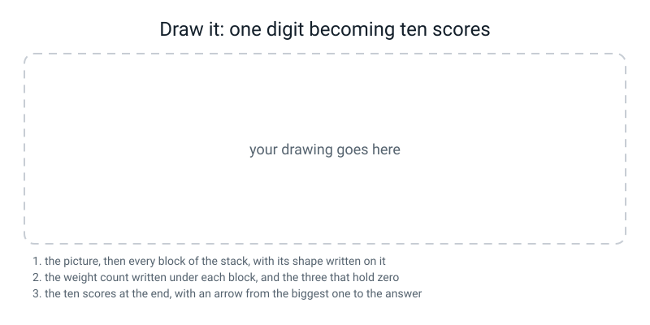

# Workbook — Week 26: A Network That Reads Digits

**Name:** ________________________________  **Date:** ______________

[⬅ Week 25](week-25.md) · [📖 Read the chapter first](../student-guide/week-26.md) · [Course Home](../README.md) · [Next ➡](week-27.md)

---

## ✅ Warm-Up (5 min)

Five quick questions about **last week**.

**W1.** A picture **8** squares across. A window **3** wide. It jumps **1**. **One** ring of zeros. **What comes out, and show the arithmetic?**

`(8 + ____ − 3) ÷ 1 + 1 = ` ______

**W2.** Why is the answer always **one more** than `n − k` when the stride is 1?

________________________________________________________________

**W3.** A tensor of shape `(4, 16, 2, 2)` goes through `nn.Flatten()`. **What comes out, and what number must `nn.Linear` start at?**

**shape:** ( ______ , ______ )   **`nn.Linear` starts at:** ______

**W4.** You get `mat1 and mat2 shapes cannot be multiplied (8x128 and 64x10)`. **Which number do you change, and to what?**

**change:** ______  **to:** ______  **and the other one came from:** ____________

**W5.** Does `nn.ReLU()` ever change a shape? **Answer, and say why in one sentence.**

________________________________________________________________

---

## 🔢 Do the Maths by Hand

**There is no new maths this week**, so this page uses **last week's output-size rule**, the **parameter-count arithmetic**, and **Week 14's surprise meter** `−ln(p)`. **Calculator only. No code on this page.**

**M1 — price the network you are about to train.** A conv layer costs `(in × k × k × out) + out`. A linear layer costs `(in × out) + out`.

| Layer | The arithmetic | Weights | Biases | Total |
|---|---|---:|---:|---:|
| `Conv2d(1, 8, 3, padding=1)` | 1 × 3 × 3 × 8 = ______, plus ______ | ______ | ______ | ______ |
| `ReLU()` | | ______ | ______ | ______ |
| `MaxPool2d(2)` | | ______ | ______ | ______ |
| `Conv2d(8, 16, 3, padding=1)` | 8 × 3 × 3 × 16 = ______, plus ______ | ______ | ______ | ______ |
| `ReLU()` | | ______ | ______ | ______ |
| `MaxPool2d(2)` | | ______ | ______ | ______ |
| `Flatten()` | | ______ | ______ | ______ |
| `Linear(64, 10)` | 64 × 10 = ______, plus ______ | ______ | ______ | ______ |
| | | | | **______** |

**Which layer holds the most numbers, and is it the one you expected?**

________________________________________________________________

**Week 23's dense `64 → 64 → 10` network was 4,810. How many fewer is yours?** ______

**M2 — now double the first layer's filters.** `Conv2d(1, 16, 3, padding=1)` then `Conv2d(16, 16, 3, padding=1)` then the same flatten and `Linear`.

`conv1: 1 × 3 × 3 × ____ + ____ = ` ______

`conv2: ____ × 3 × 3 × ____ + ____ = ` ______

`linear:` ______   **total:** ______

**The flatten length did not change. Why not?**

________________________________________________________________

**M3 — the softmax, all the way through, on three numbers.** Three song-genre scores: rock `1.20`, pop `3.10`, jazz `−0.40`. **The true answer is pop.**

**Step 1 — subtract the biggest (3.10) from all three:**

rock ______   pop ______   jazz ______

**Step 2 — `e^` each one. You need the `e^x` button.**

`e^______ = ` ____________   `e^______ = ` ____________   `e^______ = ` ____________

**total = ** ____________

**Step 3 — divide each one by the total:**

rock ____________   pop ____________   jazz ____________

**Do the three chances add up to 1.0000?** ____________  **Why must they?**

________________________________________________________________

**Step 4 — the loss. Minus the natural log of the chance you gave the true answer:**

`−ln(____________) = ` ____________

**M4 — the surprise meter, four times.** Fill in `−ln(p)` for each chance a model gave the answer that actually happened.

| p | `−ln(p)` |
|---:|---:|
| 0.9760 | ____________ |
| 0.5000 | ____________ |
| 0.2500 | ____________ |
| 0.1000 | ____________ |
| 0.0200 | ____________ |

**Which row is a model guessing between ten options?** ____________

**Which row is a model guessing between four?** ____________

**So what should the very first printed loss be, for a ten-class network that has learned nothing?** ____________

**And write out the check as a sentence you will actually use:**

________________________________________________________________

---

## 🔎 Predict the Output

**Write your prediction in pen before you run anything.** Every snippet begins with `import torch` and `import torch.nn as nn` and has `torch.manual_seed(0)` where it matters.

### P1 — four scores that are all the same

```python
scores = torch.tensor([[0.0, 0.0, 0.0, 0.0]])
print(torch.softmax(scores, dim=1))
print("%.4f" % nn.CrossEntropyLoss()(scores, torch.tensor([2])).item())
print("%.4f" % nn.CrossEntropyLoss()(scores, torch.tensor([0])).item())
```

**I predict — the four chances:** ______ ______ ______ ______

**and the two losses:** ______ and ______

**It really printed:**

```text
________________________________________________________________
________________________________________________________________
________________________________________________________________
```

**Lines 2 and 3 ask about two different true answers and print the same number. Why?**

________________________________________________________________

**Where does that number come from? Write the logarithm:** ______________________

### P2 — three ways to ask for the biggest

```python
s = torch.tensor([[1.0, 5.0, 2.0],
                  [7.0, 0.0, 3.0]])
print(s.argmax(dim=1))
print(s.argmax(dim=0))
print(s.argmax())
```

**I predict — line 1:** ____________  **line 2:** ____________  **line 3:** ____________

**It really printed:**

```text
________________________________________________________________
________________________________________________________________
________________________________________________________________
```

**Two rows went in. Which line gives one answer per row?** ____________

**Line 2 gave three numbers. What question does each of them answer?**

________________________________________________________________

**Line 3 gave a single number. `3`. Where is position 3 in a 2 × 3 grid?**

________________________________________________________________

**Did any of the three error?** ______  **So what is the check that catches the wrong one?**

________________________________________________________________

### P3 — count the blocks, then count the numbers

```python
m = nn.Sequential(nn.Conv2d(1, 4, 3, padding=1), nn.ReLU(), nn.MaxPool2d(2),
                  nn.Flatten(), nn.Linear(4 * 4 * 4, 10))
print(len(list(m.parameters())))
print(sum(p.numel() for p in m.parameters()))
```

**I predict — how many blocks?** ______  **how many numbers?** ______

**It really printed:**

______ and ______

**Work the total out by hand, both layers:**

`conv : 1 × 3 × 3 × 4 + 4 = ` ______

`linear: 64 × 10 + 10 = ` ______   **total** ______

**Five layers went into `nn.Sequential` and the first line printed a smaller number. Which layers contributed nothing, and why?**

________________________________________________________________

### P4 — labels of the wrong kind

```python
scores = torch.tensor([[2.0, -1.0, 0.5]])
labels_float = torch.tensor([0.0])
print(nn.CrossEntropyLoss()(scores, labels_float))
```

**I predict — will this run?** ____________

**The last line it really printed:**

________________________________________________________________

**What kind of number does `CrossEntropyLoss` want for a label, and what does that label actually mean?**

________________________________________________________________

**Write the two-part rule for building tensors out of numpy:**

`X gets ` ____________  **and** `y gets ` ____________

**How many of the answers on this page did you get right?** ______ / 15

**Which one surprised you most, and why?**

________________________________________________________________

---

## ✍️ Practice Set A — Read It

**A1. Match the word to the thing.** Write the letter.

| Word | | Description |
|---|---|---|
| **logits** | ______ | (i) An optimiser that keeps a separate step size for every weight |
| **argmax** | ______ | (ii) Nine numbers gradient descent chose, not a person |
| **softmax** | ______ | (iii) The raw, unsquashed scores out of the last layer |
| **Adam** | ______ | (iv) How many learnable numbers a network holds, biases included |
| **parameter count** | ______ | (v) The **position** of the biggest number, not its value |
| **learned filter** | ______ | (vi) Turns raw scores into chances that add up to 1 |

**A2. Trace the shape AND the weight count.** A batch of **32** pictures, **1** channel, **8 × 8**, through the class stack. Fill in both columns.

| Layer | Shape out | Learnable numbers |
|---|---|---:|
| input | ( ____ , ____ , ____ , ____ ) | 0 |
| `nn.Conv2d(1, 8, 3, padding=1)` | ( ____ , ____ , ____ , ____ ) | ______ |
| `nn.ReLU()` | ( ____ , ____ , ____ , ____ ) | ______ |
| `nn.MaxPool2d(2)` | ( ____ , ____ , ____ , ____ ) | ______ |
| `nn.Conv2d(8, 16, 3, padding=1)` | ( ____ , ____ , ____ , ____ ) | ______ |
| `nn.ReLU()` | ( ____ , ____ , ____ , ____ ) | ______ |
| `nn.MaxPool2d(2)` | ( ____ , ____ , ____ , ____ ) | ______ |
| `nn.Flatten()` | ( ____ , ____ ) | ______ |
| `nn.Linear(64, 10)` | ( ____ , ____ ) | ______ |
| | | **total ______** |

**Three of those nine layers hold zero numbers. Name them, and say what they do instead.**

________________________________________________________________

**A3. Spot the bug — and there is no error message at all.**

```python
model = nn.Sequential(
    nn.Conv2d(1, 8, 3, padding=1), nn.ReLU(), nn.MaxPool2d(2),
    nn.Conv2d(8, 16, 3, padding=1), nn.ReLU(), nn.MaxPool2d(2),
    nn.Flatten(), nn.Linear(64, 10), nn.Softmax(dim=1))
loss_fn = nn.CrossEntropyLoss()
```

**Which line is wrong?** ____________

**What will the very first printed loss be, roughly?** ______

**What would it have been if the bug were not there?** ______

**How much will the model's test accuracy suffer, roughly?** ______ points

**And the sentence that catches this one for ever:**

________________________________________________________________

**A4. Match the code to the error.** Write the letter.

| Code | | Error |
|---|---|---|
| `torch.from_numpy(y_train).float()` for labels | ______ | (i) `mean(): could not infer output dtype ... Got: Bool` |
| `torch.optim.Adam(model, lr=1e-3)` | ______ | (ii) `Can't call numpy() on Tensor that requires grad` |
| `(pred == y).mean()` | ______ | (iii) `expected scalar type Long but found Float` |
| `model[0].weight.numpy()` | ______ | (iv) `IndexError: Target 10 is out of bounds.` |
| Labels running 1 to 10 instead of 0 to 9 | ______ | (v) `optimizer can only optimize Tensors, but one of the params is torch.nn.modules.conv.Conv2d` |

**A5. Read the filter and predict its answers.** Here is one real learned filter, filter 4:

```text
 −0.185   0.784   0.742
  0.469   0.383  −0.196
 −0.105  −0.977  −0.681
```

**Add up each row:**  top ______  middle ______  bottom ______

**So what kind of picture makes this filter produce a big positive number?**

________________________________________________________________

**Now work out its answer to a bright-TOP patch, which is `1 1 1 / 1 1 1 / −1 −1 −1`. Row by row:**

`row 0: ` ____________________________________ = ______

`row 1: ` ____________________________________ = ______

`row 2: ` ____________________________________ = ______

**total** ______

**Is this a vertical or a horizontal edge detector?** ____________

**A6. Label the diagram.** Fill in every box **in pen** — the weights, the biases and the total for each layer, then the grand total.


*Figure W26.1 — Price the network before you build it, in pen, before you run anything.*

**Which is bigger, your total or Week 23's 4,810?** ____________

**And the level-4 question: does either of the conv rows change if the picture is 200 × 200 instead of 8 × 8?**

________________________________________________________________

---

## ✍️ Practice Set B — Write It

In this set you write short pieces of code yourself, from one line up to a whole program.

### B1 — one line

Print the parameter count of a single `nn.Conv2d(3, 12, 5)` layer.

**Expected output:** one whole number, and you can get it on a calculator first.

**Done looks like:** your hand number and the printed number agree.

**By hand:** `3 × 5 × 5 × 12 + 12 = ` ______

**Your line:**

```python
________________________________________________________________
```

**It printed:** ______

### B2 — price every layer separately

Write a loop over `nn.Sequential`'s layers that prints, for each one, its index, its type name, and how many learnable numbers it holds. Then print the grand total. Then build Week 23's dense `64 → 64 → 10` and print its total too.

**Expected output:** eight layer lines with three of them reading `0`, then `total : 1898`, then `dense 64 -> 64 -> 10: 4810`.

**Done looks like:** the three zeros are there and you can say what those layers do instead of holding numbers.

**Your program:**

```python
________________________________________________________________
________________________________________________________________
________________________________________________________________
________________________________________________________________
________________________________________________________________
```

**Which single layer holds the most?** ____________  **How many of the 1,898?** ______

### B3 — a scorecard for any set of raw scores

Write a function `scorecard(scores, true)` that takes a plain list of raw scores and the true class number, and prints: the scores, the argmax, the chances, whether they add to 1, the loss on the **raw** scores, the loss on the **squashed** ones, and `−ln(true chance)`.

**Call it three times:** `([2.0, 0.0, -1.0, 5.0], 3)`, `([0.0, 0.0, 0.0, 0.0], 3)`, and `([2.0, 0.0, -1.0, 5.0], 0)`.

**Expected output:** three blocks. In two of them the loss on raw and `−ln(true chance)` match exactly.

**Done looks like:** you can explain why the **third** call is the frightening one.

**Your prediction for call 3 — will the double-squashed loss be bigger or smaller than the right one?** ____________

**What actually happened, and why is that so dangerous?**

________________________________________________________________

________________________________________________________________

### B4 — look inside the first layer

After training, pull out the eight 3×3 filters, print filter 4's nine numbers, save all eight as a picture called `filters.png`, and print each filter's answer to a bright-left patch and a bright-top patch.

**Expected output:** `first-layer weight shape: (8, 1, 3, 3)`, then nine numbers, then `saved filters.png`, then eight rows of two numbers.

**Done looks like:** you opened the PNG, and you can name two filters **with a number**.

**Three things that will bite you.** Write down what each one is for:

`matplotlib.use("Agg")` above the pyplot import: ____________________________

`.detach()` before `.numpy()`: ____________________________

`interpolation="nearest"` in `imshow`: ____________________________

**The two filters I can describe, with their numbers:**

________________________________________________________________

________________________________________________________________

**One filter I cannot describe, and why I am not going to invent a story about it:**

________________________________________________________________

### B5 — the whole thing, about 25 lines

Train the CNN on `load_digits` and report properly.

**Expected output:** the shapes, `parameters: 1898`, `steps per epoch: 40`, the loss at epochs 1, 10, 20, 30 and 40, the seconds, and **both accuracies with their row counts.**

**Done looks like:** every printed line matches this chapter's except the seconds, and your report sentence names the split.

**My seconds:** ______  **My train accuracy:** ______ ( ______ of 1257 )  **My test accuracy:** ______ ( ______ of 540 )

**My one-sentence report:**

________________________________________________________________

________________________________________________________________

---

## 🐞 Fix the Broken Program

This is supposed to train the CNN on digits and print a test accuracy near 0.96 after 20 epochs. **It has three bugs, and they fire in a fixed order: one runtime, one dtype, and one that never says a word.**

```python
"""broken26.py - three bugs. The third one never says a word."""
import numpy as np
import torch
import torch.nn as nn
from sklearn.datasets import load_digits
from sklearn.model_selection import train_test_split
from torch.utils.data import DataLoader, TensorDataset

torch.manual_seed(0)
np.random.seed(0)

digits = load_digits()
X_train, X_test, y_train, y_test = train_test_split(
    digits.images / 16.0, digits.target, test_size=0.30, random_state=0,
    stratify=digits.target)
Xtr = torch.from_numpy(X_train).float().unsqueeze(1)
Xte = torch.from_numpy(X_test).float().unsqueeze(1)
ytr = torch.from_numpy(y_train).float()
yte = torch.from_numpy(y_test).long()

model = nn.Sequential(
    nn.Conv2d(1, 8, 3, padding=1), nn.ReLU(), nn.MaxPool2d(2),
    nn.Conv2d(8, 16, 3, padding=1), nn.ReLU(), nn.MaxPool2d(2),
    nn.Flatten(), nn.Linear(64, 10))

loader = DataLoader(TensorDataset(Xtr, ytr), batch_size=32, shuffle=True)
loss_fn = nn.CrossEntropyLoss()
opt = torch.optim.Adam(model, lr=1e-3)

for epoch in range(1, 21):
    for xb, yb in loader:
        opt.zero_grad()
        loss = loss_fn(torch.softmax(model(xb), dim=1), yb)
        loss.backward()
        opt.step()
    if epoch % 10 == 0 or epoch == 1:
        print("epoch %2d  loss %.4f" % (epoch, loss.item()))

model.eval()
with torch.no_grad():
    acc = (model(Xte).argmax(dim=1) == yte).float().mean().item()
print("test accuracy: %.4f" % acc)
```

**The first time you run it, the last line says:**

```text
TypeError: optimizer can only optimize Tensors, but one of the params is torch.nn.modules.conv.Conv2d
```

**Bug 1 — the runtime one.** Which line, and what is missing?

**line:** ____________  **fix:** ____________

**Run it again. The new last line:**

________________________________________________________________

**Bug 2 — the dtype one.** Which line, and which one word fixes it?

**line:** ____________  **fix:** ____________

**Write the rule out so you never do it again:** `X gets ` ______  `y gets ` ______

**Run it a third time. Now it works. Write what it printed:**

```text
epoch  1  loss ____________
epoch 10  loss ____________
epoch 20  loss ____________
test accuracy: ____________
```

**Bug 3 — the silent one.** The program runs, prints plausible numbers, and is still wrong.

**Which line?** ____________

**Compare your epoch-1 loss to the number a fresh ten-class network should print. Do they nearly match?** ____________

**So does the "first loss should be near 2.30" check catch this one?** ____________

**What DOES catch it? Write the one-line rule:**

________________________________________________________________

**Now fix bug 3 and run it a fourth time. Fill in both columns:**

| | bug 3 still in | all three fixed |
|---|---:|---:|
| epoch 1 loss | ____________ | ____________ |
| epoch 10 loss | ____________ | ____________ |
| epoch 20 loss | ____________ | ____________ |
| test accuracy | ____________ | ____________ |

**And one sentence on why this is the most expensive kind of bug there is:**

________________________________________________________________

---

## 🧩 Puzzle of the Week

### The Softmax Shuffle

Here are three raw scores: `2.0`, `1.0`, `−1.0`. Their chances are `0.7054`, `0.2595`, `0.0351`, and `argmax` is 0.

**Now somebody does something to all three numbers.** For each row, predict **in pen** whether the chances change and whether the argmax changes, then check.

| What was done | do the chances change? | does the argmax change? |
|---|---|---|
| add 100 to all three | ____________ | ____________ |
| subtract 2 from all three | ____________ | ____________ |
| double all three | ____________ | ____________ |
| multiply all three by −1 | ____________ | ____________ |

**Part 1 — now check it.** Write out the three chances for each row:

add 100: ____________ ____________ ____________

subtract 2: ____________ ____________ ____________

double: ____________ ____________ ____________

times −1: ____________ ____________ ____________

**Part 2 — two of the four rows leave the chances completely unchanged.** Which two, and what do they have in common?

________________________________________________________________

**Part 3 — one of them keeps the argmax but changes the confidence.** Which one, and which direction did the confidence go?

________________________________________________________________

**Part 4 — and now the reason it matters.** Look back at Step 1 of the softmax by hand: *"subtract the biggest score from all of them."*

**Why is that step allowed?**

________________________________________________________________

**And why is it worth doing at all, rather than just exponentiating the raw scores?**

________________________________________________________________

**Part 5 — the honest question.** One row changed the argmax. **Is `softmax` responsible for that, or was it already decided before the softmax ran?**

________________________________________________________________

---

## 🤔 Think Deeper

**T1.** Two of the eight learned filters are edge detectors and you can prove it with a number. Three of them answer less than one unit to either test patch and cannot be described at all. **Write a paragraph** about what you would actually write in a report about a model whose parts you can only half explain. What is the difference between "I do not know what filter 3 does" and "filter 3 does nothing"? And is it more honest to publish eight pictures with three of them unlabelled, or to publish only the two you can name?

________________________________________________________________

________________________________________________________________

________________________________________________________________

________________________________________________________________

________________________________________________________________

**T2.** `CrossEntropyLoss` hides the softmax inside itself, and that hiding causes the nastiest bug of the week — a wrong loss that produces no error and a model that just looks mediocre. The library does it because doing the squash and the log together is arithmetically much safer: on a bigger network `e^100` is too big for the computer's number format (it becomes `inf`) and a chance as small as `e^−110` rounds to exactly zero, so `ln(0)` is minus infinity. **Write a paragraph** about whether a library should be allowed to hide something dangerous in order to be safer. `BCEWithLogitsLoss` says it in its name; `CrossEntropyLoss` does not. Was that a design mistake, and what would you have called it?

________________________________________________________________

________________________________________________________________

________________________________________________________________

________________________________________________________________

________________________________________________________________

---

## 🛠️ Build It — Train It, Look Inside It, Compare It

**The three parameter sums go on paper first, in pen. That is the whole reason `parameters: 1898` is a check rather than a fact.**

### Step checklist

- [ ] **1.** Page M1, done. Three sums, biases included, total in pen: ______
- [ ] **2.** New file, `digits_cnn.py`. Load `load_digits()`, take `digits.images`, divide by **16.0**.
- [ ] **3.** Split 70/30 with `random_state=0, stratify=y`. **Print all four counts and check they add to 1,797.**
- [ ] **4.** Build the tensors: `.float().unsqueeze(1)` on the pictures, `.long()` on the labels.
- [ ] **5.** Build the eight-layer stack, then `print("parameters:", sum(p.numel() for p in model.parameters()))`. **Check it against step 1.**
- [ ] **6.** `DataLoader(..., batch_size=32, shuffle=True)`, `nn.CrossEntropyLoss()`, `torch.optim.Adam(model.parameters(), lr=1e-3)`.
- [ ] **7.** **Predict the steps per epoch before printing it.** ______
- [ ] **8.** **Predict the epoch-1 loss before printing it.** ______
- [ ] **9.** Train 40 epochs, printing the average loss at 1, 10, 20, 30 and 40. Time it with `time.perf_counter()`.
- [ ] **10.** Report both accuracies **with their row counts.**
- [ ] **11.** New file, `filters.py`. `matplotlib.use("Agg")` at the very top. Train, then render the eight filters at `interpolation="nearest"` and save `filters.png`.
- [ ] **12.** Score all eight filters against the bright-left and bright-top patches.
- [ ] **13.** Fill in the four-row comparison table below, then write the sentence.

### The training report

| | value | how I know |
|---|---|---|
| rows in the training pile | ______ | |
| rows in the held-out pile | ______ | |
| do they add to 1,797? | ______ | |
| `parameters:` printed | ______ | my paper said ______ |
| steps per epoch | ______ | ______ ÷ 32 = ______ , so ______ full batches and one of ______ |
| epoch 1 loss | ______ | a fresh ten-class net should print near ______ |
| epoch 40 loss | ______ | |
| seconds on **my** machine | ______ | |
| train accuracy | ______ | ______ of ______ |
| test accuracy | ______ | ______ of ______ |

**Is the gap between the two accuracies big or small, and how do you know?**

________________________________________________________________

________________________________________________________________

### The filter grid

**Paste or attach `filters.png`.** Then, for each of the eight, write what you think it responds to **and the number that supports you.**

| filter | bright-LEFT | bright-TOP | what I think it responds to |
|---:|---:|---:|---|
| 0 | ______ | ______ | |
| 1 | ______ | ______ | |
| 2 | ______ | ______ | |
| 3 | ______ | ______ | |
| 4 | ______ | ______ | |
| 5 | ______ | ______ | |
| 6 | ______ | ______ | |
| 7 | ______ | ______ | |

**The two I can describe confidently:** ______ and ______

**One filter I honestly cannot describe:** ______  **and I am not going to invent a story about it because:**

________________________________________________________________

### The four-row comparison

| Row | my CNN | Week 23's dense `64 → 64 → 10` | difference |
|---|---:|---:|---|
| parameters | ______ | ______ | ______ |
| seconds to train | ______ | ______ | ______ |
| train accuracy | ______ | ______ | ______ |
| **test accuracy** | ______ | ______ | ______ |
| test correct out of 540 | ______ | ______ | ______ digits |

**Which row would you put in a report, and why?**

________________________________________________________________

________________________________________________________________

> **⚠️ Watch out:** there is a wrong answer here that looks right. **Convert both accuracies into counts out of 540 before you decide**, and then ask yourself whether that difference would survive a different `torch.manual_seed`.

---

## 🎨 Draw It

Draw one digit turning into ten scores, with all the numbers on it.


*Figure W26.2 — One digit, every block of the stack with its shape, and the ten scores at the end.*

**What a good answer looks like:** the 8×8 picture on the left with `(1, 1, 8, 8)` written on it, then **five blocks** across the page — conv, pool, conv, pool, flatten — each with its shape written **on** it and its weight count written **under** it, and the three that hold `0` marked clearly. Then the `Linear` block with `650` under it, and then **ten little bars** at the end, one per digit, with the tallest one ringed and the number `4.46` beside it and an arrow to the word *one*.

**And the thing that earns the marks:** somewhere on the drawing, `80 + 1168 + 650 = 1898`, and somewhere else a note saying **which single number in the whole drawing would change if the picture were 200 × 200** — and which would not.

**My three zero-weight blocks:** ____________ , ____________ , ____________

**The number that would change on a 200 × 200 picture:** ____________

**The numbers that would not:** ____________

---

## 📊 Self-Check

| I can... | 😀 | 🙂 | 😕 |
|---|---|---|---|
| compute a conv layer's parameter count including the biases, unaided | | | |
| get 1,898 on paper **before** printing it | | | |
| say what comes out of `nn.Linear(64, 10)` in words, without saying "probabilities" | | | |
| explain `argmax`, and say what `dim=1` is doing | | | |
| do a softmax by hand on three or four numbers with a calculator | | | |
| say where the softmax went, and quote the two loss numbers | | | |
| predict that a fresh ten-class network's first loss is near 2.30 | | | |
| train the CNN and report both accuracies with the row counts named | | | |
| render the eight filters and describe two of them **with a number** | | | |
| say honestly that I cannot describe some of them | | | |
| convert 0.9796 and 0.9722 into counts before deciding whether the difference is real | | | |

**The one thing I would ask about if I could ask one question:**

________________________________________________________________

---

## ✅ Answers

<details>
<summary>Check your answers</summary>

### Warm-Up

**W1.** `(8 + 2 − 3) ÷ 1 + 1 = 7 + 1 = ` **8**. Same size in, same size out — that is what one ring of zeros with a 3-wide window buys you.

**W2.** Because the starts are counted **from zero**. The last legal start is `n − k`, and the list of starts runs `0, 1, 2, ... n − k`, which is `n − k + 1` numbers. **It is the eleventh fence post in a ten-metre fence.**

**W3.** `(4, 16, 2, 2)` flattens to **(4, 64)**, because `16 × 2 × 2 = 64`. **`nn.Linear` must start at 64.** The 4 is the batch size and it never changes.

**W4.** **Change the 64, to 128.** The `128` came out of the picture — it is the flatten length, `channels × height × width`, and you cannot change it without changing the stack. The `64` is written in your file, in the `nn.Linear`.

**W5.** **No. Never.** `ReLU` walks through every number and replaces the negatives with zero: one number in, one number out, nothing mixes. That is what **element-by-element** means, and it is true of every squash. **Shapes only change when numbers get combined or rearranged.**

### Do the Maths by Hand

**M1.**

| Layer | The arithmetic | Weights | Biases | Total |
|---|---|---:|---:|---:|
| `Conv2d(1, 8, 3, padding=1)` | 1 × 3 × 3 × 8 = **72**, plus **8** | 72 | 8 | **80** |
| `ReLU()` | nothing to learn | 0 | 0 | **0** |
| `MaxPool2d(2)` | nothing to learn | 0 | 0 | **0** |
| `Conv2d(8, 16, 3, padding=1)` | 8 × 3 × 3 × 16 = **1,152**, plus **16** | 1,152 | 16 | **1,168** |
| `ReLU()` | nothing to learn | 0 | 0 | **0** |
| `MaxPool2d(2)` | nothing to learn | 0 | 0 | **0** |
| `Flatten()` | nothing to learn | 0 | 0 | **0** |
| `Linear(64, 10)` | 64 × 10 = **640**, plus **10** | 640 | 10 | **650** |
| | | | | **1,898** |

**`conv2` holds the most: 1,168 of the 1,898.** Most people expect the `Linear` to dominate, because in Week 23's dense network it did. **The big layer moved**, and noticing that unprompted is worth saying out loud.

**2,912 fewer than 4,810.**

*(If your total came to **1,864**, you are short by exactly `8 + 16 + 10 = 34` — you counted the weights and skipped the biases. Same error Week 22 flagged. If it came to **818**, you used `8 × 3 × 3` (plus 16) for conv2 and forgot to multiply by the 16 filters.)*

**M2.** `conv1: 1 × 3 × 3 × 16 + 16 = 144 + 16 = ` **160**. `conv2: 16 × 3 × 3 × 16 + 16 = 2,304 + 16 = ` **2,320**. `linear:` **650**. **Total 3,130.**

**The flatten length did not change because it is `channels × height × width`, and the *last* conv still has 16 filters.** Doubling the *first* layer's filters changes what feeds conv2, so conv2 gets bigger — but conv2 still puts out 16 channels of 2 × 2, so the flatten is still `16 × 2 × 2 = 64`. **The `Linear` layer never notices.**

*(And if you run it: the test accuracy goes from **529 of 540 to 527 of 540**, so about twelve hundred extra weights bought nothing at all. On this data, eight filters is already enough.)*

**M3.**

**Step 1:** rock `1.20 − 3.10 = −1.90`, pop `3.10 − 3.10 = 0.00`, jazz `−0.40 − 3.10 = −3.50`.

**Step 2:** `e^−1.90 = 0.149569`, `e^0.00 = 1.000000`, `e^−3.50 = 0.030197`. **Total = 1.179766.**

**Step 3:**

```text
rock:  0.149569 ÷ 1.179766 = 0.126778
pop :  1.000000 ÷ 1.179766 = 0.847626
jazz:  0.030197 ÷ 1.179766 = 0.025596
                             --------
                       total  1.000000
```

**Yes, they add to 1.0000, and they must**, because every one of them was divided by the same total. That is the check: **if your chances do not add to 1, the arithmetic is wrong somewhere and you can find it yourself.**

**Step 4:** `−ln(0.847626) = ` **0.165316**. And `nn.CrossEntropyLoss()` on the raw scores prints `0.165316` too.

**M4.**

| p | `−ln(p)` |
|---:|---:|
| 0.9760 | **0.024293** |
| 0.5000 | **0.693147** |
| 0.2500 | **1.386294** |
| 0.1000 | **2.302585** |
| 0.0200 | **3.912023** |

**Guessing between ten options is the `0.1000` row: 2.3026.** **Guessing between four is the `0.2500` row: 1.3863.**

**A ten-class network that has learned nothing should print a first loss near 2.30.** Ours printed `2.2796`.

**The check as a sentence:** *"A fresh network's first loss should be `−ln(1 ÷ number of classes)`. For ten classes that is 2.30. If it starts at 0.4 something has leaked; if it starts at 8 something is broken."*

### Predict the Output

**P1.**

```text
tensor([[0.2500, 0.2500, 0.2500, 0.2500]])
1.3863
1.3863
```

**Lines 2 and 3 print the same number because all four chances are the same.** With four identical scores the softmax has no reason to prefer any of them, so every class gets 0.25, and the loss is `−ln(0.25)` whichever class turns out to be the true one.

**The logarithm:** `−ln(0.25) = −ln(1 ÷ 4) = ln(4) = ` **1.386294**.

**P2.**

```text
tensor([1, 0])
tensor([1, 0, 1])
tensor(3)
```

**Line 1 gives one answer per row** — `dim=1` runs along each row, so row 0's biggest is 5.0 in slot 1 and row 1's biggest is 7.0 in slot 0.

**Line 2's three numbers each answer "which ROW has the highest score for this column?"** Column 0's biggest is 7.0, in row 1. Column 1's biggest is 5.0, in row 0. Column 2's biggest is 3.0, in row 1. **Three answers, and nobody asked the question.**

**Line 3's `3` is a position in the flattened tensor.** Read the six numbers in order — `1.0, 5.0, 2.0, 7.0, 0.0, 3.0` — and position 3 is the `7.0`. So it is the biggest number anywhere in the grid, and its position is expressed as if the grid were one long row.

**None of the three errored.** **The check is: count the answers.** Two rows went in, so two answers must come out. `dim=1` gives 2, `dim=0` gives 3, and no `dim` gives 1.

**P3.**

```text
4
690
```

**Four blocks:** the conv's `weight` and `bias`, and the linear's `weight` and `bias`.

`conv : 1 × 3 × 3 × 4 + 4 = 36 + 4 = ` **40**.
`linear: 64 × 10 + 10 = 640 + 10 = ` **650**.
**Total 690.**

**`ReLU`, `MaxPool2d` and `Flatten` contributed nothing**, so five layers produced four blocks. `ReLU` replaces negatives with zero and has no numbers of its own. `MaxPool2d` keeps the biggest in each window and has nothing to learn. `Flatten` just rearranges the same numbers into a different box. **Three of the five layers in this network are pure arithmetic with no memory at all.**

**P4.**

```text
RuntimeError: expected scalar type Long but found Float
```

**`CrossEntropyLoss` wants a whole number for a label, and that number is the class index itself** — for our digits, a plain `0` to `9`. **Not a one-hot row, not a probability. The digit.**

**The rule:** `X gets .float()` **and** `y gets .long()`.

### Practice Set A

**A1.** logits (iii) · argmax (v) · softmax (vi) · Adam (i) · parameter count (iv) · learned filter (ii)

**A2.**

| Layer | Shape out | Learnable numbers |
|---|---|---:|
| input | **(32, 1, 8, 8)** | 0 |
| `nn.Conv2d(1, 8, 3, padding=1)` | **(32, 8, 8, 8)** | **80** |
| `nn.ReLU()` | **(32, 8, 8, 8)** | **0** |
| `nn.MaxPool2d(2)` | **(32, 8, 4, 4)** | **0** |
| `nn.Conv2d(8, 16, 3, padding=1)` | **(32, 16, 4, 4)** | **1,168** |
| `nn.ReLU()` | **(32, 16, 4, 4)** | **0** |
| `nn.MaxPool2d(2)` | **(32, 16, 2, 2)** | **0** |
| `nn.Flatten()` | **(32, 64)** | **0** |
| `nn.Linear(64, 10)` | **(32, 10)** | **650** |
| | | **total 1,898** |

**The three that hold zero are `ReLU`, `MaxPool2d` and `Flatten`.** `ReLU` replaces every negative with zero. `MaxPool2d` keeps the biggest number in each 2×2 window. `Flatten` rearranges the same numbers into one row per picture. **All three are fixed arithmetic. None of them has anything to learn.**

**A3.** **The wrong line is `nn.Softmax(dim=1)` on the end of the model.**

`CrossEntropyLoss` does the softmax itself, inside. Putting one on the model squashes twice.

**The first printed loss will be near 2.30** — about `2.3015` on the real run — **which is exactly what a correct fresh ten-class network prints too**, so this bug hides behind the check that catches so many others.

**Without the bug it would also be near 2.30** (`2.2768` on the real run). **That is the point: the two are indistinguishable at epoch 1.** The difference shows up later: after 20 epochs the broken one is at `1.6438` and the correct one is at `0.4013`.

**The accuracy suffers by about 2.5 points** — `0.9370` against `0.9611` — which looks like a slightly worse architecture rather than a bug.

**The sentence that catches it:** *"If there is a `softmax`, a `sigmoid` or a `Softmax()` layer anywhere between my last `Linear` and my loss, that is the bug. The loss gets logits; humans get probabilities."*

**A4.** `.float()` labels → **(iii)** · `Adam(model, ...)` → **(v)** · `(pred == y).mean()` → **(i)** · `.numpy()` with no `.detach()` → **(ii)** · labels 1 to 10 → **(iv)**

**A5.** Row sums: **top `−0.185 + 0.784 + 0.742 = +1.341`**, **middle `0.469 + 0.383 − 0.196 = +0.656`**, **bottom `−0.105 − 0.977 − 0.681 = −1.763`**.

**Positive at the top, negative at the bottom.** So it adds up whatever is above and subtracts whatever is below. **A picture that is bright at the top and dark at the bottom makes it produce a big positive number.**

**Its answer to the bright-top patch:**

```text
row 0:  (−0.185 × 1) + (0.784 × 1) + (0.742 × 1)      = −0.185 + 0.784 + 0.742  = +1.341
row 1:  ( 0.469 × 1) + (0.383 × 1) + (−0.196 × 1)     =  0.469 + 0.383 − 0.196  = +0.656
row 2:  (−0.105 × −1) + (−0.977 × −1) + (−0.681 × −1) =  0.105 + 0.977 + 0.681  = +1.763
                                                                                  -------
                                                                                   +3.760
```

**+3.760**, which is exactly what `filters.py` printed for filter 4. **It is a horizontal edge detector** — the same idea as filter 6, rotated a quarter turn.

*(Notice why the bottom row flips sign: the patch has `−1` there, and `negative × negative = positive`. That is how a filter with negative weights ends up **liking** a dark region.)*

**A6.** The eight rows are **80, 0, 0, 1168, 0, 0, 0, 650**, totalling **1,898**. **Week 23's 4,810 is bigger** — 2,912 bigger.

**Neither conv row changes if the picture is 200 × 200.** `1 × 3 × 3 × 8 + 8` and `8 × 3 × 3 × 16 + 16` contain the window size, the input channels and the filter count, and **nothing about the picture at all**. The **`Linear` row changes completely**: after two pools a 200×200 becomes 50×50, so the flatten is `16 × 50 × 50 = 40,000` and the layer becomes `40,000 × 10 + 10 = 400,010`. **The whole network goes from 1,898 to 401,258, and every one of the extra weights is in one layer.**

### Practice Set B

**B1.**

```python
import torch.nn as nn
print(sum(p.numel() for p in nn.Conv2d(3, 12, 5).parameters()))
```

```text
912
```

**By hand: `3 × 5 × 5 × 12 + 12 = 900 + 12 = 912`.**

**B2.**

```python
"""params.py - price the network before you train it."""
import torch.nn as nn

model = nn.Sequential(
    nn.Conv2d(1, 8, 3, padding=1), nn.ReLU(), nn.MaxPool2d(2),
    nn.Conv2d(8, 16, 3, padding=1), nn.ReLU(), nn.MaxPool2d(2),
    nn.Flatten(), nn.Linear(64, 10))

for i, layer in enumerate(model):
    n = sum(p.numel() for p in layer.parameters())
    print("layer %d  %-12s %6d weights" % (i, type(layer).__name__, n))
print("total  :", sum(p.numel() for p in model.parameters()))

dense = nn.Sequential(nn.Flatten(), nn.Linear(64, 64), nn.ReLU(), nn.Linear(64, 10))
print("dense 64 -> 64 -> 10:", sum(p.numel() for p in dense.parameters()))
```

```text
layer 0  Conv2d           80 weights
layer 1  ReLU              0 weights
layer 2  MaxPool2d         0 weights
layer 3  Conv2d         1168 weights
layer 4  ReLU              0 weights
layer 5  MaxPool2d         0 weights
layer 6  Flatten           0 weights
layer 7  Linear          650 weights
total  : 1898
dense 64 -> 64 -> 10: 4810
```

**`conv2` holds the most: 1,168 of the 1,898** — about 62% of the whole network in one layer.

**B3.**

```python
"""b3.py - a scorecard for any set of raw scores."""
import numpy as np
import torch
import torch.nn as nn

torch.manual_seed(0)
loss_fn = nn.CrossEntropyLoss()


def scorecard(scores, true):
    s = torch.tensor([scores])
    y = torch.tensor([true])
    chances = torch.softmax(s, dim=1)
    print("scores  :", np.round(s.numpy()[0], 2))
    print("argmax  :", s.argmax(dim=1).item(), "   truth:", true)
    print("chances :", np.round(chances.numpy()[0], 4))
    print("add to  :", round(chances.sum().item(), 6))
    print("loss on raw      : %.4f" % loss_fn(s, y).item())
    print("loss on squashed : %.4f" % loss_fn(chances, y).item())
    print("-ln(true chance) : %.4f" % (-torch.log(chances[0, true])).item())
    print()


scorecard([2.0, 0.0, -1.0, 5.0], 3)
scorecard([0.0, 0.0, 0.0, 0.0], 3)
scorecard([2.0, 0.0, -1.0, 5.0], 0)
```

```text
scores  : [ 2.  0. -1.  5.]
argmax  : 3    truth: 3
chances : [0.047  0.0064 0.0023 0.9443]
add to  : 1.0
loss on raw      : 0.0573
loss on squashed : 0.7834
-ln(true chance) : 0.0573

scores  : [0. 0. 0. 0.]
argmax  : 0    truth: 3
chances : [0.25 0.25 0.25 0.25]
add to  : 1.0
loss on raw      : 1.3863
loss on squashed : 1.3863
-ln(true chance) : 1.3863

scores  : [ 2.  0. -1.  5.]
argmax  : 3    truth: 0
chances : [0.047  0.0064 0.0023 0.9443]
add to  : 1.0
loss on raw      : 3.0573
loss on squashed : 1.6807
-ln(true chance) : 3.0573
```

**Call 3 is the frightening one, and the answer is: the double-squashed loss is SMALLER.** `1.6807` against the correct `3.0573`.

**Why that is dangerous.** The model was **confidently wrong** — 94.4% sure of class 3 when the truth was class 0 — and the correct loss punishes that hard, `−ln(0.047) = 3.0573`. The broken loss says `1.6807`, which is **less than half as bad**. So the bug does not just make the numbers wrong; **it makes catastrophic mistakes look mild**, which means every gradient pointing away from that mistake is too small. **A wrong loss that reads lower than the right one will never make you suspicious.**

**And notice call 2.** With four identical scores, softmax of a flat thing is still flat, so **both losses are identical at 1.3863** and the bug is completely invisible. `−ln(0.25) = ln(4) = 1.3863`.

**B4.** The full file is in this chapter's Worked Examples and in the teacher's answer key. The three things:

**`matplotlib.use("Agg")` above the pyplot import** tells matplotlib to write files rather than open a window. Below the import, it is ignored, and a window opens and blocks the program.

**`.detach()` before `.numpy()`** drops the gradient bookkeeping. Without it: `RuntimeError: Can't call numpy() on Tensor that requires grad`. It is a one-word fix you will need all year.

**`interpolation="nearest"` in `imshow`** stops matplotlib smoothing nine pixels into a blur. Without it you cannot see which cell is which, and the whole point of the figure is gone.

**The two describable filters, with numbers:**

> **Filter 6.** `0.509 −0.129 −0.149 / 0.382 −0.507 −0.767 / 0.761 0.348 −0.550`. Its whole left column is positive and its whole right column is negative, so it adds what is on the left and subtracts what is on the right. **It answers +2.830 to a bright-left edge and −1.219 to a bright-top one, so it is a vertical edge detector.**

> **Filter 4.** `−0.185 0.784 0.742 / 0.469 0.383 −0.196 / −0.105 −0.977 −0.681`. Top row positive, bottom row negative. **It answers +3.760 to a bright-top edge and only +0.503 to a bright-left one, so it is the same idea rotated: a horizontal edge detector.**

**One I cannot describe: filter 3.** It answers `+0.543` and `+0.158` — nearly nothing to both patches — and its nine numbers do not have a pattern anybody can name. **I am not going to invent a story about it, because a confident label with no number behind it teaches me that interpretation is storytelling.** (Filter 5 is the same: `−0.876` and `+0.212`.)

**B5.** The complete program is 💻 Type This in the chapter, Steps 1 to 6 in one file. The real output, except the seconds:

```text
pictures: (1797, 8, 8)   labels: (1797,)
darkest pixel: 0.0   brightest pixel: 1.0
train rows: 1257   test rows: 540
train tensor: (1257, 1, 8, 8)   test tensor: (540, 1, 8, 8)
parameters: 1898
steps per epoch: 40
epoch  1  train loss 2.2796
epoch 10  train loss 0.3488
epoch 20  train loss 0.1467
epoch 30  train loss 0.0922
epoch 40  train loss 0.0663

seconds        : 2.3
train accuracy : 0.9881  (1242 of 1257 train rows)
test accuracy  : 0.9796  (529 of 540 test rows)
```

**A full-marks report sentence:**

> *"Trained on 1,257 handwritten digits in 2.3 seconds with 1,898 weights. Train accuracy 0.9881 — 1,242 of 1,257. Test accuracy 0.9796 — 529 of 540 held-out digits it never saw. The gap is about one accuracy point, which is small: 15 of its own training digits wrong and 11 of the held-out ones, so it has not memorised its homework. If the train number had been 1.0000 and the test number 0.93, that gap would be overfitting."*

**Your seconds must be your own.** Anything from 2 to 15 is normal, and reporting this file's number on a machine that took 14 seconds is the same offence as copying an answer.

### Fix the Broken Program

**Bug 1 — line `opt = torch.optim.Adam(model, lr=1e-3)`. Fix: `model.parameters()`.** You handed the optimiser the layers themselves, and an optimiser only understands blocks of numbers. **The `()` is doing real work.**

**Run it again and the new last line is:**

```text
RuntimeError: expected scalar type Long but found Float
```

**Bug 2 — line `ytr = torch.from_numpy(y_train).float()`. Fix: `.long()`.**

**The rule:** `X gets .float()`, `y gets .long()`. Pictures are decimals; labels are whole numbers.

**Run it a third time and it works:**

```text
epoch  1  loss 2.3015
epoch 10  loss 2.0198
epoch 20  loss 1.6438
test accuracy: 0.9370
```

**Bug 3 — line `loss = loss_fn(torch.softmax(model(xb), dim=1), yb)`.**

**Compare the epoch-1 loss to 2.30: `2.3015` — that is a near-perfect match.** So **no, the "first loss near 2.30" check does not catch this one**, and that is worth knowing, because it catches almost everything else.

**What catches it:** *"If there is a `softmax` between my last `Linear` and my loss, that is the bug. `CrossEntropyLoss` squashes for me. The loss gets logits; humans get probabilities."*

**Fix bug 3 and run it a fourth time:**

| | bug 3 still in | all three fixed |
|---|---:|---:|
| epoch 1 loss | **2.3015** | **2.2768** |
| epoch 10 loss | **2.0198** | **0.6186** |
| epoch 20 loss | **1.6438** | **0.4013** |
| test accuracy | **0.9370** | **0.9611** |

*(These are the last batch's loss in each epoch, not the epoch average, which is why they are noisier than the numbers in Type This.)*

**Why this is the most expensive kind of bug there is:** *it does not crash, it does not warn, and it produces a plausible-looking result. 0.9370 looks like a slightly worse architecture, so you would spend an afternoon adding layers and changing learning rates — and the architecture was fine all along.*

### Puzzle of the Week

```python
"""puzzle26.py - four things you can do to three scores. Which change the answer?"""
import numpy as np
import torch

torch.manual_seed(0)
s = torch.tensor([[2.0, 1.0, -1.0]])


def show(tag, t):
    c = torch.softmax(t, dim=1)
    print("%-22s scores %-24s chances %-28s argmax %d"
          % (tag, str(np.round(t.numpy()[0], 3)),
             str(np.round(c.numpy()[0], 4)), c.argmax(dim=1).item()))


show("original", s)
show("add 100 to all", s + 100)
show("subtract 2 from all", s - 2)
show("double them all", s * 2)
show("multiply by -1", s * -1)
```

```text
original               scores [ 2.  1. -1.]            chances [0.7054 0.2595 0.0351]       argmax 0
add 100 to all         scores [102. 101.  99.]         chances [0.7054 0.2595 0.0351]       argmax 0
subtract 2 from all    scores [ 0. -1. -3.]            chances [0.7054 0.2595 0.0351]       argmax 0
double them all        scores [ 4.  2. -2.]            chances [0.8789 0.1189 0.0022]       argmax 0
multiply by -1         scores [-2. -1.  1.]            chances [0.042  0.1142 0.8438]       argmax 2
```

**Part 2 — the two rows that leave the chances completely unchanged are "add 100" and "subtract 2".** What they have in common: **both add the same amount to every score.** Adding a constant shifts all the exponentials by the same multiplying factor, and since every chance is divided by the total, the factor cancels out exactly. **A softmax cares about the *differences* between scores and nothing else.**

**Part 3 — "double them all" keeps the argmax and changes the confidence, and the confidence went UP:** `0.7054 → 0.8789`. Doubling doubles every *gap* between scores, so the winner wins by more. (Halving them would make the model less confident without changing its answer, which is exactly what "temperature" means when you see it in a chat model's settings.)

**Part 4 — subtracting the biggest score is allowed for precisely the reason in Part 2: it adds the same amount to every score, so the chances come out identical.** And it is worth doing because it stops the arithmetic exploding. Without it you would compute `e^4.46` and, on a bigger network with scores near 100, `e^100` — about 2.7 × 10⁴³, more than a 32-bit float can hold (its limit is about 3.4 × 10³⁸), so it becomes `inf` and the chances come out as `nan`. **After subtracting the biggest, the largest thing you ever exponentiate is `e^0 = 1`, and everything else is smaller.** That is the whole trick.

**Part 5 — the honest answer: it was already decided before the softmax ran.** Multiplying by −1 changed which score was *biggest* — `−1` beats `−2` — so `argmax` of the raw scores is already 2 before any squashing happens. **Softmax never reorders anything.** It cannot: it is `e^` (which always increases) followed by dividing everything by the same total. **If the argmax changed, something changed the scores.**

### Think Deeper

**T1 — a strong answer covers three things.**

**The distinction.** *"I do not know what filter 3 does"* is a statement about **you**. *"Filter 3 does nothing"* is a statement about **the model**, and it is false: filter 3's nine numbers get used at every position of every picture and they contribute to a model that reads 529 of 540 digits. Deleting it would change the answer. **Undescribable is not the same as useless**, and confusing the two is how people end up pruning things that mattered.

**What goes in the report.** All eight filters, three of them explicitly unlabelled, plus the two-patch numbers for every one of them so a reader can judge for themselves. **Publishing only the two you can name is a form of cherry-picking** — it tells the reader that first layers learn edge detectors, when what you actually found is that a quarter of them do.

**And the level-5 note.** Filter 1 answers `−1.887` and `−3.428` — negative to both patches — so it fires on **blank paper**. Nobody would think to hand-design that, and it is a perfectly sensible thing to measure. **The most interesting filter in the set is the one that does not fit the story**, and a report that only shows the edge detectors loses it.

**T2 — a strong answer covers three things.**

**Why the hiding is real engineering, not laziness.** Look at the `−10.94` in our ten scores: `e^−10.94` is about 0.0000177, which is fine. On a bigger network scores of ±100 can happen: `e^100` is too big for the computer's number format and becomes `inf`, a chance as small as `e^−110` rounds to exactly zero, and `ln(0)` is minus infinity — your whole training run fills with `nan`. (`e^−40` is still a perfectly good number, about 4 × 10⁻¹⁸.) **Doing the squash and the log together lets the library rearrange the arithmetic so that never happens.** It is not hiding for tidiness; it is hiding because "softmax, then log" is the unsafe order, and the safe version (a log-softmax) is one fused step.

**Why the name is nevertheless a design mistake.** `BCEWithLogitsLoss` announces exactly what it wants in its own name, and Week 22's students got it right because of that. `CrossEntropyLoss` announces nothing, and the failure mode is completely silent. **A dangerous default with a name that does not warn you is the worst combination available.** Something like `CrossEntropyWithLogitsLoss` would have cost four extra characters and prevented an enormous amount of quiet damage.

**And the general principle worth stating.** A library may hide arithmetic. It should not hide a **contract**. The contract here — *"give me raw scores, not probabilities"* — is invisible in the name, invisible in the call, and produces no error when broken. **The fix that costs nothing is to make the contract visible in the name, and the fact that this one is not is a real and widely-noted wart.**

### Build It

**The training report — the real numbers:**

| | value |
|---|---|
| rows in the training pile | **1,257** |
| rows in the held-out pile | **540** |
| do they add to 1,797? | **yes: 1257 + 540 = 1797** |
| `parameters:` printed | **1898**, and paper said 1,898 |
| steps per epoch | **40**, because `1257 ÷ 32 = 39.28`, so 39 full batches of 32 and one of 9 |
| epoch 1 loss | **2.2796**, and a fresh ten-class net should print near **2.30** |
| epoch 40 loss | **0.0663** |
| seconds | **about 2 to 3** on a fast laptop, up to 15 on a slow one |
| train accuracy | **0.9881** — 1,242 of 1,257 |
| test accuracy | **0.9796** — 529 of 540 |

**The gap is small, and here is how you know:** it is about **one accuracy point** — 15 wrong at home and 11 wrong on the exam. **A big gap looks like train 1.0000 and test 0.93.** One point means the model has learned something real rather than memorising 1,257 pictures.

**The filter grid:**

```text
filter   answer to a bright-LEFT edge   answer to a bright-TOP edge
  0                      +0.750                      -1.651
  1                      -1.887                      -3.428
  2                      -0.956                      -0.032
  3                      +0.543                      +0.158
  4                      +0.503                      +3.760
  5                      -0.876                      +0.212
  6                      +2.830                      -1.219
  7                      +2.916                      +3.041
```

| filter | honest description |
|---:|---|
| 0 | mildly prefers bright-left; dislikes bright-top |
| 1 | **negative to everything — it fires on blank paper, not on ink** |
| 2 | likes ink in general; no left-right preference |
| 3 | **weak. Cannot be described.** |
| **4** | **horizontal edge detector: bright above, dark below** |
| 5 | **weak.** Mostly positive weights, so ink-like, with a mild dislike of bright-left; no clean story |
| **6** | **vertical edge detector: bright left, dark right** |
| 7 | likes both patches — positive nearly everywhere, so best read as an **ink-total** filter (two test patches cannot support "corner") |

**Two describable: 4 and 6.** **Honestly undescribable: 3** (and 5, beyond a mild ink-like reading), and saying so earns marks.

**The four-row comparison, real numbers:**

| Row | CNN | dense `64 → 64 → 10` | difference |
|---|---:|---:|---|
| parameters | **1,898** | **4,810** | CNN uses **2,912 fewer** |
| seconds to train | 2.3 | 0.3 | dense is about **8× faster** |
| train accuracy | 0.9881 (1,242 / 1,257) | 0.9889 (1,243 / 1,257) | dense by **1 digit** |
| **test accuracy** | **0.9796 (529 / 540)** | **0.9722 (525 / 540)** | CNN by **4 digits** |

**A full-marks sentence:**

> *"I would put the **parameter count** in a report: 1,898 against 4,810, which is 2,912 fewer weights and is exactly reproducible. I would be careful with the test accuracy: 529 against 525 is only four digits out of 540, which is inside the run-to-run wobble, so the honest statement is that the two networks are level on accuracy while the CNN is less than half the size. And the reason the size matters more than four digits is that the conv layers' weight counts do not depend on the picture size at all — the same 80 first-layer weights would work on a 200×200 photograph, while the dense network's 4,160 are welded to 8×8 for ever."*

**The wrong answer that looks right is "the CNN is more accurate, so I'd report the test row."** It is not wrong that test accuracy is the row you report *in general* — Weeks 8 to 11 drilled that, and it is right. **What is wrong is treating a four-digit difference as a finding.** The distinction is between *which row is meaningful in principle* and *which difference is big enough to claim*, and an answer that names both is excellent:

> *"Test accuracy is the row that belongs in a report, because it is the only one measured on unseen data. But the test difference here is four digits out of 540 and I would report it as 'level'. The difference I would actually claim is the parameter count."*

**And mark yourself down, gently, if you picked train accuracy.** Both networks score about 0.988 on their own homework and it tells you nothing.

### Draw It

**The three zero-weight blocks:** `ReLU`, `MaxPool2d`, `Flatten`.

**The number that would change on a 200 × 200 picture:** the **`Linear` layer's 650**. After two pools a 200 becomes 50, so the flatten is `16 × 50 × 50 = 40,000` and the layer becomes `40,000 × 10 + 10 = 400,010`.

**The numbers that would not change:** the two conv layers' **80** and **1,168**. Neither contains the picture size anywhere.

**What separates a good drawing from a great one:** the great one has the **shape written on every block** and the **weight count written under every block**, so the reader can see at a glance that the spatial numbers shrink while the channel numbers grow, and that the weight counts live almost entirely in two places. And it has the `80 + 1168 + 650 = 1898` written out, because a drawing that claims a number and does not show the sum is a picture rather than a diagram.

### Self-Check answers

There are no right answers to a self-check, but three of the rows predict next week.

**"say where the softmax went, and quote the two loss numbers"** — if that is a 😕, go back to Fix the Broken Program and run the fourth column again. `0.0244` and `1.4818`, on the same picture. Ninety seconds, and it is the reason this week has a warning box.

**"convert 0.9796 and 0.9722 into counts before deciding whether the difference is real"** — if that is a 😕, do the arithmetic once: `0.9796 × 540 = 529` and `0.9722 × 540 = 525`. **Four digits.** Next week has a whole table built on exactly this habit, and a comparison in it that is not allowed at all.

**"say honestly that I cannot describe some of them"** — if you gave every filter a confident label, go back and look at filters 3 and 5 and their numbers again. `+0.543 / +0.158` and `−0.876 / +0.212`. **There is nothing there to describe, and noticing that is a skill.**

</details>
