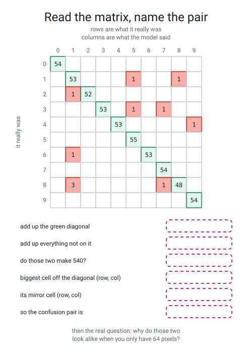
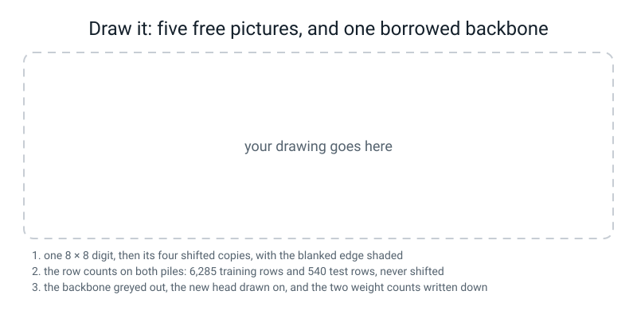

# Workbook — Week 27: Term 3 Checkpoint — See It

**Name:** ________________________________  **Date:** ______________

[⬅ Week 26](week-26.md) · [📖 Read the chapter first](../student-guide/week-27.md) · [Course Home](../README.md) · [Next ➡](week-28.md)

---

## ✅ Warm-Up (5 min)

Five quick questions about **last week**.

**W1.** `nn.Conv2d(8, 16, 3)`. **How many learnable numbers, and show the arithmetic.**

`8 × 3 × 3 × ____ = ` ______ , plus ______ biases, so ______

**W2.** `nn.Linear(64, 10)` is the last layer. **Ten what come out of it?** And name one thing they are definitely not.

________________________________________________________________

**W3.** A fresh ten-class network has learned nothing. **What should its first printed loss be, and where does that number come from?**

**loss ≈** ______  **because** ______________________________

**W4.** You run `logits.argmax(dim=0)` on 540 pictures. **How many answers come out, and is that what you wanted?**

**answers:** ______  **wanted:** ______  **and did it error?** ______

**W5.** Your model scored `0.9796`. **Why report `529 of 540` beside it rather than just the ratio?**

________________________________________________________________

---

## 🔢 Do the Maths by Hand

**There is no new maths this week**, so this page uses **counting, subtracting two accuracies, and reading a grid** — plus **last week's parameter arithmetic**. **Calculator only. No code on this page.**

**M1 — how many points did augmentation buy?** Plain scored `0.9796` on 540 held-out rows. Blanked-edge augmentation scored `0.9926` on the same 540.

**The subtraction:** `0.9926 − 0.9796 = ` ______  **which is** ______ **accuracy points**

**Now in digits.** `0.9796 × 540 = ` ______   `0.9926 × 540 = ` ______

**So augmentation read** ______ **more digits correctly.**

**And the wrapped version scored `0.9796` too. In digits, how many more did it read?** ______

**Write the one-sentence conclusion, with both numbers in it:**

________________________________________________________________

**M2 — how many weights may move?** The network holds `80 + 1168 + 650 = 1898`. Fill in every row.

| What is frozen | frozen count | the subtraction | movable |
|---|---:|---|---:|
| nothing | 0 | 1898 − 0 | ______ |
| conv1 only | ______ | 1898 − ______ | ______ |
| conv1 and conv2 | ______ | 1898 − ______ | ______ |
| everything | ______ | 1898 − ______ | ______ |

**Which of those four rows makes `torch.optim.Adam` refuse to start, and what does it say?**

________________________________________________________________

**And the check to make every time:** `frozen + movable` must equal ______ .

**M3 — does the matrix add up?** Here is the plain CNN's confusion matrix on its 540 held-out rows.

```text
[[54  0  0  0  0  0  0  0  0  0]
 [ 0 53  0  0  0  1  0  0  1  0]
 [ 0  1 52  0  0  0  0  0  0  0]
 [ 0  0  0 53  0  1  0  1  0  0]
 [ 0  0  0  0 53  0  0  0  0  1]
 [ 0  0  0  0  0 55  0  0  0  0]
 [ 0  1  0  0  0  0 53  0  0  0]
 [ 0  0  0  0  0  0  0 54  0  0]
 [ 0  3  0  0  0  0  0  1 48  0]
 [ 0  0  0  0  0  0  0  0  0 54]]
```

**Add up the diagonal.** Write out all ten and their total:

`54 + 53 + 52 + 53 + 53 + 55 + 53 + 54 + 48 + 54 = ` ______

**Add up everything off the diagonal.** There are nine non-zero cells. List them and total them:

________________________________________________________________  **total** ______

**Do the two add to 540?** ______ + ______ = ______

**Now the worst pair.** Row 8 column 1 holds ______ and row 1 column 8 holds ______ , so together ______ .

**Is there any other pair that adds to more than that?** ______  **Which pair comes second?** ____________

**M4 — which subtractions am I allowed to do?** Here are the four rows with their piles.

| row | held-out pile | test accuracy |
|---|---|---:|
| 1 plain | 540 all-digit rows | 0.9796 |
| 2 augmented | 540 all-digit rows | 0.9926 |
| 3 frozen-transfer | 269 rows of 5–9 | 0.9257 |
| 4 fine-tuned | 269 rows of 5–9 | 0.9665 |

For each pair, write **the subtraction and the word FAIR**, or **NOT ALLOWED and one reason**:

**rows 1 and 2:** ______________________________________________

**rows 3 and 4:** ______________________________________________

**rows 2 and 4:** ______________________________________________

**rows 1 and 3:** ______________________________________________

**Why is 269 rows of five classes an *easier* exam than 540 rows of ten?**

________________________________________________________________

---

## 🔎 Predict the Output

**Write your prediction in pen before you run anything.** Every snippet starts with `import numpy as np` or `import torch`, and any seed that matters is set.

### P1 — the wrap, on five numbers

```python
a = np.array([1, 2, 3, 4, 5])
print(np.roll(a, 1))
print(np.roll(a, -1))
print(np.roll(a, 2))
print(np.roll(a, 5))
```

**I predict:**

1: ______________  2: ______________  3: ______________  4: ______________

**It really printed:**

```text
________________________________________________________________
________________________________________________________________
________________________________________________________________
________________________________________________________________
```

**Line 4 shifted by 5 on a list of 5. What came out, and why?**

________________________________________________________________

**Did anything ever get thrown away?** ______  **So where did the numbers that fell off go?**

________________________________________________________________

### P2 — blanking the wrong axis

```python
stack = np.zeros((4, 3, 3))
stack[:, 1, 1] = 9.0
out = np.roll(stack, 1, axis=1).copy()
out[0, :, :] = 0.0
print("ink per picture:", out.sum(axis=(1, 2)))
out2 = np.roll(stack, 1, axis=1).copy()
out2[:, 0, :] = 0.0
print("ink per picture:", out2.sum(axis=(1, 2)))
```

**I predict — line 1:** [ ____ ____ ____ ____ ]   **line 2:** [ ____ ____ ____ ____ ]

**It really printed:**

```text
________________________________________________________________
________________________________________________________________
```

**`out[0, :, :] = 0.0` and `out[:, 0, :] = 0.0` differ by where one comma sits. Say what each one blanks:**

`out[0, :, :]` blanks ______________________________________________

`out[:, 0, :]` blanks ______________________________________________

**Neither of them errored. So what number told you which one was wrong?**

________________________________________________________________

### P3 — gluing copies

```python
a = torch.zeros(1257, 1, 8, 8)
y = torch.zeros(1257, dtype=torch.long)
print(tuple(torch.cat([a] * 5).shape))
print(tuple(torch.cat([y] * 5).shape))
print(tuple(torch.cat([a, a], dim=1).shape))
```

**I predict — line 1:** ( ____ , ____ , ____ , ____ )  **line 2:** ( ____ , )  **line 3:** ( ____ , ____ , ____ , ____ )

**It really printed:**

```text
________________________________________________________________
________________________________________________________________
________________________________________________________________
```

**Line 3 used `dim=1`. What did it glue along, and what would that mean if these were real pictures?**

________________________________________________________________

**Which of the three lines is the one you want when you augment?** ____________

**And the check you make out loud every time:**

________________________________________________________________

### P4 — freezing, and counting

```python
torch.manual_seed(0)
m = nn.Sequential(nn.Conv2d(1, 8, 3, padding=1), nn.ReLU(), nn.MaxPool2d(2),
                  nn.Conv2d(8, 16, 3, padding=1), nn.ReLU(), nn.MaxPool2d(2),
                  nn.Flatten(), nn.Linear(64, 10))
print(sum(p.numel() for p in m.parameters() if p.requires_grad))
for p in m[3].parameters():
    p.requires_grad = False
print(sum(p.numel() for p in m.parameters() if p.requires_grad))
print(len([p for p in m.parameters() if p.requires_grad]))
```

**I predict — line 1:** ______  **line 2:** ______  **line 3:** ______

**It really printed:**

______ , ______ and ______

**`m[3]` is which layer, and how many numbers did freezing it lock?** ____________ , ______

**Line 3 counted blocks, not numbers. Which four blocks are still movable?**

________________________________________________________________

**How many of the answers on this page did you get right?** ______ / 14

**Which one surprised you most, and why?**

________________________________________________________________

---

## ✍️ Practice Set A — Read It

This set is for practising reading terms, tables, matrices and code before you write any of your own.

**A1. Match the word to the thing.** Write the letter.

| Word | | Description |
|---|---|---|
| **data augmentation** | ______ | (i) Unfreezing the borrowed layers so they can adjust too |
| **transfer learning** | ______ | (ii) The conv layers, which turn a picture into features |
| **freezing** | ______ | (iii) Extra training rows made by changes that keep the label true |
| **backbone** | ______ | (iv) Two classes the model mixes up in both directions |
| **fine-tuning** | ______ | (v) Keep the part that learned to see; retrain only the part that answers |
| **confusion pair** | ______ | (vi) Telling PyTorch a block of weights may not change |

**A2. Trace the movable weight count.** The network is `conv1 (80) → conv2 (1168) → head (650)`, total 1,898.

| What you froze | movable weights | seconds (from the chapter) | test accuracy |
|---|---:|---:|---:|
| both convs | ______ | ______ | ______ |
| conv1 only | ______ | ______ | ______ |
| nothing (fine-tuned) | ______ | ______ | ______ |
| from scratch, no borrowing | ______ | ______ | ______ |

**Which row won on accuracy?** ____________

**Which row won on speed?** ____________

**Write the trade in one sentence, with two numbers in it:**

________________________________________________________________

**A3. Spot the bug — and there is no error message at all.**

```python
shifts = [(0, 0), (-1, 0), (1, 0), (0, -1), (0, 1)]
X_aug = torch.cat([t4(np.roll(np.roll(X_train, dr, axis=0), dc, axis=1))
                   for dr, dc in shifts])
y_aug = torch.cat([ytr] * 5)
```

It trains happily and prints:

```text
train 0.5968   test 0.8574
```

**Something about those two numbers is impossible. What?**

________________________________________________________________

**Which two axis numbers are wrong, and what should they be?** ______ and ______ → ______ and ______

**On a stack shaped `(1257, 8, 8)`, what does `axis=0` actually mean?**

________________________________________________________________

**Why did the training accuracy come out so much lower than the test accuracy? Say what fraction of the training rows were unlearnable and why:**

________________________________________________________________

**Write the permanent alarm as one sentence:**

________________________________________________________________

**A4. Match the code to the error.** Write the letter.

| Code | | Error |
|---|---|---|
| `m[7] = nn.Linear(64, 5)` before `load_state_dict` | ______ | (i) `expected Tensor as element 1 in argument 0, but got numpy.ndarray` |
| `for p in model.parameters(): p.requires_grad = False` | ______ | (ii) `Found input variables with inconsistent numbers of samples: [540, 269]` |
| `torch.cat([tensor, numpy_array])` | ______ | (iii) `size mismatch for 7.weight: ... torch.Size([10, 64]) ... torch.Size([5, 64])` |
| `from_predictions(y_test, pred_from_5to9_model)` | ______ | (iv) `Tensors must have same number of dimensions: got 4 and 3` |
| `torch.cat` on a mix of `(n,1,8,8)` and `(n,8,8)` | ______ | (v) `optimizer got an empty parameter list` |

**A5. Read a five-class confusion matrix.** This is the **frozen-transfer** model on its 269 held-out rows of digits 5 to 9.

```text
          said 5  6  7  8  9
really 5:       50   1   0   3   1
really 6:        0  52   0   2   0
really 7:        3   0  51   0   0
really 8:        0   1   2  45   4
really 9:        0   0   2   1  51
```

**Add up the diagonal:** ______   **Add up everything off it:** ______   **Do they make 269?** ______

**How many mistakes is that, out of 269?** ______  **What accuracy is that?** ____________

**Now find the worst pair.** Check the four candidates:

8 & 9: ______ + ______ = ______   6 & 8: ______ + ______ = ______

5 & 8: ______ + ______ = ______   5 & 7: ______ + ______ = ______

**The worst pair is** ______ **and** ______ **, with** ______ **mistakes.**

**The plain ten-class model's worst pair was 1 and 8. This model's is different. Give one reason why that is not surprising:**

________________________________________________________________

**A6. Label the diagram.** Fill in all six boxes **in pen**, from the ten-class matrix printed on the figure itself.


*Figure W27.1 — Read the matrix, then name the pair.*

**And then the question the figure ends on. Write two or three sentences, and make at least one of them about what 64 pixels can and cannot show:**

________________________________________________________________

________________________________________________________________

________________________________________________________________

---

## ✍️ Practice Set B — Write It

This set is for writing short programs and recording what they print. Each task says what the output should look like and how you will know you are done.

### B1 — one line

Print `np.roll` of the list `[1, 2, 3, 4, 5]` shifted by `1`, by `−1`, and by `5`.

**Expected output:** three lists of the same five numbers in different orders, and one of them identical to the original.

**Done looks like:** you can say which one is identical and why.

**Your line(s):**

```python
________________________________________________________________
```

**Which shift gave the original back?** ______  **Why?** ______________________

### B2 — the shift function, and proof that the blanking does something

Build a stack of **three** 6×6 pictures, each with a bar of `1.0` across the **bottom row** (columns 1 to 4). Write the `shift(stack, dr, dc)` function from the chapter. Then print the **ink per picture** for the original, the plain `np.roll` version, and the blanked version. Then print row 0 of picture 0 in all three.

**Expected output:** three ink lines and three row-0 lines, and one of the ink lines is a surprise.

**Done looks like:** you can explain the surprising ink line rather than assuming you broke something.

**My three ink lines:**

original ______________  wrapped ______________  blanked ______________

**The blanked version's ink is not what most people predict. What happened, and why is it a real cost of augmentation rather than a bug?**

________________________________________________________________

________________________________________________________________

**Now add these two lines and write down what they print:**

```python
print(np.shares_memory(stack, np.roll(stack, 1, axis=1)))
print(np.shares_memory(stack, stack[1:]))
```

______________ and ______________

**So is `.copy()` strictly necessary in `shift`? Answer honestly, then say why you would keep it anyway:**

________________________________________________________________

### B3 — build the augmented set, and check it

Glue five copies of the 1,257 training pictures — no shift, up 1, down 1, left 1, right 1 — into one tensor, and glue five copies of the labels. Print both shapes and prove they match.

**Expected output:** `(6285, 1, 8, 8)` and `(6285,)`, and the test tensor still `(540, 1, 8, 8)`.

**Done looks like:** you printed **both** lengths and said the multiplication out loud.

**My two shapes:** ______________________ and ______________________

**`1257 × 5 = ` ** ______   **do the two match?** ______

**Why must the labels be glued in the same order, and what happens if they are not?**

________________________________________________________________

### B4 — freeze, and count three ways

Train a network on digits 0–4, save its `state_dict`, then build three copies of it with a fresh head and **freeze both convs / conv1 only / nothing**. For each one print the movable weight count, then train on digits 5–9 and print the test accuracy on the 269 held-out rows of 5–9.

**Expected output:** three rows, with movable counts of `650`, `1818` and `1898`.

**Done looks like:** you predicted the middle row's accuracy before running it, and the ordering makes sense to you.

**My prediction for `freeze conv1 only`, before running:** between ______ and ______

**My three rows:**

| what I froze | movable | seconds | test accuracy | of 269 |
|---|---:|---:|---:|---:|
| both convs | ______ | ______ | ______ | ______ |
| conv1 only | ______ | ______ | ______ | ______ |
| nothing | ______ | ______ | ______ | ______ |

**One sentence on the pattern:**

________________________________________________________________

### B5 — the confusion matrix and the diagnosis, about 25 lines

Take the **plain** CNN, predict on all 540 held-out rows, and print: the ten-by-ten confusion matrix, the mistake total, every off-diagonal cell ranked, the worst pair, and the **ink per column of the average 1 and the average 8.** Save `confusion.png`.

**Expected output:** the matrix, `mistakes in total: 11 out of 540`, nine ranked mistakes, `worst pair: 1 and 8, with 4 mistakes between them`, and two rows of eight numbers.

**Done looks like:** you did the addition check, and you can say what the two ink rows have in common.

**My addition check:** ______ + ______ = ______

**My worst pair:** ______ and ______ , with ______ mistakes

**The two ink rows:**

average 1: ______________________________________________

average 8: ______________________________________________

**Which columns do both of them pile their ink into?** ____________

---

## 🐞 Fix the Broken Program

This is supposed to build an augmented training set and train on it for 20 epochs. **It has three bugs, and they fire in a fixed order: one type error, one runtime error, and one that says nothing at all.**

```python
"""broken27.py - three bugs. The third one has no message at all."""
import numpy as np
import torch
import torch.nn as nn
from sklearn.datasets import load_digits
from sklearn.model_selection import train_test_split
from torch.utils.data import DataLoader, TensorDataset

np.random.seed(0)
digits = load_digits()
X_train, X_test, y_train, y_test = train_test_split(
    digits.images / 16.0, digits.target, test_size=0.30, random_state=0,
    stratify=digits.target)
Xtr = torch.from_numpy(X_train).float().unsqueeze(1)
Xte = torch.from_numpy(X_test).float().unsqueeze(1)
ytr = torch.from_numpy(y_train).long()
yte = torch.from_numpy(y_test).long()

shifts = [(0, 0), (-1, 0), (1, 0), (0, -1), (0, 1)]
copies = [np.roll(np.roll(X_train, dr, axis=0), dc, axis=1)
          for dr, dc in shifts]
X_aug = torch.cat(copies)
y_aug = torch.cat([ytr] * 5)
print("augmented:", tuple(X_aug.shape), tuple(y_aug.shape))

torch.manual_seed(0)
model = nn.Sequential(
    nn.Conv2d(1, 8, 3, padding=1), nn.ReLU(), nn.MaxPool2d(2),
    nn.Conv2d(8, 16, 3, padding=1), nn.ReLU(), nn.MaxPool2d(2),
    nn.Flatten(), nn.Linear(64, 10))
for p in model.parameters():
    p.requires_grad = False

loader = DataLoader(TensorDataset(X_aug, y_aug), batch_size=32, shuffle=True)
loss_fn = nn.CrossEntropyLoss()
opt = torch.optim.Adam([p for p in model.parameters() if p.requires_grad],
                       lr=1e-3)
for _ in range(20):
    model.train()
    for xb, yb in loader:
        opt.zero_grad()
        loss_fn(model(xb), yb).backward()
        opt.step()
model.eval()
with torch.no_grad():
    tr = (model(X_aug).argmax(1) == y_aug).float().mean().item()
    te = (model(Xte).argmax(1) == yte).float().mean().item()
print("train %.4f   test %.4f" % (tr, te))
```

**The first time you run it, the last line says:**

```text
TypeError: expected Tensor as element 0 in argument 0, but got numpy.ndarray
```

**Bug 1 — the type error.** Which line, and what two method calls are missing?

**line:** ____________  **fix:** ____________________________

**Run it again. The new last line:**

________________________________________________________________

**Bug 2 — the runtime error.** Which two lines caused it together, and what did you actually ask for?

________________________________________________________________

**What is the fix?** ____________________________

**Run it a third time. Now it works. Write what it printed:**

```text
augmented: ______________________ ______________
train ____________   test ____________
```

**Bug 3 — the silent one.** The program runs and prints two plausible numbers, and one of them is impossible.

**Which number is impossible, and why?**

________________________________________________________________

**Which line caused it?** ____________________________

**What is the fix?** ____________ → ____________ and ____________ → ____________

**Fix it and run a fourth time. Fill in both columns:**

| | bug 3 still in | all three fixed |
|---|---:|---:|
| train accuracy | ____________ | ____________ |
| test accuracy | ____________ | ____________ |

**And the one-line alarm, written where you will see it again:**

________________________________________________________________

---

## 🧩 Puzzle of the Week

### Which Changes Keep the Label True?

Augmentation only works while the change you make **does not change the label**. Here are eight changes. For each one, decide **in pen** whether the label survives, for the two kinds of data named. (For the cat column, answer "yes" only if the label survives **and** the result is a picture a camera could really take.)

| The change | still the same **digit**? | still a **cat photo** you might really meet, with the right label? |
|---|---|---|
| shift one pixel left | ______ | ______ |
| shift one pixel left, wrapping | ______ | ______ |
| flip left-to-right | ______ | ______ |
| flip top-to-bottom | ______ | ______ |
| turn a quarter turn | ______ | ______ |
| turn upside down | ______ | ______ |
| make it 20% brighter | ______ | ______ |
| swap two pixels chosen at random | ______ | ______ |

**Part 1 — two of the eight are safe for digits and two are unsafe for cats.** Name them:

**safe for digits:** ______________________________________________

**unsafe for cats:** ______________________________________________

**Part 2 — the interesting row.** *"Turn upside down"* keeps the label true for a cat photo (an upside-down cat is still a cat, though nobody takes such photos, so it is unrealistic rather than label-breaking) and it is a **disaster** for digits, and there is one specific pair of digits that makes it a disaster.

**Which pair?** ______ and ______

**Part 3 — check it with real data.** Take a real 6 out of `load_digits`, turn it upside down with `six[::-1, ::-1]`, and print it beside a real 9.

**Write the ink-per-row of each:**

upside-down 6: ______________________________________________

a real 9:      ______________________________________________

**Do they look like the same digit to you?** ______

**Part 4 — and now the design lesson.** There is no universal list of safe augmentations. Write down, in one sentence each, what makes a change safe for:

**handwritten digits:** ______________________________________________

**photos of animals:** ______________________________________________

**photos of road signs with writing on them:** ______________________________

**Part 5 — the honest question.** Somebody offers you a library with a function called `augment(images)` that applies "the usual set" of changes. **What is the first thing you ask them?**

________________________________________________________________

---

## 🤔 Think Deeper

These two questions are for thinking about what this week's results mean. Write a paragraph for each.

**T1.** Two of this week's experiments produced results a textbook would not have promised. Wrapped augmentation bought **+0.00** points from five times the data in our seed-0 run. Transfer learning came out **5.6 points worse** than starting from nothing. **Write a paragraph** about what you would have learned instead if both experiments had worked. Is a technique whose price you have measured more useful than one you believe in? And what would you now do differently if you read a paper that only reported the runs that worked?

________________________________________________________________

________________________________________________________________

________________________________________________________________

________________________________________________________________

________________________________________________________________

**T2.** The 1/8 confusion pair has a cause you cannot fix with any amount of training: at 8×8 an 8's loops are three pixels tall and cannot hold a hole. A hand-designed feature that counted enclosed regions in the picture would separate the two instantly, and somebody could have written it in 1985. **Write a paragraph** about what it means that a forty-year-old hand-designed feature beats a modern CNN on one specific pair, while the CNN wins overall and needed nobody to think of hole-counting. Which of those two facts belongs in a report, and would you ever build a system that used both?

________________________________________________________________

________________________________________________________________

________________________________________________________________

________________________________________________________________

________________________________________________________________

---

## 🛠️ Build It — The See It Table, the Diagnosis, and the Reflection

**The three predictions go in pen, before anything runs. That is the whole reason this is an experiment.**

### Step checklist

- [ ] **1.** Page 27.2, in pen: **will wrapped augmentation beat plain? will blanked? which of frozen / fine-tuned / scratch wins?**
- [ ] **2.** New file, `see_it.py`. Load the digits, split 70/30 with `random_state=0, stratify=y`, build the `t4` helper.
- [ ] **3.** Print `np.roll` on one picture and **show that row 0 of the rolled copy equals row 7 of the original.**
- [ ] **4.** Write `shift(stack, dr, dc)` with the four blanking lines and the `.copy()`.
- [ ] **5.** Build `X_wrap`, `X_aug` and `y_aug`. **Print both lengths and check `1257 × 5 = 6285`.**
- [ ] **6.** Train three networks — plain, wrapped, blanked — with `torch.manual_seed(0)` **before every one**.
- [ ] **7.** Print the two "bought" lines.
- [ ] **8.** Train stage 1 on digits 0–4 only. **Report its accuracy and say why you cannot compare it to last week's.**
- [ ] **9.** Save the backbone with `.clone()`. Then **load first, swap the head second**, and freeze `[0]` and `[3]`.
- [ ] **10.** **Print the movable count. It must say 650.**
- [ ] **11.** Run frozen, fine-tuned **and from scratch.** All three.
- [ ] **12.** Build the confusion matrix on the plain model, do the addition check, and find the pair.
- [ ] **13.** Print the ink per column of the average 1 and the average 8.
- [ ] **14.** Fill in the table below **with the pile on every row.**

### The See It results table

| row | **held-out pile** | weights trained | seconds | test accuracy | test correct |
|---|---|---:|---:|---:|---|
| plain | | | | | ______ of ______ |
| augmented | | | | | ______ of ______ |
| frozen-transfer | | | | | ______ of ______ |
| fine-tuned | | | | | ______ of ______ |

> **⚠️ Watch out:** the held-out pile goes on **every single row**, not in a footnote and not once at the top. A table without it lets a reader compare two rows that cannot be compared — and you will not be there to stop them.

**Which two comparisons in my table are fair?**

________________________________________________________________

________________________________________________________________

**Which comparison must I never make, and why?**

________________________________________________________________

________________________________________________________________

**And one thing worth noticing: the four rows the table asks for cannot actually justify anything about transfer learning on their own. What fifth row is missing, and what is its number?**

**row:** ______________________  **number:** ______

### Diagnose the worst confusion pair

**The counts, both directions:**

row ______ , column ______ = ______  (real ______ s called ______ )

row ______ , column ______ = ______  (real ______ s called ______ )

**total** ______ **of the** ______ **mistakes**

**The ink per column, from the average pictures:**

average ______ : ______________________________________________

average ______ : ______________________________________________

**Which columns do both pile their ink into?** ____________

**Now the diagnosis. Write three or four sentences. At least one must be about what 64 pixels can and cannot show, and at least one must explain why the confusion is lopsided rather than even.**

________________________________________________________________

________________________________________________________________

________________________________________________________________

________________________________________________________________

**And the fix. Name one that addresses the CAUSE, and one that would only address the symptom:**

**cause:** ______________________________________________

**symptom:** ______________________________________________

> **⚠️ Watch out:** *"the model confused 1 and 8 four times out of eleven"* is a **location**, not a diagnosis. It restates the number. This page is marked on whether you said something a person could act on.

### The Term 3 reflection

Six lines, Weeks 20 to 26. **Each line: what you can do now that you could not do in Week 19, and ONE NUMBER that proves it.**

**W20 — the machine that does the slopes:**

________________________________________________________________

**W21 — the five-line loop:**

________________________________________________________________

**W22 — layers, losses, and watching it overfit:**

________________________________________________________________

**W23 — the same brain, real framework:**

________________________________________________________________

**W24 and W25 — the picture, and the shapes:**

________________________________________________________________

**W26 — a network that reads digits:**

________________________________________________________________

> **⚠️ Watch out:** a line without a number in it is a feeling. *"I learned about convolution"* comes back. *"I can work out a conv layer's output size on paper: 8 becomes 8 with padding 1, and 4 without"* does not.

---

## 🎨 Draw It

Draw the two ideas of this week side by side, with the counts on them.


*Figure W27.2 — One digit becoming five, and one backbone being borrowed.*

**What a good answer looks like:** on the left, **one 8×8 digit and its four shifted copies**, with the blanked row or column **shaded a different colour on each copy** so you can see which edge was sacrificed, and `1,257 × 5 = 6,285` written under the group. Then, clearly separated, **540 test rows drawn as one untouched block** with the words *"never shifted"* on it. On the right, **two conv blocks drawn greyed out and labelled `frozen — 1,248`**, feeding a **new head labelled `650 movable`**, with `1,248 + 650 = 1,898` written underneath.

**And the two things that earn the marks:** an arrow from the frozen backbone to a small box holding **`0.9257`** and another to a box holding **`0.9814 from scratch`**, so the control is on the drawing and not just in your head. And somewhere on the augmented side, **the accuracy pair `0.9796 → 0.9926`** with `+1.30 points` beside it (seed 0).

**My blanked edges, one per copy:** ______ ______ ______ ______

**My two weight counts:** ______ frozen, ______ movable, total ______

**The number I put in the control box:** ______

**One sentence on why the control box has to be on the drawing:**

________________________________________________________________

---

## 📊 Self-Check

This page is for marking how sure you feel about each skill from this week. Tick one face per row.

| I can... | 😀 | 🙂 | 😕 |
|---|---|---|---|
| say what `np.roll` does to the ink that falls off an edge | | | |
| write the four blanking lines and say which edge each one clears | | | |
| say which axis is which on a stack of pictures, without guessing | | | |
| spot "test beats train" and name it as a labelling bug immediately | | | |
| say why the test set is never augmented, with both reasons | | | |
| freeze a backbone and **prove** it with the movable count | | | |
| say the condition transfer learning needs, and show the arithmetic that it failed here | | | |
| ask "compared to what?" before judging any single accuracy | | | |
| add a confusion matrix up three ways and check the total | | | |
| find a confusion pair by adding the two cells facing across the diagonal | | | |
| diagnose a confusion pair **physically**, not by restating the count | | | |
| write a results table with the held-out pile on every row | | | |

**The one thing I would ask about if I could ask one question:**

________________________________________________________________

---

## ✅ Answers

This is the end of the workbook. Finish your own answers in pen first, then open the box below to check them.

<details>
<summary>Check your answers</summary>

### Warm-Up

**W1.** `8 × 3 × 3 × 16 = 1,152`, plus **16** biases (one per filter), so **1,168**. A total of 1,152 is the missing-biases error.

**W2.** **Ten logits** — raw, unsquashed scores, one per digit. **They are definitely not probabilities:** one of ours is `−10.94`, and they do not add up to 1.

**W3.** **About 2.30**, because a model that has learned nothing spreads its confidence evenly over ten options, giving each one a chance of 0.1, and the loss is `−ln(0.1) = 2.3026`. Ours printed `2.2796`.

**W4.** **Ten answers**, and no, you wanted 540 — one per picture. **It did not error.** `dim=0` runs down each column, across all 540 pictures for one digit, and answers a question nobody asked. **Count the answers.**

**W5.** Because `0.9796` looks precise to four decimal places and it is not. **One more correct answer takes it to 0.9815**, so the fourth decimal place is noise. `529 of 540` invites the correct question, which is *"how much would one more move it?"*

### Do the Maths by Hand

**M1.** `0.9926 − 0.9796 = 0.0130`, which is **1.30 accuracy points**.

In digits: `0.9796 × 540 = 529.0`, and `0.9926 × 540 = 536.0`. **So augmentation read 7 more digits correctly.**

**The wrapped version read 0 more** — it scored exactly `0.9796` too, the identical 529 of 540.

**The conclusion:** *"Blanking the rolled-off edge turned five times the training data from worth nothing into worth 7 more digits out of 540, which is +1.30 accuracy points in our seed-0 run (other seeds varied, and part of the gain may be the extra training steps)."*

**M2.**

| What is frozen | frozen count | the subtraction | movable |
|---|---:|---|---:|
| nothing | 0 | 1898 − 0 | **1898** |
| conv1 only | **80** | 1898 − 80 | **1818** |
| conv1 and conv2 | **1248** | 1898 − 1248 | **650** |
| everything | **1898** | 1898 − 1898 | **0** |

**The last row makes Adam refuse**, with `ValueError: optimizer got an empty parameter list`. **And notice that is a gift** — the opposite mistake, freezing nothing when you meant to freeze, produces no error at all.

**The check: `frozen + movable` must equal 1,898.**

**M3.** The diagonal: `54 + 53 + 52 + 53 + 53 + 55 + 53 + 54 + 48 + 54 = ` **529**.

The nine off-diagonal cells: row 1 col 5 = 1, row 1 col 8 = 1, row 2 col 1 = 1, row 3 col 5 = 1, row 3 col 7 = 1, row 4 col 9 = 1, row 6 col 1 = 1, row 8 col 1 = **3**, row 8 col 7 = 1. **Total 11.**

**`529 + 11 = 540`** ✅ — the number of held-out rows.

**The worst pair:** row 8 column 1 holds **3** and row 1 column 8 holds **1**, so together **4**.

**No other pair comes close.** Every other off-diagonal cell is a 1 and no two of them face each other across the diagonal, so **every other pair totals 1.** *(1 & 5 totals 1, because row 1 col 5 is 1 and row 5 col 1 is 0. Same for 2 & 1, 3 & 5, 3 & 7, 4 & 9, 6 & 1 and 8 & 7.)* **So there is a clear worst pair and then a seven-way tie for second, which is exactly what "one pair out of 45 causes a third of all the errors" means.**

**M4.**

**Rows 1 and 2:** `0.9926 − 0.9796 = +0.0130`. **FAIR** — same 540 rows, same ten classes, one thing changed.

**Rows 3 and 4:** `0.9665 − 0.9257 = +0.0408`. **FAIR** — same 269 rows, same five classes, one thing changed.

**Rows 2 and 4:** **NOT ALLOWED.** 540 all-digit rows against 269 rows of five classes. Two different exams.

**Rows 1 and 3:** **NOT ALLOWED**, for exactly the same reason.

**Why 269 rows of five classes is an easier exam:** because there are fewer wrong answers available. **A model guessing at random scores 20% on five classes and 10% on ten.** And on top of that, the 1/8 pair that caused a third of the ten-class model's errors cannot happen in a 5–9 problem, because there is no 1 in it. **Fewer ways to be wrong means a higher score for the same amount of skill.**

### Predict the Output

**P1.**

```text
[5 1 2 3 4]
[2 3 4 5 1]
[4 5 1 2 3]
[1 2 3 4 5]
```

**Line 4 gave the original back**, because shifting a list of 5 by 5 sends every number all the way round and back to where it started.

**Nothing ever got thrown away.** The numbers that fell off one end came back on the other. **That is exactly the behaviour that ruins an augmented digit**, and it is why `np.roll` is a general array function rather than an image function: for the things it was designed for — rotating a queue, cycling a buffer, shifting a signal — wrapping is precisely what you want.

**P2.**

```text
ink per picture: [0. 9. 9. 9.]
ink per picture: [9. 9. 9. 9.]
```

**`out[0, :, :]` blanks picture 0 entirely** — every row, every column, of the first picture in the stack. Its ink went to 0.

**`out[:, 0, :]` blanks row 0 of every picture** — which is what you want after rolling down. All four kept their ink, because the single bright pixel started at row 1 and rolled to row 2, so nothing was in row 0 to lose.

**Neither errored.** And the number that told you which was wrong is **the ink per picture**: a zero in that list means a whole picture has been wiped out, and the label for it still says whatever it said.

**P3.**

```text
(6285, 1, 8, 8)
(6285,)
(1257, 2, 8, 8)
```

**Line 3 glued along `dim=1`, which is the channel dimension.** If these were real pictures it would mean *"one picture with two channels"* rather than *"two pictures"* — so 1,257 two-channel pictures instead of 2,514 one-channel ones. **The batch count did not change, which is the giveaway.**

**Line 1 is the one you want when you augment**, together with line 2 for the labels.

**The check:** *"as many labels as pictures — 6,285 and 6,285, and `1257 × 5 = 6285`."*

**P4.**

```text
1898
730
4
```

**`m[3]` is the second conv layer**, `nn.Conv2d(8, 16, 3, padding=1)`, and freezing it locked **1,168** numbers. `1898 − 1168 = 730`.

**Line 3 counted blocks.** Four are still movable: **conv1's `weight` and `bias`, and the linear's `weight` and `bias`.** The two frozen blocks are conv2's weight and bias.

*(If you predicted `650` for line 2, you froze the wrong layer in your head — `m[0]` is conv1 and `m[3]` is conv2. Freezing **both** gives 650.)*

### Practice Set A

**A1.** data augmentation (iii) · transfer learning (v) · freezing (vi) · backbone (ii) · fine-tuning (i) · confusion pair (iv)

**A2.**

| What you froze | movable weights | seconds | test accuracy |
|---|---:|---:|---:|
| both convs | **650** | **0.2** | **0.9257** |
| conv1 only | **1818** | **0.6** | **0.9517** |
| nothing (fine-tuned) | **1898** | **1.1** | **0.9665** |
| from scratch, no borrowing | **1898** | **1.1** | **0.9814** |

**From scratch won on accuracy in this run** — 0.9814, which is 264 of 269. **Freezing both convs won on speed** — 0.2 seconds.

**The trade in one sentence:** *"Freezing both convs trained 650 weights instead of 1,898 in 0.2 seconds instead of 1.1, and it cost 5.6 accuracy points against the from-scratch control."*

**A3.** **The impossible thing is that the test accuracy (0.8574) is higher than the training accuracy (0.5968).** A model has *seen* its training data, so it normally does at least as well on it.

**`axis=0` and `axis=1` are wrong; they should be `axis=1` and `axis=2`.**

**On a stack shaped `(1257, 8, 8)`, `axis=0` means which picture.** Rolling it shuffles the *pictures* while the labels stay exactly where they are.

**Two fifths of the training rows were unlearnable.** The `shifts` list has five entries. With the wrong axes, `(-1, 0)` and `(1, 0)` roll the *stack* (axis 0), so those two copies are pictures paired with somebody else's label. `(0, 0)` shifts nothing and `(0, -1)`, `(0, 1)` roll each picture's rows, so **three fifths of the rows still have the right label**. The model cannot fit the scrambled two fifths, so training accuracy lands near 0.6 (it printed 0.5968), while the untouched test set scores much higher.

**The permanent alarm:** *"If my test accuracy is higher than my training accuracy, my training labels are the first thing to check. It is very rarely a lucky run."*

**A4.** head swapped first → **(iii)** · everything frozen → **(v)** · `torch.cat` with a numpy array → **(i)** · predictions from the 5-to-9 model against all ten classes → **(ii)** · mixing `(n,1,8,8)` and `(n,8,8)` → **(iv)**

**A5.** Diagonal: `50 + 52 + 51 + 45 + 51 = ` **249**. Off-diagonal: `1 + 3 + 1 + 2 + 3 + 1 + 2 + 4 + 2 + 1 = ` **20**. **249 + 20 = 269** ✅

**20 mistakes out of 269**, which is `249 ÷ 269 = ` **0.9257** — the frozen-transfer row of the results table.

The four candidates, read carefully off the grid:

```text
8 & 9:  row 8 said 9 = 4,  row 9 said 8 = 1   ->  5
6 & 8:  row 6 said 8 = 2,  row 8 said 6 = 1   ->  3
5 & 8:  row 5 said 8 = 3,  row 8 said 5 = 0   ->  3
5 & 7:  row 5 said 7 = 0,  row 7 said 5 = 3   ->  3
```

**Watch the direction on the last two.** 5 & 8 gets its 3 from the *5 → 8* cell and 5 & 7 gets its 3 from the *7 → 5* cell — opposite directions, same total. **A pair sum does not tell you which way round the confusion goes; you have to read both cells.**

**The worst pair is 8 and 9, with 5 mistakes.**

**Why a different pair is not surprising:** because **1 is not in this problem at all.** This model only ever sees digits 5 to 9, so the 1/8 pair cannot appear. **The worst pair is always relative to the classes you asked about**, which is one more reason a results table has to name the pile. *(And 8 versus 9 has the same flavour of cause: at 8×8 an 8's lower loop and a 9's tail both come out as ink in the bottom middle.)*

**A6.** The six boxes are:

| | answer |
|---|---|
| add up the green diagonal | **529** |
| add up everything not on it | **11** |
| do those two make 540? | **yes: 529 + 11 = 540** |
| biggest cell off the diagonal (row, col) | **row 8, column 1, holding 3** |
| its mirror cell (row, col) | **row 1, column 8, holding 1** |
| so the confusion pair is | **1 and 8, with 4 of the 11 mistakes** |

**And the diagnosis — a full-marks answer:**

> *"At 8×8 an 8 is two loops stacked, so each loop gets about three pixels of height and four of width. **A hole needs a ring of ink around a gap, and three pixels is not enough to have both.** So the loops fill in with grey and what survives is a bright vertical stroke down the middle columns — which is exactly what a 1 is. You can see it in the average pictures: the average 1 carries ink per column of `0 5 42 93 106 56 9 2` and the average 8 carries `0 9 71 87 86 66 11 0`, and **both pile their ink into columns 2 to 5 and both peak in the middle.** And the direction makes sense: an 8 can lose its holes and become a bar, but a bar cannot grow holes, so the confusion should be lopsided — and it is, three against one."*

### Practice Set B

**B1.**

```python
import numpy as np
a = np.array([1, 2, 3, 4, 5])
print(np.roll(a, 1))
print(np.roll(a, -1))
print(np.roll(a, 5))
```

```text
[5 1 2 3 4]
[2 3 4 5 1]
[1 2 3 4 5]
```

**Shifting by 5 gave the original back**, because there are five numbers and everything went all the way round.

**B2.**

```python
"""b2.py - the shift function, and proof that the blanking does something."""
import numpy as np

np.random.seed(0)

stack = np.zeros((3, 6, 6))
stack[:, 5, 1:5] = 1.0          # a bar on the very bottom row of all three


def shift(s, dr, dc):
    out = np.roll(np.roll(s, dr, axis=1), dc, axis=2).copy()
    if dr == 1:
        out[:, 0, :] = 0.0
    if dr == -1:
        out[:, -1, :] = 0.0
    if dc == 1:
        out[:, :, 0] = 0.0
    if dc == -1:
        out[:, :, -1] = 0.0
    return out


wrapped = np.roll(stack, 1, axis=1)
blanked = shift(stack, 1, 0)
print("original ink per picture:", stack.sum(axis=(1, 2)))
print("wrapped  ink per picture:", wrapped.sum(axis=(1, 2)))
print("blanked  ink per picture:", blanked.sum(axis=(1, 2)))
print()
print("original row 0:", stack[0, 0].astype(int))
print("wrapped  row 0:", wrapped[0, 0].astype(int), " <- the bar teleported")
print("blanked  row 0:", blanked[0, 0].astype(int), " <- gone, as it should be")
print()
print("np.shares_memory(stack, np.roll(stack, 1, axis=1)) :",
      np.shares_memory(stack, np.roll(stack, 1, axis=1)))
print("np.shares_memory(stack, stack[1:])                 :",
      np.shares_memory(stack, stack[1:]))
```

```text
original ink per picture: [4. 4. 4.]
wrapped  ink per picture: [4. 4. 4.]
blanked  ink per picture: [0. 0. 0.]

original row 0: [0 0 0 0 0 0]
wrapped  row 0: [0 1 1 1 1 0]  <- the bar teleported
blanked  row 0: [0 0 0 0 0 0]  <- gone, as it should be

np.shares_memory(stack, np.roll(stack, 1, axis=1)) : False
np.shares_memory(stack, stack[1:])                 : True
```

**The blanked ink is ZERO, and that is not a bug.** The whole picture was one bar sitting on the **bottom row**. Rolling down by one sent that row all the way round to row 0; blanking row 0 then deleted it. **There was nothing else in the picture, so the blanked copy is empty.**

**Why that is a real cost rather than a bug:** every shift **sacrifices one row or column of the picture** in exchange for a label you can trust, and if the thing you care about lives on that edge, you lose it. On a real digit the ink is mostly in the middle so you lose almost nothing — which is why one-pixel shifts help. **On a two-pixel shift you throw away a quarter of an 8×8 picture, and that is why two-pixel shifts usually hurt.**

**`np.shares_memory`: `False` for `np.roll`, `True` for `stack[1:]`.**

**So no, `.copy()` is not strictly necessary here** — on this version of numpy `np.roll` already hands back a fresh array, and you have just proved it. **Keep it anyway**, because `stack[1:]` and `stack.T` **do** hand back views of the original, blanking a view would quietly corrupt your real training data, and `.copy()` costs nothing and means you never have to remember which numpy functions do which.

**B3.**

```text
augmented train tensor: (6285, 1, 8, 8) = 1257 x 5
test tensor: still (540, 1, 8, 8) - never shifted
```

`1257 × 5 = ` **6285**, and both the pictures and the labels are 6,285 long, so **yes, they match.**

**The labels must be glued in the same order because row 3,000 of the pictures and row 3,000 of the labels have to be the same digit.** If they are not, the model trains on pictures paired with the wrong answers — and **nothing errors.** It just produces the impossible test-above-train pattern, or worse, a plausible-looking mediocre number.

**B4.**

```text
freeze both convs   movable  650   0.2s  test 0.9257  (249 of 269)
freeze conv1 only   movable 1818   0.6s  test 0.9517  (256 of 269)
freeze nothing      movable 1898   1.1s  test 0.9665  (260 of 269)
```

**A good prediction for the middle row was "between 0.9257 and 0.9665"** — and it landed at **0.9517**, almost exactly halfway.

**The counts are three subtractions:** `1898 − 1248 = 650`, `1898 − 80 = 1818`, `1898 − 0 = 1898`.

**The pattern:** *"The less you freeze, the better it does and the slower it is — 249, 256 then 260 digits out of 269, and 0.2, 0.6 then 1.1 seconds. In this seed-0 run every weight you let move bought accuracy; freezing everything was lowest in all five seeds we re-ran, but the order of the other two rows is not stable across seeds. Digits 5 to 9 probably need different filters from 0 to 4."*

**B5.** The complete program is 💻 Type This, Step 7, in the chapter. The real output:

```text
ten-class confusion matrix, plain CNN, 540 test rows:
[[54  0  0  0  0  0  0  0  0  0]
 [ 0 53  0  0  0  1  0  0  1  0]
 [ 0  1 52  0  0  0  0  0  0  0]
 [ 0  0  0 53  0  1  0  1  0  0]
 [ 0  0  0  0 53  0  0  0  0  1]
 [ 0  0  0  0  0 55  0  0  0  0]
 [ 0  1  0  0  0  0 53  0  0  0]
 [ 0  0  0  0  0  0  0 54  0  0]
 [ 0  3  0  0  0  0  0  1 48  0]
 [ 0  0  0  0  0  0  0  0  0 54]]

every mistake it made (count, true -> predicted):
  3   8 -> 1
  1   8 -> 7
  1   6 -> 1
  1   4 -> 9
  1   3 -> 7
  1   3 -> 5
  1   2 -> 1
  1   1 -> 8
  1   1 -> 5
mistakes in total: 11 out of 540
worst pair: 1 and 8, with 4 mistakes between them
saved confusion.png

--- why 1 and 8 collide at 8x8 ---
average 1, ink per column: [  0   5  42  93 106  56   9   2]
average 8, ink per column: [ 0  9 71 87 86 66 11  0]
```

**The addition check: `529 + 11 = 540`.**

**The worst pair: 1 and 8, with 4 mistakes.**

**Both pile their ink into columns 2 to 5**, and both peak in the middle — the 1 at 106 in column 4, the 8 at 87 and 86 in columns 3 and 4. **The 8 has a bit more ink out in columns 2 and 5 (71 and 66 against 42 and 56), but the gaps of 29 and 10 are sums over 8 pixels on a 0-16 scale, so about 3.6 and 1.3 grey levels per pixel, small next to the bright bar in the middle.**

### Fix the Broken Program

**Bug 1 — the `copies` list comprehension.** It builds numpy arrays and hands them straight to `torch.cat`, which only glues tensors. **Fix: `torch.from_numpy(...).float().unsqueeze(1)` on each copy** — or, better, put every copy through the same `t4()` helper so they cannot be wrong in different ways.

**Run it again and the new last line is:**

```text
ValueError: optimizer got an empty parameter list
```

**Bug 2 — two lines together:** `for p in model.parameters(): p.requires_grad = False` froze **everything**, and then `[p for p in model.parameters() if p.requires_grad]` correctly found **nothing**. **You asked the optimiser to train zero weights.**

**The fix: delete the freezing loop entirely** (this program is not doing transfer learning), or freeze the conv layers only and check with `sum(p.numel() for p in model.parameters() if p.requires_grad)`.

**Run it a third time and it works:**

```text
augmented: (6285, 1, 8, 8) (6285,)
train 0.5938   test 0.8889
```

**Bug 3 — the silent one. `train 0.5938` and `test 0.8889`: the test accuracy is HIGHER than the training accuracy, which is impossible.**

**The line is `np.roll(np.roll(X_train, dr, axis=0), dc, axis=1)`.** On a stack shaped `(1257, 8, 8)`, `axis=0` is *which picture*, so the pictures got shuffled while the labels stayed put.

**The fix: `axis=0` → `axis=1` and `axis=1` → `axis=2`.**

**Run a fourth time:**

| | bug 3 still in | all three fixed |
|---|---:|---:|
| train accuracy | **0.5938** | **0.9548** |
| test accuracy | **0.8889** | **0.9759** |

*(Twenty epochs, not forty, so the fixed numbers are lower than the chapter's 0.9926. Train for 40 and the augmentation gets its full value.)*

**The alarm:** *"Test accuracy above training accuracy means the training labels are wrong. Stop everything and check how the labels were paired."*

### Puzzle of the Week

| The change | still the same **digit**? | still a **cat photo** you might really meet, with the right label? |
|---|---|---|
| shift one pixel left | **yes** | **yes** |
| shift one pixel left, wrapping | **no** | **usually yes** |
| flip left-to-right | **no** | **yes** |
| flip top-to-bottom | **no** | **no** (label true, picture unrealistic) |
| turn a quarter turn | **no** | **no** (label true, picture unrealistic) |
| turn upside down | **no** | **no** (label true, picture unrealistic) |
| make it 20% brighter | **yes** | **yes** |
| swap two pixels chosen at random | **yes** (usually) | **yes** (usually) |

**Part 1. Safe for digits: shifting one pixel, and changing the brightness.** *(Small random pixel swaps are also broadly safe on a digit — they are just noise — but they do not teach the model anything useful either.)*

**Unsafe for cats: flipping top-to-bottom, and turning a quarter turn.** The label survives in all three (a flipped or rotated cat is still a cat); they are unsafe because they are unrealistic, not because they are mislabelled. A cat rotated 90° is a thing you will essentially never photograph, so training on it teaches the model about pictures that do not exist. *(The wrapping row is the interesting exception: on a big photo with a dark border, wrapping usually does nothing visible at all.)*

**Part 2. The pair is 6 and 9.** Turn a 6 upside down and you have a 9. **The change did not just make the picture odd — it turned it into a picture of a different, real class, with the old label attached.** That is the worst possible kind of augmentation error, because the model is being actively taught that 9s are 6s. *(2 and 5 are a milder version of the same thing.)*

**Part 3.**

```python
"""puzzle27.py - which changes keep the label true?"""
import numpy as np
from sklearn.datasets import load_digits

np.random.seed(0)
digits = load_digits()
six = digits.images[digits.target == 6][0].astype(int)
print("a real 6 from the dataset:")
print(six)
print()
print("the same 6 turned upside down (rot 180 = flip both ways):")
print(six[::-1, ::-1])
print()
nine = digits.images[digits.target == 9][0].astype(int)
print("and a real 9 from the dataset, for comparison:")
print(nine)
print()
print("ink per row, the upside-down 6:", six[::-1, ::-1].sum(axis=1).astype(int))
print("ink per row, the real 9      :", nine.sum(axis=1).astype(int))
```

```text
a real 6 from the dataset:
[[ 0  0  0 12 13  0  0  0]
 [ 0  0  5 16  8  0  0  0]
 [ 0  0 13 16  3  0  0  0]
 [ 0  0 14 13  0  0  0  0]
 [ 0  0 15 12  7  2  0  0]
 [ 0  0 13 16 13 16  3  0]
 [ 0  0  7 16 11 15  8  0]
 [ 0  0  1  9 15 11  3  0]]

the same 6 turned upside down (rot 180 = flip both ways):
[[ 0  3 11 15  9  1  0  0]
 [ 0  8 15 11 16  7  0  0]
 [ 0  3 16 13 16 13  0  0]
 [ 0  0  2  7 12 15  0  0]
 [ 0  0  0  0 13 14  0  0]
 [ 0  0  0  3 16 13  0  0]
 [ 0  0  0  8 16  5  0  0]
 [ 0  0  0 13 12  0  0  0]]

and a real 9 from the dataset, for comparison:
[[ 0  0 11 12  0  0  0  0]
 [ 0  2 16 16 16 13  0  0]
 [ 0  3 16 12 10 14  0  0]
 [ 0  1 16  1 12 15  0  0]
 [ 0  0 13 16  9 15  2  0]
 [ 0  0  0  3  0  9 11  0]
 [ 0  0  0  0  9 15  4  0]
 [ 0  0  9 12 13  3  0  0]]
```

```text
ink per row, the upside-down 6: [39 57 61 36 27 32 29 25]
ink per row, the real 9      : [23 63 55 45 55 23 28 37]
```

**Look at the two grids side by side: the upside-down 6 has a loop across the top rows and a tail running down and to the right — which is exactly the shape of the real 9.** The ink-per-row profiles are close too: both are heaviest in rows 1 and 2 and thin out towards the bottom. **You would not confidently call the upside-down 6 a 6.**

**Part 4.**

**Handwritten digits:** *a change is safe if it is something a different person's handwriting could plausibly have done — so shifting, small brightness changes and small amounts of noise are fine, and anything that reflects or rotates the picture is not, because writing has a fixed orientation.*

**Photos of animals:** *a change is safe if it is something a different camera or a different day could plausibly have produced — so left-right flips, brightness, small crops and small rotations are fine, and anything that makes a picture nobody would ever take (upside down, 90° turns) is not, unless your real photos really do arrive at random angles.*

**Photos of road signs with writing on them:** *almost nothing that moves the pixels around is safe, because a mirrored or rotated word is not a word. Brightness, contrast, blur and weather-like noise are safe; every reflection and rotation is not.*

**Part 5.** **The first thing you ask is: "which changes does it apply, and what kind of data were they chosen for?"**

Because "the usual set" is not a thing. A library written for photographs will happily flip your digits left-to-right, and it will do it silently, and you may get a result like the **+0.00** you measured this week — five times the data and no benefit — while wondering what you did wrong. **A second good question: "does it augment the test set too?"** If the answer is anything other than an immediate no, do not use it.

### Think Deeper

**T1 — a strong answer covers three things.**

**What you would have learned instead.** If both experiments had worked, you would have learned two techniques and one habit: *do this, it helps.* What you actually learned is **the condition each technique needs** — augmentation needs the label to stay true, transfer learning needs the source to know far more than the target — plus the two checks that revealed the failures: the *training* accuracy falling when data was added, and the from-scratch control.

**Why a measured price beats a belief.** A technique with a known price can be planned around. You now know that a frozen backbone costs about 5.6 points and buys a fifth of the training time on a problem where the source and target are the same size — so on a problem where you have fifty pictures and somebody's million-picture backbone, you can *predict* which way the trade goes and why. **A belief gives you no way to predict anything.**

**What you would do differently reading a paper.** Look for the control. Look for the denominators. Look for whether every reported comparison is on the same held-out pile. **And notice what is absent:** a paper that reports four configurations, all of which improved on the baseline, has almost certainly run more than four.

**T2 — a strong answer covers three things.**

**What the 1985 feature has and the CNN does not.** A hole-counter encodes something a human knows about digits: an 8 has two enclosed regions, a 1 has none. **That knowledge is free and exact, and no amount of data is needed to acquire it** — but somebody had to think of it, and somebody had to think of a separate feature for every other distinction, and that is why hand-designed vision systems stopped scaling.

**What the CNN has and the hole-counter does not.** It found edge detectors on its own from 1,257 pictures, it gets 529 of 540 across all ten digits, and **nobody had to think of anything.** Point it at a completely different problem and it will find whatever that problem needs. The hole-counter will not.

**Both belong in a report, and they belong in different sections.** The overall accuracy with its denominator goes in the results. **The 1/8 pair, its cause, and the observation that a simple hand-designed feature would fix it goes in the limitations** — because that is exactly the sentence that lets the next person improve the system. **And yes, you would build one that used both:** feeding a hole count in alongside the learned features is a completely normal and sensible thing to do, and the reason people often do not is that on big datasets the network usually finds an equivalent feature anyway. **At 8×8 it demonstrably has not.**

### Build It

**The See It results table — the real numbers:**

| row | held-out pile | weights trained | seconds | test accuracy | test correct |
|---|---|---:|---:|---:|---|
| plain | **540 all-digit rows** | 1,898 | 2.4 | 0.9796 | **529 of 540** |
| augmented | **540 all-digit rows** | 1,898 | 11.3 | **0.9926** | **536 of 540** |
| frozen-transfer | **269 rows of 5–9** | 650 | 0.2 | 0.9257 | **249 of 269** |
| fine-tuned | **269 rows of 5–9** | 1,898 | 1.1 | 0.9665 | **260 of 269** |

**The two fair comparisons:**

> **Rows 1 and 2:** `0.9926 − 0.9796 = +0.0130`, or seven more digits out of the **same 540**, and the only thing that changed was the training data.
>
> **Rows 3 and 4:** `0.9665 − 0.9257 = +0.0408`, or eleven more digits out of the **same 269**, and the only thing that changed was whether the conv layers were allowed to move.

**The comparison you must never make:** row 2 against row 3 or row 4. **They are measured on different held-out piles** — 540 digits across ten classes against 269 digits across five — and five classes is an easier problem than ten. **Printing 0.9926 next to 0.9665 makes it look like a 2.6-point difference and it is not a difference at all.**

**The missing fifth row is the from-scratch control: `scratch on 5-9`, 269 rows of 5–9, 1,898 weights, 1.1 seconds, `0.9814` — 264 of 269.**

**And that matters, because the four rows as listed cannot justify anything about transfer learning.** Without the control, `0.9257` is a number and not a result. **Noticing that the assignment as written is missing a row is the best thing you can do on this page.**

**Diagnose the worst confusion pair:**

```text
row 8, column 1 = 3      three real 8s were called 1
row 1, column 8 = 1      one real 1 was called 8
                 ---
                  4      of the 11 mistakes in total
```

```text
average 1, ink per column: [  0   5  42  93 106  56   9   2]
average 8, ink per column: [  0   9  71  87  86  66  11   0]
```

**Both pile their ink into columns 2 to 5.**

**A full-marks diagnosis:**

> *"The pair is 1 and 8, with 4 of the 11 mistakes, and it leans one way: three 8s called 1 against one 1 called 8.*
>
> *At 8×8 an 8 is two loops stacked on top of each other, so each loop gets about three pixels of height and four of width. **A hole needs a ring of ink around a gap, and three pixels is not enough to have both.** So the loops fill in with grey, and what survives is a bright vertical stroke down the middle columns — which is exactly what a 1 is.*
>
> *You can see it in the average pictures. The average 1's ink per column is `0 5 42 93 106 56 9 2` and the average 8's is `0 9 71 87 86 66 11 0`. **Both pile their ink into columns 2 to 5 and both peak in the middle.** The 8 has a bit more ink out in columns 2 and 5 — 71 and 66 against 42 and 56 — but the gaps of 29 and 10 are sums over 8 pixels on a 0-16 scale, so about 3.6 and 1.3 grey levels per pixel, small next to the bright bar in the middle.*
>
> *The direction makes sense too. **An 8 can lose its holes and turn into a bar. A bar cannot grow holes.** The information loss only goes one way, so the confusion should be lopsided, and it is: three against one."*

**The fixes:**

**Addresses the cause: more pixels.** At 16×16 an 8's loops have room to be holes. Or a completely different kind of feature — **count the enclosed regions in the picture**, which is what a hand-designed system in 1985 would have done and which would separate these two instantly.

**Addresses only the symptom: train longer on 1s and 8s**, or add extra shifted copies of just those two classes. It would probably move those four mistakes. **And then you must check what it broke**, because you have just changed the balance of the whole training set. **No amount of extra training makes 64 pixels contain information they do not contain.**

**The Term 3 reflection — a full-marks set:**

> **W20.** *"I can get a slope out of PyTorch instead of computing it. `w.grad` gave me the same number — 42 — that I got by hand in Week 18 by measuring stage by stage."*
>
> **W21.** *"I can write the training loop from memory. Five lines, and 6 hand-typed hours-vs-marks points get a straight line through them in about 400 steps."*
>
> **W22.** *"I can count a network's parameters before building it, and spot overfitting on a graph. `2 → 16 → 1` is 65 numbers, and I watched the validation loss turn upward while the training loss kept falling."*
>
> **W23.** *"I can write my own `nn.Module` and feed it batches. 1,257 digits at 32 at a time is 40 steps per epoch, which I worked out three different ways."*
>
> **W24 and W25.** *"I can work out every shape in a stack on paper before running it. An 8 stays an 8 with padding 1 and drops to 6 without, and `16 × 2 × 2 = 64` is the number that goes in my `Linear` layer."*
>
> **W26.** *"I can train a CNN and look at what it learned. 1,898 weights, 529 of 540 held-out digits, about three seconds — and filter 6 answers +2.830 to a bright-left edge, so it taught itself to be an edge detector."*

**One number per line, six lines, six numbers. And your own numbers beat this file's** — a Week 26 line that says "527 of 540, five seconds" means you actually ran it.

### Draw It

**The four blanked edges, one per copy:** shifted **up** → blank the **bottom** row · shifted **down** → blank the **top** row · shifted **left** → blank the **right** column · shifted **right** → blank the **left** column. *(And the fifth copy, the unshifted one, blanks nothing.)*

**The two weight counts: 1,248 frozen, 650 movable, total 1,898.**

**The number in the control box: 0.9814.**

**Why the control box has to be on the drawing:** *"Because 0.9257 on its own is a number and not a result. With 0.9814 next to it, the drawing says what borrowing cost as well as what it bought — and anybody looking at it can see that the technique lost, which is the honest thing for the picture to say."*

**What separates a good drawing from a great one:** the great one has the **540 test rows drawn as a separate, untouched block with "never shifted" written on it** — because the single most important rule of the whole week is invisible unless you draw it, and a drawing that shows five augmented piles and no test pile is a drawing of a mistake waiting to happen.

### Self-Check answers

There are no right answers to a self-check, but three of the rows are the ones that predict the capstone in Weeks 34 to 36.

**"ask 'compared to what?' before judging any single accuracy"** — if that is a 😕, cover the `scratch on 5-9` row of the table with your hand and read the remaining numbers. `0.9257` and `0.9665` look like a story about freezing. **They are not a story about anything until the control is on the page.**

**"write a results table with the held-out pile on every row"** — if that is a 😕, this is the single most transferable habit in Term 3 and it takes ten extra seconds per table. **Do it once more, properly, on Build It.**

**"diagnose a confusion pair physically, not by restating the count"** — if that is a 😕, draw an 8 inside an 8×8 grid on squared paper and try to fit two holes in it. **You cannot**, and that is the whole diagnosis, discovered rather than read.

</details>
