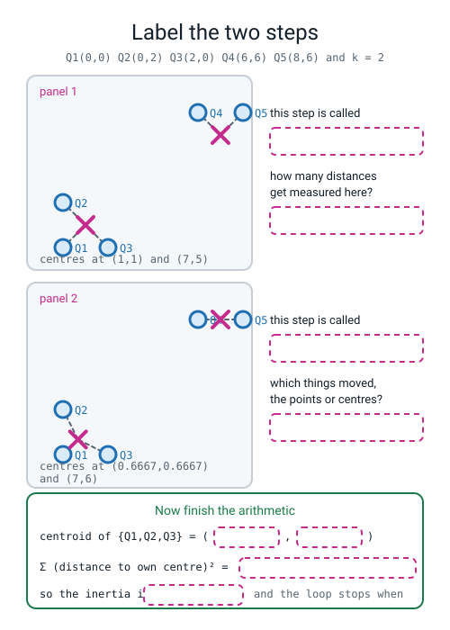
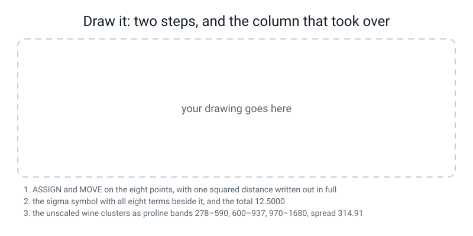

# Workbook — Week 28: Sorting With No Answer Key

**Name:** ________________________________  **Date:** ______________

[⬅ Week 27](week-27.md) · [📖 Read the chapter first](../student-guide/week-28.md) · [Course Home](../README.md) · [Next ➡](week-29.md)

---

## ✅ Warm-Up (5 min)

Five quick questions about **last week**.

**W1.** `np.roll(stack, 1, axis=1)` shifts every picture **down** by one row. **Where does the bottom row of ink end up, and which single line clears the mess?**

the bottom row reappears at ______________________  the line that clears it: ______________________

**W2.** You augmented 1,257 training digits into 6,285. **Give the two reasons the 540 test digits were never touched.**

reason 1: ________________________________________________________

reason 2: ________________________________________________________

**W3.** The network held `conv1 = 80`, `conv2 = 1168`, `head = 650`. You froze both convs. **Fill in all three numbers.**

frozen ______  movable ______  total ______

**W4.** A run printed `train 0.5968   test 0.8574`. **One of those two numbers proves there is a bug. Which, and what kind of bug?**

________________________________________________________________

**W5.** Borrowing a frozen backbone scored `0.9257`. Training the identical network from scratch scored `0.9814`. **What did the control tell you, in one sentence?**

________________________________________________________________

---

## 🔢 Do the Maths by Hand

**This week's new maths is one symbol: `Σ`, which means "add up all of these."** These four exercises are **calculator only. No code on this page.** You will check three of them against Python later, and they must agree.

---

**M1 — inertia on five points, with the sigma written out.**

Five points, `k = 2`, already converged:

```
Q1 = (0, 0)    Q2 = (0, 2)    Q3 = (2, 0)        Q4 = (6, 6)    Q5 = (8, 6)
```

The two clusters are **{Q1, Q2, Q3}** and **{Q4, Q5}**.

**(a) The two centroids.** A centroid is the average position of what the cluster holds.

```
centre 1 = ( (0 + 0 + 2) ÷ 3 , (0 + 2 + 0) ÷ 3 ) = ( ________ , ________ )

centre 2 = ( (6 + 8) ÷ 2 , (6 + 6) ÷ 2 )         = ( ________ , ________ )
```

**(b) One squared distance per point, to its OWN centre.** Across-gap squared, plus up-gap squared. Four decimal places.

| point | across gap, squared | up gap, squared | total |
|---|---|---|---|
| Q1 (0,0) | ________ | ________ | ________ |
| Q2 (0,2) | ________ | ________ | ________ |
| Q3 (2,0) | ________ | ________ | ________ |
| Q4 (6,6) | ________ | ________ | ________ |
| Q5 (8,6) | ________ | ________ | ________ |

**(c) Now the symbol, and the sum beside it. Both, every time.**

```
Σ (distance to my own centre)²  =  ____ + ____ + ____ + ____ + ____

                                =  ____________
```

> **⚠️ Watch out:** if you write the symbol and then write a total with nothing in between, this question scores zero. **The sum written out IS the answer.**

---

**M2 — the MOVE step, twice.**

A centre received four points: `(1, 5)`, `(3, 9)`, `(4, 2)`, `(8, 8)`. **Where does it move to?**

```
across : ( 1 + 3 + 4 + 8 ) ÷ ____ = ____ ÷ ____ = ________
up     : ( 5 + 9 + 2 + 8 ) ÷ ____ = ____ ÷ ____ = ________
```

A second centre received three points: `(10, 1)`, `(12, 4)`, `(14, 1)`.

```
across : ________          up : ________
```

**And one sentence: the first centre received a point at (8, 8), a long way from the other three. What did that do to where the centre landed?**

________________________________________________________________

---

**M3 — the drop column, and the ratio that names the elbow.**

Here is a **real** inertia table from 150 generated points. **The inertia column is given. You fill in the drops.**

| k | inertia | drop from the row above |
|---:|---:|---:|
| 1 | 1501.3 | — |
| 2 | 681.2 | ________ |
| 3 | 391.6 | ________ |
| 4 | 247.5 | ________ |
| 5 | 215.4 | ________ |
| 6 | 190.5 | ________ |
| 7 | 167.0 | ________ |
| 8 | 146.5 | ________ |

**(a) The biggest collapse in the drop column is between which two rows?** ______ and ______

**(b) The ratio, as a division:** ________ ÷ ________ = ________

**(c) So the elbow is at k = ________**

**(d) And the trap. Which `k` in that table has the smallest inertia, and why is that not the answer?**

________________________________________________________________

---

**M4 — the ruler decides, not the algorithm.**

Three pizza deliveries. Two columns: **distance in km**, and **minutes to arrive**.

```
P = (1, 20)        Q = (1.5, 100)        R = (5, 25)
```

**(a) Raw squared distances.** Across-gap squared plus up-gap squared, on the numbers exactly as written.

```
d(P,Q)² = ( 1 − 1.5 )² + ( 20 − 100 )²  =  ________ + ________ = ____________

d(P,R)² = ( 1 − 5 )²   + ( 20 − 25 )²   =  ________ + ________ = ____________
```

**On the raw numbers, which pair does k-means think is more alike?** ______  **How many times more alike?** ________ ÷ ________ = ________

**(b) Now standardise each column.** Subtract the column mean, divide by the column spread. Use these, which are what `StandardScaler` uses:

```
km column    : mean = 2.5      spread = 1.7795
minutes      : mean = 48.3333  spread = 36.5908
```

| | km, standardised | minutes, standardised |
|---|---|---|
| P | (1 − 2.5) ÷ 1.7795 = ________ | (20 − 48.3333) ÷ 36.5908 = ________ |
| Q | ________ | ________ |
| R | ________ | ________ |

**(c) The two squared distances again, on the standardised numbers.**

```
d(P,Q)² = ________ + ________ = ________

d(P,R)² = ________ + ________ = ________
```

**(d) The answer flipped. Write the one sentence that says which column was doing all the deciding on the raw numbers, and why.**

________________________________________________________________

---

## 🔎 Predict the Output

**Write your prediction in pen BEFORE you run anything.** A wrong prediction with a reason attached is worth more than a blank box.

### P1 — built, but never switched on

```python
import numpy as np
from sklearn.cluster import KMeans
np.random.seed(0)
X = np.array([[0., 0.], [0., 2.], [2., 0.], [6., 6.], [8., 6.]])
km = KMeans(n_clusters=2, n_init=10, random_state=0)
print(km.cluster_centers_)
```

**My prediction:** ________________________________________________

**What it really printed:** ________________________________________

**Why:** ________________________________________________________

---

### P2 — two shapes and a count

```python
import numpy as np
from sklearn.cluster import KMeans
np.random.seed(0)
X = np.array([[0., 0.], [0., 2.], [2., 0.], [6., 6.], [8., 6.]])
km = KMeans(n_clusters=2, n_init=10, random_state=0).fit(X)
print(km.labels_.shape)
print(km.cluster_centers_.shape)
print(np.bincount(km.labels_))
```

**My three predictions:**

line 1 ____________  line 2 ____________  line 3 ____________

**The truth:**

line 1 ____________  line 2 ____________  line 3 ____________

**Where do the two numbers in line 2 come from?** ______________________

---

### P3 — the same clustering, twice

```python
import numpy as np
from sklearn.cluster import KMeans
np.random.seed(0)
X = np.array([[0., 0.], [0., 2.], [2., 0.], [6., 6.], [8., 6.]])
a = KMeans(n_clusters=2, init=np.array([[0., 0.], [6., 6.]]), n_init=1, random_state=0).fit(X)
b = KMeans(n_clusters=2, init=np.array([[6., 6.], [0., 0.]]), n_init=1, random_state=0).fit(X)
print("a:", a.labels_, round(a.inertia_, 4))
print("b:", b.labels_, round(b.inertia_, 4))
print("same grouping?", (a.labels_ == b.labels_).all())
```

**My prediction for the last line:** ______________

**The truth:** ______________

**And the important bit — are the two groupings actually different?** ______________  **Explain:**

________________________________________________________________

---

### P4 — asking for almost as many groups as you have things

```python
import numpy as np
from sklearn.cluster import KMeans
np.random.seed(0)
X = np.array([[0., 0.], [0., 2.], [2., 0.], [6., 6.], [8., 6.]])
for k in (4, 5):
    km = KMeans(n_clusters=k, n_init=10, random_state=0).fit(X)
    print("k =", k, " inertia =", round(km.inertia_, 4), " sizes =", np.bincount(km.labels_))
```

**My predictions:**

k = 4 → inertia ________ sizes ________    k = 5 → inertia ________ sizes ________

**The truth:**

k = 4 → inertia ________ sizes ________    k = 5 → inertia ________ sizes ________

**One sentence on why the `k = 5` inertia is a perfect score and a useless one:**

________________________________________________________________

---

## ✍️ Practice Set A — Read It

**A1. Match the word to the thing.** Write the letter.

| Word | | Description |
|---|---|---|
| **unsupervised learning** | ______ | (i) Plot inertia against `k` and look for the bend. A hint, never a verdict |
| **cluster** | ______ | (ii) The average position of everything currently in a group |
| **centroid** | ______ | (iii) Finding structure in a table with no answer column, so no score exists |
| **inertia (WCSS)** | ______ | (iv) A smarter way of choosing the starting centres, spreading them out |
| **k-means++** | ______ | (v) A group of points more like each other than like anything outside it |
| **elbow method** | ______ | (vi) Add up the squared distance from every point to its own centre |

**A2. Read the evidence, not the sizes.** Here is a real printout from the 178 wines.

```text
UNSCALED sizes [69 47 62]  inertia 2370689.7
SCALED   sizes [65 51 62]  inertia 1277.9

unscaled cluster 0: n= 69  proline  278 to  590   alcohol 11.03 to 14.13
unscaled cluster 1: n= 47  proline  970 to 1680   alcohol 12.85 to 14.83
unscaled cluster 2: n= 62  proline  600 to  937   alcohol 11.45 to 14.34
```

**(a) The two size lists look reassuringly similar. Why are cluster sizes the WRONG evidence here?**

________________________________________________________________

**(b) Read the three proline ranges out loud. What do you notice?** ______________________

**(c) Read the three alcohol ranges. What do you notice?** ______________________

**(d) The inertia went from 2,370,689.7 to 1,277.9. Did the clustering get about 1,850 times better? Yes / No, and why:**

________________________________________________________________

**A3. Match the broken line to its message.** Three snippets, three real messages. Write the letter.

```python
(1)  km = KMeans(n_clusters=2, n_init=10, random_state=0)
     print(km.labels_)

(2)  KMeans(n_clusters=2, n_init=10, random_state=0).fit(np.array([1., 2., 3., 8., 9., 7.]))

(3)  KMeans(n_clusters=8, n_init=10, random_state=0).fit(X)     # X has 6 rows
```

| | Message |
|---|---|
| (a) | `ValueError: n_samples=6 should be >= n_clusters=8.` |
| (b) | `AttributeError: 'KMeans' object has no attribute 'labels_'` |
| (c) | `ValueError: Expected 2D array, got 1D array instead:` |

`(1)` → ______   `(2)` → ______   `(3)` → ______

**And the one-word rule that catches (1) every time it happens:** ______________________

**A4. Label the diagram.** Fill in every dashed box.


*Figure W28.1 — Label the two steps.*

**A5. The counter that is one off.** You counted **2** rounds by hand. `km.n_iter_` printed **3**.

**Who is right?** ______________  **What is the third round?** ______________________

**And the other trailing-underscore rule, in your own words:**

________________________________________________________________

**A6. Spot the bug — and there is no error message at all.**

```python
Xs = StandardScaler().fit_transform(X_raw)
km = KMeans(n_clusters=3, n_init=10, random_state=0).fit(X_raw)
print("sizes:", np.bincount(km.labels_), "inertia %.1f" % km.inertia_)
```

It runs happily and prints `sizes: [69 47 62] inertia 2370689.7`.

**(a) What is wrong?** ______________________________________________

**(b) Name the printout you would ask for to PROVE it.**

________________________________________________________________

---

## ✍️ Practice Set B — Write It

### B1 — one line

Print how many wines landed in each of three clusters, on the **scaled** table.

**Expected output shape:** three whole numbers in square brackets, adding to 178.
**Done looks like:** `[65 51 62]`

### B2 — the eight-point trace, run the way you did it by hand

Eight points: `P1=(1,1)`, `P2=(2,1)`, `P3=(1,3)`, `P4=(3,2)`, `P5=(7,6)`, `P6=(8,8)`, `P7=(9,7)`, `P8=(8,5)`. Starting centres `C1=(1,1)` and `C2=(3,2)`.

Print the table's shape, the labels, the centres, the inertia to four decimals, the round count, and the sizes.

**Done looks like:** the centres it prints are the same two pairs you got with a pen. If they are not, one of you made an arithmetic slip, and it is usually a squaring.

> **⚠️ Watch out:** you need `init=...`. Leave it out and sklearn starts from its own smarter guesses, and your trace will not match your page. (`n_init=1` says so out loud; with explicit centres sklearn runs once anyway but warns if you leave `n_init` at 10.)

### B3 — inertia, one term at a time

For the same eight points, print **one line per point** showing the two squared gaps and their total, then the sigma written out with all eight terms, then the total, then `km.inertia_`, then whether they match.

**Done looks like:** the last line prints `True`.

### B4 — the drop column and the ratio

Build a 150-row, 2-column table with `make_blobs(n_samples=150, centers=4, random_state=0)`. Print `k`, inertia and the drop for `k = 1` to `8`. Then print the biggest-collapse ratio as a division, and the `k` you would report.

**Done looks like:** a ratio bigger than 4 printed as an actual division, and the `k` written down as one integer.

### B5 — the scaling experiment, about 25 lines

On `load_wine()`:

1. print the table shape,
2. print the **widest**, **next widest** and **narrowest** column with their spreads,
3. print the ratio widest ÷ narrowest, **and that ratio squared**, because distance squares the gaps,
4. cluster at `k = 3` **twice** — raw and standardised — and print both size lists and both inertias,
5. for **both** runs, print each cluster's `proline` range and `flavanoids` range.

**Done looks like:** three non-overlapping proline bands in the unscaled block, and three heavily overlapping ones in the scaled block. **That contrast is the whole answer**, and you can point at it.

---

## 🐞 Fix the Broken Program

This is supposed to cluster the wines and check whether scaling mattered. **It has three bugs, and they fire in a fixed order: one shape error, one runtime error, and one that says nothing at all.**

```python
"""broken28.py - three bugs. The third one prints no message at all."""
import numpy as np
import pandas as pd
from sklearn.cluster import KMeans
from sklearn.datasets import load_wine
from sklearn.preprocessing import StandardScaler

np.random.seed(0)

pts = np.array([[1., 2.], [2., 1.], [2., 3.],
                [8., 8.], [9., 7.], [7., 9.]])
across = pts[:, 0]
print("warm-up on the six points:", across.shape)
warm = KMeans(n_clusters=2, n_init=10, random_state=0).fit(across)
print("warm-up labels:", warm.labels_)

wine = load_wine()
X_raw = pd.DataFrame(wine.data, columns=wine.feature_names)
Xs = StandardScaler().fit_transform(X_raw)
km = KMeans(n_clusters=3, n_init=10, random_state=0)
print("cluster sizes:", np.bincount(km.labels_))

km3 = KMeans(n_clusters=3, n_init=10, random_state=0).fit(X_raw)
print("inertia: %.1f" % km3.inertia_)
pro = X_raw["proline"].values
for c in range(3):
    m = km3.labels_ == c
    print("cluster %d: n=%3d  proline %4.0f to %4.0f"
          % (c, m.sum(), pro[m].min(), pro[m].max()))
```

**The first thing it prints, then the first message:**

```text
warm-up on the six points: (6,)
Traceback (most recent call last):
  File "broken28.py", line 15, in <module>
    warm = KMeans(n_clusters=2, n_init=10, random_state=0).fit(across)
ValueError: Expected 2D array, got 1D array instead:
array=[1. 2. 2. 8. 9. 7.].
Reshape your data either using array.reshape(-1, 1) if your data has a single feature or array.reshape(1, -1) if it contains a single sample.
```

**Bug 1 — the line number:** ______  **What the message is telling you:**

________________________________________________________________

**The fix, written out:** ______________________________________________

**Now fix it and run again. The second message:**

```text
warm-up on the six points: (6,)
warm-up labels: [1 1 1 0 0 0]
Traceback (most recent call last):
  File "broken28.py", line 23, in <module>
    print("cluster sizes:", np.bincount(km.labels_))
AttributeError: 'KMeans' object has no attribute 'labels_'
```

**Bug 2 — the line number:** ______  **The fix:** ______________________

**Now fix that and run again. It finishes, with no message at all:**

```text
warm-up on the six points: (6,)
warm-up labels: [1 1 1 0 0 0]
cluster sizes: [65 51 62]
inertia: 2370689.7
cluster 0: n= 69  proline  278 to  590
cluster 1: n= 47  proline  970 to 1680
cluster 2: n= 62  proline  600 to  937
```

**Bug 3.** Two lines of that output contradict each other. **Find the contradiction**, then find the bug.

**The contradiction:** ______________________________________________

**Bug 3 — the line:** ______________________________________________

**The fix:** ______________________________________________________

**And what the last three lines look like once it is fixed:**

________________________________________________________________

---

## 🧩 Puzzle of the Week

### Four Places k-Means Can Stop

k-means stops when **one full round changes nothing** — every point stays in its cluster, and every centre stays where it is. A place like that is called a **stopping place**. The surprise of this puzzle is **how many of them the same six points have.**

The six points from class:

```
A = (1, 2)    B = (2, 1)    C = (2, 3)    D = (8, 8)    E = (9, 7)    F = (7, 9)
```

**`k = 3` this time.** Below are five arrangements. For each one:

- work out where the three centres would be (the average of each group),
- check every point: **is it nearest to its own centre?**
- if all six are, it is a stopping place. Compute its inertia.
- if even one point would jump, it is **not** a stopping place — say which point jumps.

| | arrangement | centres | stopping place? | inertia |
|---|---|---|---|---|
| (i) | {A, C} · {B} · {D, E, F} | | | |
| (ii) | {A, B, C} · {D, F} · {E} | | | |
| (iii) | {A, B} · {C} · {D, E, F} | | | |
| (iv) | {A, B, C, D} · {E} · {F} | | | |
| (v) | {A} · {B, C} · {D, E, F} | | | |

**How many of the five are stopping places?** ______

**Which stopping place has the smallest inertia?** ______

**And the punchline, in one sentence: what does this puzzle tell you that `n_init=10` is for?**

________________________________________________________________

---

## 🤔 Think Deeper

**T1.** In supervised learning you could always say *"my model is 94% accurate."* This week there is no such sentence. **Write a paragraph on what takes its place.** What would you actually hand somebody to convince them your three groups are real? Name at least two different things you could put in front of them, and say what each one can and cannot prove.

________________________________________________________________

________________________________________________________________

________________________________________________________________

________________________________________________________________

**T2.** `k` is your decision. Ask for 3 groups and you get 3; ask for 7 and you get 7. **Write a paragraph on how you would choose `k` if inertia is not allowed to decide.** Bring in at least one thing from outside the data — who is going to use the groups, and what they are going to do with them.

________________________________________________________________

________________________________________________________________

________________________________________________________________

________________________________________________________________

---

## 🛠️ Build It — Eight Points By Hand, Then the Column That Took Over

### Step checklist

- [ ] **1.** Predictions in pen, before anything runs (the table below).
- [ ] **2.** **Round 1 on the eight points: all sixteen squared distances.** Not the winners. All sixteen.
- [ ] **3.** Both new centroids, written as a division you can check.
- [ ] **4.** **Round 2: all sixteen again**, against the moved centres.
- [ ] **5.** Both new centroids, and the name of the point that switched.
- [ ] **6.** Inertia by hand, **with the sigma sum written out**, eight terms.
- [ ] **7.** `km.inertia_` printed and compared to four decimal places.
- [ ] **8.** `load_wine` clustered twice, raw and scaled, both size lists reported.
- [ ] **9.** The column that took over **named, with its spread quoted**, and the bands printed.
- [ ] **10.** *(Optional)* 178 rows of pure random numbers through the same pipeline.

### Predictions, in pen, before anything runs

| | My prediction | The truth |
|---|---|---|
| (a) which of the eight points will switch cluster? | ______ | ______ |
| (b) more or fewer than five rounds to converge? | ______ | ______ |
| (c) will the 13-column unscaled wine clusters be meaningful? | ______ | ______ |
| (d) what happens if you cluster 178 rows of pure random numbers? | ______ | ______ |

### Round 1 — all sixteen squared distances

Starting centres: `C1 = (1, 1)` and `C2 = (3, 2)`.

| point | to C1 = (1,1) | to C2 = (3,2) | winner |
|---|---|---|---|
| P1 (1,1) | ______ + ______ = ______ | ______ + ______ = ______ | ______ |
| P2 (2,1) | ______ + ______ = ______ | ______ + ______ = ______ | ______ |
| P3 (1,3) | ______ + ______ = ______ | ______ + ______ = ______ | ______ |
| P4 (3,2) | ______ + ______ = ______ | ______ + ______ = ______ | ______ |
| P5 (7,6) | ______ + ______ = ______ | ______ + ______ = ______ | ______ |
| P6 (8,8) | ______ + ______ = ______ | ______ + ______ = ______ | ______ |
| P7 (9,7) | ______ + ______ = ______ | ______ + ______ = ______ | ______ |
| P8 (8,5) | ______ + ______ = ______ | ______ + ______ = ______ | ______ |

```
C1 moves to ( ______ ÷ ______ , ______ ÷ ______ ) = ( ________ , ________ )
C2 moves to ( ______ ÷ ______ , ______ ÷ ______ ) = ( ________ , ________ )
```

### Round 2 — all sixteen again

| point | to C1 = ( ____ , ____ ) | to C2 = ( ____ , ____ ) | winner |
|---|---|---|---|
| P1 (1,1) | ______ + ______ = ______ | ______ + ______ = ______ | ______ |
| P2 (2,1) | ______ + ______ = ______ | ______ + ______ = ______ | ______ |
| P3 (1,3) | ______ + ______ = ______ | ______ + ______ = ______ | ______ |
| P4 (3,2) | ______ + ______ = ______ | ______ + ______ = ______ | ______ |
| P5 (7,6) | ______ + ______ = ______ | ______ + ______ = ______ | ______ |
| P6 (8,8) | ______ + ______ = ______ | ______ + ______ = ______ | ______ |
| P7 (9,7) | ______ + ______ = ______ | ______ + ______ = ______ | ______ |
| P8 (8,5) | ______ + ______ = ______ | ______ + ______ = ______ | ______ |

```
C1 moves to ( ________ , ________ )        C2 moves to ( ________ , ________ )
```

**The point that switched:** ______  **Rounds to converge:** ______

### Inertia, with the sigma written out

```
Σ (distance to my own centre)²

  = ______ + ______ + ______ + ______ + ______ + ______ + ______ + ______

  = ____________
```

**`km.inertia_` printed:** ____________  **Match to four decimal places?** ______

**Which of the two clusters is the looser one, and how do you know from the eight terms alone?**

________________________________________________________________

### The wine results table

| run | sizes | inertia | proline range of each cluster |
|---|---|---:|---|
| unscaled, k = 3 | ______ | ______ | ______ / ______ / ______ |
| scaled, k = 3 | ______ | ______ | ______ / ______ / ______ |

**The column that took over:** ______________  **its spread:** ____________

**The next-widest column and its spread:** ______________  ____________

**The narrowest column and its spread:** ______________  ____________

**Two sentences. One: which column took over and what the bands prove. Two: how you could have known before running anything.**

________________________________________________________________

________________________________________________________________

### Stretch — three clusters from nothing

Run the same pipeline on `np.random.default_rng(0).normal(size=(178, 13))`.

**sizes:** ____________  **inertia:** ____________  **errors or warnings:** ____________

**Now try to name the groups from their column means. Could you?** ______

**One sentence on what that means for every clustering you will ever report:**

________________________________________________________________

---

## 🎨 Draw It

Draw the mechanism and the failure on one page.


*Figure W28.2 — Two steps, and the column that took over.*

**What a good answer looks like:** on the left, the **eight points drawn once**, with the two starting centres marked as crosses and **a dashed line from every point to the centre it was given** — that is the ASSIGN step, and it should be labelled with the word. Then the **same eight points drawn again** with the crosses in new places and small arrows showing how far each cross moved — that is MOVE, labelled. **One squared distance written out in full beside the point it belongs to**, like `P4 to C1 : 2.7778 + 0.1111 = 2.8889`, so the arithmetic is on the page and not only in your head. In the middle, the **sigma symbol with all eight terms written beside it** and `12.5000` underneath.

**And the two things that earn the marks:** on the right, the **unscaled wine clustering drawn as three bars on a single proline number line** — 278–590, 600–937, 970–1680 — with the gaps between them visible, and `spread = 314.91` written beside it. And somewhere on that side, the words **"twelve columns were not consulted"**, because a drawing of this week that shows only the algorithm has missed the part that will actually cost somebody their result.

**The point that switched, and why it was guaranteed to win round 1:**

________________________________________________________________

**My three proline bands:** ______ / ______ / ______

**The number I wrote beside the bands:** ____________

---

## 📊 Self-Check

| I can... | 😀 | 🙂 | 😕 |
|---|---|---|---|
| say the two steps of k-means in order, without looking | | | |
| run two full rounds by hand and write down every squared distance | | | |
| compute a centroid as an average, and show it as a division | | | |
| read `Σ` as "add up all of these" and write the sum out beside it | | | |
| compute inertia by hand and match `km.inertia_` to four decimals | | | |
| say what a smaller inertia means, and what it does **not** mean | | | |
| explain why the smallest inertia can never choose `k` | | | |
| report an elbow as a **drop ratio** rather than as an arrow at a bend | | | |
| spot a missing `.fit` from an `AttributeError` about a trailing underscore | | | |
| tell a table from a flat list by printing `.shape` first | | | |
| show numerically that scaling changes which pair is "more alike" | | | |
| name the column that took over and prove it with non-overlapping bands | | | |
| say why getting clusters is not evidence that clusters exist | | | |

**The one thing I would ask about if I could ask one question:**

________________________________________________________________

---

## ✅ Answers

<details>
<summary>Check your answers</summary>

### Warm-Up

**W1.** The bottom row reappears **at the top**, as row 0 — `np.roll` wraps, it does not throw anything away, so ink from the bottom of the digit lands above its head. **The line that clears it is `out[0, :, :] = 0.0`**, applied after rolling down, which blanks row 0 of every picture in the stack.

**W2.** **Reason one: you would be scoring yourself on rows you invented**, so the number would measure your augmentation rather than the model. **Reason two: the pile would stop being comparable.** Every earlier accuracy in the course was measured on those same 540 real digits; change the pile and you cannot put the new number beside the old ones.

**W3.** **frozen 1,248** (80 + 1,168), **movable 650**, **total 1,898**. And 1,248 + 650 = 1,898 ✅ — the check that catches an arithmetic slip.

**W4.** **`test 0.8574` beating `train 0.5968` is impossible** on data drawn the same way. The model sees the training rows over and over; it cannot do dramatically *worse* on them. **It is a labelling bug** — the augmented `X` and the `y` beside it are no longer lined up, so most training rows carry the wrong answer while the untouched test rows still carry the right one.

**W5.** **Borrowing lost.** The frozen backbone scored 0.9257 where the same network trained from scratch scored 0.9814 — so on this dataset the borrowed features were worse than features learned on the job, and the honest conclusion is that transfer learning's condition failed here: the backbone had nothing extra to bring, because it had been trained on the very same small pile of digits.

### Do the Maths by Hand

**M1 (a).** `centre 1 = (2 ÷ 3, 2 ÷ 3) = (0.6667, 0.6667)` · `centre 2 = (14 ÷ 2, 12 ÷ 2) = (7.0, 6.0)`

**M1 (b).**

| point | across² | up² | total |
|---|---|---|---|
| Q1 (0,0) | (0 − 0.6667)² = 0.4444 | (0 − 0.6667)² = 0.4444 | **0.8889** |
| Q2 (0,2) | 0.4444 | (2 − 0.6667)² = 1.7778 | **2.2222** |
| Q3 (2,0) | (2 − 0.6667)² = 1.7778 | 0.4444 | **2.2222** |
| Q4 (6,6) | (6 − 7)² = 1.0000 | (6 − 6)² = 0.0000 | **1.0000** |
| Q5 (8,6) | (8 − 7)² = 1.0000 | 0.0000 | **1.0000** |

**M1 (c).**

```
Σ (distance to my own centre)²  =  0.8889 + 2.2222 + 2.2222 + 1.0000 + 1.0000
                                =  7.3333
```

**Checked in Python:**

```python
import numpy as np
from sklearn.cluster import KMeans
Q = np.array([[0., 0.], [0., 2.], [2., 0.], [6., 6.], [8., 6.]])
km = KMeans(n_clusters=2, init=np.array([[0., 0.], [6., 6.]]),
            n_init=1, random_state=0).fit(Q)
print("centres:", np.round(km.cluster_centers_, 4).tolist())
print("inertia: %.4f" % km.inertia_)
```

```text
centres: [[0.6667, 0.6667], [7.0, 6.0]]
inertia: 7.3333
```

**Both centres and the total agree.** ✅ *(A calculator typing the four-decimal terms gets 7.3333 as well, because the recurring digits happen to round up here rather than down.)*

**M2.** First centre: `across = 16 ÷ 4 = 4.0`, `up = 24 ÷ 4 = 6.0`, so **(4, 6)**. Second centre: `across = 36 ÷ 3 = 12.0`, `up = 6 ÷ 3 = 2.0`, so **(12, 2)**.

**The sentence:** *"The point at (8, 8) dragged the centre up and to the right. The other three points all sit at 4 or below on the across-axis, and the centre landed at 4 — outside the tight little group — because an average has no way to ignore a distant member."* **That dragging is exactly what happened to centre 2 in class**, and it is the single most useful thing to understand about the MOVE step.

**M3.** The drops: `820.1`, `289.7`, `144.1`, `32.1`, `24.9`, `23.5`, `20.5`.

**(a)** Between **k = 4** and **k = 5** — the drop collapses from 144.1 to 32.1.

**(b)** `144.1 ÷ 32.1 = 4.49`

**(c)** **k = 4.** *(And that is the right answer: the data was generated with four blobs.)*

**(d)** **k = 8 has the smallest inertia, 146.5, and it always will be the smallest** — inertia only ever falls as `k` grows, all the way to exactly 0 when every point is its own cluster. **So "smallest inertia" is a question with a known, useless answer**, and that is why you read the *drops* instead of the *values*.

**Checked in Python:**

```python
import numpy as np
from sklearn.cluster import KMeans
from sklearn.datasets import make_blobs
np.random.seed(0)
Xb, _ = make_blobs(n_samples=150, centers=4, random_state=0)
prev = None
for k in range(1, 9):
    inr = KMeans(n_clusters=k, n_init=10, random_state=0).fit(Xb).inertia_
    print("  %d  %9.1f   %s" % (k, inr, "-" if prev is None else "%7.1f" % (prev - inr)))
    prev = inr
print("ratio %.1f / %.1f = %.2f" % (144.1, 32.1, 144.1 / 32.1))
```

```text
  1     1501.3   -
  2      681.2     820.1
  3      391.6     289.7
  4      247.5     144.1
  5      215.4      32.1
  6      190.5      24.9
  7      167.0      23.5
  8      146.5      20.5
ratio 144.1 / 32.1 = 4.49
```

**M4 (a).**

```
d(P,Q)² = (−0.5)² + (−80)² = 0.25 + 6400 = 6400.25
d(P,R)² = (−4)²   + (−5)²  =   16 +   25 =      41.00
```

**On the raw numbers P and R are the alike pair**, and by a landslide: `6400.25 ÷ 41 = 156.1` — **the raw ruler says P and R are 156 times more alike than P and Q.**

**M4 (b).**

| | km, standardised | minutes, standardised |
|---|---|---|
| P | (1 − 2.5) ÷ 1.7795 = **−0.8429** | (20 − 48.3333) ÷ 36.5908 = **−0.7743** |
| Q | (1.5 − 2.5) ÷ 1.7795 = **−0.5620** | (100 − 48.3333) ÷ 36.5908 = **1.4120** |
| R | (5 − 2.5) ÷ 1.7795 = **1.4049** | (25 − 48.3333) ÷ 36.5908 = **−0.6377** |

**M4 (c).**

```
d(P,Q)² = (−0.8429 − −0.5620)² + (−0.7743 − 1.4120)²  = 0.0789 + 4.7799 = 4.8588
d(P,R)² = (−0.8429 − 1.4049)²  + (−0.7743 − −0.6377)² = 5.0526 + 0.0187 = 5.0713
```

> **🔢 The maths, slowly:** your calculator gives **4.8588** for the first one and Python prints **4.8590**. **Neither of you is wrong.** You typed the z-scores already rounded to four places, and those roundings carry through the squaring. `d(P,R)²` happens to land on 5.0713 both ways. **When a hand total is a whisker off a printed one, suspect the rounding you did on the way in before you suspect the arithmetic.**

**M4 (d).** *"The minutes column was doing all the deciding. It runs from 20 to 100, so its gaps are up to 80, while the km column's gaps are at most 4 — and because distance squares the gaps, 80² = 6400 against 4² = 16, and for the pair P,Q the km gap of 0.5 adds just 0.25 to a total of 6400.25 (about 0.004% of the raw answer). Once both columns are on the same ruler the two pairs are almost tied (4.8590 against 5.0713), and the order flips: P and Q are now the alike pair."*

**And the honest extra sentence, worth saying:** the flip is **narrow** — 4.86 against 5.07 is a 4% difference. **That is the finding, not a disappointment.** The raw ruler was shouting a 156-fold answer that was not there at all; the fair ruler says *"these three are all about equally different, and it is nearly a tie."* **Raw scaling did not just get the size wrong, it invented a certainty.**

**Checked in Python:**

```python
import numpy as np
from sklearn.preprocessing import StandardScaler
P = np.array([[1., 20.], [1.5, 100.], [5., 25.]])
sq = lambda a, b: float(np.sum((a - b) ** 2))
print("RAW    d(P,Q)^2 = %.2f   d(P,R)^2 = %.2f   ratio %.1f"
      % (sq(P[0], P[1]), sq(P[0], P[2]), sq(P[0], P[1]) / sq(P[0], P[2])))
sc = StandardScaler(); Z = sc.fit_transform(P)
print("means  ", np.round(sc.mean_, 4), " spreads", np.round(sc.scale_, 4))
print("z\n", np.round(Z, 4))
print("SCALED d(P,Q)^2 = %.4f   d(P,R)^2 = %.4f" % (sq(Z[0], Z[1]), sq(Z[0], Z[2])))
```

```text
RAW    d(P,Q)^2 = 6400.25   d(P,R)^2 = 41.00   ratio 156.1
means   [ 2.5    48.3333]  spreads [ 1.7795 36.5908]
z
 [[-0.8429 -0.7743]
 [-0.562   1.412 ]
 [ 1.4049 -0.6377]]
SCALED d(P,Q)^2 = 4.8590   d(P,R)^2 = 5.0713
```

### Predict the Output

**P1.** It does not print anything. It raises:

```text
AttributeError: 'KMeans' object has no attribute 'cluster_centers_'
```

**Why.** `KMeans(...)` **builds** a clusterer with its dials set and looks at no data at all. `cluster_centers_` ends in an underscore, which in scikit-learn means *"this does not exist until `.fit` has run."* The fix is `.fit(X)`.

**P2.**

```text
(5,)
(2, 2)
[3 2]
```

**Line 1 is `(5,)`** — one label per row, and there are five rows. It is a flat list, not a table, so there is no second number. **Line 2 is `(2, 2)`: one row per cluster, one column per feature** — 2 clusters, 2 columns. **Those two numbers come from completely different places, and mixing them up is the classic confusion**: the first 2 is *your choice of `k`*, the second 2 is *your data's column count*. Ask for `k = 3` on this table and it becomes `(3, 2)`. **Line 3 is `[3 2]`** — three points in cluster 0, two in cluster 1.

**P3.**

```text
a: [0 0 0 1 1] 7.3333
b: [1 1 1 0 0] 7.3333
same grouping? False
```

**The last line prints `False`, and it is lying to you** — or rather, it is answering a different question from the one you meant. **The two groupings are identical:** `{Q1,Q2,Q3}` together and `{Q4,Q5}` together, both times, with the same inertia to four decimals. All that changed is **which group got called 0**, because we handed the two starting centres over in the opposite order.

**This is the week's most important habit: `0`, `1` and `2` are names, not measurements.** `(a.labels_ == b.labels_).all()` compares *names*. Comparing *groupings* needs a tool that ignores the numbering, and you get one in Week 30.

**P4.**

```text
k = 4  inertia = 2.0  sizes = [1 1 2 1]
k = 5  inertia = 0.0  sizes = [1 1 1 1 1]
```

**Why `k = 5` is a perfect score and a useless one:** with five points and five clusters, **every point is its own centre**, so every squared distance is `0 + 0`, and the sigma is five zeros. **Inertia 0.0000 is the best value the number can take, and it has grouped nothing.** That single line is the whole reason you may never choose `k` by picking the smallest inertia.

### Practice Set A

**A1.** unsupervised learning **(iii)** · cluster **(v)** · centroid **(ii)** · inertia (WCSS) **(vi)** · k-means++ **(iv)** · elbow method **(i)**

**A2 (a).** **Because `[69 47 62]` and `[65 51 62]` look almost the same, and the two clusterings are not remotely the same thing.** Sizes tell you how many rows landed in each pile and nothing whatever about *why*. A size list cannot be wrong, so it cannot be evidence.

**(b)** **The three proline ranges do not overlap by a single unit:** 278–590, then 600–937, then 970–1680. That is not a clustering of thirteen chemical measurements — **it is one column cut into three bands.**

**(c)** **The three alcohol ranges overlap almost completely:** 11.03–14.13, 12.85–14.83, 11.45–14.34. Alcohol had essentially no say in the answer.

**(d)** **No.** You changed the ruler, so you changed the units the number is measured in. Inertia is in whatever units your table is in — squared rupees, squared proline, squared z-scores. **You may compare two inertias from the same table measured the same way, and never across a change of units.**

**A3.** `(1)` → **(b)** · `(2)` → **(c)** · `(3)` → **(a)**

**The rule that catches (1):** **a trailing underscore.** An `AttributeError` about a scikit-learn name ending in `_` means *"you never called `.fit`"*, roughly a third of the time you see one this term.

**A4 — the diagram, labelled.**

**Panel 1 is the ASSIGN step**, and it measures **ten** distances: five points × two centres. *(Not five. The whole point of assign is that you compute both and compare.)*

**Panel 2 is the MOVE step**, and **only the centres moved.** The points never move — they are the data. Every confusion anybody ever has about k-means starts with imagining the data sliding about.

The arithmetic panel:

```
centroid of {Q1,Q2,Q3} = ( 0.6667 , 0.6667 )

Σ (distance to own centre)² = 0.8889 + 2.2222 + 2.2222 + 1.0000 + 1.0000

so the inertia is 7.3333   and the loop stops when nobody changes cluster.
```

**A5.** **Both of you are right.** You counted the rounds that **changed something**; `n_iter_` also counts the final pass — the one that checked and found nothing had changed. **When a library's counter is one off from yours, check whether it is counting the check.**

**The trailing-underscore rule:** *"In scikit-learn, a name ending in `_` is a promise about **when** the thing appears, not decoration. It does not exist until `.fit` has run."*

**A6 (a).** **`Xs` was built and then thrown away.** The scaler ran, the standardised table exists, and the very next line fits on `X_raw` — the raw one. **Nothing errors, because raw numbers are perfectly valid numbers.**

**(b)** **Print each cluster's minimum and maximum of the widest column.** Three non-overlapping bands is the fingerprint of an unscaled run. Here it prints 278–590 / 600–937 / 970–1680, which settles it. **And the same printout after the fix shows heavily overlapping bands, which is what a real thirteen-column clustering looks like.**

### Practice Set B

**B1.**

```python
"""b1.py - one line: how many rows landed in each cluster."""
import numpy as np
from sklearn.cluster import KMeans
from sklearn.datasets import load_wine
from sklearn.preprocessing import StandardScaler

X = StandardScaler().fit_transform(load_wine().data)
print(np.bincount(KMeans(n_clusters=3, n_init=10, random_state=0).fit(X).labels_))
```

```text
[65 51 62]
```

`65 + 51 + 62 = 178` ✅ — **always add the sizes up; it is a free check that you clustered the whole table.**

**B2.**

```python
"""b2.py - the eight-point trace, run the way you did it by hand."""
import numpy as np
from sklearn.cluster import KMeans

np.random.seed(0)
pts = np.array([[1., 1.], [2., 1.], [1., 3.], [3., 2.],
                [7., 6.], [8., 8.], [9., 7.], [8., 5.]])
init = np.array([[1., 1.], [3., 2.]])       # C1 on P1, C2 on P4
km = KMeans(n_clusters=2, init=init, n_init=1, random_state=0).fit(pts)
print("shape of the table :", pts.shape)
print("labels             :", km.labels_)
print("centres            :", np.round(km.cluster_centers_, 4).tolist())
print("inertia            : %.4f" % km.inertia_)
print("rounds counted     :", km.n_iter_)
print("sizes              :", np.bincount(km.labels_))
```

```text
shape of the table : (8, 2)
labels             : [0 0 0 0 1 1 1 1]
centres            : [[1.75, 1.75], [8.0, 6.5]]
inertia            : 12.5000
rounds counted     : 3
sizes              : [4 4]
```

**Both centres match the pen-and-paper answer**, and `n_iter_` is 3 where you counted 2 — the final confirming pass again.

**B3.**

```python
"""b3.py - inertia, one term at a time, beside the symbol."""
import numpy as np
from sklearn.cluster import KMeans

np.random.seed(0)
pts = np.array([[1., 1.], [2., 1.], [1., 3.], [3., 2.],
                [7., 6.], [8., 8.], [9., 7.], [8., 5.]])
names = ["P1", "P2", "P3", "P4", "P5", "P6", "P7", "P8"]
km = KMeans(n_clusters=2, init=np.array([[1., 1.], [3., 2.]]),
            n_init=1, random_state=0).fit(pts)
terms = []
for nm, p, lab in zip(names, pts, km.labels_):
    c = km.cluster_centers_[lab]
    dx2, dy2 = (p[0] - c[0]) ** 2, (p[1] - c[1]) ** 2
    terms.append(dx2 + dy2)
    print("  %s (%g,%g) to centre %d (%.2f,%.2f): %.4f + %.4f = %.4f"
          % (nm, p[0], p[1], lab, c[0], c[1], dx2, dy2, dx2 + dy2))
print("sigma means:", " + ".join("%.4f" % v for v in terms))
print("          = %.4f" % sum(terms))
print("km.inertia_ = %.4f" % km.inertia_)
print("match to 4 dp?", round(sum(terms), 4) == round(km.inertia_, 4))
```

```text
  P1 (1,1) to centre 0 (1.75,1.75): 0.5625 + 0.5625 = 1.1250
  P2 (2,1) to centre 0 (1.75,1.75): 0.0625 + 0.5625 = 0.6250
  P3 (1,3) to centre 0 (1.75,1.75): 0.5625 + 1.5625 = 2.1250
  P4 (3,2) to centre 0 (1.75,1.75): 1.5625 + 0.0625 = 1.6250
  P5 (7,6) to centre 1 (8.00,6.50): 1.0000 + 0.2500 = 1.2500
  P6 (8,8) to centre 1 (8.00,6.50): 0.0000 + 2.2500 = 2.2500
  P7 (9,7) to centre 1 (8.00,6.50): 1.0000 + 0.2500 = 1.2500
  P8 (8,5) to centre 1 (8.00,6.50): 0.0000 + 2.2500 = 2.2500
sigma means: 1.1250 + 0.6250 + 2.1250 + 1.6250 + 1.2500 + 2.2500 + 1.2500 + 2.2500
          = 12.5000
km.inertia_ = 12.5000
match to 4 dp? True
```

**Those eight printed lines ARE the sigma.** One symbol on the left of a book page; eight lines here.

**B4.**

```python
"""b4.py - the drop column, and the ratio that names the elbow."""
import numpy as np
from sklearn.cluster import KMeans
from sklearn.datasets import make_blobs

np.random.seed(0)
Xb, _ = make_blobs(n_samples=150, centers=4, random_state=0)
print("table shape:", Xb.shape)
print("  k    inertia      drop")
prev, drops = None, {}
for k in range(1, 9):
    inr = KMeans(n_clusters=k, n_init=10, random_state=0).fit(Xb).inertia_
    if prev is None:
        print("  1  %9.1f         -" % inr)
    else:
        drops[k] = prev - inr
        print("  %d  %9.1f   %7.1f" % (k, inr, prev - inr))
    prev = inr
print("ratio %.1f / %.1f = %.2f" % (drops[4], drops[5], drops[4] / drops[5]))
print("so the elbow is at k =", 4)
```

```text
table shape: (150, 2)
  k    inertia      drop
  1     1501.3         -
  2      681.2     820.1
  3      391.6     289.7
  4      247.5     144.1
  5      215.4      32.1
  6      190.5      24.9
  7      167.0      23.5
  8      146.5      20.5
ratio 144.1 / 32.1 = 4.49
so the elbow is at k = 4
```

**4.49 against the wine data's 3.9.** Both say "the bend is here"; this one says it more loudly, because this data really was built out of four blobs.

**B5.**

```python
"""b5.py - the scaling experiment, with the evidence and not just the sizes."""
import numpy as np
import pandas as pd
from sklearn.cluster import KMeans
from sklearn.datasets import load_wine
from sklearn.preprocessing import StandardScaler

np.random.seed(0)
wine = load_wine()
X_raw = pd.DataFrame(wine.data, columns=wine.feature_names)
print("table:", X_raw.shape)

spreads = X_raw.std().sort_values(ascending=False)
print("widest column :", spreads.index[0], "%.2f" % spreads.iloc[0])
print("next widest   :", spreads.index[1], "%.2f" % spreads.iloc[1])
print("narrowest     :", spreads.index[-1], "%.2f" % spreads.iloc[-1])
print("spread ratio widest/narrowest      : %.0f" % (spreads.iloc[0] / spreads.iloc[-1]))
print("and distance SQUARES the gaps, so  : %.0f" % ((spreads.iloc[0] / spreads.iloc[-1]) ** 2))

km_raw = KMeans(n_clusters=3, n_init=10, random_state=0).fit(X_raw)
Xs = StandardScaler().fit_transform(X_raw)
km_sc = KMeans(n_clusters=3, n_init=10, random_state=0).fit(Xs)
print()
print("UNSCALED sizes", np.bincount(km_raw.labels_), " inertia %.1f" % km_raw.inertia_)
print("SCALED   sizes", np.bincount(km_sc.labels_), " inertia %.1f" % km_sc.inertia_)

print()
wide = X_raw[spreads.index[0]].values
narrow = X_raw["flavanoids"].values
for tag, lab in [("UNSCALED", km_raw.labels_), ("SCALED  ", km_sc.labels_)]:
    print("--- %s: the bands of %s ---" % (tag, spreads.index[0]))
    for c in range(3):
        m = lab == c
        print("  cluster %d: n=%3d  proline %4.0f to %4.0f   flavanoids %.2f to %.2f"
              % (c, m.sum(), wide[m].min(), wide[m].max(), narrow[m].min(), narrow[m].max()))
```

```text
table: (178, 13)
widest column : proline 314.91
next widest   : magnesium 14.28
narrowest     : nonflavanoid_phenols 0.12
spread ratio widest/narrowest      : 2530
and distance SQUARES the gaps, so  : 6402548

UNSCALED sizes [69 47 62]  inertia 2370689.7
SCALED   sizes [65 51 62]  inertia 1277.9

--- UNSCALED: the bands of proline ---
  cluster 0: n= 69  proline  278 to  590   flavanoids 0.34 to 5.08
  cluster 1: n= 47  proline  970 to 1680   flavanoids 2.19 to 3.93
  cluster 2: n= 62  proline  600 to  937   flavanoids 0.47 to 3.75
--- SCALED  : the bands of proline ---
  cluster 0: n= 65  proline  278 to  886   flavanoids 0.57 to 3.75
  cluster 1: n= 51  proline  372 to  880   flavanoids 0.34 to 1.59
  cluster 2: n= 62  proline  465 to 1680   flavanoids 2.19 to 5.08
```

**Read the two blocks against each other and the answer is on the page.** Unscaled: proline in three sealed bands, flavanoids all over the place in every cluster. Scaled: proline overlapping heavily in all three, and **flavanoids** now differing by cluster — 0.57–3.75, 0.34–1.59, 2.19–5.08 (cluster 1 low, cluster 2 high; the ranges still overlap, but not in the sealed-band way the proline ones did). **The unscaled run sorted by proline. The scaled run used all thirteen columns.**

*(A note on `2530`: that is the real ratio computed from the full-precision spreads. Divide the **printed rounded** numbers, `314.91 ÷ 0.12`, and you get 2,624 — a reminder that a ratio built from two rounded numbers inherits both roundings.)*

### Fix the Broken Program

**Bug 1 — line 15, the shape bug.** `pts[:, 0]` takes one column out of a table, and a single column comes back **flat**: shape `(6,)`, printed on the line above the traceback. **k-means needs a table — rows by columns — because it measures distance across columns, and a flat list has none.** The message even tells you which reshape it wants.

```python
warm = KMeans(n_clusters=2, n_init=10, random_state=0).fit(across.reshape(-1, 1))
```

`reshape(-1, 1)` means *"one column, and work the row count out for yourself"*: `(6,)` becomes `(6, 1)`. **And the Week 16 habit that prevents this entirely: print `.shape` before you fit.** This program did, which is why the fix took ten seconds.

**Bug 2 — line 22, the missing `.fit`.** `km` was built and never run.

```python
km = KMeans(n_clusters=3, n_init=10, random_state=0).fit(Xs)
```

**Bug 3 — line 25, and it is the expensive one.** `Xs` is built on line 21 and never used again: `km3` is fitted on **`X_raw`**.

**The contradiction in the output:** `cluster sizes: [65 51 62]` on one line and `cluster 0: n= 69` three lines later. **Both cannot be true of the same clustering** — and they are not, because the sizes came from `km` (on the scaled table) and the bands came from `km3` (on the raw table). **Two different clusterings, printed as if they were one.** That is what a silent bug looks like: nothing crashes, and the report is internally impossible.

```python
km3 = KMeans(n_clusters=3, n_init=10, random_state=0).fit(Xs)
```

**Fully fixed, the whole program prints:**

```text
warm-up on the six points: (6,)
warm-up labels: [1 1 1 0 0 0]
cluster sizes: [65 51 62]
inertia: 1277.9
cluster 0: n= 65  proline  278 to  886
cluster 1: n= 51  proline  372 to  880
cluster 2: n= 62  proline  465 to 1680
```

**And now look at the proline bands: 278–886, 372–880, 465–1680. They overlap heavily.** That is the fingerprint of a clustering that used all thirteen columns. **The broken version's sealed bands 278–590 / 600–937 / 970–1680 were the fingerprint of a clustering that used one.**

### Puzzle of the Week

**The centres, worked out as averages:**

| | arrangement | centres |
|---|---|---|
| (i) | {A,C} · {B} · {D,E,F} | (1.5, 2.5) · (2, 1) · (8, 8) |
| (ii) | {A,B,C} · {D,F} · {E} | (1.6667, 2.0) · (7.5, 8.5) · (9, 7) |
| (iii) | {A,B} · {C} · {D,E,F} | (1.5, 1.5) · (2, 3) · (8, 8) |
| (iv) | {A,B,C,D} · {E} · {F} | (3.25, 3.5) · (9, 7) · (7, 9) |
| (v) | {A} · {B,C} · {D,E,F} | (1, 2) · (2, 2) · (8, 8) |

**(i) IS a stopping place.** Check A(1,2): to (1.5,2.5) is `0.25 + 0.25 = 0.50`; to (2,1) is `1 + 1 = 2`; to (8,8) is huge. A stays. B(2,1): to its own centre `0`, unbeatable. C(2,3): to (1.5,2.5) is `0.25 + 0.25 = 0.50`; to (2,1) is `0 + 4 = 4`. C stays. D, E, F are all miles from the left pair. **Inertia = 0.50 + 0 + 0.50 + 0 + 2 + 2 = 5.0000**

**(ii) IS a stopping place.** {A,B,C} contributes `0.4444 + 1.1111 + 1.1111 = 2.6667`; {D,F} about (7.5,8.5) contributes `0.5 + 0.5 = 1.0`; {E} contributes 0. **Inertia = 3.6667**

**(iii) IS a stopping place.** A to (1.5,1.5) is `0.5`, to (2,3) is `1 + 1 = 2` — stays. B to (1.5,1.5) is `0.5`, to (2,3) is `0 + 4 = 4` — stays. C to (1.5,1.5) is `0.25 + 2.25 = 2.5`, to its own centre `0` — stays. **Inertia = 0.5 + 0.5 + 0 + 0 + 2 + 2 = 5.0000**

**(iv) is NOT a stopping place. D jumps.** Its own centre is (3.25, 3.5) at `22.5625 + 20.25 = 42.8125`, while centre (9,7) is at `1 + 1 = 2` and centre (7,9) is at `1 + 1 = 2`. **D is twenty times closer to a cluster it does not belong to**, so the next assign step moves it and the arrangement collapses. *(Run it and it lands on arrangement (ii), inertia 3.6667 — the best answer, reached from the worst guess.)*

**(v) IS a stopping place.** A to (1,2) is `0`; B(2,1) to (1,2) is `1 + 1 = 2` and to (2,2) is `0 + 1 = 1` — stays where it is; C(2,3) to (1,2) is `2` and to (2,2) is `1` — stays. **Inertia = 0 + 1 + 1 + 0 + 2 + 2 = 6.0000**

**So four of the five are stopping places**, with inertias **3.6667, 5.0, 5.0 and 6.0**. **(ii) is the best**, and it is the one `n_init=10` finds:

```python
import numpy as np
from sklearn.cluster import KMeans
X = np.array([[1., 2.], [2., 1.], [2., 3.], [8., 8.], [9., 7.], [7., 9.]])
for tag, init in [("(i)  ", [[1.5, 2.5], [2., 1.], [8., 8.]]),
                  ("(ii) ", [[5 / 3, 2.], [7.5, 8.5], [9., 7.]]),
                  ("(iii)", [[1.5, 1.5], [2., 3.], [8., 8.]]),
                  ("(iv) ", [[3.25, 3.5], [9., 7.], [7., 9.]]),
                  ("(v)  ", [[1., 2.], [2., 2.], [8., 8.]])]:
    km = KMeans(n_clusters=3, init=np.array(init), n_init=1, random_state=0).fit(X)
    print(tag, "labels", km.labels_, " inertia %.4f" % km.inertia_,
          " centres", np.round(km.cluster_centers_, 4).tolist())
print("k-means++ with n_init=10:",
      "inertia %.4f" % KMeans(n_clusters=3, n_init=10, random_state=0).fit(X).inertia_)
```

```text
(i)   labels [0 1 0 2 2 2]  inertia 5.0000  centres [[1.5, 2.5], [2.0, 1.0], [8.0, 8.0]]
(ii)  labels [0 0 0 1 2 1]  inertia 3.6667  centres [[1.6667, 2.0], [7.5, 8.5], [9.0, 7.0]]
(iii) labels [0 0 1 2 2 2]  inertia 5.0000  centres [[1.5, 1.5], [2.0, 3.0], [8.0, 8.0]]
(iv)  labels [0 0 0 2 1 2]  inertia 3.6667  centres [[1.6667, 2.0], [9.0, 7.0], [7.5, 8.5]]
(v)   labels [0 1 1 2 2 2]  inertia 6.0000  centres [[1.0, 2.0], [2.0, 2.0], [8.0, 8.0]]
k-means++ with n_init=10: inertia 3.6667
```

**(iv) is the giveaway line: its centres came back *different from the ones we handed in*** — (1.6667, 2.0), (9,7), (7.5,8.5) — because it moved. The other four handed back exactly what they were given, which is what "stopping place" means.

**The punchline.** *"Six points and `k = 3` have at least four different places k-means can legally stop, and three of them are worse than the best one. Nothing inside the algorithm can tell which one it landed in — the usual defence is to run it from several different starts and keep the lowest inertia, which is exactly what `n_init=10` does."*

### Think Deeper

**T1 — what replaces "94% accurate".** A good paragraph names **at least two** pieces of evidence and is honest about the limits of each.

> *There is no accuracy because there is nothing to be accurate about — no row has a right answer. What replaces it is an **argument**, built out of comparisons. **First, tightness compared across the same table:** inertia at `k = 2`, 3, 4 and so on, reported as drops and a ratio like `381.1 ÷ 97.2 = 3.9`. That can show that a third group buys nearly four times what a fourth does, **but it cannot show that any group is real** — inertia falls to zero at one cluster per row. **Second, the groups' contents in real units:** proline 1100 against an overall 747 is a fact somebody who makes wine can check, argue with, or refute. That is much stronger evidence than any single score, **but it is still not proof** — I could describe the column means of three clusters found in pure noise, and I would sound just as convincing. **Third, and the one that actually protects me: run the identical pipeline on data I know has no structure and report what it gives back.** If noise scores nearly what my real data scores, my finding is the method and not the data. **None of the three is a score. Together they are a case.*"

**Full marks needs one more thing than most people write:** *"and here is what would change my mind."* A clustering write-up with no falsifiable claim in it is a brochure.

**T2 — choosing `k`.** The paragraph must bring in something the data cannot know.

> *Inertia cannot choose `k` because it always prefers more clusters, right down to one per row. So I would gather two independent numbers first — the drop ratio and, from next week, a score that measures whether the groups are separated at all — and see whether they agree, because **two methods agreeing is evidence and one method is a preference.** **Then I would ask who is going to use the groups.** If a shop is going to print three different vouchers, `k = 3` is the answer even if the data mutters about five, because a fourth group that nobody can act on is a report nobody reads. If a doctor needs every patient group to be big enough to run a trial on, then any `k` that produces a cluster of nine people is wrong regardless of its score. **And I would ask what a wrong grouping costs.** Sorting photos wrongly is annoying; sorting patients wrongly is dangerous, so the second one earns a smaller `k` and a lot more checking. **`k` is a decision, and a decision needs a decider, so the honest answer always includes a person.*"

### Build It

**Predictions.** Present or absent, not right or wrong — but here are the truths. **(a) P4 switches**, and it is not the obvious one. **(b) Two rounds** — far fewer than most people guess. **(c) No: the unscaled clusters are three non-overlapping bands of `proline` and nothing else.** **(d) Three tidy clusters, sizes `[62 44 72]`, no errors, and you can invent names for them.** Nearly everybody gets (d) wrong, and that is the design.

**ROUND 1 — all sixteen squared distances.** Centres `C1 = (1,1)`, `C2 = (3,2)`.

| point | to C1 = (1,1) | to C2 = (3,2) | winner |
|---|---|---|---|
| P1 (1,1) | 0 + 0 = **0** | 4 + 1 = 5 | C1 |
| P2 (2,1) | 1 + 0 = **1** | 1 + 1 = 2 | C1 |
| P3 (1,3) | 0 + 4 = **4** | 4 + 1 = 5 | C1 |
| P4 (3,2) | 4 + 1 = 5 | 0 + 0 = **0** | C2 |
| P5 (7,6) | 36 + 25 = 61 | 16 + 16 = **32** | C2 |
| P6 (8,8) | 49 + 49 = 98 | 25 + 36 = **61** | C2 |
| P7 (9,7) | 64 + 36 = 100 | 36 + 25 = **61** | C2 |
| P8 (8,5) | 49 + 16 = 65 | 25 + 9 = **34** | C2 |

Groups: **C1 = {P1, P2, P3}** and **C2 = {P4, P5, P6, P7, P8}**. Move:

```
C1 = ( (1+2+1) ÷ 3 , (1+1+3) ÷ 3 )         = ( 4÷3 , 5÷3 )   = ( 1.3333 , 1.6667 )
C2 = ( (3+7+8+9+8) ÷ 5 , (2+6+8+7+5) ÷ 5 ) = ( 35÷5 , 28÷5 ) = ( 7.0 , 5.6 )
```

**ROUND 2 — all sixteen again.**

| point | to C1 = (1.3333, 1.6667) | to C2 = (7.0, 5.6) | winner |
|---|---|---|---|
| P1 (1,1) | 0.1111 + 0.4444 = **0.5556** | 36.0000 + 21.1600 = 57.1600 | C1 |
| P2 (2,1) | 0.4444 + 0.4444 = **0.8889** | 25.0000 + 21.1600 = 46.1600 | C1 |
| P3 (1,3) | 0.1111 + 1.7778 = **1.8889** | 36.0000 + 6.7600 = 42.7600 | C1 |
| P4 (3,2) | 2.7778 + 0.1111 = **2.8889** | 16.0000 + 12.9600 = 28.9600 | **C1 ← switched** |
| P5 (7,6) | 32.1111 + 18.7778 = 50.8889 | 0.0000 + 0.1600 = **0.1600** | C2 |
| P6 (8,8) | 44.4444 + 40.1111 = 84.5556 | 1.0000 + 5.7600 = **6.7600** | C2 |
| P7 (9,7) | 58.7778 + 28.4444 = 87.2222 | 4.0000 + 1.9600 = **5.9600** | C2 |
| P8 (8,5) | 44.4444 + 11.1111 = 55.5556 | 1.0000 + 0.3600 = **1.3600** | C2 |

```
C1 = ( (1+2+1+3) ÷ 4 , (1+1+3+2) ÷ 4 ) = ( 7÷4 , 7÷4 )   = ( 1.75 , 1.75 )
C2 = ( (7+8+9+8) ÷ 4 , (6+8+7+5) ÷ 4 ) = ( 32÷4 , 26÷4 ) = ( 8.0 , 6.5 )
```

**The switcher is P4. Converged in 2 rounds** — round 3 changes nothing.

**And the bit worth noticing: P4 was *guaranteed* to win round 1**, because a centre was sitting exactly on top of it, so its distance was 0 and 0 cannot be beaten. **Then the centre got dragged away by four distant points and P4 was left behind.** That is C from the floor activity, wearing different clothes.

**Inertia, with the sigma written out.** Final centres `(1.75, 1.75)` and `(8.0, 6.5)`:

```
P1 (1,1) to (1.75,1.75): 0.5625 + 0.5625 = 1.1250
P2 (2,1) to (1.75,1.75): 0.0625 + 0.5625 = 0.6250
P3 (1,3) to (1.75,1.75): 0.5625 + 1.5625 = 2.1250
P4 (3,2) to (1.75,1.75): 1.5625 + 0.0625 = 1.6250
P5 (7,6) to (8.0, 6.5) : 1.0000 + 0.2500 = 1.2500
P6 (8,8) to (8.0, 6.5) : 0.0000 + 2.2500 = 2.2500
P7 (9,7) to (8.0, 6.5) : 1.0000 + 0.2500 = 1.2500
P8 (8,5) to (8.0, 6.5) : 0.0000 + 2.2500 = 2.2500

Σ (distance to my own centre)²
  = 1.1250 + 0.6250 + 2.1250 + 1.6250 + 1.2500 + 2.2500 + 1.2500 + 2.2500
  = 12.5000
```

`km.inertia_` prints **12.5000**. **They match to four decimal places.** ✅

**The looser cluster:** add the terms up **per cluster**. C1 contributes `1.1250 + 0.6250 + 2.1250 + 1.6250 = 5.5000`; C2 contributes `1.2500 + 2.2500 + 1.2500 + 2.2500 = 7.0000`, and `5.5 + 7.0 = 12.5` ✅. **C2 is the looser of the two, and you can see it in the numbers without drawing anything.**

**The wine results table.**

| run | sizes | inertia | proline ranges |
|---|---|---:|---|
| unscaled, k = 3 | `[69 47 62]` | 2,370,689.7 | 278–590 / 970–1680 / 600–937 |
| scaled, k = 3 | `[65 51 62]` | 1,277.9 | 278–886 / 372–880 / 465–1680 |

**The column that took over: `proline`, spread 314.91.** Next widest: `magnesium`, **14.28**. Narrowest: `nonflavanoid_phenols`, **0.12**.

**The two sentences:**

> **`proline` took over.** Its spread is **314.91** against **14.28** for the next widest and **0.12** for the narrowest, and because distance adds up the *squared* gaps, proline contributes roughly **2,530² ≈ 6.4 million** times more to every comparison than the narrowest column does. **The proof is the bands:** the three unscaled clusters have proline ranges **278–590, 600–937 and 970–1680, which do not overlap by a single unit**, while their alcohol ranges (11.03–14.13, 12.85–14.83, 11.45–14.34) overlap almost completely.
>
> **It was predictable from `X_raw.std()` alone, before clustering anything:** one column's spread was 22 times the next biggest and 2,530 times the smallest, so that column was always going to be the entire model. **Twelve of the thirteen columns were not weakly consulted; they were not consulted at all** — clustering on `proline` by itself gives **the identical labels, 178 of 178**.

**Stretch — three clusters from nothing.**

```python
import numpy as np
from sklearn.cluster import KMeans
noise = np.random.default_rng(0).normal(size=(178, 13))
km = KMeans(n_clusters=3, n_init=10, random_state=0).fit(noise)
print("sizes  :", np.bincount(km.labels_))
print("inertia: %.1f" % km.inertia_)
print("cluster 0 means, first four columns:",
      np.round(noise[km.labels_ == 0].mean(axis=0)[:4], 3))
print("cluster 1 means, first four columns:",
      np.round(noise[km.labels_ == 1].mean(axis=0)[:4], 3))
```

```text
sizes  : [62 44 72]
inertia: 1973.0
cluster 0 means, first four columns: [-0.444 -0.259  0.296 -0.041]
cluster 1 means, first four columns: [ 0.522 -0.029  0.096  0.91 ]
```

**No errors, no warnings, three tidy groups.** And you *can* name them: cluster 0 is low on column 1, cluster 1 is high on it; cluster 1 is high on column 4 and cluster 0 is not. **Somebody would believe a report about those groups.**

**The sentence:** *"`km.labels_` coming back is not evidence of anything. In a formless cloud there is still a tightest three groups, and k-means will find it and hand it over without a warning. So a clustering result is only a finding once I have shown what the same pipeline gives on data with nothing in it."* **That is called a negative control, and Week 30 makes it a routine step.**

### Draw It

**The point that switched, and why it was guaranteed to win round 1:** *"P4. A starting centre was sitting exactly on top of it, so its squared distance was 0 + 0 = 0, and nothing can beat zero. It won round 1 by position, not by belonging — then that centre was dragged out to (7, 5.6) by four far-away points, and P4 was suddenly the nearest thing to the other centre."*

**The three proline bands: 278–590 / 600–937 / 970–1680.** **The number beside them: 314.91.**

**What separates a good drawing from a great one:** the great one draws the three bands **on a single number line** rather than as three separate boxes, because **the gaps between them are the evidence** and three boxes side by side hide exactly that. A drawing with the bands stacked as a table has written down the numbers; a drawing with them on one axis has *shown that they do not touch.*

### Self-Check answers

There are no right answers to a self-check, but three rows predict Weeks 29, 30 and the capstone.

**"explain why the smallest inertia can never choose `k`"** — if that is a 😕, take the five Q points and cluster them with `k = 5`. Inertia `0.0000`, sizes `[1 1 1 1 1]`. **Perfect score, nothing grouped.** One run fixes this permanently.

**"name the column that took over and prove it with non-overlapping bands"** — if that is a 😕, the fix is a habit and not an idea: **after every clustering you ever do, print the min and max of your widest column inside each cluster.** It takes three lines and it is the only check that catches an unscaled run, because an unscaled run never errors.

**"say why getting clusters is not evidence that clusters exist"** — if that is a 😕, run the stretch. **178 rows of pure random numbers, three clean clusters, sizes `[62 44 72]`.** Then try to name them, succeed, and notice how easy it was. **That feeling is the lesson, and it is the door into Week 30.**

</details>
