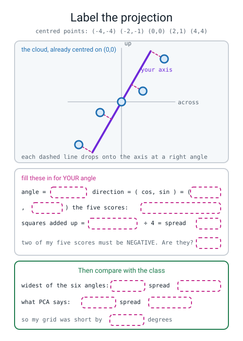
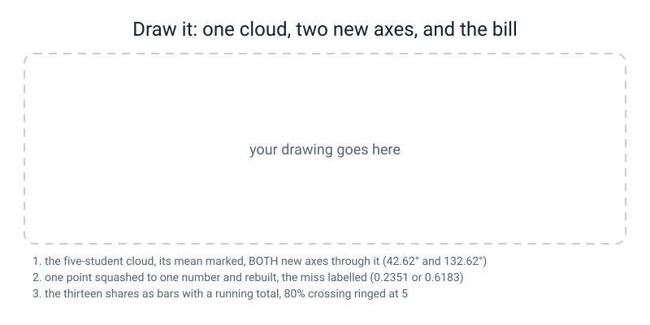

# Workbook — Week 29: A New Pair of Axes

**Name:** ________________________________  **Date:** ______________

[⬅ Week 28](week-28.md) · [📖 Read the chapter first](../student-guide/week-29.md) · [Course Home](../README.md) · [Next ➡](week-30.md)

---

## ✅ Warm-Up (5 min)

Five quick questions about **last week**.

**W1.** The whole of k-means is two steps, repeated. **Name them in order, one word each, and say what moves in each one.**

step 2: ____________ — what moves: ____________

step 3: ____________ — what moves: ____________

**W2.** You wrote `km = KMeans(n_clusters=3, n_init=10, random_state=0)` and then `print(km.inertia_)`. **What comes out, and what is the one-word clue in the name?**

________________________________________________________________

**W3.** You have 178 wines. **Which `k` gives the smallest possible inertia, what is that inertia, and why is it worthless?**

k = ______  inertia = ______  because ______________________________

**W4.** An unscaled wine clustering gave these three bands: `278–590`, `600–937`, `970–1680`. **Name the column, quote its spread, and say in one word what the three bands prove.**

column: ______________  spread: ____________  the bands: ______________

**W5.** Write the sigma out. Inertia over six points came to `6.6667`. **Write the six terms beside the symbol.**

```
Σ (distance)² = ______ + ______ + ______ + ______ + ______ + ______ = ______
```

---

## 🔢 Do the Maths by Hand

**Two new pieces of maths this week, and they are the same piece twice: variance, and variance along a direction you chose.** These four exercises are **calculator only. No code on this page.**

---

**M1 — variance in four steps, and what skipping the centring costs.**

The five numbers: **2, 5, 6, 9, 13**.

**(a) The mean.** `( 2 + 5 + 6 + 9 + 13 ) ÷ 5 = ______ ÷ 5 = ________`

**(b) The four steps.** Fill in every cell.

| the number | minus the mean | squared |
|---:|---:|---:|
| 2 | ________ | ________ |
| 5 | ________ | ________ |
| 6 | ________ | ________ |
| 9 | ________ | ________ |
| 13 | ________ | ________ |
| | **sum: ________** | **sum: ________** |

**The middle column's total should be a particular number. What, and why is it that number for ANY list?**

________________________________________________________________

**(c) Step four, both ways.**

```
÷ 4 (what sklearn does) = ________          ÷ 5 = ________
```

**(d) Now do it WRONG on purpose — skip the centring.** Square each original number and average the same way.

```
4 + ______ + ______ + ______ + ______ = ______    and ______ ÷ 4 = ________
```

**How many times too big is that?** ________ ÷ ________ = ________

**One sentence on what the uncentred number is actually measuring:**

________________________________________________________________

---

**M2 — project five points onto a direction, by hand.**

Five students: `(1,3)`, `(3,4)`, `(5,8)`, `(7,9)`, `(9,11)` — hours studied, hours slept.

**(a) Find the middle of the cloud and centre it.**

```
middle = ( ______ ÷ 5 , ______ ÷ 5 ) = ( ________ , ________ )

centred points: ( ____ , ____ )  ( ____ , ____ )  ( ____ , ____ )  ( ____ , ____ )  ( ____ , ____ )
```

**Both centred columns must add to zero. Check them:** across ______  up ______

**(b) Project onto 30°.** The direction at 30° is `(cos 30°, sin 30°) = (0.8660, 0.5000)`. For each centred point: `across × 0.8660  +  up × 0.5000`.

| centred point | across × 0.8660 | up × 0.5000 | the score |
|---|---|---|---|
| ( ____ , ____ ) | ________ | ________ | ________ |
| ( ____ , ____ ) | ________ | ________ | ________ |
| ( ____ , ____ ) | ________ | ________ | ________ |
| ( ____ , ____ ) | ________ | ________ | ________ |
| ( ____ , ____ ) | ________ | ________ | ________ |

**(c) The spread of those five scores.** They already have a mean of 0, so it is just: square, add, divide by 4.

```
squares : ______ + ______ + ______ + ______ + ______ = ____________

÷ 4 = ________
```

**(d) Now do 60° as well.** The direction is `(0.5000, 0.8660)`.

```
the five scores : ______ , ______ , ______ , ______ , ______

spread = ______________ ÷ 4 = ________
```

**Which of the two is wider, 30° or 60°?** ______

---

**M3 — explained variance ratio, by hand.**

For the same five students, the spread of the **across** column alone is **10.0000** and the spread of the **up** column alone is **11.5000**.

**(a) The total spread in the cloud:** ________ + ________ = ____________

**(b) PCA reports two numbers: `explained_variance_ = [21.2768, 0.2232]`. Add them up:** ____________

**(c) Is your answer to (a) the same as your answer to (b)?** ______

**(d) Now the ratios, which is what `explained_variance_ratio_` holds.**

```
PC1 : ________ ÷ ________ = ________        PC2 : ________ ÷ ________ = ________
```

**(e) Do your two ratios add to 1?** ______  **Should they always?** ______

**One sentence on the difference between `explained_variance_` and `explained_variance_ratio_`:**

________________________________________________________________

---

**M4 — rebuild one point from one number.**

PCA kept only PC1. Here is everything you need:

```
the middle of the cloud : ( 5.0 , 7.0 )
PC1's direction        : ( 0.6815 , 0.7319 )
the second student's score along PC1 : −3.5585
```

**(a) Rebuild that student.** A rebuilt point is `the middle  +  score × direction`.

```
across : 5.0 + ( −3.5585 × 0.6815 ) = 5.0 + ________ = ________

up     : 7.0 + ( −3.5585 × 0.7319 ) = 7.0 + ________ = ________
```

**(b) The real student was `(3, 4)`. How far off is the rebuild?**

```
across gap : ________   squared: ________
up gap     : ________   squared: ________
add them   : ________   square root: ________
```

**(c) The average point in this cloud sits `3.7495` from the middle. So your miss is what fraction of a typical distance?**

________ ÷ 3.7495 = ________

**(d) One sentence: is that a big loss or a small one, and how do you know?**

________________________________________________________________

---

## 🔎 Predict the Output

**In pen, before you run anything.**

### P1 — three shapes and a question

```python
import numpy as np
from sklearn.decomposition import PCA
np.random.seed(0)
D = np.array([[1., 3.], [3., 4.], [5., 8.], [7., 9.], [9., 11.]])
p1 = PCA(n_components=1).fit(D)
Z = p1.transform(D)
back = p1.inverse_transform(Z)
print("D    ", D.shape)
print("Z    ", Z.shape)
print("back ", back.shape)
print("same numbers back?", np.allclose(D, back))
```

**My predictions:**

D ________  Z ________  back ________  same numbers back? ________

**The truth:**

D ________  Z ________  back ________  same numbers back? ________

**`back` has the same shape as `D`. Does that mean it has the same numbers?** ______  **Why:**

________________________________________________________________

---

### P2 — two sums that ought to be obvious

```python
import numpy as np
from sklearn.decomposition import PCA
from sklearn.datasets import load_wine
from sklearn.preprocessing import StandardScaler
np.random.seed(0)
X = StandardScaler().fit_transform(load_wine().data)
full = PCA().fit(X)
print("ratio sums to :", round(full.explained_variance_ratio_.sum(), 4))
print("variance sums to:", round(full.explained_variance_.sum(), 4))
print("first two ratios add to:", round(full.explained_variance_ratio_[:2].sum(), 4))
```

**My predictions:**

line 1 ____________  line 2 ____________  line 3 ____________

**The truth:**

line 1 ____________  line 2 ____________  line 3 ____________

**Line 2 is very nearly 13 and is not exactly 13. There are 178 wines. Can you work out where the extra comes from?**

________________________________________________________________

---

### P3 — the same wines, two rulers

```python
import numpy as np
from sklearn.decomposition import PCA
from sklearn.datasets import load_wine
from sklearn.preprocessing import StandardScaler
np.random.seed(0)
raw = load_wine().data
scaled = StandardScaler().fit_transform(raw)
print("UNSCALED evr[0] :", round(PCA().fit(raw).explained_variance_ratio_[0], 4))
print("SCALED   evr[0] :", round(PCA().fit(scaled).explained_variance_ratio_[0], 4))
loads = PCA().fit(raw).components_[0]
print("UNSCALED PC1's biggest loading:", load_wine().feature_names[int(np.abs(loads).argmax())],
      round(loads[int(np.abs(loads).argmax())], 4))
```

**My predictions:**

line 1 ____________  line 2 ____________  line 3 ____________

**The truth:**

line 1 ____________  line 2 ____________  line 3 ____________

**One of these two numbers looks like a triumph and is a disaster. Which, and say it in one sentence:**

________________________________________________________________

---

### P4 — hand it a fraction instead of a count

```python
import numpy as np
from sklearn.decomposition import PCA
from sklearn.datasets import load_digits, load_wine
from sklearn.preprocessing import StandardScaler
np.random.seed(0)
Xw = StandardScaler().fit_transform(load_wine().data)
Xd = StandardScaler().fit_transform(load_digits().data)
print("wine  :", Xw.shape[1], "columns ->", PCA(n_components=0.80).fit(Xw).n_components_)
print("digits:", Xd.shape[1], "columns ->", PCA(n_components=0.80).fit(Xd).n_components_)
```

**My predictions:** wine → ______  digits → ______

**The truth:** wine → ______  digits → ______

**What is `n_components=0.80` asking for, in plain English?**

________________________________________________________________

---

## ✍️ Practice Set A — Read It

**A1. Match the word to the thing.** Write the letter.

| Word | | Description |
|---|---|---|
| **variance** | ______ | (i) Sliding a point onto a line at right angles and reading off how far along it landed |
| **projection** | ______ | (ii) How hard one original column pulls on one component |
| **principal component** | ______ | (iii) The average squared distance from the mean |
| **explained variance ratio** | ______ | (iv) Squash, rebuild, and measure the gap — in the table's own units |
| **loading** | ______ | (v) Add columns and everything drifts to the same distance from everything |
| **reconstruction error** | ______ | (vi) One component's spread divided by the total spread |
| **curse of dimensionality** | ______ | (vii) A direction chosen so the projected scores are as spread out as possible |

**A2. Read the table and answer with integers.** The real wine shares:

```text
PC   its share   running total
 1     0.3620       0.3620
 2     0.1921       0.5541
 3     0.1112       0.6653
 4     0.0707       0.7360
 5     0.0656       0.8016
 6     0.0494       0.8510
 7     0.0424       0.8934
 8     0.0268       0.9202
 9     0.0222       0.9424
10     0.0193       0.9617
11     0.0174       0.9791
12     0.0130       0.9920
13     0.0080       1.0000
```

| Question | Answer, as one whole number |
|---|---|
| How many components for at least **80%**? | ______ |
| How many for at least **90%**? | ______ |
| How many for at least **99%**? | ______ |
| How many to get **all** of it? | ______ |

**And a trap: somebody writes "about five or six for 80%". Why is that not an answer?**

________________________________________________________________

**A3. Match the broken line to its message.**

```python
(1)  back = p1.inverse_transform(D)          # D is the wide table, Z is the narrow one

(2)  PCA(n_components=14).fit(X)             # X has 13 columns

(3)  p = PCA(n_components=2)
     print(p.components_)
```

| | Message |
|---|---|
| (a) | `AttributeError: 'PCA' object has no attribute 'components_'` |
| (b) | `ValueError: n_components=14 must be between 0 and min(n_samples, n_features)=13` |
| (c) | `ValueError: Dot product shape mismatch, (178, 13) vs (2, 13)` |

`(1)` → ______   `(2)` → ______   `(3)` → ______

**And the sentence that prevents (1) forever:** `transform` ____________, `inverse_transform` ____________, so ______________________________

**A4. Label the diagram.** Pick any angle you like, fill in every dashed box, and then compare with the class.


*Figure W29.1 — Label the projection.*

**A5. Read the loadings and judge the name.** Two students hand in a name for PC1 of the scaled wine data. Here are the real loadings:

```text
flavanoids                      0.423
total_phenols                   0.395
od280/od315_of_diluted_wines    0.376
proanthocyanins                 0.313
nonflavanoid_phenols           -0.299
```

| Student | Their name for PC1 | Pass or fail, and why |
|---|---|---|
| Asha | "total phenolic richness" | ______________________ |
| Ben | "wine quality" | ______________________ |

**And one row of that table pulls the OPPOSITE way from the others. Which, and is that a bug?**

________________________________________________________________

**A6. Spot the bug — no error message, and the numbers are all slightly wrong.**

A student's own spread for the five centred points at 30° comes out as **15.5747**. The class's answer is **19.4683**.

```
15.5747 ÷ 19.4683 = 0.80
```

**(a) What did they divide by?** ______  **What should they have divided by?** ______

**(b) And a different student's spreads all come out in the hundreds, and barely change between angles. What did THEY forget?**

________________________________________________________________

---

## ✍️ Practice Set B — Write It

### B1 — one line

Print how many components you need for **80%** of the spread of the scaled wine table, without building the running-total table yourself.

**Expected output:** a single integer.
**Done looks like:** `5`

### B2 — variance in four printed steps

For the numbers `2, 5, 6, 9, 13`, print: the numbers and their mean · the distances **and their total** · the squares · the sum · the sum ÷ 4 · the sum ÷ 5. **Then do it again with no centring at all**, and print how many times too big that is.

**Done looks like:** the distances print as `0.0` when added up, and the uncentred version is exactly `4.50` times the centred one.

### B3 — six candidate axes on five new points

Centre the points `(1,3)`, `(3,4)`, `(5,8)`, `(7,9)`, `(9,11)`. Loop over `0, 30, 60, 90, 120, 150` degrees. For each one print the angle, the direction pair to four decimals, the five scores, and the spread. Finish by printing the widest of the six.

**Done looks like:** both centred columns add to zero, two of the five scores are negative in most rows, and one angle clearly wins.

> **⚠️ Watch out:** if every one of your five scores is positive, you have measured **distance from the origin** instead of **position along the axis**. A projection is signed. Half your cloud is on the negative side of the line.

### B4 — squash to one number, rebuild, and price it

Keep one component. Print: PC1's direction and its angle in degrees · the one number per point · the rebuilt table beside the real one · the miss per point · the average miss · the yardstick (the average distance from the middle) · and the miss as a fraction of the yardstick.

**Done looks like:** the point that lands exactly on the new axis has a miss of `0.0000`... **and here none of them does**, which is itself worth noticing.

### B5 — the whole wine report, about 25 lines

On `load_wine()`, scaled:

1. print the table shape,
2. the thirteen shares with a **running total** column,
3. how many components for 80%, as one integer,
4. the **top three loadings** of PC1 **and** of PC2,
5. the running share and the average rebuild miss at **2** and at **6** components,
6. the yardstick, and the miss as a fraction of it for both.

**Done looks like:** every number in your write-up can be pointed at in this output, and the last line turns two raw misses into two judgements.

---

## 🐞 Fix the Broken Program

This is supposed to squash the wines to two components and name PC1. **Three bugs: one shape error, one runtime error, and one that prints a beautiful number that is worthless.**

```python
"""broken29.py - three bugs. The third one prints a beautiful number that is worthless."""
import numpy as np
import pandas as pd
from sklearn.datasets import load_wine
from sklearn.decomposition import PCA
from sklearn.preprocessing import StandardScaler

np.random.seed(0)
np.set_printoptions(suppress=True)

wine = load_wine()
X_raw = pd.DataFrame(wine.data, columns=wine.feature_names)
scaler = StandardScaler()
Xs = scaler.fit_transform(X_raw)
print("table:", X_raw.shape)

p2 = PCA(n_components=2).fit(X_raw)
Z2 = p2.transform(X_raw)
print("squashed to:", Z2.shape)
back = p2.inverse_transform(X_raw)
print("rebuilt to:", back.shape)

pf = PCA(n_components=14).fit(X_raw)
print("every share:", np.round(pf.explained_variance_ratio_, 4))

print("share kept by PC1 + PC2: %.4f" % p2.explained_variance_ratio_.sum())
pull1 = pd.Series(p2.components_[0], index=wine.feature_names)
print("PC1's three hardest-pulling columns:")
print(pull1.reindex(pull1.abs().sort_values(ascending=False).index).round(4).head(3).to_string())
```

**The first message:**

```text
table: (178, 13)
squashed to: (178, 2)
Traceback (most recent call last):
  File "broken29.py", line 21, in <module>
    back = p2.inverse_transform(X_raw)
ValueError: Dot product shape mismatch, (178, 13) vs (2, 13)
```

**Bug 1 — the line:** ______  **The two shapes in the message: where does `(178, 13)` come from, and where does `(2, 13)` come from?**

`(178, 13)` is ______________________  `(2, 13)` is ______________________

**The fix:** ______________________________________________________

**Fix it and run again. The second message:**

```text
table: (178, 13)
squashed to: (178, 2)
rebuilt to: (178, 13)
Traceback (most recent call last):
  File "broken29.py", line 24, in <module>
    pf = PCA(n_components=14).fit(X_raw)
ValueError: n_components=14 must be between 0 and min(n_samples, n_features)=13 with svd_solver='covariance_eigh'
```

**Bug 2 — the fix, and there are two valid ones:**

fix A: ______________________  fix B: ______________________

**Fix that and run again. It finishes, silently:**

```text
table: (178, 13)
squashed to: (178, 2)
rebuilt to: (178, 13)
every share: [0.9981 0.0017 0.0001 0.0001 0.     0.     0.     0.     0.     0.
 0.     0.     0.    ]
share kept by PC1 + PC2: 0.9998
PC1's three hardest-pulling columns:
proline              0.9998
magnesium            0.0179
alcalinity_of_ash   -0.0047
```

**Bug 3.** `0.9998` of the spread in two components sounds like the best result anybody has ever had.

**(a) Two lines of that output give the bug away. Which two, and what do they tell you?**

________________________________________________________________

**(b) Bug 3 — the line, and the fix:** ______________________________

**(c) Write the six numbers the output shows once it is fixed:**

share kept by PC1 + PC2 = ____________

PC1's top three: ______________ ______  ______________ ______  ______________ ______

---

## 🧩 Puzzle of the Week

### Guess the Axis

Six tiny clouds, four points each. **For each one, predict PC1's angle by eye — no arithmetic — and predict the two explained variance ratios.** Then run it.

| | the four points | my angle | my two ratios | the real angle | the real ratios |
|---|---|---|---|---|---|
| (a) | (0,0) (1,0) (2,0) (3,0) | ______ | ______ | ______ | ______ |
| (b) | (0,0) (0,1) (0,2) (0,3) | ______ | ______ | ______ | ______ |
| (c) | (0,0) (1,1) (2,2) (3,3) | ______ | ______ | ______ | ______ |
| (d) | (0,3) (1,2) (2,1) (3,0) | ______ | ______ | ______ | ______ |
| (e) | (0,0) (0,2) (2,0) (2,2) | ______ | ______ | ______ | ______ |
| (f) | (0,0) (4,1) (8,2) (12,3) | ______ | ______ | ______ | ______ |

**Five of the six are easy. One of them is the puzzle.**

**Which one, and what is strange about its answer?** ______

**What does PCA do when no direction is wider than any other? And is the answer it gives you wrong?**

________________________________________________________________

**And the honest question this puzzle is really asking: what would you write in a report about cloud (e)?**

________________________________________________________________

---

## 🤔 Think Deeper

**T1.** Week 28 said *"always scale first."* This week says it again, for a different algorithm, and the failure looks different: `0.9981` of the spread on one component instead of three non-overlapping bands. **Write a paragraph on what these two failures have in common.** Is it one mistake or two? And name the single printout you would add to **any** script, from now on, that would have caught both.

________________________________________________________________

________________________________________________________________

________________________________________________________________

________________________________________________________________

**T2.** `explained_variance_ratio_` says you kept 55.4% of the spread with two components. `reconstruction error` says a rebuilt wine is wrong by 64% of a typical wine's distance from the middle. **Both describe the same run.** Write a paragraph on why the first one is the number people report and the second one is the number people need — and on what a person deciding whether to use your two-column version would actually want to know.

________________________________________________________________

________________________________________________________________

________________________________________________________________

________________________________________________________________

---

## 🛠️ Build It — The Thirteen Shares, a Name, and the Bill

### Step checklist

- [ ] **1.** Predictions in pen, before anything runs.
- [ ] **2.** The thirteen shares with a **running total** column, printed.
- [ ] **3.** The row where the running total first passes 80% **circled**, with the integer written beside it.
- [ ] **4.** The 2-D scatter saved as a PNG, **with the percentage in BOTH axis labels.**
- [ ] **5.** A sentence describing what you actually see in that picture.
- [ ] **6.** PC1's top three loadings, with their numbers.
- [ ] **7.** A human name for PC1, **three or four words**, plus one sentence saying why those three loadings justify it.
- [ ] **8.** The average rebuild miss at **2** and at **6** components.
- [ ] **9.** The yardstick, and both misses turned into fractions of it.
- [ ] **10.** *(Optional)* The curse of dimensionality, measured.

### Predictions, in pen

| | My prediction | The truth |
|---|---|---|
| (a) which of the six angles will be widest on the five points? | ______ | ______ |
| (b) will the winning angle be exactly what PCA reports? | ______ | ______ |
| (c) how far off will a point rebuilt from one component be? | ______ | ______ |
| (d) how many components for 80% of the wine spread? | ______ | ______ |

### The thirteen shares

| PC | its share | running total | | PC | its share | running total |
|---:|---:|---:|---|---:|---:|---:|
| 1 | ________ | ________ | | 8 | ________ | ________ |
| 2 | ________ | ________ | | 9 | ________ | ________ |
| 3 | ________ | ________ | | 10 | ________ | ________ |
| 4 | ________ | ________ | | 11 | ________ | ________ |
| 5 | ________ | ________ | | 12 | ________ | ________ |
| 6 | ________ | ________ | | 13 | ________ | ________ |
| 7 | ________ | ________ | | | | |

**Components needed for 80%, as ONE integer:** ______

**The check, using the shortcut:** `PCA(n_components=0.80).fit(X).n_components_` printed ______

### The plot

**Filename:** ____________________  **My x-axis label, written out in full:**

________________________________________________________________

**My y-axis label, written out in full:**

________________________________________________________________

**What I actually see in the picture** (and "one connected cloud with no clean gaps, maybe three loose lobes" is an honest and correct answer):

________________________________________________________________

### PC1's loadings and its name

| rank | column | loading |
|---:|---|---:|
| 1 | ______________________ | ________ |
| 2 | ______________________ | ________ |
| 3 | ______________________ | ________ |

**My name for PC1:** ______________________________________________

**One sentence saying why those three numbers justify it:**

________________________________________________________________

**And if I disagree with the chapter's name, here is mine and why:**

________________________________________________________________

### The bill

| components | running share | average rebuild miss | miss ÷ yardstick |
|---:|---:|---:|---:|
| 2 | ________ | ________ | ________ |
| 6 | ________ | ________ | ________ |

**The yardstick (a typical wine's distance from the middle):** ____________

**One sentence on what the difference between those two rows cost, WITH a comparison in it:**

________________________________________________________________

### Stretch — the curse of dimensionality

| columns | min distance | mean | max | (max − min) ÷ min |
|---:|---:|---:|---:|---:|
| 2 | ________ | ________ | ________ | ________ |
| 5 | ________ | ________ | ________ | ________ |
| 20 | ________ | ________ | ________ | ________ |
| 100 | ________ | ________ | ________ | ________ |
| 500 | ________ | ________ | ________ | ________ |

**Between which two column counts does the contrast first drop below 1.0?** ______ and ______

**One sentence on what that means for k-means, which decides everything by asking "which centre is nearest?":**

________________________________________________________________

---

## 🎨 Draw It


*Figure W29.2 — One cloud, two new axes, and the bill.*

**What a good answer looks like:** on the left, the **five students drawn as five dots** with a clear cross at their mean `(5, 7)` — **the mean has to be drawn, because everything this week happens after the cloud is moved there.** Then **both** new axes through that cross: PC1 at about 47° and PC2 at right angles to it, each labelled with its spread (`21.2768` and `0.2232`). In the middle, **one point picked out** — the second student at `(3, 4)` — with a dashed right-angle drop onto PC1, the number `−3.5585` written where it lands, and then the rebuilt point `(2.5751, 4.3957)` drawn as a hollow dot with the gap between the two dots labelled `0.5806`.

**And the two things that earn the marks:** the right-hand third is the **thirteen wine shares as thirteen bars**, tallest first, with a **running-total line climbing over them** and the crossing of 80% ringed at **5 components** — not 4, and not "five or six". And somewhere on the page, `2.2550 ÷ 3.5180 = 0.6410` written as an actual division, because **a miss with no yardstick beside it is not a result**, and the drawing should say so.

**My angle for PC1:** ______  **My two spreads:** ____________ and ____________

**My one squashed-and-rebuilt point, and its miss:** ____________ → ____________ , miss ____________

**The division I wrote on the page:** ____________

---

## 📊 Self-Check

| I can... | 😀 | 🙂 | 😕 |
|---|---|---|---|
| compute a variance in four steps and say why step 1 always sums to zero | | | |
| say what goes wrong if I forget to centre, and name the fingerprint | | | |
| project a point onto a direction with one multiply-and-add per column | | | |
| say why a projected score can be negative | | | |
| find a principal component by trying angles and keeping the widest | | | |
| tell `explained_variance_` from `explained_variance_ratio_` without guessing | | | |
| read a running-total column and answer "how many for 80%" with one integer | | | |
| put the percentage in an axis label every single time | | | |
| read a component's loadings and give the axis a name I can defend | | | |
| spot a name that the loadings do not support | | | |
| measure reconstruction error and compare it against a yardstick | | | |
| fix `inverse_transform` being handed the wrong table, from the two shapes alone | | | |
| say what the curse of dimensionality does to anything built on distance | | | |

**The one thing I would ask about if I could ask one question:**

________________________________________________________________

---

## ✅ Answers

<details>
<summary>Check your answers</summary>

### Warm-Up

**W1.** **Step 2 is ASSIGN** — give every point to its nearest centre; **nothing moves**, only the colouring changes. **Step 3 is MOVE** — put every centre in the middle of what it just got; **only the centres move.** The points are the data and they never move.

**W2.** `AttributeError: 'KMeans' object has no attribute 'inertia_'`. **The clue is the trailing underscore** — in scikit-learn a name ending in `_` does not exist until `.fit` has run. The machine was built and never switched on.

**W3.** **k = 178**, one cluster per wine. **Inertia is exactly 0.** Worthless because every point is its own centre, so every squared distance is zero — a perfect score that has grouped nothing.

**W4.** **`proline`, spread 314.91.** The three bands **do not overlap** — one word: *sealed*, or *non-overlapping*. Thirteen columns of chemistry were sorted by one of them.

**W5.** `Σ (distance)² = 0.4444 + 1.1111 + 1.1111 + 0.0000 + 2.0000 + 2.0000 = 6.6667`

### Do the Maths by Hand

**M1 (a).** `35 ÷ 5 = 7.0`

**M1 (b).**

| the number | minus the mean | squared |
|---:|---:|---:|
| 2 | −5 | 25 |
| 5 | −2 | 4 |
| 6 | −1 | 1 |
| 9 | +2 | 4 |
| 13 | +6 | 36 |
| | **sum: 0** | **sum: 70** |

**The middle column adds to exactly 0, and it does for any list**, because the mean is *defined* as the place where the distances above and below cancel out. **That is the whole reason you square** — without it, every variance in the world would be zero.

**M1 (c).** `70 ÷ 4 = 17.5` · `70 ÷ 5 = 14.0`. **sklearn's `PCA` gives you 17.5.**

**M1 (d).** `4 + 25 + 36 + 81 + 169 = 315`, and `315 ÷ 4 = 78.75`. `78.75 ÷ 17.5 = 4.50` — **four and a half times too big.**

**The sentence:** *"The uncentred number measures how far the numbers are from **zero**, not from each other. These five sit around 7, so most of 78.75 is just the fact that 7 is not 0 — it is a measurement of where the cloud is, not how big it is."*

**Checked in Python:**

```python
"""b2.py - variance in four printed steps, and the cost of skipping the centring."""
import numpy as np

np.random.seed(0)
v = np.array([2., 5., 6., 9., 13.])
print("the numbers   :", v, "  mean =", v.mean())
print("step 1 distance:", v - v.mean(), " which add to", (v - v.mean()).sum())
print("step 2 squared :", (v - v.mean()) ** 2)
print("step 3 added up:", ((v - v.mean()) ** 2).sum())
print("step 4 / 4     :", ((v - v.mean()) ** 2).sum() / 4)
print("       / 5     :", ((v - v.mean()) ** 2).sum() / 5)
print()
print("and with NO centring at all:")
print("squared        :", v ** 2)
print("added up       :", (v ** 2).sum())
print("/ 4            :", (v ** 2).sum() / 4)
print("which is %.2f times too big" % ((v ** 2).sum() / ((v - v.mean()) ** 2).sum()))
```

```text
the numbers   : [ 2.  5.  6.  9. 13.]   mean = 7.0
step 1 distance: [-5. -2. -1.  2.  6.]  which add to 0.0
step 2 squared : [25.  4.  1.  4. 36.]
step 3 added up: 70.0
step 4 / 4     : 17.5
       / 5     : 14.0

and with NO centring at all:
squared        : [  4.  25.  36.  81. 169.]
added up       : 315.0
/ 4            : 78.75
which is 4.50 times too big
```

**M2 (a).** `middle = (25 ÷ 5, 35 ÷ 5) = (5.0, 7.0)`

```
centred points: (−4, −4)  (−2, −3)  (0, 1)  (2, 2)  (4, 4)
```

**across: −4 − 2 + 0 + 2 + 4 = 0** ✅ · **up: −4 − 3 + 1 + 2 + 4 = 0** ✅

**M2 (b) — 30°, direction (0.8660, 0.5000).**

| centred point | across × 0.8660 | up × 0.5000 | the score |
|---|---|---|---|
| (−4, −4) | −3.4641 | −2.0000 | **−5.4641** |
| (−2, −3) | −1.7321 | −1.5000 | **−3.2321** |
| (0, 1) | 0.0000 | 0.5000 | **0.5000** |
| (2, 2) | 1.7321 | 1.0000 | **2.7321** |
| (4, 4) | 3.4641 | 2.0000 | **5.4641** |

**M2 (c).**

```
squares : 29.8564 + 10.4465 + 0.2500 + 7.4644 + 29.8564 = 77.8737
÷ 4 = 19.4684
```

**Python prints `19.4683`**, because you typed the scores already rounded to four places. **Neither of you is wrong** — and this is now the third week in a row where rounding on the way in moves a fourth decimal place. Expect it.

**M2 (d) — 60°, direction (0.5000, 0.8660).**

```
(−4,−4): −2.0000 + −3.4641 = −5.4641
(−2,−3): −1.0000 + −2.5981 = −3.5981
( 0, 1):  0.0000 +  0.8660 =  0.8660
( 2, 2):  1.0000 +  1.7321 =  2.7321
( 4, 4):  2.0000 +  3.4641 =  5.4641

squares: 29.8564 + 12.9463 + 0.7500 + 7.4644 + 29.8564 = 80.8735
÷ 4 = 20.2184     (Python: 20.2183)
```

**60° is wider than 30°: 20.2183 against 19.4683.**

**M3 (a).** `10.0000 + 11.5000 = 21.5000`

**(b).** `21.2768 + 0.2232 = 21.5000`

**(c).** **Yes — exactly the same.** And that is the most important thing about PCA that nobody tells you: **it does not throw anything away when it rotates.** The total spread is the same in the old axes as in the new ones. All PCA did was **re-share it out** — 21.2768 to one direction instead of 10.0 and 11.5 to two.

**(d).** `PC1: 21.2768 ÷ 21.5 = 0.9896` · `PC2: 0.2232 ÷ 21.5 = 0.0104`

**(e).** **They add to 1.0000, and they always must**, because every share is a slice of the same total. *(If yours do not, you are summing a truncated list — `PCA(n_components=2)` on 13 columns gives you two shares that add to 0.5541, not 1.)*

**The sentence:** *"`explained_variance_` holds actual spreads, in the units of the scaled table, and adds up to roughly the number of columns. `explained_variance_ratio_` holds shares of that total, and adds up to 1. They have almost the same name and they are never interchangeable."*

**M4 (a).**

```
across : 5.0 + ( −3.5585 × 0.6815 ) = 5.0 + (−2.4251) = 2.5749
up     : 7.0 + ( −3.5585 × 0.7319 ) = 7.0 + (−2.6045) = 4.3955
```

*(Python, with no rounding on the way in, prints `2.5751` and `4.3957`.)*

**M4 (b).**

```
across gap : 3 − 2.5751 = 0.4249    squared: 0.1805
up gap     : 4 − 4.3957 = −0.3957   squared: 0.1566
add them   : 0.3371                 square root: 0.5806
```

**M4 (c).** `0.5806 ÷ 3.7495 = 0.1548`

**M4 (d).** *"Small. The rebuilt student is out by about 15% of how far a typical student sits from the middle of the cloud — so throwing away one of the two directions (PC2) cost me about a sixth of a typical distance for this point. I only know that because I had a yardstick; `0.5806` on its own is a number in no units I can judge."*

### Predict the Output

**P1.**

```text
D     (5, 2)
Z     (5, 1)
back  (5, 2)
same numbers back? False
```

**`back` has the right SHAPE and the wrong NUMBERS.** `transform` narrowed `(5, 2)` to `(5, 1)`, which means one of the two numbers per point was thrown away. `inverse_transform` widens back to `(5, 2)` by placing every point **on the new axis**, at the position its single score says. **A shape match is not a content match**, and this is the single most useful thing to know about `inverse_transform`: it always gives you the right shape, so the shape can never tell you whether you lost anything.

**P2.**

```text
ratio sums to : 1.0
variance sums to: 13.0734
first two ratios add to: 0.5541
```

**Where the extra comes from.** `StandardScaler` divides by a spread computed **÷ 178**, and `PCA`'s `explained_variance_` averages **÷ 177** — one less than the count, the same choice you met in M1(c). So every column's spread comes out as `1 × 178 ÷ 177 = 1.00565`, and thirteen of those add to `13 × 178 ÷ 177 = 13.0734`. **It is not a bug and it is not a rounding error. It is two conventions meeting**, and it is worth knowing so that "why isn't it 13?" never costs you an afternoon.

**P3.**

```text
UNSCALED evr[0] : 0.9981
SCALED   evr[0] : 0.362
UNSCALED PC1's biggest loading: proline 0.9998
```

**`0.9981` looks like a triumph and is a disaster.** *"99.81% of the spread in one component"* sounds like the thirteen wine columns were secretly one column — and the third line says what actually happened: **PC1's loading on `proline` is 0.9998, which is as close to "PC1 IS the proline column" as a number can get.** PCA did not find hidden structure. It found the column whose numbers are biggest, exactly as k-means did last week, for exactly the same reason: **variance is measured in whatever units the column happens to use, and proline's units are hundreds.**

**P4.**

```text
wine  : 13 columns -> 5
digits: 64 columns -> 21
```

**`n_components=0.80` means: "keep however many components I need to reach 80% of the spread, and work out the number yourself."** Five out of thirteen for the wine; **twenty-one out of sixty-four for the digits** — so a third of the columns hold 80% of what an 8×8 handwritten digit is.

### Practice Set A

**A1.** variance **(iii)** · projection **(i)** · principal component **(vii)** · explained variance ratio **(vi)** · loading **(ii)** · reconstruction error **(iv)** · curse of dimensionality **(v)**

**A2.** Read the **running total** column and take the first row that reaches or passes the target. Nothing else.

| Question | Answer |
|---|---|
| at least 80% | **5** — 0.8016 |
| at least 90% | **8** — 0.9202 (seven only reaches 0.8934) |
| at least 99% | **12** — 0.9920 (eleven only reaches 0.9791) |
| all of it | **13** — 1.0000 |

**Why "five or six" is not an answer:** because four gives 0.7360, which is **under** 80%, and five gives 0.8016, which is **over**. There is no ambiguity to be vague about. **The question has one integer answer and the table contains it.** "Five or six" means the running total column was not read.

**A3.** `(1)` → **(c)** · `(2)` → **(b)** · `(3)` → **(a)**

**The sentence:** **`transform` narrows, `inverse_transform` widens, so whatever came out of one goes into the other.**

**A4 — the diagram, labelled.** Answers depend on the angle you chose. Here is **60°** worked in full, since that is the winner on this cloud:

```
angle = 60      direction = ( cos, sin ) = ( 0.5000 , 0.8660 )

the five scores: −5.4641, −3.5981, 0.8660, 2.7321, 5.4641

squares added up = 80.8735     ÷ 4 = spread 20.2184

two of my five scores must be NEGATIVE. Are they?   Yes — the first two.
```

And the comparison panel:

```
widest of the six angles : 60°      spread 20.2183
what PCA says            : 47.04°   spread 21.2768
so my grid was short by  : 12.96 degrees
```

**And the interesting extra:** 45° — which is *not* on a 30°-step grid — scores **21.2500**, only `0.0268` short of PCA's answer. **A finer grid closes the gap, and that is the proof that PCA is a search and not a trick.**

**A5.**

| Student | Their name | Verdict |
|---|---|---|
| Asha | "total phenolic richness" | **Pass.** The three hardest-pulling columns — flavanoids 0.423, total_phenols 0.395, od280/od315 0.376 — are **all** measures of phenolic content, and **all pull the same way**, so a wine high on one is high on all three. The name is the numbers, in words. |
| Ben | "wine quality" | **Fail.** Nothing in thirteen chemical measurements mentions quality. The loadings do not support it, and no amount of it being *plausible* fixes that. **Naming an axis something the data cannot see is the over-claim this whole course exists to prevent.** |

**The opposite-pulling row is `nonflavanoid_phenols` at −0.299.** **It is not a bug.** It means that as the other phenolic measures go up, this one tends to go **down** — a real chemical trade-off in wine, which PCA found without being told about it. **Spotting it and explaining it is the best available reading of that table.**

**A6 (a).** They divided by **5**. They should have divided by **4** — one less than the count. **The diagnostic is the ratio itself:** `0.80` is exactly `4 ÷ 5`, so a spread that is exactly 0.8 times somebody else's on five points means the smaller one divided by 5 where the other divided by 4.

**(b).** **They forgot to centre.** The fingerprint is unmistakable: **every spread comes out enormous, and they barely differ from angle to angle**, because almost all of the number is *where the cloud sits* rather than *how big it is* — and where it sits looks about the same from every direction. On the five students, forgetting to centre turns a spread of 20.2183 into something in the hundreds.

### Practice Set B

**B1.**

```python
"""b1.py - one line: how many components for 80% of the wine spread."""
from sklearn.datasets import load_wine
from sklearn.decomposition import PCA
from sklearn.preprocessing import StandardScaler

print(PCA(n_components=0.80).fit(StandardScaler().fit_transform(load_wine().data)).n_components_)
```

```text
5
```

**B2.** The program and its output are in the M1 answer above.

**B3.**

```python
"""b3.py - six candidate axes on five new points, and the widest wins."""
import numpy as np

np.random.seed(0)
np.set_printoptions(suppress=True)
D = np.array([[1., 3.], [3., 4.], [5., 8.], [7., 9.], [9., 11.]])
print("the middle of the cloud:", D.mean(axis=0))
C = D - D.mean(axis=0)
print("centred:", C.tolist())
print(" angle   direction (across, up)     the five scores along it              spread")
best_angle, best_spread = None, -1.0
for a in range(0, 180, 30):
    u = np.array([np.cos(np.radians(a)), np.sin(np.radians(a))])
    scores = C @ u
    spread = (scores ** 2).sum() / 4
    print(" %3d   (%7.4f, %7.4f)   %s  %7.4f"
          % (a, u[0], u[1], np.array2string(np.round(scores, 3), precision=3,
                                            floatmode="fixed"), spread))
    if spread > best_spread:
        best_angle, best_spread = a, spread
print("widest of the six: %d degrees with spread %.4f" % (best_angle, best_spread))
```

```text
the middle of the cloud: [5. 7.]
centred: [[-4.0, -4.0], [-2.0, -3.0], [0.0, 1.0], [2.0, 2.0], [4.0, 4.0]]
 angle   direction (across, up)     the five scores along it              spread
   0   ( 1.0000,  0.0000)   [-4.000 -2.000  0.000  2.000  4.000]  10.0000
  30   ( 0.8660,  0.5000)   [-5.464 -3.232  0.500  2.732  5.464]  19.4683
  60   ( 0.5000,  0.8660)   [-5.464 -3.598  0.866  2.732  5.464]  20.2183
  90   ( 0.0000,  1.0000)   [-4.000 -3.000  1.000  2.000  4.000]  11.5000
 120   (-0.5000,  0.8660)   [-1.464 -1.598  0.866  0.732  1.464]   2.0317
 150   (-0.8660,  0.5000)   [ 1.464  0.232  0.500 -0.732 -1.464]   1.2817
widest of the six: 60 degrees with spread 20.2183
```

`C @ u` is Week 17's matrix multiply doing all five projections at once: `(5, 2) @ (2,) → (5,)`.

**B4.**

```python
"""b4.py - squash to one number, rebuild, and price it against a yardstick."""
import numpy as np
from sklearn.decomposition import PCA

np.random.seed(0)
np.set_printoptions(suppress=True)
D = np.array([[1., 3.], [3., 4.], [5., 8.], [7., 9.], [9., 11.]])
p1 = PCA(n_components=1).fit(D)
Z = p1.transform(D)
back = p1.inverse_transform(Z)
print("PC1 direction:", np.round(p1.components_[0], 4))
print("its angle    : %.2f degrees" % np.degrees(np.arctan2(p1.components_[0][1],
                                                           p1.components_[0][0])))
print("one number per point:", np.round(Z.ravel(), 4))
print("rebuilt:")
print(np.round(back, 4))
print("the real points:")
print(D)
err = np.sqrt(((D - back) ** 2).sum(axis=1))
print("miss per point:", np.round(err, 4))
print("average miss  : %.4f" % err.mean())
C = D - D.mean(axis=0)
yard = np.sqrt((C ** 2).sum(axis=1)).mean()
print("yardstick: a typical point sits %.4f from the middle" % yard)
print("so the miss is %.4f of a typical distance" % (err.mean() / yard))
```

```text
PC1 direction: [0.6815 0.7319]
its angle    : 47.04 degrees
one number per point: [-5.6533 -3.5585  0.7319  2.8266  5.6533]
rebuilt:
[[ 1.1476  2.8626]
 [ 2.5751  4.3957]
 [ 5.4987  7.5356]
 [ 6.9262  9.0687]
 [ 8.8524 11.1374]]
the real points:
[[ 1.  3.]
 [ 3.  4.]
 [ 5.  8.]
 [ 7.  9.]
 [ 9. 11.]]
miss per point: [0.2016 0.5806 0.6815 0.1008 0.2016]
average miss  : 0.3532
yardstick: a typical point sits 3.7495 from the middle
so the miss is 0.0942 of a typical distance
```

**Nobody has a miss of `0.0000`**, which means **not one of the five students sits exactly on the new axis.** In the chapter's cloud the middle student did, because it *was* the mean; here the middle student is at `(5, 8)` while the mean is at `(5, 7)`, so it sits a unit above the middle and lands `0.6815` off the line — the **largest** miss of the five. **The point nearest the middle is not automatically the best-rebuilt point.**

**B5.**

```python
"""b5.py - the whole wine PCA report: shares, a name, and the bill."""
import numpy as np
import pandas as pd
from sklearn.datasets import load_wine
from sklearn.decomposition import PCA
from sklearn.preprocessing import StandardScaler

np.random.seed(0)
wine = load_wine()
X_raw = pd.DataFrame(wine.data, columns=wine.feature_names)
X = StandardScaler().fit_transform(X_raw)
print("table:", X.shape)

evr = PCA().fit(X).explained_variance_ratio_
print()
print("PC   its share   running total")
for i, share in enumerate(evr, start=1):
    print("%2d     %.4f       %.4f" % (i, share, evr[:i].sum()))
print("components needed for 80%:", PCA(n_components=0.80).fit(X).n_components_)

p2 = PCA(n_components=2).fit(X)
print()
for j, tag in ((0, "PC1"), (1, "PC2")):
    pull = pd.Series(p2.components_[j], index=wine.feature_names)
    print("%s: the three hardest-pulling columns" % tag)
    print(pull.reindex(pull.abs().sort_values(ascending=False).index)
          .round(3).head(3).to_string())

print()
print("  how many PCs   running share   average rebuild miss")
for m in (2, 6):
    p = PCA(n_components=m).fit(X)
    Xh = p.inverse_transform(p.transform(X))
    miss = np.sqrt(((X - Xh) ** 2).sum(axis=1)).mean()
    print("      %2d           %.4f            %.4f"
          % (m, p.explained_variance_ratio_.sum(), miss))
yard = np.sqrt((X ** 2).sum(axis=1)).mean()
print("for scale: a typical wine sits %.4f away from the middle" % yard)
print("2 PCs: the miss is %.4f of that   6 PCs: %.4f of that"
      % (2.2550 / yard, 1.3258 / yard))
```

```text
table: (178, 13)

PC   its share   running total
 1     0.3620       0.3620
 2     0.1921       0.5541
 3     0.1112       0.6653
 4     0.0707       0.7360
 5     0.0656       0.8016
 6     0.0494       0.8510
 7     0.0424       0.8934
 8     0.0268       0.9202
 9     0.0222       0.9424
10     0.0193       0.9617
11     0.0174       0.9791
12     0.0130       0.9920
13     0.0080       1.0000
components needed for 80%: 5

PC1: the three hardest-pulling columns
flavanoids                      0.423
total_phenols                   0.395
od280/od315_of_diluted_wines    0.376
PC2: the three hardest-pulling columns
color_intensity    0.530
alcohol            0.484
proline            0.365

  how many PCs   running share   average rebuild miss
       2           0.5541            2.2550
       6           0.8510            1.3258
for scale: a typical wine sits 3.5180 away from the middle
2 PCs: the miss is 0.6410 of that   6 PCs: 0.3769 of that
```

**Runtime: about 0.7 seconds.**

### Fix the Broken Program

**Bug 1 — line 21.** `(178, 13)` is **the table you handed in** — all 178 wines and all 13 original columns. `(2, 13)` is **`p2.components_`** — two directions, each described by 13 numbers. **`inverse_transform` wants to multiply your rows by those two directions, so it needs rows with 2 numbers in them, and you gave it rows with 13.** The fix:

```python
back = p2.inverse_transform(Z2)
```

**And the sentence that makes this unforgettable:** `transform` narrows, `inverse_transform` widens, **so whatever came out of one goes into the other.**

**Bug 2 — line 24. Two valid fixes.** **Fix A:** ask for a legal number — `PCA(n_components=13)`. **Fix B, and the better one:** if you want *all* of them, leave the argument out entirely — `PCA()`. Thirteen columns can give you at most thirteen directions, and there is no fourteenth to find.

**Bug 3 — lines 17, 18 and 24: everything was fitted on `X_raw`.** `Xs` is built on line 14 and never used again.

**(a) The two giveaway lines.** **`every share: [0.9981 0.0017 0.0001 ...]`** — one component holding 99.81% of thirteen columns of chemistry is not a discovery, it is a unit problem. **And `proline 0.9998`** — PC1's loading on proline is as close to 1 as a number gets, which says *"PC1 **is** the proline column, renamed."* The other twelve loadings are 0.0179 and smaller. **Read those two lines together and the bug is on the page.**

**(b) The fix:** fit on `Xs`, not `X_raw`.

```python
p2 = PCA(n_components=2).fit(Xs)
Z2 = p2.transform(Xs)
pf = PCA().fit(Xs)
```

**(c) Once fixed:**

```text
table: (178, 13)
squashed to: (178, 2)
rebuilt to: (178, 13)
every share: [0.362  0.1921 0.1112 0.0707 0.0656 0.0494 0.0424 0.0268 0.0222 0.0193
 0.0174 0.013  0.008 ]
share kept by PC1 + PC2: 0.5541
PC1's three hardest-pulling columns:
flavanoids                      0.4229
total_phenols                   0.3947
od280/od315_of_diluted_wines    0.3762
```

**`0.9998` became `0.5541`, and that is the bug being fixed rather than the result getting worse.** The honest answer is that two components hold a bit over half of thirteen chemical columns — and now three *different* columns pull hardest, all of them phenolic, which is a finding you can name and defend.

### Puzzle of the Week

```python
import numpy as np
from sklearn.decomposition import PCA
np.set_printoptions(suppress=True)
clouds = {
    "(a) flat line      ": [[0., 0.], [1., 0.], [2., 0.], [3., 0.]],
    "(b) upright line   ": [[0., 0.], [0., 1.], [0., 2.], [0., 3.]],
    "(c) uphill diagonal": [[0., 0.], [1., 1.], [2., 2.], [3., 3.]],
    "(d) downhill       ": [[0., 3.], [1., 2.], [2., 1.], [3., 0.]],
    "(e) perfect square ": [[0., 0.], [0., 2.], [2., 0.], [2., 2.]],
    "(f) shallow slope  ": [[0., 0.], [4., 1.], [8., 2.], [12., 3.]],
}
for nm, pts in clouds.items():
    P = np.array(pts)
    p = PCA().fit(P)
    ang = np.degrees(np.arctan2(p.components_[0][1], p.components_[0][0]))
    print("%s PC1 %s angle %7.2f  evr %s"
          % (nm, np.round(p.components_[0], 4), ang,
             np.round(p.explained_variance_ratio_, 4)))
```

```text
(a) flat line       PC1 [1. 0.] angle    0.00  evr [1. 0.]
(b) upright line    PC1 [0. 1.] angle   90.00  evr [1. 0.]
(c) uphill diagonal PC1 [0.7071 0.7071] angle   45.00  evr [1. 0.]
(d) downhill        PC1 [ 0.7071 -0.7071] angle  -45.00  evr [1. 0.]
(e) perfect square  PC1 [1. 0.] angle    0.00  evr [0.5 0.5]
(f) shallow slope   PC1 [0.9701 0.2425] angle   14.04  evr [1. 0.]
```

**(a) to (d) and (f) are the easy ones.** Every one of them is a perfectly straight line of points, so **one direction holds all of the spread and the other holds none** — `evr = [1. 0.]` five times. And (f) is the nice one to have predicted: the points go 4 across for every 1 up, and `arctan(3 ÷ 12) = 14.04°`. **You can get that off graph paper with a protractor.**

**(e) is the puzzle. The perfect square.** Its ratios are **`[0.5 0.5]`** — both directions hold exactly half. **There is no widest direction**, because a square is equally wide whichever way you turn it: 0°, 45°, 90°, 17° — all the same spread.

**What does PCA do? It picks one anyway, and it is not wrong.** `[1. 0.]` is a perfectly valid answer to *"give me the widest direction"* when every direction ties: it is **one of infinitely many correct answers**, and which one you get depends on floating-point crumbs in the solver. **Run it on a slightly jiggled square and you will get a completely different angle** — not because PCA is unstable, but because the question has no unique answer and it has been asked anyway.

**What you write in a report about cloud (e):**

> *"PC1 came out at 0° with an explained variance ratio of 0.5000, and PC2 at 90° with 0.5000. **Because those two shares are equal, the direction is not a finding** — this cloud has no direction of greatest spread, so 'PC1 points along the x-axis' is an artefact of the solver rather than a fact about the data. **The honest statement is that both components matter equally and neither can be dropped**, which is also why reducing this dataset to one column would lose exactly half of it."*

**And the transferable rule:** **before you name a component, look at its share against the next one.** `0.3620` against `0.1921` is a genuine ordering worth naming. `0.5000` against `0.5000` is a tie, and naming a tie is how people end up defending a number the solver chose for them.

### Think Deeper

**T1 — one mistake or two?**

> ***One mistake, wearing two costumes.** Both k-means and PCA are built on one quantity: how far apart things are, measured by adding up squared gaps across the columns. So both are decided by whichever column has the biggest numbers, and 'biggest' is not a property of the data — it is a property of **the units somebody happened to write the data down in.** Change proline from milligrams to grams and you get a different clustering and a different first component, from the same wine. **That is the tell that the answer was never about the chemistry.**
>
> *The two failures look different because the two algorithms report differently. k-means hands back groups, so the symptom is three non-overlapping bands of one column. PCA hands back shares, so the symptom is `0.9981` on PC1 and a loading of `0.9998` on one column. **Same disease, different rash.**
>
> ***The one printout I would add to any script:** `print(X.std().sort_values(ascending=False))` — every column's spread, biggest first, before anything is fitted. On the wine it prints proline 314.91 at the top and nonflavanoid_phenols 0.12 at the bottom, a ratio of 2,530, and because distance squares the gaps that is millions to one in influence. **Four seconds of reading, and both failures are visible before either algorithm runs.***

**T2 — the brochure number and the invoice number.**

> ***`0.5541` is reported because it is flattering and because it is free** — it comes out of `fit` whether you ask for it or not, and 55% sounds like most of something. `0.6410` is what a person needs, because it answers the question they actually have: *if I use your two columns instead of my thirteen, how wrong will each wine be?*
>
> *They are the same run because they are two views of the same throwing-away. But they are **in different units and on different scales**: explained variance is a share of *squared* spread across the whole dataset, while reconstruction error is a distance, per row, in the units of the table. **Squaring is why the two numbers feel so far apart** — keeping 55% of the squared spread leaves a per-row miss of 64% of a typical distance, and a reader who only sees the first number will be surprised by the second one every single time.
>
> ***What somebody deciding would actually want:** the miss **per row, not averaged** — the worst-hit wines, not the typical one, because a system that is fine on average and hopeless for twelve bottles is a system that will fail on those twelve. And they would want the comparison run: **how much does going from 2 to 6 components cost me, and does anything downstream actually get better?** Four extra columns is free on 178 rows, so on this dataset the only reason to keep two is to draw a picture — **and 'so I could draw it' is a legitimate reason as long as it is the reason you write down.***

### Build It

**Predictions.** Present or absent, not right or wrong. **(a) 60°** on these five points, with spread 20.2183 *(on the chapter's cloud it was 30°, so an answer of 30 here is a reasonable and wrong hypothesis, which is fine)*. **(b) No — PCA says 47.04° with 21.2768**, so the 30°-step grid was 12.96° short and cost 1.0585 of spread. **(c) An average of 0.3532**, with the worst point off by 0.6815. **(d) 5.**

**The thirteen shares.** Exactly the table in B5's output. **Components for 80%: 5**, and `PCA(n_components=0.80).fit(X).n_components_` prints **5** as a check.

**The plot.** Filename `wine_2d.png`. **The two axis labels, in full:**

```
PC1 (36.2% of the spread)
PC2 (19.2% of the spread)
```

**What you see:** *"One connected cloud, wider than it is tall and roughly V-shaped, with no clean gaps in it. PC1 runs from about −4.3 to +4.3 and PC2 from about −3.9 to +3.5. It is a little lumpy but I could not confidently draw a line through it anywhere."* **That is the correct answer and it is not a failure.** There are three grape varieties in that picture and nothing on it says which is which — hold on to that, because next week the same plot coloured by cluster shows three clean groups, **and it is a far better demonstration precisely because this version looked like one blob.**

**PC1's loadings and its name.**

| rank | column | loading |
|---:|---|---:|
| 1 | flavanoids | 0.423 |
| 2 | total_phenols | 0.395 |
| 3 | od280/od315_of_diluted_wines | 0.376 |

**A name that passes: "total phenolic richness."**

> *All three of the hardest-pulling columns are measures of phenolic content and all three pull the same way, so a wine that is high on one is high on all of them. One end of this axis is chemically rich wine and the other end is thin wine.*

**Any name the loadings support is fine** — "phenol level", "how much stuff is in it", "chemical richness". **What fails is a name the loadings do not mention**: quality, price, age.

**The bill.**

| components | running share | average rebuild miss | miss ÷ yardstick |
|---:|---:|---:|---:|
| 2 | 0.5541 | 2.2550 | **0.6410** |
| 6 | 0.8510 | 1.3258 | **0.3769** |

**The yardstick: 3.5180.**

**The sentence, with the comparison in it:**

> *Going from 2 components to 6 raises the share kept from **0.5541 to 0.8510** and cuts the average rebuild miss from **2.2550 to 1.3258** — a 41% reduction in error for four extra columns. **And the miss only means anything against a yardstick:** a typical wine sits **3.5180** from the middle of the cloud, so with two components a rebuilt wine is wrong by `2.2550 ÷ 3.5180 = 0.6410` — **64% of a typical wine's whole distance from the middle**, which is a lot. With six it is **37.69%**. So "we kept 55% of the variance" and "we are wrong by 64% of a typical distance" describe the same run, **and only the first one usually gets reported.**

**Stretch — the curse of dimensionality.**

```python
import numpy as np
rng = np.random.default_rng(0)
print("   d       min      mean       max   (max-min)/min")
for d in (2, 5, 20, 100, 500):
    X = rng.random((150, d))
    diff = X[:, None, :] - X[None, :, :]
    D = np.sqrt((diff ** 2).sum(axis=2))
    dd = D[np.triu_indices(150, 1)]
    print("%4d %9.4f %9.4f %9.4f %15.4f"
          % (d, dd.min(), dd.mean(), dd.max(), (dd.max() - dd.min()) / dd.min()))
```

```text
   d       min      mean       max   (max-min)/min
   2    0.0025    0.5393    1.3580        533.8576
   5    0.0873    0.8485    1.6953         18.4217
  20    0.9006    1.8105    2.6697          1.9645
 100    3.1520    4.0624    5.3787          0.7065
 500    8.1944    9.1212    9.8894          0.2068
```

**Runtime: about 0.1 seconds.**

**The contrast drops below 1.0 between 20 and 100 columns.** Past that point the most distant pair of points in the whole dataset is **less than twice** as far apart as the two closest.

**The sentence:** *"k-means makes every single decision by asking 'which centre is nearest?'. When every distance is nearly the same, that question is being answered by differences smaller than the noise in the data — so a tiny change in one column, or a different seed, flips large numbers of assignments. That is why high-dimensional clusterings are unstable and rarely reproduce, and it is the concrete reason PCA and k-means are taught in the same fortnight."*

*(And if a student asks why `d = 2` shows a colossal 533: with 150 points crammed into a unit square, two of them land almost on top of each other, so `min` is nearly zero. That is a genuine property of low dimensions, not a glitch — and it is exactly the thing that stops happening as columns are added.)*

### Draw It

**My angle for PC1: about 47° (47.04°).** **My two spreads: 21.2768 and 0.2232**, which add to 21.5000 — **the same total as the two original columns, 10.0 + 11.5.** Write that addition on the drawing; it is the clearest possible evidence that PCA **rotated** rather than **removed**.

**The squashed-and-rebuilt point: `(3, 4)` → `(2.5751, 4.3957)`, miss `0.5806`.**

**The division: `2.2550 ÷ 3.5180 = 0.6410`.**

**What separates a good drawing from a great one:** the great one draws **PC2 as well as PC1**, at right angles, and labels it `0.2232`. Almost everybody draws only PC1, and a drawing with one axis on it cannot show the idea that matters most — **that nothing was thrown away by the rotation, only by the choice to keep one axis and not the other.** With both axes drawn and both spreads labelled, `21.2768 + 0.2232 = 21.5000` is visible on the page, and *then* crossing PC2 out is a decision the reader can see you making.

### Self-Check answers

There are no right answers to a self-check, but three rows predict Week 30 and the capstone.

**"say why a projected score can be negative"** — if that is a 😕, look at the five centred points: two of them are on the negative side of the mean in both columns. **A projection says *where along the line*, measured from the middle, and half the cloud is behind the middle.** A page of five positive scores has measured distance, not position, and it is the single most common silent error of this week.

**"tell `explained_variance_` from `explained_variance_ratio_` without guessing"** — if that is a 😕, print both, once, and read the totals. **One adds to roughly your column count; the other adds to 1.** Ten seconds, permanent.

**"measure reconstruction error and compare it against a yardstick"** — if that is a 😕, this is the row that matters most, because it is the habit Week 30 is built on and Week 36 is marked on. **Every number in unsupervised learning needs a second number beside it.** `2.2550` is not a result. `2.2550 ÷ 3.5180 = 0.6410` is.

</details>
