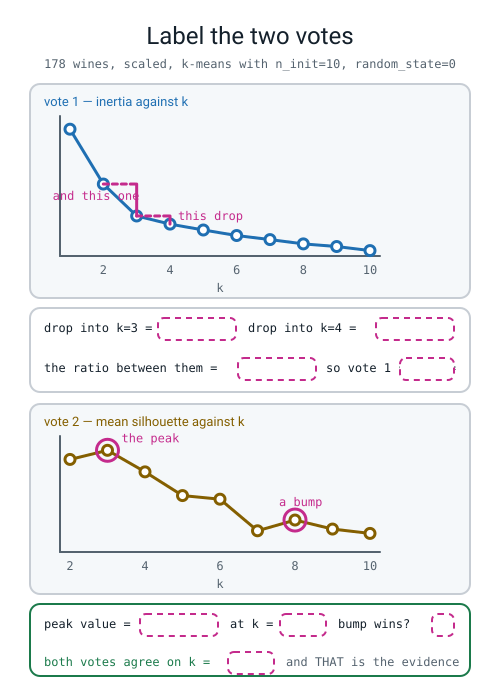
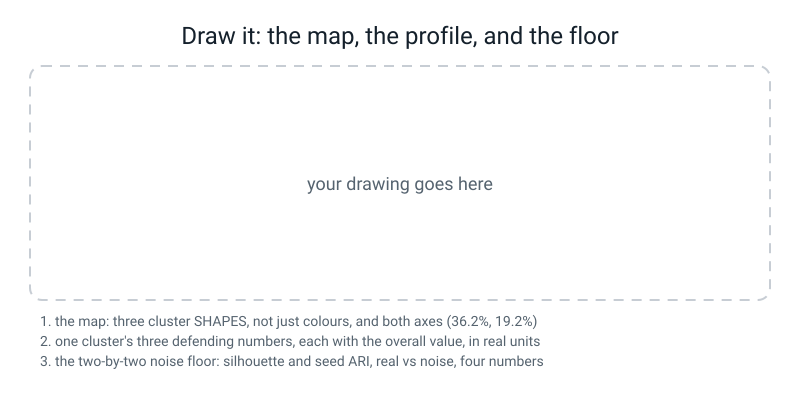

# Workbook — Week 30: Cluster Cartography

**Name:** ________________________________  **Date:** ______________

[⬅ Week 29](week-29.md) · [📖 Read the chapter first](../student-guide/week-30.md) · [Course Home](../README.md) · [Next ➡](week-31.md)

---

## ✅ Warm-Up (5 min)

Five quick questions about **last week**.

**W1.** The variance of **4, 6, 8, 10, 12**. **Four steps, and the answer sklearn would give.**

distances ______________________  squared ______________________

sum ______  ÷ ______ = ________

**W2.** `transform` and `inverse_transform`. **Which one takes the squashed table, and what is the one-line rule?**

________________________________________________________________

**W3.** The wine running-total column reads `0.7360` at four components and `0.8016` at five. **How many components for 80%, as one integer?** ______

**And why is "about five or six" not an answer?** ______________________

**W4.** PCA on the **unscaled** wine gave `evr[0] = 0.9981` and PC1's loading on `proline` was `0.9998`. **In one sentence, what did PCA actually find?**

________________________________________________________________

**W5.** "We kept 55.4% of the spread with two components." **Name the second number that has to go beside that, give its value, and give the division.**

second number: ______________  value: ________  the division: ________ ÷ ________ = ________

---

## 🔢 Do the Maths by Hand

**There is no new maths this week**, so this page uses **this week's new tool worked entirely by hand** — the silhouette — plus **last week's reading of a table**. **Calculator only. No code on this page.**

The six points from Week 28, in their converged clusters:

```
cluster 0 = { A(1,2) , B(2,1) , C(2,3) }        cluster 1 = { D(8,8) , E(9,7) , F(7,9) }
```

> **🔢 The maths, slowly:** a silhouette needs **real distances, with the square root taken.** Everywhere else in this course you have been allowed to skip the square root because you were only *comparing* distances. **Here you divide one by the other, and the ratio of two squares is not the ratio of the two numbers.** So: square root, every time, on this page.

---

**M1 — the silhouette of point A, all the way through.**

**(a) `a(A)` — the average distance to the OTHERS in my own cluster.** A is not one of them.

```
A(1,2) to B(2,1): √( ( 1 − 2 )² + ( 2 − 1 )² ) = √( ______ + ______ ) = √______ = ________

A(1,2) to C(2,3): √( ( 1 − 2 )² + ( 2 − 3 )² ) = √( ______ + ______ ) = √______ = ________

a(A) = ( ________ + ________ ) ÷ ______ = ________
```

**How many distances went into `a`?** ______

**(b) `b(A)` — the average distance to EVERYONE in the nearest other cluster.**

```
A(1,2) to D(8,8): √( ______ + ______ ) = √______ = ________

A(1,2) to E(9,7): √( ______ + ______ ) = √______ = ________

A(1,2) to F(7,9): √( ______ + ______ ) = √______ = ________

b(A) = ( ______ + ______ + ______ ) ÷ ______ = ________
```

**How many distances went into `b`?** ______

**(c) The subtraction and the division.**

```
s(A) = ( b − a ) ÷ whichever of the two is bigger

     = ( ________ − ________ ) ÷ ________

     = ________ ÷ ________

     = ________
```

**(d) Is that a good place to be sitting, or a bad one? Say it with the two numbers in it.**

________________________________________________________________

---

**M2 — now point D, and notice which distance changes.**

`D(8,8)`, cluster 1 = {D, E, F}.

```
a(D) : D to E(9,7) = √______ = ________    D to F(7,9) = √______ = ________

       a(D) = ________

b(D) : D to A(1,2) = √______ = ________
       D to B(2,1) = √______ = ________
       D to C(2,3) = √______ = ________

       b(D) = ________

s(D) = ( ________ − ________ ) ÷ ________ = ________
```

**`a(A)` and `a(D)` are the same number. `b(A)` and `b(D)` are not. Which one of D's three `b` distances is much shorter than A's, and why?**

________________________________________________________________

---

**M3 — do it the WRONG way on purpose, and see what a wrong answer looks like.**

Redo `s(A)` using **squared** distances everywhere — no square roots at all.

```
a(A) = ( 2 + 2 ) ÷ 2 = ________

b(A) = ( 85 + 89 + 85 ) ÷ 3 = ______ ÷ 3 = ________

s(A) = ( ________ − ________ ) ÷ ________ = ________
```

**(a) Your right answer from M1 was ________ and your wrong answer is ________.**

**(b) The wrong one is not obviously silly — it is on the right scale and it is between −1 and +1. Say in one sentence why squaring is allowed when you are comparing and banned when you are dividing.**

________________________________________________________________

---

**M4 — read a profile table and tell a standout from a coincidence.**

Three real rows of the wine profile table, in original units:

| | cluster 0 | cluster 1 | cluster 2 | **overall** |
|---|---:|---:|---:|---:|
| alcohol | 12.25 | 13.13 | 13.68 | **13.00** |
| flavanoids | 2.05 | 0.82 | 3.00 | **2.03** |
| proline | 510.17 | 619.06 | 1100.23 | **746.89** |

**(a) For cluster 1, fill in the gap and the ratio.**

| | its value | minus overall | ÷ overall |
|---|---:|---:|---:|
| alcohol | 13.13 | ________ | ________ |
| flavanoids | 0.82 | ________ | ________ |
| proline | 619.06 | ________ | ________ |

**(b) Which ONE of those three would you use to defend a name for cluster 1, and which one would a marker cross out as a coincidence?**

defend with: ______________  cross out: ______________  **because:** ______________________

**(c) Now cluster 2. Fill in the three ratios.**

alcohol ________  flavanoids ________  proline ________

**(d) Write a name for cluster 2 and the three numbers that defend it, each with its overall beside it.**

name: ______________________________

________________________________________________________________

---

## 🔎 Predict the Output

**In pen, before you run anything.**

### P1 — one cluster

```python
import numpy as np
from sklearn.cluster import KMeans
from sklearn.datasets import load_wine
from sklearn.metrics import silhouette_score
from sklearn.preprocessing import StandardScaler
np.random.seed(0)
X = StandardScaler().fit_transform(load_wine().data)
km = KMeans(n_clusters=1, n_init=10, random_state=0).fit(X)
print("inertia at k=1: %.1f" % km.inertia_)
print("silhouette at k=1:", silhouette_score(X, km.labels_))
```

**My prediction for line 1:** ____________  **for line 2:** ____________

**The truth for line 1:** ____________  **for line 2:** ____________

**One of the two quantities exists at `k = 1` and the other cannot. Say why, using the letters `a` and `b`:**

________________________________________________________________

---

### P2 — three shapes and an agreement

```python
import numpy as np
from sklearn.cluster import KMeans
from sklearn.datasets import load_wine
from sklearn.preprocessing import StandardScaler
np.random.seed(0)
X = StandardScaler().fit_transform(load_wine().data)
km = KMeans(n_clusters=3, n_init=10, random_state=0).fit(X)
d = km.transform(X)
print("X         ", X.shape)
print("d         ", d.shape)
print("labels_   ", km.labels_.shape)
print("agree?", (d.argmin(axis=1) == km.labels_).all())
print(np.round(d[:2], 4))
```

**My predictions:**

X ____________  d ____________  labels_ ____________  agree? ______

**The truth:**

X ____________  d ____________  labels_ ____________  agree? ______

**Where does the `3` in `d`'s shape come from — your data or your decision?** ______________

---

### P3 — one number per point

```python
import numpy as np
from sklearn.cluster import KMeans
from sklearn.datasets import load_wine
from sklearn.metrics import silhouette_samples, silhouette_score
from sklearn.preprocessing import StandardScaler
np.random.seed(0)
X = StandardScaler().fit_transform(load_wine().data)
km = KMeans(n_clusters=3, n_init=10, random_state=0).fit(X)
sil = silhouette_samples(X, km.labels_)
print("sil.shape          :", sil.shape)
print("sil.mean()         : %.10f" % sil.mean())
print("silhouette_score   : %.10f" % silhouette_score(X, km.labels_))
print("how many below 0   :", int((sil < 0).sum()))
print("the worst point    : %.4f  in cluster %d" % (sil.min(), km.labels_[sil.argmin()]))
```

**My predictions:**

shape ______  mean ______  score ______  below 0 ______  worst ______

**The truth:**

shape ______  mean ______  score ______  below 0 ______  worst ______

**Lines 2 and 3 are printed to ten decimal places on purpose. What is that proving?**

________________________________________________________________

---

### P4 — a metric that does not care about order or names

```python
import numpy as np
from sklearn.metrics import adjusted_rand_score
np.random.seed(0)
a = np.array([0, 0, 0, 1, 1, 1])
b = np.array([2, 2, 2, 7, 7, 7])
c = np.array([0, 0, 1, 1, 1, 1])
print("a vs b :", adjusted_rand_score(a, b))
print("b vs a :", adjusted_rand_score(b, a))
print("a vs c :", round(adjusted_rand_score(a, c), 4))
print("a vs a :", adjusted_rand_score(a, a))
```

**My predictions:** ______  ______  ______  ______

**The truth:** ______  ______  ______  ______

**`a` uses the names 0 and 1, `b` uses 2 and 7, and they score 1.0. What exactly is being compared, then?**

________________________________________________________________

---

## ✍️ Practice Set A — Read It

**A1. Match the word to the thing.** Write the letter.

| Word | | Description |
|---|---|---|
| **silhouette score** | ______ | (i) The `k` after which extra clusters stop buying much inertia |
| **adjusted Rand index** | ______ | (ii) Feeding the clustering's output into a supervised model, as distances |
| **cluster profile** | ______ | (iii) `(b − a) ÷ the bigger of the two`, from −1 to +1 |
| **elbow** | ______ | (iv) Run the whole pipeline on data with no structure; whatever it says is your floor |
| **negative control** | ______ | (v) Every feature's mean per cluster, in original units, with an overall column |
| **cluster ID as a feature** | ______ | (vi) How much two groupings of the same rows agree, corrected for luck |

**A2. Read the sweep and write both votes as numbers.**

```text
   k    inertia      drop   silhouette
   1     2314.0         -            -
   2     1659.0     655.0       0.2683
   3     1277.9     381.1       0.2849
   4     1180.7      97.2       0.2457
   5     1110.4      70.4       0.2026
   6     1044.5      65.9       0.1960
   7      996.0      48.5       0.1386
   8      944.6      51.4       0.1581
   9      913.2      31.4       0.1417
  10      864.6      48.6       0.1338
```

**(a) Vote 1, the elbow, written as a division:** ________ ÷ ________ = ________  **so k = ______**

**(b) Vote 2, the silhouette:** peak ________ at k = ______

**(c) The silhouette goes 0.1386 at k=7 and back up to 0.1581 at k=8. Is that a finding?** ______  **Why:**

________________________________________________________________

**(d) Which `k` has the lowest inertia in that table, and what would the lowest possible inertia on 178 wines be?**

k = ______  and the lowest possible is inertia ______ at k = ______

**A3. Spot the bug in each. There are no error messages.**

```python
(1)  km = KMeans(n_clusters=3, n_init=10, random_state=0).fit(Xs)
     print("silhouette: %.4f" % silhouette_score(X_raw, km.labels_))

(2)  idx = rng.choice(178, 142, replace=False)
     print(adjusted_rand_score(ref, KMeans(n_clusters=3, n_init=10,
                                           random_state=0).fit(X[idx]).labels_))

(3)  km = KMeans(n_clusters=3, n_init=10, random_state=0).fit(X)
     print("this clustering is good, silhouette %.4f" % silhouette_score(X, km.labels_))
```

`(1)` what is wrong: ______________________________________________

`(2)` what is wrong: ______________________________________________

`(3)` what is wrong: ______________________________________________

*(Only one of these three actually crashes. Which?* ______ *)*

**A4. Label the diagram.** Fill in every dashed box.


*Figure W30.1 — Label the two votes.*

**A5. Grade three names.** Here is the real per-cluster evidence.

```text
  cluster 0: n= 65   own silhouette 0.1774   worst point -0.0228   below 0: 7
  cluster 1: n= 51   own silhouette 0.3506   worst point  0.0611   below 0: 0
  cluster 2: n= 62   own silhouette 0.3434   worst point  0.0352   below 0: 0
```

| The name somebody wrote | Their defence | Pass / fail, and why |
|---|---|---|
| cluster 2 = "Bold Reserve" | proline 1100 vs 747 · flavanoids 3.00 vs 2.03 · total phenols 2.85 vs 2.30 | ______________________ |
| cluster 1 = "Expensive" | colour intensity 7.23 vs 5.06 · hue 0.69 vs 0.96 | ______________________ |
| cluster 1 = "Dark & Tannic" | alcohol 13.13 vs 13.00 · colour intensity 7.23 vs 5.06 · flavanoids 0.82 vs 2.03 | ______________________ |

**And the question worth as much as all three names put together: which cluster's name is WEAKEST, and give TWO reasons from the printout above.**

cluster ______  reason 1: ______________________  reason 2: ______________________

**A6. Read the noise floor.**

```text
               silhouette   seed-to-seed ARI
real wine        0.2849            1.0000
pure noise       0.0776            0.5791
```

**(a) `0.2849` is a low-looking number. Write the sentence that turns it into evidence.**

________________________________________________________________

**(b) What does `1.0000` in the top-right cell mean, in plain words?**

________________________________________________________________

**(c) Noise scored `0.5791` on stability. Most people predict `0.0000` for that cell. Why is it not zero?**

________________________________________________________________

---

## ✍️ Practice Set B — Write It

### B1 — one line

Print the silhouette of the `k = 3` wine clustering, on the **scaled** table, to four decimal places.

**Expected output:** one number between −1 and +1.
**Done looks like:** `0.2849`

### B2 — the two votes, both as numbers

Sweep `k = 2` to `10` on the scaled wine table. Print `k`, inertia, the drop, and the silhouette in one table — with a `k = 1` row that has inertia but a dash for the silhouette. Then print **both votes as numbers**: the drop ratio as an actual division, and the silhouette peak with the `k` it happens at.

**Done looks like:** two sentences at the bottom that a person could argue with, containing `3.9` and `0.2849`.

> **⚠️ Watch out:** the loop starts at `k = 2`, not 1, and that is not a style choice. `silhouette_score` on one cluster raises an error, because there is no `b`.

### B3 — one silhouette per point, and the weak cluster

Cluster at `k = 3`. Then for each cluster print: its size, **its own mean silhouette**, its worst single point, and **how many of its rows score below zero.** Finish by printing the whole-set score and the mean of the per-point scores.

**Done looks like:** the last two numbers are identical, and exactly one of the three clusters has rows below zero.

### B4 — the profile table, in units a person can read

Build the feature-means table: one row per feature, one column per cluster, **plus an `overall` column**, all in the **original units**. Round to 2 decimal places and print it wide enough not to wrap.

**Done looks like:** `proline` reads in the hundreds and `hue` reads around 1. **If you see `0.83` anywhere, you profiled the scaled table and the page is wrong.**

### B5 — earn their keep, and the floor, about 25 lines

Write a `run(n_train)` function that:

1. splits `X_raw` and `y` with `train_size=n_train`, `random_state=0`, `stratify=y`,
2. fits a `StandardScaler`, a `KMeans(3)` and a `PCA(2)` **on the training rows only**,
3. builds an 18-column table with `np.c_[Z, km.transform(Z), pca.transform(Z)]`,
4. prints the accuracy of `LogisticRegression` on 13 columns and on 18, **with the held-out count on both rows.**

Call it with **124** and then with **30**. Then print the **noise floor**: the silhouette and the five-seed ARI for the real wine and for 178 rows of `np.random.default_rng(0).normal(size=(178, 13))`, as a two-by-two table.

**Done looks like:** four accuracy rows each naming its pile, and a two-by-two table with four numbers in it.

> **⚠️ Watch out:** the three `.fit` calls go on the **training** rows. If any of them touches `b`, you have leaked, and on this dataset **the number will barely move — so nothing will warn you.** You catch this one by reading, not by noticing.

---

## 🐞 Fix the Broken Program

**Three bugs: one shape error, one runtime error, and one that prints a perfectly sensible number in the wrong space.**

```python
"""broken30.py - three bugs. The third prints a sensible number in the wrong space."""
import numpy as np
import pandas as pd
from sklearn.cluster import KMeans
from sklearn.datasets import load_wine
from sklearn.decomposition import PCA
from sklearn.metrics import silhouette_score
from sklearn.preprocessing import StandardScaler

np.random.seed(0)
wine = load_wine()
X_raw = pd.DataFrame(wine.data, columns=wine.feature_names)
X = StandardScaler().fit_transform(X_raw)

km = KMeans(n_clusters=3, n_init=10, random_state=0).fit(X)
labels = km.labels_
pca = PCA(n_components=2).fit(X)
A = np.c_[X, pca.transform(X)]
print("the wider table:", A.shape)
d = km.transform(A)
print("distances to the three centres:", d.shape)

print("   k   silhouette")
for k in range(1, 6):
    lab = KMeans(n_clusters=k, n_init=10, random_state=0).fit(X).labels_
    print("  %2d     %.4f" % (k, silhouette_score(X, lab)))

print("sizes:", np.bincount(labels))
print("silhouette of our k=3 clustering: %.4f" % silhouette_score(X_raw, labels))
```

**The first message:**

```text
the wider table: (178, 15)
Traceback (most recent call last):
  File "broken30.py", line 21, in <module>
    d = km.transform(A)
ValueError: X has 15 features, but KMeans is expecting 13 features as input.
```

**Bug 1.** Where did **15** come from? ______________________  Where did **13** come from? ______________________

**The fix:** ______________________________________________________

**And one sentence on the rule: what does a fitted `KMeans` know about columns?**

________________________________________________________________

**Fix it and run again. The second message:**

```text
the wider table: (178, 15)
distances to the three centres: (178, 3)
   k   silhouette
Traceback (most recent call last):
  File "broken30.py", line 25, in <module>
    print("  %2d     %.4f" % (k, silhouette_score(X, lab)))
ValueError: Number of labels is 1. Valid values are 2 to n_samples - 1 (inclusive)
```

**Bug 2 — the fix:** ______________________________________________

**And why this one is unfixable rather than awkward — what quantity does not exist?**

________________________________________________________________

**Fix that and run again. It finishes, silently:**

```text
the wider table: (178, 15)
distances to the three centres: (178, 3)
   k   silhouette
   2     0.2683
   3     0.2849
   4     0.2457
   5     0.2026
sizes: [65 51 62]
silhouette of our k=3 clustering: 0.1943
```

**Bug 3.** Nothing crashed, and `0.1943` is a perfectly ordinary-looking silhouette.

**(a) Two lines of that output cannot both be true. Which two, and why not?**

________________________________________________________________

**(b) Bug 3 — the line, and the fix:** ______________________________

**(c) What does the last line print once it is fixed?** ____________

---

## 🧩 Puzzle of the Week

### Higher Score, Worse Answer

Two clusterings of the **same 178 wines**, both `k = 3`. One was fitted on the raw columns, one on the standardised columns. Here are four real numbers.

| | silhouette, measured in the space it was clustered in | ARI against the real grape variety |
|---|---:|---:|
| clustered on the **raw** 13 columns | **0.5711** | **0.3711** |
| clustered on the **standardised** 13 columns | **0.2849** | **0.8975** |

**(a) Which clustering has the higher silhouette?** ______________

**(b) Which clustering actually found the grape varieties?** ______________

**(c) So put it in one sentence.** The silhouette measures ______________________, and it does NOT measure ______________________

**(d) Now the interesting half. The unscaled clusters are three sealed bands of `proline`.** Explain why *that* gets such a high silhouette — think about what `a` and `b` look like for a point in the middle of a band.

________________________________________________________________

________________________________________________________________

**(e) And a third number exists: score the **standardised** labels on the **raw** table and you get `0.1943`. Three numbers, one dataset: `0.5711`, `0.2849`, `0.1943`. Write the rule that decides which of the three is meaningful.**

________________________________________________________________

**(f) Finally — this puzzle looks like it destroys the silhouette as a tool. It does not. What is the silhouette still good for, given all of the above?**

________________________________________________________________

---

## 🤔 Think Deeper

**T1.** In Week 27 you learned to put a **control** beside every accuracy. This week you put a **noise floor** beside every silhouette. **Write a paragraph arguing that these are the same idea.** Then name one place in the capstone you are about to build where you will need one, and say exactly what your control or floor would be.

________________________________________________________________

________________________________________________________________

________________________________________________________________

________________________________________________________________

**T2.** Fitting the scaler, the k-means and the PCA on **all 178 rows before splitting** changes the wine accuracy barely at all — both versions score `0.9797`. **Write a paragraph on why that is more alarming than a big change would be.** What does it mean for how you check your own work, and can you describe a dataset shape where the same one-line mistake would be catastrophic?

________________________________________________________________

________________________________________________________________

________________________________________________________________

________________________________________________________________

---

## 🛠️ Build It — Cluster Cartography

**This is one document with five pieces in it, and it is the first thing you have handed in all year that is an argument rather than a score.** Your capstone in four weeks is the same shape.

### Step checklist

- [ ] **1.** Predictions in pen, before anything runs.
- [ ] **2.** The sweep table, `k = 1` to `10`, with inertia, drop and silhouette.
- [ ] **3.** The two plots saved side by side, and **both votes written underneath as numbers.**
- [ ] **4.** The PCA map coloured by cluster, **with shapes as well as colours**, and the **percentage in both axis labels.**
- [ ] **5.** The feature-means table **in original units with an `overall` column.**
- [ ] **6.** Three names, each defended by three numbers, each compared to overall.
- [ ] **7.** One sentence naming your **weakest** cluster, with two reasons.
- [ ] **8.** The supervised experiment at **124** and at **30** training rows, with the pile named on every row.
- [ ] **9.** One sentence on whether you think the difference is real.
- [ ] **10.** **The noise floor, as a two-by-two table with four numbers in it.**

### Predictions, in pen

| | My prediction | The truth |
|---|---|---|
| (a) which `k` will the elbow choose? | ______ | ______ |
| (b) which `k` will the silhouette choose? | ______ | ______ |
| (c) will cluster + PCA columns improve a supervised model on the wine? | ______ | ______ |
| (d) what silhouette will 178 rows of pure noise get? | ______ | ______ |

### The sweep

| k | inertia | drop | silhouette |
|---:|---:|---:|---:|
| 1 | ________ | — | — |
| 2 | ________ | ________ | ________ |
| 3 | ________ | ________ | ________ |
| 4 | ________ | ________ | ________ |
| 5 | ________ | ________ | ________ |
| 6 | ________ | ________ | ________ |
| 7 | ________ | ________ | ________ |
| 8 | ________ | ________ | ________ |
| 9 | ________ | ________ | ________ |
| 10 | ________ | ________ | ________ |

**Vote 1, as a division:** ________ ÷ ________ = ________ → **k = ______**

**Vote 2:** peak ________ at **k = ______**

**Do they agree?** ______  **And why is agreement itself the evidence?**

________________________________________________________________

### The map

**Filename:** ____________________

**x-axis label, in full:** ______________________________________________

**y-axis label, in full:** ______________________________________________

**The two percentages add to ________, so ________% of these wines is NOT on the page.**

**Compared with Week 29's uncoloured version of the identical plot:**

________________________________________________________________

### The profile table and the three names

| | cluster 0 | cluster 1 | cluster 2 | overall |
|---|---:|---:|---:|---:|
| alcohol | ______ | ______ | ______ | ______ |
| flavanoids | ______ | ______ | ______ | ______ |
| color_intensity | ______ | ______ | ______ | ______ |
| hue | ______ | ______ | ______ | ______ |
| proline | ______ | ______ | ______ | ______ |
| total_phenols | ______ | ______ | ______ | ______ |

| cluster | n | own silhouette | below 0 | my name | my three numbers, each with its overall |
|---|---:|---:|---:|---|---|
| 0 | ______ | ______ | ______ | ______________ | ______________________________ |
| 1 | ______ | ______ | ______ | ______________ | ______________________________ |
| 2 | ______ | ______ | ______ | ______________ | ______________________________ |

**My weakest cluster:** ______  **reason 1:** ______________________  **reason 2:** ______________________

### Do the new columns earn their keep?

| training rows | held-out rows | 13 columns | 18 columns | gain, in wines |
|---:|---:|---|---|---:|
| 124 | ______ | ______ (____ of ____) | ______ (____ of ____) | ______ |
| 30 | ______ | ______ (____ of ____) | ______ (____ of ____) | ______ |

**The 124-row result is not evidence against the new columns. What is it?** ______________

**Is the 30-row gain real? One sentence, and say what would convince you:**

________________________________________________________________

### The noise floor

| | silhouette | seed-to-seed ARI |
|---|---:|---:|
| real wine | ________ | ________ |
| pure noise | ________ | ________ |

**Our silhouette is ________ ÷ ________ = ________ times the floor.**

**The two-sentence argument, with all four numbers in it:**

________________________________________________________________

________________________________________________________________

---

## 🎨 Draw It


*Figure W30.2 — The map, the profile, and the floor.*

**What a good answer looks like:** on the left, the **map** — three clouds drawn with **three different shapes** (circles, triangles, squares), the three centres as big crosses, and **`PC1 (36.2% of the spread)`** and **`PC2 (19.2% of the spread)`** written along the axes in full. Write `36.2 + 19.2 = 55.4` somewhere on it, and beside that, `44.6% is not on this page`. In the middle, **one cluster's profile row drawn as three pairs of bars** — its own value beside the overall value, in real units — so that `flavanoids 0.82 against 2.03` is a *picture of a gap* and not a pair of numbers in a table.

**And the two things that earn the marks:** the **two-by-two noise-floor table, drawn as an actual box with four numbers in it** — `0.2849 / 0.0776` on one row and `1.0000 / 0.5791` on the other — with `3.7 times the floor` written beside it. And somewhere on the page, **your weak cluster labelled as weak**, with `0.1774` and `7 below zero` on it. A drawing that shows only the three confident clusters is a sales brochure; **a drawing that shows the one it cannot defend is a report.**

**My three shapes:** ____________  ____________  ____________

**My four noise-floor numbers:** ______ / ______ and ______ / ______

**The cluster I labelled weak, and the two numbers I put on it:** ______  ______  ______

---

## 📊 Self-Check

| I can... | 😀 | 🙂 | 😕 |
|---|---|---|---|
| compute `a`, `b` and `s` for one point by hand, with real distances | | | |
| say why the silhouette needs square roots when inertia does not | | | |
| say what a negative silhouette means about one point | | | |
| write the elbow as a drop ratio rather than pointing at a bend | | | |
| say why inertia alone can never choose `k`, with the number that proves it | | | |
| find the weak cluster from `silhouette_samples` rather than guessing | | | |
| build a profile table in **original units** with an **overall** column | | | |
| defend a cluster name with three numbers, each compared to overall | | | |
| spot `alcohol 13.13 vs 13.00` as a coincidence, not a standout | | | |
| say which of my three names is weakest, out loud, before being asked | | | |
| turn cluster distances and PCs into features without leaking | | | |
| read a ceiling (54 of 54) as "the experiment cannot answer this" | | | |
| run a negative control and put the floor beside my result | | | |
| say why a higher silhouette can mean a worse clustering | | | |

**The one thing I would ask about if I could ask one question:**

________________________________________________________________

---

## ✅ Answers

<details>
<summary>Check your answers</summary>

### Warm-Up

**W1.** distances `−4, −2, 0, +2, +4` · squared `16, 4, 0, 4, 16` · sum **40** · `40 ÷ 4 = 10.0`. **Divide by 4, one less than the count, because that is what sklearn's `PCA` does.**

**W2.** **`inverse_transform` takes the squashed table.** The rule: **`transform` narrows, `inverse_transform` widens, so whatever came out of one goes into the other.**

**W3.** **5.** "About five or six" is not an answer because four gives `0.7360`, which is **under** 80%, and five gives `0.8016`, which is **over** — there is no ambiguity in the table to be vague about.

**W4.** *"It found the `proline` column."* A loading of 0.9998 on one column means PC1 **is** that column, renamed — and `0.9981` of the spread simply reflects that proline's numbers are in the hundreds while everything else is around 1. **Same failure as unscaled k-means, different symptom.**

**W5.** The second number is the **reconstruction error**, value **2.2550**, and the division is `2.2550 ÷ 3.5180 = 0.6410` — a rebuilt wine is wrong by **64% of a typical wine's distance from the middle.**

### Do the Maths by Hand

**M1 (a).**

```
A(1,2) to B(2,1): √( 1 + 1 ) = √2 = 1.4142
A(1,2) to C(2,3): √( 1 + 1 ) = √2 = 1.4142

a(A) = ( 1.4142 + 1.4142 ) ÷ 2 = 1.4142
```

**Two distances went into `a`** — B and C. **A is not one of "the others in my cluster"**, and including it (and dividing by 3) is the single most common slip on this page.

**M1 (b).**

```
A(1,2) to D(8,8): √( 49 + 36 ) = √85 = 9.2195
A(1,2) to E(9,7): √( 64 + 25 ) = √89 = 9.4340
A(1,2) to F(7,9): √( 36 + 49 ) = √85 = 9.2195

b(A) = ( 9.2195 + 9.4340 + 9.2195 ) ÷ 3 = 27.8730 ÷ 3 = 9.2910
```

**Three distances went into `b`** — every member of the other cluster.

**M1 (c).**

```
s(A) = ( 9.2910 − 1.4142 ) ÷ 9.2910   (b is the bigger one)
     = 7.8768 ÷ 9.2910
     = 0.8478
```

**M1 (d).** *"A very good place. A sits `1.4142` from its own clustermates and `9.2910` from the other cluster — about six and a half times further — so it is unambiguously in the right group, and the score of 0.8478 says so."*

**Checked in Python:**

```python
import numpy as np
from sklearn.metrics import silhouette_samples, silhouette_score
X = np.array([[1., 2.], [2., 1.], [2., 3.], [8., 8.], [9., 7.], [7., 9.]])
labels = np.array([0, 0, 0, 1, 1, 1])
print("per point:", np.round(silhouette_samples(X, labels), 4))
print("overall  :", round(silhouette_score(X, labels), 4))
```

```text
per point: [0.8478 0.8163 0.7838 0.8384 0.7618 0.7595]
overall  : 0.8012
```

**A is the first: `0.8478`. Matches to four decimal places.** ✅

**M2.**

```
a(D) : D to E(9,7) = √2 = 1.4142    D to F(7,9) = √2 = 1.4142
       a(D) = 1.4142

b(D) : D to A(1,2) = √85 = 9.2195
       D to B(2,1) = √85 = 9.2195
       D to C(2,3) = √61 = 7.8102
       b(D) = 26.2492 ÷ 3 = 8.7497

s(D) = ( 8.7497 − 1.4142 ) ÷ 8.7497 = 7.3355 ÷ 8.7497 = 0.8384
```

**`silhouette_samples` prints `0.8384` — the fourth number.** ✅

**The shorter distance is `D to C` at `7.8102` instead of 9.2195.** **C is the nearest member of the other cluster to D** — it is the point in the left-hand bunch that sits highest and furthest right, so it reaches out towards D. **That is why D's `b` is smaller than A's, and why D scores slightly lower than A.** The silhouette is sensitive to *which* points face each other across the gap, not just to how far apart the two groups are on average.

**M3.**

```
a(A) = ( 2 + 2 ) ÷ 2 = 2.0

b(A) = ( 85 + 89 + 85 ) ÷ 3 = 259 ÷ 3 = 86.3333

s(A) = ( 86.3333 − 2.0 ) ÷ 86.3333 = 84.3333 ÷ 86.3333 = 0.9768
```

**(a)** The right answer is **0.8478** and the wrong one is **0.9768.**

**(b)** *"Squaring keeps the **order** of two distances the same, so if you only ever ask 'which is nearer?' you can skip the square root and save yourself the work — that is what inertia and the assign step do. But the silhouette **divides** one distance by another, and the ratio of two squares is not the ratio of the two numbers: `4 ÷ 9` is not `2 ÷ 3`. Squaring is a shortcut for comparing, never for dividing."*

**And notice the shape of the wrong answer: `0.9768` is plausible, on the right scale, and between −1 and +1.** Nothing about it looks broken. **This is exactly the kind of error that survives into a report**, which is why this page exists.

**M4 (a).**

| | its value | minus overall | ÷ overall |
|---|---:|---:|---:|
| alcohol | 13.13 | **+0.13** | **1.01** |
| flavanoids | 0.82 | **−1.21** | **0.40** |
| proline | 619.06 | **−127.83** | **0.83** |

**(b) Defend with `flavanoids`** — 0.82 against an overall 2.03 is **40% of typical**, a difference anybody can see. **Cross out `alcohol`** — 13.13 against 13.00 is **0.13 apart, or 1.01× typical**, which defends nothing at all. *(`proline` at 0.83× is in between — real but unremarkable, and not your strongest card.)* **Because a number is only evidence if it is far from the overall; "slightly above average" is what most of a table looks like.**

**(c) Cluster 2.** alcohol `13.68 ÷ 13.00 = 1.05` · flavanoids `3.00 ÷ 2.03 = 1.48` · proline `1100.23 ÷ 746.89 = 1.47`

**(d)** A name and its defence:

> **Cluster 2 = "Bold Reserve."** `proline 1100.23 against an overall 746.89` (1.47× typical) · `flavanoids 3.00 against 2.03` (1.48×) · `total_phenols 2.85 against 2.30`. **All three point the same way: this group is the high-everything group.** *(And note that `alcohol 13.68 against 13.00` is only 1.05× — real, but not one of my three, for the same reason cluster 1's alcohol was not.)*

### Predict the Output

**P1.**

```text
inertia at k=1: 2314.0
ValueError: Number of labels is 1. Valid values are 2 to n_samples - 1 (inclusive)
```

**Inertia exists at `k = 1`** — it is just the total squared distance from every wine to the single middle of the whole cloud. **The silhouette cannot exist**, because **`b` is the average distance to the nearest *other* cluster, and with one cluster there is no other.** The quantity is not merely awkward to compute; **it is undefined.** *(Which is also why a silhouette can never be used to compare `k = 1` against `k = 3`.)*

**P2.**

```text
X          (178, 13)
d          (178, 3)
labels_    (178,)
agree? True
[[4.9629 6.2931 2.0634]
 [3.8452 5.6853 2.74  ]]
```

**The `3` comes from your decision**, not from your data — it is `n_clusters`. The `13` in `X`'s shape comes from the data; the `3` in `d`'s shape is the `k` you chose. **`km.transform(X)` gives one distance per centre, and the smallest of each row is that row's label** — which `agree? True` proves. **First wine: 4.9629, 6.2931, 2.0634. The smallest is the third, so it belongs to cluster 2.**

**P3.**

```text
sil.shape          : (178,)
sil.mean()         : 0.2848589192
silhouette_score   : 0.2848589192
how many below 0   : 7
the worst point    : -0.0228  in cluster 0
```

**Ten decimal places is proving that `silhouette_score` is *exactly* the mean of `silhouette_samples`** — not approximately, not weighted by cluster size, but the plain average over every row, each counting once. **Worth printing once so you never wonder again**, and it is also the licence to average the per-point scores *within* a cluster, which is how you find the weak one.

**P4.**

```text
a vs b : 1.0
b vs a : 1.0
a vs c : 0.3243
a vs a : 1.0
```

**What is being compared is the *partition* — who is grouped with whom — and not the names.** `a` puts rows 1–3 together and rows 4–6 together; `b` does exactly the same, using the labels 2 and 7 instead of 0 and 1. **Same grouping, different names, ARI 1.0.** And `adjusted_rand_score(a, b)` equals `adjusted_rand_score(b, a)`, which is unusual — almost every other two-argument metric in this course cares deeply which argument is the truth.

**This is precisely the tool Week 28 said was missing**, when `(a.labels_ == b.labels_).all()` printed `False` for two identical groupings.

### Practice Set A

**A1.** silhouette score **(iii)** · adjusted Rand index **(vi)** · cluster profile **(v)** · elbow **(i)** · negative control **(iv)** · cluster ID as a feature **(ii)**

**A2 (a).** `381.1 ÷ 97.2 = 3.9` → **k = 3.** The third cluster bought nearly four times what the fourth did, and after that every extra cluster buys roughly the same as the last (70, 66, 48, 51, 31, 49) — which is what "no more structure" looks like.

**(b)** peak **0.2849** at **k = 3.**

**(c) No, it is not a finding.** **A local rise that does not beat the maximum is noise.** 0.1581 beats its neighbour 0.1386 and is barely half the peak of 0.2849. *(If it had been 0.30 it would have been a genuine second candidate and you would have had a real disagreement to write about.)*

**(d)** In the table, **k = 10** has the lowest inertia, 864.6 — **and it always will be the last row, whatever the last row is.** The lowest possible is **inertia 0 at k = 178**, one cluster per wine. **That single fact is the whole reason inertia cannot choose `k`.**

**A3.**

`(1)` **It clustered in the standardised space and scored in the raw space.** No crash, and the number it gives (`0.1943`) describes neither the clustering it made nor any clustering anybody would want. **Score in the same space you clustered in.**

`(2)` **`ref` was not indexed.** `ref` has 178 entries and the new labels have 142, so `adjusted_rand_score` gets two different lengths. **This one DOES crash** — `ValueError: Found input variables with inconsistent numbers of samples: [178, 142]`. The fix is `ref[idx]`.

`(3)` **The word "good" with nothing beside it.** `0.2849` is not good or bad until there is a second number: the **noise floor** (0.0776 here), or the field-guide bands, or another clustering of the same table in the same space. **No crash, and the sentence is the bug.**

**Only `(2)` crashes.** `(1)` and `(3)` are the expensive ones.

**A4 — the diagram, labelled.**

```
drop into k=3 = 381.1        drop into k=4 = 97.2

the ratio between them = 3.9        so vote 1 says k = 3

peak value = 0.2849   at k = 3   bump wins? no

both votes agree on k = 3   and THAT is the evidence
```

**The bump at k=8 is 0.1581 against a peak of 0.2849 — it loses by a mile.** Mark it `no` and move on.

**A5.**

| The name | Verdict |
|---|---|
| cluster 2 = "Bold Reserve" | **Pass.** Three numbers, all well clear of the overall, all pointing the same way: proline 1.47× typical, flavanoids 1.48×, total phenols comfortably up. The name is the table, in words. |
| cluster 1 = "Expensive" | **Fail.** The two numbers are fine — colour intensity 7.23 against 5.06 is a real standout — but **nothing in thirteen chemical measurements is a price.** The evidence does not support the claim it is being used for. Rename it after what was measured. |
| cluster 1 = "Dark & Tannic" | **Pass, with one number struck out.** Colour intensity 7.23 vs 5.06 and flavanoids 0.82 vs 2.03 are both strong. **`alcohol 13.13 vs 13.00` must go** — 0.13 apart defends nothing, and putting it in a three-number defence weakens the other two by association. Replace it with `hue 0.69 vs 0.96`. |

**The weakest name is cluster 0's.** **Reason 1: its own mean silhouette is `0.1774`, about half of cluster 1's 0.3506 and cluster 2's 0.3434.** **Reason 2: seven of its sixty-five bottles score below zero**, meaning they sit closer to a different cluster than to their own — the only cluster with any. *(And the profile table gives a third reason if you want it: cluster 0 is the **lowest** of the three on almost every column and the highest on nothing, and "low on things" is a much weaker basis for a group than "high on a specific thing.")*

**A6 (a).** *"Our clustering scores `0.2849`, and the identical pipeline run on 178 rows of pure random numbers scores `0.0776` — so our score is **3.7 times the floor**, which is what makes it evidence rather than a number."*

**(b) `1.0000` means our grouping came out *identical* across five different random seeds.** Not similar — identical, wine for wine. The algorithm is not hunting around; it lands in the same place every time.

**(c) It is not zero because there IS a tightest three-way split of a formless cloud, and k-means finds roughly the same one each time.** Noise is not *structureless* to a distance-measuring algorithm; it is just **evenly** structured, and an even cloud still has a middle and still has three regions around it. **0.5791 means the noise grouping agrees with itself a bit over half the time — enough to look reassuring if you had nothing to compare it with, and that is exactly the trap.**

### Practice Set B

**B1.**

```python
"""b1.py - one line: the silhouette of the k=3 wine clustering."""
from sklearn.cluster import KMeans
from sklearn.datasets import load_wine
from sklearn.metrics import silhouette_score
from sklearn.preprocessing import StandardScaler

X = StandardScaler().fit_transform(load_wine().data)
print(round(silhouette_score(X, KMeans(n_clusters=3, n_init=10, random_state=0).fit(X).labels_), 4))
```

```text
0.2849
```

**B2.**

```python
"""b2.py - the two votes, both as numbers."""
import numpy as np
from sklearn.cluster import KMeans
from sklearn.datasets import load_wine
from sklearn.metrics import silhouette_score
from sklearn.preprocessing import StandardScaler

np.random.seed(0)
X = StandardScaler().fit_transform(load_wine().data)
prev = KMeans(n_clusters=1, n_init=10, random_state=0).fit(X).inertia_
print("   k    inertia      drop   silhouette")
print("   1   %8.1f         -            -" % prev)
ks, sils, drops = [], [], {}
for k in range(2, 11):
    km = KMeans(n_clusters=k, n_init=10, random_state=0).fit(X)
    s = silhouette_score(X, km.labels_)
    drops[k] = prev - km.inertia_
    print("  %2d   %8.1f   %7.1f       %.4f" % (k, km.inertia_, drops[k], s))
    ks.append(k); sils.append(s)
    prev = km.inertia_
print()
print("vote 1, the drop ratio : %.1f / %.1f = %.1f  -> k = 3"
      % (drops[3], drops[4], drops[3] / drops[4]))
print("vote 2, the silhouette : peak %.4f at k = %d"
      % (max(sils), ks[int(np.argmax(sils))]))
print("both votes agree, and THAT is the evidence.")
```

```text
   k    inertia      drop   silhouette
   1     2314.0         -            -
   2     1659.0     655.0       0.2683
   3     1277.9     381.1       0.2849
   4     1180.7      97.2       0.2457
   5     1110.4      70.4       0.2026
   6     1044.5      65.9       0.1960
   7      996.0      48.5       0.1386
   8      944.6      51.4       0.1581
   9      913.2      31.4       0.1417
  10      864.6      48.6       0.1338

vote 1, the drop ratio : 381.1 / 97.2 = 3.9  -> k = 3
vote 2, the silhouette : peak 0.2849 at k = 3
both votes agree, and THAT is the evidence.
```

**Runtime: about 1.5 seconds.**

**B3.**

```python
"""b3.py - one silhouette per point, and the cluster that cannot defend itself."""
import numpy as np
from sklearn.cluster import KMeans
from sklearn.datasets import load_wine
from sklearn.metrics import silhouette_samples, silhouette_score
from sklearn.preprocessing import StandardScaler

np.random.seed(0)
X = StandardScaler().fit_transform(load_wine().data)
km = KMeans(n_clusters=3, n_init=10, random_state=0).fit(X)
labels = km.labels_
sil = silhouette_samples(X, labels)
print("one number per row:", sil.shape)
print("cluster sizes     :", np.bincount(labels))
for c in range(3):
    m = labels == c
    print("  cluster %d: n=%3d   own silhouette %.4f   worst point %7.4f   below 0: %d"
          % (c, m.sum(), sil[m].mean(), sil[m].min(), int((sil[m] < 0).sum())))
print("  whole set         : %.4f" % silhouette_score(X, labels))
print("  mean of the parts : %.4f" % sil.mean())
```

```text
one number per row: (178,)
cluster sizes     : [65 51 62]
  cluster 0: n= 65   own silhouette 0.1774   worst point -0.0228   below 0: 7
  cluster 1: n= 51   own silhouette 0.3506   worst point  0.0611   below 0: 0
  cluster 2: n= 62   own silhouette 0.3434   worst point  0.0352   below 0: 0
  whole set         : 0.2849
  mean of the parts : 0.2849
```

**`silhouette_samples` is the line that finds the weak cluster**, because a single overall 0.2849 hides the fact that one of the three clusters is scoring half what the other two are.

**B4.**

```python
"""b4.py - the profile table, in units a person can read."""
import numpy as np
import pandas as pd
from sklearn.cluster import KMeans
from sklearn.datasets import load_wine
from sklearn.preprocessing import StandardScaler

np.random.seed(0)
pd.set_option("display.width", 130)
wine = load_wine()
X_raw = pd.DataFrame(wine.data, columns=wine.feature_names)
X = StandardScaler().fit_transform(X_raw)
labels = KMeans(n_clusters=3, n_init=10, random_state=0).fit(X).labels_

prof = X_raw.copy()
prof["cluster"] = labels
means = prof.groupby("cluster").mean().T
means["overall"] = X_raw.mean()
print(means.round(2).to_string())
```

```text
cluster                            0       1        2  overall
alcohol                        12.25   13.13    13.68    13.00
malic_acid                      1.90    3.31     2.00     2.34
ash                             2.23    2.42     2.47     2.37
alcalinity_of_ash              20.06   21.24    17.46    19.49
magnesium                      92.74   98.67   107.97    99.74
total_phenols                   2.25    1.68     2.85     2.30
flavanoids                      2.05    0.82     3.00     2.03
nonflavanoid_phenols            0.36    0.45     0.29     0.36
proanthocyanins                 1.62    1.15     1.92     1.59
color_intensity                 2.97    7.23     5.45     5.06
hue                             1.06    0.69     1.07     0.96
od280/od315_of_diluted_wines    2.80    1.70     3.16     2.61
proline                       510.17  619.06  1100.23   746.89
```

**Two things make this table usable and both are easy to leave out.** **`prof = X_raw.copy()`** — the raw table, so the numbers are in units a winemaker recognises. **`means["overall"] = X_raw.mean()`** — the yardstick column, without which every number in the table is unfalsifiable.

**B5.**

```python
"""b5.py - do the new columns earn their keep, and what does noise score?"""
import numpy as np
import pandas as pd
from sklearn.cluster import KMeans
from sklearn.datasets import load_wine
from sklearn.decomposition import PCA
from sklearn.linear_model import LogisticRegression
from sklearn.metrics import adjusted_rand_score, silhouette_score
from sklearn.model_selection import train_test_split
from sklearn.preprocessing import StandardScaler

np.random.seed(0)
wine = load_wine()
X_raw = pd.DataFrame(wine.data, columns=wine.feature_names)
y = wine.target


def run(n_train, state=0):
    a, b, ya, yb = train_test_split(X_raw, y, train_size=n_train,
                                    random_state=state, stratify=y)
    sc = StandardScaler().fit(a)                     # TRAIN rows only
    Za, Zb = sc.transform(a), sc.transform(b)
    k3 = KMeans(n_clusters=3, n_init=10, random_state=0).fit(Za)
    pc = PCA(n_components=2).fit(Za)
    Aa = np.c_[Za, k3.transform(Za), pc.transform(Za)]
    Ab = np.c_[Zb, k3.transform(Zb), pc.transform(Zb)]
    print("  train rows %d, held-out rows %d, columns %d -> %d"
          % (len(ya), len(yb), Za.shape[1], Aa.shape[1]))
    for tag, p, q in [("13 raw columns      ", Za, Zb),
                      ("13 + 3 dists + 2 PCs", Aa, Ab)]:
        acc = LogisticRegression(max_iter=5000).fit(p, ya).score(q, yb)
        print("  %s  %.4f  (%d of %d held-out wines)"
              % (tag, acc, round(acc * len(yb)), len(yb)))


print("--- 124 labelled training rows ---")
run(124)
print("--- 30 labelled training rows ---")
run(30)

print()
print("--- the noise floor ---")
X = StandardScaler().fit_transform(X_raw)
noise = np.random.default_rng(0).normal(size=(178, 13))
real = KMeans(n_clusters=3, n_init=10, random_state=0).fit(X)
kmn = KMeans(n_clusters=3, n_init=10, random_state=0).fit(noise)
print("               silhouette   seed-to-seed ARI")
for tag, data, km0 in [("real wine ", X, real), ("pure noise", noise, kmn)]:
    aris = [adjusted_rand_score(km0.labels_,
            KMeans(n_clusters=3, n_init=10, random_state=s).fit(data).labels_)
            for s in (1, 2, 3, 4, 5)]
    print("%s       %.4f            %.4f"
          % (tag, silhouette_score(data, km0.labels_), np.mean(aris)))
print("so our silhouette is %.1f times the floor" % (0.2849 / 0.0776))
```

```text
--- 124 labelled training rows ---
  train rows 124, held-out rows 54, columns 13 -> 18
  13 raw columns        1.0000  (54 of 54 held-out wines)
  13 + 3 dists + 2 PCs  1.0000  (54 of 54 held-out wines)
--- 30 labelled training rows ---
  train rows 30, held-out rows 148, columns 13 -> 18
  13 raw columns        0.9527  (141 of 148 held-out wines)
  13 + 3 dists + 2 PCs  0.9797  (145 of 148 held-out wines)

--- the noise floor ---
               silhouette   seed-to-seed ARI
real wine        0.2849            1.0000
pure noise       0.0776            0.5791
so our silhouette is 3.7 times the floor
```

**Runtime: about 2 seconds.** **Read the three `.fit` lines inside `run` out loud — `sc`, `k3` and `pc` are all fitted on `a`, the training rows.** That is the entire leakage discipline, visible in three lines instead of hidden inside a pipeline.

### Fix the Broken Program

**Bug 1 — line 21.** **`15` came from `np.c_[X, pca.transform(X)]`:** 13 original columns glued to 2 principal components. **`13` came from the `km` that was fitted on `X` back on line 16.** The fix:

```python
d = km.transform(X)
```

**The rule:** **a fitted `KMeans` remembers exactly how many columns it was fitted on, and it will refuse anything else.** Its three centres are each described by 13 numbers; it has no idea what a fourteenth or fifteenth column would mean. **The same rule holds for every fitted scikit-learn object you have met — a scaler, a PCA, a logistic regression.** *(And notice that the message tells you both numbers. `15` and `13` between them name the bug.)*

**Bug 2 — line 24.** The fix is `for k in range(2, 6):`.

**Why it is unfixable rather than awkward: `b` does not exist.** `b` is the average distance to the nearest **other** cluster, and with one cluster there is no other cluster to measure to. **You cannot compute the quantity, so there is no value to return** — which is also why a silhouette can never be used to argue that `k = 3` beats `k = 1`.

**Bug 3 — line 29: `silhouette_score(X_raw, labels)`.**

**(a) The contradiction: the sweep table says `3  0.2849` and the last line says `0.1943` — for the same `k = 3` clustering of the same 178 wines.** One clustering cannot have two silhouettes. **The sweep measured it in the scaled space it was built in; the last line measured it in the raw space, where the same grouping looks much worse because raw distance is essentially proline distance and these clusters do not separate by proline.**

**(b) The fix:**

```python
print("silhouette of our k=3 clustering: %.4f" % silhouette_score(X, labels))
```

**(c) Once fixed the last line prints `0.2849`** — and now it matches the `k = 3` row of the table above it, which is the check that should have been made in the first place. **When the same quantity appears twice in one output, read both.**

### Puzzle of the Week

**(a)** The **raw** clustering, at **0.5711** — twice the scaled one's 0.2849.

**(b)** The **standardised** clustering: **ARI 0.8975** against the real grape varieties, versus 0.3711.

**(c)** *"The silhouette measures **the shape of your grouping in the space you measured it in** — how tight and how separated the groups are. It does **not** measure **whether the grouping is the right one**, or whether it corresponds to anything real in the world."*

**(d) Why three sealed bands of one column score so well.** Think about a point sitting in the middle of the 600–937 proline band. **In raw space, distance is essentially proline distance** — because proline's gaps are in the hundreds and every other column's gaps are around 1, so the other twelve contribute almost nothing. **So `a`, its average distance to its own band-mates, is small**: everything in its band is within about 170 proline of it. **And `b`, its average distance to the nearest other band, is large**: the bands do not touch, so every member of the neighbouring band is at least the gap away, and members of the far band are hundreds away. **Small `a`, large `b`, on every single point — because a line cut into three non-overlapping segments is the tidiest possible arrangement in one dimension.** **Nothing is tidier than three bands of one column. They are just bands of the wrong thing.**

**(e) The rule:** **score in the same space you clustered in, and only ever compare two silhouettes measured in the same space.** `0.5711` is a legitimate description of the raw clustering *in raw space*. `0.2849` is a legitimate description of the scaled clustering *in scaled space*. **`0.1943` is the scaled labels scored in raw space and describes nothing anybody built** — it is the same category of error as comparing an inertia of 2,370,689.7 with one of 1,277.9. **Changing the ruler changes the number, so a number is only comparable to another number measured with the same ruler.**

**(f) What the silhouette is still good for.** **Three things, and all of them are comparisons inside one space.** **One: choosing `k`** — the same table, the same scaling, several values of `k`, and the peak is a genuine vote. **Two: finding the weak cluster** — `silhouette_samples` averaged within each cluster, which is how cluster 0's 0.1774 and its seven negative rows came to light. **Three: against a noise floor** — the same pipeline on structureless data, which turns 0.2849 into "3.7 times the floor". **What it cannot do is rank two clusterings built in different spaces, or tell you that a grouping is correct.** A tool that answers three questions well and one question misleadingly is still a good tool; you just have to know which question you asked.

### Think Deeper

**T1 — the control and the floor are the same idea.**

> ***They are the same move, and the move is "compared to what?"** In Week 27 a frozen backbone scored 0.9257 and the number meant nothing until the same network trained from scratch scored 0.9814 — at which point 0.9257 stopped being a success and became a loss. This week a clustering scored 0.2849 and the number meant nothing until 178 rows of pure noise scored 0.0776 — at which point 0.2849 stopped being "a low score" and became "3.7 times the floor". **In both cases the second number was produced by deliberately removing the thing being tested** and running everything else unchanged. That is the definition of a control, and a noise floor is a control where the thing removed is *the structure itself*.
>
> ***In the capstone:** whatever I ship, the log will record a latency and an accuracy, and neither is interpretable alone. **My control will be the dumbest model that still answers the question** — for the digits CNN, `DummyClassifier(strategy="most_frequent")`, which gets about 10% and has to be in the model card; for latency, **the time taken by a function that returns a constant**, so I know how much of my 95th-percentile number is my model and how much is just Python answering an HTTP request. **Both go in the report next to my real numbers, not in a footnote.***

**T2 — why a small leak is worse than a big one.**

> ***Because a big leak warns you and a small one does not.** If fitting the scaler on all 178 rows had jumped the accuracy from 0.95 to 1.00, I would have gone looking for the reason and found it. It went from 0.9797 to 0.9797. **So my only detector — "that looks too good" — reported nothing, and the bug was still there.** The uncomfortable conclusion is that **the size of a leak is not a property of the mistake, it is a property of the dataset.** On 178 rows with 13 well-behaved columns, the directions PCA finds on all the rows and on a training fold are nearly identical, so the leak has almost nothing to carry. **The code was equally wrong in both cases.**
>
> ***What that means for checking my own work:** I cannot verify leakage from the numbers. I verify it by **reading the code and pointing at every `.fit` in turn**, saying out loud which rows it saw. Three `.fit` calls, three answers, all of them "the training rows." If I cannot do that in ten seconds, the script is structured wrongly — which is the real argument for putting everything in a `Pipeline`, because then there is only one `.fit` to check.
>
> ***A shape where the same line is catastrophic:** **300 rows and 20,000 columns**, which is the normal shape of a genetics dataset. With far more columns than rows, PCA fitted on everything can find directions that are essentially noise fitted to the specific rows it saw, including the test rows — and a classifier built on those directions can score near-perfectly on data it has effectively already been shown. **Same one-line mistake, 178×13 costs nothing and 300×20,000 invalidates the paper.***

### Build It

**Predictions.** Present or absent, not right or wrong. **(a) k = 3**, with `381.1 ÷ 97.2 = 3.9`. **(b) k = 3**, at 0.2849 — **and the two agreeing is the point.** **(c) Not at 124 training rows (54 of 54 either way); yes at 30 (141 → 145).** **(d) 0.0776 — positive, with three tidy clusters.** Nearly everybody predicts (d) as zero or negative, and **the fact that noise scores a comfortably positive 0.0776 is the single most important surprise of Term 4.**

**The sweep.** Exactly B2's table. **Vote 1: `381.1 ÷ 97.2 = 3.9` → k = 3. Vote 2: peak 0.2849 at k = 3. They agree.**

**Why agreement is the evidence:** *"The two methods measure different things and can fail in different directions — the elbow tends to over-count, because splitting a big loose cluster always buys inertia, and the silhouette tends to under-count when clusters touch, because border points score near zero and drag the mean down. Two tools with different weaknesses landing on the same answer is much harder to explain away than either one on its own."*

**The map.** Filename `wine_map.png`. The labels, in full:

```
PC1 (36.2% of the spread)
PC2 (19.2% of the spread)
```

**`36.2 + 19.2 = 55.4`, so 44.6% of these wines is NOT on the page.**

**Compared with Week 29's version:** *"Identical points, identical axes, identical percentages — and last week it was one elongated blob with no gaps in it. Colouring it by cluster makes three groups appear. Nothing about the data changed; the structure was there the whole time and the picture could not show it. That is exactly why a clustering needs a number and not a plot."*

**The profile table.** The six requested rows, from B4's output:

| | cluster 0 | cluster 1 | cluster 2 | overall |
|---|---:|---:|---:|---:|
| alcohol | 12.25 | 13.13 | 13.68 | 13.00 |
| flavanoids | 2.05 | 0.82 | 3.00 | 2.03 |
| color_intensity | 2.97 | 7.23 | 5.45 | 5.06 |
| hue | 1.06 | 0.69 | 1.07 | 0.96 |
| proline | 510.17 | 619.06 | 1100.23 | 746.89 |
| total_phenols | 2.25 | 1.68 | 2.85 | 2.30 |

**Three defended names:**

| cluster | n | own silhouette | below 0 | name | the three numbers |
|---|---:|---:|---:|---|---|
| 2 | 62 | 0.3434 | 0 | **Bold Reserve** | proline **1100 vs 747** · flavanoids **3.00 vs 2.03** · total phenols **2.85 vs 2.30** |
| 1 | 51 | 0.3506 | 0 | **Dark & Tannic** | flavanoids **0.82 vs 2.03** · colour intensity **7.23 vs 5.06** · hue **0.69 vs 0.96** |
| 0 | 65 | 0.1774 | 7 | **Light & Pale** | colour intensity **2.97 vs 5.06** · proline **510 vs 747** · alcohol **12.25 vs 13.00** |

**Any name passes if the numbers support it** — "Rich & Full", "High-Phenol", "Big Wines" are all fine for cluster 2. **What fails is a bare number, a number that is not a standout (`alcohol 13.13 vs 13.00`), or a claim not in the table ("Expensive", "Award-Winning", "Old").**

**The weakest cluster: 0.** **Reason 1: its own silhouette is 0.1774, about half of the other two.** **Reason 2: seven of its 65 bottles score below zero** — the only cluster with any. *(Third reason, from the table: it is lowest on almost every column and highest on nothing. **"Low on things" is a weaker basis for a group than "high on a specific thing"** — and a cluster defined mainly by absence is often a sign that `k` is too small, or that the real structure is two strong groups plus a continuum of leftovers.)*

**Do the new columns earn their keep?**

| training rows | held-out rows | 13 columns | 18 columns | gain |
|---:|---:|---|---|---:|
| 124 | 54 | 1.0000 (54 of 54) | 1.0000 (54 of 54) | **0 wines** |
| 30 | 148 | 0.9527 (141 of 148) | 0.9797 (145 of 148) | **4 wines** |

**The 124-row result is a ceiling, not evidence against the new columns.** The problem was already completely solved, so nothing could improve it — **the experiment cannot answer the question that was asked.** *(Concluding "the features don't help" from 54 of 54 is exactly the inference that kills real experiments.)*

**Is the 30-row gain real?**

> *Over ten different 30-row splits the **mean gain is +1.15 accuracy points**, which is smaller than this single split suggested and about the same size as the baseline's own split-to-split standard deviation of **0.0125**. **So the size of the gain is not convincing on its own — but the 18-column version won 8 times, tied twice and never lost, and that consistency is the evidence.** What would convince me further: more splits, and a third row showing the five new columns **alone**, which on this split score 146 of 148 — beating all thirteen originals, because with 30 labelled rows a 13-column model has 42 coefficients and nowhere near enough rows, while k-means used all 30 rows' geometry with no labels at all.*

**The noise floor.**

| | silhouette | seed-to-seed ARI |
|---|---:|---:|
| real wine | **0.2849** | **1.0000** |
| pure noise | **0.0776** | **0.5791** |

`0.2849 ÷ 0.0776 = 3.7` **times the floor.**

**The two-sentence argument:**

> *`0.2849` on its own is meaningless; against a floor of `0.0776` from a dataset with no structure in it at all, it is **3.7 times the floor**. And the stability numbers make the same point harder: our grouping is **identical across five different seeds** (ARI `1.0000`) where the noise grouping agrees with itself only `0.5791` of the time — **and neither of those two comparisons means anything without its partner.**

### Draw It

**My three shapes: circles, triangles, squares** — and the reason to use shapes as well as colours is that the drawing has to survive a photocopier and a colour-blind reader.

**My four noise-floor numbers: `0.2849 / 0.0776` and `1.0000 / 0.5791`.**

**The cluster labelled weak: cluster 0, with `0.1774` and `7 below zero` written on it.**

**What separates a good drawing from a great one:** the great one **draws the weak cluster differently** — a dashed outline, or the seven negative bottles marked as small hollow dots sitting between two clouds. **A map with three equally confident blobs on it is a lie about a dataset where one cluster scores half what the other two do**, and the fix is a pen stroke. **The single most valuable thing on this page is the cluster you cannot defend, drawn as undefended.**

### Self-Check answers

There are no right answers to a self-check, but four rows predict the capstone in Weeks 34 to 36.

**"say why the silhouette needs square roots when inertia does not"** — if that is a 😕, do M3 again and look at the two answers side by side: `0.8478` and `0.9768`. **The wrong one looks completely fine.** Squaring keeps the order, so it is safe when you compare; it does not keep the ratio, so it is fatal when you divide.

**"run a negative control and put the floor beside my result"** — if that is a 😕, this is the piece to spend your last fifteen minutes on, because **almost nobody in the world bothers with it.** A write-up with a noise floor in it is more trustworthy than most published clustering work, and it takes four lines.

**"read a ceiling (54 of 54) as 'the experiment cannot answer this'"** — if that is a 😕, cover the 30-row block with your hand and read only the 124-row block. **It looks like proof that the new columns are useless.** It is proof of nothing at all, and telling those two situations apart is the whole of objective 4.

**"say why a higher silhouette can mean a worse clustering"** — if that is a 😕, re-read the puzzle. `0.5711` with ARI `0.3711` against `0.2849` with ARI `0.8975`. **Three sealed bands of one column are the tidiest arrangement there is, and they are bands of the wrong thing.**

</details>
