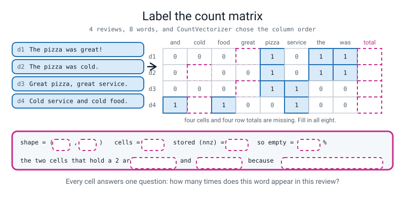
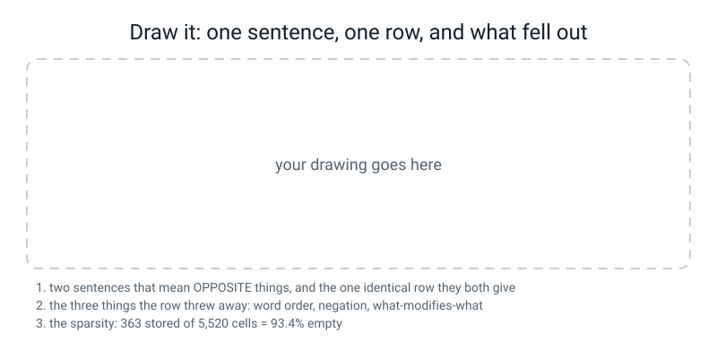

# Workbook — Week 31: Words Into Columns

**Name:** ________________________________  **Date:** ______________

[⬅ Week 30](week-30.md) · [📖 Read the chapter first](../student-guide/week-31.md) · [Course Home](../README.md) · [Next ➡](week-32.md)

---

## ✅ Warm-Up (5 min)

Five quick questions about **last week**.

**W1.** A point sits `2.0` from the others in its own cluster and `6.0` from everybody in the nearest other cluster. **Write the silhouette as a division and give the answer to 4 dp.**

s = ( ______ − ______ ) ÷ ______ = ______ ÷ ______ = ____________

**And in one sentence, is that point in the right cluster?** ________________________________

**W2.** The wine sweep dropped `381.1` going into `k = 3` and `97.2` going into `k = 4`. **Write vote 1 as an actual division, and name the `k`.**

________ ÷ ________ = ________  **so k = ______**

**W3.** `silhouette_score(X, labels)` printed `0.2848589192` and so did `silhouette_samples(X, labels).mean()`. **What does that identity let you do that you could not otherwise justify?**

________________________________________________________________

**W4.** Real wine scored `0.2849`; 178 rows of pure random numbers scored `0.0776`. **Write the comparison as a division and finish the sentence.**

________ ÷ ________ = ________  **times the floor, so our clustering is** ________________________

**W5.** Clustered on the **raw** columns: silhouette `0.5711`, ARI against the real grape variety `0.3711`. Clustered on the **standardised** columns: silhouette `0.2849`, ARI `0.8975`.

**(a) Higher silhouette:** ______________  **(b) Actually found the grapes:** ______________

**(c) So in one sentence, what does the silhouette measure?** ______________________________

---

## 🔢 Do the Maths by Hand

**There is no new maths this week.** So this page does **this week's arithmetic entirely by hand** — the grid, its totals, and the sparsity — and finishes with **one return to Week 29's variance**, because you are about to need it again.

**Calculator only. No code on this page.** Then check yourself against the answer key, which shows the real run.

---

**M1 — three sentences, one grid, every cell by hand.**

```text
t1 = "cold pizza and cold chips"
t2 = "hot pizza and hot chips"
t3 = "the pizza was cold"
```

**(a) The vocabulary.** Write every distinct word, **in alphabetical order**, because that is the order `CountVectorizer` will use. (There are seven. If you have eight, you counted a repeat.)

______  ______  ______  ______  ______  ______  ______

**(b) Fill in all twenty-one cells, in pen. No blanks — a blank is not a number.**

| | ______ | ______ | ______ | ______ | ______ | ______ | ______ | **row total** |
|---|---:|---:|---:|---:|---:|---:|---:|---:|
| **t1** | | | | | | | | |
| **t2** | | | | | | | | |
| **t3** | | | | | | | | |
| **column total** | | | | | | | | |

**(c) The two checks that catch a miscount.**

Row totals must equal the number of tokens in each sentence: ______ , ______ , ______

And both totals must agree: `______ + ______ + ______ = ________` and the column totals also add to ________

**(d) The shape, and the emptiness.**

shape = ( ______ , ______ )  ·  cells = ______ × ______ = ________

non-zero cells = ________  ·  empty cells = ________  ·  empty = ________ ÷ ________ = ________%

**(e) t1 and t2 are the same sentence with `cold` swapped for `hot`. How many of the seven columns tell them apart?** ______

---

**M2 — the sparsity, on your corpus and then on a real one.**

**(a) Your sixty reviews.** 60 documents, 92 words in the vocabulary, 363 non-zero cells.

cells = ______ × ______ = __________  ·  empty = __________ − ______ = __________

empty share = __________ ÷ __________ = ________  → ________%

**(b) A real corpus.** 20,000 news articles, a vocabulary of 50,000 words, and each article uses about 120 **different** words.

cells = __________ × __________ = ________________

non-zero cells ≈ __________ × ______ = __________

empty share = ________%  (**to two decimal places — it is a very small number now**)

**(c) How many times more numbers does the dense grid hold than the sparse one?**

________________ ÷ __________ = ________ times

**(d) One sentence: is 93.4% empty a sign that something has gone wrong?**

________________________________________________________________

---

**M3 — the check almost nobody knows: total counts minus stored cells.**

For the four whiteboard reviews, all the counts add to **17** and `counts.nnz` printed **15**.

**(a)** ______ − ______ = ______

**(b) What is that number counting?** ________________________________________________

**(c) Do it for the five-review grid from your last homework: the counts add to 22 and 19 cells are stored.**

______ − ______ = ______, and the three cells are e2's ________ , e3's ________ , e5's ________

**(d) On your sixty reviews the counts add to `385` and `363` cells are stored. So how many cells in the whole 5,520-cell grid hold a number bigger than 1?**

______  **and the biggest number anywhere in the grid is** ______

---

**M4 — Week 29's variance, on the ten commonest words.**

The five biggest column totals in your corpus are **55, 34, 26, 11, 10** (`and`, `the`, `was`, `cold`, `rude`).

**(a) The mean.** ( ______ + ______ + ______ + ______ + ______ ) ÷ ______ = ________

**(b) The five distances from the mean, then their squares.**

distances: ________  ________  ________  ________  ________

squares: ________  ________  ________  ________  ________

**(c) The variance, dividing by `n − 1` as Week 29 did**, and then the standard deviation.

sum of squares = ________  ·  ÷ ______ = ________  ·  sd = √________ = ________

**(d) Now throw `and` away and redo it on 34, 26, 11, 10.**

mean = ________  ·  variance = ________  ·  sd = ________

**(e) One word left the list and the spread fell by more than a third. What does that tell you about `and`?**

________________________________________________________________

---

## 🔎 Predict the Output

**In pen, before you run anything.**

### P1 — who chose the column order?

```python
from sklearn.feature_extraction.text import CountVectorizer
docs = ["Zebra pizza, zebra CHIPS!", "the pizza was cold"]
cv = CountVectorizer()
counts = cv.fit_transform(docs)
print("vocab:", cv.get_feature_names_out())
print("shape:", counts.shape)
print("type :", type(counts).__name__)
print("nnz  :", counts.nnz, "of", counts.shape[0] * counts.shape[1])
print(counts.toarray())
```

**My prediction — vocab:** ______________________________________________

**shape:** ____________  **type:** ____________  **nnz:** ______ of ______

**The truth — vocab:** ______________________________________________

**shape:** ____________  **type:** ____________  **nnz:** ______ of ______

**`Zebra` is the very first word of the first review, yet it is the last column. Why?** ______________

---

### P2 — a price, a rating, and one missing letter

```python
import re
s = "I paid $12.50 for a 9/10 pizza"
print("split  :", s.split())
print("regex  :", re.findall(r"\b\w\w+\b", s.lower()))
print("no r   :", re.findall("\b\w\w+\b", s.lower()))
```

**My predictions:**

split: ______________________________________________

regex: ______________________________________________

no r: ______________________________________________

**The truth:**

split: ______________________________________________

regex: ______________________________________________

no r: ______________________________________________

**Line 3 prints no error at all. In one sentence, what did Python think `\b` meant?**

________________________________________________________________

---

### P3 — five English words, and a row that says nothing

```python
from sklearn.feature_extraction.text import CountVectorizer
cv = CountVectorizer().fit(["cold pizza", "great pizza"])
print("vocabulary:", cv.get_feature_names_out())
X = cv.transform(["cold chips", "nobody answered my phone"])
print(X.toarray())
print("getnnz:", X.getnnz(axis=1))
```

**My predictions:** vocabulary ____________________  row 1 ____________  row 2 ____________

**The truth:** vocabulary ____________________  row 1 ____________  row 2 ____________

**`"cold chips"` has two real words in it. Why is only one number non-zero?** ______________

**And the question that matters: was an error raised for the second review?** ______

---

### P4 — a shape prediction, and one that catches almost everybody

```python
import numpy as np
from sklearn.feature_extraction.text import CountVectorizer
from reviews import CORPUS_60
X = CountVectorizer().fit_transform(CORPUS_60)
total = X.sum(axis=0)
print("X.shape             :", X.shape)
print("type(total).__name__:", type(total).__name__)
print("total.shape         :", total.shape)
print("after ravel         :", np.asarray(total).ravel().shape)
print("first five          :", np.asarray(total).ravel()[:5])
```

**My predictions:**

`X.shape` ____________  `type` ____________  `total.shape` ____________  `after ravel` ____________

**The truth:**

`X.shape` ____________  `type` ____________  `total.shape` ____________  `after ravel` ____________

**`total.shape` is not `(92,)`. Say what the missing `1` is, and why `.ravel()` exists:**

________________________________________________________________

---

## ✍️ Practice Set A — Read It

**A1. Match the word to the thing.** Write the letter.

| Word | | Description |
|---|---|---|
| **token** | ______ | (i) One row per document, one column per vocabulary word, each cell a count |
| **tokenization** | ______ | (ii) A grid stored as *(row, column, value)* triples for the non-zeros only |
| **normalization** | ______ | (iii) One unit of text — usually a word |
| **stopword** | ______ | (iv) Cutting a string into tokens |
| **bag-of-words** | ______ | (v) An extremely common word that carries almost no topic information |
| **document-term matrix** | ______ | (vi) A document as a list of word counts, with order ignored entirely |
| **sparse matrix** | ______ | (vii) Tidying tokens so different spellings of one thing become one token |

**A2. Read a grid you did not build.** Three song titles went in.

```text
vocabulary: ['dancing' 'days' 'empty' 'in' 'nights' 'on' 'rain' 'street' 'summer'
 'the']
shape     : (3, 10)  stored: 13 of 30
    dancing  days  empty  in  nights  on  rain  street  summer  the
s1        1     0      0   1       0   0     1       0       1    1
s2        0     1      0   0       1   0     0       0       2    0
s3        0     0      1   0       0   1     1       1       0    1
row totals   : [5 4 5]
column totals: [1 1 1 1 1 1 2 1 3 2]
```

**(a) One cell holds a 2. Which, and quote the words that put it there:** ______________________

**(b) s2's row total is 4 but it has only three non-zero cells. Explain, in one line:** ______________

**(c) Ten columns from three short titles. Show the 5 + 2 + 3 count:** ______________________

**(d) On column totals alone, the most "important" word here is** ____________ **. Now add a thousand more titles. What will the biggest column total be?** ____________

**(e) 13 stored of 30 cells. Write the empty share as a division and a percentage:** ________ ÷ ________ = ________%

**A3. Spot the bug in each. Only one of the three raises anything.**

```python
(1)  print("tokens:", re.findall("\b\w\w+\b", review.lower()))

(2)  counts = cv.fit_transform(docs)
     print(pd.DataFrame(counts, index=["d1", "d2", "d3", "d4"], columns=terms))

(3)  cv = CountVectorizer().fit(CORPUS_60)
     train, test = CORPUS_60[:45], CORPUS_60[45:]
     print("train rows:", cv.transform(train).shape)
     print("test rows :", cv.transform(test).shape)
```

`(1)` what is wrong, and what does it print: ______________________________________

`(2)` what is wrong: ______________________________________________

`(3)` what is wrong: ______________________________________________

*(Which one crashes?* ______ *And which one would still be wrong in six months' time with nobody noticing?* ______ *)*

**A4. Label the diagram.** Fill in every dashed box.


*Figure W31.1 — Label the count matrix.*

**A5. Match the code to the output.** One sentence, `raw = "The pizza was GREAT!!  But the service wasn't."`, and `STOP = {"the", "but", "was", "and", "of", "to", "is"}`.

| Code | | Output |
|---|---|---|
| `raw.split()` | ______ | (i) `['the', 'pizza', 'was', 'great', 'but', 'the', 'service', 'wasn']` |
| `raw.lower().split()` | ______ | (ii) `['The', 'pizza', 'was', 'GREAT!!', 'But', 'the', 'service', "wasn't."]` |
| `re.findall(r"\b\w\w+\b", raw.lower())` | ______ | (iii) `['pizza', 'great', 'service', 'wasn']` |
| `[t for t in regex if t not in STOP]` | ______ | (iv) `['the', 'pizza', 'was', 'great!!', 'but', 'the', 'service', "wasn't."]` |

**And the one that matters: three of the four lists contain a token that is not an English word. Name it and say which lists have it:** ______________________

**A6. Read the report on your own corpus.**

```text
documents        : 60
vocabulary size  : 92
cells in the grid: 5520
non-zero cells   : 363
zero cells       : 5157 = 93.4% of the grid

the ten commonest words in the corpus:
   and        55
   the        34
   was        26
   cold       11
   rude       10
   driver     8
   fresh      7
   hot        7
   pizza      6
   food       6
```

**(a) You add one review: `"nobody answered my telephone yesterday"`. Five words, none of them in the vocabulary. Fill in the after column.**

| | before | after |
|---|---:|---:|
| documents | 60 | ______ |
| vocabulary size | 92 | ______ |
| cells | 5520 | ______ |
| non-zero cells | 363 | ______ |
| % empty | 93.42 | ______ |

**(b) You added data and the grid got emptier. One sentence on why that is normal:**

________________________________________________________________

**(c) `and` scores 55 and `rude` scores 10. Which one would you rather have in a review you were judging, and what does the grid do about that preference?** ______________________

---

## ✍️ Practice Set B — Write It

### B1 — one line

Print the size of the vocabulary `CountVectorizer` learns from `CORPUS_60`.

**Expected output:** one integer.
**Done looks like:** `92`

### B2 — four tokenizers, one sentence

Run all four policies from the chapter on `"The DELIVERY was late, and the chips weren't hot!!"` and print each list **with its length in a two-character slot**, so the four lines line up.

**Done looks like:** four lines, lengths `9`, `9`, `9`, `5`, and **one nonsense token visible in lines 3 and 4.**

### B3 — the five-review grid, with both totals

Build the count matrix for the five reviews `e1`–`e5` from last week's homework. Print it as a DataFrame with **a `TOTAL` column and a `TOTAL` row**, then print the cells, the stored count and the empty percentage.

**Done looks like:** the corner cell of the table reads `22`, and the empty share prints `62%`.

> **⚠️ Watch out:** `pd.DataFrame(counts, ...)` does not work. You need `.toarray()` — see the debugging page.

### B4 — your own order demo

Write a pair of sentences that use **exactly the same words in a different order** and mean different things — not the dog and the man, your own. Print both count rows, print their **difference**, and print whether the rows are identical.

**Done looks like:** the difference is all zeros and the last line says `True`.

### B5 — a corpus report, about 25 lines

Write a `report(corpus, name)` function that prints, on one line: the number of documents, the vocabulary size, the cells, the stored cells and the percentage empty — then the **five** commonest words underneath. Call it twice: on `CORPUS_60[:50]` and on all sixty.

Then use the vectorizer fitted on **the first fifty only** to `transform` two new reviews — `"nobody answered my telephone"` and `"the chips were cold"` — and print, for each one, either how many of its words have a column **or** a refusal to predict.

**Done looks like:** two report lines whose vocabulary sizes differ, and a refusal printed for exactly one of the two new reviews.

> **💡 Try this:** `X.getnnz(axis=1)` gives one number per row — how many cells that row actually stored. **It is the cheapest guard in this whole course: zero means "I have nothing to go on".**

---

## 🐞 Fix the Broken Program

**Three bugs: one runtime error, one shape error, and one that prints a perfectly reasonable number which happens to be a lie.**

```python
"""broken31.py - three bugs. The third one prints a number that is a lie."""
import re
import numpy as np
import pandas as pd
from sklearn.feature_extraction.text import CountVectorizer

from reviews import CORPUS_60

train = CORPUS_60[:50]
held_out = CORPUS_60[50:]

cv = CountVectorizer()
print("vocabulary size:", len(cv.get_feature_names_out()))
counts = cv.fit_transform(CORPUS_60)
terms = cv.get_feature_names_out()

print(pd.DataFrame(counts[:4], index=["r1", "r2", "r3", "r4"], columns=terms))

print("cells:", counts.shape[0] * counts.shape[1], " stored:", counts.nnz)

unknown = 0
for text in held_out:
    for tok in re.findall(r"\b\w\w+\b", text.lower()):
        if tok not in set(terms):
            unknown += 1
print("words in the 10 held-out reviews the vocabulary has never seen:", unknown)
```

**The first message:**

```text
Traceback (most recent call last):
  File "broken31.py", line 13, in <module>
    print("vocabulary size:", len(cv.get_feature_names_out()))
  File ".../sklearn/feature_extraction/text.py", line 501, in _check_vocabulary
    raise NotFittedError("Vocabulary not fitted or provided")
sklearn.exceptions.NotFittedError: Vocabulary not fitted or provided
```

**Bug 1 — what does "not fitted" mean here, in one sentence about *what* is missing?**

________________________________________________________________

**The fix:** ______________________________________________________

**Fix it and run again. The second message:**

```text
vocabulary size: 92
Traceback (most recent call last):
  File "broken31.py", line 17, in <module>
    print(pd.DataFrame(counts[:4], index=["r1", "r2", "r3", "r4"], columns=terms))
  File ".../pandas/core/internals/construction.py", line 420, in _check_values_indices_shape_match
    raise ValueError(f"Shape of passed values is {passed}, indices imply {implied}")
ValueError: Shape of passed values is (4, 1), indices imply (4, 92)
```

**Bug 2.** Where did **(4, 1)** come from? ______________________  Where did **(4, 92)** come from? ______________________

**The fix:** ______________________________________________________

**Fix that and run again. It finishes, silently:**

```text
vocabulary size: 92
    again  an  and  arrived  awful  ...  were  with  would  wrap  wrong
r1      0   0    1        1      0  ...     0     0      0     0      0
r2      0   0    1        0      0  ...     0     0      0     0      0
r3      0   0    1        0      0  ...     0     0      0     0      0
r4      0   0    1        0      0  ...     0     0      0     0      0

[4 rows x 92 columns]
cells: 5520  stored: 363
words in the 10 held-out reviews the vocabulary has never seen: 0
```

**Bug 3.** Nothing crashed, and **zero unknown words out of ten unseen reviews** is a lovely result.

**(a) Two lines of that program cannot both be honest. Which two, and why not?**

________________________________________________________________

**(b) Bug 3 — the line, and the one-word change that fixes it:** ______________________

**(c) After the fix, the vocabulary size and the answer both change. Predict both:**

vocabulary size ______  unknown words ______

**(d) One of the newly-unknown words is going to matter more than all the others put together in two weeks' time. Which do you think it is?** ____________

---

## 🧩 Puzzle of the Week

### Sixty Sentences, One Row

Here is a row of counts, and the vocabulary it belongs to:

```text
            bit  dog  man  the
mystery       1    1    1    2
```

**(a) How many tokens were in the original sentence?** ______

**(b) How many different orderings of those tokens are there?** The two `the`s are identical, so a plain `5 × 4 × 3 × 2 × 1` counts every arrangement twice.

________ ÷ ________ = ________

**(c) Every single one of those orderings produces this identical row. Write out four of them that are readable English:**

1. ________________________________________________

2. ________________________________________________

3. ________________________________________________

4. ________________________________________________

**(d) Two of your four mean opposite things. Which two?** ______ and ______

**(e) Now a bigger one.** The row `bit 2, dog 1, man 1, the 2` came from a six-token sentence.

________ ÷ ( ________ × ________ ) = ________ orderings

**(f) The point of the puzzle, in one sentence. If N different sentences all produce the same row, what exactly has the model been given?**

________________________________________________________________

---

## 🤔 Think Deeper

**T1.** In Week 24 you learned that **flattening a picture throws away the picture** — the 8×8 digit became 64 numbers in a line and "next to" stopped existing. This week, counting words threw away word order. **Write a paragraph arguing that these are the same loss.** Then say what the repair was in Week 24 (a convolution, which looks at neighbours), and what the equivalent repair would have to be for text. **Then the hard half: why is the text version harder?**

________________________________________________________________

________________________________________________________________

________________________________________________________________

________________________________________________________________

**T2.** `CountVectorizer()` with no arguments has already decided to lowercase your text and to delete every one-letter word, and it does not tell you. **Write a paragraph on who should own that decision.** Consider: a library must pick some default; every default is right for somebody and wrong for somebody else; and you cannot know which you are until you have measured. **Finish with the design you would actually ship — a different default, a warning, or something else — and what it costs.**

________________________________________________________________

________________________________________________________________

________________________________________________________________

________________________________________________________________

---

## 🛠️ Build It — Words Into Columns

**Three pieces, and the third one is marked hardest.** About 60 minutes. Everything runs offline; nothing downloads.

### Step checklist

- [ ] **1.** Six sentences tokenized **by hand first, in pen**, then by regex *(page 31.4)*.
- [ ] **2.** Every disagreement listed, **each with a verdict naming a task** *(page 31.4)*.
- [ ] **3.** The five-review grid, **fifty cells in pen**, then fifty ticks in a second colour *(page 31.5)*.
- [ ] **4.** Row totals **and** column totals, both written down, both agreeing *(page 31.5)*.
- [ ] **5.** One normalization choice that would be **wrong for your own corpus**, proved with a sentence pair out of it *(page 31.6)*.
- [ ] **6.** The stretch: a review made entirely of unknown words, and what a model would do with it *(page 31.7)*.

### Page 31.4 — Six sentences, by hand and by regex

```text
s1 = "It wasn't GREAT, but it wasn't bad :-)"
s2 = "Call me on 555-0134 or email me@example.com!!"
s3 = "The US economy vs. us as consumers"
s4 = "I paid $12.50 for a 9/10 pizza"
s5 = "Don't order the so-called deep-pan"
s6 = "A+ service, 5 stars, 100% would order again"
```

| | by hand (how a person chunks it) | n | by regex, lowercased | n |
|---|---|---:|---|---:|
| s1 | ______________________________ | ____ | ______________________________ | ____ |
| s2 | ______________________________ | ____ | ______________________________ | ____ |
| s3 | ______________________________ | ____ | ______________________________ | ____ |
| s4 | ______________________________ | ____ | ______________________________ | ____ |
| s5 | ______________________________ | ____ | ______________________________ | ____ |
| s6 | ______________________________ | ____ | ______________________________ | ____ |

**Every disagreement, with a verdict. A verdict needs *which version is right* AND *for what job*.**

| # | What changed | Which version I want, and for what job |
|---|---|---|
| | ______________________________ | ______________________________________ |
| | ______________________________ | ______________________________________ |
| | ______________________________ | ______________________________________ |
| | ______________________________ | ______________________________________ |
| | ______________________________ | ______________________________________ |
| | ______________________________ | ______________________________________ |
| | ______________________________ | ______________________________________ |
| | ______________________________ | ______________________________________ |

**The three you must not miss:** ______________  ______________  ______________

### Page 31.5 — Five reviews, fifty cells

```text
e1: "The chips were cold."
e2: "Cold pizza and cold chips."
e3: "Great chips, great pizza!"
e4: "The pizza was late."
e5: "Late again, and cold again."
```

**The vocabulary, alphabetical — ten terms:**

______  ______  ______  ______  ______  ______  ______  ______  ______  ______

| | | | | | | | | | | | **row total** |
|---|---:|---:|---:|---:|---:|---:|---:|---:|---:|---:|---:|
| **e1** | | | | | | | | | | | |
| **e2** | | | | | | | | | | | |
| **e3** | | | | | | | | | | | |
| **e4** | | | | | | | | | | | |
| **e5** | | | | | | | | | | | |
| **column total** | | | | | | | | | | | |

**Checks:** row totals ______ , ______ , ______ , ______ , ______ · they add to ______ · the column totals add to ______ · **the same number?** ______

**Cells** ______ × ______ = ______ · **stored** ______ · **empty** ______%

**Three cells hold a 2. Which, and why each one does:** ______________________________________

### Page 31.6 — One normalization choice that would be wrong

**The choice I am attacking:** ______________________________________________

**Two reviews from my own corpus, written out in full:**

A: ________________________________________________________________

B: ________________________________________________________________

**Their token lists after my normalization:**

A: ________________________________________________________________

B: ________________________________________________________________

**Their rows:** A ____________________________  B ____________________________

**Identical?** ______

**What was lost:** ______________________________________________________

**One job where the loss is harmless:** ______________________________

**One job where the loss is fatal:** ______________________________

> **💡 Try this:** the easy route is `not`, because you have already seen it work. **Finding a second one is worth more** — try shouting (`TERRIBLE` versus `terrible`), a price (`$4.99`), a hyphen, or `US` the country against `us` the pronoun.

### Page 31.7 — Stretch: the review made of unknown words

| | value |
|---|---|
| the training reviews I fitted on | ______________________ |
| the vocabulary size | ______ |
| my unknown review | ______________________ |
| its row | ______________________ |
| `getnnz(axis=1)` for it | ______ |
| was an error raised? | ______ |

**What would a model predict for that row, and would it tell you it had nothing to go on?**

________________________________________________________________

**The one-line guard I would add, written out as code:**

________________________________________________________________

---

## 🎨 Draw It


*Figure W31.2 — One sentence, one row, and what fell out.*

**What a good answer looks like:** on the left, **two sentences that mean opposite things**, written out in full — `the pizza was not cold` and `the pizza was cold` will do, or your own pair — with an arrow from both of them into **one single row of counts**, drawn as labelled boxes: `pizza 1`, `cold 1`. **Two arrows, one destination. That is the whole idea of the week in one picture.** Down the middle, the bill: **word order**, with `dog bit man = man bit dog` beside it; **negation**, with `good` and `not good` beside it; **what-modifies-what**, with `cheap phone, great camera = great phone, cheap camera` beside it.

**And the two things that earn the marks:** the **sparsity written as two numbers and a percentage** — `363 stored of 5,520 cells = 93.4% empty` — drawn as a rectangle with a tiny shaded corner, so the emptiness is a *picture* and not a statistic. And somewhere on the page, **a column with a 0 in it drawn next to a word with no column at all**, labelled as two different situations. A drawing that shows only the conversion is a diagram of a function; **a drawing that shows what fell out is a diagram of an idea.**

**My two opposite sentences:** ____________________________________________

**My one shared row:** ____________________________________________

**My three lost things:** ______________  ______________  ______________

---

## 📊 Self-Check

| I can... | 😀 | 🙂 | 😕 |
|---|---|---|---|
| tokenize a messy sentence by hand and say how many tokens I got | | | |
| read `re.findall(r"\b\w\w+\b", text)` out loud in English | | | |
| say what happens if I forget the `r`, and recognise `[]` as that bug | | | |
| name three normalization decisions and one case where each is wrong | | | |
| build a document-term matrix by hand and check every cell | | | |
| use row totals and column totals to find my own miscount | | | |
| say what `(4, 8)`, `nnz` and `.toarray()` each mean | | | |
| explain why 93.4% empty is normal and gets worse with more data | | | |
| prove that `dog bit man` and `man bit dog` give the same row | | | |
| say what word order costs me, and for which task it does not matter | | | |
| tell a column-with-a-zero from a word with no column at all | | | |
| spot a vocabulary fitted on the test rows, with no error to warn me | | | |
| defend one normalization choice with a sentence pair, not an opinion | | | |

**The one thing I would ask about if I could ask one question:**

________________________________________________________________

---

## ✅ Answers

<details>
<summary>Check your answers</summary>

### Warm-Up

**W1.** `s = ( 6.0 − 2.0 ) ÷ 6.0 = 4.0 ÷ 6.0 = 0.6667`. **The bigger of the two is `b`**, which is why you divide by 6 and not by 2. **Yes, it is in the right cluster** — it sits three times further from the other cluster than from its own neighbours, and a score above about 0.5 says so without argument.

**W2.** `381.1 ÷ 97.2 = 3.9`, **so k = 3.** The third cluster bought nearly four times what the fourth did. **An arrow pointing at a bend in a chart is not a vote; a division is.**

**W3.** It licenses **averaging the per-point scores inside one cluster** to find your weakest cluster. If `silhouette_score` had been a weighted or trimmed average, a per-cluster mean would not be comparable with the whole-set number. **Printing both to ten decimal places once is how you stop wondering.**

**W4.** `0.2849 ÷ 0.0776 = 3.7` times the floor, **so our clustering is finding real structure, not the structure any random cloud would hand you.** The number `0.2849` on its own means nothing; with `0.0776` beside it, it is evidence.

**W5. (a)** the raw one, `0.5711`. **(b)** the standardised one, ARI `0.8975`. **(c)** *"The silhouette measures how cleanly separated the clusters are in whatever space you clustered in — and it does not measure whether those clusters correspond to anything real in the world."* The unscaled clusters are three sealed bands of `proline`: beautifully separated, and almost nothing to do with grapes.

### Do the Maths by Hand

**M1 (a).** Seven terms: `and, chips, cold, hot, pizza, the, was`

**M1 (b).**

| | and | chips | cold | hot | pizza | the | was | **row total** |
|---|---:|---:|---:|---:|---:|---:|---:|---:|
| **t1** | 1 | 1 | **2** | 0 | 1 | 0 | 0 | **5** |
| **t2** | 1 | 1 | 0 | **2** | 1 | 0 | 0 | **5** |
| **t3** | 0 | 0 | 1 | 0 | 1 | 1 | 1 | **4** |
| **column total** | 2 | 2 | 3 | 2 | 3 | 1 | 1 | **14** |

**M1 (c).** Row totals **5, 5, 4** — and each matches the token count of its sentence. `5 + 5 + 4 = 14`, and the column totals `2+2+3+2+3+1+1` also make **14**. ✅ **Two independent routes to the same number is the check.**

**M1 (d).** shape = **(3, 7)** · cells = 3 × 7 = **21** · non-zero = **12** · empty = **9** · `9 ÷ 21 = 0.4286` → **42.86%**

**M1 (e).** **Two columns** — `cold` and `hot`. Everything else in t1 and t2 is identical. *(And notice what that means: the only difference between a complaint and a compliment is two of the seven columns, and the method has no idea those two are opposites.)*

**Checked in Python:**

```python
import pandas as pd
from sklearn.feature_extraction.text import CountVectorizer
sents = ["cold pizza and cold chips", "hot pizza and hot chips", "the pizza was cold"]
cv = CountVectorizer()
M = cv.fit_transform(sents)
print(cv.get_feature_names_out(), M.shape, M.nnz)
print(pd.DataFrame(M.toarray(), index=["t1", "t2", "t3"],
                   columns=cv.get_feature_names_out()))
print("row totals", M.toarray().sum(axis=1), "col totals", M.toarray().sum(axis=0))
```

```text
['and' 'chips' 'cold' 'hot' 'pizza' 'the' 'was'] (3, 7) 12
    and  chips  cold  hot  pizza  the  was
t1    1      1     2    0      1    0    0
t2    1      1     0    2      1    0    0
t3    0      0     1    0      1    1    1
row totals [5 5 4] col totals [2 2 3 2 3 1 1]
```

**Every cell matches.** ✅

**M2 (a).** cells = 60 × 92 = **5,520** · empty = 5,520 − 363 = **5,157** · `5157 ÷ 5520 = 0.9342` → **93.42%**

**M2 (b).** cells = 20,000 × 50,000 = **1,000,000,000** · non-zero ≈ 20,000 × 120 = **2,400,000** · empty = `(1,000,000,000 − 2,400,000) ÷ 1,000,000,000 = 0.99760` → **99.76%**

**M2 (c).** `1,000,000,000 ÷ 2,400,000 = 416.67` → about **417 times** as many numbers. **That is the whole argument for sparse storage in one figure:** the dense grid is not 10% bigger, it is four hundred times bigger, and it is a laptop crash rather than a slow afternoon.

**M2 (d).** *"No. 93.4% empty is what text looks like, and it tends to get emptier as you add data, because most new reviews bring a few new words and every new word adds a whole column of zeros for every earlier review."*

**M3 (a).** `17 − 15 = 2`

**M3 (b).** **The number of repeats** — cells holding a number bigger than 1, counted with their extras. A cell holding 2 adds 1 to the total counts beyond the cell itself. *(In the four-review grid those are d3's `great` and d4's `cold`.)*

**M3 (c).** `22 − 19 = 3`, and the three are **e2's `cold`** (`"Cold pizza and cold chips."`), **e3's `great`** (`"Great chips, great pizza!"`) and **e5's `again`** (`"Late again, and cold again."`).

**M3 (d).** `385 − 363 = 22` cells hold a number bigger than 1, and **the biggest number anywhere in the grid is 2.** Here is the proof, and it is a satisfying one:

```python
import numpy as np
from sklearn.feature_extraction.text import CountVectorizer
from reviews import CORPUS_60
X = CountVectorizer().fit_transform(CORPUS_60)
A = X.toarray()
print("total counts:", int(X.sum()), " stored cells:", X.nnz,
      " difference:", int(X.sum()) - X.nnz)
print("cells holding exactly 2:", int((A == 2).sum()),
      " cells holding 3 or more:", int((A >= 3).sum()),
      " biggest cell:", A.max())
```

```text
total counts: 385  stored cells: 363  difference: 22
cells holding exactly 2: 22  cells holding 3 or more: 0  biggest cell: 2
```

**`22` and `22`.** The subtraction predicted the count exactly, because every repeat in this corpus is a repeat of exactly two. **In a corpus with a cell holding 3 the two numbers would differ, and working out why is a good five minutes.**

**M4 (a).** `( 55 + 34 + 26 + 11 + 10 ) ÷ 5 = 136 ÷ 5 = 27.2`

**M4 (b).** distances `+27.8, +6.8, −1.2, −16.2, −17.2` · squares `772.84, 46.24, 1.44, 262.44, 295.84`

**M4 (c).** sum of squares = **1,378.80** · `÷ 4 = 344.70` · `sd = √344.70 = 18.5661`

**M4 (d).** mean `= 81 ÷ 4 = 20.25` · squares `189.0625, 33.0625, 85.5625, 105.0625` sum **412.75** · `÷ 3 = 137.5833` · `sd = 11.7296`

**M4 (e).** *"`and` is not a member of this group — it is an outlier. One word dropping out cut the standard deviation from 18.57 to 11.73 (and the variance from 344.7 to 137.6, by 60%), which is what removing an outlier does."* **And that is next week's problem stated in the language of Week 29:** one word is dominating a measurement, and everything else is crowded into the bottom of the range. **Week 4 fixed that for numeric columns with a z-score. Week 32 fixes it for words with an `idf`.**

### Predict the Output

**P1.**

```text
vocab: ['chips' 'cold' 'pizza' 'the' 'was' 'zebra']
shape: (2, 6)
type : csr_matrix
nnz  : 7 of 12
[[1 0 1 0 0 2]
 [0 1 1 1 1 0]]
```

**`zebra` is last because the order is alphabetical, not the order the words were typed in** — `z` is last in the alphabet, so it sorts to the end however early it appeared: `chips, cold, pizza, the, was, zebra`. **`zebra`'s cell is 2** because `"Zebra pizza, zebra CHIPS!"` says it twice, and lowercasing made `Zebra` and `zebra` the same token. **7 stored of 12: 4 words in review 1 (one of them twice, so 3 cells) and 4 cells in review 2 — 3 + 4 = 7.**

**P2.**

```text
split  : ['I', 'paid', '$12.50', 'for', 'a', '9/10', 'pizza']
regex  : ['paid', '12', '50', 'for', '10', 'pizza']
no r   : []
```

**Seven tokens became six, and four separate things happened.** `I` and `a` were deleted for being one character. `$12.50` became `12` and `50` — **two tokens where there was one number, and the currency and the decimal point are gone.** `9/10` became just `10`, because `9` is a single character: **a rating of nine out of ten is now the number ten, which now reads like a perfect score, or like no rating at all.**

**Line 3 prints `[]` with no error** because without the `r`, Python reads `\b` as **the backspace character** — the thing the backspace key sends. The pattern went looking for a literal backspace inside the sentence, found none, and honestly reported none. **An empty list from a pattern is almost always a missing `r`.**

**P3.**

```text
vocabulary: ['cold' 'great' 'pizza']
[[1 0 0]
 [0 0 0]]
getnnz: [1 0]
```

**`"cold chips"` has two real words and only one non-zero cell** because **`chips` is not in the vocabulary** — the vectorizer was fitted on `"cold pizza"` and `"great pizza"`, and `chips` never appeared. `transform` **silently drops** any word it has not seen. So a half-unknown review is quietly half-ignored.

**No error was raised for the second review.** Five clear English words went in and a row of three zeros came out, indistinguishable from an empty review, **and a model handed that row will still return a confident prediction based on nothing at all.** `getnnz(axis=1)` is the one-line way to catch it.

**P4.**

```text
X.shape             : (60, 92)
type(total).__name__: matrix
total.shape         : (1, 92)
after ravel         : (92,)
first five          : [ 2  2 55  2  4]
```

**The missing `1` is a row.** `X.sum(axis=0)` adds down the columns and hands back **a grid with one row and 92 columns**, not a flat list of 92 numbers — `(1, 92)`, which is a 2-D thing. **`.ravel()` flattens it to `(92,)`, which is what you need before `np.argsort` and before indexing with `total[i]`.** This is Week 16's rule doing its job: when something is confusing, print the shape. *(And `np.asarray` is there because sparse matrices hand back the old `numpy.matrix` type, which behaves differently from an array in ways you do not want to discover at midnight.)*

The first five numbers are the totals of the first five words alphabetically — `again 2, an 2, and 55, arrived 2, awful 4`.

### Practice Set A

**A1.** token **(iii)** · tokenization **(iv)** · normalization **(vii)** · stopword **(v)** · bag-of-words **(vi)** · document-term matrix **(i)** · sparse matrix **(ii)**

**A2 (a).** **s2's `summer` cell** — `"Summer nights, summer days"` contains `summer` twice, and lowercasing made `Summer` and `summer` one token.

**(b)** *"One of its three words appears twice, so three cells hold 1, 1 and 2, which adds to 4."*

**(c)** From s1: `dancing, in, the, summer, rain` = **5**. New in s2: `nights, days` = **2** (`summer` was already there). New in s3: `on, empty, street` = **3** (`rain` and `the` were already there). **5 + 2 + 3 = 10.** ✓

**(d)** On column totals alone the most important word is **`summer`** at 3. With a thousand more titles it will be **`the`** — and that is the disease this week diagnosed and next week treats.

**(e)** `(30 − 13) ÷ 30 = 17 ÷ 30 = 0.5667` → **56.67% empty**, on three short song titles. **It only goes up from here.**

**A3.**

`(1)` **The `r` is missing**, so `\b` is a backspace character and the pattern matches nothing. **It prints `[]`.** No error, no warning — the worst kind of bug in the set.

`(2)` **`counts` is a sparse matrix, not a grid.** pandas cannot see inside it, so it counts one object per row: four rows, one column. **This is the one that crashes.** The fix is `counts.toarray()`.

`(3)` **The vocabulary was learned from all sixty reviews, including the fifteen held out.** Nothing crashes, both shapes print, and the test rows have been quietly given columns for words that only they contain. **It is Week 3's leak wearing a new coat:** `fit` on the training rows only, then `transform` both.

*(Crashes: **(2)**. Still wrong in six months with nobody noticing: **(3)**, and this is why the answer to "did it run?" is never the answer to "is it right?")*

**A4. Label the count matrix.**

- The four missing cells: **d1 `great` = 1** · **d2 `cold` = 1** · **d3 `great` = 2** · **d4 `cold` = 2**
- Row totals: **4, 4, 4, 5**
- shape = **(4, 8)** · cells = **32** · stored (nnz) = **15** · empty = `(32 − 15) ÷ 32 = 53%`
- The two cells that hold a 2 are **d3's `great`** and **d4's `cold`**, **because the word appears twice in that review** — `"Great pizza, great service."` and `"Cold service and cold food."`

**A5.** `raw.split()` **(ii)** · `raw.lower().split()` **(iv)** · `re.findall(r"\b\w\w+\b", raw.lower())` **(i)** · the stopword filter **(iii)**

**The non-word token is `wasn`**, and it appears in lists **(i)** and **(iii)** — the two produced by the regex. Lists (ii) and (iv) still have `wasn't.` and `wasn't`, punctuation and all. **The regex fixed the punctuation and broke the negation in the same move.**

**A6 (a).**

| | before | after |
|---|---:|---:|
| documents | 60 | **61** |
| vocabulary size | 92 | **97** |
| cells | 5520 | **5917** |
| non-zero cells | 363 | **368** |
| % empty | 93.42 | **93.78** |

```python
from sklearn.feature_extraction.text import CountVectorizer
from reviews import CORPUS_60
X = CountVectorizer().fit_transform(CORPUS_60 + ["nobody answered my telephone yesterday"])
cells = X.shape[0] * X.shape[1]
print(X.shape, cells, X.nnz, "%.2f%% empty" % (100 * (cells - X.nnz) / cells))
```

```text
(61, 97) 5917 368 93.78% empty
```

**(b)** *"The new review added five words to the vocabulary, and each new word adds a whole column — 61 cells — of which only one is non-zero. So the grid grew by 397 cells and only 5 of them got a number."*

**(c)** **`rude`**, obviously — it tells you the review is angry, and `and` tells you nothing. **And what the grid does about that preference is: nothing.** Both are a number in a column, and `and` has five and a half times as much of it. **That sentence is next week's whole lesson.**

### Practice Set B

**B1.**

```python
from sklearn.feature_extraction.text import CountVectorizer
from reviews import CORPUS_60
print("vocabulary size:", CountVectorizer().fit(CORPUS_60).get_feature_names_out().shape[0])
```

```text
vocabulary size: 92
```

**B2.**

```python
import re
s = "The DELIVERY was late, and the chips weren't hot!!"
STOP = {"the", "but", "was", "and", "of", "to", "is"}
naive = s.split()
lowered = s.lower().split()
regex = re.findall(r"\b\w\w+\b", s.lower())
kept = [t for t in regex if t not in STOP]
print("raw.split()   (%2d):" % len(naive), naive)
print("lower + split (%2d):" % len(lowered), lowered)
print("lower + regex (%2d):" % len(regex), regex)
print("minus stopwords(%2d):" % len(kept), kept)
```

```text
raw.split()   ( 9): ['The', 'DELIVERY', 'was', 'late,', 'and', 'the', 'chips', "weren't", 'hot!!']
lower + split ( 9): ['the', 'delivery', 'was', 'late,', 'and', 'the', 'chips', "weren't", 'hot!!']
lower + regex ( 9): ['the', 'delivery', 'was', 'late', 'and', 'the', 'chips', 'weren', 'hot']
minus stopwords( 5): ['delivery', 'late', 'chips', 'weren', 'hot']
```

**The nonsense token is `weren`**, in lines 3 and 4. **The complaint was that the chips were *not* hot, and after tokenizing, the surviving evidence is `chips` and `hot`.** Read the last line on its own and it sounds like a good review.

**B3.**

```python
import pandas as pd
from sklearn.feature_extraction.text import CountVectorizer
e = ["The chips were cold.", "Cold pizza and cold chips.", "Great chips, great pizza!",
     "The pizza was late.", "Late again, and cold again."]
cv = CountVectorizer()
C = cv.fit_transform(e)
G = pd.DataFrame(C.toarray(), index=["e1", "e2", "e3", "e4", "e5"],
                 columns=cv.get_feature_names_out())
G["TOTAL"] = G.sum(axis=1)
G.loc["TOTAL"] = G.sum(axis=0)
print(G.to_string())
cells = 5 * len(cv.get_feature_names_out())
print("cells:", cells, " stored:", C.nnz,
      " empty: %.0f%%" % (100 * (cells - C.nnz) / cells))
```

```text
       again  and  chips  cold  great  late  pizza  the  was  were  TOTAL
e1         0    0      1     1      0     0      0    1    0     1      4
e2         0    1      1     2      0     0      1    0    0     0      5
e3         0    0      1     0      2     0      1    0    0     0      4
e4         0    0      0     0      0     1      1    1    1     0      4
e5         2    1      0     1      0     1      0    0    0     0      5
TOTAL      2    2      3     4      2     2      3    2    1     1     22
cells: 50  stored: 19  empty: 62%
```

**The corner cell reads 22 twice over** — once as the sum of the row totals and once as the sum of the column totals. **That agreement is the check, and it is why you print both.**

**B4.** One good answer, and yours should be your own:

```python
import pandas as pd
from sklearn.feature_extraction.text import CountVectorizer
pair = ["the driver was rude and the food was cold",
        "the food was rude and the driver was cold"]
cv = CountVectorizer()
P = cv.fit_transform(pair).toarray()
print("vocabulary:", cv.get_feature_names_out())
print(pd.DataFrame(P, index=["A", "B"], columns=cv.get_feature_names_out()))
print("difference:", P[0] - P[1])
print("identical rows?", bool((P[0] == P[1]).all()))
```

```text
vocabulary: ['and' 'cold' 'driver' 'food' 'rude' 'the' 'was']
   and  cold  driver  food  rude  the  was
A    1     1       1     1     1    2    2
B    1     1       1     1     1    2    2
difference: [0 0 0 0 0 0 0]
identical rows? True
```

**Read the two sentences again.** The first is an ordinary complaint about a person and a meal. The second blames the food for being *rude*. **A human spots the difference instantly; the two rows are identical in all seven columns.**

**B5.**

```python
import numpy as np
from sklearn.feature_extraction.text import CountVectorizer
from reviews import CORPUS_60

def report(corpus, name):
    cv = CountVectorizer()
    X = cv.fit_transform(corpus)
    vocab = cv.get_feature_names_out()
    cells = X.shape[0] * X.shape[1]
    print("%s: %d documents, %d words, %d cells, %d stored, %.1f%% empty"
          % (name, X.shape[0], X.shape[1], cells, X.nnz, 100 * (cells - X.nnz) / cells))
    total = np.asarray(X.sum(axis=0)).ravel()
    for i in np.argsort(total)[::-1][:5]:
        print("   %-10s %d" % (vocab[i], total[i]))
    return cv

cv_train = report(CORPUS_60[:50], "first 50")
report(CORPUS_60, "all 60")

new = ["nobody answered my telephone", "the chips were cold"]
R = cv_train.transform(new)
for k, text in enumerate(new):
    if R.getnnz(axis=1)[k] == 0:
        print("refusing to predict on %r: none of these words is in the vocabulary" % text)
    else:
        print("%d of its words have a column: %r" % (R.getnnz(axis=1)[k], text))
```

```text
first 50: 50 documents, 87 words, 4350 cells, 305 stored, 93.0% empty
   and        47
   the        31
   was        23
   cold       8
   rude       7
all 60: 60 documents, 92 words, 5520 cells, 363 stored, 93.4% empty
   and        55
   the        34
   was        26
   cold       11
   rude       10
refusing to predict on 'nobody answered my telephone': none of these words is in the vocabulary
4 of its words have a column: 'the chips were cold'
```

**Two things worth noticing.** The top five words are **the same five in the same order** whether you fit on 50 reviews or 60 — `and, the, was, cold, rude`. That stability is not luck; it is what "common word" means. And **the vocabulary grew from 87 to 92** when the last ten reviews arrived, which is your evidence for M2(b): more documents, more columns, emptier grid.

**B4/B5 runtime: well under a second.** There is no training anywhere in this week's code.

### Fix the Broken Program

**Bug 1 — the runtime error.** `NotFittedError: Vocabulary not fitted or provided` means **the vectorizer has not learned a vocabulary yet**, and the vocabulary is exactly the thing `get_feature_names_out()` reports. **`CountVectorizer` is a transformer like `StandardScaler`: the learned thing is a list of words, and there is nothing to report before it is learned.**

**The fix:** move the `print` **after** the `fit_transform`, and print `len(terms)` once `terms` exists.

```python
cv = CountVectorizer()
counts = cv.fit_transform(CORPUS_60)
terms = cv.get_feature_names_out()
print("vocabulary size:", len(terms))
```

**Bug 2 — the shape error.** **`(4, 1)` is what pandas can see**: `counts[:4]` is a sparse matrix, and pandas treats each row as one opaque object, so it counts four rows and one column. **`(4, 92)` is what you promised it** by passing four index labels and 92 column names. **The fix is `.toarray()`:**

```python
print(pd.DataFrame(counts[:4].toarray(), index=["r1", "r2", "r3", "r4"], columns=terms))
```

**Bug 3 — the silent one.**

**(a)** These two lines cannot both be honest:

```text
counts = cv.fit_transform(CORPUS_60)          # the vocabulary saw ALL SIXTY reviews
... "words in the 10 HELD-OUT reviews the vocabulary has never seen: 0"
```

**If the vocabulary was built from all sixty reviews, then the ten "held-out" reviews were never held out at all**, and of course it has seen every one of their words. **The zero is not a measurement, it is a definition.** The program declared `train = CORPUS_60[:50]` on line 9 and then never used it.

**(b) The line is `counts = cv.fit_transform(CORPUS_60)` and the change is one word: `CORPUS_60` → `train`.**

**(c)** vocabulary size **87**, unknown words **6**. Here are the three lines that change (the DataFrame in the middle is 87 columns wide now instead of 92):

```text
vocabulary size: 87
cells: 4350  stored: 305
words in the 10 held-out reviews the vocabulary has never seen: 6
```

**The six, with the review each came from:**

```text
would    from "i would not order from here again"
not      from "i would not order from here again"
here     from "i would not order from here again"
again    from "i would not order from here again"
again    from "late again and a cold bag"
unfair   from "rude manager and a slow, unfair refund"
```

**(d) `not`.** In two weeks you will train a real sentiment model, hand it the sentence `"not fresh and not hot"`, and watch it answer **positive with 98% confidence** — because the word `not` has no column, so it is deleted before the arithmetic starts. **You have just watched that column fail to exist, three weeks early, in a program whose only symptom was a zero.**

> **And a fourth thing, for free.** `CORPUS_60[50:]` is the **last ten reviews**, which are all negative. Slicing a sorted corpus is a terrible way to split it — Week 2's `train_test_split(..., stratify=y)` exists for exactly this reason. **The vocabulary lesson stands, but if you had trained a model on those fifty rows it would have been wrong about the world as well as about the words.**

### Puzzle of the Week

**(a) Five tokens** — `the`, `dog`, `bit`, `the`, `man`. The row adds to `1 + 1 + 1 + 2 = 5`.

**(b)** `120 ÷ 2 = 60` orderings. *(`5 × 4 × 3 × 2 × 1 = 120` arrangements if the two `the`s were distinguishable; they are not, so every arrangement has been counted twice.)*

**(c)** Four readable ones:

```text
the dog bit the man
the man bit the dog
bit the dog the man     <- not English, so it does not count
the dog the man bit     <- borderline; "the dog the man bit" is grammatical English
man bit the dog the     <- not English
```

**Two solid ones plus one borderline is a good answer.** The honest finding is that **only a handful of the sixty are English at all** — which is itself the interesting part. *(A fair fourth: `"the man the dog bit"`, as in "the man the dog bit is in hospital".)*

**(d)** **`the dog bit the man`** and **`the man bit the dog`** — the two that read most naturally are also the two that accuse different parties.

**(e)** `720 ÷ ( 2 × 2 ) = 180` orderings. *(`6! = 720`, divided by `2!` for the two `bit`s and `2!` for the two `the`s.)*

**(f)** *"The model has been given one row that stands for all N sentences equally. It cannot prefer one of them, because it was never told which one arrived — so anything that distinguishes those N sentences is information the model does not have."* **That is the precise sense in which word order was thrown away: not damaged, not approximated — absent.**

### Think Deeper

**T1.** A strong answer makes four moves.

**The two losses are the same shape.** In Week 24, `t.view(1, 64)` took an 8×8 digit and put its rows end to end; pixel 7 and pixel 8 sit side by side in the flattened row but at opposite edges of the picture, while pixel 0 and pixel 8, which are directly above one another in the picture, end up eight places apart; the flattened row has no record of which pixels touched. This week, `CountVectorizer` took a sentence and recorded how many of each word; `dog` and `bit` are neighbours in the sentence and the row has no record of that either. **In both cases the data was not corrupted — a structure that existed in the input simply has no place in the output.** And in both cases nothing warns you: the digits model still trained to 96%, and `are the two rows identical? True` needs somebody to go looking.

**The Week 24 repair** was the convolution: a small kernel slides over the grid and looks at each pixel *together with its neighbours*, so "next to" is built into the arithmetic instead of being thrown away.

**The text equivalent** is an n-gram — count `not fresh` as a token of its own, so a pair of neighbours has a column. **You invented it in class and it is Week 33's first experiment.**

**Why the text version is harder, which is the paragraph that earns the marks.** A 3×3 kernel has **nine** neighbours to consider and the same nine everywhere in the image; a vocabulary of 92 words has **8,464** possible pairs, and 50,000 words has two and a half billion. Worse, pixels next to each other are usually similar so a kernel finds a pattern that repeats all over the picture, whereas `not fresh` is a *specific pair* that has to have occurred **in your training data** to have a column at all. **A convolution generalises across positions; an n-gram does not generalise across words.** That is exactly why Week 33's bigrams fix zero traps out of twelve.

**T2.** A strong answer resists both easy positions.

**It is not simply "the default is wrong".** For restaurant reviews, deleting `i` and `a` costs nothing measurable; for algebra homework, where every `x` and `y` vanishes, it is total destruction; for poetry, where `I` is the subject, it is bad. **So the default is right for the job somebody had in 1990 and has been inherited ever since** — and every possible default has that property.

**And it is not "users should read the documentation" either**, because the interesting cases are the ones where you did not know the decision existed. `wasn't` → `wasn` is not in anybody's mental model of "counting words".

**The design worth arguing for is visibility, not a different default.** A library that printed, once, *"lowercased; dropped 2 one-letter tokens; 14 tokens contain no vowel"* would have told you something you can act on, and it costs a line of output. **The counter-argument is real and should be in the paragraph:** a warning that fires on every correct use is noise, and noisy warnings get silenced, at which point you are worse off than with silence. **Full credit for landing anywhere on that trade with the cost named.** *(And the honest end of the road: whatever the library does, the only thing that actually protects you is printing your own vocabulary and reading it. `get_feature_names_out()` takes four seconds.)*

### Build It

**Page 31.4 — the six sentences.** By hand (`.split()` is the honest stand-in for how a person chunks it):

```text
s1: ['It', "wasn't", 'GREAT,', 'but', 'it', "wasn't", 'bad', ':-)']
s2: ['Call', 'me', 'on', '555-0134', 'or', 'email', 'me@example.com!!']
s3: ['The', 'US', 'economy', 'vs.', 'us', 'as', 'consumers']
s4: ['I', 'paid', '$12.50', 'for', 'a', '9/10', 'pizza']
s5: ["Don't", 'order', 'the', 'so-called', 'deep-pan']
s6: ['A+', 'service,', '5', 'stars,', '100%', 'would', 'order', 'again']
```

By regex, `re.findall(r"\b\w\w+\b", s.lower())` — real output:

```text
s1 ( 7): ['it', 'wasn', 'great', 'but', 'it', 'wasn', 'bad']
s2 (10): ['call', 'me', 'on', '555', '0134', 'or', 'email', 'me', 'example', 'com']
s3 ( 7): ['the', 'us', 'economy', 'vs', 'us', 'as', 'consumers']
s4 ( 6): ['paid', '12', '50', 'for', '10', 'pizza']
s5 ( 7): ['don', 'order', 'the', 'so', 'called', 'deep', 'pan']
s6 ( 6): ['service', 'stars', '100', 'would', 'order', 'again']
```

**Every disagreement, with a verdict:**

| # | The disagreement | Verdict |
|---|---|---|
| s1 | `wasn't` → `wasn`, twice | **Wrong for sentiment** — `wasn't` is a negation and `wasn` is a nonsense token. **Fine for topic**, where the negation is irrelevant. |
| s1 | `:-)` disappears completely | **Wrong for sentiment, badly.** The clearest signal in the sentence is not in the data at all — not as a zero, absent. |
| s1 | `GREAT,` → `great`, the shouting gone | **Wrong for abuse detection**, where capitals are evidence. Fine for topic. |
| s2 | `555-0134` → `555` and `0134` | **Wrong for anything that cares about the number.** A phone number is now two meaningless integers. |
| s2 | `me@example.com` → `me`, `example`, `com`, so **`me` appears twice** | **Wrong, and sneaky.** The count for `me` is 2 when the person said it once. |
| s3 | `US` → `us`, identical to the pronoun already in the sentence | **Wrong, and the best one on the page.** The country and the pronoun are now one token and the sentence was built on that distinction. |
| s4 | `$12.50` → `12` and `50` | **Wrong if price matters.** Currency, decimal point and amount all gone. |
| s4 | `9/10` → `10`, and the `9` is dropped | **Wrong, and worse than it looks.** Nine out of ten has become the number ten. |
| s4 | `I` and `a` vanish | **Usually fine** for topic and sentiment. **Fatal on maths text**, where every `x` disappears. |
| s5 | `so-called` → `so` + `called`, `deep-pan` → `deep` + `pan` | **Genuinely "it depends".** `deep` and `pan` are useful separately; `so-called` carries scorn that `so` and `called` do not. |
| s6 | `A+` → nothing at all | **Wrong.** `A+` was a rating: `A` is one character and `+` is not a word character, so it is deleted. |
| s6 | `5` dropped, `100%` → `100` | **`5` dropped is wrong** if it was "5 stars"; `100%` → `100` is harmless here. |

**The three you must not miss:** `wasn't → wasn` · the **`US`/`us` collision** · `$12.50 → 12, 50`. **And if you spotted that `me@example.com` makes `me` appear twice, you noticed something most adults miss.**

**Page 31.5 — the five-review grid.** Vocabulary, ten terms: `again, and, chips, cold, great, late, pizza, the, was, were`

| | again | and | chips | cold | great | late | pizza | the | was | were | **row total** |
|---|---:|---:|---:|---:|---:|---:|---:|---:|---:|---:|---:|
| **e1** | 0 | 0 | 1 | 1 | 0 | 0 | 0 | 1 | 0 | 1 | **4** |
| **e2** | 0 | 1 | 1 | **2** | 0 | 0 | 1 | 0 | 0 | 0 | **5** |
| **e3** | 0 | 0 | 1 | 0 | **2** | 0 | 1 | 0 | 0 | 0 | **4** |
| **e4** | 0 | 0 | 0 | 0 | 0 | 1 | 1 | 1 | 1 | 0 | **4** |
| **e5** | **2** | 1 | 0 | 1 | 0 | 1 | 0 | 0 | 0 | 0 | **5** |
| **column total** | 2 | 2 | 3 | 4 | 2 | 2 | 3 | 2 | 1 | 1 | **22** |

Checks: row totals **4, 5, 4, 4, 5**, which add to **22**, and the column totals also add to **22** ✅ · cells `5 × 10 = 50` · stored **19** · empty `31 ÷ 50 =` **62%**

**The three cells holding a 2:** e2's `cold` (`"Cold pizza and cold chips."`), e3's `great` (`"Great chips, great pizza!"`), e5's `again` (`"Late again, and cold again."`) — **all for the same reason: the word is in that review twice.**

**And notice the 62%.** The four-review grid was 53% empty and this one is 62%. **More documents means emptier, not fuller**, which is the prediction M2 asked you to make.

**Page 31.6 — the normalization choice.** Full marks, version one:

> *"The choice: dropping stopwords, with `not` on the list — and most published lists have it.*
>
> *The pair, both from my own corpus:*
>
> ```text
> "the pizza was not cold"   <- a happy customer
> "the pizza was cold"       <- an unhappy customer
> ```
>
> *Tokenized: `['the','pizza','was','not','cold']` and `['the','pizza','was','cold']`. After dropping `the`, `was` and `not`, both are `['pizza','cold']`, so both rows are `(pizza 1, cold 1)` — **identical**.*
>
> *What was lost: the only word that told them apart. For working out what the review is **about** the loss is harmless — both are about a cold pizza. For working out how the writer **felt**, it destroys the task, which is exactly the task in Week 33."*

**Full marks, version two — worth more, because it is harder to find:**

> *"The choice: lowercasing. My corpus has `"THE FOOD WAS COLD"`, typed in capitals because the customer was furious, and `"the food was cold"` from somebody reporting a fact. After `.lower()` they are the identical row. **The shouting was evidence about how angry the writer was, and `.lower()` deleted it.** For topic classification I do not care. For deciding which complaints to escalate, the capitals were the whole signal."*

**Other good routes:** an emoticon (`"the food was cold :-)"` — sarcasm — becomes the same row as the plain complaint); a hyphen (`deep-pan` and `deep pan` become the same two tokens, usually fine); a price (`"$12.50"` → `12`, `50`, which is indistinguishable from a review mentioning 12 pizzas and 50 minutes).

**What scores zero:** *"stopwords can be bad"* or *"lowercasing loses information"* with no sentence pair attached. **The bar is two reviews written out in full, both token lists, both rows.**

**Page 31.7 — the stretch.**

```python
from sklearn.feature_extraction.text import CountVectorizer
train = ["cold pizza", "great pizza"]
cv = CountVectorizer().fit(train)
print("vocabulary:", cv.get_feature_names_out())
print("a review of known words   :", cv.transform(["cold chips"]).toarray())
print("a review of unknown words :", cv.transform(["nobody answered my phone"]).toarray())
print("non-zero entries per row  :",
      cv.transform(["cold chips", "nobody answered my phone"]).getnnz(axis=1))
```

```text
vocabulary: ['cold' 'great' 'pizza']
a review of known words   : [[1 0 0]]
a review of unknown words : [[0 0 0]]
non-zero entries per row  : [1 0]
```

**Nothing happens, and that is the alarming part.** A row of zeros, no error, no warning. **A model handed that row still produces a prediction** — whatever its default lean is — and still reports a confidence, and the confidence is meaningless, because the model saw nothing.

**And `"cold chips"` gave `[[1 0 0]]`:** `chips` is not in the vocabulary either, so a half-unknown review is quietly half-ignored, with no line of output saying so.

**The guard, which almost nobody writes:**

```python
if X.getnnz(axis=1)[0] == 0:
    print("refusing to predict: none of these words is in the vocabulary")
```

### Draw It

A full-marks drawing has **two arrows meeting at one row** — two sentences with opposite meanings pointing into a single `pizza 1, cold 1` — because that single destination *is* the loss, drawn. Around it: the bill of three lost things, each with its own example beside it; the sparsity as a rectangle with a small shaded corner labelled `363 of 5,520 = 93.4% empty`; and, in a corner, **a `0` in a column next to a word with no column**, labelled *"contributes nothing"* and *"was deleted"*, because those are different situations and Week 33 turns on the difference.

### Self-Check answers

If any row is a 😕, the fastest route back:

| Row | Go to |
|---|---|
| tokenizing, the regex, the missing `r` | 💻 Step 1 and 🐞 Break 3 of the chapter, then P2 on this page |
| building the matrix, checking cells | 🎲 Part A of the chapter, then M1 and page 31.5 |
| shapes, `nnz`, `.toarray()` | 💻 Steps 2–4, then P4 and Bug 2 |
| sparsity and why it grows | ⚠️ Trick 4, then M2 and A6 |
| word order, and what it costs | 🎲 Part B, then the Puzzle and B4 |
| a zero versus no column | ⚠️ Trick 1, then P3 and page 31.7 |
| a vocabulary fitted on the test rows | Bug 3 on this page, then Week 3's pipeline |

</details>
