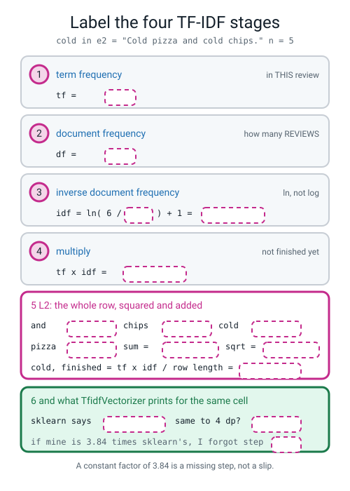
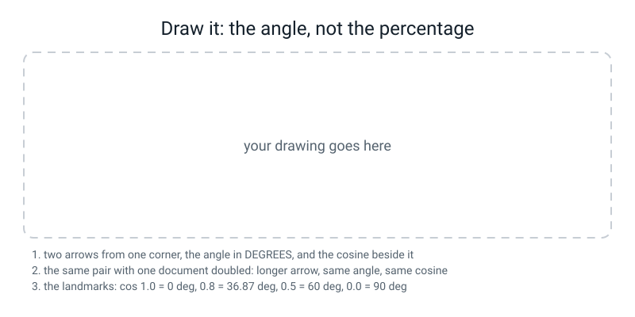

# Workbook — Week 32: Rare Words Matter More

**Name:** ________________________________  **Date:** ______________

[⬅ Week 31](week-31.md) · [📖 Read the chapter first](../student-guide/week-32.md) · [Course Home](../README.md) · [Next ➡](week-33.md)

> **You need a calculator with an `ln` button and a `cos⁻¹` button, set to DEGREES.** Check it before you start: `ln(1.5)` must read `0.405465` and `cos⁻¹(0.8)` must read `36.87`. **If `cos⁻¹(0.8)` says `0.6435` your calculator is answering in radians — find the DEG setting now, not in twenty minutes.**

---

## ✅ Warm-Up (5 min)

Five quick questions about **last week**.

**W1.** `re.findall(r"\b\w\w+\b", "It wasn't GREAT".lower())` — **write the list it returns.**

______________________________________________

**And name the token that is not a word, and what it was carrying:** ____________

**W2.** Four reviews, eight words, `counts.nnz` printed 15. **Write the cells, the empties and the percentage.**

cells ______ · empty ______ · ________ ÷ ______ = ______%

**W3.** `"the dog bit the man"` and `"the man bit the dog"` both gave the row `1 1 1 2`. **In one sentence, where in either row is the information about who did the biting?**

________________________________________________________________

**W4.** `"i" in set(vocab)` printed `False` on a corpus containing the review `"i would not order from here again"`. **Why, in one line?**

________________________________________________________________

**W5.** d1's `cold` cell is `0`, and the word `chips` has **no column at all**. Both contribute nothing to a model's sum. **Say what is different about the two situations, in one sentence.**

________________________________________________________________

---

## 🔢 Do the Maths by Hand

**This week's new maths is the angle between two lists.** Four exercises, **calculator only, no code on this page.** Carry **six decimal places** and round at the end — rounding in the middle of a chain is where the marks go.

---

**M1 — cosine similarity, all the way, on two three-number lists.**

Two customers and how many of each thing they ordered last month:

| | pizzas | chips | salads |
|---|---:|---:|---:|
| **Ama** | 3 | 4 | 0 |
| **Ben** | 4 | 3 | 0 |
| **Cleo** | 6 | 8 | 0 |
| **Dev** | 0 | 0 | 5 |

**(a) Ama against Ben.** Three steps, written out.

```
dot        = 3 x ______ + 4 x ______ + 0 x ______ = ______ + ______ + ______ = ________

length Ama = sqrt( 3² + 4² + 0² ) = sqrt( ______ + ______ ) = sqrt ______ = ________

length Ben = sqrt( ______ + ______ ) = sqrt ______ = ________

cosine     = ________ ÷ ( ________ × ________ ) = ________ ÷ ________ = ________
```

**As an angle:** cos⁻¹( ________ ) = ________ degrees

**(b) Ama against Cleo.** Cleo orders exactly twice as much of everything Ama does.

```
dot = ________   length Cleo = sqrt( ______ + ______ ) = ________

cosine = ________ ÷ ________ = ________     angle = ________ degrees
```

**(c) Ama against Dev.** They have nothing in common.

cosine = ________  angle = ________ degrees

**(d) Rank the three answers, then say in one sentence what cosine similarity is measuring — and what it is refusing to measure.**

________________________________________________________________

---

**M2 — the IDF ladder, and the trap that makes every number wrong at once.**

A corpus of **n = 5** reviews. The formula is `idf = ln( (1 + n) ÷ (1 + df) ) + 1`, so the top of the fraction is **6** every time.

**(a) Fill in the table. Six decimal places on the last two columns.**

| df | 6 ÷ (1 + df) | ln(that) | **idf** |
|---:|---:|---:|---:|
| 1 | ________ | ________ | ________ |
| 2 | ________ | ________ | ________ |
| 3 | ________ | ________ | ________ |
| 4 | ________ | ________ | ________ |
| 5 | ________ | ________ | ________ |

**(b) A word in every single review gets an idf of exactly ________ . Why does the formula end in `+ 1` rather than letting it reach zero?**

________________________________________________________________

**(c) Now press the wrong button on purpose.** Redo the `df = 3` row with `log₁₀` instead of `ln`.

log₁₀( ______ ) = ________  so the wrong idf = ________

**(d) Divide the right answer by the wrong one.**

________ ÷ ________ = ________

**(e) Every one of your eight idf values would be wrong by that same factor. Write the one-line rule that tells a log-base mistake apart from a miscount:**

________________________________________________________________

---

**M3 — one TF-IDF weight, all four stages, matched to sklearn.**

The five reviews, with **n = 5**:

```text
e1: "The chips were cold."          e2: "Cold pizza and cold chips."
e3: "Great chips, great pizza!"     e4: "The pizza was late."
e5: "Late again, and cold again."
```

**The cell: `great` in e3.**

**(a) Term frequency.** `great` appears in e3 ________ times, so `tf = ______`

**(b) Document frequency.** `great` appears in ______ review(s) — which one(s)? ____________ — so `df = ______`

**(c) Inverse document frequency.**

```
idf = ln( 6 ÷ ( 1 + ______ ) ) + 1 = ln( ________ ) + 1 = ________ + 1 = ________
```

**(d) Multiply.** `tf × idf = ______ × ________ = ________`

**(e) The L2 step — the one everybody forgets.** e3 has three different words in it.

```
chips : 1 x ________ = ________      squared = ________
great : 2 x ________ = ________      squared = ________
pizza : 1 x ________ = ________      squared = ________
                                     ----------------
                          sum of squares = ________

row length = sqrt( ________ ) = ________

great, finished = ________ ÷ ________ = ________
```

**(f) `TfidfVectorizer` prints `0.903782` for that cell. Do you match to four decimal places?** ______

**(g) If your answer had been `4.197225`, which step did you skip, and what factor are you out by?** ______________

---

**M4 — length fools the counts.**

```text
query : cold pizza
doc A : cold pizza
doc B : the pizza was hot and the pizza was fresh and the pizza was lovely
        but the chips were cold
```

**(a) Raw count scores** — how many of the query's words each document has, counted with repeats.

doc A: ______ + ______ = ______   doc B: ______ + ______ = ______

**Raw counts put ______ first, and that is the ______________ answer.**

**(b) Doc B's row length.** Its counts are `the 4, pizza 3, was 3, and 2`, and `but, chips, cold, fresh, hot, lovely, were` once each.

```
______ + ______ + ______ + ______ + 1 + 1 + 1 + 1 + 1 + 1 + 1 = ________

sqrt( ________ ) = ________
```

**(c) Doc A's row length.** sqrt( ______ + ______ ) = ________

**(d) The two divisions.**

```
doc A: ______ ÷ ( ________ × ________ ) = ______ ÷ ________ = ________   ->  ______ degrees

doc B: ______ ÷ ( ________ × ________ ) = ______ ÷ ________ = ________   ->  ______ degrees
```

**(e) One sentence naming the property of raw counts that caused the mistake. Not the cure — the disease.**

________________________________________________________________

---

## 🔎 Predict the Output

**In pen, before you run anything.**

### P1 — four shapes and five ones

```python
import numpy as np
from sklearn.feature_extraction.text import TfidfVectorizer
from sklearn.metrics.pairwise import cosine_similarity
e = ["The chips were cold.", "Cold pizza and cold chips.", "Great chips, great pizza!",
     "The pizza was late.", "Late again, and cold again."]
tv = TfidfVectorizer()
X = tv.fit_transform(e)
print("X.shape           :", X.shape)
print("type(X).__name__  :", type(X).__name__)
print("X.toarray().shape :", X.toarray().shape)
print("row lengths       :", np.round(np.sqrt((X.toarray() ** 2).sum(axis=1)), 6))
print("cosine_similarity(X).shape:", cosine_similarity(X).shape)
```

**My predictions:**

`X.shape` ____________  `type` ____________  `toarray().shape` ____________

`row lengths` ________________________  `cosine_similarity(X).shape` ____________

**The truth:**

`X.shape` ____________  `type` ____________  `toarray().shape` ____________

`row lengths` ________________________  `cosine_similarity(X).shape` ____________

**Where does the `5` in the cosine matrix's second position come from — the vocabulary or the reviews?** ____________

---

### P2 — two flat lists

```python
import numpy as np
from sklearn.metrics.pairwise import cosine_similarity
a = np.array([3.0, 4.0, 0.0])
b = np.array([4.0, 3.0, 0.0])
print(cosine_similarity(a, b))
```

**My prediction:** ______________________________________________

**The truth (just the last line of it):** ______________________________________

**The error offers you two repairs, `reshape(1, -1)` and `reshape(-1, 1)`. Which one is right here, and what would the other one mean?**

________________________________________________________________

**Rewrite line 5 so it prints a number, using square brackets:** ______________________

---

### P3 — one wrong button, and no error at all

```python
import numpy as np
from sklearn.feature_extraction.text import TfidfVectorizer
e = ["The chips were cold.", "Cold pizza and cold chips.", "Great chips, great pizza!",
     "The pizza was late.", "Late again, and cold again."]
tv = TfidfVectorizer().fit(e)
n, df = 5, 3
print("ln   : %.6f" % (np.log((1 + n) / (1 + df)) + 1))
print("log10: %.6f" % (np.log10((1 + n) / (1 + df)) + 1))
print("sklearn's idf for chips: %.6f" %
      tv.idf_[list(tv.get_feature_names_out()).index("chips")])
print("ratio: %.6f" % (np.log((1 + n) / (1 + df)) / np.log10((1 + n) / (1 + df))))
```

**My predictions:** ln ____________ log10 ____________ sklearn ____________ ratio ____________

**The truth:** ln ____________ log10 ____________ sklearn ____________ ratio ____________

**That last number is the same for every word in every corpus. What is it?** ____________

---

### P4 — a document, and the same document twice over

```python
import numpy as np
from sklearn.feature_extraction.text import CountVectorizer
from sklearn.metrics.pairwise import cosine_similarity
from sklearn.preprocessing import normalize
pair = ["cold pizza", "cold pizza cold pizza"]
P = CountVectorizer().fit_transform(pair).toarray().astype(float)
print("count rows:", P[0], P[1])
print("dot(short, short) =", float(P[0] @ P[0]))
print("dot(short, long ) =", float(P[0] @ P[1]))
N = normalize(P)
print("normalized rows:", np.round(N[0], 4), np.round(N[1], 4))
print("dot of normalized = %.4f" % float(N[0] @ N[1]))
print("cosine_similarity = %.4f" % cosine_similarity([P[0]], [P[1]])[0, 0])
```

**My predictions:** dot(s,s) ______ dot(s,l) ______ cosine ____________

**The truth:** dot(s,s) ______ dot(s,l) ______ cosine ____________

**The dot product says the doubled document is twice as similar to the short one as the short one is to itself. In one sentence, why is that impossible?**

________________________________________________________________

**And `0.7071` — write the division it came from:** ________ ÷ ________ = ________

---

## ✍️ Practice Set A — Read It

**A1. Match the word to the thing.** Write the letter.

| Word | | Description |
|---|---|---|
| **term frequency** | ______ | (i) How many **documents** contain the word at least once |
| **document frequency** | ______ | (ii) The dot product of two lists divided by both their lengths |
| **inverse document frequency** | ______ | (iii) How many times a word appears in **this** document |
| **TF-IDF** | ______ | (iv) Divide every number in a row by the row's own length |
| **L2 normalization** | ______ | (v) `ln((1 + n) ÷ (1 + df)) + 1` — how rare the word is |
| **cosine similarity** | ______ | (vi) A run of *n* words next to each other, treated as one token |
| **n-gram** | ______ | (vii) `tf × idf`, then the whole row divided by its length |

**A2. Read a TF-IDF matrix you did not build.**

```text
       again       and     chips      cold     great      late     pizza       the       was      were
e1  0.000000  0.000000  0.419559  0.419559  0.000000  0.000000  0.000000  0.505438  0.000000  0.626477
e2  0.000000  0.441326  0.366340  0.732681  0.000000  0.000000  0.366340  0.000000  0.000000  0.000000
e3  0.000000  0.000000  0.302637  0.000000  0.903782  0.000000  0.302637  0.000000  0.000000  0.000000
e4  0.000000  0.000000  0.000000  0.000000  0.000000  0.486484  0.403826  0.486484  0.602985  0.000000
e5  0.834033  0.336446  0.000000  0.279281  0.000000  0.336446  0.000000  0.000000  0.000000  0.000000
```

**(a) e2's `cold` is exactly twice its `chips`. Which of the four stages made that happen, and why are the other three identical for those two words?**

________________________________________________________________

**(b) `chips` and `pizza` in e2 are both `0.366340`. What does an identical weight tell you about two words?** ______________________

**(c) The biggest number in the whole grid is `0.903782`. Name the two things about `great` in e3 that put it there:** ______________  and ______________

**(d) Pick any row and prove it has length 1, to 4 dp. Use e3 — it only has three non-zero cells.**

________² + ________² + ________² = ________ + ________ + ________ = ________

**(e) Two cells in e1 are bigger than its `chips` and `cold`. Name the biggest one, and say what is unusual about that word in this corpus:** ____________

**A3. Spot the bug in each. Two of the three raise something.**

```python
(1)  print("cos =", cosine_similarity(rows[0], rows[1]))

(2)  qv = TfidfVectorizer()
     Q = qv.fit_transform(["cold pizza"])
     print(cosine_similarity(Q, X))

(3)  idf = np.log10((1 + n) / (1 + df)) + 1
     print("my idf:", idf[3], " sklearn:", tv.idf_[3])
```

`(1)` what is wrong: ______________________________________________

`(2)` what is wrong: ______________________________________________

`(3)` what is wrong: ______________________________________________

*(Which one does NOT raise anything?* ______ *And what is the fingerprint that gives it away?* ______________ *)*

**A4. Label the diagram.** Fill in every dashed box. **The cell is `cold` in e2, and `cold` appears in e2 twice.**


*Figure W32.1 — Label the four TF-IDF stages, on the word `cold` in e2.*

**A5. Match the cosine to the angle.** No calculator — use the landmarks.

| cosine | | angle |
|---|---|---|
| `1.0000` | ______ | (i) 90.0° |
| `0.8000` | ______ | (ii) 0.0° |
| `0.5000` | ______ | (iii) 60.0° |
| `0.0000` | ______ | (iv) 36.87° |

**Now the point of the question. The gap from `0.9` to `0.5` is 34 degrees; the gap from `0.5` to `0.1` is 24 degrees. Write one sentence explaining why "a cosine of 0.8 means 80% similar" cannot be true:**

________________________________________________________________

**A6. Read the idf report on your own sixty reviews.**

```text
vocabulary size: 92
the five LOWEST idf words (they are everywhere, so they are worth least):
   and        idf 1.0855
   the        idf 1.9754
   was        idf 2.2777
   cold       idf 2.6260
   rude       idf 2.7130
the highest idf is 4.4177, and 15 of the 92 words share it
```

**(a) `and` appeared 55 times last week — the loudest word in the corpus. Its idf is `1.0855`. What did TF-IDF do to it, and what is the floor it is nearly resting on?** ____________

**(b) `cold` and `rude` are in the five *lowest* idf words. Is that a failure of the formula? One sentence:**

________________________________________________________________

**(c) The top idf is `4.4177`. Work backwards: how many of the sixty reviews contain those words?**

`4.4177 = ln( 61 ÷ ( 1 + ______ ) ) + 1`, so `df = ______`

**(d) Fifteen words share the highest weight in the model. In one sentence, why is that bad news rather than good?**

________________________________________________________________

---

## ✍️ Practice Set B — Write It

### B1 — one line

Print the learned idf of the word `chips` for the five reviews `e1`–`e5`, to six decimal places.

**Expected output:** one number between 1 and 3.
**Done looks like:** `idf('chips') = 1.405465`

### B2 — your arithmetic and the library's, side by side

Print a table with one row per term: the `df` you computed with `(C > 0).sum(axis=0)`, the fraction, `ln(that)`, **your idf**, and **sklearn's `idf_`** — in that order, six decimal places.

**Done looks like:** ten rows where the last two columns are identical, digit for digit.

> **⚠️ Watch out:** `df` counts **documents**. `(C > 0)` before the sum is not decoration — without it you are counting appearances and `cold` becomes 4 instead of 3.

### B3 — every row has length 1, and the angles

Print the row lengths of the TF-IDF matrix, then print the 5×5 cosine matrix, then print **the same matrix again as angles in degrees**, one decimal place.

**Done looks like:** five `1.`s, a diagonal of `1.0000` in the first table and a diagonal of `0.0` in the second, and one off-diagonal `90.0`.

### B4 — the ranking failure on your own corpus

Query: `"cold pizza"`. Put the query and all sixty reviews through **one** vectorizer. Print the **top five by raw count dot product** — with each row's length beside it — then the **top five by cosine similarity**.

**Done looks like:** two different top-fives, and a tie in the count list that the cosine list breaks.

> **⚠️ Watch out:** **one vectorizer for the query and the documents.** Two vectorizers means two different column orders, and then column 3 is a different word in each — see bug 2 on the debugging page.

### B5 — the closest pair, and the sum that made it, about 25 lines

Find the two most similar reviews in your sixty by TF-IDF cosine. Print the pair, the angle, **every shared word's contribution as `a × b = product`**, the total, and then two lists: the words in the first review only, and the words in the second review only.

**Done looks like:** the contributions add to exactly the cosine you printed, and the two "only in" lists contain the words that carry the meaning.

> **💡 Try this:** `np.fill_diagonal(S, 0.0)` before the `argmax`, or the most similar pair is a review and itself.

---

## 🐞 Fix the Broken Program

**Three bugs: one shape error, one dimension error, and one that finishes cleanly and reports a pair that is not news.**

```python
"""broken32.py - three bugs. The third one names a pair that is not news."""
import numpy as np
from sklearn.feature_extraction.text import CountVectorizer, TfidfVectorizer
from sklearn.metrics.pairwise import cosine_similarity

from reviews import CORPUS_60

tv = TfidfVectorizer()
X = tv.fit_transform(CORPUS_60)
rows = X.toarray()
print("matrix:", rows.shape, " every row length 1?",
      bool(np.allclose(np.sqrt((rows ** 2).sum(axis=1)), 1.0)))

print("cos(review 0, review 1) = %.4f" % cosine_similarity(rows[0], rows[1]))

query = ["cold pizza"]
qv = TfidfVectorizer()
Q = qv.fit_transform(query)
print("query against the corpus:", cosine_similarity(Q, X).shape)

S = cosine_similarity(X)
i, j = np.unravel_index(np.argmax(S), S.shape)
print("the two most similar reviews, cosine %.4f:" % S[i, j])
print("   [%d] %s" % (i, CORPUS_60[i]))
print("   [%d] %s" % (j, CORPUS_60[j]))
```

**The first message (the middle of it prints all 92 numbers of the row, so here is the top and the bottom):**

```text
matrix: (60, 92)  every row length 1? True
Traceback (most recent call last):
  File "broken32.py", line 14, in <module>
    print("cos(review 0, review 1) = %.4f" % cosine_similarity(rows[0], rows[1]))
  ...
  File ".../sklearn/utils/validation.py", line 1091, in check_array
    raise ValueError(msg)
ValueError: Expected 2D array, got 1D array instead:
array=[0. 0. 0. ... 0.24793209 0. 0.].
Reshape your data either using array.reshape(-1, 1) if your data has a single feature or array.reshape(1, -1) if it contains a single sample.
```

**Bug 1.** `rows[0]` has 92 numbers in it. **Is that one sample with 92 features, or 92 samples with one feature each?** ______________________

**The fix, written two ways:** ______________________ and ______________________

**Fix it and run again. The second message:**

```text
matrix: (60, 92)  every row length 1? True
cos(review 0, review 1) = 0.0193
Traceback (most recent call last):
  File "broken32.py", line 20, in <module>
    print("query against the corpus:", cosine_similarity(Q, X).shape)
  File ".../sklearn/metrics/pairwise.py", line 229, in check_pairwise_arrays
    raise ValueError(
ValueError: Incompatible dimension for X and Y matrices: X.shape[1] == 2 while Y.shape[1] == 92
```

**Bug 2.** Where did the **2** come from? ______________________  Where did the **92** come from? ______________________

**The fix — one line disappears and one changes:** ______________________________

**And the rule, in one sentence: when is it safe to compare two matrices that came from different vectorizers?**

________________________________________________________________

**Fix that and run again. It finishes, silently:**

```text
matrix: (60, 92)  every row length 1? True
cos(review 0, review 1) = 0.0193
query against the corpus: (1, 60)
the two most similar reviews, cosine 1.0000:
   [45] awful dessert and a rude note in the bag
   [45] awful dessert and a rude note in the bag
```

**Bug 3.** Nothing crashed, and a cosine of `1.0000` is the best possible score.

**(a) Look at the two printed indices. What has the program actually found?** ______________________

**(b) Bug 3 — the one line to add, and where:** ______________________________

**(c) Predict the corrected output — the cosine, and the two reviews:**

cosine ____________

[____] ________________________________________________

[____] ________________________________________________

**(d) The corrected answer is a happy review and a furious one. Name the two words in the first that contribute exactly nothing, and say why:**

________________________________________________________________

---

## 🧩 Puzzle of the Week

### Exactly One, Exactly Zero

**(a) Two *different* documents with a cosine of exactly `1.0000`.** Write three documents that all sit at zero degrees from each other, and say what they have in common that TF-IDF can see.

1. ________________________________  2. ________________________________

3. ________________________________

**What they share:** ______________________________________________

**(b) A document at exactly `0.0000` from all three.** Write it, and say what makes the cosine exactly zero rather than merely small:

________________________________________________________________

**(c) Now the arithmetic one.** The corpus is exactly two documents:

```text
d1 = "cold pizza"      d2 = "cold chips"
```

Three words in the vocabulary. **Work out the cosine between them by hand.** There are only three idf values to find and `n = 2`, so the top of the fraction is **3**.

```
idf(cold)  = ln( 3 ÷ ( 1 + ______ ) ) + 1 = ________

idf(pizza) = ln( 3 ÷ ( 1 + ______ ) ) + 1 = ________

idf(chips) = ________

d1 raw: cold ________  pizza ________      row length = sqrt( ________ ) = ________

d1 finished: cold ________  pizza ________

d2 finished: cold ________  chips ________

cosine = ________ × ________ = ________        angle = ________ degrees
```

**(d) The two documents share exactly one word out of two. A reasonable person would guess the answer is 0.5. It is not. Explain the gap in one sentence:**

________________________________________________________________

---

## 🤔 Think Deeper

**T1.** In Week 4 you learned the **z-score**: subtract the mean, divide by the standard deviation, so a column measured in thousands stops shouting over a column measured in ones. This week `idf` turned `and`'s volume down from 55 appearances to a weight of `1.0855`. **Write a paragraph arguing that these are the same move.** Then name the difference that matters: a z-score can be **undone** exactly, and a stopword list cannot. **Which side is `idf` on, and why does that matter when somebody asks you to explain a prediction?**

________________________________________________________________

________________________________________________________________

________________________________________________________________

________________________________________________________________

**T2.** Fifteen of your ninety-two words share the **highest** idf in the corpus, `4.4177`, because each appears in exactly one review out of sixty. **By the formula, those are the fifteen words the model should trust most. By any sensible reading, they are the fifteen you should trust least.** Write a paragraph on that conflict. Say what you would actually do about it (there are at least three options), what each one costs, and **why no amount of staring at the formula can settle it.**

________________________________________________________________

________________________________________________________________

________________________________________________________________

________________________________________________________________

---

## 🛠️ Build It — Rare Words Matter More

**Three pieces, and the third one is marked hardest.** About 60 minutes. **Calculator out.**

### Step checklist

- [ ] **1.** All four non-zero weights of `e2`, by hand, **with the working** *(page 32.4)*.
- [ ] **2.** sklearn's matrix printed and compared **digit by digit to four decimal places** *(page 32.4)*.
- [ ] **3.** Three cosine similarities by hand, **each as a number AND an angle** *(page 32.5)*.
- [ ] **4.** One query and two documents where counts rank wrongly, **both rankings and both row lengths** *(page 32.6)*.
- [ ] **5.** One sentence naming the **property of raw counts** that caused it *(page 32.6)*.
- [ ] **6.** The stretch: the closest pair in your own sixty, **with the shared-word products written out** *(page 32.7)*.

### Page 32.4 — Four TF-IDF weights, matched to four decimals

`e2` is `"Cold pizza and cold chips."` Its four non-zero weights are `and`, `chips`, `cold` and `pizza`.

**Step 1 — the vocabulary and all ten `df` counts.** The `which documents` column is not optional: it is your proof that you counted documents and not appearances.

| term | df | which documents | 6 ÷ (1 + df) | ln(that) | **idf** |
|---|---:|---|---:|---:|---:|
| again | ____ | ____________ | ________ | ________ | ________ |
| and | ____ | ____________ | ________ | ________ | ________ |
| chips | ____ | ____________ | ________ | ________ | ________ |
| cold | ____ | ____________ | ________ | ________ | ________ |
| great | ____ | ____________ | ________ | ________ | ________ |
| late | ____ | ____________ | ________ | ________ | ________ |
| pizza | ____ | ____________ | ________ | ________ | ________ |
| the | ____ | ____________ | ________ | ________ | ________ |
| was | ____ | ____________ | ________ | ________ | ________ |
| were | ____ | ____________ | ________ | ________ | ________ |

**Step 2 — e2's four raw weights and their squares.**

| term | tf | × idf | = raw | squared |
|---|---:|---:|---:|---:|
| and | ____ | ________ | ________ | ________ |
| chips | ____ | ________ | ________ | ________ |
| cold | ____ | ________ | ________ | ________ |
| pizza | ____ | ________ | ________ | ________ |
| | | | **sum** | ________ |

**Step 3 — the row length.** sqrt( ________ ) = ________

**Step 4 — four divisions, and sklearn beside each one.**

| term | mine | sklearn's | same to 4 dp? |
|---|---:|---:|---:|
| and | ________ | ________ | ______ |
| chips | ________ | ________ | ______ |
| cold | ________ | ________ | ______ |
| pizza | ________ | ________ | ______ |

**Two patterns to spot and explain in one line each:**

`chips` and `pizza` came out identical because ______________________________

`cold` is exactly twice `chips` because ______________________________

### Page 32.5 — Three cosine similarities by hand

**Every TF-IDF row already has length 1, so cosine is just multiply-and-add — and only the words the two reviews SHARE contribute anything.** List the shared words first, then multiply only those.

| pair | shared words | the products | total | **angle** |
|---|---|---|---:|---:|
| `cos(e1, e2)` | ______________ | ______________________ | ________ | ________° |
| `cos(e2, e3)` | ______________ | ______________________ | ________ | ________° |
| `cos(e1, e4)` | ______________ | ______________________ | ________ | ________° |

**One pair in the full matrix is exactly `0.0000`. Which, and why?** ______________________

**And the closest pair among the five is** ______________ **at** ________ **. Are they two reviews that agree about the food?** ______

### Page 32.6 — Counts rank the wrong document first

**My query:** ______________________

**Doc A:** ________________________________________________________

**Doc B:** ________________________________________________________

| | raw count score | row length | cosine | angle |
|---|---:|---:|---:|---:|
| doc A | ________ | ________ | ________ | ________° |
| doc B | ________ | ________ | ________ | ________° |

**Counts rank ______ first. Cosine ranks ______ first. The right answer is ______ .**

**The division, written out in full for the document counts got wrong:**

________ ÷ ( ________ × ________ ) = ________

**The sentence — the disease, not the cure:**

________________________________________________________________

### Page 32.7 — Stretch: the closest pair in your own sixty

**The pair:** cosine ________ , angle ________°

[____] ________________________________________________

[____] ________________________________________________

| shared word | its weight in the first | × its weight in the second | = contribution |
|---|---:|---:|---:|
| ____________ | ________ | ________ | ________ |
| ____________ | ________ | ________ | ________ |
| ____________ | ________ | ________ | ________ |
| ____________ | ________ | ________ | ________ |
| ____________ | ________ | ________ | ________ |
| | | **total** | ________ |

**Words in the first review only:** ______________________________

**Words in the second review only:** ______________________________

**The biggest single contribution came from the word** ____________ **, which means** ______________________

**And the words carrying the actual meaning contributed** ________ **, because** ______________________

---

## 🎨 Draw It


*Figure W32.2 — The angle, not the percentage.*

**What a good answer looks like:** two arrows from one corner, drawn on squared paper so the lengths are honest — `Ama (3, 4)` and `Ben (4, 3)` will do — **with the angle between them drawn as an arc and labelled `16.26°`, and `0.96` written beside it in brackets.** Then, beside it, **the same picture with Cleo `(6, 8)` drawn as a longer arrow lying exactly on top of Ama's direction**, the arc labelled `0.00°`, and the words *"twice as far, same direction, cosine 1.0000"*. That second panel is the whole idea: **cosine measures which way, never how far.**

**And the two things that earn the marks:** the **ladder of landmarks written as a real scale** — `1.0 → 0°`, `0.8 → 36.87°`, `0.5 → 60°`, `0.0 → 90°` — **with the gaps drawn to size**, so that the step from 0.9 to 0.5 is visibly wider than the step from 0.5 to 0.1. And somewhere on the page, the pair `"the coffee was hot and the cake was fresh"` and `"the coffee was cold and the cake was stale"` at `0.7981` / `37.1°`, **with `hot`, `fresh`, `cold` and `stale` written off to one side under the heading `contributed 0.0000`.** A drawing that shows two arrows is a diagram of a formula; **a drawing that shows the four words that did not count is a diagram of the limitation.**

**My two vectors and their angle:** ______________  ______________  ________°

**My four landmarks:** ______ → ______°  ______ → ______°  ______ → ______°  ______ → ______°

**The words in my closest pair that contributed nothing:** ______________________

---

## 📊 Self-Check

| I can... | 😀 | 🙂 | 😕 |
|---|---|---|---|
| say what `tf` and `df` each count, and say "documents" out loud for `df` | | | |
| write out `idf = ln((1 + n) ÷ (1 + df)) + 1` and say why each `+1` is there | | | |
| compute an idf to six decimal places on a calculator | | | |
| recognise a log-base mistake from every value being out by 2.302585 | | | |
| do all four TF-IDF stages by hand and match sklearn to 4 dp | | | |
| prove a finished row has length exactly 1 | | | |
| spot a missing L2 step from a factor-of-the-row-length disagreement | | | |
| compute cosine similarity by hand on two three-number lists | | | |
| turn a cosine into an angle, and refuse to call it a percentage | | | |
| explain why cosine ignores length, with `(3,4)` and `(6,8)` | | | |
| show a query where raw counts rank the wrong document first | | | |
| name the property of raw counts that causes it — length | | | |
| say what TF-IDF fixed and what it did not touch at all | | | |
| explain why the highest-idf words are the least reliable ones | | | |

**The one thing I would ask about if I could ask one question:**

________________________________________________________________

---

## ✅ Answers

<details>
<summary>Check your answers</summary>

### Warm-Up

**W1.** `['it', 'wasn', 'great']`. **The non-word is `wasn`**, and it was carrying **the negation** — `wasn't` says the opposite of `was`, and after tokenizing, the only trace left is a nonsense token. *(The `t` was dropped for being one character long.)*

**W2.** cells **32** · empty **17** · `17 ÷ 32 = 53%`

**W3.** **Nowhere.** It is not stored anywhere at all. Subtract the two rows and every column gives 0. **It was not lost by accident; it was thrown away on purpose the moment we decided to count words.**

**W4.** **`CountVectorizer`'s default pattern wants runs of two or more word characters**, so every one-letter token is deleted — `i` and `a` are not in the vocabulary of any corpus, whatever it contains.

**W5.** *"`cold` has a column and this review put a zero in it, which is real information — this review did not say `cold`. `chips` has no column at all, so it was deleted before the arithmetic started, and the model has no way to represent it."* **Both contribute `+0.0000` and they are not the same thing.** Week 33 turns on exactly this.

### Do the Maths by Hand

**M1 (a).**

```
dot        = 3 x 4 + 4 x 3 + 0 x 0 = 12 + 12 + 0 = 24

length Ama = sqrt( 9 + 16 ) = sqrt 25 = 5.000000
length Ben = sqrt( 16 + 9 ) = sqrt 25 = 5.000000

cosine     = 24 ÷ ( 5 × 5 ) = 24 ÷ 25 = 0.960000
```

**angle = cos⁻¹(0.96) = 16.26 degrees**

**M1 (b).**

```
dot = 3 x 6 + 4 x 8 = 18 + 32 = 50     length Cleo = sqrt( 36 + 64 ) = sqrt 100 = 10.000000

cosine = 50 ÷ ( 5 × 10 ) = 50 ÷ 50 = 1.000000        angle = 0.00 degrees
```

**M1 (c).** dot = 0, so **cosine = 0.0000, angle = 90.00 degrees.**

**M1 (d).** Ama–Cleo `1.0000` > Ama–Ben `0.9600` > Ama–Dev `0.0000`. *"Cosine similarity measures the **direction** two lists point — the proportions between their numbers — and refuses to measure **how big** they are. Cleo orders twice as much as Ama of everything, and cosine calls them identical."*

**Checked in Python:**

```python
import numpy as np
from sklearn.metrics.pairwise import cosine_similarity
a, b, c, d = (np.array([3., 4., 0.]), np.array([4., 3., 0.]),
              np.array([6., 8., 0.]), np.array([0., 0., 5.]))
for name, v in [("Ben", b), ("Cleo", c), ("Dev", d)]:
    cos = float(cosine_similarity([a], [v])[0, 0])
    print("Ama vs %-4s cosine %.4f  angle %.2f degrees"
          % (name, cos, np.degrees(np.arccos(min(cos, 1.0)))))
```

```text
Ama vs Ben  cosine 0.9600  angle 16.26 degrees
Ama vs Cleo cosine 1.0000  angle 0.00 degrees
Ama vs Dev  cosine 0.0000  angle 90.00 degrees
```

**M2 (a).**

| df | 6 ÷ (1 + df) | ln(that) | **idf** |
|---:|---:|---:|---:|
| 1 | 3.0000 | 1.098612 | **2.098612** |
| 2 | 2.0000 | 0.693147 | **1.693147** |
| 3 | 1.5000 | 0.405465 | **1.405465** |
| 4 | 1.2000 | 0.182322 | **1.182322** |
| 5 | 1.0000 | 0.000000 | **1.000000** |

**Common means discounted, rare means boosted** — and that is the whole claim of the week, in one column.

**M2 (b).** **Exactly 1.** Without the trailing `+ 1`, a word appearing in every document would get `ln(1) = 0` and **every one of its cells would become zero**, which is deleting the word rather than quietening it. **The `+1` keeps every word in the conversation at its lowest possible volume.** *(And the `+1`s inside the fraction stop a division by zero for a word with `df = 0`, which happens when you supply your own vocabulary.)*

**M2 (c).** `log₁₀(1.5) = 0.176091`, so the wrong idf = **1.176091**

**M2 (d).** `0.405465 ÷ 0.176091 = 2.302585`

**M2 (e).** *"If **every** value is out by the same factor — and `2.302585` is the one to memorise — it is the log base. If **one** value is out, you miscounted that word's documents."* **A whole-table error and a single-cell error have different causes, and knowing which you are looking at saves an hour.**

**M3.** `great` in e3, all four stages:

**(a)** twice, so `tf = 2`. **(b)** in **1** review, **e3 only**, so `df = 1`.

**(c)**

```
idf = ln( 6 ÷ ( 1 + 1 ) ) + 1 = ln( 3.000000 ) + 1 = 1.098612 + 1 = 2.098612
```

**(d)** `tf × idf = 2 × 2.098612 = 4.197225`

**(e)**

```
chips : 1 x 1.405465 = 1.405465      squared =  1.975332
great : 2 x 2.098612 = 4.197225      squared = 17.616694
pizza : 1 x 1.405465 = 1.405465      squared =  1.975332
                                               ---------
                                 sum of squares 21.567358

row length = sqrt( 21.567358 ) = 4.644067

great, finished = 4.197225 ÷ 4.644067 = 0.903782
```

**(f) Yes — `0.903782` against sklearn's `0.903782`, all six digits.**

**(g)** You skipped **the L2 divide**, and you are out by a factor of **4.644067** — the row length. `4.197225 ÷ 0.903782 = 4.6441`, so **the factor tells you which row you forgot to divide by.**

**Checked in Python:**

```python
import numpy as np
from sklearn.feature_extraction.text import TfidfVectorizer
e = ["The chips were cold.", "Cold pizza and cold chips.", "Great chips, great pizza!",
     "The pizza was late.", "Late again, and cold again."]
tv = TfidfVectorizer()
T = tv.fit_transform(e)
terms = list(tv.get_feature_names_out())
idf = dict(zip(terms, tv.idf_))
parts = np.array([1 * idf["chips"], 2 * idf["great"], 1 * idf["pizza"]])
print("raw    :", np.round(parts, 6))
print("squares:", np.round(parts ** 2, 6), " sum %.6f" % (parts ** 2).sum())
L = np.sqrt((parts ** 2).sum())
print("length %.6f   great %.6f" % (L, parts[1] / L))
print("sklearn's e3 great: %.6f" % T.toarray()[2, terms.index("great")])
```

```text
raw    : [1.405465 4.197225 1.405465]
squares: [ 1.975332 17.616694  1.975332]  sum 21.567358
length 4.644067   great 0.903782
sklearn's e3 great: 0.903782
```

**M4 (a).** doc A: `1 + 1 = 2` · doc B: `3 + 1 = 4` — **raw counts put doc B first, and that is the wrong answer**, because doc A *is* the query.

**M4 (b).** `16 + 9 + 9 + 4 + 1 + 1 + 1 + 1 + 1 + 1 + 1 = 45`, and `sqrt(45) = 6.7082`

**M4 (c).** `sqrt(1 + 1) = 1.4142`

**M4 (d).**

```
doc A: 2 ÷ ( 1.4142 × 1.4142 ) = 2 ÷ 2.0000 = 1.0000   ->   0.0 degrees

doc B: 4 ÷ ( 1.4142 × 6.7082 ) = 4 ÷ 9.4868 = 0.4216   ->  65.1 degrees
```

**M4 (e).** *"A longer document has bigger numbers in more columns, so it collects more points on any query simply by being longer — regardless of whether it is a better answer."* **"Cosine divides by the length" is the cure and scores half. The disease is length.**

### Predict the Output

**P1.**

```text
X.shape           : (5, 10)
type(X).__name__  : csr_matrix
X.toarray().shape : (5, 10)
row lengths       : [1. 1. 1. 1. 1.]
cosine_similarity(X).shape: (5, 5)
```

**The `5` comes from the reviews**, not the vocabulary. `cosine_similarity(X)` with one argument compares **every row against every other row**, so the answer is documents × documents — and the ten columns have been used up doing the comparing. **The shape of a similarity matrix never mentions the vocabulary, and noticing that is worth more than memorising it.**

**P2.**

```text
ValueError: Expected 2D array, got 1D array instead:
array=[3. 4. 0.].
Reshape your data either using array.reshape(-1, 1) if your data has a single feature or array.reshape(1, -1) if it contains a single sample.
```

**`reshape(1, -1)` is the right one: one sample with three features.** `reshape(-1, 1)` would mean **three samples with one feature each**, which would compare customer number one against customer number one and give you a 3×3 grid of nonsense. **The brackets version:**

```python
print(cosine_similarity([a], [b]))       # [[0.96]]
```

**And it is a grid with one number in it**, because `cosine_similarity` compares every row of the first thing against every row of the second, and one row against one row is a 1 × 1 grid.

**P3.**

```text
ln   : 1.405465
log10: 1.176091
sklearn's idf for chips: 1.405465
ratio: 2.302585
```

**`2.302585` is `ln(10)`** — the fixed conversion factor between the two logarithms, and the reason a log-base mistake makes **every** value wrong by exactly the same amount. **Nothing was raised. Nothing was warned about.** The only thing that catches this is comparing your number with `tv.idf_`, which is why every by-hand exercise in this week ends with the library's answer beside it.

**P4.**

```text
count rows: [1. 1.] [2. 2.]
dot(short, short) = 2.0
dot(short, long ) = 4.0
normalized rows: [0.7071 0.7071] [0.7071 0.7071]
dot of normalized = 1.0000
cosine_similarity = 1.0000
```

**It is impossible because nothing can be more like you than you are.** The doubled document has every number twice as big, so every product in the dot product doubles, so the total doubles — **length is drowning out content.** Cosine gives `1.0000` both times, which is the right answer: the same words in the same proportions, written twice.

**`0.7071 = 1 ÷ 1.4142`** — each of the two 1s divided by the row's length, `sqrt(1 + 1)`. **And check it: `0.7071² + 0.7071² = 0.5 + 0.5 = 1`.**

### Practice Set A

**A1.** term frequency **(iii)** · document frequency **(i)** · inverse document frequency **(v)** · TF-IDF **(vii)** · L2 normalization **(iv)** · cosine similarity **(ii)** · n-gram **(vi)**

**A2 (a).** **The `tf` stage.** `cold` is in e2 twice and `chips` once. Their `idf`s are identical (`1.405465`, both in 3 documents), they are in the same row so they get divided by the same row length, and the only stage that can tell them apart is the first one. **`0.732681 = 2 × 0.366340` exactly.**

**(b)** **That the two words have identical evidence behind them** — same `df` across the corpus and same `tf` in this document. **Identical weights are a fingerprint, and Week 33 makes real use of it** when it finds words whose learned coefficients are suspiciously twinned.

**(c)** `great` appears in e3 **twice** (`tf = 2`) **and in only one review of the five** (`df = 1`, the highest possible idf here, `2.098612`). **Frequent here and rare everywhere else is exactly what TF-IDF is built to reward**, and `0.903782` is what the reward looks like.

**(d)** `0.903782² + 0.302637² + 0.302637² = 0.816822 + 0.091589 + 0.091589 = 1.000000` ✅

**(e)** **`were`, at `0.626477`** — the biggest cell in e1, bigger than `the` at `0.505438` and both of the words that carry the meaning. It appears in **only one** review of the five (`df = 1`), so it gets the top idf — and `were` means nothing whatsoever. **IDF measures rarity. It has no idea which rare words are interesting**, and that is Think Deeper T2.

**A3.**

`(1)` **`rows[0]` and `rows[1]` are flat 1-D lists and `cosine_similarity` always wants 2-D.** It raises `ValueError: Expected 2D array, got 1D array instead`. The fix is square brackets: `cosine_similarity([rows[0]], [rows[1]])`.

`(2)` **Two different vectorizers means two different vocabularies and two different column orders.** `qv` learned two words from the query; `X` has 92. It raises `ValueError: Incompatible dimension for X and Y matrices: X.shape[1] == 2 while Y.shape[1] == 92`. **The fix is `tv.transform(["cold pizza"])`** — the corpus's own vectorizer, transforming, never fitting.

`(3)` **`np.log10` instead of `np.log`.** **This is the one that raises nothing.** It prints two numbers that disagree, and if you were not printing sklearn's beside yours you would never know. **The fingerprint is that the ratio is `2.302585` for every single word.**

**A4. Label the four stages — `cold` in e2.**

1. `tf = 2` — `cold` appears in `"Cold pizza and cold chips."` twice.
2. `df = 3` — e1, e2 and e5 contain it. *(It appears **four** times in the corpus and in **three** documents. Say "documents" out loud.)*
3. `idf = ln( 6 ÷ (1 + 3) ) + 1 = ln(1.5) + 1 = 0.405465 + 1 = 1.405465`
4. `tf × idf = 2 × 1.405465 = 2.810930`
5. The whole row: `and 1.693147`, `chips 1.405465`, `cold 2.810930`, `pizza 1.405465`. Squares `2.866747 + 1.975332 + 7.901329 + 1.975332 = 14.718740`. `sqrt(14.718740) = 3.836501`. **`cold` finished: `2.810930 ÷ 3.836501 = 0.732681`**
6. **sklearn says `0.732681`.** Same to 4 dp ✅. **And if your answer were `3.84` times too big — `2.810930 ÷ 0.732681 = 3.8365` — you skipped step 5.**

**A5.** `1.0000` **(ii)** · `0.8000` **(iv)** · `0.5000` **(iii)** · `0.0000` **(i)**

*"A percentage scale has equal steps: 10% more is 10% more wherever you are on it. The cosine scale does not — going from 0.9 to 0.5 costs 34 degrees and going from 0.5 to 0.1 costs 24, so the same drop in cosine means different amounts of turning depending on where you started. It is the cosine of an angle, and angles do not divide up like shares."*

**A6 (a).** **It turned `and`'s volume almost all the way down.** `and` appears in **55 of the 60 reviews**, so `idf = ln(61 ÷ 56) + 1 = 0.0855 + 1 = 1.0855` — and **the floor is exactly 1**, which is what a word in every single review would get. **`and` is resting on the floor, which is the correct place for it.**

**(b) No, and this is the most useful sentence of the week.** *"In a corpus where half the reviews are complaints, `cold` and `rude` are simply not rare — so IDF, which only measures rarity, gives them a low weight. IDF turns down the volume of common words; it has no idea which of them mean anything."* **Rarity is a proxy for usefulness, and a proxy is not the thing.**

**(c)** `4.4177 = ln(61 ÷ 2) + 1 = ln(30.5) + 1`, so `1 + df = 2` and **`df = 1`.** Those words appear in **exactly one review** of the sixty.

**(d)** *"The model's most confident weights are resting on a single review each, which is not evidence — it is a coincidence with a decimal point."* **Fifteen of 92 words is one in six of the vocabulary, all of them maximally trusted and all of them unverifiable.** *(The repair is `min_df`, or more reviews, or printing `df` next to every weight you quote — which is exactly what Week 33 does, and almost no tutorial on the internet does.)*

### Practice Set B

**B1.**

```python
from sklearn.feature_extraction.text import TfidfVectorizer
e = ["The chips were cold.", "Cold pizza and cold chips.", "Great chips, great pizza!",
     "The pizza was late.", "Late again, and cold again."]
tv = TfidfVectorizer().fit(e)
w = list(tv.get_feature_names_out())
print("idf('chips') = %.6f" % tv.idf_[w.index("chips")])
```

```text
idf('chips') = 1.405465
```

**B2.**

```python
import numpy as np
from sklearn.feature_extraction.text import CountVectorizer, TfidfVectorizer
e = ["The chips were cold.", "Cold pizza and cold chips.", "Great chips, great pizza!",
     "The pizza was late.", "Late again, and cold again."]
tv = TfidfVectorizer().fit(e)
w = tv.get_feature_names_out()
C = CountVectorizer().fit_transform(e).toarray()
df = (C > 0).sum(axis=0)
n = len(e)
print("%-8s %3s  %-10s %-10s %-10s %s" % ("term", "df", "6/(1+df)", "ln(that)", "mine", "sklearn"))
for t, d, s in zip(w, df, tv.idf_):
    r = (1 + n) / (1 + d)
    print("%-8s %3d  %-10.4f %-10.6f %-10.6f %.6f" % (t, d, r, np.log(r), np.log(r) + 1, s))
```

```text
term      df  6/(1+df)   ln(that)   mine       sklearn
again      1  3.0000     1.098612   2.098612   2.098612
and        2  2.0000     0.693147   1.693147   1.693147
chips      3  1.5000     0.405465   1.405465   1.405465
cold       3  1.5000     0.405465   1.405465   1.405465
great      1  3.0000     1.098612   2.098612   2.098612
late       2  2.0000     0.693147   1.693147   1.693147
pizza      3  1.5000     0.405465   1.405465   1.405465
the        2  2.0000     0.693147   1.693147   1.693147
was        1  3.0000     1.098612   2.098612   2.098612
were       1  3.0000     1.098612   2.098612   2.098612
```

**Ten rows, and the last two columns are identical to six decimal places.** ✅ **Note `cold` has `df = 3` and not 4** — it appears four times, in three documents.

**B3.**

```python
import numpy as np, pandas as pd
from sklearn.feature_extraction.text import TfidfVectorizer
from sklearn.metrics.pairwise import cosine_similarity
e = ["The chips were cold.", "Cold pizza and cold chips.", "Great chips, great pizza!",
     "The pizza was late.", "Late again, and cold again."]
names = ["e1", "e2", "e3", "e4", "e5"]
X = TfidfVectorizer().fit_transform(e)
print("row lengths:", np.round(np.sqrt((X.toarray() ** 2).sum(axis=1)), 6))
S = cosine_similarity(X)
print(pd.DataFrame(np.round(S, 4), index=names, columns=names))
print(pd.DataFrame(np.round(np.degrees(np.arccos(np.clip(S, -1, 1))), 1),
                   index=names, columns=names))
```

```text
row lengths: [1. 1. 1. 1. 1.]
        e1      e2      e3      e4      e5
e1  1.0000  0.4611  0.1270  0.2459  0.1172
e2  0.4611  1.0000  0.2217  0.1479  0.3531
e3  0.1270  0.2217  1.0000  0.1222  0.0000
e4  0.2459  0.1479  0.1222  1.0000  0.1637
e5  0.1172  0.3531  0.0000  0.1637  1.0000
      e1    e2    e3    e4    e5
e1   0.0  62.5  82.7  75.8  83.3
e2  62.5   0.0  77.2  81.5  69.3
e3  82.7  77.2   0.0  83.0  90.0
e4  75.8  81.5  83.0   0.0  80.6
e5  83.3  69.3  90.0  80.6   0.0
```

**`np.clip(S, -1, 1)` is not decoration:** floating-point arithmetic occasionally hands back `1.0000000000000002` for a row against itself, and `arccos` of anything above 1 is `nan`. **The `90.0` in the second table is `cos(e3, e5) = 0.0000` — `"Great chips, great pizza!"` and `"Late again, and cold again."` share not one word, so they sit at a right angle.**

**B4.**

```python
import numpy as np
from sklearn.feature_extraction.text import CountVectorizer
from sklearn.metrics.pairwise import cosine_similarity
from reviews import CORPUS_60
cv = CountVectorizer()
M = cv.fit_transform(["cold pizza"] + CORPUS_60).toarray().astype(float)
q, docs = M[0], M[1:]
dots = docs @ q
lens = np.sqrt((docs ** 2).sum(axis=1))
cos = np.array([cosine_similarity([q], [d])[0, 0] for d in docs])
print("--- top 5 by RAW COUNT dot product ---")
for i in np.argsort(-dots, kind="stable")[:5]:
    print("  %.0f  len %.3f  %s" % (dots[i], lens[i], CORPUS_60[i]))
print("--- top 5 by COSINE ---")
for i in np.argsort(-cos, kind="stable")[:5]:
    print("  %.4f  %s" % (cos[i], CORPUS_60[i]))
```

```text
--- top 5 by RAW COUNT dot product ---
  2  len 3.317  the pizza arrived cold and the base was soggy
  2  len 2.449  rude driver and a cold, greasy pizza
  2  len 2.449  an awful pizza, cold and soggy
  1  len 3.317  the pizza arrived hot and the base was perfect
  1  len 2.449  polite driver and a warm, tasty pizza
--- top 5 by COSINE ---
  0.5774  rude driver and a cold, greasy pizza
  0.5774  an awful pizza, cold and soggy
  0.4264  the pizza arrived cold and the base was soggy
  0.3162  a delicious pizza, hot and perfect
  0.3162  late again and a cold bag
```

**This is a better failure than the constructed one, and here is why.** **Raw counts cannot separate the top three at all** — all three score exactly `2`, and **eleven more reviews are tied on `1`** — so which ones appear in positions 4 and 5 is decided by your sort, not by your data. **A tie means the measure has no opinion.** Cosine *can* separate them, and it promotes the two shorter reviews above the longer one: `0.5774` against `0.4264`, because in a seven-word review `cold pizza` is a bigger share of what was said than it is in a nine-word one.

**B5.**

```python
import numpy as np
from sklearn.feature_extraction.text import TfidfVectorizer
from sklearn.metrics.pairwise import cosine_similarity
from reviews import CORPUS_60
tv = TfidfVectorizer()
X = tv.fit_transform(CORPUS_60)
S = cosine_similarity(X)
np.fill_diagonal(S, 0.0)
i, j = np.unravel_index(np.argmax(S), S.shape)
print("closest pair, cosine %.4f (%.1f degrees):"
      % (S[i, j], np.degrees(np.arccos(S[i, j]))))
print("   [%d] %s" % (i, CORPUS_60[i]))
print("   [%d] %s" % (j, CORPUS_60[j]))
v = tv.get_feature_names_out()
ra, rb = X.toarray()[i], X.toarray()[j]
total = 0.0
for k in np.nonzero(ra * rb)[0]:
    total += ra[k] * rb[k]
    print("   %-8s %.4f x %.4f = %.4f" % (v[k], ra[k], rb[k], ra[k] * rb[k]))
print("   total %.4f" % total)
print("only in the first :", [v[k] for k in np.nonzero(ra)[0] if rb[k] == 0])
print("only in the second:", [v[k] for k in np.nonzero(rb)[0] if ra[k] == 0])
```

```text
closest pair, cosine 0.7981 (37.1 degrees):
   [18] the coffee was hot and the cake was fresh
   [48] the coffee was cold and the cake was stale
   and      0.1156 x 0.1166 = 0.0135
   cake     0.4274 x 0.4310 = 0.1842
   coffee   0.4274 x 0.4310 = 0.1842
   the      0.4209 x 0.4244 = 0.1786
   was      0.4853 x 0.4894 = 0.2375
   total 0.7981
only in the first : ['fresh', 'hot']
only in the second: ['cold', 'stale']
```

**The two most similar reviews in the corpus are a happy one and a furious one.** Five shared words supply the whole `0.7981`, and **the biggest single contribution is `was` at `0.2375` — a word that means nothing at all.** And `hot`, `fresh`, `cold`, `stale` — the four words carrying the entire meaning — contribute **exactly zero**, because each is in only one of the two reviews and cosine multiplies matching positions: `something × 0 = 0`.

**Runtime for every block on this page: under one second.** There is no training in this week at all.

### Fix the Broken Program

**Bug 1 — the shape error.** `rows[0]` is **one sample with 92 features.** `cosine_similarity` always wants a 2-D thing, because it is built to compare *every row against every row* and a flat list does not say whether it is one row of 92 or 92 rows of one.

**The fix, two ways:**

```python
cosine_similarity([rows[0]], [rows[1]])[0, 0]        # square brackets
cosine_similarity(rows[0].reshape(1, -1), rows[1].reshape(1, -1))[0, 0]
```

**`reshape(1, -1)` means "one sample, work out the rest".** `reshape(-1, 1)` would mean 92 samples of one feature each, which is a different question entirely.

**Bug 2 — the dimension error.** The **2** is the size of the vocabulary `qv` learned from the query `"cold pizza"` — two words, two columns. The **92** is the corpus vocabulary. **Two vectorizers means two column orders, so column 1 is `cold` in one matrix and something else in the other**, and comparing them is meaningless even when the widths happen to match.

**The fix:** delete `qv` entirely and use the corpus's own vectorizer, **transforming, never fitting**:

```python
Q = tv.transform(["cold pizza"])
```

**The rule:** *"Never. A matrix's columns only mean anything relative to the vocabulary that made them, so everything you intend to compare must go through **one** fitted vectorizer."*

**Bug 3 — the silent one.**

**(a)** Both printed indices are **45**. The program has proudly discovered that **review 45 is extremely similar to review 45** — the diagonal of the similarity matrix, which is `1.0000` all the way down because every review is identical to itself. `argmax` found the biggest number in the grid and it was on the diagonal. *(Index 45 rather than 0 because of floating-point arithmetic: `S[45, 45]` is `1.0000000000000004` while `S[0, 0]` is exactly `1.0`, and 27 of the 60 diagonal entries sit a hair above 1. Which review it names is luck; that it names a diagonal entry is not.)*

**(b)** One line, immediately after building `S`:

```python
S = cosine_similarity(X)
np.fill_diagonal(S, 0.0)      # <-- or argmax finds a review against itself
```

**(c)** The last three lines become:

```text
the two most similar reviews, cosine 0.7981:
   [18] the coffee was hot and the cake was fresh
   [48] the coffee was cold and the cake was stale
```

**(d)** **`hot` and `fresh` contribute exactly `0.0000`.** Cosine similarity adds up `weight × weight` for matching columns, and those two words have a weight in review 18 and **a zero in review 48** — so each contributes `something × 0 = 0`. **The two reviews are held together entirely by `the`, `was`, `and`, `coffee` and `cake`, and pulled apart by nothing at all, because the words that disagree are invisible to the measure.**

> **And the honest reading of the whole page:** bugs 1 and 2 cost you five minutes each and told you exactly what was wrong. Bug 3 cost nothing, printed a perfect score, and would have gone into a report. **Ranked by how much trouble they cause, the tracebacks are the friendly ones.**

### Puzzle of the Week

**(a)** Three documents at zero degrees from each other:

```text
1. cold pizza
2. pizza cold
3. cold pizza cold pizza
```

**What they share: the same words in the same proportions.** Document 2 is document 1 reordered — and **word order is not in the row**, so the rows are literally identical. Document 3 has every count doubled, and the L2 step divides it straight back out. **Three different strings, one direction.**

```python
import numpy as np
from sklearn.feature_extraction.text import TfidfVectorizer
from sklearn.metrics.pairwise import cosine_similarity
Z = TfidfVectorizer().fit_transform(
        ["cold pizza", "pizza cold", "cold pizza cold pizza", "chips"])
print(np.round(cosine_similarity(Z), 4))
```

```text
[[1. 1. 1. 0.]
 [1. 1. 1. 0.]
 [1. 1. 1. 0.]
 [0. 0. 0. 1.]]
```

**(b)** `chips`, or any document with **no word in common** with the other three. **The cosine is exactly zero, not approximately zero**, because every single product in the dot product is `something × 0`. **Zero here means "not one shared word", which is the one landmark on the cosine scale that is honestly a "no".**

**(c)** `n = 2`, so the top of the fraction is 3. `cold` is in **both** documents, `pizza` and `chips` in one each.

```
idf(cold)  = ln( 3 ÷ 3 ) + 1 = ln(1) + 1 = 1.000000
idf(pizza) = ln( 3 ÷ 2 ) + 1 = 0.405465 + 1 = 1.405465
idf(chips) = 1.405465          (same df, same answer)

d1 raw: cold 1.000000  pizza 1.405465
        squares 1.000000 + 1.975332 = 2.975332
        row length = sqrt(2.975332) = 1.724916

d1 finished: cold 1.000000 ÷ 1.724916 = 0.579739   pizza 1.405465 ÷ 1.724916 = 0.814802
d2 finished: cold 0.579739                          chips 0.814802

cosine = 0.579739 × 0.579739 = 0.336097            angle = 70.4 degrees
```

```text
vocab: ['chips' 'cold' 'pizza'] idf: [1.405465 1.       1.405465]
[[0.       0.579739 0.814802]
 [0.814802 0.579739 0.      ]]
cosine 0.3361  angle 70.4  and 0.5797^2 = 0.3361
```

**(d)** *"The shared word is `cold`, which is in **both** documents — so its idf is the lowest possible, exactly 1 — while the two words that differ are each in only one document and get the **highest** idf, 1.405465. TF-IDF deliberately gave most of each row's length to the words the two documents do **not** share, so the one thing they agree about is the cheapest thing in the row."* **Half the words in common, a third of the similarity, and the formula did that on purpose.**

### Think Deeper

**T1.** A strong answer makes three moves.

**They are the same move.** In Week 4, `alcohol` around 13 and `proline` around 750 meant `proline` dominated every distance, and the z-score divided each column by its own spread so that "one step" meant the same amount of unusualness in every column. This week, `and` at 55 appearances dominated every row, and `idf` divided each column by a measure of how ordinary that word is, so that "one unit of `and`" is worth far less than "one unit of `rude`". **Both are per-column rescalings learned from the data, both are fitted on the training rows only, and both exist because a raw number's size is not its importance.**

**The difference that matters.** A z-score is **reversible**: `inverse_transform` gives you back the original alcohol reading exactly, which is why Week 29 could rebuild a wine and measure the error. A stopword list is **irreversible**: the word is gone and no arithmetic brings it back. **`idf` is on the reversible side** — it is a multiplication, and dividing by the same `idf` returns the original count. *(The L2 step is reversible too if you kept the row length; `normalize` throws it away, which is a choice.)*

**Why that matters for explaining a prediction.** A reversible transform lets you answer *"which words made this decision, and how strongly?"* in the units the person actually used — counts of real words — instead of in the units the model happens to like. **Week 33 does exactly that, and it is only possible because nothing was deleted.** *(Compare it with the stopword route: if you had removed `not` to fix the `and` problem, you could not later explain a prediction that hinged on it, because you no longer have it.)*

**T2.** The conflict is real and cannot be argued away: **`idf` measures rarity, the task needs usefulness, and rarity was only ever a proxy.** A word in one review of sixty is maximally rare and carries no evidence at all.

**Three things you could do, with their costs:**

| What you do | What it costs |
|---|---|
| **`min_df=3`** — refuse to give a word a column until three documents contain it | You delete the rare words wholesale, including the genuinely informative rare ones. On a 60-review corpus that could be a third of the vocabulary. |
| **Collect more reviews** | The only fix that actually resolves the question rather than sidestepping it, and the most expensive. `fluffy` either survives more data or drifts to zero, and either answer is worth having. |
| **Report `df` beside every weight you quote** | Costs almost nothing and fixes nothing — but it stops *you* being fooled, which is where most of the damage happens. **This is what Week 33 does.** |

**And why the formula cannot settle it.** `ln((1 + n) ÷ (1 + df)) + 1` has no input for *"is this word meaningful?"* — it cannot, because meaningfulness is a fact about your task and your corpus, and the formula has seen neither. **You have to look at the words.** *(A strong answer will also notice that `min_df` is not free of judgement either: 3 is a number somebody chose, and choosing it is the same act as choosing a stopword list, just better disguised.)*

### Build It

**Page 32.4 — four TF-IDF weights.** `n = 5`, so the top of the fraction is `1 + 5 = 6`:

| term | df | which | 6 ÷ (1 + df) | ln(that) | **idf** |
|---|---:|---|---|---:|---:|
| again | 1 | e5 | 6 ÷ 2 = 3.0000 | 1.098612 | **2.098612** |
| and | 2 | e2, e5 | 6 ÷ 3 = 2.0000 | 0.693147 | **1.693147** |
| chips | 3 | e1, e2, e3 | 6 ÷ 4 = 1.5000 | 0.405465 | **1.405465** |
| cold | 3 | e1, e2, e5 | 6 ÷ 4 = 1.5000 | 0.405465 | **1.405465** |
| great | 1 | e3 | 3.0000 | 1.098612 | **2.098612** |
| late | 2 | e4, e5 | 2.0000 | 0.693147 | **1.693147** |
| pizza | 3 | e2, e3, e4 | 1.5000 | 0.405465 | **1.405465** |
| the | 2 | e1, e4 | 2.0000 | 0.693147 | **1.693147** |
| was | 1 | e4 | 3.0000 | 1.098612 | **2.098612** |
| were | 1 | e1 | 3.0000 | 1.098612 | **2.098612** |

**e2's four raw weights.** `cold` appears **twice**, so only `cold` has `tf = 2`:

```
and    : 1 x 1.693147 = 1.693147      squared = 2.866747
chips  : 1 x 1.405465 = 1.405465      squared = 1.975332
cold   : 2 x 1.405465 = 2.810930      squared = 7.901329
pizza  : 1 x 1.405465 = 1.405465      squared = 1.975332
                                                ---------
                                  sum of squares 14.718740

row length = sqrt(14.718740) = 3.836501

and    = 1.693147 / 3.836501 = 0.441326
chips  = 1.405465 / 3.836501 = 0.366340
cold   = 2.810930 / 3.836501 = 0.732681
pizza  = 1.405465 / 3.836501 = 0.366340
```

**And sklearn's matrix — the e2 row is the one to check:**

```text
       again       and     chips      cold     great      late     pizza       the       was      were
e1  0.000000  0.000000  0.419559  0.419559  0.000000  0.000000  0.000000  0.505438  0.000000  0.626477
e2  0.000000  0.441326  0.366340  0.732681  0.000000  0.000000  0.366340  0.000000  0.000000  0.000000
e3  0.000000  0.000000  0.302637  0.000000  0.903782  0.000000  0.302637  0.000000  0.000000  0.000000
e4  0.000000  0.000000  0.000000  0.000000  0.000000  0.486484  0.403826  0.486484  0.602985  0.000000
e5  0.834033  0.336446  0.000000  0.279281  0.000000  0.336446  0.000000  0.000000  0.000000  0.000000
```

**All four matched to six decimal places.** ✅

**`chips` and `pizza` are identical** because they have the same `df`, the same `tf` and the same row — identical evidence, identical weight. **`cold` is exactly twice `chips`** because its `tf` was 2 and everything else was the same.

**Page 32.5 — three cosines by hand.** Every row has length 1, so cosine is multiply-and-add over the **shared** words only.

**(a) `cos(e1, e2)`** — shared: `chips`, `cold`

```
chips : 0.419559 x 0.366340 = 0.153701
cold  : 0.419559 x 0.732681 = 0.307403
                      total = 0.461104
```

**`0.4611`, an angle of 62.5 degrees.**

**(b) `cos(e2, e3)`** — shared: `chips`, `pizza`

```
chips : 0.366340 x 0.302637 = 0.110868
pizza : 0.366340 x 0.302637 = 0.110868
                      total = 0.221736
```

**`0.2217`, 77.2 degrees.**

**(c) `cos(e1, e4)`** — shared: `the`, and nothing else

```
the : 0.505438 x 0.486484 = 0.245887
```

**`0.2459`, 75.8 degrees.**

**The exactly-zero pair is `cos(e3, e5) = 0.0000`** — `"Great chips, great pizza!"` and `"Late again, and cold again."` share not one word, so they are at a right angle.

**The closest pair is e1 and e2 at `0.4611`** — `"The chips were cold."` and `"Cold pizza and cold chips."` — **and yes, both are complaints, so this time the closest pair does agree about the food.** Worth saying out loud, because it shows last week's happy-and-furious result was not a law of nature; it was what that corpus happened to contain.

**Page 32.6 — the ranking failure.** The constructed version is the cleanest:

```text
query : cold pizza
doc A : cold pizza
doc B : the pizza was hot and the pizza was fresh and the pizza was lovely
        but the chips were cold
```

```text
raw count dot product   A: 2   B: 4
cosine similarity       A: 1.0000   B: 0.4216
length of A's row = 1.4142, length of B's row = 6.7082
```

`doc B: 4 ÷ (1.4142 × 6.7082) = 4 ÷ 9.4868 = 0.4216`, which is **65.1 degrees**, against doc A's **0.0**.

**The sentence, full marks:**

> *"The property of raw counts that caused the mistake is that a longer document has bigger numbers spread over more columns, so it collects more points on any query simply by being longer — and if two documents match equally, raw counts cannot tell them apart at all. Cosine similarity divides each row by its own length, so what is compared is the **proportion** of the document that matches, not the **amount**."*

**"Cosine is better" scores nothing. "Cosine divides by the length" is half marks — it names the cure, not the disease.**

**Page 32.7 — the stretch.** The run is in **B5** above: the pair is `[18]` and `[48]`, cosine `0.7981`, angle `37.1°`; the five shared contributions are `and 0.0135`, `cake 0.1842`, `coffee 0.1842`, `the 0.1786`, `was 0.2375`, total `0.7981`; only in the first `['fresh', 'hot']`, only in the second `['cold', 'stale']`.

**The biggest single contribution is `was`, at `0.2375`** — which means **the strongest force holding these two reviews together is a word with no meaning at all.** And the four words carrying the entire difference contribute **`0.0000`**, because **cosine multiplies matching positions and each of those four is present in one review and absent from the other.**

**If your corpus gives a different pair, report exactly that** — *"mine came out as two complaints about the same dish"* is a correct and interesting result, and the question to answer is **which words saved you.**

### Draw It

A full-marks drawing has **two panels, not one**: Ama-and-Ben with a real arc labelled `16.26°` and `(0.96)`, and beside it Ama-and-Cleo with a **longer** arrow lying on the same line, arc labelled `0.00°`. The second panel is the argument; the first is only the arithmetic. Then the landmark ladder **drawn to scale**, so the eye can see that equal steps in cosine are not equal steps in angle. And in a corner, the happy/furious pair at `0.7981 / 37.1°` with `hot, fresh, cold, stale → contributed 0.0000` written underneath. **If a reader can point at your drawing and say "so 0.5 is not half of 1.0", it worked.**

### Self-Check answers

If any row is a 😕, the fastest route back:

| Row | Go to |
|---|---|
| `tf`, `df`, saying "documents" | 🧠 §1 of the chapter, then M2 and ⚠️ Trick 2 |
| the idf formula and its `+1`s | 🧠 §2, then M2 (a) and (b) |
| `ln` versus `log10` | P3 on this page, then 🐞 Break 3 of the chapter |
| the four stages, matched to sklearn | 🎲 Part A, then M3 and page 32.4 |
| the L2 step and row length 1 | 🧠 §3, then A2 (d) and ⚠️ Trick 4 |
| cosine by hand | 🔢 The Maths, Slowly, then M1 and page 32.5 |
| the angle, and why it is not a percentage | ⚠️ Trick 1, then A5 |
| length, and the ranking failure | 🧠 §5, then M4 and page 32.6 |
| what TF-IDF did NOT fix | ⚠️ Trick 3, then B5's closest pair |
| rare words and unreliable weights | 🧠 §6, then A6 and Think Deeper T2 |

</details>
