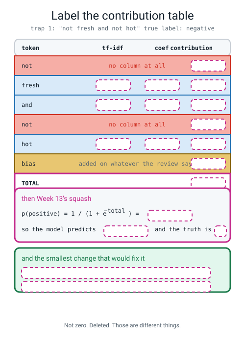
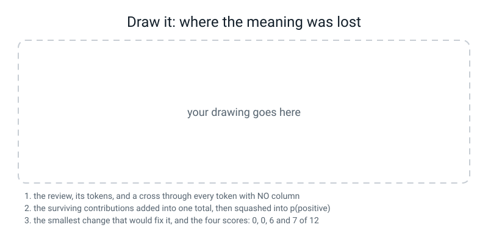

# Workbook — Week 33: Sentiment Engine

**Name:** ________________________________  **Date:** ______________

[⬅ Week 32](week-32.md) · [📖 Read the chapter first](../student-guide/week-33.md) · [Course Home](../README.md) · [Next ➡](week-34.md)

> **This is a lab week, so most of the marks are in 🛠️ Build It.** Everything on this page runs against `reviews80.py` — the eighty reviews you typed and the twelve traps you wrote. **Nothing downloads. Every run finishes in about a second.** You need a calculator with `ln`, `eˣ` and `cos⁻¹`.

---

## ✅ Warm-Up (5 min)

Five quick questions about **last week**.

**W1.** Write out the idf formula, then evaluate it for a word in **3** of **5** documents, to six decimal places.

`idf = ` ______________________________________

`= ln( ______ ÷ ______ ) + 1 = ________ + 1 = ________`

**W2.** `cold` appears **four** times in the five reviews, in **three** of them. **What is its `df`, and what is the one-word discipline that stops you getting this wrong?**

df = ______  the discipline: ______________________

**W3.** A cosine of `0.8`. **Give the angle, and then say what `0.8` is definitely not.**

angle = ________°  it is not ______________________

**W4.** Your by-hand TF-IDF weight came out `4.197225` and sklearn said `0.903782`. **Divide one by the other, name the step you skipped, and say what the number you computed actually is.**

________ ÷ ________ = ________  step: ______________  it is: ______________

**W5.** The closest pair in your sixty reviews was one happy review and one furious one, held together by `the`, `was`, `and`, `coffee`, `cake`. **In one sentence, why did `hot`, `fresh`, `cold` and `stale` contribute exactly `0.0000`?**

________________________________________________________________

---

## 🔢 Do the Maths by Hand

**There is no new maths this week.** So this page uses **the most recent maths — cosine similarity from Week 32 — plus the squash from Weeks 13 and 14**, because a post-mortem needs both. **Calculator only. No code on this page.**

Here are the numbers the model actually learned, so you can do the arithmetic yourself:

```text
bias (intercept)  = +0.0124

coefficients:  hot +2.9625   fresh +2.8648   generous +2.4595   tasty +2.1873
               delicious +2.2796   meal +0.3027   and +0.0629
               cold -3.2388   soggy -1.1954
```

---

**M1 — the post-mortem arithmetic, all the way, on trap 2.**

The review is `"not tasty and not generous"`. **True label: negative.** Week 31's regex finds five tokens: `not`, `tasty`, `and`, `not`, `generous`.

**(a) Fill in the contribution table.** Two of the five tokens **have no column at all**, because the word `not` never appeared in a training review.

| token | tf-idf value | × coefficient | = contribution |
|---|---:|---:|---:|
| `not` | — | **no column** | ________ |
| `tasty` | 0.7049 | ________ | ________ |
| `and` | 0.2268 | ________ | ________ |
| `not` | — | **no column** | ________ |
| `generous` | 0.6721 | ________ | ________ |
| bias | — | — | ________ |
| | | **total** | ________ |

**(b) Now Week 13's squash.** `p(positive) = 1 ÷ (1 + e^−total)`

```
e^−________ = ________

1 ÷ ( 1 + ________ ) = 1 ÷ ________ = ________
```

**(c) sklearn prints `0.9616`. Do you match to four decimal places?** ______

**(d) One sentence: the model is 96% confident and completely wrong. Name the mechanism — not the symptom.**

________________________________________________________________

---

**M2 — the hypothetical everybody proposes, priced out.**

*"Just give `not` a column and a big negative weight."* Let us find out what "big" would have to mean. Suppose `not` had a column, a tf-idf value of `0.4` in this review, appeared **twice**, and a coefficient of `c`.

**(a) The new total, in terms of `c`:**

`total = 4.0222 + 2 × 0.4 × c = 4.0222 + ______ c`

**(b) Try `c = −2.2`** — about as negative as `soggy`.

total = ________  ·  `e^−total` = ________  ·  p(positive) = ________  ·  **still wrong?** ______

**(c) Now solve for the `c` that would get the total to exactly zero.**

`0 = 4.0222 + 0.8c`, so `c = ` ________ ÷ ________ = ________

**(d) The most negative coefficient anywhere in this model is `−3.2388`, for the word `cold`. Compare it with your answer to (c) and write one sentence.**

________________________________________________________________

---

**M3 — where `0.5188` comes from, and why it is not a fix.**

After the negation-marking repair, three of the traps came out **right**, all three at `p(positive) = 0.5188`, and the only word left with a column in all three was `and`. Its coefficient is `+0.0629` and a one-word document's tf-idf value is exactly `1.0000`.

**(a) The bias on its own.** `total = 0.0124`

`e^−0.0124 = ` ________  ·  `p = 1 ÷ ` ________ ` = ` ________

**(b) Now add `and`.**

`total = ______ + ( 1.0000 × ______ ) = ________`  ·  `p = ` ________

**(c) You should have `0.5188`. What does a probability of `0.5188` tell you the model knew about that review?**

________________________________________________________________

**(d) So: fix, or abstention? One sentence, using the word "bias".**

________________________________________________________________

---

**M4 — Week 32's cosine, pointed at a trap.**

Trap 1 is `"not fresh and not hot"`. Its nearest training review by TF-IDF cosine is `"the burger was hot and the salad was fresh"`. Here are the two rows' weights for the words they share:

| shared word | trap 1 | the training review |
|---|---:|---:|
| `and` | 0.2461 | 0.1143 |
| `fresh` | 0.6716 | 0.3118 |
| `hot` | 0.6988 | 0.3244 |

**(a) Both rows have length 1, so cosine is multiply-and-add over the shared words only.**

```
and   : 0.2461 × 0.1143 = ________

fresh : 0.6716 × 0.3118 = ________

hot   : 0.6988 × 0.3244 = ________

                 total  = ________
```

**(b) As an angle:** cos⁻¹( ________ ) = ________ degrees

**(c) The training review is labelled POSITIVE. Its nearest neighbour is a furious review. In one sentence, why does the geometry agree with the classifier's mistake?**

________________________________________________________________

**(d) Which word would have to be in that shared-words list for the geometry to notice a problem, and where is it?** ____________

---

## 🔎 Predict the Output

**In pen, before you run anything.**

### P1 — five shapes, and the one that catches everybody

```python
from sklearn.model_selection import train_test_split
from sklearn.feature_extraction.text import TfidfVectorizer
from sklearn.linear_model import LogisticRegression
from sklearn.pipeline import make_pipeline
from reviews80 import CORPUS_80, LABELS_80, TRAP_TEXTS
X_train, X_test, y_train, y_test = train_test_split(
    CORPUS_80, LABELS_80, test_size=20, random_state=0, stratify=LABELS_80)
pipe = make_pipeline(TfidfVectorizer(),
                     LogisticRegression(C=10, max_iter=2000, random_state=0))
pipe.fit(X_train, y_train)
vec = pipe.named_steps["tfidfvectorizer"]
clf = pipe.named_steps["logisticregression"]
print("vec.transform(X_train).shape:", vec.transform(X_train).shape)
print("clf.coef_.shape            :", clf.coef_.shape)
print("clf.coef_[0].shape         :", clf.coef_[0].shape)
print("clf.intercept_.shape       :", clf.intercept_.shape)
print("predict_proba(TRAP).shape  :", pipe.predict_proba(TRAP_TEXTS).shape)
```

**My predictions:**

transform ____________  coef_ ____________  coef_[0] ____________  intercept_ ____________  proba ____________

**The truth:**

transform ____________  coef_ ____________  coef_[0] ____________  intercept_ ____________  proba ____________

**`clf.coef_` is `(1, 97)`, not `(97,)`. Say why the `1` is there, and what it would be for a five-class problem:**

________________________________________________________________

---

### P2 — a name you chose, in an error you did not expect

```python
vec = pipe.named_steps["tfidf"]
```

**My prediction:** ______________________________________________

**The truth (the last line):** ______________________________________

**Do not guess the real name — print it. Write the line that asks:** ______________________

**And who chose those names?** ______________________

---

### P3 — one review, no brackets

```python
print(pipe.predict("not fresh and not hot"))
print(pipe.predict(["not fresh and not hot"]))
```

**My predictions:** line 1 ______________________  line 2 ______________

**The truth:** line 1 ______________________  line 2 ______________

**This is the same error as Week 31's Break 1, two weeks on. What does a pipeline built on a vectorizer always want?**

________________________________________________________________

---

### P4 — 221 new columns

**This one continues from P1** — same file, same `X_train` and `y_train`.

```python
import numpy as np
from sklearn.pipeline import make_pipeline
from sklearn.feature_extraction.text import TfidfVectorizer
from sklearn.linear_model import LogisticRegression
from reviews80 import TRAP_TEXTS, TRAP_LABELS
bp = make_pipeline(TfidfVectorizer(ngram_range=(1, 2)),
                   LogisticRegression(C=10, max_iter=2000, random_state=0))
bp.fit(X_train, y_train)
bw = set(bp.named_steps["tfidfvectorizer"].get_feature_names_out())
print("columns:", len(bw))
for g in ["not fresh", "and not", "was not", "not hot", "and the"]:
    print("  %-12s has a column? %s" % (g, g in bw))
print("traps:", int((bp.predict(TRAP_TEXTS) == np.array(TRAP_LABELS)).sum()), "of 12")
print("p(pos) trap 1: %.4f" % bp.predict_proba([TRAP_TEXTS[0]])[0, 1])
```

**My predictions:** columns ______  `not fresh` ______  `and the` ______  traps ______ of 12

**The truth:** columns ______  `not fresh` ______  `and the` ______  traps ______ of 12

**You added 221 columns for pairs of words and `not fresh` is not one of them. Why not — in one sentence about the training reviews?**

________________________________________________________________

---

## ✍️ Practice Set A — Read It

**A1. Match the word to the thing.** Write the letter.

| Word | | Description |
|---|---|---|
| **word embedding** | ______ | (i) A grid counting how often each word appears near each other word |
| **distributional hypothesis** | ______ | (ii) The one number a linear model learned for one column |
| **co-occurrence matrix** | ______ | (iii) A sentence whose meaning is flipped by a small negator such as `not` |
| **negation trap** | ______ | (iv) A short list of numbers standing for one word, learned from data |
| **learned coefficient** | ______ | (v) Words that appear in the same company mean similar things |

**A2. Read the report and the baseline.**

```text
--- the model ---
              precision    recall  f1-score   support

    negative      1.000     1.000     1.000        10
    positive      1.000     1.000     1.000        10

    accuracy                          1.000        20

--- always says negative ---
              precision    recall  f1-score   support

    negative      0.500     1.000     0.667        10
    positive      0.000     0.000     0.000        10

    accuracy                          0.500        20
```

**(a) The dummy's recall on negative is `1.000` — a perfect score. Explain it in one line, and then say which number beside it destroys the boast:**

________________________________________________________________

**(b) Why is the dummy's precision on negative exactly `0.500`?** ______________________

**(c) Why are both of its positive numbers exactly `0.000`?** ______________________

**(d) With twenty held-out reviews, what is the smallest amount the accuracy can change by?** ______ **So how far apart are `1.000` and `0.950`?** ______________

**(e) Write the one sentence you would put under this report so that a reader is not misled. It must not contain the word "good".**

________________________________________________________________

**A3. Spot the bug in each. Only one of the three raises anything.**

```python
(1)  clf = pipe.named_steps["logisticregression"]
     top = np.argsort(clf.coef_)[:15]

(2)  vec = TfidfVectorizer().fit(CORPUS_80)
     clf = LogisticRegression(C=10, max_iter=2000, random_state=0)
     clf.fit(vec.transform(X_train), y_train)
     print("held out:", clf.score(vec.transform(X_test), y_test))

(3)  pipe = make_pipeline(TfidfVectorizer(), LogisticRegression(random_state=0))
     words = pipe.named_steps["tfidfvectorizer"].get_feature_names_out()
```

`(1)` what is wrong: ______________________________________________

`(2)` what is wrong: ______________________________________________

`(3)` what is wrong: ______________________________________________

*(Which one raises?* ______ *Which one hands you a grid where you wanted fifteen words, and says nothing?* ______ *And which one runs perfectly and is still the most dangerous of the three?* ______ *)*

**A4. Label the diagram.** Fill in every dashed box. **Use the coefficient list from the maths page.**


*Figure W33.1 — Label the contribution table.*

**A5. Read the five configurations.**

```text
1 single words                   cols=97    held-out=1.0000  traps=0/12
2 + pairs of words               cols=318   held-out=1.0000  traps=0/12
3 + pairs + 8 negation rows      cols=337   held-out=0.9500  traps=0/12
4 marked, no new data            cols=97    held-out=0.9500  traps=6/12
5 marked + 8 negation rows       cols=104   held-out=0.9500  traps=7/12
```

**(a) Rows 2 and 3 added ______ and ______ columns and fixed ______ traps. Row 4 added ______ columns and fixed ______ .**

**(b) So write the rule in one sentence. What is the lever, if it is not the number of features?**

________________________________________________________________

**(c) The held-out score went DOWN in rows 3, 4 and 5. How many reviews out of twenty is that, and is it a reason to reject the repair?**

______ review  ·  ______________________________________________

**(d) Row 5 is the best and it is still 7 of 12. What did the model learn, and what did it NOT learn?**

learned: ______________________  did not learn: ______________________

**A6. Read the fix-or-abstention printout** (configuration 4, bias `+0.0124`).

```text
 #  p(pos)  pred true  words that still have a column
 1  0.5188    1    0   ['and']
 5  0.4461    0    0   ['welcome', 'and', 'driver']
 6  0.5781    1    0   ['meal']
 7  0.5188    1    1   ['and']
10  0.6112    1    1   ['the', 'base', 'was', 'and', 'the', 'chips', 'were']
11  0.3724    0    1   ['portions', 'and', 'order']
12  0.5781    1    1   ['meal']
```

**(a) Traps 1 and 7 have opposite true labels and the identical probability `0.5188`. What does that prove about how the model decided them?**

________________________________________________________________

**(b) Trap 7 counts as a *fix* and trap 1 counts as a *failure*, on the same number. In one sentence, what is the difference between them?**

________________________________________________________________

**(c) Of the six traps this configuration got right, how many rest on real evidence? Name the one, and its number:** ____________

**(d) Write the sentence that must appear under any report of `6 of 12`:**

________________________________________________________________

---

## ✍️ Practice Set B — Write It

### B1 — one line

Print the five most negative learned coefficients with their words.

**Expected output:** five lines, most negative first.
**Done looks like:** the first line reads `-3.2388  cold`

### B2 — the report and the baseline, together

Print `classification_report` for your pipeline on the twenty held-out reviews, then the same report for `DummyClassifier(strategy="most_frequent")`, both with `digits=3` and `target_names=["negative", "positive"]`.

**Done looks like:** two reports, the dummy's accuracy `0.500`, and `zero_division=0` keeping the warning off your screen.

> **⚠️ Watch out:** the dummy must be fitted on **`X_train`, not on the vectorized matrix.** `DummyClassifier` ignores `X` entirely — it only counts labels — but it still has to be given something with the right number of rows.

### B3 — the contribution table, as a function

Write `explain(text)` that prints one line per token: the token, its tf-idf value, its coefficient and their product — **and for a token with no column, the words `no column at all` and `+0.0000`.** Finish with the bias, the total, your squashed probability, and `predict_proba`'s answer beside it.

**Done looks like:** the last two numbers are identical to four decimal places, and two rows say `no column at all`.

### B4 — the five configurations, as a table

Build the five models from the chapter and print one row each: what changed, the number of columns, the held-out score and the trap score out of 12. Then print the twelve-row grid showing which configuration got which trap right.

**Done looks like:** `0`, `0`, `0`, `6`, `7` down the last column, and five traps with a dot in every configuration.

### B5 — the picture, and the percentage it threw away, about 25 lines

Fit `TfidfVectorizer` on the **training rows only**, transform all eighty reviews, squash to two columns with `PCA(n_components=2, random_state=0)`, and plot them with **circles for positive and squares for negative.** Put the percentage in **both** axis labels, save to a file, and print how much of the spread the picture kept and how much it threw away.

**Done looks like:** `matplotlib.use("Agg")` before the `pyplot` import, a saved `.png`, and two percentages that add to about 15.

> **⚠️ Watch out:** `vec.fit(X_train)` then `vec.transform(CORPUS_80)`. **Fitting on all eighty to make a prettier picture is the leak from A3 (2), wearing a nicer coat.**

---

## 🐞 Fix the Broken Program

**Three bugs: one runtime error, one index error, and one that finishes cleanly and reports a number that means nothing at all.**

```python
"""broken33.py - three bugs. The third one reports a triumph."""
import numpy as np
from sklearn.model_selection import train_test_split
from sklearn.feature_extraction.text import TfidfVectorizer
from sklearn.linear_model import LogisticRegression
from sklearn.pipeline import make_pipeline

from reviews80 import CORPUS_80, LABELS_80, TRAP_TEXTS, TRAP_LABELS

X_train, X_test, y_train, y_test = train_test_split(
    CORPUS_80, LABELS_80, test_size=20, random_state=0, stratify=LABELS_80)

pipe = make_pipeline(TfidfVectorizer(),
                     LogisticRegression(C=10, max_iter=2000, random_state=0))
pipe.fit(X_train + TRAP_TEXTS, y_train + TRAP_LABELS)

vec = pipe.named_steps["tfidf"]
clf = pipe.named_steps["logisticregression"]
words = vec.get_feature_names_out()
print("columns:", len(words), "  'not' has a column?", "not" in set(words))

coefs = clf.coef_[1]
for i in np.argsort(coefs)[:5]:
    print("   %+.4f  %s" % (coefs[i], words[i]))

print("held-out 20:", pipe.score(X_test, y_test))
print("the twelve traps:", int((pipe.predict(TRAP_TEXTS) == np.array(TRAP_LABELS)).sum()), "of 12")
```

**The first message:**

```text
Traceback (most recent call last):
  File "broken33.py", line 17, in <module>
    vec = pipe.named_steps["tfidf"]
  File ".../sklearn/utils/_bunch.py", line 42, in __getitem__
    return super().__getitem__(key)
KeyError: 'tfidf'
```

**Bug 1.** **The name is not there, so what is?** Do not guess — write the line that asks: ______________________

**The fix:** ______________________________________________________

**Fix it and run again. The second message:**

```text
columns: 101   'not' has a column? True
Traceback (most recent call last):
  File "broken33_s2.py", line 22, in <module>
    coefs = clf.coef_[1]
IndexError: index 1 is out of bounds for axis 0 with size 1
```

**Bug 2.** `clf.coef_` has shape `(1, 101)`. **What is that `1` counting, and why is there not a row per class?**

________________________________________________________________

**The fix:** ______________________________________________________

**Fix that and run again. It finishes, silently:**

```text
columns: 101   'not' has a column? True
   -2.5853  rude
   -2.3250  cold
   -2.3044  welcome
   -2.1153  mean
   -2.0356  limp
held-out 20: 0.9
the twelve traps: 1 of 12
```

**Bug 3.** Nothing crashed, and `1 of 12` is a modest, believable score.

**(a) Two numbers on the first line of that output contradict something you proved in class. Which two, and what did you prove?**

________________________________________________________________

**(b) Bug 3 — the line and the fix:** ______________________________

**(c) After the fix, three numbers change. Predict all three:**

columns ______  held-out ______  traps ______ of 12

**(d) The fixed version scores BETTER on the held-out twenty and WORSE on the traps. Explain both changes in one sentence each:**

held-out: ______________________________________________________

traps: ________________________________________________________

**(e) And now the finding that is worth the whole page. The broken version trained on the traps — it was allowed to look at the answers — and it still only got `1 of 12`. What does that tell you about the negation failure?**

________________________________________________________________

---

## 🧩 Puzzle of the Week

### One Weight Per Word

You are allowed to do something the model cannot: **reach in and choose the coefficient for `not` yourself.** Any number you like. Your job is to fix trap 1 **and** trap 7 at the same time.

Both traps contain `not` twice, and in both of them `not`'s tf-idf value would be about `0.4`. Here are their real totals with `not` contributing nothing:

```text
trap 1  "not fresh and not hot"    true NEGATIVE   total = +4.0222   p = 0.9824
trap 7  "not cold and not soggy"   true POSITIVE   total = -2.8047   p = 0.0571
```

**(a) For trap 1 to come out NEGATIVE, the total must be below zero.**

`4.0222 + 0.8c < 0`, so `c < ` ________ ÷ ________ = ________

**(b) For trap 7 to come out POSITIVE, the total must be above zero.**

`−2.8047 + 0.8c > 0`, so `c > ` ________ ÷ ________ = ________

**(c) Write both conditions on one line:**

`c < ` ________ **and** `c > ` ________

**(d) How many numbers satisfy both?** ______

**(e) So state the finding. It is not about this corpus, or this model's training — it is about the *shape* of the model. One sentence:**

________________________________________________________________

**(f) The negation-marking repair scores six of the twelve (you will see in A6 why that is not a real fix). It creates the tokens `not_fresh` and `not_cold`. In one sentence, why does that escape the trap you just proved?**

________________________________________________________________

**(g) A bonus, and it is real.** Somebody trained a model on the eighty reviews **plus all twelve traps**, so `not` had a column and the model saw it twelve times. The coefficient it learned was **`−0.2660`** — almost nothing. **Using your answer to (d), explain why that number was inevitable.**

________________________________________________________________

---

## 🤔 Think Deeper

**T1.** Your model scored **20 out of 20** on the held-out reviews and **0 out of 12** on the traps. Both numbers came from the same model in the same run. **Write a paragraph on which of the two you would put in a report, and how.** Then the harder half: the traps were written by you, on purpose, to break it. **Does a test set you designed to fail count as evidence?** Say what it is evidence *of*, and what it is not evidence of, and name one thing you would add to make the `20/20` mean more.

________________________________________________________________

________________________________________________________________

________________________________________________________________

________________________________________________________________

**T2.** Week 24 said: **flattening a picture throws away the picture**, and the repair was a convolution — a small window that looks at a pixel together with its neighbours, in the same way at every position. Bigrams are the same idea for text, and they fixed **zero of twelve.** **Write a paragraph explaining why the same repair worked for images and failed for text.** Use the numbers: a 3×3 kernel has 9 neighbours and is reused at every position in every image; 97 words make 9,409 possible pairs, of which the training rows contained 221. **Finish with what would actually have to change — and notice that you are describing next year.**

________________________________________________________________

________________________________________________________________

________________________________________________________________

________________________________________________________________

---

## 🛠️ Build It — Sentiment Engine

**Six pieces. This is the last full build before the capstone, and it is the shape of the capstone.** About 60 minutes.

### Step checklist

- [ ] **1.** Per-class precision and recall, **with a baseline beside them** *(page 33.3)*.
- [ ] **2.** One sentence saying why the score is not as impressive as it looks *(page 33.3)*.
- [ ] **3.** The fifteen most positive and fifteen most negative words, **each with its document frequency** *(page 33.4)*.
- [ ] **4.** Every word resting on one or two reviews ringed and counted *(page 33.4)*.
- [ ] **5.** The five-configuration table, and the fix-or-abstention check on the best row *(page 33.5)*.
- [ ] **6.** The PCA picture with **both percentages in the axis labels** *(page 33.6)*.
- [ ] **7.** The stretch: what an unbalanced training set would have done *(page 33.7)*.
- [ ] **8.** A post-mortem of one wrong prediction that names **word order or the missing column** as the mechanism *(page 33.8)*.

### Page 33.3 — The report, and the baseline

| | precision | recall | f1 | support |
|---|---:|---:|---:|---:|
| **my model — negative** | ________ | ________ | ________ | ______ |
| **my model — positive** | ________ | ________ | ________ | ______ |
| **accuracy** | | | ________ | ______ |
| **dummy — negative** | ________ | ________ | ________ | ______ |
| **dummy — positive** | ________ | ________ | ________ | ______ |
| **dummy accuracy** | | | ________ | ______ |

**The sentence that stops this misleading a reader (no reference to my own modesty; give a reason):**

________________________________________________________________

### Page 33.4 — The fifteen and the fifteen

| rank | most NEGATIVE | coef | df | most POSITIVE | coef | df |
|---:|---|---:|---:|---|---:|---:|
| 1 | ____________ | ________ | ____ | ____________ | ________ | ____ |
| 2 | ____________ | ________ | ____ | ____________ | ________ | ____ |
| 3 | ____________ | ________ | ____ | ____________ | ________ | ____ |
| 4 | ____________ | ________ | ____ | ____________ | ________ | ____ |
| 5 | ____________ | ________ | ____ | ____________ | ________ | ____ |
| ... | | | | | | |
| 13 | ____________ | ________ | ____ | ____________ | ________ | ____ |
| 14 | ____________ | ________ | ____ | ____________ | ________ | ____ |
| 15 | ____________ | ________ | ____ | ____________ | ________ | ____ |

**Words resting on 1 or 2 reviews — ring them and count:** ______ of the thirty

**The ones resting on exactly ONE review:** ____________  ____________  ____________

**`great` is the most obviously positive word in English and my model has almost no opinion about it. Its coefficient is ________ and its df is ______ . Is that a flaw in the model?**

________________________________________________________________

**What would you have to do to find out whether `fluffy` really is a positive word? (There is only one right answer.)**

________________________________________________________________

### Page 33.5 — The unigram-versus-bigram table

| what changed | features | held-out 20 | traps out of 12 |
|---|---:|---:|---:|
| single words | ______ | ________ | ______ |
| + pairs of words | ______ | ________ | ______ |
| + pairs + 8 negation rows | ______ | ________ | ______ |
| glued negators, no new data | ______ | ________ | ______ |
| glued + 8 negation rows | ______ | ________ | ______ |

**For the best row — every trap it got right, with the words that still had a column:**

| # | p(pos) | pred | true | words that still had a column |
|---:|---:|---:|---:|---|
| ____ | ________ | ____ | ____ | ______________________________ |
| ____ | ________ | ____ | ____ | ______________________________ |
| ____ | ________ | ____ | ____ | ______________________________ |
| ____ | ________ | ____ | ____ | ______________________________ |
| ____ | ________ | ____ | ____ | ______________________________ |
| ____ | ________ | ____ | ____ | ______________________________ |

**Fix or abstention?** ______________  **The number of the one that rests on real evidence:** ______

### Page 33.6 — The picture

**Filename:** ____________________

**x-axis label, in full:** ______________________________________________

**y-axis label, in full:** ______________________________________________

**Kept in the picture:** ________%  **Thrown away:** ________%

**The classes look thoroughly mixed and the classifier gets 20 out of 20. Explain, with the percentage in the sentence:**

________________________________________________________________

**And the sentence this plot does NOT support, written out so you never write it:**

________________________________________________________________

### Page 33.7 — Stretch: an unbalanced training set

Six traps came out right at `0.5188`, `0.5188`, `0.5188`, `0.5781`, `0.6112` and `0.4461`.

**(a) The bias is ________ , which is almost exactly zero because the training set is ______ and ______ .**

**(b) If the training set had been 40 negative and 20 positive, the bias would lean** ______________ **, because with no evidence at all the best guess is** ______________

**(c) Which traps rest only on the word `and`?** ______________________

**(d) Of those, which would become RIGHT and which would become WRONG?**

right: ______________  wrong: ______________

**(e) The headline score would still be ______ of 12 — a different six, for the same reason. Write the sentence:**

________________________________________________________________

### Page 33.8 — The post-mortem

**The review:** ________________________________________________

**Its true label:** ______________  **What the model said:** ______________  **How confident:** ________

**The arithmetic:**

| token | tf-idf | coefficient | contribution |
|---|---:|---:|---:|
| ____________ | ________ | ________ | ________ |
| ____________ | ________ | ________ | ________ |
| ____________ | ________ | ________ | ________ |
| ____________ | ________ | ________ | ________ |
| bias | — | — | ________ |
| | | **total** | ________ |

**The squash:** `1 ÷ (1 + e^−` ________ `) = ` ________

**The mechanism — point at the box where the information was lost:**

________________________________________________________________

________________________________________________________________

**The smallest change that would fix it, and why smaller changes will not:**

________________________________________________________________

________________________________________________________________

---

## 🎨 Draw It


*Figure W33.2 — Where the meaning was lost.*

**What a good answer looks like:** across the top, the review `not fresh and not hot` written out, with its **five tokens in five boxes** underneath — and **a thick cross through both `not` boxes**, labelled *"no column: deleted before the arithmetic"*. Not a zero. A cross. Then three arrows from the surviving boxes into one **total box** reading `+4.0222`, with the contributions written on the arrows: `+0.0155`, `+1.9241`, `+2.0701`, and the bias `+0.0124` coming in from the side. Out of the total box, one arrow into a small S-curve with `0.9824` marked on it and the word **`POSITIVE`** beside it — **and `true label: NEGATIVE` written underneath in a box of its own.**

**And the two things that earn the marks:** the **four configurations as a little bar chart** — `0`, `0`, `6`, `7` out of 12 — with `221 new columns → 0 fixed` written next to the second bar and `0 new columns → 6 fixed` next to the third, because that contrast is the finding of the week. And at the bottom, **the smallest change that would fix it**, in one line, with the word *data* in it. A drawing that shows the model getting it wrong is a diagram of a mistake; **a drawing that shows the two boxes that were deleted is a diagram of a cause.**

**My review and its true label:** ______________________  ______________

**My deleted tokens:** ______________________

**My total and my probability:** ________  ________

**My four bars:** ______  ______  ______  ______

---

## 📊 Self-Check

| I can... | 😀 | 🙂 | 😕 |
|---|---|---|---|
| build a vectorizer and a classifier inside one `make_pipeline` | | | |
| find the step names with `pipe.named_steps.keys()` instead of guessing | | | |
| say why a vocabulary must come from the training rows only | | | |
| report per-class precision and recall **with a baseline beside them** | | | |
| say why 20 out of 20 is not as impressive as it looks, with a reason | | | |
| pull the fifteen most trusted words each way out of `clf.coef_[0]` | | | |
| print the document frequency next to every coefficient I quote | | | |
| spot a coefficient resting on one review and say what it is worth | | | |
| add up a contribution table by hand and match `predict_proba` | | | |
| say what a token with no column contributes, and why it is not a zero | | | |
| measure whether bigrams fix the traps, and report the number | | | |
| tell a fix from an abstention using the probabilities | | | |
| read a PCA plot of text and quote the percentage it threw away | | | |
| write a post-mortem that names a mechanism, not a symptom | | | |
| say why one weight per word cannot express "not" | | | |

**The one thing I would ask about if I could ask one question:**

________________________________________________________________

---

## ✅ Answers

<details>
<summary>Check your answers</summary>

### Warm-Up

**W1.** `idf = ln( (1 + n) ÷ (1 + df) ) + 1 = ln( 6 ÷ 4 ) + 1 = ln(1.5) + 1 = 0.405465 + 1 = 1.405465`

**W2.** `df = 3`. **The discipline: say the word "documents" out loud every single time you say "df".** `cold` has **occurrences 4, documents 3**, and the repeat inside one review is already recorded — in that review's `tf`.

**W3.** **36.87 degrees.** It is **not 80 per cent** of anything. *(And 0.4 is not half of it — 0.4 is 66.4 degrees, which is not twice 36.87.)*

**W4.** `4.197225 ÷ 0.903782 = 4.6441` · step: **the L2 normalization** · it is: **`tf × idf` before the row was divided by its own length** — a perfectly correct number in the wrong units, and the factor `4.6441` **is** that row's length.

**W5.** *"Cosine similarity multiplies matching positions, and each of those four words is present in one review and absent from the other — so each contributes `something × 0 = 0`."* **The words that disagree are invisible to the measure.**

### Do the Maths by Hand

**M1 (a).**

| token | tf-idf value | × coefficient | = contribution |
|---|---:|---:|---:|
| `not` | — | **no column** | **+0.0000** |
| `tasty` | 0.7049 | **+2.1873** | **+1.5418** |
| `and` | 0.2268 | **+0.0629** | **+0.0143** |
| `not` | — | **no column** | **+0.0000** |
| `generous` | 0.6721 | **+2.4595** | **+1.6531** |
| bias | — | — | **+0.0124** |
| | | **total** | **+3.2216** |

`1.5418 + 0.0143 + 1.6531 + 0.0124 = 3.2216` ✓

**M1 (b).**

```
e^−3.2216 = 0.039891

1 ÷ ( 1 + 0.039891 ) = 1 ÷ 1.039891 = 0.961639
```

**M1 (c). Yes — `0.9616`.** Here is the real run:

```text
--- not tasty and not generous
   not        no column at all             =  +0.0000
   tasty      tfidf 0.7049 x coef +2.1873 = +1.5418
   and        tfidf 0.2268 x coef +0.0629 = +0.0143
   generous   tfidf 0.6721 x coef +2.4595 = +1.6531
   bias                                    = +0.0124
   TOTAL                                   = +3.2216
   p(positive) = 0.9616   sklearn says 0.9616
```

**M1 (d).** *"The word `not` has no column in the vocabulary — not one of the sixty training reviews contains it — so both occurrences were **deleted** before the arithmetic began. What reached the classifier was effectively `tasty and generous`, and those are two of its strongest positive words."* **"The model is bad at negation" is the symptom. "The word was deleted, so it was never in the sum" is the mechanism.**

**M2 (a).** `total = 4.0222 + 0.8c`

**M2 (b).** `total = 4.0222 − 1.7600 = 2.2622` · `e^−2.2622 = 0.104121` · `p = 1 ÷ 1.104121 = 0.9057` · **still wrong, and still over 90% confident.**

**M2 (c).** `c = −4.0222 ÷ 0.8 = −5.0278`

**M2 (d).** *"To rescue this one review, `not` would need a coefficient of `−5.03` — more than fifty per cent more negative than `cold`, which is the strongest opinion this model holds about anything. So the fix is not 'give `not` a weight'; it is a weight the model would never plausibly learn."* **And the Puzzle proves something stronger: no value of `c` works at all.**

```text
coef -2.2000 -> total +2.2622 -> p 0.9057
coef -5.0000 -> total +0.0222 -> p 0.5055
coef -5.0278 -> total -0.0000 -> p 0.5000
```

**M3 (a).** `e^−0.0124 = 0.987677` · `p = 1 ÷ 1.987677 = 0.503100`

**M3 (b).** `total = 0.0124 + ( 1.0000 × 0.0629 ) = 0.0753` · `p = 1 ÷ (1 + e^−0.0753) = 0.518816` → **`0.5188`** ✓

**M3 (c).** *"Nothing. `0.5188` is a coin toss leaning by a hair — the model had one meaningless word (`and`) and its own bias, and that is all."*

**M3 (d).** *"Abstention. The repair deleted the evidence rather than interpreting it, so what came out was the **bias** plus `and`'s tiny weight, squashed — and it happened to land on the right side of 0.5 for three traps and the wrong side for three others."* **A score built on abstentions is a measurement of your class balance, not of your repair.**

**M4 (a).**

```
and   : 0.2461 × 0.1143 = 0.0281
fresh : 0.6716 × 0.3118 = 0.2094
hot   : 0.6988 × 0.3244 = 0.2267
                 total  = 0.4642
```

**M4 (b).** `cos⁻¹(0.4642) = 62.3 degrees`

**M4 (c).** *"After tokenizing, trap 1's row contains exactly three words — `and`, `fresh`, `hot` — and two of them are the two words that make `"the burger was hot and the salad was fresh"` a positive review. The geometry and the classifier are reading the same row, and it is a positive row."* **The classifier is not making an error of judgement; it is reading a row from which the meaning has already gone.**

**M4 (d).** **`not`** — and it is **nowhere.** It has no column, so it cannot appear in a shared-words list, cannot contribute to a cosine, and cannot appear in a contribution table. **Every measurement in this course would have to agree with the mistake, because every one of them reads the row.**

**The real run, for checking:**

```text
  0.4642  the burger was hot and the salad was fresh
  0.4578  the coffee was hot and the cake was fresh
  0.3430  the salad was fresh and crisp
  0.3183  perfect timing and a hot bag
```

**All four nearest neighbours of a furious review are positive reviews.** ✅

### Predict the Output

**P1.**

```text
vec.transform(X_train).shape: (60, 97)
clf.coef_.shape            : (1, 97)
clf.coef_[0].shape         : (97,)
clf.intercept_.shape       : (1,)
predict_proba(TRAP).shape  : (12, 2)
```

**The `1` is counting the number of coefficient rows the model needed**, and a two-class logistic regression needs exactly one — one set of weights, with "positive" above the line and "negative" below it. **For a five-class problem `coef_` would be `(5, 97)`: one row of weights per class.** *(And `predict_proba` gives `(12, 2)` — one column per class, and the two add to 1 in every row — which is why the chapter writes `predict_proba(X)[:, 1]`.)*

**P2.**

```text
KeyError: 'tfidf'
```

**The line that asks:**

```python
print(pipe.named_steps.keys())      # dict_keys(['tfidfvectorizer', 'logisticregression'])
```

**`make_pipeline` chose the names** — the class name, in lowercase, with nothing added. **In Week 3 you used `Pipeline(steps=[("prep", ...), ("clf", ...)])` and chose them yourself. That is the price of the shortcut**, and the fix is to look rather than to guess.

**P3.**

```text
ValueError: Iterable over raw text documents expected, string object received.
[1]
```

**A pipeline built on a vectorizer always wants a *collection of documents*, even when there is only one.** It is the same error as Week 31's Break 1, two weeks on and one layer deeper — the pipeline passed your bare string straight through to `TfidfVectorizer.transform`, which refuses to guess whether you meant one document or one document per character. **Square brackets, always.** *(And note the answer: `[1]` — an array with one prediction in it, not a bare `1`.)*

**P4.**

```text
columns: 318
  not fresh    has a column? False
  and not      has a column? False
  was not      has a column? False
  not hot      has a column? False
  and the      has a column? True
traps: 0 of 12
p(pos) trap 1: 0.9167
```

**`not fresh` has no column because the two words were never adjacent in a training review** — and they never could have been, since **`not` does not occur in the sixty training reviews at all.** A bigram column only exists if that exact pair appeared during `fit`. **So `ngram_range=(1, 2)` added 221 columns of pairs that *did* occur** — `and the`, `was cold`, `the pizza` — **and not one of them contains a negator.** The traps went from 0 to 0. *(The confidence on trap 1 drops from `0.9824` to `0.9167`, which is the model being fractionally less sure while being exactly as wrong.)*

### Practice Set A

**A1.** word embedding **(iv)** · distributional hypothesis **(v)** · co-occurrence matrix **(i)** · negation trap **(iii)** · learned coefficient **(ii)**

**A2 (a).** *"It says negative to everything, so it catches every negative review that exists — recall `1.000` is free."* **The number that destroys the boast is the precision beside it, `0.500`:** of the twenty things it called negative, only ten actually were. **This is Week 8's lesson doing its job: a perfect recall with no precision beside it is not a result, it is a sentence with half of it missing.**

**(b)** It called all **20** reviews negative and **10** of them were. `10 ÷ 20 = 0.500`.

**(c)** It **never predicted positive at all**, so there were no positive predictions to be right about (precision `0.000`) and it caught none of the ten real positives (recall `0.000`).

**(d)** One review out of twenty is **0.05, or five percentage points.** So `1.000` and `0.950` are **one review apart** — the number has no resolution finer than that, and treating a five-point difference as meaningful on twenty rows is treating one review as a trend.

**(e)** Any one of these is full marks:

> *"Twenty held-out reviews means the score can only move in steps of five points, so `1.000` and `0.950` are one review apart."*
>
> *"All eighty reviews were typed by one person out of the same forty-odd adjectives, so the held-out twenty are the training sentences reshuffled rather than a fresh sample of the world."*
>
> *"Not one of the twenty held-out reviews is hard — no negation, no sarcasm, no mixed opinion — so the test set contains none of the cases the model actually fails on."*

**Not acceptable:** *"because 20 is a small number"* with nothing after it, or *"because accuracy is a bad metric"* — it is not the problem here, the classes are balanced and precision and recall are both `1.000` too.

**A3.**

`(1)` **`np.argsort(clf.coef_)` sorts the wrong thing.** `coef_` has shape `(1, 97)`, so `argsort` sorts *inside* that single row and hands back a grid of shape `(1, 97)` — and `[:15]` then takes the first fifteen **rows** of a thing that has one row, so `top` is a `(1, 97)` grid and not fifteen anything. **No error is raised**, which is why the next line, whatever it is, will be confusing. **The fix is `np.argsort(clf.coef_[0])[:15]`** — take the row out first.

`(2)` **The vectorizer was fitted on all eighty reviews, including the twenty held out.** `TfidfVectorizer` learns two things during `fit` — the vocabulary **and** every word's `idf` — and both have now been computed using the test rows. **It runs perfectly and prints `held out: 1.0`.** The number that betrays it is **the vocabulary size: 107 instead of 97.** Ten words exist only in the held-out reviews, and one of them is `not`.

`(3)` **`get_feature_names_out()` before `fit`.** It raises `NotFittedError: Vocabulary not fitted or provided` — a pipeline you have only *built* has learned nothing.

*(Raises: **(3)**. Hands you a grid in silence: **(1)** — `np.argsort(clf.coef_)[:15]` really does run, and `top.shape` is `(1, 97)`. Most dangerous: **(2)**, because it is the only one that produces a number somebody might believe.)*

**A4. Label the contribution table.**

| token | tf-idf | coefficient | contribution |
|---|---:|---:|---:|
| `not` | — | **no column at all** | **+0.0000** |
| `fresh` | 0.6716 | **+2.8648** | **+1.9241** |
| `and` | 0.2461 | **+0.0629** | **+0.0155** |
| `not` | — | **no column at all** | **+0.0000** |
| `hot` | 0.6988 | **+2.9625** | **+2.0701** |
| bias | — | — | **+0.0124** |
| | | **total** | **+4.0222** |

`p(positive) = 1 ÷ (1 + e^−4.0222) = 1 ÷ 1.017913 = ` **`0.9824`** → the model predicts **positive**, and the truth is **negative.**

**And the smallest change that would fix it: more training reviews that use `not`** — roughly forty of them, half positive and half negative, using `not` in front of the sentiment words this corpus actually contains. **A feature can only help you if the training data put it there.**

**A5 (a).** Rows 2 and 3 added **221** and **240** columns and fixed **0** traps. Row 4 added **0** columns and fixed **6**.

**(b)** *"The lever is not the number of features, it is the **tokens** — what the words are cut into before anybody counts them."* **Row 4 changed the tokenizer and nothing else, and it is the only row that moved the number.**

**(c)** **One** review out of twenty. **No, it is not a reason to reject the repair** — it is a normal trade, and the honest move is to name it: *"the repair cost one held-out review out of twenty — the only one containing `not` — and 'bought' six traps out of twelve, five of them on weak evidence."* **A repair with no cost attached usually means you have not looked for the cost.**

**(d)** learned: **seven new glued tokens** from the eight extra reviews (`not_late`, `not_quick`, `no_soggy`, `no_fresh`, `never_wrong`, `never_generous`, `hardly_any`) — **none of which appears in any trap**, so row 5's extra right answer (trap 11, at `0.530`) is another weak-evidence call, not a learned token · did not learn: **that negation reverses meaning.** **Five traps survive every repair, which is what "it learned tokens, not a rule" looks like from the outside.**

**A6 (a).** *"Both were decided by the bias and one near-zero word, and nothing else."* Both had only the word `and` left with a column, both rows are therefore identical as far as the model is concerned, **and identical rows must produce identical probabilities.** `0.0124 + 0.0629 = 0.0753`, squashed, is `0.5188` — for both.

**(b)** *"Nothing about the model. Trap 7 happens to be positive and 0.5188 is just above 0.5; trap 1 happens to be negative."* **The difference is the true label, not the prediction.** One of them scoring as a fix is luck.

**(c)** **One — trap 5, `no warm welcome and no friendly driver`**, where `welcome`, `and` and `driver` survived and produced `0.4461`, genuinely below the line on real evidence. *(Trap 11 at `0.3724` also had surviving words, but it came out **wrong**.)* **So of six apparent fixes, one is arguably real and five are the model shrugging.**

**(d)** *"Six of twelve, of which five were decided by the bias rather than by any surviving evidence — so this number measures the training set's class balance, not the negation repair."* **A page reporting `6 of 12` as a success without that sentence is a page that has misled its reader.**

### Practice Set B

**B1.** *(Every block in this section continues from P1's pipeline: `pipe`, `vec`, `clf`, `X_train`, `y_train`, `X_test` and `y_test` are already in scope.)*

```python
import numpy as np
words = vec.get_feature_names_out()
coefs = clf.coef_[0]
for i in np.argsort(coefs)[:5]:
    print("   %+.4f  %s" % (coefs[i], words[i]))
```

```text
   -3.2388  cold
   -3.2033  rude
   -2.3327  slow
   -2.3024  mean
   -2.2553  terrible
```

**B2.**

```python
from sklearn.dummy import DummyClassifier
from sklearn.metrics import classification_report
print("--- the model ---")
print(classification_report(y_test, pipe.predict(X_test),
                            target_names=["negative", "positive"], digits=3))
dummy = DummyClassifier(strategy="most_frequent").fit(X_train, y_train)
print("--- always says negative ---")
print(classification_report(y_test, dummy.predict(X_test),
                            target_names=["negative", "positive"],
                            digits=3, zero_division=0))
```

```text
--- the model ---
              precision    recall  f1-score   support

    negative      1.000     1.000     1.000        10
    positive      1.000     1.000     1.000        10

    accuracy                          1.000        20
   macro avg      1.000     1.000     1.000        20
weighted avg      1.000     1.000     1.000        20

--- always says negative ---
              precision    recall  f1-score   support

    negative      0.500     1.000     0.667        10
    positive      0.000     0.000     0.000        10

    accuracy                          0.500        20
   macro avg      0.250     0.500     0.333        20
weighted avg      0.250     0.500     0.333        20
```

**B3.**

```python
import re
import numpy as np

def explain(text):
    row = vec.transform([text]).toarray()[0]
    coefs, total = clf.coef_[0], clf.intercept_[0]
    print("---", text)
    for tok in re.findall(r"\b\w\w+\b", text.lower()):
        if tok in set(words):
            i = list(words).index(tok)
            piece = row[i] * coefs[i]
            total += piece
            print("   %-10s tfidf %.4f x coef %+.4f = %+.4f" % (tok, row[i], coefs[i], piece))
        else:
            print("   %-10s no column at all             =  +0.0000" % tok)
    print("   bias                                    = %+.4f" % clf.intercept_[0])
    print("   TOTAL                                   = %+.4f" % total)
    print("   p(positive) = %.4f   sklearn says %.4f"
          % (1 / (1 + np.exp(-total)), pipe.predict_proba([text])[0, 1]))

explain("not fresh and not hot")
explain("hardly a delicious meal")
```

```text
--- not fresh and not hot
   not        no column at all             =  +0.0000
   fresh      tfidf 0.6716 x coef +2.8648 = +1.9241
   and        tfidf 0.2461 x coef +0.0629 = +0.0155
   not        no column at all             =  +0.0000
   hot        tfidf 0.6988 x coef +2.9625 = +2.0701
   bias                                    = +0.0124
   TOTAL                                   = +4.0222
   p(positive) = 0.9824   sklearn says 0.9824
--- hardly a delicious meal
   hardly     no column at all             =  +0.0000
   delicious  tfidf 0.6653 x coef +2.2796 = +1.5166
   meal       tfidf 0.7466 x coef +0.3027 = +0.2260
   bias                                    = +0.0124
   TOTAL                                   = +1.7551
   p(positive) = 0.8526   sklearn says 0.8526
```

**Notice the second one.** `"hardly a delicious meal"` has **two** tokens with columns, the `a` was deleted for being one letter long, `hardly` has no column, and **the whole prediction rests on the word `delicious`.** `0.8526` confident, and wrong.

**B4.** The five configurations, with `mark_negation` from the chapter:

```text
mark_negation('not fresh and not hot') -> 'not_fresh and not_hot'
mark_negation('hardly a delicious meal') -> 'hardly_delicious meal'

1 single words                   cols=97    held-out=1.0000  traps=0/12
2 + pairs of words               cols=318   held-out=1.0000  traps=0/12
3 + pairs + 8 negation rows      cols=337   held-out=0.9500  traps=0/12
4 marked, no new data            cols=97    held-out=0.9500  traps=6/12
5 marked + 8 negation rows       cols=104   held-out=0.9500  traps=7/12

 #  1 2 3 4 5   true  review
 1  . . . . .    0    not fresh and not hot
 2  . . . . .    0    not tasty and not generous
 3  . . . . .    0    never polite and never quick
 4  . . . . .    0    the pizza was not perfect and the salad was not crisp
 5  . . . Y Y    0    no warm welcome and no friendly driver
 6  . . . . .    0    hardly a delicious meal
 7  . . . Y Y    1    not cold and not soggy
 8  . . . Y Y    1    not rude and not slow
 9  . . . Y Y    1    never stale and never greasy
10  . . . Y Y    1    the base was not limp and the chips were not awful
11  . . . . Y    1    no mean portions and no wrong order
12  . . . Y Y    1    hardly a terrible meal
```

**Five traps — 1, 2, 3, 4 and 6 — have a dot in every column.** Every one of them is a **negative** review made of positive words, and nothing anybody tried this week touched them.

**B5.**

```python
import numpy as np
import matplotlib
matplotlib.use("Agg")
import matplotlib.pyplot as plt
from sklearn.decomposition import PCA
from sklearn.feature_extraction.text import TfidfVectorizer
from reviews80 import CORPUS_80, LABELS_80

vec = TfidfVectorizer()
vec.fit(X_train)                        # vocabulary from the TRAINING rows only
Z = vec.transform(CORPUS_80).toarray()
print("rows to draw:", Z.shape)
pca = PCA(n_components=2, random_state=0)
P = pca.fit_transform(Z)
r = pca.explained_variance_ratio_
print("axis 1 holds %.2f%% of the spread" % (r[0] * 100))
print("axis 2 holds %.2f%% of the spread" % (r[1] * 100))
print("kept: %.2f%%   thrown away: %.2f%%" % (r.sum() * 100, (1 - r.sum()) * 100))

y = np.array(LABELS_80)
fig, ax = plt.subplots(figsize=(6, 6))
ax.scatter(P[y == 1, 0], P[y == 1, 1], marker="o", label="positive")
ax.scatter(P[y == 0, 0], P[y == 0, 1], marker="s", label="negative")
ax.set_xlabel("axis 1  (%.2f%% of the spread)" % (r[0] * 100))
ax.set_ylabel("axis 2  (%.2f%% of the spread)" % (r[1] * 100))
ax.set_title("80 reviews, 97 columns squashed to 2")
ax.legend()
plt.savefig("reviews_pca.png", dpi=110, bbox_inches="tight")
print("saved reviews_pca.png")
```

```text
rows to draw: (80, 97)
axis 1 holds 10.58% of the spread
axis 2 holds 4.49% of the spread
kept: 15.07%   thrown away: 84.93%
saved reviews_pca.png
```

**Runtime about one second.** **And the circles and squares are shapes, not just colours** — that is Week 30's rule and it is what makes the plot survive being photocopied.

### Fix the Broken Program

**Bug 1 — the runtime error.** There is no step called `tfidf`. **Ask, do not guess:**

```python
print(pipe.named_steps.keys())      # dict_keys(['tfidfvectorizer', 'logisticregression'])
```

**The fix:** `vec = pipe.named_steps["tfidfvectorizer"]`. **`make_pipeline` names each step after its class, in lowercase.**

**Bug 2 — the index error.** `clf.coef_` is `(1, 101)`: **the `1` is the number of coefficient *rows*, and a two-class logistic regression needs exactly one** — one set of weights, with positive above the line and negative below it. There is no row per class because the second row would be the first one with every sign flipped, which carries no extra information.

**The fix:** `coefs = clf.coef_[0]`.

**Bug 3 — the silent one.**

**(a)** `columns: 101` and `'not' has a column? True`. **In class you proved the vocabulary has 97 columns and that `not` is not one of them**, because not one of the sixty training reviews contains the word. **If `not` now has a column, something that was not a training review has been fitted on** — and the extra four columns (`hardly`, `never`, `no`, `not`) name exactly what: the twelve traps.

**(b)** The line is `pipe.fit(X_train + TRAP_TEXTS, y_train + TRAP_LABELS)` and the fix is to stop handing it the answers:

```python
pipe.fit(X_train, y_train)
```

**(c)** columns **97** · held-out **1.0** · traps **0 of 12**

```text
columns: 97   'not' has a column? False
   -3.2388  cold
   -3.2033  rude
   -2.3327  slow
   -2.3024  mean
   -2.2553  terrible
held-out 20: 1.0
the twelve traps: 0 of 12
```

**(d) held-out:** *"Training on twelve contradictory sentences dragged the weights of `cold`, `fresh` and the rest towards zero, so two ordinary held-out reviews became borderline and one of them fell over the line."* *(The two it gets wrong are `"i would not order from here again"` and `"the chips were cold and soggy"`.)* **traps:** *"The one trap it got right, number 10, it got right because it had been shown the answer — and once you stop showing it, the `1` goes back to `0`."*

**(e)** **This is the finding of the page.** *"Even when the model was allowed to train on the twelve traps — so `not` had a column and the model saw it twelve times — it still only got 1 of 12. So the failure is not a shortage of data about the word `not`. It is the shape of the model: one weight per word cannot express 'reverse whatever comes next'."* **The coefficient it learned for `not` was `−0.2660`, almost nothing, because the six traps containing `not` are three negative and three positive, so the evidence very nearly cancelled.**

> **And notice what kind of bug this was.** Bugs 1 and 2 stopped the program and told you the line number. Bug 3 printed a plausible score for a quantity that **cannot be measured that way at all** — a trap score from a model trained on the traps is not a low number, it is **not a number**. **Ranked by how much trouble they cause, the tracebacks are the friendly ones.**

### Puzzle of the Week

**(a)** `c < −4.0222 ÷ 0.8 = −5.0278`

**(b)** `c > 2.8047 ÷ 0.8 = +3.5059`

**(c)** `c < −5.0278` **and** `c > +3.5059`

**(d) None.** **Zero numbers satisfy both.** There is no coefficient for `not` — however large, however carefully chosen, however the model was trained — that gets both traps right.

**(e)** *"A linear bag-of-words model has exactly **one** weight per word, and that weight is added to the total in the same direction every time the word appears. But `not` should push the total **down** when it precedes `fresh` and **up** when it precedes `cold` — two opposite jobs, one number. The model cannot express it, so no amount of data will teach it."* **This is a statement about the shape of the model, not about the corpus.**

**(f)** *"Marking makes `not_fresh` and `not_cold` into **two different columns**, so the model gets **two different weights** — and two numbers can point in two directions."* **It escaped the proof by no longer being one weight per word.** *(And the price is that `not_fresh` only has a column if `not fresh` occurred during `fit`, which is why, here, those two tokens get no column at all and the "six fixed" are the abstentions you dissected in A6, not real uses of the escape. The escape is real only once training data contains the glued tokens.)*

**(g)** *"Because `not` appears in three negative traps and three positive traps, and it gets one weight. Any positive weight is wrong for three rows and any negative weight is wrong for the other three, so the least-wrong answer available is roughly zero — and `−0.2660` is roughly zero."* **The model did not fail to learn. It learned the correct answer to the question it was able to ask.**

### Think Deeper

**T1.** A strong answer refuses to choose.

**Both numbers go in the report, next to each other, with what each one measures written beside it.** `20/20` measures *"ordinary reviews written in the same style as the training data"*; `0/12` measures *"sentences whose meaning is carried by a negator"*. A report containing only the first is a sales brochure; a report containing only the second is a different kind of dishonesty, because the model genuinely does work on ordinary reviews.

**Then the harder half.** A test set you designed to fail **is** evidence — but of a specific thing. It is evidence that **a failure mode exists and is reachable**, and it is strong evidence, because you can produce the mechanism: `not` has no column. **It is not evidence about how often that failure will happen in the wild**, because you chose the twelve sentences and nobody sampled them. **Those are different questions and the trap set only answers the first.** *(The technical name for the first kind is a **capability test** or a **red-team set**, and the second needs a real sample.)*

**What would make `20/20` mean more:** more held-out reviews, obviously — but better, **held-out reviews somebody else wrote**, because the real problem is that all eighty came out of one head and forty-odd adjectives. **Second best: a held-out set that deliberately contains hard-but-ordinary cases** — mixed opinions (`"cold chips but a lovely driver"`), sarcasm, typos — so that the easy test and the adversarial test stop being the only two things you know.

**T2.** A strong answer uses the numbers and lands on the right distinction.

**Why it worked for images.** A 3×3 kernel has 9 neighbours, and — this is the load-bearing part — **the same kernel is used at every position in every image.** An edge in the top-left corner and an edge in the bottom-right corner are the same pattern, so every one of the 64 positions in every one of the 1,797 digits contributes evidence to the *same* nine weights. **A convolution generalises across positions.**

**Why it failed for text.** 97 words make `97 × 97 = 9,409` possible pairs, and the training reviews contained **221** of them — about 2%. And `not fresh` is not a *pattern* that could appear anywhere; it is a **specific pair of specific words**, and it gets a column only if those exact two words were adjacent during `fit`. **An n-gram does not generalise across words.** `not fresh` having a column teaches the model nothing whatsoever about `not tasty`, even though a human sees one idea.

**What would have to change.** The model would need a representation in which **`fresh` and `tasty` are near each other before training starts**, so that evidence about one transfers to the other — and a way to let a word's effect **depend on its neighbours** rather than being added in blindly. **That is a word embedding plus something that reads in order, and it is next year.** *(A very strong answer notices that the convolution's real gift was **weight sharing**, and that an embedding is the same gift moved from positions to words.)*

### Build It

**Page 33.3 — the report.** Real output is in **B2** above: the model scores `1.000` on precision, recall and f1 for both classes, accuracy `1.000` on 20; the dummy scores precision `0.500` / recall `1.000` / f1 `0.667` on negative, `0.000` on everything positive, accuracy `0.500`.

**Page 33.4 — the fifteen and the fifteen.**

```text
15 words that push hardest towards NEGATIVE
   -3.2388   cold         in  9 of 60 reviews
   -3.2033   rude         in 11 of 60 reviews
   -2.3327   slow         in  7 of 60 reviews
   -2.3024   mean         in  7 of 60 reviews
   -2.2553   terrible     in  5 of 60 reviews
   -2.1383   awful        in  5 of 60 reviews
   -2.0372   limp         in  4 of 60 reviews
   -2.0247   stale        in  5 of 60 reviews
   -1.8736   greasy       in  3 of 60 reviews
   -1.7020   wrong        in  3 of 60 reviews
   -1.4902   bitter       in  2 of 60 reviews
   -1.1954   soggy        in  3 of 60 reviews
   -0.9621   lumpy        in  1 of 60 reviews
   -0.8295   poor         in  2 of 60 reviews
   -0.7625   torn         in  1 of 60 reviews

15 words that push hardest towards POSITIVE
   +2.9625   hot          in  7 of 60 reviews
   +2.8648   fresh        in  8 of 60 reviews
   +2.4595   generous     in  6 of 60 reviews
   +2.2803   quick        in  6 of 60 reviews
   +2.2796   delicious    in  5 of 60 reviews
   +2.1873   tasty        in  5 of 60 reviews
   +2.1066   excellent    in  5 of 60 reviews
   +2.0669   lovely       in  4 of 60 reviews
   +1.7633   friendly     in  4 of 60 reviews
   +1.6854   polite       in  4 of 60 reviews
   +1.6798   crisp        in  4 of 60 reviews
   +1.5712   perfect      in  3 of 60 reviews
   +1.2042   warm         in  2 of 60 reviews
   +1.0037   great        in  2 of 60 reviews
   +0.9114   fluffy       in  1 of 60 reviews

intercept: +0.0124
```

**Seven words rest on one or two reviews:** `bitter` (2), `lumpy` (**1**), `poor` (2), `torn` (**1**), `warm` (2), `great` (2), `fluffy` (**1**). **The three resting on exactly one review are `lumpy`, `torn` and `fluffy`.**

**`great` has coefficient `+1.0037` and `df = 2`.** *"Not a flaw in the model — a fact about a corpus in which somebody typed `great` twice.* **The model's opinion about `great` is worth exactly two reviews, and the number `+1.0037` does not say so, which is why the `df` column exists."*

**To find out whether `fluffy` really is positive: type more reviews containing the word `fluffy`, some positive and some negative, and see whether the coefficient survives.** **There is no other answer.** If `fluffy` carries positive sentiment, reviews using it will mostly be positive and the weight will hold as evidence accumulates; if not, it will drift to zero. **A weight based on one review cannot be checked by looking at it harder. It can only be checked by collecting more data.** *(Half marks for "look it up in a dictionary" — that answers what the word means, not what this corpus says about it. Zero for "retrain the model": retraining on the same sixty rows gives the same number.)*

**Page 33.5 — the table and the abstention check.** Real output in **B4** above, and the fix-or-abstention printout:

```text
bias: 0.0124

 #  p(pos)  pred true  words that still have a column
 1  0.5188    1    0   ['and']
 2  0.5188    1    0   ['and']
 3  0.5188    1    0   ['and']
 4  0.5348    1    0   ['the', 'pizza', 'was', 'and', 'the', 'salad', 'was']
 5  0.4461    0    0   ['welcome', 'and', 'driver']
 6  0.5781    1    0   ['meal']
 7  0.5188    1    1   ['and']
 8  0.5188    1    1   ['and']
 9  0.5188    1    1   ['and']
10  0.6112    1    1   ['the', 'base', 'was', 'and', 'the', 'chips', 'were']
11  0.3724    0    1   ['portions', 'and', 'order']
12  0.5781    1    1   ['meal']
```

**Verdict: abstention, not fix.** Traps 7, 8 and 9 had only `and` left and all three landed on `0.5188`, which is the bias of `+0.0124` plus one meaningless word, squashed. Trap 12 had only `meal`, at `0.5781`. Trap 10 had only topic words, at `0.6112`. **The only one where real evidence survived is trap 5** — `welcome`, `and`, `driver` — **and even that is `0.4461`, a whisker under the line.** *(Full marks needs the word "abstain", "shrug", "bias", "guessed" or "deleted the evidence". A page reporting `6/12` as a success comes back.)*

**Page 33.6 — the picture.** `axis 1` holds **10.58%**, `axis 2` holds **4.49%**, kept **15.07%**, thrown away **84.93%**.

**Why the classes look mixed:** *"Because `10.58 + 4.49 = 15.07`, so **84.93% of the structure is missing from the picture.** The classifier separates the same eighty reviews using all ninety-seven columns and gets them all right. A two-dimensional plot of ninety-seven-dimensional data is a shadow, and things that do not touch can have overlapping shadows."* **Full marks needs the percentage.**

**The sentence this plot does not support:** *"the plot shows the model cannot really separate them."* **It shows nothing whatever about the classifier.** The plot is a statement about the projection; **the classifier's score is the statement about the classifier.**

**Page 33.7 — the stretch.**

**(a)** The bias is **`+0.0124`**, almost exactly zero because the training set is **thirty** and **thirty**.

**(b)** It would lean **negative**, because **with no evidence at all the best guess is the commoner class.**

**(c)** Traps **1, 2, 3, 7, 8 and 9** — the six whose only surviving column was `and`.

**(d)** right: **1, 2, 3** (they are truly negative) · wrong: **7, 8, 9** (they are truly positive)

**(e)** Still **6** of 12 — *"a completely different six, for exactly the same reason: the bias, not the evidence. The trap score of 6 out of 12 is a measurement of the training set's class balance, not of the negation repair, because half of those twelve had no surviving evidence at all."*

**Bonus, and say so out loud:** a student who **actually runs it** — duplicate ten negative training reviews, refit, report — has done real experimental work.

**Page 33.8 — the post-mortem.** A full-marks answer, using trap 1:

**The review.** `"not fresh and not hot"`. **True label: negative** — the customer is complaining that the food arrived old and cold.

**What the model said.** **Positive, with `p(positive) = 0.9824`.** Not a close call it got wrong: **98% confident and wrong.**

**The arithmetic.** Five tokens; three have columns, two do not.

| token | tf-idf | coefficient | contribution |
|---|---:|---:|---:|
| `and` | `0.2461` | `+0.0629` | `+0.0155` |
| `fresh` | `0.6716` | `+2.8648` | `+1.9241` |
| `hot` | `0.6988` | `+2.9625` | `+2.0701` |
| `not` | — | **no column** | `+0.0000` |
| `not` | — | **no column** | `+0.0000` |
| bias | — | — | `+0.0124` |
| | | **total** | **`+4.0222`** |

Then the squash: `e^−4.0222 = 0.017913`, so `1 ÷ 1.017913 = 0.9824`.

**The mechanism.** **The word `not` has no column**, because the vocabulary came from the sixty training reviews and **not one of them contains it** — the only review in the corpus that uses `not`, `"i would not order from here again"`, landed in the held-out twenty. **So both occurrences were deleted before the arithmetic began.** What reached the classifier was effectively `"fresh and hot"`, and `fresh` and `hot` are its two strongest positive words. **The model did not misread the sentence; it never received the two words that carried its meaning.** And underneath that: **a bag-of-words model has no representation of word order at all**, so even with a column for `not`, `not fresh` and `fresh not` would be the same row.

**The smallest change.** **Add training reviews that use `not`** — about forty, half positive and half negative, using `not` in front of the sentiment words the corpus actually contains. **Because a feature can only help you if the training data contained it: no amount of feature engineering creates a column the training rows did not put there.** Bigrams were tried and fixed **zero of twelve** for exactly this reason.

**What scores zero:** *"the model was wrong"* or *"the model is bad at negation"* — both restate the symptom. And on the last line, *"use a neural network"* or *"use ChatGPT"* — **neither is the smallest change, and the word "smallest" was in the question.**

**Praise loudly** any post-mortem on a trap **other** than number one, because number one is the worked example and choosing another means the arithmetic is yours.

### Draw It

A full-marks drawing has **a cross, not a zero**, through the two `not` boxes — that single choice is the difference between drawing the mistake and drawing the cause. It has the contributions written **on the arrows**, so the total is visibly a sum and not an assertion. It has `0.9824` on an S-curve and `true label: NEGATIVE` in a box, near enough to each other that the gap is the point. And it has the four bars — `0`, `0`, `6`, `7` — with `221 new columns → 0 fixed` beside the second and `0 new columns → 6 fixed` beside the third. **If a reader can point at your page and say "so the fix was the tokenizer, not the features", it worked.**

### Self-Check answers

If any row is a 😕, the fastest route back:

| Row | Go to |
|---|---|
| `make_pipeline`, step names | 💻 Step 2 and 🐞 Break 1 of the chapter, then P2 |
| the vocabulary and the training rows | 🔍 Worked Example 2, then A3 (2) |
| precision, recall and a baseline | 💻 Step 3, then A2 and page 33.3 |
| `clf.coef_[0]`, shapes | 💻 Step 4 and 🐞 Break 2, then P1 and Bug 2 |
| document frequency beside a coefficient | 🧠 §4, then page 33.4 |
| the contribution table by hand | 🔍 Worked Example 1, then M1 and B3 |
| a token with no column | ⚠️ Trick 2, then M4 (d) and the Draw It cross |
| bigrams, and why they fail | 🧠 §6 and 🔍 Worked Example 3, then P4 and A5 |
| fix versus abstention | 💻 Step 8, then M3 and A6 |
| the PCA plot and its percentage | 💻 Step 9 and ⚠️ Trick 4, then page 33.6 |
| one weight per word | the Puzzle on this page, then Think Deeper T2 |

</details>
