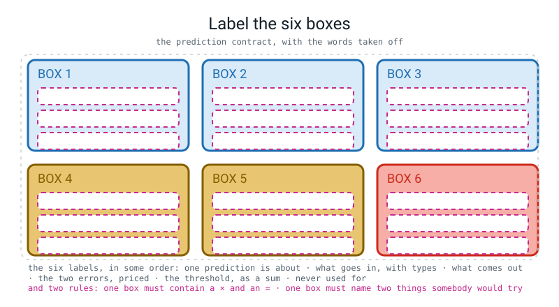
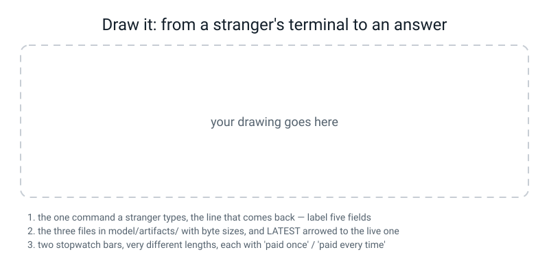

# Workbook — Week 34: Ship It, Part 1: The Contract and the Artifact

**Name:** ________________________________  **Date:** ______________

[⬅ Week 33](week-33.md) · [📖 Read the chapter first](../student-guide/week-34.md) · [Course Home](../README.md) · [Next ➡](week-35.md)

> **Your teacher's mark scheme calls these pages 34.1 to 34.7.** They are all here: **34.2** is *Do the Maths by Hand*, **34.3** is prediction P3, and **34.1, 34.4, 34.5, 34.6** and the stretch **34.7** are the numbered steps of 🛠️ **Build It**.

---

## ✅ Warm-Up (5 min)

Five quick questions about **last week**.

**W1.** You built `make_pipeline(TfidfVectorizer(), LogisticRegression(...))`. **What are the two keys in `pipe.named_steps`, spelled exactly?**

________________________  and  ________________________

**And what does `pipe.named_steps["tfidf"]` raise?** ______________________

**W2.** `clf.coef_` on your sentiment model had shape `(1, 97)`, not `(97,)`. **Write the line that gets the 97 numbers out, and say what happens if you forget the `[0]`.**

the line: ____________________________  without it: ______________________

**W3.** `lumpy` had a coefficient of `−0.9621` and rested on **1 review of 60**. `rude` had `−3.2033` and rested on **11**. **In one sentence, why must the document count be printed next to every coefficient you quote?**

________________________________________________________________

**W4.** The twelve negation traps scored **0 of 12**, and turning on bigrams took the vocabulary from 97 columns to 318 and changed **0** of the twelve answers. **Why did 221 new columns fix nothing?**

________________________________________________________________

**W5.** `pipe.predict("one review")` raises an error. **Write the error's last line, and the one-character fix.**

error: ________________________________________________  fix: ______________

---

## 🔢 Do the Maths by Hand

**This is page 34.2.** There is **no new maths this week**, so this page uses the arithmetic the whole week rests on — **the cost sweep that chooses your threshold**. **Calculator only. No code on this page.**

Your contract says two things about mistakes on a comment forum:

```
a NASTY comment marked positive  =  a nasty comment nobody reads     price 10
a NICE comment marked negative   =  a moderator's ten seconds wasted price  1
```

The two count columns below were measured on the **16 validation reviews**. The cost column is yours.

---

**M1 — fill in all eight cost cells and ring the winner.**

| t | nasty called positive | nice called negative | the sum, written out | cost |
|---:|---:|---:|---|---:|
| 0.30 | 5 | 0 | `10 × ____ + 1 × ____` | ______ |
| 0.40 | 3 | 0 | `10 × ____ + 1 × ____` | ______ |
| 0.50 | 1 | 0 | `10 × ____ + 1 × ____` | ______ |
| 0.55 | 1 | 1 | `10 × ____ + 1 × ____` | ______ |
| 0.60 | 1 | 3 | `10 × ____ + 1 × ____` | ______ |
| 0.65 | 0 | 4 | `10 × ____ + 1 × ____` | ______ |
| 0.70 | 0 | 4 | `10 × ____ + 1 × ____` | ______ |
| 0.80 | 0 | 7 | `10 × ____ + 1 × ____` | ______ |

**The smallest cost is ______, and it happens at t = ________ and t = ________.**

> **⚠️ Watch out:** the commonest error on this page is multiplying the **wrong column** by 10. Before you write a single number, say out loud which of the two mistakes was the expensive one.

---

**M2 — two thresholds tie. Break the tie in writing.**

`0.65` and `0.70` both cost the same. Accuracy cannot separate them either: on those 16 rows it is `0.7500` at both.

**(a) Which do you ship?** ________

**(b) The tie-break rule, in one sentence — it must say which of the two you take, and mention what the *extra* negatives cost somebody:**

________________________________________________________________

**(c) If you had priced the mistakes `1` and `1` instead of `10` and `1`, which threshold would win?** Work it out: at `t = 0.30` the cost becomes `1 × 5 + 1 × 0 =` ______, at `0.50` it is ______, at `0.65` it is ______.

**So with equal prices the winner is t = ________ — and the name of the thing you have just computed is** ______________________

---

**M3 — the rule of thumb disagrees with the measurement.**

Module 3 gives a rule of thumb: when a miss costs `C_miss` and a false alarm costs `C_fp`, put the threshold near

```
C_miss ÷ ( C_miss + C_fp )
```

**(a) Work it out for 10 and 1:** ______ ÷ ( ______ + ______ ) = ______ ÷ ______ = ________

**(b) Your measurement said `0.65`. The rule of thumb says the number above. Which do you ship, and why?**

________________________________________________________________

**(c) Look back at M1. At `t = 0.65` how many expensive mistakes are left?** ______ **So what would pushing the threshold higher buy you?** ______________________

---

**M4 — sixteen rows, and what one row is worth.**

**(a)** Your card will say `accuracy 0.8125 on 16 held-out rows`. **What is one row worth, as a percentage?** ______ ÷ ______ = ________ **%**

**(b)** So if **one more** of those 16 rows had been wrong, the accuracy would read ________ instead, and if one more had been right it would read ________. **Write both.** Then, for a card that said `0.8750`, write the **two** values one row away: ________ or ________.

**(c)** Three golden tests sit at `p = 0.7661`, `0.2110` and `0.2380`, and the threshold is `0.65`. **Compute each distance from the threshold**, showing the subtraction:

```
test 1:  ________ − ________ = ________
test 2:  ________ − ________ = ________
test 3:  ________ − ________ = ________
```

**(d) Which is the most fragile, and what is the smallest change in its probability that would flip it?** ______  ________

---

## 🔎 Predict the Output

**In pen, before you run anything.**

### P1 — four arguments, four types

```python
"""argp2.py - four arguments, four types."""
import argparse

ap = argparse.ArgumentParser(description="Freeze one artifact.")
ap.add_argument("name")
ap.add_argument("--ngram-max", type=int, default=2)
ap.add_argument("--threshold", type=float, default=0.65)
ap.add_argument("--json", action="store_true")
args = ap.parse_args()

print("name      :", args.name, type(args.name).__name__)
print("ngram_max :", args.ngram_max, type(args.ngram_max).__name__)
print("threshold :", args.threshold, type(args.threshold).__name__)
print("json      :", args.json, type(args.json).__name__)
```

**Run A:** `python3 argp2.py sentiment --ngram-max 3`

my four lines: ____________________ / ____________________ / ____________________ / ____________________

**Run B:** `python3 argp2.py sentiment --threshold 1 --json`

my four lines: ____________________ / ____________________ / ____________________ / ____________________

**Run C:** `python3 argp2.py --ngram-max 3`

my prediction: ________________________________________  **and the exit code:** ______

> **💡 Try this:** one of the four `print` lines will not even compile if you type the attribute the way the flag is spelled. **Which one, and what did Python do to the name?** ______________________

---

### P2 — what survives a trip through JSON

```python
"""js2.py - what survives a trip through JSON and what does not."""
import json

meta = {"threshold": 0.65,
        "classes": ("negative", "positive"),
        "n_test": 16,
        1: "one"}

text = json.dumps(meta)
back = json.loads(text)

print(text)
print("classes came back a", type(back["classes"]).__name__)
print("keys:", list(back.keys()))
print("threshold still a float?", type(back["threshold"]).__name__, back["threshold"] == 0.65)
print("n_test still an int?  ", type(back["n_test"]).__name__)
print("same dictionary?", back == meta)
```

**My prediction, line by line:**

line 1 ________________________________________________________

`classes` came back a ____________  keys: ____________________________

threshold: ____________  n_test: ____________  same dictionary? ____________

**The truth:**

`classes` came back a ____________  keys: ____________________________

same dictionary? ____________

**Two things changed on the way out and back. Name both:** ______________________ and ______________________

---

### P3 — the cold-start arithmetic (page 34.3)

**Predict these three in pen before you run anything.** Almost everybody gets (c) wrong by a factor of a hundred, and that is the point of the page.

```python
"""coldstart.py - the two stopwatches. Timings will differ from mine."""
import time

t0 = time.perf_counter()
import joblib
t1 = time.perf_counter()
print("import joblib        : %8.2f ms" % ((t1 - t0) * 1000))

t0 = time.perf_counter()
pipe = joblib.load("tiny_artifacts/tiny_v1.joblib")
t1 = time.perf_counter()
first_load = (t1 - t0) * 1000
print("FIRST joblib.load    : %8.2f ms" % first_load)

t0 = time.perf_counter()
pipe2 = joblib.load("tiny_artifacts/tiny_v1.joblib")
t1 = time.perf_counter()
print("SECOND joblib.load   : %8.2f ms" % ((t1 - t0) * 1000))

t0 = time.perf_counter()
pipe.predict_proba(["hot delicious pizza"])
t1 = time.perf_counter()
print("FIRST predict_proba  : %8.2f ms" % ((t1 - t0) * 1000))

t0 = time.perf_counter()
pipe.predict_proba(["hot delicious pizza"])
t1 = time.perf_counter()
one = (t1 - t0) * 1000
print("SECOND predict_proba : %8.3f ms" % one)
print("the ratio            : %8.0f x  (%.1f / %.3f)" % (first_load / one, first_load, one))
```

| | my prediction, in pen | the truth on my laptop |
|---|---|---|
| (a) the whole command, wall clock | ______________ | ______________ |
| (b) one prediction | ______________ | ______________ |
| (c) how many times bigger is (a) than (b)? | ______________ | ______________ |
| (d) the SECOND `joblib.load` | ______________ | ______________ |

**The artifact is about nine kilobytes. So why does the FIRST load take hundreds of milliseconds and the SECOND one take a fraction of one?**

________________________________________________________________

> **⚠️ Watch out:** this is the one page in the book whose numbers **will not reproduce**. Report yours and say which laptop they came from. What *does* reproduce is the **shape**: first load enormous, second load tiny, prediction tinier.

---

### P4 — the shapes inside the artifact

```python
"""shapes.py - what is inside the digits CNN, and what the keys are called."""
import torch
import torch.nn as nn

torch.manual_seed(0)
model = nn.Sequential(
    nn.Conv2d(1, 8, 3, padding=1), nn.ReLU(), nn.MaxPool2d(2),
    nn.Conv2d(8, 16, 3, padding=1), nn.ReLU(), nn.MaxPool2d(2),
    nn.Flatten(), nn.Linear(64, 10))

for key, block in model.state_dict().items():
    print("%-10s %-20s %5d numbers" % (key, str(tuple(block.shape)), block.numel()))
print("total learnable numbers:", sum(p.numel() for p in model.parameters()))

x = torch.zeros(5, 1, 8, 8)
print("a batch of 5 digits in  :", tuple(x.shape))
print("ten numbers per digit out:", tuple(model(x).shape))
```

**Predict all six keys and all six shapes.** The key names are the trickiest part of the whole page.

| key | shape | how many numbers |
|---|---|---|
| ____________ | ____________________ | ____________ |
| ____________ | ____________________ | ____________ |
| ____________ | ____________________ | ____________ |
| ____________ | ____________________ | ____________ |
| ____________ | ____________________ | ____________ |
| ____________ | ____________________ | ____________ |

**total:** ____________  **batch in:** ____________________  **out:** ____________________

**Why is the second convolution's key `3.weight` and not `1.weight` or `conv2.weight`?**

________________________________________________________________

---

## ✍️ Practice Set A — Read It

**A1. Match the word to the thing.** Write the letter.

| Word | | Description |
|---|---|---|
| **prediction contract** | ______ | (i) How long **one** prediction took, paid every single time |
| **artifact versioning** | ______ | (ii) Six boxes on paper, finished before any serving code exists |
| **golden test** | ______ | (iii) How long a brand-new program takes to give its first answer, paid once |
| **cold start** | ______ | (iv) An input whose answer you wrote down the day you froze the model |
| **latency** | ______ | (v) A version in the filename, and a pointer file saying which one is live |

**A2. Read the metadata file and answer five questions about it.**

```json
{
  "version": "sentiment_v1",
  "created_utc": "2026-09-22T19:36:31Z",
  "task": "binary sentiment of short English reviews",
  "classes": ["negative", "positive"],
  "threshold": 0.65,
  "input_field": "text",
  "n_train": 48,
  "n_val": 16,
  "n_test": 16,
  "test_accuracy": 0.8125,
  "test_f1_positive": 0.7692,
  "ngram_max": 2,
  "C": 4.0,
  "sklearn_version": "1.7.1",
  "python_version": "3.10.10"
}
```

**(a)** The serving code says `label = self.classes[1] if prob >= threshold`. **Which word does index 1 hold, and what breaks if somebody tidies that list into alphabetical order?** ______________  ______________________

**(b)** `48 + 16 + 16 = ______`. **Which of the three piles chose the `0.65`?** ______________

**(c) Two fields exist purely so that "it broke after I updated my laptop" is a two-minute diagnosis. Name them.** ______________________ and ______________________

**(d)** The file is **421 bytes**. **Give one reason this is worth 421 bytes rather than a comment in the code.**

________________________________________________________________

**(e) Which single field is *meant* to differ from your teacher's copy?** ______________  **And why does that make it a lie detector?** ______________________

**A3. Spot the bug in each. Two of the three print no error at all.**

```python
(1)  t0 = time.perf_counter()
     t1 = time.perf_counter()
     prob = pipe.predict_proba([text])[0, 1]
     print("latency %.2f ms" % ((t1 - t0) * 1000))

(2)  joblib.dump(pipe.named_steps["logisticregression"], ART / "sentiment_v1.joblib")

(3)  with open(ART / "sentiment_v1.metadata.json", "w") as f:
         json.dump(f, meta, indent=2)
```

(1) ________________________________________________________________

(2) ________________________________________________________________

(3) ________________________________________________________________

**Which one gives you a traceback, and what is its last line?** ______________________

**A4. Read the golden-test run and rank the three tests by fragility.**

```text
$ python3 tests.py
PASS expected=positive got=positive p=0.7661  <<delicious fresh pizza and kind friendly staff>>
PASS expected=negative got=negative p=0.2110  <<cold food and a rude driver>>
PASS expected=negative got=negative p=0.2380  <<stale bread and awful coffee>>

3/3 passed  (model sentiment_v1, threshold 0.65)

$ echo $?
0
```

**(a)** most fragile ______ then ______ then ______ **(b)** and the margin of the most fragile: ________ − ________ = ________

**(c)** `echo $?` printed `0`. **What would it print if test 2 failed, and why does any program care?**

______  ________________________________________________________

**(d)** Somebody adds a fourth golden test at `p = 0.6502`. **Say in one sentence why that is not a test.**

________________________________________________________________

**A5. Thirteen bytes.**

```text
$ ls -l model/artifacts/
   13 LATEST
10228 sentiment_v1.joblib
  421 sentiment_v1.metadata.json

$ cat model/artifacts/LATEST
sentiment_v1
```

**(a)** Why exactly 13? ______ + ______ = ______

**(b)** Write the **one command** that rolls production back to `sentiment_v2`:

________________________________________________________________

**(c)** Two files have a version in the name and one does not. **Which one, and why is that correct rather than an oversight?**

______________  ________________________________________________

**A6. Label the diagram.**


*Figure W34.1 — Label the six boxes. The six labels are listed underneath, out of order.*

Write one label in each box, then obey the two rules printed at the bottom of the figure.

**The box that must contain a `×` and an `=` is box** ______  **and the box that must name two tempting things is box** ______

---

## ✍️ Practice Set B — Write It

### B1 — one line

Create a `LATEST` file holding `sentiment_v1`, and print **two numbers**: how many characters were written, and how many bytes are on disk.

**Expected output:** two identical integers.
**Done looks like:** `13 13`

### B2 — which version is live? about 12 lines

Write `resolve_version(version=None)`. The rules, exactly as your project uses them:

1. a real name given → hand it straight back,
2. `None` **or** the word `"latest"` → read `LATEST` and strip the newline,
3. no `LATEST` file at all → raise `FileNotFoundError` **with the command that fixes it inside the message.**

Then call it four times: `None`, `"latest"`, `"tiny_v1"`, and once more with `LATEST` deleted.

**Done looks like:** four lines, and the fourth one **tells you what to type next.**

> **⚠️ Watch out:** `read_text()` keeps the newline. `sentiment_v1\n` is not the same string as `sentiment_v1`, and the difference shows up as a `FileNotFoundError` on a filename with an invisible character in it.

### B3 — the metadata, generated not typed, about 20 lines

Write `meta.py`. It must: make `meta_demo/artifacts/` (**including the parent**), build the metadata dictionary with a **real** `created_utc`, the real `sklearn.__version__` and the real `platform.python_version()`, write it with `indent=2` and a trailing newline, read it **back**, and print five fields **with the type each one came back as**, plus the byte size.

**Expected output:** five rows of `name value type`, then a byte count.
**Done looks like:** `threshold 0.65 float` — **not** `str`. If `threshold` comes back a string, your serving code will crash the first time it compares it to a probability.

### B4 — the cost sweep, in code, about 18 lines

Turn page 34.2 into a program. Given the two count lists and the two prices, print one row per threshold **showing the sum as text as well as the total**, then the smallest cost, **every** threshold tied at it, and which one you ship.

**Done looks like:** the printed row for `0.50` literally contains `10 x 1 + 1 x 1  =  11`, and the last line names `0.65` with the tie-break reason attached.

### B5 — both stopwatches, about 25 lines

Write `coldstart.py` (P3 above is the program; now write it yourself without looking). It must time **five** things separately: importing `joblib`, the FIRST load, the SECOND load, the FIRST prediction, the SECOND prediction. Then print the ratio of the first load to the second prediction as `... x`.

**Done looks like:** five timings and a ratio in the thousands. **If your ratio is under 10, your stopwatch is in the wrong place.**

---

## 🐞 Fix the Broken Program

**Three bugs: one that stops it dead, one that stops it dead later, and one that makes it print `3/3 passed` while proving absolutely nothing.** The corpus at the top is not a bug — it is 20 reviews, typed once.

```python
"""broken34.py - freeze a tiny artifact and golden-test it. THREE BUGS."""
import json
import sys
from pathlib import Path

import joblib
from sklearn.feature_extraction.text import TfidfVectorizer
from sklearn.linear_model import LogisticRegression
from sklearn.metrics import accuracy_score
from sklearn.model_selection import train_test_split
from sklearn.pipeline import make_pipeline

TEXTS = ["hot fresh delicious pizza", "kind friendly polite driver",
         "delicious fresh bread and a hot dip", "quick friendly service and fresh salad",
         "great hot coffee and delicious cake", "lovely kind staff and a quick refund",
         "fresh crisp salad and a polite driver", "hot delicious curry and kind service",
         "quick delivery and a lovely friendly note", "great fresh pizza and a polite note",
         "cold soggy awful pizza", "rude slow terrible driver",
         "stale soggy bread and a cold dip", "slow rude service and stale salad",
         "awful cold coffee and terrible cake", "dreadful rude staff and a slow refund",
         "stale limp salad and a rude driver", "cold awful curry and rude service",
         "slow delivery and a terrible rude note", "awful stale pizza and a rude note"]
LABELS = [1] * 10 + [0] * 10
ART = Path("tiny_artifacts")
THRESHOLD = 0.55
GOLDEN = ["hot delicious pizza", "cold soggy awful bread", "rude slow driver"]

X_tr, X_te, y_tr, y_te = train_test_split(TEXTS, LABELS, test_size=0.5,
                                          stratify=LABELS, random_state=0)
pipe = make_pipeline(TfidfVectorizer(), LogisticRegression(C=4.0, max_iter=1000))
pipe.fit(X_tr, y_tr)
te_prob = pipe.predict_proba(X_te)[:, 1]
acc = accuracy_score(y_te, (te_prob >= THRESHOLD).astype(int))

joblib.dump(pipe, ART / "tiny_v1.joblib")
with open(ART / "tiny_v1.metadata.json", "w") as f:
    json.dump({"version": "tiny_v1", "threshold": THRESHOLD,
               "test_accuracy": round(float(acc), 4)}, f, indent=2)

failures = 0
for text in GOLDEN:
    prob = pipe.predict_proba(text)[0, 1]
    label = "positive" if prob >= THRESHOLD else "negative"
    expected = "positive" if prob >= THRESHOLD else "negative"
    if label != expected:
        failures = failures + 1
    print("%-4s %-24s p=%.4f -> %s"
          % ("PASS" if label == failures else "FAIL", text, prob, label))
print("%d/%d passed  (threshold %.2f, test accuracy %.4f)"
      % (len(GOLDEN) - failures, len(GOLDEN), THRESHOLD, acc))
sys.exit(1 if failures else 0)
```

**The first real run:**

```text
Traceback (most recent call last):
  File "/private/tmp/wb34/broken34.py", line 35, in <module>
    joblib.dump(pipe, ART / "tiny_v1.joblib")
  File "/.../joblib/numpy_pickle.py", line 552, in dump
    with open(filename, 'wb') as f:
FileNotFoundError: [Errno 2] No such file or directory: 'tiny_artifacts/tiny_v1.joblib'
```

**Bug 1 — what the message means, and the one line that fixes it (say where it must go):**

________________________________________________________________

**Fix it, run again. The second real run:**

```text
Traceback (most recent call last):
  File "/private/tmp/wb34/broken34.py", line 43, in <module>
    prob = pipe.predict_proba(text)[0, 1]
  File "/.../sklearn/pipeline.py", line 904, in predict_proba
    Xt = transform.transform(Xt)
  File "/.../sklearn/feature_extraction/text.py", line 1415, in transform
    raise ValueError(
ValueError: Iterable over raw text documents expected, string object received.
```

**Bug 2 — the two characters that fix it:** ______________

**And in one sentence, what did the vectorizer think you had given it?** ______________________

**Fix it, run again. Now it prints `3/3 passed`. Bug 3 is still in there.**

**(a)** Two lines in that loop are the bug. **Quote them both:**

________________________________________________________________

**(b)** Set `THRESHOLD = 0.99` and run it again. **What does it print, and why is that the proof?**

________________________________________________________________

**(c) Rewrite the `GOLDEN` list and the loop so the test can actually fail.** How many lines did you change? ______

---

## 🧩 Puzzle of the Week

### The Missing Threshold

Your logging code had a typo for one afternoon and **did not write the `threshold` field.** Here are four log lines from that afternoon, all from the same model version, in the order they happened:

```text
{"input": "quick friendly service",         "probability": 0.7562, "label": "positive"}
{"input": "the pizza was not delicious",    "probability": 0.6331, "label": "positive"}
{"input": "a lovely note and a cold pizza", "probability": 0.4614, "label": "negative"}
{"input": "cold soggy awful bread",         "probability": 0.2750, "label": "negative"}
```

**Part 1.** The rule is `positive` when `probability >= threshold`. **Work out the narrowest range the threshold could have been in.**

```
from the positive lines, the threshold is at most ________
from the negative lines, the threshold is more than ________

so                ________  <  t  ≤  ________
```

**Part 2.** Could **any** number of extra log lines ever pin `t` down to one exact value? ______  **Why?**

________________________________________________________________

**Part 3.** A fifth line turns up from the same afternoon:

```text
{"input": "hot delicious pizza", "probability": 0.6857, "label": "negative"}
```

**This line and the second line cannot both be true of one threshold. Show the contradiction:**

from line 2: t ≤ ________   from line 5: t > ________   and ________ < ________, so ______________

**Part 4. So what actually happened that afternoon, and which single field would have told you in one second?**

________________________________________________________________

---

## 🤔 Think Deeper

**T1.** Box 6 of your contract lists things the model must **never** be used for. Somebody says: *"that box is just covering yourself — if the model is good enough, why ban anything?"*

**Answer them in a paragraph, and your paragraph must contain one number from your own subgroup or test results.** Then add the harder half: name one use that is *tempting* — something a reasonable, well-meaning person would actually try next week — and say what would go wrong.

________________________________________________________________

________________________________________________________________

________________________________________________________________

________________________________________________________________

**T2.** You trained a `v2`. On the same 16 test rows at the same threshold it scores **worse**. But at a threshold of `0.50` it scores exactly what `v1` scores there.

**Explain what actually changed between the two models in a paragraph a 12-year-old could follow.** Then answer the question that makes this week matter: **if a new model changes the scale its probabilities live on, what else in your artifact has silently gone out of date?**

________________________________________________________________

________________________________________________________________

________________________________________________________________

________________________________________________________________

---

## 🛠️ Build It — the contract, the artifact, and one line a stranger types

**Pick your path and write it here:** Path A, my Week 33 **sentiment engine** ______  ·  Path B, my Week 26/27 **digits CNN** ______

### Step checklist

- [ ] **34.1** — the contract, six boxes, in ink, with the two changes the room made me make
- [ ] two folders: `model/` and `serve/`, with the architecture in **one** file both sides import
- [ ] the trainer runs and writes **three** files into `model/artifacts/`
- [ ] **34.4** — folder listing and four metadata fields copied out, **generated not typed**
- [ ] `serve/predict.py` runs from a **brand-new terminal** with zero training code in it
- [ ] the Rule 1 `grep` prints **nothing**, and I pasted the nothing
- [ ] **34.5** — three golden tests, each with its distance from the threshold
- [ ] `3/3 passed`, and `echo $?` printed `0`
- [ ] **34.6** — the exact command, tested in a terminal I opened after writing it
- [ ] **34.7** (stretch) — a `v2` trained, compared, and **rejected in writing**

---

### 34.1 — The contract, six boxes

| Box | Mine |
|---|---|
| **1 · one prediction is about** | ________________________________________ |
| **2 · input field(s), with types** | ________________________________________ |
| **3 · output fields** | ________________________________________ |
| **4 · the two errors, in the language of my application, priced** | ________________________________________ |
| **5 · the threshold, and the sum it came from** | ________________________________________ |
| **6 · never used for (two things)** | ________________________________________ |

**Box 1 must be a countable noun.** Mine is: ______________  **Box 5 must contain a `×` and an `=`.** Does it? ______

**The two things the room made me change:**

1. ________________________________________________________________
2. ________________________________________________________________

---

### 34.4 — The frozen artifact

```text
$ ls -l model/artifacts/
```

| file | bytes |
|---|---:|
| ____________________________ | ____________ |
| ____________________________ | ____________ |
| ____________________________ | ____________ |

**Four fields, copied out of the metadata file — not typed from memory:**

| field | value |
|---|---|
| `version` | ____________________ |
| `threshold` | ____________________ |
| `test_accuracy` | ____________________ |
| `sklearn_version` / `python_version` | ____________________ |

**My `created_utc`:** ____________________  **and `LATEST` is** ______ **bytes because** ______ + ______ = ______

**The Rule 1 grep, pasted with its output:**

```text
$ grep -rnE "\.fit\(|train_test_split|DummyClassifier|optimizer" serve/

```

**What that blank line is evidence of:** ________________________________________

---

### 34.5 — Three golden tests, and why those three

| # | input | frozen answer | p | distance from my threshold |
|---|---|---|---:|---:|
| 1 | ____________________________ | ____________ | ________ | ______ − ______ = ______ |
| 2 | ____________________________ | ____________ | ________ | ______ − ______ = ______ |
| 3 | ____________________________ | ____________ | ________ | ______ − ______ = ______ |

**Most fragile: number** ______  **at** ________ **clear.**

**If it ever flipped, the three things that could have caused it:**

1. ________________________________________
2. ________________________________________
3. ________________________________________

**The run:**

```text
$ python3 tests.py

$ echo $?
```

______ **of** ______ **passed.** Exit code: ______

---

### 34.6 — The exact command a stranger would type

**One line. Write it, then open a terminal you have never used today and paste it.**

```bash

```

**It worked from my project folder:** ______  **It worked from `/`:** ______  **I tested it in a fresh terminal:** ______

**The reply, pasted exactly:**

```text

```

> **⚠️ Watch out:** the commonest failure here is a command that only works from one folder, and **it is invisible until somebody else tries it.** If yours only works from your project folder, the line is wrong — not the terminal.

---

### 34.7 — Stretch: a `v2` you reject in writing

| version | what I changed | val accuracy | test accuracy | test F1 | cost on val |
|---|---|---:|---:|---:|---:|
| `____________v1` | — | ________ | ________ | ________ | ________ |
| `____________v2` | ____________ | ________ | ________ | ________ | ________ |

**My three golden tests' margins under both:**

| # | margin under v1 | margin under v2 |
|---|---:|---:|
| 1 | ________ | ________ |
| 2 | ________ | ________ |
| 3 | ________ | ________ |

**The rejection paragraph.** It must name the same test set, quote both numbers, say what was given up, and finish with what you did to `LATEST`.

________________________________________________________________

________________________________________________________________

________________________________________________________________

**And the last command, with its output:**

```bash
$ echo "____________v1" > model/artifacts/LATEST
$ python3 tests.py

```

---

## 🎨 Draw It


*Figure W34.2 — From a stranger's terminal to an answer.*

**What a good answer looks like:** at the top, **one terminal box** with the exact command inside it and the reply underneath, and **all five contract fields ringed and named** — `label`, `probability`, `threshold`, `model_version`, `latency_ms`. Not four. In the middle, **three files drawn as three rectangles** with their real byte sizes written on them, `10228`, `421` and `13`, and a **thick arrow from `LATEST` to the one that is live**, with `sentiment_v1` written inside the 13-byte box so the arrow has something to point at.

**And the part that earns the marks:** at the bottom, **the two stopwatches drawn as two bars side by side, to scale.** If your cold-start bar is 200 millimetres long, your latency bar is a **line you can barely see** — and that is the drawing. Write the number on each, write `paid once` under the long one and `paid every single time` under the short one, and write the division between them somewhere on the page. **A drawing with one timing number on it is the mistake this week is about.**

**My five ringed fields:** ______ ______ ______ ______ ______

**My three byte sizes:** ______ / ______ / ______

**My two bars, and the division between them:** ________ ÷ ________ = ________

---

## 📊 Self-Check

| I can... | 😀 | 🙂 | 😕 |
|---|---|---|---|
| say what one prediction is about, as a countable noun | | | |
| name the two mistakes in the language of my own application | | | |
| price the two mistakes and defend the prices as judgements | | | |
| choose a threshold with a sum, and write the sum down | | | |
| explain why 0.5 is the middle of a number line and not of a decision | | | |
| name two banned uses, one of them genuinely tempting | | | |
| keep training code and serving code in separate folders | | | |
| prove Rule 1 with `grep` instead of promising it | | | |
| write three files where two have a version in the name | | | |
| roll back a model with one edit to thirteen bytes | | | |
| write a dictionary to JSON and read it back with its types intact | | | |
| use `argparse` for a positional, a typed option and a switch | | | |
| make a folder from Python before writing into it | | | |
| time one prediction and a cold start **separately**, and never add them | | | |
| pick golden tests by their distance from the threshold | | | |
| say what an exit code of `1` is for | | | |
| reject a newer model in writing, with numbers | | | |

**The one thing I would ask about if I could ask one question:**

________________________________________________________________

---

## ✅ Answers

<details>
<summary>Check your answers</summary>

### Warm-Up

**W1.** `tfidfvectorizer` and `logisticregression`. **`make_pipeline` names each step after its class, in lowercase, with nothing removed** — so the name is not the shorthand you would pick. `pipe.named_steps["tfidf"]` raises `KeyError: 'tfidf'`. Ask with `pipe.named_steps.keys()` rather than guessing.

**W2.** `coefs = clf.coef_[0]`. Without the `[0]` you are indexing a `(1, 97)` grid whose first axis has length **1**, so `np.argsort(clf.coef_)[:15]` then `coefs[i]` gives `IndexError: index 12 is out of bounds for axis 0 with size 1` — a message that sounds like a completely different problem. **The fix is to print the shape before you index it.**

**W3.** Because a coefficient is only as trustworthy as the number of rows it was learned from. `lumpy −0.9621` rests on **one** review, so it is a coincidence with a decimal point; `rude −3.2033` rests on eleven, so it is a pattern. **A weight and its evidence are two different facts and you must quote both.**

**W4.** Because a feature can only help if the **training data contained it**. Bigrams add a *type* of feature, not data: `"not fresh"` was never two adjacent words in any training review, so no such column exists. Adding a feature type does not add features; adding data does. The fix was about forty reviews that use `not`.

**W5.** `ValueError: Iterable over raw text documents expected, string object received.` The fix is two square brackets: `pipe.predict(["one review"])`. A string is iterable — over its letters — which is why the library has to check for this by hand and say so.

---

### Do the Maths by Hand

**M1 — the eight cost cells.**

| t | nasty → positive | nice → negative | the sum | cost |
|---:|---:|---:|---|---:|
| 0.30 | 5 | 0 | `10 × 5 + 1 × 0` | **50** |
| 0.40 | 3 | 0 | `10 × 3 + 1 × 0` | **30** |
| 0.50 | 1 | 0 | `10 × 1 + 1 × 0` | **10** |
| 0.55 | 1 | 1 | `10 × 1 + 1 × 1` | **11** |
| 0.60 | 1 | 3 | `10 × 1 + 1 × 3` | **13** |
| **0.65** | **0** | **4** | `10 × 0 + 1 × 4` | **4** ⬅ |
| 0.70 | 0 | 4 | `10 × 0 + 1 × 4` | **4** ⬅ |
| 0.80 | 0 | 7 | `10 × 0 + 1 × 7` | **7** |

**The smallest cost is 4, at t = 0.65 and t = 0.70.**

Notice the shape of the column: it falls, bottoms out, then climbs again. **50 → 30 → 10 → 11 → 13 → 4 → 4 → 7.** That is what a cost sweep looks like, and the bottom of the valley is the answer. (It is not perfectly smooth — it goes *up* from 10 to 13 before the drop to 4, because the one nasty review sits at `0.6143` and nothing removes it until the line passes that number. That is what sixteen rows look like.)

**M2.**

**(a) 0.65.**

**(b)** Of two thresholds with the same total cost, **take the lower one** — because it calls fewer things negative, and every extra negative is a moderator reading a comment nobody needed to flag, which is ten seconds of a real person's afternoon. At 0.65 and 0.70 the counts happen to be identical here (4 and 4), so on these rows the tie-break changes nothing you can measure; it is a rule for the rows you have not seen: **when in doubt, flag less.** A student who *notices* the tie and breaks it with a stated rule has done the grown-up thing; accuracy cannot help, because it is `0.7500` at both.

**(c)** With both prices equal to 1: at `0.30` it is `1 × 5 + 1 × 0 = 5`; at `0.50` it is `1 × 1 + 1 × 0 = 1`; at `0.65` it is `1 × 0 + 1 × 4 = 4`. So the winner is **t = 0.50** — and the thing you have just computed is **the error count**, which is exactly what **accuracy** is made of (`0.9375` at 0.50, one wrong row in sixteen). **Accuracy is the cost sweep with both prices set to 1.** That single sentence is the whole reason accuracy disagrees with you: it is not neutral, it is a pricing decision that somebody made for you. At `10` and `1`, though, 0.50 costs `10` and 0.65 costs `4`.

**M3.**

**(a)** `10 ÷ (10 + 1) = 10 ÷ 11 = 0.9091`.

**(b)** Ship the **measurement**, `0.65`. The rule of thumb is derived for a model whose probabilities are perfectly calibrated and whose errors trade off smoothly; yours is a real model measured on 16 real rows. **When a rule of thumb and a measurement disagree, the measurement wins — and then you say why they disagree**, which is part (c).

**(c)** **Zero** expensive mistakes are left at `0.65`. So pushing the threshold higher buys you **nothing at all** on the expensive side, while every step up costs you more cheap mistakes: `4 → 4 → 7`. **The rule of thumb is aiming at a trade-off that has already finished.**

**M4.**

**(a)** `100 ÷ 16 = 6.25 %`.

**(b)** `0.8125 − 0.0625 = 0.7500` if one more row were wrong, and `0.8125 + 0.0625 = 0.8750` if one more were right. For a card that said `0.8750`: `0.8750 − 0.0625 = 0.8125`, or `0.8750 + 0.0625 = 0.9375`. **There is nothing in between, ever** — an accuracy on 16 rows can only be a multiple of `0.0625`. So `0.90 on 16 rows` is not a number anybody can have measured.

**(c)**

```
test 1:  0.7661 − 0.65  = 0.1161
test 2:  0.65  − 0.2110 = 0.4390
test 3:  0.65  − 0.2380 = 0.4120
```

**(d)** Test **1** is the most fragile at `0.1161` clear, and the smallest change that would flip it is a drop of **0.1161** in its probability. **That is the number to write on the page** — not "test 1 looks closest".

---

### Predict the Output

**P1 — the real runs.**

```text
$ python3 argp2.py sentiment --ngram-max 3
name      : sentiment str
ngram_max : 3 int
threshold : 0.65 float
json      : False bool

$ python3 argp2.py sentiment --threshold 1 --json
name      : sentiment str
ngram_max : 2 int
threshold : 1.0 float
json      : True bool

$ python3 argp2.py --ngram-max 3
usage: argp2.py [-h] [--ngram-max NGRAM_MAX] [--threshold THRESHOLD] [--json]
                name
argp2.py: error: the following arguments are required: name
```

**The exit code of run C is `2`**, not 1. `argparse` uses 2 for "you called me wrongly", which is a different kind of wrong from "I ran and something failed". You have met `0` and `1`; **`2` is the third one worth knowing.**

**Three things to notice.** `--threshold 1` prints **`1.0 float`**, not `1 int` — `type=float` converted it, which is exactly what you wanted and exactly what will surprise you. `--json` absent prints `False`, present prints `True`, and it never carries a value. And **run C failed before one line of your own code ran**: that usage message is free, and you did not write it.

**The 💡 answer:** `args.ngram_max`. **`argparse` turns the dash in `--ngram-max` into an underscore**, because `args.ngram-max` would be read by Python as "args.ngram minus max". You type the flag with a dash and read the attribute with an underscore, every time.

**P2 — the real run.**

```text
{"threshold": 0.65, "classes": ["negative", "positive"], "n_test": 16, "1": "one"}
classes came back a list
keys: ['threshold', 'classes', 'n_test', '1']
threshold still a float? float True
n_test still an int?   int
same dictionary? False
```

**The two changes.** The **tuple became a list** — JSON has no tuples, only arrays. And the **integer key `1` became the string `"1"`** — JSON object keys are always text, so `back[1]` would now raise `KeyError: 1` while `back["1"]` works. That is why `same dictionary?` is `False` even though nothing *looks* different.

**What survived:** `0.65` is still a `float` and still exactly equal to `0.65`; `16` is still an `int`. **That is the whole reason the threshold lives in a JSON file and not in a comment** — it comes back as a number you can compare to a probability, with no parsing step for you to get wrong.

> **🧑‍🏫 If a student asks** why `classes` becoming a list matters: it does not, and that is worth saying. You only ever index it. **The integer key is the one that would bite**, and the lesson is to keep every key a string on purpose rather than by luck.

**P3 — the real run on the laptop this book was written on.**

```text
import joblib        :    98.14 ms
FIRST joblib.load    :   658.62 ms
SECOND joblib.load   :     0.21 ms
FIRST predict_proba  :     0.38 ms
SECOND predict_proba :    0.147 ms
the ratio            :     4484 x  (658.6 / 0.147)
```

| | what most people predict | the truth here |
|---|---|---|
| (a) whole command | "instant", or "a second" | about **0.8 s**, of which `98.14 + 658.62 = 756.76 ms` is import-and-load |
| (b) one prediction | "half a second" | **0.147 ms** — about one seven-thousandth of a second |
| (c) the ratio | "twice", or "ten times" | about **4,500×** |
| (d) the SECOND load | "the same as the first" | **0.21 ms** — three thousand times faster than the first |

**And the question that is the actual point:** the artifact is about nine kilobytes, so why does the first load take 658 ms?

**Because `joblib.load` is not mainly reading nine kilobytes.** Unpickling makes Python go and **import the scikit-learn machinery the file refers to** — the vectorizer class, the logistic-regression class, the sparse-matrix code. **Importing is the cost, not reading.** The proof is sitting right there in the output: the **second** load of the same file, in the same program, takes `0.21 ms`, because everything it needed is already imported. **Nothing about the file changed between those two lines. Only what Python already had in memory.**

**P4 — the real run.**

```text
0.weight   (8, 1, 3, 3)            72 numbers
0.bias     (8,)                     8 numbers
3.weight   (16, 8, 3, 3)         1152 numbers
3.bias     (16,)                   16 numbers
7.weight   (10, 64)               640 numbers
7.bias     (10,)                   10 numbers
total learnable numbers: 1898
a batch of 5 digits in  : (5, 1, 8, 8)
ten numbers per digit out: (5, 10)
```

**The arithmetic, exactly as in Week 26:** `1 × 3 × 3 × 8 + 8 = 72 + 8 = 80` · `8 × 3 × 3 × 16 + 16 = 1152 + 16 = 1168` · `64 × 10 + 10 = 640 + 10 = 650`. And `80 + 1168 + 650 = 1898`. **You knew the total before the machine did.**

**Why `3.weight`?** Because `nn.Sequential` names its children by **position**, and the positions are `0` conv, `1` ReLU, `2` MaxPool, `3` conv, `4` ReLU, `5` MaxPool, `6` Flatten, `7` Linear. ReLU and MaxPool have no learnable numbers, so they never appear in `state_dict()` — **but they still take up their position numbers.** That is why the keys jump 0, 3, 7.

**And this is not trivia.** If you rebuild the architecture with `Conv2d(8, 32, 3)` and then `load_state_dict`, the error names that exact key:

```text
size mismatch for 3.weight: copying a param with shape torch.Size([16, 8, 3, 3]) from
checkpoint, the shape in current model is torch.Size([32, 8, 3, 3])
```

**The `3` in that message is a position in a list**, and knowing that turns a frightening error into "go and look at layer 3". **It is also the whole argument for `model_def.py`: one definition, imported by both sides, so the shapes cannot drift apart.**

---

### Practice Set A

**A1.** prediction contract **(ii)** · artifact versioning **(v)** · golden test **(iv)** · cold start **(iii)** · latency **(i)**.

**A2.**

**(a)** Index 1 holds **`positive`**. If somebody alphabetises that list, `negative` and `positive` happen to already be in alphabetical order — **so nothing breaks here, and that is the trap.** Try it with `["spam", "ham"]` instead: alphabetising gives `["ham", "spam"]`, index 1 flips from `ham` to `spam`, and **every prediction your service has ever made now means the opposite, with no error anywhere.** That is why the comment in `model_def.py` says *never reorder this*. Full marks for spotting that the order is a load-bearing decision, not a list.

**(b)** `48 + 16 + 16 = 80`. The **validation** pile (16 rows) chose the `0.65`. The test pile must never be used to choose anything, or there is no honest final number left.

**(c)** `sklearn_version` and `python_version`.

**(d)** Because a comment is for a human and a JSON file is for **both**. The serving code reads the threshold out of the file at start-up, so there is exactly one copy of the number and no chance of the code and the comment disagreeing. Also acceptable: a comment cannot be diffed between two versions of the model; two metadata files can be.

**(e)** `created_utc`. It is the lie detector because **every other field was generated by the script and so cannot be wrong**, while `created_utc` is the one field that must differ from everybody else's copy. An invented one is usually suspiciously round — `12:00:00Z` — and a real one is not.

**A3.**

**(1) Silent.** Both `perf_counter()` readings are on the **same side** of the work, so the stopwatch measures the gap between two adjacent lines: it prints `0.00 ms` and always will. **A latency of exactly zero is never real.** Fix: `t1` goes *after* the prediction.

**(2) Silent at first, then a confusing crash.** This dumps only the classifier, so the artifact has no vectorizer in it. Nothing complains at dump time. Later, the first real prediction gives `ValueError: Expected 2D array, got 1D array instead: array=['cold food and a rude driver'].` — the classifier being handed raw text. **The artifact is the whole fitted pipeline, because the vectorizer is part of the model, not a step you remember to do first.** The self-test: *if I deleted my notebook right now, could a fresh program still predict correctly?*

**(3) A traceback**, and this is the one that crashes: the arguments are the wrong way round. Its last line is

```text
TypeError: Object of type TextIOWrapper is not JSON serializable
```

`TextIOWrapper` is Python's name for **an open file**, so the message is saying *"you asked me to turn a file into text and I don't know how"*. Fix: `json.dump(meta, f, indent=2)` — **data first, file second.** Everybody does this once.

**A4.**

**(a)** most fragile **1**, then **2**, then **3**. **(b)** `0.7661 − 0.65 = 0.1161`.

**(c)** It would print **`1`**. Programs care because that number is how one program tells another that something is wrong without anybody reading the screen: `0` means fine, anything else means trouble. It is what lets a script stop before it ships something broken. **That is the whole of automated testing, in one number.**

**(d)** `0.6502` sits `0.0002` above the threshold. It will flip on a retrain, a library upgrade, or a rounding difference between two machines — **so it is not a test, it is an alarm that will cry wolf**, and the first thing anybody does with an alarm that cries wolf is stop listening to it. Pick inputs the model is *sure* about.

**A5.**

**(a)** `12 + 1 = 13` — twelve characters in `sentiment_v1` plus one newline.

**(b)** `echo "sentiment_v2" > model/artifacts/LATEST`

**(c)** **`LATEST`** has no version in its name, and that is correct: it is the **pointer**, and a pointer whose own name changed would need a pointer of its own. The versioned things are the artifacts; the un-versioned thing is the single place that says which one is live. **One fixed name, so every program knows where to look.**

**A6.** Box 1 *one prediction is about* · Box 2 *what goes in, with types* · Box 3 *what comes out* · Box 4 *the two errors, priced* · Box 5 *the threshold, as a sum* · Box 6 *never used for*. **Box 5** must contain the `×` and the `=`. **Box 6** must name two tempting things.

---

### Practice Set B

**B1 — one line.**

```python
from pathlib import Path
print(Path("LATEST").write_text("sentiment_v1\n"), Path("LATEST").stat().st_size)
```

```text
13 13
```

`write_text` hands back **how many characters it wrote**, and `stat().st_size` is **how many bytes are on disk**. They agree at 13 here because every character in `sentiment_v1\n` is one byte. **They would not agree if the name contained an accent**, which is a good reason to keep version names to plain letters, digits and underscores.

**B2 — `resolve.py`.**

```python
"""resolve.py - which version is live?"""
from pathlib import Path

ART = Path(".")


def resolve_version(version=None):
    if version is not None and version != "latest":
        return version
    pointer = ART / "LATEST"
    if not pointer.exists():
        raise FileNotFoundError(
            "No LATEST file at %s. Run: python3 model/train.py --version 1" % pointer)
    return pointer.read_text().strip()


print("resolve_version(None)          ->", resolve_version(None))
print("resolve_version('latest')      ->", resolve_version("latest"))
print("resolve_version('tiny_v1')     ->", resolve_version("tiny_v1"))
(ART / "LATEST").unlink()
try:
    resolve_version()
except FileNotFoundError as e:
    print("with LATEST deleted           ->", e)
```

```text
resolve_version(None)          -> sentiment_v1
resolve_version('latest')      -> sentiment_v1
resolve_version('tiny_v1')     -> tiny_v1
with LATEST deleted           -> No LATEST file at LATEST. Run: python3 model/train.py --version 1
```

**Why `.strip()` is not optional:** `read_text()` gives you `'sentiment_v1\n'`. Join that to a folder and you are asking for a file called `sentiment_v1\n.joblib`, which does not exist — and the error message shows a filename that looks perfectly correct, because the newline is invisible. **Strip it the moment it comes off disk.**

**Why the error message contains a command:** because the person reading it is usually you, at eleven o'clock at night, and the difference between `FileNotFoundError: LATEST` and a message with the fix in it is ten minutes.

**B3 — `meta.py`.**

```python
"""meta.py - write the metadata, read it back, prove the types survived."""
import json
import platform
from datetime import datetime, timezone
from pathlib import Path

import sklearn

ART = Path("meta_demo/artifacts")
ART.mkdir(parents=True, exist_ok=True)

meta = {"version": "tiny_v1",
        "created_utc": datetime.now(timezone.utc).strftime("%Y-%m-%dT%H:%M:%SZ"),
        "classes": ["negative", "positive"],
        "threshold": 0.65,
        "n_test": 10,
        "test_accuracy": 1.0,
        "sklearn_version": sklearn.__version__,
        "python_version": platform.python_version()}

path = ART / "tiny_v1.metadata.json"
with open(path, "w") as f:
    json.dump(meta, f, indent=2)
    f.write("\n")

with open(path) as f:
    back = json.load(f)

for key in ["version", "threshold", "test_accuracy", "sklearn_version", "python_version"]:
    print("%-16s %-22s %s" % (key, back[key], type(back[key]).__name__))
print("bytes on disk   :", path.stat().st_size)
print("classes[1]      :", back["classes"][1], "  (index 1 is the positive class, always)")
```

```text
version          tiny_v1                str
threshold        0.65                   float
test_accuracy    1.0                    float
sklearn_version  1.7.1                  str
python_version   3.10.10                str
bytes on disk   : 241
classes[1]      : positive   (index 1 is the positive class, always)
```

and the file itself:

```text
{
  "version": "tiny_v1",
  "created_utc": "2026-09-22T20:06:36Z",
  "classes": [
    "negative",
    "positive"
  ],
  "threshold": 0.65,
  "n_test": 10,
  "test_accuracy": 1.0,
  "sklearn_version": "1.7.1",
  "python_version": "3.10.10"
}
```

**Your `created_utc` and your byte count will differ from mine** — a longer timestamp is a different number of bytes. Everything else here is generated, so it cannot be wrong.

**B4 — `sweep.py`.**

```python
"""sweep.py - the cost sweep, in code. The counts are the ones from page 34.2."""
THRESHOLDS = [0.30, 0.40, 0.50, 0.55, 0.60, 0.65, 0.70, 0.80]
NASTY_CALLED_POSITIVE = [5, 3, 1, 1, 1, 0, 0, 0]
NICE_CALLED_NEGATIVE = [0, 0, 0, 1, 3, 4, 4, 7]
PRICE_EXPENSIVE = 10
PRICE_CHEAP = 1

costs = []
print(" t     expensive  cheap   the sum                cost")
for i in range(len(THRESHOLDS)):
    fn = NASTY_CALLED_POSITIVE[i]
    fp = NICE_CALLED_NEGATIVE[i]
    cost = PRICE_EXPENSIVE * fn + PRICE_CHEAP * fp
    costs.append(cost)
    print("%.2f      %2d       %2d     %2d x %d + %d x %-2d = %3d"
          % (THRESHOLDS[i], fn, fp, PRICE_EXPENSIVE, fn, PRICE_CHEAP, fp, cost))

best = min(costs)
winners = [THRESHOLDS[i] for i in range(len(costs)) if costs[i] == best]
print()
print("smallest cost   : %d" % best)
print("thresholds tied : %s" % winners)
print("ship            : %.2f  (of tied thresholds, take the LOWER one: it keeps the most nice reviews flowing)"
      % min(winners))
```

```text
 t     expensive  cheap   the sum                cost
0.30       5        0     10 x 5 + 1 x 0  =  50
0.40       3        0     10 x 3 + 1 x 0  =  30
0.50       1        0     10 x 1 + 1 x 0  =  10
0.55       1        1     10 x 1 + 1 x 1  =  11
0.60       1        3     10 x 1 + 1 x 3  =  13
0.65       0        4     10 x 0 + 1 x 4  =   4
0.70       0        4     10 x 0 + 1 x 4  =   4
0.80       0        7     10 x 0 + 1 x 7  =   7

smallest cost   : 4
thresholds tied : [0.65, 0.7]
ship            : 0.65  (of tied thresholds, take the LOWER one: it keeps the most nice reviews flowing)
```

**Every number agrees with your hand-worked table.** Note `[0.65, 0.7]` — Python prints `0.7`, not `0.70`, because a float has no idea how many decimal places you meant. **Printing the sum as text as well as the total is the point of the program:** anybody can argue with `10 x 5 + 1 x 0 = 50`, and nobody can argue with a bare `50`.

**B5 — `coldstart.py`.** The program is printed in P3 above, and the real output is in the P3 answer. The three things a marker looks for: **five separate timings**, the **ratio in the thousands**, and the SECOND load being **thousands of times faster than the first**. If your ratio is under 10, both `perf_counter()` calls are on the same side of the work.

---

### Fix the Broken Program

**Bug 1 — runtime: Python makes files, never folders.**

`Path("tiny_artifacts")` names a folder; it does not create one. `open(..., "w")` will happily create a **file**, but it will never create the folder above it. The fix is one line, and **it must come before anything is written**:

```python
ART.mkdir(parents=True, exist_ok=True)
```

`parents=True` makes any missing folders above it too; `exist_ok=True` means "if it is already there, say nothing" — which is what makes the program safe to run twice.

**Bug 2 — the two characters: `[` and `]`.**

```python
prob = pipe.predict_proba([text])[0, 1]
```

The vectorizer thought you had handed it **an iterable of documents**, and a string *is* iterable — over its individual letters. So `"hot delicious pizza"` looks to it like 19 one-character documents. The library checks for exactly this and says so in words. **One review is a list of one.**

**Bug 3 — the silent one, and it is the important one.**

```python
label = "positive" if prob >= THRESHOLD else "negative"
expected = "positive" if prob >= THRESHOLD else "negative"
```

**`expected` is computed from the same probability by the same rule as `label`.** They cannot differ. So `label != expected` is never true, `failures` stays 0, and the program prints `3/3 passed` no matter what the model does. (There is a second, smaller crime on the print line: `"PASS" if label == failures` compares a string to a count, which is always `False` — so the word printed would be `FAIL` while the tally says everything passed. Two lines that contradict each other is itself a tell.)

**The proof.** Set `THRESHOLD = 0.99` and run it:

```text
PASS hot delicious pizza      p=0.6857 -> negative
PASS cold soggy awful bread   p=0.2750 -> negative
PASS rude slow driver         p=0.2800 -> negative
3/3 passed  (threshold 0.99, test accuracy 0.5000)
```

**Look at line one. `hot delicious pizza` is now called `negative`, and the program says PASS.** The test accuracy has halved to `0.5000`, sitting right there on the same line, and the tests still claim everything is fine. **A test whose expected answer is computed by the thing being tested is not a test. It is a mirror.**

**The fix — the expected answers are written down by a human, once:**

```python
GOLDEN = [("hot delicious pizza", "positive"),
          ("cold soggy awful bread", "negative"),
          ("rude slow driver", "negative")]
...
for text, expected in GOLDEN:
    prob = pipe.predict_proba([text])[0, 1]
    label = "positive" if prob >= THRESHOLD else "negative"
    if label != expected:
        failures = failures + 1
    print("%-4s %-24s p=%.4f -> %s"
          % ("PASS" if label == expected else "FAIL", text, prob, label))
```

**Three lines changed** (the `GOLDEN` list, the `for` line, and deleting the `expected =` line — plus repairing the `label == failures` comparison). The fixed program, with everything working:

```text
PASS hot delicious pizza      p=0.6857 -> positive
PASS cold soggy awful bread   p=0.2750 -> negative
PASS rude slow driver         p=0.2800 -> negative
3/3 passed  (threshold 0.55, test accuracy 1.0000)
```

and the same program with the threshold wrecked to `0.99`:

```text
FAIL hot delicious pizza      p=0.6857 -> negative
PASS cold soggy awful bread   p=0.2750 -> negative
PASS rude slow driver         p=0.2800 -> negative
2/3 passed  (threshold 0.99, test accuracy 0.5000)
```

**`2/3` and an exit code of `1`.** That is what a golden test is for: it is the thing that notices, in five seconds, that a change you were pleased with has broken something you had decided must never change.

---

### Puzzle of the Week

**Part 1.**

The two `positive` lines each say `probability >= t`, so `t` is at most the **smaller** of them: `0.7562` and `0.6331`, so **t ≤ 0.6331**.

The two `negative` lines each say `probability < t`, so `t` is bigger than the **larger** of them: `0.4614` and `0.2750`, so **t > 0.4614**.

```
0.4614  <  t  ≤  0.6331
```

**Part 2. No.** Log lines only ever give you **inequalities**. Every extra line can narrow the gap — a positive line at `0.56` would pull the top down to `0.56` — but the gap can never close to a single number, because no line ever says `t` equals anything. You could bracket it to a millionth and still not know it. **This is the argument for logging the threshold: it is the one fact about a prediction that cannot be reconstructed from the others.**

**Part 3.**

```
from line 2:  t ≤ 0.6331
from line 5:  t >  0.6857
and 0.6331 < 0.6857, so there is no number t that satisfies both
```

**Part 4.** Two different thresholds were live that afternoon — almost certainly **two different model versions**, or somebody restarted the service with a `--threshold` flag on it. Either way the log is describing two different systems as though they were one. **The field that would have told you in one second is `model_version`** (and `threshold`, which is why both are on every line). This is exactly the "`by version` shows **two** versions" case: nothing is broken, your log spans a rollback, and **you must report both counts separately or every number you compute is a blend of two systems.**

---

### Think Deeper

**T1 — model answer.**

> "Box 6 is not about covering myself; it is about the one thing my measurements cannot do. My model scores `0.8125` on 16 held-out reviews, which sounds respectable until you notice that **16 rows means one row is worth 6.25 percentage points** — so what I actually know is 'roughly right on reviews that look like my training reviews'. Nothing I have measured tells me what happens to a review written in a way I never typed. A ban is how you write down the *limit of the evidence*, and evidence has limits no matter how good the model is.
>
> The tempting use is **counting**: using it to tell the forum owner whether the mood is improving week to week. Nobody would call that a decision about a person, and it feels harmless. It is the worst thing you could do with this model, because a few percent of real change would be completely buried in its own uncertainty, and the owner would act on a graph made of noise. **And unlike a wrong label, nobody would ever find out.**"

Full marks needs: a number from their own results, a use that is genuinely tempting rather than obviously wrong, and a mechanism for what goes wrong. "Anything illegal" scores nothing — nobody was going to do that anyway.

**T2 — model answer.**

> "`C` is the dial that controls how strongly the model is allowed to hold an opinion. A smaller `C` presses all of its probabilities in towards `0.5` — it still ranks the reviews in the same order, it is just less **sure** about all of them. So the same review that was `0.7450` under v1 comes out `0.6134` under v2, and v2's single highest probability on the whole validation pile is `0.6453`, where v1's is `0.8186`. Nothing about the model's judgement got worse. Its **scale** changed.
>
> And that is the problem: my threshold of `0.65` was chosen by measuring costs on v1's probabilities. It is not a fact about sentiment, it is **a fact about v1's number line.** Move the scale and the threshold now sits above everything v2 says, so it calls every review negative and accuracy drops to `0.5000` even though the ranking is unchanged.
>
> What else went silently out of date: **my three golden tests' margins** — test 1 goes from `0.1161` clear of the line under v1 to `0.0302` on the wrong side of it under v2, so it fails, and the other two lose about a third of their margin. My **monitoring baseline** too: if I watch how many predictions land between 0.45 and 0.65, squashing every probability toward 0.5 pushes that rate up on its own, and I would read a change of model as a change of traffic."

**The level-5 sentence to look for:** *a threshold belongs to a probability scale, so a new model invalidates the old threshold even when the new model is better.* Say so out loud to any student who writes it.

---

### Build It

**34.1 — model answer for the reference project.** Accept any contract whose boxes are specific; do not mark against this wording.

| Box | Model answer |
|---|---|
| **1 · one prediction is about** | one review, written by one person, at one time. **Not** a person, **not** an account. |
| **2 · input** | field `text`, a non-empty string, at most 100,000 bytes |
| **3 · output** | `label` (`negative` / `positive`) · `probability` 0–1 · `threshold` · `model_version` · `latency_ms` |
| **4 · the two errors, priced** | a nasty review marked positive is a nasty review nobody reads → **10**. A nice review marked negative is a moderator's ten seconds → **1**. So the expensive error is **10×** the cheap one, and I chose 10 by judgement, not measurement. |
| **5 · the threshold** | `0.65`, from the sweep on the 16 validation rows: `10 × 1 + 1 × 0 = 10` at 0.50, `10 × 1 + 1 × 1 = 11` at 0.55, `10 × 0 + 1 × 4 = 4` at 0.65, `10 × 0 + 1 × 4 = 4` at 0.70. Smallest is 4, tied at 0.65 and 0.70, and the tie-break is *take the lower*, so 0.65. **16 rows, so one row is worth 6.25 points — this is a decision on thin evidence and the card will say so.** |
| **6 · never used for** | (1) deciding who gets banned or muted — it outputs a suggestion, not a decision. (2) marking anybody's schoolwork. |

**Box 1 must be a countable noun.** *A review* is countable. *Sentiment* is not, and neither is *a person* — because two reviews by the same person would then have to agree, and the model has never seen a person, only strings.

**34.4 — the reference project's folder.**

```text
$ ls -l model/artifacts/
-rw-r--r--   13 LATEST
-rw-r--r-- 10228 sentiment_v1.joblib
-rw-r--r--  421 sentiment_v1.metadata.json
```

| field | value | why it is in the file |
|---|---|---|
| `version` | `sentiment_v1` | so every prediction can name which model answered |
| `threshold` | `0.65` | so the serving side never guesses and never hard-codes 0.5 |
| `test_accuracy` | `0.8125` | the headline number, measured once, on 16 rows |
| `sklearn_version` | `1.7.1` | so "it broke after I updated my laptop" is a two-minute diagnosis |
| `python_version` | `3.10.10` | same reason |
| `created_utc` | e.g. `2026-09-22T19:36:31Z` | the only field meant to differ from anybody else's |

**`LATEST` is 13 bytes because `12 + 1 = 13`.** And the grep prints **nothing**: that blank line is Rule 1 checked instead of promised.

**34.5 — the reference project's three golden tests.**

| # | input | frozen answer | p | distance from 0.65 |
|---|---|---|---:|---:|
| 1 | `delicious fresh pizza and kind friendly staff` | positive | 0.7661 | `0.7661 − 0.65 = 0.1161` |
| 2 | `cold food and a rude driver` | negative | 0.2110 | `0.65 − 0.2110 = 0.4390` |
| 3 | `stale bread and awful coffee` | negative | 0.2380 | `0.65 − 0.2380 = 0.4120` |

**Most fragile:** number 1, `0.1161` clear. **If it flipped:** the vocabulary changed (a retrain on different reviews), or the preparation broke (something stopped lowercasing, or the bigrams got switched off), or the threshold moved. **All three are things you want to hear about within five seconds.**

**34.6 — the one line.**

```bash
python3 serve/predict.py "the pizza was hot and delicious"
```

```text
positive p=0.7450  (threshold 0.65, model sentiment_v1, 0.38 ms, loaded in 650 ms)
```

**Three things get checked.** Is the sentence in quotes? Does it work from the project root **and** from `/`? And did you actually open a fresh terminal? The commonest real failure is `python predict.py` — wrong interpreter name, or wrong folder — **and it is invisible until a stranger tries it.**

**34.7 — the stretch, on the reference project.**

| version | change | val accuracy | test accuracy | test F1 (pos) | cost on val |
|---|---|---:|---:|---:|---:|
| `sentiment_v1` | `C = 4.0` | **0.7500** | **0.8125** | **0.7692** | **4** |
| `sentiment_v2` | `C = 1.0` | 0.5000 | 0.5000 | 0.0000 | 8 |

| # | p under v1 | margin | p under v2 | margin |
|---|---:|---:|---:|---:|
| 1 | 0.7661 | 0.1161 | 0.6198 | **−0.0302 (wrong side)** |
| 2 | 0.2110 | 0.4390 | 0.3635 | 0.2865 |
| 3 | 0.2380 | 0.4120 | 0.3818 | 0.2682 |

**Golden test 1 fails under v2** (`2/3 passed`, exit code `1`): `0.6198` is `0.0302` short of the line. And v2 says "positive" to **nothing** — its highest probability on either pile is `0.6453` — which is why its F1 is exactly `0.0000`.

**The fair second look.** Give v2 its own sweep on the 16 validation rows with the same rule: `0.50` costs `10`, `0.55` costs `14`, **`0.60` costs `5`**, `0.65` costs `8`. v2's best is 5 at `0.60` (a single minimum, so no tie), and at that threshold it scores `0.6250` on test with F1 `0.4000`. v1's best is 4. **v2 loses even when it is allowed to choose its own line.**

**The rejection paragraph:**

> "I reject `sentiment_v2` (`C = 1.0`). On the same 16 test rows, at my shipped threshold of `0.65`, it scores `0.5000` against v1's `0.8125`, and its positive-class F1 falls from `0.7692` to `0.0000`: it calls every review negative, because its highest probability anywhere is `0.6453`. The cause is not that it learned less — at a `0.50` cut both score `1.0000` — but that a smaller `C` squashes the probabilities toward 0.5, so my threshold now sits above all of them. At `0.65` its cost on the validation rows is **8 against v1's 4**, and even at its own best threshold, `0.60`, its cost is **5**, which still loses. Golden test 1 fails (`0.6198`, `0.0302` short of the line). All of this rests on 16 validation rows and 16 test rows, so I would not trust the exact numbers — I would trust that the gap is large. **`LATEST` goes back to `sentiment_v1`, and this paragraph is why.**"

```bash
$ echo "sentiment_v1" > model/artifacts/LATEST
$ python3 tests.py
3/3 passed  (model sentiment_v1, threshold 0.65)
```

**Path B, for whoever chose the digits CNN.** Everything holds with three differences. **Box 3 loses the threshold and gains ten classes** — `argmax` has no dial, and the honest replacement is a **confidence floor** (refuse to answer below, say, 0.60). **`model_def.py` matters more, not less**, because the architecture must be rebuilt *identically* before `load_state_dict`, and the error names both shapes and the layer's position number. And **the timings come out the other way round**: `load_state_dict` takes about 4 ms — far less than joblib's 658 — but the whole command still takes about half a second, **because `import torch` dominates and no stopwatch inside your program can see it.** Say that out loud: `load_ms` measures loading the weights, not starting Python. **The only honest cold-start number is the whole command's wall clock.**

---

### Draw It

A full-mark drawing has three things. **One terminal box** with the real command and the real reply, and **five** fields ringed and named — people routinely ring four and forget `model_version`, which is the one that makes a complaint answerable. **Three file rectangles** with `10228`, `421` and `13` written on them and an arrow from the 13-byte one to the live artifact. And **two bars drawn to scale**: if the cold-start bar is the width of the page, the latency bar is barely a line. Write `658.62 ÷ 0.147 = 4484` beside them, and the words `paid once` and `paid every single time`.

**The commonest mistake in this drawing is drawing the two bars the same size, or drawing one bar.** Both are the mistake this week exists to fix.

---

### Self-Check answers

There are no right answers here, but two rows are worth checking honestly. **"Prove Rule 1 with `grep`"** — if you have not actually run the command and seen the blank line, that row is a 😕, not a 🙂. **"Time a cold start and one prediction separately, and never add them"** — if your notes contain one timing number, that row is a 😕 too, and next week's question 2 is where it will cost you.

</details>

---

[⬅ Week 33](week-33.md) · [📖 The chapter](../student-guide/week-34.md) · [Course Home](../README.md) · [Next ➡](week-35.md)
